# Lithium battery chemistries enabled by solid-state electrolytes

Arumugam Manthiram, Xingwen Yu and Shaofei Wang

Abstract | Solid-state electrolytes are attracting increasing interest for electrochemical energy storage technologies. In this Review, we provide a background overview and discuss the state of the art, ion-transport mechanisms and fundamental properties of solid-state electrolyte materials of interest for energy storage applications. We focus on recent advances in various classes of battery chemistries and systems that are enabled by solid electrolytes, including all-solid-state lithium-ion batteries and emerging solid-electrolyte lithium batteries that feature cathodes with liquid or gaseous active materials (for example, lithium-air, lithium-sulfur and lithium-bromine systems). A low-cost, safe, aqueous electrochemical energy storage concept with a 'mediator-ion' solid electrolyte is also discussed. Advanced battery systems based on solid electrolytes would revitalize the rechargeable battery field because of their safety, excellent stability, long cycle lives and low cost. However, great effort will be needed to implement solid-electrolyte batteries as viable energy storage systems. In this context, we discuss the main issues that must be addressed, such as achieving acceptable ionic conductivity, electrochemical stability and mechanical properties of the solid electrolytes, as well as a compatible electrolyte/electrode interface.

Batteries are crucial for a wide range of applications, including consumer electronics, automotive propulsion and stationary load-leveling for electricity generated from intermittent renewable sources, such as wind or solar energy $^{1-3}$ . However, currently available commercial batteries (for example, lead-acid, nickel-metal hydride, lithium-ion and flow batteries) do not satisfy the stringent or increasing demands of portable electronic devices, electric vehicles and grid-energy storage systems. The development of batteries with higher energy densities, longer cycle lives and acceptable levels of safety at an affordable cost is critically needed.

During the past 200 years, most battery research has focused on systems with liquid electrolytes. Although liquid electrolytes offer the benefits of high conductivity and excellent wetting of electrode surfaces, they often suffer from inadequate electrochemical and thermal stabilities, low ion selectivity and poor safety. Replacement of liquid electrolytes with a solid-electrolyte separator will not only overcome the persistent problems of liquid electrolytes, but also offer possibilities for developing new battery chemistries. Owing to these benefits, a rapidly increasing trend of using solid electrolytes in battery research has emerged. With the number of studies growing rapidly, the scientific and technological challenges faced by these systems are now being recognized. In consideration of the new developments and

challenges, which are different from those encountered with liquid electrolytes, it is timely to provide the scientific community with a critical assessment of the current status and a bold vision for solid electrolytes and the new battery chemistries that could be enabled by them $^{9-12}$ .

The history of solid-state ionic conductors dates back to as early as the 1830s, when Faraday discovered the remarkable property of conduction in heated solid  $\mathrm{Ag_2S}$  and  $\mathrm{PbF_2}$  (REF. 13). However, the 1960s are generally considered the turning point for high-conductivity solid-state electrolytes and the starting point for the term 'solid-state ionics' (see FIG. 1 for a timeline of developments) $^{14}$ . Efforts to incorporate solid-state electrolytes into batteries can be traced to the 1960s, when a fast 2D sodium-ion-transport phenomenon was discovered in  $\beta$ -alumina  $(\mathrm{Na}_2\mathrm{O}\cdot 11\mathrm{Al}_2\mathrm{O}_3)$ , which was subsequently used in the development of high-temperature sodium-sulfur batteries $^{15,16}$ . After three successful demonstrations of energy storage with  $\mathrm{Ag_3Si}$ ,  $\beta$ -alumina and  $\mathrm{RbAg_4I_5}$  solid-state ionic conductive materials in the 1960s and early  $1970\mathrm{s}^{17-20}$ , the rate of advance in terms of practical applications of solid-state electrolytes rapidly increased. Following the discovery in 1973 of ionic transport in a solid polymer material based on poly(ethylene oxide) (PEO), the scope of solid-state ionics was no longer limited to inorganic materials $^{21}$ .

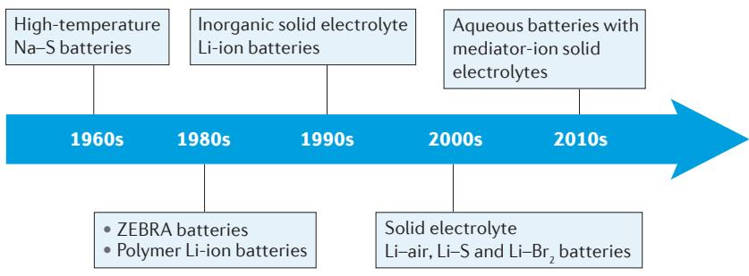  
Figure 1 | A historical outline of the development of solid-state electrolyte batteries. The timeline shows the key developments in solid-state electrolyte batteries.

In the 1980s, sodium-ion-conductive  $\beta$ -alumina was used in another type of high-temperature battery system, the ZEBRA cell, in South Africa[22,23]. So far, the high-temperature sodium-sulfur battery has been commercialized in Japan[24], whereas the ZEBRA battery is currently being developed by the General Electric Corporation in the United States[25]. Since 1980, the term solid-state ionics has received wide use, and a journal with the same name was launched in that year. From that time, both inorganic and organic (that is, polymer) solid-state electrolytes have received increasing attention. Along with the development of materials and theories, solid-state electrolytes have gradually been incorporated as essential components into a wide range of electrochemical devices, such as sensors, supercapacitors, fuel cells and batteries[26-28]. Beginning in the twenty-first century, the focus of solid-state ionics research has been on understanding the ionic transport mechanism with advanced characterization tools, exploring new superionic conductors, improving the performance of electrochemical devices based on solid electrolytes and realizing new applications with ionic transport in solid materials[29,30].

Incorporation of solid-state electrolytes into ambient-temperature batteries was originally motivated by concerns over the safety of lithium-ion batteries. With flammable organic electrolytes, overcharging or short-circuiting of a lithium-based cell is a fire hazard and can lead to an explosion[31]; cases of lithium-ion battery explosions have been reported throughout the world. The solid-state electrolytes used in lithium-ion batteries belong mainly to two classes of material: lithium-ion-conductive polymers and inorganic lithium-ion-conductive ceramics. Attempts to use solid-state polymer electrolytes in lithium-based batteries began in the 1980s after the discovery of lithium-ion conduction in a PEO-based system[21,32-34]. Following this discovery, various lithium-ion conductive polymer materials, such as poly(acrylonitrile) (PAN)[35,36], poly(methyl methacrylate) (PMMA)[37,38] and poly(vinylidene fluoride) (PVDF)[39], have been increasingly exploited for the development of all-solid-state polymer lithium-ion batteries. Inorganic solid-state electrolytes have also been used in lithium-ion battery research since the 1990s, after a lithium phosphorus oxynitride (LiPON) material was fabricated as a thin film by Oak Ridge National Laboratory[40,41]. Inspired by the discovery of LiPON, much effort has been made towards the development of inorganic lithium-ion

conductive ceramic materials, such as perovskite-type $^{42}$ , sodium superionic conductor (NASICON)-type $^{43,44}$ , garnet-type $^{45-47}$  and sulfide-type materials $^{48,49}$ .

Since the 2000s, solid electrolytes have been used in emerging lithium batteries with gaseous or liquid cathodes, such as lithium-air batteries $^{50,51}$ , lithium-sulfur batteries $^{52,53}$  and lithium-bromine batteries $^{54,55}$ . Solid-electrolyte sodium-ion batteries that operate at ambient temperatures have also been demonstrated $^{56}$ . Most recently, a unique 'mediator-ion' battery concept has been proposed, in which solid electrolytes are used for the development of high-energy, low-cost, aqueous electrochemical energy storage systems $^{57-59}$ .

In the following sections, we provide a succinct introduction to solid-state electrolytes and discuss both their ion-transport mechanisms and fundamental properties in the context of electrochemical energy storage applications. We then focus on recent advances in a range of battery chemistries and technologies that have been enabled by solid-state electrolytes, including all-solid-state lithium-ion batteries; emerging lithium-air, lithium-sulfur and lithium-bromine batteries with solid-state electrolytes; and a new aqueous battery concept enabled by a mediator-ion solid electrolyte. Finally, the challenges and future prospects for solid-electrolyte battery chemistries and technologies are outlined.

# Mechanism of ionic transport in solids

In crystalline solid materials, ionic transport generally relies on the concentration and distribution of defects. Ion diffusion mechanisms based on Schottky and Frenkel point defects include the simple vacancy mechanism and relatively complicated diffusion mechanisms, such as the divacancy mechanism, interstitial mechanism, interstitial-substitutional exchange mechanism and the collective mechanism[60-62]. However, some materials with special structures can achieve high ionic conductivities without a high concentration of defects. Such structures normally consist of two sublattices, a crystalline framework composed of immobile ions and a sublattice of mobile species. To achieve fast ionic conduction, three minimum criteria must be fulfilled for this kind of structure[63,64]: the number of equivalent (or nearly equivalent) sites available for the mobile ions to occupy should be much larger than the number of mobile species; the migration barrier energies between the adjacent available sites should be low enough for an ion to hop easily from one site to another; and these available sites must be connected to form a continuous diffusion pathway.

Similar to the diffusion process in a crystal structure, ionic transport in glassy materials starts with ions at local sites being excited to neighbouring sites and then collectively diffusing on a macroscopic scale[65]. For most glassy materials, short- and medium-range order still exists in the amorphous structure. The interaction between charge carriers and the structural skeleton cannot be neglected[66].

In polymer electrolytes, microscopic ion transport is related to the segmental motion of polymer chains above the glass transition temperature[67]. The segmental motion of the chains can create free volumes for the hopping of lithium ions that coordinate with the polar groups. A

lithium ion can hop from one coordinating site to another coordinating site, accompanying the segmental motion of polymer chains[67-69]. Under an electrical field, long-distance transport is realized by continuous hopping. The number of free ions depends on the dissociation ability of the lithium salt in the polymer.

# State-of-the-art solid electrolytes

Ionic conductivity is a key property for solid electrolytes. However, for practical application in electrochemical energy storage and conversion systems, other properties are also important. The main properties required for solid-state electrolytes are: high ionic conductivity, low ionic area-specific resistance, high electronic area-specific resistance, high ionic selectivity, a wide electrochemical stability window, good chemical compatibility with other components, excellent thermal stability, excellent mechanical properties, simple fabrication processes, low cost, easy device integration and environmental friendliness $^{4,8,70-72}$ . Much progress has been made in improving the properties mentioned above, both with inorganic and organic (polymer) solid-electrolyte materials. TABLE 1 gives a summary of existing solid electrolytes, and the properties of these solid electrolyte materials are visualized in the radar plots in FIG. 2. In the following subsections, we discuss the state-of-the-art solid electrolyte materials that are being actively investigated for solid-state batteries.

# Inorganic solid electrolytes

The main inorganic solid electrolytes that are being explored for solid-state batteries are perovskite-type, NASICON-type, garnet-type and sulfide-type materials. The representative perovskite solid electrolyte is  $\mathrm{Li}_{3x}\mathrm{La}_{2/3-x}\mathrm{TiO}_3$ , which exhibits a lithium-ion conductivity exceeding  $10^{-3}\mathrm{Scm}^{-1}$  at room temperature[42]. Although this material created much interest among researchers, it has been deemed unsuitable in lithium batteries because of the reduction of  $\mathrm{Ti}^{4+}$  on contact with lithium metal.

NASICON-type compounds were first studied in the  $1960s^{73}$  and were termed 'NASICON' in 1976 after the development of  $\mathrm{Na}_{1 + x}\mathrm{Zr}_2\mathrm{Si}_x\mathrm{P}_{3 - x}\mathrm{O}_{12}$  (REF. 43). These materials generally have an  $\mathrm{AM}_2(\mathrm{PO}_4)_3$  formula with the A site occupied by Li, Na or K. The M site is usually occupied by Ge, Zr or Ti (REF. 74). In particular, the  $\mathrm{LiTi}_2(\mathrm{PO}_4)_3$  system has been widely investigated. The ionic conductivity of  $\mathrm{LiZr}_2(\mathrm{PO}_4)_3$  is very low, but can be improved by the substitution of Hf or Sn (REFS 75,76). This can be further enhanced with substitution to form  $\mathrm{Li}_{1 + x}\mathrm{M}_x\mathrm{Ti}_{2 - x}(\mathrm{PO}_4)_3$  ( $\mathrm{M} = \mathrm{Al}$ , Cr, Ga, Fe, Sc, In, Lu, Y or La), with Al substitution having been demonstrated to be the most effective[77-80]. The  $\mathrm{Li}_{1 + x}\mathrm{Al}_x\mathrm{Ge}_{2 - x}(\mathrm{PO}_4)_3$  system has also been widely investigated because of its relatively wide electrochemical stability window[81-83]. NASICON-type materials are considered as suitable solid electrolytes for high-voltage solid electrolyte batteries.

Table 1 | Summary of lithium-ion solid electrolyte materials  

<table><tr><td>Type</td><td>Materials</td><td>Conductivity (S cm-1)</td><td>Advantages</td><td>Disadvantages</td></tr><tr><td>Oxide</td><td>Perovskite Li3.3La0.56TiO3, NASICON LiTi2(PO4)3, LISICON Li14Zn(GeO4)4 and garnet Li7La3Zr2O12</td><td>10-5-10-3</td><td>·High chemical and electrochemical stability ·High mechanical strength ·High electrochemical oxidation voltage</td><td>·Non-flexible ·Expensive large-scale production</td></tr><tr><td>Sulfide</td><td>Li2S-P2S5, Li2S-P2S5-MSx</td><td>10-7-10-3</td><td>·High conductivity ·Good mechanical strength and mechanical flexibility ·Low grain-boundary resistance</td><td>·Low oxidation stability ·Sensitive to moisture ·Poor compatibility with cathode materials</td></tr><tr><td>Hydride</td><td>LiBH4, LiBH4-LiX (X=Cl, Br or I), LiBH4-LiNH2, LiNH2, Li3AlH6 and Li2NH</td><td>10-7-10-4</td><td>·Low grain-boundary resistance ·Stable with lithium metal ·Good mechanical strength and mechanical flexibility</td><td>·Sensitive to moisture ·Poor compatibility with cathode materials</td></tr><tr><td>Halide</td><td>Lil, spinel Li2Znl4 and anti-perovskite Li3OCl</td><td>10-8-10-5</td><td>·Stable with lithium metal ·Good mechanical strength and mechanical flexibility</td><td>·Sensitive to moisture ·Low oxidation voltage ·Low conductivity</td></tr><tr><td>Borate or phosphate</td><td>Li2B4O7, Li3PO4and Li2O-B2O3-P2O5</td><td>10-7-10-6</td><td>·Facile manufacturing process ·Good manufacturing reproducibility ·Good durability</td><td>·Relatively low conductivity</td></tr><tr><td>Thin film</td><td>LiPON</td><td>10-6</td><td>·Stable with lithium metal ·Stable with cathode materials</td><td>·Expensive large-scale production</td></tr><tr><td>Polymer</td><td>PEO</td><td>10-4(65-78°C)</td><td>·Stable with lithium metal ·Flexible ·Easy to produce a large-area membrane ·Low shear modulus</td><td>·Limited thermal stability ·Low oxidation voltage (&lt;4V)</td></tr></table>

LiPON, lithium phosphorus oxynitride; LISICON, lithium superionic conductor; NASICON, sodium superionic conductor; PEO, poly(ethylene oxide).

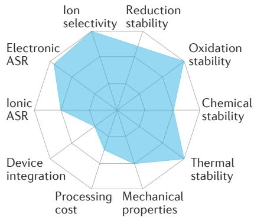  
a Oxide

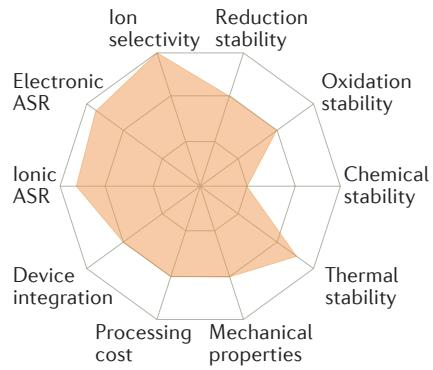  
b Sulfide

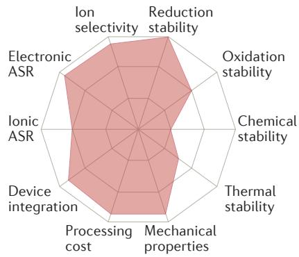  
C Hydride

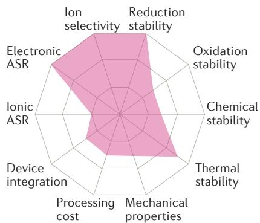  
d Halide

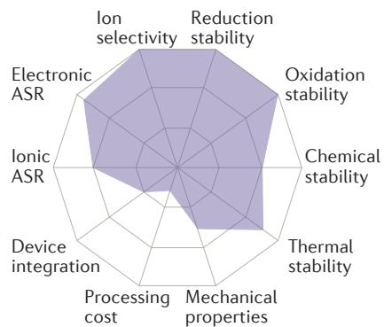  
e Thin film

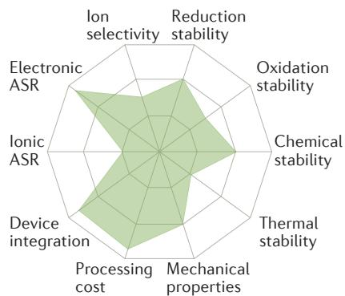  
f Polymer  
Figure 2 | Performance of different solid electrolyte materials. Radar plots of the performance properties of oxide solid electrolytes (panel a), sulfide solid electrolytes (panel b), hydride solid electrolytes (panel c), halide solid electrolytes (panel d), thin-film electrolytes (panel e) and polymer solid electrolytes (panel f). ASR, area-specific resistance.

Garnet-type materials have the general formula  $\mathrm{A}_3\mathrm{B}_2\mathrm{Si}_3\mathrm{O}_{12}$ , in which the A and B cations have eightfold and sixfold coordination, respectively. Since it was first discovered in 1969  $(\mathrm{Li}_3\mathrm{M}_2\mathrm{Ln}_3\mathrm{O}_{12}(\mathrm{M} = \mathrm{W}$  or Te) $^{46}$ , a series of garnet-type materials has been developed, the representative systems being  $\mathrm{Li}_5\mathrm{La}_3\mathrm{M}_2\mathrm{O}_{12}$ $(\mathbf{M} = \mathbf{N}\mathbf{b}$  or Ta),  $\mathrm{Li}_6\mathrm{Al}\mathrm{a}_2\mathrm{M}_2\mathrm{O}_{12}$ $(\mathbf{A} = \mathbf{Ca}$ , Sr or Ba;  $\mathbf{M} = \mathbf{N}\mathbf{b}$  or Ta),  $\mathrm{Li}_{5.5}\mathrm{La}_3\mathrm{M}_{1.75}\mathrm{B}_{0.25}\mathrm{O}_{12}$ $(\mathbf{M} = \mathbf{N}\mathbf{b}$  or Ta;  $\mathbf{B} = \mathbf{In}$  or Zr) and the cubic systems  $\mathrm{Li}_7\mathrm{La}_3\mathrm{Zr}_2\mathrm{O}_{12}$  and  $\mathrm{Li}_{7.06}\mathrm{M}_3\mathrm{Y}_{0.06}\mathrm{Zr}_{1.94}\mathrm{O}_{12}(\mathbf{M} = \mathbf{L}\mathbf{a},\mathbf{N}\mathbf{b}$  or Ta) $^{84-88}$ . A high ionic conductivity of  $1.02\times 10^{-3}\mathrm{Scm^{-1}}$  has been realized with  $\mathrm{Li}_{6.5}\mathrm{La}_3\mathrm{Zr}_{1.75}\mathrm{Te}_{0.25}\mathrm{O}_{12}$  at room temperature $^{89}$ .

Research into sulfide-type solid electrolytes started in 1986 with the  $\mathrm{Li}_2\mathrm{S - SiS}_2$  system[48,49]. Since then,  $\mathrm{Li}_2\mathrm{S - SiS}_2$  type electrolytes have been extensively studied[90-92]. The highest reported conductivity in this type of material is  $6.9\times 10^{-4}\mathrm{Scm}^{-1}$ , which was achieved by doping the  $\mathrm{Li}_2\mathrm{S - SiS}_2$  system with  $\mathrm{Li}_3\mathrm{PO}_4$  (REF. 90). In 2001, a class of thio-LISICON (LISICON, lithium superionic conductor) crystalline material was found in the  $\mathrm{Li}_2\mathrm{S - P}_2\mathrm{S}_5$  system[93], which has now been widely reported to exhibit a high lithium-ion conductivity[93-97]. However, the chemical stability of the  $\mathrm{Li}_2\mathrm{S - P}_2\mathrm{S}_5$  system is poor, and the material is sensitive to moisture (that is, it generates gaseous  $\mathrm{H}_2\mathrm{S}$ ). The stability can be improved by the addition of metal oxides, and the presence of oxygen atoms in the  $\mathrm{Li}_2\mathrm{S - P}_2\mathrm{S}_5$  system reduces the interfacial resistance between the cathode (metal oxide) and the sulfide electrolyte[98-100].

# Polymer and composite solid electrolytes

The development of polymer electrolytes for lithium batteries can be divided into three classes: dry solid polymer electrolytes, gel polymer electrolytes and composite polymer electrolytes. However, as gel polymers are not in the solid state, they will not be discussed here. In dry solid polymer electrolytes, the polymer host together with a lithium salt acts as a solid solvent (without any liquid) $^{101-104}$ . However, the ionic conductivity of dry polymer systems is very low at ambient temperatures. Composite polymer electrolytes, developed by the integration of ceramic fillers into the organic polymer host, help to improve the conductivity by decreasing the glass transition temperatures $^{105-107}$ . The polymer hosts of the composite polymer electrolytes are commonly PEO, PAN, PMMA, poly(vinyl chloride) (PVC) or PVDF $^{108-112}$ , with PEO being the most widely used. Generally, the ceramic fillers are classified as either active or passive. Active filler materials (for example,  $\mathrm{Li}_2\mathrm{N}$  and  $\mathrm{LiAlO}_2$  (REFS 113-115)) are partially involved in ionic conduction, whereas inactive filler materials (for example,  $\mathrm{Al}_2\mathrm{O}_3$ ,  $\mathrm{SiO}_2$  and  $\mathrm{MgO}$  (REFS 116-118)) do not participate in ionic transport.

# Thin-film solid electrolytes

Some solid electrolyte materials can be fabricated as ultrathin films through special vapour deposition techniques, such as pulsed laser deposition, radio frequency sputtering and chemical vapour deposition.

Thin-film solid electrolytes were first developed in the 1980s with  $\mathrm{Li}_{12}\mathrm{Si}_3\mathrm{P}_2\mathrm{O}_{20},\mathrm{Li}_4\mathrm{P}_2\mathrm{S}_7$  and  $\mathrm{Li}_3\mathrm{PO}_4 - \mathrm{P}_2\mathrm{S}_5$  used as starting materials[119-122]. In the 1990s, Oak Ridge National Laboratory reported an important advance for a LiPON-based thin-film solid electrolyte, which was then the standard electrolyte for thin-film batteries[123-125]. Another series of thin-film solid electrolytes based on lithium borate, lithium phosphate and lithium borophosphate glasses have recently been considered as potential candidates to replace LiPON; these new electrolytes have several manufacturing advantages at the industry level[126-129]. Recently, atomic layer deposition has emerged as the premier deposition process for the fabrication of uniform, conformal, thin films. This technique has since been used for the fabrication of other solid electrolytes, including  $(\mathrm{Li},\mathrm{La})_x\mathrm{Ti}_y\mathrm{O}_z,\mathrm{Li}_3\mathrm{PO}_4,\mathrm{Li}_x\mathrm{Al}_2\mathrm{O}_3,\mathrm{Li}_x\mathrm{Si}_y\mathrm{Al}_2\mathrm{O}_3$  and LiPON[130-135].

# Batteries with solid electrolytes All-solid-state lithium-ion batteries

All-solid-state lithium-ion batteries, which offer higher energy densities than the traditional batteries, are considered as one of the most important next-generation technologies for energy storage. The solid electrolyte not only sustains lithium-ion conduction but also acts as the battery separator (FIG. 3a). Cathode materials used in all-solid-state lithium-ion batteries are similar to those in the traditional lithium-ion batteries (for example, lithium transition metal oxides $^{136-139}$  and sulfides $^{140,141}$ ). The most common anode materials are lithium metal, lithium alloys and graphite $^{142-147}$ . Depending on the solid electrolytes used, all-solid-state lithium-ion batteries can be classified as either inorganic solid-electrolyte batteries or polymer batteries $^{148}$ . Inorganic solid electrolytes are generally stable and non-flammable, which is the ultimate solution to the safety issues associated with lithium-ion batteries $^{149,150}$ . In general, inorganic solid-electrolyte batteries have a relatively wide electrochemical stability window (in comparison to traditional liquid-phase electrolytes), which allows the batteries to operate over a wider voltage range. However, there are exceptions: for example, the NASICON-type  $\mathrm{Li}_{1+x}\mathrm{Al}_x\mathrm{Ti}_{2-x}(\mathrm{PO}_4)_3$  (LATP) material has a limited electrochemical stability window, which will be discussed later in the context of the lithium-sulfur battery system. At present, the main inorganic solid electrolytes developed for all-solid-state lithium-ion batteries, which have already been discussed, are oxide and sulfide solid electrolytes because of their high ionic conductivity (some of them exhibit ionic conductivity comparable to or higher than that of liquid electrolytes) $^{11,70}$ . Although some inorganic solid electrolytes that exhibit the same level of conductivity as organic liquid electrolytes have been discovered, the performance of all-solid batteries based on these electrolytes is still inferior to that of commercially available lithium-ion batteries. Several key challenges remain to be addressed: for example, volume change in the electrode materials, large interfacial (electrode/electrolyte) resistance, low mass ratio of the electrode-active materials and poor cycling stability.

One of the most important problems that urgently needs to be overcome is how to enhance the ionic

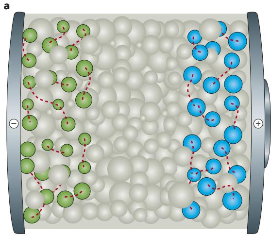

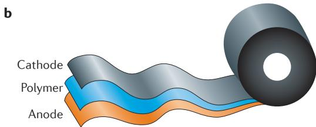  
Figure 3 | All-solid-state batteries. Schematic representations of an inorganic solid electrolyte (panel a) and a solid polymer electrolyte (panel b). The green, blue and grey spheres in panel a represent the active anode, active cathode and solid-electrolyte materials, respectively.

conductivity at the interface of the electrode and the solid electrolyte. However, investigations focusing on lithium-ion migration and diffusion behaviour across the interface, as well as the mechanical and structural stability of the solid-electrolyte interphase in inorganic all-solid-state batteries are still limited. Therefore, submolecular-scale and atomic-level understanding of the interface is essential. Another important factor that affects the ionic interface is the mechanical properties of the solid electrolyte[151]. During the cycling of the batteries (charging and discharging), the active electrodes generally experience structural fragmentation, resulting in capacity fade[152]. A solid electrolyte with a low elastic modulus is always preferred, because this reduces the extent of fragmentation of the electrode materials. For battery assembly, fabrication and manufacturing, the interfacial contact between the active electrode and the solid electrolyte can be an extremely important factor for the overall battery performance. In general, the malleability and the ductility of both the solid electrolyte and the electrodes can have a pronounced influence on the contact condition at the electrode/electrolyte interface. Taking the LiPON solid electrolyte as an example, lithium-ion transport is usually hampered by the interface, and the high elastic modulus and hardness of LiPON resists the incursion of lithium dendrites[153]. Therefore, for the lithium-metal/electrolyte interface, the solid electrolyte should, in principle, be hard enough to resist lithium metal dendrites. In a practical sense, a complex solid-electrolyte interphase forms on the metal surface, which may also affect the ionic conduction properties

of the anode/electrolyte interface. Therefore, suitable approaches to anode (for example, lithium) protection are required to enhance the overall cell performance of all-solid-state batteries $^{154}$ .

Polymer-based all-solid-state lithium-ion batteries have the advantages of easy fabrication, high levels of safety and a flexible shape[155] (FIG. 3b). The disadvantages of polymer batteries are the instability of the electrode/electrolyte interface, the narrow operating temperatures of the polymer electrolytes and their weak mechanical stability[156,157]. A PEO electrolyte is still the best option owing to its high ionic conductivity and good stability in the presence of lithium metal. However, cathode materials with a high energy density, such as  $\mathrm{LiCoO}_2$  and  $\mathrm{LiNi}_{0.5}\mathrm{Mn}_{1.5}\mathrm{O}_4$ , cannot be used with PEO-based batteries because of the low electrochemical stability of the PEO electrolyte. Therefore,  $\mathrm{LiFePO_4}$  cathodes are generally used with PEO. The combination of a polymer electrolyte and an inorganic solid electrolyte can offer strategies to improve the performance of all-solid-state lithium-ion batteries. For example, a polymer/inorganic/polymer sandwich electrolyte architecture can modify the double-layer electrical field at the electrode/polymer interface and block anion transport, leading to an improvement in the Coulombic efficiency of the battery[158]. Thin-film batteries based on the LiPON solid electrolyte have achieved over 10,000 cycles with a lithium-metal anode and a  $4.8\mathrm{V}$ $\mathrm{LiNi}_{0.5}\mathrm{Mn}_{1.5}\mathrm{O}_4$  cathode, thus demonstrating the advantages of using a solid electrolyte[159]. However, the capacities of thin-film batteries are very low, ranging from  $0.1\mu\mathrm{Ah}$  to  $10\mathrm{mAh}$ , and do not meet the requirements of most applications.

The primary goal for the further development of all-solid-state lithium-ion batteries is to achieve, at an affordable cost, both higher cycling and safety performance in comparison to traditional lithium-ion batteries, while maintaining similar or higher power and energy densities. However, achieving these goals is a daunting challenge. To overcome the key problem of how to fabricate a favourable solid/solid interface between the solid electrode and the solid electrolyte, three aspects need to be considered: the wetting properties of the solid materials, the solid/solid interfacial stability and the transport speed of ions across the interface. The contact area between the electrode and the electrolyte greatly affects the interfacial resistance. For most electrode materials, a volume change cannot be avoided during cycling, and this results in strain and stress in the electrode layer that may change the structure of the electrode/electrolyte interface and weaken the connection between them. To eliminate or alleviate the interfacial strain and stress, a deeper understanding and proper management of the electrode/electrolyte interface behaviour are of importance. Understanding the strain and stress behaviour within the electrode would also be instructive for managing the electrode/electrolyte interface. Some attention has recently been devoted to the investigation of the strain in olivine-type cathode materials (that is,  $\mathrm{LiFePO_4}$  [160-162]. These studies suggested that the lattice strain could strongly influence the rate capability of the cathodes, owing to an increase in lithium-ion conductivity and a

decrease in blocking defects $^{160-162}$ . These findings provide important information and instructions for the optimization of high-rate cathodes, especially for the growing interest in developing solid-state thin-film lithium-ion batteries. In addition to the volume change, poor chemical compatibility may give rise to a passive layer with high resistance during cycling, while the electric field at the interface may accelerate chemical diffusion. The interface should be able to withstand high strain and stress, as well as the strong electric field.

Solid electrolytes with liquid or gaseous electrodes Lithium-air batteries. Lithium-air batteries, which are based on the high intrinsic capacity of both the lithium anode and the air cathode together with the high operating voltage of the lithium-oxygen electrochemical couple, can yield an exceptionally high theoretical energy density of  $\sim 11,680\mathrm{Whkg^{-1}}$  (which almost rivals that of petrol (gasoline) at  $13,000\mathrm{Whkg^{-1}}$ ). The first report of a rechargeable lithium-oxygen battery was in 1987 and described a configuration similar to that of a solid-oxide fuel cell[163]. In the subsequent decade, there was little activity in this area. The demonstration in 1996 of a new type of rechargeable lithium-air battery with an aprotic electrolyte[164] led to a resurgence of research into this battery system[165-168]. However, with an aprotic electrolyte, lithium-oxygen batteries suffer from problems such as degradation of the non-aqueous electrolyte in the ambient atmosphere and the blockage of air diffusion in the porous cathode by the insoluble discharge products[169-172].

To address the above issues, both all-solid-state lithium-ion batteries (based on inorganic electrolytes)[173] and a lithium-air battery concept with a 'dual-electrolyte' (termed a hybrid lithium-air battery) were proposed. In the hybrid batteries, an organic electrolyte is used at the anode side (anolyte) and an aqueous electrolyte at the cathode side (catholyte), with the two electrolytes separated by a solid-state electrolyte membrane[50,51,174,175 (FIG. 4a). Both polymer-based (for example, PEO) and inorganic-oxide-based (for example,  $\mathrm{Li}_{1 + x + y}\mathrm{Al}_x\mathrm{Ti}_{2 - x}\mathrm{P}_{3 - y}\mathrm{Si}_y\mathrm{O}_{12}$  (LATP)) solid electrolytes have been tested as separators in these dual-electrolyte lithium-air batteries[176-187]. Depending on the chemistry of the air cathode, the catholytes used in dual-electrolyte lithium-air batteries can be classified as either acidic or basic. Two early examples of cell systems presented in 2010 are[170] Li/organic-electrolyte || LATP || KOH(aq.)/ $\mathrm{Mn}_3\mathrm{O}_4$  and Li/PEO-LiTFSI || LATP || CH3COOH-CH3COOLi(aq.)/Pt, where LiTSFI is lithium bis(trifluoromethane) sulfonimide.

In neutral and basic electrolyte lithium-air cells, unavoidable problems are caused largely by the formation of LiOH at the cathode. Because of the low solubility of LiOH, the over-saturated LiOH solid can clog the gas diffusion pores of the air cathode and the lithium-ion channels on the surface of the solid electrolyte (for example, LATP) membrane. In addition,  $\mathrm{CO}_{2}$  from air can react with LiOH to form  $\mathrm{Li}_{2}\mathrm{CO}_{3}$  and deactivate the alkaline catholyte[188]. With an acidic catholyte, these problems can be overcome[177,181,184,185]. However, weak acids (for example,  $\mathrm{CH}_3\mathrm{COOH}$ ,  $\mathrm{H}_3\mathrm{PO}_4$  or  $\mathrm{LiH}_2\mathrm{PO}_4$ ) must be used

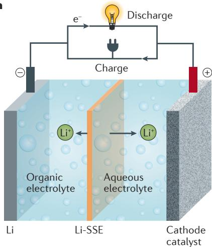  
a  
Figure 4 | Dual-electrolyte lithium-air batteries. a | Schematic diagram of a dual-electrolyte lithium-air battery with an organic anode electrolyte (anolyte) and an aqueous cathode electrolyte (catholyte). The anolyte and catholyte are separated by a solid-state electrolyte (SSE). b | Summarization of the anode and cathode reactions, as well as the open-circuit voltages (OCVs) of the cell of a dual-electrolyte lithium-air battery with either an alkaline or an acidic catholyte. c | Schematic diagram of a dual-electrolyte lithium-air battery with a decoupled cathode in which the oxygen reduction reaction (ORR) and oxygen evolution reaction (OER) electrodes are separated.

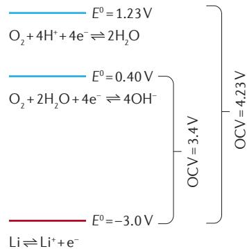  
b

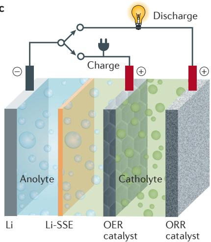  
c

because strong acids (for example, HCl,  $\mathrm{HNO}_3$  or  $\mathrm{H}_2\mathrm{SO}_4$ ) make the solid electrolyte membrane vulnerable to corrosion[175,177,181,184,185,189]. As discharge progresses, the acidity of the catholyte becomes weaker, which is beneficial for minimizing corrosion of the solid electrolyte.

The cathode reactions of cells with neutral, basic and acidic catholytes are summarized in FIG. 4b. The theoretical oxygen reduction reaction (ORR) potentials (FIG. 4b) of neutral or basic catholytes (for alkaline-cathode lithium-air batteries) or acidic catholytes (for acidic-cathode lithium-air batteries) are 0.40 and  $1.23\mathrm{V}$ , respectively. Acidic catholytes have three main advantages over alkaline catholytes for operating dual-electrolyte lithium-air batteries: they avoid the problems associated with solid  $\mathrm{LiOH}$ , avoid  $\mathrm{CO}_{2}$  contamination and enhance the cell voltage.

Traditionally, in a lithium-air battery, a bifunctional air electrode serves as both the ORR and oxygen evolution reaction (OER) catalyst. Such a cell design has the persistent problem of carbon corrosion during the high-voltage OER process, limiting the cycle life of hybrid lithium-air batteries. To overcome carbon corrosion during the OER, a concept in which the ORR and OER electrodes are decoupled was proposed and has been applied recently to hybrid lithium-air batteries. A second electrode consisting of a catalyst directly supported on a metal mesh (for example, nickel, stainless steel or titanium) served as the OER electrode and was independent of the ORR electrode (FIG. 4c). This decoupled design greatly enhanced the cycle life of hybrid lithium-air batteries $^{177,182}$ .

Lithium-sulfur batteries. Rechargeable battery systems based on non-aqueous lithium-sulfur chemistry have received overwhelming attention in the past few years. With an anode capacity of  $\sim 3,800\mathrm{mA}\mathrm{g}^{-1}$  and a cathode capacity of  $\sim 1,675\mathrm{mA}\mathrm{g}^{-1}$ , the lithium-sulfur battery system can theoretically yield a high energy density of

$\sim 2,600 \mathrm{Wh} \mathrm{kg}^{-1}$  (on the basis of the active lithium anode and sulfur cathode) with an operating voltage of  $\sim 2.0 \mathrm{~V}$  (REFS 190-194). Because of the cost reduction resulting from the use of a sulfur cathode, high-energy-density lithium-sulfur batteries are promising candidates to succeed lithium-ion batteries in a range of applications, including portable electronic devices, electric vehicles and grid-scale energy storage[195-199]. However, despite the significant progress made through many years of research, this battery technology still faces considerable technical challenges. Unlike those in traditional lithium-ion batteries, the charge and discharge processes of a lithium-sulfur system involve a series of soluble intermediate products, which exist in various forms of polysulfide dissolved in the non-aqueous liquid electrolyte. Under the working conditions (for charge and discharge) of lithium-sulfur batteries, the soluble polysulfide species tend to migrate from the cathode through the conventional porous separator to chemically react with lithium metal at the anode. This 'polysulfide shuttle' behaviour severely reduces the feasibility of an active sulfur electrode, lowers the cycling efficiency of the cells and induces capacity fade during cycling. In addition, use of a lithium-metal anode in lithium-sulfur batteries would unavoidably lead to the additional persistent problem of lithium dendrite formation and would consequently present a safety hazard if a conventional porous separator is used. These two problems — the polysulfide shuttle and cell-shorting by lithium dendrites — are the most important challenges for lithium-sulfur battery technology.

Great effort has been expended to address the issue of the polysulfide shuttle through the encapsulation of the polysulfide species in the cathode $^{200-209}$ , including the development of new cathode structures, advanced cell configurations and enhanced interactions of polysulfide species with the cathode matrix. Unfortunately, these approaches only alleviate polysulfide diffusion to a certain extent.

To circumvent the diffusion of polysulfide species completely, an alternative separator approach is needed. Overcoming the lithium-dendrite problem also requires the development of alternative separator strategies.

Progress made with lithium-ion batteries using inorganic lithium-ion-conductive solid electrolytes has also shed light on lithium-sulfur batteries. Solid electrolytes not only provide the possibility of preventing polysulfide diffusion, but are also able to block dendrite growth at the lithium-metal anode. Research on solid electrolyte lithium-sulfur batteries has undergone two main phases. The first phase involved integrating the solid electrolyte into lithium-sulfur cells according to an 'all-solid-state' development principle[94,210,211] (FIG. 5a). However, the reported cell-performance data were unsatisfactory, especially in terms of rate capability, sulfur-cathode utilization and cyclability[212-214]. This is mainly because of the sluggish kinetics of ionic transport either in the sulfur cathode or at the electrode/electrolyte interface. Owing to the unique electrochemical process of the lithium-sulfur battery, and the poor electronic and lithium-ion conductivities of sulfur and the polysulfides formed (even with the solid-state electrolyte), a liquid electrolyte seemed, until recently, necessary in the sulfur cathode to ensure a favourable medium for facile ionic

transport and electrical interaction between the sulfur species (elemental sulfur, polysulfides or sulfide) and the cathode materials.

In the second, recent phase of development, a dual-electrolyte (or hybrid-electrolyte) approach was proposed to address the problems outlined above[52,53,215] (FIG. 5b). In the dual-electrolyte lithium-sulfur battery system, the lithium-ion-conductive solid-state electrolyte acts as: a separator to insulate the lithium-metal anode and the sulfur cathode; a lithium-ion conductor to sustain an ionic path for the electrochemical reactions at the two electrodes; and a shield to prevent polysulfide migration. The liquid electrolyte in the cathode not only provides an ionic medium for the sulfur-polysulfide-sulfide redox reactions within the cathode, but also maintains a facile lithium-ion path at the cathode/solid-electrolyte interface.

As previously discussed, in a solid-electrolyte battery system there has always been the technical challenge of building a facile lithium-ion path at the electrolyte/electrode interface. This problem is prevalent in solid-electrolyte lithium-sulfur batteries, together with the difficulty of maintaining ideal surface contact between the lithium-metal anode and the solid electrolyte membrane. Initial approaches (such as the addition of a liquid-electrolyte

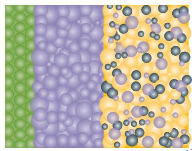  
a  
Li Li-SSE S C

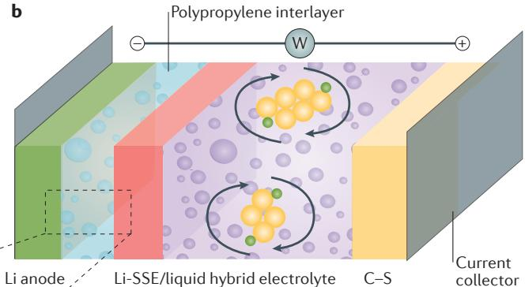  
b

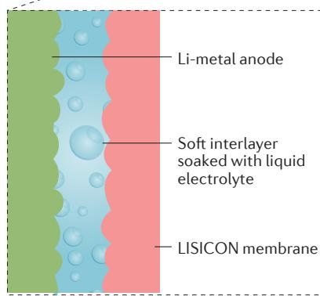  
c

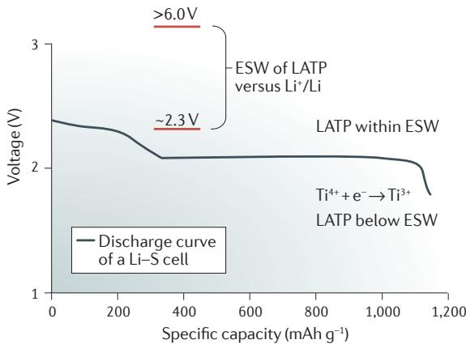  
d  
Figure 5 | Lithium-sulfur batteries based on solid electrolytes. a | Schematic diagram of an all-solid-state lithium-sulfur battery. b | Schematic diagram of a hybrid Li||Li-solid-state electrolyte (SSE) || sulfur cell with a lithium-metal anode, a Li-SSE/liquid hybrid electrolyte and a sulfur-carbon composite cathode. The yellow spheres represent the soluble polysulfide species and the green spheres represent  $\mathsf{L}\mathsf{i}^{+}$ ions. Because the Li-SSE prevents migration of polysulfides from the cathode to the anode, the polysulfides move within the cathode of the cell as schematically shown by the arrows. c | Schematic diagram of a membrane-electrode assembly for a hybrid Li || Li-SSE || sulfur battery. d | Discharge voltage of a lithium-sulfur cell versus the electrochemical stability window (ESW) of a LATP  $(\mathrm{Li}_{1 + x}\mathrm{Al}_x\mathrm{Ti}_{2 - x}(\mathrm{PO}_4)_3)$  solid electrolyte.

buffer at the lithium/solid-electrolyte interface or mechanically pressing the lithium metal to the solid electrolyte) were not able to provide a satisfactory solution. An interlayer approach was then proposed, in which a liquid-electrolyte-soaked polymer is inserted between the lithium and solid electrolytes (FIG. 5c). This approach solved the interfacial problem and ensured cyclability[53,216].

Hybrid-electrolyte lithium-sulfur batteries were initially demonstrated with a commercially available NASICON-type  $\mathrm{Li}_{1 + x}\mathrm{Al}_x\mathrm{Ti}_{2 - x}(\mathrm{PO}_4)_3$  (LATP) solid electrolyte[52,53]. However, both electrochemical and chemical incompatibilities affect lithium-sulfur batteries owing to the easy reduction of  $\mathrm{Ti}^{4 + }$  ( $\sim 2.4\mathrm{V}$  versus  $\mathrm{Li^{+} / Li}$ ) in LATP. The  $\mathrm{Ti}^{4 + }$  in the LATP material can be either chemically reduced to  $\mathrm{Ti}^{3 + }$  by the polysulfide species or electrochemically reduced during the discharge of the lithium-sulfur battery (because the discharge voltage of lithium-sulfur cells is lower than the reduction potential of LATP, as illustrated in FIG. 5d). A recent study that involved the replacement of titanium by germanium suggests that this replacement could eliminate the compatibility issue; however, the cycling performances of the lithium-sulfur batteries with the  $\mathrm{Li}_{1 + x}\mathrm{Al}_x\mathrm{Ge}_{2 - x}(\mathrm{PO}_4)_3$  (LAGP) solid electrolyte are still not satisfactory[217]. In addition, the high cost of germanium is also problematic for its practical application. Most recently, an alternative NASICON-type solid electrolyte,  $\mathrm{Li}_{1 + x}\mathrm{Y}_x\mathrm{Zr}_{2 - x}(\mathrm{PO}_4)_3$  (LYZP), has been explored as a solid-electrolyte/separator in lithium-sulfur batteries. Although the lithium-ion conductivity of LYZP ( $\sim 3\times 10^{-5}\mathrm{Scm^{-1}}$ ) is lower than that of LATP, LYZP shows both favourable chemical and electrochemical compatibility with the cell components under the operating conditions of lithium-sulfur batteries. Integration of the LYZP solid electrolyte also greatly enhances cyclability[216].

Lithium-bromine batteries. The high gravimetric energy density of bromine as a liquid cathode has led to the exploration of lithium-bromine batteries $^{218}$ . A few different types of rechargeable lithium-bromine batteries

have been reported[218-222], which typically use an aqueous bromide solution cathode and a lithium-metal anode (usually coated with a protective layer), and are separated by a solid electrolyte (typically LATP), as depicted in FIG. 6a. The lithium-ion-conductive solid electrolyte was instrumental in the development of lithium-bromine batteries, because they require the complete separation of the liquid bromine from the highly active lithium-metal anode. In general, lithium-bromine battery systems include a non-aqueous anolyte to sustain the anode reaction and an aqueous catholyte to accommodate the cathode reaction. During discharge, the lithium metal in the non-aqueous anolyte is oxidized to lithium ions, which migrate towards the cathode through the lithium-ion-conductive solid electrolyte. Accordingly, the electrons travel through the external circuit to reach the cathode. At the surface of the cathode, bromine is reduced by the incoming electrons to form bromide ions  $(\mathrm{Br}^{-})$  and this is followed by fast complexation with bromine to form the more stable tribromide ions  $(\mathrm{Br}_{3}^{-})$ . The reactions are reversed during the charging process.

The positive bromine electrode usually provides fast redox kinetics and relatively good stability[218-222]. Lithium-bromine batteries can therefore be considered as an intermediate platform between lithium-ion batteries (that is, with a solid cathode and a relatively low energy density) and lithium-air batteries (with a gaseous cathode and a high energy density, but with many challenging problems). Until recently, the main challenge facing lithium-bromine batteries was the degradation of the solid electrolyte ceramic membrane during cell operation. Indeed, because of the strongly fuming and oxidative nature of bromine, the high vapour pressure that builds up in a closed static liquid cell can easily rupture the ceramic separator. The high vapour pressure of bromine also limits the concentration of the cathode solution that can be used. Most work has only considered dilute electrolytes, but a recent study[222] demonstrated that such problems can be avoided in

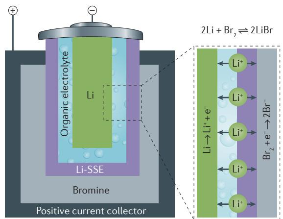  
a

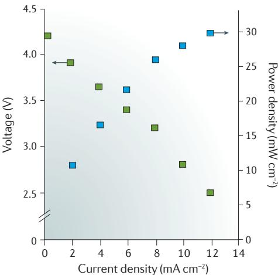  
b  
Figure 6 | Solid-state lithium-bromine batteries. a | Schematic diagram of a rechargeable lithium-bromine battery with a lithium-metal anode, an organic anode electrolyte, a solid-state electrolyte separator, and an aqueous catholyte (consisting of bromine and lithium bromide aqueous solution). b | Voltage and power density as a function of current density of a typical lithium-bromine battery with a  $\mathrm{Li}_{1 + x}\mathrm{Al}_x\mathrm{Ti}_{2 - x}(\mathrm{PO}_4)_3$  (LATP) solid electrolyte. Data from REF. 219.

an appropriately designed flow cell, thus allowing highly concentrated bromine/bromide catholytes to be used to develop more practical, high-specific-energy lithium-bromine batteries.

# Batteries with mediator-ion solid electrolytes

From practical and economic points of view of electrochemical energy storage technologies, aqueous battery systems generally offer an overall advantage over non-aqueous battery systems in terms of system maintenance, operation security, cost of the cell components and reliability. Among the aqueous batteries already developed (for example, zinc-manganese dioxide, nickel-metal hydride and nickel-cadmium batteries) or under development (for example, nickel-iron[223], zinc-silver oxide[224], zinc-nickel oxide[225], zinc-ferrate[226] and zinc-periodate[227] batteries), the anode and cathode are usually separated with a porous separator. An aqueous liquid electrolyte shuttling through the porous separator provides the ionic path to sustain the anode and cathode redox reactions. Under this cell operation principle, the electrodes (either the anode or cathode) of a cell must be in the solid phase and insoluble in the aqueous electrolyte to ensure that they do not migrate through the porous separator. In addition, the development of traditional porous-separator batteries is limited by two persistent issues: during charge-discharge of a cell, any soluble intermediate products formed could induce chemical crossover between the anode and the cathode; and for a metal-based anode, dendrite formation results in a short circuit of the cell.

In terms of materials cost and electrochemical energy conversion, many Earth-abundant or easily synthesized materials, either in the liquid or gas phase, show promise as active electrodes for the development of high-energy-density, low-cost and safe aqueous batteries. Unfortunately, with a conventional porous polymer separator, the cells suffer from the chemical crossover of liquid or gaseous electrode materials between the two electrodes, resulting in self-discharge and poor efficiency. These issues can be circumvented by using solid-electrolyte separators; however, at present, ambient-temperature solid electrolytes are limited to lithium- and sodium-ion-conductive materials, which are used predominantly in non-aqueous lithium-based or sodium-based batteries. Divalent-ion-based or trivalent-ion-based anode chemistries (for example, iron, zinc and aluminium) can be applied to the aqueous battery systems, but solid-state electrolytes capable of transporting divalent or trivalent ions are practically unavailable because of the higher charge and heavier mass of the ions[228,229]. Thus, it seems impossible to develop totally aqueous batteries (with an aqueous electrolyte for both the anode and the cathode) with the currently available alkali-metal-ion-conductive solid electrolytes.

During the past few years, lithium-ion-conductive solid electrolytes have been integrated into hybrid electrolyte batteries (with a non-aqueous anode electrolyte and an aqueous cathode electrolyte)[57-59]. Our group recently proposed and demonstrated a unique 'mediator-ion' strategy for the development of aqueous

batteries with the currently available alkali-metal-ion solid-electrolyte separators through management of the solid-electrolyte separators, the aqueous electrolyte at the anode (anolyte) and the aqueous electrolyte at the cathode (catholyte) $^{230}$ . The anode and cathode reactions of the redox couples are maintained by the shuttling of an alkali-metal (lithium or sodium) ion — the mediator ion — through the solid-state electrolyte between the catholyte and the anolyte. This unique battery-development strategy not only eliminates the chemical-crossover problem of the liquid or gaseous reactants, but also circumvents the metal-dendrite problem when a metal anode is used. Therefore, electrode materials in these batteries are not limited to the solid phase. Any liquid or gaseous materials with a high electrochemical capacity and a high operating voltage can be used as active electrode materials. In addition, this battery concept allows the use of a different anolyte and catholyte in a single cell, which is advantageous for optimizing the electrode capacity, cell voltage, overall energy density and component costs.

This battery concept has been demonstrated with two low-cost metal anodes (zinc and iron), two liquid-phase cathodes (bromine and potassium ferricyanide), one gas-phase cathode (air or oxygen), a sodium-ion solid electrolyte  $\mathrm{(Na_{3.4}Sc_2(PO_4)_{2.6}(SiO_4)_{0.4})}$  and a lithium-ion solid electrolyte  $\mathrm{(Li_{1 + x + y}Al_xTi_{2 - x}P_{3 - y}Si_yO_{12}}$  (LATP). These new battery systems are shown in FIG. 7, with the charge-discharge mechanisms illustrated for the  $\mathrm{Zn(LiOH)}$  || lithium-sulfur solid electrolyte || Br $_2$  (LiBr) system in FIG. 7b. The lithium-ion solid electrolyte in this zinc-bromine cell provides an ionic channel for mediator-ion  $(\mathrm{Li^{+}})$  transport rather than acting as a  $\mathrm{Zn^{2 + }}$ -ion-conductive medium. The lithium mediator ion balances the charge between the anode and the cathode rather than being directly involved in the electrode reactions during charge and discharge. During the discharge process, the zinc-metal anode is first oxidized to zinc ions  $(\mathrm{Zn^{2 + }})$ , which subsequently integrate with the negatively charged hydroxide ions  $(\mathrm{OH^{-}})$  to produce zincate ions  $[\mathrm{Zn(OH)_4}]^{2 - }$ . In an alkaline solution, soluble  $[\mathrm{Zn(OH)_4}]^{2 - }$  ions dissociate to form zinc oxide  $(\mathrm{ZnO},$  an insoluble solid) and water. At the cathode, the reduction of liquid bromine forms negatively charged bromide ions. To balance the ionic charge between the anolyte and catholyte, the lithium ions in the anolyte migrate through the lithium solid electrolyte from the anode to the cathode. During the charge process, the zincate ions are first reduced into zinc metal and hydroxide at the anode. Metallic zinc is then deposited onto the anode current collector. The hydroxide ions combine with lithium ions to form soluble LiOH in the anolyte. The bromide ions are subsequently oxidized to molecular bromine at the cathode. To sustain the ionic charge balance, lithium ions are transported in the opposite direction, from the cathode to the anode through the lithium solid electrolyte. The charge-discharge mechanism of the other battery systems (FIG. 7c,d) is similar to the system described above. The mediator ion  $(\mathrm{Li^{+}}$  or  $\mathrm{Na^{+}}$  ) migrates through the solid electrolyte without involving the redox reactions at either side of the cell and balances

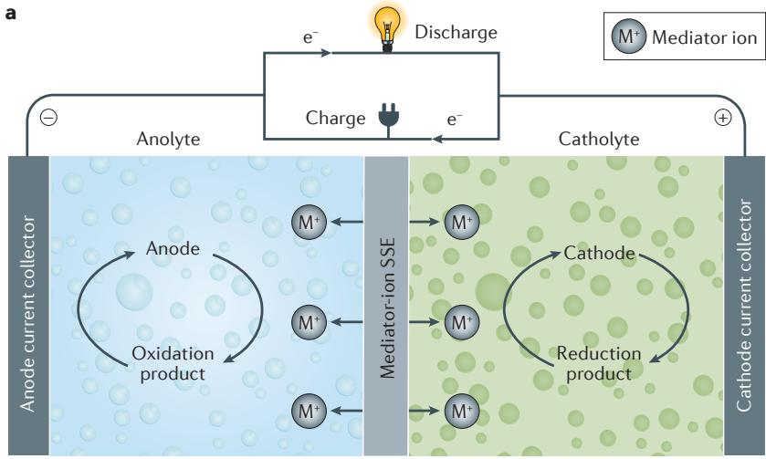

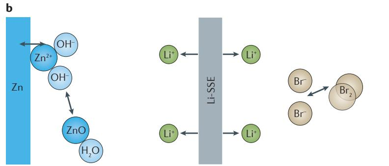

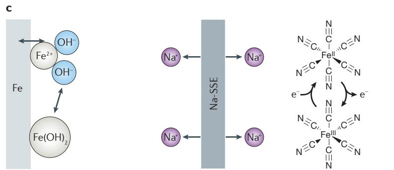

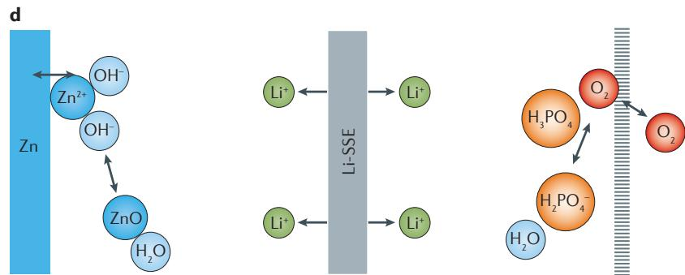  
Figure 7 | Aqueous batteries with mediator-ion solid electrolytes. Schematic diagram of an aqueous electrochemical energy storage system enabled with a mediator-ion solid electrolyte (panel a). The solid electrolyte prevents a mixing of the anolyte and catholyte. The redox reactions at the anode and cathode are sustained by the shuttling of the mediator ion through the solid electrolyte. Also shown are schematics of aqueous electrochemical energy storage systems enabled with either a lithium-ion or a sodium-ion solid electrolyte: Zn(LiOH) || Li-SSE || Br $_2$  (LiBr) (panel b), Fe(NaOH) || Na-SSE || K $_3$ Fe(CN) $_6$  (NaOH) (panel c) and Zn(LiOH) || Li-SSE || air  $(\mathrm{H}_3\mathrm{PO}_4 / \mathrm{LiH}_2\mathrm{PO}_4)$  (panel d). SSE, solid-state electrolyte.

the ionic charge between the anolyte and catholyte. The anolytes and catholytes should be strategically prepared using soluble salts that comprise the mediator ion in the corresponding solid electrolyte.

The mediator-ion strategy with a solid-state electrolyte provides a battery-development platform that is applicable to a broad range of redox couples with various cathode and anode materials. In the long term, the mediator-ion battery concept is promising for the development of low-cost, safe and high-energy-density aqueous electrochemical energy storage systems. In addition to the commonly used zinc and iron, other metals (such as aluminium) or inorganic or organic compounds are also promising anode materials. In terms of candidate cathode materials, the list is much longer than for the anode. This list includes both inorganic and organic compounds, such as hydrogen peroxide, bromate salts, permanganate salts, nickel oxide, dichromate salts, iodate salts, polysulfides, sulfur, manganese oxide, hypochlorites, perchlorate salts, chlorate salts, nitrate salts, bismuthate salts and chromate salts.

We have described various battery chemistries operated with solid-state electrolytes, including all-solid-state lithium-ion batteries, lithium-air, lithium-sulfur and lithium-bromine batteries, as well as aqueous batteries enabled with a solid electrolyte. Performance metrics (that is, energy density, power density, life cycle and other relevant parameters) of these battery systems at the current development stage are summarized in TABLE 2.

# Conclusions and future perspectives

At present, the high-temperature sodium-sulfur battery system is the only viable energy storage technology that uses a solid electrolyte. All-solid-state lithium-ion batteries have been pursued for many years and offer several important advantages over commercial lithium-ion batteries with liquid organic electrolytes (including improved safety, higher energy densities and wider operating temperatures). The improved reliability of all-solid-state lithium-ion batteries makes them appealing for large-scale applications. However, for all-solid-state lithium-ion batteries with inorganic solid-state electrolytes, key challenges remain, such as the volume change in the electrodes, interfacial charge-transfer resistance, flexibility concerns and poor cycling stability. Solid polymer electrolytes overcome some of the limitations of the inorganic solid-state electrolytes (that is, they have good shape flexibility and contact with the electrodes), but they have narrow electrochemical stability windows and low ionic conductivity (at room temperature), which currently impede the development of polymer-based all-solid-state lithium-ion batteries.

In contrast to the all-solid-state strategy, batteries based on a solid electrolyte and liquid electrodes can avoid the issue of high charge-transfer resistance. This not only allows large-scale battery systems to be produced but also enables new battery chemistries that were previously impossible because of chemical crossover between the two electrodes through conventional polymeric separators soaked with liquid electrolytes. With the ability to prevent lithium-dendrite formation and to completely

Table 2 | Summary of the performance metrics of various solid-electrolyte battery systems  

<table><tr><td>Battery system</td><td>Solid electrolyte</td><td>Energy density (Wh kg-1)*</td><td>Power density (mW cm-2)</td><td>Cycle life (number of cycles)</td><td>Cell voltage (V)</td><td>Refs</td></tr><tr><td colspan="7">All-solid-state, non-aqueous and hybrid-electrolyte batteries with solid-state electrolytes</td></tr><tr><td rowspan="4">All-solid-state lithium-ion batteries</td><td>Oxide (NASICON, LISICON and garnet)</td><td rowspan="4">300–600</td><td>10–50 (temperature dependent)</td><td>~300</td><td>3.0–5.0</td><td>6, 136–139, 149, 150</td></tr><tr><td>Sulfide (Li2S-P2S5-MSx)</td><td>10–60 (temperature dependent)</td><td>~1,000</td><td>4.5–5.0</td><td>11, 70, 140, 141</td></tr><tr><td>Thin-film LiPON</td><td>5–50 (cathode dependent)</td><td>~10,000</td><td>3.0–4.0</td><td>159</td></tr><tr><td>Polymer (PEO)</td><td>10–100 (elevated temperatures)</td><td>~400</td><td>3.3–3.7</td><td>155–158</td></tr><tr><td>Lithium-air</td><td>Li1+xAlxTi2-x(PO4)3(LATP)</td><td>~10,000</td><td>~15</td><td>~100</td><td>2.8–3.7 (electrolyte dependent)</td><td>39, 40, 174–182</td></tr><tr><td rowspan="3">Lithium-sulfur</td><td>Li1+xAlxTi2-x(PO4)3(LATP)</td><td rowspan="3">~1,500</td><td rowspan="3">~5</td><td rowspan="3">~300</td><td rowspan="3">~2.30</td><td rowspan="3">41, 42, 215–217</td></tr><tr><td>Li1+xAlxGe2-x(PO4)3(LAGP)</td></tr><tr><td>Li1+xYxZr2-x(PO4)3(LYZP)</td></tr><tr><td>Lithium-bromine</td><td>Li1+xAlxTi2-x(PO4)3(LATP)</td><td>~1,200</td><td>~30</td><td>~100</td><td>~4.2</td><td>219</td></tr><tr><td colspan="7">Aqueous solid-electrolyte batteries</td></tr><tr><td>Zinc-bromine</td><td>Li1+xAlxTi2-x(PO4)3(LATP)</td><td>~500</td><td>~15</td><td>~100</td><td>~2.2</td><td>230</td></tr><tr><td>Zn-K3Fe(CN)6</td><td>Na3.4Sc2(PO4)2.6(SiO4)0.4</td><td>~120</td><td>~15</td><td></td><td>~1.7</td><td></td></tr><tr><td>Fe-K3Fe(CN)6</td><td></td><td>~90</td><td>~2</td><td></td><td>~1.2</td><td></td></tr><tr><td>Zinc-air</td><td></td><td>~1,200</td><td>~5</td><td></td><td>~2.0 (acidic cathode electrolyte)</td><td></td></tr></table>

LiPON, lithium phosphorus oxynitride; LISICON, lithium superionic conductor; NASICON, sodium superionic conductor; PEO, poly(ethylene oxide). *Because the thickness of the solid electrolytes varies significantly in different studies, the overall energy densities of the cells are hard to calculate. Therefore, the energy densities presented here are based on the active anode and cathode materials.

separate the liquidxd or gaseous reactants, inorganic solid lithium-ion conductive membranes offer the possibility of developing lithium-based batteries with a wide range of cathodes through a dual-electrolyte strategy. Lithium-air and lithium-bromine batteries have been successfully demonstrated with an organic anolyte and an aqueous catholyte separated by a NASICON-type solid electrolyte. The NASICON-type solid electrolyte also enables lithium-sulfur batteries that do not experience the polysulfide shuttle. Solid electrolytes also enable aqueous batteries with liquid or gaseous reactants through a mediator-ion operating principle, using a lithium- or a sodium-ion solid electrolyte, zinc or iron anode and a range of active cathode materials. Through appropriate management of the anolyte, catholyte and solid electrolyte, a wide range of redox couples with various cathodes and anodes (either in the solid, liquid or gaseous phase) could be used for the development of low-cost and safe aqueous energy storage systems without the concerns of chemical crossover and metal-dendrite formation.

Although batteries based on solid electrolytes offer great possibilities for application in electric vehicles and grid energy storage, there is a long way to go before practical implementation at the industrial level. Transferring these systems from research laboratories to commercialized products requires intensive, systematic and integrated

research efforts into multiple interlocking avenues: electrodes, solid-state electrolytes, the electrode/electrolyte interface and the cell configuration design.

Achieving solid electrolyte materials (either inorganic, polymer or composite) with high conductivity, good electrochemical stability and acceptable mechanical properties requires an integrated, in-depth approach between experiments and computational modelling, along with advanced state-of-the-art characterization techniques to understand the intricacies of the ion-transport mechanisms. In addition, steps need to be taken to keep the cost of production low for large-scale solid electrolyte membranes with acceptable mechanical properties.

Overcoming the charge-transfer resistance barrier at the solid/solid interface between the electrodes and electrolyte is a huge challenge. Solid electrolytes with a soft surface structure — either intrinsically present in the material or extrinsically generated with the incorporation of appropriate groups to the surface — could help to minimize this challenge. For example, a thin layer of either an ionically conductive or electronically conductive elastic material deposited on the surface of either the electrode or the solid electrolyte would help to enhance the ionic electrode/electrolyte interface. Insertion of an ionically conductive elastic interlayer between the electrode and the solid electrolyte would be another effective

approach. Furthermore, it would be useful to introduce a liquid electrolyte integrated interlayer between the electrode and the solid electrolyte. In addition, a deeper understanding of the strain and stress behaviour within the electrode would be instructive for management of the electrode/electrolyte interface. Again, the production costs need to be kept low with such approaches in order for these systems to be competitive with existing energy storage technologies.

Batteries with a solid electrolyte and a liquid or gaseous electrode (for example, lithium-air, lithium-polysulfide and lithium-bromine) overcome the problem of interfacial charge transfer, but a few aspects need to be addressed in a cost-effective manner for them to become viable. First, it is necessary to develop solid electrolytes that are chemically and electrochemically compatible when in contact with both the anode and

the cathode (for example, lithium, sodium, polysulfide, bromine and highly acidic or basic environments). Second, a robust cell structure design and reliable sealing techniques are required for inorganic (ceramic) solid electrolytes to provide a hermetic environment during long-term operation. These requirements also apply to the mediator-ion solid-electrolyte strategy with low-cost, safer anodes, such as zinc or iron, and a choice of many liquid or gaseous cathodes.

Overall, the information available at present is encouraging for batteries based on solid electrolytes. Realization of solid electrolytes with the necessary parameters would enable new battery chemistries and affordable, advanced battery systems that would revolutionize the rechargeable battery field, providing good levels of safety, high energy density, and long static and dynamic stabilities with no self-discharge and long cycle lives.

1. Chu, S. & Majumdar, A. Opportunities and challenges for a sustainable energy future. Nature 488, 294-303 (2012).  
2. Tarascon, J. M. & Armand, M. Issues and challenges facing rechargeable lithium batteries. Nature 414, 359-367 (2001).  
3. Cabana, J., Monconduit, L., Larcher, D. & Palacin, M. R. Beyond intercalation-based Li-ion batteries: the state of the art and challenges of electrode materials reacting through conversion reactions. Adv. Mater. 22, E170-E192 (2010).  
4. Quartarone, E. & Mustarelli, P. Electrolytes for solid-state lithium rechargeable batteries: recent advances and perspectives. Chem. Soc. Rev. 40, 2525-2540 (2011).  
5. Kato, Y. et al. High-power all-solid-state batteries using sulfide superionic conductors. Nat. Energy 1, 16030 (2016).  
6. Goodenough, J. B. & Park, K. S. The Li-ion rechargeable battery: a perspective. J. Am. Chem. Soc. 135, 1167-1176 (2013).  
7. Bachman, J. C. et al. Inorganic solid-state electrolytes for lithium batteries: mechanisms and properties governing ion conduction. Chem. Rev. 116, 140-162 (2016).  
This paper reviews the ion-transport mechanisms and fundamental properties of solid-state electrolytes to be used in electrochemical energy storage systems.  
8. Hu, Y. S. Batteries: getting solid. Nat. Energy 1, 16042 (2016). This paper demonstrates a solid-state battery that can deliver  $70\%$  of its maximum capacity in just one minute at room temperature.  
9. Linford, R. G. & Hackwood, S. Physical techniques for the study of solid electrolytes. Chem. Rev. 81, 327-364 (1981).  
10. Sakuda, A., Hayashi, A. & Tatsumisago, M. Sulfide solid electrolyte with favorable mechanical property for all-solid-state lithium battery. Sci. Rep. 3, 02261 (2013).  
11. Kamaya, N. et al. A lithium superionic conductor. Nat. Mater. 10, 682-686 (2011).  
12. Busche, M. R. et al. Dynamic formation of a solid-liquid electrolyte interphase and its consequences for hybrid-battery concepts. Nat. Chem. 8, 426-434 (2016).  
13. Faraday, M. Experimental researches in electricity. Third series. Phil. Trans. R. Soc. Lond. 123, 23-54 (1833).  
14. Takahashi, T. Early history of solid state ionics. Mater. Res. Soc. Sump. Proc. 135, 3-9 (1988).  
15. Knödler, R. Thermal properties of sodium-sulphur cells. J. Appl. Electrochem. 14, 39-46 (1984).  
16. Kummer, J. T., Arbor, A. & Weber, N. Thermo-electric generator. US patent 3,458,356 (1969).  
17. Chandra, S., Lal, H. B. & Shahi, K. An electrochemical cell with solid, super-ionic  $\mathrm{Ag}_x\mathrm{KI}_5$  as the electrolyte. J. Phys. D: Appl. Phys. 7, 194-198 (1974).

18. Yu Yao, Y.-F. & Kummer, J. T. Ion exchange properties of and rates of ionic diffusion in beta-alumina. J. Inorg. Nucl. Chem. 29, 2453-2457 (1967).  
19. Reuter, B. & Hardel, K. Silbersulfidbromid und silbersulfidjodid. Angew. Chem. 72, 138-139 (1960).  
20. Owens, B. Advances in Electrochemistry and Electrochemical Engineering (Wiley, 1971).  
21. Fenton, D. E., Parker, J. M. & Wright, P. V. Complexes of alkali metal ions with poly(ethylene oxide). Polymer 14, 589 (1973).  
22. Bones, R. J., Coetzter, J., Galloway, R. C. & Teagle, D. A. A sodium/iron(ii) chloride cell with a beta alumina electrolyte. J. Electrochem. Soc. 134,2379-2382 (1987).  
23. Coetzier, J. A. A new high-energy density battery system. J. Power Sources 18, 377-380 (1986).  
24. Oshima, T., Kajita, M. & Okuno, A. Development of sodium-sulfur batteries. Int. J. Appl. Ceram. Technol. 1, 269-276 (2004).  
25. Capasso, C. & Veneri, O. Experimental analysis of a Zebra battery based propulsion system for urban bus under dynamic conditions. Energy Procedia 61, 1138-1141 (2014).  
26. Funke, K. Solid state ionics: from Michael Faraday to green energy—the European dimension. Sci. Technol. Adv. Mater. 14, 043502 (2013).  
27. Knauth, P. & Fuller, H. L. Solid-state ionics: roots, status, and future prospects. J. Am. Ceram. Soc. 85, 1654-1680 (2002). This paper reviews the evolution of solid-state ionics over approximately the past 100 years.  
28. Svensson, J. S., E. M. & Granqvist, C. G. Electrochromic coatings for "smart windows". Sol. Energy Mater. 12, 391-402 (1985).  
29. Li, H., Wang, Z. X., Chen, L. Q. & Huang, X. J. Research on advanced materials for Li-ion batteries. Adv. Mater. 21, 4593-4607 (2009).  
30. Gao, J., Shi, S. Q. & Li, H. Brief overview of electrochemical potential in lithium ion batteries. Chin. Phys. B 25, 018210 (2016).  
31. Li, W., Dahn, J. R. & Wainwright, D. S. Rechargeable lithium batteries with aqueous electrolytes. Science 264, 1115-1118 (1994).  
32. Gray, F. M., MacCallum, J. R. & Vincent, C. A. Poly(ethylene oxide)-  $\mathrm{LiCF_3SO_4}$  - polystyrene electrolyte systems. Solid State Ionics 18-19, 282-286 (1986).  
33. Gorecki, W. et al. NMR, DSC, and conductivity study of a poly(ethylene oxide) complex electrolyte: PEO(LiClO $_4$ ) Solid State Ionics 18-19, 295-299 (1986).  
34. Kelly, I. E., Owen, J. R. & Steele, B. C. H. Poly(ethylene oxide) electrolytes for operation at near room temperature. J. Power Sources 14, 13-21 (1985).  
35. Abraham, K. M. & Alamgir, M. Li+Conductive solid polymer electrolytes with liquid-like conductivity. J. Electrochem. Soc. 137, 1657-1658 (1990).  
36. Wang, Z. X. et al. Investigation of the position of  $\mathrm{Li^{+}}$  ions in a polycarylonitrile-based electrolyte by Raman

and infrared spectroscopy. Electrochim. Acta 41, 1443-1446 (1996).  
37. Appetecchi, G. B., Croce, F. & Scrosati, B. Kinetics and stability of the lithium electrode in poly(methylmethacrylate)-based gel electrolytes. Electrochim. Acta 40, 991-997 (1995).  
38. Iijima, T., Toyoguchi, Y. & Eda, N. Quasi-solid organic electrolytes gelatinized with polymethylmethacrylate and their applications for lithium batteries. Denki Kagaku 53, 619-623 (1985).  
39. Choe, H. S., Giaccai, J., Alamgir, M. & Abraham, K. M. Preparation and characterization of poly(vinyl sulfone) based- and poly(vinylidene fluoride)-based electrolytes. Electrochim. Acta 40, 2289-2293 (1995).  
40. Dudney, N. J., Bates, J. B., Zuhr, R. A., Luck, C. F. & Robertson, J. D. Sputtering of lithium compounds for preparation of electrolyte thin films. Solid State Ionics 53-56, 655-661 (1992).  
41. Bates, J. B. et al. Electrical properties of amorphous lithium electrolyte thin films. Solid State Ionics 53-56, 647-654 (1992).  
42. Inaguma, Y. et al. High ionic conductivity in lithium lanthanum titanate. Solid State Commun. 86, 689-693 (1993).  
43. Goodenough, J. B., Hong, H. Y.-P. & Kafalas, J. A. Fast Na⁺-ion transport in skeleton structures. Mater. Res. Bull. 11, 203–220 (1976).  
44. Subramanian, M. A., Subramanian, R. & Clearfield, A. Lithium ion conductors in the system  $\mathrm{AB}(\mathrm{iv})_2(\mathrm{PO}_4)_3$  (B = Ti, Zr and Hf). Solid State Ionics 18-19, 562-569 (1986).  
45. Cussen, E. J. The structure of lithium garnets: cation disorder and clustering in a new family of fast  $\mathrm{Li^{+}}$  conductors. Chem. Commun. 412-413 (2006).  
46. Kasper, H. M. A new series of rare earth garnets  $\mathrm{Ln}_{3}^{+5}\mathrm{M}_{2}\mathrm{Li}_{3}^{+}\mathrm{O}_{12}(\mathrm{M} = \mathrm{Te},\mathrm{W})$ . Inorg. Chem. 8, 1000-1005 (1969).  
47. Mazza, D. Remarks on a ternary phase in the  $\mathrm{La}_2\mathrm{O}_5-$ $\mathrm{Me}_2\mathrm{O}_5 - \mathrm{Li}_2\mathrm{O}$  system (Me = Nb, Ta). Mater. Lett. 7, 205-207 (1988).  
48. Kennedy, J. H., Sahami, S., Shea, S. W. & Zhang, Z. M. Preparation and conductivity measurements of  $\mathrm{SiS}_2-$ $\mathrm{Li}_2\mathrm{S}$  glasses doped with LiBr and LiCl. Solid State Ionics 18-19, 368-371 (1986).  
49. Kennedy, J. H. & Yang, Y. A highly conductive  $\mathrm{Li^{+}}$ -glass system: (1-x)(0.4SiS2-0.6Li2S)-xLil. J. Electrochem. Soc. 133, 2437-2438 (1986).  
50. Li, H. Q., Wang, Y. G., Na, H. T., Liu, H. M. & Zhou, H. S. Rechargeable Ni-Li battery integrated aqueous/nonaqueous system. J. Am. Chem. Soc. 131, 15098-15101 (2009).  
51. Lu, Y. H. & Goodenough, J. B. Rechargeable alkali-ion cathode-flow battery. J. Mater. Chem. 21, 10113-10117 (2011).  
52. Wang, L., Wang, Y. G. & Xia, Y. Y. A high performance lithium-ion sulfur battery based on a Li $_2$ S cathode using a dual-phase electrolyte. Energy Environ. Sci. 8, 1551-1558 (2015).

This paper is the first report of the feasibility of using a dual-phase electrolyte in a lithium-sulfur battery separated by a LISICON-type solid electrolyte.  
53. Yu, X. W., Bi, Z. H., Zhao, F. & Manthiram, A. Hybrid lithium-sulfur batteries with a solid electrolyte membrane and lithium polysulfide catholyte. ACS Appl. Mater. Interfaces 7, 16625-16631 (2015).  
54. Chang, Z. et al. Rechargeable Li/Br battery: a promising platform for post lithium ion batteries. J. Mater. Chem. A 2, 19444-19450 (2014).  
55. Takemoto, K. & Yamada, H. Development of rechargeable lithium-bromine batteries with lithium ion conducting solid electrolyte. J. Power Sources 281, 334-340 (2015).  
56. Kim, J.-K., et al. Rechargeable seawater battery and its electrochemical mechanism. ChemElectroChem 2, 328-332 (2014).  
57. Chen, L., Guo, Z. Y., Xia, Y. Y. & Wang, Y. G. High-voltage aqueous battery approaching 3 V using an acidic-alkaline double electrolyte. Chem. Commun. 49, 2204-2206 (2013).  
58. Dong, X. L., Wang, Y. G. & Xia, Y. G. Re-building Daniell cell with a Li-ion exchange film. Sci. Rep. 4, 6916 (2014).  
59. Zhang, H. P. et al. Using  $\mathrm{Li^{+}}$  as the electrochemical messenger to fabricate an aqueous rechargeable Zn-Cu battery. Chem. Commun. 51, 7294-7297 (2015).  
60. Mehrer, H. Diffusion in Solids: Fundamentals, Methods, Materials, Diffusion-Controlled Processes (Springer, 2007).  
61. Wu, M., Xu, B. & Ouyang, C. Physics of electron and lithium-ion transport in electrode materials for Li-ion batteries. Chin. Phys. B 25, 018206 (2015).  
62. Park, M., Zhang, X. C., Chung, M. D., Less, G. B. & Sastry, A. M. A review of conduction phenomena in Li-ion batteries. J. Power Sources 195, 7904-7929 (2010).  
63. Kumar, P. P. & Yashonath, S. Ionic conduction in the solid state. J. Chem. Sci. 118, 135-154 (2006). This paper provides a survey of experimental, theoretical and computational studies with the aim of understanding the high ionic conductivity in solid electrolytes.  
64. Perram, J. (ed) The Physics of Superionic Conductors and Electrode Materials (Springer, 1983).  
65. Hagenmuller, P. & Van Gool, V. (eds) Solid Electrolytes: General Principles, Characterization, Materials, Applications (Academic Press, 1978).  
66. Angell, C. A. Mobile ions in amorphous solids. Annu. Rev. Phys. Chem. 43, 693-717 (1992).  
67. Berthier, C. et al. Microscopic investigation of ionic conductivity in alkali metal salts-poly(ethylene oxide) adducts. Solid State Ionics 11, 91-95 (1983).  
68. Nitzan, A. & Ratner, M. A. Conduction in polymers: dynamic disorder transport. J. Phys. Chem. 98, 1765-1775 (1994). This paper discusses the ionic transportation mechanisms in polymer solid electrolytes.  
69. Borodin, O. & Smith, G. D. Mechanism of ion transport in amorphous poly(ethylene oxide)/LiTFSI from molecular dynamics simulations. Macromolecules 39, 1620-1629 (2006).  
70. Fergus, J. W. Ceramic and polymeric solid electrolytes for lithium-ion batteries. J. Power Sources 195, 4554-4569 (2010).  
71. Xia, W. H. et al. Ionic conductivity and air stability of Al-doped  $\mathrm{Li}_7\mathrm{La}_2\mathrm{Zr}_2\mathrm{O}_{12}$  sintered in alumina and Pt crucibles. ACS Appl. Mater. Interfaces 8, 5335-5342 (2016).  
72. Matsuyama, T. et al. Electrochemical properties of all-solid-state lithium batteries with amorphous titanium sulfide electrodes prepared by mechanical milling. J. Solid State Electr. 17, 2697-2701 (2013).  
73. Hagman, L. O. & Kierkega, P. Crystal structure of  $\mathrm{NaMe}_2\mathrm{V}(\mathrm{PO}_4)_5$ ;  $\mathrm{Me}^{\mathrm{v}} = \mathrm{Ge}$ , Ti, Zr. Acta Chem. Scand. 22, 1822-1826 (1968).  
74. Thangadurai, V. & Weppner, W. Recent progress in solid oxide and lithium ion conducting electrolytes research. Ionics 12, 81-92 (2006). This paper reviews the progress in fast lithium-ion conductors (solid-oxide materials) with the emphasis on the correlation among composition, structure and electrical transport properties.  
75. Casciola, M., Costantino, U., Merlini, L., Andersen, I. G. K. & Andersen, E. K. Preparation, structural characterization and conductivity of  $\mathrm{LiZr}_2(\mathrm{PO}_4)_3$ . Solid State Ionics 26, 229-235 (1988).  
76. Martinez-Juarez, A., Rojo, J. M., Iglesias, J. E. & Sanz, J. Reversible monoclinic-rhombohedral transformation in  $\mathrm{LiSn}_2(\mathrm{PO}_4)_3$  with NASICON-type structure. Chem. Mater. 7, 1857-1862 (1995).

77. Aono, H., Sugimoto, E., Sadaoka, Y., Imanaka, N. & Adachi, G. Ionic conductivity and sinterability of lithium titanium phosphate system. Solid State Ionics 40-41, 38-42 (1990).  
78. Morimoto, H. et al. Preparation of lithium ion conducting solid electrolyte of NASICON-type  $\mathrm{Li}_{1-x}\mathrm{Al}_x\mathrm{Ti}_{2-x}[\mathrm{PO}_4]_5$  ( $x = 0.3$ ) obtained by using the mechanochemical method and its application as surface modification materials of  $\mathrm{LiCoO}_2$  cathode for lithium cell. J. Power Sources 240, 636-643 (2013)  
79. Xu, X. X., Wen, Z. Y., Wu, X. W., Yang, X. L. & Gu, Z. H. Lithium ion-conducting glass-ceramics of  $\mathrm{Li}_{1.5}\mathrm{Al}_{0.5}\mathrm{Ge}_{1.5}(\mathrm{PO}_4)_3 - x\mathrm{Li}_2\mathrm{O}$  ( $x = 0.0 - 0.20$ ) with good electrical and electrochemical properties. J. Am. Ceram. Soc. 90, 2802-2806 (2007).  
80. Xu, X. X., Wen, Z. Y., Yang, X. L. & Chen, L. D. Dense nanostructured solid electrolyte with high Li-ion conductivity by spark plasma sintering technique. Mater. Res. Bull. 43, 2334-2341 (2008).  
81. Cruz, A. M., Ferreira, E. B. & Rodrigues, A. C. M. Controlled crystallization and ionic conductivity of a nanostructured LiAlGePO $_4$  glass-ceramic. J. Non-Cryst. Solids 355, 2295-2301 (2009).  
82. Fu, J. Fast  $\mathrm{Li^{+}}$  ion conducting glass-ceramics in the system  $\mathrm{Li}_2\mathrm{O} - \mathrm{Al}_2\mathrm{O}_5 - \mathrm{GeO}_2 - \mathrm{P}_2\mathrm{O}_5$ . Solid State Ionics 104, 191-194 (1997).  
83. Thokchom, J. S., Gupta, N. & Kumar, B. Superionic conductivity in a lithium aluminum germanium phosphate glass-ceramic. J. Electrochem. Soc. 155, A915-A920 (2008).  
84. Thangadurai, V., Kaack, H. & Weppner, W. J. F. Novel fast lithium ion conduction in garnet-type  $\mathrm{Li}_5\mathrm{La}_3\mathrm{M}_2\mathrm{O}_{12}$ $(\mathbf{M} = \mathbf{N}\mathbf{b},\mathbf{T}\mathbf{a})$  .J.Am.Ceram.Soc.86,437-440 (2003).  
85. Geiger, C. A. et al. Crystal chemistry and stability of "Li7La3Zr2O12" garnet: a fast lithium-ion conductor. Inorg. Chem. 50, 1089-1097 (2011).  
86. Murugan, R., Ramakumar, S. & Janani, N. High conductive yttrium doped  $\mathrm{Li}_7\mathrm{La}_3\mathrm{Zr}_5\mathrm{O}_{12}$  cubic lithium garnet. Electrochem. Commun. 13, 1373-1375 (2011).  
87. Allen, J. L., Wolfenstine, J., Rangasamy, E. & Sakamoto, J. Effect of substitution (Ta, Al, Ga) on the conductivity of  $\mathrm{Li}_7\mathrm{La}_5\mathrm{Zr}_2\mathrm{O}_{12}$ . J. Power Sources 206, 315-319 (2012).  
88. Ohta, S., Kobayashi, T. & Asaoka, T. High lithium ionic conductivity in the garnet-type oxide  $\mathrm{Li}_{7,x}\mathrm{La}_3(\mathrm{Zr}_{2 - x},$ $\mathrm{Nb}_x)\mathrm{O}_{12}(X = 0 - 2)$  .J.Power Sources 196, 3342-3345 (2011).  
89. Deviannapoorani, C., Dhivya, L., Ramakumar, S. & Murugan, R. Lithium ion transport properties of high conductive tellurium substituted  $\mathrm{Li}_7\mathrm{La}_2\mathrm{Zr}_2\mathrm{O}_{12}$  cubic lithium garnets. J. Power Sources 240, 18-25 (2013).  
90. Ahn, B. T. & Huggins, R. A. Phase behavior and conductivity of  $\mathrm{Li}_2\mathrm{SiS}_3$  composition. Solid State Ionics 46, 237-242 (1991).  
91. Kondo, S., Takada, K. & Yamamura, Y. New lithium ion conductors based on  $\mathrm{Li}_2\mathrm{S - Si}_2$  system. Solid State Ionics 53, 1183-1186 (1992).  
92. Morimoto, H., Yamashita, H., Tatsumisago, M. & Minami, T. Mechanochemical synthesis of new amorphous materials of  $60\mathrm{Li}_2\mathrm{S}-40\mathrm{Si}\mathrm{S}_2$  with high lithium ion conductivity. J. Am. Ceram. Soc. 82, 1352-1354 (1999).  
93. Kanno, R. & Maruyama, M. Lithium ionic conductor thio-LISICON: the  $\mathrm{Li}_2\mathrm{SGe}_2\mathrm{P}_2\mathrm{S}_5$  system. J. Electrochem. Soc. 148, A742-A746 (2001).  
94. Hayashi, A., Ohtomo, T., Mizuno, F., Tadanaga, K. & Tatsumisago, M. All-solid-state Li/S batteries with highly conductive glass-ceramic electrolytes. Electrochem. Commun. 5, 701-705 (2003).  
95. Liu, Z. C. et al. Anomalous high ionic conductivity of nanoporous  $\beta$ -Li $_3$ PS $_4$ . J. Am. Chem. Soc. 135, 975-978 (2013).  
96. Mizuno, F., Hayashi, A., Tadanaga, K. & Tatsumisago, M. New, highly ion-conductive crystals precipitated from  $\mathrm{Li}_2\mathrm{S} - \mathrm{P}_2\mathrm{S}_5$  glasses. Adv. Mater. 17, 918-922 (2005).  
97. Rangasamy, E. et al. An iodide-based  $\mathrm{Li}_7\mathrm{P}_2\mathrm{S}_4$  superionic conductor. J. Am. Chem. Soc. 137, 1384-1387 (2015).  
98. Hayashi, A., Muramatsu, H., Ohtomo, T., Hama, S. & Tatsumisago, M. Improved chemical stability and cyclability in  $\mathrm{Li}_2\mathrm{S} - \mathrm{P}_2\mathrm{S}_5 - \mathrm{P}_2\mathrm{O}_5 - 2\mathrm{nO}$  composite electrolytes for all-solid-state rechargeable lithium batteries. J. Alloys Compd. 591, 247-250 (2014).  
99. Minami, K., Hayashi, A., Ujjie, S. & Tatsumisago, M. Electrical and electrochemical properties of glass-ceramic electrolytes in the systems  $\mathrm{Li}_2\mathrm{S} - \mathrm{P}_2\mathrm{S}_5 - \mathrm{P}_2\mathrm{S}_3$  and  $\mathrm{Li}_2\mathrm{S} - \mathrm{P}_2\mathrm{S}_5 - \mathrm{P}_2\mathrm{O}_5$ . Solid State Ionics 192, 122-125 (2011).

100. Muramatsu, H., Hayashi, A., Ohtomo, T., Hama, S. & Tatsumisago, M. Structural change of  $\mathrm{Li}_2\mathrm{S} - \mathrm{P}_2\mathrm{S}_4$  sulfide solid electrolytes in the atmosphere. Solid State Ionics 182, 116-119 (2011).  
101. Alamgir, M. & Abraham, K. M. Li ion conductive electrolytes based on poly(vinyl chloride). J. Electrochem. Soc. 140, L96-L97 (1993).  
102. Capiglia, C. et al. Structure and transport properties of polymer gel electrolytes based on PvdF-HFP and  $\mathrm{LiN(C_2F_5SO_2)_2}$ . Solid State Ionics 131, 291-299 (2000).  
103. Feuillade, G., & Perche, P. Ion-conductive macromolecular gels and membranes for solid lithium cells. J. Appl. Electrochem. 5, 63-69 (1975).  
104. Zhou, Y. F., Xie, S., Ge, X. W., Chen, C. H. & Amine, K. Preparation of rechargeable lithium batteries with poly(methyl methacrylate) based gel polymer electrolyte by in situ  $\gamma$ -ray irradiation-induced polymerization. J. Appl. Electrochem. 34, 1119-1125 (2004).  
105. Appetecchi, G. B., Croce, F., Persi, L., Ronci, F. & Scrosati, B. Transport and interfacial properties of composite polymer electrolytes. Electrochim. Acta 45, 1481-1490 (2000). This paper demonstrates the advantages of the composite PEO-LiX polymer electrolytes in addressing the interfacial problems between lithium metal and the solid electrolyte.  
106. Kumar, B. & Fellner, J. P. Polymer-ceramic composite protonic conductors. J. Power Sources 123, 132-136 (2003).  
107. Miyake, N., Wainright, J. S. & Savinell, R. F. Evaluation of a sol-gel derived Nafion/silica hybrid membrane for proton electrolyte membrane fuel cell applications: I. Proton conductivity and water content. J. Electrochem. Soc. 148, A898-A904 (2001).  
108. Chen-Yang, Y. W., Chen, H. C., Lin, F. J. & Chen, C. C. Polyacrylonitrile electrolytes: 1. A novel high-conductivity composite polymer electrolyte based on PAN,  $\mathrm{LiClO}_4$  and  $\alpha$ -Al $_2$ O $_3$ . Solid State Ionics 150, 327-335 (2002).  
109. Di Noto, V. & Zago, V. Inorganic-organic polymer electrolytes based on PEG400 and  $\mathrm{Al(OCH(CH_3)_2]_5}$  I. Synthesis and vibrational characterizations. J. Electrochem. Soc. 151, A216-A223 (2004).  
110. Liu, Y., Lee, J. Y. & Hong, L. In situ preparation of poly(ethylene oxide)- $\mathrm{SiO}_2$  composite polymer electrolytes. J. Power Sources 129, 303-311 (2004).  
111. Magistris, A., Mustarelli, P., Quartarone, E. & Tomasi, C. Transport and thermal properties of (PEO)  $n$ -LiPF $_6$  electrolytes for super-ambient applications. Solid State Ionics 136, 1241-1247 (2000).  
112. Marcinek, M. et al. Ionic association in liquid (polyether-  $\mathrm{Al}_2\mathrm{O}_5$  -LiClO4) composite electrolytes. Solid State Ionics 176, 367-376 (2005).  
113. Panero, S., Scrosati, B. & Greenbaum, S. G. Ionic conductivity and  ${}^{7}\mathrm{Li}$  NMR study of poly(ethylene glycol) complexed with lithium salts. Electrochim. Acta 37, 1533-1538 (1992).  
114. Borghini, M. C., Mastragostino, M., Passerini, S. & Scrosati, B. Electrochemical properties of polyethylene oxide-Li $\left[\left(\mathrm{CF}_{3} \mathrm{SO}_{2}\right)_{2} \mathrm{~N}\right]$ -gamma-LiAlO $_{2}$  composite polymer electrolytes. J. Electrochem. Soc. 142, 2118-2121 (1995).  
115. Golodnitsky, D. et al. Conduction mechanisms in concentrated Lil-polyethylene oxide-  $\mathrm{Al}_2\mathrm{O}_3$  -based solid electrolytes.J.Electrochem.Soc.144,3484-3491 (1997).  
116. Krawiec, W. et al. Polymer nanocomposites: a new strategy for synthesizing solid electrolytes for rechargeable lithium batteries. J. Power Sources 54, 310-315 (1995).  
117. Wang, C. S., Zhang, X. W. & Appleby, A. J. Solvent-free composite PEO-ceramic fiber/mat electrolytes for lithium secondary cells. J. Electrochem. Soc. 152, A205-A209 (2005).  
118. Li, Q. et al. Cycling performances and interfacial properties of a Li/PEO-Li  $\mathrm{(CF_5SO_2)_2N}$  -ceramic filler/  $\mathrm{LiNi}_{0.8}\mathrm{Co}_{0.2}\mathrm{O}_2$  cell.J.Power Sources 97-98,795-797 (2001).  
119. Kanehori, K., Ito, Y., Kirino, F., Miyauchi, K. & Kudo, T. Titanium disulfide films fabricated by plasma CVD. Solid State Ionics 18-19, 818-822 (1986).  
120. Ohtsuka, H. & Yamaki, J. Electrical characteristics of  $\mathrm{Li}_2\mathrm{O}\cdot \mathrm{V}_2\mathrm{O}_5\cdot \mathrm{SiO}_2$  thin films. Solid State Ionics 35, 201-206 (1989).  
121. Akridge, J. R. & Vourlis, H. Solid state batteries using vitreous solid electrolytes. Solid State Ionics 18-19, 1082-1087 (1986).

122. Akridge, J. R. & Vourlis, H. Performance of  $\mathrm{Li / TiS_2}$  solid-state batteries using phosphorus chalcogenide network former glasses as solid electrolyte. Solid State Ionics 28-30, 841-846 (1988).  
123. Bates, J. B. et al. Fabrication and characterization of amorphous lithium electrolyte thin-films and rechargeable thin-film batteries. J. Power Sources 43, 103-110 (1993).  
124. Bates, J. B., Dudney, N. J., Neudecker, B., Ueda, A. & Evans, C. D. Thin-film lithium and lithium-ion batteries. Solid State Ionics 135, 33-45 (2000).  
125. Bates, J. B. et al. Preferred orientation of polycrystalline  $\mathrm{LiCoO}_2$  films. J. Electrochem. Soc. 147, 59-70 (2000).  
126. Magistris, A., Chiodelli, G. & Villa, M. Lithium borophosphate vitreous electrolytes. J. Power Sources 14, 87-91 (1985).  
127. Tealdi, C., Quartarone, E. & Mustarelli, P. in Rechargeable Batteries. Materials, Technologies and New Trends (eds Zhang, Z. & Zhang, S. S.) 311-335 (Springer, 2015).  
128. Yoon, Y., Park, C., Kim, J. & Shin, D. Characterization of lithium borophosphate glass thin film electrolytes deposited by RF-magnetron sputtering for microbatteries. Solid State Ionics 225, 636-640 (2012).  
129. Fleutot, B., Pecquenard, B., Martinez, H. & Levasseur, A. Lithium borophosphate thin film electrolyte as an alternative to LiPON for solder-reflow processed lithium-ion microbatteries. Solid State Ionics 249, 49-55 (2013).  
130. Aaltonen, T., Alnes, M., Nilsen, O., Costelle, L. & Fjellvag, H. Lanthanum titanate and lithium lanthanum titanate thin films grown by atomic layer deposition. J. Mater. Chem. 20, 2877-2881 (2010).  
131. Hamalainen, J. et al. Lithium phosphate thin films grown by atomic layer deposition. J. Electrochem. Soc. 159, A259-A263 (2012).  
132. Comstock, D. J. & Elam, J. W. Mechanistic study of lithium aluminum oxide atomic layer deposition. J. Phys. Chem. C 117, 1677-1683 (2013).  
133. Aaltonen, T., Nilsen, O., Magraso, A. & Fjellvag, H. Atomic layer deposition of  $\mathrm{Li}_2\mathrm{O} - \mathrm{Al}_2\mathrm{O}_3$  thin films. Chem. Mater. 23, 4669-4675 (2011).  
134. Peng, Y.-C. et al. Synthesis of ion conducting  $\mathrm{Li}_x\mathrm{Al}_{y^{\prime}}\mathrm{Si}_x\mathrm{O}$  thin films by atomic layer deposition J. Mater. Chem. A 2, 9566-9573 (2014).  
135. Kozen, A. C., Pearse, A. J., Lin, C. F., Noked, M. & Rubloff, G. W. Atomic layer deposition of the solid electrolyte LiPON. Chem. Mater. 27, 5324-5331 (2015). This paper demonstrates an emerging technique (atomic layer deposition) for the fabrication of lithium phosphorus oxynitride (LiPON) thin-film solid electrolyte.  
136. Haruyama, J., Sodeyama, K., Han, L. Y., Takada, K. & Tateyama, Y. Space-charge layer effect at interface between oxide cathode and sulfide electrolyte in all-solid-state lithium-ion battery. Chem. Mater. 26, 4248-4255 (2014).  
137. Sakuda, A., Hayashi, A. & Tatsumisago, M. Intefacial observation between  $\mathrm{LiCoO}_2$  electrode and  $\mathrm{Li}_2\mathrm{S} - \mathrm{P}_2\mathrm{S}_5$  solid electrolytes of all-solid-state lithium secondary batteries using transmission electron microscopy. Chem. Mater. 22, 949-956 (2010).  
138. Sakuda, A. et al. All-solid-state lithium secondary batteries using  $\mathrm{Li}_2\mathrm{S} - \mathrm{P}_2\mathrm{S}_5$  solid electrolytes and  $\mathrm{LiFePO_4}$  electrode particles with amorphous surface layer. Chem. Lett. 41, 260-261 (2012).  
139. Kitaura, H., Hayashi, A., Tadanaga, K. & Tatsumisago, M. Improvement of electrochemical performance of all-solid-state lithium secondary batteries by surface modification of  $\mathrm{LiMn}_2\mathrm{O}_4$  positive electrode. Solid State Ionics 192, 304-307 (2011).  
140. Barghamadi, M. et al. Lithium-sulfur batteries-the solution is in the electrolyte, but is the electrolyte a solution? Energy Environ. Sci. 7, 3902-3920 (2014).  
141. Yamaguchi, Y. et al. Ab initio simulations of Li/pyrite  $\mathrm{MS}_2$  (M = Fe, Ni) battery cells. J. Electrochem. Soc. 157, A630–A635 (2010).  
142. Nagao, M. et al. In situ SEM study of a lithium deposition and dissolution mechanism in a bulk-type solid-state cell with a  $\mathrm{Li}_2\mathrm{S} - \mathrm{P}_2\mathrm{S}_5$  solid electrolyte. Phys. Chem. Chem. Phys. 15, 18600-18606 (2013).  
143. Sahu, G. et al. Air-stable, high-conduction solid electrolytes of arsenic-substituted  $\mathrm{Li}_4\mathrm{SnS}_4$ . Energy Environ. Sci. 7, 1053-1058 (2014).  
144. Takahara, H. et al. All-solid-state lithium secondary battery using oxysulfide glass. Addition and coating of carbon to positive electrode. J. Electrochem. Soc. 151, A1539-A1544 (2004).

145. Jung, Y. S., Lee, K. T., Kim, J. H., Kwon, J. Y. & Oh, S. M. Thermo-electrochemical activation of an In-Cu intermetallic electrode for the anode in lithium secondary batteries. Adv. Funct. Mater. 18, 3010-3017 (2008).  
146. Takada, K. et al. Solid-state lithium battery with graphite anode. Solid State Ionics 158, 269-274 (2003).  
147. Takada, K. et al. Compatibility of lithium ion conductive sulfide glass with carbon-lithium electrode. J. Electrochem. Soc. 150, A274-A277 (2003).  
148. Baba, M. et al. Fabrication and electrochemical characteristics of all-solid-state lithium-ion rechargeable batteries composed of  $\mathrm{LiMn}_2\mathrm{O}_4$  positive and  $\mathrm{V}_2\mathrm{O}_5$  negative electrodes. J. Power Sources 97-98, 798-800 (2001).  
149. Ohta, N. et al. Enhancement of the high-rate capability of solid-state lithium batteries by nanoscale interfacial modification. Adv. Mater. 18, 2226-2230 (2006).  
150. Takada, K. Progress and prospective of solid-state lithium batteries. Acta Mater. 61, 759-770 (2013).  
151. Santosh, K. C., Longo, R. C., Xiong, K. & Cho, K. Electrode-electrolyte interface for solid state Li-ion batteries: point defects and mechanical strain. J. Electrochem. Soc. 161, F3104-F3110 (2014).  
152. Ebner, M., Marone, F., Stampanoni, M. & Wood, V. Visualization and quantification of electrochemical and mechanical degradation in Li ion batteries. Science 342, 716-720 (2013).  
153. Herbert, E. G., Tenhaeff, W. E., Dudley, N. J. & Pharr, G. M. Mechanical characterization of LiPON films using nanoindentation. Thin Solid Films 520, 413-418 (2011).  
154. Luntz, A. C., Voss, J. & Reuter, K. Interfacial challenges in solid-state Li ion batteries. J. Phys. Chem. Lett. 6, 4599-4604 (2015).  
155. Gwon, H. et al. Recent progress on flexible lithium rechargeable batteries. Energy Environ. Sci. 7, 538-551 (2014). This paper provides a review and perspective of flexible lithium-ion batteries and discusses how flexibility can be introduced into each component (especially the flexible electrolyte materials) of the lithium-ion batteries.  
156. Qiu, W. L., Ma, X. H., Yang, Q. H., Fu, Y. B. & Zong, X. F. Novel preparation of nanocomposite polymer electrolyte and its application to lithium polymer batteries. J. Power Sources 138, 245-252 (2004).  
157. Zhang, S. S., Ervin, M. H., Xu, K. & Jow, T. R. Microporous poly(acrylonitrile-methyl methacrylate) membrane as a separator of rechargeable lithium battery. Electrochim. Acta 49, 3339-3345 (2004).  
158. Zhou, W. et al. Plating a dendrite-free lithium anode with a polymer/ceramic/polymer sandwich electrolyte. J. Am. Chem. Soc. 138, 9385-9388 (2016).  
159. Li, J. C., Ma, C., Chi, M. F., Liang, C. D. & Dudney, N. J. Solid electrolyte: the key for high-voltage lithium batteries. Adv. Energy Mater. 5, 1401408 (2015).  
160. Tealdi, C., Heath, J. & Islam, M. S. Feeling the strain: enhancing ionic transport in olivine phosphate cathodes for Li- and Na-ion batteries through strain effects. J. Mater. Chem. A 4, 6998-7004 (2016).  
161. Brunetti, G. et al. Confirmation of the domino-cascade model by LiFePO $_4$ /FePO $_4$  precession electron diffraction. Chem. Mater. 23, 4515-4524 (2011).  
162. Xu, B., Qian, D. N., Wang, Z. Y. & Meng, Y. S. L. Recent progress in cathode materials research for advanced lithium ion batteries. Mater. Sci. Eng. R. 73, 51-65 (2012).  
163. Semkow, K. W. & Sammells, A. F. A lithium oxygen secondary battery. J. Electrochem. Soc. 134, C412-C413 (1987).  
164. Abraham, K. M. & Jiang, Z. A polymer electrolyte-based rechargeable lithium/oxygen battery. J. Electrochem. Soc. 143, 1-5 (1996).  
165. Read, J. Characterization of the lithium/oxygen organic electrolyte battery. J. Electrochem. Soc. 149, A1190-A1195 (2002).  
166. Kuboki, T., Okuyama, T., Ohsaki, T. & Takami, N. Lithium-air batteries using hydrophobic room temperature ionic liquid electrolyte. J. Power Sources 146, 766-769 (2005).  
167. Ogasawara, T., Debart, A., Holzapfel, M., Novak, P. & Bruce, P. G. Rechargeable  $\mathrm{Li}_2\mathrm{O}_2$  electrode for lithium batteries. J. Am. Chem. Soc. 128, 1390-1393 (2006).  
168. Debart, A., Bao, J., Armstrong, G. & Bruce, P. G. An  $\mathrm{O}_2$  cathode for rechargeable lithium batteries: the effect of a catalyst. J. Power Sources 174, 1177-1182 (2007).  
169. Girishkumar, G., McCloskey, B., Luntz, A. C., Swanson, S. & Wilcke, W. Lithium-air battery: promise

and challenges. J. Phys. Chem. Lett. 1, 2193-2203 (2010).  
170. Zhou, H. S., Wang, Y. G., Li, H. Q. & He, P. The development of a new type of rechargeable batteries based on hybrid electrolytes. ChemSusChem 3, 1009-1019 (2010).  
171. Lee, J. S. et al. Metal-air batteries with high energy density: Li-air versus Zn-air. Adv. Energy Mater. 1, 34-50 (2011).  
172. Christensen, J. et al. A critical review of Li/air batteries. J. Electrochem. Soc. 159, R1-R30 (2012).  
173. Kitaura, H. & Zhou, H. S. Electrochemical performance of solid-state lithium-air batteries using carbon nanotube catalyst in the air electrode. Adv. Energy Mater. 2, 889-894 (2012).  
174. Zhang, T. et al. Li/polymer electrolyte/water stable lithium-conducting glass ceramics composite for lithium-air secondary batteries with an aqueous electrolyte. J. Electrochem. Soc. 155, A965-A969 (2008).  
175. Zhang, T. et al. A novel high energy density rechargeable lithium/air battery. Chem. Commun. 46, 1661-1663 (2010).  
176. He, P., Wang, Y. G., & Zhou, H. S. A Li-air fuel cell with recycle aqueous electrolyte for improved stability. Electrochem. Commun. 12, 1686-1689 (2010).  
177. Li, L. J., Chai, S. H., Dai, S. & Manthiram, A. Advanced hybrid Li-air batteries with high-performance mesoporous nanocatalysts. Energy Environ. Sci. 7, 2630-2636 (2014). This paper demonstrates a solid-electrolyte lithium-air battery with the best cycling performance among the hybrid lithium-air battery studies.  
178. Li, L. J., Fu, Y. Z. & Manthiram, A. Imidazole-buffered acidic catholytes for hybrid Li-air batteries with high practical energy density. Electrochem. Commun. 47, 67-70 (2014).  
179. Li, L. J., Liu, C., He, G., Fan, D. L. & Manthiram, A. Hierarchical pore-in-pore and wire-in-wire catalysts for rechargeable Zn- and Li-air batteries with ultra-long cycle life and high cell efficiency. Energy Environ. Sci. 8, 3274-3282 (2015).  
180. Li, L. J., Liu, S. Y. & Manthiram, A. Co₃O₄ nanocrystals coupled with O- and N-doped carbon nanoweb as a synergistic catalyst for hybrid Li-air batteries. Nano Energy 12, 852–860 (2015).  
181. Li, L. J. & Manthiram, A. Dual-electrolyte lithium-air batteries: influence of catalyst, temperature, and solid-electrolyte conductivity on the efficiency and power density. J. Mater. Chem. A 1, 5121-5127 (2013).  
182. Li, L. J. & Manthiram, A. Decoupled bifunctional air electrodes for high-performance hybrid lithium-air batteries. Nano Energy 9, 94-100 (2014).  
183. Li, L. J. & Manthiram, A. O- and N-doped carbon nanowebas as metal-free catalysts for hybrid Li-air batteries. Adv. Energy Mater. 4, 1301795 (2014).  
184. Li, L. J., Zhao, X. S., Fu, Y. Z. & Manthiram, A. Polyprotic acid catholyte for high capacity dual-electrolyte Li-air batteries. Phys. Chem. Chem. Phys. 14, 12737-12740 (2012).  
185. Li, L. J., Zhao, X. S. & Manthiram, A. A dual-electrolyte rechargeable Li-air battery with phosphate buffer catholyte. Electrochem. Commun. 14, 78-81 (2012).  
186. Manthiram, A. & Li, L. J. Hybrid and aqueous lithium-air batteries. Adv. Energy Mater. 5, 1401302 (2015). This paper provides an overview of recent developments in hybrid and aqueous lithium-air batteries and discusses the benefits of adopting a cell configuration that uses a lithium-ion solid electrolyte to protect the lithium-metal anode.  
187. Wang, Y. G. & Zhou, H. S. A lithium-air battery with a potential to continuously reduce  $\mathrm{O}_2$  from air for delivering energy. J. Power Sources 195, 358-361 (2010).  
188. Bruce, P. G., Freunberger, S. A., Hardwick, L. J. & Tarascon, J. M. Li-O and Li-S batteries with high energy storage. Nat. Mater. 11, 19-29 (2012).  
189. Hasegawa, S. et al. Study on lithium/air secondary batteries—stability of NASICON-type lithium ion conducting glass-ceramics with water. J. Power Sources 189, 371-377 (2009).  
190. Bresser, D., Passerini, S. & Scrosati, B. Recent progress and remaining challenges in sulfur-based lithium secondary batteries - a review. Chem. Commun. 49, 10545-10562 (2013).  
191. Chen, R. J., Zhao, T. & Wu, F. From a historic review to horizons beyond: lithium-sulphur batteries run on the wheels. Chem. Commun. 51, 18-33 (2015).

192. Scheers, J., Fantini, S. & Johansson, P. A review of electrolytes for lithium-sulphur batteries. J. Power Sources 255, 204-218 (2014).  
193. Zhang, Q., Cheng, X. B., Huang, J. Q., Peng, H. J. & Wei, F. Review of carbon materials for advanced lithium-sulfur batteries. New Carbon Mater. 29, 241-264 (2014).  
194. Fang, X. & Peng, H. S. A revolution in electrodes: recent progress in rechargeable lithium-sulfur batteries. Small 11, 1488-1511 (2015).  
195. Li, Z., Huang, Y. M., Yuan, L. X., Hao, Z. X. & Huang, Y. H. Status and prospects in sulfur-carbon composites as cathode materials for rechargeable lithium-sulfur batteries. Carbon 92, 41-63 (2015)  
196. Bruce, P.G., Hardwick, L.J. & Abraham, K.M. Lithium-air and lithium-sulfur batteries. MRS Bull. 36, 506-512 (2011).  
197. Nazar, L. F., Cuisinier, M. & Pang, O. Lithium-sulfur batteries. *MRS Bull.* 39, 436-442 (2014).  
198. Zhang, S. S. Liquid electrolyte lithium/sulfur battery: fundamental chemistry, problems, and solutions. J. Power Sources 231, 153-162 (2013).  
199. Hu, J. J., Li, G. R. & Gao, X. P. Current status, problems and challenges in lithium-sulfur batteries. J. Inorg. Mater. 28, 1181-1186 (2013).  
200. Song, J. X. et al. Strong lithium polysulfide chemisorption on electroactive sites of nitrogen-doped carbon composites for high-performance lithium-sulfur battery cathodes. Angew. Chem. Int. Ed. 54, 4325-4329 (2015).  
201. Song, J. et al. Polysulfide rejection layer from alpha-lipoic acid for high performance lithium-sulfur battery. J. Mater. Chem. A 3, 323-330 (2015).  
202. Huang, J. Q. et al. Ionic shield for polysulfides towards highly-stable lithium-sulfur batteries. Energy Environ. Sci. 7, 347-353 (2014).  
203. Hart, C. J. et al. Rational design of sulphur host materials for Li-S batteries: correlating lithium polysulphide adsorptivity and self-discharge capacity loss. Chem. Commun. 51, 2308-2311 (2015).  
204. Liang, X. et al. A highly efficient polysulfide mediator for lithium-sulfur batteries. Nat. Commun. 6, 5682 (2015).  
205. Chung, S. H., Han, P., Singhal, R., Kalra, V. & Manthiram, A. Electrochemically stable rechargeable lithium-sulfur batteries with a microporous carbon nanofiber filter for polysulfide. Adv. Energy Mater. 5, 1500738 (2015).  
206. Zhou, G. M., Paek, E., Hwang, G. S. & Manthiram, A. Long-life Li/polysulphide batteries with high sulphur loading enabled by lightweight three-dimensional nitrogen/sulphur-codoped graphene sponge. Nat. Commun. 6, 7760 [2015].

207. Su, Y. S., Fu, Y. Z., Cochell, T. & Manthiram, A. A strategic approach to recharging lithium-sulphur batteries for long cycle life. Nat. Commun. 4, 2985 (2013).  
208. Chung, S. H. & Manthiram, A. A polyethylene glycol-supported microporous carbon coating as a polysulfide trap for utilizing pure sulfur cathodes in lithium-sulfur batteries. Adv. Mater. 26, 7352-7357 (2014).  
209. Zheng, J. M. et al. Lewis acid-base interactions between polysulfides and metal organic framework in lithium sulfur batteries. Nano Lett. 14, 2345-2352 (2014).  
210. Hassoun, J. & Scrosati, B. Moving to a solid-state configuration: a valid approach to making lithium-sulfur batteries viable for practical applications. Adv. Mater. 22, 5198-5203 (2010).  
211. Hayashi, A., Ohtsubo, R., Ohtomo, T., Mizuno, F. & Tatsumisago, M. All-solid-state rechargeable lithium batteries with  $\mathrm{Li}_2\mathrm{S}$  as a positive electrode material. J. Power Sources 183, 422-426 (2008).  
212. Kobayashi, T. et al. All solid-state battery with sulfur electrode and thio-LISICON electrolyte. J. Power Sources 182, 621-625 (2008).  
213. Nagao, M. et al. Reaction mechanism of all-solid-state lithium-sulfur battery with two-dimensional mesoporous carbon electrodes. J. Power Sources 243, 60-64 (2013).  
214. Nagao, M. et al. All-solid-state Li-sulfur batteries with mesoporous electrode and thio-LISICON solid electrolyte. J. Power Sources 222, 237-242 (2013).  
215. Li, N. et al. An aqueous dissolved polysulfide cathode for lithium-sulfur batteries. Energy Environ. Sci. 7, 3307-3312 (2014).  
216. Yu, X., Bi, Z., Zhao, F. & Manthiram, A. Polysulfide-shuttle control in lithium-sulfur batteries with a chemically/electrochemically compatible NaSICON-type solid electrolyte. Adv. Energy Mater. 6, 1601392 (2016).

This paper demonstrates an important approach in controlling the polysulfide-crossover problem in lithium-sulfur batteries with a chemically and electrochemically compatible NASICON-type lithium-ion solid electrolyte.

217. Wang, Q. S. et al. A shuttle effect free lithium sulfur battery based on a hybrid electrolyte. Phys. Chem. Chem. Phys. 16, 21225-21229 (2014).  
218. Luhder, K., Schmidt, L., Schnittke, A. & Füllbier, H. A study on novel lithium-iodine and lithium-bromine solid electrolyte batteries. J. Power Sources 40, 257-263 (1992).  
219. Chang, Z., et al. Rechargeable Li/Br battery: a promising platform for post lithium ion batteries. J. Mater. Chem. A 2, 19444-19450 (2014).

This paper demonstrates a rechargeable lithium-bromine battery platform operated with a lithium-ion solid electrolyte, an aqueous bromine cathode and a non-aqueous lithium anode.  
220. Bai, P., Viswanathan, V. & Bazant, M. Z. A dual-mode rechargeable lithium-bromine/oxygen fuel cell. J. Mater. Chem. A 3, 14165-14172 (2015).  
221. Takemoto, K. & Yamada, H. Development of rechargeable lithium-bromine batteries with lithium ion conducting solid electrolyte Mater. Res. Soc. Symp. Proc. 1740, 381 (2015).  
222. Bai, P. & Bazant, M. Z. Performance and degradation of a lithium-bromine rechargeable fuel cell using highly concentrated catholytes. Electrochim. Acta 202, 216-223 (2016).  
223. Gong, M. & Dai, H. J. A mini review of NiFe-based materials as highly active oxygen evolution reaction electrocatalysts. Nano Res. 8, 23-39 (2015).  
224. Linden, D. Handbook of Batteries 2nd edn (McGraw Hill, 1995).  
225. Plust, H. G. Alkali batteries for electric vehicles — technical and economic aspects. Chem. Ing. Tech. 51, 583-593 (1979).  
226. Licht, S., Wang, B. H. & Ghosh, S. Energetic iron(vi) chemistry: the super-iron battery. Science 285, 1039-1042 (1999).  
227. Licht, S. & Yu, X. W. An alkaline periodate cathode and its unusual solubility behavior in KOH. Electrochem. Solid-State Lett. 10, A36-A39 (2007).  
228. Kohler, J., Imanaka, N. & Adachi, G. Y. Multivalent cationic conduction in crystalline solids. Chem. Mater. 10, 3790-3812 (1998).  
229. Ikeda, S., Kanbayashi, Y., Nomura, K., Kasai, A. & Ito, K. Solid electrolytes with multivalent cation conduction (2) zinc ion conduction in Zn-Zr-PO $_4$  system. Solid State Ionics 40-41, 79-82 (1990).  
230. Li, L. & Manthiram, A. Long-life, high-voltage acidic Zn-air batteries Adv. Energy Mater. 6, 1502054 (2015).

This paper demonstrates a new approach for the development of zinc-air batteries with a mediator-ion solid electrolyte that enables an alkaline  $\mathrm{Zn / Zn(OH)_2}$  - redox reaction at the anode side, and an acidic oxygen reduction reaction and oxygen evolution reaction at the cathode side.

# Acknowledgements

This work was supported by the US Department of Energy, Office of Basic Energy Sciences, Division of Materials Science and Engineering under award number DE-SC0005397.

# Competing interests statement

The authors declare no competing interests.