# Designing solid-state electrolytes for safe, energy-dense batteries

Qing Zhao $^{1,3}$ , Sanjuna Stalin $^{1,3}$ , Chen-Zi Zhao $^{1,2,3}$  and Lynden A. Archer $^{1*}$

Abstract | Solid-state electrolytes (SSEs) have emerged as high-priority materials for safe, energy-dense and reversible storage of electrochemical energy in batteries. In this Review, we assess recent progress in the design, synthesis and analysis of SSEs, and identify key failure modes, performance limitations and design concepts for creating SSEs to meet requirements for practical applications. We provide an overview of the development and characteristics of SSEs, followed by analysis of ion transport in the bulk and at interfaces based on different single-valent  $(\mathrm{Li}^{+}, \mathrm{Na}^{+}, \mathrm{K}^{+})$  and multivalent  $(\mathrm{Mg}^{2+}, \mathrm{Zn}^{2+}, \mathrm{Ca}^{2+}, \mathrm{Al}^{3+})$  cation carriers of contemporary interest.

We analyse the progress in overcoming issues associated with the poor ionic conductivity and high interfacial resistance of inorganic SSEs and the poor oxidative stability and cation transference numbers of polymer SSEs. Perspectives are provided on the design requirements for future generations of SSEs, with a focus on the chemical, geometric, mechanical, electrochemical and interfacial transport features required to accelerate progress towards practical solid-state batteries in which metals are paired with energetic cathode chemistries, including Ni-rich and Li-rich intercalating materials, sustainable organic materials,  $\mathsf{S}_8$ ,  $\mathsf{O}_2$  and  $\mathsf{CO}_2$ .

Over the past 10 years, solid-state electrolytes (SSEs) have re-emerged as materials of notable scientific and commercial interest for electrical energy storage (EES) in batteries. This interest was initially motivated by the high modulus of solid ionic conductors, which are thought to provide the most straightforward path towards practical, high-energy and rechargeable batteries based on metallic anodes[1-4]. Recent interest in SSEs is more nuanced and is driven by multiple trends, including the emergence of high-performance materials, increased safety concerns and new applications. Certain classes of solid electrolytes, with different chemistries, now achieve room-temperature (RT) ionic conductivities (on the order of  $1\mathrm{mScm^{-1}}$ ) that are comparable to those of conventional liquid electrolytes. Moreover, solid inorganic electrolytes (SIEs) are often intrinsically single-ion cationic conductors, which leads to a higher charge-transport efficiency compared with liquid electrolytes, which traditionally have low transference numbers[4].

There is increasing market demand for EES technology in transportation, grid storage and residential power-backup applications. Here, the challenge is no longer that of achieving safety in small, largely isolated devices but in large systems composed of many energy-dense EES components in close proximity to each other and to humans. This increase in scale places stricter regulatory requirements on EES components and devices, as well as system-scale safety; we foresee

that growing safety-related concerns will become a major threat to present market-dominant EES technologies, including Li-ion batteries employing flammable liquid electrolytes.

All-solid-state processing enables the stacking of batteries in a single package using bipolar electrodes, which decreases the package volume and increases the energy density. This trend is fuelled by the emergence of wearable technology; for example, fully autonomous robotics require batteries that not only integrate seamlessly (in terms of fit, comfort and function) with clothing but also meet stricter active-materials containment and safety standards than are currently possible with liquid electrolytes. Multiple electrolyte and electrolyte-electrode interface designs have emerged that enable the long-term, dendrite-free cycling of energy-dense metals, including Li and Na, in small-scale laboratory cells. For example, a well-designed solid-state Li-metal battery can be reversibly cycled for more than 10,000 cycles at high round-trip efficiencies if the electrode and electrolyte dimensions are scaled down to avoid transport and interface heterogeneity barriers that cause non-uniform and dendritic metal deposition. These advances have, to an extent, moved the spotlight from the Li-metal dendrite problem and instead focused attention on other requirements for SSEs; these include decreasing the cost and weight, and increasing the efficiency of interfacial ion transport, environmental stability and long-term

'Robert Frederick Smith School of Chemical and Biomolecular Engineering, Cornell University, Ithaca, NY, USA.  
$^{2}$ Department of Chemical Engineering, Tsinghua University, Beijing, China.  
3These authors contributed equally: Qing Zhao, Sanjuna Stalin, Chen-Zi Zhao  
*e-mail: laa25@cornell.edu https://doi.org/10.1038/s41578-019-0165-5

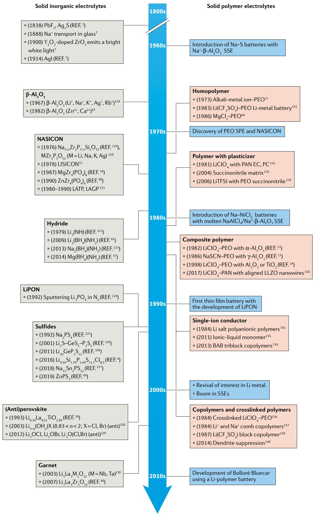

Fig. 1 | Development of SSEs. Timeline showing key events in the development of solid inorganic electrolytes and solid polymer electrolytes (SPEs). The blue boxes indicate breakthroughs in the development and applications of solid-state electrolytes (SSEs). EC, ethylene carbonate; LAGP,  $\mathrm{Li}_{1 + x}\mathrm{Al}_x\mathrm{Ge}_{2 - x}(\mathrm{PO}_4)_3$  ; LATP,  $\mathrm{Li}_{1 + x}\mathrm{Al}_x\mathrm{Ti}_{2 - x}(\mathrm{PO}_4)_3$  ; LiPON, lithium phosphorus oxynitride; LISICON, Li superionic conductor; LLZO,  $\mathrm{Li}_7\mathrm{La}_3\mathrm{Zr}_2\mathrm{O}_{12}$  NASICON, sodium superionic conductor (and other metal conductors that also adopt NASICON-like structures); PAN, poly(acrylonitrile); PC, propylene carbonate; PEO, poly(ethylene oxide); TFSI-, bis(trifluoromethane)sulfonimide. Corresponding references:7,8,11-14,38,40,51,56,62,64,67-69,104,126,149,159,161,218,219,221-238

chemical, structural and mechanical stability when in contact with active electrode materials — areas in which organic polymers have traditionally excelled.

Interest in electrochemical cells based on SSEs dates back about 200 years to the work of Michael Faraday on the fast solid-state ion transport in  $\mathrm{PbF}_2$  and  $\mathrm{Ag}_2\mathrm{S}(\mathrm{REF.})$ . Nonetheless, many of the materials design concepts of contemporary interest emerged in the 1960s, when the SSE field went through a period of rapid development, which ultimately led to two distinct families of SSEs: SIEs and solid polymer electrolytes (SPEs). FIGURE 1 shows the chronology of the development of SIEs and SPEs since Faraday's earliest contribution, and the chemical structures of various SIEs and SPEs of contemporary interest are compared in FIG. 2.

In this Review, we begin by discussing the properties of SIEs and SPEs, comparing their structures and ion-transport mechanisms, including at interfaces. On this basis, we discuss the failure modes of SSEs, with an emphasis on studies that have used advanced diagnostic techniques and strategies towards mitigation. Moreover, we survey applications of SSEs for post-Li-ion batteries, such as rechargeable metal batteries with high-voltage and/or high-capacity cathode materials. Finally, we offer a perspective on the unresolved challenges and future opportunities for SSEs.

# Properties of SIEs and SPEs

SIEs generally possess high ionic conductivities  $(>0.1\mathrm{mScm^{-1}}$  at RT), high moduli (for example,  $>1\mathrm{GPa}$  for oxides), wide and high electrochemical-stability windows  $(>4.0\mathrm{V}$  as measured by linear sweep voltammetry) and excellent thermal stability (stable above  $100^{\circ}\mathrm{C})^{3}$ . However, the practical application of SIEs has been limited by several concerns. These issues include manufacturing difficulties (such as fragility on large areas), poor interfacial charge transport arising from inferior contact with the electrodes (compared with liquid electrolytes), the risk of metal dendrite growth and proliferation along grain boundaries at low current densities, their high cost and poor environmental stability.

To overcome some of these challenges, SIE materials that contain numerous voids, layered structures or excess metal ions (such as  $\mathrm{Li^{+}}$  and  $\mathrm{Na^{+}}$ ) have been designed to enable elevated ionic conductivity on the order of  $\mathrm{mScm^{-1}}$  under operational temperatures. A more fundamental design principle is based on decreasing the electrostatic forces within the material. Strong electrostatic forces make it difficult to transport multivalent cations (for example,  $\mathrm{Mg}^{2 + }$ $\mathrm{Zn}^{2 + }$  and  $\mathrm{Al}^{3 + }$ ), leading to a substantial drop in ionic conductivity (usually to  $<  10^{-3}\mathrm{mScm^{-1}}$  at RT). The electrostatic forces can be

reduced by increasing the distance between the mobile cation and neighbouring anions (such as  $\mathrm{O}^{2-}$  or  $\mathrm{S}^{2-}$ ), which can be achieved by designing the anion framework through ion substitution. A few sulfide SIEs have been designed to take advantage of the weaker Li-S bond compared with that of Li-O, producing materials with RT ionic conductivities (for example,  $25\mathrm{mScm^{-1}}$  for  $\mathrm{Li}_{9.54}\mathrm{Si}_{1.74}\mathrm{P}_{1.44}\mathrm{S}_{11.7}\mathrm{Cl}_{0.3}$ ) that surpass those of typical liquid electrolytes. Moreover, excess Li ions in SIEs usually occupy high-energy sites and, thus, readily migrate, triggering a concerted ion-transport mechanism.

Compared with SIEs, SPEs have several advantages, including ease of synthesis, low mass densities, chemical stability, low cost, compatibility with large-scale manufacturing processes and the mechanical toughness inherent in organic polymers at temperatures well above the glass transition. Unfortunately, many of these traits are optimal in hydrocarbon polymers, such as polyethylene and polypropylene, which are also characterized by low dielectric constants  $(\varepsilon < 5)$ . Thus, these materials are unable to facilitate ion-pair dissociation in an electrolyte, which is a requirement for efficient cationic transport. It is, therefore, unsurprising that polymers, such as poly(ethylene oxide) (PEO), poly(acrylonitrile) (PAN), poly(methyl methacrylate) (PMMA) and poly(vinyl alcohol) (PVA), in which the electron-withdrawing groups dispersed along the carbon-carbon backbones enable ion-pair dissociation through specific, non-classical effects[10], have had, and will likely continue to have, such a dominant role in the genesis of SPEs since the  $1970s^{11}$ . Invariably, the processes responsible for ion-pair dissociation result in dynamic association between the mobile cations and the long-chain molecules that constitute the SPE. Therefore, unlike SIEs, in which cations can respond to an imposed field by hopping between atomic sites in a crystal lattice or more rapidly along lattice defects or grain boundaries, polymer chains locked in a crystal lattice hinder the motion of cations associated with groups along the chain backbone. Fortunately, there are various physical approaches (plasticizers, inorganic fillers, polymer blending and oligomer-tethered nanoparticles) and chemical strategies (copolymerization, crosslinking and the introduction of ionic side groups) to design SPEs that frustrate crystallization to enable acceptable ionic conductivities at temperatures near ambient or within the thermal window of applications, including in transport applications.

Owing to the distinctive merits of SIEs and SPEs, the formation of SIE-SPE composites is an increasingly attractive approach to materials with balanced properties by combining the best features of the constituent SIE and SPE. The origin of composite electrolytes can be traced to the addition of inert inorganic particles into ion-conductive engineering polymers such as PEO, increasing the mechanical strength and thermal stability, suppressing polymer crystallization and facilitating increased dissociation of the salt[12-14]. It has also been suggested that well-connected pathways in the inorganic phase enable faster ion conduction. In addition to bulk composite electrolytes, layered SPE-SIE hybrids also exhibit phase-dependent, task-specific properties that may, for example, improve interfacial contact

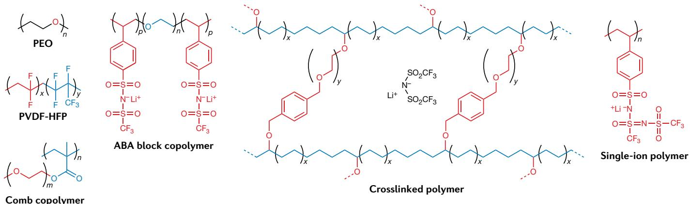  
a SPEs

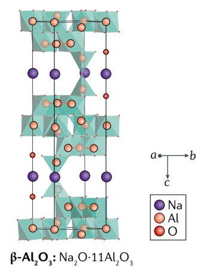  
b SIEs

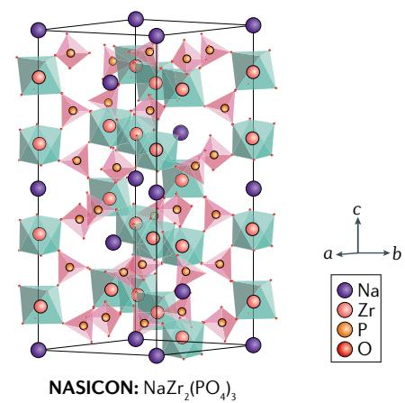

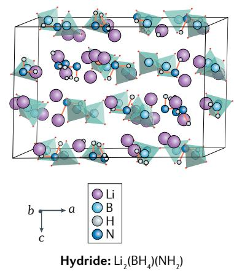

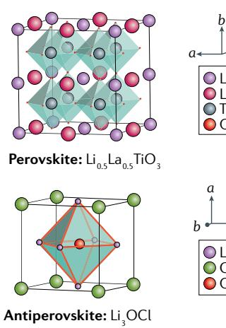  
Fig. 2 | Structures of common solid-state electrolytes. There are two families of solid-state electrolytes, namely, solid polymer electrolytes (SPEs) and solid inorganic electrolytes (SIEs). a | SPE architectures include homopolymers, (such as poly(ethylene oxide) (PEO) and poly(vinylidene difluoride-co-hexafluoropropene) (PVDF-HFP)), comb polymers $^{237}$ , AB and ABA block polymers composed of two blocks of repeat units of different chemistries $^{159}$ , crosslinked polymers with a porous network $^{149}$  and single-ion conducting polymers, in which the anion is covalently tethered to the backbone $^{160}$ . b | The crystal structures of typical SIEs are shown.  $\beta$ -Aluminas (termed  $\beta\text{-Al}_2\mathrm{O}_3$ ,  $\beta'\text{-Al}_2\mathrm{O}_3$  and  $\beta''\text{-Al}_2\mathrm{O}_3$  with increasing  $\mathsf{R}_2\mathsf{O}$  ( $\mathsf{R} = \mathsf{Na}$ , K) content, respectively) are composed of spinel layers through which cations diffuse $^{239}$ . Sodium superionic conductors (NASICONs) feature 3D channels within  $\mathsf{PO}_4$  tetrahedra and  $\mathsf{ZrO}_6$  octahedra for  $\mathsf{Na}^+$  transport $^{240}$ . The  $\mathsf{Li}^+$  conductors  $\mathsf{Li}_{1 + x}\mathsf{Al}_x\mathsf{T}_{1 - x}(\mathsf{PO}_4)_3$  and  $\mathsf{Li}_{1 + x}\mathsf{Al}_x\mathsf{Ge}_{2 - x}(\mathsf{PO}_4)_3$  also adopt NASICON-like structures. In hydrides such as  $\mathsf{Li}_2(\mathsf{BH}_4)(\mathsf{NH}_2)$ , the  $\mathsf{Li}^+$  ions are tetrahedrally coordinated with  $[\mathsf{BH}_4]^-$  and  $[\mathsf{NH}_2]^-$  anions $^{62}$ . Perovskite-type SIEs are prepared by introducing  $\mathsf{Li}^+$  at the A site of traditional  $\mathsf{ABO}_3$  compounds, forming  $\mathsf{Li}_{3x}\mathsf{La}_{2/3 - x}\mathsf{TlO}_3$ . The centre site (A site) is thus either occupied by  $\mathsf{La}^{3+}$  or  $\mathsf{Li}^+$ , or remains vacant and  $\mathsf{TlO}_6$  octahedra are located at the corners (B sites) $^{241}$ . The Li-rich antiperovskites have the general formula  $\mathsf{Li}_3\mathsf{OX}$  ( $X = Br$ , Cl or a mixture) $^{242}$ . The sulfide  $\mathsf{Li}_{10}\mathsf{GeP}_2\mathsf{S}_{12}$  has a 3D framework structure, in which there is a 1D  $\mathsf{Li}^+$  conduction path along the  $c$ -axis $^{104}$ . Garnet-type SIEs have the general formula  $\mathsf{A}_3\mathsf{B}_2(\mathsf{XO}_4)_3$ . In  $\mathsf{Li}_7\mathsf{La}_3\mathsf{Zr}_2\mathsf{O}_{12}$  ( $\mathsf{Li}$  excess), the La and Zr cations are coordinated to eight and six oxygen atoms, respectively $^{243}$ .

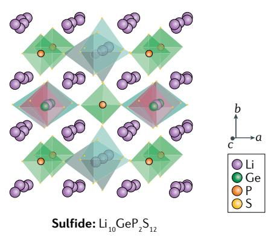

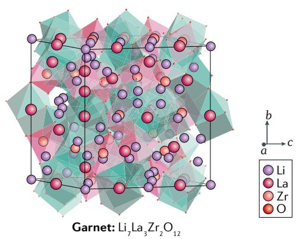

with an intercalating cathode or increase the chemical and/or electrochemical stability of an SSE in contact with reactive alkali-metal anodes $^{15}$ .

With the rapid development over the past 5 years, a substantial body of work has emerged that considers the failure modes, and corresponding remedies, of various SSEs, including their fragility, poor interfacial charge-transfer kinetics, environmental instability, ageing and reactivity upon prolonged contact with reactive electrodes and higher electronic conductivity along grain boundaries. Moreover, areas of study also include the mechanical heterogeneity and associated inability to prevent proliferation of metal dendrites at currents above typically unknown material-specific thresholds, as well as electrochemical degradation at low and high electrode potentials in batteries. Although the literature on SIEs and SPEs remains largely bifurcated, studies that cross these boundaries in pursuit of hybrid SSEs that combine the strengths of SIEs and SPEs provide the fastest path for progress.

# Ion transport in SSEs

# Ion-transport mechanisms

Ion transport in electrolytes is driven by chemical and electrochemical potential gradients in the system. The Nernst-Planck equation relates the flux of charged species in a dilute electrolyte to the chemical and electrical potential gradients  $(\nabla c_{i}$  and  $\nabla \varphi$  , respectively) and, through mass conservation, the current density  $(j)$  can be determined:

$$
j = - F ^ {2} \nabla \varphi \sum_ {i} \mu_ {i} c _ {i} - F \sum_ {i} D _ {i} \nabla c _ {i} + F \mathbf {u} \sum_ {i} c _ {i} \tag {1}
$$

Here,  $F$  is the Faraday constant,  $\mu_{i}$  is the mobility of charged species  $i$  (for simplicity, assumed here to be monovalent),  $c_{i}$  is the concentration of dissociated ion pairs,  $D_{i}$  is the diffusion coefficient and  $\mathbf{u}$  is the convective velocity of the medium in which ion transport occurs $^{16}$ . In an SSE, the convection term is negligible even at potentials well above the thermal voltage ( $k_{\mathrm{B}}T / e = RT / F$ , where  $k_{\mathrm{B}}$  is Boltzmann's constant,  $T$  is temperature,  $e$  is the electronic charge and  $R$  is the gas constant), and the concentration gradient is small at moderate potentials. Under these conditions, Eq. 1 can be simplified further to obtain the electrolyte conductivity,

$$
\sigma = - \frac {j}{\nabla \varphi} = F ^ {2} \sum_ {i} \mu_ {i} c _ {i} \tag {2}
$$

where the mobility is related to the diffusion coefficient by  $\mu_{i} = D_{i} / RT$ . Equation 2 shows that a high ionic conductivity requires both a high ion mobility and a high concentration of mobile ions (that is, dissociated ion pairs). Moreover, an electrolyte with a high ionic conductivity can sustain charge transport at high driving currents with a negligible concentration gradient. A good ionic conductor must, therefore, be able to simultaneously facilitate ion-pair dissociation and exhibit minimal resistance to ion motion. Although the migration of both cations and anions contribute to the total current, the useful fraction of the current that drives the redox reactions

at the electrodes in most electrochemical cells is carried by the cations. The cation transference number characterizes this fraction, and maximizing this number is key to increasing the efficiency of battery operation, as any potential used to drive anion migration is wasted energy.

Dissociated ions that overcome the energy barrier can hop from one site to another in an  $\mathrm{SSE}^{17}$ . The diffusion coefficient can be expressed as a function of the free energy of migration  $(\Delta G_{\mathrm{mig}})$ :

$$
D _ {i} = \gamma a ^ {2} f _ {\mathrm {o}} \exp \left(- \frac {\Delta G _ {\mathrm {m i g}}}{R T}\right) \tag {3}
$$

where  $\gamma$  is a factor accounting for geometrical effects,  $a$  is the hopping distance and  $f_{\mathrm{o}}$  is the attempt frequency for ion hopping18. Combining Eqs. 2 and 3, the electrolyte conductivity can be written in fundamental terms,

$$
\begin{array}{l} \sigma_ {i} = \frac {F ^ {2}}{R T} c _ {i} \gamma a ^ {2} f _ {\mathrm {o}} \exp \left(- \frac {\Delta G _ {\mathrm {m i g}}}{R T}\right) \tag {4} \\ = \frac {F ^ {2}}{R T} c _ {i} \gamma a ^ {2} f _ {\mathrm {o}} \exp \left(\frac {\Delta S _ {\mathrm {m i g}}}{R}\right) \exp \left(- \frac {\Delta H _ {\mathrm {m i g}}}{R T}\right) \\ \end{array}
$$

where  $\Delta S_{\mathrm{mig}}$  is the entropy of migration and  $\Delta H_{\mathrm{mig}}$  is the enthalpy of migration. Furthermore, if the dissociation of ion pairs is thermally activated, then  $c_{i}$  can be related to the formation enthalpy  $(\Delta H_{\mathrm{f}})^{19}$  through

$$
c _ {i} = c _ {\mathrm {o}} \exp \left(- \frac {\Delta H _ {\mathrm {f}}}{R T}\right) \tag {5}
$$

where  $c_{\mathrm{o}}$  is the initial concentration of ion pairs before thermal activation.

Combining the exponential prefactors and combining the various activation energies into a single barrier,  $E_{\mathrm{a}}$ , Eq. 4 can be simplified into the well-known Arrhenius form for conductivity,

$$
\sigma_ {i} = \frac {\sigma_ {\mathrm {o}}}{T} \exp \left(- \frac {E _ {\mathrm {a}}}{R T}\right) \tag {6}
$$

where the exponential prefactor  $\sigma_{\mathrm{o}}$  may itself be a weak function of temperature, and  $E_{\mathrm{a}} = \Delta H_{\mathrm{f}} + \Delta H_{\mathrm{mig}}$  is the overall activation energy for the formation and migration processes of mobile ions in the electrolyte. The activation energy is thus directly dependent on the ease of formation of free ions and the energy barrier for them to diffuse through the electrolyte. Crystalline materials and other inorganic ionic conductors generally obey the Arrhenius equation.

Amorphous materials, which possess a much higher entropy and free volume for motion, are naturally better ionic conductors than crystalline materials. A breakthrough in solid-state ionics was the discovery that highly conductive glassy phases exist in  $\mathrm{AgI - Ag_2SeO_4}$  systems $^{20}$ . Glasses, like most amorphous materials, exhibit a liquid phase, a crystal phase and a glass-transition phase, depending on their temperature and processing history, and they are typically composed of an assembly of smaller units and lack long-range order. Because the

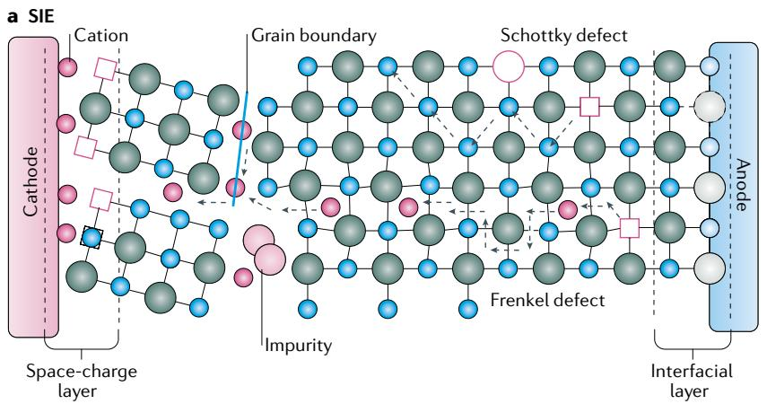  
Fig. 3 | Ion transport in SPEs and SIEs. a | Li-ion transport in solid inorganic electrolytes (SIEs) is facilitated by free space at grain boundaries, as well as Schottky and Frenkel defects. An interfacial layer forms when two materials with different chemical potentials are in contact and/or through the reaction of two materials. This layer can retard or accelerate ion transport across the interface, depending on the operating conditions. b,c | Ion conduction in solid polymer electrolytes (SPEs) has been proposed to occur through the amorphous and crystalline phases. Within the amorphous phase, segmental motion of the polymer chains assists in the migration and hopping of alkali-metal ions  $(\mathsf{M}^{n+})$  from one coordination site to another (panel b). By contrast, in the crystalline phase, conduction occurs through ordered domains formed by folded polymer chains, while the anions  $(\mathsf{X}^{n-})$  migrate outside these tunnels (panel c).

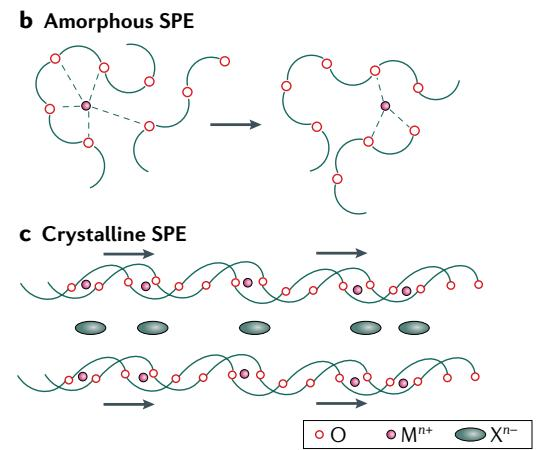

framework has, in theory, an infinitely long relaxation time, ions move by hopping from one site to another energetically favourable site, analogous to transport in crystals. At a temperature just below the glass transition, called the ideal vitreous transformation temperature, ion migration follows the Arrhenius equation, and is, thus, similar to that in crystals[21]. Above the glass-transition temperature  $(T_{\mathrm{g}})$ , the individual units can move about their bonding points and assist in ion migration. Thus, at temperatures above  $T_{\mathrm{g}}$ , ionic motion is coupled to structural relaxations. These relaxations are dependent on the viscosity of the system, which decreases as the temperature increases above  $T_{\mathrm{g}}$ . The Vogel-Fulcher-Tammann equation captures this effect by coupling the ionic conductivity to the difference in temperature from the ideal glass transition,

$$
\sigma_ {i} = \frac {\sigma_ {\mathrm {o}}}{T} \exp \left(- \frac {E _ {\mathrm {a}}}{R \left(T - T _ {\mathrm {o}}\right)}\right) \tag {8}
$$

where  $T_{\mathrm{o}}$  is a temperature that is  $\sim 50\mathrm{K}$  below  $T_{\mathrm{g}}$ .  $RT_{\mathrm{o}}$  is the potential barrier for local movement of the individual units within the glass[22]. Polymer electrolytes follow Vogel-Fulcher-Tammann behaviour owing to the strong coupling between the segmental motion of the chains and the ionic motion in the electrolyte.

# Ion-transport pathways

Pathways within the bulk. The material structure and physical and chemical properties significantly affect the parameters that control ion-transport pathways in SIEs and SPEs (FIG. 3). Most SIEs possess a periodic structure with coordinated polyhedrons (FIG. 2b). In ceramics, defects within the framework, such as interstices and vacancies, provide the largest contribution to fast ion movement. The lattice can also be distorted near boundaries and interfaces, where mobile carriers

redistribute according to the potential difference and additional interfacial charge-transport pathways are generated (FIG. 3a).

For crystalline superionic conductors, the topology and coordination of the crystal framework and ion-binding sites are the principal factors in determining the energy landscape for ion transport. Investigation of the  $\mathrm{Li^{+}}$  migration barrier for various anion-host matrices revealed that body-centred cubic packing of the anions renders a lower energy landscape than that of a face-centred cubic or a hexagonal close-packed sublattice[23]. The body-centred cubic anion arrangement is present in various well-known fast  $\mathrm{Li^{+}}$  conductors, such as  $\mathrm{Li_{10}GeP_2S_{12}}$  (LGPS) and antiperovskite  $\mathrm{Li}_3\mathrm{OCl}$ , as well as in typical  $\mathrm{Ag^{+}}$ ,  $\mathrm{Na^{+}}$  and  $\mathrm{Mg^{2+}}$  ionic conductors. To transport Li ions efficiently, superionic conductors generally contain disordered sublattices with a high proportion of vacant  $\mathrm{Li^{+}}$  sites and large, interconnected interstitial sites. Ab initio molecular dynamics simulations revealed that  $\mathrm{Li^{+}}$  in superionic conductors, including the sulfide electrolyte LGPS, garnet-type electrolyte  $\mathrm{Li_7La_3Zr_2O_{12}}$  (LLZO) and  $\mathrm{Li^{+}}$ -conducting NASICON electrolyte  $\mathrm{Li_{1.3}Al_{0.3}Ti_{1.7}(PO_4)_3}$  (LATP), exhibit concerted migration, with multiple ions hopping to the nearest sites, rather than isolated ions hopping over energy barriers, as in typical ceramics[9].  $\mathrm{LiZr_2(PO_4)_3}$  with a NASICON structure also exhibits a similar transport mechanism, through which  $\mathrm{Li^{+}}$  are repelled by neighbouring ions, enabled by Frenkel-like defects[24].

Ion diffusion in superionic conductors is generally anisotropic. Neutron powder diffraction studies showed that LGPS exhibits quasi-isotropic 3D diffusion pathways with 1D channels crossing diffusion planes[25]. Lattice dynamics in LGPS follow classical Boltzmann statistics at ambient and moderate temperatures. At elevated temperatures, a transition from 1D-dominated to 3D-dominated conduction mechanisms occurs, which complicates analyses of transport behaviour in these

materials $^{26}$ . However, a recent study on single-crystal LGPS revealed that the activation energy for conduction along all the crystal directions is nearly equal and, thus, the conductivity is only weakly anisotropic $^{27}$ . For oxide electrolytes such as LLZO, the ionic conductivity of the cubic garnet phase is much higher than that of the tetragonal phases. The increased conductivity and 3D ion-diffusion channels of cubic LLZO electrolytes enable them to redistribute ions in Li-metal cells for a uniform ion distribution $^{28}$ .

SPEs conduct ions through segmental relaxation of the polymer chains. Polyethers (such as PEO), which are known for their ability to complex with alkali-metal cations, primarily conduct  $\mathrm{Li^{+}}$  through coordination with the oxygen atoms along the backbone of the polymer chains (FIG. 3b). Ionic conduction is typically attributed to the amorphous phase of the polymer and the presence of a free volume above  $T_{\mathrm{g}}$  (REF.29).  $\mathrm{Li^{+}}$  diffusion is facilitated by subdiffusive motion along the PEO chain, together with intersegmental hopping and the collective motion of the entire polymer chain with the coordinated ion30 (FIG. 3b). For high-molecular-weight polymers, entangled chains influence the solvation of ions and the diffusion of the polymer chains; thus, intersegmental hopping is the dominant form of ionic conduction. For low-molecular-weight polymers and oligomers, ion conduction primarily occurs through diffusion in the solvated form similar to carbonate-based liquid electrolytes31.

Ionic conductivity has also been reported in the crystalline domains of a polymer electrolyte and has been argued to be higher than that in the amorphous phase[32]. In the crystalline domains, the polymer chains fold into cylindrical tunnels that conduct  $\mathrm{Li^{+}}$  through ion hopping, while the anions are located outside these tunnels and separated from the cations by the inter-chain space[33] (FIG. 3c). Nevertheless, following debate, with experimental and theoretical studies[34,35] contradicting that the conductivity is higher in the crystalline domains, there is now a consensus that reducing crystallinity is key to increasing ionic conductivity in polymer electrolytes.

Pathways across interfaces. There are numerous interfaces inside a battery, including homogeneous interfaces, such as grain boundaries, and heterogeneous interfaces, such as those between an electrode and the electrolyte. Ion transport through interfaces is vital for next-generation batteries, especially when nanomaterials are introduced, because these increase the number of interfaces in the system.

Grain boundaries are extended defects $^{36}$  and ion migration across grain boundaries occurs in most solid electrolytes. Large-scale molecular dynamics simulations have revealed that the activation energy of migration across grain boundaries is higher than that in the bulk crystal phase for antiperovskite structures $^{37}$ . Electrochemical impedance spectroscopy results also indicate that the grain boundaries of perovskite  $\mathrm{Li}_{3x}\mathrm{La}_{2/3-x}\mathrm{TiO}_3$  (REF. $^{38}$ ) and  $\mathrm{Li}_{2+2x}\mathrm{Zn}_{1-x}\mathrm{GeO}_4$  (LISICON) $^{39}$  influence the total ionic conductivity. Impedance results indicate that the contribution of grain-boundary resistance to the total resistance in LLZO is  $40 - 50\%$  for pellets $^{40}$ , in which the grain-boundary conductivity is

also related to the temperature of operation $^{41}$ . Although the activation energies of charge transfer along individual grain boundaries and through the bulk of the grains are reported to be on the same order of magnitude for LLZO $^{40}$ , the conductivity of LLZO sintered in air is increased compared with that of LLZO sintered under argon, owing to decreased grain-boundary resistance $^{42}$ .

Along heterogeneous interfaces, there is a driving force to redistribute mobile carriers according to the different chemical potentials of the two materials when they come into contact. A space-charge layer forms at an interface upon the local migration of uncompensated charges across the boundary, resulting in the accumulation of mobile carriers on one side of the interface and depletion on the other[43,44]. The space-charge layers and potential profiles can be theoretically investigated through first-principles calculations[45] and visualized by combining phase-shifting electron holography with electron energy-loss spectroscopy[46].

Space-charge layers influence both ion migration across the interface and the overall conductivity. In some glass ceramics, such as  $\mathrm{Li}_{1 + x}\mathrm{Al}_x\mathrm{Ge}_{2 - x}(\mathrm{PO}_4)_3$  (LAGP;  $x = 0.5$ ), space-charge layers accelerate the ionic conduction but can also retard it along electrode-electrolyte interfaces[47]. Although anodes (which are planar) form smooth interfaces with the electrolyte, the interfaces formed with cathodes (which tend to be porous) have many discontinuities, increasing the complexity of the ion-transport pathways. The cathode-electrolyte interface between an oxide cathode  $(\mathrm{LiCoO}_2)$  and sulfide electrolyte  $(\beta -\mathrm{Li}_3\mathrm{PS}_4)$  has a disordered structure with Li adsorption sites[48]. Introducing a  $\mathrm{LiNbO}_3$  buffer layer between the electrolyte and the cathode suppresses the growth of the space-charge layer and provides additional routes for ion migration[48].

# Li-ion and Na-ion SSEs

Owing to the unevenly distributed (mainly in South America) and limited  $(\sim 20~\mathrm{ppm}$  in the Earth's crust) supply of Li (REF.49), there has been a revival of interest in Na-ion and Na-metal batteries in recent years. Li and Na have many similar physico-chemical properties; however, the higher reactivity of Na promotes dendrite growth and side reactions, which result in an unstable solid electrolyte interphase (SEI) — an intermediate phase that forms between the solid electrode and the solid or liquid electrolyte — and a low Coulombic efficiency in liquid electrolytes. Therefore, it is necessary to develop SSEs for Na batteries to prevent these parasitic reactions. Similar to those for Li batteries, SSEs based on, for example,  $\beta -\mathrm{Al}_2\mathrm{O}_3$  NASICON, sulfides, complex hydrides and SPEs have been developed for Na batteries. The ion conductivities and selected properties of  $\mathrm{Li^{+}}$  and  $\mathrm{Na^{+}}$  conductors with similar structures, together with those of several multivalent SSEs, are compared in TABLE 1.

The transport of metal ions is affected by many factors. Although  $\mathrm{Li^{+}}$  has a smaller ionic radius than that of  $\mathrm{Na^{+}}$ , it also typically has a higher affinity towards oxygen (or sulfur), owing to its higher charge density (and, thus, higher Lewis acidity). The smaller radius of  $\mathrm{Li^{+}}$  may enable faster transport through the bulk phase; however, the lower Lewis acidity of  $\mathrm{Na^{+}}$  facilitates cation desolvation.

Table 1 | Comparison of Li SSEs, Na SSEs and other metal SSEs with similar structures  

<table><tr><td>Metal iona,b</td><td>SSE</td><td>Diffusion coefficient (10-5cm2s-1)</td><td>Ionic conductivity (mScm-1)</td><td>Activation energy (eV)</td><td>Ref.</td></tr><tr><td colspan="6">Sulfates (high-temperature sulfate phases)</td></tr><tr><td rowspan="4">Li+</td><td>Li2SO4</td><td>1.59</td><td>-</td><td>-</td><td>254</td></tr><tr><td>LiNaSO4</td><td>1.16</td><td>-</td><td>-</td><td>254</td></tr><tr><td>LiAgSO4</td><td>1.03</td><td>-</td><td>-</td><td>254</td></tr><tr><td>Li4Zn(SO4)3</td><td>1.32</td><td>-</td><td>-</td><td>254</td></tr><tr><td rowspan="2">Na+</td><td>Li2SO4</td><td>1.56</td><td>-</td><td>-</td><td>254</td></tr><tr><td>LiNaSO4</td><td>1.19</td><td>-</td><td>-</td><td>254</td></tr><tr><td rowspan="2">K+</td><td>Li2SO4</td><td>1.24</td><td>-</td><td>-</td><td>254</td></tr><tr><td>LiNaSO4</td><td>0.61</td><td>-</td><td>-</td><td>254</td></tr><tr><td rowspan="2">Mg2+</td><td>Li2SO4</td><td>0.04</td><td>-</td><td>-</td><td>254</td></tr><tr><td>LiNaSO4</td><td>0.19</td><td>-</td><td>-</td><td>254</td></tr><tr><td rowspan="2">Ca2+</td><td>Li2SO4</td><td>0.14</td><td>-</td><td>-</td><td>254</td></tr><tr><td>LiNaSO4</td><td>0.34</td><td>-</td><td>-</td><td>254</td></tr><tr><td>Zn2+</td><td>Li4Zn(SO4)3</td><td>0.13</td><td>-</td><td>-</td><td>254</td></tr><tr><td>Al3+</td><td>Li2SO4</td><td>0.0017</td><td>-</td><td>-</td><td>254</td></tr><tr><td colspan="6">β-Al2O3(300°C)</td></tr><tr><td>Li+</td><td>β-Al2O3</td><td>0.069</td><td>-</td><td>0.378</td><td>255</td></tr><tr><td>Na+</td><td>β-Al2O3</td><td>0.84</td><td>-</td><td>0.165</td><td>255</td></tr><tr><td>K+</td><td>β-Al2O3</td><td>0.070</td><td>-</td><td>0.232</td><td>255</td></tr><tr><td colspan="6">Sulfides (25°C)</td></tr><tr><td rowspan="7">Li+</td><td>Li3PS4</td><td>-</td><td>0.16</td><td>0.356</td><td>256</td></tr><tr><td>Li7P3S11c</td><td>-</td><td>45.66</td><td>0.191</td><td>52</td></tr><tr><td>Li3SbS4(glass)</td><td>-</td><td>0.0015</td><td>0.518</td><td>257</td></tr><tr><td>Li3.833Sn0.833As0.166S4</td><td>-</td><td>1.39</td><td>0.21</td><td>85</td></tr><tr><td>Li6PS5Br</td><td>-</td><td>11</td><td>0.10</td><td>258</td></tr><tr><td>Li9.54Si1.74P1.44S11.7Cl0.3</td><td>-</td><td>25</td><td>0.24</td><td>8</td></tr><tr><td>Li7P3Se11c</td><td>-</td><td>47.94</td><td>0.188</td><td>52</td></tr><tr><td rowspan="6">Na+</td><td>Na3PS4(cubic)</td><td>-</td><td>0.46</td><td>0.20</td><td>259</td></tr><tr><td>Na7P3S11c</td><td>-</td><td>10.97</td><td>0.217</td><td>52</td></tr><tr><td>Na3SbS4</td><td>-</td><td>1</td><td>0.22</td><td>260</td></tr><tr><td>Na3P0.62As0.38S4</td><td>-</td><td>1.46</td><td>0.256</td><td>261</td></tr><tr><td>Na2.9375PS3.9375Cl0.0625</td><td>-</td><td>1.14</td><td>0.249</td><td>262</td></tr><tr><td>Na7P3Sec</td><td>-</td><td>12.56</td><td>0.213</td><td>52</td></tr><tr><td>Mg2+</td><td>MgS-P2S5-MgI2</td><td>-</td><td>0.00021</td><td>-</td><td>58</td></tr><tr><td>Zn2+</td><td>ZnP3</td><td>-</td><td>10-5-10-3(60°C)</td><td>0.351±0.099</td><td>69</td></tr><tr><td colspan="6">NASICONs</td></tr><tr><td>Li+</td><td>LiZr2(PO4)3</td><td>-</td><td>12 (300°C)</td><td>0.43</td><td>263</td></tr><tr><td>Na+</td><td>Na3Zr2PSi2O12</td><td>-</td><td>200 (300°C)</td><td>0.29</td><td>219</td></tr><tr><td>Mg2+</td><td>MgZr4(PO4)6</td><td>-</td><td>6.1 (800°C)</td><td>0.82</td><td>59</td></tr><tr><td>Zn2+</td><td>ZnZr4(PO4)6</td><td>-</td><td>3.7 (800°C)</td><td>0.93</td><td>59</td></tr><tr><td colspan="6">Oxides</td></tr><tr><td>Li+</td><td>Li7P3O11c</td><td>-</td><td>0.03</td><td>0.386</td><td>52</td></tr><tr><td>Na+</td><td>Na7P3O11c</td><td>-</td><td>0.003</td><td>0.535</td><td>52</td></tr></table>

Table 1 (cont.) | Comparison of Li SSEs, Na SSEs and other metal SSEs with similar structures  

<table><tr><td>Metal iona,b</td><td>SSE</td><td>Diffusion coefficient (10-5cm2s-1)</td><td>Ionic conductivity (mS cm-1)</td><td>Activation energy (eV)</td><td>Ref.</td></tr><tr><td colspan="6">Complex hydrides</td></tr><tr><td>Li+</td><td>Li2(BH4)(NH2)</td><td>-</td><td>0.2 (RT)</td><td>0.56 (30-75°C), 0.24 (&gt;95°C)</td><td>62</td></tr><tr><td>Na+</td><td>Na2(BH4)(NH2)</td><td>-</td><td>0.003 (27°C)</td><td>0.59</td><td>223</td></tr><tr><td>Mg2+</td><td>Mg(BH4)(NH2)</td><td>-</td><td>0.003 (100°C)</td><td>1.0-1.3</td><td>264</td></tr><tr><td colspan="6">Polymers</td></tr><tr><td rowspan="3">Li+</td><td>LiTFSI-PEO (Mw=5,000,000; EO:Li=20:1)</td><td>-</td><td>~0.8 (70°C)</td><td>-</td><td>265</td></tr><tr><td>LiClO4-PEO (Mw=600,000) (EO:Li=10:1)</td><td>-</td><td>~0.2 (90°C)</td><td>-</td><td>266</td></tr><tr><td>LiClO4-PEO (Mw=600,000) (EO:Li=10:1) with 5 wt% elliptical TiO2 rods</td><td>-</td><td>~1 (90°C)</td><td>-</td><td>266</td></tr><tr><td rowspan="3">Na+</td><td>NaTFSI-PEO (Mw=5,000,000) (EO:Na=20:1)</td><td>-</td><td>~0.15 (70°C)</td><td>-</td><td>267</td></tr><tr><td>NaClO4-PEO (Mw=600,000) (EO:Na=10:1)</td><td>-</td><td>~0.14 (90°C)</td><td>-</td><td>268</td></tr><tr><td>LiClO4-PEO (Mw=600,000) (EO:Na=20:1) with 5 wt% TiO2 nanoparticles</td><td>-</td><td>~0.5 (90°C)</td><td>-</td><td>268</td></tr></table>

Comparison of selected properties of solid-state electrolytes (SSEs); where relevant, the temperature is provided in parentheses. NASICON, sodium superionic conductor; PEO, poly(ethylene oxide); RT, room temperature; TFSI-, bis(trifluoromethane)sulfonimide. aIonic radii of various metals with a coordination number of four (Å): Li\* (0.76), Na\* (1.02), K\* (1.38), Mg\* (0.72), Zn\* (0.74), Ca\* (1.0), Al\* (0.535)269. bCorresponding charge density of various metal ions  $(\mathrm{Cmm}^{-3})$  : Li\* (87), Na\* (36), K\* (15), Mg\* (205), Zn\* (189), Ca\* (76), Al\* (748). The charge densities were calculated using ne/(4/3) $\pi r^3$  , where e is the electronic charge, n is the ion charge and  $r$  is the ionic radii. cCalculated.

Therefore, the ionic conductivity of a Na SSE can be higher than that of a Li SSE with a similar framework. For example, owing to the higher covalency of the Li-O bond compared with  $\mathrm{Na - O}$ , replacing  $\mathrm{Na^{+}}$  in the NASICON  $\mathrm{Na}_{1 + x}\mathrm{Zr}_2\mathrm{Si}_x\mathrm{P}_{3 - x}\mathrm{O}_{12}$  with  $\mathrm{Li^{+}}$  usually decreases the conductivity[51]. However, computational studies show that, in  $\mathrm{A_7P_3X_{11}^-}$  type (A = Li, Na; X = O, S, Se) SSEs, the Li SSEs show higher conductivities and lower activation-energy densities than those of the Na SSEs[52]. Studies of  $\mathrm{Li^{+}}$  and  $\mathrm{Na^{+}}$  transport in hybrid electrolytes (SIE-SPE or SIE-liquid) show that  $\mathrm{Na^{+}}$  transport through the internal interfaces in both cases has a lower activation energy[53]. This phenomenon can be attributed to the lower Lewis acidity of  $\mathrm{Na^{+}}$  and its weaker interactions with oxygen atoms in the polymer and liquid electrolytes (for example, propylene carbonate (PC)). Further theoretical studies also showed that the desolvation energies of  $\mathrm{Na^{+}}$  complexes are generally smaller than those of  $\mathrm{Li^{+}}$  complexes in most solvents. In comparison,  $\mathrm{Mg}^{2 + }$  complexes showed much larger desolvation energies[54]. It is necessary to complement these theoretical evaluations with experimental studies to increase the understanding of ion-transport pathways in SSEs and to enable the design of new SSEs suitable for different cations.

# SSEs for multivalent ion transport

Compared with highly reactive alkali metals (Li, Na, K), batteries using multivalent metals (Mg, Zn, Al) are usually more stable when exposed to air. However, rechargeable Mg batteries typically use tetrahydrofuran-based liquid electrolytes, which are volatile and readily decompose at high voltages[55]. For  $\mathrm{Mg}^{2+}$  transport, SSEs based

on NASICON $^{56}$ , complex hydride $^{57}$  and sulfide $^{58}$  structures have been reported to date. Solid-phosphate  $\mathrm{Mg}^{2+}$  conductors with a  $\beta\text{-Fe}_2(\mathrm{SO}_4)_3$ -type NASICON framework (such as  $\mathrm{MgZr}_4(\mathrm{PO}_4)_6$ ) display ionic conductivities of  $6.1\times 10^{-3}\mathrm{Scm}^{-1}$  at  $800^{\circ}\mathrm{C}$ , a value much lower than that of  $\mathrm{Na^{+}}$  and  $\mathrm{Li^{+}}$  conductors also with the NASICON structure $^{56,59}$  (TABLE 1). Owing to the higher charge density of  $\mathrm{Mg}^{2+}$  ( $205\mathrm{Cmm}^{-3}$ ) compared with that of  $\mathrm{Li^{+}}$  ( $87\mathrm{Cmm}^{-3}$ ), the electrostatic interaction between  $\mathrm{Mg}^{2+}$  and the constituent counterions is stronger, which results in low  $\mathrm{Mg}^{2+}$  mobility at low temperature. Attempts to increase the conductivity of  $\mathrm{MgZr}_4(\mathrm{PO}_4)_6$ -based materials have included substituting the tetravalent  $\mathrm{Zr}^{4+}$  site with pentavalent  $\mathrm{Nb}^{5+}$  or introducing a second phase of  $\mathrm{Zr}_2\mathrm{O}(\mathrm{PO}_4)_2$  (REFS $^{60,61}$ ). The  $\mathrm{Mg}^{2+}$  conductor  $\mathrm{Mg(BH_4)(NH_2)}$  has a structure featuring tunnels formed by the anion framework and zigzag chains of  $\mathrm{Mg}$  atoms with a  $\mathrm{Mg}-\mathrm{Mg}$  distance of  $3.59\AA$ . This  $\mathrm{Mg}-\mathrm{Mg}$  distance is shorter than that in  $\mathrm{Mg(BH_4)_2}$  and favours  $\mathrm{Mg}$  hopping; thus,  $\mathrm{Mg(BH_4)(NH_2)}$  exhibits a high ionic conductivity of  $10^{-3}\mathrm{mScm}^{-1}$  at  $150^{\circ}\mathrm{C}$ .  $\mathrm{Mg(BH_4)(NH_2)}$  also has a wide electrochemical window of  $>3\mathrm{V}$ , and the plating and stripping of  $\mathrm{Mg}$  is reversible $^{57}$ . However, the  $\mathrm{Mg}^{2+}$  conductivity of  $\mathrm{Mg(BH_4)(NH_2)}$  is still much lower than that of  $\mathrm{Li^{+}}$  in  $\mathrm{Li}_2(\mathrm{BH}_4)(\mathrm{NH}_2)$  ( $\sim0.2\mathrm{mScm}^{-1}$  at RT) $^{62}$ . High  $\mathrm{Mg}^{2+}$  mobility was predicted in a spinel framework (especially spinel selenide) and the subsequently fabricated material,  $\mathrm{MgSr}_2\mathrm{Se}_4$ , showed a conductivity of  $\sim0.01-0.1\mathrm{mScm}^{-1}$  at RT $^{63}$ .

Mg-based SPEs have been studied since the  $1980\mathrm{s}^{64}$ . However, few of these electrolytes demonstrated fast and neat Mg plating and stripping profiles until a gel-like SPE

containing  $\mathrm{Mg(AlCl_2 - EtBu)_2}$  complexed with a polymer (poly(vinylidene difluoride) (PVDF) or PEO) along with tetraglyme as a plasticizer showed reversible  $\mathrm{Mg}$  plating and stripping profiles and compatibility with a  $\mathrm{Mo}_6\mathrm{S}_8$  cathode. More recently, a liquid-free nanocomposite polymer electrolyte consisting of  $\mathrm{Mg(BH_4)_2}$ , PEO and  $\mathrm{MgO}$  nanoparticles showed a high Coulombic efficiency of  $98\%$  for  $\mathrm{Mg}$  plating and stripping at  $100^{\circ}\mathrm{C}$  (REF. 65). The long PEO chain strongly coordinated with  $\mathrm{Mg}^{2+}$ , thus facilitating the dissociation of  $\mathrm{Mg(BH_4)_2}$ .

Owing to the compatibility with water, Zn anodes are promising for increasing the safety of energy-storage systems. However, in aqueous electrolytes, Zn anodes have intrinsic issues, such as shape change and dendrite growth, which limits their utility in applications that require a high capacity and stable operation over repeated discharge and charge cycles. Aqueous electrolytes are also limited by the narrow electrochemical-stability window of water, motivating the development of new types of electrolytes that can transport the divalent  $\mathrm{Zn}$  ions[66].  $\mathrm{Zn^{2 + }}$  diffusion in  $\beta \mathrm{-Al_2O_3}$  (REF.67) and NASICON-type  $\mathrm{ZnZr_4(PO_4)_6}$  (REF.68) was studied more than 40 years ago. Similar to  $\mathrm{Mg^{2 + }}$ , the diffusion of  $\mathrm{Zn^{2 + }}$  is slow in NASICON structures  $(1.34\times 10^{-3}\mathrm{mScm^{-1}}$  at  $500^{\circ}\mathrm{C})$ . In the distorted honeycomb network of  $\mathrm{ZnPS}_3$ , the  $\mathrm{Zn^{2 + }}$  ions are octahedrally coordinated by  $[\mathrm{P}_2\mathrm{S}_6]^{4 - }$  polyanions. Although the elastic P-P bond in  $[\mathrm{P}_2\mathrm{S}_6]^{4 - }$  can stretch to alleviate structural distortions during  $\mathrm{Zn^{2 + }}$  diffusion, the ion conductivity is still low  $(10^{-5} - 10^{-3}\mathrm{mScm^{-1}}$  at  $60^{\circ}\mathrm{C})$  [69].

SPEs comprising  $\mathrm{Zn^{2 + }}$  ions, such as  $(\mathrm{PEO})_4\mathrm{ZnCl}_2,$  were first studied in the  $1980s^{70}$ . Recently, a thin  $(30\mu \mathrm{m})$  and strong PAN-based cation-exchange membrane was reported to stop the dendritic growth of Zn (REF.71). In a few Zn battery systems (such as alkaline Zn-Mn batteries and Zn-air batteries), the migration of hydroxide  $(\mathrm{OH}^{-})$  ions, rather than the  $\mathrm{Zn^{2 + }}$  ions, is the main source of current. These systems generally use highly basic KOH electrolytes to increase the ionic conductivity and oxygen solubility. A recently reported PVA electrolyte membrane functionalized with quaternary ammoniums transports  $\mathrm{OH^{-}}$  selectively and thus inhibits the crossover of cations, such as  $[\mathrm{Zn(NH_3)_6}]^{2 + }$  (REF.72).

The transport of  $\mathrm{Ca^{2 + }}$  in  $\beta \text{-Al}_2\mathrm{O}_3$  and  $\mathrm{MZr_4(PO_4)_6}$  was studied in the 1980s and early 1990s, and no substantial progress in  $\mathrm{Ca^{2 + }}$  SSEs has been made since[67,73].  $\mathrm{Al}^{3 + }$  -based SSEs are also of interest because trivalent  $\mathrm{Al}^{3 + }$  ions offer the highest charge-storage capacities  $(8,040\mathrm{mAhcm}^{-3})^{74}$  and SSEs can be used to trap the leakage and overcome the moisture sensitivity of liquid electrolytes. For example, polymer electrolytes, such as PVA-poly(acrylic acid) membranes, have been used to trap KOH leakage from Al-air batteries[75]. In combination with ionic liquids, such as 1-ethyl-3-methylimidazolium chloride-AlCl, SPEs have enabled reversible Al stripping and plating[76] and demonstrated the fast charge capability  $(<  10s)$  in a full cell with graphite cathodes[77].

# Failure modes of SSEs

The main failure modes of SSEs (FIG. 4) are caused by their decomposition, owing to the electrochemical and interfacial instability at high and/or low voltages, volume changes during cycling and short circuiting due to the

formation of metal dendrites. Various technologies have been used to diagnose the failure modes of SSEs (BOX 1).

# Electrochemical and interfacial instability

SIEs. Decomposition occurs at the electrolyte-electrode interfaces and, as inorganic electrolytes do not tolerate large volume changes during repeated cycling, this leads to fractures and poor contact with the active materials (FIG. 4a). It is crucial to operate batteries within the electrochemical-stability window of the electrolyte to achieve high cycling efficiency and a high overall energy density. However, the calculated intrinsic thermodynamic-stability and electrochemical-stability windows of typical solid electrolytes are much narrower than those measured in experiments. This discrepancy is because first-principles calculations do not account for the chemical inertness of the electrode and passivation layers, which decrease the extent of side reactions with the electrolyte[78].

Interfacial reactions between the anode and electrolyte occur when the cathodic limit of the solid electrolyte is lower than the electrochemical potential of the anode. These reactions result in the formation of an interfacial layer, which continues to grow until ions or electrons are obstructed. Oxide electrolytes containing  $\mathrm{Ti}^{4+}$ , such as lithium lanthanum titanate (LLTO), are readily reduced by Li metal, forming titanium ions with a lower valence state and Ti metal[79]. In situ X-ray photoemission spectroscopy (BOX 1) has revealed that  $\mathrm{Li}_3\mathrm{P}$ ,  $\mathrm{Li}_2\mathrm{S}$  and Li-Ge alloys form upon reaction of LGPS with Li metal[80]. Recently, in situ transmission electron microscopy results revealed that the reaction of LAGP with Li metal causes amorphization and volume expansion, leading to SSE fracture[81]. By contrast, lithium phosphorus oxynitride (LiPON) materials with P-N-P backbones are calculated to be kinetically inert towards Li metal[82]. On the cathode side, an interfacial layer generally forms, owing to chemical and/or electrochemical reactions with the electrolyte and space-charging effects. Sulfide electrolytes can be oxidized and carbon additives in the cathode facilitate the electrochemical decomposition of thiophosphates[83]. Some inorganics such as LGPS work as active materials and contribute to a partially reversible capacity under a certain voltage window[84].

Owing to the inevitable volume changes during charge-discharge processes for both electrodes, it is necessary to design interfaces that can expand sufficiently and be flexible enough to maintain contact during shrinkage. Practically, it is difficult to engineer such interfaces because the electrolytes and electrodes possess different expansion coefficients and anisotropic thermal-expansion properties; the interface undergoes huge stress and the failure in physical contact ultimately leads to cell failure.

The requirement for stability in the ambient atmosphere also severely restricts the practical application of inorganic electrolytes for both Li and Na batteries. Sulfide electrolytes such as  $\mathrm{Li}_3\mathrm{PS}_4$  and LGPS are extremely unstable when exposed to oxygen or moisture, mainly owing to the high oxygen affinity of phosphorus[85]. Substituting phosphorus with arsenic substantially enhances the air stability, but the toxicity

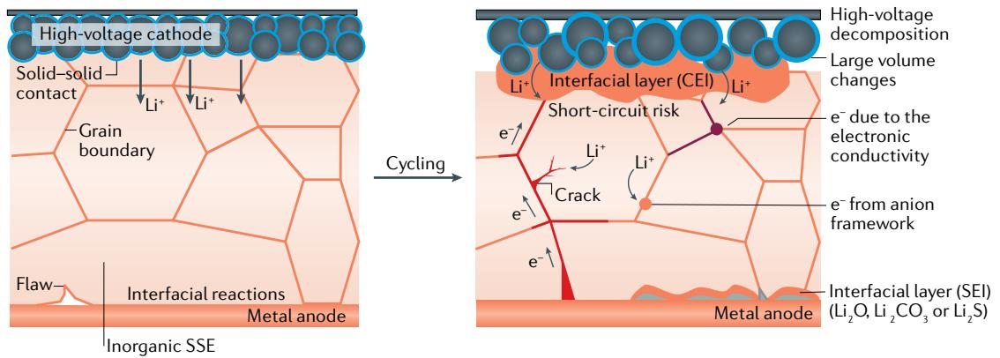  
a

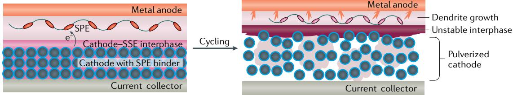  
b  
Fig. 4 | Failure modes of SSEs. a | Illustration of the principal failure mechanisms of solid-state batteries with inorganic solid-state electrolytes (SSEs). At the anode, metal dendrites grow through flaws and along grain boundaries (red). The undesired reduction of metal ions within the electrolyte, due to the intrinsic electronic conductivity of electrolytes, produces points from which Li metal forms within the electrolyte (purple). Moreover, metal ions also receive electrons from the anion framework to form the metal (orange). At the cathode, a cathode electrolyte interphase (CEI) is formed from the decomposition of electrolytes. Grain boundaries decrease the area in contact with the active material and the low flexibility of inorganic materials limits the volume changes that are tolerated during cycling, leading to a large capacity fade. At the anode, the interfacial layer (known as the solid electrolyte interphase (SEI)) generated from reactions between the electrolyte and electrode influences ion migration. b | The low shear modulus of solid polymer electrolytes (SPEs) leads to propagation of dendrites through the bulk. At high-voltage cathode interfaces, oxidation due to the intrinsic electrochemical instability of ether oxygen moieties results in the formation of an unstable electrode-electrolyte interface and the pulverization of the cathode, eventually leading to capacity fade.

of arsenides limits large-scale production[85]. Introducing oxides into sulfide electrolytes partially suspends  $\mathrm{H}_2\mathrm{S}$  evolution and increases air stability. However, further developments are necessary to avoid or retard the degradation and ageing of inorganic electrolytes, especially for semi-open systems such as Li-air batteries.

SPEs. In comparison to inorganic electrolytes, SPEs, in particular PEO, show higher stability against reduction at the reactive-metal anode. However, PEO suffers from electrochemical instabilities at high voltages (FIG. 4b). The electron-rich ether oxygen atoms readily oxidize at high potentials and the presence of salts increases this instability, owing to the complex interactions of these polymers with dissociated ions and their subsequent side reactions with the electrode. The substrate used as the working electrode also leads to variations in the measured stability windows, emphasizing that the side reactions between the electrolyte and the electrode vary depending on the composition of the electrode[86]. For example, the presence of carbon black in the cathode material results in a much narrower electrochemical-stability window of PEO-based polymer electrolytes compared with those with inert blocking electrodes[87]. In predicting the stability of SPEs to a cathode over long timescales, measurements of the leakage current have proved to be more reliable than cyclic voltammetry measurements[88].

This method involves increasing the voltage stepwise and holding it constant for a predetermined amount of time at each step. This approach partially overcomes the mass-transport issue, which dominates the reaction kinetics at the electrodes when the ionic conductivity is low, and, when performed in a full-cell configuration, accurately describes the extent of reaction at the electrode surface and, in turn, the stability of the electrolyte. As PEO is thermodynamically unstable at voltages necessary for high-power devices  $(>4.2\mathrm{V})$ , interfacial engineering or the development of multilayered electrolytes are necessary to enable the application of polymer electrolytes at these specified conditions.

Multilayered or composite electrolytes combine the advantages of their organic and inorganic components while compensating for their shortcomings. Such electrolytes provide multiple degrees of freedom in terms of fine-tuning electrolyte properties in a spatially resolved manner that allows for the engineering of task-specific electrolytes for anode-specific and cathodespecific functions. However, the additional interfaces that are present in such electrolytes increase the complexity of ion migration and, in some cases, may block it entirely. Nonetheless, composite electrolytes are increasingly attractive candidates for enabling reactive-metal batteries and are expected to continue to be a significant focus of research in the coming years.

# Dendrite electrodeposition

Unregulated ion transport, mechanically weak electrolytes and irreversible surface reactions are some of the key factors in facilitating dendrite propagation in Li-metal batteries $^2$ .

For polymer electrolytes, high-molecular-weight PEO shows promise as an electrolyte for Li-metal batteries, owing to its good ionic conductivity and reasonable mechanical stability. However, as ionic conduction is restricted to the amorphous phase, an operating temperature above the melting point of the polymer is necessary to enable sufficient motion of the polymer chains to conduct ions. Under these conditions, the material also transitions from the viscoelastic regime to the viscous one, compromising one of the most attractive qualities of polymers as SSEs.

According to the theoretical model of Monroe and Newman[89], SSEs with a shear modulus twice that of Li metal can inhibit dendrite propagation. It was suggested that the pressure from a high-modulus electrolyte slows down the kinetics of deposition, thus leading to stabilization. Unfortunately, most homopolymers that satisfy this condition are crystalline and do not possess sufficient free volume to allow ion motion in the electrolyte. The design of high-modulus and highly conducting

# Box 1 | Advanced technologies to investigate SSE failures

Galvanostatic potential curves and electrochemical impedance spectroscopy (EIS) combined with materials-characterization techniques are the most common methods to analyse battery failure. Internal shorting can be detected by looking for a significant drop in bulk resistance using EIS or dielectric spectroscopy. Early detection of battery failure is also possible by introducing a thin intermediary layer within the electrolyte that can detect voltage changes caused by Li dendrites $^{206}$ . Battery failure is also closely correlated with changes in interfacial resistance. In situ state-of-charge monitoring using impedance spectroscopy and X-ray photoemission spectroscopy have been used to probe the capacity fade in an all-solid-state battery. The capacity fade is attributed to a combination of the irreversible formation of a highly resistive solid electrolyte interphase at the cathode and the contraction of the cathode particles, both of which lead to poor contact with the solid-state electrolyte (SSE) during delithiation $^{207}$ . By combining time-resolved EIS, X-ray photoemission spectroscopy and time-of-flight secondary ion mass spectroscopy mapping, Na dendrites in sodium superionic conductor (NASICON)-type electrolytes can be directly visualized $^{208}$ . The 3D elemental maps produced by the combination of these techniques, in addition to transmission electron microscopy studies, can indicate elements and phase transitions. For example, using these techniques, the formation of tetragonal  $\mathrm{Li}_x\mathrm{La}_3\mathrm{Zr}_2\mathrm{O}_{1_2}$  (LLZO) was shown to result in degradation of the electrochemical performance. Time-of-flight secondary ion mass spectroscopy was also adopted to characterize the failure of LLZO pellets stored in air $^{209}$ . The spatial distributions of Al and La are uniform for freshly prepared LLZO; however, the two elements separate after 1 year of storage in air. The concentration of Al decreases on the surface and La develops a notable concentration gradient.

The high sensitivity of neutrons to light elements opens up opportunities to analyse cell failure $^{210}$ . The low weight of Li and Na atoms hinders characterization by X-ray techniques. By contrast, neutrons react with the  $^6$ Li isotope to form  $^4$ He and  $^3$ H with a well-defined energy, which reveals the locations and abundance of Li. Operando neutron-depth profiling has been introduced to monitor the Li plating and stripping process, and to diagnose short circuits in Li-metal batteries using common organic electrolytes $^{211}$ , garnet solid electrolytes $^{212}$  and sulfide solid electrolytes $^{90}$ .  $^7$ Li magnetic resonance imaging $^{213}$  and synchrotron hard X-ray microtomography $^{214}$  can reveal the location and growth direction of microstructural Li in Li-metal batteries. Other emerging methodologies, such as cryo-electron microscopy $^{215}$ , in situ Raman spectroscopy $^{216}$  and in situ scanning transmission electron microscopy coupled with electron energy-loss spectroscopy $^{217}$ , provide insight into the evolution of different components and failure mechanisms.

polymers has garnered notable interest, with several reports of crosslinked electrolytes, block copolymers and multifunctional polymers.

SIEs generally exhibit a much higher shear modulus, up to several factors, than that of Li metal. However, SIE electrolytes are highly brittle and the resultant structural flaws and cracks make them susceptible to dendrite formation. Dendrites form upon reduction of metal cations within the electrolyte, with electrons either supplied by the anion framework or due to the intrinsic electronic conductivity of inorganic electrolytes[90]. Therefore, even with SIEs, the electrodeposition of dendrites and proliferation of Li are still observed[91]. Unlike the idealized interfaces in theoretical analyses, there are many pre-existing defects in real interfaces[92]. More recent experimental studies have indicated that, contrary to the Monroe-Newman model, Li infiltration does not depend on the shear modulus of electrolytes and occurs for both sulfide and oxide SSEs with amorphous, polycrystalline and single-crystalline structures[93].  $\mathrm{Li^{+}}$  can collect electrons through electrochemical reductions and from the anion framework, impurities, dopants, grain boundaries and other residual sources of electrons. Consequently, Li metal forms at various sites within the electrolyte[94,95]. Li dendrites nucleate and grow directly inside  $\mathrm{Li}_3\mathrm{PS}_4$  and  $\mathrm{Li_7La_3Zr_2O_{12}}$  (LLZO), owing to their high electronic conductivities  $(5.5\times 10^{-8}\mathrm{Scm}^{-1}$  for  $\mathrm{Li}_3\mathrm{PS}_4$  and  $2.2\times 10^{-9}\mathrm{Scm}^{-1}$  for LLZO at  $30^{\circ}\mathrm{C})$  , which increase with temperature[90]. The metallic Li filaments that form can extend along the cracks and boundaries of inorganic electrolytes and lead to capacity fade because of active-material loss and short circuiting upon contacting the electrodes[96] (FIG. 4a).

Surpassing a critical current density also leads to the propagation of Li dendrites[97] and the value of this current density depends on the fracture strength and limiting current of the electrolyte[98]. The propagation of metal filaments within the electrolyte is also observed in solid-state Na batteries. For example, within Na batteries with  $\beta\text{-Al}_2\mathrm{O}_3$  electrolytes, these flaws emanate from the Na anode and approach the  $\mathrm{Na - \beta - Al_2O_3}$  interface and are observed at both grain boundaries and grain triple junctions[99].

# Strategies to improve SSE properties

There are numerous strategies that can be employed to optimize SSEs for high-density energy storage and practical applications. For SPEs, these strategies include increasing the ionic conductivity, increasing voltage stability and suppressing dendrite formation (FIG. 5). For SIEs, the interfacial issues present an additional challenge, which can be overcome by using nanoscale scaffolds, a polymer buffer layer or wetting agents (FIG.6).

# Increasing ionic conductivity

The conductivity of SIEs is influenced by the concentration of carriers, the migration-energy barrier and the crystal structure. Maximum conductivity is generally achieved at an optimal carrier concentration at which there are both abundant carriers and vacant hopping sites. For the sulfide electrolyte  $\mathrm{Li}_{1 + 2x}\mathrm{Zn}_{1 - x}\mathrm{PS}_4$ , LISICON-type electrolyte  $\mathrm{Li}_{4 - 3x}\mathrm{Al}_x\mathrm{SiO}_4$  and perovskite-type electrolyte  $\mathrm{La}_{0.67 - x}\mathrm{Li}_{3x}\mathrm{TiO}_3$ , the highest conductivities

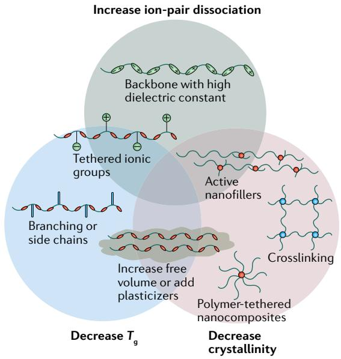  
a Increasing ionic conductivity

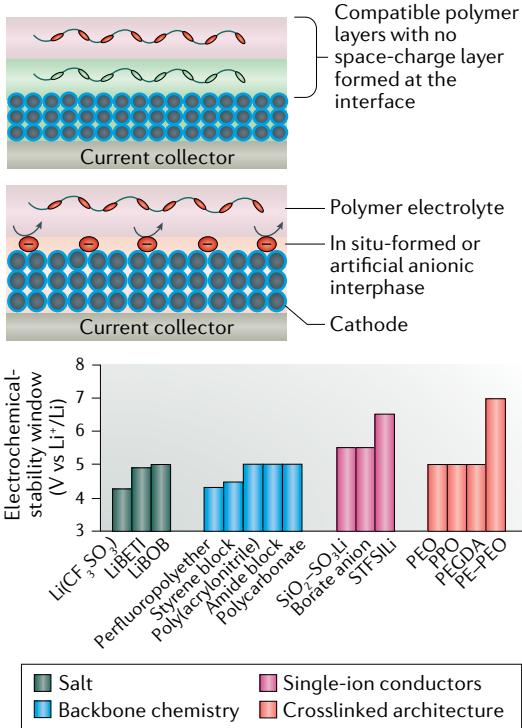  
b Increasing voltage stability

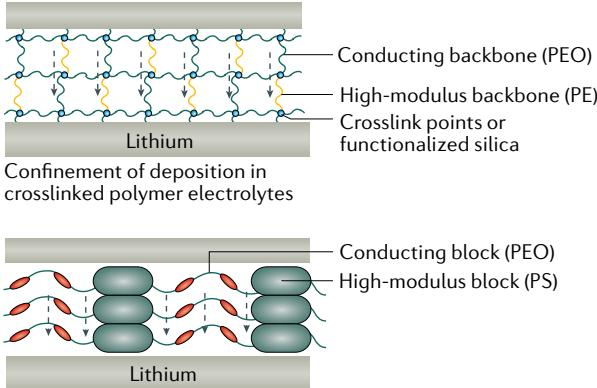  
c Suppressing dendrite formation  
High-modulus polymer electrolytes  
Suppression of dendrites using block copolymers  
Fig. 5 | Approaches to high-energy-density electrochemical systems using SPEs. a | Decreasing the crystallinity, glass-transition temperature  $(T_{\mathrm{g}})$  and increasing ion-pair dissociation are the main routes towards highly conducting solid polymer electrolytes (SPEs). Different polymer architectures are recommended for improving each or multiple aspects. b | The intrinsic anodic instability of poly(ethylene oxide) (PEO)-based electrolytes can be overcome by combining them with a polymer that is stable at high voltages and creating a layered electrolyte. For optimal electrolytes, the two polymers must be compatible and prevent the formation of a space-charge layer at the interface. An artificial or anionic interphase formed in situ acts as a desolvation layer, allowing only  $\mathsf{Li^{+}}$  through to the cathode for redox reactions. The design of such interphases and multilayered electrolytes can be guided by the electrochemical-stability window of polymer electrolytes. The graph shows the effects of salts  $(\mathsf{Li}(\mathsf{CF}_3\mathsf{SO}_3)^{244}$ ,  $\mathsf{LiBETI}^{245}$  and  $\mathsf{LiBOB}^{246}$ , backbone chemistry (comparing a perfluoropolyether $^{247}$ , styrene block copolymer $^{159}$ , poly(acrylonitrile) $^{248}$ , amide-based block copolymer $^{249}$  and polycarbonate $^{248}$ ), single-ion conductor  $(\mathsf{SiO}_2 - \mathsf{SO}_3\mathsf{Li}$  (REF. $^{250}$ ), borate anion $^{251}$  and STFSILi (REF. $^{159}$ ) and electrolyte architecture (PEO $^{194}$ , PPO $^{252}$ , PEGDA $^{253}$  and PE-PEO $^{149}$ ) on the anodic stability of electrolytes (measured against an inert working electrode). c | Dendrite formation can be suppressed by using structured polymer electrolytes or composite multilayered electrolytes. Nanostructured electrolytes confine metal electrodeposition to small length scales (smaller than the length scale of the most unstable nucleate), leading to uniform deposition at the anode. High-modulus electrolytes suppress dendrite formation by exerting pressure forces during deposition and can be incorporated as a separate layer at the anode or in the bulk electrolyte in the form of block copolymers with a hard block or crosslinked polymers with a high-modulus polymer segment. In single-ion conductors, anion migration is negligible under an electric field, preventing polarization or decomposition of the anion at the interface and, thus, facilitating dendrite-free deposition. The dashed black lines indicate the direction of cation migration. BETI-, bis(perfluoroethylsulfonyl)imide; BOB-, bis(oxalato)borate; PE, polyethylene; PEGDA, poly(ethylene glycol) diacrylate; PPO, poly(p-phenylene oxide); PS, polystyrene; SEI, solid electrolyte interphase; STFSILi, lithium 4-styrenesulfonyl(trifluoromethylsulfonyl)imide.

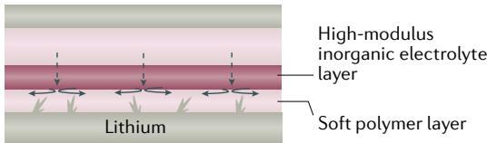  
Multilayer strategy

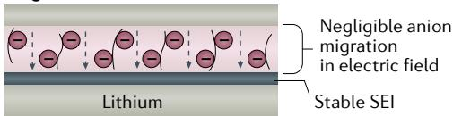  
Single-ion conductor

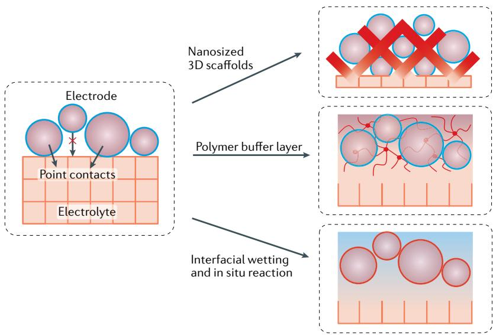  
Fig. 6 | Strategies for overcoming the interfacial issues in solid electrolyte interphases. Strategies include the construction of porous electrolyte scaffolds to increase the contact area, the introduction of a polymer buffer layer (formed in situ or ex situ) or the use of wetting agents. For simplicity, the electrodes are depicted with circular morphology and represent both cathodes and anodes. The current collector is omitted.

are predicted at  $x = 0.5$ ,  $x \approx 0.25$  and  $x \approx 0.1$ , respectively[100-102]. Conductivity is also higher when the anion framework contains polarizable anions and large, interconnected migration channels. In one such framework, oxygen was replaced with sulfur to enlarge the transport channels and weaken the interaction between the mobile carriers and the anion framework[8,103,104]. The substitution of divalent  $\mathrm{S}^{2-}$  for monovalent  $\mathrm{Cl}^-$  or larger  $\mathrm{Se}^{2-}$  and the substitution of  $\mathrm{P}^{5+}$  for  $\mathrm{Sb}^{5+}$  can also weaken the carrier-framework interactions[105-107].

A highly distortable lattice generally exhibits enhanced ion transport through perturbing the packing of ions and removing the degeneracy of transport barriers. However, large distortions are also associated with diminished thermodynamic stability[108]. In addition to adjusting the lattice volume by doping and substitution, mechanically imposed strain can also change the lattice diameters and increase ionic conductivity for oxygen-ion conductors; this approach has not yet been extensively investigated for Li batteries[4]. Furthermore, tuning the electrolyte thickness can shorten the transport distance and accelerate ion migration, as observed in LiPON[109] and amorphous LLTO thin-film[110] electrolytes.

Computational techniques such as high-throughput structure screening[11] accelerate the exploration of electrolytes and the rejection of possible compounds, thus narrowing the scope of candidate materials[12]. For instance, olivine structures were calculated to exhibit low Li band centres and high anion band centres, which promise to overcome the trade-off between stability and ion mobility[13]. Recently, the computationally guided design of sphene-type, Zr-doped  $\mathrm{LiTaSiO_5}$  introduced a new family of sphene superionic conductors that exhibit facile diffusion along one direction and cross-channel migration[14].

The ionic conductivity of SPEs can be improved by increasing ion-pair dissociation, reducing  $T_{\mathrm{g}}$  and

decreasing the crystallinity of the polymer (FIG. 5a). For a series of polyether-based electrolytes, the ionic conductivity increased with the dielectric constant of the host polymer $^{115,116}$ . Tethering side chains (such as allyl ethers) $^{117}$  to the polymer backbone or incorporating low-molecular-weight liquid or solid plasticizers (such as a mixture of PC with ethylene carbonate $^{118}$  or succinonitrile $^{119,120}$ ) into the polymer matrix have proved to be effective ways of increasing the free volume of electrolytes. Tethered ionic groups serve the dual purpose of increasing ion-pair dissociation while reducing  $T_{\mathrm{g}}$ . For example, functionalizing the backbone of poly(poly(ethyleneglycol)methacrylate) with sulfobetaine groups led to a notable decrease in  $T_{\mathrm{g}}$  of the polymer electrolyte $^{121}$ . This decrease in  $T_{\mathrm{g}}$  along with increased ion-pair dissociation increased the conductivity by two orders of magnitude. When designing polymers with increased segmental motion, attention should also be given to the connectivity between the solvation sites on the backbone, as this influences the rate of  $\mathrm{Li^{+}}$  migration $^{122}$ . Increasing the free volume is, however, almost always associated with a decrease in the mechanical stability of the system, as the crystalline domains are responsible for resistance to deformation in the polymer $^{120,123}$ . Crosslinking the polymer chains is a good way to suppress the crystallization of polymers while enhancing the shear modulus.

The addition of nanofillers has traditionally been used as a straightforward method to decrease crystallinity in polymers. Covalently tethering PEO chains to silica nanoparticles results in a glassy electrolyte in which the silica cores act as high-modulus junctions and suppress the crystallization of the polymer chains, similar to the suppression of crystallization in a crosslinked polymer network[124]. As a result, the electrolyte promotes dissociation of ion pairs and exhibits both high interfacial and bulk-ion mobility. Apart from silica, the addition of fillers such as  $\mathrm{TiO}_2$  and  $\mathrm{Al}_2\mathrm{O}_3$  to a polymer-salt complex increased the conductivity to a record value of  $\sim 10^{-4}\mathrm{Scm}^{-1}$  at  $50^{\circ}\mathrm{C}$  (REFS[14,125]). As well as aiding the dissociation of the salt and decreasing the crystallinity, the fillers increased the cation transference number, owing to their Lewis acidity[14]. The well-aligned, interconnected pathways created through the addition of these active nanofillers provide an additional route for ion migration in a composite polymer electrolyte, and the interconnectivity of the fillers has a key role in the observed enhancement of the ionic conductivity[126,127]. This point was emphasized in a recent study on composite polymer electrolytes with ceramic filler particles, in which interactions between the electron lone pairs on the ether oxygens and  $\mathrm{Li^{+}}$  bound on the ceramic surface slowed the segmental motion of the polymer chains, eventually leading to adsorption of the chains on the ceramic surface[128]. This adsorption would lead to an unfavourable increase in resistance for ion transport across the polymer-ceramic interface and a loss in interconnectivity between the ceramic filler particles, thus compromising conductivity in both the organic and inorganic phases. Therefore, in designing composite electrolytes, depletion interactions between the ceramic phase and polymer phase should be studied and exploited to increase conductivity in both phases[129].

# Enabling high-voltage and low-voltage operation

Extending the voltage stability of polymer electrolytes has been a long-standing challenge, and the need for high-power, safe devices has renewed interest in this issue (FIG. 5b). Traditional electrolyte additives such as vinylene carbonate and tetrafluoropropyl ether form stable cathode electrolyte interphases (CEIs) when used in liquid electrolytes. However, these additives cannot be used in solid electrolytes because they do not diffuse as readily to the electrode surface. Thus, salt additives, artificial passivation layers and multilayer strategies have been explored to increase the voltage stability of  $\mathrm{SSEs}^{15,130}$ . One of the first works on the interfacial modification of a high-voltage cathode employed a thin layer of  $\mathrm{Li}_3\mathrm{PO}_4$  as an artificial CEI to suppress the oxidation of polyethers[131]. More recently, artificial single-ion-conducting interphases at the cathode have been explored; these interphases function as desolvation layers that delay the onset of electrochemical degradation of ether-based electrolytes[132]. Moreover, salt additives such as LiBOB ( $\mathrm{BOB} = \mathrm{bis}(\mathrm{oxalato})\mathrm{borate}$ ) act in a similar way, forming an anionic interphase with the cathode that allows the transport of  $\mathrm{Li^{+}}$  only. This stabilization agreed well with results from several reports in which LiBOB and fluorinated salts were compatible with PEO and formed a good CEI to stabilize the polymer at high potentials[133,134]. The role of single-ion-conducting interphases in preventing electrolyte degradation should guide the design of polymers that can act as artificial CEIs. Moreover, borate anions can minimize corrosion of the Al current collector, and this may explain the enhanced performance of systems containing LiBOB compared with those containing LiTFSI ( $\mathrm{TFSI^{-} = bis(trifluoromethane)sulfonimide}$ )[135]. Building on this concept of forming stable cathode-polymer interphases with  $\mathrm{BOB^{-}}$ anions, crosslinking precursors containing LiBOB were cured directly on the cathode matrix to achieve stability during high-voltage operation. These cathodes were paired with a LiTFSI-LiBOB dual-salt plasticized, crosslinked polymer electrolyte and exhibited outstanding long-term stability for  $>1,000$  cycles at a high rate of  $1\mathrm{C}$  (REFS[136,137]).

Polymers that are intrinsically stable to oxidation have been explored as alternatives to PEO, but little progress has been made in terms of overcoming conductivity and feasibility issues. Vinylene carbonate has been polymerized in situ to generate poly(vinylene carbonate), which is stable against a high-voltage cathode[138]. In a recently reported two-phase polymer electrolyte, poly( $N$ -methylmalonic amide) was used to contact the cathode and PEO was used at the metallic anode[130]. Compatibility between the two phases and electrochemical stability was confirmed at elevated temperatures of  $\sim 65^{\circ}\mathrm{C}$  through cycling against a  $\mathrm{LiCoO}_2$  cathode. Within these multicomponent systems, it is necessary to investigate the mechanisms of polymer stabilization and ion transport across the multiple interfaces to determine the key factors that govern the design of electrochemically stable polymer electrolytes.

Some SIEs, such as sulfides, are also calculated to be thermodynamically oxidized at high voltages. The insulating oxidation products passivate the surface,

explaining the extended voltage window observed in measurements $^{78}$ . X-ray photoemission spectroscopy spectra indicate that  $\mathrm{Li}_6\mathrm{PS}_5\mathrm{Cl}$  is oxidized to  $\mathrm{P}_2\mathrm{S}_x$ ,  $\mathrm{LiCl}$ , elemental S and polysulfides upon contact with  $\mathrm{LiCoO}_2$  (REF. $^{139}$ ). Transmission electron microscopy analysis reveals the diffusion of S, P and Co along the interface between  $\mathrm{LiCoO}_2$  and the  $\mathrm{Li}_2\mathrm{S} - \mathrm{P}_2\mathrm{S}_5$ $\mathrm{SSE}^{140}$ . Protective coating layers of  $\mathrm{LiNbO}_3$  (REF. $^{8}$ ),  $\mathrm{Li}_4\mathrm{Ti}_5\mathrm{O}_{12}$  (REF. $^{141}$ ),  $\mathrm{Li}_3\mathrm{PO}_4$  (REF. $^{142}$ ) and  $\mathrm{Al}_2\mathrm{O}_3$  (REF. $^{143}$ ) enhance the compatibility with cathodes.

# Suppressing metal dendrite growth

The architecture and mechanical properties of polymers can also be engineered to physically suppress the proliferation of dendrites. On the basis of theoretical simulations $^{2,89}$ , several polymer systems have been studied to evaluate resistance to dendrites (FIG. 5c). Both block copolymers and nanofillers have been explored to create highly conducting and mechanically stable polymer electrolytes $^{15,126,144,145}$ . A block copolymer electrolyte with a high-modulus polystyrene block and an ion-conducting PEO block has demonstrated exceptional resistance to dendrite propagation $^{146}$ . The stiff polystyrene blocks delocalize current density from the tips of the growing dendritic structures, thus flattening them out and preventing their growth $^{147}$ . However, low conductivity restricted operation to high temperatures. One way to obtain an amorphous-phase-rich material without degrading the mechanical properties is to crosslink the polymer chains. Crosslinking chains through reactions between end groups on the polymer chains locks them and prevents inter-chain crystallization $^{148}$ . Crosslinked polymer electrolytes enable the tuning and design of properties such as chemical functionality, architecture and mechanical modulus, so that different features can be simultaneously introduced into the system without compromising other properties. A polyethylene-PEO crosslinked electrolyte showed remarkable RT ionic conductivity of  $\sim 10^{-5} \mathrm{~S} \mathrm{~cm}^{-1}$  and increased the cell lifetime by an order of magnitude compared with that of high-molecular-weight PEO $^{149}$ . The polyethylene segments provided high-modulus functionality, while the PEO blocks served as the ion-conducting segments. Similarly, within an interpenetrating network that comprises a rigid network that supports the electrolyte framework, the rigid mesh inhibits dendrite growth, while the soft domains enable  $\mathrm{Li^{+}}$  motion $^{150}$ .

The importance of the pore dimensions of cross-linked polymer electrolytes on dendrite growth was recently established using in operando visualization techniques[15]. Confirming previous hypotheses, below a critical pore size, the proliferation of dendrites was shown to be prevented at high current densities. By limiting and confining metal electrodeposition to small length scales, uniform deposition was achieved. Thus, contrary to prior understanding that a high-modulus  $(>6\times 10^{9}\mathrm{Pa})$  separator is required to prevent dendrite growth in Li, nanostructured electrolytes with much lower shear-modulus values  $(\sim 10^{5}\mathrm{Pa})$  were shown to be effective for the same purpose.

Owing to their mechanical and chemical stability against reactive-metal anodes, polymers are increasingly

being considered for coating applications on the metal anode, in turn resolving mechanical and chemical instabilities associated with unstable metal electrodeposition. In one example, a dynamically crosslinked polymer was proposed as an adaptive interfacial layer[151]. The crosslinked polymer can switch between a flowable liquid phase and a stiff solid phase in response to local stresses arising from Li dendrite growth. The adaptive interlayer improved the morphology of deposited Li, which was reflected in the high Coulombic efficiency of the half-cell[152]. The morphology of deposited Li has also been controlled by using a crosslinked polymeric coating in which hydrogen bonds conform to volumetric changes due to Li dendrite growth, leading to denser and more uniform electrodeposition[153]. Overall, polymeric coatings with a low surface energy and high dielectric constant result in the most stable deposition of Li(REF.[154]).

In addition to the above strategies, composite electrolytes that possess the flexibility of a polymer for accommodating volume changes at the anode and inorganic fillers to provide a mechanical barrier against dendrite growth have been extensively studied as both bulk electrolytes $^{155-157}$  and coatings for the metal anode $^{158}$ .

# Increasing ion selectivity

SIEs are regarded as possessing cation transference numbers close to unity, with nearly all the current used to drive the redox reaction being carried by the cations. By contrast, conventional SPEs allow migration of both cations and anions, and the current is often dominated by the anions $^{159,160}$ . As the electrodes cannot accommodate the anions, anion migration under an electric field can lead to concentration gradients and polarization, which, in turn, cause a concentration overpotential. This overpotential severely limits the rate of charge and discharge and also the voltage of operation, compromising the power and energy density of the cell. In addition, the migration of anions at high and low potentials may cause decomposition of the anion, resulting in the formation of an inhomogeneous SEI and selective deposition of metal at points of higher conductivities.

Single-ion conductors provide a promising and practical solution to this issue. Li and Na single-ion conductors were proposed in the  $1980s^{161}$ . In these systems, the anions are fixed to the backbone of a polymer to restrict their migration and, thus, the only mobile ions are cations, resulting in a cation transference number close to unity. Over the years, with advances in polymer chemistry and synthesis techniques, single-ion SPEs based on polyethers $^{162}$ , polyacrylates $^{163}$ , polymethacrylates $^{164}$ , silanes $^{165}$ , polystyrenes $^{159,166}$  and polyurethanes $^{167}$  have been developed. More recently, Lewis acidic polymers were proposed as candidates for high-transference-number electrolytes. In these systems, the interaction between the polymer backbone and the anions drives the salt solubility, and the cations theoretically have a lower energy barrier to overcome for migration compared with that of the anions, which are coordinated to the polymer backbone $^{168}$ . Similarly, ionic-liquid monomers have been polymerized into polyionic liquids that coordinate with anions for faster migration of cations to yield electrolytes with highly delocalized anions $^{161,169}$ .

One of the first demonstrations of single-ion conductors for full-cell operation was realized with lithium poly[(4-styrenesulfonyl)(trifluoromethyl(S-trifluoromethylsulfonylimino)sulfonyl)imide] (LiPSsTFSI), which demonstrated an unprecedented  $\mathrm{Li^{+}}$  transference number of 0.91. However, the ion conductivity  $(0.135\mathrm{mScm^{-1}}$  at  $90^{\circ}\mathrm{C})$  is far below that required for practical application[160]. From a synthetic point of view, designing the backbone to maximize polymer segmental motion is the most straightforward way to increase conductivity. For example, single-ion conductors based on poly(lithium 1- [3-(methacryloyloxy)propylsulfonyl]-1-(trifluoromethylsulfonyl)imide) (PMTFSI) show a high  $T_{\mathrm{g}}$  of  $>90^{\circ}\mathrm{C}$  and a conductivity of  $\sim 1.1\times 10^{-9}\mathrm{mScm^{-1}}$ . When ethylene oxide units are copolymerized as part of the polymer backbone, the  $T_{\mathrm{g}}$  decreases to below RT, resulting in a higher conductivity  $(2.3\times 10^{-3}\mathrm{mScm^{-1}}$  at  $25^{\circ}\mathrm{C})^{170}$ . Single-ion-conducting polyelectrolytes created by the addition of plasticizers exhibit higher conductivities than those without plasticizers[163].

In addition to polymers, other organic SSEs based on metal-organic frameworks and covalent organic frameworks have garnered attention for their high cation  $(\mathrm{Li^{+}}$ $\mathrm{Na^{+}}$ $\mathrm{Mg}^{2 + }$  ) transference numbers[171-173] and could be the subject of increased research focus in the coming years.

# Decreasing interfacial resistance

Common strategies to improve the interfacial properties of SIEs include the use of nanosized 3D scaffolds, a polymer buffer layer and interfacial wetting for in situ reaction between the electrolytes and electrodes (FIG. 6).

An artificial interlayer between the reactive anode and the SSE provides multiple advantages in resolving mechanical and chemical instabilities at the electrode-electrolyte interface. Introducing a 'lithiophilic' inorganic layer between garnet-type SIEs and Li-metal anodes contributes to a decrease in the interfacial impedance; examples of such lithophilic layers include lithiated Si (REF. $^{174}$ ), atomic-layer-deposited  $\mathrm{Al}_{2}\mathrm{O}_{3}$  (REF. $^{175}$ ),  $\mathrm{ZnO}$  (REF. $^{176}$ ) and Ge (REF. $^{177}$ ). In particular, introducing an  $\mathrm{Al}_{2}\mathrm{O}_{3}$  layer results in an ultralow interfacial resistance of  $1\Omega \mathrm{cm}^2$  (REF. $^{175}$ ). However, low interfacial resistance alone cannot guarantee practically successful solid-state batteries. The testing protocol, electrode-electrolyte quality and the reliability of the cell components in a manufacturing setting are also important. Moreover, it is necessary to maintain a conformal interface with low resistance and to tolerate large volume changes during the battery lifetime. Point-to-point contact issues can also be resolved by using deformable electrodes, such as organic pyrene-4,5,9,10-tetraone (PTO) anodes for solid-state Na batteries $^{178}$  and molten Li anodes for garnet electrolyte batteries $^{179}$ , which are operated at intermediate temperatures ( $240^{\circ}\mathrm{C}$ ) for grid energy storage. Chemically inert compounds such as boron nitride have also been combined with a polymer to form a robust interlayer that prevents side reactions $^{180}$ . A 3D crosslinked gel polymer interfacial layer can similarly relieve the stress between LATP and Li metal $^{181}$ . Taking advantage of interfacial reactions is an emerging strategy to construct a 'built-in' passivating interface that can re-form if damaged. For example, the strongly reactive

$\mathrm{Na}$  metal-  $\mathrm{Na}_{3}\mathrm{SbS}_{4}$  interface was stabilized through the formation of a passivating coating upon exposing the  $\mathrm{Na}_{3}\mathrm{SbS}_{4}$  SSE to air[182]. Another method of eliminating undesirable reactions between Li and the SSE is to introduce 1 M LiTFSI dioxolane-dimethoxyethane electrolytes[183] or spin-cast phosphoric acid onto Li foils to react with LGPS and Li metal[184].

Composite cathodes with porous architectures offer many active sites and increased surface area compared with planar electrodes, but the lack of conformal contact to the electrolyte retards ion transport (FIG. 6). Adding a small amount of a carbonate-based liquid electrolyte $^{185,186}$ , an ionic liquid $^{187,188}$  or a soft polymer matrix $^{189}$  created by in situ polymerization of a polymer to form a wetting buffer layer is a simple but effective strategy to ensure continuous conduction pathways from the electrolyte into the porous electrode matrix.

Interfacing planar electrodes (anodes made from Li or Na) with an SPE produces a superior interface compared with those formed with an SIE. However, interfacing porous electrodes (mostly cathodes) with SPEs is still problematic. There have been numerous demonstrations of the feasibility of SSEs using cathode materials with low loadings  $(1 - 3\mathrm{mgcm}^{-2})^{130,138}$ . However, cathodes with high loadings are required to achieve a high energy density and to increase the current density of operation for a desired cycling rate. Yet, high-loading cathodes are thick and porous, making it difficult to construct conformal interfaces with solid electrolytes. A high current density demands fast transport in both the bulk and at the electrode-electrolyte interface. The most widely explored approach to increase the current density has been to operate at elevated temperatures, although this also leads to increased rates of side reactions at the electrode. Other strategies to resolve this problem include using the polymer matrix as a binder for preparing the cathode material and using cathode-supported solid electrolyte frameworks[189-193]. The most effective way to construct the electrode-electrolyte interphase is to soak the electrodes with a liquid precursor and then to polymerize the liquid using cationic[89], ultraviolet[136,194] or thermal triggering[195]. This method can also be used to enhance the performance of Mg-ion batteries[196]. An SPE formed through the in situ ring-opening polymerization of molecular ethers initiated by a cationic aluminium species exhibited fast interfacial transport, along with desirable compatibility with various cathode materials, such as S,  $\mathrm{LiFePO_4}$  and  $\mathrm{LiNi_{0.6}Mn_{0.2}Co_{0.2}O_2}$  (REF.[88]).

# Building better solid-state batteries

SSEs have, thus far, achieved commercial success in high-temperature  $(300 - 350^{\circ}\mathrm{C})$  Na-S batteries that use  $\beta\text{-NaAl}_{11}\mathrm{O}_{17}$  as a  $\mathrm{Na^{+}}$  conductor for scalable, stationary energy storage (at the 50-MW level over 4,500 cycles from NGK Insulators Ltd.)[197], in Li-metal-polymer batteries (with a PEO-based SPE and  $\mathrm{LiFePO_4}$  cathode) to power the Bollore Bluecar (which uses a minimum 30-KWh battery pack that offers a journey of  $250\mathrm{km}$  without needing to be recharged)[198] and in thin-film batteries based on LiPON, which are used for smart cards and for implantable medical devices with capacities in the range 0.001-0.01 Ah (Excellatron Thin Film Technology).

The high-energy-density battery systems using SSEs are listed in TABLE 2. Compared with traditional liquid electrolytes, SSEs typically have longer cycle lifetimes and higher thermal stabilities. As a consequence, the availability of cost-effective SSEs is regarded as one of the key requirements for commercializing post-Li-ion batteries with metal anodes (such as Li, Na, K, Mg, Zn and Al) that are high capacity but suffer from uncontrolled metal deposition and dendrite growth.

Recently, research has focused on enabling an energy density of more than  $500\mathrm{Whkg^{-1}}$  in a practical Li battery using a layer-intercalation cathode[199]. To achieve this goal, a thin Li foil is used as the anode, instead of graphite, and the amount of liquid electrolyte is also limited. However, the Li reacts with the liquid electrolyte, leading to consumption of these materials and rapid failure of the battery. SSEs may allow for the use of a thin Li anode, enabling a low anode to cathode capacity ratio  $(\leq 1)$  to be achieved. In addition to these challenges, SSEs must be lightweight to achieve the high-energy-density goal. For a free-standing  $50 - \mu \mathrm{m}$  Li anode  $(25\mu \mathrm{m}$  facing each side) coupled with a  $3.8\mathrm{-V}$ $\mathrm{LiNi_{0.8}Co_{0.1}Mn_{0.1}O_2}$  cathode with parameters of  $4\mathrm{mAhcm^{-2}}$  for each side and a stable capacity of  $200\mathrm{mAhg^{-1}}$  (with  $85\mathrm{wt}\%$  active materials) on Al foil  $(2\mathrm{mgcm^{-2}}$  for each side) and all other components, such as the packaging, accounting for up to  $5\%$  of the total weight, the areal density of the SSE is estimated to be  $<  2\mathrm{mgcm^{-2}}$  to achieve the target energy density of  $500\mathrm{Whkg^{-1}}$  . Therefore, the thickness of the SSE has to be  $<  20\mu \mathrm{m}$  for an SPE,  $<  5\mu \mathrm{m}$  for LLZO,  $<  7\mu \mathrm{m}$  for LAGP and  $<  11\mu \mathrm{m}$  for LGPS. Reported inorganic SSEs are typically much thicker than the requirement, as a consequence of the loss of mechanical stability with decreasing thickness. Meanwhile, to improve ion diffusion in thick cathodes, the SSEs need to be mixed with the cathodes, and this further decreases the energy density (usually  $>10\mathrm{wt}\%$  ). Another option is to wet the cathodes with small amounts of liquid electrolytes.

Companies including, but not limited to, Fujifilm, Samsung, Toyota and DryLyte, have reported progress towards solid-state Li-metal batteries with energy densities of  $>800\mathrm{Wh}1^{-1}$  (REF.200). Recently, solid-state batteries comprising  $8.6\mu \mathrm{m}$ -thick nanoporous polyimide films filled with PEO-LiTFSI SPEs and thin  $\mathrm{LiFePO_4}$  cathodes have been reported to operate stably for 200 cycles201. Combining the good adhesion properties of polymers and the conductivity of inorganic materials opens up opportunities to construct ultrathin and ultra-light composite electrolytes with combinations of these attributes. Applying a wet coating membrane followed by a roll press directly on the anode or cathode surface can solve the problem of fabricating a thin SSE. Using this method, SSEs with a thickness of  $20\mu \mathrm{m}$  can be prepared202. Moreover, some commercial products, such as an SPE developed by Ionic Materials, have demonstrated high-voltage  $(5\mathrm{V})$  stability with high ionic conductivity  $(1.3\mathrm{mScm}^{-1})$ .

In addition to the use of intercalated cathodes, SSEs are considered a good choice for use in advanced battery systems coupled with high-capacity organic electrodes,  $\mathrm{S},\mathrm{O}_2$  or  $\mathrm{CO}_{2}$  cathodes (TABLE 2). S cathodes are regarded as the most promising solid cathodes and can provide a

capacity of  $1.675\mathrm{Ah}$ $\mathrm{g}_{\mathrm{sulfur}}^{-1}$  (REF.197), which is 5-10 times higher than that of present intercalating cathodes. In liquid electrolytes, the crown-like  $\mathrm{S}_8$  molecule undergoes reactions from solid to liquid  $(S_8$  to  $S_{x}^{2 - }(x = 3 - 8))$  ,liquid to solid  $(S_{x}^{2 - }(x = 3 - 8)$  to  $S_{2}^{2 - }$  ) or solid to solid  $(S_{2}^{2 - }$  to  $S^2 -$  . The highly soluble long-chain polysulfides not only result in the loss of active materials but also undergo continuous

side reactions with the electrodes, owing to migration during the charging process (namely, the shuttle effect). This limitation also affects otherwise promising sustainable, small-molecule organic cathode materials that can be extracted from plant biomass. SSEs that act as a bridge for a solid-solid conversion can, in principle, cure this problem. Owing to the modest voltage window of

Table 2 | High-energy-density battery systems using SSEs  

<table><tr><td>Cathode materials and battery reactions</td><td>Working voltage (V)</td><td>Energy density (Wh kg-1)</td><td>Advantages</td><td>Recent advances</td><td>Ref.</td></tr><tr><td colspan="6">Li-ion and Li-metal batteries using Ni-rich or Li-rich cathodes</td></tr><tr><td>NCM811</td><td>3.8 (when charged to 4.4 V)</td><td>800</td><td rowspan="3">High thermal stability, high Li+ transference number, non-flammable, no leakage, high energy density by bipolar design</td><td rowspan="3">Li-metal battery comprising NCM811 with a PAN@Li1Al0.4Ge1.6(PO4)3electrolyte shows 184mAh g-1after 175 cycles (94.4% retention, at RT when cathode surface is wetted by liquid electrolyte to facilitate ion transport)270; battery with a Li-In alloy anode and a LiNbO3-coated core cell NCA and Li10GeP2S12SSE shows 89.4% retention after 400 cycles (60°C)271</td><td>272</td></tr><tr><td>NCA</td><td>3.8 (charge to 4.3 V)</td><td>760</td><td>272</td></tr><tr><td>Li2MnO3LiNi4Mn4Co2O2</td><td>3.6 (charge to 4.6 V)</td><td>900</td><td>272</td></tr><tr><td colspan="6">Alkali metal (Li, Na, K)-sulfur (S) and alkali metal (Li, Na, K)-organic cathode batteries</td></tr><tr><td>2Li+S→Li2S</td><td>2.29</td><td>2,669</td><td rowspan="4">Suppression of the dissolution of organic compounds and polysulfides and the parasitic reactions of organic compounds and polysulfides with highly reactive metal</td><td rowspan="4">Li-S battery using PEO and LiTFSI with a filler shows 745 mAh g-1after 100 cycles (87% retention and ~100% coulombic efficiency at RT)272; Li-S battery using a Li3PS4SSE (-100 μm) provides 370.6Wh kg-1(cell level, RT)273; Na-S battery using a Na3PS4SSE shows a capacity of 810 mAh g-1after 50 cycles (60°C, Na2S-Na3PS4-CMK-3 cathode, Na-S anode)274; K-S battery using a K+-conducting β&quot;-Al2O3SSE runs 1,000 cycles with negligible degradation (150°C)275; Li-metal battery using a pillar[5] quinine cathode and PMA-PEG-LiClO43 wt% SiO2SPE displays a capacity of 418 mAh g-1and operational voltage of ~2.6 V (REF276)</td><td>277</td></tr><tr><td>2Na+S→Na2Sa</td><td>1.81</td><td>1,245</td><td>277</td></tr><tr><td>2K+S→K2Sa</td><td>1.89</td><td>917</td><td>277</td></tr><tr><td>(M = Li, Na, K)</td><td>1.0–3.5</td><td>496 mAh g-1d</td><td>278</td></tr><tr><td colspan="6">Metal (Li, Na, K, Zn, Al)-air (O2) and metal-CO2batteries</td></tr><tr><td>2Li+O2→Li2O2</td><td>2.96</td><td>3,458</td><td rowspan="11">Prevent electrolyte volatilization and leakage for long-term cycling; prevent electrolyte decomposition during charging; prevent corrosion of Li, Na and K by H2O and CO2; decrease O2-CO2crossover; prevent the battery corrosion by alkali electrolyte; separate the organic and aqueous electrolyte</td><td rowspan="6">Li-O2battery using an amorphous, Ge-coated, LAGP SSE stably cycles 30 times in ambient air (with a cathode composed of an ionic liquid and carbon nanotubes)275; flexible Li-air battery stably cycles for 1,175 h in ambient air (at a humidity of 10–40%) with a crosslinked gel electrolyte comprising tetraglyme and lithium ethylenediamine205; hybrid Na-air cell separated by a NASICON membrane shows a low voltage gap (~0.3 V) and high energy efficiency (~90%)280</td><td>203</td></tr><tr><td>2Na+O2→Na2O2</td><td>2.33</td><td>1,605</td><td>203</td></tr><tr><td>Na+O2→NaO2</td><td>2.27</td><td>1,108</td><td>203</td></tr><tr><td>K+O2→KO2</td><td>2.48</td><td>935</td><td>203</td></tr><tr><td>4Li+O2+2H2O→4LiOHb</td><td>3.4</td><td>2,172</td><td>281</td></tr><tr><td>4Na+O2+2H2O→4NaOHb</td><td>2.77</td><td>1,281</td><td>281</td></tr><tr><td>2Zn+O2→2ZnOb</td><td>1.66</td><td>1,218</td><td rowspan="2">Zn-air battery using quaternary-ammonium-functionalized PVA membrane27; wearable Al-air battery fabricated with a PVA/PEO-based hydrogel electrolyte282</td><td>283</td></tr><tr><td>4Al+3O2+6H2O→4Al(OH)3b,c</td><td>1.37e</td><td>3,364e</td><td>284</td></tr><tr><td>4Li+3CO2→2Li2CO3+C</td><td>2.81</td><td>1,876</td><td rowspan="3">Pouch-type flexible Li-CO2battery using a PMA/PEG-based SPE exhibits a high energy density of 521 Wh kg-1(at 55°C)285; 1.1-Ah pouch-type Na-CO2battery (of size 400 cm2) using a PVDF-HFP-based SPE gel shows a high energy density of 232 Wh kg-1(RT)286</td><td>285</td></tr><tr><td>4Na+3CO2→2Na2CO3+C</td><td>2.35</td><td>1,125</td><td>286</td></tr><tr><td>2Al+6CO2→Al2(C2O4)3b</td><td>1.3</td><td>14,000 mAh g-carbon-1d</td><td>204</td></tr></table>

Unless otherwise indicated, values are theoretical. LAGP,  $\mathrm{Li}_{1 + x}\mathrm{Al}_x\mathrm{Ge}_{2 - x}(\mathrm{PO}_4)_3$  ; NASICON, sodium superionic conductor; NCA,  $\mathrm{LiNi_{0.80}Co_{0.15}Al_{0.05}O_2}$  ; NCM811,  $\mathrm{LiNi_{0.80}Mn_{0.10}Co_{0.10}O_2}$  ; PAN, poly(acrylonitrile); PEG, poly(ethylene glycol); PEO, poly(ethylene oxide); PMA, poly(methyl acrylate); PVA, poly(vinyl alcohol); PVDF-HFP, poly(vinylidene difluoride-co-hexafluoropropene); RT, room temperature; SPE, solid polymer electrolyte; SSE, solid-state electrolyte; TFSI-, bis(trifluoromethane) sulfonimide. aUnder practical testing conditions, the sulfur is usually not fully reduced. bOperates in hybrid (aqueous) electrolyte systems. Irreversible reaction. dSpecific capacity. eExperimental value.

operation for S and organic electrodes  $(1 - 3.5\mathrm{V})$  most SSEs are suitable candidates. However, in addition to the problems discussed above, the increased boundary resistance caused by the large volume change  $(\sim 80\%)$  of S through the charge and discharge processes has to be considered. For inorganic SSEs (such as LGPS), the mixing of S, LGPS and conductive carbon can provide a buffer layer for volume variation, but the ratio needs to be carefully designed to maintain the high energy density. Elastic SPEs (for example, LiTFSI-PEO) provide a good buffer space for volume change; however, the main issue facing SPEs is low conductivity at RT. When increasing the temperature above the melting temperature, batteries constructed using SPEs typically undergo capacity decay similar to that observed with liquid electrolytes.

An even higher capacity than that achieved with a S cathode can be obtained using an air cathode, wherein  $\mathrm{O}_2$  serves as the active material and is reduced to form metal oxides, peroxides and superoxides $^{203}$  (TABLE 2). Metal-  $\mathrm{CO}_2$  batteries are also drawing increasing attention as a method to repeatedly use  $\mathrm{CO}_2$  or convert  $\mathrm{CO}_2$  to a useful product, such as  $\mathrm{Al}_2(\mathrm{C}_2\mathrm{O}_4)_3$  (REF.  $^{204}$ ). Metal- $\mathrm{CO}_2$  batteries are a possible energy-storage or  $\mathrm{CO}_2$ -conversion method for the exploration of Mars (where  $96\%$  of the atmosphere is  $\mathrm{CO}_2$ ). The use of SSEs in these metal-gas batteries with open systems can solve the leakage problem, although the applied SSE should be stable in air (or  $\mathrm{CO}_2$ ). For Li-air batteries, the solid-oxide SIEs are promising because they are more stable than sulfide electrolytes in air, and NASICON-type (LATP, LAGP) SSEs are a suitable choice. Meanwhile, SPEs are also attractive for this purpose as they can make conformal contact with Li metal and prevent exposure to air, enabling the operation of  $\mathrm{Li}-\mathrm{O}_2$  batteries in ambient air $^{205}$ . Although some polymer electrolytes cannot tolerate the high overpotential of the  $\mathrm{Li}-\mathrm{O}_2$  battery during the charging process, crosslinked polymers or high-voltage stable polymers are possible candidates. The  $\mathrm{Na(K)}-\mathrm{O}_2$  battery has shown much lower overpotentials than those of the  $\mathrm{Li}-\mathrm{O}_2$  battery, although few SSEs are reported for these systems. For a Zn-air battery, the SSE needs to be an  $\mathrm{OH}^-$  conductor rather than a metal-ion conductor. Note that the operation of a metal-air battery is based on the dissolution of  $\mathrm{O}_2$  in the electrolyte. However, the dissolution of  $\mathrm{O}_2$  in an SSE is yet to be investigated in depth, and the reaction mechanism of metal- $\mathrm{O}_2$  batteries using an SSE may differ from that in a liquid electrolyte.

# Future perspectives

The introduction of high-energy-density metal anodes makes SSEs promising for next-generation battery systems. The ionic conductivities of SSEs for monovalent metal-ion transport have reached the threshold for application, whereas the multivalent metal-ion SSEs are still in their infancy. Compared with SPEs, SIEs have the advantages of high conductivities and moduli, but it is difficult for brittle SIEs with inferior interfaces towards both anodes and cathodes to achieve the goal of batteries that can cycle under high current density, high areal capacity and high utilization. Consequently, employing a buffer layer, such as liquid electrolytes, gels or polymers, between SIEs and electrodes is effective

in constructing a conformal interfacial layer to tolerate large volume changes.

Our fundamental understanding of ionic transport through multiphase interfaces remains limited. The development of nanoscience and technology enables the use of nanomaterials in practical batteries to enhance the power density and specific capacity. However, nanomaterials create a large number of interfaces in the battery, including grain boundaries, inorganic-organic interfaces in composite electrolytes and electrolyte-electrode interfaces. Ion transport along those interfaces may dominate during charge-discharge processes. The transport pathways and energy landscape of single bulk materials have been carefully investigated, but the properties can change when the dimensions are on the nanoscale.

Advanced theoretical calculations and high-throughput screening greatly accelerate the discovery of electrolytes and offer abundant fundamental understanding, especially for inorganic electrolytes with periodic structures. Although there are still occasionally differences between calculated and experimental results, the calculations help to reject certain compounds rapidly with negative properties and to narrow the scope of candidates for experimental testing.

For SPEs, the design should focus on enhancing RT conductivity, designing the cathodic interface with the electrolyte and tuning its structure to suppress dendrite formation. The  $T_{\mathrm{g}}$ , crystallinity and ion-pair dissociation remain the most crucial parameters to consider when designing polymer electrolytes with high conductivity. The presence of electron-withdrawing groups on the backbone, crosslinking of chains to decrease the migration of polymer chains to the interface and salt additives that form a stable electrode-electrolyte interphase promise to improve the anodic stability of polyethers. Increasing the storage modulus and nanostructuring the architecture of the polymer electrolyte proves crucial in stabilizing the metal deposition at the anode. Trade-offs almost always exist when attempting to design a single polymeric material possessing all these properties and, hence, composite or multiphase systems seem to be a more promising route for achieving these requirements. Thin films that stabilize the anode along with an oligomer, polymer or a liquid-phase electrolyte serving as the bulk electrolyte provide several advantages over a single-phase material in terms of stability and overall mass contributing to the energy density of the cell.

When SSEs are designed for large-format cells, it is important to ensure the compatibility of electrodes and electrolytes. The generated heat, electrons, ions and even pressure can be redistributed when large quantities of materials with diverse properties have to cooperate in an energy reactor. Understanding the material evolution and the chemistry underpinning these high-energy systems contributes to efficient battery operation with a longer cycle life. Moreover, considering the environment and cost, it is rewarding to synthesize energy materials using abundant chemical elements or biomass and recycle used batteries through energy-saving routes.

Safety is a prerequisite for battery applications. Besides numerous methods to avoid risks, establishing

a model and sensing device to predict the thermal runaway constitutes the last defence for the users. Furthermore, air and moisture stability related to electrolyte storage and calendar ageing must also be considered.

Finally, to reach the high-energy-density goal, the thickness of SSEs should be well controlled. The ideal SSEs should be thin and strong, and methods such as magnetron sputtering and wet coating the membrane, followed by roll pressing, are possible approaches to

enable a high-energy-density battery. Meanwhile, when applied in multivalent anodes (Mg, Zn, Al) and other cathode materials  $(\mathrm{O}_2, \mathrm{S}_8, \mathrm{CO}_2)$ , the demands for SSEs are also varied. Through comprehensive considerations of chemical, geometric, mechanical, electrochemical and interfacial transport features, more advanced solid-state energy-storage or energy-conversion systems can be expected in the future.

Published online 5 February 2020

1. Tarascon, J. M. & Armand, M. Issues and challenges facing rechargeable lithium batteries. Nature 414, 359-367 (2001).  
2. Tikekar, M. D., Choudhury, S., Tu, Z. & Archer, L. A. Design principles for electrolytes and interfaces for stable lithium-metal batteries. Nat. Energy 1, 16114 (2016).  
3. Manthiram, A., Yu, X. W. & Wang, S. F. Lithium battery chemistries enabled by solid-state electrolytes. Nat. Rev. Mater. 2, 16103 (2017).  
4. Bachman, J. C. et al. Inorganic solid-state electrolytes for lithium batteries: mechanisms and properties governing ion conduction. Chem. Rev. 116, 140-162 (2016).  
5. Hu, Y.-S. Batteries: getting solid. Nat. Energy 1, 16042 (2016).  
6. Li, J., Ma, C., Chi, M., Liang, C. & Dudney, N. J. Solid electrolyte: the key for high-voltage lithium batteries. Adv. Energy Mater. 5, 1401408 (2015).  
7. Bruce, P. G. (ed.) Solid State Electrochemistry. Ch. 1 1-6 (Cambridge Univ. Press, 1995).  
8. Kato, Y. et al. High-power all-solid-state batteries using sulfide superionic conductors. Nat. Energy 1, 16030 (2016). This paper reports the highest ionic conductivity for an SIE, achieved using multiple strategies to increase ion conduction through the material.  
9. He, X., Zhu, Y. & Mo, Y. Origin of fast ion diffusion in super-ionic conductors. Nat. Commun. 8, 15893 (2017).  
This paper explains why only a few materials can deliver exceptionally high ionic conductivity and how to design fast ion conductors following simple principles.  
10. Bockris, J. O. M. & Reddy, A. K. N. Modern Electrochemistry Vol. 1 (Springer, 1998).  
11. Fenton, D. E., Parker, J. M. & Wright, P. V. Complexes of alkali metal ions with poly(ethylene oxide). Polymer 14, 589 (1973).  
12. Weston, J. & Steele, B. Effects of inert fillers on the mechanical and electrochemical properties of lithium salt-poly(ethylene oxide) polymer electrolytes. Solid State Ion. 7, 75-79 (1982).  
13. He, Y., Chen, Z., Zhang, Z., Wang, C. & Chen, L. Effect of dispersed phase particles on electrical conduction of PEO-NaSCN. Chem. Res. Chin. Univ. 2, 97-101 (1986).  
14. Croce, F., Appetecchi, G. B., Persi, L. & Scrosati, B. Nanocomposite polymer electrolytes for lithium batteries. Nature 394, 456-458 (1998).  
15. Zhou, W. et al. Plating a dendrite-free lithium anode with a polymer/ceramic/polymer sandwich electrolyte. J. Am. Chem. Soc. 138, 9385-9388 (2016). One of the first reports of a multilayer electrolyte that combines the benefits of its organic and inorganic components.  
16. Bard, A. J. & Faulkner, L. R. Electrochemical Methods: Fundamentals and Applications 2nd edn (Wiley, 2001).  
17. Jost, W. Diffusion and electrolytic conduction in crystals (ionic semiconductors). J. Chem. Phys. 1, 466-475 (1935).  
18. Corish, J. in Handbook of Materials Modeling (ed. Yip, S.) 1889-1899 (Springer, 2005).  
19. Knauth, P. & Fuller, H. L. Solid-state ionics: roots, status, and future prospects. J. Am. Ceram. Soc. 85, 1654-1680 (2002).  
20. Minami, T. Fast ion conducting glasses. J. Non-Cryst. Solids 73, 273-284 (1985).  
21. Angell, C. A. Mobile ions in amorphous solids. Annu. Rev. Phys. Chem. 43, 693-717 (1992)  
22. Souquet, J. L. Ionic transport in amorphous solid electrolytes. Annu. Rev. Mater. Sci. 11, 211-231 (1981).

23. Wang, Y. et al. Design principles for solid-state lithium superionic conductors. Nat. Mater. 14, 1026-1031 (2015).  
This paper reveals a fundamental relationship between anion packing and ionic transport in fast Li-ion-conducting materials and exposes the desirable structural attributes of good Li-ion conductors.  
24. Noda, Y. et al. Computational and experimental investigation of the electrochemical stability and Li-ion conduction mechanism of  $\mathrm{LiZr}_2(\mathrm{PO}_4)_3$ . Chem. Mater. 29, 8983-8991 (2017).  
25. Weber, D. A. et al. Structural insights and 3D diffusion pathways within the lithium superionic conductor  $\mathrm{Li}_{10}\mathrm{GeP}_6\mathrm{S}_{12}$ . Chem. Mater. 28, 5905-5915 (2016).  
26. Kwon, O. et al. Synthesis, structure, and conduction mechanism of lithium superionic conductor  $\mathrm{Li}_{10 - \delta}\mathrm{Ge}_{1 + \delta}\mathrm{P}_{2 - \delta}\mathrm{S}_{12}$ . J. Mater. Chem. A 3, 438-446 (2015).  
27. Iwasaki, R. et al. Weak anisotropic lithium-ion conductivity in single crystals of  $\mathrm{Li}_{10}\mathrm{GeP}_2\mathrm{S}_{12}$ . Chem. Mater. 31, 3694-3699 (2019).  
28. Zhao, C. Z. et al. An ion redistributor for dendrite-free lithium metal anodes. Sci. Adv. 4, eaat3446 (2018).  
29. Nitzan, A. & Ratner, M. A. Conduction in polymers - dynamic disorder transport. J. Phys. Chem. 98, 1765-1775 (1994).  
30. Borodin, O. & Smith, G. D. Mechanism of ion transport in amorphous poly(ethylene oxide)/LiTFSI from molecular dynamics simulations. Macromolecules 39, 1620-1629 (2006).  
31. Teran, A. A., Tang, M. H., Mullin, S. A. & Balsara, N. P. Effect of molecular weight on conductivity of polymer electrolytes. Solid State Ion. 203, 18-21 (2011).  
32. Gadjourova, Z., Andreev, Y. G., Tunstall, D. P. & Bruce, P. G. Ionic conductivity in crystalline polymer electrolytes. Nature 412, 520-523 (2001). This paper provides the first evidence of ion conduction in the crystalline phase of polymers.  
33. Staunton, E., Andreev, Y. G. & Bruce, P. G. Structure and conductivity of the crystalline polymer electrolyte  $\beta$ -PEO₆:LiAsF₆. J. Am. Chem. Soc. 127, 12176-12177 (2005).  
34. Henderson, W. A. & Passerini, S. Ionic conductivity in crystalline-amorphous polymer electrolytes - P(EO)6: LiX phases. Electrochem. Commun. 5, 575-578 (2003).  
35. Xue, S. et al. Diffusion of lithium ions in amorphous and crystalline poly(ethylene oxide)₃:LiCF₃SO₅ polymer electrolytes. Electrochim. Acta 235, 122-128 (2017).  
36. Gregori, G., Merkle, R. & Maier, J. Ion conduction and redistribution at grain boundaries in oxide systems. Prog. Mater. Sci. 89, 252-305 (2017).  
37. Dawson, J. A., Canepa, P., Famprikis, T., Masquelier, C. & Islam, M. S. Atomic-scale influence of grain boundaries on Li-ion conduction in solid electrolytes for all-solid-state batteries. J. Am. Chem. Soc. 140, 362-368 (2018).  
38. Inaguma, Y. et al. High ionic conductivity in lithium lanthanum titanate. Solid. State Commun. 86, 689-693 (1993).  
39. Bruce, P. G. The A-C conductivity of polycrystalline LISICON,  $\mathrm{Li}_{2x_2}\mathrm{Zn}_{1 - x_2}\mathrm{GeO}_4$ , and a model for intergranular constriction resistances. J. Electrochem. Soc. 130, 662-6691 (1983).  
40. Murugan, R., Thangadurai, V. & Weppner, W. Fast lithium ion conduction in garnet-type  $\mathrm{Li}_7\mathrm{La}_2\mathrm{Zr}_2\mathrm{O}_{12}$ . Angew. Chem. Int. Ed. 46, 7778-7781 (2007).  
41. Yu, S. & Siegel, D. J. Grain boundary contributions to Li-ion transport in the solid electrolyte  $\mathrm{Li}_7\mathrm{La}_3\mathrm{Zr}_2\mathrm{O}_{12}$  (LLZO). Chem. Mater. 29, 9639-9647 (2017).  
42. Kotobuki, M., Kanamura, K., Sato, Y., Yamamoto, K. & Yoshida, T. Electrochemical properties of  $\mathrm{Li}_3\mathrm{La}_2\mathrm{Zr}_2\mathrm{O}_{12}$  solid electrolyte prepared in argon atmosphere. J. Power Sources 199, 346-349 (2012).

43. Chen, C. C., Fu, L. & Maier, J. Synergistic, ultrafast mass storage and removal in artificial mixed conductors. Nature 536, 159-164 (2016).  
44. Chen, C.-C. & Maier, J. Decoupling electron and ion storage and the path from interfacial storage to artificial electrodes. Nat. Energy 3, 102-108 (2018).  
45. Swift, M. W. & Qi, Y. First-principles prediction of potentials and space-charge layers in all-solid-state batteries. Phys. Rev. Lett. 122, 167701 (2019).  
46. Nomura, Y. et al. Direct observation of a Li-ionic space-charge layer formed at an electrode/ solid-electrolyte interface. Angew. Chem. Int. Ed. 58, 5292-5296 (2019).  
This paper reports the ionic and potential profiles in the charge-redistribution layer formed at an SSE-electrode interface using phase-shifting electron holography and spatially resolved electron energy-loss spectroscopy.  
47. Thokchom, J. S. & Kumar, B. The effects of crystallization parameters on the ionic conductivity of a lithium aluminum germanium phosphate glass-ceramic. J. Power Sources 195, 2870-2876 (2010).  
48. Haruyama, J., Sodeyama, K., Han, L., Takada, K. & Tateyama, Y. Space-charge layer effect at interface between oxide cathode and sulfide electrolyte in all-solid-state lithium-ion battery. Chem. Mater. 26, 4248-4255 (2014).  
49. Yabuuchi, N., Kubota, K., Dahbi, M. & Komaba, S. Research development on sodium-ion batteries. Chem. Rev. 114, 11636-11682 (2014).  
50. Lu, Y., Li, L., Zhang, Q., Niu, Z. & Chen, J. Electrolyte and interface engineering for solid-state sodium batteries. Joule 2, 1747-1770 (2018).  
51. Hong, H. Y. P. Crystal structure and ionic conductivity of  $\mathrm{Li}_{14}\mathrm{Zn}(\mathrm{GeO}_4)_4$  and other new Li superionic conductors. Mater. Res. Bull. 13, 117-124 (1978).  
52. Wang, Y., Richards, W. D., Bo, S. H., Miara, L. J. & Ceder, G. Computational prediction and evaluation of solid-state sodium superionic conductors  $\mathrm{Na}_7\mathrm{P}_3\mathrm{X}_{11}$ $(\mathrm{X} = \mathrm{O}, \mathrm{S}, \mathrm{Se})$ . Chem. Mater. 29, 7475-7482 (2017).  
53. Sagane, F., Abe, T., Iriyama, Y. & Ogumi, Z. Li+ and Na+ transfer through interfaces between inorganic solid electrolytes and polymer or liquid electrolytes. J. Power Sources 146, 749-752 (2005).  
54. Okoshi, M., Yamada, Y., Yamada, A. & Nakai, H. Theoretical analysis on de-solvation of lithium, sodium, and magnesium cations to organic electrolyte solvents. J. Electrochem. Soc. 160, A2160-A2165 (2013).  
55. Chusid, O. et al. Solid-state rechargeable magnesium batteries. Adv. Mater. 15, 627-630 (2003).  
56. Ikeda, S., Takahashi, M., Ishikawa, J. & Ito, K. Solid electrolytes with multivalent cation conduction. 1. Conducting species in Mg-Zr-PO $_4$  system. Solid State Ion. 23, 125-129 (1987).  
57. Higashi, S., Miwa, K., Aoki, M. & Takechi, K. A novel inorganic solid state ion conductor for rechargeable Mg batteries. Chem. Commun. 50, 1320-1322 (2014).  
58. Yamanaka, T., Hayashi, A., Yamauchi, A. & Tatsumisago, M. Preparation of magnesium ion conducting  $\mathrm{MgS - P_2S_5 - MgI_2}$  glasses by a mechanochemical technique. Solid State Ion. 262, 601-603 (2014).  
59. Nomura, K., Ikeda, S., Ito, K. & Einaga, H. Framework structure, phase transition and ionic conductivity of  $\mathrm{MgZr_4(PO_4)_6}$  and  $\mathrm{ZnZr_4(PO_4)_6}$ . J. Electroanal. Chem. 326, 351-356 (1992).  
60. Imanaka, N., Okazaki, Y. & Adachi, G. Divalent magnesium ionic conduction in  $\mathrm{Mg}_{1 - x}\mathrm{Zr}_{1 - x}\mathrm{Nb}_x)_4\mathrm{P}_6\mathrm{O}_{24}$ $(x = 0 - 0.4)$  solid solutions. Electrochem. Solid-State Lett. 3, 327-329 (1999).  
61. Imanaka, N., Okazaki, Y. & Adachi, G.-y Divalent magnesium ion conducting characteristics in phosphate based solid electrolyte composites. J. Mater. Chem. 10, 1431-1435 (2000).

62. Matsuo, M. et al. Complex hydrides with  $(\mathrm{BH}_4)^-$  and  $(\mathrm{NH}_2)$ -anions as new lithium fast-ion conductors. J. Am. Chem. Soc. 131, 16389-16391 (2009).  
63. Canepa, P. et al. High magnesium mobility in ternary spinel chalcogenides. Nat. Commun. 8, 1759 (2017).  
64. Yang, L., Huq, R., Farrington, G. & Chiodelli, G. Preparation and properties of PEO complexes of divalent cation salts. Solid State Ion. 18-19, 291-294 (1986).  
65. Shao, Y. et al. Nanocomposite polymer electrolyte for rechargeable magnesium batteries. Nano Energy 12, 750-759 (2015).  
66. Zhao, Q. et al. High-capacity aqueous zinc batteries using sustainable quinone electrodes. Sci. Adv. 4, eaoo1761 (2018).  
67. Farrington, G. C. & Dunn, B. Divalent beta"-aluminas: high conductivity solid electrolytes for divalent cations. Solid State Ion. 7, 267-281 (1982).  
68. Ikeda, S. Solid electrolytes with multivalent cation conduction (2) zinc ion conduction in Zn-Zr-PO4 system. Solid State Ion. 40-41, 79-82 (1990).  
69. Martinolich, A. J. et al. Solid-state divalent ion conduction in  $\mathrm{ZnPS}_5$ . Chem. Mater. 31, 3652-3661 (2019).  
70. Abrantes, T., Alcacer, L. & Sequeira, C. Thin film solid state polymer electrolytes containing silver, copper and zinc ions as charge carriers. Solid State Ion. 18-19, 315-320 (1986).  
71. Lee, B. S. et al. Dendrite suppression membranes for rechargeable zinc batteries. ACS Appl. Mater. Interfaces 10, 38928-38935 (2018).  
72. Lin, C. et al. Solid-state rechargeable zinc-air battery with long shelf life based on nanoengineered polymer electrolyte. ChemSusChem 11, 3215-3224 (2018).  
73. Nomura, K., Ikeda, S., Ito, K. & Einaga, H. Framework structure, phase transition, and transport properties in  $\mathsf{M}^{\mathrm{II}}\mathsf{Zr}_4(\mathsf{PO}_4)_6$  compounds  $(\mathsf{M}^{\mathrm{II}} = \mathsf{Mg}$ , Ca, Sr, Ba, Mn, Co, Ni, Zn, Cd, and Pb). Bull. Chem. Soc. Jpn. 65, 3221-3227 (1992).  
74. Zhao, Q. et al. Solid electrolyte interphases for high-energy aqueous aluminum electrochemical cells. Sci. Adv. 4, eaau8131 (2018).  
75. Wu, G. M., Lin, S. J. & Yang, C. C. Alkaline Zn-air and Al-air cells based on novel solid PVA/PAA polymer electrolyte membranes. J. Membr. Sci. 280, 802-808 (2006).  
76. Sun, X. G. et al. Polymer gel electrolytes for application in aluminum deposition and rechargeable aluminum ion batteries. Chem. Commun. 52, 292-295 (2016).  
77. Yu, Z. et al. Flexible stable solid-state Al-ion batteries. Adv. Funct. Mater. 29, 1806799 (2019).  
78. Han, F., Zhu, Y., He, X., Mo, Y. & Wang, C. Electrochemical stability of  $\mathrm{Li}_{10}\mathrm{GeP}_5\mathrm{S}_{12}$  and  $\mathrm{Li}_7\mathrm{La}_2\mathrm{Zr}_2\mathrm{O}_{12}$  solid electrolytes. Adv. Energy Mater. 6, 1501590 (2016).  
79. Wenzel, S., Leichtweiss, T., Kruger, D., Sann, J. & Janek, J. Interphase formation on lithium solid electrolytes—an in situ approach to study interfacial reactions by photoelectron spectroscopy. Solid State Ion. 278, 98-105 (2015).  
80. Wenzel, S. et al. Direct observation of the interfacial instability of the fast ionic conductor  $\mathrm{Li}_{10}\mathrm{GeP}_2\mathrm{S}_{12}$  at the lithium metal anode. Chem. Mater. 28, 2400-2407 (2016).  
81. Lewis, J. A. et al. Interphase morphology between a solid-state electrolyte and lithium controls cell failure. ACS Energy Lett. 4, 591-599 (2019).  
82. Leung, K. et al. Kinetics-controlled degradation reactions at crystalline LiPON/Li $_x$ CoO $_2$  and crystalline LiPON/Li-metal interfaces. ChemSusChem. 11, 1956-1969 (2018).  
83. Zhang, W. et al. The detrimental effects of carbon additives in  $\mathrm{Li}_{10}\mathrm{GeP}_2\mathrm{P}_{12}$ -based solid-state batteries. ACS Appl. Mater. Interfaces 9, 35888-35896 (2017).  
84. Han, F. D., Gao, T., Zhu, Y. J., Gaskell, K. J. & Wang, C. S. A battery made from a single material. Adv. Mater. 27, 3473-3483 (2015).  
85. Sahu, G. et al. Air-stable, high-conduction solid electrolytes of arsenic-substituted  $\mathrm{Li}_4\mathrm{SnS}_4$ . Energy Environ. Sci. 7, 1053-1058 (2014).  
86. Hallinan, D. T., Rausch, A. & McGill, B. An electrochemical approach to measuring oxidative stability of solid polymer electrolytes for lithium batteries. Chem. Eng. Sci. 154, 34-41 (2016).  
87. Xia, Y. Y., Fujieda, T., Tatsumi, K., Prosini, P. P. & Sakai, T. Thermal and electrochemical stability of cathode materials in solid polymer electrolyte. J. Power Sources 92, 234-243 (2001).

88. Zhao, Q., Liu, X., Stalin, S., Khan, K. & Archer, L. A. Solid-state polymer electrolytes with in-built fast interfacial transport for secondary lithium batteries. Nat. Energy 4, 365-373 (2019). This study reports that SPEs formed in situ exhibit fast interfacial transport.  
89. Monroe, C. & Newman, J. The impact of elastic deformation on deposition kinetics at lithium/polymer interfaces. J. Electrochem. Soc. 152, A396-A404 (2005).  
90. Han, F. D. et al. High electronic conductivity as the origin of lithium dendrite formation within solid electrolytes. Nat. Energy 4, 187-196 (2019).  
91. Xu, C., Ahmad, Z., Aryanfar, A., Viswanathan, V. & Greer, J. R. Enhanced strength and temperature dependence of mechanical properties of Li at small scales and its implications for Li metal anodes. Proc. Natl Acad. Sci. USA 114, 57-61 (2017).  
92. Swamy, T. et al. Lithium metal penetration induced by electrodeposition through solid electrolytes: example in single-crystal  $\mathrm{Li}_6\mathrm{La}_2\mathrm{ZrTaO}_{12}$  garnet. J. Electrochem. Soc. 165, A3648-A3655 (2018).  
93. Porz, L. et al. Mechanism of lithium metal penetration through inorganic solid electrolytes. Adv. Energy Mater. 7, 1701003 (2017).  
94. Aguesse, F. et al. Investigating the dendritic growth during full cell cycling of garnet electrolyte in direct contact with Li metal. ACS Appl. Mater. Interfaces 9, 3808-3816 (2017).  
95. Song, Y. et al. Revealing the short-circuiting mechanism of garnet-based solid-state electrolyte. Adv. Energy Mater. 9, 1900671 (2019).  
96. Wu, B. B. et al. The role of the solid electrolyte interphase layer in preventing Li dendrite growth in solid-state batteries. Energy Environ. Sci. 11, 1803-1810 (2018). This paper reveals the origin and evolution of Li dendrite growth along the cracks and holes of ceramics.  
97. Sharafi, A., Meyer, H. M., Nanda, J., Wolfenstein, J. & Sakamoto, J. Characterizing the  $\mathrm{Li - Li_2La_3Zr_2O_{12}}$  interface stability and kinetics as a function of temperature and current density. J. Power Sources 302, 135-139 (2016).  
98. Raj, R. & Wolfenstine, J. Current limit diagrams for dendrite formation in solid-state electrolytes for Li-ion batteries. J. Power Sources 343, 119-126 (2017).  
99. Dejonghe, L. C., Feldman, L. & Beuchele, A. Slow degradation and electron conduction in sodium-beta-aluminas. J. Mater. Sci. 16, 780-786 (1981).  
100. Richards, W. D., Wang, Y., Miara, L. J., Kim, J. C. & Ceder, G. Design of  $\mathrm{Li}_{1 - 2x}\mathrm{Zn}_{1 - x}\mathrm{PS}_4$ , a new lithium ion conductor. Energy Environ. Sci. 9, 3272-3278 (2016).  
101. Garcia, A. New lithium ion conductors based on the  $\gamma$ -LiAlO $_2$  structure. Solid State Ion. 40-41, 13-17 (1990).  
102. Kawai, H. Lithium ion conductivity of A-site deficient perovskite solid solution  $\mathrm{La}_{0.67 - x}\mathrm{Li}_{5x}\mathrm{TiO}_3$ . J. Electrochem. Soc. 141, L78-L79 (1994).  
103. Park, K. H. et al. Design strategies, practical considerations, and new solution processes of sulfide solid electrolytes for all-solid-state batteries. Adv. Energy Mater. 8, 1800035 (2018).  
104. Kamaya, N. et al. A lithium superionic conductor. Nat. Mater. 10, 682-686 (2011).  
105. Adeli, P. et al. Boosting solid-state diffusivity and conductivity in lithium superionic argyrodites by halide substitution. Angew. Chem. Int. Ed. 58, 8681-8686 (2019).  
106. Zhang, L. et al.  $\mathrm{Na}_3\mathrm{PSe}_4$ : A novel chalcogenide solid electrolyte with high ionic conductivity. Adv. Energy Mater. 5, 1501294 (2015).  
107. Banerjee, A. et al.  $\mathrm{Na}_3\mathrm{SbS}_4$ : A solution processable sodium superionic conductor for all-solid-state sodium-ion batteries. Angew. Chem. Int. Ed. 55, 9634-9638 (2016).  
108. Kim, K. & Siegel, D. J. Correlating lattice distortions, ion migration barriers, and stability in solid electrolytes. J. Mater. Chem. A 7, 3216-3227 (2019).  
109. Lacivita, V. et al. Resolving the amorphous structure of lithium phosphorus oxynitride (Lipon). J. Am. Chem. Soc. 140, 11029-11038 (2018).  
110. Zheng, Z. F., Fang, H. Z., Yang, F., Liu, Z. K. & Wang, Y. Amorphous LiLaTiO₃ as solid electrolyte material. J. Electrochem. Soc. 161, A473-A479 (2014).  
111. Sendek, A. D. et al. Holistic computational structure screening of more than 12000 candidates for solid lithium-ion conductor materials. Energy Environ. Sci. 10, 306-320 (2017).  
112. Nolan, A. M., Zhu, Y. Z., He, X. F., Bai, Q. & Mo, Y. F. Computation-accelerated design of materials and

interfaces for all-solid-state lithium-ion batteries. Joule 2, 2016-2046 (2018).  
113. Muy, S. et al. Tuning mobility and stability of lithium ion conductors based on lattice dynamics. Energy Environ. Sci. 11, 850-859 (2018).  
114. Xiong, S. et al. Computation-guided design of  $\mathrm{LiTaSiO_5}$ , a new lithium ionic conductor with sphere structure. Adv. Energy Mater. 9, 1803821 (2019).  
115. Barteau, K. P. Poly(glycidyl ether)-based Battery Electrolytes: Correlating Polymer Properties to Ion Transport. Thesis, Univ. California, Santa Barbara (2015).  
116. Wheatle, B. K., Keith, J. R., Mogurampelly, S., Lynd, N. A. & Ganesan, V. Influence of dielectric constant on ionic transport in polyether-based electrolytes. ACS Macro Lett. 6, 1362-1367 (2017).  
117. Mindremark, J., Imholt, L., Montero, J. & Brandell, D. Allyl ethers as combined plasticizing and crosslinkable side groups in polycarbonate-based polymer electrolytes for solid-state Li batteries. J. Polym. Sci. A 54, 2128-2135 (2016).  
118. Abraham, K. M. & Alamgir, M. Li-conductive solid polymer electrolytes with liquid-like conductivity. J. Electrochem. Soc. 137, 1657-1658 (1990).  
119. Fu, G. & Kyu, T. Effect of side-chain branching on enhancement of ionic conductivity and capacity retention of a solid copolymer electrolyte membrane. Langmuir 33, 13973-13981 (2017).  
120. Fan, L. Z., Hu, Y. S., Bhattacharyya, A. J. & Maier, J. Succinonitrile as a versatile additive for polymer electrolytes. Adv. Funct. Mater. 17, 2800-2807 (2007).  
121. Guzmán, G., Nava, D. P., Vazquez-Arenas, J. & Cardoso, J. Design of a zwitterion polymer electrolyte based on poly[poly (ethylene glycol) methacrylate]: the effect of sulfobetaine group on thermal properties and ionic conduction. Macromol. Symp. 374, 1600136 (2017).  
122. Pesko, D. M. et al. Universal relationship between conductivity and solvation-site connectivity in ether-based polymer electrolytes. Macromolecules 49, 5244-5255 (2016).  
123. Lu, Y. et al. A compatible anode/succinonitrile-based electrolyte interface in all-solid-state  $\mathrm{Na - CO_2}$  batteries. Chem. Sci. 10, 4306-4312 (2019).  
124. Choudhury, S., Stalin, S., Deng, Y. & Archer, L. A. Soft colloidal glasses as solid-state electrolytes. Chem. Mater. 30, 5996-6004 (2018).  
125. Lin, Y., Wang, X., Liu, J. & Miller, J. D. Natural halloysite nano-clay electrolyte for advanced all-solid-state lithium-sulfur batteries. Nano Energy 31, 478-485 (2017).  
126. Liu, W. et al. Enhancing ionic conductivity in composite polymer electrolytes with well-aligned ceramic nanowires. Nat. Energy 2, 17035 (2017). This paper reports a composite SPE with well-aligned, inorganic, Li-conductive nanowires with an ionic conductivity an order of magnitude higher than that of previous SPEs.  
127. Zaman, W., Hortance, N., Dixit, M. B., De Andrade, V. & Hatzell, K. B. Visualizing percolation and ion transport in hybrid solid electrolytes for Li-metal batteries. J. Mater. Chem. A 7, 23914-23921 (2019).  
128. Chen, X. C. et al. Study of segmental dynamics and ion transport in polymer-ceramic composite electrolytes by quasi-elastic neutron scattering. Mol. Syst. Des. Eng. 4, 379-385 (2019).  
129. Chen, X. C. et al. Determining and minimizing resistance for ion transport at the polymer/ceramic electrolyte interface. ACS Energy Lett. 4, 1080-1085 (2019).  
130. Zhou, W. et al. Double-layer polymer electrolyte for high-voltage all-solid-state rechargeable batteries. Adv. Mater. 31, e1805574 (2019). The first report of a multilayer SPE with continuous ion transport across interfaces for high-voltage operation.  
131. Seki, S., Kobayashi, Y., Miyashiro, H., Mita, Y. & Iwahori, T. Fabrication of high-voltage, high-capacity all-solid-state lithium polymer secondary batteries by application of the polymer electrolyte/inorganic electrolyte composite concept. Chem. Mater. 17, 2041-2045 (2005).  
132. Choudhury, S. et al. Stabilizing polymer electrolytes in high-voltage lithium batteries. Nat. Commun. 10, 3091 (2019).  
133. Dong, T. T. et al. A multifunctional polymer electrolyte enables ultra-long cycle-life in a high-voltage lithium metal battery. Energy Environ. Sci. 11, 1197-1203 (2018).

134. Zhao, Q., Chen, P. Y., Li, S. K., Liu, X. T. & Archer, L. A. Solid-state polymer electrolytes stabilized by task-specific salt additives. J. Mater. Chem. A 7, 7823-7830 (2019).  
135. Xu, K., Zhang, S. S., Jow, T. R., Xu, W. & Angell, C. A. LiBOB as salt for lithium-ion batteries: a possible solution for high temperature operation. Electrochem. Solid-State Lett. 5, A26-A29 (2002).  
136. Li, S. et al. A superionic conductive, electrochemically stable dual-salt polymer electrolyte. Joule 2, 1838-1856 (2018). One of the first reports of the use of crosslinking polymers to wet the porous cathode material before crosslinking to form continuous transport pathways, along with additives to enable operation at high voltages.  
137. Liang, W. F., Shao, Y. F., Chen, Y. M. & Zhu, Y. A 4V cathode compatible, superionic conductive solid polymer electrolyte for solid lithium metal batteries with long cycle life. ACS Appl. Energy Mater. 1, 6064-6071 (2018).  
138. Chai, J. et al. In situ generation of poly (vinylene carbonate) based solid electrolyte with interfacial stability for  $\mathrm{LiCoO}_2$  lithium batteries. Adv. Sci. 4, 1600377 (2017).  
139. Auvergniot, J. et al. Interface stability of argyrodite  $\mathrm{Li_6PS_2Cl}$  toward  $\mathrm{LiCoO}_2$ ,  $\mathrm{LiNi_{1/2}Co_{1/3}Mn_{1/3}O_2}$ , and  $\mathrm{LiMn}_2\mathrm{O}_4$  in bulk all-solid-state batteries. Chem. Mater. 29, 3883-3890 (2017).  
140. Sakuda, A., Hayashi, A. & Tatsumisago, M. Interfacial observation between  $\mathrm{LiCoO_2}$  electrode and  $\mathrm{Li}_2\mathrm{S} - \mathrm{P}_2\mathrm{S}_5$  solid electrolytes of all-solid-state lithium secondary batteries using transmission electron microscopy. Chem. Mater. 22, 949-956 (2010).  
141. Ohta, N. et al. Enhancement of the high-rate capability of solid-state lithium batteries by nanoscale interfacial modification. Adv. Mater. 18, 2226-2229 (2006).  
142. Ito, Y. et al. Application of  $\mathrm{LiCoO}_2$  particles coated with lithium ortho-oxosal thin films to sulfide-type all-solid-state lithium batteries. J. Electrochem. Soc. 162, A1610-A1616 (2015).  
143. Woo, J. H., Travis, J. J., George, S. M. & Lee, S.-H. Utilization of  $\mathrm{Al}_2\mathrm{O}_3$  atomic layer deposition for Li ion pathways in solid state Li batteries. J. Electrochem. Soc. 162, A344-A349 (2014).  
144. Hallinan, D. T., Mullin, S. A., Stone, G. M. & Balsara, N. P. Lithium metal stability in batteries with block copolymer electrolytes. J. Electrochem. Soc. 160, A464-A470 (2013).  
145. Capuano, F. Composite polymer electrolytes. J. Electrochem. Soc. 138, 1918-1922 (1991).  
146. Harry, K. J., Liao, X. X., Parkinson, D. Y., Minor, A. M. & Balsara, N. P. Electrochemical deposition and stripping behavior of lithium metal across a rigid block copolymer electrolyte membrane. J. Electrochem. Soc. 162, A2699-A2706 (2015).  
147. Harry, K. J., Higa, K., Srinivasan, V. & Balsara, N. P. Influence of a dendrite tip on a lithium metal electrode. J. Electrochem. Soc. 163, A2216-A2224 (2016).  
148. Young, R. & Lovell, P. Introduction to Polymers 3rd edn Ch. 21 (CRC, 2011).  
149. Khurana, R., Schaefer, J. L., Archer, L. A. & Coates, G. W. Suppression of lithium dendrite growth using cross-linked polyethylene/poly(ethylene oxide) electrolytes: a new approach for practical lithium-metal polymer batteries. J. Am. Chem. Soc. 136, 7395-7402 (2014). The first report of the use of polymer crosslinking to incorporate a high-modulus component in the electrolyte for the suppression of dendrite growth.  
150. Zeng, X. X. et al. Reshaping lithium plating/stripping behavior via bifunctional polymer electrolyte for room-temperature solid Li metal batteries. J. Am. Chem. Soc. 138, 15825-15828 (2016).  
151. Choudhury, S. et al. Confining electrodeposition of metals in structured electrolytes. Proc. Natl Acad. Sci. USA 115, 6620-6625 (2018). This paper reports the visual elucidation of the mechanism of dendrite suppression by crosslinked polymer electrolytes and the role of mesh size of the network in stabilizing electrodeposition.  
152. Liu, K. et al. Lithium metal anodes with an adaptive "solid-liquid" interfacial protective layer. J. Am. Chem. Soc. 139, 4815-4820 (2017).  
153. Zheng, G. Y. et al. High-performance lithium metal negative electrode with a soft and flowable polymer coating. ACS Energy Lett. 1, 1247-1255 (2016).  
154. Lopez, J. et al. Effects of polymer coatings on electrodeposited lithium metal. J. Am. Chem. Soc. 140, 11735-11744 (2018).

155. Zhao, C. Z. et al. An anion-immobilized composite electrolyte for dendrite-free lithium metal anodes. Proc. Natl Acad. Sci. USA 114, 11069-11074 (2017).  
156. Tung, S. O., Ho, S., Yang, M., Zhang, R. & Kotov, N. A. A dendrite-suppressing composite ion conductor from aramid nanofibres. Nat. Commun. 6, 6152 (2015).  
157. Wang, C. et al. Suppression of lithium dendrite formation by using LAGP-PEO (LiTFSI) composite solid electrolyte and lithium metal anode modified by PEO (LiTFSI) in all-solid-state lithium batteries. ACS Appl. Mater. Interfaces 9, 13694-13702 (2017).  
158. Gao, Y. et al. Polymer-inorganic solid-electrolyte interphase for stable lithium metal batteries under lean electrolyte conditions. Nat. Mater. 18, 384-389 (2019).  
159. Bouchet, R. et al. Single-ion BAB triblock copolymers as highly efficient electrolytes for lithium-metal batteries. Nat. Mater. 12, 452-457 (2013). This work reports a multifunctional, single-ion SPE based on polyanionic block copolymers.  
160. Ma, Q. et al. Single lithium-ion conducting polymer electrolytes based on a super-delocalized polyanion. Angew. Chem. Int. Ed. 55, 2521-2525 (2016).  
161. Bannister, D. J., Davies, G. R., Ward, I. M. & McIntyre, J. E. Ionic conductivities for poly(ethylene oxide) complexes with lithium salts of monobasic and dibasic acids and blends of poly(ethylene oxide) with lithium salts of anionic polymers. Polymer 25, 1291-1296 (1984).  
162. Matsumoto, K. & Endo, T. Synthesis of networked polymers with lithium counter cations from a difunctional epoxide containing poly(ethylene glycol) and an epoxide monomer carrying a lithium sulfonate salt moiety. J. Polym. Sci. A 48, 3113-3118 (2010).  
163. Zhu, Y. S. et al. A single-ion polymer electrolyte based on boronate for lithium ion batteries. Electrochem. Commun. 22, 29-32 (2012).  
164. Porcarelli, L. et al. Single-ion conducting polymer electrolytes for lithium metal polymer batteries that operate at ambient temperature. ACS Energy Lett. 1, 678-682 (2016).  
165. Snyder, J. F., Ratner, M. A. & Shriver, D. F. Ion conductivity of comb polysiloxane polyelectrolytes containing oligoether and perfluoroether sidechains. J. Electrochem. Soc. 150, A1090-A1094 (2003).  
166. Rojas, A. A. et al. Effect of lithium-ion concentration on morphology and ion transport in single-ion-conducting block copolymer electrolytes. Macromolecules 48, 6589-6595 (2015).  
167. Porcarelli, L. et al. Single ion conducting polymer electrolytes based on versatile polyurethanes. Electrochim. Acta 241, 526-534 (2017).  
168. Savoie, B. M., Webb, M. A. & Miller, T. F. III Enhancing cation diffusion and suppressing anion diffusion via Lewis-acidic polymer electrolytes. J. Phys. Chem. Lett. 8, 641-646 (2017).  
169. Forsyth, M., Porcarelli, L., Wang, X., Goujon, N. & Mecerreyes, D. Innovative electrolytes based on ionic liquids and polymers for next-generation solid-state batteries. Acc. Chem. Res. 52, 686-694 (2019).  
170. Porcarelli, L. et al. Single-ion block copoly(ionic liquid)s as electrolytes for all-solid state lithium batteries. ACS Appl. Mater. Interfaces 8, 10350-10359 (2016).  
171. Park, S. S., Tulchinsky, Y. & Dinca, M. Single-ion Li\*, Na+, and  $\mathrm{Mg}^{2+}$  solid electrolytes supported by a mesoporous anionic Cu-azolate metal-organic framework. J. Am. Chem. Soc. 139, 13260-13263 (2017).  
172. Fischer, S. et al. A metal-organic framework with tetrahedral aluminate sites as a single-ion Li $^+$  solid electrolyte. Angew. Chem. Int. Ed. 57, 16683-16687 (2018).  
173. Jeong, K. et al. Solvent-free, single lithium-ion conducting covalent organic frameworks. J. Am. Chem. Soc. 141, 5880-5885 (2019).  
174. Luo, W. et al. Transition from superlithiophobicity to superlithiophilicity of garnet solid-state electrolyte. J. Am. Chem. Soc. 138, 12258-12262 (2016).  
175. Han, X. et al. Negating interfacial impedance in garnet-based solid-state Li metal batteries. Nat. Mater. 16, 572-579 (2017). The first paper to propose strategies to decrease the interfacial resistance of garnet electrolytes and Li-metal electrodes using ultrathin  $\mathrm{Al}_2\mathrm{O}_3$  
176. Wang, C. et al. Conformal, nanoscale ZnO surface modification of garnet-based solid-state electrolyte for lithium metal anodes. Nano Lett. 17, 565-571 (2017).

177. Luo, W. et al. Reducing interfacial resistance between garnet-structured solid-state electrolyte and Li-metal anode by a germanium layer. Adv. Mater. 29, 1606042 (2017).  
178. Hao, F. et al. Taming active material-solid electrolyte interfaces with organic cathode for all-solid-state batteries. Joule 3, 1349-1359 (2019).  
179. Jin, Y. et al. An intermediate temperature garnet-type solid electrolyte-based molten lithium battery for grid energy storage. Nat. Energy 3, 732-738 (2018).  
180. Cheng, Q. et al. Stabilizing solid electrolyte-anode interface in Li-metal batteries by boron nitride-based nanocomposite coating. Joule 3, 1510-1522 (2019).  
181. Yu, Q. et al. Constructing effective interfaces for  $\mathrm{Li}_{1.5}\mathrm{Al}_{0.5}\mathrm{Ge}_{1.5}(\mathrm{PO}_4)_3$  pellets to achieve room-temperature hybrid solid-state lithium metal batteries. ACS Appl. Mater. Interfaces 11, 9911-9918 (2019).  
182. Tian, Y. et al. Reactivity-guided interface design in Na metal solid-state batteries. Joule 3, 1037-1050 (2019).  
183. Gao, Y. et al. Salt-based organic-inorganic nanocomposites: towards a stable lithium metal/  $\mathrm{Li}_{10}\mathrm{GeP}_2\mathrm{S}_{12}$  solid electrolyte interface. Angew. Chem. Int. Ed. 57, 13608-13612 (2018).  
184. Zhang, Z. et al. Interface re-engineering of  $\mathrm{Li}_{10}\mathrm{GeP}_2\mathrm{S}_{12}$  electrolyte and lithium anode for all-solid-state lithium batteries with ultralong cycle life. ACS Appl. Mater. Interfaces 10, 2556-2565 (2018).  
185. Wang, C. H. et al. Boosting the performance of lithium batteries with solid-liquid hybrid electrolytes: Interfacial properties and effects of liquid electrolytes. Nano Energy 48, 35-43 (2018).  
186. Xu, B. Y., Duan, H. A., Liu, H. Z., Wang, C. A. & Zhong, S. W. Stabilization of garnet/liquid electrolyte interface using superbase additives for hybrid Li batteries. ACS Appl. Mater. Interfaces 9, 21077-21082 (2017).  
187. Zhang, Z. Z. et al. A self-forming composite electrolyte for solid-state sodium battery with ultralong cycle life. Adv. Energy Mater. 7, 1601196 (2017). Study in which the charge-transfer rate at the electrode-electrolyte interface is increased using a small amount of non-flammable and non-volatile ionic liquid at the cathode in solid-state sodium batteries.  
188. Oh, D. Y. et al. Excellent compatibility of solvate ionic liquids with sulfide solid electrolytes: toward favorable ionic contacts in bulk-type all-solid-state lithium-ion batteries. Adv. Energy Mater. 5, 1500865 (2015).  
189. Duan, H. et al. Dendrite-free Li-metal battery enabled by a thin asymmetric solid electrolyte with engineered layers. J. Am. Chem. Soc. 140, 82-85 (2018).  
190. Chen, X. Z., He, W. J., Ding, L. X., Wang, S. Q. & Wang, H. H. Enhancing interfacial contact in all solid state batteries with a cathode-supported solid electrolyte membrane framework. Energy Environ. Sci. 12, 938-944 [2019].  
191. Pan, Q. et al. Correlating electrode-electrolyte interface and battery performance in hybrid solid polymer electrolyte-based lithium metal batteries. Adv. Energy Mater. 7, 1701231 (2017).  
192. Liu, Y. et al. Transforming from planar to three-dimensional lithium with flowable interphase for solid lithium metal batteries. Sci. Adv. 3, eaoo0713 (2017).  
193. Aldalur, I. et al. Jeffamine based polymers as highly conductive polymer electrolytes and cathode binder materials for battery application. J. Power Sources 347, 37-46 (2017).  
194. Porcarelli, L., Gerbaldi, C., Bella, F. & Nair, J. R. Super soft all-ethylene oxide polymer electrolyte for safe all-solid lithium batteries. Sci. Rep. 6, 19892 (2016). One of the first papers to report an all-ethylene-oxide-based crosslinked SSE with improved and continuous ion transport through electrode-electrolyte interfaces.  
195. Dong, D. et al. Polymer electrolyte glue: a universal interfacial modification strategy for all-solid-state Li batteries. Nano Lett. 19, 2343-2349 (2019).  
196. Du, A. et al. A crosslinked polytetrahydrofuran-borate-based polymer electrolyte enabling wide-working-temperature-range rechargeable magnesium batteries. Adv. Mater. 31, e1805930 (2019).  
197. Wang, Y.-X. et al. Room-temperature sodium-sulfur batteries: a comprehensive review on research progress and cell chemistry. Adv. Energy Mater. 7, 1602829 (2017).  
198. Jacoby, M. Batteries get flexible. Chem. Eng. News 91, 13-18 (2013).  
199. Liu, J. et al. Pathways for practical high-energy long-cycling lithium metal batteries. Nat. Energy 4, 180-186 (2019).

200. Sun, C., Liu, J., Gong, Y., Wilkinson, D. P. & Zhang, J. Recent advances in all-solid-state rechargeable lithium batteries. Nano Energy 33, 363-386 (2017).  
201. Wan, J. et al. Ultrathin, flexible, solid polymer composite electrolyte enabled with aligned nanoporous host for lithium batteries. Nat. Nanotechnol. 14, 705-711 (2019).  
202. Ates, T., Keller, M., Kulisch, J., Adermann, T. & Passerini, S. Development of an all-solid-state lithium battery by slurry-coating procedures using a sulfidic electrolyte. Energy Storage Mater. 17, 204-210 (2019).  
203. Xiao, N., Ren, X., McCulloch, W. D., Gourdin, G. & Wu, Y. Potassium superoxide: a unique alternative for metal-air batteries. Acc. Chem. Res. 51, 2335-2343 (2018).  
204. Al Sadat, W. I. & Archer, L. A. The  $\mathrm{O}_2$ -assisted  $\mathrm{Al} / \mathrm{CO}_2$  electrochemical cell: A system for  $\mathrm{CO}_2$  capture/ conversion and electric power generation. Sci. Adv. 2, e1600968 (2016).  
205. Lei, X. et al. Flexible lithium-air battery in ambient air with an in situ formed gel electrolyte. Angew. Chem. Int. Ed. 57, 16131-16135 (2018).  
206. Wu, H., Zhuo, D., Kong, D. & Cui, Y. Improving battery safety by early detection of internal shorting with a bifunctional separator. Nat. Commun. 5, 5193 (2014).  
207. Koerver, R. et al. Capacity fade in solid-state batteries: interphase formation and chemomechanical processes in nickel-rich layered oxide cathodes and lithium thiophosphate solid electrolytes. Chem. Mater. 29, 5574-5582 (2017).  
208. Wang, S., Xu, H., Li, W., Dolocan, A. & Manthiram, A. Interfacial chemistry in solid-state batteries: formation of interphase and its consequences. J. Am. Chem. Soc. 140, 250-257 (2018).  
209. Park, K. et al. Electrochemical nature of the cathode interface for a solid-state lithium-ion battery: interface between  $\mathrm{LiCoO}_2$  and garnet-  $\mathrm{Li}_7\mathrm{La}_3\mathrm{Zr}_2\mathrm{O}_{12}$ . Chem. Mater. 28, 8051-8059 (2016).  
210. Sun, F. et al. Revealing hidden facts of Li anode in cycled lithium oxygen batteries through X-ray and neutron tomography. ACS Energy Lett. 4, 306-316 (2019).  
211. Lv, S. et al. Operando monitoring the lithium spatial distribution of lithium metal anodes. Nat. Commun. 9, 2152 (2018).  
212. Wang, C. W. et al. In situ neutron depth profiling of lithium metal-garnet interfaces for solid state batteries. J. Am. Chem. Soc. 139, 14257-14264 (2017).  
213. Chandrashekar, S. et al. 7Li MRI of Li batteries reveals location of microstructural lithium. Nat. Mater. 11, 311-315 (2012).  
214. Harry, K. J., Hallinan, D. T., Parkinson, D. Y., MacDowell, A. A. & Balsara, N. P. Detection of subsurface structures underneath dendrites formed on cycled lithium metal electrodes. Nat. Mater. 13, 69-73 (2014).  
215. Li, Y. Z. et al. Atomic structure of sensitive battery materials and interfaces revealed by cryo-electron microscopy. Science 358, 506-510 (2017).  
216. Matsuda, Y. et al. In situ Raman spectroscopy of  $\mathrm{LiCoO}_2$  cathode in  $\mathrm{Li / Li_2PO_4 / LiCoO_2}$  all-solid-state thin-film lithium battery. Solid State Ion. 335, 7-14 (2019).  
217. Wang, Z. et al. In situ STEM-EELS observation of nanoscale interfacial phenomena in all-solid-state batteries. Nano Lett. 16, 3760-3767 (2016).  
218. Yao, Y.-F. Y. & Kummer, J. T. Ion exchange properties of and rates of ionic diffusion in beta-alumina. J. Inorg. Nucl. Chem. 29, 2453-2475 (1967).  
219. Goodenough, J. B., Hong, H. Y. P. & Kafalias, J. A. Fast Na-ion transport in skeleton structures. Mater. Res. Bull. 11, 203-220 (1976).  
220. Hong, H. Y. P. Crystal structures and crystal chemistry in the system  $\mathrm{Na}_{1 + x}\mathrm{Zr}_2\mathrm{Si}_x\mathrm{P}_{5 - x}\mathrm{O}_{12}$ . Mater. Res. Bull. 11, 173-182 (1976).  
221. Aono, H., Imanaka, N. & Adachi, G.-y High  $\mathrm{Li^{+}}$  conducting ceramics. Acc. Chem. Res. 27, 265-270 (1994).  
222. Boukamp, B. A. & Huggins, R. A. Ionic conductivity in lithium imide. Phys. Lett. A 72, 464-466 (1979)  
223. Matsuo, M. et al. Sodium and magnesium ionic conduction in complex hydrides. J. Alloys Compd. 580, S98-S101 (2013).  
224. Bates, J. B. et al. Electrical properties of amorphous lithium electrolyte thin films. Solid State Ion. 53-56, 647-654 (1992).  
225. Jansen, M. & Henseler, U. Synthesis, structure determination, and ionic conductivity of sodium

tetrathiophosphate. J. Solid State Chem. 99, 110-119 (1992).  
226. Kanno, R. & Murayama, M. Lithium ionic conductor thio-LISICON: the  $\mathrm{Li}_2\mathrm{S - GeS}_2\mathrm{P}_2\mathrm{S}_5$  system. J. Electrochem. Soc. 148, A742-A746 (2001).  
227. Zhang, Z., et al.  $\mathrm{Na}_{11}\mathrm{Sn}_3\mathrm{PS}_{12}$ : a new solid state sodium superionic conductor. Energy Environ. Sci. 11, 87-93 (2018). Report of a Na SSE with an unprecedented 3D structure type that exhibits an ionic conductivity of  $1.4\mathrm{mScm^{-1}}$  
228. Schwering, G., Honnerscheid, A., van Wullen, L. & Jansen, M. High lithium ionic conductivity in the lithium halide hydrates  $\mathrm{Li}_{5 - n}(\mathrm{OH}_n)\mathrm{Cl}$ $(0.83\leq n\leq 2)$  and  $\mathrm{Li}_{5 - n}(\mathrm{OH})_n\mathrm{Br}$ $(1\leq n\leq 2)$  at ambient temperatures. ChemPhysChem 4, 343-348 (2003).  
229. Zhao, Y. & Daemen, L. L. Superionic conductivity in lithium-rich anti-perovskites. J. Am. Chem. Soc. 134, 15042-15047 (2012).  
230. Thangadurai, V., Kaack, H. & Weppner, W. J. F. Novel fast lithium ion conduction in garnet-type  $\mathrm{Li}_5\mathrm{La}_3\mathrm{M}_2\mathrm{O}_{12}$ $(\mathsf{M} = \mathsf{Nb},$  Ta).J.Am.Ceram.Soc.86, 437-440 (2003).  
231. Hooper, A. & North, J. M. The fabrication and performance of all solid state polymer-based rechargeable lithium cells. Solid State Ion. 9-10, 1161-1166 (1983).  
232. Watanabe, M. et al. High lithium ionic conductivity of polymeric solid electrolytes. Makromol. Chem. Rapid Commun. 2, 741-744 (1981).  
233. Alarco, P. J., Abu-Lebdeh, Y., Abouimrane, A. & Armand, M. The plastic-crystalline phase of succinonitrile as a universal matrix for solid-state ionic conductors. Nat. Mater. 3, 476-481 (2004).  
234. Fan, L.-Z. & Maier, J. Composite effects in poly(ethylene oxide)-succinonitrile based all-solid electrolytes. Electrochem. Commun. 8, 1753-1756 (2006).  
235. Meziane, R., Bonnet, J.-P., Courty, M., Djellab, K. & Arclocalized polyanion for lithium batteries. Electrochim. Acta 57, 14-19 (2011).  
236. Maccallum, J., Smith, M. & Vincent, C. The effects of radiation-induced crosslinking on the conductance of  $\mathrm{LiClO_4}$  PEO electrolytes. Solid State Ion. 11, 307-312 (1984).  
237. Xia, D., Soltz, D. & Smid, J. Conductivities of solid polymer electrolyte complexes of alkali salts with polymers of methoxypolyethyleneglycol methacrylates. Solid State Ion. 14, 221-224 (1984).  
238. Giles, J. R. M., Gray, F. M., MacCallum, J. R. & Vincent, C. A. Synthesis and characterization of ABA block copolymer-based polymer electrolytes. Polymer 28, 1977-1981 (1987).  
239. Yamaguchi, G. & Suzuki, K. On the structures of alkali polyaluminates. Bull. Chem. Soc. Jpn. 41, 93-99 (1968).  
240. Francisco, B. E., Stoldt, C. R. & M'Peko, J.-C. Lithium-ion trapping from local structural distortions in sodium super ionic conductor (NASICON) electrolytes. Chem. Mater. 26, 4741-4749 (2014).  
241. Stramare, S., Thangadurai, V. & Weppner, W. Lithium lanthanum titanates: a review. Chem. Mater. 15, 3974-3990 (2003).  
242. Deng, Z., Radhakrishnan, B. & Ong, S. P. Rational composition optimization of the lithium-rich  $\mathrm{Li}_3\mathrm{OCl}_{1 - x}\mathrm{Br}_x$  anti-perovskite superionic conductors. Chem. Mater. 27, 3749-3755 (2015).  
243. Jalem, R. et al. Concerted migration mechanism in the Li ion dynamics of garnet-type  $\mathrm{Li}_7\mathrm{La}_5\mathrm{Zr}_2\mathrm{O}_{12}$ . Chem. Mater. 25, 425-430 (2013).  
244. Cheung, I. W. et al. Electrochemical and solid state NMR characterization of composite PEO-based polymer electrolytes. Electrochim. Acta 48, 2149-2156 (2003).  
245. Shin, J. H. & Passerini, S. Effect of fillers on the electrochemical and interfacial properties of PEO-LiN(SO $_4$ CF $_2$ CF $_3$ ) $_2$  polymer electrolytes. Electrochim. Acta 49, 1605-1612 (2004).  
246. Croce, F., Settimi, L., Scrosati, B. & Zane, D. Nanocomposite, PEO-LiBOB polymer electrolytes for low temperature, lithium rechargeable batteries. J. New Mater. Electrochem. Syst. 9, 3-9 (2006).  
247. Wong, D. H. et al. Nonflammable perfluoropolyether-based electrolytes for lithium batteries. Proc. Natl Acad. Sci. USA 111, 3327-3351 (2014).  
248. Mindemark, J., Lacey, M. J., Bowden, T. & Brandell, D. Beyond PEO-alternative host materials for Li+conducting solid polymer electrolytes. Prog. Polym. Sci. 81, 114-143 (2018).  
249. Zoppi, R. A., Fonseca, C. M. N. P., DePaoli, M. A. & Nunes, S. P. Solid electrolytes based on poly(amide

6-b-ethylene oxide). Solid State Ion. 91, 123-130 (1996).  
250. Schaefer, J. L., Yanga, D. A. & Archer, L. A. High lithium transference number electrolytes via creation of 3-dimensional, charged, nanoporous networks from dense functionalized nanoparticle composites. Chem. Mater. 25, 834-839 (2013).  
251. Zhang, Y. et al. Toward ambient temperature operation with all-solid-state lithium metal batteries with a  $sp^3$  boron-based solid single ion conducting polymer electrolyte. J. Power Sources 306, 152-161 (2016).  
252. Choudhury, S., Mangal, R., Agrawal, A. & Archer, L. A. A highly reversible room-temperature lithium metal battery based on cross-linked hairy nanoparticles. Nat. Commun. 6, 10101 (2015).  
253. Ben Youcef, H., Garcia-Calvo, O., Lago, N., Devaraj, S. & Armand, M. Cross-linked solid polymer electrolyte for all-solid-state rechargeable lithium batteries. Electrochim. Acta 220, 587-594 (2016).  
254. Tarnberg, R. & Lunde, A. Ion diffusion in the high-temperature phases  $\mathrm{Li}_2\mathrm{SO}_4$ ,  $\mathrm{LiNaSO}_4$ ,  $\mathrm{LiAgSO}_4$  and  $\mathrm{Li}_4\mathrm{Zn(SO}_4)_3$ . Solid State Ion. 90, 209-220 (1996).  
255. Kummer, J. T.  $\beta$ -alumina electrolytes. Prog. Solid State Chem. 7, 141-175 (1972).  
256. Liu, Z. et al. Anomalous high ionic conductivity of nanoporous  $\beta$ -LiPS $_4$ . J. Am. Chem. Soc. 135, 975-978 (2013).  
257. Kimura, T. et al. Preparation and characterization of lithium ion conductive  $\mathrm{Li}_5\mathrm{SbS}_4$  glass and glass-ceramic electrolytes. Solid State Ion. 333, 45-49 (2019).  
258. Yu, C. et al. Accessing the bottleneck in all-solid state batteries, lithium-ion transport over the solid-electrolyte-electrode interface. Nat. Commun. 8, 1086 (2017).  
259. Hayashi, A., Noi, K., Tanibata, N., Nagao, M. & Tatsumisago, M. High sodium ion conductivity of glass-ceramic electrolytes with cubic  $\mathrm{Na}_3\mathrm{PS}_4$ . J. Power Sources 258, 420-423 (2014).  
260. Wang, H. et al. An air-stable  $\mathrm{Na}_3\mathrm{SbS}_4$  superionic conductor prepared by a rapid and economic synthetic procedure. Angew. Chem. Int. Ed. 55, 8551-8555 (2016).  
261. Yu, Z. X. et al. Exceptionally high ionic conductivity in  $\mathrm{Na}_x\mathrm{P}_{0.62}\mathrm{AS}_{0.58}\mathrm{S}_x$  with improved moisture stability for solid-state sodium-ion batteries. Adv. Mater. 29, 1605561 (2017).  
262. Chu, I. H. et al. Room-temperature all-solid-state rechargeable sodium-ion batteries with a Cl-doped  $\mathrm{Na}_3\mathrm{PS}_4$  superionic conductor. Sci. Rep. 6, 33733 (2016).  
263. Sudreau, F., Petit, D. & Boilot, J. P. Dimorphism, phase transitions, and transport properties in  $\mathrm{LiZr}_2(\mathrm{PO}_4)_3$ . J. Solid State Chem. 83, 78-90 (1989).  
264. Le Ruyet, R. et al. Investigation of  $\mathrm{Mg(BH_4)(NH_3)}$ -based composite materials with enhanced  $\mathrm{Mg^{2+}}$  ionic conductivity. J. Phys. Chem. C 123, 10756-10763 (2019).  
265. Zhang, H. et al. Lithium bis(fluorosulfonyl)imide/ poly(ethylene oxide) polymer electrolyte. Electrochim. Acta 133, 529-538 (2014).  
266. Vasudevan, S. & Fullerton-Shirey, S. K. Effect of nanoparticle shape on the electrical and thermal properties of solid polymer electrolytes. J. Phys. Chem. C 123, 10720-10726 (2019).  
267. Boschin, A. & Johansson, P. Characterization of NaX (X: TFSI, FSI) - PEO based solid polymer electrolytes for sodium batteries. Electrochim. Acta 175, 124-133 (2015).  
268. Ni'mah, Y. L., Cheng, M.-Y., Cheng, J. H., Rick, J. & Hwang, B.-J. Solid-state polymer nanocomposite electrolyte of  $\mathrm{TiO_2 / PEO / NaClO_4}$  for sodium ion batteries. J. Power Sources 278, 375-381 (2015)  
269. Shannon, R. D. Revised effective ionic radii and systematic studies of interatomic distances in halides and chalcogenides. Acta Crystallogr. Sect. A 32, 751-767 (1976).  
270. Duan, H. et al. Extended electrochemical window of solid electrolytes via heterogeneous multilayered structure for high-voltage lithium metal batteries. Adv. Mater. 31, e1807789 (2019).  
271. Li, X. et al. Constructing double buffer layers to boost electrochemical performances of NCA cathode for ASSLB. Energy Storage Mater. 18, 100-106 (2019).  
272. Zheng, J. et al. Li- and Mn-rich cathode materials: challenges to commercialization. Adv. Energy Mater. 7, 1601284 (2017).  
273. Xu, R. et al. Cathode-supported all-solid-state lithium-sulfur batteries with high cell-level energy density. ACS Energy Lett. 4, 1073-1079 (2019).

274. Fan, X. et al. High-performance all-solid-state Na-S battery enabled by casting-annealing technology. ACS Nano 12, 3360-3368 (2018).  
275. Lu, X., Bowden, M. E., Sprenkle, V. L. & Liu, J. A low cost, high energy density, and long cycle life potassium-sulfur battery for grid-scale energy storage. Adv. Mater. 27, 5915-5922 (2015).  
276. Zhu, Z. et al. All-solid-state lithium organic battery with composite polymer electrolyte and pillar[5] quinone cathode. J. Am. Chem. Soc. 136, 16461-16464 (2014).  
277. Hong, X. et al. Nonlithium metal-sulfur batteries: steps toward a leap. Adv. Mater. 31, e1802822 (2019).  
278. Zhao, Q., Zhu, Z. & Chen, J. Molecular engineering with organic carbonyl electrode materials for advanced stationary and redox flow rechargeable batteries. Adv. Mater. 25, 1607007 (2017).  
279. Liu, Y. et al. Germanium thin film protected lithium aluminum germanium phosphate for solid-state Li batteries. Adv. Energy Mater. 8, 1702374 (2018).  
280. Kang, Y. et al. Novel high-energy-density rechargeable hybrid sodium-air cell with acidic electrolyte. ACS Appl. Mater. Interfaces 10, 23748-23756 (2018).  
281. Adelhelm, P. et al. From lithium to sodium: cell chemistry of room temperature sodium-air and

sodium-sulfur batteries. Beilstein J. Nanotechnol. 6, 1016-1055 (2015).  
282. Xu, Y., Zhao, Y., Ren, J., Zhang, Y. & Peng, H. An all-solid-state fiber-shaped aluminum-air battery with flexibility, stretchability, and high electrochemical performance. Angew. Chem. Int. Ed. 55, 7979-7982 (2016).  
283. Fu, J. et al. Electrically rechargeable zinc-air batteries: progress, challenges, and perspectives. Adv. Mater. 29, 1604685 (2017).  
284. Mokhtar, M. et al. Recent developments in materials for aluminum-air batteries: a review. J. Ind. Eng. Chem. 32, 1-20 (2015).  
285. Hu, X., Li, Z. & Chen, J. Flexible  $\mathrm{Li - CO_2}$  batteries with liquid-free electrolyte. Angew. Chem. Int. Ed. 56, 5785-5789 (2017).  
286. Hu, X. et al. Quasi-solid state rechargeable  $\mathrm{Na - CO_2}$  batteries with reduced graphene oxide Na anodes. Sci. Adv. 3, e1602396 (2017).

# Acknowledgements

The authors acknowledge support from the US Department of Energy Basic Energy Sciences program (award no. DE-SC0016082), the US National Science Foundation Division of Materials Research (award no. DMR-1609125) and the Beijing Institute of Collaborative Innovation through the Cornell Joint Energy Materials and Systems Laboratory.

# Author contributions

Q.Z., S.S., C.-Z.Z. and L.A.A. researched data for the article. All authors contributed to the discussion of content, and writing and editing of the article prior to submission.

# Competing interests

L.A.A. is a founder and member of the board of directors of NOHMs Technologies, which develops and commercializes electrolytes for lithium-ion and lithium-sulfur battery technologies. Q.Z., S.S. and C.-Z.Z. declare no competing interests.

# Publisher's note

Springer Nature remains neutral with regard to jurisdictional claims in published maps and institutional affiliations.

# RELATED LINKS

Bollore Bluecar: https://www.bluecar.fr/sites/bluecar/files/ medias/PDF/_2_bleecar_20_p.pdf  
Excellatron Thin Film Battery Technology: http://www.excellatron.com/thin-film-battery-technology/  
Ionic Materials: https://ionicmaterials.com/the-solution/NGK Insulators Ltd: https://www.ngk.co.jp/nas/why/comparison.html

$\odot$  Springer Nature Limited 2020