# Thermal runaway mechanism of lithium ion battery for electric vehicles: A review

  
CrossMark

Xuning Feng $^{a,b}$ , Minggao Ouyang $^{a,*}$ , Xiang Liu $^{a}$ , Languang Lu $^{a}$ , Yong Xia $^{a}$ , Xiangming He $^{a,b}$

$^{a}$  State Key Laboratory of Automotive Safety and Energy, Tsinghua University, Beijing 100084, China  
$^{\mathrm{b}}$  Institute of Nuclear and New Energy Technology, Tsinghua University, Beijing, 100084, China

# ARTICLEINFO

Key words:

Lithium ion battery

Electric vehicle

Thermal runaway

Battery safety

Internal short circuit

# ABSTRACT

The safety concern is the main obstacle that hinders the large-scale applications of lithium ion batteries in electric vehicles. With continuous improvement of lithium ion batteries in energy density, enhancing their safety is becoming increasingly urgent for the electric vehicle development. Thermal runaway is the key scientific problem in battery safety research. Therefore, this paper provides a comprehensive review on the thermal runaway mechanism of the commercial lithium ion battery for electric vehicles. Learning from typical accidents, the abuse conditions that may lead to thermal runaway have been summarized. The abuse conditions include mechanical abuse, electrical abuse, and thermal abuse. Internal short circuit is the most common feature for all the abuse conditions. The thermal runaway follows a mechanism of chain reactions, during which the decomposition reaction of the battery component materials occurs one after another. A novel energy release diagram, which can quantify the reaction kinetics for all the battery component materials, is proposed to interpret the mechanisms of the chain reactions during thermal runaway. The relationship between the internal short circuit and the thermal runaway is further clarified using the energy release diagram with two cases. Finally, a three-level protection concept is proposed to help reduce the thermal runaway hazard. The three-level protection can be fulfilled by providing passive defense and early warning before the occurrence of thermal runaway, by enhancing the intrinsic thermal stability of the materials, and by reducing the secondary hazard like thermal runaway propagation.

# 1. Introduction

The effort to save the modern society from energy crisis and environmental pollution has been made for years with challenges and hopes mutually emerging. Nowadays, the advanced technology can convert nuclear, wind or solar energy into electric energy with cleaner process and higher efficiency [1]. The coming era of electric energy is changing the energy storage system of vehicle from fossil fuels to electrochemical energy storage systems [2], thereby changing the propulsion system from engine to motor. The change of energy storage and propulsion system is driving a revolution in the automotive industry to develop new energy vehicle with more electrified powertrain system [3].

Electric vehicle (EV), including hybrid electric vehicle (HEV) and pure battery electric vehicle (BEV), is the typical products for new energy vehicle with more electrified powertrain system. The dramatic increase in the EV production in China since 2015, as shown in Fig. 1, is just an epitome of the rapid growth in the world EV market. Battery is the core component of the electrochemical energy storage system for

EVs [4]. The lithium ion battery, with high energy density and extended cycle life, is the most popular battery selection for EV [5]. The demand of the lithium ion battery is proportional to the production of the EV, as shown in Fig. 1. Both the demand and the production of the lithium ion battery have exceeded 25GWh in 2016.

The range anxiety is one of the barriers for the widespread application of BEV, because it undermines the customers' confidence in using the BEV for longer trips as they did using traditional fossil-fueled cars [6]. The total range for current commercial BEV is approximately  $150 - 200\mathrm{km}$ , e.g.,  $172\mathrm{km}$  for Nissan Leaf and  $183\mathrm{km}$  for BMW i3. The limitation in the total range comes from the limited spaces for placing the battery pack onboard the EV. For instances, the total volume of the battery pack is approximately  $220\mathrm{L}$  for a electric car, and  $400\mathrm{L}$  for a SUV. In order to extend the total range of a electric car or SUV, the volumetric energy density, with a unit of  $\mathrm{Wh\cdot L^{-1}}$ , should be increased. Similarly, the gravimetric energy density also requires improvement for the range extension of the electric buses.

China has been developing the lithium ion battery with higher energy density in the national strategies, e.g., the "Made in China 2025"

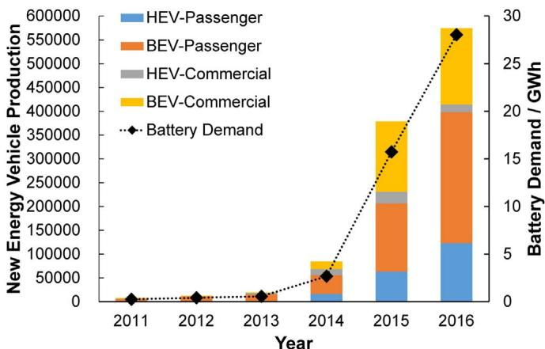  
Fig. 1. The EV production and the demand of lithium ion battery for EV in China.

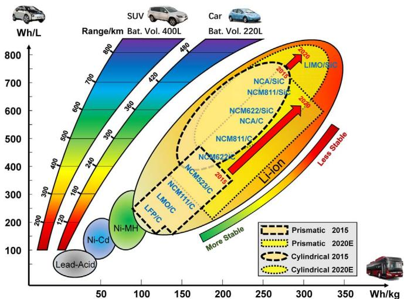  
Fig. 2. The roadmap of the lithium ion battery for pure electric vehicle: the demand of longer range and the potential of less thermal stable materials.

project [7]. Fig. 2 shows the roadmap of the lithium ion battery for EV in China. The goal is to reach no less than  $300\mathrm{Whkg^{-1}}$  in cell level and  $200\mathrm{Whkg^{-1}}$  in pack level before 2020, indicating that the total range of an electric car can be extended to  $400\mathrm{km}$  or longer. To reach that goal, the cathode material may have to change from  $\mathrm{LiFePO_4}$  (LFP*) and  $\mathrm{Li}[\mathrm{Ni}_{1/3}\mathrm{Co}_{1/3}\mathrm{Mn}_{1/3}] \mathrm{O}_2$  (NCM111) to Ni rich NCM cathode like  $\mathrm{LiNi}_{0.6} \mathrm{Co}_{0.2} \mathrm{Mn}_{0.2} \mathrm{O}_2$  (NCM622),  $\mathrm{LiNi}_{0.8} \mathrm{Co}_{0.1} \mathrm{Mn}_{0.1} \mathrm{O}_2$  (NCM811), or Li-rich manganese-based oxide etc., whereas the anode material may have to change from carbon (C, including graphite) to a mixture of Si and C.

*The abbreviations in Fig. 2 are listed in Table 1 for references.

However, the materials with higher energy density may have lower thermal stability [8], leading to safety problems, e.g., thermal runaway (TR). The utilization of NCM111 as cathode has already aroused safety concerns, not to mention the Ni rich NCM cathode in the roadmap. The Chinese government ceased the use of NCM-based lithium ion battery in EV buses for several months in 2016, due to the occurrence of several TR accidents since 2015. The fear of using NCM or other

cathode material with higher energy density comes from the lack of knowledge on the TR mechanisms. Although the NCM-based lithium ion battery was allowed to be utilized in EV buses after the more stringent compulsory test standards have been upgraded, it is found that many engineers and researchers are still not well equipped with sufficient knowledge on the battery TR mechanisms. Therefore, we feel it urgent to provide a review on the TR mechanisms of the lithium ion battery for EV. This review can provide guidance for engineers and researchers to conduct safety design of battery pack with higher energy density, and alleviate the fear of the battery safety problem.

# 2. Accidents with the lithium ion battery failure

Table 2 listed several selected accidents of lithium ion battery failure in last ten years [9-12]. Most of lithium ion battery involved are for EV, whereas two of them are for aircraft (Boeing 787 Dreamliner). Battery fire accidents occurred more frequently since 2015, in accordance with the burst in the EV market in 2015.

The TR and TR-induced smoke, fire, and even explosion, are the most common features during the accidents of lithium ion battery. Smoke, fire and explosion are serious safety problems that arouse concerns from the public. The fear of accident hinders the fully acceptance of the EVs from the market, therefore many countries require the lithium ion battery to pass compulsory test standards, e.g., UN 38.3, UN R100, SAE-J2464, IEC-62133, GB/T 31485 etc., before its application in EV. The probability of the accident caused by lithium ion battery can be substantially diminished after passing those test standards.

However, why accidents involving with TR still occurs sporadically, even if the battery can pass those compulsory test standards? The answers may come from two views: 1) the probability of the self-induced failure; 2) the abuse condition in practical use.

In the view of probability, the self-induced failure of the lithium ion battery exists but at a very low level. Self-induced internal short circuit, also called the spontaneous internal short circuit, was believed to be the probable cause of the battery failure for Boeing 787 (Accident No. 4 & 5 in Table 2). For the EV, the self-induced failure rate in vehicle level can be calculated by  $P = 1 - (1 - p)^{\mathrm{m} - \mathrm{n}}$ , where  $P$  is the failure rate considering  $m$  EVs, each of which contains  $n$  cells within its battery pack. Take Tesla Model S as an example, where  $n = 7104$ . Assume that the self-induced failure rate  $p$  of the 18,650 cells is  $0.1 \mathrm{ppm}$ , which denotes the defect rates during manufacturing, then when the quantity of the EV equals  $m = 10,000$ , the failure rate  $P = 0.9992$ , indicating that the failure rate is approximately 1 over 10,000. Comparing with the traditional vehicle (7.6 fire accidents per 10,000 vehicles in US [13]), the probability of the EV accident seems to be much lower.

The abuse condition can be unpredictable in practical use, leading to field failure of battery TR. For instances, the high-speed crush in accident No. 3, the metal intrusion in accident No. 6, the unintended overcharge in accident No. 7, and the unknown charging failure in accident No. 9 etc., represent the unpredicted abused conditions, which might be more severe than that regulated in the test standards. The deterioration during life cycle may also cause unpredicted abuse conditions. For instances, the battery pack was out of warranty after a 7-year service in the accident No. 8, and the EV bus fire was caused by

Table 1 The abbreviations used in Fig.2.  

<table><tr><td>Abbrev.</td><td>Electrode</td><td>Formula</td><td>Abbrev.</td><td>Electrode</td><td>Formula</td></tr><tr><td>LFP</td><td>Cathode</td><td>LiFePO4</td><td>NCM811</td><td>Cathode</td><td>Li[Ni0.8Co0.1Mn0.1]O2</td></tr><tr><td>LMO</td><td>Cathode</td><td>LiMn2O4</td><td>NCA</td><td>Cathode</td><td>Li[NixC0yAlz]O2, x≥0.8</td></tr><tr><td>NCM</td><td>Cathode</td><td>Li[NixC0yMn2]O2</td><td>LIMO</td><td>Cathode</td><td>xLi2MnO3·(1-x)LiMO2</td></tr><tr><td>NCM111</td><td>Cathode</td><td>Li[Ni1/3Co1/3Mn1/3]O2</td><td>C</td><td>Anode</td><td>Graphite, Carbon, or MCMB</td></tr><tr><td>NCM523</td><td>Cathode</td><td>Li[Ni0.5Co0.2Mn0.3]O2</td><td>Si</td><td>Anode</td><td>Si, or SiOx</td></tr><tr><td>NCM622</td><td>Cathode</td><td>Li[Ni0.6Co0.2Mn0.2]O2</td><td>SiC</td><td>Anode</td><td>Composite anode with Si and C</td></tr></table>

Table 2  
Selected accidents of the lithium ion battery in last ten years.  

<table><tr><td>No.</td><td>Date</td><td>Location</td><td>Accident replay</td><td>Possible cause</td></tr><tr><td>1</td><td>2008.06</td><td>Columbia, US</td><td>The lithium ion battery pack of a modified Prius caught fire during highway running.</td><td>Connection loose led to battery overheat near bolt [9].</td></tr><tr><td>2</td><td>2011.05</td><td>Burlington, US</td><td>A Chevy Volt, which had side-pole impact test 3 weeks ago, caught fire and destroyed adjacent cars.</td><td>The side-pole impact damaged the coolant system and the battery module. Conductive coolant formed external short circuit and ignited flammable gas leaked from cells [10].</td></tr><tr><td>3</td><td>2012.05</td><td>Shenzhen, China</td><td>A BYD E6 taxi was collided from rear end by a Nissan GTR at extreme speed. The taxi caught fire after hitting a tree, killing 3 occupants.</td><td>High speed collision deformed the high voltage circuit. Arc was triggered from the damaged high voltage circuit, ignited 25% cells and the whole car.</td></tr><tr><td>4</td><td>2013.01.07</td><td>Boston, US</td><td>The APU battery pack caught fire and filled the cabin of a Boeing 787 Dreamliner with smoke.</td><td>Internal short circuit [11].</td></tr><tr><td>5</td><td>2013.01.16</td><td>Takamatsu, Japan</td><td>The Main battery pack caught fire during a Boeing 787 flight from Yamaguchi-Ube to Tokyo.</td><td>Internal short circuit [12].</td></tr><tr><td>6</td><td>2013.10</td><td>Seattle/Tennessee US</td><td>Two Tesla Model S ran over large metal objects at highway speed and caught fire.</td><td>The battery pack was pierced and deformed by the metal objects. Short circuit occurred and ignited some cells.</td></tr><tr><td>7</td><td>2015.04</td><td>Shenzhen, China</td><td>Wuzhou Dragon EV bus caught fire during charging in a garage.</td><td>The BMS failed in stop charging, the battery pack was overcharged until TR and fire.</td></tr><tr><td>8</td><td>2015.09</td><td>Hangzhou, China</td><td>The battery pack of an HEV bus caught fire.</td><td>The battery pack was out of warranty after 7-year service.</td></tr><tr><td>9</td><td>2016.01</td><td>Gjerstad, Norway</td><td>A Tesla Model S caught fire while fast-charging at a Supercharger Station.</td><td>Short circuit during charging.</td></tr><tr><td>10</td><td>2016.04</td><td>Shenzhen, China</td><td>A Wuzhou Dragon EV bus caught fire.</td><td>Short circuit caused by wire deterioration.</td></tr><tr><td>11</td><td>2016.06</td><td>Beijing, China</td><td>An iEV5 caught fire before the landmark of Sanlitun.</td><td>Might be overheat caused by wire connection loose.</td></tr><tr><td>12</td><td>2016.07</td><td>Nanjing, China</td><td>The battery pack of an EV bus caught fire after heavy rain.</td><td>Water immersion brought short circuit.</td></tr><tr><td>13</td><td>2016.07</td><td>Rome, Italy</td><td>An EV police car caught fire on the street.</td><td>Unknown.</td></tr></table>

short circuit due to wire deterioration in the accident No. 10.

The abuse conditions can be categorized into mechanical abuse, electrical abuse, and thermal abuse [14], as shown in Fig. 3. The mechanical abuse can trigger short circuit, which is a common feature in the electrical abuse, whereas the short circuit releases heat and initiates a thermal abuse condition. Under a thermal abuse condition, the battery is heated to extreme temperature and then undergoes TR. The characterization of different abuse conditions will be reviewed in the next section.

# 3. Abuse conditions of lithium ion battery during accidents

# 3.1. Mechanical abuse

Destructive deformation and displacement caused by applied force are the two common features of the mechanical abuse. Vehicle collision and consequent crush or penetration of the battery pack are the typical conditions for mechanical abuse.

# 3.1.1. Collision and crush

Deformation of the battery pack is quite possible during car collision. The layout of the battery pack onboard the EV affects the crash response of the battery pack [15]. The deformation of the battery pack may result in dangerous consequences: 1) the battery separator gets torn and the internal short circuit (ISC) occurs; 2) the flammable electrolyte leaks and potentially causes consequent fire.

Studying the crush behavior of the battery pack requires multi-scale research from material level, cell level, to pack level.

The mechanical behavior of the cell component materials founds the basis of correlated study. Choi [16], Lai [17] and Shim [18] et al. studied the tensile mechanical properties of electrodes and separator at low rate loading, whereas Choi et al. [16] discussed the effects of temperature on the mechanical behaviors. Zhang et al. [19] conducted research on the characterization of plasticity and fracture of the cell casing of lithium ion cylindrical battery. Plasticity and fracture models were established and could be validated by test results under various loading conditions.

The crush model at cell level can be built based on the mechanical properties of cell component materials. Sahraei [20], Greve [21], and Pan [22,23] et al. designed several kinds of quasi-static tests upon varies types of battery cells, including compression, crush, punching, bending etc. Homogenized material model was built for the jelly roll and can well predict the breaking behavior under quasi-static tests.

The ISC prediction might be more valuable in the research outcome of mechanical abuse. Sahraei [24] and Xia [25] et al. proposed mechanical models that could predict the onset of ISC, but without prediction of further electrical-thermal coupled consequences. Their results indicate that the lithium ion battery can tolerate large deformation before ISC triggering. Zhang et al. [26,27] forwarded the modeling work on mechanical abuse from pure mechanical model to mechanical-electrical-thermal coupled model. A simple criterion of the strain-failure judgement was applied to simulate the break mechanism of separator. Future work are welcomed in developing a kinematic mechanical-electrochemical-thermal coupled model, which can predict ISC-induced TR caused by mechanical abuse.

The collision model at module/pack level can be built based on the mechanical model at cell level, and beneficial for the anti-collision design of the EV battery pack. The collision model can be also utilized to analyze the interactions between the battery pack and the vehicle body under car crash simulations [15]. Xia et al. [28] conducted a multi-scale modeling research to replay the ground impact in the Tesla Model S accident, as shown in Fig. 4. The work provided guidance on the anti-collision design of battery pack using computer aided engineering (CAE) model. The CAE model in [28] can provide a compromise solution considering both the design cost and the protection capability. Further study is still required to improve the accuracy

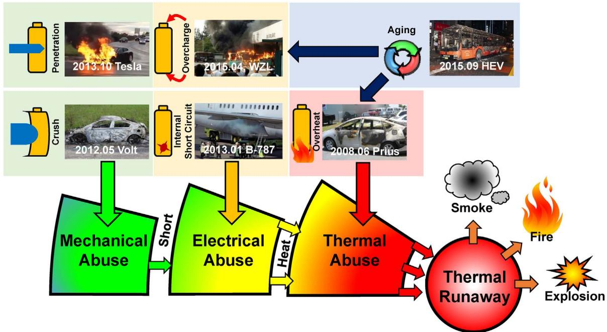  
Fig. 3. Accidents related with lithium ion battery failure, and correlated abuse conditions.

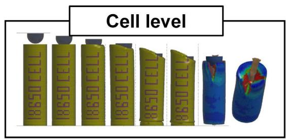

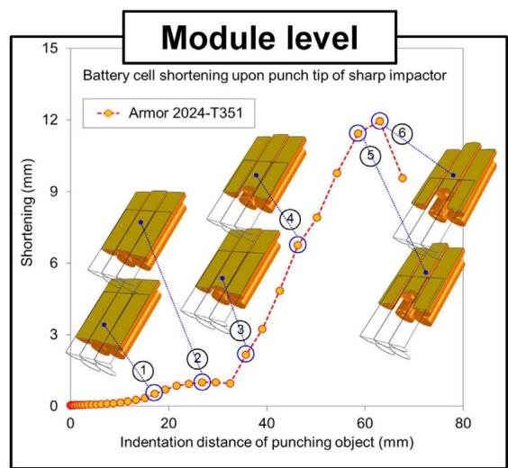  
Fig. 4. Simulation of possible crush conditions for the Tesla accident [28], reuse with permission.

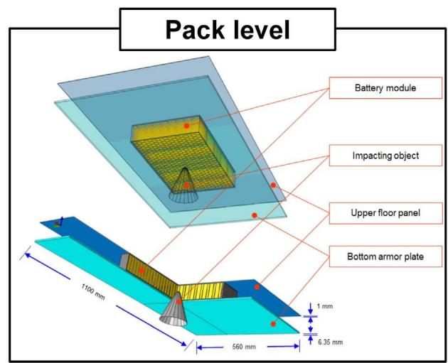

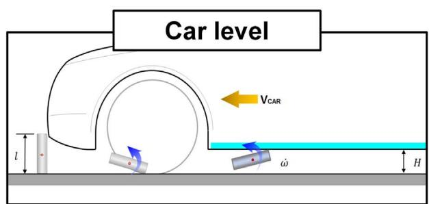

of the fracture prediction at multi-scales, and enhance the simulation speed by reducing the computational load of the finite element model.

In a brief summary, the test and modeling work still require further improvement for studying the mechanism of the mechanical abuse. Well-designed prototypic tests are required to reveal the destructive mechanism of the lithium ion battery under kinematic loads. Mechanical-electrical-thermal coupled models are in urgent need from cell to pack level to evaluate the hazard potential considering ISC and possible TR.

# 3.1.2. Penetration

Penetration is another common phenomenon that may occur during the vehicle collision. Comparing with the crush conditions, fierce ISC can be instantaneously triggered when penetration starts. Penetration is regulated in some compulsory test standards of the lithium ion battery, i.e., GB/T 31485-2015, SAE J2464-2009 etc., to simulate the ISC in abuse test. The mechanical destruction and electrical short occur simultaneously, and the abuse condition of penetration is more severe than that of simple mechanical or electric abuse.

Yamauchi et al. [29] interpreted the mechanism of penetration for a cell with jelly roll. They believed that for a jell roll with  $n$  sub-cells, the nail forms  $2n$  regions of ISC. High-level current flows through the  $2n$  regions with heat generation, which is assumed to conform to the Joule's law. The electric energy of the cell will be released continuously during the short circuit. The temperature of the cell rises by absorbing the heat generated by short circuit. The temperature rise stops until the cell is fully discharged. If the temperature does not reach a critical level at the end of short-circuit-induced discharge, no further TR will be triggered during penetration.

Maleki et al. [30] investigated the discharge speed of the ISC induced by penetration. The results indicated that as much as  $70\%$  energy released intensively within  $60~\mathrm{s}$ , leading to notable temperature rise. The thermal hazard during penetration can be influenced by the location of the nail. The penetration at the edge of the electrode where the heat dissipation is insufficient will be more dangerous.

Zavalis et al. [31] built a 2D model on the penetration process of a prismatic cell using Comsol Multiphysics. The results shown that the mass transport of lithium ions in electrolyte was the most critical property that limited the peak current, thereby restricting the maximum temperature rise. During penetration, there are two current routes: 1) the current passing through the nail, or ISC; 2) the current passing through the electrodes, or external short circuit. The simulation results indicated that the current passing through the route No. 2 occupied approximately  $75\%$  of the total current during penetration.

Challenging questions are being proposed on the nail penetration test of lithium ion battery for EV. Previously, the nail penetration was regarded as a substitute test approach of ISC. However, the repeatability of the nail penetration test is being challenged by battery manufacturers. Some believe that the lithium ion battery with higher energy density will never pass the nail penetration test in standards, therefore a revolution is undergoing. Whether to enhance the repeatability of the penetration test or to search for a substitute test approach remains an open and challenging question for the safety research of lithium ion battery.

# 3.2. Electrical abuse

# 3.2.1. External short circuit

The external short circuit forms when the electrodes with voltage difference are connected by conductors. The external short circuit of the battery pack can be caused by deformation during car collision, water immersion, contamination with conductors, or electric shock during maintenance, etc. Comparing with penetration, generally, the heat released on the circuit of external short does not heat the cell.

Leising et al. [32] investigated the external short circuit behavior of a lithium ion battery with LCO cathode and graphite anode. The measured current during external short circuit first rose to a peak value of  $20\mathrm{C}$ , then rapidly diminished to a lower plateau  $(10\mathrm{C})$  and held for a while. The current dropped to zero when the cell was fully discharged. The peak-plateau-drop was a typical characteristic of the external short circuit. Although some heat was released on the external circuit, the high peak current could still lead to fast temperature rise and cell swell, which are dangerous. The observed cell swell indicate that gas was generated during external short circuit.

Spotnitz and Franklin [33] concluded the TR mechanism caused by external short circuit. They confirmed that the over temperature is caused by the ohmic heat generation during short circuit. The peak value of current is restricted by the diffusion of lithium ion in the anode, and so either by increasing the mass transfer coefficient for lithium ion in the anode or increasing the surface area of the anode allows for higher currents with more rapid heating of the battery during external short circuit.

In summary, the external short circuit is more like a fast discharging process, of which the highest current is limited by the mass transfer speed of lithium ion.

The hazard caused by external short circuit can be reduced through protective electronic devices. The key role of the protective devices is to cut off the circuit during high current short. Fuses are the most effective solutions to inhibit the external short circuit [34], whereas the positive thermal coefficient (PTC) devices is also capable of cutting off the circuit when the temperature rises abnormally [35]. Magnetic switches, bimetallic thermostats are also alternatives to prevent the hazard during the external short circuit [36].

# 3.2.2. Overcharge

Overcharge is confirmed to be the root cause of the Accident No. 7 as listed in Table 2. The overcharge-induced TR can be harsher than other abuse conditions, because excessive energy is filled into the battery during overcharge. The failure of the battery management system (BMS) to stop the charging process before the upper voltage limit is the ordinary cause of overcharge abuse. The inconsistency within the battery pack determines that the cell with the highest voltage is the first overcharged cell, followed by the others.

The heat and gas generation are the two common characteristics during overcharge. The heat generation comes from ohmic heat and side reactions. Both Leising [32] and Saito [37] observed that the amount of heat generation has a positive correlation with the charging current, indicating that the ohmic heat is one major heat source during overcharge. Wen [14] and Lin [38] revealed the mechanisms of overcharge induced side reactions. First, the lithium dendrite grows at the surface of the anode due to excessive lithium intercalation. The start of lithium dendrite growth can be influenced by the stoichiometric ratio of the cathode and anode. Second, the excessive de-intercalation of lithium leads to a collapse of the cathode structure with heat generation and oxygen release (oxygen release for the NCA cathode [38]). The release of oxygen accelerates the decomposition of electrolyte, which produces massive gases. The cell may vent due to the increase of the internal pressure. The contact of the active materials inside the cell and the air can result in fiercer heat generation after venting.

The moment of the cathode collapse can be quantified by the stoichiometric coefficient of the intercalated lithium. Zeng et al. [39] pointed out that  $x = 0.16$  denoted the collapse point of the  $\mathrm{Li}_x\mathrm{CoO}_2$  cathode used in their study. They also found that the heat and gas generation were significantly reduced with fewer electrolyte filled inside the cell.

The outcome of overcharge varies with the test conditions. The cell exploded under high current, whereas only swelled under small current as reported in [32]. Takahashi et al. [40] conducted overcharge test with different experimental settings. The results indicate that the cell not confined by restricting plates and the cell whose gas vent cannot properly open are more prone to explosion. The variance in the test outcome, or in other words, the poor test repeatability, undermines the validity to use overcharge as a convincible abuse test approach in safety standards. Further study is welcomed to propose a more practical overcharge test profile based on the insight of the overcharge mechanisms.

The overcharge of a battery cell can occur when the voltage of any one cell is not well monitored. With minor deviation in the voltage monitoring, the cell can be slightly overcharged during practical operation. A slight overcharge does not directly lead to TR, but capacity degradation. Ouyang et al. [41] found that no obvious capacity degradation occurs if the cell with NCM+LMO composite cathode was overcharged to an state of charge (SOC) lower than  $120\%$  once, but considerable capacity loss was observed when the cell was overcharged to  $130\%$  or higher SOC once. Xu et al. [42] conducted slight overcharge test upon LFP cells, which were cycled with  $10\%$  overcharge capacity. The capacity jumped to 0 after 10 cycles, and iron metal particle was observed on the anode surface under post-mortem analysis. Correlated research is insufficient to reveal the mechanism of overcharge-induced capacity degradation and further study is still required.

The overcharge protection can be fulfilled by voltage regulation and material modification. Fig. 5 shows the overcharge profile for a cell with

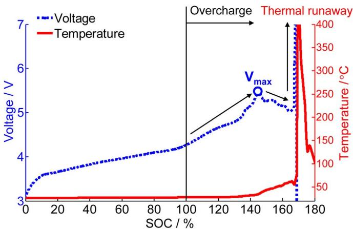  
Fig. 5. The results of overcharge induced TR for a commercial lithium ion battery.

NCM+LMO/Graphite electrodes in [41]. A peak voltage locates at  $5.4\mathrm{V}$ , after which the voltage drops followed by overcharge-induced TR. To regulate the voltage of the lithium ion cell, the voltage limit set in the BMS should be lower than the peak voltage to avoid invalid protection. The material modification is also effective to prevent the overcharge-induced hazard. For instances, the cathode coating can enhance the anti-overcharge behavior of the battery cell [43,44]. Chemical reactions, which can consume the excessive energy charged into the cell, can effectively inhibit the overcharge. Redox shuttles are popular to deal with the overcharge problem [45,46]. The redox shuttle molecules oxidized at the cathode, whereas reversibly reduced at the anode, forming a nominal internal circuit to consume excessive current charged into the cell. Despite the redox shuttles, Xiao et al. [47] proposed a potential-sensitive membrane, which can transform from electric-isolating state to conductive state at over-voltage, thereby shunting the overcharge current by ISC. The short circuit for the current shunting can also be fulfilled by a mechanical switch, which can be activated by the internal pressure rise during overcharge, as proposed in the patent [48,49] from Samsung.

# 3.2.3. Overdischarge

The overdischarge is another possible electrical abuse condition. Generally, the voltage inconsistency among the cells within the battery pack is unavoidable. Therefore, once the BMS failed to monitor the

voltage of any single cell, the cell with the lowest voltage will be overdischarged.

The mechanism of the overdischarge abuse is different from others, and the potential hazard may be underestimated. The cell with the lowest voltage in the battery pack can be forcibly discharged by the other cells connected in series during overdischarge. During the forcible discharge, the pole reverses and the voltage of the cell becomes negative, leading to abnormal heat generation at the overdischarged cell.

The overdischarge can cause the capacity degradation of the cell. During the process of overdischarge, the over delithiation of the anode causes the decomposition of SEI, which will produce gases like CO or  $\mathrm{CO}_{2}$ , resulting in the cell swell [50]. Once the cell is recharged after overdischarge, new SEI will be formed on the anode surface. Meanwhile, the regenerated SEI layer changes the electrochemical properties of anode [51] with the resistance increase and consequent capacity degradation [52]. Yu et al. [53] reported that the SEI layer on the anode surface was destroyed when the MCMB-LCO battery was overdischarged to  $0\mathrm{V}$ . The reformed SEI layer was unstable, resulting in the resistance increase.

Moreover, the morphology of the cathode also changed during the overdischarge. Shu et al. [54] observed the electrochemically driven solid-state amorphization of the cathode transition metal compounds. As a result, the cathode materials would be deactivated leading to rapid capacity degradation. Further comparative investigation of the overdischarge behavior of the cell with  $\mathrm{LiFePO_4}$ ,  $\mathrm{LiNiO_2}$  and  $\mathrm{LiMnO_2}$  cathodes discovered that the cell with  $\mathrm{LiNiO_2}$  cathode is the most vulnerable one under the overdischarge condition because of its unstable structure after overlithiation reaction. Zhang et al. [51] found that the overdischarge led to the dissolution of the copper collector. The dissolved copper migrated and deposited on the anode surface. The deposition of copper was believed to be the cause for the resistance increase and capacity loss.

The dissolution of the copper collector, and the inner migration and deposition of the copper can cause ISC besides capacity degradation. Fig. 6 illustrates the overall overdischarge process. The copper can be electrolyzed from the current collector into the electrolyte as  $\mathrm{Cu^{2+}}$  ions [55,56], once the anode potential reaches the dissolution potential (3.5 V) [57] of the copper. Guo et al. [56] found that the dissolved copper ions migrated through the membrane and formed copper dendrites on the cathode side with lower potential. With an unsuppressed growth, the copper dendrite could penetrate the membrane, resulting in severe ISC. Maleki et al. [55] reported that the ISC or even TR can possibly occur, if the cell is cycled after overdischarge.

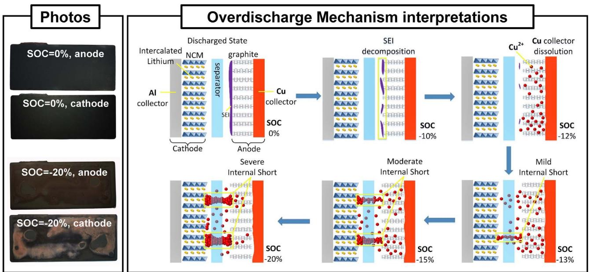  
Fig. 6. The mechanism of the internal short circuit caused by overdischarge due to copper dissolution and deposition [56], reuse with permission.

Several approaches to diminish the consequences of overdischarge were proposed. The three-electrode measurement was introduced during overdischarge testing to monitor the over-potential at the anode. Lee et al. [57] avoided the over-high potential at the anode by adopting a cell with  $\mathrm{Li}_2\mathrm{NiO}_2$  additives. Moreover, Kim et al. [58] used succinonitrile as an electrolyte additive, which can form a passive layer on the Cu collector, to avoid Cu dissolution during overdischarge.

# 3.3. Thermal abuse

Local overheat is possible to occur as a typical thermal abuse condition in a battery pack. Besides the overheat caused by mechanical/electrical abuse, the overheat can be caused by contact loose of the cell connector. The contact loose of the cell connector is confirmed during practical operation. Zheng et al. [59] observed an increment in the contact resistance for one cell within the battery pack. The resistance increase was caused by contact loose of the connector originated from defect during manufacturing. As the Accident No. 1 reported in [9], the TR accident of the HEV battery pack was initiated by contact loose and consequent local overheat. The cells in the battery pack were connected through metal current connectors. However, the connection became loose under vehicle vibration condition. Intensive heat generation occurred when high current passed through the particular area, resulting in local overheat and consequent TR.

The contact resistance is influenced by the pre-tightening pressure and the roughness of the contact surfaces. Taheri et al. [60] suggested that insufficient pre-tightening leads to significant increment in the contact resistance. The poor connection at the electrode-collector interface can lead to a significant battery energy loss as heat generated at the interface. The excessive heat flow can be initiated from the interface towards the battery core, resulting in possible temperature increase and onset of TR.

Despite the thermal abuse caused by contact loose, it is reported in [10] that the thermal abuse can also be caused by the combustion of the automotive interiors. The leakage of the electrolyte after collision may facilitate such kind of combustion.

In one word, the thermal abuse is the direct cause of the battery TR. The mechanism of the TR process will be further introduced in Section IV.

# 3.4. Internal short circuit

The ISC is the most common feature of TR, as shown in Fig. 7. Almost all the abuse conditions are accompanied with ISC. Broadly speaking, the ISC occurs when the cathode and anode contact with each other due to the failure of the battery separator. Once the ISC is triggered, the electrochemical energy stored in the materials releases spontaneously with heat generation.

As shown in Fig. 7, in accordance with the failure mechanism of the separator, the ISC can be divided into three categories: 1) Caused by mechanical abuse, e.g., the deformation and fracture of the separator caused by nail penetration or crush; 2) Caused by electrical abuse, e.g., the separator can be pierced by dendrite [61], the growth of which can be induced by overcharge/overdischarge [62]; 3) Caused by thermal abuse, the shrinkage and collapse of the separator with massive ISC caused by extreme high temperature.

The massive ISC, often caused by mechanical and thermal abuse, will directly trigger TR. On the contrast, there is mild ISC, which generates little heat and will not trigger TR. The energy release rate varies with the degree of the separator fracture, and so as the time from the ISC to TR. The probability of the abuse induced ISC is quite low, because all of the cell products have to pass corresponding test standards before sales.

However, there is still one kind of ISC, called spontaneous ISC or self-induced ISC, which cannot be well regulated in current test standards. The spontaneous ISC is believed to originate from contamination or defects during manufacturing [63]. The spontaneous ISC was considered to be the most probable cause of the Boeing 787 battery failure (Accident No. 4 & 5 in Table 1) in 2013 [11,12]. It takes several days or even months for the contamination/defects to develop into spontaneous ISC with obvious heat generation [64]. The mechanism of the spontaneous ISC during the long time incubation is rather complex and deserves further investigation. Deep insight into the mechanism can benefit the early warning of the spontaneous ISC.

The hazard level of the ISC can be evaluated by the self-discharge rate and the exotic heat generation. Summarizing the current literature, we propose that there are three levels of ISC, as shown in Fig. 8. In Level I, the cell with ISC displays self-extinguish features, i.e., there is

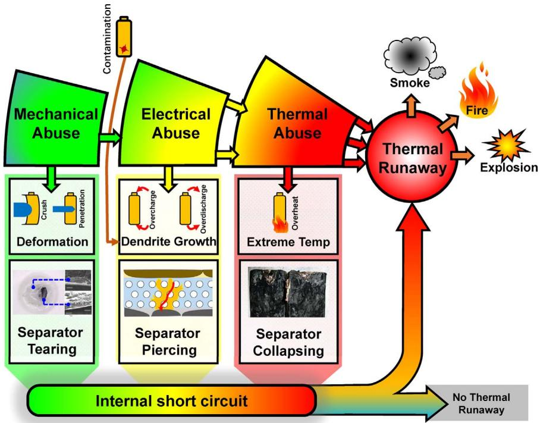  
Fig. 7. Internal short circuit: the most common feature of TR.

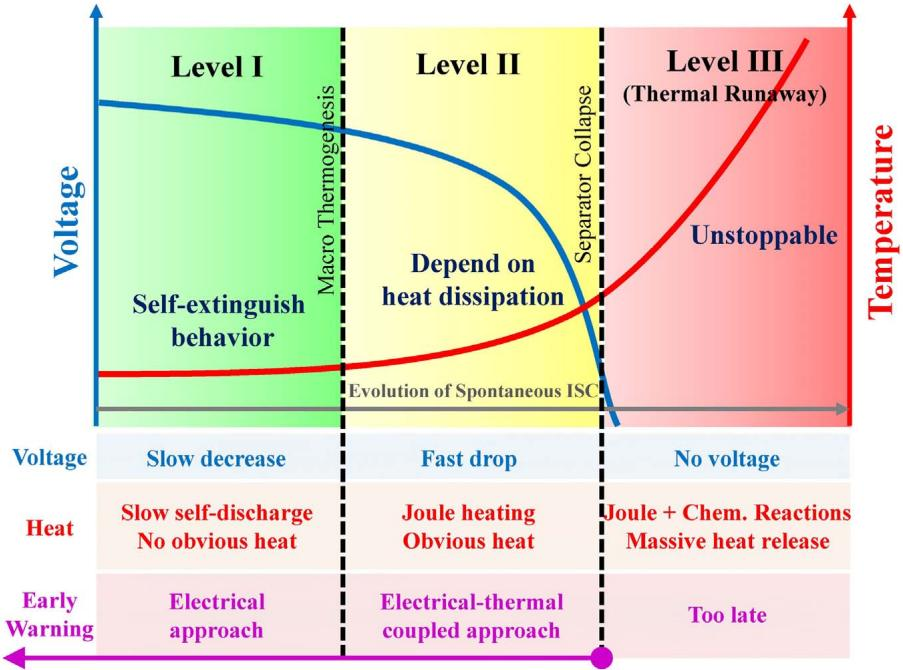  
Fig. 8. The three level of the internal short circuit.

slow self-discharge but no obvious heat generation. In Level II, the characteristics of the ISC become more obvious, with a faster dropping of voltage and quicker rise of temperature. While in Level III, TR may be unstoppable with intensive heat generation, due to the collapse of separator. Fortunately, the incubation of the spontaneous ISC takes long time going from Level I to Level III, therefore there is sufficient time for the BMS to detect the fault of the spontaneous ISC before it develops into Level III.

Unfortunately, the mechanism of the spontaneous ISC has not been clearly revealed up to now. A substitute test that can simulate the thermal-electrical coupled behavior of the ISC is useful to accomplish the task of ISC evaluation and early detection. Five major alternatives were proposed as the substitute test for ISC: 1) Introducing impurities into the battery, then activating the ISC with cycling and/or press [65]; 2) Using phase change material (PCM) to replace part of the separator, then trigger ISC by heating to the melting point of the PCM [66]; 3) Penetrating or squeezing the battery with bars, rods or nails [29,30,67]; 4) Inducing the dendrite growth by electrical abuse, e.g., overcharge [41], overdischarge [56]; 5) Simulating the electrochemical behavior of ISC by connecting an equivalent ISC resistance in parallel with the cell [68]. Note that both the self-discharge and the exotic heat generation can be quantitatively evaluated by equivalent ISC resistance. A smaller equivalent ISC resistance denotes a severer ISC with larger heat generation and greater possibility of TR [69].

To best simulate the spontaneous ISC, the substitute ISC test need to meet the following requirements: 1) Has high repeatability; 2) Can trigger ISC with simultaneous voltage drop and temperature rise; 3) Can trigger ISC with scheduled triggering time and specific equivalent ISC resistance; 4) The heat generation caused by ISC can be completely absorbed by the cell; 5) The discharge caused by ISC can diminish the state of charge of the cell; 6) Can simulate the real damage to the cell materials. However, none of the above substitute test approaches is ideal, because the requirement 1) and 6) seem to be contradictory in technical view. The development of advanced substitute ISC test is ongoing, and the breakthroughs are expected in the near future.

Despite the substitute test, the hazard caused by ISC can also be evaluated by modeling analysis. Santhanagopalan et al. [65] has developed an electrochemical-thermal coupled model to simulate the behavior of ISC for lithium ion battery. They proposed that there are four different scenarios of ISC: 1) ISC between the two current

collectors (copper and aluminum); 2) ISC between the copper current collector and the active material at the cathode; 3) ISC between the aluminum current collector and the active material at the anode; 4) ISC between the active materials on both the electrodes. The results show that the scenario 3) may be the most dangerous among the four. The modeling results in [65] can be validated by experiments and are beneficial to reveal the ISC mechanisms in practical conditions.

In summary, as the most common feature of TR, the ISC is worth further study. Further studies are welcomed in 1) investigating the gradual evolution mechanisms of the spontaneous ISC; 2) developing a more reliable substitute ISC test; 3) building an easy-to-use ISC simulation model. Moreover, the relationship between the ISC and TR must be clarified. Section IV will discuss the role of ISC in the TR process.

# 4. Thermal runaway mechanisms of lithium ion battery

# 4.1. Overview of the chain reactions during thermal runaway

The mechanism of TR can be interpreted by the chain reactions as illustrated in Fig. 9. The chemical reactions occur one after another, forming chain reactions, once the temperature rises abnormally under abuse conditions. The Heat-Temperature-Reaction (HTR) loop is the root cause of the chain reactions. To be specific, the abnormal heat generation rises the temperature of the cell, initiates the side reactions, e.g., the SEI decomposition. Side reactions release more heat, forming the HTR loop. The HTR loop cycles at extremely high temperature until the cell undergoes TR.

Fig. 9 shows the mechanism of chain reactions during TR for a lithium ion battery with NCM/Graphite electrodes and PE-based ceramic coated separator [70]. During the whole process of temperature rise, the SEI decomposition, the reaction between the anode and the electrolyte, the melting of the PE base, the decomposition of NCM cathode, and the decomposition of electrolyte etc., have been initiated sequentially. Once the ceramic coating of the separator collapses, massive internal short circuit releases the electric energy of the cell instantaneously, leading to TR with possible burning of the electrolyte.

Fig. 9 is only a qualitative interpretation of the chain reaction mechanism during TR. To interpret the HTR loop for the chain reactions quantitatively, the respective kinetics of heat generation for

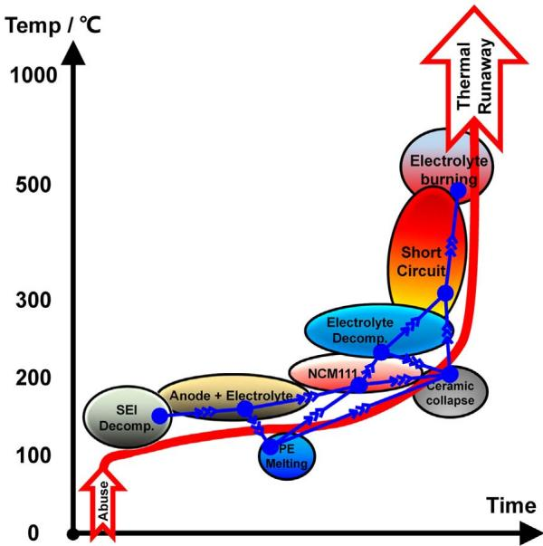  
Fig. 9. Qualitative interpretation of the chain reactions during thermal runaway.

different component materials are required. Based on the TR mechanism reviewed previously [33,63,71], we propose a graphic illustration of the chain reaction mechanism during TR, called the energy release diagram.

# 4.2. The energy release diagram of thermal runaway

Fig. 10, which we call the energy release diagram of TR, summarizes the chemical kinetics from approximately 50 references. The chemical kinetics of the reaction can be measured using differential scanning calorimetry (DSC) and accelerating rate calorimetry (ARC). All of the chemical kinetics collected in Fig. 10 corresponds to a cell with  $100\%$  SOC. The abbreviations used in Fig. 10 have been listed in Table 3. We first introduce the legend of Fig. 10 to help the reader to comprehend the proposed energy release diagram.

The legend locates at the left bottom corner of Fig. 10, taking the decomposition of LFP with electrolyte as an example. The key features of the chemical reactions include the characteristic temperature, the

Table 3 The abbreviations used in Fig.10.  

<table><tr><td>Abbreviation</td><td>Description</td></tr><tr><td>ISC</td><td>Internal short circuit</td></tr><tr><td>Tonset</td><td>The onset temperature of the reaction</td></tr><tr><td>Tpeak</td><td>The peak temperature of the reaction</td></tr><tr><td>Tend</td><td>The terminal temperature of the reaction</td></tr><tr><td>Q</td><td>The maximum heat generation power</td></tr><tr><td>ΔH</td><td>The enthalpy or the total energy released during reaction</td></tr><tr><td>SEI-d</td><td>The decomposition of SEI</td></tr><tr><td>SEI regen</td><td>The decomposition and regeneration of SEI</td></tr><tr><td>PE</td><td>The melting of the PE separator or PE base</td></tr><tr><td>PP</td><td>The melting of the PP separator or PP base</td></tr><tr><td>LTO</td><td>The decomposition of the Li4Ti5O12 (LTO) anode with electrolyte</td></tr><tr><td>LCO</td><td>The decomposition of the LCO cathode with electrolyte</td></tr><tr><td>NCA</td><td>The decomposition of the NCA cathode with electrolyte</td></tr><tr><td>NCM111</td><td>The decomposition of the NCM111 cathode with electrolyte</td></tr><tr><td>Ele. Decomp.</td><td>The decomposition of the electrolyte</td></tr><tr><td>Gr/C+Ele</td><td>The decomposition of the graphite/carbon anode with the electrolyte</td></tr></table>

heating power  $(Q)$  that represents the heat release speed, and the enthalpy  $(\Delta H)$  that denotes the total energy released during reaction. The characteristic temperatures include the onset temperature  $(T_{\mathrm{onset}})$ , the peak temperature  $(T_{\mathrm{peak}})$ , and the terminal temperature  $(T_{\mathrm{end}})$  of the reaction. The  $x$  axis of Fig. 10 denotes the characteristic temperatures, therefore the reaction region locates at specific horizontal positions. The hill-like region with color (green for LFP) background indicate the chemical kinetics of the LFP decomposition with electrolyte. The shape of the hill-like region is uniquely determined by the  $T_{\mathrm{onset}}$ ,  $T_{\mathrm{peak}}$ ,  $T_{\mathrm{end}}$  and  $Q$ .  $Q$  determines the height of the hill-like region, whereas  $\Delta H$  determines the vertical position. Complying with the legend, all the chemical kinetics can be depicted in the energy release diagram of Fig. 10, in which the kinetics of different reactions are comparable. The detailed chemical kinetics, which support the drawing of Fig. 10, will be introduced in Section 4.3 with specific references.

The heat released by ISC or combustion also has locations in the energy release diagram, but with different displaying forms from those chemical reactions.

The characteristic of the energy released by ISC is depicted using an arrow with red fillings. The horizontal position of the ISC arrow varies

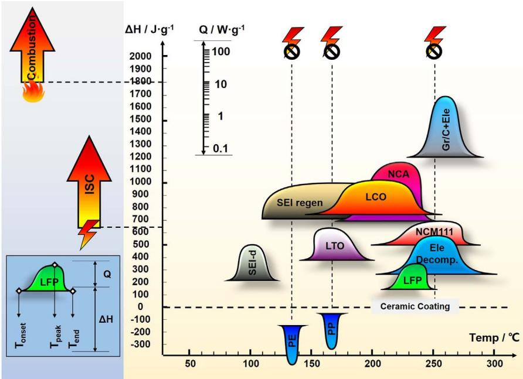  
Fig. 10. The energy release diagram of lithium ion battery.

with specific TR cases. The onset temperature of the ISC is closely relevant with the collapse temperature of the separator. The ISC can occur at approximately  $130^{\circ}\mathrm{C}$  (for the PE separator),  $170^{\circ}\mathrm{C}$  (for the PP or PP/PE/PP separator), or as high as  $200^{\circ}\mathrm{C}$  (for the separator with ceramic coating). The width of the ISC arrow can be narrow for fierce ISC, whereas it can be wide for mild ISC. The height of the ISC arrow denotes the heat release rate during ISC, whereas the vertical location of the ISC arrow represents the total heat generation  $(\Delta H)$ . For a battery cell with  $180\mathrm{Whkg^{-1}}$ , the  $\Delta H$  equals  $180\times 3600 / 1000 = 648\mathrm{Jg^{-1}}$ , as marked in Fig. 10. Note that here the calculation of  $\Delta H$  only represents the ideal case for the cell with  $100\%$  SOC, with an assumption that all electric energy charged in the cell will be released during TR. The correlation between the  $\Delta H$  and the cell SOC is not linear [72], and requires further investigation.

The occurrence of the combustion requires three critical factors, i.e., the flammable fuel, the oxygen, and the ignition source. The flammable fuel is sufficiently supplied by the organic solvent and the gas generated by the electrolyte decomposition, but the oxygen and the ignition source are not always guaranteed at each time during TR. The oxygen released by the cathode decomposition is sometimes insufficient to support a complete combustion, therefore the combustion always occurs outside the cell after the flammable gases vent out. The ignition source occurs randomly during TR, making the combustion during TR unpredictable. The ignition source, e.g., spark, can be a result of the fierce friction between the high-speed outflow and the vent valve, or by the arc generated by the external short circuit during TR. Neither the high-speed friction nor the external short arc can be well predicted during TR, therefore the occurrence of the ignition source is unpredictable.

The enthalpy of the combustion is believed to be comparable with the total enthalpy of all the chemical reactions [73,74]. However, the measured internal temperature of the cell was similar for the TR cases either with or without combustion as reported in [75], indicating that the combustion energy is not fully utilized to heat the cell, but heat the surroundings. The relationship between the measured calorimetric energy of combustion and the internal energy absorbed by the cell during TR requires further investigation.

# 4.3. The energy release mechanism during thermal runaway

This section discusses the energy release mechanism during TR presented in Fig. 10 in detail. All of the chemical kinetics are for the cell with  $100\%$  SOC. Both the decomposition of anode and cathode material considers the combined reactions with electrolyte.

# 4.3.1. The reactions at the anode

Currently, the most common anode used in the lithium ion battery for EV is graphite or carbon based material. Therefore, this section focuses on the reaction kinetics for the lithiated graphite/carbon based anode. The reaction kinetics of the LTO anode is also reviewed, because the lithium ion battery with LTO anode commences these years and occupies some shares in the HEV market.

The reactions at graphite anode with electrolyte display a three-stage characteristic [76-78], according to the DSC test results. The first stage denotes the initial decomposition of the SEI layer with an exothermic peak locates at approximately  $100^{\circ}\mathrm{C}$ . The third (last) stage denotes the final decomposition of the graphite anode with the electrolyte at higher than  $250^{\circ}\mathrm{C}$ . The second stage has a wide temperature range with a stable heat generation rate, between the first stage and the third stage.

4.3.1.1. The initial decomposition of SEI. The initial decomposition of SEI is regarded as the first side reaction that occurs during the full TR process. The initial decomposition of SEI occurs at  $80 - 120^{\circ}\mathrm{C}$  [79], with a peak locates at approximately  $100^{\circ}\mathrm{C}$  [80]. The onset temperature can be lower than  $80^{\circ}\mathrm{C}$ , as Wang et al. [76] reported

that the SEI decomposition might start from a temperature as low as  $57^{\circ}\mathrm{C}$ . However, the exothermic heat generation can only become detectable at  $80^{\circ}\mathrm{C}$  or higher in the calorimetry.

Assume that the main components of the SEI is  $(\mathrm{CH}_2\mathrm{OCO}_2\mathrm{Li})_2$  , the SEI decomposition follows Eq. (1) [81]:

$$
\left(\mathrm {C H} _ {2} \mathrm {O C O} _ {2} \mathrm {L i}\right) _ {2} \rightarrow \mathrm {L i} _ {2} \mathrm {C O} _ {3} + C _ {2} \mathrm {H} _ {4} + \mathrm {C O} _ {2} + 0. 5 \mathrm {O} _ {2} \tag {1}
$$

Many researchers confirm the chemical kinetics of the initial decomposition of SEI, as illustrated in Fig. 10. Macneil et al. [82] compared the reactivity of various carbon materials with electrolyte at elevated temperature using ARC. The  $T_{\mathrm{onset}}$  for the SEI decomposition was approximately  $80^{\circ}\mathrm{C}$ , and the initial heat generation rate strongly depends on the surface area of the graphitized samples, increasing by about two orders of magnitude for the samples from the lowest to the highest surface area. Maleki et al. [78] observed a peak at  $100^{\circ}\mathrm{C}$  during DSC test. They believed that the peak represented for the SEI decomposition. Zhang et al. [83] reported their DSC results for a mixture of lithiated carbon and electrolyte, with a peak started from  $130^{\circ}\mathrm{C}$ . Ryou et al. [84] have studied the influence of the salt on the stability of SEI. They mentioned that small and broad exothermic peaks occurred near  $100^{\circ}\mathrm{C}$ .

The SEI decomposition can be modeled by the Arrhenius Equation as in Eq. (2) [85], where the  $\frac{\mathrm{d}c_{\mathrm{SEI}}^{\mathrm{d}}}{\mathrm{d}t}$  denotes the decomposition rate of SEI,  $c_{\mathrm{SEI}}$  is the normalized concentration of the SEI,  $A_{\mathrm{SEI}}$  is the preexponential factor,  $E_{a,\mathrm{SEI}}$  is the activation energy,  $R = 8.314\mathrm{Jmol^{-1}K^{-1}}$  is the ideal gas constant,  $T$  is the temperature, and  $T_{\mathrm{onset,SEI}}$  is the onset temperature of the SEI decomposition.

$$
\frac {\mathrm {d} c _ {\mathrm {S E I}} ^ {\mathrm {d}}}{\mathrm {d} t} = A _ {\mathrm {S E I}} \cdot c _ {\mathrm {S E I}} \cdot \exp \left(- \frac {E _ {a , \mathrm {S E I}}}{R T}\right), (T > T _ {\text {o n s e t , S E I}}) \tag {2}
$$

4.3.1.2. The balanced reaction of the SEI decomposition and regeneration. The intercalated lithium in the graphite anode has chance to contact the electrolyte, once the SEI decomposes at high temperature. Interestingly, the production of the reaction between the intercalated lithium and the electrolyte is the main components of SEI [80]. The new formation of SEI is called the reaction of SEI regeneration, comparing with that of the SEI decomposition.

Fig. 11 illustrates the balanced reaction of the SEI decomposition and regeneration. Within the temperature range of  $120^{\circ}\mathrm{C} - 250^{\circ}\mathrm{C}$ , the SEI decomposition and regeneration occur simultaneously, with the average thickness of SEI maintaining at a stabilized level. The SEI decomposition will not cease when there is sufficient regenerated SEI, meanwhile the reaction between the intercalated lithium and the electrolyte will not boost because the surface of the anode is still covered by certain thickness of SEI layer.

A wide and mild exothermic process exists at the second stage for the reactions at the anode. Yamaki et al. [77,86] believed that the wide and mild exothermic stage represented the balanced reaction of SEI decomposition and regeneration, as shown in Fig. 11.

The balanced reaction can be modeled by Eqs. (3)-(5). The net decreasing rate of the SEI,  $\frac{\mathrm{dc}_{\mathrm{SEI}}}{\mathrm{dt}}$ , is the difference of the decomposition rate  $\left(\frac{\mathrm{dc}_{\mathrm{SEI}}^{\mathrm{d}}}{\mathrm{dt}}\right)$  and the regeneration rate  $\left(\frac{\mathrm{dc}_{\mathrm{SEI}}^{\mathrm{g}}}{\mathrm{dt}}\right)$ , as in Eq. (3).

$$
\frac {\mathrm {d} c _ {\mathrm {S E I}}}{\mathrm {d} t} = \frac {\mathrm {d} c _ {\mathrm {S E I}} ^ {\mathrm {d}}}{\mathrm {d} t} - \frac {\mathrm {d} c _ {\mathrm {S E I}} ^ {\mathrm {g}}}{\mathrm {d} t} \tag {3}
$$

The decomposition rate  $\left(\frac{\mathrm{dc}_{\mathrm{SEI}}^{\mathrm{d}}}{\mathrm{dt}}\right)$  can be calculated by Eq. (2), whereas the regeneration rate  $\left(\frac{\mathrm{dc}_{\mathrm{SEI}}^{\mathrm{g}}}{\mathrm{dt}}\right)$  is believed to be in proportion to the rate of reaction between the intercalated lithium and electrolyte, as in Eq. (4) [87].

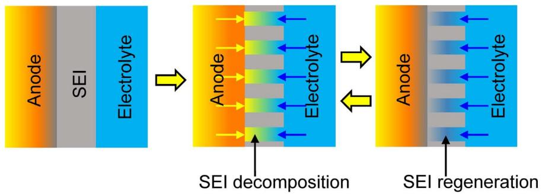  
Fig. 11. The balanced reaction of SEI decomposition and regeneration.

$$
\frac {\mathrm {d} c _ {\mathrm {S E I}} ^ {\mathrm {g}}}{\mathrm {d} t} = K _ {\mathrm {S E I}} ^ {\mathrm {g}} \cdot \frac {\mathrm {d} c _ {\mathrm {L i + E l e}}}{\mathrm {d} t} \tag {4}
$$

where  $K_{\mathrm{SEI}}^{\mathrm{g}}$  is the gain factor, and  $\frac{\mathrm{dc}_{\mathrm{Li + Ele}}}{\mathrm{dr}}$  is the rate of reaction between the intercalated lithium and electrolyte.

Eq. (5) can be used to model the reaction between the intercalated lithium and the electrolyte considering the thickness of SEI [88].

$$
\frac {\mathrm {d} c _ {\mathrm {L i + E l e}}}{\mathrm {d} t} = A _ {\mathrm {L i + E l e}} \exp \left(- \frac {E _ {a , \mathrm {L i + E l e}}}{R T}\right) \cdot c _ {\mathrm {L i + E l e}} \cdot \exp \left(- \frac {t _ {\mathrm {S E I}}}{t _ {\mathrm {S E I , R e f}}}\right)
$$

(Tunneling regime) (5)

where  $A_{\mathrm{Li + Ele}}$  is the pre-exponential factor,  $E_{a,\mathrm{Li + Ele}}$  is the activation energy,  $t_{\mathrm{SEI}}$  denotes the average thickness of the SEI layer, and  $t_{\mathrm{SEI,Ref}}$  is the reference thickness. Given that the concentration of SEI can be in proportion to the average thickness of the SEI, Feng et al. [87] transforms Eq. (5) to Eq. (6).

$$
\frac {\mathrm {d} c _ {\mathrm {L i + E l e}}}{\mathrm {d} t} = A _ {\mathrm {L i + E l e}} \cdot c _ {\mathrm {L i + E l e}} \cdot \exp \left(- \frac {E _ {a , \mathrm {L i + E l e}}}{R T}\right) \cdot \exp \left(- \frac {c _ {\mathrm {S E I}}}{c _ {\mathrm {S E I , R e f}}}\right) \tag {6}
$$

where  $c_{\mathrm{SEI,Ref}}$  is the reference concentration of the SEI.

4.3.1.3. The decomposition of graphite anode with electrolyte. The balanced reaction of the SEI decomposition and regeneration will not be broken until the temperature rises to  $250^{\circ}\mathrm{C}$  or higher, when the structure of the graphite collapses. The reaction at the anode at the third stage is less complex than the balanced reaction at the second stage. Besides the calorimetric results in [76-78], Chen et al. [89] also confirmed that the reaction peak of the third stage stands for the reaction at the anode, by testing several kinds of graphite anode.

4.3.1.4. The decomposition of  $\mathrm{Li_4Ti_5O_{12}}$  with electrolyte. Lithium ion battery with LTO anode has been applied in HEV use, given its good performance in high rate charge/discharge and long cycle life. The only shortcoming of the cell with LTO anode is that the nominal voltage of the full cell is lower than that with graphite anode. Amine et al. [90,91] discussed the mechanism of the thermal decomposition of LTO anode with electrolyte. The LTO can absorb oxygen, once which is released from the cathode side during TR process, making the cell with LTO anode more stable at extreme temperature. Consequently, the enthalpy of the LTO decomposition measured by DSC was much lower than that of the graphite anode.

# 4.3.2. The reactions at cathode

Exothermic reactions occur at the cathode when the temperature rises to the onset temperature of the cathode decomposition. LCO, LMO, LFP, and NCM are the most common cathode materials of current commercial lithium ion battery for EVs, as listed in Table 1. This section reviews the decomposition mechanisms of those cathode materials. The collected chemical kinetics are in accordance with that

shown in the energy release diagram of Fig. 10. Doughty and Pesaran in [63] compared the thermal stability of different cathode materials for lithium ion battery. The order of the thermal stability should be  $\mathrm{LFP} > \mathrm{LMO} > \mathrm{NCM111} > \mathrm{NCA} > \mathrm{LCO}$  [63], with the LFP as the most stable cathode material during TR process.

4.3.2.1. The decomposition of  $\mathrm{LiCoO_2}$  with electrolyte. The LCO is the first commercialized cathode materials of lithium ion battery. However, the thermal stability of the LCO is relatively poor, therefore the lithium ion batteries with LCO cathode are susceptible to TR, especially under high temperature operation or overcharge. Nowadays, pure LCO cathode is seldom used for batteries in EV. The decomposition of the LCO cathode follows the Eqs. (7) [92] and (8) [93]. The  $\mathrm{Co^{4+}}$  in  $\mathrm{LiCoO_2}$  will be reduced to  $\mathrm{Co^{3+}}$  with oxygen released, when decomposition starts.

$$
\mathrm {L i} _ {0. 5} \mathrm {C o O} _ {2} \rightarrow \frac {1}{2} \mathrm {L i C o O} _ {2} + \frac {1}{6} \mathrm {C o} _ {3} \mathrm {O} _ {4} + \frac {1}{6} \mathrm {O} _ {2} \tag {7}
$$

$$
\mathrm {L i} _ {x} \mathrm {C o O} _ {2} \rightarrow x \mathrm {L i C o O} _ {2} + \frac {1 - x}{3} \mathrm {C o} _ {3} \mathrm {O} _ {4} + \frac {1 - x}{3} \mathrm {O} _ {2} \tag {8}
$$

Macneil and Dahn [94] evaluated the reaction kinetics of the LCO with non-aqueous electrolyte using DSC and ARC, the calculated enthalpy was  $265\mathrm{Jg}^{-1}$ , the activation energy was  $1.235\times 10^{5}\mathrm{Jmol}^{-1}$ , and the pre-exponential factor was  $6.67\times 10^{11}\mathrm{s}^{-1}$ . Biensan et al. [95] measured the kinetics of the  $\mathrm{Li_{0.45}CoO_2}$  by DSC. The reported enthalpy was  $450\mathrm{Jg}^{-1}$  within a temperature range of  $220^{\circ}\mathrm{C} - 500^{\circ}\mathrm{C}$ . Maleki et al. [78] studied the thermal stability of Sn-doped LCO cathode. The enthalpy without electrolyte was  $146\mathrm{Jg}^{-1}$  with a temperature range of  $178^{\circ}\mathrm{C} - 250^{\circ}\mathrm{C}$ , whereas that was  $407\mathrm{Jg}^{-1}$  for those with electrolyte. Arai et al. [92] observed that the onset temperature of the  $\mathrm{Li_{0.5}CoO_2}$  decomposition was approximately  $200^{\circ}\mathrm{C}$ .

4.3.2.2. The decomposition of  $\mathrm{Li}[\mathrm{Ni}_x\mathrm{Co}_y\mathrm{Al}_z]\mathrm{O}_2$  ( $x \geq 0.8$ ) with electrolyte. Among the various Ni-based layered oxide systems in the form of  $\mathrm{Li}[\mathrm{Ni}_x\mathrm{Co}_y\mathrm{Al}_z]\mathrm{O}_2$ , the compositions with  $x \geq 0.8$ ,  $y = 0.1 - 0.15$ , and  $z = 0.05$  are the most successful and commercialized cathodes used in EVs [96], e.g., the battery cell in Tesla Model S. Bang et al. [97] proposed a four-step reaction mechanism for the decomposition of NCA based on material characterizations. The decomposition of the NCA cathode may conform to Eq. (9):

$$
\begin{array}{l} \mathrm {L i} _ {0. 3 6} \mathrm {N i} _ {0. 8} \mathrm {C o} _ {0. 1 5} \mathrm {A l} _ {0. 0 5} \mathrm {O} _ {2} \rightarrow 0. 1 8 \mathrm {L i} _ {2} O + 0. 8 \mathrm {N i O} + 0. 0 5 \mathrm {C o} _ {3} \mathrm {O} _ {4} + 0. 0 2 5 \mathrm {A l} _ {2} \mathrm {O} _ {3} \\ + 0. 3 7 2 \mathrm {O} _ {2} \tag {9} \\ \end{array}
$$

Julien et al. [98] summarized the decomposition characteristics of the  $\mathrm{Li}[\mathrm{Ni}_{0.8}\mathrm{Co}_{0.15}\mathrm{Al}_{0.05}]\mathrm{O}_2$  (charged to  $4.2\mathrm{V}$ ), and reported an onset temperature of  $170^{\circ}\mathrm{C}$  with an overall enthalpy of  $941\mathrm{J}\cdot \mathrm{g}^{-1}$ . Similarly, the results by Wang et al. [99] expounded an onset temperature of  $160^{\circ}\mathrm{C}$  and an overall enthalpy of  $850\pm 100\mathrm{J}\cdot \mathrm{g}^{-1}$ , for the  $\mathrm{Li}[\mathrm{Ni}_{0.8}\mathrm{Co}_{0.15}\mathrm{Al}_{0.05}]\mathrm{O}_2$  charged to  $4.2\mathrm{V}$  with  $1\mathrm{M}$ $\mathrm{LiPF_6}$  EC:DEC electrolyte. Jo et al. [96] proposed a new promising NCA cathode

material,  $\mathrm{Li}[\mathrm{Ni}_{0.81}\mathrm{Co}_{0.1}\mathrm{Al}_{0.09}]\mathrm{O}_2$ . The  $\mathrm{Li}[\mathrm{Ni}_{0.81}\mathrm{Co}_{0.1}\mathrm{Al}_{0.09}]\mathrm{O}_2$  (charged to  $4.5\mathrm{V}$ ) was believed to have better thermal stability than  $\mathrm{Li}[\mathrm{Ni}_{0.8}\mathrm{Co}_{0.15}\mathrm{Al}_{0.05}]\mathrm{O}_2$  (charged to  $4.5\mathrm{V}$ ) does. The DSC test results in [100] by Huang et al. reported an onset temperature of  $160^{\circ}\mathrm{C}$  with an enthalpy of  $850 \pm 100\mathrm{Jg^{-1}}$ , for  $\mathrm{Li}_{0.1}[\mathrm{Ni}_{0.8}\mathrm{Co}_{0.15}\mathrm{Al}_{0.05}]\mathrm{O}_2$  with  $1\mathrm{M}$  LiPF6 EC:DMC electrolyte.

4.3.2.3. The decomposition of  $LiNi_xCo_yMn_zO_2$  with electrolyte. The thermal decomposition of the NCM cathode is less intensive than that of the LCO and NCA, and the reaction follows Eq. (11) [101]. The reduction from  $\mathrm{Ni}^{4+}$  to  $\mathrm{Ni}^{2+}$  is the main reaction during the NCM decomposition, because  $\mathrm{Ni}^{4+}$  is more active than  $\mathrm{Co}^{4+}$  and  $\mathrm{Mn}^{4+}$ . Based on the valence change of  $\mathrm{Ni}^{4+}$ , the calculated  $y$  value in Eq. (10) is 4/9. Nevertheless, Wang et al. [101] reported that the measured value of  $y$  was 0.28, which is lower than the theoretical one.

$$
\mathrm {L i} _ {0. 3 5} (\mathrm {N i C o M n}) _ {1 / 3} \mathrm {O} _ {2} \rightarrow \mathrm {L i} _ {0. 3 5} (\mathrm {N i C o M n}) _ {1 / 3} \mathrm {O} _ {2 - y} + \frac {y}{2} \mathrm {O} _ {2} \tag {10}
$$

Kim et al. [102,103] studied the thermal stability of the NCM cathode materials using DSC. They observed three exothermic peaks with the peak temperatures at  $325^{\circ}\mathrm{C}$ ,  $362^{\circ}\mathrm{C}$  and  $458^{\circ}\mathrm{C}$ , respectively. The first two exothermic peaks were regarded as the decomposition of the NCM cathode materials, with total heat generation of  $160\mathrm{J}\cdot \mathrm{g}^{-1}$ , but the mechanism of last peak was not clear. Wang et al. [101] also investigated the thermal stability of the NCM cathode. Similar results indicated that the first two peaks can be ascribed to the NCM decomposition. Moreover, Wang et al. defined the last exothermic peak as the decomposition of the fluorine-based binder.

Lu et al. [104] compared the effects of the  $x$  value in the  $\mathrm{Li}[\mathrm{Ni}_x\mathrm{Co}_{1 - 2x}\mathrm{Mn}_x]\mathrm{O}_2$  cathode materials on the thermal stability. They found that when  $x = 1 / 4$  and  $x = 3 / 8$ , the  $\mathrm{Li}[\mathrm{Ni}_x\mathrm{Co}_{1 - 2x}\mathrm{Mn}_x]\mathrm{O}_2$  cathode were more stable than LCO. Belharouak and Amine [105] also studied the thermal stability of the NCM111 cathode materials, the measured onset temperature for the NCM111 decomposition was  $260^{\circ}\mathrm{C}$ , with three exothermic peaks. The first two peaks centered at  $265^{\circ}\mathrm{C}$  and  $275^{\circ}\mathrm{C}$  whereas the last peak located at  $305^{\circ}\mathrm{C}$ . Moreover, the total heat associated with the three exothermic peaks was estimated to be  $910\mathrm{Jg^{-1}}$ . MacNeil et al. [106] compared the thermal stability of  $\mathrm{Li}[\mathrm{Ni}_x\mathrm{Co}_{1 - 2x}\mathrm{Mn}_x]\mathrm{O}_2$  ( $0 \leq x \leq 0.5$ ). The exothermic heat power was  $17\mathrm{Wg^{-1}}$  at  $305^{\circ}\mathrm{C}$  for  $x = 0.375$  (charge to  $4.2\mathrm{V}$ ). They found that the  $\mathrm{Li}[\mathrm{Ni}_x\mathrm{Co}_{1 - 2x}\mathrm{Mn}_x]\mathrm{O}_2$  with  $0.075 < x \leq 0.5$  displayed approximately equal thermal stability, which is better than that of LCO [107]. Jiang et al. [108] discussed the effect of  $x$  and  $y$  value on the thermal stability of  $\mathrm{Li}_y[\mathrm{Ni}_x\mathrm{Co}_{1 - 2x}\mathrm{Mn}_x]\mathrm{O}_2$  cathode materials. The onset temperatures exposed minor difference for different  $x$  values, given that  $y = 0.5$  (charged to  $4.2\mathrm{V}$ ). Zhou et al. [109] tried to substitute the Co element with Ni and/or Al in the NCM111 cathode materials. The Al substitution could increase the thermal stability, whereas decrease the available capacity of the NCM111 cathode. Nevertheless, Ni co-doping for Co intended to partially save the capacity loss during cycling. Luo [110] et al. tried Zr substitution for Mn in the NCM111 cathode to improve the thermal stability, but failed. Notably, most of the research activities above were conducted by the J.R. Dahn's group.

Meanwhile, Chen et al. [111] studied the thermal stability of NCM111, reporting an onset temperature of  $211^{\circ}\mathrm{C}$  with a heat generation of  $252\mathrm{Jg}^{-1}$ . Only a sole exothermic peak was observed at  $269^{\circ}\mathrm{C}$ , and a similar result with only one exothermic peak centered at  $300^{\circ}\mathrm{C}$  was reported by Love et al. [112]. Noh et al. [8] reported the effects of the Ni content on the thermal stabilities of  $\mathrm{Li(Ni_xCo_yMn_z)O_2}$ $(x = 1/3, 0.5, 0.6, 0.7, 0.8$  and 0.85). They found that the thermal properties of  $\mathrm{Li(Ni_xCo_yMn_z)O_2}$  strongly depended on the proportion of the Ni element. The enthalpies  $(\Delta H)$  of the exothermic reactions are listed in Table 4. The cathode with larger proportion of Ni in the NCM releases more heat during decomposition.

The research on the application of  $\mathrm{LiNi}_x\mathrm{Co}_y\mathrm{Mn}_z\mathrm{O}_2$  is still ongoing. The NCM cathode with higher proportion of Ni, e.g.,  $x:y:z = 8:1:1$

Table 4 The  $\Delta H$  during decomposition of  $\mathrm{LiNi_xCo_yMn_zO_2}$  with different values of  $\{x,y,z\}$  [8].  

<table><tr><td>Material</td><td>ΔH, J g-1</td></tr><tr><td>Li0.37[Ni1/3Co1/3Mn1/3]O2</td><td>512.5</td></tr><tr><td>Li0.34[Ni0.5Co0.2Mn0.3]O2</td><td>605.7</td></tr><tr><td>Li0.30[Ni0.6Co0.2Mn0.2]O2</td><td>721.4</td></tr><tr><td>Li0.26[Ni0.7Co0.15Mn0.15]O2</td><td>826.3</td></tr><tr><td>Li0.23[Ni0.8Co0.1Mn0.1]O2</td><td>904.8</td></tr><tr><td>Li0.21[Ni0.85Co0.075Mn0.075]O2</td><td>971.5</td></tr></table>

6:2:2, and 5:2:3 etc., is regarded as the solution to enhance the energy density of the lithium ion batteries. More researches are welcomed to study the reaction kinetics of the NCM cathode with high Ni content, especially considering the reactions between cathode and electrolyte.

4.3.2.4. The decomposition of  $\mathrm{LiMn_2O_4}$  with electrolyte. The decomposition of the LMO cathode follows Eqs. (11) [113] or (12) [33]. The valence of the  $\mathrm{Mn^{4+}}$  will be reduced with oxygen release from the cathode.

$$
\mathrm {L i} _ {0. 2} \mathrm {M n} _ {2} \mathrm {O} _ {4} \rightarrow 0. 2 \mathrm {L i M n} _ {2} \mathrm {O} _ {4} + 0. 8 \mathrm {M n} _ {2} \mathrm {O} _ {4} \tag {11a}
$$

$$
3 \mathrm {M n} _ {2} \mathrm {O} _ {4} \rightarrow 2 \mathrm {M n} _ {3} \mathrm {O} _ {4} + 2 \mathrm {O} _ {2} \tag {11b}
$$

$$
\mathrm {L i M n} _ {2} \mathrm {O} _ {4} \rightarrow \mathrm {L i M n} _ {2} \mathrm {O} _ {4 - y} + \frac {y}{2} \mathrm {O} _ {2} \tag {11c}
$$

$$
\mathrm {L i M n} _ {2} \mathrm {O} _ {4} \rightarrow \mathrm {L i M n O} _ {2} + \frac {1}{3} \mathrm {M n} _ {3} \mathrm {O} _ {4} + \frac {1}{3} \mathrm {O} _ {2} \tag {11d}
$$

$$
\mathrm {M n} _ {2} \mathrm {O} _ {4} \rightarrow \mathrm {M n} _ {2} \mathrm {O} _ {3} + \frac {1}{2} \mathrm {O} _ {2} \tag {12}
$$

MacNeil et al. [114] observed that the thermal stability of the LMO decreases with the increase of electrolyte concentration. The preferred electrolyte concentration for the LMO cathode was  $0.5\mathrm{M}$ . The heat generation of the LMO cathode during thermal decomposition can be  $450\mathrm{Jg}^{-1}$  [95] and  $350\mathrm{Jg}^{-1}$  [83], with the reaction temperature range of  $150 - 300^{\circ}\mathrm{C}$  [95] and  $225 - 400^{\circ}\mathrm{C}$  [83], respectively. Wang et al. [113] reported that the activation energy of the  $\mathrm{Li}_x\mathrm{Mn}_2\mathrm{O}_4$  cathode was  $1.321\times 10^{5}\mathrm{J}\cdot \mathrm{mol}^{-1}$  with a pre-exponential factor of  $2.09\times 10^{11}\mathrm{s}^{-1}$ , and the exothermic reaction started at  $152^{\circ}\mathrm{C}$ .

4.3.2.5. The decomposition of  $\mathrm{LiFePO_4}$  with electrolyte. The LFP cathode exhibits a better thermal stability compared to other cathode materials. The improvement in the thermal stability of LFP is attributed to the strong  $\mathrm{P = O}$  covalent bond of  $(\mathrm{PO}_4)^{3 - }$  octahedral structure. Roder et al. [115] proposed a possible mechanism of the LFP decomposition as Eq. (13) for the delithiated  $\mathrm{Li_0FePO_4}$ , but lack of validation.

$$
2 \mathrm {L i} _ {0} \mathrm {F e P O} _ {4} \rightarrow \mathrm {F e} _ {2} \mathrm {P} _ {2} \mathrm {O} _ {7} + \frac {1}{2} \mathrm {O} _ {2} \tag {13}
$$

Jiang and Dahn [116] compared the thermal stability of LCO, NCM and LFP cathode materials using ARC. The onset temperature for the LFP decomposition was as high as  $310^{\circ}\mathrm{C}$ . Joachin et al. [102] reported the chemical kinetics for LFP, including an activation energy of  $118.7\mathrm{kJ mol}^{-1}$ , a pre-exponential factor of  $6.71\times 10^{11}s^{-1}$ , and an enthalpy of  $145\mathrm{Jg}^{-1}$  at  $100\%$  SOC. Zaghib et al. [117] measured the thermal stability of carbon coated LFP materials, with an onset temperature of  $245^{\circ}\mathrm{C}$  and a total heat generation of  $250\mathrm{Jg}^{-1}$ . Yamada et al. [118] reported that the heat generation of LFP at  $100\%$  SOC is  $147\mathrm{J.g}^{-1}$ , whereas Martha et al. [119] reported that the heat generation of LFP is  $290\mathrm{Jg}^{-1}$  in the temperature range of  $190^{\circ}\mathrm{C}-285^{\circ}\mathrm{C}$ .

4.3.3. The decomposition and combustion of electrolyte

Kalhoff et al. [74] comprehensively reviewed the state-of-art of the

contribution of the electrolyte to the safety of the lithium ion battery. The use of graphite as the anode material is enabled thanks to that the ethylene carbonate (EC) can form a stable SEI. Pure EC, however, has a relatively high melting point with high viscosity at ambient temperature. Thus, linear aliphatic carbonates, mainly dimethyl and/or diethyl carbonate (DMC and/or DEC), are mixed with EC to obtain suitable electrolyte-solvent systems, forming good conducting media for lithium-ion. The conducting salt to form an electrolyte is commonly selected as  $\mathrm{LiPF_6}$ , with minor proportion (below  $5\mathrm{wt}\%$  ) of additives.

Both the anode and cathode materials in the battery react with the electrolyte during TR, and all of the reaction kinetics reported above were measured with the presence of electrolyte. Nevertheless, the electrolyte itself can decompose during TR. Eq. (14) shows the decomposition of the  $\mathrm{LiPF_6}$  salt, and further reaction will generate substances including HF etc. Eqn. (15) shows the complete oxidation reaction of the carbonate solvents with carbon dioxide released, whereas Eqn. (16) shows the incomplete oxidation mechanism with carbon monoxide released.

$$
L i P F _ {6} \rightleftharpoons L i F + P F _ {5} \tag {14}
$$

$$
2. 5 O _ {2} + C _ {3} H _ {4} O _ {3} (E C) \rightarrow 3 C O _ {2} + 2 H _ {2} O \tag {15a}
$$

$$
6 O _ {2} + C _ {5} H _ {1 0} O _ {3} (D E C) \rightarrow 5 C O _ {2} + 5 H _ {2} O \tag {15b}
$$

$$
3 O _ {2} + C _ {3} H _ {6} O _ {3} (D M C) \rightarrow 3 C O _ {2} + 3 H _ {2} O \tag {15c}
$$

$$
4 O _ {2} + C _ {4} H _ {6} O _ {3} (P C) \rightarrow 4 C O _ {2} + 3 H _ {2} O \tag {15d}
$$

$$
O _ {2} + C _ {3} H _ {4} O _ {3} (E C) \rightarrow 3 C O + 2 H _ {2} O \tag {16a}
$$

$$
3. 5 O _ {2} + C _ {5} H _ {1 0} O _ {3} (D E C) \rightarrow 5 C O + 5 H _ {2} O \tag {16b}
$$

$$
1. 5 O _ {2} + C _ {3} H _ {6} O _ {3} (D M C) \rightarrow 3 C O + 3 H _ {2} O \tag {16c}
$$

$$
2 O _ {2} + C _ {4} H _ {6} O _ {3} (P C) \rightarrow 4 C O + 3 H _ {2} O \tag {16d}
$$

The amount of the electrolyte can influence the total heat generation of the full cell during TR. Dahn et al. [116] found that the heat generation of the LCO/electrolyte exothermic reaction was independent with the mass of electrolyte, whereas the heat generation with LMO/electrolyte increased with additional electrolyte. There is an urgent need to develop a technique that can predict the TR behavior of the full cell through material analysis without assembling a full cell. Such a technique is critical to improve the efficiency of the battery safety design. However, to reflect the real TR behavior of the full cell, how much amount of the electrolyte and the active materials should be used in the DSC or ARC test requires further investigation.

Sloop et al. [120] argued that Eq. (14) is the equilibrium equation for the  $\mathrm{LiPF_6}$ , the decomposition product  $\mathrm{PF_5}$  will further react with the EC/DMC solvent and release heat, therefore accelerate the decomposition of the electrolyte. Kawamura et al. [121] studied the thermal stability of the electrolyte with different mixtures. Based on the Lewis acid theory, the generated  $\mathrm{PF_5}$  will attack the oxygen in the C-O bond, thereby accelerating the decomposition of electrolyte. The measured heat of the 1 M  $\mathrm{LiPF_6}$  was  $375\mathrm{Jg}^{-1}$  in 1:1 PC:DMC (or EC:DMC) and  $515\mathrm{Jg}^{-1}$  in 1:1 PC:DEC (or EC:DEC), respectively. The exothermic peaks located at  $230^{\circ}\mathrm{C}$  and  $280^{\circ}\mathrm{C}$ .

Botte et al. [122] measured the thermal stability of the electrolyte by DSC. Their results shown that the  $\mathrm{LiPF_6}$  -EC:EMC electrolyte had an endothermic reaction before the onset (approximately at  $200^{\circ}\mathrm{C})$  of the exothermic decomposition. While for the  $\mathrm{LiPF_6}$  -EC:DEC:EMC(1:1:1) electrolyte system, the onset of the exothermic reaction was  $256^{\circ}\mathrm{C},$  with a heat generation of  $210\mathrm{J}\cdot \mathrm{g}^{-1}$ . Biensan et al. [95] measured the heat generation of  $\mathrm{LiPF_6}$  -PC:EC:DMC (1:1:3) electrolyte system, with an enthalpy of  $250\mathrm{J}\cdot \mathrm{g}^{-1}$ . Ravdel et al. [123] proposed serval possible reactions during the electrolyte decomposition. Campion et al. [124] observed the products of the electrolyte decomposition including  $\mathrm{CO}_{2},$ $\mathrm{C}_2\mathrm{H}_4$  etc. They concluded that the DEC was the main source of the  $\mathrm{C}_2\mathrm{H}_4$  production.

When TR occurs, the cell vents due to the internal pressure rise caused by the vaporization and decomposition of the electrolyte and the gases generated by the electrolyte decomposition with other component materials. Harris et al. [125] pointed out that the vent-out substances include aerosol droplets of evaporating electrolyte with partially reacted gases such as CO and  $\mathrm{H}_{2}$ . Therefore, part of the carbonate electrolyte decomposes inside the cell and releases small-molecule gases during TR, whereas the other part of the carbonate electrolyte evaporates and bursts out of the cell. The vent-out mixtures can be ignited into disastrous combustions. Eshetu et al. [126] studied the combustion behavior of the carbonate solvents. The complete combustion energy of any carbonate solvent was much higher than the heat generation of the electrolyte decomposition. However, the measured internal temperatures for large format lithium ion battery during TR seem to be similar for the case with and without combustion [75]. Therefore, the contribution of the electrolyte decomposition and combustion to the full cell TR may deserve further investigation.

# 4.3.4. The melting of separator

The commonly used base material for current commercial separator are PE (polyethylene) and PP (polyethylene). The PE/PP based separator will shrink, when the temperature reaches their melting points. The melting points of the PE and PP separators are approximately  $130^{\circ}\mathrm{C}$  and  $170^{\circ}\mathrm{C}$  [95,127,128,129], respectively. The separator melting is an endothermic process, and the temperature increase rate will thus slow down. The enthalpy of the PE and PP separator during melting are  $-90\mathrm{Jg}^{-1}$  and  $-190\mathrm{Jg}^{-1}$ , respectively, as reported by Biensan et al. [95]. The peak heat absorption power of the PE separator could be  $1.442\mathrm{Wg}^{-1}$  [130] or  $2\mathrm{Wg}^{-1}$  [131].

The holes on the separator will be closed during melting, making it difficult for the lithium ion to transfer inside the cell. Hence, the separator displays a shutdown effect with a sharp increase in the cell resistance [129]. The resistance increase can help block the abuse condition that accompanies with high current flow, such as short circuit, or overcharge etc. However, in the case of abnormal heating, when no current flows inside the cell, the advantages of the separator shutdown will be undermined.

The shrinkage follows the shutdown as the temperature continues increasing [30]. The separation of the cathode and anode will lose due to the area diminish after separator shrinkage. The ISC will occur once the cathode and anode contact together after the shrinkage of the separator. The trilayer PP/PE/PP separator was synthesized to provide a shutdown behavior at  $130^{\circ}\mathrm{C}$  (PE melt) with little shrinkage until  $170^{\circ}\mathrm{C}$  (PP melt) [132]. The gap between  $130^{\circ}\mathrm{C} - 170^{\circ}\mathrm{C}$  can enhance the safety of the cell to some extent.

The collapse of the separator follows the shrinkage, when the temperature is so high that the separator vaporizes. The ISC caused by shrinkage can be so fierce with massive heat generation that the separator collapse quickly, whereas the ISC can also be mild and the separator may collapse much later. The collapse temperature of the trilayer PP/PE/PP separator is similar with that of the PP separator. Therefore, the researchers have developed PE-based or PP-based separator with ceramic coating to further enhance the collapse temperature.  $\mathrm{Al}_{2}\mathrm{O}_{3}$  and  $\mathrm{SiO}_2$  are the most commonly utilized ceramic materials for coating [63]. The collapse temperature of the separator with ceramic coating can be as high as  $200 - 260^{\circ}\mathrm{C}$  [70,129]. Nowadays, the separator with ceramic coating has been gradually accepted by the market.

The separator collapse temperature, which determines the moment of ISC, is critical for revealing the TR mechanisms using the energy release diagram. If the collapse temperature of the separator is higher than the decomposition temperature of the cathode/anode materials, the ISC may not occur during TR, leading to significantly reduced total heat generation.

# 4.3.5. Other reactions

Spotnitz et al. [33] discussed all the possibilities of the coupled

Table 5 The specifications of two commercial large format lithium ion batteries for the EV-ARC test.  

<table><tr><td>Sample</td><td>Cathode</td><td>Anode</td><td>Separator</td><td>Package</td><td>Capacity / Ah</td><td>Specific energy / Wh kg-1</td></tr><tr><td>A</td><td>NCM111</td><td>Graphite</td><td>PE-based with ceramic coating</td><td>Pouch</td><td>25</td><td>174</td></tr><tr><td>B</td><td>LFP</td><td>MCMB</td><td>PP</td><td>Hard case</td><td>20</td><td>122</td></tr></table>

reactions between different component materials within the lithium ion battery. The most important reactions that may influence the TR behavior of the full cell have been reviewed from Section 4.3.1 to Section 4.3.4. Other reactions do exist but may not have significant influences on the TR behavior of the full cell. For instances, the decomposition of the PVDF binder has been studied by Maleki [78], Biensan [95], and Pasquier [133]. However, the chemical kinetics of the decomposition of the PVDF binder with electrolyte seems to have little influence on the TR behavior of the full cell [33,134], because PVDF cannot compete with the solvent for lithium during TR reaction. More research should focus on the reactions reviewed in Sections. 4.3.1-4.3.4 to provide effective guidance on the battery safety design considering TR inhibition.

# 4.4. Interpretation of the thermal runaway mechanism for commercial lithium ion battery using the energy release diagram

Two examples are provided in this section to demonstrate how to use the energy release diagram to interpret the TR mechanism. The specifications of the two types of commercial large format lithium ion battery have been listed Table 5. The TR features were investigated using extended volume-accelerating rate calorimetry (EV-ARC), with the test settings similar as those in [70].

# 4.4.1. The case study of lithium ion battery with NCM/Graphite electrode

The first case is for a 25 Ah lithium ion battery with NCM/Graphite electrodes and PE-based ceramic coated separators. The EV-ARC tests were conducted on at least six samples to check the repeatability. Some of the battery samples underwent TR at an onset temperature of  $T_{\mathrm{TR}} = 132.7^{\circ}\mathrm{C}$ , whereas some others at  $T_{\mathrm{TR}} = 242.5^{\circ}\mathrm{C}$ . The temperature and temperature rate curves are presented in Fig. 12(a) and (b).

Fig. 12(c) and (d) interpret the thermal runaway mechanisms of the battery samples with  $T_{\mathrm{TR}} = 132.7^{\circ}\mathrm{C}$  and  $T_{\mathrm{TR}} = 242.5^{\circ}\mathrm{C}$ , respectively, using the energy release diagram from Fig. 11. The materials, including the electrodes and the electrolyte, are identical with the same chemical kinetics. The only variation locates at the triggering moment of ISC. When the PE base starts its melting, the ceramic coating is expected to maintain the structure of the separator and avoid shrinkage. If the shrinkage can be effectively controlled, the ISC will occur at  $T_{\mathrm{TR}} = 242.5^{\circ}\mathrm{C}$ . However, the shrinkage can be inhomogeneous, and the ISC can thus initiate at  $T_{\mathrm{TR}} = 132.7^{\circ}\mathrm{C}$ . Fig. 12(c) shows that if the ISC occurs at  $T_{\mathrm{TR}} = 132.7^{\circ}\mathrm{C}$ , the chain reactions will be triggered by the massive heat released by ISC. On the other hand, Fig. 12(d) shows that if the ISC occurs at  $T_{\mathrm{TR}} = 242.5^{\circ}\mathrm{C}$ , the sequence of the chain reactions might be: 1) the SEI decomposition, 2) the balanced reaction of the SEI decomposition and regeneration, 3) the decomposition of the electrolyte and the cathode, 4) the massive ISC, 5) the decomposition of the anode.

# 4.4.2. The case study of lithium ion battery with LFP/MCMB electrode

The second case is for a 20Ah lithium ion battery with LFP/MCMB electrodes and PP separator. Fig. 13(a) and (b) show the test results measured by EV-ARC, with a maximum temperature lower than that of the battery with NCM/Graphite electrodes. The lower maximum temperature during TR can be explained that the LFP battery has

reduced enthalpy for the materials and smaller electric energy for ISC. Fig. 13(c) provides an interpretation of the TR mechanism of the LFP cell using the energy release diagram. According to the test results, the voltage drop started at  $170.7^{\circ}\mathrm{C}$  during EV-ARC test, indicating an initiated ISC. However, the ISC was not intensive and the electric energy was released slowly, reflected by a broad temperature range of ISC, as shown in Fig. 13(c). The energy release rate was much slower than that of the NCM battery, not only because of the slighter ISC, but also due to the milder decomposition of LFP with electrolyte.

# 5. Reducing the hazard caused by thermal runaway

The reduction of the hazard caused by TR can be fulfilled in three levels, as shown in Fig. 14. The intrinsic safety, especially the anti-TR properties, of the lithium ion battery can be improved by material modification. Passive defense design can reduce the secondary damage under abuse conditions, whereas early detection algorithm is essential to warn the passenger of the coming fault. Once the TR occurred, countermeasures should be activated to reduce the secondary hazard, such as TR propagation or fire propagation. A postpone of the TR propagation is valuable, because it means extended time for the passenger to escape from a damaged EV.

# 5.1. Improving the intrinsic capability of anti-thermal runaway

To improve the intrinsic capability of anti-TR, many attempts tried to modify the component materials inside the lithium ion batteries [135,136]. The modification of cathode, anode, separator and electrolyte can be effective, because the thermal stability of electrode materials largely determines the thermal safety of the full cell. The primary goal of the modification is to cut off the chain reactions.

# 5.1.1. The modification of the cathode materials

5.1.1.1. The surface coating of the cathode. Surface coating can improve the thermal stability of the cathode. Li et al. [43] reviewed the surface coating approaches that can modify different cathode materials. The coatings prevent direct contact between the cathode and the electrolyte solution, thereby suppressing phase transition, improving the structural stability, and decreasing the disorder of cations in crystal sites. As a result, side reactions and heat generation can be decreased. Candidate coating materials tend to be thermal and chemical inert, such as phosphate, fluoride, and solid oxide etc.

Phosphates, with strong  $\mathrm{PO_4}$  covalent bonds, are capable of coating materials to improve the thermal stability of cathode.  $\mathrm{AlPO_4}$  is a promising phosphate for the cathode coating. The cell with such  $\mathrm{AlPO_4}$ -coated cathode has improved thermal stability [44] and displays better performance under overcharge test [137,138]. Li et al. [139] successfully fabricated LCO cathode coated with  $\mathrm{FePO_4}$ . The  $3\mathrm{wt}.\%$ $\mathrm{FePO_4}$  coating improved both the electrochemical performance and the thermal stability compared with the pure LCO cathode. Cho et al. [140] successfully achieved the uniform coating using nano-sized crystalline  $\mathrm{Mn}_3(\mathrm{PO}_4)_2$  on the NCM622 cathode. The  $\mathrm{Mn}_3(\mathrm{PO}_4)_2$  coating decreased the direct contact between the electrolyte and the highly unstable oxidized cathode, thereby reducing the severity of the exothermic reaction.

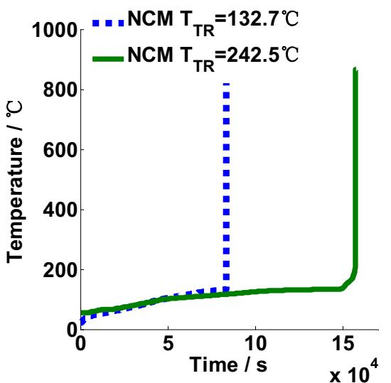  
(a) Temperature curve

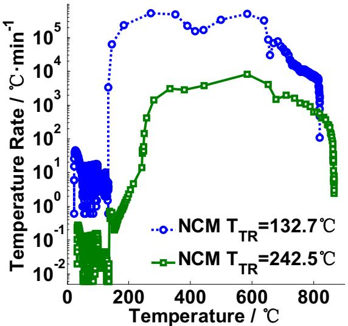  
(b) Temperature rate

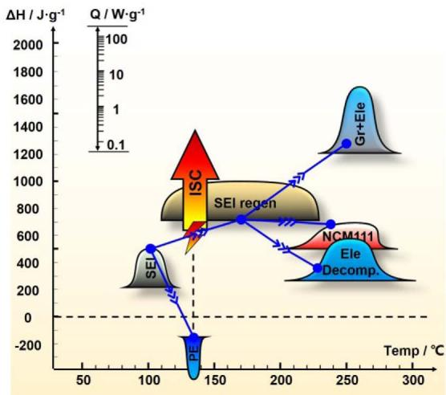  
(c) The energy release diagram for  $T_{\mathrm{TR}} = 132.7^{\circ}\mathrm{C}$

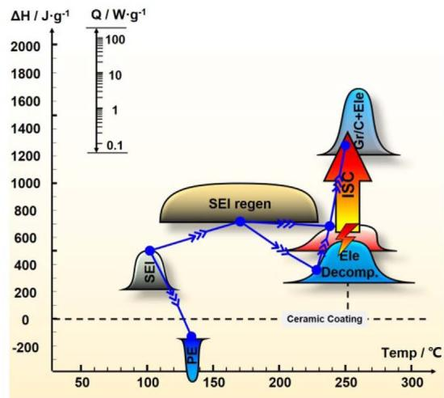  
(d) The energy release diagram for  $T_{\mathrm{TR}} = 242.5^{\circ}\mathrm{C}$  
Fig. 12. The interpretation of the thermal runaway mechanism using the energy release diagram for lithium ion battery with NCM/Graphite electrode.

Fluorides are also favored as the cathode coating materials due to its inertness at high temperature. Coatings using  $\mathrm{AlF_3}$  [141] and  $\mathrm{ZrF}_x$  [142] have shown lower thermal reactivity with improved cycling performance. The NCM cathode coated by  $\mathrm{AlF_3}$  had significantly improved thermal stability [63]. The onset temperature of the cell with  $\mathrm{AlF_3}$ -coated NCM cathode was postponed by at least  $20^{\circ}\mathrm{C}$  in ARC test [63]. Yun et al. [142] compared the thermal stabilities of the pristine and  $\mathrm{ZrF}_x$ -coated NCM111 cathode material. The NCM111 cathode with  $\mathrm{ZrF}_x$  surface coating has shown reduced heat generation.

Solid oxide, such as  $\mathrm{ZrO_2}$ ,  $\mathrm{SiO_2}$  etc., is also candidate to coat the cathode and improve the thermal stability. Hu et al. [143] reported that the NCM111 cathode with  $\mathrm{ZrO_2}$  coating generated less heat than the pristine NCM111 did. Cho et al. [144] investigated the thermal properties of the Ni rich NCM622 cathode with  $\mathrm{SiO_2}$  coating. The thermal stability was improved with  $35\%$  reduction of the heat generation.

Temperature responsive coating, which switches off the cell circuit at specific temperature, is another alternative to suppress TR. Ji et al. [145] described a temperature-responsive cathode by coating poly(3-octylthiophene) (P3OT) layer between the Al collector and the LCO cathode. The coated P3OT layer displayed a strong PTC effect and

could switch off the cell at  $90 - 100^{\circ}\mathrm{C}$  before TR occurs.

5.1.1.2. The element substitution of the cathode. Element substitution is also effective to improve the performance of the cathode material. Al is a promising element to substitute the transition metal (Co, Ni, and Mn) and improve the thermal stability of the cathode. Zhou et al. [109] studied the performance of the cathode material with Co substituted by Ni and Al. The product of  $\mathrm{Li}(\mathrm{Ni}_{0.4}\mathrm{Mn}_{0.33}\mathrm{Co}_{0.13}\mathrm{Al}_{0.13})\mathrm{O}_2$  shown good thermal stability and similar specific capacity with NCM111.

# 5.1.2. The modification of the anode materials

For the surface modification of the anode, atomic layer deposition (ALD) is a widely studied method. Jung et al. [146] reported  $\mathrm{Al_2O_3}$  coating by ALD on the natural graphite anode. They argued that the comfort and uniform  $\mathrm{Al_2O_3}$  thin coating film on the anode serves as a stable 'artificial' SEI layer instead of the meta-stable 'real' SEI, thereby improving the cycling performance as well as thermal stability. Baginska et al. [147] tried to incorporate thermo-responsive polymer microspheres onto the anode. When the temperature rises, the polymer

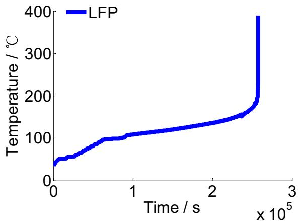  
(a) Temperature curve

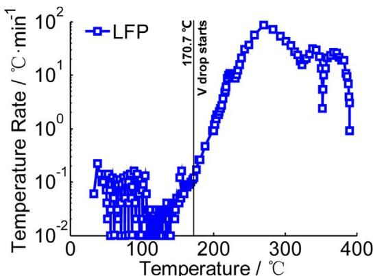  
(b) Temperature rate

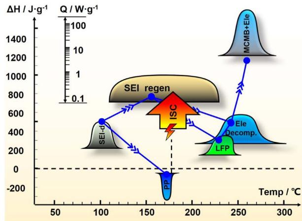  
(c) The energy release diagram for the LFP/MCMB battery

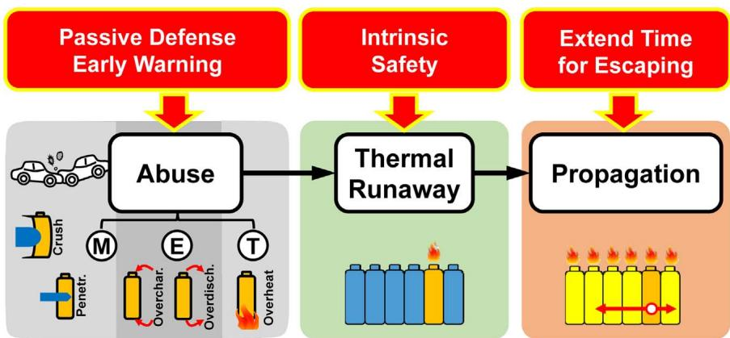  
Fig. 13. The interpretation of the thermal runaway mechanism using the energy release diagram for lithium ion battery with LFP/MCMB electrode.  
Fig. 14. The three-level strategy of reducing the hazard caused by thermal runaway.

particle softened and melted to prevent the ionic conduction on the surface of the anode particles. Zhang [148] reviewed the electrolyte additives to improve the thermal stability of the SEI layer on the anode surface. A more stable SEI on the anode corresponds to a more thermally stable anode. Beside the achievement on the surface modification of anode, new anode materials like  $\mathrm{Li_4Ti_5O_{12}}$  (LTO) [149] and alloying anode [150] are also intensively studied to improve the safety and specific capacity of lithium ion batteries.

# 5.1.3. The more stable electrolyte system

Electrolyte is critical to the safety of current lithium ion batteries due to its flammable nature of the organic carbonate solvents.

Researchers keep seeking a more stable electrolyte system to improve the intrinsic safety of lithium ion batteries. Kalhoff et al. [74] comprehensively reviewed the state-of-art and perspectives of the electrolyte in lithium ion batteries considering safety issues. Improvements in the carbonate electrolytes rely on the additives or salt substitution. Researchers are also developing innovative and optimized electrolyte systems based on room-temperature molten salts (i.e., ionic-liquids), polymers, a combination of solid and liquid electrolyte, or ceramics etc. The improvement of the thermal stability has to consider the tradeoff of safety, longevity, and specific capacity. Many trials were inapplicable in commercial use because of their poor performances in the longevity or the specific capacity. For a more

detailed discussion in chemical view, readers are recommended to [74] and [151].

5.1.3.1. The additives for a safer carbonate electrolyte. The additives for a safer carbonate electrolyte include the solvent substitute additives, the SEI supporting additives, the flame-retardant additives, the thermal shutdown additives, and the overcharge protection additives. The overcharge protection additives have been reviewed in Section 3.2.2, whereas the other kinds of additives will be introduced as follows.

The partial substitution of the flammable and volatile solvent might be a solution to improve the intrinsic safety of the lithium ion cell. Fluorinated carbonates, e.g., the fluorinated ethylene carbonate (FEC) [152], are promising to provide enhanced safety features considering their reduced flammability and increased thermal stability due to the presence of the strong carbon-fluorine bond.

The SEI supporting additives can be an effective and economic solution to mitigate and/or tackle the SEI decomposition and consequent thermal hazard. Several electrolyte additives were proposed to improve the thermal stability of the SEI, including vinylene carbonate (VC) [153,154] and vinyl ethylene carbonate (VEC) [155,156], et al. To maintain the electrochemical performance of the cell, the amount of the additive should not exceed  $10\%$ , either by weight or by volume, of the total electrolyte [74].

The flame-retardant additives can reduce the fire potential during TR. The working principle of the flame-retardant additives is based on the catalytic removal of highly reactive, free radical species, e.g.,  $\mathrm{H}^+$  or  $\mathrm{OH}$ , released during TR reactions. The target of fire suppression can be also fulfilled by forming a condensed state as a thermal insulating barrier to block the self-propagating fire [74]. The phosphorous- and/or halogen-containing materials are the most commonly used flame-retardant additives. Phosphates and alkyl phosphonates, i.e., trimethyl phosphate (TMP) [157], triphenyl phosphate (TPP) [158,159], dimethyl methyl phosphonate (DMMP) [160], etc., have been pervasively studied as flame-retardants. However, the reduction in the flammability is at the expense of poor electrochemical performances [161,162], which hampers the practical applications of the flame-retardants.

The thermal shutdown additives can prompt the solidification of liquid electrolyte at high temperature, thereby switching off the circuit in the lithium ion batteries. Xia et al. [163] reported a thermally polymerizable monomer bismaleimide (BMI), which could cause a solidification of electrolyte at  $110^{\circ}\mathrm{C}$ , which effectively blocked the ion transport between electrodes, thereby shutting down the battery at high temperature.

5.1.3.2. The alternative salt for a safer carbonate electrolyte. Researchers are trying to find alternative salts to substitute  $\mathrm{LiPF_6}$ , of which the decomposition product,  $\mathrm{PF}_5$  or HF, can catalyze the degradation of the solvents and SEI layer. Some alternative lithium salts including LiFAP [164],  $\mathrm{LiBF_4}$  [165], etc., were reported. However, the practical application of the substitute salts above was rare.

The imide-based lithium salts are one of the promising alternatives to replace  $\mathrm{LiPF_6}$  in commercial use. The best known compound within the imide-based family is certainly lithium bis(trifluoromethanesulfonyl)imide (LiTFSI) [166]. The LiTFSI has superior chemical-thermal-electrochemical stabilities, and substantially improved safety. However, the LiTFSI has a defect that it fails in forming protection layer on the surface of the aluminum current collector, resulting in substantial pitting corrosion.

Chelating borate-based lithium salts also aroused scientific interest in recent years. The lithium bis(oxalate)borate (LiBOB) is the representative of this class [167]. LiBOB has relatively low toxicity and good electrochemical stability coexisting with the  $\mathrm{Li}_{0.81}\mathrm{C}_6$  anode [168].

However, the thermal stability with the LCO cathode may get worse with the addition of LiBOB [169].

5.1.3.3. The innovative and optimized electrolyte systems. The whole carbonate electrolyte system can be subverted by innovative and optimized electrolyte systems, e.g., ionic-liquids (ILs), polymer electrolytes, and solid electrolytes etc.

ILs is a good substitute to overcome the safety concerns due to their low volatility and/or flame-retardant properties [170]. The major challenges of the ILs is its relatively low ionic conductivity and the incompatibility with other battery materials. The ILs can form mixtures with alkyl carbonate electrolytes to reduce the drawback [171].

The polymer electrolytes include the solid-polymer electrolytes, and the gel-polymer electrolytes. The main drawback of the polymer electrolyte is also the low ionic conductivity. A mixture of ILs, alkyl carbonate and solid polymer electrolytes might be a solution to the low ionic conductivity [74].

The all-solid polymer electrolyte deprives all flammable liquids from the lithium-ion cell, and is regarded as one of the ultimate solutions to the battery safety problems [172]. Some defects still require solutions, including the inferior power densities, low ionic conductivities etc., before the massive application in large-scale lithium ion batteries.

# 5.1.4. The employment of advanced separators

As discussed in Sec. IV, the separator plays an important role in determining the occurrence of ISC during TR. Reducing the thermal shrinkage and postponing the collapse to a higher temperature are the challenging goals for the development advanced separators.

Traditional separators include single layer of PE or PP [127]. Trilayer PP/PE/PP separator developed by Celgard LLC can form a time gap between the electrical shutdown and the thermal shrinkage. However, the collapse temperature of the trilayer PP/PE/PP separator is similar to that of the single layer PP separator. To achieve a higher shrinkage and collapse temperature, coating with ceramics can be effective to reduce the thermal shrinkage [173] and increase the collapse temperature [70]. Binder like PVDF is essential to bind the ceramic onto the PE or PP base [174]. The PVDF binder can be substituted by curable copolyester [175] or polydopamine [176] etc., which contribute to lower thermal shrinkage.

Researchers try to change the base of the separator from PE or PP to other membranes, such as polyimide (PI), to acquire a higher shrinkage/collapse temperature. The shrinkage temperature of PI can be higher than  $200^{\circ}\mathrm{C}$  [177], whereas the collapse temperature higher than  $500^{\circ}\mathrm{C}$  [178]. The wettability of PI based separator was excellent, and the ionic conductivity was good as reported by Lee et al. [178]. The challenges for the massive applications of the PI separator might be the manufacturing process. The current electrospinning process of PI production has insufficient efficiency with relatively high cost.

Researchers are also enthusiastic about trilayer separators, of which the middle layer has lower melting temperature than the outer layer [179,180]. The trilayer separator provides time gap between the shutdown temperature and the shrinkage temperature, providing possibilities of early detection of TR. The shrinkage of the base can be non-uniform for the multilayer separators. The non-uniform shrinkage may lead to ISC at specific location within a large format lithium ion battery. The non-uniform shrinkage of the multilayer separator must be considered during separator design.

In addition, the use of functional materials coated separator can improve the anti-overcharge ability of the cell. The functional material can form a current path to avoid further overcharge, when the voltage is too high [181-183].

# 5.2. The safety strategy before the occurrence of thermal runaway

As has discussed in Sec. III, the TR can be caused by varies kinds of abuse conditions. An effective strategy to prevent TR is to nip the TR in the bud, i.e., avoid abuse conditions by passive defense or provide early warning when abuse occurs.

The mechanical, electrical and thermal abuse can be prevented by the passive defensive approaches mentioned in Sec. III. The structure of the battery pack must be strengthened with optimization to prevent possible mechanical abuse considering cost. Electronic devices, e.g., fuse, PTC etc., can help reduce the potential of the external short circuit, overcharge, overdischarge etc. The thermal management system should dissipate heat effectively to avoid the occurrence of overtemperature [184]. Moreover, each battery pack must be equipped with a BMS to ensure the safe operation [185].

The BMS monitors all the cells in the battery pack and regulates each cell within a safe operating range, considering both voltage and temperature. The state of the battery pack, including the state of charge (SOC) [186], the state of health (SOH) [187], the state of energy (SOE) [188], the state of power (SOP) [189], and the state of safety (SOS) [190] etc., must be accurately estimated online to guarantee the safe operation. The cell inconsistency, which may expands during the life cycle, should be regulated within an acceptable level through equalization [191].

Fault diagnosis is an important safety function for the advanced BMS. The fault diagnosis is founded based on the "Mean+Difference" principle [192]. The principle of the fault diagnosis is that the state of the cell with fault will deviate from the mean state of the battery pack. The severity of the fault can be evaluated by the difference between the state of the cell with suspect fault and the mean state of the battery pack [59]. Despite the fault diagnosis based on the criterion of logic and threshold, model-based fault diagnosis [193], including insulation detection [194], external short detection [195,196], and ISC detection [68], is more complex and requires deeper investigation.

The ISC detection is among the most challenging tasks for the fault diagnosis. The failure of the cell in Samsung Note 7 reminds us again that the potential of ISC becomes higher as the energy density increases with more active materials cram in limited cell volume [197]. Feng [69] et al. utilized the unique thermal-electrical characteristics to fulfill early detection of ISC. However, these kinds of ISC detection algorithms still need to be more accurate, more sensitive and faster. The observation of the internal electrochemical status by reliable embedded sensors is critical for the advanced ISC detection [2].

Dendrite growth is one of the major causes for the ISC [198]. The occurrence of dendrite growth accompanies with abnormal internal signals, of which the detection requires in-situ sensors pre-embed inside the battery cell. Shan et al. [199] enlightened correlated research by implanting a lithium electrode into a pouch cell. The implanted lithium electrode allows real-time diagnosis of cell decay and early warning of the abnormal lithium deposition. Wu et al. [200] proposed an innovative approach to early figure out the dendrite growth by a bifunctional separator with a third sensing terminal. The detection mechanism using the sensing terminal is highly sensitive to locate the position of dendrite growth precisely. A breakthrough in the advanced sensors for the ISC detection may emerge in the near future.

# 5.3. Reducing the secondary hazard

Once the TR is triggered, countermeasures should be activated to reduce the secondary hazard brought by the TR. The occurrence of fire during TR increases the uncertainty of the damage. The components, which are designed to protect the pack from abuse conditions, once scorched by fire, are probably to be broken and malfunctions during TR. Fire extinguishing must be considered [201,202], because the heat released by fire is considerable [73], as shown in Fig. 10.

The heat released by TR will propagate to adjacent cells and cause

TR propagation [75,203]. The energy released by a single cell during TR is relatively limited, but the TR propagation may release the whole energy stored in the battery pack, leading to severer hazard, e.g., fierce explosion. TR propagation must be effectively considered in the battery safety design to set aside enough time for the passengers to escape from the EV. The evacuation time for a car is less than 30 sec, whereas for a bus with a length of  $12\mathrm{m}$  is  $5\mathrm{min}$ , given that no one is trapped during the accident. Therefore, severe TR propagation is not allowed within  $5\mathrm{min}$  after the occurrence of first TR.

The mechanism of TR propagation is more about heat transfer, comparing with that the TR mechanism of a single cell is more about the chemical reactions. Prompt heat dissipation and effective block of heat transfer paths are effective countermeasures to reduce the hazard caused by TR propagation [204]. Feng et al. [87] proposes several available ways to inhibit the TR propagation through simulation analysis based on a calibrated TR propagation model. To fulfill the heat dissipation condition proposed in [87], the thermal management system with heat pipes, proposed by Ye et al. [205] and Wang et al. [206], might be an available alternative. Phase change materials, which can absorb excessive heat by phase transition, are investigated to help prevent TR propagation, as in [207] by Wilke et al.

Current research is still insufficient to conclude a universal mechanism of the TR propagation. There is still no proper test procedure regulated in the compulsory test standards. Moreover, the thermal hazard can be more severe and the TR propagation behavior may vary, considering the utilization of lithium ion battery with higher energy density for EV.

# 6. Summary and prospect

The safety concern is a main obstacle that hinders the large-scale applications of lithium ion batteries in EVs. Thermal runaway is the key scientific problem in the safety research of lithium ion batteries. This paper provides a comprehensive review on the TR mechanism of commercial lithium ion battery for EVs. The TR mechanism for lithium ion battery, especially those with higher energy density, still requires further research.

Learning from typical TR accidents of lithium ion batteries for EV, the abuse conditions that may lead to TR have been summarized. The abuse conditions include mechanical abuse, electrical abuse, and thermal abuse. The mechanical abuse can trigger electrical abuse, whereas the electrical abuse releases heat and induces a thermal abuse. Reliable test approaches that can reflect the practical abuse conditions are in urgent need for updating the test standards to guarantee product safety before the new era of lithium ion battery with high energy density comes.

The ISC is the most common feature for all kinds of abuse conditions. Different abuse conditions correspond to different types of ISC. The spontaneous ISC evolves throughout the whole cycle life of the battery and is currently regarded as the most challenging problem to be solved. There are three levels of ISC considering the self-discharge rate and the exotic heat generation. Early detection must activates before the ISC develops into the third level, i.e., TR.

The mechanisms of the chain reactions during TR have been reviewed. A novel energy release diagram is proposed to quantify the reaction kinetics for all the component materials within the cell during TR. The energy released by chemical reactions, ISC, and combustion are all quantified in the proposed energy release diagram. The proposed energy release diagram clearly interprets the mechanisms of the chain reactions during TR. Future work is to add more chemical kinetics of different component materials of the lithium ion battery into the energy release diagram. Consequently, the forward design of battery safety can be fulfilled based on the comprehensive energy release diagram.

The reduction of the TR hazard can be fulfilled in three levels. First, improve the intrinsic safety of anti-TR properties by material mod

ification; Second, set passive defense against the practical abuse conditions and develop early warning algorithm before TR; Third, postpone or inhibit the secondary hazard, such as TR propagation, to win sufficient time for the passenger to escape from the EV after accident. We believe that the concept of the three-level safety design can significantly help diminish the TR hazard during accident. Researchers should be well equipped with sufficient knowledge of the three-level safety design concept, and prepare for the coming era of lithium ion battery with higher energy density.

# Acknowledgment

This work is supported by the National Natural Science Foundation of China under the Grant No. U1564205, and funded by the Ministry of Science and Technology of China under the Grant No. 2016YFE0102200.

# References

[1] J.B. Goodenough, Energy storage materials: a perspective, Energy Storage Mater. 1 (2015) 158-161.  
[2] X. Shan, F. Li, D. Wang, H. Cheng, The smart era of electrochemical energy storage devices, Energy Storage Mater. 3 (2016) 66-68.  
[3] M. Noori, S. Gardner, O. Tatari, Electric vehicle cost, emissions, and water footprint in the United States: development of a regional optimization model, Energy 89 (2015) 610-625.  
[4] J.B. Dunn, L. Gaines, J.C. Kelly, C. James, K.G. Gallagher, The significance of Li-ion batteries in electric vehicle life-cycle energy and emissions and recycling's role in its reduction, Energy Environ. Sci. 8 (2015) 158-168.  
[5] B. Diouf, R. Pode, Potential of lithium-ion batteries in renewable energy, Renew. Energ. 76 (2015) 375-380.  
[6] N. Rauh, T. Franke, J.F. Krems, Understanding the impact of electric vehicle driving experience on range anxiety, Hum. Factors: J. Human. Factors Ergon. Soc. (2014). http://dx.doi.org/10.1177/0018720814546372.  
[7] J. Liang, F. Li, H.M. Cheng, High-capacity lithium ion batteries: bridging future and current, Energy Storage Mater. 4 (2016) A1-A2.  
[8] H.-J. Noh, S. Youn, C.S. Yoon, Y.-K. Sun, Comparison of the structural and electrochemical properties of layered  $\mathrm{Li}[\mathrm{Ni}_x\mathrm{Co}_y\mathrm{Mn}_z]\mathrm{O}_2$  ( $x = 1/3$ , 0.5, 0.6, 0.7, 0.8 and 0.85) cathode material for lithium-ion batteries, J. Power Sources 233 (2013) 121-130.  
[9] G.P. Beauregard, Report of investigation: hybrids plus plug in hybrid electric vehicle. eTec, Phoenix AZ, 2008.  
[10] B. Smith, Chevrolet volt battery incident overview report 1, U.S. Department of Transportation, National Highway Traffic Safety Administration, 2012.  
[11] Aircraft incident report: auxiliary power unit battery fire, Japan airlines Boeing 787, JA 829 J, Boston, Massachusetts, January 7, 2013. National Transportation Safety Board, DC, Rep. No. PB2014-108867, Nov. 21, 2014.  
[12] N. Goto, Aircraft serious incident investigation report: all Nippon airways Co. Ltd. JA804A. Japan Transport Safety Board, Tokyo, Japan, Rep. No. AI2014-4, Sep. 25, 2014.  
[13] M.J. Karter, Fire loss in the United States during 2013, National Fire Protection Association, Quincy, MA, 2014.  
[14] J. Wen, Y. Yu, C. Chen, A review on lithium-ion batteries safety issues: existing problems and possible solutions, Mater. Express 2 (3) (2012) 197-212.  
[15] S. Zhang, Q. Zhou, Y. Xia, Influence of mass distribution of battery and occupant on crash response of small lightweight electric vehicle. SAE Technical Paper, 2015-01-0575http://dx.doi.org/10.4271/2015-01-0575, 2015.  
[16] H.Y. Choi, I. Lee, J.S. Lee, Y.M. Kim, H. Kim, A study on mechanical characteristics of lithium-polymer pouch cell battery for electric vehicle. in: Proceedings of the  $23^{\mathrm{rd}}$  International Technical Conference on the Enhanced Safety of Vehicles (ESV)13-0115, 2013.  
[17] W.-J. Lai, M.Y. Ali, J. Pan, Mechanical behavior of representative volume elements of lithium-ion battery modules under various loading conditions, J. Power Sources 248 (2014) 789-808.  
[18] K.H. Shim, S.K. Lee, B.S. Kang, S.M. Hwang, Investigation on blanking of thin sheet metal using the ductile fracture criterion and its experimental verification, J. Mater. Process. Tech. 155 (2004) 1935-1942.  
[19] X. Zhang, T. Wierzbicki, Characterization of plasticity and fracture of shell casing of lithium-ion cylindrical battery, J. Power Sources 280 (2015) 47-56.  
[20] E. Sahraei, R. Hill, T. Wierzbicki, Calibration and finite element simulation of pouch lithium-ion batteries for mechanical integrity, J. Power Sources 201 (2012) 307-321.  
[21] L. Greve, C. Fehrenbach, Mechanical testing and macro-mechanical finite element simulation of the deformation, fracture, and short circuit initiation of cylindrical Lithium ion battery cells, J. Power Sources 214 (2012) 377-385.  
[22] W.-J. Lai, M.Y. Ali, J. Pan, Mechanical behavior of representative volume elements of lithium-ion battery cells under compressive loading conditions, J. Power Sources 245 (2014) 609-623.  
[23] M.Y. Ali, W.-J. Lai, J. Pan, Computational models for simulations of lithium-ion battery cells under constrained compression tests, J. Power Sources 242 (2013)

325-340.  
[24] E. Sahraei, J. Meier, T. Wierzbicki, Characterizing and modeling mechanical properties and onset of short circuit for three types of lithium-ion pouch cells, J. Power Sources 247 (2014) 503-516.  
[25] Y. Xia, T. Li, F. Ren, Y. Gao, H. Wang, Failure analysis of pinch-torsion tests as a thermal runaway risk evaluation method of Li-ion cells, J. Power Sources 265 (2014) 356-362.  
[26] C. Zhang, S. Santhanagopalan, M.A. Sprague, A.A. Pesaran, Coupled mechanical-electrical-thermal modeling for short-circuit prediction in a lithium-ion cell under mechanical abuse, J. Power Sources 290 (2015) 102–113.  
[27] C. Zhang, S. Santhanagopalan, M.A. Sprague, A.A. Pesaran, A representative sandwich model for simultaneously coupled mechanical-electric-thermal simulation of a lithium-ion cell under quasi-static indentation tests, J. Power Sources 298 (2015) 309–321.  
[28] Y. Xia, T. Wierzbicki, E. Sahraei, X. Zhang, Damage of cells and battery packs due to ground impact, J. Power Sources 267 (2014) 78-97.  
[29] T. Yamauchi, K. Mizushima, Y. Satoh, S. Yamada, Development of a simulator for both property and safety of a lithium secondary battery, J. Power Sources 136 (1) (2004) 99-107.  
[30] H. Maleki, J.N. Howard, Internal short circuit in Li-ion cells, J. Power Sources 191 (2) (2009) 568-574.  
[31] T.G. Zavalis, M. Behm, G. Lindbergh, Investigation of short-circuit scenarios in a lithium-ion battery cell, J. Electrochem. Soc. 159 (6) (2012) A848-A859.  
[32] R.A. Leising, M.J. Palazzo, E.S. Takeuchi, K.J. Takeuchi, Abuse testing of lithium-ion batteries: characterization of the overcharge reaction of  $\mathrm{LiCoO_2}$  /graphite cells, J. Electrochem. Soc. 148 (8) (2001) A838-A844.  
[33] R. Spotnitz, J. Franklin, Abuse behavior of high-power, lithium-ion cells, J. Power Sources 113 (1) (2003) 81-100.  
[34] K. Kitoh, H. Nemoto, 100 Wh Large size Li-ion batteries and safety tests, J. Power Sources 81 (1999) 887-890.  
[35] K. Smith, G.-H. Kim, E. Darcy, A. Pesaran, Thermal/electrical modeling for abusetolerant design of lithium ion modules, Int. J. Energy Res. 34 (2) (2010) 204-215.  
[36] P.G. Balakrishnan, R. Ramesh, T.P. Kumar, Safety mechanisms in lithium-ion batteries, J. Power Sources 155 (2) (2006) 401-414.  
[37] Y. Saito, K. Takano, A. Negishi, Thermal behaviors of lithium-ion cells during overcharge, J. Power Sources 97 (2001) 693-696.  
[38] C. Lin, Y. Ren, K. Amine, Y. Qin, Z. Chen, In situ high-energy X-ray diffraction to study overcharge abuse of 18650-size lithium-ion battery, J. Power Sources 230 (2013) 32-37.  
[39] Y. Zeng, K. Wu, D. Wang, Z. Wang, L. Chen, Overcharge investigation of lithium-ion polymer batteries, J. Power Sources 160 (2) (2006) 1302-1307.  
[40] M. Takahashi, K. Komatsu, K. Maeda, The safety evaluation test of lithium-ion batteries in vehicles: investigation of overcharge test method, ECS Trans. 41 (39) (2012) 27-41.  
[41] M. Ouyang, D. Ren, L. Lu, J. Li, X. Feng, X. Han, et al., Overcharge-induced capacity fading analysis for large format lithium-ion batteries with  $\mathrm{Li_yNi_{1 / 3}Co_{1 / 3}}$ $\mathrm{Mn}_{1 / 3}\mathrm{O}_2 + \mathrm{Li_yMn_2O_4}$  composite cathode, J. Power Sources 279 (2015) 626-635.  
[42] F. Xu, H. He, Y. Liu, C. Dun, Y. Ren, Q. Liu, et al., Failure investigation of  $\mathrm{LiFePO_4}$  cells under overcharge conditions, ECS Trans. 41 (39) (2012) 1-12.  
[43] C. Li, H.P. Zhang, L.J. Fu, H. Liu, Y.P. Wu, E. Rahm, et al., Cathode materials modified by surface coating for lithium ion batteries, Electrochim. Acta 51 (19) (2006) 3872-3883.  
[44] J. Cho, Y.-W. Kim, B. Kim, J.-G. Lee, B. Park, A breakthrough in the safety of lithium secondary batteries by coating the cathode material with  $\mathrm{AlPO_4}$  nanoparticles, Angew. Chem. Int. Ed. 42 (14) (2003) 1618-1621.  
[45] Z. Chen, Y. Qin, K. Amine, Redox shuttles for safer lithium-ion batteries, Electrochim. Acta 54 (24) (2009) 5605-5613.  
[46] J. Lamb, C.J. Orendorff, K. Amine, G. Krumdick, Z. Zhang, L. Zhang, et al., Thermal and overcharge abuse analysis of a redox shuttle for overcharge protection of LiFePO $_4$ , J. Power Sources 247 (2014) 1011-1017.  
[47] L.F. Xiao, X.P. Ai, Y.L. Cao, Y.D. Wang, H.X. Yang, A composite polymer membrane with reversible overcharge protection mechanism for lithium ion batteries, Electrochem. Commun. 7 (6) (2005) 589-592.  
[48] D. Kime. Rechargeable battery protection apparatus: U.S. Patent 20150288202.  
[49] M. Guen. Rechargeable battery having short-circuit member: U.S. Patent 20150072189.  
[50] H.F. Li, J.K. Gao, S.L. Zhang, Effect of overdischarge on swelling and recharge performance of lithium ion cells, Chin. J. Chem. 26 (9) (2008) 1585-1588.  
[51] L. Zhang, Y. Ma, X. Cheng, C. Du, T. Guan, Y. Cui, et al., Capacity fading mechanism during long-term cycling of over-discharged  $\mathrm{LiCoO_2}$  mesocarbon microbeads battery, J. Power Sources 293 (2015) 1006-1015.  
[52] S. Erol, M.E. Orazem, R.P. Muller, Influence of overcharge and over-discharge on the impedance response of  $\mathrm{LiCoO}_2|C$  batteries, J. Power Sources 270 (2014) 92-100.  
[53] Z. Yu, J. Hu, X. Chu, Q. Liu, Effects of over-discharge on performance of MCMB-LiCoO $_2$  lithium-ion battery, Chin. Battery Ind. 11 (4) (2006) 223-226 (In Chinese).  
[54] J. Shu, M. Shui, D. Xu, D. Wang, Y. Ren, S. Gao, A comparative study of overdischarge behaviors of cathode materials for lithium-ion batteries, J. Solid State Electr. 16 (2) (2012) 819-824.  
[55] H. Maleki, J.N. Howard, Effects of overdischarge on performance and thermal stability of a Li-ion cell, J. Power Sources 160 (2) (2006) 1395-1402.  
[56] R. Guo, L. Lu, M. Ouyang, X. Feng, Mechanism of the entire overdischarge process and overdischarge-induced internal short circuit in lithium-ion batteries, Sci. Rep. 6 (2016) 30248.  
[57] H. Lee, S.-K. Chang, E.-Y. Goh, J.-Y. Jeong, J.H. Lee, H.-J. Kim, et al.,  $\mathrm{Li}_2\mathrm{NiO}_2$  as

a novel cathode additive for overdischarge protection of Li-Ion batteries, Chem. Mat. 20 (1) (2007) 5-7.  
[58] Y.-S. Kim, S.-H. Lee, M.-Y. Son, Y.M. Jung, H.-K. Song, H. Lee, Succinonitrile as a corrosion inhibitor of copper current collectors for overdischarge protection of lithium ion batteries, ACS Appl. Mater. Interfaces 6 (3) (2014) 2039-2043.  
[59] Y. Zheng, X. Han, L. Lu, J. Li, M. Ouyang, Lithium ion battery pack power fade fault identification based on Shannon entropy in electric vehicles, J. Power Sources 223 (2013) 136-146.  
[60] P. Taheri, S. Hsieh, M. Bahrami, Investigating electrical contact resistance losses in lithium-ion battery assemblies for hybrid and electric vehicles, J. Power Sources 196 (15) (2011) 6525-6533.  
[61] A. Jana, D.R. Ely, R.E. Garcia, Dendrite-separator interactions in lithium-based batteries, J. Power Sources 275 (2015) 912-921.  
[62] J. Zhu, J. Feng, Z. Guo, In situ observation of lithium dendrite on the electrode in a lithium-ion battery, Energy Storage Sci. Technol. 4 (1) (2015) 66-71 (In Chinese).  
[63] D.H. Doughty, A.A. Pesaran. Vehicle battery safety roadmap guidance. National Renewable Energy Laboratory, 2012.  
[64] B. Barnett, Technologies for detection and intervention of internal short circuits in Li-ion batteries. in: Proceedings of the 5th Annual Knowledge Foundation Conference Battery Safety, 2014.  
[65] S. Santhanagopalan, P. Ramadass, Z. Zhang, Analysis of internal short-circuit in a lithium ion cell, J. Power Sources 194 (1) (2009) 550-557.  
[66] M. Keyser, D. Long, J. Ireland, A. Pesaran, E. Darcy, M. Shoesmith, et al. Internal short circuit instigator in lithium ion cells. in: Proceedings of the Presentation in Battery Safety Conference, 2013.  
[67] J. Lamb, C.J. Orendorff, Evaluation of mechanical abuse techniques in lithium ion batteries, J. Power Sources 247 (2014) 189-196.  
[68] M. Ouyang, M. Zhang, X. Feng, L. Lu, J. Li, X. He, et al., Internal short circuit detection for battery pack using equivalent parameter and consistency method, J. Power Sources 294 (2015) 272-283.  
[69] X. Feng, C. Weng, M. Ouyang, J. Sun, Online internal short circuit detection for a large format lithium ion battery, Appl. Energy 161 (2016) 168-180.  
[70] X. Feng, M. Fang, X. He, M. Ouyang, L. Lu, H. Wang, et al., Thermal runaway features of large format prismatic lithium ion battery using extended volume accelerating rate calorimetry, J. Power Sources 255 (2014) 294-301.  
[71] Q. Wang, P. Ping, X. Zhao, G. Chu, J. Sun, C. Chen, Thermal runaway caused fire and explosion of lithium ion battery, J. Power Sources 208 (2012) 210-224.  
[72] A.W. Golubkov, S. Scheikl, R. Planteu, G. Voitic, H. Wiltzsche, C. Stangl, et al., Thermal runaway of commercial 18650 Li-ion batteries with LFP and NCA cathodes - impact of state of charge and overcharge, RSC Adv. 5 (2015) 57171.  
[73] P. Ribiere, S. Grugeon, M. Morcrette, S. Boyanov, S. Laruelle, G. Marlair, Investigation on the fire-induced hazards of Li-ion battery cells by fire calorimetry, Energy Environ. Sci. 5 (2012) 5271-5280.  
[74] J. Kalhoff, G.G. Eshetu, D. Bresser, S. Passerini, Safer electrolytes for lithium-ion batteries: state of the art and perspectives, ChemSusChem 8 (2015) 2154-2175.  
[75] X. Feng, J. Sun, M. Ouyang, F. Wang, X. He, L. Lu, et al., Characterization of penetration induced thermal runaway propagation process within a large format lithium ion battery module, J. Power Sources 275 (2015) 261-273.  
[76] Q. Wang, J. Sun, X. Yao, C. Chen, Thermal stability of  $\mathrm{LiPF_6 / EC + DEC}$  electrolyte with charged electrodes for lithium ion batteries, Thermochim. Acta 437 (2005) 12-16.  
[77] J. Yamaki, H. Takatsuji, T. Kawamura, M. Egashira, Thermal stability of graphite anode with electrolyte in lithium-ion cells, Solid State Ion. 148 (2002) 241-245.  
[78] H. Maleki, G. Deng, A. Anani, J. Howard, Thermal stability studies of Li-ion cells and components, J. Electrochem. Soc. 146 (9) (1999) 3224-3229.  
[79] R. Spotnitz, J. Franklin, Abuse behavior of high-power lithium-ion cells, J. Power Sources 113 (1) (2003) 81-100.  
[80] M.N. Richard, J.R. Dahn, Accelerating rate calorimetry study on the thermal stability of lithium intercalated graphite in electrolyte. I. experimental, J. Electrochem. Soc. 146 (6) (1999) 2068-2077.  
[81] H. Yang, H. Bang, K. Amine, J. Prakash, Investigations of the exothermic reactions of natural graphite anode for Li-ion batteries during thermal runaway, J. Electrochem. Soc. 152 (1) (2005) A73-A79.  
[82] D.D. MacNeil, D. Larcher, J.R. Dahn, Comparison of the reactivity of various carbon electrode materials with electrolyte at elevated temperature, J. Electrochem. Soc. 146 (10) (1999) 3596-3602.  
[83] Z. Zhang, D. Fouchard, J.R. Rea, Differential scanning calorimetry material studies: implications for the safety of lithium-ion cells, J. Power Sources 70 (1) (1998) 16-20.  
[84] M.-H. Ryou, J.-N. Lee, D.J. Lee, W.-K. Kim, Y.K. Jeong, J.W. Choi, et al., Effects of lithium salts on thermal stabilities of lithium alkyl carbonates in SEI layer, Electrochim. Acta 83 (2012) 259-263.  
[85] T.D. Hatchard, D.D. Macneil, A. Basu, J.R. Dahn, Thermal model of cylindrical and prismatic Lithium-ion cells, J. Electrochem. Soc. 148 (7) (2001) A755-A761.  
[86] M. Zhou, L. Zhao, S. Okada, Y. Yamaki, Quantitative studies on the influence of  $\mathrm{LiPF}_6$  on the thermal stability of graphite with electrolyte, J. Electrochem. Soc. 159 (1) (2011) A44-A48.  
[87] X. Feng, X. He, M. Ouyang, L. Lu, P. Wu, C. Kulp, et al., Thermal runaway propagation model for designing a safer battery pack with 25Ah  $\mathrm{LiNi_xCo_yMn_zO_2}$  large format lithium ion battery, Appl. Energ. 154 (2015) 74-91.  
[88] G.-H. Kim, A.A. Pesaran, R. Spotnitz, A three-dimensional thermal abuse model for lithium-ion cells, J. Power Sources 170 (2007) 476-489.  
[89] Z. Chen, Y. Qin, Y. Ren, W. Lu, C. Orendorff, E.P. Roth, et al., Multi-scale study of thermal stability of lithiated graphite, Energy Environ. Sci. 4 (2011) 4023-4030.  
[90] Z. Chen, I. Belharouak, Y.K. Sun, K. Amine, Titanium-based anode materials for safe lithium-ion batteries, Adv. Funct. Mater. 23 (2013) 959-969.

[91] I. Belharouak, Y.K. Sun, W. Lu, K. Amine, On the safety of the  $\mathrm{Li_4Ti_5O_{12} / LiMn_2O_4}$  lithium-ion battery system, J. Electrochem. Soc. 154 (12) (2007) A1083-A1087.  
[92] H. Arai, M. Tsuda, K. Saito, et al., Thermal reactions between delithiated lithium nickelate and electrolyte solutions, J. Electrochem. Soc. 149 (4) (2002) A401-A406.  
[93] D.D. MacNeil, J.R. Dahn, The reaction of charged cathodes with nonaqueous solvents and electrolytes: i.  $\mathrm{Li}_{0.5}\mathrm{CoO}_2$ , J. Electrochem. Soc. 148 (11) (2001) A1205-A1210.  
[94] D.D. MacNeil, J.R. Dahn, Test of reaction kinetics using both differential scanning and accelerating rate calorimetries as applied to the reaction of  $\mathrm{Li_xCoO_2}$  in nonaqueous electrolyte, J. Phys. Chem. A 105 (18) (2001) 4430-4439.  
[95] P. Biensan, B. Simon, J.P. Peres, A. Guibert, M. Broussely, J.M. Bodet, et al., On safety of lithium-ion cells, J. Power Sources 81-82 (1999) 906-912.  
[96] M. Jo, M. Noh, P. Oh, Y. Kim, J. Cho, A new high power  $\mathrm{LiNi_{0.81}Co_{0.1}Al_{0.09}O_2}$  cathode material for lithium-ion batteries, Adv. Energy Mater. 4 (2014) 1301583.  
[97] H.J. Bang, H. Joachin, H. Yang, K. Amine, J. Prakash, Contribution of the structural changes of  $\mathrm{LiNi_{0.8}Co_{0.15}Al_{0.05}O_2}$  cathodes on the exothermic reactions in Li-ion cells, J. Electrochem. Soc. 153 (4) (2006) A731-A737.  
[98] C.M. Julien, A. Mauger, K. Zaghib, H. Groult, Comparative issues of cathode materials for Li-ion batteries, Inorganics 2 (2014) 132-154.  
[99] Y. Wang, J. Jiang, J.R. Dahn, The reactivity of delithiated  $\mathrm{Li}(\mathrm{Ni}_{1/3}\mathrm{Co}_{1/3}\mathrm{Mn}_{1/3})\mathrm{O}_2$ ,  $\mathrm{Li}(\mathrm{Ni}_{0.8}\mathrm{Co}_{0.15}\mathrm{Al}_{0.05})\mathrm{O}_2$  or  $\mathrm{LiCoO}_2$  with non-aqueous electrolyte, Electrochem. Commun. 9 (2007) 2534-2540.  
[100] Y. Huang, Y.-C. Lin, D.M. Jenkins, N.A. Chernova, Y. Chung, B. Radhakrishnan, et al., Thermal stability and reactivity of cathode materials for Li-ion batteries, ACS Appl. Mater. Interfaces 8 (2016) 7013-7021.  
[101] H. Wang, A. Tang, K. Huang, Oxygen evolution in overcharged  $\mathrm{Li}_6\mathrm{Ni}_{1/3}\mathrm{Co}_{1/3}\mathrm{Mn}_{1/3}\mathrm{O}_2$  electrode and its thermal analysis kinetics, Chin. J. Chem. 29 (8) (2011) 1583-1588.  
[102] H.-S. Kim, M. Kong, K. Kim, I.-J. Kim, H.-B. Gu, Effect of carbon coating on  $\mathrm{LiNi}_{1/3}\mathrm{Mn}_{1/3}\mathrm{Co}_{1/3}\mathrm{O}_2$  cathode material for lithium secondary batteries, J. Power Sources 171 (2007) 917-921.  
[103] H.-S. Kim, K. Kim, S.-I. Moon, I.-J. Kim, H.-B. Gu, A study on carbon-coated  $\mathrm{LiNi}_{1/3}\mathrm{Mn}_{1/3}\mathrm{Co}_{1/3}\mathrm{O}_2$  cathode material for lithium secondary batteries, J. Solid State Electrochem. 12 (2008) 867-872.  
[104] Z. Lu, D.D. Macneil, J.R. Dahn, Layered  $\mathrm{Li}[\mathrm{Ni}_{\mathrm{x}}\mathrm{Co}_{1 - 2\mathrm{x}}\mathrm{Mn}_{\mathrm{x}}]\mathrm{O}_2$  cathode materials for lithium-ion batteries, Electrochem. Solid St. 12 (4) (2001) 200-203.  
[105] I. Belharouak, Y.-K. Sun, J. Liu, K. Amine,  $\mathrm{Li}(\mathrm{Ni}_{1/3}\mathrm{Mn}_{1/3}\mathrm{Co}_{1/3})\mathrm{O}_2$  as a suitable cathode for high power applications, J. Power Sources 123 (2003) 247-252.  
[106] D.D. Macneil, Z. Lu, J.R. Dahn, Structure and Electrochemistry of Li $\left[\mathrm{Ni}_{\mathrm{x}} \mathrm{Co}_{1-x}\right]$ $\left.\mathrm{Mn}_{\mathrm{x}}\right] \mathrm{O}_{2}$ $(0 \leq x \leq 0.5)$ , J. Electrochem. Soc. 149 (10) (2002) 1332-1336.  
[107] S. Jouanneau, D.D. MacNeil, Z. Lu, S.D. Beattie, G. Murphy, J.R. Dahn, Morphology and safety of  $\mathrm{Li}[\mathrm{Ni}_x\mathrm{Co}_{1 - 2x}\mathrm{Mn}_x]\mathrm{O}_2$ , J. Electrochem. Soc. 150 (10) (2003) 1299-1304.  
[108] J. Jiang, K.W. Eberman, L.J. Krause, J.R. Dahn, Reactivity of  $\mathrm{Li_y[Ni_xCo_{1 - 2x}Mn_x]}$ $\mathrm{O_2}$ $(\mathrm{x = 0.1}$  0.2, 0.35, 0.45 and 0.5;  $\mathrm{y = 0.3}$  , 0.5) with non-aqueous solvents and electrolytes studied by ARC, J. Electrochem. Soc. 152 (3) (2005) 566-569.  
[109] F. Zhou, X. Zhao, J. Jiang, J.R. Dahn, Advantages of simultaneous substitution of coin  $\mathrm{Li}(\mathrm{Ni}_{1/3}\mathrm{Mn}_{1/3}\mathrm{Co}_{1/3})\mathrm{O}_2$  by Ni and Al, Electrochem. Solid-state Lett. 12 (4) (2009) 81-83.  
[110] W. Luo, J.R. Dahn, The impact of  $\mathrm{Zr}$  substitution on the surface, electrochemical performance and thermal stability of  $\mathrm{Li}(\mathrm{Ni}_{1/3}\mathrm{Mn}_{1/3 - z}\mathrm{Co}_{1/3}\mathrm{Zr}_z)\mathrm{O}_2$ , J. Electrochem. Soc. 158 (4) (2011) 428-433.  
[111] Y. Chen, Investigation on  $\mathrm{LiCo}_{1/3}\mathrm{Ni}_{1/3}\mathrm{Mn}_{1/3}\mathrm{O}_2$  Cathode Material and Safety of Lithium-ion Battery (Ph. D. Dissertation), Tianjin University, Tianjin, 2006.  
[112] C.T. Love, M.D. Johannes, K.S. Lyons, Thermal stability of delithiated Al-substituted  $\mathrm{Li(NiCoMn)}_{1/3}\mathrm{O}_2$  cathodes, ECS Trans. 25 (36) (2010) 231-240.  
[113] Q. Wang, J. Sun, C. Chen, Thermal stability of delithiated  $\mathrm{LiMn_2O_4}$  with electrolyte for lithium-ion batteries, J. Electrochem. Soc. 154 (4) (2007) A263-A267.  
[114] D.D. MacNeil, J.R. Dahn, The reaction of charged cathodes with nonaqueous solvents and electrolytes: ii.  $\mathrm{LiMn}_2\mathrm{O}_4$  charged to  $4.2\mathrm{V}$ , J. Electrochem. Soc. 148 (11) (2001) A1211-A1215.  
[115] P. Röder, N. Baba, K.A. Friedrich, H.D. Wiemhofer, Impact of delithiated  $\mathrm{Li_0FePO_4}$  on the decomposition of  $\mathrm{LiPF_6}$ -based electrolyte studied by accelerating rate calorimetry, J. Power Sources 236 (2013) 151-157.  
[116] J. Jiang, J.R. Dahn, ARC studies of the thermal stability of three different cathode materials: licoo2; Li[Ni0.1Co0.8Mn0.1]O2; and LiFePO4, in LiPF6 and LiBoB EC/DEC electrolytes, Electrochem. Commun. 6 (1) (2004) 39-43.  
[117] K. Zaghib, J. Dube, A. Dallaire, K. Galoustov, A. Guerfi, M. Ramanathan, et al., Enhanced thermal safety and high power performance of carbon-coated  $\mathrm{LiFePO_4}$  olivine cathode for Li-ion batteries, J. Power Sources 219 (2012) 36-44.  
[118] A. Yamada, S.C. Chung, K. Hinokuma, Optimized  $\mathrm{LiFePO_4}$  for lithium battery cathodes, J. Electrochem. Soc. 148 (3) (2001) A224-A229.  
[119] S.K. Martha, O. Haik, E. Zinigrad, I. Exnar, T. Drezen, J.H. Miners, et al., On the thermal stability of olivine cathode materials for lithium-ion batteries, J. Electrochem. Soc. 158 (10) (2011) A1115-A1122.  
[120] S.E. Sloop, J.K. Pugh, S. Wang, J.B. Kerr, K. Kinoshita, Chemical reactivity of  $\mathrm{PF}_5$  and  $\mathrm{LiPF_6}$  in ethylene carbonate/dimethyl carbonate solutions, Electrochem. Solid St. 4 (4) (2001) A42-A44.  
[121] T. Kawamura, A. Kimura, M. Egashira, S. Okada, J.-I. Yamaki, Thermal stability of alkyl carbonate mixed-solvent electrolytes for lithium ion cells, J. Power Sources 104 (2) (2002) 260-264.  
[122] G.G. Botte, R.E. White, Z. Zhang, Thermal stability of  $\mathrm{LiPF_6}$ -EC: emc electrolytes for lithium-ion batteries, J. Power Sources 97-98 (2011) 570-575.  
[123] B. Ravdel, K.M. Abraham, R. Gitzendanner, J. DiCarlo, B. Lucht, C. Campion,

Thermal stability of lithium-ion battery electrolytes, J. Power Sources 119 (2003) 805-810.  
[124] C.L. Campion, W. Li, B.L. Licht, Thermal decomposition of  $\mathrm{LiPF_6}$ -based electrolytes for lithium-ion batteries, J. Electrochem. Soc. 152 (12) (2005) 2327-2334.  
[125] S.J. Harris, A. Timmons, W.J. Pitz, A combustion chemistry analysis of carbonate solvents used in Li-ion batteries, J. Power Sources 193 (2) (2009) 855-858.  
[126] G.G. Eshtu, S. Grugeon, S. Laruelle, S. Boyanov, A. Lecocq, J.-P. Bertrand, et al., In-depth safety-focused analysis of solvents used in electrolytes for large scale lithium ion batteries, Phys. Chem. Chem. Phys. 15 (23) (2013) 9145-9155.  
[127] P. Arora, Z. Zhang, Battery separators, Chem. Rev. 104 (10) (2004) 4419-4462.  
[128] B.N. Pinnangudi, S.B. Dalal, N.K. Medora, A. Arora, J. Swart, Thermal shutdown characteristics of insulating materials used in lithium ion batteries. Product Compliance Engineering (ISPCE), in: Proceedings of the 2010 IEEE Symposium on. IEEE1-5, 2010.  
[129] C.J. Orendorff, The role of separators in lithium-ion cell safety, Electrochem. Soc. Interface 21 (2) (2012) 61-65.  
[130] D. Wang, K. Zhang, D. Xu, S. Wang, H. Na, G. Zhang. An experimental study on the characteristics of separator film in lithium ion battery for vehicles, Automot. Eng. 33 (10) (2011) 894-897 (in Chinese).  
[131] H. Gao, J. Gong, E. Han, J.K. Gao, Effects of separators on the performance of 18650 type Li-ion battery, Battery Bimon. 38 (3) (2008) 166-168 (in Chinese).  
[132] X. Huang, Separator technologies for lithium-ion batteries, J. Solid State Electrochem. 15 (2011) 649-662.  
[133] A.D. Pasquier, F. Disma, T. Bowmer, A.S. Gozdz, G. Amatucci, J.-M. Tarascon, Differential scanning calorimetry study of the reactivity of carbon anodes in plastic Li-ion batteries, J. Electrochem. Soc. 145 (2) (1998) 472-477.  
[134] E.P. Roth, D.H. Doughty, J. Franklin, DSC investigation of exothermic reactions occurring at elevated temperatures in lithium-ion anodes containing PVDF-based binders, J. Power Sources 134 (2004) 222-234.  
[135] J. Li, L. Wang, J. Gao, G. Tian, J. Zhang, Safety control strategy of large format Li-ion batteries and test verification, J. Automot. Saf. Energy 3 (2) (2012) 151-157 (In Chinese).  
[136] X. Ai, Y. Cao, H. Yang, Self-activating safety mechanisms for Li-ion batteries, Electrochemistry 16 (1) (2010) 6–10 (In Chinese).  
[137] J. Cho, Dependence of  $\mathrm{AlPO_4}$  coating thickness on overcharge behavior of  $\mathrm{LiCoO}_2$  cathode material at 1 and  $2\mathrm{C}$  rates, J. Power Sources 126 (2004) 186-189.  
[138] J. Cho, H. Kim, B.W. Park, Comparison of overcharge behavior of  $\mathrm{AlPO_4}$ -coated  $\mathrm{LiCoO_2}$  and  $\mathrm{LiNi_{0.8}Co_{0.1}Mn_{0.1}O_2}$  cathode materials in Li-ion cells, J. Electrochem. Soc. 151 (10) (2004) 1707-1711.  
[139] G. Li, Z. Yang, W. Yang, Effect of  $\mathrm{FePO_4}$  coating on electrochemical and safety performance of  $\mathrm{LiCoO}_2$  as cathode material for Li-ion batteries, J. Power Sources 183 (2008) 741-748.  
[140] W. Cho, S.-M. Kim, K.-W. Lee, J.H. Song, Y.N. Jo, T. Yim, et al., Investigation of new manganese orthophosphate  $\mathrm{Mn}_3(\mathrm{PO}_4)_2$  coating for nickel-rich  $\mathrm{LiNi}_{0.6}\mathrm{Co}_{0.2}\mathrm{Mn}_{0.2}\mathrm{O}_2$  cathode and improvement of its thermal properties, Electrochim. Acta 198 (2016) 77-83.  
[141] Y.-K. Sun, S.-W. Cho, S.-W. Lee, C.S. Yoon, K. Amine,  $\mathrm{AlF}_3$ -coating to improve high voltage cycling performance of  $\mathrm{Li(Ni_{1/3}Mn_{1/3}Co_{1/3})_2}$  cathode materials for lithium secondary batteries, J. Electrochem. Soc. 154 (3) (2007) 168-172.  
[142] S.H. Yun, K.-S. Park, Y.J. Park, The electrochemical property of  $\mathrm{ZrF_x}$ -coated  $\mathrm{Li(Ni_{1/3}Mn_{1/3}Co_{1/3})O_2}$  cathode material, J. Power Sources 195 (2010) 6108-6115.  
[143] S.-K. Hu, G.-H. Cheng, M.-Y. Cheng, B.-J. Hwang, R. Santhanam, Cycle life improvement of  $\mathrm{ZrO_2}$ -coated spherical  $\mathrm{LiNi_{1/3}Co_{1/3}Mn_{1/3}O_2}$  cathode material for lithium ion batteries, J. Power Sources 188 (2009) 564-569.  
[144] W. Cho, S.-M. Kim, J.H. Song, T. Yim, S.-G. Woo, K.-W. Lee, et al., Improved electrochemical and thermal properties of nickel rich  $\mathrm{LiNi}_{0.6}\mathrm{Co}_{0.2}\mathrm{Mn}_{0.2}\mathrm{O}_2$  cathode materials by  $\mathrm{SiO}_2$  coating, J. Power Sources 282 (2015) 45-50.  
[145] W. Ji, F. Wang, D. Liu, J. Qian, Y. Cao, Z. Chen, et al., Building thermally stable Li-ion batteries using a temperature-responsive cathode, J. Mater. Chem. A 4 (2016) 11239.  
[146] Y.S. Jung, A.S. Cavanagh, L.A. Riley, S.-H. Kang, A.C. Dillon, M.D. Groner, et al., Ultrathin direct atomic layer deposition on composite electrodes for highly durable and safe Li-ion batteries, Adv. Mater. 22 (19) (2010) 2172-2176.  
[147] M. Baginska, B.J. Blaiszik, R.J. Merriman, N.R. Sottos, J.S. Moore, S.R. White, Automatic shutdown of lithium-ion batteries using thermoresponsive microspheres, Adv. Energy Mater. 2 (2012) 583-590.  
[148] S.S. Zhang, A review on electrolyte additive for lithium-ion batteries, J. Power Sources 162 (2) (2006) 1379-1394.  
[149] X.L. Yao, S. Xie, C.H. Chen, Q.S. Wang, J.H. Sun, Y.L. Li, Comparisons of graphite and spinel  $\mathrm{Li}_{1.33}\mathrm{Ti}_{1.67}\mathrm{O}_4$  as anode materials for rechargeable lithium-ion batteries, Electrochim. Acta 50 (20) (2005) 4076-4081.  
[150] C.K. Chan, H. Peng, G. Liu, K. McIlwath, X.F. Zhang, R.A. Huggins, et al., High-performance lithium battery anodes using silicon nanowires, Nat. Nanotechnol. 3 (1) (2008) 31-35.  
[151] A.M. Haregewoin, A.S. Wotango, B.J. Hwang, Electrolyte additives for lithium ion battery electrodes: progress and perspectives, Energy Environ. Sci. 9 (2016) 1955.  
[152] A. Benmayza, W. Lu, V. Ramani, J. Prakash, Electrochemical and thermal studies of  $\mathrm{LiNi_{0.8}Co_{0.15}Al_{0.015}O_2}$  under fluorinated electrolytes, Electrochim. Acta 123 (2014) 7-13.  
[153] H.H. Lee, Y.Y. Wang, C.C. Wan, M.-H. Yang, H.-C. Wu, D.-T. Shieh, The function of vinylene carbonate as a thermal additive to electrolyte in lithium batteries, J. Appl. Electrochem. 35 (2005) 615-623.  
[154] H. Ota, Y. Sakata, A. Inoue, S. Yamguchi, Analysis of vinylene carbonate derived SEI layers on graphite anode, J. Electrochem. Soc. 151 (10) (2004) 1659-1669.

[155] J.M. Vollmer, L.A. Curtiss, D.R. Vissers, K. Amine, Reduction mechanisms of ethylene, propylene and vinylethylene carbonates, J. Electrochem. Soc. 151 (1) (2004) 178-183.  
[156] S.-D. Xu, Q.-C. Zhuang, J. Wang, Y.-Q. Xu, Y.-B. Zhu, New insight into vinylethylene carbonate as a file forming additive to ethylene carbonate-based electrolytes for lithium-ion batteries, Int. J. Electrochem. Sci. 8 (2013) 8058-8076.  
[157] X.L. Yao, S. Xie, C.H. Chen, Q.S. Wang, J.H. Sun, Y.L. Li, et al., Comparative study of trimethyl phosphite and trimethyl phosphate as electrolyte additives in lithium ion batteries, J. Power Sources 144 (1) (2005) 170–175.  
[158] E.-G. Shim, T.-H. Nam, J.-G. Kim, H.-S. Kim, S.-I. Moon, Electrochemical performance of lithium-ion batteries with triphenylphosphate as a flame-retardant additive, J. Power Sources 172 (2) (2007) 919-924.  
[159] Q. Zhu, T. Jing, N. Chen, S. Liu, Y. Jin, R. Chen, F. Wu, Study on TPP and DMMP as flame-retardant cosolvent in electrolytes for Li-ion batteries. Transactions of Beijing Institute of Technology 35(10) (2015) pp. 1096-1100. (in Chinese).  
[160] S. Dalavi, M. Xu, B. Ravdel, L. Zhou, B.L. Lucht, Nonflammable electrolytes for lithium-ion batteries containing dimethyl methylphosphonate, J. Electrochem. Soc. 157 (10) (2010) 1113-1120.  
[161] Z. Zeng, B. Wu, L. Xiao, X. Jiang, Y. Chen, X. Ai, et al., Safer lithium ion batteries based on nonflammable electrolyte, J. Power Sources 279 (2015) 6-12.  
[162] K. Xu, M.S. Ding, S. Zhang, J.L. Allen, T.R. Jow, An attempt to formulate nonflammable lithium ion electrolyte with alkyl phosphates and phosphazenes, J. Electrochem. Soc. 149 (5) (2002) 622-626.  
[163] L. Xia, D. Wang, H. Yang, Y. Cao, X. Ai, An electrolyte additive for thermal shutdown protection of Li-ion batteries, Electrochem. Commun. 25 (2012) 98-100.  
[164] Y.R. Dougassa, J. Jacquemin, L. El Ouatani, C. Tessier, M. Anouti, Viscosity and carbon dioxide solubility for  $\mathrm{LiPF_6}$ , LiTFSI, and LiFAP in alkyl carbonates: lithium salt nature and concentration effect, J. Phys. Chem. B 118 (14) (2014) 3973-3980.  
[165] S.S. Zhang, K. Xu, T.R. Jow, Study of  $\mathrm{LiBF_4}$  as an electrolyte salt for a Li-ion battery, J. Electrochem. Soc. 149 (5) (2002) A586-A590.  
[166] B.K. Mandal, A.K. Padhi, Z. Shi, S. Chakraborty, R. Filler, New low temperature electrolytes with thermal runaway inhibition for lithium-ion rechargeable batteries, J. Power Sources 162 (2006) 690-695.  
[167] K. Xu, S.S. Zhang, T.R. Jow, W. Xu, C.A. Angell, LiBOB as salt for lithium-ion batteries: a possible solution for high-temperature operation, Electrochem. Solid-State Lett. 5 (1) (2002) 26–29.  
[168] J. Jiang, J.R. Dahn, Effects of solvents and salts on the thermal stability of  $\mathrm{LiC_6}$ , Electrochim. Acta 49 (2004) 4599-4604.  
[169] J. Jiang, H. Fortier, J.N. Reimers, J.R. Dahn, Thermal stability of 18650 size Li-ion cells containing LiBOB electrolyte salt, J. Electrochem. Soc. 151 (4) (2004) 609-613.  
[170] A. Lewandowski, A.S. Mocek, Ionic liquids as electrolytes for Li-ion batteries—an overview of electrochemical studies, J. Power Sources 194 (2009) 601-609.  
[171] A. Guerfi, M. Dontigny, P. Charest, M. Petitclerc, M. Lagace, A. Vijh, et al., Improved electrolytes for Li-ion batteries: mixtures of ionic liquid and organic electrolyte with enhanced safety and electrochemical performance, J. Power Sources 195 (3) (2010) 845-852.  
[172] M. Wakihara, Y. Kadoma, N. Kumagai, H. Mit, R. Araki, K. Ozawa, et al., Development of nonflammable lithium ion battery using a new all-solid polymer electrolyte, J. Solid State Electrochem. 16 (2012) 847-855.  
[173] W.-B. Yao, P. Chen, Y. Zhou, C.-X. Wang, J. Xie, Effect of ceramic-coating separators on the performance of Li-ion batteries, Chin. Battery Ind. 18 (3/4) (2013) 124-127 (in Chinese).  
[174] H.-S. Jeong, D.-W. Kim, Y.U. Jeong, S.-Y. Lee, Effect of phase inversion on microporous structure development of  $\mathrm{Al_2O_3}$ /poly(vinylidene fluoride-hexafluoropropylene)-based ceramic composite separators for lithium-ion batteries, J. Power Sources 195 (2010) 6116-6121.  
[175] Y. Ko, H. Yoo, J. Kim, Curable polymeric binder-ceramic composite-coated superior heat-resistant polyethylene separator for lithium ion batteries, RSC Adv. 4 (2014) 19229-19233.  
[176] J. Dai, C. Shi, C. Li, X. Shen, L. Peng, D. Wu, et al., A rational design of separator with substantially enhanced thermal features for lithium-ion batteries by the polydopamine-ceramic composite modification of polyolefin membranes, Energ. Environ. Sci. 9 (2016) 3252-3261.  
[177] C. Shi, P. Zhang, S. Huang, X. He, P. Yang, D. Wu, et al., Functional separator consisted of polyimide nonwoven fabrics and polyethylene coating layer for lithium-ion batteries, J. Power Sources 298 (2015) 158-165.  
[178] J. Lee, C.-L. Lee, K. Park, I.-D. Kim, Synthesis of an  $\mathrm{Al_2O_3}$ -coated polyimide nanofiber mat and its electrochemical characteristics as a separator for lithium ion batteries, J. Power Sources 248 (2014) 1211-1217.  
[179] Y. Zhu, F. Wang, L. Liu, S. Xiao, Z. Chang, Y. Wu, Composite of a nonwoven fabric with ply(vinylidene fluoride) as a gel membrane of high safety for lithium ion battery, Energy Environ. Sci. 6 (2013) 618-624.  
[180] Y. Zhu, S. Xiao, Y. Shi, Y. Yang, Y. Wu, A trilayer poly(vinylidene fluoried)/polyborate/poly(vinylidene fluoride) gel polymer electrolyte with good performance for lithium ion batteries, J. Mater. Chem. A 1 (2013) 7790-7797.  
[181] G. Chen, T.J. Richardson, Overcharge protection for 4 V lithium batteries at high rates and low temperatures, J. Electrochem. Soc. 157 (6) (2010) A735-A740.  
[182] J.K. Feng, X.P. Ai, Y.L. Cao, H.X. Yang, Polytriphenylamine used as an electroactive separator material for overcharge protection of rechargeable lithium battery, J. Power Sources 161 (1) (2006) 545-549.  
[183] S.L. Li, X.P. Ai, H.X. Yang, Y.L. Cao, A polytriphenylamine-modified separator with reversible overcharge protection for 3.6 V-class lithium-ion battery, J. Power

Sources 189 (1) (2009) 771-774.  
[184] Z. Rao, S. Wang, A review of power battery thermal energy management, Renew. Sust. Energ. Rev. 15 (9) (2011) 4554-4571.  
[185] L. Lu, X. Han, J. Li, J. Hua, M. Ouyang, A review on the key issues for lithium-ion battery management in electric vehicles, J. Power Sources 226 (2013) 272-288.  
[186] M. Ouyang, G. Liu, L. Lu, J. Li, X. Han, Enhancing the estimation accuracy in low state-of-charge area: a novel onboard battery model through surface state of charge determination, J. Power Sources 270 (2014) 221–237.  
[187] X. Feng, J. Li, M. Ouyang, L. Lu, J. Li, X. He, Using probability density function to evaluate the state of health of lithium-ion batteries, J. Power Sources 232 (2013) 209-218.  
[188] H. He, Y. Zhang, R. Xiong, C. Wang, A novel Gaussian model based battery state estimation approach: state-of-energy, Appl. Energ. 151 (2015) 41-48.  
[189] R. Xiong, F. Sun, H. He, T.D. Nguyen, A data-driven adaptive state of charge and power capability joint estimator of lithium-ion polymer battery used in electric vehicles, Energy 63 (2013) 295-308.  
[190] E. Cabrera-Castillo, F. Niedermeier, A. Jossen, Calculation of the state of safety (SOS) for lithium ion batteries, J. Power Sources 324 (2016) 509-520.  
[191] Y. Zheng, M. Ouyang, L. Lu, J. Li, X. Han, L. Xu, On-line equalization for lithium-ion battery packs based on charging cell voltages: part 1. Equalization based on remaining charging capacity estimation, J. Power Sources 247 (2014) 676-686.  
[192] Y. Zheng, M. Ouyang, L. Lu, J. Li, X. Han, H. Ma, et al., Cell state-of-charge inconsistency estimation for  $\mathrm{LiFePO_4}$  battery pack in hybrid electric vehicles using mean-difference model, Appl. Energy 111 (2013) 571–580.  
[193] G.J. Offer, V. Yufit, D.A. Howey, B. Wu, N.P. Brandon, Module design and fault diagnosis in electric vehicle batteries, J. Power Sources 206 (2012) 383-392.  
[194] H. Guo, J. Jiang, J. Wen, New method of insulation detection for electric vehicle, J. Electron. Meas. Instrum. 25 (3) (2011) 253-257 (in Chinese).  
[195] Z. Chen, R. Xiong, J. Tian, X. Shang, J. Lu, Model-based fault diagnosis approach on external short circuit of lithium-ion battery used in electric vehicles, Appl. Energ. 184 (2016) 365-374.

[196] B. Xia, Y. Shang, T. Nguyen, C. Mi, A correlation based fault detection method for short circuits in battery packs, J. Power Sources 337 (2017) 1-10.  
[197] M. Armand, J.M. Tarascon, Building better batteries, Nature 451 (7179) (2008) 652-657.  
[198] Z. Li, J. Huang, B.Y. Liaw, V. Metzler, J. Zhang, A review of lithium deposition in lithium-ion and lithium metal secondary batteries, J. Power Sources 254 (2014) 168-182.  
[199] X. Shan, Y. Wang, D. Wang, Z. Wang, F. Li, H. Cheng, A smart self-regenerative lithium ion supercapacitor with a real-time safety monitor, Energy Storage Mater. 1 (2015) 146-151.  
[200] H. Wu, D. Zhuo, D. Kong, Y. Cui, Improving battery safety by early detection of internal shorting with a bifunctional separator, Nat. Commun. 5 (2014) 5193.  
[201] F. Larsson, P. Andersson, B. Mellander, Lithium-ion battery aspects on fires in electrified vehicles on the basis of experimental abuse tests, Batteries 2 (2) (2016) 9.  
[202] P. Huang, Q. Wang, K. Li, P. Ping, J. Sun, The combustion behavior of large scale lithium titanate battery, Sci. Rep. 5 (2015) 7788.  
[203] J. Lamb, C.J. Orendorff, L.A.M. Steele, S.W. Spangler, Failure propagation in multi-cell lithium ion batteries, J. Power Sources 283 (2015) 517-523.  
[204] X. Feng, L. Lu, M. Ouyang, J. Li, X. He, A 3D thermal runaway propagation model for a large format lithium ion battery module, Energy 115 (2016) 194–208.  
[205] Y. Ye, L.H. Saw, Y. Shi, A.A.O. Tay, Numerical analyses on optimizing a heat pipe thermal management system for lithium-ion batteries during fast charging, Appl. Therm. Eng. 86 (2015) 281-291.  
[206] Q. Wang, Z. Rao, Y. Huo, S. Wang, Thermal performance of phase change material/oscillating heat pipe-based battery thermal management system, Int. J. Therm. Sci. 102 (2016) 9-16.  
[207] S. Wilke, B. Schweitzer, S. Khateeb, S. Al-Hallaj, Preventing thermal runaway propagation in lithium ion battery packs using a phase charge composite material: an experimental study, J. Power Sources 340 (2017) 51-59.