# Chem Soc Rev

Chemical Society Reviews

rsc.li/chem-soc-rev

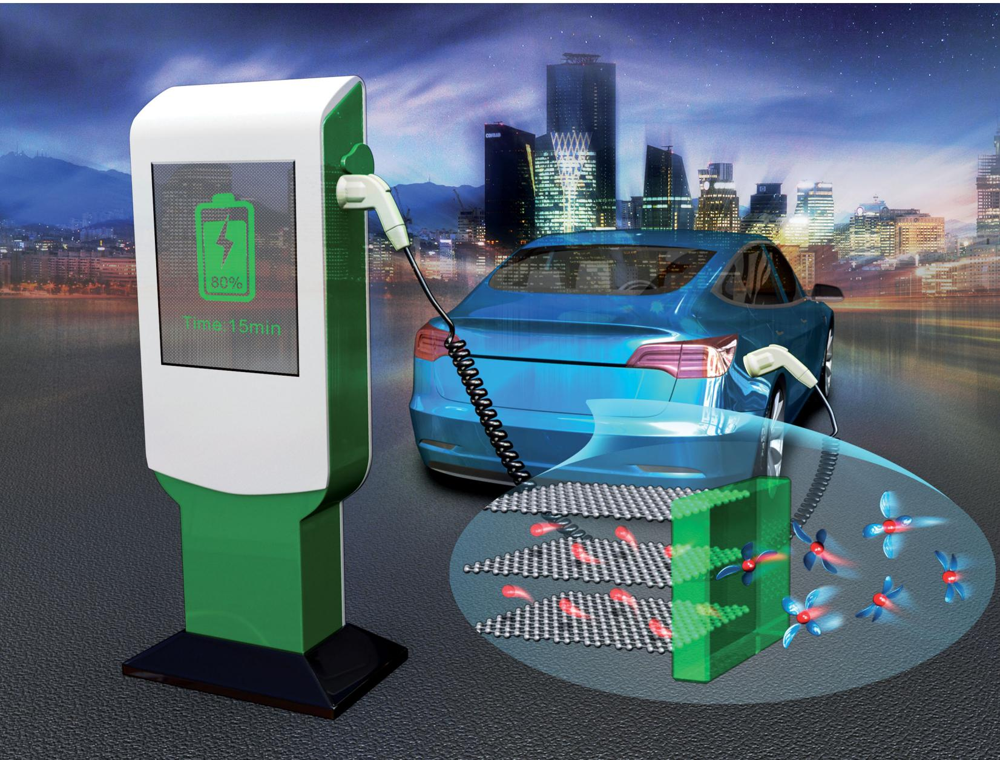  
ISSN 0306-0012

REVIEW ARTICLE

View Article Online

View Journal | View Issue

Check for updates

Cite this:Chem.Soc.Rev.,2020 49,3806

Received 8th December 2019

DOI: 10.1039/c9cs00728h

rsc.li/chem-soc-rev

# A review on energy chemistry of fast-charging anodes

Wenlong Cai, $^{\dagger}$  Yu-Xing Yao, $^{\dagger}$  Gao-Long Zhu, $^{\text{ab}}$  Chong Yan, $^{\text{c}}$  Li-Li Jiang, $^{\text{ad}}$  Chuanxin He, $^{\dagger}$  Jia-Qi Huang $^{\dagger}$  and Qiang Zhang $^{\dagger}$ *

With the impetus to accelerate worldwide market adoption of electrical vehicles and afford consumer electronics with better user experience, advancing fast-charging technology is an inevitable trend. However, current high-energy lithium-ion batteries are unable to support ultrafast power input without any adverse consequences, with the capacity fade and safety concerns of the mainstream graphite-based anodes being the key technological barrier. The aim of this review is to summarise the fundamentals, challenges, and solutions to enable graphite anodes that are capable of high-rate charging. First, we explore the complicated yet intriguing graphite-electrolyte interface during intercalation based on existing theories. Second, we analyse the key dilemmas facing fast-charging graphite anodes. Finally, some promising strategies proposed during the past few years are highlighted so as to outline current trends and future perspectives in this field.

# 1. Introduction

The imminent depletion of fossil fuels and global climate change press for a cleaner energy structure. $^{1-3}$  As a result, power

a Beijing Key Laboratory of Green Chemical Reaction Engineering and Technology Department of Chemical Engineering, Tsinghua University, Beijing 100084, China. E-mail: zhang-qiang@mails.tsinghua.edu.cn  
b Shenzhen Key Laboratory of Functional Polymer College of Chemistry and Chemical Engineering, Shenzhen University, Shenzhen 518061, China  
c Advanced Research Institute of Multidisciplinary Science, Beijing Institute of Technology, Beijing 100081, China  
$^{d}$  Key Laboratory for Special Functional Materials in Jilin Provincial Universities, Jilin Institute of Chemical Technology, Jilin, 132022, China  
These authors contributed equally to this work.

generation is shifting to more renewable and decentralized energy sources such as wind and solar. $^{4,5}$  Since transportation has long been one of the largest polluters in modern society, electrifying transportation using clean power provides us with an important opportunity to reduce greenhouse emissions and enhance energy security. $^{6}$  According to the 2015 Paris Agreement, 100 million electric vehicles (EVs) should be added to our roads by 2030 to keep global warming below 1.5 degrees, which means a more than 10-fold increase compared to now. $^{7,8}$  It is also anticipated that by 2030,  $25\%$  of all vehicles sold will be either fully electric or hybrid. $^{9}$  However, despite the fact that EV technology has advanced rapidly in terms of both range and cost, there is still a lack of consumer acceptance and low market penetration of current EVs. $^{10}$  One important reason is

  
Wenlong Cai

Wenlong Cai received his BS degree from Sichuan University in 2013 and PhD degree from University of Science and Technology of China in 2019. He joined Prof. Qiang Zhang's group as a postdoctoral researcher at the Department of Chemical Engineering in Tsinghua University. His current research interests focus on functional coating of the graphite anode and the transport mechanism of Li ions in the solid electrolyte interphase.

  
Yu-Xing Yao

Yu-Xing Yao completed his BE from the Department of Chemical Engineering, Tsinghua University in 2019 and is currently a PhD candidate at Tsinghua University. His current research includes battery materials for fast-charging and interfacial chemistry in batteries.

that charging the lithium ion batteries (LIBs) in EVs takes considerably longer than refuelling internal-combustion-engine (ICE) cars. Raising the fast-charging capability of current LIBs is the cornerstone to overcome range anxiety and propel the mainstream adoption of EVs for a sustainable future.[11-13]

The ultimate goal of fast-charging, coined as extreme fast charging (XFC) by the US Department of Energy, aims to provide battery electric vehicles (BEVs) with a charging experience similar to refuelling ICE cars which typically takes merely 3-5 minutes. As a sharp comparison, the great majority of BEVs available on the market need 2 to 6 hours to fully charge, far from offering a 'filling the tank' experience to their owners.[9,14] The standards of XFC are therefore strongly needed to set the goals for battery researchers and carmakers. The US Advanced Battery Consortium (USABC) metrics for advanced high-performance batteries for EV applications is  $80\%$  state of charge (SOC) acquired within 15 minutes ( $\sim$ 4C rate), with a usable energy of  $45\mathrm{kW}$  h at the system level and 1000 Dynamic Stress Test (DST) cycles.[14] A charging power of  $144\mathrm{kW}$  is needed to fulfil this target. However, it is

important to note that this requirement is based on a  $45\mathrm{kW}$  h pack, which is only half the size of a battery pack to provide sufficient range ( $>400\mathrm{km}$ ) for modern BEVs. Therefore, at least a  $300\mathrm{kW}$  charging power is required to meet the XFC definition, with the aim to provide  $400\mathrm{km}$  range within 15 minutes.

To understand how far we are from achieving this ambitious target, Fig. 1 outlines the development of various BEVs with direct-current (DC) fast charging capabilities on the market, focusing on three key parameters including pack size, maximum DC charging power and range obtained within 30 minutes.[15] Following the commercialization of LIBs in 1991,[16] the first LIB-based EV, Nissan PRAIRIE JOY, was born in 1996. 2010-2012 appeared to be an important period for development of BEVs, as several iconic models such as Nissan LEAF, Mitsubishi i-MiEV and Chevy Volt were launched. The last decade has witnessed the burgeoning of BEVs as numerous car manufacturers have followed suit, and the fast-charging capability has quickly evolved. Two of the finest BEV models launched in 2019, Audi e-tron and Tesla Model S, are both equipped with a  $\sim 100\mathrm{kW}$  battery pack and  $\sim 150\mathrm{kW}$

  
Gao-Long Zhu

Gao-Long Zhu obtained his PhD from School of Physics in University of Electronic Science and Technology of China in 2018. He is now a postdoc in Department of Chemical Engineering, Tsinghua University. His main areas of research address energy storage materials, including fast charging electrodes, solid electrolytes and separators.

  
Chong Yan

Chong Yan received his bachelor's and master's degrees from Henan Normal University in 2013 and is currently a PhD candidate at Beijing Institute of Technology in Prof. Jia-Qi Huang's group. His research focuses on the interface and ion channel of lithium battery anodes.

  
Jia-Qi Huang

Jia-Qi Huang received his BEng (2007) and PhD (2012) degrees in Chemical Engineering from Tsinghua University, China. He is currently a professor in Advanced Research Institute of Multidisciplinary Science (ARIMS) in Beijing Institute of Technology. His research interests focus on the interface phenomenon and design strategies for high-energy-density rechargeable batteries, including Li-S batteries, Li metal batteries, etc.

  
Qiang Zhang

Qiang Zhang received his bachelor's and PhD degrees from Tsinghua University in 2004 and 2009, respectively. After spending some time at Case Western Reserve University, USA, and Fritz Haber Institute of the Max Planck Society, Germany, he was appointed as a faculty member at Tsinghua University in 2011. His interests are focused on energy materials, including Li-S batteries, Li metal anode, 3D graphene, and electrocatalysts. He was awarded The

National Science Fund for Distinguished Young Scholars, Young Top-Notch Talent from China, and Newton Advanced Fellowship from the Royal Society, UK. Currently, he is an associate editor of the Journal of Energy Chemistry and Energy Storage Materials.

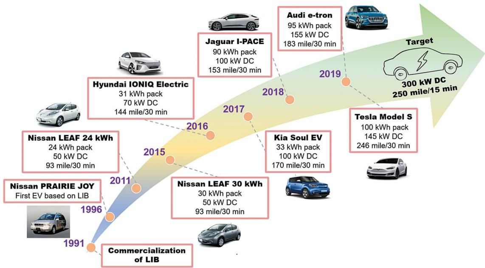  
Fig. 1 The history of LIB-based battery electric vehicles and the corresponding charging capabilities. For each car model, the battery pack size, maximum DC charging rate and maximum range acquired per 30 minutes are listed for comparison. $^{15}$

maximum charging power, meaning that  $300 - 400\mathrm{km}$  range can be obtained within 30 minutes. However, by calculation, an average  $320\mathrm{kW}$  power is required to charge a  $100\mathrm{kW}$  h Tesla Model S in order to meet the XFC standards. Currently, the  $145\mathrm{kW}$  maximum power of supercharger exclusive to Tesla only provides less than half of this target, although it is already among the highest charging rate of all EVs available on the market.[17]

To bridge the gap between current technologies and future goals, one must understand the science limiting the fast-charging of LIBs, the battery system that has powered our digital era almost exclusively. Despite the invention of a large variety of cathode materials and ever-increasing energy density in the past 30 years, the anode material of choice—graphite—has remained unchanged since the birth of LIBs in 1991.[18-21]

High  $\mathrm{Li^{+}}$  storage capacity  $(372\mathrm{mA}\mathrm{h}\mathrm{g}^{-1})$ , low-cost and excellent reversibility of the intercalation chemistry have made graphite and  $\mathrm{Li^{+}}$  the perfect match.[22,23] However, the graphite anode is widely believed to be exactly the main culprit that hinders high-rate charging of commercial LIBs. This is because the operating potential ( $\sim 0.1\mathrm{V}$  vs.  $\mathrm{Li / Li^{+}}$ ) of graphite is so close to that of lithium (Li) metal ( $0\mathrm{V}$  vs.  $\mathrm{Li / Li^{+}}$ ) that Li plating can easily occur while charging at high rates or sub-zero temperatures.[24,25] Due to their reactive nature and dendritic morphology, Li metal deposits are notoriously unstable and can cause active Li loss and internal micro-shorts, resulting in rapid capacity fade and severe safety issues.[26] Ahmed et al. investigated the influence of charging rate and areal loading on the cycling performance of graphite|LiNi $_{0.6}$ Mn $_{0.2}$ Co $_{0.2}$ O $_{2}$  (NMC622) pouch cells (Fig. 2a).[17]

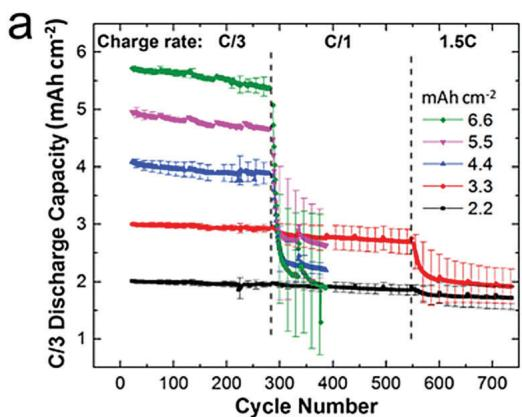  
Fig. 2 Identifying the technical barrier and limiting electrode for the fast-charging of LIB. (a) Capacity fade for a series of graphite/NMC622 pouch cells of increasing areal capacity as a function of charge rate. Discharge rate was held constant at C/3. Adapted with permission from ref. 17, Copyright 2017, Elsevier. (b) Areal capacity of the NMC811 cathode and graphite anode at each rate and the resulting authentic N/P ratio. Adapted with permission from ref. 27, Copyright 2018, Elsevier.

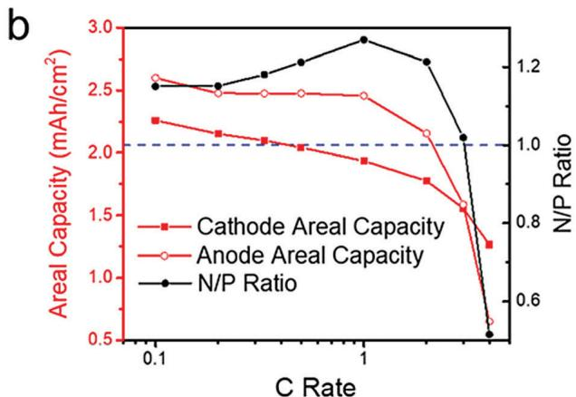

They discovered that increasing the charging rate over 1C causes severe capacity decay and aggravated Li plating on graphite electrodes especially for cells with high areal loadings. However, batteries should be capable of 4C charging without significantly compromising cycle life to meet the XFC standards. To differentiate the limiting factor in LIBs during fast-charging, Mao et al. employed a Li metal reference electrode in both cathode/cathode and anode/ anode symmetrical cells and cycled them within voltage windows comparable to that in actual full cells.[27] Such a design enables accurate measurements of electrode capacity under various rates without the interference from the Li metal counter electrode. They discovered that high charging rates exceeding 1C induce rapid capacity fade of the graphite anode, causing the negative/positive (N/P) ratio to drop to 1.0 at 3C and 0.5 at 4C (Fig. 2b). This can be attributed to the increased anode polarization under high charging rates, which cause the anode potential to prematurely reach  $0\mathrm{V}$  vs.  $\mathrm{Li} / \mathrm{Li}^{+}$ , the boundary which graphite anodes must operate above to prevent Li deposition. It is conspicuous that the present-day LIBs are still far from offering satisfactory fast-charging performance and charging the graphite anode appears to be the main obstacle.[27]

To enable high-rate charging of graphite electrodes, it is essential to accelerate the kinetics of  $\mathrm{Li^{+}}$ intercalation and reduce the overpotential so as to keep the anode potential away from unwanted Li plating. This poses a great challenge to the research community because there is only a minor difference between the  $\mathrm{Li^{+}}$ intercalation and Li plating potential, leaving an extremely narrow margin for anode polarization. In light of the significance and challenges towards fast-charging graphite anodes, this review firstly summarizes existing theories on solid electrolyte interphase (SEI),  $\mathrm{Li^{+}}$ desolvation, and solvent co-intercalation to offer a deep understanding of the interfacial chemistry of graphite. Since solid-state LIBs (SSLIBs) represent the ultimate solution for safe and high energy batteries, the interfacial chemistry of graphite with solid electrolytes (SEs) is also reviewed here. Based on these fundamental understandings, several key challenges and issues towards the fast-charging of graphite anodes are discussed. This review finally highlights a series of promising strategies to enable XFC and recommends several research directions towards more rational fast-charging graphite anode designs.

# 2. Understanding the interfacial chemistry of graphite

# 2.1. LIBs based on liquid electrolytes

Long before any extensive research on Li batteries, graphite was known to host a variety of guest intercalants within its galleries and  $\mathrm{LiC}_x$  ( $x \geq 6$ ) was prepared by directly reacting graphite with elemental Li. However, the lithiation of graphite in an electrochemical manner was never realized through efforts starting from the 1950s to the 1980s. It was not until the 1990s that people gradually realized that the right choice of electrolyte solvent, namely ethylene carbonate (EC), can form a unique SEI and support the successful  $\mathrm{Li}^+$  intercalation in graphite almost exclusively while propylene carbonate (PC) induces severe irreversible

graphite exfoliation.[21,28,29] Earlier efforts of choosing PC over EC simply based on melting point and the imagination that one methyl group could make no difference possibly postponed the birth of LIBs by nearly 30 years. This serves as the best example for illustrating how interfacial chemistry dictates the electrochemical performance of graphite. Furthermore, the interface between graphite and electrolyte is the position where ion and electron transfer occurs across multiple phase boundaries, the kinetics of which should be sufficiently fast to sustain high-rate charging. However, the interfacial chemistry of graphite is poorly understood regarding the nature of the SEI and the mechanism of charge transfer. This section is dedicated to understand the interfacial chemistry of graphite based on existing theories, which serves as the prerequisite to build fast charging graphite anodes.

2.1.1. Charging graphite at an atomic scale. It is generally acknowledged that the charging process of graphite anodes can be divided into 4 consecutive steps at an atomic scale (Fig. 3a):30

(a) Diffusion of solvated  $\mathrm{Li^{+}}$  in the bulk electrolyte, especially through tortuous channels and micro pores in graphite electrodes.  
(b) Once the solvated  $\mathrm{Li^{+}}$  reaches the surface of graphite, charge transfer cannot immediately occur due to the existence of an electron-insulating SEI. The solvation sheath of  $\mathrm{Li^{+}}$  must be stripped off to facilitate subsequent  $\mathrm{Li^{+}}$  transport in the SEI, which is termed as the 'desolvation' process.  
(c) Naked  $\mathrm{Li^{+}}$  diffuses through the SEI and enters the interior of graphite.  
(d) The diffusion of  $\mathrm{Li^{+}}$  within graphite galleries, accompanied by electron transfer and rearrangement of the graphite lattice (from AB stacking to AA stacking).

Limiting factors of fast-charging can be generally categorized into the following two types: (1) mass transport. This mainly includes the diffusion of  $\mathrm{Li^{+}}$  in both electrolytes and electrode materials, which is (a) and (d) in this case. (2) Charge transfer. Since interfaces and interphases are ubiquitous in LIBs, the transport of  $\mathrm{Li^{+}}$  across them can form a major kinetic barrier, which consists of (b) and (c) for graphite anodes. Therefore, decoupling the influence of mass transport and charge transfer

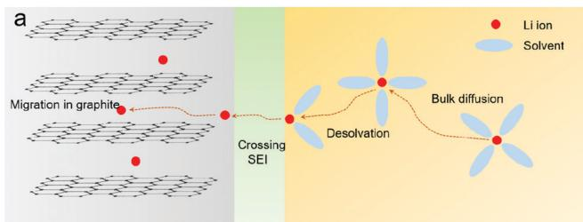

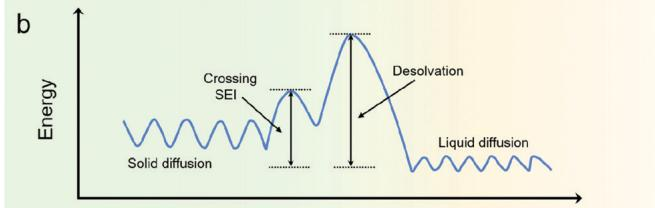  
Fig. 3 Charging graphite at an atomic scale. (a) The charging process of graphite in working LIBs, including  $\mathrm{Li^{+}}$  bulk diffusion, desolvation, crossing the SEI and migration in graphite and (b) the corresponding energy diagram.

is of critical importance to identify the rate-determining step (RDS).

From the energy viewpoint, desolvation has the highest energy barrier  $(50 - 70\mathrm{kJ}\mathrm{mol}^{-1})$ , whose kinetics is therefore most sensitive to temperature. The solid diffusion of  $\mathrm{Li^{+}}$  in the graphite lattice has an energy barrier of  $20 - 40\mathrm{kJ}\mathrm{mol}^{-1}$ , which is shown to increase with the lithiation degree. The liquid diffusion of the  $\mathrm{Li^{+}}$ -solvent complex exhibits a negligible energy barrier (Fig. 3b). Interestingly, although the SEI is probably the most extensively studied component of LIBs, quantifying the energy barrier for  $\mathrm{Li^{+}}$  to cross the SEI has been somewhat neglected and therefore no generally acceptable value can be agreed on. This is probably because the properties of the SEI change drastically with the composition of electrolytes, particularly with a wide spectrum of solvents, lithium salts and film-forming additives.[31,32] Xu et al. once pointed out that the energy barrier for the SEI is around  $20\mathrm{kJ}\mathrm{mol}^{-1}$ , but no subsequent studies have confirmed this conclusion.[30]

Whether mass transport or charge transfer dominates the overall charging process is still an open topic. To understand this controversy, two points must be clarified. First, the RDS during graphite charging is a function of certain variables including charging rate, temperature, electrode material, and electrode thickness. For instance, mass transport may dominate the overall reaction kinetics for ultrathick electrodes or at extremely large current densities,[33-35] whereas charge transfer could possibly become the RDS when charging thin electrodes especially at sub-zero temperatures due to its large activation energy.[36,37] Therefore, it is unreasonable to declare the RDS without specifying cycling conditions. Second, it is no doubt that the desolvation process is the most 'energy-consuming' step, but not necessarily the 'rate-determining' step. The indiscrimination of these two terms is common in the early pioneering works that drew the link between charge transfer resistance and desolvation process, and that obtained a universal value of  $50 - 70\mathrm{kJ mol^{-1}}$  for the desolvation energy barrier. This is because the rate constant, rather than the energy barrier, is the one to dictate the chemical reaction rate. According to the Arrhenius equation, the rate constant is not only a function of activation energy, but also the pre-exponential factor.[38] The latter is an intrinsic parameter of a certain reaction/kinetically controlled process, and may exert a significant impact on the rate constant. Generally, our viewpoint can be summarized as follows. First, the RDS is a function of various cell parameters (electrode material, areal loading, temperature, and so on). Each specific charging condition may give a different RDS. When the contribution of each process is similar, the RDS may not even exist and the charging process can be controlled simultaneously by more than one sub-processes. Secondly, future research should concentrate on methods to explore the relation between cell parameters and RDS by combining theoretical and experimental tools. If such a methodology is able to predict the RDS theoretically or experimentally for a given battery system, it will be much more efficient to design strategies to enable fast-charging.

It is interesting to note that none of the 4 steps mentioned above can solely account for the difference of rate performances

between graphite and cathode: (a) and (b) obviously exist in both electrodes, and the desolvation energy barrier of  $\mathrm{Li^{+}}$  in the carbonate environment is found to be similar for graphite and various cathode materials ( $50 - 70\mathrm{kJ mol^{-1}}$ );[39-41] (c) exists in high-voltage cathodes and is termed as cathode-electrolyte interphase (CEI);[42] for (d), the  $\mathrm{Li^{+}}$  diffusion coefficient in the graphite ( $10^{-11} - 10^{-8}\mathrm{cm}^2\mathrm{s}^{-1}$ ) lattice resembles or even exceeds that of most cathode materials ( $10^{-16} - 10^{-8}\mathrm{cm}^2\mathrm{s}^{-1}$  depending on the cathode type).[43-49] Consequently, it can be deduced that the poor rate capability of graphite originates from its potential proximity to Li plating, the undesirable competing reaction. Therefore, efforts to accelerate all 4 steps are crucial to reduce anode polarization and enhance the rate performance of graphite charging. Strategies to improve (a) and (d) will be discussed in Section 4, while in this section we concentrate on (b) and (c), the interfacial reaction which is unique to graphite anodes during charging.

2.1.2. SEI: formation, composition, structure and evolution. The term SEI originally refers to the surface passivation film on metallic Li immersed in non-aqueous electrolytes.[50] It was then realized that an SEI is the heart of LIBs, because it not only serves as a  $\mathrm{Li^{+}}$  conductor and an electron insulator to block further reduction or co-intercalation of electrolytes while allowing  $\mathrm{Li^{+}}$  diffusion, but also acts as a glue to keep the integrity of graphite sheets under volume fluctuation.[50-53] One important implication of the SEI for fast-charging is that its thickness may increase under high rates due to the continuous electrolyte consumption, resulting in elevated cell resistance and active lithium loss.[54,55] In view of the paramount importance of the SEI in dictating the intercalation behaviour and cycle life of graphite anodes, the fundamentals of the SEI must be further investigated, and any efforts in tailoring an interface for fast-charging purposes must guarantee a desirable SEI. In order to give a comprehensive overview of the SEI, we try to approach this topic from the following aspects: SEI formation, composition, structure and evolution.

The inevitability of SEI formation is explained by the fact that no electrolyte component is thermodynamically stable at the extreme potentials where LIBs must operate.[20,56,57] Fig. 4a gives the computed reduction potential for several common solvents, additives and lithium salts in their authentic existence form (e.g., ion-solvent complex or ion-ion pair). It is clear that all the species in the electrolyte show higher reduction potential than the lithiated graphite ( $\sim 0.1$  V vs.  $\mathrm{Li} / \mathrm{Li}^{+}$ ), making them all susceptible to reduction and precipitation on the graphite surface to participate in SEI formation.

The initial SEI formation, which usually occurs during the first few lithiation steps of graphite, dictates whether graphite can be cycled reversibly and set the foundation for SEI evolution during extended cycles. Nevertheless, the simultaneous reduction of solvent, additives and salts greatly complicates such an interfacial process whose in-depth detail was never unveiled until some recent breakthroughs. Using electrochemical quartz crystal microbalance (EQCM) combined with in situ atomic force microscopy (AFM), Liu et al. pictured the formation process of the SEI at the nanoscale during the first lithiation of highly oriented

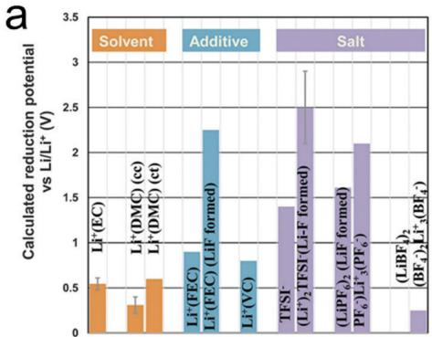

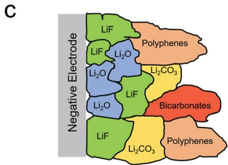

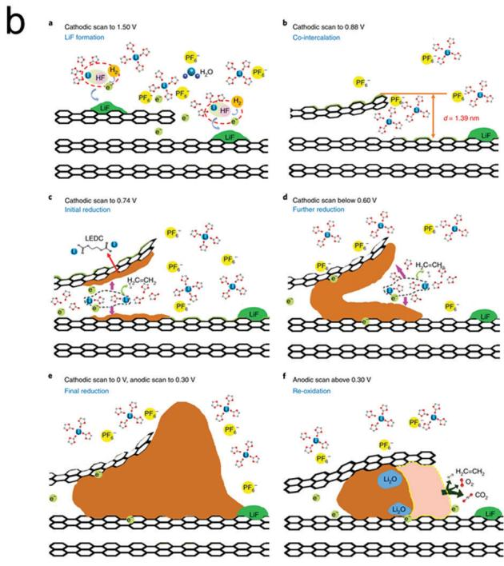

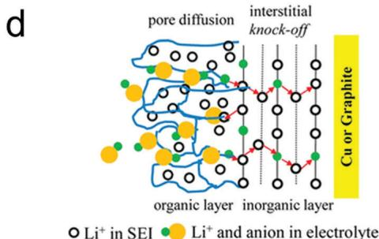  
Fig. 4 The formation, composition, structure, and evolution of the SEI. (a) Computed reduction potential for three key ingredients in the electrolyte, including  $\mathrm{Li^{+}}$ -coordinated solvents, additives and lithium salts. Adapted with permission from ref. 56. Copyright 2018, Nature Publisher. (b) The formation mechanism of the SEI on graphite during the very first lithiation step. Adapted with permission from ref. 58. Copyright 2018, Nature. (c) Schematic of the polyhetero microphase SEI structure. Adapted with permission from ref. 67. Copyright 2019, American Chemical Society. (d) Schematic of the two-layer model of the SEI, where  $\mathrm{Li^{+}}$  experiences pore diffusion in the porous organic layer of the SEI and knock-off diffusion in the dense inorganic layer of the SEI. Adapted with permission from ref. 71, Copyright 2014, American Chemical Society. (e) Two different pathways of SEI revolution on carbonaceous anodes captured by cryo-TEM. The first scenario is the formation of a thin, compact SEI consisting primarily of inorganic compounds with effective passivation. The second scenario involves a porous, organic-rich SEI with poor passivation spanning hundreds of nanometers. Adapted with permission from ref. 55, Copyright 2018, American Chemical Society.

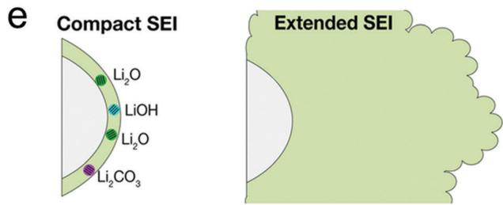

pyrolytic graphite (HOPG). $^{58}$  It was proposed that 4 distinct steps constitute the formation of the initial SEI in a chronological order (Fig. 4b):

(1) LiF formation at  $1.5\mathrm{V}$ , which can occur in either a chemical or an electrochemical way.  
(2) Li-solvent co-intercalation at  $0.88\mathrm{V}$ . This coincides with the existing belief that the SEI forms through a 3D rather than a 2D process, where a transient Li-solvent co-intercalation precedes the reduction of solvent and the SEI grows along the depth direction between 2 graphene sheets.[59]  
(3) Further EC reduction from  $0.74\mathrm{V}$  down to  $0\mathrm{V}$ , forming a well-developed SEI mainly consisting of lithium ethylene di-carbonate (LEDC).  
(4) Re-oxidation of lithium alkyl carbonates in a nascent SEI during anodic scan above  $0.3\mathrm{V}$ .

Numerous studies have confirmed that the major product in the initial SEI is LEDC and LiF, which is surprisingly simple. [54,60-64] However, the nature of the SEI has always been referred to as 'extremely complicated'. This is because during repeated cycling, the initial SEI can evolve into an extremely intricate mixture of compounds. Such intricacy originates mainly from the following 2 reasons. The first reason is the chemical and structural instability of the initial SEI. For example, LEDC is prone to re-oxidation, further reduction, hydrolysis and thermal decomposition. [54] Secondly, the SEI is chemically sensitive to various destroyers in its surroundings. For example, the dissolution of cathode metal ions, carbon dioxide generated from solvent oxidation, and  $\mathrm{PF}_5$  attack could all alter the structure and composition of the SEI. [54,64-66] These side reactions produce a series of compounds such as  $\mathrm{Li}_2\mathrm{CO}_3$ ,  $\mathrm{Li}_2\mathrm{O}$ , lithium fluorophosphates,

lithium alkoxides, lithium carboxylates, polyethylene oxides, and so on (Fig. 4c).67

Winter once referred to the SEI as 'the most important and the least understood solid electrolyte in rechargeable Li batteries' in 2009.[68] Interestingly, such conclusion seems to hold true even now. The identification of LEDC as the primary SEI ingredient originating from the single-electron reduction of EC is probably the most unquestionable consensus that the community has agreed on for the last 20 years.[54,60,69] However, this consensus is no longer beyond dispute. In a recent subversive work conducted by Wang's group, it was proved that lithium ethylene mono-carbonate (LEMC), instead of LEDC, is likely to be the main SEI component and all LEDC synthesized and characterized previously was in fact LEMC.[70] LEMC is shown to exhibit adequate ionic conductivity while LEDC is an ionic insulator. This affords fresh insight into the chemical nature of the SEI but the formation mechanism and the complex interconversion between LEMC and other lithium carbonates still need to be unveiled.

The next question will be how these complex ingredients arrange in the SEI, and more importantly, how  $\mathrm{Li^{+}}$  migrates through to reflect the solid electrolyte nature of the SEI. A generally accepted structural model is the mosaic model (Fig. 4c), where various components inlay the SEI to form polyhetero microphases.[50,53] This model indicates that an SEI is highly heterogeneous, probably originating from the simultaneous reduction of a variety of electrolyte components. A closer examination of such a model reveals that the inner layer (close to graphite) of the SEI consists of inorganic compounds that are chemically stable against lithiated graphite, while the outer layer consists primarily of organic components that are still prone to reduction. This leads to the bilayer treatment of the SEI (Fig. 4d), which is also plausible because  $\mathrm{Li^{+}}$  undergoes completely different transport paths in the two layers.[71] The porous organic outer layer is penetrable to the electrolyte, in which  $\mathrm{Li^{+}}$  migrates through the pore diffusion mechanism following the classic Fick's law.[72] In the inner inorganic layer,  $\mathrm{Li^{+}}$  is evidenced to diffuse by interstitial knock-offs, via vacancies or across phase boundaries. Nevertheless, how SEI components affect its ionic conductivity and which  $\mathrm{Li^{+}}$  transport mechanism dominates are still open questions.

The structure and composition of the SEI are dynamic and undergo ceaseless evolution. A newly formed SEI during initial cycles is typically  $10 - 50\mathrm{nm}$  thick and supports rapid  $\mathrm{Li^{+}}$  diffusion.[20,57] During repeated cycling, the volume change of graphite induces internal stress and rupture of the SEI that exposes fresh graphite surface, leading to continuous SEI growth. Various aging reactions result in the increase of SEI thickness and active lithium loss.[54,55,73] It may also largely increase the  $\mathrm{Li^{+}}$  diffusion resistance and hinder the fast-charging of LIBs. To understand such a phenomenon, Huang et al. characterized the SEI on carbon electrodes using cryogenic transmission electron microscopy (cryo-TEM) and tracked its evolution during cycling.[55] They discovered that 2 typical SEI evolution patterns appear in the same electrode (Fig. 4e): one is the compact SEI embedded with abundant inorganic species, and the other is the extended SEI consisting of organic alkyl carbonates that spans hundreds of nanometers. Such distinction highlights the importance of

inorganic crystallites to prevent SEI growth which may increase the danger of Li plating during cycling. More details of SEI evolution will be carefully discussed in Section 3.

The complexity of the SEI is reflected by its elusive manner of formation, extremely sensitive chemical nature and lack of in situ characterization tools.[68] Its formation mechanism, chemical nature, structure and morphology upon evolution are not fully understood up to now. Nevertheless, with the advances in fundamental electrochemistry and high-end characterization techniques, the next ten years is likely to see more systematic and deepened understanding of the SEI.

2.1.3.  $\mathrm{Li^{+}}$  desolvation and co-intercalation.  $\mathrm{Li^{+}}$  in electrolytes does not appear to be an isolated ion, but rather is solvated by polar organic solvents, which is the reason that lithium salts can be dissolved as their lattice energy is overcome by the binding energy between  $\mathrm{Li^{+}}$  and solvents. When charging current is applied in LIBs, the solvated  $\mathrm{Li^{+}}$  approaches the surface of graphite, where two scenarios branch out (Fig. 5a). The first scenario, which is the fundamental rationale behind the stable operation of LIBs, involves the formation of a stable SEI derived from the decomposed solvation sheath and a binary  $\mathrm{LiC}_x$  compound. After SEI formation, further lithiation of graphite involves an additional desolvation process. The second scenario is that the  $\mathrm{Li^{+}}$ -solvent complex co-intercalates into the interior of graphite, to form a ternary graphite intercalation compound (GIC). Such a ternary GIC may or may not be stable depending on whether the  $\mathrm{Li^{+}}$ -solvent complex decomposes among graphite galleries and releases gases, in which case graphite is irreversibly exfoliated and no discharge capacity can be obtained. These two scenarios lead to completely different interfacial chemistries and will be discussed in sequence.

Scenario 1: SEI formation and  $\mathrm{Li^{+}}$  desolvation. The solvation sheath of  $\mathrm{Li^{+}}$  in non-aqueous solvents, seemingly a property of the electrolyte bulk, has actually a profound influence on the interfacial chemistry of graphite anodes due to the following two reasons.[74-76] Firstly,  $\mathrm{Li^{+}}$  solvation dictates the formation of an SEI because during the charging process, solvated  $\mathrm{Li^{+}}$  tends to guide the decomposition of solvents within its solvation sheath through a transient co-intercalation process.[30,77-79] This indicates that any preferential solvation behaviour can create a SEI dominated by the reduction of one particular solvent with the strongest interaction with  $\mathrm{Li^{+}}$ , which, in most cases, is the irreplaceable EC. The preferential solvation of EC over various linear carbonates has been unequivocally proved by a combination of methods including electrochemical impedance spectroscopy (EIS), nuclear magnetic resonance (NMR), electron ionization-mass spectroscopy (EI-MS) and theoretical computation, and the solvation-reduction mechanism is widely accepted so far.[36,80-82] Secondly, the stripping of the  $\mathrm{Li^{+}}$  solvation sheath, known as the desolvation process, is the most energy-consuming step when  $\mathrm{Li^{+}}$  transports through the electrolyte/electrode interface.[83-86] A universal value of the activation energy of  $\mathrm{Li^{+}}$  desolvation in routine carbonate electrolytes is within the range of  $50 - 70\mathrm{kJ mol^{-1}}$ , regardless of the electrode material or the presence of interphases (Fig. 5b).[87] For graphite anodes, this energy barrier is believed to be

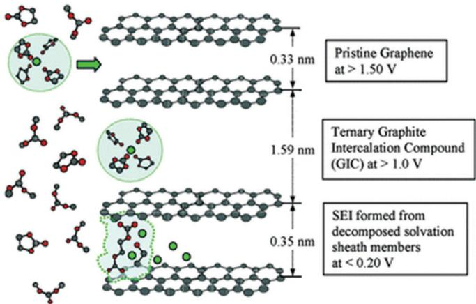  
a

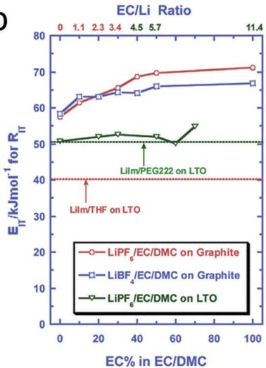  
b

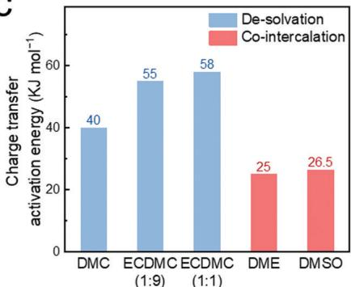  
C  
Fig. 5  $\mathsf{Li}^+$  desolvation and co-intercalation. (a) The dependence of surface chemistry on the  $\mathsf{Li}^+$  solvation sheath. Upon charging, the solvation sheath of  $\mathsf{Li}^+$  may serve as either a guest intercalant or a chemical source of the SEI. Adapted with permission from ref. 30. Copyright 2007, American Chemical Society. (b) Charge transfer activation energy of intercalation as a function of electrolyte composition and anode type. Adapted with permission from ref. 87. Copyright 2010, American Chemical Society. (c) Typical charge transfer activation energies of solvent co-intercalation compared to  $\mathsf{Li}^+$  desolvation. Data acquired from ref. 83 and 37. (d) Different scenarios of  $\mathsf{Li}^+$ -solvent co-intercalation demonstrated by PC and DEGDME. Adapted with permission from ref. 95. Copyright 2017, Wiley-VCH.

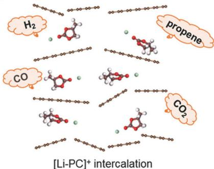  
d

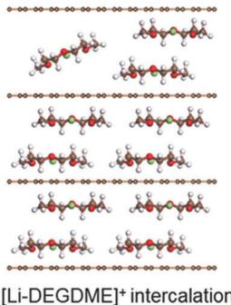

a major limiting factor for fast-charging especially at sub-zero temperatures. $^{30}$  Interestingly, the desolvation energy barrier first increases with the content of EC in the electrolyte and then stabilizes at a point when the  $\mathrm{EC / Li^{+}}$  ratio is around 4, which happens to be the average solvation number of  $\mathrm{Li^{+}}$  in non-aqueous media. $^{88}$  This 'coincidence' further indicates that the preferential solvation of EC is closely linked to the charge transfer kinetics at the graphite/electrolyte interface. It is also important to note that the values of these activation energies are obtained through phenomenological EIS measurements, based on the assumption that each semicircle in an EIS curve strictly corresponds to one particular interfacial process. Therefore, novel methods to probe the interfacial kinetics of  $\mathrm{Li^{+}}$  intercalation in graphite are desired to quantify these kinetic parameters more precisely.

The indispensable role of EC in forming a stable SEI and the high desolvation barrier of the  $\mathrm{Li^{+} - (EC)}_x$  complex constitute a contradiction for building high-rate graphite anodes with desirable cycle performance. Regulating  $\mathrm{Li^{+}}$  solvation/desolvation affords emerging opportunities to tackle this issue. One example is the superconcentrated electrolyte (SCE) developed in recent years. The scarcity of solvent molecules and the abundance of ion-ion pairs

in SCEs lead to stable SEI formation induced by the sacrificial reduction of anions, allowing successful operation of graphite anodes in a variety of EC-free electrolytes with exceptional rate performance in some cases.[89] However, the better rate capability afforded by SCEs is probably due to the enhanced ion-transport properties or unique SEI compositions and structures rather than the lower desolvation barrier, as the cleavage of ion-ion pairs in SCEs was shown to exhibit even higher activation energy.[90] To overcome the high activation energy of desolvation, it is advisable to replace commercial carbonate electrolytes with weakly solvating solvents, or endow the graphite interphase with active sites that catalyse the breaking up of the  $\mathrm{Li^{+}}$  solvation sheath. These underexplored fields could give birth to a number of promising strategies for fast-charging graphite anodes.

Scenario 2:  $\mathrm{Li}^{+}$ -solvent co-intercalation. The "EC-PC Disparity" in the history of Li-ion chemistry still remains an unsolved mystery up to this day. Numerous theories have tried but failed to fully explain whether a particular solvent would cause  $\mathrm{Li}^{+}$ -solvent co-intercalation and exfoliation of graphite, let alone to predict.[91] Besides PC, co-intercalation is typically found in various

ether-based electrolytes.[92] Abe et al. discovered that the co-intercalation of  $\mathrm{Li^{+}}$ -ether complexes exhibits only half the energy barrier compared to intercalation (Fig. 5c, typically  $20 - 30\mathrm{kJ mol^{-1}}$ ), probably due to the absence of a desolvation step.[83] Such chemistry with fast kinetics is naturally favourable for a fast-charging graphite anode, if co-intercalation could maintain the structural integrity and achieve high reversibility.

Historically the failure of PC reinforced the perception that the co-intercalation phenomenon would irreversibly destroy the graphite lattice during charging and is therefore detrimental to LIBs. However, recent progress suggests that co-intercalation not only possesses satisfactory reversibility, but also exhibits great potential for fast-charging purposes. Pioneered by Jache and Adelhelm, the intercalation of ether-solvated  $\mathrm{Na^{+}}$  ions into graphite was found to be a surprisingly reversible process with exceptional high-power capability and has attracted great attention in recent years.[93] When one would expect that the same pattern should apply to  $\mathrm{Li^{+}}$ , Kang and co-workers demonstrated that  $\mathrm{Li^{+}}$  ether co-intercalation, despite its superb rate capability, exhibits a rapid capacity decay and could barely give a decent cycle life.[94] The same group further investigated the origin of this poor reversibility and realized that it only originates from the instability of the counter-electrode, namely Li metal, in a half-cell configuration.[95] Unlike the case of  $\mathrm{Li^{+} - PC}$  co-intercalation where the decomposition of PC molecules and gas evolution undermine the graphite structure, the graphite maintains its structural integrity during  $\mathrm{Li^{+}}$ -ether co-intercalation despite the huge volume change (Fig. 5d). Consequently, a graphite- $\mathrm{LiFePO_4}$  full cell adopting co-intercalation reaction delivers 200 cycles of stable operation. The  $\mathrm{Li^{+}}$ -solvent co-intercalation, as was proved feasible for practical applications, is a suitable candidate for future power-intense LIBs due to the following reasons: (1) co-intercalation reaction shifts the anode potential away from dangerous Li plating, usually in the range of 0.5-1.2 V. (2)  $\mathrm{Li^{+}}$ -solvent co-intercalation proceeds in the absence of both desolvation process and SEI, and therefore it exhibits fast charge-transfer kinetics and a pseudocapacitive nature.[95,96] However, the safe and high-power-density characteristics of  $\mathrm{Li^{+}}$ -solvent co-intercalation can only be achieved at the expense of energy density, due to the elevated anode potential and limited specific capacity  $(100 - 120\mathrm{mA}\mathrm{h}\mathrm{g}^{-1})$  compared to naked  $\mathrm{Li^{+}}$ intercalation. Future endeavours should fully exploit  $\mathrm{Li^{+}}$ -solvent co-intercalation reaction by striking a balance among these parameters.

# 2.2. LIBs based on solid electrolytes

The potential safety concerns during fast-charging have inspired the research of solid-state batteries. The emerging SSLIB has drawn extensive attention due to its intrinsic safety and high energy density.[97-101] Although the mechanism of ionic transport in solid electrolytes is not fully understood up to now, the emergence of numerous SEs with superb ionic conductivity  $(10^{-4} - 10^{-2}\mathrm{Scm}^{-1})$  and with an activation energy of  $0.15-$ $0.4\mathrm{eV}$  make SSLIBs promising for safe fast-charging.[102-105] For example, the bcc-type  $\mathrm{Li_{9.54}Si_{1.74}P_{1.44}S_{11.7}Cl_{0.3}}$  electrolyte within 3D conduction pathways delivers the highest ionic conductivity of  $2.5\times 10^{-2}\mathrm{Scm}^{-1}$  at room temperature,[106] which is even higher

than that of organic electrolytes ( $\sim 1 \times 10^{-3} \mathrm{~S~cm}^{-1}$ ). Although current research on the negative electrode of SSLIBs mostly focuses on solving the compatibility between lithium metal and solid electrolytes, lithium dendrite growth and the safety concerns of metallic lithium in large-scale manufacture remain problematic. Nevertheless, even coupled with electrodes in conventional LIBs (graphite anode and transition metal oxide cathode), SSLIBs still offer great advantages in device robustness, packaging compactness and safety.[107-109] At present, the development of SSLIBs is still in its infancy. Therefore, developing SSLIBs containing graphite anodes is still a competitive route towards safe fast-charging.

The interfacial chemistry of graphite in SSLIBs is also important and ultimately determines the fast-charging performance. Compared with the traditional organic electrolytes, there is no solvated  $\mathrm{Li^{+}}$  in SSLIBs and consequently no desolvation step. An interphase between graphite and solid electrolyte is sometimes even absent. In SSLIBs, the charging process of graphite anodes can be divided into 3 consecutive steps:

(a) Hopping of  $\mathrm{Li^{+}}$  in bulk SEs along neighboring sites.  
(b) After reaching the surface of the electrode,  $\mathrm{Li^{+}}$  crosses the SEI or directly enters the interior of graphite.  
(c) The diffusion of  $\mathrm{Li^{+}}$  within graphite galleries.

Numerous studies have shown that step (b) serves as the RDS and ultimately dominates the fast-charging performance in SSLIBs, $^{13,110-112}$  because the poor solid-solid contact and the formation of an additional passivation layer between graphite and solid electrolytes both result in poor interfacial ion transport kinetics. $^{99,110}$  Only interphase formation between graphite and SEs is discussed here, which is dictated by the interfacial chemistry. The poor solid-solid contact will be discussed in Section 3.

An interphase forms typically due to the narrow electrochemical window of solid electrolytes, leading to chemical $^{113,114}$  or electrochemical $^{115}$  instability at the electrode/electrolyte interface. According to the stability of the SE applied and the properties of the interphase, three interfacial chemistries are expected (Fig. 6). $^{116}$  (a) If the SE is thermodynamically stable, the interface between graphite and SE is interphase-free, allowing direct  $\mathrm{Li^{+}}$  transport. (b) If the interphase is conductive to both  $\mathrm{Li^{+}}$  and electrons, the SE will continuously decompose on top of the interphase and increase the interfacial resistance upon cycling.

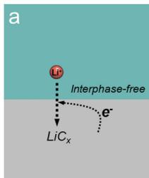  
Fig. 6 Schematic illustration of the interface between solid state electrolyte and lithiated graphite. Three possible scenarios are discussed, including (a) the interphase-free scenario, (b) the mixed conducting, unstable interphase and (c) the self-limiting, kinetically stable interphase.

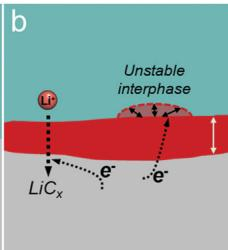

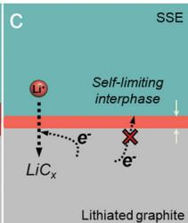

(c) If the interphase forms in such a manner that it is only  $\mathrm{Li^{+}}$ -conducting and electron-insulating, then the interphase will cease to thicken at a point when electron tunneling is prohibited. Such a self-limiting interphase therefore fits the definition of an SEI. While the first scenario is ideal, it is practically impossible to achieve; in the second scenario, impedance tends to build up, and therefore it is not desired for fast-charging or long-term cycling. The third scenario, with an SEI similar to liquid LIBs, is the major direction of research.

# 3. Challenges and issues

Compared with normal charging conditions, fast-charging aggravates a number of issues due to the large overpotential, drastic structural fluctuation and interfacial evolution of graphite anodes. When charging at high rates, numerous side effects including Li plating, SEI instability, Joule heating and so on will result in the deterioration of cycling performance and safety accidents. These challenges are discussed in this section.

# 3.1. Battery with liquid electrolytes

3.1.1. Li plating. Li plating is the main culprit of fast-charging in LIBs and can occur at local potential below  $0\mathrm{V}$  vs.  $\mathrm{Li} / \mathrm{Li}^{+}$  (Fig. 7a). The  $\mathrm{Li}^{+}$  intercalation potential ( $\sim 0.1\mathrm{V}$  vs.  $\mathrm{Li} / \mathrm{Li}^{+}$ ) is located above this value, and therefore it precedes Li plating during the charging of graphite in terms of thermodynamics.[117-119] However, the Nernst equation cannot predict the authentic potential of graphite anodes when a charging current is applied,[120] because various polarizations including ohmic drop, concentration overpotential, and charge transfer overpotential are unavoidable especially at high rates, which jointly drive the anode potential down to the threshold of metallic Li plating. The true potential of working graphite anodes can be measured by employing a reference electrode as the probe, but it is difficult to isolate different polarizations experimentally.[121,122]

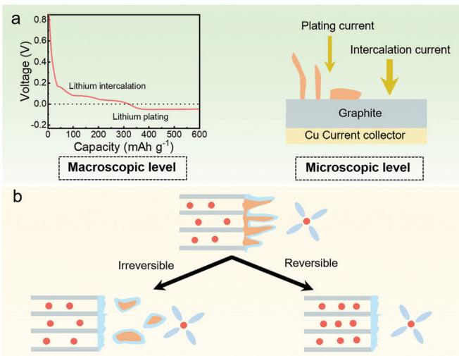  
Fig. 7 Schematics of lithium plating and its consequences. (a) Lithium plating at both the macroscopic and the microscopic level. (b) Reversibly and irreversibly plated lithium on the surface of graphite.

The high anisotropy of graphite allows  $\mathrm{Li^{+}}$  to intercalate only through its edge plane rather than the basal plane, producing limited active intercalation sites.45 If the charging current is higher than the maximum  $\mathrm{Li^{+}}$  intercalation current, the accumulation of  $\mathrm{Li^{+}}$  triggers the onset of Li plating. To sum up, Li plating on graphite electrodes is a kinetically controlled process.

At the microscopic level, Li plating (amount  $y$ ) and  $\mathrm{Li}^{+}$ intercalation (amount  $x$ ) co-exist during charging, as described by the following equations:120

$$
x \mathrm {L i} ^ {+} + \mathrm {L i} _ {\delta} \mathrm {C} _ {6} + x \mathrm {e} ^ {-} \rightarrow \mathrm {L i} _ {\delta + x} \mathrm {C} _ {6} \tag {1}
$$

$$
y \mathrm {L i} ^ {+} + y \mathrm {e} ^ {-} \rightarrow y \mathrm {L i} \tag {2}
$$

where  $\delta$  ( $0 < x < 1$ ) represents the SOC of graphite. Hence, the charging current can be divided into  $\mathrm{Li}^+$  intercalation current and plating current (Fig. 7a). Under fast-charging conditions, due to the quick consumption of  $\mathrm{Li}^+$  in the electrolyte, slow charge-transfer kinetics and limited solid-state  $\mathrm{Li}^+$  transport in graphite,  $\mathrm{Li}^+$  tends to accumulate on the surface of graphite to increase the plating current. Common external factors that may trigger lithium plating include large charging current, inadequate negative/positive (N/P) ratio, high SOC, and low temperature.

Besides, lithium plating can also be triggered by the inhomogeneous distribution of temperature and current density, which is induced by local defects and inappropriate cell designs, such as cell mismatch, locally deformed separators, non-uniform compression/mechanical stress, etc.[123] Even in a coin cell, a locally deformed separator was demonstrated to cause lithium plating. After producing a closed pore at the center of the separator on purpose, the assembled coin cell exhibits apparent lithium plating around the pore region of the separator even under normal charging conditions.[124] Heterogeneous compression is also found to induce lithium plating. For the cylindrical stainless steel case, the positive and negative tab may deform the jelly roll and create compression variations which hinder the diffusion of  $\mathrm{Li^{+}}$ , resulting in visible lithium plating especially near the edges of the imperfections. What is worse, lithium plating appears to spread out to cover the whole graphite surface from the initial areas, leading to rapid cell degradation.[125]

When lithium atoms deposit on the graphite surface during fast charging, it may cause two effects (Fig. 7b). On the one hand, the deposited Li can reinsert into the graphite during relaxation driven by the potential difference between graphite and deposited Li, which does not result in any capacity loss and is thus termed reversibly plated lithium.[122] On the other hand, the plated lithium can react spontaneously with the nearby electrolyte to form a passivation layer, giving rise to irreversible capacity loss and poor coulombic efficiency, which is termed irreversibly plated lithium.[126,127] When metallic Li is wrapped with a layer of an electron-insulating SEI, it may lose contact with the electron-conducting skeleton and form a thick, porous layer composed of isolated Li islands (referred to as dead Li) on the surface of the anode during the following cycles which is hard to re-utilize.[128] This process will not only result in irreversible loss of active lithium but also increase the internal resistance of the battery and subsequently induce further Li plating, as the  $\mathrm{Li^{+}}$  ion

has to diffuse through the porous dead Li layer to reach the surface of graphite. Moreover, the electrolyte will dry out due to its continuous consumption and anode swelling, resulting in a further increase of the internal resistance. Therefore, Li plating can be regarded as a self-accelerating process. $^{129,130}$  As Li plating prevails, the anode could partially evolve into a Li metal anode, which is notoriously unstable in commercial carbonate electrolytes for LIBs and would cause rapid battery failure. $^{123,131,132}$

3.1.2. SEI instability. An SEI exists on the surface of both graphite and deposited Li to protect the electrode and enable long-term cycling. An ideal SEI should be thin, compact, and mechanically strong, enabling only  $\mathrm{Li^{+}}$  to transport through the layer and into the graphite electrode and physically eradicate electron tunneling to inhibit the continuous reduction of the electrolyte. Since the SEI is typically a  $10 - 50\mathrm{nm}$  thick solid electrolyte layer, the most straightforward implication of the SEI for fast-charging is that  $\mathrm{Li^{+}}$  conductivity should be high enough to support high  $\mathrm{Li^{+}}$  flux. However, the major ingredients of the SEI in the state-of-the-art LIBs possess poor ionic conductivity.[133] Therefore,  $\mathrm{Li^{+}}$  transport through the SEI is hindered under higher current, resulting in dramatically increased interfacial resistance and Li plating. This happens especially when the SEI considerably thickens upon cycling.

Previous investigations indicate that an SEI consists of an inner layer dominated by inorganic species and an outer layer dominated by organic species, primarily composed of LiF and LEDC, respectively, at the initial stage. However, the decomposition of the unstable LEDC results in a very complicated mixture of compounds as shown in Fig. 8a. Some of the organic

compounds are soluble in the electrolyte, gradually creating a porous SEI structure. Whereupon, the electrolyte can infiltrate into the porous SEI and participate in further decomposition to generate more LiF and LEDC, forming the new outer SEI layer. Because of the repeated dissolution and decomposition, the SEI thickens, along with the increased impedance and loss of capacity (Fig. 8a). In addition, the heterogeneous shear modulus of most practical SEIs is too low to suppress lithium dendrites and SEI can easily be broken when subjected to high strain. Fast-charging easily results in SEI cracks, leading to subsequent electrolyte penetration and reduction. After continuous SEI rupturing and rebuilding, dead Li accumulates and cycling performance deteriorates. Furthermore, the SEI components are temperature-sensitive. Fast charging gives rise to higher cell internal temperature compared to charging at normal rates, leading to accelerated electrolyte decomposition and an appreciable increase of the SEI thickness.

The generation of an SEI also induces first-cycle active lithium loss to lower the cell energy density, since all lithium in the SEI originates from the cathode materials. Although it is generally acknowledged that smaller particle size of graphite would decrease the  $\mathrm{Li^{+}}$  diffusion length and benefit the high-power performance of graphite anodes, more severe active lithium loss with lower coulombic efficiency was reported for nanostructured graphite anodes due to the increased specific surface area. $^{123}$

The influence of the cathode should also be considered. The main effect of cathode materials on the graphite anode is transition metal dissolution (Fig. 8b) $^{66}$  For example, lithium cobalt oxide  $(\mathrm{LiCoO}_2)/$ graphite batteries which dominate the

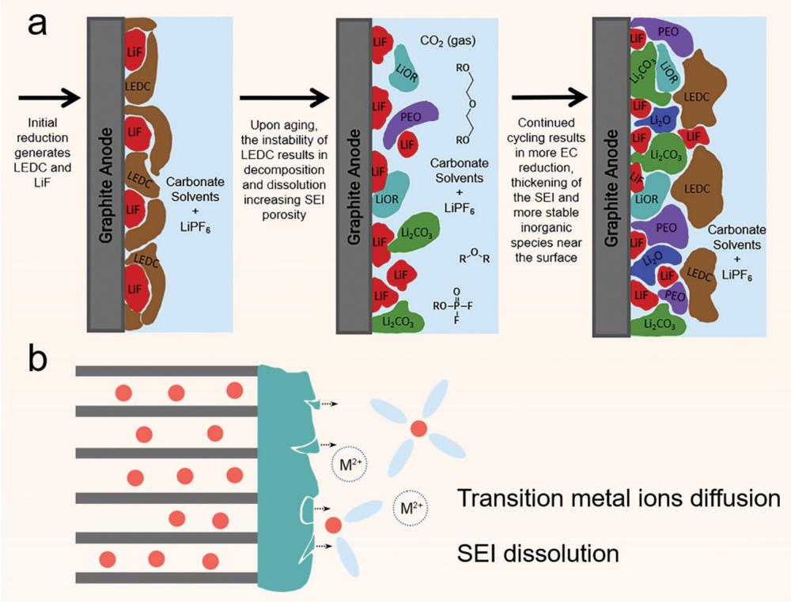  
Fig. 8 Different scenarios of SEI instability. (a) SEI thickening through aging reactions. Adapted with permission from ref. 54. Copyright 2019, Elsevier. (b) The influence of transition metal ion attack and dissolution of the SEI.

mobile electronics market still undergo Co ion dissolution. The dissolved Co ions migrate to the graphite anode and are electrochemically reduced to metal particles on the graphite surface, which could serve as catalytic sites to accelerate further decomposition of electrolytes and increase interfacial impedance. $^{138}$  The high-voltage  $\mathrm{LiNi}_{0.5}\mathrm{Mn}_{1.5}\mathrm{O}_4$  cathode also undergoes transition metal ion dissolution by releasing  $\mathrm{Ni}^{2+}$  and  $\mathrm{Mn}^{2+}$  to precipitate into the SEI in ionic state or reduced metallic state, leading to the thickening of the SEI and accelerated capacity loss. $^{73,139}$

3.1.3. Safety issues. Although LIBs are ubiquitous in present-day society, their safety issues remain an intractable challenge as numerous accidents of LIB-powered mobile phones or EVs are reported worldwide, of which the majority occurred in the course of charging. Under high charging rates, rapid  $\mathrm{Li^{+}}$  depletion at the graphite surface leads to the formation of Li dendrites, which is very similar to that of the Li metal electrode and displays the same detrimental effects.[140-142] As the Li dendrites grow, they may penetrate through the separator and cause battery short circuit, leading to thermal runaway and even cell explosion.[26,126,143] On the other hand, the reactions between plated Li and electrolyte are exothermic, which would produce excessive heat in a self-accelerating manner, as verified by the pouch cell tests under different C-rates.[144] High-rate charging also intensifies Joule heating. Therefore, the increase of the cell internal temperature could further give rise to fire or explosion even when no internal short-circuits are developed.[145,146] Furthermore, high temperatures would accelerate the malfunction of other cell components, such as thermal decomposition of the bulk electrolyte, melting of the separator and cathode oxygen release, to name a few.[57,147]

3.1.4. Other challenges. There are some other troublesome challenges with fast charging graphite anodes in addition to the ones mentioned above. The exfoliation of graphite is one of them. Graphite has a laminated structure with an interlayer spacing of  $0.335\mathrm{nm}$ ,[148] held together only by weak van der Waals forces  $(16.7\mathrm{kJ mol}^{-1})$  which is susceptible to volume expansion and exfoliation usually resulting from the co-intercalation of solvent molecules. Besides, fast intercalation of  $\mathrm{Li^{+}}$  results in a large lithium concentration gradient and inhomogeneous stress distribution among graphite particles, leading to cracks within the electrode, electrical isolation of graphite particles and even separation between the electrode and current collector. Although

the volume change of graphite during the lithium intercalation/ deintercalation process is considered to be subtle (around  $10\%$ ), the rearrangement of the graphite lattice (e.g., from AB stacking to AA stacking during lithium intercalation) could cause mechanical stress on C-C bonds and defects, which might generate cracks or related structural damage.[73] All these consequences may give rise to severe SOC inhomogeneity and further mechanical degradation of graphite electrodes.[149,150]

Another important issue during fast charging is the spatially non-uniform temperature distribution inside graphite electrodes, which can be ascribed to the high volumetric heat generation and non-uniform external cooling. High temperature accelerates chemical reactions according to the Arrhenius equation, which indicates that local hot spots promote cell aging (e.g. electrolyte decomposition and SEI growth) and in turn generate more heat to increase the temperature.[151] This electrochemical-thermal positive feedback could also result in spatial inhomogeneity of the SOC of graphite.

In order to achieve high-energy-density batteries with fast-charging capability, increasing the loading and ratio of electrochemically active graphite material and reducing the weight of the current collector are both effective. However, these strategies may raise cell resistance and reduce thermal conductivity to hinder heat extraction.[151]

# 3.2. Battery with solid electrolytes

3.2.1. Poor solid-solid contact. The poor solid-solid contact between graphite and rigid SEs induces uneven distribution of ion channels, which results in high local current density and lithium dendrite growth in working batteries, especially under fast-charging conditions which involve high  $\mathrm{Li^{+}}$  flux (Fig. 9a).152 For graphite anodes, the accumulation of plated lithium can quickly pierce the solid electrolytes along cracks and grain boundaries, resulting in short circuit of batteries. In addition, the volume change during the charging process leads to contact loss and further increases the current inhomogeneity,110 leading to endless cell polarization increase and power fade.153

3.2.2. Narrow electrochemical windows. The electrochemical window of the SEs was once believed to be wide enough to work in practical batteries. However, this belief no longer holds true due to the evolution of experimental methods and the application of density functional theory (DFT) calculation in SSLIBs (Fig. 9b).154

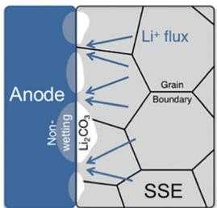  
a

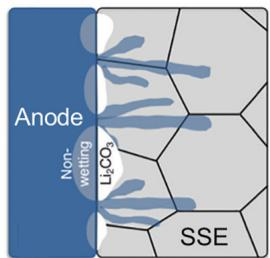  
b

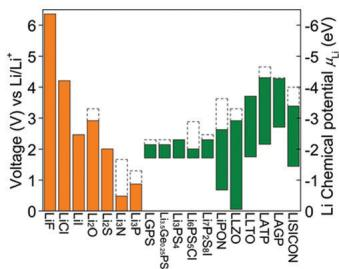  
Fig. 9 Challenges of fast-charging in solid-state LIBs. (a) Poor solid-solid contact results in high local current density and Li dendrite growth. Adapted with permission from ref. 152. Copyright 2018, American Chemical Society. (b) Electrochemical windows of typical solid-state electrolytes. Adapted with permission from ref. 155. Copyright 2015, American Chemical Society.

For example, sulfide SEs have high ionic conductivity, but most of the star electrolytes such as  $\mathrm{Li}_7\mathrm{P}_3\mathrm{S}_{11}$ ,  $\mathrm{Li}_{10}\mathrm{GeP}_2\mathrm{S}_{12}$ , and  $\mathrm{Li}_6\mathrm{PS}_5\mathrm{Cl}$  only exhibit electrochemical stability within  $1.7 - 2.1\mathrm{~V}$ . Interphases with low ionic conductivity form and gradually accumulate on the electrode surface and are detrimental to cell operation. For example, recent research suggests that the oxidation products of sulfide SEs including S and  $\mathrm{P}_2\mathrm{S}_5$  formed during the charging process contribute to high interfacial impedance, which is a main obstacle to fast-charging.

3.2.3. Thick electrolytes. Thinning the solid electrolyte is an effective way to reduce the polarization of the battery and reduce the threshold of ionic conductivity required for fast-charging. In thin-film SSLIBs, even when an electrolyte with an ionic conductivity of  $1 \times 10^{-6} \mathrm{~S~cm}^{-1}$  is used, fast-charging still can be achieved if electrolyte thickness is limited to several micrometers. At present, the thickness of solid inorganic electrolytes is difficult to be made less than  $30~\mu \mathrm{m}$  as the mechanical strength of the thin solid electrolyte significantly reduces. While thin solid polymer electrolytes of several micrometers have been reported,[151] they are more easily penetrated by lithium dendrites.

# 4. Promising strategies

From a theoretical point of view, there are essentially two ways to boost fast-charging: to enhance diffusion (including internal diffusion, which is  $\mathrm{Li^{+}}$  diffusion within graphite particles, and

external diffusion, which is  $\mathrm{Li^{+}}$  diffusion within electrodes) and to enhance interfacial reactions (including  $\mathrm{Li^{+}}$  desolvation and crossing the SEI). Therefore, in this section we list several promising strategies to improve the fast charging capability of graphite anodes based on these two principles, such as regulating the  $\mathrm{Li^{+}}$  solvation structure, introducing advanced SEI films, modifying graphite-based materials, optimizing charging protocols, and so on. Strategies to improve the fast-charging capability of SSLIBs are also discussed.

# 4.1. Regulating  $\mathrm{Li^{+}}$  solvation

Before solvated  $\mathrm{Li^{+}}$  intercalates into graphite, its solvation sheath has to be stripped off. This process is challenged by a high kinetic energy barrier of  $50 - 70\mathrm{kJ mol^{-1}}$ , impeding the fast charging of graphite anodes especially at sub-zero temperatures.[87] Consequently, reducing the kinetic energy barrier to accelerate the desolvation process at the graphite/electrolyte interface plays an important role in fast-charging. The nature of the solvation effect is the coordination between Lewis acid  $(\mathrm{Li^{+}})$  and Lewis base (organic solvents), hence the selection of solvents is a critical factor influencing the desolvation kinetics.[163] Okoshi et al. calculated the desolvation energies of  $\mathrm{Li^{+}}$ ,  $\mathrm{Na^{+}}$ , and  $\mathrm{Mg}^{2 + }$  in 27 different solvents and compared them with those of  $\mathbf{K}^+$  to obtain linear correlations (Fig. 10a).[164] These calculations reveal that the order of desolvation energies is  $\mathrm{Mg}^{2 + } > \mathrm{Li}^{+} > \mathrm{Na}^{+} > \mathrm{K}^{+}$ , following the same trend as the Lewis acidity of the cations which is a function

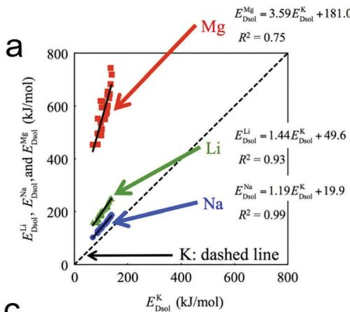  
b

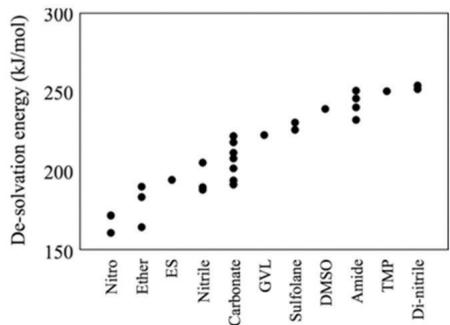

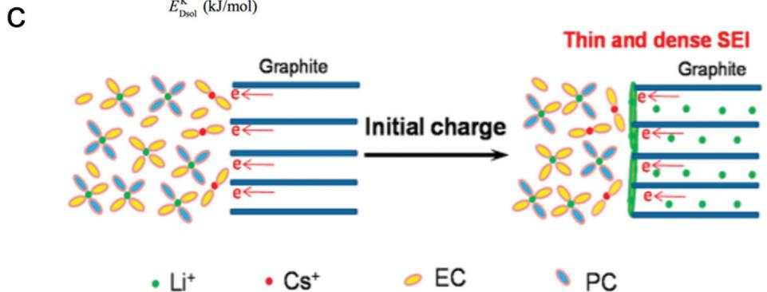  
Fig. 10 Regulating the  $\mathrm{Li^{+}}$  solvation structure. (a) Desolvation energies of Li, Na, and Mg ions compared to those of K ions. Adapted with permission from ref. 164. Copyright 2017, Electrochemical Society. (b) The dependence of desolvation energy between solvents and Li ion on solvent type. Adapted with permission from ref. 165. Copyright 2013, Electrochemical Society. (c) Schematic of adding metal cation additives to regulate the solvation structure to inhibit the co-intercalation of solvent molecules. Adapted with permission from ref. 135. Copyright 2015, American Chemical Society.

of positive charge number and ionic radius. For Li ions, a systematic trend with the principal group of solvents was obtained by the same research group, and is in the order of nitro  $<$  ether  $<$  ethylene sulfite  $<$  (mono-)nitrile  $<$  carbonate  $<$  gamma-valero lactone  $<$  sulfolane  $<$  dimethyl sulfoxide  $<$  amide  $<$  trimethyl phosphate  $<$  di-nitrile (Fig. 10b). This result provides a useful guideline for the selection of solvent with fast desolvation kinetics for fast-charging.

Besides organic solvents, the choice of lithium salts, namely anions, can also influence the intercalation kinetics. LiFSI  $\left(\mathrm{Li}\left[\mathrm{N}(\mathrm{SO}_2\mathrm{F})_2\right]\right)$  is characterized by the weak interaction between FSI anion and  $\mathrm{Li^{+}}$  cation, resulting from its smaller polarizability and electrostatic energy. $^{166,167}$  Among the various lithium salts with the concentration of  $1.0\mathrm{M}$  in EC/ethyl methyl carbonate (EMC) solution, the LiFSI-containing electrolyte displays the highest conductivity in the order of LiFSI  $>\mathrm{LiPF}_6>$  LiTFSI  $\left(\mathrm{Li}\left[\mathrm{N}(\mathrm{SO}_2\mathrm{CF}_3)_2\right]\right)>\mathrm{LiClO}_4>\mathrm{LiBF}_4$ . Because of its high ionic conductivity and lower fluorine content, the LiFSI-containing electrolyte is regarded as an alternative to the classical  $\mathrm{LiPF}_6$ -based electrolyte. Consequently, batteries with LiFSI deliver improved fast-charging performance and alleviated Li plating compared to the conventional  $\mathrm{LiPF}_6$  counterpart. $^{168}$  At the same time, blends of lithium salts may also be an alternative for improving the rate performance of graphite anodes due to their synergistic effects. $^{169,170}$  For example, adding a certain amount of LiBOB into the routine  $\mathrm{LiPF}_6$  based electrolyte is proved to deliver improved capacity retention and satisfactory power capability at  $55^{\circ}\mathrm{C}$ , due to the robust SEI derived from LiBOB. $^{170,171}$  Similarly, the addition of  $0.2\mathrm{M}$  LiFSI and  $0.2\mathrm{M}$  LiBOB in a  $1.0\mathrm{M}$ $\mathrm{LiPF}_6/$  EC/EMC electrolyte can effectively elevate the rate performance of graphite anodes while inhibiting aluminum corrosion in graphite|LiFePO $_4$  full cells, by simultaneously enhancing the ionic conductivity of the electrolyte and passivating the aluminum current collector. $^{169}$

Employing different metal cations as additives, including  $\mathrm{Mn}^{2+}$ ,  $\mathrm{Cu}^{2+}$ ,  $\mathrm{Ni}^{2+}$ ,  $\mathrm{Ag}^+$ ,  $\mathrm{Na}^+$ , etc., can also improve the electrochemical performance of graphite. $^{172}$  Most of these cation additives alter the solvation structure of  $\mathrm{Li}^+$  and consequently regulate the graphite/electrolyte interface. For instance, adding three different kinds of potassium salts into  $\mathrm{LiClO}_4/\mathrm{EC}-1,2$ -diethyl carbonate electrolyte solution reduces the initial irreversible capacity and improves the rate capability. The presence of potassium cations in the electrolyte can impair the solvation of  $\mathrm{Li}^+$  by EC molecules and mitigate electrolyte decomposition. $^{173}$  In another example, adding  $0.05\mathrm{M}$ $\mathrm{CsPF}_6$  into a  $1.0\mathrm{M}$ $\mathrm{LiPF}_6/\mathrm{EC}-$  PC-EMC electrolyte can effectively inhibit the co-intercalation of PC solvent (Fig. 10c). Theoretical calculation reveals that  $\mathrm{Cs}^+$  is preferentially solvated by EC to form  $\mathrm{Cs}^+ - (\mathrm{EC})_m$  ( $1 \leq m \leq 2$ ) solvate, which forms a stable SEI prior to the co-intercalation of PC that inhibits the exfoliation of graphite. $^{135}$  Such a small amount of  $\mathrm{CsPF}_6$  is still effective even when the content of PC exceeds  $20\%$ . $^{174}$  Similarly, Wu et al. reported that the addition of silver hexafluorophosphate in an electrolyte containing  $60\%$  PC forms a metallic interphase below  $2.15\mathrm{V}$ , and therefore it prevents PC co-intercalation and enables satisfactory reversible capacity for graphite anodes. $^{175}$

Other functional electrolyte additives are also explored to inhibit the exfoliation of graphite, which is ascribed to either the changed solvation structure or the formation of a co-intercalation-proof SEI. These additives are employed mainly to enable the use of PC-majority electrolytes, since PC exhibits exceptional low-temperature performance compared to EC. For example, ethylene sulfite (ES) as an electrolyte additive with a content of  $5\%$  allows successful cycling of the graphite anode in a PC-based electrolyte. The underlying mechanism is that  $\mathrm{Li^{+}}$  tends to be preferentially solvated by ES over PC to form  $\mathrm{Li^{+}(ES)}_y$  rather than  $\mathrm{Li^{+}(PC)}_y$ . Consequently, ES forms an effective protective SEI through electrochemical reduction at  $\sim 2\mathrm{V}$  vs.  $\mathrm{Li} / \mathrm{Li}^+$ , which is high above the potential of PC co-intercalation, guaranteeing continuous intercalation and de-intercalation of  $\mathrm{Li^{+}}$  into/from graphite.[176] Similarly, Matsuo et al. investigated a series of butyrolactone derivatives with different side chains as electrolyte additives in a PC-based electrolyte for LIBs with graphite anodes.[177] When adding  $0.3\mathrm{M}$  2-acetyloxy-4,4-dimethy-4-butanolide (AcBL1) into a  $1\mathrm{M}$ $\mathrm{LiClO}_4$ -PC electrolyte, the number of PC molecules bonded to lithium ions decreases while more lithium ions are solvated by AcBL1. As a result of the higher reduction potential of AcBL1 compared to that of PC, a protective SEI was constructed on the surface of graphite. Consequently,  $\mathrm{Li^{+}}$  intercalation/de-intercalation into/from graphite proceeds successfully by suppressing the co-intercalation of PC, leading to better cycling performance.

In recent years it was discovered that graphite electrodes exhibit surprisingly different intercalation behavior in salt-superconcentrated organic solutions (e.g., salt concentration  $>3.0\mathrm{M}$ ). For instance, organic solvents, such as PC, dimethyl carbonate (DMC), glymes, acetonitrile, tetrahydrofuran, 1,2-dimethoxyethane, and sulfolane, combined with various high concentration Li salts, such as  $\mathrm{LiPF_6}$ , LiTFSI, LiFSI, and  $\mathrm{LiClO_4}$ , can support the reversible Li intercalation into graphite in the absence of EC and exhibit extraordinary fast-charging capabilities.[165,178] These solvents with normal salt concentration (typically  $1.0\mathrm{M}$ ) are usually unable to form an effective SEI and were once ruled out when formulating electrolytes in LIBs. The successful operation of graphite anodes in SCEs seems universal to various solvents, which is possibly due to the reduced solvation number of  $\mathrm{Li^{+}}$  by solvent molecules and the preferential reduction of anions to form an SEI dominated by inorganic components (Fig. 11).[179-181] However, the underlying mechanism for the superb fast-charging performance of SCEs is unclear. One hypothesis is that SCEs possess superior bulk transport properties. For example, the superconcentrated  $4.5\mathrm{molL}^{-1}$  LiFSI/AN electrolyte shows low viscosity ( $23.8\mathrm{mPa}\mathrm{s}$ ) and high ionic conductivity ( $9.7\mathrm{mScm}^{-1}$ ), superior than the commercial EC-based electrolytes.[166] Another possibility involves the altered desolvation mechanism in SCEs. When salt concentration shifts from dilute to superconcentrated, the Li solvation structure is partially replaced by contact ion pairs (CIGs) and aggregates (AGGs) where the ion-ion interaction emerges in the solvation sheath due to the abundance of anions. Therefore, the kinetics of  $\mathrm{Li^{+}}$  desolvation in SCEs would be strongly influenced by the cleavage of ion-ion pairs, whose kinetics, to the best of our

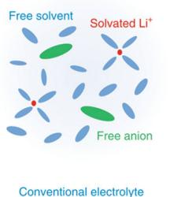  
a

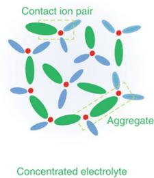

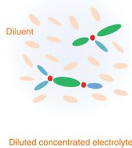

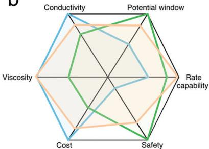  
b  
Fig. 11 Structures and properties of concentrated electrolyte systems. (a) Schematics of solution structures of the conventional electrolyte, concentrated electrolyte and diluted concentrated electrolyte. (b) Comparison of the properties and performances of the three electrolytes. (a and b) are adapted with permission from ref. 182. Copyright 2019, Nature Publisher.

knowledge, has not been well understood. The high intercalation rate in SCEs is also attributable to the unique inorganic-rich SEI and the high  $\mathrm{Li^{+}}$  interfacial concentration. To the best of our knowledge, these fields are relatively underexplored, and future efforts to reveal the interfacial kinetics of graphite in SCEs may offer new fundamental insights for achieving more demanding charging rates.

However, the high viscosity and cost of SCEs are the major concerns in the consideration of industrial applications. Diluting concentrated electrolytes by introducing an inert solvent (diluent) is a rather clever and effective solution (Fig. 11). The essence of such an approach is thinning the concentrated electrolytes with a non-coordinating, electrochemically inert diluent, which can retain the local coordination environment of the pristine concentrated electrolyte. As a result, without changing the interfacial chemistry of graphite, the apparent salt concentration and electrolyte viscosity are significantly reduced. From a practical perspective, the introduced diluent should comply with the following stringent requirements: (a) non-flammability and low volatility; (b) low cost; (c) low viscosity; (d) electrochemical inertness in the operating potential range of LIBs; (e) low coordination ability and permittivity. Watanabe's group applied hydrofluoroether (HFE), which is the most promising candidate to meet the above requirements, to dilute the LiTFSI/triglyme (G3) electrolyte and enable the reversible  $\mathrm{Li}^{+}$ intercalation/deintercalation in the graphite electrode. It was found that  $\mathrm{Li}^{+}$ is preferentially solvated by equimolar G3 and forms a  $[\mathrm{Li}(\mathrm{G3})]^{+}$ complex cation, while the HFE diluent scarcely participates in the solvation sheath due to its low permittivity and low donor ability. As the molar ratio of G3 decreased, the dissociativity of Li[TFSI] decreased and the activity of G3 in the electrolyte diminished, which could enhance the oxidative stability of the electrolyte, suppress the corrosion of the Al current collector, and ensure the desolvation of  $\mathrm{Li}^{+}$ at the interface of graphite by inhibiting co-intercalation of the  $[\mathrm{Li}(\mathrm{G3})]^{+}$ complex. In a similar example, another frequently adopted fluorinated ether bis(2,2,2-trifluoroethyl)ether (BTFE) was blended with 1,3-dioxolane (DOL) to enable remarkable cyclability of graphite anodes by forming a stable SEI. As the research on diluted concentrated electrolytes is based mostly on lithium metal anodes and relatively scarce on graphite anodes, we call for

more attention on this concept in the LIB community as it represents, for the time being, the most promising route to see the commercialization of concentrated electrolytes.

# 4.2. Building advanced SEIs

The physical properties and chemical constitution of the SEI exert significant effects on various aspects of the performance of graphite anodes, such as cycle life, power delivery, capacity retention and safety. Thus, plenty of research studies have focused on fabricating advanced SEIs on the graphite surface to enable fast-charging of graphite anodes.

Preconditioning the surface of graphite with coatings is a commonly adopted approach, which can be regarded as constructing an artificial SEI.[190] The coating materials can be categorized into inorganic compounds, polymers, or a mixture of the two. The essential functions of the introduced artificial SEI are physically separating the electrolyte and graphite to protect the electrode and providing desirable Li-ion conduction. Among all the methods, carbon coating is the most applied and effective one, which can increase the electrode conductivity (Fig. 12a), protect graphite from direct contact with the electrolyte, improve the surface chemistry of graphite, and provide fast  $\mathrm{Li^{+}}$  diffusion channels.[191,192] Chemical vapor decomposition (CVD) and thermal vapor decomposition (TVD) are widely used methods to coat graphite with a homogeneous layer of carbon and construct a core-shell structured composite. Compared to the pristine graphite, the SEI after carbon coating is more compact and thinner and results in high Coulombic efficiency.

In another contribution, a uniform amorphous silicon nanolayer on the surface of edge-site-activated graphite was prepared through nickel-catalyzed hydrogenation and CVD (Fig. 12b). Such material exhibits a superior initial Coulombic efficiency  $(93.8\%)$  and fast-charging capabilities even under industrial electrode conditions. This hybrid anode reveals more exposed edge sites for  $\mathrm{Li^{+}}$  intercalation and improves mass transfer kinetics. The remaining Ni nanoparticles on the surface of graphite can act as a conductor to improve the electric conductivity of the hybrid anode. Moreover, the coated amorphous silicon nanolayer could shorten the  $\mathrm{Li^{+}}$  diffusion length, allow fast  $\mathrm{Li^{+}}$  diffusion and increase the energy density of the anode due to its high specific capacity.[128] Analogously, amorphous

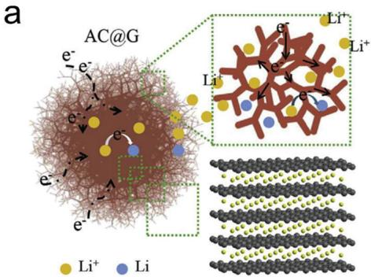  
C

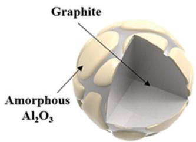  
d

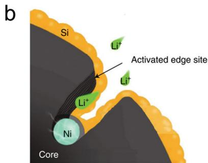  
Fig. 12 Precoating advanced SEIs on graphite. (a) Carbon coated graphite with improved electron and ion conduction. Adapted with permission from ref. 191. Copyright 2018, Elsevier. (b) Schematic of the amorphous silicon nanolayer coating on graphite with activated edge sites. Adapted with permission from ref. 128. Copyright 2017, Nature Publisher. (c) Surface modification of graphite by amorphous  $\mathrm{Al_2O_3}$ . Adapted with permission from ref. 193. Copyright 2019, Elsevier. (d) A polymeric SEI facilitating Li ion transport between the electrolyte and the graphite anode. Adapted with permission from ref. 194. Copyright 2017, Wiley-VCH.

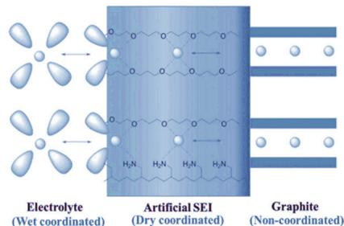

$\mathrm{Al}_{2}\mathrm{O}_{3}$  coating on graphite also improves the fast-charging performance of graphite, exhibiting a capacity retention of  $97.2\%$  even at a high rate of  $4\mathrm{A g}^{-1}$  compared to that of  $0.1\mathrm{A g}^{-1}$ . The improvement is attributed to the increased electrolyte wettability on the graphite surface confirmed by wettability tests and electrochemical impedance spectroscopy analysis (Fig. 12c).[193]

A multifunctional polyether, such as polyethylene glycol tert-octyl-phenyl ether (PEGPE;  $\mathrm{C_{14}H_{22}O(C_2H_4O)_n}$ ,  $n = 9 - 10$ ), can also be used as an artificial SEI. The polyether layer could coordinate with  $\mathrm{Li^{+}}$  ions by the lone-pair electrons of oxygen atoms from the ether groups in the polymer chains (Fig. 12d).[194] The aromatic ring of the polymer establishes a firm contact with the graphite surface by  $\pi - \pi$  interactions. Therefore, this artificial SEI can provide  $\mathrm{Li^{+}}$  with stepwise moderate transition from a "wet" coordinated state to a "dry" coordinated state and finally to a non-coordinated state, achieving fast  $\mathrm{Li^{+}}$  transport across the electrolyte/graphite interface. As a result, the introduced polymer artificial SEI considerably improves the cycling stability and rate performance.

Electrolyte additives have been extensively investigated for their ability to form in situ advanced SEIs. A desirable SEI for fast-charging should be thin, compact, with high ionic conductivity and chemically stable. Most of the film-forming additives in electrolytes are organic molecules. $^{195}$  For example, fluorosulfonyl isocyanate (FI) with low LUMO (lowest unoccupied molecular orbital) could be reduced at  $2.8\mathrm{V}$  vs.  $\mathrm{Li} / \mathrm{Li}^{+}$  prior to the conventional carbonate based electrolytes, yielding a conductive SEI consisting of a thick highly conducting inorganic inner layer that inhibits the

growth of the outer organic layer. Consequently, the interfacial resistance of the graphite electrode is remarkably decreased and exceptional rate performance is obtained at both room temperature  $(20^{\circ}\mathrm{C})$  and lower temperature  $(0^{\circ}\mathrm{C}$  and  $-20^{\circ}\mathrm{C})$ .196

A closer inspection of the molecular structures of the additives reported reveals that those with a vinylene group exhibit better film-forming capability than those without. According to this "vinylene group" effect, effective electrolyte additives such as prop-1-ene-1,3-sultone (PES), vinylene carbonate (VC), vinyl ethylene carbonate (VEC), 3-sulfolene (3SF), etc., are all highly reductive and able to generate a uniform and thin SEI on the graphite surface (Fig. 13b).197

Apart from organic compounds, inorganic salts can also serve as film-forming additives. Compared to the SEI resulting from the decomposition of organic molecules, an inorganic-salt-derived SEI has higher  $\mathrm{Li^{+}}$  conductivity due to the ionic nature of the SEI. For example, additives such as lithium difluorobis(oxalato) phosphate can build interface films simultaneously on the graphite anode and NCM523 cathode surface due to the preferential reduction or oxidation of the salt anion over bulk electrolyte components (Fig. 13c). The resulting interface films can suppress the decomposition of the electrolyte and effectively bring down interface impedance on both electrodes especially on the graphite anode, which benefits the rate performance.[195] Cations in inorganic salts, on the other hand, can also benefit a better SEI. For example, the addition of sodium ions in electrolytes can increase the capacity of the graphite anode. Ex situ XRD and EIS measurements indicate

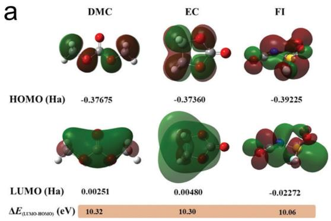

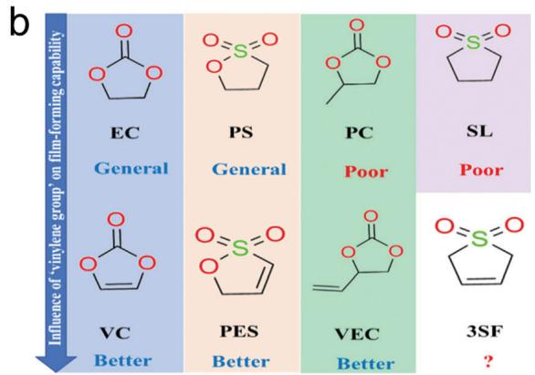

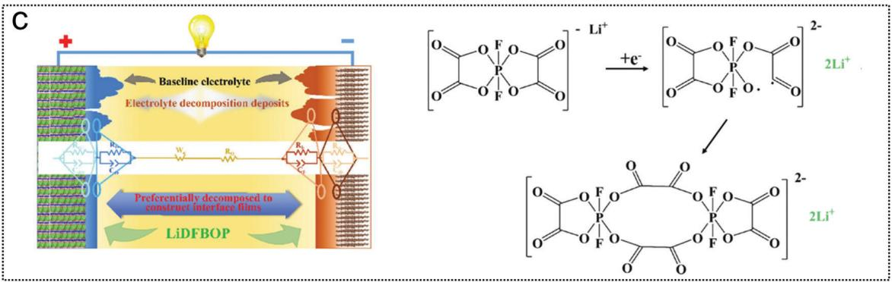  
Fig. 13 In situ SEI formation by electrolyte additives. (a) HOMO and LUMO orbitals of DMC, EC and FI molecules. Adapted with permission from ref. 196. Copyright 2019, Elsevier. (b) Influence of 'vinylene group' on the film-forming capability of the reported additives. Adapted with permission from ref. 197. Copyright 2018, Elsevier. (c) SEI formation by the LiDFBOP additive. Adapted with permission from ref. 195. Copyright 2018, Wiley-VCH.

that the additional sodium does not change the electrolyte or electrode bulk properties, but rather significantly reduce interfacial resistance by enhancing the kinetics rate of the SEI, though the underlying mechanism is unclear.[172]

Similar to electrolyte additives, incorporating additives in the preparation process of the graphite electrode is also an effective method for the in situ deposition of the SEI. Such electrode additives are mainly inorganic compounds.  $\mathrm{LiNO_3}$  has long been the 'star additive' in the field of Li-S batteries for its ability to form a highly conductive passivation layer on the Li metal anode while inhibiting the shuttle effect of polysulfides. However,  $\mathrm{LiNO_3}$  is rarely utilized in LIBs due to its poor solubility in carbonate-based electrolytes.[198] To this end, Qi et al. innovatively put forward that adding a small amount of  $\mathrm{LiNO_3}$  into the graphite slurry enables its slow release during cycling.  $\mathrm{LiNO_3}$  is electrochemically reduced during the first cycle, forming a protective film containing  $\mathrm{Li}_3\mathrm{N}$  and  $\mathrm{LiN_xO_y}$  on the surface of graphite to promote fast  $\mathrm{Li^{+}}$  diffusion and limit the further decomposition of the electrolyte (Fig. 14a).[199] The  $\mathrm{LiNO_3}$  additive results in an extraordinary capacity retention of  $82.4\%$  at  $680~\mathrm{mA~g^{-1}}$  for graphite electrodes, compared with that of  $22.4\%$  for electrodes without the additive, which provides a low-cost, highly applicable method for practical high-rate LIBs. In another work, elemental sulfur was added into the graphite electrode and electrochemically reduced to lithium polysulfides in the first lithiation process. The as-formed Li polysulfides are soluble and capable of reacting

with carbonate-based electrolytes to generate organic thiocarbonates. The organic thiocarbonates are then electrochemically converted to a sulfur-enriched SEI, which accelerates the charge transfer process at low temperature. Therefore, the low-temperature performance of the graphite electrode is improved.[200] For the final example, electrode additives are introduced by pre-treating the graphite anode in aqueous solution containing  $\mathrm{Li}_2\mathrm{CO}_3$  particles. The pre-deposited  $\mathrm{Li}_2\mathrm{CO}_3$  particles can act as heterogeneous nucleation sites to generate a  $\mathrm{Li}_2\mathrm{CO}_3$ -dominated SEI film, which serves to reduce the decomposition of the electrolyte and decrease electrode degradation caused by the fracture and removal of graphite particles. In addition, certain crystallographic planes of  $\mathrm{Li}_2\mathrm{CO}_3$  may provide favorable pathways for rapid  $\mathrm{Li}^+$  diffusion, enabling fast-charging and long-term cycling (Fig. 14b).[201]

# 4.3. Modification of graphite

While regulating  $\mathrm{Li^{+}}$  solvation and constructing advanced SEIs aim at accelerating the interfacial reaction, modifying graphite materials is an effective way to increase the intrinsic fast-charging capability of graphite anodes by enhancing ion diffusion. The diffusion coefficient of  $\mathrm{Li^{+}}$  in the through-plane direction of graphite sheets is much lower than that in the edge-plane direction, leading to the preferential  $\mathrm{Li^{+}}$  intercalation from the edges of graphite layers.[202] Such high anisotropy of graphite indicates that the legitimate sites for ion and electron transfer are limited and sometimes  $\mathrm{Li^{+}}$  has to diffuse through a lengthy path to reach the edge of graphite. Therefore, decreasing the

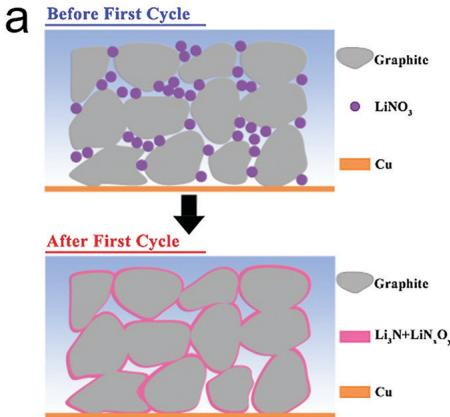  
Fig. 14 SEI formation by implanting electrode additives as chemical sources. (a) A thin, in situ solid electrolyte layer with high  $\mathrm{Li^{+}}$  conductivity constructed via introducing the  $\mathrm{LiNO_3}$  additive. Adapted with permission from ref. 199. Copyright 2019, Elsevier. (b)  $\mathrm{Li_2CO_3}$  pre-treated graphite surface assists in  $\mathrm{Li^{+}}$  diffusion and improves capacity retention. Adapted with permission from ref. 201. Copyright 2014, Elsevier.

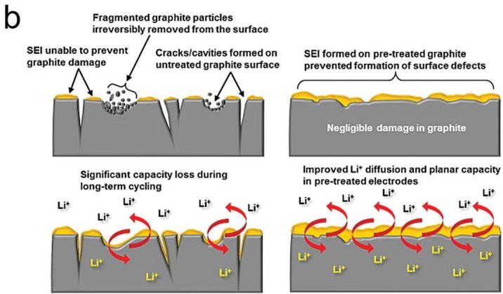

length of the diffusion paths and improving the diffusion coefficient are both beneficial for accelerating ion transfer and increasing charge/discharge rate capability.

One facile way for shortening the lithium diffusion path is to create pores in graphite materials. Etching graphite by using KOH at  $800^{\circ}\mathrm{C}$  produces abundant nanosized pores to construct a multi-channel structure, which can not only greatly improve the number of entrances for  $\mathrm{Li^{+}}$  intercalation but also reduce the ion diffusion distance within the interior of graphite during charging (Fig. 15a). As a result, excellent fast-charging performance was achieved with a capacity retention of  $74\%$  even at a high rate of 6C, which is much higher than that of pristine graphite.[203] Different from etching by high-temperature annealing, Shim et al. prepared etched graphite by using KOH under mild conditions  $(80^{\circ}\mathrm{C})$

without annealing, making it suitable for an industrial process. This etched graphite shows nano-sized pores penetrating to a depth of about  $40~\mathrm{nm}$  from the surface, providing more entrances for fast transportation of lithium ions. By etching under mild conditions, the size of the created pores can be limited to the nanometer scale, which is important for fast-charging batteries without significantly increasing the irreversible capacity.[204] In another example, a multichannel structured graphite anode was fabricated by a simple air oxidation method, which increases the number of lithium intercalation sites and the accessibility to the interior of graphite. This strategy affords an outstanding electrochemical performance with  $85\%$  capacity retention after 3000 cycles at 6C rate, which is much better than that of pristine graphite material. This multi-channel graphite material with extraordinary electrochemical performance is

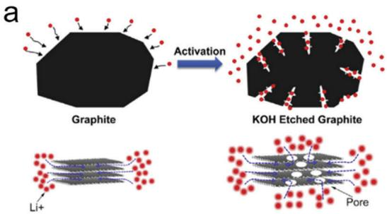

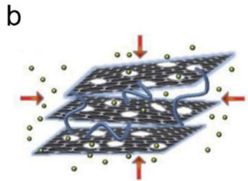

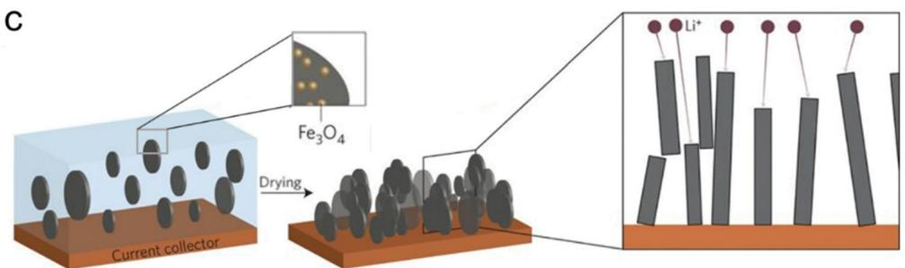  
Fig. 15 Modification of graphite material to boost fast-charging performance. (a) KOH etched graphite creates extra pores for fast  $\mathrm{Li^{+}}$  diffusion. Adapted with permission from ref. 203. Copyright 2016, Elsevier. (b) Schematic illustration of  $\mathrm{Li^{+}}$  insertion in CNT separated porous graphite nanosheets. Adapted with permission from ref. 206. Copyright 2019, Elsevier. (c) Schematic showing magnetically aligned graphite particles to shorten the  $\mathrm{Li^{+}}$  diffusion path. Adapted with permission from ref. 208. Copyright 2016, Nature Publisher.

suitable for application in fast-charging batteries in electric vehicles and plug-in hybrid vehicles.[205]

Enlarging the interlayer spacing of graphite to improve the  $\mathrm{Li^{+}}$  diffusion coefficient is another effective way to improve the rate capability. Xu et al. reported the fabrication of graphite electrodes consisting of thin graphite sheets with through-holes and carbon nanotubes (CNTs). By introducing CNTs, the holey graphite nanosheets are physically separated and restrained from restacking, which is favorable for in-plane  $\mathrm{Li^{+}}$  transport and high-rate cycling of graphite anodes (Fig. 15b). Combined with a low desolvation energy electrolyte that accelerates interfacial charge transfer, the assembled battery exhibits not only superior rate performance up to 8C at room temperature but also improved low-temperature performance.[206] Without using CNTs as building blocks, expanding the  $d$ -spacing of graphite from  $0.3359\mathrm{nm}$  to  $0.3390\mathrm{nm}$  was achieved by oxidizing pristine graphite in a mild condition, and this expanded graphite is abundant with functional groups in the basal plane or at the edges of graphite. The enlargement of  $d$ -spacing can improve the kinetic diffusion of  $\mathrm{Li^{+}}$  within the expanded graphite by providing more ion transport space. Furthermore, because the increased functional groups at the surface of expanded graphite form hydrogen bonds with solvent molecules, the activation energy of  $\mathrm{Li^{+}}$  intercalation is reduced. As a result, excellent rate performances of LIBs are obtained.[207]

While regulating the graphite material structure improves internal ion diffusion, electrode architecture engineering is aimed at enhancing external ion diffusion. Typically, the orientation of graphite particles has an appreciable impact on ion diffusion. Billaud et al. developed an imaginative method to reduce the tortuosity of graphite electrodes, where magnetically aligned graphite particles with basal planes perpendicular to the current collector were prepared by applying a low external magnetic field during fabrication (Fig. 15c). Owing to the shortened diffusion paths and more exposed  $\mathrm{Li^{+}}$  insertion/ extraction sites, a remarkable rate performance was obtained for highly loaded  $(10\mathrm{mgcm}^{-2})$  graphite electrodes, and this strategy can easily be extended to other types of anode and cathode materials.[208] It is well known that natural graphite is highly anisotropic with wider dimensions in the basal-plane direction but thinner dimensions in the edge-plane direction, which is unfavorable for fast-charging since  $\mathrm{Li^{+}}$  only intercalates via edge-plane surfaces. To tackle this issue, Yoshio et al. first rolled the raw graphite flakes into spheres by impact milling and then coated them with carbon by TVD. These treatments improve the electrochemical performance in terms of high Coulombic efficiency, low irreversible capacity, and high rate capacity.[209]

Apart from the above-mentioned physical treatments, chemical modification is also a useful strategy. For instance, certain functional groups generated on the surface of graphite through oxidation, such as  $-\mathrm{OH}$ ,  $-\mathrm{COOH}$ , etc., are beneficial for stable SEI formation and may account for the excellent fast-charging capability and capacity retention of graphite as reported by Cheng and Zhang.[205] Besides, doped graphite also shows improved rate capability. By simply ball milling graphite with

boric acid followed by heat treatment at  $1000^{\circ}\mathrm{C}$ , Yeo et al. introduced B-O functional groups at the surface of graphite, which was found to reduce the resistance and capacitance of the SEI to promote  $\mathrm{Li^{+}}$  migration and charge transfer. This enables a remarkable rate capability even at 5C rate.[210] Similarly, treating graphite with ammonium hexafluorophosphate  $(\mathrm{NH}_4\mathrm{PF}_6)$  successfully introduces phosphorus on the surface of natural graphite, which stabilizes the SEI and leads to improved electrochemical properties of graphite.[211] Composite anodes prepared by mixing graphite with other anode materials, such as Ni/NiO and  $\mathrm{Li_4Ti_5O_{12}}$ , can also ameliorate the fast charging ability of graphite by decreasing charge transfer resistance.[212,213]

# 4.4. Optimizing charging protocols

Apart from modifying the electrode active material and electrolyte, extensive efforts have been devoted to optimizing the charging protocols, including multistage constant current charging, boost charging, dynamic pulse charging, and decay charging.[214-216] Such strategies afford an effective, cost-efficient way to minimize the charging time for a given battery system. However, the pursuit of fast-charging is premised on the sacrifice of battery cycle life.[217] Therefore, novel charging protocols should strike a balance between charging time and battery lifespan.

The most applied charging method to alleviate unwanted lithium plating is constant current-constant voltage (CC-CV) charging (Fig. 16a). Specifically, the battery is firstly charged until its voltage reaches the upper cut-off (typically  $4.2\mathrm{~V}$  for LIBs) at a constant current, followed by a constant voltage charging till the current decreases to a given value.[218,219] However, with the increase of charging current during the CC-CV protocol, Zhang found that lithium plating still occurs near the end of the CC charging step, accompanied by the loss of finite  $\mathrm{Li^{+}}$  ions, SEI growth, and the increase of interface polarization which can all impair the cycling stability.[214] Furthermore, the CC-CV protocol with higher CC charging rates can greatly prolong the time of CV charging, hence the total charging time cannot be shortened significantly. To conclude, the CC-CV charging method can work only at mild charging rates with the compromise of cycle life, which is not practical enough to support the more demanding charging conditions.

The slow lithium ion diffusion, especially with high active material loading, is one of the RDSs for fast-charging, which brings the battery voltage quickly to the pre-set upper voltage limit or drops the current during CC charging rapidly to the lower current limit. Hence, the active electrode material is not fully utilized. In order to solve this problem, pulse charging is proposed based on successive changes in the current rate by introducing a shorter rest period which may increase the speed of relaxation (Fig. 16a).218 Application of such pulse charging could bring various effects. Pulsing the potential of the electrode could decrease the concentration polarization to achieve higher utilization of active material in a shorter charging time and increase cell lifetime according to Li et al. However, some others argue that pulses can only affect the superficial regions of graphite, but there is no potential benefit for the inherent ion transportation, which is the true limit of fast-charging.220

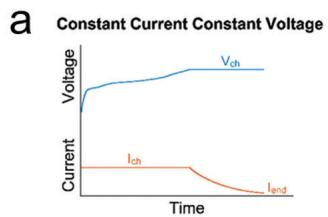

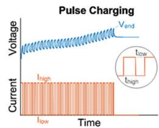

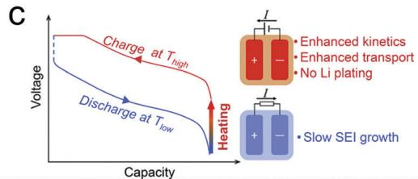

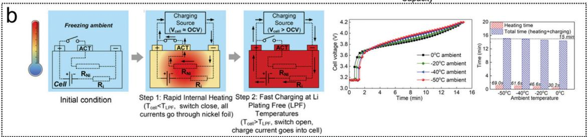  
Fig. 16 Optimization of fast-charging protocols. (a) Voltage and current profiles of CC-CV and pulse charging. Adapted with permission from ref. 218. Copyright 2016, Elsevier. (b) A controllable cell structure for lithium-plating-free fast-charging, corresponding voltage curves at different ambient temperatures and a summary of heating time and total time. Adapted with permission from ref. 222. Copyright 2018, National Academy of Sciences. (c) A LIB cell under an asymmetric temperature modulation method is rapidly pre-heated to and charged at  $60^{\circ}\mathrm{C}$ . Adapted with permission from ref. 223. Copyright 2019, Elsevier.

It is widely acknowledged that temperature determines the intrinsic kinetics of electrochemical reactions, and therefore it strongly influences the maximum possible rate of charging.[221] Yang et al. reported that the maximum charging rate without lithium plating for a  $9.5\mathrm{Ah}$  graphite|NMC622 pouch cell drops from 4C at  $25^{\circ}\mathrm{C}$  to  $1.5\mathrm{C}$  at  $10^{\circ}\mathrm{C}$  and  $\mathrm{C} / 1.5$  at  $0^{\circ}\mathrm{C}$ .[222] Based on this finding, they innovatively present a controllable cell structure to enable lithium-plating-free fast-charging by inserting thin nickel foils inside a cell which can create immense and uniform heating (Fig. 16b). If the cell temperature ( $T_{\mathrm{cell}}$ ) is lower than the temperature which can inhibit lithium plating ( $T_{\mathrm{LPF}}$ ), the switch is closed to guide all current to Ni foils, which generates immense internal heating so as to raise the cell temperature. Once  $T_{\mathrm{cell}}$  exceeds  $T_{\mathrm{LPF}}$ , the switch is turned on to transit all current into the graphite electrode for fast-charging without Li plating. As a result, they demonstrate that a  $9.5\mathrm{Ah}170\mathrm{Whkg}^{-1}$  pouch cell can be charged to  $80\%$  SOC within 15 minutes even in  $-50^{\circ}\mathrm{C}$  (Fig. 8b) surroundings and also sustains 4500 cycles of  $3.5\mathrm{C}$  charging at  $0^{\circ}\mathrm{C}$  with  $<20\%$  capacity loss, which is equivalent to  $>12$  years and  $>280000$  miles of EV lifetime. Based on a similar cell structure, they further presented an asymmetric temperature modulation method by charging a LIB at  $60^{\circ}\mathrm{C}$  to clear off lithium plating. By limiting the exposure time at this elevated temperature to only  $\sim10$  minutes per cycle to prevent SEI growth, cells are able to achieve enhanced kinetics and a long lifespan during extreme fast-charging (Fig. 16c).[223] For example, the  $9.5\mathrm{Ah}$  pouch cell under 6C charge to  $80\%$  SOC can sustain 1700 cycles with only  $20\%$  capacity loss, and a BEV cell with  $209\mathrm{Whkg}^{-1}$  retained  $91.7\%$  even after 2500 cycles. Therefore, an appropriate charging protocol is vital for LIBs to achieve fast-charging with a long cycle life.

# 4.5. Other strategies in liquid electrolyte systems

In addition to the above-mentioned strategies, some other unclassified strategies also show great potential for fast-charging graphite

materials. Enhancing the transport ability of  $\mathrm{Li^{+}}$  in electrolytes is one of them. For example, introducing an organic ester (methyl formate) as a co-solvent into conventional carbonate-based electrolytes (1.2 M  $\mathrm{LiPF_6}$  EC/EMC/DMC) could increase the ionic conductivity and cell lifetime.[224] The  $\mathrm{Li^{+}}$  transference number also plays an important part. According to the classical Newman model, electrolytes with modestly higher  $\mathrm{Li^{+}}$  transference numbers (e.g.,  $\sim 0.7$ ) compared with that of conventional carbonate based electrolytes (typically 0.3-0.4) would enable fast charging (e.g.,  $>2\mathrm{C}$ ), even though their conductivity is substantially lower.[225,226] Employing Li salts with bulky anions is an effective way to achieve high  $\mathrm{Li^{+}}$  transference numbers.[227] Introducing anion-receptors to selectively coordinate with the anion of lithium salt can also increase the transference number of  $\mathrm{Li^{+}}$ . The anion-receptors are mostly abundant with electron-deficient functional groups, which mainly include boranes, borates, etc. Among these compounds, tris(pentafluorophenyl)borane (TPFPB) has been most extensively studied, which is capable of improving the dissolving capacity of even LiF. Consequently, the  $\mathrm{Li^{+}}$  transference number in LiF-based electrolytes achieves 0.7 and the room-temperature conductivity reaches  $2\times 10^{-3}\mathrm{Scm}^{-1}$ .[228]

Optimizing the cell configuration can also enhance the charging performance. The geometric structure of the cell separator, for instance, may impede  $\mathrm{Li^{+}}$  transport and reduce the effective  $\mathrm{Li^{+}}$  diffusion coefficient in the separator pores to  $16\%$  compared to that in the bulk electrolyte. Therefore, engineering separators may also be important to enhance fast-charging.[229,230] For example, coating PVDF on a PE separator  $(1.1\times 10^{-3}\mathrm{Scm}^{-1})$  contributes to a higher ionic conductivity than that of the bare PE membrane  $(8.9\times 10^{-4}\mathrm{Scm}^{-1})$ , which is ascribed to the higher liquid electrolyte uptake.[231] The effect of an anode binder is also nonnegligible, in which certain functional groups such as -COOH and -OH in PVA, PMA, PAA, etc., can react with the solvated  $\mathrm{Li^{+}}$  to form stable SEI films for reversible lithium intercalation.[232] Besides, optimization of cell design parameters

can also improve anode charging performance. For example, the location and number of positive and negative tabs were found to influence the current distribution of large-format lithium-ion cells.[233,234] Future efforts on diagnosing and improving uniform current distribution would enable uniform utilization of active materials, increase cell energy density and restrain cell degradation.

# 4.6. Strategies for SSLIBs

4.6.1. Improving the solid-solid contact. The poor solid-solid contact is a major contributor to the interfacial resistance in SSLIBs. The main strategies to optimize the solid-solid contact includes designing an intimate solid-solid structure and filling the voids with ionic conductive materials. Drop-casting and coating $^{235-237}$  are both operable methods to increase the solid-solid contact. Infiltrating the liquefied  $\mathrm{Li}_6\mathrm{PS}_5\mathrm{Cl}$  into the porous graphite electrode and solidifying could realize a high reversible capacity of  $364\mathrm{mA}\mathrm{h}\mathrm{g}^{-1}$  at  $0.14\mathrm{mA}\mathrm{cm}^{-2}$  (0.1C) at  $30^{\circ}\mathrm{C}$  (Fig. 17a). $^{235}$  In situ coating  $\mathrm{Li}_3\mathrm{PS}_4$  on the electrode surface achieves 1C charging in SSLIBs. $^{236}$  Filling the pores with soft materials such as ceramics-in-polymer and polymer-in-ceramics composite electrolytes also delivers excellent fast-charging performance. $^{238,239}$  In addition, constructing a 3D mixed electron-ion conducting framework host opens up a new way for fast charging. $^{240}$  However, it still remains a challenge to construct a conformal intimate solid-solid interface.

4.6.2. Increasing the electrochemical stability of SEs. Widening the electrochemical stability window of highly conductive solid electrolytes, such as sulfide SEs, is the key to enable fast-charging SSLIBs since the formation of an extra interphase may increase  $\mathrm{Li^{+}}$  transport resistance. For example, a core-shell structure was designed to widen the stability window of the sulfide solid electrolyte to  $0.7 - 3.1\mathrm{V}$ . In addition, reducing the proportion of the conductive agent in composite electrodes can also reduce the unwanted redox behavior of solid electrolytes. Janek and co-workers suggest a significant interfacial resistance increase upon the incorporation of carbon in the composite electrode. Subsequent X-ray photoelectron spectroscopy shows that carbon expedites electrochemical decomposition of the solid electrolyte at the electrode/solid electrolyte interface. However, the electronic transport ability of composite electrodes also decreases with the reduction of carbon content, and therefore an effective

strategy to further increase the electrochemical window of solid electrolytes needs to be developed. For example, building artificial SEIs could be a novel way to tame the interface instability.

4.6.3. Reducing the thickness of SEs. The key to fabricate thin SEs is the balance of mechanical strength and ionic conductivity. In order to reduce the thickness of the electrolyte and maintain good mechanical strength, a binder or skeleton is often introduced. Nam et al. reported a bendable and thin sulfide solid electrolyte film with a thickness of  $70~\mu \mathrm{m}$ ,[242] which is reinforced with a nonwoven poly(paraphenyleneterephthalamide) scaffold. The thickness of the electrolyte can reach  $25~\mu \mathrm{m}$  by slurry casting. Cui and co-workers reported a nanoporous polyimide-polyethylene oxide/lithium bis(trifluoromethanesulfonyl)imide polymer-polymer solid-state electrolyte membrane with a thickness of merely  $8.6~{\mu\mathrm{m}}$  (Fig. 17b).[151] This thin composite electrolyte not only shows satisfactory ionic conductivity  $(2.3\times 10^{-4}\mathrm{Scm}^{-1}$  at  $30^{\circ}\mathrm{C})$  but also withstand abuse tests such as bending, cutting and nail penetration. In addition, an evaporation-induced self-assembly (EISA) technique was reported to realize ultrathin membranes of lithium thiophosphate solid electrolytes with controllable thickness from 8 to  $50~{\mu\mathrm{m}}$ .[243] Although solid-state electrolyte membranes of several micrometers have been prepared, higher requirements have been put forward regarding their mechanical strength to suppress lithium dendrite growth and achieve safe fast-charging.

# 5. Conclusion and perspective

Fast-charging is a key enabler of the mass adoption of EVs and PHEVs, with the goal to provide a similar charging time compared to refueling traditional ICE cars. The fundamental principles to realize fast-charging of graphite anodes are achieving fast charge transport in bulk phases and across interfaces, and inhibited parasitic reactions in the entire cell to slow down cell aging. To this end, much improvements have been achieved (Table 1) by optimizing electrolyte formulation, introducing advanced SEIs, modifying the structure of graphite, and optimizing charging protocols based on a deep understanding of the fundamentals. In addition, with the development of solid electrolytes, graphite-based SSLIBs show great promise for future fast-charging technologies with intrinsic safety. Although there is still a long way to

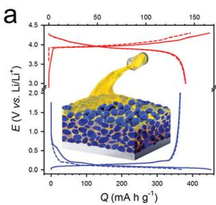  
Fig. 17 Key strategies to enable fast-charging in solid-state LIBs. (a) Infiltrating solution-processable solid electrolytes to improve the solid-solid contact for LIB electrodes. Adapted with permission from ref. 235. Copyright 2017, American Chemical Society. (b) An ultrathin, robust solid polymer electrolyte layer with aligned nanopores enables fast  $\mathsf{Li}^{+}$  transport and withstands various abuse tests. Adapted with permission from ref. 151. Copyright 2018, Nature Publisher.

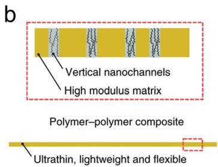

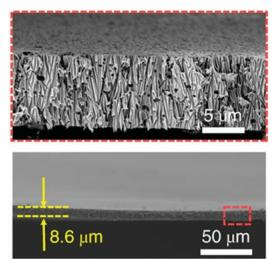

Table 1 Comparison of the reported fast-charging battery based on the graphite anode  

<table><tr><td>Electrode mass loading</td><td>Modification</td><td>Performance (lithiation of graphite)</td><td>Ref.</td></tr><tr><td rowspan="2">10.5 mg cm-2(3.5 mA h cm-2)≈5 mg cm-2</td><td>Edge-plane activated graphite coated by an amorphous Si nanolayer</td><td>100 mA h g-1at 1 A g-1;~200 mA h g-1at 0.67 A g-1</td><td>128</td></tr><tr><td>The electrolyte consists of 1.0 M lithium trifluoromethanesulfonate (LiTF) in DEGDME</td><td>~100 mA h g-1at 1 A g-1</td><td>95</td></tr><tr><td>0.60-0.70 mg cm-2</td><td>The electrolyte consists of a superconcentrated 4.5 M LiFSA/AN solution</td><td>~278 mA h g-1at 1.86 A g-1</td><td>166</td></tr><tr><td>2.88 mg cm-2</td><td>LTO coated graphite</td><td>~143 mA h g-1at 2.14 A g-1</td><td>213</td></tr><tr><td>4.0 mg cm-2</td><td>PEGPE coated natural graphite</td><td>298 mA h g-1at 0.186 A g-1</td><td>194</td></tr><tr><td>5 mg cm-2</td><td>Graphite particles oriented perpendicularly to the current collector</td><td>83 mA h g-1at 0.74 A g-1</td><td>208</td></tr><tr><td>~9.5 mg cm-2</td><td>Silicon-nanolayer-embedded graphite/carbon composite</td><td>~260 mA h g-1at 1.86 A g-1</td><td>244</td></tr><tr><td>1.0 mg cm-2</td><td>Zirconia film coated graphite</td><td>~370 mA h g-1at 1.12 A g-1</td><td>245</td></tr><tr><td>0.7-2 mg cm-2</td><td>Superconcentrated (1:1.1) LiFSA/DMC electrolytes</td><td>~243 mA h g-1at 1.86 A g-1</td><td>246</td></tr><tr><td>0.7-1.0 mg cm-2</td><td>The electrolyte consists of 3.6 M LiFSA in DME</td><td>~108 mA h g-1at 1.86 A g-1;~250 mA h g-1at 0.74 A g-1</td><td>165</td></tr><tr><td>8.1 mg cm-2</td><td>Using a combination of lithium difluorophosphate (LiDFP) and vinylene carbonate (VC) as electrolyte additives</td><td>250 mA h g-1at 1.8 A g-1</td><td>247</td></tr><tr><td>6.78 mg cm-2</td><td>Amorphous carbon coating on the graphite surface</td><td>263 mA h g-1at 1.86 A g-1</td><td>248</td></tr><tr><td>7.5 mg cm-2</td><td>Adding LiNO3into the graphite electrode</td><td>291.7 mA h g-1at 0.68 A g-1</td><td>199</td></tr><tr><td>1.85 mA h cm-2</td><td>A rapid cell internal heating step</td><td>80% SOC acquired in 15 min even at -50 °C</td><td>222</td></tr><tr><td>1.85 mA h cm-2</td><td>An asymmetric temperature modulation method</td><td>6C charge to 80% SOC</td><td>162</td></tr></table>

go for the commercialization of next-generation fast-charging technologies, current investigations have set several important guidelines to improve the fast-charging of graphite anodes, which include but are not limited to the following aspects (Fig. 18):

(1) Advanced characterization should be applied to deepen the understanding of interfacial behaviors of graphite anodes. Firstly, in routine two-electrode battery set-ups, precisely analysing the electrochemical behaviors of the graphite electrode without the complication of the counter electrode is still a universal challenge. Such a set-up may result in the misinterpretation of electrochemical signals. Therefore, three-electrode set-ups should be more widely exploited to obtain accurate interfacial information, such as separating various polarizations and determine the activation energy for crossing the SEI. Secondly, the SEI has been poorly understood in the last 40 years due to its elusive manner of formation and extremely sensitive chemical nature. Developing advanced characterization techniques, such as Cyro-EM, neutron diffraction, and synchrotron X-ray analytical techniques, may shed fresh light on the SEI and other interfacial issues of graphite anodes. In all, deepening the understanding of electrochemical behaviors and interfacial chemistry of graphite electrodes is vital to guide the materials design for fast-charging, in which precise characterization constitutes the foundation.

(2) It is essential to gain more fundamental insights into the interfacial processes during fast-charging, including  $\mathrm{Li^{+}}$  desolvation,  $\mathrm{Li^{+}}$  diffusion through the SEI and  $\mathrm{Li^{+}}$  migration in the graphite bulk. Solvation/desolvation of  $\mathrm{Li^{+}}$  ions is considered to be important to the interfacial chemistry of graphite electrodes, because it influences the properties of the SEI and thus the lifespan of the battery. More in situ techniques, including in situ Raman spectroscopy, in situ nuclear magnetic resonance (NMR) spectroscopy, in situ X-ray photoelectron spectroscopy (XPS), and in situ secondary ion mass spectroscopy (SIMS), can be employed to study the solvation sheath and desolvation process in different electrolyte systems, as well

as the formation and chemical nature of the SEI. Moreover, theoretical calculations will likely serve to reveal the mechanism of  $\mathrm{Li^{+}}$  transport through the SEI. Although there is no general conclusion on which step constitutes the RDS when charging practical graphite electrodes, we believe that the combination of more elaborately designed experiments and powerful theoretical computation tools may open a new avenue to shed light on this issue.

(3) The design of advanced materials and novel cell structures is the most practical way to realize fast-charging. Novel electrolytes with high ionic conductivity, high transference number and wide temperature range by employing functional additives or developing new lithium salts and solvents are critical, since the electrolyte dictates the ion transport and interfaces for a given battery chemistry. Artificial surface coating could also be employed to construct advanced SEIs with high ionic conductivity and stability, enabling long lifespan for fast-charging graphite-based LIBs. Furthermore, modifying graphite-based materials for multi-channel  $\mathrm{Li^{+}}$  diffusion, rapid  $\mathrm{Li^{+}}$  intercalation and short diffusion distance would also be appealing to realize fast-charging. Towards SSLIBs, exploiting stable solid electrolytes with high ionic conductivity and designing a conformal solid-solid interface are the key steps for practical fast-charging. Finally, when all improvements have been made within a cell, an ingeniously designed charging protocol can boost the fast-charging capability with alleviated lithium plating and prolonged lifespan.

(4) The commercialization of fast-charging technologies requires a collection of considerations. A new fast-charging technology can only be achieved when the requirements of high power, great safety, low cost, long lifespan and environmental benignancy are simultaneously met. For instance, superconcentrated electrolytes with extremely high cost are unsuitable for large-scale applications, despite their various advantages. Diluted highly concentrated electrolytes could overcome their drawbacks such as high viscosity and price while maintaining nearly all the advantages, showing great potential to replace

  
Fig. 18 Perspectives of the research and development in fast-charging graphite anodes. Advanced characterization serves as a power tool for in-depth mechanism analysis of the interfacial chemistry of graphite, which further guides the materials and cell design for future commercialization of high-power LIBs.

conventional electrolytes. More importantly, one should consider the scale-up effect when developing practical technologies. For example, while most laboratory tests aiming to reveal certain mechanisms or demonstrate electrochemical performances are based on coin cells with mA h-level capacities, a practical technology must be verified in large scale cell types such as pouch cells or cylindrical cells with A h-level capacities. Similarly, the feasibility of mass production of novel battery materials should also be considered.

Raising the fast-charging capability of graphite anodes based on Li-chemistry is an effective way to simultaneously achieve high energy density and high power density in energy storage devices. Although there are still many challenges remaining to be tackled, it can be anticipated that the burgeoning of nanotechnology, advanced materials and high-end characterization tools may witness some major breakthroughs of fast-charging in the foreseeable future.

# Conflicts of interest

There are no conflicts to declare.

# Acknowledgements

This work was supported by the National Natural Science Foundation of China (21776019, 21825501, and U1801257), National Key Research and Development Program (2016YFA0202500), Beijing Natural Science Foundation (L182021), and the Tsinghua University Initiative Scientific Research Program.

# References

1 V. R. Stamenkovic, D. Strmcnik, P. P. Lopes and N. M. Markovic, Nat. Mater., 2016, 16, 57-69.  
2 L. A. Ellingsen, C. R. Hung, G. Majeau-Bettez, B. Singh, Z. Chen, M. S. Whittingham and A. H. Stromman, Nat. Nanotechnol., 2016, 11, 1039-1051.  
3 Y. Song, W. Cai, L. Kong, J. Cai, Q. Zhang and J. Sun, Adv. Energy Mater., 2019, 1901075.  
4 G. Chen, J. Seo, C. Yang and P. N. Prasad, Chem. Soc. Rev., 2013, 42, 8304-8338.  
5 E. Rinne, H. Holttinen, J. Kiviluoma and S. Rissanen, Nat. Energy, 2018, 3, 494-500.

6 R. Schmuch, R. Wagner, G. Horpel, T. Placke and M. Winter, Nat. Energy, 2018, 3, 267-278.  
7 A. D. King, M. G. Donat, S. C. Lewis, B. J. Henley, D. M. Mitchell, P. A. Stott, E. M. Fischer and D. J. Karoly, Nat. Clim. Change, 2018, 8, 549-551.  
8 T. R. Hawkins, O. M. Gausen and A. H. Strømman, Int. J. Life Cycle Assess., 2012, 17, 997-1014.  
9 C. X. Chen, F. Shang, M. Salameh and M. Krishnamurthy, In 2018 IEEE Transportation Electrification Conference and Expo (ITEC), 2018, pp. 695-701.  
10 F. Liao, E. Molin and B. van Wee, Transp. Rev., 2016, 37, 252-275.  
11 A. Meintz, J. Zhang, R. Vijayagopal, C. Kreutzer, S. Ahmed, I. Bloom, A. Burnham, R. B. Carlson, F. Dias, E. J. Dufek, J. Francfort, K. Hardy, A. N. Jansen, M. Keyser, A. Markel, C. Michelbacher, M. Mohanpurkar, A. Pesaran, D. Scoffield, M. Shirk, T. Stephens and T. Tanim, J. Power Sources, 2017, 367, 216-227.  
12 R. Collin, Y. Miao, A. Yokochi, P. Enjeti and A. von Jouanne, Energies, 2019, 12, 1839.  
13 G. L. Zhu, C. Z. Zhao, J. Q. Huang, C. He, J. Zhang, S. Chen, L. Xu, H. Yuan and Q. Zhang, Small, 2019, 15, e1805389.  
14 A. Tomaszewska, Z. Chu, X. Feng, S. O'Kane, X. Liu, J. Chen, C. Ji, E. Endler, R. Li and L. Liu, eTransportation, 2019, 1, 100011.  
15 Complete guides to the electric vehicles available in the UK - covering charging, performance, costs and more, available at https://pod-point.com/guides/vehicles?type=batteryElectric.  
16 X.-Q. Zhang, C.-Z. Zhao, J.-Q. Huang and Q. Zhang, Engineering, 2018, 4, 831-847.  
17 S. Ahmed, I. Bloom, A. N. Jansen, T. Tanim, E. J. Dufek, A. Pesaran, A. Burnham, R. B. Carlson, F. Dias, K. Hardy, M. Keyser, C. Kreuzer, A. Markel, A. Meintz, C. Michelbacher, M. Mohanpurkar, P. A. Nelson, D. C. Robertson, D. Scoffield, M. Shirk, T. Stephens, R. Vijayagopal and J. Zhang, J. Power Sources, 2017, 367, 250-262.  
18 Y. Liang, C. Z. Zhao, H. Yuan, Y. Chen, W. Zhang, J. Q. Huang, D. Yu, Y. Liu, M. M. Titirici and Y. L. Chueh, InfoMat, 2019, 1, 6-32.  
19 M. S. Whittingham, Chem. Rev., 2004, 104, 4271-4301.  
20 K. Xu, Chem. Rev., 2014, 114, 11503-11618.  
21 M. Winter, B. Barnett and K. Xu, *Chem. Rev.*, 2018, 118, 11433-11456.  
22 J. P. Pender, G. Jha, D. H. Youn, J. M. Ziegler, I. Andoni, E. J. Choi, A. Heller, B. S. Dunn, P. S. Weiss and R. M. Penner, ACS Nano, 2020, 14, 1243-1295.  
23 L. Jiang, X.-B. Cheng, H.-J. Peng, J.-Q. Huang and Q. Zhang, eTransportation, 2019, 100033.  
24 E. Logan and J. Dahn, Trends Chem., 2020, 2, 354-366.  
25 A. M. Colclasure, A. R. Dunlop, S. E. Trask, B. J. Polzin, A. N. Jansen and K. Smith, *J. Electrochem. Soc.*, 2019, 166, A1412-A1424.  
26 X. B. Cheng, R. Zhang, C. Z. Zhao and Q. Zhang, Chem. Rev., 2017, 117, 10403-10473.  
27 C. Mao, R. E. Ruther, J. Li, Z. Du and I. Belharouak, Electrochem. Commun., 2018, 97, 37-41.

28 M. Li, J. Lu, Z. Chen and K. Amine, Adv. Mater., 2018, 30, 1800561.  
29 T. Zhang and E. Paillard, Front. Chem. Sci. Eng., 2018, 12, 577-591.  
30 K. Xu, Y. F. Lam, S. S. Zhang, T. R. Jow and T. B. Curtis, J. Phys. Chem. C, 2007, 111, 7411-7421.  
31 P. Verma, P. Maire and P. Novák, *Electrochim. Acta*, 2010, 55, 6332-6341.  
32 T. Li, X.-Q. Zhang, P. Shi and Q. Zhang, Joule, 2019, 3, 2647-2661.  
33 H. T. Sun, L. Mei, J. F. Liang, Z. P. Zhao, C. Lee, H. L. Fei, M. N. Ding, J. Lau, M. F. Li, C. Wang, X. Xu, G. L. Hao, B. Papandrea, I. Shakir, B. Dunn, Y. Huang and X. F. Duan, Science, 2017, 356, 599-604.  
34 K. J. Griffith, K. M. Wiaderek, G. Cibin, L. E. Marbella and C. P. Grey, Nature, 2018, 559, 556-563.  
35 Y. Xia, T. S. Mathis, M. Q. Zhao, B. Anasori, A. Dang, Z. Zhou, H. Cho, Y. Gogotsi and S. Yang, Nature, 2018, 557, 409-412.  
36 K. Xu, J. Electrochem. Soc., 2007, 154, A162-A167.  
37 Y. Yamada, Y. Iriyama, T. Abe and Z. Ogumi, Langmuir, 2009, 25, 12766-12770.  
38 X. Xie, Y. Li, Z.-Q. Liu, M. Haruta and W. Shen, Nature, 2009, 458, 746-749.  
39 I. Yamada, Y. Iriyama, T. Abe and Z. Ogumi, J. Power Sources, 2007, 172, 933-937.  
40 T. R. Jow, M. B. Marx and J. L. Allen, J. Electrochem. Soc., 2012, 159, A604-A612.  
41 I. Yamada, K. Miyazaki, T. Fukutsuka, Y. Iriyama, T. Abe and Z. Ogumi, J. Power Sources, 2015, 294, 460-464.  
42 W. Li, B. Song and A. Manthiram, Chem. Soc. Rev., 2017, 46, 3006-3059.  
43 H. Yang, H. J. Bang and J. Prakash, J. Electrochem. Soc., 2004, 151, A1247-A1250.  
44 T. L. Kulova, A. M. Skundin, E. A. Nizhnikovskii and A. V. Fesenko, Russ. J. Electrochem., 2006, 42, 259-262.  
45 K. Persson, V. A. Sethuraman, L. J. Hardwick, Y. Hinuma, Y. S. Meng, A. van der Ven, V. Srinivasan, R. Kostecki and G. Ceder, J. Phys. Chem. Lett., 2010, 1, 1176-1180.  
46 Y.-R. Zhu, Y. Xie, R.-S. Zhu, J. Shu, L.-J. Jiang, H.-B. Qiao and T.-F. Yi, Ionics, 2011, 17, 437-441.  
47 S. Yang, X. Wang, X. Yang, Y. Bai, Z. Liu, H. Shu and Q. Wei, Electrochim. Acta, 2012, 66, 88-93.  
48 R. Fallahzadeh and N. Farhadian, Solid State Ionics, 2015, 280, 10-17.  
49 P. Yu, J. Electrochem. Soc., 1999, 146, 8-14.  
50 E. Peled and S. Menkin, J. Electrochem. Soc., 2017, 164, A1703-A1719.  
51 E. Peled, J. Electrochem. Soc., 1979, 126, 2047-2051.  
52 D. Aurbach, J. Electrochem. Soc., 1995, 142, 2882-2890.  
53 E. Peled, D. Golodnitsky and G. Ardel, J. Electrochem. Soc., 1997, 144, L208-L210.  
54 S. K. Heiskanen, J. Kim and B. L. Lucht, Joule, 2019, 3, 2322-2333.  
55 W. Huang, P. M. Attia, H. Wang, S. E. Renfrew, N. Jin, S. Das, Z. Zhang, D. T. Boyle, Y. Li, M. Z. Bazant, B. D. McCloskey, W. C. Chueh and Y. Cui, Nano Lett., 2019, 19, 5140-5148.

56 A. Wang, S. Kadam, H. Li, S. Shi and Y. Qi, npj Comput. Mater., 2018, 4, 1-26.  
57 K. Xu, Chem. Rev., 2004, 104, 4303-4417.  
58 T. Liu, L. Lin, X. Bi, L. Tian, K. Yang, J. Liu, M. Li, Z. Chen, J. Lu, K. Amine, K. Xu and F. Pan, Nat. Nanotechnol., 2019, 14, 50-56.  
59 J. O. Besenhard, M. Winter, J. Yang and W. Biberacher, J. Power Sources, 1995, 54, 228-231.  
60 G. V. Zhuang, K. Xu, H. Yang, T. R. Jow and P. N. Ross, J. Phys. Chem. B, 2005, 109, 17567-17573.  
61 K. Xu, G. V. Zhuang, J. L. Allen, U. Lee, S. S. Zhang, P. N. Ross and T. R. Jow, J. Phys. Chem. B, 2006, 110, 7708-7719.  
62 M. Nie, D. Chalasani, D. P. Abraham, Y. Chen, A. Bose and B. L. Lucht, J. Phys. Chem. C, 2013, 117, 1257-1267.  
63 D. M. Seo, D. Chalasani, B. S. Parimalam, R. Kadam, M. Nie and B. L. Lucht, ECS Electrochem. Lett., 2014, 3, A91-A93.  
64 B. S. Parimalam, A. D. MacIntosh, R. Kadam and B. L. Lucht, J. Phys. Chem. C, 2017, 121, 22733-22738.  
65 J. Kim, J. G. Lee, H.-s. Kim, T. J. Lee, H. Park, J. H. Ryu and S. M. Oh, J. Electrochem. Soc., 2017, 164, A2418-A2425.  
66 C. Wang, L. Xing, J. Vatamanu, Z. Chen, G. Lan, W. Li and K. Xu, Nat. Commun., 2019, 10, 3423.  
67 A. Ramasubramanian, V. Yurkiv, T. Foroozan, M. Ragone, R. Shahbazian-Yassar and F. Mashayek, J. Phys. Chem. C, 2019, 123, 10237-10245.  
68 M. Winter, Z. Phys. Chem., 2009, 223, 1395-1406.  
69 K. Xu, J. Electrochem. Soc., 2009, 156, A751-A755.  
70 L. Wang, A. Menakath, F. Han, Y. Wang, P. Y. Zavalij, K. J. Gaskell, O. Borodin, D. Iuga, S. P. Brown, C. Wang, K. Xu and B. W. Eichhorn, Nat. Chem., 2019, 11, 789-796.  
71 S. Shi, P. Lu, Z. Liu, Y. Qi, L. G. Hector, Jr., H. Li and S. J. Harris, J. Am. Chem. Soc., 2012, 134, 15476-15487.  
72 Y. Zhou, M. Su, X. Yu, Y. Zhang, J.-G. Wang, X. Ren, R. Cao, W. Xu, D. R. Baer and Y. Du, Nat. Nanotechnol., 2020, 15, 224-230.  
73 J. Vetter, P. Novak, M. R. Wagner, C. Veit, K. C. Möller, J. O. Besenhard, M. Winter, M. Wohlfahrt-Mehrens, C. Vogler and A. Hammouche, J. Power Sources, 2005, 147, 269-281.  
74 J. Ming, Z. Cao, Y. Wu, W. Wahyudi, W. Wang, X. Guo, L. Cavallo, J.-Y. Hwang, A. Shamim and L.-J. Li, ACS Energy Lett., 2019, 4, 2613-2622.  
75 J. Ming, Z. Cao, Q. Li, W. Wahyudi, W. Wang, L. Cavallo, K.-J. Park, Y.-K. Sun and H. N. Alshareef, ACS Energy Lett., 2019, 4, 1584-1593.  
76 J. Ming, Z. Cao, W. Wahyudi, M. Li, P. Kumar, Y. Wu, J.-Y. Hwang, M. N. Hedhili, L. Cavallo and Y.-K. Sun, ACS Energy Lett., 2018, 3, 335-340.  
77 K. Xu and A. von Cresce, J. Mater. Chem., 2011, 21, 9849-9864.  
78 K. Xu and A. V. Cresce, ECS Trans., 2012, 41, 187-193.  
79 K. Xu and A. V. Cresce, J. Mater. Res., 2012, 27, 2327-2341.  
80 A. V. Cresce and K. Xu, Electrochem. Solid-State Lett., 2011, 14, A154-A156.

81 A. V. Cresce, O. Borodin and K. Xu, J. Phys. Chem. C, 2012, 116, 26111-26117.  
82 X. Bogle, R. Vazquez, S. Greenbaum, A. Cresce and K. Xu, J. Phys. Chem. Lett., 2013, 4, 1664-1668.  
83 T. Abe, H. Fukuda, Y. Iriyama and Z. Ogumi, J. Electrochem. Soc., 2004, 151, A1120-A1123.  
84 T. Doi, K. Miyatake, Y. Iriyama, T. Abe, Z. Ogumi and T. Nishizawa, Carbon, 2004, 42, 3183-3187.  
85 T. Abe, F. Sagane, M. Ohtsuka, Y. Iriyama and Z. Ogumi, J. Electrochem. Soc., 2005, 152, A2151-A2154.  
86 Y. Yamada, F. Sagane, Y. Iriyama, T. Abe and Z. Ogumi, J. Phys. Chem. C, 2009, 113, 14528-14532.  
87 K. Xu, A. V. Cresce and U. Lee, Langmuir, 2010, 26, 11538-11543.  
88 Y. Zhang, Y. Zhong, Z. Wu, B. Wang, S. Liang and H. Wang, Angew. Chem., Int. Ed., 2020, 59, 7797-7802.  
89 K. Sodeyama, Y. Yamada, K. Aikawa, A. Yamada and Y. Tateyama, J. Phys. Chem. C, 2014, 118, 14091-14097.  
90 F. Sagane, T. Abe and Z. Ogumi, J. Phys. Chem. C, 2009, 113, 20135-20138.  
91 L. Xing, X. Zheng, M. Schroeder, J. Alvarado, A. von Wald Cresce, K. Xu, Q. Li and W. Li, Acc. Chem. Res., 2018, 51, 282-289.  
92 Y. Li, Y. Lu, P. Adelhelm, M.-M. Titirici and Y.-S. Hu, Chem. Soc. Rev., 2019, 48, 4655-4687.  
93 B. Jache and P. Adelhelm, Angew. Chem., Int. Ed., 2014, 53, 10169-10173.  
94 L. Seidl, N. Bucher, E. Chu, S. Hartung, S. Martens, O. Schneider and U. Stimming, Energy Environ. Sci., 2017, 10, 1631-1642.  
95 H. Kim, K. Lim, G. Yoon, J.-H. Park, K. Ku, H.-D. Lim, Y.-E. Sung and K. Kang, Adv. Energy Mater., 2017, 7, 1700418.  
96 M. Goktas, C. Bolli, E. J. Berg, P. Novák, K. Pollok, F. Langenhorst, M. v. Roeder, O. Lenchuk, D. Mollenhauer and P. Adelhelm, Adv. Energy Mater., 2018, 8, 1702724.  
97 V. Thangadurai, S. Narayanan and D. Pinzarua, *Chem. Soc. Rev.*, 2014, 43, 4714-4727.  
98 J. Janek and W. G. Zeier, Nat. Energy, 2016, 1, 16141.  
99 R. Xu, S. Zhang, X. Wang, Y. Xia, X. Xia, J. Wu, C. Gu and J. Tu, Chem. - Eur. J., 2018, 24, 6007-6018.  
100 W. Chen, T. Lei, C. Wu, M. Deng, C. Gong, K. Hu, Y. Ma, L. Dai, W. Lv, W. He, X. Liu, J. Xiong and C. Yan, Adv. Energy Mater., 2018, 8, 1702348.  
101 P. Knauth, Solid State Ionics, 2009, 180, 911-916.  
102 N. Kamaya, K. Homma, Y. Yamakawa, M. Hirayama, R. Kanno, M. Yonemura, T. Kamiyama, Y. Kato, S. Hama, K. Kawamoto and A. Mitsui, Nat. Mater., 2011, 10, 682.  
103 A. Kuhn, V. Duppel and B. V. Lotsch, Energy Environ. Sci., 2013, 6, 3548-3552.  
104 H. Yamane, M. Shibata, Y. Shimane, T. Junke, Y. Seino, S. Adams, K. Minami, A. Hayashi and M. Tatsumisago, Solid State Ionics, 2007, 178, 1163-1167.  
105 Y. Seino, T. Ota, K. Takada, A. Hayashic and M. Tatsumisagoc, Energy Environ. Sci., 2014, 7, 627-631.  
106 Y. Kato, S. Hori, T. Saito, K. Suzuki, M. Hirayama, A. Mitsui, M. Yonemura, H. Iba and R. Kanno, Nat. Energy, 2016, 1, 16030.

107 Q. Zhao, S. Stalin, C.-Z. Zhao and L. A. Archer, Nat. Rev. Mater., 2020, 5, 229-252.  
108 C.-Z. Zhao, B.-C. Zhao, C. Yan, X.-Q. Zhang, J.-Q. Huang, Y. Mo, X. Xu, H. Li and Q. Zhang, Energy Storage Mater., 2020, 24, 75-84.  
109 M. Li, C. Wang, Z. Chen, K. Xu and J. Lu, Chem. Rev., 2020, DOI: 10.1021/acs.chemrev.9b00531.  
110 L. Xu, S. Tang, Y. Cheng, K. Wang, J. Liang, C. Liu, Y.-C. Cao, F. Wei and L. Mai, Joule, 2018, 2, 1991-2015.  
111 K. H. Park, Q. Bai, D. H. Kim, D. Y. Oh, Y. Zhu, Y. Mo and Y. S. Jung, Adv. Energy Mater., 2018, 8, 1800035.  
112 R. Chen, Q. Li, X. Yu, L. Chen and H. Li, Chem. Rev., 2020, DOI: 10.1021/acs.chemrev.9b00268.  
113 S. Wenzel, D. A. Weber, T. Leichtweiss, M. R. Busche, J. Sann and J. Janek, Solid State Ionics, 2016, 286, 24-33.  
114 S. Wenzel, S. Randau, T. Leichtweif, D. A. Weber, J. Sann, W. G. Zeier and J. r. Janek, Chem. Mater., 2016, 28, 2400-2407.  
115 L. Sang, K. L. Bassett, F. C. Castro, M. J. Young, L. Chen, R. T. Haasch, J. W. Elam, V. P. Dravid, R. G. Nuzzo and A. A. Gewirth, Chem. Mater., 2018, 30, 8747-8756.  
116 X.-B. Cheng, C.-Z. Zhao, Y.-X. Yao, H. Liu and Q. Zhang, Chem, 2019, 5, 74-96.  
117 C. Birkenmaier, B. Bitzer, M. Harzheim, A. Hintennach and T. Schleid, J. Electrochem. Soc., 2015, 162, A2646-A2650.  
118 P. Arora, M. Doyle and R. E. White, J. Electrochem. Soc., 1999, 146, 3543.  
119 N. Legrand, B. Knosp, P. Desprez, F. Lapicque and S. Rael, J. Power Sources, 2014, 245, 208-216.  
120 T. Waldmann, B.-I. Hogg and M. Wohlfahrt-Mehrens, J. Power Sources, 2018, 384, 107-124.  
121 R. Xu, C. Yan, Y. Xiao, M. Zhao, H. Yuan and J.-Q. Huang, Energy Storage Mater., 2020, 28, 401-406.  
122 C. Uhlmann, J. Illig, M. Ender, R. Schuster and E. Ivers-Tiffée, J. Power Sources, 2015, 279, 428-438.  
123 Q. Liu, C. Du, B. Shen, P. Zuo, X. Cheng, Y. Ma, G. Yin and Y. Gao, RSC Adv., 2016, 6, 88683-88700.  
124 J. Cannarella and C. B. Arnold, *J. Electrochem. Soc.*, 2015, 162, A1365-A1373.  
125 T. C. Bach, S. F. Schuster, E. Fleder, J. Müller, M. J. Brand, H. Lorrmann, A. Jossen and G. Sextl, J. Energy Storage, 2016, 5, 212-223.  
126 R. Fang, S. Zhao, S. Pei, X. Qian, P. X. Hou, H. M. Cheng, C. Liu and F. Li, ACS Nano, 2016, 10, 8676-8682.  
127 D. Aurbach, E. Zinigrad, Y. Cohen and H. Teller, Solid State Ionics, 2002, 148, 405-416.  
128 N. Kim, S. Chae, J. Ma, M. Ko and J. Cho, Nat. Commun., 2017, 8, 812.  
129 T. Waldmann, M. Wilka, M. Kasper, M. Fleischhammer and M. Wohlfahrt-Mehrens, J. Power Sources, 2014, 262, 129-135.  
130 M. Ouyang, D. Ren, L. Lu, J. Li, X. Feng, X. Han and G. Liu, J. Power Sources, 2015, 279, 626-635.  
131 R. Xu, X.-B. Cheng, C. Yan, X.-Q. Zhang, Y. Xiao, C.-Z. Zhao, J.-Q. Huang and Q. Zhang, Matter, 2019, 1, 317-344.  
132 H. Liu, X.-B. Cheng, Z. Jin, R. Zhang, G. Wang, L.-Q. Chen, Q.-B. Liu, J.-Q. Huang and Q. Zhang, EnergyChem, 2019, 1, 100003.

133 N. G. Hörmann, M. Jäckle, F. Gossenberger, T. Roman, K. Forster-Tonigold, M. Naderian, S. Sakong and A. Groß, J. Power Sources, 2015, 275, 531-538.  
134 J. Luo, C.-E. Wu, L.-Y. Su, S.-S. Huang, C.-C. Fang, Y.-S. Wu, J. Chou and N.-L. Wu, J. Power Sources, 2018, 406, 63-69.  
135 H. Xiang, D. Mei, P. Yan, P. Bhattacharya, S. D. Burton, A. von Wald Cresce, R. Cao, M. H. Engelhard, M. E. Bowden and Z. Zhu, ACS Appl. Mater. Interfaces, 2015, 7, 20687-20695.  
136 X. Shen, R. Zhang, X. Chen, X. B. Cheng, X. Li and Q. Zhang, Adv. Energy Mater., 2020, 10, 1903645.  
137 X. Shen, H. Liu, X.-B. Cheng, C. Yan and J.-Q. Huang, Energy Storage Mater., 2018, 12, 161-175.  
138 S. Wu, Y. Lin, L. Xing, G. Sun, H. Zhou, K. Xu, W. Fan, L. Yu and W. Li, ACS Appl. Mater. Interfaces, 2019, 11, 17940-17951.  
139 J. Wang, Y. Yamada, K. Sodeyama, C. H. Chiang, Y. Tateyama and A. Yamada, Nat. Commun., 2016, 7, 12032.  
140 M. Z. Mayers, J. W. Kaminski and T. F. Miller III, J. Phys. Chem. C, 2012, 116, 26214-26221.  
141 F. Orsini, A. Du Pasquier, B. Beaudoin, J. Tarascon, M. Trentin, N. Langenhuizen, E. De Beer and P. Notten, J. Power Sources, 1998, 76, 19-29.  
142 L. Ma, K. E. Hendrickson, S. Wei and L. A. Archer, Nano Today, 2015, 10, 315-338.  
143 D. Aurbach, E. Zinigrad, H. Teller and P. Dan, J. Electrochem. Soc., 2000, 147, 1274-1279.  
144 Y. Ye, L. H. Saw, Y. Shi, K. Somasundaram and A. A. Tay, Electrochim. Acta, 2014, 134, 327-337.  
145 Q. Yuan, F. Zhao, W. Wang, Y. Zhao, Z. Liang and D. Yan, Electrochim. Acta, 2015, 178, 682-688.  
146 T. Ohsaki, T. Kishi, T. Kuboki, N. Takami, N. Shimura, Y. Sato, M. Sekino and A. Satoh, J. Power Sources, 2005, 146, 97-100.  
147 F. Leng, C. M. Tan and M. Pecht, Sci. Rep., 2015, 5, 12967.  
148 P. Shi, J. Guo, X. Liang, S. Cheng, H. Zheng, Y. Wang, C. Chen and H. Xiang, Carbon, 2018, 126, 507-513.  
149 K. Zhao, M. Pharr, J. J. Vlassak and Z. Suo, J. Appl. Phys., 2010, 108, 073517.  
150 A. Mukhopadhyay and B. W. Sheldon, Prog. Mater. Sci., 2014, 63, 58-116.  
151 J. Wan, J. Xie, X. Kong, Z. Liu, K. Liu, F. Shi, A. Pei, H. Chen, W. Chen, J. Chen, X. Zhang, L. Zong, J. Wang, L.-Q. Chen, J. Qin and Y. Cui, Nat. Nanotechnol., 2019, 14, 705-711.  
152 S. Yu and D. J. Siegel, ACS Appl. Mater. Interfaces, 2018, 10, 38151-38158.  
153 H. Kitaura, A. Hayashi, K. Tadanaga and M. Tatsumisago, J. Electrochem. Soc., 2009, 156, A114-A119.  
154 F. Han, Y. Zhu, X. He, Y. Mo and C. Wang, Adv. Energy Mater., 2016, 6, 1501590.  
155 Y. Zhu, X. He and Y. Mo, ACS Appl. Mater. Interfaces, 2015, 7, 23685-23693.  
156 T. Swamy, X. Chen and Y.-M. Chiang, *Chem. Mater.*, 2019, 31, 707-713.  
157 L. Sang, R. T. Haasch, A. A. Gewirth and R. G. Nuzzo, Chem. Mater., 2017, 29, 3029-3037.

158 F. Han, T. Gao, Y. Zhu, K. J. Gaskell and C. Wang, Adv. Mater., 2015, 27, 3473-3483.  
159 Y. Zhang, R. Chen, T. Liu, B. Xu, X. Zhang, L. Li, Y. Lin, C.-W. Nan and Y. Shen, ACS Appl. Mater. Interfaces, 2018, 10, 10029-10035.  
160 W. Zhang, T. Leichtweiß, S. P. Culver, R. Koerver, D. Das, D. A. Weber, W. G. Zeier and J. Janek, ACS Appl. Mater. Interfaces, 2017, 9, 35888-35896.  
161 R. Koerver, F. Walther, I. Aygün, J. Sann, C. Dietrich, W. G. Zeier and J. Janek, J. Mater. Chem. A, 2017, 5, 22750-22760.  
162 D. H. S. Tan, E. A. Wu, H. Nguyen, Z. Chen, M. A. T. Marple, J.-M. Doux, X. Wang, H. Yang, A. Banerjee and Y. S. Meng, ACS Energy Lett., 2019, 4, 2418-2427.  
163 H. Moon, T. Mandai, R. Tatara, K. Ueno, A. Yamazaki, K. Yoshida, S. Seki, K. Dokko and M. Watanabe, J. Phys. Chem. C, 2015, 119, 3957-3970.  
164 M. Okoshi, Y. Yamada, S. Komaba, A. Yamada and H. Nakai, J. Electrochem. Soc., 2017, 164, A54-A60.  
165 M. Okoshi, Y. Yamada, A. Yamada and H. Nakai, J. Electrochem. Soc., 2013, 160, A2160-A2165.  
166 Y. Yamada, K. Furukawa, K. Sodeyama, K. Kikuchi, M. Yaegashi, Y. Tateyama and A. Yamada, J. Am. Chem. Soc., 2014, 136, 5039-5046.  
167 O. Borodin, W. Gorecki, G. D. Smith and M. Armand, J. Phys. Chem. B, 2010, 114, 6786-6798.  
168 Z. Du, D. L. Wood III and I. Belharouak, Electrochem. Commun., 2019, 103, 109-113.  
169 L. Zhang, L. Chai, L. Zhang, M. Shen, X. Zhang, V. S. Battaglia, T. Stephenson and H. Zheng, Electrochim. Acta, 2014, 127, 39-44.  
170 Z. Chen, W. Q. Lu, J. Liu and K. Amine, Electrochim. Acta, 2006, 51, 3322-3326.  
171 K. Xu, S. Zhang and T. R. Jow, Electrochem. Solid-State Lett., 2005, 8, A365-A368.  
172 S. Komaba, T. Itabashi, B. Kaplan, H. Groult and N. Kumagai, Electrochem. Commun., 2003, 5, 962-966.  
173 H. Zheng, Y. Fu, H. Zhang, T. Abe and Z. Ogumi, Electrochem. Solid-State Lett., 2006, 9, A115-A119.  
174 J. Zheng, P. Yan, R. Cao, H. Xiang, M. H. Engelhard, B. J. Polzin, C. Wang, J.-G. Zhang and W. Xu, ACS Appl. Mater. Interfaces, 2016, 8, 5715-5722.  
175 M.-S. Wu, J.-C. Lin and P.-C. J. Chiang, Electrochem. Solid-State Lett., 2004, 7, A206-A208.  
176 G. H. Wrodnigg, J. O. Besenhard and M. Winter, J. Electrochem. Soc., 1999, 146, 470-472.  
177 Y. Matsuo, K. Fumita, T. Fukutsuka, Y. Sugie, H. Koyama and K. Inoue, J. Power Sources, 2003, 119, 373-377.  
178 M. Nie, D. P. Abraham, D. M. Seo, Y. Chen, A. Bose and B. L. Lucht, J. Phys. Chem. C, 2013, 117, 25381-25389.  
179 S.-K. Jeong, M. Inaba, Y. Iriyama, T. Abe and Z. Ogumi, Electrochem. Solid-State Lett., 2003, 6, A13-A15.  
180 Y. Yamada, Y. Takazawa, K. Miyazaki and T. Abe, J. Phys. Chem. C, 2010, 114, 11680-11685.  
181 Y. Yamada and A. Yamada, Chem. Lett., 2017, 46, 1056-1064.  
182 Y. Yamada, J. Wang, S. Ko, E. Watanabe and A. Yamada, Nat. Energy, 2019, 4, 269-280.

183 S. Chen, Z. Yu, M. L. Gordin, R. Yi, J. Song and D. Wang, ACS Appl. Mater. Interfaces, 2017, 9, 6959-6966.  
184 S. Chen, J. Zheng, D. Mei, K. S. Han, M. H. Engelhard, W. Zhao, W. Xu, J. Liu and J. G. Zhang, Adv. Mater., 2018, 30, 1706102.  
185 S. Chen, J. Zheng, L. Yu, X. Ren, M. H. Engelhard, C. Niu, H. Lee, W. Xu, J. Xiao and J. Liu, Joule, 2018, 2, 1548-1558.  
186 X. Ren, S. Chen, H. Lee, D. Mei, M. H. Engelhard, S. D. Burton, W. Zhao, J. Zheng, Q. Li and M. S. Ding, Chem, 2018, 4, 1877-1892.  
187 L. Yu, S. Chen, H. Lee, L. Zhang, M. H. Engelhard, Q. Li, S. Jiao, J. Liu, W. Xu and J.-G. Zhang, ACS Energy Lett., 2018, 3, 2059-2067.  
188 C. Niu, H. Lee, S. Chen, Q. Li, J. Du, W. Xu, J.-G. Zhang, M. S. Whittingham, J. Xiao and J. Liu, Nat. Energy, 2019, 4, 551-559.  
189 X. Ren, L. Zou, X. Cao, M. H. Engelhard, W. Liu, S. D. Burton, H. Lee, C. Niu, B. E. Matthews and Z. Zhu, Joule, 2019, 3, 1662-1676.  
190 P. Verma and P. Novák, Carbon, 2012, 50, 2599-2614.  
191 Z. Ma, Y. Zhuang, Y. Deng, X. Song, X. Zuo, X. Xiao and J. Nan, J. Power Sources, 2018, 376, 91-99.  
192 H. Li and H. Zhou, Chem. Commun., 2012, 48, 1201-1217.  
193 D. S. Kim, Y. E. Kim and H. Kim, J. Power Sources, 2019, 422, 18-24.  
194 F. S. Li, Y. S. Wu, J. Chou, M. Winter and N. L. Wu, Adv. Mater., 2015, 27, 130-137.  
195 B. Liao, H. Li, M. Xu, L. Xing, Y. Liao, X. Ren, W. Fan, L. Yu, K. Xu and W. Li, Adv. Energy Mater., 2018, 8, 1800802.  
196 J. Shi, N. Ehteshami, J. Ma, H. Zhang, H. Liu, X. Zhang, J. Li and E. Paillard, J. Power Sources, 2019, 429, 67-74.  
197 K. Wang, L. Xing, H. Zhi, Y. Cai, Z. Yan, D. Cai, H. Zhou and W. Li, Electrochim. Acta, 2018, 262, 226-232.  
198 C. Yan, Y. X. Yao, X. Chen, X. B. Cheng, X. Q. Zhang, J. Q. Huang and Q. Zhang, Angew. Chem., Int. Ed., 2018, 57, 14055-14059.  
199 W. Qi, L. Ben, H. Yu, Y. Zhan, W. Zhao and X. Huang, J. Power Sources, 2019, 424, 150-157.  
200 S. Jurng, H.-s. Kim, J. G. Lee, J. H. Ryu and S. M. Oh, J. Electrochem. Soc., 2015, 163, A223-A228.  
201 S. Bhattacharya, A. R. Riahi and A. T. Alpas, Carbon, 2014, 77, 99-112.  
202 J. Sun, H. Liu, X. Chen, D. G. Evans, W. Yang and X. Duan, Adv. Mater., 2013, 25, 1125-1130.  
203 Q. Cheng, R. Yuge, K. Nakahara, N. Tamura and S. Miyamoto, J. Power Sources, 2015, 284, 258-263.  
204 J.-H. Shim and S. Lee, J. Power Sources, 2016, 324, 475-483.  
205 Q. Cheng and Y. Zhang, J. Electrochem. Soc., 2018, 165, A1104-A1109.  
206 J. Xu, X. Wang, N. Yuan, B. Hu, J. Ding and S. Ge, J. Power Sources, 2019, 430, 74-79.  
207 T. H. Kim, E. K. Jeon, Y. Ko, B. Y. Jang, B. S. Kim and H. K. Song, J. Mater. Chem. A, 2014, 2, 7600-7605.  
208 J. Billaud, F. Bouville, T. Magrini, C. Villevieille and A. R. Studart, Nat. Energy, 2016, 1, 16097.  
209 M. Yoshio, H. Wang, K. Fukuda, T. Umeno, T. Abe and Z. Ogumi, J. Mater. Chem., 2004, 14, 1754-1758.

210 J. S. Yeo, T. H. Park, M. H. Seo, J. Miyawaki, I. Mochida and S.-H. Yoon, Int. J. Electrochem. Sci., 2013, 8, 1308-1315.  
211 M.-S. Park, J.-H. Kim, Y.-N. Jo, S.-H. Oh, H. Kim and Y.-J. Kim, J. Mater. Chem., 2011, 21, 17960-17966.  
212 T. Li, S. Ni, X. Lv, X. Yang and S. Duan, J. Alloys Compd., 2013, 553, 167-171.  
213 M. Lu, Y. Tian, X. Zheng, J. Gao and B. Huang, J. Power Sources, 2012, 219, 188-192.  
214 S. S. Zhang, J. Power Sources, 2006, 161, 1385-1391.  
215 G. Sikha, P. Ramadass, B. S. Haran, R. E. White and B. N. Popov, J. Power Sources, 2003, 122, 67-76.  
216 T. Waldmann, M. Kasper and M. Wohlfahrt-Mehrens, Electrochim. Acta, 2015, 178, 525-532.  
217 J. Li, E. Murphy, J. Winnick and P. A. Kohl, J. Power Sources, 2001, 102, 302-309.  
218 P. Keil and A. Jossen, J. Energy Storage, 2016, 6, 125-141.  
219 S. S. Zhang, K. Xu and T. R. Jow, J. Power Sources, 2006, 160, 1349-1354.  
220 F. Savoye, P. Venet, M. Millet and J. Groot, IEEE Trans. Ind. Electron., 2011, 59, 3481-3488.  
221 X.-G. Yang and C.-Y. Wang, J. Power Sources, 2018, 402, 489-498.  
222 X. G. Yang, G. Zhang, S. Ge and C. Y. Wang, Proc. Natl. Acad. Sci. U. S. A., 2018, 115, 7266-7271.  
223 X.-G. Yang, T. Liu, Y. Gao, S. Ge, Y. Leng, D. Wang and C.-Y. Wang, Joule, 2019, 3, 3002-3019.  
224 D. S. Hall, A. Eldesoky, E. Logan, E. M. Tonita, X. Ma and J. Dahn, J. Electrochem. Soc., 2018, 165, A2365-A2373.  
225 K. M. Diederichsen, E. J. McShane and B. D. McCloskey, ACS Energy Lett., 2017, 2, 2563-2575.  
226 S. Zugmann, M. Fleischmann, M. Amereller, R. M. Gschwind, H. D. Wiemhöfer and H. J. Gores, Electrochim. Acta, 2011, 56, 3926-3933.  
227 J. Popovic, D. Hofler, J. P. Melchior, A. Münchinger, B. List and J. Maier, J. Phys. Chem. Lett., 2018, 9, 5116-5120.  
228 L. F. Li, H. S. Lee, H. Li, X. Q. Yang, K. W. Nam, W. S. Yoon, J. McBreen and X. J. Huang, J. Power Sources, 2008, 184, 517-521.  
229 M. F. Lagadec, M. Ebner, R. Zahn and V. Wood, J. Electrochem. Soc., 2016, 163, A992-A994.  
230 M. F. Lagadec, R. Zahn and V. Wood, Nat. Energy, 2018, 4, 16-25.

231 Y. M. Lee, N.-S. Choi, J. A. Lee, W.-H. Seol, K.-Y. Cho, H.-Y. Jung, J.-W. Kim and J.-K. Park, J. Power Sources, 2005, 146, 431-435.  
232 S. Komaba, N. Yabuuchi, T. Ozeki, K. Okushi, H. Yui, K. Konno, Y. Katayama and T. Miura, J. Power Sources, 2010, 195, 6069-6074.  
233 G. Zhang, C. E. Shaffer, C.-Y. Wang and C. D. Rahn, J. Electrochem. Soc., 2013, 160, A2299-A2305.  
234 W. Zhao, G. Luo and C.-Y. Wang, J. Power Sources, 2014, 257, 70-79.  
235 D. H. Kim, D. Y. Oh, K. H. Park, Y. E. Choi, Y. J. Nam, H. A. Lee, S.-M. Lee and Y. S. Jung, Nano Lett., 2017, 17, 3013-3020.  
236 Z. Lin, Z. Liu, N. J. Dudley and C. Liang, ACS Nano, 2013, 7, 2829-2833.  
237 A. Miura, N. C. Rosero-Navarro, A. Sakuda, K. Tadanaga, N. H. H. Phuc, A. Matsuda, N. Machida, A. Hayashi and M. Tatsumisago, Nat. Rev. Chem., 2019, 3, 189-198.  
238 L. Chen, Y. Li, S.-P. Li, L.-Z. Fan, C.-W. Nan and J. B. Goodenough, Nano Energy, 2018, 46, 176-184.  
239 C.-W. Nan, L. Fan, Y. Lin and Q. Cai, Phys. Rev. Lett., 2003, 91, 266104.  
240 D. Y. Oh, Y. J. Nam, K. H. Park, S. H. Jung, K. T. Kim, A. R. Ha and Y. S. Jung, Adv. Energy Mater., 2019, 9, 1802927.  
241 F. Wu, W. Fitzhugh, L. Ye, J. Ning and X. Li, Nat. Commun., 2018, 9, 4037.  
242 Y. J. Nam, S. J. Cho, D. Y. Oh, J. M. Lim, S. Y. Kim, J. H. Song, Y. G. Lee, S. Y. Lee and Y. S. Jung, Nano Lett., 2015, 15, 3317-3323.  
243 H. Wang, Z. D. Hood, Y. Xia and C. Liang, J. Mater. Chem. A, 2016, 4, 8091-8096.  
244 M. Ko, S. Chae, J. Ma, N. Kim, H.-W. Lee, Y. Cui and J. Cho, Nat. Energy, 2016, 1, 16113.  
245 I. Kottegoda, Y. Kadoma, H. Ikuta, Y. Uchimoto and M. Wakihara, Electrochem. Solid-State Lett., 2002, 5, A275-A278.  
246 J. Wang, Y. Yamada, K. Sodeyama, C. H. Chiang, Y. Tateyama and A. Yamada, Nat. Commun., 2016, 7, 12032.  
247 K.-E. Kim, J. Y. Jang, I. Park, M.-H. Woo, M.-H. Jeong, W. C. Shin, M. Ue and N.-S. Choi, Electrochem. Commun., 2015, 61, 121-124.  
248 Y.-J. Han, J. Kim, J.-S. Yeo, J. C. An, I.-P. Hong, K. Nakabayashi, J. Miyawaki, J.-D. Jung and S.-H. Yoon, Carbon, 2015, 94, 432-438.