# TUTORIAL REVIEW

View Article Online

View Journal | View Issue

Cite this: Chem. Soc. Rev., 2015, 44, 1777

Received 31st July 2014

DOI: 10.1039/c4cs00266k

www.rsc.org/csr

# Hybrid energy storage: the merging of battery and supercapacitor chemistries

D. P. Dubal, O. Ayyad,† V. Ruiz‡ and P. Gómez-Romero*

The hybrid approach allows for a reinforcing combination of properties of dissimilar components in synergic combinations. From hybrid materials to hybrid devices the approach offers opportunities to tackle much needed improvements in the performance of energy storage devices. This paper reviews the different approaches and scales of hybrids, materials, electrodes and devices striving to advance along the diagonal of Ragone plots, providing enhanced energy and power densities by combining battery and supercapacitor materials and storage mechanisms. Furthermore, some theoretical aspects are considered regarding the possible hybrid combinations and tactics for the fabrication of optimized final devices. All of it aiming at enhancing the electrochemical performance of energy storage systems.

# Key learning points

(1) General introduction to energy storage within a sustainable energy model  
(2) Trends to improve power density and fast rates in batteries (esp. Li-ion batteries)  
(3) Trends to improve energy density in supercapacitors  
(4) Review of hybrid materials, hybrid electrodes and hybrid devices combining capacitive (especially carbons) and faradaic (redox electroactive) materials  
(5) Analysis of the possible combinations of capacitive and faradaic energy storage mechanisms.

# 1 Introduction

The end of cheap oil1 and the compulsion for energy security are decisively adding to climate change concerns to finally boost a long overdue change towards a new and sustainable model of generation, management, storage and consumption of energy. Recent efforts to tap unconventional oil and gas will soon be rightly perceived as attempts to scoop out the final remains of an obsolete model. Regardless of how long this final stage will hinder our transition, we will finally have to shift from a society of "energy gatherers" (collecting fossils for fuel) to one of "energy farmers", making use of energy vectors such as electricity, biofuels, hydrogen or other synthetic fuels.

Thus, strategic projects such as the development of competitive electric vehicles have moved out of the drawers of scientists and engineers onto the desktops of CEOs and Ministers in just a few years. Every car manufacturer seems to have an electric silver bullet on the dash board ready to take on a

multibillion dollar race. Yet, in that race batteries are still the limiting step.

Despite the two centuries since Volta's inventive discovery and despite the many disruptive developments from Volta to lithium, battery technologies are still lagging behind the increasingly harsh performances demanded by industry. The winning combination of high specific energy for extending driving ranges plus quick charging and higher specific power for acceleration (all of it topped with a low tag price) is very hard to get for electro-ionic devices like batteries. Ion diffusion is intrinsically sluggish in comparison with electron transport, especially in the solid state, and the associated kinetic constraints limit severely the "t" factor in the  $P = E / t$  equation. Yet, the truth is that our society is addicted to power (rather than energy) and batteries will have to ease their kinetic barriers if they are to make the transition from ruling consumer electronics to leading electric vehicles.

In our virtual encyclopedia of batteries, all entries, from "Air" to "Zinc", are still open to fundamental improvements. Even "Lithium" is nowadays in the midst of new materials developments, concerning the chemical nature of cathode, anode and electrolytes, as well as their microstructural shaping and composite electrode-electrolyte integration. That is why there is still room for new and novel types of materials in this

trade and that is why chemistry (electrochemistry, inorganic chemistry, polymer chemistry, materials chemistry, nanochemistry, etc.) and not just engineering has still a lot to say and a lot to solve in this grand challenge.

On the opposite corner of the ring depicted by a conventional Ragone plot (Fig. 1), capacitors have never needed chemical knowledge (until they became supercapacitors!). Indeed, the electrophysical ways of conventional capacitors lead to high currents and high specific power but to poor specific energy, a performance just complementary to typical batteries (Fig. 1).

Speaking of fuels, Fig. 1 also depicts energy/power performance for three fuel-consuming devices, namely, conventional

gasoline combustion engines, hydrogen combustion engines (CE) and hydrogen fuel cells. As usual, figures are given for active materials or fuels. The point could be raised, however, as to how fair it is to compare devices with their own "fuels" enclosed in their casing (i.e. Li metal in the case of Li batteries) with devices that will run close to forever as long as you feed their fuel (i.e. combustion engines or fuel cells) and how the weight of the fuel, but also that of the fuel tank and that of the overweight CE are (or rather, are not) accounted for comparison. In any event, the inclusion of CE fuels in the plot should be taken as a spurring factor for the development of greener, non-fossil energy vectors.

  
D. P. Dubal

Dr Deepak Dubal is currently working as "Marie-Curie Fellow (BP-DGR-2013) at Catalan Institute of Nanoscience and Nanotechnology CIN2/ICN2 (CSIC-ICN), Spain. He worked as prestigious "Alexander von Humboldt Fellow" at Chemnitz University of Technology, Germany, in 2012. He joined the Gwangju Institute of Science and Technology (GIST), South Korea, as a post-doctoral fellow in 2011. Dr Dubal received his PhD from Shivaji University, Kolhapur,

India, in 2011 in solid state physics. His research interest is focused on the chemical synthesis of nanostructured materials and their applications in energy storage devices with special emphasis on Li-ion batteries and supercapacitors.

  
O. Ayyad

Dr Omar Ayyad is currently working as an assistant professor at Al-Quds University, Jerusalem, Palestine. He received his BSc and MSc in chemistry and chemical technology from Al-Quds University, Advanced master (DEA) in Materials Engineering from Universitat Politecnica de Catalunya, Spain, PhD degree with distinction in Materials Science and Metallurgical Engineering from Universitat de Barcelona, Spain, in 2011. Afterwards, he joined the Catalan Institute of

Nanoscience and Nanotechnology (ICN2) as postdoctoral researcher with Prof. P. Gomez-Romero (NEO-Energy group). His main research is focused on synthesis and characterization of metallic nanoparticles and their polymer nanocomposites, as well as cathode nanostructured materials for lithium ion batteries.

  
V. Ruiz

Dr Vanessa Ruiz, B.Chemistry, University of Oviedo (Spain), PhD in Chemistry University of Oviedo (Instituto Nacional del Carbo), Post-Doctoral fellow at the Energy Technology Division (Energy storage/supercapacitors group), CSIRO, Australia. Juan de la Cierva Post-Doctoral Fellow at Centro de Investigacion en Nanociencia y Nanotecnologia, CIN2 (CSIC). Presently working as Research Fellow, at the Cleaner Energy Unit of the Institute for

Energy and Transport (Commission of the European Communities Joint Research Center), Petten, Netherlands. Expert in the synthesis of active electrode materials for supercapacitors (activated carbons, graphene-based materials, nanoparticles doping, electrodeposition of metal oxides, etc.), electrochemical characterization, testing and data analysis.

  
P. Gómez-Romero

Prof. Pedro Gomez-Romero (BSc and Ms Sc Universidad de Valencia, Spain. PhD in Chemistry, Georgetown University, USA, 1987, with Distinction). CSIC Researcher at ICMAB, 1990-2007. Sabbatical at the National Renewable Energy Laboratory, USA (1998-99). Presently, Full Research Professor (2006-) and Group Leader of NEO-Energy lab at ICN2 (CSIC) (2007-), directing projects on hybrid organic-inorganic nanostructures, nanocom

pose materials for energy storage and conversion (lithium batteries, supercapacitors, flow batteries, solar-thermal energy, nanofluids). Author of ca. 200 publications. Scientific editor of the book "Functional Hybrid Materials" P. Gomez-Romero, C. Sanchez (Eds.) (Wiley-VCH 2004) and author of two award-winning popular science books.

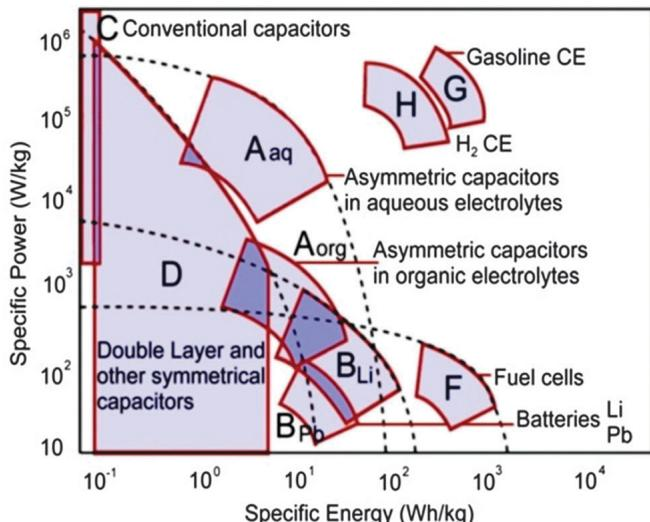  
Fig. 1 Ragone plot with specific energy and power for different energy storage devices. Data from ref. 2.

Supercapacitors lay in middle grounds between batteries and conventional capacitors. Electric Double-Layer Capacitors (EDLCs) take advantage of the electro-ionic charge storage induced in the electrochemical double layer of high-surface area carbons, whereas electrochemical supercapacitors rely on electroactive phases which undergo faradaic redox processes limited to the electrode-electrolyte interface leading to a so called pseudocapacitance.

All these different mechanisms for charge storage have been traditionally exploited separately.3 Yet, in the same way that a combination of batteries and capacitors can power and reinforce each other in a circuit, different materials and charge storage mechanisms can be combined in a single device in order to improve the overall performance. Hybrid materials, made of dissimilar but complementary components, are the natural target for this purpose.

Generally speaking, hybrid materials offer opportunities for synergic behavior and improved properties with respect to their individual components. Among many possible combinations, those formed by electroactive and conducting components are of particular interest for energy storage applications. As a matter of fact, hybrid composite electrodes integrating electroactive oxides (or phosphates) and conducting carbons have long been prepared and optimized for rechargeable lithium batteries. In this case, the hybrid approach is limited to the physical integration of an electroactive but poorly conducting phase and graphitic carbon materials providing inter-grain electronic conductivity. Needless to say that not any mixing approach is good enough to lead to an optimal configuration. The right proportions concerning relative concentration and particle sizes are keys to provide the required percolation paths. But in any event, each of the components of a hybrid composite electrode keeps its chemical nature, crystal structure and even its physical and electrochemical properties.

Hybrid materials go one step further in integration compared with composites. Indeed, organic and inorganic components are

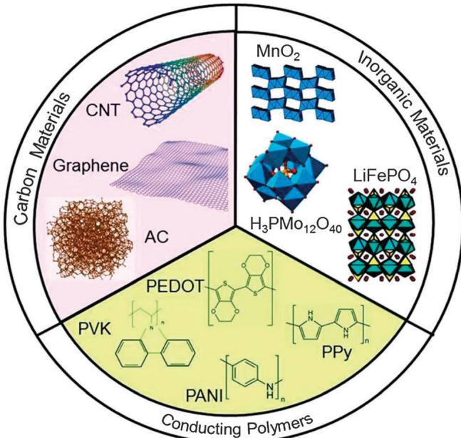  
Fig. 2 Schematic diagram of three types of components used in the design of hybrid materials for energy storage: carbon materials, conducting organic polymers (COPs) and a variety of inorganic electroactive species three of which are just shown as representative examples of extended (oxides, phosphates) or molecular (polyoxometalate) species.

integrated at a molecular level, the original individual "phases" are combined into a new one and properties can change substantially. Regardless of the nature of the interaction between components, whether through strong covalent bonds or weaker ionic, hydrogen-bonding or van der Waals interactions, chemistry governs the making of hybrid materials. $^4$

As we will see in this review, a growing number of hybrid materials and approaches are being developed in laboratories around the world in order to advance along the diagonal of the Ragone plot chessboard, that is, aiming at developing electrode materials and energy storage devices with improved power and energy densities. Our group is extensively working with the prospective research of hybrid combinations of electroactive and conductive materials for energy storage applications. Among electroactive components we have used a wide variety of inorganic species, from oxides (or phosphate) to polyoxometalate (POM) clusters, but also conducting organic polymers (COPs) or carbon materials (see Fig. 2). As a matter of fact there is a very broad landscape of hybrid materials which will be discussed in this review in the context of hybrid electrodes and devices. But first, we will analyze sectorial efforts to improve the power performance of conventional batteries and to increase the energy densities of conventional supercapacitors.

# 2 The road to faster batteries

There was a time when lead-acid batteries were the only ones found in our cars and Ni-Cd was ubiquitous in our videoc cameras. Then, after a brief precarious inter-regnum of metal hydrides, lithium took over the portable electronics market.[7]

That was the only major foreseeable application of lithium-ion batteries not so long ago and research was driven by the ever-increasing demand for portable electronics with greater autonomy, energy density and design flexibility as main targets. In less than a decade emphasis has shifted to faster-charging, longer-lasting, high-power, yet environmentally friendly Li-ion batteries which could also be used for electric vehicles in a sustainable way.

The list of mainstream materials studied to optimize the performance of commercial, first-generation lithium batteries is already quite long. A variety of inorganic phases, including mostly oxides and phosphates, have been studied as cathode materials  $\mathrm{Li}_{1 - x}\mathrm{Ni}_{1 - y - z}\mathrm{Co}_y\mathrm{M}_z\mathrm{O}_4$ ,  $\mathrm{Li}_x\mathrm{Mn}_2\mathrm{O}_4$ ,  $\mathrm{LiMnO_2}$ ,  $\mathrm{MnO_2}$ ,  $\mathrm{V}_2\mathrm{O}_5$ ,  $\mathrm{LiV}_3\mathrm{O}_8$ ,  $\mathrm{Li}_{1 - x}\mathrm{VOPO}_4$ ,  $\mathrm{Li}_x\mathrm{FePO}_4$ . Anode chemistries are even more diverse, since they comprise not only a variety of materials but a variety of approaches, from lithium metal to graphite and carbons to alloys (Li with Si, Sn...) to the more recent anodes based on metal oxides leading to metal nanoparticles through conversion reactions. Revising all these types of materials is beyond the purpose of this review. Instead we will take a representative example, such as the  $\mathrm{LiFePO_4}$  cathodic phase, to illustrate the multiple approaches towards power improvement of lithium batteries.

The road towards faster batteries has involved in turn a multiplicity of approaches from materials to cell design but we will limit our discussion to those aspects related to the chemistry and structure of materials. Getting faster-charging and increased specific power batteries would require faster kinetics. But the easiest way to increase the rate of redox reactions in battery electrodes is the optimization of the electrode-electrolyte interfaces. This has been done in different ways, mostly through the use of nanosized particles, but also by surface modification, microstructure optimization and through the synthesis of nanocomposite materials.[10] The preparation of a  $\mathrm{LiFePO_4}$  active cathode material in the form of nanoparticles, their surface-coating with thin carbon layers or conducting polymers, the growth of fractal microstructures and the synthesis of  $\mathrm{LiMnPO_4 - LiFePO_4}$  or  $\mathrm{LiFePO_4}$ -graphene nanocomposites are examples of each of these three approaches, respectively, which we will describe below.

The use of nanoparticulate electroactive phases is in principle the most obvious approach towards faster electrode reactions. However it should be noted that the benefits of this approach are offset in cases where the nanosize also leads to the enhancement of spurious reactions with the electrolyte. In the particular case of poorly conducting materials such as  $\mathrm{LiFePO_4}$ , surface modification with carbon has been established as a necessary step for their implementation as cathode active materials and has led to a remarkable improvement of their performance especially at high discharge rates, thus contributing to the consolidation of batteries as energy storage devices with high hopes for high-power and fast-charging marks.

Surface/microstructure engineering is another approach towards fast batteries that is also under current development. This is illustrated by the development of electrodes with fractal porosity or fractal granularity. An electrode-electrolyte interface with fractal dimensions is an advantageous feature for many

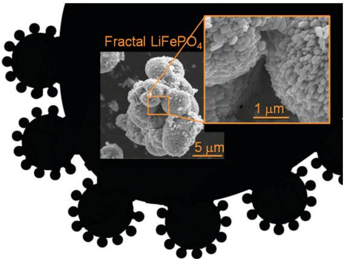  
Fig. 3 Black background outlines and ideal geometry with fractal granularity (see text). Inset shows scanning electron micrographs of fractal granularity in  $\mathrm{LiFePO_4}$  materials (O. Ayyad, P. Gomez-Romero, unpublished results).

possible applications but in particular for any electrochemical energy storage system, from fuel cells to batteries or supercapacitors. Metal electrodes with fractal porosity, among them nickel for possible application in fuel cells, are one interesting example.[11]

In the field of batteries, fractal granularity offers a similarly improved electrode-electrolyte interface. The spontaneous growth of nanoparticles into larger microstructures leads to self-assembled constructions that can provide simultaneously a high surface area for high power and a large bulk for high energy. The black background in Fig. 3 outlines an ideal geometry with fractal granularity which should provide a combination of high energy and power for a given active material. The inset micrographs show the real-world equivalent of fractal granularity in  $\mathrm{LiFePO_4}$  materials.

Finally, the road to faster batteries is also being paved with the development of a variety of nanocomposite materials. Core-shell  $\mathrm{LiMnPO_4 - LiFePO_4}$  nanoparticles are an interesting example of synergy. The manganese phase features a higher potential than the iron one, but it is difficult to coat with carbon. Zaghib and colleagues coated  $\mathrm{LiMnPO_4}$  with a thin layer of  $\mathrm{LiFePO_4}$  and this in turn with a  $3\mathrm{nm}$  layer of carbon. This multishell structure not only did the expected trick (allow for C-coating of an active  $\mathrm{LiMnPO_4}$  core phase) but also showed a better performance than the comparable solid solution  $\mathrm{LiMn_{2 / 3}Fe_{1 / 3}PO_4}$ , even at high rates and seemed to prevent the strongly oxidizing manganese phase from reacting with the electrolyte.[10]

Nanocomposites with graphene have been pursued since the arrival of the new kid in Nanocarbon Town. And  $\mathrm{LiFePO_4}$  graphene nanocomposites were no exception. As a matter of fact, it is just natural to aim at inter-dispersing both phases given the need for C-coating of this electroactive phase. From a chemical point of view, such a nanocomposite could be envisioned as a way to avoid high-temperature treatments for the formation of the conductive coating and could presumably lead to better high-rate performances. Several articles have reported  $\mathrm{LiFePO_4}$ -graphene composites with improved capacities at high rates prepared by in situ synthesis of  $\mathrm{LiFePO_4}$  on pre-synthesized

graphene integrated by spray-drying and annealing, $^{12}$  by solid state reactions, $^{13}$  or by coprecipitation and sintering, $^{14}$  in all cases, though, through the use of a final high-temperature treatment. Although high-temperatures and C-coating were not completely avoided, improved performance at high charge-discharge rates was demonstrated.

# 3 The path to high energy density supercapacitors

Conventional capacitors have been part of our circuits for ages but nobody considered them as energy storage devices given their minuscule capacity to store charge. In contrast to a conventional battery, where a spontaneous redox reaction between species with different potentials is harnessed by an electrolyte-mediated isolation, conventional capacitors are formed by two identical conducting electrodes which are polarized and store charge proportional to the voltage applied

$$
\mathrm {d} q = C \cdot \mathrm {d} V,
$$

where  $C$  is the capacitance.

From a geometric point of view the capacitance is directly proportional to the area of the electrodes  $(A)$  and inversely proportional to the separation distance between them  $(d)$  separated by a dielectric with permittivity  $\varepsilon$ :

$$
C = \varepsilon A / d
$$

The conception of double-layer supercapacitors led to orders of magnitude improvement in energy density (Fig. 1) by storing

charge at the interface between a carbon electrode and an electrolyte through the formation of a Helmholtz double layer upon polarization. $^{15}$  This increased capacitance results from the large active area of those carbon electrodes and the minimal magnitude of charge separation  $(d)$  down to a few Angstroms. The storage mechanism in this case is purely physical. The energy is accumulated due to the presence of an electric field resulting from a charge separation at the electrode/electrolyte interface. Thus, a cyclic voltammogram of a double-layer carbon supercapacitor features a characteristic rectangular shape, with a voltage independent current, whereas charge-discharge processes are almost linear (Fig. 4(a)). These double-layer supercapacitors, sometimes labelled as electrochemical double-layer capacitors, $^{16}$  constituted a disruptive advancement in the field of energy storage. They aimed (and succeeded) at increasing the energy density with respect to conventional capacitors and still were able to provide much higher power density (though with lower energy density) than batteries. Further increasing their charge capacity and specific energy has been a dominant  $\mathbb{R} + \mathbb{D}$  goal ever since.

A major discovery made along this line by Gogotsi and co-workers involved the demonstration that unsolvated ions can contribute to capacity in purely double-layer electrodes. These researchers used carbide-derived carbons with pore sizes smaller than  $1\mathrm{nm}$  to show that ions diffuse through these ultramicropores upon desolvation and contribute to increased capacitance values.[17] It is very interesting to note that this behaviour is indeed reminiscent of ion diffusion in battery materials, where the injection of electrons in a bulk electroactive phase is balanced by the diffusion of naked ions in

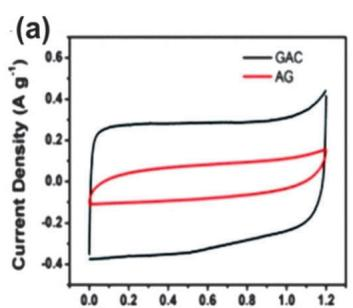

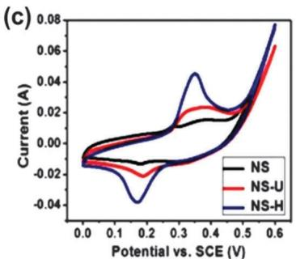

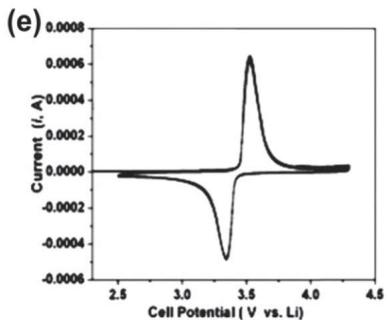

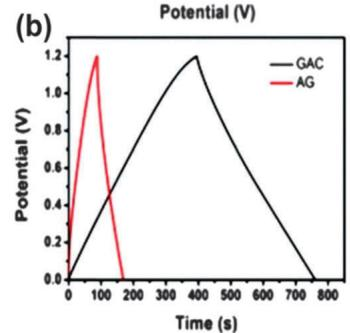  
Fig. 4 Cyclic voltammograms (top) and charge-discharge cycles (bottom) for different types of electrode materials: (a, b), carbon-based double-layer supercapacitors; (c, d)  $\mathrm{Co}_3\mathrm{O}_4$  pseudocapacitor; (e, f) LiFePO $_4$  battery electrode (vs. Li). The series shows the transition from a typical capacitive behavior (EDLC) (a, b) to a typical (two phase) battery electrode (e, f) with a pseudocapacitive oxide electrode as an intermediate case (c, d). It should be noted that even for the same  $\mathrm{Co}_3\mathrm{O}_4$  material different degrees of capacitive and faradaic components can be appreciated depending on the specific microstructure of the active phase.[23]

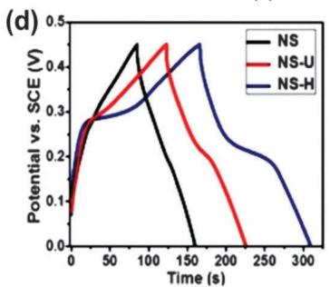

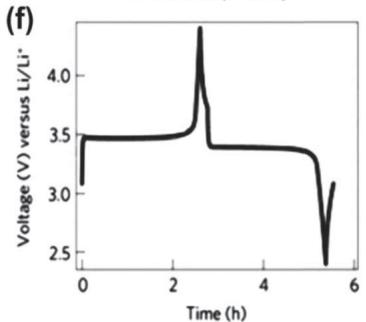

vacant lattice sites, thus increasing charge capacity and energy density at the expense of power. Hence we see how the borders between electrophysical and electrochemical energy storage mechanisms are increasingly blurred.

But the clearest transition of supercapacitors from purely electrophysical to electrochemical devices (and a truly major step forward in the field) came with the introduction of redox pseudocapacitors by Conway. $^{18}$  These take advantage of voltage-dependent charge transfer reactions in which the charge used for the progression of an electrode process is a continuous function of potential. In that case the derivative  $\mathrm{dq} / \mathrm{d}V$  is not nil (Fig. 4(c and d)) (as it is effectively the case in conventional batteries with phase changes as depicted in Fig. 4(e and f)) and corresponds to a capacitance of faradaic nature, conventionally called pseudocapacitance. There are mainly two types of processes associated to pseudocapacitors, $^{19}$  namely (i) redox reactions where the potential is a function of the log of the ratio between initial and final redox species, (ii) two-dimensional underpotential deposition. The former is by far the most frequently exploited in the design of pseudocapacitors. A wide variety of electroactive oxides as well as conducting polymers have been applied as active materials for pseudocapacitors. Among oxides, hydrated  $\mathrm{RuO}_2$  constitutes a paradigmatic example, but in principle any intercalation phase featuring solid-solution behavior could be used, and various oxides such as  $\mathrm{MnO}_2$ ,  $\mathrm{Co}_3\mathrm{O}_4$ , NiO,  $\mathrm{Fe}_3\mathrm{O}_4$ , or  $\mathrm{V}_2\mathrm{O}_5$ , as well as their mixed oxides have been studied as alternatives to  $\mathrm{RuO}_2$ , which despite its high specific capacitance values (theoretical value  $1360\mathrm{Fg}^{-1}$ ) is too expensive for practical application. $^{20}$  However, the theoretical capacitances of these metal oxides have rarely been achieved in experiments mainly due to their poor electronic conductivity, which limits the rate capability for high power performance and thus hinders its widespread applications in energy storage systems.

A new class of faradaic electrode materials, that of polyoxometalates (POMs), is emerging as a molecular frontrunner in the field of energy storage systems. POMs are nanometric oxide clusters with reversible redox activities which can be used as building blocks for energy storage applications.[21] POMs are polyatomic ions, usually anions that consist of three or more transition metal oxyanions linked together by shared oxygen atoms to form a large, closed 3-dimensional framework. The metal atoms are usually group 5 or group 6 transition metals in their high oxidation states which include vanadium, niobium, tantalum, but most frequently molybdenum and tungsten.

Many kinds of conducting polymers such as polythiophene, polypyrrole, polyaniline, and their derivatives, have been investigated for pseudocapacitors.[22] These pi-conjugated conducting polymers with various heterocyclic organic compounds have shown high gravimetric and volumetric pseudocapacitance in various non-aqueous electrolytes with operating voltages of  $\sim 3\mathrm{V}$ . Thanks to their molecular structures, they can provide various shapes, flexibility and light-weight (due to their low densities). However, when used as bulk materials, conducting polymers suffer from a limited cycling stability and fast decayed capacitance in the high rate cycling process, presumably due to

significant volume changes during the capacitor operation and the accompanying decrease of their electrical conductivity which leads to the decay of their electrochemical performance.

# 4 The roadmap to hybrid material electrodes and devices

Several authors have proposed and discussed hybridization of supercapacitors and batteries in the last decade. A general and systematic approach to define and classify hybrid supercapacitor combinations has been recently proposed by Cericola and Kotz, including combinations of materials, electrodes and also combinations of whole battery and supercapacitor devices.[24] Notwithstanding the importance of combining devices, the present review focuses on electrode materials rather than on serial or parallel combinations of supercapacitors and batteries. We will track the many efforts and approaches to advance electroactive materials and electrodes along the diagonal of the Ragone plot (Fig. 1), efforts that find their thrust in the realm of chemistry.

A rigorous classification might not be indispensable to describe the complex landscape of materials configuring the world of hybrid energy storage. But classifying helps understanding. For the sake of simplicity, we will consider here that all the materials which are mainly charged and discharged through faradaic redox reactions are battery-type materials (pseudocapacitive metal oxides and conducting polymers as well as intercalation compounds or even electroactive clusters or molecular species). On the other hand, materials charged through a capacitive double-layer mechanism are considered as capacitor-type materials (typically, high surface area carbons).

The specific problems associated with either battery or capacitor devices can be offset by proper design of a hybrid device. Supercapacitors may have either symmetric or asymmetric electrode configuration. In the first case both electrodes have the same capacitance whereas asymmetric configurations

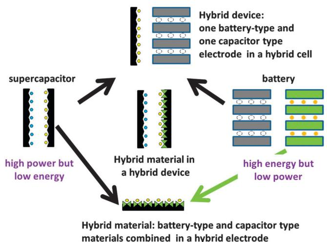  
Fig. 5 Schematic representations of different possible hybridization approaches between supercapacitor and battery electrodes and materials.

feature substantially different capacitance values for each electrode. Asymmetric electrode designs are most frequently associated to the combination of electrodes with different storage mechanisms, typically, a capacitive EDL electrode and a battery-type faradaic or pseudocapacitive electrode. This type of design is known as hybrid supercapacitors (see Fig. 5, top). When the battery-type electrode is a Li-intercalating phase these systems are also referred to as lithium-ion capacitors. In such systems, the battery-type electrode provides high energy density while the capacitor electrode enables high power capability in the system. A prototypical example is a hybrid capacitor made of Li-intercalated graphite (previously lithiated to act as a negative electrode) and a porous carbon EDL positive electrode (Li-ion capacitor).

The hybrid device concept was proposed by Amatucci's group based on a positive AC capacitive electrode combined with a negative  $\mathrm{Li}_4\mathrm{Ti}_5\mathrm{O}_{12}$  faradaic one in an organic electrolyte.[25] Negative electrodes based on pre-lithiated graphite were also used, leading to an increased operating voltage.[26] Also, combinations of capacitive AC electrodes with positive faradaic electrodes such as  $\mathrm{MnO}_2$  in aqueous electrolytes were also tested.[27] These were some of the pioneering examples of the hybrid device approach (series combination) depicted in Fig. 5 (top).

In just one decade the hybrid capacitor has reached the market. Yet, there is still room for substantial improvement. For example, using the same electroactive  $\mathrm{Li_4Ti_5O_{12}}$  phase, Naoi and coworkers have shown an outstanding nanocomposite electrode of the type shown in Fig. 5 (bottom). This material was prepared by a mechanochemical sol-gel reaction under ultracentrifugal force (UC method) followed by an instantaneous heat-treatment under vacuum for a very short duration. This procedure leads to  $\mathrm{Li_4Ti_5O_{12}}$  nanoparticles anchored onto carbon nanofibers (CNF) with extraordinary energy storage capacity especially at very high rates[28] (Fig. 6). Furthermore, by combining that nanohybrid electrode with a capacitive AC electrode they were, in turn, applying the double hybridization approach shown in Fig. 5 (center).[29]

It should be emphasized that this type of hybrid material/ electrode is by no means a simple mixture of the two components,

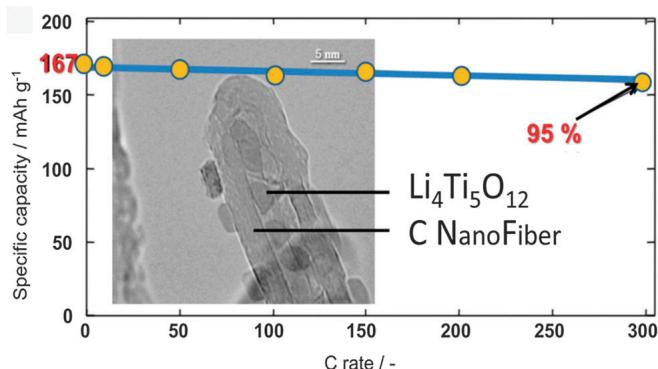  
Fig. 6 TEM image of the nanocomposite electrode formed by  $\mathrm{Li_4Ti_5O_{12}}$  nanoparticles and CNF and specific capacity of the electrode vs. Li anode showing excellent high-rate performance (data from ref. 28).

but a true nanocomposite, featuring interactions at the atomic/ molecular level between them, which is the reason why chemical treatments and approaches make the difference between a poor and a high-performance material.

We have seen how merging carbon materials typical of supercapacitors with electroactive (redox) materials characteristic of batteries leads to hybrid materials, electrodes and devices with improved performances which we could generically call supercapbatteries.

For a better general understanding of the combination of capacitive and faradaic electrodes in this type of devices, some basic theoretical aspects will be presented in the next paragraphs. Fig. 7 shows schematic representations of single electrode systems (capacitor (a) and battery (b)) and an asymmetric (hybrid) capacitor system (c) together with their charge-potential profile. As seen from Fig. 7(a) the charge-discharge profile of a typical capacitor-like electrode is linear whereas for a typical battery-type electrode with a redox process associated to a phase change, the potential remains constant during charge and discharge according to the phase rule and following the Nernst equation as shown in Fig. 7(b). Hence, the capacitors are high power devices (but poor energy density) whereas batteries are high energy devices (poor power density). Thus, the energy stored in the capacitor is  $0.5q_{\mathrm{c}}\cdot \Delta V_{\mathrm{c}}$  (where  $q_{\mathrm{c}}$  is charge and  $\Delta V_{\mathrm{c}}$  is voltage) which is half that of a battery  $(E_{\mathrm{b}} = Q_{\mathrm{b}}\cdot \Delta V_{\mathrm{b}})$ . If we combine both systems, the high power property of the capacitor as well as the high energy characteristic of the battery will merge in the hybrid device depicted in Fig. 7(c). In such a system, it is essential to use a higher working potential  $(\Delta V)$  combined with the capacitor-type electrode at the initial stage of the charging process in order to reach the redox potential of the battery-like electrode  $(\Delta V_{\mathrm{b}})$  resulting in an increase of the storable amount of energy compared to the single electrode system as seen in Fig. 7. Moreover, the total capacitance of the asymmetric capacitor system could not be reached due to the constant electrochemical potential value of the battery-type electrode, in contrast with single electrode systems. An additional challenge of this type of devices is to get the battery-type electrode (with intrinsically slower kinetics than the electrostatic charge storage of a capacitor-type electrode) to perform at a fast enough rate to match the capacitor-type electrode.

From a thermodynamic point of view, asymmetric capacitors can make full use of the different potential windows of the two electrodes to provide a maximum operating voltage of the cell (see Fig. 8). Consequently, a greatly enhanced specific capacitance and significantly improved energy density result. Note that in order to reach the highest cell voltage, the charges stored in both electrodes must be balanced, even under high-rate testing. There have been several outstanding reports of asymmetric capacitor systems using various active materials as the counter electrode for activated carbon providing high energy densities. Among them are  $\mathrm{AC} / / \mathrm{MnO}_2$ ,  $\mathrm{AC} / / \mathrm{NiO}$ ,  $\mathrm{AC} / / \mathrm{Li}_2\mathrm{Mn}_4\mathrm{O}_9$ ,  $\mathrm{AC} / / \mathrm{LiTi}_2(\mathrm{PO}_4)_2$ ,  $\mathrm{AC} / / \mathrm{Li}_4\mathrm{Ti}_5\mathrm{O}_{12}$  with aqueous electrolytes.[30]

Although this type of supercapacitors generally shows a much enhanced capacitance and greatly improved energy density

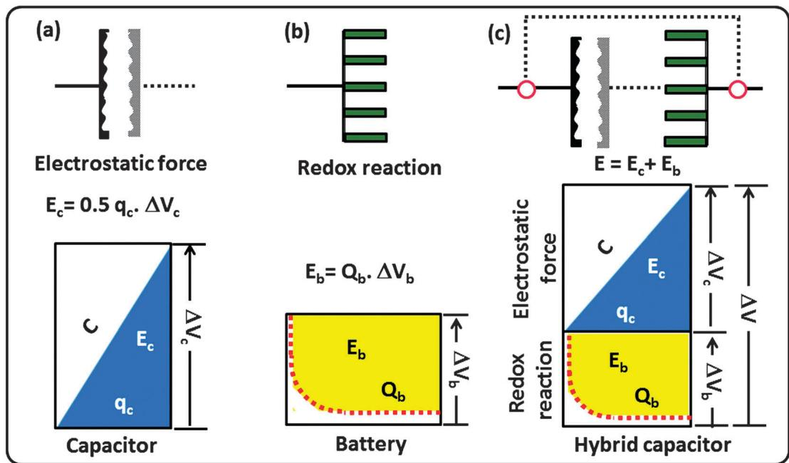  
Fig. 7 Schematic representations of a single electrode system (a), capacitor (b) battery and (c) an asymmetric capacitor system with an aqueous electrolyte according to the charge-potential profile with corresponding equations for energy storage.

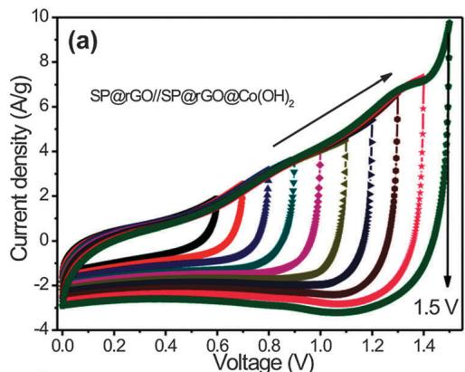

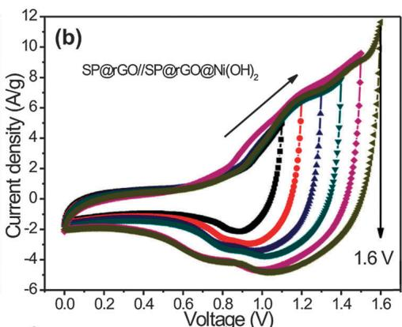

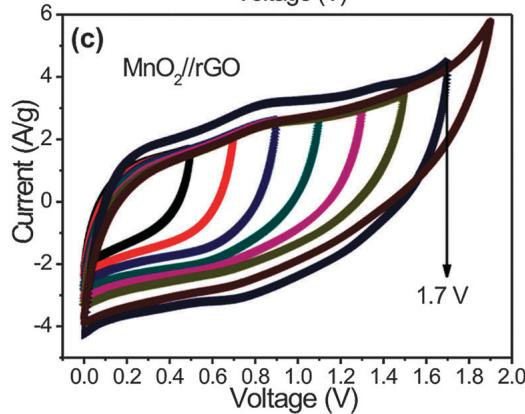  
Fig. 8 Cyclic voltammetry curves of aqueous asymmetric capacitors based on different metal oxides/hydroxides as the positive electrode and reduced graphene oxide as the negative electrode.

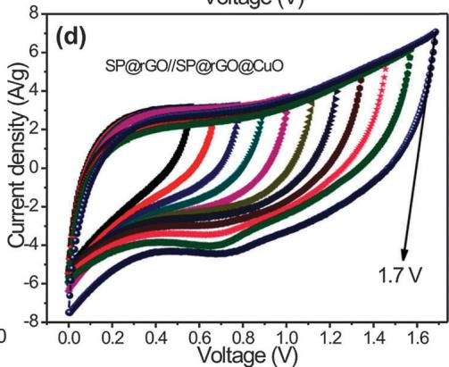

compared with EDLCs, they still may have a significant drawback. For example, it is very difficult to fully utilize the overall specific energy density of battery-type electrodes due to the redox reaction kinetics being too slow in asymmetric capacitor systems.

This inherent difference can diminish the energy storage ability of the electrochemical device especially during fast charge-discharge processes compromising their practical application as supercapacitors. This drawback requires the design of advanced

electrodes which could help offsetting the low charge-transfer kinetics intrinsic to redox reactions of battery-type electrodes. There are several ways to achieve this objective, involving the size and morphology control of electroactive particles and/or the introduction of highly conducting materials in battery-type electrodes. The first approach involves primarily the use of nanoparticulate electroactive phases in order to reduce the diffusion path of charge-compensating ions in the solid state. But it also includes the control of particle morphologies as described above (see Fig. 3) in order to optimize their interface with the electrolyte. The second approach, aiming at increasing the conductivity of the battery-like electrode, can in turn be tackled in different ways. The two approaches most frequently followed involve metal doping of the electroactive phase itself or carbon coating in order to increase their electronic conductivity.

The design of electroactive hybrid materials, combining electroactive and conducting components in a single hybrid electrode (see Fig. 5, bottom), is one way to lessen the kinetic mismatch problem associated to hybrid devices mentioned above. But it also provides the opportunity to get all-in-one faradaic and capacitive activities displayed in parallel. This has led to widespread efforts in laboratories around the world to explore a large variety of hybrid combinations in nanocomposite electrode materials for application in novel energy storage devices.

Finally, we should consider what we could call the double hybridization approach, that is, the simultaneous combination of faradaic and capacitive materials in a single electrode and the use of that hybrid electrode in front of a capacitive one (Fig. 5, center). In effect this would be equivalent to a combination of

faradaic and capacitive materials in parallel AND in series, thus improving kinetic aspects as well as larger voltages and energy densities.

The fabrication of hybrid nanostructured composite materials involves the hybridization of battery components (oxides, conducting polymers or intercalation compounds) and capacitor components (primarily carbons) in a single electrode. Fig. 9 shows a few representative examples of different synthetic routes typically used to prepare this type of hybrid electrode materials. In this way we can simultaneously take advantage (in parallel) of faradaic and capacitive energy storage mechanisms while improving kinetics and electrochemical performance at high rates. If in addition we make a series combination of capacitive and hybrid electrodes the voltage and energy density of the system will also increase. This approach represents an advanced way to get high power and energy density supercapacitors by fabricating electrode materials through a rational design of material combination, phase morphology and particle size. More specifically, enhanced electrochemical performance of supercapacitors can be achieved by introducing faradic compounds, either extended or molecular into hybrid composite electrode systems based on nanostructured carbons (activated carbons, carbon nanofibers, CNTs, graphene etc.) and wisely building asymmetric combinations of them. Finally, it should be borne in mind that even the more basic studies on this type of hybrid electroactive materials are crucial for a fundamental understanding of ground aspects such as the interactions between carbons and inorganic materials, the nature of their interfaces or electron transfer processes, all of which in turn will provide the basis for the improvements of future devices.

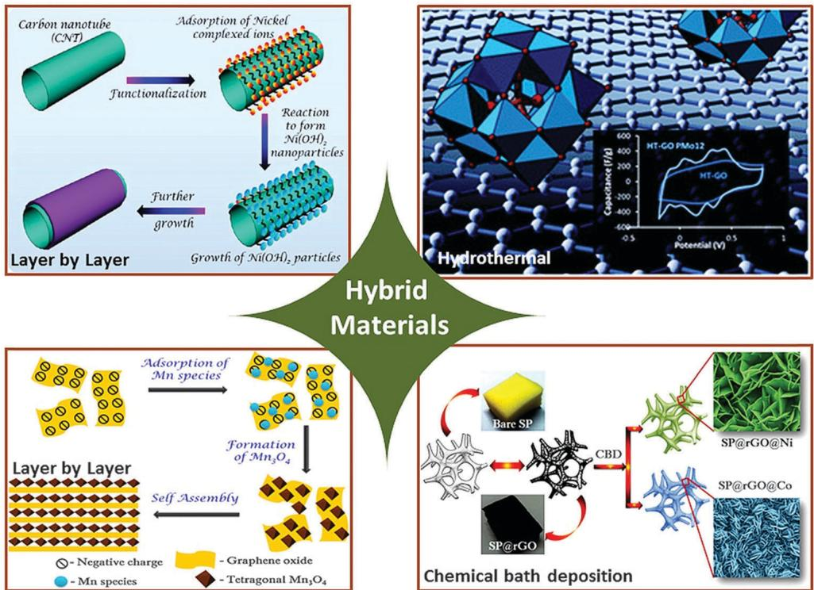  
Fig. 9 Schematic representation of various chemical synthetic routes used for the synthesis of hybrid electrode materials.

There have been many outstanding reports on hybrid nanostructured materials for supercapacitors.31 But instead of describing them at length we will discuss the different tactics used for a couple of representative examples, namely extended oxides and molecular clusters.  $\mathrm{MnO_2}$  has been extensively studied and used as an electroactive material for energy storage both by itself and for the synthesis of hybrid electrodes, and it will be used here as a prototypical example of extended electroactive phases. On the other hand, molecular species and clusters have not been so massively studied in this respect but represent a disruptive alternative approach which will be exemplified by polyoxometalates.

Due to the low-cost and exceptional properties of carbon nanofibers (CNFs), they are widely used as base supporting materials to deposit oxides in general and  $\mathrm{MnO}_2$  in particular in order to fabricate carbon- $\mathrm{MnO}_2$  hybrid electrodes. Ultrathin  $\mathrm{MnO}_2$  layers were uniformly coated on vertically aligned carbon nanofibers through electrochemical deposition in order to form a 3D brush-like nanostructure. These unique core-shell CNFs- $\mathrm{MnO}_2$  nanostructures provide a highly conductive and robust core with an effective electrical connection to the thin  $\mathrm{MnO}_2$  shell.[32]

Other carbon- $\mathrm{MnO}_2$  hybrid structures based on porous carbons such as carbon aerogels or mesoporous carbons also offer a sound path to synergy. They form hybrid mesoporous structures which provide optimal electronic and ionic conductivity to minimize the total resistance of the system thus improving its performance.[33]

Besides amorphous carbons,  $\mathrm{MnO_2}$  hybrid materials with CNTs or graphene (or graphene oxide) have also been preferred targets for materials scientists. Recently a group has reported the fabrication of  $\mathrm{MnO_2}$  nanoflower-carbon nanotube array (CNTA) hybrid electrodes with hierarchical porous structure, large surface area, and good conductivity.[34] The porous network of CNTA creates fast electronic and ion conducting channels in the presence of an electrolyte, and the conformal coating of hierarchical flower-like  $\mathrm{MnO_2}$  on CNTs provides high capacitance, which indicates that these systems can provide a platform to design high-performance electrodes for supercapacitors. The recent isolation of graphene and graphene oxide was a seminal discovery leading to a burst of work using them as the matrix for the development of a wide variety of hybrids. Many publications on the synthesis of graphene-based hybrid materials with outstanding properties have been reported.[35] Zhu and co-workers synthesized a hybrid structure based on needle-like  $\mathrm{MnO_2}$  nanocrystals supported on graphene oxide (GO- $\mathrm{MnO_2}$  hybrid) by a simple soft chemical route.[36] The mechanism proposed for the formation of needle-like  $\mathrm{MnO_2}$  onto the GO sheets is based on intercalation and adsorption of Mn ions into GO sheets, followed by the nucleation and growth of the oxide via dissolution-crystallization and oriented attachment, which in turn results in the exfoliation of GO sheets. A synergic interaction between GO and  $\mathrm{MnO_2}$  was claimed to enhance the electrochemical performance of these hybrid electrodes. As a matter of fact, all the hybrid electrodes based on the various carbon- $\mathrm{MnO_2}$  materials mentioned above showed significantly improved

electrochemical performances (in terms of specific capacitance, energy density and cyclability) with respect to their parent non-hybrid electrodes.

In addition to oxides and other extended phases, there is another category of electroactive inorganic species suitable for hybridization with carbons or conducting polymers. Indeed, molecular species frequently feature reversible redox reactions which in principle could be used as the basis for energy storage. Furthermore, those species are not affected by phase transitions or slow ion diffusion associated to extended phases. Yet, their very same molecular nature and solubility limits their application as electrode materials. As with extended phases we will limit here the discussion to one type of molecular clusters representative of this class, namely, polyoxometalates (POMs) like phosphomolybdic acid  $(\mathrm{H}_3\mathrm{PMo}_{12}\mathrm{O}_{40})$ , depicted in Fig. 2.

Polyoxometalate-based hybrid materials were initially reported with conducting organic polymers  $(\mathrm{COPs})^4$  such as polypyrrole (PPy), polyaniline  $(\mathrm{PAni})^{37}$  or poly(3,4-ethylenedioxythiophene)  $(\mathrm{PEDOT})^6$  as host matrices. These hybrids represented the first proof of concept of how to harness the electroactivity of molecular species for energy storage in hybrid electrodes. They showed however the need for some electrode conditioning during the early charge-discharge cycles associated to COP swelling leading to electrolyte impregnation.[6]

More recently hybrids of POMs with a variety of carbon materials have been reported, including nanocarbons or activated carbons (AC) as matrices. The hybrids making use of AC as the support and Phosphomolybdic acid  $\left(\mathrm{H}_{3} \mathrm{PMo}_{12} \mathrm{O}_{40}, \mathrm{PMo}_{12}\right)$  or phosphotungstic acid  $\left(\mathrm{H}_{3} \mathrm{PW}_{12} \mathrm{O}_{40}, \mathrm{PW}_{12}\right)^{38}$  are illustrative examples. In the latter case, the large negative overpotential of the phosphotungstate cluster has a manifold contribution to an enhanced performance of the hybrid electrode. First, it allows for an increased capacitance and an extended voltage range of up to  $1.6 \mathrm{~V}$  (unprecedented for  $1 \mathrm{M} \mathrm{H}_{2} \mathrm{SO}_{4}$  acidic electrolytes), which in turn leads to high energy density. But it also contributes to the protection of the carbon matrix and leads to extended cyclability beyond 30000 cycles. The combination of double-layer capacitance (AC) plus the purely faradaic redox activity of the polyoxometalate clusters leads to a synergic combination featuring increased specific capacitance, operating voltage and consequently specific energy and power, as well as much improved cycling stability.[38]

Closing the circle of the hybrid materials landscape outlined in Fig. 2, we will briefly discuss now hybrid electrodes composed of carbons and conducting organic polymers, a category which has also found its place as nanostructured electrode materials for supercapacitors. In this type of hybrids conducting polymers provide their pseudocapacitance while carbon materials act as a rigid framework that helps to minimize certain problems associated to conducting polymers such as swelling/contraction strains during charge-discharge cycles. As an example, we will consider carbon-polyaniline (PAni) based hybrid nanostructured electrodes. The AC-PAni hybrid offers the advantages of moderate cost and promising scalability for mass production together with high electrochemical performance. Other amorphous carbon nanostructures were

also used to produce the hybrid with PAani, such as CNFs and carbon hollow spheres. $^{39}$  The CNFs were exposed to aniline vapor in order to form a thin film of PAani on the CNFs. Another research group prepared PAani on hollow carbon spheres and reported improved electrochemical performance. This group also prepared carbon/PAani electrode materials by depositing a thin layer of PAani on the surface of 3D ordered macroporous carbons, which have a continuous carbon framework. $^{40}$  Cheng and co-workers investigated the supercapacitor performance of in situ polymerized PAani on carbon blacks, CNTs, and graphene nanosheets. $^{41}$  Among these hybrid structures, PAani-graphene hybrids showed the best supercapacitive performance, because of the high conductivity of graphene, and improved interfacial contact of graphene-PAani due to the planar morphology of graphene.

For all the hybrid systems discussed above the specific capacitances were found to be much higher than that of the individual components. Additionally, the cycling stability as well as rate capability were dramatically improved. This could be due to the carbon materials embedded in PAni serving as toughening agents or structural scaffolds for the polymer. Such a mechanical reinforcement could minimize the large volume changes typically associated to COPs during cycling thus improving the electrode durability of PAani-based supercapacitors.

Going beyond the binary hybrids that have been discussed above, ternary hybrid structures have been recently explored in an attempt to combine multiple advantages from all various components: conducting carbons, pseudocapacitive metal oxides and conducting polymers. By taking advantage of the synergistic effects from ternary hybrids, it is possible to effectively utilize the full potential of all the desired functions of each component. An illustrative work on ternary hybrids has been reported by Liu and coworkers. They designed a ternary hybrid material composed of  $\mathrm{MnO}_2$ , CNTs and PEDOT:PSS (poly(3,4-ethylenedioxythiophene):poly(styrenesulfonate)).42 Each component in this hybrid structure  $\mathrm{MnO}_2$ -CNT-PEDOT:PSS film provides a unique and critical function to achieve the optimized electrochemical properties. CNTs not only provide high surface for the deposition of hierarchical  $\mathrm{MnO}_2$  porous nanospheres, but also improve the electrical conductivity and the mechanical stability of the composite. PEDOT:PSS functions as an effective dispersant for  $\mathrm{MnO}_2$ -CNTs structures, as well as a binder material that improves the adhesion to the substrate and the connection among  $\mathrm{MnO}_2$ -CNTs particles in the film. And the highly porous  $\mathrm{MnO}_2$  nanospheres provide high surface area for improved specific capacitances. In such a ternary composite, these components assemble into mesoporous, interpenetrating network structures leading to a composite with high specific capacitance, excellent rate capability, and long cycle life stability.

# 5 Navigating complexity

The hybrid approach is archetypal of materials science, where complexity is frequently turned from a complication into an asset.

As we explore the landscape of electroactive hybrids for energy storage we can confirm the benefits of daring to navigate complexity. And this is not limited to the electroactive phase(s) at the heart of electrodes. In this respect we should always bear in mind that the design of high-performance devices will not only rest on electrode materials, but also on their integration with other elements such as taylor-made electrolytes (i.e. divalent cation-containing solutions, hydrogel polymers, ionic liquids...), membrane separators, current collectors, as well as other practical issues of cell design. Thus, multi-material arrays with novel macro as well as nanoarchitectures can provide the ultimate differential advantage when it comes to fully exploit the properties of intrinsically excellent electrode materials.

An emerging new concept to prepare hybrid nanocomposite electrodes is to grow electroactive nanostructures on carbon-based conducting substrates (paper, textile, and sponge, with a thin conducting carbon layer) to be directly used as binder-free electrodes for supercapacitors. $^{43,44}$  Carbon fiber paper (CFP) consisting of a network of microsized carbon fibers have been extensively employed as a current collector and backbone for the conformal coating of transition metal oxides for supercapacitors. The single carbon fibers in CFP are well connected to form a conductive network with appropriate pore channels, which can create an efficient electron transport path as well as effective electrolyte access to the electrochemically active materials. Yang et al. reported hybrid electrodes prepared from carbon paper loaded with  $\mathrm{Co}_3\mathrm{O}_4$  nanomaterials. $^{45}$  The deposition of  $\mathrm{Co}_3\mathrm{O}_4$  nanowires onto the graphite fiber surface helped release the stress caused by the volume change associated to reversible intercalation in the oxide and/or adsorption of charge carriers onto graphite. To further increase the specific surface area for loading functional materials, Fischer et al. developed a carbon nanofoam with a hierarchical structure based on carbon paper, and a hybrid electrode material prepared by loading  $\mathrm{MnO}_2$  onto the carbon nanofoam substrate. $^{46}$  The resulting  $\mathrm{MnO}_2$ -carbon nanofoam hybrid material maintained a highly porous structure with pore sizes mostly in the range of  $10 - 60~\mathrm{nm}$  which further showed excellent electrochemical performance. Alshareef and co-workers $^{47}$  reported supercapacitors based on carbon cloth, textile and sponge in an aqueous electrolyte. Initially, these porous substrates were coated with a thin conducting carbon layer and used as supporting substrates for the deposition of pseudocapacitive materials. Such hybrid electrodes fabricated with these 3D macroporous framework support offer several advantages such as: (i) allowing facile electrolyte flow to the entire surface of the electrodes, (ii) allowing uniform coating of conducting carbon and pseudocapacitive materials on the skeleton of the substrate, (iii) providing enough space for the bulk deposition of electrode materials and (iv) the soft, lightweight and flexible nature makes it ideal for wearable and flexible devices.

From this comprehensive study, it is ultimately realized that carbon-based support substrates developed for high mass loading of active materials can offer great promise for developing large-scale energy storage systems in the near future. In spite of these great advancements in the direct growth of electroactive materials onto carbon-based substrates, there are still some obstacles for

their commercial applications such as low flexibility, high cost, poor conductivity etc.

Pseudocapacitance is by definition a near-surface phenomenon. Hence the bulk underlying fraction of an electrode hardly participates in the electrochemical charge storage process, leading to a less than optimal performance. Therefore, to meet the requirements of high electrochemical performance and boost the electrochemical utilization of the active materials, one promising route is to have scrupulous design of nanoarchitectures and smart hybridization of custom-made pseudocapacitive materials. Recently, some efforts have been devoted to the synthesis of advanced core-shell heterostructures with the combination of two types of materials which show improved electrochemical performances. For example Lou and co-workers[48] designed an advanced integrated electrode by growing hierarchical  $\mathrm{NiCo_2O_4@MnO_2}$  core-shell heterostructured nanowire (NW) arrays on nickel foam. In that work, the complexity of substrate structure and active material composition and structure sum up to optimize the performance. The smartly designed core-shell heterostructured NW arrays provide excellent features as electrode materials such as (i) wrapped ultrathin  $\mathrm{MnO_2}$  nanoflakes enable a fast, reversible faradaic reaction and provide a short ion diffusion path while maintaining the structural integrity of the core during the charge-discharge process; (ii) slim and mesoporous  $\mathrm{NiCo_2O_4}$  NWs serve both as the backbone and electron "superhighway" for charge storage and delivery, and the mesoporous feature leads to a large electrode/electrolyte contact interface; (iii) both the core and shell materials are good pseudocapacitive materials, which undergo redox reactions, hence contributing to the electrochemical energy storage.

Also dealing with the core-shell approach, another group $^{49}$  has reported a rational design of homogeneous core-shell nanoflake arrays for supercapacitors. By taking advantage of the high surface area of the interconnected flake-network,  $\mathrm{NiCo_2O_4@NiCo_2O_4}$

core-shell nanoflake arrays were fabricated in which "core" and "shell" materials were effectively used. The large open channels between nanoflakes enable easier electrolyte penetration into the inner region of the electrode, increasing the utilization of the active materials. Due to the ultrathin nature of the core as well as the shell, the electrolyte can diffuse into the underneath part of the electrode materials, so that all the active materials can participate in the electrochemical charge storage process.

The hybrid electrode materials summarized above showed excellent electrochemical properties due to the proper hybridization of battery components (oxides or intercalation compounds) and capacitor components (carbon-based) in single electrodes. Herein we will consider theoretical aspects of this new hybrid electrode to understand the operating mechanism. Furthermore, the proper structures with ideal conditions for the hybrid electrode to enhance the electrochemical performance of energy storage systems are guided for future milestones. In comparison with asymmetric capacitors, we assume the hybrid electrode system containing a typical capacitor-type electrode and a hybrid nanocomposite electrode as shown in Fig. 10. The latter is formed by a battery-type component and a capacitor-type component in a single electrode which will store energy through both, faradaic and capacitive mechanisms. In this hybrid electrode, the capacitor component is first charged by electrostatic forces in the initial state  $(q_{1})$  until the electrode potential reaches the redox reaction potential of the battery component  $(\Delta V_{\mathrm{b}})$ . Then the battery component is charged through the redox reaction while maintaining the potential of the hybrid electrode, until the faradaic component reaches its full-charge state  $(Q_{\mathrm{b}})$  as seen in Fig. 10. After the full charge of the battery component  $(Q_{\mathrm{b}})$  the capacitor component is charged again  $(q_{2})$  until the maximum potential of the hybrid electrode is reached  $(\Delta V_{\mathrm{bc}})$ . Hence the total charge stored in the hybrid electrode is due to both components (battery  $(Q_{\mathrm{b}})$  as well capacitor component  $(q_{\mathrm{c}} = q_{1} + q_{2})$ ).

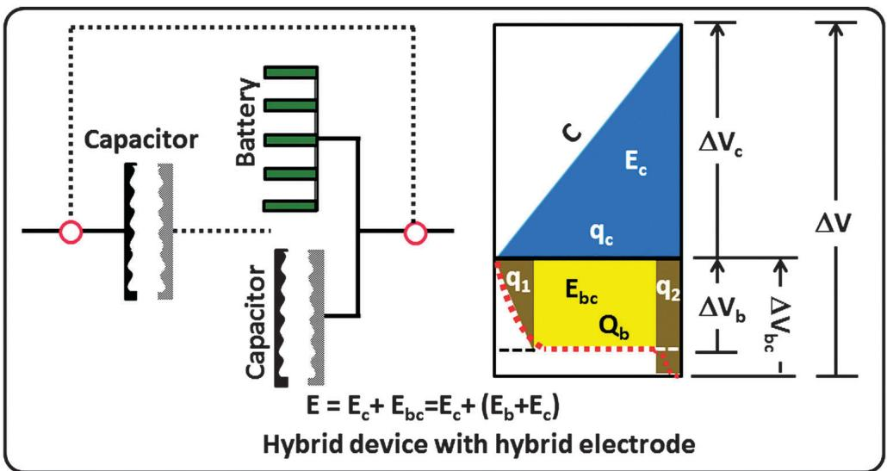  
Fig. 10 Schematic representations of hybrid combination of a hybrid electrode (hybridized battery and capacitor components) and a capacitor electrode according to the charge-potential profile with corresponding equations for energy storage.[50]

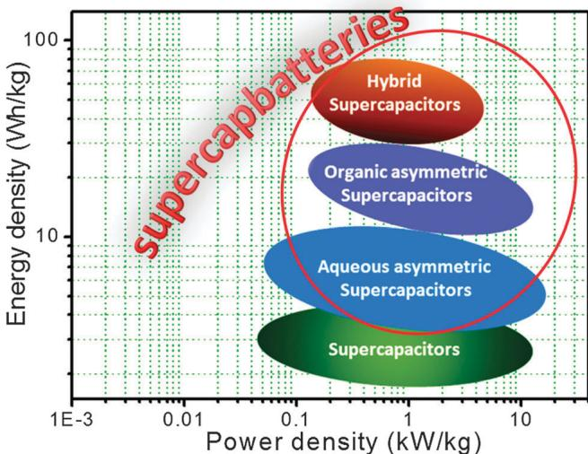  
Fig. 11 Ragone plot sketching the recent status of supercapacitors, asymmetric supercapacitors with aqueous and organic electrolytes as well as hybrid electrodes with hybrid devices.[50]

On the other hand the maximum working potential window for the entire system will be the sum of potentials across the capacitor-type electrode  $(\Delta V_{\mathrm{c}})$  and the hybrid electrode  $(\Delta V_{\mathrm{bc}})$  (this sum also includes potentials across battery-type and capacitor-type components as shown in Fig. 10). Thus the total amount of energy stored in this hybrid system  $(E)$  is the sum of energy stored in the capacitor-type electrode  $(E_{\mathrm{c}})$  and that of the hybrid electrode  $(E_{\mathrm{bc}} = E_{\mathrm{b}} + E_{\mathrm{c}})$ . The hybrid electrode is bound to have improved power densities compared to those of typical pseudocapacitors or battery electrodes due to its structural characteristics. This is so because the capacitor component, which can also store electrochemical energy by electrostatic force, enhances the electron transfer to the battery component in the hybrid electrode system, causing a better charge transfer reaction at high rates. The electrochemical performance of the hybrid electrode material is based on the hybridization and surrounding characteristics of both components. Therefore, proper composition and morphological structure are key factors to realize the full potential of hybrid electrode materials compared to conventional electrode materials. Fig. 11 provides a simplified Ragone plot showing the recent status of symmetric supercapacitors, aqueous asymmetric supercapacitors, organic asymmetric supercapacitors and hybrid electrodes with hybrid devices.[50] The state of the art for the fabrication of hybrid electrodes for hybrid devices are: (i) in the hybrid electrode hybridization of both battery and capacitor components should be uniform to operate as a single electrode, otherwise the working potential will be directly increased in the charged state without charging of the battery part due to the much faster kinetics of the capacitor part. (ii) The hybrid electrode material should have a high surface area with an open porous structure for high energy density and good ionic conductivity. (iii) Also the 3D network structure is beneficial to enhance the electron transport while retaining the ionic conductivity in these hybrid materials.

# 6 Conclusions and future perspectives

The full potential of hybrid materials, electrodes and devices for high-performance energy storage has not been realized yet, as discussed in the present review. However, a solid foundation for future technical milestones has been established. Advanced synthesis procedures have been developed in order to fabricate different hybrid materials to introduce more electrochemically active sites and to shorten the transport path length for both electrons and ions. This is achieved by producing nanostructured hybrid materials such as organic-inorganic (COPs-POMs) as well as carbon-based hybrids (carbon/metal oxides and/or conducting polymers and POMs). As a consequence, hybrid capacitors are proving to be an effective way to enhance the electrochemical performance of supercapacitors. Furthermore, the novel concept of double hybridization (hybrid device made with a capacitor-type electrode and a hybrid electrode (consisting in turn of battery and capacitor components in a single electrode), as shown in Fig. 5, center) has been introduced and could substantially help to overcome the poor electrochemical reaction kinetics of asymmetric capacitor systems. This double hybrid would be the most promising approach since it would lead both to improved thermodynamics and kinetics in a single energy storage device.

The following are some final remarks to be kept in mind concerning various aspects to be developed around the topic of hybrid energy storage:

(1) Implementation of battery and supercapacitor hybrid devices is a challenging line of work which could begin with, but eventually go beyond the combination of capacitive-faradaic electrodes in an attempt to develop the intensely sought-for combination of high power and energy densities.  
(2) A good understanding of surface chemistry between capacitor and battery components is essential in order to improve the interfacial interactions to fabricate well-defined uniform structures to enhance charge transfer.  
(3) Since the electrochemical performance of the hybrid electrode depends on the hybridization of both components, extensive research on proper nano-architectures (morphology and phase composition) with open porous network structures should be carried out, aiming at a deeper understanding of composition-structure-property relationships.  
(4) Considering final commercial implementation, we should bear in mind that the design of high-performance devices will not only rest on electrode materials, but also on their integration with other elements such as electrolytes (divalent cation-containing solutions, hydrogel polymers, ionic liquids...), membrane separators, current collectors, as well as other practical issues that affect the overall cell performance. Thus, integrative materials engineering will also need to be intensively explored.

# Acknowledgements

Partial funding from Spanish (Grant MAT2012-39199-C02-01) and Catalan administrations (NESTOR 2014-SGR-1505 project), and a postdoctoral contract (Beatriu de Pinos, Marie Curie)

from Generalitat de Catalunya (Dr D. P. Dubal) are gratefully acknowledged. ICN2 acknowledges support from the Severo Ochoa Program (MINECO, Grant SEV-2013-0295).

# References

1 J. Murray and D. King, Nature, 2012, 481, 433-435.  
2 J. H. Chae, K. C. Ng and G. Z. Chen, Proc. Inst. Mech. Eng., Part A, 2010, 224, 479-503.  
3 H. D. Abruna, Y. Kiya and J. C. Henderson, Phys. Today, 2008, 61, 43-47.  
4 P. Gomez-Romero, O. Ayyad, J. Suarez-Guevara and D. Munoz-Rojas, J. Solid State Electrochem., 2010, 14, 1939-1945.  
5 A. Ait Salah, A. Mauger, K. Zaghib, J. B. Goodenough, N. Ravet, M. Gauthier, F. Gendron and C. M. Julien, J. Electrochem. Soc., 2006, 153, A1692-A1701.  
6 J. Vaillant, M. Lira-Cantu, K. Cuentas-Gallegos, N. Casan-Pastor and P. Gomez-Romero, Prog. Solid State Chem., 2006, 34, 147-159.  
7 M. R. Palacin, Chem. Soc. Rev., 2009, 38, 2565-2575.  
8 J. M. Tarascon and M. Armand, Nature, 2001, 414, 359-367.  
9 M. Armand and J. M. Tarascon, Nature, 2008, 451, 652-657.  
10 K. Zaghib, A. Mauger, H. Groult, J. B. Goodenough and C. M. Julien, Materials, 2013, 6, 1028-1049.  
11 P. Gomez-Romero, J. Fraile and B. Ballesteros, RSC Adv., 2013, 3, 2351-2354.  
12 X. Zhou, F. Wang, Y. Zhu and Z. Liu, J. Mater. Chem., 2011, 21, 3353-3358.  
13 Y. Wang, Z.-S. Feng, J.-J. Chen and C. Zhang, Mater. Lett., 2012, 71, 54-56.  
14 Y. Ding, Y. Jiang, F. Xu, J. Yin, H. Ren, Q. Zhuo, Z. Long and P. Zhang, Electrochem. Commun., 2010, 12, 10-13.  
15 B. Conway, Electrochemical Supercapacitors, Scientific Fundamentals and Technological Applications, New york, 1999.  
16 R. Kotz and M. Carlen, Electrochim. Acta, 2000, 45, 2483-2498.  
17 J. Chmiola, G. Yushin, Y. Gogotsi, C. Portet, P. Simon and P. L. Taberna, Science, 2006, 313, 1760-1763.  
18 B. E. Conway, J. Electrochem. Soc., 1991, 138, 1539-1548.  
19 B. E. Conway, V. Birss and J. Wojtowicz, J. Power Sources, 1997, 66, 1-14.  
20 G. Wang, L. Zhang and J. Zhang, Chem. Soc. Rev., 2012, 41, 797-828.  
21 J. Suarez-Guevara, V. Ruiz and P. Gomez-Romero, Phys. Chem. Chem. Phys., 2014, 16, 20411-20414.  
22 R. Holze and Y. P. Wu, Electrochim. Acta, 2014, 122, 93-107.  
23 Q. Yang, Z. Lu, X. Sun and J. Liu, Sci. Rep., 2013, 3, 3537-3543.  
24 D. Cericola and R. Kotz, Electrochim. Acta, 2012, 72, 1-17.

25 G. G. Amatucci, F. Badway, A. Du Pasquier and T. Zheng, J. Electrochem. Soc., 2001, 148, A930-A939.  
26 V. Khomenko, E. Raymundo-Pinero and F. Beguin, J. Power Sources, 2008, 177, 643-651.  
27 T. Brousse, M. Toupin and D. Belanger, J. Electrochem. Soc., 2004, 151, A614-A622.  
28 K. Naoi, Fuel Cells, 2010, 10, 825-833.  
29 K. Naoi, S. Ishimoto, J. I. Miyamoto and W. Naoi, Energy Environ. Sci., 2012, 5, 9363-9373.  
30 F. Wang, S. Xiao, Y. Hou, C. Hu, L. Liu and Y. Wu, RSC Adv., 2013, 3, 13059-13084.  
31 G. Yu, X. Xie, L. Pan, Z. Bao and Y. Cui, Nano Energy, 2013, 2, 213-234.  
32 J. Liu, J. Essner and J. Li, Chem. Mater., 2010, 22, 5022-5030.  
33 Y. H. Lin, T. Y. Wei, H. C. Chien and S. Y. Lu, Adv. Energy Mater., 2011, 1, 901-907.  
34 H. Zhang, G. P. Cao, Z. Y. Wang, Y. S. Yang, Z. J. Shi and Z. N. Gu, Nano Lett., 2008, 8, 2664-2668.  
35 Z. S. Wu, G. Zhou, L. C. Yin, W. Ren, F. Li and H. M. Cheng, Nano Energy, 2012, 1, 107-131.  
36 S. Chen, J. Zhu, X. Wu, Q. Han and X. Wang, ACS Nano, 2010, 4, 2822-2830.  
37 P. Gomez-Romero, M. Chojak, K. Cuentas-Gallegos, J. A. Asensio, P. J. Kulesza, N. Casan-Pastor and M. Lira-Cantu, Electrochem. Commun., 2003, 5, 149-153.  
38 J. Suarez-Guevara, V. Ruiz and P. Gomez-Romero, J. Mater. Chem. A, 2014, 2, 1014-1021.  
39 J. Jang, J. Bae, M. Choi and S. H. Yoon, Carbon, 2005, 43, 2730-2736.  
40 Z. Lei, Z. Chen and X. S. Zhao, J. Phys. Chem. C, 2010, 114, 19867-19874.  
41 G. Zhou, D. Wang, F. Li, L. Zhang, Z. Weng and H. Cheng, New Carbon Mater., 2011, 26, 180-186.  
42 Y. Hou, Y. Cheng, T. Hobson and J. Liu, Nano Lett., 2010, 10, 2727-2733.  
43 D. P. Dubal, J. G. Kim, Y. Kim, R. Holze, C. D. Lokhande and W. B. Kim, Energy Technol., 2014, 2, 325-341.  
44 D. P. Dubal, R. Holze and P. Gomez-Romero, Sci. Rep., 2014, 4, 7349.  
45 L. Yang, S. Cheng, Y. Ding, X. Zhu, Z. L. Wang and M. Liu, Nano Lett., 2012, 12, 321-325.  
46 A. E. Fischer, K. A. Pettigrew, D. R. Rolison, R. M. Stroud and J. W. Long, Nano Lett., 2007, 7, 281-286.  
47 W. Chen, R. B. Rakhi and H. N. Alshareef, J. Mater. Chem., 2012, 22, 14394-14402.  
48 L. Yu, G. Zhang, C. Yuan and X. W. Lou, Chem. Commun., 2013, 49, 137-139.  
49 X. Liu, S. Shi, Q. Xiong, L. Li, Y. Zhang, H. Tang, C. Gu, X. Wang and J. Tu, ACS Appl. Mater. Interfaces, 2013, 5, 8790-8795.  
50 H. S. Choi and C. R. Park, J. Power Sources, 2014, 259, 1-14.