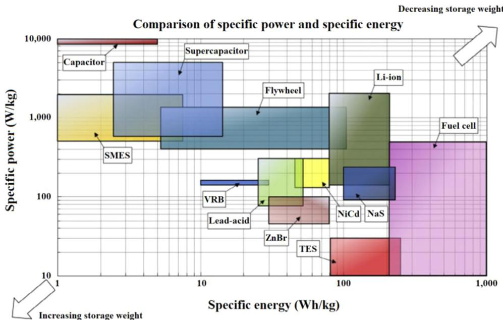
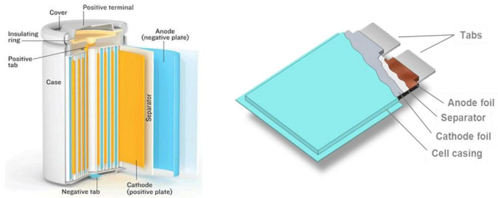
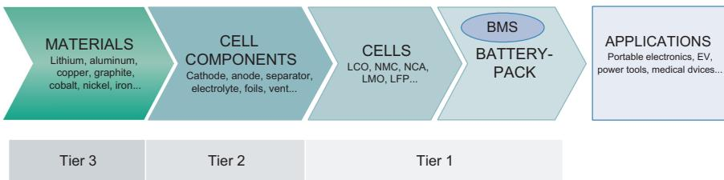
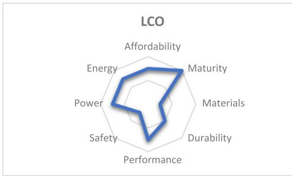
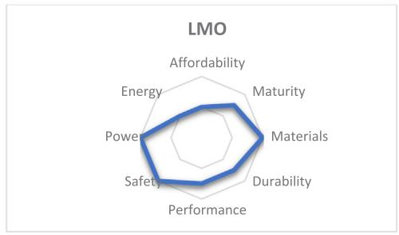
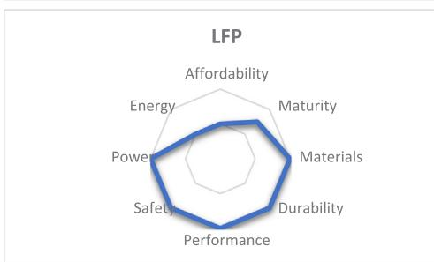
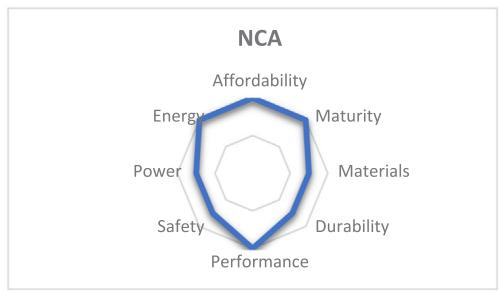
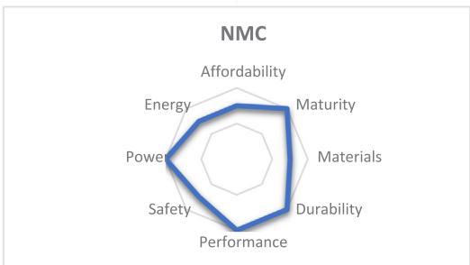

# The lithium-ion battery: State of the art and future perspectives

Ghassan Zubi $^{a,b,c,*}$ , Rodolfo Dufo-López $^{a}$ , Monica Carvalho $^{b}$ , Guzay Pasaoglu $^{c}$

a Electrical Engineering Department, University of Zaragoza, Calle Maria de Luna 3, 50018 Zaragoza, Spain  
$^{\mathrm{b}}$  Department of Renewable Energy Engineering, Federal University of Paraiba, Brazil  
c Institute for Management Research, Radboud University, Nijmegen 6500 HK, The Netherlands

# ARTICLEINFO

Keywords:

Lithium-ion battery

Electric vehicles

Power supply systems

Carbon footprint

Critical materials

# ABSTRACT

Lithium-ion batteries play an important role in the life quality of modern society as the dominant technology for use in portable electronic devices such as mobile phones, tablets and laptops. Beyond this application lithium-ion batteries are the preferred option for the emerging electric vehicle sector, while still underexploited in power supply systems, especially in combination with photovoltaics and wind power. As a technological component, lithium-ion batteries present huge global potential towards energy sustainability and substantial reductions in carbon emissions. A detailed review is presented herein on the state of the art and future perspectives of Li-ion batteries with emphasis on this potential.

# 1. Introduction

Lithium-ion (Li-ion) batteries are well known power components of portable electronic devices such as smart phones, tablets and laptops. Nevertheless, these batteries can play a much bigger role in our modern society, most specifically as a key component in the development towards energy sustainability. In combination with the electricity grid, Li-ion batteries could support the integration of high shares of photovoltaic (PV) and wind energy in the power mix by providing storage capacity and ancillary services. Thereby, an electricity mix with a small carbon footprint is the healthy basis for the large implementation of electric vehicles (EV), where Li-ion batteries are the technology of choice. Li-ion batteries also have huge potential for use in off-grid power supply systems, especially in combination with solar home systems (SHS), to provide reliable access to electricity in developing regions. The current state of the art of the Li-ion battery is presented herein, along with its future perspectives with emphasis on the connection between Li-ion batteries and energy sustainability. Thereby, the objective of this work is not only to provide a comprehensive review, but also to emphasize the required actions to be able to exploit the full potential of Li-ion batteries as a key component in the shift from depletable to sustainable resources.

Recent scientific literature includes a comprehensive updated review on energy storage technologies by Gallo et al. [1] and the

description of energy storage systems including features, advantages, environmental impacts and applications by Sevket Guney and Tepe [2]. The Li-ion battery technology is discussed in several scientific papers and books; for instance Pistoia details the advances and applications [3], while Warner focuses on the battery-pack design [4], and Światowska and Barboux tackle the different Li-ion battery chemistries with consideration of resource extraction and recycling [5]. Besides taking into consideration recent developments in the field of Li-ion batteries, this manuscript is different from previous works on the topic in its structure and focus, as described next.

A comprehensive review of the state of the art requires detailing the different Li-ion battery chemistries and their key properties. Comparison with other electric energy storage (EES) technologies is relevant, especially with commercially available competitors. This contrast allows to understand the advantages of Li-ion batteries within the broader EES context and how these translate into implementation and market shares. This understanding also reflects on the comparison between the different Li-ion battery chemistries. Thereby, detailing the applications of Li-ion batteries is highly relevant. Of course, there is a big number of applications, but the most relevant ones in terms of market share are portable electronic devices and road-transport, while there is a relevant untapped potential for use in power supply systems. These three applications are the focus of this review. Although the use of Li-ion batteries in portable electronic devices is not related to

renewable energy and sustainability, data provided herein is relevant for an overall comprehensive review. Proper detailing of the state of the art requires also a briefing on the Li-ion battery industry to summarize the manufacturing process from raw materials to battery cells and packs. Thereby, a closer analysis of potentially critical materials, especially cobalt and lithium, is carried out. Also a briefing on the environmental impact of Li-ion batteries on a life cycle basis is provided. Overall, a state of the art that tackles these mentioned aspects allows for drawing conclusions on future perspectives for Li-ion battery technology. Key issues include how the Li-ion battery market will grow in the different applications and overall, what market shares can be expected for the different chemistries, how this could affect the availability of critical materials, how battery costs are expected to evolve, and which technological improvements are foreseeable. Finally, the potential role of Li-ion batteries in reducing carbon emissions and contributing to energy sustainability is emphasized. There are two major areas addressed herein; i) the use in power supply systems to support the integration of renewable energy sources, and ii) the electrification of road-transport. Most importantly, the required efforts, decisions and practices to exploit this Li-ion battery potential towards energy sustainability are highlighted.

Section 2 provides a brief overview of EES with a short comparison between the Li-ion battery and the closely competing battery technologies. Section 3 highlights the different Li-ion battery chemistries currently commercially available and details the cell key components. Section 4 provides an overview of the Li-ion battery industry, most specifically in terms of the value chain from raw materials to the application. Section 5 details the key properties of the commercially available Li-ion battery chemistries with emphasis on the specific energy and power, durability and safety. An understanding of the strengths and weaknesses of each chemistry provides the basis for identifying usage potentials. Section 6 is dedicated to the Li-ion battery applications, with focus on three major areas: portable electronic devices, road-transport and power supply systems. Although this section initially considers the current commercial state and use, it also takes into account future potentials. Section 7 highlights the Li-ion battery market trends and estimates the demand growth until 2030. A demand breakdown in the different major applications is provided. The implications of this market growth are highlighted, such as the expected cost reductions following the learning curve as well as the market shares of the different Li-ion chemistries. Section 8 provides a summary of the raw materials required to sustain the Li-ion battery industry in line with its expected market growth, and discusses the most critical elements; lithium and cobalt. The need for far reaching battery recovery and recycling schemes is emphasized and the role recycled materials could play is highlighted. Section 9 discusses the life cycle carbon emissions of the Li-ion battery and highlights the path towards properly exploiting this technology in favor of the environment. Finally, Section 10 provides a summary of the key factors and required practices that connect the Li-ion battery with energy sustainability.

# 2. Overview on electric energy storage

EES systems convert electric power to another form of energy for storage, and then reconvert to electricity when required. EES can also be carried out directly, as in capacitors; these, however, have limited applications due to low specific energy. Energy conversion can be accomplished in many ways; mechanical, thermal, electrochemical, etc. Consequently, there is a long list of EES technologies, of which some are already commercial, while others are still in the research and development (R&D) or demonstration stages. An example of systems that use mechanical energy are pumped hydro storage (PHS), and flywheels. An example of a thermal system is the cryogenic energy storage. Thermal systems are generally characterized by a low round-trip efficiency, due to the low conversion efficiency from thermal energy back to electric power as imposed by the second law of thermodynamics. This results as

a very limiting factor for thermal systems on the application level. The widest diversity of EES technologies is to be found in electrochemical systems, which include lead-acid, lithium-ion, nickel-cadmium, nickel metal hydride, sodium-sulphur, vanadium redox, zinc-bromine, nickel-hydrogen, nickel-zinc, molten salt and metal-air batteries, among others. Some batteries operate at ambient temperature, while others, such as molten salt and sodium-sulphur, operate at high temperatures. Another categorization regards solid state batteries and flow batteries, such as vanadium redox and zinc-bromine. Flow batteries are akin to fuel cells. At a commercial level, currently the most relevant rechargeable batteries are lead-acid, Li-ion, nickel metal hydride (NiMH) and nickel-cadmium (NiCd). Table 1 provides a summary of the strengths and weaknesses of these batteries. Further information on lead-acid batteries can be found in [6-8]. The reader is directed to [9-11] and [12] for more details on NiMH and NiCd batteries, respectively.

Several applications require EES, including power supply systems, portable electric and electronic devices, transportation systems, space applications, etc. Each of these applications has different segments; for instance, power supply systems could refer to grid-connected systems, but also to off-grid systems. Grid-connected EES units could be installed as centralized or distributed units. Diverse requirements result from this. Each EES technology has its own performance characteristics that make it more or less suitable for a specific application. Such key properties include energy density, specific energy, specific power, round-trip efficiency, self-discharge rate, calendar and cycle lives, full charge and discharge times, initial cost, O&M requirements and safety. It should also be highlighted that while some EES systems are strictly stationary, others are adaptable to mobile applications. Furthermore, some technologies can be produced as small size units, while others have limited adaptability to that.

PHS is currently the dominating EES technology connected to the electricity grid. PHS is a very mature technology for this use, especially because hydropower has been widely implemented for power generation for over a century. PHS plants have very long calendar lives and satisfactory round-trip efficiencies, while their low energy density is not a setback in this application. Compressed Air Energy Storage (CAES) is still under demonstration for grid-connected uses. There are currently two commercial CAES plants worldwide: one in Germany and the other in the USA, with a total capacity of  $400\mathrm{MW}$ , while a third plant is under development in the UK. The installed capacity of flywheels and supercapacitors is currently insignificant; although there is a recent commissioning of a MW scale plant in the USA, flywheels are still unpopular, and super-capacitors are still at an early stage of adoption. Interest in batteries for grid-connected uses is on the rise; for instance, there are approximately 25,000 domestic installations in Germany in conjunction with PV systems with a total storage capacity of  $160\mathrm{MWh}$  [14]. Further details on EES for stationary applications can be found in [15-18].

While stationary power supply systems have minor EES requirements regarding specific energy and power, these characteristics become a priority in portable electric and electronic devices and in electric mobility. Fig. 1 provides a comparison of different EES technologies and emphasizes the overall advantage of the Li-ion battery in this aspect. Altogether, rechargeable batteries dominate portable and mobile EES applications, and the technologies listed in Table 1 present the highest market shares. Other technologies, such as fuel cells, are expected to represent a growing market already in the near future [14].

# 3. Li-ion battery chemistries

Of all metals available for battery chemistry, lithium is considered to be the most promising. Apart of being widely available and nontoxic, it is very light and electropositive. This fundamental advantage over other chemistries allows lithium-based batteries to have higher potential for energy storage. Nevertheless, lithium is highly reactive, so

Table 1 Strengths and weaknesses of lead-acid, Li-ion, NiMH and NiCd batteries.  

<table><tr><td>Battery type</td><td>Strengths</td><td>Weaknesses</td></tr><tr><td rowspan="8">Lead-acid</td><td>+ Relatively low initial cost</td><td>- Modest specific energy and power</td></tr><tr><td>+ Mature technology</td><td>- Short cycle life</td></tr><tr><td>+ Large number of manufacturers worldwide</td><td>- High O&amp;M requirements</td></tr><tr><td>+ Reliance on abundant cheap materials</td><td>- Performance sensitive to temperature</td></tr><tr><td>+ Satisfactory round-trip efficiency</td><td>- Limited reliability</td></tr><tr><td>+ No memory effect</td><td>- Long charging time</td></tr><tr><td>+ Low self-discharge rate</td><td>- Safety concerns; gas release</td></tr><tr><td>+ Proven efficiency of recycling schemes</td><td>- Reliance on hazardous leada</td></tr><tr><td rowspan="11">Li-ion</td><td>+ Outstanding specific energy and power</td><td>- High initial cost</td></tr><tr><td>+ Long calendar and cycle lives</td><td>- Advanced BMS required</td></tr><tr><td>+ High roundtrip efficiency</td><td>- Safety concerns; thermal runaway incidents</td></tr><tr><td>+ Low O&amp;M requirements</td><td>- Material bottleneck concerns; lithium and cobalt</td></tr><tr><td>+ Satisfactory operating temperature ranges</td><td>- Currently weak recovery and recycling schemes</td></tr><tr><td>+ High reliability</td><td></td></tr><tr><td>+ Technological diversity; several chemistries</td><td></td></tr><tr><td>+ Intensive global R&amp;D efforts</td><td></td></tr><tr><td>+ Chemistries with eco-friendly materials available</td><td></td></tr><tr><td>+ Reasonable self-discharge rate</td><td></td></tr><tr><td>+ Relatively fast recharge</td><td></td></tr><tr><td rowspan="9">NiMH</td><td>+ Moderate initial cost</td><td>- High self-discharge rate</td></tr><tr><td>+ Satisfactory specific energy and power</td><td>- Slight memory effect</td></tr><tr><td>+ Satisfactory round-trip efficiency</td><td>- Relatively short cycle life</td></tr><tr><td>+ Low O&amp;M requirements</td><td>- Currently weak recovery and recycling schemes</td></tr><tr><td>+ High reliability</td><td></td></tr><tr><td>+ Reliance on eco-friendly materials</td><td></td></tr><tr><td>+ Good safety record</td><td></td></tr><tr><td>+ Satisfactory operating temperature ranges</td><td></td></tr><tr><td>+ Relatively fast recharge</td><td></td></tr><tr><td rowspan="9">NiCd</td><td>+ Relatively low initial cost</td><td>- Modest specific energy and power</td></tr><tr><td>+ Outstanding calendar and cycle lives</td><td>- Memory effect</td></tr><tr><td>+ Mature technology</td><td>- Relatively low round-trip efficiency</td></tr><tr><td>+ High reliability</td><td>- Reliance on hazardous cadmiuma</td></tr><tr><td>+ Low O&amp;M requirements</td><td></td></tr><tr><td>+ Reasonable self-discharge rate</td><td></td></tr><tr><td>+ Good safety record</td><td></td></tr><tr><td>+ Extensive operating temperature ranges</td><td></td></tr><tr><td>+ Relatively fast recharge</td><td></td></tr></table>

a Lead and cadmium are restricted elements under the RoHS (Restriction of Hazardous Substances) directive of the European Commission [13]. This EU legislation limits the use of hazardous substances in electrical and electronic equipment while promoting collection and recycling.

  
Fig. 1. Comparison of specific energy and power for different EES technologies [19]. Acronyms: SMES (superconducting magnetic energy storage), VRB (vanadium redox battery), ZnBr (zinc-bromine battery), NaS (sodium-sulphur), TES (thermal energy storage).

it is technologically challenging to build safe battery cells containing lithium. This challenge has been tackled so far by not using metallic lithium, but rather compounds that are capable of donating lithium ions  $(\mathrm{Li}+)$ . The ions are shuttled between two electrodes in a reversible chemical reaction.

The first lithium battery was built in the 1970s by Michael Stanley Whittingham, who used lithium metal and titanium sulphide as electrodes [20]. This chemistry found no use, but provided the basis for further work. In the same period, reversible intercalation in graphite and cathodic oxides was researched by Jürgen Otto Besenhard, who proposed its implementation to build lithium batteries [21-23]. In the late 1970s, Samar Basu demonstrated the electrochemical intercalation of lithium in graphite [24]. Battery cells built in that time, however, would deteriorate rapidly with each recharge. Rachid Yazami tackled this problem in the early 1980s through his research on the reversible electrochemical intercalation of lithium in graphite [25]. Much efforts in the 1980s by various groups focused on experimenting and developing cathode materials for Li-ion batteries. The commercial breakthrough was reached in 1991. Since then intensive developments and technological diversification have taken place and this with an expanding range of applications.

The four main components of a Li-ion battery cell are the cathode, anode, electrolyte and separator. During charge, the lithium ions move from the cathode, through the electrolyte, to the anode, and move back during discharge. Current commercial batteries are named from the lithium-ion donor in the cathode, as this is the main determinant of cell properties. Several lithium metal oxides are used for this purpose: lithium cobalt oxide (LCO), lithium manganese oxide (LMO), lithium iron phosphate (LFP), lithium nickel cobalt aluminum oxide (NCA) and lithium nickel manganese cobalt oxide (NMC). This variety of materials results in significantly different battery characteristics [26]. The aforementioned compounds present much higher impedance compared to metallic lithium, due to lower conductivities and diffusion coefficients. This limitation is overcome by finely powdering and blending the lithium compound with a conductive carbon material. A solvent (e.g., Nmethyl-2-pyrrolidone) and a binder (e.g., Poly Vinylidene Flouride) are used to shape the cathode, which is pasted on aluminium foil. The current dominant anode material is graphite, although some battery manufacturers have opted for non-graphite anodes such as lithium titanate (LTO,  $\mathrm{Li_4Ti_5O_{12}}$ ) [27]. The manufacturing process of the anode is similar to the cathode, but the blend is pasted on copper foil in the anode case. The aluminum foil of the cathode and the copper foil of the anode lead to the battery cell terminals.

The electrolyte is a mixture of lithium salt and organic solvents. Common lithium salts include lithium-hexafluorophosphate  $(\mathrm{LiPF}_6)$ , lithium-perchlorate  $(\mathrm{LiClO}_4)$  and lithium-hexafluoroarsenate  $(\mathrm{LiAsF}_6)$ . The organic solvent is vital for increasing the mobility of lithium ions, and hence a key factor in the battery performance. Common organic solvents include ethyl-methyl-carbonate, dimethyl-carbonate, diethyl-

carbonate, propylene-carbonate and ethylene-carbonate. Especially when the cell casting is not very resistant, as is the case of polymer Li-ion batteries, a gel electrolyte is utilized to prevent electrolyte leakage. For this purpose, a gel precursor is added to the electrolyte (e.g., polyethylene-oxide, polyacrylonitrile, poly-vinylidene-fluoride or polymethyl-methacrylate). The separator is a safety component between the cathode and the anode, preventing direct contact, i.e. short-circuiting, while being permeable to lithium ions. The most common separator materials are polyethylene and polypropylene. In the case the cell heats excessively, which is an early sign of thermal runaway, these materials melt, suffering degradation of micro-porous properties and blocking the ion flow. This "shutdown" function damages the cell irreparably, but avoids major negative consequences. Li-ion cells can also include other safety features and elements such as components that strengthen the cell mechanically, insulators on the edges of the electrodes where short circuit accidents are most likely to happen and vents for air pressure relief. Further details on the internal structure of Li-ion cells can be found in [28].

Li-ion battery cells are manufactured as cylindrical or stack cells. Both configurations are illustrated in Fig. 2. In the stack configuration, the cathode, anode and separator are enclosed in laminate film. In the cylindrical configuration, the layers are rolled and sealed in a metal can. Both configurations are used to produce different standard cell sizes. Nevertheless, some sizes are the most common; for the cylindrical cell, the 18650 size (18 mm diameter and 65 mm height) is the most used. Further details on commercial 18650-format Li-ion cells are available in [29]. Some specific applications such as wearable electronics or smart uniforms require mechanically flexible batteries, and in this case polymer Li-ion batteries result practical. These are stack cells with a polymer casing. When flexibility is required, several small cells are often preferred over one single big cell. Among other relevant innovations in this field, Panasonic has developed bendable Li-ion battery cells [30].

Liable and safe to use Li-ion cells require a battery management system (BMS) to track and manage key functionality and performance aspects, e.g. voltage, current, state of charge (SOC), state of health (SOH) and temperature, among other aspects. Portable light emitting diode (LED) lanterns, for example, require a simple BMS, while aviation applications require very sophisticated systems. The BMS is engineered from standard off-the-shelf electronic components, such as chipsets [31,32].

# 4. Li-ion battery industry

Fig. 3 shows the production structure of the Li-ion battery industry, from raw materials to final applications. The value chain shows that the Li-ion battery sector engages a high number of industries, including the mining industry to obtain the raw materials, the inorganic chemical industry to obtain the cathode active materials with the required purity,

  
Fig. 2. Li-ion battery cell configurations.

  
Fig. 3. Production structure of the Li-ion battery industry.

the organic chemical industry for the electrolyte, the polymer chemical industry for the binder and separator, the metal industry for the can and electrode foils and the electronics industry for the BMS. Several industry players have activities that extend throughout a significant share of the value chain. Tesla, for example, produces battery cells based on own production of key components, including cathodes, and assembles battery-packs, which are eventually used in the Tesla EV. Other players have a much smaller range of engagement, producing for example a single cell component. Further details on the value chain of Li-ion batteries can be found in [28].

The major industry players in Tiers 1 and 2 on a global level are relatively concentrated in few countries: Japan (including Panasonic, Sony, GS Yuasa and Hitachi Vehicle Energy), Korea (LG Chem, Samsung, Kokam and SK Innovation), China (BYD Company, ATL and Lishen) and USA (Tesla, Johnson Controls, A123 Systems, EnerDel and Valence Technology). Until recently, East Asia was by far leading production in Tiers 1 and 2, but a major shift has been caused by Tesla's Gigafactory in Nevada, which is expected to supply approximately  $30\%$  of the global Li-ion battery cell production in 2020. Many industry players are not completely dedicated to Li-ion batteries, which could constitute a small portion of their overall portfolio. This is especially true for Asian giants such as Samsung, Sony and Panasonic. Further details on the major players in the Li-ion battery industry are available in [30,33-46].

# 5. Battery key properties

The most relevant characteristics of a battery are its specific energy and power, durability and safety. The specific energy of a Li-ion battery depends on the type of cathode used and constituting anode materials as well as their nano and micro-structures. As the active materials of a cell occupy only a fraction of its weight, cell design also impacts this aspect. Current commercial Li-ion batteries cover a wide range of specific energy, roughly from 90 to  $250\mathrm{Wh / kg}$ . Thereby, NCA batteries perform best in this aspect, while LFP batteries perform worse. The specific energy is one of the central development criteria in Li-ion batteries, especially for mobile applications, which has resulted in a general upwards trend. On the other hand, the maximum power a Li-ion battery could provide depends on its voltage, density of lithium ions, solid electrolyte interphase (SEI), diffusion coefficient of the electrodes and their conductivity. The specific power is often described within the power to energy  $(\mathrm{P / E})$  ratio, i.e., how much power in kW could a battery provide for a kWh of capacity. Power requirements depend on the application and are determinant for the selection of a battery. For instance, PHEV require batteries with a much higher P/E ratio than EV, and use therefore batteries with more but thinner cathodes and anodes to maximize SEI and the immediately available charge carriers.

An important property of a battery is its durability. Battery degradation occurs in all conditions, but in different proportions depending on the use. Tough operating conditions such as low or high operation temperatures, overcharge, deep discharge and high amperage accelerate degradation. Batteries suffer calendar and cycle ageing; the first occurs even if the battery is stored and therefore depends basically on external conditions, most specifically the temperature. Cycle ageing is additionally subject to the battery charge and discharge conditions. In practical terms, battery ageing is caused by the loss of cyclable

lithium and active electrode materials, and is noticed as capacity fade and loss of power. The loss of cyclable lithium is related to side reactions, while the loss of electrode active materials is due to factors such as dissolution, structural degradation and particle isolation. A review on the ageing mechanisms of Li-ion batteries and the SOH estimation methods is provided in [47]. From the user's viewpoint, the most relevant durability indicator is the cycle life, which is the number of full cycles a battery is able to deliver under standard operating conditions before its key performance metrics (i.e. capacity and power) drop to  $80\%$  of initial values. Depending on the application and considering the capacity, power and safety requirements, a battery may actually be considered obsolete at a higher or lower value than the  $80\%$ . Detailed understanding of the ageing mechanisms of a specific battery chemistry paves the way for advanced battery designs with longer cycle lives. Thereby, improvements could take place both on cell and BMS levels. Li-ion batteries have improved notably in terms of durability and there is a widely held expectation that this trend will continue.

A detailed review on the safety issues of Li-ion batteries is provided by Wen et al. [48]. Li-ion batteries present an embedded technological challenge when it comes to safety because they contain lithium, oxygen and a flammable electrolyte. Thereby, Li-ion batteries have already found use in sensitive applications, including road-transport and aviation. Furthermore, millions of Li-ion batteries are carried daily on flights by passengers, in portable electronics. Safety issues of Li-ion batteries are being extensively investigated, and the challenge is not only how to make current batteries safer in an expanding range of applications, but also to improve aspects such as specific energy and power without compromising safety. A serious concern over Li-ion batteries is thermal runaway: if a battery cell is excessively heated, for instance through prolonged overcharge or short circuiting, to the level of decomposing its metal oxide, the battery could burst into flames because of the reaction of freed oxygen with lithium. A detailed review on the thermal runaway of Li-ion batteries is provided in [49-52]. Depending on the application, different safety concerns must be tackled, including factors related to tough operating conditions, accidents and ageing mechanisms. For instance, needle penetration in the battery cell could short-circuit the cathode and anode. Also, the formation of dendrites over time could build a conductive bridge, resulting in short-circuit and eventually thermal runaway. Safety can be addressed at three levels: inherent, in the cell design and through the BMS. The first concerns the choice of battery chemistry; some battery chemistries are inherently safer than others. This is the case of LFP, especially when compared to LCO, as it is much more thermally stable (i.e. decomposes at higher temperature). At the cell level, safety elements and features can be integrated to prevent short-circuits between the cathode and anode despite battery ageing or accidents. Finally, the BMS can be very effective in avoiding overcharge and short-circuits through voltage and current controls, providing safe operating conditions.

Fig. 4 summarizes the main characteristics of commercially available Li-ion batteries [53-57]. LCO was the first Li-ion chemistry to become commercial in 1991, and is made from  $\mathrm{LiCoO}_2$  cathode and graphite  $(\mathrm{C}_6)$  anode. High specific energy (150-190 Wh/kg) and technological maturity make LCO batteries a popular choice for portable electronics such as mobile phones, tablets and laptops. The durability of 500-1000 full cycles translates into a calendar life of few years, which

  
Fig. 4. Main characteristics of commercial Li-ion batteries.

is acceptable for such innovation-intensive devices. The main disadvantage of the LCO battery is its low inherent safety; due to the low thermal stability of cobalt-oxide, thermal runaway could be initiated already at  $150^{\circ}\mathrm{C}$ . This battery found use in aviation, most specifically starting in 2011 in the Boing 787 Dreamliner to provide auxiliary startup and backup power during flights. However, battery failure incidents, including thermal runaway, raised serious concerns and lead to the grounding of all affected airplanes for several months in early 2013. More details on the record of LCO batteries in aviation are available by Williard et al. [58]. It is not a surprise that the EV sector is showing no interest in LCO batteries; additionally to safety concerns, the cycle life is relatively modest, and long-term market growth could be limited by a cobalt bottleneck.

The LMO battery was first commercialized in 1996. The  $\mathrm{LiMn_2O_4}$  cathode forms a three dimensional spinel structure that favors the ion flow on the electrode, resulting in low internal resistance. This yields a relatively high specific power. LMO cathodes are combined with graphite or LTO anodes. LMO batteries have a longer cycle life than LCO, typically in the range of 1000-1500 cycles, but notably lower energy density, in the range of  $100 - 140\mathrm{Wh / kg}$ . Due to the higher thermal stability of manganese oxide, LMO batteries are inherently safer; thermal runaway occurs at approximately  $250^{\circ}\mathrm{C}$ . Furthermore, the battery is cobalt-free and relies on abundant and eco-friendly materials. LMO batteries are mostly used in e-bikes, power tools and medical devices.

The LFP battery has  $\mathrm{LiFePO_4}$  cathode, while graphite is used mostly as the anode material. This battery was first commercialized in 1999 and was soon considered a promising technology due to its durability, inherent safety and reliance on abundant, eco-friendly materials. Current LFP batteries endure up to 2000 full cycles, while industry projections for a longer lifetime are realistic. The battery tolerates operation with a wide SOC window (15–100%), and the cell displays

constant voltage within this range, which implies constant performance. These advantages of the LFP battery made it initially an interesting candidate for EV, nevertheless, its relatively low specific energy in the range of  $90 - 140\mathrm{Wh / kg}$  is a setback when compared with other Li-ion chemistries. The LFP battery has today a marginal role in EV, while encountering better success in e-bikes. This chemistry has also a huge potential for use in power supply systems, both off-grid and grid-connected.

The NCA chemistry was commercially introduced in 1999. It is made from  $\mathrm{LiNiCoAlO_2}$  cathode and graphite anode. Typically, NCA cathodes use a blend of  $80\%$  nickel,  $15\%$  cobalt and  $5\%$  aluminium, and therefore the reliance on cobalt is relatively moderate when compared with LCO batteries. NCA batteries have an outstanding specific energy (200-250 Wh/kg) as well as high specific power, and can endure 1000-1500 full cycles. NCA batteries are used in EV, and there are projections for grid-connected use (e.g. backup and loadshift). Most importantly, this battery is used by Tesla in its EV. Tesla has ambitious manufacturing projections for Li-ion batteries; its recently completed Gigafactory in Nevada will reach full capacity in 2020 with annual output of 35 GWh, which is sufficient for the production of 500.000 EV [42]. This scale will result in a cost advantage for the NCA cell.

NMC batteries are made from  $\mathrm{LiNiMnCoO_2}$  cathode and a graphite anode. Compared to NCA, the NMC battery has lower energy density, typically in the range of  $140 - 200\mathrm{Wh / kg}$ , while presenting a longer cycle life (1000-2000). The proportions of nickel, manganese and cobalt could be varied to influence the battery characteristics and provide tailored solutions for specific applications [59]. Increasing the share of nickel favours the specific energy aspect, while increasing the share of manganese increases specific power. Although the NMC battery was first commercialized as late as 2004, it dominates in EV and PHEV applications, while also being used in portable electronics, power tools and medical devices. There are also projections for grid-connect uses.

# 6. Applications

Li-ion batteries are present in a wide range of applications, while new uses still emerge. The largest market has been portable electronic devices, but it is being overtaken by the Li-ion battery demand for road-transport. The battery has also found use in aerospace applications, including in satellites and aviation. The technology has potential to be utilized in power supply systems, off-grid and grid-connected. Substantial improvements have been achieved in medical devices, such as in hearing aids, by exploiting the advances in lithium battery technology. This development has also guaranteed miniaturized, reliable, high density and hermetically sealed rechargeable power sources for highly-integrated and size-limited low power implantable devices in applications such as drug-delivery, glucose sensing, and neuro-stimulation [60]. The use of Li-ion batteries in medical devices has been explored, among others, by the US Food and Drug Administration [61]. Many self-powered micro-electronics, such as miniature transistors, sensors and actuators also integrate tiny Li-ion batteries [62]. Furthermore, as professionals continue to demand more powerful, efficient and comfortable tools to work with, Li-ion is the battery of choice as it offers outstanding specific energy and power together with low self-discharge rates [63]. Finally, Li-ion cells can also be found in wearable technology products, flashlights, radio-controlled toys, solar LED systems and wireless vacuum cleaners, among others.

The focus of this Section is on the major Li-ion battery applications. This includes the two already established markets of portable electronics and road-transport, and the potential market of power supply systems. The other applications are obviously also relevant, but present small market shares.

# 6.1. Portable electronic devices

Portable electronic devices include cellular phones, tablets, laptops, cordless phones, digital cameras, camcorders, MP3 players, video games and toys, among others. In terms of battery market share, cell phones, tablets and laptops are by far the major applications. The global market for portable electronics continues to grow strongly. Currently  $31\%$  of the world population use smartphones, but national level statistics for smartphone penetration are very diverse, reaching a record of  $88\%$  of the population in South Korea, while being under  $10\%$  in several Sub-Saharan African countries. China is well above the global average, with  $58\%$  of the population being smartphone users, while India with  $17\%$  is clearly below that [64]. These gaps emphasize the global growth potential for smartphones specifically, and for portable electronic devices in general.

Portable electronics have been the initial market for Li-ion batteries and for long also the main market. Consumer demands have resulted in progressively smaller devices. Customers also expect new generation devices to have shorter recharge times and longer battery autonomy. This trend has been especially observed in smartphones and tablets with leading brands competing for lighter and slimmer designs with more powerful batteries.

As specific energy and power are key criteria in portable electronic applications, the Li-ion battery has a clear advantage over other chemistries. In the past, Li-ion batteries had to compete with NiMH and NiCd batteries in this sector, but nowadays Li-ion is the technology of choice [65]. In 2014, the Li-ion cell was already by far the most widely used battery technology in mobile devices [66]. The battery capacity for laptops is typically in the range of 50-100 Wh. For example, nine  $3.6\mathrm{V}2800\mathrm{mAh}$  cells are used as three rows of three cells in series, which results in a battery-pack voltage of  $10.8\mathrm{V}$  and capacity of  $8400\mathrm{mAh}$ , i.e., 90.7 Wh. Smartphones typically use a single cell and therefore do not exceed 10 Wh storage capacity. Tablets use two or three cells, connected in parallel, to operate at single cell voltage  $(3.6\mathrm{V})$ . The battery capacity of tablets is usually in the range of 15-35 Wh (e.g., Samsung Galaxy with 15 and 21 Wh versions, Sony

Xperia with 22 Wh, iPad Air with 26 Wh and Lenovo Yoga with 32 Wh nominal battery capacity) [33,67-69].

The high relevance of specific energy means that cobalt-free Li-ion chemistries, i.e., LFP and LMO, are weak competitors in the field of portable electronic devices. Currently the LCO battery is the dominant chemistry in portable electronics. The iPhone 6 Plus, for example, uses an LCO cell due to its compactness and technological maturity [68]. Due to these advantages, along with low self-discharge rates, Lenovo, Acer, Dell, HP and Toshiba use LCO battery-packs in their laptops. The main disadvantage acknowledged by these brands is the relatively short cycle-life of LCO batteries. As LCO batteries are approaching the theoretical limit for specific energy, Sony, Samsung and LG Chem have also been developing next generation NMC batteries with different ratios of manganese, nickel, and cobalt. Manufacturers keep the exact ratio of the metal contents of the cathode a well-guarded secret. The most popular NMC models for portable electronics include Samsung 25R, Sony VTC4 and VTC5, and LG HG2.

Safety requirements for portable electronics are high, among others, as millions of these devices are carried daily on flights by passengers. Highly publicized manufacturer recalls have been recently reported for portable electronics due to thermal runaway incidents [70-72]. These calls are related to LCO batteries. It has been well reported that LCO is the least safe Li-ion chemistry; LCO cells performed worse in safety tests conducted by Golubkov et al. [51,52]. In this sense, it is important not to generally label Li-ion batteries as unsafe based on the experience with LCO. Of course, there are subjective perceptions on safety issues; with billions of LCO cells being used worldwide, few thermal runaway incidents are an indicator of an overall positive safety record, but some believe that consumers are safe only when there are no such incidents at all. Independently of the subjective interpretation, safety remains a sensitive topic that attracts attention, even on a minor mishap. Lu et al. emphasize that such LCO incidents have propelled research and design efforts to establish failure causes and help guide safer cell and battery-pack designs [73].

Altogether, the portable electronics sector is on a challenging innovation path that requires miniaturization of batteries, while maintaining high capacity and power and still complying with strict safety standards. Therefore, although LCO will continue to be the dominant chemistry for portable electronics on the short term, it will gradually lose market share to NMC and NCA cells. These also have the advantage of lower material intensity regarding cobalt, which will become progressively necessary within the overall strongly growing Li-ion battery market.

# 6.2. Road-transport

Hybrid electric vehicles (HEV) are vehicles that combine a conventional internal combustion engine with an electric propulsion system (battery + electric engine). This upgrade improves performance and fuel economy; an energy recovery system regains deceleration power and stores it into the battery for later acceleration. HEV manage well with a small battery of few kWh. At this small size, there is no practical justification to have an electric plug-in option to recharge the battery externally to start driving with a full battery. However, the plug-in hybrid electric vehicle (PHEV) battery is sufficiently large to justify external recharge. PHEV batteries are roughly above 8 kWh and are sufficient for an all-electric drive range over  $30\mathrm{km}$ . Finally, EV eliminate the internal combustion engine and all related components, and rely fully on electric driving. The battery capacity of EV starts roughly at  $18\mathrm{kWh}$ , while the driving range is usually above  $120\mathrm{km}$ . Table 2 lists several current commercial EV and PHEV along with basic characteristics. Table 2 is widely representative of the road-transport sector.

While a few years ago there were still some car manufacturers focusing on other battery technologies, such as NiMH in the case of Mitsubishi, today's sector is dominated by Li-ion, and this is unlikely to

Table 2  
Several commercial EV and PHEV in 2017 and their key characteristics [39,42,74-89].  

<table><tr><td>Manufacturer</td><td>Name</td><td>EV/PHEV</td><td>Battery Chemistry</td><td>Capacity [kWh]</td><td>E Engine P [kW]</td><td>Vehicle Weight [kg]</td><td>B Pack share in weight [%]</td><td>Sp. Range [km/kWh]</td><td>E. Rang [km]</td></tr><tr><td rowspan="4">Tesla</td><td>Tesla Model S 75D</td><td>EV</td><td>NCA</td><td>75</td><td>245</td><td>2108</td><td>24</td><td>6</td><td>405</td></tr><tr><td>Tesla Model S 90D</td><td>EV</td><td>NCA</td><td>90</td><td>311</td><td>2240</td><td>25</td><td>5.5</td><td>445</td></tr><tr><td>Tesla Model S 100D</td><td>EV</td><td>NCA</td><td>102</td><td>451</td><td>2390</td><td>25</td><td>5.5</td><td>510</td></tr><tr><td>Tesla Model S P100D</td><td>EV</td><td>NCA</td><td>102</td><td>567</td><td>2234</td><td>26</td><td>5.5</td><td>505</td></tr><tr><td>Toyota</td><td>Toyota Prius Prime</td><td>PHEV</td><td>NMC</td><td>8.8</td><td>20</td><td>1526</td><td>7</td><td>5.5</td><td>40</td></tr><tr><td rowspan="2">General Motors</td><td>Chevrolet Bolt EV</td><td>EV</td><td>NMC</td><td>60</td><td>149</td><td>1624</td><td>27</td><td>7</td><td>350</td></tr><tr><td>Chevrolet Volt</td><td>PHEV</td><td>NMC</td><td>18.4</td><td>111</td><td>1607</td><td>11</td><td>5.5</td><td>85</td></tr><tr><td rowspan="4">Volkswagen</td><td>VW e-Golf</td><td>EV</td><td>NMC</td><td>35.8</td><td>100</td><td>1605</td><td>22</td><td>6.5</td><td>195</td></tr><tr><td>VW e-up</td><td>EV</td><td>NMC</td><td>18.7</td><td>60</td><td>1139</td><td>20</td><td>7</td><td>110</td></tr><tr><td>VW Golf GTE</td><td>PHEV</td><td>NMC</td><td>8.8</td><td>75</td><td>1520</td><td>8</td><td>6</td><td>45</td></tr><tr><td>VW Passat GTE</td><td>PHEV</td><td>NMC</td><td>9.9</td><td>85</td><td>1722</td><td>8</td><td>5.5</td><td>45</td></tr><tr><td rowspan="2">Audi</td><td>Audi A3 Sportback e-tron</td><td>PHEV</td><td>NMC</td><td>8.8</td><td>76</td><td>1654</td><td>7</td><td>5</td><td>35</td></tr><tr><td>Audi Q7 e-tron</td><td>PHEV</td><td>NMC</td><td>17.3</td><td>94</td><td>2445</td><td>9</td><td>4</td><td>55</td></tr><tr><td rowspan="2">Porsche</td><td>Porsche Cayenne S E-Hybrid</td><td>PHEV</td><td>NMC</td><td>10.8</td><td>71</td><td>2360</td><td>6</td><td>4</td><td>35</td></tr><tr><td>Porsche Panamera 4 E-Hybrid</td><td>PHEV</td><td>NMC</td><td>9.4</td><td>100</td><td>2170</td><td>6</td><td>5</td><td>40</td></tr><tr><td>Nissan</td><td>Nissan Leaf</td><td>EV</td><td>NMC</td><td>30</td><td>80</td><td>1516</td><td>20</td><td>7</td><td>170</td></tr><tr><td rowspan="2">Hyundai</td><td>Hyundai Ioniq Plug-in</td><td>PHEV</td><td>NMC</td><td>8.9</td><td>45</td><td>1370</td><td>9</td><td>6.5</td><td>50</td></tr><tr><td>Hyundai Ioniq Electric</td><td>EV</td><td>NMC</td><td>28</td><td>88</td><td>1420</td><td>20</td><td>7</td><td>165</td></tr><tr><td rowspan="2">Ford</td><td>Ford Focus Electric</td><td>EV</td><td>NMC</td><td>33.5</td><td>107</td><td>1651</td><td>20</td><td>6.5</td><td>180</td></tr><tr><td>Ford C-Max Energi</td><td>PHEV</td><td>NMC</td><td>7.6</td><td>88</td><td>1769</td><td>6</td><td>5</td><td>30</td></tr><tr><td>Fiat</td><td>Fiat 500e</td><td>EV</td><td>NMC</td><td>24</td><td>83</td><td>1352</td><td>19</td><td>7</td><td>135</td></tr><tr><td>BMW</td><td>BMW i3</td><td>EV</td><td>NMC</td><td>33</td><td>127</td><td>1343</td><td>24</td><td>6.5</td><td>180</td></tr><tr><td rowspan="2">Daimler</td><td>Mercedes-Benz B-class E Drive</td><td>EV</td><td>NCA</td><td>36</td><td>132</td><td>1725</td><td>17</td><td>6</td><td>165</td></tr><tr><td>Smart Fortwo Electric Drive</td><td>EV</td><td>NMC</td><td>18</td><td>60</td><td>995</td><td>16</td><td>7</td><td>120</td></tr><tr><td>Kia</td><td>Kia Soul EV</td><td>EV</td><td>NMC</td><td>27</td><td>82</td><td>1554</td><td>18</td><td>6.5</td><td>145</td></tr><tr><td>Renault</td><td>Renault Zoe</td><td>EV</td><td>NMC</td><td>41</td><td>68</td><td>1480</td><td>26</td><td>7</td><td>230</td></tr><tr><td>Karma</td><td>Karma Revero</td><td>PHEV</td><td>NMC</td><td>21.4</td><td>106</td><td>2450</td><td>10</td><td>4.5</td><td>80</td></tr><tr><td>BYD</td><td>BYD E6</td><td>EV</td><td>LFP</td><td>82</td><td>89</td><td>2420</td><td>29</td><td>5</td><td>390</td></tr><tr><td rowspan="2">Mitsubishi</td><td>Mitsubishi i-MiEV</td><td>EV</td><td>NMC</td><td>16</td><td>49</td><td>1170</td><td>19</td><td>7</td><td>95</td></tr><tr><td>Mitsubishi Outlander</td><td>PHEV</td><td>NMC</td><td>12</td><td>119</td><td>1845</td><td>10</td><td>5</td><td>45</td></tr></table>

For most listed EV and PHEV the maximum DoD for the battery is around  $82\%$  except for the Tesla and Daimler models, where the maximum DoD is  $90\%$ . Different values can be found by different sources for the drive range. The values provided herein are based on the battery capacity and the specific range, which must be taken into account as representative for clear weather conditions, reasonable drive practice and no use of air-conditioning or heating.

change in the near future [90]. The key advantage of Li-ion batteries in road-transport is the specific energy. As a matter of fact, within the Li-ion technologies, the two chemistries that excel in this aspect, i.e., NMC and NCA, dominate this application. Until recently, some manufactures combined NMC with LMO cells to exploit the advantages of both, but these have shifted meanwhile to a battery-pack with NMC cells exclusively to be able to extend the electric driving range without increasing the battery-pack weight. The NMC and NCA advantages leave also the LCO battery completely out of the picture for the car industry. Comparatively, LCO cells have a shorter cycle life, are less safe and rely heavily on critical cobalt. Finally, only one manufacturer of Table 2 is still opting for a different chemistry than NMC and NCA: the Chinese company BYD still utilizes LFP cells. LFP batteries are very safe, rely only on abundant and eco-friendly materials and have a high cycle life. Through battery cell innovation, BYD hopes to catch up with its competitors in terms of specific energy, but for the moment this remains a major disadvantage of its EV BYD E6, which, despite its modest engine, almost tops the list in curb weight.

Regarding NMC versus NCA, the majority of car manufacturers are opting for NMC cells. While the NCA cell is advantageous in terms of specific energy, the NMC cell presents higher lifetime, which favours the utilisation of the latter in PHEV. These vehicles are mostly calculated for one battery cycle per day, which means that the NCA battery-pack would have to be replaced after five years. The PHEV sector prefers NMC batteries, which survive an extra couple of years. The use of NCA cells instead would bring only a minor advantage, basically  $10 - 20\mathrm{kg}$  less weight. Furthermore, the NMC chemistry has generally a slight specific power advantage over NCA. As PHEV have full electric drive with a relatively small battery-pack, power requirements are high, and hence NMC cells adapt better for this use. For major players of the sector, such as the VW Group and General Motors, who manufacture both EV and PHEV, the selection of NMC cells for PHEV favours the same choice for EV. This enables better exploitation of synergies and negotiation of better prices with battery cell suppliers. Although both NMC and NCA cells are present in the EV market, the current interest in NMC cells is generally higher. Only few companies utilise NCA cells. This includes Tesla, who produces vehicles with the longest electric range on the market, generally exceeding  $400\mathrm{km}$ . This, of course, requires a heavy battery-pack, and therefore the lighter NCA cells are the better choice. Due to the long range, a Tesla driver consumes an equivalent full battery cycle roughly once a week, which implies that after 15 years 800 full battery cycles would have been consumed; the NCA battery can handle this well. Daimler has also not taken final decision on the battery chemistry and is using both types of cells: NCA in the electric Mercedes B-Class, and NMC in the electric Smart Fortwo.

The operating conditions of the battery is different in a PHEV than in an EV, especially when it comes to the  $\mathrm{P / E}$  ratio. For instance, the VW e-Golf has a  $35.8\mathrm{kWh}$  NMC battery that can power a  $100\mathrm{kW}$  electric engine (Table 2). Operating at full power would result in a  $2.8\mathrm{P / E}$  ratio, which could go up to 3 if at the same time the air-conditioner or the car cabin heater is on. The  $\mathrm{P / E}$  ratio for EV is typically in the range of 2-5. On the other hand, the VW Golf GTE has an  $8.8\mathrm{kWh}$  battery that can power a  $75\mathrm{kW}$  electric engine. The  $\mathrm{P / E}$  ratio in this case is nothing less than 8.5. The  $\mathrm{P / E}$  ratio for PHEV is typically in the range of 5-10. This fact highlights one more advantage of the Li-ion battery over other chemistries for use in EV and PHEV. Higher requirements in terms of  $\mathrm{P / E}$  ratio are not expected in the next years. It's rather so that the sector will actively exploit battery cost reductions and improvements in specific energy to bring new car generations with higher battery capacity, and this per se will generally result in lower  $\mathrm{P / E}$  ratio requirements.

Current society is used on vehicles with a driving range over  $600\mathrm{km}$ , fuel refill time below 5 min and wide availability of fuel stations. PHEV do not differ much from this current standard, while the EV sector is still aiming to reach these levels. As Tesla has proven, it is possible to reach a driving range above  $500\mathrm{km}$  with current state of the

art technology. Fast recharging technologies, which roughly recharge  $80\%$  of the battery's nominal capacity in less than one hour, are becoming the standard. With the growth of EV and PHEV markets, charging points are multiplying. The current limiting factor in terms of driving range is not the specific energy of current NMC and NCA cells, but their cost. As a matter of fact, car manufactures can shift to lighter materials for the car body, such as aluminium and carbon fibre reinforced plastic, to accommodate more battery cells. At the same time, the battery-pack could be placed under the floor to provide more cabin space and lower the centre of gravity of the vehicle, which contributes positively to handling and stability. Nevertheless, a driving range over  $500\mathrm{km}$  requires a battery capacity above  $80\mathrm{kWh}$  and this is currently not within the economic reach of the middle class. The current major EV market is within the 20-50 kWh battery capacity range. As along the next decade substantial cost reductions will be achieved for NMC and NCA batteries, the affordability for a longer electric driving range will improve, and the  $500 + \mathrm{km}$  EV will become eventually the standard.

Current warranty conditions for EV batteries consider calendar life and total driven distance. The last translates into a limited number of full cycles. Most EV manufacturers take responsibility for 500-800 full cycles and a calendar life of approximately 8 years. This usually occurs on a whatever-comes-first-basis, i.e., if the user reaches the guaranteed drive distance before the calendar life ends, then the warranty expires. These terms are very favourable for manufacturers, simply because NMC and NCA batteries easily overcome these limits, even under tough operating conditions. The trend towards increased battery capacity in new generation vehicles makes the warranty conditions even better. For instance, with an electric driving range of  $500\mathrm{km}$ , the first 500 full battery cycles would be completed after  $250,000\mathrm{km}$ . Therefore, in practical terms, research to extend the cycle life of Li-ion batteries is not as relevant for EV as for PHEV and other applications.

The global threshold of one million electric cars on the road was crossed in 2015 [91]. This is a significant achievement, but remains an indicator that the EV market is still young. The electrification of road-transport counts with strong support from policy makers worldwide as it enhances energy security, leads to better air quality in population centers and has a big potential to reduce GHG emissions, especially if complemented by emission reductions in power generation. Many countries offer subsidies and tax exemptions for EV and PHEV based on their low direct emissions. The global conditions for an accelerated market growth are overall very favorable. The car industry is becoming the main market for Li-ion batteries. Further details on the EV key technologies can be found in the review paper by Kumar and Revankar [92].

Another emerging road-transport market for Li-ion batteries are electric motorcycles and e-bikes. The advantages of high specific energy and power, as well as long cycle life, make Li-ion the preferred chemistry in these applications. LFP, LMO and NMC cells are being used commercially, with NMC becoming progressively the market dominant.

# 6.3. Power supply systems

Power supply systems include grid-connected as well as off-grid systems. In the electricity grid, power supply has to be balanced with the consumer demand under strict quality criteria, i.e., uninterrupted power supply must be assured with tight margins for nominal values such as frequency and voltage. The electricity demand is variable along the day, displaying a typical pattern with a peak around midday and another within the few hours after sunset. Short-term demand peaks can also occur, as for example the "half-time kettle effect" related to the live transmission of widely watched football games; in the few minutes after halftime whistle a large number of people switch their kettles on for a hot drink. Substantial seasonal fluctuations also occur, but these are location-dependent. In Scandinavian countries, the winter demand is higher than the summer demand, while in Southern Europe the opposite occurs due to an intensive use of air-conditioners. Exceptionally

Table 3 Energy storage cost of Li-ion batteries under different considerations, in c€/kWh.  

<table><tr><td></td><td></td><td colspan="5">Battery bank specific cost [€/kWh]</td></tr><tr><td></td><td>Cycle life</td><td>300</td><td>250</td><td>200</td><td>150</td><td>100</td></tr><tr><td rowspan="4">1 Cycle/day</td><td>1500</td><td>29.9</td><td>25.0</td><td>20.1</td><td>15.2</td><td>10.3</td></tr><tr><td>2000</td><td>23.5</td><td>19.7</td><td>15.8</td><td>12.0</td><td>8.2</td></tr><tr><td>2500</td><td>19.7</td><td>16.5</td><td>13.3</td><td>10.1</td><td>6.9</td></tr><tr><td>3000</td><td>16.4</td><td>13.9</td><td>11.2</td><td>8.8</td><td>6.1</td></tr><tr><td rowspan="4">2 Cycles/day</td><td>1500</td><td>28.0</td><td>23.4</td><td>18.8</td><td>14.3</td><td>9.7</td></tr><tr><td>2000</td><td>21.6</td><td>18.1</td><td>14.6</td><td>11.1</td><td>7.6</td></tr><tr><td>2500</td><td>17.8</td><td>14.9</td><td>12.0</td><td>9.2</td><td>6.3</td></tr><tr><td>3000</td><td>15.2</td><td>12.8</td><td>10.3</td><td>7.9</td><td>5.4</td></tr><tr><td colspan="7">Applied equation: 
CkWh = 100*Cb/365*f*d*(com+(i/1-(1+i)-lc/365*f)+(Ce*1-re/re) 
CkWh: Energy storage cost in [€/kWh] 
cb: Battery specific cost in [€/kWh] 
f: Frequency of daily use (1 or 2 cycles per day) 
d: Maximum DoD (assumed to be 80% in all cases) 
com: Annual O&amp;M cost as a share of the battery cost (assumed to be 1% in all cases) 
i: Interest rate (assumed to be 5% in all cases) 
lc: Battery cycle life 
Ce: Average annual electricity purchase cost (assumed to be 5€/kWh in all cases) 
re: Battery roundtrip efficiency (assumed to be 90% in all cases)</td></tr></table>

cold days in winter or heat waves in summer also result in deviations from the conventional demand profile. While obviously the demand side of the electricity grid represents a complex system, the same applies also for power generation, with different technologies having their technical operating conditions. For example, coal and nuclear power plants are rigid in terms of output variation and are therefore apt to supply base-load, while gas turbines are flexible, although notably less efficient at partial load. The power supply units must harmonize within an electricity mix that can meet the energy demand while also providing the required ancillary services, such as operating reserves, among others. Thereby, power dispatch is subject to market regulations that maintain participants in competition. The supply quality criteria imposed by grid regulations are satisfied only when all these conditions are met. Further details on the electricity grid operation can be found in [93].

The electricity grid has longly relied on energy storage units for support in adapting supply to demand and providing ancillary services. Thereby, PHS has been by far the most used energy storage technology due to its centralized character, technological maturity, low cost and fair round-trip efficiency (typically in the range of  $70 - 80\%$ ). Nevertheless, the power grid is undergoing major transformations towards a smart system that requires substantially larger storage capacities with technological diversity beyond the traditional dominance of PHS. Power generation is shifting from a fossil fuel based mix to a low carbon mix, most notably with an increasing share of fluctuating renewables such as PV and wind power. Examples of such a technology mix alternatives can be found in the reference [94,95]. There is also an increasing degree of decentralization with consumers becoming prosumers by installing own power generation units such as rooftop PV systems, among others, as discussed for the case of Southern Europe by

Zubi [96]. Energy efficiency is becoming a major criterion at all levels, i.e. generation, transmission and consumption [97]. New urban projects are evolving towards zero carbon buildings as has been discussed, among others, by Pardo et al. [98]. New regulations are emerging to better accommodate and encourage these changes [99]. This is giving big importance to electrochemical storage solutions, where Li-ion batteries have good chances to obtain a fair market share. Nevertheless, while Li-ion batteries have, due to their outstanding specific energy and power, a clear advantage over other electrochemical storage solutions in mobile applications, they currently lag behind when it comes to competing at cost level. This, however, is a key argument in grid-connected energy storage. Comparison is carried out on the basis of energy storage cost, which is the difference between the purchase and sale kWh tariffs at zero profit.

Table 3 gives an overview of the energy storage cost of Li-ion batteries, considering different specific costs and cycle life, and use of one cycle and two cycles per day. The results of Table 3 are split in three color zones. Dark grey represents energy storage costs above c€15/ kWh, which is generally not competitive for grid-connected use. Light grey corresponds to a cost range of 10-15 c€/kWh that could result competitive under circumstances of strong electricity price variations, especially if Li-ion batteries also guarantee cash-flow for ancillary services such as operating reserves. Finally, the white color represents costs below c€10/kWh, which is the competitive cost range; this, for instance, would enable the purchase of base-load power at c€5/kWh and sale at 15 c€/kWh during peak hours, replacing low efficiency power generation units such as diesel generators. Of course, beyond these general patterns, a closer evaluation under real market conditions is required to rule on the ability of such storage costs to compete and the profitability that can be expected from such investment.

Li-ion batteries are still very far from the cost competitive range for grid-connected use highlighted in Table 3. In the short term, a battery-bank specific cost around €300/kWh with a lifetime around 2000 cycles is achievable, and this still entails an energy storage cost above 20 c €/kWh. Li-ion batteries will be competitive for grid-connected use once specific battery-bank costs are under €200/kWh with a lifetime above 2500 cycles. These are realistic long-term projections, so it can be assumed that Li-ion batteries would reach eventually energy storage costs of approximately €7/kWh. Such batteries could be then implemented both in centralized and distributed power storage units. The latter could be used, among others, to maximize the direct local consumption of electricity from distributed renewable power generation units, such as rooftop PV systems [100]. It is likely that Li-ion batteries will become competitive for distributed use first than for centralized applications.

Despite the positive long-term perspectives, it should be highlighted that even at energy storage costs around 7 c€/kWh, Li-ion batteries will face a fierce competition from other battery chemistries such as lead-acid, NaS, Vanadium redox, etc. These are all very cost competitive, while their disadvantage of low specific energy, higher O&M requirements, etc., are not a serious setback for use in power supply systems. This situation promises fragmented market shares when it comes to grid-connected applications of electrochemical storage. Within the Li-ion battery chemistries, LFP has the potential to dominate the grid-connected uses, mostly due to its advantages regarding cycle life as well as reliance on eco-friendly and abundant materials. Further information on the development trends and prospects of stationary battery technologies can be found in [101].

With millions of Li-ion batteries integrated in EV, the idea of using this huge capacity to support the electricity grid becomes very attractive. Nevertheless, it will be challenging to make use of this storage capacity as it is highly fragmented and mobile. This vehicle to grid (V2G) concept is intensively under study nowadays and could materialize to implementation on the long run.

Off-grid power supply based on fluctuating renewables such as PV and wind power is also a relevant future area for Li-ion batteries. Energy storage in off-grid renewable energy systems is currently dominated by lead-acid batteries, but on the medium and long terms, Li-ion batteries will emerge as a very competitive technology [102-104]. An interesting application includes SHS, which are small off-grid PV systems that cover basic power needs for a family, typically in the range of few hundred Wh to few kWh per day. The high specific energy and power of Li-ion batteries, which enable a relatively compact and light battery-pack, result very advantageous in this case as it's possible to install the battery indoors. This provides constant and favorable operating conditions and altogether results in a highly reliable SHS, especially if compared with the lead-acid alternative. Zubi et al. carried out a techno-economic assessment of a SHS with Li-ion battery for developing regions to provide electricity for basic domestic needs, including lighting, cooking and food conservation [105]. The study captured the evolutionary aspects of SHS, most specifically in the time frame 2020-2040, and highlighted the favourable development that can be expected from this solution. The same authors performed a detailed comparison between kerosene lamps and LED lamps powered by a SHS with Li-ion battery [106]. They concluded that, on a lumens-based comparison, the SHS was approximately 15 times cheaper than kerosene. This adds up to a much better life quality, higher safety and reliance on renewable resources. The economic advantage of the SHS technology increases over time because the costs of the PV generator, Li-ion battery and LED lamps drop and their performance improves, while kerosene prices remain volatile with upward trend. Similar conclusions have been also reached in a more recent study that considers a SHS in combination with an energy efficient multicooker as a solution for domestic energy poverty [107]. Such a SHS would replace traditional biomass and kerosene used for cooking in developing regions. Thereby, Li-ion batteries have an outstanding advantage over lead-acid in covering the relatively high power requirements of electric cooking devices with a modest battery capacity.

Table 4 Li-ion battery market in GWh/y, past development and future perspectives.  

<table><tr><td></td><td>2010</td><td>2015</td><td>2020</td><td>2025</td><td>2030</td></tr><tr><td>Cell phones</td><td>6</td><td>11</td><td>17</td><td>28</td><td>44</td></tr><tr><td>Tablets</td><td>1</td><td>7</td><td>12</td><td>17</td><td>25</td></tr><tr><td>PC</td><td>12</td><td>9</td><td>9</td><td>9</td><td>11</td></tr><tr><td>Portable electronics, other</td><td>3</td><td>4</td><td>7</td><td>12</td><td>20</td></tr><tr><td>Portable electronics, total</td><td>21</td><td>31</td><td>45</td><td>66</td><td>100</td></tr><tr><td>EV</td><td>0</td><td>11</td><td>65</td><td>115</td><td>200</td></tr><tr><td>PHEV</td><td>0</td><td>2</td><td>8</td><td>13</td><td>25</td></tr><tr><td>HEV</td><td>0</td><td>0</td><td>2</td><td>7</td><td>15</td></tr><tr><td>Road-transport, other</td><td>0</td><td>0</td><td>1</td><td>2</td><td>5</td></tr><tr><td>Road-transport, total</td><td>0</td><td>13</td><td>76</td><td>137</td><td>245</td></tr><tr><td>Storage in power supply</td><td>0</td><td>0</td><td>2</td><td>10</td><td>30</td></tr><tr><td>Other applications</td><td>1</td><td>1</td><td>2</td><td>7</td><td>15</td></tr><tr><td>Total</td><td>22</td><td>45</td><td>125</td><td>220</td><td>390</td></tr></table>

# 7. Market trends

A major challenge for the Li-ion battery sector is the global demand growth, which is roughly doubling every 5 years. Table 4 stresses this situation on the basis of recent and expected market developments until 2030. Details on the global Li-ion battery market are available by Avicenne Energy [108].

The primary Li-ion battery market has been portable electronic devices. Cell phones, tablets and laptops combined constitute more than  $80\%$  of this sector, while the remaining share is fragmented among other applications such as digital cameras, MP3 devices, video games, etc. The annual Li-ion battery demand for laptops is relatively stable at approximately 10 GWh, as sales in units are growing modestly with  $3.5\%$  annual average, while lighter and more energy efficient laptops are being preferred. The Li-ion battery demand for cell phones and tablets is growing strongly, at an average annual rate of  $10\%$ . The Li-ion battery demand for portable electronics is likely to reach 45 GWh in 2020 and 100 GWh in 2030.

The Li-ion battery demand for road-transport is currently surpassing portable electronics and becoming the main market. In 2020, approximately 1.5 million EV will be sold worldwide. The smallest vehicle categories, such as VW e-Up and Smart Fortwo ED, will start with a battery-pack capacity of approximately  $20\mathrm{kWh}$ , while the longest range Tesla cars will include a  $100\mathrm{kWh}$  battery-pack (see Table 2). The Li-ion battery demand for EV is very likely to reach 65 GWh in 2020. Additional 8 GWh of Li-ion battery cells will be required to bring estimated 0.6 million PHEV to the road. The HEV market will exceed 3 million vehicles, but these require relatively small batteries and have therefore minor impact on the overall Li-ion battery market. The total battery demand for road-transport could realistically reach 76 GWh in 2020. This demand could grow to 137 GWh in 2025 and 245 GWh in 2030, basically driven by the increasing battery cell demand for EV and, to a minor extent, PHEV.

Li-ion batteries will be utilized as storage units in power supply systems, both off-grid and grid-connected (centralized and distributed). This market growth will be strongly related to the increasing reliance on PV and wind power, and strongly dependant on battery cost reductions as highlighted in Section 6.3. In the short term, the use of Li-ion batteries in power supply systems will be mostly in demonstration and pilot projects, and this will require small capacities, but an accelerated demand growth can be expected after.

Road-transport, portable electronics and eventually power supply systems are by far the main Li-ion battery markets. All other applications cover less than  $5\%$  of the Li-ion battery cell demand. As Table 4 highlights, there is an overall massive demand growth for Li-ion batteries; from just 45 GWh in 2015 to 125 GWh in 2020 and 220 GWh in 2025. In 2030, the global annual Li-ion battery demand could reach 390 GWh.

Table 5  
Most relevant elements for the Li-ion battery sector.  

<table><tr><td>Element</td><td>Li-ion battery component</td><td>Abundance \( \text{Rank}^{\text{a}} \)</td><td>Global reserves [Mt]</td><td>2016 mine production [t/y]</td><td>Li-ion battery industry share</td><td>Current status</td><td>Future perspectives</td></tr><tr><td>Aluminium (Al)</td><td>Cathode foil, NCA cathode</td><td>3</td><td>11,000</td><td>57,600,000</td><td>&lt; 1%</td><td>Not critical</td><td>Not critical</td></tr><tr><td>Iron (Fe)</td><td>LFP cathode</td><td>4</td><td>82,000</td><td>1,360,000,000</td><td>&lt; 1%</td><td>Not critical</td><td>Not critical</td></tr><tr><td>Titanium (Ti)</td><td>LTO anode</td><td>9</td><td>498</td><td>3,960,000</td><td>&lt; 1%</td><td>Not critical</td><td>Not critical</td></tr><tr><td>Phosphorus (P)</td><td>LFP cathode</td><td>11</td><td>12,000</td><td>47,000,000</td><td>&lt; 1%</td><td>Not critical</td><td>Not critical</td></tr><tr><td>Manganese (Mn)</td><td>LMO cathode</td><td>12</td><td>690</td><td>16,000,000</td><td>&lt; 1%</td><td>Not critical</td><td>Not critical</td></tr><tr><td>Carbon (C)</td><td>Conventional anode, electrolyte</td><td>15</td><td>250</td><td>1,200,000</td><td>Around 3%</td><td>Not critical</td><td>Not critical</td></tr><tr><td>Nickel (Ni)</td><td>NMC and NCA cathodes</td><td>24</td><td>78</td><td>2,250,000</td><td>1-2%</td><td>Not critical</td><td>Not critical</td></tr><tr><td>Copper (Cu)</td><td>Anode foil</td><td>26</td><td>720</td><td>19,400,000</td><td>&lt; 1%</td><td>Not critical</td><td>Not critical</td></tr><tr><td>Cobalt (Co)</td><td>LCO, NCA and NMC cathode</td><td>32</td><td>7</td><td>123,000</td><td>30%</td><td>Critical</td><td>Critical</td></tr><tr><td>Lithium (Li)</td><td>All cathodes, electrolyte</td><td>33</td><td>14</td><td>37,800</td><td>39%</td><td>Not critical</td><td>Near critical</td></tr></table>

Listed reserves and production amounts refer to the pure element, although many elements are not traded as such. Provided number for carbon mine production refers to natural graphite.  
Earth crust elements can be ranked in terms of their natural abundance. Within this ranking, oxygen is the most abundant element, followed by silicon and aluminium. Nickel is the 24th most abundant element, while cobalt is the 32nd and lithium the 33rd.

This expected growth scenario opens opportunities for substantial cost reductions. The short-term manufacturing cost of Li-ion battery cells is in the range of 100–200 €/kWh. The cost depends considerably on scale economics, as lower costs are generally achieved in larger factories. A rough breakdown of this cost is  $25\%$  for the cathode,  $8\%$  for each the anode, separator and electrolyte,  $16\%$  for all other cell components and  $35\%$  for cell assembly. Within a Li-ion battery-pack the cells represent approximately  $65\%$  of the total cost. A car manufacturer can hold a cell supply agreement at 150 €/kWh, assembling its own battery-packs at 200–250 €/kWh, and eventually pricing at 300–400 €/kWh, including VAT and warranty. As an example, Tesla's 2020 pricing projections include €3100 for a 10 kWh NCA battery-pack (an average of €310/kWh) [42]. While these can be considered as short-term projections of the sector, long-term targets entail at least  $50\%$  cost reductions [109]. These numbers apply for battery-packs over 5 kWh, with higher specific costs for smaller packs.

In terms of Li-ion cell chemistries, the most characteristic market trend is a shrinking market share of LCO cells. LCO was the market dominant chemistry and initially the only commercially available Li-ion battery chemistry in the 1990s. By the year 2000, LMO, LFP and NCA chemistries were already on the market, and NMC followed in 2004. LCO presents relative high material intensity regarding cobalt and also safety concerns, most specifically higher thermal runaway risks. The advantages of LCO cells, such as high specific energy and power, are being met and exceeded by the NMC and NCA chemistries (see Fig. 4). The LCO market share is currently approximately  $33\%$  due to its widespread use in portable electronics [108]. This share, however, is expected to gradually shrink to under  $15\%$  in 2030 as the battery sector grows, with battery demands for portable electronics being dwarfed by demands for road-transport. The diminishing market share of LCO cells is also unavoidable in light of the global cobalt supply situation. NMC is likely to become the most used Li-ion battery chemistry before 2025 due to its dominance in road-transport applications. Significant market expansion is also expected for LFP cells. While the future role of LFP batteries in road-transport is still uncertain, it is very likely to find use in power supply systems; in this application, minor relevance is given to specific energy and power, while the cycle life, especially in relation to cost, is a key criterion. NCA cells are unlikely to dominate any specific application, but will rather be utilized in many fields. Finally, although LMO cells were initially used in some EV, the interest of the road-transport sector in this chemistry has faded, as is clear from Table 2. LMO is also a weak candidate for portable electronics, due to its relatively low specific energy, while its perspective for use in power supply systems is not as good as LFP due to its comparatively lower cycle life, which is a key cost factor as highlighted in Table 3. Overall, in 2030 the market share order for the Li-ion battery sector is very likely to be NMC in first place with a  $35\%$  market share, followed by LFP and NCA with a  $40\%$  combined market share, and finally LCO and LMO.

Battery cell prices will strongly depend on these highlighted developments. With Tesla's Gigafactory in Nevada reaching full capacity in 2020, i.e. an annual output of 35 GWh (30% of the global Li-ion battery cell production), and the projections of other major players such as Panasonic, Samsung, Sony and LG Chem, NCA and NMC cells will gain a competitive edge over the other Li-ion battery chemistries. In 2020, LCO cells will still be better positioned in the market than LFP and LMO. On the longer run, however, LFP will profit from scale economics and achieve lower manufacturing costs than LCO. This adds up to a much longer cycle life for LFP cells.

Beyond 2030, second-hand Li-ion batteries can become a relevant market component. Used EV batteries can be a potential source of Li-ion batteries for power supply systems. Once capacity and power of an EV battery drop below  $80\%$  of the nominal value, the battery is considered obsolete due to sluggish acceleration and short driving range. Nevertheless, such batteries are still sufficiently good for a second life in power supply systems. This potential source will become significant after 2030 as by then the number of retired EV will be substantial. The

second-life concept is already being explored today with major challenges ahead. As second-hand batteries come in several SOH, setting basic standards, including accurate value estimates, is not simple. Because of ageing mechanisms, the risks of failure and even thermal runaway (e.g., through formation of dendrites) are higher. Such batteries will not be covered by manufacturer's warranty as they would have exceeded the established number of cycles and calendar life already during use in the EV. Such risk factors generally discourage customers and financing entities from engaging in such business. However, these barriers could be widely overcome if the very same EV manufacturers buy back used batteries from customers, repackage and sell them as stationary storage systems. Such concept is being considered within the EV sector, but it is unclear at this early stage if pricing and offered warranty conditions could eventually compete and attract customers. Due to these factors, it is still highly uncertain how the market for second-life Li-ion batteries will evolve.

# 8. Critical materials

Critical materials are elements that represent a supply disruption risk. Natural scarcity plays a role in this situation, together with several other factors, including the demand projections of competing sectors, their potential to reduce material intensity and shift towards alternative materials, and the role recovery and recycling could play to reduce the need for virgin material. A material could also be considered critical when its supply is concentrated in few countries, especially when some of these are affected by political instability. Concerns about critical materials are expressed, among others, at a policy level. For instance, the EU's decarbonisation targets include detailed projections regarding the increase of renewable power generation, expansion of the electricity grid, addition of energy storage capacities, implementation of carbon capture and storage and electrification of road-transport, among others [110]. All these technologies demand their share on potentially critical materials such as indium, dysprosium, neodymium, cobalt, tellurium, tin, lithium, nickel, gallium, etc. [111]. These potential bottlenecks have to be seriously considered for technological transformation projections to eventually become true. At the market level, industry players try to assure their material supply through strategic alliances and long-term supply deals to avoid being subject to spot market price volatilities. At the same time, R&D efforts try to reduce critical material intensity and provide alternatives based on abundant materials. Often so, industry players engage in recovery and recycling programs which allows them to mitigate material supply bottlenecks and reduce the environmental impact of their products at the same time. The mining sector tries to meet the growing demand for critical materials through resource exploration and exploitation, which must be carried out within the boundaries of profitability, environmental regulations and social acceptance. Many critical materials are available in the soil at low concentrations and are therefore extracted as by-products, which makes their production inflexibly connected to primary product demands.

Table 5 lists the most relevant elements for the Li-ion battery industry and indicates their natural abundance rank, current global reserves and annual production as well as the demand share of the Li-ion battery sector. Table 5 also highlights if the element is critical or

potentially critical. Two elements stand out from this list: lithium and cobalt.

Global lithium resources are estimated to be 47 million tonnes with the richest resource countries being Argentina, Bolivia, Chile, China, USA, Australia, Canada, Russia, Congo and Serbia. Current reserves, i.e. economically extractable resources, are estimated at 14 Million tonnes [112]. Improvements in extraction technologies and higher lithium prices will result overtime in an increase in the global reserves. More than  $80\%$  of the lithium produced today is extracted from brine lakes and salt pans. In this process, lithium chloride is treated with soda, resulting in the precipitation of lithium carbonate  $\mathrm{(Li_2CO_3)}$ . In principle, lithium carbonate could also be produced from seawater, but due to the much lower concentration, the process is much more energy intensive and entails high costs. The remaining lithium produced globally originates from hard rock resources, with significantly higher production costs compared to brine lakes and salt pans. Brine operations are under development in Argentina, Bolivia, Chile, China and USA, while hard rock operations are under development in Australia, Canada, China, Finland, Serbia and Mexico. The global lithium consumption in 2016 was  $37,800\mathrm{t}$  with the end-use markets being  $39\%$  batteries,  $30\%$  ceramics and glass,  $8\%$  lubricating greases,  $5\%$  polymer production,  $5\%$  continuous casting mold flux powders and  $13\%$  other uses. Lithium consumption for batteries has increased significantly in recent years and will continue to do so: in 2002 batteries were only responsible for  $8\%$  of the global lithium consumption [113], while in 2020 this share will be approximately  $50\%$ .

Based on Table 4, the cumulative Li-ion battery market for the period 2020 to 2030 is approximately 2.5 TWh. With the current material intensity of  $0.16\mathrm{kg / kWh}$ , the cumulative lithium demand for batteries would be 400,000 t, which is equivalent to  $2.9\%$  of current global reserves. Although these short- and medium-term scenarios are not critical, it is not wise to depend lithium supply entirely on virgin material. Projecting and initiating far reaching collection and recycling programs as soon as today is the right path towards sustainability as has been confirmed among others by Zeng et al. [114]. The recycling of Li-ion batteries for the purpose of recovering the lithium and other valuable materials such as cobalt was studied, among others, by Georgi-Maschler et al. [115] and Goncalves et al. [116].

The share of the future demand covered by recycled lithium depends on the lifetime of the produced goods, their market growth, the material recovery rate and overtime improvements in material intensity. Table 6 provides realistic assumptions based on the market trends in Table 4 and assumes that effective collection and recycling schemes would be put in place. Thereby, portable electronics have the highest potential for lithium recovery. Consumed Li-ion batteries used in such devices return to the factory approximately five years after production. As the average annual market growth for portable electronics is lower than other major applications, the amount of lithium in consumed batteries is substantial compared to new demands. Nevertheless, this is also a very fragmented application with most devices using one to three Li-ion battery cells, and this implies lower recovery rates compared to applications that use large battery-packs. As EV and PHEV have a strongly growing market and long calendar lives, consumed battery cells are outnumbered by a factor of four by newly

Table 6 Potential contribution of recycled lithium to the manufacture of new batteries.  

<table><tr><td></td><td>Portable electronics</td><td>EV &amp; PHEV</td><td>Power supply systems</td></tr><tr><td>Average annual market growth</td><td>8%</td><td>12%</td><td>30%</td></tr><tr><td>Average annual reduction in material intensity</td><td>2%</td><td>2%</td><td>2%</td></tr><tr><td>Average time until battery return</td><td>5 years</td><td>12 years</td><td>10 years</td></tr><tr><td>Lithium recovery rate</td><td>80%</td><td>95%</td><td>95%</td></tr><tr><td>Share of recycled lithium in new production</td><td>60%</td><td>31%</td><td>8%</td></tr><tr><td>Overall supply share of recycled lithium</td><td>40%</td><td></td><td></td></tr></table>

produced cells, which limits the share of recycled lithium in the new production. Finally, recycled lithium from batteries used in power supply systems will have a negligible material supply share before 2035. Altogether, recycled Lithium could contribute to  $40\%$  of the lithium supply for the manufacture of new batteries.

Although the potential of recycled lithium is immense, the Li-ion battery sector lags in this aspect. Asari and Sakai verified that, in Japan, over  $70\%$  of batteries were not removed when portable electronics were disposed, and that the collection rate for used Li-ion batteries was approximately  $10\%$  [117]. Uncollected batteries were either stored or disposed, reaching landfills as municipal solid waste and ending in incinerators. In the U.S., Heelan et al. detected that even with the current state of Li-ion battery development and commercialization, the recycling industry is lagging; approximately  $95\%$  of Li-ion batteries are landfilled instead of recycled upon reaching end of life [118]. Many countries do not have regulations on the disposal of Li-ion batteries. The findings of the life cycle assessment (LCA) conducted by Kang et al., focused on the potential environmental and human health impact of Li-ion batteries, confirmed the need for stronger government policies at local, national and international levels to encourage recovery and recycling [119]. Stricter guidelines are required regarding battery removal and disposal, along with wider recognition by manufacturers and consumers, to better direct and guide the battery collection and recycling. If current trends continue beyond 2030, lithium will be rather classified as near critical on the long term, as indicated in Table 5. Further details on the global lithium reserves, production outlooks and demand trends is available in [120-122].

Lithium will most certainly undergo strong price volatility within the next decades, especially on the spot market. To make this clear it's enough to highlight that the global Li-ion battery production capacity in 2020 will be almost three times that of 2015. Escalating lithium prices can generate pressure on other lithium consuming sectors, which could encourage material substitution in some industries. Sodium and potassium can partly replace lithium in ceramics and glass manufacture, while calcium and aluminum can replace lithium in greases [112]. The Li-ion battery industry itself will suffer little from lithium price increase. Assuming a Li-ion cell manufacturing cost of €120/kWh, lithium material intensity of  $0.16\mathrm{kg / kWh}$  and lithium price of €9,000/t, then the cost share of lithium in the Li-ion battery cell would be  $1.2\%$ . As batteries are not the main product, but a component of it, the effect of lithium on consumer prices is minor. The cost share of lithium in a smart phone is negligible, and this applies also even if lithium prices double or triple.

Cobalt, however, is a reason for major concerns in the Li-ion battery sector. The world terrestrial cobalt resources are estimated at 25 million tonnes with the richest resource countries being the Democratic Republic of Congo, Zambia, Australia, Russia, Canada, USA and Cuba [112]. Over 120 million tonnes are estimated to exist in the floors of the Atlantic, Indian and Pacific Oceans. Although cobalt is naturally more abundant than lithium, its reserves are much lower, as cobalt is mostly extracted as a byproduct of nickel and copper. Despite its low concentration in the soil, cobalt mining as primary product is practiced in the Congo and Morocco, with serious environmental concern. Global cobalt production in 2015 was  $126,000\mathrm{t}$  falling to  $123,000\mathrm{t}$  in 2016 due to a drop in nickel production. The Congo currently supplies  $54\%$  of the global cobalt demand, while China, Canada, Russia and Australia cover approximately  $5\%$  each, and the remaining share is fragmented among other countries. Cobalt is very important in the current Li-ion battery industry, but also has essential uses in metallic applications, such as super alloys and cemented carbides, as well as in a variety of chemical applications. The Li-ion battery industry consumes around  $30\%$  of current global cobalt supply, a share that is rapidly increasing; this sector consumed  $37,000\mathrm{t}$  cobalt in 2016 but will require estimated  $76,000\mathrm{t}$  in 2025.

Serious ethical concerns have risen in recent years regarding cobalt mining in the Congo [123,124], which is partly "artisanal" (mined with

hand tools and under low safety standards). Artisanal miners include also children who wash and sort the ore. The mining activity exposes local communities to high levels of toxic metals through the water pollution caused by washing the ore, among other exposures. Cobalt mined under these conditions moves from small-scale mines to local branches of multinational mining companies, making its way to the international cobalt trade.

Cobalt is a serious concern for the Li-ion battery industry and is already qualified today as critical, for several reasons. As a byproduct, the supply of cobalt has little flexibility, while mining as primary product will rise environmental concerns and public debates. The market will be also rightfully subject to additional restrictions once effective laws and regulations are in place to trace and inspect the supply chain back to the mines of origin and discard artisanal material. Also critical on the supply side is the fact that cobalt mining is highly concentrated in the Congo, a conflict stricken location with instabilities [125]. The share of cobalt in the manufacturing cost of the LCO cell is significant. Assuming a cell manufacturing cost of €150/kWh, a material intensity of  $1.4\mathrm{kg / kWh}$  and a cobalt price of €23,000/t, then the cost share of cobalt in the cell would be  $21\%$ . For NMC and NCA cells the cost share, under the equivalent assumptions, is in the 3–6% range. Spot market prices could upset the common battery cell cost, and this could affect the battery-pack price in EV.

The most effective way to confront the cobalt bottleneck is by a far-reaching battery recovery and recycling scheme. As a matter of fact, Li-ion battery recovery and recycling becomes a must under consideration of the cobalt bottleneck. Thereby, the share of recycled cobalt in the material supply for the manufacture of new batteries could be at least the same rate of lithium as expressed in Table 6 (approximately  $40\%$ ). If portable electronic devices increasingly switch to NMC and NCA cells instead of LCO, then a share of  $50\%$  would be achievable. A detailed assessment for the recovery of cobalt from Li-ion batteries has been conducted by Gewulf et al., who confirm that virgin material savings around  $50\%$  are achievable [126]. It is also important to better exploit the potential of cobalt-free Li-ion chemistries, especially LFP, in stationary applications. Of course, R&D could also play a key role in confronting cobalt criticality, especially when searching for alternative alloys and nano-structures for novel battery components [127].

Although some sources also express concerns on nickel and natural graphite as potentially critical materials for the Li-ion battery industry [128,129], it is very unlikely that these could affect the sector. Global natural graphite resources exceed 800 million tonnes and global reserves are 250 million tonnes. Current annual mining production is 1.2 million tonnes, of which  $3\%$  are directed to the Li-ion battery industry [112]. Expressed concerns are rather based on the fact that the global mine production is highly concentrated in China with a share of  $65\%$ . Identified land-based nickel resources are at least 130 million tonnes, while extensive resources are also present on the ocean floor. Current reserves are 78 million tonnes. The current annual nickel production is approximately 2.25 million tonnes, which is fragmented between several countries [112]. Philippines tops the list with a global production share of  $22\%$ , followed by Russia and Canada with  $11\%$  each. Nickel is mostly used in metal alloys. Material recovery and recycling is gaining increased importance. Nickel is used in Li-ion batteries (NMC and NCA) and also in other chemistries, including NiMH and NiCd, but the share of the battery industry in the global demand of nickel is less than  $3\%$ . All other materials in Table 5 are not critical, neither in terms of their current status nor their future potential.

# 9. Environmental impact

The environmental performance of products raises debates in our modern society. It has become a standard to adequately identify and quantify, on a life-cycle basis, the potential negative effects of industrial products on the environment. As the Li-ion battery sector is driven by projections for an energy transition from carbon intensive to low-

carbon technologies, a low environmental impact is vital for the image and success of this industry beyond its use in portable electronics.

The lifecycle emissions of a Li-ion battery-pack used in EV has been assessed by Ellingsen et al. [130]; the authors concluded that approximately  $170\mathrm{kgCO_2}$  eq are emitted per kWh of battery capacity. Considering a maximum DoD of  $85\%$ , a lifetime of 1500 full cycles and an average specific driving range of  $6\mathrm{km / kWh}$ , then the related emissions are  $2.2\mathrm{kgCO_2}$  eq per  $100\mathrm{km}$  distance. These will be reduced over time to approximately  $1\mathrm{kgCO_2}$  eq per  $100\mathrm{km}$  by decreasing the specific carbon footprint to levels under  $100\mathrm{kgCO_2}$  eq per kWh battery capacity and increasing the battery lifetime to above 2000 cycles. Hence, these emissions have minor weight in the comparison between EV and internal combustion engine vehicles (ICEV). This has also been confirmed by other studies. Kim et al. reported the same conclusions on the cradle-to-gate emissions for the mass production of the Ford Focus Electric [131]. Notter et al. evaluated the environmental impact of EV Li-ion batteries from production to use and disposal, providing a comparison basis with ICEV [132]. This LCA concluded that the share of environmental impact of E-mobility caused by the battery is a modest  $15\%$ . Thereby, the major contributor to the environmental burden caused by the battery-pack is the supply of copper and aluminium, while the impact caused by the extraction of lithium is under  $2.3\%$ . Stamp et al. focused on the resource provision, most specifically lithium mining, and quantified the environmental impact of Li-ion batteries under different lithium production scenarios for comparison with ICEV [133]. This LCA indicated that the environmental impact of lithium production was negligible with the current mining scenario. Only if lithium was extracted from seawater, under unfavourable processing conditions, this impact could outweigh the environmental benefits of EV over ICEV. Finally, a relevant recent review article on the environmental impact of Li-ion batteries has been published by Peters et al. who identified 79 available LCA studies and summarized their key findings and parameters [134].

Based on the aforementioned studies, it can be concluded that the key environmental factor when comparing EV with ICEV is the energy source utilized to charge the battery. Comparing, for instance, the use in Germany of the VW Golf versus the e-Golf, then the first would consume around 8 litters of gasoline to drive  $100\mathrm{km}$ , while the second would consume around  $16\mathrm{kWh}$  of electric power [76]. The gasoline version would emit  $19\mathrm{kgCO_2}$ , while the electric version would be responsible for the emission of  $9\mathrm{kgCO_2}$  in power plants. This is a substantial decrease in the carbon footprint, when shifting from ICEV to EV. The carbon intensity of electricity in Germany is currently  $0.56\mathrm{kgCO_2/kWh}$ . In countries such as India, South Africa or Mongolia, where the carbon intensity is above  $0.9\mathrm{kgCO_2/kWh}$ , EV have a similar carbon footprint to ICEV. In countries such as Norway, Iceland and Paraguay, where the carbon intensity is under  $0.05\mathrm{kgCO_2/kWh}$ , EV present a huge environmental advantage, with a carbon footprint roughly seven times smaller than ICEV.

Therefore, for the electrification of road-transport to make sense environmentally, it should go hand in hand with decreasing carbon intensity in electricity generation. There is a wide international commitment to reduce global carbon emissions [135] with much focus on the decarbonisation of power generation. There are three technology clusters that provide effective solutions: renewable energy, nuclear power, and carbon capture and storage. Renewables, especially solar and wind power, are the fastest growing technologies. Reliance on cleaner fuels, such as natural gas instead of coal, its use in efficient state-of-the-art power generation units, such as combined cycle power plants, and the exploitation of residual heat in cogeneration systems, for instance in combination with district heating networks, are also very effective concepts to reduce the carbon footprint of the electricity sector.

Altogether there is a general connection between PV and wind power as fluctuating renewable energy sources on one hand and Li-ion batteries as a key contributor to decarbonisation on the other [136]. As

has been detailed in Section 6, this will include the combination in off-grid systems to find low-carbon power supply solutions that replace fossil fuels and traditional biomass. Also the use in distributed grid-connected installations is a promising area where rooftop PV systems and small wind turbines need to interact with local power storage units to maximize the direct local consumption of produced power. Furthermore, on a larger scale, the electricity grid needs additional modern storage capacities to be able to accommodate high shares of PV and wind power in the electricity mix. Such capacities could be made available through both dedicated stationary battery-banks and the V2G concept. And finally, the electrification of road-transport, where Li-ion batteries play a key role, has to be based on a clean power mix, which typically implies a fair share for solar and wind power. All these applications have huge environmental benefits if contrasted with the current fossil fuel dominated practices.

The main conclusion reached herein is that Li-ion batteries cannot be classified in absolute terms as environmentally friendly; this aspect remains to be evaluated and understood within the full picture of their implementation. Hence, it is important that the Li-ion battery industry and related sectors know how to harvest the environmental benefits of the technology. Thereby, the association with low carbon energy sources is vital. Also important is the attention and consideration of environmental issues along the entire value chain from the mining of raw materials to the manufacture of components, cells and batterypacks and eventually to their collection and recycling.

# 10. Key factors towards sustainability

As has been highlighted herein with details, Li-ion batteries have the potential to become a key competent in achieving energy sustainability at a global scale. This, however, cannot be taken as granted, and should be set as a target that requires massive efforts, adapted policies and sensible decisions and practices. The key actions thereby are:

- Reduce the specific carbon footprint of the power sector  
- Build an effective Li-ion battery collection and recycling scheme  
- Minimize dependence on cobalt  
- Drive costs further down  
- Exploit novel concepts such as V2G and second-hand batteries  
-Incentivize wider implementation and market growth

A reduced specific carbon footprint in the power sector is highly relevant to link the Li-ion battery with energy sustainability; the electrification of road-transport has to be balanced with the supply of clean dependable electric power, otherwise emissions and fossil fuel addiction would not be reduced but displaced from the road to power plants. Under such scenario (high specific carbon footprint), EV would still contribute positively to reducing direct emissions in cities, but not to the overall GHG emissions of a country.

It is very important to put in place an effective and far reaching Li-ion battery recovery and recycling scheme. This is required for the success of the sector in reducing the environmental impact from the mining of raw materials and battery disposal, as well as for alleviating material bottlenecks and their price effects, assuring with that strong ongoing market growth.

A healthy growth of the Li-ion battery sector will depend much on mitigating and eventually overcoming the cobalt bottleneck. A more strategic attitude and approach will be required in this aspect. Alleviating cobalt addiction will be conditioned to a decreasing market share of LCO cells, especially in portable electronics. Also vital are R&D efforts to reduce the material intensity in all chemistries that rely on cobalt, and to improve the specific energy of the cobalt-free chemistries, i.e. LFP and LMO cells, to eventually favour customer interest in these.

Within all these aforementioned terms, substantial cost reductions are required to enable an ongoing accelerated market growth,

especially for EV, and an expanding range of applications, most importantly the use of Li-ion batteries in power supply systems. Intensifying R&D efforts, setting global standards and shifting to mass production are key factors towards cost reductions.

Also, efforts should be directed to the exploration and implementation of novel concepts, such as V2G and second-life batteries, to ensure maximum capacity use and exhaust battery cycle life before reaching the recycling plant. R&D efforts should intensify to overcome the technological and economic challenges related to these valuable concepts.

Last but not least, to be able to exploit the full potential of Li-ion batteries as a key component in the shift from depletable to sustainable resources, its use should become truly global. Among others, Li-ion batteries could contribute to providing renewable energy based power supply solutions for overcoming energy poverty in developing regions (e.g., SHS). Within this context, it is important that the developed world provides support to developing countries, most importantly in the form of know-how transfer, while supporting implementation through realistic and feasible roadmaps as well as measures to break financing barriers.

# References

[1] Gallo AB, Simões-Moreira JR, Costa HKM, Santos MM, Moutinho, dos Santos E. Energy storage in the energy transition context: a technology review. Renew Sustain Energy Rev 2016;65:800-22.  
[2] Sevket Guney M, Tepe Y. Classification and assessment of energy storage systems. Renew Sustain Energy Rev 2017;75:1187-97.  
[3] Lithium-ion batteries. Advances and applications. 1st ed. Elsevier. ISBN: 9780444595133; 2014.  
[4] Warner John. The handbook of lithium-ion battery pack design. chemistry, components, types and terminology. 1st ed. Grand Bland, MI, USA: Elsevier; 2015. [ISBN: 9780128014561].  
[5] Swiatowska Jolanta, Barboux Philippe. Lithium process chemistry. Resources, extraction, batteries and recycling. Chapter 4 - lithium battery technologies: from the electrodes to the batteries. Elsevier; 2015. p. 125-66.  
[6] Jung J, Zhang L, Zhang J. Lead-acid battery technologies: fundamentals, materials and applications. CRC Press, Taylor & Francis Group; 2015.  
[7] Reddy TB. Linden's handbook of batteries. McGraw Hill Companies; 2011.  
[8] Pavlov D. Lead-acid batteries: science and technology. Elsevier; 2011.  
[9] Young K. Nickel metal hydride batteries. MDPI AG. ISBN:978-3-03842-302-7; 2016.  
[10] Zhu WH, Zhu Y, Davis Z, Tatarchuk BJ. Energy efficiency and capacity retention of Ni-MH batteries for storage applications. Appl Energy 2013;106:307-13.  
[11] Fetcenko MA, Ovshinsky SR, Reichman B, Young K, Fierro C, Koch J. Recent advances in NiMH battery technology. J Power Sources 2007;165:544-51.  
[12] General Electric. Nickel-cadmium battery application engineering handbook. General Electric; 1971.  
[13] RoHS Directive. Restriction of the use of hazardous substances in electric and electronic equipment. Directive 2002/95/EC of the European Parliament and the Council of 27 January 2003. Off J EU 2003.  
[14] World Energy Council. World energy resources. E-Storage; 2016. Available at: <https://www.worldenergy.org/publications/2016/world-energy-resources-2016/>.  
[15] Chen H, Cong TN, Yang W, Tan C, Li Y, Ding Y. Progress in electrical energy storage system: a critical review. Prog Nat Sci 2009;19(3):291-312.  
[16] Hadjipaschalis I, Poullikkas A, Efthimiou V. Overview of current and future energy storage technologies for electric power applications. Renew Sustain Energy Rev 2009;13:1513-22.  
[17] Evans A, Strezov V, Evans TJ. Assessment of utility energy storage options for increased renewable energy penetration. Renew Sustain Energy Rev 2012;16:4141-7.  
[18] Fuchs G, Lunz B, Leuthold M, Stuer DU. Technology overview on electricity storage: overview on the potential and on the deployment. Berlin, Germany: Smart Energy for Europe Platform GmbH; 2012.  
[19] Luo X, Wang J, Dooner M, Clarke J. Overview of current development on electrical energy storage technologies and the application potential in power system operation. Appl Energy 2015;137:511-36.  
[20] Whittingham MS. Electrical energy storage and intercalation chemistry. Science 1976;192:1126-7.  
[21] Besenhard JO. The electrochemical preparation and properties of ionic alkali metal and NR4-graphite intercalation compounds in organic electrolytes. Carbon 1976;14:111-5.  
[22] Besenhard JO, Schöllhorn R. The discharge reaction mechanism of the MoO3 electrode in organic electrolytes. J Power Sources 1976;1:267-76.  
[23] Besenhard JO, Eichinger G. High energy density lithium cells. J Electroanal Chem Interfacial Electrochem 1976;68:1-8.  
[24] Basu S, Zeller C, Flanders PJ, Fuerst CD, Johnson WD, Fischer JE. Synthesis and properties of lithium-graphite intercalation compounds. Mater Sci Eng

1979;38:275-83.  
[25] Yazami R, Touzain P. A reversible graphite-lithium negative electrode for electrochemical generators. J Power Sources 1983;9:365-71.  
[26] Nitta N, Wu F, Lee JT, Yushin G. Li-ion battery materials: present and future. Mater Today 2015;18(5):252-64.  
[27] Moorthi M. Lithium titanate based batteries for high rate and high cycle life applications. NEI corporation. Website. <www.neicorporation.com> [Accessed March 2017].  
[28] Lowe M, Tokuoka S, Trigg T, Gereffi G. Lithium-ion batteries for electric vehicles: The U.S. value chain. Center on Globalization, Governance & Competitiveness; 2010.  
[29] Muenzel V, Hollenkamp AF, Bhatt AI, De Hoog J, Brazil M, Thomas DA, Mareels I. A comparative study of commercial 18650-format lithium-ion battery cells. J Electrochem Soc 2015;162(8):1592-600.  
[30] Panasonic. Website: <https://industrial.panasonic.com> [Accessed April 2017].  
[31] Weicker P. A systems approach to lithium-ion battery management. Artech House. ISBN 13: 978-1-60807-659-8; 2014.  
[32] Barsukov Y, Qian J. Battery power management for portable devices. Artech House. ISBN 13: 978-1-60807-491-4; 2013.  
[33] Sony. Website. <http://www.sonyenergy-devices.co.jp/en/> [Accessed.April 2017].  
[34] Yuasa GS. Website. <http://www.gsyuasa-lp.com> [Accessed April 2017].  
[35] Hitachi Vehicle Energy. Website. <http://www.hitachi-ve.co.jp/en/> [Accessed April 2017].  
[36] Chem LG. Website. <http://www.lgchem.com/global/main> [Accessed April 2017].  
[37] Kokam. Website. <http://kokam.com> [Accessed April 2017].  
[38] SK Innovation. Website. <http://eng.skinnovation.com> [Accessed April 2017].  
[39] BYD Company. Website. <http://www.byd.com/indexglobal.html> [Accessed April 2017].  
[40] Amperex Technology Limited (ATL). Website. <http://www.atlbattery.com/en/> [Accessed April 2017].  
[41] Tianjin Lishen Battery. Website. <http://en.lishen.com.cn> [Accessed April 2017].  
[42] Tesla. Website: <https://www.tesla.com> [Accessed April 2017].  
[43] Johnson Controls. Website. <http://www.johnsoncontrols.com> [Accessed April 2017].  
[44] A123 Systems. Website. <http://www.a123systems.com> [Accessed April 2017].  
[45] EnerDel. Website. <http://www.enerdel.com> [Accessed April 2017].  
[46] Valence Technology. Website: <https://www.valence.com> [Accessed April 2017].  
[47] Barre A, Deguilhem B, Grolleau S, Gerard M, Suard F, Riu D. A review on lithium-ion battery ageing mechanisms and estimations for automotive applications. J Power Sources 2013;241:680-9.  
[48] Wen J, Yu Y, Chen C. A review on li-ion batteries safety issue: existing problems and possible solutions. Mater Express 2012;2:197-212.  
[49] Wang Q, Ping P, Zhao X, Chu G, Sun J, Chen C. Thermal runaway caused fire and explosion of lithium ion battery. J Power Sources 2012;208:210-24.  
[50] Ponchaut N, Marr K, Colella Francesco, Somandepalli V, Horn Q. Thermal runaway and safety of large lithium-ion battery systems. In: International stationary battery conference, Orlando, USA; 2015.  
[51] Golubkov AW, Fuchs D, Wagner J, Wiltsché H, Stangl C, Fauler G, Voitic G, Thaler A, Hacker V. Thermal runaway experiments on consumer Li-ion batteries with metal-oxide and olivin-stype cathodes. R Soc Chem Adv 2014;4:3633-42.  
[52] Golubkov AW, Scheikl S, Planteu R, Voitic G, Wiltsche H, Stangl C, Fauler G, Thaler A, Hacker V. Thermal runaway of commercial 18650 Li-ion batteries with LFP and NCA cathodes - impact of state of charge and overcharge. R Soc Chem Adv 2015;70:57171-86.  
[53] The Battery University. Website. <http://batteryuniversity.com> [Accessed April 2017].  
[54] International Energy Agency. Technology roadmap - electric and plug-in hybrid electric vehicles. OECD/IEA; 2011.  
[55] Tarascon JM, Armand M. Issues and challenges facing rechargeable lithium batteries. Nature 2001;414(6861):359-67.  
[56] Deutsche Bank. Electric cars: plugged in – batteries must be included. Fundamental, industry, thematic, thought leading (FITT); 2008.  
[57] Deutsche Bank. Electric cars: plugged in 2 - a mega theme gains momentum. Fundamental, industry, thematic, thought leading (FITT); 2009.  
[58] Williard N, He W, Hendricks C, Pecht M. Lessons learned from the 787 Dreamliner issue on lithium-ion battery reliability. Energies 2013;6:4682-95.  
[59] Yoo GW, Jang BC, Son JT. Novel design of core shell structure by NCA modification on NCM cathode material to enhance capacity and cycle life for lithium secondary battery. Ceram Int 2015;41(1):1913-6.  
[60] Li P, Bashirullah R. A wireless power interface for rechargeable battery operated medical implants. IEEE Trans Circuits Syst II: Express Briefs 2007;54(10):912-6.  
[61] US Food & Drug Administration. Batteries in Medical Devices. Website. <www.fda.gov> [Accessed March 2017].  
[62] Wang Y, Liu B, Li Q, Cartmell S, Ferrara S, Deng ZD, Xiao J. Lithium and lithium-ion batteries for applications in microelectronic devices: a review. J Power Sources 2015;286:330-45.  
[63] Grainer. Cordless tools powered by Li-ion. Available at: <https://www.grainger.com/content/supplylink-lithium-ion-power-tools-benefits> [Access 15 February 2017].  
[64] Pew Research Centre. Website: <http://www.pewglobal.org/2016/02/22/smartphone-ownership-and-internet-usage-continues-to-climb-in-emerging-economies/> [Accessed April 2017].  
[65] Morrison D. Thinner Li-ion batteries power next-generation portable devices. Electron Des - N Y then Hasbrouck Heights 2000;48(3):95-110.

[66] Brents B. Understanding lithium batteries in portable electronics. Electronic Design - New York then Hasbrouck Heights; 2014.  
[67] Samsung. Website. <http://www.samsung.com/> [Accessed April 2017].  
[68] Apple. Website. <http://www.apple.com> [Accessed April 2017].  
[69] Lenovo. Website. <http://www.lenovo.com> [Accessed April 2017].  
[70] Molina B. This again: lithium-ion batteries behind HP recall. USA Today; 25th January 2017.  
[71] Fowler S, Mozur P. Samsung's recall: The problem with lithium-ion batteries. The New York Times; 2 September 2016.  
[72] United States Consumer Product Safety Commission. Panasonic recalls lithium-ion laptop battery packs due to fire hazard. Recall Date; 21 March 2016.  
[73] Lu L, Han X, Li J, Hua J, Ouyang M. A review on the key issues for lithium-ion battery management in electric vehicles. J Power Sources 2013;226:272-88.  
[74] Toyota Motor Corporation. Website. <http://www.toyota.com> [Accessed April 2017].  
[75] Chevrolet. Website. <http://www.chevrolet.com> [Accessed April 2017].  
[76] Volkswagen. Website: <https://www.vw.com> [Accessed April 2017].  
[77] Audi. Website. <http://www.audi.com> [Accessed April 2017].  
[78] Porsche AG. Website. <http://www.porsche.com> [Accessed April 2017].  
[79] Nissan Motor Corporation. Website. <http://www.nissan-global.com> [Accessed April 2017].  
[80] Hyundai Motor Company. Website. <http://worldwide.hyundai.com> [Accessed April 2017].  
[81] Ford. Website. <http://www.ford.com> [Accessed April 2017].  
[82] Fiat Automobiles. Website: <https://www.fiat.com> [Accessed April 2017].  
[83] BMW. Website. <http://www.bmw.com> [Accessed April 2017].  
[84] Mercedes-Benz. Website: <https://www.mercedes-benz.com> [Accessed April 2017].  
[85] Smart. Website. <http://int.smart.com> [Accessed April 2017].  
[86] KIA. Website. <http://www.kia.com> [Accessed April 2017].  
[87] Groupe Renault. Website: <https://group.renault.com> [Accessed April 2017].  
[88] Karma Automotive. Website: <https://www.karmaautomotive.com> [Accessed April 2017].  
[89] Mitsubishi Motors. Website. <http://www.mitsubishi-motors.com> [Accessed April 2017].  
[90] Opitz A, Badami P, Shen L, VignaroobanK, Kannan AM. Can Li-ion batteries be the panacea for automotive applications. Renew Sustain Energy Rev 2017;68:685-92.  
[91] International Energy Agency. Global EV outlook - beyond one million electric cars. Rue de la Federation, Paris: OECD/IEA; 2016 https://www.iea.org/publications/frepublications/publication/Global_EV_Outlook_2016.pdf.  
[92] Kumar MS, Revankar ST. Development scheme and key technology of an electric vehicle: an overview. Renew Sustain Energy Rev 2017;70:1266-85.  
[93] Chen H. Power grid operation in a market environment: economic efficiency and risk mitigation. Hoboken, New Jersey: Wiley-IEEE Press, John Wiley & Sons, Inc.; 2016. [ISBN:978-1-118-98454-3].  
[94] Zubi G, Bernal-Agustín JL, Fandos Marín AB. Wind energy (30%) in the Spanish power mix – technically feasible and economically reasonable. Energy Policy 2009;37:3221-6.  
[95] Zubi G. Technology mix alternatives with high shares of wind power and photovoltaics - case study for Spain. Energy Policy 2011;39:8070-7.  
[96] Zubi G. Future of distributed grid-connected PV in Southern Europe. Ph.D. Dissertation. University of Zaragoza and Politecnico of Turin; 2010.  
[97] Lund H, Andersen AN, Ostergaard PA, Mathiesen BV, Connolly D. From electricity smart grids to smart energy systems - a market operation based approach and understanding. Energy 2012;42(1):96-102.  
[98] Pardo Garcia N, Zubi G, Pasaoglu G, Dufo-Lopez R. Photovoltaic thermal hybrid solar collector and district heating configurations for a Central European multi-family house. Energy Convers Manag 2017;148:915-24.  
[99] Shomali A, Pinkse J. The consequences of smart grids for the business model of electricity firms. J Clean Prod 2016;112(5):3830-41.  
100] Olaszi BD, Ladanyi J. Comparison of different discharge strategies of grid-connected residential PV systems with energy storage in perspective of optimal battery energy storage system sizing. Renew Sustain Energy Rev 2017;75:710-8.  
[101] Telaretti E, Dusonchet L. Stationary battery technologies in the U.S.: development trends and prospects. Renew Sustain Energy Rev 2017;75:380-92.  
[102] Jaiswal A. Lithium-ion battery based renewable energy solution for off-grid electricity: a techno-economic analysis. Renew Sustain Energy Rev 2017;72:922-34.  
[103] Boucar D, Ramchandra P. Potential of lithium-ion batteries in renewable energy. Renew Energy 2015;76:375-80.  
104] Dufo-López R, Zubi G, Fracastoro GV. Techno-economic assessment of an off-grid PV powered community kitchen for developing regions. Appl Energy 2012;91:255-62.  
[105] Zubi G, Dufo-López R, Pasaoglu G, Pardo N. Techno-economic assessment of an off-grid PV system for developing regions to provide electricity for basic domestic needs: a 2020-2040 scenario. Appl Energy 2016;176:309-19.  
[106] Zubi G, Dufo-López R, Pardo N, Pasaoglu G. Concept development and technoeconomic assessment of a solar home system using lithium-ion battery for developing regions to provide electricity for lighting and electronic devices. Energy Convers Manag 2016;122:439-48.  
[107] Zubi G, Spertino F, Carvalho M, Adhikari RS, Khatib T. Development and

assessment of a solar home system to cover cooking and lighting needs in developing regions as a better alternative for existing practices. Sol Energy 2017;155:7-17.  
[108] Avicenne Energy. Website. <http://www.avicenne.com/reports_energy.php> [Accessed April 2017].  
[109] Nykvist B, Nilsson M. Rapidly falling costs of battery packs for electric vehicles. Nat Clim Change 2015;5:329-32.  
[110] Strategic Energy Technologies Information System (SETIS), European commission. Website: <https://setis.ec.europa.eu> [Accessed April 2017].  
[111] European Commission. Critical metals in strategic energy technologies - Assessing rare metals as supply-chain bottlenecks in low-carbon energy technologies. Publications Office of the European Union; 2011.  
[112] US Geological Survey. Mineral commodity summaries. Website: <https://minerals.usgs.gov> [Accessed April 2017].  
[113] Mancha A. A look at some international Lithium-ion battery recycling initiatives. J Undergrad Res 2016;9:1-5.  
[114] Zeng X, Li J, Singh N. Recycling of spent lithium-ion battery: a critical review. Crit Rev Environ Sci Technol 2014;44(10):1129-65.  
[115] Georgi-Machler T, Friedrich B, Weyhe R, Heegn H, Rutz M. Development of a recycling process for Li-ion batteries. J Power Sources 2012;207:173-82.  
[116] Gonçalves MCA, Garcia EM, Taroco HA, Gorgulho HF, Melo JO, Silva RR, Souza AG. Chemical recycling of cell phone Li-ion batteries: application in environmental remediation. Waste Manag 2015;40:144-50.  
[117] Asari M, Sakai SI. Li-ion battery recycling and cobalt flow analysis in Japan. Resour Conserv Recycl 2013;81:52-9.  
[118] Heelan J, Gratz E, Zheng Z, Wang Q, Chen M, Apelian D, Wang Y. Current and prospective Li-ion battery recycling and recovery processes. JOM 2016;68(10):2632-8.  
[119] Kang DHP, Chen M, Ogunseitan OA. Potential environmental and human health impacts of rechargeable lithium batteries in electronic waste. Environ Sci Technol 2013;47(10):5495-503.  
[120] Grosjean C, Herrera Miranda P, Perrin M, Poggi P. Assessment of world lithium resources and consequences of their geographic distribution on the expected development of the electric vehicle industry. Renew Sustain Energy Rev 2012;16:1735-44.  
[121] Speirs J, Contestabile M, Houari Y, Gross R. The future of lithium availability for electric vehicle batteries. Renew Sustain Energy Rev 2014;35:183-93.  
[122] Vikström H, Davidsson S, Höök M. Lithium availability and future production outlooks. Appl Energy 2013;110:252-66.  
[123] Amnesty International. Human rights abuses in the Democratic Republic of the Congo power the global trade in cobalt. Amnesty International; 2016. <https://www.amnesty.org/en/documents/afr62/3183/2016/en/>.  
[124] Washington Post. The Cobalt Pipeline: tracing the path from deadly hand-dug mines in Congo to consumers' phones and laptops. The Washington Post; 30 September 2016.  
[125] Perks C. The role of cobalt in battery supply. Industrial minerals; 2016. Website <http://www.indmin.com>.  
[126] Dewulf J, Van der Vorst G, Denturck K, Van Langenhove H, Ghyoot W, Tytgat J, Vandeputte K. Recycling rechargeable lithium-ion batteries: critical analysis of natural resources savings. Resour Conserv Recycl 2010;54(4):229-34.  
[127] Raj B, Van de Voorde M, Mahajan Y. Nanotechnology for energy sustainability. Wiley; 2017http://onlinelibrary.wiley.com/store/10.1002/9783527696109. fmatter/asset/fmatter.pdf?v = 1&t = jeu7j0x1&s = ab9d5f804a18101788ae7e6abc09eb2513042a.  
[128] Deign J. Why lithium isn't the big worry for lithium-ion batteries. Greentech Media; 2015. [Website]. <https://www.greentechmedia.com>.  
[129] European Commission. Assessment of potential bottlenecks along the materials supply chain for the future deployment of low-carbon energy and transport technologies in the EU – Wind power, photovoltaic and electric vehicles technologies, time frame: 2015–2030. Publications Office of the European Union; 2016.  
[130] Ellingsen LAW, Majeau-Bettez G, Singh B, Srivastava AK, Valoen LO, Stromman AH. Life-cycle assessment of a lithium-ion battery vehicle pack. J Ind Ecol 2014;18:113-24.  
[131] Kim HC, Wallington TJ, Arsenault R, Bae C, Anh S, Lee J. Cradle-to-gate emissions from a commercial electric vehicle Li-ion battery: a comparative analysis. Environ Sci Technol 2016;50(14):7715-22.  
[132] Notter DA, Gauch M, Widmer R, Wäger PA, Stamp A, Zah R, Althaus HJ. Contribution of Li-ion batteries to the environmental impact of electric vehicles. Environ Sci Technol 2010;44(17):6550-6.  
[133] Stamp A, Wäger P, Lang DJ. Environmental impacts of a transition toward e-mobility: the present and future role of lithium carbonate production. J Clean Prod 2012;23(1):104-12.  
[134] Peters JF, Baumann M, Zimmermann B, Braun J, Weil M. The environmental impact of Li-ion batteries and the role of key parameters - a review. Renew Sustain Energy Rev 2017;67:491-506.  
[135] UNFCCC (United Nations Framework Convention on Climate Change). The Paris Agreement; 2015.  
[136] International Renewable Energy Agency (IRENA). Battery storage for renewables: market status and technology outlook. IRENA; 2015.