# Rechargeable Batteries for Grid Scale Energy Storage

Zhengxin Zhu, $^{\nabla}$  Taoli Jiang, $^{\nabla}$  Mohsin Ali, $^{\nabla}$  Yahan Meng, Yang Jin, Yi Cui, and Wei Chen*

Cite This: Chem. Rev. 2022, 122, 16610-16751

Read Online

ACCESS

Metrics & More

Article Recommendations

ABSTRACT: Ever-increasing global energy consumption has driven the development of renewable energy technologies to reduce greenhouse gas emissions and air pollution. Battery energy storage systems (BESS) with high electrochemical performance are critical for enabling renewable yet intermittent sources of energy such as solar and wind. In recent years, numerous new battery technologies have been achieved and showed great potential for grid scale energy storage (GSES) applications. However, their practical applications have been greatly impeded due to the gap between the breakthroughs achieved in research laboratories and the industrial applications. In addition, various complex applications call for different battery performances. Matching of diverse batteries to various applications is required to promote practical energy storage research achievement. This review provides in-

depth discussion and comprehensive consideration in the battery research field for GSES. The overall requirements of battery technologies for practical applications with key parameters are systematically analyzed by generating standards and measures for GSES. We also discuss recent progress and existing challenges for some representative battery technologies with great promise for GSES, including metal-ion batteries, lead-acid batteries, molten-salt batteries, alkaline batteries, redox-flow batteries, metal-air batteries, and hydrogen-gas batteries. Moreover, we emphasize the importance of bringing emerging battery technologies from academia to industry. Our perspectives on the future development of batteries for GSES applications are provided.

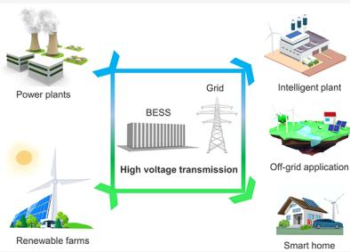

# CONTENTS

1. Introduction

16611

1.1. Current Situation and Future Development Trends of Global Electricity  
1.2. Developing Renewable Sources for the Electrical Grid  
1.3. Development Status of EESSs for the Electrical Grid  
1.4. Significance of Rechargeable Battery Technologies for the Electrical Grid

2. General Guidelines for Battery Technologies for Grid Scale Energy Storage

2.1. Key Requirements of Battery Technologies for GSES  
2.2. Gap between Academia and Industry in Batteries for GSES  
2.3. Scenarios for Batteries in GSES  
2.4. Promising Battery Technologies for GSES

3. Metal-Ion Batteries

16619

3.1. Current Lithium-Ion Batteries in GSES  
3.2. Future Lithium Battery Chemistry for GSES  
3.3. Aqueous Lithium-Ion Batteries 3.3.1. Electrode Materials for ALIBs  
3.3.2. Electrolytes for ALIBs 3.4. Sodium-Ion Batteries  
3.4.1. Anode Materials for SIBs  
3.4.2. Cathode Materials for SIBs  
3.5. Potassium-Ion Batteries

3.5.1. Anode Materials for PIBs 16635  
3.5.2.Cathode Materials for PIBs 16636

3.6.Zinc-Ion Batteries 16638

3.6.1. Mn-Based Cathodes for ZIBs 16638  
3.6.2. V-Based Cathodes for ZIBs 16641

3.7. Magnesium-Ion Batteries 16644

3.7.1. Anode Materials for MglBs 16645  
3.7.2. Cathode Materials for MglBs 16646

3.8. Aluminum-Ion Batteries 16647

3.8.1. Electrolytes for AIBs 16647  
3.8.2.Cathode Materials for AIBs 16647

3.9. Summary and Future Perspective for MIBs 16649

4. Lead-Acid Batteries 16649

4.1.Brief History of LABs 16649

4.2. Lead-Carbon Batteries 16650

4.2.1. Carbon as Additives 16651  
4.2.2. Carbon as Current Collectors 16651  
4.2.3. Lead-Acid Ultrabatteries 16654  
4.2.4. Carbon as Anodes 16655

4.3.Soluble Lead-Acid Flow Batteries 16658  
4.4. Summary and Future Perspectives for LABs 16658

Received: April 30, 2022

Published: September 23, 2022

5.Molten Salt Batteries 16659

5.1.Introduction 16659  
5.2. Traditional Na-S Batteries 16660  
5.3. IT Na-S Batteries 16663  
5.4.ZEBRA Batteries 16664  
5.5. Liquid-Metal Batteries 16666  
5.6. Solid Electrolyte Based Liquid Lithium Batteries 16671  
5.7. Safety and Other Aspects of Molten Salt Batteries 16673

6. Alkaline Batteries 16674

6.1.Introduction 16674  
6.2. Ni-Cd Batteries 16674  
6.3. Ni-MH Batteries 16674  
6.4.Ni-Fe Batteries 16677  
6.5.Ni-Zn Batteries 16678  
6.6. Summary and Future Perspectives for Alkaline Batteries 16679

7. Redox-Flow Batteries 16679

7.1. Conventional RFBs 16680

7.1.1.Iron-Chromium RFBs 16680  
7.1.2.Zinc-Bromine RFBs 16680  
7.1.3. All Vanadium RFBs 16681

7.2. Recent Developments in RFBs 16682

7.2.1. Electrodes 16682  
7.2.2.Membranes 16685  
7.2.3. Electrolytes 16688  
7.2.4.Novel RFBs 16698

7.3. Summary and Future Perspective for RFBs 16698

8.Metal-Air Batteries 16698  
8.1.Introduction 16698  
8.2.Zinc-Air Batteries 16700

8.2.1. Air Cathode Electrocatalysts in Zn-Air Batteries 16702  
8.2.2. Electrolyte Advancement in Zn-Air Batteries 16706  
8.2.3. Architecture and Electrochemistry of Zn Anode 16707  
8.2.4. Emerging Technologies for Zn-Air Batteries 16709  
8.2.5. Applications of Zn-Air Batteries 16710

8.3. Other Aqueous MABs 16711

8.3.1. Al-Air Batteries 16711  
8.3.2.Mg-Air Batteries 16713

8.4. Summary and Future Perspectives for MABs 16714

9. Hydrogen Gas Batteries 16715

9.1. The Working Principle of HGBs 16715  
9.2. The Development of HGBs 16716

9.2.1. Traditional  $\mathrm{Ni - H_2}$  Battery 16716  
9.2.2. Low-Cost Ni-H $_2$  Battery 16717  
9.2.3. Mn-H2 Battery 16720  
9.2.4. Lithium Intercalation Compound-H $_2$  Battery 16720  
9.2.5. Prussian Blue Analogue-H $_2$  Battery 16721  
9.2.6. Fe-H2 Battery 16723  
9.2.7. Other HGBs 16724

9.3. Summary and Future Perspectives for HGBs 16726

10. Summary and Perspective 16728

10.1. Comparison and Potential of Battery Energy Storage Technologies 16728  
10.2. Future Development of Grid Scale Battery Systems 16729

10.3. Integrated Approaches for Grid Scale

Battery Systems 16730

Author Information 16730

Corresponding Author 16730  
Authors 16730  
Author Contributions 16730  
Notes 16730  
Biographies 16730

Acknowledgments 16731  
Abbreviations 16731  
References 16733

# 1. INTRODUCTION

# 1.1. Current Situation and Future Development Trends of Global Electricity

The rampant demand for electricity has been a consequence of increased industrial development, arising from the escalating worldwide utilization of electronic appliances, electric vehicles, air conditioners, and so on. According to the International Energy Agency (IEA) and Enerdata, the consumption of global electricity has accelerated at a whopping rate of  $\sim 3.5\%$  in the past decade, reaching above 22 000 TWh in 2018, and its generation capacity has surpassed 25 000 TWh. Currently, coal is the largest non-renewable energy source contributing up to  $38\%$  of electricity generation, followed by natural gas  $(23\%)$  and oil  $(3\%)$ . In contrast, renewable energy sources account for considerably small percentages for hydropower  $(17\%)$ , wind energy  $(5\%)$ , and solar energy  $(2\%)$  (Figure 1a). Apropos nonrenewable sources, the calculation of energy reserves-to-production  $(\mathrm{R / P})$  ratio has shown that the global oil reserves in 2018 accounted for 50 years of current electricity production, with the highest and lowest R/P ratios for South and Central America (136 years) and Europe (11 years), respectively. Similarly, gas reserves in 2018 amounted to 50.9 years of present production, with leading R/P ratios for Middle East (109.9 years) and Commonwealth of Independent States (CIS, 75.6 years). As for coal reserves, they amounted to 132 years of existing energy production capacity with North America (342 years) and CIS (329 years) having the highest R/P ratios.

The uneven geographical distribution of fossil fuels is one of the main obstacles hindering sustainable future power generation.[5,6] Another major concern arising from fossil fuel-based energy generation is the exponential rise in carbon footprint, which is a consequence of harmful byproducts that are released into the atmosphere during fossil fuel consumption.[7] For instance, sulfur dioxide, nitrogen oxides, carbon dioxide  $(\mathrm{CO}_{2})$ , and a variety of heavy metal particulates can lead to water, air, and soil pollution as well as global warming.[8,9] It is imperative to point out that human activities alone are speculated to have contributed to about  $1.0~^\circ \mathrm{C}$  more global warming compared to the preindustrial levels. If continued at the current rate, the global temperature is estimated to increase up to  $1.5~^\circ \mathrm{C}$  between 2030 and 2052.[10,11] The United Nations Climate Change Conference in Paris (2015) has set the framework for a rapid global shift to a renewable energy system, ensuring a realistic solution to achieve sustainable development and avoid catastrophic climate change. In this regard, solar and wind are sought as clean, abundant, and widely distributed renewable energy resources.[12] The widespread installation of large-scale and high-capacity renewable energy generation units is projected to provide  $86\%$  of the global electricity supply by 2030.

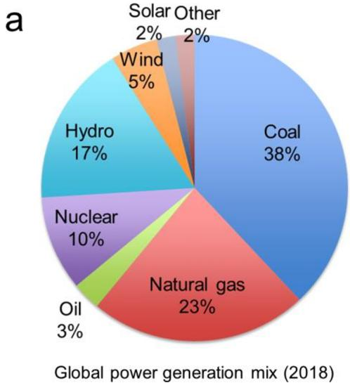  
Figure 1. Current status of power consumption/production and future development trends for global power production. (a) Global power generation mix in 2018. (b) Global electricity generation mix (TWh/year) and power generation installed capacity (GW), 2016-2050. Reproduced with permission from ref 3. Copyright 2019 International Renewable Energy Agency.

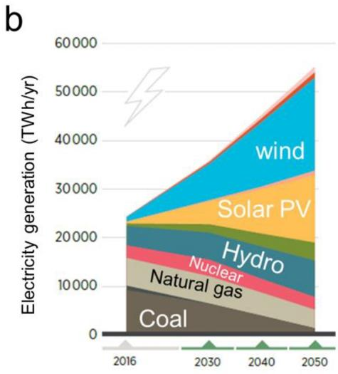

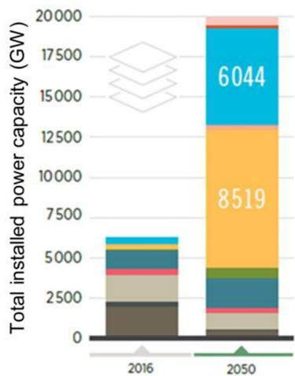

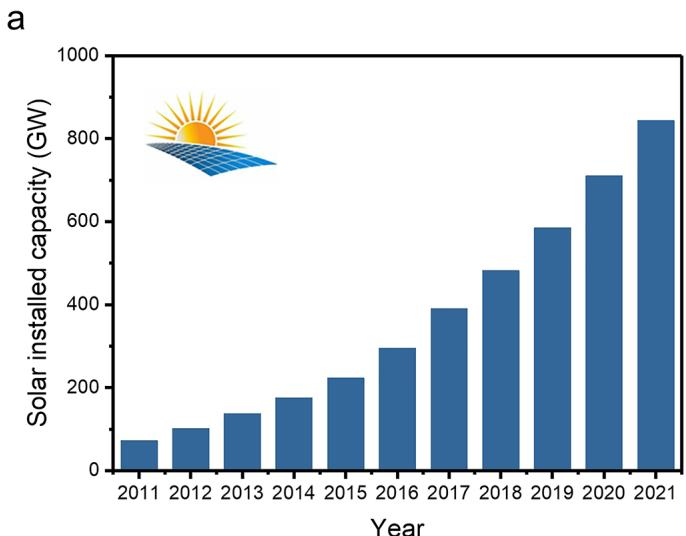

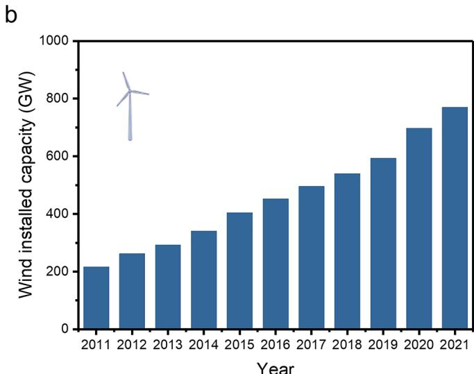

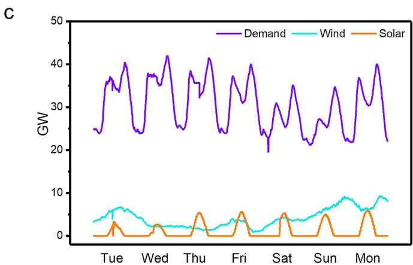  
Figure 2. Intermittent nature and uneven geographical distribution of wind and solar energy power sources. (a) Change in total installed capacity of solar energy, 2011-2021 (Data from International Renewable Energy Agency). (b) Change in total installed capacity of wind energy, 2011-2021 (Data from International Renewable Energy Agency). (c) Weekly and (d) monthly duration of average wind and solar energy in the U.K. during 2018-2020 (Data from G.B. National Grid Status).

2050, with solar photovoltaic (PV) and wind sources accounting for  $58\%$  (Figure 1b). Within the stipulated time frame, equal

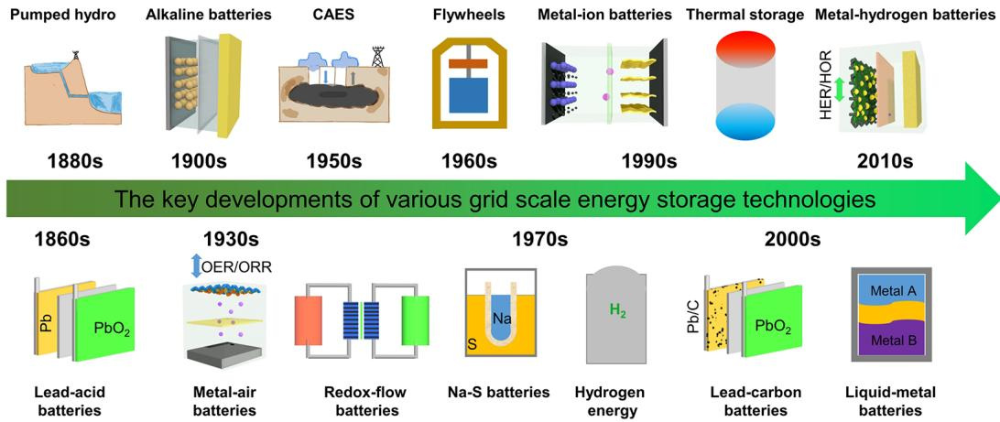  
a

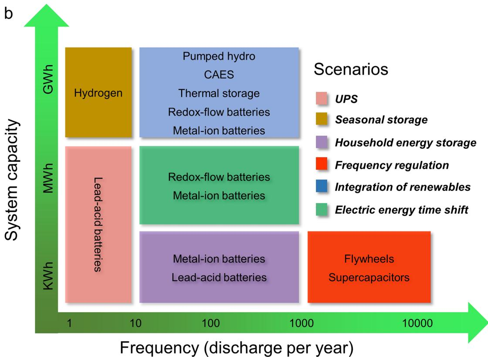  
b  
Figure 3. Development and characteristics of various GSES systems. (a) Timeline of key stages in the development of various GSES technologies. (b) Most cost-efficient technologies for the energy storage scenarios based on their respective characteristics.

emphasis has been laid on phasing out coal-fired power generation altogether, thereby eliminating the largest root cause of  $\mathrm{CO}_{2}$  emissions.

# 1.2. Developing Renewable Sources for the Electrical Grid

The market share of renewable energy sources in the global power generation marketplace has grown dramatically since 2011, which is ascribed to the recent development and dissemination of wind and solar PV technologies, as supported by set climate policies. $^{13}$  For instance, the globally installed solar PV generation capacity has jumped from 72 GW in 2011 to 585 GW in 2021 (Figure 2a). $^{14}$  Similarly, the worldwide onshore and offshore wind generation capacities have experienced an upward spike from 216 GW in 2010 to 769 GW in 2021, as shown in Figure 2b. $^{15}$  Therefore, the convenience of scaling up and increasingly competitive supply chains have rendered solar and

wind power generation technologies inexpensive and hence economical in the past decade. For example, the cost of electricity from utility-scale solar PV has declined by  $13\%$  in 2019 based on year-on-year development, reaching  $\$0.068$ kWh $^{-1}$  in the United States. $^{15}$  Furthermore, for projects commissioned in 2019, the overall weighted-average levelized cost of electricity computed for both onshore and offshore wind power generation technologies has declined by  $9\%$  on a year-on-year basis, reaching  $\$0.053$ kWh $^{-1}$  and  $\$0.115$ kWh $^{-1}$ , respectively. $^{15}$

However, solar and wind are not constant and hence are unreliable power sources owing to their intermittent nature, which is at odds with continuous demands. The voltage and frequency of wind power are heavily dependent on instantaneous transitions in weather and seasons. Similarly, solar power is generated only during the daytime and also varies with the

Table 1. Characteristics of Various Energy Storage Devices  

<table><tr><td>technology</td><td>total project cost (USD kWh-1)</td><td>lifetime (years/cycles)</td><td>EE (%)</td><td>self-discharge</td><td>MW deployed (global)</td></tr><tr><td>PSH</td><td>100–200</td><td>30–60 years</td><td>65–80</td><td>very low</td><td>169557</td></tr><tr><td>CAES</td><td>100–250</td><td>20–40 years</td><td>40–70</td><td>high</td><td>407</td></tr><tr><td>flywheels</td><td>4000–12000</td><td>15–20 years</td><td>80–90</td><td>very high</td><td>931</td></tr><tr><td>redox-flow battery</td><td>500–1200</td><td>12000–14000 cycles</td><td>60–85</td><td>low</td><td>72</td></tr><tr><td>Li-ion battery</td><td>200–500</td><td>1000–10000 cycles</td><td>85–95</td><td>low</td><td>1629</td></tr><tr><td>Na-S battery</td><td>500–1200</td><td>2000–4500 cycles</td><td>75–90</td><td>very low</td><td>189</td></tr><tr><td>lead-acid battery</td><td>100–600</td><td>200–2500 cycles</td><td>70–80</td><td>medium</td><td>75</td></tr></table>

intensity of solar radiation and seasons. Figure 2c,d illustrates the weekly and monthly distribution of solar and wind energy, respectively, in United Kingdom,[16] showing their inconsistencies with electricity demands. Furthermore, it is evident that solar energy production achieves higher values in the summer, whereas the wind generation reaches its summit during the winter. For example, wind sources are concentrated in the midwest regions, while the solar radiations are dominant in southwest regions in the United States.[17,18]

The traditional complex power distribution grid system requires a series of auxiliary services to ensure its stable and reliable operation. Simultaneously, numerous energy storage systems are also needed to balance electricity generation and demand in real time.[19] In addition, due to uncertain fluctuations in electricity demand, the flexibility of such systems and services, which enables grid operators to respond to unexpected rise in demand or loss in supply, is of paramount importance.[20] In modern power systems, existing solar and wind power plants still have limited impact on grid systems. However, with the exponential growth of renewable sources in the next 30 years, a grid with insufficient energy storage would cause sharp fluctuations ranging from seconds to hours or even longer durations, which in turn may damage the grid and consequently interrupt the continuous power supply and consumption. Therefore, substantial efforts are being devoted to the development of effective electrical energy storage systems (EESSs) to compensate for the inflexible features of the grids.[21]

# 1.3. Development Status of EESSs for the Electrical Grid

Since the invention of the lead-acid battery (LAB) in 1859 followed by its integration into electrical grids in the 1880s, various types of EESSs for grid scale energy storage (GSES) have been continuously deployed.[22,23] Figure 3a displays a timeline of key stages in the development of various GSES systems. In addition to pumped storage hydropower (PSH), most energy storage technologies still have many limited applications. Although several technologies have been studied for a long time, they are still far from meeting the requirements of GSES. The characteristics of major deployed energy storage technologies are further summarized in Table 1, including PSH,[24] compressed air energy storage (CAES),[25] flywheels,[26] hydrogen energy,[27] thermal energy storage (TES),[28] rechargeable batteries,[29] and so forth. According to the requirements of energy storage scenarios for installing capacity and operation frequency, it can be generally divided into uninterruptible power supply (UPS), seasonal storage, frequency regulation, integration of renewable energy, household energy storage, and electric energy time shift. Figure 3b shows the most cost-efficient current technologies for energy storage scenarios based on their respective characteristics.[30] It is evident that rechargeable batteries with highly flexible and wide energy storage ranges have utility for short-, medium- and long-term storage applications.[21]

As the primary grid-scale storage technology, PSH has the potential to deploy energy storage with a massive power capacity approaching up to 170 GW, which accounts for  $\sim 96\%$  of worldwide energy storage. Such a system stores energy by pumping water between two reservoirs located at varying heights. The stored gravitational potential energy depends on the water volume stored in the upper reservoir and the height difference between reservoirs. Previously, PSH has been widely utilized for high power rating ( $>10\mathrm{MW}$ ) in medium- and long-term storage, exhibiting complete discharge times from several hours to a few days at a low rate of  $\sim 2\%$  per day. The currently well-established PSH plants are more technically mature for providing extensive operational experience. In general, the energy efficiencies (EEs) of PSH range between  $65\%$  and  $80\%$ , and they have an extensive lifetime spanning over a period of 50 years, which upon major refurbishment can be further extended. Regardless, the PSH systems offer potential downsides in terms of the geographic and hydrological restrictions, low energy density, long construction period, and high initial capital expense. Consequently, traditional PSH energy storage systems are gradually being replaced with the increased penetration of variable renewable energy (VRE) in small- and medium-scale wind and solar PV based electricity distribution facilities.

Apropos CAES systems, the energy is stored in the form of compressed air (potential elastic energy) in a large-volume reservoir while power is directed toward an electric motor that drives a series of compressors for storing energy to charge the CAES system.[32] Upon retaining heat from the air pressure, this system can achieve up to  $70\%$  EE, which otherwise falls within the range of  $42 - 55\%$ .[33] Despite their use for high power rating with medium- and long-term energy storage and widespread attention, only a handful number of large-scale plants have been successfully integrated into the grid. In this regard, the stringent geographical requirements, high self-discharge, and low EE are to blame.[34]

In contrast to PSH and CAES systems, flywheels constitute electromechanical energy storage for a short duration of only a few minutes, rendering them suitable for short-term storage applications. Concerning flywheels, a variable frequency motor is harnessed for electrical to kinetic energy conversion. The biggest advantage of flywheels is their ability to offer superior cycling life and fast response times, which are highly sought after in certain critical applications.

A TES system mainly gains thermal energy from renewables and waste heat, which can reduce the dependence from heat and cold production to the grid, release its capacity and improve the flexibility.[35] In addition, TES can reduce the volatility from renewable energy to the power grid through the conversion between electricity and thermal energy.[36] However, currently, the high cost and stability of storage materials are the major challenges to grid application.[37]

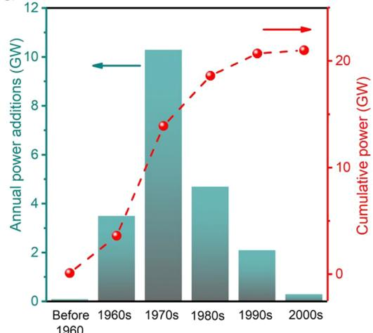  
a  
Figure 4. (a) Annual additions of PSH in the United States during 1960-2017. (b) Annual additions of large-scale battery storage capacity during 2003-2018. Courtesy of U.S. Energy Information Administration.

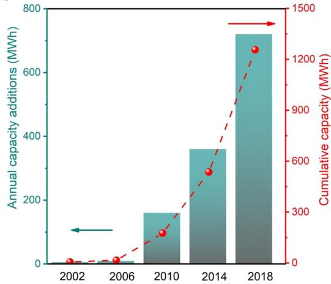  
b

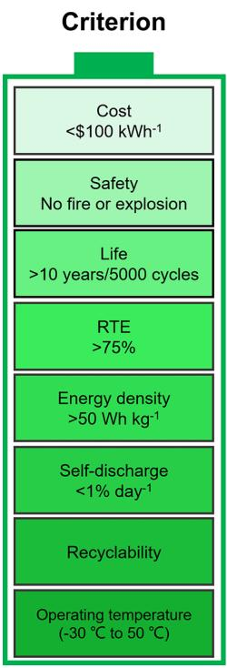  
Figure 5. Some standard requirements of BESS and the performance radar chart of existing BESS technologies (8-level represents meeting relevant benchmark requirements).

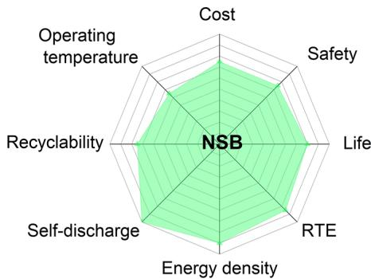

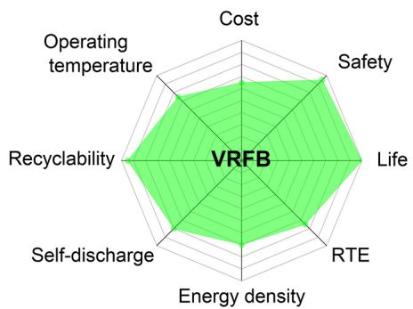

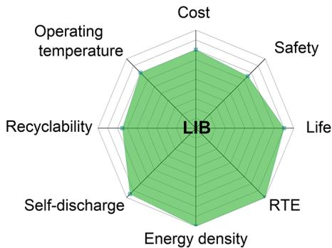

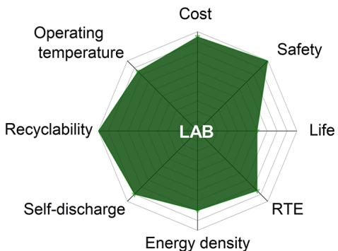

Hydrogen energy includes hydrogen generation through electrocatalytic water splitting, hydrogen storage and transport, and hydrogen conversion into electricity through fuel cells and is also important to the future grid.[38] Although hydrogen is a green and carbon-free energy, its production, storage, and utilization costs should be greatly reduced for grid applications.[39]

# 1.4. Significance of Rechargeable Battery Technologies for the Electrical Grid

For over a century, PSH has been the dominant energy storage technology in the power sector. As shown in Figure 4a, the United States had significantly more operating PSH systems, most of which were installed in the 1970s and early 1980s, than other energy storage systems.[40] In real-life applications, however, limitations of using a single energy storage technology have been gradually recognized. In many instances, the diverse

critical requirements such as suitable construction period and location, fast response time, and wide range of power levels and durations hold precedence over the performance limits of EESSs. $^{41}$  Therefore, there is considerable global demand for hybrid energy storage technologies to optimize cost and comprehensive performance for the electrical grid. In this regard, many battery technologies are expected to play key roles. $^{42}$

Unlike PSH and CAES, rechargeable batteries provide indispensable advantages of short construction periods and compact size, rendering them well-suited for utility at various distributed locations. The BESSs typically include Li-ion batteries (LIBs), $^{43,44}$  Na-S batteries, $^{45}$  lead-acid batteries (LABs), $^{46}$  and redox-flow batteries (RFBs). $^{47}$  In addition, there are a number of battery concepts awaiting widespread

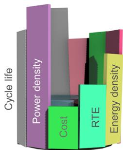  
a Outstanding performance advantages in some aspects but with obvious shortcoming

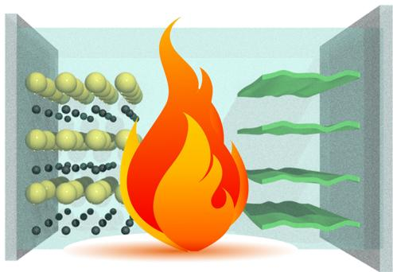  
b Potential safety hazards in battery

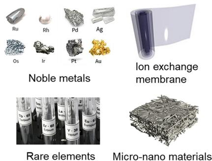  
C High cell component cost

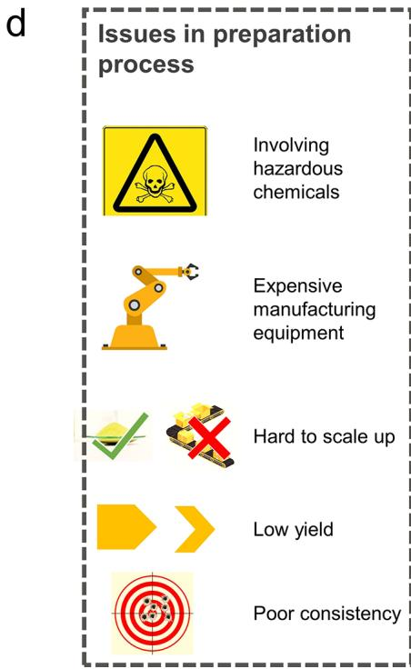  
Figure 6. Gap between academia and industry in batteries for GSES. (a) Schematic of the Cannikin law in battery industry. (b) Potential battery safety issues. (c) Potential battery cost issues. (d) Potential preparation process issues. (e) Energy density gap between academia and industry in batteries. (f) Potential electrochemical performance deterioration after energy density of prototype batteries reaches industrial standards.

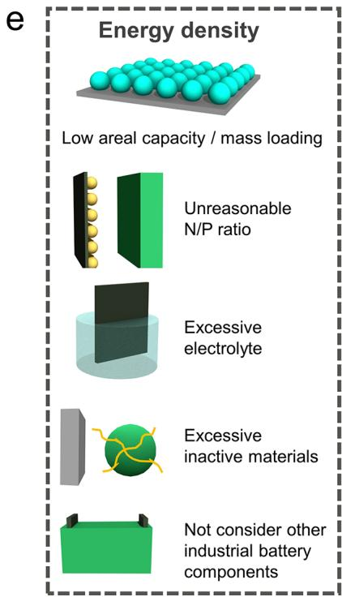

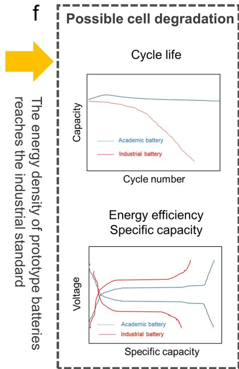

commercialization like metal-ion, metal-air, liquid-metal, and hydrogen gas batteries, with immense inherent potential for further development. During the last two decades, the deployment of battery energy storage has grown explosively. In the United States, the battery delivered energy capacity has been continuously on the rise since 2011, reaching up to 1000 MWh in 2018,  $91\%$  of which comes from LIBs (Figure 4b).31,40 At present, most of the GSES market is still dominated by the relatively mature LIBs; nevertheless they are insufficient to cater to all kinds of energy storage needs. The publications of academia are the source of inspiration for industry. In recent years, numerous new battery technologies have been achieved and have shown great potential for large scale energy storage (LSES) applications.48-51 However, their practical applications have been greatly impeded due to the gap between academic research and industrial practices within the domain of LSES.52-54 During their development, practical manufacturing aspects, such as safety, cost, service life, scalable production, self

discharge, EE, maintenance, and recyclability are generally overlooked owing to the lack of measurement standards, not to mention that sophisticated energy storage applications call for different battery performances. Therefore, apt and diverse battery designs are required for further promoting practical energy storage research. In this regard, a comprehensive and timely guideline in the battery research field for GSES is urgently needed.

# 2. GENERAL GUIDELINES FOR BATTERY TECHNOLOGIES FOR GRID SCALE ENERGY STORAGE

# 2.1. Key Requirements of Battery Technologies for GSES

Comprehensive requirements for battery technologies need to be fully met before they can be transferred to industrial production, which is the biggest difference between academia and industry. These requirements include cost, safety, service

life, EE, energy density, self-discharge performance, operating temperature range, recyclability, and so on (Figure 5). Although the projected cost promises widespread adoption of BESSs, it is not easy to quantify the total investment cost of a BESS. Generally, the total investment includes the cost of chemicals, the power conversion system (PCS), plant balance, construction, and commissioning, among others.[40,55] In particular, the chemical cost is an approximate measure required for each battery technology. Currently, the energy storage cost target proposed by the U.S. Department of Energy (DoE) is  $100 \mathrm{kWh}^{-1}$ .[56-58] The total investment cost of existing BESSs is unable to meet the adoption requirement. The total lifetime cost for an energy storage system divided by its cumulative delivered electricity is a more appropriate measure. Such a measure for BESS cost assessment is called levelized cost of storage (LCOS), as shown below, which is described as the total lifetime cost divided by the discharged electricity during the operational period. The total lifetime cost includes investment cost, operation and maintenance (O&M) cost, charging, and end-of-life costs. The equation assumes all initial investment costs and sums ongoing costs in each year ( $n$ ) up to the lifetime ( $N$ ) of the BESS and is discounted by the discount rate ( $r$ ). Therefore, the cycle/calendar life of BESSs should be more than 5000 cycles or 10 years for high annualized return.[30,59]

$$
\begin{array}{l} \text {L C O S} [ \mathbb {S} / \text {M W h} ] = \left[ \text {i n v e s t m e n t c o s t} + \sum_ {n} ^ {N} \frac {\mathrm {O} \& \mathrm {M} \text {c o s t}}{(1 + r) ^ {n}} \right. \\ \left. + \sum_ {n} ^ {N} \frac {\text {c h a r g i n g c o s t}}{(1 + r) ^ {n}} + \sum_ {n} ^ {N} \frac {\text {e n d - o f - l i f e c o s t}}{(1 + r) ^ {N + 1}} \right] \\ \left/ \left[ \sum_ {n} ^ {N} \frac {\text {e l e c d i s c h a r g e d c o s t}}{(1 + r) ^ {n}} \right]\left. \right. \tag {1} \\ \end{array}
$$

With ongoing proliferation of projects, industries are prioritizing safety features of batteries in GSES. Such realization has come from the past incidents, including a sodium-sulfur battery fire in Japan in September 2011, a LIB blaze in Arizona in April 2019, and nearly 30 BESS fire occurrences reported in South Korea until 2020.[60-62] This shows that safety is indispensable during the entire period of installation, commissioning, operation, maintenance, and decommissioning of BESS and holds precedence over its widespread adoption. Concerning electrochemical performance, the round-trip efficiency (RTE) of a BESS must exceed  $75\%$  to surpass that of PSH while avoiding energy loss. It is imperative to mention that the low energy density of BESSs tends to occupy more cell volume and adds to its manufacturing and installation costs. However, unlike mobile devices (e.g., electric vehicles) with stringent design and performance requirements, an energy density over  $50 \mathrm{Wh} \mathrm{kg}^{-1}$  is sufficient for BESS stationary applications.[63] Similar to energy density, self-discharge is also one of the primary indexes to determine the cost-efficiency of BESS and, ideally it should not exceed  $1\%$  per day.[42] Furthermore, batteries with wide operating temperature range, from  $-30$  to  $60^{\circ} \mathrm{C}$ , and minimal maintenance needs conveniently qualify for widespread commercialization.[64] Last but not least, substantial room for the recyclability of constituent raw materials of end-of-life batteries is also conducive for deploying the related energy storage technology. We compared the four current primary energy storage technologies, including sodium sulfur batteries (NSBs), vanadium RFBs (VRFBs), LIBs and LABs, in terms of

key performance parameters. Obviously, each technology has its own advantages and disadvantages, for example, LIBs have excellent comprehensive performance but limited lithium resources and insufficient safety, while LABs have low cost and high safety but short service life.

# 2.2. Gap between Academia and Industry in Batteries for GSES

Despite academic emphasis on laboratory research and industry emphasis on transforming technologies into economical consumer products, the common mission ought to work together for achieving a clean energy blueprint. For commercializing and meeting battery performance standards, it is relatively more important for a BESS to exhibit a well-balanced combination of all electrochemical performance parameters than to demonstrate superior performance in one parameter only (Figure 6a). However, it has been observed that the performance values reported in most of the research studies on novel battery chemistries are somewhat overestimated due to the lack of standards and measures.[54,65] Such misrepresentation therefore leads to the obvious gap between academic research and industrial attempts to commercialize BESS technologies with mass production.[53,66] Additionally, the contradictory objectives of research practitioners and industry experts also hamper the possibility for widespread commercial manufacturing of BESSs.

In fact, it is necessary to determine whether the research object is intrinsically safe or potential safety hazards can be solved by appropriate solutions before the start of practical battery research (Figure 6b). Reliable safety is the presumption for the battery technology to be used for GSES. In addition, in many academic investigations, only impeccable electrochemical performance is sought, whereas the battery cost and preparation process issues are mostly disregarded. The ignored costs often include the use of expensive chemicals in battery components (active materials, separator, electrolytes, solvents, additives, and so on; Figure 6c). For example, a battery system may involve expensive metals (such as rare earth elements, precious metal elements, or other metal elements with limited reserves) or expensive battery components with high manufacturing cost (such as ion-exchange membranes (IEM) or micro-nanomaterials). Preparation process issues are also a huge obstacle to industrial application. These issues include processes involving many hazardous chemicals or expensive manufacturing equipment, processes that are hard to scale up, poor manufacturing consistency, time-consuming processes, low yield of design materials, and so on (Figure 6d).

In addition, the preparation processes for materials and battery stacks are also a huge obstacle to industrial application. Lab-level fabrication of batteries has typically paid less attention to the cost and energy consumption of electrode materials synthesis and their compatibility with industrial production lines, which are crucial for practical large-scale applications.[67]

Syntheses with complex technologies that operate under harsh conditions with rare ingredients and rigorous circumstances should be largely avoided in the mass production of batteries for GSES. Instead, facile, large-scale, energy-saving, pollution-free, and low-cost methodologies should be encouragingly implemented throughout the entire battery fabrication process.[68] The internal situations of commercial-level batteries exhibit discrepancies with the lab-level ones and the major issues in the former are generally different from that in the latter. The existing problems will be enlarged, and elaborate optimizations at lab

level may not work well in practical applications.[69] Therefore, effective ex situ and in situ battery diagnostic techniques should be applied to the battery stack and container for large-scale applications.[70,71] In addition, battery management is an absolute necessity in GSES applications. Different from lab-level technologies, the battery management systems for practical applications with high safety must be sensitive enough to compensate for nonuniform aging in thermal gradients or production mismatch during battery stack balancing.[69] Meanwhile, the guidelines and measures should be applied to the battery scale-up process.

After making it clear that the above conditions meet the requirements, we still need to eliminate the electrochemical performance gap between academia and industry. First, the unmentioned active materials of laboratory synthesized battery prototypes pose substantial risk for creating misunderstanding pertaining to energy density evaluation. In order to obtain high specific capacity, low polarization, and stable electrode structure, the emphasis is placed on designing batteries with low mass loading; unreasonable negative/positive (N/P) ratio, high concentrations of additive content and electrolyte amount, and excess inactive materials, not to mention that the mass of industrial battery modules, has not been considered here (Figure 6e,f). For example, Betz et al.[72] employed a six-step process to demonstrate the effect of relative mass distribution of an operating Li-S battery component on its specific energy and energy density calculations. After carrying out a series of critical analyses of realistic issues and inactive components, the practical energy density of a 18650 Li-S cell was computed to be nearly 10 times lower than its theoretical value. Similarly, Liu and coworkers[73] investigated the influence of electrolyte amount and mass loading of electrodes for determining the cycle stability of NMC622Li coin cells. Upon cycling, it was revealed that much electrolyte and high mass loading of electrodes compromised the cycling stability of the cell. Therefore, the electrochemical performance of batteries meeting the requirements of industrial energy density is more representative. The key electrochemical performance parameters include life, EE, operating current density, and so on. From these examples, it behooves battery research to mention individual parameters (Table 2), including active material ratio (wt %), mass loading

Table 2. Recommendations for Key Reporting Parameters in Applied Battery Science  

<table><tr><td>chemical material cost ($ kg-1)</td><td>material recycling cost ($ kg-1)</td></tr><tr><td>estimated preparation cost ($ PCS-1)</td><td>tracked calendar life (years)</td></tr><tr><td>active material ratio (wt %)</td><td>mass loading (mg cm-2)</td></tr><tr><td>electrolyte amount (mL Ah-1)</td><td>areal capacity (mAh cm-2)</td></tr><tr><td>N/P ratio (%)</td><td>voltage efficiency (%)</td></tr><tr><td>electrode porosity (%)</td><td>average discharge voltage (V)</td></tr><tr><td>electrode density (g cm-3)</td><td>hazardous gases or chemical materials (yes/no)</td></tr><tr><td>current density (mA cm-2)</td><td>operating temperature range (K)</td></tr><tr><td>separator thickness (mm)</td><td>self-discharge (% day-1)</td></tr></table>

$(\mathrm{mg~cm}^{-2})$ , and areal capacity  $(\mathrm{mAh~cm}^{-2})$  of the electrodes, electrolyte concentration  $(\mathrm{mL~Ah}^{-1})$ , electrode density  $(\mathrm{g~cm}^{-3})$ , electrode porosity  $(\%)$ , N/P ratio  $(\%)$ , separator thickness  $(\mu \mathrm{m})$ , and average discharge voltage (V). Moreover, EE losses in BESSs are attributed to losses in Coulombic efficiency  $(\mathrm{CE},\%)$ , voltage efficiency  $(\mathrm{VE},\%)$ , and auxiliary loads  $(\%)$  such as pumps for RFBs. Therefore, losses in VE and

auxiliary loads also need to be reported for comprehensive evaluation of EE (Figure 6). Lastly, the considerations of cell self-discharge performance, operating conditions, and maintenance requirements ought to be incorporated as well.

# 2.3. Scenarios for Batteries in GSES

A deep understanding of energy storage applications is expected to allow design of more targeted BESS technologies with varying characteristics for different applications. Figure 7 illustrates the future grid structure from energy generation to consumption. The electrical grid is a complex network of electrical generators (i.e., power plants) and transmission and distribution (T&D) lines that dynamically respond to shifts in electrical supply and demand to make sure electricity is always supplied reliably. The BESS has practical and flexible applications in renewable farms, power plants, high voltage transmission lines, distribution stations, microgrids, factories, homes, and so on. However, the performance requirements of battery energy storage technologies are different for various utility examples. In addition to cost, the various performance requirements include reliability (including safety), response time, EE, self-discharge, energy density, cycle life, calendar life, and so on. The main GSES scenarios and their important storage characteristics for different battery technologies are summarized in Table 3. In the future, different technologies may serve the power grid in different application scenarios. Despite these properties, great attention should be devoted to the integration of renewable energy for catering to our current and future energy needs. A battery technology that has no obvious shortcoming is deeply expected for GSES.

# 2.4. Promising Battery Technologies for GSES

Notwithstanding their supreme electrochemical performance, the four main battery energy storage technologies (LIBs, NSBs, LABs, and VRFBs) still face respective shortcomings.[74-76] To mitigate corresponding challenges for these BESSs, innumerable studies have been carried out on introducing novel battery designs and compositions.[49,50,75-77] Figure 8 represents noteworthy and groundbreaking developments in the field of BESSs for GSES applications. Recently, it can be seen that the low-cost hydrogen gas battery (HGB) and organic aqueous RFB (ARFB) technologies have emerged to be very competitive contenders owing to their efficacy in power grid energy storage.[49,78] However, the assessment of feasibility of such technologies through in-depth analysis is urgently needed.

In order to help the research community obtain a better understanding of stationary emerging energy systems and accelerate their development, we present a comprehensive review of recently developed, inexpensive, high performance, and inherently safe energy storage technologies. This topical review includes accounts of the operating principles, chemistries, material challenges, and current development status of mature and emerging battery technologies. With no intention to cover all potentially known battery chemistries, this review exclusively focuses on delineating frontier research and up-to-date advancements of metal-ion batteries (MIBs), lead-acid batteries (LABs), molten-salt batteries (MSBs), alkaline batteries (ABs), redox flow batteries (RFBs), metal-air batteries (MABs), and hydrogen-gas batteries (HGBs). In recent years, many novel battery designs have been derived to make up for the shortcomings of battery technologies. The practicability, potential, new challenges, and current development status need an accurate evaluation and tracking. Therefore, this review summarizes a large number of representative battery tech

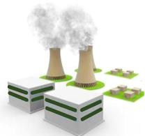  
Power plants

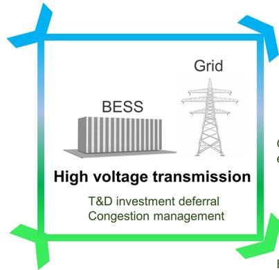  
Electric energy time shift Frequency regulation Voltage support Black start  
Integration of renewables Seasonal energy storage  
Off-grid electric energy time shift

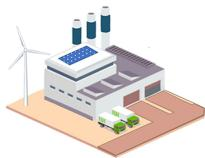  
Peak shaving Voltage support UPS  
Intelligent plant

  
Off-grid application

  
Smart home  
Figure 7. Grid structure and GSES systems. The power generated by fuel power plants and renewable energy plants is transmitted through the high voltage grid systems and then distributed to end users such as various factories and consumers. BESSs with various energy and power scales are needed to enable the flexible grid operation.

Table 3. Main Scenarios and Their Important Storage Characteristics for BESSs  

<table><tr><td>scenario</td><td>description</td><td>important storage characteristics</td><td>suitable battery technologies</td></tr><tr><td>electric energy arbitrage</td><td>purchase electric power at low price and sell in high-price periods</td><td>high efficiency</td><td>LIB</td></tr><tr><td>frequency regulation</td><td>correct continuous and sudden frequency and voltage changes across the network</td><td>reliability, fast response time</td><td>LIB</td></tr><tr><td>black start</td><td>restore power plant operations after network outage without external power supply</td><td>low standby losses, long calendar life</td><td>LAB/LIB</td></tr><tr><td>UPS</td><td>backup power</td><td>reliability, low standby losses, long calendar life</td><td>LAB/LIB</td></tr><tr><td>off-grid energy storage</td><td>off-grid power stored by systems then supplied to individuals</td><td>long discharge duration, long cycle life, reliability</td><td>RFB/LIB</td></tr><tr><td>T&amp;D investment deferral</td><td>defer grid infrastructure upgrades caused by peak power flow exceeding existing capacity</td><td>mobility (high energy density)</td><td>LIB</td></tr><tr><td>seasonal storage</td><td>compensate seasonal variability in power supply and demand</td><td>long discharge duration, low cost, ultralow standby losses</td><td>RFB/LIB</td></tr><tr><td>voltage support</td><td>power injected into the electrical distribution grid to maintain voltages within acceptable range</td><td>reliability, fast response time</td><td>LIB</td></tr><tr><td>peak shaving</td><td>guarantee availability of sufficient generation capacity during peak demand periods</td><td>high efficiency, fast response time</td><td>RFB/LIB</td></tr><tr><td>power quality</td><td>protect load against short-duration power variations</td><td>reliability, fast response time</td><td>LIB/LAB</td></tr><tr><td>power reliability</td><td>provide power during blackouts</td><td>reliability, fast response time, low standby losses</td><td>LIB</td></tr><tr><td>bill management</td><td>optimize electric power purchasing and maximize solar self-consumption</td><td>high efficiency, low cost, long calendar life</td><td>LIB</td></tr></table>

nologies and evaluates their practicability and potential for innovation, in order to bring some critical thinking and important guidelines on the development and applications of GSES technologies to the battery community.

# 3. METAL-ION BATTERIES

MIBs have experienced extensive development among smart storage devices. However, they still confront many difficulties, such as high manufacturing costs and limited number of reasonable electrodes and electrolytes for GSES. Figure 9 displays a schematic for a MIB composed of an anode, a cathode, an electrolyte, a separator, and current collectors. The electrodes are capable of extracting and inserting metal ions. In the battery charge state, the metal ions through the electrolyte flow from the cathode to the anode where they are stored. In the battery

discharge state, metal ions transport from the anode to the cathode and release the energy. Here, the characteristics of different MIBs (mainly  $\mathrm{Li^{+}}$ ,  $\mathrm{Na^{+}}$ ,  $\mathrm{K^{+}}$ ,  $\mathrm{Zn^{2+}}$ ,  $\mathrm{Mg^{2+}}$ , and  $\mathrm{Al^{3+}}$ ) are summarized in Table 4. According to the comparison data in Table 4, sodium ions and potassium ions, contributing to batteries with a single-electron transfer, show higher crustal abundance compared to lithium for commercial LIBs. In addition, in comparison with commercial LIBs, battery systems using multivalent ions (e.g.,  $\mathrm{Zn^{2+}}$ ,  $\mathrm{Mg^{2+}}$ , and  $\mathrm{Al^{3+}}$ ) can achieve higher volumetric capacity and lower cost due to multiple electron transfer redox reactions and abundant resources.[79] Furthermore, these nontoxic multivalent metals are highly stable and inactive when exposed to air compared with metallic Li, Na, and K, which contributes to their higher safety and easier handling for practical applications.

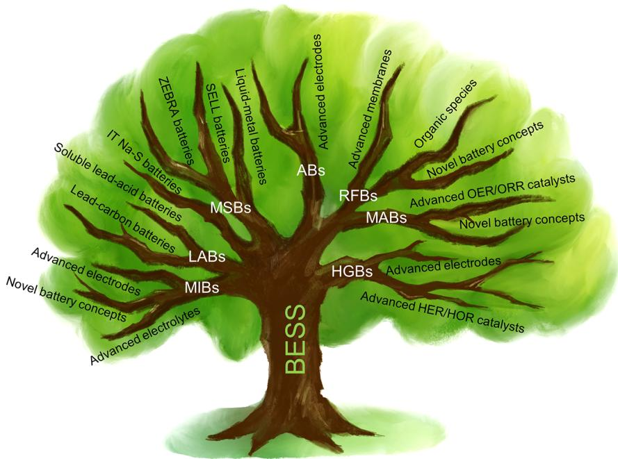  
Figure 8. Directions in development of advanced BESS in terms of different technologies, including metal-ion batteries, lead-acid batteries, molten-salt batteries, alkaline batteries, redox-flow batteries, metal-air batteries, and hydrogen gas batteries.

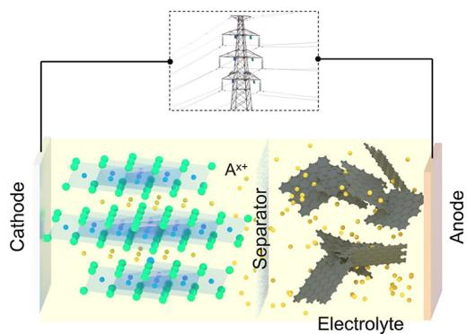  
Figure 9. Schematic of MIBs. A = Li, Na, K, Zn, Mg, or Al;  $x = 1$ , 2, or 3.

Table 4. Comparison of Several Metals in Terms of Relative Ionic Radius, Standard Potential, Theoretical Capacity, Crustal Abundance, and Valence Statea  

<table><tr><td>element</td><td>Li</td><td>Na</td><td>K</td><td>Zn</td><td>Mg</td><td>Al</td></tr><tr><td>ionic radius (Å)</td><td>0.76</td><td>1.02</td><td>1.38</td><td>0.74</td><td>0.72</td><td>0.535</td></tr><tr><td>standard potential (V vs. SHE)</td><td>-3.04</td><td>-2.71</td><td>-2.93</td><td>-0.76</td><td>-2.37</td><td>-1.66</td></tr><tr><td>specific capacity (mAh g-1)</td><td>3862</td><td>1166</td><td>685</td><td>820</td><td>2205</td><td>2980</td></tr><tr><td>volumetric capacity (mAh cm-3)</td><td>2061</td><td>1129</td><td>610</td><td>5851</td><td>3834</td><td>8046</td></tr><tr><td>crustal abundance (ppm)</td><td>18</td><td>23000</td><td>21000</td><td>79</td><td>23000</td><td>82000</td></tr><tr><td>valence state</td><td>+1</td><td>+1</td><td>+1</td><td>+2</td><td>+2</td><td>+3</td></tr></table>

${}^{a}$  Reproduced with permission from ref 79. Copyright 2019 Wiley-VCH.

# 3.1. Current Lithium-Ion Batteries in GSES

Since their development by Sony Corporation in the early 1990s, rechargeable LIBs have rapidly become one of the most important technologies for mobile consumer electronics.[80] LIBs

exchange  $\mathrm{Li^{+}}$  between the anode and the cathode. They usually have a cathode made of a lithium metal oxide or phosphate (e.g.,  $\mathrm{LiCoO_2}$  (LCO),  $\mathrm{LiMn_2O_4}$  (LMO),  $\mathrm{LiNi_{1 / 3}Co_{1 / 3}Mn_{1 / 3}}$ , and  $\mathrm{LiFePO_4}$  (LFP)), while the anode is often made of graphite or lithium titanate. All LIB chemistries have the advantage of yielding high energy density, above  $250\mathrm{Whkg^{-1}}$ , relative to other battery technologies.[31] They also exhibit high rate, excellent RTE, relatively long lifetime, and low self-discharge rate. The issues of thermal stability and safety of LIBs relate to chemical reactions that release oxygen when the cathodes overheat. The so-called "thermal runaway" may cause leaks, smoke venting, and even cell fire. These inherent risks of LIBs are typically triggered by external influences (not related to design), such as external heating conditions, overcharging, or high-current fast charging. Therefore, much effort is being directed toward the improvement of safety of LIBs through integrated thermal management and monitoring processes.[31]

The battery cost is an essential factor for developing advanced energy storage systems.[81] The overall battery cost mainly consists of modules, containers, power components, and thermal management systems, which also depend on the size and complexity of a specific project. The current global market for grid-scale battery storage is still dominated by lithium-ion chemistries.[82] Due to the technological innovations and improved manufacturing capacity, lithium-ion chemistries have experienced a steep price decline of over  $45\%$  from 2014 to 2017, with a further decrease from 2017 to 2020 (Figure 10a). The cathode cost makes up to  $31 - 39\%$  of the total material cost in LIBs, which amounts to  $10 - 23\%$  of the total battery energy storage system cost.[82] It is worth noting that as energy density improves, the share of material cost in the total cost falls, representing an important cost reduction avenue, which may outweigh raw material cost reductions from manufacturing process improvements. Much research, therefore, prioritizes increasing the overall cell kilowatt-hour output, either through the increased efficiencies or chemistry innovation.[83] For instance, the LCO cathode has become a standardized material, which is used to a large extent for consumer portable electronic

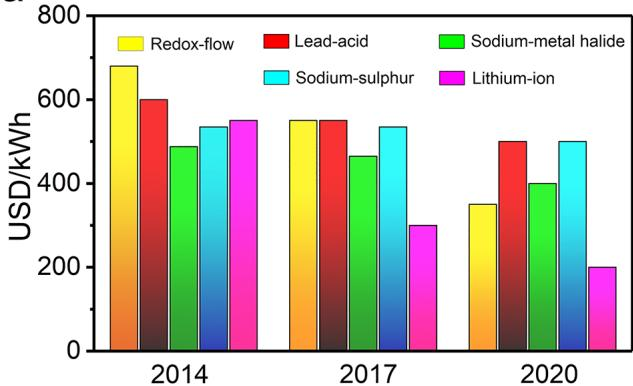  
a

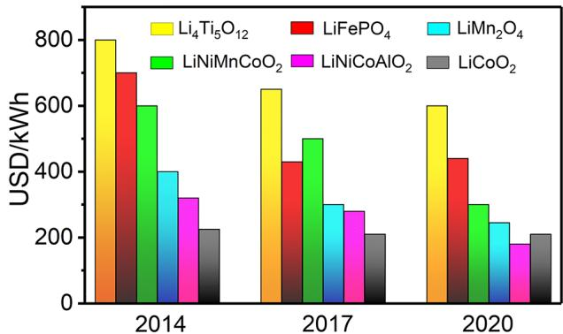  
b

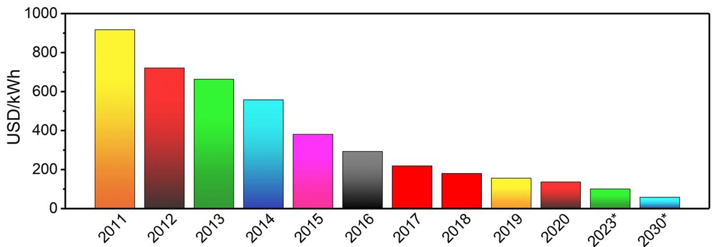  
C  
Figure 10. (a) Lowest projected battery price in different types of cells for utility-scale applications. (b) Lowest cell price of LIB chemistries for utility-scale applications. (c) LIB pack-level costs based on the observed and projected LIB demands. Data from International Renewable Energy Agency.

devices and electric vehicles. Figure 10b suggests a cost of about  $200\mathrm{kWh}^{-1}$  for lithium-cobalt chemistries and a fast decrease for other developed cathodes. This acceleration in GSES system deployments has been enabled by the dramatic decrease in the cost and fast increase in the demand for LIB storage systems over the past decade (Figure 10c).84 Consequently, energy storage is becoming increasingly cost-competitive with traditional grid assets (such as fossil-fueled power plants) for utility companies to fulfill various needs including reserve capacity, frequency regulation, and transmission investment deferral.63

LIBs are expected to experience further cost reductions, which may lead them to become increasingly cost-effective for a variety of grid applications, ensuring further growth in deployment of grid-connected LIB systems. Global manufacturing for LIBs has ramped up considerably and plans for further expanding capacities continue. The annual manufacturing capacity for LIBs today, for all chemistry types, exceeds  $\sim 100$  GWh.[85] There are several examples of BESS deployments for LSES applications. Hornsdale Power Reserve has installed a 100 MW/129 MWh LIB storage facility, which was one of the largest LIB energy storage systems in the world and has been in operation in South Australia since December 2017.[82] The battery energy storage system can bid 30 MW and 119 MWh of its capacity directly into the market. In addition, the new Contego project, in southeast England, assembled 28 Tesla megapack batteries for storing energy from renewable sources to be used at times of peak consumption. This 34 MW plant will be one of the United Kingdom's largest energy storage plants. In addition, the United Kingdom has committed to delivering a huge offshore wind program by 2030. Integrating 40 GW of

intermittent wind generation calls for a boom in battery storage to help harness excess energy and transmit electricity when needed.

# 3.2. Future Lithium Battery Chemistry for GSES

The next generation LIB technologies with potentially huge cost and performance benefits could be the answer to reaching the cost and energy density targets for GSES.[83] In this regard, systems employing Li- and Mn-rich (LMR) cathodes,  $5\mathrm{V}$  cathodes, Li metal, and silicon anodes have been extensively explored.[86] In particular, the  $5\mathrm{V}$  cathode materials are considered as potential candidates for next-generation LIBs. This class of materials includes spinel  $\mathrm{LiMn}_{1.5}\mathrm{Ni}_{0.5}\mathrm{O}_4$ , inverse spinel  $\mathrm{LiNiVO}_4$ , and olivine  $\mathrm{LiCoPO}_4$  among others, all possessing a high discharge voltage of  $>4.5\mathrm{~V}$  vs.  $\mathrm{Li} / \mathrm{Li}^+$ .[87] As the energy density is a product of capacity and discharge voltage, this class of materials is envisioned to achieve energy densities well above  $400\mathrm{Whkg}^{-1}$ . One of the main problems associated with such high voltage cathodes is the oxidation of the electrolyte. Traditional carbonate-based electrolytes cannot withstand potentials higher than  $4.3\mathrm{~V}$  vs.  $\mathrm{Li} / \mathrm{Li}^+$  and are normally oxidized when used with  $5\mathrm{~V}$  cathodes. Alternatively, researchers have employed more stable electrolytes such as ionic liquids (ILs), sulfones, nitrile, carbonate derivatives, and carbonates with additives.[82] However,  $5\mathrm{~V}$  cathodes still face similar challenges to lithium metal oxide or phosphate cathodes. For example, similar to the spinel LMO,  $\mathrm{Mn}^{2+}$  dissolution is a concern for the spinel  $\mathrm{LiMn}_{1.5}\mathrm{Ni}_{0.5}\mathrm{O}_4$  cathode especially at high temperatures, while the  $\mathrm{LiCoPO}_4$  olivine cathode suffers from poor electrical conductivity much like its olivine LFP counter

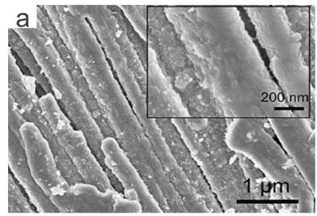

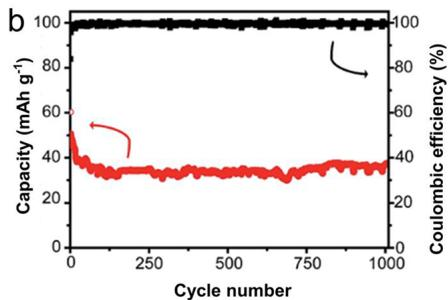

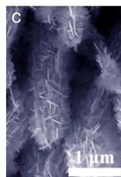  
Figure 11. Typical examples for improving the cycling performance of electrode materials for ALIBs. (a) SEM image of  $\mathrm{Fe_2O_3}$ -decorated polyaniline nanotubes. Inset image is higher magnification. (b) Cycling performance and CE of the  $\mathrm{Fe_2O_3}$ -decorated polyaniline/LMO cell at a current rate of 150 mA g $^{-1}$ . Reproduced with permission from ref 115. Copyright 2014 Royal Society of Chemistry. (c, d) SEM images of 3D hierarchical LCO nanorod arrays. (e) Cycling stability of the LCO/LiTi $_2$ PO $_4$ ) $_3@C$  cell. Reproduced with permission from ref 117. Copyright 2019 Elsevier.

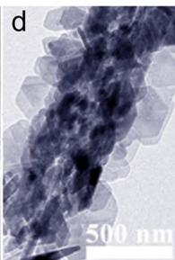

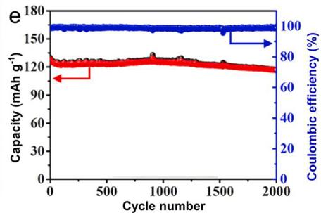

part. $^{87}$  Although the nature of the problems and solutions are similar to their parental archetypes, the  $5\mathrm{V}$  cathode materials have yet to reach the energy market. Another class of materials that employs high voltages is the LMR cathode, which is also known as layer-layered/layered-spinel materials. $^{88}$  This cathode material is remarkable in producing high specific capacity at high voltage with excellent capacity-based cycle stability. However, the charge and discharge voltages and thus energy density decrease substantially over cycling, owing to its well-known voltage fade phenomenon. $^{89}$  The activation process for LMR includes large portions of irreversible capacity, which make it problematic for pairing electrodes in a full cell. $^{89}$  The ultimate problem of the LMR cathode stems from its relatively poor conductivity, which results in rate performances inferior to that of commercial cathodes (NMC, NCA, etc.).

The addition of a small amount of silicon particles into the graphite anode of LIBs can boost the achievable cell energy density, but at the expense of increased mechanical stress during charging as the active material expands.[90] This needs to be overcome before its widespread practicality, as the electrode volume expansion is approximately  $400\%$  during lithiation, reducing cycle life to as few as several hundred cycles. Overcoming low lifetimes of electrodes through improved silicon nanoparticles and electrode designs and enhanced fabrication processes is therefore the current focus of research in this area.[91,92] Strategies of adopting nanowire structures and nanoparticles have resulted in enhanced utilization and stability of Si anodes.[93] The commonly used nanoparticles in literature most likely pose severe challenges in achieving appropriate volumetric energy densities.[94-96] A pioneering company, Amprius Inc., in Silicon Valley California is committed to transforming a  $100\%$  silicon nanowire anode at the laboratory level into practical battery systems for mass production and applications.

Post-Li-ion technologies exploring new approaches toward lithium metal anodes for energy storage have been explored in the past few decades.[97-99] In this respect, one of the most

promising material pathways for increasing energy densities includes lithium-sulfur batteries, using cost-effective and abundant sulfur as an active material for yielding very high energy densities of up to  $400\mathrm{Whkg^{-1}}$ . In addition, lithium-air batteries[101] make use of oxygen (derived from ambient air) as an active cathode material, featuring the highest potential energy and power density of all battery storage systems.[82] Furthermore, the use of only one active material increases the battery's inherent safety and promises improved environmental compatibility. However, three fundamental problems hinder the implementation of lithium metal anodes: (1) dendrite formation leading to short circuits of the batteries, (2) low CE, and (3) unavoidable continuous reactions of the Li metal with the electrolyte solutions in practical cells, which dry out the batteries ultimately.[102,103] Different approaches to limit or completely suppress dendrite growth have been studied and can be broadly divided into SEI related approaches (modifying the Li surface chemistry) and mechanical blocking of dendrite growth.[104] The development of Li-S batteries is still in infancy as these cells must overcome a number of challenges including a high self-discharge rate, low internal conductivity, and low cycle lifetimes before they can be considered for commercialization.[105] So far, there is no ultimate approach to fully solve the above-described problems of Li-S batteries; thus only combined approaches are promising to further this battery technology. In this respect, practical Li-S batteries were produced by Sion Power, and the cell yields an energy density of  $350\mathrm{Whkg^{-1}}$ .[82] Several other commercialization ventures for Li-S batteries by established companies are on the way. For Li-air batteries, many practical problems persist to date such as low storage capacities and high vulnerability to environmental influences, especially humidity.[106] Due to the existing challenges, large-scale commercialization of the Li-air battery is not expected within the next few years.

# 3.3. Aqueous Lithium-Ion Batteries

Since the conception of the aqueous lithium-ion battery (ALIB) by Dahn's group in 1994, the use of aqueous electrolytes has

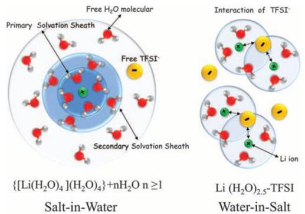  
a

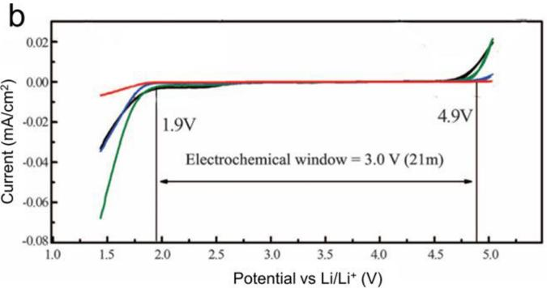

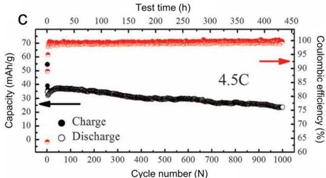

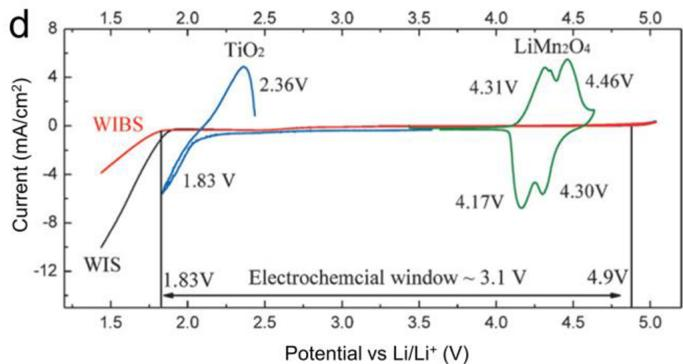

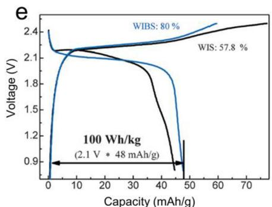  
Figure 12. WIS and WIBS electrolytes for enhancing the range of working voltage of ALIBs. (a) Schematic diagram of salt-in-water and WIS electrolytes. (b) CV of LiTFSI–H2O electrolytes on stainless steel working electrode (WE) between -1.8 and 1.8 V vs. Ag/AgCl at 10 mV s-1. (c) Cycling stability and CE of ALIB using Mo6S8 anode and LMO cathode with 21 m LiTFSI solution at a current rate of 4.5 C. Reproduced with permission from ref 119. Copyright 2015 The American Association for the Advancement of Science. (d) CV of WIBS and WIS electrolytes on stainless steel WE at a scanning rate of 10 mV s-1, and C-TiO2 anode and LMO cathode at a scanning rate of 0.1 mV s-1 in the same electrolyte. (e) First charge/discharge profiles of LMO/C-TiO2 cell in WIS (black) and WIBS (blue); therein, the CEs are labeled in the graph. (f) Cycling stability for varying combinations of TiO2 anode with electrolytes. Reproduced with permission from ref 123. Copyright 2016 Wiley-VCH. (g) Discharge capacities and CEs of these full cells during cycling. Reproduced with permission from ref 124. Copyright 2019 Springer Nature.

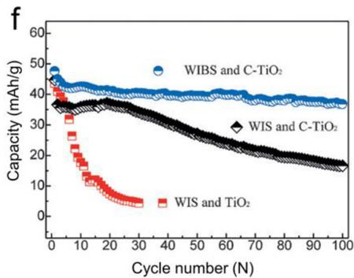

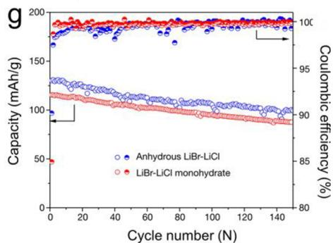

been recommended as a promising approach to replace the organic electrolytes due to their low cost and high safety. The resulting battery system showed an average operating voltage of  $1.5\mathrm{V}$  with an energy density of  $75\mathrm{Whkg}^{-1}$  while suffering from poor cycling performance. $^{107}$  Since then, a number of ALIB systems using various types of novel electrode materials and electrolytes have been developed to achieve better electrochemical performance. $^{108-110}$

3.3.1. Electrode Materials for ALIBs. For the electrode materials of ALIBs, the cathode usually comprises traditional LFP, LCO, or LMO, and the anodes are often  $\mathrm{LiTi_2(PO_4)_3}$ ,  $\mathrm{VO}_2$ , and  $\mathrm{TiP_2O_7}$ . In general, to restrain the water decomposition, part of the cathode needs to be coated with carbon to eliminate oxygen evolution. Dahn's group reported the first ALIB, which was composed of a  $\mathrm{VO}_2$  anode and the LMO cathode. Following this work, a series of ALIB systems

have been reported, such as  $\mathrm{LiV}_3\mathrm{O}_8 / \mathrm{LCO}$ ,  $\mathrm{TiP}_2\mathrm{O}_7 / \mathrm{LMO}$ , and  $\mathrm{LiTi}_2(\mathrm{PO}_4)_3 / \mathrm{LMO}$ . Nevertheless, the same problem of poor cycling performance has not been completely solved. The difficulty of capacity fading upon cycling has only made limited progress during the past five decades.

Much effort has been devoted to modifying the structure of electrodes to enhance the stability of the battery. For instance, Zheng and co-workers reported a  $\mathrm{Fe_2O_3}$ -decorated polyaniline nanotube as anode of ALIBs, as shown in the scanning electron microscopy (SEM) images of Figure 11a. $^{115}$  The full cell with the LMO cathode and  $\mathrm{Fe_2O_3}$ -decorated polyaniline anode showed superior capacity retention of  $73.3\%$  after over 1000 cycles (Figure 11b). Similarly, Wang and co-workers prepared N-doped carbon coated  $\mathrm{LiTi_2(PO_4)_3}$  composite nanoparticles as an anode for ALIBs by sol-gel and HT pyrolysis methods. $^{116}$  An ALIB using this N-doped carbon coated  $\mathrm{LiTi_2(PO_4)_3}$  anode and

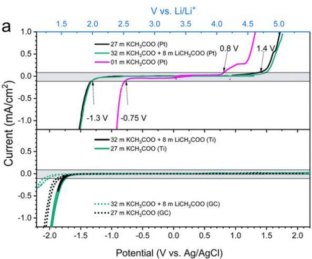

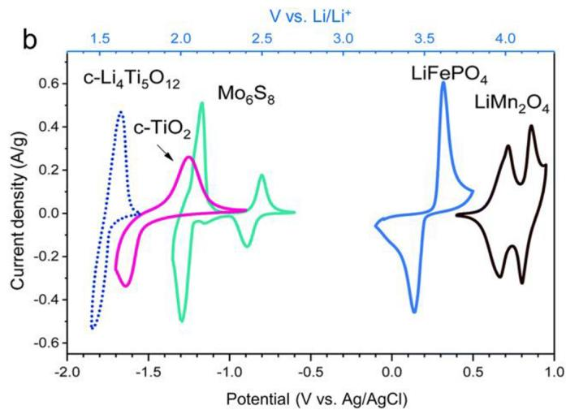

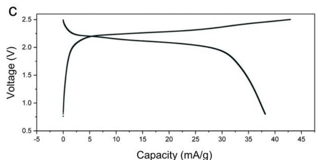

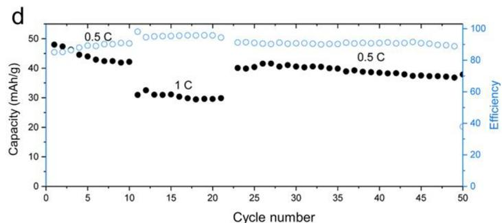

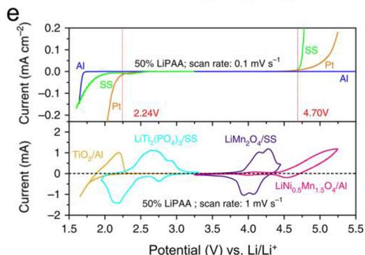  
Figure 13. Low-cost and nontoxic nonfluorinated electrolytes for enhancing the range of working voltage of ALIBs. (a) CV curves at  $0.2\mathrm{mV}s^{-1}$  for acetate solutions using Pt foil, Ti foil, and glassy carbon as current collectors. (b) CV curves at  $0.2\mathrm{mV}s^{-1}$  in  $32m$  KOAc-8m LiOAc for  $\mathsf{c - T_iO_2}$  (pink),  $\mathrm{Mo}_6\mathrm{S}_8$  (teal), LFP (blue), and LMO (brown) with Ti current collector and  $\mathsf{c - Li_4Ti_5O_{12}}$  on glassy carbon current collector. (c) Charge/discharge profiles and (d) rate capability of  $\mathsf{c - TiO_2}$ /LMO full cell. Reproduced with permission from ref 126. Copyright 2018 Royal Society of Chemistry. (e) Electrochemical stability windows of the 50 wt % LiPAA electrolyte, as well as CV curves of  $\mathrm{TiO_2}$ ,  $\mathrm{LiTi_2(PO_4)_3}$ , LMO, and  $\mathrm{LiNi_{0.5}Mn_{1.5}O_4}$  on various current collectors at  $0.1\mathrm{mV}s^{-1}$ . (f) Comparison of electrochemical stability windows of ALIBs with various salts. (g) Cycling performance of a  $\mathrm{LiTi_2(PO_4)_3}$ /LMO battery at  $0.5\mathrm{C}$ . Inset: Voltage profiles in different cycles. Reproduced with permission from ref 127. Copyright 2018 Springer Nature.

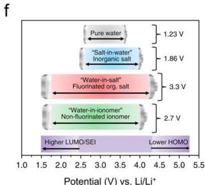

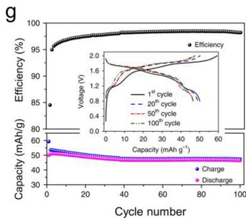

a LMO cathode delivered a high capacity of  $95.3\mathrm{mAhg}^{-1}$  at a rate of  $20~\mathrm{C}$  and excellent capacity retention up to  $82.1\%$  of the initial discharge capacity after 1000 cycles. Similarly, the decoration with carbon and  $\mathrm{Fe_2O_3}$  for anode materials has proved effective in improving the cycling performance of ALIBs.

In addition, it is well-known that three-dimensional (3D) frameworks to decorate the electrode structure with freestanding features can improve the rate and cycling performance for LIBs. Therefore, Xia and co-workers synthesized 3D hierarchical LCO nanorod arrays by hydrothermal treatment methods for developing advanced cathodes for ALIBs.[117] As shown in Figure 11c,d, the as-prepared 3D hierarchical LCO nanorod arrays possess a superior structure. When subjected to electrochemical cycling, the aqueous full cell based on the 3D

hierarchical LCO nanorod array cathode and  $\mathrm{LiTi}_2(\mathrm{PO}_4)_3@C$  anode presented good cycle performance with  $86.1\%$  capacity retention after 2000 cycles at 1 C (Figure 11e). The 3D structural frameworks can also accelerate ionic transport and stabilize the whole electrode operation during reversible cycling. Notwithstanding numerous research efforts toward improving the electrode performance in laboratory based ALIBs, there is still a lack of evaluation standards for the battery technology. For example, ALIBs utilizing structurally modified electrode materials show high specific capacity only based on the mass of cathode materials, while the practical energy density is still low when taking into account the mass of the whole battery. Therefore, these challenges call for immediate attention and more research needs to be conducted in this regard.

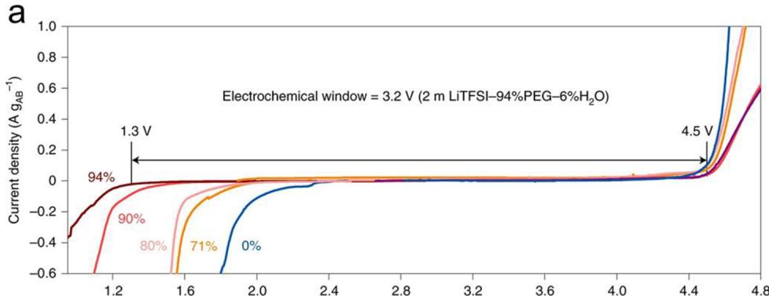

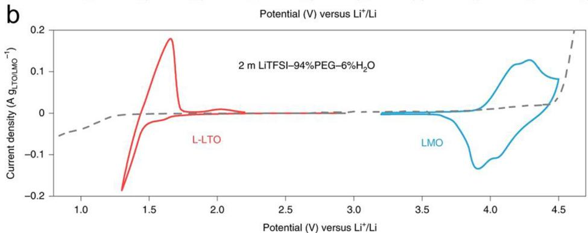

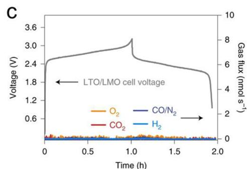

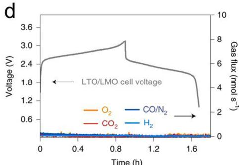

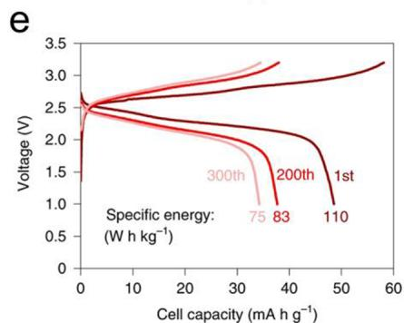  
Figure 14. Electrochemical behavior and OEMS of  $2m$  LiTFSI-94% PEG-6%  $\mathrm{H}_2\mathrm{O}$  for enhancing the range of working voltage of ALIBs. (a) Electrochemical stability windows for  $2m$  LiTFSI-  $x\mathrm{PEG} - (1 - x)\mathrm{H}_2\mathrm{O}$  ( $x = 0,71,80,90,94\%$ ) determined by LSV tests at a scan rate of  $0.2\mathrm{mV}s^{-1}$ . (b) CV curves in  $2m$  LiTFSI-94% PEG-6%  $\mathrm{H}_2\mathrm{O}$  at  $0.2\mathrm{mVs^{-1}}$  for LMO and L-LTO electrodes. OEMS results of the L-LTO/LMO full cell conducted in LiTFSI-94% PEG-6%  $\mathrm{H}_2\mathrm{O}$  during the first (c) and tenth (d) cycles at 1 C ( $0.104\mathrm{A g^{-1}}$  for LMO). (e) Voltage profiles of the 1st, 200th, and 300th cycles and (f) cycling stability with CE of the L-LTO/LMO cell in  $2m$  LiTFSI-94% PEG-6%  $\mathrm{H}_2\mathrm{O}$  at 1 C. Reproduced with permission from ref 128. Copyright 2020 Springer Nature.

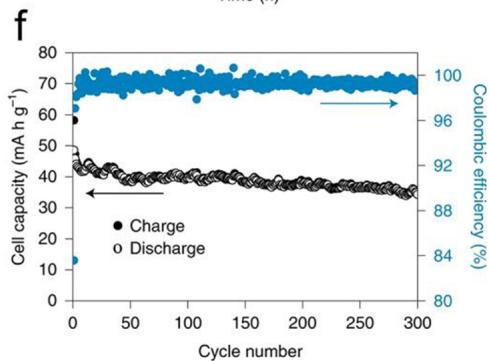

3.3.2. Electrolytes for ALIBs. In order to enhance the stability and enlarge the aqueous battery systems, extensive effort has been devoted to the development of novel electrolytes. In general,  $\mathrm{Li_2SO_4}$  or  $\mathrm{LiNO}_3$  water solution is the most commonly used electrolyte for ALIBs in neutral pH. $^{110}$  Ramanujapuram and Yushin explored the battery performance of the water electrolytes based on three low-cost inorganic salts

$\left(\mathrm{LiNO}_{3}, \mathrm{Li}_{2} \mathrm{SO}_{4}, \text { and } \mathrm{LiCl}\right)$  at low temperatures. $^{118}$  Their results demonstrated that the ALIBs were able to charge and discharge at much higher rates at lower temperatures due to the low charge transfer resistances. However, in conventional aqueous electrolytes, the ALIBs are typically limited to low voltage and energy density due to the narrow window of water decomposition (1.23 V). $^{111}$  Considering this, researchers have tried to employ high-

concentration electrolytes to expand the narrow voltage window. In 2015, for instance, Wang and co-workers pioneered a water-in-salt (WIS) electrolyte in an ALIB by dissolving  $>20m$ $(\mathrm{mol~kg}_{\mathrm{solvent}}^{-1})$  lithium bis(trifluoromethanesulfonyl)imide (LiTFSI) in water. $^{119}$  According to the schematic diagram of salt-in-water and WIS in Figure 12a, a low-concentration salt solution expresses salt-in-water structure, which leads to preferential decomposition of water. However, upon increasing LiTFSI concentrations over  $20m$ , the high-concentration TFSI leads to an expanded electrochemical stability window of  $3.0\mathrm{V}$ , which is wider than those of previous inorganic salt based electrolytes (Figure 12b). $^{119}$  When electrochemically cycled, ALIBs assembled with a LMO anode and a  $\mathrm{Mo}_6\mathrm{S}_8$  cathode exhibited nearly  $100\%$  CE for up to 1000 cycles at a current rate of  $4.5\mathrm{C}$  (Figure 12c). Similarly, WIS electrolytes have also been reported for other ALIB systems, including  $\mathrm{Mo}_6\mathrm{S}_8 / \mathrm{LCO}$ , $^{120}$ $\mathrm{LiTi}_2(\mathrm{PO}_4)_3 / \mathrm{Li}_3\mathrm{V}_2(\mathrm{PO}_4)_3$ , $^{121}$  and  $\mathrm{VO}_2 / \mathrm{LiVOPO}_4$ . $^{122}$  Furthermore, Wang and co-workers proposed a new class of electrolyte termed as water-in-bisalt (WIBS) electrolyte with a wider electrochemical stability window than WIS of about  $3.1\mathrm{V}$ , as shown in Figure 12d. $^{123}$  The WIBS electrolyte consisted of  $21m$  LiTFSI and  $7m$  lithium trifluoromethanesulfonate. When assembled with a LMO cathode and a C-TiO $_2$  anode to a full ALIB, it delivered a high average discharge voltage of  $2.1\mathrm{V}$  with energy density of  $100\mathrm{Whkg}^{-1}$  (Figure 12e). As shown in Figure 12f, the LMO/C-TiO $_2$  based ALIB exhibited excellent cycling stability with a low capacity decay rate of  $0.22\%$  per cycle after 100 cycles. The WIBS electrolyte can also be used in conjunction with LiCl/LiBr as cathode and graphite as anode. $^{124}$  The resulting battery system achieved initial capacity retention of  $74\%$  over 150 cycles at an average CE of  $99.8\%$  (Figure 12g). In addition, Wang and co-workers have further reported a novel  $63m$  aqueous electrolyte ( $42m$  LiTFSI +  $21m$ $\mathrm{Me}_3\mathrm{EtN}\cdot \mathrm{TFSI}$ ), offering a wide potential window of  $3.25\mathrm{V}$  for developing a  $2.5\mathrm{V}$  ALIB ( $\mathrm{LMO} / \mathrm{Li}_4\mathrm{Ti}_5\mathrm{O}_{12}$ ), which can deliver high energy density of  $145\mathrm{Whkg}^{-1}$  over 150 cycles. $^{125}$

Despite the remarkable improvement in the voltage window for current WIS electrolyte systems, economic and environmental concerns remain, hindering their further applications. In particular, the LiTFSI salt has limited large-scale availability, whereas other hydrate melt components, such as LiBETI, are only available in limited quantities. Hence, the actual concentration of lithium salt used to make the electrolyte is an important parameter to consider. Bao and co-workers proposed a new WIS electrolyte based on potassium acetate and lithium acetate salts that can provide the same voltage window as LiTFSI-based electrolytes.[126] The electrochemical stability windows of  $27\mathrm{m}$  KOAc and  $32\mathrm{m}$  KOAc-8 m LiOAc electrolyte solutions in combination with different current collectors were evaluated using CV at a scan rate of  $0.2\mathrm{mV}s^{-1}$  and compared with the CV data obtained from 1 m KOAc electrolyte (Figure 13a). Evident is  $\sim 1.15\mathrm{V}$  extension of the electrochemical stability window upon increase in KOAc salt concentration from 1 to  $27\mathrm{m}$ . The increased salt molality in  $32\mathrm{m}$  KOAc-8 m LiOAc solution does not lead to any additional voltage window extension. On the other hand, definite extension in the negative potential range was observed in  $32\mathrm{m}$  KOAc-8 m LiOAc with a glassy carbon current collector. To evaluate whether a mixed cation strategy would allow us to use the already-developed Li-ion electrode systems, CV characterization of various typical anode and cathode materials was tested in the  $32\mathrm{m}$  KOAc-8 m LiOAc electrolyte. Consequently, the results demonstrated a set of reversible Li-ion intercalation peaks (Figure 13b). As a result,

the  $c\text{-TiO}_2/$  LMO cell delivered an operation voltage window up to  $2.5\mathrm{V}$  (Figure 13c) and stable cycling performance with capacities of  $\sim 45$  mAh g $^{-1}$  (Figure 13d).

In addition, a new type of electrolyte, water-in-ionomer, has been reported, which comprised nonfluorinated and nontoxic lithiated poly(acrylic acid) (LiPAA) aqueous gel electrolyte and exhibited a comparable electrochemical stability window to those of WIS electrolytes. [127] As illustrated in Figure 13e, a typical Al current collector for LIBs allows for an extended electrochemical stability window compared with Pt or stainless steel, not to mention that this electrolyte allowed reversible  $\mathrm{Li^{+}}$  insertion and extraction for both  $\mathrm{TiO_2}$  and  $\mathrm{LiTi_2(PO_4)_3}$  anodes. For cathode, LMO delithiation was reversible, but for  $\mathrm{LiNi_{0.5}Mn_{1.5}O_4}$ , only partial delithiation occurred on the reverse scan. The enlargement of the electrochemical stability window for water-in-ionomer electrolyte is mainly due to the increase of the cathodic stability, which has been the main challenge for aqueous electrolytes (Figure 13f). As shown in Figure 13g, the  $\mathrm{LiTi_2(PO_4)_3 / LMO}$  cell achieves stable cycling for 100 cycles with an initial energy density of  $77\mathrm{Whkg^{-1}}$  and a remarkable capacity retention of  $77\%$  over 100 cycles with CE of  $98\%$ .

However, owing to the absence of a reliable SEI in  $32m$  KOAc-8 m LiOAc and the high water content needed  $(>30\%)$  in LiPAA gel to avoid electrode-electrolyte contact issues, the water stability window is narrow in these nonfluorinated electrolytes, leading to lower energy density and shorter cycle life as compared with the fluorinated electrolytes.[126,127] Lu and co-workers successfully created low-cost, ecofriendly, and high-voltage "molecular crowding" aqueous electrolytes via confining water molecules in a crowding agent, poly(ethylene glycol) (PEG), network through hydrogen bonding.[128] With the expanded stable voltage window with a potential range of  $1.3 - 4.5\mathrm{V}$  vs.  $\mathrm{Li} / \mathrm{Li}^{+}$  as provided by the crowding agent PEG (Figure 14a), the electrochemical behavior of the full cell was examined with a LMO cathode, a spinel  $\mathrm{Li}_4\mathrm{Ti}_5\mathrm{O}_{12}$  anode with 3 wt  $\%$ $\mathrm{Li}_{1.3}\mathrm{Al}_{0.3}\mathrm{Ti}_{1.7}(\mathrm{PO}_4)_3$  coating (L-LTO), and  $2m$  LiTFSI-  $94\% \mathrm{PEG} - 6\% \mathrm{H}_2\mathrm{O}$  electrolyte. The reversible electrochemical behavior of the L-LTO and LMO electrodes in the  $2m$  LiTFSI-  $94\% \mathrm{PEG} - 6\% \mathrm{H}_2\mathrm{O}$  electrolyte was confirmed by CV measurements (Figure 14b). Online electrochemical mass spectroscopy (OEMS) was used to monitor gas evolution during the charge and discharge process of the L-LTO/LMO full cell at  $1C$  in  $2m$  LiTFSI-  $94\% \mathrm{PEG} - 6\% \mathrm{H}_2\mathrm{O}$ . Clearly, no visible  $\mathrm{H}_2,\mathrm{O}_2,\mathrm{CO} / \mathrm{N}_2,$  or  $\mathrm{CO}_{2}$  signal was detected upon cycling (Figure 14c,d), indicating that water decomposition was virtually eliminated in the L-LTO/LMO cell with the molecular crowding aqueous electrolyte. In addition, an initial specific energy of  $110\mathrm{Whkg^{-1}}$  was achieved at  $1C,$  and  $75\mathrm{Whkg^{-1}}$  was maintained after 300 cycles with a high average CE of  $\sim 99\%$  (Figure 14e,f). The polymer-salt solution provided a new way to broaden the electrochemical window of electrolytes, but one significant barrier is its low conductivity and high viscosity.[129,130]

Therefore, resolving these barriers becomes the focus of future work in the development of aqueous electrolytes. For example, introducing acetonitrile (ACN) or sulfolane as a cosolvent minimizes the presence of interfacial water at the negatively charged electrode surface.[131-133] However, these gel polymers and organic solvents are still flammable, which compromises the merits of aqueous electrolytes.[134] To design better dilute aqueous electrolytes beyond WIS electrolytes, Wang and coworkers have developed a nonflammable ternary eutectic electrolyte  $\mathrm{(LiTFSI - KOH - CO(NH_2)_2 - H_2O)}$  by using  $\mathrm{CO}(\mathrm{NH}_2)_2$  as a model diluent.[134] The aqueous electrolyte

Table 5. Summary of Electrochemical Performances of High-Salt Concentration Electrolytes in ALIBs  

<table><tr><td>cathode/anode</td><td>electrolyte</td><td>voltage window (V)</td><td>capacity (mAh g-1)</td><td>rate</td><td>cycle life</td><td>ref</td></tr><tr><td>LMO/Mo6S8</td><td>WIS</td><td>2.3</td><td>47</td><td>0.15 C</td><td>capacity retention of 68% at 4.5 C after 1000 cycles</td><td>119</td></tr><tr><td>LCO/Mo6S8</td><td>WIS</td><td>2.5</td><td>40</td><td>2.5 C</td><td>capacity retention of 87% at 2.5 C after 1000 cycles</td><td>120</td></tr><tr><td>Li3V2(PO4)3/LiTi2(PO4)3</td><td>WIS</td><td>1.9</td><td>104</td><td>0.1 C</td><td>capacity retention of 65% at 1 C after 1000 cycles</td><td>121</td></tr><tr><td>LiVOPO4/ VO2</td><td>WIS</td><td>1.8</td><td>102</td><td>0.1 A g-1</td><td>capacity retention of 84% at 0.1 A g-1after 1000 cycles</td><td>122</td></tr><tr><td>LMO/C-TiO2</td><td>WIBS</td><td>2.5</td><td>48</td><td>0.5 C</td><td>capacity retention of 78% at 0.5 C after 100 cycles</td><td>123</td></tr><tr><td>(LiBr)0.5(LiCl)0.5/graphite</td><td>WIBS</td><td>4.5</td><td>127</td><td>0.2 C</td><td>capacity retention of 74% at 0.2 C after 150 cycles</td><td>124</td></tr><tr><td>LMO/Li4Ti5O12</td><td>WIBS</td><td>2.8</td><td>57</td><td>1 C</td><td>capacity retention of 90% at 1 C after 100 cycles</td><td>125</td></tr><tr><td>LMO/C-TiO2</td><td>32 m KOAc-8 m LiOAc</td><td>2.5</td><td>45</td><td>0.5 C</td><td>capacity retention of 90% at 0.5 C after 55 cycles</td><td>126</td></tr><tr><td>LMO/LiTi2(PO4)3</td><td>LiPAA gel</td><td>2</td><td>50</td><td>0.5 C</td><td>capacity retention of 77% at 0.5 C after 100 cycles</td><td>127</td></tr><tr><td>LMO/Li4Ti5O12</td><td>2 m LiTFSI-94%PEG</td><td>3.2</td><td>50</td><td>1 C</td><td>capacity retention of 68% at 1 C after 300 cycles</td><td>128</td></tr><tr><td>LMO/Li4Ti5O12</td><td>ACN-WIS</td><td>2.8</td><td>76</td><td>10 C</td><td>capacity retention of 69% at 5 C after 1000 cycles</td><td>132</td></tr><tr><td>LMO/Li4Ti5O12</td><td>3.6 M LiTFSI-sulfolane (8:8)</td><td>3.4</td><td>52</td><td>5 C</td><td>capacity retention of 70% at 5 C after 1000 cycles</td><td>133</td></tr><tr><td>LMO/Li4Ti5O12</td><td>4.5 m LiTFSI-KOH-CO(NH2)2</td><td>3.3</td><td>59</td><td>1 C</td><td>capacity retention of 92% at 1 C after 470 cycles</td><td>134</td></tr></table>

expanded the electrochemical stability window to  $3.3\mathrm{V}$  and enabled  $\mathrm{Li}_4\mathrm{Ti}_5\mathrm{O}_{12} / \mathrm{LMO}$  pouch cells to achieve a high CE of  $99.96\%$  and capacity retention of  $92\%$  after 470 cycles, which demonstrates a promising approach toward safe, low-cost, and high-energy ALIBs for GSES applications. The electrochemical performance of high-concentration salt electrolytes in ALIBs has been summarized in Table 5. Although tremendous improvements in electrolytes have been reported for laboratory-based ALIBs, their development is still impeded with further challenges that need to be overcome. Furthermore, the data reported in the literature to date has often been acquired under ideal testing conditions, such as with high N/P ratio, excessive electrolyte with salt, and low active material loading. While these achievements appear to be significant, they are only of limited value for industrial production, where much stricter conditions are required.

# 3.4. Sodium-lon Batteries

In the Earth's crust, sodium (2.83%) is much more abundant than lithium (0.01%) and hence has a lower price ( $150 \, \text{ton}^{-1}$ ). The cost aspect is extremely critical for the development of new battery systems, especially considering LSES.[135,136] Sodium-ion batteries (SIBs) were initially studied in the 1970s and 1980s, but this battery system was largely abandoned due to the rapid development in the commercial applications of LIBs.[137,138] Moreover, sodium is difficult to deal with because it is more active than lithium.[139] Nonetheless, the indispensable cost effectiveness, acceptable energy and power densities make SIBs an attractive alternative for LSES systems.[135,136,139,140] The similarities to LIBs in battery principle, energy storage mechanisms, and electrolyte composition have enabled more convenient and rapid development of SIBs.[140] However, unlike LIBs, the development of proper anode and cathode materials for SIBs has been challenging, especially for their commercialization.[135,141] Hence, we present the recent progress in enhancing the electrochemical properties as well as discovering new electrode materials for SIBs in order to promote the development of this battery system.

3.4.1. Anode Materials for SIBs. Graphite as a commercial anode material has been successfully applied in first generation LIBs due to its low price, easy fabrication, and excellent lithium-ion insertion capability.[80] However, most attempts to apply graphite anodes in SIBs have failed with low Na storage capacities owing to its larger ion radius than  $\mathrm{Li^{+}}$ .[136,142] Therefore, non-graphitic carbonaceous materials are considered to be the "first-generation" anodes for SIB systems due to their good  $\mathrm{Na^{+}}$ insertion capacity and high specific capacity.[140] However, their cycling performance is still not good enough for commercial utilization in SIBs.[136] It is therefore imperative to fabricate large interlayer distance graphite or novel carbon materials to improve the performance of the anode for SIBs.

As demonstrated by theoretical calculations, the interlayer distance of graphite ( $\sim 0.34 \mathrm{~nm}$ ) is too small to accommodate the large  $\mathrm{Na}^{+}$ , and therefore a minimum interlayer distance of  $0.37 \mathrm{~nm}$  is required for  $\mathrm{Na}^{+}$ insertion.[143] Wang and co-workers reported expanded graphite (EG), which is a graphite-derived material formed by a two-step oxidation-reduction process with a large interlayer distance of  $40.34 \mathrm{~nm}$  (Figure 15a), as a superior SIB anode material.[144] These features provide favorable conditions for electrochemical intercalation of  $\mathrm{Na}^{+}$ . The pristine graphite (PG) displays well-defined layers of long-range order stacking parallel to each other (Figure 15b). After oxidation, such long-range order is disrupted by massive intercalation of oxygen in the graphite interlayer, forming a more disordered pattern with only localized short-range ordering (Figure 15c). However, after partial reduction, the material recovers toward a well-organized morphology, while preserving expanded interlayer distances and long-range channels suitable for  $\mathrm{Na}^{+}$ transport (Figure 15d,e). In addition, the average interlayer spacings are measured to be  $\sim 0.34 \mathrm{~nm}$  for PG,  $0.61 \mathrm{~nm}$  for GO,  $0.43 \mathrm{~nm}$  for EG-1 h and  $0.37 \mathrm{~nm}$  for EG-5 h. It is obvious that the distance between PG layers is expanded after the oxidation reactions because of the insertion of oxygen-containing groups and that such spacing remains larger than PG after reduction treatments. Therefore, PG has a negligible sodium storage capacity of  $\sim 13 \mathrm{mAh} \mathrm{g}^{-1}$ , and GO shows monotonic voltage

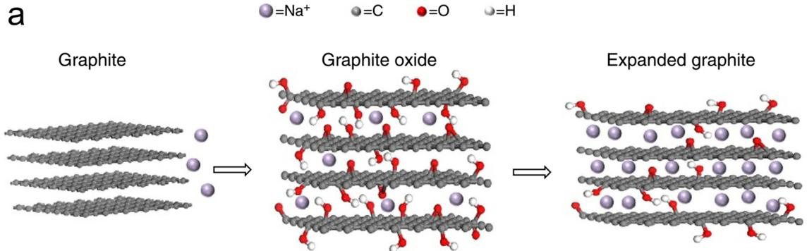

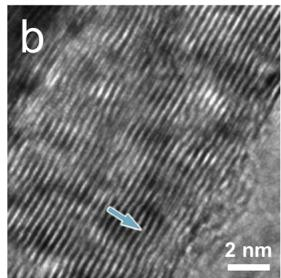

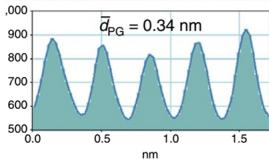

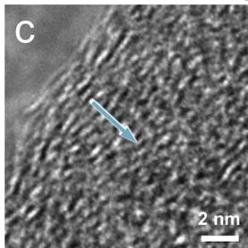

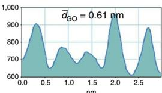

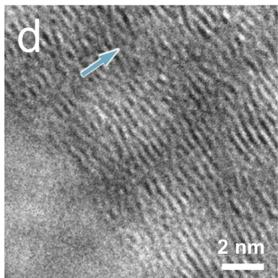

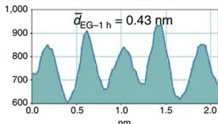

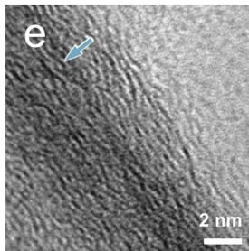

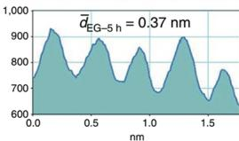

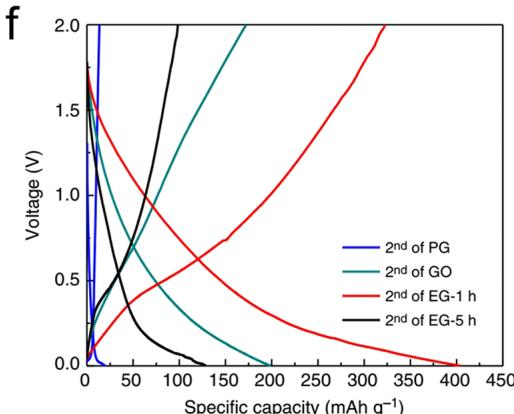

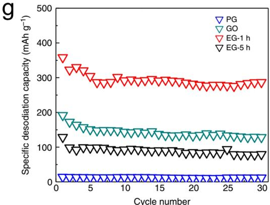

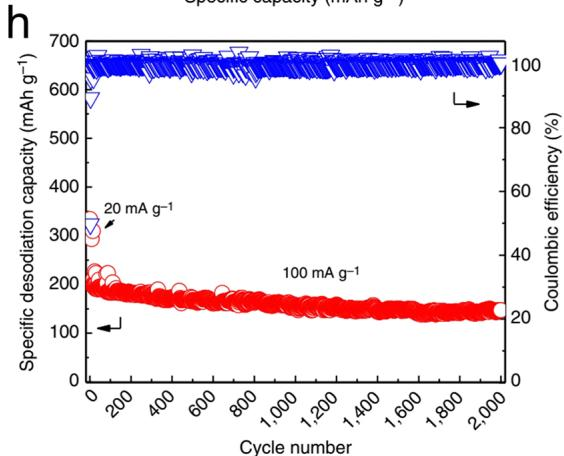  
Figure 15. Characterization and electrochemical analyses in EG as anode materials of SIBs. (a) Schematic illustration of sodium storage in graphite-based materials. High-resolution TEM images of (b) PG, (c) GO, (d) EG-1 h, and (e) EG-5 h. Scale bars,  $2\mathrm{nm}$ . Contrast profiles along the arrows indicate interlayer spacing of corresponding samples. (f) Charge/discharge curves for the second cycles of PG, GO, EG-1 h, and EG-5 h at a current density of  $20\mathrm{mA}\mathrm{g}^{-1}$ . (g) Short-term cycling stability test for PG, GO, EG-1 h, and EG-5 h at a current density of  $20\mathrm{mA}\mathrm{g}^{-1}$ . (h) Long-term cycling stability at a current density of  $100\mathrm{mA}\mathrm{g}^{-1}$ , and (i) rate capability of EG-1 h. Reproduced with permission from ref 144. Copyright 2014 Springer Nature.

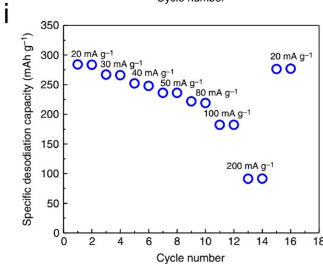

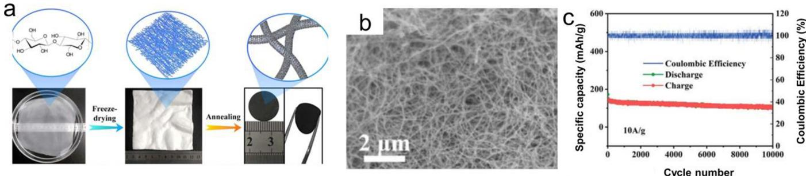

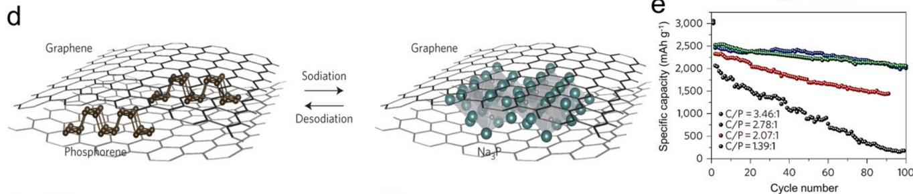

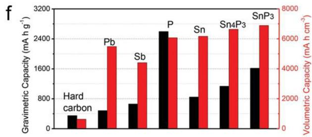  
Figure 16. Typical examples of anode materials of SIBs for improving the cycling performance. (a) Schematic illustration of the synthetic process of CNFs. (b) SEM image and (c) cycling stability of CNFs at  $10\mathrm{A}\mathrm{g}^{-1}$ . Reproduced with permission from ref 147. Copyright 2019 Elsevier. (d) Structural evolution of the sandwiched phosphorene-graphene structure during sodiation. (e) Reversible desodiation capacities of various phosphorene-graphene electrodes with different carbon-phosphorus mole ratios at a current density of  $0.05\mathrm{A}\mathrm{g}^{-1}$ . Reproduced with permission from ref 150. Copyright 2015 Springer Nature. (f) Capacity comparison of different anode materials of SIBs. (g) Cycling stability at  $150\mathrm{mA}\mathrm{g}^{-1}$  of  $\mathrm{SnP}_3 / \mathrm{C}$  electrode. Reproduced with permission from ref 151. Copyright 2015 Wiley-VCH.

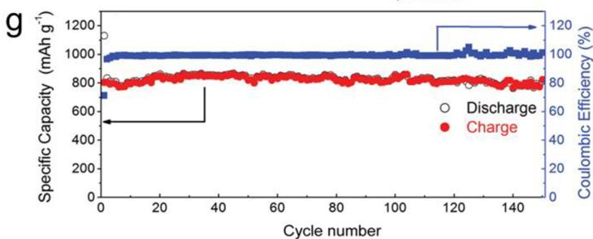

curves during the whole sodiation/desodiaton process with an increased capacity of  $\sim 156\mathrm{mAhg^{-1}}$  (Figure 15f). After  $1\textrm{h}$  of thermal reduction, it can deliver a highly reversible sodium conversion capacity of  $\sim 300\mathrm{mAhg^{-1}}$  , which is significantly higher than PG, GO, and EG-5 h  $(\sim 300\mathrm{mAhg^{-1}})$  , implying that the interlayer distance predominantly controls the  $\mathrm{Na^{+}}$  storage capacity. In addition, all materials show stable cycling performances in the first 30 cycles except for the initial few cycles, with EG-1 h exhibiting the highest sodium storage capacity (Figure 15g). For cycling performance, the EG demonstrates excellent cycling stability for 2000 cycles with a low capacity decay rate of  $\sim 0.013\%$  per cycle from the 11th cycle to the 2000th cycle (Figure 15h). In the rate capability tests, EG exhibits a capacity of  $284\mathrm{mAhg^{-1}}$  at a low current of  $20\mathrm{mA g^{-1}}$  and a high capacity of  $91\mathrm{mAhg^{-1}}$  at a high current of  $200\mathrm{mA g^{-1}}$  , demonstrating the high tolerance of EG under a wide range of charge/discharge conditions (Figure 15i).

Recently, various nanostructured carbonaceous materials have been reported as anodes for SIBs, and it has been found that the sodium storage properties, including the cycling stability and rate capability, are highly dependent on the carbon structures. Dou and co-workers prepared a novel hierarchical 3D porous carbon material (C-600) as the anode for SIBs through an in situ template carbonization process.[145] This anode delivered high rate capacity  $(126\mathrm{mAhg}^{-1}$  at  $20\mathrm{A g}^{-1})$  and long-term cycling stability (15000 cycles at  $10\mathrm{A g}^{-1}$ ). Similarly,

Zhang and co-workers reported 3D porous graphene grids (PGGs) consisting of several layered graphene structures with ultrahigh surface area and hierarchical connected structure. $^{146}$  The PGGs showed high specific capacity of  $160\mathrm{mAhg^{-1}}$  at a current density of  $50\mathrm{mA g^{-1}}$  and long cycling performance of  $112\mathrm{mAh g^{-1}}$  at  $1\mathrm{A g^{-1}}$  after 1000 cycles. In addition, Yu and coworkers investigated a highly porous and ultrafine interconnected carbon nanofiber (CNF) electrode prepared by simply carbonization of a bacterial cellulose film, as shown in Figure 16a. $^{147}$  Figure 16b presents the SEM image of the CNF morphology with a high aspect ratio and diameter of 20-200 nm. The CNF anode also showed long cycling stability at a high current rate of  $10\mathrm{A g^{-1}}$  after 10000 cycles (Figure 16c). These carbonaceous electrode materials with large surface areas are able to demonstrate high rate and cycling performance, because sodium ions have a relatively larger radius compared to lithium ions.

Besides the carbon-based anodes, many other novel anode materials can be synthesized by alloying, conversion, or combination of both to achieve high capacities. Regarding alloying, group IVA and VA elements such as Sn, Sb, and P showed high sodium storage capacity in their alloying reaction.[136] However, the main challenge of alloy-based anodes in SIBs is the pulverization and aggregation of materials due to the harsh volume variation and large radius of sodium ions.[148] Another critical issue for alloy-based anodes, mainly for P and Si

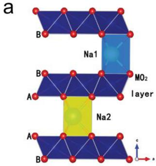

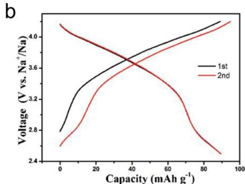

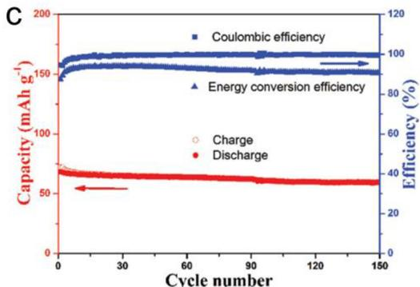

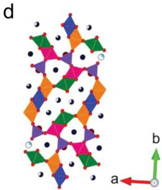

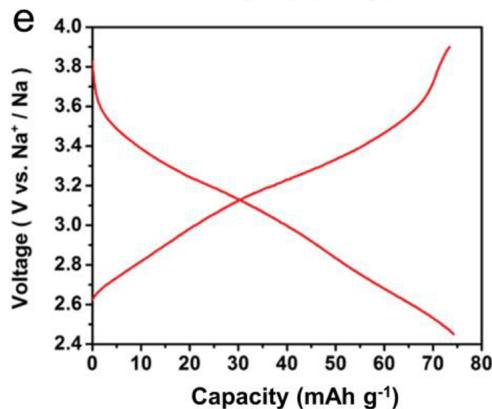

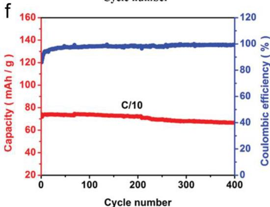

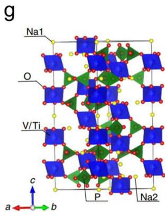  
Figure 17. Typical examples of cathode materials for SIBs. (a) Schematic illustration, (b) charge/discharge curves at  $0.1\mathrm{C}$ , and (c) cycling performance at  $1\mathrm{C}$  of the  $\mathrm{Na}_{7/9}\mathrm{Cu}_{2/9}\mathrm{Fe}_{1/9}\mathrm{Mn}_{2/3}\mathrm{O}_2$ . Reproduced with permission from ref 159. Copyright 2015 Wiley-VCH. (d) Schematic illustration, (e) typical charge/discharge curves at  $0.1\mathrm{C}$  in the voltage range of 1.5 and  $3.9\mathrm{V}$ , and (f) long-term cycling performance of  $\mathrm{Na}_{0.66}\mathrm{Mn}_{0.66}\mathrm{Ti}_{0.34}\mathrm{O}_2$  at  $0.1\mathrm{C}$ . Reproduced with permission from ref 160. Copyright 2015 Wiley-VCH. (g) Schematic crystal structure of  $\mathrm{Na}_2\mathrm{VTi}(\mathrm{PO}_4)_3$ . (h) Galvanostatic charge/discharge profiles for the 1st, 2nd, 3rd, 5th, 10th, and 30th cycles between 1.5 and  $4.5\mathrm{V}$  at a current density of  $0.1\mathrm{C}$  of  $\mathrm{Na}_2\mathrm{VTi}(\mathrm{PO}_4)_3@C$  electrode. (i) Long-term cycling performance at a current rate of  $10\mathrm{C}$  of the symmetric full cells based on  $\mathrm{Na}_2\mathrm{VTi}(\mathrm{PO}_4)_3@C$ . Reproduced with permission from ref 165. Copyright 2017 Springer Nature.

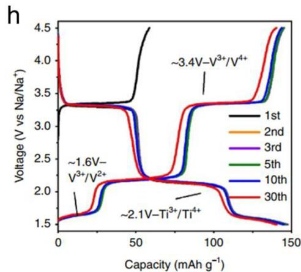

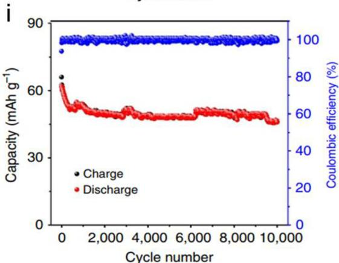

elements, is their poor electrical conductivities, which seriously restrict their rate capability and loading of active mass. $^{135,149}$

To date, many researchers have tried to solve these challenges of alloy-based anode materials for SIBs. For instance, Cui and co-workers reported a hybrid material made out of a few phosphorene layers sandwiched between graphene layers to provide an elastic buffer layer to accommodate the anisotropic volumetric expansion during the sodiation process.[150] Figure 16d shows the structural evolution of the sandwiched phosphorene-graphene structure during sodiation. The cycling performance of the phosphorene-graphene hybrids with various carbon/phosphorus (C/P) mole ratios is shown in Figure 16e. The galvanostatic cycling at  $0.02\mathrm{C}$  revealed that the samples prepared using C/P ratios of 2.78:1 and 3.46:1 exhibited similar capacity retention after 100 cycles. A lower

C/P ratio was obviously beneficial to specific capacity, given that graphene is electrochemically inactive for sodiation. To alleviate the volume expansion problem in  $\mathrm{SnO}_2$ , Zhang and co-workers evaluated a new amorphous carbon-coated  $\mathrm{SnO}_2$  electrodeposited porous CNF (PCNF@SnO₂@C) composite that not only had high sodium storage capability but also maintained its structural integrity during ongoing repetitive cycles.[152] During electrochemical operation, the CE for the PCNF@  $\mathrm{SnO}_2@\mathrm{C}$  composite anode increased to  $94.1\%$ . This composite anode also demonstrated high capacity of  $374\mathrm{mAhg}^{-1}$ , capacity retention of  $82.7\%$ , and high CE of  $98.9\%$  after the 100th cycle. Similarly, the same group of researchers have reported a reduced graphene oxide (RGO) incorporated SnSb@CNF (SnSb@RGO@CNF) composite anode for SIBs, achieving high capacity of  $490\mathrm{mAhg}^{-1}$  at the 10th cycle with high capacity retention of

$87.2\%$  and a high CE of  $97.9\%$  at the 200th cycle. $^{153}$  In addition, it is vital to consider the innately poor conductivity and slow kinetics of the electrode materials. Wang and co-workers studied the electrochemical performance of  $\mathrm{SnP}_3 / \mathrm{C}$  anodes prepared by reactive ball milling of Sn, red phosphorus, and carbon black (CB) mixtures (Figure 16f). This  $\mathrm{SnP}_3 / \mathrm{C}$  anode can reversibly react with Na through conversion and alloy reaction processes. $^{151}$  It also provided high capacity of  $810\mathrm{mAhg}^{-1}$  at  $150\mathrm{mA g}^{-1}$  for 150 cycles, thereby outperforming P, Sn, and Sn-P compound anodes for Na-ion batteries (Figure 16g). Later, Wen and co-workers prepared 3D hierarchical nanohybrids with tin sulfide nanoparticles decorating nitrogen-doped carbon nanosheet networks as an anode material for SIBs. $^{154}$  Upon cycling, the anode exhibited outstanding electrochemical performance in terms of high capacity ( $902\mathrm{mAhg}^{-1}$  at the current rate of  $0.1\mathrm{C}$ ) and long-term stable cycling performance even after 1000 charge and discharge cycles. Last but not least, the organic compound materials also constituted a category of SIB anode materials due to their low cost and environmental friendliness. $^{155}$  Therefore, high capacity and stable anode materials for SIBs need further exploration.

3.4.2. Cathode Materials for SIBs. High-performance cathode materials for SIBs mainly consist of  $\mathrm{NaMO}_2$  (solid solutions of  $\mathrm{NaCoO}_2$ ,  $\mathrm{NaNiO}_2$ ,  $\mathrm{NaMnO}_2$ , and  $\mathrm{NaFeO}_2$ ), openframework polyanionic, Prussian blue analogue (PBA), and organic compounds. $^{156,157}$  These materials have been sought for many years owing to their high energy densities and good stability. $^{149}$  In particular, layered  $\mathrm{NaMO}_2$  have attracted great interest as cathode materials for SIBs because of their high theoretical capacity (e.g.,  $243.8\mathrm{mAhg^{-1}}$  for  $\mathrm{O3 - NaMnO_2}$ ) and relatively simple synthesis process. $^{156}$  The electrochemical activity of layered  $\mathrm{NaMO}_2$  as a cathode for SIBs was originally reported around 1980. $^{136}$  Recent reports have highlighted manganese and iron oxides, and their combinations with a ternary element, which have been the most viable selections for cathodes. Layered oxides can mainly be classified into P2 and O3 according to the oxygen stacking sequence and coordination environment of the alkali ions. $^{158}$  The “P” and “O” represent the prismatic and octahedral sites being occupied by  $\mathrm{Na^{+}}$ . In addition, the “2” and “3” indicate the number of oxygen stacking layers in a unit cell. The O3-type compounds have higher reversible capacity, but their cycling stability is not up to the mark. $^{136}$  In contrast, the P2-type compounds deliver good cycling performance and rate capability because they provide larger active sites for the transport of  $\mathrm{Na^{+}}$ . $^{136}$  For instance, Hu and co-workers have synthesized a novel air-stable P2- $\mathrm{Na}_{7 / 9}\mathrm{Cu}_{2 / 9}\mathrm{Fe}_{1 / 9}\mathrm{Mn}_{2 / 3}\mathrm{O}_2$  cathode material for SIBs. $^{159}$  As shown in Figure 17a,  $\mathrm{Na}_{7 / 9}\mathrm{Cu}_{2 / 9}\mathrm{Fe}_{1 / 9}\mathrm{Mn}_{2 / 3}\mathrm{O}_2$  exhibits a P2-type structure, which can play a role in minimizing electrostatic repulsion between sodium ions. The initial discharge capacity is  $89\mathrm{mAhg^{-1}}$ , corresponding to  $0.356\mathrm{e}^{-}$  transfer, as shown in Figure 17b. The profile can be divided into two sloping regions, indicating a solid solution reaction instead of phase transition and disordered arrangement of Cu, Fe, and Mn. Upon cycling, this cathode material showed long cycling stability as demonstrated by the capacity retention of  $85\%$  after 150 cycles at  $1^{\circ}\mathrm{C}$  (Figure 17c). Hu and co-workers have also designed a novel sodium-rich tunnel-type cathode material with a nominal composition of  $\mathrm{Na_{0.66}Mn_{0.66}Ti_{0.34}O_2}$  to enhance the achievable capacity of  $\mathrm{Na_{0.44}MnO_2}$ , as shown by the schematic in Figure 17d. $^{160}$  Further, in Figure 17e, the  $\mathrm{Na_{0.66}Mn_{0.66}Ti_{0.34}O_2}$  cathode exhibits a sloping voltage profile different than the traditional  $\mathrm{Na_{0.44}MnO_2}$  electrode. This cathode material delivers high

reversible capacity of about  $74\mathrm{mAhg^{-1}}$  and well-retained capacity after 400 cycles at a current density of  $0.1\mathrm{C}$  (Figure 17f). Due to the inexpensive constituent metal elements, the development of layered cathode materials is expected to get much attention.

Much research effort has recently been focused on polyanionic compound-based cathode materials for SIBs because of their structural diversity and stability. Although the presence of heavy polyanion groups generally reduces the gravimetric capacity of electrode materials, some of the various polyanion species (e.g.,  $\mathrm{PO}_4^{3-}$ ,  $\mathrm{SO}_4^{2-}$ ,  $\mathrm{SiO}_4^{4-}$ , and  $\mathrm{P}_2\mathrm{O}_7^{4-}$ ) in nature offer great opportunities to identify new open framework crystal structures with promising electrochemical properties.[140] In addition, the strong covalent bonding of  $\mathrm{X}-\mathrm{O}$  ( $\mathrm{X}=\mathrm{P}$ , S, Si, and B) in the crystal structure provides robust redox kinetics during electrochemical cycling, and the inductive effect of polyanion groups ensures a high operating potential, which further increases the energy density of SIBs.[140,157]  $\mathrm{Na}_3\mathrm{V}_2(\mathrm{PO}_4)_3$  as a Na super ionic conductor (NASICON) compound has been intensively investigated as a promising cathode for SIBs due to its open framework crystal structure enabled fast  $\mathrm{Na}^+$  ion conduction.[140] More recently, various V-based intercalation compounds have also been reported as high-energy cathodes based on the multielectron redox reactions of  $\mathrm{V}^{2+}/\mathrm{V}^{3+}$ ,  $\mathrm{V}^{3+}/\mathrm{V}^{4+}$ , and  $\mathrm{V}^{4+}/\mathrm{V}^{5+}$ .[139] Much effort has been focused on improving the electrochemical properties of the  $\mathrm{Na}_3\mathrm{V}_2(\mathrm{PO}_4)_3$  electrode by carbon coating and nanoscale constructing.[161-163]

Some research has mainly focused on the symmetric cells based on the same intercalation-type compound due to the various valence states of the V element. $^{164-166}$  In addition, suitable voltage of these symmetric cells can solve the safety concern of sodium dendrites at low working potentials along with reducing manufacturing costs in the fabrication processes. $^{140}$  However, it should be noted that the high rate capability and lifespan of the symmetric cell can be further improved to enhance their usability for large-scale applications. However, challenges remain in the development of suitable electrode materials to enable long lifespan and high-rate capability. In this regard, Du and co-workers have prepared a sodium superionic conductor structured electrode, sodium vanadium titanium phosphate  $\left(\mathrm{Na}_{2} \mathrm{VTi}(\mathrm{PO}_{4})_{3}\right)$ , by a sol-gel method. $^{165}$  The corresponding schematic is shown in Figure 17g, which illustrates the structure of  $\mathrm{Na}_{2} \mathrm{VTi}(\mathrm{PO}_{4})_{3}$ , consisting of corner-sharing  $\left[\mathrm{TiO}_{6}\right] / \left[\mathrm{VO}_{6}\right]$  octahedra and  $\left[\mathrm{PO}_{4}\right]$  tetrahedral sites. Further, Figure 17h shows that the three plateaus of 3.4, 2.1, and  $1.6 \mathrm{~V}$  in the discharge profile correspond to the conversion reaction of  $\mathrm{V}^{4+} \rightarrow \mathrm{V}^{3+}$ ,  $\mathrm{Ti}^{4+} \rightarrow \mathrm{Ti}^{3+}$ , and  $\mathrm{V}^{3+} \rightarrow \mathrm{V}^{2+}$ , respectively. By taking advantage of the distinct redox couples between  $\mathrm{V}^{3+} / \mathrm{V}^{4+}$  and  $\mathrm{Ti}^{4+} / \mathrm{Ti}^{3+}$ , a symmetric SIB using  $\mathrm{Na}_{2} \mathrm{VTi}(\mathrm{PO}_{4})_{3}$  as both cathode and anode demonstrates an ultralong lifetime over 10000 cycles, as shown in Figure 17i. Similarly, Dou and co-workers have successfully synthesized a rhombohedral structured two-phase  $\mathrm{Na}_{2} \mathrm{LiV}_{2}(\mathrm{PO}_{4})_{3} / \mathrm{C}$  nanocomposite and employed it as both cathode and anode materials. $^{167}$  The resulting symmetric SIB exhibits excellent electrochemical performance, including good cycling stability with capacity retention of  $71.1\%$  and initial capacity of  $87.6 \mathrm{mAh} \mathrm{g}^{-1}$  at  $1 \mathrm{C}$  after 100 cycles. It is imperative to mention that the assembly of symmetric cells is conducive to simplifying the preparation of electrode and reducing the costs. Therefore, the symmetric SIBs have bright prospects for the furtherance of SIBs.

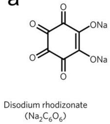  
a

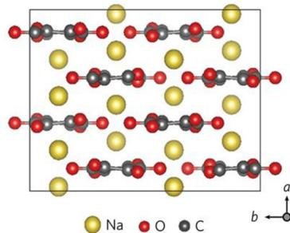

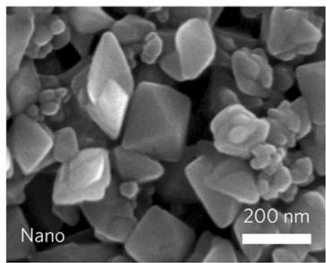  
b

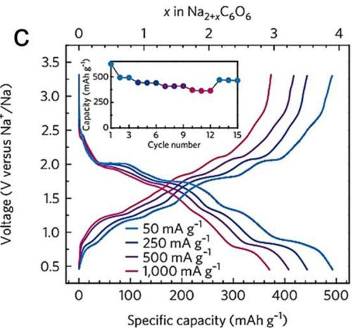

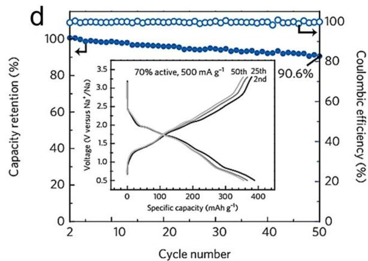

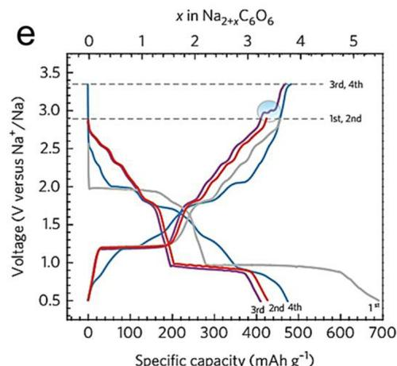  
Figure 18. Typical examples of organic cathode materials for SIBs. (a) Chemical and crystal structures of  $\mathrm{Na_2C_6O_6}$ . (b) SEM image of  $\mathrm{Na_2C_6O_6}$  nanoparticles. (c) Rate capability and corresponding cycle performance (inset) of  $\mathrm{Na_2C_6O_6}$ . (d) Cycle retention of  $\mathrm{Na_2C_6O_6}$  electrode at  $500\mathrm{mA g^{-1}}$  and the corresponding voltage profile (inset) for 50 cycles. (e) Evolution of voltage profiles of  $\mathrm{Na_2C_6O_6}$  electrode during sequential changes of charge cutoff voltages from  $2.9\mathrm{V}$  (1-2 cycles) to  $3.35\mathrm{V}$  (3-4 cycles). (f) Voltage profile and capacity retention (inset) of a full cell comprising a  $\mathrm{Na_2C_6O_6}$  cathode and a phosphorus/carbon composite anode at  $50\mathrm{mA g^{-1}}$ . Reproduced with permission from ref 176. Copyright 2017 Springer Nature.

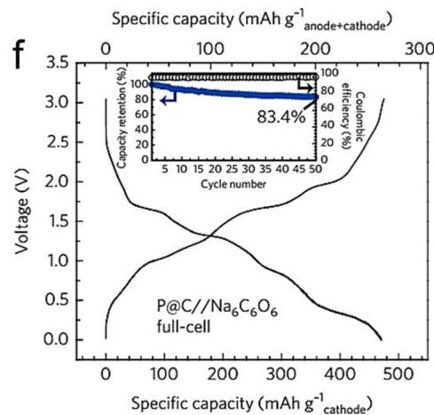

PBAs have also been investigated as alternative cathode materials to the conventional layered and polyanionic compounds in recent years because of their large ion channels, low element cost, nontoxicity, and easy synthesis at room temperature. $^{140,168,169}$ $\mathrm{KM}^{\mathrm{II}}\mathrm{Fe}^{\mathrm{III}}(\mathrm{CN})_6$  ( $\mathrm{M} = \mathrm{Mn}$ , Fe, Co, Ni, and Zn) compounds as PBAs were introduced as cathodes for nonaqueous SIBs. $^{170}$  The electrode with a  $\mathrm{Fe}^{3+}/\mathrm{Fe}^{2+}$  redox couple and a single voltage plateau at  $3.0\mathrm{V}$  vs.  $\mathrm{Na}^{+}/\mathrm{Na}$  delivers a reversible capacity of about  $60\mathrm{mAh}\mathrm{g}^{-1}$ . However, the key problems for the PBA-based SIBs include their insufficient cycle life and low EE in nonaqueous electrolytes, which are attributed to the low electrical conductivity and structural imperfection. $^{136}$  Similarly, Zhang and co-workers have conducted an important study on designing and preparing  $\mathrm{FeFe(CN)}_6$  nanoparticles on a flexible carbon fiber paper as a binder-free cathode by using low

temperature strategies. $^{171}$  The designed electrode structure with a highly conductive scaffold effectively utilizes all the active mass and enhances electrical contact. This results in excellent electrochemical performance of the SIB, including good rate capability (62 mAh g $^{-1}$  at 5 C) and long-term cycling life with 81.2% capacity retention at 1 C over 1000 cycles.

Organic compounds that can be obtained from natural biomass with minimal energy consumption are attractive low-cost and sustainable choices for battery electrode materials. These compounds provide high energy density and long cycling stability.[172] Tarascon and co-workers first reported  $\mathrm{Li}_2\mathrm{C}_6\mathrm{O}_6$  in 2008, exhibiting a theoretical capacity of  $560\mathrm{mAhg^{-1}}$  based on four-electron redox chemistry in LIBs.[173] However,  $\mathrm{Li}_2\mathrm{C}_6\mathrm{O}_6$  showed poor cycle stability due to its dissolution and exfoliation, which limits its practical applications.[174] The research work on

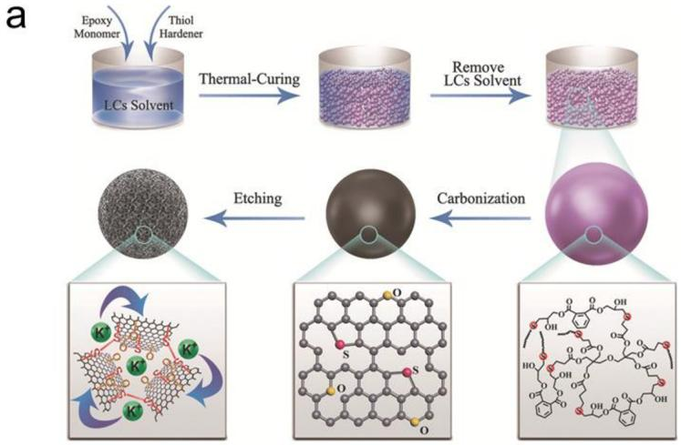

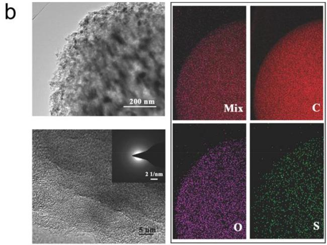

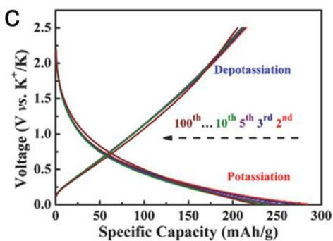

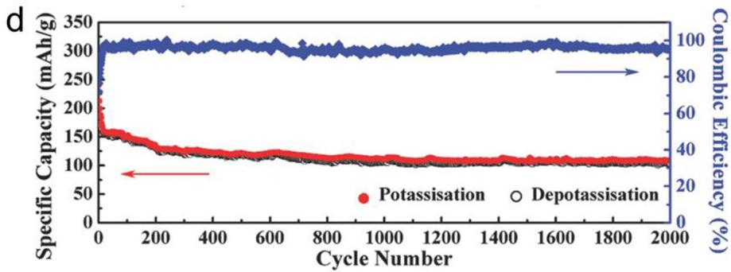

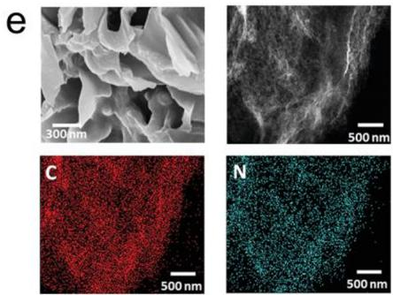  
Figure 19. Typical examples of carbon materials as anodes for PIBs. (a) Schematic illustration of the preparation process for the PCMs. (b) TEM image, HR-TEM image (inset is the corresponding SAED pattern), and EDS mappings of PCMs. (c) Charge/discharge profiles of PCMs in the 2nd, 3rd, 5th, 10th, 50th, and 100th at  $50\mathrm{mA}\mathrm{g}^{-1}$ . (d) Long-term cycle stability and CE of PCMs at a high current density of  $1000\mathrm{mA}\mathrm{g}^{-1}$ . Reproduced with permission from ref 187. Copyright 2018 Wiley-VCH. (e) SEM, TEM, and corresponding C and N elements in EDS distributions of UNCNs. (f) Long-cycling performance at  $5\mathrm{A}\mathrm{g}^{-1}$  of UNCNs. Reproduced with permission from ref 188. Copyright 2019 Wiley-VCH.

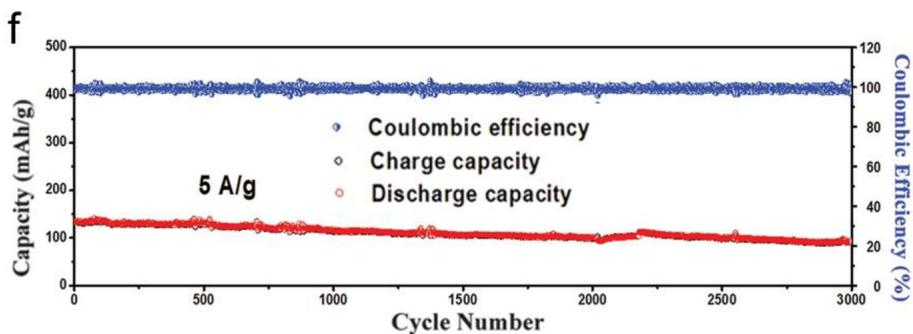

$\mathrm{Li}_2\mathrm{C}_6\mathrm{O}_6$  has led to investigation of  $\mathrm{Na}_2\mathrm{C}_6\mathrm{O}_6$ , which demonstrates excellent cycle stability in SIBs.[175] Although it seems intuitive to expect a similar four-electron redox reaction in  $\mathrm{Na}_2\mathrm{C}_6\mathrm{O}_6$ , a substantial capacity loss with lower reversible capacity than its theoretical capacity of  $501\mathrm{mAhg}^{-1}$  has been observed instead. In order to address this shortcoming, Bao and co-workers have improved the electrochemical performance of  $\mathrm{Na}_2\mathrm{C}_6\mathrm{O}_6$  and provided an effective reaction pathway to achieve a reversible four-electron redox reaction.[176] The reversible phase transformation of  $\mathrm{Na}_2\mathrm{C}_6\mathrm{O}_6$  accompanied by spontaneous nanostructure formation of the active particles was achieved by decreasing the size of the active particles and selecting proper electrolytes. Structurally,  $\mathrm{Na}_2\mathrm{C}_6\mathrm{O}_6$  is comprised of hexagonally packed  $\mathrm{Na}^+$  cations, which are alternately placed above  $\mathrm{C}_6\mathrm{O}_6^{2-}$  at a distance of  $a/4$  (Figure 18a). The obtained  $\mathrm{Na}_2\mathrm{C}_6\mathrm{O}_6$  maintains its uniform nanostructure within a few hundred nanometers (Figure 18b). To understand the sodiation

mechanism of  $\mathrm{Na}_2\mathrm{C}_6\mathrm{O}_6$  material, the electrochemical performance has been subjected to further testing. As shown in Figure 18c, a reversible capacity of  $498\mathrm{mAhg^{-1}}$  is obtained at  $50\mathrm{mA}$ $\mathrm{g}^{-1}$  in Nano/DEGDME, which is equivalent to  $95\%$  of its theoretical capacity. Moreover, even at very high rates of  $500\mathrm{mA}$ $\mathrm{g}^{-1}$  and  $1000\mathrm{mA}\mathrm{g}^{-1}$ , the electrode retained specific capacities of 408 and  $371\mathrm{mAhg^{-1}}$ , respectively. In addition, the  $\mathrm{Na}_2\mathrm{C}_6\mathrm{O}_6$  electrode showed good capacity retention of  $90.8\%$  at  $500\mathrm{mA}$ $\mathrm{g}^{-1}$  after 50 cycles (Figure 18d). As shown in Figure 18e, the characteristic charge plateau is observed at  $\sim 3\mathrm{V}$ , corresponding to its phase transformation from  $\gamma \text{-Na}_{2.5}\mathrm{C}_6\mathrm{O}_6$  to  $\alpha \text{-Na}_2\mathrm{C}_6\mathrm{O}_6$  phase. The parallel nanostructures are aligned with the voltage profiles obtained with the higher discharge cutoff at  $1\mathrm{V}$ . The full cell assembled with a precycled P@C anode and an electrochemically sodiated  $\mathrm{Na}_2\mathrm{C}_6\mathrm{O}_6$  cathode exhibits a reversible capacity of  $265\mathrm{mAhg^{-1}}$  (energy density of  $281\mathrm{Whkg^{-1}}$ ) at  $50\mathrm{mA}$ $\mathrm{g}^{-1}$  based on the total mass of cathode and anode (Figure

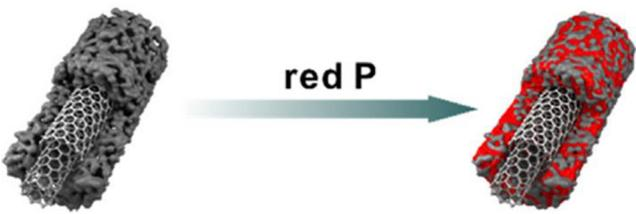  
a

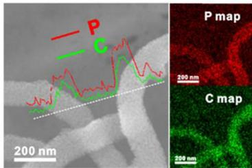  
b

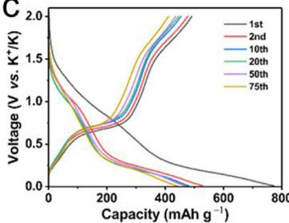  
C

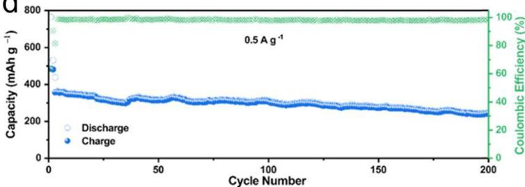  
d

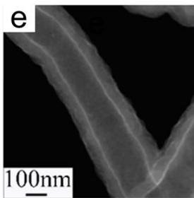  
e

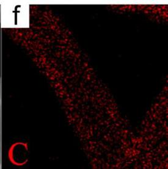  
f

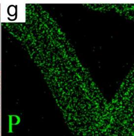  
g

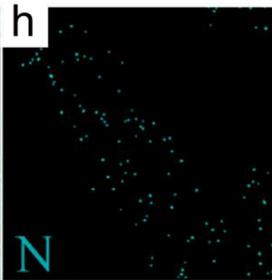  
h

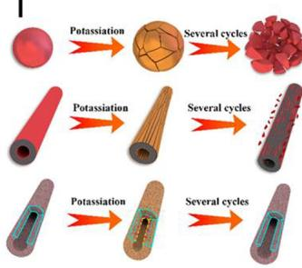  
i

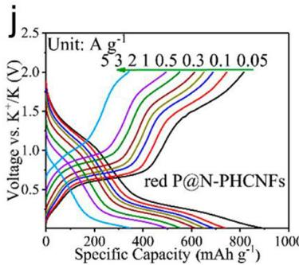  
i.  
K  
Figure 20. Typical examples of P materials as anodes for PIBs. (a) Schematic illustration of preparation of  $\mathrm{P@TBMC}$  composite. (b) SEM image with the corresponding EDS elemental mapping and line-scanning of  $\mathrm{P@TBMC-2.4}$ . (c) Discharge/charge voltage profiles at different cycles of  $\mathrm{P@TBMC-2.4}$  anode for PIBs. (d) Long-term cycling performance at  $0.5\mathrm{A g}^{-1}$  after the initial two-cycle activation at  $0.05\mathrm{A g}^{-1}$  of  $\mathrm{P@TBMC-2.4}$  anode for PIBs. Reproduced with permission from ref 191. Copyright 2018 Elsevier. (e) STEM image and corresponding elemental mapping of (f) C, (g) P, and (h) N elements of the red  $\mathrm{P@N-PHCNF}$  sample. (i) Schematic illustration of the potassiation/depotassiation process of red P particles. (j) Charge/discharge profiles of the red  $\mathrm{P@N-PHCNF}$  electrode at different current densities. (k) Cycling performance of the red  $\mathrm{P@N-PHCNF}$  anode at  $2\mathrm{A g}^{-1}$  and  $5\mathrm{A g}^{-1}$ . Reproduced with permission from ref 192. Copyright 2019 American Chemical Society.

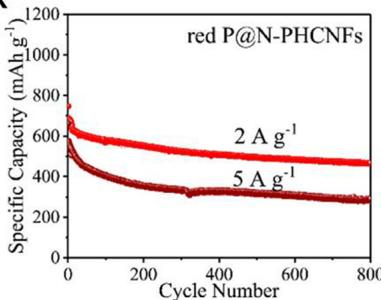

18f). Therefore, it can be established that the structural diversity and tunable properties of the organic molecules provide good opportunities to modulate Na storage potentials and reversible capacities of the organic electrodes. This however is achieved by manipulating different functional groups, morphologies, and surface coating. Last but not least, altering substituted functional groups on the conjugated carboxylate organic molecules is a feasible way to change the thermodynamic and kinetic properties of the organic electrodes.

Despite all the challenges, the first-generation SIBs offer promising alternatives to LIBs and therefore are already attracting commercial interest for a wide variety of energy storage applications. Moreover, most of the research effort has been focused on electrode active materials, electrolytes, binders, current collectors, and other cell components for ensuring a prosperous future for this technology. However, further grid

scale applications of SIBs are not just based on performance indicators such as gravimetric and volumetric energy densities, gravimetric and volumetric power densities, cycle and calendar life, and charge time but also on their safety, sustainability, and cost effectiveness.

# 3.5. Potassium-lon Batteries

Recently, potassium-ion batteries (PIBs) have emerged as another possible energy storage system because of the abundance of potassium resources in the Earth's crust and in oceans, similar to that of sodium. $^{177,178}$  In addition, the  $\mathrm{K}^{+}/\mathrm{K}$ $(-2.93\mathrm{~V}$  vs. SHE) redox couple has a lower standard redox potential than  $\mathrm{Na}^{+}/\mathrm{Na}$ $(-2.71\mathrm{~V}$  vs. SHE), close to that of  $\mathrm{Li}^{+}/$  Li  $(-3.04\mathrm{~V}$  vs. SHE). The standard redox potential of the  $\mathrm{K}^{+}/\mathrm{K}$  redox couple leads to a potentially high operating voltage and energy density for PIBs. $^{179}$  The most important advantage of

PIBs compared with SIBs is that graphite can accommodate reversible  $\mathrm{K}^+$  deintercalation/intercalation. $^{178}$  Given these upsides, PIBs have rapidly attracted considerable interest, not to mention that various materials have been developed and evaluated as potential electrodes of PIBs. $^{180}$  The testing techniques and materials selection for LIBs are mostly applicable for PIBs. However, the ionic radius of  $\mathrm{K}^+$  (0.138 nm) is larger than those of  $\mathrm{Li}^+$  (0.076 nm) and  $\mathrm{Na}^+$  (0.102 nm), which leads to sluggish reaction kinetics and poor cycling stability in PIBs. $^{181}$  Thus, efficient anode and cathode materials with high capacity and long cycling stability are highly desirable to promote further development of PIBs for GSES applications. Similar to LIBs and SIBs, PIBs contain all the functional battery configurations including anode, organic electrolyte, separator, cathode, and current collectors. The only characteristic that distinguishes PIBs from LIBs or SIBs is the transfer kinetics of  $\mathrm{K}^+$  rather than  $\mathrm{Li}^+$  and  $\mathrm{Na}^+$ . The commonly known anode materials for PIBs include hard carbon, K intercalation compounds, K metal-alloying-reaction compounds, K conversion-reaction compounds, and organic compounds. $^{178,182}$  In contrast, the most promising cathode materials mainly include PBA, layered compounds, polyanions, and organic materials. $^{180}$  In this section, we present an overview of recent research on PIBs with exclusive emphasis on the development of anode and cathode materials.

3.5.1. Anode Materials for PIBs. In addition to graphite anode, which delivers a considerable capacity when employed in PIBs, large numbers of anode materials including carbon materials, metals and alloys, metal oxides, sulfides, and phosphides, and carbon-based composite materials have been investigated. $^{178,183}$  Numerous studies have mainly concentrated on the development of carbon materials, although carbon anodes in PIBs have previously suffered from insufficient cycle life and poor rate capability owing to the influence of the large  $\mathrm{K}^+$  ionic radius. $^{178}$  Recently, the carbon materials based anodes have made remarkable progress with novel structures. In this regard, Xu and co-workers synthesized a free-standing porous CNF paper by electrospinning and carbonization, whereas Yu and co-workers have reported a quasi-two-dimensional core-shell nanostructured carbon nanoplate as anodes for PIBs $^{184,185}$ . Upon electrochemical cycling, both of the anode materials show reasonable charge/discharge rate and long cycling. In addition, doping heteroatoms into various carbon forms is another effective strategy to introduce defects, which are responsible for increasing the adsorption energy of  $\mathrm{K}^+$  in carbon materials, eventually leading to the enhanced performance of PIBs. $^{186}$  Yang and co-workers recently reported a class of S and O codoped porous carbon microspheres (PCMs) as novel anodes for PIBs. The proposed PCMs are synthesized through the pyrolysis of polymer microspheres composed of a liquid crystal/epoxy monomer/thiol hardener system, as shown in Figure 19a. $^{187}$  The transmission electron microscopy (TEM) and high-resolution TEM (HR-TEM) micrographs and energy disperse spectroscopy (EDS) mapping in Figure 19b illustrate the porous morphology and amorphous nature of the PCMs. Figure 19c shows typical charge/discharge curves of the hard carbon PCMs. A voltage plateau well above the plating potential of K metal is observed, which inhibits the formation of K metal dendrites. The PCM based PIBs deliver a highly stable capacity of  $108.4\mathrm{mAh}\mathrm{g}^{-1}$  after 2000 cycles at  $1000\mathrm{mA}\mathrm{g}^{-1}$ , as shown in Figure 19d. Similarly, Tang and co-workers successfully synthesized carbon nanosheets doped with an ultrahigh content (22.7 atomic wt %) of nitrogen (UNCNs) as an anode material for PIBs (Figure

19e). The resulting PIB delivers excellent cycling performance with capacity retention of  $70\%$  after 3000 cycles at a high current density of  $5\mathrm{Ag}^{-1}$  (Figure 19f).188 Furthermore, Qian and coworkers have employed a low-cost and large-scale method to fabricate phosphorus-doped hard carbon (PHC-700) by crosslinking phosphoric acid and epoxy resin followed by annealing at  $700^{\circ}\mathrm{C}$ .189 The PHC-700 anode based PIBs exhibit a reversible capacity of  $381.9\mathrm{mAhg}^{-1}$  at  $0.1\mathrm{Ag}^{-1}$  and capacity of  $260\mathrm{mAhg}^{-1}$  after 1000 cycles at  $0.2\mathrm{Ag}^{-1}$ .

Considering the chemical stability of different phosphorus allotropes (white P, red P, and black P), red P is the most promising anode for PIBs. However, the cyclic performance of the red P anode is extremely poor because of the huge volume change of P during the alloying/dealloying process, which results in cracking and pulverization of P. In addition, the low electrical conductivity of red P drastically reduces the capacities of PIBs during fast charge/discharge. To solve these problems, it is necessary to choose a highly conductive matrix to alleviate the volume change of red P during cycling and enhance electrical conductivity of the electrode. To solve this problem,  $\mathrm{Qu}$  and coworkers designed and synthesized a mesoporous carbon material with a carbon nanotube (CNT)-backbone (TBMC) and impregnated it with red P, finally forming a  $\mathrm{P@TBMC}$  composite (Figure 20a). It is evident in Figure 20b that the highly porous structure is visible on the surface of  $\mathrm{P@TBMC-2.4}$  with no trace of P particles, demonstrating that  $\mathrm{P}$  is completely encapsulated within the pores and homogeneously distributed in the composite. When assembled in a PIB, the electrode delivers initial discharge/charge capacities of  $772.8 / 490.9\mathrm{mAhg^{-1}}$  with an initial CE of  $63.5\%$ . In the second cycle, however, the CE reaches  $90.4\%$  with discharge/charge capacities of  $527.8 / 477.0\mathrm{mAhg^{-1}}$  (Figure 20c). Furthermore, the  $\mathrm{P@TBMC}$  anode exhibits superior electrochemical performance by delivering a stable capacity of  $244\mathrm{mAhg^{-1}}$  at  $0.5\mathrm{A g^{-1}}$  for 200 cycles (Figure 20d). Similarly, Yu and co-workers have designed a structure of red P embedded into free-standing nitrogen-doped porous hollow CNFs (red  $\mathrm{P@N-PHCNFs}$ ). The scanning transmission electron microscopy (STEM) images and EDS elemental mapping of the red  $\mathrm{P@N-PHCNFs}$  are shown in Figure 20e-h, indicating the homogeneous distribution of red P and the N element doping into the N-PHCNF matrix. As shown in Figure 20i, the red  $\mathrm{P@N-PHCNF}$  anode with large surface area and high pore volume effectively alleviates the large volume expansion and maintains superior structural stability. Consequently, the red  $\mathrm{P@N-PHCNF}$  anode based PIBs show outstanding rate capability ( $745\mathrm{mAhg^{-1}}$  at 0.1 A g $^{-1}$  and  $342\mathrm{mAhg^{-1}}$  at  $5\mathrm{A g^{-1}}$ ) (Figure 20j). Furthermore, the batteries exhibit long cycle life with high reversible capacities ( $533\mathrm{mAhg^{-1}}$  at  $1\mathrm{A g^{-1}}$  after 200 cycles, 465 and  $282\mathrm{mAhg^{-1}}$  at 2 and  $5\mathrm{A g^{-1}}$  after 800 cycles, respectively; Figure 20k). Although the  $\mathrm{P}$  delivers high theoretical specific capacity, the structural stability still needs alteration, for instance, with functional coatings composed of other elements or materials.

In addition to the allotropes of P, Sn is another promising anode material for energy storage of PIBs due to its nontoxicity, crustal abundance, and cost effectiveness.[182] However, unlike SIBs, the alloying reaction of metallic Sn with K produces little theoretical specific capacity of  $225\mathrm{mAhg^{-1}}$  and large volume change.[182] In this respect, Guo and co-workers employed a  $\mathrm{Sn_4P_3 / C}$  composite as a novel composite electrode for PIBs.[193] This composite consolidates the advantages of Sn/C composites and the high capacity of P. Compared with P/C and Sn/C electrodes, the  $\mathrm{Sn_4P_3 / C}$  composite based electrode shows much

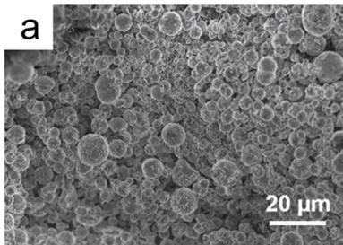

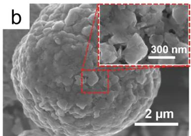

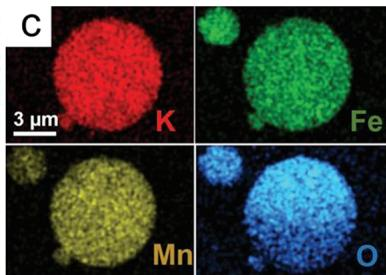

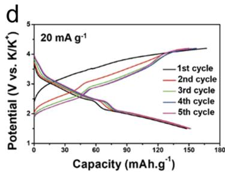

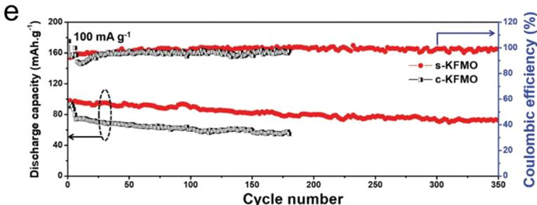

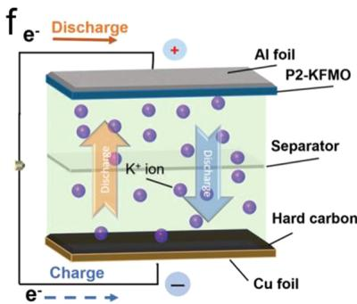  
Figure 21. Typical examples of layered transition metal oxides as cathodes of PIBs. (a, b) P2-type  $\mathrm{K}_{0.65}\mathrm{Fe}_{0.5}\mathrm{Mn}_{0.5}\mathrm{O}_2$  microspheres. Inset is high magnification SEM image. (c) Corresponding elemental mapping. (d) Electrochemical charge/discharge curves of s-KFMO cathode at a constant current of  $20\mathrm{mA}\mathrm{g}^{-1}$ . (e) Cycling performance of s-KFMO and c-KFMO electrodes at a constant current of  $100\mathrm{mA}\mathrm{g}^{-1}$ . (f) Schematic illustration and (g) cycling performance at a current of  $100\mathrm{mA}\mathrm{g}^{-1}$  of the PIBs based on s-KFMO//hard carbon. Reproduced with permission from ref 205. Copyright 2019 Wiley-VCH.

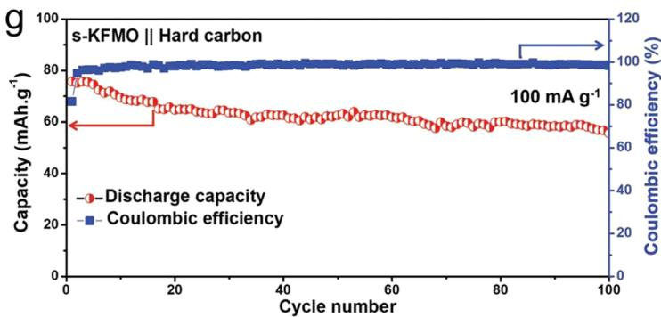

better cycling performance by delivering a retained capacity of  $307.2\mathrm{mAhg^{-1}}$  at  $50~\mathrm{mA~g^{-1}}$  after 50 cycles. It is important to mention that Sb also is a promising anode material due to its low reaction potential and high theoretical capacity (660 mAh  $\mathrm{g}^{-1}$ ).182 However, a general problem for alloy anodes is their large volume change of  $\sim 300\%$  during the potassiation/depotassiation process, which usually causes rapid capacity fade and hence low CE.194 In this regard, an efficient method is to employ an Sb-carbon composite anode to decrease the capacity degradation of the cell. Therefore, Kim and co-workers reported a composite electrode composed of Sb nanoparticles, amorphous carbon, and RGO, showing stable cycling for 100 cycles (79% retention).195 Further, Qian and co-workers have also investigated nanoporous structural Zn-Sb alloy as a PIB anode, which is prepared by evaporating high-boiling-point materials to obtain a pure high-boiling-point sample.196 The principle advantage of Zn-Sb alloy is its ability to accommodate volume expansion and accelerate ion transport, delivering a longer cycling life with capacity retention of 62.35% after 50 cycles and a higher rate capacity of  $265\mathrm{mAhg^{-1}}$  at  $500\mathrm{mA~g^{-1}}$  than the bulk-Sb anode. Therefore, the development of high-capacity alloy materials is essential in maintaining the structural stability and reducing the volume expansion of anodes in PIB systems.

3.5.2. Cathode Materials for PIBs. The cathode materials for PIBs generally include organic materials, PBAs, layered transition metal oxides, and polyanionic compounds, which are similar to those for SIBs. Organic electrodes provide a new avenue to develop PIBs with high energy densities. In addition, organic materials are more accessible and synthesized from cheap chemicals, offering a promising avenue to low-cost PIBs for LSES.[197] Among numerous studies, Hu and co-workers have designed and fabricated a nonaqueous PIB by employing 3,4,9,10-perylene tetracarboxylic acid dianhydride (PTCDA) as the cathode, which had been previously studied as an SIB cathode.[198,199] The PTCDA electrode exhibits a high capacity of  $131\mathrm{mAhg}^{-1}$  and great cycling performance, with a capacity retention of  $66.1\%$  over 200 cycles. In addition, this cathode material shows the same electrochemical performance as SIBs.[199] Similarly, Wang and co-workers reported poly(pentacenetetrone sulfide) (PPTS) as a new organic cathode for PIBs.[179] The PPTS cathode exhibits fast discharge/charge ability  $(160\mathrm{mAhg}^{-1}$  at a current density of  $10\mathrm{A g}^{-1}$ ) and long cycle life (capacity higher than  $190\mathrm{mAhg}^{-1}$  even after 3000 cycles at  $5\mathrm{A g}^{-1}$ ). It is therefore of particular significance to explore new organic cathodes for PIBs with high capacity, cycling stability, and rate performance.

Layered transition metal oxides and polyanionic compounds have also been reported as cathodes for PIBs due to their fast

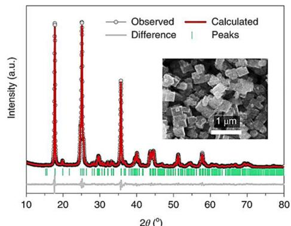  
a

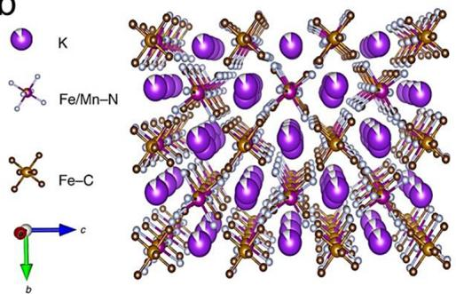  
b

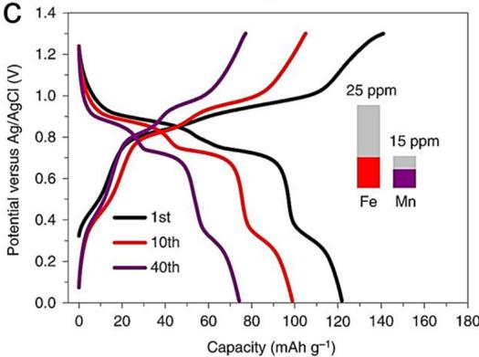  
C

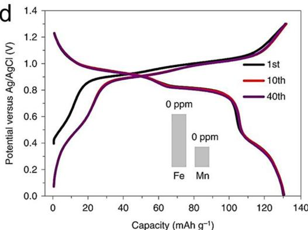  
d

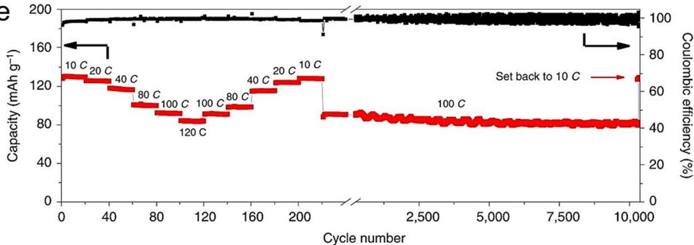  
E  
Figure 22. Typical examples of PBAs as cathode materials for PIBs. (a) XRD Rietveld refinement pattern for the KFeMnHCF-3565 sample. The inset is the SEM image of the KFeMnHCF-3565 sample. (b) Typical structure of  $\mathrm{K}_x\mathrm{Fe}_y\mathrm{Mn}_{1 - y}[\mathrm{Fe}(\mathrm{CN})_6]_w.z\mathrm{H}_2\mathrm{O}$  in the  $P21 / n$  space group. (c, d) Charge/ discharge curves of the 1st, 10th, and 40th cycles at  $10\mathrm{C}$  for the KFeMnHCF-3565 electrode in (c)  $1\mathrm{M}$  and (d)  $22\mathrm{M}$ $\mathrm{KCF}_3\mathrm{SO}_3$  electrolytes. (e) Rate capability and long-term cycling performance of the KFeMnHCF-3565 electrode from 0 to  $1.3\mathrm{V}$  (vs.  $\mathrm{Ag / AgCl}$ ) in  $22\mathrm{M}$ $\mathrm{KCF}_3\mathrm{SO}_3$  electrolyte.  $1\mathrm{C} = 0.13\mathrm{Ag}^{-1}$ . Reproduced with permission from ref 210. Copyright 2019 Springer Nature.

development in LIBs and SIBs. Pomerantseva and co-workers introduced  $\delta -\mathrm{V}_2\mathrm{O}_5$  as a cathode selection in organic PIBs, which exhibited high initial discharge capacity of  $268\mathrm{mAhg^{-1}}$  at a current rate of C/50 and great capacity retention of  $74\%$  after 50 cycles at a constant current of C/15.[200]  $\delta -\mathrm{V}_2\mathrm{O}_5$  has also been reported as a high capacity cathode material for SIBs.[201] Also, a novel fluorophosphate cathode  $\mathrm{K_3V_2(PO_4)_2F_3}$  derived from  $\mathrm{Na}_3\mathrm{V}_2(\mathrm{PO}_4)_2\mathrm{F}_3$ , when employed in PIBs, delivers a capacity of over  $100\mathrm{mAhg^{-1}}$  and energy density of around  $400\mathrm{Whkg^{-1}}$ .[202] Layered transition metal oxide cathodes have been considered for PIBs due to their high theoretical capacities, good structural stability, low cost, and environmental friendliness.[203] Ceder and co-workers have investigated highly reversible layered  $\mathrm{K_{0.5}MnO_2}$  and  $\mathrm{K}_{0.6}\mathrm{CoO}_2$  cathodes.[203,204] However, these cathodes yield low energy density and poor cycling life and therefore cannot meet practical energy storage demands. Therefore, new materials and structural design for layered transition metal oxide materials are required to facilitate  $\mathbf{K}^{+}$  reaction kinetics.

Zhang and co-workers fabricated layered P2-type hierarchical  $\mathrm{K}_{0.65}\mathrm{Fe}_{0.5}\mathrm{Mn}_{0.5}\mathrm{O}_2$  (P2-KFMO) microspheres via a modified solvent-thermal method.[205] As shown in Figure 21a-c, these secondary microspheres assembled from primary nanoparticles are compact, robust, and capable of reducing volume change in  $\mathbf{K}^{+}$ intercalation/deintercalation and accelerating the diffusion kinetics of  $\mathbf{K}^{+}$ . When assembled in PIBs, these P2-KFMO microspheres show highly reversible K storage capacity of 151 mAh g $^{-1}$  at 20 mA g $^{-1}$  and long cycling stability with 78% capacity retention after 350 cycles (Figure 21d,e). As K metal is much more reactive than Li metal and Na metal, PIBs using P2-KFMO as the cathode and hard carbon as the anode are more practical choices (Figure 21f). As shown in Figure 21g, the PIB full cell delivers considerable discharge capacity of 75 mAh g $^{-1}$  at a current density of 100 mAh g $^{-1}$  and average CE of over 99% during charge/discharge operation. Moreover, the s-KFMO/ hard carbon based PIB retains >80% of initial capacity after 100 cycles. Similarly, Wang and co-workers have introduced

$\mathrm{K}_{1.39}\mathrm{Mn}_3\mathrm{O}_6$  microspheres as cathode materials for PIBs.[206] An effective  $\mathrm{AlF}_3$  surface coating strategy was applied to change the surface structure and improve the electrochemical performance of  $\mathrm{K}_{1.39}\mathrm{Mn}_3\mathrm{O}_6$  microspheres. The aforementioned cathode delivers reasonable capacity (about  $110\mathrm{mAhg}^{-1}$  at  $10\mathrm{mA g}^{-1}$ ) and excellent cycling stability over 100 cycles with a capacity retention of  $94.9\%$ , thereby outperforming uncoated microspheres or their bulk counterpart. Therefore, it is an efficient method from the perspectives of the electrode structure and new materials to constitute a cathode with high energy density and long cycle for PIBs.

The traditional open-framework based PBAs have attracted much attention as PIB cathode materials for providing plausible ion channels for  $\mathrm{K}^+$  redox kinetics. $^{169}$  For example, Cui and coworkers have designed and synthesized nickel hexacyanoferrate (NiHCF) electrode materials in bulk quantities by the coprecipitation strategy, for delivering good cycling stability and high rate capability in PIBs. $^{207}$  Similarly, Wang and coworkers reported high-potassium-ion-content potassium iron-II ferrocyanide dehydrate nanocubes as cathodes for aqueous PIBs, which exhibit high capacity and fast kinetics. $^{208}$  Following this investigation, Zhao and co-workers reported a uniform mesoporous potassium-rich nickel ferrocyanide (KNiFC) cathode for ultrafast aqueous PIBs. $^{209}$  The KNiFC with large channel sizes exhibits fast  $\mathrm{K}^+$  insertion/extraction with an ultrafast rate performance within 4.1 s at 500 C. However, the KNiFC based PIB yields low capacity, less than  $80\mathrm{mAhg^{-1}}$ . In addition, Hu and co-workers have proposed a novel Fe-substituted Mn-rich PBA  $\mathrm{K_xFe_yMn_{1 - y}[Fe(CN)_6]_w\cdot zH_2O}$  (KFeMnHCF) cathode. $^{210}$  This cathode material is characterized by its monoclinic phase with a space group of  $P21 / n$  (Figure 22a) and crystal structure (Figure 22b) comprising a typical open framework with N-coordinated Mn or Fe cations and C-coordinated Fe cations. The SEM image of KFeMnHCF indicates that both samples possess a cubic morphology with edge length of  $200 - 800\mathrm{nm}$  (inset of Figure 22a). Upon assembly in a PIB and cycling, the KFeMnHCF-3565 electrode retains  $60\%$  capacity in the  $1\mathrm{M}$ $\mathrm{KCF}_3\mathrm{SO}_3$  dilute electrolyte (Figure 22c). When the electrolyte concentration is increased from 1 to  $22\mathrm{M}$ , the KFeMnHCF-3565 electrode shows significant improvement in its cycling stability with no capacity or voltage decay in the initial 40 cycles (Figure 22d). The elemental analysis results of the electrolyte after 40 cycles shown in the inset confirmed that the KFeMnHCF-3565 electrode experienced severe dissolution of Fe and Mn during cycling in dilute electrolyte but did not undergo dissolution in concentrated electrolyte. This indicates that it is extremely important to utilize highly concentrated electrolyte to stabilize the electrodes of PIBs. Furthermore, Figure 22e illustrates the long-term cycling stability of the KFeMnHCF-3565 electrode, exhibiting a high capacity of  $94\mathrm{mAhg^{-1}}$  at an ultrahigh rate of  $100\mathrm{C}$  and  $90\%$  capacity retention over 10000 cycles when tested from 10 to  $120\mathrm{C}$ . Remarkably, even after 10000 cycles at  $100\mathrm{C}$ , the cell still achieves capacity up to  $128\mathrm{mAhg^{-1}}$  when the current rate is set back to  $10\mathrm{C}$ , demonstrating its robust structural stability (Figure 22e). Therefore, an excellent framework structure for PBA cathodes is critical to develop high performance PIBs for GSES.

# 3.6. Zinc-Ion Batteries

Compared with alkali metals (Li, Na, and K), the metallic Zn possesses a higher redox potential  $(-0.76\mathrm{V}$  vs. SHE) and water compatibility.[211] In addition, aqueous electrolytes are more

advantageous than the organic electrolytes for zinc-ion batteries (ZIBs) thanks to their lower cost, better safety, higher ionic conductivity, and greener environmental impact.[212] Therefore, the aqueous ZIBs (AZIBs) have been considered as promising alternatives for LSES applications.[213] Zn metal is commonly used as the anode in AZIBs, due to its high gravimetric capacity  $(820\mathrm{mAh}\mathrm{g}^{-1})$  and suitable potential.[214] However, the corrosion and formation of Zn dendrites hinder the further development of ZIBs.[215] Some effective mitigation strategies have been reported to suppress the corrosion and dendritic formation of Zn anodes. Typically, a good protection layer on the Zn metal has been proven to be an effective strategy for restricting dendrite growth. Recently, an ultrathin  $\mathrm{TiO}_2$  film and nanoporous  $\mathrm{CaCO}_3$  coating have been demonstrated to achieve long life for ZIBs.[216,217] Further, 3D framework structures have also been reported to eliminate the dendrite formation by large surface areas.[218] Furthermore, electrolyte additives such as diethyl ether are conducive in stabilizing the solid-liquid interface in ZIBs and suppressing the dendrite formation on Zn anode.[219] However, it is hard to find an excellent cathode material for facilitating the intercalation/deintercalation of  $\mathrm{Zn}^{2+}$  due to the high polarization of  $\mathrm{Zn}^{2+}$  as well as their narrow voltage range as a consequence of water splitting in the AZIBs.[220] The development on AZIB cathode materials is still in the preliminary stage.[221] Some cathode materials have been explored as the zinc-ion hosts and are generally divided into Mn-based materials,[79,222,223] V-based materials,[224-226] PBAs,[227] organic materials,[228,229] and others (e.g.,  $\mathrm{Na}_3\mathrm{V}_2(\mathrm{PO}_4)_3$ ,[230] VS,[231] and MoS,[232]). The characteristics of different cathode materials have been summarized in Table 6. In this section, we mainly recap the recent development of the most extensively studied Mn-based and V-based materials for ZIBs.

Table 6. Characteristics of Different Cathode Materials for ZIBs  ${}^{a}$  

<table><tr><td>material</td><td>advantages</td><td>shortcomings</td></tr><tr><td>Mn-based materials</td><td>high energy density</td><td>Mn dissolution resulting in capacity fading</td></tr><tr><td>V-based materials</td><td>high specific power, good cycling stability</td><td>low operation voltage, low specific capacity</td></tr><tr><td>PBAs</td><td>high operation voltages</td><td>low CE of the initial cycles, poor cycling stability</td></tr><tr><td>organic materials</td><td>long cycle stability</td><td>low power density</td></tr><tr><td colspan="3">aReproduced with permission from ref 79. Copyright 2019 Wiley-VCH.</td></tr></table>

3.6.1. Mn-Based Cathodes for ZIBs. Mn-based cathodes have been widely investigated for ZIBs, especially the manganese oxides (e.g.,  $\mathrm{MnO}_2$ ) due to their low cost, crustal abundance, and environmental friendliness. Particularly, the  $\mathrm{MnO}_2$  cathode has a high theoretical capacity ( $308\mathrm{mAhg}^{-1}$  based on single electron transfer between  $\mathrm{Mn}^{4+}$  and  $\mathrm{Mn}^{3+}$ ) and high voltages ( $0.8-1.8\mathrm{V}$ ).79 In general, there are various  $\mathrm{MnO}_2$  polymorphs, including hollandite ( $\alpha$ - $\mathrm{MnO}_2$ ), pyrolusite ( $\beta$ - $\mathrm{MnO}_2$ ), ramsdellite ( $\gamma$ - $\mathrm{MnO}_2$ ), romanechite ( $\delta$ - $\mathrm{MnO}_2$ ), hexagonal ( $\varepsilon$ - $\mathrm{MnO}_2$ ), todorokite, and amorphous  $\mathrm{MnO}_2$ , which can be employed as the hosts for  $\mathrm{Zn}^{2+}$ .79 These structural variants of  $\mathrm{MnO}_2$  have different roles in the redox reaction mechanism, which dictates electrochemical performance of ZIBs.79 In 2012, Kang and coworkers used  $\alpha$ - $\mathrm{MnO}_2$  as cathode, Zn metal as anode, and mild zinc salt solution as aqueous electrolyte, to build an aqueous  $\mathrm{Zn}/\mathrm{MnO}_2$  battery.214 Despite of the high CE of the battery, its

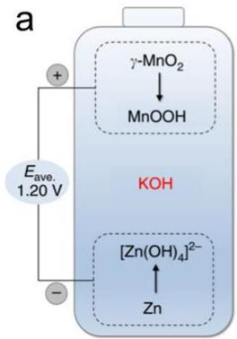

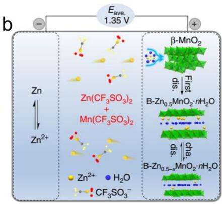

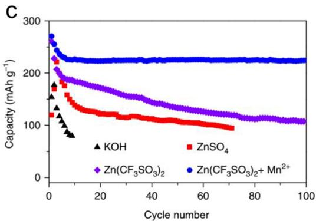

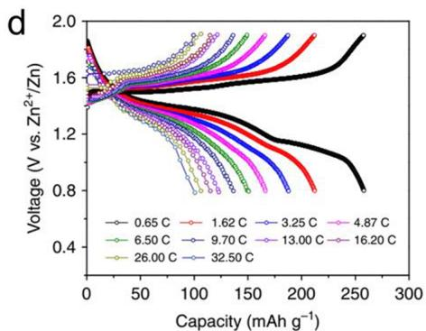

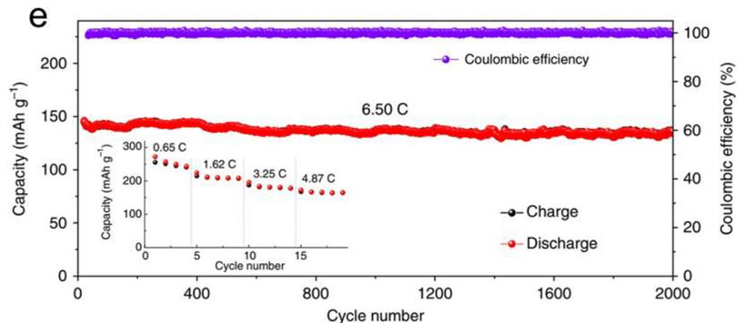

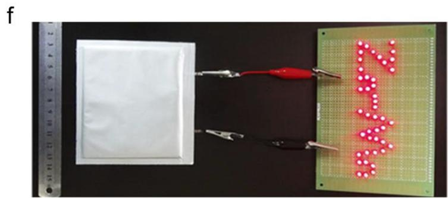  
Figure 23. Typical examples of  $\mathrm{Zn - MnO_2}$  batteries for improving cycling stability and operational voltage with the addition of  $\mathrm{CF}_3\mathrm{SO}_3^-$ . Schematic illustration of (a) primary alkaline  $\mathrm{Zn - MnO_2}$  battery using KOH electrolyte and (b) rechargeable  $\mathrm{Zn - MnO_2}$  cell using  $\mathrm{CF}_3\mathrm{SO}_3^-$ -based electrolyte. (c) Comparison of the cycling performance of  $\mathrm{Zn - MnO_2}$  cells with different electrolytes of  $45\mathrm{wt}\%$  KOH at  $0.32\mathrm{C}$  or  $3\mathrm{M}\mathrm{ZnSO}_4$ ,  $3\mathrm{M}\mathrm{Zn}(\mathrm{CF}_3\mathrm{SO}_3)_2$  or  $3\mathrm{M}\mathrm{Zn}(\mathrm{CF}_3\mathrm{SO}_3)_2$  with  $0.1\mathrm{M}\mathrm{Mn}(\mathrm{CF}_3\mathrm{SO}_3)_2$  additive at  $0.65\mathrm{C}$  ( $1\mathrm{C} = 308\mathrm{mA}\mathrm{g}^{-1}$ ). (d) Charge/discharge profiles at different rates and (e) long-cycle performance at  $6.5\mathrm{C}$  for  $\mathrm{Zn - MnO_2}$  cells in  $3\mathrm{M}\mathrm{Zn}(\mathrm{CF}_3\mathrm{SO}_3)_2$  with  $0.1\mathrm{M}\mathrm{Mn}(\mathrm{CF}_3\mathrm{SO}_3)_2$  additive. Inset shows the capacity evolution in the initial 19 cycles. (f) Digital photograph of the soft-package battery powering a series of LEDs. (g) Cycling performance of the soft-package battery at a constant current of  $0.72\mathrm{A}$ . Reproduced with permission from ref 236. Copyright 2017 Springer Nature.

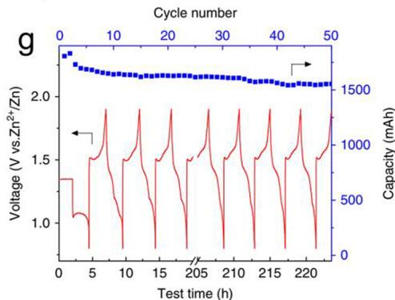

cycling stability has not been up to the mark. Generally, the  $\mathrm{MnO}_2$  materials have common problems in terms of poor electrical conductivity and large volume expansion, which severely affect the rate and cycle performance for ZIBs. To solve the problems, recent research has concentrated on structural modification of Mn-based materials. For example, Choi and co-workers have designed a novel layered manganese oxide based ZIB cathode with high content of crystal water, which can effectively restrain the effect between  $\mathrm{Zn}^{2+}$  and the host framework for accelerating  $\mathrm{Zn}^{2+}$  diffusion.[233] This cathode material delivers a high reversible capacity with decent cycling and rate performance. Similarly, Kang and co-workers put forward the idea of mesoporous  $\mathrm{MnO}_2$  flower-like nanospheres as cathodes for ZIBs, delivering a high rate capacity of  $124\mathrm{mAh}\mathrm{g}^{-1}$  at  $3.0\mathrm{A}\mathrm{g}^{-1}$  and excellent cycling stability over 2000 cycles.[223] In addition, the structures of N-doped porous

framework and hierarchical nanoflower in manganese oxide have exhibited excellent electrochemical performances.[221,234] Therefore, the good structures for Mn-based materials have immense effect in enhancing the electrochemical performance for ZIBs cathodes.

In addition to the manganese oxide based ZIB cathodes, studies have emphasized the development of electrolytes for exploring high-performance  $\mathrm{Zn - MnO_2}$  batteries. Apropos this, Liu and co-workers have reported the utility of  $\mathrm{ZnSO_4}$  with a  $\mathrm{MnSO_4}$  additive as aqueous electrolyte for  $\mathrm{Zn - MnO_2}$  battery.[235] The  $\mathrm{MnSO_4}$  additive in electrolyte improves the cycling stability of the  $\mathrm{Zn - MnO_2}$  battery by suppressing the dissolution of  $\mathrm{Mn^{2 + }}$  in the aqueous solution. With this additive, the  $\mathrm{Zn - MnO_2}$  battery exhibits excellent rate capacity and cycling stability. In another study, Chen and co-workers employed  $\mathrm{Zn(CF_3SO_3)_2}$  salt with a  $\mathrm{Mn(CF_3SO_3)_2}$  additive in

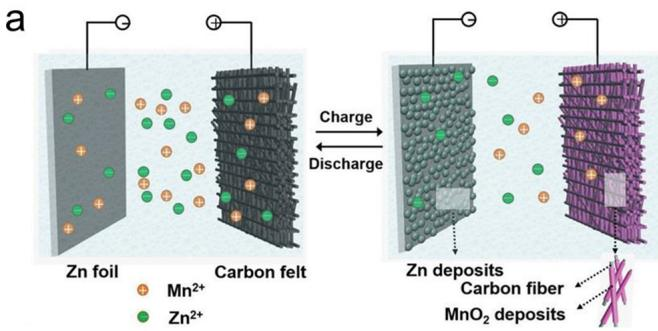

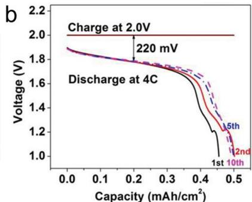

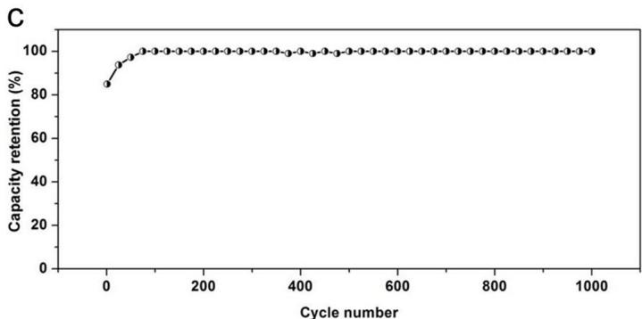

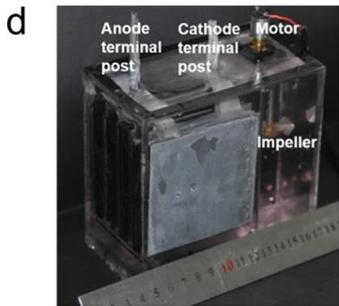

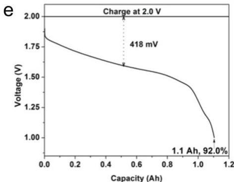  
Figure 24. Typical examples of  $\mathrm{Zn - MnO_2}$  batteries with cathode  $\mathrm{Mn^{2 + } / MnO_2}$  chemistry. (a) Configuration of a membrane-free aqueous electrolytic  $\mathrm{Zn - MnO_2}$  redox-flow battery. (b) Charge/discharge curves at a constant voltage charge of  $2\mathrm{V}$  to  $0.5\mathrm{mAh}$  and galvanostatic discharge at  $4^{\circ}C$  to  $1.0\mathrm{V}$  and (c) corresponding capacity retention over 1000 cycles. (d) Digital photograph of the membrane-free  $\mathrm{Zn - MnO_2}$  battery. Large capacity tests at  $2\mathrm{V}$  to  $1.2\mathrm{Ah}$  : (e) charge/discharge curves and (f) capacity retention over 500 cycles. Reproduced with permission from ref 237. Copyright 2020 WileyVCH.

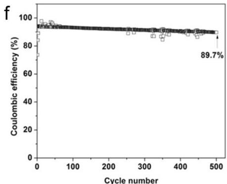

electrolyte for augmenting the operating voltage of  $\mathrm{Zn - MnO_2}$  battery from 1.2 to  $1.35\mathrm{V}$ , which is higher than that of the alkaline counterpart, as shown in Figure 23a,b.[236] It has been further found that the additive  $\mathrm{Mn(CF_3SO_3)_2}$  can suppress  $\mathrm{Mn}^{2+}$  dissolution in the electrolyte and improve the cycling stability of  $\mathrm{Zn - MnO_2}$  cell (Figure 23c). As a result, the designed  $\mathrm{Zn - MnO_2}$  battery shows a high-rate capacity of  $100\mathrm{mAhg^{-1}}$  even at a high rate of  $32.5\mathrm{C}$ , along with stable cycling and a capacity retention of  $94\%$  over 2000 cycles, as shown in Figure 23d,e. As for the performance, a typical assembled pouch cell lights up 44 LEDs with a stable discharge capacity of  $1550\mathrm{mAh}$  for 50 repeated cycles (Figure 23f,g). Furthermore, the  $\mathrm{Zn - MnO_2}$  full cell delivers an energy density of  $158.5\mathrm{Whkg^{-1}}$  based on the total weight of the active materials.

In contrast to the prior studies reporting limited reversibility of solid-state  $\mathrm{MnO}_2 / \mathrm{MnOOH}$  cathode, Cui and co-workers have pioneered a novel aqueous rechargeable  $\mathrm{Zn - MnO_2}$  flow battery based on dissolution-precipitation reactions in both cathode  $(\mathrm{Mn}^{2 + } / \mathrm{MnO}_2)$  and anode  $(\mathrm{Zn}^{2 + } / \mathrm{Zn})$  , involving mixing of anolyte and catholyte into one electrolyte, hence eliminating the need for an ion selective membrane.237 As shown in Figure

24a, the reaction mechanism of this membrane-free  $\mathrm{Zn - MnO_2}$  flow battery mainly concentrates on the valence states of the cathode between  $\mathrm{Mn}^{4 + }$  and  $\mathrm{Mn}^{2 + }$ , which is completely different from the traditional  $\mathrm{Zn - MnO_2}$  cell. The change of charge state of Mn from  $+4$  to  $+2$  in slightly acidic solution provides a high specific capacity up to  $616\mathrm{mAhg^{-1}}$  and a high redox potential of  $1.23\mathrm{V}$ . Furthermore, the designed cell exhibits a well-defined discharge plateau of  $\sim 1.78\mathrm{V}$  with the initial CE of  $90\%$  (Figure 24b). More importantly, this aqueous  $\mathrm{Zn - MnO_2}$  flow battery achieves excellent cycling stability with a high capacity retention of  $\sim 100\%$  over 1000 cycles at a discharge rate of  $4\mathrm{C}$  (Figure 24c). To further explore the advanced potential of this redox flow battery for GSES, the bench-scale cell of  $1.2\mathrm{Ah}$  demonstrates a discharge capacity of  $1.1\mathrm{Ah}$  with a CE of  $92.0\%$  (Figure 24d,e). Moreover, the cycling test shows that the CE keeps  $89.7\%$  after 500 cycles (Figure 24f), proving the possible longevity of this battery technology.

This particular  $\mathrm{Zn - MnO_2}$  battery is expected to perform better in slightly acidic electrolytes.[222,237] In another investigation, Qiao and co-workers have designed a new electrolyte, comprising  $\mathrm{MnSO_4}$  and  $\mathrm{ZnSO_4}$  with a  $0.1\mathrm{MHz}_2\mathrm{SO}_4$  additive, for

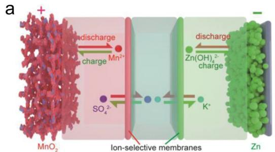

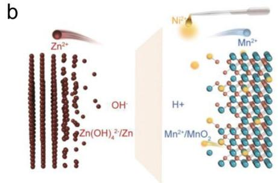

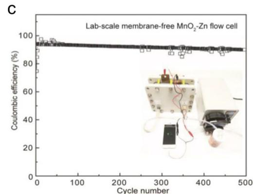  
Figure 25. Advancements and applications of aqueous  $\mathrm{Zn - MnO_2}$  batteries with the  $\mathrm{Mn^{2 + } / MnO_2}$  chemistry. (a) Schematic of the electrolytedecoupled  $\mathrm{Zn - MnO_2}$  battery. (b) Schematic of the electrolyte-decoupled  $\mathrm{Zn - MnO_2}$  battery with the introduction of  $\mathrm{Ni}^{2 + }$  into the electrolyte. (c) Long-term stability of a prototype membrane-free  $\mathrm{Zn - MnO_2}$  flow battery at a charge capacity of  $1200\mathrm{mAh}$ . Inset is a digital photograph of a prototype lab scale-up  $\mathrm{Zn - MnO_2}$  flow battery. (d) Discharge behavior of the lab-scale decoupled  $\mathrm{Zn - MnO_2}$  batteries in two series-connected and two parallelconnected cells with a single cell capacity of  $3370\mathrm{mAh}$ . Reproduced with permission from ref 242. Copyright 2020 Wiley-VCH.

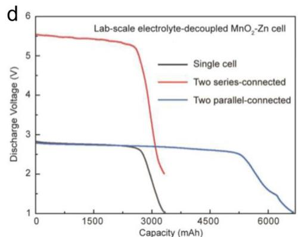

the aqueous  $\mathrm{Zn - MnO_2}$  battery. $^{222}$  The addition of  $\mathrm{H}_2\mathrm{SO}_4$  helps to reduce the  $\mathsf{pH}$  value of the electrolyte and increase the cathode potential. Upon electrochemical cycling, the designed  $\mathrm{Zn - MnO_2}$  battery shows a high discharge plateau at about 1.95 V, and a high discharge current density of  $60\mathrm{mAcm}^{-2}$ . As for the Zn metal anode in alkaline electrolyte, it shows a low potential of  $-1.22\mathrm{V}$  vs. SHE. $^{238}$  Therefore, Liu and co-workers reported an electrolyte-decoupled  $\mathrm{Zn - MnO_2}$  battery chemistry, demonstrating high voltage and high energy density using alkaline electrolyte in the anode and acidic electrolyte in the cathode with a bipolar membrane as the separator. $^{239}$  When such a  $\mathrm{Zn - MnO_2}$  cell is subjected to reversible cycling, it delivers an operating voltage of  $2.44\mathrm{V}$ , which is higher than the traditional  $\mathrm{Zn - MnO_2}$  battery. Furthermore, Hu and co-workers have designed another electrolyte-decoupled  $\mathrm{Zn - MnO_2}$  battery using alkaline and acidic chambers separated by a neutral chamber, as shown in Figure 25a. $^{240}$  The battery has a high discharge plateau of about  $2.71\mathrm{V}$  at a current density of  $100\mathrm{mA}\mathrm{g}^{-1}$  and excellent rate performance. In addition, Qiao and co-workers reported an electrolyte-decoupled  $\mathrm{Zn - MnO_2}$  cell with the cathode  $\mathrm{Mn^{2 + } / MnO_2}$  chemistry by introduction of trace amount of  $\mathrm{Ni^{2 + }}$  into the electrolyte (Figure 25b). $^{241}$  The  $\mathrm{Zn - MnO_2}$  cell shows electrochemical stability window of over  $3.4\mathrm{V}$  and a discharge voltage of  $2.44\mathrm{V}$ . As a conclusion, tuning pH in the electrolyte can alter the redox reaction mechanism and improve energy density for developing practical ZIBs for GSES.

Further development of high-performance and cost-effective membranes shows promise to contribute to ZIBs for practical applications. The practical  $\mathrm{Zn - MnO_2}$  battery can be achieved through scalable production from research laboratory to industry. As shown in Figure 25c, a prototype lab-scale membrane-free  $\mathrm{Zn - MnO_2}$  flow battery with a capacity of  $1200\mathrm{mAh}$  has been fabricated and delivers a high specific

capacity with a long life of over 500 cycles.[242] Such a  $\mathrm{Zn - MnO_2}$  battery is believed to able to meet the requirements of GSES after further improvement and optimization. In addition,  $\mathrm{Zn - MnO_2}$  batteries with the cathode  $\mathrm{Mn^{2 + } / MnO_2}$  chemistry are feasible to greatly scale up by various cell designs such as pouch and prismatic cell packs, providing high flexibility to meet different requirements for practical GSES applications. As shown in Figure 25d, when two such single cells are connected in series, the output voltage of the electrolyte-decoupled  $\mathrm{Zn - MnO_2}$  battery is doubled, reaching  $\sim 5.44\mathrm{V}$  without sacrificing the capacity.[242] When two individual cells are connected in parallel, the aforementioned battery shows a capacity of  $\sim 6660$  mAh with similar discharge potential of  $\sim 2.7\mathrm{V}$ . The designed battery pack demonstrates practical energy storage capability.

Some researchers have concentrated on developing new Mn-based materials for high energy density ZIBs. For the Li-insertion cathodes, traditional  $\mathrm{AMn_2O_4}$  (A = Zn, Co, Ni) composite materials can improve the cycling stability as compared to the single materials.[243] Therefore, it is convenient to explore these materials for facilitating Zn-insertion in ZIBs. In this regard, Guo and co-workers have proven the efficacy of  $\mathrm{NiMn_2O_4}$  nanoparticles with a carbon matrix as the cathode for ZIBs, which exhibits a high rate capacity of  $98.5\mathrm{mAhg^{-1}}$  at 1200 mA g $^{-1}$  and outstanding cycling stability for 850 cycles.[244] The insertion of  $\mathrm{Zn^{2+}}$  into the structure of spinel  $\mathrm{ZnMn_2O_4}$  has also been verified.[245,246] In short, integrating functionalities of diverse metal oxides with  $\mathrm{MnO_2}$  provides pathways toward the development of efficient cathode materials for ZIBs.

3.6.2. V-Based Cathodes for ZIBs. The valence states of V undergo a transition from  $+2$  to  $+5$  during redox reactions of the electrochemical cell, proving the potential of V-based cathodes for achieving high capacity by means of multielectron reactions.[79] The mechanism of V-based cathodes governing

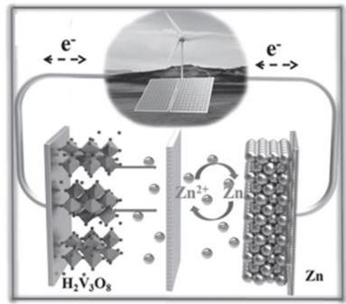  
a

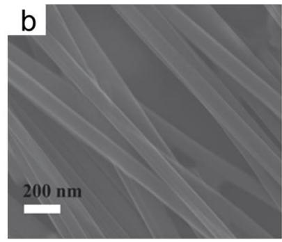  
e

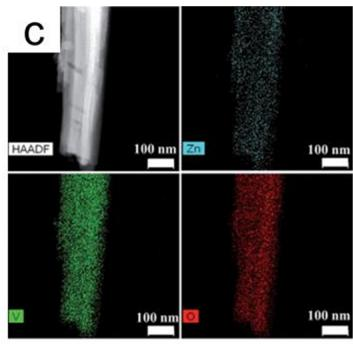

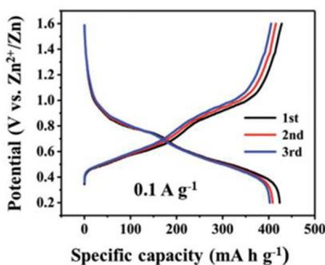  
d

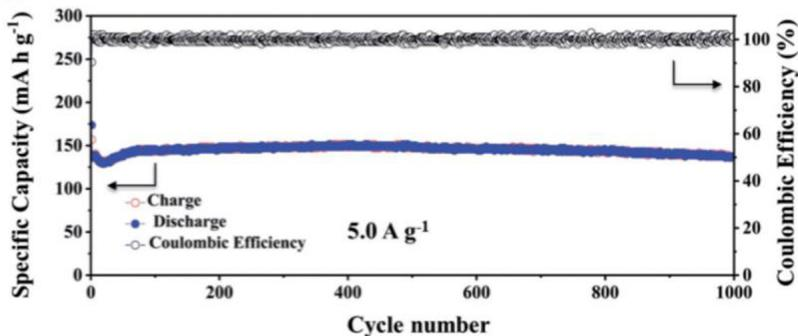

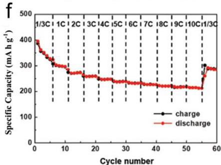

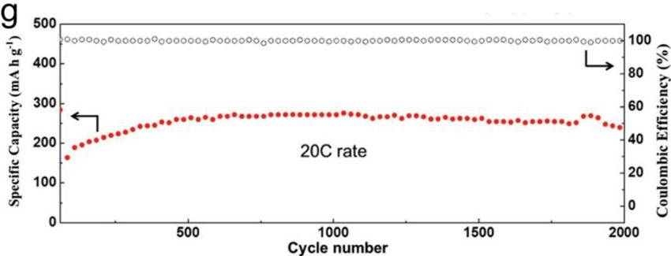  
9  
Figure 26. Typical examples of  $\mathrm{H}_2\mathrm{V}_3\mathrm{O}_8$  as cathode material for ZIBs. (a) Schematic of the rechargeable  $\mathrm{Zn - H_2V_3O_8}$  battery. (b) SEM image of the prepared  $\mathrm{H}_2\mathrm{V}_3\mathrm{O}_8$  nanowires. (c) TEM and EDS mapping images in full discharge state of the  $\mathrm{H}_2\mathrm{V}_3\mathrm{O}_8$  electrode after three cycles. (d) Charge/ discharge profiles at  $0.1\mathrm{A g}^{-1}$  of the initial three cycles and (e) cycle performance at  $5.0\mathrm{A g}^{-1}$  of  $\mathrm{Zn - H_2V_3O_8}$  battery. Reproduced with permission from ref 252. Copyright 2017 Wiley-VCH. (f) Rate capability at different rates and (g) long cycling stability at  $20\mathrm{C}$  of the  $\mathrm{H}_2\mathrm{V}_3\mathrm{O}_8/$  graphene cathode. Reproduced with permission from ref 253. Copyright 2018 Wiley-VCH.

the  $\mathrm{Zn^{2 + }}$  insertion/extraction in the host structure is similar to the traditional LIBs.79 Recently, vanadium oxides,  $\mathrm{H}_2\mathrm{V}_3\mathrm{O}_8$  and  $\mathrm{MV}_x\mathrm{O}_y$ $(\mathbf{M} = \mathbf{Li},\mathbf{Na},\mathbf{K},\mathbf{Z}\mathbf{n},$  etc.), have been investigated as novel V-based cathodes.224 The previously reported vanadium-based materials in ZIBs have mainly focused on layered vanadium oxides and have shown short cycle life and fast capacity fade.224 Until recent years, many advanced methods have been practiced to improve vanadium oxide materials for AZIBs. Huang and coworkers introduced a novel  $\mathrm{V}_{2}\mathrm{O}_{5}$  nanopaper as the cathode in ZIBs for enhancing their capacity and cycling stability.247 Similarly, Yang and co-workers have found that  $\mathrm{V}_{2}\mathrm{O}_{5}$  with structural  $\mathrm{H}_2\mathrm{O}$  improves the  $\mathrm{Zn^{2 + }}$  intercalation and thus increases the energy density of ZIBs.248 Furthermore, Zhou and co-workers have introduced N in vanadium oxides with reversible cationic  $(\mathrm{V}^{3 + }$  to  $\mathrm{V}^{2 + })$  and anionic  $(\mathrm{N}^{3 - }$  to  $\mathrm{N}^{2 - })$  redox reactions for achieving a high rate capability of  $200\mathrm{mAhg^{-1}}$  at  $30\mathrm{A g^{-1}}$  and excellent cycling stability after 2000 cycles.249

In 2006, vanadium oxide hydrate  $\left(\mathrm{H}_{2} \mathrm{~V}_{3} \mathrm{O}_{8}\right)$ , comprised of  $\mathrm{VO}_{6}$  octahedrons together with  $\mathrm{VO}_{5}$  trigonal bipyramids by hydrogen bonds, has been reported as a promising cathode material for LIBs, which has an excellent  $\mathrm{Li}^{+}$ insertion capability.[250] In a similar fashion, attempts have been made to

realize the insertion of  $\mathrm{Zn^{2+}}$  into the layered structure of  $\mathrm{H}_2\mathrm{V}_3\mathrm{O}_8$ . Compared to the weaker van der Waals force in the layered vanadium oxides such as  $\mathrm{V}_2\mathrm{O}_5$ , the hydrogen bonds in  $\mathrm{H}_2\mathrm{V}_3\mathrm{O}_8$  maintain structural integrity during charge/discharge processes and higher electronic conductivity.[251] For instance, Mai and co-workers employed a  $\mathrm{H}_2\mathrm{V}_3\mathrm{O}_8$  nanowire cathode, zinc anode, and  $3m\mathrm{Zn}(\mathrm{CF}_3\mathrm{SO}_3)_2$  electrolyte to assemble a high-performance ZIB system, as illustrated in Figure 26a.[252] Figure 26b illustrates the SEM morphology of  $\mathrm{H}_2\mathrm{V}_3\mathrm{O}_8$  nanowires with a uniform size of  $80 - 120~\mathrm{nm}$  which supports electronic conduction. In addition, Figure 26c shows the TEM-EDS patterns that confirm the intercalation of  $\mathrm{Zn^{2+}}$  into the  $\mathrm{H}_2\mathrm{V}_3\mathrm{O}_8$ . When subjected to electrochemical cycling, the  $\mathrm{Zn - H_2V_3O_8}$  battery yields superior reversible capacity of  $\sim400\mathrm{mAhg^{-1}}$  and a high current density of  $5\mathrm{A g^{-1}}$  with a capacity of  $113.9\mathrm{mAhg^{-1}}$  (Figure 26d,e). The battery also delivers a high capacity retention of  $94.3\%$  after 1000 cycles at  $5\mathrm{A g^{-1}}$  as shown in Figure 26e. To contribute more active sites and larger specific capacity, Wang and co-workers harnessed the high conductivity of graphene networks by synthesizing a  $\mathrm{H}_2\mathrm{V}_3\mathrm{O}_8$  nanowire/graphene composite material as the cathode for ZIBs.[253] The assembled battery exhibits a high rate capacity of  $270\mathrm{mAhg^{-1}}$  at

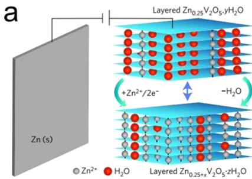

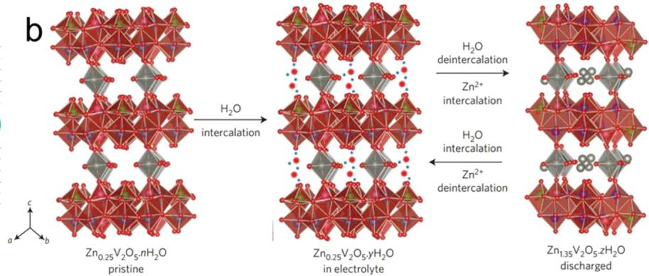

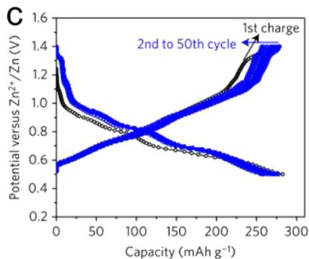

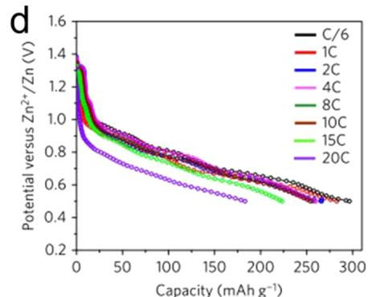

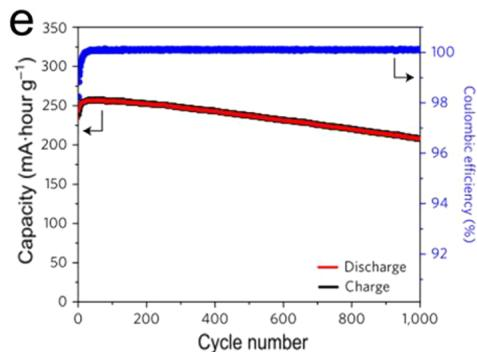

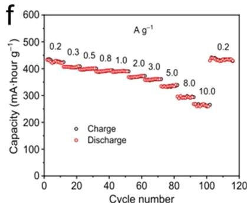  
Figure 27. Typical examples of zinc vanadium oxides as cathode materials for ZIBs. (a) Schematic of the  $\mathrm{Zn - Zn_{0.25}V_2O_5}$  nanobelt cell in an aqueous electrolyte of  $1\mathrm{M}\mathrm{ZnSO}_4$  in discharge state. (b) Scheme showing reversible water intercalation into  $\mathrm{Zn_{0.25}V_2O_5\cdot nH_2O}$  and water de-intercalation accompanying  $\mathrm{Zn^{2 + }}$  intercalation upon electrochemical discharge. The red and blue spheres represent O and H, respectively; the  $\mathrm{H}_2\mathrm{O}$  molecules interact with the oxygen layers through hydrogen bonding. Here  $y > z > n$  , as a fraction of intercalated  $\mathrm{H}_2\mathrm{O}$  remains in the discharged material. (c) Galvanostatic discharge and charge profiles of the  $\mathrm{Zn_{0.25}V_2O_5\cdot nH_2O}$  freestanding cathode at 1 C. (d) Galvanostatic discharge profiles at different rates  $(1\mathrm{C} = 300\mathrm{mA}\mathrm{g}^{-1})$  from 4 to  $20~\mathrm{C}$ . (e) Extended cycling performance and the corresponding CE at  $8\mathrm{C}$  (current density  $2400\mathrm{mA}\mathrm{g}^{-1}$ ), showing  $>80\%$  of the capacity retention (with respect to the highest capacity of  $260\mathrm{mAh}\mathrm{g}^{-1}$ ) after 1000 cycles. Reproduced with permission from ref 254. Copyright 2016 Springer Nature. (f) Rate capability and (g) long-term cycling performance at  $10\mathrm{A}\mathrm{g}^{-1}$  of  $\mathrm{Zn - Zn_{0.3}V_2O_5\cdot 1.5H_2O}$  NFs batteries. Reproduced with permission from ref 255. Copyright 2019 The American Association for the Advancement of Science.

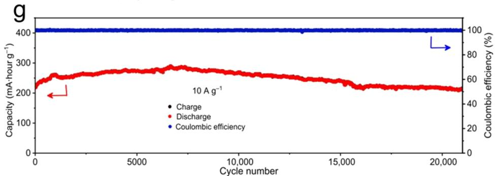

20 C and an excellent cycling stability of up to 2000 cycles with a capacity retention of  $87\%$ , as shown in Figure 26f,g. It is speculated that the introduction of graphene networks can further improve the performance of  $\mathrm{H}_2\mathrm{V}_3\mathrm{O}_8$  nanowires as cathode for ZIBs.

Emerging as a new class of cathode materials, metal vanadium oxides,  $\mathrm{MV}_x\mathrm{O}_y$  ( $\mathrm{M} = \mathrm{Li}$ , Na, K, Zn, etc.), with or without structural water act as pillars to provide fast and reversible  $\mathrm{Zn}^{2+}$  intercalation/deintercalation during battery cycling.[224] Nazar and co-workers have reported nanobelts of vanadium oxide pillared by interlayer  $\mathrm{Zn}^{2+}$  and water ( $\mathrm{Zn}_{0.25}\mathrm{V}_2\mathrm{O}_5\cdot n\mathrm{H}_2\mathrm{O}$ ) as a cathode for ZIB, as illustrated in Figure 27a.[254] Structurally, the  $\mathrm{Zn}_{0.25}\mathrm{V}_2\mathrm{O}_5\cdot n\mathrm{H}_2\mathrm{O}$  nanobelts consist of a double-sheet-type two-dimensional  $\mathrm{V}_2\mathrm{O}_5$  framework (Figure 27b). The interlayer of the layered framework permits the insertion of water molecules from the electrolyte toward the cathode, thereby further

expanding the room for good  $\mathrm{Zn}^{2+}$  intercalation. Figure 27c,d illustrates the cycling results of the  $\mathrm{Zn}_{0.25}\mathrm{V}_2\mathrm{O}_5\cdot n\mathrm{H}_2\mathrm{O}$  cathode, showing a high capacity of  $282\mathrm{mAhg^{-1}}$  in the initial cycle and fast discharge rate with capacities of 223 and  $183\mathrm{mAhg^{-1}}$  at 15 and  $20\mathrm{C}$ , respectively. As for the cycling performance, the  $\mathrm{Zn}-\mathrm{Zn}_{0.25}\mathrm{V}_2\mathrm{O}_5\cdot n\mathrm{H}_2\mathrm{O}$  nanobelt based ZIB delivers a capacity retention of more than  $80\%$  after 1000 cycles, as shown in Figure 27e. In addition, Zheng and co-workers have reported hierarchically porous  $\mathrm{Zn}_{0.3}\mathrm{V}_2\mathrm{O}_5\cdot 1.5\mathrm{H}_2\mathrm{O}$  NFs synthesized by coinsertion of  $\mathrm{Zn}^{2+}/\mathrm{H}^+$  into VOOH as a novel cathode for ZIB.[255] As shown in Figure 27f,g, the  $\mathrm{Zn}_{0.3}\mathrm{V}_2\mathrm{O}_5\cdot 1.5\mathrm{H}_2\mathrm{O}$  NFs exhibits a high discharge capacity of  $265.2\mathrm{mAhg^{-1}}$  at a current density of  $10\mathrm{A g^{-1}}$ , along with long cycling stability with  $96\%$  capacity retention at  $10\mathrm{A g^{-1}}$  after 20000 cycles.

Taking advantage of the smaller size of  $\mathrm{Zn}^{2+}$  (0.76 Å), as compared to  $\mathrm{Na}^{+}$  (0.99 Å), numerous researchers have studied

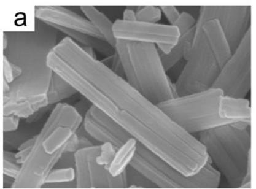

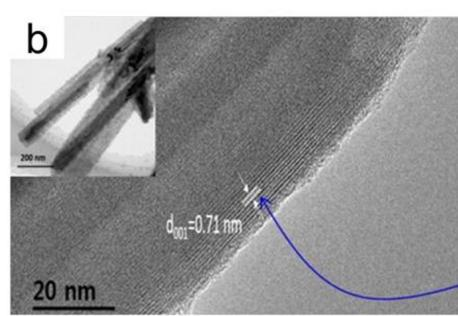

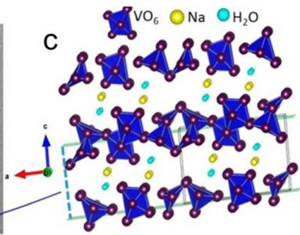

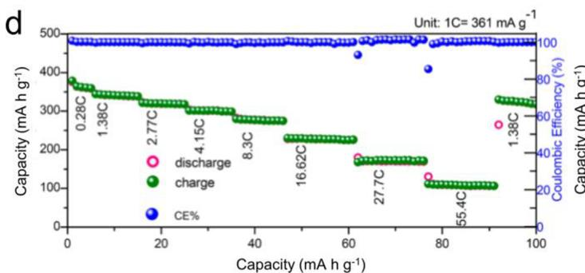

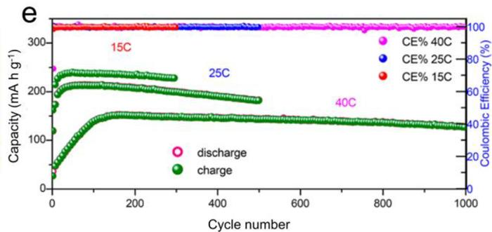

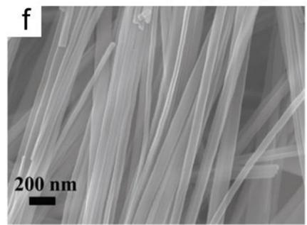  
Figure 28. Typical examples of sodium vanadium oxides as cathode materials for ZIBs. (a) SEM image of NVOH nanorods. (b) High-resolution TEM image with clear lattice fringes. The inset picture represents the TEM image at a low magnification. (c) Crystal structure of  $\mathrm{Na}_2\mathrm{V}_6\mathrm{O}_{16}\cdot x\mathrm{H}_2\mathrm{O}$ . (d) Rate capacities at different current rates and (e) cycling capacity comparison at three different current rates of 15, 25, and  $40\mathrm{C}$  for 300, 500, and 1000 cycles, respectively, for the NVOH cathode. Reproduced with permission from ref 226. Copyright 2018 American Chemical Society. (f) SEM image of NVO nanowire. (g) Cycling performance of NVO at  $1.0\mathrm{A}\mathrm{g}^{-1}$ . Reproduced with permission from ref 220. Copyright 2018 Wiley-VCH.

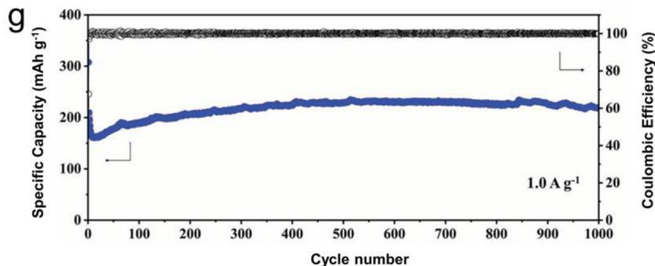

the insertion of  $\mathrm{Na^{+}}$  into the vanadium oxide layers for improving the electrochemical performance of ZIBs. For instance, Kim and co-workers prepared  $\mathrm{Na_2V_6O_{16}\cdot 3H_2O}$  (NVOH) nanorod powder via a rapid microwave technique. The intrinsic morphology is shown in Figure 28a.[226] The low-resolution inset image in Figure 28b clearly reflects the core-shell structure of NVOH, while the high-resolution image reveals distinguishable lattice fringes separated from a major portion of "fringe-free" domains. In addition, the crystal structure of  $\mathrm{Na_2V_6O_{16}\cdot xH_2O}$  with water molecules, as shown in Figure 28c, confirms the growth direction of nanorods along the  $a$ -axis. When cycled, the NVOH nanorods achieves a highly reversible capacity of  $113.95\mathrm{mAhg^{-1}}$  at a current rate of  $55.4\mathrm{C}$ , and excellent cycling stability with a capacity retention of over  $80\%$  after 1000 cycles (Figure 28d,e). Likewise, Mai and coworkers have reported a novel structural variant of  $\mathrm{Na_{0.33}V_2O_5}$  (NVO) nanowire, as shown in Figure 28f.[220] A ZIB based on the NVO nanowire exhibits reasonable cycling stability with a capacity retention over  $93\%$  for 1000 cycles compared with the NVOH nanorods (Figure 28g). Since  $\mathrm{K^{+}}$  and  $\mathrm{Ca^{2+}}$  are larger than  $\mathrm{Li^{+}}$  and  $\mathrm{Na^{+}}$ , they lead to excellent ion diffusion channels and stable crystal structure for ZIBs. This explains why

potassium vanadates, such as  $\mathrm{K}_2\mathrm{V}_8\mathrm{O}_{21}$  with its tunnel structure, show phenomenal  $\mathrm{Zn}^{2+}$  diffusion.[256] Wang and co-workers have further enhanced the electrochemical performance of potassium vanadates by combining defect engineering with carbon.[225] Besides the introduction of  $\mathrm{Zn}^{2+}$ ,  $\mathrm{Na}^+$ , and  $\mathrm{K}^+$ , other ions (such as  $\mathrm{Li}^+$  and  $\mathrm{Ca}^{2+}$ ) can also insert into vanadium oxides as ZIB cathodes to improve the performance.[257,258]

# 3.7. Magnesium-Ion Batteries

Magnesium-ion batteries (MgIBs) have been regarded as a promising candidate for GSES owing to their low cost, inherent safety (no dendrites), and high theoretical energy density.[259-261] Magnesium as a multivalent metal has a proven record of yielding a higher specific volumetric capacity of 3833 mAh cm $^{-3}$  than that of lithium metal (2046 mAh cm $^{-3}$ ).[259] Although Mg metal can be handled in ambient atmosphere for the preparation of electrodes, the growth of passivating surface films in electrolyte and the difficulty of intercalating Mg $^{2+}$  into cathode materials inhibit the electrochemical reactions.[261] Previously, Levi and co-workers achieved a significant breakthrough in the development of rechargeable MgIBs for potential application.[262] To explain, a MgIB has been introduced that is comprised of  $\mathrm{Mg}_x\mathrm{Mo}_3\mathrm{S}_4$  cathode, Mg metal anode, and an

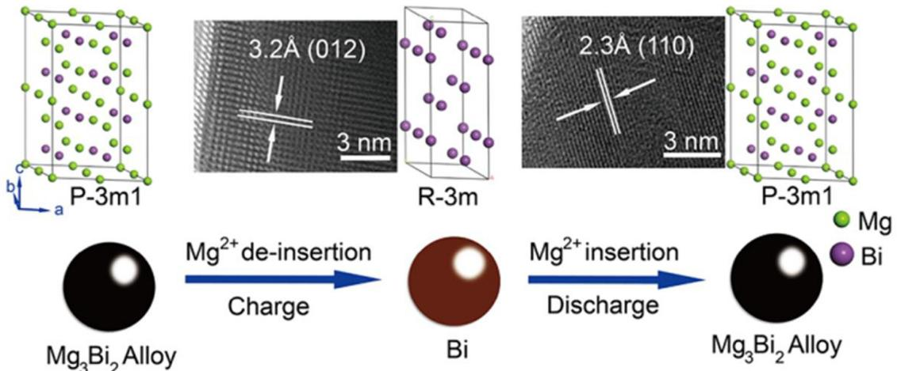  
a

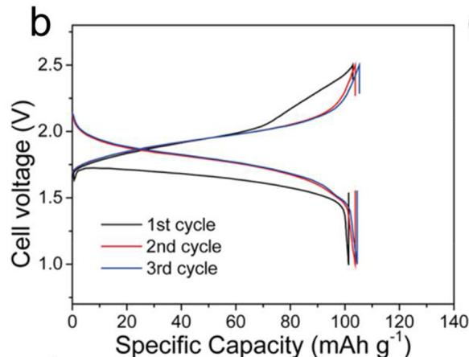  
C

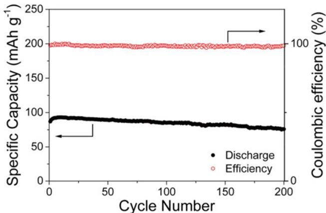

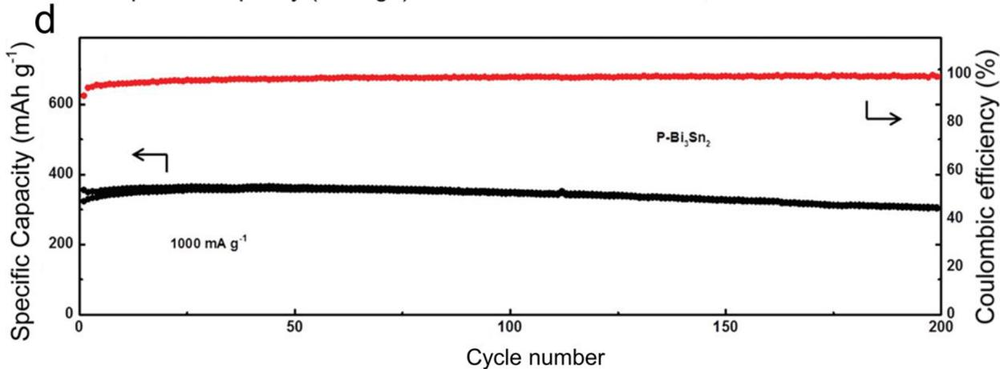  
Figure 29. Typical examples of alloy materials as anodes for MgIBs. (a) Schematic illustration of deinsertion/insertion of  $\mathrm{Mg}^{2+}$  in  $\mathrm{Mg}_3\mathrm{Bi}_2$  alloy particles, their crystal structures, and high-resolution TEM images. (b) Galvanostatic discharge/charge voltage profiles and (c) cycling performance at  $0.2\mathrm{A g^{-1}}$  of PBA-  $\mathrm{Mg}_3\mathrm{Bi}_2$  full cell with  $1\mathrm{M}$  LiTFSI-  $2\mathrm{M}$ $\mathrm{Mg(TFSI)}_2 / \mathrm{AN}$  electrolyte. Reproduced with permission from ref 265. Copyright 2018 American Chemical Society. (d) Cycling performance of the porous  $\mathrm{Bi}_3\mathrm{Sn}_2$  anode at  $1000\mathrm{mA g^{-1}}$ . Reproduced with permission from ref 268. Copyright 2019 Royal Society of Chemistry.

electrolyte solution of  $\mathrm{Mg(AlCl_2BuEt)_2}$  in tetrahydrofuran. The  $\mathrm{Mg}_x\mathrm{Mo}_3\mathrm{S}_4$  cathode is responsible for aiding the reversible intercalation of  $\mathrm{Mg}^{2+}$ , hence achieving the fast reaction kinetics. However, the energy density and operating voltage of the MgIB need further improvement. In addition, the passivating layer of  $\mathrm{Mg}$  metal in traditional organic solutions prevents the reaction of  $\mathrm{Mg}^{2+}$ . Therefore, studies for developing improved anode materials and  $\mathrm{Mg}^{2+}$  intercalation cathodes in suitable electrolytes are needed for the future MgIBs in GSES applications.

3.7.1. Anode Materials for MgIBs. The number of studies on MgIB anode materials is much less than those on cathodes due to the limitation of an insulating SEI layer on the surface of Mg metal anodes.[261] To solve this problem, electrolytes such as Grignard reagents have been proven effective for enabling reversible plating/stripping of  $\mathrm{Mg}^{2+}$  at the Mg metal anode.[262] However, these electrolytes are usually difficult to synthesize and are sometimes corrosive with typical current collectors.[265] Therefore, the alloy-type anode materials have recently attracted much attention in MgIBs.[266,267] A major downside concerning alloy-type anode materials (such as Ge, Si, and P) is their

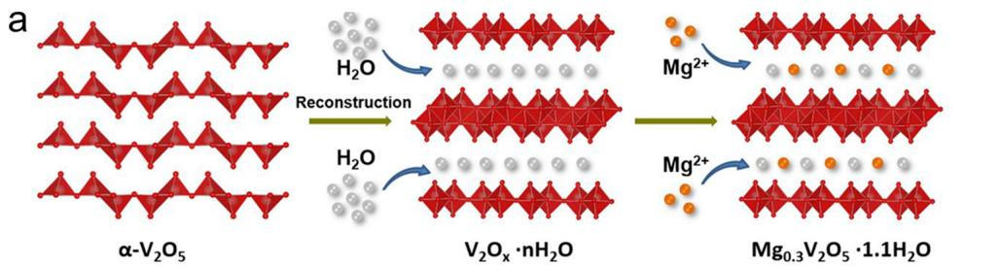

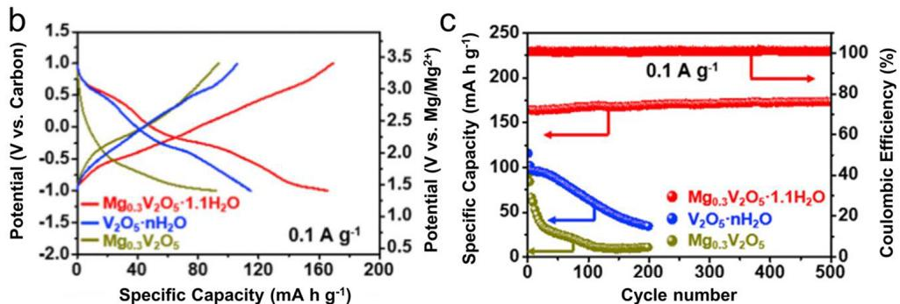

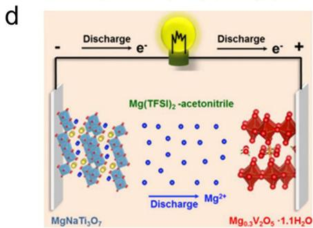  
Figure 30. Typical examples of magnesium vanadium oxides as cathode materials for MgIBs. (a) Schematic diagrams of the formation of the bilayer-structured  $\mathrm{Mg_{0.3}V_2O_5\cdot 1.1H_2O}$ . (b) Charge/discharge curves and (c) cycling performances of  $\mathrm{Mg_{0.3}V_2O_5\cdot 1.1H_2O}$ ,  $\mathrm{V}_2\mathrm{O}_5\cdot n\mathrm{H}_2\mathrm{O}$ , and  $\mathrm{Mg_{0.3}V_2O_5}$ . (d) Schematic illustration and (e) charge/discharge profiles at different cycles (1st, 2nd, 10th, 50th, and 100th) of full cell with  $\mathrm{Mg_{0.3}V_2O_5\cdot 1.1H_2O}$  cathode,  $\mathrm{Mg(TFSI)_2 - ACN}$  electrolyte, and  $\mathrm{MgNaTi_3O_7}$  anode. Reproduced with permission from ref 269. Copyright 2019 Elsevier.

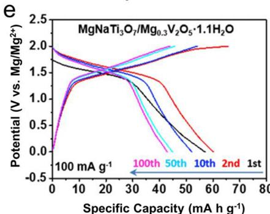

difficulty to undergo Mg insertion due to their sluggish diffusion kinetics and large volume expansion during cycles.[268] Hitherto, some reports about alloy anodes have mainly concentrated on Bi and Sn metal materials, but the pristine Bi and Sn metal materials are insufficient to meet the demand of MgIBs for energy applications.[266] Therefore, the development of the anodes still requires substantial improvements and structural optimization. Yao and co-workers have synthesized a nanoclustered  $\mathrm{Mg}_3\mathrm{Bi}_2$  alloy as MgIB anode in noncorrosive electrolytes.[265] The assynthesized alloy shows high reversibility for  $\mathrm{Mg}^{2+}$  deinsertion/insertion, as shown in Figure 29a. Furthermore, the MgIB based on PBA cathode and  $\mathrm{Mg}_3\mathrm{Bi}_2$  alloy anode achieves a high discharge voltage of  $\sim 2\mathrm{V}$  and long cycling stability after 200 cycles (Figure 29b,c). Similarly, Zhang and co-workers have investigated a porous Bi-Sn alloy, which exhibits excellent capacity retention of over  $93\%$  for 200 cycles, as shown in Figure 29d.[268]

3.7.2. Cathode Materials for MgIBs. Unlike insertion of  $\mathrm{Li^{+}}$  and  $\mathrm{Na^{+}}$ , it is much more challenging to insert  $\mathrm{Mg^{2 + }}$  into the host materials primarily due to the strong interaction between the host lattice and  $\mathrm{Mg}^{2 + }$ . Many materials have been reported as cathodes for MgIBs, including PBAs,[265] vanadium oxides,[269] transition-metal sulfides,[270] and polyanionic compounds.[271] Among them, vanadium oxide cathodes have gained relatively more attention for delivering good cycling stability in MgIBs.

The stronger interactions between  $\mathrm{Mg}^{2+}$  and oxide host lattices are responsible for slow  $\mathrm{Mg}$  diffusion.[261] Therefore, further developments have been made in synthesizing nanomaterials (such as  $\mathrm{V}_2\mathrm{O}_5$  aerogels or nanowires) as cathode materials for decreasing the diffusion distance of  $\mathrm{Mg}^{2+}$ .[272,273] Another strategy to ensure the insertion of  $\mathrm{Mg}^{2+}$  is to alter the layered structure of vanadium oxides for  $\mathrm{MgIB}$  cathodes. Concerning this, Jacobson and co-workers put forward the idea of introducing Mo to vanadium oxide layers for processing a microporous molybdenum-vanadium oxide molecular sieve  $\mathrm{Mo}_{2.5+y}\mathrm{VO}_{9+\delta}$  as a cathode for  $\mathrm{MgIBs}$ .[273] The crystal structure of  $\mathrm{Mo}_{2.5+y}\mathrm{VO}_{9+\delta}$  is useful in providing diffusion pathways for small guest molecules and thereby enhancing  $\mathrm{Mg}^{2+}$  intercalation. The electrochemical testing of  $\mathrm{Mo}_{2.5+y}\mathrm{VO}_{9+\delta}$  cathode provides a high capacity of  $397\mathrm{mAhg^{-1}}$  along with plausible intercalation up to 3.49 of  $\mathrm{Mg}^{2+}$  ions per formula unit. Similarly, Mai and coworkers have reported  $\mathrm{Mg}^{2+}$  and water molecule co-intercalated vanadium oxide ( $\mathrm{Mg}_{0.3}\mathrm{V}_2\mathrm{O}_5\cdot 1.1\mathrm{H}_2\mathrm{O}$ ) as a  $\mathrm{MgIB}$  cathode (Figure 30a), showing higher capacity and longer cycling stability than the pristine  $\mathrm{V}_2\mathrm{O}_5\cdot n\mathrm{H}_2\mathrm{O}$  and waterless  $\mathrm{Mg}_{0.3}\mathrm{V}_2\mathrm{O}_5$ , as shown in Figure 30b,c.[269] When a  $\mathrm{MgIB}$  is assembled with  $\mathrm{Mg}_{0.3}\mathrm{V}_2\mathrm{O}_5\cdot 1.1\mathrm{H}_2\mathrm{O}$  cathode,  $\mathrm{Mg(TFSI)}_2$ -ACN electrolyte, and  $\mathrm{MgNaTi}_3\mathrm{O}_7$  anode, it delivers a high average voltage of  $1.5\mathrm{V}$  and a good capacity retention of  $42\mathrm{mAhg^{-1}}$  after 100 cycles

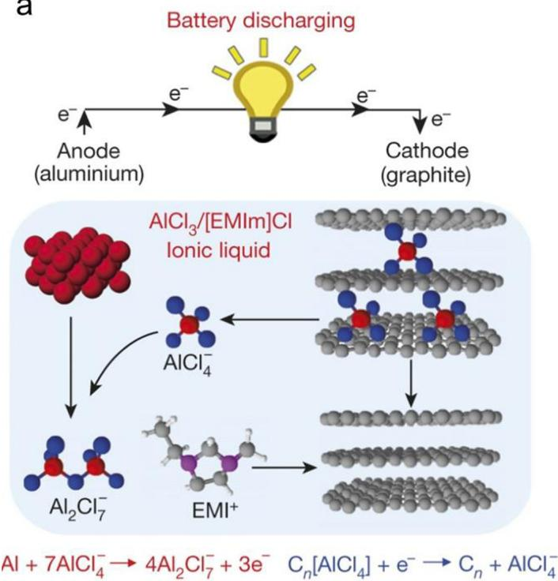  
a

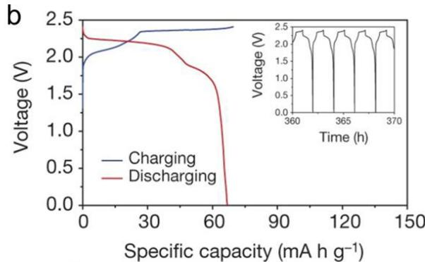

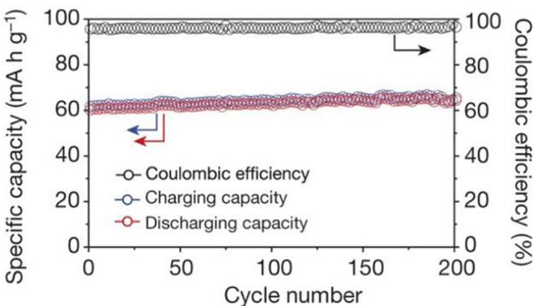  
C  
Figure 31. Typical examples of electrolytes for AIBs. (a) Schematic diagram of the Al/graphite cell during discharge in the optimal composition of the  $\mathrm{AlCl}_3 / [\mathrm{EMIm}]\mathrm{Cl}$  IL electrolyte. (b) Galvanostatic charge and discharge curves of an Al/pyrolytic graphite Swagelok cell at a current density of  $66\mathrm{mA}$ $\mathbf{g}^{-1}$ . (c) Stability test of an Al/pyrolytic graphite cell at a current density of  $66\mathrm{mA}\mathrm{g}^{-1}$ . Reproduced with permission from ref 278. Copyright 2015 Springer Nature.

(Figure 30d,e). These results therefore provide a new pathway for other oxide-based materials as insertion cathodes for MgIBs.

# 3.8. Aluminum-Ion Batteries

In the last several years, rechargeable aluminum-ion batteries (AlBs) have attracted much attention, fundamentally owing to the crustal abundance of Al metal. The ability of  $\mathrm{Al}^{3+}$  to exchange three electrons during redox reaction is also notable for delivering a high volumetric capacity of  $8046\mathrm{mAhcm}^{-3}$ , which is superior to single electron reaction such as Li, Na, and K.[274] In addition, the inertia of Al metal and easy operation in the ambient environment suggest commendable safety of AIB systems.[275,276] In short, AIBs offer bright prospects for GSES applications. However, for practical applications, some problems exist in relation to AIBs, for instance the lack of AIB cathode materials, low energy density, and poor cycling stability.[274] Energy density, as determined by battery working voltage and capacity, is one of the most critical parameters for gauging the electrochemical performance of AIBs. The low reversibility of the Al metal anode also limits the energy density of AIBs. Archer and co-workers reported that specific interfacial metal-substrate bonding can be used to achieve a fine control of Al metal electrodeposition morphology with high reversibility.[277] In general, the AIB system is composed of an Al anode with different cathodes and electrolytes. With regards to AIB development, the studies have concentrated on investigating novel electrolytes and cathode materials.

3.8.1. Electrolytes for AIBs. In 2015, Dai and co-workers reported an IL electrolyte made from vacuum-dried  $\mathrm{AlCl}_3 / 1$ -ethyl-3-methylimidazolium chloride  $(\mathrm{AlCl}_3 / [\mathrm{EMIm}]\mathrm{Cl})$  for AIB.[278] The AIB is constructed by  $\mathrm{AlCl}_3 / [\mathrm{EMIm}]\mathrm{Cl}$  electrolyte, graphite cathode, and aluminum anode (Figure 31a). During discharging, Al metal and  $\mathrm{AlCl}_4^-$  at the anode are transformed

into  $\mathrm{Al}_{2}\mathrm{Cl}_{7}^{-}$  and the predominant  $\mathrm{AlCl}_4^-$  is de-intercalated from the cathode graphite layers. The reverse reactions take place during battery recharging. The cell shows an excellent discharge working voltage of  $\sim 2\mathrm{V}$  and over 200 cycles with an average CE of  $98\%$  at room temperature (Figure 31b,c). However, the high cost of  $\mathrm{AlCl}_3 / [\mathrm{EMIm}] \mathrm{Cl}$  ILs limits the furtherance of these AIBs in large-scale applications. Recently, the utility of urea as an additive for partial or full replacement of [EMIm]Cl electrolyte in AIBs has been proposed in order to achieve excellent electrochemical performance.[279,280] In another study, Gao and co-workers reported a low-cost  $\mathrm{AlCl}_3 / \mathrm{Et}_3\mathrm{NHCl}$  IL as electrolyte for an Al/graphene battery, which shows good capacity retention of  $97.3\%$  after 30000 cycles.[281] The emergence of solid-state electrolytes also provides great stability and safety for AIBs, which is promising for their widespread employability in energy storage systems. Fang and co-workers have used the gel-polymer electrolytes between graphite cathodes and Al anodes, thereby pioneering a novel approach toward developing high-performance AIBs.[282] In this regard, novel approaches to improving performance and reducing cost of AIBs through the development of new electrolytes are worth exploring to pave the way for their GSES applications.

3.8.2. Cathode Materials for AIBs. As discussed earlier, traditional cathode materials such as graphite for AIBs usually show low capacity  $(< 100\mathrm{mAhg^{-1}})$ , hindering their prospects for GSES application.[278] Therefore, the construction of high-capacity cathode materials is the key to the development of commercial AIBs. In this respect, the vanadium and manganese oxides have been explored in AIBs, similarly to other MIBs, due to their good ionic channels.[283,284] Although the batteries based on these cathode materials deliver a higher capacity than graphite cathodes, short-term cycling still hinders their

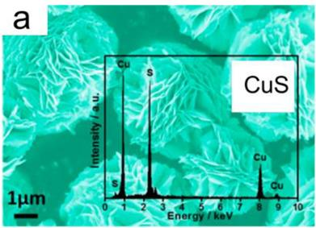

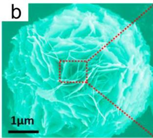

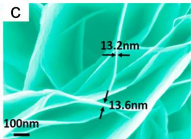

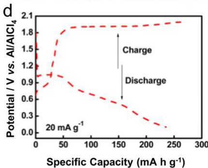

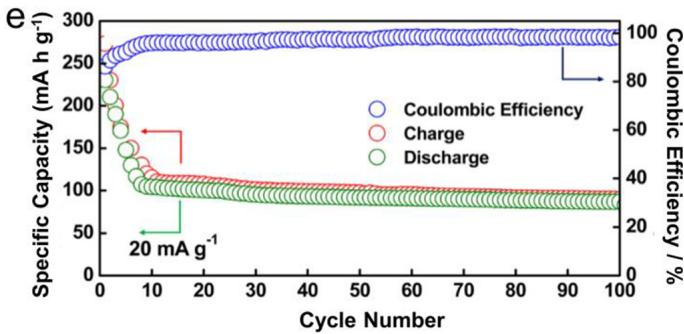

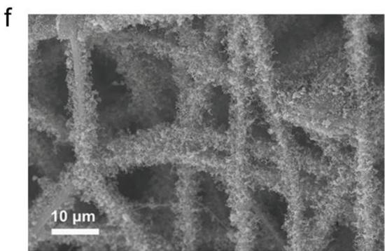

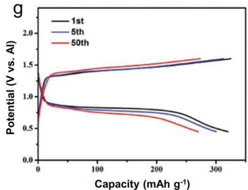

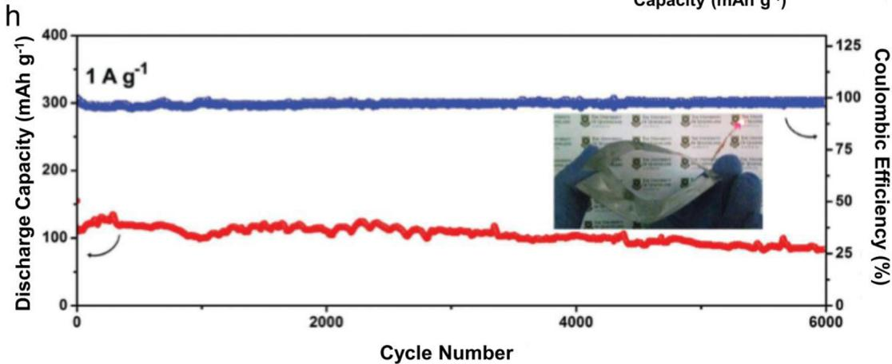  
Figure 32. Typical examples of cathode materials for AIBs. (a-c) FE-SEM images of 3D hierarchical nanostructured CuS microspheres at different magnifications. (d) Initial discharge/charge curves and (e) cycling performance with CE at  $20\mathrm{mA}\mathrm{g}^{-1}$  of  $\mathrm{CuS@C}$  microsphere cathode. Reproduced with permission from ref 287. Copyright 2017 American Chemical Society. (f) FE-SEM image of the  $\mathrm{Co_9S_8@CNT - CNF}$ . (g) First, fifth, and fiftieth charge/discharge curves at a current density of  $100\mathrm{mA}\mathrm{g}^{-1}$ , and (h) cycling performance with CE at  $1\mathrm{A}\mathrm{g}^{-1}$  of the  $\mathrm{Co_9S_8@CNT - CNF}$  electrode. Inset exhibits the flexible  $\mathrm{Co_9S_8@CNT - CNF}$  AIBs using soft-package assembly. Reproduced with permission from ref 288. Copyright 2018 Wiley-VCH.

application. In contrast to the metal oxides, sulfides have been proven to be more beneficial for  $\mathrm{Al}^{3+}$  intercalation/deintercalation due to their lower electronegativity and larger ionic radius.[285] Combining carbon with the higher-capacity sulfides has been established as a superior approach to designing high-performance AIB cathodes. In 2016, for example, Jiao and coworkers reported  $\mathrm{Ni}_3\mathrm{S}_2/$  graphene microflakes as a cathode material with Al foil anode and  $\mathrm{AlCl}_3/$  [EMIm]Cl IL electrolyte

for AIBs, which can deliver a high initial discharge capacity of  $350\mathrm{mAhg^{-1}}$  286 Further, a novel 3D hierarchical  $\mathrm{CuS@C}$  microsphere as the cathode for AIBs has also been demonstrated (Figure 32a-c).287 When tested with an Al anode and an  $\mathrm{AlCl}_3/$  [EMIm]Cl ILs electrolyte, this novel cathode material exhibits a high initial discharge capacity of about  $240\mathrm{mAhg^{-1}}$  and retains a discharge capacity of about  $90\mathrm{mAhg^{-1}}$  after 100 cycles (Figure 32d,e). Another potential advantage of using this novel

and inexpensive cathode material is its ability to direct unprecedented redox reaction pathways in AIBs. In contrast, the  $\mathrm{CuS@C}$  microsphere material shows a low CE and fast fade capacity in the initial cycles of AIBs. Later, Wang and co-workers reported a cobalt sulfide encapsulated in CNTs coated on carbon nanofibers  $(\mathrm{Co}_{9}\mathrm{S}_{8}@\mathrm{CNT - CNF})$  as a novel cathode for AIBs, as shown in Figure 32f.[288] The structure of this cathode material tends to deliver a high initial capacity of  $315\mathrm{mAhg^{-1}}$  with a CE approaching  $100\%$  and stable cycling performance with a capacity of  $87\mathrm{mAhg^{-1}}$  after 6000 cycles, as shown in Figure 32g,h. In addition, some other novel materials, such as CoSe and  $\mathrm{Cu_4P}$ , have been investigated as cathode alternatives for AIBs.[289,290] However, the electrochemical performance of these materials has not met the demand of AIBs for GSES. Therefore, the development of AIB cathode materials needs momentous improvement in order to ensure their practical large-scale applications.

# 3.9. Summary and Future Perspective for MIBs

The sustainable development of our society requires advanced battery systems for GSES. Every type of MIB has attracted considerable attention and therefore has been developed rapidly in recent years due to their respective advantages. This section provides a summary on some of the most extensively investigated MIBs mainly from the standpoints of their recent development and performance as well as numerous improvement strategies. Generally, six main groups of MIB systems, including LIBs, SIBs, PIBs, ZIBs, MgIBs, and AIBs, have been summarized on the basis of their different metal-ion transport mechanisms.

Notwithstanding extensive research, it is still desirable to further improve the electrochemical performance and reduce the cost of MIBs for meeting the demands of the GSES market. It is critical to develop outstanding structures and novel materials for cathode and anode as well as stable electrolytes. The optimization of one performance metric usually comes at the cost of other parameters, and the assessment itself is based on experimental conditions that are hard to scale up for practical utility. For example, with cost-effective and environmentally benign  $\mathrm{MnO}_2$  as the cathode and Zn metal as the anode in acidic electrolyte, the as-prepared electrolytic  $\mathrm{Zn - MnO_2}$  batteries deliver reasonable energy density and long-term stability at relatively low areal capacities. However, most of the reported values in the literature are solely based on the cathode materials and do not take into account the weight of the whole battery or the vast Zn metal loss in acidic electrolyte.

With the low-cost and abundant Na, K, Zn, Mg, or Al, metal-based batteries have garnered significant attention in the field of GSES application. Currently, investigations on SIBs, PIBs, ZIBs, MgIBs, and AIBs are mostly confined to the initial laboratory scaled academic research stage. The recent explorations and proposed approaches have attempted to establish insightful strategies, which can promote the practical advancements for new battery systems. However, more investigations on electrodes, electrolytes, and full cells are in order before these novel chemistries can be adopted into commercial applications. Furthermore, the data reported in the laboratory experiments are often acquired under ideal testing conditions, for instance, with excess Al or Mg metal anode, abundant electrolyte, and low active material loading on the cathode. As efficient as these laboratory practices are, they are of limited significance in industrial production requiring more stringent conditions. In addition, the technologies employed for materials synthesis and

the data obtained from laboratory based electrochemical characterization cannot always be translated for commercial mass production. In other words, even if the technology seems promising from the perspective of performance, there are many other factors that can immediately exclude its commercial applicability. Therefore, the manufacturing of battery electrodes and materials is crucial for prototyping and eventual commercialization of novel metal-ion battery systems. Besides the seemingly mature LIBs, other MIBs with abundant sources, cost-effectiveness, and fair electrochemical performance are particularly favored for grid-scale applications. However, there is a long way to go for realizing the GSES applications of these battery systems through minimizing the gap between academic research and industrial practices. Having mentioned that, it can be speculated that LIBs may still be one of the mainstream batteries in the GSES field in the upcoming 1-2 decades given their market share and impressive performance.

# 4. LEAD-ACID BATTERIES

Invented in 1859 by Gaston Plante, the LAB has been one of the earliest developed and is still one of the most widely utilized battery systems.[291] It is primarily deployed in various energy storage applications, ranging from lights to electric automobiles to uninterruptible power supplies (UPSs). Such extensive utility of LABs is predominantly attributed to their low storage costs per kilowatt-hour, convenient accessibility, and safe water-based electrolyte.[292] For more than a decade, LABs have been commercially available in LSES markets owing to the accumulated power and energy up to  $10\mathrm{MW}$  and  $40\mathrm{MWh}$ , respectively,[293] thereby showcasing their potential in serving LSES applications.

A LAB based BESS was installed at the Alt Daber solar power plant in Germany by the Belectric and Vattenfall companies. This energy storage facility was designed with the intention of putting the solar energy facility on even footing with conventional power plants. The energy storage facility based on LABs is used to provide primary operating reserve to the high-voltage transmission network, which makes it possible to feed primary operating reserve power directly into the  $110\mathrm{kV}$  high-voltage distribution network through which the solar power plant is connected to low- or medium-voltage networks. The soluble Pb-acid flow battery (SLAFB) remains as one of the most cost-effective and environmentally safe ways to store energy. Because of this, many of them are being used in advanced LSES applications to power businesses and residences with solar farms across the United States. For example, the Public Services Company in New Mexico serves more than 500000 residents and utilizes solar farms with flooded LAB storage systems that can deliver  $500\mathrm{kW}$  of power. The battery system, which is rack-mounted in eight freight containers adjacent to solar panels, allows for stabilized power output during high demand. In addition, the University of New Mexico and Sandia National Laboratories helped on the project and have successfully demonstrated peak shaving, smoothing of photovoltaic ramp rates, and minimizing of voltage fluctuations to the satisfaction of Public Services Company in New Mexico. This section summarizes the underlying dynamics of LABs to better understand their recent development trends and to promote their potential for catering to our future GSES needs.

# 4.1. Brief History of LABs

Since their emergence, the primary principles of the LABs have not experienced significant evolution.[294] The key components of

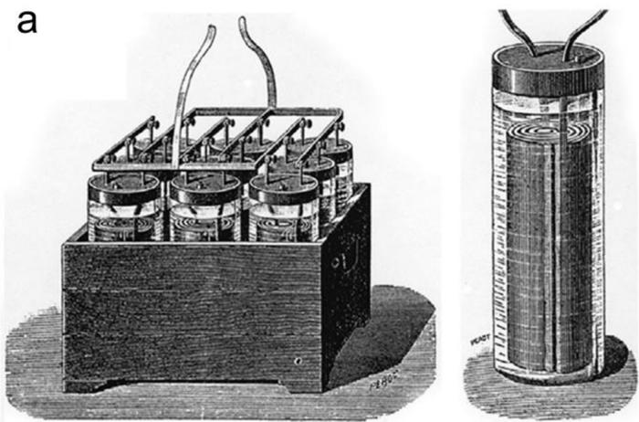  
Figure 33. Pictures of LABs in different generations. (a) First generation and (b) current LABs. Reproduced with permission from ref 298. Copyright 2019 Springer Nature.

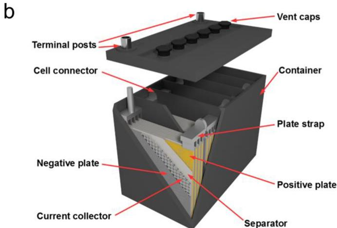

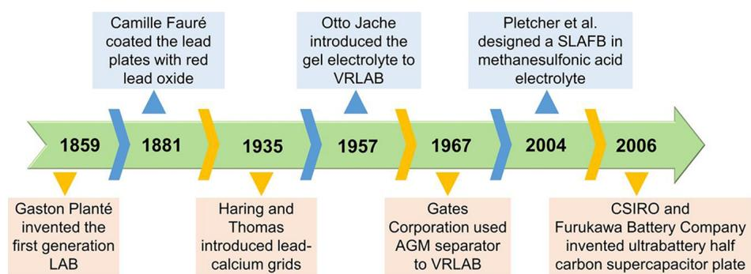  
Figure 34. Timeline of important milestones in the development of LABs.

the LABs remain the Pb metal anode, the  $\mathrm{PbO}_2$  cathode,  $\mathrm{H}_2\mathrm{SO}_4$  electrolyte, a porous electrically insulated separator, and Pb alloy grids as current collectors for mechanically supporting electrodes. During discharge, the Pb anode and  $\mathrm{PbO}_2$  cathode react simultaneously with  $\mathrm{H}_2\mathrm{SO}_4$  to form  $\mathrm{PbSO}_4$ , whereas these reactions are reversed during charge. The electrodes and cell reactions of typical LABs are as follows:

Cathode:

$$
\mathrm {P b O} _ {2} + 4 \mathrm {H} ^ {+} + \mathrm {S O} _ {4} ^ {2 -} + 2 \mathrm {e} ^ {-} \leftrightarrow \mathrm {P b S O} _ {4} + 2 \mathrm {H} _ {2} \mathrm {O}
$$

$$
E ^ {\circ} = 1. 6 9 \mathrm {V} \tag {2}
$$

Anode:

$$
\mathrm {P b S O} _ {4} + 2 \mathrm {e} ^ {-} \leftrightarrow \mathrm {P b} + \mathrm {S O} _ {4} ^ {2 -} \quad E ^ {\circ} = - 0. 3 6 \mathrm {V} \tag {3}
$$

Overall:

$$
\mathrm {P b O} _ {2} + \mathrm {P b} + 2 \mathrm {H} _ {2} \mathrm {S O} _ {4} \leftrightarrow 2 \mathrm {P b S O} _ {4} + 2 \mathrm {H} _ {2} \mathrm {O}
$$

$$
E ^ {\circ} = 2. 0 5 \mathrm {V} \tag {4}
$$

It can be seen that the single cell voltage of a LAB can reach up to  $2.05\mathrm{V}$ . Previously, LABs generally adopted the flooded design, containing extra electrolytes, which undergo decomposition during battery overcharge, as shown in Figure 33a.[292] In this regard, in the first half of the twentieth century, the high overpotential grid alloys, such as lead-antimony and lead-calcium grids, were developed for reducing hydrogen gas evolution onto the anode. Later, in the early second half of twentieth century, a valve regulated LAB (VRLAB) cell design (Figure 33b), which not only allowed the venting of hydrogen

and oxygen gases but also prevented the entrance of air into the cells, thereby improving its overall safety, was introduced.[295,296] Hitherto, there have been two important developments pertaining to VRLABs: the absorbed glass mat (AGM) for holding the electrolyte within its pores, and the undivided gel battery based on silica to create a highly viscous gel-like electrolyte.[297] These design developments have reduced the recharge time along with the self-discharge rate and consequently have improved the cycle life and specific power of LABs.

One of the major concerns in relation to VRLAB design has been the formation of large crystals of  $\mathrm{PbSO_4}$  on the anode surface, which detrimentally influence its cycle performance under the high-rate partial-state-of-charge (HRPSoC) mode.[296] To address this issue, the introduction of carbon into the anode has proven effective for reducing the accumulation of  $\mathrm{PbSO_4}$ . This new practice pertaining to LABs has been adopted in designing other energy storage systems as well, primarily owing to its low manufacturing cost and stable performance under HRPSoC conditions.[299] In addition to the promising conventional LABs, a flow battery based on the  $\mathrm{Pb^{2+}/Pb}$  and  $\mathrm{PbO_2/}$ $\mathrm{Pb^{2+}}$  coupled with methanesulfonic acid has also been investigated to show the high solubility of  $\mathrm{Pb(II)}$  along with no stringent requirement of the membrane.[297] Figure 34 summarizes the key developmental history of LABs over the years.

# 4.2. Lead-Carbon Batteries

Although LABs are known for their applications requiring instant ignition, especially in the automobile industry, they have short lifespan mainly due to anode sulfation in HRPSoC

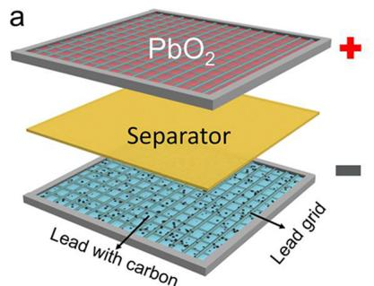  
Carbon additive

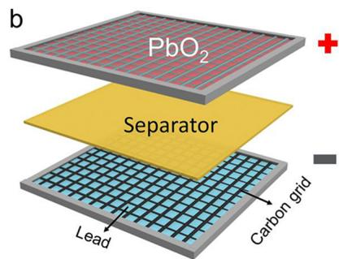  
Carbon current collector

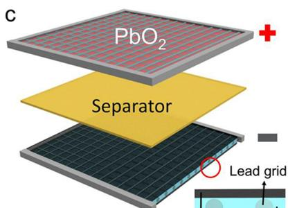  
Ultrabattery

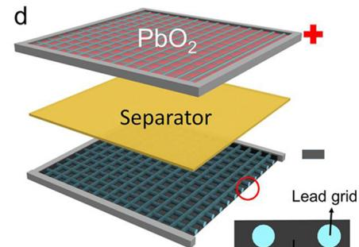  
Carbon electrode  
Figure 35. Various designs of lead-carbon battery systems and the cross-sectional views of their anodes. (a) Carbon as additive. (b) Carbon as current collector. (c) Half lead plate and half carbon supercapacitor plate (ultrabattery). (d) All-carbon anode (Axion Power).

mode. $^{300}$  Recently, it has been established that partial or full replacement of the LAB anode with carbon can improve its cycle life and reduce cost. $^{301}$  The different variants of carbon-based LAB systems are illustrated in Figure 35, according to which these are further classified into carbon as additives (Figure 35a), carbon as current collectors (Figure 35b), supercapacitor/battery hybrids (ultrabattery) (Figure 35c), and carbon as anode (Figure 35d).

4.2.1. Carbon as Additives. The addition of carbon at concentrations ranging from  $0.2\mathrm{wt}\%$  to  $2.0\mathrm{wt}\%$  can enhance the conductivity of the anode and restrict  $\mathrm{PbSO_4}$  crystal growth in HRPSoC conditions. $^{46}$  To date, many types of carbon additives have been explored as the anode for LABs, including activated carbon (AC), CB, and acetylene black. $^{302-304}$  In addition, other types of carbon having large surface area are relatively more effective in inhibiting the formation of  $\mathrm{PbSO_4}$  and improving the cycle life of LABs. For example, owing to its high conductivity, graphene has attracted many studies pertaining to LABs for enhancing cycling performance in HRPSoC conditions. $^{162,305}$  In this regard, Ma and co-workers employed a 3D-RGO additive in the LAB anode. $^{306}$  As evident from the SEM micrographs (Figure 36a), the 3D-RGO is composed of a continuous porous structure with pore sizes of  $1-4\mu \mathrm{m}$ , which facilitates the migration ions into the anode. Such a web-like structure of 3D-RGO is also responsible for producing longer cycle life as compared to the conventional carbon additives, such as AC and acetylene black (Figure 36b). Moreover, the abundant porosity of the 3D-RGO along with excellent conductivity assists in creating a synergistic effect by facilitating the charging and discharging of the anode. In addition to graphene, CNTs and CNFs have been investigated for their efficacy as anode additives in LABs. $^{307-310}$  However, there has been a lack of consensus when it comes to the selection of optimal carbon additive for LABs, not to mention that the

underlying mechanisms of LABs are still unclear and need further clarification.

In contrast to the accelerates for carbon additives, these materials pose some serious concerns in terms of augmented hydrogen evolution at the anode. To address this issue, studies have proposed and carefully examined the modification of carbon materials with metal oxides, such as  $\mathrm{Bi}_2\mathrm{O}_3$ ,  $\mathrm{Ga}_2\mathrm{O}_3$ , and  $\mathrm{In}_2\mathrm{O}_3$ . Such modifications of carbon additives have the ability to effectively hamper the hydrogen gas evolution rate and enhance the cycling stability under HRPSoC conditions. In this regard, an AC composite with  $\mathrm{Bi}_2\mathrm{O}_2\mathrm{CO}_3$  has been reported as an effective choice for suppressing hydrogen evolution reaction (HER) by  $93.1\%$  and improving the cycle lifetime of LABs. Similarly, Martha and co-workers have reported the solvothermal synthesis of a  $\mathrm{TiO}_2$ -RGO hybrid as an anode additive in LABs. As it can be seen in Figure 36c, the layered structure of graphite consists of graphene layers with a thickness of  $\sim 10$  nm. The morphology of GO exhibits the multilayer graphene structures due to the presence of oxygen containing functional groups (Figure 36d). In addition, Figure 36e shows spherical  $\mathrm{TiO}_2$  particles of sizes ranging between 25 and  $50~\mathrm{nm}$ . Figure 36f further demonstrates that such oxide particles are well grown on the surface of RGO. The electrochemical testing results show that the presence of the  $\mathrm{TiO}_2$ -RGO hybrid additive not only improved interfacial stability and cycling performance of the LAB as compared to its individual constituents ( $\mathrm{TiO}_2$  and RGO) but also suppressed sulfation on the anode, as shown in Figure 36g,h. Similarly, Naresh and Martha have examined the efficiency of a synthesized carbon coating on  $\mathrm{SnO}_2$  in LABs. Concerning this, the results reveal that carbon coating onto  $\mathrm{SnO}_2$  favors high conductivity, inhibits sulfation, and prolongs cycling life in contrast to the conventional carbon additives.

4.2.2. Carbon as Current Collectors. One of the shortcomings of conventional LABs is their low specific capacity, which is limited by the high mass of  $\mathrm{Pb}$  and its ineffective

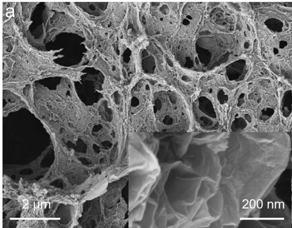

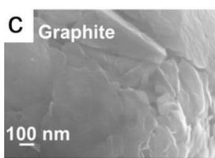

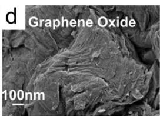

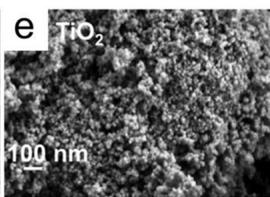

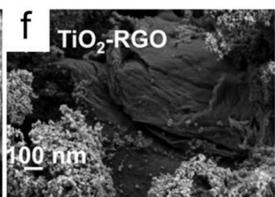

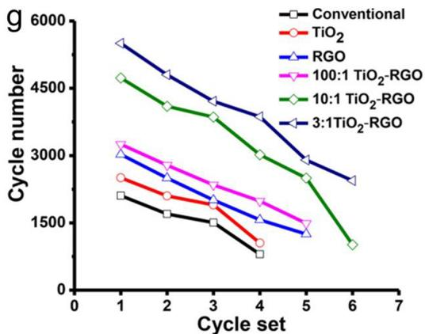  
Figure 36. Morphology and electrochemical performance of LABs with different carbon additives. (a) SEM images of the prepared 3D-RGO. (b) Cycling performance for end of discharge voltage of LABs with different carbon additives (3D-RGO, AC, ACET (acetylene black)) under HRPSoC conditions. Reproduced with permission from ref 306. Copyright 2017 Elsevier. SEM images of (c) graphite, (d) GO, (e)  $\mathrm{TiO_2}$ , and (f)  $\mathrm{TiO_2}$ -RGO hybrid (3:1). (g) Cycling performance of conventional cell and cells with anode additives of  $\mathrm{TiO_2}$ , RGO and  $\mathrm{TiO_2}$ -RGO hybrid (different ratios of 100:1, 10:1, and 3:1). (h) Bar chart showing the cycle life under HRPSoC conditions of the conventional and LABs with different anode additives. Reproduced with permission from ref 311. Copyright 2018 Elsevier.

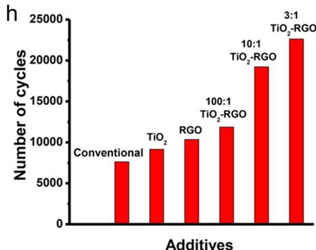

utilization. $^{298}$  The high weight of LABs is attributed to both of its electrodes, in which Pb alloys serve as current collectors. In this regard, low-weight carbon-based current collectors have been considered as the optimal choice to replace the heavy Pb alloys. In 1995, Czerwinski reported that reticulated vitreous carbon (RVC), a porous glassy carbon made from a polyurethane precursor, when used as a current collector for both cathode and anode plates of LABs can significantly decrease the mass of electrodes and augment energy density. $^{298}$  Having similarity to the conventional electrode plates with the exception of slightly higher thickness  $(5\mathrm{mm})$ , $^{316}$  RVC also exhibits excellent properties in terms of high surface area and superior electrical conductivity. Figure 37a is a digital photograph of the RVC/Pb current collector (RVC electroplated with Pb onto its surface) showing its high surface area and its suitability for immense reactivity. It can be noticed that the Pb metal coating on RVC further protects it from oxidation in  $\mathrm{H}_2\mathrm{SO}_4$  solution. $^{317}$

Figure 37b presents an SEM micrograph of the electrodeposited Pb on RVC, showing its 3D reticular structure. In addition,

Figure 37c presents a cross-section of a RVC/Pb filament, revealing the thickness of the uniformly distributed Pb coating up to  $10\mu \mathrm{m}$ . Furthermore, it is evident from the schematic of a four-plate 2 V cell with RVC/Pb-based electrodes (Figure 37d) that these LABs are placed in a standard polypropylene casing, which is linked with electrical connectors, and sealed with a lid used typically for flooded batteries. During cyclic operation, a good discharge voltage plateau of 2 V and high capacity (117% of the calculated nominal capacity) were obtained at a current rate as low as 0.05 C, as shown in Figure 37e. Figure 37f further shows the cycle life of the 2 V RVC/Pb-based LAB with a nominal capacity of 3.4 Ah, revealing its high initial capacity (130%), exceeding that of standard LABs. However, the capacity drops rapidly below 10% after 200 cycles, which is most likely due to the corrosion of the Pb layer on the carbon collectors in the cathode. Nevertheless, such performance confirms the superior charge/discharge performance of the RVC/Pb-based LABs as compared to the standard LABs along with much space to further improve their cycling stability. In a similar study, a 12

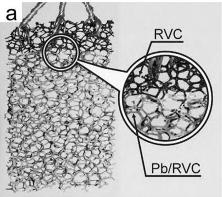

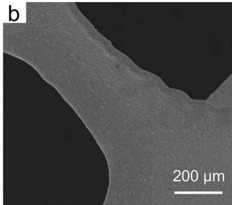

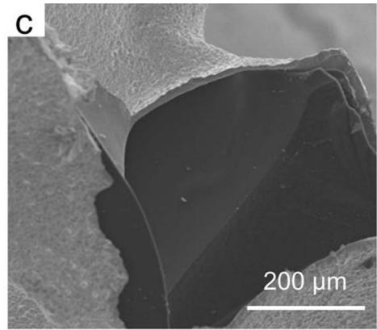

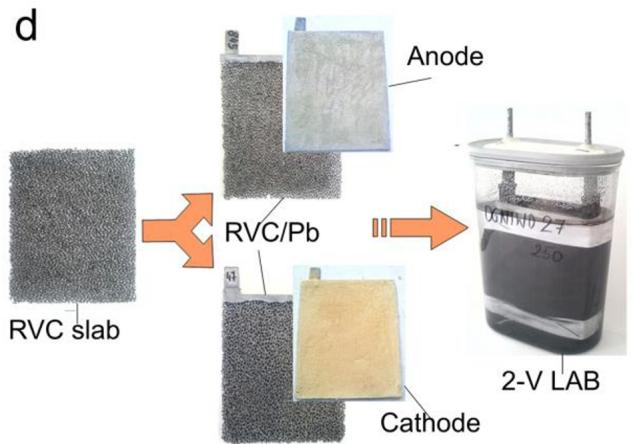

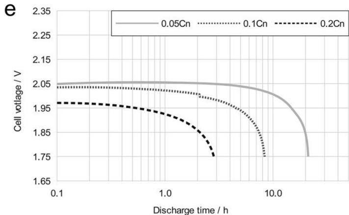

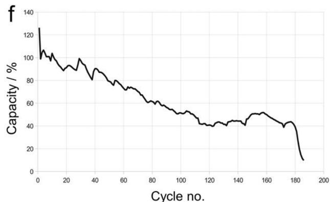  
Figure 37. Characteristics of RVC as a current collector for LABs. (a) Digital photograph of RVC/Pb. Reproduced with permission from ref 317. Copyright 2009 Elsevier. (b) SEM image and (c) filament cross section of RVC/Pb current collector. (d) Preparation of a 2 V RVC/Pb-based cell. (e) Discharge performance of LABs with RVC-based current collectors at different rates. (f) Cycle life of a small 2 V RVC/Pb-based cell with a nominal capacity of 3.4 Ah. (g) Cycle life of an RVC/Pb-based 12 V battery and standard 12 V batteries. Reproduced with permission from ref 318. Copyright 2018 Springer Nature.

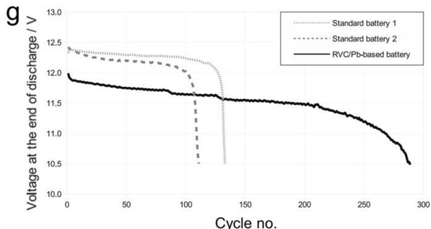

V RVC/Pb-based LAB accomplished 300 charge/discharge cycles, outperforming its commercial counterparts and justifying the efficacy of RVC/Pb as current collectors for LABs (Figure 37g).318

In order to further bring down the weight of LABs, numerous studies have investigated novel carbon materials as reticulated current collectors for both anode and cathode. A conductive porous carbon made from a polyurethane precursor with a proper pore size has immense potential to be used as reticulated current collectors and achieved high rate capacities due to its higher conductivity.[298] For instance, Chen and co-workers have employed carbon foam as negative current collector in LABs and compared its electrochemical performance with that of the Pb sheet.[319] Upon electrochemical testing, the former can improve the cycling stability of LABs, mainly attributed to its high specific

surface area and 3D interconnected carbon framework. This study further explored the electrochemical stability of carbon foam as a cathode current collector, which revealed that the potential of oxygen evolution reaction (OER) was lower than the charge acceptance potential during battery charging.[320] That is why the carbon foam is considered to be more suitable as an anode current collector than its cathode counterpart.

In addition to carbon foam, graphite foam as a 3D structured carbon has also been acknowledged as a promising current collector alternative for the development of high energy density LABs. Such acknowledgment comes from its high electrical and thermal conductivity, competitive mechanical strength, and low mass. In this regard, Dudney and co-workers synthesized and evaluated the effect of graphite foams. After a series of electrochemical tests, the graphite foam reveals comparable

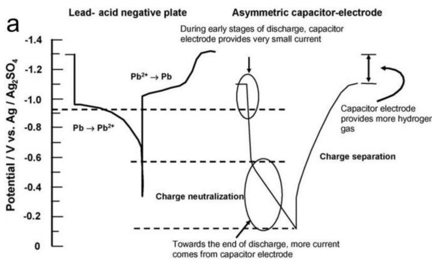

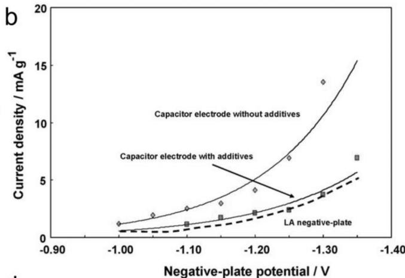

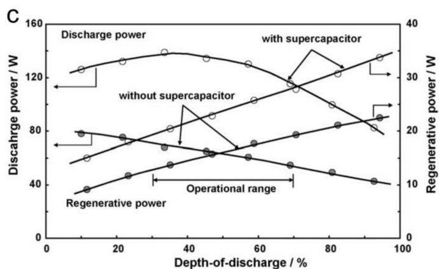  
Figure 38. Electrochemical performance of lead-acid ultrabattery. (a) Operational potential of a lead-acid anode plate and a carbon-based supercapacitor electrode during discharge and charge. (b) HER rates on the LAB anode and the carbon electrodes with or without additives. (c) Power performance of the control battery and lead-acid ultrabattery. (d) Cycling performance of the control batteries and lead-acid ultrabattery. Reproduced with permission from ref 327. Copyright 2006 Elsevier.

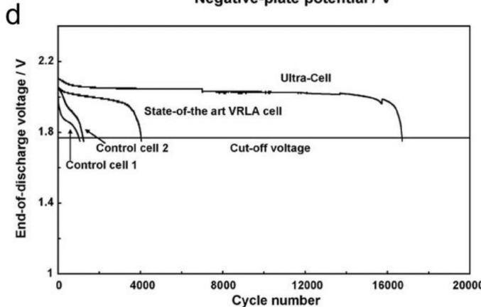

performance to that of the carbon foam in terms of its stability for anodic current collector. $^{321}$  Conversely, graphite foam is unstable as the cathode current collector, because of the intercalation of  $\mathrm{H}_2\mathrm{SO}_4$  into the graphite. In addition to the aforementioned current collector materials, other forms of carbon such as thin graphite foils, composite honeycomb structures, and polymer-graphite composites have also been investigated as current collectors for higher energy density LABs. $^{322-325}$  However, the utility of these materials is limited by the cathode plates due to the anodic corrosion of the entire structure attacking the carbon/carbon composite interface. To address this concern, Dai and co-workers have reported a cathode current collector based on Pb nanocoating on a Cu foam substrate, which helps in improving the electrochemical reactions and hence the stability during LAB operation. $^{326}$  To recapitulate, the lighter carbon materials still need further optimization toward their enhanced stability as cathode current collectors.

4.2.3. Lead-Acid Ultrabatteries. Australia's Commonwealth Scientific and Industrial Research Organization along with Furukawa pioneered the ultrabattery, which is a hybrid of an asymmetrical supercapacitor with a LAB.[301] Such a battery is composed of a  $\mathrm{PbO}_2$  cathode and a spongy Pb anode, while the asymmetrical supercapacitor is composed of a  $\mathrm{PbO}_2$  cathode and a carbon-based anode. During operation, the supercapacitor electrode acts as a buffer to share the discharge and charge currents with the Pb anode, thus preventing the system from being discharged and charged at high rates. Compared with a

Pb-based anode, the carbon-based supercapacitor anode provides little battery capacity during early stages of discharging.[327] In addition, when the combined anode potential exceeds  $-0.5\mathrm{V}$ , more current tends to flow from the carbon-based capacitor electrode through charge neutralization (Figure 38a). During battery charging, the current starts to flow to the supercapacitor electrode and then passes onto the Pb-based anode. Consequently, the carbon electrode conveniently causes severe HER by the end of charging, thereby eventually leading to the dry-out of the electrolyte. It is also evident from Figure 38b that the HER current increases with the decrease of potential of the LAB anode and carbon electrodes. Under certain potentials, the HER current of the carbon electrode is greater than that of the Pb anode. However, upon doping of the carbon electrode with additives, the HER rate can be significantly reduced to levels close to that of the Pb anode. This phenomenon indicates that carbon and Pb electrodes can be connected in parallel to prevent substantial electrolyte dry-out under HRPSoC conditions. Therefore, the enhancement of power and cycle-life of the ultrabattery is ensured with the employment of the supercapacitor carbon electrode. Moreover, at any given depth-of-discharge, the discharge and charge power of the ultrabattery are greater than those of control cells without supercapacitor and are improved by  $\sim 50\%$  and even  $\sim 60\%$ , respectively (Figure 38c). This proves the ability of the ultrabattery to operate at a wider depth-of-discharge window and to yield power levels similar to that of conventional VRLABs. Interestingly, the ultrabattery exhibits excellent

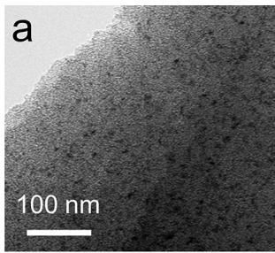

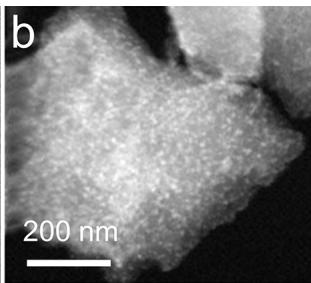

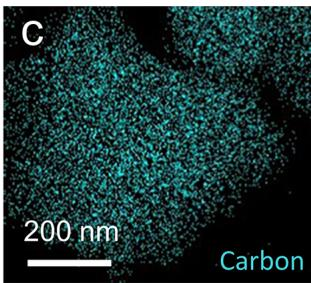

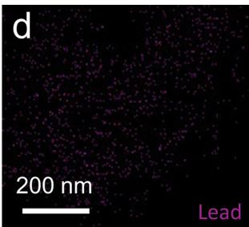

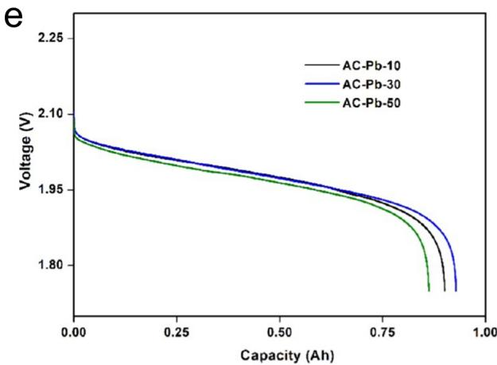

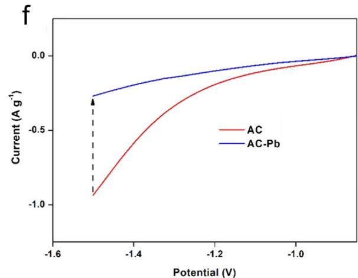

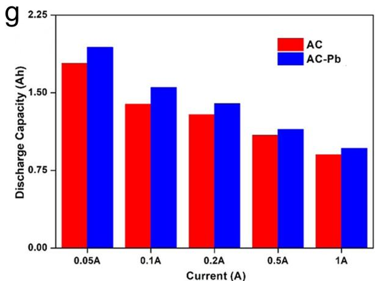

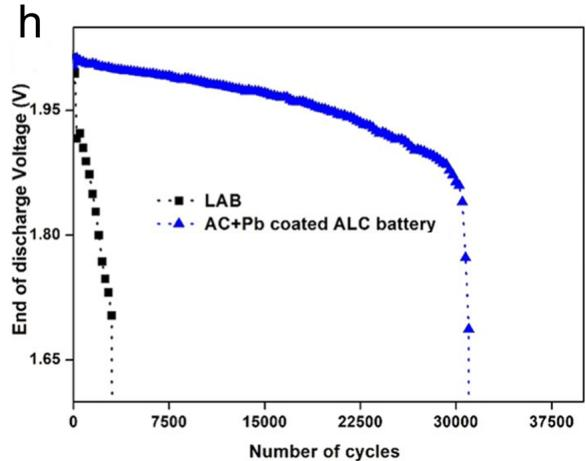

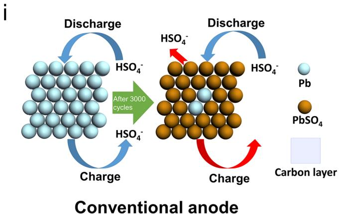  
Figure 39. Lead-doped AC for the modified carbon anode of the lead-carbon battery. (a, b) TEM image and elemental mapping images of (c) carbon and (d) lead of AC-Pb electrode. (e) Comparative discharge performance at 1 A. (f) LSV analyses of AC and AC-Pb anodes. (g) Discharge capacity at different currents and (h) cycle performance of lead-carbon battery with AC and AC-Pb anodes. (i) Illustration of the possible reaction mechanism in conventional anode and AC-Pb coated anode. Reproduced with permission from ref 301. Copyright 2020 American Chemical Society.

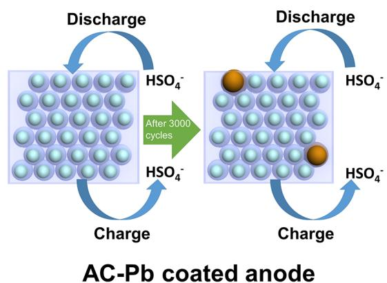

stability of over 17000 cycles, which is much longer than the control cells and the cells with carbon- and graphite-doped anodes, as shown in Figure 38d.

4.2.4. Carbon as Anodes. For the lead-acid ultrabattery, another way to enhance rapid charge acceptance and cycling stability is by coating a carbon layer on the surface of the  $\mathrm{Pb}$

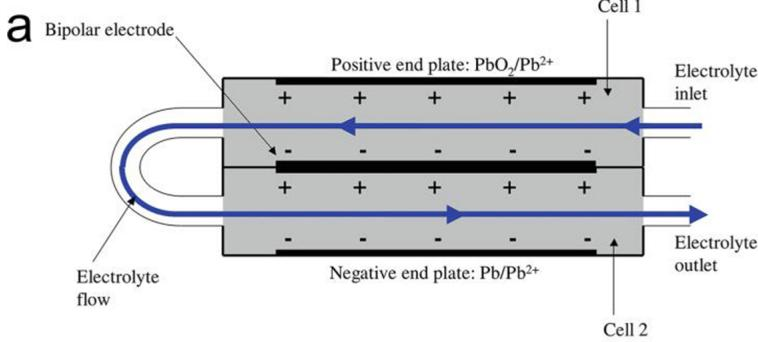

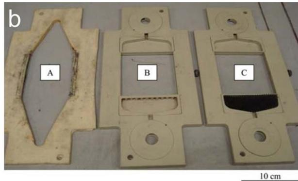

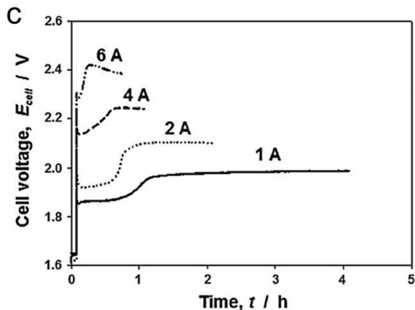

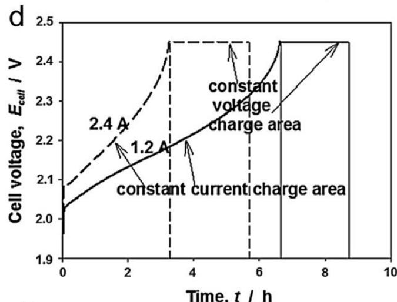

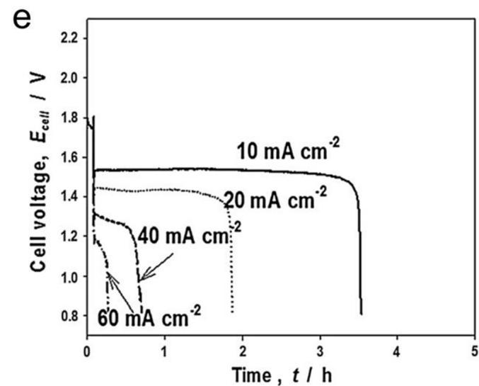  
Figure 40. Comparison between SLAFB and static LAB. (a) Structural schematic of SLAFB. (b) Photographic images showing the three flow chamber configurations used in a  $100~\mathrm{cm}^2$  cell: (A) silicone gasket forming the flow chamber, (B) flow chamber comprising spacer frame, inlet manifold, and plenum chamber, and (C) flow chamber comprising spacer frame, inlet manifold, and plenum chamber fitted with mesh to provide turbulent electrolyte flow. Reproduced with permission from ref 330. Copyright 2009 Springer Nature. Charge profiles at different currents of (c) SLAFB and (d) static LAB. Discharge profiles at different currents of (e) SLAFB and (f) static LAB. Reproduced with permission from ref 331. Copyright 2011 Elsevier.

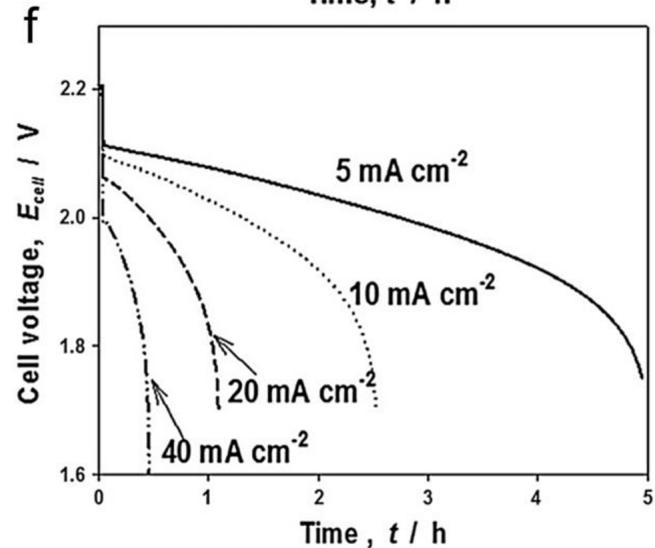

anode. $^{299,328}$  In an attempt to further the development of efficient materials, Jung and co-workers reported a wet impregnation method for ensuring the absorption of  $\mathrm{Pb}$  nanoparticles into pores and surfaces of AC. $^{301}$  Figure 39a reveals that the spherical  $\mathrm{Pb}$  nanoparticles ( $<5\mathrm{nm}$ ) are homogeneously distributed in AC without aggregation. The distribution of  $\mathrm{Pb}$  nanoparticles is further demonstrated (Figure 39b–d) by the EDS mapping analysis. Among the different

types of coatings on the anode,  $30\%$  Pb content generated the highest discharge capacity. (Figure 39e) To validate the HER mechanism, linear sweep voltammetry (LSV) analysis (Figure 39f) showed that the HER starts at approximately  $-1.01\mathrm{~V}$  and  $-1.134\mathrm{~V}$  for AC and AC-Pb anodes, respectively, showing higher HER for AC than that observed for AC-Pb under similar operating conditions. It has also been confirmed that the introduction of Pb can significantly hamper HER and improve

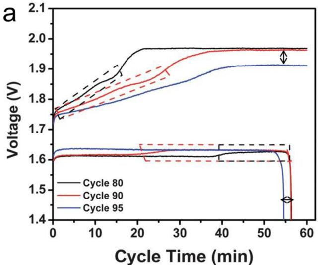

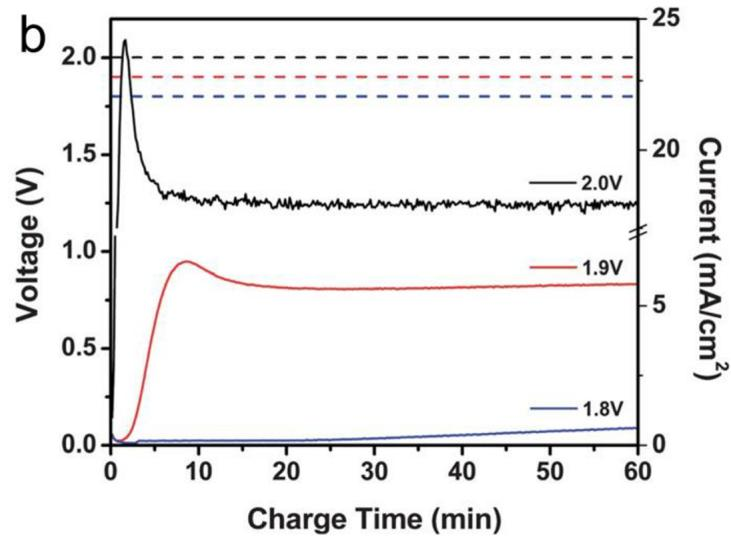

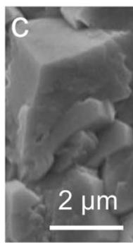

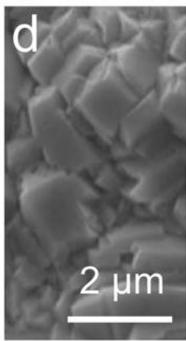

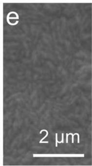

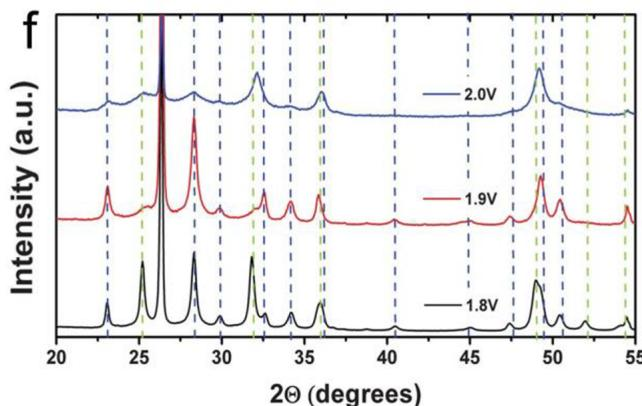

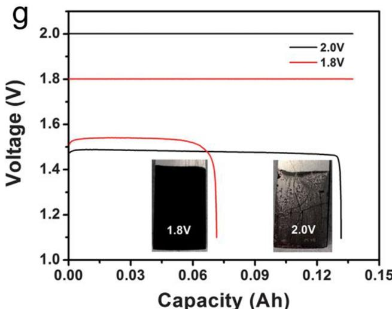  
Figure 41. Electrochemical performance of SLAFBs. (a) Charge/discharge profiles of SLAFB under constant current in the 80th, 90th, and 95th cycles. (b) Different discharge profiles. SEM micrographs of the cathode when charging at (c)  $1.8\mathrm{V}$ , (d)  $1.9\mathrm{V}$ , and (e)  $2.0\mathrm{V}$  for 1 h. (f) XRD patterns of three types of SLAFBs when charging at 1.8, 1.9, and  $2\mathrm{V}$  for 1 h. (g) Battery voltage upon charging at 2.0 and  $1.8\mathrm{V}$  to a capacity of 0.137 Ah and discharging to  $1.1\mathrm{V}$  at  $20\mathrm{mA}\mathrm{cm}^{-2}$ . The inset shows optical images of electrodes after full discharge, where  $\sim 45\%$  and  $2.6\%$  of  $\mathrm{PbO}_2$  remain on the electrodes, respectively. (h) Electrochemical efficiencies of SLAFB at a current density of  $20\mathrm{mA}\mathrm{cm}^{-2}$  for 1 h. Reproduced with permission from ref 333. Copyright 2013 Royal Society of Chemistry.

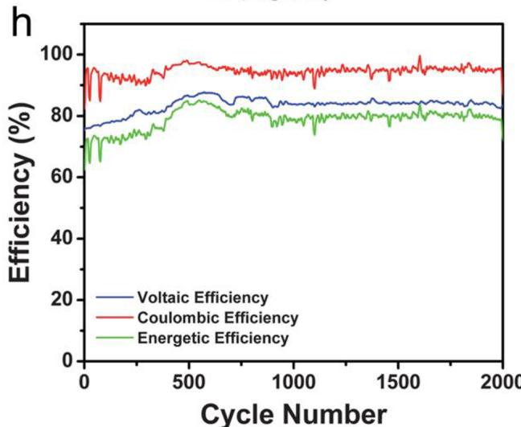

the battery stability. At each current state, the discharge capacity of the AC-Pb anode-based battery is comparatively higher than that with the AC anode (Figure 39g). Furthermore, the cycling stability of the conventional LAB has been found to be significantly lower than that of the AC-Pb coated anode, which demonstrates remarkable cycle stability up to 29250 cycles (Figure 39h). Figure 39i displays the schematic of the

reaction process to understand the effect of active material coatings on conventional Pb electrode surfaces. It is evident that the anode of a LAB usually suffers substantial crystallization of  $\mathrm{PbSO}_4$ , which detrimentally affects the battery performance. In contrast, the carbon layer with nanosized Pb on the anode surface greatly limits the formation of  $\mathrm{PbSO}_4$  crystals during the discharge process, serving as a key benefit for such devices. To

recapitulate, the AC-Pb coated anode has been established as a promising active material to improve the electrochemical performance of LABs.

# 4.3. Soluble Lead-Acid Flow Batteries

Traditional LABs use  $\mathrm{H}_2\mathrm{SO}_4$  electrolyte, in which  $\mathrm{Pb}$  compounds are sparingly soluble. For that reason, an insoluble paste containing active materials is generally applied to the electrodes of such systems. It has been widely recognized that traditional LABs are not well suited for LSES purposes owing to their limited shelf life and practical difficulty in manufacturing large batteries. Therefore, new forms of LABs with convenient manufacturing and long cycle life are necessarily required. In 2004, Pletcher and Wills introduced a SLAFB and conducted numerous studies on its intrinsic reaction kinetics and electrochemical performance.[329] Such a storage system is comprised of electrodes prepared by electrochemical plating of active materials onto the current collectors. Its working principle is based on the electrode reactions of  $\mathrm{Pb(II)}$  in methanesulfonic acid. The SLAFB undergoes the following reactions during charge and discharge:

Cathode:

$$
\mathrm {P b O} _ {2} + 4 \mathrm {H} ^ {+} + 2 \mathrm {e} ^ {-} \leftrightarrow \mathrm {P b} ^ {2 +} + 2 \mathrm {H} _ {2} \mathrm {O} \quad E ^ {\circ} = 1. 4 7 \mathrm {V} \tag {5}
$$

Anode:

$$
\mathrm {P b} ^ {2 +} + 2 \mathrm {e} ^ {-} \leftrightarrow \mathrm {P b} \quad E ^ {\circ} = - 0. 1 3 \mathrm {V} \tag {6}
$$

Overall:

$$
\mathrm {P b O} _ {2} + \mathrm {P b} + 4 \mathrm {H} ^ {+} \leftrightarrow 2 \mathrm {P b} ^ {2 +} + 2 \mathrm {H} _ {2} \mathrm {O} \quad E ^ {\circ} = 1. 6 \mathrm {V} \tag {7}
$$

During charging, Pb is deposited at the anode and  $\mathrm{PbO}_2$  is deposited at the cathode, while both  $\mathrm{Pb}$  and  $\mathrm{PbO}_2$  are dissolved into the electrolyte solution, releasing soluble  $\mathrm{Pb}^{2+}$  during battery discharge.[330] It is evident from the structural schematic of an SLAFB (Figure 40a) that an interelectrode gap of  $4\mathrm{mm}$  is maintained using elastomeric gaskets in order to form the flow channel. The cell, operating either as a two-electrode (parallel plate) reactor or as a four-electrode (two-cell) bipolar stack, uses three flow-chamber configurations (Figure 40b), in which the  $10\mathrm{cm} \times 10\mathrm{cm}$  electrodes are attached in the center of the frames, denoted as A, B, and C. Zhang and co-workers conducted a comparative study for summarizing the difference between static LABs and SLAFBs.[331] Figure 40c,d shows the charge characteristics of two such batteries at different currents. The charge curves reveal complex variations when the SLAFB is charged at a constant current within the range of  $1-6\mathrm{A}$  until its capacity reaches  $4\mathrm{Ah}$  (Figure 40c). To avoid OER and HER, the static LAB is first charged at a constant current until its charge voltage reaches the maximum value, at which time the battery charging is then continued until the current drops to  $0.3\mathrm{A}$ . Consequently, the charge voltage keeps on increasing during constant current charging owing to the gradual increment in the  $\mathrm{H}_2\mathrm{SO}_4$  concentration (Figure 40c). It has been indicated that the SLAFB shows relatively lower charge potentials than that of the static LAB due to the better reaction kinetics of the former. Figure 40e,f displays the discharge characteristics at various current densities for the SLAFB and static LAB, respectively. It is evident that at low current densities, the SLAFB maintains a relatively flatter voltage curve than the static LAB. In addition, the SLAFB voltage remains almost constant until one of its active materials is fully consumed. Although the overpotential in

both batteries expectedly augments at the same current density, it is higher for the SLAFB than the static LAB. However, this difference may be reduced through optimizing cell design and operating conditions.

The major distinction between the SLAFB and static LAB is that the former exhibits larger voltage polarization than the latter at the same current rate. $^{330}$  It is attributed to the dendrite growth of  $\mathrm{Pb}$  at anode and the partial irreversibility of  $\mathrm{PbO}_2$  at cathode. Despite the proven efficacy of the leveling agents against  $\mathrm{Pb}$  dendrite formation, the overpotential of the cathode remains a key challenge and can be addressed with optimization of the  $\mathrm{Pb}^{2+}/\mathrm{PbO}_2$  couple at the cathode. $^{332}$  Regarding this, Meng and co-workers have reported significant improvement in the EE and the cycle life of SLAFBs in terms of their charging. $^{333}$  The charge/discharge curves in various cycles (Figure 41a) demonstrate that the voltage profile in the 80th cycle is fairly representative of the previous cycles. It is also evident that upon approaching the reduction of CE in the 90th cycle, the flat voltage curve becomes shorter and the sloping region becomes longer. Regardless, a reduced flat voltage still appears in the 95th cycle. The decline in the flat voltage is ascribed to the morphological changes in  $\mathrm{PbO}_2$ , which in addition to being detrimental are not easily reversible. In order to further elucidate the morphological and phase characteristics associated with the different voltage regimes, batteries are potentiostatically charged at 1.8, 1.9, and  $2.0\mathrm{V}$  for  $1\mathrm{h}$  (Figure 41b) for demonstrating various current curves. In addition, the times required for reaching the maximum current and for the nuclei to completely cover the electrode surface have been studied. It has been revealed that the latter phenomenon occurs at  $\sim2\mathrm{min}$  of charging at  $2.0\mathrm{V}$  and  $\sim9\mathrm{min}$  of charging at  $1.9\mathrm{V}$  and never happens during  $1\mathrm{h}$  of charging at  $1.8\mathrm{V}$ . This signifies that a large number of nuclei quickly form and coalesce to create layers of nanoparticles at  $2.0\mathrm{V}$ . In other words, fewer nuclei are formed as the new ones continue to deposit on the electrode surface at low voltages. The observed trend has been further validated by various SEM micrographs (Figure 41c-e). Furthermore, the XRD results (Figure 41f) revealed that a mixture of  $\alpha-$  and  $\beta-\mathrm{PbO}_2$  was always produced upon charging at 1.8, 1.9, and  $2.0\mathrm{V}$ . The Rietveld refinement results determined the ratio of  $\alpha-$  to  $\beta-\mathrm{PbO}_2$  deposited at  $1.8\mathrm{V}$  to be 41:59. At a relatively higher current density during charging at  $1.9\mathrm{V}$ , this ratio was 97:3. However, at  $2.0\mathrm{V}$  charging, XRD peaks became significantly broadened, indicating that the voltage plateau at  $2.0\mathrm{V}$  is critical in relation to the deposition of  $\mathrm{PbO}_2$  nanoparticles. Concerning the electrochemical performance, the battery exhibits superior discharge capacity during charging at  $2.0\mathrm{V}$  as compared to that at  $1.8\mathrm{V}$  (Figure 41g). The loss in capacity stems from the incomplete dissolution of  $\mathrm{PbO}_2$  particles into solvated  $\mathrm{Pb}^{2+}$  (the inset of Figure 41g). Moreover, the long cycling stability of the SLAFB is greater than 2000 cycles with EE of  $\sim79\%$  (Figure 41h). Overall, the SLAFB is capable of delivering good electrochemical performance upon structural optimization and rational measurements, indicating promising characteristics as LSES devices.

# 4.4. Summary and Future Perspectives for LABs

LABs mainly include two types of batteries in which the flooded battery requires much electrolyte and the VRLAB requires inspection. First, there has been substantial progress in enhancing the energy density for LABs, predominantly by employing carbon materials as current collectors to the electrodes. However, there is still ample room for further

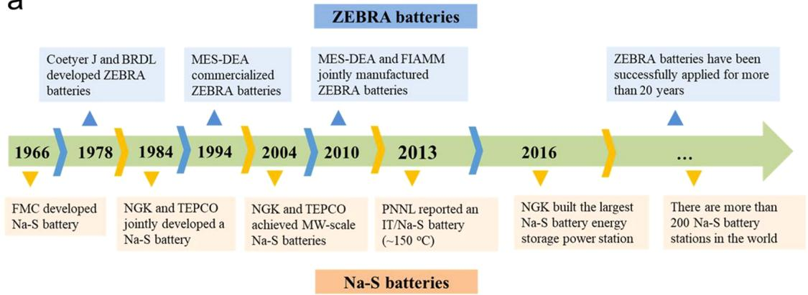  
a

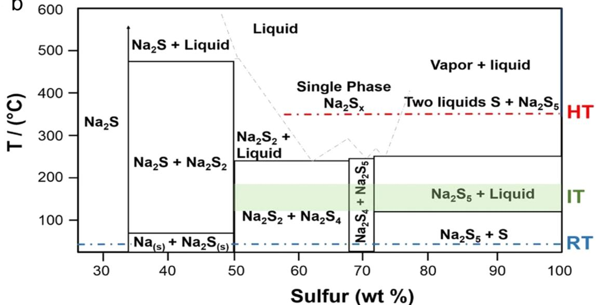  
b  
Figure 42. (a) Development history of NBBs with major milestones. (b) Phase diagram of Na-S system at high, intermediate, and room temperature. Reproduced with permission from ref 340. Copyright 1972 The Electrochemical Society.

development of carbon materials and metal oxides as anode additives to improve the electrochemical performance in HRPSoC conditions. Furthermore, the carbon additives and the  $\mathrm{PbO}_2$  structure need intensive investigation to address the problem of anodic sulfation of the active materials. In other words, the functionality of the additives in terms of increased electrochemical reactivity of the active mass and restriction of the growth of nonreversible  $\mathrm{PbSO}_4$  crystals should be enhanced. It is imperative to point out that carbon has huge potential in bringing about the upcoming breakthrough in LAB technology. Advanced LAB designs based on harnessing carbon-related materials could render its development economical and practical. Owing to their extensive commercialization to date, LABs are potentially considered for LSES in the future, providing further improvements in their energy densities and overall cycling performances.

In contrast to conventional LABs, SLAFBs offer preferential advantages, primarily because methanesulfonic acid is less aggressive toward battery components than  $\mathrm{H}_2\mathrm{SO}_4$ . Typically, the undivided SLAFB requires an electrolyte containing  $\mathrm{Pb}^{2+}$  to reduce the need for equipment to store and pump the electrolyte, thereby leading to significant cost reduction. The ability of SLAFBs to operate without an expensive Nafion membrane further brings down the battery cost. Regardless, the major challenges related to the phase changes at both electrodes

remain. For future work, the morphology of the  $\mathrm{Pb}$  metal must be controlled to avoid uneven dendrite deposition, despite the rapid kinetics of the anodic reaction. As for the cathode, its reaction kinetics are much slower than those of the anode. Moreover, owing to the poor adhesion of  $\mathrm{PbO}_2$  particles onto the electrode and the resulting damage on the surface, there is a dire need to enhance the performance of the SLAFB system by optimizing the morphology of  $\mathrm{PbO}_2$  particles through balancing their compactness and porosity.

# 5. MOLTEN SALT BATTERIES

# 5.1. Introduction

MSBs are exclusively known for their electrochemical energy storage capacity using molten salts as electrodes and electrolytes. $^{334,335}$  These batteries offer a multitude of potential advantages, such as nonvolatility, nonflammability, and high conductivity of molten salts, high energy, and impressive power densities for stationary applications. $^{335-337}$  In order to keep the electrodes and electrolytes in molten states, the MSBs are generally operated under relatively high temperatures. To date, several MSB systems have been successfully developed, including traditional high-temperature (HT) and intermediate-temperature (IT) Na-S batteries, ZEBRA batteries, and the most recently developed liquid-metal batteries (LMBs) and

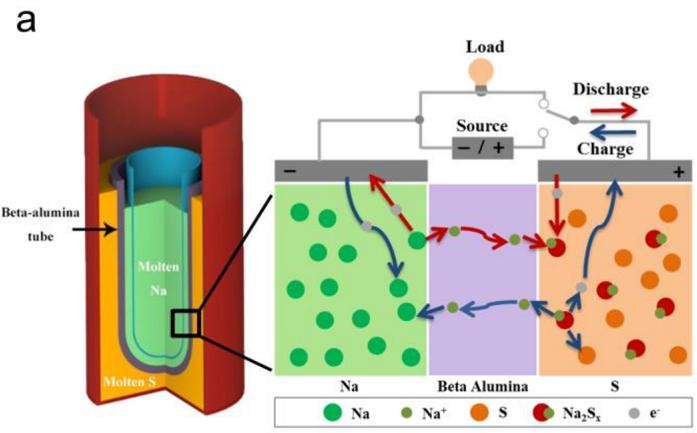

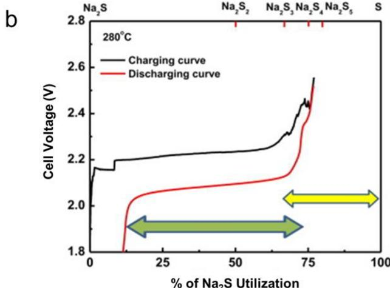

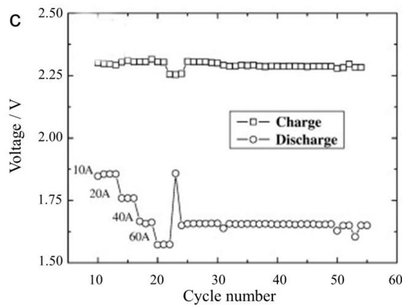  
Figure 43. (a) Diagram of schematic structure (left) and operating principle (right) of Na-S battery. (b) Voltage curves of a Na-S battery at different states. Reproduced with permission from ref 351. Copyright 2013 Elsevier. (c) Voltage-cycle number curve of a 650 Ah single Na-S battery. (d) Cycling stability of a 30 Ah Na-S cell. Reproduced with permission from ref 345. Copyright 2008 Elsevier.

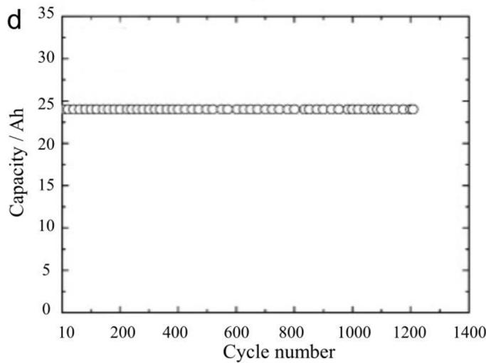

solid electrolyte-based liquid Li (SELL) batteries. In this section, we discuss MSB systems by reviewing their developmental history and current status. In addition, the potential for their practical applications toward GSES and safety considerations are also highlighted.

# 5.2. Traditional Na-S Batteries

Compared with conventional battery technologies, energy storage systems employing Na anodes have considerable advantages in stationary energy storage applications, such as utility-based load leveling (LL) and peak shaving in smart grids, and emergency and uninterruptible power supplies.[335,338] Currently, two basic battery systems that use a molten Na anode are representative of HT energy storage devices including Na-S batteries and Na-metal chloride batteries, the developmental history of which is shown in Figure 42a. The Na-S battery technology was originally developed in 1966 by Ford Motors and later was transferred to Japanese NGK INSULATORS.[339] Although the aforementioned battery systems are fundamentally different, their basic configurations and operations are similar. Therefore, such electrochemical batteries are usually called sodium/  $\beta$  batteries (NBBs). Numerous studies have been reported toward their significant advancements. As is evident in Figure 42b, Na-S batteries are further categorized into HT ( $\sim 300 - 350^{\circ}\mathrm{C}$ ), IT ( $\sim 130 - 180^{\circ}\mathrm{C}$ ), and room-temperature (RT) ( $\sim 25 - 35^{\circ}\mathrm{C}$ ) Na-S batteries based on their

operating temperatures. $^{340}$  Since the operating temperature range of the RT Na-S battery is relatively low and the melting point of the electrodes cannot be reached, it is normally not recognized as a MSB. In contrast, the operating temperature range of IT Na-S batteries is slightly higher than the melting points of S  $(115.21^{\circ}\mathrm{C})$  and Na  $(98^{\circ}\mathrm{C})$ , therefore qualifying it to be a MSB system. $^{341}$  Thus, sticking with the scope of this section, we mainly discuss HT and IT Na-S batteries.

For grid energy storage applications, the Na-S battery has been offering bright prospects since the 1980s due to its high theoretical energy density ( $\sim 760$  Wh  $\mathrm{kg}^{-1}$ ), high CE (approaching  $100\%$ ), long operational life ( $>15$  years), and negligible self-discharge.[45,139,342-346] In 1984, NGK INSULATORS and Tokyo Electric Power Company jointly launched a Na-S battery development program accomplishing great achievements in the past two decades.[339] Later, in 2003, Na-S batteries were commercialized for megawatt-scale load leveling. In the subsequent year, DoE and NYSERDA initiated a three-year-long project in which the power storage ability of a 1.2 MW/7.2 MWh Na-S battery system developed by NGK INSULATORS was demonstrated, promising bright prospects for its commercialization. In 2006, China also began to develop these batteries vigorously at the system level, with the goal of commercializing Na-S batteries for GSES. Later, in 2007, a 165 MWh Na-S battery was designed and employed successfully to

stabilize the power grids. $^{342}$  In 2010, the production capacity of NGK INSULATORS was increased to  $150000\mathrm{kW}$  every year. To date, besides Japan, other countries such as France and United States also have passed grid storage tests of Na-S battery technology. $^{347}$

The traditional  $\mathrm{Na - S}$  battery employs a  $\mathrm{Na}\left(T_{\mathrm{m}} = 98^{\circ}\mathrm{C}\right)$  anode, a  $S\left(T_{\mathrm{m}} = 115^{\circ}\mathrm{C}\right)$  cathode, and  $\mathrm{Na}$  ion conductive  $\beta$  alumina ceramic as the electrolyte and separator.[344,345] The most important advantage of the tubular structure of the  $\mathrm{Na - S}$  battery is its ample room to compensate the volumetric change of anodes and cathodes during battery cycling, thereby minimizing the sealing area and rendering it a practical battery design. Apart from tubular structure, planar designs of  $\mathrm{Na - S}$  batteries have also been reported.[348,349] In order to overcome the resistance posed by the flow of  $\mathrm{Na}^{+}$  through the  $\beta$  -alumina solid electrolyte (BASE),  $\mathrm{Na - S}$  batteries are operated at about  $300 - 350^{\circ}\mathrm{C}$  for keeping the electrodes in molten state.[350] The principle of the  $\mathrm{Na - S}$  battery is predominantly predicated on the electrochemical reaction between Na and S forming sodium polysulfide  $(\mathrm{Na}_{2}\mathrm{S}_{x})$ .[42] In general, the electrochemical reactions of a typical HT  $\mathrm{Na - S}$  battery are as follows:[342]

Anode:

$$
\mathrm {N a} \leftrightarrow \mathrm {N a} ^ {+} + \mathrm {e} ^ {-} \tag {8}
$$

Cathode:

$$
x S + 2 e ^ {-} + 2 N a ^ {+} \leftrightarrow N a _ {2} S _ {x} \tag {9}
$$

Overall:

$$
2 \mathrm {N a} + x \mathrm {S} \leftrightarrow \mathrm {N a} _ {2} \mathrm {S} _ {x} \quad (x = 3 - 5)
$$

$$
E ^ {\circ} = 1. 7 8 - 2. 0 8 \mathrm {V} \text {a t} 3 5 0 ^ {\circ} \mathrm {C} \tag {10}
$$

Figure 43a illustrates the tubular structure of  $\mathrm{Na-S}$  battery having a central Na anode, which results in higher volumetric energy density and helps in maintaining battery operating temperature. As shown in Figure 43a, the Na at the anode is oxidized to  $\mathrm{Na^{+}}$  ions during discharging, releasing electrons to the external circuit, while  $\mathrm{Na^{+}}$  passes through the BASE toward the cathode and reacts with S to form  $\mathrm{Na_2S_x}$  polysulfide. $^{345}$  Upon charging, however, this reaction is reversed: sodium polysulfide splits back into Na and S separately for returning to the anode and cathode, respectively. Since both electrodes are in the liquid state, only  $\mathrm{Na_2S_x}$  species with low melting points are allowed to be formed during battery discharge. Upon continuous discharge, when  $x$  approaches 2, a solid phase with a high melting point is produced, for instance solid  $\mathrm{Na_2S}$  is undesired as it increases the battery impedance to hinder further discharge. $^{342}$  The electrochemical performance of traditional Na-S batteries is also shown in Figure 43b-d. Figure 43b shows charge and discharge curves for the Na-S couple vs.  $\mathrm{Na_2S}$  utilization rate. Based on the utilization rate, composition of the final reaction products during charging was close to  $\mathrm{Na_2S_4}$  while the composition during discharging was close to  $\mathrm{Na_2S}$ . When the current increases from 10 to 60 A, the discharge voltage can remain over 1.5 V. Particularly, Figure 43d illustrates that the Na-S cell with a capacity of 30 Ah demonstrates impressive cycle stability even after 1200 cycles. $^{345}$

With regards to the solid electrolyte in a Na-S battery, the ideal materials should have characteristics of high  $\mathrm{Na^{+}}$  conductivity, chemical and thermal stability, mechanical strength, volumetric density with minimum porosity, inertness toward alkali metals (Na anode), and low electronic

conductivity. Among commercial electrolytes, the tubular shaped  $\beta\text{-Al}_2\mathrm{O}_3$  is a critical component, whose ionic conductivity is comparable to that of aqueous  $\mathrm{H}_2\mathrm{SO}_4$  electrolyte, indicating that the former can be used as a solid electrolyte in HT electrochemical cells. $^{42}$  The  $\beta\text{-Al}_2\mathrm{O}_3$  is a nonstoichiometric compound of  $\mathrm{Al}_2\mathrm{O}_3$  and  $\mathrm{Na}_2\mathrm{O}$  with typical crystalline structure and chemical formula denoted by  $\mathrm{NaAl}_{(5-11)}\mathrm{O}_{17}$ . It has two distinct crystal structures: a double helix shaft-based  $\beta\text{-Al}_2\mathrm{O}_3$  ( $\mathrm{Na}_2\mathrm{O} \cdot (9-11)\mathrm{Al}_2\mathrm{O}_3$ ; hexagonal,  $P6_3/mmc$ ;  $\alpha_{\mathrm{o}} = 0.559~\mathrm{nm}$ ;  $c_{\mathrm{o}} = 2.261~\mathrm{nm}$ ), $^{352}$  and triple helix shaft-based  $\beta''\text{-Al}_2\mathrm{O}_3$  ( $\mathrm{Na}_2\mathrm{O} \cdot (5-7)\mathrm{Al}_2\mathrm{O}_3$ ; rhombohedral,  $R3_m$ ;  $\alpha_{\mathrm{o}} = 0.560~\mathrm{nm}$ ;  $c_{\mathrm{o}} = 3.395~\mathrm{nm}$ ). $^{353}$

Compared with  $\beta\text{-Al}_2\mathrm{O}_3$ , the  $\beta''\text{-Al}_2\mathrm{O}_3$  has higher  $\mathrm{Na}^+$  ionic conductivity with higher  $\mathrm{Na}^+$  ratio. However, during the preparation process, the  $\beta''\text{-Al}_2\mathrm{O}_3$  crystal is unstable owing to the decomposition of the  $\beta''$  phase near the sintering temperature. Therefore, in order to stabilize  $\beta''\text{-Al}_2\mathrm{O}_3$  crystals, metallic ions (such as  $\mathrm{Li}^+$  and  $\mathrm{Mg}^{2+}$ ) are generally used to replace  $\mathrm{Al}^{3+}$  in their crystalline phase. In practical Na-S cells, the electrolyte is comprised of a mixture of  $\beta-$  and  $\beta''\text{-Al}_2\mathrm{O}_3$  particles.[45] Following the discovery of  $\beta\text{-Al}_2\mathrm{O}_3$ , many studies have reported new electrolytes with higher ionic conductivity and lower cost for Na-S batteries. Among such electrolytes, NASICON is known for its large number of interconnected holes that can be occupied by additional  $\mathrm{Na}^+$ .[354] However, the electrochemical performance of Na-S batteries using this electrolyte does not exceed that containing  $\beta\text{-Al}_2\mathrm{O}_3$  electrolyte.

To date, the Na-S battery is considered to be one of the most practical choices for stationary energy storage applications owing to the following advantages:342,345,355 high theoretical energy density (at  $350^{\circ}\mathrm{C}$ , the theoretical specific energy density of the battery is 760 Wh  $\mathrm{kg}^{-1}$ ), high CE (approaching  $100\%$  along with low self-discharge), high cycle life (the number of working cycles for Na-S battery is about four times more than high-quality commercially available LABs), no intermediate reaction and over  $85\%$  average conversion efficiency, environmental friendliness (the batteries are completely sealed, and more than  $99\%$  of battery materials are recyclable; however, the Na component must be handled with utmost care as it can act as hazardous substance), low material cost (Na and S are both naturally abundant), and simple field maintenance (since the Na-S battery need no pumps, valves, or exchangers, field maintenance requirements are limited to regular inspections and cleaning only).345

In spite of all these upsides, Na-S batteries face some major technical challenges that have not yet been completely addressed.[356] The detrimental corrosion of  $\mathrm{Na}_2\mathrm{S}_5$  and S species is dominant in Na-S cells, caused by their high operating temperatures and high reactivity of the molten electrodes. In addition, macroscopic cracking of the solid electrolyte is caused by internal stress inside the ceramic or by externally applied stress. Furthermore, in case of microcracks or other defects on the electrolyte surface, Na dendrites begin to form, which gradually propagate into the ceramic. Upon complete penetration of dendrites into electrolyte, the battery experiences short circuiting. In other words, upon damage to  $\beta\text{-Al}_2\mathrm{O}_3$ , the molten S is in direct contact with liquid Na, resulting in a violent reaction, which in turn may cause a fire hazard or even an explosion. In short, in order to ensure safety, the selection of materials for containers and other cell components is a stringent and expensive requirement. To further address the safety concerns in Na-S batteries, it is important to point out that the development of high capacity and low-cost Na-S batteries that operate at lower temperatures (intermediate or even room

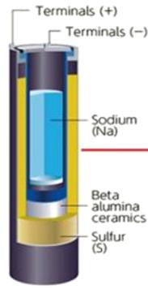  
a  
Battery Cell

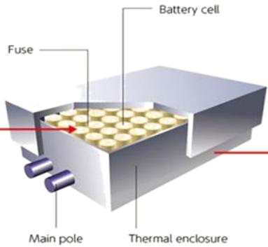  
Battery Module

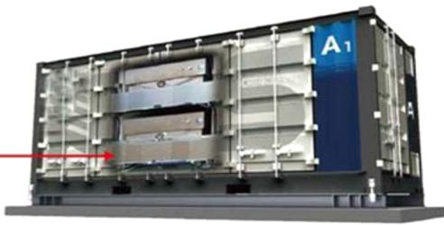  
Battery Container

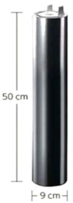

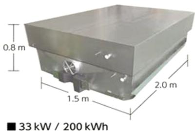

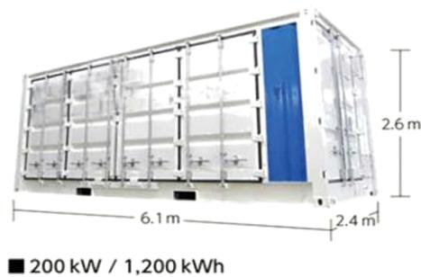

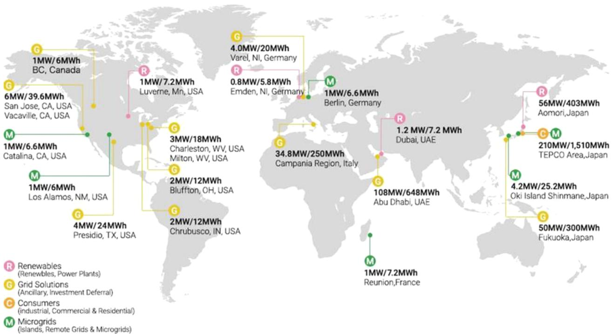  
b  
Figure 44. (a) The structure of NAS battery system (Courtesy of NGK INSULATORS www.ngk-insulators.com). (b) Global distribution of Japanese NGK INSULATORS NAS batteries. (Courtesy of NGK INSULATORS www.ngk-insulators.com).

temperature) is an effective strategy to explore. In this regard, numerous studies have reported RT and IT Na-S batteries, $^{57,338,357-371}$  especially all-solid-state RT Na-S batteries. $^{371,372}$  In addition to the intrinsic safety, all-solid-state

batteries offer benefits comprising of long cycle life, diverse geometric configurations, low cost, and minimal risk of leakage and volatilization. For instance, a bulk-type all-solid-state Na-S battery employing  $\mathrm{Na}_{3}\mathrm{PS}_{4}$  glass-ceramic as a solid electrolyte

yields a capacity of  $1100\mathrm{mAhg}^{-1}$  at RT, which is two times higher than that of a traditional HT Na-S battery. $^{372}$  Similarly, an all-solid Na-S battery using poly(ethylene oxide) (PEO) polymer electrolyte has demonstrated high initial discharge capacity of  $505\mathrm{mAhg}^{-1}$  of S with stable electrochemical performance throughout its repetitive cycling. $^{365}$  In spite of all the aforementioned advantages of RT all-solid-state Na-S batteries, they are still subject to rigorous experimental research owing to serious self-discharge and short cycle life, indicating that the RT Na-S battery technology is yet to mature in order to realize its widespread commercialization, which is therefore not discussed in this review.

Another key concern for the  $\mathrm{Na}-\mathrm{S}$  battery is its capacity limitation up to one-third of that computed theoretically for the complete reduction of S to  $\mathrm{Na}_2\mathrm{S}$ . In other words, the reduction takes place before the formation of  $\mathrm{Na}_2\mathrm{S}_2$ . Further, the battery poses challenges in terms of its ability to achieve temperature-dependent ion transport through the ceramic electrolyte, which is directly related to the extent of wetting of the solid electrolyte through molten Na. This problem is attributed to the formation of a surface oxide film.[350] In addition, a large amount of electrical energy is consumed for maintaining the high temperature during  $\mathrm{Na}-\mathrm{S}$  battery operation, which significantly increases the thermal management costs.

Aiming at LL, UPS, and emergency power supply (EPS), the Na-S battery is mainly applied in the fields of load balancing of substations (including peak shaving and valley filling), renewable energy power generation for suppressing the impact of intermittent energy on power grid stabilization, and auxiliary backup, which is responsible for rotating backup and emergency backup.[42,350,356] Since the Na-S systems are mainly employed in stationary applications, the design of such battery systems holds critical importance.[344,345,352,373] Hitherto, the NAS battery systems universally adopt modular concept, which has been successfully applied by NGK INSULATORS in many projects. The modular concept implies that independent battery-level modules are composed of various batteries electrically connected in series and parallel configurations in a thermal enclosure (Figure 44a). The battery itself provides the required voltage, energy, and power by connecting these modules in series and parallel. The resulting battery is then combined with the power conversion system (PCS) and controller to form an integrated facility that can then be connected to the power system (Figure 44b). For example, a large 50 MW NAS battery energy storage station commissioned in 2016 is in Japan. Currently, the manufacturing of commercial NAS battery stations is on the rise with NGK INSULATORS as the leading manufacturer. Table 7 and Figure 44b delineate the global distribution of Japanese NGK INSULATORS's NAS batteries.

In a nutshell, Na-S batteries have substantial potential to be juxtaposed with currently commercialized Li-ion and redox-flow batteries.[63] Despite the bottlenecks, including poor safety at

Table 7. Global Sites of Japanese NGK INSULATORS NAS Batteries  

<table><tr><td>location</td><td>sites</td><td>energy capacity (MWh)</td></tr><tr><td>Japan</td><td>167</td><td>2600</td></tr><tr><td>Middle East and Africa</td><td>10</td><td>650</td></tr><tr><td>North America</td><td>10</td><td>150</td></tr><tr><td>Europe</td><td>6</td><td>270</td></tr></table>

high temperature and difficult heat management restricting their furtherance, future research pertaining to Na-S battery has pivoted to reducing the operating temperature and costs and improving its overall safety. $^{334,338,363}$  It is worth noting that the efforts to deal with severe self-discharge of low-temperature and IT Na-S batteries along with the fragile sealing of flat-type cells may play an important role in further expanding applications of Na-S batteries.

# 5.3. IT Na-S Batteries

In light of the safety problems of HT Na-S batteries, high operating costs, and limited energy density, new studies have advanced this technology toward intermediate- and low-temperature Na-S systems.[341,362,363,374] IT Na-S batteries have the ability to reduce the cost and safety issues associated with the conventional HT Na-S battery, which makes them attractive for renewable energy integration and other grid-related applications. Therefore, herein we delineate the advances pertaining to IT Na-S batteries.

Lu and co-workers reported an IT  $(150^{\circ}\mathrm{C})$  Na-S battery, in which a dense  $\beta''\text{-Al}_2\mathrm{O}_3$  solid membrane and tetraglyme are employed as the electrolyte separator and the cathode electrolyte solvent, respectively. [362] Figure 45a,b displays a schematic of a single IT Na-S cell and the initial discharge and charge curves, respectively. It can be seen that the initial discharge capacity is about  $473\mathrm{mAhg^{-1}}$  ,which is comparable to that for RT Na-S batteries reported previously, [367,372] along with relatively good rate capacity and cycling stability (Figure 45c). Moreover, in situ Raman measurements during cell operation show that during the discharge process, polysulfides are formed in the order of  $\mathrm{Na_2S_5 + S\leftrightarrow Na_2S_5 + Na_2S_4\leftrightarrow Na_2S_4}$ $+\mathrm{Na}_{2}\mathrm{S}_{2}$  , and the sequence is reversed during the charge process.

In recent years,  $\mathrm{Na}_3\mathrm{Zr}_2\mathrm{Si}_2\mathrm{PO}_{12}$  has been integrated into IT batteries as a solid electrolyte. Park et al. $^{374}$  reported an IT Na-S battery based on  $\mathrm{Na}_3\mathrm{Zr}_2\mathrm{Si}_2\mathrm{PO}_{12}$  electrolyte, the conductivity of which increased when it was doped with Ge at  $150^{\circ}\mathrm{C}$ . In 2019, Nikiforidis et al. $^{363}$  found that in  $1.5 - 3\mathrm{M}$  solution of sodium pentasulfide dissolved in tetraglyme ether, the stability of an IT Na-S battery showed improvement at its operating temperature of  $150^{\circ}\mathrm{C}$ . Having predefined the working parameters of the battery, including threshold temperature, solubility of the polysulfide, current density range, and suitability of the carbon-based materials on the cathode side, the battery stiffness and the amplified structure have been investigated. As shown in Figure 45d, the volt-ampere efficiency  $(\eta_{\mathrm{V}})$ , calculated from the average discharge potential during charging, is related to the operating temperature of the cell. Within the tested range of current density, the increase in the temperature yields a higher  $\eta_{\mathrm{V}}$  value. Further investigation reveals the lowest operating temperature of the battery to be  $150^{\circ}\mathrm{C}$  with salt-free polysulfide cathode electrolyte and tubular configuration. Furthermore, the electrochemical study of the cathode demonstrates excellent long-term performance in terms of continuous cycling for 42 days. The biggest upside of this battery is the scalable capacity of its volume by 10-fold, reaching a capacity of  $790\mathrm{mAh}$  (Figure 45e). However, the 10-fold increase in volume is not linearly related to its capacity and volumetric density, indicating that mass transport inhibits the capacity improvement during amplification. In short, although the cycling stability of IT Na-S batteries is much higher than that of RT Na-S batteries, there is still a big gap between the former and traditional HT Na-S batteries, limiting the practical applications IT Na-S batteries.

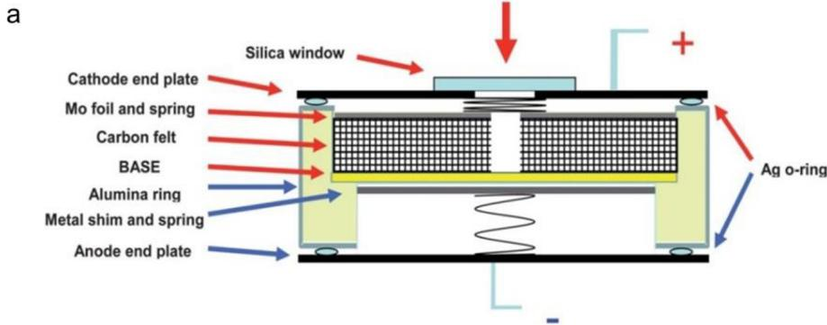

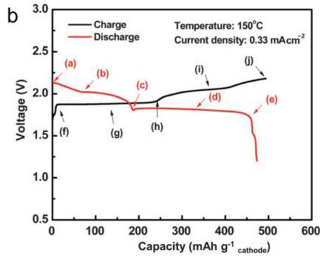

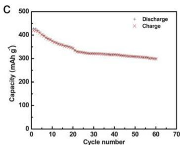  
Figure 45. (a) Schematic diagram of a single IT Na-S cell. (b) Discharge and charge curves of an IT Na-S battery at  $150^{\circ}\mathrm{C}$ . (c) Cycling stability of discharge/charge capacities. Reproduced with permission from ref 362. Copyright 2013 Royal Society of Chemistry. (d) Voltaic efficiency  $(\eta_{\mathrm{V}})$  vs. current density  $(j)$  at different temperatures. (e) Under the condition of  $\pm 2.5\mathrm{mAcm}^{-2}$ , change of capacity retention rate of the tubular IT NaS battery in a solution containing  $2.5\mathrm{MNa}_2\mathrm{S}_5$  and TEGDME. Reproduced with permission from ref 363. Copyright 2019 The Electrochemical Society.

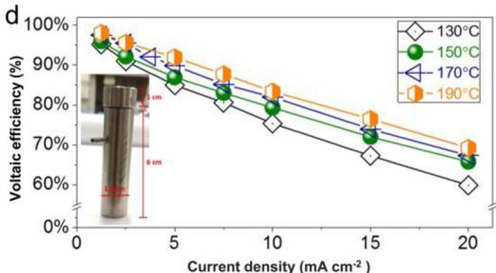

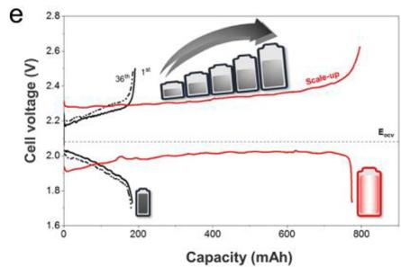

# 5.4.ZEBRA Batteries

The sodium-nickel chloride  $(\mathrm{Na} / \mathrm{NiCl}_2)$  cell, also known as a ZEBRA battery, is another HT battery based on molten Na anode and  $\beta$ -alumina solid electrolyte (BASE). In the 1980s,  $\mathrm{Na} / \mathrm{NiCl}_2$  batteries were called Zero Emission Battery Research Activity (ZEBRA) batteries, owing to their zero-emission and pollution-free green nature. In addition to the advantages of high energy density, high power density, abundance of employable elements, and low cost, what makes ZEBRA batteries practical is their intrinsic safety, a major concern posed by conventional HT Na-S batteries. Therefore, ZEBRA batteries are considered one of the promising candidates for GSES.

Pertaining to their structural components, ZEBRA batteries consist of a Na anode, a cathode containing mainly  $\mathrm{NiCl}_2 / \mathrm{FeCl}_2$ , and a  $\mathrm{Na}^+$  conducting molten  $\mathrm{NaAlCl}_4$  ( $T_{\mathrm{m}} = 157~^\circ \mathrm{C}$ ) electrolyte. With regards to the cathode materials in ZEBRA cells, various metal halides have been reported to be effective during the battery operation. For instance, chlorides such as  $\mathrm{FeCl}_2^{378,379}$  and  $\mathrm{NiCl}_2^{380,381}$  have been widely used; the former is a more cost-effective alternative than the latter. However,  $\mathrm{Fe}_2\mathrm{O}_3$  is formed during cell overcharge, and  $\mathrm{Fe}^{3+}$  may be transported and penetrate into the alkaline electrolyte, causing electrolytic degradation.[343] Therefore, only a limited amount of  $\mathrm{FeCl}_2$  is added into the ZEBRA cells. Further, Fe is used as a cathode active material additive to provide improved peak power capability under low charge state. The operating temperature of ZEBRA batteries is about  $270 - 300^{\circ}\mathrm{C}$ , during which the molten  $\mathrm{NaAlCl}_4$  ensures  $\mathrm{Na}^+$  transportation between the alkaline electrolyte and the solid active cathode.[382,383] The electrochemical reactions of  $\mathrm{Na}-\mathrm{NiCl}_2$  cells are described as follows:[313]

Anode:

$$
\mathrm {N a} \leftrightarrow \mathrm {N a} ^ {+} + \mathrm {e} ^ {-} \tag {11}
$$

Cathode:

$$
\mathrm {N i C l} _ {2} + 2 \mathrm {N a} ^ {+} + 2 \mathrm {e} ^ {-} \leftrightarrow \mathrm {N i} + 2 \mathrm {N a C l} \tag {12}
$$

Overall:

$$
2 \mathrm {N a} + \mathrm {N i C l} _ {2} \leftrightarrow 2 \mathrm {N a C l} + \mathrm {N i}
$$

$$
E ^ {\circ} = 2. 5 8 \mathrm {V} \text {a t} 3 0 0 ^ {\circ} \mathrm {C} \tag {13}
$$

Figure 46a shows a schematic diagram of the ZEBRA battery. During the discharge process, Na is oxidized to  $\mathrm{Na^{+}}$  and is transported to the cathode through the  $\beta$ -alumina and  $\mathrm{NaAlCl_4}$  electrolyte, where it reacts with  $\mathrm{NiCl_2}$  to form  $\mathrm{NaCl}$  and Ni metal. During the charge process, on the other hand, the reverse process takes place, in which Ni is oxidized and reacts with  $\mathrm{NaCl}$  to form  $\mathrm{NiCl_2}$ . The open-circuit voltage (OCV) of the reaction is  $2.58\mathrm{~V}$  at  $300^{\circ}\mathrm{C}$ , which is higher than that of the  $\mathrm{Na-S}$  battery.[384] It is worth noting that in addition to facilitating the transfer of  $\mathrm{Na^{+}}$  to the cathode during discharge, another important function of  $\mathrm{NaAlCl_4}$  is to overcome the overcharge of the battery because it serves as a source of  $\mathrm{Na}$  through a reversible reaction  $(2\mathrm{NaAlCl_4} + \mathrm{Ni} \leftrightarrow 2\mathrm{Na} + \mathrm{Ni}(\mathrm{AlCl_4})_2)$ .[383] Upon overcharging, the current collector of Ni reacts with the molten  $\mathrm{NaAlCl_4}$  at a higher voltage of  $3.05\mathrm{~V}$ . Furthermore, the reaction during overdischarging occurs at a lower voltage of  $1.58\mathrm{~V}$ , similar to the one upon battery failure.[343] Figure 46b-d show the electrochemical performance of ZEBRA batteries. Figure 46b shows the discharge curve of a single ZEBRA battery at different cycles. The end-of-charge and -discharge voltages reached cutoff limits of 2.8 and  $1.8\mathrm{~V}$  for the 15th and 30th cycles, respectively. In Figure 46c, the full charge and discharge capacity of  $150\mathrm{mAh}$  was maintained during the initial 15 cycles, and the cell performance started to degrade afterward. Figure 46d shows specific energy of the hybrid battery vs. cycling. The initial charge and discharge energy was 248 and  $230\mathrm{Whkg^{-1}}$

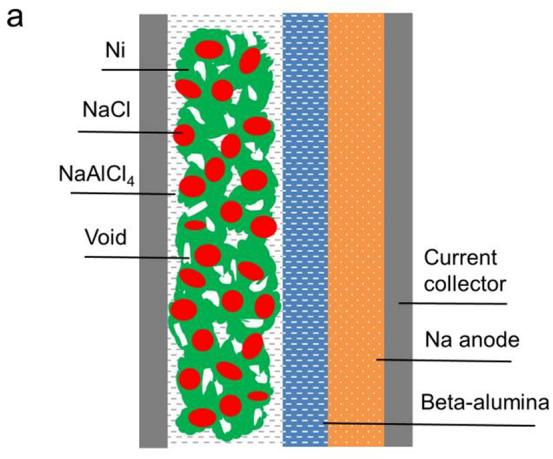

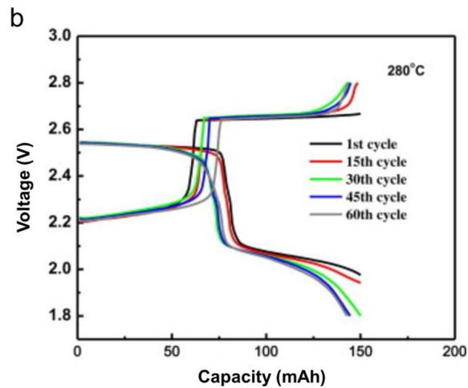

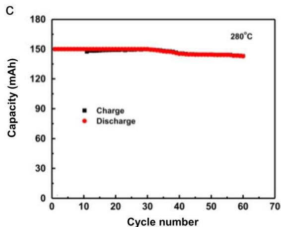  
Figure 46. (a) Schematic diagram of ZEBRA battery. (b) Cell voltage profiles during 1st, 15th, 30th, 45th, and 60th cycles at  $280^{\circ}\mathrm{C}$ . (c) Charge/discharge capacity vs. cycle number at  $280^{\circ}\mathrm{C}$ . (d) Charge/discharge energy density vs. cycle number at  $280^{\circ}\mathrm{C}$ . Reproduced with permission from ref 351. Copyright 2013 Elsevier.

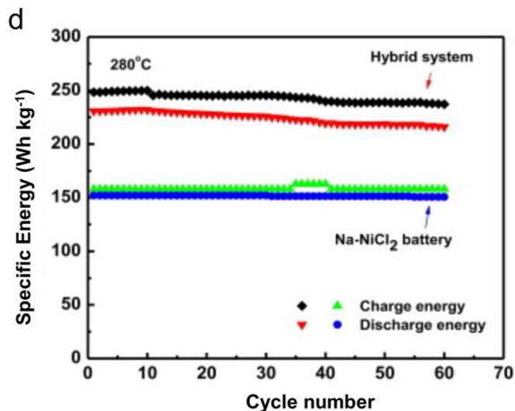

(per cathode and anode), and  $95\%$  and  $97.8\%$ , respectively, of the energy was retained after 60 cycles.

ZEBRA batteries offer a theoretical capacity up to  $305\mathrm{Ahkg^{-1}}$  and theoretical and practical energy densities of 788 and 120 Wh  $\mathrm{kg}^{-1}$ , respectively. The development of ZEBRA batteries is primarily aimed at stationary energy storage applications just like Na-S batteries. Concerning the utility of ZEBRA batteries, they have the similar advantages as Na-S batteries, including low self-discharge and high CE (about  $100\%$ ) thanks to the dense solid electrolyte membrane. In addition, such storage systems can offer additional advantages over Na-S batteries. First, the voltage of ZEBRA batteries is higher (2.58 V at 300 °C) than that of Na-S batteries (2.08 V at 350 °C). Second, ZEBRA batteries are relatively safer in terms of limited violent or hazardous reactions upon cell failure, through prompting Na metal to react with liquid electrolyte ( $\mathrm{NaAlCl_4}$ ) to produce Al and NaCl, an attribute nonexistent in the Na-S systems. Third, significant resistance to cell overcharge and overdischarge is also attributed to ZEBRA battery systems. To explain, the cathode can be overcharged at a higher voltage than usual, however at the expense of current collector consumption, thereby avoiding the risk of breakdown. Fourth, since metal halide cathodes and  $\mathrm{NaAlCl_4}$  melts are relatively less corrosive than sodium polysulfide, ZEBRA batteries offer convenience of selecting a wide range of materials for current collectors and battery cases. Finally, it is worth pointing out that, owing to the impressive discharge tolerance of the ZEBRA battery, the cell is

usually assembled in a discharged state without the need to deal with Na and anhydrous  $\mathrm{NiCl}_2$ .

However, due to the greater solubility of  $\mathrm{NiCl}_2$  in  $\mathrm{NaAlCl}_4$  and the growth and coarsening of Ni particles, the cell capacity eventually tends to decrease, which becomes a key factor hindering the development of ZEBRA batteries. [138,381,382] Another problem that arises from the operating temperature  $(300 - 350^{\circ}\mathrm{C})$  of ZEBRA batteries is the poor wettability of liquid Na on the surface of  $\beta$ -alumina. The high operating temperature not only increases the manufacturing and maintenance costs of the battery, but also causes safety issues. To address these challenges, Lu et al. [387] revealed that the addition of Cs to Na can significantly improve its wettability by enabling the battery to operate at lower temperatures (Figure 47a), down to as low as  $95^{\circ}\mathrm{C}$ . In order to understand the mechanism of alloying to enhance wettability of Na, the wetting process of Na-Cs alloy has been simulated, the results of which are demonstrated in the form of an image of the droplet containing clusters reaching equilibrium at a certain temperature (Figure 47b). The results show that as the concentration of Cs in the alloy increases, the height of the droplet decreases while the width increases, indicating the gradual improvement in Na wettability. Figure 47c,d shows the performance of a Na-S battery employing Na-Cs alloy, exhibiting superior cycle performance as compared with pure Na anodes.

In summary, the advantages of ZEBRA batteries, especially the intrinsic safety features, outweigh their drawbacks and hence

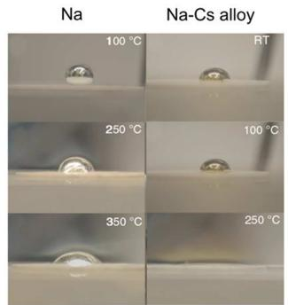  
a

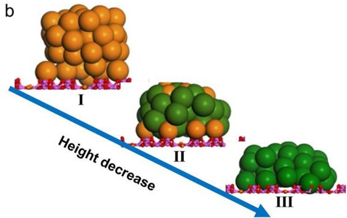

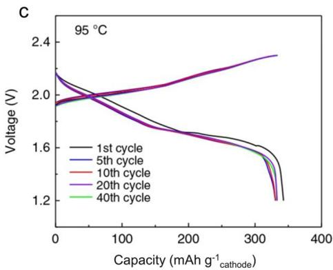  
Figure 47. (a) Wetting behavior of Na and Na-Cs alloy on the surface of BASE. (b) Simulation of droplet structure of liquid Na-Cs alloy on BASE at  $100^{\circ}\mathrm{C}$  (I, Na; II, Na-Cs alloy; III, Cs). (c) Voltage profiles of a Na-Csuntreated BASES cell during the 1st, 5th, 10th, 20th, and 40th cycles  $(95^{\circ}\mathrm{C})$ . (d) Cycle performance of a Na-Csuntreated BASES cell  $(95^{\circ}\mathrm{C})$ . Reproduced with permission from ref 387. Copyright 2014 Springer Nature.

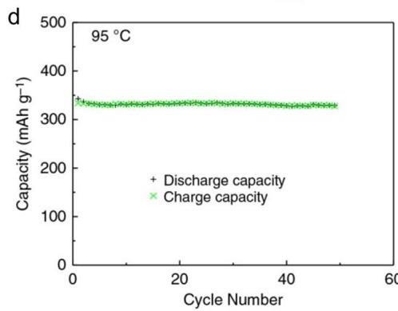

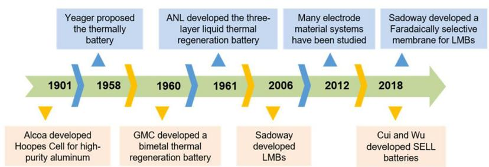  
a

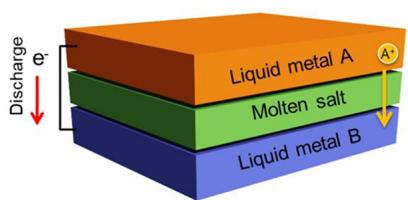  
b  
Figure 48. (a) Timeline of development history of LMBs. (b) Schematic diagram of a LMB upon (left) discharging and (right) charging.

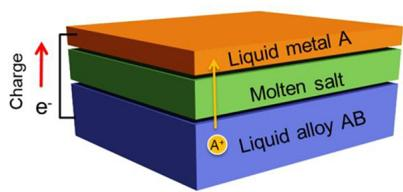

promise bright prospects for stationary GSES applications. Since the inception of ZEBRA batteries, Beta Research and Development Ltd. (United Kingdom) has been working on their further research and development.[384] Subsequently, MES-DEA Company acquired the ZEBRA technology and has been striving for its commercialization. Recently, MES-DEA and FIAMM Energy LLC Companies have jointly established a new venture (named FZ Sonick SA) to manufacture sodium metal halide batteries. Currently, one of the major manufacturers of NaCl and  $\mathrm{NiCl}_2$  batteries in the world is FZ Sonick in Stabio (Switzerland) with a 48-TI80 ZEBRA battery pack, which is enclosed in a battery container. Until 2017,  $70 - 80\%$  of the total production of ZEBRA batteries has been intended for backup power

applications, while the remaining percentage  $(10 - 20\%)$  has been allocated to utilization for powering automobiles only, the second biggest market of ZEBRA technology. With regards to the Na-S batteries, ZEBRA batteries exclusively offer long service life, intrinsic safety in risky conditions, and low cost.

# 5.5. Liquid-Metal Batteries

LMBs can be traced back to the development of traditional electrometallurgy in the 1920s (Figure 48a). Although this technology is still in laboratory research phase, it is acknowledged as one of the best prospective candidates for LSES.[388] Operating on the principle of alloying and dealloying of the anode materials to achieve energy release and storage, LMBs yield long cycle lifetimes at low costs.[389] LMBs are composed of

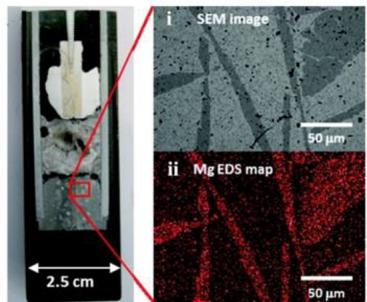  
a

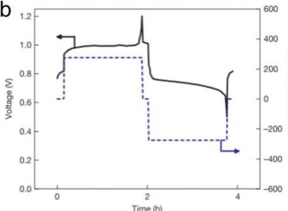  
b

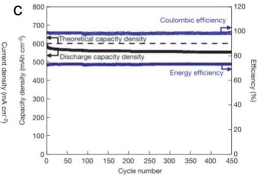  
C

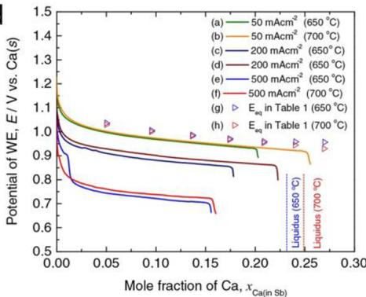  
d

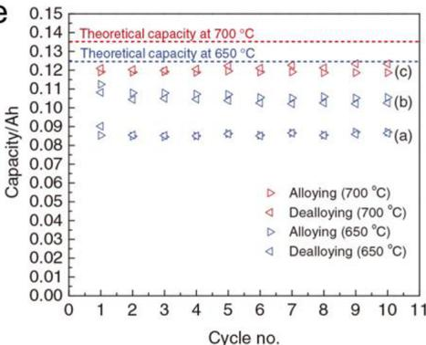  
e  
Figure 49. (a) Cross-sectional analysis diagram of a  $\mathrm{Mg}||\mathrm{Sb}$  cell: (i) SEM image of the cathode in the discharged state; (ii) Mg EDS mapping. Reproduced with permission from ref 391. Copyright 2012 American Chemical Society. (b) Profiles of charge/discharge (the 15th cycle) of Li||Sb-Pb cell cycled at  $275\mathrm{mAcm}^{-2}$  ( $500^{\circ}\mathrm{C}$ ). (c) Cycle profiles of CE, EE, and discharge capacity density of Li||Sb-Pb cell cycled at  $275\mathrm{mA cm}^{-2}$  ( $500^{\circ}\mathrm{C}$ ). Reproduced with permission from ref 402. Copyright 2014 Springer Nature. (d) Profiles during charge/discharge (the 15th cycle) of Ca-Bi||Ca-Sb cell cycled at different current densities (650 and  $700^{\circ}\mathrm{C}$ ). (e) Cycling profiles of Ca-Bi||Ca-Sb cell (650 and  $700^{\circ}\mathrm{C}$ ). Reproduced with permission from ref 409. Copyright 2014 The Electrochemical Society.

a low-density anode, a medium-density molten salt electrolyte, and a high-density cathode. The two liquid metal electrodes are separated by a molten salt electrolyte, as illustrated in Figure 48b. During discharge, the molten metallic anode (denoted as metal A) is oxidized to  $\mathrm{A}^{m+}$ , releasing electrons to the external circuit, while  $\mathrm{A}^{m+}$  ions pass through the electrolyte to the cathode, reacting with metal B to form molten state AB alloy. In other words, the anode decreases in thickness and, simultaneously, the thickness of cathode layer grows. On the other hand, the process is reversed during battery recharge. Considering this working principle, the operating temperature of LMBs must exceed the melting temperature of all the cell components, categorizing LMBs as a HT energy storage system. Further based on safety and environmental friendliness, the selection of electrode materials must abide by some stringent requirements.[390,391] To begin with, the melting and boiling temperatures of the electrodes should be higher than  $25^{\circ}\mathrm{C}$  and lower than  $1000^{\circ}\mathrm{C}$ , respectively. Second, the selected electrode materials must be nontoxic and stable in nature (nonradioactive elements). Third, the electronic conductivity of metal electrodes should be higher than the ionic conductivity of a typical molten salt electrolyte ( $>1\mathrm{~S~cm}^{-1}$ ). For the suitable selection of electrode materials, their electronegativity and standard electrode potentials also hold importance. Usually, alkali and alkaline earth metals (Li, Na, Mg, K, Ca, S) having low electronegativity and standard potential of less than  $-2.0\mathrm{~V}$  are employed as anodes. On the other hand, metals (Al, Zn, Ga, Cd, In, Sn, Sb, Te, Hg, Ti, Pb, and Bi) with higher electronegativity and standard potential of more than  $-1.0\mathrm{~V}$  are the most apposite choices for cathodes in LMBs.[392]

In addition to the electrodes, the choice of molten salt electrolytes also has a significant impact on the performance of LMBs. High solubility of the liquid metal in molten salt electrolyte results in high self-discharge and low CE. Therefore, the most suitable molten salt electrolytes in LMBs should have low solubility of metals, density difference between anodes and cathodes, high ionic conductivity, low melting temperature, and minimal tendency for side reactions at working voltages. Overall, thanks to the three-layered structure of LMBs, these storage systems offer the following major benefits:

(1) High power characteristics: LMBs exhibit fast electrode charge transfer kinetics without slow de-intercalation of ions on the solid-state electrodes and the electrode-electrolyte interface. In addition, the ions have a fast migration rate  $(>3\mathrm{Scm}^{-1})$  in the highly conductive molten salt electrolytes.  
(2) Low cost: The electrode material elements being abundant in the Earth's crust along with the natural self-preparation of liquid components of LMBs render their manufacturing simpler and more cost-effective as compared with traditional batteries.  
(3) Long cycle life: There is no microelectrode degradation mechanism caused by long-term use of liquid electrodes, such as electrode deformation and dendrite growth.

In summary, LMBs constitute an energy storage technology with massive potential for GSES with low cost, long cycle life, and simple assembly procedure. Nevertheless, some drawbacks hamper their employability for portable equipment. First, the operating temperature (greater than  $200^{\circ}\mathrm{C}$ ) of LMBs may result in the thermal corrosion of the cell, putting more stringent

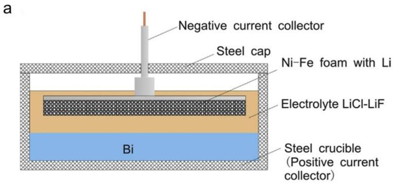

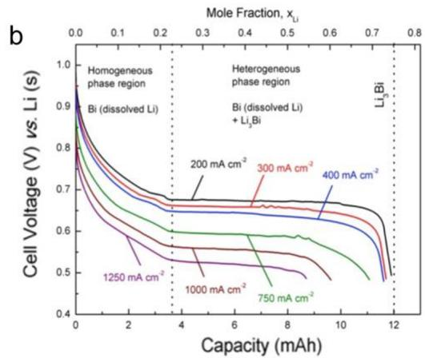

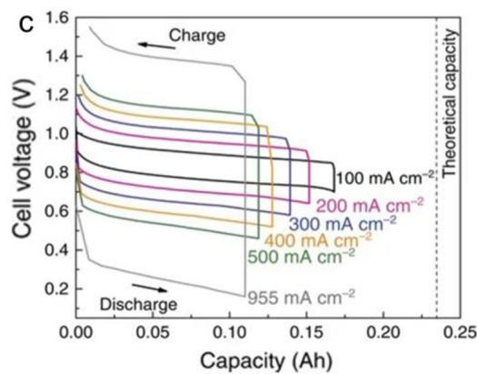  
Figure 50. (a) Schematic of a Li||Bi cell. (b) Discharge profiles of Li||Bi cell at different current densities (at  $550^{\circ}\mathrm{C}$ ). Reproduced with permission from ref 403. Copyright 2015 Elsevier. (c) Charge/discharge profile of  $\mathrm{Ca - Mg}||\mathrm{Bi}$  cell at different current densities ( $550^{\circ}\mathrm{C}$ ). (d) Cycle profiles of discharge capacity, CE, and EE of  $\mathrm{Ca - Mg}||\mathrm{Bi}$  cell ( $550^{\circ}\mathrm{C}$ ). (e) Cross section of  $\mathrm{Ca - Mg}||\mathrm{Bi}$  cell in partially discharged state. Reproduced with permission from ref 410. Copyright 2016 Springer Nature.

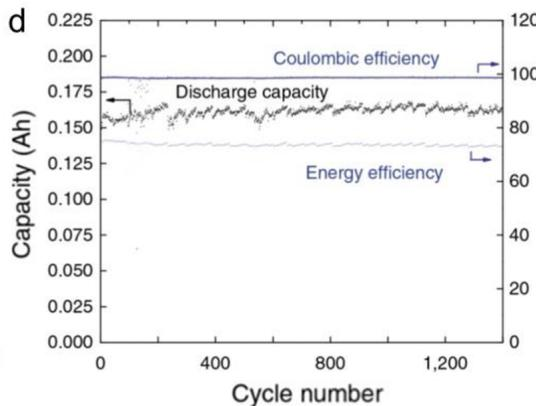

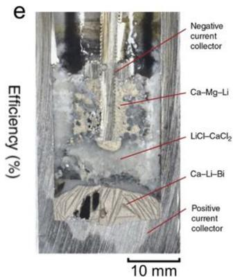

requirements on battery components, such as sealing devices. In addition, the low equilibrium cell voltage  $(< 1.0\mathrm{V})$  indicates the limited energy density of LMBs. Furthermore, some LMBs have severe self-discharge rates due to the high solubility of the electrode components in the molten salt electrolyte, requiring great consideration in the selection of electrode materials. All these disadvantages imply that LMBs are more suitable for stationary storage applications.

The chronological developmental history of LMBs is shown in Figure 48a. After their inception in the 1920s from the development of conventional electrometallurgy, the prototype three-liquid-layer Hoopes cell was developed by the Aluminum Company of America (Alcoa) for electrolytic production of high-purity aluminum.[393] Forty years later, Yeager proposed the thermally regenerative battery after which General Motors Corporation, Atomics International, and Argonne National Laboratory began to develop such a three-layer liquid thermal regeneration battery on a large scale.[394-401] Since 2006, Sadoway at Massachusetts Institute of Technology has conducted in-depth studies on LMBs and developed many electrode materials, such as Na-Bi, Mg-Sb, Li-Pb-Sb, and Ca-Mg-Sb.[334,402-404] Furthermore, in 2010, the Ambri company initiated manufacturing of LMBs on a commercial scale. In 2016, a Li-Sn-Sb system with long cycle life and low cost was proposed.[405] The LMBs are basically composed of stainless steel cases, insulating ceramics, current collectors, and other components.[406] Moreover, there have been many exciting studies pertaining to LMBs comprising different metal

systems. $^{337,391,402-405,407-417}$  In this section, we discuss several representative LMBs for potential applications in GSES.

In 2012, Sadoway and co-workers proposed a HT (700 °C)  $\mathrm{Mg}||\mathrm{Sb}$  LMB composed of a Mg anode,  $\mathrm{MgCl}_2 - \mathrm{KCl} - \mathrm{NaCl}$  molten electrolyte, and Sb cathode.391 Upon cycling at  $50\mathrm{mA}$ $\mathrm{cm}^{-2}$  for  $10\mathrm{h}$ , this cell can achieve a discharge voltage of  $0.4\mathrm{V}$  with CE of  $97\%$  and VE of  $71\%$ . Additionally, SEM and EDS analyses indicated that this cell did not undergo any obvious corrosion of the current collectors and walls, as shown in Figure 49a. The results also revealed that it is viable to reduce the thickness of the electrolyte or work alternatively at a lower current density to improve cell efficiency. The specific energy of this  $\mathrm{Mg}||\mathrm{Sb}$  cell and its total cost were computed to be  $25\mathrm{Wh}$ $\mathrm{kg}^{-1}$  and approximately  $\$375\mathrm{kWh}^{-1}$ , respectively.

Following the introduction of  $\mathrm{Mg}||\mathrm{Sb}$  LMB, in 2014, Sadoway et al.  $^{402}$  put forward the idea of a more advanced LiSb-Pb LMB. Such a cell is composed of a molten-state Li anode, a liquid antimony-lead alloy as cathode (Li/Pb/Sb = 45:38:17) and LiF-LiCl-LiI molten electrolyte (its molar ratio is 20:50:30 and the melting point is  $430^{\circ}\mathrm{C}$ ). The LiSb-Pb system operates at a high temperature of  $\sim 450^{\circ}\mathrm{C}$ , along with design capacity up to 1.9 Ah. A typical charge/discharge voltage profile and the cycling performance are shown in Figure 49b,c, respectively. It can be seen that, at a high charge and discharge current density of  $275\mathrm{mAcm}^{-2}$ , the recorded discharge voltage is  $0.73\mathrm{V}$ , which is three times higher than that of the MgSb LMB. Upon electrochemical testing, the battery exhibited an excellent CE of  $98\%$  and RTE of  $73\%$ , while maintaining an initial capacity of  $94\%$  after 450 cycles of full discharge. Upon

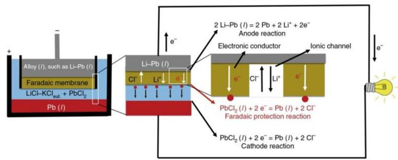  
a

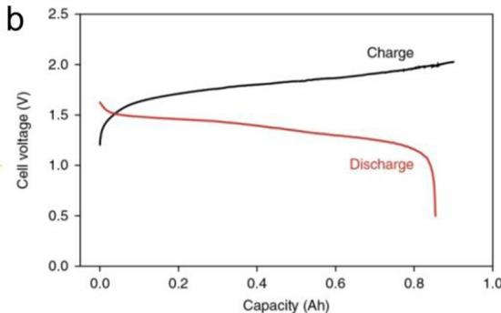

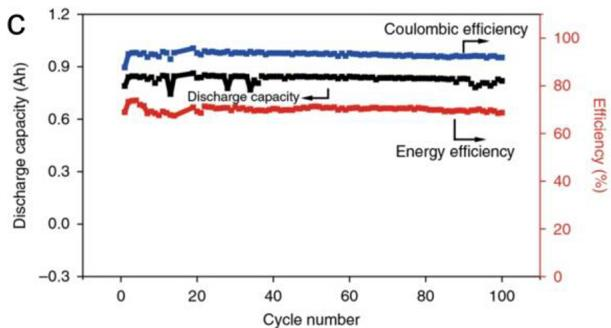  
Figure 51. (a) Schematics of Li-Pb||PbCl2cell and its discharge process. (b) Profiles of charge and discharge of Li-Pb||PbCl2cell at  $150\mathrm{mAcm}^{-2}$ $(410^{\circ}\mathrm{C})$  . (c) Cycle profiles of CE, discharge capacity, and EE of Li-Pb||PbCl2cell  $(410^{\circ}\mathrm{C})$  . (d) Optical image of the bottom view of a porous TiN membrane after 100 cycles. (e) SEM image of the area indicated in panel d. Reproduced with permission from ref 414. Copyright 2018 Springer Nature.

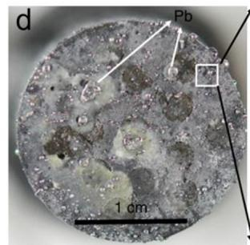

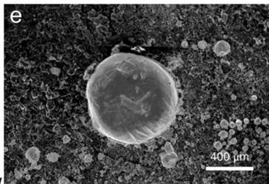

further cycling, the battery manages to retain more than  $85\%$  of the initial capacity after 10 years of cycling. Furthermore, after  $1800\mathrm{h}$  of operation, the cross-section of the battery does not show any significant sign of corrosion of its components. Similarly, another study proposed an alternative Li|Pb-Sb electrochemical system, which employs a liquid lithium anode, a liquid antimony-lead alloy cathode  $(\mathrm{Li} / \mathrm{Pb} / \mathrm{Sb} = 52.4:19:28.6)$ , and a LiF-LiCl-LiBr molten electrolyte  $(22:31:47\mathrm{mol}\%, T_{\mathrm{m}} = 430^{\circ}\mathrm{C})$ . This battery reveals a charge capacity up to  $62\mathrm{Ah}$  and a discharge voltage of  $0.68\mathrm{V}$  at the current density of  $275\mathrm{mA}\mathrm{cm}^{-2}$ . The specific energy of this Li|Pb-Sb cell was calculated to be about  $104\mathrm{Whkg}^{-1}$  and its cost approximately  $\$65\mathrm{kWh}^{-1}$ .

Soon after the development of Li||Sb-Pb, Sadoway and coworkers further developed a novel electrochemical system, in which the performance of Ca-Sb alloy as the anode in the LMBs was examined. Specifically, a Ca in  $\mathrm{Bi} / \mathrm{LiCl} - \mathrm{NaCl} - \mathrm{CaCl}_2| \mathrm{Ca}$  in Sb cell was proposed and tested for its performance in a 3-electrode setup: Ca-Bi alloy ( $x_{\mathrm{Ca}} = 0.35$ ) as reference electrode (RE), Ca-Bi alloy ( $x_{\mathrm{Ca}} = 0.15$ ) as counter electrode, and pure Sb as WE. During operation, the equilibrium potential of the Ca-Sb anode was computed to be within the range of  $1.2 - 0.95 \mathrm{~V}$  vs. Ca at the current density of  $50 - 500 \mathrm{~mA} \mathrm{~cm}^{-2}$ . Upon charging and discharging at the current density of  $200 \mathrm{~mA} \mathrm{~cm}^{-2}$  (Figure 49d), the theoretical capacity of the battery was 0.124 Ah and 0.136 Ah at  $650$  and  $700^{\circ} \mathrm{C}$ , respectively. In addition, the CE values of the alloying and dealloying processes were determined to be  $100\%$  at  $650^{\circ} \mathrm{C}$  and  $102\%$  at  $700^{\circ} \mathrm{C}$ , respectively (Figure 49e). Furthermore, the estimated electrode cost of this cell was calculated to be approximately $90  $\mathrm{kWh}^{-1}$ , indicating the enormous potential of this system for GSES applications.

Based on the previous work on  $\mathrm{Mg}\| \mathrm{Sb},\mathrm{Li}\| \mathrm{Pb - Sb},$  and CaBi  $\| \mathrm{Ca - Sb}$  , a self-healing LiLiCl-LiFiBi LMB operating at 550  $^\circ \mathrm{C}$  was proposed.403 Figure 50a shows the structural schematic

of this cell. In order to study the effects of discharge ratio, the cells were discharged at different current densities. When the current density increased from 200 to \(1250\mathrm{mAcm}^{-2}\), the capacity of the electrode only decreased by about \(27\%\), as shown in Figure 50b. Furthermore, the Li||Bi LMB showed stable cycling performance after 1000 charge/discharge cycles. The battery also demonstrated CE of \(99.7\%\), EE of \(\sim 70\%\), and capacity retention of \(96\%\) after 1000 cycles, indicating a substantially small capacity decay per cycle (0.004% per cycle). Moreover, the system also demonstrated that the battery prototype has much room to scale up (10-100 times) as compared to its original capacity. However, for the 15 cm diameter cell, the material cost is computed to be about $220-242\mathrm{kWh}^{-1}\), which needs to be further reduced for commercial applications as compared to other systems available in the market.

In 2016, Sadoway and co-workers pioneered a novel  $\mathrm{Ca}-\mathrm{Mg}\| \mathrm{Bi}$  LMB system.410 Such cells are composed of a  $\mathrm{Ca}-\mathrm{Mg}$  anode (the molar ratio is 90:10), a Bi cathode, and a  $\mathrm{LiCl}-\mathrm{CaCl}_2$  molten electrolyte, operating at a temperature of  $550^{\circ}\mathrm{C}$ . Figure 50c illustrates the charge-discharge profiles of the  $\mathrm{Ca}-\mathrm{Mg}\| \mathrm{Bi}$  cell at various current densities ( $100-955\mathrm{mA~cm}^{-2}$ ). It is evident that, at the current density of  $100\mathrm{mA~cm}^{-2}$ , the discharge voltage of the  $\mathrm{Ca}-\mathrm{Mg}\| \mathrm{Bi}$  system was about  $0.8\mathrm{V}$ , and the capacity remained unchanged (about  $0.15\mathrm{Ah}$ ) even after 1400 cycles. Moreover, CE close to  $99\%$  and EE approaching  $70\%$  were achieved (Figure 50d). Figure 50e displays the cross-section of a  $\mathrm{Ca}-\mathrm{Mg}$  ( $90:10\mathrm{mol}\%$ )|Bi cell in a partially discharged state. After 400 cycles at  $550^{\circ}\mathrm{C}$ , the chemical analysis by direct current plasma emission spectrometry shows no corrosion on both electrodes and the current collector. The specific energy of such a  $\mathrm{Ca}-\mathrm{Mg}\| \mathrm{Bi}$  cell was calculated to be about  $36.8\mathrm{Wh~kg}^{-1}$ .

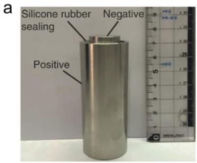

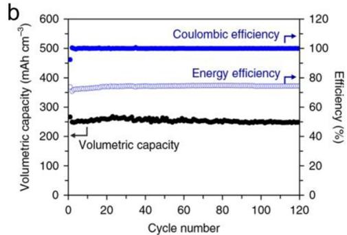

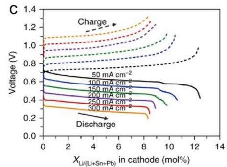

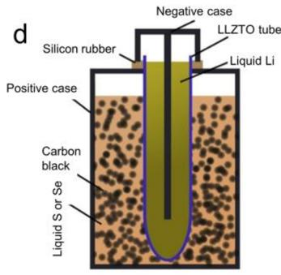

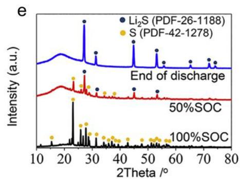  
Figure 52. (a) Digital photograph of an assembled SELL-Sn-Pb cell. (b) Cycle profiles of CE, EE, and volumetric capacity of SELL-Sn-Pb cell (240 °C). (c) Profiles of charge-discharge of SELL-Sn-Pb cell at different current densities (240 °C). Reproduced with permission from ref 360. Copyright 2018 Springer Nature. (d) Structure of the SELL-S and SELL-Se batteries. (e) XRD patterns of SELL-S battery at different SoC (100% SoC and 50% SoC and end of discharge). (f) Cycle profiles of CE, EE, and specific capacity of SELL-S batteries (240 °C). Reproduced with permission from ref 428. Copyright 2015 Elsevier.

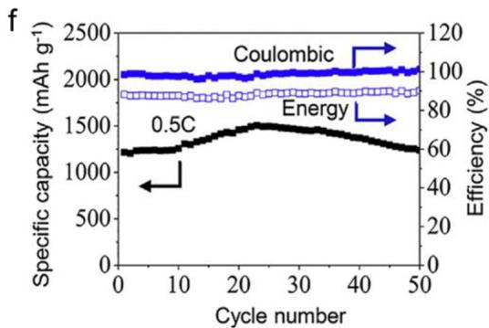

Jiang et al. [405] reported a LMB based on a LiSn-Sb system, which is composed of a Li anode, an environmentally friendly Sb-Sn cathode, and a LiF-LiCl-LiBr molten salt electrolyte (22:31:47 mol %, \( T_{\mathrm{m}} = 430^{\circ}\mathrm{C} \)). The study investigated the LiSn-Sb cell employing Sb-Sn electrodes with different molar ratios, the optimal value of which was 50:50, as revealed by the electrochemical performance of the cell. At a current density of \( 100\mathrm{mAcm}^{-2} \) and a capacity of 1.5 Ah, the discharge voltage of the LiSn-Sb cells was up to 0.8 V, which is much higher than that of the MgSnSb cell reported previously. [391] Based on the optimal molar ratio of the Sb-Sn cathode, a series of LiSn-Sb cells with different capacities (1.5, 6, 23, and 47 Ah) have been further developed. It was revealed that the discharge voltages of the cells remained about 0.8 V. It is important to point out that the LiSn-Sn cell showed excellent cycling stability even at a large capacity of 21.3 Ah. After 30 cycles, the battery maintained its discharge capacity at 20.6 Ah and the capacity retention of 96.7% along with the minimal capacity decay of 0.0078% per cycle. At a current density of \( 300\mathrm{mAcm}^{-2} \), the CE and round-trip EE exceed 98.5% and 68.5%, respectively. The cost of the LiSn-Sb system was calculated to be \( \\(72 - 81\mathrm{kWh}^{-1} \) and the specific energy about 174 Wh kg\(^{-1}\).

In 2018, Jiang et al. [408] proposed another high voltage LMB yielding high energy density, which is based on Te-Sn alloy cathode. Comprising a Li anode, a Te-Sn alloy cathode, and a LiF-LiCl-LiBr molten salt electrolyte, this Li||Te-Sn cell operated at  $500^{\circ}\mathrm{C}$  with theoretical capacity of 2 Ah. For this system, various compositions of Li||Te and Li||Te-Sn have been investigated as potential candidates for suitable cathodes and have undergone charge and discharge testing at varying current densities. Consequently, the results have proved the efficacy of pure Te in suppressing the capacity fading of the cell, attributed to its low conductivity and high solubility. Further,

the  $\mathrm{Li}||\mathrm{Te}-\mathrm{Sn}$  cell exhibited discharge voltage of  $1.6\mathrm{V}$  at 100 mA cm $^{-2}$ , which is much higher than the LMBs previously reported, such as  $\mathrm{Mg}||\mathrm{Sb},^{391}\mathrm{Li}||\mathrm{Sb}-\mathrm{Pb},^{402}\mathrm{Li}||\mathrm{Bi},^{403}\mathrm{Ca}-\mathrm{Mg}||\mathrm{Bi}^{410}$  and  $\mathrm{Li}||\mathrm{Sb}-\mathrm{Sn},^{405}$  Furthermore, during long-term cycling, the  $\mathrm{Li}||\mathrm{Te}-\mathrm{Sn}$  cell revealed a phenomenal  $100\%$  CE during initial cycles and nearly  $100\%$  capacity retention after 50 cycles. The specific energy was also calculated to be about 495 Wh kg $^{-1}$ . The outstanding properties show great prospects of these systems in energy storage applications with higher specific energy requirements.

In addition to the extensive research on various electrode-based electrochemical systems, there are also a few innovative studies focusing on the electrolytes and membranes in LMBs. For instance, in 2018, Sadoway and co-workers reported a Faradaically selective membrane for LMBs.[414] This porous metal membrane achieves chemical selectivity through the preferred Faraday reaction rather than the regulated ion conduction. Figure 51a describes the anodic reaction at the interface between liquid Li-Pb and the upper surface of the membrane, the cathodic reaction at the interface between liquid Pb and electrolyte, and the Faraday protection reaction at the membrane/electrolyte interface. The LMB constructed by using this membrane is termed as a liquid displacement battery. Figure 51b,c illustrates the electrochemical performance of a Li-Pb||PbCl $_2$  cell (working at  $410^{\circ}\mathrm{C}$ ) based on the Faradaically selective membrane. It can be seen that over 100 cycles, the nominal voltage, CE, and RTE of the battery are  $1.3\mathrm{V}, 92\%$ , and  $71\%$ , respectively. In addition, Figure 51d,e indicates that this Faradaically selective membrane has the ability to prevent irrecoverable loss of Pb on the anode. Based on this membrane, the battery not only exhibited good performance but also lessened the selection limit for electrode materials. The applications of porous conductive membranes have been

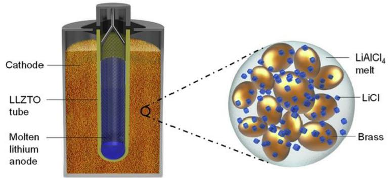  
a

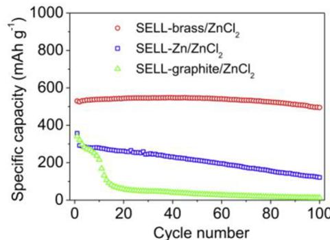  
b

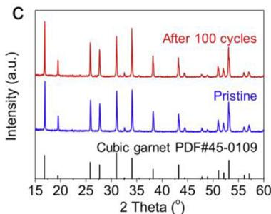  
d

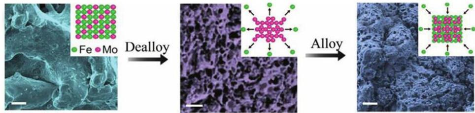

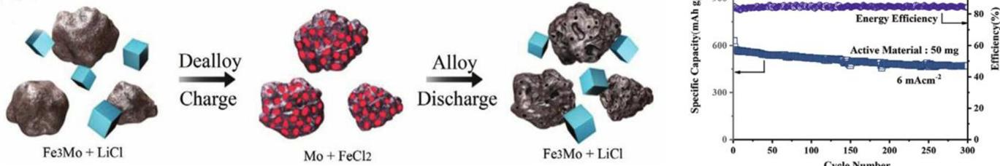  
e  
Figure 53. (a) Schematic of  $\mathrm{SELL - }$  brass/  $\mathrm{ZnCl_2}$  battery and the starting materials in the cathode. (b) Comparison of cycling stability at  $0.2\mathrm{C}$  rate with the control batteries  $(250^{\circ}\mathrm{C})$  . (c) XRD patterns of the LLZTO tube before and after cycling. Reproduced with permission from ref 336. Copyright 2020 Elsevier. (d) SEM images of cathodic metal particles of the Li-Mo-FeCl $_2$  battery in each stage of the Fe-Mo dealloy-alloy corrosion (scale bar is  $5\mu \mathrm{m}$  ). (e) Schematic illustrating cathode materials in each stage of reactions inside Li-Mo-FeCl $_2$  battery. (f) Cycle profiles of CE, EE, and volumetric capacity of Li-Mo-FeCl $_2$  battery  $(250^{\circ}\mathrm{C})$  . Reproduced with permission from ref 429. Copyright 2020 Wiley-VCH.

successfully demonstrated in multiple all-liquid replacement battery chemistries, showing a wide range of electrochemical applications.

In addition to the experimental advancement, numerical simulations have been carried out to gauge the hydrodynamics and interfacial stability of LMBs.416,418-425 These theoretical simulations have provided substantial support from all aspects for further improvement of LMBs. At present, LMBs show potential advantages in terms of high capacity, simple structure, low manufacturing cost, and long cycle life, thereby promising their prospective applications in LSES. However, such battery systems are still at the stage of laboratory research and have not yet been commercialized on a large scale. The major problems that detrimentally affect the performance of LMBs are their high operational temperature and their susceptibility to the corrosion of battery components (container, collector, sealing device, or insulator) due to highly active anode materials. For example, the Na-based LMBs experience high self-discharge due to high solubility of Na in molten electrolytes. Similarly, the Ca-based LMBs have high melting points. For electrochemical energy storage, Li is the most widely studied anode material with the characteristics of low melting point, high voltage, and specific energy. Moreover, among alkali metals or rare earth metals, the solubility of Li in molten salts is the lowest and is comparable to

that of  $\mathrm{Mg}$ , and the Li halides embody high ionic conductivity and relatively low melting point, therefore, drawing the most attention in the past three decades. In the future, research on LMB systems are expected to emphasize the development of new electrode materials with appropriate thermal management (lower operating temperature) to avoid HT corrosion and leakage.[426,427]

# 5.6. Solid Electrolyte Based Liquid Lithium Batteries

High safety, high energy density, and low cost are the most sought after features in batteries, especially for GSES. Ever since their development, LMBs have showed great potentials for LSES applications. Among LMBs, the one which has grabbed the most consideration among recent research employs molten Li metal as the anode. Such batteries generally use molten metal salt electrolytes, which have at least the following two major problems: (1) the high melting point of Li metal causes the battery to operate at temperatures generally above  $450^{\circ}\mathrm{C}$  and the operational costs remain high; (2) the dissolution of Li in molten salts results in battery self-discharge and low CE  $(< 98\%)$ . Keeping an account of these issues, a series of liquid Li metal batteries have been proposed based on a garnet-type  $\mathrm{Li}_{6.4}\mathrm{La}_3\mathrm{Zr}_{1.4}\mathrm{Ta}_{0.6}\mathrm{O}_{12}$  (LLZTO) solid-state electrolyte, generating the so-called solid electrolyte based liquid lithium battery

Table 8. Summary and Comparison of Different MSBs  

<table><tr><td></td><td>traditional Na-S batteries</td><td>IT Na-S batteries</td><td>ZEBRA batteries</td><td>LMBs</td><td>SELL batteries</td></tr><tr><td>safety level</td><td>low</td><td>moderate</td><td>moderate</td><td>low to moderate</td><td>moderate to high</td></tr><tr><td>cost</td><td>$300 kWh-1</td><td>lower than HT Na-S batteries</td><td>$150 kWh-1</td><td>lower than Na-S batteries</td><td>mostly lower than $100 kWh-1</td></tr><tr><td>advantages</td><td>high theoretical energy density, high CE, long lifetime, and low self-discharge</td><td>sofer and cheaper than Na-S batteries</td><td>high theoretical energy density, high CE, long lifetime, and low self-discharge</td><td>high power and simple structure</td><td>high CE and high energy density</td></tr><tr><td>disadvantages</td><td>not safe and high operating cost</td><td>capacity decay</td><td>capacity decay</td><td>thermal corrosion, high self-discharge, and low voltage</td><td>limited cycle life</td></tr><tr><td>applications</td><td>mainly used in stationary applications</td><td></td><td>stationary and transportation fields</td><td></td><td></td></tr></table>

(denoted as SELL battery). Such electrochemical systems have the ability to not only effectively reduce cell operating temperature but also improve safety, thereby confirming the feasibility of the SELL battery concept.[336,360,428,429]

Cui and co-workers pioneered the SELL battery, which is composed of a liquid Li metal anode, a molten Sn-Pb or Bi-Pb cathode, and a LLZTO solid electrolyte, which operates at a temperature of  $240^{\circ}\mathrm{C}$ . The LLZTO solid-state electrolyte ceramic tube is structured in the battery as an assembly of two cell systems: Li||LLZTO||Sn-Pb (Figure 52a) and Li||LLZTO||Bi-Pb, also called SELL-Sn-Pb and SELL-Bi-Pb, respectively. Upon electrochemical testing, as shown in Figure 52b, the SELL-Sn-Pb battery demonstrates a stable volumetric capacity of about  $254\mathrm{mAhcm}^{-3}$  with the average CE of  $99.98\%$ . Figure 52c shows the voltage distribution of the SELL-Sn-Pb cell at different current densities within the range of  $50 - 300\mathrm{mA cm}^{-2}$ . It can be seen that even at a high current density of  $300\mathrm{mA cm}^{-2}$ , the battery still shows good cycle performance. The discharge voltage plateau is  $0.3\mathrm{V}$  with high power performance, reaching  $62\%$  of the theoretical capacity (Figure 52c). When it comes to the cost, it is computed to be about  $\$0.037\mathrm{g}^{-1}$  for LLZTO material, indicating significant applicability and feasibility of the SELL batteries.

Similarly, Li-S and Li-Se batteries are considered promising candidates for next-generation battery technology because of their high energy density and cost effectiveness. However, current development of such batteries is severely hampered by their lower CE and cycling stability due to the use of solid Li anodes and liquid organic electrolytes. Based on these problems, most recently, high energy density all-solid electrolyte liquid Li-S and Li-Se battery systems (also referred to as SELL-S and SELL-Se, respectively) have been reported, whose potential energy densities exceed 500 Wh  $\mathrm{kg}^{-1}$  and 1000 Wh  $\mathrm{L}^{-1}$ , respectively.[428] Figure 52d presents the structural schematic of a typical SELL-S/SELL-Se battery, composed of a liquid Li metal anode, a high Li storage capacity molten S or Se cathode, and highly dense LLZTO ceramic tubes as the electrolyte to separate the electrodes. These cells generally operate at  $240^{\circ}\mathrm{C}$ , at which LLZTO ceramic tubes have a high conductivity and hence yield high power densities. During discharge, S is lithiated to form  $\mathrm{Li}_2\mathrm{S}$ , with no polysulfide intermediate, as shown in Figure 52e. In other words, the utilization of the LLZTO solid electrolyte effectively prevents the formation of polysulfides (polysulfide shuttle effect) and Li dendrites. In addition, XRD results show the coexistence of S and  $\mathrm{Li}_2\mathrm{S}$  at  $50\%$  state of charge (SoC) and the presence of  $\mathrm{Li}_2\mathrm{S}$  at  $100\%$  SoC; therefore the cell shows stable electrochemical performance. In 50 cycles at  $0.5\mathrm{C}$ , the SELL-S battery shows a specific capacity of about  $1450\mathrm{mAhg}^{-1}$  along with stable CE of  $99.99\%$  (Figure 52f). In addition, such systems have low costs ( $<\$100\mathrm{kWh}^{-1}$ ), a paramount advantage for LSES applications.

As described previously, molten sodium-nickel batteries based on  $\beta\text{-Al}_2\mathrm{O}_3$  ceramic electrolytes are considered to have bright prospects for LSES. However, their cathodes require a large amount of high-cost Ni powder, which narrows their scope in potential applications. In this regard, the replacement of Ni powder with relatively low-cost metal (e.g., iron, aluminum, zinc, and copper) powder is proposed as viable mitigation strategy to widen the applications of ZEBRA batteries. Such proposition in turn has its own shortcomings in terms of high solubility of charge products of low-cost metals (e.g., metal chlorides) in the molten cathode electrolyte  $(\mathrm{NaAlCl}_4)$  and cation exchange between the cathode electrolyte and  $\beta\text{-Al}_2\mathrm{O}_3$  ceramic electrolyte. These disadvantages eventually lead to metal particle growth and, hence, rapid deterioration of overall cell performance along with failure of the ceramic electrolyte.[430,431] In order to further address these issues, a solid electrolyte-based liquid lithium-brass/zinc chloride (SELL-brass/ZnCl₂) battery operating at  $250^{\circ}\mathrm{C}$  has been investigated.[336] Figure 53a showcases the schematic of the SELL-brass/ZnCl₂ battery along with the composition of its components. It can be seen that, in addition to a stable garnet-type solid electrolyte (LLZTO) to alleviate the ion exchange problem, this battery employs brass powder as a Zn source in the cathode, which inhibits the growth of Zn particles through reversible Cu-Zn alloying and dealloying during discharge and charge, respectively. In other words, the issue of Zn particle growth is successfully resolved, and good battery cycling is achieved upon using brass powder as a Zn source (Figure 53b). The XRD pattern also indicates good crystal structure stability of the LLZTO tube, as shown in Figure 53c, and the chemistry of the cell reaction and its ability to assemble in the discharged state ensures a high level of safety. Moreover, the low material cost of the battery ( $16\mathrm{kWh}^{-1})$  is achieved by using a  $\mathrm{ZnCl}_2$  cathode, which is more than  $50\%$  lower than ZEBRA cells mentioned previously. In short, the SELL-brass/ZnCl₂ battery has a huge scope for practical applications in GSES through full-cell performance and scale-up validation.

In addition to the  $\mathrm{SELL}-\mathrm{brass} / \mathrm{ZnCl}_2$  battery, Cui and coworkers[429] designed a LLZTO solid electrolyte-based molten lithium-molybdenum-iron(II) chloride cell (denoted as Li-Mo-FeCl $_2$  battery) operating at  $250^{\circ}\mathrm{C}$ . The cell is composed of a mixture of Fe, Mo, and LiCl serving as cathode, a Li anode, and a garnet-type lithium-ion ceramic electrolyte. In contrast to the conventional battery reaction mechanism, this battery system is acknowledged mainly due to reversible Fe-Mo alloying/dealloying reaction and the delithiation/lithiation process (Figure 53d,e). The porous Mo framework derived from the Fe-Mo alloy inhibits the growth of pure Fe particles. The use of Li anode and Li-ion ceramic electrolyte is conducive to overcoming the corrosion between the cathode and the solid electrolyte. As is evident from the experimental results (Figure

53f), such an electrochemical system not only exhibited stable cycling performance (472 mAh  $\mathrm{g_{LiCl}}^{-1}$  after 300 cycles) but also was highly tolerant to overcharge and overdischarge (3-1.6 V) and freeze-thaw (25-250 °C). In addition, at a similar cell cost ( $12\mathrm{kWh}^{-1}$ ), the Li-Mo-FeCl $_2$  battery yields theoretical gravimetric and volumetric energy densities that are  $\sim 25\%$  higher than those of the ZEBRA battery, reaching 576 Wh kg $^{-1}$  and 2216 Wh L $^{-1}$ , respectively.

In addition to being used as a solid-state electrolyte, the high Li-ion selectivity of LLZTO can be harnessed to obtain high-purity Li metal directly by electrolyzing low-purity  $\mathrm{LiCl}$ ,[432] which is cost-effective and less energy consuming than other conventional methods. To reiterate, all MSBs have earned the status of feasible and advantageous energy storage systems in terms of bulk energy density, weight energy density, remarkable performance, manufacturing cost, energy cost, and reliability.

# 5.7. Safety and Other Aspects of Molten Salt Batteries

In conclusion, MSBs along with many benefits are competitive candidates for LSES applications, although they still have shortcomings in some aspects. Table 8 presents a comparative summary of several types of MSBs. To explain, traditional Na-S and ZEBRA batteries have high theoretical energy densities, long cycle life, and high CEs, thereby offering a broad range of prospects for stationary energy storage and vehicular applications. However, for traditional Na-S batteries, the problems of safety and high operating costs caused by high operational temperatures are considerable factors limiting their further development. It is important to mention here that most of the methods for improving the safety of Na-S batteries commonly revolve around the reduction of their operating temperatures. With lower operational temperatures, Na-S batteries have supplementary benefits in terms of convenience to perform heat management and low operating costs. In short, the pros and cons of Na-S systems render their employability mainly in stationary energy storage applications. Similarly, IT Na-S batteries, operating at about  $\sim 150^{\circ}\mathrm{C}$ , have begun to attract wide attention. Compared with traditional HT Na-S batteries, the relatively lower operating temperatures of IT Na-S batteries aid in the suppression of causticity of the internal electrodes and improve their safety. However, the biggest problem of IT Na-S batteries is the dissolution and shuttle effect of polysulfides, resulting in rapid capacity loss, thereby rendering them impractical for stable LSES applications.

Concerning ZEBRA batteries, despite their operation under high temperatures, their multilevel safety is substantially higher than the conventional Na-S battery systems. Their inherent safety aspects enable the utility of ZEBRA cells in stationary grid storage applications. On the other hand, the key factors restricting the development of ZEBRA batteries include the decline in their capacities due to the higher solubility of  $\mathrm{NiCl}_2$  in  $\mathrm{NaAlCl}_4$ , and the growth and coarsening of Ni particles, which require further research and improvement.

LMBs pose no risk of damage because of the absence of the separator. However, the operating temperature of LMBs is generally above  $400^{\circ}\mathrm{C}$ , which may result in the thermal corrosion of the cell, demanding stringent material selection of battery components. In addition, some LMB systems have high self-discharge rates due to the high solubility of the electrodes in the molten salt electrolytes. All these benefits and drawbacks determine that LMBs are suitable for stationary storage applications. When it comes to SELL batteries, using LLZTO solid electrolyte can effectively address the problems experi

enced by LMBs, especially safety. Although previous studies have verified the feasibility of LLZTO in different liquid Li batteries, the cycle life of SELL batteries is still far from the requirements of LSES, and the cost of LLZTO material ( $0.037 g$ ^{-1}) is too expensive for its widespread economical applications.

Safety holds precedence over cost to the general masses when it comes to the energy storage. However, the safety aspect of the battery systems must be taken into further consideration from the dimensions of accidents and abuses that may occur during cycling and general handling, such as mechanical abuse, heat abuse, short circuit, deep discharge, and overcharge.

From a safety point of view, mechanical defects in the ceramic electrolyte are the most critical factor compromising the safety of Na-S batteries. This is because when the ceramic separator structure is destroyed, the S comes in direct contact with the liquid Na, raising the risk of fire or even explosion. The main risk of mechanical abuse of the Na-S battery system is predicated on the damage to the individual batteries in the battery assembly. In addition, the efficient thermal isolation also acts as a thermal shield to resist the influence of external temperature. Although excessive heating from the outside usually does not affect the safety of the battery system, the failure of thermal management leading to thermal abuse may cause the cell overheating, which may eventually result in further rigorous exothermic reactions inside the battery. Lastly, the Na-S batteries do not have an internal protection mechanism to prevent overcharge and overdischarge, and the indication of reaching up to the charge and discharge limits emerges from the significant increase in the internal resistance of the battery. In the Na-S battery assembly, there is also a huge risk of transferring charging and discharging loads to adjacent cells, thereby amplifying the risk of overload and reaffirming the low safety of the stack.

Compared with Na-S batteries, in ZEBRA batteries, metal halides are generally less corrosive than sodium polysulfide. This lower sensitivity enables the selection of a wide range of materials for battery container and current collector. Unlike Na-S batteries, ZEBRA batteries, upon damage to the ceramic separator, experience reaction between Na and  $\mathrm{NaAlCl_4}$  to form NaCl and metallic Al. However, such phenomenon is not as violent as the corresponding reaction between Na and S in the Na-S systems owing to the low heat generation. Moreover, the products of the aforementioned reactions may facilitate filling the defective sites. In case of larger cracks in the separator, the resulting Al has the ability to form a direct conductive bridge between the cathode and anode, thereby keeping the battery circuit intact. Another advantage of ZEBRA batteries is their resistance to overcharge and overdischarge, rendering them as a potential electrochemical system in practical GSES applications.

In the IT or HT LMBs operating above  $400^{\circ}\mathrm{C}$ , thermal corrosion is dominant, which detrimentally influences their safety through mechanical abuse. Although LMBs do not require an extra separator between their electrodes owing to the unique natural layered structure, the external interference may cause mixing of different metal layers, thereby increasing their safety risk, which is why such systems are mainly viable for stationary energy storage. In comparison with other LMBs, SELL batteries avoid short-circuiting through separation of electrodes and operations at lower temperatures, making them a safer choice compared to LMBs. In addition, some SELL battery systems, such as SELL-brass/ZnCl $_2$ , are highly tolerant to overcharge and overdischarge. To recapitulate, among prospective candidates for LSES, the current and future research and

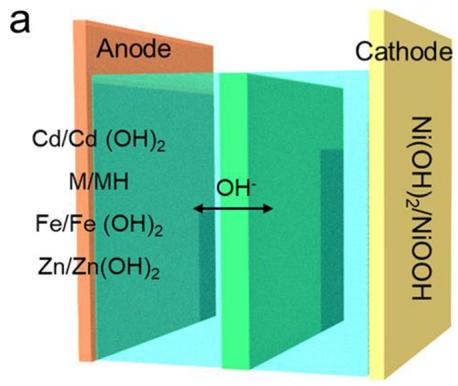

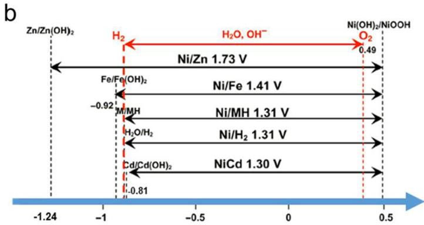

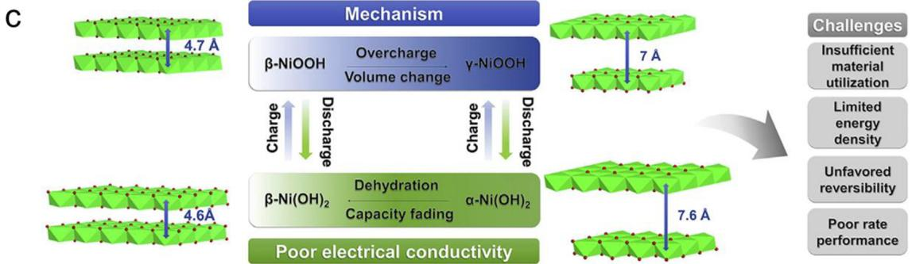  
Figure 54. Structures, mechanisms, and redox potentials of rechargeable alkaline batteries. (a) Schematic of rechargeable alkaline batteries. (b) Standard potential (versus the standard hydrogen electrode) of different redox couples in alkaline solution. Reproduced with permission from ref 441. Copyright 2015 Elsevier. (c) Schematic of reaction mechanisms and structures of nickel hydroxides. Reproduced with permission from ref 433. Copyright 2020 Elsevier.

development pertaining to the MSBs should focus on improving their safety and operating stability and reducing costs.

# 6. ALKALINE BATTERIES

# 6.1. Introduction

With a history of more than 120 years of rechargeable alkaline batteries, $^{433}$ $\mathrm{Ni(OH)}_2 / \mathrm{NiOOH}$  is considered to be the key redox couple owing to its good reversibility, high redox potential, adequate theoretical capacity, abundance, low toxicity, and cost effectiveness. $^{434}$  In general,  $\mathrm{Ni(OH)}_2$  has two polymorphic forms,  $\alpha\text{-Ni}(\mathrm{OH})_2$  and  $\beta\text{-Ni}(\mathrm{OH})_2$  (Figure 54c), and the latter is widely used as cathode material, exhibiting higher thermodynamic stability in alkaline solution than its  $\alpha$  counterpart. $^{434}$  In contrast,  $\alpha\text{-Ni}(\mathrm{OH})_2$  yields higher theoretical energy density than  $\beta\text{-Ni}(\mathrm{OH})_2$ . During charging,  $\beta\text{-Ni}(\mathrm{OH})_2$  and  $\alpha\text{-Ni}(\mathrm{OH})_2$  are oxidized into  $\beta\text{-NiOOH}$  and  $\gamma\text{-NiOOH}$ , respectively.  $\beta\text{-NiOOH}$  is further subjected to irreversible oxidation to form an upper valence composite of  $\gamma\text{-NiOOH}$ , which undergoes volumetric change during overcharging. In addition,  $\alpha\text{-Ni}(\mathrm{OH})_2$  is dehydrated and recrystallized in the concentrated alkaline electrolyte to form  $\beta\text{-Ni}(\mathrm{OH})_2$  with aging. $^{435}$  Here, the emphasis has exclusively been placed on the redox couples and the corresponding redox potentials (Figure 54a,b) of different rechargeable alkaline battery chemistries, including nickel-cadmium (Ni-Cd), $^{436}$  nickel-metal hydride (Ni-MH), $^{437}$  nickel-iron (Ni-Fe), $^{438}$  nickel-hydrogen (Ni- $H_2$ ), $^{49,56,439}$  and nickel-zinc (Ni-Zn), $^{166,440}$  for GSES.

# 6.2. Ni-Cd Batteries

As one of the classic alkaline batteries, the Ni-Cd battery is composed of a  $\mathrm{Ni(OH)}_2$  cathode,  $\mathrm{Cd(OH)}_2$  anode, and KOH electrolyte, the assembly of which upon electrochemical cycling

yields a standard voltage of  $1.3\mathrm{V}$  through the following electrode reactions:

Cathode:

$$
\mathrm {N i O O H} + \mathrm {H} _ {2} \mathrm {O} + \mathrm {e} ^ {-} \leftrightarrow \mathrm {N i} (\mathrm {O H}) _ {2} + \mathrm {O H} ^ {-}
$$

$$
E ^ {\circ} = 0. 4 9 \mathrm {V} \tag {14}
$$

Anode:

$$
\mathrm {C d} (\mathrm {O H}) _ {2} + 2 \mathrm {e} ^ {-} \leftrightarrow \mathrm {C d} + 2 \mathrm {O H} ^ {-} \quad E ^ {\circ} = - 0. 8 1 \mathrm {V} \tag {15}
$$

Overall:

$$
2 \mathrm {N i O O H} + 2 \mathrm {H} _ {2} \mathrm {O} + \mathrm {C d} \leftrightarrow 2 \mathrm {N i} (\mathrm {O H}) _ {2} + \mathrm {C d} (\mathrm {O H}) _ {2}
$$

$$
E ^ {\circ} = 1. 3 0 \mathrm {V} \tag {16}
$$

As is evident, during battery charge, the  $\mathrm{Ni(OH)}_2$  cathode is converted to nickel oxyhydroxide through a simple deprotonation mechanism, while  $\mathrm{Cd(OH)}_2$  is reduced to metallic Cd at the negative electrode. Concerning their potential applications, Ni-Cd batteries once occupied a huge market share in portable electronics due to their practical low-temperature performance, constant discharge voltage, and long cycle life. However, the environmental and economic concerns accompanied by this technology have hindered its furtherance on industrial scale.[435,436] In other words, the increased production cost of toxic Cd and severe soil and water contamination render this storage system impractical for GSES applications.

# 6.3. Ni-MH Batteries

Originally introduced in the 1960s, the nontoxic Ni-MH battery surfaced as a replacement for the Ni-Cd system. Although the structural configuration of the Ni-MH battery

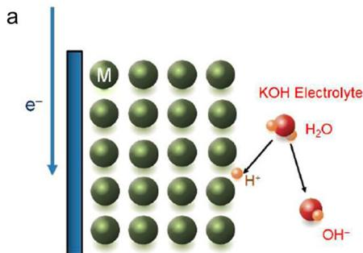  
Current Collector

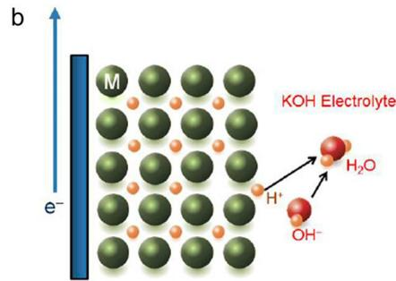  
Current Collector

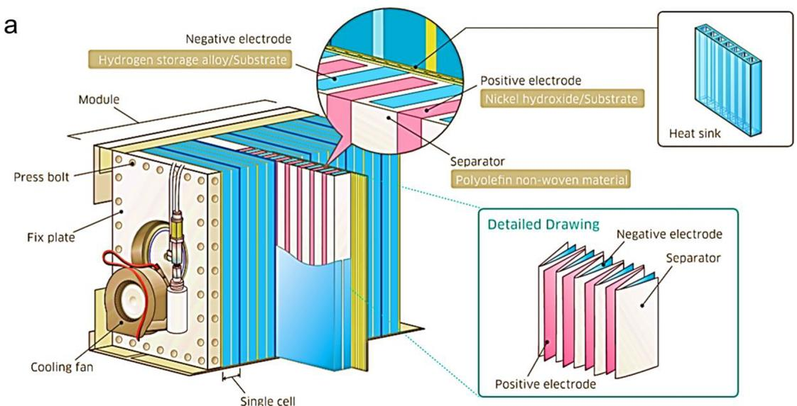  
Figure 55. Schematics showing the electrochemical reactions between water and MH during (a) charge and (b) discharge. Reproduced with permission from ref 443. Copyright 2013 Multidisciplinary Digital Publishing Institute.

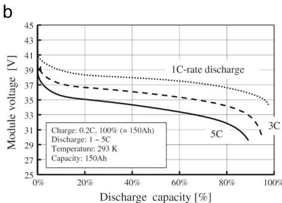  
Figure 56. Commercial Ni-MH batteries. (a) Structure of large-sized high-power Ni-MH batteries (GIGACELL). (b) Discharge curve of 30-K6 GIGACELL batteries (30-cell module with a 150 Ah rated capacity) at 293 K and various current rates. (c) Cycle performance of 3.5 Ah single cell at 298 K. Reproduced with permission from ref 445. Copyright 2013 Elsevier.

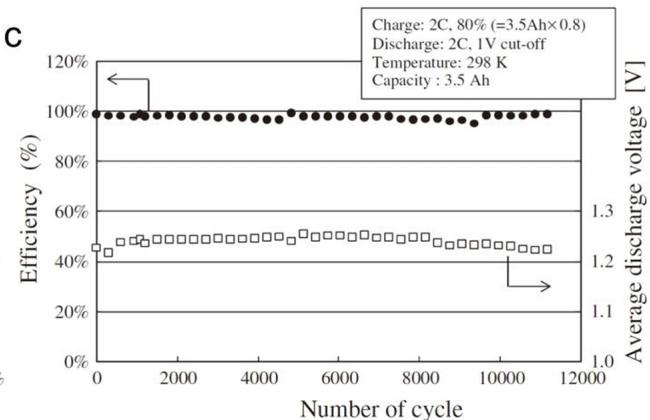

resembles that of the Ni–Cd battery, unlike Ni–Cd, it employs a hydrogen-absorbing alloy as anode material, resulting in higher energy density and no memory effect. $^{442}$  Electrons enter the MH anode to neutralize the protons during charge and exit the MH anode through the current collector during discharge (Figure 55). In general, the Ni–MH battery produces a standard voltage of  $1.3\mathrm{V}$  through the following electrochemical reactions:

Cathode:

$$
\begin{array}{l} \mathrm {N i O O H} + \mathrm {H} _ {2} \mathrm {O} + \mathrm {e} ^ {-} \leftrightarrow \mathrm {N i} (\mathrm {O H}) _ {2} + \mathrm {O H} ^ {-} \\ E ^ {\circ} = 0. 4 9 \mathrm {V} \tag {17} \\ \end{array}
$$

Anode:

$$
\mathrm {M} + \mathrm {H} _ {2} \mathrm {O} + \mathrm {e} ^ {-} \leftrightarrow \mathrm {M H} + \mathrm {O H} ^ {-} \quad E ^ {\circ} = - 0. 8 1 \mathrm {V} \tag {18}
$$

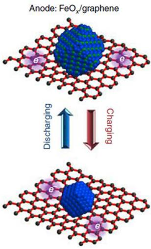  
a

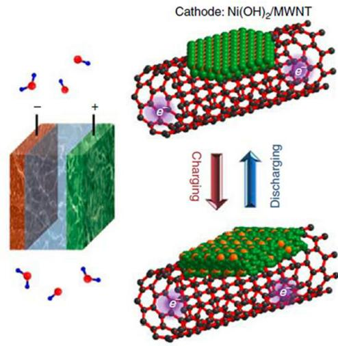

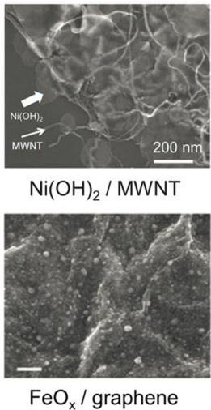  
b

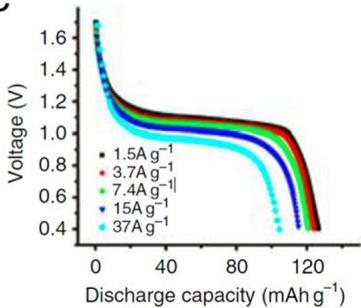  
C  
d

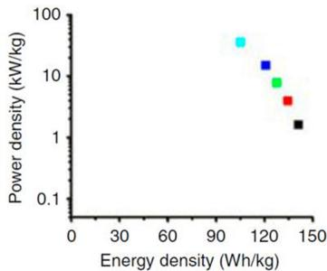

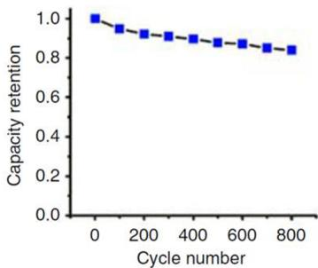  
e

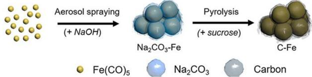  
f  
g

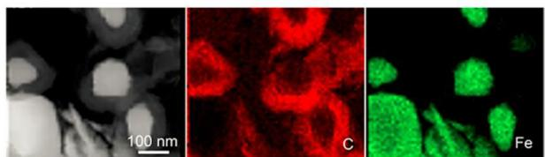

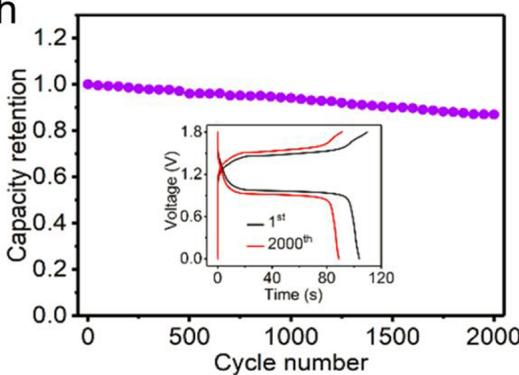  
h  
Figure 57. Progress in Ni-Fe battery systems. (a) Schematic drawing of the Ni-Fe battery made from inorganic/carbon hybrid materials. (b) SEM image of  $\mathrm{Ni(OH)}_2 / \mathrm{MWNT}$  and  $\mathrm{FeO}_x / \mathrm{graphene}$  hybrid. Scale bar is  $200\mathrm{nm}$ . (c) Galvanostatic discharge curves of the Ni-Fe battery at various current densities. (d) Ragone plot of the Ni-Fe battery measured in part c. (e) Capacity retention vs. cycle number for the ultra-Ni-Fe battery at a galvanostatic charge and discharge current density of  $37\mathrm{A g}^{-1}$ . Reproduced with permission from ref 446. Copyright 2012 Springer Nature. (f) Precursor-to-product transformation in the overall carbon-coated Fe nanoparticle synthesis from aerosol spraying to pyrolysis. (g) High-angle annular dark-field-STEM and corresponding element mapping of C and Fe of the C-Fe nanoparticles. (h) Long-term cycling performance of the full cell at  $4\mathrm{A g}^{-1}$ . Inset of panel h shows the charging and discharging curves before and after 2000 cycles. Reproduced with permission from ref 29. Copyright 2020 American Chemical Society.

Overall:

$$
\mathrm {N i O O H} + \mathrm {M H} \leftrightarrow \mathrm {N i} (\mathrm {O H}) _ {2} + \mathrm {M} \quad E ^ {\circ} = 1. 3 0 \mathrm {V} \tag {19}
$$

Among numerous studies on MH alloy based electrodes, the rare earth-based  $\mathrm{AB}_5$  alloy, first reported by Van Vucht et al. (1970),[44] is the most common anode material used in Ni-MH batteries. In addition,  $\mathrm{A}_2\mathrm{B}$ -type, superlattice  $\mathrm{A}_2\mathrm{B}_7$ -type, Ti-Ni-based, and  $\mathrm{Mg}-\mathrm{Ni}$ -based alloys have also been investigated for Ni-MH battery applications.[43] As much as this battery chemistry has been a preferred choice for powering portable

electronics, the limited hydrogen storage capacity of MH alloys has restricted the scope of its further applications, later leading to the dominance of energy market by currently known LIBs.

Nevertheless, the market for Ni-MH batteries has experienced a shift from consumer portable devices to hybrid electric vehicle and stationary applications due to their environmental friendliness, unprecedented safety, and wide operating temperature range. For example, the large-sized high-power Ni-MH battery named GIGACELL, manufactured by Kawasaki Heavy Industries, is composed of multiple individual cells with bipolar structure (Figure 56a), which can accomplish high operational

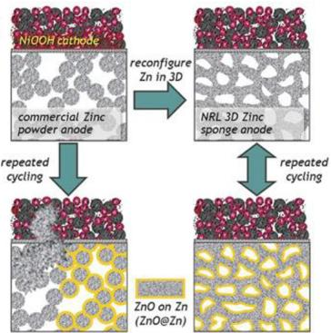  
a

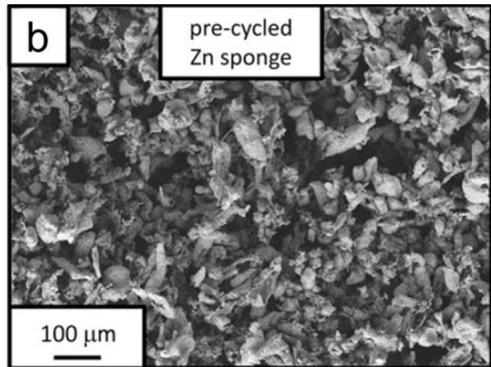

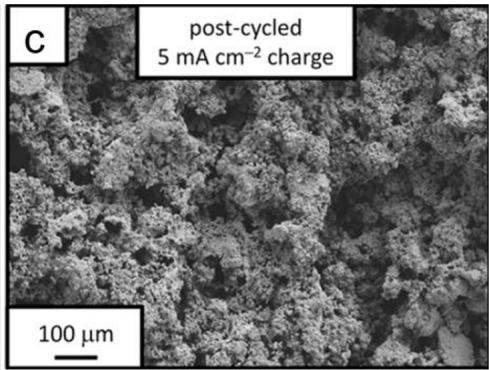

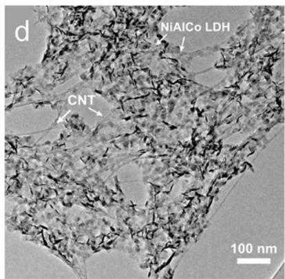  
NiAlCo LDH/CNT

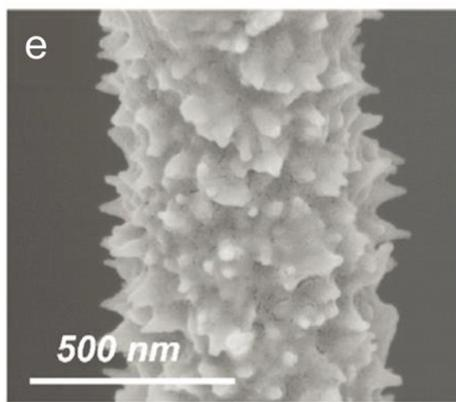  
NNA@CNH nanostructure

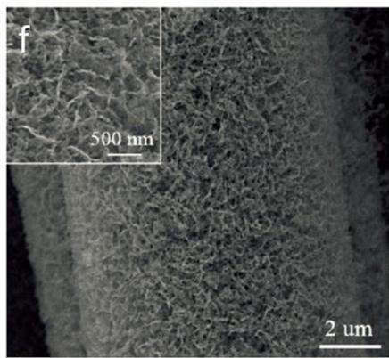  
Ni-NiO nanosheets

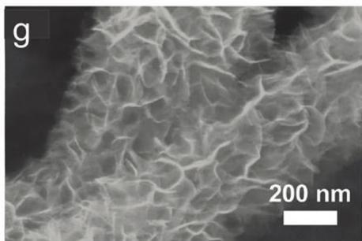  
CC-CF@NiO

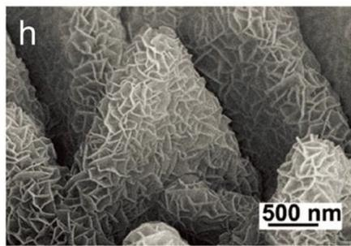  
NiCo-DH micronano sheets

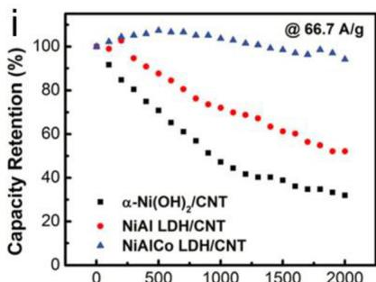  
Cycle Number  
Figure 58. Ni-Zn batteries. (a) Schematic of the effect of recharging Ni-Zn (conventional powder zinc anodes) vs. Ni-3D Zn batteries. SEM images of (b) precycled and (c) postcycled Zn sponges after more than 100 cycles. Reproduced with permission from ref 451. Copyright 2017 The American Association for the Advancement of Science. (d) TEM image of NiAlCo LDH/CNT hybrid. (e) SEM image of NNA@CNH nanostructure. (f) SEM image of the Ni-NiO nanosheets. (g) SEM images of porous NiO nanoflakes grown on CFs. (h) SEM image of NiCo-DH micronano sheets. (i) Capacity retention vs. cycle number of the NiAlCo LDH/CNT hybrids at a charge/discharge current density of  $66.7\mathrm{A}\mathrm{g}^{-1}$ . Panels d and I reproduced with permission from ref 440. Copyright 2014 Royal Society of Chemistry. Panel e reproduced with permission from ref 452. Copyright 2016 Elsevier. Panel f reproduced with permission from ref 453. Copyright 2017 Wiley-VCH. Panel g reproduced with permission from ref 454. Copyright 2016 Wiley-VCH. Panel h reprinted permission from ref 456. Copyright 2019 Wiley-VCH.

voltage. In addition, the compact structure and auxiliary equipment of Ni-MH GIGACELL yield superior capacity and minimize energy loss. Figure 56b illustrates the charge/ discharge curves of a 30-cell module with a  $150\mathrm{Ah}$  rating.[445] It is evident that a discharge voltage of  $\sim 38\mathrm{V}$  and discharge capacity up to  $95\%$  can be obtained at  $1\mathrm{C}$  rate (150 A). Even at higher currents up to  $5\mathrm{C}$  rate (750 A), discharge voltage of  $\sim 35\mathrm{V}$  and discharge capacity of  $\sim 90\%$  are maintained. Figure 56c shows no capacity decay after 11000 cycles with CE of approximate  $98\%$ . From the perspective of commercial utility of this technology, Nishime Wind Farm in Japan manufactured a massive  $102\mathrm{kWh}$  energy storage facility in 2007 by connecting 48 modules of GIGACELL batteries in series, wherein each module encloses  $10\mathrm{Ni}-\mathrm{MH}$  cells of  $177\mathrm{Ah}$  each for smoothly handling the wind

power output. Regardless, the capacity fade upon electrochemical cycling owing to alloy pulverization and corrosion and undesired high self-discharge due to active material decomposition remain the predominant challenges in Ni-MH battery systems and require effective mitigation. Additionally, the limited reserves of rare earth metals, whose alloys are utilized in Ni-MH batteries, demand the development of more advanced and efficient extraction and recycling technologies.

# 6.4. Ni-Fe Batteries

Principally comprising a  $\mathrm{Ni(OH)}_2$  cathode and an Fe anode, the Ni-Fe battery has been moderately developed over the last century since its advent in 1899-1902.[446] Nevertheless, the performance of commercial Ni-Fe batteries is generally below par as a consequence of low energy density and EE ( $\sim 60\%$ ) and

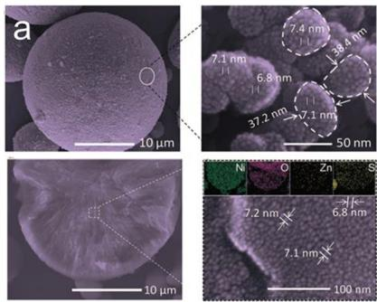  
Figure 59. (a) SEM images of the NiS-coated  $\mathrm{Ni}_{0.95}\mathrm{Zn}_{0.05}(\mathrm{OH})_2$  microspheres. (b) Cycling performance in comparison with the commercial Ni-Zn battery. Reproduced with permission from ref 458. Copyright 2020 Royal Society of Chemistry.

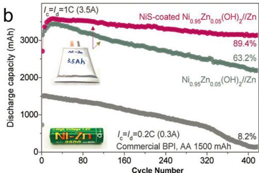

high self-discharge. In this regard, factors such as large particle size of active Fe electrode, its poor conductivity, weak coupling with current collector, and severe passivation during cell discharge are blamed. In recent years, research investigations on Ni-Fe battery increased due to its long cycle life, inherent safety, and crustally abundant sources of Ni and Fe, considerations that are highly desirable for LSES. For instance, in 2012, Dai et al. $^{446}$  designed a Ni-Fe battery with ultrafast rate performance to deliver specific energy of  $120\mathrm{Whkg^{-1}}$  and specific power of  $15\mathrm{kWkg^{-1}}$ . This cell (Figure 57a,b) is structurally composed of  $\mathrm{Ni(OH)_2}$  nanoplates grown on oxidized multiwall CNTs as cathode and  $\mathrm{FeO}_x$  nanoparticles grown on RGO sheets as anode. As shown in Figure 57c, complete electrochemical discharge at various rates can be achieved from  $\sim 5$  min to  $\sim 9$  s, whereas full charging is completed in as little as  $\sim 2$  min, which is significantly faster than the previously reported conventional Ni-Fe battery designs. In addition, the ultrafast Ni-Fe cell shows excellent power density up to  $36\mathrm{kWkg^{-1}}$  with a potential downside in terms of insufficient cycling stability with  $\sim 20\%$  capacity decay over 800 cycles (Figure 57d,e). The outstanding power density of the cell is ascribed to the reasonable conductivity of the graphitic carbon materials and strong coupling between inorganic nanocrystals and oxidized nanocarbon. The major challenge of insufficient cycling of ultrafast Ni-Fe cells has been addressed with the emergence of carbon-based coatings, $^{29,447,448}$  which not only provide the Fe anode with rapid interfacial electron transfer but also hamper the degradation of the Fe nanoparticles, thereby enhancing energy and power densities, as well as cycling stability of Fe anode. To demonstrate, an efficient and scalable method for synthesizing conformal carbon-coated Fe nanoparticles for Ni-Fe batteries was reported recently. $^{29}$  A protective Fe oxidation-free  $\mathrm{Na_2CO_3}$  coating is formed on Fe nanoparticles in situ using an aerosol spray method (Figure 57f).  $\mathrm{Na_2CO_3}$ -stabilized Fe nanoparticles are then subjected to pyrolysis by mixing them with sucrose (acting as carbon source) to deposit a uniform carbon coating (Figure 57g). The electrochemical cycling of the cell based on carbon-coated Fe nanoparticles confirmed  $87\%$  capacity retention even after 2000 cycles (Figure 57h). Regardless, the low EE of Ni-Fe battery still restricts its utility for LSES, and its self-discharging mechanisms have not yet been clearly studied, therefore requiring further investigations.

# 6.5. Ni-Zn Batteries

Zinc has earned the reputation as a prospective anode material for alkaline batteries due to the low redox potential of  $\mathrm{Zn} / \mathrm{Zn}^{2+}$ , high specific capacitance (820 Ah kg $^{-1}$ ), and natural

abundance. $^{449,450}$  That is why Ni-Zn batteries have become widely known for their low manufacturing cost, high energy and power densities, high working potential, and wide operating temperature range. $^{440}$  However, the cycle life of Ni-Zn batteries is shortened by the formation Zn dendrites during repeated charge-discharge cycling and the severe capacitance deterioration of the  $\mathrm{Ni(OH)}_2$  cathode. To address such issues, numerous efforts have been devoted to designing different nanostructured electrode materials of diverse morphologies and compositions. In 2017, one such important attempt was made by Parker et al., who developed a high-energy Ni-Zn battery based on a 3D Zn sponge anode (Figure 58a). $^{451}$  It has been revealed that monolithic zinc sponge anodes can be electrochemically cycled from hundreds to thousands of times without undergoing typical passivation or macroscale dendrite formation (Figure 58b,c). This work has alleviated the life issues of zinc anodes to a certain extent. In addition, a Ni-Zn battery with a high-capacity hybrid cathode of NiAlCo-layered double hydroxide (LDH) coupled with CNTs (NiAlCo-LDH/CNT) has been investigated by Dai et al. (Figure 58d). $^{440}$  Substantial evidence has been provided for supporting the efficacy of Al and Co co-doping for stability enhancement of the LDH phase and  $\alpha$ -Ni(OH) $_2$  with capacity loss of merely  $6\%$  over 2000 cycles at  $66.7\mathrm{A g}^{-1}$  (Figure 58i). Hitherto, several Ni-based nanostructures including Co-doped  $\mathrm{Ni(OH)}_2$  on nanowire arrays (NNA@CNH), $^{452}$  Ni-NiO heterostructured nanosheets, $^{453}$  NiO nanoflakes on hierarchical CFs, $^{454}$  nickel@nickel oxide core-shell electrodes, $^{455}$  and nickel-cobalt double hydroxides (NiCo-DHs) $^{456}$  have been studied as cathode materials for Ni-Zn batteries (Figure 58e-h). The electrochemical characterization results of the aforementioned materials in these studies have aimed to develop ultrafast, high-capacity, and safe Ni-Zn battery systems. Taking into account the practicality, the areal and volumetric capacities have been given relatively more imperative than specific capacity evaluated by mass loading, which explains why there is dire need for the development of novel porous nanomaterials with high areal capacity in Ni-Zn chemistries for their LSES utility. $^{457}$

Recently, Chao et al. [458] proposed the utilization of a dense Co-free microscale cathode for developing a commercially viable  $\mathrm{Ni - Zn}$  battery with excellent electrochemical performance. The SEM micrographs (Figure 59a) demonstrate  $\mathrm{Ni}_{0.95}\mathrm{Zn}_{0.05}(\mathrm{OH})_2$  microspheres coated with a NiS film with equiaxial nanodots of  $\sim 7.0\mathrm{nm}$  in size, which offer high conductivity, reasonable surface area, and rapid electrode kinetics, enabling the  $\mathrm{Ni - Zn}$  battery to yield high gravimetric and volumetric energy densities. When subjected to charge-discharge cycling, the commercial-scale 3.5 Ah  $\mathrm{Ni - Zn}$  pouch cell based on the

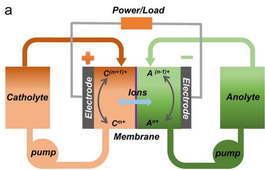  
b

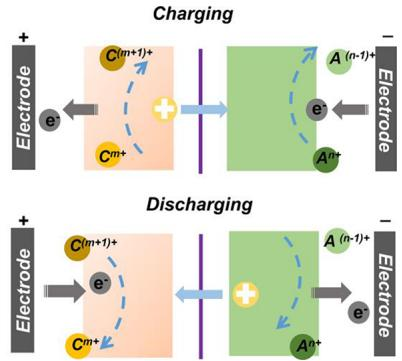  
Figure 60. (a) Schematic structure of RFB. (b) Charge and discharge mechanisms of a typical RFB.

aforementioned cathode showed better cycling performance in terms of  $89.4\%$  capacity retention after 420 cycles compared with  $8.2\%$  computed for its commercial counterpart (Figure 59b). Such findings have massive potential to become cornerstones for the development of high energy and power density aqueous cathode materials. However, due to the lethargic research on addressing zinc anode issues, there is still a long way to go for Ni-Zn chemistry to achieve long cycle and calendar life.

# 6.6. Summary and Future Perspectives for Alkaline Batteries

From the perspective of LSES, this section entails succinct yet comprehensive history and current status of the rechargeable alkaline batteries. Although attempts have been made to scale up Ni-MH batteries for assembling large-sized high power battery system, the cost of metal hydrides is too high for widespread applications. The research on Ni-Fe and Ni-Zn batteries has recently gained momentum through investigations focusing on compositional and structural modification of electrode materials. Despite notable progress, the EE of the Ni-Fe battery is still insufficient for LSES. Novel Ni-based nanostructures have been proposed for achieving high rate, supreme capacity, and safety features in Ni-Zn cells. In contrast, the low volumetric energy density and short calendar life due to zinc dendrites render Ni-Zn battery technology cost ineffective and hence challenging for LSES applications.

# 7. REDOX-FLOW BATTERIES

Since their invention in 1974 by Thaller et al.,[459] RFBs have been regarded as one of the most practical alternatives for medium and large scale energy storage applications.[42,63,350] Unlike aforementioned MIBs that store energy in their electrodes, RFBs have a unique architecture that is capable of storing energy in storage tanks filled with electrolytes, as shown in Figure 60a. Typically, positive and negative redox species are dissolved in supporting electrolytes to form catholyte and anolyte, respectively, which are separated by a functional membrane.[460-462] During electrochemical cycling, the ion-conducting anolyte and catholyte are pumped from the storage tanks to flow through the porous electrodes where the active species undergo their respective redox reactions (Figure 60b).[463] It is fundamental to mention that the separating membrane between the anolyte and the catholyte is of vital importance for the EE and cycle life of the RFBs. It allows transport of charge carriers to maintain the overall electroneutrality of the RFB system while preventing the cross contamination of active ions all the time.

The redox reactions of RFBs take place on the surface of electrodes without compromising the integrity of their internal structures, rendering them suitable for long cyclic life of more than 10000 charge-discharge cycles (10-20 years). The power rating (kW) of RFBs is a function of the electrode size and the number of cells in a stack. Their energy storage capacity (kWh) is dependent on the concentration of active species and volume of the electrolyte. The independent power and capacity architectures of RFBs enable their excellent design flexibility for GSES applications. Furthermore, a reliable separation between catholyte and anolyte along with simplicity in cell stack structure imparts inherent safety to RFBs, a fundamental consideration for LSES purposes. Moreover, the molten electrolytes and their intimate interfaces with porous electrodes promise rapid redox kinetics. Therefore, RFBs earn distinctive advantages for transitioning energy storage technology toward sustainable power generation and transmission.

Based on the type of redox species and supporting electrolytes (catholyte and anolyte), RFBs have been categorized into inorganic aqueous RFBs (ARFBs), organic ARFBs, nonaqueous RFBs, and so on. [461,464] However, most of the research on RFBs is devoted to ARFBs, which are known for their indispensable features, including high ionic conductivity, intrinsic safety, and facile manufacturing. The early research studies on ARFBs have emphasized the development of inexpensive transition metal and halogen based redox species with high solubility and stability in supporting electrolyte, high voltage difference, and rapid electrochemical kinetics. [465] Having made substantial progress over the last four decades, ARFBs have earned their reputation in demonstrating LSES based on numerous redox couples, including but not limited to iron-chromium RFBs (ICBs), [466] VRFBs, [463] zinc-bromide RFBs (ZBBs), [467] and zinc-iron RFBs (ZFBs). [468] For instance, a 200 MW/800 MWh VRFB-based energy storage and peak shaving power station has been under construction in Dalian (China) since 2016, validating the practicality of RFB technology for LSES. However, unlike the great improvement in the energy density of LIBs since the 1990s, [63] the energy density of major RFB systems has remained almost the same for more than three decades. In particular, the utility of conventional metal- or inorganic-based ARFBs (such as VRFBs) is predominantly limited by their low energy density ( $\sim$ 25 Wh kg $^{-1}$ ) and high investment cost. To address these challenges, recent investigations have focused on improving the energy density and reducing the cost through the development of novel and inexpensive RFBs. Such systems utilize advanced redox couples and low-cost membranes, yielding high operating voltage. In this regard, some comprehensive topical reviews have summarized

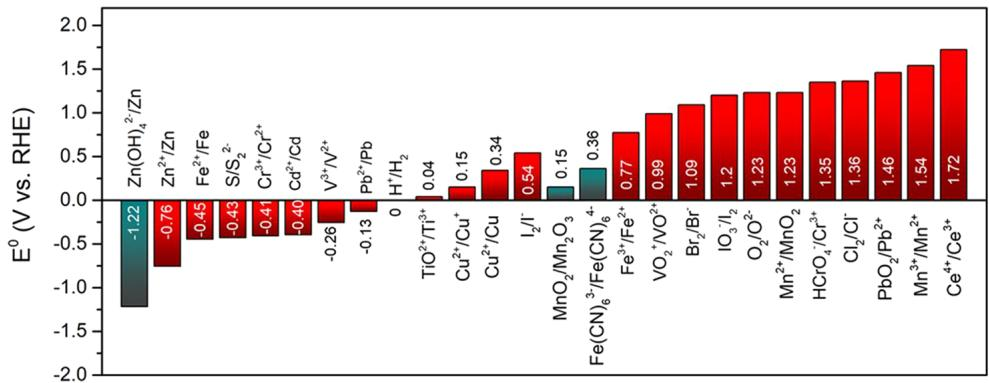  
Figure 61. Selected examples of inorganic redox species with different redox potentials. The colors of the cells correspond to the pH value of the electrolytes: red, acidic; blue, basic. Redesigned with permission from ref 465. Copyright 2015 Wiley-VCH.

the recent advances and performance metrics of conventional RFBs. $^{463,465,469-471}$  Herein, we delineate the representative work on electrodes, membranes, and organic redox couples for novel flow battery chemistries from the perspective of LSES applications. The gap between academia and industrialization of these battery chemistries will also be discussed in detail pointing toward the direction for the next-generation practical RFBs.

# 7.1. Conventional RFBs

A wide range of metal and halogen-based redox species can be coupled to construct a RFB. $^{465}$  Figure 61 summarizes the various redox species along with their corresponding redox potentials. It is fundamental to mention that the combination of two redox couples with low cost, high operating voltage, and ample solubility is very difficult. This explains why only a handful of RFB chemistries have been considered for LSES applications given their research history spanning over the last four decades.

7.1.1. Iron-Chromium RFBs. As a consequence of the oil crisis in the 1970s, NASA's Inventions and Contribution Board put forward the unprecedented RFB chemistry comprising of two redox couples, ferric/ferrous  $(\mathrm{Fe}^{2+}/\mathrm{Fe}^{3+})$  and chromic/ chromous  $(\mathrm{Cr}^{2+}/\mathrm{Cr}^{3+})$ , to be used as positive and negative active species, respectively, in halide solution.[459] The aforementioned RFB chemistry undergoes the following redox reactions while operating at standard voltage of  $1.18\mathrm{V}$ :

Cathode:

$$
\mathrm {F e} ^ {3 +} + \mathrm {e} ^ {-} \leftrightarrow \mathrm {F e} ^ {2 +} \quad E ^ {\circ} = 0. 7 7 \mathrm {V} \tag {20}
$$

Anode:

$$
\mathrm {C r} ^ {3 +} + \mathrm {e} ^ {-} \leftrightarrow \mathrm {C r} ^ {2 +} \quad E ^ {\circ} = - 0. 4 1 \mathrm {V} \tag {21}
$$

Overall:

$$
\mathrm {F e} ^ {3 +} + \mathrm {C r} ^ {2 +} \leftrightarrow \mathrm {F e} ^ {2 +} + \mathrm {C r} ^ {3 +} \quad E ^ {\circ} = 1. 1 8 \mathrm {V} \tag {22}
$$

Keeping in consideration the material costs of Fe and Cr metals, this RFB technology qualifies for inexpensive and efficient LSES. For instance, a  $250\mathrm{kW} / 1$  MWh storage facility has been set up by the Inventions and Contribution Board in California. This type of RFB delivers high EE of  $78.4\%$  at a current density of  $120\mathrm{mA}\mathrm{cm}^{-2}$ . On the other hand, the battery exhibits an undesirable capacity decay rate of  $1.2\%$  per cycle due to high crossover rate and rapid kinetics of side reactions during cycling. Also, the sluggish  $\mathrm{Cr^{3+} / Cr^{2+}}$  redox kinetics along with slow HER account for major shortcomings pertaining to the ICB technology. This is why the progress on this RFB technology has stagnated.

7.1.2. Zinc-Bromine RFBs. The ZBB operates on the principle of zinc metal dissolution/plating at the anode and  $\mathrm{Br}^{-}/\mathrm{Br}_{2}$  conversion at the positive electrode.[467] Following are the redox reactions governing the operation of a typical ZBB:

Cathode:

$$
\mathrm {B r} _ {2} + 2 \mathrm {e} ^ {-} \leftrightarrow 2 \mathrm {B r} ^ {-} \quad E ^ {\circ} = 1. 0 6 \mathrm {V} \tag {23}
$$

Anode:

$$
Z n ^ {2 +} + 2 e ^ {-} \leftrightarrow Z n \quad E ^ {\circ} = - 0. 7 6 V \tag {24}
$$

Overall:

$$
\mathrm {Z n} + \mathrm {B r} _ {2} \leftrightarrow \mathrm {Z n} ^ {2 +} + 2 \mathrm {B r} ^ {-} \quad E ^ {\circ} = 1. 8 2 \mathrm {V} \tag {25}
$$

In addition to the low-cost of Zn, thanks to its abundance, another potential upside of the ZBB is its higher energy density than ICB. The credit is given to the low electrochemical potential of the zinc anode. The developmental research on ZBBs has enabled scaling-up from kilowatt to megawatt scale for large scale storage demonstration. In 2015, for instance, a principal electricity generation company, Samruk Energy, based in the Republic of Kazakhstan purchased a ZBB system with 25 MW/100 MWh capacity from Primus systems. Despite all the advancements, the common challenge of dendrite formation on the Zn anode still remains, leading to electrical short circuit and hence questioning the inherent safety of this ZBB technology.[472,473] Furthermore, health and environmental concerns arising from the corrosive and hazardous nature of bromine gas have been a major hindrance in the furtherance of this technology for LSES purposes,[474,475] which recently have been minimized using methods such as bromine complexing agents.[476,477]

Following the invention of ZBBs, Lockheed Missiles and Space Company pioneered the concept of an early ZFB chemistry,[472] which employs ferro-ferricyanide as the cathode active material. The charge and discharge of this ZFB cell are governed by the following redox reactions:

Cathode:

$$
\mathrm {F e} (\mathrm {C N}) _ {6} ^ {3 -} + \mathrm {e} ^ {-} \leftrightarrow \mathrm {F e} (\mathrm {C N}) _ {6} ^ {4 -} \quad E ^ {\circ} = 0. 3 6 \mathrm {V} \tag {26}
$$

Anode:

$$
\mathrm {Z n} (\mathrm {O H}) _ {4} ^ {2 -} + 2 \mathrm {e} ^ {-} \leftrightarrow \mathrm {Z n} + 4 \mathrm {O H} ^ {-} \quad E ^ {\circ} = - 1. 2 2 \mathrm {V} \tag {27}
$$

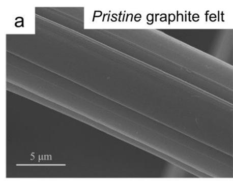

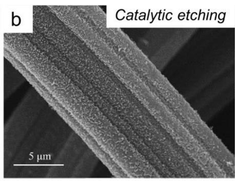

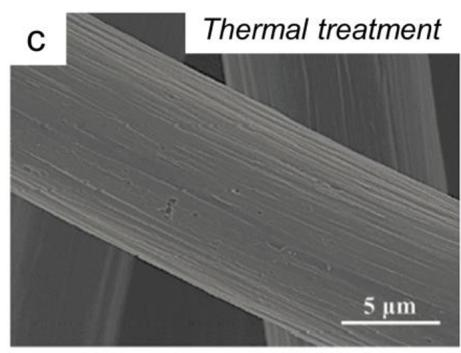

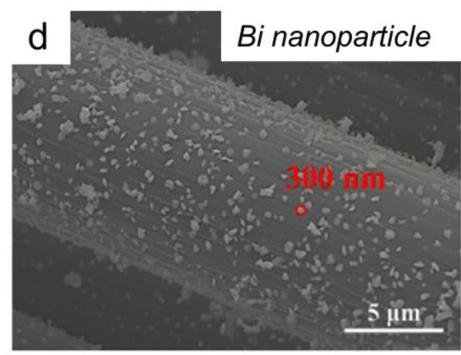

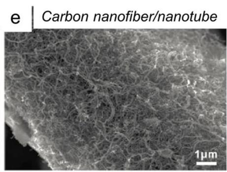

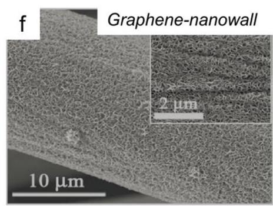

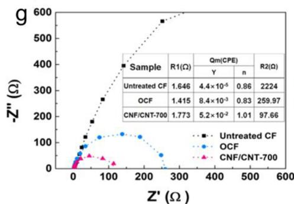  
Figure 62. Strategies to increase the catalytic activity of electrodes in VRFBs. (a) Pristine CF. (b) Creating pores on the electrode fibers via surface catalytic etching methods. Reproduced with permission from ref 483. Copyright 2019 Elsevier. (c) Introducing functional groups onto the surface of electrode by thermal treatment. (d) Decorating metal-based electrocatalyst. Reproduced with permission from ref 482. Copyright 2019 Elsevier. (e) Decorating carbon-based nanostructured electrocatalyst: CNF/CNT composite catalyst on CF surface. Reproduced with permission from ref 487. Copyright 2015 Wiley-VCH. (f) Catalyst based on the graphene nanowall. Reproduced with permission from ref 488. Copyright 2013 American Chemical Society. (g) Electrochemical performance of VRFBs with untreated, oxidized, and decorated CNF, CNT, and CF. Reproduced with permission from ref 487. Copyright 2015 Wiley-VCH.

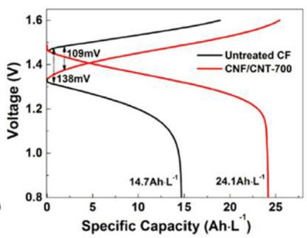

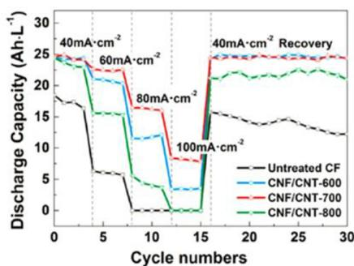

Overall:

$$
\begin{array}{l} 2 \mathrm {F e} (\mathrm {C N}) _ {6} ^ {3 -} + \mathrm {Z n} + 4 \mathrm {O H} ^ {-} \leftrightarrow 2 \mathrm {F e} (\mathrm {C N}) _ {6} ^ {4 -} \\ + \mathrm {Z n} (\mathrm {O H}) _ {4} ^ {2 -} \quad E ^ {\circ} = 1. 5 8 \mathrm {V} \tag {28} \\ \end{array}
$$

Both the  $\mathrm{Zn(OH)}_4^{2-}/\mathrm{Zn}$  couple and the nontoxic and cost-effective  $\mathrm{Fe(CN)}_6^{3-}/\mathrm{Fe(CN)}_6^{4-}$  couple in alkaline solution are able to lower the ZIB cost to  $\$120\ \mathrm{kWh}^{-1}$ . However, the low ionic conductivity of the Nafion membranes and the low solubility of ferro-ferricyanide in alkaline solutions are responsible for the low power and energy densities of the battery.[473] Nevertheless, the technology has been currently commercialized by ViZn Energy Systems Inc. for grid-scale applications. In this regard, Hecate Energy with the support of ViZn Energy Inc. has set up a  $2\ \mathrm{MW}/6\ \mathrm{MWh}$  ZFB system for the provision of ancillary services to the Ontario grid in Canada. However, limited information on the battery chemistry and performance has been disclosed. Recently, a novel ZIB[468] based on a Zn redox pair in base and an Fe redox pair in acid has emerged as a promising candidate for achieving phenomenal

electrochemical performance along with minimal manufacturing cost. $^{478}$

7.1.3. All Vanadium RFBs. Originally pioneered by Skyllas-Kazacos and co-workers during the 1980s at University of New South Wales, the VRFB operates with  $\mathrm{V}^{2+}/\mathrm{V}^{3+}$  and  $\mathrm{VO}^{2+}/\mathrm{VO}^{2+}$  as redox couples, eliminating the cross-contamination between negative and positive compartments.[479,480] Upon mixing catholyte and anolyte, the initial oxidation states of vanadium can be recovered. In general, the VRFBs offer advantages of excellent electrochemical kinetics and negligible side reactions. Since the emergence of research on VRFBs in 1990s, their potential for achieving storage capacity up to multi-MW/MWh scale has been validated in the laboratory and on commercial scales. In 2015, Hokkaido Electric Power Company and Sumitomo Electric Industries Ltd. collaborated jointly to complete a whopping 15 MW/60 MWh VRFB storage system at Minami Hayakita Transformer Station in Abira-chou, Hokkaido (Japan), which is one of the world's largest RFB facilities in operation to date. It clearly shows that having been partially commercialized, VRFBs occupy most of the share in the

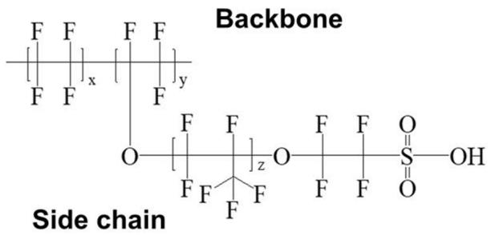  
a

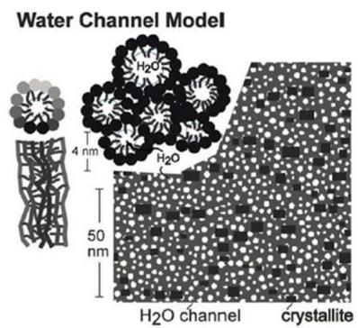  
b

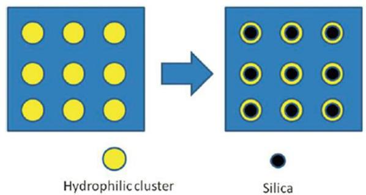  
C

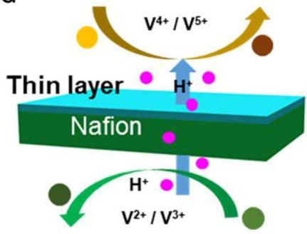  
d  
Figure 63. Nafion membrane in VRFBs. (a) Proposed structure of Nafion. (b) Water channel model for the morphology of Nafion. Reproduced with permission from ref 493. Copyright 2007 Springer Nature. (c) Schematic illustration of Nafion/inorganic hybrid membranes. (d) Schematic illustration of Nafion/organic composite multilayer membranes. Reproduced with permission from ref 491. Copyright 2011 Royal Society of Chemistry.

RFB market and are still emerging as one of the most mature flow battery systems. For a typical VRFB, the standard potential at ion concentrations of  $1\mathrm{mol}\mathrm{L}^{-1}$  is  $1.26\mathrm{V}$ , while the energy conversion takes place by transitions in valence states of vanadium through the following electrode reactions:

Cathode:

$$
\mathrm {V O} _ {2} ^ {+} + 2 \mathrm {H} ^ {+} + \mathrm {e} ^ {-} \leftrightarrow \mathrm {V O} ^ {2 +} + \mathrm {H} _ {2} \mathrm {O} \quad E ^ {\circ} = 1. 0 1 \mathrm {V} \tag {29}
$$

Anode:

$$
\mathrm {V} ^ {3 +} + \mathrm {e} ^ {-} \leftrightarrow \mathrm {V} ^ {2 +} \quad E ^ {\circ} = - 0. 2 5 \mathrm {V} \tag {30}
$$

Overall:

$$
\mathrm {V O} _ {2} ^ {+} + \mathrm {V} ^ {2 +} + 2 \mathrm {H} ^ {+} \leftrightarrow \mathrm {V O} ^ {2 +} + \mathrm {V} ^ {3 +} + \mathrm {H} _ {2} \mathrm {O}
$$

$$
E ^ {\circ} = 1. 2 6 \mathrm {V} \tag {31}
$$

It is worth mentioning that the VFRBs are able to operate with EE up to  $80.3\%$  at a current density of  $120\mathrm{mAcm}^{-2}$ . In addition, the capacity decay rate of the cell is as low as  $0.3\%$  per cycle, which is substantially lower than that computed for ICBs.[470] Nonetheless, the market penetration of the VRFBs for LSES is inhibited by their low energy density and the high cost of vanadium  $(\sim \$  27\mathrm{kg}^{-1})\) and Nafion membranes  $(\sim \\( 500\mathrm{m}^{-2})$ .[481] Currently, significant efforts have been devoted to the development of novel electrodes, membranes, and redox electrolytes to achieve electrochemical performance comparable to that of LIBs.

# 7.2. Recent Developments in RFBs

7.2.1. Electrodes. Suitable selection of electrode plays a crucial role in determining the current density and the long-term stability of RFBs as it not only offers the active areas for redox reactions but also affects the ion and mass transport. $^{471}$  The high

current density and operationally feasible VRFBs enable a compact cell stack, which leads to a lower cell stack cost. Therefore, the stringent and critical requirements of an excellent electrode for high power density and long life RFBs include high surface area, suitable porosity, good wettability, high electrical conductivity, excellent reactivity toward the redox species, and high chemical and electrochemical stability. Among electrode materials, carbon based electrodes are the most favored and hence widely studied for VRFBs due to their wide operating potential range, reasonable stability, excellent electrical conductivity, high corrosion resistance, and relatively low cost as compared to other alternatives studied to date.[482,483] In contrast to the aforementioned benefits, the carbon felt (CF)-based electrodes exhibit inferior electrochemical performance, primarily owing to their sluggish redox kinetics and low specific area, resulting in insufficient number of active sites for rapid redox reactions.[484] Various solutions have been proposed and investigated to promote slow redox kinetics through enhancing the surface area of the electrodes. In this regard, the remedial pretreatment solutions are generally divided into three categories: (1) employing surface etching methods for creating abundant secondary pores on the surface of carbon fibers for providing additional active sites for the electrochemical reactions;[485] (2) introducing functional groups onto the surface of the electrode for improving its electrocatalytic activity, leading to enhanced battery performance;[486] and (3) anchoring electrocatalysts on the surface of carbon fibers.[487,488]

Among surface treatment methods, thermal treatment, nitrogen treatment, and acid treatment are commonly known. The surface morphologies of different carbon fibers in SEM images (Figure 62a-f) demonstrate their efficacy in augmenting the electrocatalytic performance of electrodes in VRFBs. In this regard, a similar method has been recently proposed by the

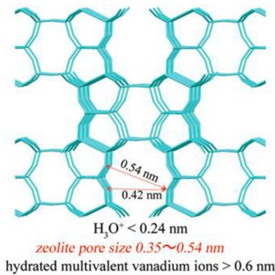  
a

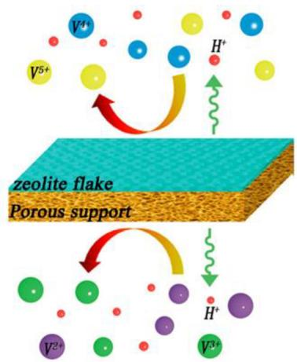

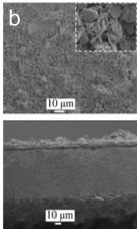

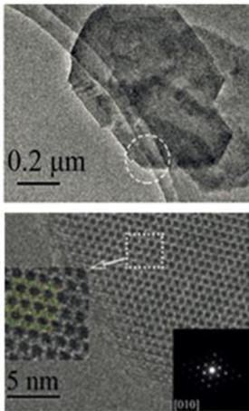

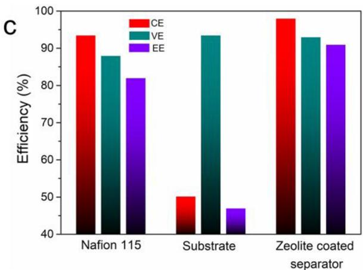

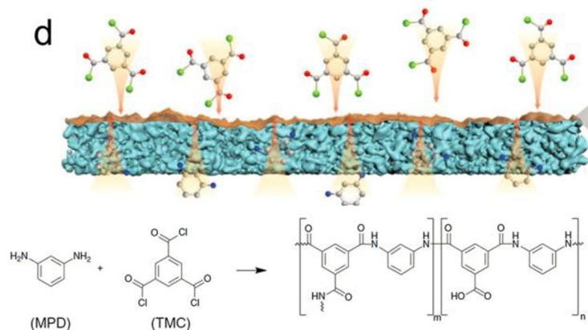

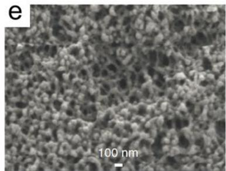

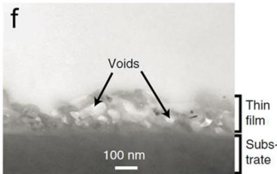

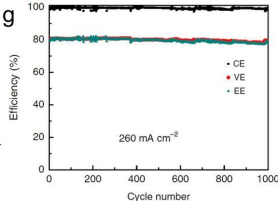  
Figure 64. Porous membrane with ion-selective layer. (a) Design principles for a porous membrane coating with a zeolite flake layer. (b) Surface and cross-section morphology of membranes (left) and TEM image of ZSM-35 zeolite (right). (c) Efficiency performance of a VRFB assembled with substrate, Nafion 115, and zeolite-coated membrane. Reproduced with permission from ref 506. Copyright 2016 Wiley-VCH. (d) Schematic illustration of the mechanism of interfacial polymerization. (e) SEM and (f) TEM images of the cross-section of thin-film composite membranes. (g) Cycle performance of VRFBs equipped with the thin-film composite membranes at a current density of  $260\mathrm{mAcm}^{-2}$ . Reproduced with permission from ref 507. Copyright 2020 Springer Nature.

introduction of a CNF/CNT composite catalyst on the CF surface for achieving high performance in VRFBs.488 Such a composite catalyst accelerates the electron and mass transfer kinetics, resulting in increased VRFB efficiency at a high rate along with low overpotential for vanadium redox reaction (Figure 62e,g). It has been further shown that the as-prepared CNF/CNT electrode in VRFBs exhibits the lowest charge transfer resistance for both  $\mathrm{V}^{2 + } / \mathrm{V}^{3 + }$  and  $\mathrm{VO^{2 + } / VO_{2}}$  redox reactions and, therefore, demonstrates increased capacity retention and rate capability (up to  $100\mathrm{mAcm}^{-2}$ ). Such characteristics are therefore conducive to improving electron

transfer and lowering polarization. However, a major issue associated with decorating the carbon fiber surface is that such nanomaterials are prone to being dislodged by the flowing electrolyte, deteriorating the cycling stability of the electrodes.

In addition, tuning the electrode structures plays an important role in enhancing the redox kinetics and surface area of the electrodes.[489] The insufficient mass transport into the dense electrode structure during electrochemical cycling decreases the local concentration of redox species, which further causes substantial concentration loss. In other words, only the active surface next to the electrolyte is exposed to abundant redox

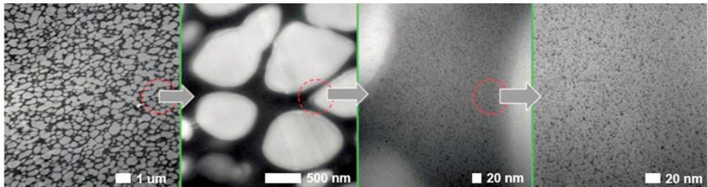  
a

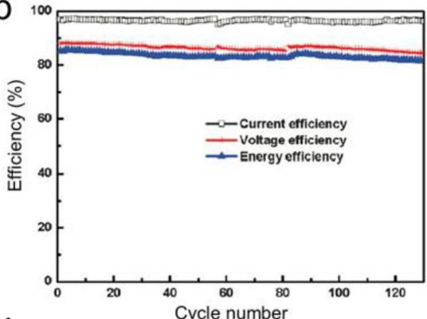  
b  
d

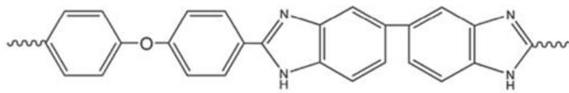  
C

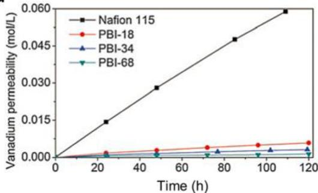

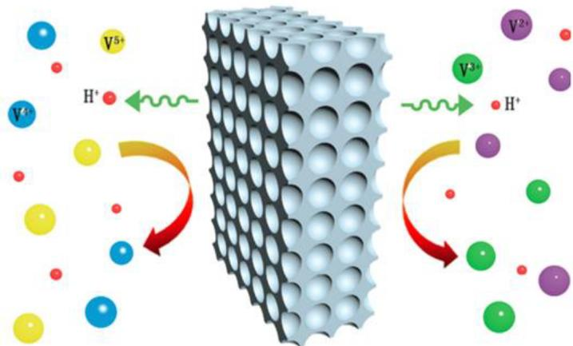

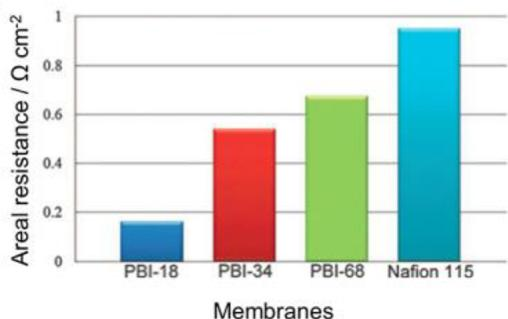  
e

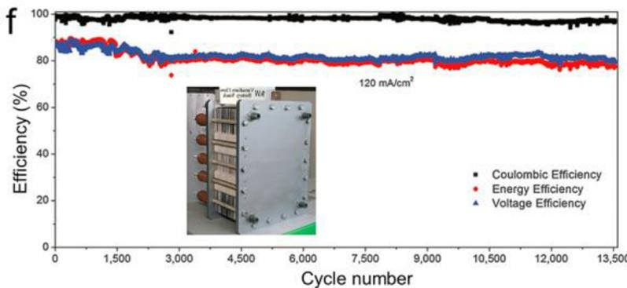  
Figure 65. Porous membranes with spongy structures. (a) TEM images of the porous membranes with spongy structures under increased magnification. (b) Cycling performance of a VRFB single cell under  $100\mathrm{mAcm}^{-2}$ . Reproduced with permission from ref 508. Copyright 2013 Royal Society of Chemistry. (c) Chemical structure of PBI, and schematic principle of the porous PBI membrane with symmetric spongy structures in VRFB. (d) Vanadium permeability and (e) area resistance of the prepared PBI porous membranes with different thicknesses and Nafion 115. (f) Long-term stability test of a VRFB assembled with a PBI-68 membrane (Inset, the kW VRFB cell stack prototype using the PBI-68 porous membranes). Reproduced with permission from ref 499. Copyright 2016 Royal Society of Chemistry.

species, leading to the death of surface area (sites), therefore leading to higher polarization as well as undesired pumping burden. To address this issue, Zhao et al. $^{490}$  has proposed a novel electrode structure with a porosity gradient for ensuring the enhanced mass transport without sacrificing the active surface area. In other words, the active reaction surface area

gradually increased from the flow field to the membrane side owing to the increased porosity. Upon electrochemical cycling at a current density of  $240\mathrm{mAcm}^{-2}$ , the cell based on the aforesaid electrode delivers a higher discharge capacity by a whopping margin of  $69\%$  as compared to the conventional electrode

design, hence proving the efficacy of the porosity gradient based electrode design.

7.2.2. Membranes. Ideally, a membrane ought to exhibit high ionic conductivity, good ionic selectivity, excellent chemical and thermal stability, and inexpensive manufacturability. With their established classification into ion-exchange membranes (IEMs) and nonionic porous membranes, the former are generally made of cross-linked linear polymer chains in a 3D network along with attached functional groups, enabling the exchange of ions in or across the membrane.[491] Based on the polymer matrix, IEMs are further categorized into perfluorinated and nonfluorinated membranes. With regards to the former type of IEMs, Nafion has earned its reputation as an effective and conveniently available membrane owing to its numerous advantages in terms of high water swelling ratio, commendable proton conductivity, desired mechanical strength, and excellent thermal and chemical stability in RFBs.[492] The structure of currently employed Nafion membranes includes a flexible perfluorinated backbone and a side chain with perfluorovinyl ether groups, which are terminated with sulfonate groups (Figure 63a). The hydrophobic backbone endows the membranes with excellent mechanical and chemical stability thanks to the strength of the C-F single bond, while the hydrophilic sulfonated groups are responsible for providing rapid proton transport access. In order to determine the role of Nafion morphology in ion transfer enhancement, a well-known water channel model has been proposed (Figure 63b).[493] According to this, the sulfonic acid functional groups self-organize into hydrophilic water channels up to  $2.5\mathrm{nm}$  in diameter, thereby allowing a large number of vanadium ions to pass through the membrane and resulting in relatively low ion selectivity. Curbing the formation of hydrophilic clusters by using inorganic or organic fillers, such as  $\mathrm{SiO}_2$ ,  $\mathrm{TiO}_2$ , poly(ether ether ketone) (SPEEK), polytetrafluoroethylene (PTFE), or a thin ion selective membrane, is an effective way to solve the low ion selectivity conundrum (Figure 63c,d).[492,494,495] For example, Sun et al.[496] has proposed a hybrid membrane via a solution casting method through the dispersion of superhydrophilic  $\mathrm{TiO}_2$  nanotubes in the Nafion matrix. The incorporation of  $\mathrm{TiO}_2$  nanotubes is conducive to hindering the permeation of ions and hence lowering the capacity loss of the cell. Upon assembly of Nafion/ $\mathrm{TiO}_2$  in VRFB, it exhibits high capacity retention of  $55.7\%$  after 1400 cycles (over  $518\mathrm{h}$ ). This is in contrast to the rapid capacity drop to  $20\%$  in just 410 cycles (about  $89\mathrm{h}$ ) for the cell with Nafion 212.

However, the cost of the commercial DuPont Nafion membrane is approximately  $500 -$ 800 per square meter, which makes up ~40% of the total manufacturing cost of a VRFB stack, ruling out the practicality of Nafion composite membranes. In contrast, inexpensive nonfluorinated IEMs like sulfonated or quaternized polyaromatic polymers with high ion selectivity suffer from poor chemical stability, which is due to the introduction of ion exchange groups, particularly in the highly oxidative and strongly acidic electrolyte containing VO $^{2+}$  species.[497] IEMs based on perfluorinated and nonfluorinated materials have been summarized in other reviews and are not the center of attention in this topical review.[491,498] However, besides IEMs, porous membranes with their excellent mechanical and chemical stability and lower cost have recently attracted much more attention for RFB applications.[499,500]

Easily accessible and well-established porous membranes are widely used in commercial LIBs owing to their inherent ability to prevent permeation of unwanted redox species or compounds

by the size exclusion effect. $^{500}$  Several kinds of porous membranes have been designed, fabricated, and investigated for their utility in VRFBs. These include polyacrylonitrile (PAN), $^{500}$  poly(vinylidene fluoride) (PVDF), $^{501}$  and PTFE. $^{502}$  It is imperative to mention that the ion selectivity of these porous membranes is relatively inferior to IEMs, which leads to low EE when employed in RFBs. $^{503,504}$  To enhance the ion selectivity of membranes, several strategies have been reported to decrease the pore size and include additives, such as polymers or functional groups, on the surface and inside the porous membranes. $^{505}$

For instance, a novel porous membrane comprising an ultrathin ZSM-35 zeolite flake uniformly distributed onto a poly(ether sulfone) (PES)-based porous membrane has been introduced, as shown in Figure 64a,b. The pore size of the zeolite (ca.  $0.5\mathrm{nm}$ ) is between those of hydrated vanadium ions  $(>0.6\mathrm{nm})$  and protons  $(<0.24\mathrm{nm})$ . Therefore, the RFB with the prepared membrane has showed exceptionally high CE and VE, clearly outperforming the Nafion membranes (Figure 64c). In addition to membranes coated with an inorganic thin layer, an important study has used interfacial polymerization to coat a polyamide selective layer on a porous polymer substrate for electrochemical performance investigation (Figure 64d-f). The synthesized ultrathin polyamide selective layer, having compact cross-linked structure and pore size of  $1\mathrm{nm}$  (between the radius of hydrated vanadium ions and protons), offers high selectivity and chemical stability. Upon cycling, the VRFB with the polyamide selective layer-based sulfonated poly(ether ether ketone) SPEEK/PES membrane performs exceptionally, delivering EE of  $\sim80\%$  at a high current density of  $260\mathrm{mA}$ $\mathrm{cm}^{-2}$  (Figure 64g).

Membrane modification based on structural design is another effective tactic to enhance its electrochemical performance in RFBs. For instance, Zhang et al. $^{508}$  employed the vapor-induced phase inversion method to design a membrane with bulk sponge structure in which thousands of micrometer-sized cells are separated by ultrathin walls. Figure 65a displays the TEM micrographs of fractured sponge membranes stained with  $\mathrm{PdCl}_4^{2-}$ , revealing disconnected pores and ultrathin walls in the membranes. This unique porous structure guarantees high selectivity and high proton conductivity. As far as the electrochemical performance of the aforesaid membrane in RFBs is concerned, the cell upon cycling shows EE of over  $84\%$  at a current density of  $100\mathrm{mA cm}^{-2}$  for 130 cycles (Figure 65b). Similarly, polybenzimidazole (PBI) polymers yield remarkably high thermal, mechanical, and chemical stability along with superior proton conductivity when protonated in acidic conditions. The efficiency of the transport mechanism of protons is predicated on the interaction between protons and nitrogen groups placed on the heterocyclic rings. Pertaining to this, Zhang et al. $^{499}$  has further investigated a new kind of advanced sponge-like porous PBI membrane for achieving superhigh stability and selectivity for VRFB applications (Figure 65c). $^{499}$  In relation to this, the ionic conductivity of the proposed spongy PBI membrane was assured by the acid doped in the PBI pores, whereas the high selectively was attributed to the positively charged pores. As for the ion transfer mechanism, the prepared membrane showed much lower permeability for  $\mathrm{VO}^{2+}$  species and a real resistance than that recorded for Nafion 115 membrane (Figure 65d,e). The supplementary upsides of the spongy PBI membrane include facile fabrication of the low-cost raw materials, ease of scale-up, and higher selectivity and chemical stability, outperforming Nafion. Furthermore, a VRFB

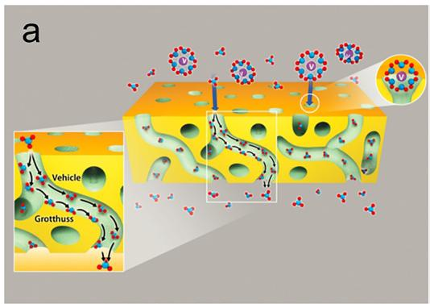

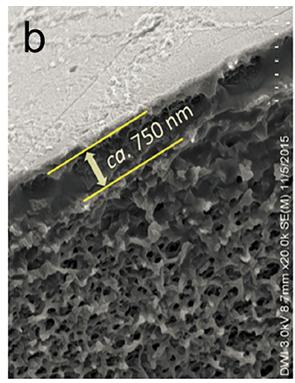

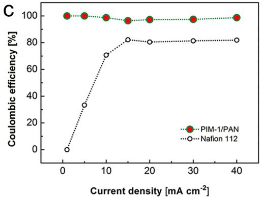

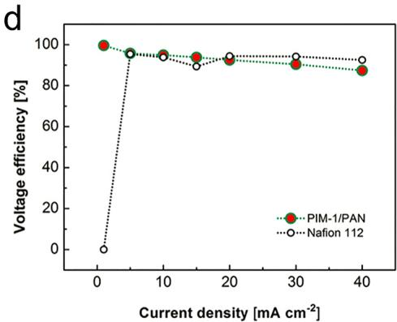

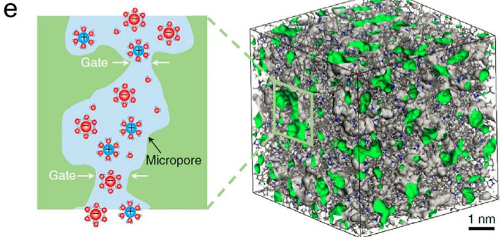

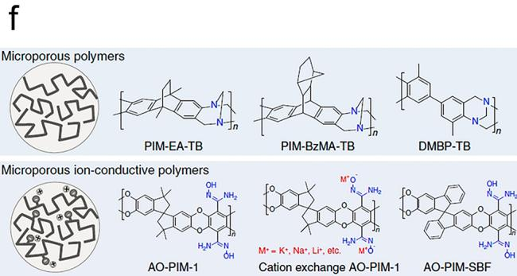

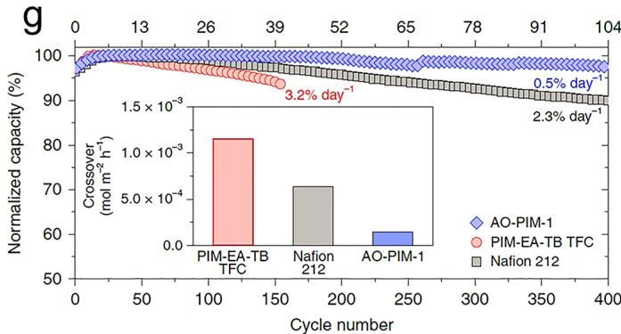  
Figure 66. PIM for RFBs. (a) Proposed working principle of the hydrophobic PIM. (b) Cross section morphology of PIM-1/PAN composite membrane. (c, d) VRFB performance of PIM-1  $(0.75\mu \mathrm{m}) / \mathrm{PAN}$  composite membrane and Nafion 112. Reproduced with permission from ref 509. Copyright 2016 Wiley-VCH. (e) Schematic diagram of interconnected sub-nanometer-sized cavities in microporous membranes. (f) Macromolecular structures of microporous polymers with a size-selective ion separation function, and typical structures of hydrophilic microporous PIM polymers. (g) Cycling performance of organic RFBs assembled with PIM-EA-TB TFC, AO-PIM-1, and Nafion 212 membranes under a current density of  $40\mathrm{mA}$ $\mathrm{cm}^{-2}$ . Inset shows the crossover rates of iron-containing species through membranes in the operating batteries. Reproduced with permission from ref 505. Copyright 2019 Springer Nature.

based on this membrane delivered excellent electrochemical stability for more than 13000 cycles, as shown in Figure 6Sf.

A hydrophobic polymer with intrinsic microporosity (PIM) has been designed for performance improvement in VRFBs. The PIM is characterized by inherent microporous structure with a pore size less than  $2\mathrm{nm}$  and limited swelling in aqueous solution, which is induced by hydrophobic molecular structure (Figure 66a).509 When assembled in RFBs, the PIM/PAN composite membranes showed high CE of  $\sim 100\%$  at a low current density of  $1\mathrm{mAcm}^{-2}$ , implying no occurrence of vanadium ion crossover (Figure 66b,c). However, the high selectivity of the PIM membrane comes at the expense of proton conductivity. For example, the VE decreases gradually with increasing current density (up to  $40\mathrm{mAcm}^{-2}$  as shown in Figure 66d), which may

be attributed to the exclusion effect of hydrophobic molecules in the membrane. Similarly, a new approach for designing membranes based on hydrophilic PIMs has been recently introduced by Song et al.[505] for enabling fast ion transport and high molecular selectivity (Figure 66e). In this investigation, the incorporation of hydrophilic functional groups (including ionizable groups) was responsible for generating interconnected water channels for augmenting ion conductivity. To explain, the PIMs chosen for the aforementioned investigation were derived from Tröger's base (TB-PIMs) or based on dibenzodioxin with hydrophilic and ionizable amidoxime groups (AO-PIMs), as shown in Figure 66f. When electrochemically cycled in RFBs, these membranes showed fast ion transport combined with high molecular selectivity for aqueous organic flow batteries and

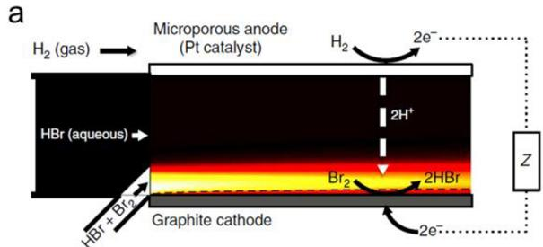

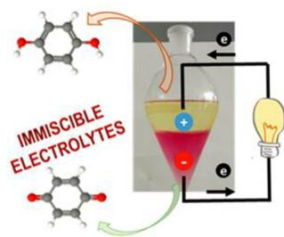  
b

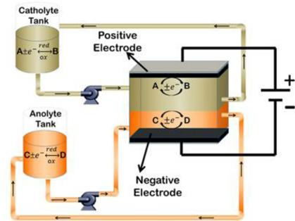

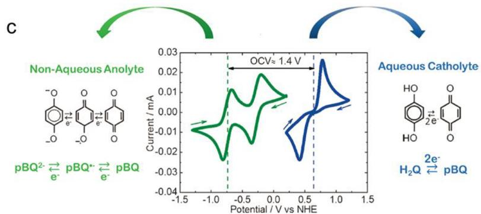

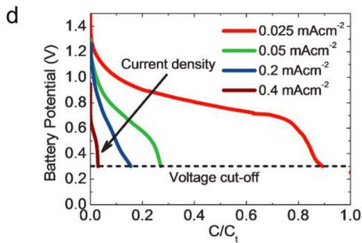

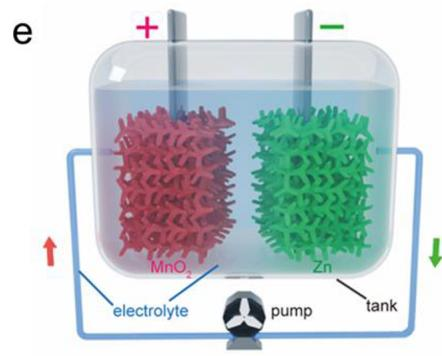  
Figure 67. Membrane-free RFBs. (a) Schematic of reactant flow within the membrane-less hydrogen bromine laminar flow battery. Reproduced with permission from ref 510. Copyright 2013 Springer Nature. (b) Schematic representation of the membrane-free battery concept based on immiscible redox electrolytes. (c) Electrochemical characterization of immiscible redox electrolytes. (d) Discharge profiles of the membrane-free battery at different current densities. Reproduced with permission from ref 511. Copyright 2017 Wiley-VCH. (e) Configuration of a membrane-free redox flow aqueous  $\mathrm{Zn} / \mathrm{MnO}_2$  battery. (f) Tenth charge and discharge curves at different discharge rates when the charge voltage is  $2.0\mathrm{V}$  vs.  $\mathrm{Zn}^{2+} / \mathrm{Zn}$ . Reproduced with permission from ref 237. Copyright 2020 Wiley-VCH.

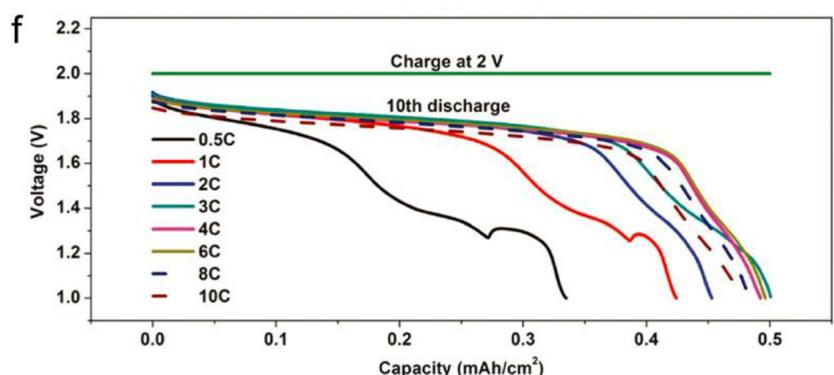

delivered high EE and high capacity retention, which are comparable to those with standard Nafion membranes, as evident in Figure 66g.

A contemporary concept based on membrane-free RFBs has recently emerged to reduce their manufacturing cost. However, such RFBs are still far from being practical. This proposition is typically based on the fluid mechanics of catholytes and anolytes or fine-tuning of the interfacial reactions. For example, a membrane-free hydrogen bromine laminar flow battery, consisting of hydrogen and aqueous bromine oxidant, has been reported.[510] This membrane-free RFB system relies on controlled diffusion for separating reactants and, upon charge-discharge cycling, achieves a power density up to  $0.795\mathrm{Wcm}^{-2}$  with VE of  $92\%$  (Figure 67a). An alternative unique strategy for designing a membrane-free RFB is exploiting immiscible catholyte and anolyte. In this regard, an acidic solution of hydroquinone  $(\mathrm{QH}_2)$  and a hydrophobic IL, 1-butyl-1-methylpyrrolidinium bis(trifluoromethanesulfonyl)imide, containing dissolved parabenzoquinone (forming a biphasic system), has

been demonstrated for a membrane-free RFB (Figure 67b).511 The cyclic voltammograms (Figure 67c) indicate quasi-reversible redox behavior for both electrolytes. As for the electrochemical performance, this membrane-free RFB operates at a low current density of less than  $0.4\mathrm{mAcm}^{-2}$  (Figure 67d).

Metal electrodes based on stripping-deposition reactions have also been employed to assemble a membrane-free hybrid RFB system, whose operation is based on the immiscibility between metals and electrolytes. Concerning this, the  $\mathrm{Zn / MnO_2}$  flow battery has been introduced as a classic example of a membrane-free RFB, as shown in Figure 67e.[237] The operation of such an RFB system is predicated on enabling dissolution-deposition reactions on both cathodes  $(\mathrm{Mn}^{2 + } / \mathrm{MnO}_2)$  and anodes  $(\mathrm{Zn}^{2 + } / \mathrm{Zn})$ , allowing mixing of anolyte and catholyte into only one electrolyte. This eliminates the otherwise stringent requirement for an ion selective membrane. Upon repetitive charge-discharge cycling, this  $\mathrm{Zn / MnO_2}$  membrane-free RFB displays a high discharge voltage of  $\sim 1.78\mathrm{V}$ , reasonable rate capability with  $10~\mathrm{C}$  discharge, and excellent cycling stability for

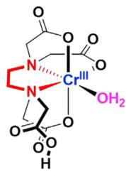  
a  
$\mathrm{Cr(EDTA)(H_2O)}$

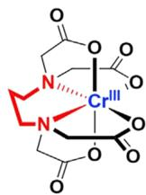

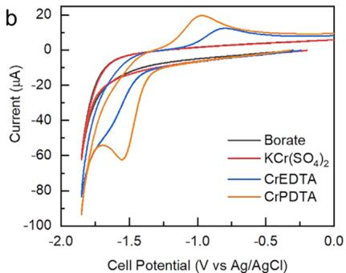

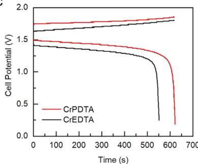  
$[\mathrm{Cr(PDTA)}]^{-}$  
C  
Figure 68. (a) Molecular structure of  $\mathrm{Cr(EDTA)(H_2O)}$  and  $[\mathrm{CrPDTA}]^{-}$  based on X-ray crystal structure data. (b) CV data of glassy carbon electrode (black),  $\mathrm{Cr(III)}$  sulfate (red),  $\mathrm{CrEDTA}$  (blue), and  $\mathrm{CrPDTA}$  (orange). (c) Single cycle bulk electrolysis of  $\mathrm{CrEDTA}$  and  $\mathrm{CrPDTA}$ . (d) Cell potential during discharge at  $10\mathrm{mAcm}^{-2}$  from  $90\%$  SoC of  $\mathrm{CrPDTA}$  vs.  $\mathrm{KBr / Br_2}$ . Inset: cell potential during cycling at  $0.1\mathrm{Acm}^{-2}$  to  $80\%$  and  $90\%$  of SoC. Reproduced with permission from ref 516. Copyright 2019 Elsevier.

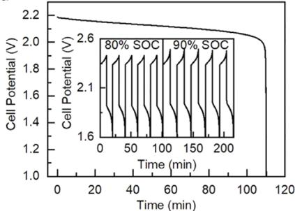  
d

over 1000 cycles with areal capacity ranging from 0.5 to  $2\mathrm{mAh}$ $\mathrm{cm}^{-2}$  (Figure 67f).[237] More importantly, this battery can be conveniently scaled up to construct a cell of  $1.2\mathrm{Ah}$  with plausible capacity retention up to  $89.7\%$  at the 500th cycle, thereby proving the potential of this technology for LSES applications.

7.2.3. Electrolytes. RFB electrolytes are typically composed of a supporting electrolyte and a redox species. The performance of conventional ARFBs is mainly limited by the narrow electrochemical stability window (below 2 V) of aqueous supporting electrolyte, the low concentration of redox species, severe cross-contamination, and the high cost of metal redox species.[469] The modern investigations into developing next generation electrolytes tend to lay strong emphasis on exploring new organic redox species and novel ways to endow the supporting aqueous electrolytes with a high potential window.

7.2.3.1. Redox Species. In RFBs, the redox species hold the utmost importance for dictating the overall cell performance. To explain, the equilibrium potential and solubility, rate of reaction kinetics, chemical stability, and cost effectiveness of redox species directly influence the energy density, power density, cycle life, and practicality of a RFB system.[465] As mentioned earlier, most of the early research on ARFBs employed metal- and halogen-based ions as redox species. Several reviews have summed up the recent advances pertaining to redox species in RFBs.[462,465,481] VRFBs, constituting the most characteristic kind of RFB, still face several key shortcomings, such as high cost and insufficient energy density. To solve these issues, numerous inexpensive and sustainable organic redox materials have been proposed as efficient alternatives to the present metal-based redox species.[512] In this regard, it has been speculated that the redox potential and solubility are likely to be tailored by designing specific side groups on the organic molecular structures, leading to the manufacturing of low-cost high energy density RFBs. Some known organic redox materials, including

metallocenes, carbonyls (including quinones), nitroxide radicals, dialkoxybenzenes, and heterocyclic aromatics, have already been reviewed.512-515 Herein, the most recent studies on synthesis and applications of classic metal complexes and organic redox species have been summarized to serve as a reference for the further development of aqueous organic RFBs.

Compared with single transition metal ions, metal complexes are considerably larger in size, which explains why the latter have lower risk of cross-contamination. Structurally, transition metal complexes are composed of a central transition metal and peripheral ligands. In general, the transition metal ions act as the charge transfer center, while the ligands play their role in tuning the potential. With the proper selection of ligand, the redox potential of the complex can be tuned to meet the rigorous requirements of catholyte and anolyte. Moreover, ligands are beneficial in improving the solubility, reaction kinetic rates, and stability of RFBs. Until now, metal complexes of several metal ions (such as Fe, Co, V, Ce, or Cr) have been studied in conjunction with various ligands, for example, ethylenediaminetetraacetate acid (EDTA), diethylenetriaminepentaacetic acid (DTPA), phenanthroline, and triethanolamine.[516-519] In 2019, for example, Marshak et al.[516] proposed 1,3-propylenediaminetetraacetic acid (PDTA) chelated with chromium metal (hence CrPDTA) as a solvent barrier in electrolyte for inhibiting the formation of  $\mathrm{H}_{2}$ , thereby rendering the development of low-cost and unprecedentedly high-voltage RFBs suitable for GSES applications. In this regard, the  $\mathrm{Cr}^{3+}/\mathrm{Cr}^{2+}$  reduction potential of CrPDTA is  $-1.10\mathrm{V}$  (vs. SHE), which is more negative than its similar counterpart of CrEDTA (Figure 68a-c). It contributes significantly to improving electrode kinetics, thereby resulting in enhanced voltage and efficiency when employed as a catholyte in the flow battery. In addition, the study harnessed the  $\mathrm{Br}_{2}/\mathrm{Br}^{-}$ redox couple in a RFB for delivering unprecedented potential of over  $2.1\mathrm{V}$ . Figure 68d illustrates the discharge curve of a  $\mathrm{Cr}-\mathrm{Br}$  RFB, operating at a cell voltage of  $2\mathrm{V}$  during complete

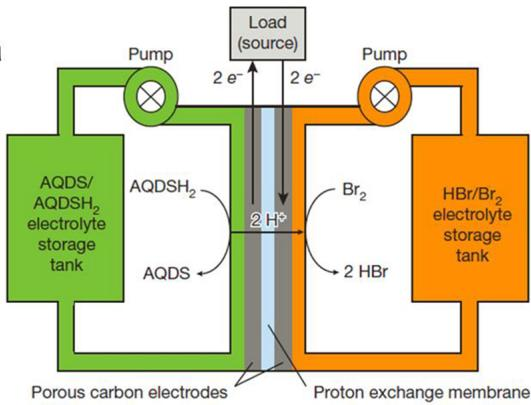  
a

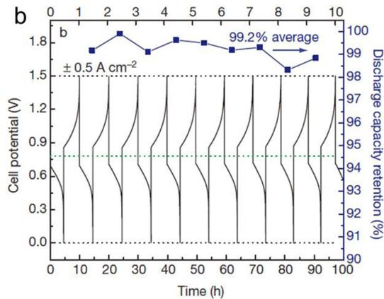  
b

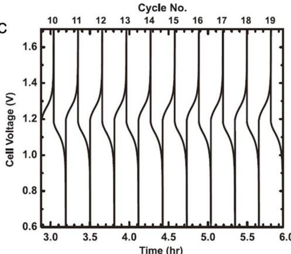  
C

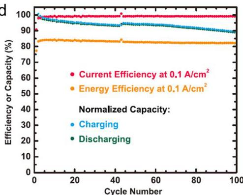  
d

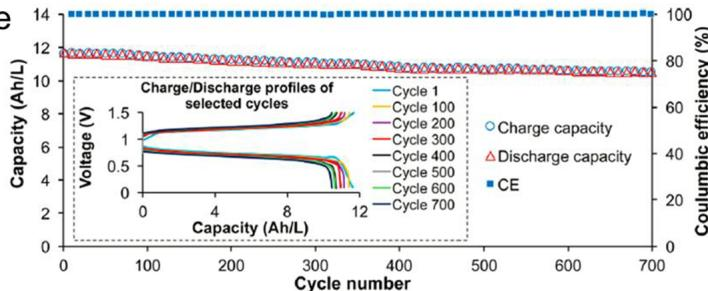  
e

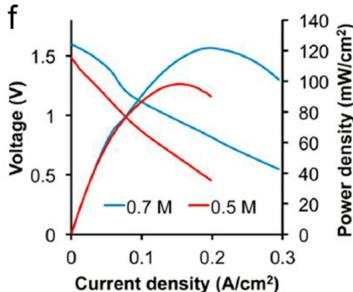  
f  
Figure 69. Organic ARFBs. (a) Schematic diagram of a metal-free, organic-inorganic ARFB. (b) Constant-current cycling at  $500\mathrm{mAcm}^{-2}$  at  $40^{\circ}\mathrm{C}$  using a  $3\mathrm{MHBr} + 0.5\mathrm{MBr}_2$  solution on the positive side and a  $1\mathrm{MAQDS} + 1\mathrm{MH}_2\mathrm{SO}_4$  solution on the negative side, showing cycling performance of alkaline quinone flow battery. Reproduced with permission from ref 522. Copyright 2014 Springer Nature. (c) Representative voltage vs. time curves during 100 charge-discharge cycles at  $100\mathrm{mA cm}^{-2}$ , recorded between the 10th and 19th cycles. (d) Capacity retention, current efficiency, and EE values of 100 cycles. Reproduced with permission from ref 523. Copyright 2015 The American Association for the Advancement of Science. (e) Extended 700-cycle testing data of the  $0.5\mathrm{M}$  FcNCl/MV AORFB at  $60\mathrm{mA cm}^{-2}$ , and the inset shows typical charge and discharge profiles of selected cycles. (f) Polarization and power density curves of the FcNCl/MV AORFB at  $0.5\mathrm{M}$  (red traces) and  $0.7\mathrm{M}$  (blue traces) after full charge. Reproduced with permission from ref 524. Copyright 2016 American Chemical Society.

discharging. Regardless of the excellent electrochemical performance of CrPDTA in RFBs, most metal-ligand complexes have intrinsic limitations for practical applications. Such shortcomings include the scarcity and toxicity of common metal elements and intricate synthesis processes, as well as low solubility of these redox couples.

In 2009, a cadmium/chloranil flow battery proposed by Yang et al., $^{520}$  utilized Cd as the anode redox couple and insoluble tetrachloro- $p$ -benzoquinone (chloranil) as the organic cathode, hence pioneering the concept of organic/inorganic RFBs. Since the inception of this battery system, researchers have paid considerable attention to the utilization of organic redox species in combination with various redox pairs for aqueous and nonaqueous systems. In addition, equivalent emphasis has been

laid on harnessing the efficacy of metal-free compounds, especially in bringing down the manufacturing costs.[521,522]

In 2014, for instance, an innovative metal-free, organic/ inorganic ARFB was reported, $^{522}$  whose chemistry is based on 9,10-anthraquinone-2,7-disulfonic acid (AQDS) and bromine redox couples in sulfuric acid (Figure 69a). Upon electrochemical operation, such ARFB chemistry delivers a notably high power density of  $600\mathrm{mWcm}^{-2}$  at a high current density of  $1300\mathrm{mA cm}^{-2}$ . Despite the excellent capacity retention of  $99.2\%$  at a current density of  $500\mathrm{mA cm}^{-2}$  after 10 cycles, the long-term cycle stability of the ARFB cell over a prolonged time was unknown (Figure 69b). Additionally, this novel ARFB chemistry did not prove eligibility for practical applications owing to its low average discharge voltage ( $\sim 0.6\mathrm{V}$ ) as well as the use of corrosive and hazardous bromine gas. Later, in 2015, the same group

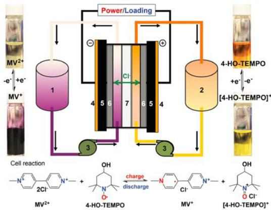  
a

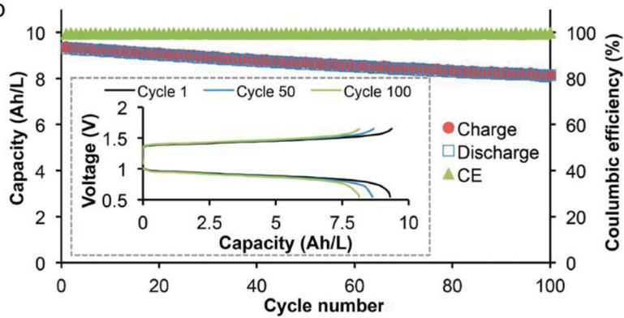  
b

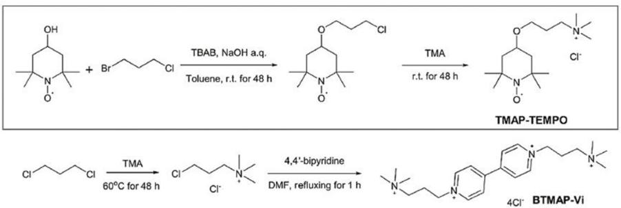  
C

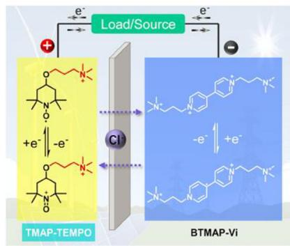  
d

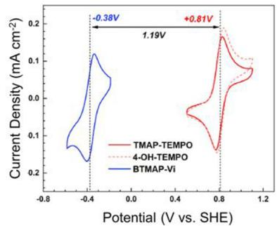  
e  
Figure 70. All organic neutral ARFBs. (a) Schematic representation of the MV/4-HO-TEMPO organic ARFB, insets of discharged and charged status of MV/4-HO-TEMPO and cell reactions. (b) Capacity and CE vs. cycling numbers of the cell at  $40\mathrm{mA}\mathrm{cm}^{-2}$ . Reproduced with permission from ref 526. Copyright 2015 Wiley-VCH. (c) Synthetic routes for TMAP-TEMPO and BTMAP-Vi. (d) Schematic of a neutral TMAP-TEMPO/BTMAP-Vi RFB. (e) CV curve of TMAP-TEMPO (solid red trace), 4-OH-TEMPO (dashed light red trace), and BTMAP-Vi (solid blue trace). (f) Galvanostatic cycling of the TMAP-TEMPO/BTMAP-Vi cell at  $40\mathrm{mA}\mathrm{cm}^{-2}$  for 1000 consecutive cycles. Charge/discharge capacity, EE, and CE were plotted as functions of the cycle number. The illustration manifests the representative charge and discharge profiles of selected cycles. Reproduced with permission from ref 527. Copyright 2019 Elsevier.

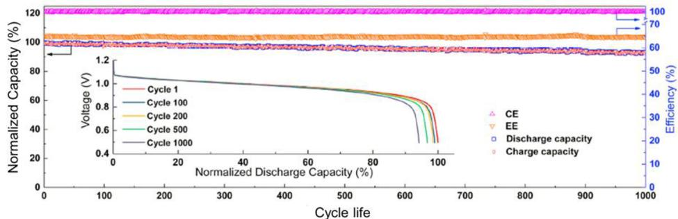  
f

reported an alkaline quinone flow battery, comprising commercially available 2,6-dihydroxyanthraquinone (2,6-DHAQ) and low toxicity, nonvolatile ferrocyanide/ferricyanide. The assembled cell, with a high discharge voltage ( $\sim1.1$  V), undergoes cycling at a constant current density of  $\pm0.1$  A cm $^{-2}$  for 100 cycles, and the results are illustrated in Figure 69c,d. It can be seen that the battery exhibits stable RTE of  $84\%$  and the capacity loss of  $0.1\%$  per cycle. Due to these findings, the reported RFB qualifies itself as a potential candidate for cost-efficient, nontoxic, nonflammable, and safe energy-storage system. However, the low solubility (maximum  $0.5\mathrm{M}$ ) of the used organic materials (e.g., 2,6-DHAQ) and strongly alkaline electrolyte need further optimization.

In 2017, a neutral pH organic ARFB was introduced, comprising a novel (ferrocenylmethyl)trimethylammoniumchoride (FcNCl) aqueous catholyte, methyl viologen (MV) anolyte, NaCl supporting electrolyte, and low-cost IEM.524 Upon operation, the FcNCl/MV organic ARFBs,  $0.5\mathrm{M}$  FcNCl

and  $0.5\mathrm{M}$  MV both dissolved in  $2.0\mathrm{MNaCl}$  aqueous solution, exhibit long cycling performance (700 cycles at  $60\mathrm{mAcm}^{-2}$ ), exceptional capacity retention up to  $99.99\%$  per cycle, and power density up to  $125\mathrm{mWcm}^{-2}$  (Figure 69e, f). Despite the low EE of FcNCl/MV (as low as ca.  $60\%$ ), the neutral aqueous organic RFBs with noncorrosive electrolytes and low-cost IEMs promise bright prospects for enabling safe, long life, and low-cost LSES systems.

The first RFB with two redox-active organic compounds, 2,2,6,6-tetramethylpiperidine-1-oxyl (TEMPO) and  $N$ -methylphthalimide acting as the cathode and anode active materials, respectively, was reported by Li et al. in 2011.[525] Even today, the progression of all-organic RFBs carrying bipolar redox-active material has received high interest as a result of its constituent electrode materials undergoing oxidation as well as reduction reactions and, therefore, being able to function as both cathode and anode. For example, Liu et al.[526] introduced an all organic neutral ARFB (Figure 70a) that employs MV anolyte and 4-

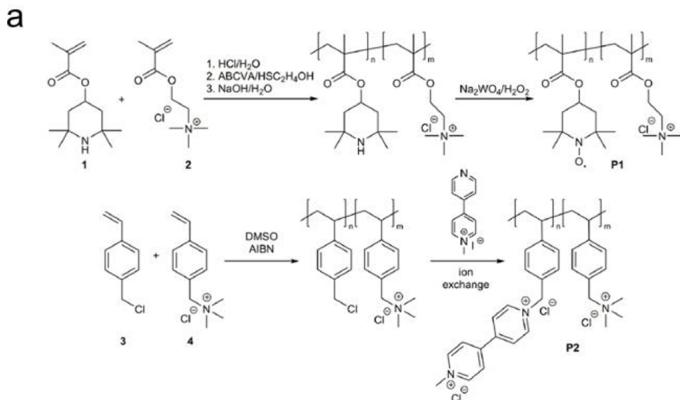

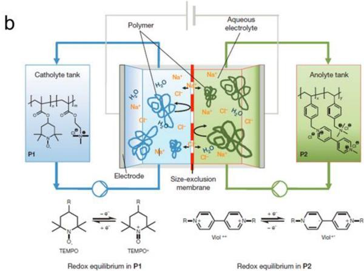

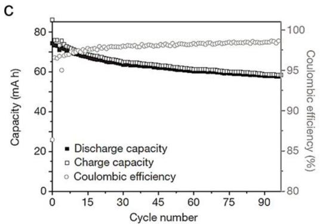

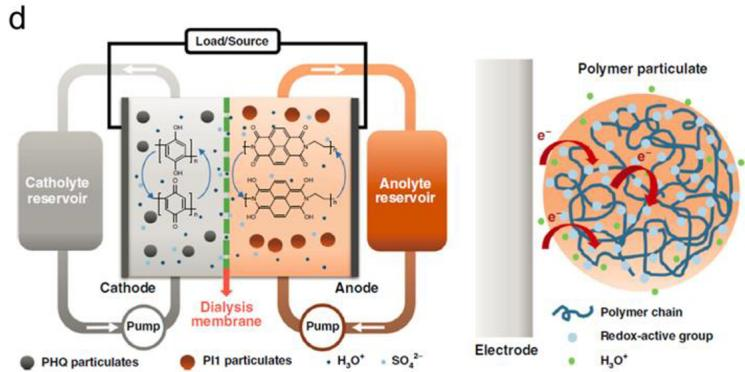

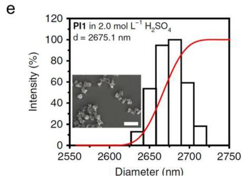  
Figure 71. All-polymer ARFBs. (a) Schematic representation of the synthesis of redox-active polymers. (b) Schematic representation and working principle of a polymer-based RFB. (c) Cycling stability of the polymer-based RFB at  $40\mathrm{mAcm}^{-2}$ . Reproduced with permission from ref 528. Copyright 2015 Springer Nature. (d) Schematic diagram of all-polymer particulate slurry batteries. (e) Dynamic light scattering diameter distributions of the PI1. Inset is an SEM image of PI1. Scale bar,  $5\mu \mathrm{m}$ . (f) Long-term stability test of PHQ/PI1 APPSBs studied by repeating charge/discharge cycles at  $20\mathrm{mAcm}^{-2}$ . Reproduced with permission from ref 529. Copyright 2019 Springer Nature.

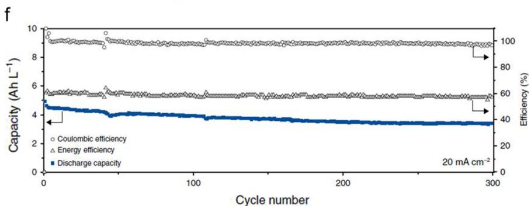

hydroxy-2,2,6,6-tetramethylpiperidin-1-oxyl (4-HO-TEMPO) catholyte. Even though this battery chemistry exhibited high capacity retention at  $60\mathrm{mAcm}^{-2}$  after 100 charge/discharge cycles (Figure 70b), its long-term cycle stability over extended periods of time is limited. Similarly, Liu and co-workers[527] have reported a long life all organic neutral ARFB (Figure 70d) in which positively charged functional groups introduced to enhance Coulombic repulsion help to extend the lifetime of the MV derivative bis(trimethylammonio) propyl viologen (BTMAP-Vi). In contrast, a stable variant of the radical molecule 4-[3-(trimethylammonio)propoxy]-2,2,6,6-tetramethylpiperidine-1-oxyl (TMAP-TEMPO) chloride can be synthesized from 4-OH-TEMPO by adding Coulombic repulsion to suppress bimolecular interactions, thereby eliminating molecular decomposition (Figure 70c,e). Upon cycling, the TMAP-TEMPO/BTMAP-Vi RFB displays CE of more than  $99.73\%$  along with significantly long cycling lifetime. In addition,

the cell retains  $94\%$  of the initial capacity after 1000 repetitive cycles, projecting a capacity retention rate of  $99.993\%$  per cycle (Figure 70f).

In an attempt to further the development of novel all-organic ARFBs, an all-organic ARFB was reported in 2015 that makes use of organic polymers as the redox-active species in an aqueous NaCl electrolyte, along with an inexpensive dialysis membrane for separating analyte and catholyte (Figure 71b). The cathode material involves the TEMPO radical as the redox-active moiety, while the anode material is a 4,49-bipyridine derivative (named Vi). The cathode and anode redox species are synthesized by free radical polymerization and succeeding polymer-analogous oxidation and functionalization, respectively (Figure 71a). The dialysis membrane with pore size of less than  $1\mathrm{nm}$  facilitates the retention of redox-active polymers with a hydrodynamic radius of  $\sim 2\mathrm{nm}$ . Moreover, the use of a high molecular weight and inexpensive polymeric dialysis membrane

Table 9. Summary of Important Parameters of the Aqueous Organic RFBs  

<table><tr><td>Type</td><td>Positive</td><td>Negative</td><td>Electrolyte</td><td>Membrane</td><td>Working voltage (V)</td><td>Energy density (Wh L-1)</td><td>EE (%)</td><td>Cycle life</td><td>Ref</td></tr><tr><td>Iron-chromium chelate RFB</td><td>K4Fe(CN)6</td><td>CrPDTA</td><td>0.4 M CrPDTA in 0.2 M KBi vs. 0.3 M Fe(CN)6+ and 0.45 M Fe(CN)6+ in 0.025 M KBi</td><td>Nafion 212</td><td>1.4</td><td>/</td><td>80%</td><td>75 cycles at 100 mA cm-2</td><td>516</td></tr><tr><td>Organic-inorganic aqueous RFB</td><td>HBr/Br2</td><td>AQDS</td><td>3 M HBr+0.5 M Br2 solution on the positive side and 1 M AQDS+1 M H2SO4solution on the negative side</td><td>Nafion 212</td><td>0.8</td><td>/</td><td>60%</td><td>~92% of the initial capacity after 10 cycles at 500 mA cm-2</td><td>522</td></tr><tr><td>Alkaline quinone RFB</td><td>K4Fe(CN)6</td><td>2,6-DHAQ</td><td>0.5 M 2,6-DHAQ dipotassium salt and 0.4 M K4Fe(CN)6 dissolved in 1 M KOH</td><td>Nafion 212</td><td>1.2</td><td>/</td><td>84%</td><td>0.1% of capacity loss per cycle) 100 cycles at 100 mA cm-2</td><td>523</td></tr><tr><td>Alloxazin e-based organic RFB</td><td>K4Fe(CN)6</td><td>ACA</td><td>0.5 M ACA (1.5 mmol) as the negative electrolyte and 0.4 M ferrocyanide (4.5 mmol) + 40 mM ferricyanide (0.46 mmol) as the positive electrolyte. Both solutions were adjusted to pH 14 by KOH</td><td>Nafion 212</td><td>1</td><td>/</td><td>63%</td><td>91% of the initial capacity after 400 cycles at 100 mA cm-2</td><td>532</td></tr><tr><td>Neutral aqueous organic RFB</td><td>FeCl3</td><td>MV</td><td>0.5 M FeNCI in 2.0 M NaCl aqueous solution; 0.5 M MV in 2.0 M NaCl aqueous solution</td><td>AMV anion-exchange membrane</td><td>0.75</td><td>8</td><td>60%</td><td>91% of the initial capacity after 700 cycles at 60 mA cm-2</td><td>524</td></tr><tr><td>Phenazine -based anolyte RFB</td><td>K4Fe(CN)6</td><td>DHPS</td><td>1.4 M DHPS in 5 mL of 1 M NaOH and 0.31 M K4Fe(CN)6/0.31 M K3Fe(CN)6 dissolved in 45 mL of 2 M NaOH</td><td>Nafion 212</td><td>1.3</td><td>/</td><td>&gt;75%</td><td>capacity retention of 99.98% per cycle over 500 cycles at 100 mA cm-2</td><td>533</td></tr><tr><td>All-organic aqueous RFB</td><td>TMAP-TEMPO</td><td>BTMAP-Vi</td><td>The chloride salt of TMAP-TEMPO (0.1 M) in posolyte (10 mL) and BTMAP-Vi Tetrachloride (0.1 M) in negolyte (15 mL)</td><td>AMV anion-exchange membrane</td><td>1</td><td>/</td><td>65%</td><td>94% of the initial capacity after 1000 cycles at 40 mA cm-2</td><td>527</td></tr><tr><td>Polymer-based RFB</td><td>P1</td><td>P2</td><td>10 ml of P1 and 15 ml of P2 aqueous NaCl solution (2mol l-1)</td><td>Dialysis membrane</td><td>1</td><td>8</td><td>76%</td><td>74% of the initial capacity after 100 cycles at 40 mA cm-2</td><td>528</td></tr><tr><td>Polymer particulate slurry RFB</td><td>OH OH PHQ</td><td>PI1</td><td>The catholyte and anolyte are 1.0 mol L-1PHQ and PI1 particulate slurries in 2.0 mol L-1sulfuric acid solution, respectively.</td><td>Dialysis membrane</td><td>0.53</td><td>2</td><td>60%</td><td>70% of the initial capacity after 300 cycles at 20 mA cm-2</td><td>529</td></tr></table>

provides a great replacement for costly IEMs, rendering this allorganic ARFB battery chemistry economical. However, during flow-cell testing, significant capacity decay of  $\sim 25\%$  over 95 cycles at a current density of  $40~\mathrm{mA~cm}^{-2}$  restricts the practicality of this technology for long life cycle applications

(Figure 71c). It is imperative to point out that such a rapid capacity decay is attributed to the occurrence of a side reaction possibly induced by oxygen. Despite the insufficient cyclic stability and low volumetric energy density of  $10.8\mathrm{WhL}^{-1}$  of the

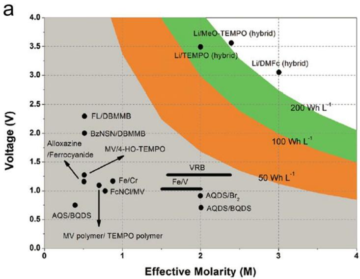

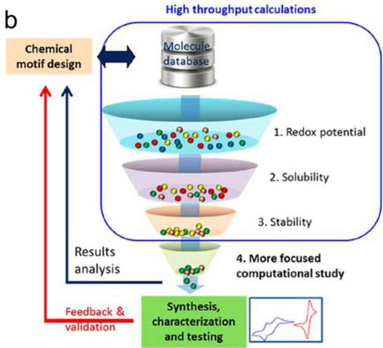

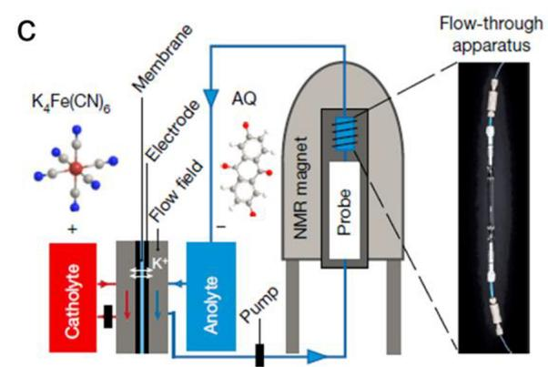  
Figure 72. (a) Comparison of performance metrics between typical organic RFBs and commercial RFBs. Reproduced with permission from ref 513. Copyright 2018 Royal Society of Chemistry. (b) Schematic of down-selection of candidate molecules for electrical energy storage applications based on high-throughput computations using quantum chemical calculations of particular characteristics. Reproduced with permission from ref 530. Copyright 2015 American Chemical Society. (c) Schematics of the two in situ NMR setups. Reproduced with permission from ref 531. Copyright 2020 Springer Nature.

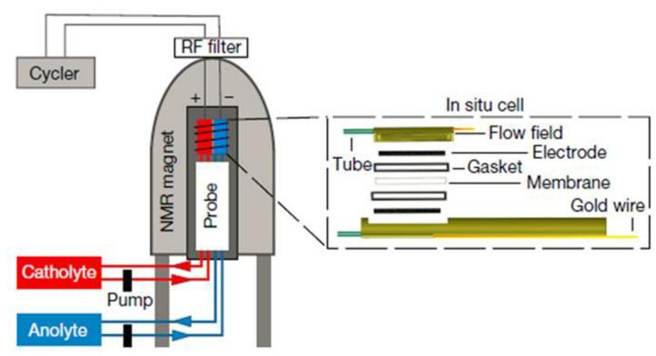

aforementioned RFB technology, the practice of using polymer-based redox couples has bright future prospects.

Likewise, homogeneously dispersed, microsized polymer particulates have been designed to serve as redox-active species for an all-polymer particulate slurry RFB (Figure 71d).529 In this RFB, the used catholyte and anolyte are  $1.0\mathrm{mol}$  of polyhydroquinone (PHQ) and naphthalene-1,4,5,8-tetracarboxylic acid dianhydride-ethylenediamine copolymer (PII) particulate, both in  $2\mathrm{M}$  sulfuric acid solution. The average sizes of polymer particulates have been determined to be 1.195  $\mu \mathrm{m}$  for PHQ and  $2.675\mu \mathrm{m}$  for PI1 (Figure 71e). These redox-active species not only exceed the solubility limit of conventional active materials but also promise the widespread applicability of insoluble redox-active materials and dialysis membranes in RFBs. As shown in Figure 71f, the long-term reversible cycling of the all-polymer particulate slurry RFB (APPSB) at  $20\mathrm{mAcm}^{-2}$  shows an initial discharge capacity of  $4.95\mathrm{AhL}^{-1}$  with CE approaching  $100\%$  and EE  $\sim 60\%$ . The discharge capacity retention after 300 cycles is  $70\%$  of the initial capacity, which is equivalent to a capacity decay of  $0.1\%$  per cycle.

The summary of key parameters of the most recently developed aqueous organic RFBs is presented in Table 9. Although numerous ground-breaking studies reveal good electrochemical performance, the development of aqueous

organic RFBs is still in its infancy. The energy density and cyclic stability of organic RFBs are yet to be improved to compare with the performance of VRFBs (Figure 72a).513 Notwithstanding the aforementioned concerns, the incorporation of organic redox materials greatly diversifies the befitting material selection range and their thematic redox mechanisms for RFB furtherance. For this purpose, a hierarchical computational scheme has been proven effective for screening organic redox materials with optimal redox potential, solubility, and stability from abundant molecules based on successive property evaluations obtained from high-throughput computations (Figure 72b).530 Such computational high-throughput screening incorporates real investigations for accelerating discovery of optimal organic redox species for RFB applications. Such an approach gives fundamental insight at the molecular level, which is imperative to improve performance of organic active materials. Recently, several in situ nuclear magnetic resonance (NMR) techniques have been reported (Figure 72c)531 for investigating electrolyte decomposition and battery self-discharge mechanisms in real time. Such NMR methods are known to present great potential in understanding a wide range of redox kinetics in RFB systems.

7.2.3.2. Nonaqueous Electrolytes. In 1988, Matsuda et al.[534] pioneered the first RFB based on a nonaqueous supporting

Table 10. Key Parameters of Recently Developed Nonaqueous RFBs  

<table><tr><td>Type</td><td>Positive</td><td>Negative</td><td>Electrolyte</td><td>Membrane</td><td>Average discharging voltage (V)</td><td>Discharging energy density (Wh L-1)</td><td>Energy efficiency (%)</td><td>Cycle life</td><td>Ref</td></tr><tr><td>High energy density nonaqueous RFB</td><td>TEMPO</td><td>Li/Li+</td><td>0.1 M TEMPO in 1.0 M LiPF6 with 15 wt.% FEC</td><td>Polyethylene ne-based porous separator</td><td>3.2</td><td>126 (2.0 M TEMPO)</td><td>70%</td><td>Stable cycling performance of 100 cycles at 5 mA cm-2</td><td>537</td></tr><tr><td>Nonaqueous LiFe1N112-TFSI RFB</td><td>Fc1N112-TFSI</td><td>Li/Li+</td><td>0.8 M Fc1N112-TFSI in 1.2 M LiTFSI with 15 wt.% FEC</td><td>Polyethylene ne-based porous separator</td><td>3.4</td><td>50</td><td>75%</td><td>Stable cycling performance of 18 cycles at 1.5 mA cm-2</td><td>535</td></tr><tr><td>High current nonaqueous organic RFB</td><td>MePh</td><td>DBMMB</td><td>0.3M MePh /0.3 M DBMMB/1.0 M LiTFSI/DME</td><td>Daramic-175</td><td>2</td><td>6</td><td>69%</td><td>~95% of the initial capacity after 50 cycles at 35 mA cm-2</td><td>538</td></tr><tr><td>Nonaqueous Li/Co-complex RFB</td><td>[Co(II)(LX)n]2+</td><td>Li/Li+</td><td>0.4 M Co complexes in catholyte containing 1 M LiTFSI in EC-DMC. The negative electrode consists of metallic Li with 1M LiTFSI in EC-DMC solvent</td><td>Li-ion-conductive glass ceramic separator (LATP)</td><td>4</td><td>23</td><td>~90%</td><td>88% of the initial capacity after 200 cycles at 0.5 mA cm-2</td><td>539</td></tr><tr><td>Nonaqueous organic RFB</td><td>(2-Me+) catholyte</td><td>6 (anolyte)</td><td>100 mM solution of 6 (anolyte) and a 50 mM solution of 2-Me+(catholyte) in 0.5 M TBAPF6/MeCN</td><td>Fumasep® FAP-375-PP anion-exchange membrane</td><td>2.5</td><td>/</td><td>&gt;70%</td><td>&gt;86% of the initial capacity after 17 cycles at 10 mA cm-2</td><td>540</td></tr></table>

electrolyte with an open-circuit potential (OCP) of  $2.6\mathrm{V}$ . With innumerable research studies already existing on aqueous electrolytes, the transition toward nonaqueous electrolytes has yielded higher cell voltages (greater than  $2\mathrm{V}$ ) within the domain of RFBs. Furthermore, it has substantially expanded the library of material selections to motivate the exploration of novel RFB

chemistries. $^{535}$  This has given rise to the possibility of developing a new generation of RFBs with high equilibrium potentials, unprecedented energy densities, higher EEs, and low cost. Moreover, the packaging cost of nonaqueous RFBs is likely to be reduced as fewer components and units are required for synthesizing these cells while delivering electrochemical

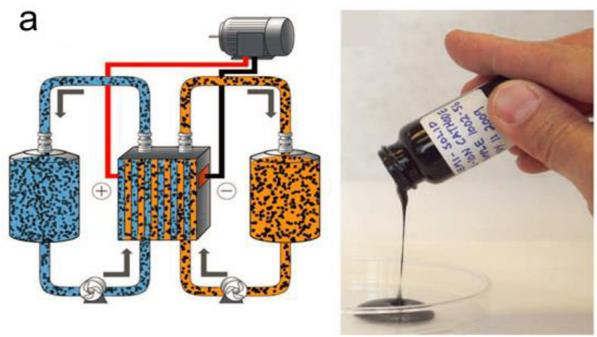

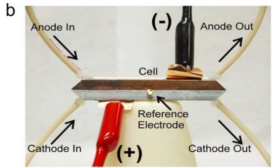

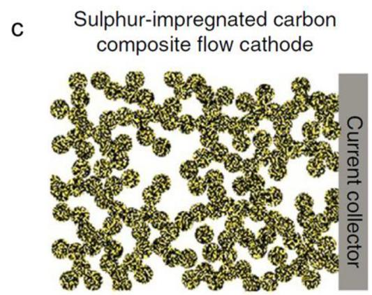

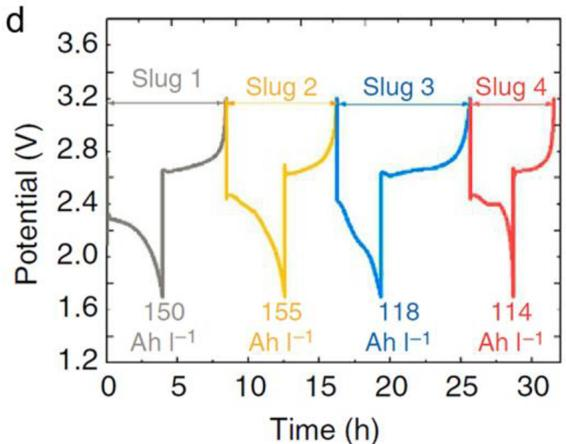

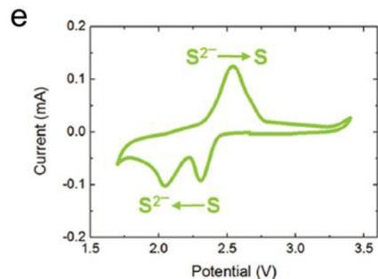  
Figure 73. (a) Program of semisolid flow cell system and picture of fluid semisolid suspension with LCO powder as the active material. (b) Laboratory cell using monolithic copper and aluminum current collectors with lithium metal RE fed by tubing using a peristaltic pump. Reproduced with permission from ref 541. Copyright 2011 Wiley-VCH. (c) Flow-cathode structure using sulfur-impregnated Ketjen black composite suspended in the nonaqueous electrolyte. (d) Intermittent-flow tests of the  $20\%$  S– $26\%$  KB catholyte in the Li-flow cell at  $4\mathrm{mA}\mathrm{cm}^{-2}$ . Reproduced with permission from ref 545. Copyright 2015 Springer Nature. (e) CVs of  $10\times 10^{-3}\mathrm{MS}, 10\times 10^{-3}\mathrm{MLiI},$  and  $10\times 10^{-3}\mathrm{MS} + 10\times 10^{-3}\mathrm{MLiI}$  in  $0.2\mathrm{MLiClO}_4$  in DOL/DME (v/v 1:1) at  $1\mathrm{mVs}^{-1}$  in Li-catholyte cells. Reproduced with permission from ref 371. Copyright 2016 Wiley-VCH.

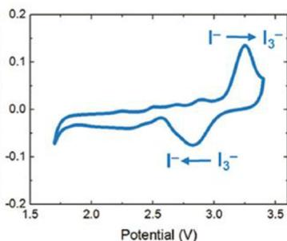

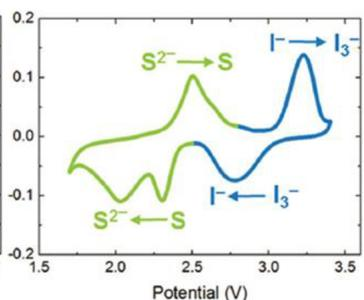

performance comparable to that of their ARFB counterparts. These advantages overall enhance the reliability of nonaqueous RFB systems. As far as the current research trend on nonaqueous RFBs is concerned, it focuses principally on the development of redox active materials, such as metal-ligand complexes and organic molecules.[536] However, the research on nonaqueous RFBs is in its preliminary developmental stages. In addition, this battery technology is facing dire challenges in terms of its limitation to scale-up and to reach the energy densities of its aqueous counterparts owing to extremely low solubility of the active redox species in nonaqueous electrolytes. In addition to these concerns, the ionic conductivities of nonaqueous electrolytes are intrinsically low, especially for the highly concentrated redox materials. Also, thorough research on developing suitable membranes with low area resistance for nonaqueous RFBs is still in order. Important parameters of the most recent nonaqueous RFB systems have been summarized in Table 10. It is evident that most of these chemistries employ active materials with low

concentration, generally less than  $0.5\mathrm{M}$ , which explains their low energy densities (less than  $30\mathrm{WhL^{-1}}$ ) even at high cell voltages.[53] Even though some of these RFBs can achieve high solubilities (e.g.,  $0.8\mathrm{M}$  Fc1N112-TFSI in  $1.2\mathrm{M}$  LiTFSI and  $2\mathrm{M}$  TEMPO in  $1.0\mathrm{M}$ $\mathrm{LiPF_6}$ ), these cells yield very short cycle life (less than 20 cycles) at ultralow current density below  $2\mathrm{mA}$ $\mathrm{cm}^{-2}$ . Moreover, compared with aqueous electrolytes, nonaqueous electrolytes are expensive and flammable, which are key limitations when it comes to their practical applications in LSES.

7.2.3.3. Semisolid Electrolytes. As a mitigation strategy to solve the conundrum of low solubility of redox species in nonaqueous RFBs, the concept of semisolid electrolyte (Figure 73a,b) has been pioneered by Chiang and co-workers.[541] In the electrolyte, the insoluble active materials are mixed with conducting carbon and are dispersed in the supporting electrolyte to form a suspension. RFBs with semisolid electrolyte (also known as semisolid RFBs) permit electrolyte concentration beyond the solubility limit and yield much higher

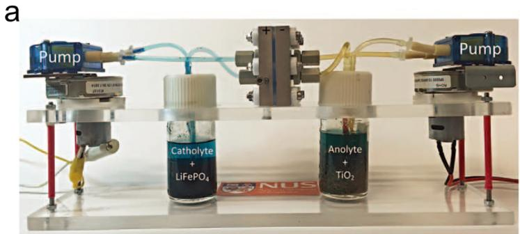

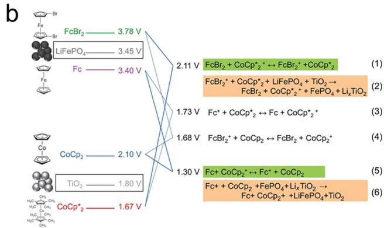

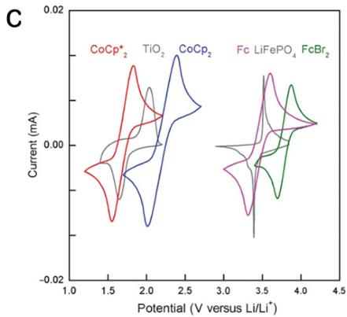

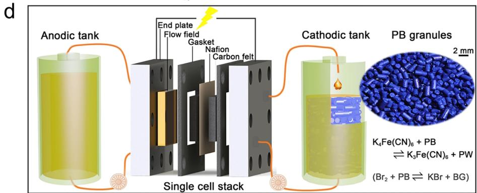

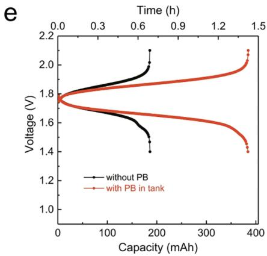  
Figure 74. (a) Assembly of a redox-targeting-based RFB. (b) Scheme compiling the chemical reactions between the redox mediators and materials. (c) CV of the redox mediators and Li storage materials (LFP and  $\mathrm{TiO}_2$ ). Reproduced with permission from ref 550. Copyright 2015 The American Association for the Advancement of Science. (d) Schematic of a symmetric flow battery consisting of an electrochemical cell and two energy storage tanks. PB granules are loaded in the cathodic tank for energy storage. The inset shows the conversions of PB/PW and PB/BG upon charging/ discharging. (e) Electrochemical performance of  $\mathrm{Zn} / [\mathrm{Fe}(\mathrm{CN})_6]^{3 - }$ PB hybrid flow cell at  $20\mathrm{mAcm^{-2}}$  . (f) CE, VE, and EE of  $\mathrm{Zn} / [\mathrm{Fe}(\mathrm{CN})_6]^{3 - }$ PB hybrid flow cell at  $20\mathrm{mAcm^{-2}}$  . (g) Volumetric capacity and chemical cost of  $[\mathrm{Fe(CN)}_6]^{4 - / 3 - }$ PB system and its comparison with other reported electrolytes. Reproduced with permission from ref 551. Copyright 2019 Elsevier.

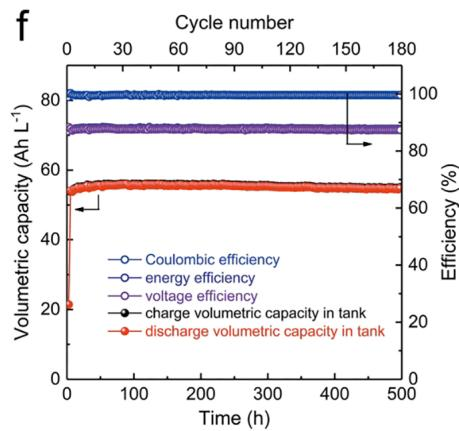

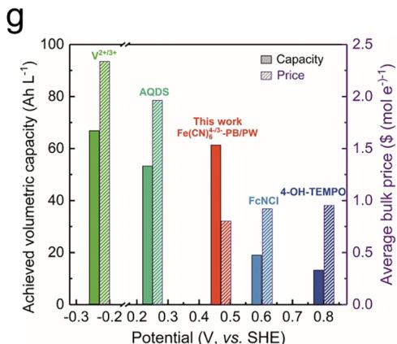

volumetric capacity compared to traditional RFBs. During electrochemical operation, uniform charge transfers between the active material particles and the current collector, which is ascribed to the percolation nanoscale conductor network in the electrode suspension. As compared to traditional electrolyte in RFBs, a semisolid suspension in semisolid RFBs poses a lower risk of cross-contamination, enabling the use of a microporous membrane rather than an expensive IEM. Originally, a semisolid lithium-ion flow cell employed LCO (20 vol %, 10.2 M) and 1.5% Ketjen black catholyte and  $\mathrm{Li_4Ti_5O_{12}}$  (10 vol %, 2.3 M) and 2% Ketjen black anolyte. The charge capacity of this state-of-the-art RFB cell approached the theoretical capacity of  $\mathrm{Li_4Ti_5O_{12}}$  (170 mAh g $^{-1}$ ), and the CE was up to 73% and 80% in the first and second cycle, respectively.[541] Since the inception of the

semisolid RFB concept, various active materials, for example, LCO,  $\mathrm{LiNi}_{0.5}\mathrm{Mn}_{1.5}\mathrm{O}_4$ ,  $\mathrm{LiNi}_{1/3}\mathrm{Co}_{1/3}\mathrm{Mn}_{1/3}\mathrm{O}_2$ , LFP,  $\mathrm{Li}_4\mathrm{Ti}_5\mathrm{O}_{12}$ , silicon, and graphite, have been investigated.[371,542-544] However, the improved concentrations of semisolid suspensions are inevitably accompanied by high viscosities, which in turn give rise to high driving pressures and flow resistance. In this regard, in 2015, Chen et al. designed a sulfur-impregnated carbon composite for a semisolid RFB cell.[545] Unlike mechanically mixed sulfur-carbon composite suspension, sulfur infiltrates into carbon via heat treatment for improving electrical contact and decreased viscosity (Figure 73c). Figure 73d demonstrates, for a Li-flow cell with the  $20\mathrm{vol}\%$  S and  $26\mathrm{vol}\%$  Ketjen black catholyte operating at a current density of  $4\mathrm{mA~cm}^{-2}$ , the catholyte's volumetric capacity within the range of  $110 - 155\mathrm{Ah}$

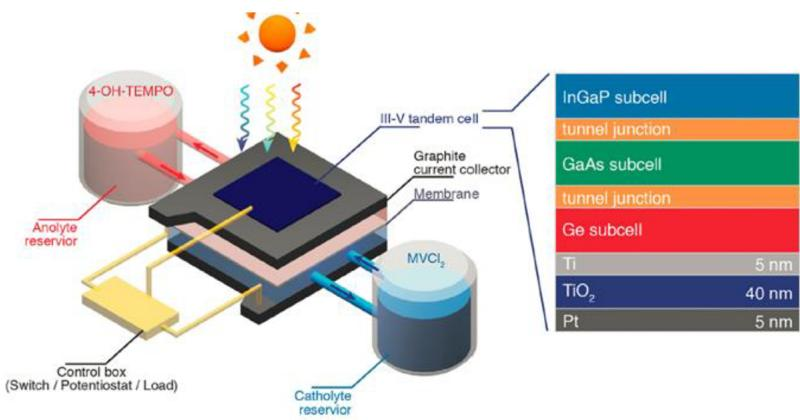  
a

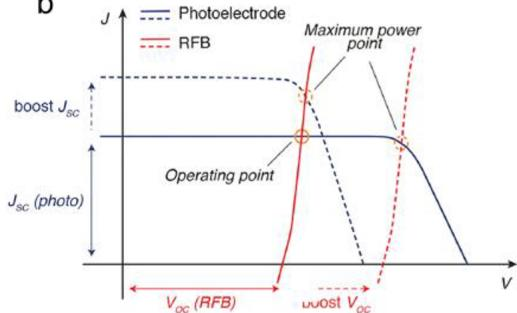  
b

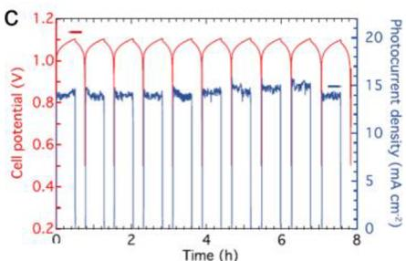  
C

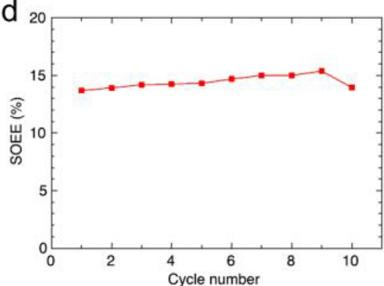  
d

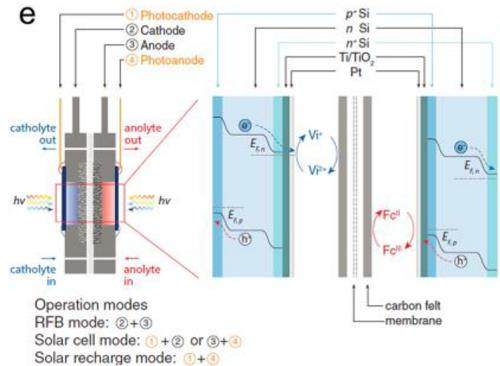  
e

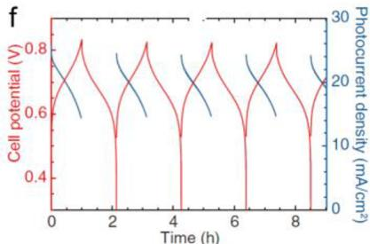  
f  
Figure 75. Typical examples of novel RFBs. (a) Integrated SFB using III-V tandem cell photoelectrode and 4-OH-TEMPO/MVCl $_2$  redox couples. (b) Estimation method and pathways to boost the SOEE of SFB device. (c) Device cycling behavior shows cell potential and photocurrent density delivered by the photoelectrode. (d) SFB displayed a stable SOEE around  $14\%$  for ten cycles. (e) Schematic of cross section of the SFB, showing two single junction silicon photoelectrodes and two CF inert electrodes, which could be connected in three different modes. Reproduced with permission from ref 556. Copyright 2018 Elsevier. (f) Representative device cycling behavior showing cell potential between cathode and anode (red curves), as well as the photocurrent density delivered by the photoelectrodes connected in series (blue curves). (g) Representative potential-capacity profiles during galvanostatic discharging process at the 1st, 50th, and 100th cycles. (h) Discharging capacity utilization rate and SOEE, showing a stable cycling performance over  $200\mathrm{h}$  (100 cycles). Reproduced with permission from ref 557. Copyright 2019 Wiley-VCH.

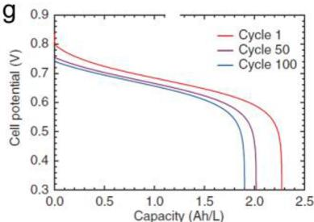  
9

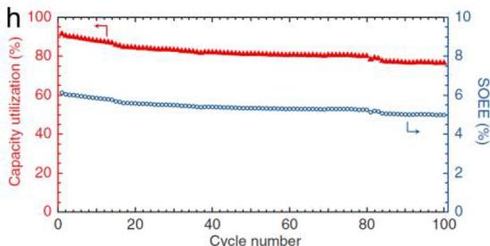  
h

$\mathrm{L}^{-1}$ . Similarly, later in 2016, a novel concept of a multiple redox semisolid-liquid (MRSSL) flow battery was put forward for achieving higher energy density than previously reported semisolid RFBs.[371] In principle, the MRSSL RFB takes advantage of both highly soluble active material in the liquid phase (LiI) and high-capacity active material in the solid phase (S/C composite), by forming a biphasic MRSSL catholyte (Figure 73e).[371] During the electrochemical cycling, extraordinary volumetric capacity  $(550\mathrm{Ah}\mathrm{L}^{-1})$  was achieved for the catholyte, thanks to the highly concentrated and synergistic multiple redox reactions of LiI and sulfur. Regardless of the choice of highly concentrated electrolytes, most of the reported semisolid RFBs operate at a low current density (below to  $5\mathrm{mA}$ $\mathrm{cm}^{-2}$ ). Furthermore, the evidence of their long-term cycling stability during reversible cycling is still unclear and requires further scrutiny. Other issues that need immediate attention include the overall poor cell performance of semisolid RFBs owing to the highly viscous suspensions and the demanding extra pumping burden. Last but not least, unlike the structural

design of traditional RFBs, which comprises multiple reaction stacks and complex flow fields, ample efforts are needed to propose an optimized and scalable engineering design for these semisolid RFB systems.

7.2.3.4. Redox-Targeting-Based Electrolytes. Another fresh approach to boost the capacity of redox electrolyte is through redox-targeting-based electrolytes, consisting of redox targeted mediators and active materials.[546] In this regard, the redox reaction involves exchanging of charge carriers between redox mediators and active materials, whereby power is produced by the electrochemical reactions of the redox mediators in RFBs. In addition, the energy is deposited in solid active materials from the redox-mediated chemical reactions.[547,548] In other words, the redox targeted mediators transfer charge between the electrode and the active material upon repetitive cycling. Compared with semisolid RFBs or traditional LIBs, the concept of the redox mediator offers competitive advantages in terms of eliminating the necessity of using ion conducting additives and binders for insulating active materials. In addition, the viscosity

and complexity of such electrolytes are comparable to those of traditional RFBs. Among many studies conducted in this regard, Wang et al. has reported the first RFB with a redox-targeting-based electrolyte (RTFB) using LFP as the  $\mathrm{Li^{+}}$  storage material in the cathodic tank and lithium metal as the anode.[549]  $1,1^{\prime}$ -Dibromoferrocene ( $\mathrm{FcBr}_2$ ,  $3.55\mathrm{V}$  vs.  $\mathrm{Li} / \mathrm{Li}^{+}$ ) and ferrocene ( $\mathrm{Fc}$ ,  $3.25\mathrm{V}$  vs.  $\mathrm{Li} / \mathrm{Li}^{+}$ ) were selected as the two redox-shuttle molecules in the catholyte so as to undergo chemical delithiation and lithiation of LFP molecules. Later, a novel RTFB chemistry was introduced, which comprised a LFP cathode paired with  $\mathrm{FcBr}_2 / \mathrm{Fc}$  and a  $\mathrm{TiO}_2$  anode paired with cobaltocene  $[\mathrm{Co}(\mathrm{Cp})_2]$  and bis(pentamethylcyclopentadienyl)cobalt  $[\mathrm{Co}(\mathrm{Cp}^*)_2]$  (Figure 74a-c).[550] Considering  $50\%$  porosity of the materials in the tank, the theoretical energy density of this RTFB can reach up to  $500\mathrm{WhL^{-1}}$ , which is ten times higher than that reported for conventional VRFBs. In general, the rate of the characteristic redox targeting reaction in RTFBs directly affects the battery power, as well as the consumption of active materials. At present, considerably low current densities have been reported for RTFBs. Therefore, it is absolutely necessary to design appropriate molecules and active materials for exhibiting rapid redox reaction kinetics. The bright side is that the redox-targeted strategy-just like nonaqueous RFBs-is also applicable in ARFB systems. As a consequence of positive advancement toward the development of organic redox species, a high-capacity ferrocyanide/ferricyanide  $\left[\mathrm{Fe(CN)}_6\right]^{4 - / 3 - }$  based electrolyte system has been designed for ARFBs by means of redox targeting reactions with Prussian blue  $\left(\mathrm{Fe}_4[\mathrm{Fe}(\mathrm{CN})_6]_3,\mathrm{PB}\right)$ .[551] Upon employing  $0.8\mathrm{M}\left[\mathrm{Fe}(\mathrm{CN})_6\right]^{3 - }$  neutral solution as catholyte, the RFB cell delivers a volumetric capacity of 56.3 Ah  $\mathrm{L}^{-1}$  in the presence of PB, which is much higher than that without PB (Figure 74d). Additionally, the average CE and VE of the  $\mathrm{Zn} / \left[\mathrm{Fe}(\mathrm{CN})_6\right]^{3 - } - \mathrm{PB}$  flow cell are  $99.7\%$  and  $87.7\%$  at  $20\mathrm{mAcm}^{-2}$ , respectively, upon cycling for  $500\mathrm{h}$  (Figure 74e). In short, the aqueous systems show much lower expenses, higher ionic conductivity, and more convenient cell assembly procedures as compared with their nonaqueous equivalents. The incorporation of PB into  $\left[\mathrm{Fe}(\mathrm{CN})_6\right]^{4 - / 3 - }$ -based electrolyte via redox targeting reactions imparts distinct advantages over traditional electrolytes for ARFBs (Figure 74f).

7.2.4. Novel RFBs. Integrating both solar energy conversion and energy-storage functions into one device has been proven to be effective in giving rise to more compact, efficient, and cost-effective solar energy storage, as well as consumption, especially for off-grid applications. In this regard, solar RFBs with flowing liquid-phase redox species exhibit relatively fast reaction kinetics, thereby providing high solar-to-output electricity efficiency (SOEE). For instance, a photoelectrode[552] or dual photoelectrode[553-555] produce holes and electrons for facilitating oxidation or reduction reactions of the redox couples in order to convert intermittent solar energy into chemical energy. Despite the promising research involving solar flow battery (SFB) technology, most such devices suffer from several common issues, including low SOEE, high cost, and short lifetime.[555] Recently, a novel design for a highly efficient SFB has been proposed, which involves the monolithic integration of highly efficient, high-photovoltage tandem III-V SFBs with high-voltage 4-hydroxy-2,2,6,6-tetramethylpiperidin-1-oxyl (4-OH-TEMPO)/MV RFBs, for delivering a remarkable SOEE of  $14.1\%$  (Figure 75a).[556] Further, it has been proven that it is possible to achieve the highest SOEE by matching the voltage of RFBs with the maximum power point of the photoelectrode (Figure 75b). The characteristic cycling behavior of the

aforementioned SFB and its SOEE for ten cycles are illustrated in Figure 75c,d. The concerns related to this SFB technology include its unclear cycling performance upon reversible cycling and high manufacturing cost of III-V tandem junction SFBs, hindering its practical applications. Most recently, in 2019, a neutral pH aqueous electrolyte-based SFB with robust BTMAP functionalized Vi and Fc redox couples and inexpensive stable silicon-based photoelectrodes has been investigated (Figure 75e). Unlike the previously mentioned monolithically integrated SFB, this SFB device exhibits continuously stable cycling performance over  $200\mathrm{h}$  along with an improved SOEE of only  $5.4\%$  (Figure 75f-h).

# 7.3. Summary and Future Perspective for RFBs

Achieving high energy density, low cost, and long cycling life is urgently needed for the large-scale applications of RFBs. In this section, the most prominent studies focusing on the optimization of electrodes, membranes, redox species, and various promising novel RFB have been summarized and discussed with their respective advantages and limitations. Regardless of extensive work, the capital cost target of RFBs is still far from what has been set by the US DoE \((\\) 100\mathrm{kWh}^{-1}\) ) for GSES, therefore demanding groundbreaking development of novel RFB chemistries. The limitations of metal ion redox species and Nafion membranes encourage researchers to reorient themselves toward harnessing the full potential of nonaqueous or all-organic RFB technologies and porous membranes. Organic ARFBs have been considered as one of the most promising candidates for giving rise to next-generation RFBs due to the low cost and high safety. In addition, lithium-based RFBs with semisolid or redox targeting concepts are becoming a hot topic for combining the inherent advantages of LIBs and RFBs. In view of the LSES applications, SFBs are promising for exhibiting unique advantages and are therefore to be used for commercial applications in the future. In addition, the flow fields, stacks, and engineering considerations are equally important to improve the performance and economic aspects of the RFB technologies and have been analyzed in detail in the literature.[558] In short, the pursuit of green and LSES technologies is driving future research on exploring novel and potentially more powerful next-generation RFB systems. Finding excellent materials for enhancing the overall performance and lowering the cost of RFBs is essential for revitalizing the LSES needs.

# 8. METAL-AIR BATTERIES

# 8.1. Introduction

The currently known commercial LIBs, in spite of their extensive utilization in addressing our current energy needs, have reached their performance limits given their inability to further improve their energy and power densities for LSES applications, such as powering automobiles and grid stations.[42,559] Therefore, this inadequacy has recently been addressed by the revival of electrochemical MAB systems with threshold energy density of 500 Wh  $\mathrm{kg}^{-1}$ .[560,561] Historically, the idea of MABs was primarily patented by Maiche dating back to 1878,[562] later commercialized by Heise in 1932,[563] and further advanced after 1960 with the advent of aqueous Al-air, Fe-air, and Mg-air batteries.[564-566] However, it was not until two decades ago that nonaqueous metal-air energy storage systems were pioneered first with the advent of the Li-air battery by Abraham and Jiang[567] and, afterward, with Na-air and K-air cells by Hartmann et al.[568] and Ren and Wu,[569] respectively.

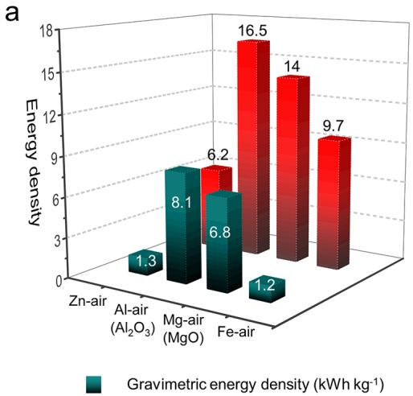  
Volumetric energy density (kWh L-1)

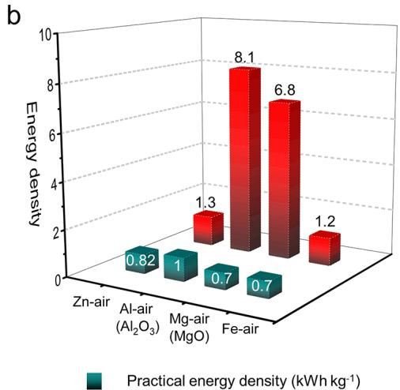  
Theoretical energy density (kWh kg-1)

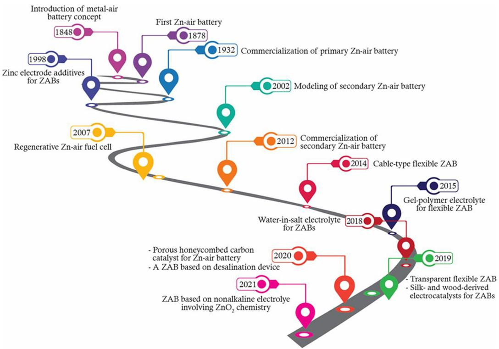  
Figure 76. Theoretical and practical energy densities of aqueous MAB systems. $^{572,573}$  
Figure 77. Brief timeline showing chronological progress in Zn-air battery technology over the years.[562,563,578,579,584-593]

Typically, the working principle of rechargeable MABs is governed by the oxidation and reduction of metallic anode and oxygen cathode. Since MABs import design features from both fuel cells and conventional batteries such as metal-ion cells, they require a liquid electrolyte between the electrodes split by a separator.[570] The electrochemical reactions occurring at the electrodes and electrolytes, however, differ depending upon the types of metallic anodes, as has been reported.[571] For instance,  $\mathrm{Zn}$ ,  $\mathrm{Mg}$ ,  $\mathrm{Fe}$ , and  $\mathrm{Al}$  are the metals whose surfaces, upon undergoing passive treatments by means of corresponding hydroxides or oxides, are rendered thermodynamically compatible for the aqueous electrolytes to some degree.[561,570] That is why such metals have been widely studied for aqueous MABs (Figure 76). The electrochemical reactions for aqueous MABs are governed by the following equations:[561]

Metal anode:

$$
\mathrm {M} \leftrightarrow \mathrm {M} ^ {n +} + n \mathrm {e} ^ {-} \tag {32}
$$

Air cathode:

$$
\mathrm {O} _ {2} + 2 \mathrm {H} _ {2} \mathrm {O} + 4 \mathrm {e} ^ {-} \leftrightarrow 4 \mathrm {O H} ^ {-} \tag {33}
$$

Overall reaction:

$$
4 \mathrm {M} + n \mathrm {O} _ {2} + 2 n \mathrm {H} _ {2} \mathrm {O} \leftrightarrow 4 \mathrm {M} ^ {n +} + 4 n \mathrm {O H} ^ {-} \tag {34}
$$

Here, M stands for metal, such as Zn, Al, Mg, or Fe, and  $n$  denotes the metal ion charge transfer number. It is important to mention that the above electrochemical reactions represent the discharging process from left to right and can be reversed upon recharging of the MAB. In other words, during recharging, the metal is plated back on the anode and oxygen is released at the

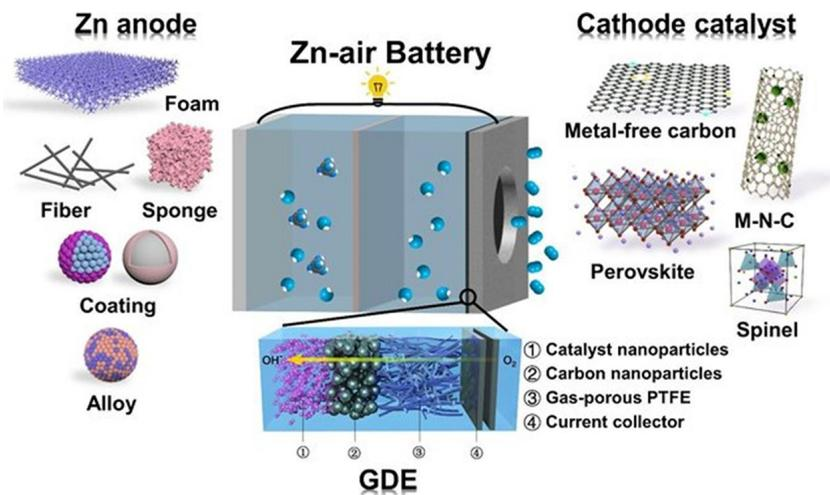  
Figure 78. Schematic configuration of Zn-air battery with the design of Zn anodes, cathode catalysts, and gas diffusion electrode structure. Reproduced with permission from ref 562. Copyright 2019 Royal Society of Chemistry.

cathode. In contrast to the aqueous MAB family, metals such as alkali metals of Li, K, or Na are too reactive in aqueous electrolytes. Even though the reactivity of these metals is possibly hampered by ionic conductive films, for instance, glass ceramic, the fabrication of their corresponding aqueous alkali MAB systems is too intricate and expensive to render it practical.[561] Therefore, Li-, K-, and Na-air battery systems better work in aprotic or nonaqueous electrolytes, giving rise to the highly acknowledged nonaqueous MABs. The electrochemical reactions of such battery systems are as follows:[561,570]

Anode:

$$
\mathrm {M} \leftrightarrow \mathrm {M} ^ {+} + \mathrm {e} ^ {-} \tag {35}
$$

Cathode:

$$
x \mathrm {M} ^ {+} + \mathrm {O} _ {2} + x \mathrm {e} ^ {-} \leftrightarrow \mathrm {M} _ {x} \mathrm {O} _ {2} \quad (\text {w h e r e} x = 1 \text {o r} 2) \tag {36}
$$

Overall reaction:

$$
x \mathrm {M} + \mathrm {O} _ {2} \leftrightarrow \mathrm {M} _ {x} \mathrm {O} _ {2} \tag {37}
$$

It is obvious that the difference of chemical reactions between aqueous and nonaqueous MAB systems lies in the oxygen reduction reaction (ORR) and oxygen evolution reaction (OER). Apropos nonaqueous metal-air systems, ORR comprises reduction of molecular oxygen on the surface of cathode electrocatalyst to generate  $\mathrm{O}_2^{2-}$  or  $\mathrm{O}_2^-$ , which then combines with metal cation to form  $\mathrm{O}_2^{2-}$  or  $\mathrm{O}_2^-$  or the mixture of both as discharge products.[561,571] Apart from the principal difference of redox reactions, another factor that differentiates such batteries from their aqueous counterparts is the higher sensitivity of lithium, potassium, and sodium to  $\mathrm{H}_2\mathrm{O}$  and  $\mathrm{CO}_2$  in the atmospheric air. Therefore, MABs with these metallic anodes are generally studied in pure  $\mathrm{O}_2$  environments, and thereby rather termed as  $\mathrm{Li}-\mathrm{O}_2$ ,  $\mathrm{K}-\mathrm{O}_2$ , and  $\mathrm{Na}-\mathrm{O}_2$  batteries.

The aqueous MABs gain significant advantages over the nonaqueous counterparts in terms of technology maturity, practical implementation, and mass production for GSES. Considering that there are a number of excellent review articles on the nonaqueous MABs,[574-577] we focus on discussing the aqueous MABs and their potential for GSES applications in this review. The following subsections delineate the basic operational chemistry of Zn-air batteries as the leading example of aqueous metal-air batteries.

# 8.2. Zinc-Air Batteries

Zn-air, Al-air and Mg-air batteries are known as stable aqueous MAB systems, among which Zn-air batteries have long been studied.[562,578] Figure 77 shows a brief chronological account of progress concerning Zn-air batteries. The first Zn-air battery was invented in 1878, soon after the patent introducing the concept of MABs in 1848. From the commercialization of primary Zn-air batteries in 1932 to the industrialization of secondary Zn-air systems around 2012, little scientific advancement was made with the paramount breakthrough being rechargeable Zn-air energy devices. However, it is in the past decade that the progress on these systems has gained phenomenal momentum, from pioneering the flexible Zn-air battery in 2014 for wearable electronics to harnessing the natural-based electrocatalytic materials, such as silk- and wood-derived ones, for enhancing their electrochemical performance.[579,580] Nonetheless, severe issues such as the formation of zinc dendrites and EEs as low as  $60\%$  due to the lack of newly proposed bifunctional catalysts, hindered their early progress in the twentieth century.[581] As compared to Al-air and Mg-air batteries, Zn-air electrochemical energy storage systems are comparatively more stable, thanks to their charging capabilities in aqueous electrolytes. The Zn-air battery has caught much attention due to its high theoretical energy density of  $\sim 1300\mathrm{Whkg^{-1}}$ .[582] Therefore, along with  $\mathrm{Li - O_2}$  cells, Zn-air batteries have been predicted to offer very promising prospects. The scientists also speculate that advanced future Zn-air battery systems may surpass LIBs in their performance for serving in LSES applications.[583]

The basic structural schematic of a typical Zn-air battery, as illustrated in Figure 78, is composed of a Zn anode, a porous air cathode with suitable catalysts, and aqueous electrolytes. The Zn anode can be designed to have various forms including foam, fiber, sponge, coating, and alloying, while the air cathode has flexibility in the catalyst design, such as metal-free carbon, M-N-C, perovskite, and spinel structures. The gas diffusion electrode (GDE), consisting of a catalyst nanoparticle layer coating on nanoporous carbon with a gas diffusion polymer (typically PTFE) as the current collector, plays an important role in the electrocatalytic reactions of the air cathode in OER/ ORR (Figure 78). The electrode reactions that take place in the Zn-air cell can be expressed in the following equations:

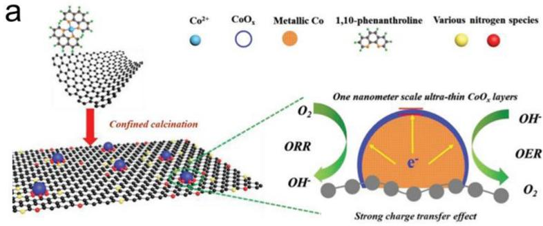

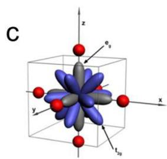

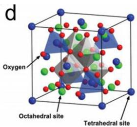

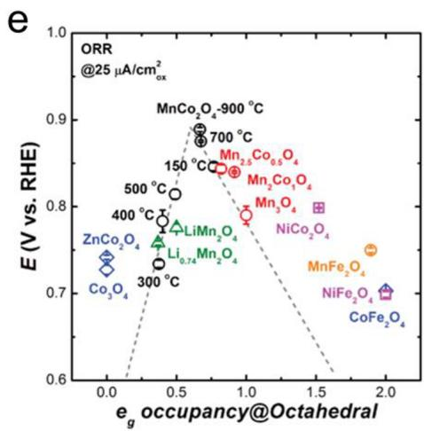

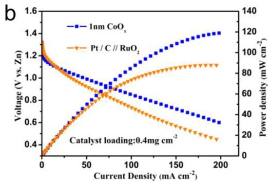

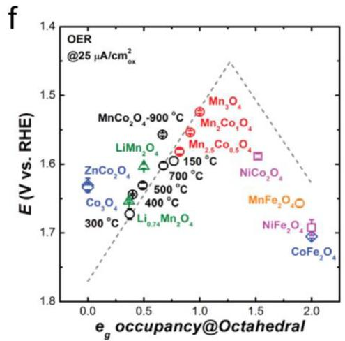

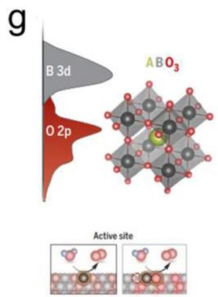

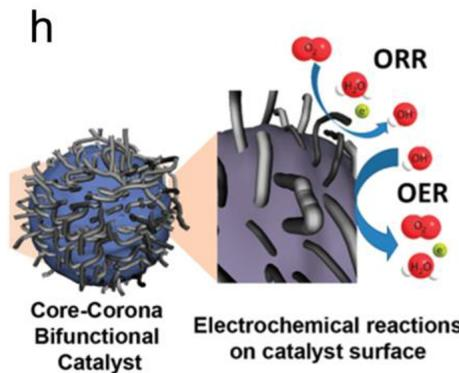

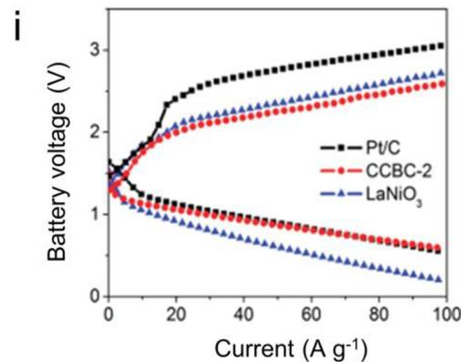

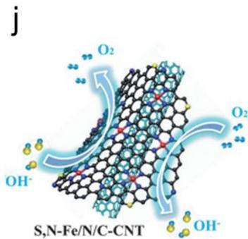  
Figure 79. Structural configurations and electrochemical performances of metal-based air cathode electrocatalysts. (a) Schematic of OER/ORR activity of nanoscale  $(1\mathrm{nm})$ $\mathrm{CoO}_x$  layer on metallic substrate made of Co/N-RGO. (b) Polarization and power density curves of secondary Zn-air batteries showing superior performance of ultrathin  $\mathrm{CoO}_x@\mathrm{Co}/\mathrm{N}$ -doped GO as compared to  $\mathrm{Pt/C+RuO_2}$ . Reproduced with permission from ref 603. Copyright 2019 Wiley-VCH. (c) Crystal structure of typical spinel oxide. (d) Representation of octahedral coordination with regards to d-orbital. (e) ORR activity and (f) OER activity of different spinels in terms of  $\mathbf{e}_{\mathrm{g}}$  occupancy of active element at octahedral site. Reproduced with permission from ref 613. Copyright 2017 Wiley-VCH. (g) Crystal structure of  $\mathrm{ABO}_3$  perovskite oxide and activation sites. Reproduced with permission from ref 614. Copyright 2017 The American Association for the Advancement of Science. (h) Diagram of CCBC and ORR/OER activity in MABs. (i) Charge/

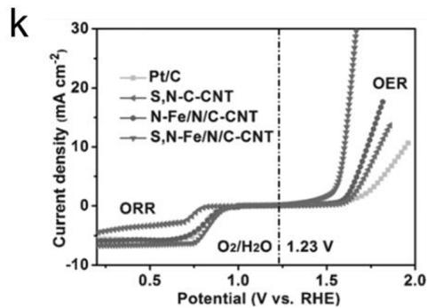

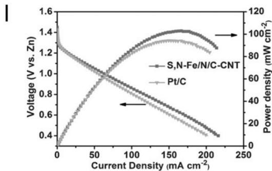

Figure 79. continued

discharge polarization curves showing superior performance of CCBC as compared to  $\mathrm{Pt / C}$  and conventional perovskite LaNiO $_3$ . OER and ORR activity of single metal/C and double metal/C composites as electrocatalysts in Zn-air batteries. Reproduced with permission from ref 609. Copyright 2012 American Chemical Society. (j) Structure and OER/ORR performance of S,N-Fe/N/C-CNT composite in Zn-air cells. (k) Overall LSV polarization curves showing excellent ORR and OER performance of S,N-Fe/N/C-CNT in Zn-air battery with 0.1 M KOH solution as compared to other cathode catalysts. (l) Discharge-polarization and power density plots of Zn-air battery based on S,N-Fe/N/C-CNT and Pt/C electrocatalysts at a constant charge/discharge current density of  $5\mathrm{mAcm}^{-2}$ . Reproduced with permission from ref 611. Copyright 2017 Wiley-VCH.

Air cathode:

$$
\mathrm {O} _ {2} + 4 \mathrm {e} ^ {-} + 2 \mathrm {H} _ {2} \mathrm {O} \leftrightarrow 4 \mathrm {O H} ^ {-} \tag {38}
$$

Zn anode:

$$
\mathrm {Z n} + 4 \mathrm {O H} ^ {-} \leftrightarrow \mathrm {Z n} (\mathrm {O H}) _ {4} ^ {2 -} + 2 \mathrm {e} ^ {-} \tag {39}
$$

$$
\mathrm {Z n} (\mathrm {O H}) _ {4} ^ {2 -} \leftrightarrow \mathrm {Z n O} + \mathrm {H} _ {2} \mathrm {O} + 2 \mathrm {O H} ^ {-} \tag {40}
$$

Overall anode:

$$
\mathrm {Z n} + 2 \mathrm {O H} ^ {-} \leftrightarrow \mathrm {Z n O} + \mathrm {H} _ {2} \mathrm {O} + 2 \mathrm {e} ^ {-} \tag {41}
$$

Overall:

$$
2 \mathrm {Z n} + \mathrm {O} _ {2} \leftrightarrow 2 \mathrm {Z n O} \tag {42}
$$

During discharge, the atmospheric oxygen diffusing into the cathode is reduced to form hydroxide ions through ORR, which migrate to the Zn anode to give away zincate ions  $(\mathrm{Zn(OH)}_4^{2-})$ . The  $\mathrm{Zn(OH)}_4^{2-}$  further breaks down to insoluble zinc oxide as the discharge product rendering liquid electrolyte supersaturated. The oxidation of anodic Zn also releases electrons by traveling through the external circuit to the air electrode during discharge. It is important to mention that the movement of  $\mathrm{Zn(OH)}_4^{2-}$  from the metallic terminal to the air electrode creates an increase in polarization and decrease in cyclic efficiency. This problem, however, is solved by means of a separator between the electrodes, the function of which is allowing the passage of hydroxide ions while blocking  $\mathrm{Zn(OH)}_4^{2-}$ . For the recharging process, the above electrochemical reactions are reversible, eventually leading to the deposition of Zn back at the metallic anode and oxygen being released at the electrode-electrolyte interface following the OER.

# 8.2.1. Air Cathode Electrocatalysts in Zn-Air Batteries.

It is important to emphasize that Zn-air batteries are still in the early developmental stages, primarily because of the sluggish OER/ORR kinetics, high overpotentials at the air cathode, and relatively low round trip efficiency.[595] Another part of their practical limitation is the cycling life, which is less than a quarter of that for LIBs. Therefore, it is urgent to develop highly efficient and stable catalysts that exhibit exceptional electrocatalytic activity in terms of stupendous electron conductivity, stability, and selectivity. Moreover, economical and environmental aspects are equally fundamental. In this regard, noble metals (Pt, Ag, Ru, Ir, and so on) have been extensively investigated as electrocatalysts for performing catalytic activities in Zn-air batteries. Nevertheless, challenges such as low stability, scarcity, and high costs still remain, hindering their practical entrance into the commercial markets.[596] Hence, the key considerations in designing and fabricating electrocatalysts include low costs, energy consumption, and carbon footprint. Herein, we briefly demonstrate each of the types and subtypes of electrocatalysts along with pertinent evidence from the up-to-date literature.

8.2.1.1. Metal-Based Electrocatalysts. Transition metal and pure carbon-based electrocatalysts have been widely invest

tigated as replacements for noble metal-based catalysts, principally owing to their various valence numbers, electrocatalytic activity, low-cost, stability, and environmental friendliness. Metal-based air-electrode electrocatalysts are broadly categorized into two genres: metallic compounds (metal oxides, etc.) and metal-C-N (M-C-N) materials.

Metallic compounds of oxides, sulfides, and hydroxides are counted as the most promising candidates for low-cost transition metal (Fe, Co, Mn, Cu, and Ni) compounds. Among oxides, single metal oxides,[597,598] spinel oxides,[599,600] and perovskite oxides[581,601] are prominent OER/ORR bifunctional catalytic materials. Regarding single metal oxides, Meng et al.[602] investigated  $\mathrm{MnO}_2$  based nanostructures, including  $\alpha$ -,  $\beta$ -,  $\delta$ -, and amorphous  $\mathrm{MnO}_2$ , in secondary Zn-air batteries and recorded their electrocatalytic performance in the order of  $\alpha$ - $\mathrm{MnO}_2 >$  amorphous  $\mathrm{MnO}_2 > \beta$ - $\mathrm{MnO}_2 > \delta$ - $\mathrm{MnO}_2$ . The  $\mathrm{CoO}_x$  family has also been under investigation for its high electrocatalytic OER/ORR performance and variable tendency to transfer electrons. To elucidate, Xie and co-workers[603] prepared a nanoscale ( $\sim 1$  nm)  $\mathrm{CoO}_x$  layered structure on Co/N codoped RGO (named Co/N-RGO), as shown in Figure 79a, to reveal that the integration of  $\mathrm{CoO}_x$  and Co/N-RGO augments the electron transfer rate while sparing active sites for enhancing conductivity. Further, quantitative evidence in the form of positive  $E_{1/2}$  of  $0.896\mathrm{~V}$  for ORR demonstrated its overall catalytic activity, yielding high power density up to  $120\mathrm{~mW}$ $\mathrm{cm}^{-2}$  when employed as an air cathode catalyst in the Zn-air battery as is evident in the power density curve (Figure 79b). Doping single metal oxides with another metal has also been proved to be a useful method for augmenting the catalytic activity of oxygen catalysts. For instance, the two-dimensional (2D) structure of NiO-NFs when doped with porous Co exhibited superior electronic state at the Fermi level and, therefore, is effective in increasing electronic conductivity and OER/ORR performance of pristine NiO-NFs.[604] In addition, the transition metal sulfides, which constitute a subcategory of chalcogenides, have also been greatly studied. The transition metal sulfides are known for their ability to host  $\mathrm{Zn}^{2+}$  owing to their variety of crystal structures and large interlayer spacing to store zinc ions. In this regard, vanadium sulfides ( $\mathrm{VS}_2$  nanosheets,  $\mathrm{VS}_4$ , and  $\mathrm{VS}_4@\mathrm{RGO}$ )[231,605] and molybdenum sulfides ( $\mathrm{Mo}_6\mathrm{S}_8$  and  $\mathrm{MoS}_2$ )[606,607] have been reported to exhibit remarkable ORR and OER performances as compared to individual sulfides,  $\mathrm{NiS}_2$  and  $\mathrm{CoS}_2$ .

The spinel oxides (single  $\mathrm{A}_3\mathrm{O}_4$  or binary  $\mathrm{A}_x\mathrm{B}_{3 - x}\mathrm{O}_4$ ) are acknowledged due to their multiple valence states of cations, providing donor-acceptor sites for facilitating OER and ORR kinetics through reversible oxygen adsorption. According to Wei et al.,[613] there are tetrahedral and octahedral sites in spinel oxide structure (Figure 79c). The octahedral sites play a pivotal role in the catalysis of spinel oxide because the  $\mathbf{e_g}$  orbital, directly facing the oxygen atom, overlaps with an O 2p orbital for octahedral coordination (Figure 79d). The ORR and OER activities of different spinel oxides as a function of  $\mathbf{e_g}$  occupancy of active

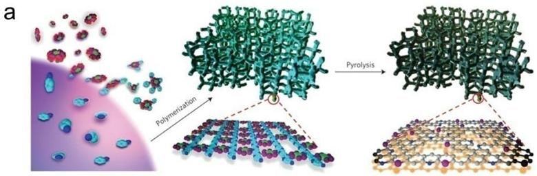

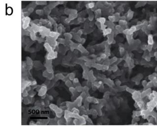

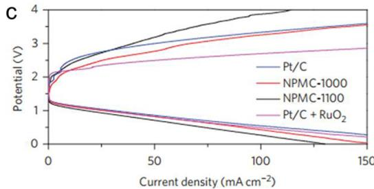

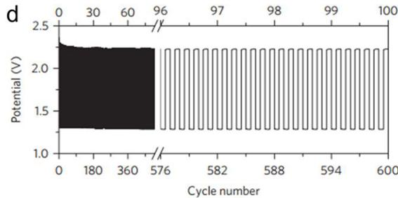

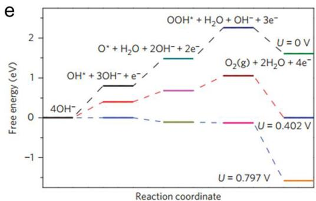  
Figure 80. Metal-free electrocatalysts in rechargeable zinc-air batteries. (a) Preparation of the NPMC electrocatalysts. (b) SEM micrograph of PANi aerogel. (c) Charge/discharge polarization curves of secondary zinc-air batteries showing performance of NPMC-1000 and NPMC-1100 against commercial  $\mathrm{Pt / C}$  and  $\mathrm{Pt / C + RuO_2}$  nanoparticles as catalysts. (d) Charge/discharge cycling performance of Zn-air battery based on NPMC-1000  $(0.5\mathrm{mgcm}^{-2}$  for ORR and  $1.5\mathrm{mgcm}^{-2}$  for OER) at a current density of  $2\mathrm{mAcm}^{-2}$ . (e) Energy profile of OER pathway of N,P co-doped graphene in alkaline medium. (f) Energy profile of ORR pathway of N,P co-doped graphene in alkaline solution. Reproduced with permission from ref 617. Copyright 2015 Springer Nature.

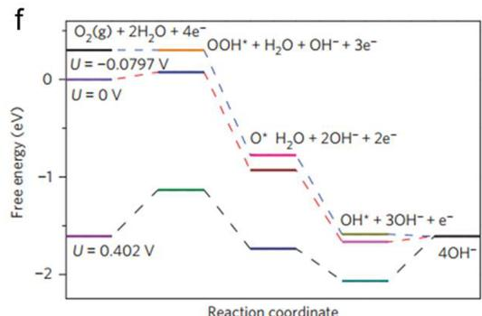

element at octahedral sites are shown in Figure 79e,f. In these illustrations, the black circle represents cubic  $\mathrm{MnCo_2O_4}$  spinels with Mn as the active element. The red and orange circles represent the Mn of tetragonal spinels  $(\mathrm{Mn}_2\mathrm{Co}_1\mathrm{O}_4,$ $\mathrm{Mn}_{2.5}\mathrm{Co}_{0.5}\mathrm{O}_4$  ,and  $\mathrm{Mn}_3\mathrm{O}_4)$  and ferrite, respectively. The green "up" triangle characterizes the Mn of cubic  $\mathrm{Li_xMn_2O_4}$  spinels. In addition, the blue diamond relates to the Co of cubic spinels  $(\mathrm{Co}_3\mathrm{O}_4,$ $\mathrm{ZnCo_2O_4},$  and  $\mathrm{CoFe_2O_4})$  , while the pink square signifies the Ni of cubic spinels  $(\mathrm{NiCo_2O_4}$  and  $\mathrm{NiFe_2O_4})$  . It is clear that the spinel structures with Co and Ni as active element tend to positively stray from the expected trend (dotted volcano line) because of the strength of the metal-oxygen covalent bond at octahedral sites.

Perovskite oxides  $\left(\mathrm{ABO}_3\right)$  have  $\mathrm{BO}_6$  octahedral sites with  $\mathrm{A}^+$  cations in their structural framework, as shown in Figure 79g. The synthesis of perovskite oxides anchored on N-doped carbon materials has been an extensive practice for designing optimized bifunctional catalysts. Chen et al.[609] introduced a core-corona bifunctional catalyst (CCBC) (Figure 79h) composed of exceedingly OER-active  $\mathrm{LaNiO}_3$  supported on highly ORR-active N-doped CNTs. The DFT analysis for degradation testing has shown that the CCBC outperforms Pt/C catalyst by 3-13-fold. The charge/discharge polarization curves (Figure 79i) also exhibit superior performance of the CCBC as compared to the

typical  $\mathrm{Pt} / \mathrm{C}$  and  $\mathrm{LiNiO_3}$ . Furthermore, P-3G, which is composed of cation-ordered perovskite  $(\mathrm{PrBa}_{0.5}\mathrm{Sr}_{0.5})_{0.95}\mathrm{Co}_{1.5}\mathrm{Fe}_{0.5}\mathrm{O}_{5 + \delta}$  and 3D porous N-doped graphene, has also been examined as an active OER/ORR catalyst.[610]

Metal-nitrogen-doped carbon (M-N-C) based materials consisting of  $\mathrm{M - N_x}$  moieties, in particular  $\mathrm{Fe / Co - N_x - C}$  moieties, anchored on a C matrix have emerged as a promising family of bifunctional cathode catalysts in Zn-air battery systems $^{596}$  due to their low-cost and intrinsic catalytic performance, which is further ascribed to the interaction between metal and nitrogen inside the C matrix for regulating the local electronic configuration. Such interactions result in decreased adsorption energy of oxygenated intermediate species, eventually leading to exceptional bifunctional OER/ ORR activity. Among numerous recent studies, Xie et al. $^{611}$  synthesized single atom  $\mathrm{Fe - N_x}$  anchored on N and S containing ordered C layers (named S,N-Fe/N/C-CNT), as shown in Figure 79j. The resulting configuration revealed that the rich atomic dispersion of  $\mathrm{Fe - N_x}$  sites and their ordered structures facilitated quicker electron transfer and augmented the exposure of active sites. The S,N-Fe/N/C-CNT demonstrates excellent ORR and OER activities in terms of  $\Delta E$  (0.75 V) (Figure 79k) and a high power density of  $102.7~\mathrm{mW~cm}^{-2}$  (Figure 79l). In

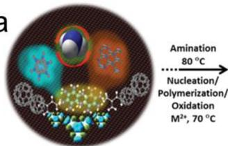  
a

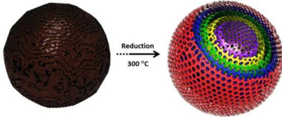

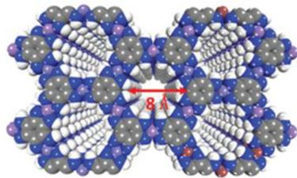  
b

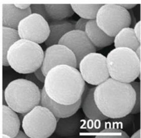  
C

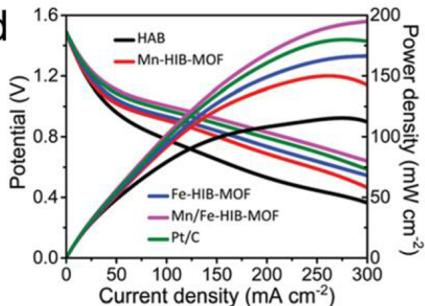  
d

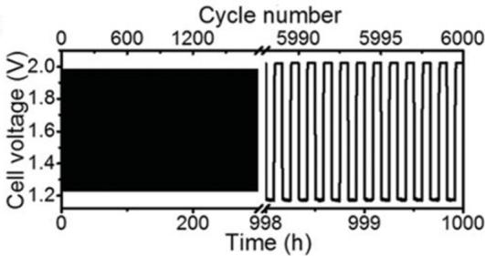  
e

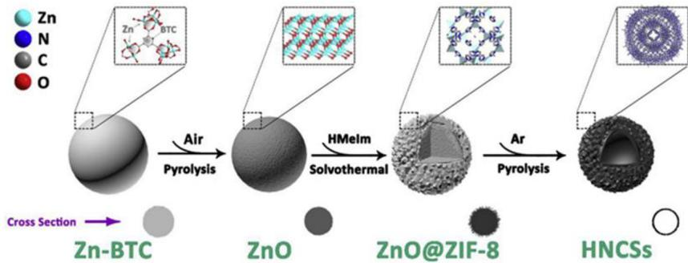  
f

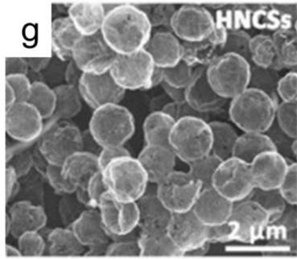

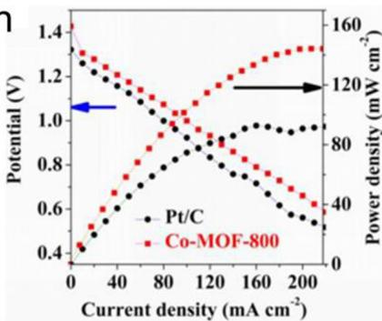  
h  
Figure 81. MOF based electrocatalysts for Zn-air batteries. (a) Synthesis process of 3D M-HIB-MOF or dual-atom HIB-MOF through nucleation, polymerization, and reduction methods. (b) Schematic of a typical dual-atom HIB-MOF structure. (c) SEM micrograph showing spherical morphology of Mn/Fe-HIB-MOF particles. Reproduced with permission from ref 625. Copyright 2019 Royal Society of Chemistry. (d) Polarization and power density curves showing performance of Zn-air battery based on Mn/Fe-HIB-MOF catalyst and (e) galvanostatic charge/discharge cycling performance of Zn-air battery based on Mn/Fe-HIB-MOF at a current density  $10\mathrm{mAcm}^{-2}$ . (f) Schematic of the preparation process of HNCSs. (g) TEM micrograph of HNCSs. Reproduced with permission from ref631. Copyright 2019 Elsevier. (h) Power density and polarization curves of Zn-air battery employing Pt/C and Co-MOF-800 as ORR catalysts and (i) comparison of cycling performances of Co-MOF-800 and  $\mathrm{Pt / C + RuO_2}$  as cathode electrocatalysts in Zn-air battery. Reproduced with permission from ref 632. Copyright 2021 Elsevier.

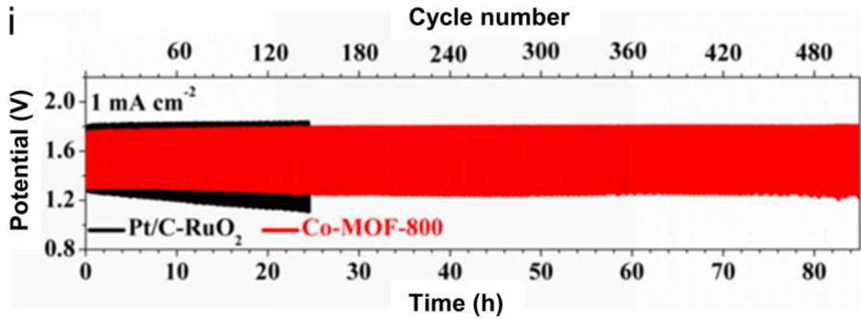  
i

addition to single metal  $\mathrm{M - N - C}$  catalysts, bimetallic 2D structured  $\mathrm{FeCo - N_x - CN}$  showed reversible ORR/OER with a low  $\Delta E$  (0.78 V), high power density of  $150\mathrm{mWcm}^{-2}$ , and cyclability up to  $40\mathrm{h}$  at  $5\mathrm{mA cm}^{-2}$  and  $10\mathrm{mA cm}^{-2}$ . [612] Overall, such a design of electrocatalysts is speculated to offer bright prospects for the development of advanced electrode materials for novel energy storage systems.

8.2.1.2. Metal-Free Electrocatalysts for Zn-Air Batteries. The pristine carbon materials are without any doubt the most extensively studied materials with regards to optimal design of air electrodes in MABs. Owing to their high specific surface area

and conductivity, such materials can serve to boost the electron transfer rate and mass diffusion of discharge/charge species in ORR/OER reactions.[615] Among them, CNTs, CB, RGO, and graphitic carbon nitrides are noteworthy. The doping of heteroatoms (N, S, P, or B) is considered as an extremely conducive strategy to customize the charge/spin redistribution in the carbon matrix for enhancing its catalytic activity. Generally, monoatom doping is highly effective in generating numerous activation sites in the carbon framework and lowering reduction energy.[616] In this regard, the redox catalytic activity of B-doped carbon nanomaterials holds precedence over their N-

doped counterparts due to their lower doping concentration. This preference is ascribed to the B atoms, due to their lower electronegativity than carbon, introducing charge carrier species and encouraging efficient chemisorption of oxygen atoms.[596]

Adding two heteroatoms in the carbon skeleton can also induce synergistic effects to aid electrocatalytic functions for Zn-air batteries. In this regard, studies have reported doping of carbon foams with some typical dual heteroatoms such N-B, N-P, and N-S. Recently, Dai and co-workers[617] have reported the ORR and OER catalytic activities of 3D carbon foams with N and P as co-dopants (NPMC). Figure 80a shows the preparation process of the NPMC, which involves the polymerization of aniline monomers followed by the pyrolysis of polyaniline (PANi) aerogel. As a result, the surface area of the NPMC catalysts was recorded to be as large as  $\sim 1663\mathrm{m}^2\mathrm{g}^{-1}$  (Figure 80b). In addition, the polarization curves (Figure 80c) of the Zn-air battery based on the NPMC catalyst showed excellent charge (OER) and discharge (ORR) performance, and NPMC-1000 exhibited stability in battery cycling with no voltage change even after 600 charge/discharge cycles ( $\sim 100\mathrm{h}$ ), as shown in Figure 80d. The suitable electronic structures, the OER/ORR activities, and the corresponding overpotentials were studied by carrying out first-principles calculations using density functional theory (DFT). It was found that, for OER, the most active site for N and P dopants is at the edge of graphene and the overall reaction was ascending at potential of  $0\mathrm{V}$ . However, when the battery potential increased to the threshold of 0.797 (equivalent to an overpotential of  $0.395\mathrm{V}$ ), the reaction directs downward along with the spontaneous occurrence of OER, as shown in Figure 80e. Similarly, the most active N-doped site is at different locations near the edge of graphene, the ORR pathway of which along with Gibbs free energy change is illustrated in Figure 80f. Furthermore, a similar study conducted by Dai et al.[590] has also revealed that a Zn-air battery system based on a N,P co-doped C sphere catalyst exhibited desirable electrochemical bifunctional OER/ORR catalytic activity, approaching that of commercial catalysts.

Apart from the single- and dual-doped carbon electrocatalysts, multidoping of elements in carbon materials has been exclusively investigated.[618] The studies include the synthesis of ternary (N, F, and P) doped carbon catalyst by using electrospinning and heat treatment methods,[619] N,P,S-doped carbon nanospheres by employing secondary pyrolysis and template etching,[620] and N,F,S-tridoped carbon fibers.[621] It is important to mention that although the N,P,S-doped carbon nanospheres exhibited ORR catalytic activity comparable to that of  $\mathrm{Pt / C}$ , their ORR activity was found to be poor. In addition, the catalytic benefits of tridoped carbon fibers are relatively poor as compared to the conventional  $\mathrm{Pt / C}$  and  $\mathrm{RuO_2}$  catalysts.[596]

To summarize, the metal-free carbon materials overall have shown excellent ORR activity along with other key considerations pertaining to cost, selectivity, stability, and so on. Nevertheless, such catalyst materials demonstrated a concrete downside of insufficient OER activity because of the induced defects in the carbon substrate due to the doping of heteroatoms.

8.2.1.3. Metal-Organic Framework Based Electrocatalysts. Metal-organic frameworks (MOFs) are known catalyst materials in secondary Zn-air batteries owing to their highly ordered crystalline structure, customized pore size, ultrahigh surface area, and flexibility to structural design. Such materials are made of metallic ions or agglomerates integrated with organic ligands, including zeolite imidazole frameworks (ZIFs).

In contrast to the traditional noble-metal catalysts, MOFs can offer the following potential advantages: (i) convenience of doping of highly dispersed heteroatoms; (ii) control over size, morphology, and crystalline structure of pristine MOFs; (iii) induced electrical conductivity through conductive ligands; and (iv) supermolecular properties. In general, MOF-based oxygen catalysts can be categorized into pristine MOFs and their derivatives.

Concerning pristine MOFs, 2D MOFs have emerged recently as a hot topic owing to their inherent porosity, considerable conductivity, and chemical stability.[622] Hitherto, most of the 2D MOFs have been synthesized from the coordination of metal ions, such as  $\mathrm{Cu}^{2+}$ ,  $\mathrm{Ni}^{2+}$ , or  $\mathrm{Co}^{2+}$ , with ligands derived from benzene or triphenylene with phenol  $(-OH)$ , imine  $(-NH_2)$ , or thiophenol  $(-SH)$  functional groups. For instance, Zhu et al.[623] pioneered a simple 2D oxide sacrifice approach to synthesize ultrathin FeCo MOF-74 nanosheets (named FeCo-MNS), which exhibited superior OER activity with low onset potential value of  $1.528\mathrm{V}$ . Similarly, Zhang et al.[624] proposed a new class of 2D MOF containing  $\pi$ -conjugated  $[\mathrm{Co}_3(\mathrm{HHTP})_2]_n$  nanosheets, which demonstrated ultrahigh mass activity (64.63 A mg $^{-1}$ , 1.7 V vs. RHE) when applied in OER, proving their bright prospects in Zn-air batteries.

In addition to 2D MOFs, 3D bifunctional electrocatalysts also attracted attention for their employability in aqueous  $\mathrm{Zn}$ -air batteries. Shinde et al.[625] synthesized a double-linked hexaiminobenzene MOF (Mn/Fe-HIB-MOF) and proved its enhanced bifunctional utility toward OER/ORR. Figure 81a-c show the sequential synthesis scheme of single-atom HIB-MOF, structural design of dual-atom HIB-MOF, and its SEM-recorded spherical morphology, respectively. Moreover, the electrochemical characterization shows that the zinc-air batteries based on Mn/Fe-HIB-MOF demonstrate superior battery performance, as evident from  $\Delta E = 0.627\mathrm{V}$ ,  $E_{1/2} = +0.883\mathrm{V}$  (ORR), low  $E_{10\mathrm{mA}\cdot \mathrm{cm}^{-2}} = 1.61\mathrm{V}$  (OER), power density measurement (Figure 81d) and excellent cycle life over 1000 h at  $10\mathrm{mA}\mathrm{cm}^{-2}$  (Figure 81e). Furthermore, the customization of 2D MOFs with other MOF nanoparticles for enhancing electrical conductivity and catalytic performance has also been practiced in  $\mathrm{Zn}$ -air systems.[626] Although conductive MOFs have made their name in their catalytic effectiveness for bifunctionality, these materials have some major downsides in terms of high costs of ligands and complexity of their fabrication. Therefore, the pristine MOFs are discouraged as catalysts in  $\mathrm{Zn}$ -air batteries. In contrast, the development of MOFs as self-sacrificing templates for building porous carbon enclosed in metal-metal compounds, is becoming a hot topic.

MOF derivatives based on porous metal to metal compound-based carbon materials have emerged as promising candidates to yield admirable bifunctional (ORR/OER) electrocatalytic activities. This new category of MOF derivatives may constitute either metal-nitrogen based carbon materials  $(\mathrm{M - N - C})$  or carbon-based metallic compounds. The  $\mathrm{M - N - C}$  materials (where M stands for Fe, Ni, Co, etc.) are made of species in the form of  $\mathrm{MN}_x$  inserted in a carbon matrix and are known for their increased ORR and OER activities. In addition to the single-atom based  $\mathrm{M - N - C}$  materials, transition metals also proved themselves to be good candidates for MOF-derived  $\mathrm{M - N - C}$  materials. The evidence has been reported for the competitive performance of structurally ordered rod-like Co nanoparticles inserted in N-doped C rings,[627] 3D sandwiched N-doped-C/Co nanoparticle/N-doped-C,[628]  $\mathrm{Co - N}_x / \mathrm{C}$  nanorod arrays made

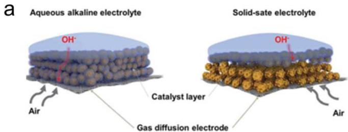

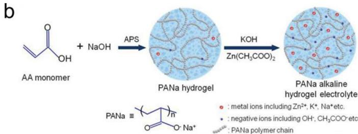

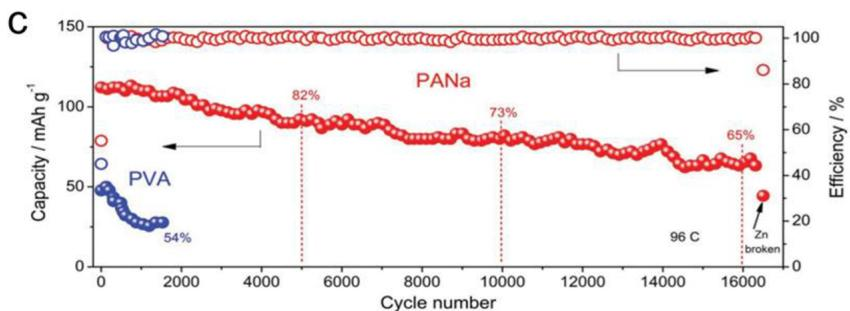

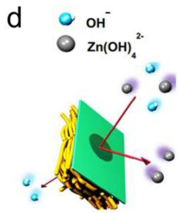

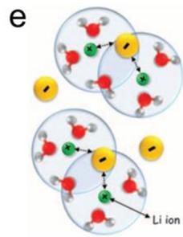

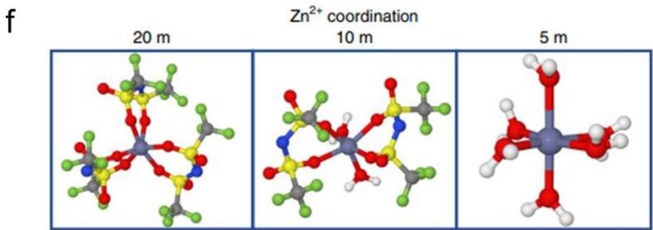  
Figure 82. Advancement of electrolytes in Zn-air batteries. (a) Schematic of 3-phase reaction zone in solid-state and liquid electrolytes in Zn-air batteries. Reproduced with permission from ref 633. Copyright 2016 Wiley-VCH. (b) Preparation of PANa hydrogen electrolyte from monomer AA, neutralizer NaOH, initiator ammonium persulfate,  $\mathrm{Zn(CH_3COO)_2}$ , and KOH. (c) Cycling performance and corresponding CE of Zn-air battery at  $96\mathrm{C}$  rate showing superior performance of PANa as compared to PVA electrolyte. Reproduced with permission from ref 640. Copyright 2018 WileyVCH. (d) Illustration of ion selectivity penetrating across polymerized IL membrane electrolyte in Zn-air battery. Reproduced with permission from ref 644. Copyright 2016 American Chemical Society. (e) Schematic of  $\mathrm{Zn^{2+}}$  solvation sheath in WIS solutions. Reproduced with permission from ref 119. Copyright 2015 The American Association for the Advancement of Science. (f) Molecular dynamics simulated solvation structure of  $\mathrm{Zn^{2+}}$  in HCZE. (g) Cycling performance of Zn-air battery based on HCZE electrolyte at a current density of  $50\mathrm{mA g^{-1}}$  and a constant capacity of  $1000\mathrm{mAh g^{-1}}$ . Reproduced with permission from ref 642. Copyright 2018 Springer Nature.

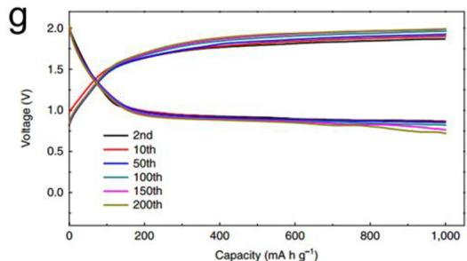

by the 2-step pyrolysis of 3D ZIFs, $^{629}$  and the pyrolysis product of 2D  $\mathrm{Zn / Co}$  ZIF. $^{630}$

Recently, Huang and co-workers $^{631}$  adopted a bottom-up method to synthesize non-transition metal based MOF-derived hollow N-doped carbon spheres (HNCSs), the preparatory process for which is shown in Figure 81f. The starting MOF undergoes pyrolysis and a subsequent solvothermal process to obtain ZnO-ZIF-8 core-shell microparticles, which are then carbonized at  $1000^{\circ}\mathrm{C}$  to obtain HNCSs. The SEM micrograph (Figure 81g) confirms the hollow structure of the HNCS particles, as evident from the contrast distribution over their curved surfaces. Upon electrochemical testing, the HNCS electrocatalyst delivers remarkable ORR activity  $(5.34\mathrm{mAcm}^{-2}$  current density), long-term stability (up to  $96.5\%$  capacity retention after  $10\mathrm{h}$ ), and superior reaction selectivity as compared to the known Pt/C electrocatalyst in alkaline medium. Similarly, Zheng et al. $^{632}$  introduced a novel Co-MOF,O-doped carbon electrocatalyst based on Zn,Co-doped glucosamine and ZIF-8 MOF for enhancing the performance of Zn-air batteries. Upon employment in Zn-air cells, the electrocatalyst shows a higher OCP up to  $1.38\mathrm{V}$  as compared to that of the Pt/C based air cathode  $(1.32\mathrm{V})$ , as shown in

Figure 81h. The power density is recorded to be  $\sim 144\mathrm{mW}$ $\mathrm{cm}^{-2}$ . In addition to the excellent specific capacity (671.6 mAh  $\mathrm{g_{Zn}}^{-1}$ ) at  $10\mathrm{mAcm}^{-2}$ , the battery shows remarkable cycling performance. As evident in Figure 81i, the final charge and discharge potentials are 1.81 and  $1.23\mathrm{V}$ , respectively, after 510 cycles, which are close to the initial charge and discharge potentials of 1.76 and  $1.30\mathrm{V}$ , surpassing the cycling performance of the  $\mathrm{Pt / C + RuO_2}$  based Zn-air batteries.

To summarize, in order to qualify as suitable electrocatalysts for ORR in  $\mathrm{Zn}$ -air batteries, it is pivotal for them to create more active sites for the nucleation of discharge product while keeping the enhanced rate of ORR/OER activity. It has been established that among all the selections, carbon-based materials are used to date in almost all the electrocatalysts, out of which metal-based catalysts stand out as competitive replacements as compared to the conventional noble or precious metal catalysts in  $\mathrm{Zn}$ -air batteries. In contrast, the precious metal catalysts are favored the least against all their counterparts owing to their overwhelming cost and no extraordinary performance.

8.2.2. Electrolyte Advancement in Zn-Air Batteries. Alkaline electrolytes, such as KOH, NaOH, and LiOH, are mostly employed in Zn-air batteries, exhibiting high metallic

corrosion resistance, low viscosity, good ionic conductivity, and oxygen electrocatalytic activity. $^{633}$  Among these, KOH is the most extensively studied owing to high solubility of  $\mathrm{Zn}$  salts in it, fast electrochemical kinetics, and ionic conductivity of  $\mathrm{K}^{+}$ . $^{634}$  In general, the use of alkaline solutions has been met with major challenges, which include the dissolution of zinc giving rise to undesired intermediate species (such as  $\mathrm{Zn(OH)}_4^{2-}$ ), anodic corrosion, and dendrite growth. In order to suppress the formation of  $\mathrm{Zn(OH)}_4^{2-}$  leading to  $\mathrm{Zn}$  dendrites, the addition of room temperature ionic liquids (RTILs), such as 1-ethyl-3-methylimidazolium dicyanamide, in alkaline solutions has been proven effective. $^{635}$  As for  $\mathrm{Zn}$  passivation acting as a diffusion barrier and hindering the diffusion of hydroxide ions, increasing the concentration (i.e., pH) of alkaline electrolytes and adding additives are among the primary mitigation strategies. $^{634}$

Realizing the limitation of alkaline solutions, the focus has gradually shifted toward aqueous neutral electrolytes for curbing the problems of electrolyte carbonation and dendrite formation. In this regard, Goh and co-workers[636] have reported the efficacy of  $\mathrm{ZnCl}_2$  and  $\mathrm{NH}_4\mathrm{Cl}$  as electrolytes in Zn-air batteries, yielding long cycle life, minimal dendrite growth, and nonexistent carbonate formation.

The problems mentioned pertaining to aqueous electrolytes led to studies pivoting toward nonaqueous electrolytes in the sphere of zinc-air batteries.[637] Concerning this, organic solvents can limit the shortcomings related to hydrogen evolution, dendrite growth, drying out of electrolyte due to water evaporation, and carbonation. In addition, these organic solvents have the ability to operate under higher temperature ranges and provide wide electrochemical windows. However, limited attention has been devoted to the applicability of organic solvents in metal-air (or Zn-air) batteries. Furthermore, solid-polymer electrolytes or thin film electrolytes represent another genre of nonaqueous electrolytes having massive potential to be employed in Zn-air batteries.[638] Their history pertaining to zinc-air batteries can be traced back to the 1990s as reported in ref 575. Figure 82a shows the schematic configuration of Zn-air batteries with solid-state polymer and liquid electrolytes. The polymer electrolytes have been acknowledged for their energy enhancement, high operational temperature ranges, good mechanical strength and toughness, fabrication convenience, low convection (ensuring low electrode corrosion and increased battery life), and low battery leakage. For instance, the ionic conductivities of poly(acrylic acid) (PAA), poly(vinyl alcohol) (PVA), and poly(4-vinylbenzenesulfonate-co-[3-(methacryloylamino) propyl] trimethylammonium chloride) (PAM) have recently been investigated pertaining to aqueous Zn-air batteries.[639] It has been revealed that when Zn-air batteries based on these polymers are tested for their charge/discharge cycles  $(0.5\mathrm{mAcm}^{-2})$ , PAA shows superior cycling stability. In addition, the efficiencies of KOH  $(6\mathrm{M})$ , PVA  $(6\mathrm{M})$ , PAA  $(6\mathrm{M})$ , and PAM have been recorded to be  $72\%$ ,  $70\%$ ,  $79\%$ , and  $66\%$ , respectively, proving the superior performance of PAA in Zn-air batteries. However, a major problem with the solid-state polymer electrolytes is their low ionic conductivities and lower solubility of Zn salts. Therefore, efforts are currently being devoted to rectifying this issue with novel methods, for example, by introducing co-polymers, coating electrodes with solid electrolyte, or in situ solidification of electrolytes inside the electrode structure, giving rise to hybrid solid-state batteries.

Gel-polymer electrolytes, which are made of a 3D polymeric skeleton containing a liquid electrolyte, expanding throughout its volume to facilitate rapid ion transport as in liquid

electrolytes, constitute another important alternative. The major advantage of these electrolytes is their high flexibility and the prevention of water loss. However, the gel-polymer electrolyte based MABs suffer from inadequate stability of the polymer frameworks, leading to the quick loss of electrolytic solvents resulting in short battery cycle life. Huang et al.[640] have recently reported a gel-polymer electrolyte based on sodium polyacrylate hydrogel (PANa) for flexible Zn-air battery systems (Figure 82b), and the electrochemical results showed relatively better cycling stability at  $2\mathrm{mA}\mathrm{cm}^{-2}$  for  $160\mathrm{h}$  as compared to the traditional PVA electrolyte. In addition, the aqueous Zn battery based on the PANa electrolyte has demonstrated  $65\%$  charge capacity retention even after 16000 charge/discharge cycles of the battery (Figure 82c), which is superior to the battery based on PVA.

Furthermore, nonaqueous RTILs, having melting temperatures equal to or below  $100^{\circ}\mathrm{C}$ , have gained substantial attention. In contrast to the aqueous electrolytes, nonaqueous RTILs are preferred owing to their low volatility, nonflammability, thermal stability, ionic composition, and inherent high degree of customization, allowing only desirable ions to pass through them (Figure 82d). Among these, the ones with imidazolium and pyrrolidinium as cations and dicyanamide and trifluoromethanesulfonylimidide as anions have been investigated.[641] The loss of water in aqueous electrolytes has also been addressed with WIS electrolytes, giving rise to intrinsically safer ZABs.[577] The WIS electrolytes hold precedence over their counterparts due to the stronger bonding of water molecules imparted by the ultrahigh concentration of salt. An extensively investigated example of such a solution is LiTFSI, in which water molecules take part in the solvation of metal ions, and the dearth of water molecules as compared to TFSI salt makes them difficult to decompose. According to Suo et al.,[119] upon increasing the LiTFSI concentration beyond  $20m$ , an average of two  $\mathrm{TFSI}^{-}$ are reserved for each  $\mathrm{Li^{+}}$  solvation sheath (Figure 82e). Similarly, Wang et al.[642] has introduced a highly concentrated  $\mathrm{Zn}$ -ion electrolyte (HCZE), which is composed of  $1m\mathrm{Zn(TFSI)}_2$  and  $20m$  LiTFSI (where  $m$  is molality ( $\mathrm{mol}\mathrm{kg}^{-1}$ )). The HCZE electrolyte not only ensures water retention in open surroundings but also promotes the stability and reversibility of the  $\mathrm{Zn}$  anode. Figure 82f illustrates the solvation structures of  $\mathrm{Zn}^{2+}$  in HCZE with  $1m\mathrm{Zn(TFSI)}_2$  and various concentrations (5, 10, and  $20m$ ) of LiTFSI. In addition, it can be proven from electrochemical testing that the  $\mathrm{Zn}$ -air battery based on the WIS electrolytes yields exceptional energy density ( $300\mathrm{Whkg}^{-1}$ ) for 200 cycles (Figure 82g). Furthermore, a low-cost  $\mathrm{ZnCl}_2$  based WIS electrolyte for dendrite-free reversibility of  $\mathrm{Zn}$  anode has also been reported.[643] With continual efforts toward the exploration of electrolytes for optimal performance in  $\mathrm{Zn}$ -air battery systems, considerable attention has been awarded to viable designs of electrode materials and catalysts in order to maximize the overall battery performance for GSES applications.

8.2.3. Architecture and Electrochemistry of Zn Anode. In contrast to the number of studies on electrocatalysts, only a handful of them have pivoted their attention to addressing the challenges faced by Zn electrodes. The problems offered by the Zn electrode have been reported to be comparably serious to those of the vastly investigated air electrode in Zn-air batteries. This is primarily because the latter exhibits much longer life cycle along with better degradation as compared to the former.[645] This justifies the urgent need to reorient attention

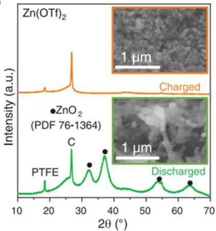  
a

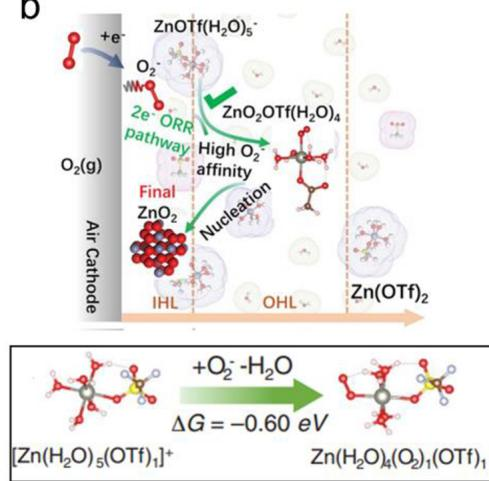  
b

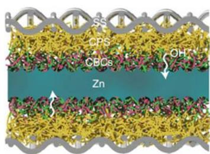  
d

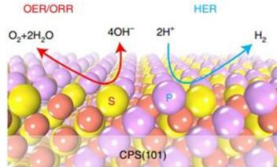  
e

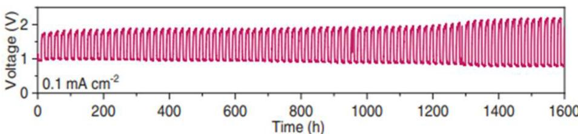  
C

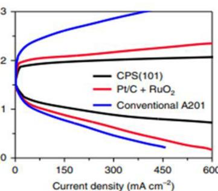  
f

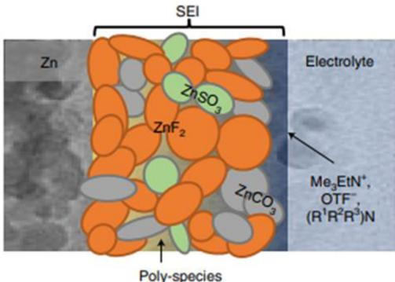  
g  
Figure 83. Recent technologies in  $\mathrm{Zn}$  -air battery systems. (a) XRD pattern of air cathode after cycling in  $\mathrm{Zn(OTF)_2}$  electrolyte. (b) Schematic representation of  $2\mathrm{e}^{-}$  transfer mechanism in the vicinity of internal Helmholtz layer and outer Helmholtz layer in the presence of  $\mathrm{Zn(OTF)_2}$  electrolyte. Lower image shows the process involving desolvation and  $\mathrm{O}_2^-$  -containing pair formation. (c) Cycling performance of  $\mathrm{Zn}$  -air battery at a current density of  $0.1\mathrm{mA cm}^{-2}$ . Reproduced with permission from ref 593. Copyright 2021 The American Association for the Advancement of Science. (d) Schematic of symmetric all-solid-state  $\mathrm{Zn}$  -air cell based on CPS(101)||CBCs||patterned zinc||CBCs||CPS(101) configuration. (e) Diagram illustrating S and P active sites, participating in the trifunctional catalytic activity of CPS(101) on its surface. (f) Comparison of charge/ discharge voltage profiles of CPS(101),  $\mathrm{Pt / C + RuO_2}$  and commercial A201. Reproduced with permission from ref 658. Copyright 2021 Springer Nature. (g) Image showing SEI for conducting  $\mathrm{Zn^{2 + }}$  characterized by tiny nodular particles trapped in polymer framework. (h) TEM micrograph of cycled Zn anode surface in  $4m\mathrm{Zn(OTF)}_2 + 0.5m\mathrm{Me}_3\mathrm{EtNOTF}$  electrolyte. (i) Cycling performance of  $\mathrm{Zn||O_2}$  battery in  $4m\mathrm{Zn(OTF)}_2 + 0.5m$ $\mathrm{Me}_3\mathrm{EtNOTF}$  electrolyte showing SEI layer formation. Reproduced with permission from ref 659. Copyright 2021 Springer Nature.

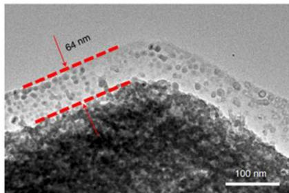  
h

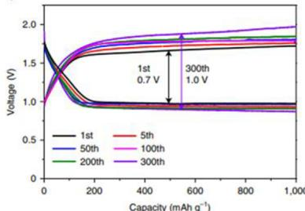  
i

to addressing the dire problems pertaining to the Zn anode in Zn-air batteries.

The major problem of the Zn anode is its passivation, which results from the limited usage of Zn metal, especially in aqueous alkaline media, due to the limited transfer of soluble species to the anode and dissolved zinc into the electrolyte.[574] Such low consumption of anodic Zn accounts for the difference between actual energy density (220–300 Wh kg $^{-1}$ ) and theoretical energy density (1300 Wh kg $^{-1}$ ) of Zn-air batteries. The following are the key reactions occurring at the Zn electrode:[571,646]

$$
\mathrm {Z n} _ {\left(\mathrm {s}\right)} + 4 \mathrm {O H} ^ {-} \leftrightarrow \mathrm {Z n} (\mathrm {O H}) _ {4} ^ {2 -} _ {\left(\mathrm {a q}\right)} + 2 \mathrm {e} ^ {-} \tag {43}
$$

$$
\mathrm {Z n} (\mathrm {O H}) _ {4} ^ {2 -} \leftrightarrow \mathrm {Z n O} _ {\left(\mathrm {s}\right)} + 2 \mathrm {O H} ^ {-} + \mathrm {H} _ {2} \mathrm {O} \tag {44}
$$

Within the context of these reactions, passivation refers to the deposition of  $\mathrm{ZnO}$  particles, after supersaturation in the aqueous electrolyte, onto the  $\mathrm{Zn}$  electrode surface, forming an insulating layer and inhibiting further  $\mathrm{Zn}$  anodic reactions during the battery discharge.[647] Consequently, the discharge process ceases altogether, thereby curbing the  $\mathrm{Zn}$  electrode consumption and lowering the discharge capacity. In addition, the limited reversibility of the  $\mathrm{Zn}$  anode is directly related to the reduced rechargeability of  $\mathrm{Zn}-$  air batteries. According to Liu et al.,[648] high current density yields a compact  $\mathrm{ZnO}$  layer which results in the passivation of electrode. In contrast, lower values of current density lead to the formation of a porous  $\mathrm{ZnO}$  layer, which

instead of passivation allows enough mass transfer of hydroxide ions for anodizing purposes. Several mitigation strategies have been investigated for inhibiting the  $\mathrm{ZnO}$  passivation. The most commonly known solution comprises of altering the structural configuration of the  $\mathrm{Zn}$  anode to increase porosity, which provides high surface area for facilitating the accumulation and diffusion of discharge products.[646] In this regard, pulse electroplating has been employed for the development of  $\mathrm{Zn}$  anode with rational porosity and specific surface area for inhibiting the  $\mathrm{ZnO}$  passivation layer.[649] However, this method offers some potential downsides in terms of increased electrode resistance, dendrite growth, and corrosion rate, as well as decreased CE, which are further addressed with high concentration  $\mathrm{Zn}$ -ion electrolyte (HCZE), as reported.[642] Another simple strategy for suppressing the  $\mathrm{ZnO}$  passivation involves augmenting the concentration of aqueous solvents, so as to destabilize the loose  $\mathrm{ZnO}$  layer by increasing its solubility under high pH conditions.[650] However, this solubility of the  $\mathrm{ZnO}$  layer comes at the expense of  $\mathrm{Zn}$  corrosion.[646] Studies have also proved the efficacy of adding suitable surfactant, thanks to its amphiphilic nature, into the electrolyte to prevent deposition of the passive  $\mathrm{ZnO}$  layer.[650,651]

The formation of Zn dendrites owing to the uneven distribution of active species onto the anode surface is another key challenge and is greatly associated with the performance of Zn-air batteries.[652] Upon cell recharging, the Zn anode undergoes morphological alteration into a symmetric leaf-like structure, depending upon the current density. It is important to point out that this problem is responsible for creating further issues, such as short circuiting and shortened life of Zn-air battery.[653] To address this issue, a well-established and straightforward mitigation strategy is to use electrically insulating material as a separator, which is stable in aqueous medium and porous enough to allow substantial ionic conductivity. Specifically, a separator allows the migration of  $\mathrm{Zn}^{2+}$  species from the Zn anode to the oxygen cathode while blocking  $\mathrm{Zn(OH)}_4^{2-}$ . In this regard, polymeric separators, such as polyethylene, polyolefin, PVA, hydrated cellulose membrane, PAN, and polypropylene, are among the widely accepted choices.[654,655] Since separators alone do not necessarily stop dendrite formation, they are used in combination with the addition of inorganic or organic additives.[646] These additives serve the purpose of changing the electrodeposition behavior of the zinc anode by influencing its electrochemical features, like grain size, anticorrosion properties, and chemical composition. Hitherto, organic additives (EDTA, Tween 20 (polysorbate 20), and tartaric acid),[656] inorganic additives (CdO,  $\mathrm{Pb}_3\mathrm{O}_4$ , PbO,  $\mathrm{Bi}_2\mathrm{O}_3$ ,  $\mathrm{In}_2\mathrm{O}_3$ , and SnO),[657] and RTILs have been investigated as effective dendrite inhibitors.

8.2.4. Emerging Technologies for Zn-Air Batteries. The Zn-air energy storage systems have made substantial contributions to revolutionizing the next-generation energy storage devices. These are at present the most competitive alternatives for flexible and portable electronics, automobile, and LSES applications. Cutting-edge scientific studies on Zn-air technology have been conducted recently to further enhance the performance of such systems through novel chemistries and material designs. For instance, an attempt to improve the sluggish  $4\mathrm{e}^{-}\mathrm{O}_2$  chemistry and irreversibility in Zn-air batteries has been made by Sun and co-workers.[593] In their study, an unprecedented  $\mathrm{Zn - O_2 / ZnO_2}$  chemistry, facilitating  $2\mathrm{e}^{-}\mathrm{O}_2$  transfer in non-alkaline electrolyte, has been introduced by coating a  $\mathrm{Zn^{2 + }}$  ion-rich internal Helmholtz layer onto the air

cathode by means of hydrophobic trifluoromethanesulfonate anion species. In the presence of  $1\mathrm{mol}\mathrm{kg}^{-1}\mathrm{Zn(OTF)}_2$  as electrolyte and ambient air as cathode, fibers of  $\mathrm{ZnO}_2$  are formed as discharge products, which upon charging are completely diminished, revealing the excellent reversibility of  $\mathrm{ZnO}_2$  in  $\mathrm{Zn(OTF)}_2$  electrolyte (Figure 83a). With regards to the mechanism governing the formation of  $\mathrm{ZnO}_2$  during battery discharge, the molecular dynamics simulations attribute it to the strongly hydrophobic nature of trifluoromethanesulfonate anions, creating  $\mathrm{H}_2\mathrm{O}$ -poor and  $\mathrm{Zn}^{2+}$ -rich settings in the internal Helmholtz layer of the air cathode (Figure 83b). Such interfacial arrangement of most  $\mathrm{Zn}^{2+}$  (within  $6\AA$  from the cathode) and  $\mathrm{H}_2\mathrm{O}$  molecules (away from the cathode) facilitates ORR with  $2\mathrm{e}^-$  transfer, while suppressing the  $\mathrm{H}_2\mathrm{O}$ -related reactions involving  $4\mathrm{e}^-$  transfer. In addition, the galvanostatic voltage profiles of  $\mathrm{Zn}$ -air cells at various current densities further confirm the excellent reversibility of  $\mathrm{ZnO}_2$  and ORR. At high current density, however, the appearance of high overpotential still calls for the use of powerful electrocatalysts for maintaining the EE of  $\mathrm{Zn}-\mathrm{O}_2$  batteries through  $2\mathrm{e}^-$  transfer. In addition, the cell exhibits exceptional cycling performance of approximately  $1600\mathrm{h}$  with charge and discharge cycles of  $10\mathrm{h}$  each while operating in ambient air, as demonstrated in Figure 83c.

Recently, a novel all-solid-state Zn-air pouch cell (ZPC), which has extended the performance limit of previously reported Zn-air batteries, was introduced by Shinde et al.[658] Such state-of-the-art battery yields high energy density  $(460\mathrm{Whkg_{cell}}^{-1})$  and long cycle life (6000 cycles at current density of  $25\mathrm{mA}$ $\mathrm{cm}^{-2}$ ). As is evident in Figure 83d, the structural components of the ZPC are (101)-faceted copper phosphosulfide [CPS(101)], patterned zinc metal, and antifreezing chitosan biocellulosics (CBC) acting as cathode, anode, and superionic electrolyte, respectively. These elements are arranged in a multilayered symmetric configuration [CPS(101)||CBC||patterned zinc||CBC||CPS(101)], which facilitates the formation of a vigorous solid electrolyte interface (SEI), which is ascribed to the interactions of negative species along the CBC,  $\mathrm{Zn^{2+}}$  ions, and the crystallographic direction of the CPS. The CPS(101) based cathode has been shown to exhibit superior trifunctional ORR/OER/HER catalytic activity (in alkaline  $0.1\mathrm{M}$  KOH solution) and outstanding reversible OER/ORR kinetics  $(\Delta V_{\mathrm{OER / ORR}} = 0.59\mathrm{V})$  as compared to  $\mathrm{Pt / C}$  and  $\mathrm{RuO_2}$ . The trifunctional redox activity of CPS(101) has been further revealed by DFT calculations, according to which the separating distance between S and P serves as an oxide receptor site for S to aid OER/ORR and as a proton receptor site for P to support HER, as illustrated in Figure 83e. When ZPCs based on CPS(101) and CBC were electrochemically tested, the longer charge/discharge plateaus, with minimal overpotential at high current density, as compared to commercial  $\mathrm{Pt / C + RuO_2}$  and A201 electrolytes, showed the excellent compatibility between CBC and CPS(101), because of less interfacial resistance over the battery cycling (Figure 83f). Moreover, high cell-level volumetric and specific energy densities of approximately  $1609 \pm 35\mathrm{WhL^{-1}}$  and  $523 \pm 15\mathrm{Whkg_{cell}}^{-1}$ , respectively, were recorded for such ZPCs. Moreover, their operating life was measured to be  $>2000$  and 350 charge/discharge cycles against  $20\%$  and  $70\%$  DoD, respectively. Above all, their ability to operate under extreme temperatures  $(-20$  to  $80^{\circ}\mathrm{C})$  continuously for 1500 cycles and at  $-20^{\circ}\mathrm{C}$  for 500 bending cycles  $(0^{\circ},90^{\circ},180^{\circ}$ , and  $0^{\circ}$ ) with maximal initial capacity retention implies the practical impact of this all-solid-state flexible ZPC design.

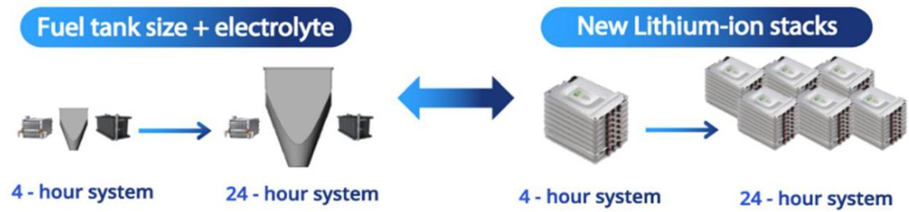  
a

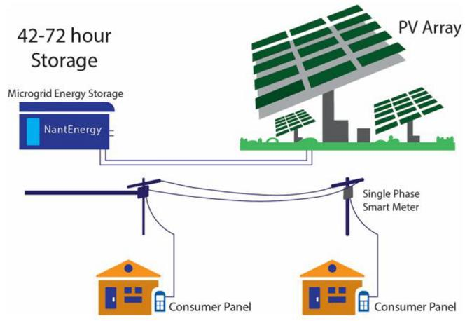  
b

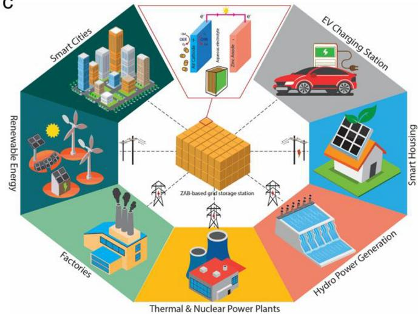  
C  
Figure 84. Applications of Zn-air batteries. (a) Comparison of Zinc8's fuel tank based Zn-air battery design (left) and conventional LIB stacks (right) (Courtesy of Zinc8, www.zinc8energy.com). (b) Capacity of the NantEnergy's Zn-air based battery pack for storing energy from solar PV panels. (c) Microgrid storage applications of Zn-air battery systems for a variety of utilizations.

The typical irreversibility of the Zn anode, originating from the dendrite growth and HER side reaction during Zn plating and stripping, in aqueous Zn cells is commonly considered to be the primary factor limiting the in situ formation of a SEI. To facilitate SEI formation for suppressing side reactions on Zn metal, Cao and co-workers[659] have recently pioneered the use of aqueous  $\mathrm{Zn(OTF)_2}$  electrolyte in conjunction with trimethylethylammonium trifluoromethanesulfonate (Me3EtNOTF) as an additive. This arrangement triggered the formation of a hydrophobic SEI based on fluorinated species (Figure 83g,h), which was able to avoid HER and curb Zn dendrite formation in different Zn cell chemistries, including a  $\mathrm{Zn - O_2}$  battery. Upon electrochemical cycling, the  $\mathrm{Zn - O_2}$  cell based on  $\mathrm{Zn(OTF)_2}$  electrolyte, Me3EtNOTF additive, the limited Zn anode, and CB coated carbon paper as air cathode yielded a life span of 300 cycles (Figure 83i) under a capacity up to  $1000\mathrm{mAhg^{-1}}$  (cathode based) and impressive energy density ( $325\mathrm{Whkg^{-1}}$ ) (cathode and anode based). In addition, the presence of  $\mathrm{Me}_3\mathrm{EtNOTF}$  in  $4m$  electrolyte ensured the reasonable reversibility of the Zn anode over its cycling, desirable acceleration of ORR, and lower overpotentials compared to pristine  $4m\mathrm{Zn(OTF)_2}$  electrolyte. However, the use of efficient bifunctional electrocatalysts is still advised for enhancing the round-trip efficiency of the  $\mathrm{Zn - O_2}$  battery.

8.2.5. Applications of Zn-Air Batteries. The primary Zn-air battery systems have been known to have replaced lead-acid and other alkaline and mercury batteries currently in use for small scale applications, such as hearing aids, military field electronics, and cell phones.[641] In contrast, the focus has now been shifted toward harnessing the long-lasting and high-energy

density applications of secondary Zn-air battery systems, for instance, for electrical vehicles (EVs). Pertaining to EVs, these batteries provide the best energy density to cost and energy density to weight ratios recorded to date. Another imperative benefit of Zn-air battery technology is the lowest safety concern owing to the use of aqueous or solid state electrolytes. Many firms have come forward in the last few decades and have upgraded the Zn-air battery technology. For example, Electric Fuel, a worldwide leading manufacturer of portable electronics, has achieved specific energy up to 200 Wh kg $^{-1}$  in a Zn-air battery, which is capable of powering a passenger bus continuously for 8 h in one charge with zero emissions. $^{562}$  Most recently, this technology has emerged to serve military applications owing to its ability to achieve energy capacity of 400 Wh kg $^{-1}$  and to operate under extreme temperatures. $^{660}$  Another German firm named Dreisbach Electromotive Inc. utilized Zn-air batteries to electrically power Chrysler minivans, which are equipped with 60 kWh Zn-air cells coupled with 10 kWh Ni-Cd cells to yield mileage of 322 km at speed of 64 km h $^{-1}$ .

In addition to EVs, ZPC assembly design has also been prominently used in the Internet of Things. In this regard, ZAF Energy Systems Inc. has patented a ZPC for tracking applications through terrestrial cellular networks, and such a battery design can offer shelf life of more than 100 days of continuous operation along with environment friendly landfill disposability.[661] Similarly, numerous studies have been dedicated to Zn-air batteries for their application in flexible and wearable electronics.[580,603] Notable are investigations conducted by Wang et al.[580] and Fu et al.,[662] utilizing naturally

inspired silk- and hair-derived air cathode electrocatalysts, respectively, for the fabrication of flexible Zn-air batteries. Such advancements have paved the way to more sustainable Zn-air batteries, generating less carbon footprint.

With regards to the LSES applications of Zn-air systems, substantial advancements have been made by a number of energy firms in providing reliable and cost-effective energy storage solutions to industrial and nonindustrial stakeholders. NantEnergy, for instance, is an active player in the energy marketplace known for providing reliable and cost-effective solid-state Zn-air battery based microgrid (both grid-tied and off-grid) solutions consolidated with renewable energy technologies, such as solar PV (Figure 84b). Besides its battery storage system claiming extended life of more than a decade, all of its key components are entirely recyclable. Such possibilities have paved the way to cheaper (less than  $\$100\mathrm{kWh}^{-1}$ ), cleaner (no reliance on fossil fuels), safer (no thermal runaway or chemical gassing), and more controllable (remote monitoring and data collection) energy storage prospects. It is important to point out that the electrode raw materials for the Zn-air battery cost  $85\%$  less than those for the Li-ion battery, which is attributed to the abundance of Zn metal in the Earth's crust. This huge price difference thus accounts for the overall lower manufacturing cost of Zn-air batteries, by  $\sim95\%$ , than that of LIB systems.

Similarly, a Canadian energy enterprise named Zinc8 has patented a Zn-air battery design that does not need battery stacking, as in the case of LIBs, for its scalability. On the contrary, to increase the capacity of the Zn-air battery, only the size of the tank (containing KOH electrolyte) for storing Zn fuel particles is increased (Figure 84a). This simple yet efficient design has been claimed to be conducive in bringing down its energy capacity expenditure to as low as \( \\( {45}\mathrm{{kWh}}{}^{-1} \) ,not to mention that this design is promising for yielding zero capacity fade over its extensive operating lifetime (approximately \( {2000}\mathrm{\;h} \) with \( 8\mathrm{\;h} \) of storage per cycle). Therefore, all such attributes strengthen the reliability of zinc-air cells from the microgrid energy storage perspective for domestic, commercial, and industrial utility (Figure 84c). Most recently, in 2020, the New York Power Authority in collaboration with Zinc8 is on its way to commercializing this novel and clean technology with a mission to decarbonize its power sector in the next decade. Likewise, the world renowned Eos energy storage systems, along with Con Edison and National Grid (British Power Company), has also been in the race for developing Zn-air batteries for LSES purposes.

It is only a matter of time until Zn-air batteries penetrate into energy marketplaces and would serve as the holy grail of energy storage owing to their inexpensive mass production. Although the LIB is currently the most employed technology, the reserves of Li are rapidly declining and its price is soaring. Therefore, Zn-air technology has been speculated to fill in as one of the most feasible, economical, and environmentally friendly GSES solutions for balancing the demand and supply of power grid electricity and for evading high peak time costs.

# 8.3. Other Aqueous MABs

8.3.1. Al-Air Batteries. As compared to the theoretical energy density of  $1.3\mathrm{kWhkg}^{-1}$  of Zn-air batteries, Al-air systems are known to demonstrate excellent theoretical energy density up to  $8.1\mathrm{kWhkg}^{-1}$ , which is lower than that of Li-air batteries  $(11.4\mathrm{kWhkg}^{-1})$ .663 Al-air batteries are also acknowledged for their cost-effectiveness, abundance of Al

metal, light weight, nontoxicity, recyclability, and lower electrochemical equivalence (2.98 Ah g $^{-1}$ ) as compared to other metals, such as Li (3.86 Ah g $^{-1}$ ). Moreover, the maximum OCP of Al metal,  $-1.87$  V vs. SHE at pH of 14.6, is not subject to alteration even in the absence of parasitic reactions.[64] The electrochemical reactions that occur in Al-air batteries are described in the following:[64]

Anode:

$$
\begin{array}{l} \mathrm {A l} (\mathrm {O H}) _ {3 (\mathrm {s})} + 3 \mathrm {e} ^ {-} \rightarrow \mathrm {A l} _ {(\mathrm {s})} + 3 \mathrm {O H} ^ {-} _ {(\mathrm {a q})} \\ E ^ {\circ} = - 2. 3 1 \mathrm {V} \tag {45} \\ \end{array}
$$

Cathode:

$$
\mathrm {O} _ {2 (\mathrm {g})} + 2 \mathrm {H} _ {2} \mathrm {O} _ {(1)} + 4 \mathrm {e} ^ {-} \rightarrow 4 \mathrm {O H} _ {\text {(a q)}} ^ {-} \quad E ^ {\circ} = 0. 4 \mathrm {V} \tag {46}
$$

Overall:

$$
\begin{array}{l} 4 \mathrm {A l} _ {\left(\mathrm {s}\right)} + 3 \mathrm {O} _ {2 (\mathrm {g})} + 6 \mathrm {H} _ {2} \mathrm {O} _ {\left(\mathrm {l}\right)} \rightarrow 4 \mathrm {A l} (\mathrm {O H}) _ {3 (\mathrm {s})} \\ E ^ {\circ} = 2. 7 1 \mathrm {V} \tag {47} \\ \end{array}
$$

It is evident that the theoretical voltage of Al-air batteries is  $2.71\mathrm{V}$ . However, Al-air batteries typically operate within the range of  $1 - 2\mathrm{V}$ , which is ascribed to (i) the oxide layer, which covers the Al-anode surface and augments the internal resistance, delaying the steady-state voltage and resulting in the supersaturation of electrolyte with  $\mathrm{Al(OH)_3}$  precipitates, and (ii) parasitic corrosion reaction on the Al-anode, hampering the consumption of Al metal and forming  $\mathrm{H}_2$ .[64] In addition to corrosive reactions in aqueous solutions both in open circuit and in discharge state, other problems pertaining to Al-air batteries include accumulation of  $\mathrm{Al(OH)_3}$  and  $\mathrm{Al_2O_3}$  at both anode and cathode, complex intercalation chemistry of  $\mathrm{Al}^{3+}$ , resulting in irreversibility of hydrated alumina, abrupt decline in charge capacity, and poor shelf life. Numerous studies[65,66] have been carried out to avoid the charge capacity loss in the Al-air batteries and enhance the CE.

Regarding cathode catalyst materials, the precious metals, such as Pt-based electrocatalysts, are highly active ORR candidates owing to their advantages related to the formation of  $\mathrm{OH}^-$  ions in the aqueous solutions. These materials also offer potential drawbacks such as high costs and poor durability. In addition to Pt, other metals such as Pd, Au, and Ag have also been reported for their good ORR catalytic activity.[667] Particularly, the Ag-based electrocatalysts are almost 50 times cheaper than the Pt-based electrocatalysts. It has been found that only  $5 - 15\%$  concentration of Ag-based catalysts is sufficient for catalytic activity at the air cathode.[668] Therefore, the Ag based materials serve as effective ORR catalysts owing to their high electrical conductivity  $(6.3\times 10^{7}\mathrm{S}\mathrm{m}^{-1})$  and superb electrochemical stability.[669] The redox activity of Ag-based electrocatalysts in Al-air batteries can be further enhanced by alloying elements,[670] coupling them with supporting materials,[671] and morphology control.[672]

Among nonprecious metals,  $\mathrm{M - N - C}$  based electrocatalysts, similar to the Zn-air battery systems, have proved to be efficient candidates for outperforming the Pt-based catalysts in Al-air batteries. Among numerous members of the M-N-C family, macrocyclic  $\mathrm{M - N}_x$  based complexes are acknowledged for embodying immense potential to emerge as the next-generation of ORR catalysts. Such materials yield exceptionally high ORR with negligible overpotentials.[673] However, in order to preserve

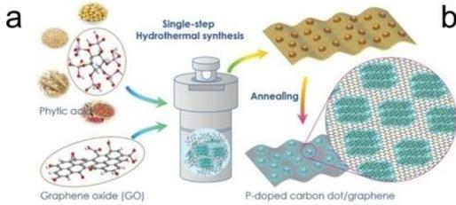

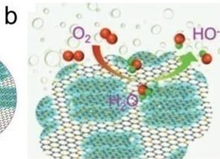

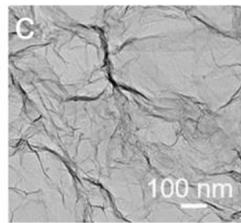

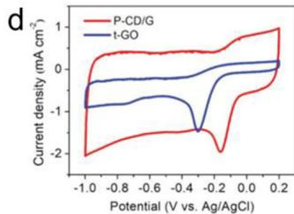

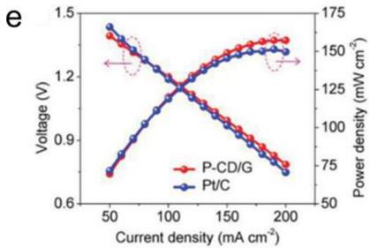

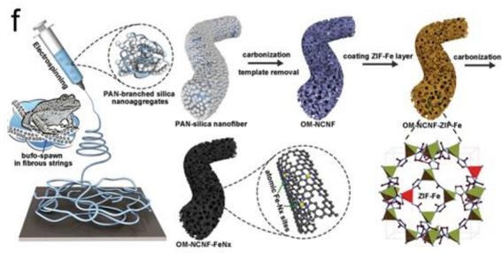

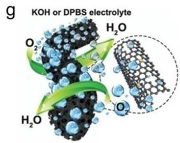

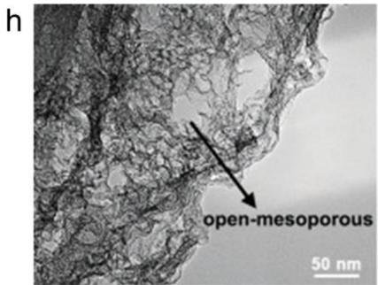  
Figure 85. Electrochemical performance of Al-air and Mg-air batteries using different cathode electrocatalysts and electrolytes. (a) Preparation process of P-CD/G nanocomposites by means of hydrothermal annealing process. (b) Demonstration of ORR on the P-CD/G based nanocomposite electrocatalysts in Al-air battery. (c) TEM micrograph of P-CD/G nanocomposite. (d) CV curves showing OER/ORR performance of P-CD/G based electrocatalyst in  $\mathrm{O}_2$ -saturated and  $\mathrm{N}_2$ -saturated  $0.1\mathrm{M}$  KOH solution. (e) Polarization and power density curve showing Al-air battery performance employing P-CD/G catalyst. Reproduced with permission from ref 675. Copyright 2019 Wiley-VCH. (f) Schematic representation of the preparation process of  $\mathrm{Fe - N_x}$  anchored on OM-NCNF- $\mathrm{FeN}_{x}$ . (g) ORR mechanistic diagram of OM-NCNF- $\mathrm{FeN}_{x}$  in KOH and Dulbecco's phosphate-buffered saline (DPBS) electrolytes. (h) TEM micrograph of the interconnected porous structure of OM-NCNF- $\mathrm{FeN}_{x}$  nanofibers. (i) ORR polarization curve showing superior catalytic performance of the OM-NCNF- $\mathrm{FeN}_{x}$  as compared to its counterparts in  $0.1\mathrm{M}$  KOH electrolyte and (j) discharge and power density curve of  $\mathrm{Mg}$ -air battery with different NCNF- and Pt/C-based air cathodes in DPBS buffer solution. Reprinted from ref 702. Copyright 2018 Wiley-VCH.

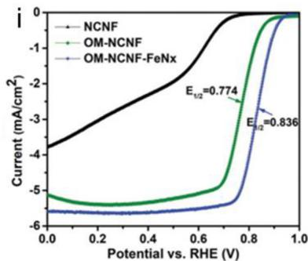

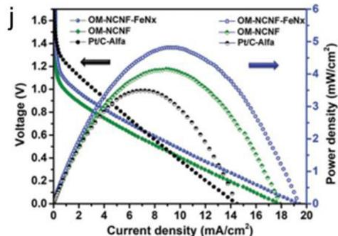

the structural integrity of  $\mathrm{M - N_x}$  sites at high temperatures, Jin et al. [674] proposed a  $\mathrm{SiO_2}$ -protective-layer-assisted method to synthesize  $\mathrm{Fe - N_x / C}$  electrocatalyst and tested its ORR performance in alkaline media (0.1 M KOH), showing its comparable ORR performance to that of  $\mathrm{Pt / C}$ . Among others, most recently, Lai et al. [675] have reported an electrocatalyst based on P-doped carbon dots rooted in graphene (P-CD/G), prepared by hydrothermal and annealing methods (Figure 85a), for enhanced ORR performance (Figure 85b) exclusively in a flexible solid-state Al-air battery. It has been revealed that the annealing temperature is very critical for gauging maximum control of P as dopant in P-CD/G (Figure 85c). This catalyst containing 2.31 atomic percent of P, when annealed at  $900^{\circ}\mathrm{C}$ , exhibits improved ORR activity as compared to those annealed at 800 and  $1000^{\circ}\mathrm{C}$ . As is evident from Figure 85d, both current density and ORR potential for P-CD/G improve significantly as compared to its as-treated GO counterpart, attributed to the numerous ORR active sites generated by the addition of P as dopant and the formation of C dots. Moreover, the same electrocatalyst yields a power density up to  $157.3\mathrm{mWcm}^{-2}$ , which is comparable to or slightly better than that recorded for a

similar  $\mathrm{Pt / C}$  based Al-air battery  $(151.5\mathrm{mWcm}^{-2})$  , as shown in Figure 85e.

With regards to the advancements in Al anode, pure Al corrodes rapidly in aqueous electrolytes and yields hydrogen through a rigorous chemical reaction. The HER at the anode-electrolyte interface causes severe self-discharge problems during Al-air battery operation.[676] Many studies have been conducted to address such issues by investigating various Al-alloys and introducing additives into the electrolytes for inhibiting corrosion. With regards to the former approach, elements like Ga, Ti, Sn, and In have been considered viable alternatives for synthesizing different compositions of Al-alloys for aqueous Al-air batteries.[677,678] In particular, Zn has been widely used for considerably curbing the anodic corrosion by increasing the HER potential and for augmenting the electrochemical performance.[677] Moreover, other alloys such as Al-1Mg-0.1Ga-0.1Sn (wt %), Al-1Mg-1Zn-0.1Ga-0.1Sn (wt %),[679] and Al-0.15Bi-0.15Pb-0.035Ga (wt %)[678] have also been studied for their efficacy in suppressing HER and increasing the overall performance of the Al-air battery. With regards to the alkaline electrolytes, some inorganic additives, such as ZnO,  $\mathrm{In(OH)_3}$  and  $\mathrm{Na_2SnO_3}$  have been widely studied for preventing the

corrosion of Al anodes. $^{680}$  Further, hybrid structures like carboxymethyl cellulose/ZnO, L-cysteine/ZnO, and cetyltrimethylammonium bromide/ZnO have also been proven to be efficient. $^{681}$  Plant extracts have also been investigated and are promising choices as environmentally friendly additives for reducing the corrosive degradation of Al and suppressing the side reactions between Al anode and the electrolytes. $^{682}$

In addition to the issues related to corrosion, electrolyte leakage and performance losses during battery cycling constitute the intrinsic challenges in Al-air battery systems. Although aqueous acidic and neutral electrolytes have been studied for Al-air batteries, various molar concentrations of  $\mathrm{NaOH}$  and KOH are among the most commonly used strategies in alkaline electrolytes.[683-685] These hydroxides are harnessed widely owing to their high conductivity, active ORR, nontoxicity, and low overpotential. In addition to the aqueous electrolytes, ILs provide bright prospects in minimizing the corrosion of Al anodes in Al-air batteries. Aprotic ILs have also been reported to fabricate secondary Al-air batteries.[686] For instance, a study conducted by Gelman et al.[687] scrutinized a hydrophilic 1-ethyl-3-methylimidazolium oligo-fluoro-hydrogenate based IL, owing to its high ionic conductivity  $(100\mathrm{mScm}^{-1})$  and stability in air and water environments, in Al-air batteries. Upon electrochemical discharging, the energy density  $(2300\mathrm{Whkg}^{-1})$  of the Al-air cell based on this electrolyte and Al4N7 anode has been recorded to be superior as compared to similar cells studied previously. Gels and solid electrolytes are known corrosion inhibitors. In this regard, PVA, PAA, and the variants of these two have been studied. For instance, Wu et al.[688] synthesized an alkaline PAA/PVA based polymer electrolyte to apply in an Al-air battery. Zhang et al.[689] used a similar strategy to alter the acrylic acid based alkaline gel electrolyte to obtain the composition of  $9\mathrm{M}$  KOH  $+6\%$  PAAgel  $+\mathrm{ZnO} + \mathrm{K}_2\mathrm{S}_2\mathrm{O}_8,$  and upon electrochemical testing in Al-air batteries, it achieved power density and high current density of  $91.13\mathrm{mWcm}^{-2}$  and  $120\mathrm{mA cm}^{-2}$ , respectively. Furthermore, semisolid state electrolytes, such as KOH  $+\mathrm{PVA} + \mathrm{PEO} + \mathrm{ZnO} + \mathrm{Na}_2\mathrm{SnO}_3,$  have also been reported to manufacture flexible Al-air batteries.[690]

8.3.2. Mg-Air Batteries. Mg-air batteries are considered to be an efficient alternative to Li-based MABs owing to their environmental friendliness, cost-effectiveness, and safety. Further, the nontoxicity of Mg anodes is greatly acknowledged for biocompatible and biodegradable power applications.[686] Unlike other MAB systems, Mg-air cells have not been studied as much. Regardless, such batteries are known to have theoretical energy density up to  $6.8\mathrm{kWhkg}^{-1}$ . Following are the reactions occurring in a typical Mg-air battery:

Anode:

$$
\mathrm {M g} (\mathrm {O H}) _ {2} + 2 \mathrm {e} ^ {-} \rightarrow \mathrm {M g} + 2 \mathrm {O H} ^ {-} \quad E ^ {\circ} = - 2. 6 9 \mathrm {V} \tag {48}
$$

Cathode:

$$
\mathrm {O} _ {2} + 2 \mathrm {H} _ {2} \mathrm {O} + 4 \mathrm {e} ^ {-} \rightarrow 4 \mathrm {O H} ^ {-} \quad E ^ {\circ} = 0. 4 \mathrm {V} \tag {49}
$$

Overall:

$$
2 \mathrm {M g} + \mathrm {O} _ {2} + 2 \mathrm {H} _ {2} \mathrm {O} \rightarrow 2 \mathrm {M g} (\mathrm {O H}) _ {2} \quad E ^ {\circ} = 3. 0 9 \mathrm {V} \tag {50}
$$

From these reactions, the theoretical voltage of  $\mathrm{Mg}$  -air battery is  $\sim 3.1\mathrm{V}$ . During the battery discharge,  $\mathrm{Mg}$  is oxidized to form  $\mathrm{Mg}^{2 + }$  at the anode, whereas  $\mathrm{O}_2$  passes at the cathode to

form  $\mathrm{OH}^-$ . In spite of the high voltage and energy density of  $\mathrm{Mg}$ -air cells, there are some limitations hampering their widespread applications. Such issues include (i)  $\mathrm{Mg}$  anode self-corrosion in alkaline electrolytes, detrimentally affecting the cell's CE, (ii) high polarization due to the accumulation of discharge product  $(\mathrm{Mg(OH)}_2)$  on the anode surface, and (iii) thermodynamic barrier of converting  $\mathrm{Mg}$  oxides back into  $\mathrm{Mg}$ , thereby limiting its rechargeability.[68] These issues have been addressed with several mitigation strategies, including alloying the  $\mathrm{Mg}$  anode, nanostructured anode materials, corrosion resistant inhibitors in electrolytes, and electrocatalysts over cathode reactions.

Alloying pristine Mg anodes with metallic elements (Al, Mn, Zn, Sn, Ce, Y, and In) has proven effective for reducing the corrosive propensity of the Mg anodes in Mg-air batteries.[691] Some compositions of Mg alloys also facilitate the effective utilization of anode, by bringing about structural transitions in the discharge product, thereby enhancing the overall efficiency of the battery. For instance, Zheng et al.[692] employed a low-cost orthogonal structured Mg-Al-Sn-Mn anode and revealed its superior discharge capability  $(-1.602\mathrm{V}$  vs. SCE) with minimal corrosion resistance. Similarly, Wang et al.[693] reported a Mg-Al-Pb-Ce-Y alloying composition that exhibited improved anodic performance in a Mg-air battery in  $3.5\mathrm{wt}\%$  NaCl solution. In addition to the Mg-Al based alloys, recently, Mg-Li based alloys are also under investigation for their efficient anodic performances in Mg-air batteries, attributed to their high faradaic capacity, specific energy, and negative standard potential. To demonstrate, Mg-14Li-1Al-0.1Ce has shown superior electrochemical performance in terms of specific capacity of  $2076\mathrm{mAhg}^{-1}$  at an operating voltage of  $1.272\mathrm{V}$ , as compared to the pristine Mg and AZ31 anodes in Mg-air batteries.[694] Although Mg alloys have been widely investigated, their utilization leads to lower operating potentials as compared to the theoretical values. Therefore, much of the current effort has been pivoted to altering the chemical composition, microstructure and morphology of the Mg anode. For example, highly pure Mg  $(99.99\%)$ , which is free from impurities (Fe, Co, or Ni) normally present in commercial Mg, shows better electrochemical performance as the anode than even some of the Mg alloys investigated to date.[695] In a similar fashion, Zhao et al.[696] studied the impact of surface texture on the AZ31 alloy-based anode by employing rolling and cross-sectional surfaces. Upon electrochemical testing, the results revealed that the resulting cross-sectional surface is more corrosion resistant and electrochemically efficient as compared to its former counterpart.

In addition to the extensive scrutiny of  $\mathrm{Mg}$  based anode material, the electrochemical performance of a  $\mathrm{Mg}$ -air battery is equally dependent on the air cathode. The catalytic layer in air cathode drives the ORR during battery operation, and an ideal electrocatalyst is ought to exhibit rapid ORR kinetics, so as to increase the CE by lowering the overpotential of the MAB. Among many studied ORR catalytic alternatives for  $\mathrm{Mg}$ -air batteries, Pt-based precious metals have been highly investigated due to their superior catalytic activity. For instance,  $2 - 4\mathrm{nm}$  sized Pt particles anchored on carbon have been established as state-of-the-art ORR electrocatalysts.[697] However, their high cost and low abundance present major concerns; therefore, the emphasis has been laid upon exploring cost-effective Pt-based catalysts and non-precious metal based electrocatalysts. In relation to the cheap Pt-based catalyst, alloying Pt with transition metal (Fe, Co, or Ni) provides an important gateway

to economically enhance ORR catalytic activity. The ORR performance of Pt alloys is strongly determined by the low adsorption or binding energy of  $\mathrm{OH^{*}}$  and  $\mathrm{O^{*}}$  species onto their surface.[691] Based on this mechanism,  $\mathrm{Pt}_3\mathrm{Y}$ ,[698]  $\mathrm{PtCo} / \mathrm{C}^{691}$  and intermetallic  $\mathrm{Pt}_3\mathrm{Co}^{698}$  nanoparticles have been studied to reveal tremendous ORR kinetics. In addition to the Pt-based electrocatalysts, other noble metals (Pd, Cu, or Ag) and their alloys have attracted considerable attention for their enhanced ORR performance in aqueous  $\mathrm{Mg}$ -air batteries.[574]

Carbon- and transition metal-based electrocatalysts have also achieved well-deserved consideration in relation to  $\mathrm{Mg}$  -air batteries. Pristine carbon forms are not known as active ORR materials, but heteroatom dopants (P or N) can significantly improve the ORR catalytic activity of carbon structures by imparting high surface areas. Hitherto, numerous variants of mesoporous carbons,[699] CNTs,[700] and 2D graphene[701] have been proven to perform exceptionally well as air cathode electrocatalysts. Recently, Cheng et al.[702] have synthesized atomic  $\mathrm{Fe - N_x}$  (M-N-C family) supported on open mesoporous N-doped CNFs (denoted by OM-NCNF-  $\mathrm{FeN}_x$ ) for enhancing the ORR activity for flexible and biocompatible  $\mathrm{Mg}$  -air electrochemical systems. The schematic illustrations of orderly synthesis of OM-NCNF-  $\mathrm{FeN}_x$ , its TEM micrograph, and corresponding ORR activity in alkaline solution are shown in Figure 85f-h, respectively. It is evident from the TEM micrograph that the OM-NCNF-  $\mathrm{FeN}_x$  embodies plenty of irregular yet interconnected open mesopores, which contribute to the enhanced catalytic activity of the material. Furthermore, it can be seen from Figure 85i that the OM-NCNF-  $\mathrm{FeN}_x$  experiences superior ORR dynamics, as evident from its onset potential  $(E_0)$  of  $0.905\mathrm{V}$  and half-wave potential  $(E_{1 / 2})$  of 0.836 V. Moreover, with the OCP of  $\sim 1.77\mathrm{V}$  for the OM-NCNF-  $\mathrm{FeN}_x$  based  $\mathrm{Mg}$  -air battery, the highest current density and the power density have been recorded to be  $19.2\mathrm{mAcm}^{-2}$  and  $5\mathrm{mWcm}^{-2}$ , respectively (Figure 85j).

The selection of electrolyte in the  $\mathrm{Mg}$ -air battery is imperative and can be judged by changing its  $\mathsf{pH}$  value and concentration and adding suitable additives or inhibitors. To prevent the corrosion of  $\mathrm{Mg}$  anode in alkaline solutions, some researchers have proved the effectiveness of ILs and solid-state electrolytes. With regards to the former, Forsyth and coworkers $^{703}$  have confirmed supreme corrosion resistance of  $\mathrm{Mg}$  in ILs, such as  $\left[\mathrm{P}_{6,6,6,14}\right]\left[\mathrm{TFSI}\right]$  and  $\left[\mathrm{P}_{6,6,6,14}\right]\left[\mathrm{DPP}\right]$ ; however these electrolytes are not compatible for  $\mathrm{Mg}$ -air batteries due to the passivation of films deposited on to the surface of the  $\mathrm{Mg}$  anode. This limitation has led to further investigation of phosphonium chloride (denoted by  $\left[\mathrm{P}_{6,6,6,14}\right]\left[\mathrm{Cl}\right]$ ) in water to achieve an amorphous gel electrolyte. Such an electrolyte not only exhibits sufficient ionic conductivity to yield a current density of  $0.05\mathrm{mAcm}^{-2}$  but also provides anode passivation at OCV of the  $\mathrm{Mg}$ -air battery. $^{704}$  Concerning solid-state  $\mathrm{Mg}$ -air batteries, an important study conducted by Jia et al. $^{705}$  has pioneered synthesizing an IL-biopolymer electrolyte named chitosan-choline nitrate thin film electrolyte for miniaturized biocompatible  $\mathrm{Mg}$ -air batteries. The electrochemical testing of the fabricated solid-state battery yielded an OCV of  $1.80\mathrm{V}$  and output power of  $118\mu\mathrm{W}$ , which is enough to power implantable biomedical devices, such as biomitors or cardiac pacemakers.

# 8.4. Summary and Future Perspectives for MABs

This section manifests itself as tip of the iceberg of the aqueous MABs. Nevertheless, it reflects the most recent and significant advancements related to electrolyte designs and cathodic and

anodic modifications by utilizing different electrochemical materials. Specifically, among different air cathode catalysts in  $\mathrm{Zn}$ -air batteries, the bifunctional transition metal oxides anchored on various carbon forms have yielded competitive electrochemical performances (up to  $\sim 11000\mathrm{mAhg^{-1}}$ ), regardless of their economical aspects and practicality for commercial applications. The big picture along with the design configuration of novel flexible zinc-air batteries is summarized, along with key considerations in further pursuit of related advancements. It can be seen that although ample advancements have been made pertaining to harnessing the full potential of aqueous MAB systems, there is not an iota of doubt that there is still long way to go for such battery systems to realize their summit. The lithium-air (nonaqueous) batteries show much higher energy densities than their zinc-air counterparts, yet the latter are likely to offer bright prospects owing to the low cost and abundance of  $\mathrm{Zn}$ , a concern much more important than high efficiency and energy densities for LSES applications.[576] That is probably why primary zinc-air batteries were commercialized long time ago (since 1932) in medical and telecommunications, while the commercial bulk production of secondary zinc-air batteries initiated in 2012 with a limited energy density ( $\sim 35$  Wh kg $^{-1}$  as of 2017).

In LSES applications, the initial capital, operating expenditures, and maintenance costs of Zn-air batteries are equally vital considerations in addition to high energy density, efficiency, and battery cycles. As the metal-air technology is progressing, studies are being carried out from the perspective of its recyclability and environmental friendliness. For instance, Zn-air batteries manufactured and installed by NantEnergy have resulted in reducing 10000 tons of  $\mathrm{CO}_{2}$  that would be produced by the otherwise consumption of 4 million liters of diesel. In addition, with the abundance of natural reserves of zinc, hence its low cost, almost  $100\%$  recyclability of the wasted zinc battery has rendered this technology further cost-effective and practical from the grid-storage standpoint. The aqueous electrolytes are of massive importance in aqueous MABs due to their inherent advantages such as high-power output, immense ionic conductivity, and utmost safety. The recent advent of RTILs is also promising because of not only being able to eliminate Zn anode dendrite formation but also maintaining substantial ionic conductivity to enable smooth battery cycling operations. Furthermore, the single cell assembly of aqueous batteries needs further optimization. Although the closer spacing between the cathodes in aqueous MAB assembly is the key to maximum power density/volume ratio, the oxygen availability and transmission is hindered, resulting in anoxia, which may further lead to oxygen transfer polarization. Therefore, the assembly and stacks of metal-air aqueous batteries lack sufficient clarity in design. Referring to the designs of the developed assembly of battery stacks, such as fuel cells, one of the effective alternatives is to benchmark optimal design of the aqueous MABs for large-scale stationary applications.

It is evident that most of the research studies have revolved around the exploration of electrocatalysts for enhancing the OER/ORR redox activities in MAB systems. However, the low rechargeability has been mostly overlooked, which is fundamental in securing the future of secondary MABs. Therefore, special attention must be paid to ensure high RTE and CE, for reversibility improvement and side reaction suppression, to render them more energy conservative and economical. The agreement on this aspect of MABs can serve as a major leap toward the advancement of MAB systems. One mitigation

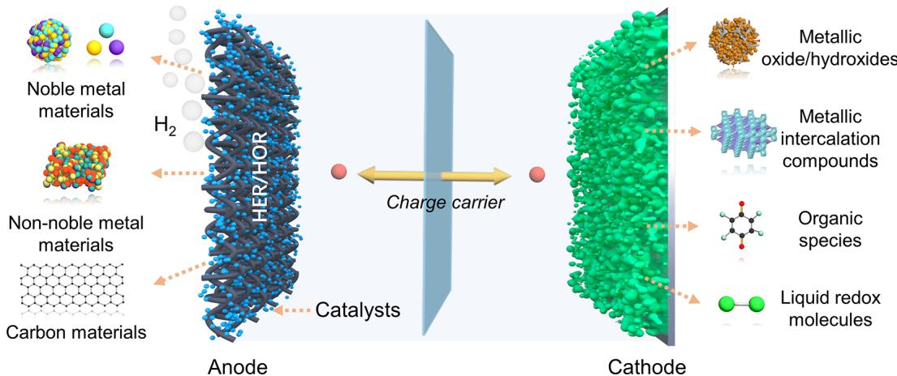  
Figure 86. Schematic of HGBs with different bifunctional catalysts and cathode materials. Reproduced with permission from refs 711 (Copyright 2019 Elsevier), ref 713 (Copyright 2019 Elsevier), ref 716 (Copyright 2017 American Chemical Society), ref 56 (Copyright 2018 National Academy of Sciences), ref 718 (Copyright 2020 American Chemical Society), ref 720 (Copyright 2018 American Chemical Society), and ref 723 (Copyright 2018 Elsevier).

strategy to solve the reversibility conundrum is to integrate the scrutiny of cathode electrocatalysts and anode architecture altogether, rather than investigating individual electrodes and their accompanying reactions. In other words, the consolidated understanding of simultaneous electrochemistry of anode and cathode reactions is as important as the investigation of new cathodes, anodes, electrolytes, additives, separators, and overall cell designs. Given the reported advantages of aqueous metal-air systems, significant attention is still needed in order to hamper the detrimental repercussions (passivation and dendrite formations) of aqueous solvents. Similarly, there is dire need to work around the safety concerns of nonaqueous MAB systems to prevent risky short-circuiting or thermal runaways. It is only after the consensus on the handful of the most widely accepted designs of MABs that these systems can become powerful and reliable enough to serve in large scale vehicular and GSES applications with long and stable cycles.

# 9. HYDROGEN GAS BATTERIES

Hydrogen gas has shown great potential as one of the lightest and cleanest sources of chemical energy for replacing traditional fossil fuel on its merits of renewability, abundance, and high energy density.[706] In the twentieth century, great efforts have been devoted toward the development of highly efficient and regenerative hydrogen-oxygen fuel cells to power EVs and space power systems.[707] However, such fuel cells offer two severe problems, hindering their further development for LSES applications. These include relatively short lifetime predominantly because of engineering issues and the instability of the oxygen electrodes, in which even the best catalysts (for instance, Pt) are insufficient in relation to electrochemical reduction.[707]

In this regard, the earliest concept of a  $\mathrm{Ni - H_2}$  battery presents a brilliant alternative to deal with the stability problems of the oxygen regenerating electrodes by replacing them with a stable solid electrode of nickel hydroxide  $(\mathrm{Ni(OH)_2})^{708}$ . In the 1970s, a  $\mathrm{Ni - H_2}$  battery was developed and employed for aerospace applications owing to its high reliability, long-term stability, and long cycle life.[707] Unfortunately, the original  $\mathrm{Ni - H_2}$  battery could not be widely used in most commercial applications, mainly due to the use of expensive Pt catalysts and the complex cell manufacturing. Regardless, the robustness of  $\mathrm{H_2}$  gas electrodes has triggered rigorous efforts to explore cost-effective

battery systems with good electrochemical performance for LSES applications. Recently, Cui and co-workers redesigned  $\mathrm{Ni - H_2}$  and  $\mathrm{Mn - H_2}$  gas battery systems by matching the  $\mathrm{H_2}$  gas anode with  $\mathrm{Ni(OH)_2 / NiOOH}$  and  $\mathrm{Mn^{2 + } / MnO_2}$  cathodes, respectively, showing superior electrochemical performance and low cost for GSES applications.[56,709] Afterward, a series of rechargeable HGBs have been proposed and developed. Therefore, the renaissance of HGBs has enlightening prospects in LSES applications. In the following sections, we discuss the recent advancements and future prospects of HGBs predominantly for LSES applications.

# 9.1. The Working Principle of HGBs

Figure 86 shows a schematic illustration of a typical HGB along with its key components (anode, cathode, electrolyte, and separator). Concerning the anode, highly active catalysts on the gas diffusion layer (GDL) provide pathways for the active redox reactions: HER and hydrogen oxidation reaction (HOR). In order to comply with reversibility during the charge/discharge of HGBs, the anode catalysts are required to show bifunctional characteristics for both HER and HOR redox reactions. In this regard, a number of electrocatalysts have been studied as excellent candidates for enhancing the electrochemical reactions of the anode, which are fundamentally divided into three categories: noble metal, non-noble metal, and carbon based materials.[710-716] During charging, the  $\mathrm{H}_{2}$  gas is released from the anode, while, conversely, the hydrogen gas is oxidized on the anode during discharging. Owing to high reversibility and low overpotential of bifunctional catalysts during HER and HOR, the HGBs show ultrafast and long-term stable electrochemical performance.[717] In relation to the cathode, the materials that have received considerable attention include metallic oxides and hydroxides, lithium intercalation compounds, sodium intercalation compounds, organic molecules, and liquid redox molecules, to name a few.[56,709,718-723] All of these cathode materials give rise to unique kinds of battery systems involving their own characteristic electrochemical reactions occurring on the cathode. The separators are designed to insulate the cathode and anode while providing long-term stability of the electrolyte in different circumstances.

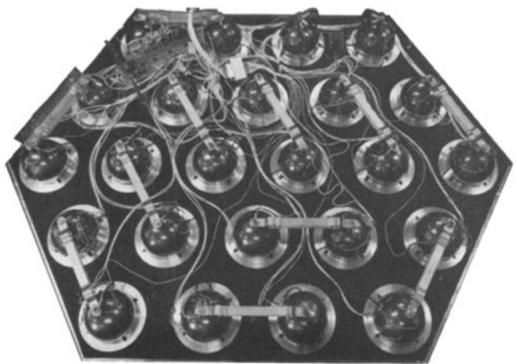  
a

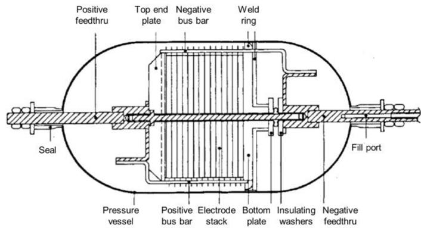  
b

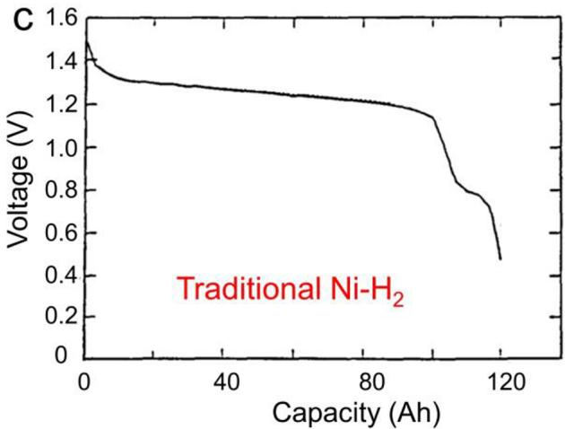

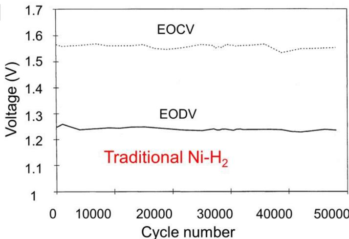  
d  
Figure 87. Traditional  $\mathrm{Ni - H_2}$  battery based on Pt catalyst. (a) Digital photograph of traditional  $\mathrm{Ni - H_2}$  batteries. Reproduced with permission from ref 727. Copyright 1986 Elsevier. (b) Cross-sectional view of traditional  $\mathrm{Ni - H_2}$  battery along with its components and assembled stack. Reproduced with permission from ref 728. Copyright 1982 American Institute of Aeronautics and Astronautics. (c) Discharge curve of traditional  $\mathrm{Ni - H_2}$  battery under a discharge current of  $20\mathrm{A}$ . Reproduced with permission from ref 737. Copyright 1988 Elsevier. (d) Long cycling of traditional  $\mathrm{Ni - H_2}$  battery for typical EOCV and EODV on a standard  $55\mathrm{min}$  charge and  $35\mathrm{min}$  discharge. Reproduced with permission from ref 731. Copyright 1996 American Institute of Aeronautics and Astronautics.

# 9.2. The Development of HGBs

9.2.1. Traditional  $\mathrm{Ni - H_2}$  Battery. In the early 1970s, the  $\mathrm{Ni - H_2}$  battery was developed as a spin-off of the hydrogen-oxygen regenerative fuel cells and applied for powering EVs.[724] Meanwhile, a number of practical storage cells acquired extensive support from the National Aeronautics and Space Administration (NASA).[725,726] The traditional  $\mathrm{Ni - H_2}$  battery was fabricated at COMSAT laboratories for aerospace applications.[724] In addition, the NTS-2 spacecraft was launched in 1977, the first satellite of its kind to utilize the  $\mathrm{Ni - H_2}$  technology for its excellent performance.[724] Figure 87a shows a digital photograph of the traditional  $\mathrm{Ni - H_2}$  battery, which was manufactured and employed by NASA for highly reliable space missions for over 30 years.[727] In the practical  $\mathrm{Ni - H_2}$  battery assembly, many  $\mathrm{Ni - H_2}$  single cells are electrically connected in a stack by repeating units to build up a high capacity, as shown in Figure 87b. The separators, derived from fuel cell technology, connect the hydrophilic surface of the Pt electrocatalyst-based  $\mathrm{H_2}$  gas anode with a back-to-back Ni cathode pair. Further, the hydrophobic side of the  $\mathrm{H_2}$  gas electrode is in contact with a plastic screen that allows  $\mathrm{H_2}$  gas to flow freely to the catalytic sites on the anode. With regards to the electrode materials for the traditional  $\mathrm{Ni - H_2}$  batteries, the cathode materials and Pt-based  $\mathrm{H_2}$  gas anode are adopted from aerospace Ni-Cd batteries and hydrogen-oxygen fuel cells, respectively.[728]

The traditional  $\mathrm{Ni - H_2}$  battery, with the  $\mathrm{O}_2$  being stored in the  $\mathrm{Ni(OH)}_2$  cathode and  $\mathrm{H}_{2}$  gas being stored in a high-pressure gas vessel, shows long life and high reliability without periodic refueling and servicing, the typical needs of fuel cells.[729] The redox reactions of the  $\mathrm{Ni - H_2}$  battery during cycles can be shown as follows:

Cathode:

$$
\begin{array}{l} \mathrm {N i O O H} + \mathrm {H} _ {2} \mathrm {O} + \mathrm {e} ^ {-} \leftrightarrow \mathrm {N i} (\mathrm {O H}) _ {2} + \mathrm {O H} ^ {-} \\ E ^ {\circ} = 0. 4 9 \mathrm {V} \tag {51} \\ \end{array}
$$

Anode:

$$
2 \mathrm {H} _ {2} \mathrm {O} + 2 \mathrm {e} ^ {-} \leftrightarrow \mathrm {H} _ {2} + 2 \mathrm {O H} ^ {-} \quad E ^ {\circ} = - 0. 8 3 \mathrm {V} \tag {52}
$$

Overall:

$$
2 \mathrm {N i O O H} + \mathrm {H} _ {2} \leftrightarrow 2 \mathrm {N i} (\mathrm {O H}) _ {2} \quad E ^ {\circ} = 1. 3 2 \mathrm {V} \tag {53}
$$

Upon overcharging, the  $\mathrm{O}_2$  gas produced on the cathode recombines with  $\mathrm{H}_2$  gas to form water, thereby avoiding a battery hazard in case of overcharge.[728] Another advantage of the  $\mathrm{Ni - H_2}$  batteries is low self-discharge due to its extremely slow reaction kinetics between  $\mathrm{H}_2$  gas anode and Ni-based cathode materials. Moreover, the high power density for supporting fast charge/discharge, high reliability, and long cycling lifetime are other supplementary yet fundamental

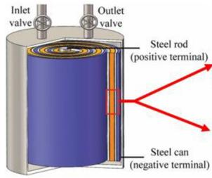  
a

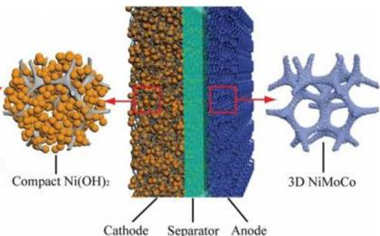

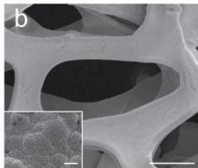

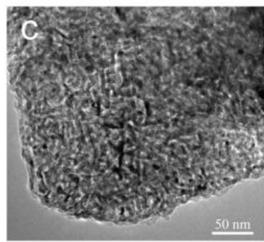

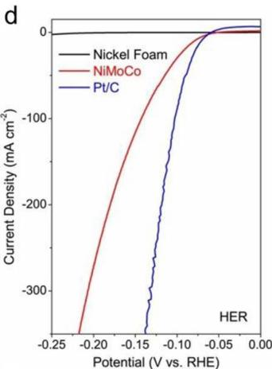

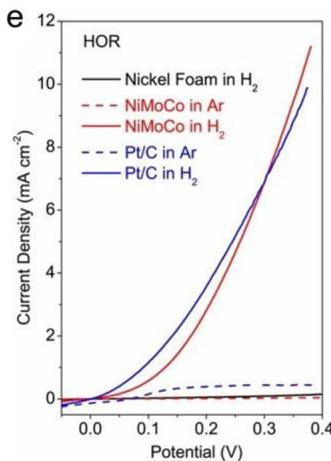

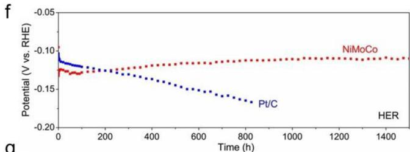

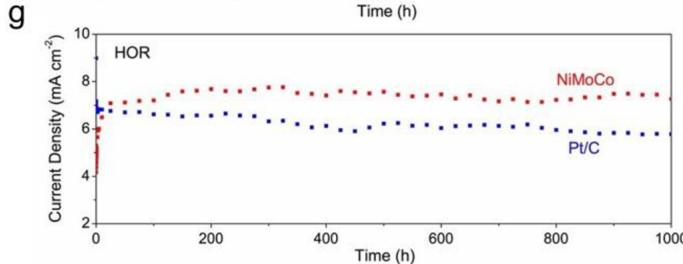

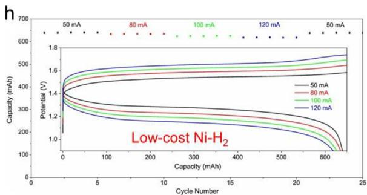  
Figure 88. Low-cost  $\mathrm{Ni - H_2}$  battery based on 3D NiMoCo catalyst. (a) Schematic illustration of the low-cost  $\mathrm{Ni - H_2}$  cylindrical battery and electrode configuration. (b) Low magnification SEM (scale bar  $= 100\mu \mathrm{m}$ ) and high magnification SEM (inset, scale bar  $= 1\mu \mathrm{m}$ ) and (c) TEM of the 3D NiMoCo catalyst. (d) HER and (e) HOR polarization curves of the NiMoCo and Pt/C electrodes. (f) Stability of HER at a current density of  $20\mathrm{mA}$ $\mathrm{cm}^{-2}$  and (g) HOR at a constant potential of  $0.3\mathrm{V}$  of the NiMoCo and Pt/C electrodes. (h) Rate capability with the inset of galvanostatic charge/ discharge curves at different currents and (i) cycle stability of the low-cost  $\mathrm{Ni - H_2}$  battery at a constant current of  $100\mathrm{mA}$  ( $\sim 5.56\mathrm{mA cm}^{-2}$ ). Reproduced with permission from ref 56. Copyright 2018 National Academy of Sciences.

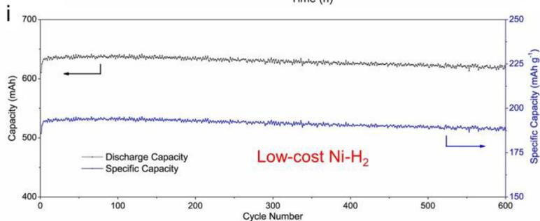

advantages of such battery systems. $^{707,708,730}$  Figure 87c shows the discharge curve of the traditional  $\mathrm{Ni - H_2}$  cell, which has a distinct discharge voltage plateau of  $\sim 1.25\mathrm{V}$ , indicating the electrochemical reaction of  $\mathrm{Ni(OH)_2}$  material with respect to the  $\mathrm{H}_{2}$  gas. $^{731}$  The lower plateau of  $\sim 0.8\mathrm{V}$  is ascribed to the accumulation of  $\mathrm{O}_2$  gas within the cell. In addition, the single  $\mathrm{Ni - H_2}$  cell shows a high capacity of  $\sim 120\mathrm{Ah}$ , which is sought in high energy demand aerospace applications. As shown in Figure 87d, the end-of-charge voltage (EOCV) and end-of-discharge voltage (EODV) exhibit no obvious degradation even after about 48000 cycles, which demonstrates excellent cycling stability for these systems. $^{731}$  After extensive development and maturation in optimizing the electrolyte and modifying the state-of-the-art battery designs, the  $\mathrm{Ni - H_2}$  batteries have reached further improvement in lifetime, attracting much deserved attention in launching satellites. $^{732-736}$

9.2.2. Low-Cost Ni–H₂ Battery. Pt-based electrocatalysts are most extensively employed for enhancing the redox activity of the H₂ gas anode in the traditional Ni–H₂ batteries. However, the high-cost Pt catalysts have hindered their further develop-

ment for practical LSES applications. $^{737}$  Alternatively, in contrast to the traditional  $\mathrm{Ni - H_2}$  battery, Cui and co-workers have employed an earth-abundant 3D NiMoCo electrocatalyst in a high pressure  $\mathrm{H}_{2}$  gas anode for enhancing the HER/HOR activity and storage capacity of a  $\mathrm{Ni - H_2}$  battery. $^{56}$  Figure 88a shows the schematic illustration of the low-cost NiMoCo-based cylindrical  $\mathrm{Ni - H_2}$  cell along with its energy storage mechanism. Evident are the rolling  $\mathrm{Ni(OH)}_2$  as cathode, NiMoCo-catalyzed  $\mathrm{H}_{2}$  as anode,  $30\%$  KOH solution as electrolyte, and a polymer separator assembled into a steel vessel, enclosing high-pressure  $\mathrm{H}_{2}$  gas. $^{738}$  It is important to point out that the 3D NiMoCo catalyst is interconnected by many nanoparticles coated onto Ni foam, providing advanced redox electrocatalytic activity for the  $\mathrm{Ni - H_2}$  battery (Figure 88b,c). To evaluate the activity of the catalysts, HER and HOR have been tested by a three-electrode configuration and two-electrode setup under  $\mathrm{H}_{2}$ -rich atmosphere, as shown in Figure 88d,e, respectively. It can be seen that the anodes based on Pt/C and NiMoCo exhibit significantly higher HER and HOR activity than that based on the nickel foam. In addition, the NiMoCo catalyst requires an over

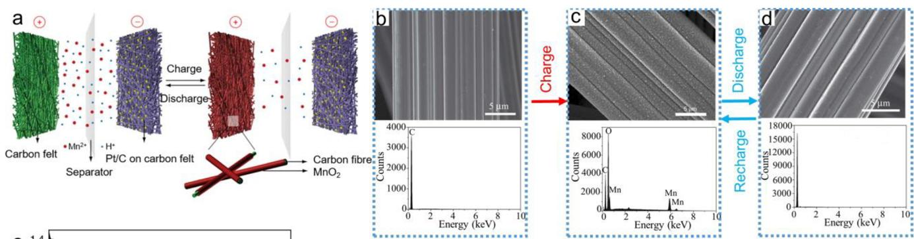

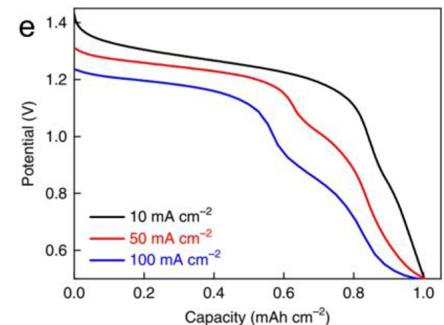

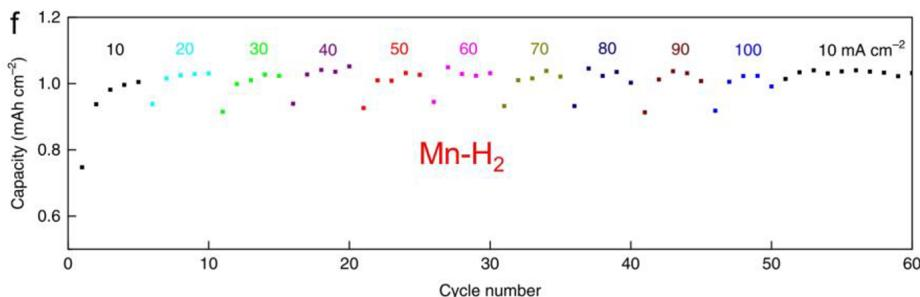

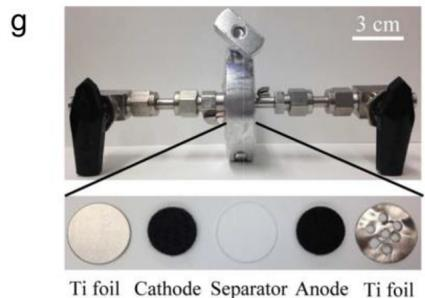

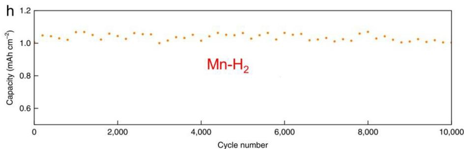

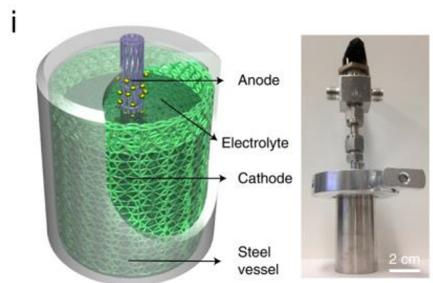  
Figure 89.  $\mathrm{Mn - H_2}$  battery with cathode  $\mathrm{Mn^{2 + } / MnO_2}$  chemistry. (a) Schematic illustration of the  $\mathrm{Mn - H_2}$  battery in the charge and discharge modes. SEM images and EDX spectrum of (b) pristine CF, (c) CF after it was charged at  $1.6\mathrm{V}$  to  $1\mathrm{mAh}$ , and (d) CF after it was discharged at  $10\mathrm{mAcm}^{-2}$  to  $0.5\mathrm{V}$ . (e) Discharge curves at different current densities. (f) Rate capacities of  $\mathrm{Mn - H_2}$  battery. (g) Setup of the Swagelok-type  $\mathrm{Mn - H_2}$  cell. (h) Long-term stability tests of  $\mathrm{Mn - H_2}$  cell. (i) Schematic and digital photograph of the membrane-free cylindrical  $\mathrm{Mn - H_2}$  cell. (j) Cycling stability of the cylindrical cell with a charge capacity of  $15\mathrm{mAh}$ . Reproduced with permission from ref 709. Copyright 2018 Springer Nature.

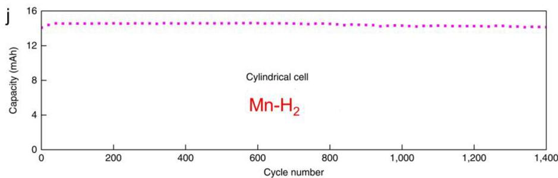

potential of  $\sim 80\mathrm{mV}$  to drive hydrogen generation at a current density of  $10\mathrm{mAcm}^{-2}$ , which is comparable to that of the Pt/C catalyst ( $\sim 71\mathrm{mV}$ ). In addition to the excellent HER performance, the NiMoCo catalyst shows outstanding long-term stability with negligible degradation of HER over  $1500\mathrm{h}$  at a current density of  $20\mathrm{mA cm}^{-2}$ , thereby outperforming the Pt/C catalyst with gradual activity degradation over  $800\mathrm{h}$  (Figure 88f). Figure 88e shows that the Pt/C and NiMoCo catalysts have negligible HOR activities under argon atmosphere and typical polarization curves with large current densities in  $\mathrm{H}_2$  gas, justifying their  $\mathrm{H}_2$  gas oxidation activities and the importance of  $\mathrm{H}_2$  in the  $\mathrm{Ni}-\mathrm{H}_2$  battery. The NiMoCo catalyst upon testing was found to have an onset potential of  $0\mathrm{V}$  toward HOR, similar to that of the Pt/C electrode, indicating its excellent HOR activity.

This further shows its superior cycling stability with minimal degradation over  $1000\mathrm{h}$ , as compared to that of  $\mathrm{Pt / C}$  (Figure 88g). Therefore, the outstanding HER/HOR activities of the NiMoCo catalyst render it an exceptional bifunctional  $\mathrm{H}_{2}$  gas catalyst for the low-cost  $\mathrm{Ni - H_2}$  systems. Figure 88h,i show the electrochemical performance of the low-cost  $\mathrm{Ni - H_2}$  cylindrical cell. The galvanostatic charge and discharge curves at a constant current of  $50\mathrm{mA}$  present distinct plateaus at about 1.55 and 1.25 V, respectively (Figure 88h). Furthermore, the cylindrical cell can achieve high discharge capacity of  $640\mathrm{mAh}$  (areal capacity of  $35.5\mathrm{mAhcm}^{-2}$ ), high CE of  $\sim 98.5\%$  and remarkable rate capability. Also, the  $\mathrm{Ni - H_2}$  cell exhibits a relatively high energy density of  $\sim 140\mathrm{Whkg^{-1}}$  and excellent cycling performance for 600 cycles at a current of  $100\mathrm{mA}$ , as shown in Figure 88i. The

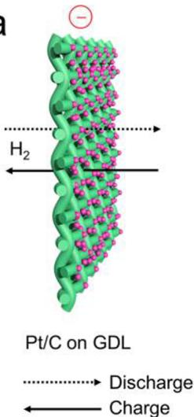  
a

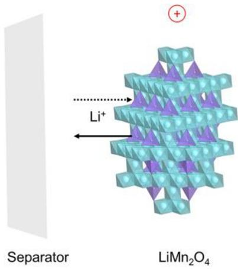

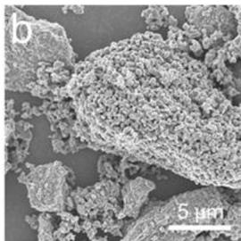

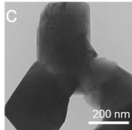

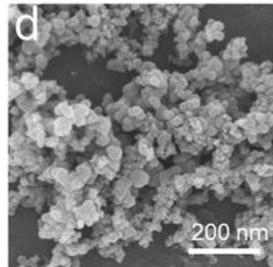

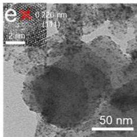

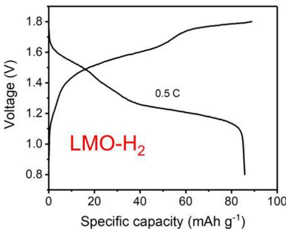  
f

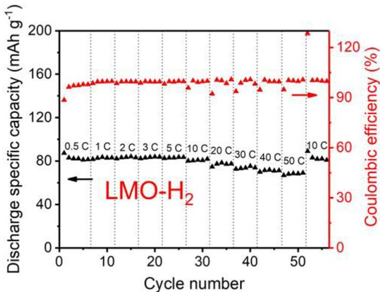  
g

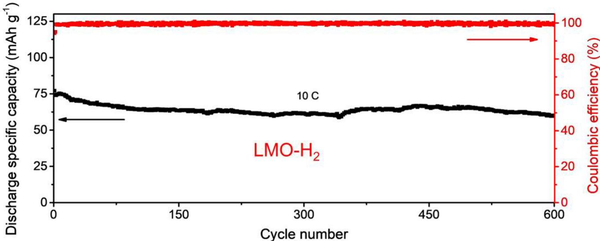  
h  
Figure 90. LMO–H $_2$  battery based on LMO cathode materials. (a) Schematic illustration of the LMO–H $_2$  battery in the charge/discharge states. (b) SEM image and (c) TEM image of the commercial LMO powder. (d) SEM image and (e) TEM image of the commercial Pt/C powder. (f) Charge/discharge curves of the LMO–H $_2$  cell at 0.5 C. (g) Rate capacities of the LMO–H $_2$  cell. (h) Long cycling stability of the LMO–H $_2$  cell at a discharge current of 10 C. Reproduced with permission from ref 718. Copyright 2020 American Chemical Society.

estimated low energy cost of approximately  $83 \, \text{kWh}^{-1}$ based on active materials, achieves the DoE target of  $\$ 100 \, \text{kWh}^{-1}$ that is prospective for catering to the needs of LSES applications.

These features thus provide a new outlook to develop more efficient electrocatalysts for achieving longer cycles and more cost-effective electrochemical systems than the traditional

HGBs. In addition, the low-cost  $\mathrm{Ni - H_2}$  batteries have been recently implemented by a California startup named EnerVenue. This has substantially accelerated the development of safe, maintenance-free, and cost-efficient clean energy storage batteries for LSES applications.

9.2.3.  $\mathsf{Mn - H_2}$  Battery. In order to further decrease the cost of the HGBs, a  $\mathrm{MnO}_2\mathrm{-H}_2$  battery system based on a low-priced solid  $\mathrm{MnO}_2$  cathode and  $\mathrm{H}_{2}$  gas anode in alkaline electrolyte has been proposed.[739] The  $\mathrm{MnO}_2\mathrm{-H}_2$  cell operates at a voltage of  $0.7\mathrm{V}$  and achieves over 25000 low earth orbit cycles with energy density of 32.6 Wh kg $^{-1}$ , which is slightly higher than the traditional Ni-H $_2$  battery.[739] However, the energy density of this HGB has been insufficient to cater to LSES demands. Therefore, a new electrochemical  $\mathrm{MnO}_2\mathrm{-H}_2$  battery system for the cathode has been further reported by Cui and co-workers, which is based on the deposition and stripping chemistry between soluble  $\mathrm{Mn}^{2+}$  and solid  $\mathrm{MnO}_2$  in acidic electrolytes. The two-electron-transfer reaction of the  $\mathrm{Mn}^{2+}/\mathrm{MnO}_2$  cathode with a theoretical capacity of  $\sim616\mathrm{mAhg^{-1}}$  is fundamentally different from the traditional solid-solid transformation in alkaline and neutral electrolytes. This in turn is responsible for the enhancement of the cell capacity and material utilization.[709] The redox reactions of the new  $\mathrm{Mn - H_2}$  battery with the cathode  $\mathrm{Mn}^{2+}/\mathrm{MnO}_2$  chemistry can be described in the following:

Cathode:

$$
\begin{array}{l} \mathrm {M n O} _ {2} + 4 \mathrm {H} ^ {+} + 2 \mathrm {e} ^ {-} \leftrightarrow \mathrm {M n} ^ {2 +} + 2 \mathrm {H} _ {2} \mathrm {O} \\ E ^ {\circ} = 1. 2 3 \mathrm {V} \tag {54} \\ \end{array}
$$

Anode:

$$
2 \mathrm {H} ^ {+} + 2 \mathrm {e} ^ {-} \leftrightarrow \mathrm {H} _ {2} \quad E ^ {\circ} = 0 \mathrm {V} \tag {55}
$$

Overall:

$$
\begin{array}{l} \mathrm {M n O} _ {2} + 2 \mathrm {H} ^ {+} + \mathrm {H} _ {2} \leftrightarrow \mathrm {M n} ^ {2 +} + 2 \mathrm {H} _ {2} \mathrm {O} \\ E ^ {\circ} = 1. 2 3 \mathrm {V} \tag {56} \\ \end{array}
$$

Figure 89a shows the working principle of the new  $\mathrm{Mn - H_2}$  battery with the cathode  $\mathrm{Mn^{2 + } / MnO_2}$  chemistry during charge/ discharge states. It can be seen that the battery adopts a cathodeless permeable CF, a glass fiber membrane as the separator, a Pt/ C catalyst coated on CF as the  $\mathrm{H}_{2}$  anode, and a soluble  $\mathrm{MnSO_4}$  aqueous solution as the electrolyte. During charging, the soluble  $\mathrm{Mn}^{2 + }$  transforms into solid  $\mathrm{MnO}_2$  on the cathode, while HER is driven by the highly active Pt/C catalyst on the anode. Conversely, during discharge, the deposited solid  $\mathrm{MnO}_2$  on the cathode is dissolved back to soluble  $\mathrm{Mn}^{2 + }$  into the electrolyte and  $\mathrm{H}_{2}$  is oxidized on the anode. The reversibility of the  $\mathrm{Mn}^{2 + }/$ $\mathrm{MnO}_2$  reactions can be further demonstrated by SEM images along with their corresponding EDX spectra, as shown in Figure 89b-d. It is evident in Figure 89b that the pristine CF has a smooth surface with high purity. After charging, however, a nanoscale  $\mathrm{MnO}_2$  appears on the CF, showing the formation of solid  $\mathrm{MnO}_2$  (Figure 89c). After the first full discharge to  $0.5\mathrm{V}$ , the solid  $\mathrm{MnO}_2$  on the cathode nearly disappears and returns to the original state (Figure 89d). Consequently, the reversible reaction of the  $\mathrm{Mn}^{2 + }/\mathrm{MnO}_2$  for the cathode and the conversion of  $\mathrm{H}_{2}$  gas provide ultrafast and stable battery operational dynamics. As shown in Figure 89e, the discharge curves show a discharge voltage plateau of about  $1.25\mathrm{V}$  with a CE of  $100\%$  at a current density of  $10\mathrm{mAcm^{-2}}$ . When the discharge current density increased from  $10\mathrm{mAcm^{-2}}$  to  $100\mathrm{mAcm^{-2}}$  (discharge time of  $36~s$ ), the discharge curve experienced a slight decline

while the capacity was still maintained at nearly  $1\mathrm{mAhcm}^{-2}$ , hence exhibiting a remarkably high power density (Figure 89f). In addition, it was demonstrated that two such Swagelok-type  $\mathrm{Mn - H_2}$  cells (Figure 89g) connected in series were capable of lighting a blue LED for a few hours when charged for only  $3\mathrm{min}$ . Moreover, the battery system showed nearly no capacity decay over 10000 cycles due to the high reversibility of the cathode  $\mathrm{Mn^{2 + } / MnO_{2}}$  and anode HER/HOR reactions, as shown in Figure 89h. In spite of the high power density and long cycling stability, the  $\mathrm{Mn - H_2}$  cells still have capacity limitations in meeting the needs of LSES applications. In order to increase the cell capacity, a cylindrical cell assembly was proposed by Cui and co-workers, as shown in Figure 89i, which exhibits a higher discharge capacity of  $\sim 14\mathrm{mAh}$  along with a cycling stability for 1400 cycles, strengthening feasibility of  $\mathrm{Mn - H_2}$  cells for LSES (Figure 89j). Since the cell capacity largely depends on the surface area of the cathode CF, it is critical for future work to focus on developing low cost substrate materials having high  $\mathrm{MnO_2}$  deposition capacity for practical applications.

9.2.4. Lithium Intercalation Compound- $\mathsf{H}_2$  Battery. Originally developed by Sony in the early 1990s, LIBs have offered remarkable prospects as alternative energy storage systems and have been successfully applied in portable electronics and EVs.[80] The rapidly growing commercial applications for LIBs are mainly because of the stable  $\mathsf{Li}^+$ extraction/intercalation on anode and cathode, explaining why they offer brighter prospects in LSES applications. A large amount of the cathode materials in LIBs have attracted significant interest in related applications.[740-742] Recently, Chen and co-workers have studied a new HGB based on spinel LMO cathode and  $\mathsf{H}_2$  anode, namely,  $\mathrm{LMO - H_2}$ , exhibiting better rate performance and cycling stability than that of traditional aqueous LIBs based on the LMO cathode.[718] As shown in Figure 90a, the  $\mathrm{LMO - H_2}$  battery adopts the commercial Pt/C loaded with GDL as hydrogen gas anode and the LMO as cathode. The energy conversions for the  $\mathrm{LMO - H_2}$  batteries are carried out by means of extraction/insertion of  $\mathsf{Li}^+$ on the cathode and HER/HOR on the anode through the following electrode reactions:

Cathode:

$$
\mathrm {L i M n} _ {2} \mathrm {O} _ {4} \leftrightarrow \mathrm {L i} _ {0. 5} \mathrm {M n} _ {2} \mathrm {O} _ {4} + 0. 5 \mathrm {L i} ^ {+} + 0. 5 \mathrm {e} ^ {-} \tag {57}
$$

Anode:

$$
2 \mathrm {H} _ {2} \mathrm {O} + 2 \mathrm {e} ^ {-} \leftrightarrow 2 \mathrm {O H} ^ {-} + \mathrm {H} _ {2} \tag {58}
$$

Overall:

$$
\begin{array}{l} 4 \mathrm {L i M n} _ {2} \mathrm {O} _ {4} + 2 \mathrm {H} _ {2} \mathrm {O} \leftrightarrow 4 \mathrm {L i} _ {0. 5} \mathrm {M n} _ {2} \mathrm {O} _ {4} + 2 \mathrm {L i} ^ {+} + 2 \mathrm {O H} ^ {-} \\ + \mathrm {H} _ {2} \tag {59} \\ \end{array}
$$

Figure 90b,c show the characteristic morphology of the commercial LMO powder with particle size of  $\sim 250\mathrm{nm}$ . For the Pt/C catalyst, several nanometers of Pt particles are located on the surface of carbon as shown in Figure 90d,e. The LMO- $\mathrm{H}_2$  cell exhibits a high discharge voltage plateau of  $\sim 1.3\mathrm{V}$  (Figure 90f) and a superior rate of  $50\mathrm{C}$ , which demonstrates an effective compatibility between the  $\mathrm{Li^{+}}$  cathode and the  $\mathrm{H}_{2}$  anode, as well as the fast reaction kinetics of the  $\mathrm{H}_{2}$  gas anode (Figure 90g). In addition, the LMO- $\mathrm{H}_2$  cell shows stable cycling performance with capacity retention up to  $\sim 80\%$  of the initial capacity after 600 cycles (Figure 90h). The cyclic performance is believed to improve by enhancing the structural stability of the cathode

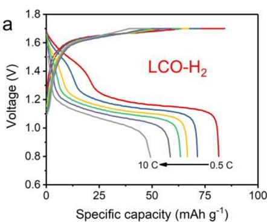

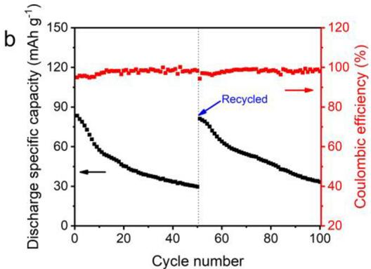

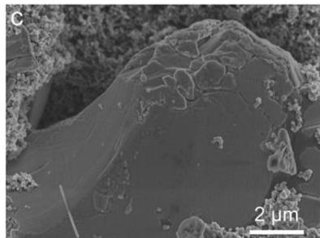

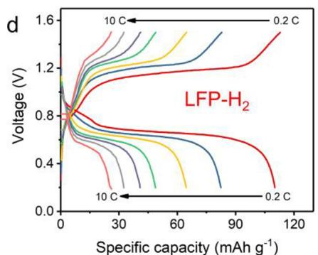  
Figure 91. LCO–H $_2$  and LFP–H $_2$  batteries based on LCO and LFP cathode materials. (a) Charge/discharge curves of the LCO–H $_2$  battery at different discharge rates. (b) Cycling performance of the LCO–H $_2$  and recycled LCO–H $_2$  batteries at 2 C. (c) SEM image of the LCO electrode after 50 cycles in the LCO–H $_2$  battery. (d) Charge/discharge curves of the LFP–H $_2$  battery at different discharge rates. (e) Cycling performance of the LFP–H $_2$  and recycled LFP–H $_2$  batteries at 10 C. (f) SEM image of the LFP electrode after 50 cycles in the LFP–H $_2$  battery. Reproduced with permission from ref 719. Copyright 2021. Editorial office of Chem. J. Chinese Universities.

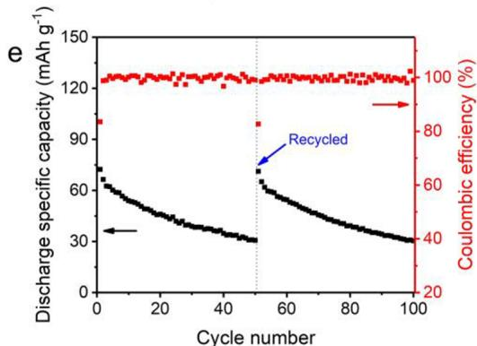

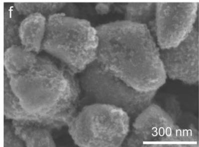

materials in optimized electrolytes. Therefore, there is an emerging trend toward the exploration of new HGB systems based on the  $\mathrm{H}_{2}$  gas anode as alternatives to fulfill the increasing demands of LSES.

In addition to LMO, other Li intercalation compounds such as LCO and LFP have capabilities to serve as excellent cathode materials for HGBs. Chen and co-workers developed other lithium intercalation compound- $\mathrm{H}_2$  gas batteries, such as  $\mathrm{LCO}-\mathrm{H}_2$  and  $\mathrm{LFP}-\mathrm{H}_2$  batteries, which are based on  $\mathrm{Pt/C}$ -based  $\mathrm{H}_2$  anode and LCO or LFP cathodes in mild aqueous electrolytes. The working mechanisms of such batteries are similar to that of the  $\mathrm{LMO}-\mathrm{H}_2$  battery.[719] It is evident from Figure 91a that the  $\mathrm{LCO}-\mathrm{H}_2$  battery exhibits a high discharge voltage plateau of  $1.22\mathrm{V}$  at  $1\mathrm{C}$  and retains around  $1.08\mathrm{V}$  with a discharge capacity of  $49\mathrm{mAhg}^{-1}$  at a high discharge rate of  $10\mathrm{C}$ . On the other hand, the battery shows capacity decay after 50 cycles (Figure 91b), which is ascribed to the instability of the LCO in aqueous electrolytes, as demonstrated in Figure 91c. To prolong the cycling lifetime of the  $\mathrm{LCO}-\mathrm{H}_2$  battery, a new LCO cathode was employed with the same  $\mathrm{Pt/C}$ -based  $\mathrm{H}_2$  anode to form a recycled  $\mathrm{LCO}-\mathrm{H}_2$  battery. Such an electrochemical system is capable of delivering comparable charge/discharge capacities and cycling stability as those of the pristine  $\mathrm{LCO}-\mathrm{H}_2$  battery, demonstrating the robustness of the  $\mathrm{H}_2$  gas anode for rechargeable HGBs. Similarly, the  $\mathrm{LFP}-\mathrm{H}_2$  battery also demonstrates high discharge capacities of  $83\mathrm{mAhg}^{-1}$  at  $0.5\mathrm{C}$  and exceptional rate of  $10\mathrm{C}$ , as shown in Figure 91d. In this case, the cycled LFP cathode has been replaced by a new one and continuously tested for evaluating the cycling performance of the recycled  $\mathrm{LFP}-\mathrm{H}_2$  battery. Although the  $\mathrm{LFP}-\mathrm{H}_2$  battery shows capacity decline at  $10\mathrm{C}$  after 50 cycles, the recycled

$\mathrm{LFP}-\mathrm{H}_{2}$  battery can still reach the initial capacity level and cycling performance (Figure 91e) as compared to the pristine  $\mathrm{LFP}-\mathrm{H}_{2}$  battery. Such cycling instability is attributed to the unstable LFP electrode in aqueous solution rather than  $\mathrm{H}_{2}$  gas electrode, as shown in the SEM micrograph in Figure 91f.

9.2.5. Prussian Blue Analogue- $\mathsf{H}_2$  Battery. PBAs, also known as metal hexacyanoferrate, have the advantages of open structures, multiple active sites, and environmental benignity.[209-211,743-751] Therefore, PBAs have attracted increasing attention as universal electrodes of aqueous batteries for various ion storage, such as metal ions  $(\mathrm{Li}^{+},\mathrm{Na}^{+}$ and  $\mathrm{K}^+$  ) and nonmetal ions  $(\mathrm{H}^{+}$ and  $\mathrm{NH_4^+})$  .[752,718] Considering the excellent properties of the  $\mathrm{H}_{2}$  anode, Chen and co-workers proposed a category of aqueous PBA-H $_2$  batteries for GSES applications by rational combinations of PBAs as cathodes with the  $\mathrm{H}_{2}$  anode for different cations  $(\mathrm{Na}^{+},\mathrm{K}^{+}$ and  $\mathrm{H}^{+}$  storage, referred to as PBA  $(\mathrm{Na}^{+}) - \mathrm{H}_{2}$  battery, PBA  $(\mathrm{K}^{+}) - \mathrm{H}_{2}$  battery, and PBA  $(\mathrm{H}^{+})-$ $\mathrm{H}_{2}$  battery, respectively.[753,754] Figure 92a schematically illustrates the working mechanism of the PBA-H $_2$  batteries based on different cations in aqueous electrolytes. During charge, cations  $(\mathrm{Na}^{+},\mathrm{K}^{+}$  or  $\mathrm{H}^{+}$ ) are removed from PBA cathode and  $\mathrm{H}^{+}$  cations move onto the GDL anode to form  $\mathrm{H}_{2}$  gas. Conversely, during discharge, cations  $(\mathrm{Na}^{+},\mathrm{K}^{+}$  or  $\mathrm{H}^{+}$ ) insert into the PBA cathode and  $\mathrm{H}_{2}$  gas is oxidized on the anode. The charge and discharge reactions of the PBA-H $_2$  batteries are expressed in the following equations:

Cathode:

$$
\mathrm {P B A} + x \mathrm {C} ^ {+} + x \mathrm {e} ^ {-} \leftrightarrow \mathrm {P B A} - x \mathrm {C} \tag {60}
$$

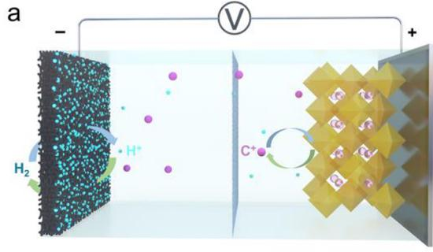

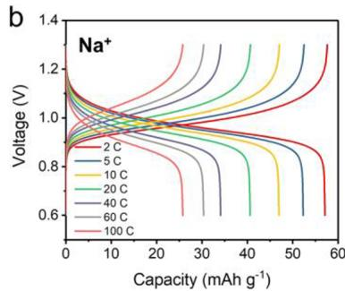

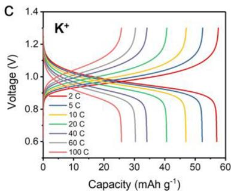

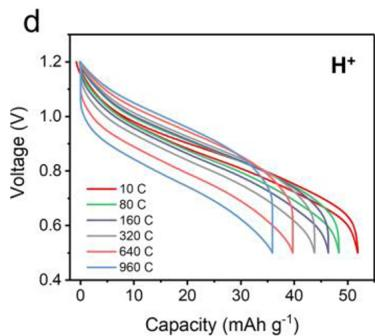

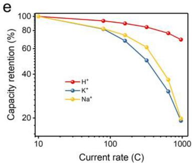

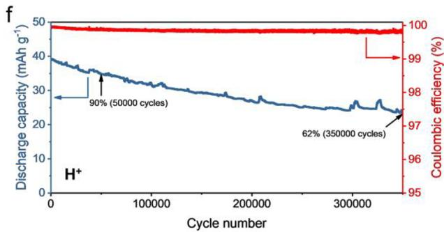

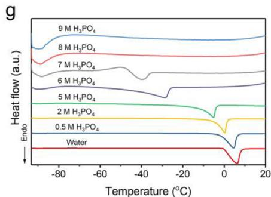  
Figure 92.  $\mathrm{PBA - H_2}$  batteries based on PBA cathode materials. (a) Working principle of  $\mathrm{PBA - H_2}$  battery accompanied by  $\mathrm{C}^+$  ( $\mathrm{C = Na, K, or H}$ ) ionic reactions at the cathode during charge and discharge. (b) Charge/discharge profiles of  $\mathrm{PBA(Na^{+}) - H_{2}}$  battery at various current rates ( $1\mathrm{C} = 50\mathrm{mAh}$ ,  $\mathbf{g}^{-1}$ ). (c) Charge/discharge profiles of  $\mathrm{PBA(K^{+}) - H_{2}}$  battery at various current rates. Reproduced with permission from ref 753. Copyright 2021 Elsevier. (d) Charge/discharge profiles of  $\mathrm{PBA(H^{+}) - H_{2}}$  battery at various current rates. (e) Rate performance comparison in electrolytes with different cations as the charge carriers. (f) Cycling performance of  $\mathrm{PBA(H^{+}) - H_{2}}$  battery at a current rate of  $960\mathrm{C}$  for 0.35 million cycles. (g) DSC test curves of different concentrations of  $\mathrm{H}_3\mathrm{PO}_4$  electrolyte from  $-93$  to  $20^{\circ}\mathrm{C}$  at a heating rate of  $5^{\circ}\mathrm{C}\min^{-1}$ . (h) Temperature-dependent ionic conductivity of different concentrations of  $\mathrm{H}_3\mathrm{PO}_4$  electrolytes. (i) Charge/discharge profiles of  $\mathrm{PBA(H^{+}) - H_{2}}$  battery under different temperatures. Reproduced with permission from ref 754. Copyright 2021 American Chemical Society.

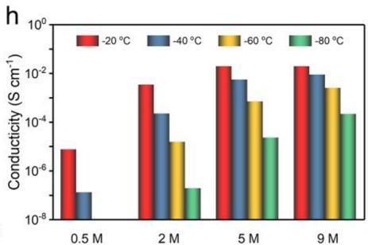

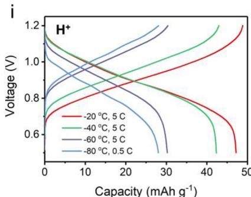

Anode:

$$
\mathrm {H} _ {2} \leftrightarrow 2 \mathrm {H} ^ {+} + 2 \mathrm {e} ^ {-} \tag {61}
$$

Overall:

$$
2 \mathrm {P B A} + \mathrm {H} _ {2} + 2 \mathrm {C} ^ {+} \leftrightarrow 2 \mathrm {P B A} - \mathrm {C} + 2 \mathrm {H} ^ {+},
$$

$$
x = 1 \text {a n d} C = N a, K, \text {o r} H \tag {62}
$$

As shown in Figure 92b, the  $\mathrm{PBA}(\mathrm{Na}^{+}) - \mathrm{H}_{2}$  battery shows outstanding rate performance, where the discharge capacities reach  $\sim 52$ , 47, 41, 34, and  $30\mathrm{mAhg^{-1}}$  at current rates of 5, 10, 20, 40, and  $60~\mathrm{C}$ , respectively. Even at a high rate of  $100\mathrm{C}$ , the battery capacity is still  $26\mathrm{mAhg^{-1}}$ . As shown in Figure 92c, the  $\mathrm{PBA}(\mathrm{K}^{+}) - \mathrm{H}_{2}$  battery delivers a discharge capacity of  $53\mathrm{mAhg^{-1}}$  with a voltage plateau of  $\sim 1.09\mathrm{V}$  at a current rate of  $2\mathrm{C}$ . The charge/discharge curves of different current rates show a high capacity of  $47\mathrm{mAhg^{-1}}$  at  $5\mathrm{C}$  and the capacity remains at 20  $\mathrm{mAhg^{-1}}$  at a high rate of  $100\mathrm{C}$  (Figure 92c). In addition, the charge/discharge curves of the  $\mathrm{PBA}(\mathrm{H}^{+}) - \mathrm{H}_{2}$  battery performed at  $10\mathrm{C}$ ,  $80\mathrm{C}$ ,  $160\mathrm{C}$ ,  $320\mathrm{C}$ ,  $640\mathrm{C}$ , and  $960\mathrm{C}$  show capacities of

52, 48.3, 46.4, 43.8, 39.7, and  $35.9\mathrm{mAhg}^{-1}$ , which correspond to capacity retention of  $100\%$ ,  $93\%$ ,  $89\%$ ,  $84\%$ ,  $76\%$ , and  $69\%$  of the cell capacity at the rate of  $10\mathrm{C}$ , respectively (Figure 92d). As expected, the battery with  $\mathrm{K}^+$  or  $\mathrm{Na}^+$  metallic cations as charge carriers delivers inferior rate capacities as compared to that of  $\mathrm{PBA(H^{+}) - H_{2}}$  battery (Figure 92e), highlighting the ultrafast properties of  $\mathrm{PBA(H^{+}) - H_{2}}$  battery. Impressively, the PBA- $(\mathrm{H}^{+})-\mathrm{H}_{2}$  battery delivers a long-term stability of over 50000 cycles with initial capacity retention of  $90\%$  (Figure 92f). Meanwhile, it demonstrates cycle stability for over 0.35 million cycles at  $960\mathrm{C}$  and still retains over  $62\%$  of its original capacity and high CE of  $\sim 99.8\%$  (Figure 92f), exhibiting long-duration stable and reversible cyclability performance.

In addition to the ultrahigh rates, the  $\mathrm{PBA(H^{+}) - H_{2}}$  battery can also work well at ultralow-temperature conditions. A key challenge for low-temperature battery design is the electrolytes with high ionic conductivities. The physical state and ionic conductivity of the electrolytes  $(\mathrm{H}_3\mathrm{PO}_4)$  were tested at a series of low temperatures. To demonstrate the design of concentrated  $\mathrm{H}_3\mathrm{PO}_4$  electrolyte, the temperatures of the solid-liquid

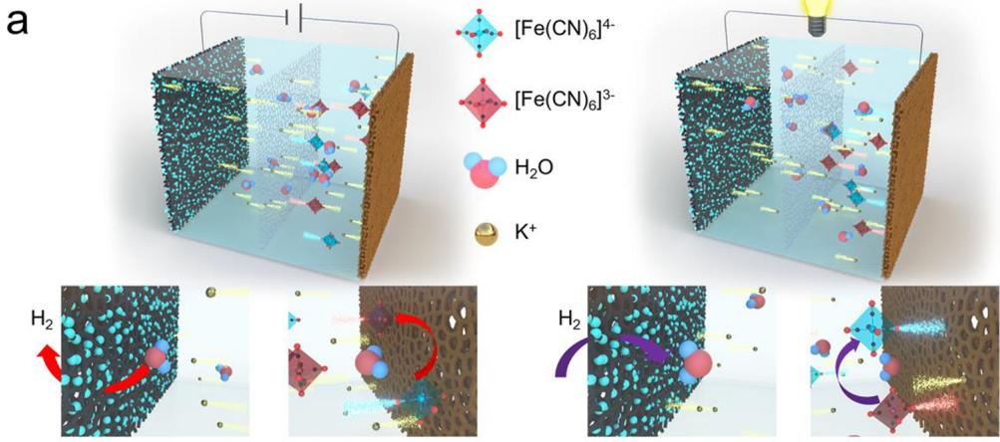

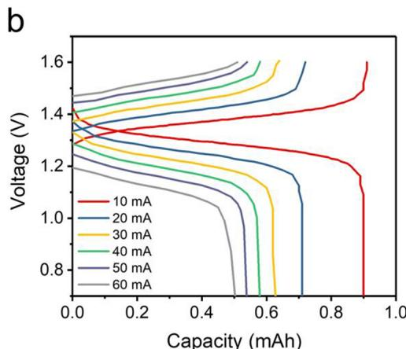

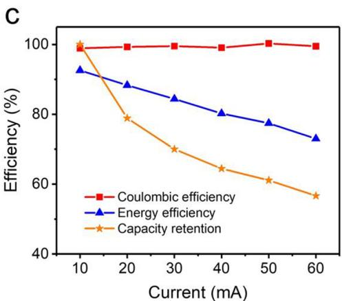

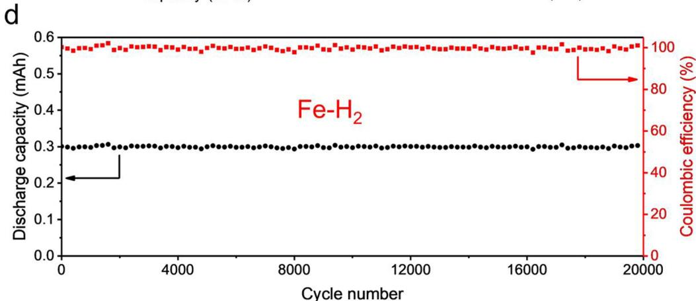  
Figure 93.  $\mathrm{Fe - H_2}$  battery based on  $[\mathrm{Fe}(\mathrm{CN})_6]^{3 - } / [\mathrm{Fe}(\mathrm{CN})_6]^{4 - }$  redox couple cathode materials. (a) Working principle of  $\mathrm{Fe - H_2}$  battery in the charge and discharge processes. (b) Charge/discharge profiles at various current rates. (c) CE, EE, and capacity retention as a function of current. (d) Cycling performance at the charge/discharge current of  $20\mathrm{mA}$  with a charge capacity of  $0.3\mathrm{mAh}$ . Reproduced with permission from ref 721. Copyright 2020 Elsevier.

transitions of different concentrations of  $\mathrm{H}_3\mathrm{PO}_4$  electrolytes were explored by differential scanning calorimeter (DSC), as shown in Figure 92g. It was found that the heating process contained a solid-liquid phase transition temperature above  $-15^{\circ}\mathrm{C}$  at low-concentrations of  $\mathrm{H}_3\mathrm{PO}_4$ $(0 - 5\mathrm{M})$ . When the concentration of  $\mathrm{H}_3\mathrm{PO}_4$  electrolyte further increased to  $9\mathrm{M}$ , the freezing point tended to stabilize  $(< -80^{\circ}\mathrm{C})$ . As shown in Figure 92h, the ionic conductivity reached a maximal value when the electrolyte concentration was  $9\mathrm{M}$ . The ionic conductivity of  $9\mathrm{M}$ $\mathrm{H}_3\mathrm{PO}_4$  electrolyte was measured to be  $2.49\mathrm{mScm}^{-1}$  at  $-60^{\circ}\mathrm{C}$ . As for the low-temperature performance, Chen and coworkers investigated the electrochemical behavior of the

$\mathrm{PBA(H^{+}) - H_{2}}$  battery with  $9\mathrm{M}$ $\mathrm{H}_3\mathrm{PO}_4$  electrolyte at various low temperatures. When the temperature decreased to  $-20^{\circ}\mathrm{C}$ ,  $-40^{\circ}\mathrm{C}$ , and  $-60^{\circ}\mathrm{C}$ , the battery exhibited capacities of 47, 42, and  $30\mathrm{mAhg^{-1}}$  at  $5\mathrm{C}$ , respectively (Figure 92i). When the temperature further decreased to  $-80^{\circ}\mathrm{C}$ , which is close to the freezing point of electrolyte, the  $\mathrm{PBA(H^{+}) - H_{2}}$  battery could still provide  $54\%$  of its room-temperature capacity at  $0.5\mathrm{C}$ .

9.2.6.  $\mathsf{Fe - H_2}$  Battery. Due to the relatively sluggish redox reactions involving solid cathodes, the corresponding HGBs  $(\mathrm{Ni - H}_2,\mathrm{LMO - H}_2,$  and  $\mathrm{PBA - H_2})$  show limited rate capability, which is why it is preferred to apply liquid cathodes with high reversibility and fast kinetics. These two attributes have been

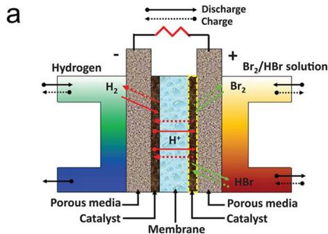

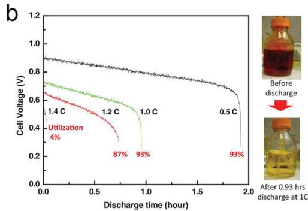

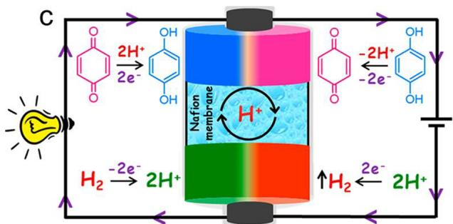  
Figure 94. Working principles and electrochemical performance of some other HGBs. (a) Schematic illustration of  $\mathrm{Br}_2 - \mathrm{H}_2$  RFB. (b) Discharge curves at various current densities of the  $\mathrm{Br}_2 - \mathrm{H}_2$  RFB and digital photographs of flow solution before and after  $0.93\mathrm{h}$  of discharge at  $1\mathrm{C}$  ( $1\mathrm{C} = 0.9\mathrm{Acm}^{-2}$ ). Reproduced with permission from ref 762. Copyright 2012 The Electrochemical Society. (c) Schematic illustration of a hydrogen-storing quinone- $\mathrm{H}_2$  battery. (d) Long cycling stability of the quinone- $\mathrm{H}_2$  battery at  $10\mathrm{mA cm}^{-2}$ . Reproduced with permission from ref 720. Copyright 2018 American Chemical Society.

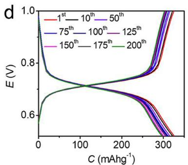

achieved by the low-cost  $\left[\mathrm{Fe}(\mathrm{CN})_{6}\right]^{3-}/\left[\mathrm{Fe}(\mathrm{CN})_{6}\right]^{4-}$  liquid redox molecules, which have attracted considerable attention in RFBs. $^{523,755}$  Therefore, Chen and co-workers have reported an Fe based HGB employing a  $\left[\mathrm{Fe}(\mathrm{CN})_{6}\right]^{3-}/\left[\mathrm{Fe}(\mathrm{CN})_{6}\right]^{4-}$  redox couple cathode and a hydrogen gas anode in alkaline solution, namely, an  $\mathrm{Fe}-\mathrm{H}_{2}$  battery. $^{721}$  Unlike RFBs that are driven by the flow of electrolytes through external pumping equipment, the  $\mathrm{Fe}-\mathrm{H}_{2}$  battery is designed as a static cell without using electrolyte pumping or a circulation system, which greatly eases the battery fabrication process and hence reduces the manufacturing cost. Figure 93a shows the working principle of the proposed aqueous  $\mathrm{Fe}-\mathrm{H}_{2}$  battery, where the  $\mathrm{H}_{2}\mathrm{O}/\mathrm{H}_{2}$  redox couple serves as the anode while the  $\left[\mathrm{Fe}(\mathrm{CN})_{6}\right]^{3-}/\left[\mathrm{Fe}(\mathrm{CN})_{6}\right]^{4-}$  redox couple serves as the cathode, whose reactions can be described in the following equations:

Cathode:

$$
\left[ \mathrm {F e} \left(\mathrm {C N}\right) _ {6} \right] ^ {3 -} + \mathrm {e} ^ {-} \leftrightarrow \left[ \mathrm {F e} \left(\mathrm {C N}\right) _ {6} \right] ^ {4 -} \quad E ^ {\circ} = 0. 3 6 \mathrm {V} \tag {63}
$$

Anode:

$$
2 \mathrm {H} _ {2} \mathrm {O} + 2 \mathrm {e} ^ {-} \leftrightarrow 2 \mathrm {O H} ^ {-} + \mathrm {H} _ {2} \quad E ^ {\circ} = - 0. 8 3 \mathrm {V} \tag {64}
$$

Overall:

$$
2 \left[ \mathrm {F e} (\mathrm {C N}) _ {6} \right] ^ {3 -} + 2 \mathrm {O H} ^ {-} + \mathrm {H} _ {2} \leftrightarrow 2 \left[ \mathrm {F e} (\mathrm {C N}) _ {6} \right] ^ {4 -} + 2 \mathrm {H} _ {2} \mathrm {O}
$$

$$
E ^ {\circ} = 1. 1 9 \mathrm {V} \tag {65}
$$

Nafion membranes with  $\mathrm{K}^+$  channels were chosen as the separator in order to transport the  $\mathrm{K}^+$  and prevent the crossover of liquid redox molecules. During battery charging,  $\mathrm{H}_2\mathrm{O}$  is reduced to  $\mathrm{H}_2$  gas by the  $\mathrm{Pt / C}$  catalyst and  $[\mathrm{Fe(CN)}_6]^{4 - }$  is oxidized to  $[\mathrm{Fe(CN)}_6]^{3 - }$  in the liquid state. Meanwhile, in order

to balance the cell charge,  $\mathrm{K}^+$  ions are transported through the Nafion membrane from cathode to anode; the reverse holds true for discharging. During electrochemical testing, the aqueous  $\mathrm{Fe - H_2}$  battery delivers a high discharge voltage plateau of 1.29 V at a current of  $10\mathrm{mA}$  (Figure 93b). The discharge voltage is maintained at a high potential of  $1.1\mathrm{V}$  even at a current as high as  $60\mathrm{mA}$ . The CE of the battery under each current is nearly  $100\%$ , which demonstrates excellent charge conversion performance (Figure 93c). The capacity retentions are recorded to be  $79\%$ ,  $70\%$ ,  $64\%$ ,  $61\%$ , and  $57\%$  under currents of 20, 30, 40, 50, and  $60\mathrm{mA}$ , respectively, as compared to that at  $10\mathrm{mA}$ . As a result, the battery delivers high EE of  $93\%$  at a low current of  $10\mathrm{mA}$  and over  $73\%$  even at a high current of  $60\mathrm{mA}$ . Furthermore, long-term cycling performance of the aqueous  $\mathrm{Fe - H_2}$  battery is measured at a charge/discharge current of  $20\mathrm{mA}$  with a charge capacity of  $0.3\mathrm{mAh}$ , resulting in excellent cycling stability with no capacity decay over 20000 cycles (Figure 93d).

9.2.7. Other HGBs. The halides of  $\mathrm{Cl}$ ,  $\mathrm{Br}$ , and I generally exhibit high solubility and suitable potentials when acting as aqueous cathodes.[722,756,757] Previously, the electrolysis of hydrogen chloride for storing  $\mathrm{H}_{2}$  gas and chlorine has been proposed as a promising method of energy storage for the electric utility industries.[756] In this regard, a new  $\mathrm{Cl}_{2}-\mathrm{H}_{2}$  energy storage system based on a  $\mathrm{Cl}_{2} / \mathrm{Cl}^{-}$ redox couple cathode and a high-efficiency  $\mathrm{H}_{2}$  gas anode has been reported.[756] Such a battery offers cost-effective manufacturing with improved conversion efficiency owing to its low-cost cathode.[758] Harnessing the superior property of  $\mathrm{H}_{2}$  gas, a  $\mathrm{Br}_{2}-\mathrm{H}_{2}$  battery has also been investigated by NASA as a power source for space related applications.[759] This battery system exhibits high electric-to-electric efficiency due to rapid reaction kinetics of both the Br and  $\mathrm{H}_{2}$  gas electrodes.[757,760,761] The  $\mathrm{Br}_{2}-\mathrm{H}_{2}$  battery system also provides a competitive advantage of low weight of

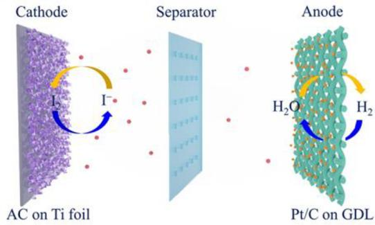  
a

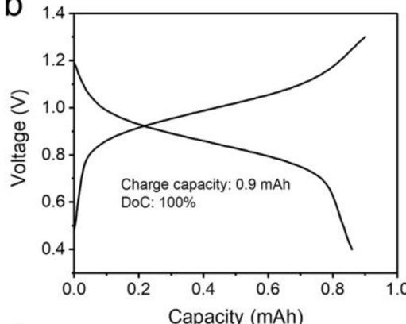  
b  
d

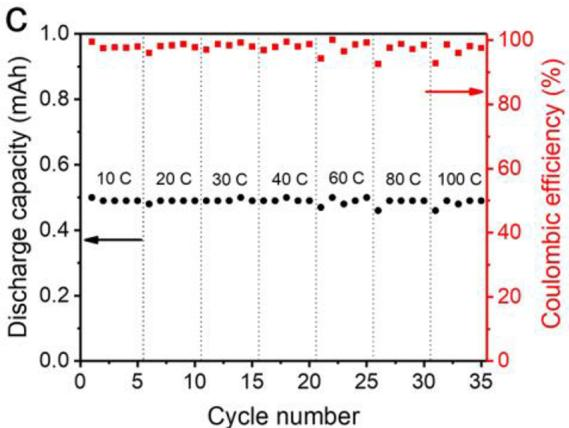

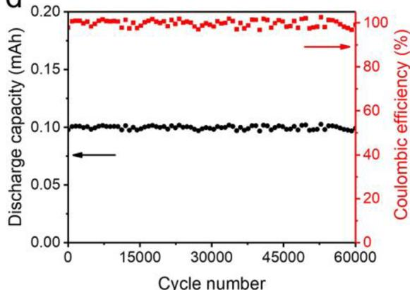

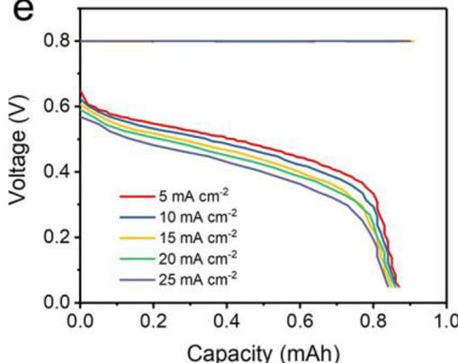  
e  
Figure 95.  $\mathrm{I}_2 - \mathrm{H}_2$  battery with the cathode  $\mathrm{I}^{-} / \mathrm{I}_2$  chemistry. (a) Schematic illustration of the  $\mathrm{I}_2 - \mathrm{H}_2$  battery. (b) Charge/discharge profiles at a charge current of  $10\mathrm{C}$  ( $1\mathrm{C} = 0.25\mathrm{mA}\mathrm{cm}^{-2}$ ) with a capacity of  $0.9\mathrm{mAh}$  (DoC  $100\%$ ) and a discharge current of  $20\mathrm{C}$ . (c) Rate discharge capacities at a charge current of  $10\mathrm{C}$  with a capacity of  $0.5\mathrm{mAh}$  (DoC  $56\%$ ). (d) Cycling performance at a charge current of  $10\mathrm{C}$  with a capacity of  $0.1\mathrm{mAh}$  (DoC  $11\%$ ) and a discharge current of  $40\mathrm{C}$ . For panels b–d, electrolyte = 0.5 M KI with 0.5 M PBS,  $100\mu\mathrm{L}$ . (e) Rate performance at a charge voltage of  $0.8\mathrm{V}$  with a capacity of  $0.9\mathrm{mAh}$ . Electrolyte = 1 M KI with  $2\mathrm{M}$ $\mathrm{H}_3\mathrm{PO}_4$ ,  $75\mu\mathrm{L}$ . (f) Rate performance at a charge current of  $5\mathrm{mA}\mathrm{cm}^{-2}$  with a capacity of  $1.2\mathrm{mAh}$ . Electrolyte = 1.2 M KI with  $1.4\mathrm{M}$ $\mathrm{KHCO}_3$  and  $\mathrm{K}_2\mathrm{CO}_3$ ,  $75\mu\mathrm{L}$ . Reproduced with permission from ref 771. Copyright 2021 Wiley-VCH.

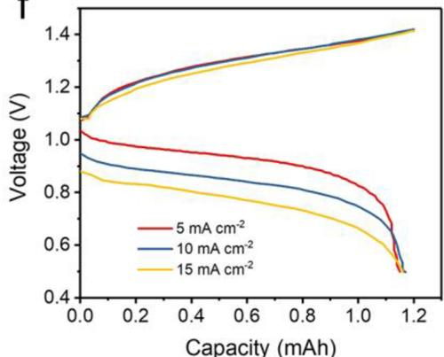  
f

electrodes, thereby reducing the proportion of the whole battery assembly in the space-based power sources. Therefore, this novel HGB system has massive prospects in further exploration and exploitation in LSES applications.

In relation to the  $\mathrm{Br}_2 - \mathrm{H}_2$  batteries, numerous additional studies have been dedicated to investigating their cyclic reversibility behavior for GSES. [762] Following their introduction, these  $\mathrm{Br}_2 - \mathrm{H}_2$  batteries have been extensively studied within the domain of RFBs due to their rapid response time and high EE. [510,762] However, the  $\mathrm{Br}_2 - \mathrm{H}_2$  RFBs use the flow of hydrogen gas as anode and  $\mathrm{HBr} / \mathrm{Br}_2$  mixed solution as liquid redox cathode. [510,762] The working principle of the  $\mathrm{Br}_2 - \mathrm{H}_2$  RFB is shown in Figure 94a along with its typical cell structure. During

charging, HBr entering the cathode is oxidized into  $\mathrm{Br}_2$ , and conversely, the  $\mathrm{Br}_2$  transforms into HBr during discharging. The  $\mathrm{Br}_2 - \mathrm{H}_2$  RFB operates principally based on the following redox reactions:

Cathode:

$$
\mathrm {B r} _ {2} + 2 \mathrm {e} ^ {-} \leftrightarrow 2 \mathrm {B r} ^ {-} \quad E ^ {\circ} = 1. 0 9 \mathrm {V} \tag {66}
$$

Anode:

$$
2 \mathrm {H} ^ {+} + 2 \mathrm {e} ^ {-} \leftrightarrow \mathrm {H} _ {2} \quad E ^ {\circ} = 0 \mathrm {V} \tag {67}
$$

Overall:

$$
\mathrm {B r} _ {2} + \mathrm {H} _ {2} \leftrightarrow 2 \mathrm {B r} ^ {-} + 2 \mathrm {H} ^ {+} \quad E ^ {\circ} = 1. 0 9 \mathrm {V} \tag {68}
$$

To understand the rate capability of the aforementioned  $\mathrm{Br}_2-$ $\mathrm{H}_{2}$  RFB, its electrochemical performance at various discharge current densities, exhibiting obvious discharge plateau of  $\sim 0.75$  V at  $0.5\mathrm{C},$  is illustrated in Figure 94b. The change of solution color can further demonstrate the battery reaction states of charge and discharge (Figure 94b). Nonetheless, the  $\mathrm{Br}_2 - \mathrm{H}_2$  RFB shows a low operating voltage of  $\sim 0.75\mathrm{V},$  hence sparing plenty of room for further enhancement of its energy density. In contrast to the acidic medium, the standard electrode potential of the  $\mathrm{H}_{2}$  gas anode shows a lower potential in alkaline electrolyte. Based on this principle, the  $\mathrm{Br}_2 - \mathrm{H}_2$  cell system has also been explored in hybrid electrolytes with alkaline electrolyte interfacing with the anode and neutral or acidic electrolyte interfacing with the cathode.[722] In this regard, the alkaline  $\mathrm{Br}_2-$ $\mathrm{H}_{2}$  cells deliver higher energy densities than their corresponding acidic systems. However, the  $\mathrm{Br}_2 - \mathrm{H}_2$  cells in the flow battery architectures and hybrid systems often use complex devices and Nafion membrane, which hinders their qualification to meet the demands of sustainable LSES. Having mentioned that, it is clear that HGBs based on the superior liquid cathode still need to overcome numerous difficulties including high cost, manufacturing intricacy, and optimization of their operational chemistries.[763-765]

Based on the highly efficient HER/HOR activity of the  $\mathrm{H}_2$  gas and electrochemical hydrogenation/dehydrogenation of hydrogen storage molecules such as benzoquinone (BQ), a new quinone- $\mathrm{H}_2$  battery system has been studied.[720] The structural schematic of the quinone- $\mathrm{H}_2$  battery is shown in Figure 94c. It can be seen that the Nafion membrane is used in the quinone- $\mathrm{H}_2$  battery as the separator for allowing the passage of  $\mathrm{H}^+$  only. During charging, the hydroquinone  $\mathrm{QH}_2$  releases  $\mathrm{H}^+$  to form BQ (dehydrogenation) on the cathode surface while the anode generates  $\mathrm{H}_2$  gas. However, the reactions are reversed during discharging. The electrode reactions are shown as follows:

Cathode:

$$
\mathrm {Q H} _ {2} \leftrightarrow \mathrm {B Q} + 2 \mathrm {H} ^ {+} + 2 \mathrm {e} ^ {-} \tag {69}
$$

Anode:

$$
2 \mathrm {H} ^ {+} + 2 \mathrm {e} ^ {-} \leftrightarrow \mathrm {H} _ {2} \tag {70}
$$

Overall:

$$
\mathrm {Q H} _ {2} \leftrightarrow \mathrm {B Q} + \mathrm {H} _ {2} \tag {71}
$$

Upon electrochemical testing, the quinone-  $\mathrm{H}_2$  battery demonstrates excellent cycling stability at  $10\mathrm{mAcm}^{-2}$  along with capacity retention of  $\sim 92\%$  after 200 cycles, as demonstrated in Figure 94d.

In addition to Cl and Br, the  $\mathrm{I}_3^-$  /  $\mathrm{I}^-$  redox couple has also been used as the liquid-type cathode due to its low cost and high solubility  $(>8\mathrm{M})$  766,767 However, an expensive cation exchange membrane (i.e., Nafion) is often required to hinder the crossover of  $\mathrm{I}_3^-$ . Thereafter, a strategy was explored by encapsulating iodine in a microporous carbon host to avoid the formation of liquid  $\mathrm{I}_3^-$  768-770 Chen and co-workers designed an  $\mathrm{I}_2 - \mathrm{H}_2$  battery that exploits liquid-solid conversion reactions of the  $\mathrm{I}^{-} / \mathrm{I}_2$  redox couple at the cathode and the electrocatalytic reactions of HER/HOR at the anode.771 The schematic of the proposed aqueous  $\mathrm{I}_2 - \mathrm{H}_2$  battery is shown in Figure 95a. During the charge process,  $\mathrm{H}_{2}$  is generated from the solution on the anode and  $\mathrm{I}_2$  is formed from the solution on the cathode. During the discharge process,  $\mathrm{H}_{2}$  is oxidized to the solution on anode and  $\mathrm{I}_2$  is reduced back to  $\mathrm{I}^-$  on cathode. The

proposed aqueous  $\mathrm{I}_2 - \mathrm{H}_2$  battery can thus be constructed based on the following redox reactions:

Cathode:

$$
I _ {2} + 2 e ^ {-} \leftrightarrow 2 I ^ {-} \quad E ^ {\circ} = 0. 5 4 \mathrm {V} \tag {72}
$$

Anode:

$$
2 \mathrm {H} _ {2} \mathrm {O} + 2 \mathrm {e} ^ {-} \leftrightarrow 2 \mathrm {O H} ^ {-} + \mathrm {H} _ {2} \quad E ^ {\circ} = - 0. 8 3 \mathrm {V} \tag {73}
$$

Overall:

$$
\mathrm {I} _ {2} + 2 \mathrm {O H} ^ {-} + \mathrm {H} _ {2} \leftrightarrow 2 \mathrm {I} ^ {-} + 2 \mathrm {H} _ {2} \mathrm {O} \quad E ^ {\circ} = 1. 3 7 \mathrm {V} \tag {74}
$$

The theoretical capacity at the corresponding depth of charge (DoC) of  $100\%$  in the  $\mathrm{I}_2 - \mathrm{H}_2$  batteries is defined by considering that all  $\mathrm{I}^-$  in solution are fully converted to  $\mathrm{I}_2$ . Figure 95b shows the charge/discharge profiles of the  $\mathrm{I}_2 - \mathrm{H}_2$  battery with a DoC of  $100\%$  by charging to  $1.3\mathrm{V}$ . It shows a pair of pronounced charge/discharge voltage plateaus of  $1\mathrm{V} / 0.84\mathrm{V}$  at a charge capacity of  $\sim 0.9\mathrm{mAh}$ .

As shown in Figure 95c, even at a high rate of  $100\mathrm{C}$ , the battery still delivers stable capacity retention with high CE (an average of  $97.5\%$ ), indicating the excellent electrochemical reversibility and high rate capability at large current densities. Further, the long-term cycling measurements show high reversibility of the battery (Figure 95d) as the discharge capacity has negligible change after 60000 cycles (DoC  $11\%$ ). The high CE of over  $97\%$  for each cycle indicates the high quantitative utilization of the electrical charge. To extend the application and demonstrate the versatility of the  $\mathrm{I}_2 - \mathrm{H}_2$  battery, the electrochemical performance of the aqueous  $\mathrm{I}_2 - \mathrm{H}_2$  batteries in acidic and alkaline electrolytes were also tested. Compared to the  $\mathrm{I}_2 - \mathrm{H}_2$  batteries in the neutral electrolyte with a discharge voltage of  $\sim 0.84\mathrm{V}$ , the batteries in the acidic electrolyte have a lower discharge plateau of  $\sim 0.47\mathrm{V}$  (Figure 95e). Nevertheless, the VE and EEs showed only a slight decline of  $10\%$ , when the current density increased from 5 to  $10\mathrm{mA cm}^{-2}$  (Figure 95e), demonstrating the fast kinetics of the acidic  $\mathrm{I}_2 - \mathrm{H}_2$  battery. Compared to the neutral and acidic  $\mathrm{I}_2 - \mathrm{H}_2$  batteries, the alkaline  $\mathrm{I}_2 - \mathrm{H}_2$  batteries show a high discharge plateau of  $\sim 0.91\mathrm{V}$  at a discharge current of  $5\mathrm{mA cm}^{-2}$  with a charge capacity of 1.2 mAh (Figure 95f). The CE of over  $95\%$  remained nearly unchanged and the VE only decreased from  $71\%$  to  $60\%$  as the discharge current increased from 5 to  $15\mathrm{mA cm}^{-2}$ .

# 9.3. Summary and Future Perspectives for HGBs

$\mathrm{H}_{2}$  gas is regarded as a form of green energy for future sustainable communities.[27] Although it is flammable over a wide range of concentrations from  $4\%$  to  $74.2\%$  by volume, it is very safe in the surroundings of pure  $\mathrm{H}_{2}$  gas, which is exactly the case in HGBs.[772] Therefore, it is highly believed that there is no safety issue in the development of HGBs for LSES if proper precautionary measures are complied with. In this section, we have discussed recent progress on the understanding and development of HGBs by integrating low-cost bifunctional catalysts with various cathode materials. The fabricated HGBs showed high capacities, fast-charging rates, and long cyclic stabilities under rational designs. However, the challenges of HGBs from academia to industry mainly include high cost, high self-discharge, low energy density, and poor battery manufacturing.

First, the preparation of high cost electrocatalysts and efficient hydrogen electrodes is still one of the biggest issues of the HGBs

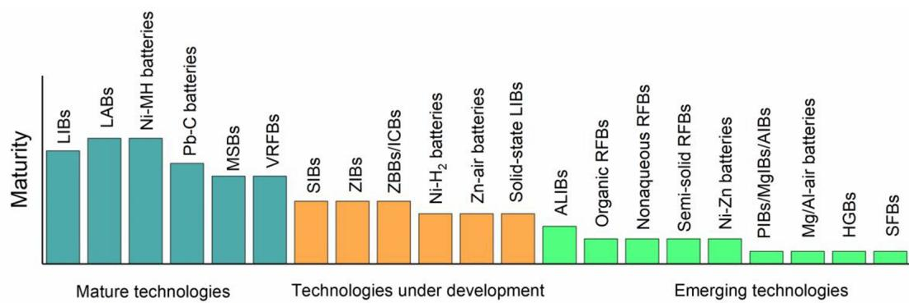  
a

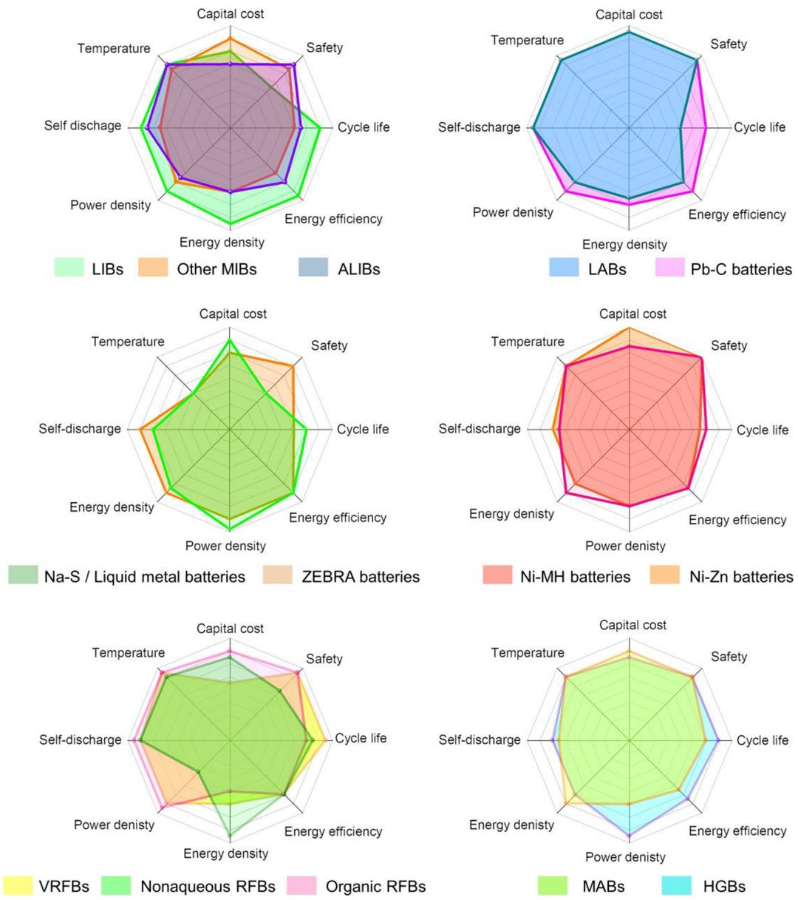  
b  
Figure 96. Summary of (a) maturity and (b) key performance parameter comparisons for various BESSs.

for their development from academia to industry. $^{56}$  According to previous HGBs, the working mode and performance requirements of GSES are similar to those of aerospace energy storage except for the high-cost characteristics. $^{708}$  It is essential to continually explore novel, low-cost, and highly electroactive bifunctional catalysts for substantial improvement of the overall

performance of HGBs. Second, the self-discharge performance is a crucial factor to control the reaction kinetics at the interface of the electrode and electrolyte. $^{709,754}$  In terms of HGBs for GSES, the cathode materials can slowly react with hydrogen gas and water molecules to cause the decay of capacity. To improve the self-discharge performance of HGBs, future work could be

conducted on fabricating stable cathode materials, reinforcing the electrolyte optimization, and introducing advanced gas management of the whole battery system. Third, it is important to develop advanced cathode materials with high specific capacity and voltage to accomplish the advantages of HGBs with high energy densities. In addition, the expansion of the electrochemical windows of electrolyte can also improve the energy densities of HGBs. Currently, the typical choices of electrolytes are often single acidic, neutral, or alkaline aqueous solutions, which are limited by the potentials of HER and OER. As an alternative strategy, the decoupling of alkaline electrolyte in the anode and acidic electrolyte in the cathode is viable to widen the electrochemical window of the aqueous HGBs.[240] In addition, the introduction of WIS electrolyte is promising for addressing the low voltage issue in the aqueous systems. The voltage of the aqueous HGBs can possibly be enlarged up to  $4\mathrm{V}$  with highly concentrated electrolytes of different compositions by tuning the electrolyte solvation structures.[773] Moreover, the cell voltages can be enhanced by utilizing innovative organic, IL, and solid-state electrolytes for reducing or removing water out of the electrolytes.[774] Furthermore, the efficient manufacturing of HGBs is highly important to the large-scale production of HGBs for GSES application. To take full advantages of the HGBs, it requires in-depth understanding of the application scenarios with different cell chemistries (including  $\mathrm{Ni - H_2}$ ,  $\mathrm{Mn - H_2}$ , and  $\mathrm{PBA - H_2}$  batteries) and form factors (prismatic, cylindrical, and pouch cells).[56,709,753] Therefore, the challenges in academic and industrial metrics need to be coordinated, and much research and development needs to be conducted accordingly.

# 10. SUMMARY AND PERSPECTIVE

# 10.1. Comparison and Potential of Battery Energy Storage Technologies

According to the maturity of research and development, the battery technologies can be generally divided into three different categories as shown in Figure 96a: (1) mature technologies, including LIBs, LABs, Ni-MH batteries, Pb-C batteries, MSBs, VRFBs, etc.; (2) technologies under development, including SIBs, ZIBs, ZBBs, ICBs,  $\mathrm{Ni - H_2}$  batteries, Zn-air batteries, solid-state LIBs, etc.; (3) emerging technologies, including ALIBs, organic RFBs, nonaqueous RFBs, semisolid RFBs, Ni-Zn batteries, PIBs, MgIBs, AIBs, Mg-air batteries, Al-air batteries, HGBs, etc.

Figure 96b shows the summary and comparison of some key performance parameters of battery technologies. It is evident that LIBs dominate the markets of portable electronics and power battery systems. Despite limited Li resources and flammability of organic electrolytes, the declining cost and perpetual performance improvements in response to stringent GSES have rendered Li-ion systems highly sought-after in stationary energy storage applications. Solid-state LIBs with high safety, SIBs with abundant resources, and ZIBs with high safety and low cost are still under development at the current technology levels.[79] Other MIBs (including  $\mathrm{K}^+$ ,  $\mathrm{Mg}^{2+}$ , and  $\mathrm{Al}^{3+}$ ), despite their abundant element reserves and better safety features, do not meet comprehensive performance requirements of GSES at the current technology levels.[79] This immediately calls for significant momentum toward the exploration of novel electrode materials as well as stable electrolytes for their GSES applications. In this regard, the replacement of flammable organic electrolytes with aqueous electrolytes is becoming the cornerstone of modern research on developing next generation

LIBs in emerging technology. However, notwithstanding massive potential for catering to GSES needs, this advancement poses its own corresponding challenges, including short life and high costs.

LABs are a relatively more mature and cost-effective technology when compared with other battery chemistries, with relatively short cycle life and sluggish charging rendering them impractical for GSES.[291] However, modernistic design integrating LABs with  $\mathrm{Pb - C}$  asymmetric capacitors has enabled it to operate with unprecedented efficiency for longer periods of time for applications requiring HRPSoC.[299] Although still offering insufficient service life for BESSs, the advantages of low cost and enhanced safety have attracted widespread utility of LAB systems in several medium- and small-scale energy storage applications.

The MSBs under development suffer from safety risks at high operating temperatures and poor heat management.[775] In relation to low- and medium-temperature Na-S batteries, the deteriorating electrochemical performance in terms of short cycle life and high self-discharge upon subsequent cycling also limits their extensive scope of application.[341] In contrast to Na-S batteries, LMBs offer advantages including high capacity, low manufacturing cost, and long cycle life, thereby paving their way to broad application prospects in GSES.[389] It is imperative to mention that the futuristic research on LMBs is expected to focus on new electrode materials, thermal management (at lower operating temperature), and avoidance of high temperature corrosion and leakage.[389] Furthermore, ZEBRA batteries are much safer than Na-S batteries due to the presence of metal halides, which are generally less corrosive than sodium polysulfide,[376,377] not to mention that the cycle stability of ZEBRA batteries still has substantial room for improvement for GSES applications.

Concerning the ABs, besides the rampant use of Ni-MH batteries in stationary applications, the issues of capacity fade upon repetitive cycling and high self-discharge persist and therefore still require substantial improvements.[436] In addition, Ni-Zn batteries show reasonable potential for future GSES applications owing to the crustal abundance of their constituent elements.[440] However, long-term stability and negligible formation of Zn dendrites in Ni-Zn batteries are yet to be realized.

VRFBs have earned the reputation of mature technologies for GSES, thanks to their inherent safety and long cycle life. The VRFB chemistries also come with imperfections in terms of low energy density and scarcity of vanadium element, which increase their total manufacturing cost.[508] In this regard, the nonaqueous electrolytes yield high voltage and broaden the choice of redox species at the expense of compromised safety, redox concentration, and power densities. Furthermore, inexpensive and sustainable organic redox materials have emerged as wholesome alternatives to the present metal-based redox species.[536] It is believed that redox potential and solubility can be tailored by introducing specific side groups on the organic molecular structures. Although the long-term stability of organic redox species has not yet been verified, the organic RFBs with advanced porous membranes are speculated to be one of the most promising, inexpensive, and highly efficient candidates as next-generation RFBs for GSES. In addition, semisolid RFBs and SFBs, although still in their infancy, are promising for exhibiting unique advantages for future GSES.[541,555]

As one of the typical aqueous MABs (Zn, Fe, Al, and Mg), the Zn-air battery system has the ability to yield a theoretical energy

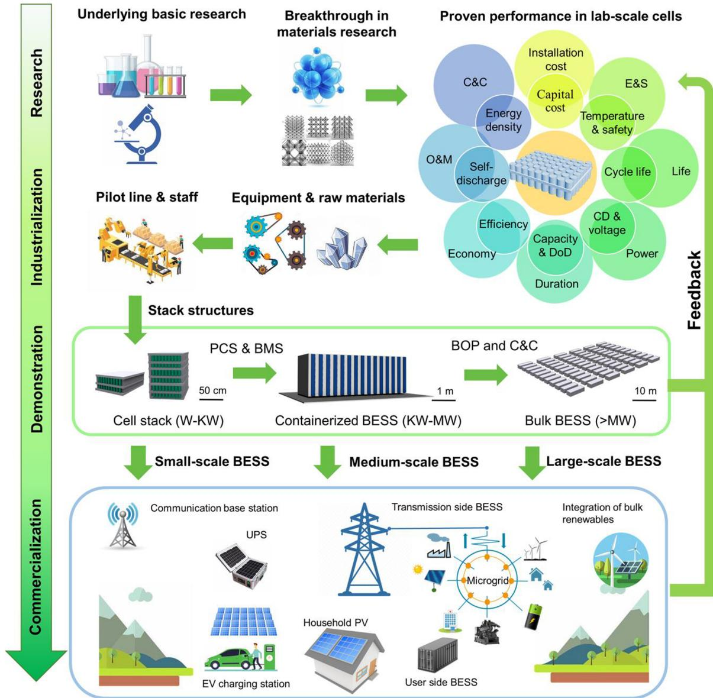  
Figure 97. Development model of BESS from fundamental research to various applications (note: O&M = operations and maintenance; E&S = environment and safety; CD = current density; DoD = depth of discharge; BMS = battery management systems; PCS = power conversion system; BOP = balance of plant; C&C = construction and commissioning; UPS = unattended power source).

density of  $1353\mathrm{Whkg}^{-1}$  (excluding oxygen) and extremely low fabrication cost.[42,559] However, the practically attainable energy density of a Zn-air battery is usually between 350 and 500 Wh  $\mathrm{kg}^{-1}$ , not to mention that the commercialized Zn-air devices have inadequate rate capability, cycle life, and EE (less than  $60\%$ ).[595] The OER/ORR redox kinetics of the air catalysts along with the cathode architectures play a decisive role in augmenting Zn-air battery performance. Similarly, the metallic anode needs to be exclusively engineered to suppress its corrosion and nonuniform dissolution and deposition during reversible cycling. However, the studies on curbing the electrolytic decomposition in nonaqueous MABs (metals such as Li, Na, and K) are still in their infancy.

In addition, the state-of-the-art HGBs, such as advanced  $\mathrm{Ni}-\mathrm{H}_2$  and  $\mathrm{Mn}-\mathrm{H}_2$  cells, offer superior electrochemical performance among previously reported BESSs.[56,709] In this regard, the highly efficient and fast HER/HOR reactions occurring at electrodes are highly promising toward commercially viable, safe, low cost, and long-life hydrogen-based BESSs. Recently, advanced  $\mathrm{Ni}-\mathrm{H}_2$  batteries have been commercialized by the

EnerVenue startup, and it announced an agreement with Pine Gate Renewables to supply 2.4 GWh advanced  $\mathrm{Ni - H_2}$  battery systems for GSES. As for other HGBs, there is urgent need for further performance improvements through developing highly efficient electrodes, cell management systems, and highly active and earth-abundant HER/HOR catalysts.

# 10.2. Future Development of Grid Scale Battery Systems

Currently, there is no ideal battery technology that can meet all the comprehensive requirements of GSES. This calls for the immediate action, carrying out breakthrough studies toward solving key performance issues of batteries and rendering their novel designs viable for GSES. Despite concerns of diminishing lithium reserves and poor safety, LIBs have been one of the most successful technologies in the history of the BESS field. Considering the abundant sodium reserves, SIBs have yet-to-be-harnessed potential to supplement or even replace LIBs in the field of GSES. When it comes to the safety and cost effectiveness of energy storage devices, the VRFB and HGB technologies have untapped potential for worldwide industrial

ization. In addition, other potential battery technologies with unsatisfying electrochemical performances cannot meet the stringent demands for large-scale commercialization and therefore need further improvements.

At present, there is utmost urgency to invest hefty capital in research and development to come up with cutting-edge battery technologies for catering to the stationary and mobile energy storage needs and ensuring long-term returns. In this regard, governments are playing a pivotal role in BESS research and demonstration projects by providing financial, material, and logistic support for establishing industrial facilities and ensuring streamlined energy practices. The increased proclivity toward VRE is speculated to be the key economic driving force in countries who seek to advance grid flexibility and maximize renewable resource feed-in. Last but not least, investment institutions and leading manufacturing enterprises are also expected to pour their efforts in developing better battery technologies for GSES.

# 10.3. Integrated Approaches for Grid Scale Battery Systems

A developmental model of BESS illustrating the basic elements of battery research and various applications is shown in Figure 97. Following the breakthroughs in fundamental energy storage research, there is need to further realize achievements in energy materials and novel BESS prototype designs, yielding suitable performance for specific applications. These applications include household photovoltaic energy, communication base stations, UPS, PV charging stations, microgrids, user side energy storage, and other small- and medium-scale uses, as well as large-scale applications such as integration of bulk renewables. In relation to these, the installation costs, estimated project lifetime, environment and security standards, duration, power rating, construction and commissioning, and operation and management are the paramount considerations. On the other hand, the corresponding evaluation parameters of battery and cell prototypes include capital cost, cycle life, material stability, intrinsic safety, capacity, voltage, current density, energy density, self-discharge, and operating temperature range. Upon developing potential performing battery prototypes or modules on the laboratory scale, equally important is establishing the corresponding industrialization and commercialization model from raw material supply to factory manufacturing. Additional key design aspects such as room for scaling-up through stacking and overall battery management systems (BMSs) are also crucial for improving the capacity, power, and reliability of battery technology. The battery rack for watt-to-kilowatt scaling can be trial-tested for practical small-scale energy storage applications. After passing the performance test, the battery rack, system PCS, BMS, and other auxiliary equipment can be assembled into a containerized BESS, which can then be utilized for medium-scale energy storage. Finally, upon performing satisfactorily for small- and medium-scale storage, the containerized BESS can be subjected to further scale-up through bulk-construction layout to achieve the technology shift toward large-scale industrial grid energy storage. In the past decade, some breakthrough battery technologies have attempted to experience the aforementioned small-scale to large-scale transformation; nonetheless most of them have been unable to meet the requirements of commercialization yet. The ongoing emergence of novel battery chemistries is also bringing many technical challenges. Therefore, BESS researchers are encouraged to focus on solving scientific bottlenecks, by designing practical batteries and transforming the lab-scale cells into commercially viable

technologies for ensuring the sustainable future of energy storage.

# AUTHOR INFORMATION

# Corresponding Author

Wei Chen - Department of Applied Chemistry, School of Chemistry and Materials Science, Hefei National Research Center for Physical Sciences at the Microscale, University of Science and Technology of China, Hefei, Anhui 230026, China;  $\mathbb{O}$  orcid.org/0000-0002-8018-4529; Email: weichen1@ustc.edu.cn

# Authors

Zhengxin Zhu - Department of Applied Chemistry, School of Chemistry and Materials Science, Hefei National Research Center for Physical Sciences at the Microscale, University of Science and Technology of China, Hefei, Anhui 230026, China  
Taoli Jiang - Department of Applied Chemistry, School of Chemistry and Materials Science, Hefei National Research Center for Physical Sciences at the Microscale, University of Science and Technology of China, Hefei, Anhui 230026, China  
Mohsin Ali - Department of Applied Chemistry, School of Chemistry and Materials Science, Hefei National Research Center for Physical Sciences at the Microscale, University of Science and Technology of China, Hefei, Anhui 230026, China  
Yahan Meng - Department of Applied Chemistry, School of Chemistry and Materials Science, Hefei National Research Center for Physical Sciences at the Microscale, University of Science and Technology of China, Hefei, Anhui 230026, China  
Yang Jin - School of Electrical Engineering, Zhengzhou University, Zhengzhou, Henan 450001, China; orcid.org/0000-0002-5879-7521  
Yi Cui - Department of Materials Science and Engineering, Stanford University, Stanford, California 94305, United States; Stanford Institute for Materials and Energy Sciences, SLAC National Accelerator Laboratory, Menlo Park, California 94025, United States; orcid.org/0000-0002-6103-6352  
Complete contact information is available at:  
https://pubs.acs.org/10.1021/acs.chemrev.2c00289

# Author Contributions

$\nabla$  Z.Z., T.J., and M.A. contributed equally to this work.

# Notes

The authors declare no competing financial interest.

# Biographies

Zhengxin Zhu is a postdoctoral researcher in the Hefei National Research Center for Physical Sciences at the Microscale of the University of Science and Technology of China (USTC). He obtained his B.S. degree from China University of Geosciences (Wuhan) in 2017 and his Ph.D. degree in inorganic chemistry from USTC in 2022. He is currently working under the supervision of Prof. Wei Chen at USTC. His research interests focus on aqueous rechargeable hydrogen gas batteries for GSES.

Taoli Jiang is a Ph.D. candidate in the department of applied chemistry of the University of Science and Technology of China (USTC). He obtained his B.S. degree from Central South University of Forestry and Technology in 2017 and his M.S. degree from University of Science and Technology Beijing in 2020. He is currently under the supervision of

Prof. Wei Chen at USTC. His research focuses on hydrogen energy and advanced long-life batteries for GSES.

Mohsin Ali is a Ph.D. student in the Department of Applied Chemistry of the University of Science and Technology of China (USTC). He obtained his B.S. degree from Ghulam Ishaq Khan (GIK) Institute Pakistan in 2013 and his M.S. degree from Dalian University of Technology (DUT) in China in 2018. He is currently working under the supervision of Professor Wei Chen at USTC. His research focuses on novel metal batteries and electrocatalysis.

Yahan Meng is a M.S. candidate in the department of applied chemistry of the University of Science and Technology of China (USTC). She obtained her B.S. degree from Nanjing University of Science and Technology in 2020. She is currently under the supervision of Prof. Wei Chen at USTC. Her research focuses on hydrogen gas batteries.

Yang Jin is an Associate Professor in the school of electrical engineering of the Zhengzhou University. He obtained his B.S. degree from Zhengzhou University in 2012 and his Ph.D. degree from Xi'an Jiaotong University in 2017. His research interests involve battery energy storage, grid energy storage, and battery safety.

Yi Cui is a Professor in the Department of Materials Science and Engineering at Stanford University and SLAC National Accelerator Laboratory. He received his B.S. from the University of Science and Technology of China in 1998 and his Ph.D. from Harvard University in 2002. He was a Miller Postdoctoral Fellow at University of California, Berkeley, and joined Stanford as a faculty member in 2005. His current research is on nanomaterials for energy and environment. He has founded four companies to commercialize technologies from his lab: Amprius, 4C Air, EEnotech, and EnerVenue.

Wei Chen is a Professor in the department of applied chemistry of the University of Science and Technology of China (USTC) and the Hefei National Research Center for Physical Sciences at the Microscale. He obtained his B.S. degree in materials physics from University of Science and Technology Beijing in 2008 and his Ph.D. degree in materials science and engineering from King Abdullah University of Science and Technology (KAUST) in 2013. He then worked as a postdoctoral researcher at Stanford University under the supervision of Prof. Yi Cui in 2014 and joined EEnotech in 2018 as a scientist before joining in USTC in 2019. His research interests involve advanced materials and technologies for energy storage and catalysis.

# ACKNOWLEDGMENTS

W.C. acknowledges the startup funds from USTC (Grant no. KY2060000150) and the Fundamental Research Funds for the Central Universities (Grant no. WK2060000040). The authors at USTC thank USTC Center for Micro and Nanoscale Research and Fabrication for support.

# ABBREVIATIONS

2D = two-dimensional

$3\mathrm{D} =$  three-dimensional

4-HO-TEMPO = 4-hydroxy-2,2,6,6-tetramethylpiperidin-1-oxyl

$\mathrm{AB} =$  alkaline battery

$AC =$  activated carbon

ACN = acetonitrile

$\mathrm{AGM} =$  absorbed glass mat

$\mathrm{AIB} =$  aluminum-ion battery

$\mathrm{AlCl}_3 / [\mathrm{EMIm}]\mathrm{Cl} = \mathrm{AlCl}_3 / 1$  -ethyl-3-methylimidazolium chloride

ALIB = aqueous lithium-ion battery

AQDS = 9,10-anthraquinone-2,7-disulfonic acid

AORFB = aqueous organic redox flow battery

ARFB = aqueous RFB

AZIB = aqueous ZIB

BASE  $= \beta$ -alumina solid electrolyte

$\mathrm{BESS} =$  battery energy storage system

BMS = battery management system

$\mathrm{BQ} =$  benzoquinone

BTMAP-Vi = bis(trimethylammonio)propyl viologen

$\mathrm{C / P =}$  carbon/phosphorus

CAES = compressed air energy storage

CB = carbon black

CBC = chitosan biocellulosics

CCBC = core corona bifunctional catalyst

$\mathrm{CE} =$  Coulombic efficiency

$\mathrm{CF} =$  carbon felt

CIS = Commonwealth of Independent States

CNF = carbon nanofiber

CNT = carbon nanotube

$\mathrm{CO}_{2} =$  carbon dioxide

CPS = copper phosphosulfide

$\mathrm{DFT} =$  density functional theory

DHAQ = dihydroxyanthraquinone

DME  $=$  dimethoxyethane

DoC = depth of charge

DoD = depth of discharge

DoE = Department of Energy

$\mathrm{DOL} =$  dioxolane

DSC = differential scanning calorimeter

DTPA = diethylenetriaminepentaacetic acid

$E_0 =$  onset potential

$E_{1 / 2} =$  half-wave potential

EDS = energy disperse spectroscopy

EDTA = ethylenediaminetetraacetic acid

EE = energy efficiency

EES = emerging energy system

$\mathrm{EESS} =$  electrical energy storage system

$EG =$  expanded graphite

EOCV = end-of-charge voltage

$\mathrm{EODV} =$  end-of-discharge voltage

EPS = emergency power supply

$\mathrm{EV} =$  electrical vehicle

$\mathrm{Fc} =$  ferrocene

$\mathrm{FcBr}_2 =$  dibromoferrocene

FcNCl = (ferrocenylmethyl)trimethylammonium chloride

$\mathrm{GDL} =$  gas diffusion layer

GSES  $=$  grid scale energy storage

$\mathrm{H}_2\mathrm{V}_3\mathrm{O}_8 =$  vanadium oxide hydrate

HCZE = high concentration Zn-ion electrolyte

$\mathrm{HER} =$  hydrogen evolution reaction

HGB = hydrogen gas battery

$\mathrm{HHTP} =$  hexahydroxytriphenylene

HNCS = hollow N-doped carbon sphere

$\mathrm{HOR} =$  hydrogen oxidation reaction

HRPSoC = high-rate partial-state-of-charge

$\mathrm{HT} =$  high-temperature

ICB = iron-chromium RFB

IEA = International Energy Agency

$\mathrm{IEM} =$  ion-exchange membrane

IL = ionic liquid

$\mathrm{IT} =$  intermediate-temperature

$\mathrm{KFeMnHCF} = \mathrm{Fe}$  -substituted Mn-rich PBA  $\mathrm{K}_x\mathrm{Fe}_y\mathrm{Mn}_{1 - y}[\mathrm{Fe}-$

$(\mathrm{CN})_{6}]_{w}z\mathrm{H}_{2}\mathrm{O}$

KNiFC = potassium-rich nickel ferrocyanide

LAB = lead-acid battery

$\mathrm{LCO} = \mathrm{LiCoO}_2$

$\mathrm{LCOS} =$  levelized cost of storage

LDH = layered double hydroxide

$\mathrm{LFP} = \mathrm{LiFePO}_4$

LiBETI = lithium bis(pentafluoroethylsulfonyl)imide

LIB = Li-ion battery

LiPAA = lithiated poly(acrylic acid)

LiTFSI = lithium bis(trifluoromethanesulfonyl)imide

$\mathrm{LL} =$  load leveling

LLZTO = Li6.4 La3Zr1.4 Ta0.6 O12

LMB = liquid-metal battery

$\mathrm{LMO} = \mathrm{LiMn}_2\mathrm{O}_4$

$\mathrm{LMR} = \mathrm{Li}$  and Mn-rich

LSES = large scale energy storage

$\mathrm{LSV} =$  linear sweep voltammetry

MAB = metal-air battery

$\mathrm{Me}_3\mathrm{EtNOTF} =$  trimethylethylammonium trifluoromethanesulfonate

$\mathrm{MgIB} =$  magnesium-ion battery

MIB = metal-ion battery

M-N-C = metal nitrogen doped carbon

MOF = metal-organic framework

MRSSL = multiple redox semisolid-liquid

MSB = molten-salt battery

MWNT = multiwall CNT

$\mathrm{N / P =}$  negative/positive

NASA = National Aeronautics and Space Administration

NASICON  $=$  Na super ionic conductor

$\mathrm{NBB} =$  sodium/  $\beta$  batteries

Ni-Cd = nickel-cadmium

Ni-Fe = nickel-iron

Ni-MH = nickel-metal hydride

$\mathrm{Ni - Zn =}$  nickel-zinc

NiCo-DH = nickel-cobalt double hydroxide

$\mathrm{Ni - H_2 =}$  nickel-hydrogen

NiHCF = nickel hexacyanoferrate

NMR = nuclear magnetic resonance

$\mathrm{NNA@CNH} = \mathrm{Co}$  -doped  $\mathrm{Ni(OH)}_2$  on nanowire arrays

NPMC = carbon foams with N and P as dopants

$\mathrm{NVO} = \mathrm{Na}_{0.33}\mathrm{V}_2\mathrm{O}_5$

$\mathrm{NVOH} = \mathrm{Na}_2\mathrm{V}_6\mathrm{O}_{16}\cdot 3\mathrm{H}_2\mathrm{O}$

$\mathrm{OCP} =$  open-circuit potential

$\mathrm{O} \& \mathrm{M} =$  operation and maintenance

$\mathrm{OCV} =$  open-circuit voltage

OEMS = online electrochemical mass spectroscopy

OER = oxygen evolution reaction

ORR = oxygen reduction reaction

P2-KFMO = P2-type hierarchical  $\mathrm{K}_{0.65}\mathrm{Fe}_{0.5}\mathrm{Mn}_{0.5}\mathrm{O}_2$

$\mathrm{PAA} = \mathrm{poly}(\mathrm{acrylicacid})$

PAM = poly(4-vinylbenzenesulfonate-co-[3-(methacryloyl-amino) propyl] trimethylammonium chloride)

PAN = polyacrylonitrile

PANa = polyacrylate hydrogel

PANi = polyaniline

$\mathrm{PB} =$  Prussian blue

PBA = Prussian blue analogue

PBI = polybenzimidazole

$\mathrm{P - CD / G = P}$  -doped carbon dots rooted in graphene

PCM = porous carbon microsphere

PCS = power conversion system

PDTA = propylenediaminetetraacetic acid

PEG = poly(ethylene glycol)

PEO = poly(ethylene oxide)

PES = poly(ether sulfone)

$\mathrm{PG} =$  pristine graphite

$\mathrm{PGG} =$  porous graphene grid

PHC = phosphorus-doped hard carbon

PHQ = polyhydroquinone

PI1 = naphthalene-1,4,5,8-tetracarboxylic acid dianhydride—ethylenediamine copolymer

PIB = potassium-ion batteries

PIM = polymer with intrinsic microporosity

PPTS = poly(pentacenetetrone sulfide)

PSH = pumped storage hydropower

PTCDA = 3,4,9,10-perylene-tetracarboxylic acid dianhydride

PTFE = polytetrafluoroethylene

$\mathrm{PV} =$  photovoltaic

PVA = poly(vinyl alcohol)

PVDF = poly(vinylidene fluoride)

$\mathrm{QH}_2 =$  hydroquinone

$\mathrm{R / P} =$  reserves-to-production

$\mathrm{RE} =$  reference electrode

$\mathrm{RFB} =$  redox-flow battery

RGO = reduced graphene oxide

$\mathrm{RT} =$  room-temperature

RTE = round-trip efficiency

$\mathrm{RTFB} =$  redox-targeting-based electrolyte flow battery

RVC = reticulated vitreous carbon

$\mathrm{SEI} =$  solid electrolyte interphase

SEM = scanning electron microscopy

$\mathrm{SFB} =$  solar flow battery

SIB = sodium-ion battery

SLAFB = soluble Pb-acid flow battery

SoC = state of charge

SOEE = solar-to-output electricity efficiency

SPEEK = sulfonated poly(ether ether ketone)

STEM = scanning transmission electron microscopy

T&D = transmission and distribution

TBMC = mesoporous carbon with a CNT backbone

TEGDME = tetra(ethylene glycol) dimethyl ether

TEM = transmission electron microscopy

TEPCO = Tokyo Electric Power Company

TES = thermal energy storage

TMAP-TEMPO  $= 4 - [3-(\text{trimethylammonio})\text{propoxy}]$

2,2,6,6-tetramethylpiperidine-1-oxyl

UNCN = carbon nanosheets doped with an ultrahigh content of nitrogen

UPS = uninterrupted power supply

VE = voltage efficiency

VRE = variable renewable energy

$\mathrm{VRFB} =$  vanadium redox flow battery

VRLAB = valve regulated LAB

WE = working electrode

WIBS = water-in-bisalt

WIS = water-in-salt

ZAB = zinc-air battery

ZBB = zinc-bromide RFB

ZEBRA = zero emission battery research activity

ZFB = zinc-iron RFB

ZIB = zinc-ion battery

ZIF = zeolite imidazole framework

ZPC = Zn-air pouch cell

# REFERENCES

(1) Larcher, D.; Tarascon, J. M. Towards Greener and More Sustainable Batteries for Electrical Energy Storage. Nat. Chem. 2015, 7, 19-29.  
(2) World Energy Outlook, International Energy Agency, 2019.  
(3) Global energy transformation: A roadmap to 2050 (2019 ed.); International Renewable Energy Agency, 2019.  
(4) BP Statistical Review of World Energy, British Petroleum, 2019.  
(5) Braff, W. A.; Mueller, J. M.; Trancik, J. E. Value of Storage Technologies for Wind and Solar Energy. Nat. Clim. Change 2016, 6, 964-969.  
(6) Hook, M.; Tang, X. Depletion of Fossil Fuels and Anthropogenic Climate Change-A Review. Energy Policy 2013, 52, 797-809.  
(7) Davis, S. J.; Caldeira, K.; Matthews, H. D. Future  $\mathrm{CO}_{2}$  Emissions and Climate Change from Existing Energy Infrastructure. Science 2010, 329, 1330-1333.  
(8) Kerr, R. A. Global Warming Is Changing the World. Science 2007, 316, 188-190.  
(9) Jacobson, M. Z. Review of Solutions to Global Warming, Air Pollution, and Energy Security. Energy Environ. Sci. 2009, 2, 148-173.  
(10) Global Warming of  $1.5^{\circ}C$ , Intergovernmental Panel on Climate Change, 2019.  
(11) Bongaarts, J. Special Report on Global Warming of 1.5 degrees C. Popul. Dev. Rev. 2019, 45, 251-252.  
(12) Javed, M. S.; Ma, T.; Jurasz, J.; Amin, M. Y. Solar and Wind Power Generation Systems with Pumped Hydro Storage: Review and Future Perspectives. Renew Energ 2020, 148, 176-192.  
(13) Hussain, A.; Arif, S. M.; Aslam, M. Emerging Renewable and Sustainable Energy Technologies: State of the Art. Renew. Sust. Energy Rev. 2017, 71, 12-28.  
(14) Renewable Capacity Statistics, International Renewable Energy Agency, 2019.  
(15) Renewable Power Generation Costs in 2019; International Renewable Energy Agency, 2019.  
(16) Buttler, A.; Dinkel, F.; Franz, S.; Spiethoff, H. Variability of Wind and Solar Power - an Assessment of the Current Situation in the European Union Based on the Year 2014. Energy 2016, 106, 147-161.  
(17) Sengupta, M.; Xie, Y.; Lopez, A.; Habte, A.; Maclaurin, G.; Shelby, J. The National Solar Radiation Data Base (NSRDB). Renew. Sust. Energy Rev. 2018, 89, 51-60.  
(18) Draxl, T. C.; Hodge, B. M.; Clifton, A.; McCaa, J. Overview and Meteorological Validation of the Wind Integration National Dataset Toolkit Technical Report, NREL/TP-5000-61740, National Renewable Energy Laboratory, 2015.  
(19) Denholm, P.; Hand, M. Grid Flexibility and Storage Required to Achieve Very High Penetration of Variable Renewable Electricity. Energy Policy 2011, 39, 1817-1830.  
(20) de Sisternes, F.J.; Jenkins, J.D.; Botterud, A. The Value of Energy Storage in Decarbonizing the Electricity Sector. Appl. Energy 2016, 175, 368-379.  
(21) Luo, X.; Wang, J.; Dooner, M.; Clarke, J. Overview of Current Development in Electrical Energy Storage Technologies and the Application Potential in Power System Operation. Appl. Energy 2015, 137, 511-536.  
(22) Tan, S. Y.; Payne, D. J.; Hallett, J. P.; Kelsall, G. H. Developments in Electrochemical Processes for Recycling Lead-Acid Batteries. Curr. Opin. Electrochem. 2019, 16, 83-89.  
(23) Zhang, W. L.; Yin, J.; Lin, H. B.; Lu, K.; Feng, F.; Qiu, X. Q. Design Principles of Lead-Carbon Additives toward Better Lead-Carbon Batteries. Curr. Opin. Electrochem. 2021, 30, 100802.  
(24) Perez-Diaz, J. I.; Chazarra, M.; Garcia-Gonzalez, J.; Cavazzini, G.; Stoppato, A. Trends and Challenges in the Operation of Pumped-Storage Hydropower Plants. Renew. Sust. Energy Rev. 2015, 44, 767-784.  
(25) Budt, M.; Wolf, D.; Span, R.; Yan, J. Y. A Review on Compressed Air Energy Storage: Basic Principles, Past Milestones and Recent Developments. Appl. Energy 2016, 170, 250-268.  
(26) Bolund, B.; Bernhoff, H.; Leijon, M. Flywheel Energy and Power Storage Systems. Renew. Sust. Energy Rev. 2007, 11, 235-258.

(27) He, T.; Pachfule, P.; Wu, H.; Xu, Q.; Chen, P. Hydrogen carriers. Nat. Rev. Mater. 2016, 1, 16059.  
(28) Yan, T.; Wang, R. Z.; Li, T. X.; Wang, L. W.; Fred, I. T. A review of promising candidate reactions for chemical heat storage. Renew. Sust. Energy Rev. 2015, 43, 13-31.  
(29) Wu, X.; Zhang, H. H.; Huang, K. J.; Chen, Z. Stabilizing Metallic Iron Nanoparticles by Conformal Graphitic Carbon Coating for High-Rate Anode in Ni-Fe Batteries. Nano Lett. 2020, 20, 1700-1706.  
(30) Schmidt, O.; Melchior, S.; Hawkes, A.; Staffell, I. Projecting the Future Levelized Cost of Electricity Storage Technologies. Joule 2019, 3, 81-100.  
(31) Electricity Storage and Renewables: Costs and Markets to 2030; International Renewable Energy Agency, 2017.  
(32) Zhou, Q.; Du, D.; Lu, C.; He, Q.; Liu, W. A Review of Thermal Energy Storage in Compressed Air Energy Storage System. Energy 2019, 188, 115993.  
(33) Wang, J. D.; Lu, K. P.; Ma, L.; Wang, J. H.; Dooner, M.; Miao, S. H.; Li, J.; Wang, D. Overview of Compressed Air Energy Storage and Technology Development. Energies 2017, 10, 991.  
(34) Wang, J. D.; Ma, L.; Lu, K. P.; Miao, S. H.; Wang, D.; Wang, J. H. Current Research and Development Trend of Compressed Air Energy Storage. Syst. Sci. Control Eng. 2017, 5, 434-448.  
(35) Sarbu, I.; Sebarchievici, C. A Comprehensive Review of Thermal Energy Storage. Sustainability 2018, 10, 191.  
(36) Alva, G.; Lin, Y.; Fang, G. An Overview of Thermal Energy Storage Systems. Energy 2018, 144, 341-378.  
(37) Yan, J.; Yang, X. Thermal Energy Storage. Appl. Energy 2019, 240, A1-A6.  
(38) Abdin, Z.; Zafaranloo, A.; Rafiee, A.; Merida, W.; Lipinski, W.; Khalilpour, K. R. Hydrogen as an Energy Vector. Renew. Sust. Energy Rev. 2020, 120, 109620.  
(39) Kojima, Y. Hydrogen Storage Materials for Hydrogen and Energy Carriers. Int. J. Hydrogen Energy 2019, 44, 18179-18192.  
(40) Energy Storage Technology and Cost Characterization Report; U.S. Department of Energy (DOE), 2019.  
(41) Olabi, A. G.; Onumaegbu, C.; Wilberforce, T.; Ramadan, M.; Abdelkareem, M. A.; Al-Alami, A. H. Critical Review of Energy Storage Systems. Energy 2021, 214, 118987.  
(42) Dunn, B.; Kamath, H.; Tarascon, J. M. Electrical Energy Storage for the Grid: A Battery of Choices. Science 2011, 334, 928-935.  
(43) Deng, D. Li-Ion Batteries: Basics, Progress, and Challenges. Energy Sci. Eng. 2015, 3, 385-418.  
(44) Jiang, T. L.; He, P. G.; Wang, G. X.; Shen, Y.; Nan, C. W.; Fan, L. Z. Solvent-Free Synthesis of Thin, Flexible, Nonflammable Garnet-Based Composite Solid Electrolyte for All-Solid-State Lithium Batteries. Adv. Energy Mater. 2020, 10, 1903376.  
(45) Delmas, C. Sodium and Sodium-Ion Batteries: 50 Years of Research. Adv. Energy Mater. 2018, 8, 1703137.  
(46) May, G. J.; Davidson, A.; Monahov, B. Lead Batteries for Utility Energy Storage: A Review. J. Energy Storage 2018, 15, 145-157.  
(47) Sanchez-Diez, E.; Ventosa, E.; Guarnieri, M.; Trovo, A.; Flox, C.; Marcilla, R.; Soavi, F.; Mazur, P.; Aranzabe, E.; Ferret, R. Redox Flow Batteries: Status and Perspective Towards Sustainable Stationary Energy Storage. J. Power Sources 2021, 481, 228804.  
(48) Small, L. J.; Eccleston, A.; Lamb, J.; Read, A. C.; Robins, M.; Meaders, T.; Ingersoll, D.; Clem, P. G.; Bhavaraju, S.; Spoerke, E. D. Next Generation Molten NaI Batteries for Grid Scale Energy Storage. J. Power Sources 2017, 360, 569-574.  
(49) Jiang, T.; Chen, W. Nickel Hydrogen Gas Batteries: From Aerospace to Grid-Scale Energy Storage Applications. Curr. Opin. Electrochem. 2021, 30, 100859.  
(50) Emmett, R. K.; Roberts, M. E. Recent Developments in Alternative Aqueous Redox Flow Batteries for Grid-Scale Energy Storage. J. Power Sources 2021, 506, 230087.  
(51) Zhang, W. C.; Lu, J.; Guo, Z. P. Challenges and Future Perspectives on Sodium and Potassium Ion Batteries for Grid-Scale Energy Storage. Mater. Today 2021, 50, 400-417.  
(52) Liu, J.; Bao, Z. N.; Cui, Y.; Dufek, E. J.; Goodenough, J. B.; Khalifah, P.; Li, Q. Y.; Liaw, B. Y.; Liu, P.; Manthiram, A.; et al.

Pathways for Practical High-Energy Long-Cycling Lithium Metal Batteries. Nat. Energy 2019, 4, 180-186.  
(53) Lin, Z.; Liu, T. F.; Ai, X. P.; Liang, C. D. Aligning Academia and Industry for Unified Battery Performance Metrics. Nat. Commun. 2018, 9, 5262.  
(54) Cao, Y. L.; Li, M.; Lu, J.; Liu, J.; Amine, K. Bridging the Academic and Industrial Metrics for Next-Generation Practical Batteries. Nat. Nanotechnol. 2019, 14, 200-207.  
(55) Energy Storage Grand Challenge Cost and Performance Assessment; Department of Energy, 2020.  
(56) Chen, W.; Jin, Y.; Zhao, J.; Liu, N.; Cui, Y. Nickel-Hydrogen Batteries for Large-Scale Energy Storage. Proc. Natl. Acad. Sci. U.S.A. 2018, 115, 11694-11699.  
(57) Pan, H. L.; Hu, Y. S.; Chen, L. Q. Room-Temperature Stationary Sodium-Ion Batteries for Large-Scale Electric Energy Storage. Energy Environ. Sci. 2013, 6, 2338-2360.  
(58) Ziegler, M. S.; Mueller, J. M.; Pereira, G. D.; Song, J.; Ferrara, M.; Chiang, Y.-M.; Trancik, J. E. Storage Requirements and Costs of Shaping Renewable Energy Toward Grid Decarbonization. Joule 2019, 3, 2134-2153.  
(59) Jülich, V. Comparison of Electricity Storage Options Using Levelized Cost of Storage (LCOS) Method. Appl. Energy 2016, 183, 1594-1606.  
(60) Ould Ely, T.; Kamzabek, D.; Chakraborty, D. Batteries Safety: Recent Progress and Current Challenges. Front. Energy Res. 2019, 7, 71.  
(61) Duan, J.; Tang, X.; Dai, H. F.; Yang, Y.; Wu, W. Y.; Wei, X. Z.; Huang, Y. H. Building Safe Lithium-Ion Batteries for Electric Vehicles: A Review. Electrochem. Energy R. 2020, 3, 1-42.  
(62) Feng, X. N.; Ouyang, M. G.; Liu, X.; Lu, L. G.; Xia, Y.; He, X. M. Thermal Runaway Mechanism of Lithium Ion Battery for Electric Vehicles: A Review. Energy Storage Mater. 2018, 10, 246-267.  
(63) Yang, Z. G.; Zhang, J. L.; Kintner-Meyer, M. C. W.; Lu, X. C.; Choi, D. W.; Lemmon, J. P.; Liu, J. Electrochemical Energy Storage for Green Grid. Chem. Rev. 2011, 111, 3577-3613.  
(64) Liu, T. F.; Zhang, Y. P.; Jiang, Z. G.; Zeng, X. Q.; Ji, J. P.; Li, Z. H.; Gao, X. H.; Sun, M. H.; Lin, Z.; Ling, M.; et al. Exploring Competitive Features of Stationary Sodium Ion Batteries for Electrochemical Energy Storage. Energy Environ. Sci. 2019, 12, 1512-1533.  
(65) Sun, Y. M.; Liu, N. A.; Cui, Y. Promises and Challenges of Nanomaterials for Lithium-Based Rechargeable Batteries. Nat. Energy 2016, 1, 16071.  
(66) Fan, L. Z.; He, H. C.; Nan, C. W. Tailoring Inorganic-Polymer Composites for the Mass Production of Solid-State Batteries. Nat. Rev. Mater. 2021, 6, 1003-1019.  
(67) Xu, L.; Lu, Y.; Zhao, C. Z.; Yuan, H.; Zhu, G. L.; Hou, L. P.; Zhang, Q.; Huang, J. Q. Toward the Scale-Up of Solid-State Lithium Metal Batteries: The Gaps between Lab-Level Cells and Practical Large-Format Batteries. Adv. Energy Mater. 2021, 11, 2002360.  
(68) Lamb, J.; Jeevarajan, J. A. New Developments in Battery Safety for Large-Scale Systems. MRS Bull. 2021, 46, 395-401.  
(69) Ahmed, S.; Bloom, I.; Jansen, A. N.; Tanim, T.; Dufek, E. J.; Pesaran, A.; Burnham, A.; Carlson, R. B.; Dias, F.; Hardy, K.; et al. Enabling Fast Charging - A Battery Technology Gap Assessment. J. Power Sources 2017, 367, 250-262.  
(70) Bauer, M. K. G.; Dahn, J. R. Using Lithium-ion Differential Thermal Analysis to Probe Tortuosity of Negative Electrodes in Lithium-Ion Cells. J. Electrochem. Soc. 2021, 168, 020501.  
(71) Grey, C. P.; Tarascon, J. M. Sustainability and In Situ Monitoring in Battery Development. Nat. Mater. 2017, 16, 45-56.  
(72) Betz, J.; Bieker, G.; Meister, P.; Placke, T.; Winter, M.; Schmuch, R. Theoretical Versus Practical Energy: A Plea for More Transparency in the Energy Calculation of Different Rechargeable Battery Systems. Adv. Energy Mater. 2019, 9, 1803170.  
(73) Chen, S.; Niu, C.; Lee, H.; Li, Q.; Yu, L.; Xu, W.; Zhang, J.-G.; Dufek, E. J.; Whittingham, M. S.; Meng, S.; et al. Critical Parameters for Evaluating Coin Cells and Pouch Cells of Rechargeable Li-Metal Batteries. Joule 2019, 3, 1094-1105.  
(74) Duffner, F.; Kronemeyer, N.; Tubke, J.; Leker, J.; Winter, M.; Schmuch, R. Post-Lithium-Ion Battery Cell Production and Its

Compatibility with Lithium-Ion Cell Production Infrastructure. Nat. Energy 2021, 6, 123-134.  
(75) Liu, F. F.; Wang, T. T.; Liu, X. B.; Fan, L. Z. Challenges and Recent Progress on Key Materials for Rechargeable Magnesium Batteries. Adv. Energy Mater. 2021, 11, 2000787.  
(76) Liang, Y. L.; Dong, H.; Aurbach, D.; Yao, Y. Current Status and Future Directions of Multivalent Metal-Ion Batteries. Nat. Energy 2020, 5, 646-656.  
(77) Vaalma, C.; Buchholz, D.; Passerini, S. Non-Aqueous Potassium-Ion Batteries: A Review. Curr. Opin. Electrochem. 2018, 9, 41-48.  
(78) Gentil, S.; Reynard, D.; Girault, H. H. Aqueous Organic and Redox-Mediated Redox Flow Batteries: A Review. Curr. Opin. Electrochem. 2020, 21, 7-13.  
(79) Chen, L.; An, Q.; Mai, L. Recent Advances and Prospects of Cathode Materials for Rechargeable Aqueous Zinc-Ion Batteries. Adv. Mater. Interfaces 2019, 6, 1900387.  
(80) Armand, M.; Tarascon, J.-M. Building Better Batteries. Nature 2008, 451, 652-657.  
(81) Cole, W.; Frazier, A. W. Cost Projections for Utility-Scale Battery Storage; National Renewable Energy Laboratory, 2020.  
(82) Battery Storage for Renewables: Market Status and Technology Outlook; International Renewable Energy Agency, 2015.  
(83) Chen, T.; Jin, Y.; Lv, H.; Yang, A.; Liu, M.; Chen, B.; Xie, Y.; Chen, Q. Applications of Lithium-Ion Batteries in Grid-Scale Energy Storage Systems. Trans. Tianjin Univ. 2020, 26, 208-217.  
(84) Pellow, M. A.; Ambrose, H.; Mulvaney, D.; Betita, R.; Shaw, S. Research Gaps in Environmental Life Cycle Assessments of Lithium Ion Batteries for Grid-Scale Stationary Energy Storage Systems: End-of-Life Options and Other Issues. Sustain. Mater. Technol. 2020, 23, No. e00120.  
(85) Innovation Landscape Brief: Utility-Scale Batteries; International Renewable Energy Agency, 2019.  
(86) Arteaga, J.; Zareipour, H.; Thangadurai, V. Overview of Lithium-Ion Grid-Scale Energy Storage Systems. Curr. Sustainable Renewable Energy Rep. 2017, 4, 197-208.  
(87) Li, M.; Lu, J.; Chen, Z.; Amine, K. 30 Years of Lithium-Ion Batteries. Adv. Mater. 2018, 30, 1800561.  
(88) Zheng, J.; Xu, P.; Gu, M.; Xiao, J.; Browning, N. D.; Yan, P.; Wang, C.; Zhang, J.-G. Structural and Chemical Evolution of Li- and Mn-Rich Layered Cathode Material. Chem. Mater. 2015, 27, 1381-1390.  
(89) Manthiram, A. An Outlook on Lithium Ion Battery Technology. ACS Cent. Sci. 2017, 3, 1063-1069.  
(90) Chae, S.; Ko, M.; Kim, K.; Ahn, K.; Cho, J. Confronting Issues of the Practical Implementation of Si Anode in High-Energy Lithium-Ion Batteries. Joule 2017, 1, 47-60.  
(91) Feng, K.; Ahn, W.; Lui, G.; Park, H. W.; Kashkooli, A. G.; Jiang, G.; Wang, X.; Xiao, X.; Chen, Z. Implementing an In-Situ Carbon Network in Si/Reduced Graphene Oxide for High Performance Lithium-Ion Battery Anodes. Nano Energy 2016, 19, 187-197.  
(92) Hassan, F. M.; Batmaz, R.; Li, J.; Wang, X.; Xiao, X.; Yu, A.; Chen, Z. Evidence of Covalent Synergy in Silicon-Sulfur-Graphene Yielding Highly Efficient and Long-Life Lithium-Ion Batteries. Nat. Commun. 2015, 6, 8597.  
(93) Chan, C. K.; Peng, H.; Liu, G.; McIlwrath, K.; Zhang, X. F.; Huggins, R. A.; Cui, Y. High-Performance Lithium Battery Anodes Using Silicon Nanowires. Nat. Nanotechnol. 2008, 3, 31-35.  
(94) Wang, C.; Wu, H.; Chen, Z.; McDowell, M. T.; Cui, Y.; Bao, Z. Self-Healing Chemistry Enables the Stable Operation of Silicon Microparticle Anodes for High-Energy Lithium-Ion Batteries. Nat. Chem. 2013, 5, 1042–1048.  
(95) Li, Y.; Yan, K.; Lee, H.-W.; Lu, Z.; Liu, N.; Cui, Y. Growth of Conformal Graphene Cages on Micrometre-Sized Silicon Particles as Stable Battery Anodes. Nat. Energy 2016, 1, 15029.  
(96) Wang, J.; Liao, L.; Li, Y.; Zhao, J.; Shi, F.; Yan, K.; Pei, A.; Chen, G.; Li, G.; Lu, Z.; et al. Shell-Protective Secondary Silicon Nanostructures as Pressure-Resistant High-Volumetric-Capacity Anodes for Lithium-Ion Batteries. Nano Lett. 2018, 18, 7060-7065.

(97) Boyle, D. T.; Huang, W.; Wang, H.; Li, Y.; Chen, H.; Yu, Z.; Zhang, W.; Bao, Z.; Cui, Y. Corrosion of Lithium Metal Anodes During Calendar Ageing and Its Microscopic Origins. Nat. Energy 2021, 6, 487-494.  
(98) Jin, C.; Liu, T.; Sheng, O.; Li, M.; Liu, T.; Yuan, Y.; Nai, J.; Ju, Z.; Zhang, W.; Liu, Y.; et al. Rejuvenating Dead Lithium Supply in Lithium Metal Anodes by Iodine Redox. Nat. Energy 2021, 6, 378-387.  
(99) Liu, F.; Xu, R.; Wu, Y.; Boyle, D. T.; Yang, A.; Xu, J.; Zhu, Y.; Ye, Y.; Yu, Z.; Zhang, Z.; et al. Dynamic Spatial Progression of Isolated Lithium During Battery Operations. Nature 2021, 600, 659-663.  
(100) Kong, L.; Jin, Q.; Zhang, X.-T.; Li, B.-Q.; Chen, J.-X.; Zhu, W.-C.; Huang, J.-Q.; Zhang, Q. Towards Full Demonstration of High Areal Loading Sulfur Cathode in Lithium-Sulfur Batteries. J. Energy Chem. 2019, 39, 17-22.  
(101) Park, J.-B.; Lee, S. H.; Jung, H.-G.; Aurbach, D.; Sun, Y.-K. Redox Mediators for  $\mathrm{Li - O_2}$  Batteries: Status and Perspectives. Adv. Mater. 2018, 30, 1704162.  
(102) Lin, D.; Liu, Y.; Cui, Y. Reviving the Lithium Metal Anode for High-Energy Batteries. Nat. Nanotechnol. 2017, 12, 194-206.  
(103) Zhu, Z.; Lu, L. L.; Yin, Y.; Shao, J.; Shen, B.; Yao, H. B. High Rate and Stable Solid-State Lithium Metal Batteries Enabled by Electronic and Ionic Mixed Conducting Network Interlayers. ACS Appl. Mater. Interfaces 2019, 11, 16578-16585.  
(104) Albertus, P.; Babinec, S.; Litzelman, S.; Newman, A. Status and Challenges in Enabling the Lithium Metal Electrode for High-Energy and Low-Cost Rechargeable Batteries. Nat. Energy 2018, 3, 16-21.  
(105) Qie, L.; Zu, C.; Manthiram, A. A High Energy Lithium-Sulfur Battery with Ultrahigh-Loading Lithium Polysulfide Cathode and its Failure Mechanism. Adv. Energy Mater. 2016, 6, 1502459.  
(106) Zhang, W.; Huang, Y.; Liu, Y.; Wang, L.; Chou, S.; Liu, H. Strategies Toward Stable Nonaqueous Alkali Metal- $\mathrm{O}_2$  Batteries. Adv. Energy Mater. 2019, 9, 1900464.  
(107) Li, W.; Dahn, J. R.; Wainwright, D. S. Rechargeable Lithium Batteries with Aqueous Electrolytes. Science 1994, 264, 1115-1118.  
(108) Wang, Y.; Yi, J.; Xia, Y. Recent Progress in Aqueous Lithium-Ion Batteries. Adv. Energy Mater. 2012, 2, 830-840.  
(109) Luo, J. Y.; Xia, Y. Y. Aqueous Lithium-ion Battery  $\mathrm{LiTi}_2(\mathrm{PO}_4)_3/$ $\mathrm{LiMn}_2\mathrm{O}_4$  with High Power and Energy Densities as well as Superior Cycling Stability. Adv. Funct. Mater. 2007, 17, 3877-3884.  
(110) Bin, D.; Wen, Y.; Wang, Y.; Xia, Y. The Development in Aqueous Lithium-Ion Batteries. J. Energy Chem. 2018, 27, 1521-1535.  
(111) Luo, J. Y.; Cui, W. J.; He, P.; Xia, Y. Y. Raising the Cycling Stability of Aqueous Lithium-Ion Batteries by Eliminating Oxygen in the Electrolyte. Nat. Chem. 2010, 2, 760-765.  
(112) Kohler, J.; Makihara, H.; Uegaito, H.; Inoue, H.; Toki, M.  $\mathrm{LiV}_3\mathrm{O}_8$ : Characterization as Anode Material for an Aqueous Rechargeable Li-Ion Battery System. Electrochim. Acta 2000, 46, 59-65.  
(113) Wang, G.; Fu, L.; Zhao, N.; Yang, L.; Wu, Y.; Wu, H. An Aqueous Rechargeable Lithium Battery with Good Cycling Performance. Angew. Chem., Int. Ed. 2007, 46, 295-297.  
(114) Wang, H.; Huang, K.; Zeng, Y.; Yang, S.; Chen, L. Electrochemical Properties of  $\mathrm{TiP}_2\mathrm{O}_7$  and  $\mathrm{LiTi}_2(\mathrm{PO}_4)_3$  as Anode Material for Lithium Ion Battery with Aqueous Solution Electrolyte. Electrochim. Acta 2007, 52, 3280-3285.  
(115) Wang, Y.; Wang, Y.; Tang, J.; Xia, Y.; Zheng, G. Aqueous Li-ion Cells with Superior Cycling Performance Using Multi-Channeled Polyaniline/Fe $_2$ O $_3$  Nanotube Anodes. J. Mater. Chem. A 2014, 2, 20177-20181.  
(116) He, Z.; Jiang, Y.; Zhu, J.; Wang, H.; Li, Y.; Zhou, H.; Meng, W.; Dai, L.; Wang, L. N-Doped Carbon Coated  $\mathrm{LiTi}_2(\mathrm{PO}_4)_3$  as Superior Anode Using Pani as Carbon and Nitrogen Bi-Sources for Aqueous Lithium Ion Battery. Electrochim. Acta 2018, 279, 279-288.  
(117) Xue, L.; Zhang, Q.; Zhu, X.; Gu, L.; Yue, J.; Xia, Q.; Xing, T.; Chen, T.; Yao, Y.; Xia, H. 3D LiCoO $_2$  Nanosheets Assisted Nanorod Arrays via Confined Dissolution-Recrystallization for Advanced Aqueous Lithium-Ion Batteries. Nano Energy 2019, 56, 463-472.

(118) Ramanujapuram, A.; Yushin, G. Understanding the Exceptional Performance of Lithium-Ion Battery Cathodes in Aqueous Electrolytes at Subzero Temperatures. Adv. Energy Mater. 2018, 8, 1802624.  
(119) Suo, L.; Borodin, O.; Gao, T.; Olguin, M.; Ho, J.; Fan, X.; Luo, C.; Wang, C.; Xu, K. "Water-in-Salt" Electrolyte Enables High-Voltage Aqueous Lithium-Ion Chemistries. Science 2015, 350, 938-943.  
(120) Wang, F.; Lin, Y.; Suo, L.; Fan, X.; Gao, T.; Yang, C.; Han, F.; Qi, Y.; Xu, K.; Wang, C. Stabilizing High Voltage  $\mathrm{LiCoO}_2$  Cathode in Aqueous Electrolyte with Interphase-Forming Additive. Energy Environ. Sci. 2016, 9, 3666–3673.  
(121) Wang, H.; Zhang, H.; Cheng, Y.; Feng, K.; Li, X.; Zhang, H. All-NASICON LVP-LTP Aqueous Lithium Ion Battery with Excellent Stability and Low-Temperature Performance. Electrochim. Acta 2018, 278, 279-289.  
(122) Shao, M.; Deng, J.; Zhong, F.; Cao, Y.; Ai, X.; Qian, J.; Yang, H. An All-Vanadium Aqueous Lithium Ion Battery with High Energy Density and Long Lifespan. Energy Storage Mater. 2019, 18, 92-99.  
(123) Suo, L.; Borodin, O.; Sun, W.; Fan, X.; Yang, C.; Wang, F.; Gao, T.; Ma, Z.; Schroeder, M.; von Cresce, A.; et al. Advanced High-Voltage Aqueous Lithium-Ion Battery Enabled by "Water-in-Bisalt" Electrolyte. Angew. Chem., Int. Ed. 2016, 55, 7136-7141.  
(124) Yang, C.; Chen, J.; Ji, X.; Pollard, T. P.; Lu, X.; Sun, C. J.; Hou, S.; Liu, Q.; Liu, C.; Qing, T.; et al. Aqueous Li-Ion Battery Enabled by Halogen Conversion-Intercalation Chemistry in Graphite. Nature 2019, 569, 245–250.  
(125) Chen, L.; Zhang, J.; Li, Q.; Vatamanu, J.; Ji, X.; Pollard, T. P.; Cui, C.; Hou, S.; Chen, J.; Yang, C.; et al. A 63 m Superconcentrated Aqueous Electrolyte for High-Energy Li-Ion Batteries. ACS Energy Lett. 2020, 5, 968-974.  
(126) Lukatskaya, M. R.; Feldblyum, J. I.; Mackanic, D. G.; Lissel, F.; Michels, D. L.; Cui, Y.; Bao, Z. Concentrated Mixed Cation Acetate "Water-in-Salt" Solutions as Green and Low-Cost High Voltage Electrolytes for Aqueous Batteries. Energy Environ. Sci. 2018, 11, 2876-2883.  
(127) He, X.; Yan, B.; Zhang, X.; Liu, Z.; Bresser, D.; Wang, J.; Wang, R.; Cao, X.; Su, Y.; Jia, H.; et al. Fluorine-Free Water-in-Ionomer Electrolytes for Sustainable Lithium-Ion Batteries. Nat. Commun. 2018, 9, 5320.  
(128) Xie, J.; Liang, Z.; Lu, Y.-C. Molecular Crowding Electrolytes for High-Voltage Aqueous Batteries. Nat. Mater. 2020, 19, 1006-1011.  
(129) Borodin, O.; Self, J.; Persson, K. A.; Wang, C.; Xu, K. Uncharted Waters: Super-Concentrated Electrolytes. Joule 2020, 4, 69-100.  
(130) Li, M.; Wang, C.; Chen, Z.; Xu, K.; Lu, J. New Concepts in Electrolytes. Chem. Rev. 2020, 120, 6783-6819.  
(131) Dou, Q.; Lei, S.; Wang, D.-W.; Zhang, Q.; Xiao, D.; Guo, H.; Wang, A.; Yang, H.; Li, Y.; Shi, S.; et al. Safe and High-Rate Supercapacitors Based on an "Acetonitrile/Water in Salt" Hybrid Electrolyte. Energy Environ. Sci. 2018, 11, 3212-3219.  
(132) Chen, J.; Vatamanu, J.; Xing, L.; Borodin, O.; Chen, H.; Guan, X.; Liu, X.; Xu, K.; Li, W. Improving Electrochemical Stability and Low-Temperature Performance with Water/Acetonitrile Hybrid Electrolytes. Adv. Energy Mater. 2020, 10, 1902654.  
(133) Wang, Y.; Wang, T.; Dong, D.; Xie, J.; Guan, Y.; Huang, Y.; Fan, J.; Lu, Y.-C. Enabling High-Energy-Density Aqueous Batteries with Hydrogen Bond-Anchored Electrolytes. Matter 2022, S, 162-179.  
(134) Xu, J.; Ji, X.; Zhang, J.; Yang, C.; Wang, P.; Liu, S.; Ludwig, K.; Chen, F.; Kofinas, P.; Wang, C. Aqueous Electrolyte Design for Super-Stable 2.5 V  $\mathrm{LiMn}_2\mathrm{O}_4$  ||  $\mathrm{Li}_4\mathrm{Ti}_5\mathrm{O}_{12}$  Pouch Cells. Nat. Energy 2022, 7, 186-193.  
(135) Cui, J.; Yao, S.; Kim, J.-K. Recent Progress in Rational Design of Anode Materials for High-Performance Na-Ion Batteries. Energy Storage Mater. 2017, 7, 64-114.  
(136) Kim, H.; Kim, H.; Ding, Z.; Lee, M. H.; Lim, K.; Yoon, G.; Kang, K. Recent Progress in Electrode Materials for Sodium-Ion Batteries. Adv. Energy Mater. 2016, 6, 1600943.  
(137) Böhm, H.; Beyermann, G. ZEBRA Batteries, Enhanced Power by Doping. J. Power Sources 1999, 84, 270-274.

(138) Galloway, R. C.; Haslam, S. The ZEBRA Electric Vehicle Battery: Power and Energy Improvements. J. Power Sources 1999, 80, 164-170.  
(139) Kundu, D.; Talaie, E.; Duffort, V.; Nazar, L. F. The Emerging Chemistry of Sodium Ion Batteries for Electrochemical Energy Storage. Angew. Chem., Int. Ed. 2015, 54, 3431-3448.  
(140) Wang, L. P.; Yu, L.; Wang, X.; Srinivasan, M.; Xu, Z. J. Recent Developments in Electrode Materials for Sodium-Ion Batteries. J. Mater. Chem. A 2015, 3, 9353-9378.  
(141) Li, F.; Wei, Z.; Manthiram, A.; Feng, Y.; Ma, J.; Mai, L. Sodium-Based Batteries: From Critical Materials to Battery Systems. J. Mater. Chem. A 2019, 7, 9406-9431.  
(142) Ge, P.; Fouletier, M. Electrochemical Intercalation of Sodium in Graphite. Solid State Ionics 1988, 28-30, 1172-1175.  
(143) Cao, Y.; Xiao, L.; Sushko, M. L.; Wang, W.; Schwenzer, B.; Xiao, J.; Nie, Z.; Saraf, L. V.; Yang, Z.; Liu, J. Sodium Ion Insertion in Hollow Carbon Nanowires for Battery Applications. Nano Lett. 2012, 12, 3783-3787.  
(144) Wen, Y.; He, K.; Zhu, Y.; Han, F.; Xu, Y.; Matsuda, I.; Ishii, Y.; Cumings, J.; Wang, C. Expanded Graphite as Superior Anode for Sodium-Ion Batteries. Nat. Commun. 2014, 5, 5033.  
(145) Wang, N.; Wang, Y.; Xu, X.; Liao, T.; Du, Y.; Bai, Z.; Dou, S. Defect Sites-Rich Porous Carbon with Pseudocapacitive Behaviors as an Ultrafast and Long-Term Cycling Anode for Sodium-Ion Batteries. ACS Appl. Mater. Interfaces 2018, 10, 9353-9361.  
(146) Zhang, H.; Guo, H.; Li, A.; Chang, X.; Liu, S.; Liu, D.; Wang, Y.; Zhang, F.; Yuan, H. High Specific Surface Area Porous Graphene Grids Carbon as Anode Materials for Sodium Ion Batteries. J. Energy Chem. 2019, 31, 159-166.  
(147) Yang, H.; Xu, R.; Yu, Y. A Facile Strategy toward Sodium-Ion Batteries with Ultra-Long Cycle Life and High Initial Coulombic Efficiency: Free-Standing Porous Carbon Nanofiber Film Derived from Bacterial Cellulose. Energy Storage Mater. 2019, 22, 105-112.  
(148) Zhang, H.; Hasa, I.; Passerini, S. Beyond Insertion for Na-Ion Batteries: Nanostructured Alloying and Conversion Anode Materials. Adv. Energy Mater. 2018, 8, 1702582.  
(149) Hwang, J.-Y.; Myung, S.-T.; Sun, Y.-K. Sodium-Ion Batteries: Present and Future. Chem. Soc. Rev. 2017, 46, 3529-3614.  
(150) Sun, J.; Lee, H. W.; Pasta, M.; Yuan, H.; Zheng, G.; Sun, Y.; Li, Y.; Cui, Y. A Phosphorene-Graphene Hybrid Material as a High-Capacity Anode for Sodium-Ion Batteries. Nat. Nanotechnol. 2015, 10, 980-985.  
(151) Fan, X.; Mao, J.; Zhu, Y.; Luo, C.; Suo, L.; Gao, T.; Han, F.; Liou, S.-C.; Wang, C. Superior Stable Self-Healing  $\mathrm{SnP}_3$  Anode for Sodium-Ion Batteries. Adv. Energy Mater. 2015, S, 1500174.  
(152) Dirican, M.; Lu, Y.; Ge, Y.; Yildiz, O.; Zhang, X. Carbon-Confined  $\mathrm{SnO}_2$ -Electrodeposited Porous Carbon Nanofiber Composite as High-Capacity Sodium-Ion Battery Anode Material. ACS Appl. Mater. Interfaces 2015, 7, 18387-18396.  
(153) Jia, H.; Dirican, M.; Chen, C.; Zhu, J.; Zhu, P.; Yan, C.; Li, Y.; Dong, X.; Guo, J.; Zhang, X. Reduced Graphene Oxide-Incorporated SnSb@CNF Composites as Anodes for High-Performance Sodium-Ion Batteries. ACS Appl. Mater. Interfaces 2018, 10, 9696-9703.  
(154) Hu, X.; Chen, J.; Zeng, G.; Jia, J.; Cai, P.; Chai, G.; Wen, Z. Robust 3D Macroporous Structures with SnS Nanoparticles Decorating Nitrogen-Doped Carbon Nanosheet Networks for High Performance Sodium-Ion Batteries. J. Mater. Chem. A 2017, 5, 23460-23470.  
(155) Wu, X.; Ma, J.; Ma, Q.; Xu, S.; Hu, Y.-S.; Sun, Y.; Li, H.; Chen, L.; Huang, X. A Spray Drying Approach for the Synthesis of a  $\mathrm{Na}_2\mathrm{C}_6\mathrm{H}_2\mathrm{O}_4/$  CNT Nanocomposite Anode for Sodium-Ion Batteries. J. Mater. Chem. A 2015, 3, 13193-13197.  
(156) Wang, S.; Sun, C.; Wang, N.; Zhang, Q. Ni- and/ or Mn-Based Layered Transition Metal Oxides as Cathode Materials for Sodium Ion Batteries: Status, Challenges and Countermeasures. J. Mater. Chem. A 2019, 7, 10138–10158.  
(157) Huang, Y.; Zheng, Y.; Li, X.; Adams, F.; Luo, W.; Huang, Y.; Hu, L. Electrode Materials of Sodium-Ion Batteries toward Practical Application. ACS Energy Lett. 2018, 3, 1604-1612.

(158) Huang, M.; Li, M.; Niu, C.; Li, Q.; Mai, L. Recent Advances in Rational Electrode Designs for High-Performance Alkaline Rechargeable Batteries. Adv. Funct. Mater. 2019, 29, 1807847.  
(159) Li, Y.; Yang, Z.; Xu, S.; Mu, L.; Gu, L.; Hu, Y.-S.; Li, H.; Chen, L. Air-Stable Copper-Based P2-  $\mathrm{Na}_{7/9}\mathrm{Cu}_{2/9}\mathrm{Fe}_{1/9}\mathrm{Mn}_{2/3}\mathrm{O}_2$  as a New Positive Electrode Material for Sodium-Ion Batteries. Adv. Sci. 2015, 2, 1500031.  
(160) Wang, Y.; Mu, L.; Liu, J.; Yang, Z.; Yu, X.; Gu, L.; Hu, Y.-S.; Li, H.; Yang, X.-Q.; Chen, L.; et al. A Novel High Capacity Positive Electrode Material with Tunnel-Type Structure for Aqueous Sodium-Ion Batteries. Adv. Energy Mater. 2015, 5, 1501005.  
(161) Liu, Q.; Wang, D.; Yang, X.; Chen, N.; Wang, C.; Bie, X.; Wei, Y.; Chen, G.; Du, F. Carbon-Coated  $\mathrm{Na}_3\mathrm{V}_2(\mathrm{PO}_4)_2\mathrm{F}_3$  Nanoparticles Embedded in a Mesoporous Carbon Matrix as a Potential Cathode Material for Sodium-Ion Batteries with Superior Rate Capability and Long-Term Cycle Life. J. Mater. Chem. A 2015, 3, 21478-21485.  
(162) Rui, X.; Sun, W.; Wu, C.; Yu, Y.; Yan, Q. An Advanced Sodium-Ion Battery Composed of Carbon Coated  $\mathrm{Na}_3\mathrm{V}_2(\mathrm{PO}_4)_3$  in a Porous Graphene Network. Adv. Mater. 2015, 27, 6670-6676.  
(163) Tang, L.; Liu, X.; Li, Z.; Pu, X.; Zhang, J.; Xu, Q.; Liu, H.; Wang, Y.-G.; Xia, Y. CNT-Decorated  $\mathrm{Na}_4\mathrm{Mn}_2\mathrm{Co}(\mathrm{PO}_4)_2\mathrm{P}_2\mathrm{O}_7$  Microspheres as a Novel High-Voltage Cathode Material for Sodium-Ion Batteries. ACS Appl. Mater. Interfaces 2019, 11, 27813-27822.  
(164) Zhang, L.; Wang, X.; Deng, W.; Zang, X.; Liu, C.; Li, C.; Chen, J.; Xue, M.; Li, R.; Pan, F. An Open Holey Structure Enhanced Rate Capability in a  $\mathrm{NaTi}_2(\mathrm{PO}_4)_3/\mathrm{C}$  Nanocomposite and Provided Ultralong-Life Sodium-Ion Storage. Nanoscale 2018, 10, 958-963.  
(165) Wang, D.; Bie, X.; Fu, Q.; Dixon, D.; Bramnik, N.; Hu, Y.-S.; Fauth, F.; Wei, Y.; Ehrenberg, H.; Chen, G.; Du, F. Sodium Vanadium Titanium Phosphate Electrode for Symmetric Sodium-Ion Batteries with High Power and Long Lifespan. Nat. Commun. 2017, 8, 15888.  
(166) Liu, X.; Jiang, X.; Zhong, F.; Feng, X.; Chen, W.; Ai, X.; Yang, H.; Cao, Y. High-Safety Symmetric Sodium-Ion Batteries Based on Nonflammable Phosphate Electrolyte and Double  $\mathrm{Na}_3\mathrm{V}_2(\mathrm{PO}_4)_3$  Electrodes. ACS Appl. Mater. Interfaces 2019, 11, 27833-27838.  
(167) Li, M.; Zuo, Z.; Deng, J.; Yao, Q.; Wang, Z.; Zhou, H.; Luo, W.-B.; Liu, H.-K.; Dou, S.-X. A High Rate Capability and Long Lifespan Symmetric Sodium-Ion Battery System Based on a Bipolar Material  $\mathrm{Na}_2\mathrm{LiV}_2(\mathrm{PO}_4)_3 / C$ . J. Mater. Chem. A 2018, 6, 9962-9970.  
(168) Wessells, C. D.; Huggins, R. A.; Cui, Y. Copper Hexacyanoferrate Battery Electrodes with Long Cycle Life and High Power. Nat. Commun. 2011, 2, 550.  
(169) Lee, H. W.; Wang, R. Y.; Pasta, M.; Woo Lee, S.; Liu, N.; Cui, Y. Manganese Hexacyanomanganate Open Framework as a High-Capacity Positive Electrode Material for Sodium-Ion Batteries. Nat. Commun. 2014, 5, 5280.  
(170) Lu, Y.; Wang, L.; Cheng, J.; Goodenough, J. B. Prussian Blue: A New Framework of Electrode Materials for Sodium Batteries. Chem. Commun. 2012, 48, 6544-6546.  
(171) Nie, P.; Shen, L.; Pang, G.; Zhu, Y.; Xu, G.; Qing, Y.; Dou, H.; Zhang, X. Flexible Metal-Organic Frameworks as Superior Cathodes for Rechargeable Sodium-Ion Batteries. J. Mater. Chem. A 2015, 3, 16590–16597.  
(172) Muench, S.; Wild, A.; Friebe, C.; Häupler, B.; Janoschka, T.; Schubert, U. S. Polymer-Based Organic Batteries. Chem. Rev. 2016, 116, 9438-9484.  
(173) Chen, H.; Armand, M.; Demailly, G.; Dolhem, F.; Poizot, P.; Tarascon, J.-M. From Biomass to a Renewable  $\mathrm{Li}_x\mathrm{C}_6\mathrm{O}_6$  Organic Electrode for Sustainable Li-Ion Batteries. ChemSusChem 2008, 1, 348-355.  
(174) Chen, H.; Armand, M.; Courty, M.; Jiang, M.; Grey, C. P.; Dolhem, F.; Tarascon, J.-M.; Poizot, P. Lithium Salt of Tetrahydroxybenzoquinone: Toward the Development of a Sustainable Li-Ion Battery. J. Am. Chem. Soc. 2009, 131, 8984-8988.  
(175) Chihara, K.; Chujo, N.; Kitajou, A.; Okada, S. Cathode Properties of  $\mathrm{Na}_2\mathrm{C}_6\mathrm{O}_6$  for Sodium-Ion Batteries. Electrochim. Acta 2013, 110, 240-246.  
(176) Lee, M.; Hong, J.; Lopez, J.; Sun, Y.; Feng, D.; Lim, K.; Chueh, W. C.; Toney, M. F.; Cui, Y.; Bao, Z. High-Performance Sodium

Organic Battery by Realizing Four-Sodium Storage in Disodium Rhodizonate. Nat. Energy 2017, 2, 861-868.  
(177) Zhang, J.; Liu, T.; Cheng, X.; Xia, M.; Zheng, R.; Peng, N.; Yu, H.; Shui, M.; Shu, J. Development Status and Future Prospect of Non-Aqueous Potassium Ion Batteries for Large Scale Energy Storage. Nano Energy 2019, 60, 340-361.  
(178) Wu, X.; Chen, Y.; Xing, Z.; Lam, C. W. K.; Pang, S.-S.; Zhang, W.; Ju, Z. Advanced Carbon-Based Anodes for Potassium-Ion Batteries. Adv. Energy Mater. 2019, 9, 1900343.  
(179) Tang, M.; Wu, Y.; Chen, Y.; Jiang, C.; Zhu, S.; Zhuo, S.; Wang, C. An Organic Cathode with High Capacities for Fast Charge Potassium-Ion Batteries. J. Mater. Chem. A 2019, 7, 486-492.  
(180) Kim, H.; Kim, J. C.; Bianchini, M.; Seo, D.-H.; Rodriguez-Garcia, J.; Ceder, G. Recent Progress and Perspective in Electrode Materials for K-Ion Batteries. Adv. Energy Mater. 2018, 8, 1702384.  
(181) Li, Y.; Lu, Y.; Zhao, C.; Hu, Y.-S.; Titirici, M.-M.; Li, H.; Huang, X.; Chen, L. Recent Advances of Electrode Materials for Low-Cost Sodium-Ion Batteries Towards Practical Application for Grid Energy Storage. Energy Storage Mater. 2017, 7, 130-151.  
(182) Song, K.; Liu, C.; Mi, L.; Chou, S.; Chen, W.; Shen, C. Recent Progress on the Alloy-Based Anode for Sodium-Ion Batteries and Potassium-Ion Batteries. Small 2019, 4, 1903194.  
(183) Zhao, J.; Zou, X.; Zhu, Y.; Xu, Y.; Wang, C. Electrochemical Intercalation of Potassium into Graphite. Adv. Funct. Mater. 2016, 26, 8103-8110.  
(184) Zhao, X.; Xiong, P.; Meng, J.; Liang, Y.; Wang, J.; Xu, Y. High Rate and Long Cycle Life Porous Carbon Nanofiber Paper Anodes for Potassium-Ion Batteries. J. Mater. Chem. A 2017, 5, 19237-19244.  
(185) Li, D.; Cheng, X.; Xu, R.; Wu, Y.; Zhou, X.; Ma, C.; Yu, Y. Manipulation of 2D Carbon Nanoplates with a Core-Shell Structure for High-Performance Potassium-Ion Batteries. J. Mater. Chem. A 2019, 7, 19929–19938.  
(186) Li, Y.; Yang, C.; Zheng, F.; Ou, X.; Pan, Q.; Liu, Y.; Wang, G. High Pyridine N-Doped Porous Carbon Derived from Metal-Organic Frameworks for Boosting Potassium-Ion Storage. J. Mater. Chem. A 2018, 6, 17959–17966.  
(187) Chen, M.; Wang, W.; Liang, X.; Gong, S.; Liu, J.; Wang, Q.; Guo, S.; Yang, H. Sulfur/Oxygen Codoped Porous Hard Carbon Microspheres for High-Performance Potassium-Ion Batteries. Adv. Energy Mater. 2018, 8, 1800171.  
(188) Chang, X.; Zhou, X.; Ou, X.; Lee, C.-S.; Zhou, J.; Tang, Y. Ultrahigh Nitrogen Doping of Carbon Nanosheets for High Capacity and Long Cycling Potassium Ion Storage. Adv. Energy Mater. 2019, 9, 1902672.  
(189) Qian, Y.; Jiang, S.; Li, Y.; Yi, Z.; Zhou, J.; Li, T.; Han, Y.; Wang, Y.; Tian, J.; Lin, N.; et al. In Situ Revealing the Electroactivity of P-O and P-C Bonds in Hard Carbon for High-Capacity and Long-Life Li/K-Ion Batteries. Adv. Energy Mater. 2019, 9, 1901676.  
(190) Li, W.; Hu, S.; Luo, X.; Li, Z.; Sun, X.; Li, M.; Liu, F.; Yu, Y. Confined Amorphous Red Phosphorus in MOF-Derived N-Doped Microporous Carbon as a Superior Anode for Sodium-Ion Battery. Adv. Mater. 2017, 29, 1605820.  
(191) Liu, D.; Huang, X.; Qu, D.; Zheng, D.; Wang, G.; Harris, J.; Si, J.; Ding, T.; Chen, J.; Qu, D. Confined Phosphorus in Carbon Nanotube-Backboned Mesoporous Carbon as Superior Anode Material for Sodium/Potassium-Ion Batteries. Nano Energy 2018, 52, 1-10.  
(192) Wu, Y.; Hu, S.; Xu, R.; Wang, J.; Peng, Z.; Zhang, Q.; Yu, Y. Boosting Potassium-Ion Battery Performance by Encapsulating Red Phosphorus in Free-Standing Nitrogen-Doped Porous Hollow Carbon Nanofibers. Nano Lett. 2019, 19, 1351-1358.  
(193) Zhang, W.; Mao, J.; Li, S.; Chen, Z.; Guo, Z. Phosphorus-Based Alloy Materials for Advanced Potassium-Ion Battery Anode. J. Am. Chem. Soc. 2017, 139, 3316-3319.  
(194) An, Y.; Fei, H.; Zeng, G.; Ci, L.; Xi, B.; Xiong, S.; Feng, J. Commercial Expanded Graphite as a Low-Cost, Long-Cycling Life Anode for Potassium-Ion Batteries with Conventional Carbonate Electrolyte. J. Power Sources 2018, 378, 66-72.  
(195) Ko, Y. N.; Choi, S. H.; Kim, H.; Kim, H. J. One-Pot Formation of Sb-Carbon Microspheres with Graphene Sheets: Potassium-Ion

Storage Properties and Discharge Mechanisms. ACS Appl. Mater. Interfaces 2019, 11, 27973-27981.  
(196) An, Y.; Tian, Y.; Ci, L.; Xiong, S.; Feng, J.; Qian, Y. Micron-Sized Nanoporous Antimony with Tunable Porosity for High-Performance Potassium-Ion Batteries. ACS Nano 2018, 12, 12932-12940.  
(197) Deng, Q.; Pei, J.; Fan, C.; Ma, J.; Cao, B.; Li, C.; Jin, Y.; Wang, L.; Li, J. Potassium Salts of Para-Aromatic Dicarboxylates as the Highly Efficient Organic Anodes for Low-Cost K-Ion Batteries. Nano Energy 2017, 33, 350-355.  
(198) Chen, Y.; Luo, W.; Carter, M.; Zhou, L.; Dai, J.; Fu, K.; Lacey, S.; Li, T.; Wan, J.; Han, X.; et al. Organic Electrode for Non-Aqueous Potassium-Ion Batteries. Nano Energy 2015, 18, 205-211.  
(199) Banda, H.; Damien, D.; Nagarajan, K.; Hariharan, M.; Shaijumon, M. M. A Polyimide Based All-Organic Sodium Ion Battery. J. Mater. Chem. A 2015, 3, 10453-10458.  
(200) Clites, M.; Hart, J. L.; Taheri, M. L.; Pomerantseva, E. Chemically Preintercalated Bilayered  $\mathrm{K}_x\mathrm{V}_2\mathrm{O}_5\cdot n\mathrm{H}_2\mathrm{O}$  Nanobelts as a High-Performing Cathode Material for K-Ion Batteries. ACS Energy Lett. 2018, 3, 562-567.  
(201) Lee, C.-Y.; Marschilok, A. C.; Subramanian, A.; Takeuchi, K. J.; Takeuchi, E. S. Synthesis and Characterization of Sodium Vanadium Oxide Gels: The Effects of Water (N) and Sodium (X) Content on the Electrochemistry of  $\mathrm{Na_xV_2O_5\cdot nH_2O}$ . Phys. Chem. Chem. Phys. 2011, 13, 18047-18054.  
(202) Lin, X.; Huang, J.; Tan, H.; Huang, J.; Zhang, B.  $\mathrm{K}_3\mathrm{V}_2(\mathrm{PO}_4)_2\mathrm{F}_3$  as a Robust Cathode for Potassium-Ion Batteries. Energy Storage Mater. 2019, 16, 97-101.  
(203) Kim, H.; Seo, D. H.; Kim, J. C.; Bo, S. H.; Liu, L.; Shi, T.; Ceder, G. Investigation of Potassium Storage in Layered P3-Type  $\mathrm{K}_{0.5}\mathrm{MnO}_2$  Cathode. Adv. Mater. 2017, 29, 1702480.  
(204) Kim, H.; Kim, J. C.; Bo, S.-H.; Shi, T.; Kwon, D.-H.; Ceder, G. K-Ion Batteries Based on a P2-Type  $\mathrm{K}_{0.6}\mathrm{CoO}_2$  Cathode. Adv. Energy Mater. 2017, 7, 1700098.  
(205) Zhang, X.; Yang, Y.; Qu, X.; Wei, Z.; Zheng, K.; Yu, H.; Du, F.; Sun, G. Layered P2-Type  $\mathrm{K}_{0.65}\mathrm{Fe}_{0.5}\mathrm{Mn}_{0.5}\mathrm{O}_2$  Microspheres as Superior Cathode for High-Energy Potassium-Ion Batteries. Adv. Funct. Mater. 2019, 29, 1905679.  
(206) Zhao, S.; Yan, K.; Munroe, P.; Sun, B.; Wang, G. Construction of Hierarchical  $\mathrm{K}_{1.39}\mathrm{Mn}_3\mathrm{O}_6$  Spheres via  $\mathrm{AlF}_3$  Coating for High-Performance Potassium-Ion Batteries. Adv. Energy Mater. 2019, 9, 1803757.  
(207) Wessells, C. D.; Peddada, S. V.; Huggins, R. A.; Cui, Y. Nickel Hexacyanoferrate Nanoparticle Electrodes for Aqueous Sodium and Potassium Ion Batteries. Nano Lett. 2011, 11, 5421-5425.  
(208) Su, D.; McDonagh, A.; Qiao, S.-Z.; Wang, G. High-Capacity Aqueous Potassium-Ion Batteries for Large-Scale Energy Storage. Adv. Mater. 2017, 29, 1604007.  
(209) Ren, W.; Chen, X.; Zhao, C. Ultrafast Aqueous Potassium-Ion Batteries Cathode for Stable Intermittent Grid-Scale Energy Storage. Adv. Energy Mater. 2018, 8, 1801413.  
(210) Jiang, L.; Lu, Y.; Zhao, C.; Liu, L.; Zhang, J.; Zhang, Q.; Shen, X.; Zhao, J.; Yu, X.; Li, H.; et al. Building Aqueous K-Ion Batteries for Energy Storage. Nat. Energy 2019, 4, 495-503.  
(211) Zhang, L.; Chen, L.; Zhou, X.; Liu, Z. Towards High-Voltage Aqueous Metal-Ion Batteries Beyond 1.5 V: The Zinc/Zinc Hexacyanoferrate System. Adv. Energy Mater. 2015, S, 1400930.  
(212) Winter, M.; Brodd, R. J. What Are Batteries, Fuel Cells, and Supercapacitors? Chem. Rev. 2004, 104, 4245-4269.  
(213) White, C. D.; Zhang, K. M. Using Vehicle-to-Grid Technology for Frequency Regulation and Peak-Load Reduction. J. Power Sources 2011, 196, 3972-3980.  
(214) Xu, C.; Li, B.; Du, H.; Kang, F. Energetic Zinc Ion Chemistry: The Rechargeable Zinc Ion Battery. Angew. Chem., Int. Ed. 2012, 51, 933-935.  
(215) Liang, P.; Yi, J.; Liu, X.; Wu, K.; Wang, Z.; Cui, J.; Liu, Y.; Wang, Y.; Xia, Y.; Zhang, J. Highly Reversible Zn Anode Enabled by Controllable Formation of Nucleation Sites for Zn-Based Batteries. Adv. Funct. Mater. 2020, 30, 1908528.

(216) Zhao, K.; Wang, C.; Yu, Y.; Yan, M.; Wei, Q.; He, P.; Dong, Y.; Zhang, Z.; Wang, X.; Mai, L. Ultrathin Surface Coating Enables Stabilized Zinc Metal Anode. Adv. Mater. Interfaces 2018, S, 1800848.  
(217) Kang, L.; Cui, M.; Jiang, F.; Gao, Y.; Luo, H.; Liu, J.; Liang, W.; Zhi, C. Nanoporous  $\mathrm{CaCO}_3$  Coatings Enabled Uniform Zn Stripping/ Plating for Long-Life Zinc Rechargeable Aqueous Batteries. Adv. Energy Mater. 2018, 8, 1801090.  
(218) Chao, D.; Zhu, C. R.; Song, M.; Liang, P.; Zhang, X.; Tiep, N. H.; Zhao, H.; Wang, J.; Wang, R.; Zhang, H.; et al. A High-Rate and Stable Quasi-Solid-State Zinc-Ion Battery with Novel 2D Layered Zinc Orthovanadate Array. Adv. Mater. 2018, 30, 1803181.  
(219) Xu, W.; Zhao, K.; Huo, W.; Wang, Y.; Yao, G.; Gu, X.; Cheng, H.; Mai, L.; Hu, C.; Wang, X. Diethyl Ether as Self-Healing Electrolyte Additive Enabled Long-Life Rechargeable Aqueous Zinc Ion Batteries. Nano Energy 2019, 62, 275–281.  
(220) He, P.; Zhang, G.; Liao, X.; Yan, M.; Xu, X.; An, Q.; Liu, J.; Mai, L. Sodium Ion Stabilized Vanadium Oxide Nanowire Cathode for High-Performance Zinc-Ion Batteries. Adv. Energy Mater. 2018, 8, 1702463.  
(221) Fu, Y.; Wei, Q.; Zhang, G.; Wang, X.; Zhang, J.; Hu, Y.; Wang, D.; Zuin, L.; Zhou, T.; Wu, Y.; et al. High-Performance Reversible Aqueous Zn-Ion Battery Based on Porous  $\mathrm{MnO}_x$  Nanorods Coated by MOF-Derived N-Doped Carbon. Adv. Energy Mater. 2018, 8, 1801445.  
(222) Chao, D.; Zhou, W.; Ye, C.; Zhang, Q.; Chen, Y.; Gu, L.; Davey, K.; Qiao, S.-Z. An Electrolytic  $\mathrm{Zn - MnO_2}$  Battery for High-Voltage and Scalable Energy Storage. Angew. Chem., Int. Ed. 2019, 58, 7823-7828.  
(223) Wang, J.; Wang, J.-G.; Liu, H.; Wei, C.; Kang, F. Zinc Ion Stabilized  $\mathrm{MnO}_2$  Nanospheres for High Capacity and Long Lifespan Aqueous Zinc-Ion Batteries. J. Mater. Chem. A 2019, 7, 13727-13735.  
(224) Wan, F.; Niu, Z. Design Strategies for Vanadium-based Aqueous Zinc-Ion Batteries. Angew. Chem., Int. Ed. 2019, 58, 16358-16367.  
(225) Yang, W.; Dong, L.; Yang, W.; Xu, C.; Shao, G.; Wang, G. 3D Oxygen-Defective Potassium Vanadate/Carbon Nanoribbon Networks as High-Performance Cathodes for Aqueous Zinc-Ion Batteries. Small Methods 2020, 4, 1900670.  
(226) Soundharrajan, V.; Sambandam, B.; Kim, S.; Alfaruqi, M. H.; Putro, D. Y.; Jo, J.; Kim, S.; Mathew, V.; Sun, Y.-K.; Kim, J. Na $_2$ V $_6$ O $_{16}$  center dot 3H $_2$ O Barnesite Nanorod: An Open Door to Display a Stable and High Energy for Aqueous Rechargeable Zn-Ion Batteries as Cathodes. Nano Lett. 2018, 18, 2402-2410.  
(227) Kasiri, G.; Glenneberg, J.; Bani Hashemi, A.; Kun, R.; La Mantia, F. Mixed Copper-Zinc Hexacyanoferrates as Cathode Materials for Aqueous Zinc-Ion Batteries. Energy Storage Mater. 2019, 19, 360-369.  
(228) Nam, K. W.; Park, S. S.; dos Reis, R.; Dravid, V. P.; Kim, H.; Mirkin, C. A.; Stoddart, J. F. Conductive 2D Metal-Organic Framework for High-Performance Cathodes in Aqueous Rechargeable Zinc Batteries. Nat. Commun. 2019, 10, 4948.  
(229) Kundu, D.; Oberholzer, P.; Glaros, C.; Bouzid, A.; Tervoort, E.; Pasquarello, A.; Niederberger, M. Organic Cathode for Aqueous Zn-Ion Batteries: Taming a Unique Phase Evolution toward Stable Electrochemical Cycling. Chem. Mater. 2018, 30, 3874-3881.  
(230) Li, G.; Yang, Z.; Jiang, Y.; Jin, C.; Huang, W.; Ding, X.; Huang, Y. Towards Polyvalent Ion Batteries: A Zinc-Ion Battery Based on NASICON Structured  $\mathrm{Na}_3\mathrm{V}_2(\mathrm{PO}_4)_3$ . Nano Energy 2016, 25, 211-217.  
(231) He, P.; Yan, M.; Zhang, G.; Sun, R.; Chen, L.; An, Q.; Mai, L. Layered VS $_2$  Nanosheet-Based Aqueous Zn Ion Battery Cathode. Adv. Energy Mater. 2017, 7, 1601920.  
(232) Li, H.; Yang, Q.; Mo, F.; Liang, G.; Liu, Z.; Tang, Z.; Ma, L.; Liu, J.; Shi, Z.; Zhi, C.  $\mathrm{MoS}_2$  Nanosheets with Expanded Interlayer Spacing for Rechargeable Aqueous Zn-Ion Batteries. Energy Storage Mater. 2019, 19, 94-101.  
(233) Nam, K. W.; Kim, H.; Choi, J. H.; Choi, J. W. Crystal Water for High Performance Layered Manganese Oxide Cathodes in Aqueous Rechargeable Zinc Batteries. Energy Environ. Sci. 2019, 12, 1999-2009.  
(234) Zhu, C.; Fang, G.; Zhou, J.; Guo, J.; Wang, Z.; Wang, C.; Li, J.; Tang, Y.; Liang, S. Binder-Free Stainless Steel@Mn $_3$ O $_4$  Nanoflower Composite: A High-Activity Aqueous Zinc-Ion Battery Cathode with

High-Capacity and Long-Cycle-Life. J. Mater. Chem. A 2018, 6, 9677-9683.  
(235) Pan, H.; Shao, Y.; Yan, P.; Cheng, Y.; Han, K. S.; Nie, Z.; Wang, C.; Yang, J.; Li, X.; Bhattacharya, P.; et al. Reversible Aqueous Zinc/ Manganese Oxide Energy Storage from Conversion Reactions. Nat. Energy 2016, 1, 16039.  
(236) Zhang, N.; Cheng, F.; Liu, J.; Wang, L.; Long, X.; Liu, X.; Li, F.; Chen, J. Rechargeable Aqueous Zinc-Manganese Dioxide Batteries with High Energy and Power Densities. Nat. Commun. 2017, 8, 405.  
(237) Li, G.; Chen, W.; Zhang, H.; Gong, Y.; Shi, F.; Wang, J.; Zhang, R.; Chen, G.; Jin, Y.; Wu, T.; et al. Membrane-Free  $\mathrm{Zn} / \mathrm{MnO}_2$  Flow Battery for Large-Scale Energy Storage. Adv. Energy Mater. 2020, 10, 1902085.  
(238) Seo, J. K.; Shin, J.; Chung, H.; Meng, P. Y.; Wang, X.; Meng, Y. S. Intercalation and Conversion Reactions of Nanosized  $\beta$ -MnO $_2$  Cathode in the Secondary Zn/MnO $_2$  Alkaline Battery. J. Phys. Chem. C 2018, 122, 11177-11185.  
(239) Liu, C.; Chi, X.; Han, Q.; Liu, Y. A High Energy Density Aqueous Battery Achieved by Dual Dissolution/Deposition Reactions Separated in Acid-Alkaline Electrolyte. Adv. Energy Mater. 2020, 10, 1903589.  
(240) Zhong, C.; Liu, B.; Ding, J.; Liu, X.; Zhong, Y.; Li, Y.; Sun, C.; Han, X.; Deng, Y.; Zhao, N.; et al. Decoupling Electrolytes Towards Stable and High-Energy Rechargeable Aqueous Zinc-Manganese Dioxide Batteries. Nat. Energy 2020, 5, 440-449.  
(241) Chao, D.; Ye, C.; Xie, F.; Zhou, W.; Zhang, Q.; Gu, Q.; Davey, K.; Gu, L.; Qiao, S.-Z. Atomic Engineering Catalyzed  $\mathrm{MnO}_2$  Electrolysis Kinetics for a Hybrid Aqueous Battery with High Power and Energy Density. Adv. Mater. 2020, 32, 2001894.  
(242) Wang, M.; Zheng, X.; Zhang, X.; Chao, D.; Qiao, S. Z.; Alshareef, H. N.; Cui, Y.; Chen, W. Opportunities of Aqueous Manganese-Based Batteries with Deposition and Stripping Chemistry. Adv. Energy Mater. 2021, 11, 2002904.  
(243) Zhou, L.; Zhang, K.; Hu, Z.; Tao, Z.; Mai, L.; Kang, Y.-M.; Chou, S.-L.; Chen, J. Recent Developments on and Prospects for Electrode Materials with Hierarchical Structures for Lithium-Ion Batteries. Adv. Energy Mater. 2018, 8, 1701415.  
(244) Long, J.; Gu, J.; Yang, Z.; Mao, J.; Hao, J.; Chen, Z.; Guo, Z. Highly Porous, Low Band-Gap  $\mathrm{Ni}_x\mathrm{Mn}_{3 - x}\mathrm{O}_4$  (0.55 ≤ x ≤ 1.2) Spinel Nanoparticles with In Situ Coated Carbon as Advanced Cathode Materials for Zinc-Ion Batteries. J. Mater. Chem. A 2019, 7, 17854-17866.  
(245) Zhang, N.; Cheng, F.; Liu, Y.; Zhao, Q.; Lei, K.; Chen, C.; Liu, X.; Chen, J. Cation-Deficient Spinel  $\mathrm{ZnMn_2O_4}$  Cathode in Zn $(\mathrm{CF}_3\mathrm{SO}_3)_2$  Electrolyte for Rechargeable Aqueous Zn-Ion Battery. J. Am. Chem. Soc. 2016, 138, 12894-12901.  
(246) Wu, X.; Xiang, Y.; Peng, Q.; Wu, X.; Li, Y.; Tang, F.; Song, R.; Liu, Z.; He, Z.; Wu, X. Green-Low-Cost Rechargeable Aqueous Zinc-Ion Batteries Using Hollow Porous Spinel  $\mathrm{ZnMn_2O_4}$  as the Cathode Material. J. Mater. Chem. A 2017, 5, 17990-17997.  
(247) Li, Y.; Huang, Z.; Kalambate, P. K.; Zhong, Y.; Huang, Z.; Xie, M.; Shen, Y.; Huang, Y.  $\mathrm{V}_2\mathrm{O}_5$  Nanopaper as a Cathode Material with High Capacity and Long Cycle Life for Rechargeable Aqueous Zinc-Ion Battery. Nano Energy 2019, 60, 752-759.  
(248) Yan, M.; He, P.; Chen, Y.; Wang, S.; Wei, Q.; Zhao, K.; Xu, X.; An, Q.; Shuang, Y.; Shao, Y.; et al. Water-Lubricated Intercalation in  $\mathrm{V}_2\mathrm{O}_5$  center dot  $\mathrm{nH}_2\mathrm{O}$  for High-Capacity and High-Rate Aqueous Rechargeable Zinc Batteries. Adv. Mater. 2018, 30, 1703725.  
(249) Fang, G.; Liang, S.; Chen, Z.; Cui, P.; Zheng, X.; Pan, A.; Lu, B.; Lu, X.; Zhou, J. Simultaneous Cationic and Anionic Redox Reactions Mechanism Enabling High-Rate Long-Life Aqueous Zinc-Ion Battery. Adv. Funct. Mater. 2019, 29, 1905267.  
(250) Qiao, H.; Zhu, X.; Zheng, Z.; Liu, L.; Zhang, L. Synthesis of  $\mathrm{V}_3\mathrm{O}_7\cdot \mathrm{H}_2\mathrm{O}$  Nanobelts as Cathode Materials for Lithium-Ion Batteries. Electrochem. Commun. 2006, 8, 21-26.  
(251) Oka, Y.; Yao, T.; Yamamoto, N. Structure Determination of  $\mathrm{H}_2\mathrm{V}_3\mathrm{O}_8$  by Powder X-Ray Diffraction. J. Solid State Chem. 1990, 89, 372-377.

(252) He, P.; Quan, Y.; Xu, X.; Yan, M.; Yang, W.; An, Q.; He, L.; Mai, L. High-Performance Aqueous Zinc-Ion Battery Based on Layered  $\mathrm{H}_2\mathrm{V}_3\mathrm{O}_8$  Nanowire Cathode. Small 2017, 13, 1702551.  
(253) Pang, Q.; Sun, C.; Yu, Y.; Zhao, K.; Zhang, Z.; Voyles, P. M.; Chen, G.; Wei, Y.; Wang, X.  $\mathrm{H}_2\mathrm{V}_3\mathrm{O}_8$  Nanowire/Graphene Electrodes for Aqueous Rechargeable Zinc Ion Batteries with High Rate Capability and Large Capacity. Adv. Energy Mater. 2018, 8, 1800144.  
(254) Kundu, D.; Adams, B. D.; Duffort, V.; Vajargah, S. H.; Nazar, L. F. A High-Capacity and Long-Life Aqueous Rechargeable Zinc Battery Using a Metal Oxide Intercalation Cathode. Nat. Energy 2016, 1, 16119.  
(255) Wang, L.; Huang, K.-W.; Chen, J.; Zheng, J. Ultralong Cycle Stability of Aqueous Zinc-Ion Batteries with Zinc Vanadium Oxide Cathodes. Sci. Adv. 2019, S, No. eaax4279.  
(256) Tang, B.; Fang, G.; Zhou, J.; Wang, L.; Lei, Y.; Wang, C.; Lin, T.; Tang, Y.; Liang, S. Potassium Vanadates with Stable Structure and Fast Ion Diffusion Channel as Cathode for Rechargeable Aqueous Zinc-Ion Batteries. Nano Energy 2018, 51, 579-587.  
(257) Yang, Y.; Tang, Y.; Fang, G.; Shan, L.; Guo, J.; Zhang, W.; Wang, C.; Wang, L.; Zhou, J.; Liang, S.  $\mathrm{Li^{+}}$  Intercalated  $\mathrm{V}_2\mathrm{O}_5$  Center Dot  $\mathrm{nH}_2\mathrm{O}$  with Enlarged Layer Spacing and Fast Ion Diffusion as an Aqueous Zinc-Ion Battery Cathode. Energy Environ. Sci. 2018, 11, 3157-3162.  
(258) Xia, C.; Guo, J.; Li, P.; Zhang, X.; Alshareef, H. N. Highly Stable Aqueous Zinc-Ion Storage Using a Layered Calcium Vanadium Oxide Bronze Cathode. Angew. Chem., Int. Ed. 2018, 57, 3943-3948.  
(259) Yoo, H. D.; Shterenberg, I.; Gofer, Y.; Gershinsky, G.; Pour, N.; Aurbach, D. Mg Rechargeable Batteries: An on-Going Challenge. Energy Environ. Sci. 2013, 6, 2265-2279.  
(260) Ling, C.; Banerjee, D.; Matsui, M. Study of the Electrochemical Deposition of Mg in the Atomic Level: Why It Prefers the Non-Dendritic Morphology. Electrochim. Acta 2012, 76, 270-274.  
(261) Muldoon, J.; Bucur, C. B.; Gregory, T. Quest for Nonaqueous Multivalent Secondary Batteries: Magnesium and Beyond. Chem. Rev. 2014, 114, 11683-11720.  
(262) Aurbach, D.; Lu, Z.; Schechter, A.; Gofer, Y.; Gizbar, H.; Turgeman, R.; Cohen, Y.; Moshkovich, M.; Levi, E. Prototype Systems for Rechargeable Magnesium Batteries. Nature 2000, 407, 724-727.  
(263) Samuel, D.; Steinhauser, C.; Smith, J. G.; Kaufman, A.; Radin, M. D.; Naruse, J.; Hiramatsu, H.; Siegel, D. J. Ion Pairing and Diffusion in Magnesium Electrolytes Based on Magnesium Borohydride. ACS Appl. Mater. Interfaces 2017, 9, 43755-43766.  
(264) Herb, J. T.; Nist-Lund, C. A.; Arnold, C. B. A Fluorinated Dialkoxide-Based Magnesium-Ion Electrolyte. J. Mater. Chem. A 2017, 5, 7801-7805.  
(265) Tan, Y.-H.; Yao, W.-T.; Zhang, T.; Ma, T.; Lu, L.-L.; Zhou, F.; Yao, H.-B.; Yu, S.-H. High Voltage Magnesium-ion Battery Enabled by Nanocluster  $\mathrm{Mg}_3\mathrm{Bi}_2$  Alloy Anode in Noncorrosive Electrolyte. ACS Nano 2018, 12, 5856-5865.  
(266) Shao, Y.; Gu, M.; Li, X.; Nie, Z.; Zuo, P.; Li, G.; Liu, T.; Xiao, J.; Cheng, Y.; Wang, C.; et al. Highly Reversible Mg Insertion in Nanostructured Bi for Mg Ion Batteries. Nano Lett. 2014, 14, 255-2560.  
(267) Cheng, Y.; Shao, Y.; Parent, L. R.; Sushko, M. L.; Li, G.; Sushko, P. V.; Browning, N. D.; Wang, C.; Liu, J. Interface Promoted Reversible Mg Insertion in Nanostructured Tin-Antimony Alloys. Adv. Mater. 2015, 27, 6598-6605.  
(268) Niu, J.; Yin, K.; Gao, H.; Song, M.; Ma, W.; Peng, Z.; Zhang, Z. Composition- and Size-Modulated Porous Bismuth-Tin Biphasse Alloys as Anodes for Advanced Magnesium Ion Batteries. Nanoscale 2019, 11, 15279–15288.  
(269) Xu, Y.; Deng, X.; Li, Q.; Zhang, G.; Xiong, F.; Tan, S.; Wei, Q.; Lu, J.; Li, J.; An, Q.; et al. Vanadium Oxide Pillared by Interlayer  $\mathrm{Mg}^{2+}$  Ions and Water as Ultralong-Life Cathodes for Magnesium-Ion Batteries. Chem. 2019, 5, 1194-1209.  
(270) Bian, X.; Gao, Y.; Fu, Q.; Indris, S.; Ju, Y.; Meng, Y.; Du, F.; Bramnik, N.; Ehrenberg, H.; Wei, Y. A Long Cycle-Life and High Safety  $\mathrm{Na}^{+} / \mathrm{Mg}^{2+}$  Hybrid-Ion Battery Built by Using a  $\mathrm{TiS}_2$  Derived Titanium Sulfide Cathode. J. Mater. Chem. A 2017, 5, 600-608.

(271) Huang, Z.-D.; Masese, T.; Orikasa, Y.; Mori, T.; Minato, T.; Tassel, C.; Kobayashi, Y.; Kageyama, H.; Uchimoto, Y. MgFePO $_4$ F as a Feasible Cathode Material for Magnesium Batteries. J. Mater. Chem. A 2014, 2, 11578-11582.  
(272) Le, D. B.; Passerini, S.; Coustier, F.; Guo, J.; Soderstrom, T.; Owens, B. B.; Smyrl, W. H. Intercalation of Polyvalent Cations into  $\mathrm{V}_2\mathrm{O}_5$  Aerogels. Chem. Mater. 1998, 10, 682-684.  
(273) Kaveevivitchai, W.; Jacobson, A. J. High Capacity Rechargeable Magnesium-Ion Batteries Based on a Microporous Molybdenum-Vanadium Oxide Cathode. Chem. Mater. 2016, 28, 4593-4601.  
(274) Zhang, Y.; Liu, S.; Ji, Y.; Ma, J.; Yu, H. Emerging Nonaqueous Aluminum-Ion Batteries: Challenges, Status, and Perspectives. Adv. Mater. 2018, 30, 1706310.  
(275) Canepa, P.; Sai Gautam, G.; Hannah, D. C.; Malik, R.; Liu, M.; Gallagher, K. G.; Persson, K. A.; Ceder, G. Odyssey of Multivalent Cathode Materials: Open Questions and Future Challenges. Chem. Rev. 2017, 117, 4287-4341.  
(276) Elia, G. A.; Marquardt, K.; Hoeppner, K.; Fantini, S.; Lin, R.; Knipping, E.; Peters, W.; Drillet, J. F.; Passerini, S.; Hahn, R. An Overview and Future Perspectives of Aluminum Batteries. Adv. Mater. 2016, 28, 7564-7579.  
(277) Zheng, J.; Bock, D. C.; Tang, T.; Zhao, Q.; Yin, J.; Tallman, K. R.; Wheeler, G.; Liu, X.; Deng, Y.; Jin, S.; et al. Regulating Electrodeposition Morphology in High-Capacity Aluminium and Zinc Battery Anodes Using Interfacial Metal-Substrate Bonding. Nat. Energy 2021, 6, 398–406.  
(278) Lin, M. C.; Gong, M.; Lu, B.; Wu, Y.; Wang, D. Y.; Guan, M.; Angell, M.; Chen, C.; Yang, J.; Hwang, B. J.; et al. An Ultrafast Rechargeable Aluminium-Ion Battery. Nature 2015, 520, 324-328.  
(279) Jiao, H.; Wang, C.; Tu, J.; Tian, D.; Jiao, S. A Rechargeable Al-Ion Battery: Al/Molten  $\mathrm{AlCl}_3$ -Urea/Graphite. Chem. Commun. 2017, 53, 2331-2334.  
(280) Li, J.; Tu, J.; Jiao, H.; Wang, C.; Jiao, S. Ternary  $\mathrm{AlCl}_3$ -UreaEMIm Cl Ionic Liquid Electrolyte for Rechargeable Aluminum-Ion Batteries. J. Electrochem. Soc. 2017, 164, A3093-A3100.  
(281) Xu, H.; Bai, T.; Chen, H.; Guo, F.; Xi, J.; Huang, T.; Cai, S.; Chu, X.; Ling, J.; Gao, W.; et al. Low-Cost  $\mathrm{AlCl}_3 / \mathrm{Et}_3\mathrm{NHCl}$  Electrolyte for High-Performance Aluminum-Ion Battery. Energy Storage Mater. 2019, 17, 38-45.  
(282) Yu, Z.; Jiao, S.; Li, S.; Chen, X.; Song, W.-L.; Teng, T.; Tu, J.; Chen, H.-S.; Zhang, G.; Fang, D.-N. Flexible Stable Solid-State Al-Ion Batteries. Adv. Funct. Mater. 2019, 29, 1806799.  
(283) Kaveevivitchai, W.; Huq, A.; Wang, S.; Park, M. J.; Manthiram, A. Rechargeable Aluminum-Ion Batteries Based on an Open-Tunnel Framework. Small 2017, 13, 1701296.  
(284) Wu, C.; Gu, S.; Zhang, Q.; Bai, Y.; Li, M.; Yuan, Y.; Wang, H.; Liu, X.; Yuan, Y.; Zhu, N.; et al. Electrochemically Activated Spinel Manganese Oxide for Rechargeable Aqueous Aluminum Battery. Nat. Commun. 2019, 10, 73.  
(285) Li, H.; Yang, H.; Sun, Z.; Shi, Y.; Cheng, H.-M.; Li, F. A Highly Reversible  $\mathrm{Co}_{3}\mathrm{S}_{4}$  Microsphere Cathode Material for Aluminum-Ion Batteries. Nano Energy 2019, 56, 100-108.  
(286) Wang, S.; Yu, Z.; Tu, J.; Wang, J.; Tian, D.; Liu, Y.; Jiao, S. A Novel Aluminum-Ion Battery: Al/AlCl₃⁻[EMIm]Cl/Ni₃S₂@Graphene. Adv. Energy Mater. 2016, 6, 1600137.  
(287) Wang, S.; Jiao, S.; Wang, J.; Chen, H.-S.; Tian, D.; Lei, H.; Fang, D.-N. High-Performance Aluminum-Ion Battery with CuS@C Microsphere Composite Cathode. ACS Nano 2017, 11, 469-477.  
(288) Hu, Y.; Ye, D.; Luo, B.; Hu, H.; Zhu, X.; Wang, S.; Li, L.; Peng, S.; Wang, L. A Binder-Free and Free-Standing Cobalt Sulfide@Carbon Nanotube Cathode Material for Aluminum-Ion Batteries. Adv. Mater. 2018, 30, 1703824.  
(289) Xing, W.; Du, D.; Cai, T.; Li, X.; Zhou, J.; Chai, Y.; Xue, Q.; Yan, Z. Carbon-Encapsulated CoSe Nanoparticles Derived from Metal-Organic Frameworks as Advanced Cathode Material for Al-Ion Battery. J. Power Sources 2018, 401, 6–12.  
(290) Li, G.; Tu, J.; Wang, M.; Jiao, S.  $\mathrm{Cu}_3\mathrm{P}$  as Novel Cathode Material for Rechargeable Aluminum-Ion Batteries. J. Mater. Chem. A 2019, 7, 8368-8375.

(291) Kurzweil, P. Gaston Plante and His Invention of the Lead-Acid Battery-The Genesis of the First Practical Rechargeable Battery. J. Power Sources 2010, 195, 4424-4434.  
(292) Pavlov, D. Lead-Acid Batteries: Science and Technology a Handbook of Lead-Acid Battery Technology and Its Influence on the Product; Elsevier Science: The Netherlands, 2017; p 643.  
(293) Parker, C. D. Lead-Acid Battery Energy-Storage Systems for Electricity Supply Networks. J. Power Sources 2001, 100, 18-28.  
(294) Ruetschi, P. Review on the Lead—Acid Battery Science and Technology. J. Power Sources 1977, 2, 3-120.  
(295) Devitt, J. An Account of the Development of the First Valve-Regulated Lead/Acid Cell. J. Power Sources 1997, 64, 153-156.  
(296) Bullock, K. R. Carbon Reactions and Effects on Valve-Regulated Lead-Acid (VRLA) Battery Cycle Life in High-Rate, Partial State-of-Charge Cycling. J. Power Sources 2010, 195, 4513-4519.  
(297) Krishna, M.; Fraser, E. J.; Wills, R. G. A.; Walsh, F. C. Developments in Soluble Lead Flow Batteries and Remaining Challenges: An Illustrated Review. J. Energy Storage 2018, 15, 69-90.  
(298) Lach, J.; Wrobel, K.; Wrobel, J.; Podsadni, P.; Czerwinski, A. Applications of Carbon in Lead-Acid Batteries: A Review. J. Solid State Electro. 2019, 23, 693-705.  
(299) Wang, F.; Hu, C.; Zhou, M.; Wang, K.; Lian, J.; Yan, J.; Cheng, S.; Jiang, K. Research Progresses of Cathodic Hydrogen Evolution in Advanced Lead-Acid Batteries. Sci. Bull. 2016, 61, 451-458.  
(300) Snyders, C.; Ferg, E. E.; van Dyl, T. The Use of a Polymat Material to Reduce the Effects of Sulphation Damage Occurring in Negative Electrodes Due to the Partial State of Charge Capacity Cycling of Lead Acid Batteries. J. Power Sources 2012, 200, 102-107.  
(301) Thangarasu, S.; Palanisamy, G.; Roh, S.-H.; Jung, H.-Y. Nanoconfinement and Interfacial Effect of Pb Nanoparticles into Nanoporous Carbon as a Longer-Lifespan Negative Electrode Material for Hybrid Lead-Carbon Battery. ACS Sustainable Chem. Eng. 2020, 8, 8868-8879.  
(302) Fernandez, M.; Valenciano, J.; Trinidad, F.; Munoz, N. The Use of Activated Carbon and Graphite for the Development of Lead-Acid Batteries for Hybrid Vehicle Applications. J. Power Sources 2010, 195, 4458-4469.  
(303) Ebner, E.; Burow, D.; Boerger, A.; Wark, M.; Atanassova, P.; Valenciano, J. Carbon Blacks for the Extension of the Cycle Life in Flooded Lead Acid Batteries for Micro-Hybrid Applications. J. Power Sources 2013, 239, 483-489.  
(304) Saravanan, M.; Ganesan, M.; Ambalavanan, S. A Modified Lead-Acid Negative Electrode for High-Rate Partial-State-of-Charge Applications. J. Electrochem. Soc. 2012, 159, A452-A458.  
(305) Yoon, D.; Chung, K. Y.; Chang, W.; Kim, S. M.; Lee, M. J.; Lee, Z.; Kim, J. Hydrogen-Enriched Reduced Graphene Oxide with Enhanced Electrochemical Performance in Lithium Ion Batteries. Chem. Mater. 2015, 27, 266-275.  
(306) Long, Q.; Ma, G.; Xu, Q.; Ma, C.; Nan, J.; Li, A.; Chen, H. Improving the Cycle Life of Lead-Acid Batteries Using Three-Dimensional Reduced Graphene Oxide under the High-Rate Partial-State-of-Charge Condition. J. Power Sources 2017, 343, 188-196.  
(307) Banerjee, A.; Ziv, B.; Levi, E.; Shilina, Y.; Luski, S.; Aurbach, D. Single-Wall Carbon Nanotubes Embedded in Active Masses for High-Performance Lead-Acid Batteries. J. Electrochem. Soc. 2016, 163, A1518-A1526.  
(308) Banerjee, A.; Ziv, B.; Shilina, Y.; Levi, E.; Luski, S.; Aurbach, D. Single-Wall Carbon Nanotube Doping in Lead-Acid Batteries: A New Horizon. ACS Appl. Mater. Interfaces 2017, 9, 3634-3643.  
(309) Blecua, M.; Fatas, E.; Ocon, P.; Gonzalo, B.; Merino, C.; de la Fuente, F.; Valenciano, J.; Trinidad, F. Graphitized Carbon Nanofibers: new additive for the Negative Active Material of Lead Acid Batteries. Electrochim. Acta 2017, 257, 109-117.  
(310) Mithin Kumar, S.; Arun, S.; Mayavan, S. Effect of Carbon Nanotubes with Varying Dimensions and Properties on the Performance of Lead Acid Batteries Operating under High Rate Partial State of Charge Conditions. J. Energy Storage 2019, 24, 100806.  
(311) Vangapally, N.; Jindal, S.; Gaffoor, S.A.; Martha, S. K. Titanium Dioxide-Reduced Graphene Oxide Hybrid as Negative Electrode

Additive for High Performance Lead-Acid Batteries. J. Energy Storage 2018, 20, 204-212.  
(312) Zhao, L.; Chen, B.; Wang, D. L. Effects of Electrochemically Active Carbon and Indium (III) Oxide in Negative Plates on Cycle Performance of Valve-Regulated Lead-Acid Batteries During High-Rate Partial-State-of-Charge Operation. J. Power Sources 2013, 231, 34-38.  
(313) Zhao, L.; Chen, B.; Wu, J.; Wang, D. Study of Electrochemically Active Carbon,  $\mathrm{Ga}_2\mathrm{O}_3$  and  $\mathrm{Bi}_2\mathrm{O}_3$  as Negative Additives for Valve-Regulated Lead-Acid Batteries Working under High-Rate, Partial-State-of-Charge Conditions. J. Power Sources 2014, 248, 1-5.  
(314) Lian, J.; Li, W.; Wang, F.; Yan, J.; Wang, K.; Cheng, S.; Jiang, K. Enhanced Performance of Lead Acid Batteries with  $\mathrm{Bi}_{2}\mathrm{O}_{2}\mathrm{CO}_{3}/$  Activated Carbon Additives to Negative Plates. J. Electrochem. Soc. 2017, 164, A1726-A1730.  
(315) Naresh, V.; Martha, S. K. Carbon Coated  $\mathrm{SnO}_2$  as a Negative Electrode Additive for High Performance Lead Acid Batteries and Supercapacitors. J. Electrochem. Soc. 2019, 166, A551-A558.  
(316) Czerwinski, A.; Obrebowski, S.; Kotowski, J.; Rogulski, Z.; Skowronski, J.; Bajsert, M.; Przystalowski, M.; Buczkowska-Biniecka, M.; Jankowska, E.; Baraniak, M.; et al. Hybrid Lead-Acid Battery with Reticulated Vitreous Carbon as a Carrier- and Current-Collector of Negative Plate. J. Power Sources 2010, 195, 7530-7534.  
(317) Czerwinski, A.; Obrebowski, S.; Kotowski, J.; Rogulski, Z.; Skowronski, J. M.; Krawczyk, P.; Rozmanowski, T.; Bajsert, M.; Przystalowski, M.; Buczkowska-Biniecka, M.; et al. Electrochemical Behavior of Negative Electrode of Lead-Acid Cells Based on Reticulated Vitreous Carbon Carrier. J. Power Sources 2010, 195, 7524-7529.  
(318) Czerwinski, A.; Wróbel, J.; Lach, J.; Wróbel, K.; Podsadni, P. The Charging-Discharging Behavior of the Lead-Acid Cell with Electrodes Based on Carbon Matrix. J. Solid State Electro. 2018, 22, 2703-2714.  
(319) Chen, Y.; Chen, B.-Z.; Ma, L.-W.; Yuan, Y. Effect of Carbon Foams as Negative Current Collectors on Partial-State-of-Charge Performance of Lead Acid Batteries. Electrochem. Commun. 2008, 10, 1064-1066.  
(320) Chen, Y.; Chen, B.-Z.; Shi, X.-C.; Xu, H.; Shang, W.; Yuan, Y.; Xiao, L.-P. Preparation and Electrochemical Properties of Pitch-Based Carbon Foam as Current Collectors for Lead Acid Batteries. Electrochim. Acta 2008, 53, 2245-2249.  
(321) Jang, Y.-I.; Dudley, N.J.; Tiegs, T.N.; Klett, J.W. Evaluation of the Electrochemical Stability of Graphite Foams as Current Collectors for Lead Acid Batteries. J. Power Sources 2006, 161, 1392-1399.  
(322) Lannelongue, J.; Cugnet, M.; Guillet, N.; Kirchev, A. Electrochemistry of Thin-Plate Lead-Carbon Batteries Employing Alternative Current Collectors. J. Power Sources 2017, 352, 194-207.  
(323) Kirchev, A.; Dumenil, S.; Alias, M.; Christin, R.; de Mascarel, A.; Perrin, M. Carbon Honeycomb Grids for Advanced Lead-Acid Batteries. Part II: Operation of the Negative Plates. J. Power Sources 2015, 279, 809-824.  
(324) Kirchev, A.; Serra, L.; Dumenil, S.; Brichard, G.; Alias, M.; Jammet, B.; Vinit, L. Carbon Honeycomb Grids for Advanced Lead-Acid Batteries. Part III: Technology Scale-Up. J. Power Sources 2015, 299, 324-333.  
(325) Zhang, S.; Zhang, H.; Cheng, J.; Zhang, W.; Cao, G.; Zhao, H.; Yang, Y. Novel Polymer-Graphite Composite Grid as a Negative Current Collector for Lead-Acid Batteries. J. Power Sources 2016, 334, 31-38.  
(326) Ji, K.; Xu, C.; Zhao, H.; Dai, Z. Electrodeposited Lead-Foam Grids on Copper-Foam Substrates as Positive Current Collectors for Lead-Acid Batteries. J. Power Sources 2014, 248, 307-316.  
(327) Lam, L. T.; Louey, R. Development of Ultra-Battery for Hybrid-Electric Vehicle Applications. J. Power Sources 2006, 158, 1140-1148.  
(328) Lam, L. T.; Louey, R.; Haigh, N. P.; Lim, O. V.; Vella, D. G.; Phyland, C. G.; Vu, L. H.; Furukawa, J.; Takada, T.; Monma, D.; et al. VRLA Ultrabattery for High-Rate Partial-State-of-Charge Operation. J. Power Sources 2007, 174, 16-29.

(329) Pletcher, D.; Wills, R. A Novel Flow Battery: A Lead Acid Battery Based on an Electrolyte with Soluble Lead(ii). Phys. Chem. Chem. Phys. 2004, 6, 1779.  
(330) Wills, R. G. A.; Collins, J.; Stratton-Campbell, D.; Low, C. T. J.; Pletcher, D.; Walsh, F. C. Developments in the Soluble Lead-Acid Flow Battery. J. Appl. Electro. 2010, 40, 955-965.  
(331) Zhang, C. P.; Sharkh, S. M.; Li, X.; Walsh, F. C.; Zhang, C. N.; Jiang, J. C. The Performance of a Soluble Lead-Acid Flow Battery and Its Comparison to a Static Lead-Acid Battery. Energy Convers. Manag. 2011, 52, 3391-3398.  
(332) Li, X.; Pletcher, D.; Walsh, F. C. A Novel Flow Battery: A Lead Acid Battery Based on an Electrolyte with Soluble Lead(II). Electrochim. Acta 2009, 54, 4688-4695.  
(333) Verde, M. G.; Carroll, K. J.; Wang, Z.; Sathrum, A.; Meng, Y. S. Achieving High Efficiency and Cyclability in Inexpensive Soluble Lead Flow Batteries. Energy Environ. Sci. 2013, 6, 1573-1581.  
(334) Cairns, E. J.; Shimotake, H. High-Temperature Batteries: Research in High-Temperature Electrochemistry Reveals Compact, Powerful Energy-Storage Cells. Science 1969, 164, 1347–1355.  
(335) Lu, X.; Yang, Z. Molten Salt Batteries for Medium-and Large-Scale Energy Storage; Elsevier, 2015; pp 91-124.  
(336) Liu, K.; Lang, J.; Yang, M.; Xu, J.; Sun, B.; Wu, Y.; Wang, K.; Zheng, Z.; Huang, Z.; Wang, C.-a.; et al. Molten Lithium-Brass/Zinc Chloride System as High-Performance and Low-Cost Battery. Matter 2020, 3, 1714-1724.  
(337) Holubowitch, N. E.; Manek, S. E.; Landon, J.; Lippert, C. A.; Odom, S. A.; Liu, K. Molten Zinc Alloys for Lower Temperature, Lower Cost Liquid Metal Batteries. Adv. Mater. Technol. 2016, 1, 1600035.  
(338) Xin, S.; Yin, Y. X.; Guo, Y. G.; Wan, L. J. A High-Energy Room-Temperature Sodium-Sulfur Battery. Adv. Mater. 2014, 26, 1261-1265.  
(339) Brewer, J. C. Proceedings of the 1991 NASA Aerospace Battery Workshop; NASA, 1992.  
(340) Gupta, N. K.; Tischer, R. P. Thermodynamic and Physical Properties of Molten Sodium Polysulfides from Open-Circuit Voltage Measurements. J. Electrochem. Soc. 1972, 119, 1033.  
(341) Hueso, K. B.; Palomares, V.; Armand, M.; Rojo, T. Challenges and Perspectives on High and Intermediate-Temperature Sodium Batteries. Nano Res. 2017, 10, 4082-4114.  
(342) Hueso, K. B.; Armand, M.; Rojo, T. High Temperature Sodium Batteries: Status, Challenges and Future Trends. Energy Environ. Sci. 2013, 6, 734.  
(343) Lu, X.; Xia, G.; Lemmon, J. P.; Yang, Z. Advanced Materials for Sodium-Beta Alumina Batteries: Status, Challenges and Perspectives. J. Power Sources 2010, 195, 2431-2442.  
(344) Oshima, T.; Kajita, M.; Okuno, A. Development of Sodium-Sulfur Batteries. Int. J. Appl. Ceram. Technol. 2004, 1, 269-276.  
(345) Wen, Z.; Cao, J.; Gu, Z.; Xu, X.; Zhang, F.; Lin, Z. Research on Sodium Sulfur Battery for Energy Storage. Solid State Ionics 2008, 179, 1697-1701.  
(346) Wen, Z.; Hu, Y.; Wu, X.; Han, J.; Gu, Z. Main Challenges for High Performance NAS Battery: Materials and Interfaces. Adv. Funct. Mater. 2013, 23, 1005-1018.  
(347) Lu, X.; Bowden, M. E.; Sprenkle, V. L.; Liu, J. A Low Cost, High Energy Density, and Long Cycle Life Potassium-Sulfur Battery for GridScale Energy Storage. Adv. Mater. 2015, 27, 5915-5922.  
(348) Kim, G.; Park, Y.-C.; Lee, Y.; Cho, N.; Kim, C.-S.; Jung, K. The Effect of Cathode Felt Geometries on Electrochemical Characteristics of Sodium Sulfur (NaS) Cells: Planar vs. Tubular. J. Power Sources 2016, 325, 238-245.  
(349) Xu, Y.; Jung, K.; Park, Y.-C.; Kim, C.-S. Selection of Container Materials for Modern Planar Sodium Sulfur (NaS) Energy Storage Cells Towards Higher Thermo-Mechanical Stability. J. Energy Storage 2017, 12, 215-225.  
(350) Gür, T. M. Review of Electrical Energy Storage Technologies, Materials and Systems: Challenges and Prospects for Large-Scale Grid Storage. Energy Environ. Sci. 2018, 11, 2696-2767.

(351) Lu, X.; Lemmon, J. P.; Kim, J. Y.; Sprenkle, V. L.; Yang, Z. High Energy Density Na-S/NiCl $_2$  Hybrid Battery. J. Power Sources 2013, 224, 312-316.  
(352) Bragg, W. L.; Gottfried, C.; West, J. The Structure of  $\beta$  Alumina. Z. Kristallogr. 1931, 77, 255.  
(353) Yamaguchi, G.; Suzuki, K. On the Structures of Alkali Polyaluminates. Bull. Chem. Soc. Jpn. 1968, 41, 93.  
(354) Goodenough, J. B. Cathode Materials: A Personal Perspective. J. Power Sources 2007, 174, 996-1000.  
(355) Hatta, T., Recent Applications of Sodium-Sulfur (NaS) Battery System in the United States and in Japan. Presented at the EESAT 2011 Conference, 2011.  
(356) Hadjipaschalis, I.; Poullikkas, A.; Efthimiou, V. Overview of Current and Future Energy Storage Technologies for Electric Power Applications. Renew. Sust. Energy Rev. 2009, 13, 1513-1522.  
(357) Carter, R.; Oakes, L.; Douglas, A.; Muralidharan, N.; Cohn, A. P.; Pint, C. L. A Sugar-Derived Room-Temperature Sodium Sulfur Battery with Long Term Cycling Stability. Nano Lett. 2017, 17, 1863-1869.  
(358) Ghosh, A.; Shukla, S.; Monisha, M.; Kumar, A.; Lochab, B.; Mitra, S. Sulfur Copolymer: A New Cathode Structure for Room-Temperature Sodium-Sulfur Batteries. ACS Energy Lett. 2017, 2, 2478-2485.  
(359) Hwang, T. H.; Jung, D. S.; Kim, J.-S.; Kim, B. G.; Choi, J. W. One-Dimensional Carbon-Sulfur Composite Fibers for Na-S Rechargeable Batteries Operating at Room Temperature. Nano Lett. 2013, 13, 4532-4538.  
(360) Jin, Y.; Liu, K.; Lang, J.; Zhuo, D.; Huang, Z.; Wang, C.-a.; Wu, H.; Cui, Y. An Intermediate Temperature Garnet-Type Solid Electrolyte-Based Molten Lithium Battery for Grid Energy Storage. Nat. Energy 2018, 3, 732-738.  
(361) Kohl, M.; Borrmann, F.; Althues, H.; Kaskel, S. Hard Carbon Anodes and Novel Electrolytes for Long-Cycle-Life Room Temperature Sodium-Sulfur Full Cell Batteries. Adv. Energy Mater. 2016, 6, 1502185.  
(362) Lu, X.; Kirby, B. W.; Xu, W.; Li, G.; Kim, J. Y.; Lemmon, J. P.; Sprenkle, V. L.; Yang, Z. Advanced Intermediate-Temperature Na-S Battery. Energy Environ. Sci. 2013, 6, 299-306.  
(363) Nikiforidis, G.; Jongerden, G. J.; Jongerden, E. F.; van de Sanden, M. C. M.; Tsampas, M. N. An Electrochemical Study on the Cathode of the Intermediate Temperature Tubular Sodium-Sulfur (NaS) Battery. J. Electrochem. Soc. 2019, 166, A135-A142.  
(364) Park, C.-W.; Ahn, J.-H.; Ryu, H.-S.; Kim, K.-W.; Ahn, H.-J. Room-Temperature Solid-State Sodium/Sulfur Battery. Electrochem. Solid State Lett. 2006, 9, A123.  
(365) Park, C.-W.; Ryu, H.-S.; Kim, K.-W.; Ahn, J.-H.; Lee, J.-Y.; Ahn, H.-J. Discharge Properties of All-Solid Sodium-Sulfur Battery Using Poly (ethylene Oxide) Electrolyte. J. Power Sources 2007, 165, 450-454.  
(366) Seh, Z. W.; Sun, J.; Sun, Y.; Cui, Y. A Highly Reversible Room-Temperature Sodium Metal Anode. ACS Cent. Sci. 2015, 1, 449-455.  
(367) Ye, H.; Ma, L.; Zhou, Y.; Wang, L.; Han, N.; Zhao, F.; Deng, J.; Wu, T.; Li, Y.; Lu, J. Amorphous  $\mathrm{MoS}_3$  as the Sulfur-Equivalent Cathode Material for Room-Temperature Li-S and Na-S Batteries. Proc. Natl. Acad. Sci. U.S.A. 2017, 114, 13091-13096.  
(368) Yu, X.; Manthiram, A. Ambient-Temperature Sodium-Sulfur Batteries with a Sodiated Nafion Membrane and a Carbon Nanofiber-Activated Carbon Composite Electrode. Adv. Energy Mater. 2015, 5, 1500350.  
(369) Yu, X.; Manthiram, A. Ambient-Temperature Energy Storage with Polyvalent Metal-Sulfur Chemistry. Small Methods 2017, 1, 1700217.  
(370) Yue, J.; Han, F.; Fan, X.; Zhu, X.; Ma, Z.; Yang, J.; Wang, C. High-Performance All-Inorganic Solid-State Sodium-Sulfur Battery. ACS Nano 2017, 11, 4885-4891.  
(371) Chen, H.; Lu, Y.-C. A High-Energy-Density Multiple Redox Semi-Solid-Liquid Flow Battery. Adv. Energy Mater. 2016, 6, 1502183.

(372) Tanibata, N.; Deguchi, M.; Hayashi, A.; Tatsumisago, M. All-Solid-State Na/S Batteries with a  $\mathrm{Na}_3\mathrm{PS}_4$  Electrolyte Operating at Room Temperature. Chem. Mater. 2017, 29, 5232-5238.  
(373) Koenig, A.; Rasmussen, J. Sodium/Sulfur Battery Engineering for Stationary Energy Storage. Final Report; Office of Scientific Technical Information Technical Reports; Sandia National Laboratories, 1996.  
(374) Park, H.; Kang, M.; Park, Y.-C.; Jung, K.; Kang, B. Improving Ionic Conductivity of NASICON  $(\mathrm{Na}_3\mathrm{Zr}_2\mathrm{Si}_2\mathrm{PO}_{12})$  at Intermediate Temperatures by Modifying Phase Transition Behavior. J. Power Sources 2018, 399, 329-336.  
(375) Sudworth, J. L. The Sodium/Nickel Chloride (ZEBRA) Battery. J. Power Sources 2001, 100, 149-163.  
(376) Restello, S.; Lodi, G.; Paolin, E. Sodium-Nickel Batteries for Telecom Applications: Design, Performance and Field Operational Overview. IEEE 33rd International Telecommunications Energy Conference 2011, 1.  
(377) Restello, S.; Lodi, G.; Miraldi, A. K. Sodium Nickel Chloride Batteries for telecom application: A solution to critical high energy density deployment in telecom facilities. IEEE International Telecommunications Energy Conference 2012, 1.  
(378) Bones, R. J.; et al. A Sodium/Iron(II) Chloride Cell with a Beta Alumina Electrolyte. J. Electrochem. Soc. 1987, 134, 2379.  
(379) Moseley, P. T.; et al. Stability of Beta Alumina Electrolyte in Sodium/FeCl $_2$  (Zebra) Cells. J. Electrochem. Soc. 1989, 136, 1361.  
(380) Galloway, R. C. A Sodium/Beta-Alumina/Nickel Chloride Secondary Cell. J. Electrochem. Soc. 1987, 134, 256.  
(381) Bones, R.J.; et al. Development of a Ni,NiCl $_2$  Positive Electrode for a Liquid Sodium (ZEBRA) Battery Cell. J. Electrochem. Soc. 1989, 136, 1274.  
(382) Lu, X.; Coffey, G. W.; Meinhardt, K. D.; Sprenkle, V. L.; Lemmon, J. P.; Yang, Z. High Power Planar Sodium-Nickel Chloride Battery. ECS Trans. 2010, 28, 7-13.  
(383) Knutz, B.; Berg, R.; Hjuler, H.; Bjerrum, N. Mechanism of Reaction in  $\mathrm{NaAlCl_4}$  Molten Salt Batteries with Nickel Felt Cathodes and Aluminum Anodes. 2: Experimental Results and Comparison with Model Calculations. J. Electrochem. Soc. 1993, 140, 3380-3390.  
(384) Dustmann, C.-H. Advances in ZEBRA Batteries. J. Power Sources 2004, 127, 85-92.  
(385) High-Temperature Sodium Nickel Chloride Battery for Electric Vehicles; https://www.osti.gov/servlets/purl/373877 (accessed 2022-06-19).  
(386) Benato, R.; Sessa, S. D.; Crugnola, G.; Todeschini, M.; Turconi, A.; Zanon, N.; Zin, S. Sodium-Nickel Chloride (Na-NiCl $_2$ ) Battery Safety Tests for Stationary Electrochemical Energy Storage. AEIT International Annual Conference 2016, DOI: 10.23919/AEIT.2016.7892756.  
(387) Lu, X.; Li, G.; Kim, J. Y.; Mei, D.; Lemmon, J. P.; Splenkle, V. L.; Liu, J. Liquid-Metal Electrode to Enable Ultra-Low Temperature Sodium-Beta Alumina Batteries for Renewable Energy Storage. Nat. Commun. 2014, 5, 4578.  
(388) Kim, H.; Boysen, D. A.; Newhouse, J. M.; Spatocco, B. L.; Chung, B.; Burke, P. J.; Bradwell, D. J.; Jiang, K.; Tomaszowska, A. A.; Wang, K.; et al. Liquid Metal Batteries: Past, Present, and Future. Chem. Rev. 2013, 113, 2075-2099.  
(389) Zhang, S.; Liu, Y.; Fan, Q.; Zhang, C.; Zhou, T.; Kalantar-Zadeh, K.; Guo, Z. Liquid Metal Batteries for Future Energy Storage. Energy Environ. Sci. 2021, 14, 4177-4202.  
(390) Takashima, T.; Yamaguchi, J.; Ishida, M. Disconnection Detection Using Earth Capacitance Measurement in Photovoltaic Module String. Prog. Photovoltaics 2008, 16, 669-677.  
(391) Bradwell, D. J.; Kim, H.; Sirk, A. H.; Sadoway, D. R. Magnesium-Antimony Liquid Metal Battery for Stationary Energy Storage. J. Am. Chem. Soc. 2012, 134, 1895-1897.  
(392) Bard, A. J.; Parsons, R.; Jordan, J. Standard Potentials in Aqueous Solution; M. Dekker, 1985; p 834.  
(393) William, H. Electrolytically-Refined Aluminum and Articles Made Therefrom. U.S. Patent1534315-A, 1925.

(394) Shimotake, H.; Rogers, G. L.; Cairns, E. J. Secondary Cells with Lithium Anodes and Immobilized Fused-Salt Electrolytes. Ind. Eng. Chem. Process Des. Dev. 1969, 8, 51-56.  
(395) Barney, D. L.; Steunenberg, R. K.; Chilenskas, A. A.; Gay, E. C.; Battles, J. E.; Hornstra, F.; Miller, W. E.; Vissers, D. R.; Roche, M. F.; Shimotake, H. Development of Advanced Batteries at Argonne National Laboratory, ANL-80-32; 1980.  
(396) Nelson, P. A. High-Performance Batteries for Stationary Energy Storage and Electric-Vehicle Propulsion, Progress Report, ANL-77-17; 1978.  
(397) Agruss, B.; Karas, H. R.; Crouthamel, C. E.; Recht, H. L. The Thermally Regenerative Liquid Metal Concentration Cell. Regenerative EMF Cells 1967, 64, 62.  
(398) Fischer, A. K.; Crouthamel, C. E.; Recht, H. L. Regenerative EMF Cells 1967, 64, 121.  
(399) Groce, I. J.; Oldenkamp, R. D.; Crouthamel, C. E.; Recht, H. L. Development of a Thermally Regenerative Sodium-Mercury Galvanic System. Regenerative EMF Cells 1967, 64, 43.  
(400) Heredy, L. A.; Iverson, M. L.; Ulrich, G. D.; Recht, H. L.; Crouthamel, C. E.; Recht, H. L. Development of a Thermally Regenerative Sodium-Mercury Galvanic System. Regenerative EMF Cells 1967, 64, 30.  
(401) Vogel, R. C.; Levenson, M.; Schraidt, J. H.; Royal, J. Chemical Engineering Division Semiannual Report; Argonne National Laboratory, 1966.  
(402) Wang, K.; Jiang, K.; Chung, B.; Ouchi, T.; Burke, P. J.; Boysen, D. A.; Bradwell, D. J.; Kim, H.; Muecke, U.; Sadoway, D. R. Lithium-Antimony-Lead Liquid Metal Battery for Grid-Level Energy Storage. Nature 2014, 514, 348-350.  
(403) Ning, X.; Phadke, S.; Chung, B.; Yin, H.; Burke, P.; Sadoway, D. R. Self-Healing Li-Bi Liquid Metal Battery for Grid-Scale Energy Storage. J. Power Sources 2015, 275, 370-376.  
(404) Kim, H.; Boysen, D. A.; Ouchi, T.; Sadoway, D. R. Calcium-Bismuth Electrodes for Large-Scale Energy Storage (Liquid Metal Batteries). J. Power Sources 2013, 241, 239-248.  
(405) Li, H.; Wang, K.; Cheng, S.; Jiang, K. High Performance Liquid Metal Battery with Environmentally Friendly Antimony-Tin Positive Electrode. ACS Appl. Mater. Interfaces 2016, 8, 12830-12835.  
(406) Smith, N. D.; Orabona, N. E.; Soldan Palma, J. P.; Kong, Y.; Blanchard, C.; Kim, H. Thermodynamic Properties of Ca-Pb Electrodes Determined by Electromotive Force Measurements. J. Power Sources 2020, 451, 227745.  
(407) Kim, J.; Shin, D.; Jung, Y.; Hwang, S. M.; Song, T.; Kim, Y.; Paik, U. J. J. o. P. S. LiCl-LiI Molten Salt Electrolyte with Bismuth-Lead Positive Electrode for Liquid Metal Battery. J. Power Sources 2018, 377, 87-92.  
(408) Li, H.; Wang, K.; Zhou, H.; Guo, X.; Cheng, S.; Jiang, K. Tellurium-Tin Based Electrodes Enabling Liquid Metal Batteries for High Specific Energy Storage Applications. Energy Storage Mater. 2018, 14, 267-271.  
(409) Ouchi, T.; Kim, H.; Ning, X.; Sadoway, D. R. Calcium-Antimony Alloys as Electrodes for Liquid Metal Batteries. J. Electrochem. Soc. 2014, 161, A1898-A1904.  
(410) Ouchi, T.; Kim, H.; Spatocco, B. L.; Sadoway, D. R. Calcium-Based Multi-Element Chemistry for Grid-Scale Electrochemical Energy Storage. Nat. Commun. 2016, 7, 10999.  
(411) Xu, J.; Kjos, O. S.; Osen, K. S.; Martinez, A. M.; Kongstein, O. E.; Haarberg, G. M. Na-Zn Liquid Metal Battery. J. Power Sources 2016, 332, 274-280.  
(412) Xu, J.; Martinez, A. M.; Osen, K. S.; Kjos, O. S.; Kongstein, O. E.; Haarberg, G. M. Electrode Behaviors of Na-Zn Liquid Metal Battery. J. Electrochem. Soc. 2017, 164, A2335-A2340.  
(413) Yeo, J.-S.; Lee, J.-H.; Yoo, E.-J. Electrochemical Properties of Environment-Friendly Lithium-Tin Liquid Metal Battery. Electrochim. Acta 2018, 290, 228-235.  
(414) Yin, H.; Chung, B.; Chen, F.; Ouchi, T.; Zhao, J.; Tanaka, N.; Sadoway, D. R. Faradaically Selective Membrane for Liquid Metal Displacement Batteries. Nat. Energy 2018, 3, 127-131.

(415) Zhao, W.; Li, P.; Liu, Z.; He, D.; Han, K.; Zhao, H.; Qu, X. High-Performance Antimony-Bismuth-Tin Positive Electrode for Liquid Metal Battery. Chem. Mater. 2018, 30, 8739-8746.  
(416) Leung, P.; Heck, S. C.; Amietszajew, T.; Mohamed, M. R.; Conde, M. B.; Dashwood, R. J.; Bhagat, R. Performance and Polarization Studies of the Magnesium-Antimony Liquid Metal Battery with the Use of In-Situ Reference Electrode. RSC Adv. 2015, 5, 83096-83105.  
(417) Li, H.; Yin, H.; Wang, K.; Cheng, S.; Jiang, K.; Sadoway, D. R. Liquid Metal Electrodes for Energy Storage Batteries. Adv. Energy Mater. 2016, 6, 1600483.  
(418) Stefani, F.; Weier, T.; Gundrum, T.; Gerbeth, G. How to Circumvent the Size Limitation of Liquid Metal Batteries Due to the Tayler Instability. Energy Convers. Manag. 2011, 52, 2982-2986.  
(419) Weber, N.; Galindo, V.; Stefani, F.; Weier, T. Current-Driven Flow Instabilities in Large-Scale Liquid Metal Batteries, and How to Tame Them. J. Power Sources 2014, 265, 166-173.  
(420) Shen, Y.; Zikanov, O. Thermal Convection in a Liquid Metal Battery. Theor. Comput. Fluid Dyn. 2016, 30, 275-294.  
(421) Beltrán, A. MHD Natural Convection Flow in a Liquid Metal Electrode. Appl. Therm. Eng. 2017, 114, 1203-1212.  
(422) Horstmann, G. M.; Weber, N.; Weier, T. Coupling and Stability of Interfacial Waves in Liquid Metal Batteries. J. Fluid Mech. 2018, 845, 1-35.  
(423) Kelley, D. H.; Weier, T. Fluid Mechanics of Liquid Metal Batteries. Appl. Mech. Rev. 2018, 70, 020801.  
(424) Molokov, S. The Nature of Interfacial Instabilities in Liquid Metal Batteries in a Vertical Magnetic Field. EPL 2018, 121, 44001.  
(425) Zikanov, O. Shallow Water Modeling of Rolling Pad Instability in Liquid Metal Batteries. Theor. Comput. Fluid Dyn. 2018, 32, 325-347.  
(426) Lee, J.; Shin, S. H.; Lee, J. K.; Choi, S.; Kim, J. H. Corrosion Behavior of Surface Treated Steel in Liquid Sodium Negative Electrode of Liquid Metal Battery. J. Power Sources 2016, 307, 526-537.  
(427) Weier, T.; Bund, A.; El-Mofid, W.; Horstmann, G. M.; Lalau, C. C.; Landgraf, S.; Nimtz, M.; Starace, M.; Stefani, F.; Weber, N. Liquid Metal Batteries - Materials Selection and Fluid Dynamics. IOP Conf. Ser. Mater. Sci. Eng. 2017, 228, 012013.  
(428) Jin, Y.; Liu, K.; Lang, J.; Jiang, X.; Zheng, Z.; Su, Q.; Huang, Z.; Long, Y.; Wang, C.-a.; Wu, H.; et al. High-Energy-Density Solid-Electrolyte-Based Liquid Li-S and Li-Se Batteries. Joule 2020, 4, 262-274.  
(429) Xu, J.; Liu, K.; Jin, Y.; Sun, B.; Zhang, Z.; Chen, Y.; Su, D.; Wang, G.; Wu, H.; Cui, Y. A Garnet-Type Solid-Electrolyte-Based Molten Lithium-Molybdenum-Iron(II) Chloride Battery with Advanced Reaction Mechanism. Adv. Mater. 2020, 32, 2000960.  
(430) Ratnakumar, B. V.; Attia, A. I.; Halpert, G. Alternate Cathodes for Sodium—Metal Chloride Batteries. J. Electrochem. Soc. 1991, 138, 883-884.  
(431) Ratnakumar, B. V.; Attia, A. I.; Halpert, G. Sodium Metal Chloride Battery Research at the Jet Propulsion Laboratory (JPL). J. Power Sources 1991, 36, 385-394.  
(432) Lang, J.; Jin, Y.; Liu, K.; Long, Y.; Zhang, H.; Qi, L.; Wu, H.; Cui, Y. High-Purity Electrolytic Lithium Obtained from Low-Purity Sources Using Solid Electrolyte. Nat. Sustain. 2020, 3, 386-390.  
(433) Liu, B.; Liu, X. R.; Fan, X. Y.; Ding, J.; Hu, W. B.; Zhong, C. 120 Years of Nickel-Based Cathodes for Alkaline Batteries. J. Alloys Compd. 2020, 834, 155185.  
(434) Hall, D. S.; Lockwood, D. J.; Bock, C.; MacDougall, B. R. Nickel Hydroxides and Related Materials: A Review of Their Structures, Synthesis and Properties. Proc. Royal Soc. A: Math. Phys. Eng. Sci. 2015, 471, 20140792.  
(435) Tsais, P. J.; Chan, L. I. Nickel-Based Batteries: Materials and Chemistry. Electr. Transm., Distrib. Storage Syst. 2013, 309-397.  
(436) Morioka, Y.; Narukawa, S.; Itou, T. State-of-the-Art of Alkaline Rechargeable Batteries. J. Power Sources 2001, 100, 107-116.  
(437) Zhao, X. Y.; Ma, L. Q.; Yao, Y.; Ding, Y.; Shen, X. D. Ti $_2$ Ni alloy: Alloy: A Potential Candidate for Hydrogen Storage in Nickel/Metal Hydride Secondary Batteries. Energy Environ. Sci. 2010, 3, 1316-1321.

(438) Chakkaravarthy, C.; Periasamy, P.; Jegannathan, S.; Vasu, K. I. The Nickel Iron Battery. J. Power Sources 1991, 35, 21-35.  
(439) Jiang, T.; Li, K.; Park, S.; Zheng, K.; Meng, Y.; Yuan, Y.; Liu, Z.; Zhu, Z.; Zheng, X.; Liu, S.; et al. Facile Fabrication of Bifunctional Hydrogen Catalytic Electrodes for Long-Life Nickel-Hydrogen Gas Batteries. Nano Lett. 2022, 22, 1741-1749.  
(440) Gong, M.; Li, Y. G.; Zhang, H. B.; Zhang, B.; Zhou, W.; Feng, J.; Wang, H. L.; Liang, Y. Y.; Fan, Z. J.; Liu, J.; et al. Ultrafast High-Capacity NiZn Battery with NiAlCo-Layered Double Hydroxide. Energy Environ. Sci. 2014, 7, 2025-2032.  
(441) Bernard, P.; Lippert, M. Nickel-Cadmium and Nickel-Metal Hydride Battery Energy Storage; Elsevier, 2015; pp 223-251.  
(442) Sato, Y.; Takeuchi, S.; Kobayakawa, K. Cause of the Memory Effect Observed in Alkaline Secondary Batteries Using Nickel Electrode. J. Power Sources 2001, 93, 20-24.  
(443) Young, K.-h.; Nei, J. The Current Status of Hydrogen Storage Alloy Development for Electrochemical Applications. Materials 2013, 6, 4574-4608.  
(444) Van Vucht, J. H.; Kuijpers, F.; Bruning, H. C. Reversible Room-Temperature Absorption of Large Quantities of Hydrogen by Intermetallic Compounds. Philips Res. Rep. 1970, 2S, 133-140.  
(445) Nishimura, K.; Takasaki, T.; Sakai, T. Introduction of Large-Sized Nickel-Metal Hydride Battery GIGACELL® for Industrial Applications. J. Alloys Compd. 2013, S80, S353-S358.  
(446) Wang, H. L.; Liang, Y. Y.; Gong, M.; Li, Y. G.; Chang, W.; Mefford, T.; Zhou, J. G.; Wang, J.; Regier, T.; Wei, F.; Dai, H. An Ultrafast Nickel-Iron Battery from Strongly Coupled Inorganic Nanoparticle/Nanocarbon Hybrid Materials. Nat. Commun. 2012, 3, 917.  
(447) Guo, C. X.; Li, C. M. Molecule-Confined  $\mathrm{FeO_x}$  Nanocrystals Mounted on Carbon as Stable Anode Material for High Energy Density Nickel-Iron Batteries. Nano Energy 2017, 42, 166-172.  
(448) Wu, X.; Wu, H. B.; Xiong, W.; Le, Z. Y.; Sun, F.; Liu, F.; Chen, J. S.; Zhu, Z. H.; Lu, Y. F. Robust Iron Nanoparticles with Graphitic Shells for High-Performance Ni-Fe Battery. Nano Energy 2016, 30, 217-224.  
(449) Jia, X. X.; Liu, C. F.; Neale, Z. G.; Yang, J. H.; Cao, G. Z. Active Materials for Aqueous Zinc Ion Batteries: Synthesis, Crystal Structure, Morphology, and Electrochemistry. Chem. Rev. 2020, 120, 7795-7866.  
(450) Zheng, X.; Wang, Y.; Xu, Y.; Ahmad, T.; Yuan, Y.; Sun, J.; Luo, R.; Wang, M.; Chuai, M.; Chen, N.; et al. Boosting Electrolytic  $\mathrm{MnO}_2$ -Zn Batteries by a Bromine Mediator. Nano Lett. 2021, 21, 8863-8871.  
(451) Parker, J. F.; Chervin, C. N.; Pala, I. R.; Machler, M.; Burz, M. F.; Long, J. W.; Rolison, D. R. Rechargeable Nickel-3D Zinc Batteries: An Energy-Dense, Safer Alternative to Lithium-Ion. Science 2017, 356, 415-418.  
(452) Xu, C.; Liao, J.; Yang, C.; Wang, R. Z.; Wu, D.; Zou, P. C.; Lin, Z. Y.; Li, B. H.; Kang, F. Y.; Wong, C. P. An Ultrafast, High Capacity and Superior Longevity Ni/Zn Battery Constructed on Nickel Nanowire Array Film. Nano Energy 2016, 30, 900-908.  
(453) Zeng, Y. X.; Meng, Y.; Lai, Z. Z.; Zhang, X. Y.; Yu, M. H.; Fang, P. P.; Wu, M. M.; Tong, Y. X.; Lu, X. H. An Ultrastable and High-Performance Flexible Fiber-Shaped Ni-Zn Battery based on a Ni-NiO Heterostructured Nanosheet Cathode. Adv. Mater. 2017, 29, 1702698.  
(454) Liu, J. P.; Guan, C.; Zhou, C.; Fan, Z.; Ke, Q. Q.; Zhang, G. Z.; Liu, C.; Wang, J. A Flexible Quasi-Solid-State Nickel-Zinc Battery with High Energy and Power Densities Based on 3D Electrode Design. Adv. Mater. 2016, 28, 8732-8739.  
(455) Wang, R.; Han, Y.; Wang, Z. F.; Jiang, J. X.; Tong, Y. X.; Lu, X. H. Nickel@Nickel Oxide Core-Shell Electrode with Significantly Boosted Reactivity for Ultrahigh-Energy and Stable Aqueous Ni-Zn Battery. Adv. Funct. Mater. 2018, 28, 1802157.  
(456) Chen, H.; Shen, Z. H.; Pan, Z. H.; Kou, Z. K.; Liu, X. M.; Zhang, H.; Gu, Q. L.; Guan, C.; Wang, J. Hierarchical Micro-Nano Sheet Arrays of Nickel-Cobalt Double Hydroxides for High-Rate Ni-Zn Batteries. Adv. Sci. 2019, 6, 1802002.  
(457) Gogotsi, Y.; Simon, P. True Performance Metrics in Electrochemical Energy Storage. Science 2012, 335, 167.  
(458) Zhou, W.; Zhu, D.; He, J.; Li, J.; Chen, H.; Chen, Y.; Chao, D. A Scalable Top-Down Strategy toward Practical Metrics of Ni-Zn

Aqueous Batteries with Total Energy Densities of 165 Wh kg $^{-1}$  and 506 Wh L $^{-1}$ . Energy Environ. Sci. 2020, 13, 4157-4167.  
(459) Thaller, L. H. Electrically Rechargeable Redox Flow Cells. In 9th Intersociety Energy Conversion Engineering Conference Proceedings; American Society of Mechanical Engineers, 1974; pp 924-928.  
(460) Ye, R.; Henkensmeier, D.; Yoon, S. J.; Huang, Z.; Kim, D. K.; Chang, Z.; Kim, S.; Chen, R. Redox Flow Batteries for Energy Storage: A Technology Review. J. Electrochem. Energy Conv. Stor. 2018, 15, 010801.  
(461) Park, M.; Ryu, J.; Wang, W.; Cho, J. Material Design and Engineering of Next-Generation Flow-Battery Technologies. Nat. Rev. Mater. 2017, 2, 16080.  
(462) Wang, W.; Luo, Q.; Li, B.; Wei, X.; Li, L.; Yang, Z. Recent Progress in Redox Flow Battery Research and Development. Adv. Funct. Mater. 2013, 23, 970-986.  
(463) Lourensen, K.; Williams, J.; Ahmadpour, F.; Clemmer, R.; Tasnim, S. Vanadium Redox Flow Batteries: A Comprehensive Review. J. Energy Storage 2019, 25, 100844.  
(464) Liu, Z.; Li, R.; Chen, J.; Wu, X.; Zhang, K.; Mo, J.; Yuan, X.; Jiang, H.; Holze, R.; Wu, Y. Theoretical Investigation into Suitable Pore Sizes of Membranes for Vanadium Redox Flow Batteries. ChemElectroChem. 2017, 4, 2184-2189.  
(465) Noack, J.; Roznyatovskaya, N.; Herr, T.; Fischer, P. The Chemistry of Redox-Flow Batteries. Angew. Chem., Int. Ed. 2015, 54, 9776-9809.  
(466) Lopez-Atalaya, M.; Codina, G.; Perez, J.; Vazquez, J.; Aldaz, A. Optimization Studies on a Fe/Cr Redox Flow Battery. J. Power Sources 1992, 39, 147-154.  
(467) Cedzynska, K. Properties of Modified Electrolyte for Zinc-Bromine Cells. Electrochim. Acta 1995, 40, 971-976.  
(468) Xie, C.; Duan, Y.; Xu, W.; Zhang, H.; Li, X. A Low-Cost Neutral Zinc-Iron Flow Battery with High Energy Density for Stationary Energy Storage. Angew. Chem., Int. Ed. 2017, 56, 14953-14957.  
(469) Liu, W.; Lu, W.; Zhang, H.; Li, X. Aqueous Flow Batteries: Research and Development. Chem.—Eur. J. 2019, 25, 1649–1664.  
(470) Zeng, Y. K.; Zhao, T. S.; An, L.; Zhou, X. L.; Wei, L. A Comparative Study of All-Vanadium and Iron-Chromium Redox Flow Batteries for Large-Scale Energy Storage. J. Power Sources 2015, 300, 438-443.  
(471) Soloveichik, G. L. Flow Batteries: Current Status and Trends. Chem. Rev. 2015, 115, 11533-11558.  
(472) Khor, A.; Leung, P.; Mohamed, M. R.; Flox, C.; Xu, Q.; An, L.; Wills, R. G. A.; Morante, J. R.; Shah, A. A. Review of Zinc-Based Hybrid Flow Batteries: From Fundamentals to Applications. Mater. Today Energy 2018, 8, 80-108.  
(473) Yuan, Z.; Yin, Y.; Xie, C.; Zhang, H.; Yao, Y.; Li, X. Advanced Materials for Zinc-Based Flow Battery: Development and Challenge. Adv. Mater. 2019, 31, 1902025.  
(474) Kim, R.; Kim, H. G.; Doo, G.; Choi, C.; Kim, S.; Lee, J.-H.; Heo, J.; Jung, H.-Y.; Kim, H.-T. Ultrathin Nafion-Filled Porous Membrane for Zinc/Bromine Redox Flow Batteries. Sci. Rep. 2017, 7, 10503.  
(475) Suresh, S.; Kesavan, T.; Munaiah, Y.; Arulraj, I.; Dheenadayalan, S.; Ragupathy, P. Zinc-Bromine Hybrid Flow Battery: Effect of Zinc Utilization and Performance Characteristics. RSC Adv. 2014, 4, 37947-37953.  
(476) Kim, M.; Yun, D.; Jeon, J. Effect of a Bromine Complex Agent on Electrochemical Performances of Zinc Electrodeposition and Electrodissolution in Zinc-Bromide Flow Battery. J. Power Sources 2019, 438, 227020.  
(477) Winardi, S.; Poon, G.; Ulaganathan, M.; Parasuraman, A.; Yan, Q.; Wai, N.; Lim, T. M.; Skyllas-Kazacos, M. Effect of Bromine Complexing Agents on the Performance of Cation Exchange Membranes in Second-Generation Vanadium Bromide Battery. ChemPlusChem. 2015, 80, 376-381.  
(478) Gong, K.; Ma, X.; Conforti, K. M.; Kuttler, K. J.; Grunewald, J. B.; Yeager, K. L.; Bazant, M. Z.; Gu, S.; Yan, Y. A Zinc-Iron Redox-Flow Battery under $100 Per kWh of System Capital Cost. Energy Environ. Sci. 2015, 8, 2941-2945.

(479) Sum, E.; Skyllas-Kazacos, M. A Study of the V(II)/V(III) Redox Couple for Redox Flow Cell Applications. J. Power Sources 1985, 15, 179-190.  
(480) Sum, E.; Rychcik, M.; Skyllas-Kazacos, M. Investigation of the V(V)/V(IV) System for Use in the Positive Half-Cell of a Redox Battery. J. Power Sources 1985, 16, 85-95.  
(481) Li, B.; Liu, J. Progress and Directions in Low-Cost Redox-Flow Batteries for Large-Scale Energy Storage. Natl. Sci. Rev. 2017, 4, 91-105.  
(482) Jiang, H. R.; Zeng, Y. K.; Wu, M. C.; Shyy, W.; Zhao, T. S. A Uniformly Distributed Bismuth Nanoparticle-Modified Carbon Cloth Electrode for Vanadium Redox Flow Batteries. Appl. Energy 2019, 240, 226-235.  
(483) Jiang, H.; Shyy, W.; Wu, M.; Zhang, R.; Zhao, T. A Bi-Porous Graphite Felt Electrode with Enhanced Surface Area and Catalytic Activity for Vanadium Redox Flow Batteries. Appl. Energy 2019, 233, 105-113.  
(484) Xu, C.; Li, X.; Liu, T.; Zhang, H. Design and Synthesis of a Free-Standing Carbon Nano-Fibrous Web Electrode with Ultra Large Pores for High-Performance Vanadium Flow Batteries. RSC Adv. 2017, 7, 45932-45937.  
(485) Liu, T.; Li, X.; Xu, C.; Zhang, H. Activated Carbon Fiber Paper Based Electrodes with High Electrocatalytic Activity for Vanadium Flow Batteries with Improved Power Density. ACS Appl. Mater. Interfaces 2017, 9, 4626-4633.  
(486) Di Blasi, A.; Di Blasi, O.; Briguglio, N.; Arico, A. S.; Sebastián, D.; Lázaro, M.; Monforte, G.; Antonucci, V. Investigation of Several Graphite-Based Electrodes for Vanadium Redox Flow Cell. J. Power Sources 2013, 227, 15-23.  
(487) Li, W. Y.; Zhang, Z. Y.; Tang, Y. B.; Bian, H. D.; Ng, T. W.; Zhang, W. J.; Lee, C. S. Graphene-Nanowall-Decorated Carbon Felt with Excellent Electrochemical Activity Toward  $\mathrm{VO}_2^+/\mathrm{VO}^{2+}$  Couple for All Vanadium Redox Flow Battery. Adv. Sci. 2016, 3, 1500276.  
(488) Park, M.; Jung, Y.-j.; Kim, J.; Lee, H. I.; Cho, J. Synergistic Effect of Carbon Nanofiber/Nanotube Composite Catalyst on Carbon Felt Electrode for High-Performance All-Vanadium Redox Flow Battery. Nano Lett. 2013, 13, 4833-4839.  
(489) Wu, Q.; Lv, Y.; Lin, L.; Zhang, X.; Liu, Y.; Zhou, X. An Improved Thin-Film Electrode for Vanadium Redox Flow Batteries Enabled by a Dual Layered Structure. J. Power Sources 2019, 410, 152-161.  
(490) Jiang, H.; Zhang, B.; Sun, J.; Fan, X.; Shyy, W.; Zhao, T. A Gradient Porous Electrode with Balanced Transport Properties and Active Surface Areas for Vanadium Redox Flow Batteries. J. Power Sources 2019, 440, 227159.  
(491) Li, X.; Zhang, H.; Mai, Z.; Zhang, H.; Vankelecom, I. Ion Exchange Membranes for Vanadium Redox Flow Battery (VRB) Applications. Energy Environ. Sci. 2011, 4, 1147-1160.  
(492) Mai, Z.; Zhang, H.; Li, X.; Xiao, S.; Zhang, H. Nafion/ Polyvinylidene Fluoride Blend Membranes with Improved Ion Selectivity for Vanadium Redox Flow Battery Application. J. Power Sources 2011, 196, 5737-5741.  
(493) Schmidt-Rohr, K.; Chen, Q. Parallel Cylindrical Water Nanochannels in Nafion Fuel-Cell Membranes. Nat. Mater. 2008, 7, 75-83.  
(494) Teng, X.; Zhao, Y.; Xi, J.; Wu, Z.; Qiu, X.; Chen, L. Nafion/ Organic Silica Modified  $\mathrm{TiO}_2$  Composite Membrane for Vanadium Redox Flow Battery via In Situ Sol-Gel Reactions. J. Membr. Sci. 2009, 341, 149-154.  
(495) Xi, J.; Wu, Z.; Qiu, X.; Chen, L. Nafion/SiO $_2$  Hybrid Membrane for Vanadium Redox Flow Battery. J. Power Sources 2007, 166, 531-536.  
(496) Ye, J. Y.; Zhao, X. L.; Ma, Y. L.; Su, J.; Xiang, C. J.; Zhao, K. Q.; Ding, M.; Jia, C. K.; Sun, L. D. Hybrid Membranes Dispersed with Superhydrophilic  $\mathrm{TiO}_2$  Nanotubes Toward Ultra-Stable and High-Performance Vanadium Redox Flow Batteries. Adv. Energy Mater. 2020, 10, 1904041.  
(497) Yuan, Z.; Li, X.; Hu, J.; Xu, W.; Cao, J.; Zhang, H. Degradation Mechanism of Sulfonated Poly(ether ether ketone) (SPEEK) Ion

Exchange Membranes under Vanadium Flow Battery Medium. Phys. Chem. Chem. Phys. 2014, 16, 19841-19847.  
(498) Zeng, L.; Zhao, T. S.; Wei, L.; Jiang, H. R.; Wu, M. C. Anion Exchange Membranes for Aqueous Acid-Based Redox Flow Batteries: Current Status and Challenges. Appl. Energy 2019, 233, 622-643.  
(499) Yuan, Z.; Duan, Y.; Zhang, H.; Li, X.; Zhang, H.; Vankelecom, I. Advanced Porous Membranes with Ultra-High Selectivity and Stability for Vanadium Flow Batteries. Energy Environ. Sci. 2016, 9, 441-447.  
(500) Zhang, H. Z.; Zhang, H. M.; Li, X. F.; Mai, Z. S.; Zhang, J. L. Nanofiltration (NF) Membranes: The Next Generation Separators for All Vanadium Redox Flow Batteries (VRBs)? Energy Environ. Sci. 2011, 4, 1676-1679.  
(501) Wei, W.; Zhang, H.; Li, X.; Zhang, H.; Li, Y.; Vankelecom, I. Hydrophobic Asymmetric Ultrafiltration PVDF Membranes: An Alternative Separator for VFB with Excellent Stability. Phys. Chem. Chem. Phys. 2013, 15, 1766-1771.  
(502) Wei, X.; Nie, Z.; Luo, Q.; Li, B.; Chen, B.; Simmons, K.; Sprenkle, V.; Wang, W. Nanoporous Polytetraflu oroethylene/Silica Composite Separator as a High-Performance All-Vanadium Redox Flow Battery Membrane. Adv. Energy Mater. 2013, 3, 1215-1220.  
(503) Luo, T.; David, O.; Gendel, Y.; Wessling, M. Porous Poly (Benzimidazole) Membrane for All Vanadium Redox Flow Battery. J. Power Sources 2016, 312, 45-54.  
(504) Wei, X.; Li, B.; Wang, W. Porous Polymeric Composite Separators for Redox Flow Batteries. Polym. Rev. 2015, 55, 247-272.  
(505) Tan, R.; Wang, A.; Malpass-Evans, R.; Williams, R.; Zhao, E. W.; Liu, T.; Ye, C.; Zhou, X.; Darwich, B. P.; Fan, Z.; et al. Hydrophilic Microporous Membranes for Selective Ion Separation and Flow-Battery Energy Storage. Nat. Mater. 2020, 19, 195-202.  
(506) Yuan, Z.; Zhu, X.; Li, M.; Lu, W.; Li, X.; Zhang, H. A Highly Ion-Selective Zeolite Flake Layer on Porous Membranes for Flow Battery Applications. Angew. Chem., Int. Ed. 2016, 55, 3058-3062.  
(507) Dai, Q.; Liu, Z.; Huang, L.; Wang, C.; Zhao, Y.; Fu, Q.; Zheng, A.; Zhang, H.; Li, X. Thin-Film Composite Membrane Breaking the Trade-Off between Conductivity and Selectivity for a Flow Battery. Nat. Commun. 2020, 11, 13.  
(508) Zhang, H.; Zhang, H.; Zhang, F.; Li, X.; Li, Y.; Vankelecom, I. Advanced Charged Membranes with Highly Symmetric Spongy Structures for Vanadium Flow Battery Application. Energy Environ. Sci. 2013, 6, 776-781.  
(509) Chae, I. S.; Luo, T.; Moon, G. H.; Ogieglo, W.; Kang, Y. S.; Wessling, M. Ultra-High Proton/Vanadium Selectivity for Hydrophobic Polymer Membranes with Intrinsic Nanopores for Redox Flow Battery. Adv. Energy Mater. 2016, 6, 1600517.  
(510) Braff, W. A.; Bazant, M. Z.; Buie, C. R. Membrane-Less Hydrogen Bromine Flow Battery. Nat. Commun. 2013, 4, 2346.  
(511) Navalpotro, P.; Palma, J.; Anderson, M.; Marcilla, R. A Membrane-Free Redox Flow Battery with Two Immiscible Redox Electrolytes. Angew. Chem., Int. Ed. 2017, 56, 12460-12465.  
(512) Wei, X.; Pan, W.; Duan, W.; Hollas, A.; Yang, Z.; Li, B.; Nie, Z.; Liu, J.; Reed, D.; Wang, W.; et al. Materials and Systems for Organic Redox Flow Batteries: Status and Challenges. ACS Energy Lett. 2017, 2, 2187-2204.  
(513) Ding, Y.; Zhang, C.; Zhang, L.; Zhou, Y.; Yu, G. Molecular Engineering of Organic Electroactive Materials for Redox Flow Batteries. Chem. Soc. Rev. 2018, 47, 69-103.  
(514) Winsberg, J.; Hagemann, T.; Janoschka, T.; Hager, M. D.; Schubert, U. S. Redox-Flow Batteries: From Metals to Organic Redox-Active Materials. Angew. Chem., Int. Ed. 2017, 56, 686-711.  
(515) Leung, P.; Shah, A.; Sanz, L.; Flox, C.; Morante, J.; Xu, Q.; Mohamed, M.; Ponce de Leon, C.; Walsh, F. Recent Developments in Organic Redox Flow Batteries: A Critical Review. J. Power Sources 2017, 360, 243-283.  
(516) Robb, B. H.; Farrell, J. M.; Marshak, M. P. Chelated Chromium Electrolyte Enabling High-Voltage Aqueous Flow Batteries. Joule 2019, 3, 2503-2512.  
(517) Duarte, G. M.; Braun, J. D.; Giesbrecht, P. K.; Herbert, D. E. Redox Non-Innocent Bis (2, 6-Diimine-Pyridine) Ligand-Iron

Complexes as Anolytes for Flow Battery Applications. Dalton Trans. 2017, 46, 16439-16445.  
(518) Modiba, P.; Matoetoe, M.; Crouch, A. M. Kinetics Study of Transition Metal Complexes (Ce-DTPA, Cr-DTPA and V-DTPA) for Redox Flow Battery Applications. Electrochim. Acta 2013, 94, 336-343.  
(519) Wen, Y.; Zhang, H.; Qian, P.; Zhou, H.; Zhao, P.; Yi, B.; Yang, Y. A Study of the Fe (III)/Fe (II)-Triethanolamine Complex Redox Couple for Redox Flow Battery Application. Electrochim. Acta 2006, 51, 3769-3775.  
(520) Xu, Y.; Wen, Y.; Cheng, J.; Cao, G.; Yang, Y. Study on a Single Flow Acid Cd-Chloranil Battery. Electrochem. Commun. 2009, 11, 1422-1424.  
(521) Hu, B.; Luo, J.; Hu, M.; Yuan, B.; Liu, T. L. A pH-Neutral, Metal-Free Aqueous Organic Redox Flow Battery Employing an Ammonium Anthraquinone Anolyte. Angew. Chem., Int. Ed. 2019, 58, 16629-16636.  
(522) Huskinson, B.; Marshak, M. P.; Suh, C.; Er, S.; Gerhardt, M. R.; Galvin, C. J.; Chen, X.; Aspuru-Guzik, A.; Gordon, R. G.; Aziz, M. J. A Metal-Free Organic-Inorganic Aqueous Flow Battery. Nature 2014, 505, 195-198.  
(523) Lin, K.; Chen, Q.; Gerhardt, M. R.; Tong, L.; Kim, S. B.; Eisenach, L.; Valle, A. W.; Hardee, D.; Gordon, R. G.; Aziz, M. J.; et al. Alkaline Quinone Flow Battery. Science 2015, 349, 1529-1532.  
(524) Hu, B.; DeBruler, C.; Rhodes, Z.; Liu, T. L. Long-Cycling Aqueous Organic Redox Flow Battery (AORFB) toward Sustainable and Safe Energy Storage. J. Am. Chem. Soc. 2017, 139, 1207-1214.  
(525) Li, Z.; Li, S.; Liu, S.; Huang, K.; Fang, D.; Wang, F.; Peng, S. Electrochemical Properties of an All-Organic Redox Flow Battery Using 2,2,6,6-Tetramethyl-1-Piperidinoyloxy and N-Methylphthalimide. Electrochem. Solid State Lett. 2011, 14, A171-A173.  
(526) Liu, T. B.; Wei, X. L.; Nie, Z. M.; Sprenkle, V.; Wang, W. A Total Organic Aqueous Redox Flow Battery Employing a Low Cost and Sustainable Methyl Viologen Anolyte and 4-HO-TEMPO Catholyte. Adv. Energy Mater. 2016, 6, 1501449.  
(527) Liu, Y.; Goulet, M.-A.; Tong, L.; Liu, Y.; Ji, Y.; Wu, L.; Gordon, R. G.; Aziz, M. J.; Yang, Z.; Xu, T. A Long-Lifetime All-Organic Aqueous Flow Battery Utilizing TMAP-TEMPO Radical. Chem. 2019, 5, 1861-1870.  
(528) Janoschka, T.; Martin, N.; Martin, U.; Friebe, C.; Morgenstern, S.; Hiller, H.; Hager, M. D.; Schubert, U. S. An Aqueous, Polymer-Based Redox-Flow Battery Using Non-Corrosive, Safe, and Low-Cost Materials. Nature 2015, 527, 78-81.  
(529) Yan, W.; Wang, C.; Tian, J.; Zhu, G.; Ma, L.; Wang, Y.; Chen, R.; Hu, Y.; Wang, L.; Chen, T.; et al. All-Polymer Particulate Slurry Batteries. Nat. Commun. 2019, 10, 2513.  
(530) Cheng, L.; Assary, R. S.; Qu, X.; Jain, A.; Ong, S. P.; Rajput, N. N.; Persson, K.; Curtiss, L. A. Accelerating Electrolyte Discovery for Energy Storage with High-Throughput Screening. J. Phys. Chem. Lett. 2015, 6, 283-291.  
(531) Zhao, E. W.; Liu, T.; Jonsson, E.; Lee, J.; Temprano, I.; Jethwa, R. B.; Wang, A.; Smith, H.; Carretero-Gonzalez, J.; Song, Q.; et al. In Situ NMR Metrology Reveals Reaction Mechanisms in Redox Flow Batteries. Nature 2020, 579, 224-228.  
(532) Lin, K.; Gomez-Bombarelli, R.; Beh, E. S.; Tong, L.; Chen, Q.; Valle, A.; Aspuru-Guzik, A.; Aziz, M. J.; Gordon, R. G. A Redox-Flow Battery with an Alloxazine-Based Organic Electrolyte. Nat. Energy 2016, 1, 16102.  
(533) Hollas, A.; Wei, X.; Murugesan, V.; Nie, Z.; Li, B.; Reed, D.; Liu, J.; Sprenkle, V.; Wang, W. A Biomimetic High-Capacity Phenazine-Based Anolyte for Aqueous Organic Redox Flow Batteries. Nat. Energy 2018, 3, 508-514.  
(534) Matsuda, Y.; Tanaka, K.; Okada, M.; Takasu, Y.; Morita, M.; Matsumura-Inoue, T. A Rechargeable Redox Battery Utilizing Ruthenium Complexes with Non-Aqueous Organic Electrolyte. J. Appl. Electro. 1988, 18, 909-914.  
(535) Wei, X.; Cosimbescu, L.; Xu, W.; Hu, J. Z.; Vijayakumar, M.; Feng, J.; Hu, M. Y.; Deng, X.; Xiao, J.; Liu, J.; et al. Towards High-Performance Nonaqueous Redox Flow Electrolyte via Ionic Modification of Active Species. Adv. Energy Mater. 2015, S, 1400678.

(536) Palmer, T. C.; Beamer, A.; Pitt, T.; Popov, I. A.; Cammack, C. X.; Pratt, H. D., III; Anderson, T. M.; Batista, E. R.; Yang, P.; Davis, B. L. A Comparative Review of Metal-Based Charge Carriers in Nonaqueous Flow Batteries. ChemSusChem 2021, 14, 1214-1228.  
(537) Wei, X.; Xu, W.; Vijayakumar, M.; Cosimbescu, L.; Liu, T.; Sprenkle, V.; Wang, W. TEMPO-Based Catholyte for High-Energy Density Nonaqueous Redox Flow Batteries. Adv. Mater. 2014, 26, 7649-7653.  
(538) Wei, X.; Duan, W.; Huang, J.; Zhang, L.; Li, B.; Reed, D.; Xu, W.; Sprenkle, V.; Wang, W. A High-Current, Stable Nonaqueous Organic Redox Flow Battery. ACS Energy Lett. 2016, 1, 705-711.  
(539) Yang, C.; Nikiforidis, G.; Park, J. Y.; Choi, J.; Luo, Y.; Zhang, L.; Wang, S.-C.; Chan, Y.-T.; Lim, J.; Hou, Z.; et al. Designing Redox-Stable Cobalt-Polypyridyl Complexes for Redox Flow Batteries: Spin-Crossover Delocalizes Excess Charge. Adv. Energy Mater. 2018, 8, 1702897.  
(540) Yan, Y.; Robinson, S. G.; Sigman, M. S.; Sanford, M. S. Mechanism-Based Design of a High-Potential Catholyte Enables a 3.2 V All-Organic Nonaqueous Redox Flow Battery. J. Am. Chem. Soc. 2019, 141, 15301-15306.  
(541) Duduta, M.; Ho, B.; Wood, V. C.; Limthongkul, P.; Brunini, V. E.; Carter, W. C.; Chiang, Y. M. Semi-Solid Lithium Rechargeable Flow Battery. Adv. Energy Mater. 2011, 1, 511-516.  
(542) Biendicho, J. J.; Flox, C.; Sanz, L.; Morante, J. R. Static and Dynamic Studies on  $\mathrm{LiNi}_{1/3}\mathrm{Co}_{1/3}\mathrm{Mn}_{1/3}\mathrm{O}_2$ -Based Suspensions for Semi-Solid Flow Batteries. ChemSusChem 2016, 9, 1938-1944.  
(543) Dong, K.; Wang, S.; Yu, J. A Lithium/Polysulfide Semi-Solid Rechargeable Flow Battery with High Output Performance. RSC Adv. 2014, 4, 47517-47520.  
(544) Li, Z.; Smith, K. C.; Dong, Y.; Baram, N.; Fan, F. Y.; Xie, J.; Limthongkul, P.; Carter, W. C.; Chiang, Y.-M. Aqueous Semi-Solid Flow Cell: Demonstration and Analysis. Phys. Chem. Chem. Phys. 2013, 15, 15833-15839.  
(545) Chen, H.; Zou, Q.; Liang, Z.; Liu, H.; Li, Q.; Lu, Y.-C. Sulphur-Impregnated Flow Cathode to Enable High-Energy-Density Lithium Flow Batteries. Nat. Commun. 2015, 6, 5877.  
(546) Yan, R.; Wang, Q. Redox-Targeting-Based Flow Batteries for Large-Scale Energy Storage. Adv. Mater. 2018, 30, 1802406.  
(547) Cheng, Y.; Wang, X.; Huang, S.; Samarakoon, W.; Xi, S.; Ji, Y.; Zhang, H.; Zhang, F.; Du, Y.; Feng, Z.; et al. Redox Targeting-Based Vanadium Redox-Flow Battery. ACS Energy Lett. 2019, 4, 3028–3035.  
(548) Yu, J.; Fan, L.; Yan, R.; Zhou, M.; Wang, Q. Redox Targeting-Based Aqueous Redox Flow Lithium Battery. ACS Energy Lett. 2018, 3, 2314-2320.  
(549) Huang, Q.; Li, H.; Graetzel, M.; Wang, Q. Reversible Chemical Delithiation/Lithiation of LiFePO4: Towards a Redox Flow Lithium-Ion Battery. Phys. Chem. Chem. Phys. 2013, 15, 1793-1797.  
(550) Jia, C.; Pan, F.; Zhu, Y. G.; Huang, Q.; Lu, L.; Wang, Q. High-Energy Density Nonaqueous All Redox Flow Lithium Battery Enabled with a Polymeric Membrane. Sci. Adv. 2015, 1, No. e1500886.  
(551) Chen, Y.; Zhou, M.; Xia, Y.; Wang, X.; Liu, Y.; Yao, Y.; Zhang, H.; Li, Y.; Lu, S.; Qin, W.; et al. A Stable and High-Capacity Redox Targeting-Based Electrolyte for Aqueous Flow Batteries. Joule 2019, 3, 2255-2267.  
(552) Yu, M.; McCulloch, W. D.; Beauchamp, D. R.; Huang, Z.; Ren, X.; Wu, Y. Aqueous Lithium-Iodine Solar Flow Battery for the Simultaneous Conversion and Storage of Solar Energy. J. Am. Chem. Soc. 2015, 137, 8332-8335.  
(553) Cheng, Q.; Fan, W.; He, Y.; Ma, P.; Vanka, S.; Fan, S.; Mi, Z.; Wang, D. Photorechargeable High Voltage Redox Battery Enabled by  $\mathrm{Ta}_3\mathrm{N}_5$  and GaN/Si Dual-Photoelectrode. Adv. Mater. 2017, 29, 1700312.  
(554) Liao, S.; Zong, X.; Seger, B.; Pedersen, T.; Yao, T.; Ding, C.; Shi, J.; Chen, J.; Li, C. Integrating a Dual-Silicon Photoelectrochemical Cell into a Redox Flow Battery for Unassisted Photocharging. Nat. Commun. 2016, 7, 11474.  
(555) Li, W.; Fu, H.-C.; Li, L.; Caban-Acevedo, M.; He, J.-H.; Jin, S. Integrated Photoelectrochemical Solar Energy Conversion and Organic

Redox Flow Battery Devices. Angew. Chem., Int. Ed. 2016, 55, 13104-13108.  
(556) Li, W.; Fu, H.-C.; Zhao, Y.; He, J.-H.; Jin, S. 14.1% Efficient Monolithically Integrated Solar Flow Battery. Chem. 2018, 4, 2644-2657.  
(557) Li, W.; Kerr, E.; Goulet, M.-A.; Fu, H.-C.; Zhao, Y.; Yang, Y.; Veyssal, A.; He, J.-H.; Gordon, R. G.; Aziz, M. J.; et al. A Long Lifetime Aqueous Organic Solar Flow Battery. Adv. Energy Mater. 2019, 9, 1900918.  
(558) Ke, X.; Prahl, J. M.; Alexander, J. I. D.; Wainright, J. S.; Zawodzinski, T. A.; Savinell, R. F. Rechargeable Redox Flow Batteries: Flow Fields, Stacks and Design Considerations. Chem. Soc. Rev. 2018, 47, 8721-8743.  
(559) Lu, J.; Chen, Z.; Ma, Z.; Pan, F.; Curtiss, L. A.; Amine, K. The Role of Nanotechnology in the Development of Battery Materials for Electric Vehicles. Nat. Nanotechnol. 2016, 11, 1031.  
(560) Van Noorden, R. The Rechargeable Revolution: A Better Battery. Nature 2014, 507, 26.  
(561) Li, Y.; Lu, J. Metal-Air Batteries: Will They Be the Future Electrochemical Energy Storage Device of Choice? ACS Energy Lett. 2017, 2, 1370-1377.  
(562) Zhang, J.; Zhou, Q.; Tang, Y.; Zhang, L.; Li, Y. Zinc-Air Batteries: Are they Ready for Prime Time? Chem. Sci. 2019, 10, 8924-8929.  
(563) Heise, G. W. Air-Depolarized Primary Battery. U.S. Patent 3788900-A, 1933.  
(564) Zaromb, S. The Use and Behavior of Aluminum Anodes in Alkaline Primary Batteries. J. Electrochem. Soc. 1962, 109, 1125-1130.  
(565) Öjefors, L.; Carlsson, L. An Iron—Air Vehicle Battery. J. Power Sources 1978, 2, 287-296.  
(566) Carson, W., Jr.; Kent, C. The Magnesium-Air Cell; Elsevier, 1967; pp 119-131.  
(567) Abraham, K.; Jiang, Z. A Polymer Electrolyte-Based Rechargeable Lithium/Oxygen Battery. J. Electrochem. Soc. 1996, 143, 1-5.  
(568) Hartmann, P.; Bender, C. L.; Vracar, M.; Durr, A. K.; Garsuch, A.; Janek, J.; Adelhelm, P. A Rechargeable Room-Temperature Sodium Superoxide  $(\mathrm{NaO}_2)$  Battery. Nat. Mater. 2013, 12, 228-232.  
(569) Ren, X.; Wu, Y. A Low-Overpotential Potassium-Oxygen Battery Based on Potassium Superoxide. J. Am. Chem. Soc. 2013, 135, 2923-2926.  
(570) Cheng, F.; Chen, J. Metal-Air Batteries: From Oxygen Reduction Electrochemistry to Cathode Catalysts. Chem. Soc. Rev. 2012, 41, 2172-2192.  
(571) Wang, H.-F.; Xu, Q. Materials Design for Rechargeable Metal-Air Batteries. Matter 2019, 1, 565-595.  
(572) Zhang, X.-B. Metal-Air Batteries: Fundamentals and Applications; John Wiley & Sons, 2018; p 432.  
(573) Menictas, C.; Skyllas-Kazacos, M.; Lim, T. M. Advances in Batteries for Medium and Large-Scale Energy Storage: Types and Applications; Elsevier, 2014; p 616.  
(574) Liu, Q.; Pan, Z.; Wang, E.; An, L.; Sun, G. Aqueous Metal-Air Batteries: Fundamentals and Applications. Energy Storage Mater. 2020, 27, 478-505.  
(575) Xu, M.; Ivey, D.; Xie, Z.; Qu, W. Rechargeable Zn-Air Batteries: Progress in Electrolyte Development and Cell Configuration Advancement. J. Power Sources 2015, 283, 358-371.  
(576) Posada, J. O. G.; Rennie, A. J.; Villar, S. P.; Martins, V. L.; Marinaccio, J.; Barnes, A.; Glover, C. F.; Worsley, D. A.; Hall, P. J. Aqueous Batteries as Grid Scale Energy Storage Solutions. Renew. Sust. Energy Rev. 2017, 68, 1174-1182.  
(577) Zheng, X.; Ahmad, T.; Chen, W. Challenges and Strategies on Zn Electrodeposition for Stable Zn-Ion Batteries. Energy Storage Mater. 2021, 39, 365-394.  
(578) Smee, A. LIII. On the Galvanic Properties of the Metallic Elementary Bodies, with a Description of a New Chemico-Mechanical Battery. The London, Edinburgh, and Dublin Philosophical Magazine and Journal of Science 1840, 16, 315-321.

(579) Peng, X.; Zhang, L.; Chen, Z.; Zhong, L.; Zhao, D.; Chi, X.; Zhao, X.; Li, L.; Lu, X.; Leng, K.; et al. Hierarchically Porous Carbon Plates Derived from Wood as Bifunctional ORR/OER Electrodes. Adv. Mater. 2019, 31, 1900341.  
(580) Wang, C.; Xie, N.-H.; Zhang, Y.; Huang, Z.; Xia, K.; Wang, H.; Guo, S.; Xu, B.-Q.; Zhang, Y. Silk-Derived Highly Active Oxygen Electrocatalysts for Flexible and Rechargeable Zn-Air Batteries. Chem. Mater. 2019, 31, 1023-1029.  
(581) Jung, J.-I.; Risch, M.; Park, S.; Kim, M. G.; Nam, G.; Jeong, H.-Y.; Shao-Horn, Y.; Cho, J. Optimizing Nanoparticle Perovskite for Bifunctional Oxygen Electrocatalysis. Energy Environ. Sci. 2016, 9, 176-183.  
(582) Toussaint, G.; Stevens, P.; Akrour, L.; Rouget, R.; Fourgeot, F. Development of a Rechargeable Zinc-Air Battery. ECS Trans. 2010, 28, 25.  
(583) Li, Y.; Dai, H. Recent Advances in Zinc-Air Batteries. Chem. Soc. Rev. 2014, 43, 5257-5275.  
(584) Müller, S.; Holzer, F.; Haas, O. Optimized Zinc Electrode for the Rechargeable Zinc-Air Battery. J. Appl. Electro. 1998, 28, 895-898.  
(585) Deiss, E.; Holzer, F.; Haas, O. Modeling of an Electrically Rechargeable Alkaline Zn-Air Battery. Electrochim. Acta 2002, 47, 3995-4010.  
(586) Smedley, S. I.; Zhang, X. G. A Regenerative Zinc-Air Fuel Cell. J. Power Sources 2007, 165, 897-904.  
(587) Park, J.; Park, M.; Nam, G.; Lee, J. s.; Cho, J. All-Solid-State Cable-Type Flexible Zinc-Air Battery. Adv. Mater. 2015, 27, 1396-1401.  
(588) Dong, Q.; Yao, X.; Zhao, Y.; Qi, M.; Zhang, X.; Sun, H.; He, Y.; Wang, D. Cathodically Stable  $\mathrm{Li - O_2}$  Battery Operations Using Water-in-Salt Electrolyte. Chem. 2018, 4, 1345-1358.  
(589) Kwon, O.; Hwang, H. J.; Ji, Y.; Jeon, O. S.; Kim, J. P.; Lee, C.; Shul, Y. G. Transparent Bendable Secondary Zinc-Air Batteries by Controlled Void Ionic Separators. Sci. Rep. 2019, 9, 3175.  
(590) Chen, S.; Zhao, L.; Ma, J.; Wang, Y.; Dai, L.; Zhang, J. Edge-Doping Modulation of N, P-Codoped Porous Carbon Spheres for High-Performance Rechargeable Zn-Air Batteries. Nano Energy 2019, 60, 536-544.  
(591) Xiao, X.; Li, X.; Wang, Z.; Yan, G.; Guo, H.; Hu, Q.; Li, L.; Liu, Y.; Wang, J. Robust Template-Activator Cooperated Pyrolysis Enabling Hierarchically Porous Honeycombed Defective Carbon as Highly-Efficient Metal-Free Bifunctional Electrocatalyst for Zn-Air Batteries. Appl. Catal. B Environ. 2020, 26S, 118603.  
(592) Dai, J.; Win Pyae, N. L.; Chen, F.; Liang, M.; Wang, S.; Ramalingam, K.; Zhai, S.; Su, C.-Y.; Shi, Y.; Tan, S. C.; et al. Zinc-Air Battery based Desalination Device. ACS Appl. Mater. Interfaces 2020, 12, 25728-25735.  
(593) Sun, W.; Wang, F.; Zhang, B.; Zhang, M.; Kupers, V.; Ji, X.; Theile, C.; Bieker, P.; Xu, K.; Wang, C.; Winter, M. A Rechargeable Zinc-Air Battery Based on Zinc Peroxide Chemistry. Science 2021, 371, 46-51.  
(594) Tan, P.; Chen, B.; Xu, H.; Zhang, H.; Cai, W.; Ni, M.; Liu, M.; Shao, Z. Flexible Zn-and Li-Air Batteries: Recent Advances, Challenges, and Future Perspectives. Energy Environ. Sci. 2017, 10, 2056-2080.  
(595) Cao, R.; Lee, J. S.; Liu, M.; Cho, J. Recent Progress in Non-Precious Catalysts for Metal-Air Batteries. Adv. Energy Mater. 2012, 2, 816-829.  
(596) Ren, S.; Duan, X.; Liang, S.; Zhang, M.; Zheng, H. Bifunctional Electrocatalysts for Zn-Air Batteries: Recent Developments and Future Perspectives. J. Mater. Chem. A 2020, 8, 6144-6182.  
(597) Gu, Y.; Yan, G.; Lian, Y.; Qi, P.; Mu, Q.; Zhang, C.; Deng, Z.; Peng, Y. MnIII-Enriched  $\alpha\text{-MnO}_2$  Nanowires as Efficient Bifunctional Oxygen Catalysts for Rechargeable Zn-Air Batteries. Energy Storage Mater. 2019, 23, 252-260.  
(598) Huang, Z.; Li, G.; Huang, Y.; Gu, X.; Wang, N.; Liu, J.; Li, O. L.; Shao, H.; Yang, Y.; Shi, Z. Facile One-Pot Synthesis of Low Cost  $\mathrm{MnO}_2$  Nanosheet/Super P Li Composites with High Oxygen Reduction Reaction Activity for Zn-Air Batteries. J. Power Sources 2020, 448, 227385.

(599) Zhong, X.; Yi, W.; Qu, Y.; Zhang, L.; Bai, H.; Zhu, Y.; Wan, J.; Chen, S.; Yang, M.; Huang, L.; et al. Co Single-Atom Anchored on  $\mathrm{Co}_{3}\mathrm{O}_{4}$  and Nitrogen-Doped Active Carbon toward Bifunctional Catalyst for Zinc-Air Batteries. Appl. Catal. B Environ. 2020, 260, 118188.  
(600) Wang, X.; Li, Y.; Jin, T.; Meng, J.; Jiao, L.; Zhu, M.; Chen, J. Electrospun Thin-Walled  $\mathrm{CuCo}_2\mathrm{O}_4@$  C Nanotubes as Bifunctional Oxygen Electrocatalysts for Rechargeable Zn-Air Batteries. Nano Lett. 2017, 17, 7989-7994.  
(601) Bu, Y.; Gwon, O.; Nam, G.; Jang, H.; Kim, S.; Zhong, Q.; Cho, J.; Kim, G. A Highly Efficient and Robust Cation Ordered Perovskite Oxide as a Bifunctional Catalyst for Rechargeable Zinc-Air Batteries. ACS Nano 2017, 11, 11594-11601.  
(602) Meng, Y.; Song, W.; Huang, H.; Ren, Z.; Chen, S.-Y.; Suib, S. L. Structure-Property Relationship of Bifunctional  $\mathrm{MnO}_2$  Nanostructures: Highly Efficient, Ultra-Stable Electrochemical Water Oxidation and Oxygen Reduction Reaction Catalysts Identified in Alkaline Media. J. Am. Chem. Soc. 2014, 136, 11452-11464.  
(603) Zhou, T.; Xu, W.; Zhang, N.; Du, Z.; Zhong, C.; Yan, W.; Ju, H.; Chu, W.; Jiang, H.; Wu, C.; Xie, Y. Ultrathin Cobalt Oxide Layers as Electrocatalysts for High-Performance Flexible Zn-Air Batteries. Adv. Mater. 2019, 31, 1807468.  
(604) Qian, J.; Guo, X.; Wang, T.; Liu, P.; Zhang, H.; Gao, D. Bifunctional Porous Co-Doped NiO Nanoflowers Electrocatalysts for Rechargeable Zinc-Air Batteries. Appl. Catal. B Environ. 2019, 250, 71-77.  
(605) Qin, H.; Yang, Z.; Chen, L.; Chen, X.; Wang, L. A High-Rate Aqueous Rechargeable Zinc Ion Battery Based on the VS $_4$ @ rGO Nanocomposite. J. Mater. Chem. A 2018, 6, 23757-23765.  
(606) Chae, M. S.; Heo, J. W.; Lim, S.-C.; Hong, S.-T. Electrochemical Zinc-Ion Intercalation Properties and Crystal Structures of  $\mathrm{ZnMo_6S_8}$  and  $\mathrm{Zn_2Mo_6S_8}$  Chevrel Phases in Aqueous Electrolytes. Inorg. Chem. 2016, 55, 3294-3301.  
(607) Cheng, Y.; Luo, L.; Zhong, L.; Chen, J.; Li, B.; Wang, W.; Mao, S. X.; Wang, C.; Sprenkle, V. L.; Li, G.; Liu, J. Highly Reversible Zinc-Ion Intercalation into Chevrel Phase  $\mathrm{Mo}_6\mathrm{S}_8$  Nanocubes and Applications for Advanced Zinc-Ion Batteries. ACS Appl. Mater. Interfaces 2016, 8, 13673-13677.  
(608) Ding, J.; Ji, S.; Wang, H.; Gai, H.; Liu, F.; Pollet, B. G.; Wang, R. N-Doped Porous Transition Metal-Based Carbon Nanosheet Networks as a Multifunctional Electrocatalyst for Rechargeable Zinc-Air Batteries. Chem. Commun. 2019, 55, 2924-2927.  
(609) Chen, Z.; Yu, A.; Higgins, D.; Li, H.; Wang, H.; Chen, Z. Highly Active and Durable Core-Corona Structured Bifunctional Catalyst for Rechargeable Metal-Air Battery Application. Nano Lett. 2012, 12, 1946-1952.  
(610) Bu, Y.; Jang, H.; Gwon, O.; Kim, S. H.; Joo, S. H.; Nam, G.; Kim, S.; Qin, Y.; Zhong, Q.; Kwak, S. K.; et al. Synergistic Interaction of Perovskite Oxides and N-Doped Graphene in Versatile Electrocatalyst. J. Mater. Chem. A 2019, 7, 2048-2054.  
(611) Chen, P.; Zhou, T.; Xing, L.; Xu, K.; Tong, Y.; Xie, H.; Zhang, L.; Yan, W.; Chu, W.; Wu, C.; Xie, Y. Atomically Dispersed Iron-Nitrogen Species as Electrocatalysts for Bifunctional Oxygen Evolution and Reduction Reactions. Angew. Chem., Int. Ed. 2017, 56, 610-614.  
(612) Li, S.; Cheng, C.; Zhao, X.; Schmidt, J.; Thomas, A. Active Salt/ Silica-Templated 2D Mesoporous  $\mathrm{FeCo - N_x}$ -Carbon as Bifunctional Oxygen Electrodes for Zinc-Air Batteries. Angew. Chem., Int. Ed. 2018, 57, 1856-1862.  
(613) Wei, C.; Feng, Z.; Scherer, G. G.; Barber, J.; Shao-Horn, Y.; Xu, Z. J. Cations in Octahedral Sites: A Descriptor for Oxygen Electrocatalysis on Transition-Metal Spinels. Adv. Mater. 2017, 29, 1606800.  
(614) Hwang, J.; Rao, R. R.; Giordano, L.; Katayama, Y.; Yu, Y.; Shao-Horn, Y. Perovskites in Catalysis and Electrocatalysis. Science 2017, 358, 751-756.  
(615) Xia, B. Y.; Yan, Y.; Li, N.; Wu, H. B.; Lou, X. W. D.; Wang, X. A Metal-Organic Framework-Derived Bifunctional Oxygen Electrocatalyst. Nat. Energy 2016, 1, 15006.

(616) Kordek, K.; Jiang, L.; Fan, K.; Zhu, Z.; Xu, L.; Al-Mamun, M.; Dou, Y.; Chen, S.; Liu, P.; Yin, H.; et al. Two-Step Activated Carbon Cloth with Oxygen-Rich Functional Groups as a High-Performance Additive-Free Air Electrode for Flexible Zinc-Air Batteries. Adv. Energy Mater. 2019, 9, 1802936.  
(617) Zhang, J.; Zhao, Z.; Xia, Z.; Dai, L. A Metal-Free Bifunctional Electrocatalyst for Oxygen Reduction and Oxygen Evolution Reactions. Nat. Nanotechnol. 2015, 10, 444.  
(618) Choi, C. H.; Park, S. H.; Woo, S. I. Binary and Ternary Doping of Nitrogen, Boron, and Phosphorus into Carbon for Enhancing Electrochemical Oxygen Reduction Activity. ACS Nano 2012, 6, 7084-7091.  
(619) Wu, M.; Wang, Y.; Wei, Z.; Wang, L.; Zhuo, M.; Zhang, J.; Han, X.; Ma, J. Ternary Doped Porous Carbon Nanofibers with Excellent ORR and OER Performance for Zinc-Air Batteries. J. Mater. Chem. A 2018, 6, 10918-10925.  
(620) Tao, X.; Zhang, Q.; Li, Y.; Lv, X.; Ma, D.; Wang, H.-g. N, P, S Tri-Doped Hollow Carbon Nanosphere as a High-Efficient Bifunctional Oxygen Electrocatalyst for Rechargeable Zn-Air Batteries. Appl. Surf. Sci. 2019, 490, 47-55.  
(621) Wang, L.; Wang, Y.; Wu, M.; Wei, Z.; Cui, C.; Mao, M.; Zhang, J.; Han, X.; Liu, Q.; Ma, J. Nitrogen, fluorine, and boron ternary doped carbon fibers as cathode electrocatalysts for zinc-air batteries. Small 2018, 14, 1800737.  
(622) Sheberla, D.; Bachman, J. C.; Elias, J. S.; Sun, C.-J.; Shao-Horn, Y.; Dinca, M. Conductive MOF Electrodes for Stable Supercapacitors with High Areal Capacitance. Nat. Mater. 2017, 16, 220-224.  
(623) Zhuang, L.; Ge, L.; Liu, H.; Jiang, Z.; Jia, Y.; Li, Z.; Yang, D.; Hocking, R. K.; Li, M.; Zhang, L.; et al. A Surfactant-Free and Scalable General Strategy for Synthesizing Ultrathin Two-Dimensional Metal-Organic Framework Nanosheets for the Oxygen Evolution Reaction. Angew. Chem. 2019, 131, 13699–13706.  
(624) Zhang, M.; Zheng, B.-H.; Xu, J.; Pan, N.; Yu, J.; Chen, M.; Cao, H. Fewer-Layer Conductive Metal-Organic Nanosheets Enable Ultra-high Mass Activity for the Oxygen Evolution Reaction. Chem. Commun. 2018, 54, 13579–13582.  
(625) Shinde, S. S.; Lee, C. H.; Jung, J.-Y.; Wagh, N. K.; Kim, S.-H.; Kim, D.-H.; Lin, C.; Lee, S. U.; Lee, J.-H. Unveiling Dual-Linkage 3D Hexaiminobenzene Metal-Organic Frameworks Towards Long-Lasting Advanced Reversible Zn-Air Batteries. Energy Environ. Sci. 2019, 12, 727-738.  
(626) Zhao, L.; Dong, B.; Li, S.; Zhou, L.; Lai, L.; Wang, Z.; Zhao, S.; Han, M.; Gao, K.; Lu, M.; et al. Interdiffusion Reaction-Assisted Hybridization of Two-Dimensional Metal-Organic Frameworks and  $\mathrm{Ti}_3\mathrm{C}_2\mathrm{T}_{\mathrm{x}}$  Nanosheets for Electrocatalytic Oxygen Evolution. ACS Nano 2017, 11, 5800–5807.  
(627) Zhang, M.; Dai, Q.; Zheng, H.; Chen, M.; Dai, L. Novel MOF-Derived Co@ N-C Bifunctional Catalysts for Highly Efficient Zn-Air Batteries and Water Splitting. Adv. Mater. 2018, 30, 1705431.  
(628) Zhao, J.; Hu, H.; Wu, M. N-Doped-Carbon/Cobalt-Nanoparticle/N-Doped-Carbon Multi-Layer Sandwich Nanohybrids Derived from Cobalt MOFs Having 3D Molecular Structures as Bifunctional Electrocatalysts for on-Chip Solid-State Zn-Air Batteries. Nanoscale 2020, 12, 3750-3762.  
(629) Zang, W.; Sumboja, A.; Ma, Y.; Zhang, H.; Wu, Y.; Wu, S.; Wu, H.; Liu, Z.; Guan, C.; Wang, J.; Pennycook, S. J. Single Co Atoms Anchored in Porous N-Doped Carbon for Efficient Zinc- Air Battery Cathodes. ACS Catal. 2018, 8, 8961-8969.  
(630) Guan, Y.; Li, Y.; Luo, S.; Ren, X.; Deng, L.; Sun, L.; Mi, H.; Zhang, P.; Liu, J. Rational Design of Positive-Hexagon-Shaped Two-Dimensional ZIF-Derived Materials as Improved Bifunctional Oxygen Electrocatalysts for Use as Long-Lasting Rechargeable Zn-Air Batteries. Appl. Catal. B Environ. 2019, 256, 117871.  
(631) Chai, L.; Zhang, L.; Wang, X.; Xu, L.; Han, C.; Li, T.-T.; Hu, Y.; Qian, J.; Huang, S. Bottom-up Synthesis of MOF-Derived Hollow N-Doped Carbon Materials for Enhanced ORR Performance. Carbon 2019, 146, 248-256.  
(632) Duan, X.; Pan, N.; Sun, C.; Zhang, K.; Zhu, X.; Zhang, M.; Song, L.; Zheng, H. MOF-Derived Co-MOF, O-Doped Carbon as Trifunc-

tional Electrocatalysts to Enable Highly Efficient Zn-Air Batteries and Water-Splitting. J. Energy Chem. 2021, 56, 290-298.  
(633) Fu, J.; Cano, Z. P.; Park, M. G.; Yu, A.; Fowler, M.; Chen, Z. Electrically Rechargeable Zinc-Air Batteries: Progress, Challenges, and Perspectives. Adv. Mater. 2017, 29, 1604685.  
(634) Lee, J. S.; Tai Kim, S.; Cao, R.; Choi, N. S.; Liu, M.; Lee, K. T.; Cho, J. Metal-Air Batteries with High Energy Density: Li-Air Versus Zn-Air. Adv. Energy Mater. 2011, 1, 34-50.  
(635) Xu, M.; Ivey, D.; Qu, W.; Xie, Z. Study of the Mechanism for Electrodeposition of Dendrite-Free Zinc in an Alkaline Electrolyte Modified with 1-Ethyl-3-Methylimidazolium Dicyanamide. J. Power Sources 2015, 274, 1249–1253.  
(636) Goh, F. T.; Liu, Z.; Hor, T. A.; Zhang, J.; Ge, X.; Zong, Y.; Yu, A.; Khoo, W. A Near-Neutral Chloride Electrolyte for Electrically Rechargeable Zinc-Air Batteries. J. Electrochem. Soc. 2014, 161, A2080-A2086.  
(637) Simons, T.; Torriero, A.; Howlett, P.; Macfarlane, D. R.; Forsyth, M. High Current Density, Efficient Cycling of  $\mathrm{Zn}^{2+}$  in 1-Ethyl-3-Methylimidazolium Dicyanamide Ionic Liquid: The Effect of  $\mathrm{Zn}^{2+}$  Salt and Water Concentration. Electrochem. Commun. 2012, 18, 119-122.  
(638) Sownthari, K.; Suthanthiraraj, S. A. Synthesis and Characterization of an Electrolyte System Based on a Biodegradable Polymer. Express Polym. Lett. 2013, 7, 495-504.  
(639) Tran, T. N. T.; Chung, H.-J.; Ivey, D. G. A Study of Alkaline Gel Polymer Electrolytes for Rechargeable Zinc-Air Batteries. Electrochim. Acta 2019, 327, 135021.  
(640) Huang, Y.; Li, Z.; Pei, Z.; Liu, Z.; Li, H.; Zhu, M.; Fan, J.; Dai, Q.; Zhang, M.; Dai, L.; Zhi, C. Solid-State Rechargeable  $\mathrm{Zn} / / \mathrm{NiCo}$  and  $\mathrm{Zn}$ -Air Batteries with Ultralong Lifetime and High Capacity: The Role of a Sodium Polyacrylate Hydrogel Electrolyte. Adv. Energy Mater. 2018, 8, 1802288.  
(641) Neburchilov, V.; Zhang, J. Metal-Air and Metal-Sulfur Batteries: Fundamentals and Applications; CRC Press, 2016.  
(642) Wang, F.; Borodin, O.; Gao, T.; Fan, X.; Sun, W.; Han, F.; Faraone, A.; Dura, J. A.; Xu, K.; Wang, C. Highly Reversible Zinc Metal Anode for Aqueous Batteries. Nat. Mater. 2018, 17, 543-549.  
(643) Zhang, C.; Holoubek, J.; Wu, X.; Daniyar, A.; Zhu, L.; Chen, C.; Leonard, D. P.; Rodriguez-Perez, I. A.; Jiang, J.-X.; Fang, C.; Ji, X. A.  $\mathrm{ZnCl}_2$  Water-in-Salt Electrolyte for a Reversible Zn Metal Anode. Chem. Commun. 2018, 54, 14097-14099.  
(644) Hwang, H. J.; Chi, W. S.; Kwon, O.; Lee, J. G.; Kim, J. H.; Shul, Y.-G. Selective Ion Transporting Polymerized Ionic Liquid Membrane Separator for Enhancing Cycle Stability and Durability in Secondary Zinc-Air Battery Systems. ACS Appl. Mater. Interfaces 2016, 8, 26298-26308.  
(645) Xiao, W.; Cordeiro, M. A.L.; Gao, G.; Zheng, A.; Wang, J.; Lei, W.; Gong, M.; Lin, R.; Stavitski, E.; Xin, H. L.; Wang, D. Atomic Rearrangement from Disordered to Ordered Pd-Fe Nanocatalysts with Trace Amount of Pt Decoration for Efficient Electrocatalysis. Nano Energy 2018, 50, 70-78.  
(646) Zhao, Z.; Fan, X.; Ding, J.; Hu, W.; Zhong, C.; Lu, J. Challenges in Zinc Electrodes for Alkaline Zinc-Air Batteries: Obstacles to Commercialization. ACS Energy Lett. 2019, 4, 2259-2270.  
(647) Farmer, E.; Webb, A. Zinc Passivation and the Effect of Mass Transfer in Flowing Electrolyte. J. Appl. Electro. 1972, 2, 123-136.  
(648) Liu, M. B.; Cook, G.; Yao, N. Passivation of Zinc Anodes in KOH Electrolytes. J. Electrochem. Soc. 1981, 128, 1663-1668.  
(649) Lin, H.; Ho, C.; Lee, C. Discharge Performance of Zinc Coating Prepared by Pulse Electroplating with Different Frequencies for Application in Zinc-Air Battery. Surf. Coat. Technol. 2017, 319, 378-385.  
(650) Thomas, S.; Cole, I. S.; Sridhar, M.; Birbilis, N. Revisiting Zinc Passivation in Alkaline Solutions. Electrochim. Acta 2013, 97, 192-201.  
(651) Yang, H.; Cao, Y.; Ai, X.; Xiao, L. Improved Discharge Capacity and Suppressed Surface Passivation of Zinc Anode in Dilute Alkaline Solution Using Surfactant Additives. J. Power Sources 2004, 128, 97-101.

(652) Diggle, J.; Despic, A.; Bockris, J. M. The Mechanism of the Dendritic Electrocrystallization of Zinc. J. Electrochem. Soc. 1969, 116, 1503-1514.  
(653) Lee, B.-S.; Cui, S.; Xing, X.; Liu, H.; Yue, X.; Petrova, V.; Lim, H.-D.; Chen, R.; Liu, P. Dendrite Suppression Membranes for Rechargeable Zinc Batteries. ACS Appl. Mater. Interfaces 2018, 10, 38928-38935.  
(654) Yang, C.-C.; Lin, S.-J. Alkaline Composite PEO-PVA-Glass-Fibre-Mat Polymer Electrolyte for Zn-Air Battery. J. Power Sources 2002, 112, 497-503.  
(655) Yang, C.-C.; Yang, J. M.; Wu, C.-Y. Poly (vinyl alcohol)/Poly (vinyl chloride) Composite Polymer Membranes for Secondary Zinc Electrodes. J. Power Sources 2009, 191, 669-677.  
(656) Huang, M. C.; Huang, S. H.; Chiu, S. C.; Hsueh, K. L.; Chang, W. S.; Yang, C. C.; Wu, C. C.; Lin, J. C. Improved Electrochemical Performance of Zn-Air Secondary Batteries Via Novel Organic Additives. J. Chin. Chem. Soc. 2018, 65, 1239-1244.  
(657) Wang, R.; Kirk, D.; Zhang, G. Effects of Deposition Conditions on the Morphology of Zinc Deposits from Alkaline Zincate Solutions. J. Electrochem. Soc. 2006, 153, C357-C364.  
(658) Shinde, S. S.; Jung, J. Y.; Wagh, N. K.; Lee, C. H.; Kim, D.-H.; Kim, S.-H.; Lee, S. U.; Lee, J.-H. Ampere-Hour-Scale Zinc-Air Pouch Cells. Nat. Energy 2021, 6, 592-604.  
(659) Cao, L.; Li, D.; Pollard, T.; Deng, T.; Zhang, B.; Yang, C.; Chen, L.; Vatanamu, J.; Hu, E.; Hourwitz, M. J.; et al. Fluorinated Interphase Enables Reversible Aqueous Zinc Battery Chemistries. Nat. Nanotechnol. 2021, 16, 902.  
(660) Sapkota, P.; Kim, H. Zinc-Air Fuel Cell, a Potential Candidate for Alternative Energy. J. Ind. Eng. Chem. 2009, 15, 445-450.  
(661) ZAF Energy Systems' Produces Zinc-Air Pouch Cell for Package Tracking Applications Capable of Over 100 Days of Continuous Use. https://zafsys.com/ (accessed 2020-08-19).  
(662) Fu, J.; Hassan, F. M.; Li, J.; Lee, D. U.; Ghannoum, A. R.; Lui, G.; Hoque, M. A.; Chen, Z. Flexible Rechargeable Zinc-Air Batteries through Morphological Emulation of Human Hair Array. Adv. Mater. 2016, 28, 6421-6428.  
(663) Goel, P.; Dobhal, D.; Sharma, R. Aluminum-Air Batteries: A Viability Review. J. Energy Storage 2020, 28, 101287.  
(664) Chen, L. D.; Nørskov, J. K.; Luntz, A. C. Al-Air Batteries: Fundamental Thermodynamic Limitations from First-Principles Theory. J. Phys. Chem. Lett. 2015, 6, 175-179.  
(665) Wang, Z.-L.; Xu, D.; Xu, J.-J.; Zhang, X.-B. Oxygen Electrocatalysts in Metal-Air Batteries: From Aqueous to Nonaqueous Electrolytes. Chem. Soc. Rev. 2014, 43, 7746-7786.  
(666) Mokhtar, M.; Talib, M. Z. M.; Majlan, E. H.; Tasirin, S. M.; Ramli, W. M. F. W.; Daud, W. R. W.; Sahari, J. Recent Developments in Materials for Aluminum-Air Batteries: A Review. J. Ind. Eng. Chem. 2015, 32, 1-20.  
(667) Zhu, C.; Fu, S.; Shi, Q.; Du, D.; Lin, Y. Single-Atom Electrocatalysts. Angew. Chem., Int. Ed. 2017, 56, 13944-13960.  
(668) Martin, J.; Neburchilov, V.; Wang, H.; Qu, W. Air Cathodes for Metal-Air Batteries and Fuel Cells. In IEEE Electrical Power & Energy Conference; IEEE: 2009; pp 1-6, DOI: 10.1109/EPEC.2009.5420955.  
(669) Holewinski, A.; Idrobo, J.-C.; Linic, S. High-Performance Ag-Co alloy Catalysts for Electrochemical Oxygen Reduction. Nat. Chem. 2014, 6, 828-834.  
(670) Lei, Y.; Chen, F.; Jin, Y.; Liu, Z. Ag-Cu Nanoalloyed Film as a High-Performance Cathode Electrocatalytic Material for Zinc-Air Battery. Nanoscale Res. Lett. 2015, 10, 197.  
(671) Li, S.; Miao, H.; Xu, Q.; Xue, Y.; Sun, S.; Wang, Q.; Liu, Z. Silver Nanoparticles Supported on a Nitrogen-Doped Graphene Aerogel Composite Catalyst for an Oxygen Reduction Reaction in Aluminum Air Batteries. RSC Adv. 2016, 6, 99179-99183.  
(672) Van Cleve, T.; Gibara, E.; Linic, S. Electrochemical Oxygen Reduction Reaction on Ag Nanoparticles of Different Shapes. ChemCatChem. 2016, 8, 256-261.  
(673) Gewirth, A. A.; Varnell, J. A.; DiAscro, A. M. Nonprecious Metal Catalysts for Oxygen Reduction in Heterogeneous Aqueous Systems. Chem. Rev. 2018, 118, 2313-2339.

(674) Sa, Y. J.; Seo, D.-J.; Woo, J.; Lim, J. T.; Cheon, J. Y.; Yang, S. Y.; Lee, J. M.; Kang, D.; Shin, T. J.; Shin, H. S.; et al. A General Approach to Preferential Formation of Active Fe-N $_x$  Sites in Fe-N/C Electrocatalysts for Efficient Oxygen Reduction Reaction. J. Am. Chem. Soc. 2016, 138, 15046-15056.  
(675) Wang, M.; Li, Y.; Fang, J.; Villa, C. J.; Xu, Y.; Hao, S.; Li, J.; Liu, Y.; Wolverton, C.; Chen, X.; et al. Superior Oxygen Reduction Reaction on Phosphorus-Doped Carbon Dot/Graphene Aerogel for All-Solid-State Flexible Al-Air Batteries. Adv. Energy Mater. 2020, 10, 1902736.  
(676) Ryu, J.; Park, M.; Cho, J. Advanced Technologies for High-Energy Aluminum-Air Batteries. Adv. Mater. 2019, 31, 1804784.  
(677) Park, I.-J.; Choi, S.-R.; Kim, J.-G. Aluminum Anode for Aluminum-Air Battery-Part II: Influence of in Addition on the Electrochemical Characteristics of Al-Zn Alloy in Alkaline Solution. J. Power Sources 2017, 357, 47-55.  
(678) Wang, Q.; Miao, H.; Xue, Y.; Sun, S.; Li, S.; Liu, Z. Performances of an Al-0.15 Bi-0.15 Pb-0.035 Ga Alloy as an Anode for Al-Air Batteries in Neutral and Alkaline Electrolytes. RSC Adv. 2017, 7, 25838-25847.  
(679) Moghani-Bavil-Olyaei, H.; Arjomandi, J. Performance of Al-1Mg-1Zn-0.1 Bi-0.02 In as Anode for the Al-AgO Battery. RSC Adv. 2015, 5, 91273-91279.  
(680) Mao, L.; Sotomura, T.; Nakatsu, K.; Koshiba, N.; Zhang, D.; Ohsaka, T. Electrochemical Characterization of Catalytic Activities of Manganese Oxides to Oxygen Reduction in Alkaline Aqueous Solution. J. Electrochem. Soc. 2002, 149, A504.  
(681) Lameche-Djeghaba, S.; Benchettara, A.; Kellou, F.; Ji, V. Electrochemical Behaviour of Pure Aluminium and Al-5% Zn Alloy in 3% NaCl Solution. Arab. J. Sci. Eng. 2014, 39, 113–122.  
(682) Xue, Y.; Miao, H.; Li, B.; Sun, S.; Wang, Q.; Li, S.; Chen, L.; Liu, Z. Promoting Effects of  $\mathrm{Ce}_{0.75}\mathrm{Zr}_{0.25}\mathrm{O}_2$  on the  $\mathrm{La}_{0.7}\mathrm{Sr}_{0.3}\mathrm{MnO}_3$  Electrocatalyst for the Oxygen Reduction Reaction in Metal-Air Batteries. J. Mater. Chem. A 2017, 5, 6411-6415.  
(683) Ma, J.; Wen, J.; Zhu, H.; Li, Q. Electrochemical Performances of Al-0.5 Mg-0.1 Sn-0.02 In Alloy in Different Solutions for Al-Air Battery. J. Power Sources 2015, 293, 592-598.  
(684) Müller, S.; Holzer, F.; Desilvestro, J.; Haas, O. Aluminium Alloys in Sulfuric Acid Part II: Aluminium-Oxygen Cells. J. Appl. Electro. 1996, 26, 1217-1223.  
(685) Smoljko, I.; Gudic, S.; Kuzmanić, N.; Klišić, M. Electrochemical Properties of Aluminium Anodes for Al/Air Batteries with Aqueous Sodium Chloride Electrolyte. J. Appl. Electro. 2012, 42, 969-977.  
(686) Sun, Y.; Liu, X.; Jiang, Y.; Li, J.; Ding, J.; Hu, W.; Zhong, C. Recent Advances and Challenges in Divalent and Multivalent Metal Electrodes for Metal-Air Batteries. J. Mater. Chem. A 2019, 7, 18183-18208.  
(687) Gelman, D.; Shvartsev, B.; Ein-Eli, Y. Aluminum-Air Battery Based on an Ionic Liquid Electrolyte. J. Mater. Chem. A 2014, 2, 20237-20242.  
(688) Wu, G.; Lin, S.; Yang, C. Alkaline Zn-Air and Al-Air Cells Based on Novel Solid PVA/PAA Polymer Electrolyte Membranes. J. Membr. Sci. 2006, 280, 802-808.  
(689) Zhang, Z.; Zuo, C.; Liu, Z.; Yu, Y.; Zuo, Y.; Song, Y. All-Solid-State Al-Air Batteries with Polymer Alkaline Gel Electrolyte. J. Power Sources 2014, 251, 470-475.  
(690) Chen, L.; Li, B.; Zhu, L.; Deng, X.; Sun, X.; Liu, Y.; Zhang, C.; Zhao, W.; Chen, X. A PVA/LiCl/PEO Interpenetrating Composite Electrolyte with a Three-Dimensional Dual-Network for All-Solid-State Flexible Aluminum-Air Batteries. RSC Adv. 2021, 11, 39476-39483.  
(691) Zhang, T.; Tao, Z.; Chen, J. Magnesium-Air Batteries: From Principle to Application. Mater. Horiz. 2014, 1, 196-206.  
(692) Zheng, T.; Hu, Y.; Zhang, Y.; Yang, S.; Pan, F. Composition Optimization and Electrochemical Properties of Mg-Al-Sn-Mn Alloy Anode for Mg-Air Batteries. Mater. Des. 2018, 137, 245-255.  
(693) Feng, Y.; Xiong, W.; Zhang, J.; Wang, R.; Wang, N. Electrochemical Discharge Performance of the Mg-Al-Pb-Ce-Y Alloy as the Anode for Mg-Air Batteries. J. Mater. Chem. A 2016, 4, 8658-8668.

(694) Ma, Y.; Li, N.; Li, D.; Zhang, M.; Huang, X. Performance of Mg-14Li-1Al-0.1 Ce as Anode for Mg-Air Battery. J. Power Sources 2011, 196, 2346-2350.  
(695) Milusheva, Y.; Boukoureshtlieva, R.; Hristov, S.; Kaisheva, A. Environmentally-Clean Mg-Air Electrochemical Power Sources. Bulg. Chem. Commun. 2011, 43, 42-47.  
(696) Zhao, Y.; Huang, G.; Zhang, C.; Chen, L.; Han, T.-Z.; Pan, F. Effect of Texture on the Performance of Mg-Air Battery Based on Rolled Mg-3Al-1Zn Alloy Sheet. Rare Metal Mater. Eng. 2018, 47, 1064-1068.  
(697) Xin, G.; Wang, X.; Wang, C.; Zheng, J.; Li, X. Porous Mg Thin Films for Mg-Air Batteries. Dalton Trans. 2013, 42, 16693-16696.  
(698) Greeley, J.; Stephens, I.; Bondarenko, A.; Johansson, T. P.; Hansen, H. A.; Jaramillo, T.; Rossmeisl, J.; Chorkendorff, I.; Nørskov, J. K. Alloys of Platinum and Early Transition Metals as Oxygen Reduction Electrocatalysts. Nat. Chem. 2009, 1, 552-556.  
(699) Yang, D.-S.; Bhattacharjya, D.; Inamdar, S.; Park, J.; Yu, J.-S. Phosphorus-Doped Ordered Mesoporous Carbons with Different Lengths as Efficient Metal-Free Electrocatalysts for Oxygen Reduction Reaction in Alkaline Media. J. Am. Chem. Soc. 2012, 134, 16127-16130.  
(700) Gong, K.; Du, F.; Xia, Z.; Durstock, M.; Dai, L. Nitrogen-Doped Carbon Nanotube Arrays with High Electrocatalytic Activity for Oxygen Reduction. Science 2009, 323, 760-764.  
(701) Lai, L.; Potts, J. R.; Zhan, D.; Wang, L.; Poh, C. K.; Tang, C.; Gong, H.; Shen, Z.; Lin, J.; Ruoff, R. S. Exploration of the Active Center Structure of Nitrogen-Doped Graphene-Based Catalysts for Oxygen Reduction Reaction. Energy Environ. Sci. 2012, S, 7936-7942.  
(702) Cheng, C.; Li, S.; Xia, Y.; Ma, L.; Nie, C.; Roth, C.; Thomas, A.; Haag, R. Atomic  $\mathrm{Fe - N_x}$  Coupled Open-Mesoporous Carbon Nanofibers for Efficient and Bioadaptable Oxygen Electrode in Mg-Air Batteries. Adv. Mater. 2018, 30, 1802669.  
(703) Huang, P.; Latham, J.-A.; MacFarlane, D. R.; Howlett, P. C.; Forsyth, M. A Review of Ionic Liquid Surface Film Formation on Mg and Its Alloys for Improved Corrosion Performance. Electrochim. Acta 2013, 110, 501-510.  
(704) Khoo, T.; Howlett, P. C.; Tsagouria, M.; MacFarlane, D. R.; Forsyth, M. The Potential for Ionic Liquid Electrolytes to Stabilise the Magnesium Interface for Magnesium/Air Batteries. Electrochim. Acta 2011, 58, 583-588.  
(705) Jia, X.; Yang, Y.; Wang, C.; Zhao, C.; Vijayaraghavan, R.; MacFarlane, D. R.; Forsyth, M.; Wallace, G. G. Biocompatible Ionic Liquid-Biopolymer Electrolyte-Enabled Thin and Compact Magnesium-Air Batteries. ACS Appl. Mater. Interfaces 2014, 6, 21110-21117.  
(706) Schlapbach, L.; Züttel, A. Hydrogen-Storage Materials for Mobile Applications. Nature 2001, 414, 353-358.  
(707) Zimmerman, A. H. Nickel-Hydrogen Batteries: Principles and Practice 2009, 495.  
(708) Giner, J.; Dunlop, J. D. The Sealed Nickel-Hydrogen Secondary Cell. J. Electrochem. Soc. 1975, 122, 4-11.  
(709) Chen, W.; Li, G.; Pei, A.; Li, Y.; Liao, L.; Wang, H.; Wan, J.; Liang, Z.; Chen, G.; Zhang, H.; et al. A Manganese-Hydrogen Battery with Potential for Grid-Scale Energy Storage. Nat. Energy 2018, 3, 428-435.  
(710) Li, Y.; Abbott, J.; Sun, Y.; Sun, J.; Du, Y.; Han, X.; Wu, G.; Xu, P. Ru Nanoassembly Catalysts for Hydrogen Evolution and Oxidation Reactions in Electrolytes at Various pH Values. Appl. Catal. B Environ. 2019, 258, 117952.  
(711) Li, Y.; Nguyen, T. V. Core-Shell Rhodium Sulfide Catalyst for Hydrogen Evolution Reaction/Hydrogen Oxidation Reaction in Hydrogen-Bromine Reversible Fuel Cell. J. Power Sources 2018, 382, 152-159.  
(712) Song, F.; Li, W.; Yang, J.; Han, G.; Liao, P.; Sun, Y. Interfacing Nickel Nitride and Nickel Boosts Both Electrocatalytic Hydrogen Evolution and Oxidation Reactions. Nat. Commun. 2018, 9, 4531.  
(713) Deng, S.; Liu, X.; Huang, T.; Zhao, T.; Lu, Y.; Cheng, J.; Shen, T.; Liang, J.; Wang, D.  $\mathrm{MoO}_2$  Modulated Electrocatalytic Properties of Ni: Investigate from Hydrogen Oxidation Reaction to Hydrogen Evolution Reaction. Electrochim. Acta 2019, 324, 134892.

(714) Liu, E.; Li, J.; Jiao, L.; Doan, H. T. T.; Liu, Z.; Zhao, Z.; Huang, Y.; Abraham, K. M.; Mukerjee, S.; Jia, Q. Unifying the Hydrogen Evolution and Oxidation Reactions Kinetics in Base by Identifying the Catalytic Roles of Hydroxyl-Water-Cation Adducts. J. Am. Chem. Soc. 2019, 141, 3232-3239.  
(715) Yang, X.; Zhao, F.; Yeh, Y. W.; Selinsky, R. S.; Chen, Z.; Yao, N.; Tully, C. G.; Ju, Y.; Koel, B. E. Nitrogen-Plasma Treated Hafnium Oxyhydroxide as an Efficient Acid-Stable Electrocatalyst for Hydrogen Evolution and Oxidation Reactions. Nat. Commun. 2019, 10, 1543.  
(716) Qu, K.; Zheng, Y.; Zhang, X.; Davey, K.; Dai, S.; Qiao, S. Z. Promotion of Electrocatalytic Hydrogen Evolution Reaction on Nitrogen-Doped Carbon Nanosheets with Secondary Heteroatoms. ACS Nano 2017, 11, 7293-7300.  
(717) Zhu, Z.; Liu, Z.; Yin, Y.; Yuan, Y.; Meng, Y.; Jiang, T.; Peng, Q.; Wang, W.; Chen, W. Production of a hybrid capacitive storage device via hydrogen gas and carbon electrodes coupling. Nat. Commun. 2022, 13, 2805.  
(718) Zhu, Z.; Wang, M.; Meng, Y.; Lin, Z.; Cui, Y.; Chen, W. A High-Rate Lithium Manganese Oxide-Hydrogen Battery. Nano Lett. 2020, 20, 3278-3283.  
(719) Zhu, Z. X.; Zhang, X.; Wang, M. M.; Chen, W. Lithium Intercalation Compounds-Hydrogen Gas Batteries. Chem. J. Chin. Univ. 2021, 42, 1610-1618.  
(720) Christudas Dargily, N.; Thimmappa, R.; Manzoor Bhat, Z.; Devendrachari, M. C.; Kottaichamy, A. R.; Gautam, M.; Shafi, S. P.; Thotiyl, M. O. A Rechargeable Hydrogen Battery. J. Phys. Chem. Lett. 2018, 9, 2492-2497.  
(721) Zhu, Z.; Meng, Y.; Wang, M.; Yin, Y.; Chen, W. A High-Performance Aqueous Iron-Hydrogen Gas Battery. Mater. Today Energy 2021, 19, 100603.  
(722) Dowd, R. P.; Yarlagadda, V.; Konwar, D.; Lin, G.; Weng, G.; Li, C.-Y. V.; Chan, K.-Y.; Van Nguyen, T. A Study of Alkaline-Based  $\mathrm{H}_2\mathrm{-Br}_2$  and  $\mathrm{H}_2\mathrm{-I}_2$  Reversible Fuel Cells. J. Electrochem. Soc. 2016, 163, F1471-F1479.  
(723) Lu, K.; Zhang, H.; Song, B.; Pan, W.; Ma, H.; Zhang, J. Sulfur and Nitrogen Enriched Graphene Foam Scaffolds for Aqueous Rechargeable Zinc-Iodine Battery. Electrochim. Acta 2019, 296, 755-761.  
(724) Stockel, J. F.; Dunlop, J. D.; Betz, F. NTS-2 Nickel-Hydrogen Battery Performance. J. Spacecr. Rockets 1980, 17, 31-34.  
(725) Cataldo, R. L. Tests of a 40-Ah Bipolar Nickel Hydrogen Battery. J. Power Sources 1986, 18, 283-289.  
(726) Dunlop, J. D.; Gopalakrishna, M. R.; Yi, T. Y. NASA Handbook for Nickel-Hydrogen Batteries; NASA, 1993.  
(727) Metcalfe, J. R. Lightweight, Direct-Radiating Nickel-Hydrogen Batteries. J. Power Sources 1986, 18, 245-258.  
(728) Dunlop, J. D.; Stockel, J. F. Nickel-Hydrogen Battery Technology - Development and Status. J. Energy 1982, 6, 28-33.  
(729) Markin, T. L.; Dell, R. M. Recent Developments in Nickel-Oxide Hydrogen Batteries. J. Electroanal. Chem. 1981, 118, 217-228.  
(730) Brewer, J. C.; Manzo, M. A.; Gemeiner, R. P. Characterization Testing of a 40 Ampere Hour Bipolar Nickel Hydrogen Battery. J. Power Sources 1990, 29, 341-354.  
(731) Coates, D. K.; Fox, C. L. Current Status of Nickel-Hydrogen Battery Technology Development. J. Propuls. Power 1996, 12, 879-885.  
(732) Smithrick, J. J.; O'Donnell, P. M. Nickel-Hydrogen Batteries - An Overview. J. Propuls. Power 1996, 12, 873-878.  
(733) Green, R. S. Impact of Shuttle Environment on Prelaunch Handling of Nickel Hydrogen Batteries. J. Power Sources 1986, 18, 275-277.  
(734) Lackner, J. L.; McCoy, D. A. Investigation of Nickel Hydrogen Battery Technology for the Radarsat Spacecraft. J. Power Sources 1986, 18, 259-264.  
(735) Metcalfe, J. R. Direct-Radiating Nickel Hydrogen Batteries. J. Power Sources 1986, 18, 245-258.  
(736) Thaller, L. H.; Zimmerman, A. H. Electrolyte Management Considerations in Modern Nickel/Hydrogen and Nickel/Cadmium Cell and Battery Designs. J. Power Sources 1996, 63, 53-61.

(737) Beauchamp, R. L.; Sindorf, J. F. Cost Reductions in the Nickel Hydrogen Battery. J. Power Sources 1988, 22, 229-241.  
(738) Yu, L.-J.; Qin, M.-J.; Zhu, P.; Yang, L. Numerical Simulation and Optimization of Nickel-Hydrogen Batteries. J. Power Sources 2008, 179, 848-853.  
(739) Appleby, A. J.; Dhar, H. P.; Kim, Y. J.; Murphy, O. J. A New Concept for High-Cycle-Life LEO - Rechargeable  $\mathrm{MnO}_2$ -Hydrogen Batteries. J. Power Sources 1990, 29, 333-340.  
(740) Wang, Y. G.; Luo, J. Y.; Wang, C. X.; Xia, Y. Y. Hybrid Aqueous Energy Storage Cells Using Activated Carbon and Lithium-Ion Intercalated Compounds II. Comparison of  $\mathrm{LiMn}_2\mathrm{O}_4$ ,  $\mathrm{LiCo}_{1/3}\mathrm{Ni}_{1/3}\mathrm{Mn}_{1/3}\mathrm{O}_2$ , and  $\mathrm{LiCoO}_2$  Positive Electrodes. J. Electrochem. Soc. 2006, 153, A1425-A1431.  
(741) Byeon, P.; Bae, H. B.; Chung, H. S.; Lee, S. G.; Kim, J. G.; Lee, H. J.; Choi, J. W.; Chung, S. Y. Atomic-Scale Observation of  $\mathrm{LiFePO_4}$  and  $\mathrm{LiCoO_2}$  Dissolution Behavior in Aqueous Solutions. Adv. Funct. Mater. 2018, 28, 1804564.  
(742) Kim, H.; Hong, J.; Park, K. Y.; Kim, H.; Kim, S. W.; Kang, K. Aqueous Rechargeable Li and Na Ion Batteries. Chem. Rev. 2014, 114, 11788-827.  
(743) Yang, Q.; Mo, F.; Liu, Z.; Ma, L.; Li, X.; Fang, D.; Chen, S.; Zhang, S.; Zhi, C. Activating C-Coordinated Iron of Iron Hexacyanoferrate for Zn Hybrid-Ion Batteries with 10 000-Cycle Lifespan and Superior Rate Capability. Adv. Mater. 2019, 31, No. 1901521.  
(744) Trocoli, R.; La Mantia, F. An Aqueous Zinc-Ion Battery Based on Copper Hexacyanoferrate. ChemSusChem 2015, 8, 481-485.  
(745) Chen, L.; Shao, H.; Zhou, X.; Liu, G.; Jiang, J.; Liu, Z. Water-Mediated Cation Intercalation of Open-Framework Indium Hexacyanoferrate with High Voltage and Fast Kinetics. Nat. Commun. 2016, 7, 11982.  
(746) Wu, X.; Qi, Y.; Hong, J. J.; Li, Z.; Hernandez, A. S.; Ji, X. Rocking-Chair Ammonium-Ion Battery: A Highly Reversible Aqueous Energy Storage System. Angew. Chem., Int. Ed. 2017, 56, 13026-13030.  
(747) Firouzi, A.; Qiao, R.; Motallebi, S.; Valencia, C. W.; Israel, H. S.; Fujimoto, M.; Wray, L. A.; Chuang, Y. D.; Yang, W.; Wessells, C. D. Monovalent Manganese Based Anodes and Co-Solvent Electrolyte for Stable Low-Cost High-Rate Sodium-Ion Batteries. Nat. Commun. 2018, 9, 861.  
(748) Ma, L.; Chen, S.; Long, C.; Li, X.; Zhao, Y.; Liu, Z.; Huang, Z.; Dong, B.; Zapien, J. A.; Zhi, C. Achieving High-Voltage and High-Capacity Aqueous Rechargeable Zinc Ion Battery by Incorporating Two-Species Redox Reaction. Adv. Energy Mater. 2019, 9, 1902446.  
(749) Wu, X.; Hong, J. J.; Shin, W.; Ma, L.; Liu, T.; Bi, X.; Yuan, Y.; Qi, Y.; Surta, T. W.; Huang, W.; et al. Diffusion-Free Grotthuss Topochemistry for High-Rate and Long-Life Proton Batteries. Nat. Energy 2019, 4, 123-130.  
(750) Huang, M.; Meng, J.; Huang, Z.; Wang, X.; Mai, L. Ultrafast Cation Insertion-Selected Zinc Hexacyanoferrate for 1.9 V K-Zn Hybrid Aqueous Batteries. J. Mater. Chem. A 2020, 8, 6631-6637.  
(751) Shen, L.; Jiang, Y.; Liu, Y.; Ma, J.; Sun, T.; Zhu, N. High-Stability Monoclinic Nickel Hexacyanoferrate Cathode Materials for Ultrafast Aqueous Sodium Ion Battery. Chem. Eng. J. 2020, 388, 124228.  
(752) Qiu, S.; Xu, Y. K.; Wu, X. Y.; Ji, X. L. Prussian Blue Analogues as Electrodes for Aqueous Monovalent Ion Batteries. Electrochem. Energy Rev. 2022, S, 242-262.  
(753) Zhu, Z.; Meng, Y.; Yin, Y.; Liu, Z.; Jiang, T.; Peng, Q.; Yin, T.; Li, M.; Chen, W. High Performance Aqueous Prussian Blue Analogue-Hydrogen Gas Hybrid Batteries. Energy Storage Mater. 2021, 42, 464-469.  
(754) Zhu, Z.; Wang, W.; Yin, Y.; Meng, Y.; Liu, Z.; Jiang, T.; Peng, Q.; Sun, J.; Chen, W. An Ultrafast and Ultra-Low-Temperature Hydrogen Gas-Proton Battery. J. Am. Chem. Soc. 2021, 143, 20302-20308.  
(755) Yuan, Z.; Duan, Y.; Liu, T.; Zhang, H.; Li, X. Toward a Low-Cost Alkaline Zinc-Iron Flow Battery with a Polybenzimidazole Custom Membrane for Stationary Energy Storage. iScience 2018, 3, 40-49.

(756) Gileadi, E.; Srinivasan, S.; Salzano, F. J.; Braun, C.; Beaufrere, A.; Gottesfeld, S.; Nuttall, L. J.; Laconti, A. B. An Electrochemically Regenerative Hydrogen—Chlorine Energy Storage System for Electric Utilities. J. Power Sources 1977, 2, 191–200.  
(757) Barna, G. G.; Frank, S. N.; Teherani, T. H.; Weedon, L. D. Lifetime Studies in  $\mathrm{H}_2 / \mathrm{Br}_2$  Fuel Cells. J. Electrochem. Soc. 1984, 131, 1973-1980.  
(758) Yeo, R. S.; McBreen, J.; Tseung, A. C. C.; Srinivasan, S.; McElroy, J. An Electrochemically Regenerative Hydrogen-Chlorine Energy Storage System: Electrode Kinetics and Cell Performance. J. Appl. Electro. 1980, 10, 393-404.  
(759) Kosek, J. A.; Laconti, A. B. Advanced Hydrogen Electrode for a Hydrogen Bromine Battery. J. Power Sources 1988, 22, 293-300.  
(760) Livshits, V.; Ulus, A.; Peled, E. High-Power  $\mathrm{H}_2 / \mathrm{Br}_2$  Fuel Cell. Electrochem. Commun. 2006, 8, 1358-1362.  
(761) Yeo, R. S.; Chin, D. T. A Hydrogen-Bromine Cell for Energy Storage Applications. J. Electrochem. Soc. 1980, 127, 549.  
(762) Cho, K. T.; Ridgway, P.; Weber, A. Z.; Haussener, S.; Battaglia, V.; Srinivasan, V. High Performance Hydrogen/Bromine Redox Flow Battery for Grid-Scale Energy Storage. J. Electrochem. Soc. 2012, 159, A1806-A1815.  
(763) Singh, N.; McFarland, E. W. Levelized Cost of Energy and Sensitivity Analysis for the Hydrogen-Bromine Flow Battery. J. Power Sources 2015, 288, 187-198.  
(764) Oh, K.; Kang, T. J.; Park, S.; Tucker, M. C.; Weber, A. Z.; Ju, H. Effect of Flow-Field Structure on Discharging and Charging Behavior of Hydrogen/Bromine Redox Flow Batteries. Electrochim. Acta 2017, 230, 160-173.  
(765) Saadi, K.; Nanikashvili, P.; Tatus-Portnoy, Z.; Hardisty, S.; Shokhen, V.; Zysler, M.; Zitoun, D. Crossover-Tolerant Coated Platinum Catalysts in Hydrogen/Bromine Redox Flow Battery. J. Power Sources 2019, 422, 84–91.  
(766) Zhao, Y.; Wang, L.; Byon, H. R. High-Performance Rechargeable Lithium-Iodine Batteries Using Triiodide/Iodide Redox Couples in an Aqueous Cathode. Nat. Commun. 2013, 4, 1896.  
(767) Li, B.; Nie, Z.; Vijayakumar, M.; Li, G.; Liu, J.; Sprenkle, V.; Wang, W. Ambipolar Zinc-Polyiodide Electrolyte for a High-Energy Density Aqueous Redox Flow Battery. Nat. Commun. 2015, 6, 6303.  
(768) Zhao, Y.; Hong, M.; Bonnet Mercier, N.; Yu, G.; Choi, H. C.; Byon, H. R. A 3.5 V Lithium-Iodine Hybrid Redox Battery with Vertically Aligned Carbon Nanotube Current Collector. Nano Lett. 2014, 14, 1085-1092.  
(769) Zhao, Q.; Lu, Y.; Zhu, Z.; Tao, Z.; Chen, J. Rechargeable Lithium-Iodine Batteries with Iodine/Nanoporous Carbon Cathode. Nano Lett. 2015, 15, 5982-5987.  
(770) Lu, K.; Hu, Z.; Ma, J.; Ma, H.; Dai, L.; Zhang, J. A Rechargeable Iodine-Carbon Battery That Exploits Ion Intercalation and Iodine Redox Chemistry. Nat. Commun. 2017, 8, 527.  
(771) Zhu, Z.; Meng, Y.; Cui, Y.; Chen, W. An Ultrastable Aqueous Iodine-Hydrogen Gas Battery. Adv. Funct. Mater. 2021, 31, 2101024.  
(772) Hu, X.; Xie, Q.; Zhang, J.; Yu, Q.; Liu, H.; Sun, Y. Experimental Study of the Lower Flammability Limits of  $\mathrm{H}_2 / \mathrm{O}_2 / \mathrm{CO}_2$  Mixture. Int. J. Hydrogen Energy 2020, 45, 27837-27845.  
(773) Wang, F.; Borodin, O.; Ding, M. S.; Gobet, M.; Vatamanu, J.; Fan, X.; Gao, T.; Eidson, N.; Liang, Y.; Sun, W.; et al. Hybrid Aqueous/ Non-aqueous Electrolyte for Safe and High-Energy Li-Ion Batteries. Joule 2018, 2, 927-937.  
(774) Fan, X.; Wang, C. High-Voltage Liquid Electrolytes for Li Batteries: Progress and Perspectives. Chem. Soc. Rev. 2021, 50, 10486-10566.  
(775) Li, M. M.; Zhan, X.; Polikarpov, E.; Canfield, N. L.; Engelhard, M. H.; Weller, J. M.; Reed, D. M.; Sprenkle, V. L.; Li, G. A Freeze-Thaw Molten Salt Battery for Seasonal Storage. Cell Rep. Phys. Sci. 2022, 3, 100821.