REVIEW

View Article Online

View Journal | View Issue

Check for updates

Cite this: Energy Environ. Sci., 2018, 11, 2696

# Review of electrical energy storage technologies, materials and systems: challenges and prospects for large-scale grid storage

Turgut M. Gurid

Increased interest in electrical energy storage is in large part driven by the explosive growth in intermittent renewable sources such as wind and solar as well as the global drive towards decarbonizing the energy economy. However, the existing electrical grid systems in place globally are not equipped to handle mass scale integration of intermittent energy sources without serious disruptions to the grid. It is generally agreed that more than  $20\%$  penetration from intermittent renewables can greatly destabilize the grid system. Certainly, large-scale electrical energy storage systems may alleviate many of the inherent inefficiencies and deficiencies in the grid system, and help improve grid reliability, facilitate full integration of intermittent renewable sources, and effectively manage power generation. Electrical energy storage offers two other important advantages. First, it decouples electricity generation from the load or electricity user, thus making it easier to regulate supply and demand. Second, it allows distributed storage opportunities for local grids, or microgrids, which greatly improve grid security, and hence, energy security. Currently, there is only 170 GW of installed storage capacity around the world, but more than  $96\%$  is provided by pumped-hydro, which is site-constrained and not available widely. Hence, a battery of technologies is needed to fully address the widely varying needs for large-scale electrical storage. The focus of this article is to provide a comprehensive review of a broad portfolio of electrical energy storage technologies, materials and systems, and present recent advances and progress as well as challenges yet to overcome. The article discusses the status and options for mechanical, thermal, electrochemical, and chemical storage. Where appropriate, it also provides tutorial level background information on fundamental principles for the interested non-expert. It is hoped that this article is of interest to the uninitiated as well as active scientists and engineers engaged in energy storage technologies, with particular focus on large-scale electrical energy storage.

Received 15th May 2018,

Accepted 27th July 2018

DOI: 10.1039/c8ee01419a

rsc.li/ees

# Broader context

Electricity is a ubiquitous, indispensable and effective energy carrier. But nearly 2/3rd of it is produced from fossil fuels resulting in copious  $\mathrm{CO}_{2}$  emissions to the environment. Rapid decarbonization of global electricity infrastructure necessitates shifting from fossil fuels to renewable sources such as solar and wind. Due to their intermittency, however, this is difficult to realize without building sufficient storage capacities to assure grid reliability, quality, availability and security. Indeed, overbuilding solar and wind without adequate storage capacity has recently resulted in discarding electricity with negative pricing in China, Germany and California. Storage also helps reduce reliance on the central grid, while allowing distributed generation and storage for local microgrids. This article presents a comprehensive review of electrochemical, chemical, mechanical, and thermal energy storage systems, materials and technologies. It critically assesses their advantages and shortcomings, and discusses the challenges yet to be overcome. As storage requirements of the electric grid vary widely depending on specific applications, and often do not fully match the performance characteristics of any one particular storage system, the article highlights this mismatch and underscores the need to advance multitude of cost effective, efficient and scalable storage technologies compatible with grid storage requirements.

# A. Background

Energy, and in particular electrical energy, is indispensable to maintain our standard of living. Globally, human activity has

Department of Materials Science and Engineering, Stanford University, Stanford, CA 94305, USA. E-mail: turgut.gur@stanford.edu

consumed 575 Quads (or,  $575 \times 10^{15}$  Btu, or  $606.7 \times 10^{18}$  J) of energy in 2015, and the demand is expected to grow by  $28\%$  to 736 Quads (or,  $736 \times 10^{15}$  Btu, or  $776.5 \times 10^{18}$  J) in 2040.1 As expected, most of this increase will be due to rapidly developing countries that fall outside of OECD (Organization for Economic Cooperation and Development) or called non-OECD, which badly need energy resources to drive their economic growth.

Table 1 Global installed capacities of major power generation technologies with actual electric power produced in 2016 compared with expected production in 2040. Data compiled from ref. 1  

<table><tr><td rowspan="2">Power technology</td><td colspan="2">Installed capacity (2016)</td><td colspan="2">Realized electricity generation (2016)</td><td colspan="2">Expected electricity generation (2040)</td></tr><tr><td>Capacity (GW)</td><td>% of world</td><td>Generation (billion kW h)</td><td>% of world</td><td>Generation (billion kW h)</td><td>% of world</td></tr><tr><td>World total</td><td>6637.8</td><td>100</td><td>23735.2</td><td>100</td><td>34049.0</td><td>100</td></tr><tr><td>Renewables</td><td>2112.4</td><td>31.82</td><td>5593.8</td><td>23.57</td><td>10702.3</td><td>31.43</td></tr><tr><td>Hydro</td><td>1081.5</td><td>16.29</td><td>3910.0</td><td>16.47</td><td>5677.9</td><td>16.68</td></tr><tr><td>Solar</td><td>278.3</td><td>4.19</td><td>275.6</td><td>1.16</td><td>1390.3</td><td>4.08</td></tr><tr><td>Wind</td><td>459.8</td><td>6.92</td><td>826.2</td><td>3.48</td><td>2524.5</td><td>7.41</td></tr><tr><td>Geothermal</td><td>13.8</td><td>0.21</td><td>77.1</td><td>0.32</td><td>353.4</td><td>1.04</td></tr><tr><td>Other</td><td>279.1</td><td>4.20</td><td>504.9</td><td>2.12</td><td>756.3</td><td>2.22</td></tr><tr><td>Nuclear</td><td>352.0</td><td>5.30</td><td>2510.1</td><td>10.58</td><td>3657.3</td><td>9.79</td></tr><tr><td>Fossil fuels</td><td>4173.4</td><td>62.88</td><td>15631.3</td><td>65.86</td><td>19689.4</td><td>57.83</td></tr></table>

More than  $50\%$  of this increase will be fueled by the needs of India and China.

Furthermore, detailed analyses and reports by reputable institutions such as the US Department of Energy-Energy Information Administration (DOE-EIA), International Energy Agency (IEA), the World Energy Council and others, all indicate that fossil fuels are expected to remain as the dominant primary energy resources for many long decades to come. Currently, coal's share in power generation in the US is over  $35\%$ , while it exceeds  $70\%$  in India and China. Globally, coal was responsible for  $40\%$  of electricity produced in 2016, and is expected to provide more than  $30\%$  in 2040.1 Table 1 provides a comparative summary of the installed capacities for electricity generation with the actual and projected production quantities of major power generation technologies in 2016 and 2040, respectively.1 In 2040, The International Energy Outlook 2017 report by the US-DOE's Energy Information Agency1 expects fossil fuels to provide nearly  $58\%$  of the globe's electricity need, while renewables will collectively be responsible for more than  $31\%$ . These estimates agree in general with the earlier findings of the World Energy Outlook 2015 report by the International

  
Turgut M. Gur

Turgut M. Gür is an Adjunct Professor of Materials Science and Engineering at Stanford University, and also holds a Visiting Professor appointment from the Chinese University of Mining and Technology-Beijing (CUMTB) in China. He is a Fellow of The Electrochemical Society and a recognized leader in high temperature electrochemical energy conversion and storage materials and technologies with 11 US patents and

more than 150 publications. He holds BS and MS degrees in chemical engineering from the Middle East Technical University in Ankara, Turkey, and a PhD degree in materials science and engineering from Stanford University.

Energy Agency that predicts  $54\%$  of the global electricity production will be by fossil fuels and  $33\%$  by renewables.2

Ongoing domination of fossil fuels in global electricity production (nearly 2/3rd in 2016) has significantly contributed to atmospheric  $\mathrm{CO}_{2}$  concentration to recently exceed  $400~\mathrm{ppmv}$ . Moreover, the amount of  $\mathrm{CO}_{2}$  emissions is expected to increase monotonically between 2015 and 2040, albeit at a somewhat reduced rate of  $0.1\%$  per year. Fig. 1 illustrates the partitioning of  $\mathrm{CO}_{2}$  emissions among fossil fuel sources. It should be noted that burning of fossil fuels for power generation is the largest single source responsible for nearly  $25\%$  of the global greenhouse gas emissions. Fossil fuel-based electricity production, and in particular coal-fired power generation that has long been indispensable for reliable and cheap base-load power, faces significant social, political and environmental pressures to reduce carbon emissions. Increasing conversion efficiencies for fossil fuel power generation by developing advanced technologies such as fuel cells for less-carbon electricity holds the potential of dramatically reducing emissions and collecting  $\mathrm{CO}_{2}$  in capture ready form.

Another strategy that has already gained momentum and market interest in recent years involves shifting power generation from fossil fuels to renewable sources. Despite their impressive growth and deployment in the last decade, however, intermittent renewables still have modest capacities and collectively accounted for slightly more than only  $5\%$  of the global electricity production in 2016 (see Table 1). Moreover, the gap

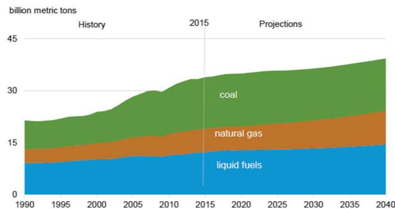  
Fig. 1 Energy related global  $\mathrm{CO}_{2}$  emissions in billion metric tons by fuel type (1990-2040).1

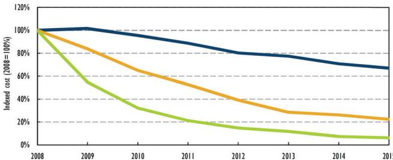  
Fig. 2 Dramatic cost reduction in utility scale solar PV and wind power (and Light Emitting Diodes-LEDs) between 2008 and 2015.7 Color legend: blue; onshore wind, orange; solar PV-utility scale, green; LED.

between the installed capacities for intermittent sources such as solar and wind, and the actual amounts of electricity they generated clearly highlights the urgent need for utility-scale storage technologies.

An added advantage for most renewables is their modular nature, which provides opportunities for distributed power generation on-location that will help reduce the economic and environmental impact of power transmission and distribution from centralized power plants. Also, major advances in wind and solar technologies brought about major reductions in the cost of electricity (COE) over the last several years. Fig. 2 indicates 5-fold reduction in the cost of solar, while wind has decreased by more than  $30\%$  between 2008 and 2015, and recently they have started to compete favorably with coal-fired power in some countries. In fact, several news outlets have recently reported that solar and wind is now at a turning point, and the cost for wind at nearly  $\$50$  per MW h now stands nearly one-half of the price of coal-fired power.8 Moreover, recent auctions of solar electricity contracts in India ( $64 per MW h) and Chile ($ 29.10 per MW h) have demonstrated unprecedentedly competitive prices.10 Large-scale energy storage technologies hold the bottleneck in this respect and their rapid development and deployment is critically important in order to realize a clean and sustainable energy future.

A recent International Energy Agency (IEA) report "World Energy Outlook 2016" (WEO 2016) concludes that the pledges made at the 2015 Paris agreement by 195 signatory nations – minus the recent exit by US – only slows down the growth curve for  $\mathrm{CO}_{2}$  emissions but will fail to limit the total emissions to

  
Fig. 3 Global  $\mathrm{CO}_{2}$  emissions under the Paris agreement pledges and the 450 scenario for decarbonization, where the latter assumes a  $50\%$  chance of limiting the total greenhouse gases to 450 ppmv  $\mathrm{CO}_{2\mathrm{equiv}}$ , and the global temperature rise to less than  $2^{\circ}\mathrm{C}$ . For this, the energy sector needs to achieve carbon-neutrality by 2100.

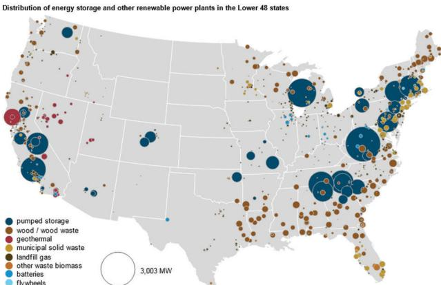  
Fig. 4 Geographical distribution of US energy storage capacities by size (i.e., by diameter of circles scaled to 3003 MW as shown in inset) and location. Also included is power generation by renewable sources other than solar, wind, and hydro. $^{12}$

450 ppmv  $\mathrm{CO}_{2}$  equivalents (so-called the 450 scenario). This is illustrated in Fig. 3. Indeed, the pledges by the signatory countries foresee  $37\%$  of power generation from renewables in 2040 (compared to  $23\%$  in 2016) and 150 million electric vehicles on the road by 2040 (compared to nearly 1.3 million today). WEO 2016 report also makes it clear that although the 2015 Paris agreement may indeed slow down the rise of greenhouse gas emissions, it falls far short of bending the emissions curve of Fig. 3 downward towards achieving carbon-neutrality (i.e., adding no net carbon to the atmosphere) by 2100.

To limit the global temperature rise to within  $2^{\circ}\mathrm{C}$  above preindustrial level by 2100, the WEO 2016 report posits that we need to achieve carbon-neutral energy by the end of this century, whereby renewables need to provide more than  $60\%$  of global power generation, and among other additional measures, 715 million electric vehicles need to be deployed on the road by 2040.

Achieving these ambitious targets pose major technological, political, social and financial challenges. As an example, even meeting the Paris Agreement pledges poses political challenges, as the recent departure by the US has demonstrated. Moreover, this report estimates that more than  $40 trillion in cumulative energy investments and an additional$ 35 trillion for improvements in energy efficiency will be required to realize the 450 scenario.[2]

Despite such major hurdles and challenges towards achieving carbon neutrality, however, one thing is quite clear. Renewable energy needs to be a major component of the roadmap towards decarbonizing the energy sector. Indeed, among the energy sources, renewables is expected to grow the fastest with an annual rate of nearly  $2.3\%$ , or from 2112.4 GW of installed capacity in 2016, to 3733.8 GW in 2040, and are expected to produce 10702.3 billion kW h or nearly  $31\%$  of world's electricity by 2040.[11] Although this increase is very significant, it should be noted that much of this will still be provided by hydroelectric power that constitutes the lion's share of renewables, but it is restricted geographically to water-rich parts of the globe, as illustrated in Fig. 4 for energy storage and renewable power generation in US from sources other than wind, solar, and hydro.[12]

# B. Introduction

Conventional power generation and distribution infrastructure currently employed globally demands a highly delicate, low error margin, and near-instantaneous balance between electricity supply and demand on the electrical grid system. To realize balance, thousands of turbines all over the world have to be brought online instantly or taken off in order to respond to the variability in electricity demand. Usually, most of these turbines stay idle majority of the time resulting in lost generation capacity. Also, the power generated during off-peak times by these plants is often wasted due to lack of proper storage capacity.

The basic premise of energy storage involves transforming one type of energy into another type that can, when needed, deliver back the stored energy in an efficient, cost-effective, and reliable manner. Similar to the wide diversity of power generation technologies, electrical energy storage technologies and systems show an equally rich diversity. Each offer a distinct set of advantages, but also disadvantages, challenges and shortcomings. As there is no single winning technology for power generation that can meet the wide range of requirements including environmental, cost, performance, availability, customer demand, portability, scalability, etc., there is also no silver bullet to address our impending needs for electrical energy storage. Hence, a multi-prong portfolio strategy is best suited to develop a multitude of storage technologies and systems. Each offers its own strengths and weaknesses, as well as distinctly different technical basis governing its operating principle.

The global excitement, momentum and vast investments in intermittent renewables to grow them as one of our primary sources for electricity production is critical to pave the way towards decorbonizing our currently fossil fuel-dependent energy economy, and in particular, electricity production. But the intermittent nature of many renewables is a major impediment to reliable electricity generation, and for their mass deployment globally. The distributed nature of renewables provides great advantage to help reduce the economic and environmental impact of power transmission from centralized power plants, as is the case currently. Renewables are also important for poor and underdeveloped parts of the world, where large populations still lack electricity and other forms of energy even for their daily chores. In that regard, renewables can help jump-start economic growth and greatly improve quality of life in many of these societies.

However, rapid and utility-scale deployment of intermittent sources such as solar, wind, tide and wave is largely contingent on the availability of cost effective, efficient and scalable energy storage technologies. In fact, electricity storage or lack thereof may well be the "ball-and-chain" for intermittent renewables to break free and achieve the deployment levels foreseen by mid century.[1,9] Indeed, Bloomberg Technology News reported on July 31, 2017 that Germany had to toss out  $4\%$  of wind energy in 2015 and China has discarded  $17\%$  of its renewable energy, while California had to give up 300 000 MW h of solar and wind power in the first half of 2017, all due to lack of sufficient electricity storage capacity.[13] Without commensurate and

Table 2 Global installed energy storage capacities operational in 2016 by type of storage technology. New storage projects under construction are expected to add another 13 GW of storage capacity by  $2018^{15}$  

<table><tr><td>Storage technology</td><td>Installed capacity (GW)</td><td>% Share</td></tr><tr><td>2016 World total</td><td>168.6</td><td>100</td></tr><tr><td>Pumped-hydro</td><td>162.2</td><td>96.2</td></tr><tr><td>Electrochemical</td><td>1.6</td><td>0.95</td></tr><tr><td>Thermal</td><td>3.2</td><td>1.9</td></tr><tr><td>Mechanical</td><td>1.6</td><td>0.95</td></tr><tr><td colspan="3">New projects under construction</td></tr><tr><td>2016</td><td>2</td><td></td></tr><tr><td>2017</td><td>5</td><td></td></tr><tr><td>2018</td><td>6</td><td></td></tr></table>

sufficient electrical storage capability, rapid buildup of solar and wind capacity can also be an undue financial burden. Case in point is California, which in the last decade has invested heavily in solar, not only was forced often to curtail solar power production due to power glut but also had to pay exorbitant prices, up to \(25 per MW h, to other states just to get them to take its excess power, i.e., called ‘negative pricing’.14

Investments in energy storage technologies and projects in the last decade have improved the inventory of global installed capacities. Currently, world's total installed storage capacity stands at about 169 GW (up from 132 GW in 2012), of which pumped-hydro storage provides more than  $96\%$  of the total capacity, with the remaining vested in mechanical, thermal and electrochemical storage technologies.[15] Installed storage capacities and their breakdown are summarized in Table 2, where new capacity additions for a total of 13 GW to be completed by 2018 are also presented. A 2016 report predicts that the global demand for electricity storage capacity will increase to 11.89-15.72 TW h in 2030 from 4.67 TW h in 2017 in order to double the share of renewable energy in the global mix.[16]

For renewable energy to achieve its bold target of being a primary energy source by mid century, grid-compatible electricity storage technologies need to satisfy key requirements including, high capacity, rapid charge/discharge rates, high energy density, long cycle life, stable operation and performance, reliability, cost-effectiveness, and easy scale-up. For utility-scale storage of electricity, grid parity is also a critical consideration.

Achieving grid reliability and compatibility, managing peak demand, and integration of intermittent renewable energy sources into the grid all require utility-scale electrical energy storage that delivers electricity where it is needed and when it is needed. Electrical energy storage also decouples electricity generation from the load, or electricity user, thus making it easier to regulate electricity supply and demand. Distributed electrical storage also offers important opportunities to build local grids, or microgrids, which greatly improve grid security, and hence, energy security.

However, the requirements for energy storage are widely varying and diverse, and driven primarily by the type of application. No single technology meets all the requirements and the metrics for large-scale grid quality storage. Each technology

may offer attributes and merits for certain applications, but not for others. Indeed in some markets, electrochemical technologies such as Na-S and Li-ion batteries have become commercially viable even though they do not satisfy all the required metrics. Considering a suitable combination of different storage systems may alleviate such shortcomings towards properly meeting the specific requirements of a particular application.

Furthermore, not all storage technologies are at the same level of development or maturity. A recent report by US Department of Energy indicated a breakdown of the groups of storage technologies either deployed or under development towards large-scale deployment.[17] Broadly, these technologies can be grouped under pumped-hydro, compressed air energy storage (CAES), a wide variety of batteries and other electrochemical systems, flywheels, and superconducting magnetic energy storage (SMES). The developmental status of storage technology groups is depicted in Fig. 5, which categorizes their maturity levels towards full commercialization and mass scale deployment.

In the US, pumped-hydro is the most dominant technology for grid storage, which constitutes nearly  $95\%$  of the grid storage capacity.[17] A variety of other technologies including batteries, compressed air, flywheel, and thermal storage are being developed and some have already been utilized for storage operations, albeit at scales considerably smaller than the capacities that are actually needed. For example, 1.5 GW of global installed storage capacity for  $2014^{18}$  depicted in Fig. 6 of different mechanical and electrochemical storage technologies makes up only a small fraction of more than 132 GW of global pumped-hydro storage capacity available in 2012. Despite major progress and effort, the cumulative share of electrochemical, thermal and mechanical storage capacities has remained below  $4\%$  of the total global storage capacity by 2016, where pumped-hydro provided the bulk capacity of nearly  $96\%$ . These numbers, however, still fall short of the combined storage needs for wind and solar (see Table 1).

While pumped-hydro is a mature and widely used technology for utility scale commercial storage where available, CAES, which relies on storing energy as compressed air in underground caverns and formations, is not as mature and fully developed

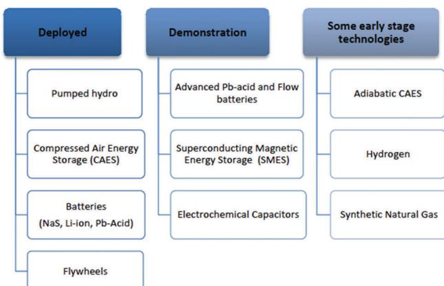  
Fig. 5 Developmental maturity of major electricity storage technologies towards large-scale deployment.[17]

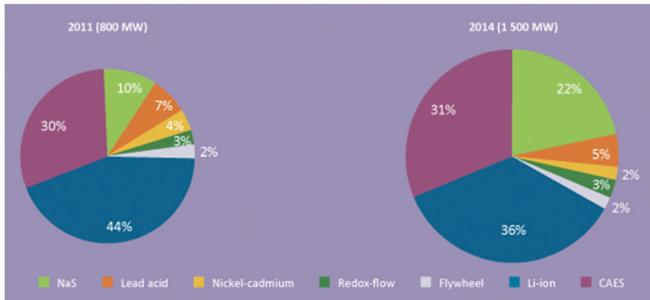  
Fig. 6 Comparative breakdown of global installed capacities based on electrochemical and mechanical storage technologies between 2011 and 2014 (CAES: compressed air energy storage).18

as pumped-hydro. However, both have very specific geographical requirements that render their use site-specific.

It is expected that basic research focused on prospective technologies may expand and improve their merits and lower some of the technical barriers to better meet the required metrics for storage. This is identified as one of the strategies by US Department of Energy to drive down the cost, as investments in improving the technology and large-scale deployment will help lower costs.[16] This is depicted in Fig. 7. However, cost alone does not guarantee success. Mass scale deployment of these grid-scale storage technologies also requires confidence buy-in from both the stakeholders and users such as utilities and customers as well as utility regulators for the safety, performance and reliability of these technologies.

A variety of electrical storage technologies and approaches can be organized into four general categories, namely, mechanical, chemical, electrochemical, and electrical. Many of these categories are reviewed in the next sections, and characteristic features for some of them are presented in Fig. 8, which shows the power ratings and typical discharge times of many of the electrochemical and mechanical electricity storage systems under development or in practical use.[19] They exhibit a wide range of discharge characteristics and power ratings. The discharge times and system sizes may be used as helpful tools to select

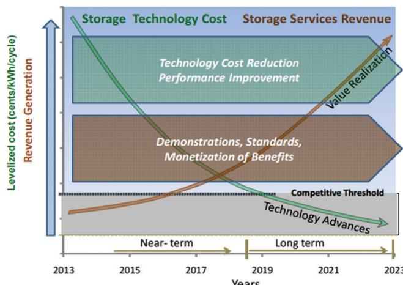  
Fig. 7 US DOE's expected cost reduction timeline with the evolution and market penetration of storage technologies. $^{17}$

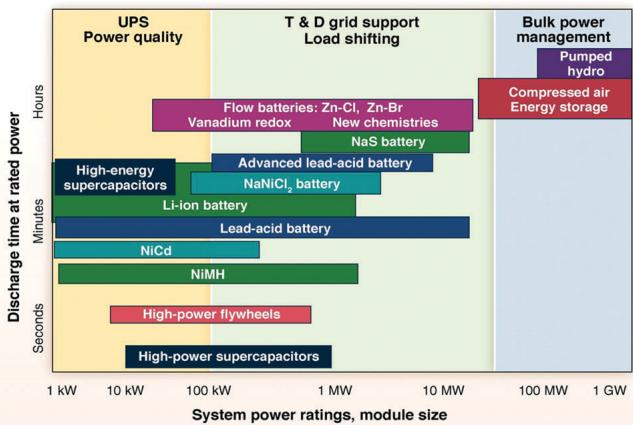  
Fig. 8 Comparison of power ratings and discharge time scales of various electrical energy storage systems. From ref. 19, B. Dunn, H. Kamath and J. M. Tarascon, Electrical energy storage for the grid: a battery of choices, Science, 2011, 334, 928-935. Reprinted with permission from AAAS.

suitable storage systems for a particular application. For example, grid management requires frequency regulation and load levelling, which usually demand short response times of the order of seconds that are suitable for flywheel and supercapacitor storage, while bulk power management may require longer response times of the order of hours where pumped-hydro and compressed air storage offer attractive opportunities.

However, the options for large-scale storage shown at the far right column in Fig. 8 are quite slim, and require augmentation of the storage portfolio by developing alternative technologies. Only pumped-hydro and CAES systems are commercially available for bulk storage at utility scale. The maturity levels of more advanced technologies, such as electrochemical storage, are still under active development and further require demonstration and deployment at utility scale. Moreover, the utility industry, which relies on low cost, scalability, and reliability, is typically averse to risk-taking. So they are understandably skeptical about many of these technologies due to cost, scale-up issues, and lack of track record on safe and reliable operation for prolonged use at industrial scale.

There have been excellent reviews of electrical energy storage technologies and materials in the literature. Some of the more recent ones are given in ref. 19 and 21-28. The interested reader is encouraged to seek these papers to gain full appreciation of the wide scientific footprint of energy storage and to expand the scope into more specialized areas. In large part, these review articles focus primarily on a single or select few storage technologies, such as electrochemical energy storage, or a sub-division, such as Li-ion batteries.

Instead, this article distinguishes itself by taking a broad brush and presenting an in-depth review of a wide spectrum of electrical energy storage technologies, materials and systems with an eye for large-scale electrical grid storage. The article provides a comprehensive discussion of the status of four major classes of electricity storage technologies including electrochemical, chemical, mechanical, and thermal storage systems covering a wide range of options from pumped-hydro and

flywheels, to hydrogen and ammonia, to supercapacitors, batteries, regenerative fuel cells, to flow batteries, and phase change materials storage. Where appropriate, the article also offers tutorial information for the interested reader to gain better insight and appreciation of the fundamental considerations and challenges in electrical energy storage. It is hoped that this review will be of interest and benefit to the uninitiated as well as active researchers and engineers engaged in electrical energy storage technologies.

# C. Fundamentals of energy storage

The first law of thermodynamics (or, the law of conservation of energy) states that in a closed system, the total energy is fixed and energy can neither be created nor destroyed. It can only be converted from one form to another. This fundamental concept serves as the foundation of nearly all forms of energy conversion and storage. Accordingly, most storage technologies fall into four generalized categories, namely, mechanical energy storage, chemical energy storage, electrochemical energy storage, and electrical energy storage.

The maximum amount of electrical work that can be extracted from a storage system is given by,

$$
G = H - T S \tag {1}
$$

here,  $G$  is Gibbs free energy,  $H$  is enthalpy,  $T$  is temperature, and  $S$  is entropy. In other words,  $G$  represents the maximum energy available to do either mechanical or electrical work.

Mechanical energy storage, such as pumped-hydro, manifests itself by potential,  $E_{\mathrm{pot}}$ , and/or kinetic,  $E_{\mathrm{kin}}$ , energies that can be represented by,

$$
E _ {\text {p o t}} = f d \tag {2}
$$

$$
E _ {\text {k i n}} = (1 / 2) m v ^ {2} \tag {3}
$$

here,  $f$  denotes force,  $d$  is distance,  $m$  is mass, and  $\nu$  denotes velocity. For a rotating body such as a flywheel or a wind turbine, the kinetic energy is described in a similar expression by,

$$
E _ {\text {k i n}} = (1 / 2) I \omega^ {2} \tag {4}
$$

where,  $I$  denotes the moment of inertia and  $\omega$  is angular velocity of rotating system. In other words, stored energy increases with the system's inertia and the square of it's angular velocity. The moment of inertia for a body of mass  $m$ , radius  $r$ , length  $l$  and density  $\rho$  can be given by

$$
I = (1 / 2) m r ^ {2}, \text {o r} = (1 / 2) \rho l \pi r ^ {4} \tag {5}
$$

Accordingly, high-density materials with large radius help store more energy. For mechanical energy storage in flywheels, eqn (5) can also be expressed as,

$$
E _ {\text {k i n}} = \sigma_ {\mathrm {m}} s / \rho \tag {6}
$$

here,  $\sigma_{\mathrm{m}}$  denotes maximum stress,  $s$  is a shape factor, and  $\rho$  is materials density. For modern flywheels made from reinforced high strength carbon fibers, it is possible to achieve storage capacities greater than  $200\mathrm{kJ}$  per kilogram of flywheel mass.

Compressed air storage in salt caverns or underground aquifers relies on the gas law  $(PV = nRT)$ , and the available work,  $w$ , is given by  $P\mathrm{d}V$  integrated over the incremental volume change,  $\mathrm{d}V$ .

Thermal storage relies on the amount of heat,  $q$ , one can store in a medium or material of defined volume,  $V$ , materials density,  $\rho$ , and specific heat,  $C_{\mathrm{p}}$ , resulting a temperature rise of  $\Delta T$ . This can be expressed by,

$$
q = \rho C _ {\mathrm {p}} V \Delta T \tag {7}
$$

In the case that the thermal energy storage medium or material undergoes a phase transformation during this process, the latent heat associated with this transformation should also be accounted for in the total energy stored.

Chemical storage relies on storing energy in the chemical bonds of fuels, which are inherently strong and thus provide high energy densities. However, one needs to use usually electrical or thermal energy to produce the fuels for chemical storage. The governing equation for the maximum work out of chemical storage is given by eqn (1) above.

Electrochemical storage systems are based on charge storage at the electrodes in the case of batteries, or at the electrochemical interface in the case of electrochemical capacitors or supercapacitors, or in the chemical bonds of fuels as in fuel cells. As the theoretical efficiency for electrochemical energy conversion is defined by the ratio of  $(\Delta G / \Delta H)$ , electrochemical energy storage offers inherently high efficiencies.

Finally, electrical and magnetic energy storage can also be realized. Examples include dielectric-based capacitors, magnetic materials, and superconducting magnets. However, these types of energy storage approaches lie outside the scope of this article, and are not covered here.

# D. Electrochemical energy storage systems and materials

The underlying operating principle for electrochemical and photoelectrochemical devices involves three major process steps, namely, separation (or, ionization) of charge, transport of charged species, and recombining of charge. This basic principle governs the operation of a wide range of devices including batteries, fuel cells, supercapacitors, electrolytic capacitors, photoelectrochemical and photovoltaic devices. Their operating principles, however, involve different mechanisms where interfaces play a critical role. For example, while batteries store charge within the electrodes, in the case of fuel cells and flow batteries charge is stored in the fuel, which is fed externally on to the surface of the electrodes. Supercapacitors, on the other hand, store charge either in the electric double layer at the electrode/ electrolyte interface, or as pseudocapacitance governed by surface redox reactions. Some of these electrochemical devices such as PEMFC, supercapacitors and batteries operate at room or ambient temperature, while others require elevated temperatures, e.g., sodium-sulfur batteries or molten carbonate and solid oxide fuel cells. In other words, materials requirements

for each electrochemical storage system are different, and many have been reviewed in detail elsewhere. $^{19,20,29-35}$  Furthermore, the fundamentals and operating principles of batteries, fuel cells and supercapacitors have been presented as a tutorial in a recent review article. $^{36}$

The fundamental concept behind electrochemical energy storage is the reciprocity between converting the chemical energy stored in the bonds of fuels into electrical energy, and expending electrical energy to synthesize chemicals or fuels by operating in the reverse direction. The driving force for this conversion is the Gibbs free energy change,  $\Delta G$ , of the electrically neutral species at the electrodes participating in the chemical reaction,

$$
\mathrm {A} + \mathrm {B} = \mathrm {C} \quad \Delta G (\mathrm {k J} \text {m o l e} ^ {- 1}) \tag {8}
$$

This free energy change is the same if the reactants A and B were to undergo purely a chemical reaction as in eqn (8), or an electrochemical reaction where the reaction involves the transport of ions and electrons across the cell. As these species are electrically charged, the electrostatic energy transported across by a mole of such species is given by  $zEF$ , where  $F$  is Faraday's constant,  $z$  is the charge number of the transporting species, and  $E$  is the cell voltage. Under open circuit conditions, the cell voltage is related to the Gibbs free energy change by,

$$
\Delta G = - z E F \tag {9}
$$

In other words, the chemical potential difference between neutral species at the electrodes defines the underlying force driving an electrochemical cell via a chemical reaction among electrically neutral reactants, A and B, to form an electrically neutral product, C.

For electrochemical storage, the systems require basic components that have critically important roles to achieve this, namely, two specialized bodies of electrodes separated by an ionically conducting but electronically insulating "electrolyte". The electrodes are preferably chosen from abundant and cost-effective materials that exhibit good electronic conductivity, good stability, and high catalytic activity. Some applications require that the electrode material also exhibit mixed ionic electronic conductivity, where both ionic and electronic defects are mobile.

The electrode where the reduction reaction takes place is called the cathode, and where the oxidation reaction takes place is called the anode. An electrochemical energy storage and conversion system, be it a battery, a fuel cell, or an electrochemical capacitor, can schematically be illustrated in Fig. 9, which shows storage of electrical energy in the form of chemical energy, and conversion of chemical energy for reaction (8) back into electrical energy that can be supplied to the grid to perform useful electrical work. Fig. 9(a) represents an electrolysis cell to produce fuel B using external power (i.e., storage mode), while Fig. 9(b) depicts a fuel cell that employs fuel B and oxidant A to generate electricity (i.e., power production mode). Electrolysis cells exclusively operate for the purpose of electricity storage in the form of chemical energy in fuels, while regenerative solid oxide fuel cells offer the opportunity to operate in a bi-directional

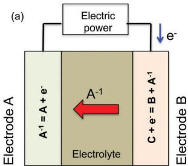  
Fig. 9 Basic operating principle of electrochemical energy storage, illustrating (a) electrical energy to chemical energy conversion, and (b) chemical energy back to electrical conversion for reaction  $A + B = C$ .

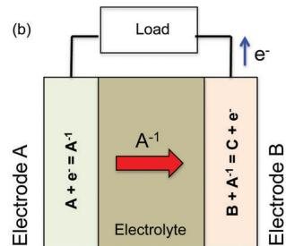

manner (electricity to chemicals fuels, and chemical fuels back to electricity in the same fuel cell).

It should be noted that in the case of batteries, electrolytic capacitors and supercapacitors, specific energy and specific power are intimately coupled to each other by the battery chemistry and choice of battery materials. However, in fuel cells and flow batteries the energy density dictated by the choice of fuel is decoupled from power, which is dictated by the kinetic and transport properties of cell components. Such decoupling provides important advantages for many applications. Also important are the volumetric energy and power densities of electrical storage systems. Volume is especially important for transportation, space and mobile applications. Interestingly, there is an ongoing debate whether Li-ion batteries or fuel cells will eventually dominate mobile applications and in particular, which one will power the transportation sector.[37]

# D.1. Batteries

One of the most notable technological achievements of electrochemistry in recent years is the successful commercialization of Li-ion batteries that had a profound impact on the widespread use and deployment of portable electronic devices, and more recently, on transportation and stationary storage at the  $100 - 200\mathrm{kW}$  scale. In more general terms however, batteries, the first electrochemical device (i.e., the Volta pile) built more than two centuries ago, have been commercially available for more than a century. They are efficient devices to store electrical energy, and hence used extensively for a wide range of applications including transportation, portable, mobile, as well as stationary back up power. Types of commercial battery systems available today or under development employ a diverse range of battery materials[23] and chemistries both organic[38] and inorganic[21,33] in nature. Operationally, all battery systems can be grouped under primary (i.e., non-rechargeable) and secondary (or, rechargeable) batteries. Primary batteries fall outside the scope of this review article, as these are in general not suitable for storage purposes.

Comparative operational characteristics of batteries are typically represented by Ragone diagrams. This is illustrated in Fig. 10, where specific power is plotted against specific energy for major rechargeable battery systems that compare various classes of batteries to those based on lithium chemistry.[31,39-42] Superior properties of Li-based batteries to other alternative

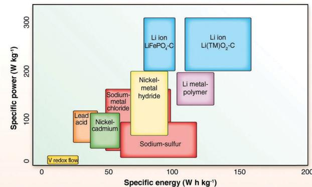  
Fig. 10 Ragone diagram of specific energy versus specific power for major rechargeable battery systems From ref. 19, B. Dunn, H. Kamath and J. M. Tarascon, Electrical energy storage for the grid: a battery of choices, Science, 2011, 334, 928-935. Reprinted with permission from AAAS.

chemistries presented in Fig. 10 make it easy to understand the enormous academic and commercial interest in this system.

Batteries in general offer desirable solutions for cost-effective and compact storage, pollution-free operation with no moving parts, high overall efficiency, sufficient cycle life, considerable shelf and service life. They provide opportunities for distributed storage, as well as storage and frequency regulation from intermittent renewable sources. Several battery systems including redox flow batteries, alkali metal ion-based batteries, sodium sulfur batteries are under consideration and further development for utility scale storage purposes ultimately for the 'smart grid'.[19,32] Unfortunately, many of these systems are still too expensive for commercial deployment for large-scale storage applications, and require not only cost reductions but also major improvements on performance, reliability, and materials availability and stability.[33,34] However, their growing market penetration is expected to lower battery prices.

All batteries provide the convenience and portability of delivering stored chemical energy in the form of electrical energy at the point of use, with high conversion efficiency and without harmful emissions to the environment. The amount of stored electrical energy and the rate at which the energy can be extracted from a battery is indicated by its specific energy and specific power, respectively, and is a function of the cell voltage (V) and capacity  $(\mathrm{A} \cdot \mathrm{kg}^{-1})$  of a battery. These parameters are directly governed by the thermodynamic and kinetic constraints imposed by the battery's chemistry and choice of materials for battery components. In other words, the amount of the electroactive species that can be stored in the electrode materials dictate the energy storage capacity of the battery, while the rates of interfacial charge transfer reactions and mass transport through the battery components govern its output power. It should be noted here that some of these concepts are in direct competition in terms of battery life and safety. As high storage capacity is related to cell potential, there has been a strong desire to develop electrode materials that yield a high cell potential. But this comes at the expense of battery safety, as high cell potentials are related to high activity that in turn facilitates reaction with the electrolyte and can lead to thermal runaway and fires.

This is particularly true in the case of Li-ion batteries employing organic electrolytes.

The driving force for improving the properties of batteries and battery materials is to achieve low cost, rechargeability, high voltage, safety, and fast charge/discharge capability. The desired battery system not only should exhibit high energy density (i.e., specific energy) but also has high power density (i.e., specific power). Compared to others, Li-Based storage systems clearly offer higher specific power and higher specific energy than others as indicated in Fig. 10. $^{19,43,44}$  However, not all applications require high energy density simultaneously with high power density. This interplay may provide opportunities for other battery systems to offer suitable solutions for specific storage applications.

Among the systems shown in Fig. 10, Li-based battery systems have deservedly attracted the biggest commercial and research interest with excellent review articles reporting on the advances and challenges.[21,31,39,43,45-48] Li-Based batteries currently dominate nearly  $2/3$ rd of the global battery market due to their high energy density, portability, acceptable cycle life, and their compact size that provides flexibility in product design, especially for portable electronics and communication devices.

D.1.1. Li-ion batteries (LIB). As the energy density of a battery is directly related to its working potential, or, voltage, while its power is proportional to the square of its voltage, the search for better systems and materials has often been driven by high voltage considerations. In this regard, battery systems based on Li are attractive because Li is the most electropositive element  $(\mathrm{Li} / \mathrm{Li}^{+}$  redox potential  $= -3.04\mathrm{V}$  vs. SHE) in the periodic table and the lightest metal  $(6.94\mathrm{g mol}^{-1})$ , thus offering a high energy density. Indeed, the theoretical energy density of Li-ion batteries is about  $380\mathrm{W h kg}^{-1}$ , with commercially available Li-ion based rechargeable batteries providing  $150 - 210\mathrm{W h kg}^{-1}$ . The power densities vary in the range  $500 - 2000\mathrm{W kg}^{-1}$ , with efficiencies around  $90\%$ . As the  $\mathrm{Li^{+}}$  ion also has a small ionic radius  $(90~\mathrm{pm})$ , it allows fast diffusion rates through the electrode material, offering fast charge-discharge rates. Because of these practically attractive properties, Li-based battery systems have gained strong attention in research and development as well as commercial activity. Indeed, Sony Corporation was the first to introduce the Li-ion batteries based on intercalation chemistry into the market in 1991. These commercial Li-ion batteries typically contain a graphite anode (the negative electrode), a lithium metal oxide  $(\mathrm{LiMO_2})$ , where M is Co and/or Ni cathode (positive electrode), and a  $\mathrm{Li^{+}}$  ion conducting electrolyte consisting of an organic solvent, typically ethylene carbonate, dimethyl carbonate, and their mixture, in which a soluble lithium salt such as lithium hexafluorophosphate  $(\mathrm{LiPF_6})$  is dissolved. The corresponding cell reaction provides a cell potential of around  $3.7\mathrm{V}$  and is given by,

$$
y \mathrm {C} + \operatorname {L i M O} _ {2} = \operatorname {L i} _ {x} \mathrm {C} _ {y} + \operatorname {L i} _ {(1 - x)} \mathrm {M O} _ {2} \tag {10}
$$

here, the typical values of  $x$  and  $y$  are 0.5 and 6, respectively. The reaction involves the insertion (i.e., lithiation) and extraction (i.e., delithiation) of lithium ions between the two electrodes,

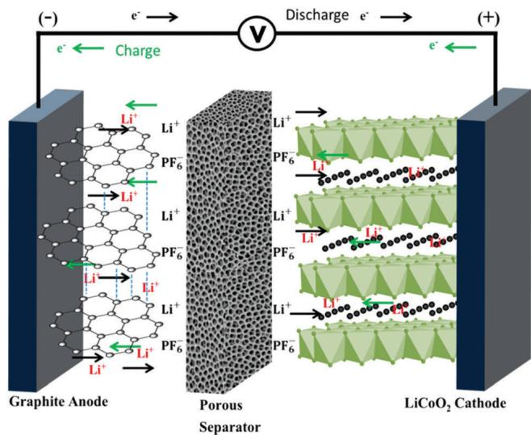  
Fig. 11 Schematic illustrating the operating principle of the first commercial Li-ion battery, where the  $\mathrm{Li^{+}}$  is intercalated (and, deintercalated) in the layered structures of the graphite negative electrode and the  $\mathrm{LiCoO_2}$  positive electrode.[21] Reprinted with permission from (K. M. Abraham, Prospects and limits of energy storage in batteries, J. Phys. Chem. Lett., 2015, 6, 830-844). Copyright (2018) American Chemical Society.

while the electrons flow through the external circuit performing useful electrical work.

Both the  $\mathrm{C_6Li}$  anode and the  $\mathrm{LiCoO_2}$  cathode materials have layered crystal structures so involve the intercalation (or, lithiation) and deintercalation (delithiation) of  $\mathrm{Li^{+}}$  ions in between the structural layers of the anode and cathode materials. Battery operating principle and the charge and discharge cycles via transport through the electrolyte are depicted in Fig. 11. During the charging process, lithium is extracted from the positive electrode, whose working potential is higher than  $2\mathrm{V}$  vs.  $\mathrm{Li^{+} / Li}$ , and intercalated into the graphite anode, whose working potential is lower than  $3\mathrm{V}$  vs.  $\mathrm{Li^{+} / Li}$ . As Li is shuttled between the two electrodes, these rechargeable cells are sometimes referred to as "rocking-chair" batteries.[49]

There have been excellent reviews of Li-based batteries and systems discussing the chemistry and electrochemistry, materials properties as well as the search for better electrode materials, performance and safety issues, and economics for large-scale storage applications.[19,39,47,48,50-53] Most Li-batteries that are commercially available employ nonaqueous electrolytes,[54] although other types of electrolytes including ionic liquids,[55,56] polymers,[57,58] ceramics,[59] and even aqueous electrolytes[60,61] have also been investigated. Much progress has been achieved in Li-battery technology in the last decades. The capacity of the first commercial Li-ion batteries, i.e., the 18650 cell, was about  $900\mathrm{mA}$  h, while the same size Li-batteries today deliver a much higher practical capacity of  $2600\mathrm{mA}$  h.

D.1.1.1. Negative electrode materials. Although most commercial Li-ion batteries employ a graphite anode, which has a layered structure, the candidate materials under development for the negative electrode also include elemental Li, Li-alloys, or a nanostructured host material such Si-nanowire.[61,62] Each offers its own set of merits and challenges.

Elemental lithium is the ideal desired anode material as Li is the most electropositive element in the periodic table and has an exceptionally high specific capacity of  $3860\mathrm{mA}\mathrm{h}\mathrm{g}^{-1}$ . Unfortunately, elemental Li is quite reactive and the chemical stability of the battery electrolyte against Li poses serious concerns regarding safety, reliability and durability.[64] Also, the exothermic reactions between the Li anode and the battery electrolytes may lead to overheating and "thermal runaway". More importantly, elemental Li anodes tend to grow dendrites during charge-discharge cycling due to the nonuniformity of the Li deposition process that tend to occur at preferential sites. The dendrites eventually penetrate through the electrolyte towards the cathode and may cause electrical shorting and other serious hazard problems, even explosion.

Several approaches have been pursued to reduce the driving force for chemical reactivity and dendrite growth. One is based on the thermodynamic concept of lowering the activity of Li, and hence decreasing its propensity to react and also to grow dendrites, by alloying it with other metals including aluminum,[65] antimony,[66] bismuth,[67] and especially those that alloy with lithium at low potentials such as silicon,[68,69] and tin.[70,71] Interestingly, the first rechargeable Li-battery was developed in 1970's by Exxon and employed a LiAl alloy negative electrode and a  $\mathrm{TiS}_2$  cathode.[72]

Recent attention on other remedial strategies such as alloying or conversion chemistries has provided promising results. For example, Si-based alloy anodes provide a theoretical charging capacity around  $4000\mathrm{mA}$  h  $\mathrm{g}^{-1}$ , and volumetric energy densities in the range 700-972 W h  $\mathrm{L}^{-1}$ , which are 1.5-1.8 times higher than for commercial cells, have already been demonstrated.[73] These and other electrode chemistries are reviewed elsewhere.[43] Although Si exhibits one of the highest capacities among others, its molar volume change during cycling can be as high as  $400\%$  depending on the microstructure, which of course can lead to rapid cell degradation and loss of capacity and performance.

It was reported that employing Si nanowires,[69,74] and nanosize Sn anodes[71] improved mechanical durability and cycle life. Indeed, to mitigate problems associated with dendrites and improve cell performance, micro- and nanostructured negative electrodes have been widely explored and reviewed elsewhere.[75-79] However, a key challenge with nanostructured electrodes is to maintain mechanical integrity and electronic connectivity. A recent study employed electronically conducting polymer (PFFOMB) as a binder to both stabilize the Si nanoparticles mechanically and to serve as a current collector, which boost up the performance at 1C rate to  $2050\mathrm{mA}$  h g $^{-1}$  for Si and  $1360\mathrm{mA}$  h g $^{-1}$  of the electrode.[80]

Lithium alloy anodes are essentially mixed ionic-electronic conductors of both electrons and  $\mathrm{Li^{+}}$  ions. This is a desirable property for reversible electrodes. Many of these alloys also offer fast ionic transport for  $\mathrm{Li^{+}}$  chemical diffusion in the alloy reaching values up to  $2\times 10^{-3}\mathrm{cm}^2\mathrm{s}^{-1}$  as reported earlier for  $\mathrm{Li}_3\mathrm{Sb}$  at  $360^{\circ}\mathrm{C}$ . [67] Alloying especially with tin or silicon also helps increase the anode capacity greatly. In fact, the theoretical specific capacities for Sn and Si are  $994\mathrm{mA}$  h g-Sn [1] and

$4200\mathrm{mA}$  h g-Si $^{-1}$ , respectively. The latter figure is about an order of magnitude higher than that for graphite  $(372\mathrm{mA}$  h g-C $^{-1}$ ). Lithium forms several alloy phases with Si and the highest Li content is reported for the  $\mathrm{Li}_{22}\mathrm{Si}_5$  phase. $^{63,68}$  In other words,  $4.4\mathrm{Li}^{+}$ ions can be inserted for every Si atom. This is a substantial increase in anode capacity when compared to the  $\mathrm{C_6Li}$  stoichiometry for graphite-host anodes, which allow only  $0.167\mathrm{Li}^{+}$ ions for every C atom. However, this advantage comes at the cost of significantly increased volume expansion ( $\sim 400\%$  for Si) during  $\mathrm{Li}^{+}$ insertion or lithiation of the Sn and Si anodes, which upon cycling eventually leads to mechanical breakdown and fracturing or pulverization of the anode structure. Using nanostructured anodes such as nanotubes instead of bulk Sn or Si greatly mitigates this problem and allows significant increase in charge-discharge cycle life. $^{69,77}$  Besides nanostructuring, studies that pursue the holly grail of using elemental Li as the anode material have also employed interface engineering. For example, coating the Li anode with a monolayer of interconnected carbon nanospheres helped avoid dendrite formation up to a practically significant current density of  $1\mathrm{mA}\mathrm{cm}^{-2}$  and maintained  $99\%$  coulombic efficiency for more than 150 cycles. $^{81}$  Also, a thin oxide layer on the Si nanostructure is shown to help improve the mechanical integrity of the anode. $^{82}$

Although much attention is given to achieving high gravimetric capacity and long cycle life, for most battery applications, volumetric capacity is equally important, and poses one of the barriers for practical implementation of Si-based anode hosts for Li-ion batteries. Intentionally designed void spacing allowed among the nanostructured Si anode architectural features to accommodate for the large volume change during cycling adversely impacts the volumetric capacity. Depositing SiC-free multilayer (2-10) graphene on the Si anode surface resulted in a 2D layered architecture and provided volumetric energy density of  $972\mathrm{WhL}^{-1}$  in the first cycle and  $700\mathrm{WhL}^{-1}$  at the 200th cycle.[73] These numbers represent 1.8 to 1.5 times higher values than the volumetric energy densities of currently available commercial Li-ion batteries.

Another strategy commonly practiced is to reduce the propensity for lithium dendrite growth by intercalating  $\mathrm{Li^{+}}$  ions into a suitable host structure, such as in between the graphitic sheets of a typically disordered "soft" carbon anode, as depicted in Fig. 11. Carbon exhibits a slightly less negative potential than Li (i.e., nominally  $100\mathrm{mV}$  vs.  $\mathrm{Li} / \mathrm{Li}^{+}$ ). It also has a volumetric capacity of about  $800\mathrm{mA}\mathrm{h}\mathrm{ml}^{-1}$  and hence takes up  $\sim 50\%$  of the volume of commercial Li-batteries.[77] As lithium in the carbon host structure is always in ionic form, rather than in metallic form, this provides some advantage against dendrite formation and related safety and electrolyte stability issues. However, the proximity of the carbon potential to that of Li does not entirely eliminate the possibility of dendrite formation and Li plating during charging. Chemical and physical properties of carbons and carbon nanostructures as negative electrode hosts for Li-ion batteries have been reviewed elsewhere.[78,79,83]

D.1.1.2. Positive electrode materials. Most of the strategies that aim to minimize or overcome the stability and dendrite

growth problems give rise to an increase in the potential of the negative electrode with respect to Li and correspondingly cause a reduction in the net cell voltage. In order to compensate for this voltage loss, cathode materials that exhibit high half-cell potentials and high capacities for insertion or intercalation have been the subject of intense research. Accordingly, more recent developments focused on the positive electrode, which is considered as the critical component of the battery that impacts its performance the most. $^{43,45-48}$

Many oxide systems have been investigated for prospective cathode materials over the last four decades, but most of them can be grouped into three different crystal structures, namely layered, spinel and olivine structures. The layered and spinel structure cathodes have the general formulas  $\mathrm{LiMO}_2$  ( $\mathbf{M} = \mathrm{Co}$ , Ni, Mn) and  $\mathrm{LiM}_2\mathrm{O}_4$  ( $\mathbf{M} = \mathbf{Mn}$ , Ni), respectively. These materials are good conductors for  $\mathrm{Li^{+}}$  ions, and also have sufficient electronic conductivity due to the electronic transitions between the oxidation states of the multi-valent transition metal cations present in the structure. Furthermore, their electronic conductivities can be improved by appropriate doping.[84] For example, partial substitution of  $\mathrm{Mg}^{2+}$  on the  $\mathrm{Co}^{3+}$ -site that is compensated by the creation of electron holes in  $\mathrm{LiCoO}_2$  and improve the room temperature electronic conductivity by nearly two orders of magnitude to  $0.5\mathrm{Scm}^{-1}$ .[85] Similarly, the conductivity of the electronically insulating ( $< 10^{-13}\mathrm{Scm}^{-1}$ ) spinel  $\mathrm{Li}_4\mathrm{Ti}_5\mathrm{O}_{12}$  can be improved many orders of magnitude to  $10^{-2}\mathrm{Scm}^{-1}$  by  $\mathrm{Mg}^{2+}$  doping on the  $\mathrm{Li^{+}}$  site that is compensated by the reduction of  $\mathrm{Ti}^{4+}$  to  $\mathrm{Ti}^{3+}$ .[86] Accordingly, such advances enabled the use of these structures suitable for cathode materials.

Indeed, the first commercial Li-ion battery employed the layered structure oxide  $\mathrm{LiCoO}_2$  as the positive electrode.43 However,  $\mathrm{LiCoO}_2$  has an inherently low capacity of about  $130\mathrm{mA}\mathrm{h}\mathrm{g}^{-1}$ . It is also expensive and poses safety problems due to the toxicity of cobalt, which makes up only 20 ppm of the Earth's crust. Better safety, higher capacity, more abundant and lower cost cathode materials are needed for consumer electronics and energy storage applications.

In this regard, olivine structure  $\mathrm{LiMPO_4}$  where M is a transition metal such Fe offers lower cost, long cycle life, and safety. From a safety point of view, the strong P-O covalent bond in the structure prevents the release of oxygen that can react with the electrolyte and initiate a thermal runaway. The strong P-O bond also reduces the covalency of the Fe-O bond and improves Li intercalation as well as cell voltage (3.5 V vs. Li). Moreover, Fe is cheap and non-toxic, and offers a gravimetric capacity of  $170\mathrm{mA}\mathrm{h}\mathrm{g}^{-1}$ . There has been a flurry of studies on olivine phosphates since the early results of electrochemical activity with a capacity of  $100 - 110\mathrm{mA}\mathrm{h}\mathrm{g}^{-1}$  reported for  $\mathrm{LiFePO_4}$ . However, the olivine structure  $\mathrm{LiFePO_4}$  is electronically insulating  $(10^{-10} - 10^{-9}\mathrm{Scm}^{-1})$ , and the Li extraction is accompanied by  $\mathrm{Fe^{2 + }}$  transition to  $\mathrm{Fe^{3 + }}$ , which results in two separate phases, namely  $\mathrm{LiFePO_4}$  and  $\mathrm{FePO_4}$ , which are both poor electronic conductors. To overcome this difficulty, use of fine size  $\mathrm{LiFePO_4}$  particles or mixing it with an electronic conductor such as carbon has become necessary for cathode fabrication.

Indeed, the rates of Li insertion and extraction reactions were improved in subsequent studies by incorporating carbon-based conductive additives $^{88}$  and redox mediators. $^{89}$  Remarkably, it was shown that a small  $(0.5\%)$  of  $\mathrm{Nb}^{5+}$  doping  $(\mathrm{Li}_{1-x}\mathrm{M}_x^{2+}\mathrm{FePO}_4)$  helps increase the electronic conductivity by eight orders of magnitude. $^{90}$  Introducing disorder in the Li-sublattice by nanosizing and nanostructuring, $^{23}$  also improves reaction rates and battery performance. A recent study concluded that the desired size of battery-grade  $\mathrm{LiFePO_4}$  particles should be  $< 200~\mathrm{nm}$ . Indeed, nanosized  $\mathrm{LiFePO_4}$  based Li-ion batteries have recently gained practical interest and commercialized originally by the US company A123 for portable applications.

The effect of doping  $\mathrm{LiMPO_4}$  on the M and/or P sites as well as the properties of other prospective materials for positive electrodes including dichalcogenides, manganese oxide spinels, and silicates are extensively reviewed elsewhere.[45,47,48,91,92] The cell potentials and storage capacities of various positive electrode materials of different crystal structures versus the graphite anode are presented in Fig. 12, where the voltage stability regime of the  $1\mathrm{M}$ $\mathrm{LiPF_6}$ /ethylene carbonate electrolyte is also indicated. For many of these materials, however, the useable energy density of the Li-ion battery is much smaller than the theoretically expected value. For example, in the case of electric vehicles the practically achievable energy density is approximately  $25\%$  of theoretical expected value for the active cathode material.[93] Unrealized differences between the theoretical storage capabilities and the actually achieved values are presented in Table 3 for various commercially available Li-ion cells. This gap is partly due to the dead weight of the inactive battery components. But part of this unused capacity is related to the structural properties of the cathode and the structural transformations the cathode undergoes during the lithiation and delithiation reactions

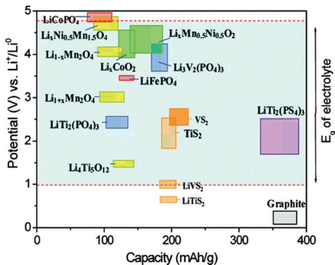  
Fig. 12 Comparative relation between capacity and cell potential of Li-ion batteries with various positive electrode materials (cathodes) versus the graphite anode with respect to the stability window (red dotted line) of the electrolyte (1 M  $\mathrm{LiPF}_6$  dissolved in 1:1 mixture of ethylene carbonate: diethylene carbonate).48 Reprinted with permission from (J. B. Goodenough and Y. Kim, Challenges for rechargeable Li batteries, Chem. Mater., 2010, 22, 587–603). Copyright (2018) American Chemical Society.

during battery operation. $^{94}$  Such low utilization of the inherent capacities depicted in the table highlights the need to greatly improve the reversibility of the lithiation and delithiation reactions at the electrodes.

For large-scale energy storage, or power applications such as electric vehicles much higher capacities and energy densities, with lower cost and better safety than offered by today's Li-ion batteries are desired. Many believe that about  $\sim 300\mathrm{mA}\mathrm{h}\mathrm{g}^{-1}$  may approach the upper limit of the capacity for intercalation chemistry[50] due to constraints posed by the crystal structure and the limited transitions allowed in the oxidation state of the transition metal in these layered structures. A more recent review article agrees with this general assessment and estimates the ultimate limit for intercalation chemistry for Li-batteries may be  $0.5\mathrm{kW}\mathrm{h}\mathrm{kg}^{-1}$  and  $1.5\mathrm{W}\mathrm{h}\mathrm{L}^{-1}$  for full cell configurations.[46] Therefore, intercalation chemistry most likely may not provide the roadmap to achieve much higher energy densities and capacities at lower cost with improved safety.

The search for improving the specific capacity of Li-ion batteries by utilizing all the accessible oxidation states of the electrode materials has lead to the concept of using conversion reactions, represented generally by the reaction,

$$
\mathrm {M} _ {x} \mathrm {X} _ {y} + n y \mathrm {L i} = y \mathrm {L i} _ {n} \mathrm {X} + x \mathrm {M} \tag {11}
$$

here, M is a 3-d transition metal such as Co, Fe, Mn, Cu, and X is N, O, S, F. Indeed, nano-sized transition metal oxide based positive electrodes for Li-ion batteries gave electrochemical capacities up to  $700\mathrm{mA}\mathrm{h}\mathrm{g}^{-1}$  with good cycling capability retaining nearly  $100\%$  up to 100 cycles.[95] Similarly, transition metal fluorides, and in particular  $\mathrm{FeF}_3$ , which offer high operating voltages due their highly ionic character, and large theoretical capacities (e.g.,  $712\mathrm{mA}\mathrm{h}\mathrm{g}^{-1}$  for  $\mathrm{FeF}_3$ ) gained much attention for positive electrodes.[96,97] However, metal fluorides are electronically insulating materials, thus unsuitable for use as electrodes. But carbon composites of  $\mathrm{FeF}_3$  overcame this problem and gave encouraging results, where reversible capacity as high as  $600\mathrm{mA}\mathrm{h}\mathrm{g}^{-1}$  of the composite was reported.[96,98] The reactions at the positive electrode were proposed[96,98] to proceed by the two-step sequence,

$$
\mathrm {F e} ^ {3 +} \mathrm {F} _ {3} + \mathrm {L i} ^ {+} + \mathrm {e} ^ {-} = \mathrm {L i F e} ^ {2 +} \mathrm {F} _ {3} \quad (4. 5 - 2. 5 \mathrm {V}) \tag {12}
$$

$$
\mathrm {L i F e} ^ {2 +} \mathrm {F} _ {3} + 2 \mathrm {L i} ^ {+} + 2 \mathrm {e} ^ {-} = 3 \mathrm {L i F} + \mathrm {F e} \quad (2. 5 - 1. 5 \mathrm {V}) \tag {13}
$$

The theoretical capacity for reaction (13), where Li is inserted into the  $\mathrm{FeF_3}$  structure in the potential regime of  $4.5 - 2.5\mathrm{V}$  is  $237\mathrm{mA}\mathrm{h}\mathrm{g}^{-1}$ , while the capacity for reaction (13) in the  $2.5 - 1.5\mathrm{V}$  potential region is  $400\mathrm{mA}\mathrm{h}\mathrm{g}^{-1}$ . It should be noted

that the electrochemical lithiation of  $\mathrm{FeF_3}$  proceeds first with an intercalation step and multiple phase transitions, then followed by conversion process.[97] Binary metal fluorides  $\mathrm{FeF_2}$  and  $\mathrm{CuF_2}$  were also investigated for Li-battery positive electrode materials, and concluded that the lithiation of  $\mathrm{MF_2}$  occurs via a three-phase conversion process, where  $\mathrm{FeF_2}$  displays high reversibility for lithium via a network of Fe embedded in the insulating  $\mathrm{FeF_2}$  matrix, while  $\mathrm{CuF_2}$  shows lack of such reversibility.[99]

D.1.1.3. Solid electrolyte interphase (SEI). The organic carbonate-based solvent used in the nonaqueous electrolyte helps the formation of a thin solid electrolyte interface (SEI) on the anode. The SEI layer first reported nearly four decades ago, forms on the anode even after the initial charging of the fresh battery. $^{100}$  This layer contains both organic and inorganic components that are blocking to the transport of both  $\mathrm{Li^{+}}$  ions and electrons. In the case of a graphite-based anode with ethylene carbonate/LiPF $_6$  nonaqueous electrolyte, the SEI layer may contain grains of  $\mathrm{Li_2O}$ ,  $\mathrm{LiCO_3}$  and LiF. As  $\mathrm{Li_2O}$ ,  $\mathrm{Li_2CO_3}$ , and LiF are insulators for both Li ions and electrons, they block the transport of these species, impeding the anode reaction. Indeed, probing the electrolyte/electrode interface of ethylene carbonate/metal oxide system by high resolution X-ray reflectivity, a recent study reported interfacial layering of the Li-salt and electrolyte solvent molecules on the electrode surface, which increases the interfacial transport impedance. $^{101}$

There is limited understanding of SEI formation at the cathode. Unlike the graphitic carbon anode held together by van der Waals forces that allow co-intercalation of the electrolyte solvent molecules, the ionically bonding character of the cathode crystal structure does not allow this to happen. Also, the potentials for most cathode materials with the exception of the emerging "5 V class" of cathodes such as  $\mathrm{LiNi_{0.5}Mn_{1.5}O_4}$ $(4.6\mathrm{V}$  vs.  $\mathrm{Li / Li^{+}})$  and  $\mathrm{LiCoPO_4}$ $(4.8\mathrm{V}$  vs.  $\mathrm{Li / Li^{+}}$  generally lie within the stability limit of the nonaqueous electrolytes avoiding the possibility of electrolyte decomposition.[54] Although the SEI at the anode may initially exhibit higher impedance, the cathode interphase over prolonged cycling builds up faster and becomes the more dominant resistive component of the two SEIs.

Despite its disadvantages, the SEI layer also offers important advantages. For example, the SEI layer that forms on the bulk Li anode, in the case of Li-metal battery, provides a protective passivation layer on the Li surface that prevents violent reaction of Li with the electrolyte. In other words, the SEI layer at the anode makes it possible to operate the Li-ion battery at potentials beyond the thermodynamic stability regime of the

Table 3 Theoretical and actual storage capabilities of Li-ion batteries for various positive electrode materials.  ${}^{46}$  Theoretical values include only the active components of the battery  

<table><tr><td>Cathode chemistry</td><td>Battery size</td><td>Theor., W h l-1</td><td>Actual, W h l-1</td><td>% Realized</td><td>Theor., W h kg-1</td><td>Actual, W h kg-1</td><td>% Realized</td></tr><tr><td>LiFePO4</td><td>54 208</td><td>1980</td><td>292</td><td>14.8</td><td>587</td><td>156</td><td>26.6</td></tr><tr><td>LiFePO4</td><td>16 650</td><td>1980</td><td>223</td><td>11.3</td><td>587</td><td>113</td><td>19.3</td></tr><tr><td>LiMn2O4</td><td>26 700</td><td>2060</td><td>296</td><td>14.4</td><td>500</td><td>109</td><td>21.8</td></tr><tr><td>LiCoO4</td><td>18 650</td><td>2950</td><td>570</td><td>19.3</td><td>1000</td><td>250</td><td>25.0</td></tr><tr><td>Sr-LiMO4panasonic</td><td>—</td><td>2950</td><td>919</td><td>31.2</td><td>1000</td><td>252</td><td>25.2</td></tr></table>

organic electrolyte. The SEI layer also helps improve the kinetic stability of the cell by stabilizing the Li insertion and delithiation reactions during subsequent charge-discharge cycles, and provides a reversible capacity of  $370\mathrm{mA}\mathrm{h}\mathrm{g}^{-1}$  for the graphite anode. However, it should be noted that the nature of mobile species in the SEI layer is of critical importance. If the SEI layer exhibits mixed ionic electronic conduction properties where both Li ions and electrons are mobile, then the layer will continue to grow, whereas if it is ionically conducting but electronically insulating in nature, then it will stop growing after forming a chemically protective barrier on the electrode/electrolyte interface to prevent further reaction with the electrolyte.

Also, the SEI layer, undergoes constant structural changes and reformation during repeated charge-discharge cycles, which leads to loss of Li to the constant repair of the SEI layer. Moreover, repeated volume changes at the anode, even in the case of bulk lithium anode as lithium is added or inserted, and extracted from the electrode lead to mechanical failure, particle fracturing and separation, and concerns about battery safety. The details of the properties, mechanisms of formation, and the structure of SEI layers have been reviewed elsewhere.[54,102]

D.1.1.4. Electrolytes for Li-batteries. Other approaches to address the battery safety, stability, and dendrite problems focused on modification of the battery electrolyte or search for improvements and/or new alternatives. A wide variety of electrolytes employed in Li-based battery research and development have recently been reviewed. $^{103,104}$  The common electrolyte employed in Li-ion batteries is a non-aqueous electrolyte composed of lithium hexafluorophosphate  $(\mathrm{LiPF}_6)$  dissolved in an organic solvent, typically ethylene carbonate or dimethyl carbonate. But organic-based electrolytes pose stability problems in the presence of high Li activities, i.e., high working potentials. This was a common failure of high voltage batteries with Li-metal anodes, which vigorously react with the organic components of the electrolyte irrespective of whether the electrolyte is a liquid or polymer-based. Similar reactions can also occur at the positive electrode, as the organic component usually is not stable in the presence of high lithium activities. These exothermic reactions cause local heating in the battery that may eventually lead to thermal runaway. To avoid this problem, it is important to avoid operation at the potential where lithium at the electrode reacts with the organic component. Repeated cycling of the battery exacerbates this problem, possibly due to morphological changes that increase reaction surface area. A related problem is due to oxygen evolution or build up to a flammable mixture with the highly reducing organic component in the electrolyte and causing battery fires. This is generally related to the positive electrode material that can exhibit a high oxygen activity versus Li, $^{105}$  and facilitates oxygen evolution at high potentials that can lead to battery fires. Recently, several notable incidents caught the public's attention, ranging from aircraft battery fires to smartphones catching fire.

Efforts to modify liquid non-aqueous electrolytes by incorporating appropriate additives as inhibitors against dendrite growth as well as flame retardant chemicals for battery safety

have provided encouraging results. $^{106,107}$  Even trace amount of water added to the nonaqueous electrolyte is reported to help eliminate dendrite formation. $^{108}$  Similarly, the use of  $\mathrm{Li^{+}}$ -ion conducting polymeric membranes, $^{39,109,110}$  polymer-ceramic composite electrolytes $^{111}$  or impervious  $\mathrm{Li^{+}}$ -ion conducting ceramic electrolytes $^{112-115}$  provides a physical barrier layer that impedes dendrite growth between the two electrodes. Alternatively, ionic liquids, $^{56,116,117}$  which are essentially room temperature molten salts, have been considered as electrolyte solvents for their high stability with a wide electrochemical window typically in excess of  $4\mathrm{V},^{118}$  as well as for their inherent safety due to inflammability and low vapor pressure. $^{55}$  However, they are expensive, and have limited solubility for Li-salts, high viscosity, and generally moderate ionic conductivity at ambient temperatures. Usually, ionic liquids are also susceptible to moisture, which complicates processing and battery fabrication.

Alternatively, aqueous electrolytes offer high conductivity and are highly desirable for safety and cost considerations for large-scale energy storage,[119] but water has a narrow stability window of only  $1.23\mathrm{V}$ . However, it is well known that several aqueous battery systems such as lead-acid  $(\sim 2.0\mathrm{V})$  can clearly operate outside this potential regime. This is facilitated by the formation of electronically blocking but ionically conducting interlayers on the electrodes. In the case of Pb-acid battery, for example, the  $\mathrm{PbSO_4}$  interlayer covers both electrodes. Hence, modifying the electrolyte to promote the formation of such layers opens up opportunities for battery safety and cost. Indeed, a recent study reported a  $4.0\mathrm{V}$  aqueous Li-ion battery where a fluorinated additive that is immiscible with the aqueous electrolyte provides a hydrophobic layer that minimizes the competing reaction of water reduction at the anode, and allows reversible cycling of both the graphite and Li-metal anodes.[61]

Primarily for reasons of safety, stability, battery performance, and cost of manufacturing especially in thin film $^{120}$  or flexible forms, $^{121,122}$  there has long been a search for high conductivity ceramic and polymeric electrolytes for solid state Li-batteries. $^{113}$  Many of the polymeric electrolytes are based on polyether or polyethylene oxide (POE) providing the framework into which an appropriate Li salt is dissolved. Similarly, inorganic electrolytes based on various oxides, silicates, glasses and other structures have also been investigated and reviewed. $^{103,104,114}$  A more recent review provided a large compilation of comparative ionic conductivity data for a wide variety of Li-ion conducting polymer and ceramic electrolytes for Li-batteries. $^{103,112,123}$  Fig. 13 presents a subset of Li-ion conducting solid polymer- and ceramic-based electrolytes from among a large collection of compositions. It is clear that most of these electrolytes are limited by their relatively poor room temperature conductivities typically in the range of  $10^{-2} - 10^{-6}\mathrm{Scm}^{-1}$ . This is especially true for most polymer and ceramic electrolytes whose conductivities are typically two or three orders of magnitude lower than for liquid organic electrolytes.

There is growing interest towards an all solid-state battery architecture that employs inorganic solid electrolytes, which are expected to exhibit sufficient chemical stability against high voltage cathodes, and potentially mitigate or eliminate

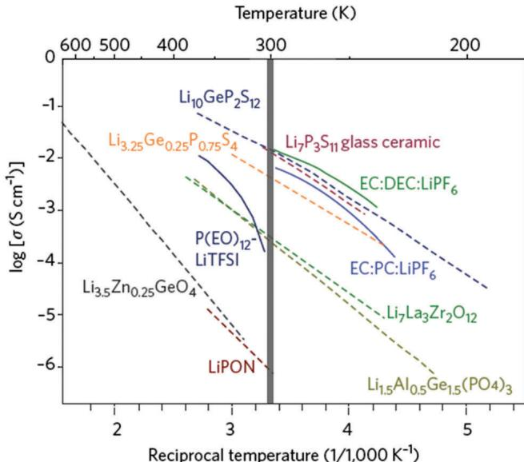  
Fig. 13 Comparative  $\mathsf{Li^{+}}$  ion conductivities of ceramic, polymeric, and liquid electrolytes for Li-ion batteries.[123] Reprinted by permission from Nature/Springer, J. Janek and W. G. Zeier, A solid future for battery development, Nat. Energy, 2016, 1, 16141. Copyright (2018).

safety concerns. $^{123}$  Indeed, a lithium-metal anode cell employing a polymer electrolyte of lithium (bisfluorosulfonyl)imide in polyether is recently reported as a promising candidate for an all solid-state lithium-metal battery. $^{124}$  Thermodynamically, however, most solid electrolytes with few exceptions including garnets lack sufficient stability against metallic Li. This necessitates the build up of SEI protective layers at the electrode/electrolyte interfaces. Nevertheless, the presence of a Li-ion conducting inorganic impervious electrolyte membrane would eliminate the dendrite problem, and associated safety concerns of electrical shorting and thermal runaway. On the other hand, Li-batteries with organic electrolytes typically exhibit nearly twice the storage capacities ( $\sim 0.2$  mA h cm $^{-2}$ ) and discharge rates than batteries with solid electrolytes ( $\sim 0.1$  mA h cm $^{-2}$ ) due to kinetic and mass transport limitations. $^{125}$

Recent advances on sulphide-based and garnet-based solid electrolytes, have shown significant improvements in ionic conductivities. For example,  $\mathrm{Li_{10}GeP_2S_{12}}$  was shown to exhibit an ionic conductivity of  $0.012\mathrm{Scm}^{-1}$  at room temperature, $^{126}$  which is only an order of magnitude less than for organic electrolytes. More recently, an even higher ionic conductivity of  $0.025\mathrm{Scm}^{-1}$  was reported for  $\mathrm{Li_{9.54}Si_{1.74}P_{1.44}S_{11.7}Cl_{0.3}S_{12}}$  at room temperature. $^{127}$

Garnet-based ceramics with cubic structure and the nominal composition of  $\mathrm{Li_7La_3Zr_2O_{12}}$  (LLZO) also exhibit high Li-ion conductivity and excellent stability against lithium metal, but stabilizing the cubic structure at room temperature is challenging. Room temperature conductivity of the tetragonal garnet LLZO is typically  $\sim 10^{-6}\mathrm{Scm}^{-1}$ , nearly two orders of magnitude lower than the cubic phase. It was reported that generation of Li vacancies by extrinsic doping with aliovalent cations disrupts ordering of the Li-sublattice, and this may present opportunities to stabilize the cubic structure and improve room

temperature Li-ion conductivity. $^{128}$  Incorporating ceramics into polymer electrolytes also improves ionic conductivity, expands the stability limit of the polymer electrolyte and also mitigates the dendrite problem. $^{129}$  For example, adding  $15\mathrm{wt}\%$  of  $\mathrm{Li}_{70.33}\mathrm{La}_{0.557}\mathrm{TiO}_3$  nanowires to polyacrylonitrile- $\mathrm{LiClO}_4$  electrolyte has substantially improved the room temperature Li-ion conductivity to  $0.024\mathrm{Scm}^{-1}$ . $^{130}$  However, typically low transference numbers for Li ions ( $t_{\mathrm{Li}} = 0.38$ ) in composite electrolytes need significant improvement to attain higher efficiency.

The prospects of identifying highly conductive and stable electrolyte compositions in the near future require further investigation and development. However, it was recently suggested that the challenge to materials design for Li-batteries is not necessarily to find the stable materials, but instead to search for materials whose instabilities are self-limiting.[94]

D.1.2. Beyond Li-ion batteries. Although Li-ion batteries get most of the attention, their theoretical specific energy for the  $\mathrm{LiCoO_2}$ /graphite and  $\mathrm{LiFePO_4}$ /graphite systems is limited by the insertion chemistry to around  $400\mathrm{Whkg^{-1}}$ . As a case in point, a battery power pack that can provide a cell-level specific energy of  $350 - 400\mathrm{Whkg^{-1}}$  would be required for electric vehicles to have a driving range of 300 miles on a single charge. Unfortunately, Li-ion batteries currently available today can only provide a specific energy nearly half of this value. Also, the desired life of the battery should last more than 1000 charge-discharge cycles at a rate greater than 2C capable of providing power greater than  $600\mathrm{Wkg^{-1}}$ .

D.1.2.1. Li-Sulfur batteries. The demand for high performance batteries for transportation as well as stationary applications requires electrode materials that offer much higher specific energies, which can be achieved by increasing the cell potential and the storage capacity of the materials used for the anode and the cathode. But the stability windows of the battery electrolytes limit the cathode operating voltage to below 4.3 V.[48] Furthermore, with the capacity limited by insertion chemistries, Li-sulfur system offers many advantages, but also challenges.[132,133] Fig. 14 presents a schematic diagram for the Li-S battery system illustrating the charge and discharge processes.

The use of sulfur for the positive electrode in Li-S batteries offers low cost, low weight, high rates, low toxicity, environmental friendliness, and high theoretical capacity (2600 W h kg $^{-1}$ , versus  $\sim 600$  W h kg $^{-1}$  for current Li-ion batteries), which is due to the high specific capacity of sulfur (1675 mA h g $^{-1}$ , versus 130-200 mA h g $^{-1}$  for current Li-ion battery cathode materials). The net cathode reaction during discharge is based on 2-electron transfer by,

$$
\mathrm {S} + 2 \mathrm {L i} ^ {+} + 2 \mathrm {e} ^ {-} = \mathrm {L i} _ {2} \mathrm {S} \quad E = 2. 2. \mathrm {V} \text {v s}. \mathrm {L i} / \mathrm {L i} ^ {+} \tag {14}
$$

Although the cell potential of 2.2. V is about  $60\%$  of the 3.7 V for conventional Li-ion batteries, this is more than made up by the high theoretical energy densities of  $2600\mathrm{W}\mathrm{h}\mathrm{kg}^{-1}$  and  $2200\mathrm{W}\mathrm{h}\mathrm{L}^{-1}$ ,[43] which are 4-5 times higher than for the graphite/LiCoO $_2$  system. Potentially, Li-S batteries may be able to provide a driving range of nearly 300 miles.[131] But the Li-S battery system also poses several important challenges.[134]

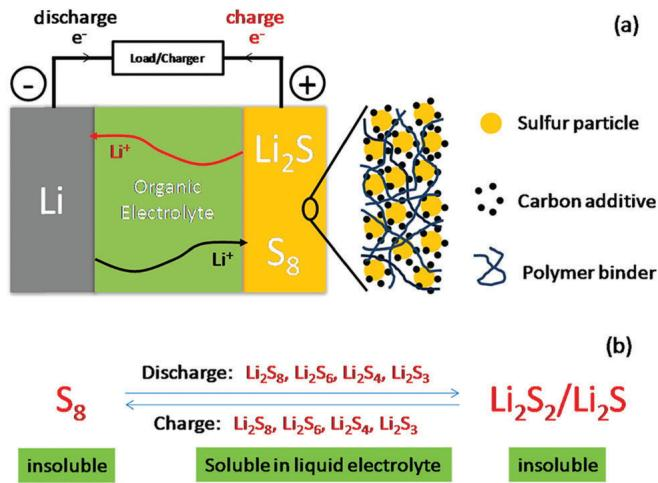  
Fig. 14 Schematic depiction of in the Li-S battery architecture illustrating charge and discharge processes. $^{133}$  Reprinted with permission from (A. Manthiram, Y. Fu, S.-H. Chung and Y.-S. Su, Challenges and prospects of lithium-sulfur batteries, Acc. Chem. Res., 2013, 46, 1125-1134). Copyright (2018) American Chemical Society.

One is the poor electronic conductivities of sulfur  $(10^{-17}\mathrm{Scm}^{-1})$  and its discharge products of various polysulfides  $\mathrm{Li}_2\mathrm{S}_x$ $(x = 1 - 8)$  deposited on the electrodes. These passivation layers increase the cell impedance and therefore require addition of an electronic conductor such as carbon or metals. Naturally, the addition of the conducting phase lowers the cell capacity, energy density, round-trip efficiency and cycle life. Another challenge is posed by the loss of sulfur from the cathode into the electrolyte due to the high solubility of the polysulfide ions  $(\mathrm{S}_x^{2-})$  formed on reduction of  $\mathrm{S}_8$  or oxidation of  $\mathrm{Li}_2\mathrm{S}$ . The dissolved polysulfide ions diffuse to the negative electrode and react with Li in a parasitic reaction to form lower polysulfides, which then diffuse back to the positive electrode and are re-oxidized. As expected, this internal shuttling mechanism so-called "polysulfide shuttle" lowers the Coulombic efficiency of the Li-S battery as well as the poor recyclability of the battery to achieve long cycle life. This is one of the key issues that can limit the commercial viability and prospects of the Li-S battery technology. In essence, the high order polysulfides dissolved in the electrolyte migrate toward the anode and react with the Li-metal anode and are reduced to the lower order sulfides, which migrate back to the cathode to form higher order polysulfides. Such continuous shuttling of polysulfides between the two electrodes not only leads to permanent capacity fading due to loss of sulfur, but also constitutes the underlying cause of self-discharge. This self-discharge occurs even at the resting state of the Li-S battery due to the continuous dissolution of polysulfides, which gradually lower the open circuit potential and discharge capacity of the battery.

Furthermore, the multiple conversion reactions between the polysulfide species bounded by the end members S and  $\mathrm{Li}_2\mathrm{S}$  are accompanied by large volume changes (up to  $76\%$ ), which can lead to mechanical failure or disintegration of the electrodes, and eventually to capacity loss upon cycling. Furthermore, dendrite formation and stability issues posed by the Li-metal

anode and discussed in detail in the previous section are also valid for the Li-S system.

Much attention has been given to mitigate or overcome these technical challenges. Various strategies have been pursued to address and improve Coulombic efficiency, discharge capacity, cyclability, and self-discharge in Li-S batteries. Many of these strategies including carbon-composite or nanostructured electrodes, $^{135}$  trapping interlayers, selective coatings or solid state electrolyte layers on the Li-metal anode, and modification of electrolytes by additives have been investigated and recently reviewed. $^{132,133,136}$  Much progress has been made. For example, nanostructured cathodes where sulfur is encapsulated inside hollow carbon nanofibers improved the cell capacity to  $730\mathrm{mA}\mathrm{h}\mathrm{g}^{-1}$  measured at C/5 rate after 150 charge-discharge cycles. $^{135}$  Similarly, sulfur-graphene oxide nanocomposite cathode modified by cetyltrimethyl ammonium bromide provided a high specific capacity of  $800\mathrm{mA}\mathrm{h}\mathrm{g}^{-1}$ , a long cycle (1500) life with a remarkably low decay rate of  $0.039\%$  per cycle, and allowed discharge rates as high as 6C ( $1\mathrm{C} = 1.675\mathrm{A}\mathrm{g}$ -sulfur $^{-1}$ ) and charging rates as high as 3C. $^{131}$  Furthermore, the addition of  $\mathrm{LiNO}_3$  to the electrolyte facilitates passivation of the Li-anode and prevents parasitic reactions with the polysulfides. Several studies employing  $\mathrm{LiNO}_3$  additives reported Coulombic efficiencies of  $96 - 99\%$  even after 1500 cycles. $^{131,135}$  These advances provide encouragement for the future prospects of Li-S batteries as a potential candidate for efficient and cost effective storage system. However, for the Li-S system to compete potentially for the transportation sector, a recent techno-economic study considering a materials-to-systems approach predicted that high electrode loadings  $>8\mathrm{mA}\mathrm{h}\mathrm{cm}^{-2}$  are necessary to achieve  $>300\mathrm{W}\mathrm{h}\mathrm{L}^{-1}$  and  $<\$125$  per kW h. $^{137}$  Currently demonstrated loading levels ( $\sim2.5\mathrm{mA}\mathrm{h}\mathrm{cm}^{-2}$ ) and energy densities ( $\sim100\mathrm{W}\mathrm{h}\mathrm{L}^{-1}$ ) indicate the major challenges yet to be overcome for the Li-S system to vie for transportation applications.

D.1.2.2. Non-Li-based batteries. Power modules based on Li-ion batteries have been the primary impetus for the explosive growth of portable electronic devices as well as the re-advent of electric vehicles in the last decade, albeit after a hiatus of more than one century. However, long-term sustainability of energy solutions requires a careful examination of the feasibility, cost, and availability of resources. This is especially important if Li-based batteries are to be considered for utility scale energy storage systems for the electric grid.

The relative abundance of lithium in the earth's crust is only  $20\mathrm{mgkg}^{-1}$  (or, ppm). Furthermore, known lithium reserves are mostly concentrated in South Africa, Chile and Australia, which create source dependency, supply reliability and price volatility for Li-based battery technologies. In fact, large fluctuations observed in the past in the price of lithium also pose economic concerns for reliability and availability when projected into the future even only for the electrification needs of the transportation sector. Recycling lithium from Li-based batteries in a cost effective manner remains an unsolved technology challenge. Moreover, the use of lithium for large-scale stationary energy storage may diminish the known lithium resources.

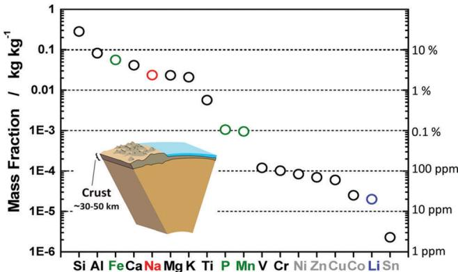  
Fig. 15 Relative abundance of metals in the earth's crust. $^{138}$  Reprinted with permission from (N. Yabuuchi, K. Kubota, M. Dahbi and S. Komaba, Chem. Rev., 2014, 114, 11636-11682). Copyright (2018) American Chemical Society.

By contrast, other electropositive metals such as Na, K, Ca, and Mg are quite abundant in the earth's crust as indicated in Fig. 15, and they are also fairly uniformly distributed geographically. In fact, Na is the fifth most abundant element. Especially oceans provide a vast and almost infinite resource for these elements. So battery systems based on Na, K, Ca, and Mg chemistries can provide cost-effective alternatives to existing Li-based batteries. Also, Na is the second lightest element next to Li in the periodic table. The reduction potentials and metal-anode-based theoretical capacities of alkali metal and alkaline earth metals are provided in Fig. 16. Although the theoretical capacity for lithium is clearly superior to Na and K, the abundance and availability of these metals and others including Ca and Mg make them attractive candidates for alternative battery systems as discussed in recent reviews. $^{138-144}$

As the active materials make up nearly  $50\%$  of the cost of most batteries, the wide availability and low cost of sodium at  $\sim$ 150 per ton compared to  $\sim$ 15000 per ton for lithium presents great economic incentives for sustainability. Hence,

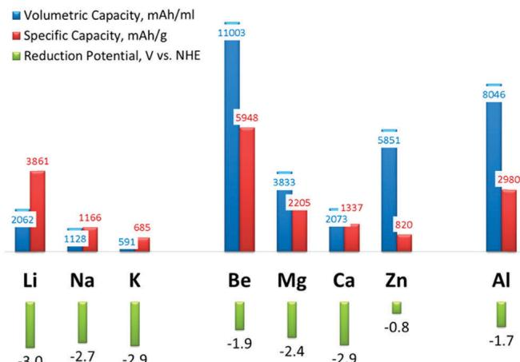  
Fig. 16 Comparison of specific capacities and reduction potentials of prospective metals for battery anodes. $^{139}$  Reprinted with permission from (J. Muldoon, C. B. Bucur, T. Gregory, Quest for nonaqueous multivalent secondary batteries: magnesium and beyond, Chem. Rev., 2014, 114, 11683-11720). Copyright (2018) American Chemical Society.

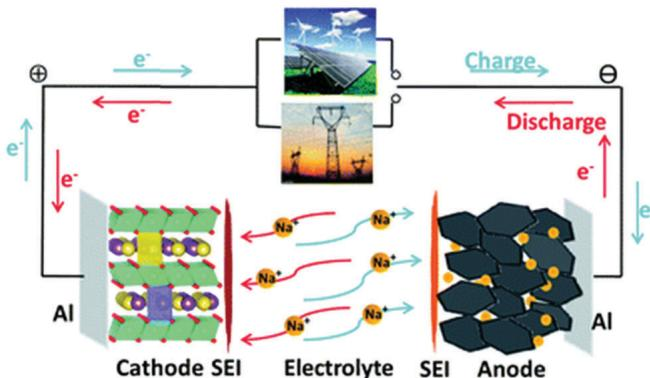  
Fig. 17 Schematic depicting the operating principle of the Na-ion battery. Reproduced from ref. 142 with permission from The Royal Society of Chemistry.

sodium-based batteries attracted much attention. Na-Ion battery architecture, chemistry and materials share many similarities with the Li-ion battery system. $^{145}$  Fig. 17 illustrates the schematic depiction of the Na-ion battery. Because of such similarities in cell materials and their challenges, detailed discussion of Na-ion battery materials is not provided here. Instead, only salient features, recent progress and challenges are discussed briefly. For detailed information, the interested reader is referred to recent reviews on various aspects of Na-ion batteries. $^{138,140,142,143,146}$

Interest in the Na-ion system as a cheap and viable alternative to Li-based systems goes back to 1970's, almost concurrent with the intense research and development efforts in Li-ion batteries. Despite the similarities in most of their chemical and physical properties, however, progress has been slow for Na-ion batteries. One stumbling block (or barrier) has been the unsuitability of soft carbon-based anode materials such as graphite, which is commonly employed also in Li-ion batteries. Unfortunately soft carbon anodes exhibit low or no electrochemical activity when used in Na-ion batteries. Heating graphite in Na vapor seemed to be the only way to achieve intercalation. A major breakthrough came in 2000 when Na-ion cells employing hard carbon at the negative electrode were reported to provide a reversible capacity of  $300\mathrm{mA}\mathrm{h}\mathrm{g}^{-1}$ . The hard carbon anodes were prepared by the pyrolysis of glucose at  $1000 - 1150^{\circ}\mathrm{C}$  in an inert atmosphere to form randomly stacked carbon layers made of small aromatic fragments that resemble a "house of cards", in between which the Na (and also Li) ions can be inserted. This high capacity, comparable to the anode capacities for the Li-ion batteries, generated great impetus and interest in Na-based storage systems research.

Na exhibits a slightly less reducing potential of  $-2.7\mathrm{V}$  compared to the reduction potential of  $-3.04\mathrm{V}$  for Li, and also lower volumetric and gravimetric capacities due to the heavier Na atom (see Fig. 16 above). A typical charge-discharge curve for a  $\mathrm{Na - NaCoO_2}$  cell is shown in Fig. 18, which also includes a similar curve for the  $\mathrm{Li - LiCoO_2}$  couple for comparison. $^{140}$  Both cathode structures are analogs of each other and consist of layers of  $\mathrm{CoO_2}$  slabs in between which Na and Li ions reside as shown in the inset. The figure also compares the operating cell

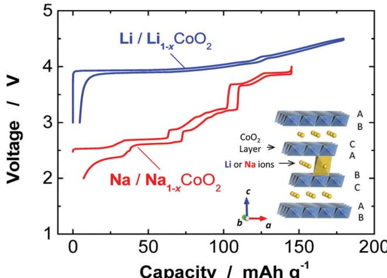  
Fig. 18 Comparative charge-discharge curves for  $\mathrm{Li / LiCoO_2}$  and  $\mathrm{Na / NaCoO_2}$  cells. Inset depicts Li or Na insertion into the layered crystal structure of the cathode.[140] Republished with permission of The Electrochemical Society, from [K. Kubota and S. Komaba, Review - practical issues and future perspective for Na-ion batteries, J. Electrochem. Soc., 2015, 162, A2538-A2550]; permission conveyed through Copyright Clearance Center, Inc. (2018).

potential for  $\mathrm{NaCoO}_2$ , which is  $>1\mathrm{V}$  lower than for the  $\mathrm{LiCoO}_2$  cell. Accordingly, the Na-ion battery has a lower energy density than the Li-ion battery, marked by the stepwise potential changes for  $\mathrm{NaCoO}_2$ .

As expected, many of the technical challenges facing Na-ion batteries are similar to those faced by Li-ion batteries, including better materials for electrodes with higher capacities, insufficient cycle life, capacity fading upon cycling, electrolyte stability at high voltages, etc. There has been recent progress in some of these areas, especially in seeking earth abundant, low-cost, and environmentally friendly electrode host materials for sustainability. For example, inspired by the early report $^{148}$  of high theoretical capacity  $(560\mathrm{mA}\mathrm{h}\mathrm{g}^{-1})$  for dilithium rhodizonate  $\left(\mathrm{Li}_2\mathrm{C}_6\mathrm{O}_6\right)$ , which suffered from poor cycle life due to dissolution and exfoliation, its sodium analog disodium rhodizonate  $\left(\mathrm{Na}_2\mathrm{C}_6\mathrm{O}_6\right)$  was recently investigated as an organic cathode material and reported achieving a four-electron redox reaction with a reversible capacity of  $484\mathrm{mA}\mathrm{h}\mathrm{g}^{-1}$ , energy density of  $726\mathrm{W}\mathrm{h}\mathrm{kg}^{-1}$  of cathode material, and an energy efficiency above  $87\%$ . $^{149}$  The key to the observed long cycle life of this material was to understand and kinetically suppress the electrochemically limiting irreversible phase transformation between  $\alpha\text{-Na}_2\mathrm{C}_6\mathrm{O}_6$  and  $\gamma\text{-Na}_2\mathrm{C}_6\mathrm{O}_6$  during cycling by controlling particle size and morphology as well as using electrolyte additives. Also, this organic-based cathode material is derived from biomass, particularly from the corn extract myo-inositol, and hence, provides a sustainable and environmentally friendly synthesis route to produce the cathode material. $^{31,148}$

Similarly, a new class of non-rare-earth containing Fe-based cathode material with a composition  $\mathrm{Na}_2\mathrm{Fe}_2(\mathrm{SO}_4)_3$  was recently reported to provide an exceptionally high potential of  $3.8\mathrm{V}$  versus  $\mathrm{Na} / \mathrm{Na}^+$  with an experimentally measured capacity of  $102\mathrm{mA}\mathrm{h}\mathrm{g}^{-1}$ , which was highly reversible over 30 cycles.[150]

The measured capacity corresponds to about  $85\%$  of the theoretical capacity of  $120\mathrm{mA}\mathrm{h}\mathrm{g}^{-1}$  based on the one electron  $\mathrm{Fe}^{3+}/\mathrm{Fe}^{2+}$  redox transition of the cathode material. Similarly, an all-solid-state Na-ion battery employing a Na-metal anode coated with a thin polymeric interlayer to suppress dendrite formation, a solid Na-ion conducting solid electrolyte of the composition  $\mathrm{Na}_3\mathrm{Zr}_2\mathrm{Si}_2\mathrm{PO}_{12}$  (i.e., NASICON) and ionic conductivity of  $\sim 10^{-3}\mathrm{Scm}^{-1}$  at temperatures  $\sim 65^{\circ}\mathrm{C}$ , and a  $\mathrm{NaTi}_2(\mathrm{PO}_4)$  cathode provided  $102\mathrm{mA}\mathrm{h}\mathrm{g}^{-1}$  after 70 cycles at  $0.2\mathrm{C}$  at  $65^{\circ}\mathrm{C}$  with a Coulombic efficiency of  $99.7\%$ .[151]

As the ionic size of Na (radius  $= 97~\mathrm{pm}$ ), compared to Li (radius  $= 68~\mathrm{pm}$ ), is too large to facilitate mobility in a closed packed framework of oxide ions, it needs a host structure with sufficiently large interstitial sites. A recent study reported the synthesis of a low-cost Na-Mn-hexacyanoferrate cathode composition where lowering of the activation barrier for Na-ion diffusion was achieved via weakening the Na-oxygen bonding by replacing the oxide ions by  $(\mathrm{CN})^{-1}$  ions, whereby providing a reversible capacity of  $>120\mathrm{mA}$  h g $^{-1}$  and a high potential of  $3.4\mathrm{V}$ . Similarly, a family of Prussian blue structure cathode materials were reported for aqueous alkali-ion battery systems, including nanosized Cu haxacyanoferrate that showed no capacity fading after 1000 deep-discharge cycles and provided  $95\%$  round-trip efficiency when cycled at  $5\mathrm{C}^{119}$  and Ni haxacyanoferrate that showed complete reversibility with zero capacity loss after 5000 cycles for sodium and 1000 cycles for potassium.

Prussian blue (ferric hexacyanoferrate, or  $\mathrm{Fe}_4[\mathrm{Fe}(\mathrm{CN})_6]_3\cdot x\mathrm{H}_2\mathrm{O}$ , or  $\mathrm{C_{18}Fe_7N_{18}}$ ) is a low cost, effective cathode host material for the insertion and extraction of potassium over thousands of cycles, and potassium is also cheap and abundant, which makes it an ideal anode material for K-ion batteries. A schematic depiction of the K-ion battery structure with Prussian blue cathode and carbon anode is shown in Fig. 19. An early demonstration of K-ion battery employed a Prussian blue-based cathode material and a potassium anode in a nonaqueous electrolyte consisting of  $1\mathrm{M}$ $\mathrm{KBF}_4$

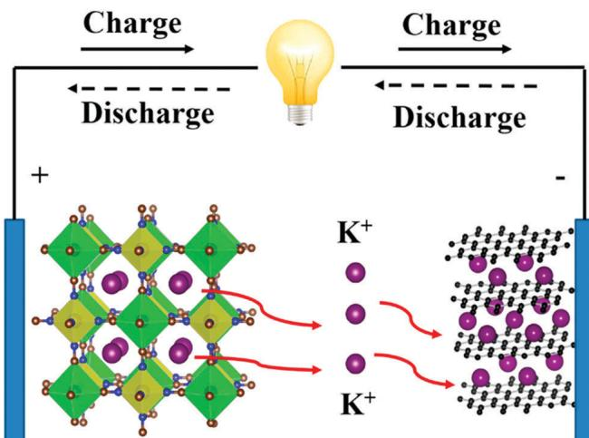  
Fig. 19 Schematic illustration of a K-ion cell with Prussian blue structure cathode and carbon-based anode. $^{141}$  Reprinted with permission from (A. Eftekhari, Z. Jian and X. Ji, Potassium secondary batteries, ACS Appl. Mater. Interfaces, 2016, 9, 4404-4419). Copyright (2018) American Chemical Society.

dissolved in a  $3:7$  ratio ethylene carbonate/ethylmethyl carbonate mixture, and showed a cathode capacity of  $80\mathrm{mA}\mathrm{h}\mathrm{g}^{-1}$  and excellent cyclability for over 500 reversible cycles. $^{154}$  With the expected carbon anode capacity of  $262\mathrm{mA}\mathrm{h}\mathrm{g}^{-1}$  at C/10 rate and potential of 0.3 vs.  $\mathrm{K}^{+}/\mathrm{K}$ , a complete K-ion cell can deliver an energy density of  $\sim 200\mathrm{W}\mathrm{h}\mathrm{kg}^{-1}$  based on the mass of the electrodes, and a full battery may be able to provide  $\sim 110\mathrm{W}\mathrm{h}\mathrm{kg}^{-1}$ . $^{141}$  Another advantage of K-ion batteries is the highly negative standard potential of  $-2.936\mathrm{V}$  vs. the standard hydrogen electrode (SHE) for the  $\mathrm{K}^{+}/\mathrm{K}$  redox couple. This value compares quite well with the potential of  $-3.04\mathrm{V}$  vs. SHE for the  $\mathrm{Li}^{+}/\mathrm{Li}$  couple for Li-ion batteries, while it is still more negative than the  $\mathrm{Na}^{+}/\mathrm{Na}$  couple at  $-2.714\mathrm{V}$  vs. SHE, providing close to  $\sim 200\mathrm{mV}$  higher cell voltage for K-ion batteries than for Na-ion. Furthermore, transport of the "soft"  $\mathrm{K}^{+}$  ion is much faster than for the strongly solvated  $\mathrm{Li}^{+}$  ions in electrolytes, because of the smaller Stoke diameter (i.e., solvation sheath) for potassium. Again, due to many similarities in materials aspects with Li-based battery systems that were discussed previously (see Section D.1.1.: Li-Ion batteries), the interested reader is referred to recent review articles for more information on K-based batteries. $^{141,145,155}$

Unlike the single-electron transfer reactions in alkali metal-based battery systems, battery chemistries based on charge transfer reactions involving multivalent cations provide a great incentive to design battery materials and systems that accomplish multi-electron transfer and higher storage capacities. The theoretical capacities are presented in Fig. 16. In that regard, magnesium, calcium, and even aluminum offer obvious advantages for progress beyond Li-batteries, albeit with their own challenges and shortcomings. Replacing  $\mathrm{Li^{+}}$  with multivalent  $\mathrm{Mg}^{2+}$ ,  $\mathrm{Ca}^{2+}$ ,  $\mathrm{Al}^{3+}$  cations increases the total charge transferred per ion, which naturally increases storage capacity. For example, the theoretical volumetric capacity of  $3833\mathrm{mA}\mathrm{h}\mathrm{ml}^{-1}$  for magnesium is nearly twice that for lithium metal ( $2062\mathrm{mA}\mathrm{h}\mathrm{ml}^{-1}$ ), and it has a slightly less negative reduction potential of  $-2.4\mathrm{V}$  vs. SHE compared to lithium (see Fig. 16). Similarly, Al offers a theoretical volumetric capacity of nearly four times (i.e.,  $8040\mathrm{mA}\mathrm{h}\mathrm{ml}^{-1}$ ) that of lithium and a reduction potential of only  $-1.67\mathrm{V}$  vs. SHE, while Ca has a theoretical capacity of  $2073\mathrm{mA}\mathrm{h}\mathrm{g}^{-1}$  and a reduction potential of  $-2.87\mathrm{V}$  vs. SHE. $^{139}$  Moreover, Mg, Ca, and Al, are cheap and among the most abundant elements on the planet (see Fig. 15). They also do not show a high propensity for dendrite formation, unlike the case for metallic Li anodes. Also, these metals do not pose major safety issues and are easier to work with during processing. They do not need to be processed in glove boxes under tightly controlled and monitored inert and dry atmospheres.

Despite the great potential of these metals to be suitable battery anodes, however, progress in these systems has been slow due to multiple challenges. Major advances in the discovery of superior electrode and electrolyte materials, stability, reversible cyclability and long cycle life are needed in order to capitalize on the attractively high theoretical capacities offered by the chemistries of multivalent cations. Many of these challenges and materials issues for Mg, Ca, and Al battery systems have recently been reviewed. $^{139,144,156-158}$

There are critical barriers to designing a rechargeable battery based on these cations. For example, finding suitable high capacity cathode structures that can reversibly intercalate these multivalent cations at high potentials remains a major challenge. During charging of the battery, these metals tend to form a passive, electronically insulating oxide layer, which also blocks cation transport. Electrolytes with sufficient stability have yet to be identified that can facilitate the formation of conductive passivation layers on the electrodes at high potentials. Intercalation of these cations into host cathode structures has been difficult and slow due to low mobility, which presents a barrier for further development. The high oxidation state of these cations slows them during mass transport due to stronger Coulombic interactions with the host electrode structures. Also, their reduction potentials are lower than that for Li, and hence provide a lower operating cell voltage for the battery.

Nevertheless, some progress has been made in some of these fronts. For example, fast  $\mathrm{Mg}^{2+}$  ion conductivity of  $0.01 - 0.1\mathrm{mScm}^{-1}$  at  $298\mathrm{K}$  in the  $\mathrm{MgSc_2Se_4}$  spinel was recently reported with a low migration barrier of only  $370\mathrm{mV}$ .156 It should be noted that previous reports of comparably high  $\mathrm{Mg}^{2+}$  mobility in spinel and Chevrel phases were obtained only at temperatures  $(400 - 800^{\circ}\mathrm{C})$ , while this recent study constitutes the first report of high  $\mathrm{Mg}^{2+}$  mobility in a closed packed chalcogenide structure at room temperature. Similarly, one of the first demonstrations of reversible  $\mathrm{Ca}^{2+}$  intercalation was recently reported for a Prussian blue structure manganese hexacyanoferrate (MFCN) cathode in a nonaqueous electrolyte giving a capacity of  $80\mathrm{mA h g}^{-1}$ , which retained  $50\%$  of its value after 35 cycles.144

Aluminum is cheap and one of the most abundant metals on Earth (see Fig. 15). As a trivalent ion, aluminum-based batteries provide a three-electron redox reaction that results in a theoretical capacity of  $2.98\mathrm{Ah}\mathrm{g}^{-1}$ . This is slightly less than the theoretical capacity of  $3.86\mathrm{Ah}\mathrm{g}^{-1}$  for lithium, while its volumetric capacity of  $8.04\mathrm{Ah}\mathrm{ml}^{-1}$  is much superior to  $2.06\mathrm{Ah}\mathrm{ml}^{-1}$  for lithium,  $3.83\mathrm{Ah}\mathrm{ml}^{-1}$  for magnesium, and  $5.85\mathrm{Ah}\mathrm{ml}^{-1}$  for zinc (see Fig. 16). However, early attempts to develop a rechargeable Al-based battery has faced numerous challenges including low cell discharge voltage, short cycle life ( $<100$  cycles) in part due to disintegration of the cathode materials, and high capacity fading rate ( $26 - 85\%$ ). The first functional Al-ion rechargeable battery utilizing a Al metal anode,  $\mathrm{V}_2\mathrm{O}_5$  cathode and an ionic liquid electrolyte containing  $\mathrm{AlCl}_3$  provided  $305\mathrm{mA}\mathrm{h}\mathrm{g}^{-1}$  in the first cycle and  $273\mathrm{mA}\mathrm{h}\mathrm{g}^{-1}$  after 20 cycles with a stable  $\mathrm{Al}^{3+}$  insertion plateau at  $0.55\mathrm{V}$ . Recent progress using a Al metal anode, a graphitic foam cathode and ionic liquid electrolyte demonstrated electrochemical dissolution and deposition of aluminum at the anode, fast intercalation and de-intercalation of chloroaluminate ions in the graphite foam cathode that resulted in rapid ( $\sim1$  min) charging times at high current densities of  $\sim4000\mathrm{mA}\mathrm{g}^{-1}$ , and exhibited a stable discharge plateau at  $\sim2.0\mathrm{V}$ , a low specific capacity of  $70\mathrm{mA}\mathrm{h}\mathrm{g}^{-1}$ , high Coulombic efficiency of  $98\%$ , and long cycle life  $>7500$  without decay. Despite the remarkable progress, this Al-ion/graphite system was able to provide an

energy density of only  $\sim 40\mathrm{W}\mathrm{h}\mathrm{kg}^{-1}$ , which is comparable to Pb-acid or Ni-metal hydride batteries. On the other hand, however, it offered a high power density of  $\sim 3000\mathrm{Wkg}^{-1}$  that is comparable to supercapacitors.

D.1.2.3. Na-S batteries. The active materials of this battery system, namely, sodium and sulfur, are cheap, abundant, and readily available. Moreover the Na-S system has a cell potential of  $2.1\mathrm{V}$  and high theoretical energy densities of  $790\mathrm{W}\mathrm{h}\mathrm{kg}^{-1}$  and  $1180\mathrm{W}\mathrm{h}\mathrm{L}^{-1}$ ,[44] high energy efficiency, and great cyclability typically in the 1000's of cycles. These attractive properties have attracted great interest in the Na-S system in the last several decades. They have been commercialized in Japan since 2002 for stationary storage in MW scale systems, and generally used in load-leveling and peak-shaving applications by the utilities. There are hundreds of Na-S battery installations around the world, most of them in Japan, that provide in excess of  $300\mathrm{MW}$  of discharge capacity for energy storage.

The technical challenges for Li- and Na-sulfur battery systems posed by the high solubility of alkali metal polysulfide species in the electrolyte that are the root cause of multiple problems including passivation layers building on the electrodes, polysulfide shuttling through the electrolyte, and capacity fading as discussed in previously (see Section D.1.2.1.: Li-sulfur batteries) can be largely overcome by replacing the liquid electrolyte with a solid impervious membrane that selectively transports only alkali ions across and provides a physical barrier that separates the alkali metal anode from the sulfur cathode. This has been the underlying reason and the rationale for the development of the Na-S battery, which employs a Na-ion conducting solid electrolyte between the molten sodium anode and the sulfur cathode.

Indeed, the discovery of fast sodium ion transport in a common refractory Na  $\beta$ -alumina ( $\mathrm{Na}_2\mathrm{O}\cdot 11\mathrm{Al}_2\mathrm{O}_3$ , or  $\mathrm{NaAl}_{11}\mathrm{O}_{17}$ ) near room temperature in early 1960's made this possible and generated great interest in Na-ion based electrochemical storage systems. At  $300^{\circ}\mathrm{C}$ , the ionic conductivity of Na  $\beta$ -alumina approaches the room temperature conductivity of  $10^{-1}\mathrm{Scm}^{-1}$ , comparable to common aqueous electrolytes. Another member of this family is the Na  $\beta''$ -alumina, which exhibits an ionic conductivity of  $1.3\mathrm{Scm}^{-1}$  at  $500^{\circ}\mathrm{C}$ . These highly conductive electrolyte materials opened up opportunities to explore sodium chemistries for power generation and storage applications, including Na-S and Na-metal chloride batteries.[161]

Schematic depiction of the Na-S battery tubular architecture and its operating principle is shown in Fig. 20. At the typical operating temperature of  $300 - 350^{\circ}\mathrm{C}$ , both the Na anode and the sulfur cathode are in their molten state. Generally, a tubular sodium  $\beta''$ -alumina impervious electrolyte membrane houses the molten Na (negative electrode), and separates it from the molten sulfur (positive electrode). Due to its low conductivity, the sulfur electrode is mixed with carbon to improve the electronic conductivity of the positive electrode.

Elemental sulfur has a high theoretical specific capacity of  $1675\mathrm{mA}\mathrm{h}\mathrm{g}^{-1}$  based on the 2-electron half-cell reaction at the cathode. During discharge, Na is oxidized to  $\mathrm{Na^{+}}$  and is

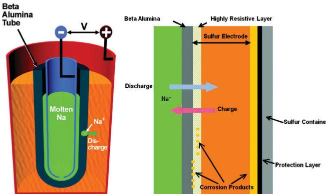  
Fig. 20 Schematic cell structure (left) and operating principle (right) of the Na-S battery. $^{32}$  Reprinted with permission from (Z. Yang, J. Zhang, M. C. W. Kintner-Meyer, X. Lu, D. Choi, J. P. Lemmon and J. Liu, Chem. Rev., 2011, 111, 3577-3613). Copyright (2018) American Chemical Society.

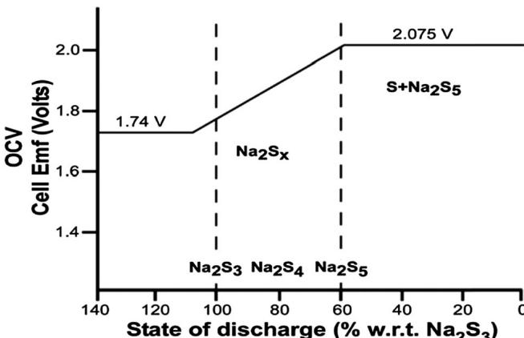  
Fig. 21 Voltage regimes and phase boundaries of polysulfides in the Na-S system. Reproduced from ref. 162 with permission from The Royal Society of Chemistry.

transported across the electrolyte to react with sulfur and form sodium polysulfides  $(\mathrm{Na}_2\mathrm{S}_x)$ . The phase boundaries of these polysulfides and the voltage regimes are presented in Fig. 21. At the open circuit potential of  $2.075\mathrm{V}$ , there exists a two-phase region as  $\mathrm{Na}_2\mathrm{S}_5$  is insoluble in sulfur, so forms a two-phase liquid mixture at the operating temperature. As the battery discharges, sulfur combines with sodium to form a single-phase region marked by  $\mathrm{Na}_2\mathrm{S}_4$  in the figure. If unchecked, the level of molten Na drops due to consumption, so process control is important. At  $1.74\mathrm{V}$ ,  $\mathrm{Na}_2\mathrm{S}_4$  is reduced to  $\mathrm{Na}_2\mathrm{S}_3$ . For deeper discharge, the undesirable solid  $\mathrm{Na}_2\mathrm{S}_2$  may form and increase the cell impedance. During charging, the reactions are reversed, but the re-formation of sulfur must be managed. Otherwise, it can deposit on the electrolyte and form an insulating layer, which increases cell impedance and lowers performance. The round-trip efficiency of Na-S batteries is around  $80\%$  with an estimated life of  $\sim 15$  years for  $>4500$  cycles at  $90\%$  depth of charge.[162]

The  $\mathrm{Na^{+}}$  released at the positive electrode is transported back through the  $\mathrm{Na^{+}}$  ion conducting ceramic electrolyte into the negative electrode, where it picks up an electron from the

external circuit and deposits as metallic sodium. In order to facilitate sufficient rates (i.e., current) of ion transport through the solid electrolyte, the battery operates typically at  $350^{\circ}\mathrm{C}$ . The heat produced during discharge/charge cycles is sufficient to maintain the battery temperature. Usually, no external heat input is needed.

Recent review articles provide more details into the operational, performance, and materials aspects of  $\mathrm{Na^{+}}$ -based batteries and their technical challenges. $^{142,161,163}$

Although Na-S battery systems are commercially available and offer attractive advantages including inexpensive, abundant, nontoxic, and environmentally benign materials, while offering low maintenance, cycling flexibility and long cycle life, high storage capacity and efficiencies,[24] they also face technical challenges still remain to overcome. One critical problem is related to corrosion and vapor loss. High operating temperatures compared to other storage systems reviewed in earlier sections, as well as the highly reactive nature of the molten electrodes pose hot corrosion problems, related in particular, to the highly corrosive nature of the S and  $\mathrm{Na}_2\mathrm{S}_5$  species at these temperatures. This places expensive demands on materials selection for the container and other cell components such as hermetic seals. High operating temperatures required for achieving sufficient ion transport through the ceramic electrolyte is also dictated by the difficulty in achieving proper wetting of the solid electrolyte by molten sodium, which is one of the most challenging issues for Na-S batteries.

The solid electrolyte, namely  $\beta$ - (or  $\beta''$ ) alumina, is a critical and expensive component of the Na-S battery. Although ionic transport of  $\mathrm{Na^{+}}$  through the electrolyte occurs anisotropically along the 2-dimensional conduction planes separated by close-packed Al-O blocks, the random positioning of the fine grains of powders that make up the finished polycrystalline electrolyte tubes mitigates the anisotropy problem greatly. Ionic conductivities of the tubular polycrystalline electrolyte are only a factor of 3-5 smaller than that for the single crystal electrolyte. However, mechanical fragility and process yields for the tubular  $\beta$ -alumina fabrication are major concerns and cost factors for mass production of these electrolytes.

Reducing the operating temperature of the Na-S battery is important for improving its safety, cost, and durability by slowing down degradation mechanisms. A recent study attempted to reduce the operating temperature to  $150^{\circ}\mathrm{C}$  by employing a molten Na separated by a  $600\mu \mathrm{m}$  thick  $\beta''$ -alumina electrolyte in series with a liquid catholyte of 4:1 molar ratio of  $\mathrm{S}:\mathrm{Na}_2\mathrm{S}_4$  dissolved in tetraglyme solution reported an initial discharge capacity of  $473\mathrm{mA}\mathrm{h}\mathrm{g}^{-1}$  of which  $70\%$  was retained after 60 cycles, and cell voltages around  $2\mathrm{V}$ . Similarly, alloying Na with  $6.7\mathrm{mol}\%$  of the low surface tension metal Cs markedly improves wetting of the  $\beta''$ -alumina solid electrolyte in the molten alloy and at the same time, helps bring down the operating temperature to  $150 - 175^{\circ}\mathrm{C}$  with a capacity fading rate of  $< 3\%$  over 100 cycles.[165]

Others aimed at reducing the Na-S battery operation to room temperature by employing a sulfur-carbon composite cathode in nonaqueous electrolyte.[166] One critical challenge

to room temperature operation is the instability of the electrolyte to form electrochemically inactive alkali metal polysulfides. Porous carbon framework doped highly with nitrogen and sulfur was suggested to help trap the sodium polysulfides and inhibit reaction with the electrolyte, and provide a long cycle of over 10 000 cycles with less than  $20\%$  capacity fading (3% after 800 cycles) at a high current density of  $4.6 \mathrm{~A} \mathrm{~g}^{-1}$ .[167] Similarly, a more recent study that employed a Na metal anode, a metal-organic framework (MOF)-derived microporous carbon-sulfur composite cathode in a liquid carbonate electrolyte containing 1 M  $\mathrm{NaClO}_4$  and an ionic liquid (1-methyl-3-propylimidazolium-chlorate) reported a reversible storage capacity of  $860 \mathrm{~mA} \mathrm{~h} \mathrm{~g} \cdot \mathrm{S}^{-1}$  at 0.1C rate ( $1 \mathrm{C} = 1675 \mathrm{~mA} \mathrm{~g}^{-1}$ ) and  $600 \mathrm{~mA} \mathrm{~h} \mathrm{~g} \cdot \mathrm{S}^{-1}$  at 0.5C with a capacity fade rate of only  $0.31\%$  over 100 cycles at room temperature.[168]

A different family ionically conducting solid electrolyte dubbed NASICON (for sodium-super-ionic-conductor) with the nominal composition  $\mathrm{Na}_{1 + x}\mathrm{Zr}_3\mathrm{P}_{3 - x}\mathrm{Si}_x\mathrm{O}_{12}$  ( $0 < x < 3$ ) was introduced in the 1970's.[169] Unlike 2D transport of  $\mathrm{Na}^+$  in the layer structured  $\beta$ -alumina, which poses challenges in processing and ohmic losses due to misalignment of grains in the electrolyte membrane in the actual battery, transport of Na ions in the NASICON structure is 3-dimensional. This of course offers many advantages, and also, isotropic conductivity of  $6\times 10^{-4}\mathrm{Scm}^{-1}$  at room temperature,[170] while it increases to  $0.2\mathrm{Scm}^{-1}$  at  $300^{\circ}\mathrm{C}$  with an activation energy of  $0.29\mathrm{eV}$ [169] which is only  $0.1\mathrm{eV}$  larger than that for  $\beta''$ -alumina. Despite the attractively high ionic conductivity for  $\mathrm{Na}^+$ , NASICON is known to be chemically unstable in the presence of molten sodium and degrade rapidly to eventual fracture.[171] It is also unstable in water, and therefore not suitable for aqueous systems that require long service life.

Another Na-based storage system utilizing the  $\beta$ -alumina family of electrolytes is based on the  $\mathrm{Na}-\mathrm{NiCl}_2$  chemistry (also called the ZEBRA cell) that also operates at moderately high temperatures of  $270-300^{\circ}\mathrm{C}$ . The ZEBRA battery has theoretical and practical energy densities of 788 and  $120\mathrm{W}\mathrm{h}\mathrm{kg}^{-1}$ , respectively, theoretical capacity of  $305\mathrm{Ah}\mathrm{kg}^{-1}$ , high cell voltage  $(2.58\mathrm{V})$ , maintenance free operation, zero self-discharge, and long cycle life up to 5000 cycles at  $80\%$  depth of discharge.[162] The positive electrode structure contains interconnecting porous Ni particles dispersed in the semisolid composite of the electrochemically active  $\mathrm{NiCl}_2$  and a molten secondary electrolyte  $\mathrm{NaAlCl}_4$  that conducts Na-ions. During discharge, sodium is oxidized to  $\mathrm{Na}^+$  and transported through the  $\beta$ -alumina electrolyte and then across the  $\mathrm{NaAlCl}_4$  electrolyte to the cathode, where it reacts with  $\mathrm{NiCl}_2$  to form  $\mathrm{NaCl}$  and metallic Ni, giving a cell potential of  $2.58\mathrm{V}$ . During charging, the reverse process takes place, where the Ni is oxidized and reacts with  $\mathrm{NaCl}$  to form  $\mathrm{NiCl}_2$ . Aside from conducting  $\mathrm{Na}^+$  ions to the cathode during discharge, the other important function of  $\mathrm{NaAlCl}_4$  is to overcome overcharging the battery, as it serves as a source for  $\mathrm{Na}$  by the reversible reaction,

$$
2 \mathrm {N a A l C l} _ {4} + \mathrm {N} = 2 \mathrm {N a} + \mathrm {N i} (\mathrm {A l C l} _ {4}) _ {2} \tag {15}
$$

ZEBRA batteries offer several advantages over Na-S, including higher cell voltage, safer operation, tolerance to overcharging,

and ease of assembly of the battery in the discharged state. The positive electrode primarily consists of solids, reducing corrosion and associated problems. It also eliminates the need to handle metallic Na for the negative electrode, as all Na is introduced in the form of salts using  $\mathrm{AlCl}_3$  and NaCl. However, capacity fading due to the solubility of  $\mathrm{NiCl}_2$  in the  $\mathrm{NaAlCl_4}$  and coarsening of the Ni particles pose operational challenges. $^{162}$

D.1.2.4. Metal-air batteries. The operating principle of metal-air systems in essence can be considered between that of traditional batteries and fuel cells. As in many battery systems, the fuel is a bulk metal serving as the negative electrode, while the reduction reaction at the positive electrode is accomplished by the oxygen supplied through a porous electrode from the ambient air, as in fuel cells. Elimination of the bulky positive electrode of the battery and replacing it with an air electrode is key to achieving exceptionally high theoretical energy densities in metal-air systems. Obviously, such advantage that potentially offers practical prospects especially in the transportation sector has generated interest in these systems that goes back several decades.[172]

Although the name "metal-air" battery is used commonly to refer to these systems as also adopted in this article, this should be considered merely as an operational label. Strictly speaking, they are metal-oxygen batteries, as they utilize oxygen from the ambient air. Although this is indeed a great advantage as air is free, it also presents operational challenges that may vary for these systems depending on the nature of the electrolyte and the metal anode they employ. Regardless, however, almost all metal-oxygen batteries require some degree of pre-treatment or removal of air impurities primarily  $\mathrm{CO}_{2}$  and moisture, but also  $\mathrm{SO}_{2}$ ,  $\mathrm{N}_{2}$  and possibly others depending on the metal-air system from entering the battery proper, and adversely interact with the electrolyte or battery components via parasitic reactions. For example,  $\mathrm{CO}_{2}$  is known to readily absorb in alkaline electrolyte solutions and precipitate in the porous cathode as solid carbonates, while moisture is detrimental to nonaqueous and aprotic electrolytes. In many cases, pure oxygen has preferably been employed. This is especially true for Li-air batteries, where air impurities are particularly problematic. Others employed polymeric membranes to avoid problems associated with air impurities.[173] Regardless, however, the need for such pre-treatment or clean-up processes or for oxygen separation increases the complexity of the energy storage

process and adds weight to the battery that collectively reduces both the system efficiency and the energy density.

Portable electronics, transportation and other types of mobile storage applications demand high gravimetric and volumetric energy densities, low cost, long cycle life, and safe and stable operation. These requirements are difficult to meet using currently available commercial battery chemistries. For example, commercial Li-ion batteries provide close 150 to  $200\mathrm{W}\mathrm{h}\mathrm{kg}^{-1}$ , while the power system for an electrical vehicle with a 500 mile range would require nearly 10 times increase in the energy density of the battery,[174] which is most likely an unrealistic expectation. In search for improved electrochemical systems, metal-air batteries offer many advantages particularly with respect to the amount of energy they can store. Many of the characteristic features and operational properties of metal-air battery systems are summarized in Table 4 for comparison and reviewed elsewhere.[175,176] By definition, alkaline electrolyte is an aqueous solution of a base such as NaOH. Unlike protic solvents such as water and many alcohols including methanol that contain labile protons bonded to oxygen or nitrogen, which can then be donated via hydrogen bonding, aprotic solvents such a propylene carbonate lack acidic hydrogen (i.e., O-H bonds) and hence cannot make hydrogen bonding to donate their protons. Similarly, saline electrolyte in the table refers to an aqueous solution of a soluble salt such as NaCl.

While the cell architecture of the commercially available rechargeable batteries is closed, metal-air batteries have open architecture, where oxygen from air is accessed through the porous cathode. They have lower cost and considerably higher energy densities than other battery systems. They utilize the conversion chemistry and the high oxidation potential of the pure metal electrode with respect to oxygen. They also eliminate the need for the massive positive electrode that holds the electrochemically active species as in other battery systems, and replace it with a porous air electrode.

The Zn-air primary system is the only commercialized and widely used battery, most for hearing aids. Al-Air and Mg-air batteries are employed in the military for underwater propulsion. The other metal-air battery systems are still under development for commercial applications. Several of these battery systems, namely, Zn-air, $^{175,176}$  Al-air, $^{157,177}$  and Mg-air, $^{139}$  can be recharged mechanically, or refueled, by simply replacing the discharged anode and the spent electrolyte with fresh ones. This also allows the air electrode to be operational during

Table 4 Comparison of characteristic features and properties of metal-air battery systems. Adapted from ref. 175  

<table><tr><td>Battery systems</td><td>Li-Air</td><td>K-Air</td><td>Na-Air</td><td>Mg-Air</td><td>Zn-Air</td><td>Fe-Air</td><td>Al-Air</td></tr><tr><td>Cost of metala($ per kg)</td><td>68</td><td>20</td><td>1.7</td><td>2.75</td><td>1.85</td><td>0.4</td><td>1.75</td></tr><tr><td>Theoretical voltage (V)</td><td>2.96</td><td>2.48</td><td>2.27</td><td>3.09</td><td>1.65</td><td>1.28</td><td>2.71</td></tr><tr><td>Practical voltage (V)</td><td>2.6</td><td>2.4</td><td>2.2</td><td>1.2-1.4</td><td>1.0-1.2</td><td>1.0</td><td>1.1-1.4</td></tr><tr><td>Theoretical energy densityb(W h kg-1)</td><td>3458</td><td>935</td><td>1106</td><td>2840</td><td>1086</td><td>763</td><td>2796</td></tr><tr><td>Practical energy density (W h kg-1)</td><td>Not knownc</td><td>Not knownc</td><td>Not knownc</td><td>400-700</td><td>350-500</td><td>60-80</td><td>300-500</td></tr><tr><td>Electrolyte</td><td>Aprotic</td><td>Aprotic</td><td>Aprotic</td><td>Saline</td><td>Alkaline</td><td>Alkaline</td><td>Alkaline, or saline</td></tr><tr><td>Primary (P), or rechargeable (R)</td><td>R</td><td>R</td><td>R</td><td>P</td><td>R</td><td>R</td><td>P</td></tr><tr><td>Year invented</td><td>1996</td><td>2013</td><td>2012</td><td>1966</td><td>1878</td><td>1968</td><td>1962</td></tr></table>

${}^{a}$  2014 prices.  ${}^{b}$  Includes oxygen.  ${}^{c}$  Literature values are normalized to mass of catalyst.

discharge only as the cathode for oxygen reduction. Despite intense research efforts, however, achieving electrical recharging in a reversible, efficient and cost effective manner has been challenging, and presents the major obstacle for the commercialization of these high-energy density systems. Among the metal-air systems, however, Li-air and Zn-air batteries attracted the most interest partly because of their exceptionally high energy density and other advantages.[176]

Cell type are labeled according to the anode material, while cell configurations can be grouped with respect to the nature of their electrolyte, namely, aqueous and non-aqueous (containing aprotic solvent). As expected, aprotic (no hydrogen bonding) electrolytes, usually employed for alkali metal-air batteries, are susceptible to moisture contamination leading to cell and performance degradation, while  $\mathrm{Fe}-$ ,  $\mathrm{Zn}-$ , and Al-air batteries use aqueous electrolytes. Recent advances in Li-air battery materials and architecture also allow the use of aqueous electrolytes.[174,178] Many of the metal-air battery systems and their cell components, electrode reactions and cell performances are reviewed elsewhere.[174-176,178-180]

Despite differences in their chemistries, there are many technical challenges shared by metal-air batteries regarding the anode and cathode materials and processes. Typically, poor utilization of the anode metal and slow kinetics at the air electrode are the most common problems. The anodes typically undergo corrosion in the electrolyte, which leads to self-discharge and short shelf life. This also monotonically decreases the battery's Coulombic efficiency. The non-conductive oxide and/or hydroxide layer built after the first discharge cycle due to severe passivation of the anode metal surface impedes electrolyte access to the liquid-solid-gas interface at the anode and also blocks the active anode material to participate in the oxidation/dissolution reaction, and hence, slows down the anode reaction kinetics. To mitigate these problems, one strategy is to isolate one of the active battery components, i.e., either the anode or the electrolyte, from the cell until the battery is ready for activation and use. Regardless, however, this does not solve the reversibility requirement for achieving rechargeability of the battery, as the blocking layer impedes plating of the metal on the anode during the charging cycle.

Likewise, the air electrode is arguably the most complicated and expensive component of metal-air systems. It suffers from intrinsically sluggish oxygen kinetics, high polarization losses, and poor reversibility of the oxygen electrochemistry.[181] The requirements for developing an effective air electrode also depend on the chemistry of the metal anode as well as the class or type of the electrolyte employed for the battery. These considerations are recently reviewed in detail elsewhere.[180] At the air electrode, oxygen from air accepts electrons from the metal-ion during discharge and releases them during charging. Finding a bifunctional facile catalyst that can perform both the oxygen reduction reaction (ORR) and oxygen evolution reaction (OER) reversibly and fast at or near room temperature presents many challenges. The obvious candidates, i.e., precious metal catalysts are prohibitively expensive and hence, not suitable. To cut costs and preserve performance, one study synthesized

PtAu nanoparticles (6.8 nm) supported on carbon and reported bifunctional catalytic activity for both the ORR and OER with a high round trip efficiency of  $77\%$  for the Li-air system.[182] So there is a need for developing non-precious metal electrocatalysts for the air electrode. In that regard, earth abundant transition-metal oxides offer great incentives. For example, manganese oxides  $(\mathrm{MnO}_x)$  have been shown to be effective catalyst for oxygen reduction in alkaline air electrodes, and MnOOH was identified as the bifunctional catalytic species.[183] Manganese oxide is also shown to be an effective bifunctional electrocatalyst for the oxygen evolution reaction.[184,185] Likewise, various doped transition-metal oxide compositions of the perovskite structure have also been investigated. Guided by the importance of catalyst d-band center as an effective descriptor for the overvoltage behavior for oxygen reduction as suggested earlier,[186] a total of 15 A-site and B-site doped-perovskite compositions were explored and the results concluded that increasing the covalency between the B-site transition metal 3d and oxygen 2p orbitals helps reduce the overvoltage for the oxygen reduction reaction on these catalysts.[187]

Aside from the importance of oxygen kinetics, the electrode design and structure must also consider avoiding the detrimental effects of  $\mathrm{CO}_{2}$  exposure in the case of aqueous electrolytes and moisture in the case of nonaqueous, aprotic electrolytes, which can lead to electrolyte degradation, while at the same time, provide a means for selectively introducing oxygen to the electrocatalyst surface of the air electrode.

D.1.2.4.1. Li-Air batteries. Arguably, the Li-air battery enjoyed the most interest and most intense efforts among the other metal-air systems, mostly due to its potential for large-scale energy storage applications. The oxidation of  $1\mathrm{kg}$  of Li releases nearly  $11700\mathrm{W}$  h of energy, almost on par with the energy storage capacity of gasoline. On the system level, the Li-air system offers up to 10 times the theoretical energy density of the Li-ion battery. The bulky positive electrode for the intercalation or conversion reaction that is employed in Li-ion batteries is completely eliminated in the Li-air system, and is replaced by a porous oxygen-breathing cathode. The concept of the air electrode is not new, however, and has long been employed in various types of fuel cells and also in Zn-air batteries.

Table 5 summarizes the key reactions at the negative electrode, and compares the energy densities and cell potentials of Li-based battery systems. It is clear that the Li-S and Li-air cells offer significantly higher theoretical energy densities than the Li-ion chemistry. The actual cell-level energy densities depend strongly on the air cathode porosity and electrolyte. For a Li-air cell operating at  $2.9 - 3.1\mathrm{V}$  with a cathode of  $70\%$  porosity, the maximum theoretical cell capacities are estimated to be  $435\mathrm{mA}\mathrm{h}\mathrm{g}^{-1}$  and  $509\mathrm{mA}\mathrm{h}\mathrm{ml}^{-1}$  (or,  $1300\mathrm{W}\mathrm{h}\mathrm{kg}^{-1}$  and  $1520\mathrm{W}\mathrm{h}\mathrm{L}^{-1}$ ) for alkaline electrolyte, and  $378\mathrm{mA}\mathrm{h}\mathrm{g}^{-1}$  and  $452\mathrm{mA}\mathrm{h}\mathrm{ml}^{-1}$  ( $1400\mathrm{W}\mathrm{h}\mathrm{kg}^{-1}$  and  $1680\mathrm{W}\mathrm{h}\mathrm{L}^{-1}$ ) for acidic electrolyte, while the capacities for the same cathode in nonaqueous electrolyte are nearly two times higher at  $940\mathrm{mA}\mathrm{h}\mathrm{g}^{-1}$  and  $950\mathrm{mA}\mathrm{h}\mathrm{ml}^{-1}$

Table 5 Theoretical energy densities of Li-air batteries compared to other Li-based storage systems43  

<table><tr><td>Battery system and net cell reaction</td><td>Cell voltage (V)</td><td>Theoretical specific energy (W h kg-1)</td><td>Theoretical energy density (W h L-1)</td></tr><tr><td>Li-O2battery (nonaqueous)</td><td>3.0</td><td>3505</td><td>3436a</td></tr><tr><td>2Li + O2= Li2O2</td><td></td><td></td><td></td></tr><tr><td>Li-O2battery (aqueous)</td><td>3.2</td><td>3582</td><td>2234b</td></tr><tr><td>2Li + 1/2O2+ H2O = 2LiOH</td><td></td><td></td><td></td></tr><tr><td>Li-Ion battery</td><td>3.8</td><td>387</td><td>1015</td></tr><tr><td>1/2C6Li + Li0.5CoO2= 3C + LiCoO2</td><td></td><td></td><td></td></tr><tr><td>Li-S battery</td><td>2.2</td><td>2567</td><td>2199c</td></tr><tr><td>2Li + S = Li2S</td><td></td><td></td><td></td></tr></table>

${}^{a}$  Based on the sum of initial volume of Li and the final volume of  ${\mathrm{{Li}}}_{2}{\mathrm{O}}_{2}$  after discharge.  ${}^{b}$  Based on the sum of initial volume of  $\left( {\mathrm{{Li}} + {\mathrm{H}}_{2}\mathrm{O}}\right)$  consumed and the final volume of LiOH after discharge.  ${}^{c}$  Based on the sum of initial volume of Li and the final volume of  ${\mathrm{{Li}}}_{2}\mathrm{\;S}$  after discharge.

(or,  $2790\mathrm{Whkg}^{-1}$  and  $2800\mathrm{WhL}^{-1}$ ).188 This is due to the fact that excess electrolyte is needed to counter the consumption of the aqueous electrolyte during cell operation. However, a practical Li-air battery employing nonaqueous electrolyte has not been developed yet.189 So, it is not clear if the estimated capacities reported above for Li-air batteries with nonaqueous electrolytes may or may not be realistic. Nevertheless, the potential for achieving exceptionally high energy density batteries offered by the Li-oxygen chemistry is the underlying reason for the intense interest in this system.

Although the concept of Li-air goes back nearly two decades, the first rechargeable Li-air battery was reported in 2006 using a Li metal anode,  $\mathrm{MnO}_2 / \mathrm{C}$  cathode, and  $1\mathrm{M}$ $\mathrm{LiPF_6}$  dissolved in propylene carbonate nonaqueous electrolyte, and showed that  $\mathrm{Li}_2\mathrm{O}_2$  is key to reversibility of the battery, and forms on discharge and decomposes back to Li and  $\mathrm{O}_2$  during charging.[190] Since then, a variety of Li-air battery designs and materials have been reported, and the progress has been reviewed elsewhere.[174,176,189,191-196] The cell designs that are currently being pursued are illustrated in Fig. 22 and can be grouped under four general classes of electrolytes, namely, aprotic liquids, aqueous electrolytes, solid electrolytes, and the hybrid, or mixed, electrolyte design concept where the cathode is immersed in an aqueous electrolyte while the anode resides in an aprotic electrolyte. Examples of aprotic electrolytes used in these studies include organic carbonates such as ethylene carbonate, propylene carbonate, and dimethyl carbonate, ethers such as tetrahydrofuran (THF) and dioxolane, and esters such as  $\gamma$ -butyrolactone, where soluble Li-salts such as  $\mathrm{LiAsF_6}$ ,  $\mathrm{LiPF_6}$ ,  $\mathrm{LiSO_3CF_3}$ , or  $\mathrm{LiN(SO_2CF_3)_2}$  are dissolved.

Both in the aprotic electrolyte and hybrid designs, where the Li-metal anode resides in the aprotic electrolyte compartment, the carbonates employed in the electrolyte reacts with the lithium to form a solid electrolyte interphase (SEI) layer that protects the electrolyte from reacting further with the Li anode. It should be noted, however, that organic carbonate-based nonaqueous electrolytes are later shown to decompose irreversibly at the cathode on discharge into several parasitic products. The microstructural aspects of the SEI layer are discussed earlier (see Section D.1.1.3.: Solid electrolyte interphase). Alternatively, a

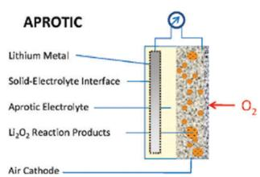

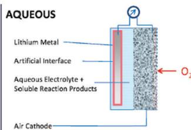

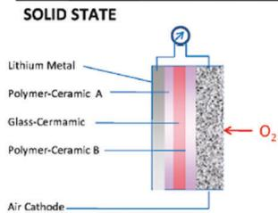  
Fig. 22 Li-Air battery architectures using four different nonaqueous, aqueous, solid state and mixed (or, hybrid) electrolytes. Dashed boundaries indicate the spontaneously formed SEI layers, while artificial SEI layers are indicated by solid lines. $^{174}$  Reprinted with permission from (G. Girishkumar, B. McCloskey, A. C. Luntz, S. Swanson and W. Wilcke, Lithium-air battery: promise and challenges, J. Phys. Chem. Lett., 2010, 1, 2193-2203). Copyright (2018) American Chemical Society.

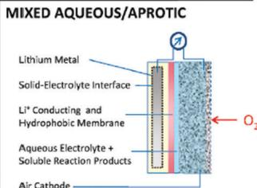

selectively  $\mathrm{Li^{+}}$ -ion conducting but electronically insulating solid state electrolyte membrane either of ceramic or polymer in nature may be coated over the Li anode and serves as the artificial SEI. The natural and artificial SEI concepts are illustrated in Fig. 23. A similar SEI layer is also formed naturally on the positive electrode, demonstrating the importance of understanding and control of the electrode/electrolyte interface.

In the aprotic electrolyte cells, the reaction at the anode during discharge involves oxidation of metallic Li to  $\mathrm{Li^{+}}$  to form  $\mathrm{Li_2O_2}$  at the cathode, and also possibly  $\mathrm{Li_2O}$ , yielding a cell potential of  $2.96\mathrm{V}$ , although the practical discharge potential is typically around  $2.7\mathrm{V}$ , while that for charging is over  $4\mathrm{V}$  as depicted in Fig. 24. The large difference between the charge and discharge potentials leads to low round-trip efficiencies around  $65\%$ . As  $\mathrm{Li_2O_2}$ , which is electronically and ionically insulating, builds up and clogs up the pores of the porous positive electrode, it increases polarization losses and is believed to be the controlling factor in governing the end point of discharge. The formation of  $\mathrm{Li_2O_2}$  as well as the reduction of oxygen at the cathode requires the presence of a catalyst for activating these reactions. Even though several transition metal oxides including  $\mathrm{Fe_2O_3}$ ,  $\mathrm{CuO}$ ,  $\mathrm{Co_3O_4}$  and, in particular  $\mathrm{MnO_2}$ , are found to be effective catalysts for this purpose[197] discharge overpotentials of  $0.3 - 0.4\mathrm{V}$  below the theoretical value as well as total cell overpotentials around  $1.5\mathrm{V}$  are typically observed in practical cells between charge and discharge curves (see Fig. 24). The status and advances in cathode materials and processes are extensively reviewed elsewhere.[198]

The blocking of catalytic sites by the solid  $\mathrm{Li}_2\mathrm{O}_2$  is a major problem not only on discharge but during the charging cycle as well, leading to nucleating the reaction products and high polarization losses. Moving to aqueous electrolytes would provide partial solution to the blocking problem at

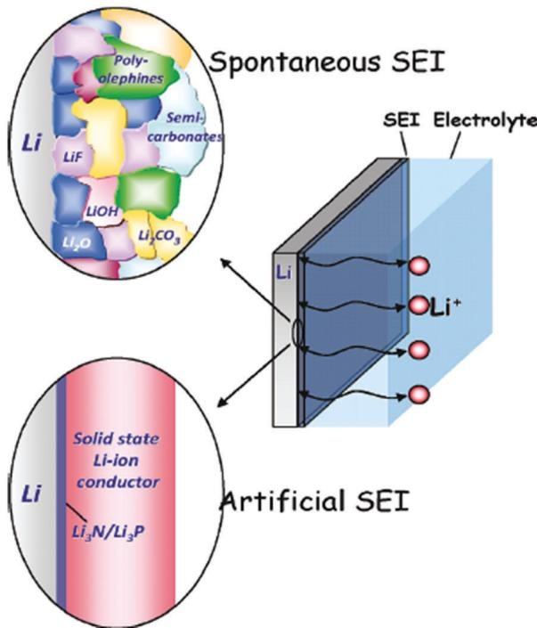  
Fig. 23 Schematic depiction of the spontaneous and artificial SEI layer on the Li anode of the Li-air battery. $^{174}$  Reprinted with permission from (G. Girishkumar, B. McCloskey, A. C. Luntz, S. Swanson and W. Wilcke, Lithium-air battery: promise and challenges, J. Phys. Chem. Lett., 2010, 1, 2193-2203). Copyright (2018) American Chemical Society.

the cathode by producing the soluble LiOH species, but aqueous cells exhibit significantly lower cell voltage and reduced capacity. Indeed, a protective Li-ion conducting solid electrolyte such as LISICON (for "lithium super ion conductor", e.g.,  $\mathrm{Li}_{1 + x + y}\mathrm{Al}_x\mathrm{Ti}_{2 - x}\mathrm{Si}_y\mathrm{P}_{3 - y}\mathrm{O}_{12}$ ) layer coated on the Li anode is needed to physically separate the water-reactive Li metal anode from the aqueous electrolyte. This innovation opened up attractive opportunities towards realizing aqueous Li-air batteries. $^{199,200}$  Similarly, a garnet-type of Li-ion conducting ceramic  $\mathrm{Li}_{6.4}\mathrm{La}_3\mathrm{Zr}_{1.4}\mathrm{Ta}_{0.6}\mathrm{O}_{12}$  (LLZTO) was employed for a Li-air battery, where it was reported to provide a specific capacity of  $20300\mathrm{mA}$  h g-C $^{-1}$  at  $80^{\circ}\mathrm{C}$  and at  $20~\mu \mathrm{Acm}^{-2}$ . The all solid-state Li-air battery concept $^{115,123}$  based on ceramic electrolytes eliminates some of the issues related to other battery designs such as safety and fire hazards related to flammable organic based electrolytes, overcharging, and electrical shorting by dendrite formation, and offers compact battery design, but brings along its own technical challenges including insufficient ionic conductivity and narrow stability window of the electrolyte against Li, interfacial charge transfer resistance, mechanical integrity due to volume changes in the electrodes, and poor cycling life. By contrast, use of solid polymer electrolytes provide flexibility to accommodate for volume change in the battery electrodes, but they have narrow windows for electrochemical stability and poor ionic conductivities that usually allow anion transport also. Their polymer matrix is also sensitive to the presence peroxide and superoxide species and deteriorates in the battery environment. $^{202}$  Extensive reviews of published

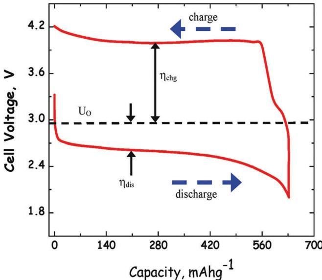

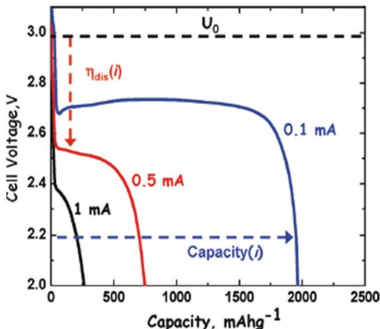  
Fig. 24 Capacity and cell charge-discharge overvoltages for a rechargeable Li-air battery with active electrode areas of  $1.2\mathrm{cm}^2$  in aprotic electrolyte having a theoretical OCV of  $2.96\mathrm{V}$  shown by the dashed line. (left) Single discharge-charge cycle at a current density of  $0.1\mathrm{mA}\mathrm{cm}^{-2}$  with dashed arrows indicating the charge and discharge directions. (right) Capacity loss as a function of cell current during discharge (per gram of carbon in the cathode).[174] Reprinted with permission from (G. Girishkumar, B. McCloskey, A. C. Luntz, S. Swanson and W. Wilcke, Lithium-air battery: promise and challenges, J. Phys. Chem. Lett., 2010, 1, 2193-2203). Copyright (2018) American Chemical Society.

work exist on the variety of liquid electrolytes as well as Li-ion conducting ceramic and polymer electrolytes. $^{114,115,195,202}$

Although there has been immense interest and activity in Li-air battery research and development, there still remains much work before these systems can offer their inherent potential for commercial applications. Of utmost importance is the lack of mechanistic details of the electrode reactions and battery processes, which are highly impacted by the sensitivity of the  $\mathrm{Li - O_2}$  electrochemistry to the nature of the battery electrolyte.[196,203-206] This makes it difficult to compare and rationalize experimental findings on a common platform.

In fact, a recent review felt the need to caution discretion in interpreting claims of cycle life and efficiency, and battery performance. $^{189}$  Moreover, the results are complicated and affected by parasitic reactions both due to the electrolyte solvent and the impurities in the ambient air that may occur in parallel to the  $\mathrm{Li - O_2}$  electrochemistry. $^{196}$  For example, the parasitic decomposition reaction of the electrolyte solvent dimethoxyethane is identified as the dominant reaction that is catalyzed by carbon, Pt and  $\mathrm{MnO}_x$  especially above  $3.5\mathrm{V}$ , while the onset of OER starts slightly above OCV indicating that the evolution reaction did not necessitate electrocatalytic promotion. $^{205}$  It is generally assumed that the parasitic reactions in the electrolyte involve the highly reactive intermediates  $\mathrm{LiO}_2$ , or  $\mathrm{O}_2^-$  such that most strategies for down-selecting a suitable electrolyte have been based on the electrolyte's stability against these species. Recently, singlet oxygen  $\left({}^{1}\mathrm{O}_{2}\right)$  was detected in the electrolyte above  $3.5\mathrm{V}$ . $^{206}$  This highly reactive species forms on the cathode upon  $\mathrm{Li}_2\mathrm{CO}_3$  oxidation in aprotic electrolytes, $^{207}$  and has been shown to account for parasitic reaction products of electrolyte decomposition. $^{208}$  Superoxide and peroxide are found to play a role in the formation of the singlet oxygen, which is also promoted by the presence of traces of water in the electrolyte. These important findings must be taken into consideration in the design and interpretation of Li-air battery studies to avoid reaching erroneous conclusions regarding the oxidation of  $\mathrm{Li}_2\mathrm{O}_2$ . If indeed the singlet oxygen holds the key to the reversibility of the  $\mathrm{Li - O_2}$  electrochemistry, this will require a shift from electrolyte-focused strategies to finding suitable electrolyte additives that can effectively trap or quench singlet oxygen formation. $^{209}$

Significant gains have been made in the last few years regarding the mechanistic understanding of electrode processes.[194] The fate of  $\mathrm{Li}_2\mathrm{O}_2$  during oxygen reduction upon discharge has always been a critical issue. It was shown that whether  $\mathrm{Li}_2\mathrm{O}_2$  deposits on the cathode as a blocking film or remains in solution as particulates inside the electrolyte is controlled primarily by the solubility of the single electron reaction intermediate  $\mathrm{LiO}_2$ , which governs the mechanism of cell discharge.[210] As the solubility of cations in aprotic solvents depends on the solvation of the cation by the solvent molecules defined largely by the Gutmann donor number (DN),[211] aprotic solvents with high donor number exhibit stronger solvation. Thus, for electrolytes with high donor number that strongly solvate  $\mathrm{Li}^+$ , the oxygen reduction reaction to form  $\mathrm{Li}_2\mathrm{O}_2$  occurs inside the electrolyte, while for electrolytes with low donor numbers,  $\mathrm{Li}_2\mathrm{O}_2$  forms an electronically blocking film on the cathode, passivating the electrode surface and giving rise to low rates, high polarization losses and poor performance. On the other hand, aprotic solvents with low donor numbers are generally more stable, and hence desirable. This conflict is mitigated by adding a soluble redox mediator to the electrolyte that alters the pathway for the oxygen reduction reaction and allowed the use of a low donor number aprotic solvent such as ether.[212]

Despite the potential of achieving extremely high energy densities and improved specific power,[213] most Li-air cell designs still suffer from poor specific capacity and power due to their slow kinetics and high polarization losses that result in

low current densities. During charging, the large overpotential is reported to be associated with deposition of the solid discharge products of electrolyte decomposition at the oxygen evolving surface or the  $\mathrm{Li}_2\mathrm{O}_2/$  electrolyte interface.[214] They also have stability and materials issues that require further optimization for cost and performance. For example,  $\mathrm{H}_2\mathrm{O}$  contamination in the aprotic electrolyte cells and  $\mathrm{CO}_{2}$  contamination in aqueous cells can lead to parasitic reactions with the Li metal anode or  $\mathrm{Li}_2\mathrm{O}_2$ . Interestingly, addition of trace amounts (500-400 ppm) of water to ethereal electrolytes helped increase discharge capacity by inducing a solution mechanism for the growth of  $\mathrm{Li}_2\mathrm{O}_2$ , while also enhancing parasitic reactions as expected.[215] Li-Air batteries also exhibit high charge-discharge overvoltages that result in modest round trip efficiencies around  $65\%$ .[174] Moreover, these cells generally are not  $100\%$  reversible, as the amount of oxygen consumed during discharge is considerably more than the oxygen evolved during charging.[209] On the high side,  $95\%$  retention of capacity after 100 cycles was reported for Au-C nanoparticle cathode with dimethyl sulfoxide electrolyte, providing a capacity of  $3000\mathrm{mA}\mathrm{h}\mathrm{g}^{-1}$  (or  $300\mathrm{mA}\mathrm{h}\mathrm{g}^{-1}$  for carbon-gold combined).[213] However, most studies report much lower values.

So at the present state of art, they are not particularly suitable for transportation applications for electric vehicles yet, but can be considered for low load stationary storage applications. However, further understanding and advances in battery electrode materials, catalysts and SEI materials can improve kinetics by, for example, nanostructuring, doping, interface engineering, and other strategies. Similarly, exploring ionic liquid electrolytes,[55] which offer high ionic conductivity and a wide thermodynamic stability regime up to  $5\mathrm{V}$ , offers exciting possibilities to improve cell stability and kinetics. A recent study using an ionic liquid electrolyte reported a highly reversible charge-discharge cycle, low overvoltage for the charging reaction, and an energy efficiency of  $83\%$  for the Li-oxygen battery.[216] Similar advances were made using nonaqueous electrolytes with high stability. Using tetra(ethylene)-glycol dimethyl ether-lithium triflate (TEGDME-LiCF $_3$ SO $_3$ ) electrolyte in a Li-oxygen cell, exceptionally high capacities of up to  $5000\mathrm{mA}$  h g-C $^{-1}$  and rates of  $3\mathrm{A}$  g-C $^{-1}$  were reported without the use of a catalyst.[217] At the average discharge voltage of  $2.7\mathrm{V}$ , this capacity value corresponds to a exceptionally high theoretical energy density of  $13500\mathrm{W}$  h kg $^{-1}$ .

Although much progress has been made, the jury is out on the commercial prospects of the Li-air battery. The technical challenges are far from being resolved completely. The short cycle life of these systems is still a major problem. Optimistically, even a  $500\mathrm{W}$ $\mathrm{kg}^{-1}$  Li-air battery is only 2-3 times better than the commercial Li-ion battery technology. A recent review article discusses the prospects of the Li-air battery in light of the technical challenges and suggests pursuing instead a holistic rather than an issue or problem-based approach as had been the case so far, to address and resolve these problems.[193]

D.1.2.4.2. Zn-Air batteries. Primary Zn-air batteries have been commercially available for more than half a century, and

this relatively mature technology has widely been employed in hearing aids, medical devices, telecommunications and other applications. The rechargeable Zn-air battery system, however, is a more recent development, and is considered as one of the contenders for electric vehicle applications provided that the technical challenges related to the Zn-anode and air catalyst can be resolved effectively. Recent reviews provide extensive discussions on the details of this battery system.[175,176,218,219]

Zinc is a non-toxic, earth-abundant, and relatively cheap material, and is relatively stable to corrosion in aqueous and alkaline solutions. Zn-air batteries are light weight and low cost at  $<$ 10 per kW ( $>10$  times cheaper than Li-ion batteries), and have high theoretical energy density of  $1086$  W h kg $^{-1}$ , which is more than 5 times higher than currently available Li-ion batteries on the market. Zn-Air system provides the highest energy density among all primary batteries, and as a rechargeable battery offers a competitive, safe and cost-effective alternative to Li-ion batteries. Recently, flexible Zn-air battery architectures have been reported that may provide innovative and attractive opportunities as portable power for mobile and wearable electronics. $^{220,221}$

Typical cell design of the Zn-air battery is schematically illustrated in Fig. 25. It consists of three major components, a Zn metal negative electrode, the air cathode and an electrochemically inactive but ionically permeable membrane separator to transport the hydroxyl (i.e.,  $\mathrm{OH}^{-}$ ) ions. The Zn anode is generally made of fine powdered Zn metal bound by the aid of binders and other additives to make a porous body. Such Zn foam anode structures can provide high energy densities in the range of  $300 - 500\mathrm{W h kg}^{-1}$ . Other micro- or nanostructured Zn anodes have also been developed in many different forms including nanospheres, nanofibers, flakes, rods, or sheets in

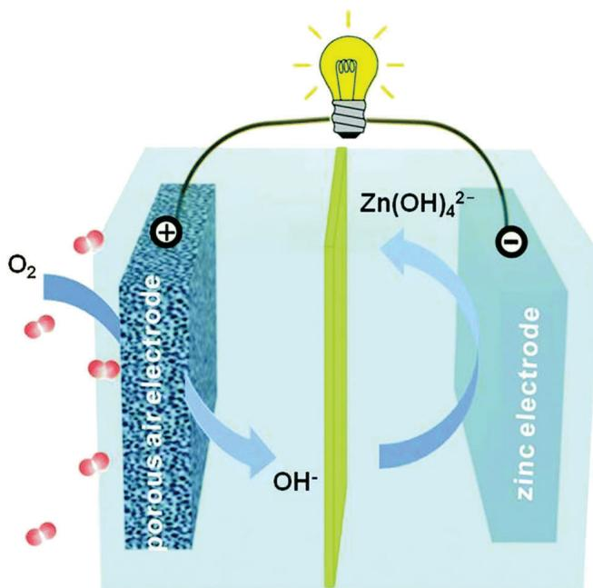  
Fig. 25 Schematic cell design of the Zn-air battery, indicating the porous air cathode, Zn anode, and the separator. Reproduced from ref. 175 with permission from The Royal Society of Chemistry.

order to increase surface area and battery performance.[222] Indeed, these attempts resulted in increasing the capacity by  $40\%$ , energy by  $50\%$  and  $\mathrm{Zn}$  utilization by  $30\%$ .[172] The air-breathing electrode, especially for rechargeable  $\mathrm{Zn}$ -air batteries, is arguably the most critical component of the battery as it greatly impacts battery performance and reversibility. The air electrode for the  $\mathrm{Zn}$ -air battery typically contains a porous carbon matrix with a gas diffusion layer to provide access for oxygen, and a catalyst deposited on the carbon matrix to promote the oxygen reduction (during discharge) for the primary battery, or a bifunctional catalyst that also promotes the oxygen evolution (during charging) reaction for rechargeability. Finally, the aqueous electrolyte is typically KOH, although other alkaline solutions such as NaOH and LiOH are also employed.

The net electrode reactions during cell discharge can be summarized in the following sequence.

Negative electrode:

$$
\mathrm {Z n} + 4 \mathrm {O H} ^ {-} = \mathrm {Z n} (\mathrm {O H}) _ {4} ^ {2 -} + 2 \mathrm {e} ^ {-} \left(E ^ {0} = - 1. 2 5 \mathrm {V} \text {v s . N H E}\right) \tag {16}
$$

$$
\mathrm {Z n} (\mathrm {O H}) _ {4} ^ {2 -} = \mathrm {Z n O} + \mathrm {H} _ {2} \mathrm {O} + 2 \mathrm {O H} ^ {-} \tag {17}
$$

Positive electrode:

$$
\mathrm {O} _ {2} + 4 \mathrm {e} ^ {-} + 2 \mathrm {H} _ {2} \mathrm {O} = 4 \mathrm {O H} ^ {-} \left(E ^ {0} = 0. 4 \mathrm {V} \text {v s . N H E}\right) \tag {18}
$$

Overall cell reaction:

$$
2 \mathrm {Z n} + \mathrm {O} _ {2} = 2 \mathrm {Z n O} \left(E ^ {0} = 1. 6 5 \mathrm {V} \text {v s . N H E}\right) \tag {19}
$$

Parasitic corrosion reaction at the negative electrode:

$$
2 \mathrm {Z n} + 2 \mathrm {H} _ {2} \mathrm {O} = \mathrm {Z n} (\mathrm {O H}) _ {2} + \mathrm {H} _ {2} \tag {20}
$$

During discharge, oxygen from air is reduced to hydroxyl ions by reaction (18) and zinc is oxidized in accordance with reaction (16) to the soluble zincate ions  $(i.e.,\mathrm{Zn(OH)}_4^{2-})$  until supersaturation in the alkaline electrolyte is reached, after which the zincate ions decompose to form the insoluble product  $\mathrm{ZnO}$  via reaction (17). Zincate ions can also cross over through the semipermeable separator membrane to the positive electrode compartment. This migration decreases the capacity of the  $\mathrm{Zn}$ -air battery. At the same time, the parasitic reaction (20) between  $\mathrm{Zn}$  and water takes place on the anode to give off hydrogen gas. This corrosion reaction leads to self-discharge and gradual loss of  $\mathrm{Zn}$  metal resulting in decreased utilization, efficiency and shelf life. Attempts to minimize the impact of self-discharge by the parasitic reaction (20) and slow down corrosion include alloying  $\mathrm{Zn}$  with other metals such as Bi, Sn, Pb, Cd, In, Mg, Ni, and Al to stabilize it,[223] adding surfactants[224] or organic-based corrosion inhibitors to the electrolyte,[225] and using surfaced modification techniques such as coating the  $\mathrm{Zn}$  surface with conductive polymers (PMMA, polypyrrole, polyaniline) or inorganic films such as lithium boron oxide  $(i.e.,\mathrm{Li}_2\mathrm{O}-2\mathrm{B}_2\mathrm{O}_3)$  and  $\mathrm{Al}_2\mathrm{O}_3$ [226] all of which are aimed to modify and improve the electrochemical behavior of the negative electrode and suppress hydrogen evolution.

The alkaline electrolyte employed in Zn-air batteries is susceptible to  $\mathrm{CO}_{2}$  contamination from the air supply, resulting

in the formation of insoluble carbonates at the air electrode and parasitic consumption of the electrolyte, which in turn lowers the electrolyte conductivity and clogs up the pores of the gas diffusion layer on the cathode. Naturally, carbonate formation adversely impacts the performance and service life of the battery. Generally, aqueous NaOH or KOH solutions are employed for Zn-air battery electrolytes. Typically, 7 M (or,  $30\mathrm{wt}\%$  ) KOH solution is the electrolyte of choice due to its higher ionic conductivity, higher oxygen diffusion coefficient and lower viscosity, but suffers from higher solubility for  $\mathrm{CO}_{2}$  than NaOH solutions. Recent interest in aprotic electrolytes, especially highly conductive and stable ionic liquids, may provide new opportunities to suppress these parasitic reactions. It should be noted, however, that the air electrode structure has been specifically optimized for aqueous electrolytes, and hence, switching to aprotic electrolytes may require a design change.

The theoretical OCV for the Zn-air battery is  $1.65\mathrm{V}$  vs. NHE, as given by the overall cell reaction (19). In practice, however, working cell potentials are typically less than  $1.2\mathrm{V}$  due to activation, ohmic, and concentration polarization losses. In particular, the activation loss at the cathode for ORR largely dominates the overall cell losses, as is also the case for PEM and other types of fuel cells. The ORR reaction occurs at the triple phase boundaries (tpb) where the electrolyte, catalyst impregnated carbon current collector and the gas phase (i.e., air) meet. Wettability of the cathode structure is as important as the access of the gas phase to the tpb sites. In attempts to improve the activation for ORR, both unifunctional (e.g., Pt, Ag,  $\gamma$ -MnO $_2$ , doped-perovskites) and bifunctional (e.g., MnO $_2$ -Co $_3$ O $_4$ , NiCo $_2$ O $_4$ , La $_2$ NiO $_4$ ) catalysts have been reported. $^{175}$

As discussed in some detail (under Section D.1.4.: Metal-air batteries) above, the air electrode is the most critical component of the Zn-air battery, as reviewed recently elsewhere.[219] Specifically, bifunctionality poses a major challenge to achieving rechargeability of the Zn-air battery. It requires facile catalysis of the ORR during discharge, and fast promotion of the OER during charging. For example, Pt is known to be the best ORR catalyst, but even then, it exhibits significant overpotential due to surface coverage by strongly adsorbed O and OH species, which are found to be stable.[186] Pt also shows poor activity as an OER catalyst due to the coverage of its surface with an oxide layer at the charging potentials in alkaline media. Moreover, Pt is cost-prohibitive to employ widely as a bifunctional electrocatalyst in practical systems. Hence, there has been an intense search for earth-abundant, inexpensive, and high activity bifunctional catalysts for air-breathing electrodes for many electrochemical devices and applications, including all types of metal-air batteries.

Among many electrocatalyst compositions reported in the literature, nanostructured  $\mathrm{MnO}_2$ , an inexpensive, nonprecious and abundant material, shows promise and its activity was shown to approach to that of precious metal-based catalysts.[184] Fig. 26 compares the ORR and OER performance of various precious metal electrocatalysts with manganese oxide. As a bifunctional electrocatalyst for ORR and OER,  $\mathrm{MnO}_x$  clearly performs favorably with precious metal electrocatalysts Pt, Ir and Ru. Other transition metal electrocatalysts have been

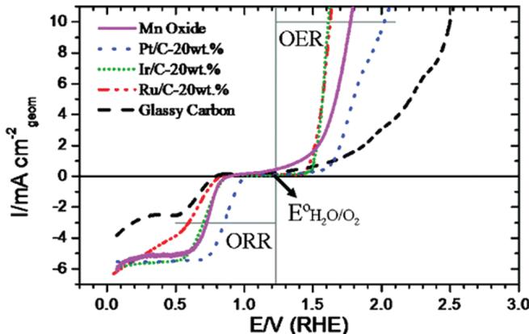  
Fig. 26 Comparison of the ORR and OER activities of nanostructured  $\mathrm{MnO}_x$  with the best precious metal catalysts.[184] Reprinted with permission from (Y. Gorlin and T. F. Jaramillo, A bifunctional nonprecious metal catalyst for oxygen reduction and water oxidation, J. Am. Chem. Soc., 2010, 132, 13612-13614). Copyright (2018) American Chemical Society.

investigated also. A carbon-free, mesoporous Ni-Fe nitride  $\left(\mathrm{Ni}_{3} \mathrm{FeN}\right)$  bifunctional electrocatalyst was reported to show excellent activity with low overpotential of  $0.355 \mathrm{~V}$  measured at  $10 \mathrm{~mA} \mathrm{~cm}^{-2}$  for OER, and a more positive half-wave potential  $(E_{1 / 2})$  of  $0.78 \mathrm{~V}$  (vs. RHE) for ORR compared to  $\mathrm{RuO}_{2}$ $(0.54 \mathrm{~V})$ , but smaller than Pt  $(0.84 \mathrm{~V})$ . Moreover, the  $\mathrm{Ni}_{3} \mathrm{FeN}$  electrocatalyst showed excellent cycling stability for 310 cycles over 100 hours, with a low voltage-gap of  $0.7 \mathrm{~V}$  between discharge-charge cycles, and only  $3.9 \%$  decrease in the round-trip efficiency after 90 cycles. Similarly, 3D carbon- and binder-free air electrodes made of  $\mathrm{Co}_{3} \mathrm{O}_{4}$  nanotubes nominally  $300 \mathrm{~nm}$  in outside diameter  $(50 \mathrm{~nm}$  inside) and  $15 \mu \mathrm{m}$  in average length were deposited on a stainless steel (SS) mesh current collector and exhibited stable charge and discharge potentials of  $2.0 \mathrm{~V}$  and  $0.98 \mathrm{~V}$ , respectively, that remained unchanged after 100 cycles, and retained  $94 \%$  of the discharge potential and  $97 \%$  of the charging potential after 600 hours. A similar study employed carbon nanotube-supported CoO and carbon-free NiFe nanoplates as electrocatalytic air-electrodes and reported a high discharge power density of  $265 \mathrm{~mW} \mathrm{~cm}^{-2}$  and energy density  $>700 \mathrm{~Wh} \mathrm{~kg}^{-1}$  for the former composition under primary battery mode, while the combination of the two electrocatalysts in the rechargeable battery mode gave a small charge-discharge polarization of only  $0.7 \mathrm{~V}$  and good cycling stability during 4 to  $20 \mathrm{~h}$  long charge-discharge cycles at  $20 - 50 \mathrm{~mA} \mathrm{~cm}^{-2}$ . Doped-perovskites are potential candidates but so far, redox stability of these bifunctional catalysts during repeated cycling has not been satisfactory. More work is needed to develop nonprecious metal-based bifunctional ORR-OER catalysts, not only for achieving the full potential of Zn-air batteries, but also for most fuel cell systems.

Indeed for the Zn-air battery, the overpotential at the Zn anode is relatively small, while the cathode overpotential for the ORR reaction to form hydroxyl ions via reaction (16) makes up the major portion of the cell polarization losses. During charging, an external potential significantly larger than the OCV needs to be applied to reverse the cell reactions. Typical voltages

required for the charging process are  $2\mathrm{V}$  or higher. Because of such losses during charging and discharging, typical round trip efficiencies of Zn-air batteries are less than  $60\%$ .[175]

Designing an electrically rechargeable Zn-air battery pose many challenges. For long and stable cycle life of Zn-air batteries between charge-discharge cycles, it is imperative to avoid irreversible and morphological changes in all battery components. It is well known, however, the Zn metal in the negative electrode undergoes shape changes and dendritic growth during the dissolution/electrodeposition cycles while discharging and charging, respectively. This is shown in Fig. 27, which illustrates the growth of dendrites during electrodeposition of Zn from a  $\mathrm{ZnCl}_2$  solution.

Dendrite growth is driven by the inherent instability of the solid/liquid interface during electrodeposition. When the current density is sufficiently high to cause depletion of the solute in the electrolyte near the electrode surface, the local gradient of the solute's chemical potential near the surface becomes positive and drives any microscopic surface feature to grow at a much faster rate than the solid/liquid interface. The roughened surface eventually leads to the formation of dendrites and/or filaments.

The poor cyclability of the Zn-air battery is largely due to the highly soluble zincate ion that is formed via reaction (16) during discharge, and not returning to the same surface site to electrodeposit Zn metal during the charging process. Needless to say, this process is very difficult to control. It causes shape change, and eventually leads to the formation of dendrites. As expected, it degrades cell performance and, in extreme

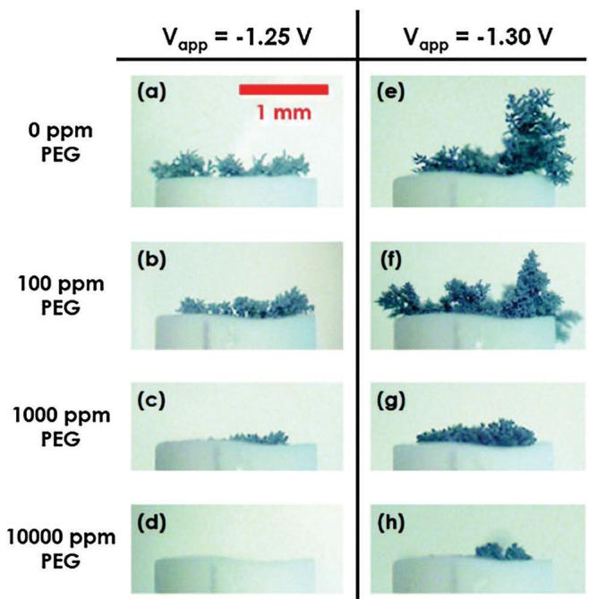  
Fig. 27 Optical images of dendritic growth of Zn during electrodeposition at two different potentials (vs.  $\mathrm{Ag / AgCl}$ ) on a Zn wire from a  $0.1\mathrm{M}$ $\mathrm{ZnCl}_2$  electrolyte solution with various concentrations of the additive polyethylene glycol (PEG). Reproduced from ref. 175 with permission from The Royal Society of Chemistry.

cases, may even lead to electrical shorting of the battery as the dendrites cross over to the positive electrode.

One of the practical solutions to get around the electrical rechargeability problem for Zn-air batteries is mechanical charging. This approach may particularly be attractive for automotive or other transportation applications. Mechanical charging employs the primary Zn-air battery concept and simply involves replacing the Zn-anode assembly mechanically. This simplifies or eliminates many of the technical and materials challenges posed by electrical rechargeability, including using simple unifunctional ORR catalysts, avoiding dendrite and other shape change problems at the negative Zn electrode, and improve battery efficiency. The spent Zn anodes can be recycled in centralized regeneration facilities back to Zn anodes. For transportation applications, this provides attractive opportunities, but require both the distribution of Zn-fuel anodes and collection of spent anodes for regeneration. The vast network of gasoline service stations in place already may be appropriate to serve as Zn anode replacement stations. However, a collection system for spent Zn, and centralized regeneration facilities to recover and regenerate the Zn anodes are required.

D.1.3. Flow batteries. Flow batteries offer many advantages for electrical energy storage including ease of scaleability, fast response, high power density that can respond to rapid changes in the load, high round-trip efficiency, and long service life for repeated charge-discharge cycles. Arguably, however, the major advantage of redox flow batteries is their ability to decouple rated power from energy storage capacity, unlike batteries where the two are intimately linked. This advantage provides a considerable latitude and flexibility for designing flow battery systems with respect to the specific requirements of particular applications. In flow batteries, while the power output is controlled by the size of the cell stack, the size of the storage tanks that hold the electrolyte solutions for the redox couple defines its energy capacity. These attributes make flow batteries attractive for grid scale stationary energy storage applications for electricity generation and transmission industries. Although there are a large number of flow battery configurations and chemistries, flow batteries can be grouped in two general types of chemistries from a mechanistic point of view, namely, redox flow batteries (RFB) and hybrid flow batteries (HFB). Prominent members of each group are discussed in the next two sections.

Typical schematic design and operating principle of RFBs is given in Fig. 28, which also illustrates the operating principle of the battery with respect to the generalized redox couples A and B dissolved in appropriate aqueous or organic liquid electrolytes. The electrolytes for the redox couples A and B need not be the same, and in general are different. The anode and cathode compartments (or, anolyte and catholyte, respectively) of the cell is partitioned by an ionically-conducting membrane or a separator that prevents the two electrolytes from mixing with each other, while providing selective transport for the charge carrying ions. The electrochemical process involves pumping of the stored electrolyte from the tank to the flow-through electrodes in the cell stack. During discharge, the chemical energy of the reversible redox couple is converted into

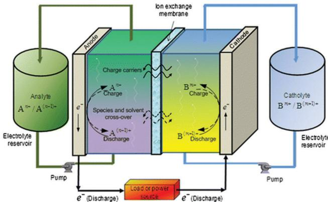  
Fig. 28 Basic cell design and operating principle of a redox flow battery based on the generalized redox couples A and B.[230] Republished with permission of The Electrochemical Society, from [M. L. Perry and A. Z. Weber, Advanced redox-flow batteries: a perspective, J. Electrochem. Soc., 2016, 163, A5064-A5067]; permission conveyed through Copyright Clearance Center, Inc. (2018).

electricity, while during charging the reaction is reversed and the redox couple is regenerated from an external power source such as off-peak power from the grid, or preferably from a renewable source. For this reason, RFBs operate like rechargeable batteries in many ways. As the redox couple can be considered as the fuel, however, RFBs also resemble very much the operation of a fuel cell, and hence, are sometimes referred to as "regenerative fuel cells".

There has been a wide range of organic and inorganic redox chemistries that were explored and reported in the literature since the advent of RFBs in the early 1970's. Most of this work has been reviewed recently.[230-235] More recently, a special focus issue of the Journal of The Electrochemical Society was entirely dedicated to most recent progress in RFBs.[236] Among the multitude of redox couples that were studied or developed for RFBs, the standard potentials for some of the more common ones are provided in Fig. 29 that also indicates the electrolyte

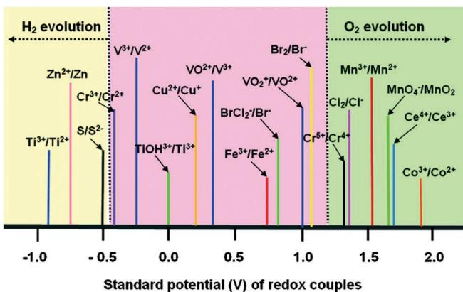  
Fig. 29 Standard potentials vs. SHE of selective redox couples in aqueous electrolytes, also indicating the boundaries for  $\mathsf{H}_2$  and  $\mathrm{O}_2$  evolution on carbon electrodes.[231] Reprinted from W. Wang, Q. Luo, B. Li, X. Wei, L. Li and Z. Yang, Recent progress in redox flow battery research and development, Adv. Funct. Mater., 2013, 23, 970-986, with permission from John Wiley and Sons.

stability boundaries, including the overpotentials for hydrogen and oxygen evolution on carbon electrodes. It is clear that the choices for the appropriate redox couples within this window are not unlimited. Also important is the consideration for the solubility of the redox couples in the electrolytes.

Among the various chemistries, the Fe-Cr redox chemistry with an OCV of  $1.18\mathrm{V}$  was the first truly RFB system that was developed for the space program by NASA in the 1970's. Since then, a diverse range of organic $^{237}$  and inorganic-based $^{230-234,236,238}$  and even organic-inorganic-based $^{235,239}$  RFB chemistries have been reported. The redox cycles, electrochemically active species, and cell potentials of some of the RFB systems are illustrated in Fig. 30. The working potentials of RFBs employing non-aqueous electrolytes are nearly twice higher than those with aqueous electrolytes. Among the multitude of inorganic redox chemistries, the all-vanadium-based RFB system has arguably received the most attention. There has also been renewed interest in  $\mathrm{Zn - Br_2}$  RFBs, although other interesting chemistries have also been investigated. Recently, an exceptionally high power density was reported for a quinone-bromine flow battery that exhibited  $1\mathrm{Wcm}^{-2}$  at peak power, $^{239}$  which is more than  $75\%$  higher than the best power reported for the vanadium-based RFBs.

However, it is important to note that unlike batteries that store energy in its electrodes, whose mass defines its energy capacity while its kinetic and transport properties in turn govern the battery's power output, RFBs store energy in the

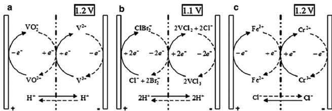

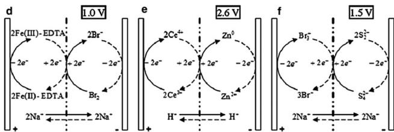

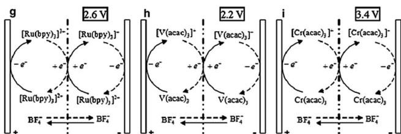  
Fig. 30 Redox chemistries, transport pathways and working potentials of select RFBs: (a) all vanadium, (b) vanadium/bromine, (c) iron/chromium, (d) Fe-EDTA/bromine, (e) zinc/cerium, (f) bromine/polysulfide, (g) nonaqueous ruthenium/bipyridine, (h) non-aqueous vanadium/acetylacetonate, (i) non-aqueous chromium/acetylacetonate.[232] Reprinted by permission from Springer Nature, A. Z. Weber, M. M. Mench, J. P. Meyers, P. N. Ross, J. T. Gostick and Q. Liu, Redox flow batteries: a review, J. Appl. Electrochem., 2011, 41, 1137–1164. Copyright (2018).

form of chemical energy of the soluble redox couple held in storage tanks that can easily be scaled up to demand. As the tank sizes are necessarily large, the volumetric energy densities for RFBs are usually less than  $25\mathrm{WhL}^{-1}$ .231

Again in contrast to batteries whose electrodes usually undergo morphological, compositional, structural and molar volume changes, and even sometimes phase transformations during each discharge-charge cycle, which place a heavy toll on the mechanical integrity, stability and useful lifetime of the electrodes, RFB electrodes merely provide an electrochemically active surface for the redox reactions without the burden of physical or chemical changes. This simplifies the operation, and provides high stability, long cycle and service life, low cost, and scaleability for RFBs. Using cell performance criteria as well as cell components and materials costs, a techno-economic study of various electrochemical storage technologies suggested that it may be possible to achieve system level energy storage costs in the range \(106 - 148\) per kW h for non-specific aqueous RFBs and \)114 - 156 per kW h for non-specific nonaqueous RFBs with the right combination of cell and system attributes.[227,249] For comparison, this study also suggested the future cost of storage for \(\mathrm{V}^{2+}/\mathrm{V}^{3+}\) RFBs (or, VRB) at \)118 - 207$ per kW h and \(\mathrm{Zn/Br_2}\) RFB at $103 - 160 per kW h, which compare favorably with $193 - 254 per kW h estimated in a similar manner for Li-ion batteries. It should be noted however, that by comparison, the cost target by the US Department of Energy (DOE) is $100 per kW h,[241] while the system level cost estimates for current VBRs are reported to be around $500 - 600 per kW h.[242] Obviously, there remains much catching up to meet these cost and performance targets for RFB storage.

D.1.3.1. Vanadium redox flow battery. The vanadium redox flow battery (VRB) is arguably the most extensively studied RFB and is a promising technology that was pioneered in the early 1980's. Materials issues and technological challenges for VRBs have been reviewed extensively elsewhere.[242-245] The all-vanadium redox battery was originally proposed as an attempt to minimize or overcome the chemical cross talk across the separator of the different redox species employed in earlier RFB chemistries. By exploiting vanadium's four oxidation states, the same element (i.e., vanadium) can be employed in both the anolyte and the catholyte, which provides major improvements in reducing cross contamination and extending battery life. The anolyte and the catholyte employed in the VRB consist of soluble  $\mathrm{V}^{2+}/\mathrm{V}^{3+}$  and  $\mathrm{V}^{4+}/\mathrm{V}^{5+}$  (in the form of  $\mathrm{VO}^{2+}/\mathrm{VO}_2^+$ ), respectively. Both electrolytes are made of aqueous  $5\mathrm{M}$ $\mathrm{H}_2\mathrm{SO}_4$  solution separated by an ionically conducting membrane. The half-cell reactions are given by,

Negative electrode:

$$
\mathbf {V} ^ {3 +} + \mathbf {e} ^ {-} = \mathbf {V} ^ {2 +} \tag {21}
$$

Positive electrode:

$$
\mathrm {V O} ^ {2 +} + \mathrm {H} _ {2} \mathrm {O} = \mathrm {V O} _ {2} ^ {+} + 2 \mathrm {H} ^ {+} + \mathrm {e} ^ {-} \tag {22}
$$

Overall cell reaction:

$$
\mathrm {V O} _ {2} ^ {+} + \mathrm {V} ^ {2 +} + 2 \mathrm {H} ^ {+} = \mathrm {V O} ^ {2 +} + \mathrm {V} ^ {3 +} + \mathrm {H} _ {2} \mathrm {O} \tag {23}
$$

The overall cell reaction (23) proceeds to the right during discharge, and to the left during charging. The standard cell potential corresponding to the overall cell reaction is  $1.26\mathrm{V}$  at room temperature, but the OCV for VRB can be as high as  $1.6\mathrm{V}$  when the anolyte and catholyte contain of  $\sim 2\mathrm{M}\mathrm{V}^{2+}$  and  $\mathrm{V}^{5+}$ , respectively. The four different oxidation states can easily be identified by the color of the solution, such a that the color of the  $\mathrm{V}^{2+},\mathrm{V}^{3+},\mathrm{V}^{4+}$ , and  $\mathrm{V}^{5+}$  states correspond to violet, green, blue and light yellow, respectively. For these vanadium electrolytes, an energy density of  $25\mathrm{WhL^{-1}}$  was reported.[233] However, the VBR performance is severely impacted by the limited solubility ( $\sim 2\mathrm{mol l^{-1}}$ ) and stability of vanadium ions in sulfuric acid solutions. This in turn constrains the operating temperature regime between 10 and  $40^{\circ}\mathrm{C}$ , and requires active heat management, which lowers efficiency. The low fuel utilization due to solubility limitation also impacts performance adversely. When VRB is over-charged, hydrogen and oxygen gas evolution may be observed at the negative and positive electrodes, respectively. But such gas evolution can impact the pH, increase cell resistance by disruption of the liquid electrolyte flow, and oxidation of the carbon at the positive electrode.

Moreover, the highly corrosive nature of  $\mathrm{V}^{5+}$  makes it necessary to employ more expensive membranes or separators, and containers as well as cell components. Accordingly, the volumetric energy density remains modestly low and does not exceed  $25 - 35\mathrm{WhL^{-1}}$ , while the round trip efficiencies are around  $60 - 65\%$ . Similarly, the current densities are usually in the  $50 - 80\mathrm{mA cm^{-2}}$  corresponding to a power density below  $100\mathrm{mWcm^{-2}}$ ,[234] which is much lower than provided typically by PEM fuel cells. High cost and price fluctuations of vanadium and its salts make it difficult to reliably do economic forecasting, which poses challenges for commercial development of VRBs. For these reasons, a multitude of different redox chemistries based on vanadium and others has been reported in aqueous as well as in non-aqueous electrolytes, but many pose challenges.[231,233,243,244,246] For example, the cell membrane (typically Nafion) makes up more than  $40\%$  of the total cost of the VRB stack.[242] Advanced hydrocarbon-based cost-effective membranes that display adequate stability and selectivity may have a major impact on stack costs. Vanadium is expensive so another major cost item is the vanadium-based electrolytes. More cost-effective redox chemistries, including organic redox couples, may help improve both VRB economics as well as increasing the cell operating voltage and hence, the energy density. On the other hand, developing nonaqueous electrolytes with sufficient solubility and stability for the redox couple is challenging. Redox chemistries that can undergo multiple-electron transfer reactions and yield high discharge potentials are highly desirable for advancing RFB technology. Achieving high utilization and effective use of large electrode areas in large-scale storage applications, chemical stability, low cell impedance, and long term recycling capability will significantly improve overall performance.

Commercially, VRB units in the kW to MW scale have been developed for nearly two decades for local grid load-levelling and other storage applications in countries like Japan, Australia,

and South Africa. Although they have fast cycling properties, the capital cost of \(3000 - 3310 per kW for VRBs are still high, which limits their use for specialized applications and niche markets.\(^{19}\) A recent study estimated the energy storage cost for a 2 kW (30 kW h) all-vanadium RFB unit to be \(\sim\)100 per kW h, corresponding to \(\$0.10\) per kW h for the cost of stored electricity.\(^{245}\) It should be cautioned, however, this estimate is far too optimistic than more recent estimates of \(\$500 - 600\) per kW h for current VRB systems,\(^{242}\) and the projected estimates of \(\$118 - 207\) per kW h for the future cost of storage for VRB.\(^{240}\)

D.1.3.2.  $Zn - Br_{2}$  flow battery. The  $\mathrm{Zn - Br_2}$  flow battery is actually a hybrid flow battery (HFB), different from the true definition of a redox flow battery system. As in the case of the Zn-air battery, the  $\mathrm{Zn - Br_2}$  flow battery also employs Zn metal as the negative electrode, where Zn is dissolved and electrodeposited during discharge and charge cycles, while the  $\mathrm{Br}_2$  gas soluble in the electrolyte is at the positive electrode, where  $\mathrm{Br^{-} / Br_{2}}$  conversion takes place. This is schematically illustrated in Fig. 31. The half-cell reactions are given below, and provide an open circuit potential of  $1.85\mathrm{V}$ .

Positive electrode:

$$
\mathrm {B r} _ {2 (\mathrm {a q})} + 2 \mathrm {e} ^ {-} = 2 \mathrm {B r} ^ {-} \tag {24}
$$

Negative electrode:

$$
\mathrm {Z n} = \mathrm {Z n} ^ {2 +} + 2 \mathrm {e} ^ {-} \tag {25}
$$

Overall cell reaction:

$$
\mathrm {Z n} + \mathrm {B r} _ {2 (\mathrm {a q})} = \mathrm {Z n} ^ {2 +} + 2 \mathrm {B r} ^ {-} \tag {26}
$$

Although the  $\mathrm{Zn - Br_2}$  battery concept was originally proposed more than century ago, research on this battery system was revived by commercial interest in the 1970's and 1980's. More recently, there has been renewed interest propelled in large part by the urgent need for developing large-scale energy storage systems.

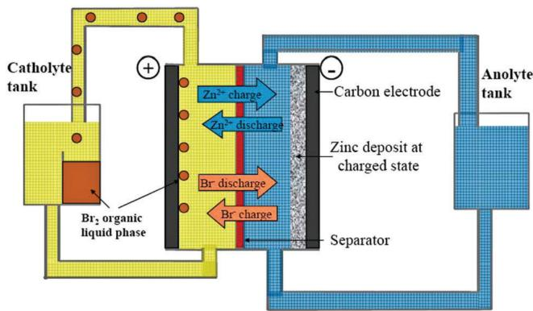  
Fig. 31 Schematic flow diagram of the  $\mathrm{Zn - Br_2}$  flow battery.[233] Republished with permission of The Electrochemical Society, from [M. Skyllas-Kazacos, M. H. Chakrabarti, S. A. Hajimolana, F. S. Mjalli and M. Saleem, Progress in flow battery research and development, J. Electrochem. Soc., 2011, 158, R55-R79]; permission conveyed through Copyright Clearance Center, Inc. (2018).

Generally,  $\mathrm{Zn - Br_2}$  flow batteries offer higher energy densities  $(65 - 75\mathrm{Whkg}^{-1})$  than traditional redox flow batteries.[233] This is in part due to the use of Zn metal anode that eliminates the need for large volumes of anolyte, otherwise required in RFBs. Also, the OCV for  $\mathrm{Zn - Br_2}$  flow batteries is relatively higher than those for RFBs. They have storage efficiencies  $70\%$  or higher, with high Coulombic and voltage efficiencies of  $90\%$  and  $85\%$ , respectively.[233] However,  $\mathrm{B}_2$  gas is highly corrosive and hazardous, and leakage of this gas presents public health and environmental problems. It also has the propensity to cross over the membrane separator due to the unsatisfactory selectivity of the membrane for  $\mathrm{Br^-}$  ions that lowers the working cell potential, contributes to polarization losses, and reduces reactant utilization.

Repetitious dissolution and electrodeposition of Zn on the anode during discharge and charge cycles leads to irreversible shape or morphological changes, surface roughening, and dendrite formation (see Fig. 27). The latter can eventually lead to electrical shorting. At the same time, a parasitic reaction (20) between Zn and the aqueous electrolyte takes place to give off hydrogen gas. This corrosion reaction leads to gradual loss of Zn metal resulting in decreased cycle life and in particular, zinc utilization, which can be as low as  $40\%$ .[247]

Furthermore, the slow reduction reaction (24) kinetics of bromine gives rise to polarization losses at the positive electrode, leading to lower voltage efficiency and useful cell potential. High surface area carbon is usually employed to mitigate this loss, but due to gradual consumption of carbon by oxidation, it is difficult to preserve this high surface area over long service life.

Due to these challenging problems, the highly negative reduction potential of the \(\mathrm{Zn^{2+}/Zn}\) couple makes this half-cell reaction less attractive for flow batteries. The performance of \(\mathrm{Zn-Br_2}\) flow batteries does not compare favorably with the VRB system, which generally offers better performance. A new single-chamber, membrane-free design concept that eliminates many of the expensive components in the traditional \(\mathrm{Zn-Br_2}\) HFB system is reported to operate at \(>60\%\) energy efficiency for over 1000 cycles, and achieved \(>90\%\) Coulombic efficiency with a volumetric energy density of \(9\mathrm{WhL^{-1}}\) at a projected cost of \(<\\(100\) per kW h.[248] The latter figure meets the US DOE cost target for electrical storage systems.[241] Nevertheless, \(\mathrm{Zn-Br_2}\) flow batteries are generally limited to small scale storage applications up to \(500\mathrm{kWh}\).[233] However, the economics of \(\mathrm{Zn-B_2}\) batteries are more favorable than VRBs. The average capital cost of \(\$3000-3310\mathrm{kW^{-1}}\) for VRBs is significantly more expensive than the capital cost of \(\$1650-2015\) per kW for \(\mathrm{Zn-B_2}\) batteries, which competes favorably well with other electric storage and even generation systems.[19]

# D.2. Supercapacitors

Supercapacitors are in essence electrochemical capacitors that lie between dielectric capacitors and batteries, and store large amounts of charge. Similar to batteries, their design architecture involves two electrodes separated by an electrolyte and a separator to keep the electrodes from shorting. They offer

exceptionally high capacitances ranging from several 100s of farads per gram up to  $1700\mathrm{Fg}^{-1}$ ,[249] depending on the storage mechanism, choice and microstructure of the electrode materials, and the electrolyte. Although they store charge orders of magnitude more than dielectric capacitors, their relatively low energy density limits their practical use as stand-alone storage systems. However, they can be useful for many high-power but low energy applications. Recent review articles extensively discuss the fundamental aspects of this technology, and report progress in advanced materials for electrodes and electrolytes.[249-255]

Power densities of supercapacitors are generally around  $10000\mathrm{Wkg}^{-1}$ , which is 2-3 orders of magnitude higher than batteries, but on the other hand, they have much lower energy densities, typically  $<5\mathrm{Whkg}^{-1}$ . Most electrochemical storage systems exhibit low power densities, partly due to the long diffusion distances and slow mobility of charge carrying ionic species either in the electrolyte and/or in the electrode material as they rely on bulk diffusion for mass transport. In supercapacitors, however, diffusion lengths are significantly shorter (of the order of nanometers) due to the nature of charge storage mechanism occurring at interfaces or surfaces. Hence, they usually have small time constants, or short response times, that allow them to store and release charge at fast rates. Accordingly, they are suitable for fast power drain applications as they can be discharged and charged in a manner of seconds to minutes, as opposed to batteries that typically take several hours to recharge.

Another important feature of supercapacitors is their exceptionally long cycle life, up to several 100000 cycles.[250,255] Typically batteries store charge by insertion or chemical reactions at the electrodes, which result in induced strain due to structural or volume changes that limit the battery's cycle life. In supercapacitors, however, charge is stored at interfaces or surfaces and does not involve changes in the microstructure or volume of the electrodes during discharge-charge cycles. Without such strain on the electrodes, these devices have long service and cycle life. These attractive attributes make supercapacitors highly efficient (85–98%) electrical energy storage devices that fill the gap between batteries and conventional capacitors.

Operationally, supercapacitors behave differently from batteries. The cell voltage of an ideal battery remains constant during the charging and discharging operations, while the ratio of the discharge-to-charge potential is a measure of battery's efficiency. In supercapacitors, however, the cell voltage linearly decreases during discharge, and increases linearly during recharging. This is illustrated in Fig. 32. As the voltage of the supercapacitor during charge/discharge cycles varies linearly, it is quite easy to assess the state of charge or discharge of the device as indicated by the dashed line in Fig. 32, while the flat cell voltage makes this assessment significantly more difficult in the case for batteries. Moreover, the energy of a battery is proportional to its cell voltage and defined by the area under the flat discharge potential, while the energy of a supercapacitor is proportional to the square of the cell voltage and

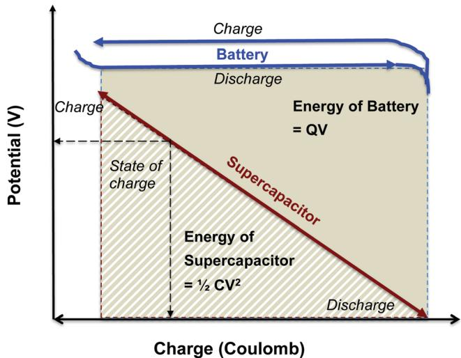  
Fig. 32 Schematic comparing the characteristic performance of ideal batteries with supercapacitors. Batteries ideally charge and discharge at constant potential plateaus providing energy at fixed voltage, while the potential of supercapacitors decrease with discharge, which makes it easy to assess the state of charge by simply by measuring its voltage, as indicated by the dotted arrows. The energy for the battery is defined by the rectangular shaded area under the discharge plateau, while the striped triangular area defines the energy of the supercapacitor.

defined by the triangular area in Fig. 32, which makes it clear why batteries pack more energy. Recently, an interesting question was raised regarding where batteries end and supercapacitors begin especially for nanostructured devices, where the distinction may sometimes be blurred between the discharge behavior of a nanostructured Li-ion battery from an EDL capacitor,[257] and suggested cyclic (i.e., sweep) voltammetry to determine characteristic charge-discharge behavior and device identity.

High power-low energy density property of supercapacitors can complement the low power-high energy density characteristics of batteries. In fact, batteries and supercapacitors are considered as power trains for electric vehicles, where useful life and cost are the most critical factors for implementation.[257,258] In addition, suitable combinations of these systems may open up new design opportunities to build battery-supercapacitor hybrid storage systems for high-power - high-energy applications.

There are generally two major classes of supercapacitors, those that rely on charge storage at the electrochemical double layer and those that rely on surface redox reactions, or pseudocapacitance. In both cases, capacitance is proportional to the active surface area. Hence, synthesis routes for producing ultrafine particle size, and nanostructuring methods to fabricate 0D, 1D, 2D, and 3D active materials as well as composite structures have been explored for supercapacitor electrodes.[249,251,254]

Electrochemical double layer (EDL) supercapacitors (also called, ultracapacitors $^{256}$ ) have been commercially available for more than three decades, first introduced in Japan by Nippon Electric Corporation in early 1980's, and later by others like Panasonic. However, supercapacitors are expensive systems with an estimated cost of $10000-20000 per kW h, $^{24,255}$  which is more than one order of magnitude more expensive

than Li-ion batteries. Although cost is a major impediment for large-scale industrial deployment of this technology, supercapacitors are employed in select military applications or in niche markets such as power supplies for Airbus A380 aircraft emergency doors.

Supercapacitors that are based on the principle of electrochemical double layer capacitance (also called electrostatic supercapacitors) usually involve high surface area activated or nanostructured carbon electrodes connected to metal current collectors. The charge is stored electrostatically in the electrochemical double layer by adsorbed ions at the carbon/ electrolyte interface, and the resulting capacitance is usually in the  $5 - 25\mu \mathrm{Fcm}^{-2}$  range.[259] This type of charge storage does not involve a chemical reaction, and involves only atomic scale distances. Hence, double layer supercapacitors can be charged and discharged in a matter of seconds and have very long cycle lives up to 500 000 cycles with  $100\%$  depth of discharge, but suffer from self-discharge with rates up to  $14\%$  loss of capacity per month, which limits shelf life.[24] Naturally, the higher the surface area, higher is the total cell capacitance. In this regard, work has been focused on nanostructured carbons with increased surface area such as nanospheres, nanofibers and nanorods, nanotubes and mesoporous carbons, foams and aerogels that can offer up to  $3000\mathrm{m}^2\mathrm{g}^{-1}$  of active surface area. Electronically conducting 2D materials such as graphene and graphene-oxide offer high surface area (up to  $2675\mathrm{m}^2\mathrm{g}^{-1}$ ), high electronic conductivity of  $\sim 10^{5}\mathrm{Scm}^{-1}$  and high thermal conductivity that make them ideal electrode materials for electrochemical energy storage applications.[260] Indeed, these graphene-based 2D materials provide high specific capacitance up to  $528\mathrm{Fg}^{-1}$  (at  $0.3\mathrm{Ag}^{-1}$ ) for EDL superconductors, and a high energy density of  $12.5\mathrm{Wkg}^{-1}$  and  $110\mathrm{kWkg}^{-1}$  power density in graphene- $\mathrm{MnO}_2$  composite pseudocapacitive asymmetric supercapacitor cells.[248]

A typical activated carbon-based supercapacitor has a smooth and near-rectangular shaped cyclic voltammetry curve, reminiscent of conventional capacitors. The capacitance,  $C$ , of the double layer is adequately defined by Helmholtz as,

$$
C = \varepsilon_ {\mathrm {r}} \varepsilon_ {0} A / d \tag {27}
$$

here,  $A$  is surface area,  $d$  is the thickness of the double layer (or, charge separation distance),  $\varepsilon_{\mathrm{r}}$  and  $\varepsilon_0$  are the dielectric constants of the electrolyte and of free space, respectively. The energy storage capacity varies with the square of cell potential,  $V$ , and is given by,

$$
E = \frac {1}{2} C V ^ {2} \tag {28}
$$

The second category of supercapacitors operates on the principle of pseudocapacitance, which is a Faradaic charge storage mechanism that relies on fast and highly reversible surface or near-surface redox reactions. Many electronically conducting transition metal oxides such as  $\mathrm{RuO_2}$ , NiO,  $\mathrm{MnO_2}$ ,  $\mathrm{Fe_2O_3}$  as well as electronically conducting polymers such as polypyrrole and polyaniline exhibit pseudocapacitive behavior and have been developed for supercapacitor applications.[23,249,252]

Capacitances of transition metal oxides are significantly higher than for carbon-based EDL supercapacitors, as they offer multi-electron transfer during the redox reaction. Among these, hydrated  $\mathrm{RuO_2}$  is the most studied, because it has three oxidation states that are accessible within  $1.2\mathrm{V}$ , and offers an energy storage capacity of  $240 - 440\mathrm{W h kg^{-1}}$ , or a theoretical capacitance of  $1200 - 2200\mathrm{F g^{-1}}$ ,[254] although others reported much smaller capacitance values ranging from  $600\mathrm{F g^{-1}}$ ,[252] to  $750\mathrm{F g^{-1}}$ ,[33] and  $900 - 1300\mathrm{F g^{-1}}$ ,[249] highlighting the importance of the thermal history, synthesis method and processing conditions, particle size, and surface area of  $\mathrm{RuO_2}$  on its pseudocapacitive behavior.

The charge storage reaction for  $\mathrm{RuO_2}$  in acidic electrolytes involves proton insertion (and de-insertion) and can be expressed by,

$$
\mathrm {R u O} _ {2} + x \mathrm {H} ^ {+} + x \mathrm {e} ^ {-} = \mathrm {R u O} _ {2 - x} (\mathrm {O H}) _ {x} \quad (0 <   x <   2) \tag {29}
$$

Key to the storage mechanism is fast and reversible electron transfer step concurrent with electrosorption of protons on the  $\mathrm{RuO_2}$  surface.[262] The continuous change of  $x$  between the limits 0 and 2 during proton insertion and extraction processes occurring within the  $1.2\mathrm{V}$  window, provides a capacitive storage mechanism operating within the few nanometers of the surface.

Due to the prohibitively high cost of  $\mathrm{RuO}_2$ , however, there have been efforts to develop less expensive and abundant materials for surface redox active components for supercapacitor. Among cheaper materials, earth abundant transition metal oxides and other materials ranging from nitrides, carbides, and oxynitrides to polymers have also been reported,[249-252] including composite electrodes made by mixing high surface area carbon- or graphene-based materials with redox-active pseudocapacitive materials.[254,261] Inspired by battery design, supercapacitor devices with asymmetric electrode architecture that marry a carbon-based EDL electrode with a redox-based electrode have been reported. A wide range of materials properties and active components, fundamental mechanisms as well as device architectures and performance of such devices have been reviewed elsewhere.[23,249,251,252,255,263]

In a similar manner reminiscent of Li-ion batteries, the concept of lithium intercalation chemistry has recently gained interest for pseudocapacitive behavior. These hybrid devices with asymmetric cell design typically employ a high surface area activated or nanostructured carbon as the positive electrode and nanostructured transition metal oxide  $\mathrm{Li^{+}}$ intercalation negative electrode materials such as  $\mathrm{Li_4Ti_5O_{12}}$ ,  $\mathrm{MnFe_2O_4}$ ,  $\mathrm{LiMn_2O_4}$ ,[249,264,265] and mesoporous orthorhombic  $\mathrm{Nb}_2\mathrm{O}_5$ .[266] This type of asymmetric device architecture exhibits attributes derived both from batteries and supercapacitors and is capable of storing 5-10 times more energy than the all-carbon based EDL type supercapacitors. Furthermore, as the nanostructured negative electrodes experience no strain during discharge/charge cycling, these hybrid asymmetric supercapacitor devices exhibit not only fast rate capability, e.g., charging in 1 minute at  $60\mathrm{C}$  rate for  $\mathrm{Nb}_2\mathrm{O}_5$ [266] but also excellent cycling capability for long service life. Indeed, the  $\mathrm{C / Li_4Ti_5O_{12}}$  hybrid supercapacitor architecture has maintained more than

$95\%$  of its charge after more than 4000 cycles and performed at nearly the same level as a carbon-based EDL supercapacitor.[30]

As energy stored in supercapacitors is proportional to square of the potential, electrolytes that offer a wide potential stability window are desirable. In that respect, organic electrolytes and ionic liquids provide a significant advantage. They usually increase the cell potential to exceed  $3.5\mathrm{V}$ , and also significantly widen the typical operating temperature window from  $-30$  to  $80^{\circ}\mathrm{C}$  range to  $-50$  to  $100^{\circ}\mathrm{C}$  in the case of ionic liquid electrolytes.[255] Although most of the early double layer supercapacitors were based on alkaline or acidic aqueous electrolytes, and operated around  $1\mathrm{V}$ , more recent ones employ nonaqueous electrolytes. However, this comes at a price. For example, the typical capacitance of carbon-based materials is  $100 - 300\mathrm{Fg}^{-1}$  in aqueous electrolytes, while this value drops to  $< 150\mathrm{Fg}^{-1}$  for organic electrolytes,[251] and  $20 - 70\mathrm{Fg}^{-1}$  for ionic liquids.[23] There is usually a trade off between operating potential of the supercapacitor and the ionic conductivity of its electrolyte. Organic electrolytes and ionic liquids generally have ionic conductivities that are at least one order of magnitude lower than that for aqueous electrolytes, which results in high equivalent series resistance (ESR) indicative of the large ohmic losses that limit the power and energy densities.

With advances in cost reduction and materials improvements, the exceptional ability of supercapacitors for high power at fast charge-discharge rates is expected to open up wide range of applications that may include short duration peak power boost on the grid, peak backup for uninterrupted power sources (UPS), or for storing energy during regenerative braking in transportation vehicles. They can also be combined with batteries to complement the strengths of the two storage systems for improved electrical storage. Such hybrid systems offer the collective advantages of the two systems, increasing cycle life especially when used with Li-ion batteries. However, the costs of both Li-ion batteries ( $>\$ 270 per kW h) and supercapacitors ( $10000 - 20000$  per kW h) are currently too high for large-scale deployment for utility grid storage applications.

# D.3. Regenerative fuel cells

Fuel cells are essentially electrochemical engines that provide inherently efficient conversion of the chemical energy of fuels directly into electrical energy. They are environmentally friendly and operate under isothermal conditions without generating noise.

There are many types of fuel cells operating at different temperature regimes, and employing different types of liquid or solid electrolytes. They employ different sets of cell components including electrolytes or separators, electrocatalyst and/or electrodes, current collectors, and seals. Fig. 33 illustrates some of the more prominent types of fuel cells and indicates the corresponding net electrode reactions, ionic species transported across the electrolytes, and their operating temperature regimes. The fuel cell types in the figure are arranged from low to high with respect to their typical operating temperatures. Low temperature fuel cells including aqueous alkaline (AFC) and polymer exchange membrane fuel cell (PEMFC) generally employ hydrogen as fuel. Bulk of the global hydrogen

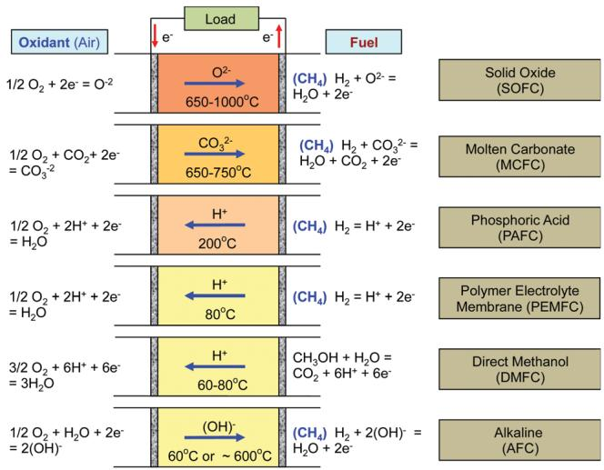  
Fig. 33 Schematic depiction of the operating details such as net electrode reactions, transporting ions, and temperature regimes of major types of fuels cells. Reprinted with permission from (T. M. Gur, Comprehensive Review of Methane Conversion in Solid Oxide Fuel Cells: Prospects for Efficient Electricity Generation from Natural Gas, Prog. Energy Combust. Sci., 2016, 54, 1-64). Copyright (2018) American Chemical Society.

production is based on steam reforming of methane, which yields a hydrogen stream with small quantities of CO even after extensive separation and purification. Unfortunately, the Pt catalyst at the PEMFC anode is susceptible to CO poisoning leading to degradation of cell performance even at trace levels around several ppm. Also, only precious metals such as Pt are the only catalysts that have sufficient activity, but add considerable cost to PEMFCs.

Due to its high operating temperature, by contrast, solid oxide fuel cells (SOFC) employ non-precious metal and/or earth-abundant oxide electrocatalysts and offer other important advantages[29,267] including fuel flexibility.[268] Indeed, SOFC configurations can successfully utilize and convert gaseous[269-272] and liquid hydrocarbons,[273-275] as well as solid fuels[5] including carbon,[276-278] biomass,[279] and coal[280] into electricity. Furthermore, CO, which is an undesirable impurity for PEMFCs is in fact a viable fuel for power generation in SOFCs as recently demonstrated in a 1 kW planar stack.[281] However, not all fuel cell systems depicted in Fig. 33 can be employed in the electrolysis mode with relative ease or without major cell modification. Only aqueous alkaline (AFC), aqueous polymer exchange membrane (PEMFC), and solid oxide fuel cells (SOFC) have been investigated for regenerative operation for storage purposes.[282,283]

There is lack of unanimous agreement in the literature on a common terminology to describe the fuel cell systems that can switch their operating mode from electrolyzer to fuel cell and back in the same cell, without modifications. The term "reversible fuel cells" seems to be used more than others especially in the SOFC literature, but the term "regenerative" has also been employed. Yet others especially in the PEMFC community use the terminology in quite a different context such that the regenerative fuel cell refers to a pair of discrete

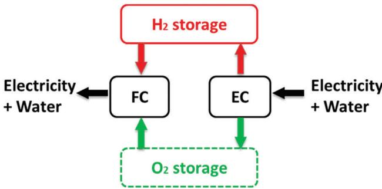  
(a)

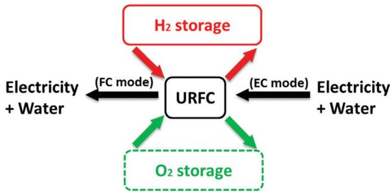  
(b)  
Fig. 34 Electrochemical energy storage systems (a) electrolyzer-fuel cell combination, and (b) regenerative fuel cell (also called, unitize regenerative fuel cell (URFC) in the PEMFC community).291 Reprinted from Y. Wang, D. Y. C. Leung, J. Xuan and H. Wang, A review of unitized regenerative fuel cell technologies, part A: unitized regenerative proton exchange membrane fuel cells, Renewable Sustainable Energy Rev., 2016, 65, 961-977, with permission from Elsevier.

electrolyzer and fuel cell units, where the fuel, e.g.,  $\mathrm{H}_{2}$ , and the oxidant  $\mathrm{O}_{2}$  are first produced in the electrolyzer, stored in tanks, and then recombined in a fuel cell to generate electricity when needed, while calling the single cell configuration that can switch without modification between electrolyzer and fuel cell modes, a "unitized" regenerative fuel cell.[283-285] The latter two concepts are schematically illustrated in Fig. 34. However, labelling separate electrolyzer-fuel cell configurations as "regenerative" may be misleading. More appropriately, this is merely a coupled electrolyzer-fuel cell configuration, and in the view of this author, is unfitting to describe the intended functionality of a bimodal electrolyzer/fuel cell operation. As for the terminology "reversible fuel cells", reversibility implies well-defined connotations in both kinetics and thermodynamics, and hence, it too may be unsuitable to describe this system. Hence, the term "regenerative fuel cells" is preferred in this article and is used in the context of operating the very same cell sequentially in electrolyzer or fuel cell modes without modifications, as indicated in Fig. 34(b).

Low temperature aqueous fuel cell configurations such as alkaline and PEMFC have been successfully transformed into electrolyzer configurations for distributed production of hydrogen via splitting of water, their kinetic reversibility for regenerative operation mode is poor due to large activation overvoltage and scarcity of cost-effective dual action catalysts

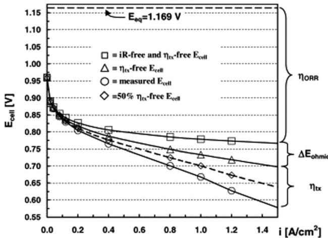  
Fig. 35 Electrochemical performance of a  $\mathrm{H}_2 / \mathrm{O}_2$  PEMFC at  $80^{\circ}\mathrm{C}$  with  $50\mathrm{wt}\%$  Pt/C (04/0.4 mgPt cm $^{-2}$ ) catalyst-loading and stoichiometric flows of  $\mathrm{H}_2$  and  $\mathrm{O}_2$ . The figure shows the partitioning of individual voltage losses  $\eta_{\mathrm{tx}}$  for mass transport, and  $\eta_{\mathrm{ORR}}$  for the oxygen reduction reaction, which makes up more than half of the total voltage losses of the cell.[286] Reprinted from H. A. Gasteiger, S. S. Kocha, B. Sompalli and F. T. Wagner, Activity benchmarks and requirements for Pt, Pt-alloy, and non-Pt oxygen reduction catalysts for PEMFCs, Appl. Catal., B, 2005, 56, 9035, with permission from Elsevier.

for the oxygen and hydrogen electrodes. In the acidic environment of the PEMFC, the catalytic electrodes have to perform the difficult tasks of both the water oxidation and oxygen reduction reactions (ORR) at the oxygen electrode, and hydrogen reduction and hydrogen evolution reactions (HER) at the hydrogen electrode. To activate these reactions selectively and at sufficiently fast rates, highly selective specialized bifunctional catalysts are needed. Only precious metals and their oxides such as Pt,  $\mathrm{RuO_2}$ ,  $\mathrm{PtIrO_2}$ ,  $\mathrm{PtRuO_2}$  have shown satisfactory rates, but still exhibit appreciable overvoltages for these reactions that result in considerable irreversibility. For example, Pt is the preferred electrocatalyst for ORR even though the relatively sluggish ORR kinetics on Pt accounts for nearly  $50\%$  of the total cell voltage loss in PEMFCs.[286] This is shown in Fig. 35. Furthermore, Pt also lacks sufficient activity for OER.[287] The oxides of Ir and Ru exhibit the lowest overvoltages for OER among other electrocatalysts, but they are not suitable for ORR. Similarly for the hydrogen electrode, Pt is the preferred catalysts and economically not suitable for large-scale applications. Nevertheless, no cheaper alternatives have been found yet to compete with the performance of precious metal-based catalysts for regenerative PEMFC electrodes. The prohibitively expensive cost of these catalysts presents a barrier for large-scale energy storage applications.

In alkaline fuel cells, the bifunctional catalyst need to effectively drive the ORR and OER at the oxygen electrode, and hydrogen oxidation (HOR) and water reduction (i.e., hydrogen evolution (HER)) reactions at the hydrogen electrode. Unlike PEMFC, the alkaline environment of AFCs offer catalyst alternatives other than Pt, which is nearly two orders of magnitude less active as hydrogen electrocatalyst in alkaline than in acidic environments.[288,289] Various metal hydride

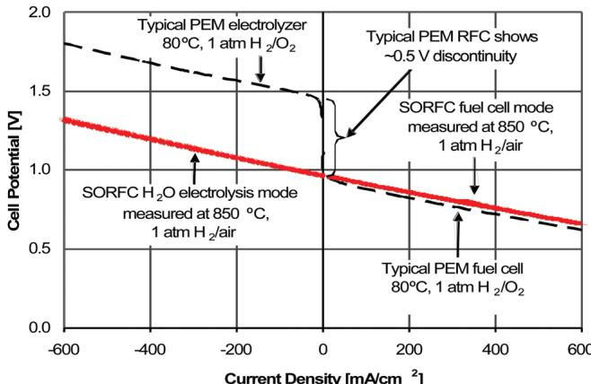  
Fig. 36 Comparative performance of regenerative SOFC versus PEMFC, where the latter exhibits a large activation loss around OCV.[292] Republished with permission of The Electrochemical Society, from [K. R. Sridhar, J. McElroy, F. Mitlitsky, V. Venkataraman and M. C. Williams, Applications and markets for solid oxide regenerative fuel cells, Proc. - Electrochem. Soc., 2005, 295-305]; permission conveyed through Copyright Clearance Center, Inc. (2018).

compositions have been investigated for hydrogen electrodes in alkaline fuel cells, where they serve not only as the catalyst to promote HOR and HER, but also function as medium for hydrogen storage.[290] For the oxygen electrode, various transition metal oxides including perovskites, spinels and  $\mathrm{MnO}_x$  have been reported. The detailed reviews of electrode materials and cell performance of low temperature regenerative cells are provided elsewhere.[282,283,285,291]

The importance of operating temperature is highlighted in Fig. 36, which compares the nearly reversible SOFC-based regenerative operation at  $850^{\circ}\mathrm{C}$  with the large irreversibility of PEM-based regenerative fuel cell operation at  $80^{\circ}\mathrm{C}$ , where the predominant activation loss around the open circuit voltage (OCV) for the PEM fuel cell/electrolyzer operation is evident with a discontinuous drop of nearly  $0.5\mathrm{V}$ . In the case for solid oxide based electrolyzer (SOEC), however, the polarization behavior of the solid oxide-based regenerative cell is continuous and smooth across the OCV indicating sufficiently high kinetic reversibility for steam reduction and hydrogen oxidation reactions at elevated temperatures.[292,293]

Accordingly, solid oxide fuel cells (SOFC) are offer attractive opportunities for regenerative operation, where off-peak electricity can be employed to store the excess energy for electrolytic production of useful fuels, e.g., hydrogen, which can then be oxidized in the fuel cell mode to generate electricity when demand increases. Many of the regenerative SOFC systems and related materials have been reviewed recently.[294-296] It should be noted that kinetic reversibility has been limited to the  $\mathrm{H}_2\mathrm{O} - \mathrm{H}_2$  couple only. Compared to liquid fuels such as ethanol  $(21200\mathrm{MJ}\mathrm{m}^{-3})$  and gasoline  $(34560\mathrm{MJ}\mathrm{m}^{-3})$ ,[297] hydrogen has quite a low volumetric energy density of  $11\mathrm{MJ}\mathrm{m}^{-3}$ . Hence, it is highly desirable to achieve reversible cell operation cycling between a liquid hydrocarbon fuel and its oxidation products  $\mathrm{CO}_{2}$  and  $\mathrm{H}_2\mathrm{O}$  in the same regenerative SOFC. But this is yet to be demonstrated. Thermodynamic constraints imposed

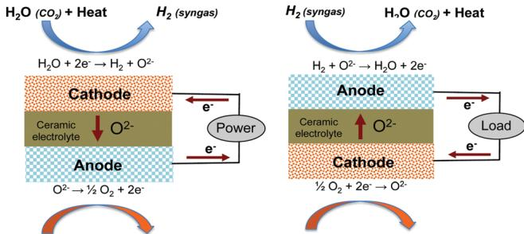  
Fig. 37 Schematic depiction of the general concept of a regenerative, or, "reversible" solid oxide fuel cell operating on the  $\mathrm{H}_2 / \mathrm{H}_2\mathrm{O}$  couple.

by the high operating temperatures of regenerative SOFCs, and the technical challenges posed by kinetics and selectivity issues have hampered progress to achieve electrosynthesis of high value added liquid fuels.

The general concept of regenerative SOFCs has been around for several decades $^{298}$  and is schematically illustrated in Fig. 37, which shows how the symmetrical SOFC can both store electrical energy in the form of hydrogen fuel by splitting steam, and then re-utilize the hydrogen to generate electricity by oxidizing it back to steam. The details of this high temperature steam electrolysis process have been extensively studied and reported recently, using oxide-ion conducting SOFC configurations, $^{294,295,299-302}$  and also using protonically conducting SOFC configurations. $^{303-305}$

As expected, this scheme demands stringent requirements for the catalytic electrodes, which must serve both the dual function of anode and cathode depending on whether it is the storage or generation cycle. For example, the electrode in the storage cycle serves a cathode to reduce steam into hydrogen, while in the generation cycle it serves as the anode to oxidize hydrogen back to steam. As expected, this requires that the electrode material possess high catalytic activity for both steam reduction and hydrogen oxidation reactions. Moreover, it has to exhibit exceptional redox stability over a wide range from reducing to oxidizing environments at these elevated temperatures. So there have been intense efforts to achieve high redox stability in catalytic electrodes for regenerative SOFCs, such as the composition  $\mathrm{La_{0.75}Sr_{0.25}Cr_{0.5}Mn_{0.5}O_3}$  (LSCM).[293,306] Indeed, kinetically highly reversible fuel cell behavior that remains stable over several cycles and 120 hours has been reported for (LSCM).[293] Other perovskite-based electrodes for reversible operation have been explored for regenerative SOFCs, and reviewed elsewhere.[295,307] There have also been attempts to both lower the operating temperature of these systems.[308-310] The performance of a reduced temperature regenerative SOFC cell shown in Fig. 38 features a doped-perovskite ( $\mathrm{La_{0.9}Sr_{0.1}Ga_{0.8}Mg_{0.2}O_3}$  (LSGM)) electrolyte with Gd-doped ceria (GDC) modified catalytic electrodes, and exhibits a smooth and continuous transition between the power generation (fuel cell) and electrolysis (storage) modes across the OCV and a low value of area specific resistance (ASR) of  $0.18\mathrm{ohmcm}^2$  at  $650~^\circ \mathrm{C}$ .[307]

Various storage systems based on regenerative SOFCs have been proposed.[296,299,307] These storage schemes involve  $\mathrm{H}_2\mathrm{O}$ ,

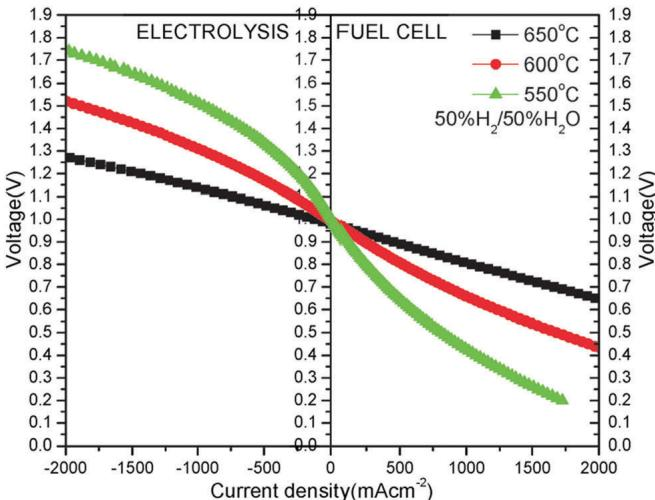  
Fig. 38 Performance of a regenerative SOFC operating between 550 and  $650^{\circ}\mathrm{C}$ . Reproduced from ref. 307 with permission from The Royal Society of Chemistry.

$\mathrm{CH}_4$  or  $\mathrm{CO}_2$  chemistries, and explore combining a regenerative SOFC with solar, wind or other renewable sources. One of these storage concepts involves integration of a 250 MW SOFC stack with underground storage of  $\mathrm{CO}_2$  and  $\mathrm{CH}_4$  having a total capacity equivalent to  $500~\mathrm{GW}$  h of storage. The modeling study of this system concept predicted  $70\%$  round-trip system efficiency and electricity storage costs of $0.03 per kW h.[307]

A similar concept was proposed for a  $100\mathrm{kW}$  regenerative SOFC with  $800\mathrm{kWh}$  of storage capacity in the form of fuels.[296] Assuming  $600^{\circ}\mathrm{C}$  and 1 atm pressure,  $0.2\mathrm{Acm}^{-2}$  current density, a  $\mathrm{H / C}$  ratio of 9.9, and a fuel utilization of  $65\%$ , this modeling study predicted round-trip conversion efficiency of  $74\%$  and storage density of  $90\mathrm{kWhm}^{-3}$  (or,  $324\mathrm{MJm}^{-3}$ ), resulting in a capital cost of $2.33-3.17 per  $\mathrm{kW}$  h for storage. The encouraging results may warrant exploring further into similar storage schemes that incorporate regenerative fuel cells with intermittent renewable energy sources.

However, despite their immense potential for large-scale energy storage, major progress in regenerative SOFCs has been slow due to degradation issues largely related to materials instability, kinetic reversibility, and microstructural and architectural integrity of the cells.[311] Delamination is the most common problem observed at the oxygen electrode/electrolyte interface at high current densities due to build up of high internal pressures during oxygen discharge. Also, oxygen evolution at this interface may often lead to chemical changes to form secondary phases increasing ohmic losses. Hence interface engineering and control is important for stable cell operation, and several different approaches to improve stability and cell performance have been suggested including impregnation, exsolution, and impurity control.[312] Interestingly, it was recently reported that microstructural degradation at the oxygen electrode, which is dominant during electrolysis in particular, could be eliminated by reversibly cycling regenerative SOFCs between fuel cell and electrolysis modes.[301] Reversible cycling seems to slow down microstructural changes and

mitigate the build up of high internal pressures at the interface and restore sintering. However, detailed mechanisms of degradation (and recovery) processes in these systems are not well understood. Accordingly, the mechanical integrity, chemical stability and microstructure of regenerative SOFC interfaces are important considerations that require further research for development.

# E. Chemical energy storage

Our addiction to fossil fuels is no accident, because energy storage in chemical fuels offers the highest energy density, most convenient, cost-effective, scalable, flexible, and highly portable way to store and transport large amounts of energy in the chemical bonds of fuels. The comparative numbers for the gravimetric and volumetric energy densities of fuels provided in Table 6 clearly demonstrate the superiority of chemical storage over electrochemical storage. In this regard, converting excess electrical output or renewable electricity into chemical fuels, which can then be converted efficiently back to electricity naturally holds much merit. However, many fuels including hydrogen and ammonia do not exist in nature in large quantities, so need to be synthesized. This is of course a thermodynamically uphill process and is quite energy intensive.

The starting chemicals to synthesize most fuels are typically hydrogen- and carbon-containing species, and more commonly  $\mathrm{H}_{2}$  ( $\mathrm{H}_{2}\mathrm{O}$ ) and CO. There are multiple synthesis routes to produce high energy density chemical fuels. Examples include electro-reduction of  $\mathrm{CO}_{2}$  to fuels, photoelectrochemical reduction of  $\mathrm{CO}_{2}$  to fuels, solar thermochemical reduction of  $\mathrm{CO}_{2}$  to fuels, and partial oxidation of methane to syngas or coal gasification to syngas, which can then be converted to higher hydrocarbon fuels via Fischer-Tropsch (F-T) process. Some of these routes e.g., gasification to F-T, are mature technologies that have been in use commercially for decades, while others like photoelectrochemical and electrochemical reduction of  $\mathrm{CO}_{2}$  to fuels are under development. Regardless, however, all these process schemes involve carbon-containing species that contribute to global carbon emissions, and fail to provide carbon-free solutions for the electrical energy enterprise. Accordingly, carbon-containing synthesis schemes are only briefly covered in this article. Also, photocatalytic splitting of water to produce hydrogen is not reviewed here.

Chemical storage topics covered in this section focuses on converting excess or off-peak electrical energy preferably from renewable resources such as solar and wind into environmentally benign, carbon-free, high energy density transportable fuels via electrosynthesis. In this regard, electrochemical production of hydrogen and ammonia are presented and reviewed below. It is important to note that chemical energy storage in hydrogen and ammonia also offers environmentally benign solutions towards decarbonization of the global energy systems. The proponents of hydrogen see this energy carrier on which to build a carbon-free energy economy,[313,314] while opponents of hydrogen-based economy have long argued that the heavy

energy and carbon emission penalties paid during hydrogen production, the difficulties in handling and transporting hydrogen, and lack of earth-abundant cost-effective materials that can provide  $>6.5 \mathrm{wt}\%$ $\mathrm{H}_{2}$  for long term storage are major barriers for practical adoption and implementation at a wider scale. Ammonia as an environmentally benign energy carrier has recently gained interest as a viable option for chemical storage, but electrosynthesis of this chemical faces similar obstacles to be overcome.

# E.1. Chemical storage in hydrogen

Exceptionally high gravimetric energy density of hydrogen makes it an ideal candidate for chemical storage and a carbon-free energy carrier. As hydrogen does not occur naturally, it is produced largely from natural gas. More than  $75\%$  of the industrial hydrogen production in the world is via steam reforming of methane, which is a highly efficient  $(60 - 85\%)$  and mature technology but is cost effective only when it is produced centrally and at large scale. This process is also highly energy intensive and consumes nearly  $2\%$  of the world's energy output. Most of the industrially produced hydrogen is utilized on-site (i.e., captive hydrogen) for chemical, catalytic and petrochemical processes. A small fraction is supplied to the market (i.e., merchant hydrogen) for other industrial processes or uses.

Hydrogen is an environmentally benign energy carrier with the highest gravimetric energy density of  $142\mathrm{MJ}$  (HHV)  $\mathrm{kg}^{-1}$  among the common liquid fuels (see Table 6), but it has also one of the lowest volumetric energy densities of about  $10\mathrm{MJ}\mathrm{l}^{-1}$  in its gaseous form at atmospheric pressure and room temperature. The latter property poses challenges in wider utilization of hydrogen for portable or mobile power generation applications, including transportation. Although there have been intense research activity in the last two decades to develop effective storage medium or materials, cost effective solutions for extended use capacity has been elusive. Among the options, mechanical storage via cryogenic liquefaction as well as compression are mature technologies but both have practical challenges including safety, cost, and energy penalties.[315] For

Table 6 Gravimetric and volumetric energy densities of liquid fuels compared with select storage systems. Most values are from ref. 297  

<table><tr><td>Fuel</td><td>Gravimetric energy density (W h kg-1)</td><td>Volumetric energy density (W h l-1)</td></tr><tr><td>Gasoline</td><td>12330</td><td>9.060</td></tr><tr><td>Diesel</td><td>12700</td><td>10700</td></tr><tr><td>Propane</td><td>12870</td><td>7490</td></tr><tr><td>Butane</td><td>12700</td><td>7190</td></tr><tr><td>Ethanol</td><td>7490</td><td>5890</td></tr><tr><td>Methanol</td><td>5620</td><td>4470</td></tr><tr><td>Liq. hydrogen</td><td>33570</td><td>2200</td></tr><tr><td>Liq. ammonia</td><td>5170</td><td>3750</td></tr><tr><td>Batteries</td><td></td><td></td></tr><tr><td>Li-Ion batterya</td><td>150-210</td><td>450</td></tr><tr><td>Ni-Metal hydridea</td><td>70</td><td>220</td></tr><tr><td>Zn-Air batterya</td><td>300</td><td>240</td></tr><tr><td colspan="3">aPractical values.</td></tr></table>

example, a pressurized hydrogen tank offers a system energy density of less than  $2\mathrm{MJ}\mathrm{l}^{-1}$  at 350 bar and  $3.4\mathrm{MJ}\mathrm{l}^{-1}$  at 700 bar. Compared to other fuels listed in Table 6, the energy density of pressurized tank storage is quite limited.

Storing hydrogen in solids via chemical or physical routes has many advantages, but also often have low gravimetric capacities that add extra weight to the mobile application. Many also have either undesirable thermodynamics that limit reversibility of storing and releasing hydrogen and/or slow kinetics that lead to long charge and/or discharge times. Many storage materials or methods have been under development but none has reached commercial maturity.

Many materials can store hydrogen by absorption or hydride formation (e.g., Pd and its alloys), adsorption (e.g., carbon nanostructures), or chemical reactions (e.g.,  $\mathrm{MgH_2}$ ,  $\mathrm{NaBH_4}$ , alanates). An in-depth review of hydrogen storage materials and technologies fall outside the scope of the present article. The interested reader is referred to detailed reviews published in the literature.[316-318] Gravimetric capacities of various materials for hydrogen storage are provided in Fig. 39 for comparison purposes.

Storage and transportation of hydrogen is costly and inefficient. That is why distributed generation may be critically important for an effective carbon-free energy economy for the future. In this regard, water electrolysis driven by renewable electricity presents attractive opportunities for local production of hydrogen.

Currently, low temperature electrolysis of water is the only commercial technology available for distributed generation of hydrogen. Thermodynamically, water splitting is an uphill process and hence, is highly energy intensive. It needs to overcome the thermodynamic barrier as presented in Fig. 40, which indicates the thermal  $(T\Delta S)$ , electrical  $(\Delta G)$ , and total energy  $(\Delta H)$  demands to water (and steam) electrolysis as a function of temperature. For this, an external bias that opposes and is greater than the theoretical open circuit voltage  $(1.23\mathrm{V}$  at  $298\mathrm{K})$  must be applied to the electrolysis cell in order to break the O-H bonds in water, permitting the formation of the H-H bond. A large fraction of the electricity used in conventional water electrolyzers is consumed merely to overcome this

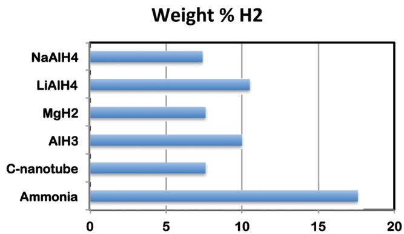  
Fig. 39 Gravimetric storage capacities of various materials given in weight percent hydrogen.

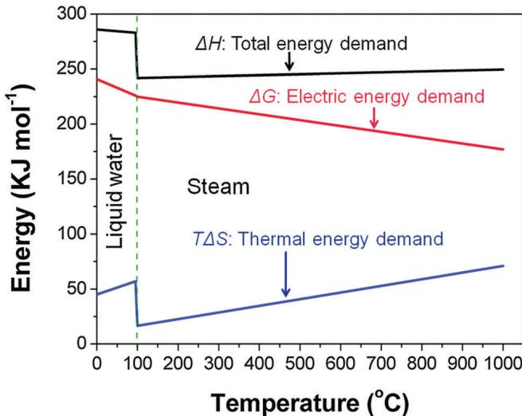  
Fig. 40 Energy demands for water electrolysis as a function of temperature. Reproduced from ref. 303 with permission from The Royal Society of Chemistry.

potential barrier, which reduces efficiency. Dissociation of water to hydrogen is also an endothermic reaction with  $\Delta H = +286\mathrm{kJ mol}^{-1}$  at room temperature, which corresponds to the thermoneutral potential of  $1.48\mathrm{V}$ . Clearly, this is greater than the theoretical cell potential of  $1.23\mathrm{V}$ . So if no external heat source is employed, the applied potential required to split water has to be greater than  $1.48\mathrm{V}$ . In practice the externally imposed potential is much higher, up to  $2.0\mathrm{V}$  or above, depending on the type of water electrolyzer and the electrolyte used.

By Faraday's law, the rate of hydrogen production is linearly related to the amount of current supplied to the electrolytic cell, as electrolysis generally occurs under nearly Faradaic conditions with close to \(100\%\) coulombic efficiency. Hence, the cost of electricity is an important consideration in assessing the economics of electrolytic hydrogen production. The strong dependence of the production cost for electrolytic hydrogen on the cost of electricity is shown in Fig. 41. The high sensitivity to the cost of electricity renders electrolysis a costly process for distributed hydrogen production. An earlier study concluded that the electricity costs must be below the \\(0.045-0.055 per kW h

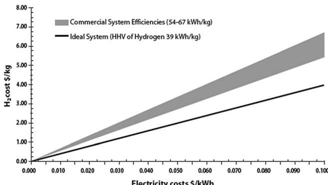  
Fig. 41 Cost of hydrogen via electrolysis varies linearly with cost of electricity, according to a 2004 NREL study.[319]

range in order to produce hydrogen using current commercial electrolyzers at a cost of  $3 per kg of \mathrm{H}_2$  to stay competitive with gasoline.[319] Although the cost of electricity cost is a major contributor to electrolytic hydrogen production, the origin of electricity for electrolysis is another important consideration. Most of the electricity from the grid is derived from fossil fuels, and hence yield greenhouse gas emissions. So hydrogen production by electrolysis is best suited for renewable power such as wind and solar in order to avoid upstream carbon emissions.

The appeal of hydrogen as a viable and sustainable energy carrier drives commercial interest in high temperature electrolyzers and several development efforts are being pursued, but the technology is far from being ready for commercialization. Besides the technical challenges, the economics of hydrogen production in SOECs is very likely to be considerably more expensive than the average cost target for wind-based low temperature water electrolysis of  $3.10 per kg of hydrogen for central and$ 3.70 per kg for distributed production recently set forth in 2015 by the US Department of Energy (DOE) $^{320}$  based on the 2011 NREL analysis. $^{321}$  It should be noted that the cost estimates for high temperature SOECs may be necessarily inaccurate as the cost models are largely based on laboratory scale results. In fact, US DOE Office of EERE possibly refrained from providing a cost target for hydrogen production in SOECs $^{322}$  most likely for the reason that the reported cost estimates may be somewhat premature.

E.1.1. Hydrogen production by water or steam electrolysis. Combining water or steam electrolysis with renewable energy provides an integrated distributed storage system whereby hydrogen produced can be either utilized for end use in a fuel cell or for chemical energy storage. Unlike steam electrolysis still under development, hydrogen produced via the electrolysis of water is a mature technology and has been available commercially for many decades. Water electrolyzers serve relatively a small market, where access to merchant hydrogen is limited by geography or other reasons. The operational parameters, cell performance and materials, and economics of water electrolyzers for hydrogen production have been reviewed recently. $^{319,323-326}$  These commercial electrolyzers typically operate at  $70 - 80^{\circ}\mathrm{C}$  with an imposed potential of  $1.75 - 2.0\mathrm{V}$  and have electrical conversion efficiencies in the range of  $60 - 70\%$ . But unless this electricity for electrolysis is derived from renewable sources, the primary efficiencies of commercial electrolyzers drop to around  $20 - 25\%$  when electricity from conventional power is used. Also, the cost of hydrogen production using electrolyzers cannot compete with the large-scale centralized production of hydrogen via steam reforming of natural gas, which provides more than  $75\%$  of the world's industrial hydrogen production. Capital costs for commercial water electrolyzers reported in the literature range from  $\$3000$  per kW for small ( $<50\mathrm{kW}$ ) alkaline electrolyzers to  $\$400 - 700$  per kW for larger plants with life times from 5 to 10 years. $^{326}$  A more recent review estimates the capital costs for commercial alkaline electrolyzers in the range of  $\$1200 - 1500$  per kW and polymer electrolyte-based electrolyzers in the  $\$1300 - 2000$  per kW range. $^{327}$  Driven in

Table 7 Typical structure and operational characteristics of the four major classes of electrolyzers for hydrogen production named after their electrolytes, where PEM stands for polymer exchange membrane, and SOEC denotes solid oxide electrolysis cell. (YSZ: yttria-stabilized zirconia, BYZ: yttria-doped barium zirconate)  

<table><tr><td></td><td>Alkaline</td><td>Acid</td><td>PEM</td><td>SOEC</td></tr><tr><td rowspan="2">Electrolyte</td><td>NaOH</td><td>H2SO4</td><td rowspan="2">Polymer (NafionTM)</td><td rowspan="2">Ceramic (YSZ, BYZ)</td></tr><tr><td>KOH</td><td>H3PO3</td></tr><tr><td rowspan="2">Carrier ion</td><td rowspan="2">OH-</td><td rowspan="2">H+</td><td rowspan="2">H+</td><td>O2-(YSZ)</td></tr><tr><td>H+(BYZ)</td></tr><tr><td>Electrodes</td><td>Ni</td><td>Pt/C, IrO2</td><td>Pt/C, IrO2</td><td>Ni, ceramic</td></tr><tr><td>Operating temperature</td><td>80 °C</td><td>150 °C</td><td>80 °C</td><td>600-900 °C</td></tr><tr><td rowspan="3">Strengths</td><td>Cheap materials</td><td rowspan="3">High activity electrodes</td><td>High activity electrodes</td><td>Cheap materials</td></tr><tr><td rowspan="2">Commercial technology</td><td rowspan="2">Commercial technology</td><td>Lower barrier to split H2O</td></tr><tr><td>Higher efficiency</td></tr><tr><td rowspan="4">Short-comings</td><td>High barrier to split H2O</td><td>High barrier to split H2O</td><td>High barrier to split H2O</td><td>High operating temperature</td></tr><tr><td rowspan="3">Lower efficiency</td><td>Expensive electrodes</td><td>Expensive electrodes</td><td>Materials stability</td></tr><tr><td>Cell durability</td><td>Hydrogen crossover</td><td>Fabrication costs</td></tr><tr><td>Developing technology</td><td>Cell durability</td><td>Developing technology</td></tr></table>

large part by cost concerns, water electrolyzers have been generally employed for niche markets, for specialized applications in remote locations or confined spaces, or where abundant hydroelectric power or other renewables are readily available.

Electrolysis cells are usually named after their electrolytes. Typical materials, operating temperatures, advantages and disadvantages of the four major classes of water or steam electrolysis technologies are summarized in Table 7. The simplicity and modular design of electrolytic cells provide many advantages including ease in scaling up simply by adding units, and suitability for distributed chemical storage, which is particularly attractive for intermittent renewable sources that usually generate electricity at remote locations far from the populated areas or points-of-use. Electricity generated from intermittent renewable energy sources makes water (or, steam) electrolysis an attractive way to store high quality energy in a clean and environmentally benign fuel such as hydrogen. Indeed, hydrogen storage has gained renewed interest for distributed energy storage driven by the recent and rapid expansion of solar and wind energy.[328]

Commercial electrolyzers for water electrolysis are similar in design to fuel cells, and compose of an anode and a cathode immersed in an electrolyte and separated by an inert separator, diaphragm, or an ionically conducting polymer exchange membrane (PEM) such as Nafion. Most commercial electrolyzers operate at temperatures  $< 80^{\circ}\mathrm{C}$  and generally employ alkaline electrolytes such as NaOH and KOH solutions, which allows the use of inexpensive catalysts such as Ni in contrast to electrolysis in acidic electrolytes that would necessitate the use of precious metal catalysts such as Pt. However, they are slightly less efficient  $(60 - 70\%)$  when compared to efficiencies of PEM-based acidic electrolyzers in the  $65 - 82\%$  range.[325]

PEM-based acid electrolyzers can sustain high current densities and high production rates, high voltage efficiencies, and also higher purity of product gases  $\mathrm{H}_{2}$  and  $\mathrm{O}_{2}$  due to minimal crossover across the solid polymer electrolyte membrane. Unlike alkaline electrolytes that provide better stability and longer service life, however, acidic electrolytes also cause severe corrosion problems that require more expensive materials for cell components. On the other hand, alkaline electrolyte-based electrolyzers suffer from low current densities leading to low

hydrogen production rates, large ohmic losses up to  $25\%$  of total cell loss across the electrolyte and the separator, low ionic conductivity of the electrolyte, crossover of product gases across the porous separator or diaphragm that yields impure products, and unwanted transport of hydrogen gas into the anode chamber, which can accumulate beyond the explosion limit of  $>4\%$ $\mathrm{H}_{2}$  in  $\mathrm{O}_2$  to cause safety concerns. Despite these disadvantages, commercial alkaline electrolyzers seem to be the preferred product compared to acid electrolyzers, due mostly to the cost of the precious metal catalysts used at the electrodes, cell stability and service life concerns.

In order to improve upon the low current densities of alkaline electrolyzers, high temperature alkaline electrolyzers that typically operate at temperatures  $150 - 200^{\circ}\mathrm{C}$  have gained interest.[299] As expected, these cells need to operate under pressure in order to minimize evaporation losses and accommodate the high operating temperatures of the aqueous electrolyte. High temperature operation lowers cell voltage from the typical  $>2.0\mathrm{V}$  to  $< 1.5\mathrm{V}$ , which improves efficiency, and reduces ohmic losses due to improved electrolyte conductivity. High pressure operation on the other hand, reduces size of gas bubbles evolving at the gas diffusion electrodes that result in less disruptions to current stability and distribution, but at the same time may cause bubbles to block the micropores of the electrodes and render those sites ineffective and inactive. Hence, the operating cell pressure should be kept lower than for steam condensation, but high enough to avoid evaporation losses from the electrolyte. In an alkaline electrolyzer using aqueous KOH immobilized in mesoporous  $\mathrm{SrTiO_3}$  and operating at  $250^{\circ}\mathrm{C}$  under 42 bar pressure, high current densities of  $1000\mathrm{mAcm}^{-2}$  at  $1.5\mathrm{V}$  and  $2000\mathrm{mAcm}^{-2}$  at  $1.75\mathrm{V}$  were achieved using Ni foam gas diffusion electrodes.[330]

Conceptual cell design and half-cell reactions for water electrolysis are shown in Fig. 42. The thermodynamic potential corresponding to the half-cell reactions is  $1.23\mathrm{V}$ , but cell polarization losses require significantly higher voltages around  $1.8 - 2.2\mathrm{V}$  to be applied externally to drive the water splitting reaction. The half-cell reactions in alkaline electrolyte are,

$$
\text {C a t h o d e :} \quad 2 \mathrm {H} _ {2} \mathrm {O} _ {\mathrm {(l)}} + 2 \mathrm {e} ^ {-} = \mathrm {H} _ {2 (\mathrm {g})} + 2 \mathrm {O H} _ {\mathrm {(a q)}} ^ {-} \tag {30}
$$

$$
\text {A n o d e :} 2 \mathrm {O H} ^ {-} _ {\left(\mathrm {a q}\right)} = (1 / 2) \mathrm {O} _ {2} + 2 \mathrm {e} ^ {-} \tag {31}
$$

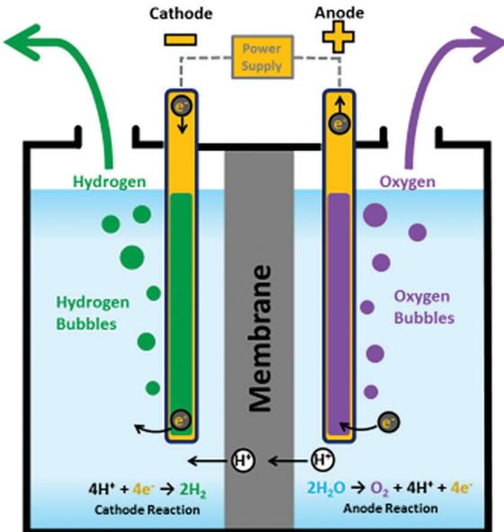  
Fig. 42 Hydrogen production via water electrolysis. $^{329}$

while in acidic electrolytes, the corresponding reactions are,

$$
\text {C a t h o d e :} \quad 2 \mathrm {H} ^ {+} _ {\left(\mathrm {a q}\right)} + 2 \mathrm {e} ^ {-} = \mathrm {H} _ {2 (\mathrm {g a s})} \tag {32}
$$

$$
\text {A n o d e :} \quad \mathrm {H} _ {2} \mathrm {O} _ {\left(\mathrm {l}\right)} = (1 / 2) \mathrm {O} _ {2 (\mathrm {g})} + 2 \mathrm {H} ^ {+} _ {\left(\mathrm {a q}\right)} + 2 \mathrm {e} ^ {-} \tag {33}
$$

Regardless of the type of electrolysis cell, splitting of water requires highly active electrocatalytic electrodes for the hydrogen evolution reactions (HER) (30) and (32), and the oxygen evolution reactions (OER) (31) and (33). HER is a 2-electron proton-coupled reaction while OER involves 4 electrons. As expected, the activation barrier or overpotential for OER is significantly higher than for HER. Lowering the barriers require the use of effective catalysts. High efficiency, low cost and long durability or lifetime considerations are important criteria for the desirable catalyst. Platinum is an excellent catalyst for both HER and OER but is prohibitively expensive, but still serves as the benchmark for HER when comparing the performance of other electrocatalysts. For OER,  $\mathrm{IrO}_2$  and  $\mathrm{RuO}_2$  are the best electrocatalysts with the lowest overpotentials in both acidic and alkaline electrolytes compared to others. They are also excellent electronic conductors and can serve as their current collectors as well. Under high anodic potentials, however, both  $\mathrm{RuO}_2$  and to a lesser extent  $\mathrm{IrO}_2$  suffer from stability problems in both electrolytes because they oxidize to  $\mathrm{RuO}_4$  and  $\mathrm{IrO}_3$ , respectively, and form soluble products that dissolve in the electrolytes. So besides cost, these precious metal catalysts have durability or lifetime problems.

There has been an intense search for efficient and cheap catalysts for HER and OER that are made of non-precious metals, as well as the oxides, sulfides, phosphides and carbides of earth abundant materials.[331,332] Many strategies for catalyst development have been employed including advanced processing techniques such as nanostructuring to fabricate metastable structures, core-shell structures, and engineered surfaces and interfaces,[333] atomic layer deposition for atomic

scale control of nanostructure, doping and morphology of the catalyst, $^{334-336}$  as well as theoretical simulations and computational tools coupled to experimentation for rational design. $^{332,337}$  One of the key parameters that can guide catalyst design efforts is the adsorption free energy of the electroactive species on the catalyst surface. In accordance with the Sabatier principle, the surface binding energy of the species should be moderate for a good catalyst, and neither too weak (then adsorption becomes rate limiting) nor too strong (then desorption becomes rate limiting). When the free energy of adsorption of the electroactive species is plotted against a performance parameter such as overpotential or exchange current density on various electrolytic surfaces, the resulting "volcano" plots present a descriptive tool to observe the trends and select the electrocatalyst candidates exhibiting the best performance criteria, e.g., the lowest overpotential, or the highest exchange current density. Insights for the selection process of several catalyst systems for various electrochemical reactions have been presented recently. $^{337}$  For example, guided by the results of an earlier theoretical study, $^{338}$  nanoparticles of earth-abundant  $\mathrm{MoS}_2$  prepared in a double gyroid morphology with 3-dimensional mesoporous microstructure in order to maximize the edge-site density have shown great promise for HER with overpotentials only  $150 - 200\mathrm{mV}$  away from Pt. $^{339}$  Similarly, nanostructured  $\mathrm{MnO}_2$  has shown great promise as an earth abundant effective catalyst for OER. $^{184}$  The OER activity of  $\mathrm{MnO}_2$  is already presented in Fig. 26, which compares  $\mathrm{MnO}_2$  quite favorably with the precious metal OER catalysts Ir, Pt and Ru. A detailed review of many classes of prospective OER catalyst materials is provided elsewhere. $^{331}$

It is also possible to achieve water splitting using steam in high temperature solid oxide electrolysis cells (SOEC) operating at  $600 - 800^{\circ}\mathrm{C}$  and employing a ceramic membranes that exhibit selective ion transport for either  $\mathrm{O}^{2-}$  such as yttria-stabilized zirconia (YSZ) and gadolinia doped ceria (GDC), or for  $\mathrm{H}^{+}$  as in proton-conducting perovskites such as yttria-doped barium zirconate (BYZ) and yttria-doped barium cerate (BYC), as also indicated in Table 7. In the case of steam electrolysis using an oxide-ion-conducting ceramic electrolytic cell, steam is fed on the cathode side and air is in the anode compartment. By the use of an external power, oxygen is abstracted from steam at the cathode and transported across the solid electrolyte and discharged at the anode as molecular oxygen into the air compartment. In the meantime, hydrogen is produced at the cathode. In the case of steam electrolysis using a proton-conducting ceramic electrolyte, steam is fed on the anode side and the hydrogen evolves at the cathode. But the steam decomposition reaction is thermodynamically uphill and requires an external power source and the associated cost of electricity.

Operating the SOEC at elevated temperatures lowers the electrical energy requirement (see Fig. 40). It also increases the kinetic and transport rates significantly. Accordingly, nonprecious metal or oxide catalytic electrodes can be employed at high temperature SOECs. Furthermore, a thermodynamic modeling study showed that the difference between the energy and exergy efficiencies for SOECs operating at elevated

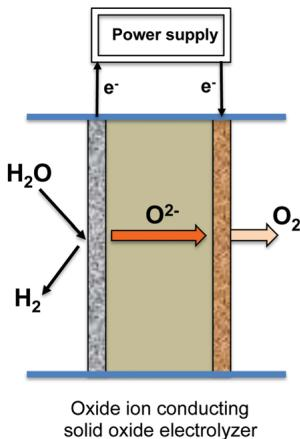  
Fig. 43 Schematic cell configurations for steam electrolysis and directions of ionic transport in solid oxide electrolyzers featuring (a) oxide ion conducting solid electrolyte, and (b) proton conducting solid electrolyte.

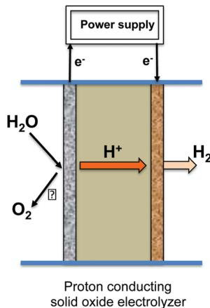

temperatures is quite small, unlike electrolyzers running at low temperatures, due to the fact that at high temperatures, the energy quality is high and also the thermal energy input constitutes a relatively small portion of the total energy requirement.[340]

Steam electrolysis at elevated temperatures can be achieved either by using an oxide-ion conducting solid oxide electrolyte $^{299,300}$  such as yttria-stabilized zirconia, or by a proton-conducting solid oxide electrolyte $^{300,303,341}$  such as yttria-doped barium zirconate  $\mathrm{(Y:BaZrO_2}$ , or BYZ) or cerate  $\mathrm{(Y:BaCeO_2}$ , or BYC). These electrolytes are made dense and impervious to block chemical shorting, and allow only mobile ionic species  $\mathrm{O}^{2-}$  and  $\mathrm{H}^+$  to transport selectively through the crystal lattice of the ceramic membrane. Steam electrolysis schemes for the two types of ceramic electrolytes are illustrated in Fig. 43, which also indicate the direction of ionic transport through the solid oxide electrolytes.

The impervious ceramic electrolyte membrane physically separates the anode and cathode compartments and eliminates chemical shorting or mixing of the product gases. This results in high purity hydrogen production. The electrolyte transport mechanisms are respectively, lattice diffusion via oxygen vacancies in the oxide-ion conducting fluorite structure solid oxide electrolytes, and Grotthuss mechanism for proton transport in the perovskite-type protonically conducting solid oxide electrolytes. As the activation energy for proton transport in perovskites is considerably smaller than that for oxide ion transport in fluorites, protonic SOECs can be operated a lower temperatures  $(< 600^{\circ}\mathrm{C})$  than the oxide ion-based SOECs, which typically operate at  $700 - 1000^{\circ}\mathrm{C}$ . The major elements of cell voltage loss in SOECs are ohmic losses due to finite ionic conductivity of the electrolyte and activation losses at the electrodes due to slow kinetics and transport. To overcome these difficulties, progress has been made at the laboratory scale in advanced catalytic electrodes and cell architectures, which have been reviewed in detail elsewhere.[299,300,303]

E.1.2. Spontaneous hydrogen and electricity co-generation. As emphasized in Fig. 41, it is desirable to minimize or preferably avoid the electrical costs for electrolysis. Indeed, the

nascent steam-carbon fuel cell (SCFC) concept proposed earlier $^{342}$  aims to accomplish hydrogen production from steam without the need for external power, and in fact, spontaneously generates electricity and hydrogen at the same time. Essentially, the SCFC concept represents the steam gasification reaction of carbon carried out electrochemically. This is accomplished by replacing the more expensive electrical energy requirement for electrolysis (see Fig. 41) with much cheaper chemical energy, which provides a sufficiently low oxygen activity to reverse the sign of the activation barrier and drive the steam decomposition reaction downhill. As the equilibrium (chemical) potential for oxygen in the carbon-oxygen system is significantly lower than that for the  $\mathrm{H}_2 - \mathrm{H}_2\mathrm{O}$  system, the uphill barrier disappears and the gradient becomes downhill, allowing the generation of carbon-free hydrogen and electricity simultaneously. This concept is illustrated in Fig. 44, and shows the uphill barrier of about  $-0.9\mathrm{V}$  for steam electrolysis at elevated temperatures of  $800 - 1000^{\circ}\mathrm{C}$ , which reverses its sign by the presence of solid carbon at the anode and becoming instead a downhill potential gradient with a driving force of about  $+0.5\mathrm{V}$  that allows the cell to operate in a fuel cell mode, while co-producing hydrogen and electricity spontaneously. $^{343,344}$  The driving force is governed by the prevalent  $\mathrm{H}_2 / \mathrm{H}_2\mathrm{O}$  and  $\mathrm{CO} / \mathrm{CO}_2$  ratios at the cathode and anode compartments, respectively. The SCFC concept utilizes a typical solid oxide fuel cell design and materials, where the only difference is that air is replaced with carbon fuel at the anode. The impervious solid oxide electrolyte membrane serving as a physical barrier between the anode and cathode gas environments allows the production of carbon-free hydrogen, which is critically useful for PEMFC applications. Moreover at high fuel utilization, the anode product gas is highly concentrated in  $\mathrm{CO}_2$  with only a small amount unreacted CO in the balance, and hence, nearly ready for capture.

The SCFC concept accomplishes the steam gasification reaction of carbon inside a fuel cell with discrete anode and cathode reaction gas streams, producing power and carbon-free hydrogen in the process. Fig. 45 presents the experimental results for simultaneous and spontaneous co-generation of hydrogen and electrical energy in a button-type SCFC employing a yttria-stabilized zirconia (YSZ) solid electrolyte at  $850^{\circ}\mathrm{C}$  with activated carbon at the anode and steam at the cathode, which provided a downhill driving force of  $0.56\mathrm{V}$  open circuit potential that enabled achieving steam electrolysis in a fuel cell mode.

A similar concept, this time using reducing gases such as methane and CO at the anode, was also proposed.[346] As expected, the placement of these gaseous fuels at the anode greatly reduces the energy barrier. However, the open circuit potentials reported in this study were less than  $90\mathrm{mV}$ , not sufficiently large enough to spontaneously drive the steam electrolysis reaction. Hence, electricity from an external power, albeit less than otherwise needed for conventional steam electrolysis cells, is still required to drive the electrolysis reaction and produce hydrogen using this configuration.

# E.2. Chemical storage in ammonia

Ammonia is an effective energy carrier with a high-energy density. For comparison, liquid ammonia provides  $13.7\mathrm{MJ}\mathrm{l}^{-1}$

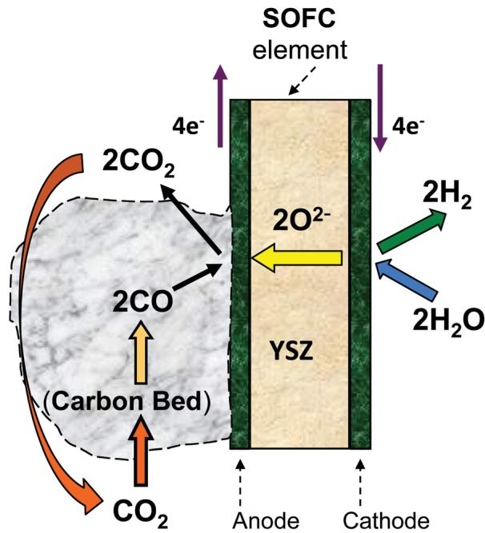

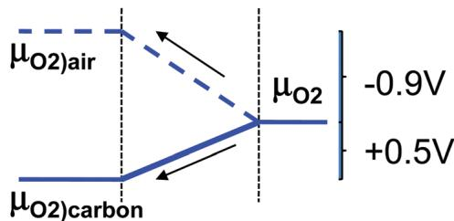  
Fig. 44 Schematic of the steam-carbon fuel cell concept, indicating its operating principle, and the chemical potential gradients for steam electrolysis.5 While steam electrolysis in SOEC is uphill by about  $-0.9\mathrm{V}$  at operating temperatures above  $800^{\circ}\mathrm{C}$ , replacing air with carbon at the anode compartment lowers the oxygen activity such that the oxygen chemical potential gradient reverses sign and provides SCFC a downhill potential of about  $+0.5\mathrm{V}$ . Reprinted with permission from (T. M. Gur, Critical Review of Carbon Conversion "Carbon Fuel Cells", Chem. Rev., 2013, 113, 6179-6206). Copyright (2018) American Chemical Society.

(or  $3800\mathrm{W}\mathrm{h}\mathrm{L}^{-1}$ ) versus  $8\mathrm{MJ}\mathrm{l}^{-1}$  (or,  $2200\mathrm{W}\mathrm{h}\mathrm{L}^{-1}$ ) for liquid hydrogen. It is an environmentally benign, carbon-free liquid fuel that when combusted in a turbine or converted in a fuel cell back to electricity, it's reaction products are only nitrogen and water vapor. Hence, ammonia is ideally suited for environmentally benign chemical storage. Although  $79\%$  of the earth's atmosphere is made up by nitrogen, it is difficult to utilize this abundant resource to make ammonia or other nitrogen chemicals, as molecular  $\mathbf{N}_2$  is difficult to activate due to the unusual strength ( $940\mathrm{kJ mol}^{-1}$ ) of the N-N triple bond. Actually, this is a kinetic hindrance because thermodynamically the reaction between  $\mathrm{H}_2$  and  $\mathbf{N}_2$  to make ammonia is favorable and spontaneous below  $175^{\circ}\mathrm{C}$  and at 1 bar pressure.

Fixation of nitrogen to make fertilizers was made possible by the Haber-Bosch process invented in 1904 that catalytically achieved reduction of nitrogen to produce ammonia at practical production rates in the presence of a Fe-based catalyst using high temperatures  $(\sim 500^{\circ}\mathrm{C})$  and high pressures (150-300 bar).

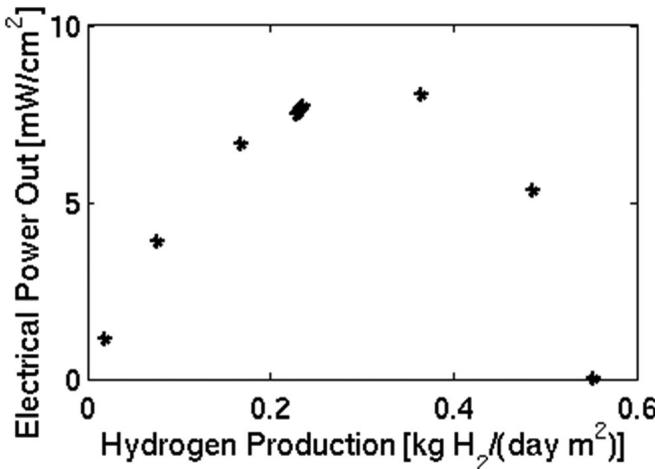  
Fig. 45 Experimentally measured electrical power output and co-production of hydrogen in SCFC operating at  $850^{\circ}\mathrm{C}$  illustrating the tuneable nature of SCFC output between the two products. The SCFC button cell used in this experiment consisted of 300 micrometer thick YSZ disk with Pt electrodes, and steam at the cathode and activated carbon placed on the anode surface.[345]

High pressures are needed to shift the synthesis reaction equilibrium to the right due to the Le Chatelier principle, and high temperatures are required to achieve practically high reaction rates, despite the fact that the synthesis reaction between nitrogen and hydrogen is actually exothermic in nature. Accordingly, the Haber-Bosch is an energy intensive process and consumes nearly  $2\%$  of the world's energy production. As the hydrogen for ammonia synthesis is derived from natural gas, it also consumes  $3 - 5\%$  of the global natural gas supply while emitting large quantities of  $\mathrm{CO}_{2}$ . Hence for both energy and environmental reasons, it is desirable to synthesize ammonia near ambient pressures and at lower temperatures, as ammonia tends to decompose above  $175^{\circ}\mathrm{C}$  into  $\mathrm{N}_2$  and  $\mathrm{H}_{2}$ , and thermodynamically is not stable at high temperatures. Progress made in new catalytic routes for ammonia synthesis at low temperatures and ambient pressures has recently been reviewed elsewhere.[347]

E.2.1. Electrochemical synthesis of ammonia. Unlike the case for the reaction between  $\mathrm{H}_{2}$  and  $\mathrm{N}_{2}$ , however, thermodynamics of ammonia synthesis using  $\mathrm{H}_{2} \mathrm{O}$  as the reactant is unfavorable. But this can be overcome, in principle, by applying externally a sufficiently large potential to overcome the thermodynamic barrier and drive the synthesis reaction towards ammonia formation. Indeed, using water as the hydrogen source and nitrogen from air, previous work has demonstrated ammonia synthesis in electrochemical reactors running at atmospheric pressure. The operating temperature of these reactors varied from near room temperature using liquid $^{348}$  or polymer electrolytes $^{349}$  such as Nafion $^{\text{®}}$ , $^{350}$  to temperatures up to  $570^{\circ} \mathrm{C}$  using proton-conducting solid oxide electrolytes such ytterbium-doped strontium cerate (Yb:SrCeO $_2$ ). $^{351,352}$  Most of the electrochemical studies for ammonia synthesis on precious metal and oxide catalysts utilizing both solid-state and liquid electrolytes have recently been reviewed elsewhere. $^{353}$

Electrochemical synthesis of ammonia from  $\mathrm{N}_2 / \mathrm{H}_2$  and  $\mathrm{N}_2/$  steam mixtures at production rates of  $10^{-10}\mathrm{molcm}^{-2}\mathrm{s}^{-1}$

and  $10^{-11}$  mol  $\mathrm{cm}^{-2}\mathrm{s}^{-1}$ , respectively, was demonstrated under atmospheric pressure at  $220^{\circ}\mathrm{C}$  on carbon paper cathodes containing Ru and Ag-Pd alloy catalysts in a solid-state cell that featured a protonically conducting  $\mathrm{CsH}_2\mathrm{PO}_4 / \mathrm{SiP}_2\mathrm{O}_7$  composite electrolyte.[354] Ammonia synthesis at atmospheric pressure and at  $450 - 700^{\circ}\mathrm{C}$  was demonstrated at an electrochemical production rate of  $2.9\times 10^{-9}$  mol  $\mathrm{cm}^{-2}\mathrm{s}^{-1}$  at  $550^{\circ}\mathrm{C}$  in a solid-state dual chamber reactor featuring a protonically conducting  $\mathrm{BaZr}_{0.7}\mathrm{Ce}_{0.2}\mathrm{Y}_{0.1}\mathrm{O}_{2.9}$  (BZCY) ceramic electrolyte and Ni/BZCY cermet catalytic cathode,[355] where it was suggested that the protons stored in the Ni/BZCY in the form of highly reactive hydride reacts with adsorbed nitrogen to promote the formation of ammonia.[356] Ammonia synthesis by electrolysis of steam and  $\mathbf{N}_2$  on nanoscale  $\mathrm{Fe_2O_3}$  catalyst particles suspended in a  $0.5\mathrm{NaOH} / 0.5\mathrm{KOH}$  molten electrolyte at  $200^{\circ}\mathrm{C}$  was reported to achieve  $35\%$  Coulombic efficiency.[357] A similar study employing  $\mathrm{Fe_3O_4}$  nanoscale catalysts in a NaOH/KOH molten electrolyte has recently demonstrated ammonia synthesis from  $\mathbf{N}_2$  and  $\mathbf{H}_2$  at a rate of  $6.53\times 10^{-10}$  mol  $\mathrm{cm}^{-2}\mathrm{s}^{-1}$  at  $2\mathrm{mA cm}^{-2}$  at  $210^{\circ}\mathrm{C}$  with a Faradaic efficiency of  $9.3\%$ .[358] More recently, ammonia was synthesized at a high rate of  $5.3\times 10^{-8}$  mol  $\mathrm{cm}^{-2}\mathrm{s}^{-1}$  with a Faradaic efficiency of  $10.2\%$  at room temperature in an electrochemical cell featuring a metal-organic framework-derived nitrogen-doped highly disordered carbon electrocatalytic cathode and  $0.1\mathrm{M}$  KOH alkaline electrolyte.[359]

In all studies, however, production rates for ammonia have generally been low (typically  $10^{-9} - 10^{-10}\mathrm{molcm}^{-2}\mathrm{s}^{-1}$ ) due to low kinetic rates resulting from large polarization losses at the cathode. Also, with few exceptions, the Faradaic efficiencies for ammonia were fairly low below  $1\%$  largely due to the competition between the hydrogen evolution and ammonia synthesis reactions at the cathode, as the protons do not only react with nitrogen to form ammonia, but may also receive electrons from the cathode to form  $\mathrm{H}_{2}$  gas. Such competition highlights the importance of selective electrocatalysis with high activity for nitrogen reduction towards ammonia synthesis, but with low activity (i.e., high overvoltage) for the hydrogen evolution reaction at the cathode.

Indeed, theoretical studies also suggest that electrosynthesis of ammonia is limited by the competitive processes of nitrogen reduction reaction (NRR) and hydrogen evolution reaction (HER) on the electrocatalytic sites at the cathode, where the HER usually has a smaller overpotential than for NRR.360 In search of new catalysts, density functional theory (DFT) investigation of the energetics of electro-reduction of nitrogen on  $\gamma \mathrm{-Mo}_2\mathrm{N}$  electrocatalyst indicated that among other  $\mathrm{Mo}_2\mathrm{N}$  surfaces, the (111) surface shows the highest reactivity and requires the least cell potential  $(-0.7\mathrm{V})$  to activate the  $\mathrm{N - N}$  bond of the adsorbed  $\mathbf{N}_2$  for nitrogen reduction.361 Similar theoretical studies of electrochemical ammonia synthesis reported a thermodynamic limiting-potential of  $-0.71\mathrm{V}$  for nitrogen reduction on Ru electrocatalysts, but also indicated the competitive evolution of hydrogen that limits the efficiency of conversion to ammonia.360 More recently, DFT studies of nitrogen electro-reduction to ammonia and the hydrogen evolution reaction on cubic MoC surfaces suggested that the

MoC(111) surface is capable of both adsorbing nitrogen at low overpotentials  $(-0.3\mathrm{V}$  vs. SHE) and suppress hydrogen evolution,[362] while a lower potential of  $-0.53\mathrm{V}$  for nitrogen activation on a  $\mathrm{MoS}_2$  nanosheet was predicted for the single Mo atom on the sheet identified as the active site.[363]

It is generally accepted that the associative mechanisms among surface intermediates favor the undesirable HER over the desired NRR on the cathode surface, resulting in low Faradic efficiencies reported often for the electrochemical synthesis of ammonia. A detailed density functional theory (DFT) investigation of the energetics of nitrogen electroreduction to ammonia on more than one dozen precious and transition metal catalysts identified that the potential-limiting step for nitrogen activation on most of these catalyst surfaces is the reductive adsorption of  ${}^{*}\mathrm{N}_{2}$  to form  ${}^{*}\mathrm{N}_{2}\mathrm{H}$  adsorbate requiring a theoretical overpotential of at least  $-0.5\mathrm{V}$ . [364] The study also proposed strategies such as stabilizing the adsorbed  ${}^{*}\mathrm{N}_{2}\mathrm{H}$  while destabilizing the  ${}^{*}\mathrm{NH}_{2}$  adsorbate by designing new catalyst that can bind  ${}^{*}\mathrm{N}_{2}\mathrm{H}$  more strongly on the surface, but without affecting or strengthening the binding energy of  ${}^{*}\mathrm{NH}_{2}$ . As the binding energies of these two species require individual optimization for selective electro-reduction of nitrogen, designing bifunctional catalysts that can bind the two species on different surface sites may be effective pathway to address this difficult problem of nitrogen activation. In this regard, designing catalysts for experimental verification should be guided by theoretical simulations and finding to identify opportunities and gain better insight into the mechanistic aspects of surface processes.

# E.3. Other chemical options for storage

Compounds of hydrogen and/or nitrogen offer chemical storage options that release carbon-free environmentally benign products when oxidized for electricity generation. Among such energy carriers, and excepting the rocket fuel hydrazine  $(\mathrm{N}_2\mathrm{H}_4)$  which is toxic and dangerously unstable, energy storage in hydrogen peroxide has recently gained interest as a potential energy storage chemical.[365-367] Hydrogen peroxide is produced commercially and mostly via the hydroquinone process. Alternatively, power from renewable resources can also be employed for cathodic reduction of oxygen in air on an electrocatalyst (typically Co-based) to produce hydrogen peroxide.[367,368] Hydrogen peroxide can be converted directly into electricity in a fuel cell.[366,369] Alternatively, electrolysis of hydrogen peroxide can produce  $\mathrm{H}_{2}$  and  $\mathrm{O}_2$ , which can be electrochemically converted back into electricity in a fuel cell. Hydrogen peroxide stores  $5.88\mathrm{wt}\%$ $\mathrm{H}_{2}$  and  $94.12\mathrm{wt}\%$ $\mathrm{O}_2$ , so it can be used as an oxidant or a fuel in fuel cell.[370] However, its theoretical energy density is only  $1.72\mathrm{MJkg}^{-1}$  of a  $50\mathrm{wt}\%$  aqueous  $\mathrm{H}_2\mathrm{O}_2$  solution (or,  $478\mathrm{W h kg}^{-1}$ ) with respect to its decomposition products of water and oxygen. This is not an attractively high energy density for large scale mobile storage applications, and is several orders of magnitude lower than the energy density of  $142\mathrm{MJkg}^{-1}$  of gaseous hydrogen, and  $33570\mathrm{MJkg}^{-1}$  for liquid hydrogen (see Table 6). Also, hydrogen peroxide is corrosive and reactive with metal surfaces, so it must be stored and transported only in

plastic tanks and containers. It also is unstable against alkaline medium. In its dilute form, hydrogen peroxide solutions are safely employed in household cleaners and disinfectants. However, it is not stable above  $52\mathrm{wt}\%$  in water and this may place additional constraints on hydrogen peroxide as a practical energy carrier.

At the carbon end of the chemical storage spectrum, there is obvious incentive to recycle  $\mathrm{CO}_{2}$  emissions for reutilization by converting to chemical fuels. However, the most obvious source, which is the atmosphere, is too dilute in  $\mathrm{CO}_{2}$  ( $\sim 400$  ppmv), so finding pure sources for  $\mathrm{CO}_{2}$  may pose challenges. Nevertheless, multiple avenues for  $\mathrm{CO}_{2}$ -to-fuels conversion have been explored, including low temperature $^{371-373}$  and high temperature electrochemical reduction of  $\mathrm{CO}_{2}$  to hydrocarbon fuels, $^{374,375}$  or to  $\mathrm{CO}$ , $^{376}$  or a mixture of  $\mathrm{CO} + \mathrm{H}_{2}$  (i.e., syngas). $^{377}$  Reduction products CO and/or syngas can further be converted catalytically into fuels via the Fischer-Tropsch synthesis process. $^{378}$  Power from renewable sources can be employed to accomplish  $\mathrm{CO}_{2}$ -to-fuels conversion without adding new  $\mathrm{CO}_{2}$  emissions to the environment. Alternatively, solar energy can be employed directly for  $\mathrm{CO}_{2}$  conversion using photoelectrochemical reduction, $^{379}$  and solar fuel production via photocatalytic conversion $^{380,381}$  or solar-thermal splitting. $^{382}$

Conversion of  $\mathrm{CO}_{2}$  to fuels in electrochemical, photoelectrochemical or photocatalytic cells can offer incentives for carbon-neutral re-utilization and repurposing of carbon-emissions.[383] However, conversion of  $\mathrm{CO}_{2}$  to fuels is challenging, as it requires both the reduction of  $\mathrm{CO}_{2}$  and the oxidation of water. Reduction potential of  $\mathrm{CO}_{2}$  (-1.06 to -1.40 V vs. SHE) is not vastly different from the  $\mathrm{H}_{2}\mathrm{O}$  splitting reaction (-1.23 V vs. SHE), but  $\mathrm{CO}_{2}$  reduction over various metal catalysts usually exhibits high overpotentials due to multiple electron transfer steps as well as the poisoning and deactivation of the catalytic surface by the reaction products. Moreover, the reduction reaction over most catalytic surfaces yields a wide product distribution that may include hydrocarbons and oxygenates as well as CO and  $\mathrm{H}_{2}$ , making product separation challenging.[384] Hence, selectivity is an important consideration.

Search for earth abundant, high activity, efficient and selective catalysts for the multi-electron reduction reaction have been elusive. After the earlier reports that Cu is an active electrocatalyst for  $\mathrm{CO}_{2}$  reduction,[385] many transition metal catalysts have been investigated. Recent progress has shown that nanostructured catalysts[371,386,387] and reticular processing of metal-organic framework catalysts with atomic level chemical and structural control may offer promising results.[388] However, reduction of  $\mathrm{CO}_{2}$  in low temperature aqueous cells is greatly limited by its low solubility (typically  $0.03\mathrm{mol}l^{-1}$ ), so pressurization is required to improve solubility. Reduction in non-aqueous electrolytes such as propylene carbonate improves  $\mathrm{CO}_{2}$  solubility. Low product yields and catalyst selectivity need significant improvement too, where the formation of formic acid is often favoured as the primary product of the  $\mathrm{CO}_{2}$  reduction reaction.

High temperature (i.e.,  $600 - 800^{\circ}\mathrm{C}$ ) electrolytic reduction of  $\mathrm{CO}_{2}$  to synthetic methane first reported several decades ago $^{374,389}$

overcomes some of these difficulties in converting  $\mathrm{CO}_{2}$  to useful fuels, but pose other challenges including product stability and high reduction overpotentials that require search for non-noble metal electrocatalyst with low overpotentials for  $\mathrm{CO}_{2}$  reduction. Often, carbon deposition is observed during reduction on transition metal catalytic anodes including Ni, a commonly employed anode catalyst in high temperature solid oxide electrolyzers (SOE). Moreover, most hydrocarbons are unstable above  $300 - 400^{\circ}\mathrm{C}$  and undergo thermal cracking. Hence, high temperature electrolysis of  $\mathrm{CO}_{2}$  poses limitations on the viability of this approach, so lowering the electrolysis temperature is desirable. Many of these difficulties can be minimized by adding steam to SOE for the concurrent reduction of  $\mathrm{CO}_{2}$  and  $\mathrm{H}_2\mathrm{O}$  into hydrocarbon fuels.[390] On the other hand, if employed for the production of CO and/or syngas only, high SOE operating temperatures should not pose an issue for product stability.[391]

# F. Mechanical energy storage

In mechanical storage systems, inexpensive electrical energy is converted into mechanical energy during off-peak times. Mechanically stored energy is converted back into electricity when the supply of electricity falls short of demand. It should be noted that the stored mechanical energy can easily be converted to heat also, but this is outside the scope of this article. Similarly, mechanical energy storage systems and materials such as springs, pendulums, piezoelectrics that do not lend the potential to store utility scale electrical energy are left outside the scope of this review. Accordingly, only pumped-hydro, flywheels and compressed air energy storage systems are reviewed here.

# F.1. Flywheels

Mechanical energy storage in flywheels generally offers high reliability, rapid charge/discharge rates, high power density and storage efficiency, low maintenance costs, long cycle life, and environmentally friendly clean operation.[392-395] Flywheels offer effective and efficient storage for applications where fast charge/discharge rates, long cycle life (up to hundreds of thousands), and medium to high power (kW to MW) are needed. For these attractive attributes, flywheels are increasingly finding applications in the areas of electric power storage, telecommunications, automotive, marine and aeronautics. Especially for storing energy from variable speed wind generators, they can improve the quality of power delivered to the grid.[396]

The amount of kinetic energy that can be stored in a flywheel is related linearly to the mass of the flywheel and the square of its angular velocity (see eqn (4)-(6)). Hence, its energy density is largely dependent on the mass and type of the material used for the manufacturing of the flywheel. Moreover, monitoring the angular velocity of the flywheel allows a simple but accurate way of determining its state-of-charge.

The flywheel can be designed to operate either at moderately low speeds (up to 6000 rpm) or at high speeds reaching up to 50000 rpm. Low speed flywheels are usually constructed of

Table 8 Comparative properties of composite materials considered for flywheel rotors395  

<table><tr><td rowspan="2">Material</td><td rowspan="2">Density (kg m-3)</td><td rowspan="2">Tensile strength (MPa)</td><td colspan="2">Max. energy density</td><td rowspan="2">Cost ($ per kg)</td></tr><tr><td>(MJ kg-1)</td><td>(kW h kg-1)</td></tr><tr><td>4340 stainless steel Composites</td><td>7700</td><td>1520</td><td>0.19</td><td>0.05</td><td>1</td></tr><tr><td>E-glass</td><td>2000</td><td>100</td><td>0.05</td><td>0.014</td><td>11.0</td></tr><tr><td>S2-glass</td><td>1920</td><td>1470</td><td>0.76</td><td>0.21</td><td>24.6</td></tr><tr><td>Carbon T1000</td><td>1520</td><td>1950</td><td>1.28</td><td>0.35</td><td>101.8</td></tr><tr><td>Carbon AS4C</td><td>1510</td><td>1650</td><td>1.1</td><td>0.30</td><td>31.3</td></tr></table>

steel, and because of their weight can achieve typical energy densities of around  $5\mathrm{W}\mathrm{h}\mathrm{kg}^{-1}$  (or  $18\mathrm{kJ}\mathrm{kg}^{-1}$ ). Since achieving high angular velocities requires the use of high strength materials, carbon fiber reinforced composite materials are typically being used in most high-speed flywheel construction. Rotors made from such lightweight high strength materials greatly improve the energy density of high-speed flywheels up to  $100\mathrm{W}\mathrm{h}\mathrm{kg}^{-1}$  (or,  $360\mathrm{kJ}\mathrm{kg}^{-1}$ ). A further advantage of such lightweight flywheels is that they can come up to speed in a matter of minutes rather than hours, and can provide  $1\mathrm{kW}\mathrm{kg}^{-1}$  of power. It is also worth noting, however, that nanomaterials such as carbon nanotubes exhibit greater tensile strength and Young's modulus than carbon fibers, and hence offer opportunities to further improve the energy density of flywheels. Table 8 illustrates some of the pertinent properties of composite materials explored for flywheel rotors, $^{395}$  where storage capacities in excess of  $1\mathrm{MJ}\mathrm{kg}^{-1}$  may be achievable.

The general design of a flywheel shown in Fig. 46 consists of a massive rotating drum, i.e., the spinning wheel in the figure, an electromotor generator, and a magnetic suspension bracket, or magnetic bearing that supports the massive rotating drum. In more advanced flywheel designs, superconducting bearings are explored to reduce frictional losses.[397] These components are housed in a physical enclosure generally maintained in low-pressure helium gas or vacuum to minimize frictional and self-discharge losses. The interface with the power system

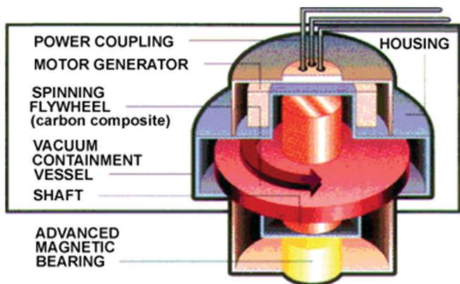  
Fig. 46 Schematic cross-section illustrating the basic design and operation of a flywheel energy storage system.[24] Reprinted from I. Hadjipaschalis, A. Poullikkas and V. Efthimiou, Overview of current and future energy storage technologies for electric power applications, Renewable Sustainable Energy Rev., 2009, 13, 1513-1522, with permission from Elsevier.

includes a motor/generator, and a variable speed power converter and controller. The motor/generator usually consists of a permanent magnet integrated to a rotor serving as a synchronous generator.

When cheap electricity is available during off-peak times, the electromotor drives the flywheel to high angular velocities where the electrical energy is stored as kinetic energy in the flywheel. When there is demand for electricity, the kinetic energy stored in the flywheel is converted to electricity in the generator as the flywheel slows down. This process is generally efficient, with round-trip storage efficiencies as high as  $90\%$ . They also have good cycling capability that range from  $10^{4}$  to  $10^{6}$  cycles. By virtue of converting mechanical to electrical and back, flywheel can essentially be considered as a mechanical battery.

The typical shortcomings of flywheels include low energy density suitable only for short-term storage, inability to directly produce high output voltage (typically \(>36\mathrm{kV}\)),[395] self-discharge during idling, and high capital cost (\(5000 per kW h).[394] Storing large amounts of electricity from the power grid requires high capacity, and hence massive size flywheels. However, frictional losses, which scales with size, reduces rotational speed and are the primary cause of self-discharge that lower the flywheel efficiency. For example, the frictional losses in a 200 ton flywheel are estimated to be about \(200\mathrm{kW}\), which lowers the efficiency of the flywheel to \(78\%\) after 5 hours of operation, and down to \(45\%\) after 24 hours.[22] In others, self-discharge rates as high as \(20\%\) per hour have been reported.[24] Such dramatic impact of frictional forces, even in vacuum environment, renders flywheels unsuitable for long-duration storage. However, this handicap may not pose a major barrier for short periods. In the case of integration with intermittent renewable sources, whose electricity output fluctuates by the hour, flywheels offer attractive advantages due to their fast response times. This is illustrated in Fig. 47, where a flywheel coupled to a wind turbine successfully smoothes the fluctuating and intermittent nature of power generation by peak shaving.[394] Even with conventional power generation, where there is a mismatch between the electricity demand (or, load) and the electricity supply, flywheels can rapidly supply stored energy back to the grid and also provide power conditioning.

# F.2. Compressed air energy storage (CAES)

The idea of storing energy in the form of compressed air pumped into large underground cavities goes back many decades,[398]

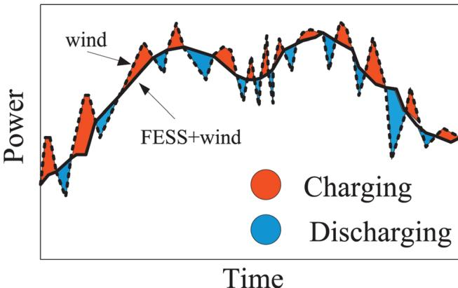  
Fig. 47 Power conditioning and peak shaving by the use of flywheel energy storage system (FESS) coupled to a wind turbine.[394] Reprinted from A. A. K. Arani, H. Karami, G. B. Gharehpetian and M. S. A. Hejazi, Review of flywheel energy storage systems structures and applications in power systems and microgrids, Renewable Sustainable Energy Rev., 2017, 69, 9-18, with permission from Elsevier.

but early progress has been somewhat slow in large part due to the lack of need or interest for grid storage until recently, where rapid growth and deployment of intermittent renewable sources has generated renewed interest in compressed air energy storage (CAES).[399,400]

Unlike flywheels, the typical discharge times for compressed air energy storage (CAES) are long and measured in hours up to days. Their start-up times are also relatively longer than flywheels, measured in minutes.[399] Furthermore, CAES requires ready availability and proximity to large underground cavities, aquifers, and caverns that exhibit impervious rock formations to ensure gas tight containment of compressed air. Hence, it's availability and feasibility is necessarily restricted by geological constraints. This is one of the major shortcomings of this technology. On the other hand, it eliminates large and costly installations for building a storage facility. Where geological conditions are favorable, CAES offers an attractive and cost-effective technological option to store off-peak power from the grid in the form of compressed air that is kept underground reservoirs during low demand. When make-up power is needed, the high-pressure compressed air is converted back to electricity with an estimated efficiency up to  $70\%$ .[22] This process is schematically depicted in Fig. 48.

The typical charging cycle of CAES starts with compressing air to high pressures in several stages by electrically drive compressors during low electricity demand, usually with cooling in between successive compressions before injecting into the underground storage cavity, which is maintained at air pressures up to 100 bar. Temperature of the injected air is typically kept at or below  $40^{\circ}\mathrm{C}$  to avoid thermal stress in the underground cavity. During high electricity demand, i.e., discharge cycle, compressed air from the underground cavity is preheated in a recuperator or heat exchanger, and mixed with fuel in a combustor. The hot combustion gases are expanded in a turbine to generate electricity.

There are a variety of CAES processes being considered or developed for different applications, but all of them can be

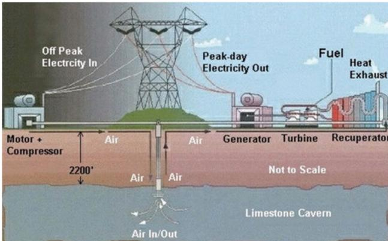  
Fig. 48 Schematic illustration of compressed air energy storage.[22] Reprinted from H. Ibrahim, A. Ilinca and J. Perron, Energy storage systems - characteristics and comparisons, Renewable Sustainable Energy Rev., 2008, 12, 1221-1259, with permission from Elsevier.

grouped under three categories differentiated by how the heat is managed during charging and discharging cycles, namely, adiabatic CAES, diabatic CAES and isothermal CAES. In the adiabatic CAES process, the heat of compression during the charging cycle is fully captured into a thermal energy storage system, and re-used to preheat the compressed air prior to expansion during the discharge cycle. In the diabatic CAES process, by contrast, the heat of compression is lost to the surrounding atmosphere during the charging cycle by cooling the compressed air, which then necessitates an external heat source to reheat the compressed air during the discharge cycle. Unlike in diabatic and adiabatic CAES processes, heat of compression needs to be minimized or eliminated completely during isothermal CAES to keep the air temperature near ambient at all times. Consequently, performance parameters such cycle efficiencies, energy densities, and start-up times widely vary among the three process groups.

There are a number of installations of CAES systems around the world. The first CAES system, namely the Huntorf facility, was installed near Bremen, Germany in 1978. It had a charging time of 8 hours, discharge time of 2 hours, and maximum charging and discharging power of  $60\mathrm{MW}$  and  $290\mathrm{MW}$ , respectively, with a power plant efficiency of  $42\%$ .[400] In 1991, another CAES system built over a 700-meter deep  $2.55 \times 10^{6}\mathrm{m}^{3}$  cavern in McIntosh, Alabama, USA, and operated at  $54\%$  efficiency but with significantly longer charge/discharge times of  $40/26$  hours, respectively, had provided  $110\mathrm{MW}$  of power for a duration of 226 hours, and has been in use for 1770 hours per year.[22] In the last decade, several CAED projects with storage capacities in the  $175 - 315\mathrm{MW}$  range have been initiated in the US[399]

It is estimated that  $0.7 - 0.8\mathrm{kW}$  h of off-peak electricity is required to compress the air into the underground formations in order to supply  $1\mathrm{kW}$  h of peak-demand electricity back into the grid.[22] As more than 2/3rd of the available power in a power plant is consumed in compressing the combustion air for the gas turbines, it makes sense to separate this process in time and use the off-peak power to compress the air, and use it to convert to electricity when peak demand increases.

Due largely to their geological requirements and constraints, CAES can be used only at large scales. In fact among all other storage technologies and systems, CAES is currently the only technology other than pumped-hydro that has the ability to provide large-scale energy storage capacity, typically, less than 300 MW. CAES also offers the longest storage duration of the order of 20-40 years without significant losses, and long cycle life reaching more than 13 000 charge/discharge cycles. However, the volumetric energy density for CAES is low, typically  $2 - 12\mathrm{kW}\mathrm{h}\mathrm{m}^{-3}$  (or,  $7.2 - 43.2\mathrm{MJ}\mathrm{m}^{-3}$ ). By comparison, the typical volumetric energy densities of liquid fuels are nearly 3 orders of magnitude larger than these values. A recent economic analysis of the Danish electric system that produces a significant portion (42% in 2015) of its electricity from offshore wind has concluded that investments in CAES carry risks and do not offer more cost-effective options than other storage alternatives.[401] Thermodynamic analysis and modeling of CAES systems using first and second law (i.e., exergy) efficiencies predicted more optimistic results regarding the viability of CAES for large scale storage with efficiencies as high as 86% when combined with thermal storage, but these studies still caution on the technical challenges that still remain to overcome by this technology.[399,400,402]

# F.3. Pumped hydro storage

Hydropower constitutes the major segment among the renewable energy sources with a global share of more than  $16\%$  of the global electricity production in 2016, and is a mature commercially proven technology. It has been used at industrial scale since the turn of the 20th century. Globally, more than 25 countries depend heavily on hydropower to supply a large fraction of their electricity production.[403] Fig. 49 indicates the geographical distribution for the global potential of hydropower with respect to the continents and highlights the fact that significant potential remains unexploited. Likewise, Table 9 provides information about the world top ten countries with the largest installed and generation capacities of hydropower.

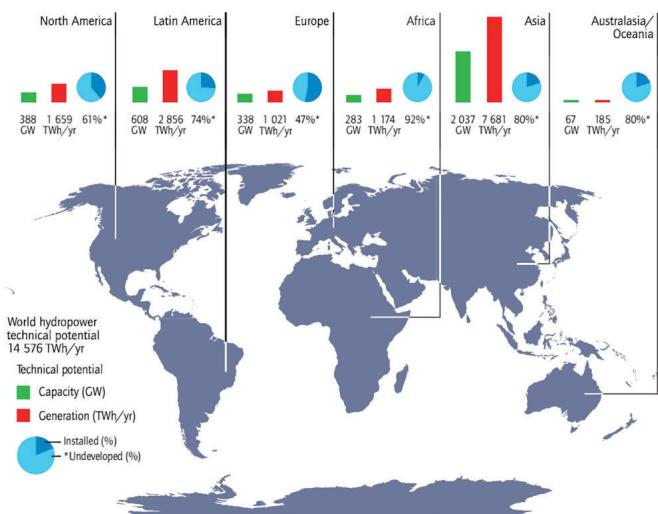  
Fig. 49 Continental potential of hydropower generation, also indicating the percentage of undeveloped hydropower potential as of 2009.[404]

Table 9 Top-ten countries in the world with the largest installed and generation capacities of hydropower in 2010. Data compiled from ref. 404 and 405  

<table><tr><td>Country</td><td>Installed capacity (GW)</td><td>Hydro electricity production (TW h)</td><td>Share of electricity generation (%)</td></tr><tr><td>China</td><td>210</td><td>694</td><td>14.8</td></tr><tr><td>Brazil</td><td>84</td><td>403</td><td>80.2</td></tr><tr><td>Canada</td><td>74</td><td>379</td><td>62.0</td></tr><tr><td>United States</td><td>79</td><td>328</td><td>7.6</td></tr><tr><td>Russia</td><td>50</td><td>165</td><td>15.7</td></tr><tr><td>India</td><td>38</td><td>132</td><td>13.1</td></tr><tr><td>Norway</td><td>30</td><td>122</td><td>95.3</td></tr><tr><td>Japan</td><td>28</td><td>85</td><td>7.8</td></tr><tr><td>Venezuela</td><td></td><td>84</td><td>68</td></tr><tr><td>Sweden</td><td></td><td>67</td><td>42.2</td></tr><tr><td>World total</td><td>936</td><td>3300</td><td>16</td></tr></table>

When and where geographical conditions are satisfied, hydropower plants can be employed for pumped hydro energy storage (PHES). Indeed, pumped hydro constitutes by far the largest segment of the electricity storage technologies globally. Extensive reviews of PHES technology addressing the various aspects of the technical challenges,[406] technology trends,[407,408] coupling to other renewable sources,[406,409] and international PHES projects[407,410] are provided elsewhere.

However, the availability and cost of this mature technology is site-dependent and only feasible where geographic conditions are favorable for its implementation. PHES provides more than  $96\%$  of the global installed storage capacity[41] (see also Table 2). It provides cost effective solutions to load-leveling and peak-shaving in the grid and during peak demand, eliminates the need for generating make-up power by gas turbine plants using natural gas. Thus, pumped-hydro displaces the use of fossil fuels and thus helps reduce carbon emissions.

In principle, PHES employs the potential and kinetic energy of vast quantities of water stored between two water reservoirs with sufficiently large volumes and separated by a significant difference in altitude. Some of the pumped-hydro facilities employ abandoned mines or artificial formations as reservoirs, but most employ natural reservoirs such as lakes.

During off-peak times where the electricity demand is low, excess generation capacity is used to pump water from a lower reservoir to a higher one, such as a volcanic lake. When electricity demand is increased beyond generation capacity, water is released from the upper reservoir to turn a turbine to generate make-up electricity. The general layout of the key features of a PHES plant is schematically shown in Fig. 50. The turbine serves dual purposes, both to pump water to the upper reservoir and also to generate electricity when water is released from the upper into the lower reservoir.

PHES generally provides large storage capacities with power ratings in some places ranging up to 1000's of MW (or, 100's of GW h of energy). However, the storage capacity depends strongly on the separation height between the two reservoirs and the volume of water transferred between the two. For example, 1 ton of water released from 100 meters can

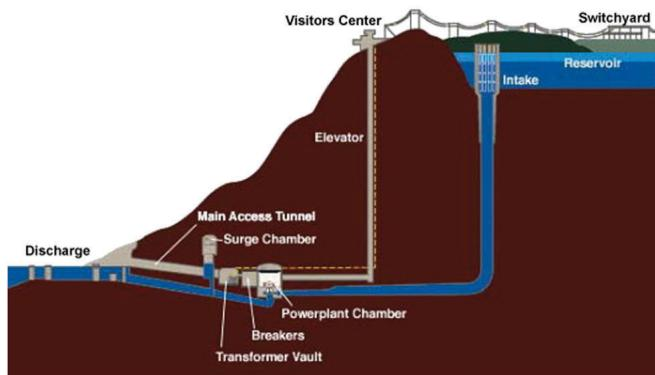  
Fig. 50 A typical layout of pumped-hydro storage plant operating between two water reservoirs.[412] Reprinted from I. Hadjipaschalis, A. Poullikkas and V. Efthimiou, Overview of current and future energy storage technologies for electric power applications, Renewable Sustainable Energy Rev., 2009, 13, 1513-1522, with permission from Elsevier.

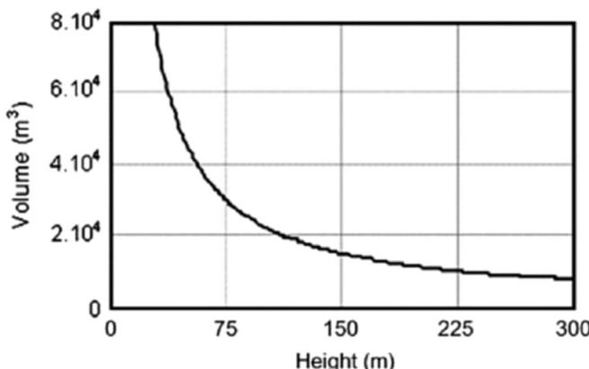  
Fig. 51 Volume of water needed to store 6 MW h of electrical energy as a function of separation height between reservoirs.[22] Reprinted from H. Ibrahim, A. Ilinca and J. Perron, Energy storage systems – characteristics and comparisons, Renewable Sustainable Energy Rev., 2008, 12, 1221–1259, with permission from Elsevier.

potentially generate  $0.27\mathrm{kW}$  h of electricity. Fig. 51 illustrates the relation between the volume of water and the vertical separation height between the two reservoirs required to store about  $6\mathrm{MW}$  h of electrical energy.[22]

One of the major shortcomings of pumped-hydro is its strong reliance on both the availability and suitability of two large bodies of water located in reasonable physical proximity of each other and separated by a sufficient vertical distance. As Fig. 51 shows clearly, relatively low energy density of this technology requires both large volumes of water and large differences in altitude. The capital costs for plant construction may vary widely from 470 Euro per kW to 2170 Euro per kW (in 2009 Euros) $^{410}$  and strongly depends on geographic constraints. A more recent report estimated the average capital cost for a 500 MW green field hydropower generation plant in the USA to be about $3500 (+35%) in 2012 with capacity factors ranging between 25 and 90% and a levelized cost of electricity between $20 per MW h and 190 per MW h for large plant operations. $^{403}$

Sometimes, conventional hydroelectric power generation plants can operate also for storage purposes provided that another large body of water at a lower, or higher, altitude is conveniently available nearby, which is more an exception than a norm. When available, such combined hydropower generation-storage plants provide the opportunity for peak-leveling and shaving in an environmentally friendly manner.

An unavoidable problem with pumped hydro storage is evaporation losses from the large surface areas of the two large bodies of water, especially the ones at high altitudes, where such losses can be significant. This leads to lost work from pumped water due to natural causes, and reduces the efficiency for storage.

Nevertheless, PHES offers high conversion efficiencies, where  $70 - 85\%$  of the energy used to pump water to the upper reservoir can be recovered during the generation cycle. Pumped-hydro storage offers response times that may range between minutes to hours, which allows it smooth out changes in load or demand conditions on the grid. This is critical for power management and frequency regulation on the network. By contrast, thermoelectric power requires relatively longer start up times, which can lead to frequency and voltage instabilities in the grid.

With significant cost reductions in wind and solar, there is growing interest in hybrid storage systems that explore various combinations of wind, solar and PHES technologies for consideration for large-scale energy storage as well as autonomous or isolated electric grids.[407,408,413] Mostly, these studies employ system modeling to simulate widely varying conditions for optimum performance, cost and efficiency. Although the outcomes are impacted by site-specific constraints, it is suggested nevertheless that coupling PHES to intermittent renewable power sources help increase the penetration level of these renewable sources into the power mix.

As inland PHES is limited by geographical conditions, seawater presents a nearly unexplored potential for PHES. Currently, there is only one seawater-based PHES facility in the world operating since 1999 in Okinawa, Japan with a design a capacity of  $30\mathrm{MW}$  and a head of 136 meters. There are few others in conceptual or design stage, including the Dead Sea Power project located on the Red Sea with a design capacity of  $1500 - 2500\mathrm{MW}$ , and one proposed seawater PHES project in Ireland to provide  $480\mathrm{MW}$  of storage capacity.[406]

# G. Thermal energy storage

Central to electricity storage is the gap between generation and consumption, and thermal energy storage is a fundamentally sound approach that can provide attractive opportunities to achieve storage at large scale. Already, thermal energy storage is ubiquitous in our daily lives including hot water heaters and residential heating and cooling. But converting thermal energy back to electricity is generally not a highly efficient process. Moreover, the "energy quality", which sometimes is also referred to as the quality of heat, may be a design consideration for many applications. For thermal storage, the temperature,  $T$ , at which the energy, or heat, is delivered, is an important factor.

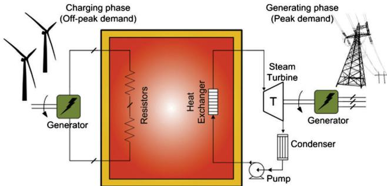  
Fig. 52 Schematic process flow diagram for sensible heat thermal storage from wind power. Reprinted from ref. 414 (X. Luo, J. Wang, M. Dooner and J. Clarke, Overview of current development in electrical energy storage technologies and the application potential in power system operation, Appl. Energy, 2015, 137, 511-536).

As Gibbs free energy,  $G$ , defined in eqn (1) represents the maximum amount of work that can be extracted from a system, the energy quality can be defined as the ratio of the Gibbs free energy to enthalpy by,

$$
G / H = \Delta T / T = 1 - \left(T _ {0} / T\right) \tag {34}
$$

here,  $T_{0}$  denotes the ambient temperature. It is clear from eqn (34) that higher the delivery temperature,  $T$ , higher will be the energy quality, or the quality of the heat delivered.

There have been renewed interest in thermal energy storage materials and technologies, and several excellent reviews are available in this topical area.[415-419] Most thermal energy storage systems can be grouped under two general categories, namely sensible heat storage and latent heat storage. The latter employs the latent heat that often accompanies a phase change such as fusion or melting, or a structural transformation. Those that utilize the sensible heat given in eqn (7) rely on the specific heat and mass of a material. The schematic of thermal storage using sensible heat is illustrated in Fig. 52, where electricity from a wind farm is used to heat up a thermal mass of desirable heat capacity. The heated mass may be in liquid or solid form, which is then employed to make steam and generate electricity

when the demand is high. Many of these systems consider molten salts or their eutectic mixtures for thermal storage, which brings about potential problems related to hot corrosion, and thermal and chemical stability issues for the container materials in the highly corrosive environment of the molten salt. To mitigate such undesirable stability problem, the use of costly construction materials is often required. So cost and stability, and hence useful service life, are important considerations in the proper evaluation and selection of the appropriate thermal storage medium, materials and system design.

# G.1. Sensible heat storage in molten salts and other materials

Thermal storage via sensible heat typically involves heating up a mass of a material in liquid or solid from and raising its temperature by  $\Delta T$  without undergoing a phase change or structural transformation. The process of converting the stored thermal energy back to electricity typically involves using the sensible heat to make steam that drives a turbine, and finally the generator. Excess electricity during low demand, electricity from renewable sources, or thermal solar energy can all be employed as viable sources to heat up the storage material or medium. As the required mass or volume of the storage medium is typically large in order to store sufficient energy, the economics of this scheme favor relatively abundant and inexpensive materials with sufficiently high heat capacities. For that reason, solids are mostly preferred but molten salts are also being employed as well. Representative physical properties of select solids, liquids and molten salts are provided in Table 10.

Some of the materials listed in the table offer attractive properties for thermal energy storage applications but some have disadvantages or shortcomings such as low energy density, thermal conductivity or specific heat. Most are cheap and abundantly available, and several such as iron and water offer high volumetric energy densities around  $4\mathrm{MJ}\mathrm{m}^{-3}$ . Particularly, water possesses nearly two times larger specific heat than most other materials, and offers an energy density of  $4.19\mathrm{MJ}\mathrm{m}^{-3}$ , but it is only operable below  $100^{\circ}\mathrm{C}$ . So the energy quality of water as a storage medium for large-scale storage

Table 10 Comparison of materials properties for thermal storage  

<table><tr><td>Materials</td><td>Melting point (℃)</td><td>Thermal conductivity (W m-1K-1)</td><td>Density (kg m-3)</td><td>Specific heat, Cp(J kg-1K-1)</td><td>Vol. energy density (kJ m-3)</td></tr><tr><td>Solids</td><td></td><td></td><td></td><td></td><td></td></tr><tr><td>Aluminum</td><td>660</td><td>205</td><td>2700</td><td>920</td><td>2484</td></tr><tr><td>Iron (cast)</td><td>1150</td><td>58</td><td>7200</td><td>540</td><td>3890</td></tr><tr><td>Glass</td><td>N/A</td><td></td><td>2710</td><td>837</td><td>2272</td></tr><tr><td>Brick</td><td>&gt;1500</td><td>1.3</td><td>1970</td><td>921</td><td>1813</td></tr><tr><td>Concrete</td><td>N/A</td><td>1.0-1.8</td><td>2000</td><td>880</td><td>1760</td></tr><tr><td>Granite</td><td>1215-1260</td><td>1.7-4.0</td><td>2400</td><td>790</td><td>1896</td></tr><tr><td>Liquids</td><td></td><td></td><td></td><td></td><td></td></tr><tr><td>Water</td><td>100</td><td>0.58</td><td>1000</td><td>4190</td><td>4190</td></tr><tr><td>Molten sodium</td><td>98</td><td></td><td>750</td><td>1260</td><td>945</td></tr><tr><td>50 : 50 ethylene glycol-water mix</td><td></td><td></td><td>1075</td><td>3480</td><td>3740</td></tr><tr><td>Molten salts</td><td></td><td></td><td></td><td></td><td></td></tr><tr><td>50 wt% KNO3-40% NaNO2-7% NaNO3</td><td>149</td><td></td><td>1680</td><td>1560</td><td>2620</td></tr><tr><td>LiNO3-NaNO3-KNO3</td><td>117</td><td></td><td>1710</td><td>1540</td><td>1056</td></tr><tr><td>NaNO3-KNO3</td><td>222</td><td></td><td>1750</td><td>1530</td><td>756</td></tr></table>

applications is necessarily low. Environmental impact should also be taken into consideration. For example, underground energy storage using hot water may cause irreparable damage to the ground or the geological structure. However, water is a suitable energy storage medium for heating and cooling for residential buildings and workplaces where low quality heat is acceptable. Similarly, water-ethylene glycol mixtures are also limited by their operating window for storage, but are suitable for heating and cooling applications that do not require high quality heat.

On the other hand, most inexpensive solids offer a wide window of operating temperatures that can extend close to their melting points. Thus the quality of energy for these materials can be quite high, and makes them attractive for large-scale storage applications. Furthermore, their high densities nearly twice that for liquid and molten medium helps render the storage medium to be compact. Unlike water, other liquids, or molten salts, low vapor pressure of solids makes containment easy and inexpensive, while reducing materials loss to the surroundings. Indeed, solar energy can be stored up to  $36\mathrm{kJkg}^{-1}$  (or,  $10^{5}\mathrm{kJm}^{-3}$ ) in rocks or concrete for space heating applications.[418]

There is, however, another important consideration that has to do with how fast energy is transferred to or retrieved from the storage medium. In this respect, thermal conductivity is an important material parameter for system design purposes. As shown in Table 10, metals possess significantly higher thermal conductivity than many of the refractory solids, as well as liquids. For molten salts, thermal conductivity information is rather scarce, but for several fluoride-, carbonate- and nitrate-based molten salt eutectics, thermal conductivity values between 1.09 and  $1.21\mathrm{Wm}^{-1}\mathrm{K}^{-1}$  have been reported.[420] Clearly, nearly two orders of magnitude difference between the thermal conductivities of metals and refractory solids, liquids, or molten salts can be an important factor in the selection of the proper storage material and system design for a specific application.

Needless to say, heat loss to the surrounding in the forms of radiation, convection and/or conduction is another important consideration in energy storage, because it directly impacts overall system efficiency. Such losses are dependent not only on the temperature difference between the storage medium and its surrounding, but also on other factors including exposed surface area, emissivity, and thermal conductivity. Hence, proper design, materials selection, and effective thermal insulation of the storage system are important considerations.

# G.2. Latent heat storage in phase change materials

This approach utilizes the enthalpy change during phase transitions without a change in composition, i.e., congruent phase transitions, where typically the first derivative of Gibbs free energy during the phase change is discontinuous. This type of energy storage may involve either the enthalpy of fusion, typically during melting, or the enthalpy change during a solid-state crystal structure transformation below the melting point of the material. As in the case of sensible heat, energy is stored in the material either by inducing melting or a structural phase

change, and retrieved back in the reverse process. Since most congruent phase changes occur at sufficiently elevated temperatures, the energy quality of energy storage using latent heat is typically high. Also, the entropies of solid materials are considerably smaller than those of liquids or melts. So the entropy change during melting can be considerable. Hence, the enthalpy change across the phase transformation is relatively larger for fusion rather than for solid-state phase transformations. On the other hand, congruent melting and solidification usually involves considerable molar volume change in the storage material, which makes containment and system design more complicated, while molar volume changes during solid-state phase transformations are typically much smaller. Table 11 lists a number of cheap and readily available materials that can be considered for thermal energy storage via phase change. However, it also illustrates that the amount of storable energy may be quite limited, as the energy densities for  $0.3 - 0.5\mathrm{MJkg}^{-1}$  for many phase change materials are several orders of magnitude lower than those for chemical fuels such as hydrogen  $(142\mathrm{MJkg}^{-1})$ , gasoline  $(44\mathrm{MJkg}^{-1})$ , or methanol  $(20\mathrm{MJkg}^{-1})$ .

Nevertheless, phase change materials can store 5-14 times more energy per unit volume than sensible storage materials such as water, most rocks and many other solids. Unlike sensible heat storage materials, they store and release heat at nearly constant temperature, which is an advantage. Most phase change materials can be grouped in two major categories, namely, organic and inorganic materials, and their eutectics. The inorganic group exhibits nearly twice the volumetric capacity of  $250 - 400\mathrm{kg}\mathrm{dm}^{-3}$  for storage compared to  $128 - 200\mathrm{kg}\mathrm{dm}^{-3}$  for organic phase change materials.[416]

The most common organic phase change material is the paraffin group of hydrocarbons with melting points slightly higher than room temperature and moderate enthalpies of fusion. The latter increase with chain length. They possess many desirable properties including low vapor pressure, chemical stability in some cases up to  $500^{\circ}\mathrm{C}$ , low toxicity and corrosivity, commercial availability at large quantities and at low cost, and negligible supercooling. On the hand, they undergo considerable volume change during solid-liquid phase transition and exhibit low thermal conductivities that greatly limit the rate at which heat is stored and released.

An important group among inorganic phase change materials is salt hydrates (see last three rows in Table 11), which break up at the melting temperature into water and an anhydrous salt (or, water and the lower hydrate). They offer attractive properties such as high volumetric latent heat of fusion, significant thermal conductivity nearly twice that of paraffins, small volume change during phase transition, and mostly non-corrosive and non-toxic and low cost. However, many inorganic salt hydrates melt incongruently, i.e., the water released during the phase transition is not sufficient to dissolve all the solid salt phase(s). Another important disadvantage of salt hydrates is supercooling. As the rate of nucleation at the phase transition temperature is rather slow, the solution requires supercooling to lower temperatures to achieve a

Table 11 Latent heats of fusion of phase change materials. Compiled from ref. 416 and 421  

<table><tr><td></td><td>Transition temperature (°C)</td><td>Enthalpy of fusion (MJ kg-1)</td></tr><tr><td>Water</td><td>0</td><td>0.335</td></tr><tr><td>Paraffin</td><td>20–60</td><td>0.14–0.28</td></tr><tr><td>LiNO3</td><td>250</td><td>0.37</td></tr><tr><td>NH4NO3</td><td>170</td><td>0.12</td></tr><tr><td>NaNO3</td><td>307</td><td>0.13</td></tr><tr><td>NaOH</td><td>318</td><td>0.15</td></tr><tr><td>Ca(NO3)2</td><td>561</td><td>0.12</td></tr><tr><td>LiCl</td><td>614</td><td>0.31</td></tr><tr><td>FeCl2</td><td>670</td><td>0.34</td></tr><tr><td>MgCl2</td><td>708</td><td>0.45</td></tr><tr><td>KCl</td><td>776</td><td>0.34</td></tr><tr><td>NaCl</td><td>801</td><td>0.50</td></tr><tr><td>LiNO3·2H2O</td><td>30</td><td>0.296</td></tr><tr><td>FeCl3·6H2O</td><td>37</td><td>0.223</td></tr><tr><td>Na2PHO4·12H2O</td><td>40</td><td>0.279</td></tr></table>

reasonable nucleation. Hence, the energy stored in the material can only be released at a temperature lower than the fusion point. The undesirable effect of supercooling naturally renders inefficiency in the storage cycle.

Most studies concluded that low thermal conductivities of phase change materials pose a major limitation for their implementation for large scale energy storage applications. Therefore, recent attention has turned to designing microstructures and methodologies such as adding dispersions of metals, graphite and other high thermal conductivity materials, microtubes, fins, and encapsulation, all intended for enhancing the rate of heat transfer in these materials.[360]

# H. Grid storage

The electrical grid depicted in Fig. 53 is a critical component of the vital connection between the point of use and power generation. In many parts of the world, the existing grid infrastructure is insufficient, old or obsolete. In the US, the Department of Energy estimates that  $70\%$  of the transmission lines and  $70\%$  of power transformers are 25 years or older, and  $60\%$  of the circuit breakers are more than 30 years old.[17] The expected growth of  $43\%$  in the global electricity production (see Table 1) urgently requires major upgrading of the grid system to make the grid more secure, reliable, and responsive. Certainly, large-scale deployment of distributed storage capacity will help improve grid resilience and security, reduce line congestion and line loss, lower the need for generation

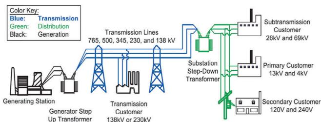  
Fig. 53 Basic structure and lay out of the US electric grid system. $^{422}$

during peak demand times, and also extend the capability of the transmission grid, for example, by positioning the storage system downstream on the load side. A White House 2013 report from the Executive Office of the President also concluded that energy storage is important for emergency preparedness during natural disasters and also in increasing grid resilience and robustness to weather outages.[367]

Rapid deployment of intermittent renewables such as wind and solar has highlighted the difficulties in fully integrating these renewable sources into the grid. A recent report by the US National Renewable Energy Laboratory (NREL) has suggested that more than  $20\%$  penetration of intermittent renewables such as solar into the electric grid can cause operational challenges that can adversely affect grid reliability.[423] Although the scope of this study was rather limited to the grid systems in the islands of Oahu and Maui in Hawaii, it strongly underscores the importance of storage technologies to cope with dynamic loads. Assuming  $20\%$  penetration by renewable sources by 2020, a recent report by Pacific Northwest National Laboratory  $(\mathrm{PNNL})^{424}$  estimated that the US would need a total of 37.67 GW for intra-hour balancing capacity, and an energy storage capacity of 14.3 GW h that can provide power at rated capacity for 20 minutes. By comparison, the US has 24.6 GW of storage capacity ( $\sim 2.3\%$  of total electricity production capacity), including announced projects.[17] Unfortunately,  $95\%$  of this storage capacity is by pumped-hydro, whose availability is site-specific and constrained by location, and only 1.2 GW of this capacity is provided collectively by CAES, flywheel, thermal, and battery storage. The situation is not much different elsewhere. For example, Europe and Japan have considerably higher fractions of grid storage than US, but it is largely dominated by pumped-hydro also. The global energy storage capacity has now grown to 168.6 GW (see Table 2), where pumped-hydro makes up more than  $96\%$  of the total capacity. It is clear that distributed storage can help remove or mitigate the logistic mismatch problem between the siting of storage availability and demand.

To appreciate the need for storage, one needs to look no further than intermittent sources such as solar and wind, whose power generation show large variability up to  $80\%$  during time scales of minutes to hours, as depicted in Fig. 54

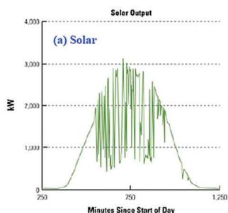  
Fig. 54 Time-dependent intermittency of solar and wind power varying  $>80\%$  within time scales of minutes to hours in a single day. The high rate of change of power (i.e., ramp rate) of the order of MW  $\mathrm{min}^{-1}$  is illustrated for wind power.[241]

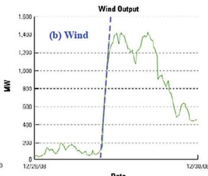

The ramp rates, especially for wind power which can be of the order of MW min $^{-1}$  or higher, requires energy storage with characteristic time constants and capacities compatible with power production. US Department of Energy recommends $^{241}$  three time scales to accommodate variability of intermittent power sources; (a) seconds-to-minutes, with storage capacity of  $5 - 7\%$  of generated power for frequency and voltage support – for US this is about 20-50 GW of storage capacity for the domestic generation capacity of more than 1100 GW of power; (b) minutes-to-hours of capacity for up to one hour of storing  $20\%$  of power from renewable sources for smoothing intermittency – or, nearly 220 billion kW h of storage capacity in order to accommodate more than 1100 billion kW h of solar and wind power generated globally in 2016 (see Table 1); and (c) hours-to-days of power storage capacity for peak shaving and  $20\%$  integration of renewables into the grid, which requires a power capacity on the order of 200 GW and 1000 GW h for  $20\%$  integration of renewable energy. These estimates were based on the assumption that 200 GW generation from renewable resources would be required to meet  $40\%$  of daily load with  $100\%$  load shifting for 5 hours. $^{241}$

The need for cost-effective storage is highlighted in Fig. 55, which shows the 2010 costs of power and energy for various storage technologies, as well as the cost targets set by US DOE ARPA-E.[241] The figure also marks the required response times for 10 minute and 1 hour reserve storage capacity. Pumped-hydro and CAES with time scales from hours to days provide cost-effective storage where available, but rapid development and deployment of a portfolio of diverse storage technologies with the required characteristic response times and energy capacities are needed for broader siting of storage facilities, especially for intermittent renewable sources. Clearly, the figure indicates that major cost reductions are needed for electrochemical technologies to meet the cost target.

Sizing of a storage system for grid applications requires several operational parameters to be specified, including the power rating (in MW) to meet the target load, the energy rating

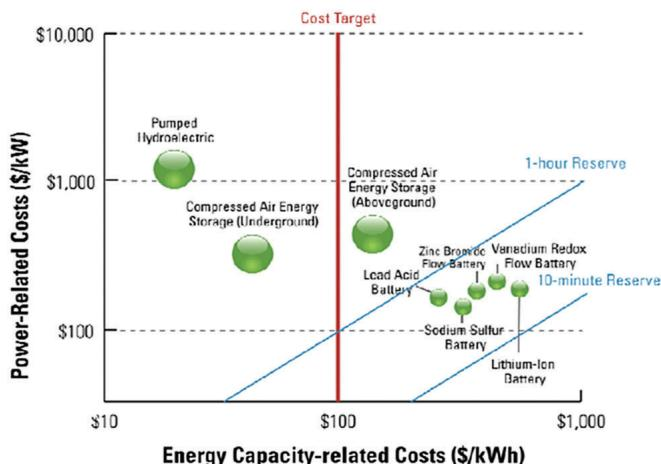  
Fig. 55 Cost of energy storage for various technologies, showing cost targets and minimum required response times. Small circles denote response times of seconds, large circles indicate time scale in minutes.[241]

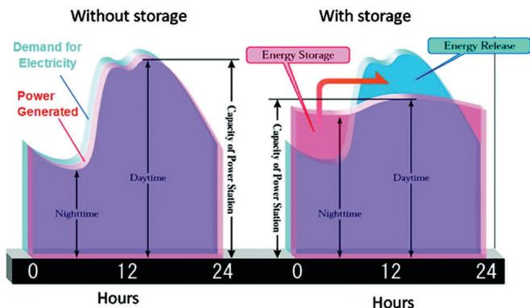  
Fig. 56 Schematic illustration of balancing the demand and generation by load-leveling via storage. $^{32}$  Reprinted with permission from (Z. Yang, J. Zhang, M. C. W. Kintner-Meyer, X. Lu, D. Choi, J. P. Lemmon and J. Liu, Electrochemical energy storage for green grid, Chem. Rev., 2011, 111, 3577-3613). Copyright (2018) American Chemical Society.

(in MW h) that the storage unit is required to deliver to the grid or absorb form it at any given cycle, and the characteristic response time. Large variations between on and off-peak electricity demand and generation can effectively be balanced and smoothed out using large-scale electrical storage to provide peak-leveling and shaving options, as shown schematically in Fig. 56. Real time regulation of the grid to control and respond to momentary fluctuations caused by the imbalance between load and generation is also a critically important need that can be achieved when combined with proper storage technology. Currently, grid regulation is in large part accomplished by placing generator units that are ready to go online or offline, or increase or decrease their power as needed. Besides lost generation capacity when off-line, such variable power and on/off fluctuations cause their wear and tear on the generation equipment and plants, especially for thermal base-load generators. Another consideration is frequency response, which is similar to regulation but responds to sudden fluctuations, usually in time periods of seconds. Fig. 57 illustrates the effects of using grid regulation and frequency response. Electrical storage not only provides time-shift duty, i.e., buying electricity

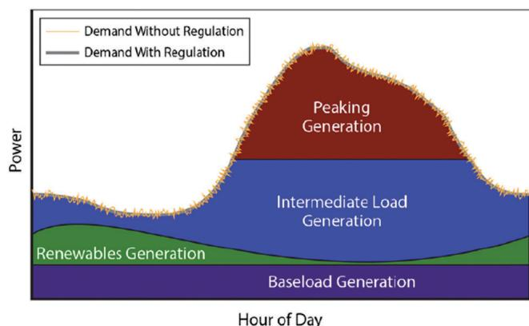  
Fig. 57 Variation of the load on the grid with and without regulation and frequency response. $^{17}$

off-peak times or when prices are low, but also prevents wasting of excess generation.

Load-following, depicted in Fig. 57, is characterized by power output that changes frequently within minutes in response to the changing balance between demand and electricity generation and to maintain the scheduled system frequency and establish the interchange with other generation areas. This is particularly important for intermittent and constantly varying renewable power sources such as wind and solar. Storage can alleviate some of these problems. However, large scale deployment of electrical energy storage technologies and systems for grid applications require that these widely diverse technologies need to overcome several barriers before they can be fully adopted and deployed by the utility industry. Namely, these storage technologies need to demonstrate the following17:

Cost competitiveness: This includes bringing down the cost not just of the storage component (e.g., flywheel, battery, etc.), where most of the present focus and attention is concentrated, but also of the balance of plant that makes up the entire storage system, where the storage component makes up roughly  $30 - 40\%$  of the entire system cost. Based on published technoeconomic analyses by others, an independent study suggested a target cost for energy storage at  $\leq \\(100$  per kW h (and power at  $\leq \$ 600\) per kW). Also important is to quantify the value of storage in terms of the services provided to the grid, such that a single storage unit may capture several revenue streams and achieve economic viability. It is likely that the early deployment for storage systems will happen in high value applications. Hence, it is important to focus on key factors such as lifecycle cost, and performance parameters such as round-trip efficiency, energy density, cycle life, and capacity fading.

Validated performance and safety: Performance and safety evaluation of the storage system should be verified in accordance with the accepted industry codes and standards. For example, the true lifetime of the storage system and the time its takes to generate revenue is important for industry stakeholders and decision makers. Hence, validation of safety, reliability, and performance of the storage system is critically important for gaining the confidence of the user, investor and the insurer.

Equitable regulatory environment: Incentive to invest and install electrical energy storage requires a reliable revenue generation model or roadmap for storage operators. This is largely lacking due partly to inconsistent pricing and market plans, and also to uncertainty in the use-case economics, all of which deter investment. Hence, the value proposition for adopting storage systems for the grid relies on lowering the regulatory barriers.

Industry acceptance: This arguably poses the highest barrier among all. Due to uncertainties about how well these systems perform in practice and over time, system operators many of whom have no or only limited experience with them, are skeptical about adopting storage technologies. Equally important is the inability of today's utility planning, transmission and distribution tools to analyze energy storage as an integral part of their portfolio. Naturally, integration of storage options into industry's planning tools helps build confidence in storage

technologies. Acceptance and adoption of grid storage by the industry requires verified confidence that the storage system will deliver and perform as predicted and expected.

A recent US DOE workshop has identified several near- and long-term cost and performance targets for grid applications in order to aid and guide storage technology researchers and developers.[17] In the near term, the workshop report recommended demonstration of AC energy storage systems involving redox flow batteries, sodium-based batteries, lead-carbon batteries, lithium-ion batteries and other technologies to meet the following electric grid performance and cost targets; system capital cost – under  $250 per kW h, levelized cost – under 20 € per kW h per cycle, system efficiency – over 75%, and cycle life – more than 4000 cycles, with system capital cost targets under$ 1750 per kW. For the long term, the workshop's recommendations included research and development for new technologies based on advanced materials and chemistries to meet the following AC energy storage system targets; system capital cost – under $150 per kW h, levelized cost – under 10 € per kW h per cycle, system efficiency – over 80%, cycle life – more than 5000 cycles, with system capital cost targets under $1250 per kW. It also recommended system capital cost of <$15 per kW h, system efficiency of 95%, cycle life of 10 000 cycles for concentrated solar power (CSP) storage systems.

These targets, especially for emerging storage technologies are ambitious to meet, and to gain commercial interest storage systems need to add value and be competitive with existing storage technologies. Also, to make progress, it is important to understand the inherent limitations and factors that govern the technical and economical viability of these storage technologies. As a case in point, the global incentive for electric vehicles is driven largely by the commercial availability of Li-ion batteries. But it is estimated that replacing the gasoline engines in transportation vehicles with  $15\mathrm{kW}$  h Li-ion batteries would use up more than  $30\%$  of the world's lithium reserves.[31] This may pose a serious limitation. The cost of storage is also a major concern. Although the cost, for example, of the Li-ion battery pack for a 240-mile driving range was estimated several years ago to be nearly  $30000 at$ 400-800 per kW h, this has steadily decreased to  $273 per kW h in 2016.[426]$  However, this is still too expensive, compared to the cost target of  $<$ 100 per kW h.[241,425] Certainly, source, cost and performance limitations of storage systems need to be overcome. Basic research that can address the challenges and meet the required cost and performance targets for these and other applications will help move practical storage technologies forward.

# I. Concluding remarks and summary

The 2003 blackout in the US northeast that immersed New York City and the surrounding states into darkness, and the 2011 power failure in southern California and Arizona are recent examples of how critical is the availability of cost-effective, reliable electrical power for our living standards, security, economy, and industry. Clearly, effective energy storage systems would

have helped mitigate such major disruptions. But more so, it is widely agreed that electrical energy storage will help catalyze rapid transformation of the global energy infrastructure towards clean energy technologies, achieve efficient load-leveling and regulation, accelerate mass penetration of renewables, realize distributed generation and local grids, and improve energy security.

A case in point is the explosive growth of wind and solar as well as electric vehicles, which in large part is enabled by storage. Deployment and integration of intermittent renewables into the grid without effective storage capabilities poses major challenges, and compromises the stability and integrity of the aging grid systems. Storage can serve as a buffer between electricity supply and demand, and provide flexibility of the grid to allow greater integration of variable renewable resources. Storage also allows power generation, when needed, at or near load centers, thereby augmenting the electricity infrastructure with distributed generation. Technology advances to date provided significant cost reductions. However, full adoption and deployment of storage technologies still requires that the users take advantage of multiple benefit streams.

Several extensive techno-economic analyses recently claimed that it is possible to realize low-cost grid reliability with  $100\%$  penetration of renewables, $^{428}$  and further proposed an electrification roadmap to achieve  $100\%$  renewables (wind, water, solar) for 139 countries in the world. $^{429}$  However, the methodology and assumptions employed in these analyses as well as their assessments and conclusions came under question and were challenged by others. $^{430}$  It is generally agreed that transition towards a decarbonized energy economy will require the development of a multitude of clean electricity generation and storage technologies. Indeed, as much diversity as there is in power generation, a broad portfolio of electrical energy storage technologies and systems is needed to respond appropriately and cost-effectively to the wide spectrum of specific requirements of divergent electricity production systems. Each electrical storage technology offers its unique set of advantages and challenges, as well as operational characteristics such as discharge times that may be best suited for a particular application. This is depicted in Fig. 7 above, and also in Fig. 58 and Table 12. For example, flywheels and supercapacitors can provide high power with fast response times in a matter of seconds to respond to fluctuations in demand but have low energy densities, whereas metal-air and flow batteries offer high energy densities. In other words, the choice for the right system requires matching the system performance characteristics and cost, with the requirements of the desired application. Many of these electricity storage applications and their characteristic system and storage requirements are summarized in Table 12, where the terminology "arbitrage" refers to the trade practice in the energy business whereby electricity that was bought (and stored) at low price during low demand is sold back to the market during high-priced demand, "voltage support" refers to injection and absorption of reactive power to the system to maintain the desired voltage levels in the distribution and transmission systems, and "black start" refers to restarting the electrical supply system after catastrophic power

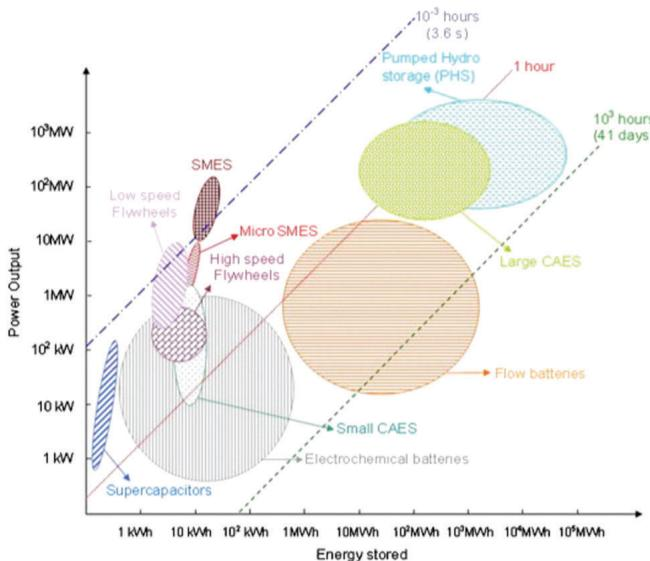  
Fig. 58 Distribution of storage technologies according to their energy stored and power output, and typical discharge time windows.[22] Reprinted from H. Ibrahim, A. Ilinca and J. Perron, Energy storage systems - characteristics and comparisons, Renewable Sustainable Energy Rev., 2008, 12, 1221-1259, with permission from Elsevier.

failure without pulling power from the grid. Likewise, "spinning reserve" refers to the response time of less than 15 minutes for the stored reserve electricity capacity to kick in in order to compensate for the loss of generation capacity elsewhere in the system, and "non-spinning" reserve relates to response times longer than 15 minutes.

For comparison and compatibility purposes, Table 13 presents typical performance characteristics of various energy storage systems and technologies, which show widely varying ranges of performance parameters. As also discussed in Section H.: Grid storage, the storage times and capacities vary widely depending on the application. Comparing Tables 12 and 13 makes it clear that no single storage system or technology can alone meet these requirements fully, i.e., there is no silver bullet. This necessitates the development of multiple storage technologies to fully meet the varying needs of grid electricity storage.

Distributed storage offers many advantages, although not all storage systems reviewed in this article are suitable for this purpose. Pumped-hydro and CAES require specific geographic conditions and may not be a viable option available widely. On the other hand, systems such as batteries, regenerative fuel cells, flywheels, and chemical storage may be available regardless of location to couple into renewable energy sources or into the local grid. For example, instead of building a centralized power plant of 1 GW, placing 100 units of  $10\mathrm{kW}$  battery storage capacity in utility service areas would help reduce the loads, but more importantly, eliminate expensive "spinning reserves", i.e., supplementary power generated typically by gas turbines that fire up to respond to daily spikes in electric demand. Moreover, such distributed storage also helps improve energy security greatly.

The infrastructure for power transmission and distribution in the US as well as in many other parts of the world is old and

Table 12 Characteristic performance requirements for electrical (e) and thermal (t) storage technology applications427  

<table><tr><td>Application</td><td>Output (electricity, thermal)</td><td>Size (MW)</td><td>Discharge duration</td><td>Cycles (typical)</td><td>Response time</td></tr><tr><td>Seasonal storage</td><td>e, t</td><td>500 to 2000</td><td>Days to months</td><td>1 to 5 per year</td><td>Day</td></tr><tr><td>Arbitrage</td><td>e</td><td>100 to 2000</td><td>8 to 20 hours</td><td>0.25 to 1 per day</td><td>&gt;1 hour</td></tr><tr><td>Frequency regulation</td><td>e</td><td>1 to 2000</td><td>1 to 15 minutes</td><td>20 to 40 per day</td><td>1 min</td></tr><tr><td>Load following</td><td>e, t</td><td>1 to 2000</td><td>15 minutes to 1 day</td><td>1 to 29 per day</td><td>&lt;15 min</td></tr><tr><td>Voltage support</td><td>e</td><td>1 to 40</td><td>1 second to 1 minute</td><td>10 to 100 per day</td><td>Millisecond to second</td></tr><tr><td>Black start</td><td>e</td><td>0.1 to 400</td><td>1 to 4 hours</td><td>&lt;1 per year</td><td>&lt;1 hour</td></tr><tr><td>Transmission &amp; distribution (T&amp;D) congestion relief</td><td>e, t</td><td>10 to 500</td><td>2 to 4 hours</td><td>0.14 to 1.25 per day</td><td>&gt;1 hour</td></tr><tr><td>T&amp;D infrastructure investment deferral</td><td>e, t</td><td>1 to 500</td><td>2 to 5 hours</td><td>0.75 to 1.25 per day</td><td>&gt;1 hour</td></tr><tr><td>Demand shifting and peak reduction</td><td>e, t</td><td>0.001 to 1</td><td>Minutes to hours</td><td>1 to 29 per day</td><td>&lt;15 min</td></tr><tr><td>Off-grid</td><td>e, t</td><td>0.001 to 0.01</td><td>3 to 5 hours</td><td>0.75 to 1.5 per day</td><td>&lt;1 hour</td></tr><tr><td>Variable supply resource integration</td><td>e, t</td><td>1 to 400</td><td>1 minute to hours</td><td>0.5 to 2 per day</td><td>&lt;15 min</td></tr><tr><td>Waste heat utilization</td><td>t</td><td>1 to 10</td><td>1 hour to 1 day</td><td>1 to 20 per day</td><td>&lt;10 min</td></tr><tr><td>Combined heat and power</td><td>t</td><td>1 to 5</td><td>Minutes to hours</td><td>1 to 10 per day</td><td>&lt;15 min</td></tr><tr><td>Spinning reserve</td><td>e</td><td>10 to 2000</td><td>15 minutes to 2 hours</td><td>0.5 to 2 per day</td><td>&lt;15 min</td></tr><tr><td>Non-spinning reserve</td><td>e</td><td>10 to 2000</td><td>15 minutes to 2 hours</td><td>0.5 to 2 per day</td><td>&lt;15 min</td></tr></table>

Table 13 Typical performance characteristics of various energy storage systems and technologies431  

<table><tr><td></td><td>Power rating (MW)</td><td>Discharge time</td><td>Cycles or lifetime</td><td>Self-discharge (%)</td><td>Energy density (W h l-1)</td><td>Power density (W l-1)</td><td>Efficiency (%)</td><td>Response time</td></tr><tr><td>Pumped-hydro</td><td>100-2500</td><td>4-16 h</td><td>30-60 year</td><td>~0</td><td>0.2-2</td><td>0.1-0.2</td><td>70-85</td><td>10 s-min</td></tr><tr><td>Compressed air</td><td>100-1000</td><td>2-30 h</td><td>20-40 year</td><td>~0</td><td>2-6</td><td>0.2-0.6</td><td>40-70</td><td>Min</td></tr><tr><td>Flywheel</td><td>0.001-20</td><td>s-min</td><td>20 000-100 000</td><td>1.3-100</td><td>20-80</td><td>5000</td><td>70-95</td><td>&lt; s</td></tr><tr><td>Li-Ion battery</td><td>0.05-100</td><td>1 min-8 h</td><td></td><td>0.1-0.3</td><td>200-400</td><td>1300-10 000</td><td>85-95</td><td>&lt; s</td></tr><tr><td>Lead-acid battery</td><td>0.001-100</td><td>1 min-8 h</td><td>6-40 year</td><td>0.1-0.3</td><td>50-80</td><td>90-700</td><td>80-90</td><td>&lt; s</td></tr><tr><td>Na-S battery</td><td>10-100</td><td>1 min-8 h</td><td>2500-4500</td><td>0.05-20</td><td>150-300</td><td>120-160</td><td>70-90</td><td>&lt; s</td></tr><tr><td>Flow battery</td><td>0.1-100</td><td>Hours</td><td>12 000-14 000</td><td>0.2</td><td>20-70</td><td>0.5-2</td><td>60-85</td><td>&lt; s</td></tr><tr><td>Supercon. magnet</td><td>0.1-1</td><td>ms-s</td><td>100 000</td><td>10-15</td><td>~6</td><td>~2600</td><td>80-95</td><td>&lt; s</td></tr><tr><td>Super-capacitor</td><td>0.01-1</td><td>ms-min</td><td>10 000-100 000</td><td>20-40</td><td>10-20</td><td>40 000-120 000</td><td>80-95</td><td>&lt; s</td></tr><tr><td>Hydrogen</td><td>0.01-100</td><td>Min-week</td><td>5-30 year</td><td>0-4</td><td>600 (200 bar)</td><td>0.2-20</td><td>25-45</td><td>s-min</td></tr><tr><td>Synthetic natural gas</td><td>1-100</td><td>Hour-week</td><td>30 year</td><td>~0</td><td>1800 (200 bar)</td><td>0.2-2</td><td>25-50</td><td>s-min</td></tr><tr><td>Molten salt (latent thermal)</td><td>1-150</td><td>Hours</td><td>30 year</td><td>N/A</td><td>70-210</td><td>N/A</td><td>80-90</td><td>min</td></tr></table>

even antiquated. For political, legal, environmental and social reasons, replacing or upgrading the existing grid system is challenging and expensive. Distributed storage may alter this paradigm, and shift power generation from centralized stations that require a vast network of expensive and lossy transmission and distribution systems, to having local control and energy security. Naturally, such distributed mode is easier to manage than a vast national grid, which requires a network of computers working in tandem to control the flow of electricity and are vulnerable to hacking and other malicious attacks.

As economics of storage is as important as performance, the corresponding cost of electricity storage of various electrical storage systems are compared with respect to their round-trip efficiencies and discharge times in Fig. 59. The data suggests that regenerative SOFCs with their high round-trip efficiency, long discharge times, and low storage cost can compete favorably with pumped-hydro and CAES technologies, albeit their maturity is far from being deployed on a commercial scale. Similarly, cost of electricity storage for various rechargeable battery systems are presented in Fig. 60. Although there is considerable uncertainty in the estimated cost figures, Na-S and Li-air batteries show favorable economics, while cost

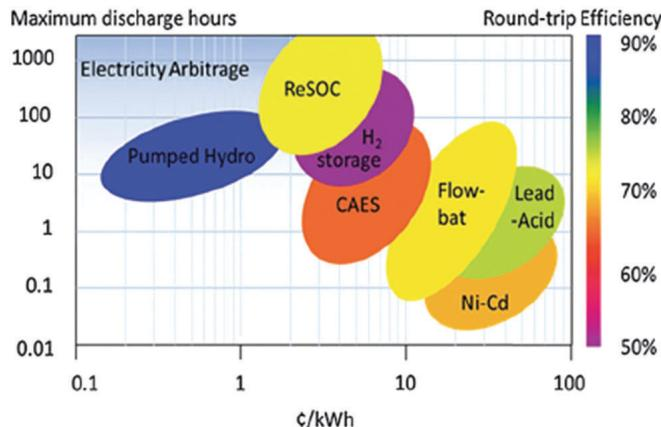  
Fig. 59 Comparison of cost of electricity storage, round-trip efficiencies and discharge times of various storage systems. $^{32}$  Reprinted with permission from (Z. Yang, J. Zhang, M. C. W. Kintner-Meyer, X. Lu, D. Choi, J. P. Lemmon and J. Liu, Electrochemical energy storage for green grid, Chem. Rev., 2011, 111, 3577-3613). Copyright (2018) American Chemical Society.

reductions in others, such as VRB and Li-ion batteries, are needed for wide scale implementation of these systems. Unfortunately, none of the battery systems singly satisfies the

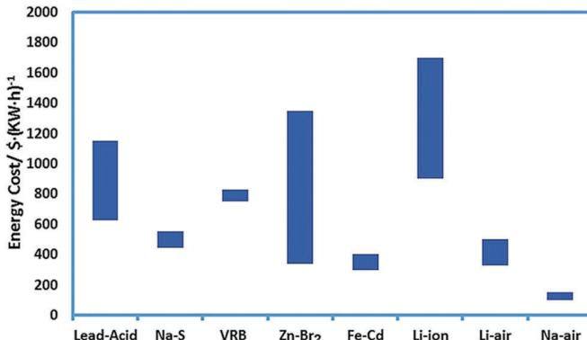  
Fig. 60 Energy costs ( $per kW h) of various battery systems.$ ^{432}$ Reprinted from W.-W. Yin and Z.-W. Fu, The potential of Na-air batteries, ChemCatChem, 2017, 9, 1545-1553, with permission from John Wiley and Sons.

full set of performance, size and economic requirements for effective electrical storage. Instead, each storage technology reviewed here offers characteristic properties and specific benefits as well as shortcomings and challenges. In other words, there is no silver bullet for electrical energy storage. One size does not fit all. Therefore, a multi-prong technology approach is desirable to adequately address the global needs for electrical energy storage in a comprehensive manner.

For example, there may be merit in considering smaller size batteries in the  $5 - 10\mathrm{kW}$  range for energy storage for the grid. One prevailing view for megawatt-scale storage batteries is to place them on the high voltage  $(>10\mathrm{kV})$  side of the utility transformer, which would then require multiple step-down transformers and other controls that would complicate the hook-up process. On the other hand, smaller battery units in the  $10\mathrm{kW}$  range can be placed instead on the  $100\mathrm{V}$  side of the transformer, which would render a simple hook up process and enable to achieve switching using inexpensive solid-state relays.

In assessing storage systems, source availability and access also need to be considered in the life cycle analysis. For example, Li-based batteries may be vulnerable to the cost and availability of lithium, which is largely mined and produced in select countries in the world. Other active chemicals, such as cobalt that are currently used in commercial Li-ion batteries pose also concerns regarding cost, scarcity, and availability. Other battery systems employ toxic elements in their electrodes such as lead, cadmium, and mercury, which are of great health and environmental concern. Precious metal catalysts used in other electrochemical storage systems such as low temperature aqueous electrolyzers are also expensive and source-dependent elements. So recycling battery components may supplement availability, and is definitely of practical, environmental and economic interest. For example, it takes 250 tons of mineral ore and 750 tons of brine to produce 1 ton of lithium, compared to only 28 tons of used Li-batteries.[433] There have been recycling efforts to collect and re-process used batteries to recover active elements. However, for wide scale and cost-effective recovery of these spent resources, we need to develop more efficient, higher yield and inexpensive recycling processes, and also implement global environmental policies that mobilize a concerted recycling effort.

In a manner similar to cost of storage, another important consideration should be given to the amount of emissions produced during the life of storage systems. For example, based on life cycle analysis results it was estimated that to make a  $1\mathrm{kW}$  h Li-ion battery, nearly  $400\mathrm{kW}$  h of energy is consumed,[433] resulting in  $75\mathrm{kg}$  of  $\mathrm{CO}_{2}$  emissions during its production. Simple arithmetic suggests that the service life of the Li-ion battery needs to be  $>400$  cycles to pay back the energy in terms of storage. By comparison, a coal-fired power plant emits only  $1\mathrm{kg}$  of  $\mathrm{CO}_{2}$  for every  $1\mathrm{kW}$  h of electrical energy it produces. Accordingly, these comparative examples highlight the importance of long service life for the storage system before its benefits can have a positive impact on the environment.

It should be noted that theoretical energy densities for electrochemical storage systems are usually calculated based on the weight and volume of the active materials, which constitute only a portion of the final packaged product. Hence, real energy densities are necessarily lower than those calculated theoretically. This is illustrated in Table 14, where average efficiencies for major systems are in range of tens of %. Only, Li-ion batteries seem to reach a relatively high energy utilization level between 42 and  $58\%$ . Surely, there is room for major improvements in active materials for electrochemical storage technologies that will help increase storage efficiencies of these systems. Better sealing and packaging processes and cost-effective materials will also help reduce this discrepancy between calculated and actual utilization capacities. So more work and innovation is needed to improve existing technologies and expand the storage options. For example, in most electrochemical storage systems such as batteries, only single-electron transfer reactions have been utilized. In today's Li-ion batteries, for example, less than only one  $\mathrm{Li^{+}}$  ion is intercalated per transition metal redox center in the cathode material. Obviously, this limits the ultimate capacity of the battery. A recent article challenges this paradigm and suggests that for next generation batteries, it may be worth exploring multi-electron transfer chemistries, by either intercalating multivalent cations per redox site or intercalating multiple monovalent cations.[434] Certainly, accomplishing this goal will greatly improve the practically realizable capacity for electrochemical storage. Similarly, development of earth-abundant materials with superior catalytic properties for regenerative fuel cells, electrolyzers for hydrogen production, electrochemical

Table 14 Theoretical and actual energy densities and actual utilization percentages for select electrochemical storage with various battery systems compared with the  $\mathsf{H}_2 / \mathsf{O}_2$  fuel cell[44]  

<table><tr><td>System</td><td>Calculated energy density (W h kg-1)</td><td>Real energy density (W h kg-1)</td><td>Utilization (%)</td></tr><tr><td>Pb-Acid</td><td>171</td><td>25-55</td><td>15-32</td></tr><tr><td>Na-S</td><td>792</td><td>80-150</td><td>10-19</td></tr><tr><td>Ni-MH</td><td>240</td><td>50-70</td><td>20-29</td></tr><tr><td>Li-Ion</td><td>360</td><td>150-210</td><td>42-58</td></tr><tr><td>Li-S</td><td>2654</td><td>250-350</td><td>9-13</td></tr><tr><td>Li-O2</td><td>5217</td><td>—</td><td>—</td></tr><tr><td>Zn-O2</td><td>1094</td><td>150-200</td><td>14-18</td></tr><tr><td>H2-O2</td><td>3525</td><td>120-800</td><td>3-23</td></tr></table>

Table 15 Major electrochemical storage projects that are announced, contracted or under construction by technology and country  ${}^{16}$  

<table><tr><td>Country</td><td>Electrochemical (unspecified)</td><td>Electrochemical capacitor</td><td>Lithium-ion battery</td><td>Flow battery</td><td>Vanadium redox flow battery</td><td>Lead-acid battery</td><td>Metal-air battery</td><td>Sodium-based battery</td><td>Total (kW)</td></tr><tr><td>United States</td><td>500 398</td><td></td><td>61 959</td><td>3030</td><td>20 250</td><td>21 500</td><td>14 250</td><td></td><td>621 397</td></tr><tr><td>Australia</td><td>122 010</td><td></td><td>9400</td><td></td><td></td><td></td><td></td><td></td><td>131 410</td></tr><tr><td>Germany</td><td>30 000</td><td></td><td>92 000</td><td>210</td><td></td><td></td><td></td><td></td><td>122 210</td></tr><tr><td>India</td><td>110 000</td><td></td><td>125</td><td></td><td></td><td></td><td></td><td></td><td>110 125</td></tr><tr><td>Republic of Korea</td><td></td><td></td><td>48 500</td><td></td><td></td><td></td><td></td><td></td><td>48 500</td></tr><tr><td>Canada</td><td>12 150</td><td></td><td>12 010</td><td>4000</td><td>5000</td><td></td><td></td><td></td><td>33 160</td></tr><tr><td>Egypt</td><td></td><td></td><td>30 000</td><td></td><td></td><td></td><td></td><td></td><td>30 000</td></tr><tr><td>Italy</td><td></td><td>1920</td><td>20 000</td><td>1950</td><td></td><td></td><td></td><td>4000</td><td>27 870</td></tr><tr><td>Kazakhstan</td><td></td><td></td><td></td><td>25 000</td><td></td><td></td><td></td><td></td><td>25 000</td></tr><tr><td>United Kingdom</td><td>1000</td><td></td><td>20 300</td><td>140</td><td></td><td></td><td></td><td></td><td>21 440</td></tr><tr><td>Top 10</td><td>775 558</td><td>1920</td><td>294 304</td><td>34 330</td><td>25 250</td><td>21 500</td><td>14 250</td><td>4000</td><td>1 171 112</td></tr><tr><td>World</td><td>784 258</td><td>2920</td><td>333 404</td><td>34 965</td><td>25 250</td><td>21 500</td><td>5650</td><td>4800</td><td>1 212 747</td></tr></table>

reactors for ammonia synthesis, highly conductive, stable and selective membranes used in most electrochemical storage systems, and cost-effective EDL and pseudocapacitive electrode materials for supercapacitors will help expand the materials space, improve device performance, and bring down systems costs. In that regard, two additional tools, namely theoretical and computational simulations guiding experimentation and rational design of materials, as well as nanostructuring to control and enhance desirable properties will help shorten the pathway to innovation and discovery. Moreover, nanostructured materials may form highly active metastable structures and exhibit properties different from bulk, and offer attractive opportunities in overcoming some of the kinetic and mass transport limitations observed in energy storage systems.

Certainly, storage should be an essential component of the global energy systems of the future, especially if renewables were to take on  $80\%$  of the global need.[16] The individual maturities, or technology readiness levels (TRL), of storage technologies vary widely as illustrated in Fig. 5. Similarly, the US DOE's view of the evolution, cost reduction and market penetration of storage technologies is expected to follow the trends depicted in Fig. 7, i.e., there will be both short term and long term milestones and goals that need to be achieved.

In recent years, there has been an increasing drive to build more storage capacity. Some of the projects around the world that are based on electrochemical energy storage are summarized in Table 15 and categorized according to the storage system and country.[16] It is clear that the installed capacities provided in Tables 2 and 14 are quite low compared to the storage needs for solar and wind (see Table 1) that may require durations between hours to days, and in some remote applications, even weeks.

The variability of the storage technologies, systems and materials make it hard to predict which technologies will excel, but successful commercialization of any one or more of the different systems will likely depend on the confluence of several important factors. Certainly, the technical challenges discussed and reviewed in this article must be overcome to achieve reliable, robust, long service and cycle life, efficient, and scalable technology options. Likewise, materials and fabrication costs must be reduced further for many of these systems and technologies to become truly competitive. Large investments both public and

private are required to achieve these goals. Market forces of supply and demand fueled by the rapid expansion and growth in renewables such as solar and wind, will also drive the need for large-scale storage. But this may still not be sufficient to achieve complete decarbonization of the electricity infrastructure, which we urgently need to make happen. Without globally accepted policies to implement an agreeable price on carbon emissions, storage may not receive the attention or the investment it deserves, and we may not achieve complete decarbonization of the global energy system, risking undesired consequences.

In summary, as much as we need a broad range of electric power technologies to meet our needs, we need an equally diverse portfolio of energy storage technologies with matching operational characteristics and properties. The urgent need for large-scale cost effective storage has become increasingly pronounced by the rapid growth and deployment of renewable power generation sources. It is difficult to predict which of the energy storage technologies will dominate the future, but most likely, a broad range of storage systems will be needed to accommodate the specific but diverse requirements of the equally diverse power generation technologies we employ today, and in the future. Meeting the requirements of such a rich diversity of individual system characteristics certainly poses technical challenges as discussed in this article, but it also provides a wide range of options and prospects for storage applications, especially when these technologies may be employed in synergistic combinations that complement each other's strengths and compensate for their deficiencies. It also offers opportunities for innovation and advancements in storage technologies, materials and processes, where the scientific community has an important role to play.

# Conflicts of interest

The author has no conflicts to declare.

# Acknowledgements

The author gratefully acknowledges partial support from the Stanford Energy 3.0 Program, and many helpful discussions with Prof. Friedrich B. Prinz of Stanford University.

# References

1 DOE-EIA International Energy Outlook 2017 (Sept. 2017) report No: DOE/EIA-0484(2017) https://www.eia.gov/outlooks/ieo/ieo_tables.php, accessed Nov. 2, 2017.  
2 World Energy Outlook 2015, International Energy Agency, London, Nov. 10, 2015, see http://www.worldenergyoutlook.org/weo2015/.  
3 Global Greenhouse Gas Emissions Data (2017), US Environmental Protection Agency, https://www.epa.gov/ghgemissions/global-greenhouse-gas-emissions-data, accessed Nov 10, 2017.  
4 T. M. Gur, Low-carbon electricity is great. What about "less-carbon"? J. Electrochem. Soc., 2017, 164, F1587-F1590.  
5 T. M. Gur, Critical Review of Carbon Conversion in "Carbon Fuel Cells", Chem. Rev., 2013, 113, 6179-6206.  
6 T. M. Gur, Comprehensive Review of Methane Conversion in Solid Oxide Fuel Cells: Prospects for Efficient Electricity Generation from Natural Gas, Prog. Energy Combust. Sci., 2016, 54, 1-64.  
7 Next Generation Wind and Solar Power: From cost to value. IEA 2016 report, https://www.iea.org/publications/free publications/publication/Next_Generation_Windand_SolarPowerFrom_Cost_to_ValueFull_Report.pdf.  
8 www.independent.co.uk/environment/solar-and-wind-power-cheaper-than-fossil-fuels-for-the-first-time-a7509251.html, accessed Nov 10, 2017.  
9 International Energy Agency, World Energy Outlook 2016 (Nov. 2016), also see http://www.iea.org/newsroom/news/2016/november/world-energy-outlook-2016.html.  
10 www.bloomberg.com/news/articles/2016-12-15/world-energy-hits-a-turning-point-solar-that-s-cheaper-thanwind, accessed Nov 10, 2017.  
11 DOE-EIA International Energy Outlook 2017 (Sept. 2017) report No: DOE/EIA-0484(2017) https://www.eia.gov/outlooks/ieo/ieo_tables.php, accessed Nov. 2, 2017.  
12 US-DOE Energy Information Administration, Today in Energy, https://www.eia.gov/todayinenergy/detail.php?id=31372, accessed Nov. 19, 2017.  
13 Bloomberg Technology News, July 31, 2017, https://www.bloomberg.com/news/articles/2017-07-31/alphabet-wants-to-fix-renewable-energy-s-storage-problem-with-salt.  
14 www.latimes.com/projects/la-fi-electricity-solar/.  
15 DOE Global Energy Storage Database, Office of Electricity Delivery and Energy Reliability, http://www.energystorageexchange.org/projects/datavisualization, accessed Nov. 9, 2017.  
16 Electricity Storage and Renewables: Costs and Markets to 2030, International Renewable Energy Agency (IRENA 2017), available at http://www.irena.org/-/media/Files/IRENAAgency/Publication/2017/Oct/IRENA_Electricity_Storage_Costs_2017.pdf, accessed July 6, 2018.  
17 Grid Energy Storage, US Department of Energy, Dec. 2013, http://www.energy.gov/sites/prod/files/2014/09/f18/Grid%20Energy%20Storage%20December%202013.pdf.  
18 Energy Technology Perspectives 2015, International Energy Agency, www.iea.org/newsroomandevents/graphics/2015-06-30-installed-global-capacity-for-grid-connected-storage.html.

19 B. Dunn, H. Kamath and J. M. Tarascon, Electrical energy storage for the grid: a battery of choices, Science, 2011, 334, 928-935.  
20 Electrical Energy Storage Technology Options report #1020676, Dec. 2010, Electric Power Research Institute, Palo Alto, CA.  
21 K. M. Abraham, Prospects and limits of energy storage in batteries, J. Phys. Chem. Lett., 2015, 6, 830-844.  
22 H. Ibrahim, A. Ilinca and J. Perron, Energy storage systems - characteristics and comparisons, Renewable Sustainable Energy Rev., 2008, 12, 1221-1259.  
23 C. Liu, F. Li, L.-P. Ma and H.-M. Cheng, Advanced materials for energy storage, Adv. Energy Mater., 2010, 22, E28-E62.  
24 I. Hadjipaschalis, A. Poullikkas and V. Efthimiou, Overview of current and future energy storage technologies for electric power applications, Renewable Sustainable Energy Rev., 2009, 13, 1513-1522.  
25 P. J. Hall and E. J. Bain, Energy-storage technologies and electricity generation, Energy Policy, 2008, 36, 4352-4355.  
26 H. B. Radousky and H. Liang, Energy harvesting: an integrated view of materials, devices, and applications, Nanotechnology, 2012, 23, 502001.  
27 A. Evans, V. Strezov and T. J. Evans, Assessment of utility energy storage options for increased renewable energy penetration, Renewable Sustainable Energy Rev., 2012, 16, 4144-4147.  
28 X. Luo, J. Wang, M. Dooner and J. Clarke, Overview of current development in electrical energy storage technologies and the application potential in power system operations, Appl. Energy, 2015, 137, 511-536.  
29 E. D. Wachsman, C. A. Marlowe and K. T. Lee, Role of solid oxide fuel cells in a balanced energy strategy, Energy Environ. Sci., 2012, 5, 5498-5509.  
30 A. S. Arico, P. Bruce, B. Scrosati, J.-M. Tarascon and W. V. Schalkwijk, Nanostructured materials for advanced energy conversion and storage devices, Nat. Mater., 2005, 4, 366-377.  
31 M. Armand and J.-M. Tarascon, Building better batteries, Nature, 2008, 451, 652-657.  
32 Z. Yang, J. Zhang, M. C. W. Kintner-Meyer, X. Lu, D. Choi, J. P. Lemmon and J. Liu, Electrochemical energy storage for green grid, Chem. Rev., 2011, 111, 3577-3613.  
33 M. S. Whittingham, Materials challenges facing electrical energy storage, MRS Bull., 2008, 33, 411-419.  
34 C. J. Barnhart and S. M. Benson, On the importance of reducing the energetic and material demands of electrical energy storage, Energy Environ. Sci., 2013, 6, 1083-1092.  
35 D. A. J. Rand, A journey on the electrochemical road to sustainability, J. Solid State Electrochem., 2011, 15, 1579-1622.  
36 M. Winter and R. J. Brodd, What are batteries, fuel cells, and supercapacitors?, Chem. Rev., 2004, 104, 4245-4269.  
37 O. Groger, H. A. Gesteiger and J.-P. Suchsland, Review-Electromobility: Batteries or fuel cells?, J. Electrochem. Soc., 2015, 162, A2605-A2622.  
38 S. Muench, A. Wild, C. Friebe, B. Haupoler, T. Janoschka and U. S. Schubert, Polymer-based organic batteries, Chem. Rev., 2016, 116, 9438-9484.

39 J. M. Tarascon and M. Armand, Issues and challenges facing rechargeable lithium batteries, Nature, 2001, 414, 359-367.  
40 P. G. Bruce, Energy storage beyond the horizon: rechargeable lithium batteries, Solid State Ionics, 2008, 179, 752-760.  
41 Lithium Ion Batteries: Fundamentals and Performance, ed. W. Wakihara and O. Yamamoto, Kodansha Ltd. Tokyo (Japan), Wiley-VCH Verlag GmbH, Weinheim (Germany), Tokyo, 1998.  
42 B. Kang and G. Ceder, Battery materials for ultrafast charging and discharging, Nature, 2009, 458, 190-193.  
43 N.-S. Choi, Z. Chen, S. A. Freunberger, X. Li, Y.-K. Sun, K. Amine, G. Yushin, L. F. Nazar, J. Cho and P. G. Bruce, Challenges facing lithium batteries and electrical double layer capacitors, Angew. Chem., Int. Ed., 2012, 51, 9994-10024.  
44 C. X. Zu and H. Li, Thermodynamic analysis on energy densities of batteries, Energy Environ. Sci., 2011, 4, 2614-2624.  
45 M. S. Whittingham, Lithium batteries and cathode materials, Chem. Rev., 2004, 104, 4271-4301.  
46 M. S. Whittingham, Ultimate limits of intercalation reactions for lithium batteries, *Chem. Rev.*, 2014, 114, 11414-11443.  
47 B. L. Ellis, K. T. Lee and L. F. Nazar, Positive electrode materials for Li-ion and Li-batteries, Chem. Mater., 2010, 22, 691-714.  
48 J. B. Goodenough and Y. Kim, Challenges for rechargeable Li batteries, Chem. Mater., 2010, 22, 587-603.  
49 B. Scrosati, Lithium rocking chair batteries: an old concept?, J. Electrochem. Soc., 1992, 139, 2776-2781.  
50 J. B. Goodenough and K.-S. Park, The Li-ion rechargeable battery: a perspective, *J. Am. Chem. Soc.*, 2013, 135, 1167-1176.  
51 B. Scrosati and J. Garche, Lithium batteries: status, prospects and future, J. Power Sources, 2010, 195, 2419-2430.  
52 V. Etacheri, R. Marom, R. Elazari, G. Salitra and D. Aurbach, Challenges in the development of advanced Li-ion batteries: a review, Energy Environ. Sci., 2011, 4, 3243-3262.  
53 J. W. Choi and D. Aurbach, Promise and reality of post-lithium-ion batteries with high energy densities, Nat. Rev. Mater., 2016, 1, 1-16.  
54 K. Xu, Nonaqueous liquid electrolytes for lithium-based rechargeable batteries, Chem. Rev., 2004, 104, 4303-4418.  
55 M. Armand, F. Endres, D. R. MacFarlane, H. Ohno and B. Scrosati, Ionic-liquid materials for the electrochemical challenges of the future, Nat. Mater., 2009, 8, 621-629.  
56 C. A. Angell, Y. Ansari and Z. Zhao, Ionic liquids: past, present and future, Faraday Discuss., 2012, 154, 9-27.  
57 F. Croce, L. Persi, F. Ronci and B. Scrosati, Nanocomposite polymer electrolytes and their impact on the lithium battery technology, Solid State Ionics, 2000, 135, 47-52.  
58 P. V. Wright, Developments in polymer electrolytes for lithium batteries, MRS Bull., 2002, 27, 597-602.  
59 V. Thangadurai, S. Narayanan and D. Pinzaru, Garnet-type solid-state fast Li ion conductors for Li batteries: critical review, Chem. Soc. Rev., 2014, 43, 4714-4727.  
60 W. Li, J. R. Dahn and D. S. Wainwright, Rechargeable lithium batteries with aqueous electrolytes, Science, 1994, 264, 1115-1118.

61 C. Yang, J. Chen, T. Qing, X. Fan, W. Sun, A. von Cresce, M. S. Ding, O. Borodin, J. Vatamanu, M. A. Schroeder, N. Eidson, C. Wang and K. Xu, 4.0 V Aqueous Li-ion batteries, Joule, 2017, 1, 122-132.  
62 M. N. Obrovac and V. L. Chevrier, Alloy Negative electrodes for Li-ion batteries, Chem. Rev., 2014, 114, 11444-11502.  
63 U. Kasavajjula, C. S. Wang and A. J. Appleby, Nano- and bulk-silicon-based anodes for lithium-ion secondary cells, J. Power Sources, 2007, 163, 1003-1039.  
64 X.-B. Cheng, R. Zhang, C.-Z. Zhao and Q. Zhang, Toward safe lithium anode in rechargeable batteries: a review, Chem. Rev., 2017, 117, 10403-10473.  
65 C. J. Wen, B. A. Boukamp, R. A. Huggins and W. Weppner, Thermodynamics and mass transport properties of "LiAl", J. Electrochem. Soc., 1979, 126, 2258-2266.  
66 W. Weppner and R. A. Huggins, Determination of the kinetic parameters of mixed-conducting electrodes and application to the system Li $_3$ Sb, J. Electrochem. Soc., 1977, 124, 1569-1578.  
67 W. Weppner and R. A. Huggins, Electrochemical investigation of the chemical diffusion, partial ionic conductivities, and other kinetic parameters in  $\mathrm{Li}_3\mathrm{Sb}$  and  $\mathrm{Li}_3\mathrm{Bi}$ , J. Solid State Chem., 1977, 22, 297-308.  
68 B. A. Boukamp, G. C. Lesh and R. A. Huggins, All-solid lithium electrodes with mixed-conducting matrix, J. Electrochem. Soc., 1981, 128, 725-729.  
69 C. K. Chan, H. Peng, G. Liu, K. McIlwrath, X. F. Zhang, R. A. Huggins and Y. Cui, High-performance lithium battery anodes using silicon nanowires, Nat. Nanochemol., 2008, 3, 31-35.  
70 C. J. Wen and R. A. Huggins, Thermodynamic study of the lithium tin system, *J. Electrochem. Soc.*, 1981, **128**, 1181-1187.  
71 J. E. Trevey, A. F. Gross, J. Wang, P. Liu and J. J. Vajo, Stable cycling and excess capacity of a nanostructured Sn electrode based on  $\mathrm{Sn}(\mathrm{CH}_3\mathrm{COO})_2$  confined within a nanoporous carbon scaffold, Nanotechnology, 2013, 24, 424001.  
72 M. S. Whittingham, Electrical energy storage and intercalation chemistry, Science, 1976, 192, 1126-1127.  
73 I. H. Son, J. H. Park, S. Kwon, S. Park, M. H. Rummeli, A. Bachmatiuk, H. J. Song, J. Ku, J. W. Choi, J.-M. Choi, S.-G. Doo and H. Chang, Silicon carbide-free graphene growth on silicon for lithium-ion battery with high volumetric energy density, Nat. Commun., 2015, 6, 7393.  
74 C. K. Chan, H. Peng, G. Liu, K. McIlwrath, X. F. Zhang, R. A. Huggins and Y. Cui, High-performance lithium battery anodes using silicon nanowires, Nat. Nanotechnol., 2008, 3, 31-35.  
75 H. Wu and Y. Cui, Designing nanostructured Si anodes for high energy lithium batteries, Nano Today, 2012, 7, 414-429.  
76 Y.-M. Chiang, Building a better battery, Science, 2010, 330, 1485-1486.  
77 T. Jiang, R. Zhang, Q. Yin, W. Zhou, Z. Dong, N. A. Chernova, Q. Wang, F. Omenya and M. S. Whittingham, Morphology, composition and electrochemistry of a

nano-porous silicon versus bulk silicon anode for lithium-ion batteries, J. Mater. Sci., 2017, 52, 3670-3677.  
78 S. Goriparti, E. Miele, F. De Anglesi, E. Di Fabrizio, R. P. Zaccaria and C. Capiglia, Review on recent progress of nanostructured anode materials for Li-ion batteries, J. Power Sources, 2014, 257, 421-443.  
79 N. A. Kaskhedikar and J. Maier, Lithium storage in carbon nanostructures, Adv. Mater., 2009, 21, 2664-2680.  
80 G. Liu, S. Xun, N. Vukmirovic, X. Song, P. Ollade-Velasco, H. Zheng, V. S. Battaglia, L. Wang and W. Yang, Polymers with tailored electronic structure of high capacity lithium battery electrodes, Adv. Mater., 2011, 23, 4679-4683.  
81 G. Zheng, S. W. Lee, Z. Liang, H.-W. Lee, K. Yan, H. Yao, H. Wang, W. Li, S. Chu and Y. Cui, Interconnected hollow carbon nanospheres for stable lithium metal anodes, Nat. Nanotechnol., 2014, 9, 618-623.  
82 M. T. McDowell, S. W. Lee, I. Ryu, H. Wu, W. D. Nix, J. W. Choi and Y. Cui, Novel size and surface oxide effects in silicon nanowires as lithium battery anodes, Nano Lett., 2011, 11, 4018-4025.  
83 Y. P. Wu, E. Rahm and R. Holze, Carbon anode materials for lithium ion batteries, J. Power Sources, 2003, 114, 228-236.  
84 M. Thackeray, Lithium-ion batteries: an unexpected conductor, Nat. Mater., 2002, 1, 81-82.  
85 H. Tukamoto and A. R. West, Electronic conductivity of  $\mathrm{LiCoO}_2$  and its enhancement by magnesium doping, J. Electrochem. Soc., 1997, 144, 3164-3168.  
86 C. H. Chen, J. T. Vaughey, A. N. Jansen, D. W. Dees, A. J. Kahaian, T. Goacher and M. M. Thackeray, Studies of Mg-substituted  $\mathrm{Li}_{4 - x}\mathrm{Mg}_x\mathrm{Ti}_5\mathrm{O}_{12}$  spinel electrodes  $(0 < x < 1)$  for lithium batteries, J. Electrochem. Soc., 2001, 148, A102-A104.  
87 A. K. Padhi, K. S. Nanjundaswamy and J. B. Goodenough, Phospho-olivines as positive-electrode materials for rechargeable lithium batteries, *J. Electrochem. Soc.*, 1997, 144, 1188-1194.  
88 N. Ravet, Y. Chouinard, J. F. Magnan, S. Besner, M. Gauthier and M. Armand, Electroactivity of natural and synthetic triphylite, J. Power Sources, 2001, 97-98, 503-507.  
89 Q. Wang, S. M. Zakeerudin, D. Wang, I. Exnar and M. Graetzel, Redox targeting of insulating electrode materials: a new approach to high-energy density batteries, Angew. Chem., 2006, 45, 8197-8200.  
90 S.-Y. Chung, J. T. Bloking and Y.-M. Chiang, Electronically conductive phosphor-olivines as lithium storage electrodes, Nat. Mater., 2002, 1, 123-128.  
91 J.-M. Tarascon, N. Recham, M. Armand, J.-N. Chotard, P. Barpanda, W. Walker and L. Dupont, Hunting for better Li-based electrode materials via low temperature inorganic synthesis, Chem. Mater., 2010, 22, 724-739.  
92 G. Amatucci and J.-M. Tarascon, Optimization of insertion compounds such as  $\mathrm{LiMn}_2\mathrm{O}_4$  for Li-ion batteries, J. Electrochem. Soc., 2002, 149, K31-K46.  
93 K. G. Gallagher, S. Goebel, T. Greszler, M. Mathias, W. Oelerich, D. Eroglu and V. Srinivasan, Quantifying the promise of lithium-air batteries for electric vehicles, Energy Environ. Sci., 2014, 7, 1555-1563.

94 M. D. Radin, S. Hy, M. Sina, C. Fang, H. Liu, J. Vinckeviciute, M. Zhang, M. S. Whittingham, Y. S. Meng and A. V. der Ven, Narrowing the gap between theoretical and practical capacities in Li-ion layered oxide cathode materials, Adv. Energy Mater., 2017, 7, 1602888.  
95 P. Poizot, S. Laruelle, S. Grugeon, L. Dupont and J.-M. Tarascon, Nano-sized transition-metal oxides as negative-electrode materials for lithium-ion batteries, Nature, 2000, 407, 496-499.  
96 F. Badway, N. Pereira, F. Cosandey and G. G. Amatucci, Carbon metal fluoride nanocomposites: structure and electrochemistry of  $\mathrm{FeF}_3$ :C, J. Electrochem. Soc., 2003, 150, A1209-A1218.  
97 N. Yamakawa, M. Jiang, B. Key and C. P. Grey, Identifying the local structures formed during lithiation of the conversion material, iron fluoride, in a Li ion battery: a solid-state NMR, X-ray diffraction, and pair distribution function analysis study, J. Am. Chem. Soc., 2009, 131, 10525-10536.  
98 F. Badway, F. Cosandey, N. Pereira and G. G. Amatucci, Carbon metal fluoride nanocomposites: high capacity reversible metal fluoride conversion materials as rechargeable positive electrodes for Li batteries, J. Electrochem. Soc., 2003, 150, A1318-A1327.  
99 F. Wang, R. Robert, N. A. Chernova, N. Pereira, F. Omenya, F. Badway, X. Hua, M. Ruotolo, R. Zhang, L. Wu, V. Volkov, D. Su, B. Key, M. S. Whittingham, C. P. Grey, G. G. Amatucci, Y. Zhu and J. Graetz, Conversion reaction mechanisms in lithium ion batteries: study of the binary metal fluoride electrodes, J. Am. Chem. Soc., 2011, 133, 18828-18836.  
100 E. Peled, The electrochemical behavior of alkali and alkaline earth metals in nonaqueous battery systems - the Solid Electrolyte Interphase model, J. Electrochem. Soc., 1979, 126, 2047-2051.  
101 H.-G. Steinruck, C. Cao, Y. Tsao, C. J. Takacs, O. Konovalov, J. Vatamanu, O. Borodin and M. F. Toney, The nanoscale structure of the electrolyte-metal oxide interface, Energy Environ. Sci., 2018, 11, 594-602.  
102 D. Aurbach, B. Markovsky, G. Salitra, E. Markevich, Y. Talyossef, M. Koltypin, L. Nazar, B. Ellis and D. Kavacheva, Review on electrode-electrolyte solution interactions, related to cathode materials for Li-ion batteries, J. Power Sources, 2007, 165, 491-499.  
103 K. Xu, Electrolytes and interphases in Li-ion batteries and beyond, Chem. Rev., 2014, 114, 11503-11618.  
104 R. Chen, W. Qu, X. Guo, L. Li and F. Wu, The pursuit of solid-state electrolytes for lithium batteries: from comprehensive insight to emerging horizons, Mater. Horiz., 2016, 3, 487-516.  
105 R. A. Huggins, Do you really want an unsafe battery?, J. Electrochem. Soc., 2013, 160, A3001-A3005.  
106 R. Tao, X. Bi, S. Li, Y. Yao, F. Wu, Q. Wang, C. Zhang and J. Lu, Kinetic tuning the electrochemistry of lithium dendrites formation in lithium batteries through electrolytes, ACS Appl. Mater. Interfaces, 2017, 9, 7003-7008.

107 M. Ishikawa, H. Kawasaki, N. Yoshimoto and M. Morita, Pretreatment of Li metal anodes with electrolyte additive for enhancing Li cycleability, J. Power Sources, 2005, 146, 199-203.  
108 J. Qian, W. Xu, P. Bhattacharya, M. Englehard, W. A. Henderson, Y. Zhang and J.-G. Zhang, Dendrite-free Li deposition using trace amounts of water as an electrolyte additive, Nano Energy, 2015, 15, 135-144.  
109 H. Zhang, C. Li, M. Piszcz, E. Coya, T. Rojo, L. M. Rodriguez-Martinez, M. Armand and Z. Zhou, Single lithium-ion conducting solid polymer electrolytes: advances and perspectives, Chem. Soc. Rev., 2017, 46, 797-815.  
110 T. F. Miller III, Z.-G. Wang, G. W. Coates and N. P. Balsara, Designing polymer electrolytes for safe and high capacity rechargeable lithium batteries, Acc. Chem. Res., 2016, 50, 590-593.  
111 W. Liu, N. Liu, J. Sun, P.-C. Hsu, Y. Li, H.-W. Lee and Y. Cui, Ionic conductivity enhancement of polymer electrolytes with ceramic nanowire fillers, Nano Lett., 2015, 15, 2740-2745.  
112 J. W. Fergus, Ceramic and polymeric solid electrolytes for lithium-ion batteries, *J. Power Sources*, 2010, 195, 4554-4569.  
113 J. G. Kim, B. Son, S. Mukherjee, N. Schuppert, A. Bates, O. Kwon, M. J. Choi, H. Y. Chung and S. Park, A review of lithium and non-lithium based solid state batteries, J. Power Sources, 2015, 282, 299-322.  
114 P. Knauth, Inorganic solid Li ion conductors: an overview, Solid State Ionics, 2009, 180, 911-916.  
115 A. Manthiram, X. Yu and S. Wang, Lithium battery chemistries enabled by solid-state electrolytes, Nat. Rev. Mater., 2017, 2, 16103.  
116 I. Osada, H. de Vries, B. Scrosati and S. Passerini, Ionic-liquid-based polymer electrolytes for battery applications, Angew. Chem., Int. Ed., 2016, 55, 500-513.  
117 M. Watanabe, M. L. Thomas, S. Zhang, K. Ueno, T. Yasuda and K. Dokko, Application of ionic liquids to energy storage and conversion materials and devices, Chem. Rev., 2017, 117, 7190-7239.  
118 S. Zhang, N. Sun, X. He, X. Lu and X. Zhang, Physical properties of ionic liquids: Database and Evaluation, J. Phys. Chem. Ref. Data, 2006, 35, 1475-1516.  
119 M. Pasta, C. D. Wessells, R. A. Huggins and Y. Cui, A high-rate and long cycle life aqueous electrolyte battery for grid-scale energy storage, Nat. Commun., 2012, 3, 1149.  
120 M. Liu, S. J. Visco and L. C. De Jonghe, Novel solid redox polymerization electrodes: all-solid-state, thin-film, rechargeable lithium batteries, J. Electrochem. Soc., 1991, 138, 1891-1895.  
121 J.-M. Tarascon, A. S. Gozdz, C. Schmutz, F. Shokoohi and P. C. Warren, Performance of Bellcore's plastic rechargeable Li-ion batteries, Solid State Ionics, 1996, 86-88, 49-54.  
122 A. J. Blake, R. R. Kohlmeyer, J. O. Hardin, E. A. Carmona, B. Maruyama, J. D. Berrigan, H. Huang and M. F. Durstock, 3D printable ceramic-polymer electrolytes for flexible high-performance Li-ion batteries with enhanced thermal stability, Adv. Energy Mater., 2017, 7, 1602920.

123 J. Janek and W. G. Zeier, A solid future for battery development, Nat. Energy, 2016, 1, 16141.  
124 I. Aldalur, M. Martinez-Ibanez, M. Piszcz, L. M. Rodriguez-Martinez, H. Zhang and M. Armand, Lowering the operational temperature of all-solid-state lithium polymer cell with highly conductive and interfacially robust solid polymer electrolyte, J. Power Sources, 2018, 383, 144-149.  
125 J. Kasemchainan and P. G. Bruce, All-solid-state batteries and their remaining challenges, Johnson Matthey Technol. Rev., 2018, 62, 177-180.  
126 N. Kamaya, K. Homma, Y. Yamakawa, M. Hirayama, R. Kanno, M. Yonemura, T. Kamiyama, Y. Kato, S. Hama, K. Kawamoto and A. Mitsui, A lithium superionic conductor, Nat. Mater., 2011, 10, 682-686.  
127 Y. Kato, S. Hori, T. Saito, K. Suzuki, M. Hirayama, A. Mitsui, M. Yonemura, H. Iba and R. Kanno, High-power all solid-state batteries using sulphide superionic conductors, Nat. Energy, 2016, 1, 1-7.  
128 L. J. Miara, W. D. Richards, Y. E. Wang and G. Ceder, First-principles studies on cation dopants and electrolyte/cathode interphases for lithium garnets, *Chem. Mater.*, 2015, 27, 4040-4047.  
129 C.-Z. Zhao, X.-Q. Zhang, X.-B. Cheng, R. Zhang, R. Xu, P.-Y. Chen, H.-J. Peng, J.-Q. Huang and Q. Zhang, An anion-immobilized composite electrolyte for dendrite-free lithium metal anodes, Proc. Natl. Acad. Sci. U. S. A., 2017, 114, 11069-11074.  
130 W. Liu, N. Liu, J. Sun, P.-C. Hsu, Y. Li, H.-W. Lee and Y. Cui, Ionic conductivity enhancement of polymer electrolytes with ceramic nanowire fillers, Nano Lett., 2015, 15, 2740-2745.  
131 M.-K. Song, Y. XZhang and E. J. Cairns, A long-life, high-rate lithium/sulfur cell: a multifaceted approach to enhancing cell performance, Nano Lett., 2013, 13, 5891-5899.  
132 A. Manthiram, Y. Fu, S.-H. Chung, C. Xu and Y.-S. Su, Rechargeable lithium-sulfur batteries, Chem. Rev., 2014, 114, 11751-11787.  
133 A. Manthiram, Y. Fu, S.-H. Chung and Y.-S. Su, Challenges and prospects of lithium-sulfur batteries, Acc. Chem. Res., 2013, 46, 1125-1134.  
134 M.-K. Song, E. J. Cairns and Y. Zhang, Lithium/sulfur batteries with high specific energy: old challenges and new opportunities, Nanoscale, 2013, 5, 2186-2204.  
135 G. Zheng, Y. Yang, J. J. Cha, S. S. Hong and Y. Cui, Hollow carbon nanofiber-encapsulated sulfur cathodes for high specific capacity rechargeable lithium batteries, Nano Lett., 2011, 11, 4462-4467.  
136 M. Wild, L. O'Neill, T. Zhang, R. Purkayastha, G. Minton, M. Marinescu and G. Offer, Lithium Sulfur Batteries, a Mechanistic Review, Energy Environ. Sci., 2015, 8, 3477-3494.  
137 D. Eroglu, K. R. Zavadil and K. G. Gallagher, Critical link between materials chemistry and cell-level design for high energy density and low cost lithium-sulfur transportation battery, J. Electrochem. Soc., 2015, 162, A982-A990.  
138 N. Yabuuchi, K. Kubota, M. Dahbi and S. Komaba, Chem. Rev., 2014, 114, 11636-11682.

139 J. Muldoon, C. B. Bucur and T. Gregory, Quest for nonaqueous multivalent secondary batteries: magnesium and beyond, Chem. Rev., 2014, 114, 11683-11720.  
140 K. Kubota and S. Komaba, Review - Practical issues and future perspective for Na-ion batteries, J. Electrochem. Soc., 2015, 162, A2538-A2550.  
141 A. Eftekhari, Z. Jian and X. Ji, Potassium secondary batteries, ACS Appl. Mater. Interfaces, 2016, 9, 4404-4419.  
142 H. Pan, Y.-S. Hu and L. Chen, Room-temperature stationary sodium-ion batteries for large-scale electric energy storage, Energy Environ. Sci., 2013, 6, 2338-2360.  
143 M. D. Slater, D. Kim, E. Lee and C. S. Johnson, Sodium-ion batteries, Adv. Funct. Mater., 2013, 23, 947-958.  
144 A. L. Lipson, B. Pan, S. H. Lapidus, C. Liao, J. T. Vaughey and B. J. Ingram, Rechargeable Ca-ion batteries: a new energy storage system, Chem. Mater., 2015, 27, 8442-8447.  
145 K. Kubota, M. Dahbi, T. Hosaka, S. Kumakura and S. Kobama, Towards K-ion and Na-ion batteries as "beyond Li-ion", Chem. Rec., 2018, 18, 1-22.  
146 M. Dahbi, N. Yabuuchi, K. Kubota, K. Tokiwa and S. Komaba, Negative electrodes for Na-ion batteries, Phys. Chem. Chem. Phys., 2014, 16, 15007-15028.  
147 D. A. Stevens and J. R. Dahn, High capacity anode materials for rechargeable sodium-ion batteries, *J. Electrochem. Soc.*, 2000, 147, 1271-1273.  
148 H. Chen, M. Armand, G. Demailly, F. Dolhem, P. Poizot and J.-M. Tarascon, From biomass to a renewable  $\mathrm{Li}_x\mathrm{C}_6\mathrm{O}_6$  organic electrode for sustainable Li-ion batteries, Chem-SusChem, 2008, 1, 348-355.  
149 M. Lee, J. Hong, J. Lopez, Y. Sun, D. Feng, K. Lim, W. C. Chueh, M. F. Toney, Y. Cui and Z. Bao, High-performance sodium-organic battery by realizing four-sodium storage in disodium rhdizonate, Nat. Energy, 2017, 2, 861-868.  
150 P. Barpanda, G. Oyama, S.-I. Nishimura, S.-C. Chung and A. Yamada, A 3.8 V earth-abundant sodium battery electrode, Nat. Commun., 2014, 5, 4358.  
151 W. Zhou, Y. Li, S. Xin and J. B. Goodenough, Rechargeable sodium all-solid-state battery, ACS Cent. Sci., 2017, 3, 52-57.  
152 L. Wang, Y. Lu, J. Liu, M. Xu, J. Cheng, D. Zhang and J. B. Goodenough, A superior low-cost cathode for Na-ion battery, Angew. Chem., Int. Ed., 2013, 52, 1964-1967.  
153 C. D. Wessells, S. V. Peddada, R. A. Huggins and Y. Cui, Nickel hexacyanoferrate nanoparticle electrodes for aqueous sodium and potassium ion batteries, Nano Lett., 2011, 11, 5421-5425.  
154 A. Eftekhari, Potassium secondary cell based on Prussian blue cathode, J. Power Sources, 2004, 126, 221-228.  
155 J. C. Pramudita, D. Sehrawat, D. Goonetilleke and N. Sharma, An initial review of the status of electrode materials for potassium-ion batteries, Adv. Energy Mater., 2017, 7, 1602911.  
156 P. Canepa, S.-H. Bo, G. S. Gautam, B. Key, W. D. Richards, T. Shi, Y. Tian, Y. Wang, J. Li and G. Ceder, High magnesium mobility in ternary spinel chalcogenides, Nat. Commun., 2017, 8, 1759.

157 Q. Li and N. J. Bjerrum, Aluminum as anode for energy storage and conversion: a review, *J. Power Sources*, 2002, 110, 1-10.  
158 N. Jayaprakash, S. K. Das and L. A. Archer, The rechargeable aluminum-ion battery, Chem. Commun., 2011, 47, 12610-12612.  
159 M.-C. Lin, M. Gong, B. Lu, Y. Wu, D.-Y. Wang, M. Guan, M. Angell, C. Chen, J. Yang, B.-J. Hwang and H. Dai, An ultrafast rechargeable aluminum-ion battery, Nature, 2015, 520, 324-328.  
160 H. Engstrom, J. B. Bates, W. E. Brundage and J. C. Wang, Ionic conductivity of sodium beta"-alumina, Solid State Ionics, 1981, 2, 265-276.  
161 X. Lu, G. Xia, J. P. Lemmon and Z. Yang, Advanced materials for sodium-beta alumina batteries: status, challenges, and perspectives, J. Power Sources, 2010, 195, 2431-2442.  
162 K. B. Hueso, M. Armand and T. Rojo, High Temperature Sodium Batteries: Status, Challenges and Future Trends, Energy Environ. Sci., 2013, 6, 734-749.  
163 B. L. Ellis and L. F. Nazar, Sodium and sodium-ion energy storage batteries, Curr. Opin. Solid State Mater. Sci., 2012, 16, 168-177.  
164 X. Lu, B. W. Kirby, W. Xu, G. Li, J. Y. Kim, J. P. Lemmon, V. L. Splenkle and Z. Yang, Advanced intermediate-temperature Na-S battery, Energy Environ. Sci., 2013, 6, 299-306.  
165 X. Lu, G. Li, J. Y. Kim, D. Mei, J. P. Lemmon, V. L. Spenkle and J. Liu, Liquid-metal electrode to enable ultra-low temperature sodium-beta alumina batteries for renewable energy storage, Nat. Commun., 2014, 5, 4578.  
166 J. Wang, J. Yang, Y. Nuli and R. Holze, Room temperature Na/S batteries with sulfur composite cathode materials, Electrochem. Commun., 2007, 9, 31-34.  
167 Z. Qiang, Y.-M. Chen, Y. Xia, W. Liang, Y. Zhu and B. D. Vogt, Ultra-long cycle life, low-cost room temperature sodium-sulfur batteries enabled by highly doped (N,S) nanoporous carbons, Nano Energy, 2017, 32, 59-66.  
168 S. Wei, S. Xu, A. Agrawral, S. Choudhury, Y. Lu, Z. Tu, L. Ma and L. A. Archer, A stable room temperature sodium-sulfur battery, Nat. Commun., 2016, 7, 11722.  
169 J. B. Goodenough, H. Y. P. Hong and J. A. Kafalas, Fast  $\mathrm{Na}^+$  ion transport in skeleton structures, Mater. Res. Bull., 1976, 11, 203-220.  
170 O. Bohnke, S. Ronchetti and D. Mazza, Conductivity measurements on nasicon and nasicon-modified materials, Solid State Ionics, 1999, 122, 127-136.  
171 H. Schmid, L. C. De Jonghe and C. Cameron, Chemical stability of Nasicon, Solid State Ionics, 1982, 6, 57-63.  
172 K. F. Blurton and A. F. Sammells, Metal/air batteries: their status and potential - A review, J. Power Sources, 1979, 4, 263-279.  
173 D. Zhang, R. Li, T. Huang and A. Yu, A novel composite polymer electrolyte for lithium-air batteries, J. Power Sources, 2010, 195, 1202-1206.  
174 G. Girishkumar, B. McCloskey, A. C. Luntz, S. Swanson and W. Wilcke, Lithium-air battery: promise and challenges, J. Phys. Chem. Lett., 2010, 1, 2193-2203.

175 Y. Li and H. Dai, Recent advances in zinc-air batteries, Chem. Soc. Rev., 2014, 43, 5257-5275.  
176 J.-S. Lee, S. T. Kim, R. Cao, N.-S. Choi, M. Liu, K. T. Lee and J. Cho, Metal-air batteries with high energy density: Li-air versus Zn-air, Adv. Energy Mater., 2011, 1, 34-50.  
177 E. J. Rudd and D. W. Gibbons, High energy density aluminum/oxygen cell, J. Power Sources, 1994, 47, 329-340.  
178 C. D. Wessels, S. V. Peddada, M. T. McDowell, R. A. Huggins and Y. Cui, The effect of insertion species on nanostructured open framework hexacyanoferrate battery electrodes, J. Electrochem. Soc., 2011, 159, A1-A6.  
179 X. Zhang, X.-G. Wang, Z. Xie and Z. Zhao, Recent progress in rechargeable alkali metal-air batteries, *Green Energy Environ.*, 2016, 1, 4-17.  
180 F. Cheng and J. Chen, Metal-air batteries: from oxygen reduction electrochemistry to cathode catalysts, *Chem. Soc. Rev.*, 2012, 41, 2172-2192.  
181 K. Kinoshita, Electrochemical oxygen technology, J. Wiley, New York, 1992.  
182 Y. C. Lu, Z. Xu, H. A. Gastieger, S. Chen, K. Hamad-Schifferli and Y. Shao-Horn, Platinum-gold nanoparticles: a highly active bifunctional electrocatalyst for the rechargeable lithium-air batteries, J. Am. Chem. Soc., 2010, 132, 12170-12171.  
183 L. Mao, D. Zhang, T. Sotomura, K. Nakatsu, N. Koshiba and T. Ohsaka, Mechanistic study of the reduction of oxygen in air electrode with manganese oxides as electrocatalysts, Electrochim. Acta, 2003, 48, 1015-1021.  
184 Y. Gorlin and T. F. Jaramillo, A bifunctional nonprecious metal catalyst for oxygen reduction and water oxidation, J. Am. Chem. Soc., 2010, 132, 13612-13614.  
185 J. W. D. Ng, M. Tang and T. F. Jaramillo, A carbon-free, precious-metal-free, high performance  $\mathrm{O}_2$  electrode for regenerative fuel cells and metal-air batteries, Energy Environ. Sci., 2014, 7, 2017-2024.  
186 J. K. Norskov, J. Rossmeisl, A. Logadottir, L. Lindqvist, J. R. Kitchin, T. B. Pederson and H. Jonsson, Origin of the overpotential for oxygen reduction at a fuel cell catode, J. Phys. Chem. B, 2004, 108, 17886-17892.  
187 J. Suntivich, H. A. Gesteiger, N. Yabuuchi, H. Nakanishi, J. B. Goodenough and Y. Shao-Horn, Design principles for oxygen-reduction activity on perovskite oxide catalysts for fuel cells and metal-air batteries, Nat. Chem., 2011, 3, 546-550.  
188 J. P. Zheng, R. Y. Liang, M. Hendrickson and E. J. Plichta, Theoretical energy density of Li-air batteries, J. Electrochem. Soc., 2008, 155, A432-A437.  
189 A. C. Luntz and B. D. McCloskey, Nonaqueous Li-air batteries: a status report, Chem. Rev., 2014, 114, 11721-11750.  
190 T. Ogasawara, A. Debart, M. Holzapfel, P. Novak and P. G. Bruce, Rechargeable  $\mathrm{Li}_2\mathrm{O}_2$  Electrode for lithium batteries, J. Am. Chem. Soc., 2006, 128, 1390-1393.  
191 A. Kraytsberg and Y. Ein-Eli, Review on Li-air batteries: opportunities, limitations and perspective, J. Power Sources, 2011, 196, 886-893.  
192 J. Christensen, P. Albertus, R. S. Sanchez-Carrera, T. Lohmann, B. Kozinsky, R. Liedtke, J. Ahmed and

A. Kojic, A critical review of Ai/air batteries, J. Electrochem. Soc., 2012, 159, R1-R30.  
193 L. Grande, E. Paillard, J. Hassoun, J.-B. Park, Y.-J. Lee, Y.-K. Sun, S. Posserini and B. Scrosati, The lithium/air battery: still an emerging system or a practical reality?, Adv. Mater., 2015, 27, 784-800.  
194 D. Aurbach, B. D. McCloskey, L. Nazar and P. G. Bruce, Advances in understanding mechanisms underpinning lithium-air batteries, Nat. Energy, 2016, 1, 161281.  
195 M. Balaish, A. Kraytsberg and Y. Ein-Eli, A critical review on lithium-air battery electrolytes, Phys. Chem. Chem. Phys., 2014, 16, 2801-2822.  
196 Y.-C. Lu, B. M. Gallant, D. G. Kwabi, J. R. Harding, R. R. Mitchell, M. S. Whittingham and Y. Shao-Horn, Lithium-oxygen batteries: bridging mechanistic understanding and battery performance, Energy Environ. Sci., 2013, 6, 750-768.  
197 A. Debart, J. Bao, G. Armstrong and P. G. Bruce, An  $\mathrm{O}_2$  cathode for rechargeable lithium batteries: the effect of a catalyst, J. Power Sources, 2007, 174, 1177-1182.  
198 Z. Ma, X. Yuan, L. Li, Z.-F. Ma, D. P. Wilkinson, L. Zhang and J. Zhang, A review of cathode materials and structures for rechargeable lithium-air batteries, Energy Environ. Sci., 2015, 8, 2144-2198.  
199 S. J. Visco and M.-Y. Chu, Protective coatings for negative electrodes, US Pat., 6025094, 2000.  
200 S. J. Visco, B. D. Katz, Y. S. Nimon and L. C. De Jonghe, Protected active metal electrode and battery cell structure with non-aqueous interlayer architecture, US Pat., 7282295, 2007.  
201 J. Sun, N. Zhao, Y. Li, X. Guo, X. Feng, X. Liu, Z. Liu, G. Cui, H. Zheng, L. Gu and H. Li, A rechargeable Li-air fuel cell battery based on garnet solid electrolytes, Sci. Rep., 2017, 7, 41217.  
202 J. Yi, S. Gao, P. He and H. Zhou, Status and prospects of polymer electrolytes for solid-state  $\mathrm{Li - O_2}$  (air) batteries, Energy Environ. Sci., 2017, 10, 860-894.  
203 W. Xu, J. Xiao, D. Wang, J. Zhang and J.-G. Zhang, Effects of nonaqueous electrolytes on the performance of lithium/air batteries, J. Electrochem. Soc., 2010, 157, A219-A224.  
204 T. Kuboki, T. Okuyama, T. Ohsaki and N. Takami, Lithium-air batteries using hydrophobic room temperature ionic liquid electrolyte, J. Power Sources, 2005, 146, 766-769.  
205 B. D. McCloskey, R. Scheffler, A. Speidel, D. S. Bethune, R. M. Shelby and A. C. Luntz, On the efficacy of electrocatalysis in nonaqueous  $\mathrm{Li - O_2}$  batteries, J. Am. Chem. Soc., 2011, 133, 18038-18041.  
206 J. Wandt, P. Jakes, J. Granwehr, H. A. Gasteiger and R.-A. Eichel, Singlet oxygen formation during the charging process of an aprotic lithium-oxygen battery, Angew. Chem., 2016, 128, 7006-7009.  
207 N. Mahne, S. E. Renfrew, B. D. McCloskey and S. A. Freunberger, Electrochemical oxidation of lithium carbonate generates singlet oxygen, Angew. Chem., Int. Ed., 2018, 57, 5529-5533.  
208 N. Mahne, B. Schafzahl, C. Leypold, M. Leypold, S. Grumm, A. Leigeb, G. A. Strohmeier, M. Wilkening,

O. Fonatine, D. Kramer, C. Slugovc, S. M. Borisov and S. A. Freunberger, Singlet oxygen generation as a major cause for parasitic reactions during cycling of aprotic lithium-oxygen batteries, Nat. Energy, 2017, 2, 17036.  
209 A. C. Luntz and B. D. McCloskey, Importance of singlet oxygen, Nat. Energy, 2017, 2, 17056.  
210 L. Johnson, C. Li, Z. Liu, Y. Chen, S. A. Freunberger, P. C. Ashok, B. B. Praveen, K. Dholakia, J.-M. Tarascon and P. G. Bruce, The role of  $\mathrm{LiO}_2$  solubility in  $\mathrm{O}_2$  reduction in aprotic solvents and its consequences for  $\mathrm{Li - O_2}$  batteries, Nat. Chem., 2014, 6, 1091-1099.  
211 V. Gutmann, Solvent effects on reactivity of organometallic compounds, *Coord. Chem. Rev.*, 1976, 18, 225-255.  
212 Y. Chen, S. A. Freunberger, Z. Peng, O. Fontaine and G. Bruce, Charging a  $\mathrm{Li - O_2}$  battery using a redox mediator, Nat. Chem., 2013, 5, 489-494.  
213 Z. Peng, S. A. Freunberger, Y. Chen and P. G. Bruce, A reversible and higher-rate  $\mathrm{Li - O_2}$  battery, Science, 2012, 337, 563-566.  
214 B. D. McCloskey, A. Speidel, R. Scheffler, D. C. Miller, V. Viswanathan, J. S. Hummelshoj, J. K. Norskov and A. C. Luntz, Twin problems of Interfacial carbonate formation in nonaqueous  $\mathrm{Li - O_2}$  batteries, J. Phys. Chem. Lett., 2012, 3, 997-1001.  
215 N. B. Aetukuri, B. D. McCloskey, J. M. Garcia, L. E. Krupp, V. Viswanathan and A. C. Luntz, Solvating additives drive solution-mediated electrochemistry and enhance toroid groth in non-aqueous Li_O2 batteries, Nat. Chem., 2014, 7, 50-56.  
216 G. A. Elia, J. Hassoun, W.-J. Kwak, Y.-K. Sun, B. Scrosati, F. Mueller, D. Bresser, S. Passerini, P. Oberhumer, N. Tsiouvaras and J. Reiter, An advanced lithium-air battery exploiting and ionic liquid-based electrolyte, Nano Lett., 2014, 14, 6572-6577.  
217 H.-G. Jung, J. Hassoun, J.-B. Park and Y.-K. Sun, Bruno Scrosati, An improved high-performance lithium-air battery, Nat. Chem., 2010, 4, 579-585.  
218 P. Gu, M. Zheng, Q. Zhao, H. Xue and H. Pang, Rechargeable zinc-air batteries: a promising way to green energy, J. Mater. Chem. A, 2017, 5, 7651-7666.  
219 J. Pan, Y. Y. Xu, H. Yang, Z. Dong, H. Liu and B. Y. Xia, Advanced architectures and relatives of air electrodes in Zn-air batteries, Adv. Sci., 2018, 1700691.  
220 Y. Xu, Y. Zhang, Z. Guo, J. Ren, Y. Wang and H. Peng, Flexible, stretchable, and rechargeable fiber-shaped zinc-air battery based on cross-stacked carbon nanotube sheets, Angew. Chem., Int. Ed., 2015, 54, 15390-15394.  
221 J. Fu, J. Zhang, X. Song, H. Zarrin, X. Tian, J. Qiao, L. Rasen, K. Li and Z. Chen, A flexible solid-state electrolyte for wide-scale integration of rechargeable zinc-air batteries, Energy Environ. Sci., 2016, 9, 663-670.  
222 H. Ma, C. Li, Y. Su and J. Chen, Studies on the vapour-transport synthesis and electrochemical properties of zinc micro-, meso-, and nanoscale structures, J. Mater. Chem., 2007, 17, 684-691.  
223 C. W. Lee, K. Sathiyanarayanan, S. W. Eom and M. S. Yun, Novel alloys to improve the electrochemical behavior

of zinc anodes for zinc/air battery, J. Power Sources, 2006, 160, 1436-1441.  
224 S. J. Banik and R. Akolkar, Suppressing dendrite growth during zinc electrodeposition by PEG-200 additive, J. Electrochem. Soc., 2013, 160, D519-D523.  
225 Y. Ein-Eli, M. Auinat and D. Starosvetsky, Electrochemical and surface studies of zinc in alkaline solutions containing organic corrosion inhibitors, J. Power Sources, 2003, 114, 330-337.  
226 S.-M. Lee, Y.-J. Kim, S.-W. Eom, N.-S. Choi, K.-W. Kim and S.-B. Cho, Improvement in self-discharge of Zn anode by applying surface modification of Zn-air batteries with high energy density, J. Power Sources, 2013, 227, 177-184.  
227 G. Fu, Z. Cui, Y. Chen, L. Xu, Y. Tang and J. B. Goodenough, Hierarchically mesoporous nickel-iron nitride as a cost-efficient and highly durable electrocatalyst for Zn-air battery, Nano Energy, 2017, 39, 77-85.  
228 D. U. Lee, J.-Y. Choi, K. Feng, H. W. Park and Z. Chen, Advanced extremely durable 3D bifunctional air electrodes for rechargeable zinc-air batteries, Adv. Energy Mater., 2014, 4, 1301389.  
229 Y. Li, M. Gong, Y. Liang, J. Feng, J.-E. Kim, H. Wang, G. Hong, B. Zhang and H. Dai, Advanced zinc-air batteries based on high-performance hybrid electrocatalysts, Nat. Commun., 2013, 4, 1805.  
230 M. L. Perry and A. Z. Weber, Advanced redox-flow batteries: a perspective, J. Electrochem. Soc., 2016, 163, A5064-A5067.  
231 W. Wang, Q. Luo, B. Li, X. Wei, L. Li and Z. Yang, Recent progress in redox flow battery research and development, Adv. Funct. Mater., 2013, 23, 970-986.  
232 A. Z. Weber, M. M. Mench, J. P. Meyers, P. N. Ross, J. T. Gostick and Q. Liu, Redox flow batteries: a review, J. Appl. Electrochem., 2011, 41, 1137-1164.  
233 M. Skyllas-Kazacos, M. H. Chakrabarti, S. A. Hajimolana, F. S. Mjalli and M. Saleem, Progress in flow battery research and development, J. Electrochem. Soc., 2011, 158, R55-R79.  
234 P. Alotto, M. Guarnieri and F. Moro, Redox flow batteries for the storage of renewable energy: a review, Renewable Sustainable Energy Rev., 2014, 29, 325-335.  
235 R. Ye, D. Henkensmeier, S. J. Yoon, Z. Haung, D. Y. Kim, Z. Chang, S. Kim and R. Chen, Redox flow batteries for energy storage: a technology review, J. Electrochem. Energy Convers. Storage, 2018, 15, 010801.  
236 JES Focus Issue on Redox Flow Batteries - Reversible Fuel Cells, J. Electrochem. Soc., 2016, 163(1).  
237 X. Wei, W. Pan, W. Duan, A. Hollas, Z. Yang, B. Li, Z. Nie, J. Liu, D. Reed, W. Wang and V. Sprenkle, Materials and systems for organic redox flow batteries: status and challenges, ACS Energy Lett., 2017, 2, 2187-2204.  
238 K. Lin, Q. Chen, M. R. Gerhardt, L. Tong, S. B. Kim, L. Eisenach, A. W. Valle, D. Hardee, R. G. Gordon, M. J. Aziz and M. P. Marshak, Alkaline quinone flow battery, Science, 2015, 349, 1529-1532.  
239 Q. Chen, M. R. Gerhardt, L. Hartle and M. J. Aziz, A quinone-bromine flow battery with  $1\mathrm{Wcm}^{-2}$  power density, J. Electrochem. Soc., 2016, 163, A5010-A5103.

240 R. M. Darling, K. G. Gallagher, J. A. Kowalski, S. Ha and F. R. Brushett, Pathways to low-cost electrochemical energy storage: a comparison of aqueous and nonaqueous flow batteries, Energy Environ. Sci., 2014, 7, 3459-3477.  
241 Grid-Scale Rampable Intermittent Dispatchable Storage (GRIDS), US Department of Energy, Advanced Research Projects Agency - Energy (ARPA-E) Funding Opportunity Announcement DE-FOA-0000290 CFDA# 81,135, Washington D.C., March 2, 2010, https://arpa-e-foa.energy.gov/Default.aspx?Archive=1#FoaId85e239bb-8908-4d2c-ab10-dd02d85e7d78, accessed April 6, 2018.  
242 C. Ding, H. Zhang, X. Li, T. Liu and F. Xing, Vanadium flow battery for energy storage: prospects and challenges, J. Phys. Chem. Lett., 2013, 4, 1281-1294.  
243 A. Parasuraman, T. M. Lim, C. MenICTas and M. Skyllas-Kazacos, Review of material research and development for vanadium redox flow battery applications, Electrochim. Acta, 2013, 101, 27-40.  
244 A. Cunha, J. Martins, N. Rodrigues and F. B. Brito, Vanadium redox flow batteries: a technology review, Int. J. Energy Res., 2015, 39, 889-918.  
245 G. Kear, A. A. Shah and F. C. Walsh, Development of the all-vanadium redox flow battery for energy storage: a review of technological, financial, and policy aspects, Int. J. Energy Res., 2012, 36, 1105-1120.  
246 A. A. Shinkle, A. E. S. Sleightholeme, L. T. Thompson and C. W. Monroe, Electrode kinetics in non-aqueous vanadium acetylacetonate redox flow batteries, J. Appl. Electrochem., 2011, 41, 1191-1199.  
247 S. Suresh, T. Kevasan, Y. Munaiah, I. Arulraj, S. Dheenadayalan and P. Ragupathy, Zinc-bromine hybrid flow battery: effect of zinc utilization and performance characteristics, RSC Adv., 2014, 4, 37947-37953.  
248 S. Biswas, A. Senju, R. Mohr, T. Hudson, N. Karthikeyan, K. W. Knehr, A. G. Hsieh, X. Yang, B. E. Koel and D. A. Steingart, Minimal architecture zinc-bromine battery for low cost electrochemical energy storage, Energy Environ. Sci., 2017, 10, 114-120.  
249 G. Wang, L. Zhang and J. Zhang, A review of electrode materials for electrochemical supercapacitors, Chem. Soc. Rev., 2012, 41, 797-828.  
250 A. Gonzalez, E. Goikolea, J. A. Barrena and R. Mysyk, Review of supercapacitors: technologies and materials, Renewable Sustainable Energy Rev., 2016, 58, 1189-1206.  
251 L. L. Zhang and X. S. Zhao, Carbon-based materials as supercapacitor electrodes, Chem. Soc. Rev., 2009, 38, 2520-2531.  
252 P. Simon and Y. Gogotsi, Materials for electrochemical capacitors, Nat. Mater., 2008, 7, 845-854.  
253 A. Burke, R&D considerations for the performance and application of electrochemical capacitors, Electrochim. Acta, 2007, 53, 1083-1091.  
254 M. Zhi, C. Xiang, J. Li, M. Li and N. Wu, Nanostructured carbon-metal oxide composite electrodes for supercapacitors: a review, Nanoscale, 2013, 5, 72-88.  
255 C. Zhong, Y. Deng, W. Hu, J. Qiao, L. Zhang and J. Zhang, A review of electrolyte materials and compositions for

electrochemical supercapacitors, Chem. Soc. Rev., 2015, 44, 7484-7539.  
256 A. Burke, Ultracapacitors: Why, how, and where is the technology, J. Power Sources, 2000, 91, 37-50.  
257 P. Simon, Y. Gogotsi and B. Dunn, Where do batteries end supercapacitors begin?, Science, 2014, 343, 1210-1211.  
258 A. Burke, Batteries and ultracapacitors for electric, hybrid, and fuel cell vehicles, Proc. IEEE, 2007, 95, 806-820.  
259 B. E. Conway, Electrochemical Supercapacitors: Scientific Fundamentals and Technological Applications, Kluwer Academics/Plenum Publisher, New York, 1999.  
260 M. Ye, Z. Zhang, Y. Zhao and L. Qu, Graphene platforms for smart energy generation and storage, Joule, 2018, 2, 245-268.  
261 Y. Huang, J. Liang and Y. Chen, An overview of the applications of grapheme-based materials in supercapacitors, Small, 2012, 8, 1805-1834.  
262 B. E. Conway and W. G. Bell, Power limitations of supercapacitor operation associated with resistance and capacitance distribution in porous electrode devices, J. Power Sources, 2002, 105, 169-181.  
263 M. Mastragostino and F. Soavi, Strategies for high-performance supercapacitors for HEV, J. Power Sources, 2007, 174, 89-93.  
264 G. G. Amatucci, F. Badway, A. Du Pasquir and T. Zheng, An asymmetric hybrid nonaqueous energy storage cell, J. Electrochem. Soc., 2001, 148, A930-A939.  
265 Y. P. Lin and N. L. Wu, Characterization of  $\mathrm{MnFe_2O_4}/$ $\mathrm{LiMn_2O_4}$  aqueous asymmetric supercapacitor, J. Power Sources, 2011, 196, 851-854.  
266 V. Augustyn, J. Come, M. A. Lowe, J. W. Kim, P.-L. Taberna, S. H. Tolbert, H. D. Abruna, P. Simon and B. Dunn, High-rate electrochemical storage through  $\mathrm{Li^{+}}$  intercalation pseudocapacitance, Nat. Mater., 2013, 12, 518-522.  
267 A. B. Stambouli and E. Traversa, Renewable Sustainable Energy Rev., 2002, 6, 433-455.  
268 M. Lo Faro, V. Antonucci, P. L. Antonucci and A. S. Arico, Fuel flexibility: a key challenge for SOFC technology, Fuel, 2012, 102, 554-559.  
269 Z. Shao, S. M. Haile, J. Ahn, P. D. Ronney, Z. Zhan and S. A. Barnett, A thermally self-sustained micro solid-oxide fuel-cell stack with high power density, Nature, 2005, 435, 795-798.  
270 Z. Zhan and S. A. Barnett, Use of a catalyst layer for propane partial oxidation in solid oxide fuel cells, *Solid State Ionics*, 2005, **176**, 871-879.  
271 S. Park, R. J. Gorte and J. M. Vohs, Applications of heterogeneous catalysis in the direct oxidation of hydrocarbons in a solid-oxide fuel cell, Appl. Catal., A, 2000, 200, 55–61.  
272 O. Costa-Nunes, J. M. Vohs and R. J. Gorte, A study of direct-conversion SOFC with n-butane at higher fuel utilization, J. Electrochem. Soc., 2003, 150, A858-A863.  
273 E. P. Murray, S. J. Harris and H. Jen, Solid oxide fuel cells utilizing dimethyl ether fuel, J. Electrochem. Soc., 2002, 149, A1127-A1133.  
274 M. Liu, Y. Choi, L. Yang, K. Blinn, W. Qin, P. Liu and M. Liu, Direct octane fuel cells: a promising power for transportation, Nano Energy, 2012, 1, 448-455.

275 H. Kim, S. Park, J. M. Vohs and R. J. Gorte, Direct oxidation of liquid fuels in a solid oxide fuel cell, J. Electrochem. Soc., 2001, 148, A693-A695.  
276 T. M. Gur and R. A. Huggins, Direct electrochemical conversion of carbon to electrical energy in a high temperature fuel cell, J. Electrochem. Soc., 1992, 132, L95-L97.  
277 T. M. Gur, Mechanistic modes for solid carbon conversion in high temperature fuel cells, J. Electrochem. Soc., 2010, 157, B571-B759.  
278 A. C. Lee, S. Li, R. E. Mitchell and T. M. Gur, Conversion of solid carbonaceous fuels in a fluidized bed fuel cell, Electrochem. Solid-State Lett., 2008, 11, B20-B23.  
279 B. R. Alexander, R. E. Mitchell and T. M. Gur, Experimental and modeling study of biomass conversion in a solid carbon fuel cell, J. Electrochem. Soc., 2012, 159, B347-B354.  
280 T. M. Gur, M. Homel and A. V. Virkar, High performance solid oxide fuel cell operating on dry gasified coal, J. Power Sources, 2010, 195, 1085-1090.  
281 M. Homel, T. M. Gur, J. H. Koh and A. V. Virkar, Carbon Monoxide-Fueled Solid Oxide Fuel Cell, J. Power Sources, 2010, 195, 6367.  
282 Y. Wang, D. Y. C. Leung, J. Xuan and H. Wang, A review of unitized regenerative fuel cell technologies, part B: unitized regenerative alkaline fuel cell, solid oxide fuel cell, and microfluidic fuel cell, Renewable Sustainable Energy Rev., 2017, 75, 775-795.  
283 J. Pettersson, B. Ramsey and D. Harrison, A review of the latest developments in electrodes for unitized regenerative polymer electrolyte fuel cells, J. Power Sources, 2006, 157, 28-34.  
284 S. S. Dihrab, K. Sopian, M. A. Alghoul and M. Y. Sulaiman, Review of the membrane and bipolar plates materials for conventional and unitized regenerative fuel cells, Renewable Sustainable Energy Rev., 2009, 13, 1663-1668.  
285 T. Sadhasivam, K. Dhanabalan, S.-H. Roh, T.-H. Kim, K.-W. Park, S. Jung, M. D. Kurkuri and H.-Y. Jung, A comprehensive review on unitized regenerative fuel cells, Crucial challenges and developments, Int. J. Hydrogen Energy, 2017, 42, 4415-4433.  
286 H. A. Gasteiger, S. S. Kocha, B. Sompalli and F. T. Wagner, Activity benchmarks and requirements for Pt, Pt-alloy, and non-Pt oxygen reduction catalysts for PEMFCs, Appl. Catal., B, 2005, 56, 9-35.  
287 F. D. Kong, S. Zhang, G. P. Yin, N. Zhang, Z. B. Wang and C. Y. Du, Pt/porous-  $\mathrm{IrO}_2$  nanocomposite as promising electrocatalyst for unitized regenerative fuel cell, Electrochem. Commun., 2012, 14, 63-66.  
288 W. Sheng, H. A. Gasteiger and Y. Shao-Horn, Hydrogen oxidation and evolution reaction kinetics: platinum: acid and alkaline electrolytes, J. Electrochem. Soc., 2010, 157, B1529-B1536.  
289 J. Durst, A. Sibel, C. Simon, F. Hasche, J. Herranz and H. A. Gasteiger, New insights into the electrochemical hydrogen oxidation and evolution reaction mechanism, Energy Environ. Sci., 2014, 7, 2255-2260.  
290 W.-K. Hu and D. Noreus, Metal hydrides as bi-functional catalysts for hydrogen generation and oxidation in

reversible MH-air fuel cells, Electrochem. Commun., 2009, 11, 2212-2215.  
291 Y. Wang, D. Y. C. Leung, J. Xuan and H. Wang, A review of unitized regenerative fuel cell technologies, part A: unitized regenerative proton exchange membrane fuel cells, Renewable Sustainable Energy Rev., 2016, 65, 961-977.  
292 K. R. Sridhar, J. McElroy, F. Mitlitsky, V. Venkataraman and M. C. Williams, Applications and markets for solid oxide regenerative fuel cells, Electrochem. Soc., Proc., 2005, 295-305.  
293 D. M. Bastidas, S. Tao and J. T. S. Irvine, A symmetrical solid oxide fuel cell demonstrating redox stable perovskite electrodes, J. Mater. Chem., 2006, 16, 1603-1605.  
294 S. Y. Gomez and D. Hotza, Current developments in reversible solid oxide fuel cells, Renewable Sustainable Energy Rev., 2016, 61, 155-174.  
295 J. C. Ruiz-Morales, D. Marrero-Lopez, J. Canales-Vazquez and J. T. S. Irvine, Symmetric and reversible solid oxide fuel cells, RSC Adv., 2011, 1, 1403-1414.  
296 C. H. Wendel and R. J. Braun, Design and technoeconomic analysis of high efficiency reversible solid oxide cell systems for distributed energy storage, Appl. Energy, 2016, 172, 118-131.  
297 Meeting the needs of the future warriors, The National Academic Press, 2004, http://www.nap.edu/openbook/0309092612/html/89.html.  
298 K. Eguchi, T. Hatagishi and H. Arai, Power generation and steam electrolysis characteristics of an electrochemical cell with a zirconia- or ceria-based electrolyte, Solid State Ionics, 1996, 86-88, 1245-1249.  
299 S. D. Ebbesen, S. H. Jensen, A. Hauch and M. B. Mogensen, High temperature electrolysis in alkaline cells, solid proton conducting cells, and solid oxide cells, Chem. Rev., 2014, 114, 10697-10734.  
300 M. A. Laguna-Bercero, Recent advances in high temperature electrolysis using solid oxide fuel cells: a review, J. Power Sources, 2012, 203, 4-16.  
301 C. Graves, S. D. Ebbesen, S. H. Jensen, S. B. Simonsen and M. B. Mogensen, Eliminating degradation in solid oxide electrochemical cells by reversible operation, Nat. Mater., 2015, 14, 239-244.  
302 J. Hong, H.-J. Kim, S.-Y. Park, J.-H. Lee, S.-B. Park, J.-H. Lee, B.-K. Kim, H.-J. Je, J. Y. Kim and K. J. Yoon, Electrochemical performance and long-term durability of a 200 W-class solid oxide regenerative fuel cell stack, Int. J. Hydrogen Energy, 2014, 39, 20819-20828.  
303 L. Bi, S. Boulfrad and E. Traversa, Steam electrolysis by solid oxide electrolysis cells (SOECs) with protonconducting oxides, Chem. Soc. Rev., 2014, 43, 8255-8270.  
304 J. H. Shim, J. S. Park, J. An, T. M. Gur, S. Kang and F. B. Prinz, Intermediate-Temperature Ceramic Fuel Cells with Thin Film Yttrium-doped Barium Zirconate Electrolytes, Chem. Mater., 2009, 21, 3290-3296.  
305 C. Duan, J. Tong, M. Shang, S. Nikodemski, M. Sanders, S. Ricote, A. Almansoori and R. O'Hayre, Readily processed protonic ceramic fuel cells with high performance at low temperatures, Science, 2015, 349, 1321-1326.

306 S. Tao and J. T. S. Irvine, A redox-stable efficient anode for solid-oxide fuel cells, Nat. Mater., 2003, 2, 320-323.  
307 S. H. Jensen, C. Graves, M. Mogensen, C. Wendel, R. Braun, G. Hughes, Z. Gao and S. A. Barnett, Large-scale electricity storage utilizing reversible solid oxide cells combined with underground storage of  $\mathrm{CO}_{2}$  and  $\mathrm{CH}_4$ , Energy Environ. Sci., 2015, 5, 2471-2479.  
308 Z. Zhan, D. M. Bierschenk, J. S. Cronin and S. A. Barnett, A reduced temperature solid oxide fuel cell with nanostructured anodes, Energy Environ. Sci., 2011, 4, 3951-3954.  
309 Z. Zhan, D. Han, T. Wu, X. Ye, S. Wang, T. We, S. Cho and S. A. Barnett, A solid oxide cell yielding high power density below  $600^{\circ}\mathrm{C}$ , RSC Adv., 2012, 2, 4075-4078.  
310 J. An, J. H. Shim, Y.-B. Kim, J. S. Park, W. Lee, T. M. Gur and F. B. Prinz, MEMS-based thin-film solid-oxide fuel cells, MRS Bull., 2014, 39, 798-804.  
311 P. Macotecuy and A. Brisse, A review and comprehensive analysis of degradation mechanisms of solid oxide electrolysis cells, Int. J. Hydrogen Energy, 2013, 38, 15887-15902.  
312 J. T. S. Irvine, D. Neagu, M. C. Verbraeken, C. Chatzichristodoulou, C. Graves and M. B. Mogensen, Evolution of the electrochemical interface in high-temperature fuel cells and electrolyzers, Nat. Energy, 2016, 1, 1-13.  
313 J. M. Ogden, Prospects for building a hydrogen energy infrastructure, Annu. Rev. Energy Environ., 1999, 24, 227-279.  
314 C.-J. Winter, Hydrogen energy - Abundant, efficient, clean: a debate over the energy-system-of-change, Int. J. Hydrogen Energy, 2009, 34, S1-S52.  
315 H. Barthelemy, M. Weber and F. Barbier, Hydrogen storage: recent developments and industrial perspectives, Int. J. Hydrogen Energy, 2017, 42, 7254-7262.  
316 D. J. Durbin and C. Malardier-Jugroot, Review of hydrogen storage techniques for on board vehicle applications, Int. J. Hydrogen Energy, 2013, 38, 14595-14617.  
317 H. W. Langmi, J. Ren, B. North, M. Mathe and D. Bessarabov, Hydrogen storage in metal-organic frameworks: a review, Electrochim. Acta, 2014, 128, 368-392.  
318 P. E. de Jonghe and P. Adelhelm, Nanosizing and nanoconfinement: new strategies towards meeting hydrogen storage goals, ChemSusChem, 2010, 3, 1332-1348.  
319 NREL Technology Brief: Analysis of current-day commercial electrolyzers, NREL/FS-840-36705, 2004, http://www.nrel.gov/docs/fy04osti/36705.pdf.  
320 Hydrogen Production Cost Analysis, National Renewable Energy Laboratory, https://www.nrel.gov/hydrogen/production-cost-analysis.html.  
321 G. Saur and C. Ainscough, US Geographic Analysis of the Cost of Hydrogen from Electrolysis, National Renewable Energy Laboratory (NREL, Technical report: NREL/TP-5600-52640, (Dec. 2011)), https://www.nrel.gov/docs/fy12osti/52640.pdf, accessed April 3, 2018.  
322 US DOE Office of Energy Efficiency & Renewable Energy (EERE), Section 3.1. Hydrogen Production, https://www.energy.gov/sites/prod/files/2015/06/f23/fto_myrdd_production.pdf

at https://www.energy.gov/eere/fuelcells/downloads/fuel-cell-technologies-office-multi-year-research-development-and-22, accessed April 2, 2018.  
323 A. Urus, L. M. Gandia and P. Sanchis, Hydrogen production from water electrolysis: current status and future trends, Proc. IEEE, 2012, 100, 410-426.  
324 M. Carmo, D. L. Fritz, J. Mergelet and D. Stolten, A comprehensive review on PEM water electrolysis, Int. J. Hydrogen Energy, 2013, 38, 4901-4934.  
325 K. Zeng and D. Zhang, Recent progress in alkaline water electrolysis for hydrogen production and applications, Prog. Energy Combust. Sci., 2010, 36, 307-326.  
326 S. Marini, P. Salvi, P. Nelli, R. Pesenti, M. Villa, M. Berrettoni, G. Zangari and Y. Kiros, Advanced alkaline water electrolysis, Electrochim. Acta, 2012, 82, 384-391.  
327 U. Babic, M. Suermann, F. N. Buchi, L. Gubler and T. J. Schmidt, Review-Identifying critical gaps for polymer electrolyte water electrolysis development, *J. Electrochem. Soc.*, 2017, **164**, F387–F399.  
328 Solar-Hydrogen Energy Systems: An Authoritative Review of Water-Splitting Systems by Solar Beam and Solar Heat: Hydrogen Production, Storage and Utilization, ed. T. Ohta, Pergamon Press, 2013.  
329 http://energy.gov/eere/fuelcells/hydrogen-production-electrolysis.  
330 A. Allebrod, C. Chatzichristodoulou and M. B. Mogensen, Alkaline electrolysis at high temperature and pressure of  $250^{\circ}\mathrm{C}$  and 42 bar, J. Power Sources, 2013, 229, 22-31.  
331 N.-T. Suen, S.-F. Hung, Q. Quan, N. Zhang, Y.-J. Xu and H. M. Chen, Electrocatalysis for the oxygen evolution reaction: recent developments and future perspectives, Chem. Soc. Rev., 2017, 46, 337-365.  
332 P. C. K. Vesborg, B. Seger and I. Chorkendorff, Recent developments in hydrogen evolution reaction catalysts and their practical implementation, J. Phys. Chem. Lett., 2015, 6, 951-957.  
333 T. M. Gur, S. F. Bent and F. B. Prinz, Nanostructuring materials for solar-to-hydrogen conversion, J. Phys. Chem. C, 2014, 118, 21301-21315.  
334 K. L. Pickrahn, S. W. Park, Y. Gorlin, H.-B.-R. Lee, T. F. Jaramillo and S. F. Bent, Active  $\mathrm{MnO}_x$  electrocatalysts prepared by atomic layer deposition of oxygen evolution and oxygen reduction reactions, Adv. Energy Mater., 2012, 2, 1269-1277.  
335 Y. Lei, J. Lu, X. Luo, T. Wu, P. Du, X. Zhang, Y. Ren, J. Wen, D. J. Miller, J. T. Miller, Y.-K. Sun, J. W. Elam and K. Amine, Synthesis of porous carbon supported palladium nanoparticle catalysts by atomic layer deposition: application to rechargeable lithium- $\mathrm{O}_2$  battery, Nano Lett., 2013, 13, 4182-4189.  
336 X. Jiang, T. M. Gur, F. B. Prinz and S. F. Bent, Atomic layer deposition (ALD) co-deposited Pt-Ru binary and Pt skin catalysts for concentrated methanol oxidation, Chem. Mater., 2010, 22, 3024-3032.  
337 Z. W. She, J. Kibsgaard, C. F. Dickens, I. Chorkendorff, J. K. Norskov and T. F. Jaramillo, Combining theory and

experiments in electrocatalysis: insights into materials design, Science, 2017, 355, 1-12.  
338 T. F. Jaramillo, K. P. Jorgensen, J. Bonde, J. H. Nielsen, S. Horch and I. Chorkendorff, Identification of active edge sites for electrochemical  $\mathrm{H}_{2}$  evolution from  $\mathrm{MoS}_{2}$  nanocrystals, Science, 2007, 317, 100-102.  
339 J. Kibsgaard, Z. Chen, B. N. Reinecke and T. F. Jaramillo, Engineering the surface structure of  $\mathrm{MoS}_2$  to preferentially expose active edge sites for electrocatalysis, Nat. Mater., 2012, 11, 963-969.  
340 M. Ni, M. K. H. Leung and D. Y. C. Leung, Energy and exergy analysis of hydrogen production by solid oxide electrolyzer plant, Int. J. Hydrogen Energy, 2007, 32, 4648-4660.  
341 H. Iwahara, Y. Asakura, K. Katahira and M. Tanaka, Prospect of hydrogen technology using proton-conducting ceramics, Solid State Ionics, 2004, 168, 299-310.  
342 T. M. Gur and A. Duskin, *Steam-Carbon Cell for Hydrogen Production*, US Pat. application, US2008/0022593 A1, 2008.  
343 B. Alexander, R. E. Mitchell and T. M. Gur, A New Steam-Carbon Fuel Cell Concept for Cogeneration of Hydrogen and Electrical Power, J. Electrochem. Soc., 2011, 158, B505-B513.  
344 A. C. Lee, R. E. Mitchell and T. M. Gur, Feasibility of Hydrogen Production in a Steam-Carbon Electrochemical Cell, Solid State Ionics, 2011, 192, 607-610.  
345 T. M. Gur, B. Alexander and R. E. Mitchell, Steam-Carbon Fuel Cell for Simultaneous Production of Hydrogen and Electric Power, invited talk # 121 presented at the 243rd American Chemical Society Annual Meeting, San, San Diego, CA, 2012.  
346 W. Wang, J. H. Vohs and R. J. Gorte, Hydrogen production via  $\mathrm{CH}_4$  and CO assisted steam electrolysis, Top. Catal., 2007, 46, 380-385.  
347 C. J. M. van der Ham, M. T. M. Koper and D. G. H. Hetterscheid, Challenges in reduction of dinitrogen by proton and electron transfer, Chem. Soc. Rev., 2014, 43, 5183-5191.  
348 F. Köleli and D. B. Kayan, Low overpotential reduction of dinitrogen to ammonia in aqueous media, J. Electroanal. Chem., 2010, 638, 119-122.  
349 V. Kordali, G. Kyriacou and C. Lambrou, Electrochemical synthesis of ammonia at atmospheric pressure and low temperature in a solid polymer electrolyte cell, *Chem. Commun.*, 2000, 1673-1674.  
350 R. Lan, J. T. S. Irvine and S. Tao, Synthesis of ammonia directly from air and water at ambient temperature and pressure, Sci. Rep., 2013, 3, 1145.  
351 G. Marnellos and M. Stoukides, Ammonia synthesis of ammonia at atmospheric pressure, Science, 1998, 282, 98-100.  
352 G. Marnellos, S. Zisekas and M. Stoukides, Synthesis of ammonia at atmospheric pressure with the use of solid state proton conductors, J. Catal., 2000, 193, 80-87.  
353 V. Kyriakou, I. Garagounis, E. Vasileiou, A. Vourros and M. Stoukides, Progress in the electrochemical synthesis of ammonia, Catal. Today, 2017, 286, 2-13.  
354 S. Kishira, G. Qing, S. Suzu, R. Kikuchi, A. Takagaki and S. T. Oyama, Ammonia synthesis at intermediate

temperatures in solid-state electrochemical cells using cesium hydrogen phosphate based solid electrolytes and noble metal catalysts, Int. J. Hydrogen Energy, 2017, 42, 26843-26854.  
355 E. Vasileiou, V. Kyriakou, I. Garagounis, A. Vourros and M. Stoukides, Ammonia synthesis at atmospheric pressure in a  $\mathrm{BaZr}_{0.7}\mathrm{Ce}_{0.2}\mathrm{Y}_{0.1}\mathrm{O}_{2.9}$  solid electrolyte cell, Solid State Ionics, 2015, 275, 110-116.  
356 E. Vasileiou, V. Kyriakou, I. Garagounis, A. Vourros, A. Manerbino, W. G. Coors and M. Stoukides, Reaction rate enhancement during the electrocatalytic synthesis of ammonia in a  $\mathrm{BaZr_{0.7}Ce_{0.2}Y_{0.1}O_{2.9}}$  solid electrolyte cell, Top. Catal., 2015, 58, 1193-1201.  
357 S. Licht, B. Cui, B. Wang, F.-F. Li, J. Lau and S. Liu, Ammonia synthesis by N2 and steam electrolysis in molten hydroxide suspensions of nanoscale  $\mathrm{Fe}_2\mathrm{O}_3$ , Science, 2014, 345, 637-640.  
358 Y. Bicer and I. Dincer, Electrochemical synthesis of ammonia in molten salt electrolyte using hydrogen and nitrogen at ambient pressure, J. Electrochem. Soc., 2017, 164, H5036-H5042.  
359 S. Mukherjee, D. A. Cullen, S. Karakalos, K. Liu, H. Zhang, S. Zhao, H. Xu, K. L. More, G. Wang and G. Wu, Metalorganic framework-derived nitrogen-doped highly disordered carbon for electrochemical ammonia synthesis using  $\mathbf{N}_2$  and  $\mathrm{H}_2\mathrm{O}$  in alkaline electrolytes, Nano Energy, 2018, 48, 217-226.  
360 S. Back and Y. Jung, On the mechanism of electrochemical ammonia synthesis on the Ru catalyst, Phys. Chem. Chem. Phys., 2016, 18, 9161-9166.  
361 I. Matanaovic, F. H. Garzon and N. J. Henson, Electroreduction of nitrogen on molybdenum nitride: structure, energetics, and vibrational spectra from DFT, Phys. Chem. Chem. Phys., 2014, 16, 3014-3026.  
362 I. Matanaovic and F. H. Garzon, Nitrogen electro-reduction and hydrogen evolution on cubic molybdenum carbide: a density functional study, Phys. Chem. Chem. Phys., 2018, 20, 14679-14687.  
363 J. Zhao, J. Zhao and Q. Cai, Single transition metal atom embedded into a  $\mathrm{MoS}_2$  nanosheet as a promising catalyst for electrochemical ammonia synthesis, Phys. Chem. Chem. Phys., 2018, 20, 9248-9255.  
364 J. Montoya, C. Tsai, A. Vojvodic and J. K. Norskov, The challenge of electrochemical ammonia synthesis: a new perspective on the role of nitrogen scaling relations, ChemSusChem, 2015, 8, 2180-2186.  
365 R. S. Diesselkamp, Energy storage using aqueous hydrogen peroxide, Energy Fuels, 2008, 22, 2771-2774.  
366 S. Hasegawa, K. Shimotani, K. Kishi and H. Watanabe, Electricity generation from decomposition of hydrogen peroxide, Electrochem. Solid-State Lett., 2005, 8, A119-A121.  
367 S. Fukuzumi, Y. Yamada and K. D. Karlin, Hydrogen peroxide as a sustainable energy carrier: electrocatalytic production of hydrogen peroxide and the fuel cell, Electrochim. Acta, 2012, 82, 493-511.  
368 Y. Yamada, Y. Fukunishi, S.-I. Yamazaki and S. Fukuzumi, Hydrogen peroxide as sustainable fuel: electrocatalysts for

production with a solar cell and decomposition with a fuel cell, Chem. Commun., 2010, 46, 7334-7336.  
369 A. E. Sanli and A. Aytac, Direct peroxide/peroxide fuel cell as a novel type fuel cell, Int. J. Hydrogen Energy, 2011, 36, 865-875.  
370 L. An, T. Zhao, X. Yan, X. Zhou and P. Tan, The dual role of hydrogen peroxide in fuel cell, Sci. Bull., 2015, 60, 55-64.  
371 C. Hahn, T. Hatsukade, Y.-G. Kim, A. Vailionis, J. H. Baricuatro, D. C. Higgins, S. A. Nitopi, M. P. Soriaga and T. F. Jaramillo, Engineering Cu surfaces for the electrocatalytic conversion of  $\mathrm{CO}_{2}$ ; Controlling selectivity towards oxygenates and hydrocarbons, Proc. Natl. Acad. Sci. U. S. A., 2017, 114, 5918-5923.  
372 R. Kotrlever, J. Shen, K. J. P. Schouten, F. Calle-Vallejo and M. T. M. Koper, Catalysts and reaction pathways for the electrochemical reduction of carbon dioxide, J. Phys. Chem. Lett., 2015, 6, 4073-4082.  
373 A. A. Peterson and J. K. Norskov, Activity descriptors for CO2 electroreduction to methane on transition-metal catalysts, J. Phys. Chem. Lett., 2012, 3, 251-258.  
374 T. M. Gur and R. A. Huggins, Methane synthesis on nickel by a solid state ionic method, Science, 1983, 219, 967-969.  
375 W. Li, H. Wang, Y. Shi and N. Cai, Performance and methane production characteristics of  $\mathrm{H}_2\mathrm{O} - \mathrm{CO}_2$  co-electrolysis in solid oxide electrolysis cells, Int. J. Hydrogen Energy, 2013, 38, 11104-11109.  
376 S. H. Jensen, P. H. Larsen and M. Mogensen, Hydrogen and synthetic fuel production from renewable energy sources, Int. J. Hydrogen Energy, 2007, 32, 3253-3257.  
377 S. D. Ebbesen, R. Knibbe and M. Mogensen, Co-electrolysis of steam and carbon dioxide in solid oxide cells, J. Electrochem. Soc., 2012, 159, F482-F489.  
378 H. Jahangiri, J. Bennett, P. Mahjoubi, K. Wilson and S. Gu, A review of advanced catalyst development for Fischer-Tropsch synthesis of hydrocarbons from biomass derived syn-gas, Catal. Sci. Technol., 2014, 4, 2210-2229.  
379 B. Kumar, M. Llorente, J. Froehlich, T. Dang, A. Sathrum and C. P. Kubiak, Photochemical and photoelectrochemical reduction of  $\mathrm{CO}_{2}$ , Annu. Rev. Phys. Chem., 2012, 63, 541-569.  
380 S. C. Roy, O. K. Varghese, M. Paulose and C. A. Grimes, Towards solar fuels: photocatalytic conversion of carbon dioxide to hydrocarbons, ACS Nano, 2010, 4, 1259-1278.  
381 S. Styring, Artificial photosynthesis for solar fuels, Faraday Discuss., 2012, 155, 357-376.  
382 W. C. Chueh, C. Falter, M. Abbott, D. Scipio, P. Furler and S. M. Haile, High-flux solar-driven thermochemical dissociation of  $\mathrm{CO}_{2}$  and  $\mathrm{H}_{2} \mathrm{O}$  using nonstoichiometric ceria, Science, 2010, 330, 1797-1801.  
383 E. V. Kondratenko, G. Mul, J. Baltrusiatis, G. O. Larrazabal and J. Perez-Ramirez, Status and perspectives of  $\mathrm{CO}_{2}$  conversion into fuels and chemicals by catalytic, photocatalytic and electrolytic processes, Energy Environ. Sci., 2013, 6, 3112-3135.  
384 J. B. Greenblatt, D. J. Miller, J. W. Ager, F. A. Houle and A. D. Sharp, The technical and energetic challenges of

separating (photo)electrochemical carbon dioxide reaction products, Joule, 2018, 2, 381-420.  
385 Y. Hori, Electrochemical  $\mathrm{CO}_{2}$  reduction on metal electrodes, in Modern Aspects of Electrochemistry, ed. C. G. Vayenas, R.E. White and M.E. Gamboa-Aldeco, Springer, New York, 2008, 42, pp. 89-189.  
386 M. Kiehnel, K. L. Orchard, K. E. Dalle and E. Resiner, Selective photocatalytic  $\mathrm{CO}_{2}$  reduction in water through anchoring of a molecular Ni catalyst on CdS nanocrystal, J. Am. Chem. Soc., 2017, 139, 7217-7223.  
387 H. Wang, J. Jia, P. Song, Q. Wang, D. Li, S. Min, C. Qian, L. Wang, Y. F. Li, C. Ma, T. Wu, J. Yuan, M. Antonietti and G. A. Ozin, Efficient electrocatalytic reduction of  $\mathrm{CO}_{2}$  by nitrogen doped nanoporous carbon/carbon nanotube membranes: a step towards the electrochemical  $\mathrm{CO}_{2}$  refinery, Angew. Chem., 2017, 129, 7955-7960.  
388 C. S. Diercks, Y. Liu, K. E. Coroda and O. M. Yaghi, The role of reticular chemistry in the design of  $\mathrm{CO}_{2}$  reduction catalysts, Nat. Mater., 2018, 17, 301-307.  
389 T. M. Gur, H. Wise and R. A. Huggins, Electrocatalytic conversion of carbon dioxide to methane and oxygen with an oxide ion-conducting electrolyte, J. Catal., 1991, 129, 216-224.  
390 C. Graves, S. D. Ebbesen, M. Mogensen and K. S. Lackner, Sustainable hydrocarbon fuels by recycling  $\mathrm{CO}_{2}$  and  $\mathrm{H}_{2}\mathrm{O}$  with renewable or nuclear energy, Renewable Sustainable Energy Rev., 2011, 15, 1-23.  
391 S. D. Ebbesen and M. Mogensen, Electrolysis of carbon dioxide in solid oxide electrolysis cells, J. Power Sources, 2009, 193, 349-358.  
392 R. Sebastian and R. Pena Alzola, Flywheel energy storage systems: review and simulation for an isolated wind power system, Renewable Sustainable Energy Rev., 2012, 16, 6803-6813.  
393 S. M. Mousavi, G. F. Faraji, A. Majazi and K. Al-Haddad, A comprehensive review of flywheel energy storage systems technology, Renewable Sustainable Energy Rev., 2017, 67, 477-490.  
394 A. A. K. Arani, H. Karami, G. B. Gharehpetian and M. S. A. Hejazi, Review of Flywheel energy storage systems structures and applications in power systems and microgrids, Renewable Sustainable Energy Rev., 2017, 69, 9-18.  
395 B. Bolund, H. Bernhoff and M. Leijon, Flywheel energy and power storage systems, Renewable Sustainable Energy Rev., 2007, 11, 235-258.  
396 G. Cimuca, S. Breban, M. M. Radulescu, C. Saudemont and B. Robyns, Design and control strategies of an induction-machine based flywheel energy storage system associated to a variable-speed wind generator, IEEE Trans. Energy Convers., 2010, 25, 526-534.  
397 M. Strasik, J. R. Hull, J. A. Mittleider, J. F. Gonder, P. E. Johnson, K. E. McCrary and C. R. McIver, An overview of Being flywheel energy storage systems with high-temperature superconducting bearings, Supercond. Sci. Technol., 2010, 23, 034021.  
398 K. G. Vosburgh, Compressed air energy storage, J. Energy, 1978, 2, 106-112.

399 M. Budt, D. Wolf, R. Pan and J. Yan, A review on compressed air energy storage: basic principles, past milestones and recent developments, Appl. Energy, 2016, 170, 250-268.  
400 G. Venkataramani, P. Parankusam, V. Ramalingam and J. Wang, A review on compressed air energy storage - A pathway for smart grid and polygeneration, Renewable Sustainable Energy Rev., 2016, 62, 895-907.  
401 H. Lund and G. Salgi, The role of compressed air energy storage (CAES) in future sustainable energy systems, Energy Convers. Manage., 2009, 50, 1172-1179.  
402 A. Bagdanavicius and N. Jenkins, Exergy and exergoeconomic analysis of compressed air energy storage combined with a district energy system, Energy Convers. Manage., 2014, 77, 432-440.  
403 Hydropower, Renewable Energy Technologies: Cost Analysis Series, Vol. 1: Power Sector, issue 3/5, International Renewable Energy Agency (IRENA), June 2012.  
404 I.E.A. Technology Roadmap: Hydropower © OECD/IEA; 2012, https://www.iea.org/publications/freepublications/publication/2012_Hydropower_Roadmap.pdf.  
405 International Renewable Energy Agency, Renewable Energy Technologies: Cost Analysis Series, Volume 1: Power Sector, issue 3/5, Hydropower (June 2012). http://www.irena.org/documentdownloads/publications/re_technologies_cost_analysis-hydropower.pdf.  
406 S. Rehman, L. M. Al-Hadhrami and Md. M. Alam, Pumped hydro energy storage system: a technological review, Renewable Sustainable Energy Rev., 2015, 44, 586-598.  
407 E. Barbour, I. A. G. Wilson, J. Radcliffe, Y. Ding and Y. Li, A review of pumped hydro energy storage development in significant international electricity markets, Renewable Sustainable Energy Rev., 2016, 61, 421-432.  
408 J. I. Perez-Diaz, M. Chazarra, J. Garcia-Gonzalez, G. Cavazzini and A. Stoppato, Trends and challenges in the operation of pumped-storage hydropower plants, Renewable Sustainable Energy Rev., 2015, 44, 767-784.  
409 G. Ardizzon, G. Cavazzini and G. Pavesi, A new generation of small hydro and pumped-hydro power plants: advances and future challenges, Renewable Sustainable Energy Rev., 2014, 31, 746-761.  
410 J. P. Deane, B. P. O. Galachoir and E. J. McKeogh, Technoeconomic review of existing and new pumped hydro energy storage plant, Renewable Sustainable Energy Rev., 2010, 14, 1293-1302.  
411 International Energy Agency, Energy Technology Perspectives 2015, www.iea.org/newsroommandevents/graphics/2015-06-30-installed-global-capacity-for-grid-connected-storage.html.  
412 I. Hadjipaschalis, A. Poullikkas and V. Efthimiou, Overview of current and future energy storage technologies for electric power applications, Renewable Sustainable Energy Rev., 2009, 13, 1513-1522.  
413 J. K. Kaldellis, M. Kapsali and K. A. Kavadias, Energy balance analysis of wind-based pumped hydro storage systems in remote island electrical networks, Appl. Energy, 2010, 87, 2427-2437.

414 X. Luo, J. Wang, M. Dooner and J. Clarke, Overview of current development in electrical energy storage technologies and the application potential in power system operation, Appl. Energy, 2015, 137, 511-536.  
415 F. Agyenim, N. Hewitt, P. Eames and M. Smyth, A review of materials, heat transfer and phase change problem formulation for latent heat thermal energy storage systems (LHTESS), Renewable Sustainable Energy Rev., 2010, 14, 615-628.  
416 A. Sharma, V. V. Tyagi, C. R. Chen and D. Buddhi, Review on thermal energy storage with phase change materials and applications, Renewable Sustainable Energy Rev., 2009, 13, 318-345.  
417 B. Zalba, J. M. Marin, L. F. Cabeza and H. Mehling, Review on thermal energy storage with phase change: materials, heat transfer analysis and applications, Appl. Therm. Eng., 2003, 23, 251-283.  
418 S. M. Hasnain, Review of sustainable thermal energy storage technologies, Part I: heat storage materials and techniques, Energy Convers. Manage., 1998, 39, 1127-1138.  
419 M. Liu, W. Saman and F. Bruno, Review on storage materials and thermal performance enhancement techniques for high temperature phase change thermal storage systems, Renewable Sustainable Energy Rev., 2012, 16, 2118-2132.  
420 R. G. Reddy, Novel Molten Salts Thermal Energy Storage for Concentrating Solar Power Generation, DOE-Solar Energy Technologies Program review, Oct 6, 2012 see http://www1.eere.energy.gov/solar/sunshot/pdfs/csp_reviewmeeting_042413_reddy.pdf.  
421 R. A. Huggins, Energy Storage: Fundamentals, Materials and Applications, Springer, 2nd edn, 2016.  
422 Economic Benefits of Increasing Electric Grid Resilience to Weather Outages, Executive Office of the President, The White House, August 2013, https://www.energy.gov/sites/ prod/files/2013/08/f2/Grid%20Resiliency%20Report_FINAL. pdf.  
423 K. Eber and D. Corbus, Hawaii Solar Integration Study: Executive Summary, US National Renewable Energy Laboratory (NREL), NREL/TP-5500-57215, 2013, see https://www.nrel.gov/docs/fy13osti/57215.pdf.  
424 National Assessment of Energy Storage for Grid Balancing and Arbitrage, Phase II: WECC, ERCOT, EIC, Vol. 1: Technical Analysis, (Sept. 2013), PNNL-21388 Phase II/, https://energy environment.pnnl.gov/pdf/National_Assessment_Storage_PHASE_II_vol_1_final.pdf, accessed April 3, 2018.  
425 S. Chu and A. Majumdar, Opportunities and challenges for a sustainable energy future, Nature, 2012, 488, 294-303.  
426 C. Curry, Lithium-ion Battery Costs and Market, July 5, 2017, Bloomberg New Energy Finance, https://data.bloomberglp.com/bnef/sites/14/2017/07/BNEF-Lithium-ion-battery-costs-and-market.pdf, accessed April 6, 2018.  
427 Technology Roadmap: Energy Storage, International Energy Agency 2014 report (OECD/IEA, 2014), available at https://www.iaea.org/publications/freepublications/publication/TechnologyRoadmapEnergystorage.pdf, accessed July 9, 2018.

428 M. Z. Jacobson, M. A. Delucchi, M. A. Cameron and B. A. Frew, Low-cost solution to the grid reliability problem with  $100\%$  penetration of intermittent wind, water, and solar for all purposes, Proc. Natl. Acad. Sci. U. S. A., 2015, 112, 15060-15065.  
429 M. Z. Jacobson, M. A. Delucchi, Z. A. F. Bauer, S. C. Goodman, W. E. Chapman, M. A. Cameron, C. Bozonnat, L. Chobadi, H. A. Clonts, P. Enevoldsen, J. R. Erwin, S. N. Fobi, O. K. Goldstrom, E. M. Hennesy, J. Liu, J. Lo, C. B. Meyer, S. B. Morris, K. R. Moy, P. L. O'Neill, I. Petkov, S. Redfern, R. Schucker, M. A. Sontag, J. Wang, E. Weiner and A. S. Yachanin,  $100\%$  clean and renewable wind, water, and sunlight all-sector energy roadmaps for 139 countries of the world, Joule, 2017, 1, 108-121.  
430 C. T. M. Clack, S. A. Qvist, J. Apt, M. Bazilian, A. R. Brandt, K. Cladeira, S. J. Davis, V. Diakov, M. A. Handschy, P. D. H. Hines, P. Jaramillo, D. M. Kammen, J. C. S. Long,

M. G. Morgan, A. Reed, V. Sivaram, J. Sweeney, G. R. Tynan, D. G. Victor, J. P. Weyant and J. F. Whitacre, Evaluation of a proposal for reliable low-cost grid power with  $100\%$  wind, water, and solar, Proc. Natl. Acad. Sci. U. S. A., 2017, 114, 6722-6727.  
431 World Energy Resources: E-Storage 2016, World Energy Council, available at https://www.worldenergy.org/wp-content/uploads/2017/03/WERources_E-storage_2016.pdf, accessed July 6, 2018.  
432 W.-W. Yin and Z.-W. Fu, The potential of Na-air batteries, ChemCatChem, 2017, 9, 1545-1553.  
433 D. Larcher and J.-M. Tarascon, Towards greener and more sustainable batteries for electrical energy storage, Nat. Chem., 2015, 7, 19-29.  
434 M. S. Whittingham, C. Su and J. Ding, Can multielectron intercalation reactions be the basis of next generation batteries?, Acc. Chem. Res., 2018, 51, 258-264.