# New Concepts in Electrolytes

Matthew Li, Chunsheng Wang, Zhongwei Chen, Kang Xu,\* and Jun Lu\*

Cite This:Chem.Rev.2020,120,6783-6819

Read Online

# ACCESS

Metrics & More

Article Recommendations

ABSTRACT: Over the past decades, Li-ion battery (LIB) has turned into one of the most important advances in the history of technology due to its extensive and in-depth impact on our life. Its omnipresence in all electric vehicles, consumer electronics and electric grids relies on the precisely tuned electrochemical dynamics and interactions among the electrolytes and the diversified anode and cathode chemistries therein. With consumers' demand for battery performance ever increasing, more and more stringent requirements are being imposed upon the established equilibria among these LIB components, and it became clear that the state-of-the-art electrolyte systems could no longer sustain the desired technological trajectory. Driven by such gap, researchers started to explore more unconventional electrolyte systems. From superconcentrated solvent-in-salt electrolytes to solid-state electrolytes, the current research realm of novel electrolyte systems has grown to unprecedented levels. In this review, we will avoid discussions on current state-of-the-art electrolytes but instead focus exclusively on unconventional electrolyte systems that represent new concepts.

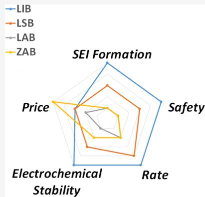

# CONTENTS

1. Introduction and Scope 6783

2.New Concepts in Liquids 6784

2.1. Superconcentration 6785

2.2.Ethers 6786

2.3. Esters 6788

2.4. Exotic Solvents 6789

2.5.Water 6790

2.6.Hybrids 6793

2.7.Beyond Liquid Phases 6794

3.Semisolids 6794

3.1. Polymers, Polymer-Liquid, or Polymer-Polymer Hybrids 6794

3.2. Liquid Inorganic Hybrids 6797

4. Solid Ionic Conductors 6797

4.1. Garnet-Type Solid-State Electrolytes 6798

4.2. Antiperovskite-Type Solid-State Electrolytes 6800

4.3. Sulfide-Type Solid-State Electrolytes 6801

4.4. Beta-Alumina 6802

4.5. First-Principles Calculation-Driven Design 6803

5. Redox-Active Electrolytes 6804

5.1. Flow Cell Anolytes/Catholytes 6804

6.Open Systems 6806

6.1. Li-Air  $(\mathrm{O}_2)$  Electrolyte 6806

6.2.Zn-Air Electrolytes 6808

7.Concluding Remarks and Perspectives 6809

Author Information 6809

Corresponding Authors 6809

Authors 6809

Notes 6809

Biographies 6809

Acknowledgments 6810

References 6810

# 1. INTRODUCTION AND SCOPE

Over the past decade, interest in electrochemical energy storage technologies has experienced an exponential increase. Governments and commercial entities around the world have dedicated enormous resources to the study of battery chemistries and materials of higher performance based on the success of Li-ion batteries (LIBs). While most research has centered on the design of chemistry and structure for either intercalation- or conversion-type electrode materials, the electrolyte, which insulates the electron but conducts ionic current between the two electrodes, has been increasingly recognized as a key component in enabling these new electrode materials and chemistries. Historically it was the knowledge deficiency in electrolyte formulation and the accompanying interphase chemistry that significantly delayed the emergence of LIBs. State-of-the-art (SOA) electrolytes in any battery systems have been tailored to the specific chemistry and structure of the electrodes and reactions present in the cell.

Special Issue: Beyond Li-Ion Battery Chemistry

Received: August 28, 2019

Published:February S,2020

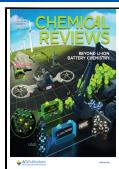

Although the requirements vary with the electrodes, the overarching design goals of an ideal electrolyte remain the same across all technologies: formation of desired interphases at the central stage together with considerations of safety, rate performance, (electro)chemical stability, and cost. Only when all of these requirements are met can any electrolyte system become competitive for commercial success, as exemplified by the carbonate-based electrolytes adopted by LIBs.

A spider chart, where each parameter is ranked out of five, displays how the SOA electrolyte formulations perform when evaluated against these multifaceted requirements made by various exploratory electrochemical systems, Li-S battery (LSB), Zn-air battery (ZAB), and Li-air battery (LAB), with LIB as the benchmark for comparison (Figure 1). Compared

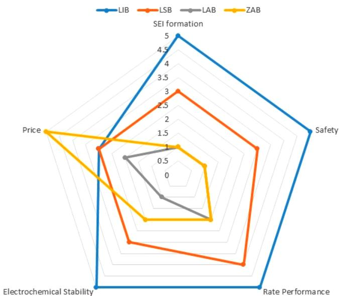  
Figure 1. SOA electrolytes for four energy storage technologies ranked by their SEI formation, safety, price, rate performance, and electrochemical stability.

to LIB, the LSB system is still far from commercial realization, because polysulfide reactivity rules out the carbonate solvents, while the low boiling point/flash point of ether solvents renders the system highly volatile and flammable.[5,6] The low anodic stability of ethers and the dissolution/shuttling of polysulfide species further worsen its perspective.[7] Similar challenges exist for LAB systems, where the high overpotential required for the delithiation of large-sized  $\mathrm{Li}_2\mathrm{O}_2$  inevitably induces irreversible oxidation of carbonate or ether solvents, a process responsible for false capacities reported in early LAB literature.[8,9] Even within the rather matured realm of LIB, recent interest in higher voltage and higher capacity cathode chemistries ( $5\mathrm{V}$  class  $\mathrm{LiNi}_{0.5}\mathrm{Mn}_{1.5}\mathrm{O}_2$ ,  $\mathrm{LiCoPO_4}$ , or high nickel as represented by  $\mathrm{LiNi}_{0.8}\mathrm{Mn}_{0.1}\mathrm{Co}_{0.1}$ ) have pushed the SOA carbonate electrolytes to the brinks of instabilities and side reactions,[10] not to mention that the renaissance of the demanding Li metal as the ultimate anode presents the most aggressive challenge to electrolytes.[11] To this end, new electrolyte concepts hold the key to enabling new battery chemistries of higher power and energy, higher safety, lower cost, and better cycle/calendar lives.

In this review, we will discuss unconventional electrolyte systems that significantly deviate from the conventional state-of-the-art. These electrolyte systems, mostly reported in the

past decade, were designed to support battery chemistries aiming to achieve significant improvements in the aforementioned 5 metrics. They should very likely become a part of or directly bring forward the next generation of energy storage technology. Thus, instead of comprehensiveness, we intend to place emphasis on topics and concepts that were deemed by the authors as significant breakthroughs in the knowledge of electrolytes. Meeting such high bars are liquid electrolytes that ventured into the superconcentration regime, where established conventional wisdom of interphasal chemistry no longer holds true. Another potentially ground-breaking electrolyte technology is solid electrolytes based on sulfide, garnet, antiperovskite, and Beta-alumina polymer materials that displayed liquid-like ion transport, or semisolid electrolytes that exist between the conventional liquids and solids but inherit merits from both, or electrolytes carrying redox-active species on their structure that are designed for flow configurations, or electrolytes for open battery systems such as metal air chemistries  $(\mathrm{M - O_2},\mathrm{M} = \mathrm{Li},\mathrm{Zn},$  etc.). The use of first-principle calculations to drive the design of these new electrolytes will also be discussed briefly.

# 2. NEW CONCEPTS IN LIQUIDS

In any electrochemical device, electrolyte is the indispensable ionic conductor between the two electrodes which must provide ionic current to support the cell reactions. Most electrolytes used today in batteries are in the liquid state for apparent design convenience because almost all active electrode materials are in the solid state, and a liquid electrolyte can access these active materials much easier (better wetting) and transport charges much faster (low impedance across the liquid/solid interface). With the only exception of ionic liquids (salts in molten state), these liquid ionic conductors are formed by dissolving salt in polar solvents, no matter aqueous or nonaqueous, which dissociate the cations and anions, respectively, and stabilize these separate ions via solvation sheaths. As a legacy of pursuing optimum ion conductivity, the salt concentrations used in nonaqueous electrolytes have remained in the neighborhood of  $\sim 1$  M.

In the traditional electrochemical configuration, an electrolyte not only supports the transfer of mass and ionic charge across the cell but must also insulate electron transfer. In other words, it must remain electrochemically inert at the surfaces of both the cathode and the anode, where redox reactions occur. This latter requirement does not apply for the electrolytes in redox flow cells, where the electrochemically active species are in the mobile phases either as dissolved species in the electrolytes or covalently bonded to electrolyte solvents. However, the majority of the electrolytes still maintain electrochemical inactivity as well as insulation toward electron conduction.

Given the extreme potentials where the electrodes of modern batteries operate, the electrochemical stability usually cannot be achieved in a thermodynamic manner but rather via a passivation process. The sacrificial decomposition of electrolyte components (solvent, salt, additives) leads to the formation of an independent entity known as "interphase", which is a thin film that separates the electrolyte from the electrode. For LIBs and batteries based on a Li-metal anode, the most important interphase is on the anode surface, which was named the solid electrolyte interphase (SEI) to reflect its electrolyte nature: a solid passivation layer that not only allows  $\mathrm{Li^{+}}$  to pass but also insulates electron tunneling. On the

cathode side, an alternative term cathode electrolyte interphase (CEI) was created recently, but the existence of CEI is not as undisputable as SEI. It depends on the operating potential as well as the chemistry of the cathode materials. Complications sometimes arise, especially when the active species in the cathode are involved in reactions with electrolyte components (solvents, salt anion, and additives).

Since most modern battery chemistries involve electrode materials operating at extreme potentials, an important metric that modern electrolyte must satisfy is the effectiveness of the kinetic protection of electrode surfaces provided by the interphase it forms in addition to the myriads of design principles that conventional electrolyte must follow, such as ion transport, (electro)chemical stability, viscosity, wettability toward electrodes and separator, intercomponent chemical stability, safety, cost, etc. Unfortunately, for a long period, the interphase has remained the least understood component in the batteries.[12] Rational design of the interphase has been impossible. Even with the current knowledge accumulated during the intensive research over the last two decades, it is still difficult to manipulate, let alone predict, interphasial chemistry. In a sense, the efforts to develop a new electrolyte are those to find out how well a new interphase chemistry works with the electrode materials.

# 2.1. Superconcentration

One key piece of knowledge achieved in the past decade is how ion solvation dictates the formation chemistry of SEI in LIBs. Numerous experimental and computational studies confirmed that there is a close correlation between the structure of the primary solvation sheath of  $\mathrm{Li^{+}}$  and the eventual interphase chemistry (Figure 2),[13,14] while systematic quantification of the

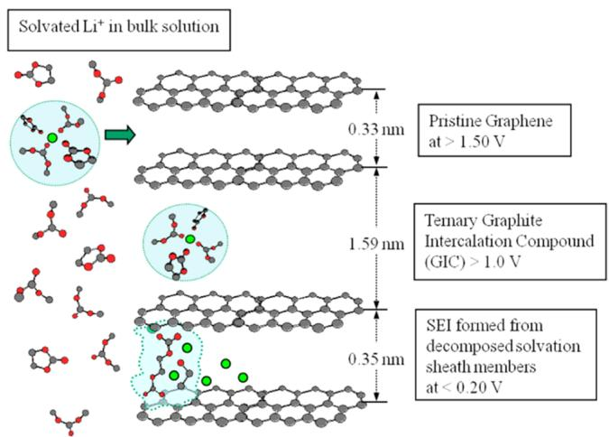  
Figure 2. Correlation between  $\mathrm{Li^{+}}$  solvation sheath and interphasial chemistry. Reproduced with permission from ref 13. Copyright 2007 American Chemical Society.

solvating power has been established for the most frequently used solvent molecules in the battery industry. $^{15}$  In such context, once the classical solvation sheath structure achieved in conventional electrolyte is altered, corresponding changes are anticipated in the interphasal chemistry. It was this correlation that enabled the superconcentration concept, although many pioneers in superconcentrated electrolytes did not necessarily realize the underlying mechanism responsible when reporting their work.

Superconcentration is a relative term and therefore inaccurate by nature. It describes the general approach of formulating electrolytes deliberately at higher salt concentration than maximum ion conductivity would require. Unlike the conventional electrolytes typically residing near the "1 M regime", where sufficient population of solvent molecules ensures the classical three-layer solvation structure,[16,17] the deficiency of solvent molecules in superconcentrated electrolytes leads to ion solvation structures that are not well solvated in the classical sense. Instead, the individual ion solvation sheaths are so compressed that they are forced to share solvent molecules, and counterions inevitably appear at distances that are considered to be within the classical primary solvation sheaths ( $\sim 0.2 \mathrm{~nm}$ ). Such phenomenon significantly alters the ion solvation structure and in turn induces a series of new properties not usually seen in the conventional concentration regime, which, besides new interphasial chemistry, also include thermal, mechanical, ion, and mass transport, (electro-)chemical stability, as well as interfacial assembly at electrode surfaces. Most of these properties bring certain benefits among the 5 metrics illustrated in Figure 1, as summarized by the a number of review articles published in the past 5 years.[18-20]

McKinnon and Dahn were perhaps the first pioneers who ventured into the superconcentration regime. They reported in 1985 that a saturated solution of  $\mathrm{LiAsF_6}$  in PC could circumvent the cointercalation of PC into the layered host and predicted that superconcentration could be used to extend the practical application range of such electrolytes even in commercial cells.[21] More attention was attracted by a later venture made by Angell et al., who at the time were struggling to resolve the insurmountable conflict between the ion conduction and the mechanical strength of polymer electrolytes. While this entanglement is still not well resolved even today due to the intrinsic reliance of ion conduction on polymeric segmental motion, Angell et al. reported in 1993 that by increasing the salt concentration above a certain threshold level, a decreasing trend in ionic conductivity was reversed (Figure 3).[22] Here, the polymer can be viewed as a macromolecular solvent with extremely high viscosity. The resultant electrolyte actually inherited the merits of both high

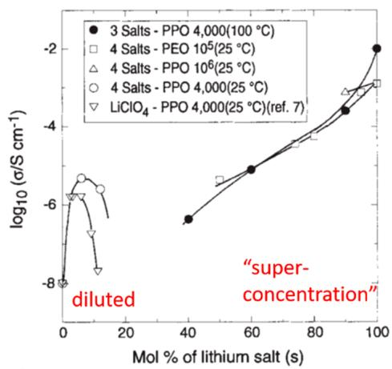  
Figure 3. Venture into the superconcentration regime: the polymer-in-salt approach represents an early attempt to breach the concentration confinement imposed by the pursuit of maximum ion conductivity. Here, the polymer serves as the macromolecular solvent for lithium salts. Reprinted with permission from ref 22. Copyright 1993 Springer Nature.

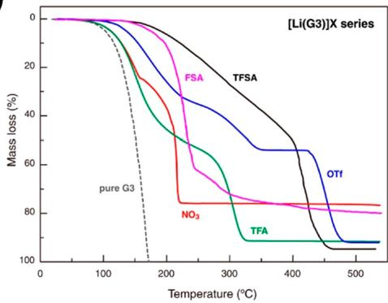  
a)

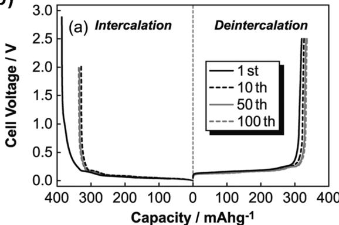  
b)  
Figure 4. Unusual properties of superconcentrated ether electrolytes. (A) Thermogravimetric behavior of LiX dissolved in glyc (G3), which is volatile in the absence of salt. Reproduced with permission from ref 30. Copyright 2012 American Chemical Society. (B) Charge-discharge profiles of the graphite anode in LiFSI-G3 electrolyte. Reprinted with permission from ref 31. Copyright 2011 Electrochemical Society.

ion conduction of ionic liquids and mechanical resilience of a typical polymer rubber. The term created for this new class of polymer electrolyte, polymer-in-salt, serves as the predecessor of the latter solvent-in-salt, water-in-salt, or water-in-bisalt electrolytes.[23-26]

# 2.2. Ethers

In strong contrast with carbonates, ethers have found much less commercial success, which can be attributed to their intrinsic interphasial disadvantages at both cathodes and anodes. Their intrinsic chemical instability against oxidation naturally rules out their application with any high-voltage  $(>4\mathrm{V})$  cathode materials unless other stabilization means are adopted, such as superconcentration. On the other hand, although most ethers are chemically stable against reduction (especially when compared with esters), their stability prevents them from forming SEI over graphite but instead enables cointercalation, an undesirable scenario leading to clumsy intercalation chemistry of mediocre potential, low capacity, and poor reversibility. Those disadvantages on the anode alone has thus excluded the presence of ether-based electrolytes in LIBs. Only in the special case of the Li-sulfur battery does ether find a niche, because sulfur does not operate at especially high potential, while Li-metal anode requires better chemical stability from the electrolytes. More importantly, the reactivity of polysulfides (intermediate of a Li-S battery) with esters through a nucleophilic attack $^{20}$  forces researchers to rely on ethers

While ethers generally possess low viscosity and high solvating power, thanks to the combination of moderate dielectric constant, high electron donicity, and denticity (a parameter describing molecules with polychelating capabilities), they are also typically much more volatile and flammable than esters. In particular, in the case of Li-S batteries, the commonly used 1,3-dioxolane and dimethoxyethane solvents will easily evaporate during cell construction. This often alters the designed composition of the electrolytes and introduces hard-to-control variables in the eventual performance of the cells. Nevertheless, with these advantages and disadvantages, ethers constitute one of the two major polar solvent systems that have been extensively used as electrolyte solvents in laboratories.

The excellent solvating power of ethers made them the first superconcentrated electrolytes explored, even if one excludes polymer-in-salt electrolyte based on poly(ethylene oxide) as

ether based. $^{18,22}$  Highly concentrated ether-based electrolyte will ensure that the ether molecules are tightly bound to the salt molecules and decrease the volatility of the system. $^{21}$  Highly concentrated ether-based electrolyte will ensure that the ether molecules are tightly bound to the salt molecules and decrease the volatility of the system. $^{27}$

In the early 2000s, Pappenfus et al. discovered that equimolar mixtures of either LiTFSI or LiBeti with tetraglyme (G4) maintain the liquid state in a rather wide temperature range between 31 and  $200^{\circ}\mathrm{C}$ , while supercooling could extend the lower limit of the range even further down to  $-61^{\circ}\mathrm{C}$ . [28,29] The extraordinarily low vapor pressure of G4, a rather volatile solvent in neat state, in such equimolar mixtures reveals its strong interaction with the salt. The authors considered the complexes of  $(\mathrm{Li - G4})^{+}$ , a new cation in a quasi-ionic liquid, which displayed ion conductivities of  $1.0~\mathrm{mS / cm}$  along with anodic stability windows higher than  $4.5\mathrm{V}$ . The latter has been hardly possible with any ether-based electrolytes.

Watanabe and co-workers furthered the exploration of this class of electrolytes based on ether in a more systematic manner and revealed the unusual properties exhibited when salt concentration crossed a certain threshold (Figure 4a).30-55 Besides the materials perspective, the most significant contributions from Watanabe were the efforts made to understand these abnormal properties on a fundamental level. Thermal (DSC, TGA), spectroscopic (NMR, FTIR), as well as computational characterization unequivocally evidenced that all ether solvents in these superconcentrated systems are tightly harnessed by  $\mathrm{Li^{+}}$ . Such strong interaction led to a high thermal stability up to  $200^{\circ}\mathrm{C}$ . Particularly surprising were the improvements in their electrochemical stabilities toward the cathode and graphitic anode, as it had been well established that ether-based electrolytes were vulnerable to oxidation at potentials ranging from only  $3.5 - 4$  V and tend to cointercalate with  $\mathrm{Li^{+}}$  into graphitic structures, forming the undesirable ternary graphite intercalation compounds (Figure 4b).56 The emergence of these unusual properties can be attributed to the competitive solvation of  $\mathrm{Li^{+}}$  by solvent (glyme) molecules and anions, which does not exist in diluted salt systems. This intimate interaction between cation and anion is of particular significance to the interfacial/ interphasal properties that often dictate the electrochemical stabilities of the electrolytes.

The deviation of ether-based superconcentrated electrolytes from their diluted counterparts provided opportunities for

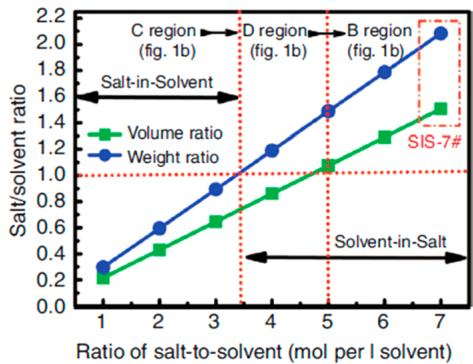  
a)

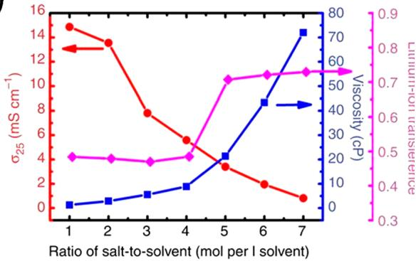  
b)  
Figure 5. Solvent-in-salt electrolytes based on mixed ethers DOL/DME (1:1 by volume). (a) Weight and volume ratios of LiTFSI, and definition of solvent-in-salt. (b) Corresponding ion conductivity and viscosity. Reprinted with permission from ref 23. Copyright 2013 Springer Nature.

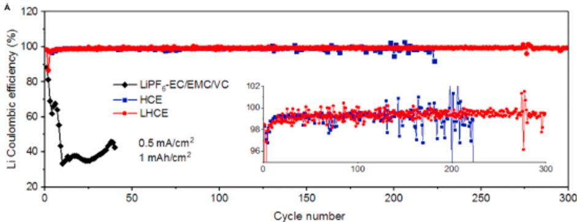

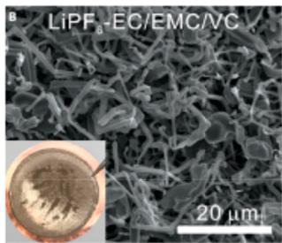

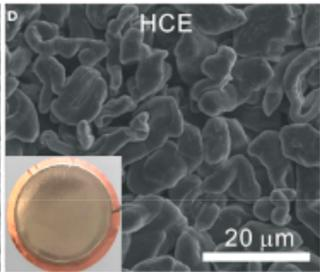

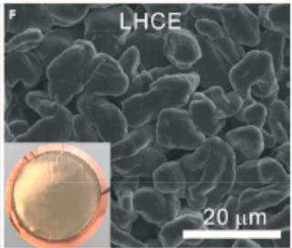

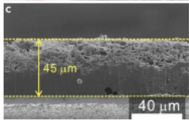  
Figure 6. Li-metal deposition and morphology as obtained from a  $\mathrm{Li} / / \mathrm{Cu}$  cell in different electrolytes. (a) Cycling stability. (b-g) SEM top view (b, d, and f) and cross-sectional view (c, e, and g) of deposited Li from a conventional electrolyte (1.0 M  $\mathrm{LiPF}_6$  in EC/EMC 30:70) with 2% VC (b and c), highly concentrated electrolyte (HCE, LiFSI-1.2 DME, d and e), and locally highly concentrated electrolyte (LHCE, LiFSI-1.2DME-TTE, e and g). Reprinted with permission from ref 56. Copyright 2019 Cell Press.

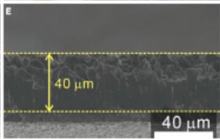

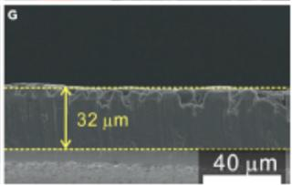

various electrolyte designs aimed at practical applications (Figure 5a). Suo et al. demonstrated that when the concentration of LiTFSI approaches  $7\mathrm{M}$  in ether mixtures, the  $\mathrm{Li} / \mathrm{S}$  chemistry could benefit from a series of new properties including the low solubility of polysulfides, a high  $\mathrm{Li^{+}}$  transference number  $(>0.7)$ , as well as the suppression of Li dendrite growth (Figure 5b).[23] As Li metal was revisited in the early 2010s as a viable pathway to high energy densities,[57] ether-based superconcentrated electrolytes induced a significant amount of interest due to the stability of ethereal species against reduction. Thus far, the best Coulombic efficiencies of the rechargeable Li-metal anode came from the ether-based electrolytes  $(99.3\%)$  at  $0.5\mathrm{mAcm}^{-2}$  and  $1\mathrm{mAhcm}^{-2})$ [58] which

is mainly enabled by the densely packed Li-metal morphology when deposited underneath the new interphasial chemistry that is otherwise unavailable in diluted electrolytes (Figure 6). The new SEI on the Li-metal surface now carries the chemical signature from the anions, made possible by the combination of two factors: (1) the high presence of anion in the primary  $\mathrm{Li^{+}}$  solvation sheath, which fluorinated the resultant interphase, and (2) the relative inertness of ether molecules toward the Li surface.

Similar benefits were also extended to the cathode side. As  $\mathrm{Li^{+}}$  is tightly solvated by ether molecules, the (electro)chemical activity of the latter, especially the donicity of its lone electron pair on oxygen, is significantly reduced, leading to less

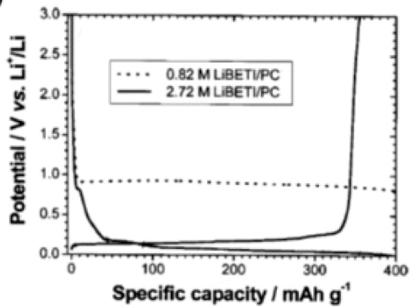  
a)

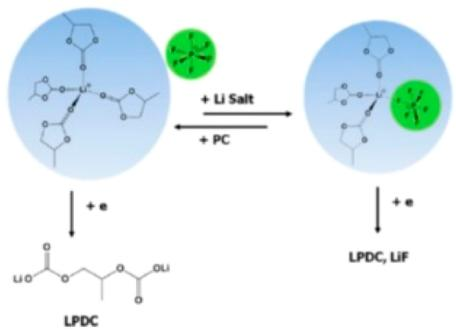  
b)

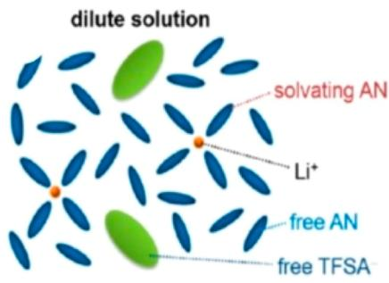  
c)

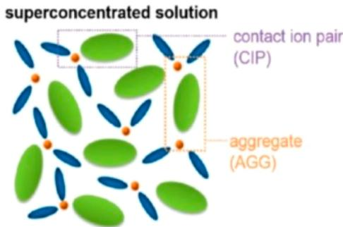  
Figure 7. Unusual properties of superconcentrated electrolytes using carbonate or exotic solvents. (a) Exfoliation and reversible lithiation behaviors of graphite in dilute  $(0.82\mathrm{M})$  and superconcentrated  $(2.72\mathrm{M})$  LiBeti in PC. Reprinted with permission from ref 62. Copyright 2003 Electrochemical Society. (b) Change of  $\mathrm{Li^{+}}$  solvation structure when Li salt concentration crosses a certain level. Reprinted with permission from ref 13. Copyright 2014 American Chemical Society. (c) Formation of an anion-containing  $\mathrm{Li^{+}}$  solvation sheath in AN. Reprinted with permission from ref 64. Copyright 2014 American Chemical Society.

susceptibility of ethers toward oxidation on the cathode. The higher than usual anodic stability has been described by Watanabe et al.[20] and further confirmed by Jiao et al. and Ren et al. on a highly oxidative surface of fully charged NMC up to 4.3–4.5 V.[58,59]

# 2.3. Esters

The state-of-the-art electrolytes employed in LIBs consist of carbonate esters. This class of electrolytes is blessed by both a high dielectric constant and donicity, exhibiting excellent solvating capability toward most Li salts. However, a limited number of superconcentrated electrolytes have been developed based on this class of solvents. The major restriction stems from the difficulty in dissolving a high concentration of salts while still maintaining the liquid state. This is especially true when the most favored carbonate solvent, EC (mp  $36.4^{\circ}\mathrm{C}$ ), often solidifies with a salt concentration above  $1\mathrm{M}$ , as indicated by the diversified crystalline solvate compounds as identified by Henderson and co-workers.[60] More freedom was offered by the lower molecular symmetry of PC, which comes with both low mp  $(-48.8^{\circ}\mathrm{C})$  and strong resistance against crystallization; hence, among the earliest superconcentrated electrolytes explored was PC when McKinnon and Dahn observed that the cointercalation of PC molecules into layered  $\mathrm{ZrO}_2$  was prevented at high salt concentration.[21] The cointercalation of PC molecules into graphite caused far more serious issues, i.e., exfoliation of the graphitic structure following its cointercalation and hence preventing the use of graphite as a storage host for  $\mathrm{Li}^{+}$ .[61] It took nearly two decades for the superconcentration effect on graphite to be discovered, when in 2003 and 2008 Jeong et al. described that as long as the concentration of lithium salts  $(\mathrm{LiPF}_6,\mathrm{LiClO}_4,$  or LiTSFI)

is high enough, the characteristic graphite exfoliation would be replaced by reversible lithiation/delithiation of graphite (Figure 7a).62 Although no comparative chemical analysis was performed on the graphite surface at the time, it is apparent that an entirely different interphase must have been generated due to the superconcentration. This connection was finally made by Nie et al., who showed that an anion-originated (LiF-rich) interphase will result from the high salt concentration  $(3.0 - 3.5\mathrm{M}\mathrm{LiPF}_6$  in PC)63 in accordance with the SEIformation mechanism proposed earlier by Xu et al. where the  $\mathrm{Li^{+}}$  solvation sheath structure is considered the central factor dictating interphasial chemistry (Figure 7b)13

An innovative departure from the conventional avenue of using cyclic carbonate as an indispensable cosolvent was made by Wang et al., which was made possible by a new salt lithium bisfluorosulfonyl imide (LiFSI) that does not require the high dielectric constant of a cyclic carbonate to reach superconcentration.[65] The simple electrolyte consisting of  $\sim 10$  m LiFSI dissolved in a single solvent of linear carbonate dimethyl carbonate (DMC) provides not only high ion conductivity and nonflammability but also an excellent electrochemical stability window that supports the reversible operation of both graphite anode and a  $5\mathrm{V}$  class cathode material  $\mathrm{LiNi}_{0.5}\mathrm{Mn}_{1.5}\mathrm{O}_4$ , which could have been otherwise impossible. The implication carried forward by this work is that superconcentration could induce an alternative interphasal chemistry to circumvent the many restrictions that typical LIB electrolytes must subject to, the most prominent of which is the presence of ethylene carbonate (EC). This opens opportunities to many "exotic" solvents that have been out of the question, especially considering the sensitive and fragile structure of graphitic anodes toward cointercalation and exfoliation.

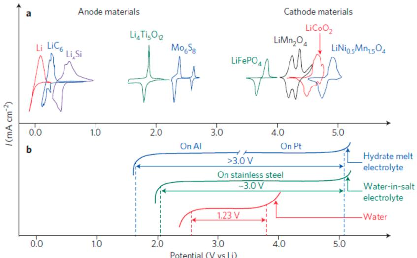  
Figure 8. Extended electrochemical stability windows of aqueous electrolytes via superconcentration. (a) Redox potentials of the major anode and cathode materials: Li metal,  $\mathrm{Mo}_6\mathrm{S}_8$ ,  $\mathrm{Li}_4\mathrm{Ti}_5\mathrm{O}_{12}$ ,  $\mathrm{LiMn}_2\mathrm{O}_4$ ,  $\mathrm{LiFePO}_4$ ,  $\mathrm{LiCoO}_2$ , and  $\mathrm{LiNi}_{0.5}\mathrm{Mn}_{1.5}\mathrm{O}_4$ . (b) Redox reactions of water molecules at  $\mathrm{pH} = 7$  evolve hydrogen and oxygen at the anode and cathode surfaces, respectively, giving rise to a thermodynamic stability window of  $1.23\mathrm{V}$ , whereas superconcentration ( $21\mathrm{mol}\mathrm{kg}^{-1}$  LiTFSI in WiSE and  $27.8\mathrm{mol}\mathrm{kg}^{-1}$  LiTFSI + LiBeti in the hydrate melt electrolytes) significantly expands windows to larger than  $3.0\mathrm{V}$ . Reprinted with permission from ref 24. Copyright 2015 Springer Nature.

# 2.4. Exotic Solvents

Because the electrolyte must interface with both electrodes in the battery, it is perhaps the component that has to satisfy the most stringent requirements, ranging from bulk (liquid range, salt solubility, solvation, and liquid structure), transport (ion transport, preferential diffusion), interfacial/interphasial stability, as well as peripheral (viscosity/wettability, safety, toxicity, and cost) properties. Accordingly, the result of such rigorous selection matrix only provides us with a short list of electrolyte solvents as feasible candidates, which roughly fall into two families of polar and aprotic organic compounds: ethers and esters, with very few exceptions. The emergence of transition metal oxide cathode materials essentially ruled out the ethers due to their anodic instability at potentials beyond  $4.0\mathrm{V}$  vs Li, while the extensive adoption of graphitic anode materials in LIB further narrows the candidates down to carbonate esters (alkyl esters of carbonic acid), with EC in particular as the indispensable source of interphasial chemistry to stabilize the graphitic anode.

The reliance of LIB electrolytes on EC could be explained by the correlation between the  $\mathrm{Li^{+}}$  solvation sheath structure and the interphasial chemistry. Numerous mechanistic studies on interphases have established that as the  $\mathrm{Li^{+}}$  dictates how the ternary graphite intercalation compound (GIC) forms during the initial lithiation process and such GIC serves as the precursor for the eventual interphases (Figure 2), the solvent molecules in the primary solvation sheath of  $\mathrm{Li^{+}}$  generate the major chemical source for an interphase.[13,66] The necessity of EC being present in almost all LIB electrolytes is therefore determined by the facts that  $\mathrm{Li^{+}}$  tends to be preferentially solvated by EC over linear carbonates (DMC, EMC, etc.) and that alkylcarbonate generated by the single-electron reduction of EC proves to be the most efficient interphasial component.[61] Such correlation still holds true at superconcentration, where the  $\mathrm{Li^{+}}$  solvation sheath structure is now disturbed by the much higher anion population in the electrolytes and the interphase chemistry hence is no longer solvent derived but originated from anion reduction as well. The alternate interphasial chemistry opens a window of

opportunity for many solvent molecules that would be otherwise impossible due to the stringent requirements for electrolytes. In fact, the benefit of such alternate interphasial chemistry was already more or less demonstrated in the above cases of both ether and esters, but it will be most pronounced for the exotic, noncarbonate solvents, because those solvents were considered useless for advanced battery application, especially for Li metal or LIB.

Examples of such exotic solvent systems started with dimethyl sulfoxide (DMSO), reported by Yamada et al. in 2010,[67] who showed that  $3.2\mathrm{M}$  LiTFSI in DMSO enables the intercalation of  $\mathrm{Li^{+}}$  into graphite while preventing the cointercalation of DMSO molecules. This concept was subsequently expanded to other solvent candidates by Yamada et al., who demonstrated that superconcentration of LiTFSI can achieve a similar interphasial chemistry on the graphitic anode in electrolytes based on tetrahydrofuran, sulfolane,[68] as well as acetonitrile (Figure 7c),[64] none of which can support reversible  $\mathrm{Li^{+}}$ intercalation at a conventional salt concentration near  $1.0\mathrm{M}$ . Although in earlier efforts researchers tried to rationalize the unusual electrochemical behaviors of the graphite anode in these electrolytes by resorting to the reduced solvation numbers of  $\mathrm{Li^{+}}$ at these concentrations, Yamada et al. were the first to correctly attribute the phenomenon to a new interphasial chemistry originated from the reduction reactions of anions. This argument was supported not only in this work[64] by X-ray photoelectron spectroscopy (XPS) performed on the recovered electrodes but also in the later works with numerous surface analyses, which all identified high abundance of fluorides (mostly LiF) as the major species in the new interphases.

While the applicability of these exotic electrolytes in practical batteries remains to be further examined on "realistic" electrodes, especially in terms of their stability against the cathode surface or corrosion of the substrates,[69] the knowledge accumulated sets the foundation for the many superconcentrated electrolyte systems to follow. For example, superconcentrated LiFSI in sulfolane has been shown to be applicable toward high-voltage (4.5 V) LIBs,[70] where the salt

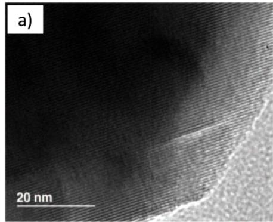

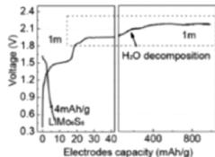  
c)

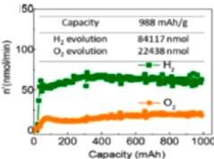  
g)

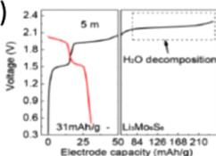  
d)  
e)

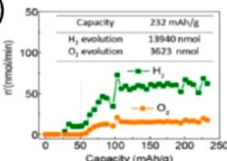  
h)  
i)

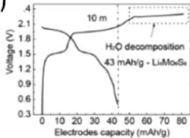

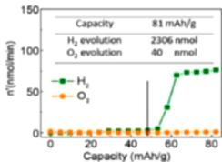

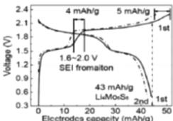  
f)

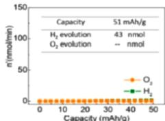  
j)  
Figure 9. Interphase in superconcentrated aqueous electrolyte. (Left) TEM images (a and b) showing the presence of crystalline LiF or NaF on the surface of anodes recovered from WiSE. Reprinted with permission from ref 24 Copyright 2015 AAAS. (Right) Correlation between the formation of SEI on the anode and the suppression of water-splitting reactions, where a-d display the progressive change in voltage profiles for the first charge-discharge profiles of a full Li-ion cell constructed with the  $\mathrm{Mo}_6\mathrm{S}_8$  anode and  $\mathrm{LiMn}_2\mathrm{O}_4$  cathode and e-h correspond to  $\mathrm{H}_{2}$  and  $\mathrm{O}_2$  evolution monitored during the first charging process using differential electrochemical mass spectrometry (DEMS) in the same aqueous full Li-ion cells. Four concentrations from dilute to superconcentration were used. Reprinted with permission from ref 93. Copyright 2017 American Chemical Society.

anion provides interphasial chemistry sources for interphases at both the anode and the cathode. Similar interphasial chemistries were identified in concentrated LiFSI or NaFSI in phosphate esters $^{71}$  or phosphamides, $^{72}$  where the solvents themselves are flame-extinguishing agents, as well as the sodium version of these electrolytes. $^{73}$

The switching of the interphasial chemistry source from solvent molecules to anions renders significant flexibility in selecting solvents; therefore, more interesting and exotic solvent systems are anticipated to be developed in the near future.

# 2.5. Water

Perhaps the most extreme extension of the superconcentration concept is the new class of aqueous electrolytes where the salt anion completely resumes the responsibility of forming necessary interphases. The superconcentration widens the originally narrow electrochemical stability window of water (thermodynamically  $\sim 1.23\mathrm{V}$ , with cathodic and anodic limits sitting at 2.6 and  $3.8\mathrm{V}$  vs Li, respectively) to accommodate the diversified battery chemistry (Figure 8). The pioneering effort was made by Suo et al.,[24] who described a water-in-salt electrolyte (WiSE) consisting of  $21\mathrm{m}$  LiTFSI dissolved in water. An electrochemical stability window of  $\sim 3.0\mathrm{V}$  was generated, with cathodic and anodic stability limits now sitting at 1.9 and  $4.9\mathrm{V}$  vs Li, respectively, thanks to an interphase of LiF on the anode and low water activity due to the high salt concentration. A similar system termed hydrate melt was soon independently reported by Yamada et al.,[74] followed by further improvements in the stability of WiSE via the use of a second

salt at even higher concentration (up to  $28~m$ ),[25,75] or via the introduction of bivalent cation additives,[76] or with the application of a hydrophobic interlayer that serves as precursor for a highly fluorinated interphase.[77] The latter enabled the reversible lithiation/delithiation of graphite in aqueous electrolytes, making the  $4\mathrm{V}$  class aqueous batteries a possibility. More recently, Ko et al. managed to further increase the salt concentration to a new high level of  $55.55~m$ , where the water/  $\mathrm{Li^{+}}$  ratio reaches 1:1.[78] Direct benefit of such high salt concentration is an electrochemical stability window of nearly  $4.8\mathrm{V}$ , which allows the operation of an Li-Al alloy anode without any precoated interphase. In another direction, the discovery of a unique graphite intercalation chemistry by Yang et al. for this class of aqueous electrolytes raises the possibility for the first time that an aqueous battery chemistry could outperform that of nonaqueous LIBs.[79] This new cathode chemistry leverages the intercalation conversion of simple halides in the graphite structure at  $4.2\mathrm{V}$  vs Li, which is only reversible in a derivative of WiSE and delivers a capacity higher than transition metal oxides.

The aqueous version of superconcentrated electrolytes was also extended to other battery chemistries beyond the Li ion, as evidenced by the diversified devices demonstrated by numerous researchers, among which are a unique chemistry using a sulfur conversion reaction as the anode $^{80}$  and intercalation chemistries of the sodium ion, $^{81}$  potassium ion, $^{82-84}$  and bivalent  $\mathrm{Mg}^{85}$  and  $\mathrm{Zn}^{86-91}$  ions. In particular, Ji and co-workers used a series of aqueous superconcentrated electrolytes based on  $\mathrm{ZnCl}_2$  to enable a number of interesting chemistries, not only providing the possibility of reconciling

the high cost and beneficial properties brought by superconcentration but also revealing an unexpected new horizon for this class of electrolytes in supporting exotic battery chemistries that were otherwise impossible.[91]

Aside from potential benefits in energy density and safety, the aqueous nature of such electrolytes also brings the stability against ambient environment. This advantage was most conspicuously demonstrated by an aqueous gel version of Zn electrolytes, which was exposed to lab ambient conditions for 40 days and experienced no weight loss.[86] In sharp contrast with nonaqueous electrolytes whose moisture sensitivity requires device hermeticity that makes the device rigid and nonconformal, the ambient stability introduces unprecedented flexibility as the device could now work in open configurations. Such flexibility has been demonstrated preliminarily on the pouch cell level using a symmetric Li-ion chemistry,[92] but no doubt there are still plenty of possibilities to explore.

Since interphases were never observed in aqueous electrolytes before application of the superconcentration concept, several attempts were already made to understand how such interphases could form and exist in aqueous media. These interphases should still maintain the two characteristics possessed by all solid electrolyte interphases known thus far: (1) in solid form, i.e., remaining insoluble in water; and (2) with electrolyte nature, i.e., conducting ions but insulating electrons. The initial analyses conducted by Suo et al. on recovered anode materials seem to reveal neat LiF as the interphase component (Figure 9a),[24] and this chemical singularity becomes even more pronounced in the sodium version of WiSE, where under a high-resolution transmission electron microscope (HR-TEM) the NaF on the anode surface appears to adopt an almost ideal lattice arrangement.[81] This new interphasial chemistry apparently arises from the reduction of the TFSI anions used and induces certain perplexity: while metal fluorides are indeed the least soluble salts for these alkaline metal cations in aqueous media, they are also ionic insulators. Thus, how  $\mathrm{Li^{+}}$  or  $\mathrm{Na^{+}}$  could migrate across such interphases at fast rates, as suggested by the rate capabilities of the Li- or Na-ion batteries constructed on such electrolytes, becomes a mystery. More detailed analyses by Suo et al. later slightly modified the interphasial chemistry formed in WiSE, where a minor presence of  $\mathrm{Li_2O}$  and  $\mathrm{Li_2CO_3}$  embedded in the matrix of LiF was identified by both XPS and secondary ion mass spectroscopy (SIMS).[93] These "impurities", by interfacing with the fluorides at the nanoscale, might have played the most significant role in creating ionic pathways and generating interstitials and excess  $\mathrm{Li^{+}}$ .[94] A mechanism involving the mixed reductions of TFSI, water molecules, as well as a trace amount of  $\mathrm{CO}_{2}$  dissolved in WiSE during the initial charging cycle was proposed by Suo et al., which seemed to be supported by the in situ gas analysis performed during interphase formation using differential electrochemical mass spectroscopy (Figure 9b). The generated hydrogen and oxygen at the anode and cathode surfaces, respectively, quantitatively reflect how each electrode is progressively passivated as the salt concentration increases.

More recently, an alternative mechanism was proposed to further modify the above arguments that have been centered on direct electrochemical reduction of the anion (TFSI), which generates LiF or NaF as the main ingredient of the interphase. Dubouis et al. suggested that the TFSI anion does not directly experience electrochemical reduction; instead, the hydroxide generated by the reduction of interfacial water molecules

chemically attacks TFSI, leading to fluoride deposition in the form of interphase (Figure 9c).95 Lee et al. went even further by stating that the formation of an aqueous interphase does not necessarily require an anion to provide a chemical building block. By dissolving  $\mathrm{NaClO}_4$  in water at superconcentrated concentration  $(17\mathrm{m})$ , they found an interphase consisting of  $\mathrm{Na}_2\mathrm{CO}_3$  and  $\mathrm{NaOH}$ , neither of which seems to originate from anion reduction. Such an interphase expands the electrochemical stability window up to  $2.7\mathrm{V}$  without the expensive TFSI or triflate (OTf) based salts.96 A new mechanism was thus proposed involving reduction of dissolved oxygen and  $\mathrm{CO}_{2}$  in the electrolyte, which had been identified earlier by Suo et al. but was thought to be impurities in the interphase.93 Lee et al. suggested that it was these oxygen- and  $\mathrm{CO}_{2}$ -derived ingredients, instead of anion reduction, that ensures the  $2.0\mathrm{V}$  class Na-ion battery to operate stably over 200 times. Still further, Zheng et al. argued that the main contribution to the expansion of the electrochemical stability window for a superconcentrated  $(\sim 22.2\mathrm{m})$ $\mathrm{LiNO}_3$  aqueous solution should arise not from any interphase protection but from the kinetic barrier associated with the energy that is required by a water molecule to free itself from a polymer-like local structure  $[\mathrm{Li}^{+}(\mathrm{H}_{2}\mathrm{O})_{2}]_{n}$ .97 Given the fundamental importance, this topic is likely to excite more debate and intensive research.

The attempt to understand the chemistry and formation mechanism of aqueous interphases naturally prompted interest in the interfacial structure at electrodes, which should, no matter in aqueous or nonaqueous systems, precede any chemical reactions that lead to the actual formation of any interphases and therefore should in principle predict the interphasial chemistry. When Oleg and co-workers tried to rationalize the cathodic challenge, i.e., why the expanded electrochemical stability windows of aqueous electrolytes are always "positively biased" (Figure 8), they held the electrode-anion interaction as mainly responsible.[77] According to molecular dynamics (MD) simulations, such uneven positioning of the cathodic and anodic limits in electrolytes stems from the competitive distributions of water molecules and salt anions at the inner-Helmholtz interface of the electrode, which varies as a function of both salt concentration and applied potential. While superconcentration ensures that the inner-Helmholtz layer of the electrode surface is populated by anions, leading to an interface that favors the formation of anion-based interphase, any cathodic polarization would disrupt such preference by expelling anions and attracting cations solvated by water molecules (Figure 10).

Another equally important question raised for superconcentrated electrolytes is whether any long-range liquid structure engenders from the unique local solvation structures and how such structure affects the overall ion transport properties. Oleg et al. calculated the ion solvation in WiSE and concluded that above a threshold salt concentration (10 m LiTFSI) a significant disproportion of  $\mathrm{Li^{+}}$  solvation sheath structure occurs, i.e., the distribution of solvent molecules and anions around a  $\mathrm{Li^{+}}$  is not averaged according to the bulk composition; instead, some  $\mathrm{Li^{+}}$  would only see water molecules, while others see anion (Figure 11a).[99] This uneven distribution of solvation sheath structure results in a nanoscale phase separation, although such a nanoheterogeneity would experience exchanges on a time scale of picoseconds (Figure 11b). According to MD simulations, the nanoheterogeneity should lead to a liquid structure with a characteristic length scale of  $1 - 2\mathrm{nm}$ , which was confirmed by small-angle neutron

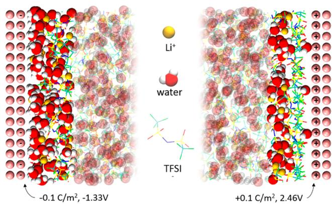  
A. Simulation Schematic  
Figure 10. Interfacial distribution of  $\mathrm{Li^{+}}$ , water molecules, and anions as a function of applied potential as revealed by molecular dynamics simulations performed for WiSE. Reprinted with permission from ref 98. Copyright 2018 American Chemical Society.

scattering (SANS) with a low- $Q$  peak at  $0.45\,\text{\AA}^{-1}$  (Figure 11c). The arguments made by Oleg et al. were supported by Lim et al. with femtosecond pump-probe infrared spectroscopy,[100] who found that dissolved  $\mathrm{Li^{+}}$  forms a three-dimensional, percolating network that is spontaneously intertwined with nanometric nonsolvating water molecules through which the solvated  $\mathrm{Li^{+}}$  move as if they conduct via a fast lane that is little affected by the anions (Figure 11d).

The direct consequence of the above liquid structure is the preferred cationic transport because the anions are relatively "immobilized" in such transient networks. This was further supported by  $\mathrm{Li^{+}}$  transference numbers measurement using pulse-field nuclear magnetic resonance (Figure 12), which is apparently higher ( $\sim 0.73$ ) than what researchers are familiar with in diluted electrolytes (0.2-0.4). Theoretically, the preferential ion transport is believed to benefit the rate performance of a battery chemistry based on the redox reactions of this ion. Thus, the capability of WiSE to support high rate charge/discharge (up to  $60~\mathrm{C}$ ) in diversified chemistries  $(\mathrm{Li^{+}},\mathrm{Zn}^{2+})$ , despite the moderate ionic conductivities, seems to stem from such preferential ion transport that was enabled by the unique ion solvation structures and the subsequent long-range liquid structures.

More recently, Dokko et al. proposed a similar cation-anion decoupling behavior in superconcentrated sulfolane electrolyte, where  $\mathrm{Li^{+}}$  was observed to hop from one coordination site to another without concerted movements of the solvent molecules or anion.[101] This conclusion raises the possibility of whether such long-range liquid structure could exist universally in all electrolytes, no matter aqueous or nonaqueous, as long as a certain threshold salt-solvent ratio is crossed. It should be pointed out that ion hopping, also named structural ion transport, as opposed to vehicular that is often encountered in "dilute" electrolytes, does not necessarily involve a long-range liquid structure such as that observed in WiSE. Generally, the vehicular manner dominates when the solvation sheath consists of solvent molecules that strongly

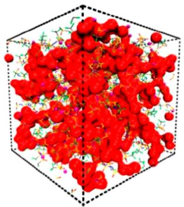  
a)

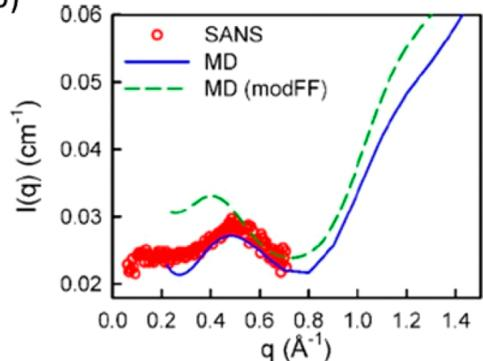  
b)  
d)

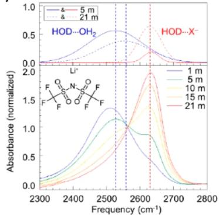  
c)

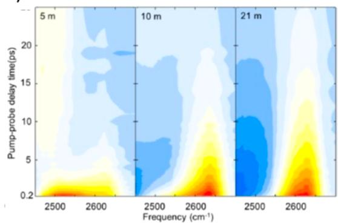  
Figure 11. New liquid structure consisting of nanoheterogeneity at superconcentration. (a) Three-dimensional snapshot generated from molecular simulations showing an interconnected water domain (red) and the TFSI anion. (b) Structure factor from small-angle neutron scattering experiments that coincides well with that predicted by MD simulations. Reprinted with permission from ref 99. Copyright 2017 American Chemical Society. (c) FTIR absorption spectra of OD in deuterated aqueous electrolytes, where Gaussian fitting results for a series of salt concentrations were performed to reveal various water speciation (bulk vs interfacial). (d) Time-resolved IR-pump probe (normalized) spectra of concentrated electrolytes at 5, 10 and  $21\mathrm{m}$  of LiTFSI. Reprinted with permission from ref 100. Copyright 2018 American Chemical Society.

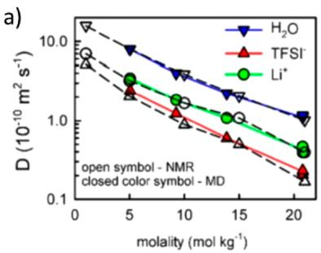  
Figure 12. Preferred  $\mathrm{Li^{+}}$  transport in superconcentrated aqueous electrolyte. (a) Self-diffusion coefficients for ions  $(\mathrm{Li^{+}}$  and TFSI) and water molecules in WiSE from MD simulations at  $25^{\circ}\mathrm{C}$  and pfg-NMR experiments at  $20^{\circ}\mathrm{C}$ . (b)  $\mathrm{Li^{+}}$  transference number as measured by pfg-NMR in WiSE in comparison with nonaqueous electrolytes. Reprinted with permission from ref 87. Copyright 2017 American Chemical Society.

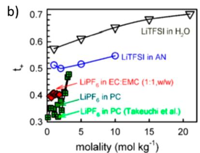

coordinate with cations, such as ethers, while weak cation-solvent interactions lead to more structural contributions. With the given salt and solvent species, superconcentration tends to induce higher structural diffusion, as in the case of both sulfolane $^{101}$  and acetonitrile. $^{64}$  The disproportionation of cation solvation sheath structure in water might be an exception, where the high cation transference number is thought to be prevalent in the vehicular instead of the structural mechanism, because most of the ion transport is carried out by a  $\mathrm{Li^{+}}$ -rich phase consisting of  $\mathrm{Li^{+}(H_{2}O)}_{4}$  speciation. $^{99}$

In a broader perspective, the preferential ion transport behavior observed at superconcentration, no matter arising from structural ion transport or long-range liquid structure, implies an effective approach to decouple cation transport from the Coulombic traps of anions and solvent molecules with potential significance going way beyond battery or even electrochemical devices.

# 2.6. Hybrids

The most severe challenge faced by superconcentrated electrolytes is their high cost. In the LIB industry, electrolyte often constitutes the second most expensive component after cathode materials, while lithium salt is often the most expensive among all electrolyte components. While the imide anions such as TFSI or FSI are often favored due to their excellent solubility and electrochemical uniqueness, these uncommon anions must be synthesized and purified via rather sophisticated processes, which are costly at the current stage due to limited market demand. Of course, more serious cost pressure comes from the extremely high concentrations involved. Besides cost concerns, superconcentration also brings the disadvantages of high bulk viscosity and poor wettability, which make it difficult for the electrolytes to thoroughly access the porous structures of both electrodes and separators.

A rather clever approach named localized high concentration was proposed by Zheng et al., who attempted to maintain the advantages of superconcentrated electrolytes (interphasial chemistry, preferential cation transport, and safety) while eliminating their disadvantages (cost, viscosity, ion conductivity, and wettability). The essence of such approaches is a nonsolvent, which does not directly dissolve the salt but should form, at least macroscopically, homogeneous mixtures with the bulk electrolyte solvents. This nonsolvent, usually a polyfluorinated ether with weak polarity, serves as both a diluent to reduce the overall salt concentration in bulk electrolyte and a structure interrupter that forces the salt-containing domains to be compressed so that a similar solvation sheath structure can still be preserved locally (Figure

13). Thus, while the local environment of cations  $(\mathrm{Li}^{+}$  or  $\mathrm{Na}^{+})$  still maintains the solvation structure of superconcentrated

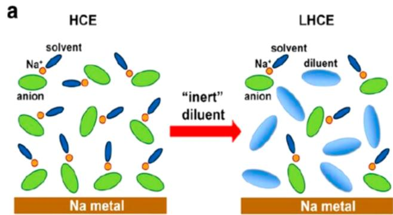

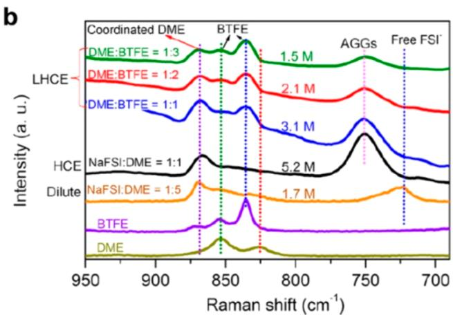  
Figure 13. Local superconcentration. (a) Schematic illustration of dilution from a superconcentration to a local superconcentration. (b) Raman spectra with different NaFSI concentrations. Reprinted with permission from ref 102. Copyright 2018 American Chemical Society.

electrolytes, which dictates the interphasial chemistries at electrode surfaces, the bulk properties (ion transport, viscosity, or wettability toward the electrodes and separators) were mainly defined by the average composition of the bulk electrolyte that still bears the nature of the diluted regime. This successful separation of the desired bulk from the interfacial properties via the engineered solvation structure and long-range liquid structures has enabled a number of exotic solvent systems traditionally thought impossible $^{105,106}$  and raised the hope that more optimized electrolyte systems should be expected from this effective concept.

In a related approach, Wang et al. hybridized aqueous and nonaqueous electrolytes in the hope that the advantages of ion transport and nonflammability from the former and the interphasial chemistry from the latter could be combined. Unexpectedly, an acyclic carbonate DMC was selected as the nonaqueous component, despite the fact that DMC is immiscible with water in the absence of Li salt. Apparently, the water molecules in WiSE differ significantly from bulk water at the superconcentration of LiTFSI; hence, a homogeneous solution was formed between DMC and WiSE.[107] The overall concentration of LiTFSI is  $\sim 14\mathrm{M}$  in the hybridized electrolyte, which also inherits the nonflammability from the aqueous nature. More importantly, the carbonate molecule introduced a significant amount of a second component  $(\mathrm{Li_2CO_3})$  into the SEI, expanding the electrochemical stability window to  $\sim 4.1\mathrm{V}$ , where even a high-voltage cathode material  $\mathrm{LiNi_{0.5}Mn_{1.5}O_4}$  could be supported. This approach was soon expanded to Na battery chemistry, where a hybrid was made between WiSE and PC,[108] or supercapacitor, where acetonitrile was used as the nonaqueous component.[109,110] Obscuring the once clear demarcation between aqueous and nonaqueous regimes, this new class of hybrid electrolytes offers unlimited space to explore.[111]

# 2.7. Beyond Liquid Phases

A few rather transformative concepts represent new frontiers where the conventional phase boundaries have been breached, allowing us to expand the temperature limits imposed by the liquid state of electrolytes. A new class of electrolytes based on liquefied gas was reported by Rustomji et al. using a variety of hydrofluorocarbons (fluoromethane, difluoromethane, fluoroethane, 1,1-difluoroethane, 1,1,2,-tetrafluoroethane, and 2-fluoropropane). [112] Those unconventional "solvents" are all in the gaseous state under ambient conditions. However, under moderate pressure, their mixture with Li or ammonium salts (LiTFSI, 1-ethyl-3-methylimidazolium-TFSI, and tetrabutylammonium-  $\mathrm{PF}_6$ ) turns into liquefied states, which are stable with Li-metal anodes and can support the reversible operation of both electrochemical capacitors and a  $4\mathrm{V}$  battery using  $\mathrm{LiCoO_2}$ . Due to their high dielectric constant and low viscosity, these electrolytes display exceptional performance, especially at temperatures as low as  $-60^{\circ}\mathrm{C}$ . It was believed that a highly fluorinated interphase has been formed on the Li-metal surface upon its contact with these fluorocarbons. Compared to the SEIs generated in carbonate-based electrolytes, the composition of these interphases was found to be highly ceramic-like instead of polymeric/organic with LiF as the major component. Further optimized electrolytes in this class demonstrated stable cycling over 500 cycles with a Coulombic efficiency of  $99.6\%$ .[113]

On the other side of the phase spectrum, Wu et al. reported ion conduction behavior in solid ice, which opens the possibility of a new class of solid-state electrolyte for low-temperature applications.[114] Conductivities of up to  $10^{-3}\mathrm{S}$ $\mathrm{cm}^{-1}$  were reported for various sulfate salts at  $\sim -8^{\circ}\mathrm{C}$ . The authors attributed the transport of  $\mathrm{Li^{+}}$  and other alkali cations to an ion-hopping mechanism through the ice lattice. Surprisingly, multivalent ions  $(\mathrm{Al}^{3+},\mathrm{Mn}^{2+},\mathrm{Zn}^{2+},$  and  $\mathrm{Cu}^{2+})$  also displayed conductivities between  $10^{-4}$  and  $10^{-7}\mathrm{Scm}^{-1}$  in the low-temperature range from  $-4$  to  $\sim -10^{\circ}\mathrm{C}$ , while Cu was even demonstrated to be able to plate from such solid ice electrolyte onto an electrode.

Although only limited efforts have been made in this direction, the increasing demand for a wider service temperature will inevitably encourage more attempts to cross the conventional regimes confined by liquid boundaries.

# 3. SEMISOLIDS

Between the electrolytes in the liquid state and those in the true solid state (ceramic or glass) there is an intermediate class where the electrolytes macroscopically behave as a solid with sufficient dimension stability but microscopically the ions in them interact with the solvating environments or transport across them as they do in liquids. This intermediate class of electrolytes includes solid polymer electrolytes (SPEs), gel polymer electrolytes (GPEs), or the many derivatives of these two classes $^{115,116,116,117}$

The attempts of solidifying electrolyte have been driven by the temptation of integrating the functions of an ionic conductor and a physical separator between the cathode and the anode as well as the benefit of better safety. Although the concept of SPEs was proposed by Armand in 1970s,[118,119] this class of polymer electrolyte encountered the intrinsic dilemma of relying on the polymeric linkage to provide both mechanical strength and ion transport. Consequently, they only found limited applications in batteries, where elevated temperature  $(>60^{\circ}\mathrm{C})$  is a prerequisite to achieve a decent ion conductivity  $(>10^{-4}~\mathrm{S / cm})$  for practically feasible cell reaction rates.[120] Furthermore, despite an early report that lithiated graphite can be electrochemically formed in PEO-based SPEs,[121] these electrolytes are actually incapable of supporting graphitic anodes due to high interfacial resistances unless they are plasticized with proper solvents. This essentially excludes polyether-based SPEs from the LIBs and confines their opportunities to a narrow niche market of Li-metal anode batteries.[122] On the other hand, GPEs have found much more extensive applications in commercial LIBs due to its liquid-like ion solvation and transport behaviors as well as better interfacing with electrode surfaces than SPEs.[123,124] Interest in both SPE and GPE has been revived in the past few years in an attempt to align to the new directions aiming at either improving existing Li-ion batteries for new capabilities including extreme fast charging, where a high  $\mathrm{Li^{+}}$  transference number is desired,[125] or new battery chemistries such as those based on the lithium-metal anode, where dendrite prevention requires a host of properties from mechanical strength, to preferred  $\mathrm{Li^{+}}$  transport, to self-healing capabilities, and possess intrinsic safety as well as capability of negative responsiveness to a hazard.[126] Differing from the efforts placed on polymers back in the 1970-1990s, most of those quests for new semisolid electrolytes used nanomaterials and nanotechnologies that were only developed in recent decades, which allow for elegant design, control, and fabrication of ionic pathways and chemical processes at the nanoscale with unprecedented precision.

# 3.1. Polymers, Polymer-Liquid, or Polymer-Polymer Hybrids

SPEs are essentially electrolyte solutions consisting of Li salts including  $\mathrm{LiTFSI}^{127}$  and  $\mathrm{LiTf}^{128}$  among others dissolved in macromolecular solvents, whose ether linkages  $(\mathrm{CH}_2\mathrm{CH}_2\mathrm{O})_x$  serve as coordinating units for  $\mathrm{Li}^+$  as in the ether-based liquid electrolytes. Thus, most SPEs inherited the intrinsic problems brought by these ether linkages, such as excessively strong coordination with  $\mathrm{Li}^+$ , so that the solvation sheaths become a

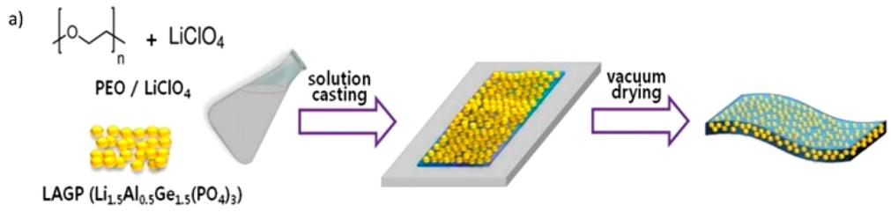

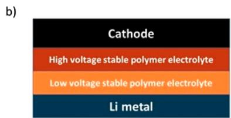  
Figure 14. (a) Blending polymer electrolyte with  $\mathrm{Li}_{1.5}\mathrm{Al}_{0.5}\mathrm{Ge}_{1.5}(\mathrm{PO}_4)_3$  NASICON-type SSE. Reprinted with permission from ref 135. Copyright 2015 Electrochemical Society. (b) Depiction of the dual-layer polymer electrolyte system with a high-voltage stable polymer in contact with the cathode and a low-voltage stable polymer electrolyte in contact with the anode. Adapted with permission from ref 127. Copyright 2019 Wiley VCH. (c) Application of a polymer/inorganic blend electrolyte to create an artificial SEI layer for lean liquid electrolyte operation. Reprinted with permission from ref 136. Copyright 2019 Springer Nature.

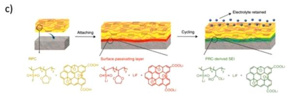

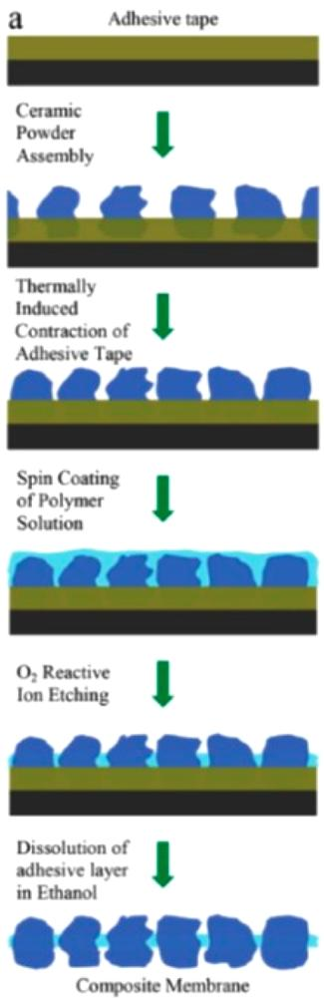  
Figure 15. Single-particle ion-conducting membrane using polymer and solid-state electrolyte particles LATTP. (a) Schematic of the fabrication and final architecture of the membrane. (b) Cross-section and top-view SEM images as well as optical photograph of a typical composite membrane. Reprinted with permission from ref 144. Copyright 2015 Wiley VCH.

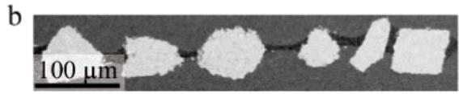

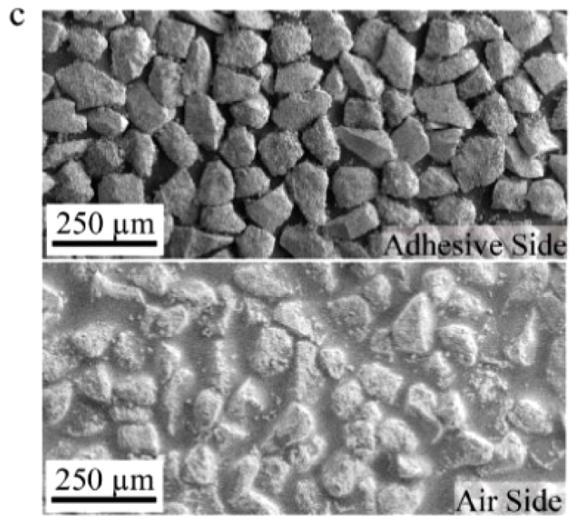

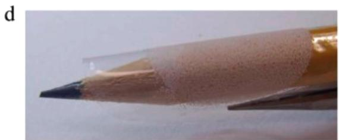

"solvation cage" that hinders efficient  $\mathrm{Li^{+}}$  transport or low stability against oxidation. Efforts seeking alternative polymer unit structures rather than ether linkages to dissolve Li salts have been unsuccessful; hence, most SPEs under development

are still constructed upon ether linkages that are copolymerized, grafted, or blended with other structural units. Depending on the salt concentration (which is usually lower than that of the corresponding liquid electrolyte due to the

limited salt solubility in polymers) and average molecular weight of host polymers, the resultant polymer could be flexible, brittle, or rigid.

Compared to inorganic solid electrolytes that will be discussed in the following section, SPEs are significantly easier to synthesize and process, while their "soft" nature offers further advantages in not only flexibility and facile manufacturability but more importantly the intimate interfacing with solid electrodes. The latter has been one of the most severe challenges for the "hard" solid electrolytes such as ceramics and glasses. In particular, the applications in emerging flexible electronics could benefit from this merit of SPEs, and film casting,[129-131] UV curing,[132] among other high-throughout economical techniques have been well investigated for diversified classes of SPEs. However, the conductivity of SPEs has always been the constraint,[133,134] while the claimed safety advantage also becomes less significant due to the flammability of typical polyethers. In a sense, SPEs and GPEs can be considered as a compromise between true liquid and true solid electrolytes, where conductivity and safety are often traded for cost, interfacial, and manufacturing benefits.

There is a well-established correlation between the amorphous phases of the polyethers and the conductivity of the resultant electrolyte.[115,137,138] Despite sporadic reports,[139,140] the crystalline domains in polyethers are known to block  $\mathrm{Li^{+}}$  transport.[128,141] To minimize crystalline domains, inorganic nanoparticles such as  $\mathrm{TiO_2}$  and  $\mathrm{Al}_2\mathrm{O}_3$  have been used to kinetically inhibit the crystallization of ether linkages in SPEs.[142] Since these nanoparticles are not intrinsically ionic conductors, their benefits are limited. Accordingly, various approaches were adopted to improve the conductivity of SPEs, including blending with ceramic SSEs particles (Figure 14a). In this manner, the nanoparticle can serve the dual purpose of hindering polymer crystallization while providing fast  $\mathrm{Li^{+}}$ -conducting pathways. Conductivities of up to  $2.6\times 10^{-4}\mathrm{Scm}^{-1}$  at  $55^{\circ}\mathrm{C}$  were reported along with better thermal stability.[135,143]

In an alternative approach, Aetukuri et al. believed that simply blending ceramic solid electrolyte in a polymer matrix actually did not fully leverage the high conductivity of the former because these particles are eventually embedded in the less conductive polymer matrix without forming an independent percolating pathway for  $\mathrm{Li^{+}}$  transport. $^{144}$  Leveraging a casting-etching technique extensively used in semiconductor and electronics fabrications to composite polymer-ceramic electrolyte they were able to form a single solid electrolyte layer consisting of ceramic particles whose size dispersion is well within the narrow range of  $\pm 15\mathrm{nm}$ . These particles are firmly embedded in a polymer matrix with their top and bottom surfaces exposed so that a direct ionic pathway is established without going through the polymer matrix (Figure 15). Such one-particle thin membrane ( $<100\mu \mathrm{m}$ ) is a flexible polymer-inorganic composite electrolyte that not only offers excellent ion conductivity and mechanical strength but also proved to be rather effective in suppressing Li dendrite. The latter benefit comes from the fact that the "soft" part (the polymer) is nearly insulating toward  $\mathrm{Li^{+}}$  conduction.

Nanotechnology was also applied to address the conductivity challenges, among which one particular innovation was reported by Wan et al., who created a polymer-polymer hybrid $^{145}$  in which an  $8.6\mu \mathrm{m}$ -thick nanoporous polyimide film with vertically aligned channels was filled with SPE consisting of LiTFSI dissolved in PEO. A surprisingly high conductivity

of  $2.3 \times 10^{-4} \mathrm{~S} \mathrm{~cm}^{-1}$  at  $30^{\circ} \mathrm{C}$  was reported, which is far superior to the parental SPE. The authors attributed this enhancement to the forced alignment of polymer chains within the nanosized channels ( $\sim 200 \mathrm{~nm}$ ), where  $\mathrm{Li^{+}}$  can find the best pathway to transport.

Besides ion conductivity, a property more relevant to the high rate capability of the cell reaction is  $\mathrm{Li^{+}}$  transference number  $(t_{+})$ . Theoretically, a unity  $\mathrm{Li^{+}}$  transference number  $(t_{+} = 1.0)$  eliminates concentration polarization and limits the opportunity of Li dendrite formation. However, in reality, there is always a significant compromise in both ion conductivity and polymer flexibility once the anions are immobilized onto polymeric chains via a covalent bond.[146] To resolve this compromise, liquid electrolytes have been embedded into single-ion-conducting polymers in a close simulation of fuel cell polyelectrolytes plasticized by water. Oh et al. described such a class of single-ion electrolytes based on aromatic poly(arylene ether)s with pendant lithium perfluoroethyl sulfonates. This microporous polyelectrolyte, after being saturated with liquid electrolytes, exhibits a nearly unity  $t_{+}$  along with high conductivities  $(>10^{-4}\mathrm{S / cm})$  even at low temperatures.[147] According to Archer and co-workers, a high  $t_{+}$  constitutes a key control over the reversible deposition and stripping of the Li-metal anode.[148-150]

Given the instability of ether linkages at high potential, SPEs usually cannot support cathode materials that operates at  $>4.0$  V vs Li; thus, the most popular cathode chemistries (LCO, NMC, and LMNO) are all excluded.[151] Efforts were made to circumvent this issue using a dual-layer  $\mathrm{SPE},[127]$  where a polymer material of high anodic stability (polyamide based) is in contact with the cathode, allowing for a 4 V class cathode to be used, while ether-based SPE is interfaced with the anode (Figure 14b).[127] The overall ion conductivity is now defined by the less conducting polymer here, i.e.,  $<10^{-5}\mathrm{S/cm}$  of polyamide at room temperature, if no additional interfacial resistance arises from the junction of the two polymers. SPEs were also applied as artificial SEI over Li metal,[136] as exemplified by poly(vinylsulfonyl fluoride-ran-2-vinyl-1,3-dioxolane) blended with LiF and graphene oxide (Figure 14c). Such thin artificial SEI was key in achieving lean electrolyte conditions ideal for high energy density cells, where a NMC 532 cathode charged to 4 V can cycle over 200 cycles with just  $7\mu \mathrm{L}\mathrm{mA}\mathrm{h}^{-1}$  electrolyte loading. Instead of relying on the in situ decompositions of liquid electrolyte and additives to form  $\mathrm{SEI},[152-154]$  this approach successfully decouples the irreversible consumption of electrolyte during cycling from the consumption needed for SEI formation on Li metal.

The self-healing nature of certain polymers was also explored to mitigate or even repair the mechanical failures that often occur with electrodes during long-term cycling. This concept was initially applied by Wang et al. as a binder material, not electrolyte, on an alloy-type electrode (micrometer-sized Si particles) that experiences tremendous volume changes.[155] The design was quickly extended to electrolytes, where both reversible hydrogen and chemical bonding were designed into polymer structures to enable mechanical stability[156,157] with varying degrees of success in both interfacial stability with electrodes and capability of self-healing at the system level under cutting damage.

Aside from their own chemical and electrochemical properties as electrolytes, polymers were also used as structural platforms to support certain desired functions. One conspicuous example is a core-shell microfiber separator

consisting of PVdF-HFP, which encapsulated an effective flame-retardant triphenylphosphate (TPP),[158] which would be released into the battery upon thermal runaway to suppress combustion. Here, the encapsulation is necessary to physically isolate TPP from the functional electrolyte because TPP is known to induce unfavorable effects on battery performance. Similar examples also include the thermal-responsive polymers, which would undergo reversible phase separation/phase transitions upon temperature hiking and consequently become insulators, so that a shut-down mechanism is provided.[159-161] Of course, whether these novel concepts could work depend on the chemistries of the batteries as well as the thermal runaway condition. If the release or shutdown mechanisms cannot happen fast enough to decrease the rate of heat propagation within the battery, catastrophic failure would still occur. To address this critical temporal requirement, Chen et al. developed a fast and reversible thermoresponsive polymer switch consisting of electrochemically stable graphene-coated spiky nickel nanoparticles embedded in a polymer matrix of high thermal expansion coefficient. The composite polymer has an electronic conductivity of  $50\mathrm{Scm}^{-1}$  at room temperature (hence, no longer an electrolyte by a strict definition), which can decrease within 1 s by 7 or 8 orders of magnitude upon temperature hike[162] and allows for rapid shutdown in the case of accidental thermal runaway.

New manufacturing technologies were also used to pattern or etch polymer electrolytes or polymer-based separators for various merits, leveraging the mature techniques in semiconductor and electronic industries, such as photopatterning or lithography,[163,164] or emerging 3D-printing technologies.[165,166] Such approaches are regarded as highly valuable in enabling 3D microbatteries directly on chips with fabricating modulable arrays.

# 3.2. Liquid Inorganic Hybrids

In 2004 a new class of hybrid electrolyte was created by Maier and co-workers, who named it soggy-sand electrolyte, that bridges conventional liquids with solids.[167] This hybridization strategy aims at combining the liquid-like fast ion transport from conventional liquid electrolyte with the dimensional stability and high modulus of an inorganic solid framework, which is often based on nanosized inorganic particles such as silicate, alumina, or even various ceramic electrolytes.[168,169] Thus, the solid could be either an ion conductor itself or a completely inert structural scaffold. These oxide solids often serve as a preferential adsorption surface for the salt anions; hence, the Li salts dissolved in the liquid phase would be further dissociated, rendering the  $\mathrm{Li^{+}}$  more mobile than the anions. The actual ion transport process in such hybrid electrolytes is much more complicated, which involves surface energy, space charge, and surface functionalities of the oxide particles. The eventual dispersion of the particles in the liquid phase forms a fractal percolating network to accelerate the ionic transport. Such dispersion of nanoparticles in the liquid phase is not spatially immobilized; therefore, gravitational precipitation could occur once the equilibrium is breached, putting an end to the ion transport network. Introduction of the proper fraction of inorganic solids into liquid electrolytes usually induces a spike in ion conductivities, which could be improved as much as five times, in addition to improved  $\mathrm{Li^{+}}$  transference number.[170]

Inspired by the soggy-sand concept, there have been numerous variations of liquid inorganic hybrids that specifically

targeted stabilization of the Li-metal anode surface, most of which were reported by Archer and co-workers. These include excessive lithium halide salts suspended in nonaqueous electrolytes, $^{171}$  ionic liquids tethered to the surface of inorganic particles, $^{148,149,172}$  anions immobilized on nanoparticles that are dispersed in liquid electrolytes, $^{150}$  or liquid electrolytes infused into composites of inorganic and polymers. $^{173}$  Improvements of varying degrees of success were reported in the Li-metal cycling stability, with rationales based on the surface energy of the electrolyte/Li interface. More recently, the concepts evolved and extended to many other inorganic particles of meso-, nano-, or hierarchical structures, including oxides such as  $\mathrm{Al}_2\mathrm{O}_3$ ,  $\mathrm{SiO}_2$ ,  $\mathrm{ZrO}_2$ , and  $\mathrm{CeO}_2$ $^{174-176}$  or even metal-organic frameworks (MOFs). $^{177-181}$  Generally, the liquid electrolytes were thought to be trapped via either physical (noncovalent) forces or chemical interactions in the meso- or nanopores of these inorganic scaffolds with benefits such as decent ion conductivities ( $>1.0~\mathrm{mS/cm}$ ), improved  $\mathrm{Li}^+$  transference numbers ( $\sim 0.6$ ), or additional capability to suppress Li-metal dendrites. In particular, Archer and coworkers described a so-called ionic rectifier where a liquid electrolyte physically constrained in the narrow pores of  $\alpha-\mathrm{Al}_2\mathrm{O}_3$  demonstrates nearly unity  $\mathrm{Li}^+$  transference numbers due to the blocking of anion transport by the pore wall that bears the same charge. $^{182}$

While the semisolid electrolyte approaches present themselves as a new class of promising materials for next-generation battery chemistry, with high  $\mathrm{Li^{+}}$  transference numbers as the main attraction, most of the materials still need to be rigorously characterized under electrochemical conditions close to the real battery environment. In particular, their stability against the high-capacity and high-voltage cathode chemistries remains to be manifested.

# 4. SOLID IONIC CONDUCTORS

Although liquid electrolytes are the most prevalent due to the simplicity of their interfaces with solid electrodes, it has been a decade-long dream to solidify the electrolytes in view of the potential benefits in terms of device robustness, volumetric compactness, and safety. Immense attention has been drawn to solid-state electrolytes (SSE). This is especially true after a series of high-profile fire hazards caused by the thermal runaway of LIBs, which, as an inevitable result of the extensive application of LIBs in our daily life, should be attributed at least in part to the nonaqueous electrolytes used therein. Many new or near-commercialization battery chemistries can benefit from the use of SSE;[183] for example, the well-known polysulfide shuttle effect of the LSB could be circumvented or the persistent growth of Li dendrite could be suppressed if a solid-state electrolyte serves as the ionic conductor and physical barrier between the electrodes.[184,185] To date, there have been quite a few major advances within the field of inorganic SSE: the garnet-type, antiperovskite-type, and sulfide-type systems, each of which possesses its own advantages and disadvantages. If these solid-state battery systems can achieve their promises, higher energy density materials such as a Li anode, sulfur cathode, or oxygen/air cathode become practically accessible. Furthermore, in the absence of percolating liquid, solid-state batteries are not susceptible to ionic short circuits and can be assembled into higher voltage battery stacks without other external physical separation between each cell.[186] This allows for a significant reduction in the dead weight of packaging material and

subsequently realizes a higher energy density at the device level. With the potential benefits in safety and energy density, practical application of SSE in batteries, especially when the aggressive Li-metal anode is involved, still faces questions.[187,188]

Many of the key problems associated with SSE electrolytes still stem from the instability of the electrolyte materials against the harsh reductive and oxidative environment provided by the anode and cathode, respectively. This can cause cell impedance to increase, loss of mechanical integrity, and promotion of dendrite formation, leading to the eventual inability of the cell to function. Decomposition of both garnet- and sulfide-based electrolytes has been well reported with both experimental and theoretical works.[189-193] As shown by the theoretical calculation of the thermodynamic stability limits for these SSEs (Figure 16),[192] most will be either reduced by the anode

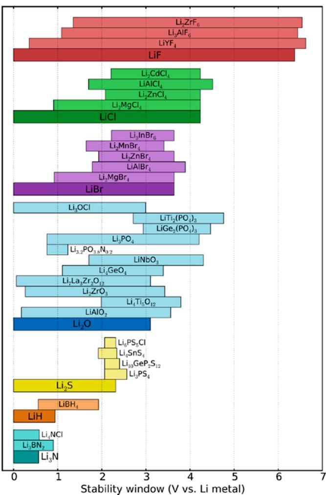  
Figure 16. Calculated theoretical thermodynamic voltage stability windows of popular garnet-, antiperovskite-, and sulfide-type solid-state electrolyte material. Reprinted with permission from ref 192. Copyright 2016 American Chemical Society.

or oxidized by the cathode at their typical operating potentials, while the specific chemistry and nature of the interphases vary with both SSE and electrode materials. The nature of how SSE interfaces with electrode materials directly dictates the performance of the solid-state batteries with three possible scenarios. $^{194,195}$  Type I involves electrolyte materials that are inherently stable against the active material and will not form

an appreciable interphase. Type II involves electrolyte decomposition products that are electrically conductive, resulting in continuous decomposition of SSE. Type III occurs when the SSE is susceptible to decomposition against the electrode but will passivate electrically, in close resemblance to the SEI that supports the operation of LIBs in liquid electrolytes. Besides those, we believe that Type IV might also exist, where the SSE will decompose but the produced interface between the SSE and the electrode either cannot or only poorly conducts both electrons and ions. A Type IV scenario will only propagate if Li plating/dendrites occurs, which induces decomposition of the STSSE upon exposure to fresh Li. Obviously Type I interfaces are ideal but nearly impossible, while neither a Type II nor a Type IV interface is desired as they tend to build impedance. Unfortunately, these types are also most commonly encountered. Hence, Type III has been the direction of research for a large majority of researchers.[196,197]

Furthermore, while it has been accepted that SSE can likely enable the Li-metal anode, dendrite growth is still identified in SSE from time to time. In contrast to its relatively free growth in liquid electrolyte, Li dendrites grow exclusively through the interconnect pores and grain boundaries of the SSE.[198] Because dendrite growth begins with a depletion of Li-ion concentration, it is to be expected that the relatively slower Li-ion conductivity of some solid electrolyte materials will promote the growth of dendrites. However, the dendrite growth likely only follows the diffusion-controlled mode of growth. This is in contrast to the mossy and diffusion-controlled modes of liquid electrolyte systems.[199] Since liquid electrolyte can ensure good contact with newly formed Li metal, mossy dendrite can be grown, which leads to constant impedance build up. In the case of solid electrolyte, it is expected that the contact between newly formed Li will not have sufficient contact with the SSE to form mossy dendrites. Instead, SSE are more prone to decomposition via either a Type II or a Type IV interface, which will increase impedance. When combined with the typically lower conductivity (as a result of both bulk SSE ionic conductivity and interface resistance between active material and SSE), it can be expected that formation of a dendrite even at seemingly low current densities will occur. However, under short-circuit conditions, it is expected that SSE will be safer compared to the highly flammable liquid electrolyte counterpart. As each different type of SSE has different characteristics, we will now review some of the leading SSE materials and strategies to increase their overall performance.

# 4.1. Garnet-Type Solid-State Electrolytes

Garnet-type SSEs (GTSSE) are typically in the form of  $\mathrm{Li}_7\mathrm{La}_3\mathrm{Zr}_2\mathrm{O}_{12}$  (LLZO) and differ between one another mostly from the addition of various metal dopants such as  $\mathrm{Ti}^{4+}$  [200] and  $\mathrm{Ga}^{3+}$ . In contrast to the other popular type of SSE (sulfidetype, following section), GTSSEs are significantly more stable in both operating and ambient conditions. In this sense, GTSSEs are more attractive in terms of processability. In fact, the arguably most advantageous aspect of GTSSEs is their stability against decomposition when paired with both the cathode and the anode [202] and is technically a Type I SSE against Li metal. [191] However, at higher voltages (such as in the case of LIB oxide-based cathodes) it will still decompose. On the other hand, GTSSEs typically lack in performance due to their comparatively lower Li-ion conductivity versus sulfide

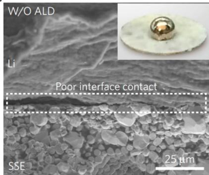  
a)

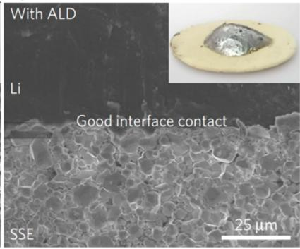  
b)

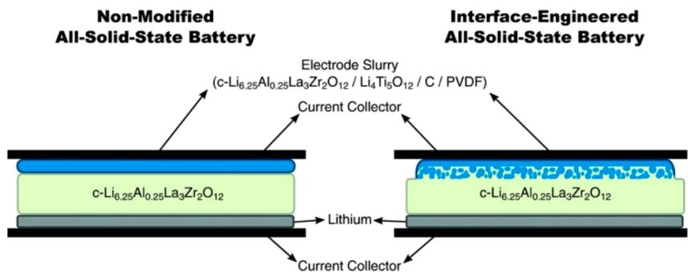  
c)  
Figure 17. SEM of the interface between Li and LLZO ((inset) optical image of molten Li in contact with LLZO) (a) without and (b) with the  $\mathrm{Al_2O_3}$  layer. Reprinted with permission from ref 218. Copyright 2017 Springer Nature. (c) Schematic illustration of utilizing nanosized  $\mathrm{Li_4Ti_5O_{12}}$  to achieve a good interface layer with the Al-doped LLZO. Reprinted with permission from ref 219. Copyright 2016 Wiley VCH.

based SSEs. $^{203}$  The highest Li-ion conducting phase, the cubic phase, is difficult to achieve without additives $^{204,205}$  as it is still somewhat unstable in ambient conditions. Moisture can exchange the Li ion with a proton, which has been shown even in the bulk structure. $^{206,207}$  This can lead to the formation of LiOH layers and in turn form  $\mathrm{Li}_2\mathrm{CO}_3$ , both of which are passivating to ions. $^{208}$  However, it has been shown that nanonization of the LLZO particle can increase both air stability $^{209}$  and the total area of the grain boundary and thus enhanced the transport of Li ion. $^{210,211}$  Compounding with the stability concerns of LLZO is the high sintering temperature required for its synthesis, which will likely contribute to an increased manufacturing cost when compared to the sulfide-based SSEs. Temperatures of up to  $1230^{\circ}\mathrm{C}$  are often required to synthesize the cubic LLZO. Although doping of various metal elements (W, Ta, Nb, etc.) has been suggested to help, it only decreased the temperature to around  $1000^{\circ}\mathrm{C}$ .

A contact issue between LLZO and electrode material typically requires some form of a cosintering process to achieve intimate contact. In terms of the cathode, depositing the model GTSSE (LLZO) with the common cathode material  $\mathrm{LiCoO}_2$  facilitates the diffusion of Co from the  $\mathrm{LiCoO}_2$  to the LLZO and the diffusion of La and Zr from LLZO to  $\mathrm{LiCoO}_2$ . This occurs when depositing a thin film of  $\mathrm{LiCoO}_2$  onto LLZO at around  $700^{\circ}\mathrm{C}$ . In a similar study, more pronounced effects were found for other common cathodes such as  $\mathrm{LiMn}_2\mathrm{O}_4$  (LMO),  $\mathrm{LiFePO_4}$  (LFP), and  $\mathrm{LiNi}_{0.33}\mathrm{Co}_{0.33}\mathrm{Mn}_{0.33}\mathrm{O}_2$  (NMC-111), which is rather unfortunate as these are the more technologically viable cathodes for electric vehicle applications. For the Ta-doped LLZO ( $\mathrm{Li_{6.75}La_3Zr_{1.75}Ta_{0.25}O_{12}}$ ), a reaction was found at  $500^{\circ}\mathrm{C}$  when sintered with LMO and LFP, while a reaction was observed at  $700^{\circ}\mathrm{C}$  for LCO and NMC-111. This exchange of cations at the LLZO and cathode

interface severely hinders the Li-ion conduction. It was found that precoating LLZO with a layer of Nb metal limited this mutual diffusion of cation between LLZO and  $\mathrm{LiCoO_2}$ . An alternate strategy reacted  $\mathrm{Li}_3\mathrm{BO}_3$  with  $\mathrm{Li}_2\mathrm{CO}_3$  to form a layer of  $\mathrm{Li}_{3.3}\mathrm{B}_{0.7}\mathrm{C}_{0.3}\mathrm{O}_3$ . This conductive layer was used to "solder"  $\mathrm{LiCoO_2}$  with LLZO with significant enhancements in performance. Another work paired the LLZO/ $\mathrm{LiNi}_{0.6}\mathrm{Mn}_{0.2}\mathrm{Co}_{0.2}\mathrm{O}_2$  (NMC-622) system with  $\mathrm{Li}_3\mathrm{BO}_3$  as the artificial interface layer. It was found the volume change experienced by NMC-622 caused significant decay in the performance if its particles size is large. In contrast, when smaller particles were used, the mechanical deterioration slowed.

As Li metal is one of the most attractive anodes for solid-state batteries, the stability of LLZO against the metallic anode is of upmost importance. While the stability of LLZO against Li is still uncertain due to their rather close redox potentials,[191] convincing evidence has been found that supports formation of at least a so-called oxygen-deficient interphase (ODI) between deposited Li and mechanically polished LLZO.[220] This ODI layer is said to be formed via elimination of oxygen by reaction with Li, which is then charge compensated by the reduction of  $\mathrm{Zr}^{4+}$  in LLZO. By changing the dopant, the composition and the property of the ODI changes. Ta as dopant exhibited decreased ODI formation compared to Nb and Al. Al exhibited the highest degree of ODI formation out of the three, that is the severity of ODI formation has the following trend:  $\mathrm{Al} > \mathrm{Nb} > \mathrm{Ta}$ . However, the resistance of this layer was similar between the Al-doped and the Ta-doped LLZO. It was found that the surface segregation of Nb resulted in the increased impedance of the Nb-doped LLZO.[220] Accordingly, the existence of an ODI does not automatically indicate poor ion conduction as other factors and phenomena can occur. In this case, Ta dopants have a similar energy state when in the bulk or at the

interface which is in contrast to Nb, which was much more stable when segregated to the surface of LLZO. LLZO with decreased amounts of  $\mathrm{Li}_2\mathrm{CO}_3$  contaminants (from mechanical polishing) possessed an increased level of reduction with Li metal.[220]

Another problem of LLZO is the lack of wettability with Li metal.[221] Accordingly, one of the major recent advances in GTSSE research is the development of artificial coating layers over SSEs. Bare GTSSE has very poor wettability with molten Li (as shown in Figure 17a), and it is also difficult to achieve a smooth polish to produce intimate contact with electrodes.[222] As shown in Figure 17a, without any modifications, there exists a large contact void between Li and the LLZO. Work by Han et al. demonstrated a significant decrease in the interfacial impedance (from 1710 to  $1\Omega \mathrm{cm}^{-2}$ ) by introducing an atomic layer-deposited  $\mathrm{Al}_2\mathrm{O}_3$  coating.[218] This layer allowed for the wetting of LLZO with molten Li (inset of Figure 17b). Accordingly, no appreciable void space is found at the Li and LLZO interface from scanning electron microscopy. In another work,  $\mathrm{Li}_3\mathrm{N}$  is also used to enhance wettability toward Li with corresponding increases in conductivity and cycling stability.[223] These provide a method to smoothen the Livtransport pathway from Li metal to the SSE in addition to acting as a protective layer for the SSE against decomposition.[224] Other anodes such as  $\mathrm{Li}_4\mathrm{Ti}_5\mathrm{O}_{12}$  (LTO) also required interface engineering. As shown in Figure 17c, using nanosized LTO, the authors were able to achieve good contact with an Aldoped LLZO via a layer where the SSE and LTO are mixed together before reaching the bulk LTO phase. Similar corresponding increases in Li-ion conductivity were also reported.[219]

Beyond achieving good contact between Li and the GTSSE, Li dendrites have become one of the key hurdles for GTSSE. Limiting Li dendrites required modifications to the grain boundaries and pore structure.[198] It was found that the commonly considered undesirable  $\mathrm{Li}_2\mathrm{CO}_3$  and LiOH byproducts of LLZO synthesis are actually useful when placed at the grain boundaries.[225] As Li dendrite growth tends to travel along the grain boundary and pore network, these electron and ion insulating materials can serve to directly limit the propagation of Li dendrites when formed at the right spots. Another group demonstrated that by controlling the microstructure of the 0.8 Ta-LLZO pellet dendrites can be eliminated.[226] The authors obtained 0.8 Ta-LLZO with small grain size by restricting the rapid crystal growth portion of the sintering process, creating a pellet with a relative density of  $\sim 96.2\%$ . With smaller grain size, the chance of a connected pore network is decreased in addition to increased pore tortuosity. Taken together, these factors resulted in GTSSE that resisted short circuit at  $0.5\mathrm{mAcm}^{-2}$  for more than  $8\mathrm{h}$ . Moreover, in addition to facilitating dendrite formation, the existence of a connected pore network can also severely hinder the total ionic conductivity of the GTSSE.[227] In contrast to liquid systems, creation of a network that is tortuous for Li dendrite growth is not intrinsically coupled with a network that is also Li-ion tortuous. This is a key difference that can be leveraged in solid-state configurations.

# 4.2. Antiperovskite-Type Solid-State Electrolytes

Li-rich antiperovskite-type SSEs (ApTSSEs) usually contain oxygen and a halide as the anions in the form of  $\mathrm{Li}_3\mathrm{OX}$  ( $X = \mathrm{Cl}, \mathrm{Br}, \mathrm{etc.}$ ) with a similar but inverted  $\mathrm{ABO}_3$  cubic,  $Pm-3m$  perovskite structure. A 3D framework is formed with the halide

anion in the middle.[228] This type of SSE typically possesses comparatively higher ionic conductivity, synthesized at a lower temperature, and has a lower melting point than the GTSSE. ApTSSE or specifically the  $\mathrm{Li}_{3}\mathrm{OCl}$  is also thermodynamically predicted to be stable against Li metal as shown in Figure 16.[192] Furthermore, the lower melting point will help in reducing grain boundaries during synthesis. Taken together, these properties are highly attractive for solid-state battery applications. Unfortunately,  $\mathrm{Li}_{3}\mathrm{OCl}$  was also calculated by DFT to be unstable in ambient conditions and will decompose into  $\mathrm{Li}_{2}\mathrm{O}$  and  $\mathrm{LiCl}$  at room temperature.[229] This is similar to the sulfide-type SSEs; ApTSSE materials are rather hydroscopic and will absorb water from the ambient atmosphere, altering their conductivity at different degrees of hydration.[230,231] Interestingly, increased conductivity was found for samples that were allowed to absorb moisture from the air.[232] Moreover, the degree to which this material absorbs water has created confusion throughout the literature regarding the form of the ApTSSE.[233,234] Besides ambient decomposition, at higher voltages ( $>3\mathrm{V}$  as shown in Figure 16[192]),  $\mathrm{Li}_{3}\mathrm{OCl}$  is also predicted to decompose at  $>2.5\mathrm{V}$  into  $\mathrm{Li}_{2}\mathrm{O}_{2}$  and  $\mathrm{LiClO_4}$ .[229]

Another very similar ApTSSE, lithium halide hydroxide, or  $\mathrm{Li}_2\mathrm{OHX}$  has become very popular in the literature in recent years. The synthesis conditions of  $\mathrm{Li}_2\mathrm{OHX}$  become even more challenging due to the material's tendency to strip metal ion from reaction vessels,[231,233,235] furthering the confusion in the literature by changing the ionic conductivity of the material in an uncontrolled way. It was suggested that a standard method should be employed to clarify the composition and structure of every tested ApTSSE. This method consisted of a combination of  $^1\mathrm{H}$  nuclear magnetic resonance (NMR), energy-dispersive spectroscopy (EDS), time-of-flight secondary ion mass spectroscopy (TOF-SIMS), X-ray photoelectron spectroscopy (XPS), and in situ temperature-dependent X-ray diffraction.[234] Each technique was used to carefully characterize the ApTSSE to identify any contamination. Furthermore, the coin cell used for electrochemical testing was weighed before and after testing to ensure no mass was gained from leakage. Only in this way can the source of performance enhancement be reliably identified and further studied.

The main benefit of the  $\mathrm{Li}_2\mathrm{OHX}$  class of materials is their relatively higher conductivity compared to  $\mathrm{Li}_2\mathrm{OCl}$ . Only recently was the addition of proton into the  $\mathrm{Li}_2\mathrm{OX}$  convincingly proved to be beneficial for Li-ion conduction by Song et al. [234] It was discovered that there is likely to be a rotating motion of the  $\mathrm{OH}^-$  groups. This creates a Frenkel defect, which creates a more dynamic space for Li-ion transport. [234] An analogy was drawn between Li-ion transport through the rotating  $\mathrm{OH}^-$  and a revolving door of a building. It was also understood that the proton can block the Li-ion conduction by sterically and Coulombically limiting the Li ion from transporting through the oxygen sites. [230] Substitution of the  $\mathrm{OH}^-$  groups with fluorine (i.e., reducing proton levels) was found to increase the Li-ion conductivity in addition to increasing the voltage stability. [232] The fluorine ion can pull the proton away from the Li-ion conducting oxygen sites. Further modifications led to the  $\mathrm{Li}_{3-2x}\mathrm{M}_x\mathrm{OCl}$ , where M is a higher valent cation:  $\mathrm{Ca}^{2+}$ ,  $\mathrm{Mg}^{2+}$ , and  $\mathrm{Ba}^{2+}$ . This type of composition was reported to have an exceptionally high Li-ion conductivity of up to  $25\mathrm{mScm}^{-1}$  at  $25^{\circ}\mathrm{C}$ . [236] It is interesting that at elevated temperatures good cycle performance was shown even with molten Li with  $\mathrm{Li}_3\mathrm{OHCl}$ -based solid electrolyte. [233] A

  
Figure 18. Oxygen analog with some corresponding conductivity values of LISION and thio-LISICON solid electrolyte material. Reprinted with permission from ref 238. Copyright 2001 Electrochemical Society.

  
Figure 19. (a) Conductivity versus temperature of various P-, S-, and Ge-based STSSE. (b) Large irreversible capacity due to interfacial reactions. Reprinted with permission from ref 186. Copyright 2016 Springer Nature.

dense SEI layer was formed and appeared to remain stable (did not continue to grow) after 40 cycles.

To the best of our knowledge, there have not been any reports of Li dendrites occurring in an ApTSSEs. However, this could simply be an indication of the lack of any serious attempts to study dendrite characteristics (formation/mechanism) regarding this type of SSE. Interestingly, no dendrite was found in an ApTSSE-based cell at  $0.1\mathrm{mAcm}^{-2}$  for  $20\mathrm{min}$ . This is likely due to the low current density and areal capacity.[237] Due to the relatively new nature of ApTSSE, it is understandable that pure bulk ionic conductivity has continued to receive attention from interested researchers. However, if dendrites were to form and short circuits the cell, hydrogen gas evolution might occur for the  $\mathrm{Li}_2\mathrm{OHX}$  composition if the temperature is elevated.[233]

# 4.3. Sulfide-Type Solid-State Electrolytes

Sulfide-type SSEs (STSSE) stemmed from the original LISICON structure composed of various cations paired with oxygen. Compared to oxygen analogs (Figure  $18^{238}$ ), the thio-

based LISICON or STSSE consistently possesses significantly higher conductivities due to the more polarizable electron cloud of sulfur. In fact, STSSEs are among the highest Li-ion conducting solid systems with the  $\mathrm{Li}_7\mathrm{P}_3\mathrm{S}_{11}$  and the  $\mathrm{Li}_{10}\mathrm{GeP}_2\mathrm{S}_{12}$  (LGPS) possessing conductivities of  $1.7\times 10^{-2}{}^{239}$  and  $1.2\mathrm{mS}$ $\mathrm{cm}^{-1},^{240}$  respectively, well into the realm of liquid systems. Accordingly, STSSEs have become a very popular and promising class of contemporary SSEs. Various dopants have been applied to tune the electrochemical properties of STSSEs to further enhance performance.

Cation substitution in the form of Ge into the more traditional/baseline composition of  $\mathrm{Li}_3\mathrm{PS}_4$  (LPS) has offered significant improvements in conductivity. Similar results were obtained with Si and Sn.[241] However, upon decomposition via lithiation, this type of STSSE will form conductive lithiated phases such as Li-Ge, Li-Si, and Li-Sn which are Type II decomposition interfaces, i.e., not desirable. On the other hand, a boost in Li-ion conductivity was also obtained from anion substitution, making the Argyrodite-type LPS in the form of  $\mathrm{Li}_6\mathrm{PS}_5\mathrm{X}$  ( $\mathrm{X} = \mathrm{I}, \mathrm{Br}, \mathrm{Cl}$ ).[242]  $\mathrm{Li}_6\mathrm{PS}_5\mathrm{Cl}$  was shown to have

higher stability against complete delithiation in the cathodic region but very poor anodic stability against metal oxide-based cathodes.[243,244] More recently, discovery of the highly defective  $\mathrm{Li}_{1 + 2x}\mathrm{Zn}_{1 - x}\mathrm{PS}_4$  at  $x\geq 0.5$  has a computationally predicted conductivity of more than  $50~\mathrm{mS~cm^{-1}}$  at room temperature.[245] However, experimental results have only achieved  $0.8~\mathrm{mS~cm^{-1}}$ , which is still exceptionally high.[246,247] Alternatively, the  $\mathrm{Li_7P_{2.9}Mn_{0.1}S_{10.7}I_{0.3}}$  composition exhibited an extremely high ionic conductivity of  $5.6~\mathrm{mS~cm^{-1}}$  at room temperature, whereas the  $\mathrm{Li_{9.54}Si_{1.74}P_{1.44}S_{11.7}Cl_{0.3}}$  composition demonstrated even higher Li-ion conductivity of up to  $25~\mathrm{mS}$ $\mathrm{cm^{-1}}$  at room temperature, significantly higher than the conventional  $\mathrm{Li_{10}GeP_2S_{12}}$  (as shown in Figure 19a).[186] Unfortunately, a large interface resistance was generated from the poor contact between  $\mathrm{Li_{9.54}Si_{1.74}P_{1.44}S_{11.7}Cl_{0.3}}$  and the electrode active material. This is further amplified by the instability of this material and its decomposition into a Type IV interface (both ionically and electronically insulating). In contrast, the  $\mathrm{Li_{9.6}P_3S_{12}}$  composition exhibited a high anodic stability (as shown in Figure 19b) but with decreased the Li-ion conductivity (about  $1\mathrm{mS~cm^{-1}}$ ).

Like LLZO, a space charge layer, is formed when sulfide electrodes are in contact with high-voltage  $\mathrm{LiCoO}_2$ .248 To tackle this problem, many researchers have developed coatings to buffer the space charge layer.  $\mathrm{Li}_4\mathrm{Ti}_5\mathrm{O}_{12}$  (LTO) was an early interposing coating layer used to cover the surface of  $\mathrm{LiCoO}_2$ .249 However, it was found that if the LTO was too uniform, a significant amount of resistance stemming from the LTO itself would begin to surface. Later work was conducted on coating materials that were ionically conductive materials even in the amorphous state. Specifically,  $\mathrm{LiNbO}_3$  (a relatively high Li-ion conductivity material)250) was used as a coating over  $\mathrm{LiCoO}_2$  to enable a STSSE-based  $\mathrm{LiCoO}_2$  solid-state cell.251 Formation of a Type IV, i.e., a  $\mathrm{Li}_2\mathrm{S}-$  and  $\mathrm{Li}_3\mathrm{P}$ -based interface with no electronic and little ionic conductivity, promotes the formation of Li dendrite due to the poor Li-ion transfer. Accordingly, one group investigated the transformation of the Type IV interface to Type III, that is, from a poorly electron and Li-ion conducting interface to an interface with only good Li-ion conduction. Through the incorporation of LiI into the composition of the electrolyte, significant enhancements were obtained in the critical short-circuit density.252 The group achieved a  $3.9\mathrm{mAcm}^{-2}$  critical current density at  $100^{\circ}\mathrm{C}$  with  $30\mathrm{mol}\%$  LiI. With the addition of I into the STSSE, LiI was formed as one of the reduction decomposition products at the interface with Li metal. The authors claimed that the LiI created an interface with increased Li-ion conductivity, effectively transforming Type IV toward Type III. However, it should be noted that the inherent bulk conductivity of a LiI-doped  $\mathrm{Li}_3\mathrm{PS}_4$  STSSE is also higher, which could convolute the observed enhancement in performance.253,254 It should be further noted that the conductivity of pure LiI is  $<10^{-7}\mathrm{Scm}^{-1}$ , which is unlikely to significantly shift the Type IV interface to Type III.255 Regardless of the true reason for the observed enhanced performance, the concept of transforming Type IV interfaces to Type III interfaces by tuning the decomposition products of the STSSE is clear.

The dendritic growth of Li metal has been reported to propagate along the grain boundaries and throughout the pore network inside of the STSSE layer.[256-258] In fact, dendrites in STSSE have been found to be more apparent than liquid electrolyte systems in certain situations. For example, in 1 M

$\mathrm{LiPF}_6$  in fluorinated-EC/DMC liquid electrolyte systems, a Li-metal anode was found to maintain stable cycling even at  $2\mathrm{mA}$ $\mathrm{cm}^{-2}$  over hundreds of hours.[259] In contrast, efforts to limit dendrite formation in STSSE in the form hot-pressing  $\mathrm{Li}_3\mathrm{PS}_4$  at  $170 - 250^{\circ}\mathrm{C}$  was found to exhibit enhanced critical short-circuit current densities to only  $1\mathrm{mA}$ $\mathrm{cm}^{-2}$ .[258] Like the GTSSE, the microstructure of STSSE played a key role in extending the onset of Li dendrite. The authors suggested that the hot-pressing process enhanced the conductivity by creating a thio-LISICON III analog. However, the pressure experienced by the STSSE from cold pressing likely reduced the bulk pore volume and as such the percolating pore structures.

Synthesis techniques of STSSE have developed from solid-solid mechanical mixing to an organic solvent-based precipitation technique that produces higher conductivity through nanostructuring.[242,260,261] In fact, solution-based synthesis techniques are preferable from a production standpoint due to low temperature and ease of mixing.[262] Furthermore, the possibility of controlled precipitation onto the surface of the active anode/cathode material will be useful to ensure intimate interfacial contact. As solid-liquid mixing can facilitate a much more homogeneous final STSSE/active material distribution, STSSEs that are soluble in organic solvent. Furthermore, the contact between the different materials will also likely be enhanced. Since  $\mathrm{Li}_3\mathrm{PS}_4$  is often synthesized by means of evaporating a solution of  $\mathrm{P}_2\mathrm{S}_5$  and  $\mathrm{Li}_2\mathrm{S}$  in various organic solvents,[260,263] it can be a perfect candidate for this type of solid-state battery manufacturing method.[264] This strategy is also taken advantage of in the ApTSSE where pulsed laser deposition (PLD) was employed to deposit crystalline layers of  $\mathrm{Li}_3\mathrm{OCl}$  over electrode materials.[265] On top of the problem of the contact of STSE, sulfide-based systems are highly reactive to moisture and oxygen. Not only will decomposition occur but also the formed products are typically a poisonous gas, making it impossible to process in ambient conditions due to both safety and technical concerns.[264] Much effort has been placed in searching for alternative STSSEs that possess high Li-ion conductivity but increased chemical and interface stability. The phosphorus present in typical STSEEs is highly reactive to the oxygen species in ambient air. Sn substitution was found to improve the air stability due to its relative softness (acid) in comparison to the hard acid compatibility of O and P.[266]

# 4.4. Beta-Alumina

Beta-alumina  $(\beta -\mathrm{Al}_2\mathrm{O}_3)$  has traditionally been employed as a high-temperature solid electrolyte. However, there have been recent reports on near-room- to room-temperature operation of  $\beta \text{-Al}_2\mathrm{O}_3$  with exceptionally high ionic conductivities.[267,268] This is particularly exciting because  $\beta \text{-Al}_2\mathrm{O}_3$  (specifically Na doped) has been established as a rather stable electrolyte against Na metal anode in early work on high-temperature sodium-sulfur batteries.[269,270] At room temperature,  $\mathrm{Na} - \beta \text{-}\mathrm{Al}_2\mathrm{O}_3$  can be tailored to achieve a low interfacial resistance with the Na metal. This technique increases the critical current density of short circuit to  $12\mathrm{mAcm}^{-2}$ . Under a high stack pressure, the conductivity and subsequently the cyclable current density of  $\mathrm{Na} - \beta \text{-Al}_2\mathrm{O}_3$  can also be drastically increased.[271] This was revealed to be the effect of simply suppressing void formation over cycling the Na metal. Apparently, the benefit of  $\mathrm{Na} - \beta \text{-Al}_2\mathrm{O}_3$  for Na-based systems has been neglected over the years in comparison to other more commonly discussed solid electrolyte materials. It is expected

that future work will place a much heavier emphasis toward  $\beta\text{-Al}_2\mathrm{O}_3$ -based materials.

# 4.5. First-Principles Calculation-Driven Design

Theoretical studies offer immense insight into the operating principles of SSEs. The ion transport mechanism $^{272-278}$  in addition to the mechanical properties $^{272}$  (softness to accommodate cathode/anode expansion) have been thoroughly investigated throughout the literature. The decomposition of SSE over the surface of the cathode or anode is particularly difficult to monitor and is highly specific to the system and mixture due to the kinetically limited nature of the process. As such, theoretical studies can provide a worst-case scenario of the thermodynamic stability limit of the SSE material. $^{272}$  Many recent works have focused on drawing electrochemical stability windows of various types of SSEs $^{191,195}$  and predicting the reactions occurring at the interface of the SSE and the active material. $^{272,279}$  More detailed work on the mechanism of the  $\mathrm{Li}_3\mathrm{PS}_4 / \mathrm{FePO}_4$  interface has been conducted based on functional molecular dynamic simulations. $^{280}$  It was concluded that a Li-depleted layer around the sulfide interfaces is formed during delithiation of the cathode. Without charge carriers present in this layer (Type IV interface), Li-ion conduction is severely reduced.

With the growth in computational power, the use of data mining coupled with neural network optimizations (i.e., machine learning) $^{281}$  have begun to play a growing role in the field of material science. $^{282,283}$  Accordingly, application of calculation-driven designs for SSE have also gained traction in recent years. Researchers have begun to develop computer programs with predictive power on the performance of new materials. For example, work by Chen et al. $^{284}$  used data mining to understand the Li diffusion characteristics of LLZO. Aykol et al. computationally evaluated 180 combinations of  $\mathrm{Li}_3\mathrm{X}_3\mathrm{Y}_2\mathrm{O}_{12}$ -type GTSSE via high-throughput DFT, $^{285}$  while Kim et al. correlated lattice distortions with ion migration barriers with stability. $^{286}$  A particularly critical technique known as the nudged elastic band (NEB) calculation was useful in predicting Li-ion conduction in new proposed materials via calculation of the activation barrier of ion transfer throughout the material's structure. $^{273}$  In fact, it was this computational method that led to the now understood role of the anion arrangement/packing (particularly the body-centered cubic, bcc framework) in the resulting Li-ion transfer properties. As shown in Figure 20a, the activation energy of Li-ion transport is very low for the bcc S sublattice arrangement. It was further explained that the Li-ion diffusion network within the conductor material should contain sites that are energetically identical to the conduction channels. In other words, it is ideal if the space between the atoms has the same energy levels as that at the original Li-ion sites, offering a completely flat energy landscape, i.e., near-zero activation energy. This specific criterion for high Li-ion conduction was then used to screen various compounds from a crystal diffraction database and yielded only a handful of materials that are predicted to exhibit this property (Figure 20b). More impressively, this method correctly predicted  $\mathrm{Li}_{10}\mathrm{GeP}_2\mathrm{S}_{12}$ ,  $\beta$ - $\mathrm{Li}_3\mathrm{PS}_4$ , and  $\mathrm{Li}_7\mathrm{P}_3\mathrm{S}_{11}$  among other experimentally validated solid-state materials as Li-ion superconductors. It is expected that future discoveries of new SSE will be guided by simulation-based material prediction studies. This is in contrast to the previous expansion of a known superconductor material via mere experimental element substitution.

  
a)

  
b)  
Figure 20. Energy barrier (eV) versus volume per S atom  $(\mathring{\mathrm{A}}^{3})$  of computed (lines) and experimentally reported data. Reprinted with permission from ref 273. Copyright 2015 Springer Nature.

To this end, Ceder et al. predicted new metal oxide materials in 2010 with a data-mining-driven machine-learning process $^{287}$  (as shown in Figure 21) along with predicted $^{245}$  and experimentally validated Li-ion $^{288}$  and Na-ion conductors. $^{289}$  Specifically, using calculation-driven design, it was predicted that the  $\mathrm{LiZnPS_4}$  composition should have outstanding Li-ion conduction properties due to its almost perfect bcc S lattice. $^{245,273}$  It is predicted that the highly defective  $\mathrm{Li}_{1 + 2x}\mathrm{Zn}_{1 - x}\mathrm{PS}_4$  at  $x\geq 0.5$  should have a conductivity of more than  $50~\mathrm{mS~cm^{-1}}$  at room temperature. $^{245}$  Interestingly, corresponding syntheses by external research groups have achieved conductivities of up to  $0.8~\mathrm{mS~cm^{-1}}$ . $^{246,247}$  Other groups have also successfully leveraged simulation studies to design new ApTSSE materials. $^{290}$  This was achieved by, first, identification of  $\mathrm{Li}_3\mathrm{AX}$  (where  $\mathrm{A} = \mathrm{chalcogen}$  and  $\mathrm{X} = \mathrm{halogen}$ ) via the universal structure predictor: evolutionary xtalography. $^{291}$  It was found that when the Cl of the  $\mathrm{Li}_3\mathrm{OCl}$  material is substituted by I (increasing the size of the halogen), moderate increases in lattice parameters are found. This is in contrast to increasing the size of the chalcogenide, where large changes in the lattice parameters along with lattice distortion were observed. Furthermore, the antiperovskite structure is found to collapse if the size of the chalcogenide is increased without also replacing the halide. From these simulations, the antiperovskite  $\mathrm{Li}_3\mathrm{SI}$  and  $\mathrm{Li}_6\mathrm{OSI}_3$  was discovered. Both of these phases possess low energy barriers for Li-ion transport.

Calculations have also driven designs of new interfaces to mitigate the passivation problems of STSSEs. $^{192}$  Compared to the design of an ion conductor, the criteria for an ideal interface are rather straightforward. The Type III interface is electron insulating but ionically conductive and is clearly ideal for application. It is therefore a promising direction to design

  
Figure 21. Data-mining-driven compound discovery algorithm. Reprinted with permission from ref 287. Copyright 2010 American Chemical Society.

solid electrolytes based on their oxidative/reduction decomposition products. As these products are thermodynamically predicted, Tian et al. looked to leverage the predicted products along with their properties to design appropriate near Type III interfaces.[224] The  $\mathrm{Na}_3\mathrm{SbS}_4$  composition STSSE is known to decompose into  $\mathrm{Na}_2\mathrm{S}$  and  $\mathrm{Na}_3\mathrm{Sb}$  when reduced by elemental Na (i.e., Na-metal anode).[292] Being metallic,  $\mathrm{Na}_3\mathrm{Sb}$  renders the natural  $\mathrm{Na}_3\mathrm{SbS}_4/\mathrm{Na}$  interface Type II, which is both electronically and ionically conductive, leading to constant growth in the interface layer. Accordingly, it is interesting to pursue additional of chemical species that will induce formation of Type III interfaces. Tien et al. partially hydrated  $\mathrm{Na}_3\mathrm{SbS}_4$  to  $\mathrm{Na}_3\mathrm{SBS}_4\cdot 6\mathrm{H}_2\mathrm{O}$  to enable formation of a stable interface containing  $\mathrm{Na}_2\mathrm{O}$  and  $\mathrm{NaH}$ .[224] This was made

possible because the decomposition of water occurs prior to the decomposition of  $\mathrm{Na}_3\mathrm{SbS}_4$ , which was thermodynamically predicted by the authors.[224]

Overall, it is expected that calculation-driven designs are likely to play a pivotal role in the future of SSEs. Through the higher efficiency in identifying new SSEs and predicting efficacy of different additives, researchers can more selectively choose their next candidates.

# 5. REDOX-ACTIVE ELECTROLYTES

Redox-active electrolytes can be classified as a broad range battery electrolyte that contains species that are the active redox centers of the battery. This type of electrolyte typically leads to fundamentally different battery designs that resembled fuel cells rather than the contemporary LIB technology. The soluble nature of the redox-active material also leads to higher reaction kinetics and typically high power densities. Flow batteries with organic/inorganic anolyte/catholyte in addition to redoxmers will be briefly discussed in regard to their advantage and disadvantage and recent breakthroughs in development.

# 5.1. Flow Cell Anolytes/Catholytes

With the emergence of stationary energy storage systems in the form of both consumer and industrial markets, the price of a battery has become increasingly more important. The common use of redox-active metal oxides as cathode materials has led to the price increase of transition metals such as Co and Ni, restricting the economics of employing LIBs. Furthermore, LIBs are limited by their power density and energy density, which are solely based on the predetermined battery capsule size. In contrast, recent interest into redox flow batteries (RFB) can utilize much cheaper redox-active compounds. Furthermore, RFBs have the advantage of decoupling the reaction sites with the physical storage of cathode and anode active materials.

Current commercial vanadium flow batteries have a cost that is much too high due to the price of vanadium  $(6 - 22\in \mathrm{kg}^{-1})$  in addition to the low cell voltage  $(1.2 - 1.8\mathrm{V})$  and resulting energy density  $(15 - 30\mathrm{WhL^{-1}})$ . We would like to point to another review article for details on the cost of vanadium RFBs.[293] Various new technologies have been pursued for redox-flow batteries that incorporate the high design flexibility of RFB but with reduced price points. RFB can be divided into organic- and aqueous-based electrolyte systems. Purely aqueous-based RFB will have lower output voltages and as such typically lower energy and power density. However, a water-based electrolyte offers significant advantages in terms of conveniences and cost. Furthermore, recent work has demonstrated that by changing the aqueous electrolyte from acidic to basic, significant voltage gain was achieved in the form of a zinc iodide all aqueous RFB with an experimental energy density of  $330.5\mathrm{WhL^{-1}}$  (schematic shown in Figure 22a).[294] Dendrites were observed during the Zn plating cycle, which was mitigated by physically replacing the Zn plate with a fresh plate at periodic intervals.[295,296] Regardless of the configuration, the use of aqueous electrolytes is inherently limited by the narrow voltage window of water.

Organic electrolytes are attractive due to their generally higher voltage windows, allowing an overall higher energy and power output of the flow battery. Furthermore, the large variety of organic redox-active molecules can be leveraged to formulate an ideal catholyte/anolyte pair.[299] However,

  
b)  
Figure 22. (a) Schematic of a zinc-iodide flow battery. Reprinted with permission from ref 294. Copyright 2018 Royal Society of Chemistry. (b) Schematic of the Na ion. Reprinted with permission from ref 297. Copyright 2018 Elsevier.

compared to the high solvating power of water, organic electrolytes will typically only solvate redox-active species at concentrations below 1 M. $^{298}$  Researchers began to look into aqueous/organic hybrid electrolytes where the catholyte is an aqueous alkali-ion redox-active anion and the anode is a Li-metal $^{300}$  or Na-metal anode $^{297}$  in organic electrolyte. The two electrodes are separated by a solid ceramic electrolyte (such as NASICON $^{301}$ ) to prevent reaction between the alkali metal and water as shown in Figure 22b (Na based). $^{302}$  With the use of an alkali metal, a second anolyte electrolyte tank is no longer needed. As such, the energy density will undoubtedly increase. However, other problems such as dendritic alkali-metal growth coupled with anode corrosion (impedance build up) could severely reduce the cycle life. In contrast to the Zn-metal anode-based flow batteries where the Zn anode can be easily physically replaced, $^{295,296}$  the logistics of replacing an air-sensitive Li- or Na-metal anode will be very challenging. Furthermore, decomposition of organic electrolyte (unstable SEI) on the surface of the alkali metal will also be much more expensive to refresh compared to aqueous systems. Moreover, even the high cost of the alkali metal itself will inevitably play a significant role during the cost analysis of these systems. $^{303}$  There are also inherent scalability issues with organic electrolyte such as contamination with water leading to higher price points. A very recent study on sulfur-based systems in the form of an organic electrolyte polysulfide flow battery $^{304,305}$  and aqueous sulfur/oxygen redox pair RFB $^{306}$  is especially attractive due to the low cost of S. However, like all redox molecule-based RFB and LSB, the shuttle effect is still present and requires a carefully designed membrane $^{306,307}$  or other strategies $^{308}$  to limit polysulfide cross over. Furthermore, the current densities are also rather modest in these studies when compared to vanadium flow batteries. $^{309}$

A relatively new class of RFB is the semisolid RFBs. The advent of semisolid RFB represents quite a unique development in RFBs where the high energy density of solid particles is combined with the physical benefits of a traditional RFB. Figure 23a illustrates a schematic of a LFP-based cathode and  $\mathrm{TiO}_2$ -based anode semisolid RFB.[298] In this design Li ions are stored in solid particles suspended in solution, which have much higher energy density than their molecular solvated counterparts. Early iteration of this design attempted to directly obtain redox activity from a solution of flowing particles.[311,312] However, high viscosity will likely result in higher pump pressure heads in addition to lower utilization of active material due to their relatively larger size. On the basis of a concept developed by Wang et al. known as redox

  
b)

  
Figure 23. (a) Schematic of a semisolid redox flow battery. (b) Operation reaction scheme of a semisolid redox flow battery. Reprinted with permission from ref 298. Copyright 2015 AAAS.

targeting, $^{313}$  Jia et al. incorporated the use of organic redox mediators and static Li-ion storage particles. As shown in Figure 23a, only the organic-based redox mediators are pumped around the cell. At the reservoir for the cathode, LFP (redox potential of  $3.45\mathrm{V}$ ) is stored and submerged in a solution of  $\mathrm{FcBr}_2$  and  $\mathrm{Fc}$ , which have redox potentials of 3.78 and  $3.40\mathrm{V}$ , respectively. For the anode, static  $\mathrm{TiO}_2$  particles (redox potential of  $1.8\mathrm{V}$ ) are immersed in a flowing electrolyte solution containing  $\mathrm{CoCp}_2$  and  $\mathrm{CoCP}^{*}_2$  (redox potentials of 2.1 and  $1.67\mathrm{V}$ , respectively) redox mediators. As described in the reaction schematic in Figure 23b, during the charge process (electron and Li-ion transfer from cathode to anode), LFP will be oxidized by  $\mathrm{FcBr}_2$  by physical contact. The reduced  $\mathrm{FcBr}_2$  will be pumped to contact with the working electrode containing a solid redox-active particle from which it will be oxidized by the redox mediator of the anode ( $\mathrm{CoCP}^{*}_2$ ). The now reduced anode redox mediator ( $\mathrm{CoCP}^{*}_2$ ) will then proceed to reduce the  $\mathrm{TiO}_2$  (along with Li-ion insertion). This cascading redox system offers a very unique design that can bypass many of the physical limitations (and resulting energy density limitation) of using pure organic molecules for RFB. As

  
Figure 24. Redox-active species for a few RFB: (a) indigo carmine, (b)  $2,2^{\prime}$ -azino-bis(3-ethylbenzothiazoline-6-sulfonate), (c)  $(2,2,6,6$ -tetramethylpiperidinylxyl)/lithium, and (d) viologen/lithium. Reprinted with permission from ref 310. Copyright 2015 Springer Nature.

the redox-active molecules in both the anolyte and the catholyte are merely "charge messengers" (redox mediators), their concentration is decoupled from the energy density. Other works based on a similar concept also emerged. $^{300,314}$  While this work utilized similar active materials as LIBs, the concept is likely transferable to other material combinations.

Beyond the cost of the electrode materials, a large portion of the cost of a RFB resides in the membrane separating the catholyte and anolyte while allowing mass transfer of charge carrier. This type of membrane (usually in the form of Nafion $^{310,315,316}$ ) is expensive for widespread application. Another type of RFB is the so-called redoxmers RFBs (schematic shown in Figure 24a). A redoxmers-based RFB entails the use of polymer grafted with redox-active functional groups (i.e., redoxmers). As shown in Figure 24b-e, various organic functional groups can be used to act as redox centers as long as their oxidation and reduction reactions are reversible. These redoxmers are dispersed in an aqueous electrolyte (or organic based $^{317}$ ) and subsequently used as the active material. $^{310,318,319}$  Due to the large size of polymers, membrane design becomes comparatively trivial. Common dialysis membranes $^{310}$  and microporous membranes such as Celgard $^{320}$  have also been shown to be quite effective and cheap selections for limiting anolyte/catholyte redoxmers crossover. The cost advantages of redoxmers are accompanied by an increase in anolyte/catholyte viscosity. In addition to the increase in the required pump pressure head, the reaction rates and resulting power density will likely also be decreased.

# 6. OPEN SYSTEMS

An open system refers to a battery that operates with one electrode (usually the cathode) open to the ambient atmosphere. Depending on the battery technology, the reduction products are either soluble or nonsoluble in the electrolyte. In contrast to commercial LIBs, the resulting implications of the electrolyte composition on the capacity, cycle stability, overpotential, and overall redox mechanism are significantly more profound. For example, depending on the stability and solubility of the superoxide anion in  $\mathrm{Li - O_2}$  electrolyte, the obtained capacity can be drastically increased.[321,322] Foreign redox mediators (RMs) such as 2,2,6,6-tetramethylpiperidinyl 1-oxyl (TEMPO)[323] and tris[4-(diethylamino)phenyl]amine (TDPA)[324] can also be added to alter the charge mechanism. Furthermore, if LiI is added into the electrolyte, LiOH can be expected as the final discharge product in place of  $\mathrm{Li_2O_2}$ .[325,326] In the case of Zn-air battery, the aqueous electrolyte allows for reduction of  $\mathrm{O_2}$  completely into  $\mathrm{Zn(OH)_4}$ , which precipitates out as  $\mathrm{ZnO}$  when the solubility limit is reached.[327,328] Depending on the pH of the electrolyte, the solubility limit of the  $\mathrm{Zn(OH)_4}$  can be tuned. However, changing the pH would also decrease the stability of the electrolyte. To follow will be a more detailed description on the effect of electrolyte for  $\mathrm{Li - O_2}$  battery (LAB) and zinc-air battery (ZAB).

# 6.1. Li-Air  $(\mathrm{O}_2)$  Electrolyte

Laboratories have attracted much attention due to their potential for high energy density. Compared to some of the

  
Figure 25. Discharge/reduction mechanism of  $\mathrm{O}_2$  in a  $\mathrm{Li - O_2}$  system with regard to the role of  $\mathrm{LiO}_2$ . Reprinted with permission from ref 322. Copyright 2014 Springer Nature.

  
Figure 26. (a) Mechanism of a redox mediator (RM) on the charging/oxidation process of  $\mathrm{Li}_2\mathrm{O}_2$ . Even without direct contact with a conductive substrate, the  $\mathrm{Li}_2\mathrm{O}_2$  can be oxidized by first allowing the soluble RM to oxidize on the conductive substrate followed by diffusion of RM to  $\mathrm{Li}_2\mathrm{O}_2$  and subsequent reduction/oxidation of  $\mathrm{RM} / \mathrm{Li}_2\mathrm{O}_2$ , respectively. (b) Reduction in charge overpotential when a RM is used. Reprinted with permission from ref 332. Copyright 2016 Springer Nature.

other battery technologies (LIB, ZAB, and even LSB), laboratories are still very far from any commercial application. In fact, the common term "air battery" is technically incorrect as most of the literature still employs pure oxygen gas sources as their oxidant. When real or even simulated air is used, the  $\mathrm{H}_2\mathrm{O}$  and  $\mathrm{CO}_{2}$  present will usually react with the Li metal after transport from the cathode to the anode. Furthermore, the adsorption of  $\mathrm{H}_2\mathrm{O}$  or  $\mathrm{CO}_{2}$  onto surface defects of  $\mathrm{Li}_2\mathrm{O}_2$  and subsequent undesired side reactions is also known to occur.[329,330] Only recently was a study able to achieve good performance in a relatively real LAB system (simulated  $25^{\circ}\mathrm{C}$  air at  $45\%$  relative humidity).[331] This work employed the use of a  $\mathrm{Li}_2\mathrm{CO}_3$ -protected anode and an electrolyte blend consisting of an ionic liquid (1-ethyl-3-methylimidazolium tetrafluoroborate) and dimethyl sulfoxide. The strategy prevents the diffusion of  $\mathrm{H}_2\mathrm{O}$  and  $\mathrm{CO}_{2}$  to the Li-metal anode but allows for Li-ion transfer (much like a LIB SEI and a Type II SSE interface). Furthermore, the solvation energy in the ionic liquid-based electrolyte of  $\mathrm{H}_2\mathrm{O}$  and  $\mathrm{CO}_{2}$  is similar to if not stronger than their adsorption energy to  $\mathrm{Li}_2\mathrm{O}_2$ . This is likely to help in preventing any side reaction involving  $\mathrm{H}_2\mathrm{O}$  and  $\mathrm{CO}_{2}$  with the discharge products.

Even in ideal operating conditions, there are still many poor performance metrics such as low round-trip efficiency and

energy density. Compared to LIB, the electrolyte plays an even more involved role in regulating the performance indices of LABs.  $\mathrm{LiO}_2$  is known to be a crucial reaction intermediate that can dictate the morphology/degree of passivation of the cathode and as such the subsequent discharge capacity.[322] Depending on the donor number (DN) of the electrolyte, the lifetime of the  $\mathrm{LiO}_2$  changes. This in turns alters the  $\mathrm{O}_2$  reduction pathway as shown Figure 25. At higher donor numbers,  $\mathrm{LiO}_2$  becomes more soluble and will disproportionate into  $\mathrm{Li}_2\mathrm{O}_2$ , depositing in a nonfilm-like manner. In contrast, the reduction of solid  $\mathrm{LiO}_2$  to  $\mathrm{Li}_2\mathrm{O}_2$  will dominate if the donor number of the electrolyte solvent is low. This scenario will result in the formation of a thin film of insulating  $\mathrm{Li}_2\mathrm{O}_2$  on the surface of the conductive scaffold, effectively passivating the electrode for any further reduction process.

In the charge process, typical  $\mathrm{Li - O_2}$  cells will exhibit a very high overpotential for  $\mathrm{Li}_2\mathrm{O}_2$  oxidation. The use of RMs has been employed in LAB to enable a lower voltage charge cycle. As  $\mathrm{Li}_2\mathrm{O}_2$  is electrically insulating, it is difficult for a LAB to charge  $\mathrm{Li}_2\mathrm{O}_2$  that is not in direct contact with a conductive surface.[333] For this reason, soluble charge carriers are required to assist in the charge transfer from the various parties of the oxidation process.[323,324,334] As shown in Figure 26a, the RM is first oxidized by the conductive substrate and then diffuses to

the surface of  $\mathrm{Li}_2\mathrm{O}_2$ , where the  $\mathrm{RM}^+$  oxidizes  $\mathrm{Li}_2\mathrm{O}_2$ . In order to be functional, an oxidation RM must have an equilibrium oxidation potential higher than the equilibrium oxidation potential of  $\mathrm{Li}_2\mathrm{O}_2$ , that is, the oxidation of  $\mathrm{Li}_2\mathrm{O}_2$  must be first thermodynamically favored before the RM is to be oxidized. Interestingly, after passing this criteria, the oxidation potential of the RM becomes less important. Instead, the specific steric interaction between the RM and  $\mathrm{Li}_2\mathrm{O}_2$  also plays an important role in the charging process.[335] If these criteria are met, the resulting charge potential should drastically decrease as shown in Figure 26b, where the charge potential decreases  $\sim 0.5\mathrm{V}$  without and with a RM. It should be noted that similar phenomena have also been seen in the oxidation of bulk commercial  $\mathrm{Li}_2\mathrm{S}$ , where a significant charge overpotential is also observed.[7,336] However, the stability of the RM (against  $\mathrm{LiO}_2$ ) and the protection of the anode against the internal shuttling of RM (low Coulombic efficiency) will be the limiting factors against the practical effectiveness of RMs in LAB.

Another interesting aspect of LAB is the effect of  $\mathrm{H}_2\mathrm{O}$  and LiI on the composition of the discharge product. With  $\mathrm{H}_2\mathrm{O}$  and LiI present, the LAB will tend to reversibly form LiOH as the main discharge product.[325] While there has been much debate in this area, the implications of this relatively slight modification to the electrolyte are critical.[326,337-339] LiOH is significantly more active to oxidation than  $\mathrm{Li}_2\mathrm{O}_2$  in the presence of  $\mathrm{H}_2\mathrm{O}$ , which would mean a significantly lower overpotential and as such higher energy efficiency. Furthermore, the four-electron transfer enabled from converting  $\mathrm{O}_2$  (oxidation state of 0) to LiOH (oxidation state of  $-2$ ) would also mean a possibility for higher energy density.

Taken together, the role of electrolyte on the current key operating parameters of LAB (overpotentials, discharge capacity, and overall energy efficiency) is likely to continue to dominate much of the research field in the near future.

# 6.2. Zn-Air Electrolytes

Although the majority of ZAB research has focused on a bifunctional catalyst that is for both OER and ORR, $^{340-345}$  there has been some work on the investigation into different electrolytes. For a detailed review of the individual classes of electrolytes for secondary ZAB, we refer the readers to another review. $^{346}$  In this section, we will instead focus on unique electrolyte designs that can be used to achieve certain performance metrics.

A typical secondary ZAB operates in an aqueous electrolyte at alkaline conditions with KOH or NaOH as the main electrolyte salt. $^{347}$  KOH is typically preferred over NaOH due to the higher solubility of potassium-based carbonate species. The solubility limit of the discharge product can strongly dictate the discharge capacity (energy density) and cyclability of the ZAB. With solid product precipitates such as ZnO forming throughout the battery, pore blockage and passivation can occur. $^{348}$  Changing the pH of the electrolyte can drastically shift the complex and dynamic solubility and reaction equilibriums occurring within the electrolyte solution throughout the cycling protocol of the battery. $^{349}$  For example, the main benefit of a neutral electrolyte is the lower capacity of the electrolyte to absorb  $\mathrm{CO}_{2}$  from the air in the form of carbonate. This in turn lowers the amount of insoluble carbonate salts precipitation. However, hydrogen evolution also becomes a problem at lower pH in addition to decreased conductivity due to lower ion concentrations.

The use of minute amounts of polymer additives (parts per million levels) has demonstrated smoothened Zn plating. It is believed that the polymer will adsorb onto the tip of the Zn, reducing dendrite propagation.[350,351] This work reported a pronounced reduction in the morphology of the Zn dendrites upon injection of  $100~\mathrm{ppm}$  of low molecular weight polyethylenimine (PEI,  $800\mathrm{g mol}^{-1}$ ). As shown in the optical images in Figure 27a and 27b, the thin tips created from a

  
a)

  
b)  
d)

  
c)

  
Figure 27. Optical image of zinc plating (a) before and (b) after injection of polyethylenimine (PEI,  $\mathrm{MW} = 800\mathrm{g mol^{-1}}$ ). Scanning electron microscopy of dendrite tips (c) before and (d) after addition of PEI. Reprinted with permission from ref 350. Copyright 2015 Elsevier.

fractal-like Zn dendrite growth were halted and became thicker in size when the PEI was added. Corroborating investigation by scanning electron microscopy revealed a significant reduction in the sharpness in the Zn dendrites when PEI was added (Figure 27c and 27d). Future studies into this field could achieve dendrite-free ZABs.

Recent interest into ZAB has also shifted to the application in flexible energy storage devices. To this end, the flexibility of the electrolyte has converged on the use of a gel-type PE. Gel electrolytes can offer capabilities in liquid retention and prevent leakage of solvent upon application of mechanical stress.[328] Conductivities of  $1.76 \times 10^{-2} \mathrm{~S} \mathrm{~cm}^{-1}$  have been achieved with a hierarchical polymer electrolyte based on polyacrylonitrile-grafted gelatin filled into a polyacrylonitrile electrospun sheet. The highly hydrophilic nature of the polymer electrolyte was able to retain its liquid electrolyte and function as a battery even after various mechanical abuse. This is in contrast to another similar work that only used a gelatin-based gel electrolyte, which only obtained a conductivity of  $3.1 \times 10^{-3} \mathrm{~S} \mathrm{~cm}^{-1}$ .[352] Another work demonstrated the use of poly(vinyl alcohol) gel electrolyte with a conductivity of  $15 \times 10^{-2} \mathrm{~S} \mathrm{~cm}^{-1}$ .[353] Moreover, some of the power densities of published ZABs have measured values of well over  $30 \mathrm{mW} \mathrm{~cm}^{-2}$ [354,355] However, demonstration of a higher energy (volumetric) and high power density ZAB remains to be seen.[356] While some work has shown performance under mechanically stressed conditions, practical operating conditions for flexible electronics, i.e., cyclic mechanical deformations, need to be investigated. Only by the combined effect of proper liquid electrolyte retention, efficient ion transport, while maintaining a compact profile can flexible ZABs be realized.

# 7. CONCLUDING REMARKS AND PERSPECTIVES

The developments of electrolytes always evolve around the emergence of new battery chemistry; hence, the metrics represented in Figure 1 undergo rapid dynamic changes. The insatiable needs for higher energy and power densities, besides those for better safety, lower cost, and wider service temperature range, keep pushing the boundaries of battery components to more challenging territories, and these challenges eventually are passed on to electrolytes, partially or entirely. In this context, the research of electrolyte materials and science, especially the fundamental understanding of interfacial/interphasial processes, constitutes the key areas for future energy storage science.

The advent of concentrated electrolyte systems will continue to draw research interest with potential application in the near future. Its application into battery systems will continue to advance our understanding of both interfacial electrochemistry and the nature of electrolyte solutions. Nanotechnology has allowed for unprecedented advances in our ability to control material at very small scales, enabling the creation of new electrolyte systems. In both redox flow systems and solid electrolytes, our ability to control the morphology and particle size is critical in achieving future enhancements. Similarly, theoretical studies assisted by large data sets, supercomputing power, machine learning and artificial intelligence will likely serve to quickly sieve through and extract useful next-generation electrolyte systems. Interestingly, the predictive power of computational studies has only been rarely used. Those frontiers will without a doubt receive unprecedented attention in the coming decades.

As each respective field in electrolyte design begins to approach and even surpass performance requirements imposed by industry standards, practicality and scale will be of the utmost concern. High-volume manufacturing of some of these electrolytes will no doubt pose a problem. Concentrated electrolytes will inevitably incur additional cost, as the Li salts used are typically quite expensive and higher concentrations worsen the situation. Synthesis and processing of solid-state electrolytes require careful high-temperature sintering protocols with little room for air contamination. Most of the solid electrolytes are also quite brittle, making their deployment into a battery cell nontrivial. Recent reports that Li dendrite growth through various solid-state electrolytes and the attribution of such behaviors to the high electronic conductivity of these solid electrolytes raise concern over the use of a Li-metal anode, which would cast a negative effect on the expected high energy densities of the corresponding solid-state batteries. However, even with the conventional chemistries adopted by LIBs (graphitic anode, transition metal oxide cathodes), solid-state batteries still offer advantages in packaging density as well as safety. Much more focus must also be placed on decreasing the cost of these electrolyte systems by designing different synthetic routes. An excellent example is the proposed solution-based synthesis of sulfide-type SSE, where the SSE is soluble in certain organic solvents, which could be potentially processed with the electrode active material and conductive additive, leading to homogeneity throughout the electrode upon drying.

# AUTHOR INFORMATION

# Corresponding Authors

Kang Xu - Energy Storage Branch, Sensor and Electron Directorate, U.S. Army Research Laboratory, Adelphi, Maryland 20783, United States;  $\oplus$  orcid.org/0000-0002-6946-8635; Email: conrad.k.xu.civ@mail.mil  
Jun Lu - Chemical Sciences and Engineering Division, Argonne National Laboratory, Lemont, Illinois 60439, United States; orcid.org/0000-0003-0858-8577; Email: junlu@anl.gov

# Authors

Matthew Li - Chemical Sciences and Engineering Division, Argonne National Laboratory, Lemont, Illinois 60439, United States; Department of Chemical Engineering, Waterloo Institute of Nanotechnology, University of Waterloo, Waterloo, Ontario N2L 3G1, Canada  
Chunsheng Wang - Department of Chemical & Biomolecular Engineering Department of Chemistry & Biochemistry, University of Maryland, College Park, Maryland 20742, United States;  $\odot$  orcid.org/0000-0002-8626-6381  
Zhongwei Chen - Department of Chemical Engineering, Waterloo Institute of Nanotechnology, University of Waterloo, Waterloo, Ontario N2L 3G1, Canada; orcid.org/0000-0003-3463-5509

Complete contact information is available at: https://pubs.acs.org/10.1021/acs.chemrev.9b00531

# Notes

The authors declare no competing financial interest.

# Biographies

Matthew Li is a Ph.D. student from the University of Waterloo, currently at Argonne National Laboratory as a visiting scholar. His research focuses on the design and synthesis of cathode material for Li-S and Li-ion batteries. He has extensive experience in applying synchrotron-based characterization techniques (X-ray diffraction, small-angle X-ray scattering, X-ray absorption spectroscopy) toward understanding battery operation and failure.

Chunsheng Wang is a Robert Franklin and Frances Riggs Wright Distinguished Chair Professor in the Chemical & Biomolecular Engineering, Department of Chemistry and Biochemistry, at the University of Maryland. He is an associate editor of ACS Applied Energy Materials and UMD Director of The UMD-ARL Center for Research in Extreme Battery. His research focuses on reachable batteries and fuel cells. He was ranked as the Global Highly Cited Researchers (top 1% by citation) by Clarivate Analytics in 2018–2019.

Zhongwei Chen is a Canada Research Chair (Tier 1) in Advanced Materials for Clean Energy at the University of Waterloo, Fellow of the Canadian Academy of Engineering, Fellow of the Royal Society of Canada, and Vice President of the International Academy of Electrochemical Energy Science. His research focuses on advanced energy materials and electrodes for polymer electrolyte membrane fuel cells, Li-ion, metal-air, Li-S, and various next-generation batteries. He received the 2016 E.W.R Steacie Memorial Fellowship and Rutherford Memorial Medal. In 2018-2019, he was ranked as the Global Highly Cited Researchers (top  $1\%$  by citation for field and year) by Clarivate Analytics.

Kang Xu is ARL Fellow and Team Leader of Aqueous Electrochemistry, Energy Storage Branch, U.S. Army Research Laboratory, and co-founder of the Center of Research on Extreme Batteries

(CREB). With his Ph.D. degree in Chemistry, over 250 publications, 5 book chapters, and 25 U.S. Patents, he is best known in the field for two comprehensive review articles on electrolytes published in Chemical Reviews (2004 and 2014).  
Jun Lu is a chemist at Argonne National Laboratory. His research interests focus on the electrochemical energy storage and conversion technology with the main focus on beyond Li-ion battery technology. He earned his B.S. degree in Chemistry Physics from the University of Science and Technology of China (USTC) in 2000. He received his Ph.D. degree from the Department of Metallurgical Engineering at the University of Utah in 2009 with major research on metal hydrides for reversible hydrogen storage application. He is the awardee of the first DOE-EERE postdoctoral fellowship under the Vehicles Technology Program from 2011 to 2013. He serves as Associate Editor of ACS Applied Materials and Interfaces. He was elected as Associate President and Board Committee Member of the International Academy of Electrochemical Energy Science (IAOEES). He was also the first awardee of the IAOEES Award for Research Excellence in Electrochemistry Energy in 2016. He has authored/coauthored more than 350 peer-reviewed research articles, published in Nature, Nature Energy, Nature Nanotechnology, Chemical Reviews, Nature Communications, Journal of the American Chemical Society, etc., and has filed over 20 patents and patent applications. He was ranked as the Global Highly Cited Researchers (top  $1\%$  by citation) by Clarivate Analytics in 2018-2019.

# ACKNOWLEDGMENTS

This work was supported by the U.S. Department of Energy (DOE), Office of Energy Efficiency and Renewable Energy, Vehicle Technologies Office. Argonne National Laboratory is operated for the DOE Office of Science by UChicago Argonne, LLC, under contract number DE-AC02-06CH11357. Work at the Army Research Laboratory was supported as part of the Joint Center for Energy Storage Research, an Energy Innovation Hub funded by the U.S. Department of Energy, Office of Science, Basic Energy Sciences under the Interagency Agreement No. IAA 89243019SSC000028. The authors would also like to acknowledge financial support from the Natural Sciences and Engineering Research Council of Canada (NSERC), the Waterloo Institute for Nanotechnology (WIN) and the University of Waterloo.

# REFERENCES

(1) Li, M.; Lu, J.; Chen, Z.; Amine, K. 30 Years of Lithium-Ion Batteries. Adv. Mater. 2018, 30, 1800561.  
(2) Xu, K. Electrolytes and Interphases in Li-Ion Batteries and Beyond. Chem. Rev. 2014, 114, 11503.  
(3) Winter, M.; Barnett, B.; Xu, K. Before Li Ion Batteries. Chem. Rev. 2018, 118, 11433-11456.  
(4) Peled, E.; Golodnitsky, D.; Ardel, G. Advanced Model for Solid Electrolyte Interphase Electrodes in Liquid and Polymer Electrolytes. J. Electrochem. Soc. 1997, 144, L208-L210.  
(5) Guo, W.; Fu, Y. A Perspective on Energy Densities of Rechargeable Li-S Batteries and Alternative Sulfur-Based Cathode Materials. Energy Environ. Mater. 2018, 1, 20-27.  
(6) Liu, B.; Fang, R.; Xie, D.; Zhang, W.; Huang, H.; Xia, Y.; Wang, X.; Xia, X.; Tu, J. Revisiting Scientific Issues for Industrial Applications of Lithium-Sulfur Batteries. Energy Environ. Mater. 2018, 1, 196-208.  
(7) Li, M.; Chen, Z.; Wu, T.; Lu, J.  $\mathrm{Li}_{2}\mathrm{s}-$  or S-Based Lithium-Ion Batteries. Adv. Mater. 2018, 30, 1801190.  
(8) Freunberger, S. A.; Chen, Y.; Peng, Z.; Griffin, J. M.; Hardwick, L. J.; Bardé, F.; Novák, P.; Bruce, P. G. Reactions in the Rechargeable

Lithium-  $\mathrm{O}_2$  Battery with Alkyl Carbonate Electrolytes. J. Am. Chem. Soc. 2011, 133, 8040-8047.  
(9) Zhang, X.; Mu, X.; Yang, S.; Wang, P.; Guo, S.; Han, M.; He, P.; Zhou, H. Research Progress for the Development of Li-Air Batteries: Addressing Parasitic Reactions Arising from Air Composition. Energy Environ. Mater. 2018, 1, 61-74.  
(10) Tornheim, A.; Garcia, J. C.; Sahore, R.; Iddir, H.; Bloom, I.; Zhang, Z. Decomposition of Phosphorus-Containing Additives at a Charged Nmc Surface through Potentiostatic Holds. J. Electrochem. Soc. 2019, 166, A440-A447.  
(11) Albertus, P.; Babinec, S.; Litzelman, S.; Newman, A. Status and Challenges in Enabling the Lithium Metal Electrode for High-Energy and Low-Cost Rechargeable Batteries. Nat. Energy 2018, 3, 16-21.  
(12) Winter, M. The Solid Electrolyte Interphase - the Most Important and the Least Understood Solid Electrolyte in Rechargeable Li Batteries. Z. Phys. Chem. 2009, 223, 1395.  
(13) Xu, K.; Lam, Y.; Zhang, S. S.; Jow, T. R.; Curtis, T. B. Solvation Sheath of  $\mathrm{Li^{+}}$  in Nonaqueous Electrolytes and Its Implication of Graphite/Electrolyte Interface Chemistry. J. Phys. Chem. C 2007, 111, 7411-7421.  
(14) Xu, K. Charge-Transfer" Process at Graphite/Electrolyte Interface and the Solvation Sheath Structure of  $\mathrm{Li}^{+}$  in Nonaqueous Electrolytes. J. Electrochem. Soc. 2007, 154, A162-A167.  
(15) Su, C.-C.; He, M.; Amine, R.; Rojas, T.; Cheng, L.; Ngo, A. T.; Amine, K. Solvating Power Series of Electrolyte Solvents for Lithium Batteries. Energy Environ. Sci. 2019, 12, 1249-1254.  
(16) Bockris, J. O. M.; Reddy, A. K. Modern Electrochemistry 2b: Electronics in Chemistry, Engineering, Biology and Environmental Science; Springer Science & Business Media, 2000; Vol. 2.  
(17) Bernal, J. D.; Fowler, R. H. A Theory of Water and Ionic Solution, with Particular Reference to Hydrogen and Hydroxyl Ions. J. Chem. Phys. 1933, 1, S15-S48.  
(18) Yamada, Y.; Yamada, A. Review—Superconcentrated Electrolytes for Lithium Batteries. J. Electrochem. Soc. 2015, 162, A2406-A2423.  
(19) Azov, V. A.; Egorova, K. S.; Seitkalieva, M. M.; Kashin, A. S.; Ananikov, V. P. Solvent-in-Salt Systems for Design of New Materials in Chemistry, Biology and Energy Research. Chem. Soc. Rev. 2018, 47, 1250-1284.  
(20) Yamada, Y.; Wang, J.; Ko, S.; Watanabe, E.; Yamada, A. Advances and Issues in Developing Salt-Concentrated Battery Electrolytes. Nat. Energy 2019, 4, 269-280.  
(21) McKinnon, W. R.; Dahn, J. R. How to Reduce the Cointercalation of Propylene Carbonate in  $\mathrm{Li}_{\mathrm{X}}\mathrm{Zrs}_{2}$  and Other Layered Compounds. J. Electrochem. Soc. 1985, 132, 364-366.  
(22) Angell, C. A.; Liu, C.; Sanchez, E. Rubbery Solid Electrolytes with Dominant Cationic Transport and High Ambient Conductivity. Nature 1993, 362, 137-139.  
(23) Suo, L.; Hu, Y.-S.; Li, H.; Armand, M.; Chen, L. A New Class of Solvent-in-Salt Electrolyte for High-Energy Rechargeable Metallic Lithium Batteries. Nat. Commun. 2013, 4, 1481.  
(24) Suo, L.; Borodin, O.; Gao, T.; Olguin, M.; Ho, J.; Fan, X.; Luo, C.; Wang, C.; Xu, K. Water-in-Salt" Electrolyte Enables High-Voltage Aqueous Lithium-Ion Chemistries. Science 2015, 350, 938.  
(25) Suo, L.; Borodin, O.; Sun, W.; Fan, X.; Yang, C.; Wang, F.; Gao, T.; Ma, Z.; Schroeder, M.; von Cresce, A.; et al. Advanced High-Voltage Aqueous Lithium-Ion Battery Enabled by "Water-in-Bisalt" Electrolyte. Angew. Chem., Int. Ed. 2016, 55, 7136-7141.  
(26) Yim, T.; Park, M.-S.; Yu, J.-S.; Kim, K. J.; Im, K. Y.; Kim, J.-H.; Jeong, G.; Jo, Y. N.; Woo, S.-G.; Kang, K. S.; et al. Effect of Chemical Reactivity of Polysulfide toward Carbonate-Based Electrolyte on the Electrochemical Performance of Li-S Batteries. Electrochim. Acta 2013, 107, 454-460.  
(27) Ge, X.; Wang, X. Estimation of Freezing Point Depression, Boiling Point Elevation, and Vaporization Enthalpies of Electrolyte Solutions. Ind. Eng. Chem. Res. 2009, 48, 2229-2235.  
(28) Pappenfus, T. M.; Henderson, W. A.; Owens, B. B.; Mann, K. R.; Smyrl, W. H. Complexes of Lithium Imide Salts with Tetraglyme

and Their Polyelectrolyte Composite Materials. J. Electrochem. Soc. 2004, 151, A209-A215.  
(29) Pappenfus, T. M.; Mann, K. R.; Smyrl, W. H. Polyelectrolyte Composite Materials with  $\mathrm{Lipf}_6$  and Tetraglyme. Electrochem. Solid-State Lett. 2004, 7, A254-A255.  
(30) Ueno, K.; Yoshida, K.; Tsuchiya, M.; Tachikawa, N.; Dokko, K.; Watanabe, M. Glyme-Lithium Salt Equimolar Molten Mixtures: Concentrated Solutions or Solvate Ionic Liquids? J. Phys. Chem. B 2012, 116, 11323-11331.  
(31) Seki, S.; Takei, K.; Miyashiro, H.; Watanabe, M. Physicochemical and Electrochemical Properties of Glyme-Lin  $(\mathrm{So}_2\mathrm{f})_2$  Complex for Safe Lithium-Ion Secondary Battery Electrolyte. J. Electrochem. Soc. 2011, 158, A769-A774.  
(32) Tamura, T.; Hachida, T.; Yoshida, K.; Tachikawa, N.; Dokko, K.; Watanabe, M. New Glyme-Cyclic Imide Lithium Salt Complexes as Thermally Stable Electrolytes for Lithium Batteries. J. Power Sources 2010, 195, 6095-6100.  
(33) Tamura, T.; Yoshida, K.; Hachida, T.; Tsuchiya, M.; Nakamura, M.; Kazue, Y.; Tachikawa, N.; Dokko, K.; Watanabe, M. Physicochemical Properties of Glyme-Li Salt Complexes as a New Family of Room-Temperature Ionic Liquids. Chem. Lett. 2010, 39, 753-755.  
(34) Orita, A.; Kamijima, K.; Yoshida, M.; Dokko, K.; Watanabe, M. Favorable Combination of Positive and Negative Electrode Materials with Glyme-Li Salt Complex Electrolytes in Lithium Ion Batteries. J. Power Sources 2011, 196, 3874-3880.  
(35) Tachikawa, N.; Yamauchi, K.; Takashima, E.; Park, J.-W.; Dokko, K.; Watanabe, M. Reversibility of Electrochemical Reactions of Sulfur Supported on Inverse Opal Carbon in Glyme-Li Salt Molten Complex Electrolytes. Chem. Commun. 2011, 47, 8157-8159.  
(36) Yoshida, K.; Nakamura, M.; Kazue, Y.; Tachikawa, N.; Tsuzuki, S.; Seki, S.; Dokko, K.; Watanabe, M. Oxidative-Stability Enhancement and Charge Transport Mechanism in Glyme-Lithium Salt Equimolar Complexes. J. Am. Chem. Soc. 2011, 133, 13121-13129.  
(37) Yoshida, K.; Tsuchiya, M.; Tachikawa, N.; Dokko, K.; Watanabe, M. Change from Glyme Solutions to Quasi-Ionic Liquids for Binary Mixtures Consisting of Lithium Bis-(Trifluoromethanesulfonyl)Amide and Glymes. J. Phys. Chem. C 2011, 115, 18384-18394.  
(38) Yoshida, K.; Tsuchiya, M.; Tachikawa, N.; Dokko, K.; Watanabe, M. Correlation between Battery Performance and Lithium Ion Diffusion in Glyme-Lithium Bis(Trifluoromethanesulfonyl)-Amide Equimolar Complexes. J. Electrochem. Soc. 2012, 159, A1005-A1012.  
(39) Dokko, K.; Tachikawa, N.; Yamauchi, K.; Tsuchiya, M.; Yamazaki, A.; Takashima, E.; Park, J.-W.; Ueno, K.; Seki, S.; Serizawa, N.; et al. Solvate Ionic Liquid Electrolyte for Li-S Batteries. J. Electrochem. Soc. 2013, 160, A1304-A1310.  
(40) Mandai, T.; Nozawa, R.; Tsuzuki, S.; Yoshida, K.; Ueno, K.; Dokko, K.; Watanabe, M. Phase Diagrams and Solvate Structures of Binary Mixtures of Glymes and Na Salts. J. Phys. Chem. B 2013, 117, 15072-15085.  
(41) Seki, S.; Serizawa, N.; Takei, K.; Dokko, K.; Watanabe, M. Charge/Discharge Performances of Glyme-Lithium Salt Equimolar Complex Electrolyte for Lithium Secondary Batteries. J. Power Sources 2013, 243, 323-327.  
(42) Serizawa, N.; Seki, S.; Takei, K.; Miyashiro, H.; Yoshida, K.; Ueno, K.; Tachikawa, N.; Dokko, K.; Katayama, Y.; Watanabe, M.; et al. Eqcm Measurement of Deposition and Dissolution of Lithium in Glyme-Li Salt Molten Complex. J. Electrochem. Soc. 2013, 160, A1529-A1533.  
(43) Tatara, R.; Tachikawa, N.; Kwon, H.-M.; Ueno, K.; Dokko, K.; Watanabe, M. Solvate Ionic Liquid, [Li(Triglyme)1][Ntf2], as Electrolyte for Rechargeable Li-Air Battery: Discharge Depth and Reversibility. Chem. Lett. 2013, 42, 1053-1055.  
(44) Tsuzuki, S.; Shinoda, W.; Seki, S.; Umebayashi, Y.; Yoshida, K.; Dokko, K.; Watanabe, M. Intermolecular Interactions in  $\mathrm{Li^{+}}$ -Glyme and  $\mathrm{Li^{+}}$ -Glyme-Tfsa− Complexes: Relationship with Physicochemical

Properties of [Li(Glyme)][Tfsa] Ionic Liquids. ChemPhysChem 2013, 14, 1993-2001.  
(45) Ueno, K.; Park, J.-W.; Yamazaki, A.; Mandai, T.; Tachikawa, N.; Dokko, K.; Watanabe, M. Anionic Effects on Solvate Ionic Liquid Electrolytes in Rechargeable Lithium-Sulfur Batteries. J. Phys. Chem. C 2013, 117, 20509-20516.  
(46) Mandai, T.; Yoshida, K.; Ueno, K.; Dokko, K.; Watanabe, M. Criteria for Solvate Ionic Liquids. Phys. Chem. Chem. Phys. 2014, 16, 8761-8772.  
(47) Terada, S.; Mandai, T.; Nozawa, R.; Yoshida, K.; Ueno, K.; Tsuzuki, S.; Dokko, K.; Watanabe, M. Physicochemical Properties of Pentaglyme-Sodium Bis(Trifluoromethanesulfonyl)Amide Solvate Ionic Liquid. Phys. Chem. Chem. Phys. 2014, 16, 11737-11746.  
(48) Tsuzuki, S.; Shinoda, W.; Matsugami, M.; Umebayashi, Y.; Ueno, K.; Mandai, T.; Seki, S.; Dokko, K.; Watanabe, M. Structures of  $\left[\mathrm{Li}(\mathrm{Glyme})\right]^{+}$  Complexes and Their Interactions with Anions in Equimolar Mixtures of Glymes and Li[Tfsa]: Analysis by Molecular Dynamics Simulations. Phys. Chem. Chem. Phys. 2015, 17, 126-129.  
(49) Zhang, C.; Ueno, K.; Yamazaki, A.; Yoshida, K.; Moon, H.; Mandalai, T.; Umebayashi, Y.; Dokko, K.; Watanabe, M. Chelate Effects in Glyme/Lithium Bis(Trifluoromethanesulfonyl)Amide Solvate Ionic Liquids. I. Stability of Solvate Cations and Correlation with Electrolyte Properties. J. Phys. Chem. B 2014, 118, 5144-5153.  
(50) Zhang, C.; Yamazaki, A.; Murai, J.; Park, J.-W.; Mandai, T.; Ueno, K.; Dokko, K.; Watanabe, M. Chelate Effects in Glyme/Lithium Bis(Trifluoromethanesulfonyl)Amide Solvate Ionic Liquids, Part 2: Importance of Solvate-Structure Stability for Electrolytes of Lithium Batteries. J. Phys. Chem. C 2014, 118, 17362-17373.  
(51) Moon, H.; Tatara, R.; Mandai, T.; Ueno, K.; Yoshida, K.; Tachikawa, N.; Yasuda, T.; Dokko, K.; Watanabe, M. Mechanism of Li Ion Desolvation at the Interface of Graphite Electrode and Glyme-Li Salt Solvate Ionic Liquids. J. Phys. Chem. C 2014, 118, 20246-20256.  
(52) Mandai, T.; Yoshida, K.; Tsuzuki, S.; Nozawa, R.; Masu, H.; Ueno, K.; Dokko, K.; Watanabe, M. Effect of Ionic Size on Solvate Stability of Glyme-Based Solvate Ionic Liquids. J. Phys. Chem. B 2015, 119, 1523-1534.  
(53) Mandai, T.; Tsuzuki, S.; Ueno, K.; Dokko, K.; Watanabe, M. Pentaglyme-K Salt Binary Mixtures: Phase Behavior, Solvate Structures, and Physicochemical Properties. Phys. Chem. Chem. Phys. 2015, 17, 2838-2849.  
(54) Ueno, K.; Tatara, R.; Tsuzuki, S.; Saito, S.; Doi, H.; Yoshida, K.; Mandai, T.; Matsugami, M.; Umebayashi, Y.; Dokko, K.; et al. Li $^{+}$  Solvation in Glyme-Li Salt Solvate Ionic Liquids. Phys. Chem. Chem. Phys. 2015, 17, 8248-8257.  
(55) Moon, H.; Mandai, T.; Tatara, R.; Ueno, K.; Yamazaki, A.; Yoshida, K.; Seki, S.; Dokko, K.; Watanabe, M. Solvent Activity in Electrolyte Solutions Controls Electrochemical Reactions in Li-Ion and Li-Sulfur Batteries. J. Phys. Chem. C 2015, 119, 3957-3970.  
(56) Xu, K. Nonaqueous Liquid Electrolytes for Lithium-Based Rechargeable Batteries. Chem. Rev. 2004, 104, 4303-4418.  
(57) Xu, W.; Wang, J.; Ding, F.; Chen, X.; Nasybulin, E.; Zhang, Y.; Zhang, J. G. Lithium Metal Anodes for Rechargeable Batteries. Energy Environ. Sci. 2014, 7, 513-537.  
(58) Ren, X.; Zou, L.; Cao, X.; Engelhard, M. H.; Liu, W.; Burton, S. D.; Lee, H.; Niu, C.; Matthews, B. E.; Zhu, Z.; et al. Enabling High-Voltage Lithium-Metal Batteries under Practical Conditions. Joule 2019, 3, 1662-1676.  
(59) Jiao, S.; Ren, X.; Cao, R.; Engelhard, M. H.; Liu, Y.; Hu, D.; Mei, D.; Zheng, J.; Zhao, W.; Li, Q; et al. Stable Cycling of High-Voltage Lithium Metal Batteries in Ether Electrolytes. Nat. Energy 2018, 3, 739-746.  
(60) McOwen, D. W.; Seo, D. M.; Borodin, O.; Vatamanu, J.; Boyle, P. D.; Henderson, W. A. Concentrated Electrolytes: Decrypting Electrolyte Properties and Reassessing Al Corrosion Mechanisms. Energy Environ. Sci. 2014, 7, 416-426.  
(61) Xing, L.; Zheng, X.; Schroeder, M.; Alvarado, J.; von Wald Cresce, A.; Xu, K.; Li, Q.; Li, W. Deciphering the Ethylene

Carbonate-Propylene Carbonate Mystery in Li-Ion Batteries. Acc. Chem. Res. 2018, 51, 282-289.  
(62) Jeong, S.-K.; Inaba, M.; Iriyama, Y.; Abe, T.; Ogumi, Z. Interfacial Reactions between Graphite Electrodes and Propylene Carbonate-Based Solutions: Electrolyte-Concentration Dependence of Electrochemical Lithium Intercalation Reaction. J. Power Sources 2008, 175, 540-546.  
(63) Nie, M.; Abraham, D. P.; Seo, D. M.; Chen, Y.; Bose, A.; Lucht, B. L. Role of Solution Structure in Solid Electrolyte Interphase Formation on Graphite with Lipf6 in Propylene Carbonate. J. Phys. Chem. C 2013, 117, 25381-25389.  
(64) Yamada, Y.; Furukawa, K.; Sodeyama, K.; Kikuchi, K.; Yaegashi, M.; Tateyama, Y.; Yamada, A. Unusual Stability of Acetonitrile-Based Superconcentrated Electrolytes for Fast-Charging Lithium-Ion Batteries. J. Am. Chem. Soc. 2014, 136, 5039-5046.  
(65) Wang, J.; Yamada, Y.; Sodeyama, K.; Chiang, C. H.; Tateyama, Y.; Yamada, A. Superconcentrated Electrolytes for a High-Voltage Lithium-Ion Battery. Nat. Commun. 2016, 7, 12032.  
(66) Wagner, M. R.; Albering, J. H.; Moeller, K. C.; Besenhard, J. O.; Winter, M. Xrd Evidence for the Electrochemical Formation of  $\mathrm{Li^{+}(Pc)Ycn^{-}}$  in Pc-Based Electrolytes. Electrochem. Commun. 2005, 7, 947-952.  
(67) Yamada, Y.; Takazawa, Y.; Miyazaki, K.; Abe, T. Electrochemical Lithium Intercalation into Graphite in Dimethyl Sulfoxide-Based Electrolytes: Effect of Solvation Structure of Lithium Ion. J. Phys. Chem. C 2010, 114, 11680-11685.  
(68) Yamada, Y.; Usui, K.; Chiang, C. H.; Kikuchi, K.; Furukawa, K.; Yamada, A. General Observation of Lithium Intercalation into Graphite in Ethylene-Carbonate-Free Superconcentrated Electrolytes. ACS Appl. Mater. Interfaces 2014, 6, 10892-10899.  
(69) Nilsson, V.; Younesi, R.; Brandell, D.; Edström, K.; Johansson, P. Critical Evaluation of the Stability of Highly Concentrated Litfsi - Acetonitrile Electrolytes Vs. Graphite, Lithium Metal and Lifepo $_4$  Electrodes. J. Power Sources 2018, 384, 334-341.  
(70) Alvarado, J.; Schroeder, M. A.; Zhang, M.; Borodin, O.; Gobrogge, E.; Olguin, M.; Ding, M. S.; Gobet, M.; Greenbaum, S.; Meng, Y. S.; et al. A Carbonate-Free, Sulfone-Based Electrolyte for High-Voltage Li-Ion Batteries. Mater. Today 2018, 21, 341-353.  
(71) Wang, J.; Yamada, Y.; Sodeyama, K.; Watanabe, E.; Takada, K.; Tateyama, Y.; Yamada, A. Fire-Extinguishing Organic Electrolytes for Safe Batteries. Nat. Energy 2018, 3, 22-29.  
(72) Shiga, T.; Okuda, C.-a.; Kato, Y.; Kondo, H. Highly Concentrated Electrolytes Containing a Phosphoric Acid Ester Amide with Self-Extinguishing Properties for Use in Lithium Batteries. J. Phys. Chem. C 2018, 122, 9738-9745.  
(73) Takada, K.; Yamada, Y.; Watanabe, E.; Wang, J.; Sodeyama, K.; Tateyama, Y.; Hirata, K.; Kawase, T.; Yamada, A. Unusual Passivation Ability of Superconcentrated Electrolytes toward Hard Carbon Negative Electrodes in Sodium-Ion Batteries. ACS Appl. Mater. Interfaces 2017, 9, 33802-33809.  
(74) Yamada, Y.; Usui, K.; Sodeyama, K.; Ko, S.; Tateyama, Y.; Yamada, A. Hydrate-Melt Electrolytes for High-Energy-Density Aqueous Batteries. Nat. Energy 2016, 1, 16129.  
(75) Suo, L.; Han, F.; Fan, X.; Liu, H.; Xu, K.; Wang, C. Water-in-Salt" Electrolytes Enable Green and Safe Li-Ion Batteries for Large Scale Electric Energy Storage Applications. J. Mater. Chem. A 2016, 4, 6639-6644.  
(76) Kondou, S.; Nozaki, E.; Terada, S.; Thomas, M. L.; Ueno, K.; Umebayashi, Y.; Dokko, K.; Watanabe, M. Enhanced Electrochemical Stability of Molten Li Salt Hydrate Electrolytes by the Addition of Divalent Cations. J. Phys. Chem. C 2018, 122, 20167-20175.  
(77) Yang, C.; Chen, J.; Qing, T.; Fan, X.; Sun, W.; von Cresce, A.; Ding, M. S.; Borodin, O.; Vatamanu, J.; Schroeder, M. A.; et al. 4.0 V Aqueous Li-Ion Batteries. Joule 2017, 1, 122-132.  
(78) Ko, S.; Yamada, Y.; Miyazaki, K.; Shimada, T.; Watanabe, E.; Tateyama, Y.; Kamiya, T.; Honda, T.; Akikusa, J.; Yamada, A. Lithium-Salt Monohydrate Melt: A Stable Electrolyte for Aqueous Lithium-Ion Batteries. Electrochem. Commun. 2019, 104, 106488.

(79) Yang, C.; Chen, J.; Ji, X.; Pollard, T. P.; Lu, X.; Sun, C.-J.; Hou, S.; Liu, Q.; Liu, C.; Qing, T.; et al. Aqueous Li-Ion Battery Enabled by Halogen Conversion-Intercalation Chemistry in Graphite. Nature 2019, 569, 245-250.  
(80) Yang, C.; Suo, L.; Borodin, O.; Wang, F.; Sun, W.; Gao, T.; Fan, X.; Hou, S.; Ma, Z.; Amine, K.; et al. Unique Aqueous Li-Ion/ Sulfur Chemistry with High Energy Density and Reversibility. Proc. Natl. Acad. Sci. U. S. A. 2017, 114, 6197-6202.  
(81) Suo, L.; Borodin, O.; Wang, Y.; Rong, X.; Sun, W.; Fan, X.; Xu, S.; Schroeder, M. A.; Cresce, A. V.; Wang, F.; et al. Water-in-Salt" Electrolyte Makes Aqueous Sodium-Ion Battery Safe, Green, and Long-Lasting. Adv. Energy Mater. 2017, 7, 1701189.  
(82) Jiang, L.; Lu, Y.; Zhao, C.; Liu, L.; Zhang, J.; Zhang, Q.; Shen, X.; Zhao, J.; Yu, X.; Li, H.; et al. Building Aqueous K-Ion Batteries for Energy Storage. Nat. Energy 2019, 4, 495-503.  
(83) Lukatskaya, M. R.; Feldblyum, J. I.; Mackanic, D. G.; Lissel, F.; Michels, D. L.; Cui, Y.; Bao, Z. Concentrated Mixed Cation Acetate "Water-in-Salt" Solutions as Green and Low-Cost High Voltage Electrolytes for Aqueous Batteries. Energy Environ. Sci. 2018, 11, 2876-2883.  
(84) Leonard, D. P.; Wei, Z.; Chen, G.; Du, F.; Ji, X. Water-in-Salt Electrolyte for Potassium-Ion Batteries. ACS Energy Lett. 2018, 3, 373-374.  
(85) Wang, F.; Fan, X.; Gao, T.; Sun, W.; Ma, Z.; Yang, C.; Han, F.; Xu, K.; Wang, C. High-Voltage Aqueous Magnesium Ion Batteries. ACS Cent. Sci. 2017, 3, 1121-1128.  
(86) Wang, F.; Borodin, O.; Gao, T.; Fan, X.; Sun, W.; Han, F.; Faraone, A.; Dura, J. A.; Xu, K.; Wang, C. Highly Reversible Zinc Metal Anode for Aqueous Batteries. Nat. Mater. 2018, 17, 543-549.  
(87) Wu, X.; Xu, Y.; Zhang, C.; Leonard, D. P.; Markir, A.; Lu, J.; Ji, X. Reverse Dual-Ion Battery Via a  $\mathrm{ZnCl}_2$  Water-in-Salt Electrolyte. J. Am. Chem. Soc. 2019, 141, 6338-6344.  
(88) Zhang, C.; Holoubek, J.; Wu, X.; Daniyar, A.; Zhu, L.; Chen, C.; Leonard, D. P.; Rodríguez-Pérez, I. A.; Jiang, J.-X.; Fang, C.; et al. A ZnCl₂ Water-in-Salt Electrolyte for a Reversible Zn Metal Anode. Chem. Commun. 2018, 54, 14097-14099.  
(89) Zhao, J.; Zhang, J.; Yang, W.; Chen, B.; Zhao, Z.; Qiu, H.; Dong, S.; Zhou, X.; Cui, G.; Chen, L. Water-in-Deep Eutectic Solvent" Electrolytes Enable Zinc Metal Anodes for Rechargeable Aqueous Batteries. Nano Energy 2019, 57, 625-634.  
(90) Zhang, L.; Rodríguez-Pérez, I. A.; Jiang, H.; Zhang, C.; Leonard, D. P.; Guo, Q.; Wang, W.; Han, S.; Wang, L.; Ji, X. Zncl $_2$  "Water-in-Salt" Electrolyte Transforms the Performance of Vanadium Oxide as a Zn Battery Cathode. Adv. Funct. Mater. 2019, 29, 1902653.  
(91) Hong, J. J.; Zhu, L.; Chen, C.; Tang, L.; Jiang, H.; Jin, B.; Gallagher, T. C.; Guo, Q.; Fang, C.; Ji, X. A Dual Plating Battery with the Iodine/ $\left[\mathrm{Zni}_{\mathrm{x}}(\mathrm{Oh}_{2})_{4 - \mathrm{X}}\right]_{2 - \mathrm{X}}$  Cathode. Angew. Chem., Int. Ed. 2019, 58, 15910-15915.  
(92) Yang, C.; Ji, X.; Fan, X.; Gao, T.; Suo, L.; Wang, F.; Sun, W.; Chen, J.; Chen, L.; Han, F.; et al. Flexible Aqueous Li-Ion Battery with High Energy and Power Densities. Adv. Mater. 2017, 29, 1701972.  
(93) Suo, L.; Oh, D.; Lin, Y.; Zhuo, Z.; Borodin, O.; Gao, T.; Wang, F.; Kushima, A.; Wang, Z.; Kim, H.-C.; et al. How Solid-Electrolyte Interphase Forms in Aqueous Electrolytes. J. Am. Chem. Soc. 2017, 139, 18670-18680.  
(94) Zhang, Q.; Pan, J.; Lu, P.; Liu, Z.; Verbrugge, M. W.; Sheldon, B. W.; Cheng, Y.-T.; Qi, Y.; Xiao, X. Synergetic Effects of Inorganic Components in Solid Electrolyte Interphase on High Cycle Efficiency of Lithium Ion Batteries. Nano Lett. 2016, 16, 2011-2016.  
(95) Dubouis, N.; Lemaire, P.; Mirvaux, B.; Salager, E.; Deschamps, M.; Grimaud, A. The Role of the Hydrogen Evolution Reaction in the Solid-Electrolyte Interphase Formation Mechanism for "Water-in-Salt" Electrolytes. Energy Environ. Sci. 2018, 11, 3491-3499.  
(96) Lee, M. H.; Kim, S. J.; Chang, D.; Kim, J.; Moon, S.; Oh, K.; Park, K.-Y.; Seong, W. M.; Park, H.; Kwon, G.; et al. Toward a Low-Cost High-Voltage Sodium Aqueous Rechargeable Battery. Mater. Today 2019, 29, 26-36.

(97) Zheng, J.; Tan, G.; Shan, P.; Liu, T.; Hu, J.; Feng, Y.; Yang, L.; Zhang, M.; Chen, Z.; Lin, Y.; et al. Understanding Thermodynamic and Kinetic Contributions in Expanding the Stability Window of Aqueous Electrolytes. Chem. 2018, 4, 2872-2882.  
(98) McEldrew, M.; Goodwin, Z. A. H.; Kornyshev, A. A.; Bazant, M. Z. Theory of the Double Layer in Water-in-Salt Electrolytes. J. Phys. Chem. Lett. 2018, 9, 5840-5846.  
(99) Borodin, O.; Suo, L.; Gobet, M.; Ren, X.; Wang, F.; Faraone, A.; Peng, J.; Olguin, M.; Schroeder, M.; Ding, M. S.; et al. Liquid Structure with Nano-Heterogeneity Promotes Cationic Transport in Concentrated Electrolytes. ACS Nano 2017, 11, 10462-10471.  
(100) Lim, J.; Park, K.; Lee, H.; Kim, J.; Kwak, K.; Cho, M. Nanometric Water Channels in Water-in-Salt Lithium Ion Battery Electrolyte. J. Am. Chem. Soc. 2018, 140, 15661-15667.  
(101) Dokko, K.; Watanabe, D.; Ugata, Y.; Thomas, M. L.; Tsuzuki, S.; Shinoda, W.; Hashimoto, K.; Ueno, K.; Umebayashi, Y.; Watanabe, M. Direct Evidence for Li Ion Hopping Conduction in Highly Concentrated Sulfolane-Based Liquid Electrolytes. J. Phys. Chem. B 2018, 122, 10736-10745.  
(102) Zheng, J.; Chen, S.; Zhao, W.; Song, J.; Engelhard, M. H.; Zhang, J.-G. Extremely Stable Sodium Metal Batteries Enabled by Localized High-Concentration Electrolytes. ACS Energy Lett. 2018, 3, 315-321.  
(103) Chen, S.; Zheng, J.; Mei, D.; Han, K. S.; Engelhard, M. H.; Zhao, W.; Xu, W.; Liu, J.; Zhang, J.-G. High-Voltage Lithium-Metal Batteries Enabled by Localized High-Concentration Electrolytes. Adv. Mater. 2018, 30, 1706102.  
(104) Yu, L.; Chen, S.; Lee, H.; Zhang, L.; Engelhard, M. H.; Li, Q.; Jiao, S.; Liu, J.; Xu, W.; Zhang, J.-G. A Localized High-Concentration Electrolyte with Optimized Solvents and Lithium Difluoro(Oxalate)-Borate Additive for Stable Lithium Metal Batteries. ACS Energy Lett. 2018, 3, 2059-2067.  
(105) Chen, S.; Zheng, J.; Yu, L.; Ren, X.; Engelhard, M. H.; Niu, C.; Lee, H.; Xu, W.; Xiao, J.; Liu, J.; et al. High-Efficiency Lithium Metal Batteries with Fire-Retardant Electrolytes. Joule 2018, 2, 1548-1558.  
(106) Ren, X.; Chen, S.; Lee, H.; Mei, D.; Engelhard, M. H.; Burton, S. D.; Zhao, W.; Zheng, J.; Li, Q.; Ding, M. S.; et al. Localized High-Concentration Sulfone Electrolytes for High-Efficiency Lithium-Metal Batteries. Chem. 2018, 4, 1877-1892.  
(107) Wang, F.; Borodin, O.; Ding, M. S.; Gobet, M.; Vatamanu, J.; Fan, X.; Gao, T.; Eidson, N.; Liang, Y.; Sun, W.; et al. Hybrid Aqueous/Non-Aqueous Electrolyte for Safe and High-Energy Li-Ion Batteries. Joule 2018, 2, 927-937.  
(108) Zhang, H.; Qin, B.; Han, J.; Passerini, S. Aqueous/ Nonaqueous Hybrid Electrolyte for Sodium-Ion Batteries. ACS Energy Lett. 2018, 3, 1769-1770.  
(109) Dou, Q.; Lei, S.; Wang, D.-W.; Zhang, Q.; Xiao, D.; Guo, H.; Wang, A.; Yang, H.; Li, Y.; Shi, S.; et al. Safe and High-Rate Supercapacitors Based on an "Acetonitrile/Water in Salt" Hybrid Electrolyte. Energy Environ. Sci. 2018, 11, 3212-3219.  
(110) Dou, Q.; Lu, Y.; Su, L.; Zhang, X.; Lei, S.; Bu, X.; Liu, L.; Xiao, D.; Chen, J.; Shi, S. A Sodium Perchlorate-Based Hybrid Electrolyte with High Salt-to-Water Molar Ratio for Safe 2.5 V Carbon-Based Supercapacitor. Energy Stor. Mater. 2019, 23, 603.  
(111) Malik, R. Be Wise to Compromise. Joule 2018, 2, 814-815.  
(112) Rustomji, C. S.; Yang, Y.; Kim, T. K.; Mac, J.; Kim, Y. J.; Caldwell, E.; Chung, H.; Meng, Y. S. Liquefied Gas Electrolytes for Electrochemical Energy Storage Devices. Science 2017, 356, No. eaal4263.  
(113) Yang, Y.; Davies, D. M.; Yin, Y.; Borodin, O.; Lee, J. Z.; Fang, C.; Olguin, M.; Zhang, Y.; Sablina, E. S.; Wang, X.; et al. High-Efficiency Lithium-Metal Anode Enabled by Liquefied Gas Electrolytes. Joule 2019, 3, 1986-2000.  
(114) Wu, H.; Guo, Z.; Wang, T.; Wei, H.; Long, Y.; Yang, C.; Wang, D.; Lang, J.; Huang, K.; Hussain, N.; et al. Ice as Solid Electrolyte to Conduct Various Kinds of Ions. Angew. Chem., Int. Ed. 2019, 58, 12569-12573.

(115) Di Noto, V.; Lavina, S.; Giffin, G. A.; Negro, E.; Scrosati, B. Polymer Electrolytes: Present, Past and Future. Electrochim. Acta 2011, 57, 4-13.  
(116) Liu, J.; Qian, T.; Wang, M.; Zhou, J.; Xu, N.; Yan, C. Use of Tween Polymer to Enhance the Compatibility of the Li/Electrolyte Interface for the High-Performance and High-Safety Quasi-Solid-State Lithium-Sulfur Battery. Nano Lett. 2018, 18, 4598-4605.  
(117) Chen, J.; Henderson, W. A.; Pan, H.; Perdue, B. R.; Cao, R.; Hu, J. Z.; Wan, C.; Han, K. S.; Mueller, K. T.; Zhang, J.-G. Improving Lithium-Sulfur Battery Performance under Lean Electrolyte through Nanoscale Confinement in Soft Swellable Gels. Nano Lett. 2017, 17, 3061-3067.  
(118) Armand, M.; Chabagno, J.; Duclot In Abstract No. 65, The 2nd International Conference on Solid Electrolytes, St. Andrews, Scotland, St. Andrews, Scotland, 1978.  
(119) Vashishta, P.; Mundy, J. N. Fast Ion Transport in Solids: Electrodes and Electrolytes; Elsevier North Holland, Inc., 1979.  
(120) Wilkinson, H.; Cornay, S. Avestor Lithium-Metal-Polymer Batteries Deployed Throughout North America. INTELEC 05-Twenty-Seventh International Telecommunications Conference; IEEE, 2005; pp 217-221.  
(121) Yazami, R.; Touzain, P. A Reversible Graphite-Lithium Negative Electrode for Electrochemical Generators. J. Power Sources 1983, 9, 365-371.  
(122) Nussbaum, A. French Billionaire Bollore Backs Off Electric-Car Ambitions (accessed July 15, 2019).  
(123) Song, J. Y.; Wang, Y. Y.; Wan, C. C. Review of Gel-Type Polymer Electrolytes for Lithium-Ion Batteries. J. Power Sources 1999, 77, 183-197.  
(124) Dias, F. B.; Plomp, L.; Veldhuis, J. B. J. Trends in Polymer Electrolytes for Secondary Lithium Batteries. J. Power Sources 2000, 88, 169-191.  
(125) Liu, Y.; Zhu, Y.; Cui, Y. Challenges and Opportunities Towards Fast-Charging Battery Materials. Nat. Energy 2019, 4, 540-550.  
(126) Liu, J.; Bao, Z.; Cui, Y.; Dufek, E. J.; Goodenough, J. B.; Khalifah, P.; Li, Q.; Liaw, B. Y.; Liu, P.; Manthiram, A.; et al. Pathways for Practical High-Energy Long-Cycling Lithium Metal Batteries. Nat. Energy 2019, 4, 180-186.  
(127) Zhou, W.; Wang, Z.; Pu, Y.; Li, Y.; Xin, S.; Li, X.; Chen, J.; Goodenough, J. B. Double-Layer Polymer Electrolyte for High-Voltage All-Solid-State Rechargeable Batteries. Adv. Mater. 2019, 31, 1805574.  
(128) Bannister, D. J.; Davies, G. R.; Ward, I. M.; McIntyre, J. E. Ionic Conductivities of Poly(Methoxy Polyethylene Glycol Monomethacrylate) Complexes with  $\mathrm{Liso}_3\mathrm{ch}_3$ . Polymer 1984, 25, 1600-1602.  
(129) Shin, J.-H.; Henderson, W. A.; Passerini, S. An Elegant Fix for Polymer Electrolytes. Electrochem. Solid-State Lett. 2005, 8, A125-A127.  
(130) Shi, J.; Yang, Y.; Shao, H. Co-Polymerization and Blending Based Peo/Pmma/P(Vdf-Hfp) Gel Polymer Electrolyte for Rechargeable Lithium Metal Batteries. J. Membr. Sci. 2018, 547, 1-10.  
(131) Edman, L.; Doeff, M. M.; Ferry, A.; Kerr, J.; De Jonghe, L. C. Transport Properties of the Solid Polymer Electrolyte System  $\mathrm{P(Eo)}_{\mathrm{N}}$  litfsi. J. Phys. Chem. B 2000, 104, 3476-3480.  
(132) Nair, J. R.; Porcarelli, L.; Bella, F.; Gerbaldi, C. Newly Elaborated Multipurpose Polymer Electrolyte Encompassing Rtils for Smart Energy-Efficient Devices. ACS Appl. Mater. Interfaces 2015, 7, 12961-12971.  
(133) Yue, L.; Ma, J.; Zhang, J.; Zhao, J.; Dong, S.; Liu, Z.; Cui, G.; Chen, L. All Solid-State Polymer Electrolytes for High-Performance Lithium Ion Batteries. Energy Stor. Mater. 2016, 5, 139–164.  
(134) Kobayashi, Y.; Miyashiro, H.; Takeuchi, T.; Shigemura, H.; Balakrishnan, N.; Tabuchi, M.; Kageyama, H.; Iwahori, T. All-Solid-State Lithium Secondary Battery with Ceramic/Polymer Composite Electrolyte. Solid State Ionics 2002, 152-153, 137-142.

(135) Jung, Y.-C.; Lee, S.-M.; Choi, J.-H.; Jang, S. S.; Kim, D.-W. All Solid-State Lithium Batteries Assembled with Hybrid Solid Electrolytes. J. Electrochem. Soc. 2015, 162, A704-A710.  
(136) Gao, Y.; Yan, Z.; Gray, J. L.; He, X.; Wang, D.; Chen, T.; Huang, Q.; Li, Y. C.; Wang, H.; Kim, S. H.; et al. Polymer-Inorganic Solid-Electrolyte Interphase for Stable Lithium Metal Batteries under Lean Electrolyte Conditions. Nat. Mater. 2019, 18, 384-389.  
(137) Munshi, M. Z. A.; Owens, B. B. Ionic Transport in Poly(Ethylene Oxide) (Peo)-Lix Polymeric Solid Electrolyte. Polym. J. 1988, 20, 577.  
(138) Lee, C. C.; Wright, P. V. Morphology and Ionic Conductivity of Complexes of Sodium Iodide and Sodium Thiocyanate with Poly(Ethylene Oxide). Polymer 1982, 23, 681-689.  
(139) Lilley, S. J.; Andreev, Y. G.; Bruce, P. G. Ionic Conductivity in Crystalline Peo $_6$ :Li $\left(\mathrm{Asf}_6\right)_{1-X}\left(\mathrm{Sbf6}\right)_X$ . J. Am. Chem. Soc. 2006, 128, 12036-12037.  
(140) Fu, X.-B.; Yang, G.; Wu, J.-Z.; Wang, J.-C.; Chen, Q.; Yao, Y.-F. Fast Lithium-Ion Transportation in Crystalline Polymer Electrolytes. ChemPhysChem 2018, 19, 45-50.  
(141) Lightfoot, P.; Mehta, M. A.; Bruce, P. G. Crystal Structure of the Polymer Electrolyte Poly(Ethylene Oxide) $_3$ :Licf $_3$ so $_3$ . Science 1993, 262, 883-885.  
(142) Croce, F.; Appetecchi, G. B.; Persi, L.; Scrosati, B. Nanocomposite Polymer Electrolytes for Lithium Batteries. Nature 1998, 394, 456-458.  
(143) Aziz, S. B.; Abidin, Z. H. Z. Ion-Transport Study in Nanocomposite Solid Polymer Electrolytes Based on Chitosan: Electrical and Dielectric Analysis. J. Appl. Polym. Sci. 2015, 132, 41774.  
(144) Aetukuri, N. B.; Kitajima, S.; Jung, E.; Thompson, L. E.; Virwani, K.; Reich, M.-L.; Kunze, M.; Schneider, M.; Schmidbauer, W.; Wilcke, W. W.; et al. Flexible Ion-Conducting Composite Membranes for Lithium Batteries. Adv. Energy Mater. 2015, 5, 1500265.  
(145) Wan, J.; Xie, J.; Kong, X.; Liu, Z.; Liu, K.; Shi, F.; Pei, A.; Chen, H.; Chen, W.; Chen, J.; et al. Ultrathin, Flexible, Solid Polymer Composite Electrolyte Enabled with Aligned Nanoporous Host for Lithium Batteries. Nat. Nanotechnol. 2019, 14, 705-711.  
(146) Zhang, H.; Li, C.; Pisczcz, M.; Coya, E.; Rojo, T.; Rodriguez-Martinez, L. M.; Armand, M.; Zhou, Z. Single Lithium-Ion Conducting Solid Polymer Electrolytes: Advances and Perspectives. Chem. Soc. Rev. 2017, 46, 797-815.  
(147) Oh, H.; Xu, K.; Yoo, H. D.; Kim, D. S.; Chanthad, C.; Yang, G.; Jin, J.; Ayhan, I. A.; Oh, S. M.; Wang, Q. Poly(Arylene Ether)-Based Single-Ion Conductors for Lithium-Ion Batteries. Chem. Mater. 2016, 28, 188-196.  
(148) Lu, Y.; Das, S. K.; Moganty, S. S.; Archer, L. A. Ionic Liquid-Nanoparticle Hybrid Electrolytes and Their Application in Secondary Lithium-Metal Batteries. Adv. Mater. 2012, 24, 4430-4435.  
(149) Lu, Y.; Moganty, S. S.; Schaefer, J. L.; Archer, L. A. Ionic Liquid-Nanoparticle Hybrid Electrolytes. J. Mater. Chem. 2012, 22, 4066-4072.  
(150) Schaefer, J. L.; Yanga, D. A.; Archer, L. A. High Lithium Transference Number Electrolytes Via Creation of 3-Dimensional, Charged, Nanoporous Networks from Dense Functionalized Nanoparticle Composites. Chem. Mater. 2013, 25, 834-839.  
(151) Ma, J.; Liu, Z.; Chen, B.; Wang, L.; Yue, L.; Liu, H.; Zhang, J.; Liu, Z.; Cui, G. A Strategy to Make High Voltage  $\mathrm{Licoo}_2$  Compatible with Polyethylene Oxide Electrolyte in All-Solid-State Lithium Ion Batteries. J. Electrochem. Soc. 2017, 164, A3454-A3461.  
(152) Fan, X.; Chen, L.; Borodin, O.; Ji, X.; Chen, J.; Hou, S.; Deng, T.; Zheng, J.; Yang, C.; Liou, S.-C.; et al. Non-Flammable Electrolyte Enables Li-Metal Batteries with Aggressive Cathode Chemistries. Nat. Nanotechnol. 2018, 13, 715-722.  
(153) Zheng, J.; Engelhard, M. H.; Mei, D.; Jiao, S.; Polzin, B. J.; Zhang, J.-G.; Xu, W. Electrolyte Additive Enabled Fast Charging and Stable Cycling Lithium Metal Batteries. Nat. Energy 2017, 2, 17012.  
(154) Markevich, E.; Salitra, G.; Aurbach, D. Fluoroethylene Carbonate as an Important Component for the Formation of an

Effective Solid Electrolyte Interphase on Anodes and Cathodes for Advanced Li-Ion Batteries. ACS Energy Lett. 2017, 2, 1337-1345.  
(155) Wang, C.; Wu, H.; Chen, Z.; McDowell, M. T.; Cui, Y.; Bao, Z. Self-Healing Chemistry Enables the Stable Operation of Silicon Microparticle Anodes for High-Energy Lithium-Ion Batteries. Nat. Chem. 2013, 5, 1042-1048.  
(156) Zhou, B.; Zuo, C.; Xiao, Z.; Zhou, X.; He, D.; Xie, X.; Xue, Z. Self-Healing Polymer Electrolytes Formed Via Dual-Networks: A New Strategy for Flexible Lithium Metal Batteries. Chem. - Eur. J. 2018, 24, 19200-19207.  
(157) Zhou, B.; He, D.; Hu, J.; Ye, Y.; Peng, H.; Zhou, X.; Xie, X.; Xue, Z. A Flexible, Self-Healing and Highly Stretchable Polymer Electrolyte Via Quadruple Hydrogen Bonding for Lithium-Ion Batteries. J. Mater. Chem. A 2018, 6, 11725–11733.  
(158) Liu, K.; Liu, W.; Qiu, Y.; Kong, B.; Sun, Y.; Chen, Z.; Zhuo, D.; Lin, D.; Cui, Y. Electrospun Core-Shell Microfiber Separator with Thermal-Triggered Flame-Retardant Properties for Lithium-Ion Batteries. Science 2017, 3, No. e1601978.  
(159) Kelly, J. C.; Pepin, M.; Huber, D. L.; Bunker, B. C.; Roberts, M. E. Reversible Control of Electrochemical Properties Using Thermally-Responsive Polymer Electrolytes. Adv. Mater. 2012, 24, 886-889.  
(160) Kelly, J. C.; Degrood, N. L.; Roberts, M. E. Li-Ion Battery Shut-Off at High Temperature Caused by Polymer Phase Separation in Responsive Electrolytes. Chem. Commun. 2015, 51, 5448-5451.  
(161) Shi, Y.; Ha, H.; Al-Sudani, A.; Ellison, C. J.; Yu, G. Thermoplastic Elastomer-Enabled Smart Electrolyte for Thermoresponsive Self-Protection of Electrochemical Energy Storage Devices. Adv. Mater. 2016, 28, 7921-7928.  
(162) Chen, Z.; Hsu, P.-C.; Lopez, J.; Li, Y.; To, J. W. F.; Liu, N.; Wang, C.; Andrews, Sean C.; Liu, J.; Cui, Y.; et al. Fast and Reversible Thermoresponsive Polymer Switching Materials for Safer Batteries. Nat. Energy 2016, 1, 15009.  
(163) Choi, C. S.; Lau, J.; Hur, J.; Smith, L.; Wang, C.; Dunn, B. Synthesis and Properties of a Photopatternable Lithium-Ion Conducting Solid Electrolyte. Adv. Mater. 2018, 30, 1703772.  
(164) Chen, Q.; Xu, R.; He, Z.; Zhao, K.; Pan, L. Printing 3d Gel Polymer Electrolyte in Lithium-Ion Microbattery Using Stereolithography. J. Electrochem. Soc. 2017, 164, A1852-A1857.  
(165) Blake, A. J.; Kohlmeyer, R. R.; Hardin, J. O.; Carmona, E. A.; Maruyama, B.; Berrigan, J. D.; Huang, H.; Durstock, M. F. 3d Printable Ceramic-Polymer Electrolytes for Flexible High-Performance Li-Ion Batteries with Enhanced Thermal Stability. Adv. Energy Mater. 2017, 7, 1602920.  
(166) Cheng, M.; Jiang, Y.; Yao, W.; Yuan, Y.; Deivanayagam, R.; Foroozan, T.; Huang, Z.; Song, B.; Rojaee, R.; Shokuhfar, T.; et al. Elevated-Temperature 3d Printing of Hybrid Solid-State Electrolyte for Li-Ion Batteries. Adv. Mater. 2018, 30, 1800615.  
(167) Bhattacharyya, A. J.; Dolle, M.; Maier, J. Soggy Sand Electrolytes": A New Class of Ion Conductors. Z. Anorg. Allg. Chem. 2004, 630, 1695-1695.  
(168) Pfaffenhuber, C.; Göbel, M.; Popovic, J.; Maier, J. Soggy-Sand Electrolytes: Status and Perspectives. Phys. Chem. Chem. Phys. 2013, 15, 18318-18335.  
(169) Pfaffenhuber, C.; Hoffmann, F.; Froba, M.; Popovic, J.; Maier, J. Soggy-Sand Effects in Liquid Composite Electrolytes with Mesoporous Materials as Fillers. J. Mater. Chem. A 2013, 1, 12560-12567.  
(170) Das, S. K.; Mandal, S. S.; Bhattacharyya, A. J. Ionic Conductivity, Mechanical Strength and Li-Ion Battery Performance of Mono-Functional and Bi-Functional ("Janus") "Soggy Sand" Electrolytes. Energy Environ. Sci. 2011, 4, 1391-1399.  
(171) Lu, Y.; Tu, Z.; Archer, L. A. Stable Lithium Electrodeposition in Liquid and Nanoporous Solid Electrolytes. Nat. Mater. 2014, 13, 961-969.  
(172) Lu, Y.; Korf, K.; Kambe, Y.; Tu, Z.; Archer, L. A. Ionic-Liquid-Nanoparticle Hybrid Electrolytes: Applications in Lithium Metal Batteries. Angew. Chem., Int. Ed. 2014, 53, 488-492.

(173) Tu, Z.; Nath, P.; Lu, Y.; Tikekar, M. D.; Archer, L. A. Nanostructured Electrolytes for Stable Lithium Electrodeposition in Secondary Batteries. Acc. Chem. Res. 2015, 48, 2947-2956.  
(174) Vioux, A.; Viau, L.; Volland, S.; Le Bideau, J. Use of Ionic Liquids in Sol-Gel; Ionogels and Applications. C. R. Chim. 2010, 13, 242-255.  
(175) Zhang, J.; Bai, Y.; Sun, X.-G.; Li, Y.; Guo, B.; Chen, J.; Veith, G. M.; Hensley, D. K.; Paranthaman, M. P.; Goodenough, J. B.; et al. Superior Conductive Solid-Like Electrolytes: Nanoconfining Liquids within the Hollow Structures. Nano Lett. 2015, 15, 3398-3402.  
(176) Zhang, S.; Zhang, J.; Zhang, Y.; Deng, Y. Nanoconfined Ionic Liquids. Chem. Rev. 2017, 117, 6755-6833.  
(177) Horike, S.; Umeyama, D.; Kitagawa, S. Ion Conductivity and Transport by Porous Coordination Polymers and Metal-Organic Frameworks. Acc. Chem. Res. 2013, 46, 2376-2384.  
(178) Fu, X.; Yu, D.; Zhou, J.; Li, S.; Gao, X.; Han, Y.; Qi, P.; Feng, X.; Wang, B. Inorganic and Organic Hybrid Solid Electrolytes for Lithium-Ion Batteries. CrystEngComm 2016, 18, 4236-4258.  
(179) Shen, L.; Wu, H. B.; Liu, F.; Brosmer, J. L.; Shen, G.; Wang, X.; Zink, J. I.; Xiao, Q.; Cai, M.; Wang, G.; et al. Creating Lithium-Ion Electrolytes with Biomimetic Ionic Channels in Metal-Organic Frameworks. Adv. Mater. 2018, 30, 1707476.  
(180) Singh, A.; Vedarajan, R.; Matsumi, N. Modified Metal Organic Frameworks (Mofs)/Ionic Liquid Matrices for Efficient Charge Storage. J. Electrochem. Soc. 2017, 164, H5169-H5174.  
(181) Fujie, K.; Ikeda, R.; Otsubo, K.; Yamada, T.; Kitagawa, H. Lithium Ion Diffusion in a Metal-Organic Framework Mediated by an Ionic Liquid. Chem. Mater. 2015, 27, 7355-7361.  
(182) Tu, Z.; Zachman, M. J.; Choudhury, S.; Wei, S.; Ma, L.; Yang, Y.; Kourkoutis, L. F.; Archer, L. A. Nanoporous Hybrid Electrolytes for High-Energy Batteries Based on Reactive Metal Anodes. Adv. Energy Mater. 2017, 7, 1602367.  
(183) Manthiram, A.; Yu, X.; Wang, S. Lithium Battery Chemistries Enabled by Solid-State Electrolytes. Nat. Rev. Mater. 2017, 2, 16103.  
(184) Han, F.; Yue, J.; Fan, X.; Gao, T.; Luo, C.; Ma, Z.; Suo, L.; Wang, C. J. N. l. High-Performance All-Solid-State Lithium-Sulfur Battery Enabled by a Mixed-Conductive  $\mathrm{Li}_{2}\mathrm{s}$  Nanocomposite. Nano Lett. 2016, 16, 4521-4527.  
(185) Yamada, T.; Ito, S.; Omoda, R.; Watanabe, T.; Aihara, Y.; Agostini, M.; Ulissi, U.; Hassoun, J.; Scrosati, B. All Solid-State Lithium-Sulfur Battery Using a Glass-Type  $\mathrm{P}_2\mathrm{s}_5 - \mathrm{Li}_2\mathrm{s}$  Electrolyte: Benefits on Anode Kinetics. J. Electrochem. Soc. 2015, 162, A646-A651.  
(186) Kato, Y.; Hori, S.; Saito, T.; Suzuki, K.; Hirayama, M.; Mitsui, A.; Yonemura, M.; Iba, H.; Kanno, R. High-Power All-Solid-State Batteries Using Sulfide Superionic Conductors. Nat. Energy 2016, 1, 16030.  
(187) Han, F.; Westover, A. S.; Yue, J.; Fan, X.; Wang, F.; Chi, M.; Leonard, D. N.; Dudley, N. J.; Wang, H.; Wang, C. High Electronic Conductivity as the Origin of Lithium Dendrite Formation within Solid Electrolytes. Nat. Energy 2019, 4, 187-196.  
(188) Kerman, K.; Luntz, A.; Viswanathan, V.; Chiang, Y.-M.; Chen, Z. Review—Practical Challenges Hindering the Development of Solid State Li Ion Batteries. J. Electrochem. Soc. 2017, 164, A1731-A1744.  
(189) Hakari, T.; Deguchi, M.; Mitsuhara, K.; Ohta, T.; Saito, K.; Orikasa, Y.; Uchimoto, Y.; Kowada, Y.; Hayashi, A.; Tatsumisago, M. Structural and Electronic-State Changes of a Sulfide Solid Electrolyte During the Li Deinsertion-Insertion Processes. Chem. Mater. 2017, 29, 4768-4774.  
(190) Haruyama, J.; Sodeyama, K.; Han, L.; Takada, K.; Tateyama, Y. Space-Charge Layer Effect at Interface between Oxide Cathode and Sulfide Electrolyte in All-Solid-State Lithium-Ion Battery. Chem. Mater. 2014, 26, 4248-4255.  
(191) Han, F.; Zhu, Y.; He, X.; Mo, Y.; Wang, C. Electrochemical Stability of  $\mathrm{Li}_{10}\mathrm{gep}_2\mathrm{s}_{12}$  and  $\mathrm{Li}_7\mathrm{la}_3\mathrm{zr}_2\mathrm{o}_{12}$  Solid Electrolytes. Adv. Energy Mater. 2016, 6, 1501590.  
(192) Richards, W. D.; Miara, L. J.; Wang, Y.; Kim, J. C.; Ceder, G. Interface Stability in Solid-State Batteries. Chem. Mater. 2016, 28, 266-273.

(193) Zhu, Y.; He, X.; Mo, Y. Origin of Outstanding Stability in the Lithium Solid Electrolyte Materials: Insights from Thermodynamic Analyses Based on First-Principles Calculations. ACS Appl. Mater. Interfaces 2015, 7, 23685–23693.  
(194) Wenzel, S.; Leichtweiss, T.; Krüger, D.; Sann, J.; Janek, J. Interphase Formation on Lithium Solid Electrolytes—an in Situ Approach to Study Interfacial Reactions by Photoelectron Spectroscopy. Solid State Ionics 2015, 278, 98-105.  
(195) Zhu, Y.; He, X.; Mo, Y. First Principles Study on Electrochemical and Chemical Stability of Solid Electrolyte-Electrode Interfaces in All-Solid-State Li-Ion Batteries. J. Mater. Chem. A 2016, 4, 3253-3266.  
(196) Zhang, Z.; Chen, S.; Yang, J.; Wang, J.; Yao, L.; Yao, X.; Cui, P.; Xu, X. Interface Re-Engineering of  $\mathrm{Li}_{10}\mathrm{g}\mathrm{e}\mathrm{p}_2\mathrm{s}_{12}$  Electrolyte and Lithium Anode for All-Solid-State Lithium Batteries with Ultralong Cycle Life. ACS Appl. Mater. Interfaces 2018, 10, 2556-2565.  
(197) Liu, Q.; Geng, Z.; Han, C.; Fu, Y.; Li, S.; He, Y.-b.; Kang, F.; Li, B. Challenges and Perspectives of Garnet Solid Electrolytes for All Solid-State Lithium Batteries. J. Power Sources 2018, 389, 120-134.  
(198) Ren, Y.; Shen, Y.; Lin, Y.; Nan, C.-W. Direct Observation of Lithium Dendrites inside Garnet-Type Lithium-Ion Solid Electrolyte. Electrochem. Commun. 2015, 57, 27-30.  
(199) Bai, P.; Li, J.; Brushett, F. R.; Bazant, M. Z. Transition of Lithium Growth Mechanisms in Liquid Electrolytes. Energy Environ. Sci. 2016, 9, 3221-3229.  
(200) Shao, C.; Yu, Z.; Liu, H.; Zheng, Z.; Sun, N.; Diao, C. Enhanced Ionic Conductivity of Titanium Doped  $\mathrm{Li}_7\mathrm{la}_3\mathrm{zr}_2\mathrm{o}_{12}$  Solid Electrolyte. Electrochim. Acta 2017, 225, 345-349.  
(201) Li, C.; Liu, Y.; He, J.; Brinkman, K. S. Ga-Substituted  $\mathrm{Li}_7\mathrm{la}_3\mathrm{zr}_2\mathrm{o}_{12}$ : An Investigation Based on Grain Coarsening in Garnet-Type Lithium Ion Conductors. J. Alloys Compd. 2017, 695, 3744-3752.  
(202) Zheng, J.; Tang, M.; Hu, Y.-Y. Lithium Ion Pathway within  $\mathrm{Li}_7\mathrm{a}_3\mathrm{zr}_2\mathrm{o}_{12}$ -Polyethylene Oxide Composite Electrolytes. Angew. Chem., Int. Ed. 2016, 55, 12538-12542.  
(203) Lau, J.; DeBlock, R. H.; Butts, D. M.; Ashby, D. S.; Choi, C. S.; Dunn, B. S. Sulfide Solid Electrolytes for Lithium Battery Applications. Adv. Energy Mater. 2018, 8, 1800933.  
(204) Jin, Y.; McGinn, P. J. Al-Doped  $\mathrm{Li}_{7}\mathrm{la}_{3}\mathrm{zr}_{2}\mathrm{o}_{12}$  Synthesized by a Polymerized Complex Method. J. Power Sources 2011, 196, 8683-8687.  
(205) Rangasamy, E.; Wolfenstein, J.; Sakamoto, J. The Role of Al and Li Concentration on the Formation of Cubic Garnet Solid Electrolyte of Nominal Composition  $\mathrm{Li}_7\mathrm{la}_3\mathrm{zr}_2\mathrm{o}_{12}$ . Solid State Ionics 2012, 206, 28-32.  
(206) Orera, A.; Larraz, G.; Rodríguez-Velamazán, J. A.; Campo, J.; Sanjuan, M. L. Influence of  $\mathrm{Li}+$  and  $\mathrm{H}+$  Distribution on the Crystal Structure of  $\mathrm{Li}_{7 - X}\mathrm{h}_x\mathrm{la}_3\mathrm{zr}_2\mathrm{o}_{12}$  ( $0 \leq X \leq 5$ ) Garnets. Inorg. Chem. 2016, 55, 1324-1332.  
(207) Li, Y.; Han, J.-T.; Vogel, S. C.; Wang, C.-A. The Reaction of  $\mathrm{Li}_{6.5}\mathrm{a}_{3}\mathrm{zr}_{1.5}\mathrm{ta}_{0.5}\mathrm{o}_{12}$  with Water. Solid State Ionics 2015, 269, 57-61.  
(208) Yow, Z. F.; Oh, Y. L.; Gu, W.; Rao, R. P.; Adams, S. Effect of  $\mathrm{Li} + / \mathrm{H}+$  Exchange in Water Treated Ta-Doped  $\mathrm{Li}_7\mathrm{la}_3\mathrm{zr}_2\mathrm{o}_{12}$ . Solid State Ionics 2016, 292, 122-129.  
(209) Cheng, L.; Wu, C. H.; Jarry, A.; Chen, W.; Ye, Y.; Zhu, J.; Kostecki, R.; Persson, K.; Guo, J.; Salmeron, M.; et al. Interrelationships among Grain Size, Surface Composition, Air Stability, and Interfacial Resistance of Al-Substituted  $\mathrm{Li}_7\mathrm{la}_3\mathrm{zr}_2\mathrm{o}_{12}$  Solid Electrolytes. ACS Appl. Mater. Interfaces 2015, 7, 17649-17655.  
(210) Chan, C. K.; Yang, T.; Mark Weller, J. Nanostructured Garnet-Type  $\mathrm{Li}_7\mathrm{la}_3\mathrm{zr}_2\mathrm{o}_{12}$ : Synthesis, Properties, and Opportunities as Electrolytes for Li-Ion Batteries. Electrochim. Acta 2017, 253, 268-280.  
(211) Cheng, L.; Chen, W.; Kunz, M.; Persson, K.; Tamura, N.; Chen, G.; Doeff, M. Effect of Surface Microstructure on Electrochemical Performance of Garnet Solid Electrolytes. ACS Appl. Mater. Interfaces 2015, 7, 2073-2081.  
(212) Kotobuki, M.; Kanamura, K.; Sato, Y.; Yoshida, T. Fabrication of All-Solid-State Lithium Battery with Lithium Metal Anode Using

$\mathrm{Al}_{2}\mathrm{o}_{3}$ -Added  $\mathrm{Li}_{7}\mathrm{la}_{3}\mathrm{zr}_{2}\mathrm{o}_{12}$  Solid Electrolyte. J. Power Sources 2011, 196, 7750-7754.  
(213) Kim, K. H.; Iriyama, Y.; Yamamoto, K.; Kumazaki, S.; Asaka, T.; Tanabe, K.; Fisher, C. A. J.; Hirayama, T.; Murugan, R.; Ogumi, Z. Characterization of the Interface between  $\mathrm{Licoo}_2$  and  $\mathrm{Li}_7\mathrm{la}_3\mathrm{zr}_2\mathrm{o}_{12}$  in an All-Solid-State Rechargeable Lithium Battery. J. Power Sources 2011, 196, 764-767.  
(214) Ren, Y.; Liu, T.; Shen, Y.; Lin, Y.; Nan, C.-W. Chemical Compatibility between Garnet-Like Solid State Electrolyte  $\mathrm{Li}_{6.75}\mathrm{la}_3\mathrm{zr}_{1.75}\mathrm{ta}_{0.25}\mathrm{o}_{12}$  and Major Commercial Lithium Battery Cathode Materials. J. Materiomics 2016, 2, 256-264.  
(215) Kato, T.; Hamanaka, T.; Yamamoto, K.; Hirayama, T.; Sagane, F.; Motoyama, M.; Iriyama, Y. In-Situ  $\mathrm{Li}_7\mathrm{la}_3\mathrm{zr}_2\mathrm{o}_{12} / \mathrm{Licoo}_2$  Interface Modification for Advanced All-Solid-State Battery. J. Power Sources 2014, 260, 292-298.  
(216) Han, F.; Yue, J.; Chen, C.; Zhao, N.; Fan, X.; Ma, Z.; Gao, T.; Wang, F.; Guo, X.; Wang, C. Interphase Engineering Enabled All-Ceramic Lithium Battery. Joule 2018, 2, 497-508.  
(217) Wang, D.; Sun, Q.; Luo, J.; Liang, J.; Sun, Y.; Li, R.; Adair, K.; Zhang, L.; Yang, R.; Lu, S.; et al. Mitigating the Interfacial Degradation in Cathodes for High-Performance Oxide-Based Solid-State Lithium Batteries. ACS Appl. Mater. Interfaces 2019, 11, 4954-4961.  
(218) Han, X. G.; Gong, Y. H.; Fu, K.; He, X. F.; Hitz, G. T.; Dai, J. Q.; Pearse, A.; Liu, B. Y.; Wang, H.; Rubio, G.; et al. Negating Interfacial Impedance in Garnet-Based Solid-State Li Metal Batteries. Nat. Mater. 2017, 16, 572.  
(219) Van den Broek, J.; Afyon, S.; Rupp, J. L. M. Interface-Engineered All-Solid-State Li-Ion Batteries Based on Garnet-Type Fast Li+ Conductors. Adv. Energy Mater. 2016, 6, 1600736.  
(220) Zhu, Y.; Connell, J. G.; Tepavcevic, S.; Zapol, P.; Garcia-Mendez, R.; Taylor, N. J.; Sakamoto, J.; Ingram, B. J.; Curtiss, L. A.; Freeland, J. W.; et al. Dopant-Dependent Stability of Garnet Solid Electrolyte Interfaces with Lithium Metal. Adv. Energy Mater. 2019, 9, 1803440.  
(221) Fu, K.; Gong, Y.; Liu, B.; Zhu, Y.; Xu, S.; Yao, Y.; Luo, W.; Wang, C.; Lacey, S. D.; Dai, J.; et al. Toward Garnet Electrolyte-Based Li Metal Batteries: An Ultrathin, Highly Effective, Artificial Solid-State Electrolyte/Metallic Li Interface. Sci. Adv. 2017, 3, No. e1601659.  
(222) Cheng, L.; Crumlin, E. J.; Chen, W.; Qiao, R.; Hou, H.; Franz Lux, S.; Zorba, V.; Russo, R.; Kostecki, R.; Liu, Z.; et al. The Origin of High Electrolyte-Electrode Interfacial Resistances in Lithium Cells Containing Garnet Type Solid Electrolytes. Phys. Chem. Chem. Phys. 2014, 16, 18294-18300.  
(223) Xu, H.; Li, Y.; Zhou, A.; Wu, N.; Xin, S.; Li, Z.; Goodenough, J. B.  $\mathrm{Li}_{3}\mathrm{n}$ -Modified Garnet Electrolyte for All-Solid-State Lithium Metal Batteries Operated at  $40^{\circ}\mathrm{C}$ . Nano Lett. 2018, 18, 7414-7418. (224) Tian, Y.; Sun, Y.; Hannah, D. C.; Xiao, Y.; Liu, H.; Chapman, K. W.; Bo, S.-H.; Ceder, G. Reactivity-Guided Interface Design in Na Metal Solid-State Batteries. Joule 2019, 3, 1037.  
(225) Hongahally Basappa, R.; Ito, T.; Morimura, T.; Bekarevich, R.; Mitsuishi, K.; Yamada, H. Grain Boundary Modification to Suppress Lithium Penetration through Garnet-Type Solid Electrolyte. J. Power Sources 2017, 363, 145-152.  
(226) Ren, Y.; Shen, Y.; Lin, Y.; Nan, C.-W. Microstructure Manipulation for Enhancing the Resistance of Garnet-Type Solid Electrolytes to "Short Circuit" by Li Metal Anodes. ACS Appl. Mater. Interfaces 2019, 11, 5928-5937.  
(227) Dixit, M. B.; Regala, M.; Shen, F.; Xiao, X.; Hatzell, K. B. Tortuosity Effects in Garnet-Type  $\mathrm{Li}_7\mathrm{la}_3\mathrm{zr}_2\mathrm{o}_{12}$  Solid Electrolytes. ACS Appl. Mater. Interfaces 2019, 11, 2022-2030.  
(228) Reckeweg, O.; Blaschkowski, B.; Schleid, T.  $\mathrm{Li}_{5}\mathrm{ocl}_{3}$  and  $\mathrm{Li}_{3}\mathrm{ocl}$ : Two Remarkably Different Lithium Oxide Chlorides. Z. Anorg. Allg. Chem. 2012, 638, 2081-2086.  
(229) Emly, A.; Kioupakis, E.; Van der Ven, A. Phase Stability and Transport Mechanisms in Antiperovskite  $\mathrm{Li}_3\mathrm{ocl}$  and  $\mathrm{Li}_3\mathrm{obr}$  Superionic Conductors. Chem. Mater. 2013, 25, 4663-4670.

(230) Schwering, G.; Honnerscheid, A.; van Wullen, L.; Jansen, M. High Lithium Ionic Conductivity in the Lithium Halide Hydrates  $\mathrm{Li}_{3 - \mathrm{N}}(\mathrm{Oh}_\mathrm{n})\mathrm{Cl}$ $(0.83 \leq \mathrm{N} \leq 2)$  and  $\mathrm{Li}_{3 - \mathrm{N}}(\mathrm{Oh}_\mathrm{n})\mathrm{Br}$ $(1 \leq \mathrm{N} \leq 2)$  at Ambient Temperatures. ChemPhysChem 2003, 4, 343-348.  
(231) Dawson, J. A.; Attari, T. S.; Chen, H.; Emge, S. P.; Johnston, K. E.; Islam, M. S. Elucidating Lithium-Ion and Proton Dynamics in Anti-Perovskite Solid Electrolytes. Energy Environ. Sci. 2018, 11, 2993–3002.  
(232) Li, Y.; Zhou, W.; Xin, S.; Li, S.; Zhu, J.; Lu, X.; Cui, Z.; Jia, Q.; Zhou, J.; Zhao, Y.; et al. Fluorine-Doped Antiperovskite Electrolyte for All-Solid-State Lithium-Ion Batteries. Angew. Chem., Int. Ed. 2016, 55, 9965-9968.  
(233) Hood, Z. D.; Wang, H.; Samuthira Pandian, A.; Keum, J. K.; Liang, C. Li $_2$ ohcl Crystalline Electrolyte for Stable Metallic Lithium Anodes. J. Am. Chem. Soc. 2016, 138, 1768-1771.  
(234) Song, A.-Y.; Xiao, Y.; Turcheniuk, K.; Upadhya, P.; Ramanujapuram, A.; Benson, J.; Magasinski, A.; Olguin, M.; Meda, L.; Borodin, O.; et al. Protons Enhance Conductivities in Lithium Halide Hydroxide/Lithium Oxylalide Solid Electrolytes by Forming Rotating Hydroxy Groups. Adv. Energy Mater. 2018, 8, 1700971.  
(235) Zhao, Y.; Daemen, L. L. Superionic Conductivity in Lithium-Rich Anti-Perovskites. J. Am. Chem. Soc. 2012, 134, 15042–15047.  
(236) Braga, M. H.; Ferreira, J. A.; Stockhausen, V.; Oliveira, J. E.; El-Azab, A. Novel  $\mathrm{Li}_{3}$ clo Based Glasses with Superionic Properties for Lithium Batteries. J. Mater. Chem. A 2014, 2, 5470-5480.  
(237) Braga, M. H.; Murchison, A. J.; Ferreira, J. A.; Singh, P.; Goodenough, J. B. Glass-Amorphous Alkali-Ion Solid Electrolytes and Their Performance in Symmetrical Cells. Energy Environ. Sci. 2016, 9, 948-954.  
(238) Kanno, R.; Murayama, M. Lithium Ionic Conductor ThioLisicon: The  $\mathrm{Li}_2\mathrm{s}\mathrm{Ges}_2$ $\mathrm{P}_2\mathrm{s}_5$  System. J. Electrochem. Soc. 2001, 148, A742-A746.  
(239) Seino, Y.; Ota, T.; Takada, K.; Hayashi, A.; Tatsumisago, M. A. Sulphide Lithium Super Ion Conductor Is Superior to Liquid Ion Conductors for Use in Rechargeable Batteries. Energy Environ. Sci. 2014, 7, 627-631.  
(240) Kamaya, N.; Homma, K.; Yamakawa, Y.; Hirayama, M.; Kanno, R.; Yonemura, M.; Kamiyama, T.; Kato, Y.; Hama, S.; Kawamoto, K.; et al. A Lithium Superionic Conductor. Nat. Mater. 2011, 10, 682-686.  
(241) Ong, S. P.; Mo, Y.; Richards, W. D.; Miara, L.; Lee, H. S.; Ceder, G. Phase Stability, Electrochemical Stability and Ionic Conductivity of the  $\mathrm{Li}_{10\pm 1}\mathrm{mp}_2\mathrm{x}_{12}$  ( $\mathbf{M} = \mathbf{Ge}$ , Si, Sn, Al or P, and  $\mathbf{X} = \mathbf{O}$ , S or Se) Family of Superionic Conductors. Energy Environ. Sci. 2013, 6, 148-156.  
(242) Yubuchi, S.; Uematsu, M.; Deguchi, M.; Hayashi, A.; Tatsumisago, M. Lithium-Ion-Conducting Argyrodite-Type  $\mathrm{Li}_{6}\mathrm{ps}_{5}\mathrm{x}$ $(\mathrm{X} = \mathrm{Cl}, \mathrm{Br}, \mathrm{I})$  Solid Electrolytes Prepared by a Liquid-Phase Technique Using Ethanol as a Solvent. ACS Appl. Energy Mater. 2018, 1, 3622-3629.  
(243) Auvergniot, J.; Cassel, A.; Foix, D.; Viallet, V.; Seznec, V.; Dedryvère, R. Redox Activity of Argyrodite  $\mathrm{Li_6ps_5cl}$  Electrolyte in All-Solid-State Li-Ion Battery: An Xps Study. Solid State Ionics 2017, 300, 78-85.  
(244) Auvergniot, J.; Cassel, A.; Ledeuil, J.-B.; Viallet, V.; Seznec, V.; Dedryvère, R. Interface Stability of Argyrodite  $\mathrm{Li}_6\mathrm{ps}_5$  cl toward  $\mathrm{Licoo}_2$ ,  $\mathrm{Lini}_{1/3}\mathrm{co}_{1/3}\mathrm{mn}_{1/3}\mathrm{o}_2$ , and  $\mathrm{Limn}_2\mathrm{o}_4$  in Bulk All-Solid-State Batteries. Chem. Mater. 2017, 29, 3883-3890.  
(245) Ceder, G.; Ong, S. P.; Wang, Y. Predictive Modeling and Design Rules for Solid Electrolytes. MRS Bull. 2018, 43, 746-751.  
(246) Kaup, K.; Lalere, F.; Huq, A.; Shyamsunder, A.; Adermann, T.; Hartmann, P.; Nazar, L. F. Correlation of Structure and Fast Ion Conductivity in the Solid Solution Series  $\mathrm{Li}_{1+2}\mathrm{xzn}_{1-X}\mathrm{ps}_4$ . Chem. Mater. 2018, 30, 592-596.  
(247) Suzuki, N.; Richards, W. D.; Wang, Y.; Miara, L. J.; Kim, J. C.; Jung, I.-S.; Tsujimura, T.; Ceder, G. Synthesis and Electrochemical Properties of  $\overline{14}$ -Type  $\mathrm{Li}_{1 + 2\mathrm{x}}\mathrm{zn}_{1 - \mathrm{X}}\mathrm{ps}_4$  Solid Electrolyte. Chem. Mater. 2018, 30, 2236-2244.

(248) Takada, K.; Ohta, N.; Zhang, L.; Xu, X.; Hang, B. T.; Ohnishi, T.; Osada, M.; Sasaki, T. Interfacial Phenomena in Solid-State Lithium Battery with Sulfide Solid Electrolyte. Solid State Ionics 2012, 225, 594-597.  
(249) Ohta, N.; Takada, K.; Zhang, L.; Ma, R.; Osada, M.; Sasaki, T. Enhancement of the High-Rate Capability of Solid-State Lithium Batteries by Nanoscale Interfacial Modification. Adv. Mater. 2006, 18, 2226-2229.  
(250) Glass, A. M.; Nassau, K.; Negran, T. J. Ionic Conductivity of Quenched Alkali Niobate and Tantalate Glasses. J. Appl. Phys. 1978, 49, 4808-4811.  
(251) Ohta, N.; Takada, K.; Sakaguchi, I.; Zhang, L.; Ma, R.; Fukuda, K.; Osada, M.; Sasaki, T. Linbo $_3$ -Coated  $\mathrm{Licoo}_2$  as Cathode Material for All Solid-State Lithium Secondary Batteries. Electrochem. Commun. 2007, 9, 1486-1490.  
(252) Han, F.; Yue, J.; Zhu, X.; Wang, C. Suppressing Li Dendrite Formation in  $\mathrm{Li}_2\mathrm{s - P}_2\mathrm{s}_5$  Solid Electrolyte by Lii Incorporation. Adv. Energy Mater. 2018, 8, 1703644.  
(253) Mercier, R.; Malugani, J.-P.; Fahys, B.; Robert, G. Superionic Conduction in  $\mathrm{Li}_2\mathrm{s} - \mathrm{P}_2\mathrm{s}_5$  - Lii - Glasses. Solid State Ionics 1981, 5, 663-666.  
(254) Ujjie, S.; Hayashi, A.; Tatsumisago, M. Structure, Ionic Conductivity and Electrochemical Stability of  $\mathrm{Li}_2\mathrm{s} - \mathrm{P}_2\mathrm{s}_5$  -Lii Glass and Glass-Ceramic Electrolytes. Solid State Ionics 2012, 211, 42-45.  
(255) Poulsen, F. W. Ionic Conductivity of Solid Lithium Iodide and Its Monohydrate. Solid State Ionics 1981, 2, 53-57.  
(256) Nagao, M.; Hayashi, A.; Tatsumisago, M.; Kanetsuku, T.; Tsuda, T.; Kuwabata, S. In Situ Sem Study of a Lithium Deposition and Dissolution Mechanism in a Bulk-Type Solid-State Cell with a  $\mathrm{Li}_2\mathrm{s} - \mathrm{P}_2\mathrm{s}_5$  Solid Electrolyte. Phys. Chem. Chem. Phys. 2013, 15, 18600-18606.  
(257) Porz, L.; Swamy, T.; Sheldon, B. W.; Rettenwander, D.; Fromling, T.; Thaman, H. L.; Berendts, S.; Uecker, R.; Carter, W. C.; Chiang, Y.-M. Mechanism of Lithium Metal Penetration through Inorganic Solid Electrolytes. Adv. Energy Mater. 2017, 7, 1701003.  
(258) Garcia-Mendez, R.; Mizuno, F.; Zhang, R.; Arthur, T. S.; Sakamoto, J. Effect of Processing Conditions of  $75\mathrm{li}_2\mathrm{s} - 25\mathrm{p}_2\mathrm{s}_5$  Solid Electrolyte on Its Dc Electrochemical Behavior. Electrochim. Acta 2017, 237, 144-151.  
(259) Markevich, E.; Salitra, G.; Chesneau, F.; Schmidt, M.; Aurbach, D. Very Stable Lithium Metal Stripping-Plating at a High Rate and High Areal Capacity in Fluoroethylene Carbonate-Based Organic Electrolyte Solution. ACS Energy Lett. 2017, 2, 1321-1326.  
(260) Liu, Z.; Fu, W.; Payzant, E. A.; Yu, X.; Wu, Z.; Dudney, N. J.; Kiggans, J.; Hong, K.; Rondinone, A. J.; Liang, C. Anomalous High Ionic Conductivity of Nanoporous B-Li $_3$ ps $_4$ . J. Am. Chem. Soc. 2013, 135, 975-978.  
(261) Wang, Y.; Lu, D.; Bowden, M.; El Khoury, P. Z.; Han, K. S.; Deng, Z. D.; Xiao, J.; Zhang, J.-G.; Liu, J. Mechanism of Formation of  $\mathrm{Li}_7\mathrm{p}_3\mathrm{s}_{11}$  Solid Electrolytes through Liquid Phase Synthesis. Chem. Mater. 2018, 30, 990-997.  
(262) Gobet, M.; Greenbaum, S.; Sahu, G.; Liang, C. Structural Evolution and Li Dynamics in Nanophase  $\mathrm{Li}_{3}\mathrm{ps}_{4}$  by Solid-State and Pulsed-Field Gradient Nmr. Chem. Mater. 2014, 26, 3558-3564.  
(263) Phuc, N. H. H.; Morikawa, K.; Mitsuhiro, T.; Muto, H.; Matsuda, A. Synthesis of Plate-Like  $\mathrm{Li}_3\mathrm{ps}_4$  Solid Electrolyte Via Liquid-Phase Shaking for All-Solid-State Lithium Batteries. Ionics 2017, 23, 2061-2067.  
(264) Park, K. H.; Bai, Q.; Kim, D. H.; Oh, D. Y.; Zhu, Y.; Mo, Y.; Jung, Y. S. Design Strategies, Practical Considerations, and New Solution Processes of Sulfide Solid Electrolytes for All-Solid-State Batteries. Adv. Energy Mater. 2018, 8, 1800035.  
(265) Liu, X.; Howard, J. W.; Chen, A.; Zhu, J.; Li, S.; Wu, G.; Dowden, P.; Xu, H.; Zhao, Y.; Jia, Q. Antiperovskite  $\mathrm{Li}_{3}\mathrm{ocl}$  Superionic Conductor Films for Solid-State Li-Ion Batteries. Adv. Sci. 2016, 3, 1500359.  
(266) Pearson, R. G. Hard and Soft Acids and Bases. J. Am. Chem. Soc. 1963, 85, 3533-3539.

(267) Bay, M.-C.; Wang, M.; Grissa, R.; Heinz, M. V. F.; Sakamoto, J.; Battaglia, C. Sodium Plating from Na-B"Alumina Ceramics at Room Temperature, Paving the Way for Fast-Charging All-Solid-State Batteries. Adv. Energy Mater. 2020, 10, 1902899.  
(268) Lei, D.; He, Y.-B.; Huang, H.; Yuan, Y.; Zhong, G.; Zhao, Q.; Hao, X.; Zhang, D.; Lai, C.; Zhang, S.; et al. Cross-Linked Beta Alumina Nanowires with Compact Gel Polymer Electrolyte Coating for Ultra-Stable Sodium Metal Battery. Nat. Commun. 2019, 10, 4244.  
(269) Sudworth, J. L. The Sodium/Sulphur Battery. J. Power Sources 1984, 11, 143-154.  
(270) Wenzel, S.; Leichtweiss, T.; Weber, D. A.; Sann, J.; Zeier, W. G.; Janek, J. Interfacial Reactivity Benchmarking of the Sodium Ion Conductors  $\mathrm{Na}_3\mathrm{ps}_4$  and Sodium B-Alumina for Protected Sodium Metal Anodes and Sodium All-Solid-State Batteries. ACS Appl. Mater. Interfaces 2016, 8, 28216-28224.  
(271) Spencer Jolly, D.; Ning, Z.; Darnbrough, J. E.; Kasemchainan, J.; Hartley, G. O.; Adamson, P.; Armstrong, D. E. J.; Marrow, J.; Bruce, P. G. Sodium/Na B" Alumina Interface: Effect of Pressure on Voids. ACS Appl. Mater. Interfaces 2020, 12, 678-685.  
(272) Yang, Y.; Wu, Q.; Cui, Y.; Chen, Y.; Shi, S.; Wang, R.-Z.; Yan, H. Elastic Properties, Defect Thermodynamics, Electrochemical Window, Phase Stability, and  $\mathrm{Li + }$  Mobility of  $\mathrm{Li}_{3}\mathrm{ps}_{4}$ : Insights from First-Principles Calculations. ACS Appl. Mater. Interfaces 2016, 8, 25229-25242.  
(273) Wang, Y.; Richards, W. D.; Ong, S. P.; Miara, L. J.; Kim, J. C.; Mo, Y.; Ceder, G. Design Principles for Solid-State Lithium Superionic Conductors. Nat. Mater. 2015, 14, 1026.  
(274) Wu, M.; Xu, B.; Lei, X.; Huang, K.; Ouyang, C. Bulk Properties and Transport Mechanisms of a Solid State Antiperovskite Li-Ion Conductor  $\mathrm{Li}_{3}\mathrm{ocl}$ : Insights from First Principles Calculations. J. Mater. Chem. A 2018, 6, 1150-1160.  
(275) Zhang, B.; Tan, R.; Yang, L.; Zheng, J.; Zhang, K.; Mo, S.; Lin, Z.; Pan, F. Mechanisms and Properties of Ion-Transport in Inorganic Solid Electrolytes. Energy Stor. Mater. 2018, 10, 139-159.  
(276) Wan, T. H.; Lu, Z.; Ciucci, F. A First Principle Study of the Phase Stability, Ion Transport and Substitution Strategy for Highly Ionic Conductive Sodium Antipervoskite as Solid Electrolyte for Sodium Ion Batteries. J. Power Sources 2018, 390, 61-70.  
(277) Hanghofer, I.; Redhammer, G. J.; Rohde, S.; Hanzu, I.; Senyshyn, A.; Wilkening, H. M. R.; Rettenwander, D. Untangling the Structure and Dynamics of Lithium-Rich Anti-Perovskites Envisaged as Solid Electrolytes for Batteries. Chem. Mater. 2018, 30, 8134-8144.  
(278) Bachman, J. C.; Muy, S.; Grimaud, A.; Chang, H.-H.; Pour, N.; Lux, S. F.; Paschos, O.; Maglia, F.; Lupart, S.; Lamp, P.; et al. Inorganic Solid-State Electrolytes for Lithium Batteries: Mechanisms and Properties Governing Ion Conduction. Chem. Rev. 2016, 116, 140-162.  
(279) Cheng, T.; Merinov, B. V.; Morozov, S.; Goddard, W. A. Quantum Mechanics Reactive Dynamics Study of Solid Li-Electrode/Li $_6$ ps $_5$ cl-Electrolyte Interface. ACS Energy Lett. 2017, 2, 1454-1459.  
(280) Sumita, M.; Tanaka, Y.; Ikeda, M.; Ohno, T. Charged and Discharged States of Cathode/Sulfide Electrolyte Interfaces in All-Solid-State Lithium Ion Batteries. J. Phys. Chem. C 2016, 120, 13332-13339.  
(281) Morgan, D.; Ceder, G.; Curtarolo, S. High-Throughput and Data Mining with Ab Initio Methods. Meas. Sci. Technol. 2005, 16, 296.  
(282) Raccuglia, P.; Elbert, K. C.; Adler, P. D. F.; Falk, C.; Wenny, M. B.; Mollo, A.; Zeller, M.; Friedler, S. A.; Schrier, J.; Norquist, A. J. Machine-Learning-Assisted Materials Discovery Using Failed Experiments. Nature 2016, 533, 73.  
(283) Jain, A.; Persson, K. A.; Ceder, G. Research Update: The Materials Genome Initiative: Data Sharing and the Impact of Collaborative Ab Initio Databases. APL Mater. 2016, 4, 053102.  
(284) Chen, C.; Lu, Z.; Ciucci, F. Data Mining of Molecular Dynamics Data Reveals Li Diffusion Characteristics in Garnet  $\mathrm{Li}_7\mathrm{la}_3\mathrm{zr}_2\mathrm{o}_{12}$ . Sci. Rep. 2017, 7, 40769.  
(285) Aykol, M.; Kim, S.; Hegde, V. I.; Kirklin, S.; Wolverton, C. Computational Evaluation of New Lithium-3 Garnets for Lithium-Ion

Battery Applications as Anodes, Cathodes, and Solid-State Electrolytes. Phys. Rev. Mater. 2019, 3, 025402.  
(286) Kim, K.; Siegel, D. J. Correlating Lattice Distortions, Ion Migration Barriers, and Stability in Solid Electrolytes. J. Mater. Chem. A 2019, 7, 3216-3227.  
(287) Hautier, G.; Fischer, C. C.; Jain, A.; Mueller, T.; Ceder, G. Finding Nature's Missing Ternary Oxide Compounds Using Machine Learning and Density Functional Theory. Chem. Mater. 2010, 22, 3762-3767.  
(288) Miara, L. J.; Richards, W. D.; Wang, Y. E.; Ceder, G. First-Principles Studies on Cation Dopants and Electrolyte/Cathode Interphases for Lithium Garnets. Chem. Mater. 2015, 27, 4040-4047.  
(289) Richards, W. D.; Tsujimura, T.; Miara, L. J.; Wang, Y.; Kim, J. C.; Ong, S. P.; Uechi, I.; Suzuki, N.; Ceder, G. Design and Synthesis of the Superionic Conductor  $\mathrm{Na}_{10}\mathrm{snp}_2\mathrm{s}_{12}$ . Nat. Commun. 2016, 7, 11009.  
(290) Wang, Z.; Xu, H.; Xuan, M.; Shao, G. From Anti-Perovskite to Double Anti-Perovskite: Tuning Lattice Chemistry to Achieve SuperFast Li+ Transport in Cubic Solid Lithium Halogen-Chalcogenides. J. Mater. Chem. A 2018, 6, 73-83.  
(291) Glass, C. W.; Oganov, A. R.; Hansen, N. Uspex—Evolutionary Crystal Structure Prediction. Comput. Phys. Commun. 2006, 175, 713-720.  
(292) Rush, L. E.; Hood, Z. D.; Holzwarth, N. A. W. Unraveling the Electrolyte Properties of  $\mathrm{Na}_3\mathrm{sbs}_4$  through Computation and Experiment. Phys. Rev. Mater. 2017, 1, 075405.  
(293) Minke, C.; Turek, T. Materials, System Designs and Modelling Approaches in Techno-Economic Assessment of All-Vanadium Redox Flow Batteries - a Review. J. Power Sources 2018, 376, 66-81.  
(294) Zhang, J.; Jiang, G.; Xu, P.; Ghorbani Kashkooli, A.; Mousavi, M.; Yu, A.; Chen, Z. An All-Aqueous Redox Flow Battery with Unprecedented Energy Density. Energy Environ. Sci. 2018, 11, 2010-2015.  
(295) Goldstein, J.; Brown, I.; Koretz, B. New Developments in the Electric Fuel Ltd. Zinc/Air System. J. Power Sources 1999, 80, 171-179.  
(296) Arenas, L. F.; Loh, A.; Trudgeon, D. P.; Li, X.; Ponce de León, C.; Walsh, F. C. The Characteristics and Performance of Hybrid Redox Flow Batteries with Zinc Negative Electrodes for Energy Storage. Renewable Sustainable Energy Rev. 2018, 90, 992-1016.  
(297) Senthilkumar, S. T.; Han, J.; Park, J.; Min Hwang, S.; Jeon, D.; Kim, Y. Energy Efficient Na-Aqueous-Catholyte Redox Flow Battery. Energy Stor. Mater. 2018, 12, 324-330.  
(298) Jia, C.; Pan, F.; Zhu, Y. G.; Huang, Q.; Lu, L.; Wang, Q. High-Energy Density Nonaqueous All Redox Flow Lithium Battery Enabled with a Polymeric Membrane. Sci. Adv. 2015, 1, No. e1500886.  
(299) Wei, X.; Duan, W.; Huang, J.; Zhang, L.; Li, B.; Reed, D.; Xu, W.; Sprenkle, V.; Wang, W. A High-Current, Stable Nonaqueous Organic Redox Flow Battery. ACS Energy Lett. 2016, 1, 705-711.  
(300) Huang, Q.; Yang, J.; Ng, C. B.; Jia, C.; Wang, Q. A Redox Flow Lithium Battery Based on the Redox Targeting Reactions between Lifepo $_4$  and Iodide. Energy Environ. Sci. 2016, 9, 917-921.  
(301) Allcorn, E.; Nagasubramanian, G.; Pratt, H. D.; Spoerke, E.; Ingersoll, D. Elimination of Active Species Crossover in a Room Temperature, Neutral Ph, Aqueous Flow Battery Using a Ceramic Nasicon Membrane. J. Power Sources 2018, 378, 353-361.  
(302) Zhao, Y.; Wang, L.; Byon, H. R. High-Performance Rechargeable Lithium-Iodine Batteries Using Triiodide/Iodide Redox Couples in an Aqueous Cathode. Nat. Commun. 2013, 4, 1896.  
(303) Mo, Y. J.; Jeon, W. The Impact of Electric Vehicle Demand and Battery Recycling on Price Dynamics of Lithium-Ion Battery Cathode Materials: A Vector Error Correction Model (Vecm) Analysis. Sustainability 2018, 10, 2870.  
(304) Chen, H.; Zou, Q.; Liang, Z.; Liu, H.; Li, Q.; Lu, Y.-C. Sulphur-Impregnated Flow Cathode to Enable High-Energy-Density Lithium Flow Batteries. Nat. Commun. 2015, 6, 5877.

(305) Yang, Y.; Zheng, G.; Cui, Y. A Membrane-Free Lithium/Polysulfide Semi-Liquid Battery for Large-Scale Energy Storage. Energy Environ. Sci. 2013, 6, 1552-1558.  
(306) Li, Z.; Pan, M. S.; Su, L.; Tsai, P.-C.; Badel, A. F.; Valle, J. M.; Eiler, S. L.; Xiang, K.; Brushett, F. R.; Chiang, Y.-M. Air-Breathing Aqueous Sulfur Flow Battery for Ultralow-Cost Long-Duration Electrical Storage. Joule 2017, 1, 306-327.  
(307) Yan, D.; Huang, Y.; Fan, C.; Wang, X.; Yan, J.; Lin, H.; Jia, D.; Zong, J.; Wang, W.; Wu, G. Entrapment of Polysulfides by  $\mathrm{Al}_{2}\mathrm{O}_{3}$  Modified Separator for High Energy Li-S Redox Flow Batteries. J. Alloys Compd. 2019, 770, 1229-1236.  
(308) Xu, S.; Cheng, Y.; Zhang, L.; Zhang, K.; Huo, F.; Zhang, X.; Zhang, S. An Effective Polysulfides Bridgebuilder to Enable Long-Life Lithium-Sulfur Flow Batteries. Nano Energy 2018, 51, 113-121.  
(309) Li, L.; Kim, S.; Wang, W.; Vijayakumar, M.; Nie, Z.; Chen, B.; Zhang, J.; Xia, G.; Hu, J.; Graff, G.; et al. A Stable Vanadium Redox-Flow Battery with High Energy Density for Large-Scale Energy Storage. Adv. Energy Mater. 2011, 1, 394-400.  
(310) Janoschka, T.; Martin, N.; Martin, U.; Friebe, C.; Morgenstern, S.; Hiller, H.; Hager, M. D.; Schubert, U. S. An Aqueous, Polymer-Based Redox-Flow Battery Using Non-Corrosive, Safe, and Low-Cost Materials. Nature 2015, 527, 78.  
(311) Duduta, M.; Ho, B.; Wood, V. C.; Limthongkul, P.; Brunini, V. E.; Carter, W. C.; Chiang, Y.-M. Semi-Solid Lithium Rechargeable Flow Battery. Adv. Energy Mater. 2011, 1, 511-516.  
(312) Wei, T.-S.; Fan, F. Y.; Helal, A.; Smith, K. C.; McKinley, G. H.; Chiang, Y.-M.; Lewis, J. A. Biphasic Electrode Suspensions for Li Ion Semi-Solid Flow Cells with High Energy Density, Fast Charge Transport, and Low-Dissipation Flow. Adv. Energy Mater. 2015, S, 1500535.  
(313) Wang, Q.; Zakeeruddin, S. M.; Wang, D.; Exnar, I.; Grätzel, M. Redox Targeting of Insulating Electrode Materials: A New Approach to High-Energy-Density Batteries. Angew. Chem. 2006, 118, 8377-8380.  
(314) Pan, F.; Yang, J.; Huang, Q.; Wang, X.; Huang, H.; Wang, Q. Redox Targeting of Anatase Tio2 for Redox Flow Lithium-Ion Batteries. Adv. Energy Mater. 2014, 4, 1400567.  
(315) Sun, C.; Zlotorowicz, A.; Nawn, G.; Negro, E.; Bertasi, F.; Pagot, G.; Vezzù, K.; Pace, G.; Guarnieri, M.; Di Noto, V. [Nafion/  $(\mathrm{Wo}_3)_\mathrm{X}]$  Hybrid Membranes for Vanadium Redox Flow Batteries. Solid State Ionics 2018, 319, 110-116.  
(316) Liu, Y.; Wang, H.; Xiang, Y.; Lu, S. The Effect of Nafion Membrane Thickness on Performance of All Tungsten-Cobalt Heteropoly Acid Redox Flow Battery. J. Power Sources 2018, 392, 260-264.  
(317) Winsberg, J.; Hagemann, T.; Muench, S.; Friebe, C.; Häupler, B.; Janoschka, T.; Morgenstern, S.; Hager, M. D.; Schubert, U. S. Poly(Boron-Dipyrromethene)—a Redox-Active Polymer Class for Polymer Redox-Flow Batteries. Chem. Mater. 2016, 28, 3401–3405.  
(318) Janoschka, T.; Morgenstern, S.; Hiller, H.; Friebe, C.; Wolkersdörfer, K.; Häupler, B.; Hager, M. D.; Schubert, U. S. Synthesis and Characterization of Tempo- and Viologen-Polymers for Water-Based Redox-Flow Batteries. Polym. Chem. 2015, 6, 7801-7811.  
(319) Song, H. K.; Palmore, G. T. R. Redox-Active Polypyrrole: Toward Polymer-Based Batteries. Adv. Mater. 2006, 18, 1764-1768.  
(320) Doris, S. E.; Ward, A. L.; Baskin, A.; Frischmann, P. D.; Gavalapalli, N.; Chénard, E.; Sevov, C. S.; Prendergast, D.; Moore, J. S.; Helms, B. A. Macromolecular Design Strategies for Preventing Active-Material Crossover in Non-Aqueous All-Organic Redox-Flow Batteries. Angew. Chem. 2017, 129, 1617-1621.  
(321) Smirnov, V. S.; Kislenko, S. A. Effect of Solvents on the Behavior of Lithium and Superoxide Ions in Lithium-Oxygen Battery Electrolytes. ChemPhysChem 2018, 19, 75-81.  
(322) Johnson, L.; Li, C.; Liu, Z.; Chen, Y.; Freunberger, S. A.; Ashok, P. C.; Praveen, B. B.; Dholakia, K.; Tarascon, J.-M.; Bruce, P. G. The Role of  $\mathrm{Lio}_2$  Solubility in  $\mathrm{O}_2$  Reduction in Aprotic Solvents and Its Consequences for  $\mathrm{Li - O_2}$  Batteries. Nat. Chem. 2014, 6, 1091.

(323) Lee, D. J.; Lee, H.; Kim, Y.-J.; Park, J.-K.; Kim, H.-T. Sustainable Redox Mediation for Lithium-Oxygen Batteries by a Composite Protective Layer on the Lithium-Metal Anode. Adv. Mater. 2016, 28, 857-863.  
(324) Kundu, D.; Black, R.; Adams, B.; Nazar, L. F. A Highly Active Low Voltage Redox Mediator for Enhanced Rechargeability of Lithium-Oxygen Batteries. ACS Cent. Sci. 2015, 1, 510-515.  
(325) Torres, A. E.; Balbuena, P. B. Exploring the Lioh Formation Reaction Mechanism in Lithium-Air Batteries. Chem. Mater. 2018, 30, 708-717.  
(326) Liu, T.; Leskes, M.; Yu, W.; Moore, A. J.; Zhou, L.; Bayley, P. M.; Kim, G.; Grey, C. P. Cycling  $\mathrm{Li - O_2}$  Batteries Via Lioh Formation and Decomposition. Science 2015, 350, 530-533.  
(327) Fu, J.; Cano, Z. P.; Park, M. G.; Yu, A.; Fowler, M.; Chen, Z. Electrically Rechargeable Zinc-Air Batteries: Progress, Challenges, and Perspectives. Adv. Mater. 2017, 29, 1604685.  
(328) Li, Y.; Fu, J.; Zhong, C.; Wu, T.; Chen, Z.; Hu, W.; Amine, K.; Lu, J. Recent Advances in Flexible Zinc-Based Rechargeable Batteries. Adv. Energy Mater. 2019, 9, 1802605.  
(329) Meini, S.; Piana, M.; Tsiouvaras, N.; Garsuch, A.; Gasteiger, H. A. The Effect of Water on the Discharge Capacity of a Non-Catalyzed Carbon Cathode for  $\mathrm{Li - O_2}$  Batteries. Electrochem. Solid-State Lett. 2012, 15, A45-A48.  
(330) Lim, H.-K.; Lim, H.-D.; Park, K.-Y.; Seo, D.-H.; Gwon, H.; Hong, J.; Goddard, W. A.; Kim, H.; Kang, K. Toward a Lithium--"Air" Battery: The Effect of  $\mathrm{Co}_{2}$  on the Chemistry of a Lithium-Oxygen Cell. J. Am. Chem. Soc. 2013, 135, 9733-9742.  
(331) Asadi, M.; Sayahpour, B.; Abbasi, P.; Ngo, A. T.; Karis, K.; Jokisaari, J. R.; Liu, C.; Narayanan, B.; Gerard, M.; Yasaei, P.; et al. A Lithium-Oxygen Battery with a Long Cycle Life in an Air-Like Atmosphere. Nature 2018, 555, 502.  
(332) Lim, H.-D.; Lee, B.; Zheng, Y.; Hong, J.; Kim, J.; Gwon, H.; Ko, Y.; Lee, M.; Cho, K.; Kang, K. Rational Design of Redox Mediators for Advanced Li–O₂ Batteries. Nat. Energy 2016, 1, 16066.  
(333) Chen, Y.; Freunberger, S. A.; Peng, Z.; Fontaine, O.; Bruce, P. G. Charging a  $\mathrm{Li - O_2}$  Battery Using a Redox Mediator. Nat. Chem. 2013, 5, 489.  
(334) Lee, C. K.; Park, Y. J. Csi as Multifunctional Redox Mediator for Enhanced Li-Air Batteries. ACS Appl. Mater. Interfaces 2016, 8, 8561-8567.  
(335) Chen, Y.; Gao, X.; Johnson, L. R.; Bruce, P. G. Kinetics of Lithium Peroxide Oxidation by Redox Mediators and Consequences for the Lithium-Oxygen Cell. Nat. Commun. 2018, 9, 767.  
(336) Meini, S.; Elazari, R.; Rosenman, A.; Garsuch, A.; Aurbach, D. The Use of Redox Mediators for Enhancing Utilization of  $\mathrm{Li}_{2}\mathrm{s}$  Cathodes for Advanced Li-S Battery Systems. J. Phys. Chem. Lett. 2014, 5, 915-918.  
(337) Viswanathan, V.; Pande, V.; Abraham, K. M.; Luntz, A. C.; McCloskey, B. D.; Addison, D. Comment on "Cycling Li-  $\mathrm{O}_2$  Batteries Via Lioh Formation and Decomposition. Science 2016, 352, 667-667.  
(338) Shen, Y.; Zhang, W.; Chou, S.-L.; Dou, S.-X. Comment on "Cycling  $\mathrm{Li - O_2}$  Batteries Via Lioh Formation and Decomposition. Science 2016, 352, 667-667.  
(339) Liu, T.; Kim, G.; Carretero-González, J.; Castillo-Martínez, E.; Grey, C. P. Response to Comment on "Cycling Li-  $\mathrm{O}_2$  Batteries Via Lioh Formation and Decomposition. Science 2016, 352, 667-667.  
(340) Seo, M. H.; Park, M. G.; Lee, D. U.; Wang, X.; Ahn, W.; Noh, S. H.; Choi, S. M.; Cano, Z. P.; Han, B.; Chen, Z. Bifunctionally Active and Durable Hierarchically Porous Transition Metal-Based Hybrid Electrocatalyst for Rechargeable Metal-Air Batteries. Appl. Catal., B 2018, 239, 677-687.  
(341) Lee, D. U.; Kim, B. J.; Chen, Z. One-Pot Synthesis of a Mesoporous  $\mathrm{Nico}_2\mathrm{o}_4$  Nanoplatelet and Graphene Hybrid and Its Oxygen Reduction and Evolution Activities as an Efficient Bi-Functional Electrocatalyst. J. Mater. Chem. A 2013, 1, 4754-4762.  
(342) Lee, D. U.; Park, M. G.; Cano, Z. P.; Ahn, W.; Chen, Z. Hierarchical Core-Shell Nickel Cobaltite Chestnut-Like Structures as Bifunctional Electrocatalyst for Rechargeable Metal-Air Batteries. ChemSusChem 2018, 11, 406-414.

(343) Lee, D. U.; Xu, P.; Cano, Z. P.; Kashkooli, A. G.; Park, M. G.; Chen, Z. Recent Progress and Perspectives on Bi-Functional Oxygen Electrocatalysts for Advanced Rechargeable Metal-Air Batteries. J. Mater. Chem. A 2016, 4, 7107-7134.  
(344) Liu, W.; Zhang, J.; Bai, Z.; Jiang, G.; Li, M.; Feng, K.; Yang, L.; Ding, Y.; Yu, T.; Chen, Z.; et al. Controllable Urchin-Like  $\mathrm{Nico}_2\mathrm{s}_4$  Microsphere Synergized with Sulfur-Doped Graphene as Bifunctional Catalyst for Superior Rechargeable Zn-Air Battery. Adv. Funct. Mater. 2018, 28, 1706675.  
(345) Wang, Y.; Fu, J.; Zhang, Y.; Li, M.; Hassan, F. M.; Li, G.; Chen, Z. Continuous Fabrication of a Mns/Co Nanofibrous Air Electrode for Wide Integration of Rechargeable Zinc-Air Batteries. Nanoscale 2017, 9, 15865-15872.  
(346) Mainar, A. R.; Iruin, E.; Colmenares, L. C.; Kvasha, A.; de Meatza, I.; Bengoechea, M.; Leonet, O.; Boyano, I.; Zhang, Z.; Blazquez, J. A. An Overview of Progress in Electrolytes for Secondary Zinc-Air Batteries and Other Storage Systems Based on Zinc. J. Energy Storage 2018, 15, 304-328.  
(347) Li, Y.; Dai, H. Recent Advances in Zinc-Air Batteries. Chem. Soc. Rev. 2014, 43, 5257-5275.  
(348) Lee, J.-S.; Tai Kim, S.; Cao, R.; Choi, N.-S.; Liu, M.; Lee, K. T.; Cho, J. Metal-Air Batteries with High Energy Density: Li-Air Versus Zn-Air. Adv. Energy Mater. 2011, 1, 34-50.  
(349) Lee, B.; Seo, H. R.; Lee, H. R.; Yoon, C. S.; Kim, J. H.; Chung, K. Y.; Cho, B. W.; Oh, S. H. Critical Role of Ph Evolution of Electrolyte in the Reaction Mechanism for Rechargeable Zinc Batteries. ChemSusChem 2016, 9, 2948-2956.  
(350) Banik, S. J.; Akolkar, R. Suppressing Dendritic Growth During Alkaline Zinc Electrodeposition Using Polyethylenimine Additive. Electrochim. Acta 2015, 179, 475-481.  
(351) Thomas Goh, F. W.; Liu, Z.; Hor, T. S. A.; Zhang, J.; Ge, X.; Zong, Y.; Yu, A.; Khoo, W. A near-Neutral Chloride Electrolyte for Electrically Rechargeable Zinc-Air Batteries. J. Electrochem. Soc. 2014, 161, A2080-A2086.  
(352) Park, J.; Park, M.; Nam, G.; Lee, J.-s.; Cho, J. All-Solid-State Cable-Type Flexible Zinc-Air Battery. Adv. Mater. 2015, 27, 1396-1401.  
(353) Fu, J.; Lee, D. U.; Hassan, F. M.; Yang, L.; Bai, Z.; Park, M. G.; Chen, Z. Flexible High-Energy Polymer-Electrolyte-Based Rechargeable Zinc-Air Batteries. Adv. Mater. 2015, 27, 5617-5622.  
(354) Zhang, J.; Fu, J.; Song, X.; Jiang, G.; Zarrin, H.; Xu, P.; Li, K.; Yu, A.; Chen, Z. Laminated Cross-Linked Nanocellulose/Graphene Oxide Electrolyte for Flexible Rechargeable Zinc-Air Batteries. Adv. Energy Mater. 2016, 6, 1600476.  
(355) Tan, M. J.; Li, B.; Chee, P.; Ge, X.; Liu, Z.; Zong, Y.; Loh, X. J. Acrylamide-Derived Freestanding Polymer Gel Electrolyte for Flexible Metal-Air Batteries. J. Power Sources 2018, 400, 566-571.  
(356) Liu, Q.; Chang, Z.; Li, Z.; Zhang, X. Flexible Metal-Air Batteries: Progress, Challenges, and Perspectives. Small Methods 2018, 2, 1700231.