# Applying Classical, Ab Initio, and Machine-Learning Molecular Dynamics Simulations to the Liquid Electrolyte for Rechargeable Batteries

Nan Yao, Xiang Chen,\* Zhong-Heng Fu, and Qiang Zhang\*

Cite This: Chem. Rev. 2022, 122, 10970-11021

Read Online

ACCESS

Metrics & More

Article Recommendations

ABSTRACT: Rechargeable batteries have become indispensable implements in our daily life and are considered a promising technology to construct sustainable energy systems in the future. The liquid electrolyte is one of the most important parts of a battery and is extremely critical in stabilizing the electrode-electrolyte interfaces and constructing safe and long-life-span batteries. Tremendous efforts have been devoted to developing new electrolyte solvents, salts, additives, and recipes, where molecular dynamics (MD) simulations play an increasingly important role in exploring electrolyte structures, physicochemical properties such as ionic conductivity, and interfacial reaction mechanisms. This review affords an overview of applying MD simulations in the study of liquid electrolytes for rechargeable batteries. First, the fundamentals and recent theoretical progress in three-class MD simulations are summarized, including classical, ab initio, and machine-learning MD simulations (section 2). Next, the application of MD simulations to the exploration of liquid electrolytes, including probing bulk and interfacial structures (section 3), deriving macroscopic properties such as ionic conductivity and dielectric constant of

electrolytes (section 4), and revealing the electrode-electrolyte interfacial reaction mechanisms (section 5), are sequentially presented. Finally, a general conclusion and an insightful perspective on current challenges and future directions in applying MD simulations to liquid electrolytes are provided. Machine-learning technologies are highlighted to figure out these challenging issues facing MD simulations and electrolyte research and promote the rational design of advanced electrolytes for next-generation rechargeable batteries.

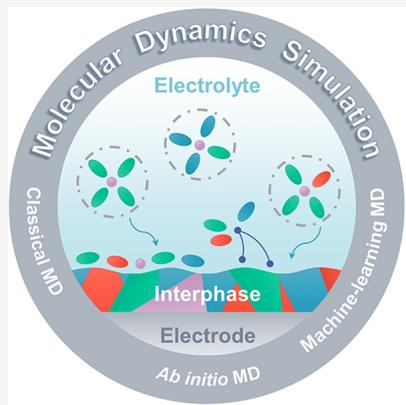

# CONTENTS

1. Introduction 10971

1.1. Rechargeable Batteries and Electrolytes 10971  
1.2. Molecular Dynamics Simulations on Liquid Electrolytes 10972  
1.3. Scope of This Review 10973

2.Molecular Dynamics Simulations 10974

2.1. Theory 10974  
2.2.Classical Molecular Dynamics and Force Fields 10975  
2.3.Ab Initio Molecular Dynamics 10976  
2.4.Machine-Learning Molecular Dynamics 10977  
2.4.1. Neural-Network-Based Descriptor 10978  
2.4.2. Kernel-Based Descriptor 10980

3. Electrolyte Microstructures 10981

3.1. Bulk Structures 10981  
3.1.1. Cation Solvation Structures 10981  
3.1.2. Anion Solvation Structures 10988  
3.2.Interfacial Structures 10989  
3.2.1. Effects of Electrolyte Compositions 10989  
3.2.2. Effects of Electrode Surfaces 10990

4. Physicochemical Properties of Electrolytes 10991

4.1. Ionic Transport 10992

4.1.1. Transport Mechanisms 10992  
4.1.2. Factors Influencing the Ionic Transport 10993

4.2. Other Properties and Machine-Learning Prediction 10995

4.2.1. Density, Freezing Point, and Boiling Point 10995  
4.2.2. Dielectric Constant 10996  
4.2.3. Viscosity 10997  
4.2.4. Machine-Learning Prediction of Electrolyte Properties 10997

5. Electrode-Electrolyte Interfacial Reactions 10999

5.1. Electrolyte Decomposition and Formation of an Interphase 10999  
5.1.1. Solvent and Salt Decomposition 10999

Special Issue: Computational Electrochemistry

Received: October 25, 2021

Published: May 16, 2022

5.1.2. Formation of Interphase 11000  
5.1.3. Factors Influencing Decomposition Mechanisms 11000  
5.2. Deposition, Intercalation, or Conversion Reaction of Working Ions 11002  
5.2.1. Desolvation or Cointercalation 11003  
5.2.2. Factors Influencing Interfacial Reactions of Working Ions 11003

6.Conclusion and Perspectives 11004

Author Information 11005

Corresponding Authors 11005

Authors 11006

Notes 11006

Biographies 11006

Acknowledgments 11006

References 11006

# 1. INTRODUCTION

# 1.1. Rechargeable Batteries and Electrolytes

Global energy consumption increased from 350 quadrillion British thermal units (or qBTUs, where  $1\mathrm{qBTU} = 293\mathrm{TWh}$ ) in 1990 to 527 qBTUs (or 154,411 TWh) in 2020, with an annual growth rate of  $1.71\%$  (Figure 1). Conventional fossil fuels such as coal, natural gas, and oil were majorly consumed, and a large amount of carbon dioxide  $\left(\mathrm{CO}_{2}\right)$  (32 billion tonnes in 2020) was produced simultaneously (Figure 1b), which have changed the climate and caused a host of environmental issues. A global consensus has been reached in terms of increasing the use of renewable energies and constructing a sustainable energy system to achieve a net-zero emission of  $\mathrm{CO}_{2}$ . Electricity is a kind of clean and convenient secondary energy, and its generation achieved 26,942 TWh in 2019 with an annual growth rate of  $2.87\%$  since 1990. Hydro and other renewable energies account for around one-quarter of the total generation of electricity currently, and this share is expected to increase to  $33\%$  by 2025, surpassing coal-fired generation. Maintaining expansion of electricity generation from renewable energies is strongly considered as one of the most promising pathways toward sustainable development.

Renewable energy sources such as wind and solar energies are very promising due to their virtually limitless resources, but they are also inherently intermittent and generally dispersed, which makes it difficult to directly employ these energies in current power grids. Energy storage devices are indispensable to make the best use of such renewable energies. For instance, 10 million electric vehicles can store 600 TWh of electricity (60 kWh for each car), which is around  $2.2\%$  of the global electricity generation in 2019. In addition, electric vehicles are supposed to charge and discharge dozens of times within one year. Consequently, advanced energy storage devices exhibit great potential to assist with the construction of the future energy system.

Among various energy storage devices, lithium (Li)-ion batteries (LIBs) have overwhelmed other competitors in the portable electronics market since 1991 because of their significant advantages in energy density.5 To some degree, rechargeable LIBs have changed the world, and the Nobel Prize in chemistry in 2019 was awarded to three pioneers in the development of LIBs: John Goodenough, Stanley Whittingham, and Akira Yoshino. After thirty years of developments, the practical energy density of conventional LIBs is approaching

their theoretical limits. Besides, the limited resources of Li and cobalt seriously impede the wide application of LIBs in largescale energy storage. Emerging batteries with an ultrahigh energy density or a low cost are therefore urgently required.[6,7]

Compared with Li, sodium (Na) and potassium (K) are much more plentiful on the earth. Na-ion batteries (SIBs) and K-ion batteries (KIBs) are consequently supposed to be adopted in large-scale energy storage. To break through the theoretical limit of energy density determined by intercalation chemistry, metal or alloy anodes have attracted much attention recently. Li, $^{8,9}$  Na, $^{10-13}$  K, $^{14-16}$  magnesium (Mg), $^{17-20}$  calcium (Ca), $^{18-20}$  zinc (Zn), $^{20-23}$  aluminum (Al), $^{18-20}$  Li silicon  $(\mathrm{LiSi}_x)$ , $^{24-27}$  etc. have been widely explored as potential anode materials. Metal or alloy anodes generally possess a high specific capacity and a low electrode potential, which are beneficial to delivering a high energy density but also induce huge electrode deformation and serious interfacial reactions with working electrolytes. The high reactivity of metal and alloy anodes undermines the life span of batteries and raises demanding requirements for electrolytes.

The electrolyte is an extremely important part of a battery, playing roles as both an ionic conductor and an electronic insulator. Electrode materials determine the theoretical limit of energy density, but how much and how fast the battery can be charged or discharged in practice is largely dependent on electrolytes. A highly stable electrolyte-electrode interface is essential for the success of LIB commercialization.[28-31] The reviving of high-capacity and high-voltage electrodes puts forward extremely high demands for electrolyte design.[32-36] Generally, electrolytes for rechargeable batteries can be classified into aqueous electrolytes, nonaqueous electrolytes, and ionic liquids (ILs). The fundamentals of solid-state electrolytes are very different from liquid electrolytes. Therefore, solid-state electrolytes are out of the scope of this review and well summarized in other recent review papers.[37-40] Great achievements have been made for each category of electrolytes (refer to liquid electrolytes in the following), with new solvents,[41-45] salts,[46-48] and additives[49] developed. Particularly, high-concentration electrolytes (HCEs)[50-53] and localized high-concentration electrolytes (LHCEs)[54-57] widely prove to be stable against Li and Na metal anodes. Despite fruitful achievements from experiments and mainly by trial-and-error approaches, several challenging issues remain for advanced electrolyte design to realize the application of next-generation rechargeable batteries beyond LIBs:

(1) Electrolyte solvation structures: The physicochemical properties of electrolytes such as ionic conductivity and redox stability are largely influenced by their solvation structures,[58-62] which are mainly regulated by the cation-solvent and cation-anion interactions.[63,64] Experimental characterizations such as infrared spectroscopy (IR) and Raman spectroscopy can reveal the solvation structure to some degree. Nevertheless, they have difficulty in achieving a comprehensive insight at the atomic level. High-accuracy calculations such as density functional theory (DFT) calculations help deepen the understanding of atomic- and molecular-level interactions, but they are not adept in probing electrolyte solvation structures due to their high expense and the limited sizes of models. Practical electrolytes are assemblies of abundant molecules, and it is of significance to study the collective behavior of the whole system besides that of several molecules.

(2) Electrode-electrolyte interfacial structures: Electrode—electrolyte interfacial structures are relevant to most chemical and electrochemical processes occurring at the interface such as the (de)solvation of working ions, electrolyte degradation, and subsequent formation of a solid electrolyte interphase (SEI) and cathode electrolyte interphase (CEI). These processes have significant impacts on the rate performance and lifetime of a battery.[31,65-67] They also complicate interfacial structures on both space and time scales, resulting in the much more difficult characterization of interfacial structures compared with bulk structures by both experimental and computational approaches. A deep insight into the electrode—electrolyte interfacial structures is urgently needed for analyzing the thermodynamics and kinetics of interfacial reactions as well as inducing a stable electrode—electrolyte interface to construct a long-life-span battery.

(3) Electrolyte design at the atomic level: Conventional electrolyte design is mainly conducted by trial-and-error approaches, and rational electrolyte design strategies are very lacking owing to the indistinct understanding of the structure—property—performance relationship. On the one hand, the structure—property relationship of electrolytes can be obtained from experiments or simulations, but issues remain regarding the quality and quantity of data on electrolyte structures and physicochemical properties. On the other hand, the correlation between electrolyte properties and battery performances is much more complicated than the molecular structure—property relationship since the macroscopic battery performance is a result of the coupling of multiple factors other than electrolyte properties.

Routine experimental methods are facing grand challenges in handling the above issues, especially in acquiring a deep insight into the electrolyte structure and interfacial reactions. On the contrary, the rising MD simulations are extremely advantageous to addressing the above challenging issues and deepening the understanding of electrolyte structures and functions at the molecular level.

# 1.2. Molecular Dynamics Simulations on Liquid Electrolytes

The history of molecular dynamics (MD) simulations can trace back to the 1950s when Alder and Wainwright conducted the earliest MD simulations based on the hard-sphere model.[68,69] In 1964, Rahman used MD simulations to investigate liquid argon interacting with a Lennard-Jones (LJ) potential and obtained properties such as the pair-correlation function and self-diffusion coefficient,[70] demonstrating MD simulations as a powerful tool to probe microscopic atomic structures and macroscopic properties. Since then, MD simulations have achieved wide applications and great success, particularly in biology,[68,71-74] chemistry,[75-78] and material science,[79,80] where systems are usually too inhomogeneous and complex to be treated by analytical and theoretical methods. For example, MD simulations on biological processes sprang up after the pioneering work of Levitt and Warshel in 1975.[81] The late 1990s witnessed the rise of research on batteries by MD simulations, from investigating impurity ions' behavior in solid electrolytes[82] and the properties of polymer electrolytes[83] to ionic transport at the electrode-electrolyte interface or in electrode materials.[84,85]

After more than half-a-century of development and benefiting from the promotion of computer science, MD simulations have currently become one of the most important tools to probe

fundamentals in battery electrolytes, including bulk/interfacial structures, physicochemical properties, and interfacial reactions. Based on the statistical analysis of geometrical structures, energy evolutions, or dipole moment evolutions, macroscopic properties such as the diffusion coefficient, specific heat capacity, and dielectric constant can be derived. Consequently, MD simulations bridge the microstructures and macroscopic properties of electrolytes and have been widely applied in the field of various rechargeable batteries.[76,77,86-90] For example, the Qiang Zhang group at Tsinghua University comprehensively probed the bulk structure of Li, Na, and Zn batteries by MD simulations.[91-94] Especially, the role of cation additives and the influence of salt anions in the solvation structures of  $\mathrm{Li^{+}}$  were focused on.[92,93] The Perla B. Balbuena group at Texas A&M University systematically investigated the interfacial reactions between various organic electrolytes and anode materials through ab initio molecular dynamics (AIMD) simulations, including Li metal anodes and  $\mathrm{LiSi}_x$  anodes.[95-97] The structure and charge evolutions of typical solvent and salt anion decomposition on anodes were presented based on this method. Oleg Borodin and co-workers studied the electrolyte-electrode interfacial structures with applied electrode potentials.[98-100]

Cations and anions are preferentially adsorbed on the electrode surface under a low and high electrode potential, respectively. The Kristin A. Persson group at Lawrence Berkeley National Laboratory studied the solvation structures and dynamics of battery electrolytes as well as the formation of an SEI. $^{101-106}$  They first incorporated machine learning (ML) methods to comprehensively predict the decomposition pathway of electrolyte components. $^{107,108}$  Typical applications and corresponding current developments of MD simulations in electrolyte studies are summarized as follows.

(1) Bulk and interfacial structures: It is very convenient to obtain both the bulk and interfacial electrolyte structures from MD simulations and perform related statistical analyses, such as the solvent and anion ratios in cation solvation shells and the environment of anions (free ions, solvent-separated ion pairs (SSIPs), contact ion pairs (CIPs), or aggregates (AGGs). However, the reliability of simulation results often needs further experimental verification even for the simplest bulk electrolyte structures mainly due to the lack of universal and high-accuracy force fields. Compared with bulk structures, interfacial structures are even more complicated because of the difficulty in building interfacial models and handling the electrode potentials. The electrode potential can be modeled by fixed charge methods (FCMs), which refer to assigning uniform and constant partial charges on electrode atoms.[109,110] However, polarization effects caused by electrode-electrolyte interactions result in an uneven distribution of charges on the electrode, and the constant charge method is incapable of taking this into account. The constant potential methods (CPMs) overcome this issue by keeping a constant electrostatic potential on the electrode surface and allowing for charge fluctuations.[111,112] In this method, the total amount of charge should correspond to the applied electrode potential and distribute within the electrode according to the intrinsic features of the electrode material, such as semiconductors such as carbon electrodes and conductors such as metallic electrodes.[113] This charge distribution is

  
Figure 1. Summary of global energy consumption and carbon dioxide  $\left(\mathrm{CO}_{2}\right)$  emissions from 1990 to 2020. (a) Comparison of the global energy consumption by countries in 1990 and 2020. (b) Change of the global  $\mathrm{CO}_{2}$  emissions and energy consumption from 1990 to 2020. Data are obtained from refs 1 and 2.

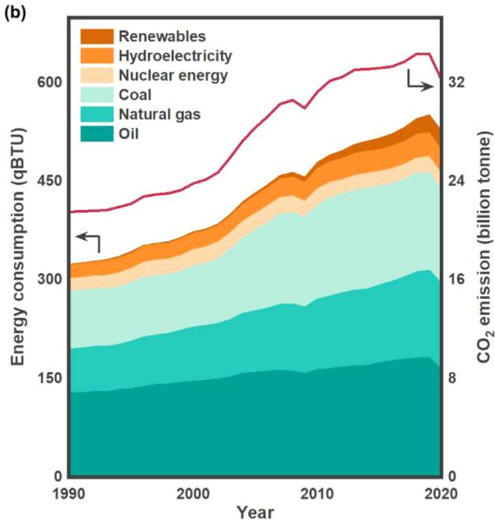

computed during the simulation that needs high computational requirements.

(2) Statistical analyses for macroscopic properties: In theory, MD simulations can bridge the microstructure and macroscopic properties of electrolytes through statistical analyses. For example, the mean square displacement (MSD) analysis infers the diffusion coefficient of ions or solvents in electrolytes. Besides, other physicochemical properties, such as the dielectric constant and viscosity, can also be derived from corresponding statistical analyses but are still in development for most cases.[114] The chemical origin of the dielectric constant varies a lot at different frequencies of the electric field, including ionic conduction, dipolar relaxation, atomic polarization, and the electronic polarization. The static dielectric constant of electrolytes was comprehensively probed recently, and lithium salts exhibit a complicated influence on it, delivering a volcano correlation between the dielectric constant and salt concentration.[115] Similar to the dielectric constant, Yamaguchi et al. adopted the reformulated form of the Green-Kubo formula, i.e., the Einstein relation, to calculate the viscosity of various types of organic electrolytes.[116-119] The coefficient of determination for viscosities reaches around 0.9, but such simulation processes still take expensive computations.[120]  
(3) Interfacial reactions: Solvents and anions usually decompose on the electrode surface and produce SEIs or CEIs. Besides, the solvation and desolvation of working ions during charge and discharge also occur at the working interfaces. Both AIMD and classical MD (CMD) simulations based on reactive force fields are generally adopted to simulate interfacial reactions while both methods are faced with grand challenges. The box size and simulation time are very limited for AIMD simulations to observe complete interfacial reactions due to their high computation expense. Although CMD

can achieve a long-time simulation with a relatively large simulation box, the development of reactive force fields is time-consuming and potentially very tricky, which reduces the reliability of simulation results.

Despite some challenging issues facing MD simulations on battery electrolytes, recent advances in the MD field afford new opportunities for these investigations. Especially, the emerging ML technology is widely applied to chemistry and materials science. $^{121-127}$  Combining first-principles calculations and ML methods, ML potentials (MLPs) can be trained and applied to CMD simulations, which are named MLMD simulations in this review. MLMD simulations are highly expected to preserve the accuracy of first-principles calculations and the speed of CMD simulations in theory. Therefore, MLMD simulations are strongly supposed to break through the limitations of both CMD and AIMD simulations and achieve wide applications in the study of rechargeable battery electrolytes. $^{128}$

# 1.3. Scope of This Review

The electrolyte is one of the most important parts of a battery and largely determines the rate performance, capacity degradation, safety, and cycling life of batteries. MD simulations have become an extremely important and almost indispensable theoretical tool in the study of battery electrolytes since 2010. However, a comprehensive, authoritative, and critical, yet easily understandable, review on applying MD simulations to battery electrolytes is very lacking although the recent progress on MD simulations has been well summarized in the literature.[72-80,129] Especially, MLMD has grown rapidly and has been gradually applied to battery research. This review intends to fill this deficit by summarizing the progress made since 2010 in probing electrolyte structures and interfacial reactions between electrolytes and electrodes in rechargeable batteries by MD simulations. Based on a comprehensive review and critical discussion, such applications will deepen the understanding of the structure-performance relationship of electrolytes and

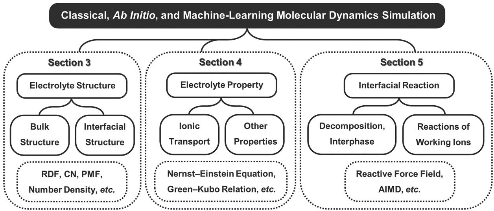  
Figure 2. Schematic of applying classical molecular dynamics (CMD), ab initio molecular dynamics (AIMD), and machine-learning molecular dynamics (MLMD) simulations in rechargeable battery electrolytes. Section 3: Unveiling the electrolyte structures including bulk and interfacial structures through radial distribution function (RDF or  $g(r)$ ), coordination number (CN), potential of mean force (PMF or  $\omega(r)$ ), and number density analyses. Section 4: Deriving electrolyte properties including ionic-transport-related properties and other physicochemical properties. Section 5: Probing electrode-electrolyte interfacial reactions by CMD with reactive force fields or AIMD.

promote the rational design of advanced electrolytes for next-generation rechargeable batteries.

In this contribution, we aim to summarize the recent progress of applying CMD, AIMD, and MLMD simulations to rechargeable battery electrolytes, from bulk and interfacial structures to electrolyte properties and interfacial reactions (Figure 2). First, the fundamentals of the three MD methods, especially the recent progress in MLMD, are discussed, including the basic theory of MD, interatomic potentials for CMD, three different AIMD methods, and the development of MLPs in MLMD (section 2). Then, the applications of MD simulations in the study of rechargeable battery electrolytes are summarized and discussed. Section 3 focuses on electrolyte microstructures, including bulk and interfacial structures. The factors influencing microstructures are discussed in detail, such as electrolyte components, temperature, and electric field. Section 4 focuses on the derivation of macroscopic properties from microstructures, including analyses of the ionic diffusivity and conductivity, dielectric constant, viscosity, and ML-predicted properties. Section 5 focuses on the interfacial reactions between electrolytes and electrodes, including the decomposition of species in electrolytes and the formation of an interphase, as well as working ions' deposition, intercalation, or conversion reactions toward the electrode. Finally, an enriched summary of the recent progress of applying MD simulations in the study of rechargeable battery electrolytes and an insightful perspective on the future challenges and developments will be provided.

# 2. MOLECULAR DYNAMICS SIMULATIONS

MD simulations mainly can be classified into CMD, AIMD, and MLMD according to the way of dealing with atomic interaction forces. CMD adopts classical potential energy functions with specific mathematical forms to describe atomic interactions, whereas AIMD calculates the interaction forces by ab initio methods. MLMD is an emerging MD method in which MLPs are produced through training ML models based on experimental or ab initio data. Despite the difference, the principles behind the atomic movements and statistical analyses

to obtain the physicochemical properties of simulated systems are the same in most cases for the three MD methods. Therefore, the shared fundamentals of MD simulations are first discussed in the following. After that, a systematic introduction to each method will be provided and the corresponding potential energy functions are focused on.

# 2.1. Theory

From the viewpoint of classical mechanics, atoms as the smallest units constitute the many-particle system in MD simulations. The mass of an atom is almost located in its nucleus with only a small contribution from the electron cloud. Each atom, thus, can be regarded as a mass point, whose position evolves governed by the classical equations of motion, namely Newton's second law:

$$
\boldsymbol {F} = m \boldsymbol {a} \tag {1}
$$

where  $F, m$ , and  $a$  are the applied force, mass, and acceleration of the atom, respectively.  $F$  and  $a$  can be further described in terms of the potential gradient and atomic velocities or coordinates:

$$
- \frac {\mathrm {d} U}{\mathrm {d} r} = m \frac {\mathrm {d} v}{\mathrm {d} t} = m \frac {\mathrm {d} ^ {2} r}{\mathrm {d} t ^ {2}} \tag {2}
$$

where  $U, r,$  and  $\pmb{\nu}$  are the potential energy, coordinate, and velocity of atoms, respectively, and  $t$  is the time.

As long as the potential energies and initial coordinates of atoms are defined, the position and velocity evolution of atoms with time can be derived from the above eqs 1 and 2. The potential energy is a function embodying the positions of all atoms in a system. Due to the complicated nature of the function, the equations of motion have no analytical solution but can only be solved numerically. Numerous numerical algorithms have been developed, such as the Euler algorithm, $^{130}$  Verlet algorithm, $^{131}$  leap-frog algorithm, $^{132}$  and velocity Verlet algorithm. $^{133}$  The Euler algorithm is a first-order method to solve the differential equations. It calculates velocities and coordinates of atoms in the next step based on velocities and coordinates in the previous step, which is straightforward but not very efficient. The Verlet algorithm is a popular refined method that uses coordinates from the previous two steps and

accelerations from the previous step to generate new coordinates. The disadvantage of this algorithm is its moderate precision. The leap-frog algorithm improves by calculating velocities and positions at different time steps, which means their calculations "leap" over each other yet possess the same accuracy. The velocity Verlet algorithm is another improved version of the Verlet algorithm, which yields positions, velocities, and accelerations simultaneously. These integration methods are all differential formulas, in essence, to determine atomic coordinates and velocities step by step.

As discussed above, detailed information on a system, such as atomic positions and velocities, can be obtained by MD simulations. The conversion of the microscopic information into macroscopic properties is the province of statistical mechanics. $^{134}$  Generally, properties of interest can be obtained by taking an average over the ensemble, which is a collection of a very large number of thermodynamic systems with the identical macroscopic or thermodynamic state but different microscopic states:

$$
\langle A \rangle = \sum_ {\text {a l l s t a t e s}} A _ {i} p _ {i} \tag {3}
$$

where  $A$  is the value of a certain property,  $A_{i}$  is the value of this property at the microstate  $i$ , and  $p_i$  is the probability of the corresponding microstate. According to the identical macroscopic state, ensembles can be classified into the microcanonical (constant NVE), canonical (constant NVT), isothermal-isobaric (constant NPT), and grand canonical (constant  $\mu \mathrm{VT}$ ) ensembles, where  $N, V, E, T, P,$  and  $\mu$  represent the number of particles, volume, total energy, temperature, pressure, and chemical potential, respectively. The NVE ensemble corresponds to an isolated system without any matter or energy exchange with its surroundings, and the model box has no volume change during the simulation. The NVT ensemble shares the same characteristics as the NVE ensemble except that the system exchanges energy with a thermostatic bath to maintain a constant temperature. Different from the above two ensembles with fixed volume and fluctuating pressure, the NPT ensemble allows for the volume change to keep the pressure constant. The  $\mu \mathrm{VT}$  ensemble is characterized by the matter exchange between the system and the surrounding environment. All of these ensembles are supposed to be selected or combined for different purposes. For instance, a typical MD simulation of liquid electrolytes consists of the initial equilibration in an NPT ensemble to obtain the equilibrium model size and the following equilibration and production runs in an NVT ensemble.

In fact, it is impossible for MD simulations and any experiment to sample all possible values of the property for infinite systems included by ensembles. Fortunately, the property of a system  $(A)$  can also be determined by the average over a sufficiently long time:

$$
\bar {A} = \lim  _ {\tau \rightarrow \infty} \frac {1}{\tau} \int_ {0} ^ {\tau} A (t) \mathrm {d} t \tag {4}
$$

where  $\tau$  is the time interval for averaging and  $A(t)$  is the value of this property at a certain time. The system can evolve through (or come arbitrarily close to) all microscopic states for a very long time, and this leads to the time average equaling the ensemble average as stated by the Ergodic hypothesis in statistical mechanics:

$$
\langle A \rangle = \bar {A} \tag {5}
$$

A can represent many properties, such as the total energy  $E$  of a system.

The isochoric heat capacity  $C_V$  can be further derived according to the first law of thermodynamics:

$$
C _ {V} = \left(\frac {\partial E}{\partial T}\right) _ {V} \tag {6}
$$

Furthermore, the entropy  $S$  can be obtained from the integral of  $C_V$  assuming the absolute zero of temperature as the reference state:

$$
S = \int_ {0} ^ {T _ {0}} \frac {C _ {V}}{T} \mathrm {d} T \tag {7}
$$

The heat capacity is supposed to be closely related to the thermal safety of rechargeable batteries, as a large heat capacity is beneficial to reducing the temperature rise, impeding the vaporization of electrolytes, and improving battery safety. $^{135-139}$  The entropy was found to play a significant role in determining the electrolyte properties and solvation structures. $^{140,141}$  Additionally, other thermodynamic quantities, such as the Gibbs free energy, can be derived as long as the energy and entropy of a system are obtained. The Gibbs free energy is a significant property for determining the freezing and boiling points of liquid electrolytes by MD simulations.

To ensure an accurate prediction of macroscopic properties, the simulation system should contain enough particles and be simulated for a long enough time. However, the size of the system is inevitably limited by the computing power. Besides, particles situated on the model surface can experience forces different from those in bulk, causing the problem of surface relaxation and even reconstruction. Periodic boundary conditions (PBC) are consequently introduced to circumvent such obstacles. The original model box, also referred to as the primitive cell, is replicated throughout the space to form an infinitely large system. As a particle moves in the primitive cell, its periodic objects in all duplicate boxes move in the same way. Once a particle leaves the primitive cell, its corresponding replica enters through the opposite boundary. A sufficiently large system is considered, and surface effects are eliminated. It should be noted that the employment of PBC depends on specific issues. Periodic boundaries are usually applied in all three coordinate directions for simulations of bulk electrolytes, but for studying molecular behaviors at the electrode-electrolyte interface, PBC can be abandoned in a certain direction.

# 2.2. Classical Molecular Dynamics and Force Fields

According to eqs 1 and 2, the motion of a particle is determined by the force acting on it or the potential energy function, which originates from interactions between itself and all other species in the system. In CMD simulations, potential energy functions follow a fixed pattern. The force field describes the intramolecular and intermolecular potential energy of atoms in the form of mathematical functions:

$$
U = U _ {\mathrm {n b}} + U _ {\mathrm {b o n d}} + U _ {\mathrm {a n g l e}} + U _ {\mathrm {t o r s i o n}} \tag {8}
$$

where  $U_{\mathrm{nb}}$  represents nonbonded interactions between atoms and  $U_{\mathrm{bond}}, U_{\mathrm{angle}}$ , and  $U_{\mathrm{torsion}}$  refer to bond interactions between pairs of atoms, angle interactions between triplets of atoms, and torsion interactions between quadruplets of atoms, respectively.  $U_{\mathrm{bond}}, U_{\mathrm{angle}}$ , and  $U_{\mathrm{torsion}}$  describe intramolecular potential energy.  $U_{\mathrm{nb}}$  includes not only the intermolecular potential energy of atoms in different molecules but also the intramolecular potential energy of atoms that are not covered by the

bond, angle, and torsion interactions. Detailed expressions of some widely used force fields, such as OPLS (optimized potentials for liquid simulations), $^{142}$  CHARMM (chemistry at Harvard macromolecular mechanics), $^{143,144}$  and AMBER (assisted model building with energy refinement), $^{145}$  follow the format below with some variations:

$$
\begin{array}{l} U _ {\mathrm {n b}} = \sum_ {\text {n o n b o n d e d}} \left\{4 \varepsilon_ {i j} \left[ \left(\frac {\sigma_ {i j}}{r _ {i j}}\right) ^ {1 2} - \left(\frac {\sigma_ {i j}}{r _ {i j}}\right) ^ {6} \right] + \frac {q _ {i} q _ {j}}{4 \pi \varepsilon_ {0} r _ {i j}} \right\} (9) \\ U _ {\text {b o n d}} = \sum_ {\text {b o n d s}} K _ {r} \left(r _ {i j} - r _ {0}\right) ^ {2} (10) \\ U _ {\text {a n g l e}} = \sum_ {\text {a n g l e s}} K _ {\theta} \left(\theta_ {i j k} - \theta_ {0}\right) ^ {2} (11) \\ U _ {\text {t o r s i o n}} = \sum_ {\text {t o r s i o n s}} \sum_ {n} K _ {\phi , n} [ 1 + \cos \left(n \phi_ {i j k l} + \delta_ {n}\right) ] (12) \\ \end{array}
$$

where  $\varepsilon_{ij}$  is the LJ well depth,  $\sigma_{ij}$  is the LJ radius,  $r_{ij}$  is the distance between two atoms,  $q_{i}$  and  $q_{j}$  are the charges of two atoms,  $\varepsilon_0$  is the dielectric constant of a vacuum,  $K_{r}, K_{\theta},$  and  $K_{\phi ,n}$  are the force constants,  $r_0$  is the equilibrium bond value,  $\theta_{ijk}$  is the bond angle,  $\theta_0$  is the equilibrium angle value,  $n$  is the multiplicity,  $\phi_{ijkl}$  is the dihedral angle, and  $\delta_{n}$  is the phase. The subscripts  $i,j,k,$  and  $l$  denote different atoms. The force fields and corresponding parameters in functions can either be derived from experimental work or calculated by quantum mechanics (QM) methods for different atom types and interaction modes. Some representative force fields and their typical features are summarized in Table 1. $^{146}$

Table 1. Representative Force Fields and Their Features and Applications  

<table><tr><td>Force Field</td><td>Feature and Application</td><td>Reference</td></tr><tr><td>DREIDING</td><td>Full periodic table</td><td>147</td></tr><tr><td>UFF</td><td>Full periodic table including actinoids</td><td>148</td></tr><tr><td>OPLS</td><td>Peptides, small organics, and ionic liquids</td><td>142</td></tr><tr><td>CHARMM</td><td>Biomolecules and small organics</td><td>143, 144</td></tr><tr><td>AMBER</td><td>Biomolecules</td><td>145</td></tr><tr><td>GAFF</td><td>Biomolecules, small organics, and pharmaceutical molecules</td><td>149</td></tr><tr><td>COMPASS</td><td>Small organics, polymers, and pharmaceutical molecules</td><td>150, 151</td></tr><tr><td>GROMOS</td><td>Biomolecules and gas-phase molecules</td><td>152</td></tr><tr><td rowspan="2">MARTINI</td><td>Coarse-grained force field</td><td>153</td></tr><tr><td>Biomolecules and polymers</td><td></td></tr><tr><td>ReaxFF</td><td>Reactive force field</td><td>154</td></tr><tr><td>CL&amp;P</td><td>Ionic liquids</td><td>155</td></tr><tr><td>AMOEBA</td><td>Polarizable force field</td><td>156</td></tr><tr><td rowspan="2">APPLE&amp;P</td><td>Polarizable force field</td><td>157</td></tr><tr><td>Liquids and polymers</td><td></td></tr></table>

Although many force fields have been developed, their universality and accuracy often conflict with each other. DREIDING and UFF (universal force field) cover molecules of any combination of elements in the periodic table. These universal force fields can yield reasonable molecular structures in most cases but have difficulty in predicting properties appropriately. On the contrary, other force fields focus on specific areas, especially the simulation of condensed phases. Molecules constituted by common elements such as hydrogen

(H), carbon (C), nitrogen (N), oxygen (O), and sulfur (S) are within the scope of these force fields, including OPLS, CHARMM, AMBER, GAFF (general AMBER force field), and COMPASS (condensed-phase optimized molecular potentials for atomistic simulation studies). They are more advantageous to delivering a higher-accuracy prediction of materials properties than universal force fields. They also provide reasonably large options of atom types for different functional groups such that many small organic molecules adopted in electrolytes can be described. This drives the prevalence of these force fields in the study of electrolytes for rechargeable batteries. Considering that high-accuracy simulations are usually accompanied by expensive computations, united-atom (UA) force fields, such as GROMOS (Groningen molecular simulation), as the opposite to all-atom (AA) force fields are developed to decrease the computation expense. Parameters for every type of atom, including H, are included in AA force fields, while UA force fields treat  $\mathrm{CH}_4$ ,  $\mathrm{CH}_3$ ,  $\mathrm{CH}_2$ , and CH groups as a unit "atom". Simulated particles are pruned drastically, and the simulation efficiency largely improves. To some degree, UA force fields are very similar to coarse-grained (CG) force fields while concatenated atoms are no longer confined to C and H atoms in the latter.

Regardless of AA, UA, or CG force fields, the bond interaction is usually in the form of harmonic oscillators as shown in eq 10. When the distance between two bonded atoms becomes infinitely large, the interaction potential also keeps increasing. Therefore, these models are unable to simulate the breaking and formation of chemical bonds, which hinders their application in probing chemical reactions. Reactive force fields are introduced into CMD to lift such a restriction. The variation of chemical bonds is allowed in reactive force fields by simultaneously correlating the interaction potential with both atomic distances and bond orders. In addition to chemical reactions, high-concentration ions are involved in many systems, especially HCEs and ILs. The presence of highly charged ions often induces a strong local electric field, which polarizes neighboring solvents and ions and changes their charge distributions and even geometrical structures. Consequently, the parameters of such ions need to be tailored to reconsider the charge distribution and conformation although they share parts of their structures with molecules in existing force fields.[158-161] For example, the CL&P (Canongia Lopes and Padua) force field is constructed based on the functional form of OPLS, yet the flexibility and atomic charges are otherwise parametrized.[155] New force field models, such as APPLE&P (atomistic polarizable potentials for liquids, electrolytes, and polymers) and AMOEBA (atomic multipole optimized energetics for biomolecular simulation), go beyond to include more accurate descriptions of electrostatic interactions between molecules and the polarizability.[76]

Developing empirical force fields is an old but still alive topic in current MD studies although more than 30 kinds of force fields have been developed during the last few decades. Early models keep evolving, and fresh models continuously emerge to improve their efficiency, accuracy, and universality. However, none of them outperforms the others in all aspects. Choosing appropriate force fields and suitable models are of equal importance to obtain reasonable MD simulation results.

# 2.3. Ab Initio Molecular Dynamics

Different from using empirical force fields in CMD, QM calculations are applied to generate the potential energy and

force during AIMD simulations. Consequently, AIMD is independent of empirical parameters but rests on the accuracy of the corresponding QM methods. After solving the Schrödinger equation by QM calculations, the motion of atoms and molecules can be subsequently solved based on Newton's equation (eqs 1 and 2) to yield the molecular trajectory, which is the same as the CMD simulation. The detailed process is discussed in the following.

The Schrödinger equation is the foundation of both QM and AIMD:

$$
\hat {\boldsymbol {H}} \varphi = E \varphi \tag {13}
$$

where  $\hat{H}$  is the Hamiltonian of the system,  $\varphi$  is the wave function, and  $E$  is the energy.  $\hat{H}$  includes both the kinetic and potential energies of the system. It can be described in the atomic unit as follows:

$$
\begin{array}{l} \hat {\boldsymbol {H}} = - \sum_ {\alpha} \frac {1}{2 M _ {\alpha}} \nabla_ {\alpha} ^ {2} - \sum_ {i} \frac {1}{2} \nabla_ {i} ^ {2} - \sum_ {i, \alpha} \frac {Z _ {\alpha}}{\left| \boldsymbol {r} _ {i} - \boldsymbol {R} _ {\alpha} \right|} \\ + \sum_ {i <   j} \frac {1}{| \boldsymbol {r} _ {i} - \boldsymbol {r} _ {j} |} + \sum_ {\alpha <   \beta} \frac {Z _ {\alpha} Z _ {\beta}}{| \boldsymbol {R} _ {\alpha} - \boldsymbol {R} _ {\beta} |} \tag {14} \\ \end{array}
$$

where  $M$  is the mass of the nucleus,  $Z$  is the nuclear charge, and  $r$  and  $R$  are the coordinates of the electron and nucleus, respectively. The subscripts  $\alpha$  and  $\beta$  represent different nuclei, while  $i$  and  $j$  represent different electrons. The five terms from left to right in eq 14 correspond to the nuclear kinetic energy, electronic kinetic energy, electron-nucleus attraction potential energy, electron-electron repulsion potential energy, and nucleus-nucleus repulsion potential energy, respectively.

Despite its concise expression, the Schrödinger equation is difficult to solve, and some approximations are required for practical calculations. The Born-Oppenheimer (BO) approximation, also known as the adiabatic approximation, is widely used. It assumes that the electronic motion and nuclear motion in molecules can be separated based on much more massive nuclei than electrons. The BO approximation enables the separation of the wave function  $\pmb{\varphi}$  and Hamiltonian  $\hat{H}$  into nuclear and electronic ones, that is  $\varphi = \varphi_{n}\varphi_{e}$  and  $\hat{H} = \hat{H}_n + \hat{H}_e$ . For a given set of nuclear (atomic) coordinates, the original Schrödinger equation is simplified into the electronic Schrödinger equation:

$$
\hat {\boldsymbol {H}} _ {e} \varphi_ {e} = E _ {e} \varphi_ {e} \tag {15}
$$

where  $\hat{H}_e = -\sum_i\frac{1}{2}\nabla_i^2 -\sum_{i,\alpha}\frac{Z_\alpha}{|r_i - R_\alpha|} +\sum_{i <   j}\frac{1}{|r_i - r_j|}$ . The Hartree-Fock (HF), DFT, and other calculation methods are well established in QM to deal with this equation.162,163 The potential energy of the system  $E$  for deriving forces can be obtained once eq 15 is solved:

$$
\left(\hat {\boldsymbol {H}} _ {n} + E _ {e}\right) \varphi_ {n} = E \varphi_ {n} \tag {16}
$$

Born-Oppenheimer molecular dynamics (BOMD) is a kind of AIMD simulation carried under the BO approximation, which is one of the most commonly used versions of AIMD methods. In BOMD, only the ground state wave function is included and the wave function is assumed to be always at the minimum. Although the approximation of separating electronic and nuclear motions largely simplifies the calculation, time-consuming QM calculations at every MD step are still required. Car-Parrinello MD (CPMD) was put forward by Car and Parrinello in 1985 to overcome the drawback.[164] CPMD uses an extended Lagrangian

$(L)$  of the system to describe the fictitious dynamics of electrons. The original Lagrangian is composed of the kinetic and potential energies of nuclei based on the BO approximation and classical mechanics:

$$
L = \sum_ {\alpha} \frac {1}{2} M _ {\alpha} v _ {\alpha} ^ {2} - E \left(\left\{\varphi_ {i} (\boldsymbol {r}) \right\}, \left\{\boldsymbol {R} _ {\alpha} \right\}\right) \tag {17}
$$

where  $\nu_{\alpha}$  is the velocity of the nucleus. The second term is the Kohn-Sham energy density functional in DFT, where  $\varphi_i(r)$  is the corresponding Kohn-Sham orbital and is subject to the orthogonality constraint. In CPMD, the Lagrangian becomes the following form:

$$
\begin{array}{l} L ^ {C P} = \sum_ {\alpha} \frac {1}{2} M _ {\alpha} v _ {\alpha} ^ {2} + \sum_ {i} \frac {1}{2} \mu \int d \boldsymbol {r} | \dot {\varphi} _ {i} (\boldsymbol {r}) | ^ {2} \\ - E \left(\left\{\varphi_ {i} (\boldsymbol {r}) \right\}, \left\{\boldsymbol {R} _ {\alpha} \right\}\right) \tag {18} \\ \end{array}
$$

where  $\mu$  is the fictitious electron mass and  $\dot{\varphi}_i$  is the first derivative of the Kohn-Sham orbitals versus time. The equations of motion can be further obtained from Lagrange equations under variations of  $\varphi_i(r)$  and  $R_{\alpha}$ . The wave function of electrons does not have to be optimized during the dynamics in CPMD, leading to great improvements in simulation efficiency.

In both BOMD and CPMD simulations, nuclei are treated as classical particles obeying classical mechanics. This approximation holds for most chemical systems where quantum effects play a negligible role in the motion of nuclei. Nonetheless, for processes involving noteworthy quantum effects, such as proton transfer, nuclei are supposed to be treated quantum mechanically. Path integral MD (PIMD) is an AIMD approach with QM taken into consideration within the path integral formulation. $^{165}$  Each quantum nucleus is projected onto a fictitious system of several classical particles connected by springs. The Hamiltonian can be derived from Feynman's path integral to render effective solutions to equations of motion. $^{166}$

AIMD can cope with full-periodic-table atoms accurately, which goes beyond the feasibility of CMD. The charge transfer, which allows for the bond breaking and bond forming, and the polarization effects are directly incorporated in AIMD. Such first-principles calculations eliminate negative effects brought by empirical force fields. However, inheriting shortcomings of first-principles calculations, AIMD produces high-accuracy results at the expense of robust efficiency even under some approximations. This disadvantage significantly limits the model size and running time of AIMD simulations. In the case of breakthroughs in first-principles methods or computing powers, AIMD is expected to come into widespread use and assist in exploring molecular, atomic, and electronic mysteries in electrolytes.

# 2.4. Machine-Learning Molecular Dynamics

ML is not a fresh concept in the field of natural science $^{167}$  and has been widely used as an advanced classification or regression method in structural prediction, $^{168}$  spectral analysis, $^{169}$  revealing quantitative structure-activity relationships, $^{170}$  etc. It took a long time for ML to be accepted in the field of theoretical chemistry and computational materials science due to the concern about the interpretability of ML. Currently, ML is attracting increasing attention driven by the desire to rationally design advanced functional materials. $^{171}$  Especially, ML has been used to construct an accurate description of interatomic interactions for MD simulations. $^{172-174}$  Compared with the imponderable simulation error and difficult parametrization

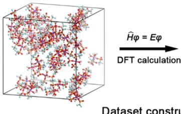  
(a)

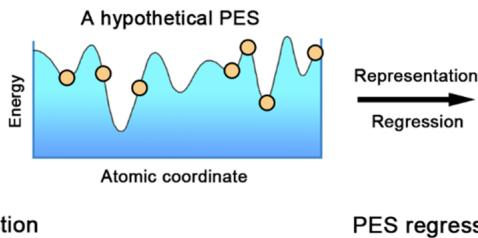

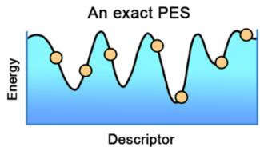

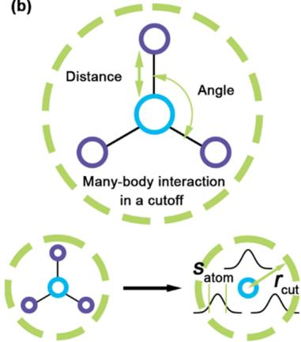  
(b)  
(c)  
Figure 3. Construction of the machine-learning potential (MLP) and classification of the descriptors in the MLP. (a) Schematic of the construction of the MLP. The reference data set is constructed based on AIMD simulations. Representative descriptors are generated by dealing with the elemental types, atomic coordinates, and forces in the data set and then are input into machine-learning (ML) algorithms as a typical regression training. (b) Different types of descriptors for atomic environments adopted in neural-network (NN)-based MLPs (top) or kernel-based MLPs (bottom). The neighbor density of a reference atom is expressed as a basis of Gaussian functions within a sphere with a radius  $r_{\mathrm{cut}}$ . The width of Gaussian functions  $s$  is controlled by the parameter  $s_{\mathrm{atom}}$ . (c) NN architecture for the fitting of the MLP using an atom-centered symmetry function (ACSF)-based NN as a prototype. (d) Schematic of kernel methods to interpolate an atomic property by comparing the environment of the candidate structure with those of reference structures in the data set. Reproduced with permission from ref 183. Copyright 2019 Wiley-VCH.

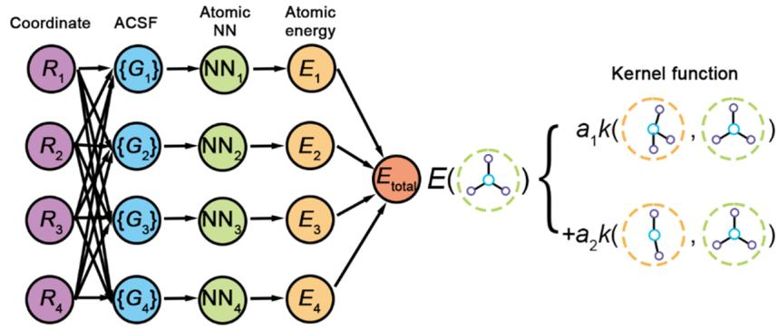

stemming from empirical force fields in CMD and unaffordable simulation costs in large-scale AIMD simulations, MLPs for MD simulations feature accuracy, cost-effectivity, and transferability. $^{175-179}$

Generally, a MLP is produced by fitting the energy and force generated from DFT calculations with ML methodologies, e.g., neural networks (NNs) (Figure 3). Specifically, the production of the potential energy surface (PES) requires three dispensable parts: (1) a data set consisting of reference structures and corresponding QM information; (2) a descriptor of the atomic neighbor structure information, which can be input into the ML algorithm; (3) a regressor to fit the MLP. The data sets are often generated by DFT calculations and formatted in a prescribed form. The descriptors exhibit various forms, depending on the ML algorithm for the regression task. The widely used descriptors can be divided into two categories, i.e., NN- and kernel-based descriptors. The regressor is used to fit the MLP, which is a typical regression problem in supervised learning because of labeled input data (structures) and a continuous range of output values (energies). Artificial neural networks (ANNs), kernel-based methods, and linear regression are common approaches employed as regressors, which have been properly discussed in several recent reviews. $^{180-182}$  The descriptors and regressors of representative MLP methods are summarized in Table 2.

Although many different methods of constructing PES have been proposed, several conventional rules need to be observed to ensure their transferability, compatibility, and computational efficiency.[177]

(1) The PES should be able to describe both isolated molecules and periodic crystals for a universal application.  
(2) Empirical input parameters beyond element types and atomic coordinates should not be involved in the description of the PES.  
(3) The scalability of physical quantities in real space needs to be guaranteed for a physical model. For example, the local energy of all non-overlapping domains in the model should be exactly equal to the total energy.  
(4) The translational, rotational, and permutational invariances in structures should be preserved.  
(5) Human intervention, such as empirical hyperparameters, should be avoided as much as possible.  
(6) Smooth model function is essential to ensure the first-order differentiability of the PES in the full space, which is necessary for the solution of atomic forces.

Because of the significance of descriptors in the construction of the PES, two characteristic descriptors are discussed in the following.

2.4.1. Neural-Network-Based Descriptor. As a prototype of a neural-network-based descriptor, an atom-centered symmetry function (ACSF) was proposed by Behler and Parrinello in 2007, $^{184}$  which manually constructs atomic-density-like symmetry functions to represent atomic coordinates based on symmetry. Subsequently, ACSF descriptors are fed into feedforward NNs to produce PESs. Similar to many classical empirical force fields, the total potential energy  $E$  in the MLP is a sum of atomic energies  $E_{i}$ :

Table 2. Comparison of Various Common Machine-Learning Potential Methods  

<table><tr><td>Method</td><td>Developer</td><td>Descriptor</td><td>Regressor</td><td>Implementation</td><td>Reference</td></tr><tr><td rowspan="2">Behler-Parrinello neural network potentials</td><td rowspan="2">J. Behler (Universität Göttingen)</td><td rowspan="2">Atom-centered symmetry function</td><td rowspan="2">Neural networks</td><td>Standalone (“RuNNer”)</td><td rowspan="2">184</td></tr><tr><td>LAMMPS interface</td></tr><tr><td rowspan="2">Gaussian approximation potentials (GAP)</td><td rowspan="2">G. Csányi (University of Cambridge)</td><td rowspan="2">Smooth overlap of atomic positions (SOAP)</td><td rowspan="2">Gaussian process regression</td><td>GAP code (custom)</td><td rowspan="2">188</td></tr><tr><td>LAMMPS interface</td></tr><tr><td>Spectral neighbor analysis potentials (SNAP)</td><td>A. P. Thompson; L. P. Swilerb; C. R. Trottc; S. M. Foilesd; G. J. Tucker (Sandia National Laboratories; Drexel University)</td><td>Bispectrum</td><td>Linear fit</td><td>LAMMPS interface</td><td>193</td></tr><tr><td>Moment tensor potentials</td><td>A. V. Shapeev (Skolkovo Innovation Center)</td><td>Polynomials in moment tensor potentials</td><td>Linear fit</td><td>LAMMPS interface</td><td>195</td></tr><tr><td>Adaptive, generalizable, and neighborhood informed (AGNI) force fields</td><td>R. Ramprasad (Georgia Institute of Technology)</td><td>A function of coordinates</td><td>Kernel ridge regression</td><td>LAMMPS interface</td><td>196</td></tr><tr><td>aenet</td><td>A. Urban (University of California, Berkeley)</td><td>Artrith—Urban—Ceder descriptor and symmetry function</td><td>Neural networks</td><td>Standalone (“aenet”)</td><td>197</td></tr><tr><td rowspan="2">Amp</td><td rowspan="2">A. A. Peterson (Brown University)</td><td rowspan="2">Zernike descriptor</td><td rowspan="2">Neural networks</td><td>Standalone (“Amp”)</td><td rowspan="2">198</td></tr><tr><td>LAMMPS interface</td></tr><tr><td rowspan="2">DeePMD</td><td rowspan="2">W. E (Princeton University)</td><td rowspan="2">A function of coordinates and elemental types</td><td rowspan="2">Neural networks</td><td>Standalone (“DeePMD-kit”)</td><td rowspan="2">186</td></tr><tr><td>LAMMPS interface</td></tr></table>

$$
E = \sum_ {i = 1} ^ {N} E _ {i} \tag {19}
$$

The ACSF descriptor concentrates on the contribution of neighboring atoms within a cutoff radius  $R_{c}$ , and the atomic interactions are controlled by the cutoff function:

$$
f _ {\mathrm {c}} \left(R _ {i j}\right) = \left\{ \begin{array}{l l} 0. 5 \times \left[ \cos \left(\frac {\pi R _ {i j}}{R _ {\mathrm {c}}}\right) + 1 \right], & R _ {i j} \leq R _ {\mathrm {c}} \\ 0, & R _ {i j} > R _ {\mathrm {c}} \end{array} \right. \tag {20}
$$

where  $R_{ij}$  denotes the distance between atoms  $i$  and  $j$ . The ACSF descriptors can be obtained based on the cutoff function, including the radial functions

$$
G _ {i} ^ {\text {a t o m , r a d 1}} = \sum_ {j} f _ {\mathrm {c}} \left(R _ {i j}\right) \tag {21}
$$

$$
G _ {i} ^ {\text {a t o m , r a d 2}} = \sum_ {j} e ^ {- \eta \left(R _ {i j} - R _ {s}\right) ^ {2}} \cdot f _ {c} \left(R _ {i j}\right) \tag {22}
$$

$$
G _ {i} ^ {\text {a t o m , r a d 3}} = \sum_ {j} \cos \left(\kappa R _ {i j}\right) \cdot f _ {\mathrm {c}} \left(R _ {i j}\right) \tag {23}
$$

and the angular function

$$
G _ {i} ^ {\text {a t o m , a n g l}} = 2 ^ {1 - \zeta} \sum_ {j, k \neq i} (1 + \lambda \cos \theta_ {i j k}) ^ {\zeta} \cdot e ^ {- \eta \left(R _ {i j} ^ {2} + R _ {i k} ^ {2} + R _ {j k} ^ {2}\right)}.
$$

$$
f _ {c} \left(R _ {i j}\right) \cdot f _ {c} \left(R _ {i k}\right) \cdot f _ {c} \left(R _ {j k}\right) \tag {24}
$$

$$
G _ {i} ^ {\text {a t o m , a n g 2}} = 2 ^ {1 - \zeta} \sum_ {j, k \neq i} (1 + \lambda \cos \theta_ {i j k}) ^ {\zeta} \cdot e ^ {- \eta \left(R _ {i j} ^ {2} + R _ {i k} ^ {2}\right)} \cdot f _ {c} \left(R _ {i j}\right) \cdot f _ {c} \left(R _ {i k}\right) \tag {25}
$$

where the parameters  $\eta$  and  $R_{s}$  denote the width and the shift of the center of the Gaussians, respectively. The radial functions in eqs 21 and 22 are simply the sum of the cutoff functions and the sum of Gaussians multiplied by cutoff functions, respectively. Equation 23 represents the damped cosine functions with a period length controlled by the parameter  $k$ . In eqs 24 and 25, the angle  $\theta_{ijk}$  denotes the angle formed by atom  $i$  and the neighbors  $j$  and  $k$  in the angular functions. The parameters  $\zeta$  and  $\lambda = \pm 1$  control the angular resolution and the  $\theta_{ijk}$  value to deliver the maximum cosine function, respectively. $^{185}$

Generally, 50-100 symmetry functions per atom are generated to construct a descriptor, which is input into a high-dimensional NN. A loss function is constructed by the calculated energy and reference data. The model training is performed with a changed weight in the NN and decreasing loss function using backpropagation and gradient descent algorithms.

In addition to the classical ACSF descriptor, deep potential provides an alternative solution to constructing the PES on a basis of atomic coordinates. Reducing empirical information is critical to decreasing human intervention in the construction of MLP models. Elemental types, atomic coordinates, and forces are the most direct information, which can be directly obtained from AIMD simulations. The developers of deep potentials, Weinan and co-workers, directly use a basis of atomic coordinates to construct descriptors for the fitting in NNs.[177]

Unfortunately, NNs are randomly initialized high-dimensional matrices, in which symmetries are not preserved naturally. Therefore, they utilize matrix operations to introduce

symmetries in coordinate-based descriptors, which is a simple but effective strategy to avoid empirical parameters. $^{177,186}$

For a scalar function  $f(r)$ , the translational, rotational, and permutational symmetries can be expressed as187

$$
\hat {T} _ {b} f (r) = f (r + b) \tag {26}
$$

$$
\hat {R} _ {U} f (r) = f (r U) \tag {27}
$$

$$
\hat {P} _ {\sigma} f (r) = f \left(r _ {\sigma (1)}, r _ {\sigma (2)}, \dots r _ {\sigma (N)}\right) \tag {28}
$$

in which  $b \in R^3$ ,  $U \in R^{3 \times 3}$ , and  $\sigma$  are a three-dimensional (3D) translational vector, an orthogonal rotation matrix, and a permutational operation, respectively. For a random vector  $R_i$  with translational, rotational, and permutational invariances, symmetric matrix  $\Omega^i$  remains the same under the translational and rotational operations but is transposed under a permutational operation:

$$
\boldsymbol {\Omega} ^ {i} = R ^ {i} \left(R ^ {i}\right) ^ {T} \tag {29}
$$

The function  $f(r)$  with permutational invariance can be expressed as  $\rho(\sum_{i} \phi(r_i))$ , in which  $\phi(r_i)$  and  $\rho(r)$  are a multidimensional function and a random function, respectively. For example, the permutational invariance is preserved in the function  $f(r)$  for a random scalar function  $g(r)$ :

$$
f (r) = \sum_ {i} g \left(r _ {i}\right) r _ {i} \tag {30}
$$

Based on the above prior knowledge, the construction of descriptors in deep potential is divided into three steps:

(1) 3D coordinates  $R^i \in R^{N_i \times 3}$  are converted to four-dimensional generalized coordinates  $\tilde{R}^i \in R^{N_i \times 4}$ :

$$
\left\{x _ {j i}, y _ {j i}, z _ {j i} \right\}\rightarrow \left\{s \left(r _ {j i}\right), \hat {x} _ {j i}, \hat {y} _ {j i}, \hat {z} _ {j i} \right\} \tag {31}
$$

$$
\hat {x} _ {j i} = \frac {s \left(r _ {j i}\right) x _ {j i}}{r _ {j i}}, \quad \hat {y} _ {j i} = \frac {s \left(r _ {j i}\right) y _ {j i}}{r _ {j i}}, \quad \hat {z} _ {j i} = \frac {s \left(r _ {j i}\right) z _ {j i}}{r _ {j i}} \tag {32}
$$

where  $r_{ji}$  is the distance between atoms  $i$  and  $j$ .  $x_{ji}, y_{ji}$ , and  $z_{ji}$  are the relative coordinates of atom  $j$  in the directions of the  $x$ ,  $y$ , and  $z$  axes, respectively.  $s(r_{ji})$  is a continuous weight function to smoothly decay the neighbor contribution of the input matrix toward zero with an increasing distance  $r_{ji}$ :

$$
s \left(r _ {j i}\right) = \left\{ \begin{array}{l l} \frac {1}{r _ {j i}}, & r _ {j i} <   r _ {\mathrm {c s}} \\ \frac {1}{r _ {j i}} \times \left\{\frac {1}{2} \times \cos \left[ \pi \right. & r _ {\mathrm {c s}} <   r _ {j i} <   r _ {\mathrm {c}} \\ \left. \times \frac {\left(r _ {j i} - r _ {\mathrm {c s}}\right)}{\left(r _ {\mathrm {c}} - r _ {\mathrm {c s}}\right)} \right] + \frac {1}{2} \right\}, \\ 0, & r _ {j i} > r _ {\mathrm {c}} \end{array} \right. \tag {33}
$$

where  $x_{\mathrm{cs}}$  and  $r_c$  denote the smooth cutoff distance and cutoff distance, respectively. The former one is introduced to prevent the discontinuity caused by the latter one.

(2) A local embedded network  $G(s(r_{ji}))$  is defined to map the scalar  $(s(r_{ji})$  to an  $M_1$ -dimensional vector by several

hidden layers. The embedded network  $G$  is dependent on the elemental types of atoms  $i$  and  $j$ , which is expressed as  $g^{i} \in R^{N_{1} \times M_{1}}$  based on the  $N_{1}$  neighbor atoms around the reference atom  $i$ .

(4) A feature matrix  $D^{i} \in R^{M_{1} \times M_{2}}$  is defined as

$$
D ^ {i} = \left(g ^ {i 1}\right) ^ {T} \tilde {R} ^ {i} \left(\tilde {R} ^ {i}\right) ^ {T} g ^ {i 2} \tag {34}
$$

in which the translational, rotational, and permutational invariances are preserved.  $g^{i1}$  is decided to be equal to  $g^i$ , and  $g^{i2}\in R^{N_i\times M_1}$  is obtained from the first  $M_2$  columns in  $g^i$ . Finally, the feature matrix  $D^{i}\in R^{M_{1}\times M_{2}}$  is converted into a one-dimensional vector and input into NNs to get the energy  $E_{i}$  of atom  $i$ .

2.4.2. Kernel-Based Descriptor. Different from ACSF, Csányi and co-workers proposed an alternative kernel-based descriptor of smooth overlap of atomic positions (SOAP) based on kernel basis functions in 2010, $^{188}$  in which the total energy is expressed as follows: $^{189,190}$

$$
E = \sum_ {i <   j} V ^ {(2)} \left(\boldsymbol {r} _ {i j}\right) + \sum_ {i} \sum_ {s} ^ {M} \alpha_ {s} \cdot K \left(\boldsymbol {R} _ {i}, \boldsymbol {R} _ {s}\right) \tag {35}
$$

The first term is a predefined pair potential term as a function of the distance  $r_{ij}$  between atoms  $i$  and  $j$ , and the second one is a many-body term based on kernel basis functions. The indexes  $i$  and  $j$  range over the number of atoms.  $R_{i}$  is the collection of relative position vectors from the reference atom  $i$  to the neighbor atoms, which is defined as a neighborhood. The  $M$  neighbor atoms which are summed in the many-body term are called representative atoms. The kernel function  $K(R_{i}, R_{s})$  quantifies the similarity of the neighborhoods, representing the dependence of energy on the atomic neighboring environment.[189] Two equal density functions of two atoms correspond to a largest kernel function, while two maximally different density functions correspond to a smallest one. The density function is constructed by Gaussian functions:

$$
\rho_ {i} (\boldsymbol {r}) = \sum_ {j} f _ {c} \left(\boldsymbol {r} _ {i j}\right) e ^ {- \left(\boldsymbol {r} - \boldsymbol {r} _ {i j}\right) / 2 \sigma_ {\text {a t o m}} ^ {2}} \tag {36}
$$

The sum ranges over neighbors of atom  $i$ , i.e.,  $j$ .  $f_{c}$  is a cutoff function similar to that in ACSF. The parameter  $\sigma_{\mathrm{atom}}^2$  controls the width of the Gaussian functions. The expression of the kernel function based on the density function is a Haar integral over the SO(3) rotation group to preserve the rotation invariance:

$$
\tilde {K} \left(\boldsymbol {R} _ {i}, \boldsymbol {R} _ {j}\right) = \int_ {\tilde {R} \in S O _ {3}} \mathrm {d} \tilde {R} \left| \int \mathrm {d} \boldsymbol {r} \rho_ {i} (\boldsymbol {r}) \rho_ {j} (\tilde {R} \boldsymbol {r}) \right| ^ {2} \tag {37}
$$

in which  $\tilde{R}$  is the rotation symmetry operation. This expression is an integrated overlap of the neighbor environment between two atoms, and that is why the kernel is called SOAP. $^{192}$  The kernel function is finally normalized:

$$
K \left(\boldsymbol {R} _ {i}, \boldsymbol {R} _ {j}\right) = \delta^ {2} \left| \frac {\tilde {K} \left(\boldsymbol {R} _ {i} , \boldsymbol {R} _ {j}\right)}{\sqrt {\tilde {K} \left(\boldsymbol {R} _ {i} , \boldsymbol {R} _ {i}\right) \tilde {K} \left(\boldsymbol {R} _ {j} , \boldsymbol {R} _ {j}\right)}} \right| ^ {\zeta} \tag {38}
$$

The hyperparameter  $\delta$  and the positive integer  $\zeta$  control the energy scale of the many-body term and the spread of the kernel function, respectively.

The density functions are expanded on a basis instead of via direct integration in practice. In the Gaussian approximation

potential, $^{188}$  the density functions are expanded on a basis of spherical harmonics  $Y_{lm}(\hat{\pmb{r}})$  and radial functions  $g_{n}(r)$ :

$$
\rho_ {i} (\boldsymbol {r}) = \sum_ {n l m} c _ {n l m} ^ {i} Y _ {l m} (\hat {\boldsymbol {r}}) g _ {n} (r) \tag {39}
$$

In spectral neighbor analysis potentials, $^{193}$  the density functions are expanded on a basis of four-dimensional hyperspherical harmonics  $u_{m,m}^{j}$ :

$$
\rho (\boldsymbol {r}) = \sum_ {j = 0, 0. 5, \dots} ^ {\infty} \sum_ {m = - j} ^ {j} \sum_ {m ^ {\prime} = - j} ^ {j} u _ {m, m ^ {\prime}} ^ {j} \cdot U _ {m, m ^ {\prime}} ^ {j} \left(\theta_ {0}, \theta , \phi\right) \tag {40}
$$

$$
\left(\theta_ {0}, \theta , \phi\right) = \left(\frac {| r |}{r _ {0}}, \quad \cos^ {- 1} \left(\frac {z}{| r |}\right), \quad \tan^ {- 1} \left(\frac {y}{x}\right)\right) \tag {41}
$$

An additional angle  $\theta_0$  is introduced to extend the spherical harmonics to four dimensions, which is used to replace the radial functions.

$M$  representative atoms are selected from the training data set to construct density functions and kernel functions. The selection process is divided into two steps:

(1) Every structure  $S$ , which is extracted from  $N$  randomly selected samples, is used to calculate kernel function  $K(R_{i}, R_{s})$ . An  $N \times L$ -dimensional SOAP matrix is composed of  $N$  kernel functions expanded on an  $L$ -dimensional basis.  
(2) The SOAP matrix is reduced in dimension by CUR matrix decomposition $^{194}$  to obtain the  $M$  columns with the maximum values, corresponding to  $M$  representative atoms. A series of iterations is performed to fit the expansion coefficient  $c_{nlm}^{i}$  or  $u_{m,m'}^{j}$  in eqs 39 and 40. The energy in eq 35 is compared with the reference data to evaluate the fitting quality.

# 3. ELECTROLYTE MICROSTRUCTURES

The electrochemical performance of rechargeable batteries is largely determined by the electrolyte physicochemical properties, which can be derived from the electrolyte microstructures. The radial distribution function (RDF or  $g(r)$ ), which represents the probability of observing a specific kind of particle as a function of distance from a reference particle, is commonly used to depict the microstructures of electrolytes:

$$
g (r) = \frac {\rho (r)}{\rho_ {\text {b u l k}}} \tag {42}
$$

where  $r$  is the distance from the reference particle.  $\rho (r)$  and  $\rho_{\mathrm{bulk}}$  represent the local density of specific particles  $(\mathrm{d}N(r) / (4\pi r^2$  dr)) and the corresponding bulk density  $(N_{\mathrm{bulk}} / V)$ , respectively, where  $N(r)$  is the average number of the specific particles in the shell between  $r$  and  $r + \mathrm{d}r$ ,  $N_{\mathrm{bulk}}$  is the total number of the specific particles in the system, and  $V$  is the volume of the system. The integral form of eq 42 thus gives the coordination number (CN), i.e.,  $N(r)$ :

$$
\mathrm {C N} = N (r) = \int_ {0} ^ {r} g (r) \rho_ {\text {b u l k}} 4 \pi r ^ {2} \mathrm {d} r \tag {43}
$$

In addition, electrolyte microstructures, especially the characteristics of the intermolecular interactions, can be examined by the potential of mean force (PMF or  $\omega(r)$ ). The PMF over a reaction coordinate is equal to the corresponding free energy change. The reaction coordinate can be geometrical so that the PMF is used to describe the free energy change as a

function of the distance between two species in electrolytes. The PMF is related to the RDF as follows:134

$$
g (r) = e ^ {- \omega (r) / k _ {\mathrm {B}} T} \tag {44}
$$

where  $k_{\mathrm{B}}$  and  $T$  are the Boltzmann constant and temperature, respectively. The PMF thus can be derived from the RDF:

$$
\omega (r) = - k _ {\mathrm {B}} T \ln [ g (r) ] \tag {45}
$$

Generally, the electrolyte microstructures consist of cation-solvent, cation-anion, solvent-solvent, and anion-solvent interactions. At the electrode surface, interactions between the electrode and species in the bulk electrolyte emerge. Each kind of interaction is related to corresponding electrolyte properties. For example, the dissolution of salts in electrolytes results from the competition between the cation-solvent interaction in electrolytes and the cation-anion interaction in salt crystals.[199] The characteristic adsorption of electrolyte components on the electrode surface affects interfacial reactions.[200] Other macroscopic physicochemical properties, such as the ionic conductivity and dielectric constant, are also associated with the electrolyte structure, since the motion and orientation of ions or molecules change due to the formation of solvation structures. MD simulations are innately advantageous in probing the electrolyte structures owing to their great power in monitoring the trajectory evolution with time.[201]

In the following, the electrolyte structures in bulk and at the electrode-electrolyte interface are discussed separately. First, the discussion of bulk structures is organized as the cation solvation structures and anion solvation structures. In each part, the influences of solvent and ion types are analyzed with specific examples, and general principles are summarized. Hopefully, most of the principles are applicable to the interfacial structures of electrolytes. As a result, in the section called Interfacial Structures, unique features such as the influence of the electrode surface structure and electrode potential on interfacial structures are focused on.

# 3.1. Bulk Structures

Salts dissolve in electrolytes to form bulk solvation structures. The cation solvation structures attract wide interest because cations are the working ions and often deliver a strong interaction with solvents. Anions also participate in the cation solvation sheath when the electrolyte gets concentrated, similar to ILs. Although the anion solvation is uncommon in organic electrolytes due to both the dispersed charge of anions and the lack of electrophilic sites in routine organic solvents, the solvation of anions, as long as possible, has a significant influence on ion dynamics and interfacial reactions, as the cation solvation does. In the following, the cation solvation structure is discussed first with emphasis on the effects caused by cations, solvents, anions, and electrolyte concentrations, followed by the discussion on anion solvation structures.

3.1.1. Cation Solvation Structures. Cations are small in size with high positive charge densities, and aprotic polar solvents commonly used in electrolytes possess strong nucleophilic sites (e.g., carbonyl oxygen). Therefore, solvents have the potential to compete with anions for the cation solvation,[202-206] forming solvation shells in electrolytes (Figure 4a). This phenomenon has been verified by many experimental characterizations.[207-210] MD simulations allow a concrete observation of the solvation structures of cations at the microscopic level (Figure 4b).[211] Not only the way solvents interact with cations but also specific CNs of cations can be

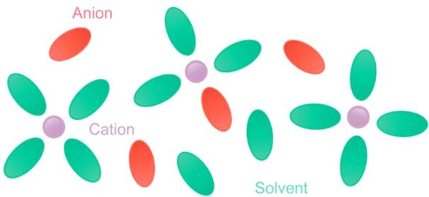  
(a)

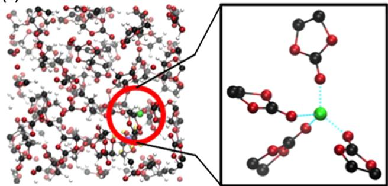  
(b)  
Figure 4. Cation solvation structures. (a) Schematic of cation solvation structures. (b) EC-coordinated solvation shell of  $\mathrm{Li^{+}}$ . Li, C, and O atoms are marked with green, black, and red, respectively, and H atoms are not shown. Reproduced with permission from ref 211. Copyright 2015 American Chemical Society.

obtained. In general, the solvation structure of cations is largely dependent on the type of cations, solvents and anions and salt concentrations, which are respectively discussed in the following.

3.1.1.1. Effects of Cations. As central particles, the solvation structures of different cations can be very different due to their varied ionic radii and charge states. Compared to  $\mathrm{Li^{+}}$ ,  $\mathrm{Na^{+}}$  and  $\mathrm{K^{+}}$  have a larger ionic radius and resultant lower charge density. The weaker Lewis acidity of  $\mathrm{Na^{+}}$  and  $\mathrm{K^{+}}$  than that of  $\mathrm{Li^{+}}$  gives rise to more loose binding with solvents and anions. As a result, the radius of the first solvation shells is expected to follow the order  $\mathrm{Li^{+} < Na^{+} < K^{+}}$ ,[212,213] and the preferable CN simultaneously increases from around 4 to 6 and 8.[213] Moreover,  $\mathrm{Na^{+}}$  and  $\mathrm{K^{+}}$  show a broader CN distribution than  $\mathrm{Li^{+}}$  (Figure 5a), implying their more disordered and flexible solvation structures. On the contrary, it was also argued that the Stokes radii in PC solvents are in the order  $\mathrm{Li^{+} > Na^{+} > K^{+}}$  according to the derivation of Stokes law.[214] Among these three cations,  $\mathrm{Li^{+}}$  attracts solvents most strongly and is, thus, supposed to coordinate with more solvents outside its first solvation shell, delivering the largest Stokes radius. A larger Stokes radius indicates the lower mobility and ionic conductivity of  $\mathrm{Li^{+}}$  than  $\mathrm{Na^{+}}$  and  $\mathrm{K^{+}}$ . However, critical insight into the Stokes radius at the atomic level should be further considered as the diffusion of ions in electrolytes is not simply determined by the radii of the coordination shells. The strong interaction between cations and solvents also impedes the structural diffusion of cations rather than only increasing their solvation radius, which is especially common in HCEs. The ionic transport behaviors will be comprehensively discussed in section 4.

Compared with monovalent cations, multivalent cations such as  $\mathrm{Mg}^{2+}$ ,  $\mathrm{Ca}^{2+}$ ,  $\mathrm{Zn}^{2+}$ , and  $\mathrm{Al}^{3+}$  generally possess a stronger interaction with solvents and anions, and contact ion pairs are a common feature in multivalent electrolytes.[215-218] For example,  $\mathrm{Mg}^{2+}$  is proven to form a well-defined inner sphere but broader

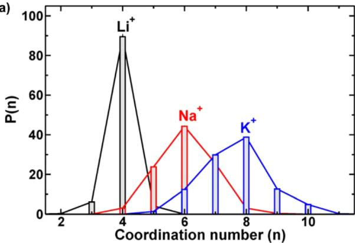  
(a)  
(b)

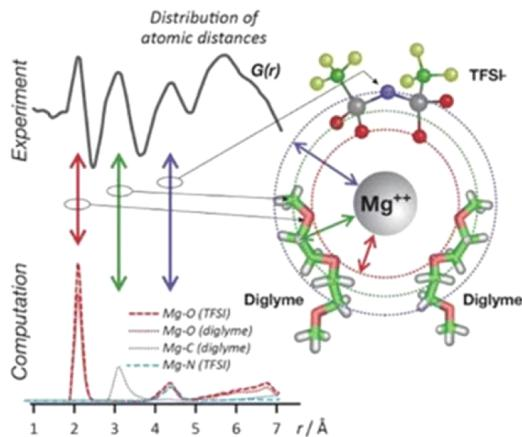  
Figure 5. Effects of cations on cation solvation structures. (a) Comparison of the proportion of different CNs  $(\mathrm{P}(\mathrm{n}))$  in the first solvation shell of  $\mathrm{Li^{+}}$ ,  $\mathrm{Na^{+}}$ , and  $\mathrm{K^{+}}$  in EC-based electrolytes. Reproduced with permission from ref 213. Copyright 2017 American Chemical Society. (b) Solvation structure of  $\mathrm{Mg}^{2+}$  in the  $\mathrm{Mg(TFSI)_2}$ /diglyme electrolyte with well-defined inner sphere features and broader solvation shells at longer distances. The experimental and computational RDF results were obtained from X-ray total scattering and MD simulations, respectively. Reproduced with permission from ref 215. Copyright 2018 The Authors. Reproduced with permission from ref 217. Copyright 2014 The Royal Society of Chemistry.

solvation shell at longer distances as evidenced by RDFs obtained from both experimental measurements and MD simulations (Figure 5b). The sharp and narrow peaks at small distances correspond to the rigid and constrained first solvation structure of  $\mathrm{Mg}^{2+}$ , which can be attributed to the higher charge of such multivalent ions. Besides,  $\mathrm{Mg}^{2+}-\mathrm{TFSI}^{-}$  CIPs are even formed at a moderate concentration of  $0.40\mathrm{M}$  where  $\mathrm{Mg}^{2+}$  is 6-fold coordinated with O atoms from  $\mathrm{TFSI}^{-}$  or solvents.[217] Wen et al. took advantage of the discrepancy in coordination with monovalent and multivalent cations and proposed adding  $\mathrm{Na}^{+}$  into the  $\mathrm{Mg}^{2+}$ -based electrolyte to facilitate the  $\mathrm{Mg}$  deposition.[219]

3.1.1.2. Effects of Solvents. Solvation structures are affected by solvent types since the donor numbers, dielectric constants, and steric effects of solvents differ from each other to determine the binding strength between solvents and cations. $^{141,199,220-226}$

Shakourian-Fard et al. compared the solvation structures of a series of carbonate electrolytes (Figure 6a).227 A strong local tetrahedral order involving four solvents around  $\mathrm{Li^{+}}$  is observed for most carbonates, except that three molecules in the first solvation shell of  $\mathrm{Li^{+}}$  are favored in the propylene carbonate (PC) electrolyte. This result is consistent with QM calculations that the binding energy of  $\mathrm{Li^{+} - PC}$  is approximately  $10 - 50\mathrm{kcal}/$

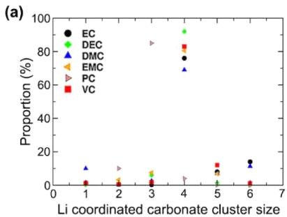

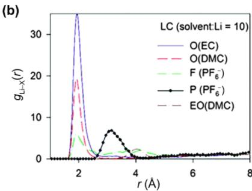

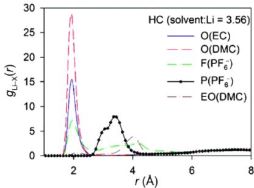

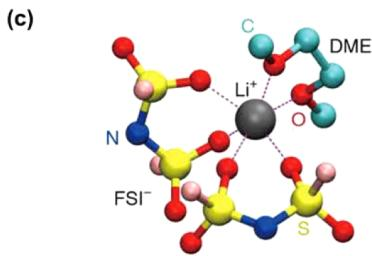  
Figure 6. Effects of solvents on cation solvation structures. (a) Percentage of the cluster size of  $\mathrm{Li^{+}}$  coordinated with various acyclic or cyclic carbonates. Reproduced with permission from ref 227. Copyright 2016 Wiley-VCH. (b) RDFs between  $\mathrm{Li^{+}}$  and atoms of solvents or anions in EC/DMC/LiPF $_6$  electrolytes with low (left) and high (right) salt concentrations. O and EO denote carbonyl and noncarbonyl oxygens, respectively. Reproduced with permission from ref 233. Copyright 2016 The Royal Society of Chemistry. (c) Solvation structures of LiFSI/DME (left), LiFSI/DMB (middle), and LiFSI/FDMB (right). Li, F, O, C, N, and S atoms are marked with dark gray, pink, red, light blue, navy, and yellow, respectively. For clarity, H atoms are not shown. Reproduced with permission from ref 43. Copyright 2020 Springer Nature.

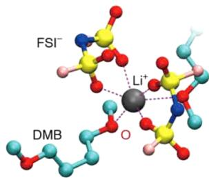

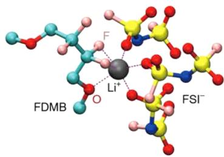

mol smaller than that of  $\mathrm{Li^{+}}$  with other carbonate molecules. The alteration of solvation structures caused by solvents can finally result in the modification of electrolyte properties such as salt solubility, ionic transport, and electrochemical stability.[224,228] Solvents exhibiting strong coordination to cations favor the salt dissociation but inhibit fast desolvation and reversible reactions,[44,220,229,230] while solvents with a moderate solvation ability function in the opposite way.

The difference in the solvation ability of various solvents gives rise to competitive interactions in electrolytes containing solvent mixtures.[231] The most representative example is mixed linear and cyclic carbonate-based electrolytes. Borodin et al. conducted CMD simulations to investigate the solvation structures of ethylene carbonate (EC)/dimethyl carbonate (DMC) electrolytes.[232] Both EC and DMC constitute the  $\mathrm{Li^{+}}$  solvation shell in spite of their disparate dielectric constants (EC, 89; DMC, 3).[41] Structural analysis of  $1.0\mathrm{M}\mathrm{LiPF}_6 / \mathrm{EC} / \mathrm{DMC}$  even indicates a slightly higher ratio of DMC than EC molecules in the  $\mathrm{Li^{+}}$  solvation shell, in contrast with Raman spectroscopy results and the speculation from dielectric constants. They explained that the assumption that the activity of the  $\mathrm{Li^{+}}$ -shifted bands in the Raman spectra is the same as that of nonshifted ones could result in doubtful conclusions from experimental analyses. Further investigations by AIMD simulations imply a preference for EC in the dilute electrolyte and a slight preference for DMC in the highly concentrated electrolyte (Figure 6b).[232,233] Such competitions are not only between carbonates.[234] Acetonitrile (ACN) molecules in  $\mathrm{Li^{+}}$  solvation shells can be substituted by 1,1,2,2-tetrafluoroethyl-2,2,3,3-tetrafluoropropyl ether (TTE) after the addition of TTE. Released ACN molecules from  $\mathrm{Li^{+}}$  are free to solvate polysulfides, facilitating fast polysulfide formation kinetics in lithium-sulfur (Li-S) batteries.[235] There also exist weak-solvating solvents poor at coordinating with central cations directly. Despite this, they can play a role in the second solvation shell. As proposed by Zhang and co-workers, di-isopropyl ether (DIPE) and di-isopropyl

sulfide (DIPS) serve as cosolvents to encapsulate the first solvation shell of lithium-polysulfides, which significantly suppresses the parasitic reactions between encapsulated polysulfides and the Li metal anode.[236,237]

Because of the significant impacts solvents have on solvation structures and electrolyte properties, many efforts have been devoted to tailoring suitable electrolyte solvents.[43,44,238-242] 1,2-Dimethoxyethane (DME), a typical solvent used in rechargeable batteries, was modified in the length of its alkyl chain to obtain 1,4-dimethoxylbutane (DMB). Further introducing  $-\mathrm{F}$  functional groups into the structure of DMB produces fluorinated 1,4-dimethoxybutane (FDMB).[43] Figure 6c exhibits the change of coordination when DME, DMB, and FDMB serve as solvents. The DME molecule is a bidentate ligand with two O atoms simultaneously bound to a  $\mathrm{Li^{+}}$ . The lengthened alkyl chain makes DMB hard to fold as DME and the  $\mathrm{Li^{+}}$  ions interact with only one ether functional group  $(-O-)$  in most cases. FDMB keeps the backbone of DMB, but the F atom distant from O can also coordinate with the  $\mathrm{Li^{+}}$ . The  $\mathrm{Li}-\mathrm{F}$  interaction impairs the  $\mathrm{Li}-\mathrm{O}$  interaction so that FDMB is poor at solvating  $\mathrm{Li^{+}}$ , inducing a higher content of anions in the  $\mathrm{Li^{+}}$  solvation shell in the FDMB-based electrolyte than that in DME- and DMB-based electrolytes. An anion-derived SEI is formed as a result of the unique solvation structure, which stabilizes the Li metal anode during the long-term battery cycling. The authors further designed and investigated a family of fluorinated-1,2-diethoxyethanes (fluorinated-DEEs) with varying positions and amounts of F substituents. Among them, molecules that interact with  $\mathrm{Li^{+}}$  more strongly through  $\mathrm{Li}-\mathrm{F}$  induce fewer  $\mathrm{Li^{+}}$  anion clusters in electrolytes. This helps overcome the drawbacks of the FDMB-based electrolyte that the ionic conductivity is poor and the overpotential is large, promoting the battery performance one step forward.[243] As alternatives to the Li metal anode, Mg and Ca metal anodes are facing many serious challenges and appeal for the electrolyte design. In this respect, Hou and Ji et al. discovered a family of methoxyethyl-amine chelants  $(\mathbf{M}x)$

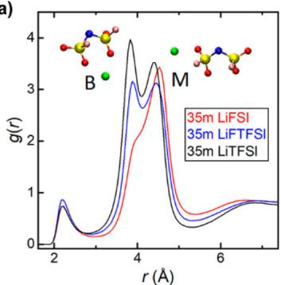  
(a)  
(c)  
(d)

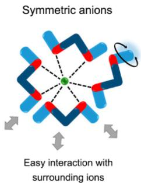  
(b)

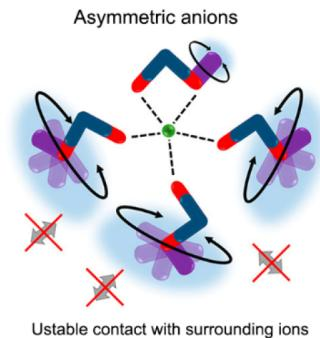

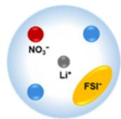

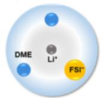

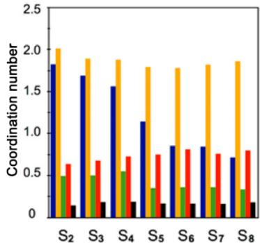  
Figure 7. Effects of anions on cation solvation structures. (a) RDFs between the  $\mathrm{Li^{+}}$  and N atoms of anions. H, C, N, O, F, and S atoms are marked with white, cyan, blue, red, pink, and yellow, respectively. Reproduced with permission from ref 250. Copyright 2020 American Chemical Society. (b) Schematic illustration of the difference in local coordination for symmetric  $\mathrm{TFSI^{-}}$  (left) and asymmetric  $\mathrm{FTFSI^{-}}$  (right) anions. Reproduced with permission from ref 250. Copyright 2020 American Chemical Society. (c) CNs of  $\mathrm{Li^{+} - Li^{+}}$ ,  $\mathrm{Li^{+} - TFSI^{-}}$ ,  $\mathrm{Li^{+} - S_{x}^{2-}}$  (terminal),  $\mathrm{Li^{+} - DME}$ , and  $\mathrm{Li^{+} - DOL}$  in  $\mathrm{Li_2S_x}$  ( $x = 2 - 8$ )/LiTFSI/DOL/DME electrolytes. Reproduced with permission from ref 101. Copyright 2017 American Chemical Society. (d) Schematic illustration of  $\mathrm{Li^{+}}$  solvation structures in  $\mathrm{LiFSI / LiNO_3}$  and LiFSI electrolytes (top). RDFs of  $\mathrm{Li-O}$ ,  $\mathrm{Li-N}$ , and  $\mathrm{Li-F}$  in  $\mathrm{LiFSI / LiNO_3}$  and LiFSI electrolytes (bottom). Reproduced with permission from ref 92. Copyright 2019 American Chemical Society.

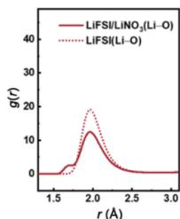

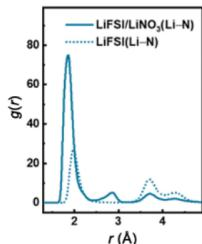

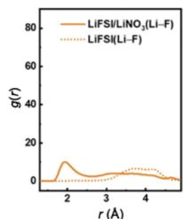

whose affinity for  $\mathrm{Mg}^{2+}$  is 6 to 41 times higher than traditional ether solvents.[244] The strengthened interactions between the  $\mathrm{Mg}^{2+}$  and  $\mathbf{N}$  atoms of  $\mathrm{Mx}$  chelants along with the induced promotion of  $\mathrm{Mg}^{2+}-\mathrm{O}_{\mathrm{Mx}}$  association jointly account for their strong binding with  $\mathrm{Mg}^{2+}$ . Such a strategy of regulating solvents and solvation structures enables stable and highly reversible  $\mathrm{Mg}$  and Ca metal batteries.

3.1.1.3. Effects of Anions. Anions are nonnegligible components of the inner solvation shells of cations that are not fully solvated by solvents. Different anion types affect solvation structures as solvents do, which can be attributed to their geometry and charge distribution differences to determine the interaction strength with cations.[244-249] The predominance of monodentate and bidentate coordination of anions varies among bis(fluorosulfonyl)imide  $(\mathrm{FSI}^{-})$ , (fluorosulfonyl)-(trifluoromethanesulfonyl)imide  $(\mathrm{FTFSI}^{-})$ , and bis(trifluoromethanesulfonyl)imide  $(\mathrm{TFSI}^{-})$ -based electrolytes (Figure 7a).[250] The electrolyte solution becomes much more disordered when anions coordinate with cations monodentately rather than bidentately. The asymmetric geometry of  $\mathrm{FTFSI}^{-}$  further assists with the high rotational mobility of its uncoordinated  $-\mathrm{SO}_2\mathrm{CF}_3$  functional group (Figure 7b), which impedes the close packing of the solvation structures and consequently results in the superior supercooling property of  $\mathrm{FTFSI}^{-}$ -containing electrolytes.

The influence of anions is not only reflected through their interaction with cations but also spread to interactions between

other species and cations. $^{101,251}$  For example, the  $\mathrm{Li^{+}}$  vicinity is more readily populated by DMC instead of EC when more anions participate in the solvation of  $\mathrm{Li^{+}}$ . $^{232,233}$  A similar replacement of EC by DMC also takes place when perfluorohexyl sulfonate anions ( $\mathrm{PFHS^{-}}$ ) are added into  $\mathrm{LiPF_6}$ -based electrolytes. $^{252}$  The coordination of  $\mathrm{PFHS^{-}}$ anions with  $\mathrm{Li^{+}}$ squeezes  $\mathrm{PF_6}^-$ anions away from the solvation shell, and the solvent distribution in the solvation shell is changed simultaneously. In the study of Rajput et al., a decreasing trend of  $\mathrm{Li^{+} - Li^{+}}$ and  $\mathrm{Li^{+} - }$ polysulfide (PS or  $S_{x}^{2-}$ ) clustering was observed with longer PS anion chains or in the presence of  $\mathrm{TFSI^{-}}$ anions. More DME and 1,3-dioxolane (DOL) solvents enter solvation sheaths of  $\mathrm{Li^{+}}$ in the meantime (Figure 7c). $^{101}$  Nonetheless, it is still difficult for long-chain PSs such as  $S_{6}^{2-}$ and  $S_{8}^{2-}$ to separate from  $\mathrm{Li^{+}}$ . $^{253}$  It is also worth noting that the linearly structured DME has stronger interactions with  $\mathrm{Li^{+}}$ and a larger CN compared to cyclic DOL owing to its higher O donor density and structural flexibility. This again manifests the universality of solvent competitions in the  $\mathrm{Li^{+}}$ solvation in electrolytes. Such competitive relationships also exist between anions. $^{254}$  Zhang et al. proposed a lithium hexafluorophosphate ( $\mathrm{LiPF_6}$ )-lithium nitrate ( $\mathrm{LiNO_3}$ ) dual-salt electrolyte. $^{255}$  Competitions of two kinds of anion species and the resultant substitution of  $\mathrm{NO}_3^-$ for  $\mathrm{PF_6}^-$ in the solvation shell suppressed the  $\mathrm{PF_6}^-$ decomposition. Similar phenomena were observed when introducing  $\mathrm{NO}_3^-$ into  $\mathrm{FSI^{-}}$ -based electrolytes.  $\mathrm{NO}_3^-$ anions take part in the solvation shell of  $\mathrm{Li^{+}}$ together with  $\mathrm{FSI^{-}}$ . $^{92}$

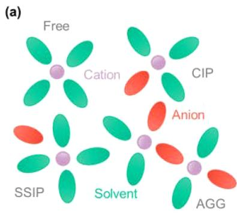

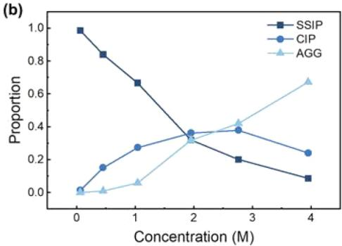

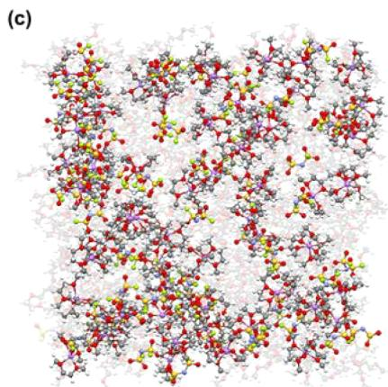  
Figure 8. Effects of salt concentrations on cation solvation structures. (a) Schematic of different cation solvation states: free, solvent-separated ion pairs (SSIPs), contact ion pairs (CIPs), and aggregates (AGGs). (b) Percentage variation of different cation solvation states with salt concentrations. Original data from ref 260. Copyright 2018 American Chemical Society. (c) Snapshots of the MD simulation boxes of  $1.0\mathrm{M}$  LiFSI/DME (left) and 4.0 M LiFSI/DME electrolytes (right). H, Li, C, N, O, S, and F atoms are marked with white, purple, gray, blue, red, yellow, and green, respectively. The DME solvent molecules and  $\mathrm{FSI}^{-}$ anions that coordinate with  $\mathrm{Li^{+}}$  are highlighted while the uncoordinated DME solvent molecules are light gray. Reproduced with permission from ref 271. Copyright 2015 The Authors.

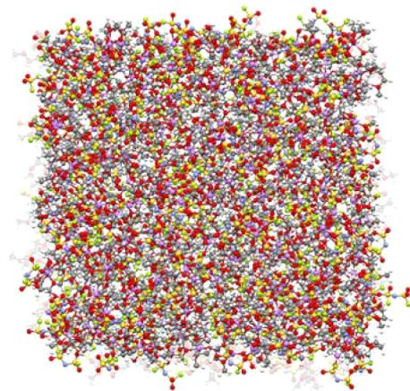

In addition,  $\mathrm{NO}_3^-$  can regulate the interaction between  $\mathrm{Li^{+}}$  and  $\mathrm{FSI^{-}}$ , as revealed by the RDF analysis (Figure 7d). Perchlorate anions  $(\mathrm{ClO}_4^-)$  perform analogously to  $\mathrm{NO}_3^-$ , proving the generality of anion regulation strategies in electrolytes.[256-258]

3.1.1.4. Effects of Salt Concentrations. According to the coordination structure between cations and anions, solvated cations can be classified as either free ions, SSIPs, CIPs, or AGGs, which are in the order of an increasing number of anions participating in the cation solvation (Figure 8a). This ordering is mainly attributed to the increase of salt concentrations. Solvents gradually become insufficient to fill in the first solvation shell of cations as cation-to-solvent ratios increase, resulting in significant cation-anion pairing and aggregation. The cation-anion associations are more pronounced for multivalent cations  $\mathrm{(Mg^{2+}, Ca^{2+}, Zn^{2+}}$ , etc.) than for monovalent cations  $\mathrm{(Li^+, Na^+}$  and  $\mathrm{K^+}$  due to the larger positive charge densities of multivalent cations. Even for cations with the same valence state, the variation of their solvation structures with the salt concentration differs. For example,  $\mathrm{Na^+}$  ions display a higher CN than  $\mathrm{Li^+}$  so that an earlier onset of high-concentration behavior is expected in Na-based electrolytes.

Generally, cations in free or SSIP states dominate in low-concentration electrolytes (LCEs), which are also denoted as salt-in-solvent electrolytes.[269] On the contrary, CIPs and AGGs take over in HCEs, namely solvent-in-salt electrolytes (Figure 8b).[50-52,103,260,270] The MD simulation carried out by Qian et al. depicted a concrete picture of the microstructures in LCEs

and HCEs (Figure 8c). The left image in Figure 8c shows relatively separated solvation shells in 1 M LiFSI/DME electrolyte with many uncoordinated DME solvent molecules. When the salt concentration rises to  $4.0\mathrm{M}$ , the proximity of  $\mathrm{Li^{+}}$  gets much closer.  $\mathrm{FSI^{-}}$  anions connect isolated solvation shells owing to their ability to interact with multiple  $\mathrm{Li^{+}}$  ions, leading to the formation of complex 3D networks in the HCE (Figure 8c, right image). Similar HCE recipes are applied in Na batteries. High-concentration salts are also used in aqueous electrolytes to widen the electrochemical window and stabilize the working electrode. The solvation structure of aqueous electrolytes is similar to that of nonaqueous electrolytes, but the salt concentration involved in nonaqueous media can be up to  $10\mathrm{M}$ , compared with  $3 - 5\mathrm{M}$  in nonaqueous electrolytes. This is a result of the strong solvating power of  $\mathrm{H}_2\mathrm{O}$  molecules. In addition,  $\mathrm{H}_2\mathrm{O}$  molecules can connect to each other and form a network through H bonds. The  $\mathrm{H}_2\mathrm{O} - \mathrm{H}_2\mathrm{O}$  interaction network will be disrupted upon the addition of salts or organic solvents, which can be attributed to the additional interaction of  $\mathrm{H}_2\mathrm{O}$  with anions or solvent molecules. For instance, Chang et al. proposed an aqueous hybrid electrolyte containing ethylene glycol (EG) solvents. EG can not only interact with  $\mathrm{Zn^{2 + }}$  but also form the H bond with  $\mathrm{H}_2\mathrm{O}$  to weaken the  $\mathrm{Zn^{2 + } - H_2O}$  interaction, affording the electrolyte with a low freezing point and reversible Zn deposition/stripping.

The strong interaction between cations and anions in HCEs delivers several disadvantages, including low conductivity and high viscosity.[260,290] One innovative solution to these drawbacks

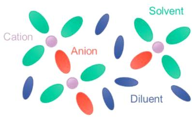  
(a)

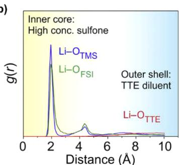  
(b)

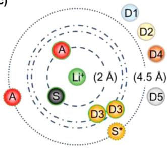  
(c)

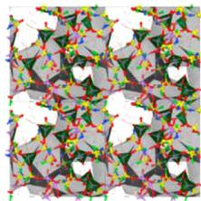  
(d)  
HCE

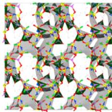  
LHCE, low % diluent

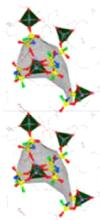  
LHCE, high % diluent

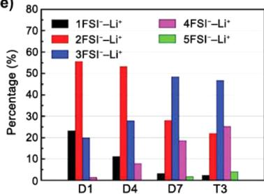  
(e)  
Figure 9. Effects of salt concentrations on cation solvation structures. (a) Schematic of cation solvation structures in localized high-concentration electrolytes (LHCEs). (b) RDFs between  $\mathrm{Li^{+}}$  and solvents (TMS), anions (FSI $^{-}$ ), and diluents (TTE) in the LHCE. Reproduced with permission from ref 294. Copyright 2018 Elsevier Inc. (c) Schematic illustration of the radial distribution of LHCEs containing different diluents. S, A, and D denote solvent, anion, and diluent, respectively. Reproduced with permission from ref 295. Copyright 2021 The Authors. (d) Solution structures in the high-concentration electrolyte (HCE) and LHCE with a low and high ratio of diluents, respectively. H, Li, C, N, O, S, and F atoms are marked with white, pink, gray, blue, red, yellow, and green, respectively. The interconnected  $(- \mathrm{Li}^{+} - \mathrm{FSI}^{-} - \mathrm{Li}^{+}-)$  complexes are dark gray. The tetrahedral structures formed around  $\mathrm{Li}^{+}$  are highlighted in dark green. Reproduced with permission from ref 272. Copyright 2020 American Chemical Society. (e) Comparison of percentages of  $\mathrm{Li}^{+}$  coordinating with different numbers of  $\mathrm{FSI}^{-}$  in HCEs (D1, D4, and D7) and the LHCE (T3). Reproduced with permission from ref 273. Copyright 2020 Wiley-VCH.

is introducing inert cosolvents to dilute the concentrated electrolytes, namely, LHCEs (Figure 9a).54,226,272,273,291-296

LHCEs can be regarded as HCEs mixed with diluents. Diluents should be inactive not only in chemical reactions but also in coordination with cations to maintain unique solvation structures in HCEs.[55,297-299] In this regard, the above-mentioned DIPE and DIPS share the same properties with diluents. As shown in Figure 9b, all  $\mathrm{Li^{+}}$  ions are surrounded by  $\mathrm{FSI^{-}}$  anions and tetramethylene sulfone (TMS) solvents in the first solvation shell. Meanwhile, diluent TTE molecules are barely coordinated with  $\mathrm{Li^{+}}$ .[294] However, Cao et al. conducted systematic studies on the various types of diluents and discovered that bis(2,2,2-trifluoroethyl) carbonate (BTFEC) could afford a moderate interaction toward  $\mathrm{Li^{+}}$ , although it is not in the first solvation shell (denoted as D3 in Figure 9c).[295] Other diluents, including bis(2,2,2-trifluoroethyl) ether (BTFE, D1), TTE (D2), tri(2,2,2-trifluoroethyl) borate (TFEB, D4), and tris(2,2,2-trifluoroethyl) orthoformate (TFEO, D5), satisfy basic requirements to not coordinate with  $\mathrm{Li^{+}}$ . Though suitable diluents do not take part in the local solvation shells of  $\mathrm{Li^{+}}$ , they do affect the overall microstructures. As revealed by Perez Beltran et al., the 3D regions in the original HCE system are preserved at low diluent percentages but broken into island-like solvation complexes at high diluent percentages (Figure 9d).[272] This could even enhance the characteristic of HCEs that cations and anions are highly associated with each other. MD results from Piao et al. suggest four and five  $\mathrm{FSI^{-}}$ -coordinated  $\mathrm{Li^{+}}$  ions accounted for a larger percentage in the diluent-added electrolyte (T3) compared to the original HCEs (D1, D4, and D7) (Figure 9e).[273] A lower degree of  $\mathrm{Na^{+}}$  solvation by DME solvents in the LCE than the HCE was also reported by Wang et

al., which leads to more  $\mathrm{FSI}^{-}$ anions but fewer DME molecules decomposing on Na metal anodes. $^{300}$  The above examples demonstrate the wide applicability of LHCEs in various rechargeable batteries.

For rechargeable battery electrolytes, a high dissolution and dissociation degree of salts is generally beneficial to implement ionic transport and desirable rate performances. This is undoubtedly relevant to the cation solvation structures. The solubility and dissociation degree of salts rely mostly on the solvation of cations by solvents. Simultaneously, anions compete for the coordination of cations with solvents, especially in HCEs and LHCEs. Although MD simulations can provide exact solvation structures and fractions of various cation speciation in electrolytes, the correspondence between simulated microstructures and the salt dissolution or dissociation in experiments is still lacking. This proposes urgent needs for the combination of experimental phenomena and simulation results in future research. For instance, the critical point of the largest amount of salts that can be dissolved in solvents experimentally may correspond to a critical proportion of different solvation structures (free ions, SSIPs, CIPs, and AGGs), which can be counted by MD simulations. Besides, it is very promising to simulate the dissolution process of salt crystals to reproduce experiments and establish a direct relation between experiments and simulations in the near future. Furthermore, achieving a balance between the rapid ionic transport in the case of highly dissociated salts and the benefits on the interfacial stability induced by anions participating in the solvation of cations is consistently one of the key points in electrolyte design.

3.1.1.5. Effects of Temperatures and Electric Fields. The thermal motions of ions and molecules depend on temperatures

so that solvation structures are supposed to be correspondingly altered. Kumar et al., $^{301}$  Mynam et al., $^{302}$  Karatrantos et al., $^{303}$  and Kartha et al. $^{304,305}$  all studied the temperature-dependent cation-solvent and cation-anion interactions but came to different conclusions. Some of them claimed that the temperature change had negligible effects on the distribution of both solvents and anions in the solvation shell of cations (Figure 10a).

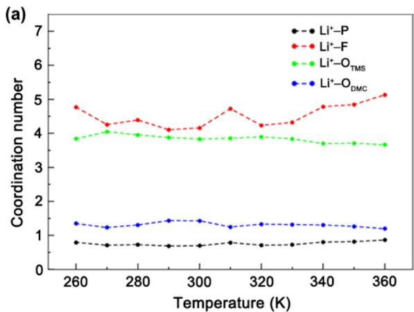

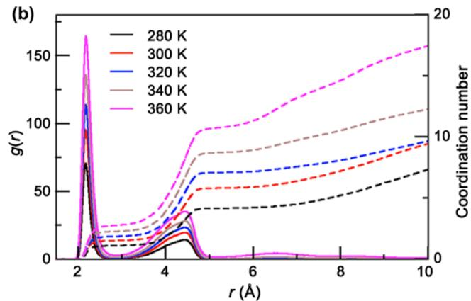  
Figure 10. Effects of temperatures on cation solvation structures. (a) Change of CNs in the  $\mathrm{LiPF_6 / TMS / DMC}$  electrolyte with the temperature change. Reproduced with permission from ref 301. Copyright 2018 American Chemical Society. (b) RDFs (solid lines) and CNs (dash lines) of  $\mathrm{Li^{+} - O}$  of  $\mathrm{ClO_4^-}$  in the  $\mathrm{LiClO_4 / TMS / PC}$  electrolyte at various temperatures. Reproduced with permission from ref 304. Copyright 2020 Elsevier Inc.

Nevertheless, others observed a trend of anions replacing solvents from the vicinity of cations with increasing temperatures (Figure 10b). It was also reported that the association between cations and anions was hardly modified regardless of the temperature.[306] As their electrolyte recipes differ from each other, it is difficult to draw compelling conclusions on the influences of temperatures on electrolyte structures. It is also likely that the temperatures do affect microstructures to different extents depending on specific electrolyte components, and further investigations are necessary to reveal the general principles.

The charged electrodes of a battery exert an electric field on the bulk electrolyte despite the fact that the electric double layer (EDL) can screen or weaken the electric field to some extent. The electrolyte structures in the presence of the electric field will be different from those without the electric field, as electrolyte components are subject to the electric field force. Therefore, it is of necessity to simulate the presence of the external electric field

and probe its effects on solvation structures. $^{307-309}$  As shown in Figure 11a, EC molecules randomly distribute around  $\mathrm{Li^{+}}$  in the

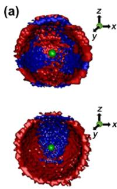

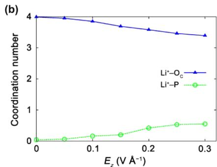

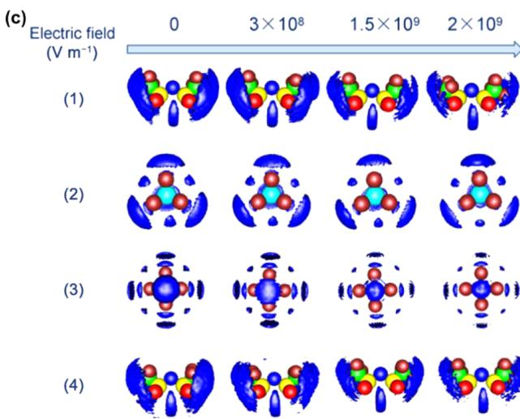  
Figure 11. Effects of electric fields on cation solvation structures. (a) Isosurface depiction of the probability density of EC (carbonyl oxygen groups) in the first coordination shell of  $\mathrm{Li^{+}}$  at  $E_{z} = 0\mathrm{V}\mathring{\mathrm{A}}^{-1}$  (top) and  $0.3\mathrm{V}\mathring{\mathrm{A}}^{-1}$  (bottom), where  $E_{z}$  represents the electric field strength along the  $z$ -direction. Red and blue represent different values of the probability density. Reproduced with permission from ref 310. Copyright 2020 Elsevier Inc. (b) CNs of EC and  $\mathrm{PF_6^-}$  surrounding  $\mathrm{Li^{+}}$  as a function of  $E_{z}$ . Reproduced with permission from ref 310. Copyright 2020 Elsevier Inc. (c) Spatial distribution functions (SDFs) of  $\mathrm{Li^{+}}$  (blue surface, isovalue  $= 25$ ) around  $\mathrm{TFSI}^{-}(1,4)$ ,  $\mathrm{BF}_4^-$  (2), and  $\mathrm{PF_6^-}$  (3) in different IL electrolytes under external electric fields. B, C, N, O, F, and S atoms are marked with cyan, green, blue, red, brown, and yellow, respectively (P atoms are covered by the blue isosurface). Reproduced with permission from ref 311. Copyright 2020 American Chemical Society.

electric-field-free environment. $^{310}$  The application of a unidirectional electric field along the  $z$ -axis makes the distribution asymmetric, and EC is predominantly present toward the positive  $z$ -direction. Besides, despite the unchanged total CN, the number of EC solvents and  $\mathrm{PF}_6^-$  anions decreases and increases, respectively, as the strength of the electric field increases (Figure 11b). Tan et al. suggested that the electric field could not make an obvious change to electrolyte structures unless its strength reached the threshold value of  $3\times 10^{8}\mathrm{V}$ $\mathrm{m}^{-1}$ . $^{311}$  They also argued the electric field separated large ion clusters into small ones and the anions around  $\mathrm{Li^{+}}$  were partially substituted by solvent molecules instead of an enhanced ion association (Figure 11c). Although these studies do not yield general rules, what is clear is that the electric field largely influences electrolyte structures and related properties such as ion diffusivity, which will be discussed in a later section.

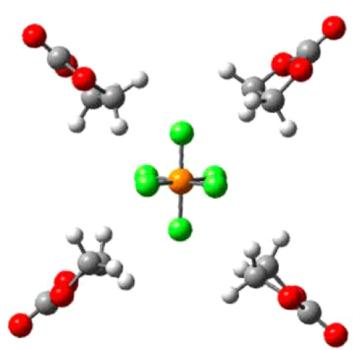  
(a)

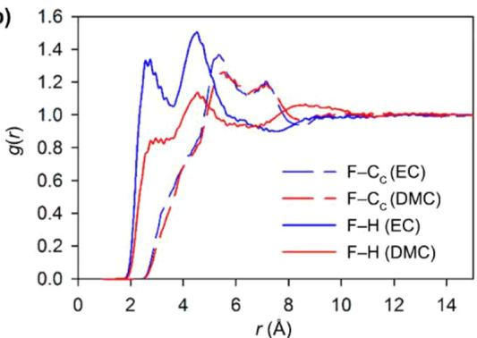  
(b)

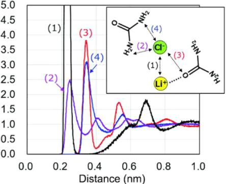  
(c)  
Figure 12. Anion solvation structures. (a) EC-coordinated solvation shell of the  $\mathrm{PF}_6^-$  anion. H, C, O, F, and P atoms are marked with white, gray, red, green, and orange, respectively. Reproduced with permission from ref 315. Copyright 2016 American Chemical Society. (b) RDFs between  $\mathrm{PF}_6^-$  and solvents. Reproduced with permission from ref 314. Copyright 2016 American Chemical Society. (c) RDFs between  $\mathrm{Cl}^-$  and urea, which possess H-bond-donor (HBD) sites. Reproduced with permission from ref 319. Copyright 2020 The Royal Society of Chemistry. (d) Schematic illustration of the solvation structure in the electrolyte-containing anion receptor (AR) TMSB. Reproduced with permission from ref 200. Copyright 2021 Wiley-VCH.

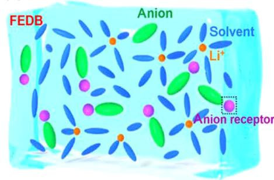  
(d)

3.1.2. Anion Solvation Structures. Anions are often regarded as part of the solvation shells of cations. In addition to the interaction between anions and cations, studies on the anion solvation, namely the interaction between anions and solvents, are very limited. $^{312-314}$  The lack of investigation of the anion solvation structure is attributed to the fact that anions are difficult to be solvated by solvents in routine organic electrolytes. On the one hand, most aprotic polar solvents for rechargeable battery electrolytes are essentially nucleophilic, as mentioned above. The absence of strong electrophilic sites renders a weak anion-solvent interaction. On the other hand, the size of anions is larger compared with that of cations. More dispersed negative charges and lower charge density further reduce the possibility of anion solvation. Taking the hexafluorophosphate anion  $\left(\mathrm{PF}_{6}^{-}\right)$  as an example, it could only interact with the H atoms of EC through its F atoms (Figure 12a). $^{315}$  On the one hand, the negative charge of  $\mathrm{PF}_{6}^{-}$ is shared by six F atoms, so each F atom carries a small quantity of negative charge. On the other hand, the alkyl H atoms of EC are very weak electrophiles. These two aspects lead to the weak van der Waals (vdW) interactions between EC and  $\mathrm{PF}_{6}^{-}$ , and the binding energy between EC and  $\mathrm{PF}_{6}^{-}$ is less than half the value between EC and  $\mathrm{Li^{+}}$ . $^{315}$  A detailed analysis of the anion coordination structure is presented in Figure 12b. $^{314}$  The almost featureless RDFs for F-H profiles suggest much less coordination of solvent molecules around anions, in sharp contrast to the distinct peak of the Li-O interaction profiles (Figure 6b). The relatively stronger association of  $\mathrm{PF}_{6}^{-}$ with the H of EC than that of DMC hints at the preferential coordination of different solvents with anions, which resembles the case of cations. Similar situations were also observed for superoxide anion  $(\mathrm{O}_2^{-})$  with dimethyl sulfoxide

(DMSO), DME, and ACN. $^{316}$  Particularly, certain deep eutectic solvents in emerging deep eutectic electrolyte systems are H bond donors (HBDs), which suggests the probable formation of H bonds between this kind of solvents and anions. $^{317,318}$  Ogawa et al. compared the difference of HBD solvents and HBD-free solvents regarding their ability to coordinate with anions. $^{319}$  Urea, as an HBD, possesses  $-\mathrm{NH}_2$  functional groups while tetramethyl urea (TMU), as the homologue of urea, has a lack of HBD sites. TMU is loosely bound to  $\mathrm{Cl}^-$  due to the weaker polarity of the  $-\mathrm{CH}_3$  functional groups, which is very similar to carbonates and ethers. On the contrary, the H atoms in the  $-\mathrm{NH}_2$  functional groups of urea strongly attract the chloride anion ( $\mathrm{Cl}^-$ ) (Figure 12c).

The HBD solvents inspire the introduction of more polar or electron-deficient molecules to strengthen the anion solvation. Anion receptors (ARs, also known as anion acceptors) are designed to afford such electron-deficient centers, which compensate for the intrinsic absence of anion-binding sites in most routine solvent molecules. $^{314,320-325}$  The anion affinity of ARs favors their coordination with anions, which weakens the cation-anion interactions and helps promote the dissolution of salts in some specific electrolytes. $^{325,326}$ $\mathrm{LiNO}_3$  is one kind of regularly used additive in ether-based electrolytes for Li-S batteries but remains rare in carbonates owing to its low solubility. $^{327}$  The introduction of the AR tris(pentafluorophenyl)borane (TPFPB) with an electron-deficient boron (B) atom can make a difference by breaking  $\mathrm{LiNO}_3$  clusters. $^{328}$  Utilizing the attraction of ARs for anions, Huang et al. developed an electrolyte consisting of the B-containing AR tris(trimethylsilyl) borate (TMSB) (Figure 12d). $^{200}$  TMSB preferably adsorbs on the anode surface to induce more anions

to be involved in the reduction reaction. Also, pronounced  $\mathrm{PF}_6^-$  -TMSB interactions in the bulk electrolyte impair  $\mathrm{Li^{+}}$  -  $\mathrm{PF}_6^-$  coupling, resulting in the enhancement of ion dynamics. However, Li and Zhang et al. observed an increase in more aggregated  $\mathrm{Li^{+}}$  -FSI clusters in the presence of TFPPB in LHCE. $^{329}$  This is attributed to the fact that the direct interaction between TFPPB and  $\mathrm{FSI^{-}}$  forces the originally solvated  $\mathrm{Li^{+}}$  with  $\mathrm{FSI^{-}}$  to interact with other  $\mathrm{FSI^{-}}$  ions, forming a large amount of AGGs containing more than two anions. A stable anion-derived SEI is constructed benefiting from this change of electrolyte structure.

Beyond LIBs, ARs have also been widely adopted in metal-air batteries and fluoride ion batteries (FIBs).[322,330] Similar to the low solubility of  $\mathrm{LiNO}_3$  in electrolytes, metal oxides and metal fluorides can hardly be dissolved due to the strong metal-O/F bonds, which explains the sluggish kinetics and large voltage hysteresis. Taking FIBs as an example, fluorine ions are shuttled between cathodes and anodes during charge and discharge, in which the solubility of fluorides plays a vital role. CsF is widely used as an electrolyte additive due to its relatively good solubility in solvents. Furthermore, ARs such as fluorobis(2,4,6-trimethylphenyl) borane (FBTMPhB), triphenylboroxine (TPhBX), and triphenylborane (TPhB) were demonstrated to weaken the interaction between  $\mathrm{Cs}^+$  and  $\mathrm{F}^-$  and increase the solubility of CsF in electrolytes. As a result, FIBs with ARs and relatively high solubility of CsF are supposed to deliver better cycling stability compared with control batteries. Besides, saturated CsF electrolytes with  $0.50\mathrm{M}$  TPhBX anions were demonstrated to induce better capacity maintenance than electrolytes with  $0.45\mathrm{M}$  CsF and  $0.50\mathrm{M}$  TPhBX because the introduction of ARs can also promote the dissolution of active materials. A high concentration of CsF can impede the dissolution of active materials.[331]

Although anion solvation is not as notable as cation solvation in electrolytes, it paves a new way to regulate electrolyte properties from the anion aspect. For instance, the above-mentioned ARs have the potential to change the dissociation of salts and interfacial chemistry because of their significant effects on both the anion solvation structures and cation-anion interactions.[200,332] Some contradictions in subtle alteration of electrolyte microstructures remain in the meantime. Therefore, there are still many aspects remaining to be explored in terms of the anion solvation.[63]

# 3.2. Interfacial Structures

The electrode-electrolyte interfacial structure is another important aspect related to battery performance, especially for determining the interfacial chemistry. The electrochemical stability of the electrolyte species, the formation and properties of SEIs, the solvation and desolvation of ions, and the ionic transport crossing SEI are strongly related to or even largely determined by the atomic or molecular arrangement at the interface. The electrode surface attracts specific ions and molecules from electrolytes through either physical electrostatic interactions or chemical adsorption, forming an EDL. The special adsorption of ions and solvents discriminates the interfacial structure from that in the bulk.

The development of EDL models dates back to more than 100 years ago, from the first Helmholtz model to the refined one by Gouy and Chapman.[333-335] Stern further developed a model using a combination of the previous Helmholtz model and the Gouy-Chapman model.[336] However, these classical models have several obvious limitations. For example, ions in electro

lytes are solvated by solvents and counterions while the classical EDL model only considers solvents implicitly with the dielectric constant taken into account. The adsorption that takes place at the interface will also compete with the electrostatic interactions between the electrode and electrolyte components, which are not included in the schematic scenarios of the EDL. $^{337}$  Further understanding of the interfacial structure under realistic conditions is still lacking. Currently, advanced characterization techniques such as atomic force microscopy (AFM), $^{338-340}$  in situ scanning tunneling microscopy (STM), $^{341,342}$  surface-enhanced Raman spectroscopy scattering (SERS), $^{343,344}$  and fancy MD simulations are strongly expected to deepen the understanding of the EDL and reveal the electrode-electrolyte interfacial structures at the atomic level. $^{345}$

The interfacial structures featured by surface layering and gradual diffusion into the bulk are illustrated in Figure 13. $^{346,347}$

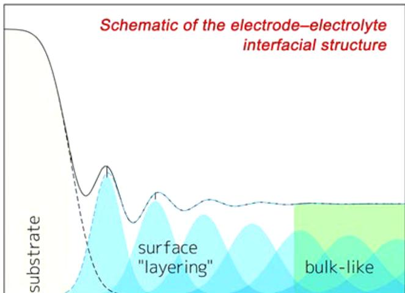  
Distance from interface  
Figure 13. Schematic of the layered structures at the electrode-electrolyte interface. Reproduced with permission from ref 346. Copyright 2018 The Royal Society of Chemistry.

Ions and molecules accumulate at the interface due to the external attraction from the electrode. That is why well-defined and intense peaks can be observed near the surface. As two parts that interact at the interface, both the electrolytes and electrode surfaces have implications for interfacial structures,[348] which will be discussed in sequence.

3.2.1. Effects of Electrolyte Compositions. The interfacial structure is sensitive to the features of the electrolyte, such as the geometry and polarity of the electrolyte species, salt concentrations, and potential intermolecular interactions, leading to distinct structures of diverse ions and molecules on electrode surfaces. $^{340,349,350}$  For example, DMC and EC molecules packed approximately three and two times more densely at the interface than in the bulk phase, respectively (Figure 14a). $^{346,351}$  The vdW force between the electrode surface and electrolyte species contributes to such a difference, and DMC, with bulky methyl funtional groups, is preferred to EC due to the relatively stronger vdW interactions. Differently, it is the carbonyl funtional group of these molecules that is focused on when discussing the cation solvation structures. Although the carbonyl funtional group does not interact with the electrode directly, its coordination with the cation still changes the interfacial structure, as revealed by Steinrück, Toney, and coworkers. $^{346}$  The Li-O interaction induces the reorientation of

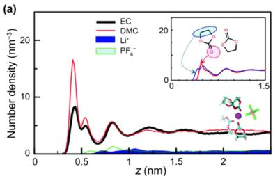

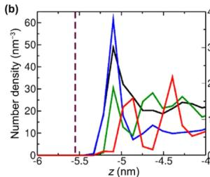

  
Figure 14. Effects of electrolyte compositions on interfacial structures. (a) Number density profiles of EC, DMC,  $\mathrm{Li^{+}}$ , and  $\mathrm{PF_6}^-$  along the  $z$ -direction near uncharged graphite electrodes. Reproduced with permission from ref 351. Copyright 2016 The Royal Society of Chemistry. (b) Number density profiles of anions, cations, PEO, and  $\mathrm{Li^{+}}$  in C2mimTFSI/PEO/LiTFSI (left) and P222momTFSI/PEO/LiTFSI (right) ILs. Reproduced with permission from ref 347. Copyright 2020 American Chemical Society. (c) Number density profiles of  $\mathrm{FSI^{-}}$  (red),  $\left[\mathrm{C3mpyr}\right]^{+}$  (green), and  $\mathrm{Na^{+}}$  (yellow) for the  $10\mathrm{mol}\%$  (left) and  $50\mathrm{mol}\%$  (right) NaFSI salts in C3mpyrFSI ILs and force-distance two-dimensional histograms (probability shown by the color bar) obtained from atomic force microscopy. Reproduced with permission from ref 86. Copyright 2020 Springer Nature.

EC and DMC molecules with their carbonyl functional groups away from the surface. Small cations prefer to interact with electrolyte species close to the surface rather than interact with surface atoms, which accords with their rareness in the very first surface layer. $^{352}$  A similar phenomenon is observed in ILs and ILs doped with salts or solvents where bulky cations and anions of ILs can reside at the interface primarily while small cations such as  $\mathrm{Li^{+}}$  and  $\mathrm{Na^{+}}$  display a low distribution or only appear in the second layer (Figure 14b). $^{347,353}$  Different bulky IL cations constitute either sharp or broad surface distributions depending on their geometrical structures to affect the packing of other species and interfacial structures. $^{347,354}$  Further increase of the salt concentration brings a remarkable change to the interfacial structure as well. $^{355}$  As shown in Figure 14c, a higher salt concentration enables more  $\mathrm{Na^{+}}$  and anions to enter the inner layer and a reduction of IL cations, which can be attributed to the aggregated  $\mathrm{Na^{+}}$ -anion structures occurring at the interface as in the bulk phase discussed in the previous section. $^{86}$

3.2.2. Effects of Electrode Surfaces. Apart from the characteristics of electrolyte components, the nature of the electrode surface determines interfacial structures to a large extent. $^{356-359}$  Pavlov et al. investigated the behavior of an ACN-based electrolyte at the graphene plane, single-layer graphene edge, and multilayer graphene edge (Figure 15a). $^{360}$  Various surface topographies allow the change of the adsorption and distribution of ACN molecules as shown by the mass density profiles in Figure 15b. The local density of ACN solvents is correlated to the PMF of  $\mathrm{Li^{+}}$  and  $\mathrm{O_2}$  in that the mass density valleys of ACN coincide with the energy barriers for  $\mathrm{Li^{+}}$  and  $\mathrm{O_2}$  to cross solvent layers and get close to the electrode surface (Figure 15c). As a result, different surface geometrical structures have effects on the adsorption rates of  $\mathrm{Li^{+}}$  and  $\mathrm{O_2}$ , which are higher near the edge of graphene than near the plane, and further regulate the kinetics of  $\mathrm{O_2}$  reduction reactions.

The electrode potential varies in a working battery, so it is also worthwhile to explore the sensitivity of interfacial structures to the electrode potential.356,359,361-366 As mentioned previously,

  
Figure 15. Effects of electrode surface topographies on interfacial structures. (a) Schematic illustration of different surface topographies of graphene (plane, single-layer edge, and multilayer edge) and corresponding maps of the mass density of ACN solvents. The color bar of the mass density is shown on the right. (b) Mass density profiles of ACN at edge and plane graphene surfaces. (c) PMF for  $\mathrm{Li^{+}}$  (top) and  $\mathrm{O_2}$  (bottom) at edge and plane graphene surfaces. Reproduced with permission from ref 360. Copyright 2016 The Authors.

the CPMs model the electrode potential, electrode polarization, and charge distribution more reasonably than FCMs because the

charge fluctuation of the electrode caused by the electrolyte is considered in CPMs. The CPM was first developed by Reed et al. and further revised by Gingrich and Wilson. $^{111,112,367}$  In this method, electrode atoms carry a Gaussian charge distribution and the derivative of the electrostatic energy of the system with respect to electrode charges leads to the applied potential. This method has been widely adopted to probe interfacial structures, $^{368-374}$  and here, their applications in electrolytes of batteries are focused on. Taking the EC/DMC/LiPF $_6$  electrolyte as an example (Figure 16), $^{375}$  the less polar DMC molecules

  
(a)

  
(b)  
Figure 16. Effects of electrode surface potentials on interfacial structures. (a) Snapshots showing the electrolyte ordering near the interface at large negative electrode potential (left), the potential of zero charge (PZC, middle), and large positive electrode potential (right). Li, P, and F atoms are marked with blue, orange, and green, respectively. The thick and slim stick models represent EC and DMC molecules, respectively. (b) Cumulated number density of electrolyte species in the interfacial layer as a function of the electrode potential. Reproduced with permission from ref 375. Copyright 2011 American Chemical Society.

are gradually replaced by the more polar EC with increasing electrode potentials (Figure 16b). Carbonyl functional groups, which dominate on zero- and positive-potential surfaces, are repelled at negative potentials.  $\mathrm{Li^{+}}$  and  $\mathrm{PF_6}^-$  also begin to emerge when the electrode is negatively and positively charged, respectively, in contrast to their scarcity on the neutral surface.[351] Both  $\mathrm{TFSI^{-}}$  and trifluoromethanesulfonate  $(\mathrm{OTF^{-}})$  are anions, but the former absorbed and the latter desorbed as the positive electrode polarization increased. Compared with anions,  $\mathrm{Li^{+}}$  cations show a broader distribution, as they can locate between layers of anions and solvents.[100,375,376] The attraction from  $\mathrm{Li^{+}}$  is likely to induce anions accumulating at negative potentials, especially in HCEs, which favors the formation of a uniform SEI and stable cycling of

alkali metal anodes. $^{355,377,378}$  These all demonstrate the effects of the surface charge on the interfacial structures as well as the selective partitioning of different species on the surface. $^{98,379}$

Many experimental results, some of which are in contradiction to expectations from bulk solvation structures, could also be reasonably interpreted by the dependence of interfacial structures on surface properties and electrolyte compositions.[100,379] For instance, EC and DMC molecules coordinate with  $\mathrm{Li^{+}}$  nearly in an equal ratio according to MD simulations on bulk electrolytes.[232] However, experiments reveal that the decomposition products of EC prevail in forming an SEI initially,[208,380,381] which disagrees with bulk structures but can be rationalized by the above-mentioned interfacial structure in which EC molecules replace DMC on the charged electrode.[375]

As a result, more attention should be paid to the microstructures at the interface, especially problems concerning interfacial chemistry such as the redox stability of electrolytes and the formation of an SEI and CEI. $^{382}$  What's more, it is the SEI layer formed between the electrode and the electrolyte instead of the bare electrode surface that electrolyte components are exposed to in long-term battery cycling. Interfacial structures in the presence of the SEI are thus affected by the properties of the SEI. Voth and co-workers proposed an SEI model from dilithium ethylenedicarbonate  $\left(\mathrm{Li}_{2} \mathrm{EDC}\right)$  and LiF. $^{383}$  Not only increasing amounts of LiF in the SEI but also increasing amounts of the SEI layer make more  $\mathrm{Li}^{+}$  readily adsorb on the surface, which is assumed to favor the desolvation of  $\mathrm{Li}^{+}$ , a process vital for battery operation. Compared with interfacial structures between bare electrode surfaces and electrolytes, research studies on those between SEI layers and electrolytes are rather limited. The complexity of SEI compositions, SEI structures, and repeating fracture and reconstruction occurring especially on alkali and alkaline metal anodes all challenge using MD simulations to study the effects caused by the SEI. Under the circumstances of getting deeper insights into the SEI and achieving advances in the field of MD simulations, it can be expected to model SEI-electrolyte interfacial structures efficiently and precisely.

# 4. PHYSICOCHEMICAL PROPERTIES OF ELECTROLYTES

Beyond solvation structures, a comprehensive understanding of the physicochemical property of electrolytes is another major interest. Although various experimental characterizations can be applied to test corresponding physicochemical properties such as the ionic conductivity and dielectric constant, experimental approaches are relatively expensive and time-consuming, and experimental data is very lacking to achieve a high-throughput screening of advanced electrolytes. On the contrary, many theoretical models have been developed to obtain such physicochemical properties based on MD simulations and corresponding statistical analyses. For example, the Green-Kubo relation derived from the linear response theory gives properties such as the diffusion coefficient and viscosity. $^{116-118}$

The Nernst-Einstein equation further relates the diffusion coefficient to ionic conductivity. Compared with experimental methods, MD simulations exhibit significant advantages in high-throughput cases and the exploration of new electrolyte components. More importantly, MD simulations are widely accepted to deliver deep and comprehensive insight into the physicochemical properties of electrolytes at the atomic level and help deepen experimental understanding.

In this section, the ionic transport property, which is closely related to the rate and low-temperature performances of

  
(a)  
Vehicular diffusion

  
Structural diffusion

  
Mixed vehicular/structural diffusion

  
(b)

  
(c)  
Figure 17. Ionic transport mechanisms. (a) Schematic illustration of vehicular, structural, and a mix of structural and vehicular diffusion mechanisms. The stick models and purple balls represent solvent molecules and central cations, respectively. Reproduced with permission from ref 105. Copyright 2019 American Chemical Society. (b) Hopping-based, i.e., structural transport, mechanism. The purple, yellow, and green patterns represent  $\mathrm{Li^{+}}$ , solvents, and anions, respectively. Reproduced with permission from ref 386. Copyright 2020 The Authors. (c) Mean square displacement (MSD) of cations that are totally coordinated by  $\mathrm{H}_2\mathrm{O}$  solvents,  $\mathrm{TFSI}^{-}$ anions, or the average (left) and representative solvation clusters (right). Cations diffuse mainly through the vehicular mechanism. H, Li, C, O, and F atoms are marked with white, purple, gray, red, and green, respectively. Reproduced with permission from ref 58. Copyright 2017 American Chemical Society.

batteries, is focused on at first. The MSD analysis method is discussed in detail to probe the diffusion coefficient of ions. Besides, the factors influencing ionic transport are analyzed, including electrolyte compounds and recipes, temperature, and electric field. Next, other electrolyte properties, such as the dielectric constant and viscosity, are discussed. The former is the most important parameter for DFT calculation under solvation environments and has attracted much attention recently. The latter is in close relation with ionic conductivity and is one of the most important factors when designing electrolytes for fast-charge or low-temperature applications. Finally, a combination of MD simulations and ML methods will be discussed to promote the optimization of electrolyte recipes.

# 4.1. Ionic Transport

The electrolyte serves as an ionic conductor and an electronic insulator in batteries, and one of its most important and fundamental properties is ionic transport. The ionic transport behaviors in electrolytes largely determine the ionic diffusivity, ionic conductivity, and transference number. Current demands for fast-charging and low-temperature applications raise

extremely high requirements for battery electrolytes with superior ionic transport properties. Moreover, conventional solution theory about ionic conduction in dilute solutions is no longer applicable to emerging electrolyte systems such as HCEs and LHCEs. A deep and comprehensive understanding of ionic transport is therefore required to unveil the limitations of current electrolytes and achieve the rational design of advanced electrolytes. The ionic transport is evaluated by experimental studies via directly measuring a range of properties. However, the disadvantage lies in the lack of correlations between macroscopic properties and micromechanisms, where MD simulations bridge the gap. In the following part, the ionic transport mechanisms are discussed at first and then the important factors influencing ionic transport are analyzed.

4.1.1. Transport Mechanisms. Cations and anions are solvated in electrolytes and move due to the driving force from an electric field or concentration gradient. Ideally, the transport mechanisms in liquid electrolytes can be classified into two categories, including vehicular diffusion and structural diffusion (Figure 17a). The vehicular mechanism refers to a completely

concerted diffusion of ions and species in their solvation shells. $^{384}$  Contrarily, ions jump from one solvation shell to another solvation shell in the structural diffusion mechanism, which is also known as the ion-hopping mechanism. $^{105,385}$  In other words, the ionic transport is accompanied by the desolvation and resolution process. In practice, the situation of ionic diffusion in electrolytes is very complicated, and the two diffusion mechanisms are often mixed. The mixed diffusion mechanism hovers between vehicular and structural diffusion mechanisms with partial components departing from the solvation shell and the remaining migrating along with the central ion (Figure 17a).

The diffusion mechanisms can be qualified through a comparison between the length scale of collective diffusion and that of the solvation shell, which both can be obtained from MD simulations. For example, Kankanamge et al. utilized MD simulations in concert with spectroscopies to derive the ionic transport mechanism in electrolytes composed of LiTFSI and carbonyl-containing solvents (Figure 17b). Cross peaks in two-dimensional IR spectra are ascribed to solvent molecules coordinating and decoordinating from  $\mathrm{Li^{+}}$  centers. MD simulations further provide the autocorrelation of the residence time, which is defined as the time solvents reside within  $3.15\AA$  of  $\mathrm{Li^{+}}$ . The calculated characteristic time on the order of picoseconds confirms the coordination and decoordination process of solvent molecules, which corresponds to the structural diffusion mechanism. For the electrolyte with the same salt but different solvents investigated by Kankanamge et al., the transport mechanism of  $\mathrm{Li^{+}}$  becomes a vehicular type according to Borodin et al. The MSD analysis shows that  $\mathrm{Li^{+}}$  ions totally coordinated by  $\mathrm{H}_2\mathrm{O}$  solvent molecules move three times faster than those only bound by TFSI anions (Figure 17c). The former  $\mathrm{Li^{+}}$  ions are identified to diffuse much longer than the size of  $\mathrm{H}_2\mathrm{O}$  before the exchange of coordinated solvents, indicating the contribution of vehicular diffusion. It should be noted that this vehicular diffusion mechanism is attributed to the heterogeneous solvation structures, which refer to the uneven distribution of  $\mathrm{H}_2\mathrm{O}$  molecules and TFSI around  $\mathrm{Li^{+}}$ . Such heterogeneous structures are also observed in other electrolyte systems.

The aforementioned MSD method is generally adopted to determine the diffusion coefficient of mobile ions in electrolytes. Two diffusion coefficients, namely the tracer diffusion coefficient  $D_{tr}$  and the charge diffusion coefficient  $D_{\sigma}$ , are usually involved at the atomic level.

The tracer diffusion coefficient  $D_{tr}$  describes the single-particle motion of the diffusing species, which is calculated based on the ensemble average of MSDs over all the diffusing species in the framework of the Einstein relation:

$$
D _ {t r} = \lim  _ {t \rightarrow \infty} \left[ \frac {1}{2 d t} \left(\frac {1}{N} \sum_ {i = 1} ^ {N} \langle [ \boldsymbol {r} _ {i} (t) ] ^ {2} \rangle\right)\right] \tag {46}
$$

where  $d$ ,  $N$ , and  $r_i(t)$  denote the diffusion dimension, the number of diffusing ions, and the displacement of atom  $i$  at time  $t$ , respectively.

The charge diffusion coefficient  $D_{\sigma}$  is proposed to describe the diffusion of the center of mass of the carrier:

$$
D _ {\sigma} = \lim  _ {t \rightarrow \infty} \left[ \frac {1}{2 d t} \left\langle \frac {1}{N} \left(\sum_ {i = 1} ^ {N} r _ {i} (t)\right) ^ {2} \right\rangle\right] \tag {47}
$$

which is exactly correlated with the Nernst-Einstein equation:

$$
\sigma = \frac {Z _ {\mathrm {c}} ^ {2} e ^ {2} C}{k _ {\mathrm {B}} T} D _ {\sigma} \tag {48}
$$

where  $\sigma, k_{\mathrm{B}}, T, Z_{\mathrm{c}}, e,$  and  $C$  are the ionic conductivity, Boltzmann constant, temperature, valence state of the carriers, electron charge, and carrier concentration, respectively.

The ratio between the tracer and charge diffusion coefficient is named the Haven ratio:

$$
H = \frac {D _ {t r}}{D _ {\sigma}} \tag {49}
$$

which reflects the correlation degree of diffusing ions. Several typical situations are discussed in the following.

(1)  $H = 1 \left( D_{tr} = D_{\sigma} \right)$  indicates the absence of cross-correlation between the displacements of ions.  
(2)  $H < 1 \left(D_{tr} < D_{\sigma}\right)$  is related to the dependence of motions of ions, resulting in the emergence of the cooperative motion. A decreasing  $H$  implies a higher cooperation degree.  
(3)  $D_{tr} = D_{\sigma} = 0$  is a theoretical situation not limited to a liquid system, where the electronic polarization effect is neglected; that is, the electronic screening cloud attached to each ion does not change as the ion moves. A restricted single-particle diffusion, i.e.,  $D_{tr} = 0$ , results in the condition that the ionic conductivity of a material is equal to zero, i.e.,  $D_{\sigma} = 0$ .  
(4)  $D_{tr} \neq 0$ ,  $D_{\sigma} = 0$  is an extreme example in a pure liquid molecular system. For example, when a single-particle diffusion takes place in water, the  $\mathrm{H^{+}}$  with positive charges and the  $\mathrm{O}^{2-}$  with negative charges move the same distance under the assumption of nonbreaking intramolecular bonds. The total contribution to the ionic conductivity is equal to zero  $(D_{\sigma} = 0)$  while the tracer ionic conductivity of  $\mathrm{H^{+}}$  and  $\mathrm{O}^{2-}$  is not zero  $(D_{tr} \neq 0)$ .

4.1.2. Factors Influencing the Ionic Transport. The ionic transport and corresponding mechanisms are intensively dependent on the electrolyte structures because the cation-solvent, cation-anion, and plausible anion-solvent interactions determine the exchanging behaviors of  $\mathrm{Li^{+}}$ -coordinated species.[397,398] Weak and strong cation-solvent interactions are beneficial to vehicular and structural diffusions, respectively. Considering the high correlation between solvation structures and ionic transport, factors relevant to solvation structures also influence ionic transport. A detailed discussion on factors regulating ionic transport in electrolytes is provided in the following, including effects caused by cations, solvents, anions, salt concentrations, temperature, and electric field.

As discussed in the Cation Solvation Structures section,  $\mathrm{Li^{+}}$ ,  $\mathrm{Na^{+}}$ , and  $\mathrm{K^{+}}$  show different binding energies with solvents and anions due to their discrepant Lewis acidities, which results in different solvation structures. The difference in solvation structures further influences ionic transport. Larger diffusion coefficients, conductivities, and transference numbers are observed for  $\mathrm{Na^{+}}$  and  $\mathrm{K^{+}}$  than those for  $\mathrm{Li^{+}}$ .[94,213,214]  $\mathrm{Li^{+}}$ , therefore, migrates more with its solvation shell through the vehicular mechanism, while the transport of  $\mathrm{Na^{+}}$  and  $\mathrm{K^{+}}$  is based more on the structural form. The multivalent cations  $\mathrm{Zn}^{2+}$  and  $\mathrm{Mg}^{2+}$  move more slowly than the above monovalent cations due to their stronger interactions with solvents and anions (Figure 18).[216]

  
Figure 18. Effects of cations on ionic transport. Conductivity from MD simulations (symbols) and experimental data (lines) of pyr14TFSI doped with MTFSI salts, where M represents Li, Na, Mg, or Zn. Reproduced with permission from ref 216. Copyright 2018 American Chemical Society.

The diffusion mechanism of cations is strongly related to solvents. $^{301,316,399-401}$  Taking  $\mathrm{Li^{+}}$  as an example, Tang et al. uncovered a "Li-ion salt diffusion" mechanism in DMC and diethyl carbonate (DEC) liquid electrolytes and a "solvent-assisted Li ion diffusion" mechanism in cyanogen functional group (-CN)-containing electrolytes (Figure 19). $^{402}$  Strictly

  
Figure 19. Effects of solvents on ionic transport. Schematic illustrations of Li ion salt diffusion (top) and solvent-assisted Li ion diffusion (bottom) induced by different solvents. Reproduced with permission from ref 402. Copyright 2016 American Chemical Society.

speaking, both of the two mechanisms belong to the vehicular mechanism except that  $\mathrm{Li^{+}}$  ions hop from one anion site to the other in the "solvent-assisted Li-ion diffusion" mechanism. What makes them different is that -CN-containing solvents bond transiently with  $\mathrm{Li^{+}}$ , prompting  $\mathrm{Li^{+}}$  to separate from anions and delivering a high ionic conductivity. Solvents, thus, can be tailored to make use of their distinct solvation abilities.[403-405]

For instance, long-chain glymes favor a vehicular conduction mechanism in contrast to an ion-hopping mechanism in electrolytes based on short-chain glymes. Diglymes possess a well-balanced solvation/desolvation ability to deliver superior transport properties of ions.[406,407] Ravikumar et al. also carried out a systematic study on electrolytes composed of  $\mathrm{LiPF}_6$ , EC, and DMC, where the molar ratios of solvents range from 1:9 to 9:1. The 3:7 system exhibits the best ionic conductivity among all electrolytes due to the frequent exchange of solvent molecules in solvation shells, demonstrating the solvents have significant effects on the ionic transport.[408]

Anions as the competitor against solvents interact with cations and usually impede their motions. $^{304,409-411}$  It is found that PS anions with shorter chains  $\left(\mathrm{S}_4^{2-}\right)$  diffuse faster than longer ones  $\left(\mathrm{S}_6^{2-}\right.$  and  $\left.\mathrm{S}_8^{2-}\right)$ , which agrees with the Stokes-Einstein relation. The diffusion coefficients of  $\mathrm{Li}^+$  in corresponding electrolytes follow the same order on account of their strong association with PS anions (Figure 20a). $^{101,412}$  Given the association between

  
Figure 20. Effects of anions on ionic transport. (a) Diffusion coefficients of all species in  $0.25\mathrm{M}$ $\mathrm{Li}_2\mathrm{S}_x/\mathrm{DME}/\mathrm{DOL}$  ( $x = 4,6,$  and 8). Reproduced with permission from ref 412. Copyright 2019 American Chemical Society. (b) Transport mechanisms in  $\mathrm{LiPF_6}$  and  $\mathrm{LiBF_4}$ -based electrolytes: Residence time  $\tau^{\mathrm{res}}$ , which refers to the average time various species travel together (top), and the corresponding characteristic diffusional length scale  $L^{\mathrm{c}}$  (bottom) as a function of concentration. Reproduced with permission from ref 105. Copyright 2019 American Chemical Society.

cations and anions, diffusion modes change with the interaction strength of these two species. $^{396,413,414}$  According to the study of Self et al., the larger binding energy of  $\mathrm{Li^{+} - BF_{4}^{-}}$  than  $\mathrm{Li^{+} - PF_{6}^{-}}$  makes  $\mathrm{Li^{+}}$  diffuse with  $\mathrm{BF_{4}^{-}}$  and  $\mathrm{PF_{6}^{-}}$  via the vehicular and structural mechanisms, respectively (Figure 20b). $^{105}$  In addition, the  $\mathrm{Li^{+}}$  transport in  $\mathrm{LiBF_4}$  and  $\mathrm{LiPF_6}$  shifts contrarily as the salt concentration increases. The former exhibits a more structural-type diffusion while the latter becomes more vehicular. The transformation to the vehicular diffusion mechanism is easy to understand because of the intensive association between  $\mathrm{Li^{+}}$  and anions at high salt concentrations. The structural-type diffusion of  $\mathrm{Li^{+}}$  with respect to  $\mathrm{BF_{4}^{-}}$  is assumed to be caused by a weakened  $\mathrm{Li^{+} - BF_{4}^{-}}$  binding strength on average. The reduced average binding energy when more particles are involved in the solvation can also rationalize the divergence between solvation structures and dynamical properties observed in the IL electrolytes. OTF $^{-}$ anions exhibit higher coordination strength with  $\mathrm{Li^{+}}$  compared to TFSI $^{-}$ anions, but they render high diffusion coefficients of  $\mathrm{Li^{+}}$ . $^{415}$  Mitigating the strong association between cations and anions is an effective approach to promoting the transport of cations. This can be achieved by introducing ARs into electrolytes, which are good at

binding with anions. Parida et al. designed a new type of B-based AR, i.e.,  $\mathrm{C}_2\mathrm{HBNS}(\mathrm{NO}_2)_2$ . This AR traps  $\mathrm{PF}_6^-$  more strongly than the popular TFPB to reduce the formation of ion pairs, delivering a much larger ionic conductivity and cationic transference number. $^{326}$

The results from Self et al. also challenge the speculation that structural diffusion of the charge carriers is the main transport mode with increasing concentrations in previous research and further place emphasis on the dependence of ionic transport on molecular interactions and salt concentrations.[50,416,417] Specifically, cations in free, SSIP, CIP, or AGG states dominate from low to high salt concentrations.[290,418] The bulkier salt clusters are, the slower cations diffuse as the concentration increases.[419] On the contrary, the ionic conductivity initially rises with salt concentrations and then reaches the peak, followed by a decline to the end (Figure 21a).[260,290] A compromise between decreasing diffusion coefficients and increasing concentration of charge carriers based on the Nernst-Einstein equation rationalizes the phenomenon.[212] The lower ionic conductivity in the  $\mathrm{Li}_2\mathrm{S}_4$  electrolyte despite the higher diffusion coefficient of  $\mathrm{Li}^+$  compared to  $\mathrm{Li}_2\mathrm{S}_6$  and  $\mathrm{Li}_2\mathrm{S}_8$  electrolytes could also be explained since the formation of large clusters in the  $\mathrm{Li}_2\mathrm{S}_4$  solution leads to less effective charge carriers (Figure 21b). Therefore, the role of the carrier concentration apart from the diffusion coefficient is supposed to be paid attention to when studying ionic transport properties.[420] The Nernst-Einstein equation, which gives the ideal ionic conductivity at the limit of low concentrations, is further corrected and extended to take the strong ion-ion association in electrolytes with high salt concentrations into consideration.[301,412,421,422] CIPs, AGGs, and larger clusters are likely to be electrically neutral or even negative. They are expected to contribute little to the ionic conductivity during the charging and discharging process of rechargeable batteries, where the electric field enables species with positive charge as the main charge carriers. Therefore, the revised ionic conductivity with ion-ion correlations considered is relatively lower than that obtained from the original Nernst-Einstein equation within a wide temperature range (Figure 21c).[301]

Albeit there is no consensus regarding the effects of temperature on electrolyte structures, a high temperature is supposed to deliver faster molecular motions, and transport properties such as the diffusion coefficient and ionic conductivity show a rising trend with increasing temperatures.[301-303,423] Thereinto, the ionic conductivity changes in an exponential manner which conforms with the Arrhenius equation (Figure 22). In addition,  $\mathrm{Li^{+}}$  ions are coordinated by more anions in HCEs, rendering a larger diffusion barrier compared with those in LCEs. This results in a larger activation energy of the  $3.0\mathrm{molkg}^{-1}$  electrolyte, as evidenced by the more negative slope than that of the  $0.5\mathrm{molkg}^{-1}$  electrolyte in Figure 22.

The electric field inside the battery also has significant effects on ionic transport behaviors by regulating the solvation structures of electrolytes as mentioned in section 3.1.1.5. $^{310}$  The partial substitution of anions around  $\mathrm{Li^{+}}$  by solvent molecules results in neutral and negative species turning into positive charge carriers. The diffusion of  $\mathrm{Li^{+}}$  is therefore remarkably accelerated according to Tan et al. (Figure 23a). $^{311}$  In addition, charged species in electrolytes drift under the electric field. Cations and anions move in the opposite direction, and anions can drift faster than cations mainly because cations

  
Figure 21. Effects of salt concentrations on ionic transport. (a) Relationship between the ionic conductivity and salt concentration, which is in close relation with the solvation structures in the electrolyte. The blue and green circles represent cations and anions, respectively. The red, blue, and black pentagons all represent solvent molecules. Reproduced with permission from ref 260. Copyright 2018 American Chemical Society. (b) Change of ionic conductivities with solvation structures and concentrations for different polysulfide-based electrolytes.  $\mathrm{Li^{+}}$  are marked with gray. Clusters of different sizes are marked with yellow, green, blue, and purple. Reproduced with permission from ref 412. Copyright 2019 American Chemical Society. (c) Ionic conductivities calculated based on the original Nernst-Einstein equation and accounting for ion association within a wide temperature range. Reproduced with permission from ref 301. Copyright 2018 American Chemical Society.

are tightly coordinated by solvent molecules and anions compared to much more free anions (Figure 23b).310

# 4.2. Other Properties and Machine-Learning Prediction

4.2.1. Density, Freezing Point, and Boiling Point. Density is a rather basic property of electrolyte solutions and is usually considered as the benchmark when assessing parameters of various force fields.[424-427] It can be easily computed based on the number of molecules, molecular weight, and volume of the simulation box. Although the electrolyte

  
Figure 22. Effects of temperature on ionic transport. The temperature-dependent molar conductivity  $(\Lambda)$  of electrolytes with different salt concentrations, which is plotted as a function of  $1000 / T$ . Reproduced with permission from ref 302. Copyright 2021 AIP Publishing.

density has negligible effects on battery performance, designing electrolytes with a low density can help improve the energy density. $^{428}$

The freezing point (i.e., melting point) and boiling point of electrolytes especially matter for batteries working at a low or high temperature. The computation of these two properties by MD simulations is much more complicated in comparison to that of density. Many methods have been developed and mainly can be classified as direct methods and free energy methods. The former category is represented by the voids method $^{429-432}$  and two-phase-interface-based methods, $^{433-436}$  which directly simulate the melting or boiling process, and the temperature where system properties such as density, potential energy, or MSD mutate is determined to be the freezing point or melting point. The latter category includes Hoover and Ree's single-occupancy cell method, $^{437,438}$  Frenkel and Ladd's Einstein crystal method, $^{439}$  the  $\lambda$ -integration method, $^{440,441}$  and the pseudosupercritical path (PSCP) method. $^{442,443}$  These free energy methods involve computing the free energies of systems. When two phases (liquid-solid or liquid-gas) have the same free energy, the temperature corresponds to the freezing point or melting point. Most of these methods work well for relatively simple systems such as argon and ILs, $^{444}$  but it is challenging to apply them to complex systems such as liquid electrolytes. Recently, a theoretical model for computing freezing point depression of battery electrolytes was established by Self et al., opening a new path for predicting this significant property. $^{445}$

4.2.2. Dielectric Constant. The dielectric constant, which originates from physics to measure the dielectric properties of materials, has attracted much attention in the field of solution chemistry due to its significant role in regulating microscopic interactions and solvation structures.[44,199,239,240,446-448] However, the tremendous diversity of solution components compared with solid-state materials renders technical and economic challenges in investigating the dielectric constant of each one by experimental measurements. Fortunately, the dielectric constants of liquids can be calculated from MD simulations based on the fluctuation in the total dipole moment of the box:[146,449]

$$
\frac {1}{\varepsilon - 1} = \frac {1}{\frac {\left\langle M ^ {2} \right\rangle - \left\langle M \right\rangle^ {2}}{3 \varepsilon_ {0} k _ {\mathrm {B}} T V}} - \frac {1}{2 \varepsilon_ {\mathrm {s}} + 1} \tag {50}
$$

  
(a)

  
(b)  
Figure 23. Effects of electric fields on ionic transport. (a) Schematic illustration of the solvation structures and ionic transport under an external electric field lower (top) and higher (bottom) than  $3 \times 10^{8} \mathrm{~V} \mathrm{~m}^{-1}$ . Reproduced with permission from ref 311. Copyright 2020 American Chemical Society. (b) Drift velocities  $(\nu_{\mathrm{d}})$  of  $\mathrm{Li}^{+}$ and  $\mathrm{PF}_{6}^{-}$ as a function of the electric field strength.  $\mathrm{Li}^{+}$ and  $\mathrm{PF}_{6}^{-}$ drift in opposite directions. Reproduced with permission from ref 310. Copyright 2020 Elsevier Inc.

where  $\varepsilon$  is the dielectric constant of the system of interest,  $\varepsilon_0$  is the dielectric constant of a vacuum,  $V$  is the volume of the simulation box,  $k_{\mathrm{B}}$  is the Boltzmann constant,  $T$  is the temperature, and  $\varepsilon_{s}$  is the dielectric constant of the surroundings, which arises from the use of the Ewald sum to handle the PBC.  $M = \sum \vec{\mu} = \sum q\vec{r}$  is the total dipole moment of the system, where  $q$  and  $\vec{r}$  are the charge and position of atoms, respectively.  $\varepsilon_{s}$  depends on the specific boundary conditions in the MD simulation.  $\varepsilon_{s} = 1$  and  $\varepsilon_{s} = \infty$  correspond to the simulation box being considered to be surrounded by vacuum and metal, respectively.  $\varepsilon_{s} = 1$  reduces eq 50 into the Clausius-Mosotti equation:

$$
\frac {\varepsilon - 1}{\varepsilon + 2} = \frac {\langle M ^ {2} \rangle - \langle M \rangle^ {2}}{9 \varepsilon_ {0} k _ {\mathrm {B}} T V} \tag {51}
$$

and for  $\varepsilon_{s} = \infty$ , eq 50 becomes

$$
\varepsilon = 1 + \frac {\langle M ^ {2} \rangle - \langle M \rangle^ {2}}{3 \varepsilon_ {0} V k _ {\mathrm {B}} T} \tag {52}
$$

The dielectric constant of the solvent determines its capability of separating cations from anions, i.e., the solvating power. A solvent with a high dielectric constant is desired for achieving high ionic conductivity, accompanied by strong binding with cations and sluggish desolvation kinetics. In addition, the solvent dielectric constant is positively correlated with its polarity in many cases. The dipole-dipole interactions between solvent molecules and the relevant physical properties, such as the freezing point, are thus affected by the dielectric constant. Such properties are critical, especially when designing electrolytes for all-climate batteries.

Practical electrolytes comprise not only solvents but also salts or other additives. The classical electrostatic theories describing ion-ion, ion-dipole, and dipole-dipole forces clearly indicate that the dielectric constant of the environment where ions and molecules interact with each other has a significant impact on their interaction strength to influence the solvation structure. Therefore, it is of necessity to probe the dielectric constants of practical electrolytes instead of the highly accessible dielectric constants of pure solvents. Yao et al. developed a method that takes CIPs in electrolytes into consideration to calculate dielectric constants of solvent mixtures, HCEs, and LHCEs by MD simulations.[115] The variation of dielectric constants as electrolyte components change is rationalized at the molecular level. Specifically, dielectric constants of electrolytes generally exhibit a rising and then falling trend with increasing salt concentrations owing to the dielectric contributions from salts and the formation of solvation structures (Figure 24). On the

  
Figure 24. Dielectric constants of EC/DMC/LiPF $_6$ , EC/DMC/LiFSI, EC/DMC/LiTFSI, DME/LiFSI, and DMC/LiFSI at different salt concentrations (EC and DMC with a molar ratio of 1:1). Reproduced with permission from ref 115. Copyright 2021 Wiley-VCH.

one hand, the addition of salts increases the dielectric constant. On the other hand, solvents in the solvation shell of  $\mathrm{Li^{+}}$  are "frozen" centripetally, and their dipole moments counterbalance each other, leading to the decrease of the dielectric constant. Since the dielectric constant is a collective property of all particles in the system, the intrinsic dipole moments and ionic/ molecular orientations due to intermolecular interactions codetermine the dielectric constant. The macroscopic dielectric constant and the microscopic solvation structures have effects on each other, and a balanced state of the electrolyte is achieved. Self et al. also disclosed the interplay between solvation structures and the dielectric properties of electrolytes.[114,451]

CIP salt species are easily formed in low-dielectric-constant DMC, which contributes to an increase of the dielectric constant of the electrolyte. This, in turn, decreases the dissociation energy barrier of salt pairs to render a high ionic conductivity.

4.2.3. Viscosity. The viscosity is a foremost property of electrolytes, which directly affects the ionic transport properties as evidenced by the Stokes-Einstein equation. The critical effects of the solution viscosity on the transport behaviors were highlighted by Park et al. since the increased viscosity caused by adding LiTFSI into PS electrolytes evidently reduces the diffusivity of  $\mathrm{Li^{+}}$ , PS anions, and all solvents (Figure 20a).412

Besides, Persson and co-workers found that solvent viscosity outweighed the ion aggregation and cation transference number in influencing low-temperature ionic transport in the  $1.0\mathrm{M}$ $\mathrm{LiPF}_6 / \mathrm{EC} / \mathrm{EMC}$  electrolyte, manifesting the significance of the viscosity in regulating electrolyte performance.[452] From a macroscopic viewpoint, the viscosity determines the wettability of the electrolyte to the separator and cathode in an assembled battery.[453] The wetting or spreading on the solid surface is generally slower for highly viscous liquids than that for low-viscosity liquids.[454] Thus, viscosity is especially significant when bringing the electrolyte into practical applications. It is easy to measure the viscosity by experiment, but a large volume of the electrolyte is often required. MD simulations afford an alternative to obtain this property. A detailed description of several methods for determining the viscosity can be found in the literature,[455] and herein, a commonly used method is provided. The viscosity of the electrolyte is related to shear stress according to the Green-Kubo relation:[116-118,456]

$$
\eta = \frac {V}{k _ {\mathrm {B}} T} \int_ {0} ^ {\infty} \left\langle P _ {x y} (t) P _ {x y} (0) \right\rangle \mathrm {d} t \tag {53}
$$

where  $\eta, V, k_{\mathrm{B}}, T, P,$  and  $t$  are the viscosity, volume of the system, Boltzmann constant, temperature, shear stress, and simulation time, respectively. This formula can be further formulated as an Einstein relation:457

$$
\eta = \lim  _ {t \rightarrow \infty} \frac {1}{2} \frac {V}{k _ {\mathrm {B}} T} \frac {\mathrm {d}}{\mathrm {d} t} \left\langle\left(\int_ {t _ {0}} ^ {t _ {0} + t} P _ {x y} \left(t ^ {\prime}\right) \mathrm {d} t ^ {\prime}\right) ^ {2} \right\rangle_ {t _ {0}} \tag {54}
$$

The viscosity value can be calculated in shorter times using the reformulated eq 54.

The macroscopic viscosity originates from internal frictions between electrolyte components. Solvents commonly used in organic electrolytes interact with each other through weak vdW forces and have a relatively low viscosity. The H bonds between water molecules are also one kind of weak intermolecular interaction, and the viscosity is usually not a limit for aqueous electrolytes. However, strong Coulombic forces dominate in cation-anion interactions for ILs, resulting in their large viscosities. Similar issues arise when high-concentration salts are applied in organic and aqueous electrolytes, especially for organic ones whose solvents have lower solvating power than water. The calculation results from Liyana-Arachchi et al. suggest that the viscosities of both Li- and Na-based electrolytes exhibit a rapid increase with increasing salt concentrations, and larger viscosities are observed in the former one (Figure 25).

This coincides with stronger binding between  $\mathrm{Li^{+}}$  and solvents and anions than that for  $\mathrm{Na^{+}}$  discussed previously.

4.2.4. Machine-Learning Prediction of Electrolyte Properties. The application of ML in predicting electrolyte properties can be mainly classified into two types: (1) Running

  
Figure 25. Viscosity of LiTFSI/DME (filled circles) and NaTFSI/DME (squares) electrolytes as a function of salt concentration at  $298\mathrm{K}$  calculated from MD simulations. The open circles represent experimental values of viscosity.[458-460] Reproduced with permission from ref 212. Copyright 2018 American Chemical Society.

MLMD to directly calculate corresponding physicochemical properties, which is supposed to achieve both an increased size of the simulation box and enhanced sampling, and consequently improve the calculation accuracy. (2) Training ML models to predict corresponding physicochemical properties obtained from CMD calculations.

Although MLMD calculations have been widely applied in the study of solid-state electrolytes,[461-465] their application in liquid electrolytes is very lacking due to the more disordering structure of liquids. In liquid electrolytes, most MLMD studies are

concerned with the solvation structure and proton transfer in aqueous electrolytes. For example, Behler and co-workers developed a reactive high-dimensional NN potential based on DFT calculation data and study the proton transfer in NaOH aqueous electrolytes. $^{466}$  With the increase of salt concentration, the predominant proton-transfer mechanism changes from "acceptor-driven", i.e., governed by the presolvation of  $\mathrm{OH}^{-}$ , to "donor-driven", i.e., governed by the presolvation of  $\mathrm{H}_2\mathrm{O}$ , and finally back to "acceptor-driven" near the room-temperature solubility limit around  $19\mathrm{molL}^{-1}$ . Similar to the work about bulk proton transfer, the MLMD method was further applied to probe the proton-transfer mechanism at the water–ZnO interface, and the importance of presolvation was highlighted. $^{467}$  Two proton-transfer modes were considered: (1) proton transfer between surface oxide and hydroxide anions and (2) proton transfer between two neighboring adsorbed hydroxide ions. The second mechanism dominates and is governed by a predominant presolvation mechanism.

Although running CMD and MLMD is much cheaper than running ab initio calculations, the large parameter space and high sampling variability of electrolytes require tremendous calculations, which is even facing grand challenges for CMD simulations. A combination of ML and MD methods can be adopted to cast off such a predicament. ML models can be trained based on finite MD results and construct a quantitative relationship between the electrolyte recipe and corresponding physicochemical properties. As a result, the physicochemical property of any electrolyte recipe can be directly predicted by

  
(a)

  
(c)

  
(b)  
Figure 26. Electrolyte decomposition mechanisms of solvents. (a) Decomposition mechanisms of EC. H, Li, C, O, and Al atoms are marked with white, purple, gray, red, and blue, respectively. Reproduced with permission from ref 475. Copyright 2017 American Chemical Society. (b) Ring-opening of EC to generate  $\mathrm{EC}^{-} / \mathrm{Li}^{+}$  radicals and subsequent radical termination reactions to form  $\mathrm{Li}_2\mathrm{BDC}$  and  $\mathrm{Li}_2\mathrm{EDC}$ . H, Li, C, O atoms, and electrons are marked with white, purple, cyan, red, and blue, respectively. Reproduced with permission from ref 482. Copyright 2016 American Chemical Society. (c) Comparison of the characteristics of decomposition products and SEI growth in VC- or FEC-containing and traditional EC electrolytes. Reproduced with permission from ref 483. Copyright 2015 American Chemical Society.

  
Figure 27. Electrolyte decomposition mechanisms of salts. Decomposition mechanisms of  $\mathrm{TFSI}^{-}$  and  $\mathrm{FSI}^{-}$  anions on the Li(001) surface. H, Li, B, C, N, O, F, and S atoms are marked with white, purple, pink, gray, blue, red, cyan, and yellow, respectively. Reproduced with permission from ref 496. Copyright 2020 American Chemical Society.

ML models rather than relatively time-consuming MD simulations. For example, Zhang, Chen, and co-workers developed a NN model to predict the dielectric constants of EC/DMC/LiFSI electrolytes, which can be derived from CMD simulations. $^{115}$  The NN model well predicts the volcano relationship between the dielectric constant and LiFSI concentration. Therefore, the combination of ML and MD is supposed to bridge the electrolyte recipe and physicochemical properties and optimize electrolyte recipes with a specific target, such as moderate dielectric constant and high ionic conductivity.

# 5. ELECTRODE-ELECTROLYTE INTERFACIAL REACTIONS

The interfacial reactions between electrodes and electrolytes can be mainly classified into two types. One refers to the side reactions of electrolytes, and the other is the deposition, intercalation, or conversion reactions of working ions. Although the side reactions deplete electrolytes and reactive substances, which will finally lead to battery failure, they produce passivation layers, i.e., SEIs and CEIs, especially during initial cycles. The passivation layers play an important role in stabilizing the electrode-electrolyte interface to determine the battery performance, cycle life, and safety.[28,67,468,469] Besides, the working reactions and side reactions are coupled with each other in some cases. For example, the intercalation of  $\mathrm{Li^{+}}$  is accompanied by the desolvation process of  $\mathrm{Li^{+}}$ , which can cause the decomposition of coordinated solvents simultaneously.

Although a tremendous number of experiments have been devoted to characterizing the electrode-electrolyte interface, the components and amount of SEI products are mostly detected to infer interfacial reactions. A deep insight into the interfacial reaction process and mechanism is very lacking due to the huge challenge of conducting in situ microscopic characterizations.[470] MD simulations are powerful to probe the electrode-electrolyte interfacial reaction at the microscopic level (from femtosecond to nanosecond and from picometer to nanometer).[52,121] In the following, the electrolyte decomposition and formation of an interphase will be discussed first, followed by the deposition, intercalation, or conversion of working ions from the electrolyte to the electrode.

# 5.1. Electrolyte Decomposition and Formation of an Interphase

5.1.1. Solvent and Salt Decomposition. AIMD simulations are widely applied to probe the decomposition mechanism of electrolyte components, including solvents, salts, and additives on the electrode surface.[292,471-474] For example, Gomez-Ballesteros et al. characterized the decomposition of EC molecules involving one- or two-electron transfer (Figure 26a).[475] EC radicals are produced in the former mechanism whereas ethylene gas  $\left(\mathrm{C}_2\mathrm{H}_4\right)$  and carbonate ions  $\left(\mathrm{CO}_3^{2-}\right)$  are generated in the latter one. These two reaction pathways can be further verified by the change of charge density of EC molecules during the reduction process. Excess charge from the anode distributes on the carbonyl C atom in the first mechanism. The bond between the carbonyl C and the ether O is then broken to form the EC radical and subsequent products. In the mechanism producing  $\mathrm{CO}_3^{2-}$  and  $\mathrm{C}_2\mathrm{H}_4$ , the charge is transferred to non-carbonyl C atoms, which leads to the breaking of  $\mathrm{C}_{\mathrm{noncarbonyl}} - \mathrm{O}_{\mathrm{ether}}$  bonds.[476] Fragments such as EC radicals are primary reduction products, and they can further polymerize. However, subsequent reactions are hardly observed due to the short running time of AIMD simulations. CMD simulations using reactive force fields break through the limitation.[477-481] For example, Islam et al. employed eReaxFF-based CMD to capture the whole reaction process from the formation of EC radicals to the radical termination reactions that result in the generation of dilithium butyl decarbonate  $\left(\mathrm{Li}_2\mathrm{BDC}\right)$ ,  $\mathrm{Li}_2\mathrm{EDC}$ , and  $\mathrm{C}_2\mathrm{H}_4$  (Figure 26b).[482] Compared to EC radicals, species derived from additives such as vinylene carbonate (VC) and fluoroethylene carbonate (FEC) exhibit a greater polymerization tendency to form polymers that are much more stable than the short oligomer products from EC (Figure 26c).[483-485] Consequently, the stability of electrolyte decomposition products could be the determinant factor of the SEI growth and be more crucial than the stability of the original electrolyte components. Moreover, the addition of VC and FEC could significantly decrease the evolution of gases.[481] FEC also demonstrates its function in Na batteries.[486,487] In FEC-added electrolyte, the thickness of the SEI film is drastically reduced and the SEI film becomes smoother in comparison to that in FEC-free electrolyte, which is consistent with experimental observations.[488,489] It should be noted that an appropriate

amount of FEC additive is essential to achieve a stable SEI film. $^{490}$  The insufficient formation of organic dimers from monomer products at a high FEC concentration is detrimental to the battery life span, as confirmed by the theoretical simulation. $^{491}$

Organic compounds from the solvent decomposition enable the SEI with mechanical flexibility to accommodate the moderate volume change of electrodes but also bring about sluggish transport and nonuniform charge distribution. SEIs with rich inorganic salts are therefore desired. $^{492,493}$  Inorganic compounds such as fluorides, oxides, and carbonates mainly originate from the anion decomposition with partial contributions from organic molecules such as FEC. $^{494,495}$  Clarke-Hannaford et al. adopted AIMD simulations to study the decomposition mechanism of  $\mathrm{TFSI}^{-}$  and  $\mathrm{FSI}^{-}$  anions on the Li(001) surface at different temperatures. $^{496}$  Figure 27 shows that these two anions dissociate via the cleavage of the C-F, S-C, S-F, S-O, or N-S bond with  $\mathrm{FSI}^{-}$ tending to decompose more rapidly and completely than  $\mathrm{TFSI}^{-}$ . $^{497-501}$  However, Liu, Tao, and Wang et al. recently demonstrated that the degradation dynamics of  $\mathrm{TFSI}^{-}$  can be accelerated by designing a molecular layer rich in carboxyl fumonal groups on the separator surface, which offer excess electrons for the reduction of  $\mathrm{TFSI}^{-}$ . $^{502}$  Although the rate and sequence of the anionic bond breakings show a dependence on the electrolyte environment, the general reduction pathways resemble each other. $^{498}$  Decomposition fragments such as F, O, and S atoms as precursors for inorganic Li salts contribute to forming inorganic SEI layers, $^{503}$  during which the preferentially decomposing  $\mathrm{FSI}^{-}$ anions release these fragments first and  $\mathrm{TFSI}^{-}$ anions serve as the inorganics donor at long time scales. $^{499}$ $\mathrm{TFSI}^{-}$ plays a role in controlling the reaction kinetics of  $\mathrm{FSI}^{-}$ by sharing electrons from the electrode and partially replacing  $\mathrm{FSI}^{-}$ on the surface. Therefore, a more uniform SEI can be induced by adopting LiFSI and LiTFSI as electrolyte salts simultaneously. $^{499}$  Contrary to reactive anions, cations in ILs remain rather stable and do not dissociate unless at a high temperature, but their pairing with anions can promote anion decomposition. $^{496,497,504,505}$  Boron tetrafluoride anions  $(\mathrm{BF}_4^{-})$  are also inclined not to decompose compared with reactive anions such as  $\mathrm{TFSI}^{-}$ and  $\mathrm{FSI}^{-}$ , with disadvantages to the SEI layer. $^{497}$  These results highlight that the selection of salts is critical for improving the properties of the SEI as well as the overall battery performance. $^{47,249,493}$

5.1.2. Formation of Interphase. With all electrolyte components taken into consideration, MD simulations can realize the prediction of the SEI evolution process close to experimental conditions.[480,481,506-509] During the ReaxFF-MD simulations conducted by Wang et al., the number of EC and FEC molecules gradually reduces while gases and salts keep being generated (Figure 28a).[480] The reaction rates slow down as interfacial reactions continue due to the formed SEI coating on the electrode. When the evolution of representative reactants and products levels off, the amounts and proportions of generated components can be counted to provide an overview of the SEI to evaluate the interfacial compatibility and chemical stability of various electrolyte recipes. Apart from electrolytes, active electrodes such as Li metal anodes, also participate in the formation of SEI layers. The Li metal is almost instantaneously oxidized and dissolved in contact with electrolytes. Atomic Li migrates toward the liquid phase, leading to the expansion of Li surface layers and the formation of a porous phase (Figure 28b).[510] The charges were further computed during the ReaxFF-based CMD simulations by assigning the partial charge to each

  
Figure 28. Formation of interphase. (a) Evolution of the number of EC, FEC,  $\mathrm{C_2H_4}$ , and organic salts with MD simulation time. Reproduced with permission from ref 480. Copyright 2020 American Chemical Society. (b) Initial (left) and final (middle) configuration of the  $\mathrm{LiPF_6}$ /DME electrolyte in contact with the Li metal slab. The right configuration shows the charge distribution for the Li slab atoms with the color bar shown at the bottom. H, Li, C, O, F, and P atoms are marked with white, purple, gray, red, light blue, and green, respectively. Reproduced with permission from ref 510. Copyright 2020 The Royal Society of Chemistry.

atom to minimize the electrostatic energy of the system. It is evident that the bottom Li layers keep the slab structure and remain neutral in charge while the expanded atoms from the top Li layers reach distinct oxidation levels based on the extent of their interactions with liquid electrolytes. Charge transfer from Li atoms to electrolyte species produces reduction fragments that are separated from respective molecules and integrated with oxidized Li atoms, forming nuclei for the various SEI components.

5.1.3. Factors Influencing Decomposition Mechanisms. The intrinsic characteristics of different electrolyte species make them follow diverse decomposition mechanisms, yet this is not the only factor that determines the concrete reaction processes and final products. DFT studies have revealed that the electrochemical stability of electrolyte molecules varies in different environments. $^{104,511,512}$  Isolated molecules and those coordinating with other electrolyte species show distinct oxidative or reductive potentials. As a result, the surroundings of electrolyte components, including specific electrolyte compositions and solvation structures along with the properties of electrode surfaces, act synergistically to shape reaction pathways. $^{474,513-516}$

The electrolyte compositions can alter interfacial reactions.517 There are significant differences in the reaction mechanisms of  $\mathrm{TFSI^{-}}$  and  $\mathrm{FSI^{-}}$  anions at low and high salt concentrations.498 Anions and anion radicals produced by the salt anion decomposition could further trigger a cascade of reactions that promote the decomposition of other molecules. For instance,

TFEO diluents in the LiFSI-based LHCE react when salt and TFEO molecules are close to each other on the electrode surface.[292] Similarly, although the production of  $\mathrm{CO}_{3}^{2-}$  and  $\mathrm{C}_{2}\mathrm{H}_{4}$  via the two-electron decomposition route of EC is more thermodynamically and kinetically favorable, carbon monoxide (CO) and  $\mathrm{C}_{2}\mathrm{H}_{4}\mathrm{O}_{2}^{2-}$  generated from the further decomposition of EC radicals dominate when considering multiple EC molecules in the electrolyte system because of the interaction between solvent molecules.[476] Once salt molecules are introduced, the EC decomposition through the two-electron mechanism begins to occur.[518] In the study of electrolytes in Li-S batteries by Kamphaus et al., the reduction pathway of  $S_{8}$  is even modified in the presence of cosolvent dimethyl disulfide (DMDS). DMDS first pairs with  $S_{8}$  to form dimethyl polysulfide (DMPS), which is then preferentially reduced to produce the novel product  $\mathrm{LiSCH}_{3}$  as observed in AIMD simulations (Figure 29a).[519] Further DFT calculations proved that DMPS had a

  
Figure 29. Effects of electrolyte compositions on decomposition mechanisms. (a) Reduction pathway of  $S_{8}$  in the traditional electrolyte and novel electrolyte, which contains DMDS. H, Li, C, and S atoms are marked with white, purple, gray, and yellow, respectively. Reproduced with permission from ref 519. Copyright 2019 American Chemical Society. (b) Schematic illustration of the dependence of electrolyte decomposition on the solvation structures near the anode surface. Reproduced with permission from ref 521. Copyright 2021 American Chemical Society.

lower electron affinity than other possible intermediates, which supported the favorable decomposition of DMPS from AIMD results. The above studies indicate that exploring the decomposition of one molecule stand-alone may not truly reproduce reaction processes on the electrode surface. Constructing reasonable models in MD simulations is a prerequisite for reliable results. Baskin et al. and Agarwal et al. further emphasized the critical role of solvation structures in the reductive stability of  $\mathrm{Mg(TFSI)_2}$  /ether electrolytes (Figure 29b).520,521 The dissociation of  $\mathrm{TFSI^{-}}$  starts via the cleavage of the N-S bond and the C-S bond for the SSIP and CIP configurations, respectively. Highly coordinated  $\mathrm{Mg^{2 + }}$  solvation structures are prone to be reductively unstable due to the

decomposition of anions and solvent molecules in solvation shells.

Electrolytes are in direct contact with the electrode surface or the passivation layer of an in situ formed or artificial SEI, and consequently, the surface property plays a crucial role in interfacial reactions. $^{489,522}$  According to the AIMD results from Liu et al., the structure of the exposed Li metal facet significantly affects the  $\mathrm{Li}_2\mathrm{S}_8$  decomposition, nucleation, and growth (Figure 30a). $^{96}$  The initial reaction is slower on the  $\mathrm{Li}(111)$  surface than on the  $\mathrm{Li}(110)$  surface. However, the more open  $\mathrm{Li}(111)$  facet favors decomposed S atoms migrating into the subsurface where perfect  $\mathrm{Li}_2\mathrm{S}$  films are formed, whereas plenty of S debris from fast degradation on the  $\mathrm{Li}(110)$  surface prevents subsequent reactions and a distorted  $\mathrm{Li}_2\mathrm{S}$  plane is formed. Besides, the lithiation degree of the anode exerts a substantial effect on the reduction mechanism of electrolyte molecules. A four-electron reduction mechanism of EC was observed on the strongly lithiated Si anode  $\mathrm{Li}_{13}\mathrm{Si}_{4}$ . $^{523}$  However, FEC reduction on lithiated Si surfaces is independent of the lithiation degree, which embodies intrinsic characteristics of different electrolyte species. Young et al. also adopted AIMD simulations, and they found that EC broke down more quickly on Li and Ca surfaces than on Al because the charge transfer is in a larger amount and at a much faster pace on Li and Ca owing to their lower electronegativity and ionization energies. $^{518}$  Electrode surface treatment and electrode engineering are effective approaches to passivating such anode surfaces and dampening their high reactivities. $^{477,524,525}$  The Li-rich alloys, including LiCu, LiGa, LiMg, and LiZn, were investigated regarding their ability to suppress the electrolyte decomposition compared with Li metal anodes. The electron transfer between the anode and electrolyte molecules is efficiently reduced when adopting these alloy systems, especially LiGa, demonstrating their robust stability against electrolytes. $^{525}$

As the electron transfer is involved in interfacial reactions, the charge states of the electrode surface also influence the electrolyte decomposition.[97,526] Camacho-Forero et al. incorporated an external source of electrons  $\left(\mathrm{Q}_{\mathrm{exc}}\right)$  into the original Li metal anode to distinguish between the uncharged and charged interfaces, which corresponds to the operating conditions of the open-circuit and applied potentials in a working cell, respectively.[526] As a result, most charges from the Li metal are assigned to Li salts in the uncharged system (Figure 30b). The charge on solvent molecules increases when a  $\mathrm{Q}_{\mathrm{exc}}$  is introduced. The  $\mathrm{Q}_{\mathrm{exc}}$  simulates the applied potential on electrodes, which ranges from the reduction potential of salts to that of solvents.

Once decomposition products constitute the SEI covering the electrode surface, SEI layers can afford some degree of passivation compared to the pristine surface. Concerning the capability of inorganic SEI components to passivate the decomposition process of Li salts,  $\mathrm{Li_2CO_3}$  and LiF perform best, followed by LiOH and  $\mathrm{Li_2O}$  (Figure 30c). This order held for both the LiFSI and LiTFSI salts but not for passivating the reduction of  $\mathrm{Li_2S_8}$  over Li anodes of Li-S batteries, indicating that the passivation trends need to be analyzed for particular species taking part in reactions.[527-529] In the case of  $\mathrm{Li_2S_8}$ , all simulated SEI layers ( $\mathrm{Li_2O}$ ,  $\mathrm{Li_2CO_3}$ ,  $\mathrm{LiOH}$ ,  $\mathrm{Li_2S}$ , and  $\mathrm{LiF}$ ) fail to completely prohibit the reduction of  $\mathrm{Li_2S_8}$  from forming  $\mathrm{Li_2S}$ . Therefore, it is necessary to include  $\mathrm{Li_2S}$  as an SEI component in  $\mathrm{Li-S}$  batteries. Ideal SEI layers are expected to possess considerable ionic conductivity and absolute electronic insulation, which promise rapid ionic transport through the layer and impede further electron transfer between the electrode

  
(a)

  
(b)  
(c)  
Figure 30. Effects of the electrode surface on decomposition mechanisms. (a) Snap shots of the decomposition evolution of polysulfides on Li(111) and Li(110) surfaces. Li atoms from the anode, Li atoms from the electrolyte, and S atoms from polysulfides are marked with purple, green, and yellow, respectively. DOL, EC, and  $\mathrm{TFSI}^{-}$ are represented in a line display style where C, N, O, F, and S atoms are shown in gray, blue, red, cyan, and yellow, respectively. Green lines indicate the respective crystallography plane, red dashed lines show the orientation where S atoms tend to accommodate, and the blue circle shows where the cluster is localized. Reproduced with permission from ref 96. Copyright 2016 American Chemical Society. (b) Net charge distribution of electrolytes at the end of AIMD simulations of uncharged and charged Li-electrolyte interfaces. The red, blue, and yellow regions represent DME, salt, and DOL, respectively. Reproduced with permission from ref 526. Copyright 2020 Elsevier Inc. (c) Decomposition of LiTFSI on  $\mathrm{Li}_2\mathrm{O}$ ,  $\mathrm{LiOH}$ , and  $\mathrm{Li}_2\mathrm{CO}_3$  surfaces. H, Li, C, N, O, F, and S atoms are marked with white, purple, gray, blue, red, cyan, and yellow, respectively. Solvent molecules are shown in stick models. Reproduced with permission from ref 529. Copyright 2019 American Chemical Society.

  
(a)  
Figure 31. Desolvation at the electrode/electrolyte interface. (a) Free energy profile of  $\mathrm{Li^{+}}$  desolvation from the DME-coordinated solvation shell. The left figure shows the initial structure, and  $1^{*} - 3^{*}$  are snap shots of the  $\mathrm{Li^{+}}$  diffusion pathway and deposition. Reproduced with permission from ref 530. Copyright 2020 The Royal Society of Chemistry. (b) Energy diagram and corresponding structures of  $\mathrm{Li^{+}}$  insertion into the graphite anode after desolvation from the EC electrolyte. H, Li, C, and O atoms are marked with white, magenta, gray, and red, respectively. Reproduced with permission from ref 532. Copyright 2019 American Chemical Society.

  
(b)

and electrolyte. Thus, investigating interfacial reactions in the presence of the SEI is crucial to inspect the passivating behavior of SEI with different electrolyte compositions and guide the engineering of electrolytes.

# 5.2. Deposition, Intercalation, or Conversion Reaction of Working Ions

In addition to partially taking part in interfacial reactions along with solvents and salt anions to form the SEI layer, working ions get reduced on the negatively charged electrode to deposit onto,

intercalate into, or converse into the electrode. Such processes determine the deposition uniformity, metal plating behaviors, and volume change of the electrode, which are highly relevant to the rate performance and cycling stability of batteries.

5.2.1. Desolvation or Cointercalation. The deposition, intercalation, or conversion reactions do not take place until working ions desolvate from their solvation shells in most cases. Figure 31a displays the snap shots and free energy profile of one  $\mathrm{Li}^+$  diffusing from the DME-coordinated shell to the Li metal slab, during which an energy barrier has to be overcome.[530]

According to Ohba et al., an energy barrier of  $0.73\mathrm{eV}$  was observed for the desolvation and intercalation process of  $\mathrm{Li^{+}}$  from the liquid electrolyte to the graphite electrode, which is consistent with the experimental measurements (Figure 31b). The ion desolvation is the rate-limiting step for interfacial reactions of cations in this case. Applying an electric field could accelerate the desolvation and desolvated  $\mathrm{Li^{+}}$  inserting into the graphite.

In the case of intercalation-type electrodes, working ions can intercalate into the electrode along with species in their solvation shells without a desolvation process. Wu, Bai, and co-workers revealed a solvated  $\mathrm{Na^{+}}$  and  $\mathrm{Na^{+}}$  cointercalation mechanism in the diethylene glycol dimethyl ether (DEGDME)-based electrolyte (Figure 32).404 The spacing of carbon layers is

  
Figure 32. Cointercalation into the electrode.  $\mathrm{Na^{+}}$ -DEGDME complexes intercalate into the carbon layers of the electrode. H, C, O, and Na atoms are marked with white, gray, red, and purple, respectively. Reproduced with permission from ref 404. Copyright 2021 Wiley-VCH.

increased from  $4\AA$  to about  $9\AA$  after the intercalation of  $\mathrm{Na^{+}}$  and solvent molecules. The cointercalation process partly avoids the sluggish desolvation and, thus, enhances the Na storage kinetics. Similar cointercalation mechanisms are exploited in  $\mathrm{Li^{+}}$  and  $\mathrm{K}^+$  batteries.[533,534]

5.2.2. Factors Influencing Interfacial Reactions of Working Ions. For both the cointercalation and desolvation processes, electrolyte compositions are very impactful. The aforementioned cointercalation mechanism for Na storage in the DEGDME-based electrolyte is not observed in the EC/DEC-based electrolyte.[404] Besides, electrolyte compositions affect the solvation structures around cations, which further determine the ease of cation desolvation and diffusion. If the solvation shell is difficult to break due to strong cation-solvent and cation-anion interactions, the mobility of cations is limited and their desolvation processes are shown to be blocked, accompanied by high electrochemical resistance.[530,535,536] In light of this, the energy barriers for dissolved cations to come into direct contact with the electrode surface in ILs are higher

than those in conventional organic electrolytes as a result of much more frequent and stronger cation-anion interactions in the former systems.[537,538] Similarly, stronger interactions between  $\mathrm{Li^{+}}$  and electrolyte components compared with  $\mathbf{K}^+$  are also responsible for the higher desolvation barriers of  $\mathrm{Li^{+}}$  (Figure 33).[539] Since solvents and anions in the cation solvation

  
Figure 33. Effects of electrolyte compositions on interfacial reactions of working ions. PMFs of  $\mathrm{Li^{+}}$ -electrode (left) and  $\mathrm{K^{+}}$ -electrode (right) at the graphene surface. The legends indicate the mole fraction of  $\mathrm{Li^{+}}$  or  $\mathrm{K^{+}}$  in [BMIm][BF $_4$ ]. Reproduced with permission from ref 539. Copyright 2015 The Royal Society of Chemistry.

shell bear the brunt of interfacial reactions on the electrode surface, differences in their decomposition tendency influence the cation desolvation and reduction. Angarita-Gomez et al. elucidated solvent effects on the desolvation and deposition of  $\mathrm{Li^{+}}$ .540 It is more difficult for  $\mathrm{Li^{+}}$  to desolvate from EC and EC/ FEC than from DME and DOL. EC and FEC possess high electron affinity and, thus, they prefer following the cation toward the electrode surface to desolvate from the cation. Besides, EC and FEC tend to decompose with reduced fragments dragging cations to form the SEI instead of the reduction of cations.

The properties of electrode surfaces play a significant role in the interfacial reactions of working ions, as they do in interfacial structures and electrolyte decomposition. For instance, Pham et al. compared the desolvation and intercalation processes of  $\mathrm{Li^{+}}$  on H-, OH-, and carbonyl-terminated graphite surfaces. It is found that the desolvation energy barriers of  $\mathrm{Li^{+}}$  are similar to each other but the surface chemical compositions are distinguished among these three surfaces regarding the ion intercalation. The interfacial polarization varies for different surfaces and largely governs the energy barrier of the ion intercalation (Figure 34a).541 The SEI layers come into play as long as they are formed. Lithiophilic quinone Li salts  $(\mathrm{Li}_2\mathrm{TCBQ})$  in the SEI, which are generated from tetrachloro1,4-benzoquinone (TCBQ), are attraction sites for  $\mathrm{Li^{+}}$  to guide their uniform distribution and subsequent deposition. In contrast, common SEI components, such as LiF and  $\mathrm{Li}_2\mathrm{CO}_3,$  have no affinity to  $\mathrm{Li^{+}}$  and are inferior to  $\mathrm{Li}_2\mathrm{TCBQ}$  in this regard.542 In the study of Yang et al., inhomogeneous interfacial reactions and the resultant nonuniform SEIs give rise to Li clusters randomly embedded in the SEI layer.543 These clusters serve as "seeds" for the dendritic Li growth regardless of the electrolyte compositions and initial surface structures (Figure 34b). A dense and uniform SEI layer is capable of notably suppressing the dendrites, which can be achieved by either selecting proper electrolyte compositions such as fluorine-containing additives or constructing an artificial SEI layer.544

  
Figure 34. Effects of the electrode surface on interfacial reactions of working ions. (a) Relative grand potential profiles for the  $\mathrm{Li^{+}}$  intercalation from EC solvent into the graphite anode with H, OH, and carbonyl terminations. Reproduced with permission from ref 541. Copyright 2020 American Chemical Society. (b) Formation of Li-reduction "hot spots" in the solid electrolyte interphase (SEI) serves as the seed for the dendrite growth. Reproduced with permission from ref 543. Copyright 2021 American Chemical Society.

# 6. CONCLUSION AND PERSPECTIVES

Safe, high-energy-density, and long-life-span rechargeable batteries have been strongly considered as core building blocks to construct future sustainable energy systems. Many next-generation batteries, such as Li metal batteries and Na metal batteries, have been proposed and widely explored due to their promising theoretical energy density while the use of high-capacity and reactive electrodes also raises extremely high demands for the electrolyte design. Routine organic electrolytes spontaneously decompose on reactive electrodes, which not only causes the exhaustion of electrolytes and active substances and thereby a quick battery degradation but also induces a lot of safety hazards due to the production of flammable gases such as hydrogen,  $\mathrm{C}_2\mathrm{H}_{4}$ , and methane. A stable electrolyte-electrode interface is strongly supposed to resist such disastrous interfacial reactions. Therefore, the success of next-generation rechargeable batteries is highly dependent on advanced electrolytes.

Despite great challenges, tremendous efforts have been devoted to the electrolyte design from the new solvent, salt, and additive design to recipe optimization, in which MD simulations play an indispensable role in unveiling electrolyte solvation structures, ionic transport mechanisms, and electrolyte-electrode interfacial reaction mechanisms at an atomic level. Specifically, MD simulations are very powerful to determine the microscopic structure of a specific electrolyte in

bulk or on the electrode surface, which is also in combination with experimental characterizations such as IR spectroscopy, Raman spectroscopy, AFM, and SERS. Fantastic statistical analyses can be further conducted to count the ratio of various solvation clusters in the electrolyte, such as CIPs and AGGs. Beyond microscopic structures, macroscopic properties, such as ionic diffusivity, dielectric constant, and viscosity, can be derived from corresponding statistical methods. Moreover, AIMD and CMD based on reactive force fields are capable of simulating the electrolyte-electrode interfacial reactions and visually presenting the reaction pathways and mechanisms. Without any doubt, MD simulations afford a deep and comprehensive understanding of the structures, physicochemical properties, and reaction behaviors of functional electrolytes and drive the electrolyte design from a conventional trial-and-error approach to a rational pattern.

Although great achievements have been made in applying MD simulations in the study of battery electrolytes, some challenging but promising directions remain and should be further carefully considered from both the electrolyte and MD theory sides:

(1) The development of force fields and atomic charge models. While CMD is superior to AIMD in terms of simulation efficiency, CMD simulation results are highly dependent on the force field adopted. Although various force fields have been proposed and widely applied in electrolyte studies, a universal and highly accurate force field applicable to all electrolyte systems is very lacking, which impedes comparison among different simulation results. The emerging HCEs and ILs with high ionic concentrations emphasize the significance and necessity of further developing mean-field treatment of polarization effects and explicit polarization models in force fields. Reactive force fields and parameters are needed as well to effectively simulate reactions of various electrolyte species. Additionally, atomic charges for the same atom types vary in different force fields and have a significant influence on simulation results, especially the solvation structures of cations in electrolytes. Among many methods for yielding atomic charges is the restrained electrostatic potential (RESP) charge model proposed by Kollman and co-workers in 1993, which derives charges from the QM-calculated electrostatic potential (ESP).545 It affords a universal charge assignment method and is widely adopted in the field of MD simulations. Subsequent extensions of this charge model, including the implicitly polarized charges (IPolQ),546 the modified version of IPolQ (IPolQ-mod),547 and the advanced restrained electrostatic potential charges (RESP2),548 aim at further improving the simulation accuracy. However, a consensus about generating atomic charges has not been reached up to now. Subject to the accuracy of force fields, experimental results are widely considered as the benchmark. Therefore, developing force fields with both high reliability and high applicability should be strongly considered.

(2) The accuracy-efficiency trade-off and the acceleration of MD simulations. The incorporation of the aforementioned polarization effects and other long-range forces, such as vdW interactions, into CMD can improve the simulation accuracy but is often at the expense of complicating the force field and increasing the computation expense. Similarly, there exists a difficulty in widely applying

computationally expensive AIMD in large-scale and long-time simulations, which are required in the modeling of dilute electrolytes and HCEs/LHCEs, respectively. It is expected that the rapid development of supercomputers affords an opportunity to accurately simulate large-scale models with a long simulation time. At the same time, fundamental acceleration algorithms or models are supposed to be investigated due to the great complexity of battery electrolyte systems. For instance, a pioneering combination of AIMD and CMD based on ReaxFF, namely the hybrid ab initio and reactive molecular dynamics (HAIR), has been recently developed by Cheng and co-workers to simulate the decomposition mechanisms of electrolyte species and the subsequent formation of an SEI.[508,549-551] The calculation can be sped up 10 times compared with conventional AIMD simulations.

(3) The modeling of bulk/interfacial structures and interfacial reactions. Interfacial structures and reactions are directly related to the formation of the SEI and CEI, the (de)solvation of working ions, and the intercalation, deposition, or conversion of working ions, which codetermine the performance and lifetime of rechargeable batteries. However, the modeling of electrolyte behaviors at the electrode-electrolyte interface is relatively limited compared with bulk electrolyte simulations, and both experimental and simulation approaches are faced with huge challenges in handling these interfacial issues. The challenges in MD simulations can be mainly attributed to the complexity of the electrode, including the surface topology, surface composition, and electrode potential. Specifically, the SEI or CEI covering on the electrode affects the interfacial structures and reactions during the long-term battery cycling, but their compositions and structures are still too mysterious and complicated to be comprehensively included. Advanced experimental technologies, such as cryo-electron microscopy,[552-557] are supposed to unveil the mystery of SEIs and CEIs, which is very helpful to model the interfacial structures. Besides, the electrode potential has significant impacts on interfacial chemistry. FCMs and CPMs are widely used to represent the electrode potential currently. Compared with FCMs, CPMs can consider the electrode charge fluctuation in response to local charge rearrangements in electrolytes, but a detailed comparison between FCMs and CPMs is very lacking.[558] Besides, CPMs often induce very high computation expense, and highly efficient CPMs are still in development.  
(4) The incorporation with emerging ML technologies. Emerging ML technologies possess great potential to promote the application of MD simulations in battery electrolytes. On the one hand, MLMD is supposed to maintain both the computation efficiency of CMD and the accuracy of AIMD and is consequently expected to handle part of the above issues facing CMD and AIMD. Besides, MLMD can fundamentally figure out the issue of charge assignment in CMD, as only atomic types and coordinate information are required. The MLMD simulations of 10- and 100-million atoms have been achieved through a deep-learning potential approach in the water and copper systems, respectively, which is an extremely important breakthrough in the field of MD simulations.[186,559] A large-scale simulation of dilute electrolytes and even

complicated electrode-electrolyte interfaces is highly expected in the future. On the other hand, ML methods can establish a quantitative relationship between electrolyte structures and physicochemical properties and accelerate high-throughput MD study of electrolytes, which is supposed to optimize electrolyte recipes efficiently. In combination with experimental knowledge of the relationship between electrolyte physicochemical property and battery electrochemical performance, deep cooperation between MD and ML is strongly expected to reconstruct the paradigm of electrolyte explorations and significantly accelerate the design of advanced electrolytes for next-generation rechargeable batteries.

(5) MD-assisted battery manufacturing, management, and monitoring. MD simulation is an indispensable part of multiscale simulation methods for the rational design of battery materials and studying the working mechanism of batteries. On the one hand, in combination with first-principles calculations, MD simulations are strongly supposed to construct a large data set of electrolytes, including molecular solvents, salts, additives, and practical electrolyte recipes. A data-driven approach to designing advanced electrolytes as well as other functional materials is highly expected to promote the manufacturing of next-generation rechargeable batteries while tremendous efforts are still required currently. On the other hand, the management and monitoring of working batteries, such as the prediction of capacity degradation, are facing grand challenges. Conventional electrochemical models and emerging ML models develop rapidly in this field, but their respective shortcomings are also apparent. MD simulations are supposed to bridge the gap between these two methods, and a combination of electrochemical and MD models is expected to be applied to the management and monitoring of working batteries.

Rechargeable batteries have already changed the world and are supposed to construct a renewable energy system and become an indispensable part of a future zero-carbon society. Beyond conventional trial-and-error approaches, the combination of experimental, theoretical, and data tools is strongly expected to establish a data-driven research paradigm for exploring the nature of chemistry and designing functional materials. Although the current computing power and algorithms are still limited, it is widely and strongly believed that every field, including chemistry, materials science, and computer science, will be welcoming a major breakthrough forward soon. We will be able to think and create things at the atomic level due to the increasing enrichment of multidimensional and multiphysics models and methods. Definitely, MD simulations share a piece of the pie in future research, from battery electrolytes to any material system.

# AUTHOR INFORMATION

# Corresponding Authors

Xiang Chen - Beijing Key Laboratory of Green Chemical Reaction Engineering and Technology, Department of Chemical Engineering, Tsinghua University, Beijing 100084, China; orcid.org/0000-0002-7686-6308; Email: xiangchen@mail.tsinghua.edu.cn

Qiang Zhang - Beijing Key Laboratory of Green Chemical Reaction Engineering and Technology, Department of Chemical Engineering, Tsinghua University, Beijing 100084,

China; orcid.org/0000-0002-3929-1541; Email: zhangqiang@mails.tsinghua.edu.cn

# Authors

Nan Yao - Beijing Key Laboratory of Green Chemical Reaction Engineering and Technology, Department of Chemical Engineering, Tsinghua University, Beijing 100084, China  
Zhong-Heng Fu - Beijing Key Laboratory of Green Chemical Reaction Engineering and Technology, Department of Chemical Engineering, Tsinghua University, Beijing 100084, China

Complete contact information is available at: https://pubs.acs.org/10.1021/acs.chemrev.1c00904

# Notes

The authors declare no competing financial interest.

# Biographies

Nan Yao received her Bachelor's degree from Soochow University in 2020. Now she is a Ph.D. student in the Department of Chemical Engineering, Tsinghua University. Her research interests focus on investigating microscopic interactions and chemical mechanisms in rechargeable batteries.

Xiang Chen gained his Bachelor's and Ph.D. degrees from the Department of Chemical Engineering at Tsinghua University in 2016 and 2021, respectively. He is currently a Shuimu Tsinghua Scholar at Tsinghua University. His research interests focus on understanding the chemical mechanism and materials science in rechargeable batteries mainly through multiscale simulations and machine learning.

Zhong-Heng Fu received his B.E. and Ph.D. degrees in the School of Materials Science and Engineering, Beihang University in 2014 and 2020, respectively. Now, he is a postdoctoral fellow in the group of Prof. Qiang Zhang, Department of Chemical Engineering, Tsinghua University. He is focusing on the theoretical study of the chemical and physical properties of functional materials, such as the ionic transport mechanism and mechanical properties.

Qiang Zhang received his Bachelor's and Ph.D. degrees from Tsinghua University in 2004 and 2009, respectively. After a stay at Case Western Reserve University in the USA and the Fritz Haber Institute of the Max Planck Society in Germany, he joined Tsinghua University in 2011. He held the Newton Advanced Fellowship from the Royal Society and the National Science Fund for Distinguished Young Scholars. His current research interests are advanced energy materials, including Li metal anodes, solid-state electrolytes, Li-S batteries, and electrocatalysts. He is the Advisor Editor of Angewandte Chemie and Associate Editor of Journal of Energy Chemistry and Energy Storage Materials. He is sitting on the advisory board of Matter, Advanced Functional Materials, ChemSusChem, Journal of Materials Chemistry A, Chemical Communications, Batteries & Supercaps, and so on.

# ACKNOWLEDGMENTS

This work was supported by the National Natural Science Foundation of China (21825501 and 22109086), China Postdoctoral Science Foundation (2021TQ0161 and 2021M691709), National Key Research and Development Program (2021YFB2500300), Beijing Municipal Natural Science Foundation (Z200011), Young Elite Scientists Sponsorship Program by CAST (2021QNRC001), and Grant 2020GQG1006 from the Guoqiang Institute at Tsinghua University. X.C. appreciates the support from the Shuimu Tsinghua Scholar Program of Tsinghua University.

# REFERENCES

(1) Newell, R.; Raimi, D.; Villanueva, S.; Prest, B. Global Energy Outlook 2021: Pathways from Paris; 2021.  
(2) Bp Statistical Review of World Energy 2020; bp p.l.c.: 2020.  
(3) Chu, S.; Cui, Y.; Liu, N. The Path Towards Sustainable Energy. Nat. Mater. 2017, 16, 16-22.  
(4) Renewables 2020: Analysis and Forecast to 2025; International Energy Agency, 2020.  
(5) Liang, Y.; Zhao, C.-Z.; Yuan, H.; Chen, Y.; Zhang, W.; Huang, J.-Q.; Yu, D.; Liu, Y.; Titirici, M.-M.; Chueh, Y.-L.; et al. A Review of Rechargeable Batteries for Portable Electronic Devices. InfoMat 2019, 1, 6-32.  
(6) Davis, V. K.; Bates, C. M.; Omichi, K.; Savoie, B. M.; Momčilović, N.; Xu, Q.; Wolf, W. J.; Webb, M. A.; Billings, K. J.; Chou, N. H.; et al. Room-Temperature Cycling of Metal Fluoride Electrodes: Liquid Electrolytes for High-Energy Fluoride Ion Cells. Science 2018, 362, 1144-1148.  
(7) Kong, L.; Tang, C.; Peng, H.-J.; Huang, J.-Q.; Zhang, Q. Advanced Energy Materials for Flexible Batteries in Energy Storage: A Review. SmartMat 2020, 1, No. e1007.  
(8) Cheng, X.-B.; Zhang, R.; Zhao, C.-Z.; Zhang, Q. Toward Safe Lithium Metal Anode in Rechargeable Batteries: A Review. Chem. Rev. 2017, 117, 10403-10473.  
(9) Zhang, J.-G.; Xu, W.; Xiao, J.; Cao, X.; Liu, J. Lithium Metal Anodes with Nonaqueous Electrolytes. Chem. Rev. 2020, 120, 13312-13348.  
(10) Lee, B.; Paek, E.; Mitlin, D.; Lee, S. W. Sodium Metal Anodes: Emerging Solutions to Dendrite Growth. Chem. Rev. 2019, 119, 5416-5460.  
(11) Zhao, Y.; Adair, K. R.; Sun, X. Recent Developments and Insights into the Understanding of Na Metal Anodes for Na-Metal Batteries. Energy Environ. Sci. 2018, 11, 2673-2695.  
(12) Fan, L.; Li, X. Recent Advances in Effective Protection of Sodium Metal Anode. Nano Energy 2018, 53, 630-642.  
(13) Zheng, X.; Bommier, C.; Luo, W.; Jiang, L.; Hao, Y.; Huang, Y. Sodium Metal Anodes for Room-Temperature Sodium-Ion Batteries: Applications, Challenges and Solutions. Energy Storage Mater. 2019, 16, 6-23.  
(14) Liu, W.; Liu, P. C.; Mitlin, D. Review of Emerging Concepts in SEI Analysis and Artificial SEI Membranes for Lithium, Sodium, and Potassium Metal Battery Anodes. Adv. Energy Mater. 2020, 10, 2002297.  
(15) Ding, J.; Zhang, H.; Fan, W.; Zhong, C.; Hu, W.; Mitlin, D. Review of Emerging Potassium-Sulfur Batteries. Adv. Mater. 2020, 32, 1908007.  
(16) Wang, H.; Yu, D.; Kuang, C.; Cheng, L.; Li, W.; Feng, X.; Zhang, Z.; Zhang, X.; Zhang, Y. Alkali Metal Anodes for Rechargeable Batteries. Chem. 2019, 5, 313-338.  
(17) Wang, P. W.; Buchmeiser, M. R. Rechargeable Magnesium-Sulfur Battery Technology: State of the Art and Key Challenges. Adv. Funct. Mater. 2019, 29, 1905248.  
(18) Ponrouch, A.; Bitenc, J.; Dominko, R.; Lindahl, N.; Johansson, P.; Palacin, M. R. Multivalent Rechargeable Batteries. Energy Storage Mater. 2019, 20, 253-262.  
(19) Li, M.; Lu, J.; Ji, X.; Li, Y.; Shao, Y.; Chen, Z.; Zhong, C.; Amine, K. Design Strategies for Nonaqueous Multivalent-Ion and Monovalent-Ion Battery Anodes. Nat. Rev. Mater. 2020, 5, 276-294.  
(20) Liang, Y.; Dong, H.; Aurbach, D.; Yao, Y. Current Status and Future Directions of Multivalent Metal-Ion Batteries. Nat. Energy 2020, 5, 646-656.  
(21) Zhang, Q.; Luan, J.; Tang, Y.; Ji, X.; Wang, H. Interfacial Design of Dendrite-Free Zinc Anodes for Aqueous Zinc-Ion Batteries. Angew. Chem., Int. Ed. 2020, 59, 13180-13191.  
(22) Du, W.; Ang, E. H.; Yang, Y.; Zhang, Y.; Ye, M.; Li, C. C. Challenges in the Material and Structural Design of Zinc Anode Towards High-Performance Aqueous Zinc-Ion Batteries. Energy Environ. Sci. 2020, 13, 3330-3360.

(23) Cao, Z.; Zhuang, P.; Zhang, X.; Ye, M.; Shen, J.; Ajayan, P. M. Strategies for Dendrite-Free Anode in Aqueous Rechargeable Zinc Ion Batteries. Adv. Energy Mater. 2020, 10, 2001599.  
(24) Wu, H.; Cui, Y. Designing Nanostructured Si Anodes for High Energy Lithium Ion Batteries. Nano Today 2012, 7, 414-429.  
(25) Szczech, J. R.; Jin, S. Nanostructured Silicon for High Capacity Lithium Battery Anodes. Energy Environ. Sci. 2011, 4, 56-72.  
(26) Obrovac, M. N.; Chevrier, V. L. Alloy Negative Electrodes for Li-Ion Batteries. Chem. Rev. 2014, 114, 11444-11502.  
(27) McDowell, M. T.; Lee, S. W.; Nix, W. D.; Cui, Y. 25th Anniversary Article: Understanding the Lithiation of Silicon and Other Alloying Anodes for Lithium-Ion Batteries. Adv. Mater. 2013, 25, 4966-4984.  
(28) Gauthier, M.; Carney, T. J.; Grimaud, A.; Giordano, L.; Pour, N.; Chang, H.-H.; Fenning, D. P.; Lux, S. F.; Paschos, O.; Bauer, C.; et al. Electrode-Electrolyte Interface in Li-Ion Batteries: Current Understanding and New Insights. J. Phys. Chem. Lett. 2015, 6, 4653-4672.  
(29) Winter, M.; Barnett, B.; Xu, K. Before Li Ion Batteries. Chem. Rev. 2018, 118, 11433-11456.  
(30) Heiskanen, S. K.; Kim, J.; Lucht, B. L. Generation and Evolution of the Solid Electrolyte Interphase of Lithium-Ion Batteries. Joule 2019, 3, 2322-2333.  
(31) Wang, A.; Kadam, S.; Li, H.; Shi, S.; Qi, Y. Review on Modeling of the Anode Solid Electrolyte Interphase (SEI) for Lithium-Ion Batteries. npj Comput. Mater. 2018, 4, 15.  
(32) He, X.; Bresser, D.; Passerini, S.; Baakes, F.; Krewer, U.; Lopez, J.; Mallia, C. T.; Shao-Horn, Y.; Cekic-Laskovic, I.; Wiemers-Meyer, S.; et al. The Passivity of Lithium Electrodes in Liquid Electrolytes for Secondary Batteries. Nat. Rev. Mater. 2021, 6, 1036-1052.  
(33) Sun, H.; Liang, P.; Zhu, G.; Hung, W. H.; Li, Y.-Y.; Tai, H.-C.; Huang, C.-L.; Li, J.; Meng, Y.; Angell, M.; et al. A High-Performance Potassium Metal Battery Using Safe Ionic Liquid Electrolyte. Proc. Natl. Acad. Sci. U. S. A. 2020, 117, 27847-27853.  
(34) Liu, F.-Q.; Wang, W.-P.; Yin, Y.-X.; Zhang, S.-F.; Shi, J.-L.; Wang, L.; Zhang, X.-D.; Zheng, Y.; Zhou, J.-J.; Li, L.; et al. Upgrading Traditional Liquid Electrolyte via in Situ Gelation for Future Lithium Metal Batteries. Sci. Adv. 2018, 4, No. eaat5383.  
(35) Wei, S.; Cheng, Z.; Nath, P.; Tikekar, M. D.; Li, G.; Archer, L. A. Stabilizing Electrochemical Interfaces in Viscoelastic Liquid Electrolytes. Sci. Adv. 2018, 4, No. eaao6243.  
(36) Busche, M. R.; Drossel, T.; Leichtweiss, T.; Weber, D. A.; Falk, M.; Schneider, M.; Reich, M.-L.; Sommer, H.; Adelhelm, P.; Janek, J. Dynamic Formation of a Solid-Liquid Electrolyte Interphase and Its Consequences for Hybrid-Battery Concepts. Nat. Chem. 2016, 8, 426-434.  
(37) Banerjee, A.; Wang, X.; Fang, C.; Wu, E. A.; Meng, Y. S. Interfaces and Interphases in All-Solid-State Batteries with Inorganic Solid Electrolytes. Chem. Rev. 2020, 120, 6878-6933.  
(38) Famprikis, T.; Canepa, P.; Dawson, J. A.; Islam, M. S.; Masquelier, C. Fundamentals of Inorganic Solid-State Electrolytes for Batteries. Nat. Mater. 2019, 18, 1278-1291.  
(39) Cheng, X.-B.; Zhao, C.-Z.; Yao, Y.-X.; Liu, H.; Zhang, Q. Recent Advances in Energy Chemistry between Solid-State Electrolyte and Safe Lithium-Metal Anodes. Chem. 2019, 5, 74-96.  
(40) Manthiram, A.; Yu, X.; Wang, S. Lithium Battery Chemistries Enabled by Solid-State Electrolytes. Nat. Rev. Mater. 2017, 2, 16103.  
(41) Xu, K. Electrolytes and Interphases in Li-Ion Batteries and Beyond. Chem. Rev. 2014, 114, 11503-11618.  
(42) Xue, W.; Huang, M.; Li, Y.; Zhu, Y. G.; Gao, R.; Xiao, X.; Zhang, W.; Li, S.; Xu, G.; Yu, Y.; et al. Ultra-High-Voltage Ni-Rich Layered Cathodes in Practical Li Metal Batteries Enabled by a Sulfonamide-Based Electrolyte. Nat. Energy 2021, 6, 495-505.  
(43) Yu, Z.; Wang, H.; Kong, X.; Huang, W.; Tsao, Y.; Mackanic, D. G.; Wang, K.; Wang, X.; Huang, W.; Choudhury, S.; et al. Molecular Design for Electrolyte Solvents Enabling Energy-Dense and Long-Cycling Lithium Metal Batteries. Nat. Energy 2020, 5, 526-533.  
(44) Fan, X.; Ji, X.; Chen, L.; Chen, J.; Deng, T.; Han, F.; Yue, J.; Piao, N.; Wang, R.; Zhou, X.; et al. All-Temperature Batteries Enabled by

Fluorinated Electrolytes with Non-Polar Solvents. Nat. Energy 2019, 4, 882-890.  
(45) Rustomji, C. S.; Yang, Y.; Kim, T. K.; Mac, J.; Kim, Y. J.; Caldwell, E.; Chung, H.; Meng, Y. S. Liquefied Gas Electrolytes for Electrochemical Energy Storage Devices. Science 2017, 356, No. eaal4263.  
(46) Xu, G.; Shangguan, X.; Dong, S.; Zhou, X.; Cui, G. Formulation of Blended-Lithium-Salt Electrolytes for Lithium Batteries. Angew. Chem., Int. Ed. 2020, 59, 3400-3415.  
(47) Younesi, R.; Veith, G. M.; Johansson, P.; Edström, K.; Vegge, T. Lithium Salts for Advanced Lithium Batteries: Li-Metal,  $\mathrm{Li - O_2}$ , and Li-S. Energy Environ. Sci. 2015, 8, 1905-1922.  
(48) Weber, R.; Genovese, M.; Louli, A. J.; Hames, S.; Martin, C.; Hill, I. G.; Dahn, J. R. Long Cycle Life and Dendrite-Free Lithium Morphology in Anode-Free Lithium Pouch Cells Enabled by a Dual-Salt Liquid Electrolyte. Nat. Energy 2019, 4, 683-689.  
(49) Zhang, H.; Eshetu, G. G.; Judez, X.; Li, C.; Rodriguez-Martinez, L. M.; Armand, M. Electrolyte Additives for Lithium Metal Anodes and Rechargeable Lithium Metal Batteries: Progress and Perspectives. Angew. Chem., Int. Ed. 2018, 57, 15002-15027.  
(50) Yamada, Y.; Yamada, A. Superconcentrated Electrolytes for Lithium Batteries. J. Electrochem. Soc. 2015, 162, A2406-A2423.  
(51) Borodin, O.; Self, J.; Persson, K. A.; Wang, C.; Xu, K. Uncharted Waters: Super-Concentrated Electrolytes. Joule 2020, 4, 69-100.  
(52) Yamada, Y.; Wang, J.; Ko, S.; Watanabe, E.; Yamada, A. Advances and Issues in Developing Salt-Concentrated Battery Electrolytes. Nat. Energy 2019, 4, 269-280.  
(53) Zheng, J.; Lochala, J. A.; Kwok, A.; Deng, Z. D.; Xiao, J. Research Progress Towards Understanding the Unique Interfaces between Concentrated Electrolytes and Electrodes for Energy Storage Applications. Adv. Sci. 2017, 4, 1700032.  
(54) Cao, X.; Jia, H.; Xu, W.; Zhang, J.-G. Localized High-Concentration Electrolytes for Lithium Batteries. J. Electrochem. Soc. 2021, 168, 010522.  
(55) Zheng, J.; Chen, S.; Zhao, W.; Song, J.; Engelhard, M. H.; Zhang, J.-G. Extremely Stable Sodium Metal Batteries Enabled by Localized High-Concentration Electrolytes. ACS Energy Lett. 2018, 3, 315-321.  
(56) Zheng, J.; Ji, G.; Fan, X.; Chen, J.; Li, Q.; Wang, H.; Yang, Y.; DeMella, K. C.; Raghavan, S. R.; Wang, C. High-Fluorinated Electrolytes for Li-S Batteries. Adv. Energy Mater. 2019, 9, 1803774.  
(57) Ren, X.; Zou, L.; Cao, X.; Engelhard, M. H.; Liu, W.; Burton, S. D.; Lee, H.; Niu, C.; Matthews, B. E.; Zhu, Z.; et al. Enabling High-Voltage Lithium-Metal Batteries under Practical Conditions. Joule 2019, 3, 1662-1676.  
(58) Borodin, O.; Suo, L.; Gobet, M.; Ren, X.; Wang, F.; Faraone, A.; Peng, J.; Olguin, M.; Schroeder, M.; Ding, M. S.; et al. Liquid Structure with Nano-Heterogeneity Promotes Cationic Transport in Concentrated Electrolytes. ACS Nano 2017, 11, 10462-10471.  
(59) Chen, X.; Shen, X.; Li, B.; Peng, H. J.; Cheng, X.-B.; Li, B. Q.; Zhang, X.-Q.; Huang, J.-Q.; Zhang, Q. Ion-Solvent Complexes Promote Gas Evolution from Electrolytes on a Sodium Metal Anode. Angew. Chem., Int. Ed. 2018, 57, 734-737.  
(60) Dubouis, N.; Serva, A.; Salager, E.; Deschamps, M.; Salanne, M.; Grimaud, A. The Fate of Water at the Electrochemical Interfaces: Electrochemical Behavior of Free Water Versus Coordinating Water. J. Phys. Chem. Lett. 2018, 9, 6683-6688.  
(61) Wen, B.; Deng, Z.; Tsai, P.-C.; Lebens-Higgins, Z. W.; Piper, L. F. J.; Ong, S. P.; Chiang, Y.-M. Ultrafast Ion Transport at a Cathode-Electrolyte Interface and Its Strong Dependence on Salt Solvation. Nat. Energy 2020, 5, 578-586.  
(62) Chen, X.; Li, H.-R.; Shen, X.; Zhang, Q. The Origin of the Reduced Reductive Stability of Ion-Solvent Complexes on Alkali and Alkaline Earth Metal Anodes. Angew. Chem., Int. Ed. 2018, 57, 16643-16647.  
(63) Chen, X.; Zhang, Q. Atomic Insights into the Fundamental Interactions in Lithium Battery Electrolytes. Acc. Chem. Res. 2020, 53, 1992-2002.  
(64) Chen, X.; Yao, N.; Zeng, B.-S.; Zhang, Q. Ion-Solvent Chemistry in Lithium Battery Electrolytes: From Mono-Solvent to Multi-Solvent Complexes. Fundam. Res. 2021, 1, 393-398.

(65) Tanibata, N.; Morimoto, R.; Nishikawa, K.; Takeda, H.; Nakayama, M. Asymmetry in the Solvation-Desolvation Resistance for Li Metal Batteries. Anal. Chem. 2020, 92, 3499–3502.  
(66) Attias, R.; Salama, M.; Hirsch, B.; Goffer, Y.; Aurbach, D. Anode-Electrolyte Interfaces in Secondary Magnesium Batteries. Joule 2019, 3, 27-52.  
(67) Yan, C.; Xu, R.; Xiao, Y.; Ding, J. F.; Xu, L.; Li, B. Q.; Huang, J. Q. Toward Critical Electrode/Electrolyte Interfaces in Rechargeable Batteries. Adv. Funct. Mater. 2020, 30, 1909887.  
(68) Adcock, S. A.; McCammon, J. A. Molecular Dynamics: Survey of Methods for Simulating the Activity of Proteins. Chem. Rev. 2006, 106, 1589-1615.  
(69) Alder, B. J.; Wainwright, T. E. Phase Transition for a Hard Sphere System. J. Chem. Phys. 1957, 27, 1208-1209.  
(70) Rahman, A. Correlations in the Motion of Atoms in Liquid Argon. Phys. Rev. 1964, 136, A405-A411.  
(71) Durrant, J. D.; McCammon, J. A. Molecular Dynamics Simulations and Drug Discovery. BMC Biol. 2011, 9, 71-71.  
(72) Damjanovic, J.; Miao, J.; Huang, H.; Lin, Y.-S. Elucidating Solution Structures of Cyclic Peptides Using Molecular Dynamics Simulations. Chem. Rev. 2021, 121, 2292-2324.  
(73) Brunk, E.; Rothlisberger, U. Mixed Quantum Mechanical/Molecular Mechanical Molecular Dynamics Simulations of Biological Systems in Ground and Electronically Excited States. Chem. Rev. 2015, 115, 6217-6263.  
(74) Periole, X. Interplay of G Protein-Coupled Receptors with the Membrane: Insights from Supra-Atomic Coarse Grain Molecular Dynamics Simulations. Chem. Rev. 2017, 117, 156-185.  
(75) Nolan, A. M.; Zhu, Y.; He, X.; Bai, Q.; Mo, Y. Computation-Accelerated Design of Materials and Interfaces for All-Solid-State Lithium-Ion Batteries. Joule 2018, 2, 2016-2046.  
(76) Bedrov, D.; Piquemal, J. P.; Borodin, O.; MacKerell, A. D., Jr; Roux, B.; Schroder, C. Molecular Dynamics Simulations of Ionic Liquids and Electrolytes Using Polarizable Force Fields. Chem. Rev. 2019, 119, 7940-7995.  
(77) Sun, Y.; Yang, T.; Ji, H.; Zhou, J.; Wang, Z.; Qian, T.; Yan, C. Boosting the Optimization of Lithium Metal Batteries by Molecular Dynamics Simulations: A Perspective. Adv. Energy Mater. 2020, 10, 2002373.  
(78) Venable, R. M.; Kramer, A.; Pastor, R. W. Molecular Dynamics Simulations of Membrane Permeability. Chem. Rev. 2019, 119, 5954-5997.  
(79) Sosso, G. C.; Chen, J.; Cox, S. J.; Fitzner, M.; Pedevilla, P.; Zen, A.; Michaelides, A. Crystal Nucleation in Liquids: Open Questions and Future Challenges in Molecular Dynamics Simulations. Chem. Rev. 2016, 116, 7078-7116.  
(80) Nelson, T. R.; White, A. J.; Bjorgaard, J. A.; Sifain, A. E.; Zhang, Y.; Nebgen, B.; Fernandez-Alberti, S.; Mozyrsky, D.; Roitberg, A. E.; Tretiak, S. Non-Adiabatic Excited-State Molecular Dynamics: Theory and Applications for Modeling Photophysics in Extended Molecular Materials. Chem. Rev. 2020, 120, 2215-2287.  
(81) Levitt, M.; Warshel, A. Computer Simulation of Protein Folding. Nature 1975, 253, 694-698.  
(82) Ito, O.; Mukaide, M.; Yoshikawa, M. Molecular Dynamics Analysis of Impurity Ions Behavior in  $\beta''\text{-Al}_2\mathrm{O}_3$ . Solid State Ion. 1995, 80, 181-187.  
(83) Mullerplathe, F.; Vangunsteren, W. F. Computer Simulation of a Polymer Electrolyte: Lithium Iodide in Amorphous Poly(Ethylene Oxide). J. Chem. Phys. 1995, 103, 4745-4756.  
(84) Garcia, M. E.; Webb, E.; Garofalini, S. H. Molecular Dynamics Simulation of  $\mathrm{V}_2\mathrm{O}_5 / \mathrm{Li}_2\mathrm{SiO}_3$  Interface. J. Electrochem. Soc. 1998, 145, 2155-2164.  
(85) Nuspl, G.; Nagaoka, M.; Yoshizawa, K.; Mohri, F.; Yamabe, T. Lithium Diffusion in  $\mathrm{Li_xCoO_2}$  Electrode Materials. Bull. Chem. Soc. Jpn. 1998, 71, 2259-2265.  
(86) Rakov, D. A.; Chen, F.; Ferdousi, S. A.; Li, H.; Pathirana, T.; Simonov, A. N.; Howlett, P. C.; Atkin, R.; Forsyth, M. Engineering High-Energy-Density Sodium Battery Anodes for Improved Cycling

with Superconcentrated Ionic-Liquid Electrolytes. Nat. Mater. 2020, 19, 1096-1101.  
(87) Wang, F.; Borodin, O.; Gao, T.; Fan, X.; Sun, W.; Han, F.; Faraone, A.; Dura, J. A.; Xu, K.; Wang, C. Highly Reversible Zinc Metal Anode for Aqueous Batteries. Nat. Mater. 2018, 17, 543-549.  
(88) Yamada, Y.; Usui, K.; Sodeyama, K.; Ko, S.; Tateyama, Y.; Yamada, A. Hydrate-Melt Electrolytes for High-Energy-Density Aqueous Batteries. Nat. Energy 2016, 1, 16129.  
(89) Suo, L.; Borodin, O.; Gao, T.; Olguin, M.; Ho, J.; Fan, X.; Luo, C.; Wang, C.; Xu, K. "Water-in-Salt" Electrolyte Enables High-Voltage Aqueous Lithium-Ion Chemistries. Science 2015, 350, 938-943.  
(90) Shi, S.; Gao, J.; Liu, Y.; Zhao, Y.; Wu, Q.; Ju, W.; Ouyang, C.; Xiao, R. Multi-Scale Computation Methods: Their Applications in Lithium-Ion Battery Research and Development. Chin. Phys. B 2016, 25, 018212.  
(91) Zhang, X.-Q.; Chen, X.; Cheng, X.-B.; Li, B.-Q.; Shen, X.; Yan, C.; Huang, J.-Q.; Zhang, Q. Highly Stable Lithium Metal Batteries Enabled by Regulating the Solvation of Lithium Ions in Nonaqueous Electrolytes. Angew. Chem., Int. Ed. 2018, 57, 5301-5305.  
(92) Zhang, X.-Q.; Chen, X.; Hou, L.-P.; Li, B.-Q.; Cheng, X.-B.; Huang, J.-Q.; Zhang, Q. Regulating Anions in the Solvation Sheath of Lithium Ions for Stable Lithium Metal Batteries. ACS Energy Lett. 2019, 4, 411-416.  
(93) Chen, X.; Shen, X.; Hou, T.-Z.; Zhang, R.; Peng, H.-J.; Zhang, Q. Ion-Solvent Chemistry-Inspired Cation-Additive Strategy to Stabilize Electrolytes for Sodium-Metal Batteries. Chem. 2020, 6, 2242-2256.  
(94) Zhao, C.-X.; Liu, J.-N.; Yao, N.; Wang, J.; Ren, D.; Chen, X.; Li, B.-Q.; Zhang, Q. Can. Aqueous Zinc-Air Batteries Work at Sub-Zero Temperatures? Angew. Chem., Int. Ed. 2021, 60, 15281-15285.  
(95) Leung, K.; Rempe, S. B.; Foster, M. E.; Ma, Y.; Martinez del la Hoz, J. M.; Sai, N.; Balbuena, P. B. Modeling Electrochemical Decomposition of Fluoroethylene Carbonate on Silicon Anode Surfaces in Lithium Ion Batteries. J. Electrochem. Soc. 2014, 161, A213-A221.  
(96) Liu, Z.; Bertolini, S.; Balbuena, P. B.; Mukherjee, P. P. Li $_2$ S Film Formation on Lithium Anode Surface of Li-S Batteries. ACS Appl. Mater. Interfaces 2016, 8, 4700-4708.  
(97) Camacho-Forero, L. E.; Balbuena, P. B. Elucidating Electrolyte Decomposition under Electron-Rich Environments at the Lithium-Metal Anode. Phys. Chem. Chem. Phys. 2017, 19, 30861-30873.  
(98) Vatamanu, J.; Borodin, O. Ramifications of Water-in-Salt Interfacial Structure at Charged Electrodes for Electrolyte Electrochemical Stability. J. Phys. Chem. Lett. 2017, 8, 4362-4367.  
(99) Borodin, O.; Ren, X. M.; Vatamanu, J.; von Wald Cresce, A.; Knap, J.; Xu, K. Modeling Insight into Battery Electrolyte Electrochemical Stability and Interfacial Structure. Acc. Chem. Res. 2017, 50, 2886-2894.  
(100) Xing, L.; Vatamanu, J.; Borodin, O.; Smith, G. D.; Bedrov, D. Electrode/Electrolyte Interface in Sulfolane-Based Electrolytes for Li Ion Batteries: A Molecular Dynamics Simulation Study. J. Phys. Chem. C 2012, 116, 23871-23881.  
(101) Rajput, N. N.; Murugesan, V.; Shin, Y.; Han, K. S.; Lau, K. C.; Chen, J.; Liu, J.; Curtiss, L. A.; Mueller, K. T.; Persson, K. A. Elucidating the Solvation Structure and Dynamics of Lithium Polysulfides Resulting from Competitive Salt and Solvent Interactions. Chem. Mater. 2017, 29, 3375-3379.  
(102) Andersen, A.; Rajput, N. N.; Han, K. S.; Pan, H.; Govind, N.; Persson, K. A.; Mueller, K. T.; Murugesan, V. Structure and Dynamics of Polysulfide Clusters in a Nonaqueous Solvent Mixture of 1, 3-Dioxolane and 1, 2-Dimethoxyethane. Chem. Mater. 2019, 31, 2308-2319.  
(103) Fong, K. D.; Self, J.; Diederichsen, K. M.; Wood, B. M.; McCloskey, B. D.; Persson, K. A. Ion Transport and the True Transference Number in Nonaqueous Polyelectrolyte Solutions for Lithium Ion Batteries. ACS Cent. Sci. 2019, 5, 1250-1260.  
(104) Hou, T.; Yang, G.; Rajput, N. N.; Self, J.; Park, S.-W.; Nanda, J.; Persson, K. A. The Influence of FEC on the Solvation Structure and Reduction Reaction of  $\mathrm{LiPF}_6 / \mathrm{EC}$  Electrolytes and Its Implication for Solid Electrolyte Interphase Formation. Nano Energy 2019, 64, 103881.

(105) Self, J.; Fong, K. D.; Persson, K. A. Transport in Superconcentrated  $\mathrm{LiPF}_6$  and  $\mathrm{LiBF}_4$ /Propylene Carbonate Electrolytes. ACS Energy Lett. 2019, 4, 2843-2849.  
(106) Alzate-Vargas, L.; Blau, S. M.; Spotte-Smith, E. W. C.; Allu, S.; Persson, K. A.; Fattebert, J.-L. Insight into SEI Growth in Li-Ion Batteries Using Molecular Dynamics and Accelerated Chemical Reactions. J. Phys. Chem. C 2021, 125, 18588-18596.  
(107) Xie, X.; Clark Spotte-Smith, E. W.; Wen, M.; Patel, H. D.; Blau, S. M.; Persson, K. A. Data-Driven Prediction of Formation Mechanisms of Lithium Ethylene Monocarbonate with an Automated Reaction Network. J. Am. Chem. Soc. 2021, 143, 13245–13258.  
(108) Blau, S. M.; Patel, H. D.; Spotte-Smith, E. W. C.; Xie, X.; Dwaraknath, S.; Persson, K. A. A Chemically Consistent Graph Architecture for Massive Reaction Networks Applied to Solid-Electrolyte Interphase Formation. Chem. Sci. 2021, 12, 4931-4939.  
(109) Feng, G.; Huang, J.; Sumpter, B. G.; Meunier, V.; Qiao, R. Structure and Dynamics of Electrical Double Layers in Organic Electrolytes. Phys. Chem. Chem. Phys. 2010, 12, 5468-5479.  
(110) Feng, G.; Cummings, P. T. Supercapacitor Capacitance Exhibits Oscillatory Behavior as a Function of Nanopore Size. J. Phys. Chem. Lett. 2011, 2, 2859-2864.  
(111) Siepmann, J. I.; Sprik, M. Influence of Surface Topology and Electrostatic Potential on Water/Electrode Systems. J. Chem. Phys. 1995, 102, 511-524.  
(112) Reed, S. K.; Lanning, O. J.; Madden, P. A. Electrochemical Interface between an Ionic Liquid and a Model Metallic Electrode. J. Chem. Phys. 2007, 126, 084704.  
(113) Vatanaru, J.; Bedrov, D.; Borodin, O. On the Application of Constant Electrode Potential Simulation Techniques in Atomistic Modelling of Electric Double Layers. Mol. Simul. 2017, 43, 838-849.  
(114) Self, J.; Wood, B. M.; Rajput, N. N.; Persson, K. A. The Interplay between Salt Association and the Dielectric Properties of Low Permittivity Electrolytes: The Case of  $\mathrm{LiPF}_6$  and  $\mathrm{LiAsF}_6$  in Dimethyl Carbonate. J. Phys. Chem. C 2018, 122, 1990-1994.  
(115) Yao, N.; Chen, X.; Shen, X.; Zhang, R.; Fu, Z.-H.; Ma, X.-X.; Zhang, X.-Q.; Li, B.-Q.; Zhang, Q. An Atomic Insight into the Chemical Origin and Variation of the Dielectric Constant in Liquid Electrolytes. Angew. Chem., Int. Ed. 2021, 60, 21473-21478.  
(116) Green, M. S. Brownian Motion in a Gas of Noninteracting Molecules. J. Chem. Phys. 1951, 19, 1036-1046.  
(117) Green, M. S. Comment on a Paper of Mori on Time-Correlation Expressions for Transport Properties. Phys. Rev. 1960, 119, 829-830.  
(118) Kubo, R.; Yokota, M.; Nakajima, S. Statistical-Mechanical Theory of Irreversible Processes. II. Response to Thermal Disturbance. J. Phys. Soc. Jpn. 1957, 12, 1203-1211.  
(119) Yamaguchi, T.; Yamada, H.; Fujiwara, T.; Hori, K. Simulations of Dielectric Constants and Viscosities of Organic Electrolytes by Quantum Mechanics and Molecular Dynamics. J. Mol. Liq. 2020, 312, 113288.  
(120) Torabifard, H.; Reed, L.; Berry, M. T.; Hein, J. E.; Menke, E.; Cisneros, G. A. Computational and Experimental Characterization of a Pyrrolidinium-Based Ionic Liquid for Electrolyte Applications. J. Chem. Phys. 2017, 147, 161731.  
(121) Chen, X.; Liu, X.; Shen, X.; Zhang, Q. Applying Machine Learning in Rechargeable Batteries from Microscale to Macroscale. Angew. Chem., Int. Ed. 2021, 60, 24354-24366.  
(122) Meuwly, M. Machine Learning for Chemical Reactions. Chem. Rev. 2021, 121, 10218-10239.  
(123) Lombardo, T.; Duquesnoy, M.; El-Bouysidy, H.; Aren, F.; Gallo-Bueno, A.; Jorgensen, P. B.; Bhowmik, A.; Demortiere, A.; Ayerbe, E.; Alcaide, F.; et al. Artificial Intelligence Applied to Battery Research: Hype or Reality? Chem. Rev. 2021, DOI: 10.1021/acs.chemrev.1c00108.  
(124) Attia, P. M.; Grover, A.; Jin, N.; Severson, K. A.; Markov, T. M.; Liao, Y. H.; Chen, M. H.; Cheong, B.; Perkins, N.; Yang, Z.; et al. Closed-Loop Optimization of Fast-Charging Protocols for Batteries with Machine Learning. Nature 2020, 578, 397–402.

(125) Friederich, P.; Hase, F.; Proppe, J.; Aspuru-Guzik, A. Machine-Learned Potentials for Next-Generation Matter Simulations. Nat. Mater. 2021, 20, 750–761.  
(126) Sanchez-Lengeling, B.; Aspuru-Guzik, A. Inverse Molecular Design Using Machine Learning: Generative Models for Matter Engineering. Science 2018, 361, 360-365.  
(127) Diddens, D.; Appiah, W. A.; Mabrouk, Y.; Heuer, A.; Vegge, T.; Bhowmik, A. Modeling the Solid Electrolyte Interphase: Machine Learning as a Game Changer? Adv. Mater. Interfaces 2022, 9, 2101734.  
(128) Liu, Y.; Guo, B.; Zou, X.; Li, Y.; Shi, S. Machine Learning Assisted Materials Design and Discovery for Rechargeable Batteries. Energy Storage Mater. 2020, 31, 434-450.  
(129) Curchod, B. F. E.; Martinez, T. J. Ab Initio Nonadiabatic Quantum Molecular Dynamics. Chem. Rev. 2018, 118, 3305-3336.  
(130) Euler, L., Institutionum Calculi Integralis. Impensis Academiae Imperialis Scientiarum; 1768; Vol. Petrópolis, pp 124-126.  
(131) Verlet, L. Computer "Experiments" on Classical Fluids. I. Thermodynamical Properties of Lennard-Jones Molecules. Phys. Rev. 1967, 159, 98-103.  
(132) Hockney, R. W. The Potential Calculation and Some Applications. Methods Comput. Phys. 1970, 9, 136.  
(133) Swope, W. C.; Andersen, H. C.; Berens, P. H.; Wilson, K. R. A Computer Simulation Method for the Calculation of Equilibrium Constants for the Formation of Physical Clusters of Molecules: Application to Small Water Clusters. J. Chem. Phys. 1982, 76, 637-649.  
(134) McQuarrie, D. A. Statistical Mechanics; Harper & Row, 1975; pp 266-267.  
(135) Balakrishnan, P. G.; Ramesh, R.; Prem Kumar, T. Safety Mechanisms in Lithium-Ion Batteries. J. Power Sources 2006, 155, 401-414.  
(136) Botte, G. G.; Bauer, T. J. MRSST a New Method to Evaluate Thermal Stability of Electrolytes for Lithium Ion Batteries. J. Power Sources 2003, 119-121, 815-820.  
(137) Harris, S. J.; Timmons, A.; Pitz, W. J. A Combustion Chemistry Analysis of Carbonate Solvents Used in Li-Ion Batteries. J. Power Sources 2009, 193, 855-858.  
(138) Tian, X.; Yi, Y.; Fang, B.; Yang, P.; Wang, T.; Liu, P.; Qu, L.; Li, M.; Zhang, S. Design Strategies of Safe Electrolytes for Preventing Thermal Runaway in Lithium Ion Batteries. Chem. Mater. 2020, 32, 9821-9848.  
(139) Roth, E. P.; Orendorff, C. J. How Electrolytes Influence Battery Safety. Electrochem. Soc. Interface 2012, 21, 45-49.  
(140) Zhang, Y.; Maginn, E. J. The Effect of C2 Substitution on Melting Point and Liquid Phase Dynamics of Imidazolium Based-Ionic Liquids: Insights from Molecular Dynamics Simulations. Phys. Chem. Chem. Phys. 2012, 14, 12157-12164.  
(141) Baskin, A.; Prendergast, D. Ion Solvation Engineering: How to Manipulate the Multiplicity of the Coordination Environment of Multivalent Ions. J. Phys. Chem. Lett. 2020, 11, 9336-9343.  
(142) Jorgensen, W. L.; Maxwell, D. S.; Tirado-Rives, J. Development and Testing of the OPLS All-Atom Force Field on Conformational Energetics and Properties of Organic Liquids. J. Am. Chem. Soc. 1996, 118, 11225–11236.  
(143) Mackerell, A. D.; Jr; Bashford, D.; Bellott, M.; Dunbrack, R. L.; Evanseck, J. D.; Field, M. J.; Fischer, S.; Gao, J.; Guo, H.; Ha, S.; et al. All-Atom Empirical Potential for Molecular Modeling and Dynamics Studies of Proteins. J. Phys. Chem. B 1998, 102, 3586-3616.  
(144) Vanommeslaeghe, K.; Hatcher, E.; Acharya, C.; Kundu, S.; Zhong, S.; Shim, J.; Darian, E.; Guvench, O.; Lopes, P.; Vorobyov, I.; et al. CHARMM General Force Field: A Force Field for Drug-Like Molecules Compatible with the CHARMM All-Atom Additive Biological Force Fields. J. Comput. Chem. 2010, 31, 671-690.  
(145) Cornell, W. D.; Cieplak, P.; Bayly, C. I.; Gould, I. R.; Merz, K. M. J.; Ferguson, D. M.; Spellmeyer, D. C.; Fox, T.; Caldwell, J. W.; Kollman, P. A. A Second Generation Force Field for the Simulation of Proteins, Nucleic Acids, and Organic Molecules. J. Am. Chem. Soc. 1995, 117, 5179-5197.  
(146) Allen, M. P.; Tildesley, D. J. Computer Simulation of Liquids, 2nd ed.; Oxford University Press: Oxford, 2017; pp 31, 223.

(147) Mayo, S. L.; Olafson, B. D.; Goddard III, W. A. DREIDING: A Generic Force Field for Molecular Simulations. J. Phys. Chem. 1990, 94, 8897-8909.  
(148) Rappe, A. K.; Casewit, C. J.; Colwell, K. S.; Goddard III, W. A.; Skiff, W. M. UFF, a Full Periodic Table Force Field for Molecular Mechanics and Molecular Dynamics Simulations. J. Am. Chem. Soc. 1992, 114, 10024-10035.  
(149) Wang, J.; Wolf, R. M.; Caldwell, J. W.; Kollman, P. A.; Case, D. A. Development and Testing of a General Amber Force Field. J. Comput. Chem. 2004, 25, 1157-1174.  
(150) Sun, H. COMPASS: An Ab Initio Force-Field Optimized for Condensed-Phase Applications Overview with Details on Alkane and Benzene Compounds. J. Phys. Chem. B 1998, 102, 7338-7364.  
(151) Sun, H.; Jin, Z.; Yang, C.; Akkermans, R. L. C.; Robertson, S. H.; Spenley, N. A.; Miller, S.; Todd, S. M. COMPASS II: Extended Coverage for Polymer and Drug-Like Molecule Databases. J. Mol. Model. 2016, 22, 47.  
(152) Hermans, J.; Berendsen, H. J. C.; Van Gunsteren, W. F. P. M.; Postma, J. A Consistent Empirical Potential for Water-Protein Interactions. Biopolymers 1984, 23, 1513-1518.  
(153) Marrink, S. J.; Risselada, H. J.; Yefimov, S.; Tieleman, D. P.; de Vries, A. H. The MARTINI Force Field: Coarse Grained Model for Biomolecular Simulations. J. Phys. Chem. B 2007, 111, 7812-7824.  
(154) van Duin, A. C. T.; Dasgupta, S.; Lorant, F.; Goddard III, W. A. ReaxFF: A Reactive Force Field for Hydrocarbons. J. Phys. Chem. A 2001, 105, 9396-9409.  
(155) Canongia Lopes, J. N.; Pádua, A. A. H. CL&P: A Generic and Systematic Force Field for Ionic Liquids Modeling. Theor. Chem. Acc. 2012, 131, 1129.  
(156) Ponder, J. W.; Wu, C.; Ren, P.; Pande, V. S.; Chodera, J. D.; Schnieders, M. J.; Haque, I.; Mobley, D. L.; Lambrecht, D. S.; DiStasio, R. A., Jr; et al. Current Status of the AMOEBA Polarizable Force Field. J. Phys. Chem. B 2010, 114, 2549-2564.  
(157) Borodin, O. Polarizable Force Field Development and Molecular Dynamics Simulations of Ionic Liquids. J. Phys. Chem. B 2009, 113, 11463-11478.  
(158) Sambasivarao, S. V.; Acevedo, O. Development of OPLS-AA Force Field Parameters for 68 Unique Ionic Liquids. J. Chem. Theory Comput. 2009, 5, 1038-1050.  
(159) Doherty, B.; Zhong, X.; Gathiaka, S.; Li, B.; Acevedo, O. Revisiting OPLS Force Field Parameters for Ionic Liquid Simulations. J. Chem. Theory Comput. 2017, 13, 6131-6145.  
(160) Massaro, A.; Avila, J.; Goloviznina, K.; Rivalta, I.; Gerbaldi, C.; Pavone, M.; Costa Gomes, M. F.; Padua, A. A. H. Sodium Diffusion in Ionic Liquid-Based Electrolytes for Na-Ion Batteries: The Effect of Polarizable Force Fields. Phys. Chem. Chem. Phys. 2020, 22, 20114-20122.  
(161) Neumann, J.; Golub, B.; Odebrecht, L.-M.; Ludwig, R.; Paschek, D. Revisiting Imidazolium Based Ionic Liquids: Effect of the Conformation Bias of the  $\left[\mathrm{NTf}_2\right]$  Anion Studied by Molecular Dynamics Simulations. J. Chem. Phys. 2018, 148, 193828.  
(162) Hartree, D. R. The Wave Mechanics of an Atom with a Non-Coulomb Central Field. Part I. Theory and Methods. Math. Proc. Camb. Philos. Soc. 1928, 24, 89-110.  
(163) Kohn, W.; Sham, L. J. Self-Consistent Equations Including Exchange and Correlation Effects. Phys. Rev. 1965, 140, A1133-A1138.  
(164) Car, R.; Parrinello, M. Unified Approach for Molecular Dynamics and Density-Functional Theory. Phys. Rev. Lett. 1985, 55, 2471-2474.  
(165) Marx, D.; Parrinello, M. Ab Initio Path Integral Molecular Dynamics: Basic Ideas. J. Chem. Phys. 1996, 104, 4077-4082.  
(166) Feynman, R. P.; Hibbs, A. R. Quantum Mechanics and Path Integrals; McGraw-Hill: New York, 1965; pp 1-371.  
(167) Gasteiger, J.; Zupan, J. Neural Networks in Chemistry. Angew. Chem., Int. Ed. 1993, 32, 503-527.  
(168) Senior, A. W.; Evans, R.; Jumper, J.; Kirkpatrick, J.; Sifre, L.; Green, T.; Qin, C.; Sidek, A.; Nelson, A. W. R.; Bridgland, A.; et al. Improved Protein Structure Prediction Using Potentials from Deep Learning. Nature 2020, 577, 706-710.

(169) Giambagli, L.; Buffoni, L.; Carletti, T.; Nocentini, W.; Fanelli, D. Machine Learning in Spectral Domain. Nat. Commun. 2021, 12, 1330.  
(170) Ma, J.; Sheridan, R. P.; Liaw, A.; Dahl, G. E.; Svetnik, V. Deep Neural Nets as a Method for Quantitative Structure-Activity Relationships. J. Chem. Inf. Model. 2015, 55, 263-274.  
(171) Dral, P. O. Quantum Chemistry in the Age of Machine Learning. J. Phys. Chem. Lett. 2020, 11, 2336-2347.  
(172) Behler, J. Perspective: Machine Learning Potentials for Atomistic Simulations. J. Chem. Phys. 2016, 145, 170901.  
(173) Lin, M.; Liu, X.; Xiang, Y.; Wang, F.; Liu, Y.; Fu, R.; Cheng, J.; Yang, Y. Unravelling the Fast Alkali-Ion Dynamics in Paramagnetic Battery Materials Combined with NMR and Deep-Potential Molecular Dynamics Simulation. Angew. Chem., Int. Ed. 2021, 60, 12547-12553.  
(174) Huang, J.; Zhang, L.; Wang, H.; Zhao, J.; Cheng, J.; E, W. Deep Potential Generation Scheme and Simulation Protocol for the  $\mathrm{Li}_{10}\mathrm{GeP}_2\mathrm{S}_{12}$ -type Superionic Conductors. J. Chem. Phys. 2021, 154, 094703.  
(175) Shao, Y.; Knijff, L.; Dietrich, F. M.; Hermansson, K.; Zhang, C. Modelling Bulk Electrolytes and Electrolyte Interfaces with Atomistic Machine Learning. Batteries Supercaps 2021, 4, 585-595.  
(176) Wang, J.; Olsson, S.; Wehmeyer, C.; Perez, A.; Charron, N. E.; de Fabritis, G.; Noe, F.; Clementi, C. Machine Learning of Coarse-Grained Molecular Dynamics Force Fields. ACS Cent. Sci. 2019, 5, 755-767.  
(177) Zhang, L.; Han, J.; Wang, H.; Car, R.; E, W. Deep Potential Molecular Dynamics: A Scalable Model with the Accuracy of Quantum Mechanics. Phys. Rev. Lett. 2018, 120, 143001.  
(178) Boselt, L.; Thurlemann, M.; Riniker, S. Machine Learning in QM/MM Molecular Dynamics Simulations of Condensed-Phase Systems. J. Chem. Theory Comput. 2021, 17, 2641–2658.  
(179) Noe, F.; Tkatchenko, A.; Muller, K. R.; Clementi, C. Machine Learning for Molecular Simulation. Annu. Rev. Phys. Chem. 2020, 71, 361-390.  
(180) Behler, J. Four Generations of High-Dimensional Neural Network Potentials. Chem. Rev. 2021, 121, 10037-10072.  
(181) Unke, O. T.; Chmiela, S.; Sauceda, H. E.; Gastegger, M.; Poltavsky, I.; Schütt, K. T.; Tkatchenko, A.; Müller, K.-R. Machine Learning Force Fields. Chem. Rev. 2021, 121, 10142-10186.  
(182) Deringer, V. L.; Bartók, A. P.; Bernstein, N.; Wilkins, D. M.; Ceriotti, M.; Csányi, G. Gaussian Process Regression for Materials and Molecules. Chem. Rev. 2021, 121, 10073-10141.  
(183) Deringer, V. L.; Caro, M. A.; Csányi, G. Machine Learning Interatomic Potentials as Emerging Tools for Materials Science. Adv. Mater. 2019, 31, 1902765.  
(184) Behler, J.; Parrinello, M. Generalized Neural-Network Representation of High-Dimensional Potential-Energy Surfaces. Phys. Rev. Lett. 2007, 98, 146401.  
(185) Behler, J. Atom-Centered Symmetry Functions for Constructing High-Dimensional Neural Network Potentials. J. Chem. Phys. 2011, 134, 074106.  
(186) Wang, H.; Zhang, L.; Han, J.; E, W. DeePMD-kit: A Deep Learning Package for Many-Body Potential Energy Representation and Molecular Dynamics. Comput. Phys. Commun. 2018, 228, 178-184.  
(187) Zhang, L. F.; Han, J. Q.; Wang, H.; Saidi, W. A.; Car, R.; E, W. N. End-to-End Symmetry Preserving Inter-Atomic Potential Energy Model for Finite and Extended Systems. In 32nd Conference on Neural Information Processing Systems (NIPS), Montreal, Canada, 2018; Vol. 31.  
(188) Bartók, A. P.; Payne, M. C.; Kondor, R.; Csányi, G. Gaussian Approximation Potentials: The Accuracy of Quantum Mechanics, without the Electrons. Phys. Rev. Lett. 2010, 104, 136403.  
(189) Bartók, A. P.; Kermode, J.; Bernstein, N.; Csányi, G. Machine Learning a General-Purpose Interatomic Potential for Silicon. Phys. Rev. X 2018, 8, 041048.  
(190) Rasmussen, C. E.; Williams, C. K. I. Gaussian Processes for Machine Learning; MIT Press: Cambridge, 2005; p17.  
(191) Bartók, A. P.; Kondor, R.; Csányi, G. On Representing Chemical Environments. Phys. Rev. B 2013, 87, 184115.

(192) Caro, M. A. Optimizing Many-Body Atomic Descriptors for Enhanced Computational Performance of Machine Learning Based Interatomic Potentials. Phys. Rev. B 2019, 100, 024112.  
(193) Thompson, A. P.; Swiler, L. P.; Trotter, C. R.; Foiles, S. M.; Tucker, G. J. Spectral Neighbor Analysis Method for Automated Generation of Quantum-Accurate Interatomic Potentials. J. Comput. Phys. 2015, 285, 316-330.  
(194) Mahoney, M. W.; Drineas, P. CUR Matrix Decompositions for Improved Data Analysis. Proc. Natl. Acad. Sci. U. S. A. 2009, 106, 697-702.  
(195) Shapeev, A. V. Moment Tensor Potentials: A Class of Systematically Improvable Interatomic Potentials. Multiscale Model. Simul. 2016, 14, 1153-1173.  
(196) Botu, V.; Ramprasad, R. Learning Scheme to Predict Atomic Forces and Accelerate Materials Simulations. Phys. Rev. B 2015, 92, 094306.  
(197) Artrith, N.; Urban, A. An Implementation of Artificial Neural-Network Potentials for Atomistic Materials Simulations: Performance for  $\mathrm{TiO}_2$ . Comput. Mater. Sci. 2016, 114, 135-150.  
(198) Khorshidi, A.; Peterson, A. A. Amp: A Modular Approach to Machine Learning in Atomistic Simulations. Comput. Phys. Commun. 2016, 207, 310-324.  
(199) Chen, X.; Zhang, X.-Q.; Li, H.-R.; Zhang, Q. Cation-Solvent, Cation-Anion, and Solvent-Solvent Interactions with Electrolyte Solvation in Lithium Batteries. Batteries Supercaps 2019, 2, 128-131.  
(200) Huang, K.; Bi, S.; Kurt, B.; Xu, C.; Wu, L.; Li, Z.; Feng, G.; Zhang, X. Regulation of SEI Formation by Anion Receptors to Achieve Ultra-Stable Lithium Metal Battery. Angew. Chem., Int. Ed. 2021, 60, 19232-19240.  
(201) Blumberger, J.; Gaigeot, M. P.; Sulpizi, M.; Vuilleumier, R. Frontiers in Molecular Simulation of Solvated Ions, Molecules and Interfaces. Phys. Chem. Chem. Phys. 2020, 22, 10393-10396.  
(202) Li, Z.; Borodin, O.; Smith, G. D.; Bedrov, D. Effect of Organic Solvents on  $\mathrm{Li^{+}}$  Ion Solvation and Transport in Ionic Liquid Electrolytes: A Molecular Dynamics Simulation Study. J. Phys. Chem. B 2015, 119, 3085-3096.  
(203) Pal, U.; Chen, F.; Gyabang, D.; Pathirana, T.; Roy, B.; Kerr, R.; MacFarlane, D. R.; Armand, M.; Howlett, P. C.; Forsyth, M. Enhanced Ion Transport in an Ether Aided Super Concentrated Ionic Liquid Electrolyte for Long-Life Practical Lithium Metal Battery Applications. J. Mater. Chem. A 2020, 8, 18826-18839.  
(204) Zou, L.; Gao, P.; Jia, H.; Cao, X.; Wu, H.; Wang, H.; Zhao, W.; Matthews, B. E.; Xu, Z.; Li, X.; et al. Nonsacrificial Additive for Tuning the Cathode-Electrolyte Interphase of Lithium-Ion Batteries. ACS Appl. Mater. Interfaces 2022, 14, 4111-4118.  
(205) Jiang, Z.; Rappe, A. M. Mechanistic Study of the Li-Air Battery with a  $\mathrm{Co}_{3}\mathrm{O}_{4}$  Cathode and Dimethyl Sulfoxide Electrolyte. J. Phys. Chem. C 2021, 125, 21873-21881.  
(206) Wu, W.; Bo, Y.; Li, D.; Liang, Y.; Zhang, J.; Cao, M.; Guo, R.; Zhu, Z.; Ci, L.; Li, M.; et al. Safe and Stable Lithium Metal Batteries Enabled by an Amide-Based Electrolyte. Nano-Micro Lett. 2022, 14, 44.  
(207) Bogle, X.; Vazquez, R.; Greenbaum, S.; Cresce, A. v. W.; Xu, K. Understanding  $\mathrm{Li^{+}}$ -Solvent Interaction in Nonaqueous Carbonate Electrolytes with  $^{17}\mathrm{O}$  NMR. J. Phys. Chem. Lett. 2013, 4, 1664-1668.  
(208) von Cresce, A.; Xu, K. Preferential Solvation of  $\mathrm{Li^{+}}$  Directs Formation of Interphase on Graphitic Anode. Electrochem. Solid State Lett. 2011, 14, A154-A156.  
(209) Yang, L.; Xiao, A.; Lucht, B. L. Investigation of Solvation in Lithium Ion Battery Electrolytes by NMR Spectroscopy. J. Mol. Liq. 2010, 154, 131-133.  
(210) Yang, F.; Liu, Y.-S.; Feng, X.; Qian, K.; Kao, L. C.; Ha, Y.; Hahn, N. T.; Seguin, T. J.; Tsige, M.; Yang, W.; et al. Probing Calcium Solvation by XAS, MD and DFT Calculations. RSC Adv. 2020, 10, 27315-27321.  
(211) Ong, M. T.; Verners, O.; Draeger, E. W.; Van Duin, A. C. T.; Lordi, V.; Pask, J. E. Lithium Ion Solvation and Diffusion in Bulk Organic Electrolytes from First-Principles and Classical Reactive Molecular Dynamics. J. Phys. Chem. B 2015, 119, 1535–1545.

(212) Liyana-Arachchi, T. P.; Haskins, J. B.; Burke, C. M.; Diederichsen, K. M.; McCloskey, B. D.; Lawson, J. W. Polarizable Molecular Dynamics and Experiments of 1, 2-Dimethoxyethane Electrolytes with Lithium and Sodium Salts: Structure and Transport Properties. J. Phys. Chem. B 2018, 122, 8548-8559.  
(213) Pham, T. A.; Kweon, K. E.; Samanta, A.; Lordi, V.; Pask, J. E. Solvation and Dynamics of Sodium and Potassium in Ethylene Carbonate from Ab Initio Molecular Dynamics Simulations. J. Phys. Chem. C 2017, 121, 21913-21920.  
(214) Kubota, K.; Dahbi, M.; Hosaka, T.; Kumakura, S.; Komaba, S. Towards K-Ion and Na-Ion Batteries as "Beyond Li-Ion". Chem. Rec. 2018, 18, 459-479.  
(215) Rajput, N. N.; Seguin, T. J.; Wood, B. M.; Qu, X.; Persson, K. A. Elucidating Solvation Structures for Rational Design of Multivalent Electrolytes—A Review. Top. Curr. Chem. 2018, 376, 19.  
(216) Borodin, O.; Giffin, G. A.; Moretti, A.; Haskins, J. B.; Lawson, J. W.; Henderson, W. A.; Passerini, S. Insights into the Structure and Transport of the Lithium, Sodium, Magnesium, and Zinc Bis (Trifluoromethansulfonyl) Imide Salts in Ionic Liquids. J. Phys. Chem. C 2018, 122, 20108-20121.  
(217) Lapidus, S. H.; Rajput, N. N.; Qu, X.; Chapman, K. W.; Persson, K. A.; Chugas, P. J. Solvation Structure and Energetics of Electrolytes for Multivalent Energy Storage. Phys. Chem. Chem. Phys. 2014, 16, 21941-21945.  
(218) Hahn, N. T.; Self, J.; Driscoll, D. M.; Dandu, N.; Han, K. S.; Murugesan, V.; Mueller, K. T.; Curtiss, L. A.; Balasubramanian, M.; Persson, K. A.; et al. Concentration-Dependent Ion Correlations Impact the Electrochemical Behavior of Calcium Battery Electrolytes. Phys. Chem. Chem. Phys. 2022, 24, 674-686.  
(219) Wen, X.; Yu, Z.; Zhao, Y.; Zhang, J.; Qiao, R.; Cheng, L.; Ban, C.; Guo, J. Enabling Magnesium Anodes by Tuning the Electrode/Electrolyte Interfacial Structure. ACS Appl. Mater. Interfaces 2021, 13, 52461-52468.  
(220) Hahn, N. T.; Driscoll, D. M.; Yu, Z.; Sterbinsky, G. E.; Cheng, L.; Balasubramanian, M.; Zavadil, K. R. Influence of Ether Solvent and Anion Coordination on Electrochemical Behavior in Calcium Battery Electrolytes. ACS Appl. Energy Mater. 2020, 3, 8437-8447.  
(221) He, J.; Wang, H.; Zhou, Q.; Qi, S.; Wu, M.; Li, F.; Hu, W.; Ma, J. Unveiling the Role of  $\mathrm{Li^{+}}$  Solvation Structures with Commercial Carbonates in the Formation of Solid Electrolyte Interphase for Lithium Metal Batteries. Small Methods 2021, S, 2100441.  
(222) Peters, B. L.; Yu, Z.; Redfern, P. C.; Curtiss, L. A.; Cheng, L. Effects of Salt Aggregation in Perfluoroether Electrolytes. J. Electrochem. Soc. 2022, 169, 020506.  
(223) Liang, Y.; Wu, W.; Cao, J.; Guo, R.; Cao, M.; Zhang, J.; Wang, M.; Yu, W.; Zhang, J. Stable Long Cycling of Small Molecular Organic Acid Electrode Materials Enabled by Nonflammable Eutectic Electrolyte. Small 2022, 18, 2104538.  
(224) Rodriguez, J. R.; Seo, B.; Savoie, B. M.; Pol, V. G. Role of the Solvation Shell Structure and Dynamics on K-Ion and Li-Ion Transport in Mixed Carbonate Electrolytes. Batteries Supercaps 2022, 5, No. e202100223.  
(225) Chen, S.; Sun, P.; Humphreys, J.; Zou, P.; Zhang, M.; Jeerh, G.; Sun, B.; Tao, S. N, N-Dimethylacetamide-Diluted Nitrate Electrolyte for Aqueous  $\mathrm{Zn} / / \mathrm{LiMn}_2\mathrm{O}_4$  Hybrid Ion Batteries. ACS Appl. Mater. Interfaces 2021, 13, 46634-46643.  
(226) Jia, H.; Xu, Y.; Zou, L.; Gao, P.; Zhang, X.; Taing, B.; Matthews, B. E.; Engelhard, M. H.; Burton, S. D.; Han, K. S.; et al. Sulfone-Based Electrolytes for High Energy Density Lithium-Ion Batteries. J. Power Sources 2022, 527, 231171.  
(227) Shakourian-Fard, M.; Kamath, G.; Sankaranarayanan, S. K. R. S. Evaluating the Free Energies of Solvation and Electronic Structures of Lithium-Ion Battery Electrolytes. ChemPhysChem 2016, 17, 2916-2930.  
(228) Hou, T.; Fong, K. D.; Wang, J.; Persson, K. A. The Solvation Structure, Transport Properties and Reduction Behavior of Carbonate-Based Electrolytes of Lithium-Ion Batteries. Chem. Sci. 2021, 12, 14740-14751.

(229) Ming, J.; Cao, Z.; Wahyudi, W.; Li, M.; Kumar, P.; Wu, Y.; Hwang, J.-Y.; Hedhili, M. N.; Cavallo, L.; Sun, Y.-K.; et al. New Insights on Graphite Anode Stability in Rechargeable Batteries: Li Ion Coordination Structures Prevail over Solid Electrolyte Interphases. ACS Energy Lett. 2018, 3, 335-340.  
(230) Huang, Z. M.; Meng, J. T.; Zhang, W.; Shen, Y.; Huang, Y. H. 1,3-Dimethyl-2-Imidazolidinone: An Ideal Electrolyte Solvent for High-Performance  $\mathrm{Li - O_2}$  Battery with Pretreated Li Anode. Sci. Bull. 2022, 67, 141-150.  
(231) Sivakov, V.; Pavlov, S.; Smirnov, V.; Kislenko, S. Effect of Water on the Behaviour of Lithium and Superoxide Ions in Aprotic Solvents. Phys. Chem. Chem. Phys. 2021, 23, 22375-22383.  
(232) Borodin, O.; Smith, G. D. Quantum Chemistry and Molecular Dynamics Simulation Study of Dimethyl Carbonate: Ethylene Carbonate Electrolytes Doped with  $\mathrm{LiPF}_6$ . J. Phys. Chem. B 2009, 113, 1763-1776.  
(233) Borodin, O.; Olguin, M.; Ganesh, P.; Kent, P. R. C.; Allen, J. L.; Henderson, W. A. Competitive Lithium Solvation of Linear and Cyclic Carbonates from Quantum Chemistry. Phys. Chem. Chem. Phys. 2016, 18, 164-175.  
(234) Yang, Y.; Davies, D. M.; Yin, Y.; Borodin, O.; Lee, J. Z.; Fang, C.; Olguin, M.; Zhang, Y.; Sablina, E. S.; Wang, X.; et al. High-Efficiency Lithium-Metal Anode Enabled by Liquefied Gas Electrolytes. Joule 2019, 3, 1986-2000.  
(235) See, K. A.; Wu, H.-L.; Lau, K. C.; Shin, M.; Cheng, L.; Balasubramanian, M.; Gallagher, K. G.; Curtiss, L. A.; Gewirth, A. A. Effect of Hydrofluoroether Cosolvent Addition on Li Solvation in Acetonitrile-Based Solvate Electrolytes and Its Influence on S Reduction in a Li-S Battery. ACS Appl. Mater. Interfaces 2016, 8, 34360-34371.  
(236) Zhang, X. Q.; Jin, Q.; Nan, Y. L.; Hou, L. P.; Li, B. Q.; Chen, X.; Jin, Z. H.; Zhang, X. T.; Huang, J. Q.; Zhang, Q. Electrolyte Structure of Lithium Polysulfides with Anti-Reductive Solvent Shells for Practical Lithium-Sulfur Batteries. Angew. Chem., Int. Ed. 2021, 60, 15503-15509.  
(237) Hou, L.-P.; Zhang, X.-Q.; Yao, N.; Chen, X.; Li, B.-Q.; Shi, P.; Jin, C.-B.; Huang, J.-Q.; Zhang, Q. An Encapsulating Lithium-Polysulfide Electrolyte for Practical Lithium-Sulfur Batteries. Chem. 2022, 8, 1083-1098.  
(238) Jiang, C.; Jia, Q.; Tang, M.; Fan, K.; Chen, Y.; Sun, M.; Xu, S.; Wu, Y.; Zhang, C.; Ma, J.; et al. Regulating the Solvation Sheath of Li Ions by Using Hydrogen Bonds for Highly Stable Lithium-Metal Anodes. Angew. Chem., Int. Ed. 2021, 60, 10871-10879.  
(239) Ding, J.-F.; Xu, R.; Yao, N.; Chen, X.; Xiao, Y.; Yao, Y.-X.; Yan, C.; Xie, J.; Huang, J.-Q. Non-Solvating and Low-Dielectricity Cosolvent for Anion-Derived Solid Electrolyte Interphases in Lithium Metal Batteries. Angew. Chem., Int. Ed. 2021, 60, 11442-11447.  
(240) Yao, Y.-X.; Chen, X.; Yan, C.; Zhang, X.-Q.; Cai, W.-L.; Huang, J.-Q.; Zhang, Q. Regulating Interfacial Chemistry in Lithium-Ion Batteries by a Weakly Solvating Electrolyte. Angew. Chem., Int. Ed. 2021, 60, 4090-4097.  
(241) Logan, E. R.; Hall, D. S.; Cormier, M. M. E.; Taskovic, T.; Bauer, M.; Hamam, I.; Hebecker, H.; Molino, L.; Dahn, J. R. Ester-Based Electrolytes for Fast Charging of Energy Dense Lithium-Ion Batteries. J. Phys. Chem. C 2020, 124, 12269-12280.  
(242) Holoubek, J.; Liu, H.; Wu, Z.; Yin, Y.; Xing, X.; Cai, G.; Yu, S.; Zhou, H.; Pascal, T. A.; Chen, Z.; et al. Tailoring Electrolyte Solvation for Li Metal Batteries Cycled at Ultra-Low Temperature. Nat. Energy 2021, 6, 303-313.  
(243) Yu, Z.; Rudnicki, P. E.; Zhang, Z.; Huang, Z.; Celik, H.; Oyakhire, S. T.; Chen, Y.; Kong, X.; Kim, S. C.; Xiao, X.; et al. Rational Solvent Molecule Tuning for High-Performance Lithium Metal Battery Electrolytes. Nat. Energy 2022, 7, 94–106.  
(244) Hou, S.; Ji, X.; Gaskell, K.; Wang, P.-F.; Wang, L.; Xu, J.; Sun, R.; Borodin, O.; Wang, C. Solvation Sheath Reorganization Enables Divalent Metal Batteries with Fast Interfacial Charge Transfer Kinetics. Science 2021, 374, 172-178.  
(245) Karimi, N.; Zarrabeitia, M.; Mariani, A.; Gatti, D.; Varzi, A.; Passerini, S. Nonfluorinated Ionic Liquid Electrolytes for Lithium

Metal Batteries: Ionic Conduction, Electrochemistry, and Interphase Formation. Adv. Energy Mater. 2021, 11, 2003521.  
(246) Lytle, T. K.; Muralidharan, A.; Yethiraj, A. Why Lithium Ions Stick to Some Anions and Not Others. J. Phys. Chem. B 2021, 125, 4447-4455.  
(247) Mendez-Morales, T.; Li, Z.; Salanne, M. Computational Screening of the Physical Properties of Water-in-Salt Electrolytes. Batteries Supercaps 2021, 4, 646-652.  
(248) Popov, I.; Sacci, R. L.; Sanders, N. C.; Matsumoto, R. A.; Thompson, M. W.; Osti, N. C.; Kobayashi, T.; Tyagi, M.; Mamontov, E.; Pruski, M.; et al. Critical Role of Anion-Solvent Interactions for Dynamics of Solvent-in-Salt Solutions. J. Phys. Chem. C 2020, 124, 8457-8466.  
(249) Burke, C. M.; Pande, V.; Khetan, A.; Viswanathan, V.; McCloskey, B. D. Enhancing Electrochemical Intermediate Solvation through Electrolyte Anion Selection to Increase Nonaqueous  $\mathrm{Li - O_2}$  Battery Capacity. Proc. Natl. Acad. Sci. U. S. A. 2015, 112, 9293-9298.  
(250) Reber, D.; Takenaka, N.; Kuhnel, R.-S.; Yamada, A.; Battaglia, C. Impact of Anion Asymmetry on Local Structure and Supercooling Behavior of Water-in-Salt Electrolytes. J. Phys. Chem. Lett. 2020, 11, 4720-4725.  
(251) Fiates, J.; Zhang, Y.; Franco, L. F. M.; Maginn, E. J.; Doubek, G. Impact of Anion Shape on  $\mathrm{Li^{+}}$  Solvation and on Transport Properties for Lithium-Air Batteries: A Molecular Dynamics Study. Phys. Chem. Chem. Phys. 2020, 22, 15842-15852.  
(252) Qi, S.; Wang, H.; He, J.; Liu, J.; Cui, C.; Wu, M.; Li, F.; Feng, Y.; Ma, J. Electrolytes Enriched by Potassium Perfluorinated Sulfonates for Lithium Metal Batteries. Sci. Bull. 2021, 66, 685-693.  
(253) Kamphaus, E. P.; Balbuena, P. B. First-Principles Investigation of Lithium Polysulfide Structure and Behavior in Solution. J. Phys. Chem. C 2017, 121, 21105–21117.  
(254) Qi, S.; He, J.; Liu, J.; Wang, H.; Wu, M.; Li, F.; Wu, D.; Li, X.; Ma, J. Phosphonium Bromides Regulating Solid Electrolyte Interphase Components and Optimizing Solvation Sheath Structure for Suppressing Lithium Dendrite Growth. Adv. Funct. Mater. 2021, 31, 2009013.  
(255) Zhang, S.; Yang, G.; Liu, Z.; Li, X.; Wang, X.; Chen, R.; Wu, F.; Wang, Z.; Chen, L. Competitive Solvation Enhanced Stability of Lithium Metal Anode in Dual-Salt Electrolyte. Nano Lett. 2021, 21, 3310-3317.  
(256) Yang, G.; Zhang, S.; Weng, S.; Li, X.; Wang, X.; Wang, Z.; Chen, L. Anionic Effect on Enhancing the Stability of a Solid Electrolyte Interphase Film for Lithium Deposition on Graphite. Nano Lett. 2021, 21, 5316-5323.  
(257) Xiao, D.; Li, Q.; Luo, D.; Gao, R.; Li, Z.; Feng, M.; Or, T.; Shui, L.; Zhou, G.; Wang, X.; et al. Establishing the Preferential Adsorption of Anion-Dominated Solvation Structures in the Electrolytes for High-Energy-Density Lithium Metal Batteries. Adv. Funct. Mater. 2021, 31, 2011109.  
(258) Fu, J.; Ji, X.; Chen, J.; Chen, L.; Fan, X.; Mu, D.; Wang, C. Lithium Nitrate Regulated Sulfone Electrolytes for Lithium Metal Batteries. Angew. Chem., Int. Ed. 2020, 59, 22194-22201.  
(259) Fujii, K.; Matsugami, M.; Ueno, K.; Ohara, K.; Sogawa, M.; Utsunomiya, T.; Morita, M. Long-Range Ion-Ordering in Salt-Concentrated Lithium-Ion Battery Electrolytes: A Combined High-Energy X-Ray Total Scattering and Molecular Dynamics Simulation Study. J. Phys. Chem. C 2017, 121, 22720–22726.  
(260) Ravikumar, B.; Mynam, M.; Rai, B. Effect of Salt Concentration on Properties of Lithium Ion Battery Electrolytes: A Molecular Dynamics Study. J. Phys. Chem. C 2018, 122, 8173-8181.  
(261) Yu, Z.; Balsara, N. P.; Borodin, O.; Gewirth, A. A.; Hahn, N. T.; Maginn, E. J.; Persson, K. A.; Srinivasan, V.; Toney, M. F.; Xu, K.; et al. Beyond Local Solvation Structure: Nanometric Aggregates in Battery Electrolytes and Their Effect on Electrolyte Properties. ACS Energy Lett. 2022, 7, 461-470.  
(262) Wahlers, J.; Fulfer, K. D.; Harding, D. P.; Kuroda, D. G.; Kumar, R.; Jorn, R. Solvation Structure and Concentration in Glyme-Based Sodium Electrolytes: A Combined Spectroscopic and Computational Study. J. Phys. Chem. C 2016, 120, 17949-17959.

(263) Kim, S.; Kim, H.; Choi, J. H.; Cho, M. Ion Aggregation in High Salt Solutions: Ion Network Versus Ion Cluster. J. Chem. Phys. 2014, 141, 124510.  
(264) Kubisiak, P.; Eilmes, A. Solvation of  $\mathrm{Mg}^{2+}$  Ions in  $\mathrm{Mg(TFSI)}_2$ -Dimethoxyethane Electrolytes—a View from Molecular Dynamics Simulations. J. Phys. Chem. C 2018, 122, 12615-12622.  
(265) Sa, N.; Rajput, N. N.; Wang, H.; Key, B.; Ferrandon, M.; Srinivasan, V.; Persson, K. A.; Burrell, A. K.; Vaughey, J. T. Concentration Dependent Electrochemical Properties and Structural Analysis of a Simple Magnesium Electrolyte: Magnesium Bis-(Trifluoromethane Sulfonyl)Imide in Diglyme. RSC Adv. 2016, 6, 113663-113670.  
(266) Choi, J. H.; Choi, H. R.; Jeon, J.; Cho, M. Ion Aggregation in High Salt Solutions. VII. The Effect of Cations on the Structures of Ion Aggregates and Water Hydrogen-Bonding Network. J. Chem. Phys. 2017, 147, 154107.  
(267) Avall, G.; Johansson, P. A Novel Approach to Ligand-Exchange Rates Applied to Lithium-Ion Battery and Sodium-Ion Battery Electrolytes. J. Chem. Phys. 2020, 152, 234104.  
(268) He, M.; Lau, K. C.; Ren, X.; Xiao, N.; McCulloch, W. D.; Curtiss, L. A.; Wu, Y. Concentrated Electrolyte for the Sodium-Oxygen Battery: Solvation Structure and Improved Cycle Life. Angew. Chem., Int. Ed. 2016, 55, 15310-15314.  
(269) Deng, L.; Goh, K.; Yu, F.-D.; Xia, Y.; Jiang, Y.-S.; Ke, W.; Han, Y.; Que, L.-F.; Zhou, J.; Wang, Z.-B. Self-Optimizing Weak Solvation Effects Achieving Faster Low-Temperature Charge Transfer Kinetics for High-Voltage  $\mathrm{Na}_3\mathrm{V}_2(\mathrm{PO}_4)_2\mathrm{F}_3$  Cathode. Energy Storage Mater. 2022, 44, 82-92.  
(270) Chen, J.; Fan, X.; Li, Q.; Yang, H.; Khoshi, M. R.; Xu, Y.; Hwang, S.; Chen, L.; Ji, X.; Yang, C.; et al. Electrolyte Design for LiF-Rich Solid-Electrolyte Interfaces to Enable High-Performance Micro-sized Alloy Anodes for Batteries. Nat. Energy 2020, S, 386-397.  
(271) Qian, J.; Henderson, W. A.; Xu, W.; Bhattacharya, P.; Engelhard, M.; Borodin, O.; Zhang, J.-G. High Rate and Stable Cycling of Lithium Metal Anode. Nat. Commun. 2015, 6, 6362.  
(272) Perez Beltran, S.; Cao, X.; Zhang, J.-G.; Balbuena, P. B. Localized High Concentration Electrolytes for High Voltage Lithium-Metal Batteries: Correlation between the Electrolyte Composition and Its Reductive/Oxidative Stability. Chem. Mater. 2020, 32, 5973-5984.  
(273) Piao, N.; Ji, X.; Xu, H.; Fan, X.; Chen, L.; Liu, S.; Garaga, M. N.; Greenbaum, S. G.; Wang, L.; Wang, C.; et al. Countersolvent Electrolytes for Lithium-Metal Batteries. Adv. Energy Mater. 2020, 10, 1903568.  
(274) Lee, J.; Lee, Y.; Lee, J.; Lee, S. M.; Choi, J. H.; Kim, H.; Kwon, M. S.; Kang, K.; Lee, K. T.; Choi, N. S. Ultraconcentrated Sodium Bis(Fluorosulfonyl) Imide-Based Electrolytes for High-Performance Sodium Metal Batteries. ACS Appl. Mater. Interfaces 2017, 9, 3723-3732.  
(275) Cao, R.; Mishra, K.; Li, X.; Qian, J.; Engelhard, M. H.; Bowden, M. E.; Han, K. S.; Mueller, K. T.; Henderson, W. A.; Zhang, J.-G. Enabling Room Temperature Sodium Metal Batteries. Nano Energy 2016, 30, 825-830.  
(276) Schafzahl, L.; Hanzu, I.; Wilkening, M.; Freunberger, S. A. An Electrolyte for Reversible Cycling of Sodium Metal and Intercalation Compounds. ChemSusChem 2017, 10, 401-408.  
(277) Han, J.; Zarrabeitia, M.; Mariani, A.; Jusys, Z.; Hekmatfar, M.; Zhang, H.; Geiger, D.; Kaiser, U.; Behm, R. J.; Varzi, A.; et al. Halide-Free Water-in-Salt Electrolytes for Stable Aqueous Sodium-Ion Batteries. Nano Energy 2020, 77, 105176.  
(278) Suo, L.; Borodin, O.; Sun, W.; Fan, X.; Yang, C.; Wang, F.; Gao, T.; Ma, Z.; Schroeder, M.; von Cresce, A.; et al. Advanced High-Voltage Aqueous Lithium-Ion Battery Enabled by "Water-in-Bisalt" Electrolyte. Angew. Chem., Int. Ed. 2016, 55, 7136-7141.  
(279) Zhang, C.; Holoubek, J.; Wu, X.; Daniyar, A.; Zhu, L.; Chen, C.; Leonard, D. P.; Rodriguez-Perez, I. A.; Jiang, J. X.; Fang, C.; et al. A  $\mathrm{ZnCl}_2$  Water-in-Salt Electrolyte for a Reversible Zn Metal Anode. Chem. Commun. 2018, 54, 14097-14099.  
(280) Suo, L.; Borodin, O.; Wang, Y.; Rong, X.; Sun, W.; Fan, X.; Xu, S.; Schroeder, M. A.; Cresce, A. V.; Wang, F.; et al. "Water-in-Salt"

Electrolyte Makes Aqueous Sodium-Ion Battery Safe, Green, and Long-Lasting. Adv. Energy Mater. 2017, 7, 1701189.  
(281) Yang, C.; Suo, L.; Borodin, O.; Wang, F.; Sun, W.; Gao, T.; Fan, X.; Hou, S.; Ma, Z.; Amine, K.; et al. Unique Aqueous Li-Ion/Sulfur Chemistry with High Energy Density and Reversibility. Proc. Natl. Acad. Sci. U. S. A. 2017, 114, 6197-6202.  
(282) Prasad, S.; Chakravarty, C.; Kashyap, H. K. Concentration-Dependent Structure and Dynamics of Aqueous LiCl Solutions: A Molecular Dynamics Study. J. Mol. Liq. 2017, 225, 240–250.  
(283) Zhang, Y.; Lewis, N. H. C.; Mars, J.; Wan, G.; Weadock, N. J.; Takacs, C. J.; Lukatskaya, M. R.; Steinruck, H.-G.; Toney, M. F.; Tokmakoff, A.; et al. Water-in-Salt LiTFSI Aqueous Electrolytes. 1. Liquid Structure from Combined Molecular Dynamics Simulation and Experimental Studies. J. Phys. Chem. B 2021, 125, 4501-4513.  
(284) Yang, G.; Huang, J.; Wan, X.; Liu, B.; Zhu, Y.; Wang, J.; Fontaine, O.; Luo, S.; Hiralal, P.; Guo, Y.; et al. An Aqueous Zinc-Ion Battery Working at  $-50^{\circ}\mathrm{C}$  Enabled by Low-Concentration Perchlorate-Based Chaotropic Salt Electrolyte. EcoMat 2022, 4, No. e12165.  
(285) Fu, Q.; Wu, X.; Luo, X.; Indris, S.; Sarapulova, A.; Bauer, M.; Wang, Z.; Knapp, M.; Ehrenberg, H.; Wei, Y.; et al. High-Voltage Aqueous Mg-Ion Batteries Enabled by Solvation Structure Reorganization. Adv. Funct. Mater. 2022, 32, 2110674.  
(286) Nigatu, T. A.; Bezabh, H. K.; Taklu, B. W.; Olbasa, B. W.; Weng, Y.-T.; Wu, S.-H.; Su, W.-N.; Yang, C.-C.; Hwang, B. J. Synergetic Effect of Water-in-Bisalt Electrolyte and Hydrogen-Bond Rich Additive Improving the Performance of Aqueous Batteries. J. Power Sources 2021, 511, 230413.  
(287) Hou, Z.; Tan, H.; Gao, Y.; Li, M.; Lu, Z.; Zhang, B. Tailoring Desolvation Kinetics Enables Stable Zinc Metal Anodes. J. Mater. Chem. A 2020, 8, 19367-19374.  
(288) Chang, N.; Li, T.; Li, R.; Wang, S.; Yin, Y.; Zhang, H.; Li, X. An Aqueous Hybrid Electrolyte for Low-Temperature Zinc-Based Energy Storage Devices. Energy Environ. Sci. 2020, 13, 3527-3535.  
(289) Huang, Z.; Wang, T.; Li, X.; Cui, H.; Liang, G.; Yang, Q.; Chen, Z.; Chen, A.; Guo, Y.; Fan, J.; et al. Small-Dipole-Molecule-Containing Electrolytes for High-Voltage Aqueous Rechargeable Batteries. Adv. Mater. 2022, 34, 2106180.  
(290) Hwang, S.; Kim, D.-H.; Shin, J. H.; Jang, J. E.; Ahn, K. H.; Lee, C.; Lee, H. Ionic Conduction and Solution Structure in  $\mathrm{LiPF}_6$  and  $\mathrm{LiBF}_4$  Propylene Carbonate Electrolytes. J. Phys. Chem. C 2018, 122, 19438-19446.  
(291) Chen, S.; Zheng, J.; Mei, D.; Han, K. S.; Engelhard, M. H.; Zhao, W.; Xu, W.; Liu, J.; Zhang, J.-G. High-Voltage Lithium-Metal Batteries Enabled by Localized High-Concentration Electrolytes. Adv. Mater. 2018, 30, 1706102.  
(292) Zheng, Y.; Soto, F. A.; Ponce, V.; Seminario, J. M.; Cao, X.; Zhang, J.-G.; Balbuena, P. B. Localized High Concentration Electrolyte Behavior near a Lithium-Metal Anode Surface. J. Mater. Chem. A 2019, 7, 25047-25055.  
(293) Yoo, D.J.; Yang, S.; Kim, K.J.; Choi, J.W. Fluorinated Aromatic Diluent for High-Performance Lithium Metal Batteries. Angew. Chem., Int. Ed. 2020, 59, 14869–14876.  
(294) Ren, X.; Chen, S.; Lee, H.; Mei, D.; Engelhard, M. H.; Burton, S. D.; Zhao, W.; Zheng, J.; Li, Q.; Ding, M. S.; et al. Localized High-Concentration Sulfone Electrolytes for High-Efficiency Lithium-Metal Batteries. Chem. 2018, 4, 1877-1892.  
(295) Cao, X.; Gao, P. Y.; Ren, X. D.; Zou, L. F.; Engelhard, M. H.; Matthews, B. E.; Hu, J. T.; Niu, C. J.; Liu, D. Y.; Arey, B. W.; et al. Effects of Fluorinated Solvents on Electrolyte Solvation Structures and Electrode/Electrolyte Interphases for Lithium Metal Batteries. Proc. Natl. Acad. Sci. U. S. A. 2021, 118, No. e2020357118.  
(296) Bouibes, A.; Saha, S.; Nagaoka, M. Theoretically Predicting the Feasibility of Highly-Fluorinated Ethers as Promising Diluents for Non-Flammable Concentrated Electrolytes. Sci. Rep. 2020, 10, 21966.  
(297) Lin, S.; Hua, H.; Li, Z.; Zhao, J. Functional Localized High-Concentration Ether-Based Electrolyte for Stabilizing High-Voltage Lithium-Metal Battery. ACS Appl. Mater. Interfaces 2020, 12, 33710-33718.

(298) Shin, W.; Zhu, L.; Jiang, H.; Stickle, W. F.; Fang, C.; Liu, C.; Lu, J.; Ji, X. Fluorinated Co-Solvent Promises Li-S Batteries under Lean-Electrolyte Conditions. Mater. Today 2020, 40, 63-71.  
(299) Kamphaus, E. P.; Balbuena, P. B. Localized High Concentration Electrolyte and Its Effects on Polysulfide Structure in Solution. J. Phys. Chem. C 2021, 125, 20157-20170.  
(300) Wang, Y.; Jiang, R.; Liu, Y.; Zheng, H.; Fang, W.; Liang, X.; Sun, Y.; Zhou, R.; Xiang, H. Enhanced Sodium Metal/Electrolyte Interface by a Localized High-Concentration Electrolyte for Sodium Metal Batteries: First-Principles Calculations and Experimental Studies. ACS Appl. Energy Mater. 2021, 4, 7376-7384.  
(301) Kumar, G.; Kartha, T. R.; Mallik, B. S. Novelty of Lithium Salt Solution in Sulfone and Dimethyl Carbonate-Based Electrolytes for Lithium-Ion Batteries: A Classical Molecular Dynamics Simulation Study of Optimal Ion Diffusion. J. Phys. Chem. C 2018, 122, 26315-26325.  
(302) Mynam, M.; Kumari, S.; Ravikumar, B.; Rai, B. Effect of Temperature on Concentrated Electrolytes for Advanced Lithium Ion Batteries. J. Chem. Phys. 2021, 154, 214503.  
(303) Karatrantos, A. V.; Ohba, T.; Cai, Q. Diffusion of Ions and Solvent in Propylene Carbonate Solutions for Lithium-Ion Battery Applications. J. Mol. Liq. 2020, 320, 114351.  
(304) Kartha, T. R.; Mallik, B. S. Revisiting  $\mathrm{LiClO_4}$  as an Electrolyte for Li-Ion Battery: Effect of Aggregation Behavior on Ion-Pairing Dynamics and Conductance. J. Mol. Liq. 2020, 302, 112536.  
(305) Kartha, T. R.; Mallik, B. S. Ionic Conductance and Viscous Drag in Water-in-Salt Electrolytes for Lithium and Sodium Ion Batteries and Supercapacitors. Mater. Today Commun. 2020, 25, 101588.  
(306) Kubisiak, P.; Wrobel, P.; Eilmes, A. How Temperature, Pressure, and Salt Concentration Affect Correlations in LiTFSI/EMIM-TFSI Electrolytes: A Molecular Dynamics Study. J. Phys. Chem. B 2021, 125, 12292-12302.  
(307) Ponce, V.; Galvez-Aranda, D. E.; Seminario, J. M. Analysis of a Li-Ion Nanobattery with Graphite Anode Using Molecular Dynamics Simulations. J. Phys. Chem. C 2017, 121, 12959-12971.  
(308) Ren, G.; Shi, R.; Wang, Y. Structural, Dynamic, and Transport Properties of Concentrated Aqueous Sodium Chloride Solutions under an External Static Electric Field. J. Phys. Chem. B 2014, 118, 4404-4411.  
(309) Zhao, Y.; Dong, K.; Liu, X.; Zhang, S.; Zhu, J.; Wang, J. Structure of Ionic Liquids under External Electric Field: A Molecular Dynamics Simulation. Mol. Simul. 2012, 38, 172-178.  
(310) Ravikumar, B.; Mynam, M.; Rai, B. Molecular Dynamics Investigation of Electric Field Altered Behavior of Lithium Ion Battery Electrolytes. J. Mol. Liq. 2020, 300, 112252.  
(311) Tan, X.; Wang, Y.; Zhang, Y.; Wang, M.; Huo, F.; He, H. Effect of Clusters on Li Solvation and Transport in Mixed Organic Compound/Ionic Liquid Electrolytes under External Electric Fields. Ind. Eng. Chem. Res. 2020, 59, 11308-11316.  
(312) Schroder, K. W.; Dylla, A. G.; Bishop, L. D. C.; Kamilar, E. R.; Saunders, J.; Webb, L. J.; Stevenson, K. J. Effects of Solute-Solvent Hydrogen Bonding on Nonaqueous Electrolyte Structure. J. Phys. Chem. Lett. 2015, 6, 2888-2891.  
(313) Chaban, V. Solvation of the Fluorine Containing Anions and Their Lithium Salts in Propylene Carbonate and Dimethoxyethane. J. Mol. Model. 2015, 21, 172.  
(314) von Wald Cresce, A.; Gobet, M.; Borodin, O.; Peng, J.; Russell, S. M.; Wikner, E.; Fu, A.; Hu, L.; Lee, H.-S.; Zhang, Z.; et al. Anion Solvation in Carbonate-Based Electrolytes. J. Phys. Chem. C 2015, 119, 27255-27264.  
(315) Kumar, N.; Seminario, J. M. Lithium-Ion Model Behavior in an Ethylene Carbonate Electrolyte Using Molecular Dynamics. J. Phys. Chem. C 2016, 120, 16322-16332.  
(316) Smirnov, V. S.; Kislenko, S. A. Effect of Solvents on the Behavior of Lithium and Superoxide Ions in Lithium-Oxygen Battery Electrolytes. ChemPhysChem 2018, 19, 75-81.  
(317) Pauric, A. D.; Halalay, I. C.; Goward, G. R. Combined NMR and Molecular Dynamics Modeling Study of Transport Properties in

Sulfonamide Based Deep Eutectic Lithium Electrolytes: LiTFSI Based Binary Systems. Phys. Chem. Chem. Phys. 2016, 18, 6657-6667.  
(318) Kumar, K.; Bharti, A.; Kumar, R. Molecular Insight into the Structure and Dynamics of  $\mathrm{LiTf}_2\mathrm{N}/$  Deep Eutectic Solvent: An Electrolyte for Li-Ion Batteries. Mol. Simul. 2021, 47, 1477-1492.  
(319) Ogawa, H.; Mori, H. Lithium Salt/Amide-Based Deep Eutectic Electrolytes for Lithium-Ion Batteries: Electrochemical, Thermal and Computational Study. Phys. Chem. Chem. Phys. 2020, 22, 8853-8863.  
(320) Prakash Reddy, V.; Sinn, E.; Hosmane, N. Boron Based Fluoride Anion Receptors: Electrochemical and Sensory Applications. J. Organomet. Chem. 2015, 798, S-12.  
(321) Shanmukaraj, D.; Grugeon, S.; Gachot, G.; Laruelle, S.; Mathiron, D.; Tarascon, J.-M.; Armand, M. Boron Esters as Tunable Anion Carriers for Non-Aqueous Batteries Electrochemistry. J. Am. Chem. Soc. 2010, 132, 3055-3062.  
(322) Prakash Reddy, V.; Blanco, M.; Bugga, R. Boron-Based Anion Receptors in Lithium-Ion and Metal-Air Batteries. J. Power Sources 2014, 247, 813-820.  
(323) Chen, Z.; Amine, K. Computational Estimates of Fluoride Affinity of Boron-Based Anion Receptors. J. Electrochem. Soc. 2009, 156, A672-A676.  
(324) Leung, K.; Chaudhari, M. I.; Rempe, S. B.; Fenton, K. R.; Pratt, H. D.; Staiger, C. L.; Nagasubramanian, G. Density Functional Theory and Conductivity Studies of Boron-Based Anion Receptors. J. Electrochem. Soc. 2015, 162, A1927-A1934.  
(325) Xu, H.; Zhang, Z.; Li, J.; Qiao, L.; Lu, C.; Tang, K.; Dong, S.; Ma, J.; Liu, Y.; Zhou, X.; et al. Multifunctional Additives Improve the Electrolyte Properties of Magnesium Borohydride toward Magnesium-Sulfur Batteries. ACS Appl. Mater. Interfaces 2018, 10, 23757-23765.  
(326) Parida, R.; Pahari, S.; Jana, M. Introducing the Potency of New Boron-Based Heterocyclic Anion Receptor Additives to Regulate the Solvation and Transport Properties of Li-Ions in Ethylene Carbonate Electrolyte of Li-Ion Battery: An Atomistic Molecular Dynamics Study. J. Power Sources 2022, S21, 230962.  
(327) Liu, Y.; Lin, D.; Li, Y.; Chen, G.; Pei, A.; Nix, O.; Li, Y.; Cui, Y. Solubility-Mediated Sustained Release Enabling Nitrate Additive in Carbonate Electrolytes for Stable Lithium Metal Anode. Nat. Commun. 2018, 9, 3656.  
(328) Li, S.; Zhang, W.; Wu, Q.; Fan, L.; Wang, X.; Wang, X.; Shen, Z.; He, Y.; Lu, Y. Synergistic Dual-Additive Electrolyte Enables Practical Lithium-Metal Batteries. Angew. Chem., Int. Ed. 2020, 59, 14935–14941.  
(329) Li, T.; Zhang, X.-Q.; Yao, N.; Yao, Y.-X.; Hou, L.-P.; Chen, X.; Zhou, M.-Y.; Huang, J.-Q.; Zhang, Q. Stable Anion-Derived Solid Electrolyte Interphase in Lithium Metal Batteries. Angew. Chem., Int. Ed. 2021, 133, 22865-22869.  
(330) Nowroozi, M. A.; Mohammad, I.; Molaiyan, P.; Wissel, K.; Munnangi, A. R.; Clemens, O. Fluoride Ion Batteries—Past, Present, and Future. J. Mater. Chem. A 2021, 9, 5980-6012.  
(331) Konishi, H.; Minato, T.; Abe, T.; Ogumi, Z. Influence of Electrolyte Composition on the Electrochemical Reaction Mechanism of Bismuth Fluoride Electrode in Fluoride Shuttle Battery. J. Phys. Chem. C 2019, 123, 10246-10252.  
(332) Yu, D.; Zhu, Q.; Cheng, L.; Dong, S.; Zhang, X.; Wang, H.; Yang, N. Anion Solvation Regulation Enables Long Cycle Stability of Graphite Cathodes. ACS Energy Lett. 2021, 6, 949-958.  
(333) Helmholtz, H. Ueber Einige Gesetze Der Vertheilung Elektrischer Ströme in Körperlichen Leitern Mit Anwendung Auf Die Thierisch-Elektrischen Versuche. Ann. Phys.-Berlin 1853, 165, 211-233.  
(334) Gouy, M. Sur La Constitution De La Charge électrique à La Surface D'un electrolyte. J. Phys. Theor. Appl. 1910, 9, 457-468.  
(335) Chapman, D. L. A Contribution to the Theory of Electrocapillarity. Philos. Mag. Series 1913, 25, 475-481.  
(336) Stern, O. Zur Theorie Der Elektrolytischen Doppelschicht. Z. Elektrochem. Angew. 1924, 30, 508-516.  
(337) Heenen, H. H.; Gauthier, J. A.; Kristoffersen, H. H.; Ludwig, T.; Chan, K. Solvation at Metal/Water Interfaces: An Ab Initio Molecular

Dynamics Benchmark of Common Computational Approaches. J. Chem. Phys. 2020, 152, 144703.  
(338) Zhong, Y.-X.; Yan, J.-W.; Li, M.-G.; Zhang, X.; He, D.-W.; Mao, B.-W. Resolving Fine Structures of the Electric Double Layer of Electrochemical Interfaces in Ionic Liquids with an AFM Tip Modification Strategy. J. Am. Chem. Soc. 2014, 136, 14682-14685.  
(339) Carstens, T.; Lahiri, A.; Borisenko, N.; Endres, F. [Py1,4]FSI-NaFSI-Based Ionic Liquid Electrolyte for Sodium Batteries:  $\mathrm{Na^{+}}$  Solvation and Interfacial Nanostructure on Au(111). J. Phys. Chem. C 2016, 120, 14736-14741.  
(340) Mao, X.; Brown, P.; Cervinka, C.; Hazell, G.; Li, H.; Ren, Y.; Chen, D.; Atkin, R.; Eastoe, J.; Grillo, I.; et al. Self-Assembled Nanostructures in Ionic Liquids Facilitate Charge Storage at Electrified Interfaces. Nat. Mater. 2019, 18, 1350–1357.  
(341) Fang, Y.; Ding, S.-Y.; Zhang, M.; Steinmann, S. N.; Hu, R.; Mao, B.-W.; Feliu, J. M.; Tian, Z.-Q. Revisiting the Atomistic Structures at the Interface of Au(111) Electrode-Sulfuric Acid Solution. J. Am. Chem. Soc. 2020, 142, 9439-9446.  
(342) Wen, R.; Rahn, B.; Magnussen, O. M. Potential-Dependent Adlayer Structure and Dynamics at the Ionic Liquid/Au(111) Interface: A Molecular-Scale In Situ Video-STM Study. Angew. Chem., Int. Ed. 2015, 54, 6062-6066.  
(343) Zhang, M.; Yu, L.-J.; Huang, Y.-F.; Yan, J.-W.; Liu, G.-K.; Wu, D.-Y.; Tian, Z.-Q.; Mao, B.-W. Extending the Shell-Isolated Nanoparticle-Enhanced Raman Spectroscopy Approach to Interfacial Ionic Liquids at Single Crystal Electrode Surfaces. Chem. Commun. 2014, 50, 14740-14743.  
(344) Liu, Y.; Yuan, Y.-X.; Wang, X.-R.; Zhang, N.; Xu, M.-M.; Yao, J.-L.; Gu, R.-A. Measurements of the Potential of Zero Charge in Room Temperature Ionic Liquids at Ag Electrode by Surface-Enhanced Raman Spectroscopy. J. Electroanal. Chem. 2014, 728, 10-17.  
(345) Ojha, K.; Arulmozhi, N.; Aranzales, D.; Koper, M. T. M. Double Layer at the Pt(111)-Aqueous Electrolyte Interface: Potential of Zero Charge and Anomalous Gouy-Chapman Screening. Angew. Chem., Int. Ed. 2020, 59, 711-715.  
(346) Steinruck, H.-G.; Cao, C.; Tsao, Y.; Takacs, C. J.; Konovalov, O.; Vatamanu, J.; Borodin, O.; Toney, M. F. The Nanoscale Structure of the Electrolyte-Metal Oxide Interface. Energy Environ. Sci. 2018, 11, 594-602.  
(347) Lourenco, T. C.; Ebadi, M.; Brandell, D.; Da Silva, J. L. F.; Costa, L. T. Interfacial Structures in Ionic Liquid-Based Ternary Electrolytes for Lithium-Metal Batteries: A Molecular Dynamics Study. J. Phys. Chem. B 2020, 124, 9648-9657.  
(348) Pinca, J. R.; Duborg, W. G.; Jorn, R. Ion Association and Electrolyte Structure at Surface Films in Lithium-Ion Batteries. J. Phys. Chem. C 2021, 125, 7054-7066.  
(349) Horowitz, Y.; Han, H.-L.; Soto, F. A.; Ralston, W. T.; Balbuena, P. B.; Somorjai, G. A. Fluoroethylene Carbonate as a Directing Agent in Amorphous Silicon Anodes: Electrolyte Interface Structure Probed by Sum Frequency Vibrational Spectroscopy and Ab Initio Molecular Dynamics. Nano Lett. 2018, 18, 1145-1151.  
(350) Dockal, J.; Moucka, F.; Lísal, M. Molecular Dynamics of Graphene-Electrolyte Interface: Interfacial Solution Structure and Molecular Diffusion. J. Phys. Chem. C 2019, 123, 26379-26396.  
(351) Boyer, M. J.; Vilciauskas, L.; Hwang, G. S. Structure and  $\mathrm{Li^{+}}$  Ion Transport in a Mixed Carbonate/LiPF $_6$  Electrolyte near Graphite Electrode Surfaces: A Molecular Dynamics Study. Phys. Chem. Chem. Phys. 2016, 18, 27868-27876.  
(352) Kiyohara, K.; Minami, R. Hydration and Dehydration of Monovalent Cations near an Electrode Surface. J. Chem. Phys. 2018, 149, 014705.  
(353) Isaev, V. V.; Sergeev, A. V.; Zakharchenko, T. K.; Itkis, D. M.; Groß, A.; Yashina, L. V. Impact of Cathodic Electric Double Layer Composition on the Performance of Aprotic  $\mathrm{Li - O_2}$  Batteries. J. Electrochem. Soc. 2021, 168, 030520.  
(354) Begic, S.; Li, H.; Atkin, R.; Hollenkamp, A. F.; Howlett, P. C. A Comparative AFM Study of the Interfacial Nanostructure in Imidazolium or Pyrrolidinium Ionic Liquid Electrolytes for Zinc

Electrochemical Systems. Phys. Chem. Chem. Phys. 2016, 18, 29337-29347.  
(355) Pal, U.; Rakov, D.; Lu, B.; Sayahpour, B.; Chen, F.; Roy, B.; MacFarlane, D.; Armand, M.; Howlett, P. C.; Meng, Y. S.; et al. Interphase Control for High Performance Lithium Metal Batteries Using Ether Aided Ionic Liquid Electrolyte. Energy Environ. Sci. 2022, DOI: 10.1039/D1EE02929K.  
(356) Le, J.; Iannuzzi, M.; Cuesta, A.; Cheng, J. Determining Potentials of Zero Charge of Metal Electrodes Versus the Standard Hydrogen Electrode from Density-Functional-Theory-Based Molecular Dynamics. Phys. Rev. Lett. 2017, 119, 016801.  
(357) Gómez-González, V.; Otero-Mato, J. M.; Montes-Campos, H.; García-Andrade, X.; García-Fuente, A.; Vega, A.; Carrete, J.; Cabeza, O.; Gallego, L. J.; Varela, L. M. Borophene Vs. Graphene Interfaces: Tuning the Electric Double Layer in Ionic Liquids. J. Mol. Liq. 2020, 303, 112647.  
(358) Takenaka, N.; Inagaki, T.; Shimada, T.; Yamada, Y.; Nagaoka, M.; Yamada, A. Theoretical Analysis of Electrode-Dependent Interfacial Structures on Hydrate-Melt Electrolytes. J. Chem. Phys. 2020, 152, 124706.  
(359) Le, J.-B.; Cheng, J. Modeling Electrochemical Interfaces from Ab Initio Molecular Dynamics: Water Adsorption on Metal Surfaces at Potential of Zero Charge. Curr. Opin. Electrochem. 2020, 19, 129-136.  
(360) Pavlov, S. V.; Kislenko, S. A. Effects of Carbon Surface Topography on the Electrode/Electrolyte Interface Structure and Relevance to Li-Air Batteries. Phys. Chem. Chem. Phys. 2016, 18, 30830-30836.  
(361) Hu, Z.; Vatamanu, J.; Borodin, O.; Bedrov, D. A Molecular Dynamics Simulation Study of the Electric Double Layer and Capacitance of  $\left[\mathrm{BMIM}\right]\left[\mathrm{PF}_{6}\right]$  and  $\left[\mathrm{BMIM}\right]\left[\mathrm{BF}_{4}\right]$  Room Temperature Ionic Liquids near Charged Surfaces. Phys. Chem. Chem. Phys. 2013, 15, 14234-14247.  
(362) Pathirana, T.; Rakov, D. A.; Chen, F.; Forsyth, M.; Kerr, R.; Howlett, P. C. Improving Cycle Life through Fast Formation Using a Super-Concentrated Phosphonium Based Ionic Liquid Electrolyte for Anode-Free and Lithium Metal Batteries. ACS Appl. Energy Mater. 2021, 4, 6399-6407.  
(363) Yu, Z.; Fang, C.; Huang, J.; Sumpter, B. G.; Qiao, R. Solvate Ionic Liquids at Electrified Interfaces. ACS Appl. Mater. Interfaces 2018, 10, 32151-32161.  
(364) Li, C.-Y.; Le, J.-B.; Wang, Y.-H.; Chen, S.; Yang, Z.-L.; Li, J.-F.; Cheng, J.; Tian, Z.-Q. In Situ Probing Electrified Interfacial Water Structures at Atomically Flat Surfaces. Nat. Mater. 2019, 18, 697-701.  
(365) Gonella, G.; Backus, E. H. G.; Nagata, Y.; Bonthuis, D. J.; Loche, P.; Schlaich, A.; Netz, R. R.; Kühnle, A.; McCrum, I. T.; Koper, M. T. M.; et al. Water at Charged Interfaces. Nat. Rev. Chem. 2021, S, 466-485.  
(366) Liu, Q.; Jiang, W.; Yang, Z.; Zhang, Z. An Environmentally Benign Electrolyte for High Energy Lithium Metal Batteries. ACS Appl. Mater. Interfaces 2021, 13, 58229-58237.  
(367) Gingrich, T. R.; Wilson, M. On the Ewald Summation of Gaussian Charges for the Simulation of Metallic Surfaces. Chem. Phys. Lett. 2010, 500, 178-183.  
(368) Merlet, C.; Péan, C.; Rotenberg, B.; Madden, P. A.; Simon, P.; Salanne, M. Simulating Supercapacitors: Can We Model Electrodes as Constant Charge Surfaces? J. Phys. Chem. Lett. 2013, 4, 264-268.  
(369) Vatamanu, J.; Borodin, O.; Smith, G. D. Molecular Insights into the Potential and Temperature Dependencies of the Differential Capacitance of a Room-Temperature Ionic Liquid at Graphite Electrodes. J. Am. Chem. Soc. 2010, 132, 14825-14833.  
(370) Merlet, C.; Rotenberg, B.; Madden, P. A.; Taberna, P.-L.; Simon, P.; Gogotsi, Y.; Salanne, M. On the Molecular Origin of Supercapacitance in Nanoporous Carbon Electrodes. Nat. Mater. 2012, 11, 306-310.  
(371) Vatamanu, J.; Borodin, O.; Bedrov, D.; Smith, G. D. Molecular Dynamics Simulation Study of the Interfacial Structure and Differential Capacitance of Alkylimidazolium Bis(Trifluoromethanesulfonyl)Imide  $\left[\mathrm{C}_{n}\mathrm{mim}\right]\left[\mathrm{TFSI}\right]$  Ionic Liquids at Graphite Electrodes. J. Phys. Chem. C 2012, 116, 7940-7951.

(372) Merlet, C.; Salanne, M.; Rotenberg, B. New Coarse-Grained Models of Imidazolium Ionic Liquids for Bulk and Interfacial Molecular Simulations. J. Phys. Chem. C 2012, 116, 7687-7693.  
(373) Merlet, C.; Salanne, M.; Rotenberg, B.; Madden, P. A. Imidazolium Ionic Liquid Interfaces with Vapor and Graphite: Interfacial Tension and Capacitance from Coarse-Grained Molecular Simulations. J. Phys. Chem. C 2011, 115, 16613-16618.  
(374) Vatamanu, J.; Borodin, O.; Smith, G. D. Molecular Dynamics Simulations of Atomically Flat and Nanoporous Electrodes with a Molten Salt Electrolyte. Phys. Chem. Chem. Phys. 2010, 12, 170-182.  
(375) Vatanaru, J.; Borodin, O.; Smith, G. D. Molecular Dynamics Simulation Studies of the Structure of a Mixed Carbonate/LiPF $_6$  Electrolyte near Graphite Surface as a Function of Electrode Potential. J. Phys. Chem. C 2012, 116, 1114-1121.  
(376) Raberg, J. H.; Vatamanu, J.; Harris, S. J.; van Oversteeg, C. H. M.; Ramos, A.; Borodin, O.; Cuk, T. Probing Electric Double-Layer Composition via in Situ Vibrational Spectroscopy and Molecular Simulations. J. Phys. Chem. Lett. 2019, 10, 3381-3389.  
(377) Rakov, D.; Hasanpoor, M.; Baskin, A.; Lawson, J. W.; Chen, F.; Cherepanov, P. V.; Simonov, A. N.; Howlett, P. C.; Forsyth, M. Stable and Efficient Lithium Metal Anode Cycling through Understanding the Effects of Electrolyte Composition and Electrode Preconditioning. Chem. Mater. 2022, 34, 165-177.  
(378) Wang, X.; Chen, M.; Li, S.; Zhao, C.; Zhang, W.; Shen, Z.; He, Y.; Feng, G.; Lu, Y. Inhibiting Dendrite Growth via Regulating the Electrified Interface for Fast-Charging Lithium Metal Anode. ACS Cent. Sci. 2021, 7, 2029-2038.  
(379) Sergeev, A. V.; Chertovich, A. V.; Itkis, D. M.; Sen, A.; Gross, A.; Khokhlov, A. R. Electrode/Electrolyte Interface in the  $\mathrm{Li - O_2}$  Battery: Insight from Molecular Dynamics Study. J. Phys. Chem. C 2017, 121, 14463-14469.  
(380) Imhof, R.; Novák, P. In Situ Investigation of the Electrochemical Reduction of Carbonate Electrolyte Solutions at Graphite Electrodes. J. Electrochem. Soc. 1998, 145, 1081-1087.  
(381) Aurbach, D.; Ein-Ely, Y.; Zaban, A. The Surface Chemistry of Lithium Electrodes in Alkyl Carbonate Solutions. J. Electrochem. Soc. 1994, 141, L1-L3.  
(382) Zhou, Y.; Su, M.; Yu, X.; Zhang, Y.; Wang, J.-G.; Ren, X.; Cao, R.; Xu, W.; Baer, D. R.; Du, Y.; et al. Real-Time Mass Spectrometric Characterization of the Solid-Electrolyte Interphase of a Lithium-Ion Battery. Nat. Nanotechnol. 2020, 15, 224-230.  
(383) Jorn, R.; Kumar, R.; Abraham, D. P.; Voth, G. A. Atomistic Modeling of the Electrode-Electrolyte Interface in Li-Ion Energy Storage Systems: Electrolyte Structuring. J. Phys. Chem. C 2013, 117, 3747-3761.  
(384) Solano, C. J. F.; Jeremias, S.; Paillard, E.; Beljonne, D.; Lazzaroni, R. A Joint Theoretical/Experimental Study of the Structure, Dynamics, and  $\mathrm{Li^{+}}$  Transport in Bis([Tri]Fluoro[Methane]Sulfonyl)-Imide [T]FSI-Based Ionic Liquids. J. Chem. Phys. 2013, 139, 034502.  
(385) Borodin, O.; Smith, G. D. LiTFSI Structure and Transport in Ethylene Carbonate from Molecular Dynamics Simulations. J. Phys. Chem. B 2006, 110, 4971-4977.  
(386) Kankanamge, S. R. G.; Kuroda, D. G. Molecular Structure, Chemical Exchange, and Conductivity Mechanism of High Concentration LiTFSI Electrolytes. J. Phys. Chem. B 2020, 124, 1965-1977.  
(387) Alvarado, J.; Schroeder, M. A.; Zhang, M.; Borodin, O.; Gobrogge, E.; Olguin, M.; Ding, M. S.; Gobet, M.; Greenbaum, S.; Meng, Y. S.; et al. A Carbonate-Free, Sulfone-Based Electrolyte for High-Voltage Li-Ion Batteries. Mater. Today 2018, 21, 341-353.  
(388) Dokko, K.; Watanabe, D.; Ugata, Y.; Thomas, M. L.; Tsuzuki, S.; Shinoda, W.; Hashimoto, K.; Ueno, K.; Umebayashi, Y.; Watanabe, M. Direct Evidence for Li Ion Hopping Conduction in Highly Concentrated Sulfolane-Based Liquid Electrolytes. J. Phys. Chem. B 2018, 122, 10736-10745.  
(389) Kondou, S.; Thomas, M. L.; Mandai, T.; Ueno, K.; Dokko, K.; Watanabe, M. Ionic Transport in Highly Concentrated Lithium Bis(Fluorosulfonyl)Amide Electrolytes with Keto Ester Solvents: Structural Implications for Ion Hopping Conduction in Liquid Electrolytes. Phys. Chem. Chem. Phys. 2019, 21, 5097-5105.

(390) Ugata, Y.; Thomas, M. L.; Mandai, T.; Ueno, K.; Dokko, K.; Watanabe, M. Li-Ion Hopping Conduction in Highly Concentrated Lithium Bis(Fluorosulfonyl)Amide/Dinitrile Liquid Electrolytes. Phys. Chem. Chem. Phys. 2019, 21, 9759-9768.  
(391) Yang, Y.; Yin, Y.; Davies, D. M.; Zhang, M.; Mayer, M.; Zhang, Y.; Sablina, E. S.; Wang, S.; Lee, J. Z.; Borodin, O.; et al. Liquefied Gas Electrolytes for Wide-Temperature Lithium Metal Batteries. Energy Environ. Sci. 2020, 13, 2209-2219.  
(392) Lim, J.; Park, K.; Lee, H.; Kim, J.; Kwak, K.; Cho, M. Nanometric Water Channels in Water-in-Salt Lithium Ion Battery Electrolyte. J. Am. Chem. Soc. 2018, 140, 15661-15667.  
(393) Yu, Z.; Curtiss, L. A.; Winans, R. E.; Zhang, Y.; Li, T.; Cheng, L. Asymmetric Composition of Ionic Aggregates and the Origin of High Correlated Transference Number in Water-in-Salt Electrolytes. J. Phys. Chem. Lett. 2020, 11, 1276-1281.  
(394) Kim, J.; Koo, B.; Lim, J.; Jeon, J.; Lim, C.; Lee, H.; Kwak, K.; Cho, M. Dynamic Water Promotes Lithium-Ion Transport in Superconcentrated and Eutectic Aqueous Electrolytes. ACS Energy Lett. 2022, 7, 189-196.  
(395) Jeon, J.; Cho, M. Ion Transport in Super-Concentrated Aqueous Electrolytes for Lithium-Ion Batteries. J. Phys. Chem. C 2021, 125, 23622-23633.  
(396) Seo, D. M.; Borodin, O.; Balogh, D.; O'Connell, M.; Ly, Q.; Han, S.-D.; Passerini, S.; Henderson, W. A. Electrolyte Solvation and Ionic Association III. Acetonitrile-Lithium Salt Mixtures—Transport Properties. J. Electrochem. Soc. 2013, 160, A1061-A1070.  
(397) Ong, M. T.; Bhatia, H.; Gyulassy, A. G.; Draeger, E. W.; Pascucci, V.; Bremer, P.-T.; Lordi, V.; Pask, J. E. Complex Ion Dynamics in Carbonate Lithium-Ion Battery Electrolytes. J. Phys. Chem. C 2017, 121, 6589-6595.  
(398) Li, K.; Subasinghege Don, V.; Gupta, C. S.; David, R.; Kumar, R. Effect of Anion Identity on Ion Association and Dynamics of Sodium Ions in Non-Aqueous Glyme Based Electrolytes—OTf Vs TFSI. J. Chem. Phys. 2021, 154, 184505.  
(399) Tong, J.; Xiao, X.; Liang, X.; von Solms, N.; Huo, F.; He, H.; Zhang, S. Insights into the Solvation and Dynamic Behaviors of a Lithium Salt in Organic- and Ionic Liquid-Based Electrolytes. Phys. Chem. Chem. Phys. 2019, 21, 19216-19225.  
(400) Osella, S.; Minoia, A.; Quarti, C.; Cornil, J.; Lazzaroni, R.; Goffin, A.-L.; Guillaume, M.; Beljonne, D. Modelling Coupled Ion Motion in Electrolyte Solutions for Lithium-Sulfur Batteries. Batteries Supercaps 2019, 2, 473-481.  
(401) Shim, Y. Computer Simulation Study of the Solvation of Lithium Ions in Ternary Mixed Carbonate Electrolytes: Free Energetics, Dynamics, and Ion Transport. Phys. Chem. Chem. Phys. 2018, 20, 28649-28657.  
(402) Tang, Z.-K.; Tse, J. S.; Liu, L.-M. Unusual Li-Ion Transfer Mechanism in Liquid Electrolytes: A First-Principles Study. J. Phys. Chem. Lett. 2016, 7, 4795-4801.  
(403) Amanchukwu, C. V.; Yu, Z.; Kong, X.; Qin, J.; Cui, Y.; Bao, Z. A New Class of Ionically Conducting Fluorinated Ether Electrolytes with High Electrochemical Stability. J. Am. Chem. Soc. 2020, 142, 7393-7403.  
(404) Dong, R.; Zheng, L.; Bai, Y.; Ni, Q.; Li, Y.; Wu, F.; Ren, H.; Wu, C. Elucidating the Mechanism of Fast Na Storage Kinetics in Ether Electrolytes for Hard Carbon Anodes. Adv. Mater. 2021, 33, 2008810.  
(405) Mallarapu, A.; Bharadwaj, V. S.; Santhanagopalan, S. Understanding Extreme Fast Charge Limitations in Carbonate Mixtures. J. Mater. Chem. A 2021, 9, 4858-4869.  
(406) Mandai, T.; Youn, Y.; Tateyama, Y. Remarkable Electrochemical and Ion-Transport Characteristics of Magnesium-Fluorinated Alkoxyaluminate-Diglyme Electrolytes for Magnesium Batteries. Mater. Adv. 2021, 2, 6283-6296.  
(407) Galle Kankanamge, S. R.; Li, K.; Fulfer, K. D.; Du, P.; Jorn, R.; Kumar, R.; Kuroda, D. G. Mechanism Behind the Unusually High Conductivities of High Concentrated Sodium Ion Glyme-Based Electrolytes. J. Phys. Chem. C 2018, 122, 25237-25246.

(408) Ravikumar, B.; Mynam, M.; Repaka, S.; Rai, B. Solvation Shell Dynamics Explains Charge Transport Characteristics of LIB Electrolytes. J. Mol. Liq. 2021, 338, 116613.  
(409) Kubisiak, P.; Wrobel, P.; Eilmes, A. Molecular Dynamics Investigation of Correlations in Ion Transport in MeTFSI/EMIM-TFSI (Me = Li, Na) Electrolytes. J. Phys. Chem. B 2020, 124, 413-421.  
(410) Molinari, N.; Mailoa, J. P.; Kozinsky, B. General Trend of a Negative Li Effective Charge in Ionic Liquid Electrolytes. J. Phys. Chem. Lett. 2019, 10, 2313-2319.  
(411) Vicent-Luna, J. M.; Azaceta, E.; Hamad, S.; Ortiz-Roldan, J. M.; Tena-Zaera, R.; Calero, S.; Anta, J. A. Molecular Dynamics Analysis of Charge Transport in Ionic-Liquid Electrolytes Containing Added Salt with Mono, Di, and Trivalent Metal Cations. ChemPhysChem 2018, 19, 1665-1673.  
(412) Park, C.; Ronneburg, A.; Risse, S.; Ballauff, M.; Kanduc, M.; Dzubiella, J. Structural and Transport Properties of Li/S Battery Electrolytes: Role of the Polysulfide Species. J. Phys. Chem. C 2019, 123, 10167-10177.  
(413) Han, S.-D.; Borodin, O.; Seo, D. M.; Zhou, Z.-B.; Henderson, W. A. Electrolyte Solvation and Ionic Association: V. Acetonitrile-Lithium Bis(Fluorosulfonyl) Imide (LiFSI) Mixtures. J. Electrochem. Soc. 2014, 161, A2042-A2053.  
(414) Wrobel, P.; Kubisiak, P.; Eilmes, A. NaFSI and NaTFSI Solutions in Ether Solvents from Monoglyme to Poly(Ethylene Oxide)—A Molecular Dynamics Study. J. Phys. Chem. B 2021, 125, 10293-10303.  
(415) Hu, T.; Wang, Y.; Huo, F.; He, H.; Zhang, S. Understanding Structural and Transport Properties of Dissolved  $\mathrm{Li}_2\mathrm{S}_8$  in Ionic Liquid Electrolytes through Molecular Dynamics Simulations. ChemPhysChem 2021, 22, 419-429.  
(416) Haghkhah, H.; Choobar, B. G.; Amjad-Iranagh, S. Effect of Salt Concentration on Properties of Mixed Carbonate-Based Electrolyte for Li-Ion Batteries: A Molecular Dynamics Simulation Study. J. Mol. Model. 2020, 26, 220.  
(417) Crothers, A. R.; Darling, R. M.; Kushner, D. I.; Perry, M. L.; Weber, A. Z. Theory of Multicomponent Phenomena in Cation-Exchange Membranes: Part III. Transport in Vanadium Redox-Flow-Battery Separators. J. Electrochem. Soc. 2020, 167, 013549.  
(418) Mynam, M.; Ravikumar, B.; Rai, B. Molecular Dynamics Study of Propylene Carbonate Based Concentrated Electrolyte Solutions for Lithium Ion Batteries. J. Mol. Liq. 2019, 278, 97-104.  
(419) Lourenço, T. C.; Dias, L. G.; Da Silva, J. L. F. Theoretical Investigation of the  $\mathrm{Na^{+}}$  Transport Mechanism and the Performance of Ionic Liquid-Based Electrolytes in Sodium-Ion Batteries. ACS Appl. Energy Mater. 2021, 4, 4444-4458.  
(420) Walz, M.-M.; van der Spoel, D. Microscopic Origins of Conductivity in Molten Salts Unraveled by Computer Simulations. Commun. Chem. 2021, 4, 9.  
(421) France-Lanord, A.; Grossman, J. C. Correlations from Ion Pairing and the Nernst-Einstein Equation. Phys. Rev. Lett. 2019, 122, 136001.  
(422) Reddy, T. D. N.; Mallik, B. S. Protic Ammonium Carboxylate Ionic Liquids: Insight into Structure, Dynamics and Thermophysical Properties by Alkyl Group Functionalization. Phys. Chem. Chem. Phys. 2017, 19, 10358-10370.  
(423) Shao, Y.; Hellstrom, M.; Yllo, A.; Mindemark, J.; Hermansson, K.; Behler, J.; Zhang, C. Temperature Effects on the Ionic Conductivity in Concentrated Alkaline Electrolyte Solutions. Phys. Chem. Chem. Phys. 2020, 22, 10426-10430.  
(424) Caleman, C.; van Maaren, P. J.; Hong, M.; Hub, J. S.; Costa, L. T.; van der Spoel, D. Force Field Benchmark of Organic Liquids: Density, Enthalpy of Vaporization, Heat Capacities, Surface Tension, Isothermal Compressibility, Volumetric Expansion Coefficient, and Dielectric Constant. J. Chem. Theory Comput. 2012, 8, 61-74.  
(425) Wang, J.; Hou, T. Application of Molecular Dynamics Simulations in Molecular Property Prediction. 1. Density and Heat of Vaporization. J. Chem. Theory Comput. 2011, 7, 2151-2165.  
(426) Kaminski, G.; Duffy, E. M.; Matsui, T.; Jorgensen, W. L. Free Energies of Hydration and Pure Liquid Properties of Hydrocarbons

from the OPLS All-Atom Model. J. Phys. Chem. 1994, 98, 13077-13082.  
(427) Kaminski, G.; Jorgensen, W. L. Performance of the AMBER94, MMFF94, and OPLS-AA Force Fields for Modeling Organic Liquids. J. Phys. Chem. 1996, 100, 18010-18013.  
(428) Liu, T.; Li, H.; Yue, J.; Feng, J.; Mao, M.; Zhu, X.; Hu, Y.-S.; Li, H.; Huang, X.; Chen, L.; et al. Ultralight Electrolyte for High-Energy Lithium-Sulfur Pouch Cells. Angew. Chem., Int. Ed. 2021, 60, 17547-17555.  
(429) Solca, J.; Dyson, A. J.; Steinebrunner, G.; Kirchner, B.; Huber, H. Melting Curve for Argon Calculated from Pure Theory. Chem. Phys. 1997, 224, 253-261.  
(430) Velardez, G. F.; Alavi, S.; Thompson, D. L. Molecular Dynamics Studies of Melting and Solid-State Transitions of Ammonium Nitrate. J. Chem. Phys. 2004, 120, 9151-9159.  
(431) Agrawal, P. M.; Rice, B. M.; Thompson, D. L. Molecular Dynamics Study of the Effects of Voids and Pressure in Defect-Nucleated Melting Simulations. J. Chem. Phys. 2003, 118, 9680-9688.  
(432) Lutsko, J. F.; Wolf, D.; Phillipot, S. R.; Yip, S. Molecular-Dynamics Study of Lattice-Defect-Nucleated Melting in Metals Using an Embedded-Atom-Method Potential. Phys. Rev. B 1989, 40, 2841-2855.  
(433) Morris, J. R.; Wang, C. Z.; Ho, K. M.; Chan, C. T. Melting Line of Aluminum from Simulations of Coexisting Phases. Phys. Rev. B 1994, 49, 3109-3115.  
(434) Morris, J. R.; Song, X. Y. The Melting Lines of Model Systems Calculated from Coexistence Simulations. J. Chem. Phys. 2002, 116, 9352-9358.  
(435) Schwegler, E.; Sharma, M.; Gygi, F.; Galli, G. Melting of Ice under Pressure. Proc. Natl. Acad. Sci. U. S. A. 2008, 105, 14779-14783.  
(436) Yoo, S.; Xantheas, S. S.; Zeng, X. C. The Melting Temperature of Bulk Silicon from Ab Initio Molecular Dynamics Simulations. Chem. Phys. Lett. 2009, 481, 88-90.  
(437) Hoover, W. G.; Ree, F. H. Melting Transition and Communal Entropy for Hard Spheres. J. Chem. Phys. 1968, 49, 3609-3617.  
(438) Hoover, W. G.; Ree, F. H. Use of Computer Experiments to Locate Melting Transition and Calculate Entropy in Solid Phase. J. Chem. Phys. 1967, 47, 4873-4878.  
(439) Frenkel, D.; Ladd, A. J. C. New Monte Carlo Method to Compute the Free Energy of Arbitrary Solids. Application to the FCC and HCP Phases of Hard Spheres. J. Chem. Phys. 1984, 81, 3188-3193.  
(440) Grochola, G. Constrained Fluid Lambda-Integration: Constructing a Reversible Thermodynamic Path between the Solid and Liquid State. J. Chem. Phys. 2004, 120, 2122-2126.  
(441) Grochola, G. Further Application of the Constrained Fluid Lambda-Integration Method. J. Chem. Phys. 2005, 122, 046101.  
(442) Eike, D. M.; Brennecke, J. F.; Maginn, E. J. Toward a Robust and General Molecular Simulation Method for Computing Solid-Liquid Coexistence. J. Chem. Phys. 2005, 122, 014115.  
(443) Eike, D. M.; Maginn, E. J. Atomistic Simulation of Solid-Liquid Coexistence for Molecular Systems: Application to Triazole and Benzene. J. Chem. Phys. 2006, 124, 164503.  
(444) Zhang, Y.; Maginn, E. J. A Comparison of Methods for Melting Point Calculation Using Molecular Dynamics Simulations. J. Chem. Phys. 2012, 136, 144116.  
(445) Self, J.; Bergstrom, H. K.; Fong, K. D.; McCloskey, B. D.; Persson, K. A. A Theoretical Model for Computing Freezing Point Depression of Lithium-Ion Battery Electrolytes. J. Electrochem. Soc. 2021, 168, 120532.  
(446) Wheatle, B. K.; Keith, J. R.; Mogurampelly, S.; Lynd, N. A.; Ganesan, V. Influence of Dielectric Constant on Ionic Transport in Polyether-Based Electrolytes. ACS Macro Lett. 2017, 6, 1362-1367.  
(447) Kim, J. Y.; Shin, D. O.; Chang, T.; Kim, K. M.; Jeong, J.; Park, J.; Lee, Y. M.; Cho, K. Y.; Phatak, C.; Hong, S.; et al. Effect of the Dielectric Constant of a Liquid Electrolyte on Lithium Metal Anodes. Electrochim. Acta 2019, 300, 299-305.  
(448) Ghosh, D.; Sakpal, S. S.; Chatterjee, S.; Deshmukh, S. H.; Kwon, H.; Kim, Y. S.; Bagchi, S. Association-Dissociation Dynamics of Ionic

Electrolytes in Low Dielectric Medium. J. Phys. Chem. B 2022, 126, 239-248.  
(449) Neumann, M.; Steinhauser, O. Computer Simulation and the Dielectric Constant of Polarizable Polar Systems. Chem. Phys. Lett. 1984, 106, 563-569.  
(450) Ewald, P. P. Die Berechnung Optischer Und Elektrostatischer Gitterpotentiale. Ann. Phys. 1921, 369, 253-287.  
(451) Self, J.; Hahn, N. T.; Fong, K. D.; McClary, S. A.; Zavadil, K. R.; Persson, K. A. Ion Pairing and Redissociaton in Low-Permittivity Electrolytes for Multivalent Battery Applications. J. Phys. Chem. Lett. 2020, 11, 2046–2052.  
(452) Ringsby, A. J.; Fong, K. D.; Self, J.; Bergstrom, H. K.; McCloskey, B. D.; Persson, K. A. Transport Phenomena in Low Temperature Lithium-Ion Battery Electrolytes. J. Electrochem. Soc. 2021, 168, 080501.  
(453) Zheng, H.; Xiang, H.; Jiang, F.; Liu, Y.; Sun, Y.; Liang, X.; Feng, Y.; Yu, Y. Lithium Difluorophosphate-Based Dual-Salt Low Concentration Electrolytes for Lithium Metal Batteries. Adv. Energy Mater. 2020, 10, 2001440.  
(454) Chen, L.; Bonaccurso, E. Effects of Surface Wettability and Liquid Viscosity on the Dynamic Wetting of Individual Drops. Phys. Rev. E 2014, 90, 022401.  
(455) Hess, B. Determining the Shear Viscosity of Model Liquids from Molecular Dynamics Simulations. J. Chem. Phys. 2002, 116, 209.  
(456) Mori, H. Statistical-Mechanical Theory of Transport in Fluids. Phys. Rev. 1958, 112, 1829-1842.  
(457) Stengel, M.; Spaldin, N. A.; Vanderbilt, D. Electric Displacement as the Fundamental Variable in Electronic-Structure Calculations. Nat. Phys. 2009, S, 304-308.  
(458) Comelli, F.; Ottani, S.; Francesconi, R.; Castellari, C. Densities, Viscosities, Refractive Indices, and Excess Molar Enthalpies of Binary Mixtures Containing Poly(Ethylene Glycol) 200 and  $400 +$  Dimethoxymethane and  $+1,2$ -Dimethoxyethane at 298.15 K. J. Chem. Eng. Data 2002, 47, 1226-1231.  
(459) Pal, A.; Singh, Y. P. Viscosity in Water+Ethylene Glycol Dimethyl, + Diethylene Glycol Dimethyl, + Triethylene Glycol Dimethyl, and + Tetraethylene Glycol Dimethyl Ethers at 298.15 K. J. Chem. Eng. Data 1996, 41, 1008-1011.  
(460) Zhang, C.; Ueno, K.; Yamazaki, A.; Yoshida, K.; Moon, H.; Mandali, T.; Umebayashi, Y.; Dokko, K.; Watanabe, M. Chelate Effects in Glyme/Lithium Bis(Trifluoromethanesulfonyl)Amide Solvate Ionic Liquids. I. Stability of Solvate Cations and Correlation with Electrolyte Properties. J. Phys. Chem. B 2014, 118, 5144-5153.  
(461) Hajibabaei, A.; Kim, K. S. Universal Machine Learning Interatomic Potentials: Surveying Solid Electrolytes. J. Phys. Chem. Lett. 2021, 12, 8115-8120.  
(462) Ahmad, Z.; Xie, T.; Maheshwari, C.; Grossman, J. C.; Viswanathan, V. Machine Learning Enabled Computational Screening of Inorganic Solid Electrolytes for Suppression of Dendrite Formation in Lithium Metal Anodes. ACS Cent. Sci. 2018, 4, 996-1006.  
(463) Sendek, A. D.; Cubuk, E. D.; Antoniuk, E. R.; Cheon, G.; Cui, Y.; Reed, E. J. Machine Learning-Assisted Discovery of Solid Li-Ion Conducting Materials. Chem. Mater. 2019, 31, 342-352.  
(464) Zhang, X.; Tang, B.; Zhou, Z. Unsupervised Machine Learning Accelerates Solid Electrolyte Discovery. Green Energy Environ. 2021, 6, 3-4.  
(465) Zhang, Y.; He, X.; Chen, Z.; Bai, Q.; Nolan, A. M.; Roberts, C. A.; Banerjee, D.; Matsunaga, T.; Mo, Y.; Ling, C. Unsupervised Discovery of Solid-State Lithium Ion Conductors. Nat. Commun. 2019, 10, 5260.  
(466) Hellstrom, M.; Behler, J. Concentration-Dependent Proton Transfer Mechanisms in Aqueous NaOH Solutions: From Acceptor-Driven to Donor-Driven and Back. J. Phys. Chem. Lett. 2016, 7, 3302-3306.  
(467) Quaranta, V.; Hellstrom, M.; Behler, J. Proton-Transfer Mechanisms at the Water-ZnO Interface: The Role of Presolvation. J. Phys. Chem. Lett. 2017, 8, 1476-1483.  
(468) Shen, X.; Zhang, R.; Chen, X.; Cheng, X. B.; Li, X.; Zhang, Q. The Failure of Solid Electrolyte Interphase on Li Metal Anode:

Structural Uniformity or Mechanical Strength? Adv. Energy Mater. 2020, 10, 1903645.  
(469) Liu, S.; Ji, X.; Piao, N.; Chen, J.; Eidson, N.; Xu, J.; Wang, P.; Chen, L.; Zhang, J.; Deng, T.; et al. An Inorganic-Rich Solid Electrolyte Interphase for Advanced Lithium-Metal Batteries in Carbonate Electrolytes. Angew. Chem., Int. Ed. 2021, 60, 3661-3671.  
(470) Atkins, D.; Ayerbe, E.; Benayad, A.; Capone, F. G.; Capria, E.; Castelli, I. E.; Cekic-Laskovic, I.; Ciria, R.; Dudy, L.; Edström, K.; et al. Understanding Battery Interfaces by Combined Characterization and Simulation Approaches: Challenges and Perspectives. Adv. Energy Mater. 2021, 12, 2102687.  
(471) Kaneko, T.; Sodeyama, K. First-Principles Molecular Dynamics Study for S-O Bond Dissociation of Sulfolane on Li-Metal Negative Electrode. Chem. Phys. Lett. 2021, 762, 138199.  
(472) Yamijala, S. S. R. K. C.; Kwon, H.; Guo, J.; Wong, B. M. Stability of Calcium Ion Battery Electrolytes: Predictions from Ab Initio Molecular Dynamics Simulations. ACS Appl. Mater. Interfaces 2021, 13, 13114-13122.  
(473) Chen, X.; Hou, T.-Z.; Li, B.; Yan, C.; Zhu, L.; Guan, C.; Cheng, X.-B.; Peng, H.-J.; Huang, J.-Q.; Zhang, Q. Towards Stable Lithium-Sulfur Batteries: Mechanistic Insights into Electrolyte Decomposition on Lithium Metal Anode. Energy Storage Mater. 2017, 8, 194-201.  
(474) Camacho-Forero, L. E.; Smith, T. W.; Bertolini, S.; Balbuena, P. B. Reactivity at the Lithium-Metal Anode Surface of Lithium-Sulfur Batteries. J. Phys. Chem. C 2015, 119, 26828-26839.  
(475) Gomez-Ballesteros, J. L.; Balbuena, P. B. Reduction of Electrolyte Components on a Coated Si Anode of Lithium-Ion Batteries. J. Phys. Chem. Lett. 2017, 8, 3404-3408.  
(476) Young, J.; Smeu, M. Ethylene Carbonate-Based Electrolyte Decomposition and Solid-Electrolyte Interphase Formation on Ca Metal Anodes. J. Phys. Chem. Lett. 2018, 9, 3295-3300.  
(477) Islam, M. M.; Bryantsev, V. S.; van Duin, A. C. T. ReaxFF Reactive Force Field Simulations on the Influence of Teflon on Electrolyte Decomposition During Li/SWCNT Anode Discharge in Lithium-Sulfur Batteries. J. Electrochem. Soc. 2014, 161, E3009-E3014.  
(478) Reddivari, S.; Lastoskie, C.; Wu, R.; Zhang, J. Chemical Composition and Formation Mechanisms in the Cathode-Electrolyte Interface Layer of Lithium Manganese Oxide Batteries from Reactive Force Field (ReaxFF) Based Molecular Dynamics. Front. Energy 2017, 11, 365-373.  
(479) Hossain, M. J.; Pawar, G.; Liaw, B.; Gering, K. L.; Dufek, E. J.; van Duin, A. C. T. Lithium-Electrolyte Solvation and Reaction in the Electrolyte of a Lithium Ion Battery: A ReaxFF Reactive Force Field Study. J. Chem. Phys. 2020, 152, 184301.  
(480) Wang, Y.; Liu, Y.; Tu, Y.; Wang, Q. Reductive Decomposition of Solvents and Additives toward Solid-Electrolyte Interphase Formation in Lithium-Ion Battery. J. Phys. Chem. C 2020, 124, 9099-9108.  
(481) Yun, K.-S.; Pai, S. J.; Yeo, B. C.; Lee, K.-R.; Kim, S.-J.; Han, S. S. Simulation Protocol for Prediction of a Solid-Electrolyte Interphase on the Silicon-Based Anodes of a Lithium-Ion Battery: ReaxFF Reactive Force Field. J. Phys. Chem. Lett. 2017, 8, 2812-2818.  
(482) Islam, M. M.; van Duin, A. C. T. Reductive Decomposition Reactions of Ethylene Carbonate by Explicit Electron Transfer from Lithium: An eReaxFF Molecular Dynamics Study. J. Phys. Chem. C 2016, 120, 27128-27134.  
(483) Soto, F. A.; Ma, Y.; Martinez de la Hoz, J. M.; Seminario, J. M.; Balbuena, P. B. Formation and Growth Mechanisms of Solid-Electrolyte Interphase Layers in Rechargeable Batteries. Chem. Mater. 2015, 27, 7990-8000.  
(484) Gibson, L. D.; Pfaendtner, J. Solvent Oligomerization Pathways Facilitated by Electrolyte Additives During Solid-Electrolyte Interphase Formation. Phys. Chem. Chem. Phys. 2020, 22, 21494-21503.  
(485) Kuai, D.; Balbuena, P. B. Solvent Degradation and Polymerization in the Li-Metal Battery: Organic-Phase Formation in Solid-Electrolyte Interphases. ACS Appl. Mater. Interfaces 2022, 14, 2817-2824.  
(486) Komaba, S.; Ishikawa, T.; Yabuuchi, N.; Murata, W.; Ito, A.; Ohsawa, Y. Fluorinated Ethylene Carbonate as Electrolyte Additive for

Rechargeable Na Batteries. ACS Appl. Mater. Interfaces 2011, 3, 4165-4168.  
(487) Ji, L.; Gu, M.; Shao, Y.; Li, X.; Engelhard, M. H.; Arey, B. W.; Wang, W.; Nie, Z.; Xiao, J.; Wang, C.; et al. Controlling SEI Formation on SnSb-Porous Carbon Nanofibers for Improved Na Ion Storage. Adv. Mater. 2014, 26, 2901-2908.  
(488) Takenaka, N.; Sakai, H.; Suzuki, Y.; Uppula, P.; Nagaoka, M. A Computational Chemical Insight into Microscopic Additive Effect on Solid Electrolyte Interphase Film Formation in Sodium-Ion Batteries: Suppression of Unstable Film Growth by Intact Fluoroethylene Carbonate. J. Phys. Chem. C 2015, 119, 18046-18055.  
(489) Intan, N. N.; Pfaendtner, J. Effect of Fluoroethylene Carbonate Additives on the Initial Formation of the Solid Electrolyte Interphase on an Oxygen-Functionalized Graphitic Anode in Lithium-Ion Batteries. ACS Appl. Mater. Interfaces 2021, 13, 8169-8180.  
(490) Dahbi, M.; Nakano, T.; Yabuuchi, N.; Fujimura, S.; Chihara, K.; Kubota, K.; Son, J.-Y.; Cui, Y.-T.; Oji, H.; Komaba, S. Effect of Hexafluorophosphate and Fluoroethylene Carbonate on Electrochemical Performance and the Surface Layer of Hard Carbon for Sodium-Ion Batteries. ChemElectroChem. 2016, 3, 1856-1867.  
(491) Bouibes, A.; Takenaka, N.; Fujie, T.; Kubota, K.; Komaba, S.; Nagaoka, M. Concentration Effect of Fluoroethylene Carbonate on the Formation of Solid Electrolyte Interphase Layer in Sodium-Ion Batteries. ACS Appl. Mater. Interfaces 2018, 10, 28525-28532.  
(492) Chen, J.; Li, Q.; Pollard, T. P.; Fan, X.; Borodin, O.; Wang, C. Electrolyte Design for Li Metal-Free Li Batteries. Mater. Today 2020, 39, 118-126.  
(493) Wang, Z.; Qi, F.; Yin, L.; Shi, Y.; Sun, C.; An, B.; Cheng, H.-M.; Li, F. An Anion-Tuned Solid Electrolyte Interphase with Fast Ion Transfer Kinetics for Stable Lithium Anodes. Adv. Energy Mater. 2020, 10, 1903843.  
(494) Okuno, Y.; Ushirogata, K.; Sodeyama, K.; Tateyama, Y. Decomposition of the Fluoroethylene Carbonate Additive and the Glue Effect of Lithium Fluoride Products for the Solid Electrolyte Interphase: An Ab Initio Study. Phys. Chem. Chem. Phys. 2016, 18, 8643-8653.  
(495) Martinez de la Hoz, J. M.; Balbuena, P. B. Reduction Mechanisms of Additives on Si Anodes of Li-Ion Batteries. Phys. Chem. Chem. Phys. 2014, 16, 17091-17098.  
(496) Clarke-Hannaford, J.; Breedon, M.; Ruether, T.; Spencer, M. J. S. Stability of Boronium Cation-Based Ionic Liquid Electrolytes on the Li Metal Anode Surface. ACS Appl. Energy Mater. 2020, 3, 5497-5509.  
(497) Yildirim, H.; Haskins, J. B.; Bauschlicher, C. W., Jr; Lawson, J. W. Decomposition of Ionic Liquids at Lithium Interfaces. 1. Ab Initio Molecular Dynamics Simulations. J. Phys. Chem. C 2017, 121, 28214-28234.  
(498) Camacho-Forero, L. E.; Smith, T. W.; Balbuena, P. B. Effects of High and Low Salt Concentration in Electrolytes at Lithium-Metal Anode Surfaces. J. Phys. Chem. C 2017, 121, 182-194.  
(499) Alvarado, J.; Schroeder, M. A.; Pollard, T. P.; Wang, X.; Lee, J. Z.; Zhang, M.; Wynn, T.; Ding, M.; Borodin, O.; Meng, Y. S.; et al. Bisalt Ether Electrolytes: A Pathway Towards Lithium Metal Batteries with Ni-Rich Cathodes. Energy Environ. Sci. 2019, 12, 780-794.  
(500) Piper, D. M.; Evans, T.; Leung, K.; Watkins, T.; Olson, J.; Kim, S. C.; Han, S. S.; Bhat, V.; Oh, K. H.; Buttry, D. A.; et al. Stable Silicon-Ionic Liquid Interface for Next-Generation Lithium-Ion Batteries. Nat. Commun. 2015, 6, 6230.  
(501) Markevich, E.; Sharabi, R.; Borgel, V.; Gottlieb, H.; Salitra, G.; Aurbach, D.; Semrau, G.; Schmidt, M. A. In Situ Ftir Study of the Decomposition of N-Butyl-N-Methylpyrrolidinium Bis-(Trifluoromethanesulfonyl)Amide Ionic Liquid During Cathodic Polarization of Lithium and Graphite Electrodes. Electrochim. Acta 2010, 55, 2687-2696.  
(502) Liu, Y.; Tao, X.; Wang, Y.; Jiang, C.; Ma, C.; Sheng, O.; Lu, G.; Lou, X. W. Self-Assembled Monolayers Direct a LiF-Rich Interphase toward Long-Life Lithium Metal Batteries. Science 2022, 375, 739-745.  
(503) Budi, A.; Basile, A.; Opletal, G.; Hollenkamp, A. F.; Best, A. S.; Rees, R. J.; Bhatt, A. I.; O'Mullane, A. P.; Russo, S. P. Study of the Initial Stage of Solid Electrolyte Interphase Formation Upon Chemical

Reaction of Lithium Metal and N-Methyl-N-Propyl-Pyrrolidinium-Bis(Fluorosulfonyl)Imide. J. Phys. Chem. C 2012, 116, 19789-19797.  
(504) Merinov, B. V.; Zybin, S. V.; Naserifar, S.; Morozov, S.; Oppenheim, J.; Goddard III, W. A.; Lee, J.; Lee, J. H.; Han, H. E.; Choi, Y. C.; et al. Interface Structure in Li-Metal/[Pyr $_{14}$ ][TFSI]-Ionic Liquid System from Ab Initio Molecular Dynamics Simulations. J. Phys. Chem. Lett. 2019, 10, 4577-4586.  
(505) Clarke-Hannaford, J.; Breedon, M.; Rüther, T.; Johansson, P.; Spencer, M. J. S. The (in-)Stability of the Ionic Liquids [(TMEDA)-BH $_2$ ][TFSI] and -[FSI] on the Li(001) Surface. Batteries Supercaps 2021, 4, 1126-1134.  
(506) Dhattarwal, H. S.; Chen, Y.-W.; Kuo, J.-L.; Kashyap, H. K. Mechanistic Insight on the Formation of a Solid Electrolyte Interphase (SEI) by an Acetonitrile-Based Superconcentrated [Li][TFSI] Electrolyte near Lithium Metal. J. Phys. Chem. C 2020, 124, 27495-27502.  
(507) Shang, Y.; Chen, N.; Li, Y.; Chen, S.; Lai, J.; Huang, Y.; Qu, W.; Wu, F.; Chen, R. An "Ether-in-Water" Electrolyte Boosts Stable Interfacial Chemistry for Aqueous Lithium-Ion Batteries. Adv. Mater. 2020, 32, No. e2004017.  
(508) Liu, Y.; Yu, P.; Wu, Y.; Yang, H.; Xie, M.; Huai, L.; Goddard III, W. A.; Cheng, T. The DFT-ReaxFF Hybrid Reactive Dynamics Method with Application to the Reductive Decomposition Reaction of the TFSI and DOL Electrolyte at a Lithium-Metal Anode Surface. J. Phys. Chem. Lett. 2021, 12, 1300-1306.  
(509) Angarita-Gomez, S.; Balbuena, P. B. Understanding Solid Electrolyte Interphase Nucleation and Growth on Lithium Metal Surfaces. Batteries 2021, 7, 73.  
(510) Ospina-Acevedo, F.; Guo, N.; Balbuena, P. B. Lithium Oxidation and Electrolyte Decomposition at Li-Metal/Liquid Electrolyte Interfaces. J. Mater. Chem. A 2020, 8, 17036-17055.  
(511) Han, J.; Zheng, Y.; Guo, N.; Balbuena, P. B. Calculated Reduction Potentials of Electrolyte Species in Lithium-Sulfur Batteries. J. Phys. Chem. C 2020, 124, 20654-20670.  
(512) Han, J.; Balbuena, P. B. First-Principles Calculations of Oxidation Potentials of Electrolytes in Lithium-Sulfur Batteries and Their Variations with Changes in Environment. Phys. Chem. Chem. Phys. 2018, 20, 18811-18827.  
(513) Soto, F. A.; Martinez de la Hoz, J. M.; Seminario, J. M.; Balbuena, P. B. Modeling Solid-Electrolyte Interfacial Phenomena in Silicon Anodes. Curr. Opin. Chem. Eng. 2016, 13, 179-185.  
(514) Das, S.; Bhauriyal, P.; Pathak, B. Theoretical Insights into Solid Electrolyte Interphase Formation in an Al Anode Dual-Ion Battery. J. Phys. Chem. C 2020, 124, 7634-7643.  
(515) Nachimuthu, S.; Tai, Z.-J.; Brunklaus, G.; Jiang, J.-C. Elucidating the Improved Electrolyte Stability with Novel Benzimidazole Salt on the Li Anode Surface: Insights into Interfacial Reactions. J. Phys. Chem. C 2020, 124, 23523-23531.  
(516) Marzouk, A.; Soto, F. A.; Burgos, J. C.; Balbuena, P. B.; El-Mellouhi, F. Dynamics of the Lithiation and Sodiation of Silicon Allotropes: From the Bulk to the Surface. J. Electrochem. Soc. 2017, 164, A1644-A1650.  
(517) Martinez de la Hoz, J. M.; Soto, F. A.; Balbuena, P. B. Effect of the Electrolyte Composition on SEI Reactions at Si Anodes of Li-Ion Batteries. J. Phys. Chem. C 2015, 119, 7060-7068.  
(518) Young, J.; Kulick, P. M.; Juran, T. R.; Smeu, M. Comparative Study of Ethylene Carbonate-Based Electrolyte Decomposition at Li, Ca, and Al Anode Interfaces. ACS Appl. Energy Mater. 2019, 2, 1676-1684.  
(519) Kamphaus, E. P.; Balbuena, P. B. Effects of Dimethyl Disulfide Cosolvent on Li-S Battery Chemistry and Performance. Chem. Mater. 2019, 31, 2377-2389.  
(520) Baskin, A.; Prendergast, D. Exploration of the Detailed Conditions for Reductive Stability of  $\mathrm{Mg(TFSI)_2}$  in Diglyme: Implications for Multivalent Electrolytes. J. Phys. Chem. C 2016, 120, 3583-3594.  
(521) Agarwal, G.; Howard, J. D.; Prabhakaran, V.; Johnson, G. E.; Murugesan, V.; Mueller, K. T.; Curtiss, L. A.; Assary, R. S. Insights into Spontaneous Solid Electrolyte Interphase Formation at Magnesium

Metal Anode Surface from Ab Initio Molecular Dynamics Simulations. ACS Appl. Mater. Interfaces 2021, 13, 38816-38825.  
(522) Perez Beltran, S.; Balbuena, P. B. A Solid Electrolyte Interphase to Protect the Sulfurized Polyacrylonitrile (SPAN) Composite for Li-S Batteries: Computational Approach Addressing the Electrolyte/SPAN Interfacial Reactivity. J. Mater. Chem. A 2021, 9, 7888-7902.  
(523) Martinez de la Hoz, J. M.; Leung, K.; Balbuena, P. B. Reduction Mechanisms of Ethylene Carbonate on Si Anodes of Lithium-Ion Batteries: Effects of Degree of Lithiation and Nature of Exposed Surface. ACS Appl. Mater. Interfaces 2013, 5, 13457-13465.  
(524) Young, J.; Smeu, M. Preventing Electrolyte Decomposition on a Ca Metal Electrode Interface Using an Artificial Solid-Electrolyte Interphase. Adv. Theory Simul. 2021, 4, 2100018.  
(525) Liao, X.; Liu, Q.; Liu, X.; Zhu, S.; Zhao, K.; Zhao, Y. A Facile Surface Alloy-Engineering Route to Enable Robust Lithium Metal Anodes. Phys. Chem. Chem. Phys. 2022, 24, 4751-4758.  
(526) Camacho-Forero, L. E.; Balbuena, P. B. Effects of Charged Interfaces on Electrolyte Decomposition at the Lithium Metal Anode. J. Power Sources 2020, 472, 228449.  
(527) Kamphaus, E. P.; Balbuena, P. B. Polysulfide Reduction and  $\mathrm{Li}_2\mathrm{S}$  Phase Formation in the Presence of Lithium Metal and Solid Electrolyte Interphase Layer. J. Power Sources 2021, 485, 229289.  
(528) Kamphaus, E. P.; Gomez, S. A.; Qin, X.; Shao, M.; Balbuena, P. B. Effects of Solid Electrolyte Interphase Components on the Reduction of LiFSI over Lithium Metal. ChemPhysChem 2020, 21, 1310-1317.  
(529) Kamphaus, E. P.; Angarita-Gomez, S.; Qin, X.; Shao, M.; Engelhard, M.; Mueller, K. T.; Murugesan, V.; Balbuena, P. B. Role of Inorganic Surface Layer on Solid Electrolyte Interphase Evolution at Li-Metal Anodes. ACS Appl. Mater. Interfaces 2019, 11, 31467-31476.  
(530) Angarita-Gomez, S.; Balbuena, P. B. Insights into Lithium Ion Deposition on Lithium Metal Surfaces. Phys. Chem. Chem. Phys. 2020, 22, 21369-21382.  
(531) Xu, K.; von Cresce, A.; Lee, U. Differentiating Contributions to "Ion Transfer" Barrier from Interphasial Resistance and  $\mathrm{Li^{+}}$  Desolvation at Electrolyte/Graphite Interface. Langmuir 2010, 26, 11538-11543.  
(532) Ohba, N.; Ogata, S.; Asahi, R. Hybrid Quantum-Classical Simulation of Li Ion Dynamics and the Decomposition Reaction of Electrolyte Liquid at a Negative-Electrode/Electrolyte Interface. J. Phys. Chem. C 2019, 123, 9673-9679.  
(533) Kim, H.; Lim, K.; Yoon, G.; Park, J.-H.; Ku, K.; Lim, H.-D.; Sung, Y.-E.; Kang, K. Exploiting Lithium-Ether Co-Intercalation in Graphite for High-Power Lithium-Ion Batteries. Adv. Energy Mater. 2017, 7, 1700418.  
(534) Li, L.; Liu, L.; Hu, Z.; Lu, Y.; Liu, Q.; Jin, S.; Zhang, Q.; Zhao, S.; Chou, S.-L. Understanding High-Rate  $\mathbf{K}^+$ -Solvent Co-Intercalation in Natural Graphite for Potassium-Ion Batteries. Angew. Chem., Int. Ed. 2020, 59, 12917-12924.  
(535) Chekushkin, P. M.; Merenkov, I. S.; Smirnov, V. S.; Kislenko, S. A.; Nikitina, V. A. The Physical Origin of the Activation Barrier in Li-Ion Intercalation Processes: The Overestimated Role of Desolvation. Electrochim. Acta 2021, 372, 137843.  
(536) Ohwaki, T.; Ozaki, T.; Okuno, Y.; Ikeshoji, T.; Imai, H.; Otani, M. Li Deposition and Desolvation with Electron Transfer at a Silicon/Propylene-Carbonate Interface: Transition-State and Free-Energy Profiles by Large-Scale First-Principles Molecular Dynamics. Phys. Chem. Chem. Phys. 2018, 20, 11586-11591.  
(537) Ishihara, Y.; Miyazaki, K.; Fukutsuka, T.; Abe, T. Kinetics of Lithium-Ion Transfer at the Interface between  $\mathrm{Li}_4\mathrm{Ti}_5\mathrm{O}_{12}$  Thin Films and Organic Electrolytes. ECS Electrochem. Lett. 2014, 3, A83-A86.  
(538) Ishihara, Y.; Miyazaki, K.; Fukutsuka, T.; Abe, T. Lithium-Ion Transfer at the Interface between High Potential Negative Electrodes and Ionic Liquids. J. Electrochem. Soc. 2014, 161, A1939-A1942.  
(539) Ivanistsev, V.; Mendez-Morales, T.; Lynden-Bell, R. M.; Cabeza, O.; Gallego, L. J.; Varela, L. M.; Fedorov, M. V. Molecular Origin of High Free Energy Barriers for Alkali Metal Ion Transfer through Ionic Liquid-Graphene Electrode Interfaces. Phys. Chem. Chem. Phys. 2016, 18, 1302-1310.

(540) Angarita-Gomez, S.; Balbuena, P. B. Solvation Vs. Surface Charge Transfer: An Interfacial Chemistry Game Drives Cation Motion. Chem. Commun. 2021, 57, 6189-6192.  
(541) Pham, T. A.; Kweon, K. E.; Samanta, A.; Ong, M. T.; Lordi, V.; Pask, J. E. Intercalation of Lithium into Graphite: Insights from First-Principles Simulations. J. Phys. Chem. C 2020, 124, 21985–21992.  
(542) Shen, X.; Ji, H.; Liu, J.; Zhou, J.; Yan, C.; Qian, T. Super Lithiophilic SEI Derived from Quinones Electrolyte to Guide Li Uniform Deposition. Energy Storage Mater. 2020, 24, 426-431.  
(543) Yang, P.-Y.; Pao, C.-W. Molecular Simulations of the Microstructure Evolution of Solid Electrolyte Interphase During Cyclic Charging/Discharging. ACS Appl. Mater. Interfaces 2021, 13, 5017-5027.  
(544) Xu, R.; Cheng, X.-B.; Yan, C.; Zhang, X.-Q.; Xiao, Y.; Zhao, C.-Z.; Huang, J.-Q.; Zhang, Q. Artificial Interphases for Highly Stable Lithium Metal Anode. Matter 2019, 1, 317-344.  
(545) Bayly, C. I.; Cieplak, P.; Cornell, W.; Kollman, P. A. A Well- behaved Electrostatic Potential Based Method Using Charge Restraints for Deriving Atomic Charges: The RESP Model. J. Phys. Chem. 1993, 97, 10269-10280.  
(546) Cerutti, D. S.; Rice, J. E.; Swope, W. C.; Case, D. A. Derivation of Fixed Partial Charges for Amino Acids Accommodating a Specific Water Model and Implicit Polarization. J. Phys. Chem. B 2013, 117, 2328-2338.  
(547) Muddana, H. S.; Sapra, N. V.; Fenley, A. T.; Gilson, M. K. The SAMPL4 Hydration Challenge: Evaluation of Partial Charge Sets with Explicit-Water Molecular Dynamics Simulations. J. Comput.-Aided Mol. Des. 2014, 28, 277-287.  
(548) Schauperl, M.; Nerenberg, P. S.; Jang, H.; Wang, L. P.; Bayly, C. I.; Mobley, D. L.; Gilson, M. K. Non-Bonded Force Field Model with Advanced Restrained Electrostatic Potential Charges (RESP2). Commun. Chem. 2020, 3, 44.  
(549) Yu, P.; Sun, Q.; Liu, Y.; Ma, B.; Yang, H.; Xie, M.; Cheng, T. Multiscale Simulation of Solid Electrolyte Interface Formation in Fluorinated Diluted Electrolytes with Lithium Anodes. ACS Appl. Mater. Interfaces 2022, 14, 7972-7979.  
(550) Wu, Y.; Sun, Q.; Liu, Y.; Yu, P.; Ma, B.; Yang, H.; Xie, M.; Cheng, T. Reduction Mechanism of Solid Electrolyte Interphase Formation on Lithium Metal Anode: Fluorine-Rich Electrolyte. J. Electrochem. Soc. 2022, 169, 010503.  
(551) Liu, Y.; Sun, Q. T.; Yu, P. P.; Ma, B. Y.; Yang, H.; Zhang, J. Y.; Xie, M.; Cheng, T. In Situ Formation of Circular and Branched Oligomers in a Localized High Concentration Electrolyte at the Lithium-Metal Solid Electrolyte Interphase: A Hybrid Ab Initio and Reactive Molecular Dynamics Study. J. Mater. Chem. A 2022, 10, 632-639.  
(552) Li, Y.; Li, Y.; Pei, A.; Yan, K.; Sun, Y.; Wu, C.-L.; Joubert, L.-M.; Chin, R.; Koh, A. L.; Yu, Y.; et al. Atomic Structure of Sensitive Battery Materials and Interfaces Revealed by Cryo-Electron Microscopy. Science 2017, 358, 506-510.  
(553) Wang, X.; Zhang, M.; Alvarado, J.; Wang, S.; Sina, M.; Lu, B.; Bouwer, J.; Xu, W.; Xiao, J.; Zhang, J.-G.; et al. New Insights on the Structure of Electrochemically Deposited Lithium Metal and Its Solid Electrolyte Interphases via Cryogenic TEM. Nano Lett. 2017, 17, 7606-7612.  
(554) Ren, X.-C.; Zhang, X.-Q.; Xu, R.; Huang, J.-Q.; Zhang, Q. Analyzing Energy Materials by Cryogenic Electron Microscopy. Adv. Mater. 2020, 32, 1908293.  
(555) Cheng, D.; Wynn, T. A.; Wang, X.; Wang, S.; Zhang, M.; Shimizu, R.; Bai, S.; Nguyen, H.; Fang, C.; Kim, M.-C.; et al. Unveiling the Stable Nature of the Solid Electrolyte Interphase between Lithium Metal and LIPON via Cryogenic Electron Microscopy. Joule 2020, 4, 2484-2500.  
(556) Zhang, Z.; Yang, J.; Huang, W.; Wang, H.; Zhou, W.; Li, Y.; Li, Y.; Xu, J.; Huang, W.; Chiu, W.; et al. Cathode-Electrolyte Interphase in Lithium Batteries Revealed by Cryogenic Electron Microscopy. Matter 2021, 4, 302-312.

(557) Zachman, M. J.; Tu, Z.; Choudhury, S.; Archer, L. A.; Kourkoutis, L. F. Cryo-STEM Mapping of Solid-Liquid Interfaces and Dendrites in Lithium-Metal Batteries. Nature 2018, 560, 345–349.  
(558) Wang, Z.; Yang, Y.; Olmsted, D. L.; Asta, M.; Laird, B. B. Evaluation of the Constant Potential Method in Simulating Electric Double-Layer Capacitors. J. Chem. Phys. 2014, 141, 184102.  
(559) Lu, D.; Wang, H.; Chen, M.; Lin, L.; Car, R.; E, W.; Jia, W.; Zhang, L. 86 PFLOPS Deep Potential Molecular Dynamics Simulation of 100 Million Atoms with Ab Initio Accuracy. Comput. Phys. Commun. 2021, 259, 107624.

# Recommended by ACS

First-Principles Simulations of Salt-Concentrated Electrolytes for Li-Based Batteries: How Solvents Tune Solvation Structures and Li-Ion Conductivity

Honghao Yang, Bin Liang, et al.

APRIL 13,2023

INDUSTRIAL & ENGINEERING CHEMISTRY RESEARCH

READ

Revealing the Correlation between the Solvation Structures and the Transport Properties of Water-in-Salt Electrolytes

Xinyi Liu, Tao Li, et al.

FEBRUARY 23, 2023

CHEMISTRY OF MATERIALS

READ

Understanding Interfacial Chemistry Interactions in Energy-Dense Lithium-Ion Electrodes

Donghee Gueon, Elsa Reichmanis, et al.

JANUARY 09,2023

ACCOUNTS OF MATERIALS RESEARCH

READ

Lithium Salt Effects on the Liquid Structure of Choline Chloride-Urea Deep Eutectic Solvent

Maria Enrica Di Pietro, Andrea Mele, et al.

AUGUST 30, 2022

ACS SUSTAINABLE CHEMISTRY & ENGINEERING

READ

Get More Suggestions >