Batteries

International Edition: DOI: 10.1002/anie.201703772

German Edition: DOI: 10.1002/ange.201703772

# From Lithium-Ion to Sodium-Ion Batteries: Advantages, Challenges, and Surprises

Prasant Kumar Nayak\*, Liangtao Yang\*, Wolfgang Brehm, and Philipp Adelhelm*

Keywords:  
electrode reactions ·  
energy storage ·  
lithium-ion batteries ·  
sodium-ion batteries

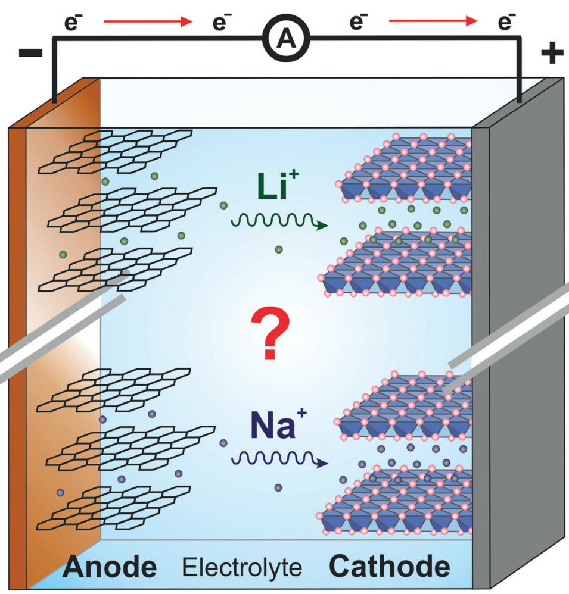

Angewandte International Edition Chemie

Mobile and stationary energy storage by rechargeable batteries is a topic of broad societal and economical relevance. Lithium-ion battery (LIB) technology is at the forefront of the development, but a massively growing market will likely put severe pressure on resources and supply chains. Recently, sodium-ion batteries (SIBs) have been reconsidered with the aim of providing a lower-cost alternative that is less susceptible to resource and supply risks. On paper, the replacement of lithium by sodium in a battery seems straightforward at first, but unpredictable surprises are often found in practice. What happens when replacing lithium by sodium in electrode reactions? This review provides a state-of-the-art overview on the redox behavior of materials when used as electrodes in lithium-ion and sodium-ion batteries, respectively. Advantages and challenges related to the use of sodium instead of lithium are discussed.

From the Contents  

<table><tr><td>1. Introduction</td><td>103</td></tr><tr><td>2. Electrode Potential and Cell Voltage</td><td>105</td></tr><tr><td>3. Materials for Conversion Reactions</td><td>107</td></tr><tr><td>4. Materials for the Positive Electrode</td><td>109</td></tr><tr><td>5. Materials for the Negative Electrode</td><td>113</td></tr><tr><td>6. Summary and Outlook</td><td>117</td></tr></table>

# 1. Introduction

Rechargeable batteries are an indispensable part of our modern society and provide electrical energy on demand in a multitude of applications. The ever-growing demand for "better batteries" led to a strong increase in R&D within the last 10-20 years with the prime focus on lithium-ion battery (LIB) technology. For many years, portable consumer electronics were the important driver for this development, but more recently two other aspects have put battery research in the spotlight: 1) Electric vehicles (EVs) that, after several attempts during the last century, will finally reach the mass market within the coming years; and 2) stationary grid storage being capable of storing excess electrical energy supplied by wind and solar power on a very large scale at low cost. It is also foreseeable that other markets such a small smart devices using thin film battery technology as well as robotics will soon gain more relevance. The characteristics of these applications are quite different and no single type of battery fulfills all requirements at once. Different battery chemistries are therefore currently studied that, in a simplified way, aim at increasing energy density  $(\mathrm{Whkg}^{-1},\mathrm{WhL}^{-1})$  or at decreasing costs (EUR/kWh) compared to state-of-the-art LIB technology. Of course a range of other parameters, including safety, cycle and calendar life, temperature window, and so on, are relevant too.

It is important to realize that despite great efforts in battery research, only a few rechargeable battery systems have achieved relevant market shares. From a historic perspective, the lead acid battery technology is the oldest one and it still dominates the market with respect to the yearly output in energy storage capacity. This system is more than 150 years old, cost-effective, and largely used in automotive applications (starting battery) and for auxiliary power supply. Major drawbacks of this technology are its limited energy density of about 30 to  $40\mathrm{Whkg}^{-1}$  and the low energy efficiency. Rechargeable alkaline batteries based on NiOOH/  $\mathrm{Ni(OH)_2}$  as positive electrode are frequently used too, although to a minor degree. This electrode has been

combined with a variety of negative electrodes (Fe, Zn, Cd) leading to the invention of the Ni-Fe, Ni-Zn, and Ni-Cd batteries more than 100 years ago, for example. Later on, also  $\mathrm{H}_{2}$  (Ni- $\mathrm{H}_{2}$  battery) and finally metal hydrides (NiMH battery) have been used, the latter being nowadays preferred. Practical energy densities of NiMH batteries are around  $100\mathrm{Whkg}^{-1}$ . Lithium-ion batteries are the most recent development and have been commercialized in the early 1990s. Thanks to their high energy density, they quickly started to dominate the market for consumer electronics. Their cell chemistry is based on the insertion of lithium ions into a variety of host structures. Graphite is mainly used as negative electrode whereas layered oxides  $(\mathrm{Li}[\mathrm{Ni}_x\mathrm{Co}_y\mathrm{Mn}_z]\mathrm{O}_2)$ ,  $\mathrm{LiFePO_4}$ , and  $\mathrm{LiMn_2O_4}$  are commonly used positive electrode materials. A variety of structurally related compounds as well as alternative electrolytes are currently studied to further advance this technology.

Overall, the LIB technology is a real success story. Since its commercialization, the energy density has continuously increased by about  $7 - 8\mathrm{Whkg}^{-1}$  per year, now reaching about  $250\mathrm{Whkg}^{-1}$  on the cell level (18650-type cells). At the same time, cell costs decreased much faster than expected from around  $1000\in \mathrm{kWh}^{-1}$  (mid 1990s) to below  $200\in \mathrm{kWh}^{-1}$  today. A further decrease to below  $100\in \mathrm{kWh}^{-1}$  is expected within the next 5-10 years.[1] Not surprisingly, also EV battery packs became drastically cheaper within just a few years.[2]

The overall market share of LIBs is quickly rising and the demand will sharply increase once mass production of electric vehicles becomes reality. The historic development of LIB technology has been recently summarized by Blomgren.[3]

Despite this promising future, of course there are also boundaries. The increase in LIB energy density, for example, is expected to reach its intrinsic limits within the next years with values slightly exceeding  $300\mathrm{Whkg}^{-1}$ ,[1] so research on alternative cell chemistries and concepts is needed if the past improvements are supposed to continue. Regardless of any performance parameters, another (often controversial) discussion addresses resource issues related to the abundance and geographical distribution of lithium and some other LIB components, especially cobalt. If electric mobility and electrical grid storage reach the mass market, a large amount of

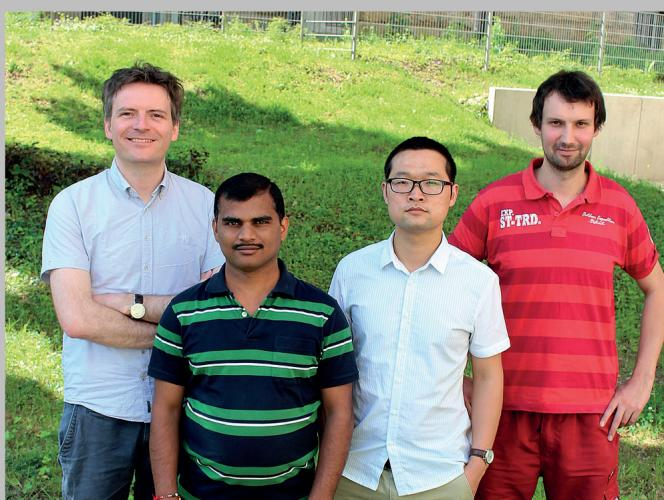  
Prof. Philipp Adelhelm studied Materials Science at the University of Stuttgart and the Max-Planck-Institute for Metals Research. He worked at the Max-Planck-Institute for Colloids and Interfaces (Antonietti group, Ph.D. thesis), the Debye Institute for NanoMaterials Science in Utrecht, (de Jongh group), and the University of Giessen (Janek group). In 2015, he was appointed full professor at the Friedrich-Schiller-University Jena, Germany. His research interests are on fundamental aspects of energy storage materials with the current focus on alternative battery concepts.

Dr. Prasant Kumar Nayak completed his Ph.D. from Indian Institute of Science, Bangalore, India in 2012. After completing about 4 years of postdoctoral research in the Aurbach group at Bar-Ilan University, Israel, he joined the Adelhelm group in August 2016. Currently, his work addresses high capacity cathode materials for Li and Na-ion batteries based on layered transition-metal oxides.

Liangtao Yang received his Master degree at University of Science and Technology of China (USTC) in material engineering in 2016. He finished his master thesis in Ningbo Institute of Materials Technology and Engineering (NIMTE), Chinese Academy of Sciences where he studied cathode materials for lithium ion batteries. Recently, he joined the Adelhelm group as Ph.D. student studying cathode materials for sodium-ion batteries.

Wolfgang Brehm received his M.Sc. at Friedrich-Schiller-University Jena in materials science in 2015. He finished his M.Sc. thesis in the Otto-Schott-Institute of Materials Research, investigating thin film nanostructures of diblock copolymers. His current research interest is on conversion electrodes and alloying anode materials for Li-ion and Na-ion batteries as well as thin film electrodes under supervision of Prof. Adelhelm.

materials will be required to meet the demand and supply chains will be challenged. Creating new options for future energy storage is therefore of strategic relevance. Wadia et al. discussed potential resource constraints when scaling up battery production for EV and grid storage.[4] Figure 1 shows how much battery capacity (energy storage capacity, ESP) can be supplied from different cell chemistries, assuming that all resources (reserve base) are used to produce batteries only. All other uses of the elements are neglected. The element limiting the cell chemistry by resource constraint is shown in brackets. The vertical lines indicate the demands for 1 billion EV (40 kWh each) and the world daily electricity generation. Although values for the reserve base change with time, the graph shows that on the long term LIB technology might run into resource constraints (limited by either Co or Li) for a scenario with deep market penetration of stationary storage and electric mobility. At the same time, it should be noted that there are large discrepancies in published numbers on resources and reserves.[121] This might explain the frequent dispute on potential resource limitations by lithium, for example. Anyway, it is clear that some elements are not critical, among Fe, Mn, S, C and Na. Developing batteries based on these elements is therefore very attractive.

The dimension of materials demand for electric cars becomes also apparent considering the following. Assuming conventional LIB technology, a  $60\mathrm{kWh}$  EV battery (about  $350\mathrm{km}$  driving range) contains roughly about  $7.5\mathrm{kg}$  of Li,  $65\mathrm{kg}$  of Ni, Co, Mn in total,  $55\mathrm{kg}$  of graphite,  $48\mathrm{kg}$  copper and  $30\mathrm{kg}$  of aluminum. Sooner or later, recycling will therefore become an important factor.

Sodium is an obvious substitute for lithium thanks to its similar chemical properties. It is worthwhile to note that in the early days of LIB research, also sodium-ion batteries (SIBs) had been studied.[5] The research, however, was largely discontinued, most likely because progress was slow and the LIB chemistry successful.[6] Today, research on sodium-ion batteries is mainly motivated by the large abundance of sodium and the hope to produce batteries that are cheaper compared to LIBs and less prone to resource issues. Companies such as Faradion Ltd. or the SIB prototype presented by the French RS2E network are encouraging, and researchers worldwide are seeking for suitable materials. SIBs might be also attractive in view of environmental aspects as shown by Life cycle assessment.[7] The progress in material development for SIBs is frequently summarized in review articles.[8] The materials choice is usually inspired or even identical to what is used in LIBs. The transition from LIBs to SIBs is sketched in Figure 1 and appears seemingly simple. This is, however, not the case and given host structures will interact very differently depending on whether lithium or sodium is intercalated. The Na ion  $(r = 1.02\AA$ $\mathrm{CN} = 6)$  is larger than the Li ion  $(r = 0.59\AA$ $\mathrm{CN} = 4)^{[9]}$  and less polarizing so the phase behavior (coordination, lattice constants, crystal structure) and diffusion properties are highly affected. Of course processes at the electrode-electrolyte interface (charge transfer, desolvation/solvation) will change too. It has been calculated that the desolvation energy for Na ions in a variety of organic solvents is roughly  $30\%$  smaller as compared to lithium, for example.[10] The charge transfer

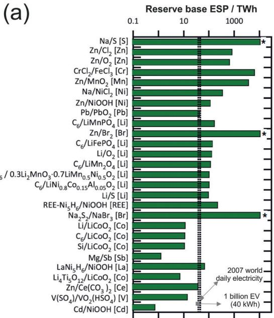  
Figure 1. a) Energy storage potential in TWh for different battery chemistries. The limiting element by resource constraints is shown in brackets. The star indicates that the ESP value is beyond the limit of the Figure. Figure reprinted from Ref. [4] with permission from Elsevier. b) Sketch of the well-known working principle of a lithium-ion battery (LIB) with lithium ions intercalating into two host structures, here graphite and  $\mathrm{LiCoO}_2$  as example. A sodium-ion battery (SIB) can work the same way but the increase in ion size leads to significant changes in the cell behavior.

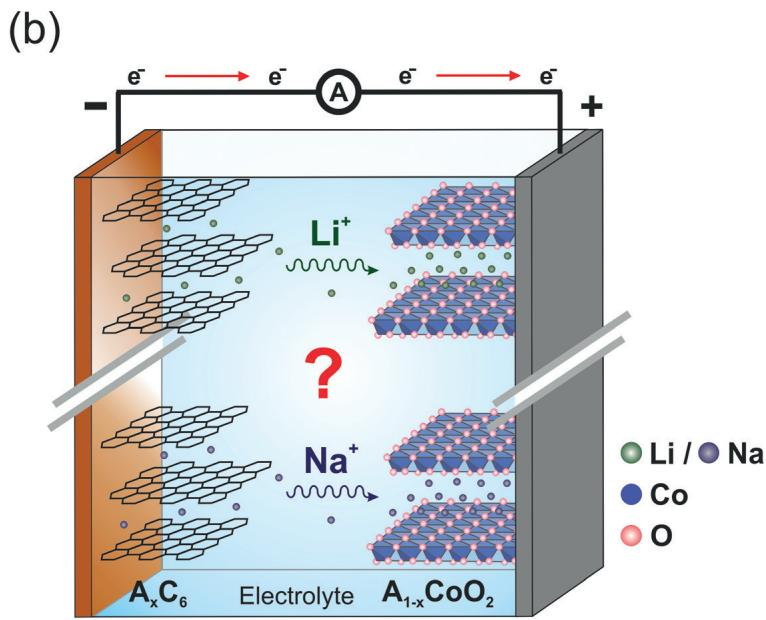

resistance should therefore be smaller in case of sodium which might enhance electrode kinetics.

An intriguing example from the materials side is graphite. Although graphite easily forms graphite intercalation compounds with lithium (or with other metals such as K, Rb, Cs), sodium does not. Aluminum, too, only forms an alloy with lithium but not with sodium. The copper current collector in LIBs might therefore be replaced by cheaper aluminum in SIBs. We will see, however, that in many cases, the replacement of lithium by sodium leads to more rather than less compounds complicating the redox chemistry and the phase behavior of electrodes. Another interesting example demonstrating the effect of the ion size has been reported by Komaba et al.[11]  $\mathrm{LiCrO_2}$  and  $\mathrm{NaCrO_2}$  both possess quite similar crystal structures, but the former is inactive in Li cells while the latter is active in Na cells. We note that replacement of lithium by sodium is also an attractive strategy for the "beyond lithium-ion" systems, such as Li-air and Li-sulfur. The cell chemistry of these systems is based on very different reaction mechanisms and is therefore not discussed here. A comprehensive comparison on this topic can be found elsewhere.[12]

As mentioned above, reviews on the progress in materials development for SIBs are regularly published. The intention of this review is different. Rather than summarizing all materials studied, we focus on the comparison of materials when used as electrodes in LIBs and SIBs. We focus on selected examples among graphite,  $\mathrm{LiCoO}_2$  vs.  $\mathrm{NaCoO}_2$  and their related NMC compounds,  $\mathrm{LiFePO_4}$  vs.  $\mathrm{NaFePO_4}$ ,  $\mathrm{Li}_2\mathrm{Ti}_3\mathrm{O}_7$  vs.  $\mathrm{Na}_2\mathrm{Ti}_3\mathrm{O}_7$ , alloys and conversion reactions. The impact of the alkali ion on the electrode reaction can be conveniently seen from charge-discharge curves (sometimes called voltage or potential profiles), which provide direct

information on the storage capacity, phase behavior, Gibbs energy, and electrode kinetics.

# 2. Electrode Potential and Cell Voltage

A common finding for SIBs is that their cell voltage is smaller compared to analogue LIBs. The frequent explanation is that the standard electrode potential of lithium  $(-3.05\mathrm{V}$  vs. NHE) is  $340\mathrm{mV}$  more negative than that of sodium  $(-2.71\mathrm{V}$  vs. NHE). It is important to realize that this argument is not correct and only indirectly linked to the cell voltage of LIBs and NIBs, respectively. Explanations for this can be found in textbooks.[13] Let us first consider Reaction (1)

$$
\mathrm {A} (\mathrm {s}) \rightleftharpoons \mathrm {A} ^ {+} (\mathrm {g}) + e ^ {-} \tag {1}
$$

with  $A$  being an alkali metal. The sublimation energy (or more precisely cohesion energy) and ionization energy of  $A$  determine the thermodynamics of this reaction. Considering trends in the periodic table, sublimation and ionization energies decrease within the series of alkali metals. Values for the cohesive energies and ionization energies are higher for lithium (152.7 kJ mol $^{-1}$ , 513.3 kJ mol $^{-1}$ ) than for sodium (108.8 kJ mol $^{-1}$ , 495.8 kJ mol $^{-1}$ ), for example. The total difference is 61.4 kJ mol $^{-1}$ . This argument should place lithium at the least negative position within the alkali metals in the electrochemical series. Another trend, however, is observed and the redox potentials of the alkali metals show the sequence Li (-3.05 V vs. NHE), Cs (-2.92 V), Rb (-2.93 V), K (-2.93 V) to Na (-2.71 V). (Interestingly, the expected trend is observed for the alkaline earth metals, with Ba

$(-2.91\mathrm{V}$  vs. NHE),  $\mathrm{Sr}(-2.89\mathrm{V})$  Ca  $(-2.87\mathrm{V})$ $\mathrm{Mg}$ $(-2.36\mathrm{V})$  and Be  $(-1.97\mathrm{V})$  The reason for the trend in the alkali metals is simply that half-cell potentials include the solvation energy of the ion. Although often omitted, Reaction (1) should read as given in Reaction (2)

$$
\mathrm {A} (\mathrm {s}) + n (\text {s o l v}) \rightleftharpoons \mathrm {A} ^ {+} (\text {s o l v}) _ {n} + e ^ {-} \tag {2}
$$

where solv represents a solvent molecule and  $n$  is the solvation number of the ion. The standard electrochemical series is based on aqueous solutions with, in case of dissolved species, concentrations of the relevant ions corresponding to unit activity at  $298\mathrm{K}$ . Solvation energies commonly increase with decreasing ion radius, so the hydration energy of  $\mathrm{Li^{+}}$ $(-481\mathrm{kJmol^{-1}})$  is much larger than for  $\mathrm{Na^{+}}$ $(-375\mathrm{kJmol^{-1}})$ . It is this large difference of more than  $100\mathrm{kJmol^{-1}}$  that shifts lithium to the most negative position among the alkali metals in the electrochemical series. It is also clear from Reaction (2) that the type of solvent affects the solvation energy, and hence the redox potential. For every solvent there will be an own electrochemical series, and redox potentials for non-aqueous solvents will deviate from the usual case of assuming an aqueous electrolyte. A comparison between water and a range of non-aqueous solvents shows that in most cases the differences are in the range of a few hundred mV or less.[14] Although these values are relatively small, it is clear that redox potentials should not be simply transferred from the electrochemical series with aqueous solution to non-aqueous solutions used in LIBs and SIBs.

Now, in a lithium-ion battery two half-cell reactions are combined sharing the same electrolyte. We consider the popular example of graphite and  $\mathrm{LiCoO}_2$  in Reactions (3)-(5):

negative electrode:

$$
\mathrm {L i C} _ {6} (s) + n (\text {s o l v}) \xrightarrow [ \text {c h a r g e} ]{\text {d i s c h a r g e}} \mathrm {L i} ^ {+} (\text {s o l v}) _ {n} + 6 \mathrm {C} (s) + e ^ {-} \tag {3}
$$

positive electrode:

$$
2 \cdot \mathrm {L i} _ {0. 5} \mathrm {C o O} _ {2} (\mathrm {s}) + \mathrm {L i} ^ {+} (\text {s o l v}) _ {n} + e ^ {-} \xrightarrow [ \text {c h a r g e} ]{\text {d i s c h a r g e}} 2 \mathrm {L i C o O} _ {2} (\mathrm {s}) + n \text {s o l v} \tag {4}
$$

The overall cell reaction is  $(3) + (4)$ :

$$
\mathrm {L i C} _ {6} (\mathrm {s}) + 2 \mathrm {L i} _ {0. 5} \mathrm {C o O} _ {2} (\mathrm {s}) \xrightarrow [ \text {c h a r g e} ]{\text {d i s c h a r g e}} 2 \mathrm {L i C o O} _ {2} (\mathrm {s}) + 6 \mathrm {C} (\mathrm {s}) \tag {5}
$$

It can be seen from the overall reaction that the solvation energies are not relevant in determining the cell voltage. This is also true for using lithium metal as positive electrode. A more quantitative analysis can be also found in Ref. [15]. The above discussion on the influence of the solvation properties on the redox potential therefore becomes irrelevant when considering full cells (however kinetics might be affected).

In other words, what is relevant for obtaining a high cell voltage is to combine two suitable intercalation compounds: One, serving as negative electrode, for which the reaction with lithium metal only releases little energy (redox potential close  $\mathrm{Li / Li^{+} = 0V}$ ), for example, intercalation of  $\mathrm{Li^{+}}$  into graphite at below  $0.25\mathrm{V}$  vs.  $\mathrm{Li / Li^{+}}$  in Reaction (6):

$$
\mathrm {L i} (\mathrm {s}) + 6 \mathrm {C} (\mathrm {s}) \rightarrow \mathrm {L i C} _ {6} (\mathrm {s}) \tag {6}
$$

and another one serving as positive electrode, for which the reaction with lithium metal releases a large amount of energy (redox potential much more positive than  $\mathrm{Li} / \mathrm{Li}^{+} = 0\mathrm{V}$ ), for example, intercalation of  $\mathrm{Li}^{+}$  into layered  $\mathrm{Li}_{0.5}\mathrm{CoO}_2$  close to  $4\mathrm{V}$  vs.  $\mathrm{Li} / \mathrm{Li}^{+}$  in Reaction (7):

$$
\mathrm {L i} (\mathrm {s}) + 2 \mathrm {L i} _ {0. 5} \mathrm {C o O} _ {2} (\mathrm {s}) \rightarrow 2 \mathrm {L i C o O} _ {2} (\mathrm {s}) \tag {7}
$$

The same arguments hold for sodium and any other intercalation system. What is then left in determining the cell voltage is simply the Gibbs energy change of the cell reaction  $\Delta_{\mathrm{r}}G^{\mathrm{o}}$ , which is linked to the cell voltage  $E$  by the well-known Reaction (8):

$$
E = - \frac {\Delta_ {r} G ^ {\mathrm {o}}}{z \cdot F} \tag {8}
$$

with  $z$  being the number of transferred electrons and  $F$  the Faraday constant. The intercalation potentials of  $\mathrm{Li^{+}}$ and  $\mathrm{Na^{+}}$ are highly structure-dependent, but for given intercalation hosts they are generally found to be lower for sodium than for lithium. This is observed for positive as well as for negative electrodes, so whether the cell voltage of an SIB is higher or lower compared to an analogue LIB depends on the sum of the differences at both electrodes. Ong et al. calculated that intercalation potentials for a range of positive electrode materials are lower for sodium than for lithium, that is, less energy is released when intercalating  $\mathrm{Na^{+}}$ instead of  $\mathrm{Li^{+}}$ into the host structure.[15] A difference of  $0.57\mathrm{V}$  for layered  $\mathrm{AMO}_2$  structures and  $0.39\mathrm{V}$  for the olivine structure were calculated. The same situation has been found for certain titanates that are negative electrode materials. The intercalation potential of  $\mathrm{Li^{+}}$ into  $\mathrm{Li_2Ti_3O_7}$  was calculated to be  $1.46\mathrm{V}$  vs.  $\mathrm{Li / Li^{+}}$ , while sodiation of  $\mathrm{Na_2Ti_3O_7}$  occurs at  $0.37\mathrm{V}$  vs.  $\mathrm{Na / Na^{+}}$ ,[16] the difference is larger than one volt. For alloys, that are also potential negative electrodes. Chevrier and Ceder calculated that the redox potential is about  $0.15\mathrm{V}$  lower for sodium than lithium.[17]

Figure 2 illustrates how the individual electrode potentials and cell voltages change when comparing LIBs with SIBs. The cell voltage is usually lower for sodium cells because for positive electrode materials, the shift in redox potentials to lower values is larger than for most negative electrode materials. Unfortunately, also graphite cannot be used in SIBs (unless under special circumstance, see Section 5.1). On the other hand, a cell based on  $\mathrm{ACoO_2}$  and  $\mathrm{A}_2\mathrm{Ti}_3\mathrm{O}_7$  would give a higher cell voltage in case of sodium, for example, because the shift in redox potential between Li and Na in  $\mathrm{ACoO_2}$ $(0.57\mathrm{V})$  is smaller than the shift in  $\mathrm{A}_2\mathrm{Ti}_3\mathrm{O}_7$ $(1.09\mathrm{V})$ .

Overall, high voltage sodium-ion batteries are not without reach, in principle. Considering the alkali metals alone, sodium should enable cell voltages that are higher by  $0.53\mathrm{V}$  compared to lithium owing to its smaller cohesive energy.[15] This advantage cannot be harvested so far because in almost all cases,  $\mathrm{Na^{+}}$  intercalation into a fixed positive electrode is energetically less favorable as  $\mathrm{Li^{+}}$  intercalation. This leads to the commonly observed lower overall cell voltage for SIBs. A few exceptions, however, exist that will be discussed in

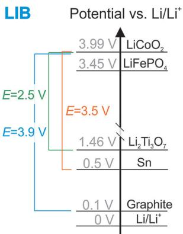  
Figure 2. Selection of different lithiation/sodiation potentials for a variety of compounds. Data has been collected from different literature sources.[15-17,19] Note that the redox potentials of  $\mathrm{Li} / \mathrm{Li}^{+}$  and  $\mathrm{Na} / \mathrm{Na}^{+}$  are not identical but are arbitrarily defined as  $0\mathrm{V}$  on each potential axis.

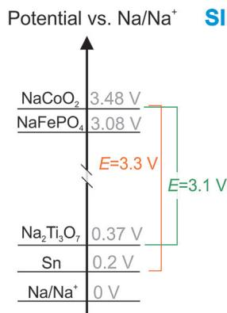

Section 3. It should be also noted that electrode materials such as  $\mathrm{Na_4Co_3(PO_4)_2P_2O_7}$  pyrophosphate with redox activity between 4.1 and  $4.7\mathrm{V}$  (vs.  $\mathrm{Na} / \mathrm{Na}^{+}$ ) have been reported.[18] Although challenges remain, this demonstrates that  $\mathrm{Na}^{+}$ intercalation into positive electrodes can also lead to very high redox potentials.

# 3. Materials for Conversion Reactions

A popular approach for realizing electrode materials with very high capacity is to use so-called conversion reactions of the type shown in Reaction (9):

$$
\mathrm {M} _ {a} \mathrm {X} _ {b} + (b \cdot c) \mathrm {A} \rightleftharpoons a \cdot \mathrm {M} + b \cdot \mathrm {A} _ {c} \mathrm {X} (\mathrm {A} = \mathrm {L i} \text {o r} \mathrm {N a}) \tag {9}
$$

with M being a transition metal (or  $\mathrm{Mg}$ ) and X a non-metal (such as F, O, P, N, S, H). In general, conversion reactions show much higher capacity compared to intercalation reactions because the transition metal is fully reduced to the metallic state. The reaction of CoO with lithium to form Co and  $\mathrm{Li}_2\mathrm{O}$  theoretically corresponds to a capacity of  $706\mathrm{mAhg^{-1}}$ . In comparison, reducing  $\mathrm{Co}^{4+}$  to  $\mathrm{Co}^{3+}$  in the classical  $\mathrm{LiCoO_2}$  intercalation compound corresponds to  $274\mathrm{mAhg^{-1}}$  (roughly half of this value is reached in practice, as only about 0.5 lithium atoms per formula can be reversibly intercalated). Owing to the large number of  $\mathrm{M_aX_b}$  compounds available, this concept provides an enormous potential. Although the concept of conversion reactions has been already known for a long time, research boomed since the late 1990s when studies on the reversible lithiation of tin-based composite oxides[20] and a series of binary transitionmetal oxides at room temperature were published.[21] Comprehensive overviews on the materials studied for LIBs can be found in Ref. [22]. Assuming bulk thermodynamics, the redox potential can be conveniently calculated from the Gibbs energy of the reaction  $\Delta_rG$  using Reaction (8). The redox potential of conversion reactions increases with the bond polarity between M and X, so reactions with fluorides occur at higher redox potentials (around  $3\mathrm{V}$  vs.  $\mathrm{Li / Li^{+}}$ ) compared to sulfides and oxides (around  $1.5 - 2.0\mathrm{V}$ ) and hydrides ( $0.52\mathrm{V}$

for  $\mathrm{MgH_2}$ ). Positive and negative electrodes can therefore be realized.

Although conversion electrodes show high capacities in experiments, several unsolved challenges hinder their use in commercial, rechargeable cells. Of course, every conversion compound has its individual characteristics, but generally conversion reactions suffer from a low initial coulombic efficiency (typically below  $75\%$ ), poor kinetics (overpotentials increase with increasing bond polarity; the combined overpotentials for fluorides can exceed 1 V, for example) and side reactions with the electrolyte. The formation of new phases also imposes large changes in electrode volume. The low initial coulombic efficiency is linked to an activation of the electrode that is due to severe structural rearrangements. The first lithiation leads to the formation of a nanocomposite consisting of an often amorphous  $\mathrm{Li}_x\mathrm{X}$  matrix in which the metal nanoparticles are distributed. At the same time, a gel-like inorganic/organic surface film forms due to electrolyte decomposition. Depending on the compound, a number of intermediate phases can also form during the electrode reaction. Therefore, the seemingly simple Reaction (9) is often much more complex, difficult to characterize structurally, and the experimentally determined electrode potentials deviate significantly from the theoretical ones (copper sulfide is a notable exception).[24] Because the ionic/electronic conductivity of the nanocomposite is small, electrodes are typically prepared with larger amounts of conductive additive. The typical voltage profile of a conversion reaction is sketched in Figure 3 showing the large initial irreversible capacity and the pronounced voltage hysteresis.

Klein et al. discussed the influence of the alkali metal on conversion reactions.[23] Considering the abovementioned reactions, a comparison of the cell voltages between lithium and sodium is straightforward. Writing Reaction (9) for both cases and considering their difference, it can be easily seen that the shift in cell voltage when replacing lithium by sodium is constant for hydrides, oxides, fluorides, and so on. For oxides, the shift in cell voltage is  $0.96\mathrm{V}$ , which formally corresponds to Reaction (10):

$$
2 \mathrm {L i} + \mathrm {N a} _ {2} \mathrm {O} \rightleftharpoons \mathrm {L i} _ {2} \mathrm {O} + 2 \cdot \mathrm {N a} \quad \Delta E (\mathrm {L i} - \mathrm {N a}) = 0. 9 6 \mathrm {V} \tag {10}
$$

In other words, this means that for any conversion reaction of Reaction (9) with an oxide  $\mathrm{M}_a\mathrm{O}_b$ , the cell voltage in case of sodium is lower than for lithium by  $0.96\mathrm{V}$ . Figure 3 shows a comparison for the different classes of compounds. For sulfides, oxides, and hydrides, the shift is in the range of  $400\mathrm{mV}$ , that is, also here, the "lithium version" of the cell leads to a higher voltage. On the other hand, for chlorides, the cell voltage for a conversion reaction with lithium and sodium is virtually identical. For the even heavier halides, a conversion reaction with sodium theoretically delivers a higher cell voltage than in case of lithium. This behavior can be rationalized by considering the relevant Born-Haber cycles.[23] The lattice energies of the lithium compounds are larger than the ones for sodium in all cases favoring more negative Gibbs reaction energies and hence larger cell voltages. However, due to the lower cohesive and ionization energies in case of sodium, this difference can be compen

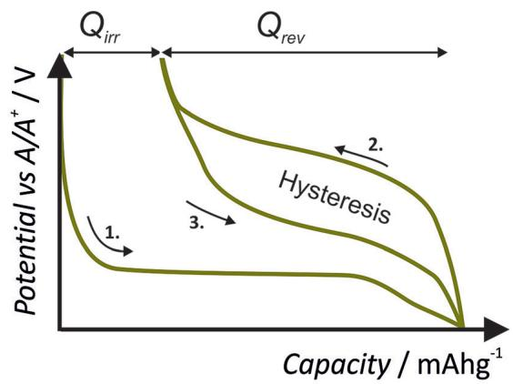  
(a)

$$
\begin{array}{l}\mathrm {M} _ {a} \mathrm {X} _ {b} + (\mathrm {b} \cdot \mathrm {c}) \mathrm {N a} \longleftrightarrow a \cdot \mathrm {M} + b \cdot \mathrm {N a} _ {c} \mathrm {X}\\\mathrm {M} _ {a} \mathrm {X} _ {b} + (\mathrm {b} \cdot \mathrm {c}) \mathrm {L i} \longleftrightarrow a \cdot \mathrm {M} + b \cdot \mathrm {L i} _ {c} \mathrm {X}\end{array}\quad (1) \left.\right\} (1 1) - (1) \rightarrow \Delta E ^ {\circ} (\mathrm {L i} - \mathrm {N a})
$$

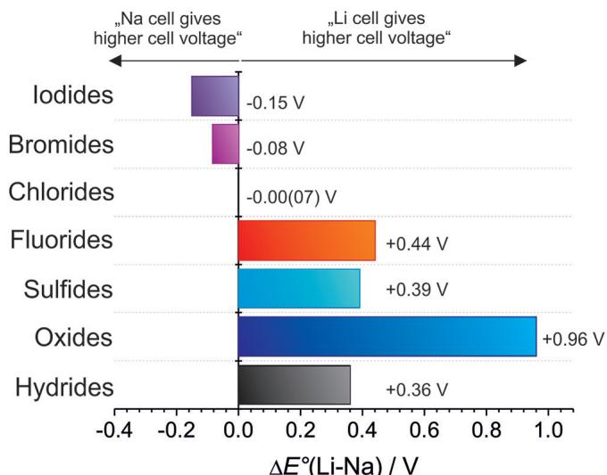  
(b)  
(d)

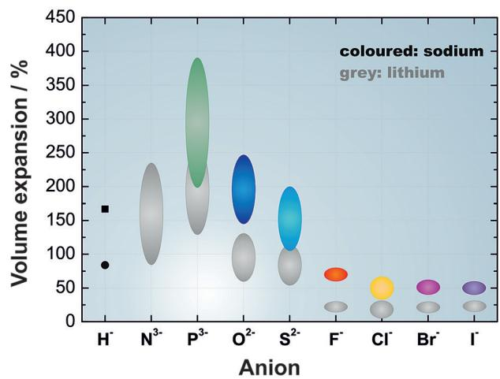  
(c)

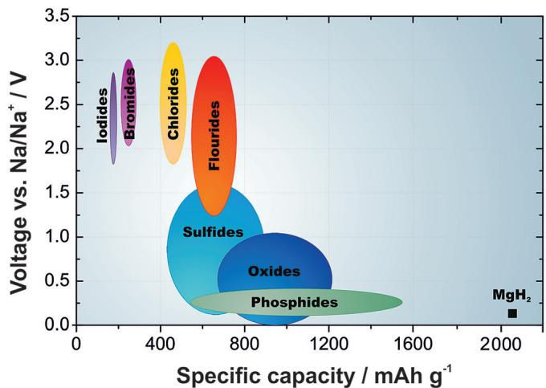  
Figure 3. a) Simplified voltage profile of a typical conversion electrode. During the first ion insertion, the electrode undergoes an activation that involves the formation of a nanocomposite structure and that also leads to a high irreversible capacity  $Q_{\mathrm{irr}}$  in the first cycle. The nanocomposite is then fairly reversible and exhibits a larger hysteresis. b) Replacing lithium by sodium in conversion reactions leads to a constant shift in redox potentials for different types of compounds. For hydrides, oxides, sulfides, and fluorides; a "lithium cell" gives a higher cell voltage. For chlorides, however, the difference is virtually zero. For even more heavy halides, a hypothetical "sodium cell" would deliver a higher cell voltage. c) Volume expansion of conversion electrodes for different types of compounds for the reaction with lithium and sodium, respectively. All values are calculated for  $25^{\circ}\mathrm{C}$ . [23] d) Specific capacities and redox potentials vs.  $\mathrm{Na} / \mathrm{Na}^{+}$ for conversion reactions of different classes of materials with sodium.

sated (chlorides) or even overcompensated (iodides, bromines). This simple examination proofs what has been already discussed in Section 2, that is, the replacement of lithium by sodium does not necessarily lead to a lower cell voltage. The negligible differences between lithium and sodium cell voltages for chlorides might also reflect the quite reasonable cell voltage of the high temperature  $\mathrm{Na} / \mathrm{NiCl}_2$  battery  $(2.6\mathrm{V}$  at  $T = 245^{\circ}\mathrm{C})$ . It is worthwhile to mention that the same calculations can be made for conversion reactions with magnesium (magnesium-ion batteries). In a direct comparison between lithium and magnesium, values of  $\Delta E$  ( $\mathrm{Li}-\mathrm{Mg}$ ) for the series iodides  $\rightarrow$  hydrides would

be  $+0.94\mathrm{V}, + 0.93\mathrm{V}, + 0.91\mathrm{V}, + 0.55\mathrm{V}, + 0.47\mathrm{V}, - 0.04\mathrm{V},$ $+0.52\mathrm{V}$  . The redox potentials vs. the respective metal electrode would be therefore much lower for magnesium, with oxides being an exception.

Lithiation of conversion materials is generally accompanied by large volume expansions. The effect is smallest for the halides (typically below  $50\%$ ) but can easily amount to more than  $100\%$  for sulfides or oxides with the known issues of mechanical electrode deterioration. For sodium, the volume changes are roughly twice as high as shown in Figure 3. It is therefore foreseeable that designing a durable conversion electrode for sodium cells will be more challenging. Note-

worthy, alloys show an even larger volume expansion (see Section 5.2).

At this point, we remind that conversion electrodes based on Reaction (9) generally only function because the first ion insertion involves the formation of a peculiar nanostructure. This way, diffusion distances remain small enough to render the reaction reversible. The nanostructure is a result of a complex interplay between different properties that relate not only to volume expansion but also to diffusion coefficients of the separate species that can decide on whether reversibility is achieved or not. The formation of too large nanoparticles during activation might prevent rechargeability, as shown for  $\mathrm{CuF_2}$  by Wang et al., for example.[25] It is clear that replacing lithium by sodium will affect this interplay.

The hope that the challenges of lithium conversion reactions might be overcome by sodium, however, has not been fulfilled so far. Only few studies focus selectively on the comparison of conversion reactions with lithium and sodium. Overall, capacities are frequently found to be lower for sodium as compared to the equivalent lithium cell. For example, nanosized  $\mathrm{Fe}_2\mathrm{O}_3$  ( $q_{\mathrm{th}} = 1006\mathrm{mAhg}^{-1}$ ) showed a capacity of  $1000\mathrm{mAhg}^{-1}$  in lithium cells, whereas around  $350\mathrm{mAhg}^{-1}$  were found in sodium cells.[26] Although this value is lower, it is still much higher compared to intercalation electrodes. For  $\mathrm{CuO}$  ( $q_{\mathrm{th}} = 674\mathrm{mAhg}^{-1}$ ), capacities for lithium where roughly twice as high as for sodium ( $>600\mathrm{mAhg}^{-1}$  vs.  $350\mathrm{mAhg}^{-1}$ ). The reaction therefore is incomplete for sodium and largely restricted to the  $\mathrm{Cu}_2\mathrm{O}$  intermediate phase. The volume expansion for the lithiation of  $\mathrm{CuO}$  to form  $\mathrm{Cu}$  and  $\mathrm{Li}_2\mathrm{O}$  ( $+74\%$ ) is very close to the expansion for sodiation of  $\mathrm{CuO}$  to form  $\mathrm{Cu}_2\mathrm{O}$  and  $\mathrm{Na}_2\mathrm{O}$  ( $+74\%$ ). This indicates that the increased volume expansion in sodium conversion reactions indeed impedes full utilization. At higher current densities ( $1350\mathrm{mA g}^{-1}$ ), however, the difference diminishes and capacities for lithium and sodium converge to values of around  $250 - 300\mathrm{mAhg}^{-1}$ [27]. Interestingly, conversion reactions with the unconventional carbodiimide anion can show a different behavior, that is, the capacities for sodium can exceed the ones of lithium.[28] Despite the existing challenges, conversion reactions of the described type still remain an attractive research objective, especially considering low cost compounds like iron oxides or sulfides such as  $\mathrm{FeS}_2$ .[29]

# 4. Materials for the Positive Electrode

Materials for the positive electrode are mainly compounds containing the 3d transition metal cations, namely Co, Mn, Fe, or Ni as redox-active elements. Layered oxides such as  $\mathrm{LiCoO_2}$  and  $\mathrm{Li}[\mathrm{Ni}_{1 - x - y}\mathrm{Mn}_x\mathrm{Cov}_y]\mathrm{O}_2$ $\mathrm{LiFePO_4}$ , or spinel  $\mathrm{LiMn_2O_4}$  with capacity values in the range of  $120-180\mathrm{mAhg^{-1}}$  are currently implemented in commercial LIBs. A range of other materials is being investigated with the main aim to increase the redox potential and/or capacity. In view of element abundance, it is clear that the use of Fe- and Mn-rich compounds are the preferred choice for SIBs. Nevertheless, a direct comparison between for example,  $\mathrm{LiCoO_2}$  and  $\mathrm{NaCoO_2}$  is very useful to discuss structural effects.

Ong et al. have studied the impact of the ion size on the redox potential of a variety of popular electrode materials by DFT methods,[15] as shown in Figure 4. As mentioned before, they calculated that the redox potentials for sodium insertion are between 0.18 to  $0.57\mathrm{V}$  lower as compared to lithium, which is the main reason for the often observed lower cell voltage in case of SIBs. In the following, we will discuss experimental results on selected examples of positive electrodes.

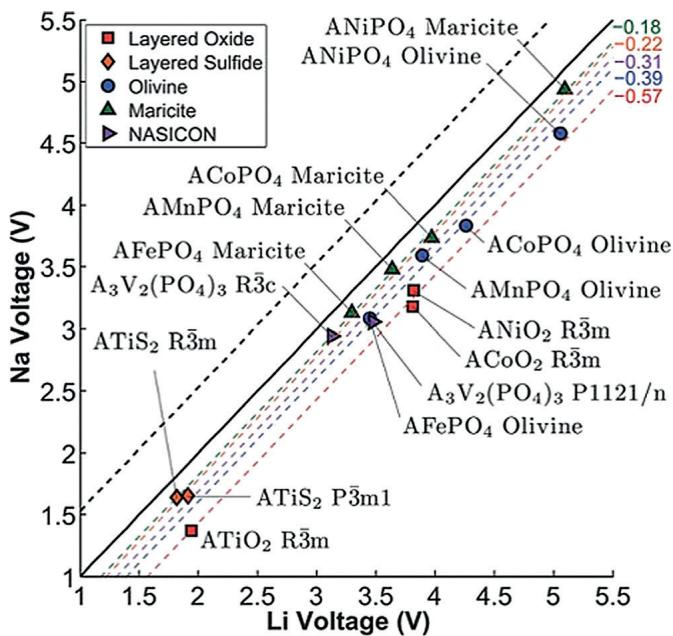  
Figure 4. Calculated Na voltage vs. Li voltage for different structures. Reproduced from Ref. [15] with permission of The Royal Society of Chemistry.

There are mainly two types of positive electrode materials such as layered transition-metal oxides and polyanionic compounds. Layered transition-metal oxides have attracted great interest because of their high theoretical capacity close to  $250\mathrm{mAhg^{-1}}$ . In general, the layered oxides containing Li have  $\alpha$ -NaFeO $_2$  structure formed by edge sharing  $\mathrm{MO}_6$  octahedra separated by Li ions occupying interstitial octahedral sites. On the other hand, the Na-based layered transition-metal oxides are classified as O and P type depending on the stacking of close-packed oxygen layers. Among them, the most common types are O3 and P2. The letters O and P denote the octahedral and prismatic sites occupied by Na while the numbers 2 and 3 denote the number of oxygen stacking layers, respectively. For instance, the oxygen stacking of O3, P2, and P3-type structures are ABCABC, ABBA, and ABBCCA, respectively. In the O3 phase,  $\mathrm{Na^{+}}$  and transition metals are located in the octahedral sites of alternating Na and transition-metal oxide layers, respectively (Figure 5a), whereas  $\mathrm{Na^{+}}$  resides in the trigonal prismatic sites in P2 phase (Figure 5b). The advantage with Na-based layered oxides is that these can be synthesized from a wide range of transition metals varying from Ti to Cu, while synthesis is limited to Mn, Ni, and Co in case of their Li analogous.[31] A popular approach for tuning the electrochemical properties of these

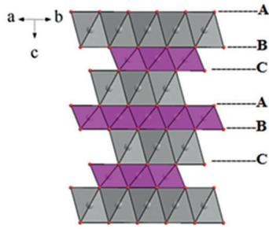  
(a)

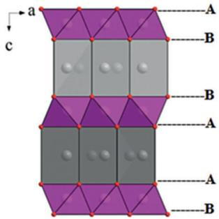  
(b)

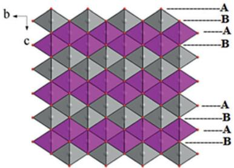  
(c)  
Figure 5. Representation of layered oxides: a) O3, b) P2, and c) O2 type. The letters (A, B, C) are used to describe the packing patterns of the oxygen-ion frameworks. Reproduced from Ref. [30] with permission from Wiley.

materials is to mix different transition metals. A large variety of materials has therefore been studied that have been summarized in a number of comprehensive reviews.[8g,30,32] In the following, we therefore discuss only some selected layered oxides and put more emphasis on the comparison between their use in lithium and sodium cells.

Apart from layered transition metal oxides, there is also increasing interest in polyanionic compounds because of their structural diversity, high working potential, and high reversibility for intercalation/deintercalation of Li and/or Na ions. Polyanionic compounds became popular after the pioneering work of Goodenough et al. on the olivine-type cathode material  $\mathrm{LiFePO_4}$  that shows a redox plateau of about  $3.5\mathrm{V}$  vs.  $\mathrm{Li / Li^{+}}$  [33] Barpanda et al. reviewed the electrochemical

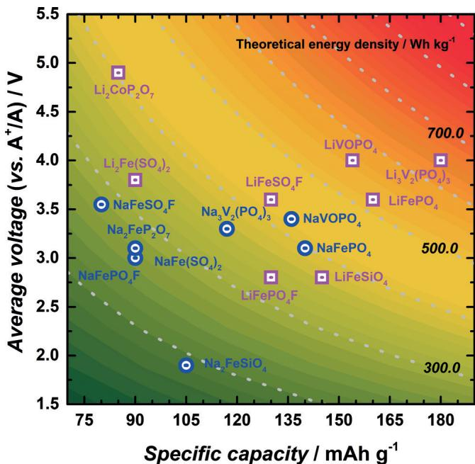  
Figure 6. Comparison of average potential and discharge capacity for lithium  $\mathrm{(LiFePO_4}$ ,  $\mathrm{LiFePO_4F}$ ,  $\mathrm{Li}_2\mathrm{Fe(SO_4)_2}$ ,  $\mathrm{LiFeSO_4F}$ ,  $\mathrm{LiFeSiO_4}$ ,  $\mathrm{Li}_2\mathrm{CoP}_2\mathrm{O}_7$ ,  $\mathrm{LiVOPO_4}$ ,  $\mathrm{Li}_3\mathrm{V}_2(\mathrm{PO}_4)_3$  and sodium compounds  $\mathrm{(NaFePO_4}$ ,  $\mathrm{NaFePO_4F}$ ,  $\mathrm{NaFe(SO_4)_2}$ ,  $\mathrm{NaFeSO_4F}$ ,  $\mathrm{Na}_2\mathrm{FeSiO}_4$ ,  $\mathrm{NaFeP_2O_7}$ ,  $\mathrm{NaVOPO_4}$ ,  $\mathrm{Na}_3\mathrm{V}_2(\mathrm{PO}_4)_3$ ). The contour indicates the theoretical energy density obtainable (assuming a Li or Na metal counter electrode). Data derived from Refs. [33, 34, 38-48], respectively.

properties of pyrophosphate based materials for both Li and Na-ion batteries.[34] Figure 6 shows a comparison of the average voltage and specific capacity of some polyanionic compounds for both Li- and Na-ion batteries. Generally, the Li-based polyanionic compounds have higher average voltage and also capacity as compared to their Na counterparts.  $\mathrm{LiFePO_4}$  has a higher voltage  $(3.5\mathrm{V})$  and capacity of  $160\mathrm{mAhg^{-1}}$  as compared to olivine  $\mathrm{NaFePO_4}$  having  $(3.0\mathrm{V})$  and  $110\mathrm{mAhg^{-1}}$ , for example.

Although not in the focus of this review, it is worth mentioning that surface films can be formed on the positive electrode owing to side reactions with the electrolyte solution. The so-called cathode-electrolyte interface for a variety of lithium positive electrodes has been discussed by Aurbach et al.[35] and Edstrom et al.[36] already some time ago, for example. Understanding this film formation as well as tailoring its properties by additives is still challenging but very important for further improving the long-term stability of positive electrodes. This becomes especially relevant for high voltage materials such as  $\mathrm{LiNi_{0.5}Mn_{1.5}O_4}$  for which lithium bis(oxalato) borate (LiBOB) has been found to be very effective to reduce ageing, for example.[37] The overall knowledge about surface films on lithium positive electrodes, however, is still poor and currently largely lacking for the analogue sodium compounds.

# 4.1. Comparison for Selected Examples

# 4.1.1. Layered Oxides

Although  $\mathrm{LiCoO_2}$  and  $\mathrm{NaCoO_2}$  have the same frameworks of  $\mathrm{CoO_6}$  edge-sharing octahedra, they show different redox potentials and experience a different phase evolution during cycling (Figure 7). Depending on the degree of intercalation, the potential difference between both compounds varies within 0.4 to  $1.0\mathrm{V}$ . The complex voltage profile of  $\mathrm{NaCoO_2}$  indicates that numerous phase transitions and ordering phenomena occur during cycling. Much research had shown that  $\mathrm{LiCoO_2}$  maintains O3 structure until the Li content is lower to 0.5. Similarly, when the Na content is lower than 0.5, the structure transfers from O3 to P3, which is undesired for achieving reversibility. As a result, only half of theoretical capacity can be reached. During discharging, the

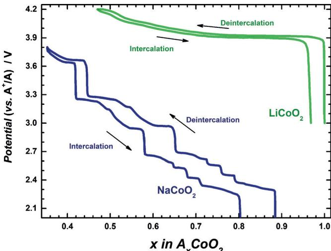  
Figure 7. Voltage profiles of  $\mathrm{Li / LiCoO_2}$  and  $\mathrm{Na / NaCoO_2}$  cells. The green line is  $\mathrm{LiCoO_2}$  from  $3.0 - 4.5\mathrm{V}$  vs.  $\mathrm{Li^{+} / Li}$  and the blue line (data derived from Ref. [49]) is  $\mathrm{NaCoO_2}$  from  $2.0 - 3.8\mathrm{V}$  vs.  $\mathrm{Na^{+} / Na}$ .

compounds  $\mathrm{Na}_{1/2}\mathrm{CoO}_2$  (3.45 V vs.  $\mathrm{Na}^{+}/\mathrm{Na}$ ),  $\mathrm{Na}_{4/7}\mathrm{CoO}_2$  (3.15 V vs.  $\mathrm{Na}^{+}/\mathrm{Na}$ ),  $\mathrm{Na}_{2/3}\mathrm{CoO}_2$  (2.8 V vs.  $\mathrm{Na}^{+}/\mathrm{Na}$ ),  $\mathrm{Na}_{0.72}\mathrm{CoO}_2$  (2.56 V vs.  $\mathrm{Na}^{+}/\mathrm{Na}$ ),  $\mathrm{Na}_{0.76}\mathrm{CoO}_2$  (2.47 V vs.  $\mathrm{Na}^{+}/\mathrm{Na}$ ),  $\mathrm{Na}_{0.79}\mathrm{CoO}_2$  (2.38 V vs.  $\mathrm{Na}^{+}/\mathrm{Na}$ ), are formed. The phase behavior of  $\mathrm{NaCoO}_2$  has been thoroughly studied by Delmas et al.[49] With respect to application, the redox behavior of  $\mathrm{LiCoO}_2$  as shown in Figure 7 is very well suited as the potential changes only little during cycling. A very sloping and gradual phase transforming behavior as found for  $\mathrm{NaCoO}_2$  is impractical but the behavior can be tuned by partial substitution of Co with Mn and Fe, for example.[50] It is also worth mentioning that ion diffusion in layered  $\mathrm{NaCoO}_2$  is calculated to be easier as compared to  $\mathrm{LiCoO}_2$ .[15]

Another layered oxide,  $\mathrm{NaFeO_2}$ , can deliver a specific capacity of  $80 - 100\mathrm{mAhg^{-1}}$  when the cut-off voltage is limited to  $3.4\mathrm{V}$  but it loses capacity upon cycling to potentials above  $3.5\mathrm{V}$  owing to irreversible structural change.[50a,51] Similarly, its analogous  $\mathrm{LiFeO_2}$  synthesized from FeOOH exhibited an initial capacity of about  $100\mathrm{mAhg^{-1}}$  and suffered from large capacity fading upon cycling due to cationic disorder in the voltage region of  $4.2 - 1.5\mathrm{V}.$  [52] About  $150\mathrm{mAhg^{-1}}$  was found for nanocrystalline  $\mathrm{LiFeO_2}$  prepared at low temperature  $(150^{\circ}\mathrm{C})$  but also here, the material underwent capacity fading due to structural change to a spinel phase  $(\mathrm{LiFe}_5\mathrm{O}_8)$  upon charge-discharge.[53]

Improvements can be obtained by partial substitution of Fe as shown by Yamada et al., for example.[54] Starting from  $\mathrm{O3 - NaFeO_2}$  they used nickel to substitute iron to prepare  $\mathrm{NaFe_{0.3}Ni_{0.7}O_2}$ , which exhibited a specific capacity of about  $140\mathrm{mAhg^{-1}}$  when cycled in the voltage range of  $2.0 - 3.8\mathrm{V}$  vs.  $\mathrm{Na / Na^{+}}$ . On partial substitution of Fe with Co,  $\mathrm{NaFe_{0.5}Co_{0.5}O_2}$  exhibited a reversible capacity of about  $160\mathrm{mAhg^{-1}}$  in the voltage range of  $2.0 - 4.5\mathrm{V}$ .[50a] Apart from the specific capacity, there is also improvement in their voltage profile upon substitution of Fe with Ni and Co. Sathiya et al. synthesized  $\mathrm{NaNi_{0.33}Mn_{0.33}Co_{0.33}O_2}$ , which exhibited a reversible capacity of  $120\mathrm{mAhg^{-1}}$  corresponding to the utilization of about  $0.5\mathrm{Na}$  when cycled in the voltage range of  $2 - 3.75\mathrm{V}$

vs.  $\mathrm{Na} / \mathrm{Na}^{+[55]}$  while its analogous  $\mathrm{LiNi}_{0.33}\mathrm{Mn}_{0.33}\mathrm{Co}_{0.33}\mathrm{O}_2$  is known to exhibit a capacity of about  $160\mathrm{mAhg^{-1}}$  in the potential range of 2.8-4.4 V.[56]

Co-free layered oxide cathodes are important because of high cost, low abundance, and toxicity of Co. Sun et al. have studied Co-free Ni rich layered oxide cathodes for Li and Na ion batteries.[57] Aurbach et al. synthesized both  $\mathrm{LiNi}_{0.5}\mathrm{Mn}_{0.5}\mathrm{O}_2$  and  $\mathrm{NaNi}_{0.5}\mathrm{Mn}_{0.5}\mathrm{O}_2$  by the co-precipitation method followed by mixing with LiOH or NaOH and calcining at high temperatures, and they studied their electrochemical performances in half cells using Li or Na and full cells using hard carbon as the negative electrode.[58] The charge-discharge curve for the 2nd cycle is shown in Figure 8. As expected,  $\mathrm{LiNi}_{0.5}\mathrm{Mn}_{0.5}\mathrm{O}_2$  exhibited a high specific capacity of about  $170\mathrm{mAhg^{-1}}$  in the potential range of  $2.7 - 4.3\mathrm{V}$  whereas  $\mathrm{NaNi}_{0.5}\mathrm{Mn}_{0.5}\mathrm{O}_2$  exhibited about  $136\mathrm{mAhg^{-1}}$  in the potential range of  $2.0 - 4.0\mathrm{V}$ . The operating voltage in case of lithium is also much higher.

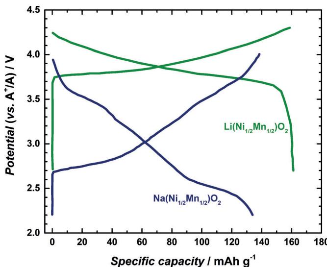  
Figure 8. Voltage profiles (2nd cycle) of  $\mathrm{LiNi}_{0.5}\mathrm{Mn}_{0.5}\mathrm{O}_2$  and  $\mathrm{NaNi}_{0.5}\mathrm{Mn}_{0.5}\mathrm{O}_2$ . Data obtained from Ref. [58].

# 4.1.2. Layered Transition-Metal Oxides with Excess Lithium in the Transition-Metal Layer  $(Li_{1 + x}[NiMnCo]_{1 - x}O_2$  and  $Na[Li_x\{NiMnCo\}_{1 - x}]O_2)$

The concept of excess lithium-based layered oxide cathodes came from  $\mathrm{Li}_2\mathrm{MnO}_3$  (or  $\mathrm{Li}[\mathrm{Li}_{1/3}\mathrm{Mn}_{2/3}]\mathrm{O}_2$ ), where one third of Mn is substituted by Li in the transition-metal layer. This was considered as a promising cathode material because of its high theoretical specific capacity above  $450\mathrm{mAhg^{-1}}$ . However, practically a specific capacity of about  $250\mathrm{mAhg^{-1}}$  was achieved for nanosize  $\mathrm{Li}_2\mathrm{MnO}_3$ , whereas the capacity decreased upon increasing the particle size.[59] The capacity of the nanosized particles of  $\mathrm{Li}_2\mathrm{MnO}_3$  was also not stable because of structural transformation upon cycling. However, integrated  $\mathrm{Li}_{1+x}\mathrm{M}_{1-x}\mathrm{O}_2$  ( $\mathbf{M} = \mathbf{M}\mathbf{n}$ , Ni, Co, Fe) materials composed of  $\mathrm{Li}_2\mathrm{MnO}_3$  and  $\mathrm{LiMO}_2$  in nanodomains exhibited specific capacities  $\geq 250\mathrm{mAhg^{-1}}$  upon cycling with potentials higher than  $4.5\mathrm{V}$ .[47,60] This value of

capacity is indeed higher than the capacity of commercialized  $\mathrm{LiCoO_2}$ $(140\mathrm{mAhg^{-1}})$ ,  $\mathrm{LiMn_2O_4}$ $(120\mathrm{mAhg^{-1}})$  and  $\mathrm{LiFePO_4}$ $(160\mathrm{mAhg^{-1}})$  and so on.[61] Hence, from the last decade, there is an increasing interest in these high capacity cathode materials with the main aims of stabilizing their capacity and average discharge voltage upon prolonged cycling, improving their rate capability, and increasing the Coulombic efficiency in the first cycle. Doping of several cations, such as Na, K, Mg, Al, Sn,[62] is found to be effective in enhancing the stabilization in their capacity as well as average discharge voltage by suppressing the structural layered-to-spinel transformation; however, it could not be prevented completely. Also, surface coating by several inert materials, such as  $\mathrm{Al_2O_3}$ ,  $\mathrm{ZnO}$ ,  $\mathrm{SnO_2}$ ,  $\mathrm{AlF_3}$ ,  $\mathrm{Li_3PO_4}$  and  $\mathrm{AlPO_4}$ , helped in improving the stability in cycle life of these Li and Mn-rich cathodes.[63]

In a similar fashion to that of Li and Mn-rich cathodes for LIBs, the presence of Li ions in the transition-metal layer of cathodes for SIBs results in an increase in specific capacity as well as stability.[64] The presence of Li-ions in the TM layers allows more Na-ions to remain in the compound when charged to very high voltage and hence the P2 structure is retained upon cycling. Johnson et al. reported a stable capacity of about  $100\mathrm{mAhg^{-1}}$  for  $\mathrm{Na_{0.85}Li_{0.17}Ni_{0.21}Mn_{0.64}O_2}$  when cycled at  $15\mathrm{mA g^{-1}}$  in the potential range of  $2.0 - 4.2\mathrm{V}$  vs. Na.[65] Within this restricted voltage window, they found that less than  $5\%$  of the lithium was removed on full oxidation and the presence of remaining Li in the transition-metal layer stabilizes the structure. Meng et al. have extensively studied the improved electrochemical performance of Li doped layered metal oxides such as P2 $\mathrm{Na}_{0.8}[\mathrm{Li}_{0.12}\mathrm{Ni}_{0.22}\mathrm{Mn}_{0.66}]\mathrm{O}_2$  for Na-ion batteries, which exhibit

ited a specific capacity of about  $120\mathrm{mAhg^{-1}}$  when cycled in the potential range of  $2.0 - 4.4\mathrm{V}$ . They confirmed by NMR studies that most of Li (about  $85\%$  ) presented in the transition-metal layer.[64a] The Li presented in the transition-metal layer undergoes deintercalation at high voltage (above  $4.2\mathrm{V}$ ), which can be seen as a plateau during charge in the first cycle, similar to that observed in Li and Mn-rich cathodes. The presence of Li helps in retaining more Na ions in the prismatic sites, which helps in stabilizing the P2 structure even after cycling to high voltages. On the other hand, layered oxide cathodes with the P2 structure and without Li undergo structural transformation to O2 upon cycling to higher voltage. They also reported Li-substituted O3-structured layered oxides  $\mathrm{NaLi_{0.07}Ni_{0.26}Mn_{0.4}Co_{0.26}O_2}$ , which exhibited an initial capacity of  $147\mathrm{mAhg^{-1}}$  and retained  $128\mathrm{mAhg^{-1}}$  after 50 cycles when

cycled at  $25\mathrm{mAg^{-1}}$  in the potential range of  $1.5 - 4.5\mathrm{V}$  vs. Na.[64b] Recently, de la Llave et al. reported the increase in energy density of Mn-based layered oxide cathodes by Li doping for Na-ion batteries.[66]  $\mathrm{Na}_{0.6}\mathrm{MnO}_2$  exhibited an initial capacity around  $162\mathrm{mAhg^{-1}}$ , which decreased to a value of  $120\mathrm{mAhg^{-1}}$ , thus retaining about  $75\%$  capacity after 100 cycles. On the other hand,  $\mathrm{Na}_{0.6}\mathrm{Li}_{0.2}\mathrm{Mn}_{0.8}\mathrm{O}_2$  exhibited a stable specific capacity of about  $190\mathrm{mAhg^{-1}}$  even after 100 cycles when cycled at  $20\mathrm{mAhg^{-1}}$  (C/10) rate. Liu et al. recently reported Li-substituted P2/O3 biphasic  $\mathrm{Na}_{0.67}\mathrm{Mn}_{0.55}\mathrm{Ni}_{0.25}\mathrm{Li}_{0.2}\mathrm{O}_2$ , which exhibited a capacity of about  $158\mathrm{mAhg^{-1}}$  at  $12\mathrm{mAhg^{-1}}$ , as compared to  $147\mathrm{mAhg^{-1}}$  for a Li-free cathode. Li substitution resulted in more defects to maintain charge neutrality, which enhanced the electronic conductivity and also Na ion diffusion.[45] Considering the working voltage of layered oxides based on Li in the TM layers, Li and Mn-rich cathodes have an average discharge voltage of  $3.5\mathrm{V}$  in Li-ion half cells.[62e] On the other hand, oxides containing Li in TM layers possess an average discharge voltage of about  $3.1\mathrm{V}$  in Na half cells.[67] Thus, a voltage difference of about  $0.4\mathrm{V}$  is observed in these layered transition-metal oxide-based cathodes containing Li in the metal layer.

# 4.1.3. Structural Change upon Cycling of Layered Transition-Metal Oxides

Figure 9 shows the phase evolution of some commonly used layered lithiated transition-metal oxides and their Na counterpart upon initial cycling. It can be clearly seen that the O3-type layered oxides containing Li (such as  $\mathrm{LiCoO}_2$ ) can

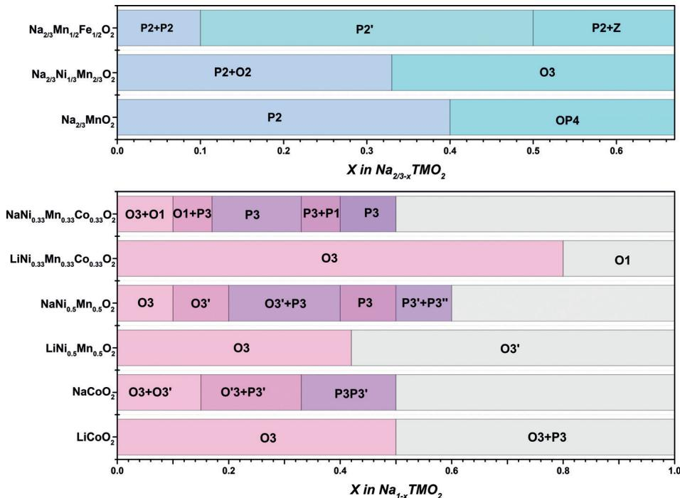  
Figure 9. Phase behavior of different lithium layered oxides  $(\mathrm{LiCoO}_2, \mathrm{LiNi}_{0.5}\mathrm{Mn}_{0.5}\mathrm{O}_2, \mathrm{LiNi}_{0.33}\mathrm{Mn}_{0.33}\mathrm{Co}_{0.33}\mathrm{O}_2)$  and sodium layered oxides. Mainly P2-type materials  $(\mathrm{Na}_{2/3}\mathrm{MnO}_2, \mathrm{Na}_{2/3}-$ $\mathrm{Ni}_{1/3}\mathrm{Mn}_{2/3}\mathrm{O}_2, \mathrm{Na}_{2/3}\mathrm{Mn}_{1/2}\mathrm{Fe}_{1/2}\mathrm{O}_2)$  are shown on top, mainly O3-type materials  $(\mathrm{NaCoO}_2, \mathrm{NaNi}_{0.5}\mathrm{Mn}_{0.5}\mathrm{O}_2, \mathrm{NaNi}_{0.33}\mathrm{Mn}_{0.33}\mathrm{Co}_{0.33}\mathrm{O}_2)$  are shown at the bottom. Data for these materials are derived from Refs. [55, 69, 71-74].

maintain their structure relatively long upon charging. In case of  $\mathrm{LiNi_{0.5}Mn_{0.5}O_2}$  and  $\mathrm{LiNi_{0.33}Mn_{0.33}Co_{0.33}O_2}$ , the structural changes occur until the Li concentration is lower than 0.6 and 0.2, for example. There is a strong driving force for Li based layered oxides to undergo a structural layered-to-spinel transformation upon cycling to voltages  $\geq 4.3\mathrm{V}$ , whereas there is no thermodynamic force for such transformation in case of their Na analogues.[68] Under high potential, it transforms to O3' which has the similar interlayer distance of O3 structure. Briefly, doping with other transition metals can suppress O3 structure transition. In the case of Na-based O3 layered oxides such as  $\mathrm{NaCoO_2}$ , only small amount of Na can be removed from the structure before it becomes unstable, hence only a smaller capacity of about  $115\mathrm{mAhg^{-1}}$  is achieved.[69] The Na based P2-type layered oxides such as  $\mathrm{Na}_{2/3}\mathrm{MnO}_2$  can maintain its structure up to the extraction of 0.4 Na and beyond this, its P2-structure can be transformed to OP4 phase.[70] Also,  $\mathrm{P2 - Na_{2 / 3}Ni_{1 / 3}Mn_{2 / 3}O_2}$  transformed to O3 phase upon extraction of 0.34Na. Generally, P-O structural transformation results in worsening of electrochemical performance of Na based layered oxides.

# 4.1.4.  $\mathsf{LiMn}_2\mathsf{O}_4$  and  $\mathsf{NaMn}_2\mathsf{O}_4$

Mn-based spinel  $\mathrm{LiMn_2O_4}$  is an attractive cathode material because of the redox activity of Mn around  $4.0\mathrm{V}$  vs. Li.[75] It exhibits a specific capacity of about  $110\mathrm{mAhg^{-1}}$  against its theoretical capacity of about  $140\mathrm{mAhg^{-1}}$ . Unfortunately, the Na counterpart of it, namely  $\mathrm{NaMn_2O_4}$ , is not stable and transforms into a layered structure after few cycles.[76] More recently, Liu et al. synthesized  $\mathrm{NaMn_2O_4}$  under high pressure, which exhibited a capacity of only about  $65\mathrm{mAhg^{-1}}$  at a current of  $5\mathrm{mA g^{-1}}$  in the voltage range of  $2.0 - 4.0\mathrm{V}$ .[77] More importantly, its redox potential is observed at about  $3.0\mathrm{V}$  vs.  $\mathrm{Na / Na^{+}}$  as compared to  $4.0\mathrm{V}$  vs.  $\mathrm{Li / Li^{+}}$  for  $\mathrm{LiMn_2O_4}$ .

# 4.1.5.  $\mathsf{LiFePO_4}$  and  $\mathsf{NaFePO_4}$

The upper cut off potential of layered oxides is limited due to the risk of irreversible phase transitions during cycling. On the other hand, the structure of polyanionic compounds is more stable during cycling in high operating voltages. For instance, in 1997, Goodenough and his colleagues reported the olivine-type cathode material  $\mathrm{LiFePO_4}$ , which can exhibit a reversible capacity of about  $160\mathrm{mAhg^{-1}}$  with a working voltage of about  $3.5\mathrm{V}$  vs.  $\mathrm{Li / Li^{+}}$ .[33] In case of sodium, two different phases of  $\mathrm{NaFePO_4}$ , olivine and maricite, have been considered. The maricite phase is found to be electrochemically inactive owing to the absence of a Na diffusion path. The electrochemically active olivine  $\mathrm{NaFePO_4}$  can be obtained by delithiation of  $\mathrm{LiFePO_4}$  followed by subsequent sodiation. Figure 10 compares the voltage profiles of olivine  $\mathrm{LiFePO_4}$  and  $\mathrm{NaFePO_4}$ , respectively. It can be clearly seen that  $\mathrm{NaFePO_4}$  possesses a lower redox potential as compared to  $\mathrm{LiFePO_4}$ . The most interesting difference between  $\mathrm{LiFePO_4}$  and  $\mathrm{NaFePO_4}$  is, however, that the latter shows a step during charging. The plateau at  $3.0\mathrm{V}$  is related to the formation of  $\mathrm{Na_{2 / 3}FePO_4}$ [78] which is, in contrast to the case of lithium, a thermodynamically stable intermediate phase.[81] The oli

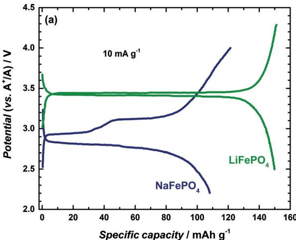

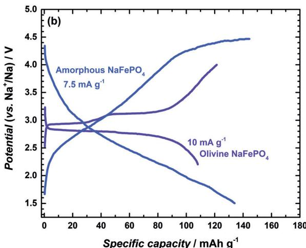  
Figure 10. a) Comparison of charge and discharge profile for olivine  $\mathrm{NaFePO_4}$  and  $\mathrm{LiFePO_4}$  cathode materials at  $10\mathrm{mAg^{-1}}$  (1st cycle). Data of olivine  $\mathrm{NaFePO_4}$  derived from Ref. [79]; data of  $\mathrm{LiFePO_4}$  derived from Ref. [42] b) Comparison of charge and discharge profile for amorphous and olivine  $\mathrm{NaFePO_4}$ . Data of amorphous  $\mathrm{NaFePO_4}$  derived from Ref. [80] (2nd cycle).

vine  $\mathrm{NaFePO_4}$  exhibited a specific capacity of about  $110\mathrm{mAhg^{-1}}$  with a discharge voltage of about  $2.8\mathrm{V}$  as seen in Figure 10. The appearance of the additional phase also strongly affects the kinetic properties of the material during cycling.[82] Recently, Kim et al. reported that maricite  $\mathrm{NaFePO_4}$ , despite previous expectation, can be surprisingly electrochemically active when prepared as nanosized particles. A reversible capacity of about  $142\mathrm{mAhg^{-1}}$  with  $95\%$  capacity retention after 200 cycles has been reported.[80] The electrochemical activity was ascribed to a rapid amorphization during initial charging. The voltage profiles for crystalline and amorphous  $\mathrm{NaFePO_4}$  are compared in Figure 10b.

# 5. Materials for the Negative Electrode

Before discussing different types of negative electrodes, it is important to remember that electrolytes are chronically instable at low potentials vs.  $\mathrm{A / A^{+}}$  and decompose to form surface films. To stop electrolyte decomposition, the formed

surface film must be electronically insulating but permeable for the cations. The film should be also sufficiently thin and flexible to survive the volume changes of the electrode during cycling. Achieving such a stabilizing solid electrolyte interphase[83] (SEI) is therefore crucial for obtaining a reversible electrode reaction. The mechanisms of SEI formation are very complex and are also accompanied by the formation of soluble and gaseous compounds. The composition of the SEI is mixed organic/inorganic and strongly depends on the used electrolyte solvents and the conductive salt used. In LIBs, the SEI fortunately exhibits very good properties and special additives such as vinylene carbonate are used to tune its exact composition. It should be noted that side reactions related to electrolyte decomposition can be very subtle and might be overlooked in many laboratory half-cell experiments, where electrolyte and lithium/sodium metal are often used in excess.

It is quite predictable that SEI formation will be different in case of sodium. The solubility of the SEI compounds in the electrolyte will be different and the general additives known from LIB technology might not be as effective in SIBs, for example. Comparative studies on several electrodes so far show that in case of sodium, the SEI is generally more inorganic and slightly thicker as compared to the case of lithium.[84] Overall, the knowledge on the SEI in SIBs is still comparably small and further studies are needed to identify the relevant factors for obtaining an optimized SEI that is stable for a long time and over many cycles.

# 5.1. Graphite and Other Carbons

Among all host structures, graphite can be considered as quite outstanding. This is because graphite is redox-amphoteric and the bond between the individual graphenes is weak. Graphite can therefore intercalate not only cations, but also anions (for example,  $\mathrm{PF}_6^-$  or  $\mathrm{TFSI}^{-}$ [85] of various sizes forming a large variety of graphite intercalation compounds (GICs).[86] With lithium, graphite forms a series of GICs at potentials below  $0.25\mathrm{V}$  vs.  $\mathrm{Li / Li^{+}}$ . The final composition is  $\mathrm{LiC_6}$ , corresponding to a capacity of  $372\mathrm{mAhg^{-1}}$  [19a] Owing to its excellent overall properties, graphite is nowadays used almost exclusively in commercialized LIBs. An intriguing finding is that sodium does not form any sodium-rich GICs. This is indeed puzzling because GICs for the even larger alkali metals potassium and rubidium are well-known. The underlying reason is still not completely clear. The increased stretching of the C-C bonds of graphite during sodium intercalation has been suggested by DFT calculations, for example.[87]

The voltage profiles for lithium and sodium intercalation into graphite are compared in Figure 11 a. Lithium intercalation is characterized by a staged process with the final formation of  $\mathrm{LiC_6}$ . The capacity is virtually zero in case of sodium when conventional electrolyte solvents (mixture of different carbonates) are used. It was therefore commonly accepted that graphite cannot be used in SIBs. A strategy around this problem is to co-intercalate the solvation shell of the sodium ion as shown by Jache and Adelhelm.[88] The inset in Figure 11 shows the intercalation behavior of solvated

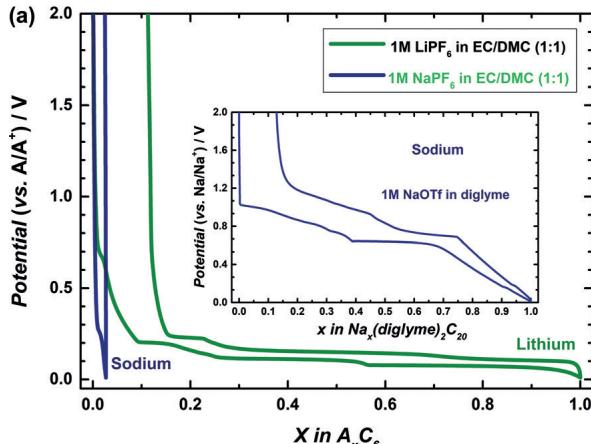

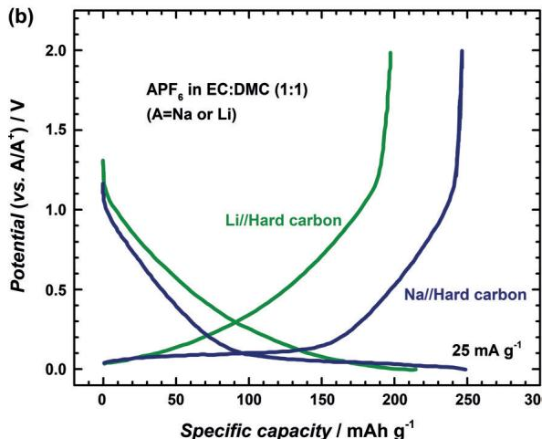  
Figure 11. a) Intercalation of sodium and lithium into graphite (1st cycle).[94] In conventional electrolytes, only lithium intercalates, forming the GIC  $\mathrm{LiC}_6$ . Sodium can be intercalated by using strongly solvating solvents. In this case, the solvated ion is intercalated (see inset).[95] EC = ethylene carbonate, DMC = dimethyl carbonate. b) Voltage profiles for lithium/sodium insertion into hard carbon (2nd cycle), data redrawn from Ref. [96].

sodium ions into graphite using diglyme as electrolyte solvent. Despite the large size of the solvated ion, the electrode reaction is highly reversible and exhibits excellent kinetics. Moreover, the redox potential can be tuned by varying the type of ether solvent.[89] As solvated ions are very large, one might also expect delamination of the graphite lattice. Increased van der Waals interactions between the graphene layers and the co-intercalated solvent molecules have been recently suggested to stabilize the structure.[90] Overall, the strategy of solvent co-intercalation provides new opportunities and could also render the intercalation of other ions, for example,  $\mathrm{Mg}^{2+}$  or  $\mathrm{Al}^{3+}$  that otherwise do not intercalate into graphite. On the downside, the so far obtained capacities of slightly above  $100\mathrm{mAhg^{-1}}$  are comparably low and the limited oxidative stability of ethers hampers their use in cells with high voltage cathode materials.

An alternative to graphite are disordered carbons, which have been used in the early commercialized LIBs and fortunately can also store sodium when using conventional carbonate-based electrolyte solvents. The microstructure and composition of disordered carbons is highly dependent on the

synthesis parameters and the type of precursors used. As a result, the shape of the voltage profiles can therefore considerably vary. The storage behavior of lithium and sodium in hard carbons (hard carbons = disordered carbons that do not transform into graphite upon heat treatment) was compared by Stevens and Dahn.[91] The overall behavior is similar in both cases and the voltage profile consists of one sloping region and one plateau region. The former was related to ion insertion between the disordered graphene layers, the latter to ion storage by adsorption in micropores. Theoretical studies support this finding,[29a] although also modified concepts are being suggested.[92] Overall, the storage mechanisms of sodium in disordered carbons as well the impact of doping and nanostructuring still need to be clarified in more detail. Figure 11b shows a comparison for lithium and sodium insertion into hard carbon. For optimized hard carbons, reversible capacities of around  $300\mathrm{mAhg^{-1}}$  are obtained.[93] Although this value is promising, it must be realized that the plateau region is very close to the metal plating potential, which increases the risk for undesired dendrite formation in full cells. Other specific challenges related to sodium storage in disordered carbons are sluggish kinetics and an often too high irreversible capacity in the first cycle. Nanosizing has become a popular approach to improve the kinetics, however, at the cost of an even higher initial irreversible capacity (see for example Ref. [97]). Overall, the properties of disorder carbons are promising but much remains to be understood and the performance needs to be optimized further. Specifically, the complex interplay between carbon microstructure, redox behavior and SEI formation (electrode and electrolyte formulation) needs further enlightenment. A recent overview on the use of hard carbons for SIBs can be found in Ref. [98].

# 5.2. Metal Alloys

Another promising route for storing lithium and sodium is alloy formation. Lithium and sodium form a number of binary alloys with metals of the Groups 13, 14, and 15. Full lithiation of silicon  $(\mathrm{Li}_{15}\mathrm{Si}_4)$  or tin  $(\mathrm{Li}_{15}\mathrm{Sn}_4)$  corresponds to capacities of  $q_{\mathrm{th}} = 3578\mathrm{mAhg}^{-1}$  and  $847\mathrm{mAhg}^{-1}$ , which is significantly higher than conventionally used electrode materials. Owing to the large difference in electronegativity values, intermetallic compounds of this kind are Zintl phases,[99] that is, they are generally brittle, often possess a stoichiometrically very narrow homogeneity range (phase width) and have high melting points. Table 1 shows an overview of the different phases existing at room temperature. It is interesting to note that, although silicon is very intensively studied for batteries, the phase diagram is still a matter of debate.[100] Nevertheless, the number of intermetallic compounds is obviously plenty and it is therefore no surprise that the lithiation and sodiation processes are complex. Moreover, amorphization can occur, as it is known for the lithiation of silicon, for example.[101] The use of alloys as negative electrodes in LIBs has been comprehensively summarized by Obrovac and Chevrier.[102] Alloy formation with lithium takes place at potentials below  $1\mathrm{V}$  vs.  $\mathrm{Li / Li^{+}}$  so they are in principle well-suited as negative electrodes. A number of well-known challenges so far prevent

Table 1: Overview on intermetallic lithium/sodium compounds for Zn and a selection of Group 13-15 main group elements (room temperature phases according to the phase diagrams).[103]  $\mathrm{Li}_{22}\mathrm{Si}_5$  appears in the phase diagram but electrochemical lithiation leads to  $\mathrm{Li}_{15}\mathrm{Si}_4$  only.[104]  

<table><tr><td colspan="5">Li</td><td colspan="3">Na</td></tr><tr><td>Zn</td><td>13</td><td>14</td><td>15</td><td>Zn</td><td>13</td><td>14</td><td>15</td></tr><tr><td>LiZn</td><td>AlLi</td><td>Li22Si5</td><td>Li3Sb</td><td>NaZn13</td><td>Ga4Na</td><td>NaSi</td><td>Na3Sb</td></tr><tr><td>Li2Zn3</td><td>Al2Li3</td><td>Li15Si4</td><td>Li2Sb</td><td></td><td>Ga39Na22(Ga13Na7)</td><td>Ge4Na</td><td>NaSb</td></tr><tr><td>LiZn2</td><td>AlLi2-x</td><td>Li21Si8</td><td></td><td></td><td>In8Na5</td><td>GeNa</td><td></td></tr><tr><td>Li2Zn5</td><td>Al4Li9</td><td>Li2Si</td><td></td><td></td><td>InNa</td><td>GeNa3</td><td></td></tr><tr><td>LiZn4</td><td>Ga14Li3</td><td>GeLi3</td><td></td><td></td><td>InNa3</td><td>Na15Sn4</td><td></td></tr><tr><td></td><td>Ga2Li</td><td>Ge5Li22</td><td></td><td></td><td>Na5TI</td><td>Na3Sn</td><td></td></tr><tr><td></td><td>GaLi</td><td>Li22Sn5</td><td></td><td></td><td>Na2TI</td><td>Na9Sn4</td><td></td></tr><tr><td></td><td>Ga4Li6</td><td>Li7Sn2</td><td></td><td></td><td>NaTI</td><td>NaSn</td><td></td></tr><tr><td></td><td>Ga2Li3</td><td>Li13Sn5</td><td></td><td></td><td>NaTl2</td><td>NaSn2</td><td></td></tr><tr><td></td><td>GaLi2</td><td>Li5Sn2</td><td></td><td></td><td></td><td>NaSn3</td><td></td></tr><tr><td></td><td>InLi</td><td>Li7Sn3</td><td></td><td></td><td></td><td>NaSn4</td><td></td></tr><tr><td></td><td>In4Li5</td><td>LiSn</td><td></td><td></td><td></td><td>NaSn6</td><td></td></tr><tr><td></td><td>In2Li3</td><td>Li2Sn5</td><td></td><td></td><td></td><td>PbNa</td><td></td></tr><tr><td></td><td>InLi2</td><td>Li4Pb</td><td></td><td></td><td></td><td>Pb4Na9</td><td></td></tr><tr><td></td><td>In3Li13</td><td>Li10(8)Pb3</td><td></td><td></td><td></td><td>Pb2Na5</td><td></td></tr><tr><td></td><td>Li4TI</td><td>Li3Pb</td><td></td><td></td><td></td><td>Pb4Na15</td><td></td></tr><tr><td></td><td>Li3TI</td><td>Li5(7)Pb2</td><td></td><td></td><td></td><td></td><td></td></tr><tr><td></td><td>Li5TI2</td><td>LiPb</td><td></td><td></td><td></td><td></td><td></td></tr><tr><td></td><td>Li2TI</td><td></td><td></td><td></td><td></td><td></td><td></td></tr><tr><td></td><td>LiTI</td><td></td><td></td><td></td><td></td><td></td><td></td></tr></table>

the use of alloys in rechargeable cells. Large volume expansion (often several hundred percent), insufficient SEI formation and a large initial irreversible capacity are the main drawbacks. A number of strategies such as nanosizing and optimization of binder and electrolyte composition exist that mitigate these issues, however with still too many compromises. A critical discussion on the necessary conditions for increasing the energy density of lithium-ion batteries by alloys can be found in Ref. [102]. In commercial cells, silicon is nowadays so far only added in small quantities to graphite electrodes.

In the case of sodium-ion batteries, alloys are more and more under the spotlight because graphite does not show the expected storage capacity (see Section 5.1). DFT calculations by Chevrier and Ceder showed that the average sodiation potentials of alloys are around  $0.15\mathrm{V}$  lower compared to the equivalent lithium reaction.[17] In case of silicon, this means that the sodiation potential for the formation of the NaSi intermetallic phase  $(q_{\mathrm{th}} = 954\mathrm{mAhg^{-1}})$  is very close to the metal plating potential. It might be therefore difficult to form this phase electrochemically. The use of amorphous rather than crystalline silicon might provide advantages as suggested by theory.[105] Although several efforts have been undertaken,[106] unequivocal evidence for the reversible storage of larger amounts of sodium in silicon electrodes is still missing. The sodiation and lithiation behavior of antimony  $(q_{\mathrm{th}} = 660\mathrm{mAhg^{-1}})$  has been studied by Darwiche et al.[107] Distinct differences between both reactions where observed. In case of lithium, the reaction proceeded in line with the phase diagram over several intermediates. In case of sodium, however, mostly amorphous phases as well as an unexpected high-pressure phase were observed. Interestingly, the overall

performance for sodium was better than for lithium, and capacities close to  $600\mathrm{mAhg}^{-1}$  were achieved for more than 150 cycles. Specific limitations of Sb are toxicity issues as well as its low abundance so research on tin and its alloys has become quite popular.[108]

From charge/discharge curves, it can be seen that the electrochemical lithiation and sodiation of tin at room temperature does not proceed as one would expect from the Li-Sn and Na-Sn phase diagrams.[108a,109] This means that not all phases shown in Table 1 necessarily form in their thermodynamically stable crystalline states, instead also metastable crystalline as well as amorphous phases appear. The voltage profiles for lithiation and sodiation of tin are compared in Figure 12. In both cases, a rather complex behavior is observed. Replacing lithium by sodium leads to

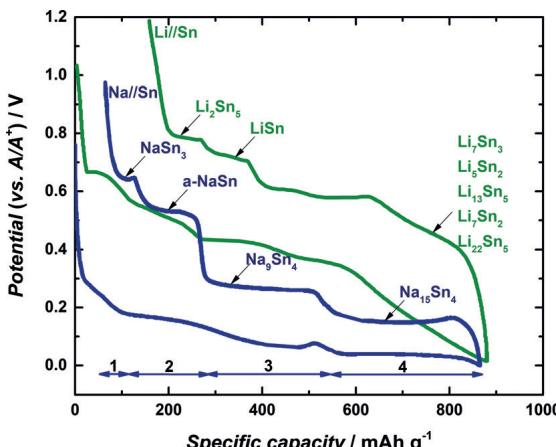  
Figure 12. Voltage profiles (1st cycle) for the Na-Sn (blue) and the Li-Sn system (green). Data collected from Refs. [112,116].

a shift in redox potentials of around  $200 - 300\mathrm{mV}$ , making tin a very attractive material for the negative electrode. The phase behavior during sodiation and desodiation of tin has been studied by Obrovac et al.[108a] by XRD. According to their results, sodiation of tin occurs as follows, with "a" indicating the compound being amorphous and  $" ^ { \text{喜} }$  indicating an unexpected crystalline phase (approximated stoichiometries):

Region 1:  $\mathrm{Na} + \mathrm{Sn}\rightarrow \mathrm{NaSn}_3^*$

Region 2:  $\mathrm{Na} + \mathrm{NaSn}_3^* \rightarrow \mathrm{a - NaSn}$

Region 3:  $5\mathrm{Na} + 4(\mathrm{a - NaSn})\rightarrow \mathrm{Na}_{9}\mathrm{Sn}_{4}^{*}$

Region 4:  $6\mathrm{Na} + \mathrm{Na}_{9}\mathrm{Sn}_{4}^{*}\rightarrow \mathrm{Na}_{15}\mathrm{Sn}_{4}$

The different phases are similar (but not identical) to what has been predicted by DFT calculations.[17] Slightly different experimental results were also reported by Wang et al.,[110] indicating that the precise reaction is complex and maybe also depend on experimental conditions. A very comprehensive study on the sodiation of tin was very recently presented by Stratford et al. revealing the structure of several more intermediate phases as well as partial solid solution behavior. Eventually, even sodiation beyond the  $\mathrm{Na}_{15}\mathrm{Sn}_4$  phase can occur.[111] The peak close to the end of the desodiation is likely

related to nucleation processes, so the phase formation of  $\mathrm{NaSn}_5$  is kinetically hindered.[112]

The use binary alloys such as SbSn or even more complex alloys[113] are also of interest. This approach allows for a slight tuning in redox potentials but more importantly is often found to improve the cycle life because the microstructure is thought to be better preserved during cycling as compared to the pure metals. Kim et al. studied the sodiation behavior of SnSb electrodes and found reversible capacity of about  $500\mathrm{mAhg^{-1}}$  for over 100 cycles.[114] SnSb is sodiated step by step, where the initial reaction forms  $\mathrm{Na}_{3}\mathrm{Sb}$  and Sn. Afterwards Sn is further sodiated to form  $\mathrm{Na}_{15}\mathrm{Sn}_4$  at lower redox potential.

For any metal or alloy, it is also clear that sodiation will lead to much larger volume expansions as compared to when lithiation takes place. Mitigating electrode degradation is therefore expected to be more challenging in case of sodium. Nanotomography studies on tin, however, showed that the stability can nevertheless be better for sodium compared to lithium.[115]

At last, trends within the periodic table can be found for the comparison of lithium and sodium alloys. Considering the Group 13 metals of the periodic table (Al, Ga, In, Tl), it can be seen that lithium forms more intermetallic compounds than sodium (Table 1). For the AB alloys of lithium, that is, LiAl, LiGa, LiIn, LiTl, the phase width increases with increasing atomic numbers (decreasing electronegativity). The stoichiometric variation is around  $3\%$  for LiAl and LiGa and around  $11\%$  for LiIn and LiTl, indicating that the bonding for the latter becomes less heteropolar. Consequently, also the melting point decreases with increasing atomic numbers. In the case of sodium, only In and Tl form AB compounds and the phase width is much smaller. The phase width of intermetallic compounds has direct consequences on the voltage profile. Phases with narrow phase width lead to steps in the voltage profiles whereas a broad phase width leads to sloping potentials. The numerous intermetallic compounds for the promising Group 14 elements Si and Sn show only very small homogeneity range for both lithium and sodium.

The trend that lithium forms more intermetallic compounds than sodium is interestingly opposite to what is generally found for many positive electrode materials and the Group 16 elements oxygen, sulfur, and selenium. This might well be related to the atomic radii of the alloying metals which are closer to lithium  $(r_{\mathrm{Li}} = 145\mathrm{pm})$  than to sodium  $(r_{\mathrm{Na}} = 180\mathrm{pm})$ . A large phase width of around  $7\%$  is only found for the NaPb alloy because the atomic radii are identical  $(r_{\mathrm{Pb}} = r_{\mathrm{Na}} = 180\mathrm{pm})$ . The large difference in atomic radii might also explain why no Na-Al alloys exist  $(r_{\mathrm{Al}} = 125\mathrm{pm})$ .

Whether or not alloys form with lithium or sodium has important consequences for the cell design. As mentioned above, aluminum can be used as current collector for the negative electrode in SIBs because sodium and aluminum do not form an alloy. In case of LIBs, more expensive copper has to be used instead. Indium is certainly no option for commercial cells owing to its scarcity but it is worth mentioning that it is frequently used on the research level in the rising field of solid-state batteries. It is popular because it

is very soft, it readily alloys with lithium and sodium at room temperature upon contacting and the formed alloys are stable against a variety of solid electrolytes that are instable in contact with lithium and sodium metal.

# 5.3.  $\mathrm{Li}_2\mathrm{Ti}_3\mathrm{O}_7$  and  $\mathrm{Na}_2\mathrm{Ti}_3\mathrm{O}_7$

After iron, titanium is the second most abundant transition-metal, making it an interesting element in view of resources. The family of titanium compounds is very diverse, and plenty of compounds are being studied for use in LIBs and more recently SIBs. Oxidic titanium compounds are among the few being capable of reversibly intercalating lithium and sodium at low redox potentials without undergoing the type of conversion reactions discussed in Section 3. Spinel-type  $\mathrm{Li}[\mathrm{Li}_{1/3}\mathrm{Ti}_{5/3}] \mathrm{O}_4$  (or often written  $\mathrm{Li}_4\mathrm{Ti}_5\mathrm{O}_{12}$ ) has been commercialized in LIBs for niche applications, for example. A particularly interesting compound for comparing the influence of ion size on the redox behavior is  $\mathrm{A}_2\mathrm{Ti}_3\mathrm{O}_7$  ( $\mathrm{A} = \mathrm{Li}$ , Na), which has been studied by Rousse et al.[16] The voltage profiles are compared in Figure 13 and show a defined plateau, indicative for a two-phase reaction. The redox potential for sodium insertion into  $\mathrm{Na}_2\mathrm{Ti}_3\mathrm{O}_7$  ( $0.3\mathrm{V}$  vs.  $\mathrm{Na}/\mathrm{Na}^+$ ) is more than one volt lower than compared to lithium insertion into  $\mathrm{Li}_2\mathrm{Ti}_3\mathrm{O}_7$  ( $1.6\mathrm{V}$  vs.  $\mathrm{Li}/\mathrm{Li}^+$ ), meaning that the driving force for ion intercalation is much smaller in case of sodium. The difference of more than  $1\mathrm{V}$  is exceptionally high compared to the other materials discussed. Moreover, the authors found that due to the different ion size, sodium insertion into the host structure leads to expansion, whereas contraction occurs in case of lithium. In situ studies during sodiation of  $\mathrm{Na}_2\mathrm{Ti}_3\mathrm{O}_7$  confirmed that, similar to the lithium analogue,  $\mathrm{Ti}^{3+/4+}$  is the active redox couple.[117] The compound is able to store two sodium ions to form  $\mathrm{Na}_4\mathrm{Ti}_3\mathrm{O}_7$  during discharge, corresponding to a theoretical capacity of  $178\mathrm{mAhg}^{-1}$ . Poor cycle life and low initial coulombic efficiency, however, are the major drawbacks to date. Con

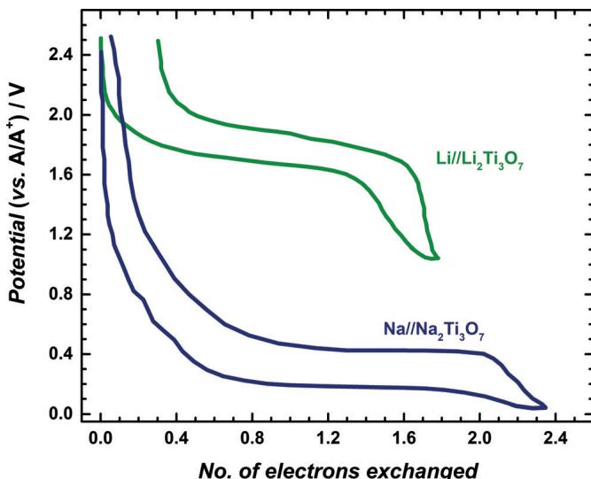  
Figure 13. Voltage profiles for  $\mathrm{Li}_2\mathrm{Ti}_3\mathrm{O}_7$  and  $\mathrm{Na}_2\mathrm{Ti}_3\mathrm{O}_7$  (2nd cycle). Data collected from Ref. [16].

tinuous side reactions with the electrolyte have been found to be a major obstacle,[118] so better stabilization of the electrode/electrolyte interface is required. Finally, it is interesting to note that the redox chemistry of titanates is very flexible, the lithium titanates can store sodium ions and vice versa. Also protonated titanates can be used.[119]  $\mathrm{TiO}_2$ , too, shows some peculiar behavior when comparing lithium and sodium storage.[120]

# 6. Summary and Outlook

Within the last 5 years, research on sodium-ion batteries has become very dynamic, and fast progress in materials development and performance has been achieved. There is almost no doubt that commercialization of SIBs is technically possible. This, however, requires a market niche where SIBs show specific advantages over LIBs or other established types of batteries. Cost-efficient batteries based on abundant elements might be such a niche that might become relevant in the future in case resource supply and supply chains for LIBs will be challenged too much; of course this requires an integrated approach. Scientifically, it is intriguing to compare how the size of the ions affects the electrode reaction for a given host structure. In this Review, we largely focused on the differences in phase behavior during lithiation/sodiation of a variety of such host structures. In many positive electrode materials, replacement of lithium by sodium leads to a more complex behavior as additional intermediate phases form during cell cycling. Layered oxides and  $\mathrm{AFePO_4}$  ( $A = Li$ , Na) have been discussed, for example. For the negative electrode, the choice so far is limited, as graphite only stores sodium under special circumstances and silicon seems to be largely inactive. Other alloys (Sn, SnSb), titanium oxides and a variety of carbon materials are therefore intensively studied though a much better understanding of the SEI formation is required. Finally, the huge family of conversion reactions is an attractive playground to test whether the use of sodium instead of lithium helps to overcome previous challenges. Overall, numerous und unexpected surprises have been found when replacing lithium by sodium in electrochemical cells and much remains to be discovered. This also includes the use of sodium in solid-state, metal/air- and metal/sulfur batteries. The race is on to find such surprises with the hope to not only deepen fundamental understanding but also to identify electrode reactions for batteries with improved properties thereby creating options for future energy storage devices. Certainly, research on LIBs will also profit from this.

# Acknowledgements

The authors thank the DFG for funding within the project "Thermodynamics and kinetics of conversion reactions in sodium-based battery systems" and the State of Thuringia for support within the ProExzellenz program. L.Y. thanks the China Scholarship Council funding. P.A. thanks M. Adelhelm and J. Janek for continuous and fruitful discussions.

# Conflict of interest

The authors declare no conflict of interest.

How to cite: Angew. Chem. Int. Ed. 2018, 57, 102-120 Angew. Chem. 2018, 130, 106-126

[1] A. Thielmann, A. Sauer, M. Wietschel, Fraunhofer-Institute ISI, Karlsruhe, 2015.  
[2] a) B. Nykvist, M. Nilsson, Nat. Clim. Change 2015, 5, 329-332; b) C. Pillot, Avicenne Energy on ENSAM Meeting Paris 2016.  
[3] G. E. Blomgren, J. Electrochem. Soc. 2017, 164, A5019-A5025.  
[4] C. Wadia, P. Albertus, V. Srinivasan, J. Power Sources 2011, 196, 1593-1598.  
[5] a) K. M. Abraham, Solid State Ionics 1982, 7, 199-212; b) G. H. Newman, L. P. Klemann, J. Electrochem. Soc. 1980, 127, 2097-2099; c) L. W. Shacklette, T. R. Jow, L. Townsend, J. Electrochem. Soc. 1988, 135, 2669-2674.  
[6] A. Yoshino, Angew. Chem. Int. Ed. 2012, 51, 5798-5800; Angew. Chem. 2012, 124, 5898-5900.  
[7] J. Peters, D. Buchholz, S. Passerini, M. Weil, Energy Environ. Sci. 2016, 9, 1744-1751.  
[8] a) Y. Li, Y. Lu, C. Zhao, Y.-S. Hu, M.-M. Titirici, H. Li, X. Huang, L. Chen, Energy Storage Mater. 2017, 7, 130-151; b) S.-W. Kim, D.-H. Seo, X. Ma, G. Ceder, K. Kang, Adv. Energy Mater. 2012, 2, 710-721; c) V. Palomares, P. Serras, I. Villaluenga, K. B. Hueso, J. Carretero-Gonzalez, T. Rojo, Energy Environ. Sci. 2012, 5, 5884-5901; d) H. Pan, Y.-S. Hu, L. Chen, Energy Environ. Sci. 2013, 6, 2338-2360; e) M. D. Slater, D. Kim, E. Lee, C. S. Johnson, Adv. Funct. Mater. 2013, 23, 947-958; f) N. Yabuuchi, K. Kubota, M. Dahbi, S. Komaba, Chem. Rev. 2014, 114, 11636-11682; g) D. Kundu, E. Talaie, V. Duffort, L. F. Nazar, Angew. Chem. Int. Ed. 2015, 54, 3431-3448; Angew. Chem. 2015, 127, 3495-3513; h) S. Y. Hong, Y. Kim, Y. Park, A. Choi, N.-S. Choi, K. T. Lee, Energy Environ. Sci. 2013, 6, 2067-2081; i) S. Guo, J. Yi, Y. Sun, H. Zhou, Energy Environ. Sci. 2016, 9, 2978-3006; j) W. Luo, F. Shen, C. Bommier, H. Zhu, X. Ji, L. Hu, Acc. Chem. Res. 2016, 49, 231-240; k) L. Peng, Y. Zhu, D. Chen, R.S. Ruoff, G.YuAdv Energy Mater.2016,61-21  
[9] D. R. Lide, CRC Handbook of Chemistry and Physics, 84th ed., CRC, Boca Raton, 2004.  
[10] M. Okoshi, Y. Yamada, A. Yamada, H. Nakai, J. Electrochem. Soc. 2013, 160, A2160-A2165.  
[11] S. Komaba, C. Takei, T. Nakayama, A. Ogata, N. Yabuuchi, Electrochem. Commun. 2010, 12, 355-358.  
[12] a) P. Adelhelm, P. Hartmann, C. L. Bender, M. Busche, C. Eufinger, J. Janek, Beilstein J. Nanotechnol. 2015, 6, 1016-1055; b) L. Medenbach, P. Adelhelm, Top. Curr. Chem. 2017, 375, 81.  
[13] a) W. A. Hart, O. F. Beumel Jr, in The Chemistry of Lithium, Sodium, Potassium, Rubidium, Cesium and Francium, Pergamon, Oxford, 1973, pp. 331-367; b) A. F. Holleman, E. Wiberg, N. Wiberg, Lehrbuch der anorganischen Chemie, de Gruyter, 2007.  
[14] C. H. Hamann, W. Vielstich, *Elektrochemie*, Wiley-VCH, Weinheim, 2005.  
[15] S. P. Ong, V. L. Chevrier, G. Hautier, A. Jain, C. Moore, S. Kim, X. H. Ma, G. Ceder, Energy Environ. Sci. 2011, 4, 3680-3688.  
[16] G. Rousse, M. E. Arroyo-de Domablo, P. Senguttuvan, A. Ponrouch, J.-M. Tarascon, M. R. Palacin, Chem. Mater. 2013, 25, 4946-4956.  
[17] V. L. Chevrier, G. Ceder, J. Electrochem. Soc. 2011, 158, A1011-A1014.  
[18] M. Nose, H. Nakayama, K. Nobuhara, H. Yamaguchi, S. Nakanishi, H. Iba, J. Power Sources 2013, 234, 175-179.

[19] a) M. Winter, J. O. Besenhard, M. E. Spahr, P. Novak, Adv. Mater. 1998, 10, 725-763; b) M. Winter, J. O. Besenhard, Electrochim. Acta 1999, 45, 31-50.  
[20] Y. Idota, T. Kubota, A. Matsufuji, Y. Maekawa, T. Miyasaka, Science 1997, 276, 1395-1397.  
[21] P. Poizot, S. Laruelle, S. Grugeon, L. Dupont, J. M. Tarascon, Nature 2000, 407, 496-499.  
[22] a) J. Cabana, L. Monconduit, D. Larcher, M. R. Palacin, Adv. Mater. 2010, 22, E170-E192; b) R. Malini, U. Uma, T. Sheela, M. Ganesan, N. G. Renganathan, Ionics 2009, 15, 301-307; c) A. Kraytsberg, Y. Ein-Eli, J. Solid State Electrochem. 2017, 21, 1907; d) M. Keppeler, M. Srinivasan, ChemElectroChem 2017. DOI: 10.1002/celc.201700747.  
[23] F. Klein, B. Jache, A. Bhide, P. Adelhelm, Phys. Chem. Chem. Phys. 2013, 15, 15876-15887.  
[24] a) A. Debart, L. Dupont, R. Patrice, J. M. Tarascon, Solid State Sci. 2006, 8, 640-651; b) B. Jache, B. Mogwitz, F. Klein, P. Adelhelm, J. Power Sources 2014, 247, 703-711.  
[25] F. Wang, R. Robert, N. A. Chernova, N. Pereira, F. Omenya, F. Badway, X. Hua, M. Ruotolo, R. G. Zhang, L. J. Wu, V. Volkov, D. Su, B. Key, M. S. Whittingharn, C. P. Grey, G. G. Amatucci, Y. M. Zhu, J. Graetz, J. Am. Chem. Soc. 2011, 133, 18828-18836.  
[26] M. Valvo, F. Lindgren, U. Lafont, F. Björrefors, K. Edström, J. Power Sources 2014, 245, 967-978.  
[27] F. Klein, R. Pinedo, B. B. Berkes, J. Janek, P. Adelhelm, J. Phys. Chem. C 2017, 121, 8679-8691.  
[28] A. Eguia-Barrio, E. Martinez-Castillo, F. Klein, R. Pinedo, L. Lezema, J. Janek, P. Adelhelm, T. Rojo, J. Power Sources 2017, 367, 130-137.  
[29] a) P.-C. Tsai, S.-C. Chung, S.-K. Lin, A. Yamada, J. Mater. Chem. A 2015, 3, 9763-9768; b) T. B. Kim, J. W. Choi, H. S. Ryu, G. B. Cho, K. W. Kim, J. H. Ahn, K. K. Cho, H. J. Ahn, J. Power Sources 2007, 174, 1275-1278.  
[30] X. D. Xiang, K. Zhang, J. Chen, Adv. Mater. 2015, 27, 5343-5364.  
[31] X. Li, Y. Wang, D. Wu, L. Liu, S. H. Bo, G. Ceder, Chem. Mater. 2016, 28, 6575-6583.  
[32] a) M. H. Han, E. Gonzalo, G. Singh, T. Rojo, Energy Environ. Sci. 2015, 8, 81-102; b) H. Kim, H. Kim, Z. Ding, M. H. Lee, K. Lim, G. Yoon, K. Kang, Adv. Energy Mater. 2016, 6, 1-38.  
[33] A. K. Padhi, K. S. Nanjundaswamy, J. B. Goodenough, J. Electrochem. Soc. 1997, 144, 1188-1194.  
[34] P. Barpanda, S. Nishimura, A. Yamada, Adv. Energy Mater. 2012, 2, 841-859.  
[35] D. Aurbach, K. Gamolsky, B. Markovsky, G. Salitra, Y. Gofer, U. Heider, R. Oesten, M. Schmidt, J. Electrochem. Soc. 2000, 147, 1322-1331.  
[36] K. Edström, T. Gustafsson, J. O. Thomas, Electrochim. Acta 2004, 50, 397-403.  
[37] a) S. Dalavi, M. Xu, B. Knight, B. L. Lucht, Electrochem. Solid State Lett. 2012, 15, A28-A31; b) M. Xu, N. Tsiouvaras, A. Garsuch, H. A. Gasteiger, B. L. Lucht, J. Phys. Chem. C 2014, 118, 7363-7368.  
[38] D. Chen, G. Q. Shao, B. Li, G. G. Zhao, J. Li, J. H. Liu, Z. S. Gao, H. F. Zhang, Electrochim. Acta 2014, 147, 663-668.  
[39] M. Reynaud, M. Ati, B. C. Melot, M. T. Sougrati, G. Rousse, J. N. Chotard, J. M. Tarascon, Electrochem. Commun. 2012, 21, 77-80.  
[40] R. Tripathi, T. N. Ramesh, B. L. Ellis, L. F. Nazar, Angew. Chem. Int. Ed. 2010, 49, 8738-8742; Angew. Chem. 2010, 122, 8920-8924.  
[41] T. Muraliganth, K. R. Stroukoff, A. Manthiram, Chem. Mater. 2010, 22, 5754-5761.  
[42] G. Ali, J. H. Lee, D. Susanto, S. W. Choi, B. W. Cho, K. W. Nam, K. Y. Chung, ACS Appl. Mater. Interfaces 2016, 8, 15422-15429.

[43] A. Langrock, Y. H. Xu, Y. H. Liu, S. Ehrman, A. Manivannan, C. S. Wang, J. Power Sources 2013, 223, 62-67.  
[44] P. Singh, K. Shiva, H. Cello, J. B. Goodenough, Energy Environ. Sci. 2015, 8, 3000-3005.  
[45] S. D. Li, J. H. Guo, Z. Ye, X. Zhao, S. Q. Wu, J. X. Mi, C. Z. Wang, Z. L. Gong, M. J. McDonald, Z. Z. Zhu, K. M. Ho, Y. Yang, ACS Appl. Mater. Interfaces 2016, 8, 17233-17238.  
[46] C. Y. Chen, K. Matsumoto, T. Nohira, R. Hagiwara, Y. Orikasa, Y. Uchimoto, J. Power Sources 2014, 246, 783-787.  
[47] D. M. Dai, B. Li, H. W. Tang, K. Chang, K. Jiang, Z. R. Chang, X. Z. Yuan, J. Power Sources 2016, 307, 665-672.  
[48] C. F. Liu, R. Masse, X. H. Nan, G. Z. Cao, Energy Storage Mater. 2016, 4, 15-58.  
[49] R. Berthelot, D. Carlier, C. Delmas, Nat. Mater. 2011, 10, 74-80.  
[50] a) H. Yoshida, N. Yabuuchi, S. Komaba, Electrochem. Commun. 2013, 34, 60-63; b) X. Wang, M. Tamaru, M. Okubo, A. Yamada, J. Phys. Chem. C 2013, 117, 15545-15551.  
[51] N. Yabuuchi, H. Yoshida, S. Komaba, Electrochemistry 2012, 80, 716-719.  
[52] R. Kanno, T. Shirane, Y. Kawamoto, Y. Takeda, M. Takano, M. Ohashi, Y. Yamaguchi, J. Electrochem. Soc. 1996, 143, 2435-2442.  
[53] Y. S. Lee, S. Sato, Y. K. Sun, K. Kobayakawa, Y. Sato, J. Power Sources 2003, 119, 285-289.  
[54] X. F. Wang, G. D. Liu, T. Iwao, M. Okubo, A. Yamada, J. Phys. Chem. C 2014, 118, 2970-2976.  
[55] M. Sathiya, K. Hemalatha, K. Ramesha, J. M. Tarascon, A. S. Prakash, Chem. Mater. 2012, 24, 1846-1853.  
[56] X. F. Luo, X. Y. Wang, L. Liao, X. M. Wang, S. Gamboa, P. J. Sebastian, J. Power Sources 2006, 161, 601-605.  
[57] Y. K. Sun, D. J. Lee, Y. J. Lee, Z. H. Chen, S. T. Myung, ACS Appl. Mater. Interfaces 2013, 5, 11434-11440.  
[58] E. de la Llave, V. Borgel, K. J. Park, J. Y. Hwang, Y. K. Sun, P. Hartmann, F. F. Chesneau, D. Aurbach, ACS Appl. Mater. Interfaces 2016, 8, 1867-1875.  
[59] a) D. Y. W. Yu, K. Yanagida, Y. Kato, H. Nakamura, J. Electrochem. Soc. 2009, 156, A417-A424; b) J. Lim, J. Moon, J. Gim, S. Kim, K. Kim, J. Song, J. Kang, W. B. Im, J. Kim, J. Mater. Chem. 2012, 22, 11772-11777; c) K. Kubota, T. Kaneko, M. Hirayama, M. Yonemura, Y. Imanari, K. Nakane, R. Kanno, J. Power Sources 2012, 216, 249-255; d) S. F. Amalraj, D. Sharon, M. Talianker, C. M. Julien, L. Burlaka, R. Lavi, E. Zhecheva, B. Markovsky, E. Zinigrad, D. Kovacheva, R. Stoyanova, D. Aurbach, Electrochim. Acta 2013, 97, 259-270.  
[60] a) M. M. Thackeray, S. H. Kang, C. S. Johnson, J. T. Vaughey, R. Benedek, S. A. Hackney, J. Mater. Chem. 2007, 17, 3112-3125; b) P. K. Nayak, J. Grinblat, M. Levi, D. Aurbach, Electrochim. Acta 2014, 137, 546-556; c) J. Zeng, Y. H. Cui, D. Y. Qu, Q. Zhang, J. W. Wu, X. M. Zhu, Z. H. Li, X. H. Zhang, ACS Appl. Mater. Interfaces 2016, 8, 26082-26090.  
[61] H. J. Yu, H. S. Zhou, J. Phys. Chem. Lett. 2013, 4, 1268-1280.  
[62] a) M. N. Ates, Q. Y. Jia, A. Shah, A. Busnaina, S. Mukerjee, K. M. Abraham, J. Electrochem. Soc. 2014, 161, A290-A301; b) Q. Li, G. S. Li, C. C. Fu, D. Luo, J. M. Fan, L. P. Li, ACS Appl. Mater. Interfaces 2014, 6, 10330-10341; c) D. Wang, Y. Huang, Z. Q. Huo, L. Chen, Electrochim. Acta 2013, 107, 461-466; d) P. K. Nayak, J. Grinblat, E. Levi, M. Levi, B. Markovsky, D. Aurbach, Phys. Chem. Chem. Phys. 2017, 19, 6142-6152; e) P. K. Nayak, J. Grinblat, M. Levi, E. Levi, S. Kim, J. W. Choi, D. Aurbach, Adv. Energy Mater. 2016, 6, 1502398; f) C. C. Wang, Y. C. Lin, P. H. Chou, RSC Adv. 2015, 5, 68919-68928; g) Q. Q. Qiao, L. Qin, G. R. Li, Y. L. Wang, X. P. Gao, J. Mater. Chem. A 2015, 3, 17627-17634.  
[63] a) M. Xu, Z. Y. Chen, L. J. Li, H. L. Zhu, Q. F. Zhao, L. Xu, N. F. Peng, L. Gong, J. Power Sources 2015, 281, 444-454; b) F. Wu, X. X. Zhang, T. L. Zhao, L. Li, M. Xie, R. J. Chen, ACS

Appl. Mater. Interfaces 2015, 7, 3773-3781; c) Y. Lee, J. Lee, K. Y. Lee, J. Mun, J. K. Lee, W. Choi, J. Power Sources 2016, 315, 284-293; d) C. Chen, T. F. Geng, C. Y. Du, P. J. Zuo, X. Q. Cheng, Y. L. Ma, G. P. Yin, J. Power Sources 2016, 331, 91-99; e) R. B. Yu, Y. B. Lin, Z. G. Huang, Electrochim. Acta 2015, 173, 515-522; f) S. W. Sun, Y. F. Yin, N. Wan, Q. Wu, X. P. Zhang, D. Pan, Y. Bai, X. Lu, ChemSusChem 2015, 8, 2544-2550.  
[64] a) J. Xu, D. H. Lee, R. J. Clement, X. Q. Yu, M. Leskes, A. J. Pell, G. Pintacuda, X. Q. Yang, C. P. Grey, Y. S. Meng, Chem. Mater. 2014, 26, 1260-1269; b) J. Xu, H. D. Liu, Y. S. Meng, Electrochem. Commun. 2015, 60, 13-16.  
[65] D. Kim, S. H. Kang, M. Slater, S. Rood, J. T. Vaughey, N. Karan, M. Balasubramanian, C. S. Johnson, Adv. Energy Mater. 2011, 1, 333-336.  
[66] E. de la Llave, E. Talaie, E. Levi, P. K. Nayak, M. Dixit, P. T. Rao, P. Hartmann, H. F. Chesneau, D. T. Major, M. Greenstein, D. Aurbach, L. F. Nazar, Chem. Mater. 2016, 28, 9064-9076.  
[67] E. de la Llave, P. K. Nayak, E. Levi, T. R. Penki, S. Bubilil, P. Hartmann, F.-F. Chesneau, M. Greenstein, L. F. Nazar, D. Aurbach, J. Mater. Chem. A 2017, 5, 5858-5864.  
[68] a) P. K. Nayak, J. Grinblat, M. Levi, Y. Wu, B. Powell, D. Aurbach, J. Electroanal. Chem. 2014, 733, 6-19; b) S. Kim, X. H. Ma, S. P. Ong, G. Ceder, Phys. Chem. Chem. Phys. 2012, 14, 15571-15578.  
[69] Y. C. Lei, X. Li, L. Liu, G. Ceder, Chem. Mater. 2014, 26, 5288-5296.  
[70] S. Kumakura, Y. Tahara, K. Kubota, K. Chihara, S. Komaba, Angew. Chem. Int. Ed. 2016, 55, 12760-12763; Angew. Chem. 2016, 128, 12952-12955.  
[71] J.-K. Park, Principle and applications of lithium secondary batteries, Wiley-VCH, Weinheim, 2012.  
[72] P.-F. Wang, Y. You, Y.-X. Yin, Y.-G. Guo, J. Mater. Chem. A 2016, 4, 17660-17664.  
[73] D. H. Lee, J. Xu, Y. S. Meng, Phys. Chem. Chem. Phys. 2013, 15, 3304-3312.  
[74] E. Talaie, V. Duffort, H. L. Smith, B. Fultz, L. F. Nazar, Energy Environ. Sci. 2015, 8, 2512-2523.  
[75] M. M. Thackeray, W. I. F. David, P. G. Bruce, J. B. Goodenough, Mater. Res. Bull. 1983, 18, 461-472.  
[76] N. Yabuuchi, M. Yano, S. Kuze, S. Komaba, Electrochim. Acta 2012, 82, 296-301.  
[77] X. Z. Liu, X. Wang, A. Iyo, H. J. Yu, D. Li, H. S. Zhou, J. Mater. Chem. A 2014, 2, 14822-14826.  
[78] a) P. Moreau, D. Guyomard, J. Gaubicher, F. Boucher, Chem. Mater. 2010, 22, 4126-4128; b) J. Lu, S. C. Chung, S.-i. Nishimura, A. Yamada, Chem. Mater. 2013, 25, 4557-4565.  
[79] A. Kuwahara, S. Suzuki, M. Miyayama, J. Electroceram. 2010, 24, 69-75.  
[80] J. Kim, D. H. Seo, H. Kim, I. Park, J. K. Yoo, S. K. Jung, Y. U. Park, W. A. Goddard, K. Kang, Energy Environ. Sci. 2015, 8, 540-545.  
[81] F. Boucher, J. Gaubicher, M. Cuisinier, D. Guyomard, P. Moreau, J. Am. Chem. Soc. 2014, 136, 9144-9157.  
[82] C. Heubner, S. Heiden, M. Schneider, A. Michaelis, Electrochim. Acta 2017, 233, 78-84.  
[83] E. Peled, J. Electrochem. Soc. 1979, 126, 2047-2051.  
[84] a) S. Komaba, W. Murata, T. Ishikawa, N. Yabuuchi, T. Ozeki, T. Nakayama, A. Ogata, K. Gotoh, K. Fujiwara, Adv. Funct. Mater. 2011, 21, 3859-3867; b) A. Ponrouch, R. Dedryvere, D. Monti, A. E. Demet, J. M. A. Mba, L. Croguennec, C. Masquelier, P. Johansson, M. R. Palacin, Energy Environ. Sci. 2013, 6, 2361-2369; c) B. Philippe, M. Valvo, F. Lindgren, H. Rensmo, K. Edstrom, Chem. Mater. 2014, 26, 5028-5041; d) M. A. Munoz-Márquez, M. Zarrabeitia, E. Castillo-Martinez, A. Eguia-Barrio, T. Rojo, M. Casas-Cabanas, ACS Appl.

Mater. Interfaces 2015, 7, 7801-7808; e) R. Mogensen, D. Brandell, R. Younesi, ACS Energy Lett. 2016, 1, 1173-1178.  
[85] a) W. Märkle, N. Tran, D. Goers, M. E. Spahr, P. Novák, Carbon 2009, 47, 2727-2732; b) G. Schmuelling, T. Placke, R. Kloepsch, O. Fromm, H.-W. Meyer, S. Passerini, M. Winter, J. Power Sources 2013, 239, 563-571.  
[86] a) M. S. Dresselhaus, G. Dresselhaus, Adv. Phys. 1981, 30, 139-326; b) Graphite Intercalation Compounds I, Springer, Amsterdam, 1990.  
[87] a) K. Nobuhara, H. Nakayama, M. Nose, S. Nakanishi, H. Iba, J. Power Sources 2013, 243, 585-587; b) G. Yoon, H. Kim, I. Park, K. Kang, Adv. Energy Mater. 2017, 7, 1601519.  
[88] B. Jache, P. Adelhelm, Angew. Chem. Int. Ed. 2014, 53, 10169–10173; Angew. Chem. 2014, 126, 10333–10337.  
[89] a) H. Kim, J. Hong, G. Yoon, H. Kim, K.-Y. Park, M.-S. Park, W.-S. Yoon, K. Kang, Energy Environ. Sci. 2015, 8, 2963-2969; b) B. Jache, J. O. Binder, T. Abe, P. Adelhelm, Phys. Chem. Chem. Phys. 2016, 18, 14299-14316; c) H. Kim, J. Hong, Y.-U. Park, J. Kim, I. Hwang, K. Kang, Adv. Funct. Mater. 2015, 25, 534-541.  
[90] S. C. Jung, Y.-J. Kang, Y.-K. Han, Nano Energy 2017, 34, 456-462.  
[91] D. A. Stevens, J. R. Dahn, J. Electrochem. Soc. 2001, 148, A803-A811.  
[92] C. Bommier, T. W. Surta, M. Dolgos, X. L. Ji, Nano Lett. 2015, 15, 5888-5892.  
[93] J. Zhao, L. Zhao, K. Chihara, S. Okada, J.-i. Yamaki, S. Matsumoto, S. Kuze, K. Nakane, J. Power Sources 2013, 244, 752-757.  
[94] P. Adelhelm, Nachr. Chem. 2014, 62, 1163-1168.  
[95] See Ref. [88].  
[96] M. Dahbi, N. Yabuuchi, K. Kubota, K. Tokiwa, S. Komaba, Phys. Chem. Chem. Phys. 2014, 16, 15007-15028.  
[97] a) S. Wenzel, T. Hara, J. Janek, P. Adelhelm, Energy Environ. Sci. 2011, 4, 3342-3345; b) K. Tang, L. Fu, R. J. White, L. Yu, M.-M. Titirici, M. Antonietti, J. Maier, Adv. Energy Mater. 2012, 2, 873-877.  
[98] a) E. Irisarri, A. Ponrouch, M. R. Palacin, J. Electrochem. Soc. 2015, 162, A2476-A2482; b) C. Bommier, Y. Ji, Isr. J. Chem. 2015, 55, 5.  
[99] E. W. Zintl, Z. Elektrochem. 1935, 41, 876-879.  
[100] M. Zeilinger, I. M. Kurylyshyn, U. Häussermann, T. F. Füssler, Chem. Mater. 2013, 25, 4623-4632.  
[101] H. H. Li, X. Huang, L. Chen, G. Zhou, Z. Zhang, D. Yu, Y. Mo, N. Pei, Solid State Ionics 2000, 135, 181-191.  
[102] M. N. Obrovac, V. L. Chevrier, *Chem. Rev.* **2014**, 114, 11444–11502.  
[103] M. E. Schlesinger, E. M. Mueller, Alloy Phase Diagrams, ASM Handbook Volume 3, ASM International, Materials Park, OH, 1983.  
[104] J. Li, J. R. Dahn, J. Electrochem. Soc. 2007, 154, A156-A161.  
[105] S. C. Jung, D. S. Jung, J. W. Choi, Y.-K. Han, J. Phys. Chem. Lett. 2014, 5, 1283-1288.

[106] a) C.-H. Lim, T.-Y. Huang, P.-S. Shao, J.-H. Chien, Y.-T. Weng, H.-F. Huang, B. J. Hwang, N.-L. Wu, Electrochim. Acta 2016, 211, 265-272; b) Y. Xu, E. Swaans, S. Basak, H. W. Zandbergen, D. M. Borsa, F. M. Mulder, Adv. Energy Mater. 2016, 6, 1501436.  
[107] A. Darwiche, C. Marino, M. T. Sougrati, B. Fraisse, L. Stievano, L. Monconduit, J. Am. Chem. Soc. 2012, 134, 20805–20811.  
[108] a) L. D. Ellis, T. D. Hatchard, M. N. Obrovac, J. Electrochem. Soc. 2012, 159, A1801-A1805; b) S. Komaba, Y. Matsuura, T. Ishikawa, N. Yabuuchi, W. Murata, S. Kuze, Electrochem. Commun. 2012, 21, 65-68; c) M. K. Datta, R. Epur, P. Saha, K. Kadakia, S. K. Park, P. N. Kuma, J. Power Sources 2013, 225, 316-322; d) Y. Xu, Y. Zhu, Y. Liu, C. Wang, Adv. Energy Mater. 2013, 3, 128-133; e) D. Bresser, F. Mueller, D. Buchholz, E. Paillard, S. Passerini, Electrochim. Acta 2014, 128, 163-171.  
[109] I. D. Courtney, J. R. Dahn, J. Electrochem. Soc. 1997, 144, 6, 2045-2052.  
[110] J. W. Wang, X. H. Liu, S. X. Mao, J. Y. Huang, Nano Lett. 2012, 12, 5897-5902.  
[111] J. M. Stratford, M. Mayo, P. K. Allan, O. Pecher, O. J. Borkiewicz, K. M. Wiaderek, K. W. Chapman, C. J. Pickard, A. J. Morris, C. P. Grey, J. Am. Chem. Soc. 2017, 139, 7273-7286.  
[112] B. Zhang, G. Rousse, D. Foix, R. Dugas, D. A. Corte, J. M. Tarascon, Adv. Mater. 2016, 28, 9824-9830.  
[113] B. Farbod, K. Cui, W. P. Kalisvaart, M. Kupsta, B. Zahiri, A. Kohandehghan, E. M. Lotfabad, Z. Li, E. J. Luber, D. Mitlin, ACS Nano 2014, 8, 4415-4429.  
[114] Y. Kim, K. H. Ha, S. M. Oh, K. T. Lee, Chemistry 2014, 20, 11980-11992.  
[115] J. Wang, C. Eng, Y.-C. K. Chen-Wiegart, J. Wang, Nat. Commun. 2015, 6, 7496.  
[116] J. Li, F. Yang, J. Ye, Y.-T. Cheng, J. Power Sources 2011, 196, 1474-1477.  
[117] J. Xu, C. Ma, M. Balasubramanian, Y. S. Meng, Chem. Commun. 2014, 50, 12564-12567.  
[118] J. Nava-Avendano, A. Morales-Garcia, A. Ponrouch, G. Rousse, C. Frontera, P. Senguttuvan, J. M. Tarascon, M. E. A.-D. Dompablo, M. R. Palacin, J. Mater. Chem. A 2015, 3, 22280-22286.  
[119] a) K. Chiba, N. Kijima, Y. Takahashi, Y. Idemoto, J. Akimoto, Solid State Ionics 2008, 178, 1725-1730; b) A. Eguía-Barrio, E. Castillo-Martínez, M. Zarrabeitia, M. A. Munoz-Márquez, M. Casas-Cabanas, T. Rojo, Phys. Chem. Chem. Phys. 2015, 17, 6988-6994.  
[120] L. Wu, D. Bresser, D. Buchholz, G. A. Giffin, C. R. Castro, A. Ochel, S. Passerini, Adv. Energy Mater. 2015, 5, 1401142.  
[121] a) L. Oliveira et al., J. Clean. Prod., 2015, 108, 354-362; b) J. F. Peters, M. Weil, Resources, 2016, 5, 46.

Manuscript received: April 12, 2017

Revised manuscript received: June 9, 2017

Accepted manuscript online: June 19, 2017

Version of record online: November 20, 2017