CrossMark

<click for updates

Cite this: Chem. Soc. Rev., 2016, 45, 5605

Received 19th May 2015

DOI: 10.1039/c5cs00410a

www.rsc.org/chemsocrev

# Designing high-energy lithium-sulfur batteries

Zhi Wei Seh, $^{a}$  Yongming Sun, $^{b}$  Qianfan Zhang $^{c}$  and Yi Cui $^{*,bd}$

Due to their high energy density and low material cost, lithium-sulfur batteries represent a promising energy storage system for a multitude of emerging applications, ranging from stationary grid storage to mobile electric vehicles. This review aims to summarize major developments in the field of lithium-sulfur batteries, starting from an overview of their electrochemistry, technical challenges and potential solutions, along with some theoretical calculation results to advance our understanding of the material interactions involved. Next, we examine the most extensively-used design strategy: encapsulation of sulfur cathodes in carbon host materials. Other emerging host materials, such as polymeric and inorganic materials, are discussed as well. This is followed by a survey of novel battery configurations, including the use of lithium sulfide cathodes and lithium polysulfide catholytes, as well as recent burgeoning efforts in the modification of separators and protection of lithium metal anodes. Finally, we conclude with an outlook section to offer some insight on the future directions and prospects of lithium-sulfur batteries.

# 1. Introduction

With a rising world population, increasing energy demand and imminent climate change, there is significant emphasis today on creating a sustainable energy future for humanity while preserving our delicate environment at the same time.1,2 To achieve this goal, we need to reduce our reliance on fossil fuels

$^{a}$  Institute of Materials Research and Engineering, Agency for Science, Technology and Research (A*STAR), 2 Fusionopolis Way, Innovis, Singapore 138634, Singapore  
$^{b}$  Department of Materials Science and Engineering, Stanford University, Stanford, California 94305, USA. E-mail: yicui@stanford.edu  
$^{c}$  School of Materials Science and Engineering, Beihang University, Beijing 100191, P. R. China  
d Stanford Institute for Materials and Energy Sciences, SLAC National Accelerator Laboratory, Menlo Park, California 94025, USA

and turn to clean, renewable energy sources such as solar and wind power. However, the intermittent nature of these renewable sources necessitates advanced energy storage systems that can store the energy when it is present in excess and release it back to the grid on demand, in order to maintain a constant power supply to homes and industries. $^{3-8}$  This is where batteries can play a crucial role because they represent an efficient means of storing and releasing energy electrochemically. Unfortunately, lithium-ion batteries, which are commonly used in small portable electronics today, are unable to meet the high-energy demands of stationary grid energy storage. $^{9-12}$  The limited energy density of these batteries also hinders their widespread deployment in a variety of emerging mobile transport applications such as electric vehicles, which have much lower carbon dioxide emissions compared to gasoline-powered cars today. $^{9-12}$  This has prompted an extensive worldwide search for

  
Zhi Wei Seh

Zhi Wei Seh received his BS and PhD degrees in Materials Science and Engineering from Cornell University (2010) and Stanford University (2015) respectively. He is currently a research scientist at the Institute of Materials Research and Engineering, Agency of Science, Technology and Research (A*STAR). His research interests lie in the design of nanomaterials for advanced energy storage and conversion systems.

  
Yongming Sun

Yongming Sun received his PhD degree from Huazhong University of Science and Technology in 2012. He is currently working with Professor Yi Cui as a postdoctoral associate at Stanford University. His research focuses on nanomaterials for energy storage.

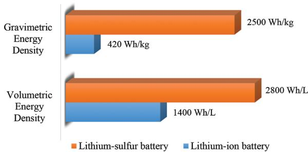  
Energy Density  
Fig.1 Energy density plots of lithium-sulfur vs. lithium-ion batteries (based on graphite anodes and  $\mathrm{LiNi_{1 / 3}Mn_{1 / 3}Co_{1 / 3}O_2}$  cathodes). Values obtained from ref. 18 and 19.

new battery technologies that go beyond conventional lithium-ion batteries.

Lithium-sulfur batteries represent a promising energy storage system that has drawn considerable attention due to their higher energy density compared to existing lithium-ion batteries today. $^{13-18}$  The key difference between these two forms of batteries lies in their mechanism of energy storage. Lithium-ion batteries operate based on intercalation of lithium ions into layered electrode materials, such as graphite anodes and lithium metal oxide cathodes. $^{9-12}$  Because lithium ions can only be intercalated topotactically into certain specific sites, the theoretical energy density of lithium-ion batteries is typically limited to  $\sim 420\mathrm{W h kg^{-1}}$  or  $1400\mathrm{W h L^{-1}}$  (Fig. 1). $^{18,19}$  On the other hand, instead of intercalation, lithium-sulfur batteries operate based on metal plating and stripping on the lithium anode side and a conversion reaction on the sulfur cathode side. $^{13-18}$  The non-topotactic nature of these reactions endows lithium anodes and sulfur cathodes with high theoretical specific capacities of  $3860$  and  $1673\mathrm{mA h g^{-1}}$  respectively. $^{18,19}$  Together with an average cell voltage of  $2.15\mathrm{V}$ , this gives lithium-sulfur batteries a high theoretical energy density of  $\sim 2500\mathrm{W h kg^{-1}}$  or  $2800\mathrm{W h L^{-1}}$  (Fig. 1). $^{18,19}$  Moreover, sulfur is cheap and readily abundant in the Earth's crust, which makes lithium-sulfur batteries a particularly attractive and low-cost energy storage technology.

  
Qianfan Zhang

Qianfan Zhang is an Associate Professor in the School of Materials Science and Engineering at Beihang University. He received his PhD in condensed-matter physics from the Institute of Physics, Chinese Academy of Sciences in 2010 and was a postdoctoral member of Stanford University during 2010-2012. His research focuses on the theoretical simulation and theoretical design of energy materials.

Lithium-sulfur batteries have been investigated since the 1960s;[20] despite decades of intensive research, such batteries were still found to be plagued with low discharge capacity and fast capacity decay during cycling. A major breakthrough was achieved in 2009 when Nazar and co-workers developed a highly-ordered, mesoporous carbon-sulfur cathode for use in lithium-sulfur batteries.[21] By encapsulating sulfur within the mesopores of CMK-3, the group demonstrated high discharge capacity and stable cycling performance over 20 cycles. Since then, the field of lithium-sulfur batteries has seen much progress, as evidenced by the rapidly-growing number of publications on this subject, especially in the past 3 years.

This review aims to provide an overview of major advancements in the field of lithium-sulfur batteries. First, we start by reviewing the electrochemistry of lithium-sulfur batteries, as well as their technical challenges and potential solutions. Some results of theoretical ab initio calculations are also presented to provide us with an understanding of the material interactions involved. Next, we examine the most common design strategy: encapsulation of sulfur cathodes with carbon host materials, with a particular focus on one-, two-, three-dimensional structures. Emerging host materials such as polymeric and inorganic materials are also discussed in detail. Recently, there has been some exciting progress in the development of lithium sulfide cathodes, use of lithium polysulfide catholytes, modification of separators and protection of lithium metal anodes, all of which will be surveyed as well. Finally, we conclude with an outlook section to provide some insight on the future directions and prospects of lithium-sulfur batteries.

# 2. Electrochemistry, challenges and solutions

Lithium-sulfur batteries operate based on the electrochemical reaction:  $\mathrm{S}_8 + 16\mathrm{Li} \leftrightarrow 8\mathrm{Li}_2\mathrm{S}$ , which gives sulfur its high theoretical specific capacity (1673 mA h g $^{-1}$ ).13-18 During the discharge process, the lithium metal anode (negative electrode) is oxidized to form lithium ions and electrons, which travel through the electrolyte and the external circuit respectively to

  
Yi Cui

Yi Cui received his BS and PhD degrees in Chemistry from the University of Science and Technology of China (1998) and Harvard University (2002) respectively. He is now an Associate Professor in the Department of Materials Science and Engineering at Stanford University with a joint appointment in SLAC National Accelerator Laboratory, leading a group of researchers working on nanomaterials for energy storage, photovoltaics, catalysis and environment-related applications.

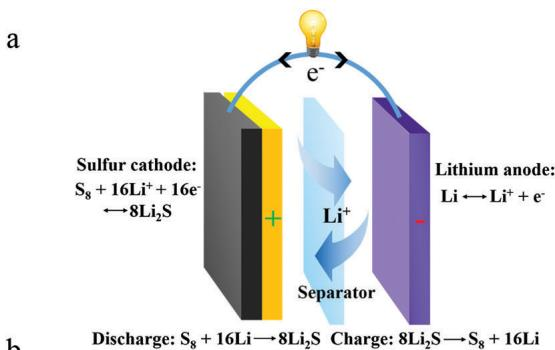

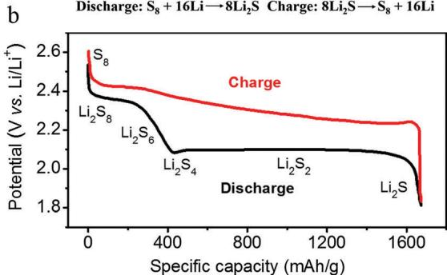  
Fig. 2 (a) Schematic of the electrochemistry and (b) a typical 2-plateau charge/discharge voltage profile of lithium-sulfur batteries in ether-based electrolytes.

reach the sulfur cathode (positive electrode). At the cathode, sulfur reacts with the lithium ions and electrons, undergoing reduction to form lithium sulfide. The opposite occurs during the charge reaction (Fig. 2a). $^{13-18}$

Discharge:

Negative electrode:  $\mathrm{Li} \rightarrow \mathrm{Li}^{+} + \mathrm{e}^{-}$

Positive electrode:  $\mathrm{S}_8 + 16\mathrm{Li}^+ +16\mathrm{e}^-\rightarrow 8\mathrm{Li}_2\mathrm{S}$

Charge:

Negative electrode:  $\mathrm{Li^{+} + e^{-}\rightarrow Li}$

Positive electrode:  $8\mathrm{Li}_2\mathrm{S} \rightarrow \mathrm{S}_8 + 16\mathrm{Li}^+ + 16\mathrm{e}^-$

Although the as-written reaction looks simple, the actual charge/discharge process is more complicated. Lithium-sulfur batteries typically show a 2-plateau charge/discharge voltage profile in ether-based electrolytes (Fig. 2b).13-18 During the discharge process, sulfur first becomes lithiated to form a series of intermediate, long-chain lithium polysulfide species  $(\mathrm{S}_8\rightarrow \mathrm{Li}_2\mathrm{S}_8\rightarrow \mathrm{Li}_2\mathrm{S}_6\rightarrow \mathrm{Li}_2\mathrm{S}_4)$ , which dissolve readily into ether-based electrolytes. This is represented by the upper voltage plateau, which contributes  $25\%$  of the theoretical capacity of sulfur  $(418\mathrm{mA}\mathrm{h}\mathrm{g}^{-1})$ . Upon further lithiation, the dissolved long-chain polysulfides form short-chain sulfide species  $(\mathrm{Li}_2\mathrm{S}_4\rightarrow \mathrm{Li}_2\mathrm{S}_2\rightarrow \mathrm{Li}_2\mathrm{S})$ , which re-precipitate onto the electrode as solid species. This is represented by the lower voltage plateau, which contributes the remaining  $75\%$  of the theoretical capacity  $(1255\mathrm{mA}\mathrm{h}\mathrm{g}^{-1})$ . The opposite occurs during the charge reaction, although the intermediate species might be different.13-18 Overall, we see that lithium-sulfur batteries undergo a solid  $\rightarrow$  liquid  $\rightarrow$  solid transition as the reaction proceeds, which is very different from other battery systems. This is also part of the reason why lithium-sulfur batteries are more challenging to deal with.

Overall, there are several challenges that impede the practical application of lithium-sulfur batteries. On the sulfur cathode side, these challenges include:

(a) Dissolution of intermediate lithium polysulfides into the electrolyte. During the cycling process, intermediate long-chain lithium polysulfide species  $\left(\mathrm{Li}_{2} \mathrm{~S}_{4}\right.$  to  $\left.\mathrm{Li}_{2} \mathrm{~S}_{8}\right)$  dissolve readily into ether-based electrolytes.[13-18] This leads to continuous loss of active material into the electrolyte, some of which remain dissolved and do not precipitate back onto the cathode as lithium sulfide at the end of discharge. As a result, low discharge capacities and rapid capacity decay are often observed during cycling.  
(b) Low conductivity of sulfur and lithium sulfide. The insulating nature of sulfur and lithium sulfide, both electronically and ionically, results in poor utilization of active material. $^{13-18}$  The precipitation of insulating lithium sulfide during discharge also causes passivation of the cathode surface, limiting the discharge capacity that can practically be achieved.  
(c) Large volumetric expansion of sulfur upon lithiation. Because of the difference in density between sulfur and lithium sulfide (2.03 vs.  $1.66\mathrm{gcm}^{-3}$  respectively), sulfur undergoes a large volumetric expansion of  $\sim 80\%$  upon full lithiation to lithium sulfide, which can cause pulverization and structural damage at the electrode level.[13-18]

On the lithium anode side, there are several issues that need to be overcome as well before lithium-sulfur batteries can be successfully commercialized:

(a) Polysulfide shuttle effect. Long-chain lithium polysulfides  $(\mathrm{Li}_2\mathrm{S}_4$  to  $\mathrm{Li}_2\mathrm{S}_8)$  which dissolve into the electrolyte can diffuse to the lithium anode to be reduced chemically (instead of electrochemically) to form lower-order polysulfides, which can then diffuse back to the sulfur cathode to be re-oxidized. This parasitic polysulfide shuttle effect, which is essentially an internal short, leads to self-discharging and low Coulombic efficiency during cycling.

(b) Non-uniform solid electrolyte interphase (SEI). Lithium metal is highly reactive and reacts with the electrolyte to form an SEI on the surface, which is ionically-conducting but electronically-insulating. However, in most cases, the SEI is non-uniform and does not passivate the lithium metal surface sufficiently, leading to continuous, undesirable side reactions with the electrolyte. This consumes both lithium metal and electrolyte, resulting in poor reversibility and low Coulombic efficiency during repeated plating and stripping.

(c) Dendrite growth of lithium metal. The growth of lithium dendrites leads to continuous breaking and reforming of the SEI, which further consumes lithium metal and electrolyte. $^{6}$  This causes the battery to eventually fail due to depletion of electrolyte and high impedance through the thick SEI. Dendrites that break off will lost contact with the lithium metal anodes and become dead lithium, resulting in further loss of Coulombic efficiency. Moreover, dendrites can potentially penetrate the separator and lead to internal short circuits, posing serious safety hazards.

First, we focus on work done in addressing the challenges on the sulfur cathode side. The typical strategy is to encapsulate sulfur cathodes with conductive host materials in order to

improve their conductivity as well as physically confine lithium polysulfide species within the host during cycling. A brief survey of the literature will indicate that the most common encapsulation material used is carbon. $^{13-18}$  However, our group demonstrated that the vast difference in polarity between carbon and lithium polysulfides (non-polar vs. polar) leads to weak chemical binding between the 2 species, hence weakening the polysulfide trapping effect. $^{22,23}$  Following that, a plethora of publications in the last 3 years have demonstrated that pure carbon is indeed not the most ideal host material for sulfur cathodes. $^{13-18}$  This brings us to our next question: How do we select promising, highly-polar host materials that interact strongly with lithium polysulfide species? To shed some light on this issue, we turn to theoretical calculations based on density functional theory, which is the focus of our next section.

# 3. Theoretical ab initio calculations

Owing to their high-throughput nature, theoretical calculations represent a very powerful and efficient tool in helping to elucidate the interaction between lithium polysulfides and a wide variety of materials. More importantly, they provide us with a rational guideline which we can use to screen, identify and select promising encapsulation materials for sulfur cathodes.

To this end, systematic screening of potential host materials was performed using ab initio calculations based on density functional theory.23 A general structural framework based on vinyl polymers  $-\mathrm{(CH_2 - CHR)_n - }$  was used to represent different functional groups (R), including those containing oxygen, nitrogen, sulfur, fluorine, chlorine, bromine and carbon atoms. This was followed by an investigation of the interaction and binding energies of these various functional groups with LiS species, which can be used to represent the relevant end groups in lithium polysulfides  $\mathrm{(Li - S - S_n - S - Li)}$  . The results of these theoretical calculations, arranged in order of decreasing binding energy with LiS, are shown in Fig. 3.

As expected, carbon-based groups such as alkanes exhibit the lowest binding energy with polar LiS species (0.30 eV; Fig. 3). Halogenated groups such as fluorine-, chlorine- and bromine-rich groups were found to possess relatively weak affinity for LiS species as well, with adsorption energies in the range of 0.42 to 0.62 eV. On the other hand, strong interaction with LiS was found in the case of oxygen-rich groups including esters, amides, ketones and ethers, with binding energies as high as 1.01 to 1.26 eV (Fig. 3). In all of these cases, the most stable configuration corresponds to the electropositive lithium atom binding directly to the lone pair of electrons on the oxygen atom. This results in the formation of a strong, coordinate-like Li-O interaction, with electron accepting and donating taking place between lithium and oxygen (Fig. 4).

In addition, nitrogen-containing groups, such as amines, imines and nitriles, were found to possess strong affinity for LiS species as well.[23] The binding with LiS takes place through a coordinate-like Li-N interaction, with high adsorption energies in the range of 0.77 to  $1.29\mathrm{eV}$  (Fig. 3 and 4). It is noteworthy

<table><tr><td>R=CH2NH2</td><td>Chemical Class</td><td>Binding Energy with LiS (eV)</td><td>Binding Energy with Li2S (eV)</td></tr><tr><td>R=CH2NH2</td><td>Amine</td><td>1.29</td><td>1.10</td></tr><tr><td>O=C-CH3</td><td>Ester</td><td>1.26</td><td>1.10</td></tr><tr><td>O=C-NH2</td><td>Amide</td><td>1.23</td><td>0.95</td></tr><tr><td>O=C-CH3</td><td>Ketone</td><td>1.20</td><td>0.96</td></tr><tr><td>H=C-NH</td><td>Imine</td><td>1.02</td><td>0.88</td></tr><tr><td>O-CH3</td><td>Ether</td><td>1.01</td><td>0.71</td></tr><tr><td>S-S-CH3</td><td>Disulfide</td><td>0.85</td><td>0.92</td></tr><tr><td>-SH</td><td>Thiol</td><td>0.84</td><td>0.76</td></tr><tr><td>-C≡N</td><td>Nitrile</td><td>0.77</td><td>0.60</td></tr><tr><td>-S-CH3</td><td>Sulfide</td><td>0.66</td><td>0.87</td></tr><tr><td>-F</td><td>Fluoroalkane</td><td>0.62</td><td>0.40</td></tr><tr><td>-CI</td><td>Chloroalkane</td><td>0.46</td><td>0.26</td></tr><tr><td>-Br</td><td>Bromoalkane</td><td>0.42</td><td>0.23</td></tr><tr><td>-CH3</td><td>Alkane</td><td>0.30</td><td>0.23</td></tr></table>

Fig. 3 Table showing the calculated binding energies of LiS and  $\mathrm{Li}_2\mathrm{S}$  species with various functional groups, arranged in order of decreasing binding energy with LiS species. Adapted from ref. 23 with permission from The Royal Society of Chemistry. Amine, thiol, sulfide and disulfide groups are original calculations performed using methods in ref. 23.

that sulfur-rich groups including thiols, sulfides and disulfides, also interact strongly with LiS species. In these cases, the binding occurs through a Li-S interaction, with calculated binding energies ranging from 0.66 to  $0.85\mathrm{eV}$  (Fig. 3 and 4). In addition, ab initio calculations were also performed to investigate the binding energies of these various functional groups with  $\mathrm{Li}_2\mathrm{S}$ , the end discharge product of lithium-sulfur batteries.[23] A similar trend was observed, with oxygen-, nitrogen- and sulfur-containing groups having the strongest binding energy with  $\mathrm{Li}_2\mathrm{S}$  as well (Fig. 3).

We note that these computation results are by no means exhaustive and only provide us with a glimpse of possible functional groups, particularly oxygen-, nitrogen- and sulfur-rich ones, which can be used to improve the binding with lithium polysulfide/sulfide species. In fact, these are the three most common heteroatoms used in the literature today. $^{13-18}$  In the next few sections, we shall first review carbon host materials, with a particular focus on one-, two-, and three-dimensional structures, as well as heteroatom modification of these materials to enhance the polysulfide binding effect. Next, we proceed to discuss other materials used to encapsulate sulfur cathodes, including conducting polymers and inorganic materials, many of which are already inherently rich in oxygen, nitrogen and sulfur atoms. In the course of our discussion, the results of

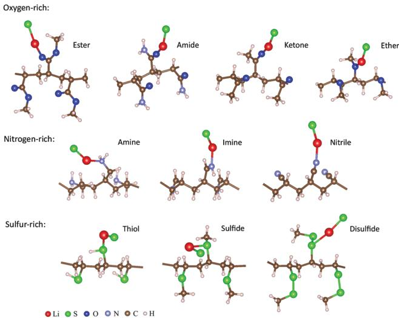  
Fig. 4 Ab initio calculations showing the most stable binding configuration of LiS species with oxygen-, nitrogen- and sulfur-rich functional groups. Adapted from ref. 23 with permission from The Royal Society of Chemistry. Amine, thiol, sulfide and disulfide groups are original calculations performed using methods in ref. 23.

additional ab initio calculations performed in these works will also be summarized to provide us with a more complete understanding of the interactions involved between lithium polysulfides and these various heteroatoms.

# 4. Carbon host materials for sulfur cathodes

A major breakthrough was achieved in 2009 when Nazar and co-workers developed a highly-ordered, mesoporous carbon-sulfur cathode for use in lithium-sulfur batteries.[21] As a proof-of-concept, they used CMK-3 as the mesoporous carbon support, which consists of an array of hollow  $6.5\mathrm{nm}$  carbon rods separated by 3 to  $4\mathrm{nm}$  channel voids (Fig. 5). Sulfur was then infiltrated into the CMK-3 structure by a melt-diffusion method at  $155^{\circ}\mathrm{C}$  where sulfur has its lowest viscosity, enabling sulfur to maintain intimate contact with the conductive carbon walls. Using the mesoporous structure of CMK-3 to trap lithium polysulfides, the group demonstrated high specific capacity of  $1005\mathrm{mA}\mathrm{h}\mathrm{g}_{\mathrm{s}}^{-1}$  with stable cycling over 20 cycles at 0.1C. Additional modification of the carbon surface with hydrophilic polyethylene glycol led to further increase in discharge capacity to  $1320\mathrm{mA}\mathrm{h}\mathrm{g}_{\mathrm{s}}^{-1}$ . This work has since spurred rapid development in the field of lithium-sulfur batteries, especially in the use of highly-conductive carbon materials to encapsulate sulfur cathodes.

# 4.1. One-dimensional materials

4.1.1. Carbon nanotubes. Because of their high aspect ratios, one-dimensional carbon nanotubes are able to form interconnected networks and impart long-range conductivity to sulfur cathode materials, making them very attractive for use in lithium-sulfur batteries. One of the earliest studies in using

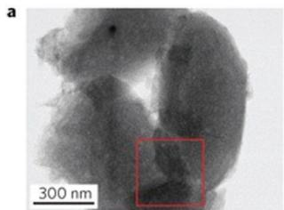  
Fig. 5 (a) TEM image and (b) schematic of highly-ordered, mesoporous carbon (CMK-3) in which sulfur was infiltrated by melt-diffusion at  $155^{\circ}\mathrm{C}$ . Reprinted by permission from Macmillan Publishers Ltd: Nature Materials ref. 21, copyright 2009.

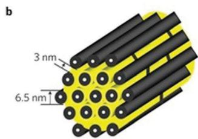

carbon nanotubes as additives in such batteries was carried out by Lee and co-workers.[24] Through the simple addition of multi-walled carbon nanotubes (20 wt%) to sulfur cathodes, the authors found an increase in specific capacity, from  $\sim 400\mathrm{mA}$  h  $\mathrm{gs}^{-1}$  (without additive) to  $485\mathrm{mA}$  h  $\mathrm{gs}^{-1}$  (with additive). The capacity retention after 50 cycles was also greatly improved, from  $25\%$  (without additive) to  $62\%$  (with additive), which is a very promising result. However, poor overall contact between sulfur and carbon nanotubes probably led to a limit in the discharge capacity that could be achieved in this work.

In order to create a more intimate contact, sulfur and carbon nanotubes were mixed together at  $155^{\circ}\mathrm{C}$ , where sulfur has its lowest viscosity, to utilize the capillary effect.[25] Sulfur was found to coat onto the outer surface of the carbon nanotubes, rendering better contact between the 2 species. As a result, the sulfur-carbon nanotube cathodes prepared at  $155^{\circ}\mathrm{C}$  showed lower charge transfer resistance and enhanced cycling performance compared to sulfur cathodes prepared by simple mixing of sulfur and carbon nanotubes at room temperature. In particular, a high discharge capacity of  $\sim 900\mathrm{mA}\mathrm{h}\mathrm{gs}^{-1}$  was achieved in the former case with  $74\%$  capacity retention after 60 cycles at  $0.06\mathrm{C}$ .

Since then, there has been a great deal of work on using carbon nanotubes with various unique morphologies to enhance the performance of sulfur cathodes. For instance, vertically-aligned carbon nanotubes were synthesized on nickel foil using chemical vapor deposition, with ethene as the precursor and iron-, molybdenum- and cobalt-ethylhexanoate as the catalysts (Fig. 6). The vertical alignment of carbon nanotubes perpendicular to the substrate enables fast diffusion of ions and electrons through the entire electrode cross-section. A solution of sulfur in toluene was then added to the structure and allowed to soak in completely at  $120^{\circ}\mathrm{C}$ . The as-synthesized carbon nanotubesulfur composite was used directly as a binder-free cathode in lithium-sulfur batteries, which exhibited stable discharge capacities of  $\sim 800\mathrm{mA}$  h gS $^{-1}$  over 40 cycles at 0.08C.

To achieve longer cycle life and higher rate performance, a solution of sulfur in ethanol was mixed with superaligned carbon nanotubes using ultra-sonication, followed by dropwise addition of distilled water (a poor solvent for sulfur) to allow slow precipitation of sulfur nanoparticles onto the nanotubes.[27] The presence of the carbon nanotube network in solution prevents the aggregation and growth of large sulfur particles. The as-synthesized composites were used directly as binder-free

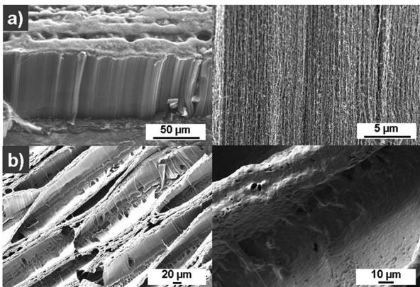  
Fig. 6 (a and b) Low-magnification and high-magnification SEM images of vertically-aligned carbon nanotubes (a) before and (b) after sulfur infiltration. Reproduced from ref. 26 with permission from The Royal Society of Chemistry.

cathodes in lithium-sulfur batteries, which showed a high specific capacity of  $1088\mathrm{mA}\mathrm{h}\mathrm{gs}^{-1}$  and capacity retention of  $85\%$  after 100 cycles at 1C. More importantly, even at high C-rates of 2C, 5C and 10C, impressive discharge capacities of 1006, 960 and  $879\mathrm{mA}\mathrm{h}\mathrm{gs}^{-1}$  were achieved respectively.

4.1.2. Hollow carbon tubes. Because of the very small diameters of carbon nanotubes and the impermeable nature of their walls, it is difficult to infiltrate sulfur into the inner hollow space of carbon nanotubes. In most of the work using carbon nanotubes, sulfur was found to coat only the outer surface but not the inside, leaving sulfur/lithium polysulfides exposed to the electrolyte. It would be advantageous to use hollow carbon tubes with much larger diameters to encapsulate and confine sulfur/lithium polysulfides inside the tubes.

To this end, Zheng et al. prepared hollow carbon tubes by first carbonizing a polymer in an anodic aluminum oxide template, followed by infusion of sulfur into the tubes using the melt-diffusion strategy at  $155^{\circ}\mathrm{C}$ . The template was then removed by acid dissolution after sulfur infusion, leaving sulfur only on the inner surface of the carbon tubes but not the outer surface. Using this unique structure, high specific capacities of  $\sim 1400$  and  $1300\mathrm{mA}$  h g $^{-1}$  were achieved at 0.2C and 0.5C respectively. However, there was appreciable capacity decay in both cases, with  $\sim 52\%$  and  $48\%$  capacity retention after 150 cycles respectively.

These results were consistent with work published around the same time by the Wang group, who synthesized hollow carbon tubes using an anodic aluminum oxide template as well.[29] The difference is that the Wang group removed the template first to obtain free-standing carbon tubes, followed by impregnation of sulfur into the structures by using a vapor infusion method at  $500^{\circ}\mathrm{C}$ . Elemental mapping showed that sulfur was present largely on the inside of the tubes and the authors hypothesized that sulfur could exist as smaller sulfur allotropes such as  $\mathbf{S}_2$  and  $\mathbf{S}_6$  under these vapor infusion conditions. Using this structure, a high specific capacity of  $\sim 1500\mathrm{mA}$  h  $\mathrm{gs}^{-1}$  was demonstrated, with  $\sim 47\%$  capacity retention after 100 cycles at 0.1C, which is in good agreement

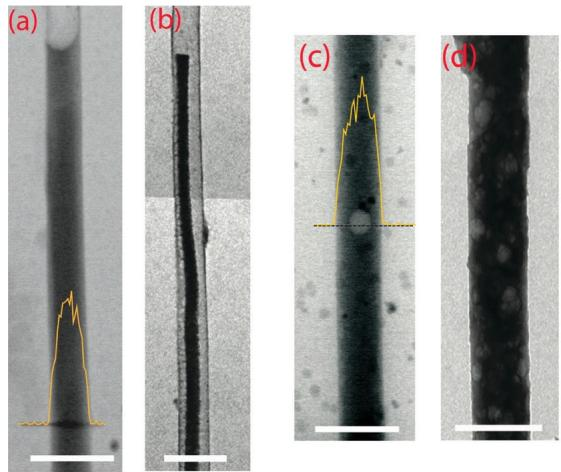  
Fig. 7 (a and b) TEM images of sulfur cathodes encapsulated in unmodified hollow carbon tubes (a) before and (b) after discharge to  $1.7\mathrm{V}$  vs.  $\mathrm{Li^{+} / Li}$ . (c and d) TEM images of sulfur cathodes encapsulated in PVP-modified hollow carbon tubes (c) before and (d) after discharge under identical conditions. The yellow lines in (a) and (c) show the EDX line scan for sulfur. Scale bars in (a-d) are  $500\mathrm{nm}$ . Reprinted with permission from ref. 22. Copyright 2013 American Chemical Society.

with the results obtained by Zheng et al.28 The reason for this capacity decay using sulfur-impregnated hollow carbon tubes was unclear at that time.

In a follow-up work, the capacity decay was found to be largely due to detachment of the discharge product, lithium sulfide, from the inner walls of the hollow carbon tubes, causing loss of electrical contact (Fig. 7a and b). This detachment was attributed to the weak interaction between the highly-polar lithium sulfide and the non-polar carbon walls. By the same reasoning, it can be deduced that the non-polar carbon surface would also bind weakly to highly-polar lithium polysulfide species, hence weakening the polysulfide trapping effect. To tackle this problem, an amphiphilic polymer, polyvinylpyrrolidone (PVP), was used to modify the surface of the inner carbon walls. PVP possesses a hydrophobic carbon backbone which can anchor strongly onto the non-polar carbon surface, as well as hydrophilic amide groups which can bind strongly to lithium sulfide and lithium polysulfide species. Ab initio calculations showed that the amide groups of PVP are able to form strong Li-O interaction with lithium polysulfide/sulfide species (LiS and  $\mathrm{Li}_2\mathrm{S}$ ), with high binding energies of 1.30 and  $1.14\mathrm{eV}$  respectively. Using this amphiphilic effect, detachment of lithium sulfide from the polymer-modified carbon surface was eliminated as evidenced by TEM (Fig. 7c and d). As a result, high discharge capacity of  $838\mathrm{mA}\mathrm{h}\mathrm{gs}^{-1}$  was achieved with  $80\%$  capacity retention after 300 cycles at 0.5C, which is a significant improvement compared to the case without polymer modification.

In order to combine the advantages of carbon nanotubes and larger carbon tubes, a tube-in-tube structure was developed which consists of multi-walled carbon nanotubes on the inside surrounded by another larger carbon tube on the outside.30 While the inner carbon nanotubes can facilitate long-range electronic conductivity, the outer tube helps to confine lithium

polysulfide species within. This structure was achieved by first coating carbon nanotubes with silica followed by a polymer, octadecyltrimethoxysilane. After carbonizing the polymer to form an outer carbon tube, the silica was etched away to create hollow space between the two tubes where sulfur can be impregnated by melt-diffusion. Elemental mapping clearly showed the successful encapsulation of sulfur within the tube-in-tube structure. High specific capacities of 1274 and  $787\mathrm{mA}\mathrm{h}\mathrm{g}_{\mathrm{s}}^{-1}$  were delivered at 0.3C and 1.2C, with  $72\%$  and  $82\%$  capacity retention after 50 and 200 cycles respectively.

4.1.3. Heteroatom modification. Modifying the carbon surface with heteroatoms such as nitrogen represents a promising approach to improve lithium-sulfur batteries as it can render stronger binding with lithium polysulfide species to minimize their dissolution into the electrolyte. The possibility of using nitrogen-doped carbon nanotubes in lithium-sulfur batteries was first predicted theoretically using ab initio computations.[31] It was found that nitrogen doping made it easier for lithium atoms to penetrate the nanotube walls (reduction of energy barrier from  $\sim 9.0$  to  $1.0\mathrm{eV}$ ), but did not affect the diffusion of lithium along the nanotubes. On the other hand, the energy barrier for sulfur atoms to diffuse through the nitrogen-doped walls remained very high at  $9.3$  to  $12.0\mathrm{eV}$  due to the presence of strong S-N interaction, which suggests that sulfur species can be effectively bound and trapped.

Inspired by this study, the Zhang group decided to use nitrogen-doped carbon nanotubes as conductive hosts to achieve stable cycling in lithium-sulfur batteries.32 Conductivity measurements showed that nitrogen-doped carbon nanotubes still maintained good conductivity  $(7.98\mathrm{Scm}^{-1})$  compared to pristine nanotubes  $(11.85\mathrm{Scm}^{-1})$ . Theoretical calculations also showed strong Li-N interaction between pyridinic nitrogen atoms and various lithium polysulfide/sulfide species  $\mathrm{(Li_2S_4}$ ,  $\mathrm{Li}_2\mathrm{S}_3$ ,  $\mathrm{Li}_2\mathrm{S}_2$  and  $\mathrm{Li}_2\mathrm{S})$ , with high binding energies of 1.04 to  $1.42\mathrm{eV}$ . Based on these results, the as-prepared nitrogen-doped carbon nanotube-sulfur composite showed a discharge capacity of  $937\mathrm{mA}$  h  $\mathrm{gs}^{-1}$  with  $70\%$  capacity retention after 200 cycles at 1C, which is much better than in the case of using pristine carbon nanotubes. For comparison, oxidized carbon nanotubes were also prepared, which have strong affinity for lithium polysulfide/sulfide species as well, but much lower conductivity  $(3.81\mathrm{Scm}^{-1})$ . The oxidized carbon nanotube-sulfur composites were found to exhibit poor cycling stability, which tells us that besides strong polysulfide binding, high electronic conductivity is essential in enhancing the performance of lithium-sulfur batteries as well.

To further improve the electronic conductivity, an elaborate multi-dimensional structure was fabricated which combines vertical nitrogen-doped carbon nanotubes with horizontal graphene sandwiches (Fig. 8). This scaffold structure not only enables rapid electron transfer in both the vertical and horizontal directions, but also prevents the self-aggregation of carbon nanotubes and re-stacking of graphene. To achieve this hybrid structure, exfoliated vermiculites embedded with iron/molybdenum were used to catalyze both the growth of aligned carbon nanotubes at  $750~^\circ \mathrm{C}$  and the deposition of graphene at  $950~^\circ \mathrm{C}$ . After nitrogen doping and impregnation with sulfur, the structure

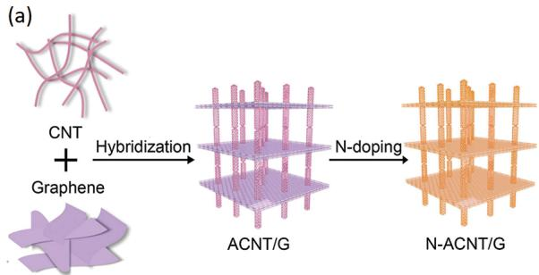

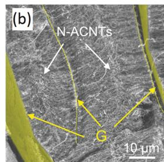  
Fig. 8 (a) Schematic of the synthesis process, (b) SEM image and (c) TEM image of nitrogen-doped aligned carbon nanotube/graphene (N-ACNT/G) hybrid scaffolds. Reproduced from ref. 33 with permission from Wiley-VCH.

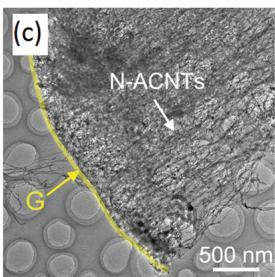

delivered a high discharge capacity of  $1152\mathrm{mA}\mathrm{h}\mathrm{g}_{\mathrm{s}}^{-1}$ , retaining  $76\%$  of its capacity after 80 cycles at 1C. Even at a high C-rate of 5C, a reversible capacity of  $770\mathrm{mA}\mathrm{h}\mathrm{g}_{\mathrm{s}}^{-1}$  could still be delivered, indicating excellent rate capability. Most recently, by combining zero-dimensional carbon nanoparticles, one-dimensional carbon nanotubes and two-dimensional graphene with high sulfur content  $(90\mathrm{wt\%})$ , superior battery performance was attained.[34]

# 4.2. Two-dimensional materials

4.2.1. Graphene and graphene oxide. Two-dimensional carbon-sulfur structures based on graphene represent one of the most extensively-studied systems in lithium-sulfur batteries so far. The excellent electronic conductivity and ease of functionalization of graphene makes it a promising encapsulation material for sulfur cathodes. Since the sulfur particles are loaded on the surface of the two-dimensional nanosheets, the trapping of intermediate polysulfide species relies on the functional groups on the surface and the surface area of the graphene materials.

Dai and co-workers pioneered the use of graphene to encapsulate sulfur particles for use as sulfur cathodes.[35] To this end, they first synthesized sulfur particles using the reaction of sodium thiosulfate with hydrochloric acid  $\mathrm{(Na_2S_2O_3 + 2HCl\rightarrow}$ $\mathrm{S} + \mathrm{SO}_2 + 2\mathrm{NaCl} + \mathrm{H}_2\mathrm{O})$  in the presence of Triton X-100 polymer, followed by the addition of graphene and carbon black to form a composite (Fig. 9). It was postulated that the graphene wrapping would serve to trap lithium polysulfide species and improve the overall electronic conductivity, while the Triton X-100 polymer would help to partially buffer the volumetric expansion of sulfur. As a result, the as-synthesized graphene-wrapped sulfur composites showed enhanced cycling stability compared to their uncoated counterparts. In particular, a

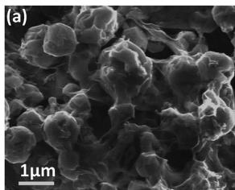  
Fig. 9 (a) Low-magnification and (b) high-magnification SEM images of graphene-wrapped sulfur composites. Reprinted with permission from ref. 35. Copyright 2011 American Chemical Society.

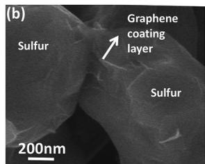

specific capacity of  $\sim 750\mathrm{mA}$  h  $\mathrm{gs}^{-1}$  was demonstrated with  $70\%$  capacity retention at the end of 100 cycles at 0.2C.

Further improvement was achieved by using oxygen-rich graphene oxide instead of graphene as a host material for sulfur cathodes.36 The synthesis was performed using the acidification of sodium polysulfides to precipitate sulfur in the presence of graphene oxide sheets  $(\mathrm{S}_x^{2 - } + 2\mathrm{H}^+ \rightarrow (x - 1)\mathrm{S} + \mathrm{H}_2\mathrm{S})$ . Theoretical ab initio calculations indicated the possibility of S-O and S-C interactions between sulfur and the oxygen functional groups (epoxide and hydroxyl groups) in graphene oxide. The presence of these interactions was confirmed experimentally using X-ray photoelectron spectroscopy and X-ray absorption near edge structure in a subsequent publication.37 Using these interactions to immobilize the sulfur species, the sulfur-graphene oxide cathodes showed a high specific capacity of  $\sim 1000\mathrm{mA}$  h  $\mathrm{gs}^{-1}$  with  $95\%$  capacity retention after 50 cycles at 0.1C.

Further computations were performed to elucidate the interaction between graphene oxide and lithium polysulfides.38 The results indicated that  $\mathrm{Li}_2\mathrm{S}_8$  can bind strongly to oxygen on the graphene basal plane (in the form of epoxides) through a strong Li-O interaction. The adsorption energy was calculated to be  $1.1\mathrm{eV}$ , which is larger than in the case of binding with pristine graphene  $(0.8\mathrm{eV})$ . If oxygen binds at a single vacancy site, the adsorption energy of  $\mathrm{Li}_2\mathrm{S}_8$  could be further increased to  $1.5\mathrm{eV}$ .

In addition, hydroxyl groups commonly found in graphene oxide can also bind to  $\mathrm{Li}_2\mathrm{S}_8$  with a high binding energy of  $1.4\mathrm{eV}$ . Overall, the results of these theoretical calculations help us to understand the exact nature of the interaction between lithium polysulfides and graphene oxide, hence explaining the enhancement in cycling stability.

Subsequently, many other groups have confirmed experimentally the beneficial effects of graphene oxide on the cycling performance of lithium-sulfur batteries. One of the most impressive cycling performances was achieved by coating graphene oxide uniformly onto sulfur particles using solution ionic strength engineering.[39] This method involves adjusting the ionic strength of solutions so that positively-charged ions are attracted onto the surface of negatively-charged graphene oxide sheets in solution, leading to screening of electrostatic repulsion between neighboring sheets. Upon adding sulfur particles into the ionic solution, the graphene oxide can reduce their surface energy by precipitating and coating onto the particles to form a core-shell morphology. Using the sulfur-graphene oxide core-shell structures as a cathode material, outstanding long-term cycling performance was achieved, with stable discharge capacities of  $\sim 800\mathrm{mA}$  h g $_{\mathrm{s}}^{-1}$  at the end of 1000 cycles at 0.6C.

Recently, exciting progress was reported using ultrasmall sulfur nanoparticles supported on reduced graphene oxide to achieve the theoretical capacity of sulfur.40 Briefly, sulfur was first reacted with ethylenediamine to form a sulfur-amine complex  $(2(\mathrm{R - NH_2}) + \mathrm{S_8}\rightarrow (\mathrm{R - NH_3}^+)(\mathrm{RNH - S_8}^-))$  . This complex was then added to reduced graphene oxide in the presence of hydrochloric acid, during which the complex decomposed to nucleate sulfur on the surface of the graphene sheets  $(\mathrm{(R - NH_{3}^{+})(RNH - S_{8}^{-}) + 2H^{+}}\rightarrow 2\mathrm{(R - NH_{3}^{+}) + S_{8})}$  . By controlling the pH and reaction time, sulfur nanoparticles with controllable diameters (5 to  $150~\mathrm{nm}$  could be obtained (Fig. 10). The ultra-small size of these nanoparticles can enable fast charge transfer kinetics to compensate for the low electronic and ionic conductivity of sulfur. Using the smallest  $5\mathrm{nm}$  sulfur nanoparticles, the

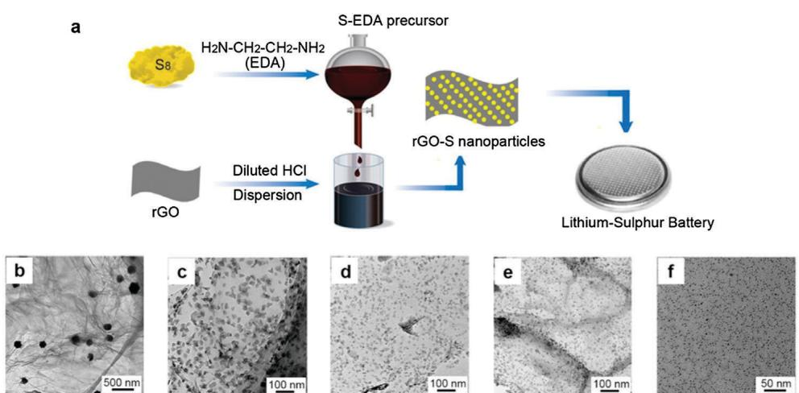  
Fig. 10 (a) Schematic of the synthesis of ultrasmall sulfur nanoparticles supported on reduced graphene oxide (rGO) via sulfur-amine chemistry. (b–f) TEM images of (b)  $150\mathrm{nm}$ , (c)  $40\mathrm{nm}$ , (d)  $20\mathrm{nm}$ , (e)  $10\mathrm{nm}$  and (f)  $5\mathrm{nm}$  sulfur nanoparticles. Reprinted with permission from ref. 40. Copyright 2015 American Chemical Society.

theoretical specific capacity of  $1672\mathrm{mA}$  h  $\mathrm{gs}^{-1}$  was achieved at 0.1C. Long-term cycling at 0.5C and 1C showed high specific capacities of 1661 and  $1574\mathrm{mA}$  h  $\mathrm{gs}^{-1}$  respectively, with capacity retentions of  $\sim 61\%$  after 500 cycles in both cases.

4.2.2. Unique morphologies. In terms of other unique two-dimensional graphene-based structures, the Wei group prepared an unstacked, double-layer templated graphene for use in high-rate lithium-sulfur batteries.[41] First, mesoporous metal oxide sheets were used as templates to deposit graphene layers on both sides of the sheets via chemical vapor deposition. At the same time, carbon atoms deposited into the mesopores of the sheets act as protuberances and spacers to prevent the stacking of the graphene layers. After removal of the metal oxide template, the group obtained unstacked, double-layer templated graphene, in which sulfur can be incorporated into the mesoscale protuberances as well as the interlayer spaces. This unstacked graphene-sulfur structure combines a mesoporous structure, high surface area as well as high electronic conductivity, all of which are essential for fast charge transfer kinetics. At high C-rates of 5C and 10C, high specific capacities of 1034 and  $734\mathrm{mA}\mathrm{h}\mathrm{gs}^{-1}$  could be achieved respectively, with  $\sim 52\%$  capacity retention after 1000 cycles in both cases.

A unique structure based on vertically-aligned graphene-sulfur nanowalls was also prepared for use in ultrafast lithium-sulfur batteries.42 To do so, cyclic voltammetry was carried out in a graphene-sulfur dispersion from  $-0.5$  to  $2\mathrm{V}$  vs. platinum (bidirectional scanning) using copper or nickel as the working electrodes. Interestingly, due to the presence of weak electric field generated during the scan from 0.5 to  $-0.5\mathrm{V}$ , the graphene-sulfur layers were found to migrate and grow vertically on the working electrodes. Furthermore, the thickness of the layers and hence the areal mass loading could be adjusted easily by tuning the number of scans. Such a novel vertically-aligned structure enables rapid electronic and ionic diffusion through the cathode material. A high discharge capacity of  $1261\mathrm{mA}$  h  $\mathrm{gs}^{-1}$  was achieved with  $97\%$  capacity retention after 120 cycles at 0.1C. Even at a high C-rate of 8C, a reversible capacity of  $410\mathrm{mA}$  h  $\mathrm{gs}^{-1}$  could be delivered.

4.2.3. Heteroatom modification. Huang and co-workers synthesized nitrogen-doped graphene as host materials for sulfur cathodes in lithium-sulfur batteries.[43] In their work, nitrogen doping (1.05 wt%) was achieved by heating graphene oxide with ammonia solution in an autoclave at  $200^{\circ}\mathrm{C}$ . The nitrogen-doped graphene exhibited an electronic conductivity of  $1.02\mathrm{Scm}^{-1}$ , which was higher than in the undoped case. Sulfur was then anchored onto the nitrogen-doped graphene sheets using the reaction of sodium thiosulfate with hydrochloric acid. The as-synthesized composites showed a discharge capacity of  $\sim 854\mathrm{mA}$  h g $^{-1}$  with stable cycling performance (93% capacity retention) after 145 cycles at 0.4C, which is significantly better compared to the undoped case.

Subsequently, ab initio calculations were carried out to study the binding between nitrogen-doped graphene and various lithium polysulfide/sulfide species  $\mathrm{(Li_2S_8}$ $\mathrm{Li}_2\mathrm{S}_6$ $\mathrm{Li}_2\mathrm{S}_4$  and  $\mathrm{Li}_2\mathrm{S})$  44 Strong Li-N interaction was found between lithium polysulfides/ sulfides and the nitrogen atoms, with high binding energies of

1.33 to  $2.09\mathrm{eV}$  for pyrrolic graphene and 1.48 to  $2.10\mathrm{eV}$  for pyridinic graphene. These values are much higher compared to the case of binding with pristine, undoped graphene (0.25 to  $0.60\mathrm{eV}$ ). To demonstrate the effect of this strong Li-N interaction in confining lithium polysulfides, the authors synthesized nitrogen-doped graphene by thermal nitridation of graphene oxide under ammonia atmosphere at  $750^{\circ}\mathrm{C}$ . Sulfur was then anchored onto the nitrogen-doped graphene sheets using the reaction of sodium sulfide and sodium thiosulfate with formic acid to precipitate sulfur  $(2\mathrm{Na}_2\mathrm{S} + \mathrm{Na}_2\mathrm{S}_2\mathrm{O}_3 + 6\mathrm{HCOOH} \rightarrow 4\mathrm{S} + 6\mathrm{HCOONa} + 3\mathrm{H}_2\mathrm{O})$ . The as-synthesized composites demonstrated a high specific capacity of  $789\mathrm{mA}$  h g $^{-1}$  with notable long-term cycling performance at 2C: 75%, 62% and 44% capacity retention at the end of 500, 1000 and 2000 cycles respectively.

In a further study, the difference in polysulfide binding strength between pyrrolic, pyridinic and quaternary nitrogen atoms in graphene was clarified using theoretical computations.45 It was found that pyrrolic and pyridinic nitrogen atoms bind more strongly to lithium polysulfide/sulfide species  $\mathrm{(Li_2S_8}$ $\mathrm{Li}_2\mathrm{S}_4$  and  $\mathrm{Li}_2\mathrm{S})$  compared to quaternary nitrogen. This is because, unlike quaternary nitrogen, pyrrolic and pyridinic nitrogen atoms possess a lone pair of electrons which enables stronger coordinate-like interaction with the electropositive lithium polysulfides. Between pyrrolic and pyridinic nitrogen, the calculation results also indicate that pyrrolic nitrogen has slightly higher binding energy with lithium polysulfides, which was attributed to more concentrated charge density and more open space. Overall, this theoretical work provides a useful guideline to optimize the different types of nitrogen atoms in graphene, so as to further enhance the polysulfide adsorption energy and corresponding cycling performance.

# 4.3. Three-dimensional materials

4.3.1. Porous carbon spheres. Three-dimensional carbon materials are excellent hosts that can be used to contain sulfur within their pores to trap the intermediate polysulfide species. After functionalizing the carbon surface appropriately, the cycling stability of sulfur cathodes can be further improved. Moreover, the large porosity and pore volume of porous carbon can enable higher mass loading of active materials and hence higher areal capacity.

A representative example of a three-dimensional carbon-sulfur structure is that of sulfur encapsulated in porous carbon spheres. The Nazar group prepared spherical, ordered mesoporous carbon with very high inner pore volume of  $2.32\mathrm{cm}^3\mathrm{g}^{-1}$  and high surface area of  $2445\mathrm{m}^2\mathrm{g}^{-1}$  (Fig. 11).46 Sulfur was then impregnated into these mesopores (3.1 and  $6.0\mathrm{nm}$ ) at  $155^{\circ}\mathrm{C}$  and the homogeneous distribution of sulfur within the pores was confirmed using elemental mapping. The mesoporous carbon-sulfur composite with  $49.7\mathrm{wt}\%$  sulfur was found to show good cycling performance:  $1200\mathrm{mA}\mathrm{h}\mathrm{gs}^{-1}$  with  $61\%$  retention after 100 cycles at 1C. Interestingly, the sulfur content could be further increased to 61.4 and  $70.0\mathrm{wt}\%$  without much sacrifice in specific capacity and cycling stability ( $\sim 1070\mathrm{mA}\mathrm{h}\mathrm{gs}^{-1}$  with  $65\%$  retention after 100 cycles at 1C in both cases), which is a very promising result.

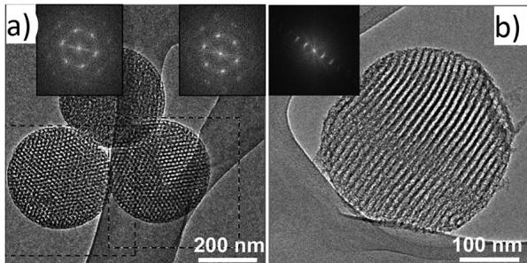  
Fig. 11 (a and b) TEM images of spherical, ordered mesoporous carbon nanoparticles (a) projected along the columns and (b) tilted out of the columnar projection, with corresponding fast Fourier transform diffraction patterns in the insets. Reproduced from ref. 46 with permission from Wiley-VCH.

Instead of using mesoporous carbon, Gao and co-workers developed a unique microporous carbon-sulfur composite where sulfur was encapsulated in the micropores of carbon spheres (Fig. 12a and b).47 It was postulated that the small micropores ( $\sim 0.7 \mathrm{~nm}$ ) can accommodate short chains of sulfur in low molecular forms. Interestingly, the microporous carbon-sulfur composites were found to cycle very well in carbonate-based electrolytes. A single sloping voltage plateau was observed during discharge and charge (Fig. 12c), instead of the 2-plateau voltage profile typically seen in ether-based electrolytes. A high

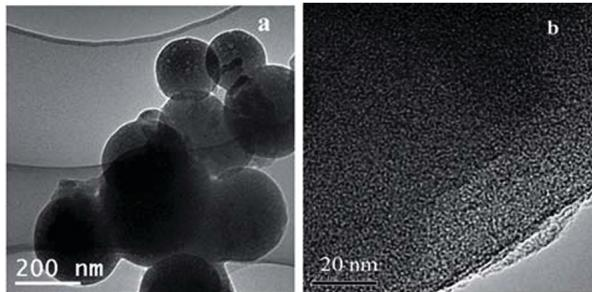

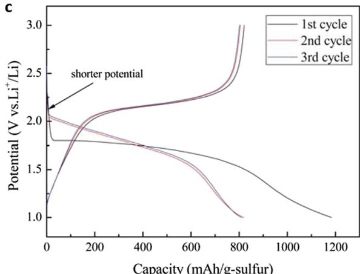  
Fig. 12 (a) Low-magnification and (b) high-magnification TEM images of microporous carbon spheres. (c) Typical charge/discharge voltage profiles of microporous carbon-sulfur composites with  $42\mathrm{wt}\%$  sulfur, showing a single sloping voltage plateau. Reproduced from ref. 47 with permission from The Royal Society of Chemistry.

specific capacity of  $1333\mathrm{mA}$ $\mathrm{h}\mathrm{g}_{\mathrm{s}}^{-1}$  was demonstrated in carbonate-based electrolytes, with  $\sim 70\%$  capacity retention over 50 cycles at 0.02C. This strongly suggests that long-chain lithium polysulfides, which usually attack carbonate solvents, are not formed in the cycling process. It is worth noting that this excellent cycling performance was achieved at a sulfur loading of 42 wt%, which corresponds to the maximum pore volume of the microporous carbon. When the sulfur loading was further increased to 51 wt%, the cycling performance was found to deteriorate greatly. Over-saturation of the micropores means that the excess sulfur would exist on the carbon surface as  $\mathbf{S}_8$ , which can form long-chain polysulfides to attack carbonate solvents. This observation corroborates the hypothesis that sulfur exists as a different molecular form (instead of  $\mathbf{S}_8$ ) within the micropores of carbon, though the exact identity of these species remained elusive.

To shed some light on the identity of these species, theoretical computations were performed on different sulfur allotropes  $(\mathrm{S}_2$  to  $\mathrm{S}_8)$ .48 It was calculated that small, chain-like sulfur allotropes,  $\mathrm{S}_2$  to  $\mathrm{S}_4$ , have at least one dimension that is less than  $0.5\mathrm{nm}$ , whereas larger, cyclo-sulfur allotropes,  $\mathrm{S}_5$  to  $\mathrm{S}_8$ , have at least two dimensions that are greater than  $0.5\mathrm{nm}$ . As a proof-of-concept, the authors synthesized carbon nanotubes coated with microporous carbon with pore size of  $\sim 0.5\mathrm{nm}$  in which  $\mathrm{S}_2$  to  $\mathrm{S}_4$  could be accommodated but not  $\mathrm{S}_5$  to  $\mathrm{S}_8$ . The small sulfur allotropes were incorporated into the micropores of carbon by melt-diffusion at  $155^{\circ}\mathrm{C}$ . When cycled in carbonate-based electrolytes, the microporous carbon-sulfur composites achieved a high specific capacity of  $1670\mathrm{mA}\cdot\mathrm{h}\cdot\mathrm{gs}^{-1}$  (very close to the theoretical value), with  $68\%$  capacity retention after 200 cycles at  $0.1\mathrm{C}$ . The composites also exhibited a single sloping voltage plateau, which is consistent with the report by Gao and co-workers above.47 On the basis of these results, it was proposed that, due to the micropore confinement effect, the small  $\mathrm{S}_2$  to  $\mathrm{S}_4$  allotropes can avoid the solid  $\rightarrow$  liquid  $\rightarrow$  solid transition from  $\mathrm{S}_8 \rightarrow \mathrm{Li}_2\mathrm{S}_8$  to  $\mathrm{Li}_2\mathrm{S}_4 \rightarrow \mathrm{Li}_2\mathrm{S}$  during discharge, hence preventing the formation of long-chain polysulfides which attack carbonate solvents. Instead, a direct solid  $\rightarrow$  solid transition takes place from  $\mathrm{S}_2$  to  $\mathrm{S}_4 \rightarrow \mathrm{Li}_2\mathrm{S}$  during discharge. During charging, the small size of the micropores would allow only the re-formation of  $\mathrm{S}_2$  to  $\mathrm{S}_4$  instead of  $\mathrm{S}_8$ , hence ensuring the reversibility of the reaction.

In order to combine the advantages of mesopores and micropores, several groups also developed carbon spheres with bimodal pore distributions. As a representative example, an elaborate, hierarchical porous carbon structure was developed in which inner macro- and mesopores are surrounded by outer micropores.[49] The advantage of this structure is that sulfur can be infused only into the inner macro- and mesopores, while the smaller outer micropores act as a physical barrier to confine lithium polysulfides within. The hierarchical carbon structure was prepared by ultrasonic spray pyrolysis at  $800^{\circ}\mathrm{C}$  using a precursor solution containing sucrose as the carbon source and sodium bicarbonate as the base catalyst to decompose sucrose. During the spray pyrolysis process, micropores were generated by the formation of gases during the decomposition of sucrose,

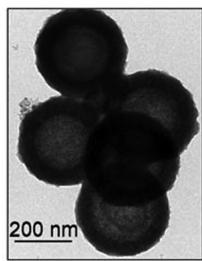  
a)

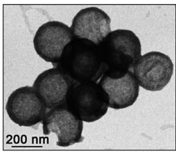  
b)

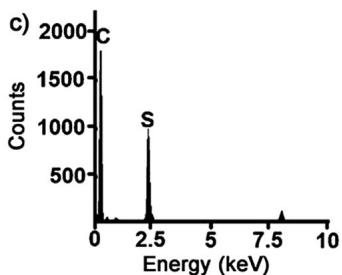  
Fig. 13 (a-c) TEM images of hollow, mesoporous carbon spheres (a) before and (b) after sulfur infiltration, as well as (c) EDX spectrum of the composite in (b). Reproduced from ref. 50 with permission from Wiley-VCH.

while macro- and mesopores were formed from the presence of water-soluble salt byproducts. Upon sulfur infiltration into the structure at  $155^{\circ}\mathrm{C}$ , notable long-term cycling performance was demonstrated, with discharge capacity of  $\sim 700\mathrm{mA}$  h g $_s$ ⁻¹ and capacity retention of 77% at the end of 500 cycles at 2.4C.

4.3.2. Hollow carbon spheres. In order to allow for volumetric expansion of sulfur during lithiation (80%), the fabrication of hollow carbon spheres to sequester sulfur is a very attractive approach. To this end, the Archer group developed hollow, mesoporous carbon-sulfur composites through deposition and pyrolysis of a carbon precursor (pitch) on silica nanoparticles, followed by dissolution of the silica core to create hollow, mesoporous carbon spheres.[50] Sulfur was then infiltrated into the carbon spheres using a vapor phase infusion method (Fig. 13). Using the hollow, porous carbon-sulfur composites, a high specific capacity of  $1071\mathrm{mA}\mathrm{h}\mathrm{gs}^{-1}$  was achieved with  $91\%$  capacity retention after 100 cycles at 0.5C.

However, it remained unclear where the sulfur is located in the carbon-sulfur composites: in the interior hollow space or in the porous carbon shell. Detailed studies using STEM and elemental mapping revealed that most of the inside of hollow carbon spheres were partially filled with sulfur, indicating that sulfur not only penetrated through the porous carbon shell, but also aggregated in the interior hollow space.[51] However, because of the sensitivity of sulfur under the electron beam, some of the sulfur was sublimated off after the measurement process. To overcome this problem, the hollow carbon-sulfur composites were further coated with a thin layer of polydopamine to protect the sulfur from sublimation. Using this structure, it was determined unequivocally that sulfur preferred to diffuse into the hollow interior space rather than stay in the pores of the carbon shell (Fig. 14). The polydopamine-coated, hollow carbon-sulfur composites exhibited impressive cycling performance: specific capacities of  $1070\mathrm{mA}$ $\mathrm{gs}^{-1}$  with  $84\%$  capacity

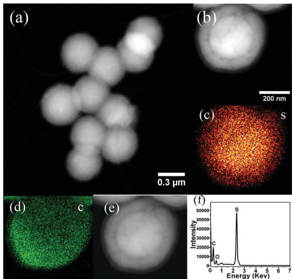  
Fig. 14 (a) Low-magnification and (b) high-magnification STEM images of polydopamine-coated, hollow carbon-sulfur composites and the corresponding elemental maps for (c) sulfur and (d) carbon. (e) STEM image and (f) EDX spectrum of the composite in (b) after elemental mapping. Reprinted with permission from ref. 51. Copyright 2014 American Chemical Society.

retention after 150 cycles at  $0.2\mathrm{C}$ , as well as  $740\mathrm{mA}$  h  $\mathrm{gs}^{-1}$  with  $85\%$  retention after 600 cycles at  $0.6\mathrm{C}$ .

Recently, a different approach was used to accommodate the volumetric expansion of sulfur within carbon shells by developing sulfur-carbon yolk-shell nanostructures with partial sulfur filling.[52] These yolk-shell nanostructures were realized by first carbonizing phenol formaldehyde resin on zinc sulfide nanospheres to form a carbon shell, followed by reaction with a mild oxidizing agent, iron(III) nitrate, to convert some of the zinc sulfide core into sulfur  $(\mathrm{ZnS} + 2\mathrm{Fe}^{3+} \rightarrow \mathrm{S} + \mathrm{Zn}^{2+} + 2\mathrm{Fe}^{2+})$ . Theoretically, zinc sulfide undergoes a volumetric contraction of  $\sim 35\%$  upon conversion to sulfur, leading to the creation of void space inside the carbon shells. By tuning the concentration of oxidizing agent and reaction time, the volume of void space and hence the extent of sulfur filling can be controlled and optimized as well. The sulfur-carbon yolk-shell nanostructures were found to exhibit a high specific capacity of  $1400\mathrm{mA}$  h g $^{-1}$  and good cycling stability over 100 cycles at 0.2C.

4.3.3. Heteroatom modification. Similar to the case of graphene, the surface of porous carbon can be modified using heteroatoms to improve their affinity for lithium polysulfides as well. Dai and co-workers were the first group to develop nitrogen-doped, mesoporous carbon for encapsulation of sulfur cathodes.[53] In this work, nitrogen doping was performed by heat treatment of mesoporous carbon under ammonia atmosphere at  $850^{\circ}\mathrm{C}$ , followed by infiltration of sulfur at  $155^{\circ}\mathrm{C}$ . The nitrogen-doped, mesoporous carbon-sulfur composites showed a higher specific capacity compared to undoped, activated carbon-sulfur composites (1420 vs.  $1120\mathrm{mA}$  h  $\mathrm{gs}^{-1}$  respectively at 0.05C), though the subsequent rate of capacity decay was about the same in both cases, which could be due to the low level of nitrogen doping used ( $\sim 3.3$  wt%).

Inspired by Dai's work on nitrogen-doped, mesoporous carbon, a similar structure was developed with much higher and controllable nitrogen doping level (from 0 to  $12\mathrm{wt}\%$ ).54 It was found that slight doping of nitrogen (4.3 to  $8.1\mathrm{wt}\%$ ) could increase the electronic conductivity of mesoporous carbon (up to  $0.43\mathrm{Scm}^{-1}$ ), after which the conductivity decreased due to disruption of the graphitic structure. Upon electrochemical cycling, all 3 nitrogen-doped carbon-sulfur cathodes (with 4.3, 8.1 and  $11.9\mathrm{wt}\%$  nitrogen doping) were found to exhibit improved cycling stability compared to their undoped counterpart. The best cycling performance  $(1145\mathrm{mA}\mathrm{h}\mathrm{gs}^{-1}$  with  $66\%$  capacity retention after 100 cycles at 0.2C) was realized in the case of  $8.1\mathrm{wt}\%$  nitrogen doping, which represents a compromise between stronger polysulfide binding and lower electronic conductivity as the nitrogen doping level increases.

In order to elucidate the underlying interaction, a combination of theoretical and experimental approaches was used to probe nitrogen-doped carbon-sulfur composites.55 It is noteworthy that nitrogen-doped carbon typically contains oxygen functional groups (such as carboxyl and carbonyl groups) as well. Theoretical calculations that were performed between sulfur and nitrogen-doped carbon showed that sulfur did not adsorb directly onto the nitrogen atoms; instead, nitrogen doping helped to promote the adsorption of sulfur onto the oxygen functional groups. This was in good agreement with X-ray absorption near edge structure analysis of the nitrogen-doped carbon-sulfur composites, which showed the formation of S-O rather than S-N bonds. This observation was rationalized by considering the electron-withdrawing effect of nitrogen atoms, causing neighboring oxygen-containing groups to be polarized and more easily bonded to the sulfur atom. Using this S-O chemical adsorption effect, a stable specific capacity of  $\sim 800\mathrm{mA}\mathrm{h}\mathrm{gs}^{-1}$  was achieved at 0.1C even with a high mass loading of  $4.2\mathrm{mg}_{\mathrm{s}}\mathrm{cm}^{-2}$ , which corresponds to a high areal capacity of  $\sim 3.3\mathrm{mA}\mathrm{h}\mathrm{cm}^{-2}$  at  $0.7\mathrm{mA}\mathrm{cm}^{-2}$ .

Subsequently, theoretical calculations were also performed to probe the interaction between lithium ions and nitrogen-doped carbon (containing carboxyl and carbonyl groups).56 It was found that nitrogen doping led to a significant increase in adsorption energy of lithium ions as compared to the undoped case. Both the nitrogen atoms and the oxygen atoms (in the carboxyl and carbonyl groups) contributed to the binding energy with lithium ions, though the contribution of the Li-O binding was greater than that of Li-N binding due to the higher electronegativity of oxygen. In order to utilize these strong interactions, nitrogen-doped mesoporous carbon spheres were synthesized and further interpenetrated with carbon nanotubes to enhance their long-range electronic conductivity. Using this extremely-conductive nanostructure as host materials for sulfur cathodes, a stable specific capacity of  $\sim 1200\mathrm{mA}\mathrm{h}\mathrm{gs}^{-1}$  was achieved at  $0.2\mathrm{C}$  even with a high mass loading of  $5\mathrm{mg}\mathrm{s}\mathrm{cm}^{-2}$ , which corresponds to a noteworthy areal capacity of  $\sim 6\mathrm{mA}\mathrm{h}\mathrm{cm}^{-2}$  at  $1.7\mathrm{mA}\mathrm{cm}^{-2}$ , representing very encouraging progress for practical applications.

# 5. Polymeric host materials for sulfur cathodes

Conducting polymers represent a promising class of encapsulation materials for sulfur cathodes owing to: (a) their inherently-conducting nature which can facilitate electronic conduction, (b) their elastic and flexible nature which can partially accommodate the volumetric change of sulfur during cycling and (c) the rich variety of functional groups which can have strong affinity for lithium polysulfide species.

One of the earliest studies in this area involved the use of polypyrrole (PPY) as a coating material for sulfur cathodes. Wang and co-workers developed sulfur-PPY composites using oxidative polymerization of pyrrole onto commercial sulfur particles with iron(III) chloride as the oxidizing agent.[57] The presence of PPy was found to improve the conductivity and kinetics of the composite from impedance spectroscopy measurements. The sulfur-PPY composites exhibited a higher discharge capacity compared to the pristine case (1280 vs.  $1110\mathrm{mA}\mathrm{h}\mathrm{gs}^{-1}$  respectively at 0.03C), though the subsequent rate of capacity decay over 20 cycles was about the same, which indicates that there is still polysulfide dissolution into the electrolyte.

To better confine polysulfide species, a sulfur-polythiophene (PT) core-shell composite was prepared with a uniform polymer coating on the surface of the sulfur particles.[58] To do so, iron(III) chloride was used as an oxidizing agent to polymerize thiophene onto commercial sulfur particles to form a core-shell morphology, which was confirmed using TEM imaging. By controlling the amount of thiophene monomer added, 3 different compositions with 38.0, 28.1 and  $17.5\%$  PT were prepared. The optimum composition was found to be  $28.1\%$  PT due to the compromise between higher conductivity and lower active material content with increase in PT content. Electrochemically, the PT-coated sulfur particles showed much better cycling stability compared to the uncoated case, attesting to the effectiveness of the uniform PT shell in limiting polysulfide dissolution. A high specific capacity of  $1119\mathrm{mA}\mathrm{h}\mathrm{gs}^{-1}$  was attained with  $74\%$  capacity retention after 80 cycles at 0.06C.

To achieve much longer cycle life, self-assembled polyaniline (PANI) nanotubes were prepared to confine sulfur at the molecular level during cycling (Fig. 15). The synthesis of these nanotubes involved the oxidative polymerization of aniline using ammonium persulfate, with tartatic acid as the templating agent. To infiltrate sulfur, a key step was to heat the PANI nanotubes with sulfur at  $280^{\circ}\mathrm{C}$  to achieve a vulcanization reaction. During this process, some of the sulfur would react with the PANI to form a three-dimensional, cross-linked network with both inter- and/or intrachain disulfide bonds, which can help to immobilize the sulfur at the molecular level. Due to this unique confinement effect, the sulfur-PANI nanotubes displayed a specific capacity of  $568\mathrm{mA}\mathrm{h}\mathrm{gs}^{-1}$  with  $76\%$  capacity retention over 500 cycles at 1C, which represents an impressive long-term cycling performance. Moreover, the sulfur-PANI nanotubes were observed to swell at the end of discharge and revert back to their original dimensions at the end of charge, which shows that the flexible polymeric

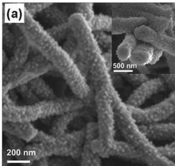

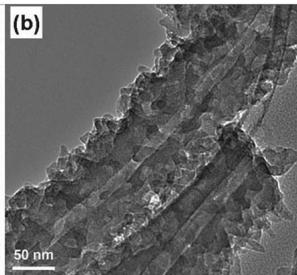

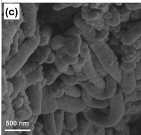  
Fig. 15 (a-d) SEM and TEM images of PANI nanotubes (a and b) before and (c and d) after sulfur infiltration using a vulcanization reaction. Reproduced from ref. 59 with permission from Wiley-VCH.

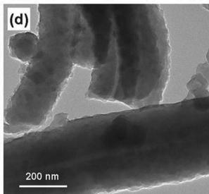

structure is capable of partially accommodating the volumetric change of sulfur during cycling.

To further buffer the volumetric expansion of sulfur during lithiation, sulfur-PANI yolk-shell nanostructures with deliberately-created internal void space were synthesized. Sulfur nanoparticles were first coated with PANI to form a core-shell structure, which were then heated at  $180^{\circ}\mathrm{C}$  under argon to remove some of the sulfur to form the yolk-shell morphology. During the heating process, sulfur was also found to react with the PANI shell through vulcanization to form a three-dimensional, cross-linked disulfide network. Using the sulfur-PANI yolk-shell nanostructures, high discharge capacities of 1101 and  $920\mathrm{mA}$  h  $\mathrm{gs}^{-1}$  were demonstrated at 0.2C and 0.5C, with  $70\%$  and  $68\%$  capacity retention after 200 cycles respectively.

Instead of using the yolk-shell morphology, another approach is to use a hollow structure to accommodate the volumetric change of sulfur instead. To this end, hollow, monodisperse sulfur nanoparticles ( $\sim 400$  to  $500\mathrm{nm}$  in size) were prepared using a one-step, room-temperature templating approach.[61] To do so, sodium thiosulfate was reacted with hydrochloric acid  $(\mathrm{Na}_2\mathrm{S}_2\mathrm{O}_3 + 2\mathrm{HCl} \rightarrow \mathrm{S} + \mathrm{SO}_2 + 2\mathrm{NaCl} + \mathrm{H}_2\mathrm{O})$  in the presence of polyvinylpyrrolidone (PVP) which acted as the structure-directing agent. It was proposed that PVP would self-assemble into a hollow spherical vesicular micelle with the hydrophobic carbon backbone pointing inward and the hydrophilic amide group pointing outward. Since sulfur is hydrophobic in nature, it would nucleate and grow preferentially on the inner hydrophobic portion of the micelle, leading to the formation of hollow sulfur nanoparticles. These nanoparticles were then coated with three different conducting polymers, poly(3,4-ethylenedioxythiophene) (PEDOT), PANI and PPY using oxidative polymerization (Fig. 16).[62] Coating with PEDOT was found to result in the best cycling performance among the three polymers. A high specific capacity of  $1165\mathrm{mA}$  h g $^{-1}$  was attained with  $67\%$  capacity

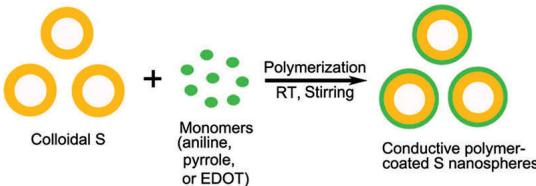  
(a)

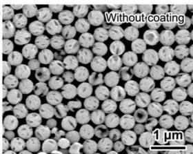  
(b)

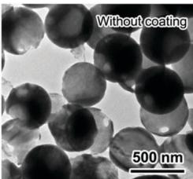  
(c)

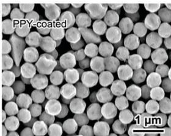  
(d)

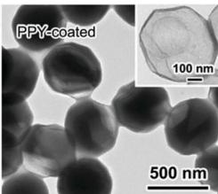  
(e)

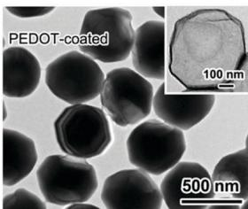  
(f)  
(g)

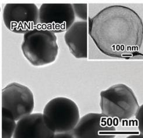  
Fig. 16 (a) Schematic of the synthesis process of conducting polymer-coated hollow sulfur nanoparticles. (b–g) SEM and/or TEM images of hollow sulfur nanoparticles (b and c) before coating, as well as after coating with (d and e) PPY, (f) PEDOT and (g) PANI. Insets in (e–g) show the polymer shells after dissolving away sulfur using toluene (RT: room temperature). Reprinted with permission from ref. 62. Copyright 2013 American Chemical Society.

retention after 500 cycles at  $0.5\mathrm{C}$ . Because of the inherently-conducting nature of the polymer coating, impressive specific capacities of 858 and  $624\mathrm{mA}$  h  $\mathrm{gs}^{-1}$  were achieved at higher C-rates of 2C and 4C as well.

From all of the above examples, we can tell that conducting polymers can act as a good physical barrier to confine lithium polysulfide species within the shell. However, the chemical adsorption effect of conducting polymers on lithium polysulfide species remained poorly understood. To understand this effect, theoretical calculations were performed to elucidate the interaction between lithium polysulfides/sulfides and various conducting polymers, namely PEDOT, PANI and PPY.[62] It was found that all three conducting polymers were capable of forming strong interactions with LiS and  $\mathrm{Li}_2\mathrm{S}$  species. In particular, the oxygen and sulfur functional groups in PEDOT can form strong Li-O and Li-S interactions with  $\mathrm{LiS / Li_2S}$  species, while the nitrogen groups in PANI and PPY can form strong Li-N interactions with  $\mathrm{LiS / Li_2S}$  species. Overall, the binding energies were found to follow the order: PEDOT  $>$  PANI  $>$  PPY  $(1.22 > 0.67 > 0.64\mathrm{eV}$  for binding with LiS and  $1.08 > 0.59 > 0.50\mathrm{eV}$  for binding with  $\mathrm{Li}_2\mathrm{S})$  . Interestingly, this

order is consistent with the electrochemical cycling results, which showed that coating with PEDOT led to the best cycling performance among the three polymers. This provides supporting evidence that strong chemical adsorption between conducting polymers and lithium polysulfides can help to enhance the cycling performance of lithium-sulfur batteries. In fact, combining carbon-sulfur composites with PEDOT coating can help to further trap polysulfide species and represents an exciting direction moving forward.[63]

# 6. Inorganic host materials for sulfur cathodes

Inorganic materials represent an attractive class of host materials for sulfur cathodes because many of them, including metal oxides, nitrides and sulfides, are already inherently rich in oxygen, nitrogen and sulfur atoms which have strong affinity for lithium polysulfide species.

In 2004, Lee and co-workers explored a simple idea of using magnesium nickel oxide  $\mathrm{(Mg_{0.6}Ni_{0.4}O)}$  as an additive in lithium-sulfur batteries.[64] The authors postulated that the large surface area of this oxide material would help in the adsorption of lithium polysulfides. Addition of  $\mathrm{Mg_{0.6}Ni_{0.4}O}$  (15 wt%) to the sulfur cathode was found to result in an increase in specific capacity  $(741\mathrm{mA}\mathrm{h}\mathrm{gs}^{-1}$  without additive vs.  $1185\mathrm{mA}\mathrm{h}\mathrm{gs}^{-1}$  with additive at 0.1C). Given the simplicity of the approach, this represents a very promising result. However, the subsequent rate of capacity decay over 50 cycles was almost the same in both cases (with and without additive), which indicates that polysulfide dissolution into the electrolyte still exists.

Subsequently, another metal oxide additive, aluminum oxide  $\mathrm{(Al_2O_3)}$ , was also reported to be effective in improving the performance of lithium-sulfur batteries.[65] By adding nanosized  $\mathrm{Al_2O_3}$  (10 wt%) to sulfur cathodes, an increase in specific capacity from  $402\mathrm{mA}\mathrm{h}\mathrm{g}_{\mathrm{S}}^{-1}$  (without additive) to  $660\mathrm{mA}\mathrm{h}\mathrm{g}_{\mathrm{S}}^{-1}$  (with additive) at 0.06C was observed, which was attributed to the polysulfide adsorption effect of porous  $\mathrm{Al_2O_3}$ . The cycling performance was relatively stable, but the cycle life of 25 cycles needed to be improved.

Mesoporous silicon dioxide  $(\mathrm{SiO}_2$ ; SBA-15) was also investigated as an additive (10 wt%) by mixing with mesoporous carbon-sulfur composites to form the cathode material.[66] It was proposed that  $\mathrm{SiO}_2$  would act as a polysulfide reservoir to bind weakly to polysulfide species and release them reversibly like in the case of drug delivery. The carbon-sulfur composites with SBA-15 additive showed a discharge capacity of  $960\mathrm{mA}\mathrm{h}\mathrm{gs}^{-1}$  with 68% capacity retention after 40 cycles at 0.2C, which is an improvement compared to the case without additive.

In all of the above examples, the metal oxides were added as additives rather than coated uniformly onto sulfur particles, leaving the possibility of polysulfide dissolution into the electrolyte. To mitigate this problem, a sulfur-titanium dioxide  $\left(\mathrm{TiO}_2\right)$  yolk-shell morphology was designed, using a  $\mathrm{TiO}_2$  shell to coat sulfur nanoparticles uniformly and confine lithium polysulfides within the shell (Fig. 17).67 Internal void space

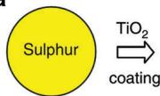  
a

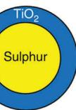

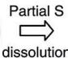

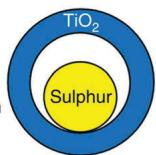

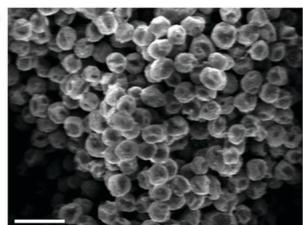  
b  
Fig. 17 (a) Schematic of the synthesis process, (b) SEM image and (c) TEM image of sulfur- $\mathrm{TiO}_2$  yolk-shell nanostructures. Scale bars in (b) and (c) are  $2\mu \mathrm{m}$  and  $1\mu \mathrm{m}$  respectively. Reprinted by permission from Macmillan Publishers Ltd: Nature Communications ref. 67, copyright 2013.

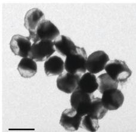  
C

was also specially created between the sulfur yolk and the  $\mathrm{TiO_2}$  shell to accommodate the volumetric expansion of sulfur during lithiation and keep the shell intact. First, monodisperse sulfur nanoparticles were synthesized using the reaction of sodium thiosulfate with hydrochloric acid, followed by alkaline hydrolysis of a titanium alkoxide precursor to form a uniform  $\mathrm{TiO_2}$  shell on the sulfur nanoparticles  $(\mathrm{Ti}(\mathrm{OR})_4 + 2\mathrm{H}_2\mathrm{O}\rightarrow \mathrm{TiO}_2+$  4ROH). To create the internal void space, toluene was used to partially dissolve some of the sulfur, forming the yolk-shell morphology. Upon lithiation of the sulfur-  $\mathrm{TiO_2}$  yolk-shell nanostructures, the protective shell was found to remain intact after expansion of the sulfur yolk, unlike in the case of core-shell nanostructures (with no empty space) and uncoated sulfur particles. As a result, their cycling stability followed the order: yolk-shell  $>$  core-shell  $>$  uncoated. In particular, excellent long-term cycling performance was achieved at 0.5C using the yolk-shell nanostructures:  $1030\mathrm{mA}\mathrm{h}\mathrm{gs}^{-1}$  with  $67\%$  retention at the end of 1000 cycles, the longest cycle life reported for lithium-sulfur batteries at that time. However, the overall cathode conductivity remained to be improved because of the semiconducting nature of  $\mathrm{TiO_2}$ .

To this end, non-stoichiometric, highly-conducting  $\mathrm{Ti}_n\mathrm{O}_{2n-1}$  Magnéli phases were further developed as host materials in lithium-sulfur batteries.[68] By heating rutile  $\mathrm{TiO}_2$  nanotubes under a strongly-reducing hydrogen atmosphere at  $950^{\circ}\mathrm{C}$  and  $1050^{\circ}\mathrm{C}$ , Magnéli phase  $\mathrm{Ti}_6\mathrm{O}_{11}$  nanowires and  $\mathrm{Ti}_4\mathrm{O}_7$  nanoparticles were formed respectively (Fig. 18). Unlike  $\mathrm{TiO}_2$ , oxygen-deficient  $\mathrm{Ti}_4\mathrm{O}_7$  not only possesses metallic electronic conductivity of  $\sim 10^{3}\mathrm{Scm}^{-1}$ , but also under-coordinated titanium atoms at the step sites. The results of theoretical calculations show that the under-coordinated titanium atoms in  $\mathrm{Ti}_4\mathrm{O}_7$  bind strongly with lithium polysulfides/sulfides  $(\mathrm{Li}_2\mathrm{S}_4,\mathrm{Li}_2\mathrm{S}_2$  and  $\mathrm{Li}_2\mathrm{S})$  through a Ti-S interaction, which was confirmed experimentally using X-ray photoelectron spectroscopy. After melt-infiltration of sulfur, the as-prepared sulfur- $\mathrm{Ti}_4\mathrm{O}_7$  composites showed impressive cycling performance:  $1044\mathrm{mA}\mathrm{h}\mathrm{gs}^{-1}$  with  $99\%$  capacity retention after 100 cycles at 0.1C. Overall, their cycling performance followed the order:

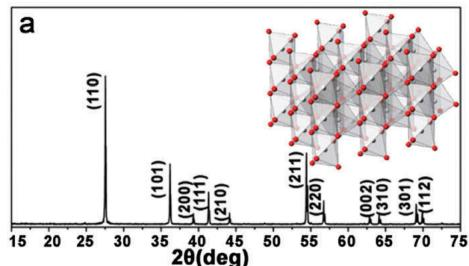

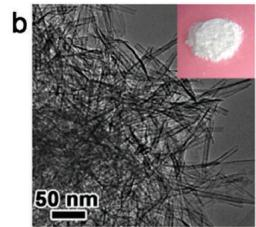

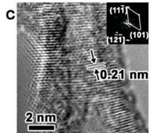

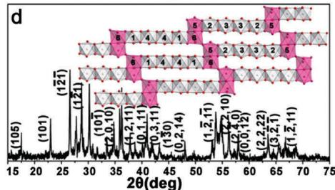

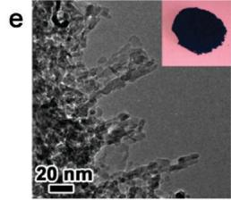

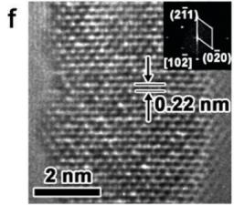

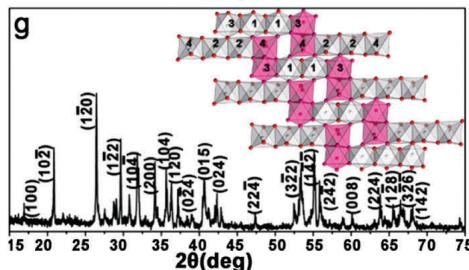  
Fig. 18 (a-i) X-ray diffraction patterns, TEM images and high-resolution TEM images of (a-c) rutile  $\mathrm{TiO_2}$  nanotubes, (d-f) Magnéli phase  $\mathrm{Ti}_{6}\mathrm{O}_{11}$  nanowires and (g-i) Magnéli phase  $\mathrm{Ti}_4\mathrm{O}_7$  nanoparticles. Insets in (b, e and h) show digital photos of the powders and insets in (c, f and i) show corresponding fast Fourier transform diffraction patterns. Reprinted with permission from ref. 68. Copyright 2014 American Chemical Society.

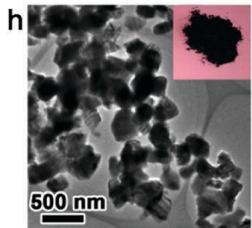

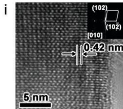

sulfur-  $\mathrm{Ti}_4\mathrm{O}_7 >$  sulfur-  $\mathrm{Ti}_6\mathrm{O}_{11} >$  sulfur-  $\mathrm{TiO}_2$ , which is in good agreement with the relative conductivity of these oxides:  $\mathrm{Ti}_4\mathrm{O}_7 > \mathrm{Ti}_6\mathrm{O}_{11} > \mathrm{TiO}_2$ .

These results were consistent with work published around the same time on sulfur cathodes mixed with Magnéli phase  $\mathrm{Ti}_4\mathrm{O}_7$ , which was prepared by crosslinking titanium ethoxide with polyethylene glycol and heating at  $950^{\circ}\mathrm{C}$  under argon.[69] When the as-synthesized  $\mathrm{Ti}_4\mathrm{O}_7$  was added to a yellow solution of lithium polysulfides  $(\mathrm{Li}_2\mathrm{S}_4)$  in tetrahydrofuran, the yellowish coloration diminished immediately, indicating strong adsorption of  $\mathrm{Li}_2\mathrm{S}_4$  onto the  $\mathrm{Ti}_4\mathrm{O}_7$  surface (Fig. 19). This provides strong visual evidence in support of the theoretical calculation results described above.[68] Electrochemically, the sulfur- $\mathrm{Ti}_4\mathrm{O}_7$

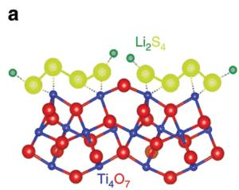  
Fig. 19 (a) Schematic showing the electron density transfer between  $\mathrm{Li}_2\mathrm{S}_4$  and  $\mathrm{Ti}_4\mathrm{O}_7$ . (b and c) Sealed vials of a solution of (1)  $\mathrm{Li}_2\mathrm{S}_4$  in tetrahydrofuran (b) immediately upon contact and (c) after  $1\mathrm{~h}$  stirring with (2) graphite, (3) VC carbon and (4)  $\mathrm{Ti}_4\mathrm{O}_7$ . Reprinted by permission from Macmillan Publishers Ltd: Nature Communications ref. 69, copyright 2014.

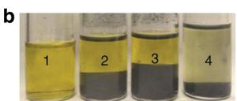

composites exhibited excellent cycling performance as well (1069 mA h  $\mathrm{gs}^{-1}$  with  $88\%$  capacity retention after 100 cycles at 0.2C). Results of in operando X-ray absorption near edge structure showed that the presence of  $\mathrm{Ti}_4\mathrm{O}_7$  not only results in a significant decrease in polysulfide concentration during discharge, but also a slow and controlled deposition of lithium sulfide. These led the authors to propose a surface-enhanced redox chemistry of polysulfides, in which the polar and metallic  $\mathrm{Ti}_4\mathrm{O}_7$  surface enhances both the adsorption of polysulfides as well as the electron transfer process during cycling, leading to excellent reversibility.

The application of two-dimensional  $\mathrm{Ti}_{2}\mathrm{C}$ , an early transition metal carbide (MXene), was also explored in lithium-sulfur batteries. Similar to oxygen-deficient  $\mathrm{Ti}_{4}\mathrm{O}_{7}$ , carbon-deficient  $\mathrm{Ti}_{2}\mathrm{C}$  not only possesses high electronic conductivity, but also under-coordinated titanium atoms on the surface. To prepare  $\mathrm{Ti}_{2}\mathrm{C}$ , hydrofluoric acid was used to etch away the aluminum atoms in a MAX phase ( $\mathrm{Ti}_{2}\mathrm{AlC}$ ) to produce exfoliated  $\mathrm{Ti}_{2}\mathrm{C}$ , followed by delamination in dimethyl sulfoxide to form two-dimensional  $\mathrm{Ti}_{2}\mathrm{C}$  nanosheets. X-ray photoelectron spectroscopy studies showed that the under-coordinated titanium in  $\mathrm{Ti}_{2}\mathrm{C}$  interacts strongly with sulfur and lithium polysulfides ( $\mathrm{Li}_{2}\mathrm{S}_{4}$ ) through a Ti-S interaction. After melt-infiltration of sulfur, the as-prepared sulfur- $\mathrm{Ti}_{2}\mathrm{C}$  composites exhibited a high specific capacity of  $1090\mathrm{mA}\mathrm{h}\mathrm{gs}^{-1}$  with notable long-term stability, retaining  $68\%$  of its capacity at the end of 650 cycles at  $0.5\mathrm{C}$ .

Recently, the use of a non-conductive oxide, manganese dioxide  $(\mathrm{MnO}_2)$ , was investigated in sulfur cathodes. [71] Interestingly, a very different reaction mechanism, based on the formation of thiosulfates to mediate the polysulfide redox shuttle, was discovered. When birnessite  $\delta$ - $\mathrm{MnO}_2$  nanosheets were mixed with a yellow solution of lithium polysulfides  $(\mathrm{Li}_2\mathrm{S}_4)$ , immediate discoloration was observed. X-ray photoelectron spectroscopy performed on the  $\mathrm{MnO}_2$ - $\mathrm{Li}_2\mathrm{S}_4$  composite showed the formation of thiosulfate and polythionate species. Similar results were obtained in the analysis of other oxygen-rich host materials, such as graphene oxide- $\mathrm{Li}_2\mathrm{S}_4$  composites. The authors proposed that  $\mathrm{Li}_2\mathrm{S}_4$  reacted with  $\mathrm{MnO}_2$  to form thiosulfate species, which then further reacted with long-chain lithium polysulfides to form catenated polythionate species and shorter-chain polysulfides. In other words,  $\mathrm{MnO}_2$  acted as a polysulfide mediator to facilitate the binding and reduction of polysulfides via an internal disproportionation mechanism. After melt-infusion of sulfur, the sulfur- $\mathrm{MnO}_2$  composites were found to exhibit a high specific capacity of  $1120\mathrm{mA}$  h g $_s^{-1}$  with 92% capacity retention after 200 cycles at 0.2C. Notably long cycle life of 2000 cycles was also demonstrated at a higher C-rate of 2C.

# 7. Lithium sulfide cathodes

Recently, there has been a burgeoning interest in the development of lithium sulfide cathodes due to its promising pre-lithiated nature and high theoretical specific capacity  $(1166\mathrm{mA}\mathrm{h}\mathrm{g}^{-1})$ . Because lithium sulfide is in its fully-lithiated state (unlike sulfur), it can be paired with non-lithium metal anodes such as silicon or tin, hence circumventing dendrite formation and safety concerns associated with metallic lithium. In this case, the battery would need to be charged first to delithiate the lithium sulfide cathode (positive electrode) to form sulfur, releasing lithium ions and electrons in the process, which travel through the electrolyte and the external circuit respectively to reach the non-lithium metal anode (negative electrode), for example, silicon. At the anode, silicon reacts with the lithium ions and electrons to form full-lithiated  $\mathrm{Li}_{4.4}\mathrm{Si}$ . The opposite occurs during the charge reaction.

Charge:

Positive electrode:  $8\mathrm{Li}_2\mathrm{S} \rightarrow \mathrm{S}_8 + 16\mathrm{Li}^+ + 16\mathrm{e}^-$

Negative electrode:  $\mathrm{Si} + 4.4\mathrm{Li}^{+} + 4.4\mathrm{e}^{-}\rightarrow \mathrm{Li}_{4.4}\mathrm{Si}$

Discharge:

Positive electrode:  $\mathrm{S}_8 + 16\mathrm{Li}^+ +16\mathrm{e}^-\rightarrow 8\mathrm{Li}_2\mathrm{S}$

Negative electrode:  $\mathrm{Li}_{4.4}\mathrm{Si} \rightarrow \mathrm{Si} + 4.4\mathrm{Li}^{+} + 4.4\mathrm{e}^{-}$

Besides its compatibility with non-lithium metal anodes, other advantages of using lithium sulfide (instead of sulfur) as a cathode material are as follows:

(a) Unlike sulfur which expands  $80\%$  during initial lithiation, lithium sulfide is in its fully-lithiated and fully-expanded state.[72-85] As a result, lithium sulfide shrinks as it is delithiated initially, generating empty space for subsequent volumetric expansion during lithiation. This not only helps to mitigate against structural damage to the entire electrode, but also eliminates the need to deliberately create internal void space

to account for volumetric expansion, hence simplifying the synthesis process greatly.

(b) Lithium sulfide has a much higher melting point  $(938^{\circ}\mathrm{C})$  compared to that of sulfur  $(115^{\circ}\mathrm{C})$ . This imparts greater ease of processing in the synthesis of lithium sulfide-carbon composite materials, during which the carbonization process usually takes place at high temperatures.

# 7.1. Activation process

Because of the low electronic and ionic conductivity of lithium sulfide, it was once thought to be electrochemically inactive.[72] Pioneering work in this area was performed by Dahn and co-workers in 2002, who found that lithium sulfide could be activated by ball milling with conductive metal powder such as iron.[72] After the lithium sulfide-iron composite cathodes were charged to  $3\mathrm{V}$  vs.  $\mathrm{Li^{+} / Li}$ , they exhibited a specific capacity of  $\sim 320\mathrm{mA}$  h  $\mathrm{g_{Li_2S}}^{-1}$  upon discharge to  $1\mathrm{V}$ . Subsequent cycling of the cell from 1 to  $3\mathrm{V}$  vs.  $\mathrm{Li^{+} / Li}$  showed good reversibility. On the other hand, a pure lithium sulfide cathode showed no significant capacity even when charged to  $4.8\mathrm{V}$ . However, the exact mechanism behind this ball-milling activation process remained elusive.

In 2010, a high-performance lithium sulfide cathode was prepared by low-energy ball milling of commercial lithium sulfide with conductive carbon black. [73] Interestingly, after this simple ball milling process, the lithium sulfide cathodes could be activated by charging to  $\sim 3.6\mathrm{V}$  vs.  $\mathrm{Li^{+} / Li}$ , following which stable discharge capacities of  $\sim 1050\mathrm{mA}$  h  $\mathrm{g_{Li_2S}}^{-1}$  were obtained at  $0.05\mathrm{C}$  using a composite gel polymer electrolyte. However, it remained unclear if this activation process applies in more commonly used ether-based liquid electrolytes as well.

Subsequently, it was demonstrated that commercial lithium sulfide could be activated in ether-based electrolytes by applying a high charge cutoff voltage of  $\sim 4\mathrm{V}$  vs.  $\mathrm{Li^{+} / Li}$ . This general high-voltage activation method was found to work for commercial, micron-sized lithium sulfide particles (as large as  $10~{\mu\mathrm{m}}$ ), without the need for ball milling with conductive additives. A large potential barrier at  $\sim 3.5\mathrm{V}$  vs.  $\mathrm{Li^{+} / Li}$  was found in the initial charge process (Fig. 20), which could be overcome by using a high cutoff voltage to achieve a notable discharge capacity of  $950\mathrm{mA}$  h  $\mathrm{g_{Li_2S}}^{-1}$  at 0.1C. Using in situ synchrotron

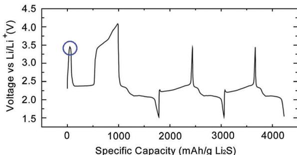  
Fig. 20 Charge/discharge voltage profiles of a lithium sulfide cathode in the initial three cycles, showing the large potential barrier at  $\sim 3.5\mathrm{V}$  vs.  $\mathrm{Li^{+} / Li}$  at the beginning of the first charge process (circled). Reprinted with permission from ref. 74. Copyright 2012 American Chemical Society.

X-ray diffraction, impedance spectroscopy and theoretical modeling, the authors investigated the origin of the potential barrier and ascribed it to the phase nucleation process of lithium polysulfides. On the other hand, the height of the barrier was found to depend on the ease of charge transfer between lithium sulfide and the electrolyte, as well as lithium ion diffusion in lithium sulfide itself.

Shortly after, it was reported that commercial, micron-sized lithium sulfide particles could be activated more easily through high-energy ball milling with conductive carbon black.[75] A potential barrier was also found during the initial charge process of the lithium sulfide cathodes, but this barrier was much lower at  $\sim 2.55\mathrm{V}$  vs.  $\mathrm{Li}^{+} / \mathrm{Li}$  in their case. This is because high-energy ball milling with carbon helped to create excellent contact between lithium sulfide and conductive carbon to improve the charge transfer process, hence reducing the height of the barrier. Using this simple ball-milling activation process, a high discharge capacity of  $1144\mathrm{mA}$  h  $\mathrm{g}_{\mathrm{Li}_2\mathrm{S}}^{-1}$  was achieved at  $0.02\mathrm{C}$ , which is close to the theoretical capacity of lithium sulfide ( $1166\mathrm{mA}$  h  $\mathrm{g}^{-1}$ ). The subsequent capacity decay upon cycling could be attributed to the lack of encapsulation to minimize polysulfide dissolution into the electrolyte.

Overall, these works opened up the exciting possibility of using commercially-available lithium sulfide as high-capacity, pre-lithiated cathode materials, which is an intensive and rapidly-growing field of research right now. The next 3 subsections describe recent progress in the effective encapsulation of lithium sulfide cathodes using carbon materials, conducting polymers and inorganic materials respectively.

# 7.2. Carbon host materials

A recent study demonstrated the coating of mildly-oxidized graphene oxide onto commercial lithium sulfide particles using a simple ultra-sonication process in anhydrous ethyl acetate solution.[76] Graphene oxide was chosen due to its oxygen-rich functional groups that can interact strongly with lithium polysulfide species to bind and trap them within the coating layer. The lithium sulfide-graphene oxide composites showed evidence of favorable Li-O interaction, as confirmed using X-ray photoelectron spectroscopy and Raman spectroscopy. Using this Li-O interaction to minimize lithium polysulfide dissolution, a high discharge capacity of  $782\mathrm{mA}$  h  $\mathrm{g_{Li_2S}}^{-1}$  was delivered with stable cycling performance (88% capacity retention over 150 cycles at 0.2C), which is a marked improvement compared to the case of uncoated lithium sulfide particles.

It was found that by dissolving commercial, micron-sized lithium sulfide powder in anhydrous ethanol, followed by evaporation of the solvent, it is possible to produce nanoporous lithium sulfide particles.[77] This technique was further developed by adding carbon nanotubes into ethanol together with lithium sulfide, hence obtaining lithium sulfide-carbon nanotube composites upon solvent evaporation. When cycled as cathode materials in highly-concentrated electrolytes, these structures showed high specific capacities of  $\sim 732$  and  $558\mathrm{mA}$  h  $\mathrm{g_{Li_2S}}^{-1}$  at 0.05C and 0.5C respectively. Using this technique, polyvinylpyrrolidone was also coated onto lithium sulfide particles in

ethanol and carbonized at  $700^{\circ}\mathrm{C}$  under argon to obtain lithium sulfide-carbon composites. $^{78}$  In this case, the polymer not only served a carbon source, but also a steric stabilizer to prevent agglomeration of the lithium sulfide particles. The lithium sulfide-carbon composites exhibited outstanding cycling performance, with a stable discharge capacity of over  $836\mathrm{mA}$  h  $\mathrm{g_{Li_2S}^{-1}}$  at the end of 100 cycles at 0.2C.

Several other interesting methods were also developed to synthesize lithium sulfide-carbon composites without starting from commercial lithium sulfide particles. As an example, sulfur-infiltrated CMK-3 mesoporous carbon was prepared and then reacted with a strong reducing agent,  $n$ -butyllithium in hexane, at  $105^{\circ}\mathrm{C}$  to convert the sulfur into lithium sulfide.[79] Due to confinement within the pores of CMK-3 carbon, the lithium sulfide exists as small 3 to  $4\mathrm{nm}$  particles, which did not show any activation barrier during the initial charge process, unlike in the case of micron-sized, commercial lithium sulfide particles. The as-synthesized lithium sulfide-mesoporous carbon composites exhibited a specific capacity of  $573\mathrm{mA}\mathrm{h}\mathrm{g}_{\mathrm{Li}_2\mathrm{S}}^{-1}$  with  $\sim 60\%$  capacity retention after 20 cycles at 0.1C. Further, by pairing with a silicon nanowire anode, a specific energy of  $630\mathrm{W}\mathrm{h}\mathrm{kg}^{-1}$  was experimentally realized in a full cell configuration.

An in situ approach was also developed to synthesize lithium sulfide-carbon composites based on the reduction of lithium sulfate using carbon  $\mathrm{(Li_2SO_4 + 2C\rightarrow Li_2S + 2CO_2)}$  .80 Briefly, a resorcinol-formaldehyde aerogel containing lithium sulfate was heated at  $900^{\circ}\mathrm{C}$  to form carbon, some of which then acted as a reducing agent to reduce lithium sulfate to lithium sulfide. The in situ formation of lithium sulfide in a conductive carbon matrix not only creates intimate electrical contact between the two species, but also helps to sequester lithium polysulfides within the matrix. As a result, the as-synthesized lithium sulfide-carbon composites exhibited improved cycling performance compared to a physical mixture of lithium sulfide and carbon. The discharge capacity attained was  $330\mathrm{mA}\mathrm{h}g_{\mathrm{Li_2S}}^{-1}$  with  $85\%$  capacity retention after 40 cycles at 0.5C.

To further improve on this work, polyacrylonitrile was added to a solution of lithium polysulfides  $(\mathrm{Li}_2\mathrm{S}_3)$  in dimethylformamide to achieve cross-linking of the polymer through lithium-nitrile interactions.[81] The cross-linked polymer was then heated at  $300^{\circ}\mathrm{C}$  under argon for dehydrogenation and cyclization of polyacrylonitrile, while decomposing  $\mathrm{Li}_2\mathrm{S}_3$  to form lithium sulfide. Finally, carbonization was performed at  $600^{\circ}\mathrm{C}$  to yield lithium sulfide-carbon composites. The as-synthesized composites exhibited a high specific capacity of  $\sim 900\mathrm{mA}$  h  $\mathrm{g_{Li_2S}^{-1}}$  at 0.01C. At 0.2C, stable discharge capacities of  $\sim 500\mathrm{mA}$  h  $\mathrm{g_{Li_2S}^{-1}}$  were achieved over 20 cycles, which represents a notable improvement over the previous work.[80]

Instead of using irregularly-sized commercial lithium sulfide, an ingenious method was developed to synthesize size-controlled, monodisperse lithium sulfide particles  $(2\mu \mathrm{m},$ $1\mu \mathrm{m}$  and  $500~\mathrm{nm})$  for use as cathode materials (Fig. 21a-c).82 Briefly, sulfur in toluene was reacted with a strong reducing agent, lithium triethylborohydride in tetrahydrofuran, at  $90^{\circ}\mathrm{C}$  to effect the reduction of sulfur into lithium sulfide particles  $\mathrm{(S + 2Li(C_2H_5)_3BH\rightarrow Li_2S + 2(C_2H_5)_3B + H_2)}$  . The monodisperse

  
Fig. 21 (a–f) SEM images of monodisperse (a)  $2\mu \mathrm{m}$ , (b)  $1\mu \mathrm{m}$  and (c)  $500\mathrm{nm}$  lithium sulfide particles and (d–f) the corresponding core-shell structures after carbon coating using chemical vapor deposition. Reprinted with permission from ref. 82. Copyright 2014 American Chemical Society.

lithium sulfide particles were then coated with a uniform carbon layer using chemical vapor deposition, forming lithium sulfide-carbon core-shell structures in the process (Fig. 21d-f). Excellent cycling performance was achieved with a high discharge capacity of  $972\mathrm{mA}$  h  $\mathrm{g_{Li_2S}^{-1}}$  and capacity retention of  $76\%$  after 100 cycles at  $0.2C$ .

It is noteworthy that all the above-mentioned lithium sulfide cathodes were cycled electrochemically in ether-based electrolytes. To show the possibility of operating lithium sulfide cathodes in carbonate-based electrolytes (just like in the case of sulfur cathodes), lithium sulfide-microporous carbon composites were prepared.[83] Using sulfur-microporous carbon with small sulfur allotropes  $(\mathrm{S}_2)$  as the starting material, lithiation was performed using stabilized lithium metal powder, which is a proprietary form of protected lithium spheres compatible with dry room environment. After spraying the powder onto the sulfur-microporous carbon composites, mechanical compression was carried out to break the protective layer and release the lithium, followed by addition of electrolyte to allow lithium to react with sulfur, forming lithium sulfide in the process. The in situ formed lithium sulfide-microporous carbon composites exhibited a single sloping voltage plateau during charge and discharge in carbonate-based electrolytes, similar to the case of their sulfur counterparts in microporous carbon. This tells us that, due to the micropore confinement effect, a direct solid  $\rightarrow$  solid transition takes place without the formation of long-chain lithium polysulfides. Impressive long-term cycling performance was demonstrated with a stable discharge capacity of  $\sim 453\mathrm{mA}$  h  $\mathrm{g_{Li_2S}}^{-1}$  after 900 cycles at 0.1C, opening up the possibility of using lithium sulfide cathodes in carbonate-based electrolytes as well.

# 7.3. Polymeric host materials

Conducing polymers have been widely used to encapsulate sulfur cathodes and they represent a promising class of host materials for lithium sulfide cathodes for the same reasons as well. However, the majority of conducting polymer synthesis is

performed in aqueous solutions, which is incompatible with water-sensitive lithium sulfide particles. To overcome this limitation, a non-aqueous, in situ polymerization process was developed to coat a conducting polymer, polypyrrole (PPY), onto commercial lithium sulfide particles.[84] The process involved the oxidative polymerization of pyrrole onto lithium sulfide particles in anhydrous methyl acetate, using iron(III) chloride as the oxidant and poly(vinyl acetate) as the stabilizer. PPY was chosen as the encapsulation material because it is both electronically-conductive and rich in nitrogen functional groups that have high affinity for lithium polysulfide/sulfide species. X-ray photoelectron spectroscopy and Raman spectroscopy were used to verify the presence of strong Li-N interaction in the lithium sulfide-PPY composites. When used as a cathode material, a high discharge capacity of  $785\mathrm{mA}$ $\mathrm{g_{Li_2S}^{-1}}$  was demonstrated with  $73\%$  capacity retention at the end of 400 cycles at 0.2C. At a C-rate of 2C, a reversible capacity of  $560\mathrm{mA}$ $\mathrm{g_{Li_2S}^{-1}}$  could still be attained, indicative of the high conductivity of the cathode material.

# 7.4. Inorganic host materials

Recently, two-dimensional transition metal disulfides were demonstrated as effective inorganic host materials for lithium sulfide cathodes.[85] In particular, metallic titanium disulfide  $(\mathrm{TiS}_2)$  was chosen, because it not only possesses high electronic conductivity of  $\sim 10^{3}\mathrm{~S~cm}^{-1}$ , but also strong binding with lithium polysulfide/sulfide species. In this work,  $\mathrm{Li}_2\mathrm{S - TiS}_2$  core-shell nanostructures were synthesized by adding a controlled amount of titanium(iv) chloride to ball-milled, commercial lithium sulfide particles. Titanium(iv) chloride reacts directly with some of the lithium sulfide on the surface to form a uniform  $\mathrm{TiS}_2$  coating  $(\mathrm{TiCl}_4 + 2\mathrm{Li}_2\mathrm{S} \rightarrow \mathrm{TiS}_2 + 4\mathrm{LiCl})$ . The as-synthesized nanostructures were then heated at  $400^{\circ}\mathrm{C}$  in an argon atmosphere to allow crystallization of the  $\mathrm{TiS}_2$  shell (Fig. 22). The electronic conductivity of lithium sulfide coated with  $\mathrm{TiS}_2$  was measured to be 10 orders of magnitude

  
Fig. 22 (a) Schematic of the synthesis process, (b) SEM image and (c) TEM image of  $\mathrm{Li}_2\mathrm{S} - \mathrm{TiS}_2$  core-shell nanostructures. Scale bars in (b) and (c) are  $5\mu \mathrm{m}$  and  $500~\mathrm{nm}$  respectively (RT: room temperature). Reprinted by permission from Macmillan Publishers Ltd: Nature Communications ref. 85, copyright 2014.

higher than that of bare lithium sulfide. The results of ab initio calculations also indicate strong Li-S and S-S interaction between lithium sulfide and  $\mathrm{TiS}_2$ , with a calculated binding energy of  $2.99\mathrm{eV}$ , which is 10 times higher than that between lithium sulfide and graphene (0.29 eV).

When used as a cathode material, the  $\mathrm{Li}_2\mathrm{S - TiS}_2$  nanostructures showed high specific capacities of 806 and  $666\mathrm{mA}$  h  $\mathrm{g_{Li_2S}^{-1}}$  at 0.2C and 0.5C respectively.[85] Stable longterm cycling performance was also achieved with  $77\%$  capacity retention after 400 cycles at 0.5C. Even at a high C-rate of 4C, a reversible specific capacity of  $503\mathrm{mA}$  h  $\mathrm{g_{Li_2S}^{-1}}$  could be delivered. The use of a high mass loading of  $5.3\mathrm{mg_{Li_2S}cm^{-2}}$  resulted in a notable areal capacity of  $3.0\mathrm{mA}$  h  $\mathrm{cm}^{-2}$ , which attests to the excellent conductivity and polysulfide trapping effect in the cathodes. In addition, stable cycling performance was also demonstrated using lithium sulfide cathodes coated with vanadium disulfide  $(\mathrm{VS}_2)$  and zirconium disulfide  $(\mathrm{ZrS}_2)$  using the same approach, hence showing the generality of using transition metal disulfides as effective encapsulation materials.

# 8. Lithium polysulfide catholytes

# 8.1. Carbon host materials

Instead of using solid sulfur or lithium sulfide cathodes, it is also possible to use dissolved lithium polysulfide catholytes as the starting material and conductive porous substrates as the host material. Such a configuration not only renders intimate contact between dissolved lithium polysulfides and porous substrates, but also avoids the initial solid  $\rightarrow$  liquid transition from  $S_{8} \rightarrow Li_{2}S_{8}$ , potentially leading to faster reaction kinetics and improved sulfur utilization.[86-90]

The use of lithium polysulfide catholytes remained largely underexplored, until recently when the Manthiram group demonstrated a series of high-performance lithium-dissolved polysulfide batteries. As a representative example, the group used  $\mathrm{Li}_2\mathrm{S}_6$  in 1:1 v/v 1,2-dimethoxyethane/1,3-dioxolane (DME/DOL), together with a free-standing multi-walled carbon nanotube paper as the host material.[86] Carbon nanotubes not only provide a highly-conductive surface, but also a large surface area for deposition of lithium sulfide during cycling. At 0.1C, 0.2C and 0.5C, notably high discharge capacities of 1600, 1469 and  $1261\mathrm{mA}$  h g $_s$ ^{-1} were achieved, with capacity retentions of 88%, 90% and 93% respectively after 50 cycles. Subsequently, the group demonstrated a series of conductive porous host materials (such as carbon nanofiber papers) that work equally as well, hence reviving interest in the field of lithium-dissolved polysulfide batteries.[87]

# 8.2. Heteroatom modification

Similar to the case of sulfur and lithium sulfide cathodes, the cycling performance of lithium-dissolved polysulfide batteries can be enhanced using heteroatom modification of carbon host materials as well, for example, by using free-standing nitrogen-doped graphene paper.[88] Nitrogen doping was achieved through pyrolysis of nitrogen-rich poly(diallyldimethylammonium chloride)

with graphene paper to generate pyrrolic and pyridinic nitrogen dopant atoms. Using nitrogen-doped graphene paper together with  $\mathrm{Li}_2\mathrm{S}_6$  catholyte in DME/DOL, high discharge capacities and stable cycling performance were achieved:  $1300\mathrm{mA}$  h  $\mathrm{gs}^{-1}$  with  $\sim 77\%$  capacity retention after 100 cycles at 0.2C. Theoretical calculations also showed that pyrrolic and pyridinic nitrogen atoms have much stronger binding with lithium polysulfides/ sulfides (LiS and  $\mathrm{Li}_2\mathrm{S}$ ) as compared to quaternary nitrogen. This was confirmed experimentally using  $\mathrm{Li}_2\mathrm{S}_6$  catholyte with graphene paper that is rich in quaternary nitrogen atoms, which showed poorer cycling stability compared to one rich in pyrrolic and pyridinic nitrogen atoms.

As a unique approach, conductive indium tin oxide (ITO) was also used to modify carbon host materials in lithium-dissolved polysulfide batteries. [89] First, to study the interaction between ITO and lithium polysulfides/sulfides, a regular array of ITO pattern was fabricated on glassy carbon by sputtering and used as a substrate for deposition of lithium sulfide during discharge (Fig. 23). Interestingly, it was observed using SEM elemental mapping that lithium sulfide deposited preferentially on ITO instead of carbon, which indicates that oxygen-rich ITO has strong affinity for lithium sulfide species (Fig. 23d). Upon charging, the intermediate lithium polysulfides adsorb strongly onto ITO as well, leading to the precipitation of sulfur onto ITO at the end of charge (Fig. 23e). To make use of this spatial control effect of ITO, carbon nanofibers decorated with ITO nanoparticles were synthesized using a co-electrospinning method with carbon, indium and tin precursors. Using the ITO-decorated carbon fiber paper in combination with  $\mathrm{Li}_2\mathrm{S}_8$  in DME/DOL, a high specific capacity of  $\sim 1200\mathrm{mA}\mathrm{h}\mathrm{gs}^{-1}$  was demonstrated with excellent cycling stability (88% capacity retention after 300 cycles at 0.2C).

Besides metal oxides, metal sulfides are promising candidates for modifying carbon host materials as well due to their high affinity for lithium polysulfide/sulfide species. The edge sites of two-dimensional molybdenum disulfide  $(\mathrm{MoS}_2)$  were calculated theoretically to have high binding energy with lithium sulfide (2.70 to  $4.48\mathrm{eV}$ ), much higher than in the case of terrace sites  $(0.87\mathrm{eV})$ . [90] Experimentally, lithium sulfide was also found to deposit preferentially on the edge sides of  $\mathrm{MoS}_2$  as opposed to terrace sites at the end of discharge, indicative of the high electrochemical selectivity of the edge sites. To utilize this effect, vertically-aligned  $\mathrm{MoS}_2$  layers were synthesized on carbon nanofibers through decomposition and sulfurization of ammonium heptamolybdate precursor at  $600^{\circ}\mathrm{C}$ . Using  $\mathrm{MoS}_2$ -modified carbon fiber paper with  $\mathrm{Li}_2\mathrm{S}_8$  catholyte in DME/DOL, a discharge capacity of  $1110\mathrm{mA}$  h  $\mathrm{gs}^{-1}$  was demonstrated with  $72\%$  capacity retention after 300 cycles at  $0.5\mathrm{C}$ .

# 9. Modification of separators

# 9.1. Carbon modification

In 2012, the Manthiram group reported that the insertion of a microporous carbon interlayer between the sulfur cathode and the separator can help to improve the cycling stability of

  
Fig. 23 (a) Schematic of the fabrication process of ITO micropatterns on glassy carbon substrate with polysulfide catholyte to show the nature of polysulfide deposition. (b and c) SEM images of (b) a fresh ITO micropattern, and (c) an ITO micropattern with polysulfide catholyte. Scale bars in (b and c) are  $20~\mu \mathrm{m}$ . (d and e) Elemental maps for carbon, indium and sulfur after (d) discharging to  $1.7\mathrm{V}$  and (e) charging to  $2.6\mathrm{V}$  vs.  $\mathrm{Li^{+} / Li}$ . Scale bars in (d and e) are  $50~\mu \mathrm{m}$ . Reprinted by permission from Macmillan Publishers Ltd: Nature Communications ref. 89, copyright 2014.

  
Fig. 24 (a) Schematic of a lithium-sulfur battery with a microporous carbon interlayer inserted between the sulfur cathode and the separator. (b) SEM image of the surface of the microporous carbon interlayer. Scale bar in (b) is  $500\mathrm{nm}$ . Reprinted by permission from Macmillan Publishers Ltd: Nature Communications ref. 91, copyright 2012.

lithium-sulfur batteries (Fig. 24).91 It was believed that the freestanding carbon interlayer served 2 important functions: (a) helping to confine lithium polysulfides to the sulfur cathode side to prevent their diffusion to the lithium anode and (b) working as an upper current collector to improve active material utilization. With the bifunctional interlayer, the charge transfer resistance was found to decrease significantly, indicating improved

reaction kinetics. As a result, stable discharge capacities of over  $1000\mathrm{mA}$  h  $\mathrm{gs}^{-1}$  were achieved after 100 cycles at 1C. This represents a very promising result given the simplicity of the approach.

To avoid sacrificing the energy density of the battery, it is more desirable to modify the separator with a lightweight and thin layer of carbon material instead. To this end, a polymer separator was coated with a thin  $10\mu \mathrm{m}$  layer of graphene by using continuous vacuum filtration of a graphene slurry on the separator.[92] Sulfur cathodes prepared on aluminum current collector showed enhanced specific capacity and cycling stability with the graphene-coated separator compared to the unmodified case. Further improvement was achieved by using a  $20\mu \mathrm{m}$  graphene membrane as the current collector as well  $(1.3\mathrm{mgcm}^{-2})$  , which is much lighter than aluminum of the same thickness  $(5.4\mathrm{mgcm}^{-2})$  By combining both the graphene-coated separator and graphene current collector, a high specific capacity of  $\sim 971\mathrm{mA}\mathrm{h}\mathrm{gs}^{-1}$  was achieved with  $70\%$  capacity retention after 300 cycles at 0.9C.

Subsequently, SEM and Raman spectroscopy were used to investigate the origin of capacity decay in polymer separators in lithium-sulfur batteries.[93] It was found that a huge amount of polysulfides (up to  $20\%$  of total sulfur mass) was accumulated in the pores of unmodified separators and not converted to

lithium sulfide even at the end of discharge. Based on this observation, it was proposed that carbon modification of the separator would provide additional conductive surface area for the precipitation of lithium sulfide at the cathode-separator interface, hence reactivating the polysulfides which would otherwise be trapped in the separator. To this end, a polymer separator coated with a thin layer of carbon black  $(1\mu \mathrm{m},$ $0.5\mathrm{mgcm}^{-2})$  was used in a lithium-sulfur battery, which afforded much higher specific capacity compared to the unmodified case, indicative of enhanced active material utilization. When used in combination with a conducting polymer-coated sulfur cathode, a high specific capacity of  $1350\mathrm{mA}$  h  $\mathrm{gs}^{-1}$  was demonstrated with  $55\%$  capacity retention over 500 cycles at 0.5C.

# 9.2. Polymeric modification

Nafion is a promising polymeric material for use in lithium-sulfur batteries due to its negatively-charged sulfonate groups, which can allow the hopping of lithium ions yet repel polysulfide anions electrostatically.[94] When used as a separator, it can confine polysulfide anions to the sulfur cathode side and prevent them from diffusing to the lithium anode side. Recognizing this possibility, Jin and co-workers decided to perform lithiation on a commercial Nafion ionomer film (using lithium hydroxide at  $80^{\circ}\mathrm{C}$ ) for use as a separator in lithium-sulfur batteries.[94] Using the steady state current method, the group determined the transference number of lithium ions through the Nafion film to be 0.986 (very close to 1), which indicates that only lithium ions could pass through but not polysulfide anions. To provide unequivocal proof, a diffusion cell was also set up for cycling of a lithium-sulfur battery, which showed 2 orders of magnitude lower electrolyte sulfur content at the anode side using this Nafion separator, compared to the case with normal polymer separator. As a result of this polysulfide confinement effect at the cathode side, a high specific capacity of  $1185\mathrm{mA}$ $\mathrm{h}$ $\mathrm{gs}^{-1}$  was achieved with  $69\%$  capacity retention after 50 cycles.

To reduce the amount of expensive Nafion used, a thin layer  $(1\mu \mathrm{m},0.7\mathrm{mgcm}^{-2})$  was coated onto a polymer separator instead.[95] This thickness of Nafion was found to be optimal because a thinner layer does not coat the separator conformally, while a thicker layer leads to severe voltage polarization. Using a diffusion cell, the authors also provided visual evidence showing the difficulty of polysulfide anions to pass through the Nafion-coated separator under potentiostatic conditions, demonstrating the ionic shield effect. Using the modified separator in a lithium-sulfur battery, long-term cycling stability was attained:  $781\mathrm{mA}$  h  $\mathrm{gs}^{-1}$  with  $60\%$  capacity retention after 500 cycles at 1C.

Instead of using Nafion, it is more attractive to investigate other cheaper polymeric materials such as polyelectrolytes with similar negatively-charged groups to repel polysulfide anions.[96] To this end, layer-by-layer assembly was used to construct a 5-bilayer, nanometer-thin coating of poly(acrylic acid) and poly(allylamine hydrochloride) on polymer separators, which showed significant inhibition in the movement of negatively-charged anions, but not that of positively-charged cations.

Using the ion-permselective properties of the modified separators in lithium-sulfur batteries, much higher Coulombic efficiency (98 to  $104\%$ ) was achieved compared to the case without modification (59 to  $69\%$ ). Notable discharge capacities of 1350 to  $1418\mathrm{mA}$  h  $\mathrm{gs}^{-1}$  were also demonstrated with good cycling performance over 50 cycles at 0.05C.

# 9.3. Inorganic modification

Vajo and co-workers demonstrated the coating of inorganic vanadium(v) oxide  $(\mathrm{V}_2\mathrm{O}_5)$  onto separators for use in lithium-sulfur batteries.[97]  $\mathrm{V}_2\mathrm{O}_5$  is a well-known solid-state conductor that allows facile diffusion of lithium ions, yet is able to physically isolate lithium polysulfides at the sulfur cathode side. In addition, the strong polysulfide binding effect of oxygen-rich  $\mathrm{V}_2\mathrm{O}_5$  helps to further retard the diffusion of polysulfides to the lithium anode side. By coating a thin  $1\mu \mathrm{m}$  layer of  $\mathrm{V}_2\mathrm{O}_5$  onto polymer separators using a sol-gel method, stable discharge capacities of  $\sim 800\mathrm{mA}$  h gS $^{-1}$  were demonstrated over 250 cycles at 0.07C using a 5 mA h lithium-sulfur pouch cell, bringing us a step closer towards commercialization of such high-performance batteries.

# 10. Lithium metal anodes

The high solubility of lithium polysulfides in ether-based electrolytes makes lithium metal anodes particularly vulnerable to attack by dissolved polysulfide species, often resulting in the shuttle effect and low Coulombic efficiency. In this section, we review the efforts to protect lithium metal anodes specifically against dissolved polysulfides and hence alleviate the shuttle effect in lithium-sulfur batteries. These protection strategies can be classified into in situ and ex situ techniques.

# 10.1. In situ protection

One of the methods to protect the lithium metal surface against dissolved polysulfide species is to use electrolyte additives to form a passivating SEI in situ. A major breakthrough in this area was the discovery of lithium nitrate  $\left(\mathrm{LiNO}_3\right)$  as a powerful electrolyte additive. To understand the effect of  $\mathrm{LiNO}_3$ , Aurbach and co-workers studied the SEI formed on the lithium metal surface in the presence of this additive using X-ray photoelectron spectroscopy and Fourier transform infrared spectroscopy.[98] It was found that  $\mathrm{LiNO}_3$  performs 2 roles: (a) it becomes reduced to form  $\mathrm{Li}_x\mathrm{NO}_y$  species and (b) it oxidizes sulfides (in solution and on surface) to form  $\mathrm{Li}_x\mathrm{SO}_y$  species, both of which help to passivate the lithium metal surface against dissolved lithium polysulfides, leading to reduction of the shuttle effect and hence, reasonably-high Coulombic efficiencies (typically 90 to  $98\%$ ). Because of its great efficacy,  $\mathrm{LiNO}_3$  additive is now used in most of the works on lithium-sulfur batteries today.[99]

However,  $\mathrm{LiNO}_3$ , being a strong oxidizing agent, can be explosive in nature under high concentrations and high temperatures, leading to safety concerns.[99] In fact, the earliest known chemical explosive, gunpowder, is a mixture of sulfur, charcoal (carbon) and nitrates. In the search for a safer additive, phosphorus pentasulfide  $(\mathrm{P}_2\mathrm{S}_5)$  was reported to be effective in forming a protective SEI of  $\mathrm{Li}_3\mathrm{PS}_4$ ,

a superionic conductor, on the lithium metal surface. $^{100}$  This passivation layer not only allows fast lithium ion transport, but also prevents polysulfides from reacting with the lithium metal surface.  $\mathrm{P}_2\mathrm{S}_5$  was also found to form complexes with lithium polysulfide/sulfide species, which can help to convert insoluble lithium sulfide into more soluble products, preventing their precipitation and passivation of the cathode surface. Lithium-sulfur batteries with this electrolyte additive showed high Coulombic efficiencies of  $98\%$  in the first 20 cycles and  $\sim 90\%$  in the subsequent 20 cycles. A high discharge capacity of  $1334\mathrm{mA}\mathrm{h}\mathrm{gs}^{-1}$  was also demonstrated with  $70\%$  capacity retention after 20 cycles at 0.1C.

In another approach, the use of highly-concentrated, solvent-in-salt electrolytes was explored.101 It was found that a  $7\mathrm{M}$  over-saturated solution of lithium bis(trifluoromethanesulfonyl)imide (LiTFSI) in 1:1 v/v 1,2-dimethoxyethane/1,3-dioxolane (DME/DOL) possesses minimal solubility for lithium polysulfides, hence limiting the amount of dissolved polysulfide species that can attack the lithium metal anode. In addition, a highly-viscous electrolyte helps to retard the diffusion of dissolved polysulfides, if any, to the lithium anode. The authors also reported the formation of a thicker SEI containing inorganic reduction products of the electrolyte salt LiTFSI, including LiF,  $\mathrm{Li}_3\mathrm{N},$ $\mathrm{Li_2S_2O_4}$ $\mathrm{Li_2SO_3}$ $\mathrm{Li}_x\mathrm{C}_2\mathrm{F}_y$  and  $\mathrm{SO}_2\mathrm{CF}_x$  species, which can potentially protect the lithium metal surface as well. Exploiting these beneficial effects, lithium-sulfur batteries cycled in this  $7\mathrm{M}$  electrolyte exhibited Coulombic efficiency values nearing  $100\%$  (exact values not given), which is very promising. The discharge capacity was also high at  $1041\mathrm{mA}\mathrm{h}\mathrm{gs}^{-1}$  with  $74\%$  capacity retention after 100 cycles at 0.2C.

# 10.2. Ex situ protection

Instead of using electrolyte modifications to form a protective SEI layer in situ, another approach is to protect the lithium metal surface ex situ with a physical film. For example, a graphite film that is placed between the lithium anode and the separator can help to minimize direct contact between the lithium metal and dissolved polysulfides.[102] At the same time, parallel connection of graphite and lithium ensures lithiation of graphite at equilibrium to maintain a pseudo-equal potential with lithium metal. As such, it plays the role of an "artificial SEI layer" that supplies lithium ions to the underlying metal when necessary. By using this hybrid anode design in lithium-sulfur batteries, Coulombic efficiencies higher than  $99.5\%$  were maintained over 200 cycles, which is much better than in the control sample ( $\sim 92\%$ ). A stable discharge capacity of  $\sim 850 \mathrm{~mA} \mathrm{~h} \mathrm{~g}_{\mathrm{s}}^{-1}$  was also achieved after 200 cycles at 0.4C.

To avoid compromising the energy density of the batteries, it is more promising to form a thin protective layer directly on the lithium metal surface instead. To achieve this, a thin, porous layer of aluminum oxide  $\mathrm{(Al_2O_3)}$  nanoparticles (0.23, 0.58 and  $0.73\mathrm{mgcm}^{-2}$ ) was coated onto a lithium metal surface using spin-coating.[103] It was found that a  $0.23\mathrm{mgcm}^{-2}\mathrm{Al}_2\mathrm{O}_3$  coating could not protect the lithium metal against dissolved polysulfides effectively, while a  $0.73\mathrm{mgcm}^{-2}$  coating blocked the diffusion of lithium ions. As a result, an optimal coating

of  $0.58\mathrm{mgcm}^{-2}$  on the lithium anode exhibited the best electrochemical performance in lithium-sulfur batteries, much better than in the uncoated case. A high discharge capacity of  $1215\mathrm{mA}\mathrm{h}\mathrm{gs}^{-1}$  was demonstrated, with capacity retention of  $70\%$  after 50 cycles at 0.1C (Coulombic efficiency values were not given).

In another approach, nitrogen gas was used to react directly with lithium metal to form a uniform layer of lithium nitride  $(\mathrm{Li}_3\mathrm{N})$ , a fast ionic conductor. This in situ formed protective layer (200 to  $300~\mathrm{nm}$  thick) not only shields lithium metal effectively against dissolved polysulfides, but also allows fast transport of lithium ions (ionic conductivity of  $\mathrm{Li}_3\mathrm{N} \sim 10^{-3}\mathrm{Scm}^{-1}$ ). When the protected lithium anode was applied in lithium-sulfur batteries, Coulombic efficiencies as high as  $91.4\%$  were achieved at  $0.2\mathrm{C}$ , which is much better than in the case of unprotected anodes  $(80.7\%)$ . Upon prolonged cycling, the batteries exhibited a high discharge capacity of  $1087\mathrm{mA}$ $\mathrm{g}^{-1}\mathrm{s}$  with  $71\%$  capacity retention and  $92.3\%$  average Coulombic efficiency over 500 cycles at  $0.5\mathrm{C}$ . Analysis of the lithium metal surface after cycling also showed a much thinner layer of reduced lithium sulfide species  $(\sim 10~\mu \mathrm{m})$  in the protected sample, compared to the  $100~{\mu\mathrm{m}}$  thick layer formed on an unprotected lithium surface, which confirms the protective effect of  $\mathrm{Li}_3\mathrm{N}$ .

# 11. Prospects and outlook

# 11.1. Existing and emerging host materials

The results of theoretical ab initio calculations in Section 3 have identified oxygen, nitrogen and sulfur as promising heteroatoms that possess strong affinity with lithium polysulfide species. In the case of carbon host materials, the use of oxygen and nitrogen heteroatoms is common in the existing literature, while reports on the use of sulfur-doped carbon are few and far between. $^{105}$  In the case of inorganic encapsulation materials, most reports to date focus on metal oxides as host materials, while metal nitrides and sulfides remain relatively unexplored. Besides titanium, vanadium and zirconium sulfides  $(\mathrm{TiS}_2, \mathrm{VS}_2$  and  $\mathrm{ZrS}_2)$ , $^{85}$  the family of cobalt sulfides  $(\mathrm{CoS}_2$  and  $\mathrm{Co_9S_8}$ ) has attracted attention recently as promising host materials for sulfur cathodes as well, owing to their dual sulfiphilic and metallic nature. $^{106,107}$  Extending our search towards these under-explored host materials can open up new opportunities in the development of high-performance lithium-sulfur batteries.

Besides using electronegative atoms to bind with lithium in lithium polysulfides, it is also possible to use electropositive atoms to bind with sulfur in lithium polysulfides. A study using boron-doped carbon showed that it is possible for boron atoms to adsorb lithium polysulfide species strongly, most likely through a B-S interaction.[108] Another publication employing nickel-based metal organic frameworks as host materials also reported the presence of strong Ni-S interaction with polysulfide species, enabling stable cycling to be achieved.[109] Most recent studies using non-stoichiometric  $\mathrm{Ti}_4\mathrm{O}_7$  and  $\mathrm{Ti}_{2}\mathrm{C}$  have demonstrated the possibility of utilizing strong Ti-S interaction

to enhance the cycling performance of sulfur cathodes as well. $^{68-70}$  This leaves many other electropositive atoms to be explored for use in emerging host materials, both theoretically and experimentally.

In order to further advance the field of lithium-sulfur batteries, there is an urgent need to fully understand the interaction of lithium polysulfide species with both existing and emerging host materials. For instance, though the use of graphene oxide as host material has been studied extensively for many years, it was only recently that researchers discovered the formation of thiosulfate and polythionate species in the interaction between lithium polysulfides and graphene oxide, which act as effective redox mediators in lithium-sulfur batteries.[71] Most recent studies using surface spectroscopy and cyclic voltammetry showed that only metal oxide host materials with redox potentials between 2.4 and  $3.05\mathrm{V}$  vs.  $\mathrm{Li^{+} / Li}$  (such as  $\mathrm{MnO_2}$  and  $\mathrm{VO}_2$  -graphene), react with lithium polysulfides to form active surface-bound thiosulfate and polythionate species, leading to superior performance in lithium-sulfur batteries.[110] On the other hand, metal oxides with redox potentials below  $1.5\mathrm{V}$  (such as  $\mathrm{Co}_3\mathrm{O}_4$  and  $\mathrm{Ti}_4\mathrm{O}_7$ ) show no redox reaction with lithium polysulfides, while those with redox potentials above  $3.05\mathrm{V}$  (such as  $\mathrm{V}_2\mathrm{O}_5$  -graphene) oxidize polysulfides to a mixture of sulfate and thiosulfate groups, the former of which blocks the surface and inhibits the redox mediator mechanism. This study provides a useful guideline, the so-called "Goldilocks" principle, in the selection of effective metal oxide host materials for sulfur cathodes.

To further accelerate the development of lithium-sulfur batteries, closer collaboration between theoretical and experimental scientists is needed. While theoretical calculations can provide a high-throughput means of predicting important material interactions, advanced electrochemical and characterization techniques can be used to verify them at the same time.

# 11.2. Advanced characterization and electrolyte development

To date, most studies have focused on materials synthesis, with a relative scarcity of investigations on the fundamental electrochemistry of the lithium-sulfur system. $^{111-122}$  Lithium-sulfur batteries are notably very complicated in terms of reaction mechanism and kinetics due to the formation of multiple possible intermediates. $^{13-18}$  Some important questions that remain under debate include: (a) whether polysulfide radicals (and what species) are formed during cycling, (b) whether sulfur is re-formed at the end of the charge process, and (c) why carbonate-based electrolytes work well in the presence of small sulfur allotropes but not in polysulfide-rich environments. $^{123-145}$  While theoretical computations and ex situ techniques can help to shed some light on these questions, the results may differ in an actual operating lithium-sulfur battery. More advanced characterization techniques, especially in situ and in operando ones, are needed to allow deep mechanistic understanding of the electrochemistry involved, which can then be used as guidelines to design better lithium-sulfur batteries.

Ultimately, encapsulation of sulfur cathodes in host materials only helps to alleviate the problem of polysulfide dissolution but not tackle the root cause. As such, there is an urgent need

for a new class of electrolytes that do not dissolve lithium polysulfide species appreciably. In this respect, there have been some investigations on the use of solid-state and polymer electrolytes, though their relatively low ionic conductivity remains a challenge and requires further improvement. $^{146-153}$  Ionic liquid electrolytes have also been explored and found to enable more stable cycling performance, possibly due to their weaker donor ability and lower solubility for polysulfides. $^{154-158}$  Besides understanding the interactions of ionic liquids with polysulfides more thoroughly, the viscosity and cost of ionic liquids also need to be lowered to enable their potential widespread use in lithium-sulfur batteries.

A recent study reported a new electrolyte combination for lithium-sulfur batteries that is not based on ionic liquids.[159] Instead, it is based on a (acetonitrile) $_2$ -lithium bis(trifluoromethanesulfonyl)imide complex, further blended with 1,1,2,2-tetrafluoroethyl 2,2,3,3-tetrafluoropropyl ether to reduce its viscosity. Interestingly, this electrolyte was found to possess minimal solubility for lithium polysulfides and good stability against lithium metal, which represents encouraging progress in the arena of electrolyte development. More of such work is needed in order to tackle the root cause of capacity decay and accelerate the development of lithium-sulfur batteries.

# 11.3. Lithium metal and non-lithium metal anodes

From this review, we can see that, compared to the plethora of work on improving sulfur cathodes, publications on improving lithium metal anodes for use in lithium-sulfur batteries are relatively few. The most significant finding that is widely applied today is the use of lithium nitrate as an electrolyte additive to protect lithium metal anodes against dissolved polysulfides. Although lithium nitrate is an effective additive, its strong oxidizing properties pose serious safety issues, especially under conditions of high concentration and high temperature. Moreover, there is a limit to the Coulombic efficiency that can be achieved using this additive (typically 90 to  $98\%$ ). For a lithium-sulfur battery to maintain excellent stability and long cycle life, Coulombic efficiency values of  $99.9\%$  and above are needed, which warrants the need for novel electrolyte additives that can outperform lithium nitrate.

There have been some recent promising work in improving the plating-stripping reversibility of lithium metal anodes for use in lithium metal batteries in general. $^{160-173}$  Examples include the use of electrolyte additives (such as lithium fluoride $^{168}$  and cesium hexafluorophosphate $^{171,172}$ ) as well as anode protective structures (such as interconnected hollow carbon spheres $^{165}$  and boron nitride films $^{166}$ ). These works aim to improve the reversibility of lithium metal anodes by inhibiting dendrite growth and forming a stable SEI, either in situ or ex situ. However, there is a problem unique to lithium-sulfur batteries that lithium metal batteries in general do not suffer from, which is the polysulfide shuttle effect. $^{6}$  It would be extremely promising and rewarding to investigate if these electrolyte additives and anode protective structures can help to protect lithium metal against dissolved lithium polysulfides as well.

Another approach to obviate the problems of lithium metal anodes is to work on fully-lithiated lithium sulfide cathodes instead, which can be paired with non-lithium metal anodes (such as silicon or tin), as discussed in Section 7. However, operating such a full cell is challenging due to the limited supply of lithium ions, which can become irreversibly lost during cycling.[174-176] Moreover, silicon and tin anodes also face their own set of issues, including large volumetric expansion and unstable SEI.[8] If the reversibility of either or both electrodes is not optimized, there will be implications on the cycling performance when they are paired together in a full cell configuration.

In the literature, there have only been a few demonstrations of lithium sulfide-based full cells. In order to advance in this arena, the issues of both the lithium sulfide cathode and the silicon/tin anodes need to be addressed completely. On the cathode side, it is important to encapsulate lithium sulfide in the best way possible with highly-conductive materials. On the anode side, alleviating the problems of volumetric expansion and unstable SEI, as well as improving the first cycle Coulombic efficiency to reduce irreversible lithium loss, will prove to be essential. Finally, it is necessary to carry out appropriate capacity matching when pairing the two electrodes together in the full cell, so as to achieve the most optimal cycling performance.

# 11.4. Optimization and commercialization

With major advances in sulfur cathode development, there have been many publications in recent years demonstrating high specific capacities (some approaching the theoretical value) as well as long cycle life (from hundreds to thousands of cycles).[13-18] In order to bring lithium-sulfur batteries a step closer to commercialization, it is necessary to work on optimizing 3 main parameters:

(a) Content of active material in the electrode. In most publications so far, specific capacity values are reported in terms of the mass of the active material, sulfur.[13-18] However, this does not take into account the dead weight contributed by other electrochemically inactive materials such as the host material, carbon additives and binder, which typically occupy 40 to  $60\mathrm{wt}\%$  of the electrode.[13-18] This is in sharp contrast to the case in lithium-ion batteries today, where such inactive materials usually take up  $\sim 5\mathrm{wt}\%$  of the electrode.[9-12] In fact, using free-standing carbon nanotube-sulfur electrodes (with a sulfur content of  $54\mathrm{wt}\%$ ) as a prototypical example, and varying the amount of excess lithium in the anode from  $0\%$  to  $100\%$  in terms of the capacity, the energy density of such lithium-sulfur batteries ranges from 283 to  $314\mathrm{W}\mathrm{h}\mathrm{L}^{-1}$ , which is lower than that of  $\mathrm{LiCoO_2}$ -graphite lithium-ion batteries today.[177]

Hence, moving forward, to be competitive with lithium-ion batteries today, it is important to increase the percentage of active material in sulfur electrodes.[178-187] One way to achieve this is to further improve the conductivity of the host material so that less carbon additives need to be used. Another relatively less-explored approach is to use host materials that are also electrochemically active in the voltage range of lithium-sulfur batteries, so that they do not contribute dead weight. Exploration of such active host materials, including metal oxides,

nitrides and sulfides, will open up new possibilities in the development of commercially-competitive lithium-sulfur batteries.

(b) Areal mass loading of active material. The areal mass loading of active material in sulfur cathodes today is typically 1 to  $2\mathrm{mg}_{\mathrm{s}}\mathrm{cm}^{-2}$ , which gives areal capacities in the range of 1 to  $3\mathrm{mA}\mathrm{h}\mathrm{cm}^{-2}$ .13-18 As a benchmark, commercial lithium-ion batteries today have an areal capacity of 3 to  $5\mathrm{mA}\mathrm{h}\mathrm{cm}^{-2}$ .9-12 Therefore, in order to move towards practical applications of lithium-sulfur batteries, it is imperative to fabricate high-mass sulfur electrodes, which is challenging because it puts high demands on the conductivity of the electrode.188-195 A potential solution is to further improve the conductivity of the host material. Another way to alleviate this problem is to perform calendaring (roll-pressing) on the electrodes to improve their overall particle-to-particle contact, a step which is routine in commercial battery manufacturing but relatively unexplored in lithium-sulfur batteries.

Furthermore, using a high-mass sulfur cathode also implies operating at high current densities, at which point the reversibility of the lithium metal anode might be the limiting factor. This is because the typical problems of lithium metal anodes, including dendrite growth and unstable SEI, are largely amplified at high current densities. Therefore, solving this issue requires a two-pronged approach in terms of improving the performance of both the sulfur cathode and the lithium anode, because one cannot function well without the other.

(c) Simplicity and compatibility of the synthetic process. In order to move towards commercialization of lithium-sulfur batteries, the synthesis procedures need to be simple and low-cost.[196-217] However, many of the procedures demonstrated in the literature are complex, expensive or multi-step in nature, which is an area that needs to be worked on.[13-18] Moreover, there is a recent trend in using carbon-based materials (such as carbon nanotube/carbon fiber paper) instead of conventional aluminum foil as current collectors for lithium-sulfur batteries.[13-18] In these cases, it is important to consider the mass, thickness and density of these current collectors to judge if they are an improvement over aluminum. It is also noteworthy that most battery manufacturing plants today have put in huge amounts of capital on equipment that perform electrode slurry coating on metal foil current collectors, hence the use of aluminum would be more compatible. It might be possible that battery manufacturers would invest in equipment that perform coating of electrode slurries onto carbon-based current collectors in the future, though that remains to be seen.

# 11.5. Room-temperature sodium-sulfur batteries

On a related note, room-temperature sodium-sulfur batteries have also gained considerable attention recently due to the low cost and wide availability of sodium, being one of the most abundant elements in the Earth's crust.[218] Compared to existing high-temperature sodium-sulfur batteries today (300 to  $350^{\circ}\mathrm{C}$ ), which only allow partial discharge to molten  $\mathrm{Na}_2\mathrm{S}_3$ , their room-temperature counterparts enable complete discharge to solid  $\mathrm{Na}_2\mathrm{S}$ .[19] Given the theoretical specific capacities of sodium

anodes (1166 mA h g $^{-1}$ ) and sulfur cathodes (1673 mA h g $^{-1}$ ) and the average cell voltage of 1.85 V, the energy density of room-temperature sodium-sulfur batteries is as high as 1300 W h kg $^{-1}$  or 1600 W h L $^{-1}$ . Moreover, room-temperature sodium-sulfur batteries are intrinsically much safer compared to those operating at high temperature, which is a major consideration for any stationary or transport applications.

There have been some demonstrations of room-temperature sodium-sulfur batteries in the literature, most of which focus on improving the cycling stability on the sulfur cathode side. Examples include the use of polyacrylonitrile-sulfur composites, $^{219,220}$  small sulfur allotropes in microporous carbon, $^{221}$  sodiated Nafion separators, $^{222,223}$  carbon interlayers, $^{224}$  polymer electrolytes, $^{225,226}$  etc. The application of sodium polysulfide catholytes $^{223}$  and sodium sulfide cathodes $^{227}$  on high surface area carbon supports have also been demonstrated with some success. However, the overall cycling performance of room-temperature sodium-sulfur batteries, in terms of their specific capacity, Coulombic efficiency and cycle life, still greatly lags behind that of lithium-sulfur batteries.

The key to achieve progress is to solve the crucial problems on the sodium metal anode side, which is the major bottleneck in the performance of sodium-sulfur batteries today. Like in the case of lithium metal, sodium metal anodes are also plagued with challenges of poor reversibility, dendrite growth and non-uniform SEI during repeated plating and stripping.[218] Most recently, it was discovered that sodium hexafluorophosphate  $\mathrm{(NaPF_6)}$  in glyme electrolytes (mono-, di- and tetraglyme) can enable highly-reversible and non-dendritic plating-stripping of sodium metal anodes with  $99.9\%$  Coulombic efficiency (Fig. 25).[228] This was attributed to the formation of a uniform, inorganic SEI made of sodium oxide and sodium fluoride. A room-temperature sodium-sulfur battery was also demonstrated using  $\mathrm{NaPF_6}$  in tetraglyme as the electrolyte, with sodium nitrate as an electrolyte additive to alleviate the polysulfide shuttle effect.[228] However, the specific capacity  $(776\mathrm{mA}\mathrm{h}\mathrm{g}^{-1}\mathrm{s})$ , Coulombic

  
a

  
b

  
C  
Fig. 25 (a) Plating-stripping Coulombic efficiencies, (b) low-magnification and (c) high-magnification SEM images of sodium metal anodes cycled at  $0.5\mathrm{mAcm}^{-2}$  and  $1\mathrm{mA}\mathrm{hcm}^{-2}$  using  $1\mathrm{MNaPF_6}$  in diglyme. Reprinted with permission from ref. 228. Copyright 2015 American Chemical Society.

efficiency (74 to  $80\%$ ) and cycle life (20 cycles) are still limited, probably because the use of sodium nitrate is not sufficient in protecting the reactive sodium metal anode from dissolved polysulfide species.

Overall, there is much room for improvement in the promising field of room-temperature sodium-sulfur batteries. This can be achieved by further improving the plating-stripping reversibility of sodium metal anodes and exploring effective strategies/ electrolyte additives to protect these anodes from dissolved sodium polysulfides. It is also important to elucidate the identity of the sodium polysulfides formed (which may or may not be analogous to lithium polysulfides), as well as the solubility of these sodium polysulfides in various electrolytes and their interactions with sulfur host materials. A combination of theoretical computations and in situ/in operando characterization will help to address these critical knowledge gaps.

# 12. Conclusion

Recent years have witnessed burgeoning interest in the development of high-energy lithium-sulfur batteries. This is evidenced by the rapidly-increasing number of publications on the design of novel sulfur cathodes using a variety of carbon, polymeric and inorganic host materials. However, to achieve a significant breakthrough, there is a pressing need to fully understand both the fundamental electrochemistry of lithium-sulfur batteries as well as the interaction of lithium polysulfide species with existing and emerging host materials. Progress in this direction can be accomplished through a synergistic combination of theoretical calculations and experimental approaches. In order to keep up with the fast recent progress on the sulfur cathode side, parallel efforts are needed on the lithium anode side as well in order to realize the full potential of lithium-sulfur batteries. Overall, with further understanding and optimization of electrode design, we envision an acceleration in the development of commercial lithium-sulfur batteries in the near future. Hopefully, the successful application of these high-energy batteries in a multitude of clean energy applications, ranging from grid energy storage to electric vehicles, will help in our sustainability efforts for future generations.

# Acknowledgements

This work is supported by the U.S. Department of Energy, Office of Energy Efficiency and Renewable Energy, Battery Materials Research Program, as well as the Institute of Materials Research and Engineering, Agency for Science, Technology and Research (A*STAR).

# References

1 S. Chu and A. Majumdar, Nature, 2012, 488, 294-303.  
2 J. A. Turner, Science, 2004, 305, 972-974.  
3 M. Armand and J. M. Tarascon, Nature, 2008, 451, 652-657.  
4 Y.-M. Chiang, Science, 2010, 330, 1485-1486.

5 B. Dunn, H. Kamath and J. M. Tarascon, Science, 2011, 334, 928-935.  
6 R. Cao, W. Xu, D. Lv, J. Xiao and J.-G. Zhang, Adv. Energy Mater., 2015, 5, 1402273.  
7 Y. Son, J.-S. Lee, Y. Son, J.-H. Jang and J. Cho, Adv. Energy Mater., 2015, 5, 1500110.  
8 H. Wu and Y. Cui, Nano Today, 2012, 7, 414-429.  
9 M. S. Whittingham, Science, 1976, 192, 1126-1127.  
10 J. R. Dahn, T. Zheng, Y. H. Liu and J. S. Xue, Science, 1995, 270, 590-593.  
11 J. B. Goodenough and K.-S. Park, J. Am. Chem. Soc., 2013, 135, 1167-1176.  
12 M. S. Whittingham, Chem. Rev., 2014, 114, 11414-11443.  
13 P. G. Bruce, S. A. Freunberger, L. J. Hardwick and J.-M. Tarascon, Nat. Mater., 2012, 11, 19-29.  
14 Y.-X. Yin, S. Xin, Y.-G. Guo and L.-J. Wan, Angew. Chem., Int. Ed., 2013, 52, 13186-13200.  
15 S. Evers and L. F. Nazar, Acc. Chem. Res., 2013, 46, 1135-1143.  
16 A. Manthiram, Y. Fu, S.-H. Chung, C. Zu and Y.-S. Su, Chem. Rev., 2014, 114, 11751-11787.  
17 L. Ma, K. E. Hendrickson, S. Wei and L. A. Archer, Nano Today, 2015, 10, 315-338.  
18 Y. Yang, G. Zheng and Y. Cui, Chem. Soc. Rev., 2013, 42, 3018-3032.  
19 P. Adelhelm, P. Hartmann, C. L. Bender, M. Busche, C. Eufinger and J. Janek, Beilstein J. Nanotechnol., 2015, 6, 1016-1055.  
20 D. Herbert and J. Ulam and US Pat., 3043896, 1962.  
21 X. Ji, K. T. Lee and L. F. Nazar, Nat. Mater., 2009, 8, 500-506.  
22 G. Zheng, Q. Zhang, J. J. Cha, Y. Yang, W. Li, Z. W. Seh and Y. Cui, Nano Lett., 2013, 13, 1265-1270.  
23 Z. W. Seh, Q. Zhang, W. Li, G. Zheng, H. Yao and Y. Cui, Chem. Sci., 2013, 4, 3673-3677.  
24 S. C. Han, M. S. Song, H. Lee, H. S. Kim, H. J. Ahn and J. Y. Lee, J. Electrochem. Soc., 2003, 150, A889-A893.  
25 L. Yuan, H. Yuan, X. Qiu, L. Chen and W. Zhu, J. Power Sources, 2009, 189, 1141-1146.  
26 S. Doerfler, M. Hagen, H. Althues, J. Tuebke, S. Kaskel and M. J. Hoffmann, Chem. Commun., 2012, 48, 4097-4099.  
27 L. Sun, M. Li, Y. Jiang, W. Kong, K. Jiang, J. Wang and S. Fan, Nano Lett., 2014, 14, 4044-4049.  
28 G. Zheng, Y. Yang, J. J. Cha, S. S. Hong and Y. Cui, Nano Lett., 2011, 11, 4462-4467.  
29 J. Guo, Y. Xu and C. Wang, Nano Lett., 2011, 11, 4288-4294.  
30 Y. Zhao, W. Wu, J. Li, Z. Xu and L. Guan, Adv. Mater., 2014, 26, 5113-5118.  
31 Z. Wang, X. Niu, J. Xiao, C. Wang, J. Liu and F. Gao, RSC Adv., 2013, 3, 16775-16780.  
32 H.-J. Peng, T.-Z. Hou, Q. Zhang, J.-Q. Huang, X.-B. Cheng, M.-Q. Guo, Z. Yuan, L.-Y. He and F. Wei, Adv. Mater. Interfaces, 2014, 1, 1400227.  
33 C. Tang, Q. Zhang, M.-Q. Zhao, J.-Q. Huang, X.-B. Cheng, G.-L. Tian, H.-J. Peng and F. Wei, Adv. Mater., 2014, 26, 6100-6105.

34 W.-C. Du, Y.-X. Yin, X.-X. Zeng, J.-L. Shi, S.-F. Zhang, L.-J. Wan and Y.-G. Guo, ACS Appl. Mater. Interfaces, 2016, 8, 3584-3590.  
35 H. Wang, Y. Yang, Y. Liang, J. T. Robinson, Y. Li, A. Jackson, Y. Cui and H. Dai, Nano Lett., 2011, 11, 2644-2647.  
36 L. Ji, M. Rao, H. Zheng, L. Zhang, Y. Li, W. Duan, J. Guo, E. J. Cairns and Y. Zhang, J. Am. Chem. Soc., 2011, 133, 18522-18525.  
37 L. Zhang, L. Ji, P.-A. Glans, Y. Zhang, J. Zhu and J. Guo, Phys. Chem. Chem. Phys., 2012, 14, 13670-13675.  
38 B. Wang, S. M. Alhassan and S. T. Pantelides, Phys. Rev. Appl., 2014, 2, 034004.  
39 J. Rong, M. Ge, X. Fang and C. Zhou, Nano Lett., 2014, 14, 473-479.  
40 H. Chen, C. Wang, W. Dong, W. Lu, Z. Du and L. Chen, Nano Lett., 2015, 15, 798-802.  
41 M.-Q. Zhao, Q. Zhang, J.-Q. Huang, G.-L. Tian, J.-Q. Nie, H.-J. Peng and F. Wei, Nat. Commun., 2014, 5, 3410.  
42 B. Li, S. Li, J. Liu, B. Wang and S. Yang, Nano Lett., 2015, 15, 3073-3079.  
43 C. Wang, K. Su, W. Wan, H. Guo, H. Zhou, J. Chen, X. Zhang and Y. Huang, J. Mater. Chem. A, 2014, 2, 5018-5023.  
44 Y. Qiu, W. Li, W. Zhao, G. Li, Y. Hou, M. Liu, L. Zhou, F. Ye, H. Li, Z. Wei, S. Yang, W. Duan, Y. Ye, J. Guo and Y. Zhang, Nano Lett., 2014, 14, 4821-4827.  
45 T.-Z. Hou, H.-J. Peng, J.-Q. Huang, Q. Zhang and B. Li, 2D Mater., 2015, 2, 014011.  
46 J. Schuster, G. He, B. Mandlmeier, T. Yim, K. T. Lee, T. Bein and L. F. Nazar, Angew. Chem., Int. Ed., 2012, 51, 3591-3595.  
47 B. Zhang, X. Qin, G. R. Li and X. P. Gao, Energy Environ. Sci., 2010, 3, 1531-1537.  
48 S. Xin, L. Gu, N.-H. Zhao, Y.-X. Yin, L.-J. Zhou, Y.-G. Guo and L.-J. Wan, J. Am. Chem. Soc., 2012, 134, 18510-18513.  
49 D. S. Jung, T. H. Hwang, J. H. Lee, H. Y. Koo, R. A. Shakoor, R. Kahraman, Y. N. Jo, M.-S. Park and J. W. Choi, Nano Lett., 2014, 14, 4418-4425.  
50 N. Jayaprakash, J. Shen, S. S. Moganty, A. Corona and L. A. Archer, Angew. Chem., Int. Ed., 2011, 50, 5904-5908.  
51 W. Zhou, X. Xiao, M. Cai and L. Yang, Nano Lett., 2014, 14, 5250-5256.  
52 N. Ding, Y. Lum, S. Chen, S. W. Chien, T. S. A. Hor, Z. Liu and Y. Zong, J. Mater. Chem. A, 2015, 3, 1853-1857.  
53 X.-G. Sun, X. Wang, R. T. Mayes and S. Dai, ChemSusChem, 2012, 5, 2079-2085.  
54 F. Sun, J. Wang, H. Chen, W. Li, W. Qiao, D. Long and L. Ling, ACS Appl. Mater. Interfaces, 2013, 5, 5630-5638.  
55 J. Song, T. Xu, M. L. Gordin, P. Zhu, D. Lv, Y.-B. Jiang, Y. Chen, Y. Duan and D. Wang, Adv. Funct. Mater., 2014, 24, 1243-1250.  
56 J. Song, M. L. Gordin, T. Xu, S. Chen, Z. Yu, H. Sohn, J. Lu, Y. Ren, Y. Duan and D. Wang, Angew. Chem., Int. Ed., 2015, 54, 4325-4329.  
57 J. Wang, J. Chen, K. Konstantinov, L. Zhao, S. H. Ng, G. X. Wang, Z. P. Guo and H. K. Liu, Electrochim. Acta, 2006, 51, 4634-4638.

58 F. Wu, J. Chen, R. Chen, S. Wu, L. Li, S. Chen and T. Zhao, J. Phys. Chem. C, 2011, 115, 6057-6063.  
59 L. Xiao, Y. Cao, J. Xiao, B. Schwenzer, M. H. Engelhard, L. V. Saraf, Z. Nie, G. J. Exarhos and J. Liu, Adv. Mater., 2012, 24, 1176-1181.  
60 W. Zhou, Y. Yu, H. Chen, F. J. DiSalvo and H. D. Abruna, J. Am. Chem. Soc., 2013, 135, 16736-16743.  
61 W. Li, G. Zheng, Y. Yang, Z. W. Seh, N. Liu and Y. Cui, Proc. Natl. Acad. Sci. U. S. A., 2013, 110, 7148-7153.  
62 W. Li, Q. Zhang, G. Zheng, Z. W. Seh, H. Yao and Y. Cui, Nano Lett., 2013, 13, 5534-5540.  
63 Y. Yang, G. Yu, J. J. Cha, H. Wu, M. Vosgueritchian, Y. Yao, Z. Bao and Y. Cui, ACS Nano, 2011, 5, 9187-9193.  
64 M. S. Song, S. C. Han, H. S. Kim, J. H. Kim, K. T. Kim, Y. M. Kang, H. J. Ahn, S. X. Dou and J. Y. Lee, J. Electrochem. Soc., 2004, 151, A791-A795.  
65 Y. J. Choi, B. S. Jung, D. J. Lee, J. H. Jeong, K. W. Kim, H. J. Ahn, K. K. Cho and H. B. Gu, Phys. Scr., 2007, T129, 62-65.  
66 X. Ji, S. Evers, R. Black and L. F. Nazar, Nat. Commun., 2011, 2, 325.  
67 Z. W. Seh, W. Li, J. J. Cha, G. Zheng, Y. Yang, M. T. McDowell, P.-C. Hsu and Y. Cui, Nat. Commun., 2013, 4, 1331.  
68 X. Tao, J. Wang, Z. Ying, Q. Cai, G. Zheng, Y. Gan, H. Huang, Y. Xia, C. Liang, W. Zhang and Y. Cui, Nano Lett., 2014, 14, 5288-5294.  
69 Q. Pang, D. Kundu, M. Cuisinier and L. F. Nazar, Nat. Commun., 2014, 5, 4759.  
70 X. Liang, A. Garsuch and L. F. Nazar, Angew. Chem., Int. Ed., 2015, 54, 3907-3911.  
71 X. Liang, C. Hart, Q. Pang, A. Garsuch, T. Weiss and L. F. Nazar, Nat. Commun., 2015, 6, 5682.  
72 M. N. Obrovac and J. R. Dahn, Electrochem. Solid-State Lett., 2002, 5, A70-A73.  
73 J. Hassoun and B. Scrosati, Angew. Chem., Int. Ed., 2010, 49, 2371-2374.  
74 Y. Yang, G. Zheng, S. Misra, J. Nelson, M. F. Toney and Y. Cui, J. Am. Chem. Soc., 2012, 134, 15387-15394.  
75 K. Cai, M.-K. Song, E. J. Cairns and Y. Zhang, Nano Lett., 2012, 12, 6474-6479.  
76 Z. W. Seh, H. Wang, N. Liu, G. Zheng, W. Li, H. Yao and Y. Cui, Chem. Sci., 2014, 5, 1396-1400.  
77 F. Wu, A. Magasinski and G. Yushin, J. Mater. Chem. A, 2014, 2, 6064-6070.  
78 F. Wu, H. Kim, A. Magasinski, J. T. Lee, H.-T. Lin and G. Yushin, Adv. Energy Mater., 2014, 4, 1400196.  
79 Y. Yang, M. T. McDowell, A. Jackson, J. J. Cha, S. S. Hong and Y. Cui, Nano Lett., 2010, 10, 1486-1491.  
80 Z. Yang, J. Guo, S. K. Das, Y. Yu, Z. Zhou, H. D. Abruna and L. A. Archer, J. Mater. Chem. A, 2013, 1, 1433-1440.  
81 J. Guo, Z. Yang, Y. Yu, H. D. Abruna and L. A. Archer, J. Am. Chem. Soc., 2013, 135, 763-767.  
82 C. Nan, Z. Lin, H. Liao, M.-K. Song, Y. Li and E. J. Cairns, J. Am. Chem. Soc., 2014, 136, 4659-4663.  
83 S. Zheng, Y. Chen, Y. Xu, F. Yi, Y. Zhu, Y. Liu, J. Yang and C. Wang, ACS Nano, 2013, 7, 10995-11003.

84 Z. W. Seh, H. Wang, P.-C. Hsu, Q. Zhang, W. Li, G. Zheng, H. Yao and Y. Cui, Energy Environ. Sci., 2014, 7, 672-676.  
85 Z. W. Seh, J. H. Yu, W. Li, P.-C. Hsu, H. Wang, Y. Sun, H. Yao, Q. Zhang and Y. Cui, Nat. Commun., 2014, 5, 5017.  
86 Y. Fu, Y.-S. Su and A. Manthiram, Angew. Chem., Int. Ed., 2013, 52, 6930-6935.  
87 C. Zu, Y. Fu and A. Manthiram, J. Mater. Chem. A, 2013, 1, 10362-10367.  
88 K. Han, J. Shen, S. Hao, H. Ye, C. Wolverton, M. C. Kung and H. H. Kung, ChemSusChem, 2014, 7, 2545-2553.  
89 H. Yao, G. Zheng, P.-C. Hsu, D. Kong, J. J. Cha, W. Li, Z. W. Seh, M. T. McDowell, K. Yan, Z. Liang, V. K. Narasimhan and Y. Cui, Nat. Commun., 2014, 5, 3943.  
90 H. Wang, Q. Zhang, H. Yao, Z. Liang, H.-W. Lee, P.-C. Hsu, G. Zheng and Y. Cui, Nano Lett., 2014, 14, 7138-7144.  
91 Y.-S. Su and A. Manthiram, Nat. Commun., 2012, 3, 1166.  
92 G. Zhou, S. Pei, L. Li, D.-W. Wang, S. Wang, K. Huang, L.-C. Yin, F. Li and H.-M. Cheng, Adv. Mater., 2014, 26, 625-631.  
93 H. Yao, K. Yan, W. Li, G. Zheng, D. Kong, Z. W. Seh, V. K. Narasimhan, Z. Liang and Y. Cui, Energy Environ. Sci., 2014, 7, 3381-3390.  
94 Z. Jin, K. Xie, X. Hong, Z. Hu and X. Liu, J. Power Sources, 2012, 218, 163-167.  
95 J.-Q. Huang, Q. Zhang, H.-J. Peng, X.-Y. Liu, W.-Z. Qian and F. Wei, Energy Environ. Sci., 2014, 7, 347-353.  
96 M. Gu, J. Lee, Y. Kim, J. S. Kim, B. Y. Jang, K. T. Lee and B.-S. Kim, RSC Adv., 2014, 4, 46940-46946.  
97 W. Li, J. Hicks-Garner, J. Wang, J. Liu, A. F. Gross, E. Sherman, J. Graetz, J. J. Vajo and P. Liu, Chem. Mater., 2014, 26, 3403-3410.  
98 D. Aurbach, E. Pollak, R. Elazari, G. Salitra, C. S. Kelley and J. Affinito, J. Electrochem. Soc., 2009, 156, A694-A702.  
99 S. S. Zhang, J. Power Sources, 2013, 231, 153-162.  
100 Z. Lin, Z. Liu, W. Fu, N. J. Dudney and C. Liang, Adv. Funct. Mater., 2013, 23, 1064-1069.  
101 L. Suo, Y.-S. Hu, H. Li, M. Armand and L. Chen, Nat. Commun., 2013, 4, 1481.  
102 C. Huang, J. Xiao, Y. Shao, J. Zheng, W. D. Bennett, D. Lu, L. V. Saraf, M. Engelhard, L. Ji, J. Zhang, X. Li, G. L. Graff and J. Liu, Nat. Commun., 2014, 5, 3015.  
103 H.-K. Jing, L.-L. Kong, S. Liu, G.-R. Li and X.-P. Gao, J. Mater. Chem. A, 2015, 3, 12213-12219.  
104 G. Ma, Z. Wen, M. Wu, C. Shen, Q. Wang, J. Jin and X. Wu, Chem. Commun., 2014, 50, 14209-14212.  
105 K. A. See, Y.-S. Jun, J. A. Gerbec, J. K. Sprafke, F. Wudl, G. D. Stucky and R. Seshadri, ACS Appl. Mater. Interfaces, 2014, 6, 10908-10916.  
106 Z. Yuan, H.-J. Peng, T.-Z. Hou, J.-Q. Huang, C.-M. Chen, D.-W. Wang, X.-B. Cheng, F. Wei and Q. Zhang, Nano Lett., 2016, 16, 519-527.  
107 Q. Pang, D. Kundu and L. F. Nazar, Mater. Horiz., 2016, 3, 130-136.  
108 C.-P. Yang, Y.-X. Yin, H. Ye, K.-C. Jiang, J. Zhang and Y.-G. Guo, ACS Appl. Mater. Interfaces, 2014, 6, 8789-8795.

109 J. Zheng, J. Tian, D. Wu, M. Gu, W. Xu, C. Wang, F. Gao, M. H. Engelhard, J.-G. Zhang, J. Liu and J. Xiao, Nano Lett., 2014, 14, 2345-2352.  
110 X. Liang, C. Y. Kwok, F. Lodi-Marzano, Q. Pang, M. Cuisinier, H. Huang, C. J. Hart, D. Houtarde, K. Kaup, H. Sommer, T. Brezesinski, J. Janek and L. F. Nazar, Adv. Energy Mater., 2016, 5, 1501636.  
111 H. Yamin and E. Peled, J. Power Sources, 1983, 9, 281-287.  
112 H. Yamin, A. Goreshtein, J. Penciner, Y. Sternberg and E. Peled, J. Electrochem. Soc., 1988, 135, 1045-1048.  
113 S. E. Cheon, K. S. Ko, J. H. Cho, S. W. Kim, E. Y. Chin and H. T. Kim, J. Electrochem. Soc., 2003, 150, A796-A799.  
114 S. E. Cheon, K. S. Ko, J. H. Cho, S. W. Kim, E. Y. Chin and H. T. Kim, J. Electrochem. Soc., 2003, 150, A800-A805.  
115 J. R. Akridge, Y. V. Mikhaylik and N. White, Solid State Ionics, 2004, 175, 243-245.  
116 Y. V. Mikhaylik and J. R. Akridge, *J. Electrochem. Soc.*, 2004, 151, A1969-A1976.  
117 K. Kumaresan, Y. Mikhaylik and R. E. White, J. Electrochem. Soc., 2008, 155, A576-A582.  
118 D. R. Chang, S. H. Lee, S. W. Kim and H. T. Kim, J. Power Sources, 2002, 112, 452-460.  
119 J.-W. Choi, J.-K. Kim, G. Cheruvally, J.-H. Ahn, H.-J. Ahn and K.-W. Kim, Electrochim. Acta, 2007, 52, 2075-2082.  
120 J.-W. Choi, G. Cheruvally, D.-S. Kim, J.-H. Ahn, K.-W. Kim and H.-J. Ahn, J. Power Sources, 2008, 183, 441-445.  
121 R. Elazari, G. Salitra, Y. Talyosef, J. Grinblat, C. Scordilis-Kelley, A. Xiao, J. Affinito and D. Aurbach, J. Electrochem. Soc., 2010, 157, A1131-A1138.  
122 Y. Diao, K. Xie, S. Xiong and X. Hong, J. Electrochem. Soc., 2012, 159, A421-A425.  
123 J. Gao, M. A. Lowe, Y. Kiya and H. D. Abruna, J. Phys. Chem. C, 2011, 115, 25132-25137.  
124 T. Yim, M.-S. Park, J.-S. Yu, K. J. Kim, K. Y. Im, J.-H. Kim, G. Jeong, Y. N. Jo, S.-G. Woo, K. S. Kang, I. Lee and Y.-J. Kim, Electrochim. Acta, 2013, 107, 454-460.  
125 C. Barchasz, J.-C. Lepretre, F. Alloin and S. Patoux, J. Power Sources, 2012, 199, 322-330.  
126 C. Barchasz, F. Molton, C. Duboc, J.-C. Lepretre, S. Patoux and F. Alloin, Anal. Chem., 2012, 84, 3973-3980.  
127 S. Walus, C. Barchasz, J.-F. Colin, J.-F. Martin, E. Elkaim, J.-C. Lepretre and F. Alloin, Chem. Commun., 2013, 49, 7899-7901.  
128 D. N. Fronczek and W. G. Bessler, J. Power Sources, 2013, 244, 183-188.  
129 M. Hagen, P. Schiffels, M. Hammer, S. Doerfler, J. Tuebke, M. J. Hoffmann, H. Althues and S. Kaskel, J. Electrochem. Soc., 2013, 160, A1205-A1214.  
130 K. A. See, M. Leskes, J. M. Griffin, S. Britto, P. D. Matthews, A. Emly, A. Van der Ven, D. S. Wright, A. J. Morris, C. P. Grey and R. Seshadri, J. Am. Chem. Soc., 2014, 136, 16368-16377.  
131 M. Cuisinier, P.-E. Cabelguen, S. Evers, G. He, M. Kolbeck, A. Garsuch, T. Bolin, M. Balasubramanian and L. F. Nazar, J. Phys. Chem. Lett., 2013, 4, 3227-3232.  
132 N. A. Canas, D. N. Fronczek, N. Wagner, A. Latz and K. A. Friedrich, J. Phys. Chem. C, 2014, 118, 12106-12114.

133 R. S. Assary, L. A. Curtiss and J. S. Moore, J. Phys. Chem. C, 2014, 118, 11545-11558.  
134 J. Nelson, S. Misra, Y. Yang, A. Jackson, Y. Liu, H. Wang, H. Dai, J. C. Andrews, Y. Cui and M. F. Toney, J. Am. Chem. Soc., 2012, 134, 6337-6343.  
135 Y. Sun, Z. W. Seh, W. Li, H. Yao, G. Zheng and Y. Cui, Nano Energy, 2015, 11, 579-586.  
136 F. Y. Fan, W. H. Woodford, Z. Li, N. Baram, K. C. Smith, A. Helal, G. H. McKinley, W. C. Carter and Y.-M. Chiang, Nano Lett., 2014, 14, 2210-2218.  
137 H. Chen, Q. Zou, Z. Liang, H. Liu, Q. Li and Y.-C. Lu, Nat. Commun., 2015, 6, 5877.  
138 Q. Wang, J. Zheng, E. Walter, H. Pan, D. Lv, P. Zuo, H. Chen, Z. D. Deng, B. Y. Liaw, X. Yu, X. Yang, J.-G. Zhang, J. Liu and J. Xiao, J. Electrochem. Soc., 2015, 162, A474-A478.  
139 D. Zheng, X. Zhang, C. Li, M. E. McKinnon, R. G. Sadok, D. Qu, X. Yu, H.-S. Lee, X.-Q. Yang and D. Qu, J. Electrochem. Soc., 2015, 162, A203-A206.  
140 H.-L. Wu, L. A. Huff and A. A. Gewirth, ACS Appl. Mater. Interfaces, 2015, 7, 1709-1719.  
141 C.-N. Lin, W.-C. Chen, Y.-F. Song, C.-C. Wang, L.-D. Tsai and N.-L. Wu, J. Power Sources, 2014, 263, 98-103.  
142 K. H. Wujcik, J. Velasco-Velez, C. H. Wu, T. Pascal, A. A. Teran, M. A. Marcus, J. Cabana, J. Guo, D. Prendergast, M. Salmeron and N. P. Balsara, J. Electrochem. Soc., 2014, 161, A1100-A1106.  
143 Q. Zhang, Y. Wang, Z. W. Seh, Z. Fu, R. Zhang and Y. Cui, Nano Lett., 2015, 15, 3780-3786.  
144 R. Xu, I. Belharouak, X. Zhang, R. Chamoun, C. Yu, Y. Ren, A. Nie, R. Shahbazian-Yassar, J. Lu, J. C. M. Li and K. Amine, ACS Appl. Mater. Interfaces, 2014, 6, 21938-21945.  
145 R. Xu, J. Lu and K. Amine, Adv. Energy Mater., 2015, 5, 1500408.  
146 Z. Lin, Z. Liu, N. J. Dudley and C. Liang, ACS Nano, 2013, 7, 2829-2833.  
147 M. Nagao, Y. Imade, H. Narisawa, T. Kobayashi, R. Watanabe, T. Yokoi, T. Tatsumi and R. Kanno, J. Power Sources, 2013, 222, 237-242.  
148 J. H. Shin, K. W. Kim, H. J. Ahn and J. H. Ahn, Mater. Sci. Eng., B, 2002, 95, 148-156.  
149 D. Marmorstein, T. H. Yu, K. A. Striebel, F. R. McLarnon, J. Hou and E. J. Cairns, J. Power Sources, 2000, 89, 219-226.  
150 X. Liang, Z. Wen, Y. Liu, H. Zhang, L. Huang and J. Jin, J. Power Sources, 2011, 196, 3655-3658.  
151 X. Yu, J. Xie, J. Yang and K. Wang, J. Power Sources, 2004, 132, 181-186.  
152 A. Hayashi, T. Ohtomo, F. Mizuno, K. Tadanaga and M. Tatsumisago, Electrochem. Commun., 2003, 5, 701-705.  
153 T. Hakari, M. Nagao, A. Hayashi and M. Tatsumisago, Solid State Ionics, 2014, 262, 147-150.  
154 J.-W. Park, K. Yamauchi, E. Takashima, N. Tachikawa, K. Ueno, K. Dokko and M. Watanabe, J. Phys. Chem. C, 2013, 117, 4431-4440.  
155 K. Ueno, J.-W. Park, A. Yamazaki, T. Mandai, N. Tachikawa, K. Dokko and M. Watanabe, J. Phys. Chem. C, 2013, 117, 20509-20516.

156 J. H. Shin and E. J. Cairns, J. Power Sources, 2008, 177, 537-545.  
157 G. Ma, Z. Wen, J. Jin, M. Wu, G. zhang, X. Wu and J. Zhang, Solid State Ionics, 2014, 262, 174-178.  
158 J. Zheng, M. Gu, H. Chen, P. Meduri, M. H. Engelhard, J.-G. Zhang, J. Liu and J. Xiao, J. Mater. Chem. A, 2013, 1, 8464-8470.  
159 M. Cuisinier, P. E. Cabelguen, B. D. Adams, A. Garsuch, M. Balasubramanian and L. F. Nazar, Energy Environ. Sci., 2014, 7, 2697-2705.  
160 D. Aurbach, J. Power Sources, 2000, 89, 206-218.  
161 D. Aurbach, E. Zinigrad, Y. Cohen and H. Teller, Solid State Ionics, 2002, 148, 405-416.  
162 S. Shiraishi, K. Kanamura and Z. Takehara, J. Electrochem. Soc., 1999, 146, 1633-1639.  
163 F. Croce, G. B. Appetecchi, L. Persi and B. Scrosati, Nature, 1998, 394, 456-458.  
164 S. Chandrashekar, N. M. Trease, H. J. Chang, L.-S. Du, C. P. Grey and A. Jerschow, Nat. Mater., 2012, 11, 311-315.  
165 G. Zheng, S. W. Lee, Z. Liang, H.-W. Lee, K. Yan, H. Yao, H. Wang, W. Li, S. Chu and Y. Cui, Nat. Nanotechnol., 2014, 9, 618-623.  
166 K. Yan, H.-W. Lee, T. Gao, G. Zheng, H. Yao, H. Wang, Z. Lu, Y. Zhou, Z. Liang, Z. Liu, S. Chu and Y. Cui, Nano Lett., 2014, 14, 6016-6022.  
167 W. Li, H. Yao, K. Yan, G. Zheng, Z. Liang, Y.-M. Chiang and Y. Cui, Nat. Commun., 2015, 6, 7436.  
168 Y. Lu, Z. Tu and L. A. Archer, Nat. Mater., 2014, 13, 961-969.  
169 S. Choudhury, R. Mangal, A. Agrawal and L. A. Archer, Nat. Commun., 2015, 6, 10101.  
170 M. S. Park, S. B. Ma, D. J. Lee, D. Im, S.-G. Doo and O. Yamamoto, Sci. Rep., 2014, 4, 3815.  
171 F. Ding, W. Xu, G. L. Graff, J. Zhang, M. L. Sushko, X. Chen, Y. Shao, M. H. Engelhard, Z. Nie, J. Xiao, X. Liu, P. V. Sushko, J. Liu and J.-G. Zhang, J. Am. Chem. Soc., 2013, 135, 4450-4456.  
172 Y. Zhang, J. Qian, W. Xu, S. M. Russell, X. Chen, E. Nasybulin, P. Bhattacharya, M. H. Engelhard, D. Mei, R. Cao, F. Ding, A. V. Cresce, K. Xu and J.-G. Zhang, Nano Lett., 2014, 14, 6889-6896.  
173 J. Qian, W. A. Henderson, W. Xu, P. Bhattacharya, M. Engelhard, O. Borodin and J.-G. Zhang, Nat. Commun., 2015, 6, 6362.  
174 Y. Sun, H.-W. Lee, Z.W. Seh, N. Liu, J. Sun, Y. Li and Y. Cui, Nat. Energy, 2016, 1, 15008.  
175 Y. Sun, H.-W. Lee, Z. W. Seh, G. Zheng, J. Sun, Y. Li and Y. Cui, Adv. Energy Mater., 2016, 6, 1600154.  
176 Y. Sun, H.-W. Lee, G. Zheng, Z. W. Seh, J. Sun, Y. Li and Y. Cui, Nano Lett., 2016, 16, 1497-1501.  
177 J. W. Choi and D. Aurbach, Nat. Rev. Mater., 2016, 1, 16013.  
178 S. Moon, Y. H. Jung, W. K. Jung, D. S. Jung, J. W. Choi and D. K. Kim, Adv. Mater., 2013, 25, 6547-6553.  
179 C. D. Liang, N. J. Dudney and J. Y. Howe, Chem. Mater., 2009, 21, 4724-4730.  
180 Y. Cao, X. Li, I. A. Aksay, J. Lemmon, Z. Nie, Z. Yang and J. Liu, Phys. Chem. Chem. Phys., 2011, 13, 7660-7665.

181 H.-J. Peng, D.-W. Wang, J.-Q. Huang, X.-B. Cheng, Z. Yuan, F. Wei and Q. Zhang, Adv. Sci., 2016, 3, 1500268.  
182 X.-B. Cheng, J.-Q. Huang, Q. Zhang, H.-J. Peng, M.-Q. Zhao and F. Wei, Nano Energy, 2014, 4, 65-72.  
183 K. Fu, Y. Li, M. Dirican, C. Chen, Y. Lu, J. Zhu, Y. Li, L. Cao, P. D. Bradford and X. Zhang, Chem. Commun., 2014, 50, 10277-10280.  
184 J. J. Hu, G. K. Long, S. Liu, G. R. Li and X. P. Gao, Chem. Commun., 2014, 50, 14647-14650.  
185 Z. Wang, Y. Dong, H. Li, Z. Zhao, H. B. Wu, C. Hao, S. Liu, J. Qiu and X. W. Lou, Nat. Commun., 2014, 5, 5002.  
186 Z. Li, J. T. Zhang, Y. M. Chen, J. Li and X. W. Lou, Nat. Commun., 2015, 6, 8850.  
187 Q. Zhao, X. Hu, K. Zhang, N. Zhang, Y. Hu and J. Chen, Nano Lett., 2015, 15, 721-726.  
188 R. Elazari, G. Salitra, A. Garsuch, A. Panchenko and D. Aurbach, Adv. Mater., 2011, 23, 5641-5644.  
189 S. Meini, R. Elazari, A. Rosenman, A. Garsuch and D. Aurbach, J. Phys. Chem. Lett., 2014, 5, 915-918.  
190 J.-S. Kim, T. H. Hwang, B. G. Kim, J. Min and J. W. Choi, Adv. Funct. Mater., 2014, 24, 5359-5367.  
191 Z. Yuan, H.-J. Peng, J.-Q. Huang, X.-Y. Liu, D.-W. Wang, X.-B. Cheng and Q. Zhang, Adv. Funct. Mater., 2014, 24, 6105-6112.  
192 S. Lu, Y. Chen, X. Wu, Z. Wang and Y. Li, Sci. Rep., 2014, 4, 4629.  
193 G. Zhou, E. Paek, G. S. Hwang and A. Manthiram, Nat. Commun., 2015, 6, 7760.  
194 S.-H. Chung, P. Han, R. Singhal, V. Kalra and A. Manthiram, Adv. Energy Mater., 2015, 5, 1500738.  
195 L. Qie and A. Manthiram, Adv. Mater., 2015, 27, 1694-1700.  
196 Y.-S. Su, Y. Fu, T. Cochell and A. Manthiram, Nat. Commun., 2013, 4, 2985.  
197 X. Han, Y. Xu, X. Chen, Y.-C. Chen, N. Weadock, J. Wan, H. Zhu, Y. Liu, H. Li, G. Rubloff, C. Wang and L. Hu, Nano Energy, 2013, 2, 1197-1206.  
198 J. Jiang, J. Zhu, W. Ai, X. Wang, Y. Wang, C. Zou, W. Huang and T. Yu, Nat. Commun., 2015, 6, 8622.  
199 J. L. Wang, J. Yang, J. Y. Xie and N. X. Xu, Adv. Mater., 2002, 14, 963-965.  
200 L. Ma, H. Zhuang, Y. Lu, S. S. Moganty, R. G. Hennig and L. A. Archer, Adv. Energy Mater., 2014, 4, 1400390.  
201 R. Demir-Cakan, M. Morcette, F. Nouar, C. Davoisne, T. Devic, D. Gonbeau, R. Dominko, C. Serre, G. Ferey and J.-M. Tarascon, J. Am. Chem. Soc., 2011, 133, 16154-16160.  
202 R. Demir-Cakan, M. Morcette, Gangulibabu, A. Gueguen, R. Dedryvere and J.-M. Tarascon, Energy Environ. Sci., 2013, 6, 176-182.  
203 E. S. Shin, K. Kim, S. H. Oh and W. Il Cho, Chem. Commun., 2013, 49, 2004-2006.  
204 J. Liu, W. Li, L. Duan, X. Li, L. Ji, Z. Geng, K. Huang, L. Lu, L. Zhou, Z. Liu, W. Chen, L. Liu, S. Feng and Y. Zhang, Nano Lett., 2015, 15, 5137-5142.  
205 W. J. Chung, J. J. Griebel, E. T. Kim, H. Yoon, A. G. Simmonds, H. J. Ji, P. T. Dirlam, R. S. Glass, J. J. Wie, N. A. Nguyen, B. W. Guralnick, J. Park,

A. Somogyi, P. Theato, M. E. Mackay, Y.-E. Sung, K. Char and J. Pyun, Nat. Chem., 2013, 5, 518-524.  
206 D.-J. Lee, M. Agostini, J.-W. Park, Y.-K. Sun, J. Hassoun and B. Scrosati, ChemSusChem, 2013, 6, 2245-2248.  
207 M. Agostini, J. Hassoun, J. Liu, M. Jeong, H. Nara, T. Momma, T. Osaka, Y.-K. Sun and B. Scrosati, ACS Appl. Mater. Interfaces, 2014, 6, 10924-10928.  
208 Q. Fan, W. Liu, Z. Weng, Y. Sun and H. Wang, J. Am. Chem. Soc., 2015, 137, 12946-12953.  
209 M.-K. Song, Y. Zhang and E. J. Cairns, Nano Lett., 2013, 13, 5891-5899.  
210 F. Wu, Y. Ye, R. Chen, J. Qian, T. Zhao, L. Li and W. Li, Nano Lett., 2015, 15, 7431-7439.  
211 Q. Sun, X. Fang, W. Weng, J. Deng, P. Chen, J. Ren, G. Guan, M. Wang and H. Peng, Angew. Chem., Int. Ed., 2015, 54, 10539-10544.  
212 X. Fang, W. Weng, J. Ren and H. Peng, Adv. Mater., 2016, 28, 491-496.  
213 H. Yao, G. Zheng, W. Li, M. T. McDowell, Z. Seh, N. Liu, Z. Lu and Y. Cui, Nano Lett., 2013, 13, 3385-3390.  
214 Z. Liang, G. Zheng, W. Li, Z. W. Seh, H. Yao, K. Yan, D. Kong and Y. Cui, ACS Nano, 2014, 8, 5249-5256.  
215 W. Li, Z. Liang, Z. Lu, H. Yao, Z. W. Seh, K. Yan, G. Zheng and Y. Cui, Adv. Energy Mater., 2015, 5, 1500211.  
216 Y. Qiu, G. Rong, J. Yang, G. Li, S. Ma, X. Wang, Z. Pan, Y. Hou, M. Liu, F. Ye, W. Li, Z. W. Seh, X. Tao, H. Yao,

N. Liu, R. Zhang, G. Zhou, J. Wang, S. Fan, Y. Cui and Y. Zhang, Adv. Energy Mater., 2015, 5, 1501369.  
217 X. Tao, J. Wang, C. Liu, H. Wang, H. Yao, G. Zheng, Z. W. Seh, Q. Cai, W. Li, G. Zhou, C. Zu and Y. Cui, Nat. Commun., 2016, 7, 11203.  
218 M. D. Slater, D. Kim, E. Lee and C. S. Johnson, Adv. Funct. Mater., 2013, 23, 947-958.  
219 J. Wang, J. Yang, Y. Nuli and R. Holze, Electrochem. Commun., 2007, 9, 31-34.  
220 T. H. Hwang, D. S. Jung, J.-S. Kim, B. G. Kim and J. W. Choi, Nano Lett., 2013, 13, 4532-4538.  
221 S. Xin, Y.-X. Yin, Y.-G. Guo and L.-J. Wan, Adv. Mater., 2014, 26, 1261-1265.  
222 I. Bauer, M. Kohl, H. Althues and S. Kaskel, Chem. Commun., 2014, 50, 3208-3210.  
223 X. Yu and A. Manthiram, Adv. Energy Mater., 2015, 5, 1500350.  
224 X. Yu and A. Manthiram, ChemElectroChem, 2014, 1, 1275-1280.  
225 C.-W. Park, J.-H. Ahn, H.-S. Ryu, K.-W. Kim and H.-J. Ahn, Electrochem. Solid-State Lett., 2006, 9, A123-A125.  
226 C.-W. Park, H.-S. Ryu, K.-W. Kim, J.-H. Ahn, J.-Y. Lee and H.-J. Ahn, J. Power Sources, 2007, 165, 450-454.  
227 X. Yu and A. Manthiram, Chem. - Eur. J., 2015, 21, 4233-4237.  
228 Z. W. Seh, J. Sun, Y. Sun and Y. Cui, ACS Cent. Sci., 2015, 1, 449-455.