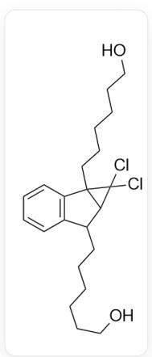
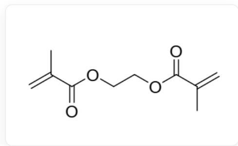
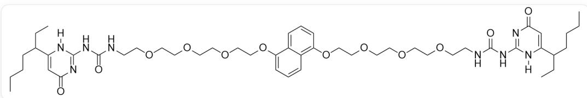
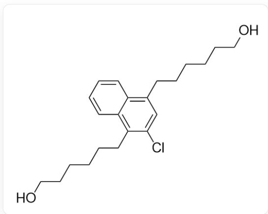
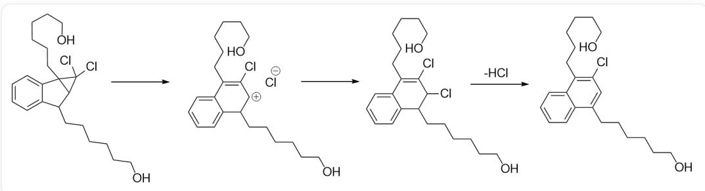
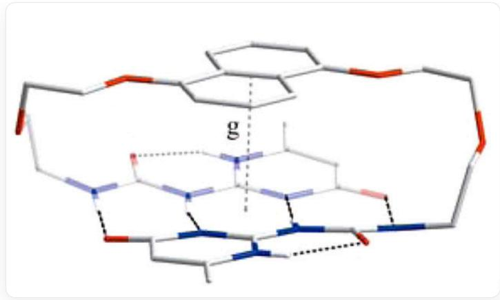
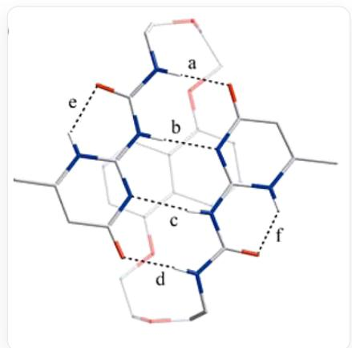
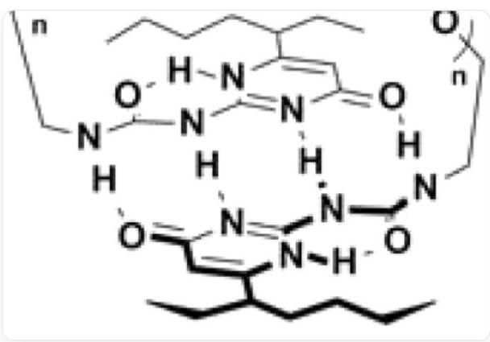

# Question

Under external mechanical forces, some polymers can undergo chemical reactions due to their special groups; such polymers are called mechano-responsive polymers.

There are three compounds 1, 2, 3, 4, and their structures are as follows:

1:

C(CCCO)CCC1C2=C(C=CC=C2)C3(CCCCCO)C1C3(Cl)Cl

2:

C=C(C)C(=O)OCCOC(=O)C(=C)C

3:

  
C=C(C)C(=O)OCCCCCCC1C2=C(C=CC=C2)C3(CCCCCCCOC(=O)C(=O)C)C1C3(Cl)Cl

4:

  
CCCCC(C1=CC(N=C(N1[H])NC(NCCOCCOCCOCOC2=C3C=C=CC(OCCOCCOCCOCNC(NC4=NC(C=C(N4[H])C(CCCC)CC)=O)=O)C3=CC=C2)=O)=O)

Known: Heating 1 at  $50^{\circ}\mathrm{C}$  for 24h will release HCl to obtain an oily liquid; methyl acrylate is polymerized with benzoyl peroxide as an initiator. If only a small amount of 1  $(\sim 5\%)$  and 2  $(\sim 5\%)$  are mixed in the system, polymer A is obtained; if only a small amount of 3  $(\sim 5\%)$  is mixed in the system, polymer B is obtained. Experiments show that A, B can release HCl when pressurized, but the amount is different; 4 exists as a cyclic monomer in the solid state, and when it is dissolved in chloroform, when the concentration exceeds a certain value, the viscosity of the solution increases sharply with the concentration. Please select the correct option from the following.

A. The stoichiometric ratio of HCl produced by the complete reaction of heating 1 to the resulting product molecules is 2:1.  
B. The aromatic system present in the product molecule obtained by heating 1 contains  $6\pi$  electrons.  
C. A has a covalently cross-linked network structure while B does not.  
D. Under the same pressure, an equal amount of A releases more HCl than B.  
E. In solid 4, there are no hydrogen bonds among the non-covalent interactions within the molecule.  
F. The reason for the increase in viscosity of the chloroform solution of 4 with increasing concentration is the formation of one-dimensional supramolecular polymers by 4 molecules, mainly relying on hydrogen bonds rather than covalent reactions, with 5 intermolecular hydrogen bonds that can form between every two monomers.

# Answer

Correct Answer: B

# Detailed Explanation

From the problem statement, heating 1 releases HCl and yields an oily liquid. Since 1 contains two chlorine atoms, it can produce at most two molecules of HCl. After releasing the first molecule of HCl, a stable naphthalene ring system can be formed in the product:

  
OCCCCCCC(C=C1C)  $=$  C2C(C=CC=C2)=C1CCCCCO

The mechanism of this process is that halogenated cyclopropanes undergo rearrangement under heating conditions to produce allylic halogenated products, which then rapidly aromatize to form a naphthalene ring, releasing one molecule of HCl under heating conditions.

  
机理为多步反应，CIC1(Cl)C2C(CCCCCCO)C3=CC=CC=C3C21CCCCCCO>>CIC1=C(CCCCCCCO)C2=CC=CC=C2C(CCCCCCC)[CH+]1.[Cl-],  
CIC1=C(CCCCCCCO)C2=CC=CC=C2C(CCCCCCO)[CH+]1.[Cl-]>>CIC1=C(CCCCCCO)C2=CC=CC=C2C(CCCCCCO)C1CI,  
CIC1=C(CCCCCCCO)C2=CC=CC=C2CCCCCCCO)C1C>>CIC1=C(CCCCCCCO)C2=CC=CC=C2CCCCCCCO=C1，在加热条件下首先高张力的三元环开环，离去  
一分子氯离子，形成烯丙基正离子，随后离子对反应，产生烯丙基氯代物，最后在芳构化的驱动下离去一分子HCl形成萘环

If the second molecule of HCl continues to be released, the degree of unsaturation of the system will be too high, and the activation energy provided at  $50^{\circ}\mathrm{C}$  is insufficient to allow the Cl attached to the  $sp^2$  carbon to depart. Therefore, the stoichiometric ratio of HCl produced by the complete reaction of 1 to the product molecule is 1:1.

# CHECKPOINT

1 PTS

释放一分子HCl得到稳定的萘环，第二分子HCl的释放很困难，因此比例为1:1，选项A错误

The aromatic system contained in the product is a naphthalene ring, which has  $10\pi$  electrons.

# CHECKPOINT

1 PTS

由于产物中有萘环，因此有10个π电子，选项B正确

Polymer A contains approximately  $5\%$  of 1 and  $5\%$  of 2. The average functionality of the polymer is calculated as:  $(0.9\times 2 + 0.05\times 4)\div 0.95 = 2.1$ . Polymer B contains approximately  $5\%$  of 3. The average functionality of the polymer is calculated as:  $(0.95\times 2 + 0.05\times 4)\div 1 = 2.1$ , both of which are greater than 2, and can form a covalently cross-linked network structure.

# CHECKPOINT

1 PTS

聚合物A与B的平均官能度均大于2，均可形成网状结构，选项C错误

Since  cannot be inserted into the polymer network in a covalent manner, it can only be dispersed between the networks; while  can participate in the polymerization and be inserted into the polymer network, so B is more sensitive to pressure, and can produce more HCl under the same pressure.

# CHECKPOINT

1 PTS

A中压力敏感基团分布在聚合物网络间而B中压力敏感基团参与聚合物网络形成，对压力响应更敏感，可释放更多HCl，选项D错误

4 forms a supramolecular polymer through intermolecular hydrogen bonds. In the solid-state monomer, intramolecular hydrogen bonds are formed instead of intermolecular hydrogen bonds to avoid polymerization.

  
单体两端的脲基与4-嘧啶酮形成分子内氢键，其中脲的两个氨基氢作为给体，4-嘧啶酮的氧和3号位的氮作为受体；4-嘧啶酮1号位氮的氢作为给体，脲的羰基氧作为受体，中心的萘环同时与两端的4-嘧啶酮存在π-π相互作用

  
更清晰的展示出脲与4-嘧啶酮形成的氢键

# CHECKPOINT

1 PTS

固态单体中同时存在氢键和π-π相互作用，选项E错误

After 4 is dissolved in chloroform, it can form a supramolecular polymer through hydrogen bonds. Under these conditions, the carbonyl group of urea will form an intramolecular six-membered ring hydrogen bond with the N-H of 4-pyrimidinone. The remaining two hydrogen bond donors and two hydrogen bond acceptors can form 4 hydrogen bonds between two monomers.

  
图中展示出组装形成超分子聚合物时，分子间形成4根氢键，给体为脲的两个氨基氢，受体为4-嘧啶酮的氧和3号位氮；分子内形成一根氢键，给体为4-嘧啶酮1号位氮上的氢，受体为脲的羰基氧

# CHECKPOINT

1 PTS

两个单体间形成4根分子间氢键，选项F错误