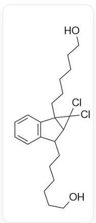
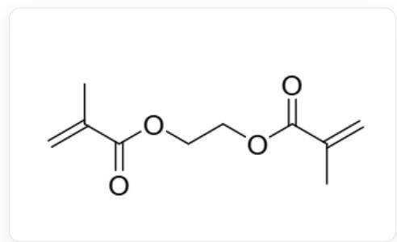
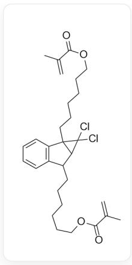
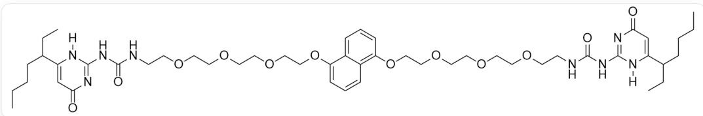
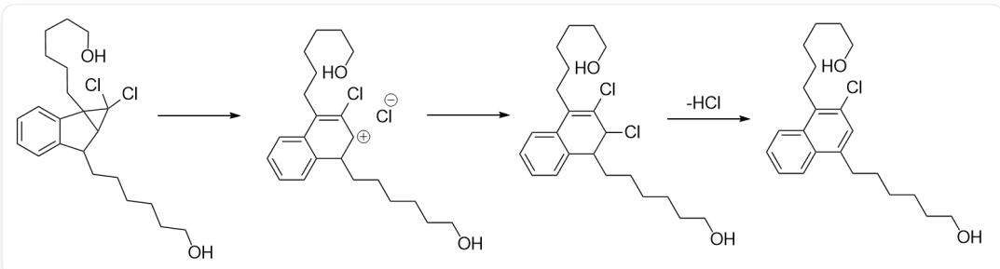
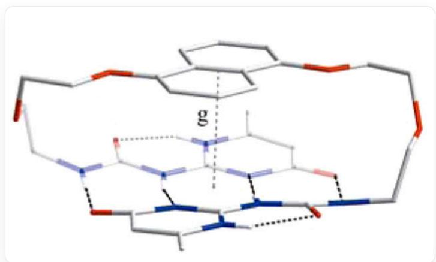
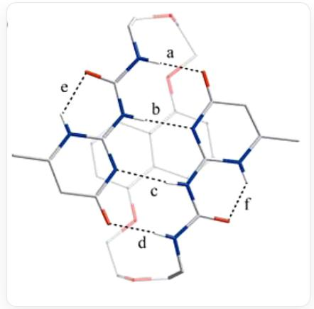
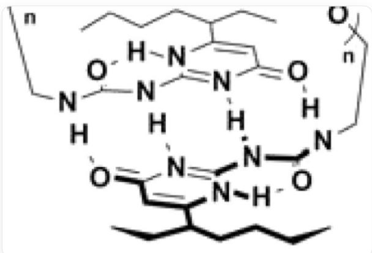

# 题目

在外界的机械力下，有些聚合物因其具有的特殊基团而可发生化学反应；这样的聚合物被称为机械响应聚合物。

现有三种化合物1、2、3、4，它们的结构分别为：

1:

C(CCCO)CCC1C2=C(C=CC=C2)C3CCCCCO)C1C3(Cl)Cl

2:

C=C(C)C(=O)OCCOC(=O)C(=C)C

3:

  
C=C(C)C(=O)OCCCCCCC1C2=C(C=CC=C2)C3(CCCCCCCOC(=O)C(=O)C)C1C3(Cl)Cl

4:

  
CCCCC(C1=CC(N=C(N1[H])NC(NCCOCCOCCOCOC2=C3C=CC=C(OCCOCCOCCOCNcNC=C=C(N4[H]C(CCCC)CC)=O)=O)C3=CC=C2)=O)=O)

已知：1在  $50^{\circ}C$  下加热24h会放出HCI得到油状液体；以过氧化苯甲酰为引发剂引发丙烯酸甲酯聚合，若体系中只混有少量的1（ $\sim 5\%$ ）和2（ $\sim 5\%$ ），则得到聚合物A；若体系中只混有少量的3（ $\sim 5\%$ ），则得到聚合物B。实验表明，A，B加压时均可放出HCI但量不同；4在固态时以环状单体形式存在，而当其溶解在氯仿中后，当浓度超过某一值时，溶液的粘度随浓度急剧上升。请选择下列选项中正确的一项。

A. 加热1完全反应产生的HCl与得到的产物分子化学计量比是2:1  
B. 加热1得到的产物分子中存在的芳香体系含有10个π电子  
C. A具有共价交联网状结构而B不具有  
D. 相同压力下, 等量A释放出的HCl多于B  
E. 固态4分子内的非共价相互作用不存在氢键  
F. 4的氯仿溶液粘度随浓度增加的原因是4分子间形成了一维超分子聚合物，主要依靠氢键而非共价反应，每两个单体间可以形成5根分子间氢键

# 答案

正确答案: B

# 详细解析

从题干得知，加热1释放出HCl并得到油状液体，而1中有两个氯，因此最多可产生两分子HCl，在释放出第一分子HCl后，产物中可以形成稳定的萘环体系：

  
OCCCCCCC(C=C1C)  $=$  C2C(C=CC=C2)=C1CCCCCO

这一过程的机理是，卤代环丙烷在加热条件下会发生重排，产生烯丙位卤代的产物，随后在加热条件下迅速芳构化生成萘环释放一分子HCl。

机理为多步反应，CIC1(Cl)C2C(CCCCCCO)C3=CC=CC=C3C21CCCCCCO>>CIC1=C(CCCCCCCO)C2=CC=CC=C2C(CCCCCCC)[CH+]1.[Cl-],

CIC1=C(CCCCCCCO)C2=CC=CC=C2C(CCCCCCO)[CH+]1.[Cl-]>>CIC1=C(CCCCCCO)C2=CC=CC=C2C(CCCCCCO)C1CI,

CIC1=C(CCCCCCCO)C2=CC=CC=C2C(CCCCCCO)C1Cl>>CIC1=C(CCCCCCCO)C2=CC=CC=C2C(CCCCCCO)=C1，在加热条件下首先高张力的三元环开环，离去

一分子氯离子，形成烯丙基正离子，随后离子对反应，产生烯丙基氯代物，最后在芳构化的驱动下离去一分子HCl形成萘环

若继续释放第二分子HCl，则体系不饱和度过高， $50^{\circ}\mathrm{C}$  下提供的活化能不足以使连接在  $sp^{2}$  碳上的Cl离去。因此1完全反应产生的HCl与产物分子的化学计量比为1:1。

# CHECKPOINT

1 PTS

释放一分子HCl得到稳定的萘环，第二分子HCl的释放很困难，因此比例为1:1，选项A错误

产物中含有的芳香体系为萘环，具有10个π电子。

# CHECKPOINT

1 PTS

由于产物中有萘环，因此有10个π电子，选项B正确

聚合物A中混有约5%的1和5%的2，计算该聚合物的平均官能度为：  $(0.9\times 2 + 0.05\times 4)\div 0.95 = 2.1$  ；聚合物B中混有约5%的3，计算该聚合物的平均官能度为： $(0.95\times 2 + 0.05\times 4)\div 1 = 2.1$  ，均大于2，可以形成共价交联网状结构。

# CHECKPOINT

1 PTS

聚合物A与B的平均官能度均大于2，均可形成网状结构，选项C错误

由于1无法通过共价的方式插入聚合网络中，只能分散在网络间；而3可以参与聚合插入到聚合网络中，因此B对压力的响应更敏感，相同压力下可以产生更多的HCl。

# CHECKPOINT

1 PTS

A中压力敏感基团分布在聚合物网络间而B中压力敏感基团参与聚合物网络形成，对压力响应更敏感，可释放更多HCl，选项D错误

4通过分子间氢键连接形成超分子聚合物，在固态单体时，形成分子内氢键而非分子间氢键从而避免聚合。

  
单体两端的脲基与4-嘧啶酮形成分子内氢键，其中脲的两个氨基氢作为给体，4-嘧啶酮的氧和3号位的氮作为受体；4-嘧啶酮1号位氮的氢作为给体，脲的羰基氧作为受体，中心的萘环同时与两端的4-嘧啶酮存在π-π相互作用

  
更清晰的展示出脲与4-嘧啶酮形成的氢键

# CHECKPOINT

1 PTS

固态单体中同时存在氢键和  $\pi-\pi$  相互作用，选项E错误

4溶解在氯仿中后，可以通过氢键连接形成超分子聚合物，在该条件下，脲的羰基会与4-嘧啶酮的N-H形成一个分子内六元环氢键，剩余两个氢键给体和两个氢键受体，可在两个单体间形成4根氢键

  
图中展示出组装形成超分子聚合物时，分子间形成4根氢键，给体为脲的两个氨基氢，受体为4-嘧啶酮的氧和3号位氮；分子内形成一根氢键，给体为4-嘧啶酮1号位氮上的氢，受体为脲的羰基氧

# CHECKPOINT

1 PTS

两个单体间形成4根分子间氢键，选项F错误