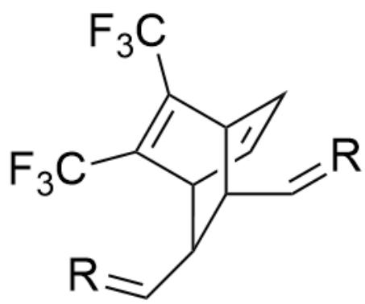
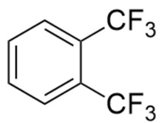

# Question

The following compound

Image is a molecular formula, SMILES code is FC(C1=C(C(F)(F)F)C2C(C=C3)C3C1C=C2)(F)F

After olefin metathesis, polymer A is obtained (only one double bond in each monomer participates in olefin metathesis). A spontaneously decomposes into a stable small molecule B and a well-known polymer C at room temperature (the polymer chain does not break). Select the correct option:

A. All other options are incorrect  
B. C does not exhibit cis-trans isomerism  
C. A Spontaneous decomposition is entropically unfavorable, but because it releases stable products, it has a large enthalpic driving force, and therefore can proceed forward.  
D. The molecular weight of small molecule  $\mathbf{B}$  is less than 120.

E. Treating C with iodine monochloride can enhance conductivity.  
F. C's monomer has three rotational modes.

# Answer

Correct Answer: E

# Detailed Explanation

Observing the molecular structure, it can be seen that the double bond within the four-membered ring in the molecule is very unstable and should be the reaction site for olefin metathesis. Therefore, the monomer structure of polymer A is  $\mathrm{[R] = CC1C2C(C(F)(F)F = C(C(F)(F)F)C(C1C = [R])C = C2}$ , where R is the connection site of the polymer monomer.

# CHECKPOINT

1 PTS

The monomer structure of polymer A is  $[\mathrm{R}] = \mathrm{CC1C2C}(\mathrm{C}(\mathrm{F})(\mathrm{F})\mathrm{F}) = \mathrm{C}(\mathrm{C}(\mathrm{F})(\mathrm{F})\mathrm{F})\mathrm{C}(\mathrm{C1C} = [\mathrm{R}])\mathrm{C} = \mathrm{C2}$ , where R is the connection site of the polymer monomer

# CHECKPOINT

1 PTS

The double bond participating in the reaction in olefin metathesis is the double bond within the four-membered ring

Subsequently, it was observed that a reverse  $4 + 2$  reaction could occur, removing a molecule with a benzene ring structure and obtaining polyacetylene. Therefore, C is polyacetylene, and the structure of B is FC(C1=CC=CC=C1C(F)(F)F)(F)F.

This process generates stable products, reducing tension while producing more molecules, so the reaction entropy is favorable. According to the molecular formula and reaction process,  $C$  and  $D$  are excluded.

# CHECKPOINT

1 PTS

Reverse  $4 + 2$  reaction occurs, resulting in C being polyacetylene

# CHECKPOINT

1 PTS

The structure of  $\mathbf{B}$  is  $\mathrm{FC(C1 = CC = CC = C1C(F)(F)F)(F)F}$

# CHECKPOINT

1 PTS

The number of reaction molecules increases, resulting in an increase in entropy

The monomer of polyacetylene is acetylene, which is a linear molecule and has only two rotational modes, excluding  $F$ .

# CHECKPOINT

1 PTS

Acetylene is a linear molecule and does not have three rotational modes

Polyacetylene has many double bonds and should have cis-trans isomers, excluding  $B$ .

# CHECKPOINT

1 PTS

Polyacetylene has cis-trans isomers

Treating polyacetylene with iodine can result in electron-deficient holes, enhancing conductivity. Therefore, option  $E$  is correct, and option  $A$  is incorrect.

# CHECKPOINT

1 PTS

Treating polyacetylene with iodine can result in electron-deficient holes, enhancing conductivity

Therefore, the answer is option E.

  
A

  
B

The monomer structure of polymer A is  $[R] = CC1C2C(C(F)(F)F) = C(C(F)(F)F)C(C1C = [R])C = C2$ , where  $R$  is the connection site of the polymer monomer; the structure of B is  $FC(C1 = CC = CC = C1C(F)(F)F)(F)F$ .