# Question

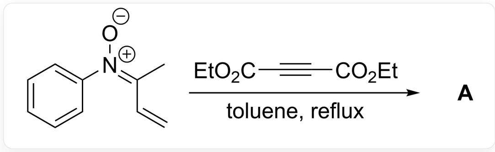  
[ [O-] / [N+](C1=CC=CC=C1)=C(C)/C=C>0 = C(C#CC(OCC)=O)OCC,toluene,reflux=[A],A ] is the reaction product

It is believed that the substrate reacts with diethyl butynedioate to generate a seven-membered ring intermediate  $\mathbf{X}$ ;  $\mathbf{X}$  is converted to the final product under the action of trace water in the system. It is known that the reaction product  $\mathbf{A}$  contains 2 rings, and the molecular formula of  $\mathbf{A}$  is  $\mathrm{C_{18}H_{21}NO_5}$ , try to give the structural formula of  $\mathbf{A}$ .

A. All other options are incorrect

B.  
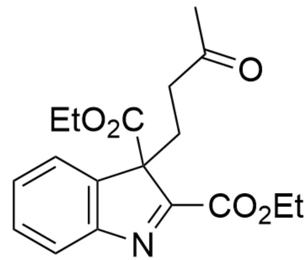  
$\mathrm{O = C(C)CCC1(C(OCC) = O)C2 = C(N = C1C(OCC) = O)C = CC = C2}$

C.  
D.  
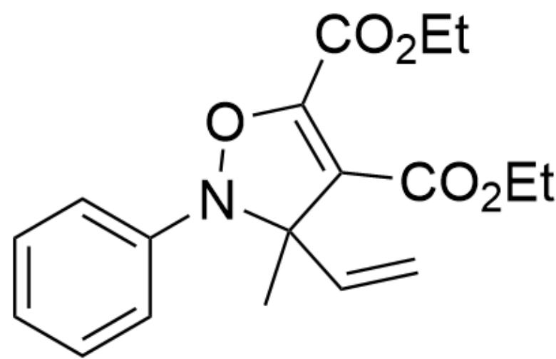  
CC1(C=C)N(OC(C(OCC)=O)=C1C(OCC)=O)C2=CC=CC=C2

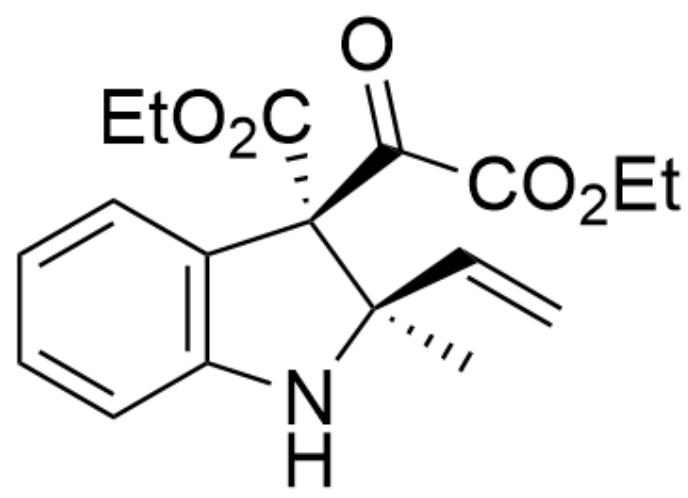

[ \mathrm{O} = \mathrm{C}(\mathrm{C}(\mathrm{OCC}) = \mathrm{O})[\mathrm{C}@\mathbb{C}]1(\mathrm{C}(\mathrm{OCC}) = \mathrm{O})[\mathrm{C}@\mathbb{C}](\mathrm{C} = \mathrm{C})(\mathrm{C})\mathrm{NC2} = \mathrm{C1}\mathrm{C} = \mathrm{CC} = \mathrm{C2} ]

E.

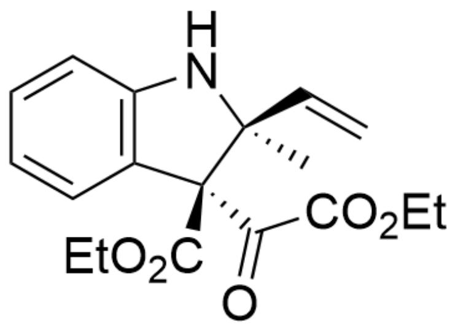

$\mathrm{O = C(C(OCC) = O)[C@]1(C(OCC) = O)[C@]1(C = C)(C)NC2 = C1C = CC = C2}$

F.

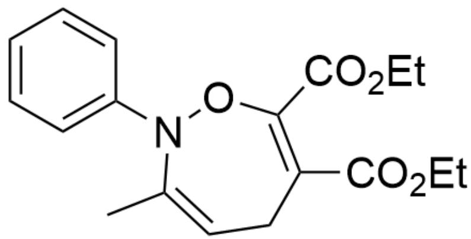  
G.

CC1=CCC(C(OCC)=O)=C(C(OCC)=O)ON1C2=CC=CC=C2

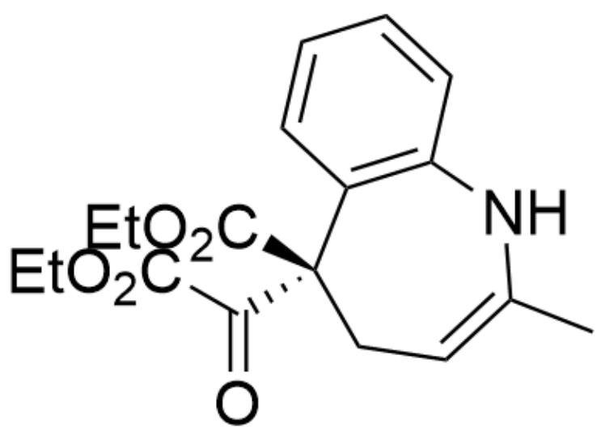  
H.

$\mathrm{O = C([C@]1(C2 = C(NC(C) = CC1)C = CC = C2)C(OCC) = O)C(OCC) = O}$

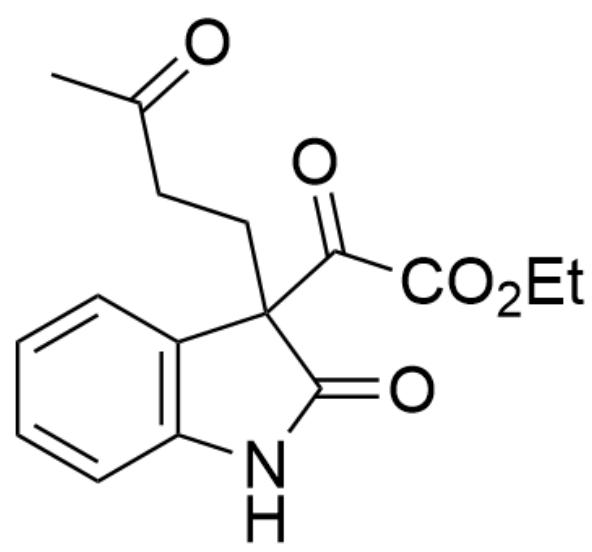

$\mathrm{O = C(C(OCC) = O)C1(CCC(C) = O)C2 = C(NC1 = O)C = CC = C2}$

# Answer

Correct Answer: B

# Detailed Explanation

First, according to the problem prompt, the reaction substrate reacts with diethyl butynedioate to generate the seven-membered ring intermediate  $\mathbf{X}$

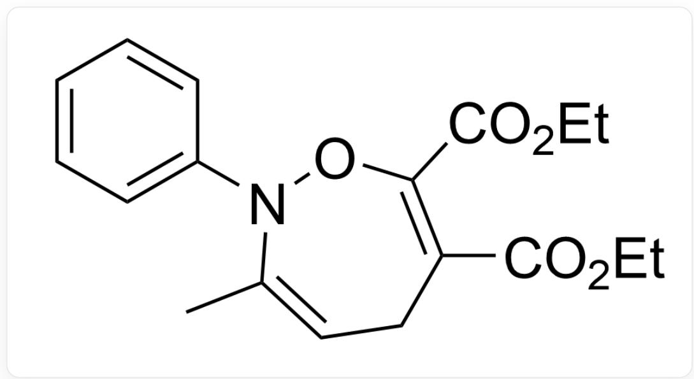  
Intermediate X: CC1=CCC(C(OCC)=O)=C(C(OCC)=O)ON1C2=CC=CC=C2

Then, intermediate  $\mathbf{X}$  first forms intermediate 1 under the action of trace water.

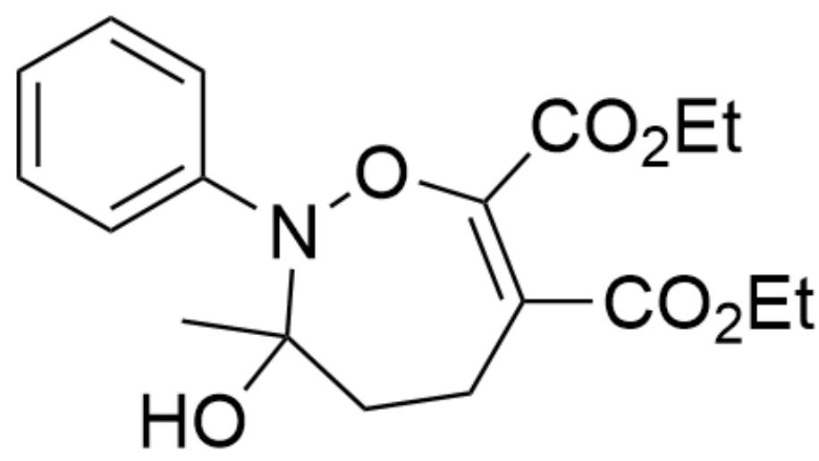

Intermediate 1: CC1(O)N(OC(C(OCC)=O)=C(CC1)C(OCC)=O)C2=CC=CC=C2

# CHECKPOINT

1 PTS

Intermediate 1: CC1(O)N(OC(C(OCC)=O)=C(CC1)C(OCC)=O)C2=CC=CC=C2

Then, intermediate 1 further undergoes ring-opening to obtain intermediate 2

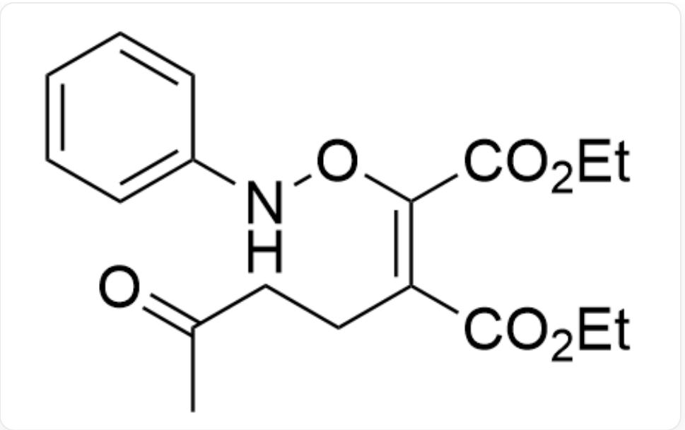  
Intermediate 2: CC(CC/C(C(OCC)=O)=C(C(OCC)=O)\ONC1=CC=CC=C1)=O

# CHECKPOINT

# 1 PTS

Intermediate 2: CC(CC/C(C(OCC)=O)=C(C(OCC)=O)\ONC1=CC=CC=C1)=O

At this time, the conformation of intermediate 2 allows it to undergo a  $3,3 - \sigma$  rearrangement reaction to obtain intermediate 3

Intermediate 3: N=C1C=CC=CC1C(CCC(C)=O)(C(OCC)=O)C(C(OCC)=O)=O

# CHECKPOINT

1 PTS

Intermediate 3: N=C1C=CC=CC1C(CCC(C)=O)(C(OCC)=O)C(C(OCC)=O)=O

Intermediate 3 undergoes aromatization to obtain intermediate 4

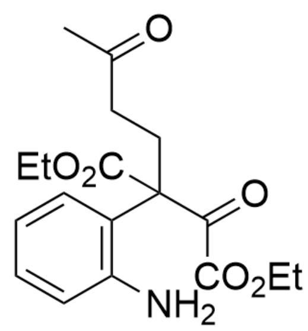

Intermediate 4: NC1=C(C(CCC(C)=O)(C(OCC)=O)C(C(OCC)=O)=O)C=CC=C1

# CHECKPOINT

1 PTS

Intermediate 4: NC1=C(CCCC(C)=O)(C(OCC)=O)C(C(OCC)=O)=O)C=CC=C1

The carbonyl group in intermediate 4 has strong reactivity, so the amino group attacks the carbonyl group to form a five-membered ring, yielding intermediate 5

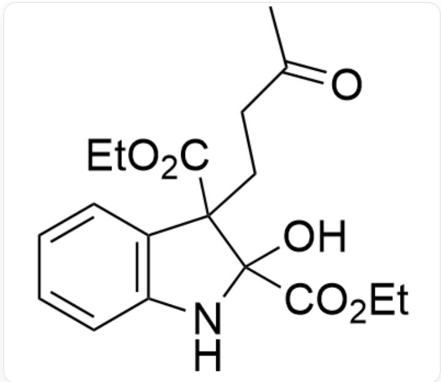

Intermediate 5: OC1(C(OCC)=O)C(CCC(C)=O)(C(OCC)=O)C2=C(N1)C=CC=C2

# CHECKPOINT

1 PTS

Intermediate 5: OC1(C(OCC)=O)C(CCC(C)=O)(C(OCC)=O)C2=C(N1)C=CC=C2

Intermediate 5 continues to lose a molecule of water to obtain the final product A

Product A: O=C(C)CCC1(C(OCC)=O)C2=C(N=C1C(OCC)=O)C=CC=C2