# 题目

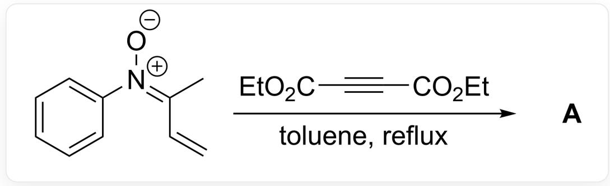

[ \mathrm{[O-] / [N+](C1 = CC = CC = C1) = C(C) / C = C > O = C(C\# CC(OCC) = O)OCC,reflux > [A],A} ]

人们认为，底物与丁炔二酸二乙酯反应生成含七元环的中间体  $\mathbf{X}$ ； $\mathbf{X}$  在体系的痕量水作用下转化为最终产物。已知反应产物  $\mathbf{A}$  中含有2个环，且  $\mathbf{A}$  的分子式  $\mathrm{C_{18}H_{21}NO_5}$ ，试给出  $\mathbf{A}$  的结构式

A. 其他选项均不正确  
B.

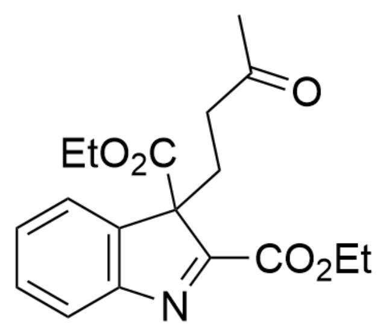

[ \mathrm{O} = \mathrm{C}(\mathrm{C})\mathrm{CCC1}(\mathrm{C}(\mathrm{OCC}) = \mathrm{O})\mathrm{C2} = \mathrm{C}(\mathrm{N} = \mathrm{C1}\mathrm{C}(\mathrm{OCC}) = \mathrm{O})\mathrm{C} = \mathrm{CC} = \mathrm{C2} ]

C.

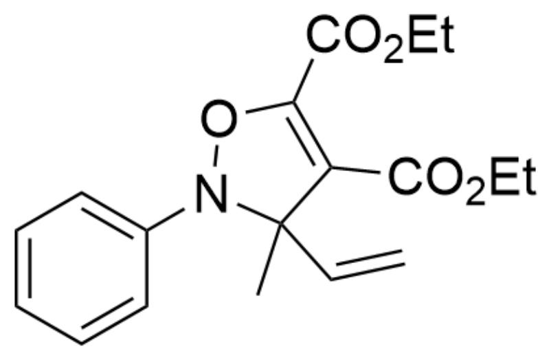  
D.

CC1(C=C)N(OC(C(OCC)=O)=C1C(OCC)=O)C2=CC=CC=C2

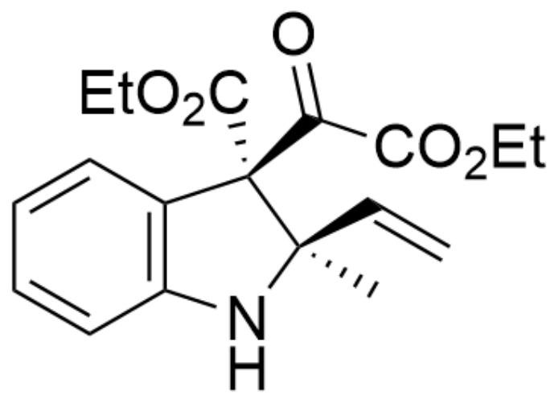  
E.

$\mathrm{O = C(C(OCC) = O)[C@]1(C(OCC) = O)[C@](C = C)(C)NC2 = C1C = CC = C2}$

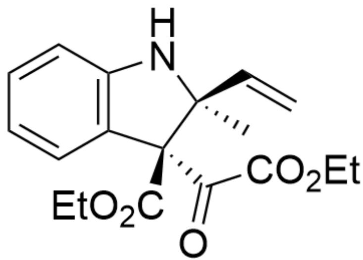  
F.

$\mathrm{O = C(C(OCC) = O)[C@@]1(C(OCC) = O)[C@@](C = C)(C)NC2 = C1C = CC = C2}$

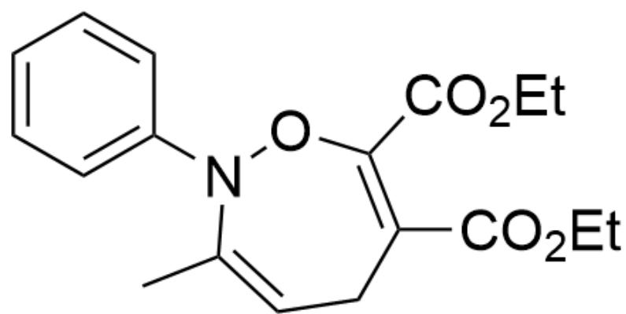  
G.

CC1=CCC(C(OCC)=O)=C(C(OCC)=O)ON1C2=CC=CC=C2

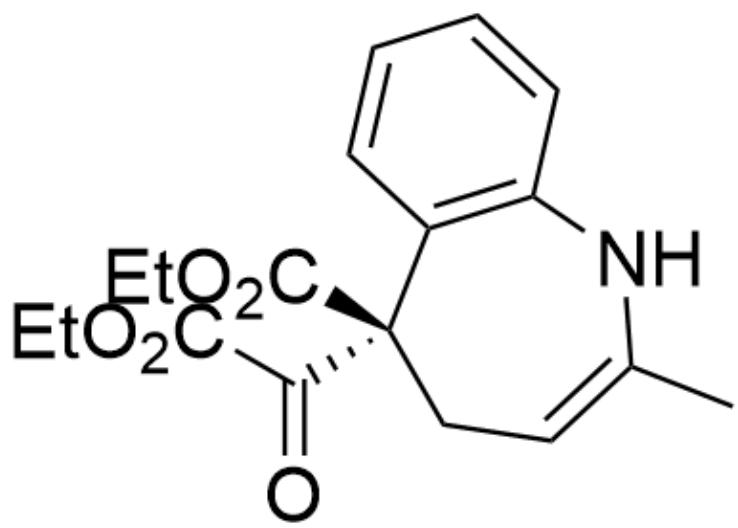

$\mathrm{O = C([C@]1(C2 = C(NC(C) = CC1)C = CC = C2)C(OCC) = O)C(OCC) = O}$

H.

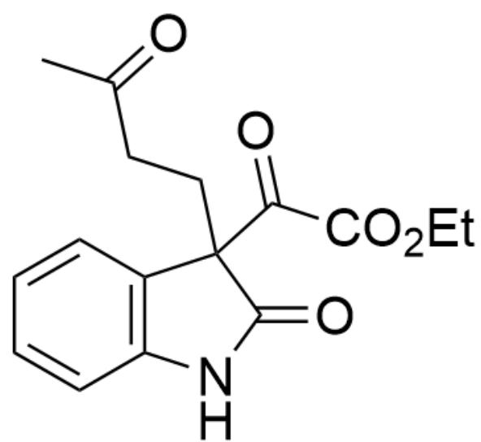

$\mathrm{O = C(C(OCC) = O)C1(CCC(C) = O)C2 = C(NC1 = O)C = CC = C2}$

# 答案

正确答案: B

# 详细解析

首先根据题目提示，反应底物与丁炔二酸二乙酯反应生成含七元环的中间体  $\mathbf{X}$

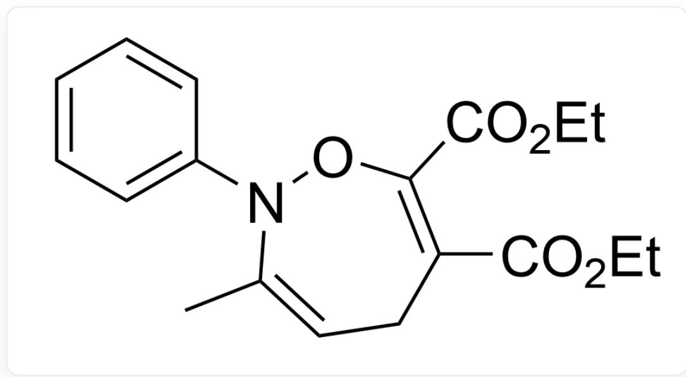  
中间体X：CC1=CCC(C(OCC)=O)=C(C(OCC)=O)ON1C2=CC=CC=C2

CHECKPOINT

1 PTS

中间体  $\mathbf{X}$  ：CC1=CCC(C(OCC)=O)=C(C(OCC)=O)ON1C2=CC=CC=C2

接着中间体  $\mathbf{X}$  在痕量水的作用下，首先形成中间体 1

中间体1：CC1(O)N(OC(C(OCC)=O)=C(CC1)C(OCC)=O)C2=CC=CC=C2

# CHECKPOINT

1 PTS

中间体1：CC1(O)N(OC(C(OCC)=O)=C(CC1)C(OCC)=O)C2=CC=CC=C2

接着中间体1进一步发生开环得到中间体2

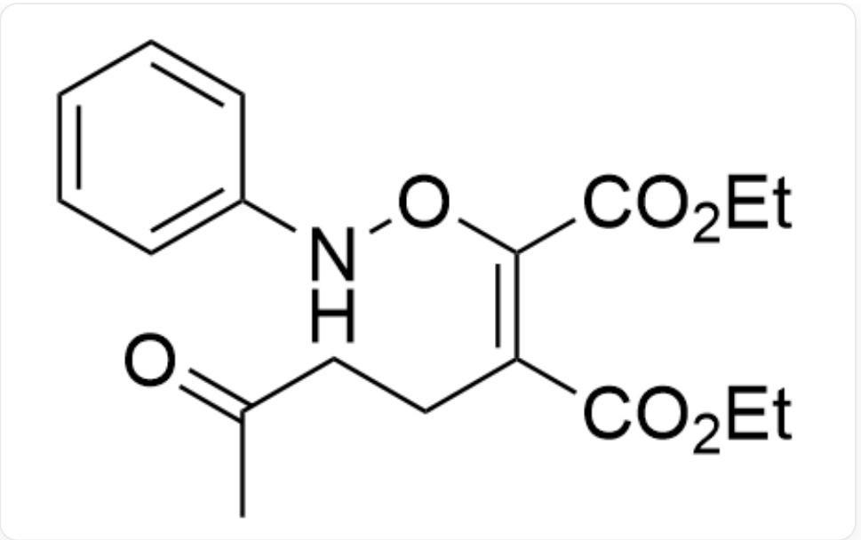  
中间体2：CC(CC/C(C(OCC)=O)=C(C(OCC)=O)\ONC1=CC=CC=C1)=O

# CHECKPOINT

# 1 PTS

中间体2：CC(CC/C(C(OCC)=O)=C(C(OCC)=O)\ONC1=CC=CC=C1)=O

此时中间体 2 的构象允许其发生  $3,3-\sigma$  重排反应得到中间体 3

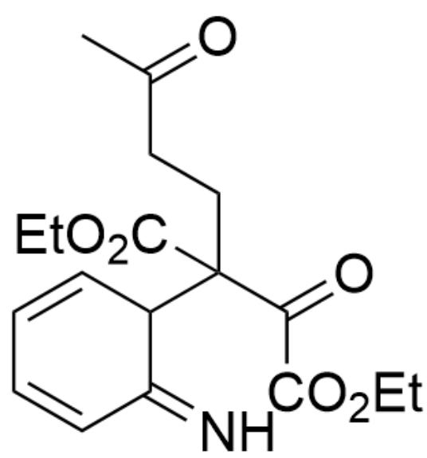

中间体3：N=C1C=CC=CC1C(CCC(C)=O)(C(OCC)=O)C(C(OCC)=O)=O

# CHECKPOINT

1 PTS

中间体3：N=C1C=CC=CC1C(CCC(C)=O)(C(OCC)=O)C(C(OCC)=O)=O

中间体3发生芳构化得到中间体4

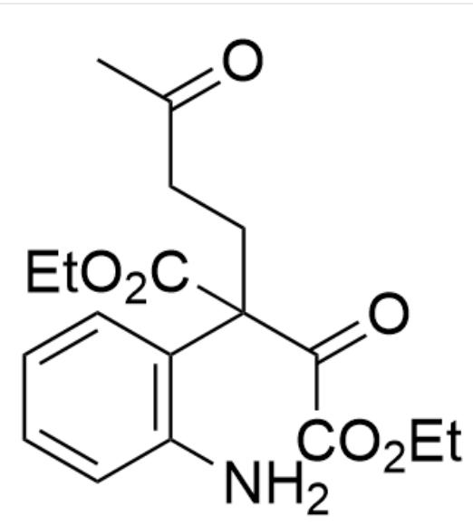

中间体4：NC1=C(CCCC(C)=O)(C(OCC)=O)C(C(OCC)=O)=O)C=CC=C1

# CHECKPOINT

1 PTS

中间体4：NC1=C(CCCC(C)=O)(C(OCC)=O)C(C(OCC)=O)=O)C=CC=C1

中间体4中羰基的反应活性较强，因此氨基进攻羰基形成五元环，得到中间体5

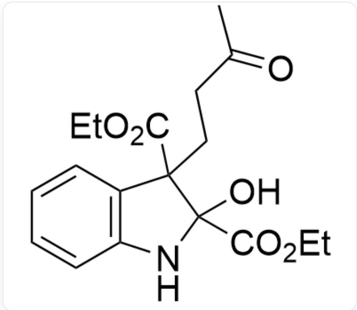

中间体5：OC1(C(OCC)=O)C(CCC(C)=O)(C(OCC)=O)C2=C(N1)C=CC=C2

# CHECKPOINT

1 PTS

中间体5：OC1(C(OCC)=O)C(CCC(C)=O)(C(OCC)=O)C2=C(N1)C=CC=C2

中间体 5 继续脱去一分子水得到最终产物 A

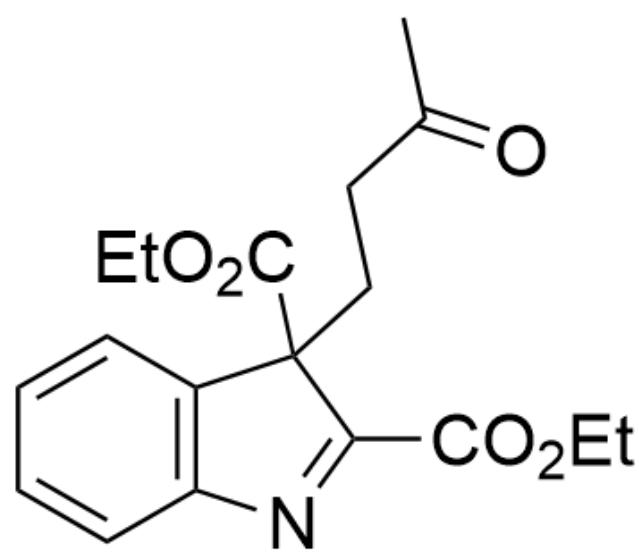

产物A：O=C(C)CCC1(C(OCC)=O)C2=C(N=C1C(OCC)=O)C=CC=C2