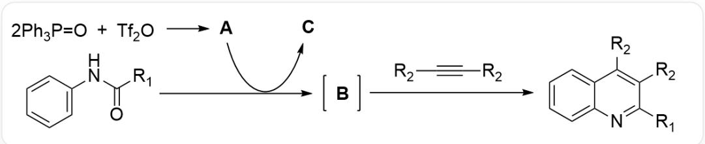
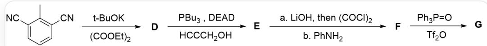

# 题目

近年来，某课题组开发了一种  $[3 + 2 + 1]$  策略合成喹啉环的方法，其模型反应如下：

该图片为一张有机合成流程图，流程描述如下：首先两分子  $\mathrm{Ph}_3\mathrm{P} = \mathrm{O}$  和一分子  $\mathrm{Tf}_2\mathrm{O}$  生成A，A与SMILES为C1=CC=C(C=C1)NC(=O)[R1]的有机分子发生反应生成中间体B，此过程中A转化为C；中间体B与SMILES为C(#C[R2])[R2]的有机分子发生反应生成图最右边的最终产物，最终产物的SMILES为C1=CC=C2C(=C1)C(=C(C(=N2)[R1])[R2])[R2]。

下图的反应利用了该模型反应合成奎宁环：

该图片为一张有机合成路线图，合成路线描述如下：图左为最初的反应物，其SMILES为CC1=C(C=CC=C1C#N)C#N；该反应物生成D，反应条件为t-BuOK+(COOEt)2；D与HCCCH $_2$ OH生成E，反应条件为PBu3, DEAD；E生成F，反应条件为首先加入LiOH，再加入(COCl)2，最后加入PhNH $_2$ ；F生成G，反应条件为Ph $_3$ P = O, Tf $_2$ O。

关于上面两张图中9个未知物种  $\mathbf{A} - \mathbf{G}$ , 已知信息: 中间体  $\mathbf{B}$  带正电且不含氧原子。

下列选项正确的是：

A. 中间体B的亲电性很差  
B. D在水溶液中的主要存在形式不含羟基

C. 产物  $\mathrm{G}$  含有三个环  
D. G 分子式为  $\mathrm{C}_{20} \mathrm{H}_{10} \mathrm{~N}_{3} \mathrm{O}$  
E. G 在酸性条件下完全水解, 产物中含有四个羰基  
F. G 含有在酸性条件下不稳定的五元环

# 答案

正确答案: F

# 详细解析

首先分析模型反应，反应物是2当量的三苯基氧膦和1当量的三氟甲磺酸酐。 $\mathrm{Tf}_{2} \mathrm{O}$  作为一个强亲电试剂和脱水剂，与三苯基氧膦反应会生成一个鳞盐，即双(三苯基膦氧基)盐，通常称为Mukaiyama试剂的类似物。其结构为  $\left[\left(\mathrm{Ph}_{3} \mathrm{P}\right)_{2} \mathrm{O}\right]^{2+}\left(\mathrm{TfO}^{-}\right)_{2}$ ，即A。这是一个非常强的氧原子活化试剂。

# CHECKPOINT

1 PTS

A结构为  $\left[\left(\mathrm{Ph}_{3} \mathrm{P}\right)_{2} \mathrm{O}\right]^{2+}\left(\mathrm{TfO}^{-}\right)_{2}$

底物N-酰基苯胺与试剂A反应。酰胺的羰基氧原子作为亲核试剂攻击A中的一个磷原子，之后氮原子的孤对电子可以推向羰基碳，离去一个三苯基氧磷，得到带正电的腈离子，其结构为  $\mathrm{R}_1 - \mathrm{C} \equiv \mathrm{N}^+ - \mathrm{Ph}$  满足不带氧原子的性质，故该中间体即为B。该结构具有强亲电性，故选项A错误。

# CHECKPOINT

1 PTS

$\mathbf{B}$  结构为  $\mathrm{R}_1 - \mathrm{C} \equiv \mathrm{N}^+ - \mathrm{Ph}$

之后解析合成路线。起始物是2,3-二氰基甲苯。叔丁醇钾是强碱，会夺取苯甲基上的质子，生成一个稳定的苯甲基负离子.

# CHECKPOINT

1 PTS

t-BuOK夺取苯甲基上的质子

该负离子作为亲核试剂，对草酸二乙酯的一个羰基进行亲核加成，得到一个  $\beta$ -二酮结构，即结构 D。其 SMILES 为 CCOC(=O)/C(=C/C1=C(C=CC=C1C#N)C#N)/O，该结构由于六元环分子内氢键的存在，其烯醇式为主要存在形式，故选项 B 错误。

# CHECKPOINT

1 PTS

D 为  $\beta$ -二酮结构，主烯醇式，SMILES为CCOC(=O)/C(=C/C1=C(C=CC=C1C#N)C#N)/O

生成E的反应为著名的Mitsunobu反应，将D的烯醇羟基与反应物炔丙醇进行缩合，脱水生成醚键，净反应结果为烯醇羟基的H原子更换为炔丙基。SMILES结构式为C#CCO/C(=C\C1=C(C=CC=C1C#N)C#N)/C(=O)OCC

# CHECKPOINT

1 PTS

E结构为D的烯醇羟基的H原子更换为炔丙基，SMILES结构式为C#CCO/C(=C\C1=C(C=CC=C1C#N)C#N)/C(=O)OCC

生成  $\mathbf{F}$  的反应, 首先加入氢氧化锂, 水解掉来自于草酸二乙酯的乙酯基变为羧酸, 之后加入草酰氯将羧酸变为酰氯, 最后加入苯胺使酰氯变为酰胺, 最终结果为乙酯基变为N-苯基酰胺。SMILES结构式为 C#CCO/C(=C\C1=C(C=CC=C1C#N)C#N)/C(=O)N[Ph]

# CHECKPOINT

1 PTS

F 为 E 的乙酯基变为 N-苯基酰胺，SMILES 结构式为 C#CCO/C(=C\C1=C(C=CC=C1C#N)C#N)/C(=O)N[Ph]

最后一步反应即为模型反应的应用，N-苯基酰胺变为腈离子，由于分子内存在炔基，会发生分子内的模型反应，形成喹啉环后芳构化。最终产物G的SMILES结构式为C1=CC2=CC3=C(/C(=C\C4=C(C=CC=C4C#N)C#N)/OC3)N=C2C=C1。

# CHECKPOINT

2 PTS

G的SMILES结构式为C1=CC2=CC3=C(/C(=C\C4=C(C=CC=C4C#N)C#N)/OC3)N=C2C=C1。

根据该结构：该结构分子式为  $\mathrm{C}_{20} \mathrm{H}_{11} \mathrm{~N}_{3} \mathrm{O}$ ，含四个环，其中五元环为半缩酮结构，酸性条件下容易开环形成醇和酮，不稳定；

# CHECKPOINT

1 PTS

G的五元环为半缩酮结构，酸性条件下容易开环形成醇和酮

在酸性条件下水解，五元环开环形成酮羰基，两个氰基水解形成两个羧羰基，共三个羰基。故选项C D E均错误，选项F正确。