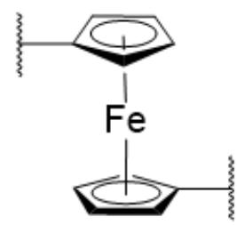
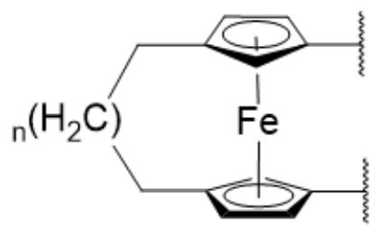

# Question

Introducing ferrocene between polymer segments can endow the polymer with intriguing mechanoresponsive properties. The principle primarily relies on the dissociation process of ferrocene under external force, which involves two mechanisms:

One is the shear process, where the cyclopentadienyl rings above and below the  $\mathrm{Fe}^{2+}$  ion displace in opposite directions parallel to the ring plane;

The other is the peeling process, which increases the dihedral angle between the two cyclopentadienyl rings.

There are two ways to incorporate ferrocene into polymer segments, referred to as A and B, as shown below.

  
A

  
B

This is a schematic structural diagram without a title. The image displays two sets of molecular structures, labeled with uppercase letters "A" and "B" below the left and right structures, respectively. Structure A consists of an iron atom marked as Fe at the center, flanked by two identical five-membered rings above and below. These rings are horizontally arranged and anti-parallel (non-superimposable), each containing an inscribed solid circle near the center. The left vertex of the upper ring extends a straight line ending in a wavy line perpendicular to it, while the right vertex of the lower ring similarly extends a straight line ending in a perpendicular wavy line. Structure B also features a central Fe atom with two five-membered rings, but the left vertices of the rings are connected by two distinctly bent lines, with  $n(\mathrm{H}_2\mathrm{C})$  labeled at the midpoint (where " $n$ " precedes the parentheses containing "H₂C"). The right vertices of both rings extend straight lines ending in perpendicular wavy lines. The image contains no other text, axes, units, scales, curves, legends, color indicators, or arrows. No title or numerical data is present, and all chemical elements or structural symbols are as described above.

Select the correct option from the following choices.

A. The structure  $\mathbf{A}$  primarily dissociates via a peeling mechanism, but can also undergo shear dissociation simultaneously.  
B. The dissociation mechanism of structure  $\mathbf{B}$  is independent of the value of n.  
C. In the above-mentioned polymer chain segments, doping with phenanthroline produces a mechanochromic polymer. When external force is applied, the polymer appears light yellow, and when the force is removed, it turns red.

D. If  $\mathbf{A}$  and  $\mathbf{B}$  are both fabricated into the mechanochromic polymers described in option C, the force response of  $\mathbf{A}$  exhibits a deeper red color, indicating that the dissociation energy of the ferrocene structure in  $\mathbf{A}$  is greater.  
E. Generally, polymers formed from bifunctional monomers cannot undergo crosslinking. However, the polymer formed by structure  $\mathbf{B}$  can form a covalent crosslinked network in a protonic solution under external force. The formation of the crosslinked network is primarily due to the D-A reaction between ferrocene units.  
F. To prevent cross-linking, molecules  $\mathbf{X}$  or  $\mathbf{Y}$  can be added to the solution. The structure of  $\mathbf{X}$  is O=C(N1C)C=CC1=O, and the structure of  $\mathbf{Y}$  is O=C1C=CCN1C. Then, the effect of  $\mathbf{X}$  in preventing cross-linking is weaker than that of  $\mathbf{Y}$ .  
G. None of the above options is correct

# Answer

Correct Answer: E

# Detailed Explanation

Since the polymer chains of A are located on opposite sides of the two ferrocenes, it is easier to apply forces in opposite directions along the plane of the ferrocenes, making the shear mechanism dissociation more likely to occur. Therefore, option A is incorrect.

# CHECKPOINT

1 PTS

The polymer chains of  $\mathbf{A}$  are located on opposite sides of the two ferrocenes, making the shear mechanism dissociation more likely to occur.

Similarly, due to the presence of the alkyl chain bridging the two ferrocenes in  $\mathbf{A}$ , when the alkyl chain is of a specific length, parallel relative displacement between the ferrocenes is less likely to occur. Instead, changes in dihedral angles can take place, and the primary dissociation mechanism is the peeling mechanism. However, when the alkyl chain is long and highly flexible, the probability of the shear mechanism increases significantly. In summary, the value of  $\mathfrak{n}$  is strongly related to the dissociation mechanism, so option B is incorrect.

# CHECKPOINT

1 PTS

The value of  $n$  is strongly related to the dissociation mechanism.

The color of ferrocene is orange-yellow or pale yellow, while the color of the iron(II)-phenanthroline complex is orange-red or red. Therefore, when an external force is applied, ferrocene dissociates, and the free iron(II) ions bind with phenanthroline, causing the color to change from pale yellow to red. Thus, option C is incorrect.

# CHECKPOINT

1 PTS

When an external force is applied, ferrocene dissociates, and the free iron(II) ions bind with phenanthroline, causing the color to change from pale yellow to red.

The color reflects the content of the iron(II)-phenanthroline complex. A higher content of the iron(II)-phenanthroline complex results in a deeper red color, indicating easier dissociation and a smaller dissociation energy. Therefore, the dissociation energy of  $\mathbf{A}$  should be smaller than that of  $\mathbf{B}$ . Option D is incorrect.

# CHECKPOINT

1 PTS

The color reflects the content of the iron(II)-phenanthroline complex. A higher content results in a deeper red color, indicating easier dissociation and a smaller dissociation energy.

Ferrocene dissociates under external force. In protic solvents, the uncoordinated cyclopentadienyl ligands combine with protons to form cyclopentadiene, which further undergoes a Diels-Alder (D-A) reaction. Other possible mechanisms include  $\pi-\pi$  interactions and ligand exchange. The former is ruled out due to the weak  $\pi-\pi$  interactions of the cyclopentadienyl groups, while the latter is unlikely because coordination bonds should break under external force. Therefore, option E is correct.

# CHECKPOINT

1 PTS

In protic solvents, the uncoordinated cyclopentadienyl ligands combine with protons to form cyclopentadiene, which further undergoes a Diels-Alder (D-A) reaction.

The principle of preventing cross-linking is to introduce a better electrophilic acceptor for the D-A reaction, competitively reacting with cyclopentadiene to act as a "capping" agent. The double bond of  $\mathbf{X}$  is flanked by two carbonyl groups, giving it a lower LUMO and making it a better electrophilic acceptor for the D-A reaction. Compared to  $\mathbf{Y}$ , which has only one carbonyl group,  $\mathbf{X}$  is more effective in preventing cross-linking. Therefore, option F is incorrect.

# CHECKPOINT

1 PTS

The principle of preventing cross-linking is to introduce a better electrophilic acceptor for the D-A reaction, competitively reacting with cyclopentadiene.

# CHECKPOINT

1 PTS

The double bond of  $\mathbf{X}$  is flanked by two carbonyl groups, giving it a lower LUMO.

In conclusion, the correct option for this question is E.