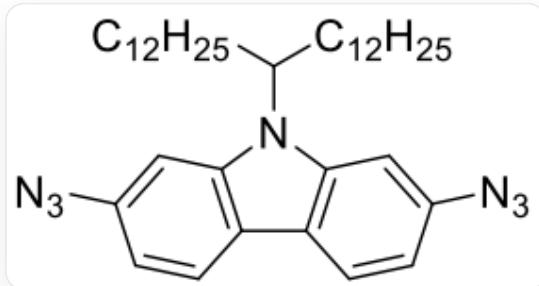
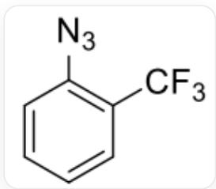
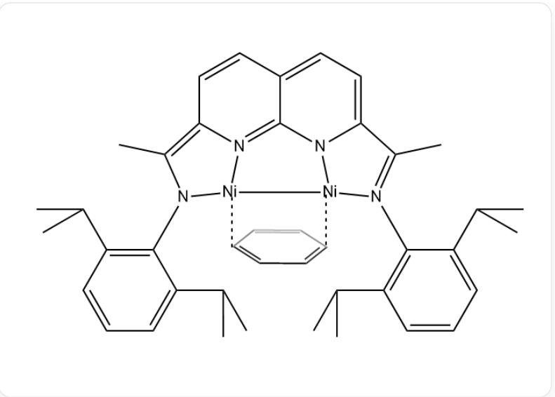
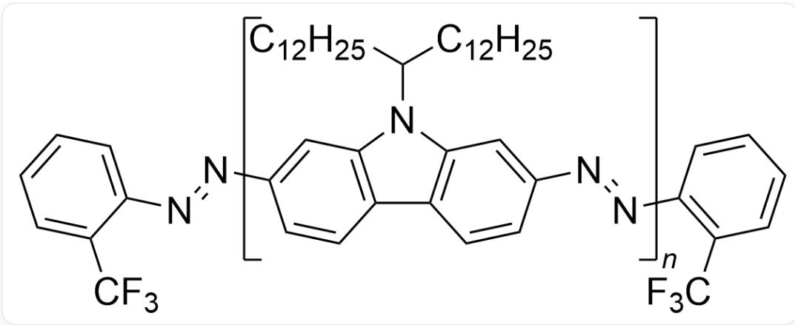

# Question

1 equivalent of azide A and  $5\mathrm{mol}\%$  of compound B react with  $3\mathrm{mol}\%$  of a specific catalyst C in toluene at  $22^{\circ}\mathrm{C}$  for 2 hours to form polymer P.

The structure of azide A is:

  
CCCCCCCCCCCCCCCC(CCCCCCCCCCCCC)N1C2=C(C=CC(N=[N+]=[N-])=C2)C3=C1C=C(N=[N+]=[N-])C=C3

The structure of compound  $\mathbf{B}$  is:

  
[N-]=[N+]=[NC1=CC=CC=C1C(F)(F)F

The structure of catalyst C is:

The image describes the structure of a complex:

$$
C 1 = C C (C (C) C) = C (N 2 [ N i ] 3 [ N ] 4 = C 5 N 6 [ N i ] 3 [ N (= C (C) C 6 = C C = C 5 C = C 4 = C 2 C) C 2 C (C (C) C) = C C = C C = 2 C (C) C) C (C (C) C) = C 1
$$

also a neutral benzene molecule is bonded to the two nickel atoms, with dashed lines from two para-carbons to the two nickel atoms respectively.

Read the following options and select the correct one.

A. The oxidation state of nickel in catalyst C is  $+2$  
B. The role of compound B is similar to that of trimethylchlorosilane introduced in siloxane polymerization.  
C. All nickel atoms in catalyst C obey the EAN rule.  
D. The polymerization reaction is a chain polymerization.  
E. The polymerization reaction is an addition polymerization.  
F. The ratio of the number of fluorine atoms to the number of nitrogen atoms in the end groups of polymer  $\mathbf{P}$  is  $\frac{3}{2}$ .  
G. The number of fluorine atoms in the end group of polymer  $\mathbf{P}$  is twice the number of nitrogen atoms.  
H. Ignoring side reactions, the theoretical average degree of polymerization is 20.

1. Ignoring side reactions, the theoretical average degree of polymerization is 80.  
J. Ignoring side reactions, the theoretical average degree of polymerization is 10.  
K. All other options are incorrect.

# Answer

Correct Answer: B

# Detailed Explanation

The complex in catalyst C is a neutral molecule, in which one ligand benzene is a neutral molecule, and the other ligand is an anion with two negative charges. Therefore, the two nickel atoms should have a total of two positive charges. The complex structure is symmetrical, and the valence of the two nickel atoms should be the same. Therefore, the oxidation state of nickel is  $+1$ . The oxidation state of nickel described in option A is  $+2$ , which is incorrect.

# CHECKPOINT

1 PTS

The oxidation state of nickel is  $+1$ , and the oxidation state of nickel described in option A is  $+2$ , which is incorrect.

The function of compound B is to regulate the degree of polymerization or polymer molecular weight as an end group, which is similar to the role of trimethylchlorosilane introduced in siloxane polymerization. Therefore, option B is correct.

# CHECKPOINT

1 PTS

The function of compound B is to regulate the degree of polymerization or polymer molecular weight as an end group, which is similar to the role of trimethylchlorosilane introduced in siloxane polymerization. Option B is correct.

In addition to benzene ring coordination, each nickel itself has 10 valence electrons, coordinated by 2 nitrogens and one lone pair of electrons, and one negative ion is coordinated. The 2 nitrogens provide a total of 3 electrons, and 1 metal bond provides 1 electron. There are 14 electrons around it. To satisfy the EAN rule, benzene needs to provide 4 electrons to each nickel, which cannot be satisfied. Therefore, option C is incorrect.

# CHECKPOINT

1 PTS

To satisfy the EAN rule, benzene needs to provide 4 electrons to each nickel, which cannot be satisfied. Option C is incorrect

This polymerization reaction has no clear initiation, growth, and termination stages, no specific active center, and the main monomer contains two obvious functional groups with condensation reaction performance, which is in line with the characteristics of step-growth reaction. Therefore, this polymerization reaction is a step-growth reaction rather than a chain reaction, and option D is incorrect.

# CHECKPOINT

1 PTS

This polymerization reaction is a step-growth reaction rather than a chain reaction, and option D is incorrect.

This polymerization reaction has small molecule generation, which is a condensation polymerization reaction rather than an addition polymerization reaction, and option E is incorrect.

# CHECKPOINT

1 PTS

This polymerization reaction is a condensation polymerization reaction rather than an addition polymerization reaction, and option E is incorrect.

According to the characteristics of the azido dimerization reaction, the structure of  $\mathbf{P}$  can be deduced:

  
Image describes a polymer:  $[N] = NC1 = CC = CC = C1C(F)(F)F$  is one end group, FC(C1=CC=CC=[C]1)(F)F is the other end group,CCCCCCCCCCCC(CCCCCCCCCCCCC)N1C2=C(C=C[C]=C2)C3=C1C=C(N=[N])C=C3 is the repeating segment

The end groups on both sides contain a total of 6 fluorine atoms and 2 nitrogen atoms. The number of fluorine atoms contained in the end group of polymer  $\mathbf{P}$  is three times the number of nitrogen atoms. Therefore, options F and G are incorrect.

# CHECKPOINT

1 PTS

The end groups on both sides contain a total of 6 fluorine atoms and 2 nitrogen atoms. The number of fluorine atoms contained in the end group of polymer  $\mathbf{P}$  is 3 times the number of nitrogen atoms. Therefore, options F and G are incorrect.

The azido dimerization reaction proceeds to a large extent and can be regarded as a complete reaction. Without considering side reactions, calculate the theoretical average degree of polymerization:

$$
\overline {{X _ {\mathrm {n}}}} = \frac {n _ {\mathrm {m o n o m e r}}}{n _ {\mathrm {p o l y m e r c h a i n}}} = \frac {n _ {1}}{\frac {1}{2} \times n _ {2}} = \frac {1}{\frac {1}{2} \times 0 . 0 5} = 4 0
$$

The degree of polymerization is 40, so options H, I, and J are all incorrect.

# CHECKPOINT

1 PTS

The degree of polymerization is 40, so options H, I, and J are all incorrect.