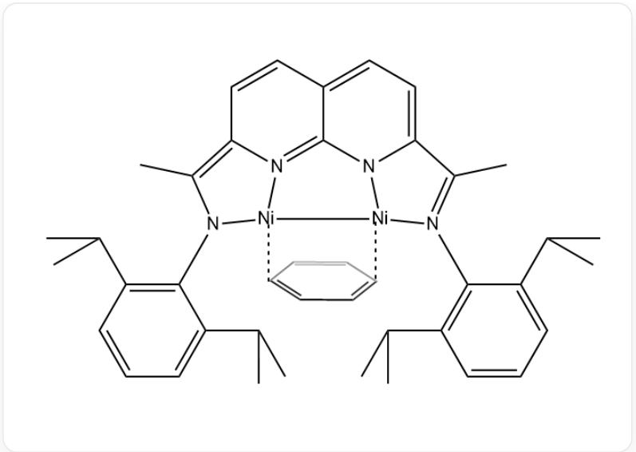
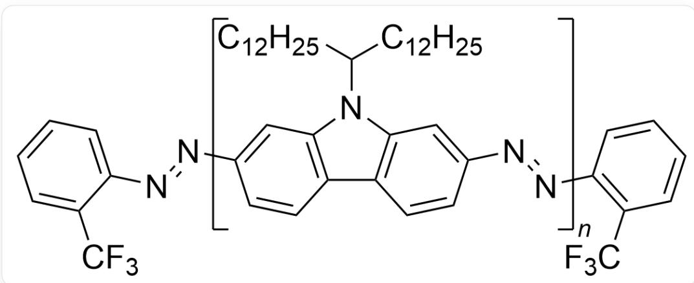

# 题目

1 当量的叠氮化合物 A 和  $5 \mathrm{~mol} \%$  化合物 B 与  $3 \mathrm{~mol} \%$  的特殊催化剂 C 的作用，在甲苯中  $22^{\circ} \mathrm{C}$  下反应 2 小时可以形成高分子 P。

叠氮化合物A的结构为：

  
CCCCCCCCCCCCCCCC(CCCCCCCCCCCCC)N1C2=C(C=CC(N=[N+]=[N-])=C2)C3=C1C=C(N=[N+]=[N-])C=C3

化合物B的结构为：

  
[N-]=[N+]=[NC1=CC=CC=C1C(F)(F)F

催化剂C的结构为：

图片描述了一个配合物的结构：  
  
C1=CC(C(C)C)=C(N2[Ni]3[N]4=C5N6[Ni]3[N(=C(C)C6=CC=C5C=CC4=C2C)C2C(C(C)C)=CC=CC=2C(C)C)C(C(C)C)=C1  
另外还有一个中性苯分子与两个镍原子结合，对位的两个碳原子各有一条虚线分别指向两个镍原子

阅读以下选项，选择其中正确的一选。

A. 催化剂 C 中镍的化合价为 +2。  
B. 化合物 B 的作用与硅氧烷聚合中引入的三甲基氯硅烷的作用有相似之处。  
C. 催化剂 C 中镍均符合EAN规则。  
D. 该聚合反应是链式聚合  
E. 该聚合反应是加聚反应  
F. 聚合物  $\mathrm{P}$  的端基中包含的氟原子个数与氮原子个数比为  $\frac{3}{2}$  。  
G. 聚合物  $\mathrm{P}$  的端基中包含的氟原子个数是氮原子个数的两倍。  
H. 不考虑副反应，理论平均聚合度为 20。

I. 不考虑副反应，理论平均聚合度为80。  
J. 不考虑副反应，理论平均聚合度为10。  
K. 其他选项均不正确

# 答案

正确答案: B

# 详细解析

催化剂 C 中配合物为中性分子，其中一个配体苯为中性分子，另一个配体为带两个负电荷的阴离子，因此两个镍应当总共带有两个正电荷，配合物结构对称，两个镍的价态应当相同，因此镍的化合价为 +1，选项A描述的镍的化合价为 +2 错误。

# CHECKPOINT

1 PTS

镍的化合价为  $+1$  ，选项A描述的镍的化合价为  $+2$  错误。

化合物B的作用为作为端基调节聚合度或聚合物分子量，与硅氧烷聚合中引入的三甲基氯硅烷的作用相似，因此选项B正确。

# CHECKPOINT

1 PTS

化合物 B 的作用为作为端基调节聚合度或聚合物分子量，与硅氧烷聚合中引入的三甲基氯硅烷的作用相似，选项B正确。

除苯环配位以外，每个镍自身10个价电子，周围2个氮一个孤对电子配位，一个负离子配位，2个氮共提供3个电子，1根金属键提供1个电子，周围14个电子，要满足EAN规则需要苯对每个镍提供4个电子，是无法满足的。因此选项C错误。

# CHECKPOINT

1 PTS

满足EAN规则需要苯对每个镍提供4个电子，无法满足。选项C错误

该聚合反应无明确的引发、增长、终止阶段，无特定活性中心，主要单体包含了两个明显的具有缩合反应性能的官能团，符合逐步反应的特点。因此该聚合反应是逐步反应而不是链式反应，选项D错误。

# CHECKPOINT

1 PTS

该聚合反应是逐步反应而不是链式反应，选项D错误。

该聚合反应有小分子生成，是缩聚反应而不是加聚反应，选项E错误。

# CHECKPOINT

1 PTS

该聚合反应是缩聚反应而不是加聚反应，选项E错误。

根据叠氮二聚反应的特点，可以推出  $\mathbf{P}$  的结构：

  
图片描述了一种聚合物：[N]=NC1=CC=CC=C1C(F)(F)F为一侧端基，FC(C1=CC=CC=[C]1)(F)F为另一侧端基，CCCCCCCCCCCCCCCC(CCCCCCCCCCCCC)N1C2=C(C=C[C]=C2)C3=C1C=C(N=[N])C=C3为重复的链段

两侧的端基中共包含6个氟原子和2个氮原子，聚合物P的端基中包含的氟原子个数是氮原子个数的三倍。因此选项F和G错误。

# CHECKPOINT

1 PTS

两侧的端基中共包含6个氟原子和2个氮原子，聚合物P的端基中包含的氟原子个数是氮原子个数的3倍。因此选项F和G错误。

叠氮二聚反应进行程度很大，可以当做完全反应，在不考虑副反应情况下，计算理论平均聚合度：

$$
\overline {{{{X _ {\mathrm {n}}}}}} = \frac {n _ {\mathrm {单 体}}}{n _ {\mathrm {高 分 子 链}}} = \frac {n _ {1}}{\frac {1}{2} \times n _ {2}} = \frac {1}{\frac {1}{2} \times 0 . 0 5} = 4 0
$$

聚合度为40，因此选项H，I，J均错误。

# CHECKPOINT

1 PTS

聚合度为40，选项H，I，J均错误。