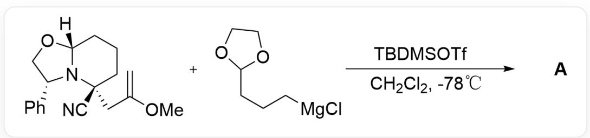
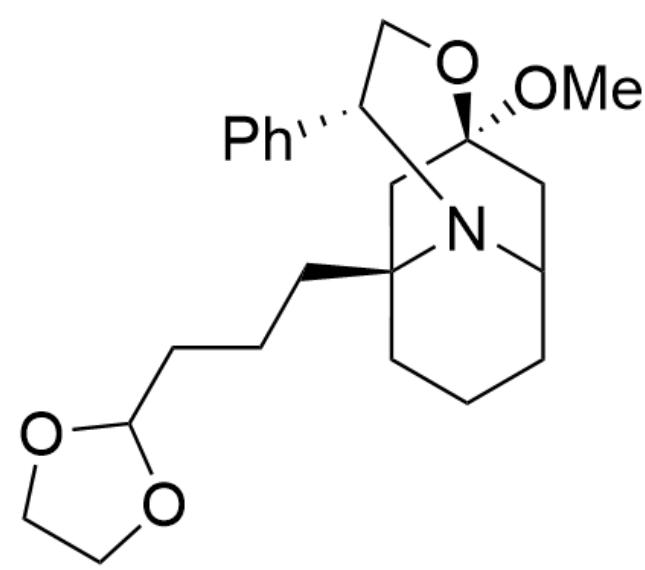
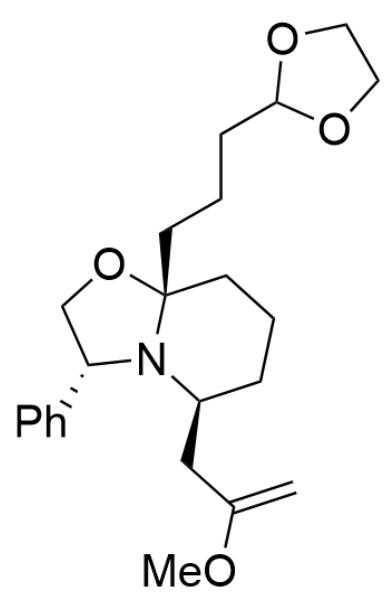
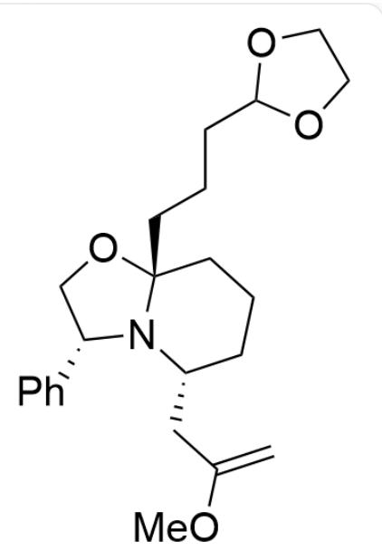
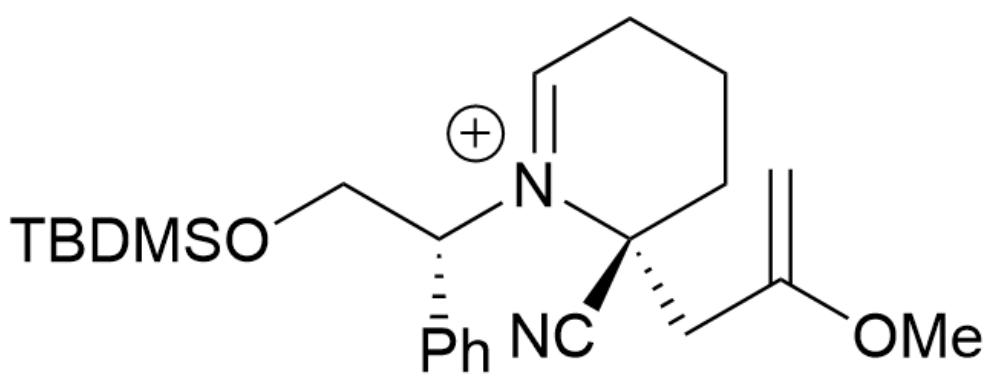
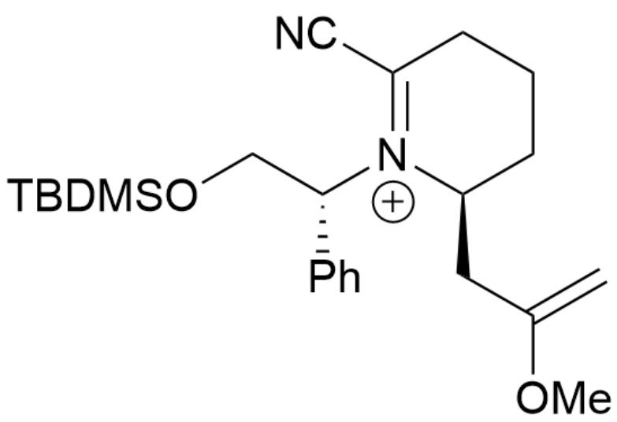
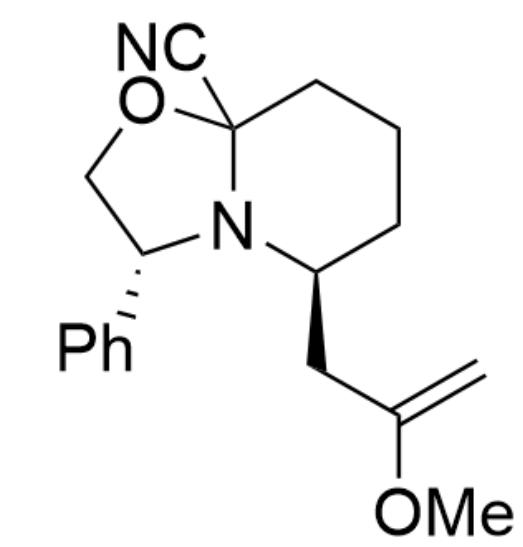
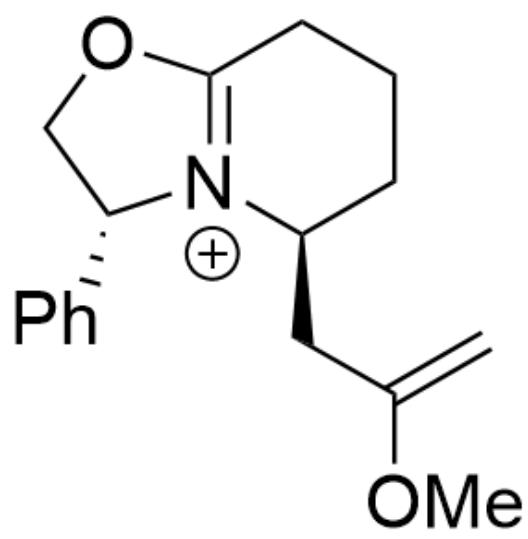
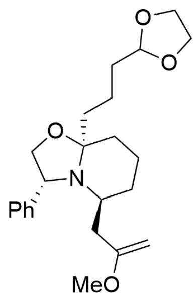

# Question

  
[H][C@]1(OC[C@H]2C3=CC=CC=C3)N2[C@](CC(OC)=C)(C#N)CCC1.CI[Mg]CCCC4OCC04>C[Si](C)  
$(\mathrm{OS}(= \mathrm{O})(\mathrm{C}(\mathrm{F})(\mathrm{F})\mathrm{F}) = \mathrm{O})\mathrm{C}(\mathrm{C})(\mathrm{C})\mathrm{C}.ClCl > [\mathbf{A}],$  A is the reaction product, reaction temperature  $-78^{\circ}\mathrm{C}$

Given that the molecular formula of the reaction product  $\mathbf{A}$  is  $\mathrm{C_{23}H_{33}NO_4}$ , provide the structural formula of  $\mathbf{A}$ .

A. All other options are incorrect  
B.

  
CO[C@]1(C2)C[C@@]3(CCCC4OCC04)CCCC2N3[C@H](C5=CC=CC=C5)CO1

C.

CO[C@@]1(C2)C[C@@]3(CCCC4OCC04)CCCC2N3[C@H](C5=CC=CC=C5)CO1

D.

C=C(OC)C[C@H]1N2[C@](OC[C@H]2C3=CC=CC=C3)(CCCC4OCC04)CCC1

E.

  
F.

C=C(OC)C[C@H]1N2[C@@](OC[C@H]2C3=CC=CC=C3)(CCCC4OCC04)CCC1

  
G.

C=C(OC)C[C@@H]1N2[C@@](OC[C@@H]2C3=CC=CC=C3)(CCCC4OCC04)CCC1

C=C(OC)C[C@@H]1N2[C@@](OC[C@H]2C3=CC=CC=C3)(CCCC4OCC04)CCC1

# Answer

Correct Answer: D

# Detailed Explanation

First, the substrate is activated by one molecule of TBDMSOTf to obtain intermediate 1

intermediate1: C=C(OC)C[C@]1(C#N)[N+]([C@H](C2=CC=CC=C2)CO[Si](C)(C)C(C)(C)C=CCCC1

# CHECKPOINT

1 PTS

intermediate1：  $\mathrm{C = C(OC)C[C@]1(C\#N)[N + ]([C@H](C2 = C = C = C = C2)CO[S i](C)(C)C(C)(C)C = CCC}$

Then, the carbocation is captured by the adjacent alkenyl group to obtain intermediate 2

intermediate2 : C[O+]=C1C[C@]2(C#N)N([C@H](C3=CC=CC=C3)CO[Si](C)(C)C(C)(C)C)[C@H](C1)CCC2

# CHECKPOINT

1 PTS

intermediate 2 : C[O+] = C1C[C@]2(C#N)N([C@H](C3=CC=CC=C3)CO[Si](C)(C)C(C)(C)C)[C@H](C1)CCC2

Then, ring opening occurs from the other direction to obtain intermediate 3

intermediate3 : C=C(OC)C[C@H]1[N+]([C@H](C2=CC=CC=C2)CO[Si](C)(C)C(C)(C)C)=C(C#N)CCC1

# CHECKPOINT

1 PTS

intermediate 3 : C=C(OC)C[C@H]1[N+]([C@H](C2=CC=CC=C2)CO[Si](C)(C)C(C)(C)C)=C(C#N)CCC1

Then the protecting group on the oxygen is removed and cyclization occurs to obtain intermediate 4

intermediate4 : C=C(OC)C[C@H]1N2C(OC[C@H]2C3=CC=CC=C3)(C#N)CCC1

# CHECKPOINT

1 PTS

intermediate4:C=C(OC)C[C@H]1N2C(OC[C@H]2C3=CC=CC=C3)(C#N)CCC1

This intermediate can lose a cyanide ion to obtain intermediate 5

intermediate5 : C=C(OC)C[C@H]1[N+]2=C(OC[C@H]2C3=CC=CC=C3)CCC1

The last step of Grignard reagent addition is irreversible

# CHECKPOINT

1 PTS

The last step of Grignard reagent addition is irreversible

Since the side containing the alkyl chain has larger steric hindrance, and the complexation with  $\mathrm{Mg}^{2+}$  may further increase the steric hindrance on the side of the alkyl chain, the Grignard reagent tends to attack from the side opposite to the alkyl chain to obtain the reaction product A

# CHECKPOINT

1 PTS

Since the side containing the alkyl chain has larger steric hindrance, and the complexation with  $\mathrm{Mg}^{2+}$  may further increase the steric hindrance on the side of the alkyl chain, the Grignard reagent tends to attack from the side opposite to the alkyl chain to obtain the reaction product A

productA : C=C(OC)C[C@H]1N2[C@](OC[C@H]2C3=CC=CC=C3)(CCCC4OCC04)CCC1