# 题目

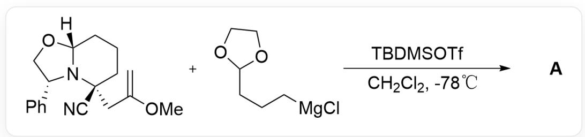  
[H][C@]1(OC[C@H]2C3=CC=CC=C3)N2[C@](CC(OC)=C)(C#N)CCC1.CI[Mg]CCCC4OCC04>C[Si](C)  
$(OS(=O)(C(F)(F)F)=O)C(C)(C)C.CICCl>[\mathbf{A}], \mathbf{A}$  是反应产物, 反应温度  $-78^{\circ} \mathrm{C}$

已知反应产物  $\mathrm{A}$  的分子式是  $\mathrm{C}_{23} \mathrm{H}_{33} \mathrm{NO}_{4}$ , 试给出  $\mathrm{A}$  的结构式

A. 其他选项均不正确  
B.

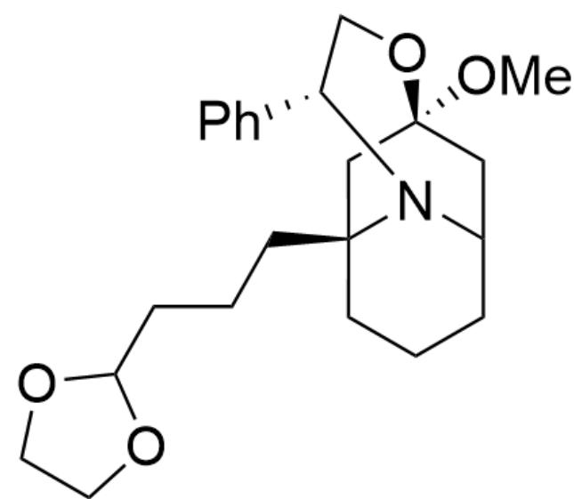  
CO[C@]1(C2)C[C@@]3(CCCC4OCC04)CCCC2N3[C@H](C5=CC=CC=C5)CO1

C.

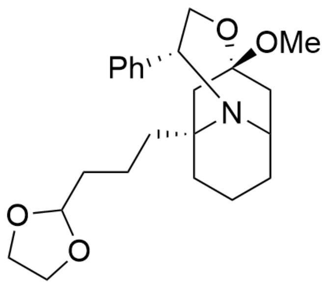

CO[C@@]1(C2)C[C@@]3(CCCC4OCC04)CCCC2N3[C@H](C5=CC=CC=C5)CO1

D.

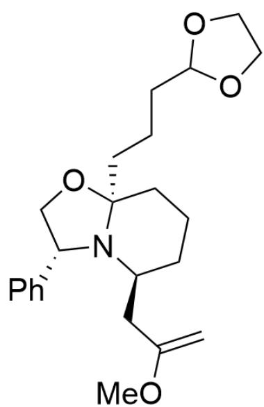

C=C(OC)C[C@H]1N2[C@](OC[C@H]2C3=CC=CC=C3)(CCCC4OCC04)CCC1

E.

  
F.

C=C(OC)C[C@H]1N2[C@@](OC[C@H]2C3=CC=CC=C3)(CCCC4OCC04)CCC1

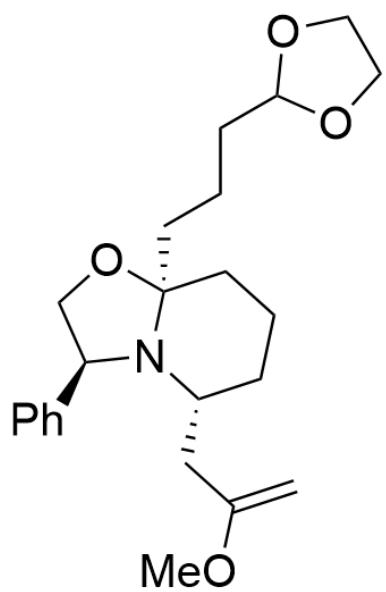  
G.

C=C(OC)C[C@@H]1N2[C@](OC[C@@H]2C3=CC=CC=C3)(CCCC4OCC04)CCC1

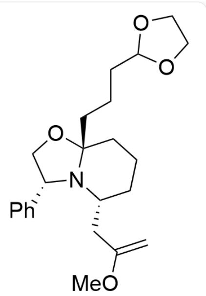

C=C(OC)C[C@@H]1N2[C@@](OC[C@H]2C3=CC=CC=C3)(CCCC4OCC04)CCC1

# 答案

正确答案: D

# 详细解析

首先，底物被一分子TBDMSOTf活化得到中间体1

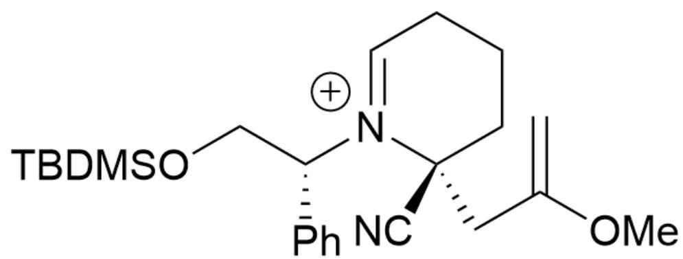  
中间体1：C=C(OC)C[C@]1(C#N)[N+]([C@H](C2=CC=CC=C2)CO[Si](C)(C)C(C)(C)C)=CCCC1

# CHECKPOINT

1 PTS

中间体1：C=C(OC)C[C@]1(C#N)[N+]([C@H](C2=CC=CC=C2)CO[Si](C)(C)C(C)(C)C)=CCCC1

接着该碳正离子被邻位的烯基辅获得到中间体2

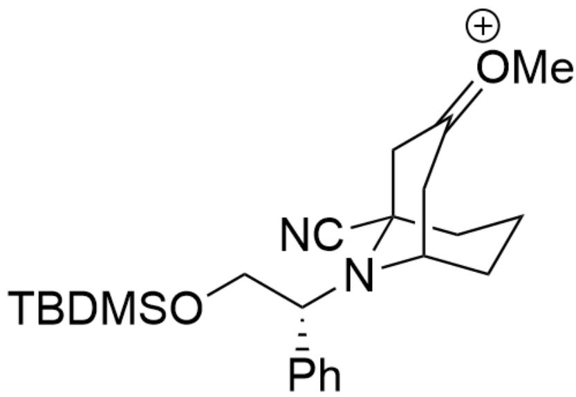

中间体2：C[O+]=C1C[C@]2(C#N)N([C@H](C3=CC=CC=C3)CO[Si](C)(C)C(C)(C)C)[C@H](C1)CCC2

# CHECKPOINT

1 PTS

中间体2：  $\mathrm{C}[\mathrm{O} + ] = \mathrm{C1C}[\mathrm{C}@\mathrm{]}2(\mathrm{C}\# \mathrm{N})\mathrm{N}([\mathrm{C}@\mathrm{H}](\mathrm{C}3 = \mathrm{CC} = \mathrm{CC} = \mathrm{C}3)\mathrm{CO}[\mathrm{Si}](\mathrm{C})(\mathrm{C})(\mathrm{C})(\mathrm{C})(\mathrm{C})(\mathrm{C})(\mathrm{C})(\mathrm{C})(\mathrm{C})(\mathrm{C})(\mathrm{C})(\mathrm{C})(\mathrm{C})(\mathrm{C})(\mathrm{C})(\mathrm{C})(\mathrm{C})(\mathrm{C})(\mathrm{C})(\mathrm{C})(\mathrm{C}))}$  (C1)CCC2

接着从另一个方向开环得到中间体3

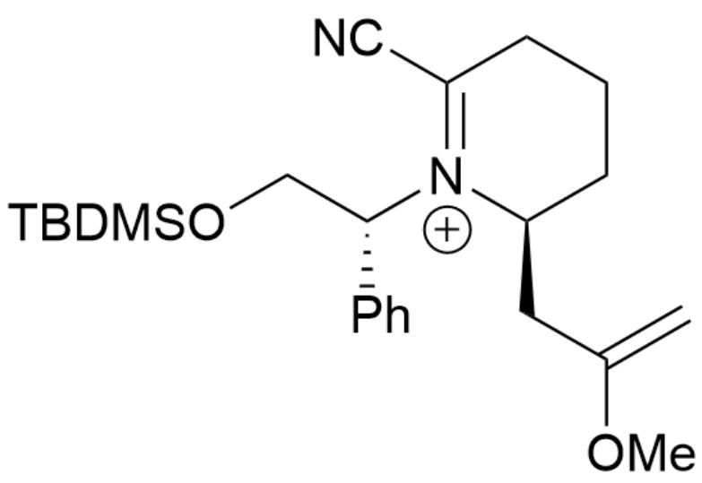

中间体3：C=C(OC)C[C@H]1[N+]([C@H](C2=CC=CC=C2)CO[Si](C)(C)C(C)(C)C)=C(C#N)CCC1

# CHECKPOINT

1 PTS

中间体3：C=C(OC)C[C@H]1[N+]([C@H](C2=CC=CC=C2)CO[Si](C)(C)C(C)(C)C)=C(C#N)CCC1

然后氧上的保护基脱除并成环得到中间体 4

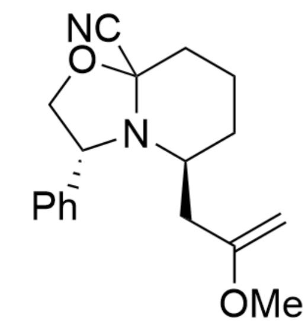

中间体4：C=C(OC)C[C@H]1N2C(OC[C@H]2C3=CC=CC=C3)(C#N)CCC1

# CHECKPOINT

1 PTS

中间体4：C=C(OC)C[C@H]1N2C(OC[C@H]2C3=CC=CC=C3)(C#N)CCC1

该中间体可以离去一个氰根离子得到中间体5

中间体5：C=C(OC)C[C@H]1[N+]2=C(OC[C@H]2C3=CC=CC=C3)CCC1

最后一步格式试剂的加成反应是不可逆的

# CHECKPOINT

1 PTS

最后一步格式试剂的加成反应是不可逆的

由于含有烷基链的一侧位阻较大，且可能与  $\mathrm{Mg}^{2+}$  络合后进一步增加烷基链一侧位阻，因此格式试剂倾向于从烷基链异侧进攻得到反应产物 A

# CHECKPOINT

1 PTS

由于含有烷基链的一侧位阻较大，且可能与  $\mathrm{Mg}^{2+}$  络合后进一步增加烷基链一侧位阻，因此格式试剂倾向于从烷基链异侧进攻得到反应产物 A

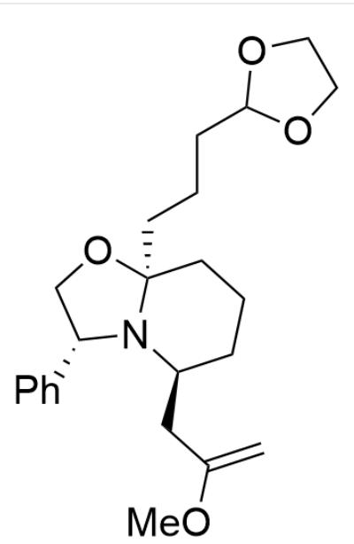

产物A：C=C(OC)C[C@H]1N2[C@](OC[C@H]2C3=CC=CC=C3)(CCCC4OCC04)CCC1