# Question

Benzaldehyde reacts with a mixture of  $98\%$  nitric acid/  $98\%$  sulfuric acid at  $0^{\circ}\mathrm{C}$  to obtain compound A. Compound A reacts with

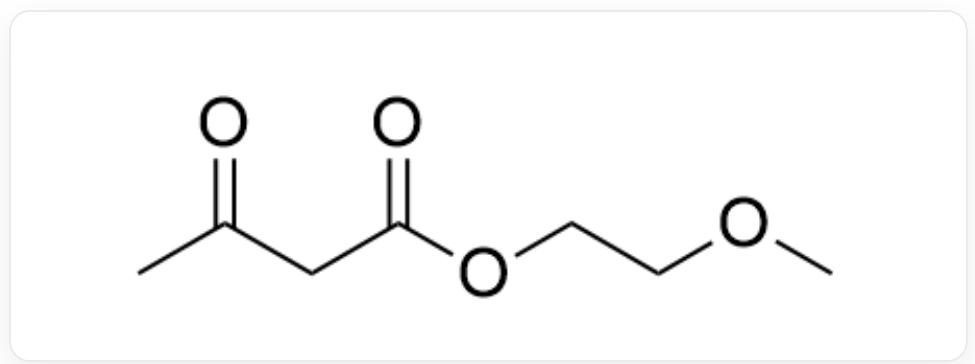  
CC(CC(OCCOC)=O)=O

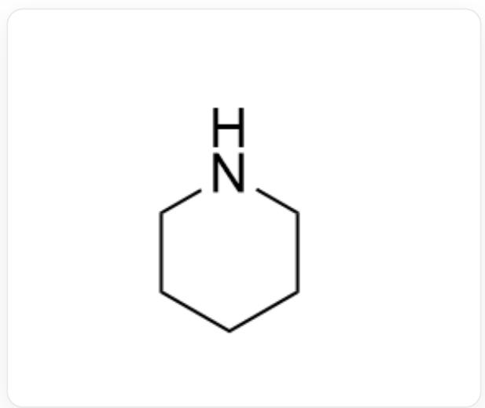  
C1CCCCN1

in acetic acid in a one-pot reaction to generate compound B. Compound B reacts with

$$
\mathrm {C} / \mathrm {C} (\mathrm {N}) = \mathrm {C} / \mathrm {C} (\mathrm {O C} (\mathrm {C}) \mathrm {C}) = \mathrm {O}
$$

under reflux in isopropyl alcohol solution to obtain compound C, and this transformation proceeds through an electrocyclic reaction. Compound C reacts with ceric ammonium nitrate to obtain compound D.

Based on the above information, deduce the structures of all compounds and select the correct statement from the following options.

A. Compound A is

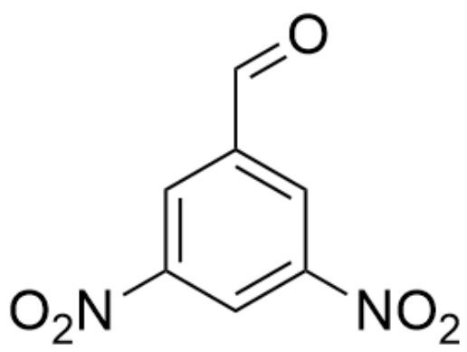

$$
O = C C 1 = C C ([ N + ] ([ O - ]) = O) = C C ([ N + ] ([ O - ]) = O) = C 1
$$

B. Compound A is

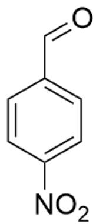

$$
O = C C 1 = C C = C ([ N + ] ([ O - ]) = O) C = C 1
$$

C. Compound  $\mathbf{B}$  is

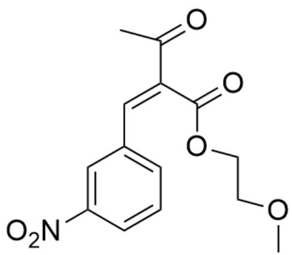

$$
O = C (C) / C (C (O C C O C) = O) = C / C 1 = C C = C C ([ N + ] ([ O - ]) = O) = C 1
$$

# D. Compound  $\mathbf{B}$  is

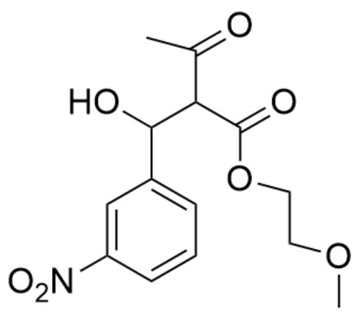

$$
O = C (C) C (C (O C C O C) = O) C (O) C 1 = C C = C C ([ N + ] ([ O - ]) = O) = C 1
$$

# E. Compound  $\mathbf{B}$  is

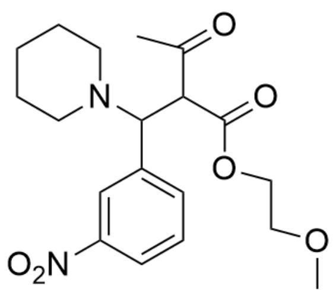

$$
O = C (C) C (C (O C C O C) = O) C (N 1 C C C C C 1) C 2 = C C = C C ([ N + ] ([ O - ]) = O) = C 2
$$

# F. Compound  $\mathbf{C}$  is

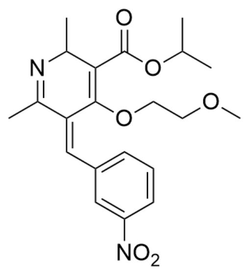

$$
C C 1 = N C (C) C (C (O C (C) C) = O) = C (O C C O C) / C 1 = C \backslash C 2 = C C = C C ([ N + ] ([ O - ]) = O) = C 2
$$

# G. Compound C is

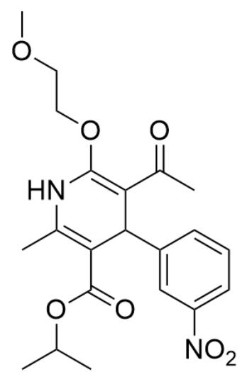

$$
C C (O C (C 1 = C (N C (O C C O C) = C (C (C) = O) C 1 C 2 = C C ([ N + ]) ([ O - ]) = O) = C C = C 2) C) = O) C
$$

# H. Compound  $\mathbf{D}$  is

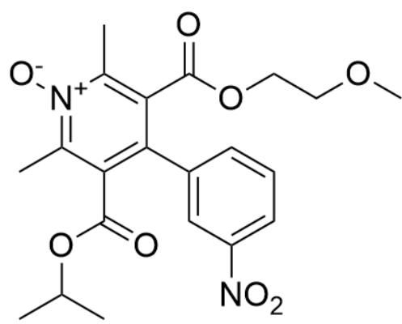

$$
C C (O C (C 1 = C (C 2 = C C ([ N + ]) ([ O - ]) = O) = C C = C 2) C (C (O C C O C) = O) = C (C) [ N + ] ([ O - ]) = C 1 C) = O) C
$$

# I. Compound  $\mathbf{D}$  is

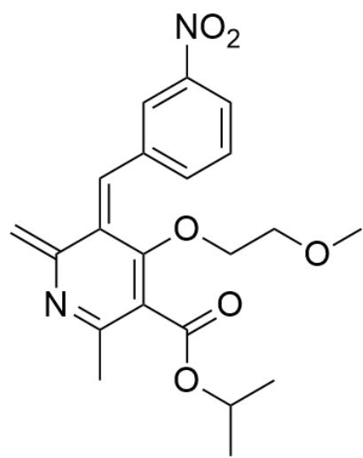

$$
C = C 1 N = C (C (C (O C (C) C) = O) = C (/ C 1 = C \backslash C 2 = C C = C C ([ N + ]) ([ O - ]) = O) = C 2) O C C O C) C
$$

# Answer

Correct Answer: C

# Detailed Explanation

First, the nitration reaction under low-temperature conditions can only occur once, and the aldehyde group is an electron-withdrawing group, occurring at the meta position, so compound A is

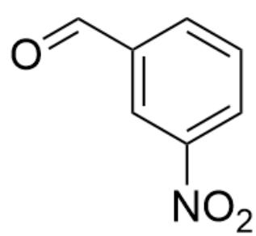

$$
O = C C 1 = C C ([ N + ] ([ O - ]) = O) = C C = C 1
$$

CHECKPOINT

0.5 PTS

Compound A is  $O = CC1 = CC([N + ]([O - ]) = O) = CC = C1$

Next, secondary amine piperidine is added in the process of generating  $\mathbf{B}$ , which is an acid-catalyzed aldol condensation-like reaction, so compound  $\mathbf{B}$  is

$$
O = C (C) / C (C (O C C O C) = O) = C / C 1 = C C = C C ([ N + ]) ([ O - ]) = O) = C 1
$$

# CHECKPOINT

1 PTS

Compound B is  $\mathrm{O} = \mathrm{C}(\mathrm{C}) / \mathrm{C}(\mathrm{C}(\mathrm{OCCOC}) = \mathrm{O}) = \mathrm{C} / \mathrm{C}1 = \mathrm{CC} = \mathrm{CC}([\mathrm{N} + ])([\mathrm{O} - ]) = \mathrm{O}) = \mathrm{C}1$

The ketone carbonyl group of compound B can undergo condensation with an amino group (the ketone carbonyl group is more electrophilic than the ester carbonyl group and is preferentially attacked), and then combined with the information in the question, an electrocyclic reaction can occur, so compound C is

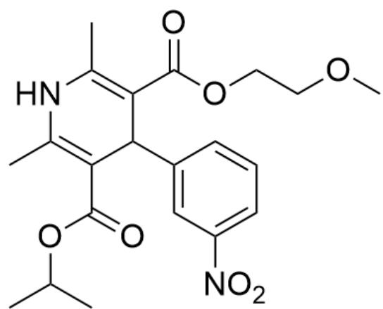  
CC(OC(C1=C(NC(C)=C(C(OCCCOC)=O)C1C2=CC([N+]([O-])=O)=CC=C2)C)=O)C

# CHECKPOINT

1.5 PTS

Compound C is CC(OC(C1=C(NC(C)=C(C(OCCOC)=O)C1C2=CC([N+]([O-])=O)=CC=C2)C)=O)C

Next, ceric ammonium sulfate is a weak oxidant, which can oxidize the previous heterocycle to an aromatic ring, so compound  $\mathbf{D}$  is

$$
C C (O C (C 1 = C (C 2 = C C ([ N + ]) ([ O - ]) = O) = C C = C 2) C (C (O C C O C) = O) = C (C) N = C 1 C) = O) C
$$

# CHECKPOINT

0.5 PTS

Compound D is CC(OC(C1=C(C2=CC([N+][O-])=O)=CC=C2)C(C(OCCOC)=O)=C(C)N=C1C)=O)C