# 题目

苯甲醛通过与  $98\%$  硝酸/  $98\%$  硫酸混合物在  $0^{\circ} \mathrm{C}$  下反应得到化合物A。化合物A与

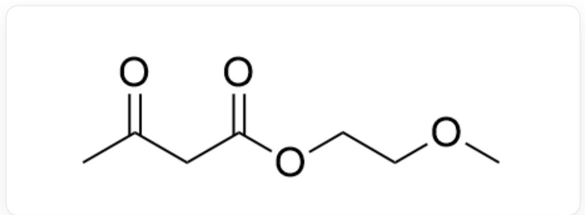  
CC(CC(OCCCOC)=O)=O

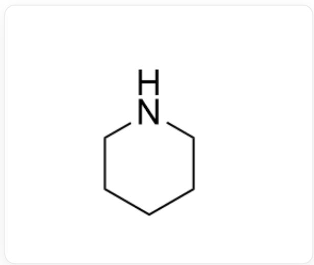  
C1CCCCN1

在乙酸处理下一锅反应生成化合物B。化合物B与

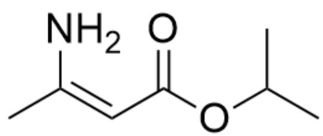

$$
\mathrm {C} / \mathrm {C} (\mathrm {N}) = \mathrm {C} / \mathrm {C} (\mathrm {O C} (\mathrm {C}) \mathrm {C}) = \mathrm {O}
$$

在异丙醇溶液中回流得到化合物 C，该转化中经过了电环化反应。化合物 C 与硫酸铈铵反应可以得到化合物 D。

根据以上信息，推断所有化合物的结构，并选择以下选项中说法正确的一个。

A. 化合物 A 为

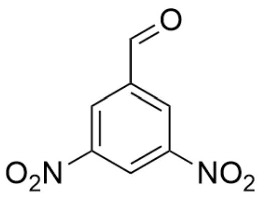

$$
O = C C 1 = C C ([ N + ] ([ O - ]) = O) = C C ([ N + ] ([ O - ]) = O) = C 1
$$

B. 化合物 A 为

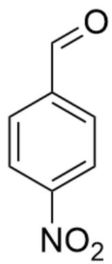

$$
O = C C 1 = C C = C ([ N + ] ([ O - ]) = O) C = C 1
$$

C. 化合物 B 为

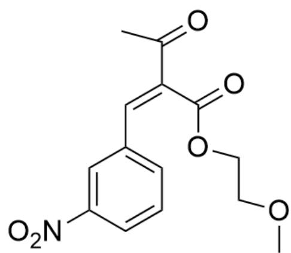

$$
O = C (C) / C (C (O O C C O C) = O) = C / C 1 = C C = C C ([ N + ] ([ O - ]) = O) = C 1
$$

D. 化合物  $\mathrm{B}$  为

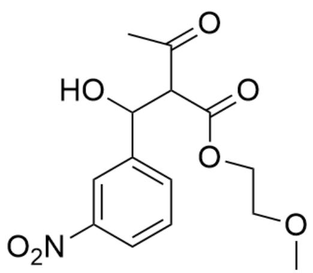

[ \mathrm{O} = \mathrm{C}(\mathrm{C})\mathrm{C}(\mathrm{C}(\mathrm{OCCOC}) = \mathrm{O})\mathrm{C}(\mathrm{O})\mathrm{C}1 = \mathrm{CC} = \mathrm{CC}([\mathrm{N} + ]([\mathrm{O} - ]) = \mathrm{O}) = \mathrm{C}1 ]

E. 化合物  $\mathrm{B}$  为

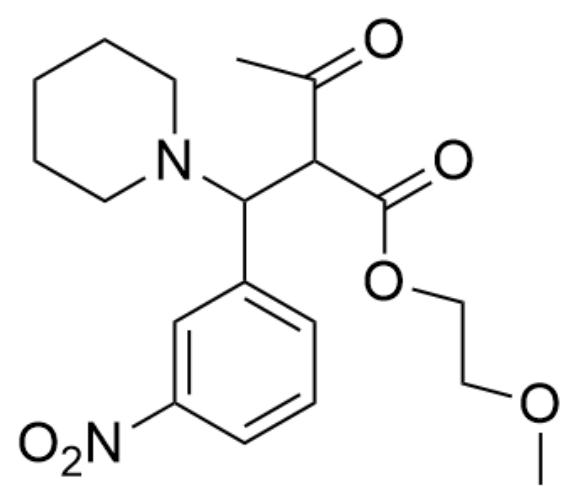

$\mathrm{O = C(C)C(C(OCCOC) = O)C(N1CCCCC1)C2 = CC = CC([N + ])([O - ]) = O = C2}$

F. 化合物 C 为

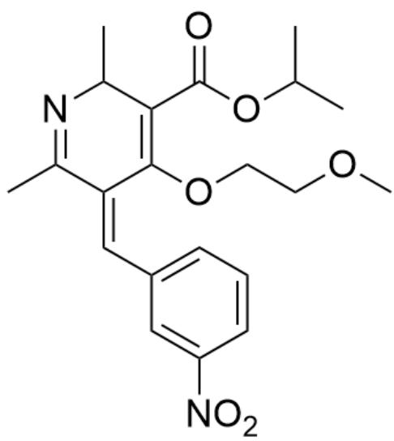  
CC1=NC(C)C(C(OC(C)C)=O)=C(OCCCOC)/C1=C\C2=CC=CC([N+]([O-])=O)=C2

G. 化合物 C 为

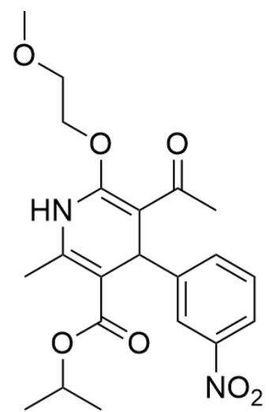  
CC(OC(C1=C(NC(OCCCOC)=C(C(C)=O)C1C2=CC([N+][[O-])=O)=CC=C2)C)=O)C

H. 化合物D为

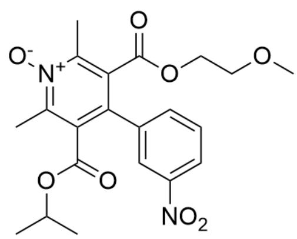  
CC(OC(C1=C(C2=CC([N+]([O-])=O)=CC=C2)C(C(OCCOC)=O)=C(C)[N+]([O-])=C1C)=O)C

# I. 化合物D为

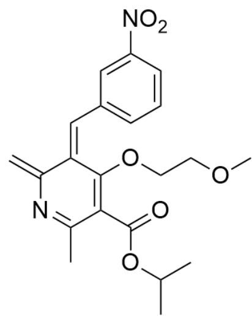  
C=C1N=C(C(C(OC(C)C)=O)=C(/C1=C\C2=CC=CC([N+]([O-])=O)=C2)OCCCOC)C

# 答案

正确答案: C

# 详细解析

首先，低温条件下的硝化反应仅能发生一次，且醛基为吸电子基团，发生在间位，故而化合物A为

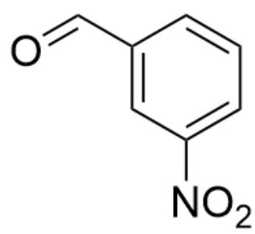

$$
O = C C 1 = C C ([ N + ] ([ O - ]) = O) = C C = C 1
$$

CHECKPOINT

0.5 PTS

化合物A为  $0 = \mathrm{CC}1 = \mathrm{CC}([N + ]([O - ]) = 0) = \mathrm{CC} = \mathrm{C}1$

接着生成B过程中加入仲胺哌啶，为酸催化下的羟醛缩合类反应，故而化合物B为

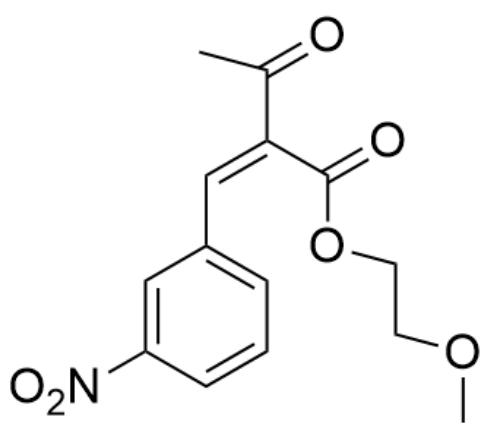

$$
O = C (C) / C (C (O C C O C) = O) = C / C 1 = C C = C C ([ N + ]) ([ O - ]) = O) = C 1
$$

# CHECKPOINT

1 PTS

化合物B为  $O = C(C) / C(C(OCCOC) = O) = C / C1 = CC = CC([N + ]([O - ]) = O) = C1$

而化合物B的酮羰基可以和氨基缩合（酮羰基相较于酯羰基亲电性更强，优先被进攻），并且随后可以结合题目信息，发生电环化反应，故而化合物C为

  
CC(OC(C1=C(NC(C)=C(C(OCCCOC)=O)C1C2=CC([N+]([O-])=O)=CC=C2)C)=O)C

# CHECKPOINT

1.5 PTS

化合物C为CC(OC(C1=C(NC(C)=C(C(OCCOC)=O)C1C2=CC([N+]([O-]=O)=CC=C2)C)=O)C

接下来，硫酸铈铵为弱氧化剂，可以将前面的杂环氧化为芳环，故而化合物D为

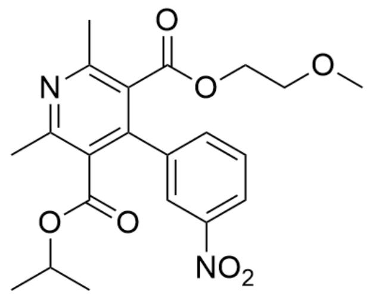

$$
C C (O C (C 1 = C (C 2 = C C ([ N + ]) ([ O - ]) = O) = C C = C 2) C (C (O C C O C) = O) = C (C) N = C 1 C) = O) C
$$

# CHECKPOINT

0.5 PTS

化合物D为CC(OC(C1=C(C2=CC([N+]([O-]=O)=CC=C2)C(C(OCCOC)=O)=C(C)N=C1C)=O)C