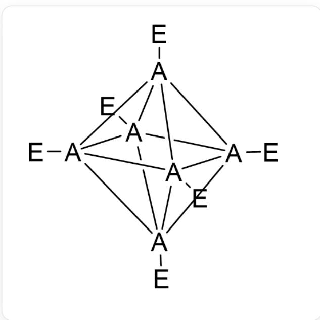
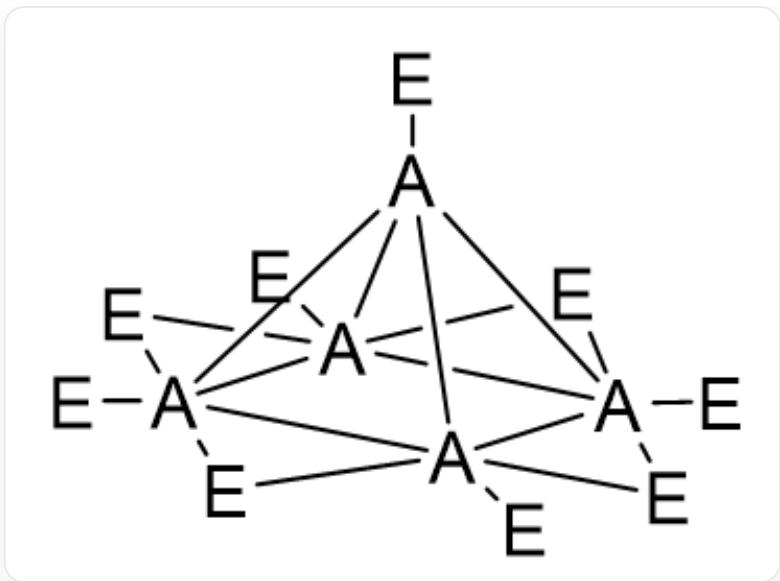
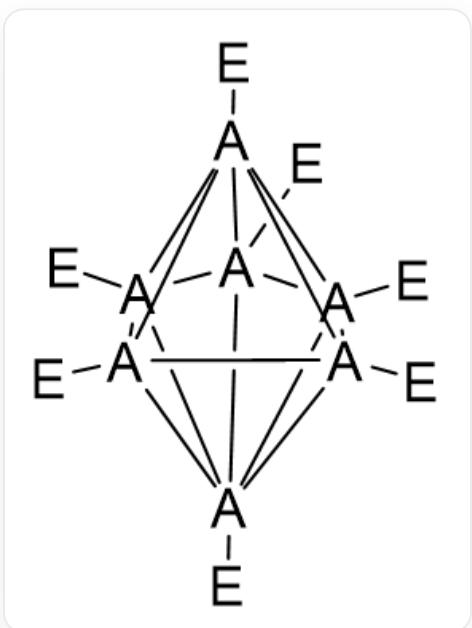
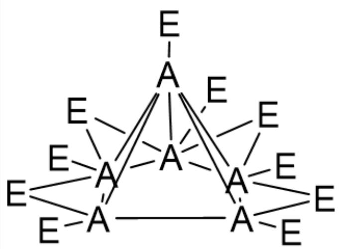

# Question

There is a class of compounds  $A_{n}E_{m}$  formed by element  $A$  and element  $E$  that adopt cage-like structures. Among them, the general formula for closed-cage structures can be represented as  $A_{n}E_{n}^{2-}$ , while the general formula for open-cage structures can be represented as  $A_{n}E_{n+4}$ . It is known that closed-cage structures  $A_{n}E_{n}^{2-}$  can be transformed into corresponding open-cage structures  $A_{n-1}E_{n+3}$  through a certain pattern.

For example, the structure of  $A_6E_6^{2-}$  is shown below:

  
[E][\*]123[\*]4([\\*]356[E])([E])[\*]17([E])[\*]45([E])[\*]726[E]

The structure of  $A_{5}E_{9}$  is shown below:

  
[E][\*]123[\*]45([E])([E]6)[\*]1([E])([E]5)([E]7)[\*]7([E])([E]8)2[\*]4368[E]

It is known that the structure of  $A_7E_7^{2-}$  is shown below:

  
[E][*]123[*]456([E])[*]78([E])[*]49([E])[*]51([E])[*]297([E])[*]638[E]

Then, in the structure of  $A_6E_{10}$ , how many triangular faces are there in the skeleton formed by  $A_6$ ?

A. 4

B. 5  
C. 6  
D. 7  
E. 8  
F. None of the above options are correct

# Answer

Correct Answer: B

# Detailed Explanation

The question examines the structure of borane, with specific information concealed to prevent cheating. Here,  $A$  and  $E$  represent boron and hydrogen, respectively. Based on observations,  $A_{5}E_{9}$  is derived from  $A_{6}E_{6}^{2-}$  by removing one vertex and adding four bridging  $E$  atoms. Applying a similar approach to  $A_{7}E_{7}^{2-}$ , the removable vertex can be either from the equatorial plane of the pentagonal bipyramid or a vertex outside the equatorial plane. It is found that the vertices outside the equatorial plane have the highest number of adjacent  $A$  atoms, and one of them is removed. (Removing the vertex with the highest connectivity ensures the maximum number of broken bonds due to the removal, providing the most candidate positions for adding bridging  $E$  atoms. This allows the bridging  $E$  atoms to connect different parts more flexibly and fully, reducing strain and maintaining the stability of the open structure.)

# CHECKPOINT

1 PTS

Remove a vertex outside the equatorial plane of the pentagonal bipyramid.

After removing one such vertex, the vertices outside the pentagon become the  $A$  atoms with the highest bonding count. Therefore, the four bridging  $E$  atoms should be added to four of the edges of the pentagon.

This results in the structure of  $A_6E_{10}$ , as shown below:

[E][*]1([[*]2345[E])([E]6)([E]7)[*]26([E])([E]8)[*]38([E])[*]59([E])[*]147([E]9)[E]

In  $A_6E_{10}$ , the  $A_6$  framework forms a pentagonal pyramid with five triangular faces. Select B.

# CHECKPOINT

1 PTS

There are five triangular faces.