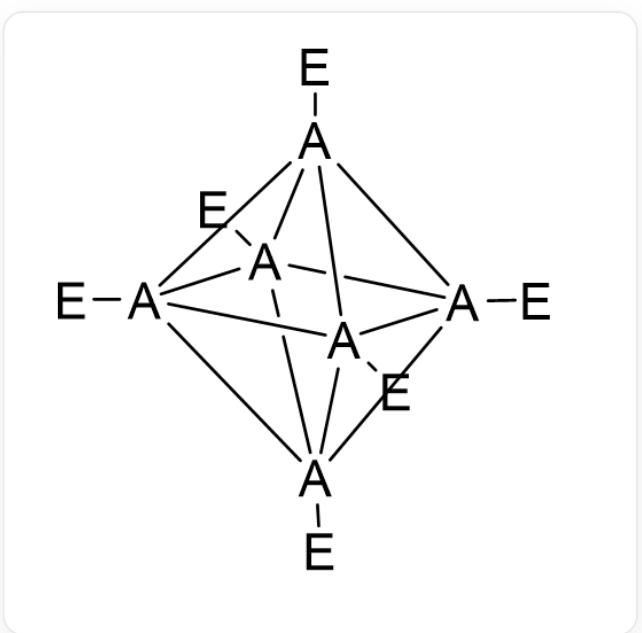
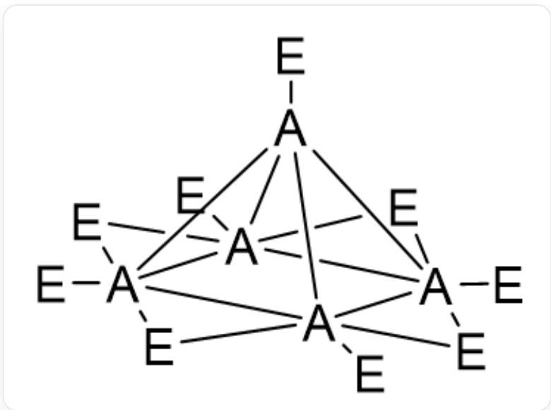
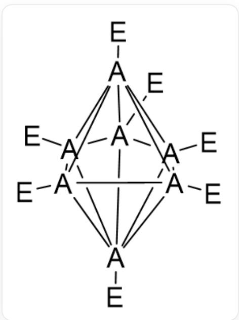
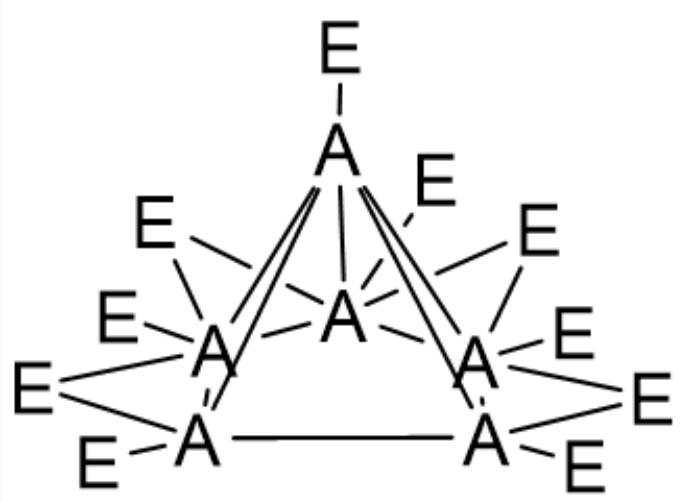

# 题目

有一类由元素  $A$  和元素  $E$  形成的化合物  $A_{n}E_{m}$  是笼状结构。其中，闭式笼状结构的通式可用  $A_{n}E_{n}^{2-}$  表示，开式笼状结构的通式可用  $A_{n}E_{n+4}$  表示。已知由闭式笼状结构  $A_{n}E_{n}^{2-}$  能通过某种规律转化为相应的开式笼状结构  $A_{n-1}E_{n+3}$ 。

例如， $A_{6}E_{6}^{2-}$  的结构如下图

  
[E][\*]123[\*]4([\\*]356[E])([E])[\*]17([E])[\*]45([E])[\*]726[E]

$A_{5}E_{9}$  的结构如下图

  
[E][\*]123[\*]45([E])([E]6)[\*]1([E])([E]5)([E]7)[\*]7([E])([E]8)2[\*]4368[E]

已知  $A_{7}E_{7}^{2-}$  的结构如下图

  
[E][*]123[*]456([E])[*]78([E])[*]49([E])[*]51([E])[*]297([E])[*]638[E]

那么， $A_{6}E_{10}$  的结构中， $A_{6}$  组成的骨架中有几个三角形面？

A. 4

B. 5  
C. 6  
D. 7  
E. 8  
F. 以上选项均不对

# 答案

正确答案: B

# 详细解析

题目考察硼烷的结构，为防止作弊隐去了具体信息， $A, E$ 分别是硼和氢。根据观察， $A_{5}E_{9}$ 由 $A_{6}E_{6}^{2-}$ 去掉一个顶点，再补上4个桥 $E$ 得到。以类似的方式处理 $A_{7}E_{7}^{2-}$ ，可以去掉的顶点有五角双锥赤道面或赤道面以外的顶点，发现赤道面以外的顶点相邻 $A$ 原子数最多，去掉其中一个。（移除连接度最高的顶点确保因移除原子而断裂的键数量最大化，为添加桥 $E$ 提供了最多的候选位置，使得桥 $E$ 能够更灵活、更充分地连接不同部分，减少应变，并保持开式结构的稳定性。）

# CHECKPOINT

1 PTS

去掉五角双锥赤道面以外的顶点。

去掉其中一个顶点之后，五边形以外的顶点就是成键最多的  $A$  了，因此4个桥  $E$  应该加在五边形的其中4个边上。

由此得  $A_{6}E_{10}$  的结构如下图

[E][\*]1([\*]2345[E])([E]6)([E]7)[\*]26([E])([E]8)[\*]38([E])[\*]59([E])[\*]147([E]9)[E]

$A_{6}E_{10}$  中  $A_{6}$  骨架为五角锥，有5个三角形面，选B。

# CHECKPOINT

1 PTS

有5个三角形面。