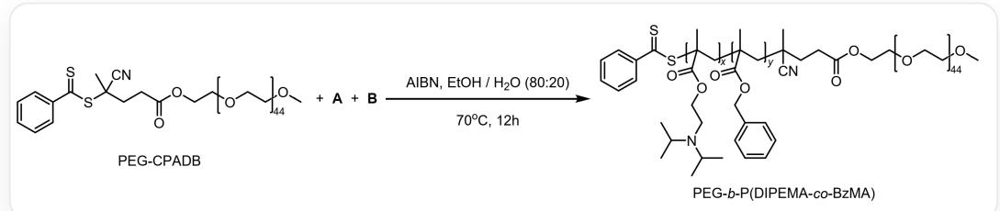
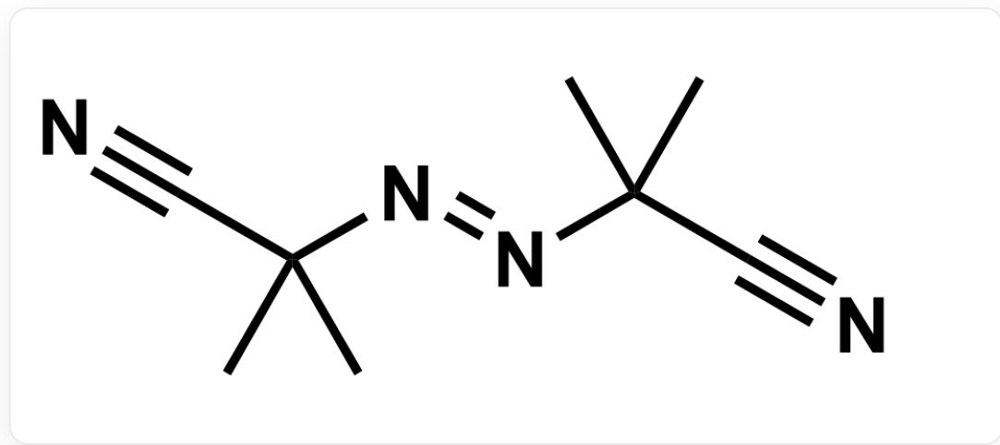
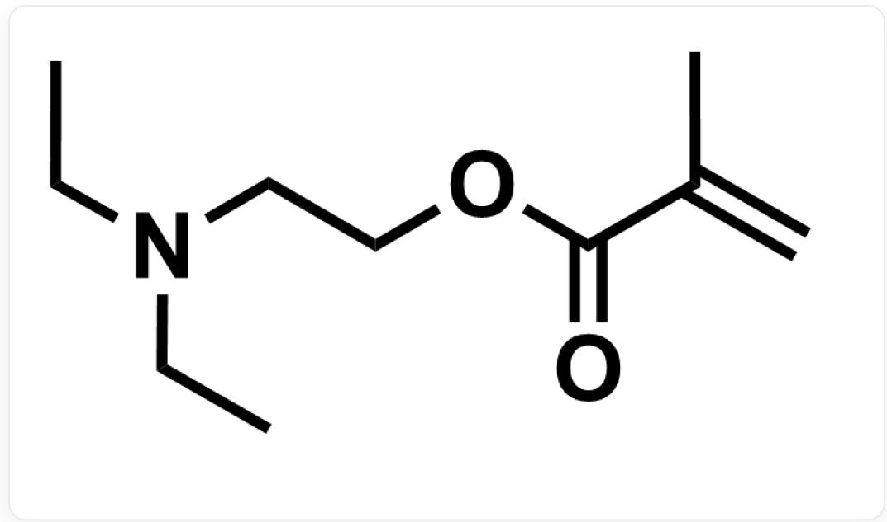
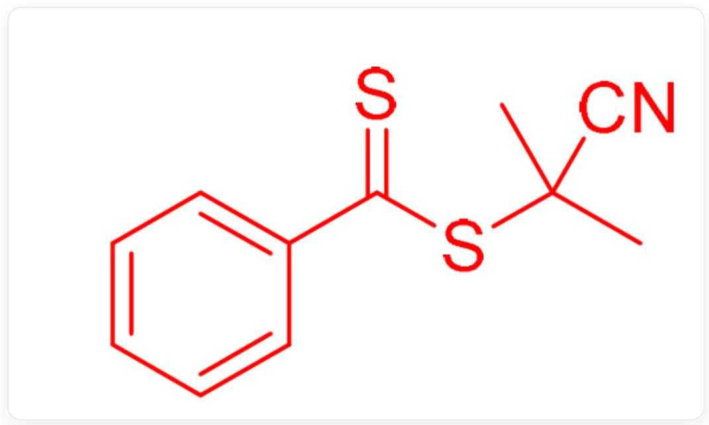

# 题目

以 AIBN 为引发剂，引发了如下自由基聚合反应：

PEG-CPADB与单体A和单体B以AIBN作引发剂、以乙醇/水=80:20 作溶剂，在70度下反应12小时可以得到

PEG-b-P(DIPEMA-co-BzMA)。其中PEG-CPADB的结构如下：一端以

S=C(C1=CC=CC=C1)SC(CCC(OCC[*:x1])=O)(C)C#N封端，另一端以甲氧基封端，中间为聚合度为44的

聚乙二醇，结构基元可以表示为 $[\cdot :x1]\mathrm{OCC}[\cdot :x2]$ 。“ $[\cdot :x1]"$ 表示左边端基与聚乙二醇片段左端的连接点；

"[*:x2]"表示聚乙二醇片段右端与右侧端基甲氧基的连接点。PEG-b-P(DIPEMA-co-BzMA)的结构可以表示

为三嵌段共聚物：最左端为S=C(C1=CC=CC=C1)S[*:x3]；第一段结构基元为CC(C[*:x4])

([*:x3])C(OCCN(C(C)C)C(C)C)=O，聚合度为x；第二段结构基元为CC(C[*:x5])

([*:x4])C(OCC1=CC=CC=C1)=O，聚合度为y；第三段为直链，非共聚物，可表示为[*:x5][C@]

(CCC(OCC[*:x6]) = O)(C)C#N；第四段结构基元为[*:x6]OCC[*:x7]，聚合度为44；最右端以甲氧基封端。

[ \text{['*:x3']} ] 表示左边端基与第一段左端的连接点；“[\*:x4]”表示第一段右端与第二段左端的连接点；“[\*:x5]”表示

第二段右端与第三段左端的连接点；“[*:x6]”表示第三段右端与第四段左端的连接点；“[*:x7]”表示第四段右

端与右边端基甲氧基的连接点。

AIBN的结构如下图：

CC(C#N)(C)/N=N/C(C#N)(C)C

为指代简便，将聚合度为x的片段称为片段x，将聚合度为y的片段称为片段y，将聚合度为44的片段称为片段z。在链引发阶段，AIBN分解并与PEG-CPADB反应生成化合物C和自由基D。聚合形成的PEG-b-P(DIPEMA-co-BzMA)在体系中并非以单体存在，而是立刻自组装形成囊泡。囊泡可包载药物分子，改变体系的pH，可实现药物的释放。

下列说法正确的是:

1.化合物C有11个碳原子。  
2.自由基D中有硫原子。  
3. 在  $\mathrm{EtOH} / \mathrm{H}_{2} \mathrm{O}$  混合溶剂中, 片段x与片段z裸露在囊泡的内部和外部, 与水和乙醇形成氢键, 进而包裹一定量的溶剂分子。  
4.为提高囊泡释放药物的速率，可以在其他片段聚合度不变的前提下，增加片段x的聚合度。  
5. 为提高囊泡释放药物的速率，可以在其他片段聚合度不变的前提下，增加片段y的聚合度。  
6. 为提高囊泡释放药物的速率，可以在其他片段聚合度不变的前提下，增加片段z的聚合度。  
7.为提高囊泡释放药物时溶液的pH值，可以将片段x的单体换为DEAEMA（结构如下图所示）。

  
CCN(CCOC(C(C)=C)=O)CC

A. 2,3,4,6  
B. 1,4,7  
C. 2,3,4,7  
D. 3,4  
E. 2,6,7  
F. 1,4  
G. 1,7  
H. 1,6

1,2,3,4,7  
J. 1,3,4,7  
K. 以上选项均错误或不完全。

# 答案

正确答案: B

# 详细解析

在加热条件下，化合物 AIBN 可分解产生氮气以及自由基  $\cdot \mathrm{C}(\mathrm{CH}_3)_2(\mathrm{CN})$  ，可与PEG-CPADB中最活泼的双键碳硫双键发生加成反应，随后消除得到 C 和被氰基稳定的三级碳自由基 D。C 结构如下：

  
S=C(C1=CC=CC=C1)SC(C)(C)C#N

因此，化合物 C 有 11 个碳原子。

CHECKPOINT

1 PTS

化合物 C 有11个碳原子, 选项1正确

自由基D中没有硫原子。

# CHECKPOINT

1 PTS

自由基D中没有硫原子，选项2错误

该聚合物具有疏水的P(DIPEMA-co-BzMA)嵌段（片段x和片段y）和亲水的PEG嵌段（片段z）。在  $\mathrm{EtOH / H_2O}$  混合溶剂中，疏水的P(DIPEMA-co-BzMA)嵌段依靠疏水作用自组装形成囊泡；亲水的PEG嵌段裸露在囊泡的内部和外部，与水和乙醇形成氢键，进而包裹一定量的溶剂分子。

# CHECKPOINT

1 PTS

在  $\mathrm{EtOH} / \mathrm{H}_2\mathrm{O}$  混合溶剂中，亲水的片段z裸露在囊泡的内部和外部，而片段x为疏水基团，选项3错误

在酸性条件下，嵌段P(DIPEMA-co-BzMA)侧链的二异丙基氨基结合  $\mathrm{H^{+}}$  ，使得链段的亲水性增强，囊泡结构被破坏，进而使得药物被释放出。因此，增加片段x的聚合度，可以增加与氢离子结合的位点数，进而增加了囊泡释放药物的速率。而增加疏水的片段y的聚合度会降低囊泡释放药物的速率。增加片段z的聚合度也不会增加囊泡释放药物的速率。

# CHECKPOINT

1 PTS

为提高囊泡释放药物的速率，可以在其他片段聚合度不变的前提下，增加片段x的聚合度，而非增加片段y、片段z的聚合度。选项4正确，选项5、6错误。

DEAEMA相比于片段x的单体2-(二异丙氨基)乙基甲基丙烯酸酯，同为三级胺，电子效应几乎相同，但DEAEMA的空间位阻更小，氮原子更易于与质子结合，因此碱性更强。

# CHECKPOINT

1 PTS

DEAEMA相比于片段x的单体碱性更强。

将片段x的单体换为DEAEMA后在更高pH值的溶液即能结合质子，使囊泡释放药物，因此可以提高囊泡释放药物时溶液的pH值。

# CHECKPOINT

1 PTS

将片段x的单体换为DEAEMA可以提高囊泡释放药物时溶液的pH值，选项7正确

因此最终答案为B。