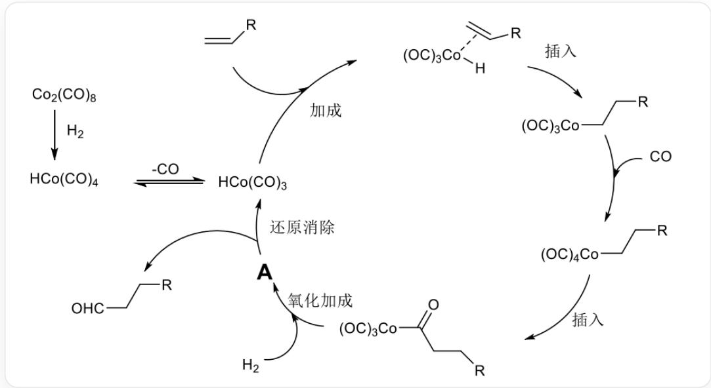

# Question

According to the following cycle diagram, which of the following statements is correct:

This is a catalytic reaction cycle diagram, in which RCCC(=O)[Co](C=O)(C=O)C=O reacts with hydrogen to produce unknown substance A; A then generates [CoH](C=O)(C=O)C=O and RCCC=O; [CoH](C=O) (C=O)C=O can undergo an addition reaction with olefins, with the double bond coordinating to the cobalt atom; subsequently, the coordinated olefin inserts into the cobalt-hydrogen bond; then, the carbon end of carbon monoxide coordinates to cobalt, and then, through a one-step insertion, RCCC(=O)[Co](C=O) (C=O)C=O is regenerated, completing the cycle

A. The coordination number of cobalt in substance  $A$  is 4.  
B. The central atom of substance  $A$  does not obey the 18-electron rule.  
C. The oxidation state of cobalt in substance A is  $+3$ .  
D. A contains 3 carbonyl groups.  
E. Oxidative addition yields product  $A$  where only one hydrogen atom is bonded to cobalt.

F. Both B and C above are correct.

# Answer

Correct Answer: C

# Detailed Explanation

This reaction is a typical oxidative addition-reductive elimination mechanism, involving the change in valence of the central cobalt atom. The first step is the cleavage of the hydrogen chemical bond, followed by an addition reaction. The addition site may be the cobalt atom, the carbonyl group, or the coordinated carbon monoxide. Based on the cobalt-hydrogen bond in the product after the decomposition of  $A$ , it is inferred that the addition occurs on the cobalt.

$A$  is  $[\mathrm{Co}](\mathrm{H})(\mathrm{H})(\mathrm{C}\# \mathrm{O})(\mathrm{C}\# \mathrm{O})(\mathrm{C}\# \mathrm{O})(\mathrm{C}(= \mathrm{O})\mathrm{R}.$

# CHECKPOINT

1 PTS

A is  $[\mathrm{Co}](\mathrm{H})(\mathrm{H})(\mathrm{C}\# \mathrm{O})(\mathrm{C}\# \mathrm{O})(\mathrm{C}\# \mathrm{O})(\mathrm{C} (= \mathrm{O})\mathrm{R})$

For option A, the coordination number of the cobalt atom is 6;

# CHECKPOINT

0.5 PTS

The coordination number of the cobalt atom is 6

For option B, the cobalt atom has 9 valence electrons, and the ligands provide a total of 9 electrons, which conforms to the 18-electron rule;

# CHECKPOINT

1 PTS

The cobalt atom has 9 valence electrons, and the ligands provide a total of 9 electrons, which conforms to the 18-electron rule

For option C, the oxidation state of the cobalt atom is  $+3$ ;

# CHECKPOINT

0.5 PTS

The oxidation state of the cobalt atom is  $+3$

For option  $\mathbf{D}$ , there are 4 carbonyl groups in  $A$ ;

# CHECKPOINT

0.5 PTS

There are 4 carbonyl groups in  $A$

For option E, the hydrogen molecule breaks its bond, and both hydrogen atoms are added to the cobalt.

# CHECKPOINT

0.5 PTS

The hydrogen molecule breaks its bond, and both hydrogen atoms are added to the cobalt

In summary,  $\mathbf{C}$  is correct.