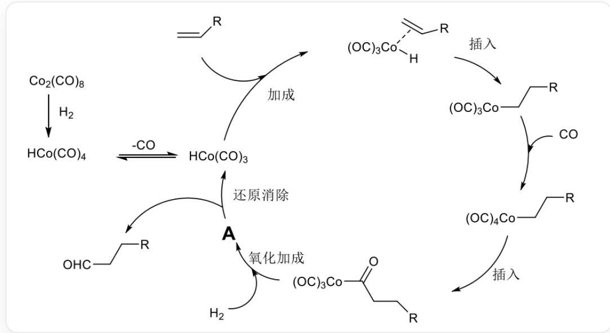

# 题目

根据如下循环示意图，下列说法正确的是：

这是一个催化反应循环图，其中RCCC(=O)[Co](C=O)(C=O)C=O与氢气反应，生成未知物质A；A随后生成[CoH](C=O)(C=O)C=O和RCCC=O；[CoH](C=O)(C=O)C=O可与烯烃发生加成反应，双键对钴原子配位；随后配位的烯烃插入钴氢键；然后一氧化碳碳端对钴配位，再通过一步插入，重新生成RCCC(=O)[Co] (C=O)(C=O)C=O，完成循环

A. 物质  $A$  中钴的配位数为 4  
B. 物质  $A$  的中心原子不符合 18 电子规则  
C. 物质  $A$  中钴的氧化态为 +3  
D.  $A$  中有 3 个羧基  
E. 氧化加成得到生成物  $A$  里, 只有一个氢原子连接在钴上

# F. 以上B和C都正确

# 答案

正确答案: C

# 详细解析

本反应是典型的氧化加成-还原消除机理，涉及中心钴原子的变价，第一步氢气化学键断裂，发生加成反应，加成的位点可能是钴原子，羰基，配位的一氧化碳。根据  $A$  分解后的产物有钴氢键，推断加成在钴上。

$A$  为  $[\mathrm{Co}](\mathrm{H})(\mathrm{H})(\mathrm{C}\# \mathrm{O})(\mathrm{C}\# \mathrm{O})(\mathrm{C}\# \mathrm{O})(\mathrm{C}(= \mathrm{O})\mathrm{R}_{\circ}$

# CHECKPOINT

1 PTS

$A$  是  $[\mathrm{Co}](\mathrm{H})(\mathrm{H})(\mathrm{C}\# \mathrm{O})(\mathrm{C}\# \mathrm{O})(\mathrm{C}\# \mathrm{O})(\mathrm{C}(= \mathrm{O})\mathrm{R})$

对于A选项，钴原子的配位数为6；

# CHECKPOINT

0.5 PTS

钴原子的配位数为6

对于B选项，钴原子有9个价电子，配体共提供9个电子，符合18电子规则；

# CHECKPOINT

1 PTS

钴原子有9个价电子，配体共提供9个电子，符合18电子规则

对于C选项，钴原子氧化态为  $+3$ ；

# CHECKPOINT

0.5 PTS

钴原子氧化态为  $+3$

对于D选项，A中有4个羰基；

# CHECKPOINT

0.5 PTS

$A$  中有 4 个羰基

对于E选项，氢气分子断键，两个氢原子均加成到钻上。

# CHECKPOINT

0.5 PTS

氢气分子断键，两个氢原子均加成到钴上

综上所述，C正确。