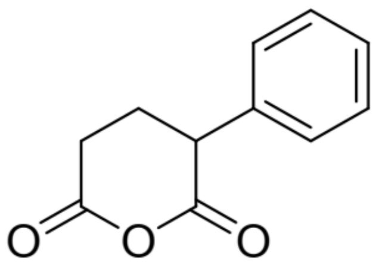
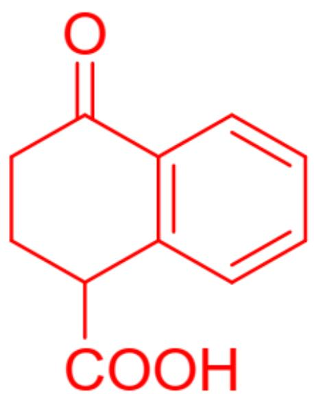
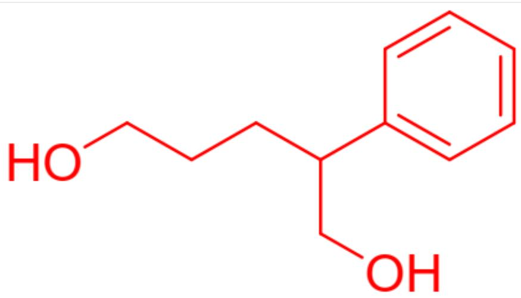

# Question

Compound A (structure shown in Figure 1) generates B with the same molecular formula as A under acidic conditions. A reacts with methanol to form two isomeric products, both of which yield compound C upon reduction with  $\mathrm{LiAlH_4}$ .

  
Fig. 1. The molecular structure is represented by SMILES: C1=CC=C(C=C1)C2CCC(=O)OC2=O

Several hypotheses exist regarding the structures of  $\mathbf{B}$  and  $\mathbf{C}$ :

1.  $\mathbf{B}$  contains a highly strained structure.  
2. B can form a stable isomer under strong alkaline conditions.  
3. All carbon-oxygen bonds in  $\mathbf{C}$  are double bonds.  
4. C contains only one carbon-oxygen double bond.  
5. C contains no carbon-oxygen double bonds.

Among the following options, which one includes all correct statements and the maximum number of correct statements?

A. All other options are incorrect

B. 1  
C. 2  
D. 3  
E. 4  
F. 5  
G. 1,2  
H. 1,3  
1,4  
J. 1,5  
K. 2,3  
L. 2,4  
M. 2,5  
N. 1,2  
0. 1,2

P. 1,2,5

# Answer

Correct Answer: M

# Detailed Explanation

Compound A is an intramolecular anhydride and may undergo Friedel-Crafts acylation with an aryl group under acidic conditions. Considering that the resulting compound B has the same molecular formula as compound A, the acylation reaction occurs intramolecularly rather than intermolecularly. Between the two acyl groups as potential reaction sites, one would form a four-membered ring, which is highly strained and unlikely, while the other forms a six-membered ring with a lower energy barrier. Therefore, the structure of compound B is shown in Figure 2. The molecule does not form a highly strained four-membered ring but instead a less strained six-membered ring, so statement 1 is incorrect. Under strong base conditions, the  $\beta$ -carbon of the carbonyl group can be deprotonated to form a stable enolate anion, so statement 2 is correct.

  
Fig. 2. The molecule in the figure is described by SMILES as: C1=CC2=C(C=C1)C(=O)CCC2C(=O)O

# CHECKPOINT

1 PTS

Intramolecular Friedel-Crafts acylation forms a six-membered ring rather than a four-membered ring.

# CHECKPOINT

1 PTS

The product is represented by SMILES as C1=CC2=C(C=C1)C(=O)CCC2C(=O)O.

# CHECKPOINT

1 PTS

Under strong base conditions, the  $\beta$ -carbon of the carbonyl group can be deprotonated to form a stable enolate anion.

Compound A is an anhydride and undergoes alcoholysis when reacted with methanol. Since compound A contains two asymmetric acyl groups, alcoholysis yields two products, each containing a methyl ester group and a carboxyl group. Both groups are directly reduced to alcohols in a single step by the strong reducing agent  $\mathrm{LiAlH_4}$ , resulting in the same product C, whose structure is shown in Figure 3. The molecule contains no carbon-oxygen double bonds, only carbon-oxygen single bonds, so statements 3 and 4 are incorrect, while statement 5 is correct.

  
Fig. 3. The molecule in the figure is described by SMILES as: C1=CC=C(C=C1)C(CCCO)CO

# CHECKPOINT

1 PTS

Methanolysis yields two products, each containing a carboxyl group and an ester group, which are directly reduced to alcohols in a single step by the strong reducing agent  $\mathrm{LiAlH_4}$ , resulting in the same product.

# CHECKPOINT

1 PTS

C is a diol structure, described by SMILES as: C1=CC=C(C=C1)C(CCCO)CO.