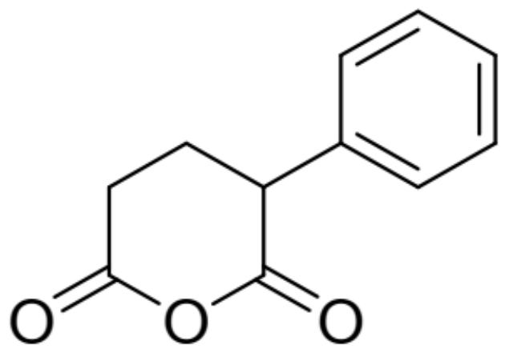
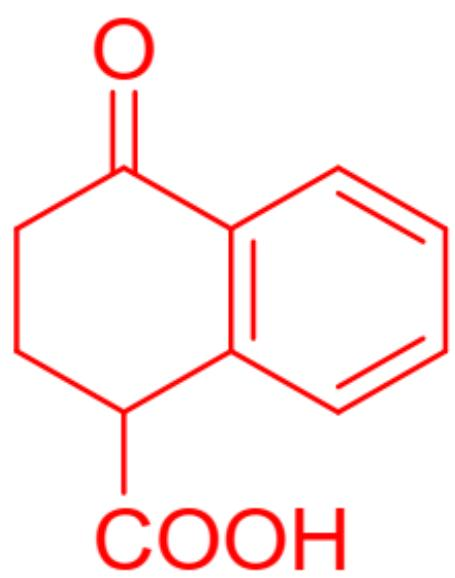
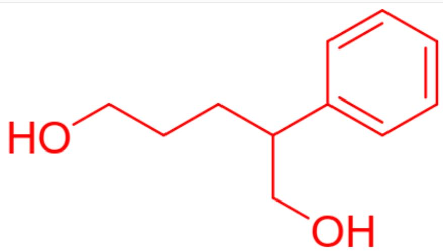

# 题目

化合物A(结构如图1所示)在酸性条件下会生成分子式与A相同的B。A与甲醇反应形成互为同分异构体的两个产物，这两个产物分别用  $\mathrm{LiAlH_4}$  还原均得到化合物C。

  
Fig. 1, 图中分子以SMILES表示为: C1=CC=C(C=C1)C2CCC(=O)OC2=O

推测B和C的结构，有以下几种说法：

1. B 包含一个大张力结构  
2. B 在强碱下可以形成稳定的异构体  
3. C中所有的碳-氧键均为双键  
4. C仅含一根碳氧双键  
5. C不含任何碳氧双键

以下选项中全部正确且正确说法最多的是？

A. 其他选项均不正确  
B. 1

C. 2  
D. 3  
E. 4  
F. 5  
G. 1,2  
H. 1,3  
1,4  
J. 1,5  
K. 2,3  
L. 2,4  
M. 2,5  
N. 1,2,3  
O. 1,2,4  
P. 1,2,5

# 答案

正确答案: M

# 详细解析

化合物A为分子内酸酐，在酸性下可能与芳基发生傅-克酰化反应。考虑到反应后得到的化合物B与化合物A分子式相同，说明酰基化反应发生在分子内而非分子间。考虑两个酰基作为反应位点，一个反应形成四元环，张力太大不太可能，另一个形成六元环，反应能垒低，所以化合物B结构如图2。分子并未形成大张力的四元环，而是张力不大的六元环，说法1错误。强碱下羰基β碳可以去质子化，形成稳定的烯醇负离子，说法2正确。

  
Fig. 2, 图中分子以SMILES描述为: C1=CC2=C(C=C1)C(=O)CCC2C(=O)O

CHECKPOINT

1 PTS

分子内傅-克酰基化形成六元环而非四元环，

# CHECKPOINT

1 PTS

产物以SMILES表示为C1=CC2=C(C=C1)C(=O)CCC2C(=O)O

# CHECKPOINT

1 PTS

强碱下羰基  $\beta$  碳可以去质子化，形成稳定的烯醇负离子

化合物A为酸酐，与甲醇反应发生醇解。化合物A中有两个不对称的酰基，因此醇解生成两个产物，每个产物均有一个甲醇酯基团和一个羧基基团。两个基团在  $\mathrm{LiAlH_4}$  强还原剂作用下直接一步还原为醇，因此得到同样的产物C，结构如图3。分子中不含碳氧双键，只有碳氧单键，说法3、4错误，5正确。

  
Fig. 3, 图中分子以SMILES描述为: C1=CC=C(C=C1)C(CCCO)CO

# CHECKPOINT

1 PTS

甲醇醇解得到两个产物，均包含一个羧基一个酯基，在  $\mathrm{LiAlH_4}$  强还原剂作用下直接一步还原为醇，因此得到同样的产物

# CHECKPOINT

1 PTS

C为二醇结构，以SMILES描述为：  $\mathrm{C1 = CC = C(C = C1)C(CCCO)CO}$