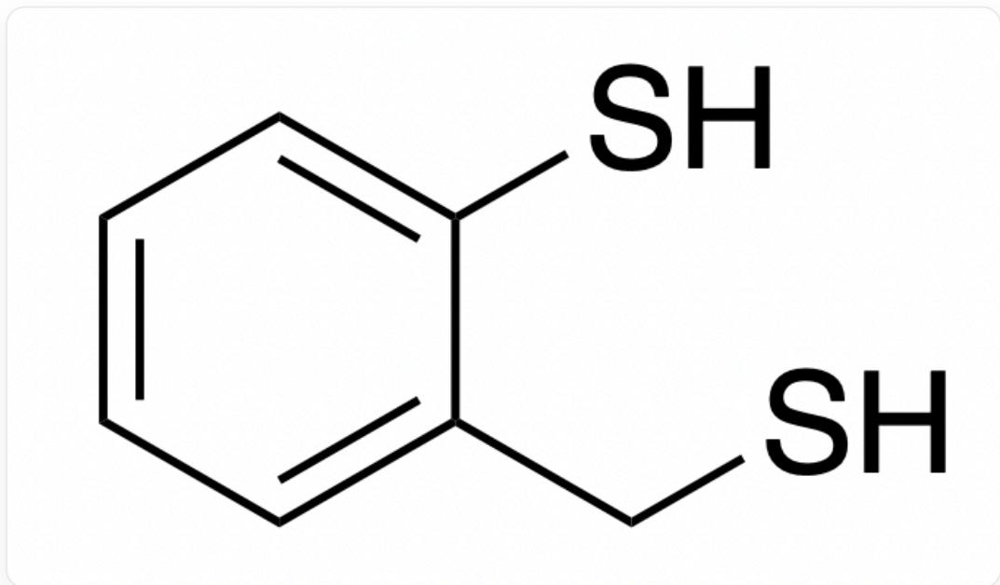
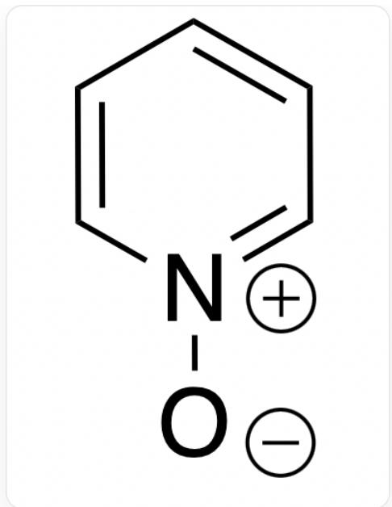
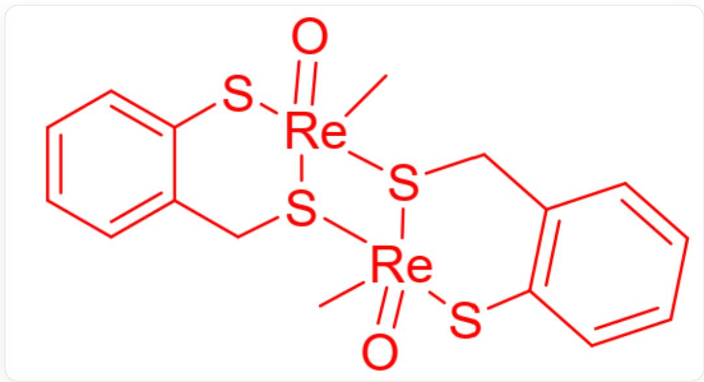

# Question

$\mathbf{X}$  is a metal-organic compound of element  $\mathbf{M}$ , containing only the four elements C, H, O, and  $\mathbf{M}$ , with no crystalline water. When  $3.414\mathrm{g}$  of compound  $\mathbf{X}$  is fully calcined in air, the residual solid weighs  $3.318\mathrm{g}$ . Mixing  $\mathbf{X}$  with  $\mathrm{H}_3\mathrm{PO}_2$  solution reduces  $\mathbf{X}$  to compound  $\mathbf{Y}$ . The mass fraction of  $\mathbf{M}$  in  $\mathbf{X}$  is  $74.71\%$ , and in  $\mathbf{Y}$ , it is  $79.83\%$ . Determine the identities of these compounds.

$\mathbf{X}$  further reacts with an equivalent amount of ethanedithiol (abbreviated as  $\mathrm{edtH_2}$ ) to yield  $\mathbf{B}$ .  $\mathbf{B}$  then reacts with an equivalent amount of ethanedithiol to form  $\mathbf{C}$ , and  $\mathbf{C}$  undergoes a one-step reduction to yield  $\mathbf{D}$ , which has the same molecular formula as  $\mathbf{C}$ . During the reactions from  $\mathbf{X}$  to  $\mathbf{B}$  and  $\mathbf{B}$  to  $\mathbf{C}$ , equivalent amounts of water are produced. Deduce the structure of  $\mathbf{D}$ .

Researchers found that when  $\mathbf{X}$  reacts with  $\mathrm{mtpH}_2$  (structure shown in Figure 1), a dinuclear complex  $\mathbf{E}$  forms in a  $1:2$  molar ratio.

  
Fig. 1, Structure of  $\mathrm{mtpH}_2$ , represented by SMILES: SC1=CC=CC=C1CS

$\mathbf{E}$  reacts with pyridine oxide (py-O, structure shown in Figure 2) to regenerate  $\mathbf{X}$ . In  $\mathbf{E}$ , the coordination number of metal  $\mathbf{M}$  is 5, and the mass fraction of  $\mathbf{M}$  is  $50.12\%$ .

  
Fig. 2, SMILES representation: [O-][N+]1=CC=CC=C1

Deduce the structure of the dinuclear complex  $\mathbf{E}$ .

1.  $\mathbf{X}$  contains 7 chemical bonds (multiple bonds counted as one bond).  
2.  $\mathbf{X}$  contains 4 chemical bonds (multiple bonds counted as one bond).  
3. In one  $\mathbf{D}$  molecule, there exists an element with three atoms having the same bond count.  
4. In one  $\mathbf{D}$  molecule, there is no element where three atoms share the same bond count.  
5. In one  $\mathbf{E}$  molecule, there exists an element with two atoms each having a bond count of 3.  
6. In one  $\mathbf{E}$  molecule, there exists an element where all atoms have a bond count of 2.

Which of the following statements is correct?

A. 1,3,5  
B. 1,3,6  
C. 1,4,5

D. 1,4,6  
E. 2,3,5  
F. 2,3,6  
G. 2,4,5  
H. 2,4,6  
1. 1,4  
J. 4,5  
K. 5,6  
L. 1,5,6  
M. 1,3,5,6

# Answer

Correct Answer: A

# Detailed Explanation

The problem does not provide extensive elemental properties, so the element can only be inferred based on mathematical relationships. Metal-organic compounds often lose all C and H elements when calcined in air, forming stable higher oxidation state metal oxides in air. The problem gives the mass fraction of the M element in X, allowing the calculation of the total mass of M in X and thus the molar amount of O in the metal oxide obtained by calcining X. This further enables the estimation of the possible molar mass of the M element.

The total mass of  $\mathbf{M}$  in  $\mathbf{X}$ :

$$
3.414 \mathrm{~g} \times 74.71 \% = 2.551 \mathrm{~g}
$$

The molar amount of O in the metal oxide obtained by calcining  $\mathbf{X}$  ..

$$
(3. 3 1 8 \mathrm {g} - 2. 5 5 1 \mathrm {g}) \div 1 6. 0 0 \mathrm {g} \cdot \mathrm {m o l} ^ {- 1} = 0. 0 4 7 9 \mathrm {m o l}
$$

Assuming the molecular formula of the calcined metal oxide is  $\mathrm{MO}_{\mathrm{x}}$ , the molar mass of element  $\mathbf{M}$  is:

$$
(3. 3 1 8 \mathrm {g} \cdot \mathrm {x}) \div 0. 0 4 7 9 \mathrm {m o l} - 1 6 \mathrm {g} \cdot \mathrm {m o l} ^ {- 1} = 5 3. 2 7 \cdot \mathrm {x g} \cdot \mathrm {m o l} ^ {- 1}
$$

Based on common metal oxide forms, for

$$
\mathrm {x} = 0. 3 3 3, 0. 5, 1, 1. 3 3 3, 1. 5, 2, 2. 5, 3, 3. 5, 4
$$

tabulation shows that when  $x = 3.5$ , the molar mass of  $\mathbf{M}$  is  $186.4\mathrm{g / mol}$ , matching the molar mass of  $\mathrm{Re}$ . Moreover, the oxide  $\mathrm{Re}_2\mathrm{O}_7$  aligns with the elemental properties, so  $\mathbf{M}$  is  $\mathrm{Re}$ .

(Alternatively, assuming  $\mathbf{X}$  is reduced to  $\mathbf{Y}$  by losing only N O atoms, the compound can also be inferred.)

# CHECKPOINT

1 PTS

Based on the mass fraction, element  $\mathbf{M}$  is inferred to be Re

From the mass fractions of Re in  $\mathbf{X}$  and  $\mathbf{Y}$ , their molar masses can be calculated, revealing that the molar masses of C, H, O in the two compounds are  $63.03\mathrm{g} \cdot \mathrm{mol}^{-1}$  and  $47.05\mathrm{g} \cdot \mathrm{mol}^{-1}$ , respectively, differing by exactly one O atom's molar mass. It is thus deduced that the molecular formula of  $\mathbf{X}$  is  $\mathrm{ReO}_3(\mathrm{CH}_3)$  and that of  $\mathbf{Y}$  is  $\mathrm{ReO}_2(\mathrm{CH}_3)$ . Since all atoms in  $\mathbf{X}$  are in a single environment, the O atoms are all directly bonded to Re. Given that the methyl group contains three C-H bonds, the number of chemical bonds in  $\mathbf{X}$  is 7, making Statement 1 correct and Statement 2 incorrect.

# CHECKPOINT

1 PTS

Based on the mass fractions, the molecular formula of  $\mathbf{X}$  is deduced as  $\mathrm{ReO}_3(\mathrm{CH}_3)$  and  $\mathbf{Y}$  as  $\mathrm{ReO}_2(\mathrm{CH}_3)$ . The number of chemical bonds in  $\mathbf{X}$  is 7, making Statement 1 correct and Statement 2 incorrect.

$\mathbf{X}$  reacts with  $\mathrm{edtH_2}$  to form water molecules, a common ligand substitution reaction. Thus, the products  $\mathbf{B}$  and  $\mathbf{C}$  have molecular formulas  $\mathrm{ReO_2(edt)CH_3}$  and  $\mathrm{ReO(edt)_2CH_3}$ , respectively. The molecular formula of  $\mathbf{C}$  remains unchanged after reduction, indicating intramolecular reductive elimination. The least stable ligand is the methyl group, which likely couples with a sulfur atom. The most probable structure of compound  $\mathbf{D}$  is shown in Figure 3, where sulfur has three atoms each with a bond order of 2, making Statement 3 correct and Statement 4 incorrect.

  
Fig. 3, structure described in SMILES as: C[S]1CCS[Re]12(SCCS2) = O

# CHECKPOINT

1 PTS

Based on the unchanged molecular formula of  $\mathbf{C}$  to  $\mathbf{D}$ , the methyl group is inferred to migrate to a sulfur atom. In compound  $\mathbf{D}$ , sulfur has three atoms each with a bond order of 2, making Statement 3 correct and Statement 4 incorrect.

$\mathbf{X}$  most likely undergoes a ligand substitution reaction with  $\mathrm{mtpH_2}$ . However, the product  $\mathbf{E}$  is reoxidized by py - O to regenerate  $\mathbf{X}$ , indicating that  $\mathbf{X}$  undergoes reduction when forming  $\mathbf{E}$ , likely losing an oxygen atom. Based on the mass fraction of  $\mathbf{M}$ , a dinuclear complex contains two  $\mathrm{mtpH_2}$  ligands and two O atoms. The reaction ratio of  $\mathbf{X}$  to  $\mathrm{mtpH_2}$  is  $1:2$ , suggesting  $\mathrm{mtpH_2}$  acts as a common reducing agent and is oxidized to form a disulfide bond, while  $\mathbf{C}$  is reduced to  $\mathbf{D}$ . The reaction equation is balanced to verify this conclusion. According to the problem, the coordination number of Re is 5, implying one ligand bridges two Re atoms. Given the transition metal properties of Re, the  $\mathrm{Re} = \mathrm{O}$  double bond is stable, and the sulfur atom, with its larger electron cloud, is most likely to form the bridge. Considering coordination capacity, the thiol S atom in  $\mathrm{mtpH_2}$  is more likely to coordinate than the thiophenol S atom. The structure of  $\mathbf{E}$  is shown in Figure 4.

In  $\mathbf{E}$ , sulfur has two atoms each with a bond order of 3, making Statement 5 correct. No element in the molecule forms only two bonds, making Statement 6 incorrect.

Fig. 4, the complex structure in SMILES notation: C[Re]12([S][[Re]3(C)  
  
$(\mathrm{SC4 = C(C[S]32)C = CC = C4) = O})\mathrm{CC5 = C(S1)C = CC = C5) = O}$

# CHECKPOINT

1 PTS

Based on the reduction reaction from  $\mathbf{X}$  to  $\mathbf{E}$ , the reaction ratio of  $\mathbf{X}$  to  $\mathrm{mtpH}_2$ , and the mass fraction of  $\mathbf{M}$ , the molecular formula of  $\mathbf{E}$  is deduced, with the thiol sulfur atom selected as the bridging ligand. In  $\mathbf{E}$ , sulfur has two atoms each with a bond order of 3, making Statement 5 correct. No element in the molecule forms only two bonds, making Statement 6 incorrect.