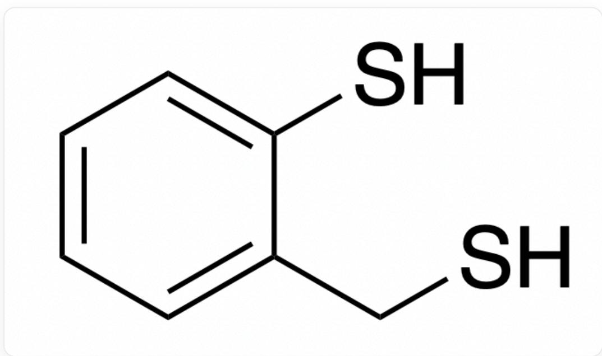
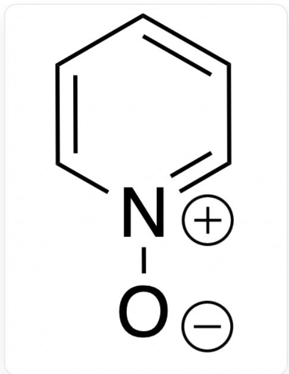
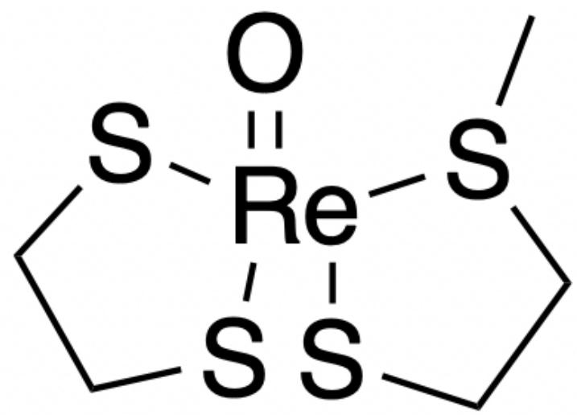
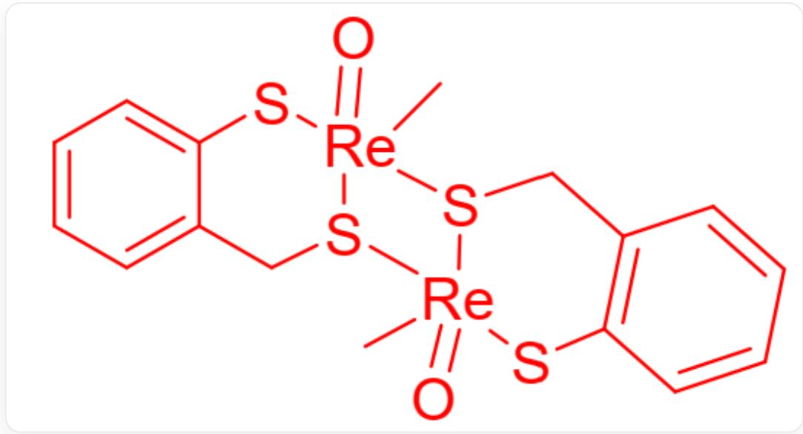

# 题目

X是元素M的金属有机化合物,只含有C、H、O以及M四种元素,不含有结晶水。将  $3.414\mathrm{g}$  的化合物X置于空气中充分煅烧,残余固体称重后质量为  $3.318\mathrm{g}$  。将X与  $\mathrm{H}_3\mathrm{PO}_2$  溶液混合,X会被还原为化合物Y。X中M的质量分数为  $74.71\%$  ,Y中M的质量分数为  $79.83\%$  。推断各化合物分别是什么。

X 进一步与等当量的乙二硫醇(简写为  $\mathrm{edtH_2}$  )反应得到 B,

B 接着与等当量的乙二硫醇反应得到 C, C 经过一步还原得到分子式与 C 相同的 D。在 X

到B以及B到C的反应过程中均有等当量的水生成。推断D的结构。

研究人员发现, 若  $\mathbf{X}$  与  $\mathrm{mtpH}_{2}$  (结构如图1所示)发生反应, 则会以  $1:2$  的摩尔比反应形成双核配合物  $\mathbf{E}$  。

  
Fig.1,  $\mathrm{mtpH}_{2}$  的结构，以SMILES表示为：SC1=CC=CC=C1CS

E 与吡啶氧化物 py-O(结构如图2所示)反应将重新生成 X。E 中金属 M 的配位数均为 5, 且 M 的质量分数为  $50.12\%$  。

  
Fig. 2, SMILES表示为：[O-][N+]1=CC=CC=C1

推断双核配合物  $\mathbf{E}$  的结构。

1. X中包含7根化学键（多重键按一根化学键计）  
2. X中包含4根化学键（多重键按一根化学键计）  
3. 一个  $\mathbf{D}$  分子中存在一种元素, 该元素中有三个原子的成键数相同  
4. 一个D分子中不存在可以使该元素中有三个原子的成键数相同的元素  
5. 一个  $\mathbf{E}$  分子中存在一种元素，该元素中有两个原子的成键数均为3  
6. 一个  $\mathbf{E}$  分子中存在一种元素, 该元素的所有原子成键数均为 2

下列选项中说法正确的是？

A. 1,3,5  
B. 1,3,6  
C. 1,4,5

D. 1,4,6  
E. 2,3,5  
F. 2,3,6  
G. 2,4,5  
H. 2,4,6  
1. 1,4  
J. 4,5  
K. 5,6  
L. 1,5,6  
M. 1,3,5,6

# 答案

正确答案: A

# 详细解析

题目中未给出较多的元素性质，因此只能根据数学关系推断元素。金属有机化合物在空气中煅烧往往会失去所有C、H元素，并形成空气中稳定的较高氧化态金属氧化物。题目给出了X中M元素的质量分数，因此可以推算X中M元素的总质量，从而得到X煅烧得到金属氧化物中O元素的摩尔量。进而推算M元素可能的摩尔质量。

X中M元素的总质量:

$$
3.414 \mathrm{~g} \times 74.71 \% = 2.551 \mathrm{~g}
$$

X煅烧得到金属氧化物中O元素的摩尔量：

$$
3. 3 1 8 \mathrm {g} - 2. 5 5 1 \mathrm {g} \div 1 6. 0 0 \mathrm {g} \cdot \mathrm {m o l} ^ {- 1} = 0. 0 4 7 9 \mathrm {m o l}
$$

设煅烧后金属氧化物的分子式为  $\mathrm{MO}_{\mathrm{x}}$  ，则元素M的摩尔质量为：

$$
3. 3 1 8 \mathrm {g} \cdot \mathrm {x} \div 0. 0 4 7 9 \mathrm {m o l} - 1 6 \mathrm {g} \cdot \mathrm {m o l} ^ {- 1} = 5 3. 2 7 \cdot \mathrm {x g} \cdot \mathrm {m o l} ^ {- 1}
$$

根据常见金属氧化物的形式，对

$$
\mathbf {x} = 0. 3 3 3, 0. 5, 1, 1. 3 3 3, 1. 5, 2, 2. 5, 3, 3. 5, 4
$$

打表, 得出  $x = 3.5$  时元素  $\mathbf{M}$  的摩尔质量为  $186.4 \mathrm{~g} / \mathrm{mol}$ , 符合  $\mathrm{Re}$  元素的摩尔质量, 且氧化物  $\mathrm{Re}_{2} \mathrm{O}_{7}$  符合元素性质, 因此元素  $\mathbf{M}$  为  $\mathrm{Re}$  。

(假设  $\mathbf{X}$  还原为  $\mathbf{Y}$  仅失去N个O原子，据此推断化合物也可以。)

# CHECKPOINT

1 PTS

根据质量分数推断出元素M为Re

根据  $\mathbf{X}$  和  $\mathbf{Y}$  中  $\mathrm{Re}$  的质量分数可以推算二者的摩尔质量，进而得到二者中的 C、H、O 占的摩尔质量分别为  $63.03 \mathrm{~g} \cdot \mathrm{mol}^{-1}$  和  $47.05 \mathrm{~g} \cdot \mathrm{mol}^{-1}$ ，恰好相差一个 O 原子的摩尔质量，易推算出  $\mathbf{X}$  分子式为  $\mathrm{ReO}_{3}(\mathrm{CH}_{3})$ ， $\mathbf{Y}$  分子式为  $\mathrm{ReO}_{2}(\mathrm{CH}_{3})$ 。鉴于  $\mathbf{X}$  中所有种类的原子都只有一种环境，可知 O 原子均直接与  $\mathrm{Re}$  原子相连。考虑到甲基中含有三根碳-氢键，因此  $\mathbf{X}$  中化学键数为 7，说法 1 正确，说法 2 错误。

# CHECKPOINT

1 PTS

根据质量分数推算出  $\mathbf{X}$  分子式为  $\mathrm{ReO}_3(\mathrm{CH}_3)$ ， $\mathbf{Y}$  分子式为  $\mathrm{ReO}_2(\mathrm{CH}_3)$ ， $\mathbf{X}$  中化学键数为7，说法1正确，说法2错误。

X与  $\mathrm{edtH_2}$  反应生成水分子，是常见配体取代反应，因此生成的产物B和C分子式分别为  $\mathrm{ReO_2(edt)CH_3}$  和  $\mathrm{ReO(edt)_2CH_3}$  。C被还原后分子式不变，说明还原消除在分子内发生。配体中最不稳定的为甲基，最可能是甲基与硫原子发生偶联，化合物D最可能的结构如图3。其中硫元素有三个原子成键数均为2，说法3正确，说法4错误。

  
Fig. 3, 结构以SMILES描述为: C[S]1CCS[Re]12(SCCS2)=O

# CHECKPOINT

1 PTS

根据C到D分子式不变，推断出甲基迁移到硫原子上。化合物D中硫元素有三个原子成键数均为2，说法3正确，说法4错误。

X与  $\mathrm{mtpH}_2$  最可能发生配体取代反应，然而产物E被py-O氧化重新生成X，说明X生成E时发生了还原反应，很有可能失去氧原子。根据M的质量分数可以计算得到一分子双核配合物中包含两个  $\mathrm{mtpH}_2$  与两个O原子。X与  $\mathrm{mtpH}_2$  反应比为1：2，最可能是  $\mathrm{mtpH}_2$  作为常见还原剂被氧化形成二硫键，而化合物C被还原为化合物D，配平反应方程式验证以上结论。根据题目，Re配位数是5，说明有一个配体同时配位了两个Re原子形成了桥接。根据Re的过渡金属性质，  $\mathrm{Re} = \mathrm{O}$  双键较稳定，最容易形成桥接的是电子云范围较大的S原子，考虑到配位能力，最可能发生配位的是  $\mathrm{mtpH}_2$  中的硫醇S原子而非硫酚S原子。E的结构式如图4。

E 分子中的硫元素，该元素中有两个原子的成键数均为 3，说法5正确。该分子内没有元素全部形成两根键，说法6错误。

Fig. 4, 该配合物结构以SMILES表示为: C[Re]12([S]([Re]3(C)  
  
$(\mathrm{SC4 = C(C[S]32)C = CC = C4) = O})\mathrm{CC5 = C(S1)C = CC = C5) = O}$

# CHECKPOINT

1 PTS

根据  $\mathbf{X}$  到  $\mathbf{E}$  发生还原反应， $\mathbf{X}$  与  $\mathrm{mtpH}_{2}$  的反应比以及  $\mathbf{M}$  的质量分数，推断出  $\mathbf{E}$  的分子式，并选择硫醇硫原子作为桥接配体。 $\mathbf{E}$  分子中的硫元素，该元素中有两个原子的成键数均为3，说法5正确。该分子内没有元素全部形成两根键，说法6错误。