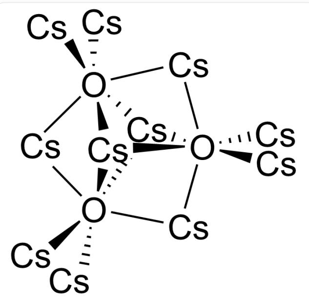

# 题目

配合物盐 A 包含 4 种元素, 具有高于普通盐类的导电性, 其在低温下具有一维反铁磁性, 而当温度升高会发生相变, 转换为顺磁性结构。

一种能体现配合物盐A结构特点的化学式是  $[\mathbf{BC}_2]\mathbf{D}$ ，其中：物种B是一种金属元素；物种C是一个电中性配体，且其中所有元素都只有一种化学环境；物种D无金属元素。元素分析表明，A中  $C$  和  $H$  的质量分数分别为  $43.6\%$  和  $7.4\%$  。

A 对热不稳定，需在很低温度（ $< -40^{\circ}\mathrm{C}$ ）下制备。将  $1.54 \mathrm{~g} \mathrm{~A}$  在低温（ $< 0^{\circ}\mathrm{C}$ ）下真空分解，得到  $0.31 \mathrm{~g} \mathrm{~B}$  单质，再将这些  $\mathbf{B}$  全部与  $O_{2}$  在控制条件下反应，得到氧化物  $\mathbf{N}$ ，化学式为  $\mathbf{B}_{y} O_{z}$ 。将上述  $\mathbf{N}$  全部溶于水，并收集到标况下的某可燃气体  $11.9 \mathrm{~mL}$ ，再用  $0.09196 \mathrm{~mol} / \mathrm{L}$  的  $HCl$  滴定前述水溶液，耗去  $25.32 \mathrm{~mL}$ 。

根据计算，推断上述未知物，并选择正确答案。

A. 其他选项均不正确  
B. B 的常见价态包括 +2 价  
C.  $1.54 \mathrm{~g} \mathrm{~A}$  直接溶于足量硫酸, 所得气体在标况下约为  $52 \mathrm{~mL}$  
D.  $\mathbf{N}$  的结构中,  $\mathbf{B}$  的化学环境数和  $O$  的化学环境数之比为  $2: 1$  
E.  $1 \mathrm{~mol} \mathrm{C}$  完全燃烧, 需消耗  $18 \mathrm{~mol} O_{2}$  。  
F. D 在 A 中的质量占比小于  $0.1\%$

# 答案

正确答案: F

# 详细解析

本题首先可以判断B的元素种类。  $0.31\mathrm{g}$  B产生的  $OH^{-}$ 数量 $n = c_{HCl}V_{HCl} = 0.09196\mathrm{mol / L}\cdot 25.32\mathrm{mL} = 0.00233\mathrm{mol}$  。设B在滴定时为  $+a$  价，则B的式量 $M_{\mathbf{B}} = 0.31\mathrm{g / (0.00233mol / a)} = 133.0 / \mathrm{ag / mol}$

# CHECKPOINT

3 PTS

B的式量  $M_{\mathrm{B}} = 133.0 / a$

$a = 1$  时  $\mathbf{B}$  为  $C s$ ,  $a = 2$  时  $\mathbf{B}$  近似为  $Z n$ ,  $a = 3$  时  $\mathbf{B}$  近似为  $S c$ , 但后两者的氢氧化物均不溶于水, 因此  $\mathbf{B}$  为  $C s$  。

# CHECKPOINT

1 PTS

B为  $C s$

$0.31 \mathrm{~g} C s$  直接溶于水产生的  $H_{2}$  为  $V = (0.31 \mathrm{~g} / 133 \mathrm{~g} / \mathrm{mol}) / 2 \cdot 22.4 \mathrm{~L} / \mathrm{mol} \cdot 1000 \mathrm{~mL} / \mathrm{L} \approx 26.1 \mathrm{~mL}$  。根据  $C s_{y} O_{z}$  的电子数守恒，有  $(y - 2 z) / y = 11.9 / 26.1$  ，其最小的合理整数解是  $y = 11, z = 3$  。因此  $\mathbf{N}$  为  $C s_{11} O_{3}$  。由于其中存在  $C s(0)$  ，因此  $\mathbf{N}$  溶于水，生成的可燃气体与  $C s$  相同，为  $H_{2}$  。

# CHECKPOINT

3 PTS

$\mathbf{N}$  为  $C s_{11}O_3$

$M_{\mathbf{A}} = M_{C s}\cdot 1.54\mathrm{g} / 0.31\mathrm{g}\approx 133\mathrm{g / mol}\cdot 4.97\approx 660.7\mathrm{g / mol}$  ，根据  $C$  和  $H$  的质量分数， $n(C) = (660.7\mathrm{g / mol}\cdot 0.436) / 12.01\mathrm{g / mol}\approx 23.98,\mathrm{n(H)} = (660.7\mathrm{g / mol}\cdot 0.074) / 1.008\mathrm{g / mol}\approx 48.50$  。

注意到  $n(C): n(H) \approx 1:2$ ，且  $\mathbf{C}$  是对  $Cs^{+}$ 的配体，所有元素只有一种环境，根据配位化学知识可以想到是冠醚类配体，进而根据配体数量推出  $\mathbf{C}$  是18-冠-6（ $C_{12}H_{24}O_6$ ）。此时还剩  $0.5H$ ，但  $\mathbf{A}$  在扣除  $Cs(C_{12}H_{24}O_6)_2$  后剩余分子量约为0，考虑实验误差，结合  $Cs$  为  $+1$  价， $\mathbf{D}$  可能是  $H^{-}$ 或  $e^{-}$ 。而  $CsH$  在  $<0^{\circ}\mathrm{C}$  下不会分解为  $Cs$  单质，结合题目中的信息“配合物盐  $\mathbf{A}$  包含4种元素，具有高于普通盐类的导电性，其在低温下具有一维反铁磁性，而当温度升高会发生相变，转换为顺磁性结构。”这与一些电子盐的性质高度吻合，因此  $\mathbf{D}$  应该为  $e^{-}$ ， $\mathbf{A}$  为  $Cs$  的电子盐。

# CHECKPOINT

2 PTS

C是18-冠-6

# CHECKPOINT

2 PTS

$\mathbf{D}$  为  $e^{-}$

$C s$  常见价态为  $+1$  而不是  $+2$  ，选项B错误。

# CHECKPOINT

0.5 PTS

$C_{s}$  的常见价态为  $+1$

1.54 g A 溶于硫酸释放的  $H_{2}$  量可视同其所含全部  $0.31 \mathrm{~g} C s$  单质的释放量, 如前计算为  $26.1 \mathrm{~mL} H_{2}$ , 选项 C错误。

# CHECKPOINT

1 PTS

$1.54 \mathrm{~g} \mathrm{~A}$  溶于硫酸释放  $26.1 \mathrm{~mL} \mathrm{H}_{2}$

$C s_{11}O_{3}$  的结构如下图所示：

该团簇可以看作是由三个共用面连接的  $\mathrm{Cs}_{6} \mathrm{O}$  八面体成三角形排列而成。根据铯原子在团簇中的不同位置，有三种化学环境，分别为3配位、2配位、1配位

因此， $C s_{11}O_3$  中有3种  $C s$  和1种  $O$  ，比例为  $3:1$  。选项D错误。

# CHECKPOINT

1.5 PTS

$C s_{11}O_{3}$  中  $C s$  与  $O$  的化学环境数之比为  $3:1$

1 mol 18-冠-6（ $C_{12}H_{24}O_6$ ）完全燃烧消耗  $(12 + 24 / 4 - 6 / 2) = 15\mathrm{mol}O_2$ 。选项E错误。

# CHECKPOINT

1 PTS

1 mol 18-冠-6完全燃烧消耗  $15 \mathrm{~mol} \mathrm{O}_{2}$

$e^{-}$  在  $\mathbf{A}$  中的质量占比显然  $< 0.1\%$  ，选项F正确。

# CHECKPOINT

1 PTS

$e^{-}$  在  $\mathbf{A}$  中的质量占比  $< 0.1\%$