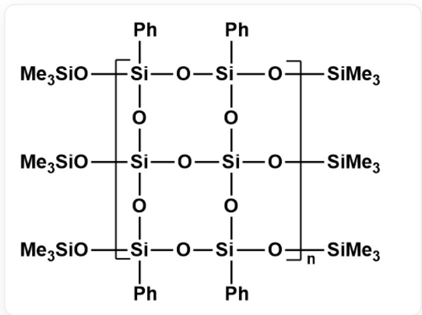
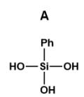
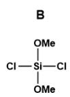
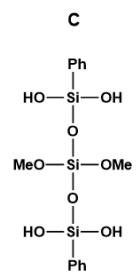
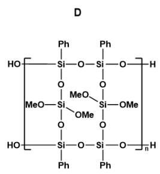
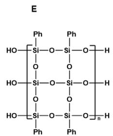

# Question

The following figure shows a polymer with a multi-chain structure, which can be prepared as follows: Dissolve  $\mathbf{A}(\mathrm{C}_6\mathrm{H}_8\mathrm{O}_3\mathrm{Si})$  in dioxane, and gradually add a dioxane solution of  $\mathbf{B}(\mathrm{C}_2\mathrm{H}_6\mathrm{O}_2\mathrm{Cl}_2\mathrm{Si})$  and triethylamine under argon protection to prepare monomer C; C undergoes dehydration under triethylamine catalysis to obtain polymer D; Dissolve D in THF, add a small amount of dilute hydrochloric acid, and stir thoroughly at room temperature for sufficient reaction; The resulting product undergoes dehydration again under triethylamine catalysis to obtain E; Finally, add a toluene solution of F to E for end-capping to obtain the final product.

This is a polymer. The repeating unit is [R1][Si](O[Si]1(O[R2])C2=CC=CC=C2)(O[Si]([R1])(O3)O[Si]([R1]) (C4=CC=CC=C4)O[Si](O[R2])(C5=CC=CC=C5)O[Si]3(O[R2])O1)C6=CC=CC=C6, R1 and R2 are the connection sites of the repeating unit; the terminal group R1 connected to Si is  $-\mathrm{OSiMe}_3$ , and the terminal group R2 connected to O is  $-\mathrm{SiMe}_3$

Which of the following statements is incorrect?

A. A contains three hydroxyl groups.  
B. B contains 2 methoxy groups.

C. C contains 8 C  
D. D contains a 12-membered ring  
E. The repeating unit in  $\mathbf{E}$  contains  $70$ .

# Answer

Correct Answer: C

# Detailed Explanation

Based on the product structure,  $\mathbf{A}$  and  $\mathbf{B}$  should be two small units of the polymer structure. Since  $\mathbf{A}$  contains 6 C atoms, it can be determined that  $\mathbf{A}$  is the part connected to the benzene ring, namely  $\mathrm{Si(OH)_3(C_6H_5)}$ , O[Si] (O)(O)C1=CC=CC=C1.  $\mathbf{A}$  contains three hydroxyl groups, so A is correct.

# CHECKPOINT

1.5 PTS

A is O[Si](O)(O)C1=CC=CC=C1

B should be a structure not connected to the benzene ring. Combined with the molecular formula, it can be determined as  $\mathrm{Si(OCH_3)_2Cl_2}$ , namely  $\mathrm{Cl}[\mathrm{Si}](\mathrm{Cl})(\mathrm{OC})\mathrm{OC}$ . B contains 2 methoxy groups, so B is correct.

# CHECKPOINT

1.5 PTS

B is Cl[Si](Cl)(OC)OC

The question indicates that  $\mathbf{C}$  is a monomer obtained from the reaction of  $\mathbf{A}$  and  $\mathbf{B}$ , which is only the substitution of  $\mathrm{O}$  for  $\mathrm{Cl}$ , i.e.,  $\mathbf{C}$  is  $\mathrm{O}[\mathrm{Si}](\mathrm{O}[\mathrm{Si}](\mathrm{OC})(\mathrm{OC})\mathrm{O}[\mathrm{Si}](\mathrm{O})(\mathrm{C}1 = \mathrm{CC} = \mathrm{CC} = \mathrm{C}1)\mathrm{O})(\mathrm{O})\mathrm{C}2 = \mathrm{CC} = \mathrm{CC} = \mathrm{C}2$ .  $\mathbf{C}$  contains  $12\mathrm{C}$  atoms, so  $\mathbf{C}$  is incorrect.

# CHECKPOINT

1 PTS

C is O[Si](O[Si](OC)(OC)O[Si](O)(C1=CC=CC=C1)O)(O)C2=CC=CC=C2

From "C undergoes dehydration under triethylamine catalysis to obtain polymer  $\mathbf{D}''$ , it can be determined that hydroxyl groups are connected in this step, which is the polymerization process, i.e., the repeating unit of  $\mathbf{D}$  is [R1][Si](O[Si]1(O[R2])C2=CC=CC=C2)(O[Si](OC)(OC)O[Si]([R1])(C3=CC=CC=C3)O[Si](O[R2])

$(\mathrm{C4 = CC = CC = C4})\mathrm{O}[\mathrm{Si}](\mathrm{OC})(\mathrm{OC})\mathrm{O1})\mathrm{C5 = CC = CC = C5}$ , R1 and R2 are the connection sites of the repeating unit; the terminal group R1 near Si is 2 OH, and the terminal group R2 near O is 2 H. D contains a 12-membered ring, so D is correct.

# CHECKPOINT

1 PTS

D's repeating unit is [R1][Si](O[Si]1(O[R2])C2=CC=CC=C2)(O[Si](OC)(OC)O[Si]([R1]) (C3=CC=CC=C3)O[Si](O[R2])(C4=CC=CC=C4)O[Si](OC)(OC)O1)C5=CC=CC=C5, R1 and R2 are the connection sites of the repeating unit; the terminal group R1 near Si is 2 OH, and the terminal group R2 near O is 2 H

Subsequently, the addition of hydrochloric acid will hydrolyze the methoxy groups into hydroxyl groups, and then the hydroxyl groups formed by hydrolysis undergo dehydration polymerization. Therefore, the repeating unit of  $\mathbf{E}$  is [R1][Si](O[Si]1(O[R2])C2=CC=CC=C2)(O[Si]([R1])(O3)O[Si]([R1])(C4=CC=CC=C4)O[Si](O[R2]) (C5=CC=CC=C5)O[Si]3(O[R2])O1)C6=CC=CC=C6, R1 and R2 are the connection sites of the repeating unit; the terminal group R1 near Si is 3 OH, and the terminal group R2 near O is 3 H. The repeating unit with the smallest number of molecules in  $\mathbf{E}$  contains 7 O atoms, so E is correct.

# CHECKPOINT

1 PTS

E's repeating unit [R1][Si](O[Si]1(O[R2])C2=CC=CC=C2)(O[Si]([R1])(O3)O[Si]([R1]) (C4=CC=CC=C4)O[Si](O[R2])(C5=CC=CC=C5)O[Si]3(O[R2])O1)C6=CC=CC=C6, R1 and R2 are the connection sites of the repeating unit; the terminal group R1 near Si is 3 OH, and the terminal group R2 near O is 3 H

$\mathbf{F}$  is a capping agent and, based on the product structure, should be  $\mathrm{SiMe}_3\mathrm{X}$ ,  $\mathrm{X} = \mathrm{Cl} \cdot \mathrm{Br} \cdot \mathrm{OTf}$ . Since it is not fixed, no further questions are asked.

In summary, choose option C.

Structures of A to E. A is O[Si](O)(O)C1=CC=CC=C1; B is Cl[Si](Cl)(OC)OC; C is O[Si](O[Si](OC)(OC)O[Si] (O)(C1=CC=CC=C1)O)(O)C2=CC=CC=C2; The repeating unit of D is [R1][Si](O[Si]1(O[R2])C2=CC=CC=C2) (O[Si](OC)(OC)O[Si]([R1])(C3=CC=CC=C3)O[Si](O[R2])(C4=CC=CC=C4)O[Si](OC)(OC)O1)C5=CC=CC=C5, R1 and R2 are the connection sites of the repeating unit; the terminal group R1 near Si is 2 OH, and the terminal group R2 near O is 2 H; The repeating unit of E is [R1][Si](O[Si]1(O[R2])C2=CC=CC=C2)(O[Si]([R1])(O3)O[Si] ([R1])(C4=CC=CC=C4)O[Si](O[R2])(C5=CC=CC=C5)O[Si]3(O[R2])O1)C6=CC=CC=C6, R1 and R2 are the connection sites of the repeating unit; the terminal group R1 near Si is 3 OH, and the terminal group R2 near O