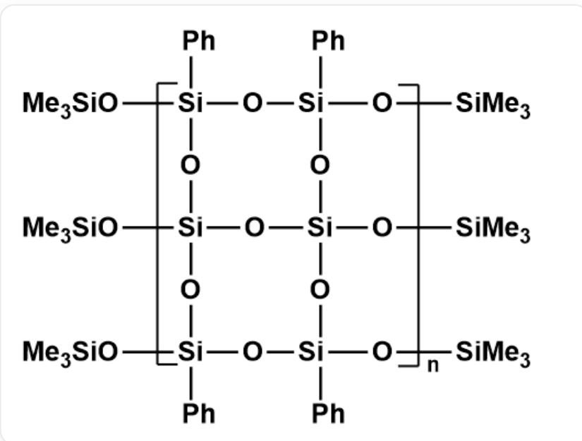
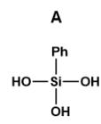
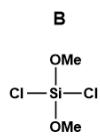
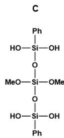
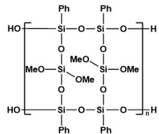
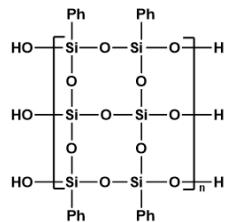

# 题目

下图是一种具有多链结构的聚合物，其可按照如下方法制备：将  $\mathrm{A}(\mathrm{C}_{6} \mathrm{H}_{8} \mathrm{O}_{3} \mathrm{Si})$  溶于二氧六环中，在氩气保护下逐渐滴加  $\mathrm{B}(\mathrm{C}_{2} \mathrm{H}_{6} \mathrm{O}_{2} \mathrm{Cl}_{2} \mathrm{Si})$  和三乙胺的二氧六环溶液，制得单体 C；C 在三乙胺催化下发生脱水，得到聚合物 D；将 D 溶于 THF，加入少量稀盐酸，室温搅拌充分反应；得到的产物在三乙胺催化下再次发生脱水，得到 E；最后，向 E 中加入 F 的甲苯溶液反应封端，制得最终产物。

这是一个高分子聚合物。重复单元为[R1][Si](O[Si]1(O[R2])C2=CC=CC=C2)(O[Si]([R1])(O3)O[Si]([R1]) (C4=CC=CC=C4)O[Si](O[R2])(C5=CC=CC=C5)O[Si]3(O[R2])O1)C6=CC=CC=C6，R1和R2是重复单元的连接位点；与Si相连的端基R1为一OSiMe3，与O相连的端基R2为-SiMe3

下列说法中错误的是

A. A中包含三个羟基  
B. B中包含2个甲氧基  
C. C中包含8个C

D. D中包含12元环  
E. E中重复单元包含7个O

# 答案

正确答案: C

# 详细解析

根据产物结构进行反推，A和B应当为聚合物结构的两个小单元。由于A中含6个C，可以判断A为和苯环相连的部分，即  $\mathrm{Si(OH)_3(C_6H_5)}$  ，O[Si](O)(O)C1=CC=CC=C1。A中包含三个羟基，A正确。

# CHECKPOINT

1.5 PTS

A 为O[Si](O)(O)C1=CC=CC=C1

B 应为不和苯环相连的结构，结合分子式可以判断为  $\mathrm{Si(OCH_3)_2Cl_2}$ ，即  $\mathrm{Cl}[\mathrm{Si}](\mathrm{Cl})(\mathrm{OC})\mathrm{OC}$ 。B 中包含 2 个甲氧基，B 正确。

# CHECKPOINT

1.5 PTS

B 为  $\mathrm{Cl}[\mathrm{Si}](\mathrm{Cl})(\mathrm{OC})\mathrm{OC}$

题干表明，C为A和B反应得到的单体，则仅为O对Cl的取代，即C为O[Si](O[Si](OC)(OC)O[Si](O)(C1=CC=CC=C1)O)(O)C2=CC=CC=C2。C中包含12个C，C错误。

# CHECKPOINT

1 PTS

C 为  $O[\mathrm{Si}](O[\mathrm{Si}](\mathrm{OC})(\mathrm{OC})O[\mathrm{Si}](\mathrm{O})(\mathrm{C}1 = \mathrm{CC} = \mathrm{CC} = \mathrm{C}1)\mathrm{O})(\mathrm{O})\mathrm{C}2 = \mathrm{CC} = \mathrm{CC} = \mathrm{C}2$

由”C在三乙胺催化下发生脱水，得到聚合物D“，可以判断这一步骤发生了羟基相连，聚合的过程，即D的重复单元为[R1][Si](O[Si]1(O[R2])C2=CC=CC=C2)(O[Si](OC)(OC)O[Si]([R1])(C3=CC=CC=C3)O[Si](O[R2])(C4=CC=CC=C4)O[Si](OC)(OC)O1)C5=CC=CC=C5，R1和R2是重复单元的连接位点；靠近Si的端基R1为2个OH，靠近O的端基R2为2个H。D中包含12元环，D正确。

# CHECKPOINT

1 PTS

D 的重复单元为 [R1][Si](O[Si]1(O[R2])C2=CC=CC=C2)(O[Si](OC)(OC)O[Si]([R1]) (C3=CC=CC=C3)O[Si](O[R2])(C4=CC=CC=C4)O[Si](OC)(OC)O1)C5=CC=CC=C5，R1和R2是重复单元的连接位点；靠近Si的端基R1为2个OH，靠近O的端基R2为2个H

随后，加入盐酸，会将甲氧基水解成羟基，然后水解形成的羟基发生脱水聚合。因此  $\mathbf{E}$  的重复单元为[R1][Si](O[Si]1(O[R2])C2=CC=CC=C2)(O[Si]([R1])(O3)O[Si]([R1])(C4=CC=CC=C4)O[Si](O[R2])

(C5=CC=CC=C5)O[Si]3(O[R2])O1)C6=CC=CC=C6，R1和R2是重复单元的连接位点；靠近Si的端基R1为3个OH，靠近O的端基R2为3个H。E中分子数最小的重复单元包含7个O，E正确。

# CHECKPOINT

1 PTS

E 的重复单元为 [R1][Si](O[Si]1(O[R2])C2=CC=CC=C2)(O[Si]([R1])(O3)O[Si]([R1])(C4=CC=CC=C4)O[Si](O[R2])(C5=CC=CC=C5)O[Si]3(O[R2])O1)C6=CC=CC=C6，R1和R2是重复单元的连接位点；靠近Si的端基R1为3个OH，靠近O的端基R2为3个H

$\mathbf{F}$  为封端试剂，根据产物结构，应当为  $\mathrm{SiMe_3X}$ ， $\mathrm{X} = \mathrm{Cl}$ 、 $\mathrm{Br}$ 、 $\mathrm{OTf}$ 。由于不固定，不再设问。

综上，选择C选项。

  
E

  
D

A E结构。A为O[Si](O)(O)C1=CC=CC=C1；B为Cl[Si](Cl)(OC)OC；C为O[Si](O[Si](OC)(OC)O[Si](O)

$(C1 = CC = CC = C1)O)(O)C2 = CC = CC = C2$  ；  $\mathbf{D}$  的重复单元为[R1][Si](O[Si]1(O[R2])C2=CC=CC=C2)(O[Si](OC)

(OC)O[Si]([R1])(C3=CC=CC=C3)O[Si](O[R2])(C4=CC=CC=C4)O[Si](OC)(OC)O1)C5=CC=CC=C5，R1和R2是重

复单元的连接位点；靠近Si的端基R1为2个OH，靠近O的端基R2为2个H；E的重复单元为[R1][Si]

$(\mathrm{O}[\mathrm{Si}]1(\mathrm{O}[\mathrm{R}2])\mathrm{C}2 = \mathrm{CC} = \mathrm{CC} = \mathrm{C}2)(\mathrm{O}[\mathrm{Si}]([\mathrm{R}1])(\mathrm{O}3)\mathrm{O}[\mathrm{Si}]([\mathrm{R}1])(\mathrm{C}4 = \mathrm{CC} = \mathrm{CC} = \mathrm{C}4)\mathrm{O}[\mathrm{Si}](\mathrm{O}[\mathrm{R}2])$

(C5=CC=CC=C5)O[Si]3(O[R2])O1)C6=CC=CC=C6，R1和R2是重复单元的连接位点；靠近Si的端基R1为3个OH

, 靠近O的端基R2为3个H