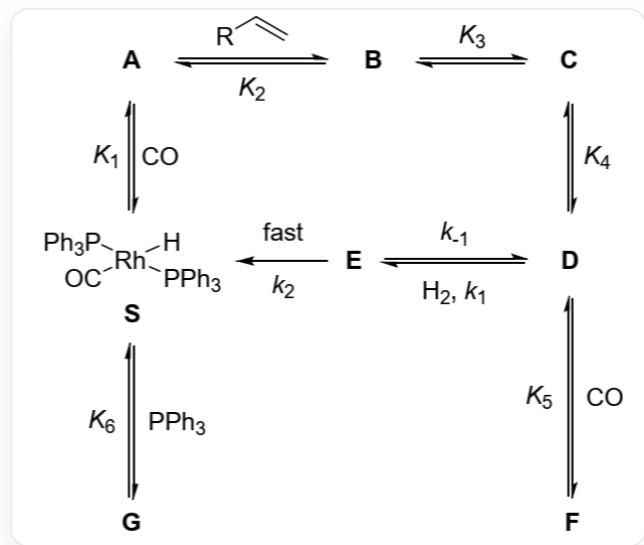

# 题目

下图展示了一个催化反应的动力学模型：

该图像包含多个字母标记的节点：**A**、**B**、**C**、**D**、**E**、**F**、**G**、**S**。节点S处有分子式[H][Rh]([P](C1=CC=CC=C1)(C2=CC=CC=C2)C3=CC=CC=C3)([P](C4=CC=CC=C4)(C5=CC=CC=C5)C6=CC=CC=C6)[C]=O，这是该节点的唯一标注。节点**A**和**S**之间有一条双向箭头，**S**至**A**侧标注K1，**A**至**S**侧标注CO。节点**A**和**B**之间有一条双向箭头，**A**至**B**侧标注C=C[R]，**B**至**A**侧标注K2；**B**和**C**之间有一条双向箭头，**B**至**C**侧标注K3；**C**和**D**之间同样有一条双向箭头，**C**至**D**侧标注K4。节点**D**与**E**之间也有一条双向箭头，箭头方向从**D**指向**E**，并标注为“H2, k1”，反向的箭头从**E**指向**D**，标注为“k-1”。节点**E**与**S**之间有一条单向箭头，从**E**指向**S**的方向标注为“k2 fast”。**F**和**D**之间有一条双向箭头，**D**至**F**侧标注CO，**F**至**D**侧标注K5；而**G**和**S**之间有一条双向箭头，**S**至**G**侧标注PPh3，**G**至**F**侧标注K6。

催化循环中各转化过程分别为：S与CO可逆结合生成A，反应的平衡常数为  $K_{1}$  ；A与烯烃（  $\mathrm{R - CH = CH_2}$  ，记作Aly）反应得到B，平衡常数为  $K_{2}$  ；B可异构化为C，C又可异构化为D，异构化的平衡常数分别为  $K_{3}$  和  $K_{4}$  ；D与CO可逆结合得到F，平衡常数为  $K_{5}$  ，另一方面，D也可与  $\mathrm{H}_{2}$  反应得到E，正反应速率常数为  $k_{1}$  ，逆反应的速率常数为  $k_{-1}$  ；E快速脱除一分子产物P（在图中未示出)，同时得到S，此步速率常数为  $k_{2}$  ；S还会与  $\mathrm{PPh}_3$  可逆反应得到无催化活性的G，其平衡常数为  $K_{6}$  。

已知催化循环过程中A、B、C三个物种的浓度相对其他含Rh物种可忽略。以下选项是对反应速率（  $r = d[\mathbf{P}] / dt$  ）的描述，请结合合理的近似推导，选择正确选项。

A. 反应速率关于含Rh物种总浓度[Rh]的级数与其他物种浓度有关。  
B. 当CO分压足够大时，反应速率关于  $[\mathrm{CO}]$  的级数是-1级，关于  $[\mathrm{H}_{2}]$  的级数是1级，且与  $K_{1}$  、  $K_{2}$  、  $K_{3}$  、  $K_{4}$  的值有关。

C. 当  $\mathrm{H}_{2}$  分压足够大时, 反应速率关于  $[\mathrm{CO}]$  的级数是 0 级, 关于  $[\mathrm{H}_{2}]$  的级数是 0 级, 且与  $k_{1}$  的值无关, 与  $k_{2}$  的值有关。  
D. 当  $\mathrm{H}_{2}$  分压足够小时, 反应速率关于  $[\mathrm{H}_{2}]$  的级数是 1 级, 且在题目中提到的所有平衡常数和速率常数中, 存在与反应速率无关的值。  
E. 当  $\left[\mathrm{PPh}_{3}\right]$  足够大时，反应速率关于  $\left[\mathrm{PPh}_{3}\right]$  的级数为-1级，且与  $[\mathrm{H}_{2}]$  和  $[\mathrm{CO}]$  无关。  
F. 随着  $\mathrm{Aly}$  分压不断增加, 反应速率会达到一个与  $[\mathrm{CO}]$  、  $[\mathrm{Rh}]$  、  $[\mathrm{H}_{2}]$  、  $[\mathrm{PPh}_{3}]$  均相关的最大值。

# 答案

正确答案: C

# 详细解析

由图，可以得到含化学计量数的平衡式和反应表达式：

$$
\mathbf {S} + \mathrm {C O} \rightleftharpoons \mathbf {A}
$$

$$
\mathbf {A} + \mathrm {A l y} \rightleftharpoons \mathbf {B} \rightleftharpoons \mathbf {C} \rightleftharpoons \mathbf {D}
$$

$$
\mathbf {D} + \mathrm {H} _ {2} \rightleftharpoons \mathbf {E} \rightarrow \mathbf {E} + \mathbf {S}
$$

$$
\mathbf {D} + \mathrm {C O} \rightleftharpoons \mathbf {F}
$$

$$
\mathbf {S} + \mathrm {P P h} _ {3} \rightleftharpoons \mathbf {G}
$$

CHECKPOINT

0.4 PTS

存在平衡  $\mathbf{S} + \mathrm{CO}\rightleftharpoons \mathbf{A}$

# CHECKPOINT

0.4 PTS

存在平衡  $\mathbf{A} + \mathrm{Aly}\rightleftharpoons \mathbf{B}\rightleftharpoons \mathbf{C}\rightleftharpoons \mathbf{D}$

# CHECKPOINT

0.4 PTS

存在平衡  $\mathbf{D} + \mathbf{H}_2 \rightleftharpoons \mathbf{E} \rightarrow \mathbf{E} + \mathbf{S}$

# CHECKPOINT

0.4 PTS

存在平衡  $\mathbf{D} + \mathrm{CO}\rightleftharpoons \mathbf{F}$

# CHECKPOINT

0.4 PTS

存在平衡  $\mathbf{S} + \mathrm{PPh}_3\rightleftharpoons \mathbf{G}$

根据推测的结构和反应过程，根据平衡态假设，给出[D]、[F]、[G]关于[S]的表达式：

$$
[ \mathbf {D} ] = K _ {1} K _ {2} K _ {3} K _ {4} [ \mathbf {S} ] [ \mathrm {C O} ] [ \mathrm {A l y} ]
$$

$$
\mathbf {\Gamma} [ \mathbf {F} ] = K _ {1} K _ {2} K _ {3} K _ {4} K _ {5} [ \mathbf {S} ] [ \mathrm {C O} ] ^ {2} [ \mathrm {A l y} ]
$$

$$
[ \mathbf {G} ] = K _ {6} [ \mathbf {S} ] [ \mathrm {P P h} _ {3} ]
$$

其中[Aly]为烯烃物种浓度；  $\left[\mathrm{PPh}_3\right]$  为三苯基磷物种浓度。

# CHECKPOINT

1 PTS

[D]关于[S]的表达式为  $[\mathbf{D}] = K_{1}K_{2}K_{3}K_{4}[\mathbf{S}][\mathrm{CO}][\mathrm{Aly}]$

# CHECKPOINT

1 PTS

[F]关于[S]的表达式为  $[\mathbf{F}] = K_{1}K_{2}K_{3}K_{4}K_{5}[\mathbf{S}][\mathrm{CO}]^{2}[\mathrm{Aly}]$

# CHECKPOINT

1 PTS

[G]关于[S]的表达式为  $[\mathbf{G}] = K_{6}[\mathbf{S}][\mathrm{PPh}_{3}]$

对[E]采取稳态近似：

$$
d [ \mathbf {E} ] / d t = k _ {1} [ \mathbf {D} ] [ \mathbf {H} _ {2} ] - (k _ {- 1} + k _ {2}) [ \mathbf {E} ] = 0
$$

则：

$$
[ \mathbf {E} ] = k _ {1} [ \mathbf {D} ] [ \mathrm {H} _ {2} ] / (k _ {- 1} + k _ {2})
$$

# CHECKPOINT

1 PTS

对[E]采取稳态近似：  $[\mathbf{E}] = k_{1}[\mathbf{D}][\mathbf{H}_{2}] / (k_{-1} + k_{2})$

代入物料守恒关系式：

$$
[ \mathrm {R h} ] = [ \mathbf {S} ] + [ \mathbf {D} ] + [ \mathbf {E} ] + [ \mathbf {F} ] + [ \mathbf {G} ]
$$

得到[S]的表达式为：

$$
[ \mathbf {S} ] = [ \mathrm {R h} ] / \{1 + K _ {6} [ \mathrm {P P h} _ {3} ] + [ 1 + K _ {5} [ \mathrm {C O} ] + k _ {1} [ \mathrm {H} _ {2} ] / (k _ {- 1} + k _ {2}) ] K _ {1} K _ {2} K _ {3} K _ {4} [ \mathrm {C O} ] [ \mathrm {A l y} ] \}
$$

# CHECKPOINT

1 PTS

[S]的表达式为  $[\mathbf{S}] = [\mathrm{Rh}] / \{1 + K_6[\mathrm{PPh}_3] + [1 + K_5[\mathrm{CO}] + k_1[\mathrm{H}_2] / (k_{-1} + k_2)]K_1K_2K_3K_4[\mathrm{CO}][\mathrm{Aly}]\}$

代入反应速率表达式：

$$
r = d [ \mathbf {P} ] / d t = k _ {2} [ \mathbf {E} ] = k _ {1} k _ {2} [ \mathbf {D} ] [ \mathrm {H} _ {2} ] / (k _ {- 1} + k _ {2}) = k _ {1} k _ {2} K _ {1} K _ {2} K _ {3} K _ {4} [ \mathbf {S} ] [ \mathrm {C O} ] [ \mathrm {A l y} ] [ \mathrm {H} _ {2} ] / (k _ {- 1} + k _ {2})
$$

代入  $[\mathbf{S}]$ ，得到反应速率表达式：

$$
r = k _ {1} k _ {2} K _ {1} K _ {2} K _ {3} K _ {4} [ \mathrm {R h} ] [ \mathrm {C O} ] [ \mathrm {A l y} ] [ \mathrm {H} _ {2} ] / (k _ {- 1} + k _ {2}) \{1 + K _ {6} [ \mathrm {P P h} _ {3} ] + [ 1 + K _ {5} [ \mathrm {C O} ] + k _ {1} [ \mathrm {H} _ {2} ] / (k _ {- 1} + k _ {2}) ] K _ {1} K _ {2} K _ {3} K _ {4} [ \mathrm {C O} ] [ \mathrm {A l y} ] \}
$$

# CHECKPOINT

1 PTS

反 应 速 率 表 达 式

$$
r = k _ {1} k _ {2} K _ {1} K _ {2} K _ {3} K _ {4} [ \mathrm {R h} ] [ \mathrm {C O} ] [ \mathrm {A l y} ] [ \mathrm {H} _ {2} ] / (k _ {- 1} + k _ {2}) \{1 + K _ {6} [ \mathrm {P P h} _ {3} ] + [ 1 + K _ {5} [ \mathrm {C O} ] + k _ {1} [ \mathrm {H} _ {2} ] / (k _ {- 1} + k _ {2}) ] K _ {1} K _ {2} K _ {3} K _ {4} [ \mathrm {C O} ] [ \mathrm {A l y} ] \},
$$

由反应速率表达式判断：

无论其他物种浓度取值如何，[Rh]的指数项都为1，所以反应级数与其他物种无关，故选项A错误；

# CHECKPOINT

1 PTS

[Rh]的指数项都为1，所以反应级数与其他物种无关

[CO]足够大时，有：

$$
r = k _ {1} k _ {2} [ \mathrm {R h} ] [ \mathrm {H} _ {2} ] / K _ {5} (k _ {- 1} + k _ {2}) [ \mathrm {C O} ]
$$

# CHECKPOINT

1 PTS

[CO]足够大时，有：  $r = k_{1}k_{2}[\mathrm{Rh}][\mathrm{H}_{2}] / K_{5}(k_{-1} + k_{2})[\mathrm{CO}]$

反应速率与  $K_{1} 、 K_{2} 、 K_{3} 、 K_{4}$  的值无关, 故选项B错误;

$[\mathrm{H}_2]$  足够大时，有：

$$
r = k _ {2} [ \mathrm {R h} ]
$$

# CHECKPOINT

1 PTS

$[\mathrm{H}_2]$  足够大时，有：  $r = k_{2}[\mathrm{Rh}]$

故选项C正确；

$[\mathrm{H}_2]$  足够小时，有：

$$
r = k _ {1} k _ {2} K _ {1} K _ {2} K _ {3} K _ {4} [ \mathrm {R h} ] [ \mathrm {C O} ] [ \mathrm {A l y} ] [ \mathrm {H} _ {2} ] / (k _ {- 1} + k _ {2}) \{1 + K _ {6} [ \mathrm {P P h} _ {3} ] + [ 1 + K _ {5} [ \mathrm {C O} ] ] K _ {1} K _ {2} K _ {3} K _ {4} [ \mathrm {C O} ] [ \mathrm {A l y} ] \}
$$

# CHECKPOINT

1 PTS

$[\mathrm{H}_2]$  足够小时，有：

$$
r = k _ {1} k _ {2} K _ {1} K _ {2} K _ {3} K _ {4} [ \mathrm {R h} ] [ \mathrm {C O} ] [ \mathrm {A l y} ] [ \mathrm {H _ {2}} ] / (k _ {- 1} + k _ {2}) \{1 + K _ {6} [ \mathrm {P P h _ {3}} ] + [ 1 + K _ {5} [ \mathrm {C O} ] ] K _ {1} K _ {2} K _ {3} K _ {4} [ \mathrm {C O} ] [ \mathrm {A l y} ] \}
$$

题目中所有速率常数和平衡常数均与反应速率有关，故选项D错误。

$\mathrm{[PPh_3]}$  足够大时，有：

$$
r = k _ {1} k _ {2} K _ {1} K _ {2} K _ {3} K _ {4} [ \mathrm {R h} ] [ \mathrm {C O} ] [ \mathrm {A l y} ] [ \mathrm {H} _ {2} ] / (k _ {- 1} + k _ {2}) K _ {6} [ \mathrm {P P h} _ {3} ]
$$

# CHECKPOINT

1 PTS

$\left[\mathrm{PPh}_{3}\right]$  足够大时，有：

$$
r = k _ {1} k _ {2} K _ {1} K _ {2} K _ {3} K _ {4} [ \mathrm {R h} ] [ \mathrm {C O} ] [ \mathrm {A l y} ] [ \mathrm {H} _ {2} ] / (k _ {- 1} + k _ {2}) K _ {6} [ \mathrm {P P h} _ {3} ]
$$

速率与  $[\mathrm{H}_2]$  和  $[\mathrm{CO}]$  有关，故E选项错误。

[Aly]足够大时，有：

$$
r = k _ {1} k _ {2} [ \mathrm {R h} ] [ \mathrm {H} _ {2} ] / (k _ {- 1} + k _ {2}) [ 1 + K _ {5} [ \mathrm {C O} ] + k _ {1} [ \mathrm {H} _ {2} ] / (k _ {- 1} + k _ {2}) ]
$$

# CHECKPOINT

1 PTS

[Aly]足够大时，有：

$$
r = k _ {1} k _ {2} [ \mathrm {R h} ] [ \mathrm {H} _ {2} ] / (k _ {- 1} + k _ {2}) [ 1 + K _ {5} [ \mathrm {C O} ] + k _ {1} [ \mathrm {H} _ {2} ] / (k _ {- 1} + k _ {2}) ]
$$

速率与  $\left[\mathrm{PPh}_{3}\right]$  无关，F选项错误。

综上所述，应当选择C选项。