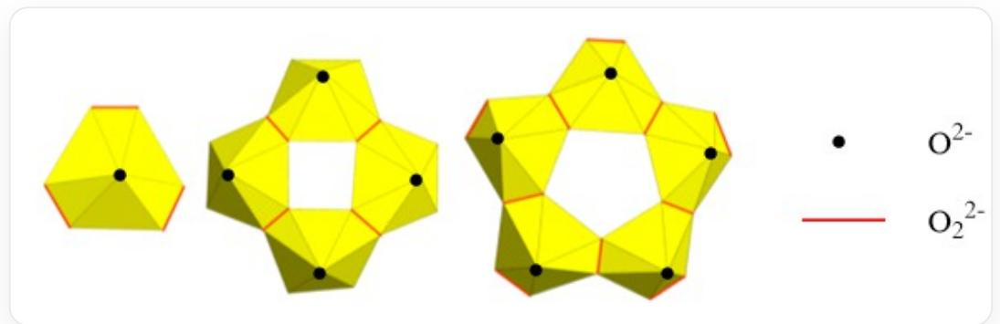

# Question

Uranyl peroxide cage clusters are generally soluble in water. Here, the effect of hydrogen peroxide concentration on the dissolution of  $UO_{2}$  is investigated. Lower initial  $H_{2}O_{2}$  concentrations reduce the dissolution of  $UO_{2}$  and tend to produce simple uranyl peroxides.

The figure below shows the structures of three uranyl clusters, where some atoms may be obscured, and the overall structure may be charged or neutral, with uranium in the  $+6$  oxidation state.

The figure illustrates the structural diagrams of three uranyl cluster anions, with oxygen atoms at the vertices and uranium atoms at the centers. The red edges represent peroxide ions, and the black vertices are oxygen atoms.

If the oligomerization pattern is the same as these three, provide the general formula for the n-mer.

A.  $\left[(U O_{2})_{n} O_{3 n}\right]^{4 n - }$  
B.  $\left[(U O_{2})_{n}(O_{2})_{4 n}\right]^{6 n - }$  
C.  $\left[(U O_{2})_{n}(O_{2})_{3 n}\right]^{4 n - }$  
D.  $\left[(U O_{2})_{n}(O_{2})_{2 n}\right]^{2 n - }$

E.  $\left[(U O_{2})_{2 n}(O_{2})_{5 n}\right]^{6 n - }$  
F.  $\left[(U O_{2})_{2 n}(O_{2})_{n}\right]^{2 n + }$

# Answer

Correct Answer: D

# Detailed Explanation

The uranyl ion is  $[UO_2]^{2+}$ . Since hydrogen peroxide is added to the solution, the coordination mode involves  $[O_2]^{2-}$  coordinating to the uranium atom.

From the observed structure, each uranium atom bonds with three  $[O_2]^{2-}$  ligands, including two bridging ligands and one terminal ligand.

# CHECKPOINT

1 PTS

Each uranium atom bonds with three  $[O_2]^{2-}$  ligands, including two bridging ligands and one terminal ligand

Because it is a uranyl cluster, each uranium atom also bonds with two  $O^{2-}$  ligands.

# CHECKPOINT

1 PTS

Each uranium atom also bonds with two  $O^{2-}$  ligands

Therefore, the general formula is  $\left[(UO_2)_n(O_2)_{2n}\right]^{2n-}$ , and the correct choice is D.

# CHECKPOINT

1 PTS

The general formula is  $\left[(UO_2)_n(O_2)_{2n}\right]^{2n - }$ , and the correct choice is D