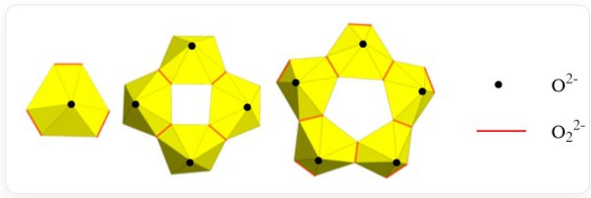

# 题目

过氧化铀酰笼团簇通常溶于水。在此，研究了过氧化氢浓度相对于  $U O_{2}$  的溶解作用。较低的初始  $H_{2}O_{2}$  浓度会降低  $U O_{2}$  的溶解，并倾向于生成简单的过氧化铀酰。

下图示出三种铀酰簇的结构，其中可能有原子被遮挡，整体可能带电荷或显中性，铀的价态为  $+6$  价。

  
该图为三种铀酰簇阴离子的结构示意图，顶点为氧原子，中心为铀原子。其中红色棱为过氧根离子，黑色顶点为氧原子。

如果多聚体的模式与这三种相同，请给出n聚体的通式。

A.  $\left[(U O_{2})_{n} O_{3 n}\right]^{4 n - }$  
B.  $\left[(U O_{2})_{n}(O_{2})_{4 n}\right]^{6 n - }$  
C.  $\left[(U O_{2})_{n}\left(O_{2}\right)_{3 n}\right]^{4 n - }$  
D.  $\left[(U O_{2})_{n}(O_{2})_{2 n}\right]^{2 n - }$  
E.  $\left[(U O_{2})_{2 n}(O_{2})_{5 n}\right]^{6 n - }$  
F.  $\left[(U O_{2})_{2 n}(O_{2})_{n}\right]^{2 n + }$

# 答案

正确答案: D

# 详细解析

铀酰为  $[UO_2]^{2+}$ ，溶液中加入过氧化氢，所以配位方式为  $[O_2]^{2-}$  对铀原子进行配位。

观察结构，每个铀原子与三个  $[O_2]^{2-}$  成键，包含两个桥连配体和一个端基配体。

# CHECKPOINT

1 PTS

每个铀原子与三个  $[O_2]^{2-}$  成键，包含两个桥连配体和一个端基配体

因为是铀酰簇，所以每个铀原子还与两个  $O^{2-}$  成键。

# CHECKPOINT

1 PTS

每个铀原子还与两个  $O^{2-}$  成键

因此，通式为  $\left[(UO_2)_n(O_2)_{2n}\right]^{2n - }$ ，选择D。

# CHECKPOINT

1 PTS

通式为  $\left[(UO_{2})_{n}(O_{2})_{2n}\right]^{2n - }$  ，选择D