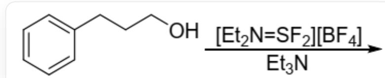
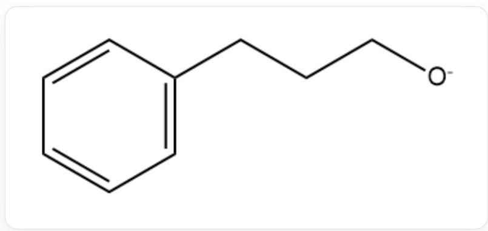
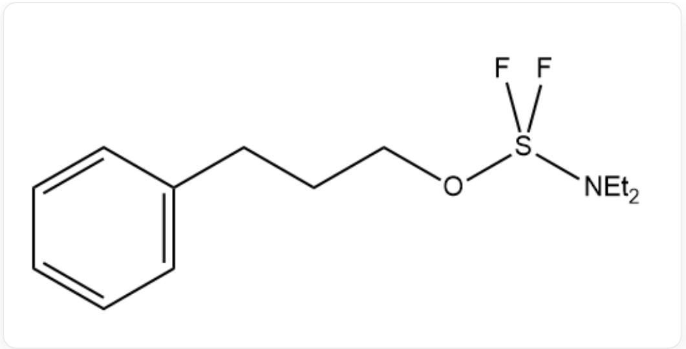
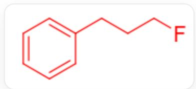
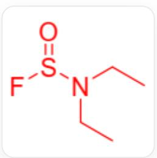
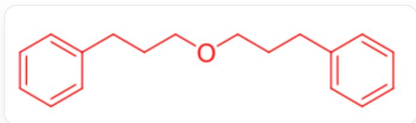
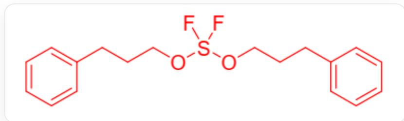
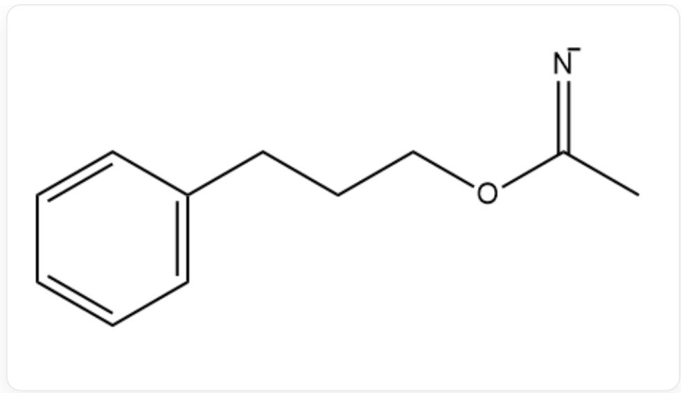
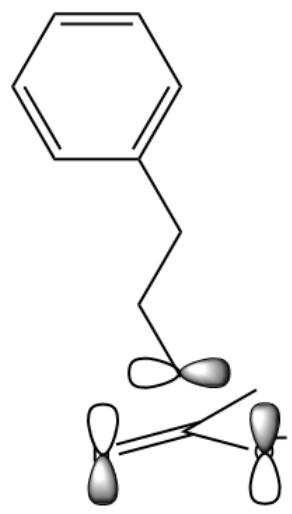
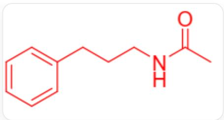

# 题目

对于下列有机反应，关于其有机产物的描述，选出不正确的一项。

  
图中有一个向右的横向箭头，箭头左边为一个有机分子，其结构为c1cccccc1CCCCO，箭头上方文字为[Et_2N=SF_2][BF_4]，箭头下方文字为Et_3N。

A. 该反应条件下生成的一种卤代烃分子中, 卤素的质量分数为  $13.75\%$  。  
B. 该反应条件下生成的一种醚中, 最短路径最长的两个原子之间经过了 16 根化学键。  
C. 该反应条件下生成了一种具有4配位硫原子的有机分子, 其分子中的总原子数为  $45$  。  
D. 该反应条件下, 生成了一种不含苯环的有机物, 其包含6种不同元素的原子。  
E. 该反应条件下, 生成的含苯环的产物中, 相对分子质量最大的产物, 其相对分子质量超过 300。  
F. 该反应条件下, 生成的产物中, 存在不含苯环的有机物, 其相对分子质量介于130至140范围。  
G. 在该反应条件下, 不存在两种彼此之间相对分子质量之差小于10的有机产物。  
H. 若反应在乙腈溶剂中进行, 会得到同时含有氮、氧、苯环, 且不含氟或硫的副产物。

# 答案

正确答案: G

# 详细解析

在该反应体系中, 三乙胺作为碱, 将醇羟基去质子化得到醇负离子中间体:

  
c1cccccc1CCC[O-]

$\left[\mathrm{Et}_{2} \mathrm{~N}=\mathrm{SF}_{2}\right] \left[\mathrm{BF}_{4}\right]$  的阳离子中，硫原子具有亲电性，其被底物的醇负离子进攻后，得到含有四配位硫，硫原子上即有氮也有氧配位的的电中性中间体：

CCN(CC)S(F)(F)OCCCc1cccccc1

# CHECKPOINT

1 PTS

生成中间体CCN(CC)S(F)(F)OCCCc1cccccc1

该中间体紧接着发生分子内取代反应，可能的机理为：O上的孤对电子进攻S-F键的反键轨道，将S-F键断开形成紧密离子对，接着氟离子进攻与氧相连的碳原子，氟原子取代醇负离子中的氧，得到一元氟取代产物

c1cccccc1CCCF

# CHECKPOINT

1 PTS

一元氟取代产物c1cccccc1CCCF

同时得到一个含有硫氧键的产物:

  
CCN(CC)S(=O)F

# CHECKPOINT

1 PTS

离去的产物为CCN(CC)S(=O)F

两者为该条件下的主产物。其中，一元氟取代物的相对分子质量为  $19.00 + 12.01 \times 9 + 1.008 \times 11 = 138.178$  ，氟的质量分数为  $\frac{19.00}{138.178} \times 100\% = 13.75\%$  ，故选项A说法正确。

# CHECKPOINT

1 PTS

氟代物的相对分子质量为138.178

# CHECKPOINT

1 PTS

氟的质量分数为  $13.75\%$

生成的另一个产物不含苯环，其相对分子质量为139.2，介于  $130 - 140$  之间，故选项F说法正确。该分子中包含C,H,O,N,F,S六种元素，选项D说法正确。

# CHECKPOINT

1 PTS

产物不含苯环，其相对分子质量为139.2

# CHECKPOINT

1 PTS

产物中存在C,H,O,N,F,S六种元素

注意到反应中生成的一元氟取代物和离去的含氧分子的相对分子质量分别为138.178和139.2，其差值为 $1.022 < 10$ ，故选项G说法不正确，成为候选选项。

中间体

  
CCN(CC)S(F)(F)OCCCc1cccccc1

同样可被醇负离子亲核进攻，若醇负离子进攻与氧原子相连的碳，则离去一个可通过离去  $F^{-}$  达到稳定的负离子，剩下一分子的醚：

  
c1cccccc1CCCCOCCCc2cccccc2

# CHECKPOINT

1 PTS

进一步亲核进攻生成醚

其相对分子质量为254.356。

# CHECKPOINT

1 PTS

醚的相对分子质量为254.356

在该分子中，沿化学键的最短路径最长的情形为从一个苯环  $p$  -位的氢原子到另一个苯环  $p$  -位的氢原子，即 $\mathrm{H - C - C - C - C - C - C - C - O - C - C - C - C - C - C - H}$  共计17个原子和16根化学键，选项B说法正确。

# CHECKPOINT

1 PTS

路径为从一个苯环的  $p$  位氢到另一个苯环的  $p$  位氢, 有16根化学键

若醇负离子进攻含硫中间体的硫原子，则经过五配位中间体后，离去二乙基胺基负离子，生成在硫上连接两个氧的副产物：

  
c1cccccc1CCCOS(F)(F)OCCCc2cccccc2

其相对分子质量为340.426，故选项E说法正确。

# CHECKPOINT

1 PTS

产物相对分子质量为340.426

分子中，硫原子为4配位，共有45个原子，选项C说法正确。

# CHECKPOINT

1 PTS

含有45个原子

最后还剩下  $\mathbf{H}$  选项，若溶剂为乙腈，则乙腈可能参与反应。乙腈是亲电试剂，其亲电位点在氰基的碳原子上，故可被醇负离子进攻，得到中间体

# CHECKPOINT

1 PTS

乙腈的氰基碳被醇负离子进攻

  
CC(=[N-])OCCCc1cccccc1

该中间体接着发生  $[1,3] - \sigma$  迁移重排，带有部分正电性的碳原子从氧端迁移至氮端，发生同面-异面 $[1,3] - \sigma$  迁移，相应的分子轨道为：

图中有三个哑铃形，其中两个竖向的哑铃形排列于左右两侧，左侧的哑铃形上端为白色，下端为渐变的灰色，右侧的哑铃形上端为渐变的灰色，下端为白色。一个横向的哑铃形位于两个竖向哑铃形中间上方的位置，其左端为白色，有右端为渐变的灰色。在三个哑铃形中间有两条单线段和一对平行双线段，三者从中间的一个黑点出发，平行双线段指向左侧偏下，连接到左侧竖向哑铃形的中部，一条单线段指向右侧偏下，连接到右侧竖向哑铃形的中部，另一条单线段指向右侧偏上，指向右侧竖向哑铃形与上方横向哑铃形之间的空隙处。从上方的哑铃形出发，有一条折为三段的折线段按左上-右上-左上的顺序大致向上延伸，折线段的上端连接到一个正六边形的顶点。正六边形的上下两边水平，在正六边形内部，紧邻其上边、左下边和右下边的位置存在与相应边平行且长度相等的线段

之后质子化得到稳定的酰胺产物。

# CHECKPOINT

1 PTS

发生  $[1,3] - \sigma$  迁移重排

  
CC(=O)NCCCc1cccccc1

其含有氮、氧、苯环，不含氟、硫，故H选项正确。

综上，唯一可选的选项为  $\mathbf{G}$  。