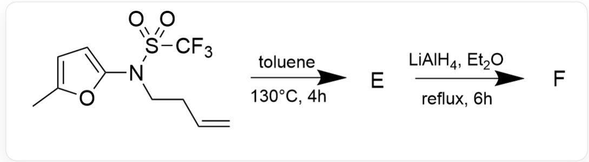
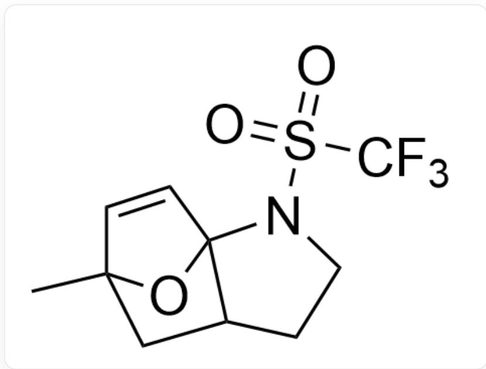
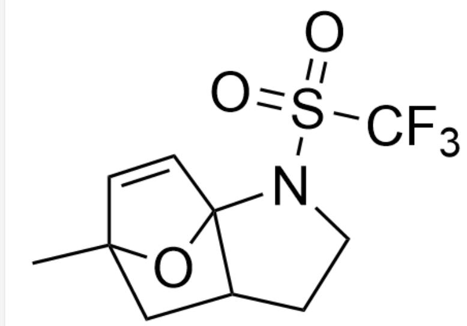
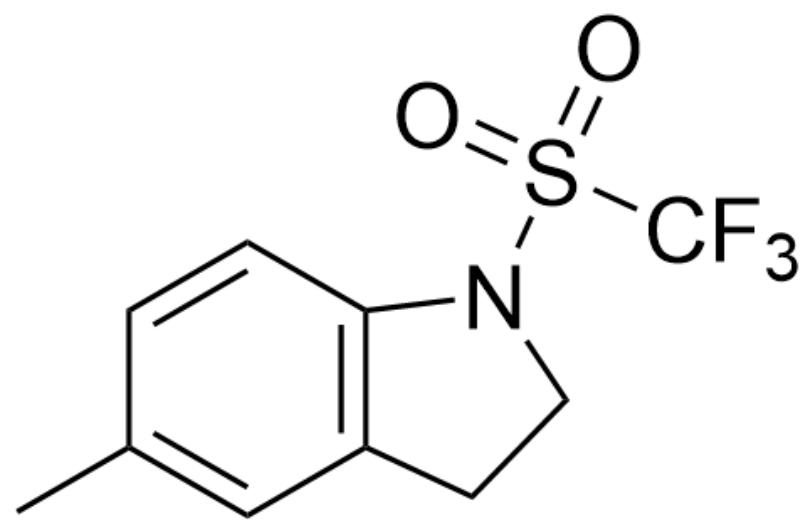
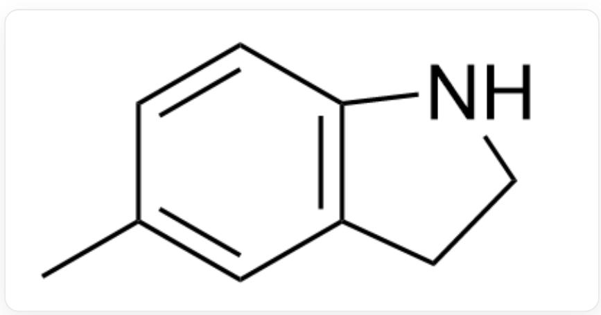
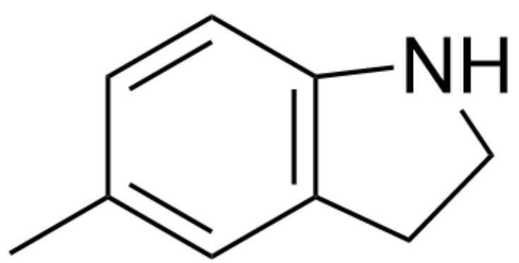

# 题目

推测图1 E和F的结构及反应机理。

  
Fig. 1，图中为两步反应，第一步以SMILES描述为：CC1=CC=C(N(S==O)(C(F)(F)F)=O)CCC=C)O1>>[[E]]，反应条件为toluene， $130^{\circ}\mathrm{C}$ ，4h。第二步以SMILES描述为：[[E]]>>[[F]]，反应条件为 $\mathrm{LiAlH_4,Et_2O,reflux,4h_o}$

有以下说法：

1.  $\mathbf{E}$  中含有两个六元及以下的环  
2. 生成  $\mathbf{E}$  的过程中经历了含有3个五元环的中间体  
3. 生成  $\mathbf{E}$  的机理为离子机理  
4. F可以脱去一分子氢气生成稳定的共轭体系

以下选项中说法全部正确且正确数量最多的为：

A. 其他选项均不正确  
B. 1  
C. 2

D. 3  
E. 4  
F. 1,2  
G. 1,3  
H. 1,4  
1. 2,3  
J. 2,4  
K. 3,4  
L. 1,2,3  
M. 1,2,4  
N. 1,3,4  
O. 2,3,4  
P. 1,2,3,4

# 答案

正确答案: M

# 详细解析

第一步高温为典型周环反应条件，观察分子结构可以发现，呋喃环可以作为双烯体，而端基双键可以作为单烯体，二者发生D-A反应生成图2多环中间体：

  
Fig. 2, 图中分子以SMILES描述为: CC1(C=C2)OC32N(S(=O)(C(F)(F)F)=O)CCC3C1

# CHECKPOINT

1 PTS

发生D-A反应生成图2中间体：

  
Fig. 2, 图中分子以SMILES描述为: CC1(C=C2)OC32N(S(=O)(C(F)(F)F)=O)CCC3C1

该中间体可以进一步解开桥环结构，消除一分子水形成苯环结构，即  $\mathbf{E}$  的结构，如图3:

  
Fig. 3, 图中分子以SMILES描述为:  $O = S(N1CCC2 = C1C = CC(C) = C2)(C(F)(F)F) = O$

# CHECKPOINT

1 PTS

解开桥环结构，消除水形成苯环，E的结构如图3:

  
Fig. 3, 图中分子以SMILES描述为:  $O = S(N1CCC2 = C1C = CC(C) = C2)(C(F)(F)F) = O$

E 含有一个六元环和一个五元环，说法1正确。

生成  $\mathbf{E}$  的过程中经历了图2中间体，含有三个五元环（和一个六元环），说法2正确。生成  $\mathbf{E}$  为D-A反应，周环机理，说法3错误。

E 被氢化铝锂还原, 脱去三氟甲磺酰基, 得到  $\mathbf{F}$ , 结构如图4:

  
Fig. 4, 图中分子以SMILES描述为: CC1=CC2=C(C=C1)NCC2

# CHECKPOINT

1 PTS

三氟甲磺酰基被四氢铝锂还原，得到  $\mathbf{F}$  如图4:

  
Fig. 4, 图中分子以SMILES描述为: CC1=CC2=C(C=C1)NCC2

F脱去一分子氢气可以形成芳香性吲哚环，说法4正确。