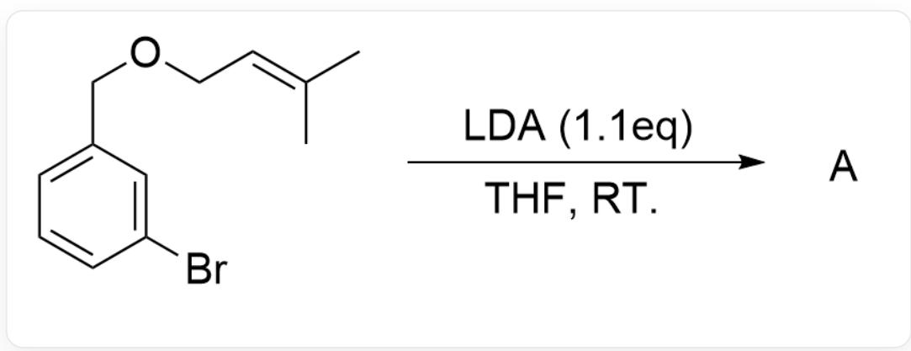
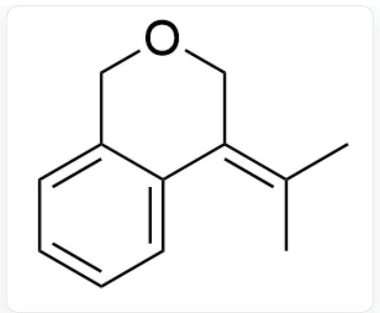
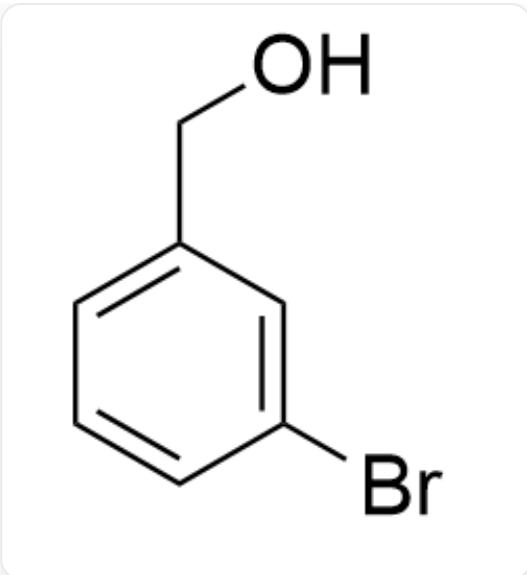
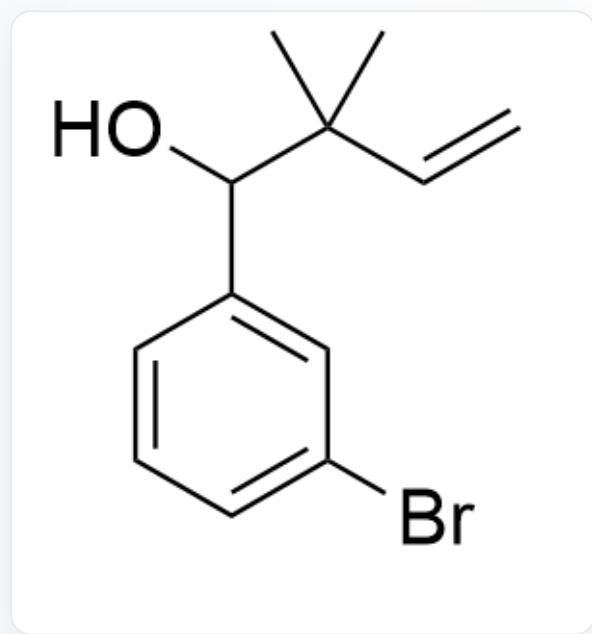
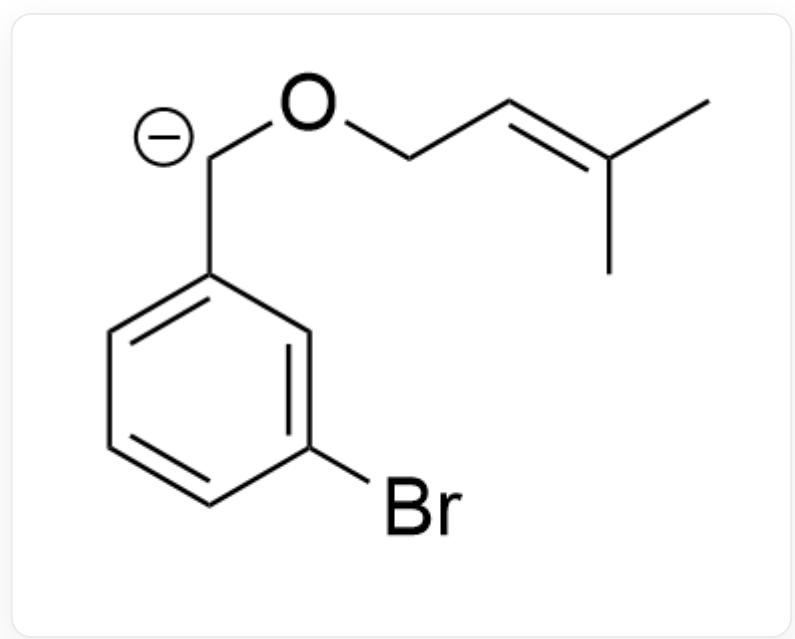

# Question

A.  
  
BrC1=CC(COC/C=C(C)\C)=CC=C1> LDA (1.1eq),THF, R.T.[A], where LDA is lithium diisopropylamide and THF is tetrahydrofuran

Please select the main product A of this reaction

B.  
  
CC(C1COCC2=CC=CC=C21)=C

  
C/C(C)=C1COCC2=CC=CC=C2/1

  
C.  
CC(C)C1=COCC2=CC=CC=C21  
D.

  
BrC1=CC(CO)=CC=C1

E.

  
BrC1=CC=CC(C(C(C)(C=C)C)O)=C1

F.

CC1(C)C2=CC=CC=C2COC=C1.C.C

# Answer

Correct Answer: E

# Detailed Explanation

Benzene rings without strong electron-withdrawing groups are difficult to form benzyne intermediates.

# CHECKPOINT

1 PTS

Benzene rings without strong electron-withdrawing groups are difficult to form benzyne intermediates

The most acidic site of the substrate is the proton at the benzylic position. Therefore,  $LDA$  abstracts the proton at the benzylic position, first forming a carbanion intermediate:

  
BrC1=CC([CH-]OC/C=C(C)\C)=CC=C1

# CHECKPOINT

1 PTS

LDA abstracts the proton at the benzylic position, first forming a carbanion intermediate

Then a one-step [2,3]-Wittig rearrangement occurs to give the final product  $E$ .

# CHECKPOINT

1 PTS

Then a one-step [2,3]-Wittig rearrangement occurs to give the final product  $E$