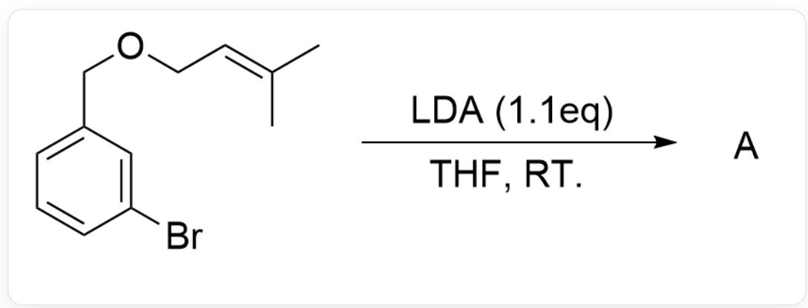
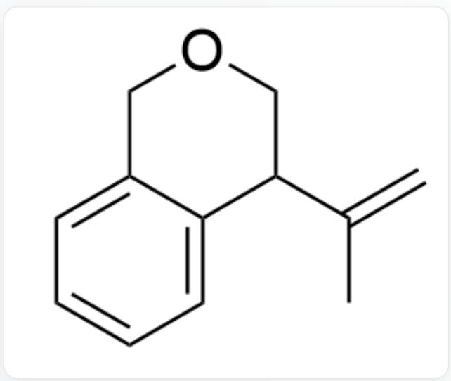
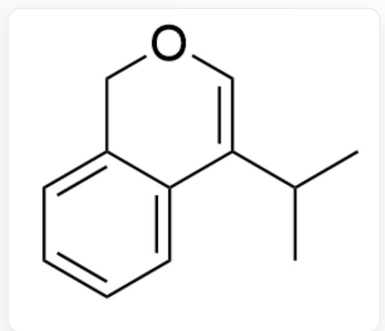
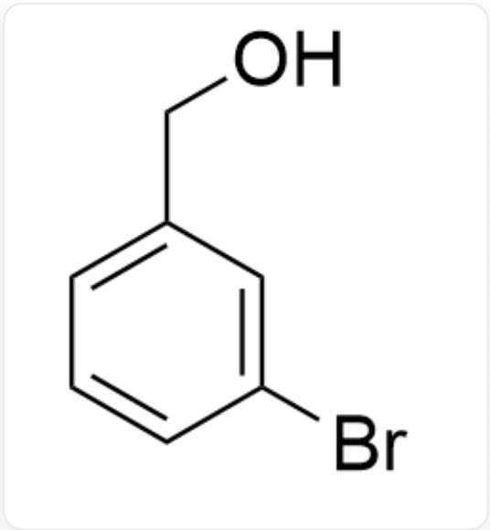
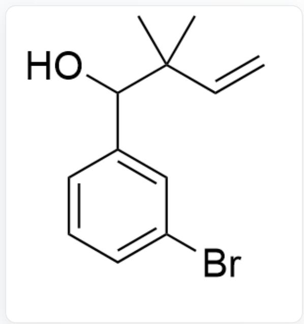
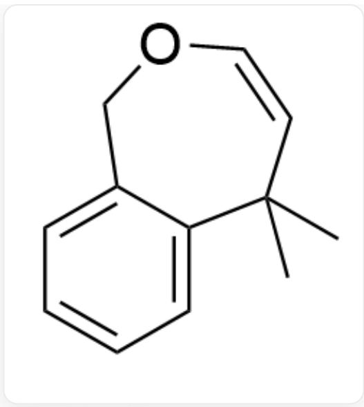
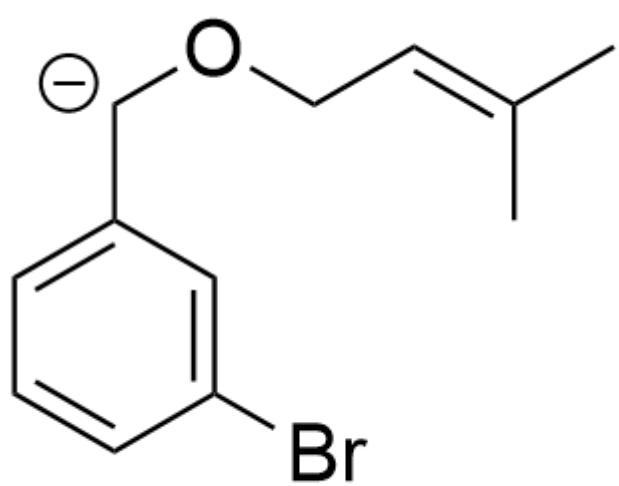

# 题目

  
BrC1=CC(COC/C=C(C)\C)=CC=C1> LDA (1.1eq),THF, R.T.[A], 其中LDA为二异丙基氨基锂, THF为四氢呋喃

请选择该反应的主产物A

A.

  
CC(C1COCC2=CC=CC=C21)=C

B.

  
C/C(C)=C1COCC2=CC=CC=C2/1

  
C.  
CC(C)C1=COCC2=CC=CC=C21  
D.

  
BrC1=CC(CO)=CC=C1

E.

  
BrC1=CC=CC(C(C(C)(C=C)C)O)=C1

F.

CC1(C)C2=CC=CC=C2COC=C1.C.C

# 答案

正确答案: E

# 详细解析

苯环上没有强吸电子基团作用，难以形成苯炔中间体。

CHECKPOINT

1 PTS

苯环上没有强吸电子基团作用，难以形成苯炔中间体

底物酸性最强的位点是苄位上的质子，因此因此LDA攫取苄位上的质子，首先形成碳负离子中间体：

BrC1=CC([CH-]OC/C=C(C)\C)=CC=C1

# CHECKPOINT

1 PTS

LDA攫取苄位上的质子，首先形成碳负离子中间体

接着发生一步[2,3]-Wittig重排得到最终产物E

# CHECKPOINT

1 PTS

接着发生一步[2,3]-Wittig重排得到最终产物E