# Question

The radical cyclization process sometimes exhibits certain stereoselectivity:

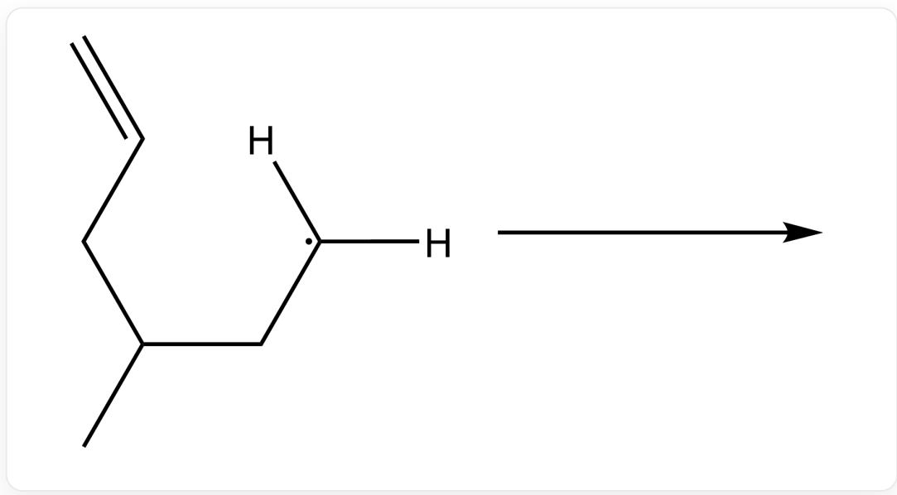  
$\mathrm{C = CCC(C)C[C]([H])[H]}$

  
C=CCCC(C)[C]([H])[H]

Given that the system contains  $\mathrm{Bu}_3\mathrm{SnH}$ , please predict the product structures of the above two reactions respectively and determine whether they have enantiomers.

  
A.  
C[C@@H]1C[C@H](C)CC1

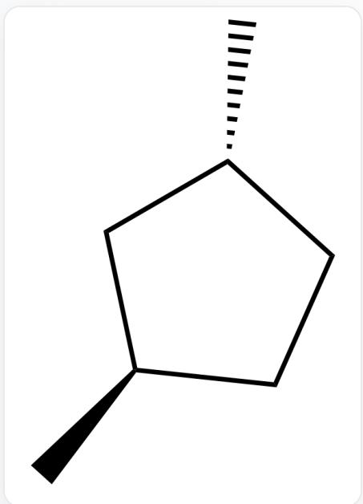  
No enantiomers  
C[C@H]1C[C@H](C)CC1

Has enantiomers

  
B.  
C[C@@H]1C[C@H](C)CC1

No enantiomers

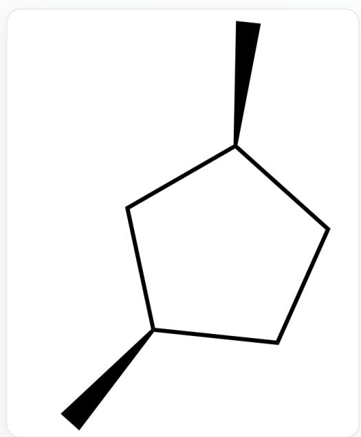  
C[C@@H]1C[C@H](C)CC1

No enantiomers

  
C.  
C[C@H]1C[C@H](C)CC1

No enantiomers

  
C[C@@H]1C[C@H](C)CC1

No enantiomers

  
D.  
C[C@H]1C[C@H](C)CC1

Has enantiomers

  
C[C@@H]1C[C@H](C)CC1

No enantiomers

  
E.  
C[C@H]1C[C@H](C)CC1

  
No enantiomers  
C[C@H]1C[C@H](C)CC1  
No enantiomers

  
F.  
C[C@H]1C[C@H](C)CC1

Has enantiomers

  
C[C@H]1C[C@H](C)CC1

Has enantiomers

  
G.  
CC1CCCCC1

No enantiomers

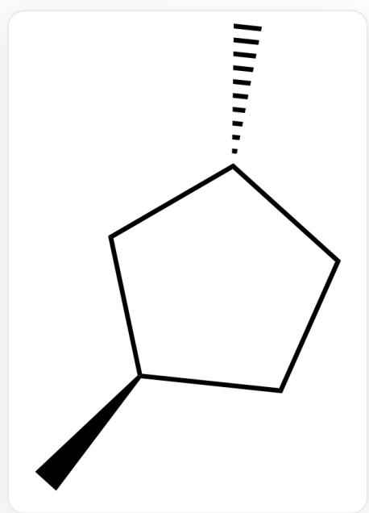  
C[C@H]1C[C@H](C)CC1

No enantiomers

  
H.  
CC1CCCCC1

No enantiomers

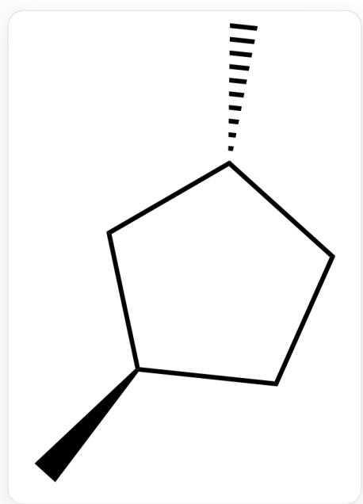  
C[C@H]1C[C@H](C)CC1

Has enantiomers

  
1.  
CC1CCCCC1

No enantiomers

  
C[C@@H]1C[C@H](C)CC1

No enantiomers

  
J.  
C[C@H]1C[C@H](C)CC1

Has enantiomers

  
CC1CCCCC1

No enantiomers

  
K.  
C[C@H]1C[C@H](C)CC1

  
No enantiomers  
CC1CCCCC1

No enantiomers

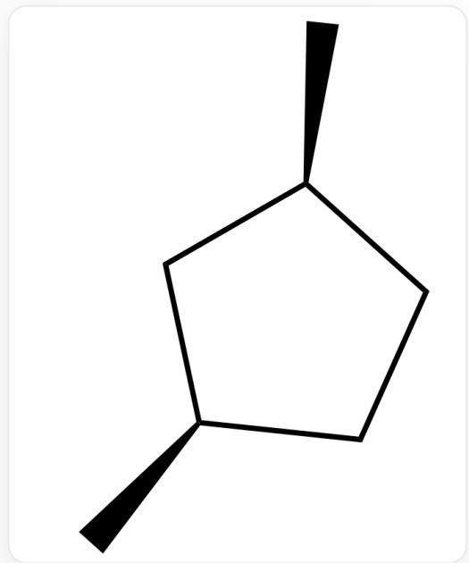  
L.  
C[C@@H]1C[C@H](C)CC1

No enantiomers

  
CC1CCCCC1

No enantiomers

  
M.  
CC1CCCCC1

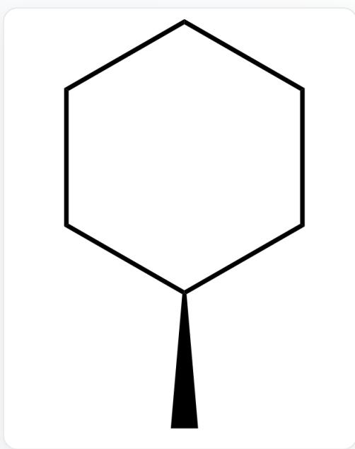  
No enantiomers  
CC1CCCCC1  
No enantiomers

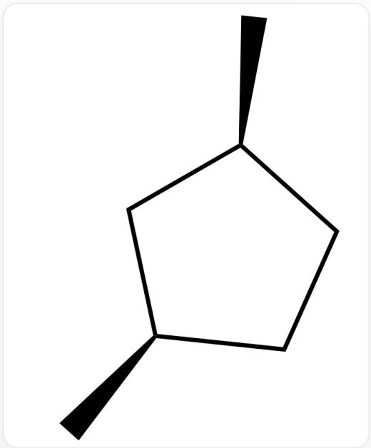  
N.  
C[C@@H]1C[C@H](C)CC1

No enantiomer

  
C[C@H]1C[C@H](C)CC1

No enantiomer

# Answer

Correct Answer: A

# Detailed Explanation

The cyclization of alkyl radicals is less reversible and tends to yield the kinetically favored five-membered ring product.

# CHECKPOINT

2 PTS

The cyclization of alkyl radicals is less reversible and tends to yield the kinetically favored five-membered ring product

For the cyclization of the first substrate, the transition state energy is lower when the methyl group is in the equatorial position.

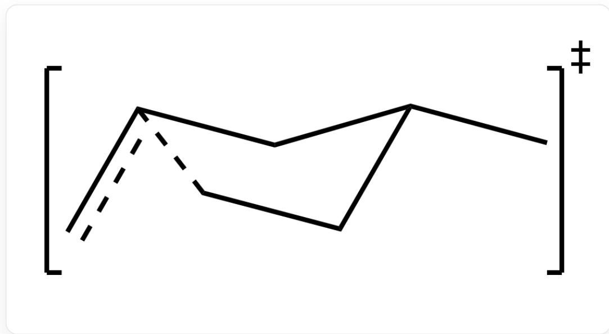

cc1C[C@H](C)CC1

# CHECKPOINT

1 PTS

For the cyclization of the first substrate, the transition state energy is lower when the methyl group is in the equatorial position

Therefore, the first reaction yields the cis product.

  
C[C@@H]1C[C@H](C)CC1

This product contains a mirror plane and thus does not exhibit enantiomerism.

# CHECKPOINT

1 PTS

This product contains a mirror plane and thus does not exhibit enantiomerism

For the cyclization of the second substrate, the transition state energy is also lower when the methyl group is in the equatorial position.

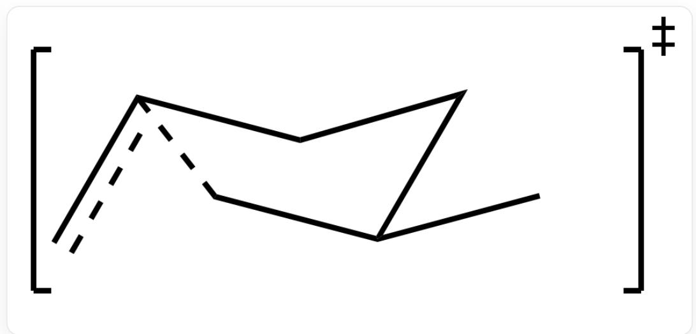  
cc1CC[C@@H](C)C1

# CHECKPOINT

1 PTS

For the cyclization of the second substrate, the transition state energy is also lower when the methyl group is in the equatorial position

Therefore, the second reaction yields the trans product.

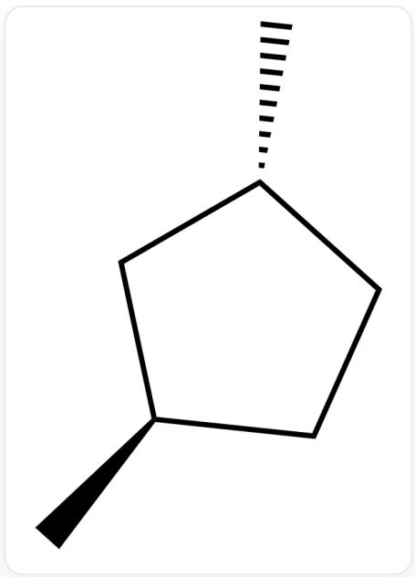  
C[C@H]1C[C@H](C)CC1

This product lacks a mirror plane, inversion center, or improper rotation axis and is thus optically active.

# CHECKPOINT

1 PTS

This product lacks a mirror plane, inversion center, or improper rotation axis and is thus optically active

In summary, the correct answer to this question is A.