# 题目

自由基环过程有时具有一定的立体选择性：

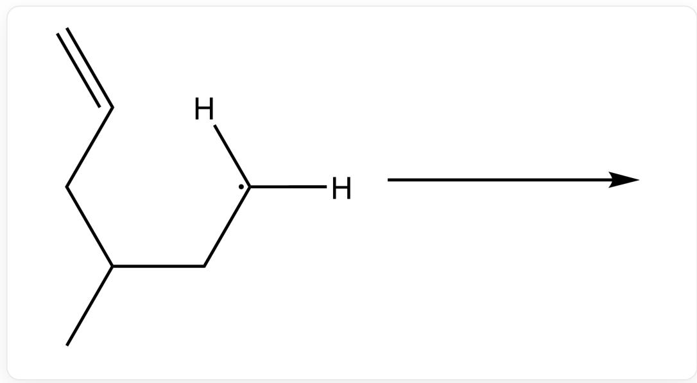  
$\mathrm{C = CCC(C)C[C]([H])[H]}$

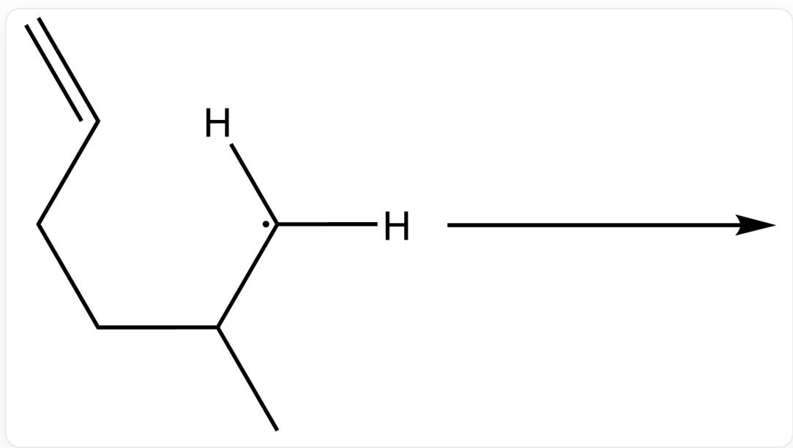  
C=CCCC(C)[C]([H])[H]

已知体系中含有  $\mathrm{Bu}_{3} \mathrm{SnH}$ , 请分别预测以上两个反应的产物结构, 并判断其是否有对映异构体。

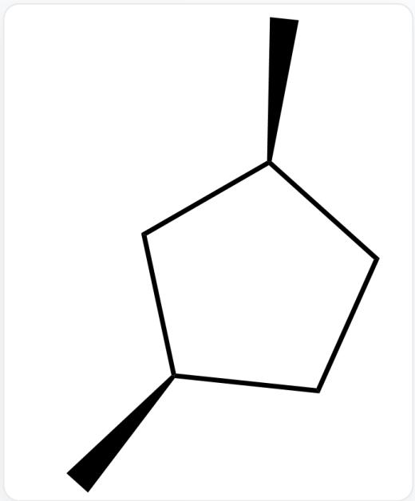  
A.  
C[C@@H]1C[C@H](C)CC1

没有对映异构体

  
C[C@H]1C[C@H](C)CC1

有对映异构体

  
B.  
C[C@@H]1C[C@H](C)CC1

没有对映异构体

  
C[C@@H]1C[C@H](C)CC1

没有对映异构体

  
C.  
C[C@H]1C[C@H](C)CC1

没有对映异构体

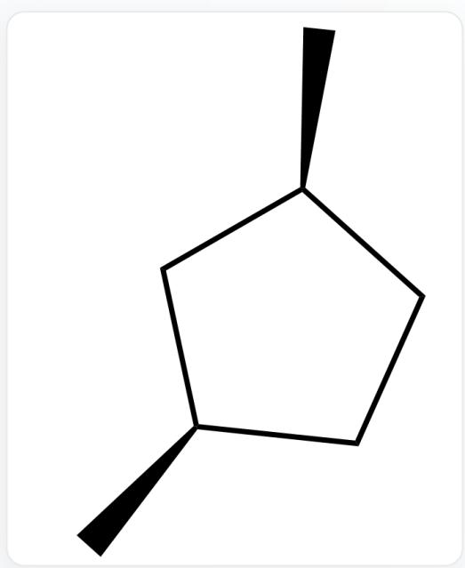  
C[C@@H]1C[C@H](C)CC1

没有对映异构体

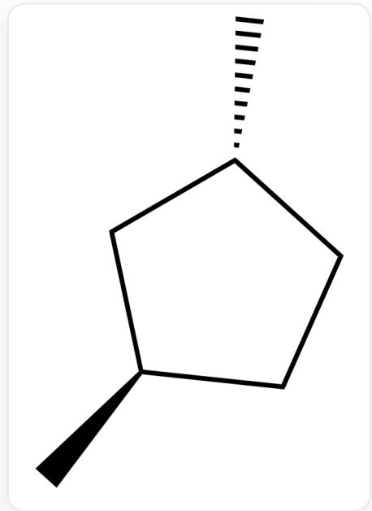  
D.  
C[C@H]1C[C@H](C)CC1

有对映异构体

  
C[C@@H]1C[C@H](C)CC1

没有对映异构体

  
E.  
C[C@H]1C[C@H](C)CC1

没有对映异构体

  
C[C@H]1C[C@H](C)CC1

没有对映异构体

  
F.  
C[C@H]1C[C@H](C)CC1

有对映异构体

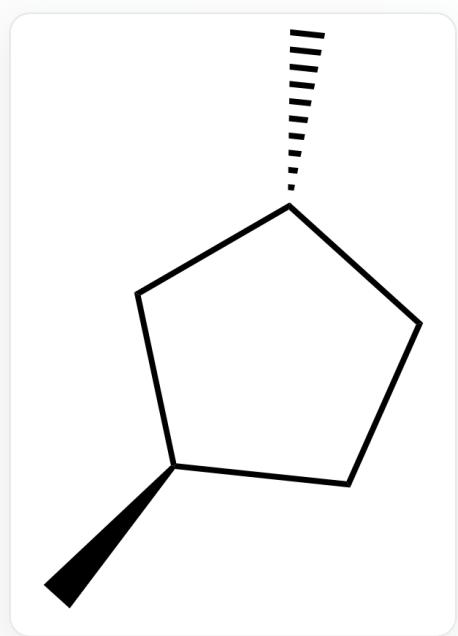  
C[C@H]1C[C@H](C)CC1

有对映异构体

  
G.  
CC1CCCCC1

没有对映异构体

  
C[C@H]1C[C@H](C)CC1

没有对映异构体

  
H.  
CC1CCCCC1

没有对映异构体

  
C[C@H]1C[C@H](C)CC1

有对映异构体

  
1.  
CC1CCCCC1

没有对映异构体

  
C[C@@H]1C[C@H](C)CC1

没有对映异构体

  
J.  
C[C@H]1C[C@H](C)CC1

有对映异构体

  
CC1CCCCC1

没有对映异构体

  
K.  
C[C@H]1C[C@H](C)CC1

没有对映异构体

  
CC1CCCCC1

没有对映异构体

  
L.  
C[C@@H]1C[C@H](C)CC1

没有对映异构体

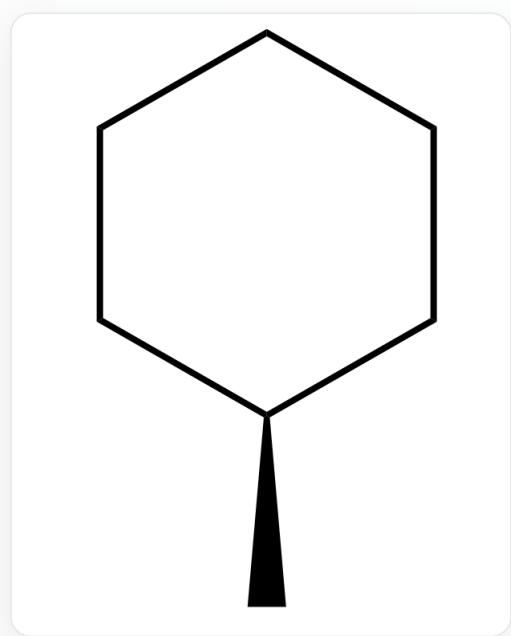  
CC1CCCCC1

没有对映异构体

  
M.  
CC1CCCCC1

没有对映异构体

  
CC1CCCCC1

没有对映异构体

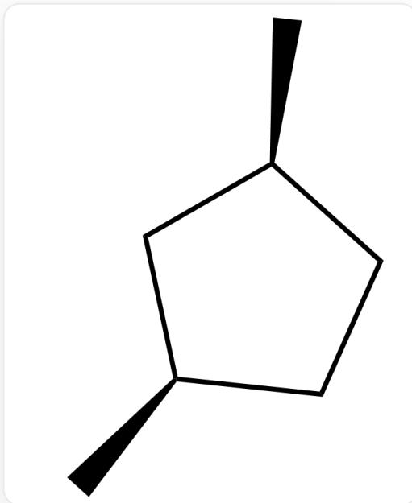  
N.  
C[C@@H]1C[C@H](C)CC1

没有对映异构体

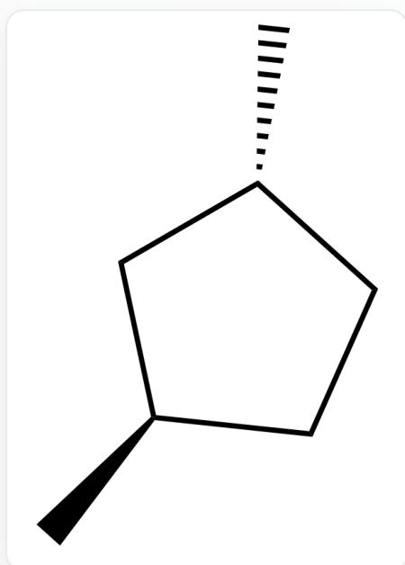  
C[C@H]1C[C@H](C)CC1

没有对映异构体

# 答案

正确答案: A

# 详细解析

烷基自由基环可逆性较差,容易得到动力学有利的五元环产物

# CHECKPOINT

2 PTS

烷基自由基环可逆性较差,容易得到动力学有利的五元环产物

对于第一个底物的成环反应,甲基处于平伏键位置时过渡态能量较低

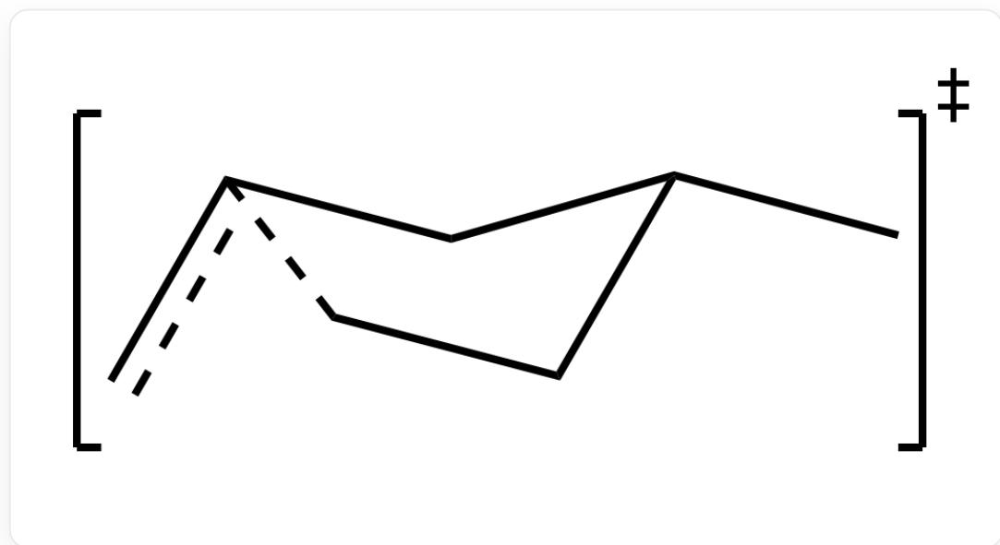

cc1C[C@H](C)CC1

# CHECKPOINT

1 PTS

对于第一个底物的成环反应,甲基处于平伏键位置时过渡态能量较低

因此第一个反应得到顺式产物

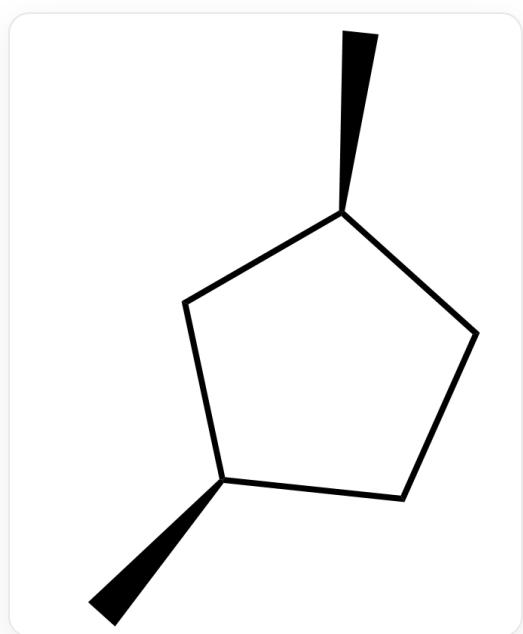  
C[C@@H]1C[C@H](C)CC1

此产物中存在镜面，因此不具有对映异构体。

# CHECKPOINT

1 PTS

此产物中存在镜面，因此不具有对映异构体

对于第二个底物的成环反应,同样甲基处于平伏键位置时过渡态能量较低

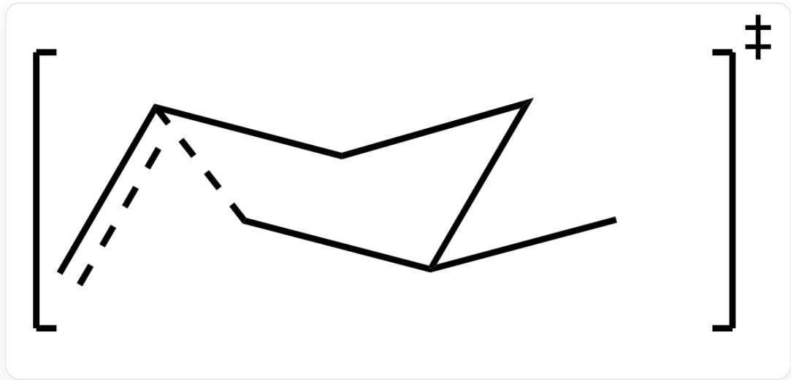

cc1CC[C@@H](C)C1

# CHECKPOINT

1 PTS

对于第二个底物的成环反应,同样甲基处于平伏键位置时过渡态能量较低

因此第二个反应得到反式产物

C[C@H]1C[C@H](C)CC1

此产物中不存在镜面、对称中心或映轴，因此具有光学活性。

# CHECKPOINT

# 1 PTS

此产物中不存在镜面、对称中心或映轴，因此具有光学活性

综上所述，本题答案为A.