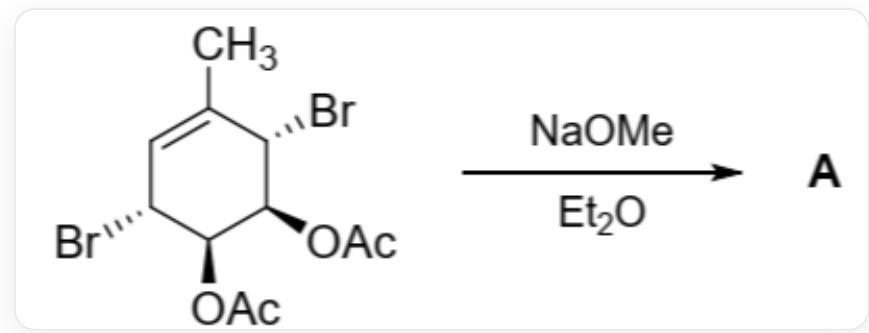

# Question

The product  $\mathbf{A}$  ( $\mathrm{C_7H_8O_2}$ ) was obtained through the following reaction.  $\mathbf{A}$  was heated to  $70^{\circ}\mathrm{C}$  in  $\mathrm{CCl_4}$  solution, and  $\mathbf{A}$  underwent intermediate  $\mathbf{B}$  and partially converted into its isomer  $\mathbf{C}$ . The ratio of  $\mathbf{A}$ ,  $\mathbf{B}$ , and  $\mathbf{C}$  at equilibrium was  $29:42:29$ .

  
CC1=C[C@@H](Br)[C@H](OC(C)=O)[C@H](OC(C)=O)[C@H]1Br generates A under the conditions of NaOMe and  $\mathrm{Et}_2\mathrm{O}$

The following statements are made:

1. A contains a carbonyl group.  
2. B has two rings.  
3. A and C have the same number of rings.  
4. A and C are enantiomers.  
5. The sum of double bonds contained in  $\mathbf{A}$ ,  $\mathbf{B}$ , and  $\mathbf{C}$  is 5.

The following statement(s) is/are correct:

A. 1,2  
B. 1,3

C. 2,4  
D. 3,5  
E. 3,4  
F. 4,5  
G. 3,4,5

# Answer

Correct Answer: G

# Detailed Explanation

The system underwent the following reactions under strong alkaline NaOMe conditions:

1. The two acetoxy groups in the substrate react with NaOMe to generate sodium alkoxide and MeOAc.

# CHECKPOINT

1 PTS

Acetoxy groups react with NaOMe to generate sodium alkoxide and MeOAc.

2. The oxygen anion in the sodium alkoxide attacks the bromine group on the adjacent carbon atom, and an  $\mathrm{S_N2}$  substitution reaction occurs to generate two epoxy groups, yielding compound A.

A is CC1=C[C@H]2[C@H](O2)[C@H]3[C@@H]1O3.

# CHECKPOINT

1 PTS

$\mathrm{S_N2}$  substitution reaction occurs, oxygen anion attacks adjacent bromine group, generating epoxy groups

# CHECKPOINT

2 PTS

A is CC1=C[C@H]2[C@H](O2)[C@H]3[C@@H]1O3.

Under heating conditions, the epoxy groups in  $\mathbf{A}$  are unstable and open to form a stable eight-membered ring compound  $\mathbf{B}$  with three double bonds, which is an electrocyclic ring-opening process. This is consistent with  $\mathbf{B}$  having the highest proportion among  $\mathbf{A}$ ,  $\mathbf{B}$ , and  $\mathbf{C}$  at equilibrium.

B is CC1=C\O/C=C\C=C=C/1.

# CHECKPOINT

1 PTS

Electrocyclic ring-opening reaction occurs, the epoxy groups in A open to form the eight-membered ring compound B

# CHECKPOINT

2 PTS

B is CC1=C\O/C=C\O\C=C/1.

A and C are present in equal proportions at equilibrium, suggesting that they have equal energies and similar structures. Given that the electrocyclic ring-opening process from A to B is reversible, it can be inferred that B to C is an electrocyclic process. Compound C is CC1=C[C@@H]2[C@@H](O2)[C@@H]3[C@H]1O3. A and C are enantiomers.

# CHECKPOINT

1 PTS

A and C have equal energies and similar structures.

# CHECKPOINT

1 PTS

$\mathbf{B}$  to  $\mathbf{C}$  is an electrocyclic process.

# CHECKPOINT

2 PTS

C is CC1=C[C@@H]2[C@@H](O2)[C@@H]3[C@H]1O3

Therefore, statements 3, 4, and 5 are correct. Choose option D.