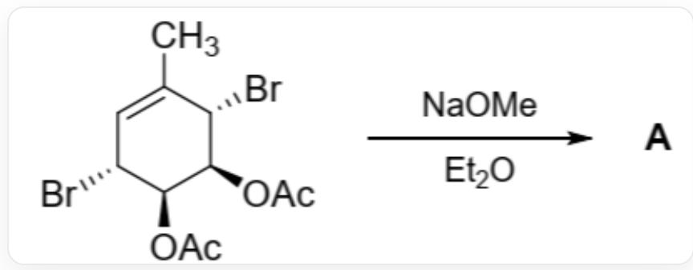

# 题目

通过以下反应得到了产物 A  $\left(\mathrm{C}_{7} \mathrm{H}_{8} \mathrm{O}_{2}\right)$  。将 A 于  $\mathrm{CCl}_{4}$  溶液中加热至  $70^{\circ} \mathrm{C}$ , A 经历中间体 B 而部分转化为其同分异构体 C 。A、B、C 三者在平衡时的比例为  $29:42:29$  。

CC1=C[C@@H](Br)[C@H](OC(C)=O)[C@H](OC(C)=O)[C@H]1Br在NaOMe和Et2O的条件下生成A

有以下说法：

1. A 中有炭基。  
2. B 中有两个环。  
3. A 和 C 的环个数相等。  
4. A 和 C 是对映异构体。  
5. A、B、C 含有双键之和为 5 。

以下说法正确的是：

A. 1,2  
B. 1,3  
C. 2,4

D. 3,5  
E. 3,4  
F. 4,5  
G. 3,4,5

# 答案

正确答案: G

# 详细解析

该体系在强碱 NaOMe 条件下发生了以下反应：

1. 底物中两个乙酰氧基与 NaOMe 反应生成醇钠和 MeOAc。

# CHECKPOINT

1 PTS

乙酰氧基与  $\mathrm{NaOMe}$  反应生成醇钠和  $\mathrm{MeOAc}$  。

2. 醇钠中氧负离子进攻临近碳原子上的溴基，发生  $\mathrm{S}_{\mathrm{N}}2$  取代反应生成两个环氧基，得到化合物A。

A 为CC1=C[C@H]2[C@H](O2)[C@H]3[C@@H]1O3。

# CHECKPOINT

1 PTS

发生  $\mathrm{S_N2}$  取代反应，氧负离子进攻临近溴基，生成环氧基

# CHECKPOINT

2 PTS

A 为CC1=C[C@H]2[C@H](O2)[C@H]3[C@@H]1O3。

在加热条件下，A中的环氧基不稳定，解开形成稳定的具有三个双键的八元环化合物B，为电环化开环过程。这与B在平衡时A、B、C中占比最高相符。

B 为CC1=C\O/C=C\O\C=C/1。

# CHECKPOINT

1 PTS

发生电环化开环反应，A 中的环氧基解开形成八元环化合物 B

# CHECKPOINT

2 PTS

B 为CC1=C\O/C=C\O\C=C/1。

A 和 C 在平衡的时候比例相等，暗示它们的能量相等，结构类似。已知 A 到 B 的电环化开环过程是可逆的，可以推测 B 到 C 为电环化过程。化合物 C 为 CC1=C[C@@H]2[C@@H](O2)[C@@H]3[C@H]1O3。A 和 C 为对映异构体。

# CHECKPOINT

1 PTS

A 和 C 能量相等，结构类似。

# CHECKPOINT

1 PTS

B 到 C 为电环化过程。

# CHECKPOINT

2 PTS

C 为CC1=C[C@@H]2[C@@H](O2)[C@@H]3[C@H]1O3

因此说法3,4,5正确。选择D选项。