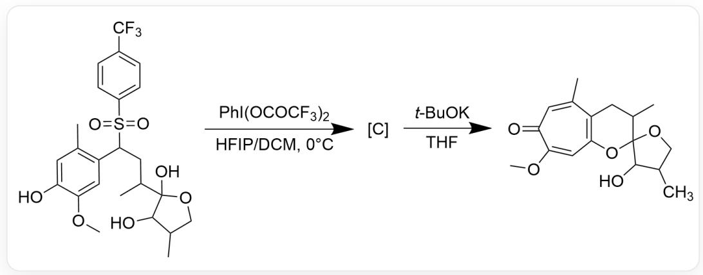
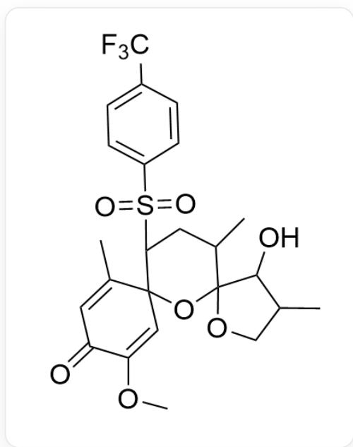
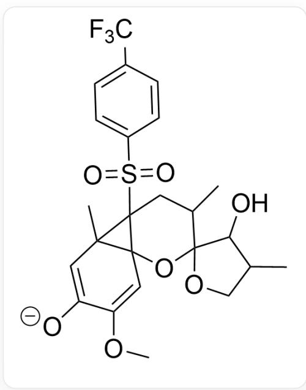
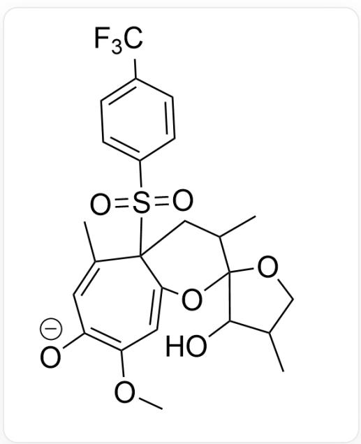

# Question

Analyze the mechanism of the reaction in Figure 1, the structure of the intermediate  $\mathbf{C}$ , and the mechanism of the transformation from  $\mathbf{C}$  to the final product:

The image shows a multi-step reaction: CC1=C(C(S=O)(C2=CC=C(C(F)

$$
\begin{array}{l} (F) F) C = C 2) = O) C C (C 3 (O) C (O) C (C O 3) C) C) C = C (O C) C (O) = C 1 > P h I \left(\mathrm {O C O C F} _ {3}\right) _ {2}, H F I P / D C M > [ C ], [ C ] > \\ \mathrm {t - B u O K , T H F > C C 1 = C C (C (O C) = C C 2 = C 1 C C (C 3 (O 2) C (O) C (C) C O 3) C) = O} \\ \end{array}
$$

There are the following statements:

1. Intermediate  $\mathbf{C}$  contains three non-aromatic rings.  
2. A large strained structure is formed during the process from intermediate  $\mathbf{C}$  to the product.  
3. During the process from intermediate C to the product, the formation of the seven-membered ring structure occurs simultaneously with the construction of aromaticity.

The option in which all statements are correct and the number of correct statements is the largest is:

A. All other options are incorrect  
B. 1

C. 2  
D. 3  
E. 1,2  
F. 1,3  
G. 2,3  
H. 1,2,3

# Answer

Correct Answer: E

# Detailed Explanation

Iodine reagent oxidation causes the carbon atom with the lowest intramolecular ionization potential to lose an electron, generating the most stable carbocation. This step occurs at the para position of the phenolic hydroxyl group. The adjacent hydroxyl group undergoes nucleophilic attack with the carbocation, forming a stable six-membered ring structure. The structure of intermediate C is shown in Figure 2:

  
Fig. 2, 图中分子结构以SMILES描述为：O=C1C=C(C)C2(C=C1OC)C(S(=O)(C3=CC=C(C(F)

$$
(F) F C = C 3 = O) C C (C) C 4 (O 2) C (O) C (C O 4) C
$$

# CHECKPOINT

1 PTS

Oxidation occurs at the para position of the phenolic hydroxyl group, and the generated carbocation couples with the adjacent hydroxyl group to form a six-membered ring. The structure of the intermediate is described by SMILES as:  $\mathrm{O = C1C = C(C)C2(C = C1OC)C(S(= O)(C3 = CC = C(C(F)F)C = C3) = O)CC(C)C4(O2)C(O)C(CO4)C}$

Potassium tert-butoxide abstracts the most acidic hydrogen atom within the molecule. This hydrogen atom is located on the carbon bearing the sulfonyl group, and the resulting carbanion can be stabilized by conjugation with the sulfonyl group. The carbanion then undergoes Michael addition with the adjacent  $\alpha, \beta$ -unsaturated ketone, forming an unstable three-membered ring, as shown in Figure 3:

  
Fig. 3, 图中分子以SMILES描述为：[O-]C1=CC2(C)C3(C=C1OC)C(S(=O)(C4=CC=C(C(F  
(F)F=C4)=O)2CC(C)C5(O3)C(O)C(C05)C

# CHECKPOINT

1 PTS

Potassium tert-butoxide causes the carbon bearing the sulfonyl group to form a carbanion, which then undergoes Michael addition to form a three-membered ring. The structure of the intermediate is described by SMILES as: [O-]C1=CC2(C)C3(C=C1OC)C(S(=O)(C4=CC=C(C(F)F)C=C4)=O)2CC(C)C5(O3)C(O)C(CO5)C

Observing the product structure, it can be found that a seven-membered ring is ultimately formed in the benzene ring portion. Therefore, the next step is an electrocyclic ring-opening reaction of the unstable three-membered ring, forming a seven-membered ring containing three conjugated double bonds, as shown in Figure 4:

  
Fig. 4, 图中分子以SMILES描述为：[O-]C1=C(C=C2C(C(C)=C1)(S(=O)(C3=CC=C(C(F)F)C=C3)=O)CC(C)C4(O2)C(O)C(CO4)C)OC

# CHECKPOINT

1 PTS

Electrocyclic ring-opening forms a seven-membered ring. The structure of the intermediate is represented by SMILES as: [O-]C1=C(C=C2C(C(C)=C1)(S(=O)(C3=CC=C(C(F) F)C=C3)=O)CC(C)C4(O2)C(O)C(CO4)C)OC

In the final step, the carbanion eliminates the sulfonyl anion, regenerating the aromatic ring system.

# CHECKPOINT

1 PTS

Elimination of the sulfonyl anion, generating the aromatic ring system

In summary, C has 3 non-aromatic rings, statement 1 is correct; the process from C to the product involves an intermediate containing a highly strained three-membered ring, statement 2 is correct; the process from C to the product first undergoes electrocyclic ring-opening to form a seven-membered ring, and then eliminates the sulfonyl anion to make the seven-membered ring acquire aromaticity. The formation of the seven-membered ring structure and the establishment of aromaticity do not occur simultaneously, statement 3 is incorrect. The answer is option E.