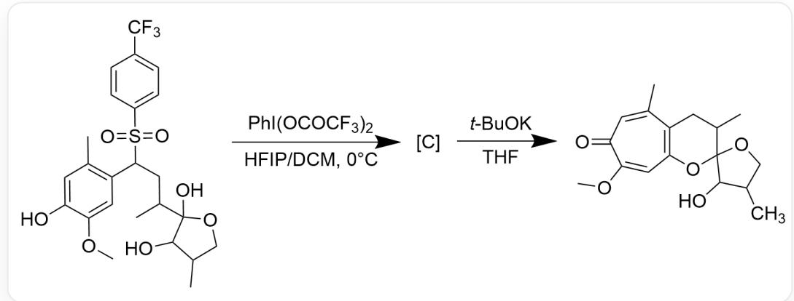
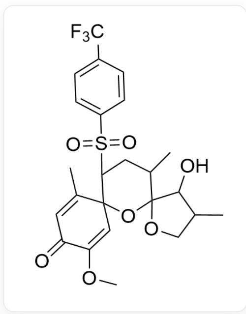
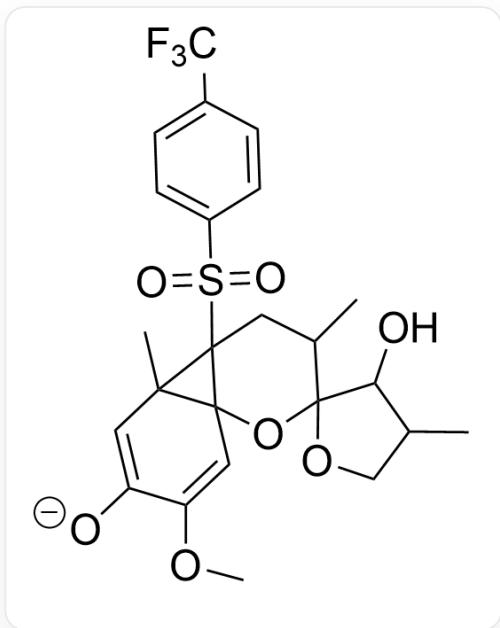
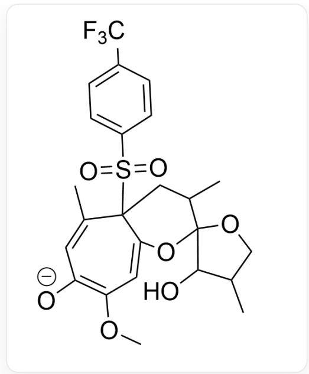

# 题目

分析以下图1反应的机理，中间产物C的结构以及由C转化为最终产物的机理：

图片为多步反应：CC1=C(C(S=O)(C2=CC=C(C(F)  
  
(F)F)C=C2)=O)CC(C3(O)C(O)C(CO3)C)C=C(OC)C(O)=C1>PhI(OCOCF3)2, HFIP/DCM>[C],[C]> t - BuOK, THF>CC1=CC(C(OC)=CC2=C1CC(C3(O2)C(O)C(C)CO3)C)=O

有以下几个说法：

1. 中间体 C 含有三个无芳香性的环  
2. 中间体C到产物过程中形成了大张力结构  
3. 中间体 C 到产物过程中, 七元环环结构形成与芳香性建构同时发生

选项中说法均正确且正确数量最多的是:

A. 其他选项均不正确  
B. 1  
C. 2

D. 3  
E. 1,2  
F. 1,3  
G. 2,3  
H. 1,2,3

# 答案

正确答案: E

# 详细解析

碘试剂氧化下分子内电离势最低的碳原子失去电子，生成最稳定的一个碳正离子，该步发生在酚羟基的对位。邻近羟基与该碳正离子发生亲核，形成稳定的六元环结构。中间体C的结构如图2：

Fig. 2, 图中分子结构以SMILES描述为: \(O = C1C = C(C)C2(C = C1OC)C(S (= O)(C3 = CC = C(C(F  
  
(F)F=C3)=O)CC(C)C4(O2)C(O)C(CO4)C

CHECKPOINT

1 PTS

氧化反应发生在酚羟基对位，生成的碳正离子与邻近羟基偶联形成六元环，中间体结构以SMILES描述为：O=C1C=C(C)C2(C=C1OC)C(S(=O)(C3=CC=C(C(F)(F)F)C=C3)=O)CC(C)C4(O2)C(O)C(CO4)C

叔丁醇钾攫取分子内酸性最强的氢原子，该氢原子位于磺酰基所在碳上，形成碳负离子可以与磺酰基共轭稳定。碳负离子随后与邻近的  $\alpha, \beta$ -不饱和酮发生Micheal加成，生成一个不稳定的三元环，如图3：

Fig. 3, 图中分子以SMILES描述为: [O-]C1=CC2(C)C3(C=C1OC)C(S(=O)(C4=CC=C(C(F)  
  
$(\mathsf{F})\mathsf{F})\mathsf{C} = \mathsf{C4}) = \mathsf{O})2\mathsf{CC}(\mathsf{C})\mathsf{C}5(\mathsf{O}3)\mathsf{C}(\mathsf{O})\mathsf{C}(\mathsf{CO}5)\mathsf{C}$

# CHECKPOINT

1 PTS

叔丁醇钾使得磺酰基所在碳形成碳负离子，进而发生Micheal加成形成三元环，中间体结构以SMILES

描述 为 [O-]C1=CC2(C)C3(C=C1OC)C(S(=O)(C4=CC=C(C(F

(F)F)C=C4)=O)2CC(C)C5(O3)C(O)C(C05)C

观察产物结构，可以发现苯环部分最终形成了七元环。因此下一步不稳定三元环发生电开环反应，形成含三根共轭双键的七元环，如图4:

  
Fig. 4, 图中分子以SMILES描述为: [O-]C1=C(C=C2C(C(C)=C1)(S(=O)(C3=CC=C(C(F) (F)F)C=C3)=O)CC(C)C4(O2)C(O)C(CO4)C)OC

# CHECKPOINT

1 PTS

电开环形成七元环，中间体结构以SMILES表示为：[O-]C1=C(C=C2C(C(C)=C1)(S(=O) (C3=CC=C(C(F)(F)F)C=C3)=O)CC(C)C4(O2)C(O)C(CO4)C)OC

最后一步碳负离子消除磺酰负离子，重新生成芳香环体系。

# CHECKPOINT

1 PTS

消除磺酰负离子，生成芳香环体系

综上所述，C有3个非芳香环，说法1正确；C到产物过程经历了含高张力三元环的中间体，说法2正确；C到产物过程先经历电开环形成七元环，再消除磺酰负离子使七元环获得芳香性，七元环环结构形成与芳香性建构没有同时发生，说法3错误。答案选E选项。